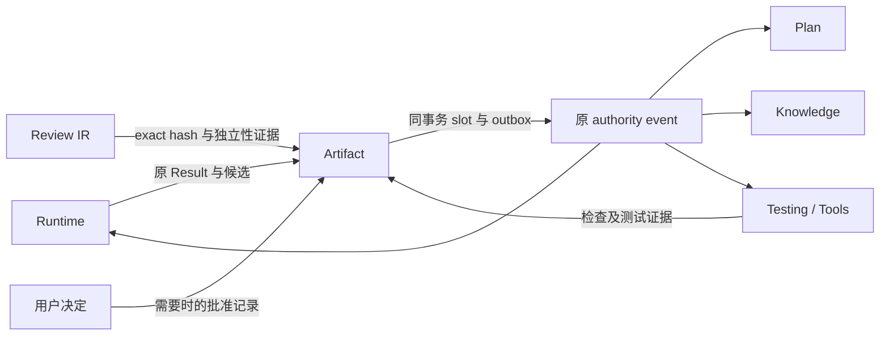
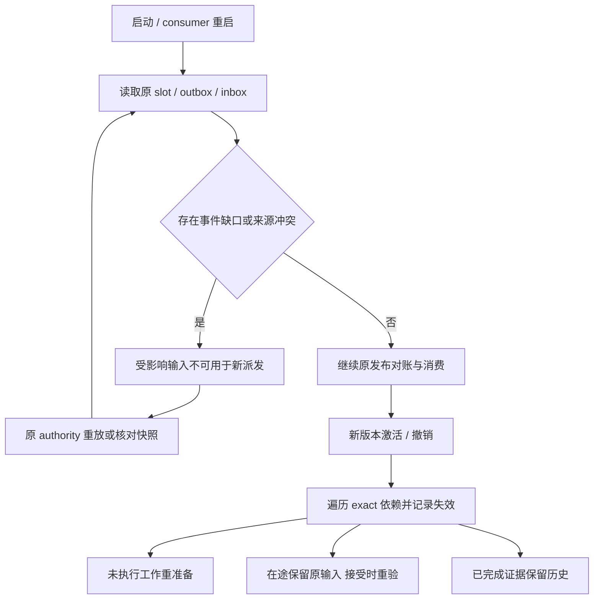

<!-- STD_DOCUMENT_COVER_BEGIN -->
# Slinky 产物接受与失效传播机制

| 文档字段 | 值 |
|---|---|
| Document ID | `slinky-mechanism-artifact-acceptance` |
| Document Version | `0.3.0-draft.5` |
| Status | `Draft` |
| Project | `slinky` |
| Document Owner | Slinky Design Owner |
| Last Modified Date | `2026-09-16` |
| Template ID | `design.system-mechanism` |
| Template Version | `2.3.0` |
<!-- STD_DOCUMENT_COVER_END -->

> 2026-09-17 实施范围撤回通知：依据[用户最新裁决](../../90_decisions/intelligent-process-scope-20260916.md)，本文中固定图自动业务推进、自动失败升级、容量/Seat/claim、模型级恢复、Cost、自定义通信/附件与跨系统close/drain条款退出当前authority。以下旧版正文仅供迁移定位；不能作为本轮已批准实施规格。无关的权限、版本一致性、真实质量证据仍保留，当前目标见新版系统设计、SRS和接口控制；下游须先完成对应修订再编码。此通知不把旧版本测试/签署改写为新版验证。

## 1. 机制摘要：解决什么问题

Agent 可以交付代码、文档和测试报告，但一次执行成功不能证明这些内容可以进入下一阶段。Slinky 必须确认：产物属于当前任务，Review 和检查针对最终内容，使用的输入仍适用，需要的用户批准已存在。通过后 Artifact 才把该版本发布为有效输入。

例如作者按设计 v2 产生代码 H1，评审通过后又改成 H2。H1 的 Review 只能保留历史，不能接受 H2。另一个例子是系统测试报告已经通过，但代码从 H2 改成 H3；报告内容保持不变，其对 H3 的资格失效，下游不能继续用旧 PASS。本机制连接不可变版本、接受事实和传递依赖，避免用文件存在或最后一条 PASS 替代这些判断。

机制 `SM003`，上级 `none`，承接 P13/P15 和 P04 的接受交接；与 SM001、SM002、SM004 交换版本与证据。所有能力 Planned / NOT_RUN。

图 A1，Target / V0.3：候选先固定，再校验同版本证据和输入，生效后通过唯一事件链通知消费者。[SVG](../../assets/v0.3/mechanisms/artifact-flow.svg)

## 2. 使用场景与功能

| 能力 | 输入 → 可观察结果 | 提供 / 消费 | 验证 |
|---|---|---|---|
| SM003-C1 候选归档 | 合法 Result → 不可变内容与来源 | Runtime/Artifact → Review、Testing | RT-AG02/06 |
| SM003-C2 接受生效 | 同 hash 的 Review/工具证据/批准 → Effective 或拒绝 | Artifact/Gate → Runtime/Plan/Knowledge | RT-AG03/08 |
| SM003-C3 传递失效 | 输入 successor/revoke → 受影响绑定与工作阻塞 | Artifact → Plan/Runtime/Testing/Knowledge | V03-SCOPE-007/008 |
| SM003-C4 可靠对账 | 发布/事件/Actual 失败 → 原记录恢复 | 各 owner → View/Stats | V-B02/03/04 |

## 3. 参与方、责任和 authority

Artifact 保存内容版本、Effective slot、接受/失效关系；Review IR 提供专业结论，Testing 提供测试资格与执行证据，Runtime 验证原 Work 并协调 Gate。Plan、Knowledge 和 View 消费版本，不拥有接受权。代码的 repository head 仍由 Repository/Code owner 控制，Artifact 只保存 CodeChangeSet 与 commit 引用。

图 A2：事件传递事实，不直接命令重跑。正式用户决定由原 Action command 保存，聊天内容不是批准记录。

### 3.1 系统约束与参与方承接

| 约束 | 来源 / 固定规则 | 承接与验证 |
|---|---|---|
| SM003-R1 | V03-AG-001；内容 hash、Review、Validation 与输入版本一致 | Artifact/Testing；RT-AG02/03 |
| SM003-R2 | Artifact reliability §3；ReviewStatus 与 EffectiveStatus 分离 | Artifact；V-B02 |
| SM003-R3 | P13；沿真实依赖传播失效，不删除历史、不自动重跑 | Artifact/Runtime/Plan/Knowledge；V03-SCOPE-007 |
| SM003-R4 | P04；发布与 outbox 同提交，恢复原发布 | Artifact/Runtime；V-B02/03 |
| SM003-R5 | 系统 §8.4；STD 决定规范解析，Artifact 只提供版本持久化 | STD/Knowledge/Artifact；V-B04 |

### 3.2 统筹与确认责任

Runtime 发起接受请求，Artifact Gate 读取固定版本证据并在自己的 authority 事务发布 slot 和事件。Runtime 接收发布引用后记录 Actual；Actual 延迟不会撤销已有效的 Artifact。未完成确认由原执行义务继续，不重新让 Agent 生成。多个 slot 没有显式 batch activation 契约时逐项确认，下游等待完整输入集合，不把局部发布当整 Stage 成功。

### 3.3 拓扑与故障域

内容可在 Artifact 存储或受控仓库，所有读取通过 owner 的授权引用与摘要核对。workspace 的可写文件不是不可变交付位置。共享存储失效影响对应内容的读取资格；可读 summary/RAG 不能替代不可读原内容。多个 consumer 使用同一事件来源，但各自拥有 inbox/cursor 和投影，不能分别发明“最新版本”。

## 4. 数据结构设计

### 4.1 类型目录与完整字段

原规范位置：[Artifact reliability §3](../v0.3/v0_3_artifact_event_reliability_draft_20260802.md#3-artifact-version-contract)。该来源的规范解析职责按本文 R5 与当前系统 §8.4 更新；版本/slot/event 结构继续复用。

| 类型 | 完整逻辑字段 / 约束 | Owner / 寿命 |
|---|---|---|
| ArtifactVersion | artifact_id/type、version、lineage/supersedes、project/component/scope、content_hash/storage_reference、review_status、effective_status、created_at/by、source_input_version_set、review/approval refs、retention/sensitivity profile | Artifact；内容及来源不可原地改写 |
| EffectiveArtifactSlot | authority/project、artifact_type、artifact_id 或 item_key、component/variant/target_version、current_effective_version 或 null、slot_version | Artifact；同 slot 最多一个 Effective |
| ArtifactApprovalRecord | approver/authority、decision、scope、artifact version、policy version、evidence、timestamp | 正式决定 owner 生产；Artifact 验证引用 |
| 输入/证据绑定 | 输入版本集合、产物摘要、检查范围、执行者/Reviewer、工具/规则版本、实际结果和证据引用 | 原 Work/Review/Testing；缺项不能接受 |
| 规范解析绑定 | 每个 output/operation 的 exact ArtifactContractResolutionRecord；Standard/Template version/slot/hash、selection/policy 与有效性引用 | STD → Plan/Runtime/Knowledge → Artifact；与实际执行 Manifest 一致，项目 baseline 不能替代 |
| ArtifactActivationRecord | exact candidate、Review/Approval/policy、expected old slot version、原激活 identity、发布结果及事件引用 | Artifact 原激活记录；幂等恢复 |
| 事件 / 失效记录 | 完整定义沿原 reliability §4 起的 event/invalidation 契约；至少原 event identity、aggregate/version、原因、受影响 exact refs 和处理引用 | 原 authority outbox、consumer inbox；不是独立消息系统 |

字段的长度、错误 envelope、序列化与事件 gap 查询尚未形成完整机器 Schema，列 G1；上表是原逻辑内容阅读视图，不声明 HTTP 类型已实现。

### 4.2 编码与内容映射

hash 按原 canonical 内容定义计算，Review 记录检查到的实际内容摘要。对于文件集合，manifest 固定每个文件路径、内容摘要与集合版本；“主文件相同”不能掩盖依赖文件改变。CodeChangeSet 还绑定 base commit、expected repository head、patch/hash 和验证证据。符号链接、额外生成文件与路径权限均进入验证，不能依赖文件扩展名。

### 4.3 一致性与寿命

候选先移交到 Artifact 可验证的不可变存储，或者通过原仓库固定 commit；只保存 workspace 路径不够。发布事务同时校验 expected slot、更新新旧有效关系并写 outbox。资格与来源校验到提交之间需要版本屏障；源 owner 无法提供可核对版本时拒绝生效，物理屏障由 RT-G01/G1 承接，不假定跨服务事务。

ReviewStatus：Draft/InReview/Validated/Rejected；EffectiveStatus：Pending/Effective/Stale/Superseded/Invalidated/Archived。内容接受通过但旧输入失效时可以保留 Validated 历史，不能继续 Effective。清理必须保留原恢复、接受、审计和当前依赖引用；索引可重建，原证据不可由索引重造。

## 5. 接口设计

| 逻辑操作 / 原 owner | 完整输入语义 | 返回及副作用 |
|---|---|---|
| candidate 登记 / Artifact | exact Work/Result、内容 manifest/hash、source input set、读权限及原操作 identity | 原候选版本或 typed 拒绝；不生效 |
| activate / Artifact | exact candidate、Review/Validation/Approval refs、policy、expected slot/version、幂等身份 | activation ref、新 slot/version、事件 ref 或冲突；同事务发布 |
| effective resolve / Artifact | project、slot identity、期望适用组件/target | 当前 exact version、slot version、有效状态；为空则输入缺口 |
| invalidation / Artifact | 原变更事件、依赖 exact refs、原因、受影响版本 | 原失效记录；通知受影响 owner，不创建新业务执行 |
| replay / 原 consumer | 原 authority、cursor/aggregate version、授权范围 | 原事件或明确 gap；不创建新 Artifact |

上述逻辑操作来自原 reliability 契约；完整机器签名和错误尚在 G1，不能通过本文另造同名 route。

### 5.1 调用演练

候选 H2 的输入是 design@2、STD@4。Review 引用 H1 时拒绝激活 H2；新 Review 由合格独立 IR 检查 H2，并由工具提供 H2 的验证证据后，activate 才能用 expected slot=6 提交 slot=7。若另一个候选已经赢得 slot=7，该请求返回 VersionConflict，不能覆盖或自动 merge。

激活成功的响应丢失时，用同一激活 identity 查原结果；不能新建 Artifact 版本。若 Repository integration 已产生不同代码摘要，则旧候选的 Review 不直接覆盖新内容，按整合后 manifest 重新检查适用性。

## 6. 正常端到端流程

1. SM002提交严格合法的Piko AgentResult；Runtime以run_id/client_task_id读取本地原请求到项目/Work/Attempt/Manifest的关联，Artifact核验outputs的实际path/hash/size、候选写集合与内容可读性，保存不可变候选。不要求Piko返回不存在的Project/Work/Manifest/Review顶层字段。
2. 读取派发前确定的Review要求。作者自检是作者产物证据，不冒充独立Reviewer。正式独立Review通过另一个Work/单Agent Run读取已移交候选，作者接受等待其有效评审证据，不等待作者自身先成功。Review Work 的报告按其自身契约接受，不循环要求被评对象先Effective；不能从AgentResult.summary补出Review通过，也不触发第二Review fallback。
3. Testing/Tools 验证要求的执行环境、Case 与产物版本。schema pass、exit code 和实际质量结果分别检查，不能用结构通过代替语义通过。
4. 校验当前输入资格、范围和政策批准，并逐输出核对 Plan/Work、Runtime readiness、实际 Context 和接受证据的 exact ArtifactContractResolutionRecord。检查记录的适用类型/operation、Standard/Template version/slot/hash、有效性及必要检查；缺引用、跨 Work 错配或不一致拒绝激活，不能仅比较项目 STD baseline。所有要求成立后 Artifact 执行原激活事务。
5. 消费者按原事件 identity 去重并读取权威版本。Runtime 更新 Gate/Actual，Plan 重评预测，Knowledge 标记受影响 Context/index，Testing 重评证据适用性。
6. 原版本保持历史。新 Work 只从可资格版本取输入，项目接受仍核对所选范围与整体交付差异。

### 6.1 生命周期与交叠操作

图 A3：事件缺口不能被消费游标跳过；重建来自原 authority。进程停止前关闭新发布，保留未确认事件；清理不能先删 consumer 尚需重放的事实。

## 7. 分支和替代流程

修改后的产物必须取得新摘要对应的证据；只改了不在某项 Review 范围内的文件，仍需明确范围映射证明该证据可复用，不能靠作者口头声明无影响。输入升级时，原工作可按旧上下文安全收口，但新范围只有经资格复核和显式绑定才使用其结果。

旧项目没有 Stage 历史时按资产资格接受，不伪造上游 Work。没有适用前级测试的阶段必须有正式裁剪依据；未选阶段既不生成 PASS，也不自动生成修复 Work。未通过候选保留给后续修复，不能删掉以隐藏失败。

## 8. 状态机与不变量

| 转换 | Guard / 生产事实 | 失败结果 |
|---|---|---|
| Draft → InReview | 固定候选及 Review 工作/Team 模式 | 无可读内容则阻塞 |
| InReview → Validated | 合格 Review 与必需工具证据针对同 hash | 不一致拒绝，旧证据保留 |
| Pending → Effective | Validated、必要批准、输入适用、CAS slot | conflict/stale，旧 slot 不变 |
| Effective → Superseded | 同 slot successor 成功激活 | 与新 Effective 同事务 |
| Effective → Stale/Invalidated | 变更事件与依赖/撤销证据 | 下游不得选用，不回落旧版 |
| 非活动版本 → Archived | 保留政策满足且无活动/恢复引用 | 有引用则保留并报告阻塞 |

SM003-R1..R5 保证内容、资格、权限和有效性可分开判定；ReviewStatus 通过不会替代 EffectiveStatus。

### 8.1 资源释放与确认

Artifact 候选的内容转移必须在作者 workspace 清理前完成；确认凭据是 Artifact 原登记/可读 hash，不是“文件已复制”日志。原作者执行资源可按 SM002 释放，Artifact 接受不要求保留其 Slot。索引重建可丢临时缓冲，不能删除原候选、批准记录或未确认 outbox。

## 9. 失败传播、重试与恢复

| 失败点 | 已知结果 / 对账 | 安全与重新准入 |
|---|---|---|
| 候选内容暂不可读 | 来源失败，不补空内容 | 不接受，原读取恢复；不得清理唯一副本 |
| Review hash/独立性错误 | 质量条件拒绝 | 保存证据，正式修复或新 Review，不能由作者自签 |
| 激活事务前失败 | 旧 slot 未变 | 原 candidate 可在版本仍有效时重试 |
| 激活后丢响应 | 新 slot/outbox 已存在 | 查原激活结果，不能重复版本或重做 Agent |
| outbox 投递重复 | consumer inbox 已见 event | 不重复失效或业务副作用 |
| consumer 崩溃 / gap | 接收进度不可信 | 原重放或核对，缺口关闭前受影响输入不准入 |
| 证据源无法恢复 | 未证明接受条件 | 不制造 Pass；安全停止/释放由 SM002 独立确认 |

事件处理与 claim 存在竞态时，派发前的原版本复核仍是强制防线，不能只依靠及时通知。跨 owner 的精确一致性边界在 G1/G2 关闭前保持实现阻塞。

## 10. 并发、排序与容量

不同 slot 可并发激活；同 slot 用 expected version 串行裁决。依赖遍历以 exact version 和已有图关系定位，重复路径只登记一次相同失效事实；不对所有项目做全量重跑。consumer 按原 aggregate 版本处理，乱序事件等缺口核对；不能按到达时间决定谁更新。

存储预算含旧/新内容、未接受候选、Review/测试证据与重放保留峰值；retention/snapshot/index freshness 的数值沿原 R06 关闭。未知时不宣称无限历史或灾难恢复保证。

## 11. 安全与信任边界

产物文本、测试输出、Matrix 讨论只提供材料，不产生批准权。读取和发布按 project/component/scope 再鉴权，脱敏引用进入 View。CodeChangeSet 只能在声明写范围内整合；整体 git staged 区不作为该 Work 的变更集。内容导入不得执行脚本。

## 12. 可观测性与证据

### 12.1 关联与统计

记录 candidate/version/hash、原 Work/Attempt、Review/Validation/Approval、slot old/new version、activation identity、event/invalidation、consumer 处理进度。区分结果已收到、内容已接受、当前有效、下游已对账；不能都显示为“完成”。统计失效规模、重验证等待、事件 lag、未确认发布和引用阻塞清理。

### 12.2 维护入口

Stage/Artifact detail 展示 exact 引用和 Gate 原因，原 owner 查询核对 slot、激活记录和事件进度。恢复只重放原发布/消费确认，不从日志或 RAG 重建业务成功。缺少实际管理接口签名列入 G1，不给出绕过 owner 的 SQL 修复命令。

## 13. 配置、兼容与部署

STD/政策更新按各 owner successor 生效，触发同一依赖链。Artifact 继续持有版本/slot/event，STD 持有规范解析与生效决定；两者共用版本存储而不是各建一个规范有效目录。Schema 升级须验证旧记录引用和恢复能力；consumer 未升级时不能跳过未知事件类型后推进游标。

## 14. 各参与方实现清单

| 成员 | 提供 → 消费 | 必须交付 | 验证 |
|---|---|---|---|
| ArtifactVersion/slot/activation | Artifact → Runtime/Plan/Knowledge/Testing | immutable 内容、CAS、原激活查询 | V-B02/03 |
| Review/Validation/Approval | Piko、Testing、正式决定 owner → Gate | exact hash、身份、范围、版本 | RT-AG02/03/08 |
| event/invalidation/inbox | 原 authority → 四个 consumer | 原 identity、gap、幂等、重放与版本复核 | V-B03/04 |
| CodeChangeSet | Repository/Artifact → Integration Work | expected head、文件 manifest、检查依据 | V-B05 |
| STD resolution ref | STD → Artifact/Knowledge | 解析 authority 分离、统一版本引用 | V-B04 |

机器公共类型和各消费者完整函数签名仍未完成；下游实现列入 G1/G2，不用老 JSON summary 代替。

## 15. 验证、上线与回滚

逐约束的 Case、环境类别及待填 Run/证据位置见 [验证汇聚表 §14.1](../../70_verification/specifications/test-lifecycle-specification.md#141-逐约束证据汇聚)。当前可执行入口未交付，Run/证据均为 null，NOT_RUN；G1、可执行 Case 和组合证据关闭前保持 Draft，不判为内容完整或可直接交付实现。

### 15.1 输入与故障控制

RT-AG02/03/08、V03-SCOPE-007/008/011 与 V-B02..05 覆盖 H1→H2、上游版本变化、发布响应丢失、乱序重复事件、半完成 consumer 和整合冲突。故障注入记录事务前后实际 hit，独立读取 slot/outbox/inbox/仓库 head；不能直接把 effective_status 赋值为通过。

### 15.2 环境与隔离

每个 Case 独立内容库/数据库/仓库副本和固定依赖图，共享只读基线。先完成实际单次发布链，再验证多 consumer 重启与六环境互不污染。清理后核对原内容摘要和引用守恒。静态图和 Schema 只验证结构，真实 crash/replay 证据另行执行。

### 15.3 组合验收

同时证明 upstream 事实、四 consumer 前提及最终 dispatch 拒绝/允许，才能关闭失效保证。局部 outbox 单测不能证明全链路。上线后出现双 Effective、旧证据晋级或跨项目激活时关闭新接受/派发，保留旧事实并按原恢复方案处理；不回落已撤销版本。

## 16. 风险、未决问题与决定

| ID | 缺口及影响 | Owner / 关闭条件 |
|---|---|---|
| SM003-G1 | 完整机器类型/操作、错误、canonical hash 及跨 owner version 屏障未齐 | Artifact/Runtime/Testing；唯一契约及正反样本，所有消费者实读 |
| SM003-G2 | 激活与 outbox 原子提交、inbox/gap/replay 实现与恢复存储未完成 | Artifact 与 consumer owner；崩溃后唯一事实与原发布恢复证据 |
| SM003-G3 | 保留期、引用回收、事件留存/快照/index freshness 数值未冻结 | Artifact/Knowledge/PR；容量推导与恢复实测 |
| SM003-G4 | 候选内容脱离 workspace 的移交/访问接口未齐 | Artifact/PR；释放作者后 Review 可读同 hash |

## A. 输入基线与适用性

系统 draft.15 §8/P13/P15、V03-AG-001、原 Artifact reliability §3 起、View §12 和 SM002/SM004。STD b0ee9ee37785c447b55097f9ac604fb4bba225b0，模板 2.3.0。持久性、事件与权限适用，硬件布局不适用。旧文档规范选择职责以系统 §8.4 与 SM004 为准，原来源变更在批次复审登记。

### A.1 可复核来源锁定

以下为当前工作树来源快照，不是已提交commit或整份来源内容验收。此次已按新外部契约修正单Agent、Session authority、Run释放及领域证据映射；容量、可信读取证据和图资产等剩余项见[机制差异审计](../../91_reviews/mechanism-consumer-drift-20260916.md)。来源hash通过只证明未漂移，不能关闭这些设计门禁。旧Piko文档只作历史输入，其退役wire不得生成代码。

| Document ID / 来源 | 版本与内容锁定 | 条款及适用决定 |
|---|---|---|
| [v0.3-system-design](../system-design.md) | 0.3.0-draft.28；0d490d4b08497fc71cd2b621a7b36ed18a34e4895a00b56aaf2958fadb2d539e | §8.2发布确认/Actual去重与§8.3无Agent会话网关边界；保留原claim/backing及调用级恢复；R-D02物理迁移与写者隔离仍开放 |
| [v0.3-external-service-contracts](../../60_interfaces/contracts/external-service-contracts.md) | 0.3.0-draft.5；cd8d38fddbcc97f82429563ed31c2520ca8938d7485f94446ac2a0c016cd7c15 | finalization.10精确commit/Schema来源；非预留全约束容量与逐Run claim、Required唯一outputs证据；领域覆盖接受仍由Slinky决定 |
| [v0_3_piko_agent_runtime_service_requirements_and_interface_contract_draft_20260906](../../60_interfaces/v0.3/v0_3_piko_agent_runtime_service_requirements_and_interface_contract_draft_20260906.md) | 0.3.0-draft.2；7f7de96f399a391765577d211498545a3d87e3c934ecff23ee9c71cd923e10c2 | §1替代矩阵；仅历史来源，不沿用Team Run、Piko Session close、日志/slots/by-attempt等旧wire，不取消未闭合业务需求 |
| [v0_3_artifact_event_reliability_draft_20260802](../v0.3/v0_3_artifact_event_reliability_draft_20260802.md) | 0.3.0-draft.1；d6098aa4e74c774a7ee0c9c290db8c3f07c99005c8d3d1acbe165dccc11f201d | §2、§3–3.4；保留版本/slot/event 与 exact resolution；STD 解析、Artifact 保存的职责均保留 |
| STD design.system-mechanism / AI 指南 | source commit b0ee9ee37785c447b55097f9ac604fb4bba225b0；模板 2.3.0 SHA-256 8108199a0f0b782c5aaffeb25033b861fd1b24aac8c1f6dd934c4744e41ead65 | 16 章及机制指南；软件状态、并发、恢复、证据适用；硬件寄存器/总线布局不适用，设备访问仍由 PR/Tools 负责 |
| [v0.3-test-lifecycle-specification](../../70_verification/specifications/test-lifecycle-specification.md#141-逐约束证据汇聚) | 0.3.0-draft.3；c4a26e8a627cd08812fc644d7aba9392343914f561017ab47be73637581d903d | V-B01/06/07承接已签署DF13/14逐Run受理、唯一outputs可信覆盖、release与strict close分离；组合验证NOT_RUN |

## B. 文档控制与修订记录

0.3.0-draft.5：同步系统设计 draft.27 的来源版本/hash及 R-D02 细化引用；不改变本机制接口或已有签署结论，不将来源更新当作运行验证或剩余门禁关闭。

0.3.0-draft.4：Result机器字段与Slinky项目/Work/Manifest关联分离，领域报告独立接受，单Agent自检不能替代独立Reviewer。A.1已更新当前来源及历史适用边界，完整公共领域Schema与其余内容审计仍未完成。

0.3.0-draft.3：自审修正接受等待与 Session 收口顺序、未知结果的独立安全收口、规范解析操作及接受守卫；同步组合测试子例。公共契约和运行证据仍未完成。

0.3.0-draft.2：按用户 review 补 Session 关闭等待、Work exact resolution、逐约束验证汇聚和来源锁定。内容完成条件未满足，保持 Draft；机器契约及组合验证缺口继续开放。

<!-- STD_DOCUMENT_CONTROL_BEGIN -->
| 字段 | 值 |
|---|---|
| Authority | slinky |
| Authors | Codex |
| Created Date | 2026-09-15 |
| Template Conformance | native |
| Tailoring Reference | none |
| Migration Map Reference | none |
| Repository | corezilla/slinky |
| Canonical Path | docs/20_system_design/mechanisms/artifact_acceptance.md |
| Supersedes | none |
<!-- STD_DOCUMENT_CONTROL_END -->

0.3.0-draft.1：第二批机制设计；独立评审未开展，组合执行 NOT_RUN。
