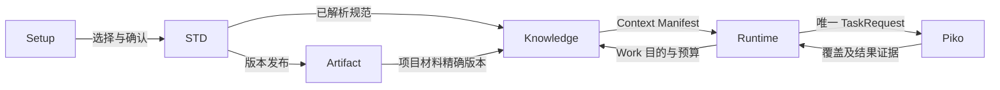
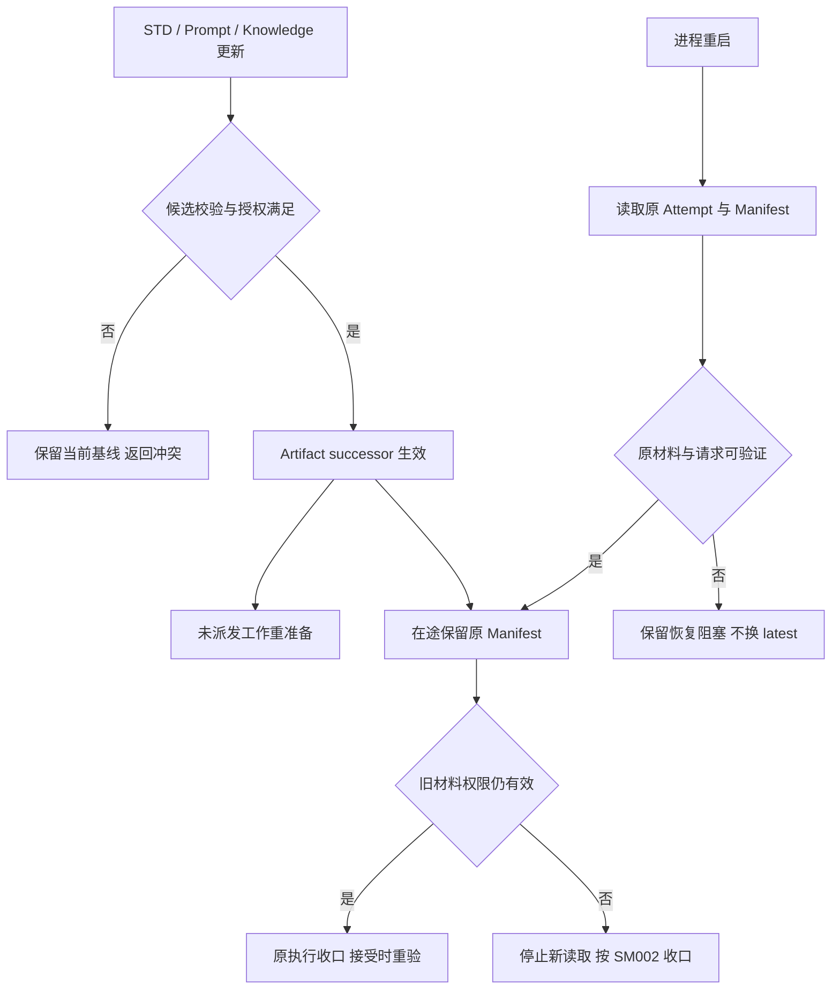
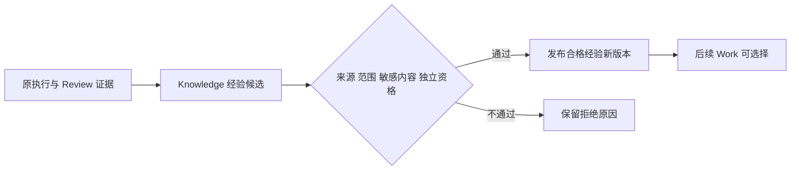

<!-- STD_DOCUMENT_COVER_BEGIN -->
# Slinky STD 与任务上下文机制

| 文档字段 | 值 |
|---|---|
| Document ID | `slinky-mechanism-task-context` |
| Document Version | `0.3.0-draft.6` |
| Status | `Draft` |
| Project | `slinky` |
| Document Owner | Slinky Design Owner |
| Last Modified Date | `2026-09-16` |
| Template ID | `design.system-mechanism` |
| Template Version | `2.3.0` |
<!-- STD_DOCUMENT_COVER_END -->

> 2026-09-17 实施范围撤回通知：依据[用户最新裁决](../../90_decisions/intelligent-process-scope-20260916.md)，本文中固定图自动业务推进、自动失败升级、容量/Seat/claim、模型级恢复、Cost、自定义通信/附件与跨系统close/drain条款退出当前authority。以下旧版正文仅供迁移定位；不能作为本轮已批准实施规格。无关的权限、版本一致性、真实质量证据仍保留，当前目标见新版系统设计、SRS和接口控制；下游须先完成对应修订再编码。此通知不把旧版本测试/签署改写为新版验证。

## 1. 机制摘要：解决什么问题

Slinky 的 Agent 工作需要知道本次做什么、依照哪些规范、读取哪些项目资料，以及允许改动到哪里。六份主指令只提供工作方法，STD 提供项目采用的模板、规范和指南，Knowledge 选择资料、技能与经验，Runtime 的任务契约限定目标和权限。它们共同组成一次可追溯的 Context，而不是继续为每种语言、文档和错误复制 Prompt。

例如团队只替换测试报告模板，测试报告 Work 应拿到团队版本及配套规则，设计文档仍使用原基础包；正在运行的报告任务保持原 Context，新任务按新基线准备。恢复旧任务不能悄悄读取 latest。缺少必需标准时系统返回准备缺口，不能临时找一段相似文本替代。

机制 `SM004`，上级 `none`，承接 P12/P16 和 P04 准备；使用 SM003 版本存储与失效，交 SM002 执行。实现 Planned，真实 Context 消费与文档验收 NOT_RUN。

图 K1，Target / V0.3：规范解析、任务方法与项目资料分开来源，合格后固定为本次 Context。[SVG](../../assets/v0.3/mechanisms/context-flow.svg)

## 2. 使用场景与功能

| 能力 | 任务 / 输入与结果 | 提供 / 消费 | 验证 |
|---|---|---|---|
| SM004-C1 规范包选择 | 默认、整体替换、局部覆盖 → 可验证基线或冲突 | STD、Artifact → Setup/Knowledge | V03-PROMPT-002/003；V-B04 |
| SM004-C2 主指令与材料 | 已授权 Work → 一份主指令及 exact Context | Runtime/Knowledge → Piko/IR | V03-PROMPT-001..004 |
| SM004-C3 完整读取 | 必需材料 → 实际覆盖证据 / 缺口 | Knowledge、Piko → Runtime/Review | V-B06 |
| SM004-C4 更新与恢复 | 原 Attempt/新资产版本 → 保留原版本或新准备 | STD/Knowledge/Runtime → SM002/SM003 | V03-PROMPT-005 |
| SM004-C5 经验晋升 | 执行/缺陷证据 → Qualified/Active 或拒绝 | Knowledge → 后续 Work | V03-KM-004 |

## 3. 参与方、责任和 authority

STD S01 决定规范包资格、覆盖解析与项目基线；Artifact M008 按原版本机制持久保存。Knowledge S02 拥有知识资格、选择和 Context Manifest，不独立决定哪份规范生效。Runtime M002 选择工作类别并校验权限/预算。Piko 负责在自身 AgentSession 中读取材料和执行，不取得 STD 或 Slinky 接受权。

图 K2：Context 是交接结果，不是另一套权威资料库。STD 导入不启动包内脚本，检查器执行通过原 Tools/PR。

### 3.1 系统约束与参与方承接

| 约束 | 来源与实际保证 | 强制方 / 验证 |
|---|---|---|
| SM004-R1 | 系统 §8.5；每 Work 一个主指令，六类固定 | Runtime/Knowledge；PROMPT-001/002 |
| SM004-R2 | 系统 §8.4；明确覆盖键，全包替换无隐式默认回补 | STD；V-B04 |
| SM004-R3 | P12/P16；必需材料完整提供，RAG 仅补充 | Knowledge/Piko；PROMPT-003、V-B06 |
| SM004-R4 | P06/P13；Attempt 固定原版本和请求身份 | Knowledge/Runtime；PROMPT-005 |
| SM004-R5 | 系统 §8.5；内容不赋予权限，检查脚本单独准入 | Tools/PR/Runtime/Piko；PROMPT-004 |

### 3.2 统筹与确认责任

项目规范选择由 STD 解析并提交 Artifact successor；有权用户确认适用范围和裁剪。Work 准备由 Runtime 调 Knowledge，Knowledge 从已接受基线选取材料并生成 Manifest。派发前确认的是材料可用、版本/预算匹配；执行期间的实际读取覆盖由 Piko 提供，接受时再验证。不能在派发前要求只有 Agent 运行后才能产生的实际读取事件。

### 3.3 拓扑与共享故障域

默认 STD 随 Slinky 发布物固定，不依赖在线更新；用户包存入项目授权范围。文件路径由受控引用解析，不能直接传任意 URL 给 Piko。Piko 可与 Slinky 分机，必须具有同版本材料的授权读取能力；本地文件存在不证明远端可读。共享索引失效只影响检索，必需规范的完整资产读取仍使用原 owner；是否支持该读取能力须由接口资格证明。

## 4. 数据结构设计

### 4.1 类型目录与完整字段

以下是系统 §8.4/8.5 与 Knowledge §7/8 的逻辑阅读视图，完整机器类型尚待原接口集中定义；不另设文件发现或环境变量选择入口。

| 对象 | 字段与约束 | 生产 → 消费 / 保存 |
|---|---|---|
| 项目规范基线 | project、package id/version/hash、基础选择、document-type 映射、模板/指南/规则引用、裁剪、覆盖项、逐项来源、适用范围、基线版本与接受引用 | STD → Knowledge/Runtime；Artifact 持久版本 |
| 覆盖项 | 唯一条目 key、完整替换资产 ref/version/hash、来源与变更说明；不得重复 key | 用户候选 → STD |
| ArtifactContractResolutionRecord | record ref/version/hash、适用 project/Work/output artifact_type/operation_profile、exact Standard 与 BaseTemplate version/slot/hash、selection key/policy version/rationale、mandatory sections/validation/review requirements、evaluated_at/validity/invalidation ref | STD Resolve 生产；Artifact 持久；Plan/Runtime/Knowledge 共同消费 |
| Context Manifest | Work/Attempt、profile version、主指令 ref/version/hash、STD 基线 ref、逐 output/operation 的 exact ArtifactContractResolutionRecord refs、输入版本、asset entries[]、预算/覆盖计划、资格结果 | Knowledge → Runtime；Slinky固定关联，Piko仅通过授权工作材料读取，不新增请求/Result字段 |
| asset entry | asset id/version/hash、source/authority、授权读取 ref、required 标记、选择原因、token budget、整文件或章节覆盖范围 | Knowledge；必需项不能被相似度替换 |
| 实际覆盖证据 | 原 Manifest、执行身份、资产版本/hash、实际读取范围、完成或缺口、证据来源 | PikoTrustedInputBroker生成受保护系统artifact，经既有outputs摘要及原workspace授权读取；Slinky比较Manifest，不从summary或Agent自述推导 |
| 经验候选 | 来源 Work/Result/Review/缺陷、方法内容、适用范围、敏感检查、独立资格与版本引用 | Knowledge Lesson；Qualified 前不能 Active |

required 的含义由任务交付要求决定；optional 缺失可为空，但读取失败、权限拒绝和本来未选择分别记录。具体字段类型、字节/数组上限、覆盖证据与 Piko Schema pointer 属于 G1。

外部映射唯一规则：Runtime在发送前持久化client_task_id到Work/Attempt/Manifest/resolution的内部关联。工作材料通过已授权workspace/read_paths等既有路径提供；Piko不理解STD或业务接受语义。返回时以run_id/client_task_id查原关联，再按outputs的path/hash/size验证实际产物。execution_log_ref是opaque引用，不因存在就证明可读取日志或实际覆盖。领域报告是独立待验收产物，不扩充AgentResult；缺报告是业务交付缺口，非法AgentResult才是协议错误。

### 4.1.1 V-B06可信读取消费

外部证据采用[Interface Control §7.2](../../60_interfaces/external-service-interface-control.md#72-可信输入读取证据消费)，绑定Piko commit 4c63380f944e41d0047e9f47340689a182b62fba。Schema pointer为`#/$defs/InputAccessEvidenceDocument`和`#/$defs/MaterialReadObservation`；可信producer唯一为PikoTrustedInputBroker，不是新增AgentResult.input_access_evidence或日志API。

派发前Knowledge须将必需asset的不可变version/hash及所需范围映射到本次授权workspace规范相对路径。映射是Slinky原Manifest的执行关联，不传STD/Manifest DTO给Piko。若材料转换、拼接或路径映射使原hash/范围不能证明对应，准备不通过，不能用相似文本或Agent自述补全。派发时Required固定进原请求digest。

接收顺序：固定Result generation→查唯一`.piko/evidence/input-access/v1/<run_scope_token>/<generation>.json` output→原workspace授权取得bytes→核对output hash/size→校验Schema及run/task/generation→验证recorder状态和观测range→逐项比较原Manifest。run_scope_token按canonical client_id、NUL、run_id的UTF-8摘要计算；系统路径不得由任意client_task_id拼接。任何前置失败均不进入覆盖通过。

同path不同object_version/hash不得合并；同版本重复或重叠range只计并集。非空FullContent须有digest且区间满足0<=start<end<=size并覆盖全部bytes；空文件仍需真实read。MetadataOnly、ChangedDuringRead、Partial/gap或缺必需材料均不能满足全读。Complete只证明recorder无gap，不证明全部必需材料已读取，更不证明模型理解或领域产物合格。

Artifact在最短可读窗口max(request.deadline_at,result.published_at)+7d内接管经核验的证据bytes及原Result引用，沿原版本/授权/保留机制处理。只有Result可查但证据取回失败时，不通过覆盖；不扩权、不盲重跑原任务。长期领域接受证据不能只依赖Piko恢复窗口。系统producer隔离、读取旁路与崩溃发布仍须后续真实验证。

### 4.2 编码与材料映射

主指令按固定六文件引用，不根据扩展名或语言拼路径。规范覆盖以完整资产版本为单位，不对 Markdown 段落做自动合并。长材料切分只改变传输/读取批次，原内容摘要和有序覆盖集合保持一致。选取分段、遗漏、预算截断必须显式可检测；摘要化文本不能冒充完整原文。

### 4.3 一致性、可见性与寿命

Manifest 发布时固定全部来源版本。准备阶段若来源更新，旧待派发 Manifest 先重新资格；已派发 Attempt 不替换内容，新版本按 SM003 影响其后续接受资格。历史资产须保留到原恢复与审计引用结束；撤销访问权限时保留版本事实但拒绝继续读取，转停止/阻塞而非自动换新版。

项目 STD baseline 仅表示规范集合。每项 Work 还必须固定其输出类型和 operation_profile 对应的 ArtifactContractResolutionRecord。PlanVersion、PlannedWork、Runtime readiness、Context Manifest 与实际执行输入引用同一 exact record；多输出分别绑定，不能只存一个项目基线或临时重新解析 latest。asset entry 关联产生该必需材料的 resolution ref，接受证据也绑定同一解析结果。

STD Resolve 根据规范 slot/version/hash、选择政策和项目约束确定记录；Plan 检查选择适用性，Runtime 在派发前重验有效性和引用一致性，Knowledge 只装配已确定的 exact 材料。记录缺失、错 Work/output、过期或标准/模板摘要不一致时阻断准备。选择政策或硬引用变更沿原 ArtifactVersionEvent 精确定位受影响 resolution、Work 和 Manifest；在途记录不改写，接受资格由 SM003 重验。

## 5. 接口设计

| 原逻辑操作 | 输入与返回 | 确认 / 错误下一步 |
|---|---|---|
| STD 导入/选择/覆盖预览 | 包引用、模式、覆盖项、项目适用/裁剪 → 逐项解析及冲突 | 只形成候选；重复键/缺项/兼容冲突拒绝 |
| STD qualify/activate | 候选、授权、expected基线版本 → 新基线及接受引用 | Artifact successor 生效；冲突重读确认 |
| STD resolve_artifact_contract | artifact_type、operation_profile、system/component profile、project policy/explicit constraint、target_version → exact ArtifactContractResolutionRecord | 按原 Artifact 契约 §3.2 解析；缺硬引用为 ArtifactContractGap，不由 Knowledge 重选 |
| Knowledge resolve/qualify | Work 目的、产物类型、Role、项目/profile、逐输出 exact resolution refs → 必需材料与资格 | 校验映射及来源；缺必需项返回 gap，不派发 |
| Knowledge build Context | exact 输入、resolution refs、主指令、资料/经验、预算 → Manifest/覆盖计划 | 固定可读材料与解析关联，不伪造实际读取证据 |
| retrieve/read material | 原资产 ref、project ACL、覆盖范围 → exact 内容或拒绝 | 同版本/hash；远端不可读保持缺口 |
| Lesson submit/review/publish | 原执行证据、范围、独立审查 → 候选/Qualified/Active | 晋升不改变原 Work 接受事实 |

操作复用 STD/Knowledge 既有服务边界，公共传输/完整 Schema 尚在 G1。Piko 的材料读取和覆盖结果使用唯一 AgentTaskRequest/Result；缺字段不在 Slinky 侧伪造支持。

### 5.1 六类映射与调用演练

| Work 目的 | 主指令 | 接受方 |
|---|---|---|
| 文档/编码/测试/修复 | task.md | Runtime/Artifact/Testing |
| 正式独立评审 | review.md | Runtime/Artifact |
| 已有项目分析 | analysis.md | Analysis/Artifact |
| 新项目或授权专项预研 | research.md | Research/Artifact |
| 计划候选 | plan.md | Plan validator |
| 进度跟踪与沟通 | pm.md | Runtime/Plan/正式 Action owner |

项目 A 使用基础包 S4，只将 test-report 条目替换为 team-report@2。STD 解析该条目的模板、指南与检查规则引用；若新模板删掉检查器必需字段则候选拒绝，原 S4 不变。配套规则一起合法替换后发布 S5，报告 Work 使用 task.md + S5，系统设计 Work 仍解析基础包条目。整体替换的用户包若无 system-design 条目，则返回缺口，不回补随包 S4。

Slinky计划Team中的作者和Reviewer使用同一已冻结STD基线，但各自Work/单Agent Run按职责读取材料；独立Review Work使用review.md。作者Run内自检不等于独立Review，不能把Team或多个执行身份塞入一个Piko请求。

## 6. 正常端到端流程

1. Setup 提交用户规范选择。STD 校验包路径/类型/hash/来源、条目唯一性、依赖、模板与检查器兼容性，静态检查不执行包内脚本。
2. 用户确认范围/裁剪后，STD 请求 Artifact 按 expected version 保存生效基线；失败保留原基线。通过原事件链通知受影响消费者。
3. STD Resolve 按 Work 的输出类型、operation_profile 和选择约束生成 exact ArtifactContractResolutionRecord；PlanVersion/PlannedWork 固定引用。Runtime 按 Work 目的选六类之一，并检查 readiness 与计划的解析引用一致；Knowledge 读取这些记录、必需输入与 profile，先满足必需指令/标准/模板，再填可选经验与示例。
4. 校验 ACL、版本、完整材料可获得性、预算与覆盖计划。满足后持久 Manifest，SM002 按其准备和派发；不满足返回具体缺口。
5. Piko 读取材料，按任务契约写作、自检和协作。分批读取记录原版本及覆盖；材料读取失败在原 Run 内返回缺口，不能靠摘要或旧缓存跳过。
6. Runtime以Result的run_id/client_task_id查询自身原Manifest关联，校验outputs并交SM003；实际覆盖、检查和Review按独立领域证据验收，不从Result凭空生成。需要修复时按SM002活动/终态边界处理。

### 6.1 更新、恢复与权限撤销

图 K3：更新改变新准备的输入，权限撤销改变实际访问权。固定旧版本不能绕过撤销，也不把旧内容删除当成可自动迁移的理由。

## 7. 分支和替代流程

可选经验没有合格条目时输出空集合，必需经验/技能作为硬要求时缺失则阻塞。检索不可用时仅在该 Work 的可选检索确实不影响必需输入时继续，并保留 unavailable 原因；不能将故障写成“没有相关内容”。

上下文不足时先输出必需材料大小、可用预算和缺口，交原 Plan/IR 调整工作分解或合格能力，不能静默截断。分批读取允许同一任务多次读取原完整材料，但不免除 Piko 可执行上下文策略与预算支持的资格检查。

图 K4：经验晋升使用原 Knowledge Lesson 流程，失败不会撤销已接受项目产物。Matrix 对话仅经授权提炼和审查形成候选，原 transcript 不直接进入 RAG。

## 8. 状态机与不变量

| 对象 / 转换 | Guard 与事实生产者 | 非法/迟到处理 |
|---|---|---|
| 规范候选 → 有效基线 | STD 完整解析、用户确认、Artifact CAS | 冲突不覆盖原版本 |
| 材料待选 → Manifest 固定 | Knowledge 资格/ACL/预算/覆盖计划通过 | 缺必需项返回准备 gap |
| Manifest → 派发输入 | Runtime 原请求引用和 SM002 守卫 | 版本变化先重准备 |
| 原 Manifest → 恢复读取 | 原身份、版本、权限有效 | 不可读保留阻塞，不换 latest |
| 经验 Draft → Qualified → Active | 来源、脱敏、独立 Review 与资格 | 未通过不用于未来工作 |

SM004-R1..R5 在 STD 解析、Knowledge 选择、Runtime 派发和 Piko 读取四处执行。Manifest 的“计划覆盖”与 Result 的“实际覆盖”不是同一字段含义。

### 8.1 资源与释放

准备计算只占本地查询/解析预算；必需材料资格失败不占运行 Team/测试环境。Piko 读完的临时缓冲可以释放，原版本/Manifest/覆盖证据按引用保留。授权检查器占用的 PR 和工具运行义务按 SM002 收口，不能因 STD 资格失败就强删正在运行的容器。

## 9. 失败传播、重试与恢复

| 故障 | 已知性 / 正确出口 | 恢复与安全 |
|---|---|---|
| 包缺项、重复覆盖、hash 错误 | 候选未资格，当前基线不变 | 用户修复完整资产后重新提交 |
| 整体替换缺项 | 明确规范缺口 | 不回补默认包 |
| 检查器未授权 | 静态内容可保存，执行不准入 | Tools/PR 资格后才运行 |
| Manifest 写入响应丢失 | 查询原 Work 的固定记录 | 不追加第二套材料或改请求 |
| Piko 材料读取失败 | 活动 Run 缺口，不是已覆盖 | 原读取恢复/收口；不生成成功 Evidence |
| 覆盖证据缺失或 hash 不符 | 交付条件未满足 | SM003 不接受；终态按 SM002 分类 |
| 升级后原材料不可读 | 原恢复义务受阻 | 保留记录，原 owner 修复授权读取或显式新任务 |
| 经验含敏感内容 | 拒绝晋升 | 原工作结果不改，敏感候选按授权保存/清理 |

超时来自原任务/读取契约；值或覆盖证明能力未冻结时保持 G1/G2，不通过追加无限上下文或无限工具调用绕过。

## 10. 并发、排序与容量

不同项目有各自规范基线；同项目基线激活按 expected version。并发作者与 Reviewer 共享不可变源而不共享可变读取游标或覆写 Manifest。预算分开统计 token、解析内存、文件传输与持久空间；一个 token 不是一个 byte。全部必需材料、语义请求、生成预算与工具回读须落在已验证能力内，不能仅用模型标称窗口作准入证明。

## 11. 安全与信任边界

模板、经验与仓库中的指令是有来源的工作材料；不能扩大写范围、关闭质量门或读取别项目。包路径穿越、符号链接逃逸、未批准脚本和跨项目引用在 ingest/read 两端检查。用户可替换文档内容规范，但不能通过模板授予自己没有的发布或 Secret 权限。

## 12. 可观测性与证据

### 12.1 选择与覆盖记录

记录每项 selected/rejected 的资产版本、理由、required/optional、STD 来源、预算和覆盖范围。显示实际覆盖缺口及读取 owner，不显示 token/凭据。六类主指令统计分开，专业差异按任务类型和规范条目统计，不靠新增 Prompt 文件识别。

### 12.2 维护入口

Setup 查询解析结果与覆盖差异，Resources 展示有效规范/Knowledge 资格，Stage detail 展示 Manifest/实际覆盖与 blocker。只读诊断不重跑 Agent 或嵌入脚本。原操作签名尚未机器化时记录缺口，不创造本机绝对路径下载接口。

## 13. 配置、兼容与部署

Slinky 自身 docs/std.lock.json 是本项目设计来源；托管项目的规范基线由各项目 owner 管理，不能混为同一文件。默认包离线可用，新 STD 不自动更新在途任务。Prompt 的六份文件正文与所有旧调用者迁移在验证后同批切换，禁止同时按旧 Stage 文件夹和新 Manifest 两种优先级读取。

## 14. 各参与方实现清单

| 成员 | 提供 → 全部消费者 | 下游必须落实 | 验证 |
|---|---|---|---|
| 包/覆盖/基线 | STD → Artifact/Knowledge/WebUI | 完整解析、逐项来源、CAS、无隐式回补 | V-B04 |
| 六类主指令与 Work 映射 | Runtime → Knowledge/Piko | 一个主指令，专业规则来自 STD/任务 | PROMPT-001/002 |
| Manifest/资格/覆盖计划 | Knowledge → IR/Runtime/Piko | 可读 exact 材料、预算、版本恢复 | PROMPT-003/005 |
| 实际读取覆盖与 Result | Piko输出文件/执行引用 → Runtime/Artifact/Review | AgentResult严格按provider Schema；领域证据来源/可信度单独验收，缺少真实读取证据不得通过V-B06 | V-B06 |
| 经验晋升 | Knowledge → 后续 Work | 独立资格、权限及敏感检查 | KM-004 |

各新增接口/调用者接线 NOT_IMPLEMENTED；算法和存储可由原模块选择，公共版本、权限与覆盖语义不可删改。

## 15. 验证、上线与回滚

逐约束的 Case、环境类别及待填 Run/证据位置见 [验证汇聚表 §14.1](../../70_verification/specifications/test-lifecycle-specification.md#141-逐约束证据汇聚)。当前可执行入口未交付，Run/证据均为 null，NOT_RUN；G1、可执行 Case 和组合证据关闭前保持 Draft，不判为内容完整或可直接交付实现。

### 15.1 输入与故障

PROMPT-001..006、V-B04/06 使用默认包、完整用户包、仅测试报告覆盖包，以及缺项/重复键/旧 hash/恶意脚本反例。注入 Context 固定后升级、远端读取第 N 批失败、发布响应丢失；实际 hit 与原资产版本保存。Oracle 比较原包条目、Manifest 和真实读取记录，不采用 Agent 自述。

### 15.2 环境与复位

从已资格项目副本选择一个文档/代码/测试 Work；测试数据不含实际 Secret。模型测试证明解析和守卫，Piko 集成证明读取/执行，独立 Review 证明内容质量。清理只删当前副本临时材料，保留原包与引用证据，后续恢复按原版本读取。

### 15.3 组合验收

默认离线、局部/整体替换、六类映射、准备缺口、实际完整覆盖、在途更新及旧调用者退出全部通过后才切换。回滚若旧版本不能解释 Manifest 则停止新派发，保留义务；不能默默重新装配旧 Prompt。

## 16. 风险、未决问题与决定

| ID | 缺口与影响 | Owner / 关闭条件 |
|---|---|---|
| SM004-G1 | Piko实际读取证据Schema/producer已定义；Slinky包目录、覆盖键、Context执行映射及错误/限额完整内部Schema仍未齐 | STD/Knowledge/Runtime；原Manifest类型与workspace映射、逐字段fixture，不再把Piko可信来源列为未定义 |
| SM004-G2 | 分批读取的真实覆盖与预算计量支持未 capture | Piko/Knowledge；省略、错 hash、预算触顶反例均阻止接受 |
| SM004-G3 | 六份正文、旧内嵌字符串/调用者清单及迁移未完成 | Runtime/Knowledge；六类真实任务及全路径删除扫描 |
| SM004-G4 | 包保留、压缩/解包限额和存储容量定量未冻结 | STD/PR；受控输入和实际目标环境测量 |

## A. 输入基线与适用性

系统 draft.15 §8.4/8.5、Knowledge §8/8.1、STD modules.md、External §3.1.1、V03-AG-001；STD 锁定 b0ee9ee37785c447b55097f9ac604fb4bba225b0，模板 2.3.0。本机制是软件材料/权限交接，无硬件 ABI。图和流程为 Target；组合实现/验证分开记录。

### A.1 可复核来源锁定

以下为当前工作树来源快照，不是已提交commit或整份来源内容验收。此次已按新外部契约修正单Agent、Session authority、Run释放及领域证据映射；容量、可信读取证据和图资产等剩余项见[机制差异审计](../../91_reviews/mechanism-consumer-drift-20260916.md)。来源hash通过只证明未漂移，不能关闭这些设计门禁。旧Piko文档只作历史输入，其退役wire不得生成代码。

| Document ID / 来源 | 版本与内容锁定 | 条款及适用决定 |
|---|---|---|
| [v0.3-system-design](../system-design.md) | 0.3.0-draft.28；0d490d4b08497fc71cd2b621a7b36ed18a34e4895a00b56aaf2958fadb2d539e | §8.2发布确认/Actual去重与§8.3无Agent会话网关边界；保留原claim/backing及调用级恢复；R-D02物理迁移与写者隔离仍开放 |
| [v0.3-external-service-contracts](../../60_interfaces/contracts/external-service-contracts.md) | 0.3.0-draft.5；cd8d38fddbcc97f82429563ed31c2520ca8938d7485f94446ac2a0c016cd7c15 | finalization.10精确commit/Schema来源；非预留全约束容量与逐Run claim、Required唯一outputs证据；领域覆盖接受仍由Slinky决定 |
| [v0_3_piko_agent_runtime_service_requirements_and_interface_contract_draft_20260906](../../60_interfaces/v0.3/v0_3_piko_agent_runtime_service_requirements_and_interface_contract_draft_20260906.md) | 0.3.0-draft.2；7f7de96f399a391765577d211498545a3d87e3c934ecff23ee9c71cd923e10c2 | §1替代矩阵；仅历史来源，不沿用Team Run、Piko Session close、日志/slots/by-attempt等旧wire，不取消未闭合业务需求 |
| [v0_3_artifact_event_reliability_draft_20260802](../v0.3/v0_3_artifact_event_reliability_draft_20260802.md) | 0.3.0-draft.1；d6098aa4e74c774a7ee0c9c290db8c3f07c99005c8d3d1acbe165dccc11f201d | §2、§3–3.4；保留版本/slot/event 与 exact resolution；STD 解析、Artifact 保存的职责均保留 |
| STD design.system-mechanism / AI 指南 | source commit b0ee9ee37785c447b55097f9ac604fb4bba225b0；模板 2.3.0 SHA-256 8108199a0f0b782c5aaffeb25033b861fd1b24aac8c1f6dd934c4744e41ead65 | 16 章及机制指南；软件状态、并发、恢复、证据适用；硬件寄存器/总线布局不适用，设备访问仍由 PR/Tools 负责 |
| [v0.3-test-lifecycle-specification](../../70_verification/specifications/test-lifecycle-specification.md#141-逐约束证据汇聚) | 0.3.0-draft.3；c4a26e8a627cd08812fc644d7aba9392343914f561017ab47be73637581d903d | V-B01/06/07承接已签署DF13/14逐Run受理、唯一outputs可信覆盖、release与strict close分离；组合验证NOT_RUN |

## B. 文档控制与修订记录

0.3.0-draft.6：同步系统设计 draft.27 的来源版本/hash及 R-D02 细化引用；不改变本机制接口或已有签署结论，不将来源更新当作运行验证或剩余门禁关闭。

0.3.0-draft.4：区分Piko机器Result与Slinky Manifest/resolution/领域证据，单Agent与独立Review映射同步。实际覆盖可信来源仍在G1，不以报告自述或opaque日志引用关闭。A.1已更新当前来源及历史适用边界，剩余门禁单独保留。

0.3.0-draft.3：自审修正接受等待与 Session 收口顺序、未知结果的独立安全收口、规范解析操作及接受守卫；同步组合测试子例。公共契约和运行证据仍未完成。

0.3.0-draft.2：按用户 review 补 Session 关闭等待、Work exact resolution、逐约束验证汇聚和来源锁定。内容完成条件未满足，保持 Draft；机器契约及组合验证缺口继续开放。

<!-- STD_DOCUMENT_CONTROL_BEGIN -->
| 字段 | 值 |
|---|---|
| Authority | slinky |
| Authors | Codex |
| Created Date | 2026-09-15 |
| Template Conformance | native |
| Tailoring Reference | none |
| Migration Map Reference | none |
| Repository | corezilla/slinky |
| Canonical Path | docs/20_system_design/mechanisms/task_context.md |
| Supersedes | none |
<!-- STD_DOCUMENT_CONTROL_END -->

0.3.0-draft.1：第二批机制设计；独立评审未开展，真实运行 NOT_RUN。
