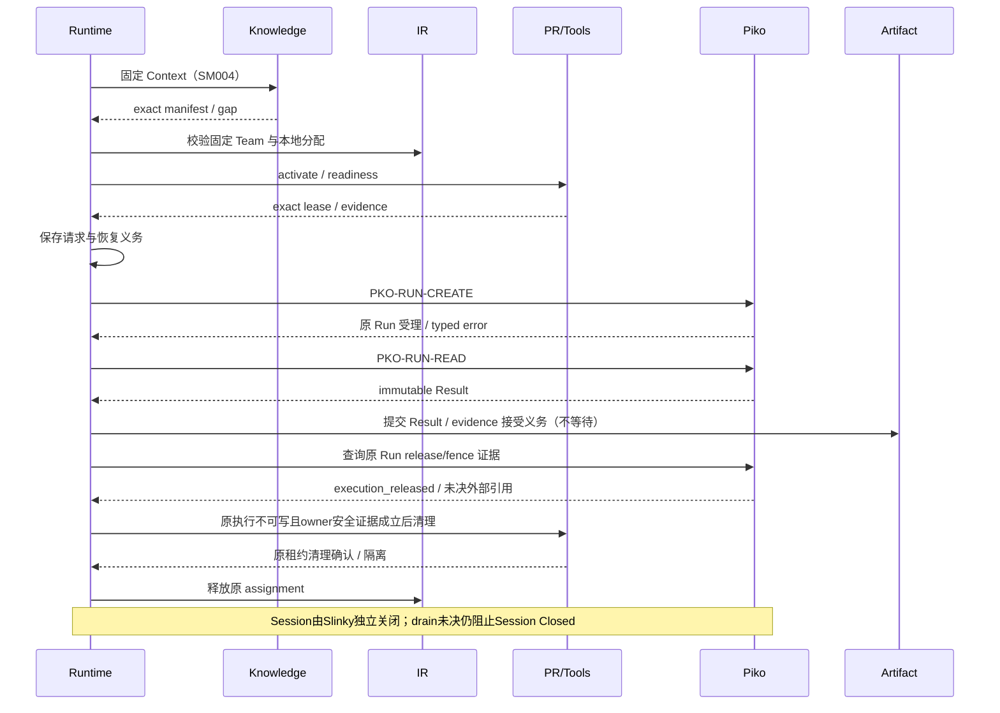
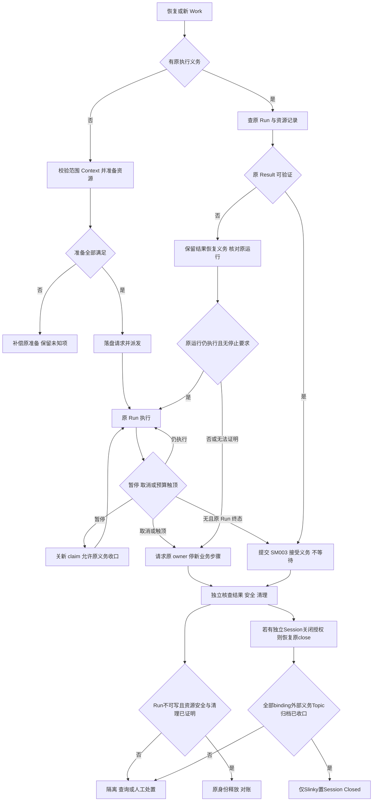

<!-- STD_DOCUMENT_COVER_BEGIN -->
# Slinky Work 委派与资源收口机制

| 文档字段 | 值 |
|---|---|
| Document ID | `slinky-mechanism-work-delegation` |
| Document Version | `0.3.0-draft.6` |
| Status | `Draft` |
| Project | `slinky` |
| Document Owner | Slinky Design Owner |
| Last Modified Date | `2026-09-16` |
| Template ID | `design.system-mechanism` |
| Template Version | `2.3.0` |
<!-- STD_DOCUMENT_COVER_END -->

> 2026-09-17 实施范围撤回通知：依据[用户最新裁决](../../90_decisions/intelligent-process-scope-20260916.md)，本文中固定图自动业务推进、自动失败升级、容量/Seat/claim、模型级恢复、Cost、自定义通信/附件与跨系统close/drain条款退出当前authority。以下旧版正文仅供迁移定位；不能作为本轮已批准实施规格。无关的权限、版本一致性、真实质量证据仍保留，当前目标见新版系统设计、SRS和接口控制；下游须先完成对应修订再编码。此通知不把旧版本测试/签署改写为新版验证。

## 1. 机制摘要：解决什么问题

一项编码工作可能包含读设计、修改多个文件、编译、讨论、修改和复验。Slinky 在计划层组织 Team，每个 Work 的执行由一个 Agent 的 Piko Run 完成；作者和独立 Reviewer 使用各自 Work/Run，不把 Team 放进一个 Piko 请求。Runtime 不为每次工具调用另排任务，也不依据聊天最后一句判断成功；固定工作目标、输入、写范围、预算与接受要求，保存 Piko 的单次执行结果及受控产物，再交 Artifact 接受。

在这种分工下，最危险的不是 Agent 暂时做错，而是系统不知道旧执行是否还在写文件就重新派发，或因为结果已收到而提前把环境交给别人。本机制用既有 Work/Attempt、准备 intent、外部 obligation 和 owner 释放确认区分这些事实。资源暂缺、结果未知、质量失败和清理失败具有不同出口。

机制 `SM002`，上级 `none`，承接 P04/P07/P08；使用 SM001 范围授权、SM004 Context 和 SM003 接受。适用于全部 IR-backed Work，包括分析、预研、文档、编码、测试、计划与 PM；工程范围外的管理 Work 保留自身授权。实现 Planned，组合验证 NOT_RUN。

图 W1，Target / V0.3：先固定材料和资格，再取得执行资源，外部受理后跟踪原 Run，接受与资源释放分别确认。[SVG](../../assets/v0.3/mechanisms/work-flow.svg)

## 2. 使用场景与功能

| 能力 | 输入和输出 | 参与方 | 验证 |
|---|---|---|---|
| SM002-C1 完整工作准备 | 已授权 Work → exact Context、Team、PR/Tool binding | Runtime、Knowledge、IR、PR、Tools | RT-AG04；缺员零派发 |
| SM002-C2 单 Agent 执行 | 每个原请求 → 一个 Piko Run、Result、产物与用量；Team关联保留在Slinky | Runtime、Piko | RT-AG01/02/05 |
| SM002-C3 收件分型 | 传输/协议/业务结果 → 查询、契约阻塞或接受/修复 | Runtime、Artifact | RT-AG06 |
| SM002-C4 停止及恢复 | cancel、断线、重启 → 原义务对账和安全释放 | Runtime、Piko、IR、PR、Tools | RT-AG07；V03-ENV-001..014 |
| SM002-C5 正式独立 Review | 计划指定的 Review Work → exact Review Evidence | Runtime、Plan、Artifact、Review IR | RT-AG08 |

各能力为 Planned / NOT_RUN。Agent自检与正式独立 Review Work 在派发前确定；自检不能冒充独立Reviewer结论，不作为失败后的两条 fallback。

## 3. 参与方、责任和 authority

图 W2，Target：Piko 受理不等于产物接受，产物接受不等于资源释放。Piko 只按已确认的外部能力执行，Slinky 不读取它的数据库或 provider 配置。

| 参与方 | 唯一事实 | 实现承接 |
|---|---|---|
| Runtime M002 | Work/Attempt、准备及派发 intent、Result 收件、stop/recovery | runtime/design.md、fixed-stage-runtime 总纲 |
| IR M004 | 固定 Team 资格、assignment、Slot/Seat/Profile 引用 | ir/design.md |
| PR M005 / Tools M009 | 环境 lease、target identity、权限及释放证据 | pr/design.md；环境执行契约 |
| Knowledge S02 | exact Context、必需材料覆盖 | SM004 |
| Artifact M008 / Testing S03 | 产物接受、适用的质量证据 | SM003 |
| Piko / 外部 owner | 外部 Run、工具副作用和停止事实 | PKO-RUN-CREATE/READ/CONTROL |

### 3.1 系统约束与参与方承接

| 约束 | 来源 / 固定规则 | 强制方与验证 |
|---|---|---|
| SM002-R1 | P04、SM001；先授权、冻结输入、准备，后外部调用 | Runtime；RT-AG04/08 |
| SM002-R2 | V03-AG-001；固定 Team，全员完整 IR，不活动扩员 | IR/Piko；RT-AG04 |
| SM002-R3 | External §3.1.1；持久终态 Result 不补 JSON、不原地修订 | Runtime；RT-AG06 |
| SM002-R4 | P07/P08；结果已知性与访问安全分别证明 | Piko/PR/Tools/Runtime；RT-AG07 |
| SM002-R5 | P04；原发布/释放失败恢复原确认，不重做业务 | Runtime/Artifact；批次 V-B02/03 |

### 3.2 运行时统筹与确认责任

Runtime 的原 WorkExecution Manager 统筹，IR/PR 各自执行资源规则。状态记录中逐项保留请求已发出、owner 已确认、结果未知、释放已确认，不能用一项总布尔值隐藏部分成功。准备不是跨服务事务：本地记录先落盘，外部确认依次记录；失败清理只处理本次已取得或结果未知的原资源。

### 3.3 拓扑、目标身份与共享故障域

Workspace/环境可能在本机、Docker 或远端测试机，资源引用必须绑定实际 target、版本、lease 与执行者。运行身份从 owner 响应核对，不从端口、目录名或 PID 单独推断。共享 Piko、LLMTier、宿主磁盘和 Docker VM 分别构成共享故障域；单 Case 失败清理不重启共享模型服务。

## 4. 数据结构设计

### 4.1 类型目录与完整字段

共同字段沿已存在的内部语义和外部消费契约固定，下表给出准备记录的完整逻辑内容；物理表和 wire 字段分别由原 owner 机器契约承接。

| 对象 | 字段 / 类型与约束 | 生产、消费与保存 |
|---|---|---|
| Work/Attempt identity | project_ref、plan_ref、scope_ref、planned_work_ref、work_execution_ref、attempt_ref；不可变 ref，必需；管理 Work 的 scope 适用性由原契约声明 | Runtime；不可因 transport retry 改变 |
| 准备 intent | identity、input_version_set、context_manifest_ref、逐 output/operation 的 artifact_contract_resolution_refs、participant_refs[]、resource_obligations[]、tool_binding_refs[]、budget_ref、expected_owner_versions、write_scope_ref；全部必需，数组按实际需求可空 | Runtime 原 intent；派发前持久保存；解析引用须与 Plan/Work/readiness/Context 一致 |
| resource obligation 项 | owner、resource_ref、原操作 identity、请求摘要、确认引用或 null、最后已知结果及观测时间、待确认动作；未知不能填成功 | IR/PR/Tools 产生确认，Runtime 保存引用 |
| 派发 obligation | identity、外部服务 binding/version、规范化原请求与 digest、原幂等 key、deadline、外部 Run ref 或 null、原响应引用或 null | Runtime；调用前落盘，随恢复保留 |
| collaboration close obligation | Slinky Session ref及关闭操作identity/version、关联bindings/Run attachments、Piko drain/revoke refs、Topic/Action disposition、归档与close boundary证据 | 仅在Slinky授权Session关闭时创建；Run终止本身不创建close。Piko仅生产自身drain/revoke/release事实，Session状态与项目归档由Slinky生产；无协作明确不适用 |
| Result / Evidence | AgentResult仅provider原生字段；run_id/client_task_id、state/reason/detail、summary、outputs、usage、execution_log_ref、finished_at、result_generation、published_at | Piko生产机器Result；Runtime用原本地关联恢复Work/Manifest；系统读取证据仅经outputs，Review/验证为独立领域产物，不添加Result字段 |
| 安全/释放证据 | 原执行、资源/lease/owner、stop/fence/drain/cleanup 实际证据引用、缺失项及确认时间 | 原执行者/PR/Tools；Runtime 不能代造 |

所有 ref 都必须匹配项目和声明对象类型，Secret 只用 binding ref。上述逻辑内容尚需 exact Schema pointer、数组/字节上限及错误响应映射；缺一项能否省略由契约决定，不由 adapter 默认丢弃。接口机器化缺口列在 G1。

### 4.2 编码、布局与共享类型映射

外部只用 PKO-RUN-CREATE 的唯一 request/result Schema。私有记录引用原请求 bytes/hash，重新序列化须产生相同语义 digest；不得更换 participant、模型级别、Context 或工具权限。无本机制专属 ABI 或远端内存布局。Token、费用、次数和毫秒按各计量 owner 分开，不能互换。

### 4.3 一致性、可见性与数据寿命

请求 intent 与本地 claim 写入既有 Runtime 事务。派发开始后，无论 HTTP 结果如何都保留该 obligation，直至证据确认处置完成。Result 接收、Artifact 生效和 Actual/资源释放是三个交接，不假设跨 owner 原子提交。后两项失败只恢复原发布或释放，不能重放业务任务。

## 5. 接口设计

| 接口成员 | 前提、输入与返回定位 | 完成含义 / 失败下一步 |
|---|---|---|
| PKO-SLOT-OBSERVE（历史ID） | 旧health/slots/profile操作退役 | 不调用；需求由下行同一Run服务观察面承接，不恢复旧alias |
| POST execution-capacity/snapshots:query | [Interface Control §7.1](../../60_interfaces/external-service-interface-control.md#71-piko容量与逐participant-backing消费)；一次全部participant selectors、Client scope、class及all-constraints | 仅非预留规划；200完整快照，匹配条件412，无304；Partial/Unknown/过期不能标可行 |
| IR qualification/assignment | IR §9；Work、固定 Team、exact backing/profile | 本地分配确认；不代替 Piko 或 Tier admission |
| PR activate/readiness/release | PR §10.1；资源、Work/Attempt、lease、fingerprint、证据 | owner 确认或缺口；未知 release 查询原操作 |
| PKO-RUN-CREATE | External §3.1；原 request、key/digest | 202/Run ref 仅外部受理；不推断 Running |
| PKO-RUN-READ | 原服务/Run；GET Run及GET Result | 原status/Result；无Run ID只重放原POST，不用by-attempt |
| PKO-RUN-CONTROL | 原Run :cancel、当前Client授权、Idempotency-Key | 202仅停止意图持久化；没有Run reconcile接口 |
| CollaborationSession close / read | [Slinky生命周期契约](../../60_interfaces/contracts/communication-lifecycle-contract.md) | Slinky独立close/read；Piko只有exact binding revoke/drain。Run释放不等待Session Closed，Session Closed反向需要全部关联义务及归档守卫 |

### 5.1 调用演练与准入边界

作者Work C1使用design@2、Context@7和IR-A；评审者IR-B属于独立Review Work。IR按计划验证资格与本地分配，PR为本次执行取得workspace@lease9并通过readiness；IR对需要同时执行的participant构造quantity=1的selectors，用同一有效Complete snapshot按全部direct/shared/quota约束求需求总和，不累加class available。通过只表示非预留可行性，Runtime落盘逐participant单Agent request再调用Piko。Piko在自己的admission边界原子写Run及Held claim，不要求Slinky调用reserve API。CREATE确认未受理时保留拒绝证据并清理本轮PR；响应不明保留原obligation，不能清理后换key重新派发。

完整Piko backing要求每个participant的原202和exact Run Held claim均齐备；Queued也占claim但不等于Running。两项202、一项429时仅部分backing，不能宣称Team完整，也不能以取消回执假装回滚已执行业务。snapshot后竞争或class版本变更重新评估尚未受理部分，不覆盖已受理事实。claim Unknown保持未知义务；Released只关闭Piko占用，不能代替execution release、drain、Tier Seat或Session关闭。

需要V-B06覆盖的任务在原body固定input_evidence_requirement=Required，业务output_paths最多255。RunView.input_evidence_capability必须Auditable；不可审计422不改成NotRequired绕过验收。成功Result的唯一系统证据output交SM004按原Manifest核验，不把summary、计数或execution_log_ref当读取证明。

IRBackingSeat Active 是本地组合状态，TierServiceSeat 是 capacity projection。LLMTier 的最终 invocation admission 发生在 Piko 模型调用时，不能在本地 Active 记录中伪造账号或远端永久配额。受理后 Queued 保持可见；Work 只有获得外部实际执行及必需准备确认后才 Running。

无Run ID丢响应时，以当前Client授权重放原POST/key/body/digest；同digest AcceptedRun返回原202，不重做当前mutable admission，不换key。Piko Run/Result恢复按自身max(deadline_at,accepted_at)+7d下限及active/unknown保留规则；不套用LLMTier 24h/168h。

## 6. 正常端到端流程

1. Runtime 校验 SM001 授权、exact 输入及逐 Work 的 ArtifactContractResolutionRecord，claim 原 Work；SM004 生成 Context 并核对计划、readiness 与 Manifest 的解析引用一致。必需材料或支持预算的能力缺失时不取得昂贵执行资源。
2. 固定 Team，检查 Review 证据来源及独立性。IR 记录本地分配；PR/Tools 按需求准备，逐项记录成功或未知。
3. 复核 lease、版本、ACL、预算和当前写集合；持久化派发请求及恢复义务。任何准备变化都在调用前重新验证。
4. 唯一 adapter 发 PKO-RUN-CREATE；记录受理/拒绝/未知，不将 202 当执行完成。
5. Piko 在活动 Run 内实施、检查、修改与复验。需要改标准、扩员或超预算时停新业务步骤，报告未解决项，Runtime 走原停止/对账链。
6. 接收 immutable Result 并保存原收件，向 SM003 提交候选校验/接受义务；不等待接受完成才推进步骤 7。代码整合如需 Integration Work，按既有计划执行，不直接搬运全部暂存区。
7. 正常终止或取消/停止时，Runtime核对原Run-specific writer/wakeup fence和执行释放证据，不依赖Result可读、协议合格或Artifact接受。Session ID 丢失不等于无协作，应从本地原请求和Run attachment恢复关联。Run结束不自动关闭共享Session或撤销其他Run的binding；只有独立授权的Session关闭操作才阻断新业务调度，取得Piko revoke/drain和Slinky归档等守卫后关闭。
8. Runtime 对账 Artifact 发布、Actual 和资源释放。UI 同时显示工作结果、Session 收口和资源清理状态，清理失败不再执行 Coding。

### 6.1 生命周期与交叠操作

图 W3：Q 只有取得可验证结果才进入 E；未知保持恢复。停止调用不等待产物被接受。配置升级不改变原请求，外部权限撤销则按取消安全分支处理。

结果未知不阻断停止与 Session close；停止未知也不能伪报已释放。图中的 L 只完成资源对账，未解决的 Result/接受义务继续保留。再次进入恢复先查询原身份，不新建 Run。

## 7. 分支和替代流程

正式独立 Review Work 与 Team Review 不同：作者执行结束后先固定候选内容与摘要，并保存后续 Review 所需的受控读取引用；确认作者停止后释放其运行 Slot/PR。Review Work 按计划取得自己的资源，读取不可变候选，而不是等待作者一直占着工作区。Artifact 接受可以等待 Review，执行资源无需等待接受。若只能在原可写 workspace 读到产物，说明产物移交尚未完成，不能声称已释放。

独立 Review 的依赖条件是候选移交完成，不是作者 Work 已 Succeeded 或候选已 Effective。候选引用只供评审，不能冒充下游工程工作的有效输入。Plan/Artifact 必须在既有输入绑定中明确该用途及读取授权；字段未对齐时阻断此 Review 模式，按 SM002-G3 补齐接口，不放宽普通工程输入资格。作者资源的实际释放遵循§8.1原Run不可写、owner停止/隔离和清理条件，不等待Session Closed；Review取得自己的资源、Run与attachment，不唤醒原作者Run。

作者与Reviewer各自Run的许可独立收口；专业判断由指定Reviewer的产物给出，Runtime Reviewing校验结论来源与Gate，不凭自检生成独立Review通过。终态合法但质量失败进入正式修复Work，终态协议损坏进入Contract blocker，两者不可混用。

## 8. 状态机与不变量

| 事件 / 状态 | Guard 与 writer | 下一状态或结果 |
|---|---|---|
| Planned → Preparing | Runtime 授权与 claim 成功 | 原 intent 建立 |
| Preparing → Ready | 输入、Context、本地 Team、PR/Tool 确认 | 可尝试远端 admission，尚未证明 Running |
| Ready → Running | 原外部 Run 已执行，必需资源仍有效 | 运行事实绑定原身份 |
| Running → Reviewing | 原终态 Result 合法且可读 | SM003 检查，资源独立收口 |
| Reviewing → Succeeded | exact 产物及 Gate 已接受 | Actual 对账；清理可仍未完成 |
| 任一等待 → Blocked | 保存 blocked_from 与原 obligation | 不从 Blocked 直接跳 Running |
| 取消 / 未知 | 原停止与结果证据分别判断 | 使用已有 Cancelled/Blocked 语义，不伪造失败 |

SM002-R1..R5 在准备、派发、收件及释放处检查。结果成功、运行终止、写安全、资源释放不合并为 done。

### 8.1 资源依赖与释放

| 等待者 | 等待事实与生产者 | 持有资源 / 出口 |
|---|---|---|
| Runtime 准备 | IR/PR/Tools admission 确认 | 已取得资源；准备预算到期按原引用补偿，未知隔离 |
| Artifact 接受 | Review/Testing 的 exact Evidence | 持久候选及引用；不要求持有作者运行 Slot |
| Session close | Slinky授权关闭；Piko每binding drain/revoke事实、所有关联外部义务、Slinky Topic/Action/archive/boundary守卫 | Slinky生产Closed；Unknown/Isolated refs仍阻止关闭，不启动新Agent完成drain |
| PR 清理 | 原Run不可写及Piko/Tools停止或隔离、writer/wakeup fence和PR owner清理证据 | 不等待Session Closed；证据不足则Quarantined，不重新分配 |
| IR release | 原Run execution_released及原assignment对账 | 不等待Session Closed或Artifact接受；不得顺便释放仍Held的Tier Seat |
| 后续 Work | Plan 授权、输入资格、新资源准入 | 不占原未知资源；所需资源隔离则等待 |

Run terminal不代表Session terminal。Piko在Agent不可调度、Tool停止或不可写隔离、workspace writer与Run-specific wakeup均fenced后，可根据自身证据报告execution_released=true；不是仅凭terminal标签。晚到结果只能进入隔离obligation ledger，不能改写workspace/Result。Isolated/Unknown外部refs必须继续进入DrainView，drain=RecoveryRequired使Slinky Session不能Closed。已安全释放的Run资源与未释放Tier Seat分别记录；原 transport继续收敛delivery，不唤醒旧Run、不扩大授权。

同key/digest重放Slinky close返回原请求结果，不能把已记录Closing当最新状态；Runtime读取Slinky原Session当前状态。归档部分失败恢复原操作，不创建新Session或重跑业务。一个Session可承载先后或并行的多个Run，本Work只收口自己的执行attachment/资源义务，不自动关闭Session、不撤销仍服务其他Run的长期binding。

## 9. 失败传播、重试与恢复

| 故障 | 结果已知性 | 安全与终态 | 释放 / 重试 |
|---|---|---|---|
| PR 已取、Piko 拒绝受理 | 确认未执行 | 本地准备失败 | 清理本轮 PR；新业务重试按原政策 |
| CREATE 丢响应 | 外部可能已执行 | 原 obligation 未知 | 不释放潜在活动资源，不换 key |
| close 丢响应 / drain 或 archive 部分失败 | Session 终态未确认 | 原 Session Closing/RecoveryRequired；禁止新业务调度 | 恢复Slinky原close及Piko原drain；保留未决refs，资源是否可释放另按Run/owner证据判断，不重新执行Work |
| Result 读取截断 | 原终态内容尚不确定 | 查询原结果 | 不修 JSON、不新 Run |
| 持久终态 Result 缺字段 | 确认协议违反 | ResultContractViolation | 保存 bytes/hash；外部 owner 处置，安全独立核对 |
| 合法 Result、证据不合格 | 执行结果已知，业务未接受 | 正式修复或用户决定 | 安全清理后释放，修复新身份 |
| 结果已发布、Actual 写失败 | Artifact 已生效 | 对账未完成 | 查原发布 receipt；禁止再次编码 |
| 停止已证明、结果源不可恢复 | 业务结果未知 | 保留 UnknownOutcome，不接受候选 | 按§8.1原Run不可写与owner清理证据释放安全资源，未决业务/外部义务不删除；后续须显式授权新任务 |
| lease 到期但旧 writer 不明 | 访问不安全 | 阻塞或隔离 | 到期不等于空闲，停止证据到达再核对 |

每次查询与等待使用原Work及provider契约的期限，届满记录blocker/owner。task/request/catalog/effective期限分离；任一单模型操作实际到期按既定Result映射停止该Run的新业务，不换key/new logical call绕过。stop_grace_seconds仅允许停止与对账，不授权新业务。未知外部义务超时不等于已经释放。

## 10. 并发、排序与容量

整 Work 固定 Team 占用分别计入 Plan，Reviewer 等待不能免费扣除。共享资源按所有约束联立准入；非冲突 workspace 可并行，单 repo integration 使用 expected head 和原 owner 串行确认。准备失败不能保持半套资源无限等待另一套；预算耗尽转补偿。各 Work/Attempt 独立上下文，不改进程全局 workspace 环境。

## 11. 安全、权限与信任边界

Piko 与工具接收端执行写范围、权限和预算，Runtime 检查返回证据；只靠 Prompt 中写“禁止”不能关闭权限门。取消普通写权时保留授权的诊断、证据读取和清理权限。模型与账号选择由 LLMTier 负责，Slinky 只通过 IR 引用 exact Service Level，不直连 provider。

## 12. 可观测性与证据

### 12.1 日志与计量

每项准备动作记录原身份、owner、请求/确认引用、等待时间和未完成义务；逻辑 Work 数、HTTP 重试数、模型调用数分别计数。UI 展示 Preparing、外部 Queued、Running、接受失败和清理阻塞，而不是单一“LLM 错误”。用量 unknown 保持 unknown，不计零。

### 12.2 维护入口

复用Stage Process的Work/Attempt detail与Resources lease/detail；PKO-RUN-READ查询原执行，cancel使用Piko唯一:cancel。内部对账使用既有授权查询及证据，不能恢复已退役Run reconcile API；Tier manual reconcile属于Tier受限管理员权限。禁止改数据库状态释放资源。

## 13. 配置、兼容与部署

请求、Context 和 binding 固定为 Attempt 输入。新配置只影响新准备；影响在途安全则取消/对账而不改写原请求。部署复用 Runtime 与既有 adapter，不增加资源协调服务。旧 TierClient、文本完成判定、专用 JSON 修复及隐藏 Provider fallback 在替代能力验证后同批退出。

## 14. 各参与方实现清单

| 共同成员 | 提供 → 消费 | 实现义务 / 自由度 | 证据 |
|---|---|---|---|
| Context Manifest | SM004 → Runtime/Piko | 同一版本；私有装配算法可选 | V03-PROMPT-001..006 |
| 准备及派发 intent | Runtime → IR/PR/Tools/adapter | 副作用前持久化；物理 Store 待 RT-G01 | RT-AG04/07 |
| PKO-RUN-CREATE/READ/CONTROL | Piko ↔ Runtime | exact accepted bundle，不合成字段 | RT-AG01..08 |
| Result/Evidence | Runtime → SM003 | 原身份、不可变收件；三类错误分流 | RT-AG06 |
| release confirmation | Piko/PR/IR/Tools → Runtime/Plan | 停止、清理和释放分开证明 | V-B01/02 |

全部新增接线 NOT_IMPLEMENTED；仅有现有模块或模拟 fixture 不计实现完成。

## 15. 验证、上线与回滚

逐约束的 Case、环境类别及待填 Run/证据位置见 [验证汇聚表 §14.1](../../70_verification/specifications/test-lifecycle-specification.md#141-逐约束证据汇聚)。当前可执行入口未交付，Run/证据均为 null，NOT_RUN；G1、可执行 Case 和组合证据关闭前保持 Draft，不判为内容完整或可直接交付实现。

### 15.1 输入与故障

沿 RT-AG01..08 与批次 V-B01..06：断点放在 intent commit、远端受理、结果读回、Artifact 发布、Actual 写入及 release 响应前后。记录 arm/hit/release 和命中 identity，未命中为 Invalid。独立 oracle 从 Piko 收件/工具副作用计数、PR owner、Artifact slot 与原 Store 查询，不给被测状态直接赋成功值。

### 15.2 隔离环境

单环境先完成真实完整 Work，再用独立 workspace/DB/port/lease 扩至并行。模拟 Piko 可校验分流和幂等，不能证明实际 Agent 停止、预算或文件权限。复位先停止并取证，再 owner 清理；共享 LLMTier 不随单环境复位。

### 15.3 组合验收

RT-AG、SM003 接受及 SM004 Context 在同一版本组合运行后才关闭能力。回滚前保留原请求与未完成义务，旧版本无法解释新记录则保持新派发关闭，不自动恢复旧直接 LLM 路径。

## 16. 风险、未决问题与决定

| ID | 缺口 / 受阻能力 | Owner 与关闭条件 |
|---|---|---|
| SM002-G1 | 外部预算、停止、独立 Review、Context exact Schema/capture 未齐 | Runtime/Piko；逐项 pointer/hash/error/fixture 对齐，真实 capture |
| SM002-G2 | RT-G01 物理 intent/claim/receipt 和 writer 防护未完成 | Runtime/PR；实际存储与故障注入证明原义务恢复 |
| SM002-G3 | 独立 Review 的候选移交与读取保留需落到 Artifact 接口 | Artifact/PR；可脱离作者 workspace 读取同 hash，释放不破坏 Review |
| SM002-G4 | 准备/停止期限及有限预算执行待测 | Runtime/PR/Piko；嵌套 deadline 与实际停止证据 |

## A. 输入基线与适用性

系统 draft.15 的 P04/P07/P08、V03-AG-001、External §3.1.1、IR/PR 设计和 SM001 为共同输入。STD 锁定 b0ee9ee37785c447b55097f9ac604fb4bba225b0，模板 2.3.0。软件持久副作用/资源安全适用；硬件总线/ABI 不适用，设备访问由 PR/Tools 明确。

### A.1 可复核来源锁定

以下为当前工作树来源快照，不是已提交commit或整份来源内容验收。此次已按新外部契约修正单Agent、Session authority、Run释放及领域证据映射；容量、可信读取证据和图资产等剩余项见[机制差异审计](../../91_reviews/mechanism-consumer-drift-20260916.md)。来源hash通过只证明未漂移，不能关闭这些设计门禁。旧Piko文档只作历史输入，其退役wire不得生成代码。

| Document ID / 来源 | 版本与内容锁定 | 条款及适用决定 |
|---|---|---|
| [v0.3-system-design](../system-design.md) | 0.3.0-draft.28；0d490d4b08497fc71cd2b621a7b36ed18a34e4895a00b56aaf2958fadb2d539e | §8.2发布确认/Actual去重与§8.3无Agent会话网关边界；保留原claim/backing及调用级恢复；R-D02物理迁移与写者隔离仍开放 |
| [v0.3-external-service-contracts](../../60_interfaces/contracts/external-service-contracts.md) | 0.3.0-draft.5；cd8d38fddbcc97f82429563ed31c2520ca8938d7485f94446ac2a0c016cd7c15 | finalization.10精确commit/Schema来源；非预留全约束容量与逐Run claim、Required唯一outputs证据；领域覆盖接受仍由Slinky决定 |
| [v0_3_piko_agent_runtime_service_requirements_and_interface_contract_draft_20260906](../../60_interfaces/v0.3/v0_3_piko_agent_runtime_service_requirements_and_interface_contract_draft_20260906.md) | 0.3.0-draft.2；7f7de96f399a391765577d211498545a3d87e3c934ecff23ee9c71cd923e10c2 | §1替代矩阵；仅历史来源，不沿用Team Run、Piko Session close、日志/slots/by-attempt等旧wire，不取消未闭合业务需求 |
| [v0_3_artifact_event_reliability_draft_20260802](../v0.3/v0_3_artifact_event_reliability_draft_20260802.md) | 0.3.0-draft.1；d6098aa4e74c774a7ee0c9c290db8c3f07c99005c8d3d1acbe165dccc11f201d | §2、§3–3.4；保留版本/slot/event 与 exact resolution；STD 解析、Artifact 保存的职责均保留 |
| STD design.system-mechanism / AI 指南 | source commit b0ee9ee37785c447b55097f9ac604fb4bba225b0；模板 2.3.0 SHA-256 8108199a0f0b782c5aaffeb25033b861fd1b24aac8c1f6dd934c4744e41ead65 | 16 章及机制指南；软件状态、并发、恢复、证据适用；硬件寄存器/总线布局不适用，设备访问仍由 PR/Tools 负责 |
| [v0.3-test-lifecycle-specification](../../70_verification/specifications/test-lifecycle-specification.md#141-逐约束证据汇聚) | 0.3.0-draft.3；c4a26e8a627cd08812fc644d7aba9392343914f561017ab47be73637581d903d | V-B01/06/07承接已签署DF13/14逐Run受理、唯一outputs可信覆盖、release与strict close分离；组合验证NOT_RUN |

## B. 文档控制与修订记录

0.3.0-draft.6：同步系统设计 draft.27 的来源版本/hash及 R-D02 细化引用；不改变本机制接口或已有签署结论，不将来源更新当作运行验证或剩余门禁关闭。

0.3.0-draft.4：落实单Agent Run、Slinky Session authority、Run release与严格Session close分层，删除当前调用表中的by-attempt/reconcile/slot旧操作。A.1已更新当前来源版本/hash及历史适用边界；MD-05可信领域证据、容量、图资产及组合验证仍开放，来源一致不冒充完整复审。

0.3.0-draft.3：自审修正接受等待与 Session 收口顺序、未知结果的独立安全收口、规范解析操作及接受守卫；同步组合测试子例。公共契约和运行证据仍未完成。

0.3.0-draft.2：按用户 review 补 Session 关闭等待、Work exact resolution、逐约束验证汇聚和来源锁定。内容完成条件未满足，保持 Draft；机器契约及组合验证缺口继续开放。

<!-- STD_DOCUMENT_CONTROL_BEGIN -->
| 字段 | 值 |
|---|---|
| Authority | slinky |
| Authors | Codex |
| Created Date | 2026-09-15 |
| Template Conformance | native |
| Tailoring Reference | none |
| Migration Map Reference | none |
| Repository | corezilla/slinky |
| Canonical Path | docs/20_system_design/mechanisms/work_delegation.md |
| Supersedes | none |
<!-- STD_DOCUMENT_CONTROL_END -->

0.3.0-draft.1：第二批机制设计；统一复审见 mechanism-batch-02-review.md。独立评审未开展，生产验证 NOT_RUN。
