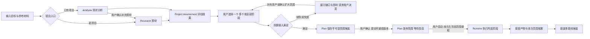
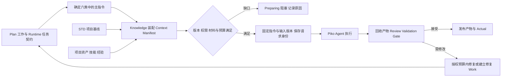

<!-- STD_DOCUMENT_COVER_BEGIN -->
# Slinky v0.3 软件系统设计

| 文档字段 | 值 |
|---|---|
| Document ID | `v0.3-system-design` |
| Document Version | `0.3.0-draft.29` |
| Status | `Draft` |
| Project | `slinky` |
| Document Owner | `Slinky Design Owner` |
| Last Modified Date | `2026-09-16` |
| Template ID | `design.software-system` |
| Template Version | `0.3.0` |
<!-- STD_DOCUMENT_COVER_END -->

## 1. 文档说明

本文定义 Slinky 作为智能参与决策的流程推动器的目标设计。2026-09-16 用户确认的简化边界取代旧固定流程控制及复杂跨系统消费要求；本次不是运行代码切换。

### 1.1 设计位置与上级承接

承接 [SRS](../10_requirements/software-requirements.md)，向既有模块分配职责。历史冻结记录不再批准本次删除的机制。实施输入为本版系统设计、修订后 SRS 与 [接口控制](../60_interfaces/external-service-interface-control.md)，不创建第二引擎或配置路径。

### 1.2 Slinky 简介

Slinky 是智能参与决策的软件项目流程推动器。项目经理等智能角色根据目标、计划、产物、评审和环境事实决定下一步；Runtime 校验并执行决定，不硬编码业务升级链。用户范围、权限及质量要求不能被模型文字改变。

阶段仍用于工程组织和展示，不代表固定 15 节点 AND-join 图自动决定下一步。复用 Plan、Work、Attempt、Artifact、用户事务和 Runtime，不引入任意 DAG 编辑器或通用工作流平台。

Slinky 管业务与环境事务；一个 IR 对应一个 Piko Agent 实例。Piko 管单 Agent 的上下文、工具循环和执行恢复；LLMTier 提供模型服务，不拥有 Agent 会话。

### 1.3 当前权威与下游迁移

本版改写的章节和 SRS/接口文档是当前目标。保留的旧图、示例中固定 Stage 自动推进、Slot/Seat/claim、Tier调用恢复/Cost、SourceInstance、自定义通信协议及跨系统 drain/release 内容均退出当前 authority，仅供定位旧实现。旧下游文件须完成对应改写才能用作实施依据；与变更无关的项目隔离、STD、产物版本、测试真实性及 PR 独占保护继续有效。

## 2. 产品应用与设计目标

### 2.1 场景、用户入口与外部环境

用户通过浏览器访问 Slinky；Slinky 向 Piko 分派任务并接收结果；Piko 调用 LLMTier 的模型服务，并通过授权工具对 Android 手机进行部署、调试和测试。手机不是直接连接模型服务的调用者，Slinky 不代替 Piko 执行 Agent 模型调用。

开发环境由 Slinky 服务端、Piko 执行服务和开发测试资源组成。个人部署可将 Slinky 与 Piko 放在同一台 macOS 或 Linux 主机；团队部署可将执行服务与测试资源分布到多台机器，由 Slinky 统一安排工作。Slinky 服务端需要能够访问 Piko 的服务接口，Piko 执行节点需要能够访问 LLMTier，并取得任务 workspace、构建工具及目标测试环境的授权访问能力。Android 工作使用具备 Android 工具链的执行环境，连接模拟器或真机完成安装、调试和测试。LLMTier 统一提供云模型或本地模型服务。完整部署关系见 §6.3，内部架构见 §3。

新项目从目标和约束开始，已有项目的版本升级还需提供现有代码及设计基线。用户在浏览器中检查计划、工作结果和待决问题；系统将新版本的工作与原版本产物关联，使变更范围和复验范围可追溯。

服务端负责项目、计划、资源与证据；独立 Piko 服务在可访问 workspace 和授权工具的位置执行 Agent 工作，并通过独立 LLMTier 获取模型服务。LLMTier 可以连接云账号或本地/私有模型主机，模型推理算力不必配置在 Slinky 服务端。Slinky 按任务能力安排 IR，模型调用和内部并发由 Piko/LLMTier 处理。

构建和测试机器作为 PR 管理，提供独立 workspace、语言工具链、Docker 服务环境，以及 Android 构建、模拟器/真机资源。Docker 服务环境与设备环境分别登记资源类型和使用条件。PR 根据工作需求匹配资源，确认租约后交执行方使用；执行结束后保存证据、清理并复验环境，合格资源重新进入可用日历，清理失败的资源进入隔离。

项目的并行度同时受可用 IR 和匹配测试环境约束。增加执行节点后，节点上的 workspace、工具链和测试资源先完成资格检查，再进入项目的资源安排。Matrix 可供多个项目共用，Slinky 根据当前项目的授权映射显示房间，用户与 Agent 使用各自身份访问讨论。

用户从 Project Setup 提出 Goal、约束和参考材料。新项目先预研，已有项目先分析现状；用户在 Project Assessment 阅读结果并确认一个、多个或全部工程阶段，再形成对应范围的计划。Agent 执行任务，系统检查产物与证据，不把聊天中的“完成”当成功。用户查看进度、资源和风险，通过 Communication 作正式决定，也能查看 Agent 讨论过程。

Slinky 默认随版本提供一套 STD 文档规范包，包含模板、编写规范、AI 编写指南和示例。个人开发者可直接采用默认包完成需求、设计、测试及报告；已有企业规范的团队可在 Project Setup 替换整套包，或只替换某类文档的模板、指南及检查规则。项目界面展示最终采用的规范和来源，作者与评审 Agent 使用同一项目规范基线。规范选择与文档交付流程见 §8.4/P16。

**Piko 和 LLMTier 是独立软件项目及外部软件系统，不是 Slinky 的子系统或模块。** Slinky 提出消费需求、固定接口版本并验收集成，不拥有它们内部模块、进程、数据库、模型路由及发布计划。Piko 靠近 workspace、LLMTier 远程部署均不改变该边界。

### 2.2 目标、范围与可观察成功条件

| 目标 | 当前成功判据 |
|---|---|
| 智能推进 | 项目经理给出基于证据的决定，Runtime 不因固定 tick 自动派单 |
| 安全执行 | 越权、过期版本、重复执行同一决定和输入越界被拒绝 |
| 单 IR 执行 | 每个 IR/Piko 独立接收任务、返回状态和结果 |
| 失败处置 | 项目经理决定换 IR（例如专家）或放入待用户事务，不采用固定升级链 |
| 多 IR Review | 多个独立 Piko 实例参与指定房间讨论；保留分歧并由 Slinky 收口 |
| 记忆更新 | 普通任务返回建议，Slinky 验收、落库并更新索引 |
| 运维与统计 | 各自诊断恢复；只提供 token Usage，不要求 Cost |

原有多语言工程、Analysis、计划/Gantt、STD、Testing、浏览器交互及数据隔离保留。阶段/输入的选择由项目经理在用户授权范围内决定；跳过质量约束需要相应批准，不把“智能”理解为绕过约束。尚未实现不是设计阻塞，静态检查也不是生产验证。

### 2.3 项目分析与按阶段执行

已有项目允许只包含设计而无代码，Analysis 按实际资产形成基线；code_revision 可为空，所选阶段分别检查必需输入。Plan 在既有 Store 保存不可变范围候选，刷新或重启后按引用恢复；输入变化使候选失效，用户重新预览。发布 Plan/scope 建立 AwaitingStart，用户 start 持久化精确范围的 Enabled 授权和 receipt 后才允许工程派发。入口 Research、Analysis、PM 的权限与后续工程范围分别检查；原执行义务按原身份恢复。字段和恢复规则见 View Contract §12.3。

个人开发者或团队导入已有代码、设计文档和测试资产后，先通过 Project Assessment 了解现状，再选择本次交付范围。典型任务包括从代码补设计、从设计补代码、为已有实现补测试、从旧版本升级新版本，以及从需求到系统测试的完整开发。分析将“代码实际行为”“用户目标”“文档约定”分别记录；冲突交用户决定，不把反向生成的文档自动当作已批准需求。

1. Setup 登记输入来源、不可变版本、目标版本、任务目的与授权。Artifact 固定代码 commit/内容摘要、文档/测试资产版本、STD 基线和来源关系。导入分析默认只读；构建、安装依赖或执行仓库脚本须使用经过授权的 Tools/PR 环境，仓库文本不改变执行权限。
2. 新项目由 Bootstrap Plan 授权Research 工作，按目标/预算开展预研并经原 Review/Gate 接受，形成需求理解、可行性、方案比较、风险与资源需求；不额外运行空资产 Analysis。已有项目由 Analysis 组织资产盘点、设计与实现差异、测试证据适用性和阶段建议。两者都通过既有 Runtime→Piko 工作路径，结果在 Project Assessment 汇合。已有项目出现技术不确定性时先提出有界 Research 建议，用户确认范围与预算后执行，结果补充同一评估。
3. 用户确认执行阶段集合和交付物。集合可以不连续，次序由原 DAG 决定。Plan 对每个所选阶段的每条前置输入建立来源绑定：来自本次所选阶段的有效输出，或来自已接受的输入基线。所有输入要求同时满足；未选阶段保持 NotSelected，不写 Succeeded 或伪造执行记录。
4. 基线资格验证输入契约、组件覆盖、版本一致性、STD 适用性和必要的测试/接受证据。仅有文件、旧成功状态或 Agent 的“可复用”建议不足以通过。缺口列出需要的资产、影响阶段和可选补齐阶段；未确认扩大范围时保持阻塞。资源准入仍由 IR/PR 和外部服务执行。
5. Plan 提交时冻结评估 source manifest、baseline、selected stages、各依赖绑定及 expected deliverables。新项目已接受的入口 Research 保留原 Work/Gate/产物引用，后续计划承接其完成事实；选择全流程也不创建第二个 Research Work。入口预研消耗计入项目总成本，后续范围成本单列。输入或目标改变导致其资格失效时，提示重新预研，由用户批准新范围，不偷偷重跑。Runtime 在 claim、dispatch、接受前重验版本；恢复复用原 Work/Attempt，显式重新运行才创建新 WorkExecution。
6. 选中上游阶段产生新版本后，受影响的下游旧资格失效，包括跨越未选阶段的传递依赖。例如 Coding 更新后，旧版本 Subsystem Test 报告不能为新代码的 System Test 提供准入。Plan 提出补测范围，由用户确认或补充适用证据后继续。
7. 本次成功表示所有所选阶段 required Work 被接受、输出有效且相关外部义务收口。结果同时记录执行范围、复用来源、未覆盖阶段与未解决问题；仅完整范围满足交付门时才宣告全流程交付完成。

系统测试通过同一入口使用已资格项目基线。基线只读保存，每个用例建立独立工作副本和执行身份；内容及资格未变化时直接复核摘要/适用性，不重复调起 Agent 做全项目分析。修改输入或更换 STD/工具链/契约后按影响重新资格。测试流程和验收见 [测试规格 §12](../70_verification/specifications/test-lifecycle-specification.md#12-项目基线复用与指定阶段系统测试)，接口见 [View Contract §12](../60_interfaces/contracts/view-contracts.md#12-项目分析与执行范围契约)。

## 3. 系统概览

### 3.1 软件系统架构

可编辑源文件：[SVG 架构图](../assets/v0.3/slinky-software-architecture.svg)。图中按业务职责划分内部组成，并单独列出外部服务。

View 从各业务模块读取状态并提交命令。Runtime 与 Plan 并列：Runtime 记录工作执行及阶段推进，Plan 记录计划版本及预测；两者通过计划工作引用和执行事实关联。部署组织见 §6。

### 3.2 组成与职责

Slinky 的内部组成按交互层、业务层、领域能力层、公共支撑层组织。交互层承接用户操作，业务层安排和推进项目，领域能力层提供规范、知识与测试能力，公共支撑层提供产物、工具、日志和统计设施。层表示职责分区，模块仍按 §5 的直属父对象归属，不新增部署进程或中间调用层。

用户命令由 WebUI 交给对应业务 owner；业务模块调用领域能力准备输入、取得资格和检查证据，并通过公共设施保存版本、接入工具及记录运行信息。执行事实返回 Plan 更新预测，再由 WebUI 展示。Piko、LLMTier、Matrix 和 Element 作为系统边界外的依赖单独介绍。

#### 3.2.1 交互层

交互层让用户了解项目进度、管理资源、查看 Agent 讨论并提交决定。它读取各 owner 的查询结果，将操作提交给相应命令接口；计划修改、工作接受和资源分配由业务 owner 校验并记录。

| 模块 | 职责与协作 |
|---|---|
| WebUI（M001） | 提供 Project Setup、Project Assessment、Stage Process、Project Plan、Resources、Communication 视图。读取 Analysis、Runtime、Plan、IR、PR 及领域能力的状态；Communication 按当前项目加载授权房间，正式决定提交 Runtime，而不是从聊天内容直接改变项目状态。 |

#### 3.2.2 业务层

业务层负责“项目要做什么、何时做、由谁做以及如何推进”。Analysis 识别项目现状、输入缺口及建议范围；Runtime 与 Plan 并列，分别维护执行事实和计划版本；IR、PR 提供可分配资源，Research 和 Component 提供研究结论及工程结构。

| 模块 | 职责与协作 |
|---|---|
| Runtime（M002） | 读取到期计划和有效输入，申请 IR/PR，委派外部执行，回收结果并按 Review/Validation/Gate 接受产物，记录 WorkExecution、Attempt、Actual 与正式 ActionRequest。 |
| Plan（M003） | 管理 PlannedWork、依赖、排期和 PlanVersion；消费实际进度及资源观察，计算 Forecast/Risk，给 Runtime 提供候选工作。 |
| IR（M004） | 管理 IR 能力与 Piko 实例关联；每个 IR 对应一个独立 Piko Agent 实例，不组合 Slot/Seat/claim。 |
| PR（M005） | 管理环境及非 IR 资源的资格、预约、租约、清理与回收；为 Testing 提供可核验的环境指纹和使用许可。 |
| Research（M006） | 组织有界研究工作，形成带证据的结论、风险和需求输入，经独立 Review 后交后续阶段使用。 |
| Component（M007） | 管理多语言工程的组件、接口、依赖与工具链关系，供 Plan、Runtime 和 Testing 使用同一工程结构。 |
| Analysis（M012） | 盘点已有项目资产、分析差异与证据适用性，形成范围建议和资格候选；用户确认后交 Plan，分析任务由 Runtime 委派 Piko。 |

#### 3.2.3 领域能力层

领域能力层向项目工作提供可版本化、可检查的专业输入与质量证据。三个子系统分别拥有规范基线、知识资格与上下文、测试生命周期；通过明确接口协作，不替代业务层的排期和阶段推进。

| 子系统 | 职责与协作 |
|---|---|
| STD（S01） | 管理默认/用户规范包、导入资格、整包或局部替换、裁剪及项目规范基线；决定规范业务生效，使用 Artifact 保存版本，向 Knowledge 提供解析后的精确规范引用。 |
| Knowledge（S02） | 管理技能、经验及知识资格；消费 STD 基线，结合项目材料形成冻结 Context Manifest，供作者与独立评审者使用；检索使用唯一 RAG，经验晋升保留审查证据。 |
| Testing（S03） | 管理测试设计、资产资格、环境准入、执行记录、Evidence/Oracle、覆盖和测试接受评价；消费 PR 租约，通过 Runtime/Piko 委派工作，将质量证据交回业务接受流程。 |

#### 3.2.4 公共支撑层

公共支撑层为多个业务模块和子系统提供共享设施。业务生效、资格及接受决定仍由对应 owner 作出；公共设施负责保存和传递可追踪的信息。

| 模块 | 职责与协作 |
|---|---|
| Artifact（M008） | 保存产物、规范资产、版本及接受记录，提供精确引用，支撑输入冻结、后继版本发布和追溯。 |
| Tools（M009） | 提供统一工具接口与适配边界，按已批准绑定和授权接入外部能力，将规范结果及错误交还调用 owner。 |
| Logging（M010） | 记录关联 Project、Work、Attempt 的日志及诊断信息，执行脱敏，支持异常定位。 |
| Stats（M011） | 汇总运行及资源统计，区分成功、失败、阻塞和未知结果，向业务查询和 WebUI 提供统计数据。 |

#### 3.2.5 外部软件协作

外部软件独立配置、开发和发布。Slinky 通过公开契约消费其能力，并按接口需求与外部 owner 协作。

| 外部软件 | 提供能力 | Slinky 接入关系 |
|---|---|---|
| Piko | 单 Agent 任务、结果与基本讨论能力 | Runtime 委派工作；Piko 在授权范围内执行编写、工具调用和评审，Slinky 保留项目接受权。 |
| LLMTier | Service Level Registry、模型 admission、usage/observation | Piko 调用模型；Memory 内部使用标准向量化；Slinky 只协调环境事务，不管理模型调用。 |
| Matrix | 房间、成员及消息传输 | Slinky 管理项目 Session、房间与话题关系并发起成员操作；Piko 提供 Agent 通信身份和执行绑定，用户以自己的 Matrix 身份访问授权讨论。 |
| Element | 原生聊天界面 | WebUI 的 Communication 集成 RoomView，房间选择受当前项目与授权映射约束。 |

外部公共 STD 仓库提供默认规范包内容，内容经 S01 导入和资格检查后使用；它不承担 Slinky 内部规范管理模块的运行职责。

### 3.3 总体方案、选择依据与替代方案

采用智能决策、确定性约束和现有 Runtime 执行相结合的方案。计划调整、派单、追加 Review、业务接受和最终失败处置由授权智能角色/用户决定。代码校验权限、版本、范围、输入结构和真实测试状态，记录再执行；模型不能自行扩权。

拒绝继续以复杂跨系统容量/Session/恢复协议解决普通任务分派，不新增第二流程平台。采用标准模型接口与 Matrix 原生能力；特殊扩展需明确需求、标准机制不足之处、最小方案及成本后再确认。

### 3.4 约束分配与下游保证

Runtime 在领取和接受工作时检查 Project、Work 和输入 Artifact 版本，Artifact 保存接受的版本，View 展示对应执行事实。Plan 用 IR/PR 观察安排时间，Runtime 派发前再取得有效使用许可。Knowledge 缺少必要 Standard 时返回资格缺口；Testing 在设计阶段产出 Case、Oracle 和环境需求，在执行阶段检查代码、资产与环境。Communication 将讨论整理为决策材料，只有通过权限与版本检查的正式答复才进入决定记录。

### 3.5 机制清单与文档映射

| Mechanism ID / 名称 | 上级机制 | 过程 / 参与方 | 详细设计或当前来源 | 状态 |
|---|---|---|---|---|
| SM001 项目入口与执行范围 | none | P02；Runtime、Plan、Research、Analysis、Artifact、WebUI | [execution_scope](mechanisms/execution_scope.md) / slinky-mechanism-execution-scope | Draft；共同字段机器化待完成 |
| SM002 Work 委派与资源收口 | none | P04/P07/P08；Runtime、IR、PR、Tools、Piko | [机制设计](mechanisms/work_delegation.md)；Runtime/IR/PR 与 External Contract | Draft；接口与执行证据待完成 |
| SM003 产物接受与失效传播 | none | P13/P15；Artifact、Runtime、Plan、Testing | [机制设计](mechanisms/artifact_acceptance.md)；§8、§11.1 | Draft；接口与执行证据待完成 |
| SM004 STD 与任务上下文 | none | P12/P16；STD、Knowledge、Runtime、Artifact、Piko | [机制设计](mechanisms/task_context.md)；§8.1、§8.4、§8.5 | Draft；接口与执行证据待完成 |
| SM005 计划、PM 与用户决定 | none | P03/P05；Plan、Runtime、WebUI、PM IR | Plan 模块与 View Contract | 待机制设计 |
| SM006 环境与测试证据 | none | P11/P15；PR、Testing、Artifact、Runtime | §13、测试生命周期规格 | 待机制设计 |
| SM007 配置、启动与恢复 | none | P01/P06/P07/P10；Runtime、配置 owner、外部 adapter | §7、§11、fixed-stage-runtime 总纲 | 待机制设计 |
| SM008 项目通信与会话收口 | none | P09/P14；WebUI、Runtime、Piko、Element | Communication ADR、View/External Contract | 待机制设计 |

SM001 使用 SM002 的执行/释放、SM003 的资格、SM005 的 Plan、SM007 的启动恢复；这些是行为依赖，不是父机制。共同规则仍由其唯一 owner 维护；尚未形成机制正文的条目由上述系统摘要承接。SM001 的约束 SM001-R1..R5 分别定位所选范围、启动授权、输入资格、原身份恢复和范围结果，模块沿同一 ID 落实。

各机制的设计缺口及实现准入条件集中在 §17.1。

## 4. 功能与用户交互设计

### 4.1 关键功能概要（按能力展开）

Research 形成证据、假设、风险和需求输入，不选择动态流程。系统设计确定子系统后，Plan 对后续整个周期给出保守估算；子系统、模块及测试设计后逐步分解叶工作、依赖和资源，保留旧版本、估算依据和不确定性。

Runtime 由代码推动。项目经理是逻辑 IR Role，周期、事件和用户消息触发普通 WorkExecution；同一项目最多一个活动 PM 工作，多次触发合并检查原因。PM 检查延误、测试质量、资源拥塞和决策期限，提出建议，超出授权时才升级用户。

### 4.2 页面、命令与交互反馈（按实际入口）

四个 View 使用顶部导航和统一 Project Header。Stage Process 显示并行执行和 Gate；Project Plan 展示甘特图、依赖、资源安排及 Forecast；Resources 展示 IR/PR；Communication 展示进度报告、多 room 讨论与待决问题。Setup 显示输入和就绪证据，缺源显示 typed error，不伪造空数据。

#### 4.2.1 UI 框架与页面分区

WebUI（M001）使用一个共享页面框架。顶部导航固定为四个 Active Project View；Project Setup 是创建项目前的入口。Current Work、Artifact、Action 和运行诊断通过上下文或详情抽屉进入。Conversation 的房间目录位于视图内部。

| 分区 | 固定内容与行为 | 信息来源 |
|---|---|---|
| A 全局导航 | Slinky、四个视图、项目切换和用户入口；切换视图保留当前项目，切换项目清除旧对象选择 | WebUI 路由及当前授权项目 |
| B 共享项目头 | 项目身份、PM、运行/控制/结果状态、Plan Health、基线成熟度、预计完成、预算、测试基线/Promotion、待答复数 | Runtime、Plan、IR、Testing；每项保留来源与更新时间 |
| C 局部工具区 | 当前视图名称、筛选、时间范围、版本、IR/PR 或 Communication 页签 | 当前视图查询条件；不改变其它视图的业务状态 |
| D 业务主区 | Stage 图、甘特图、资源表/日历或房间讨论；表格与图引用同一对象 ID | 对应 owner 的查询结果 |
| E 上下文区 | 当前选中 Work、IR、PR、Session 或 Action 的详情、证据和操作；无选择时显示项目摘要 | 精确对象、版本及权限；详情关闭后回到原列表位置 |
| F 反馈区 | 局部加载、数据更新时间、来源错误、版本冲突、提交结果及恢复入口 | Read/Command 的明确结果；错误显示在受影响区域 |

页面使用浅色背景、蓝色导航和主操作、青色进度、橙色风险、红色需处理问题；状态同时提供文字，不能只用颜色区分。宽屏采用主区加上下文区；窄屏将顶部导航收为明确菜单，上下文改为详情页或抽屉。甘特图和 Stage DAG 在自己的区域内横向滚动；房间列表与聊天在窄屏分步打开，返回时保留当前项目和选中 Session。

本节图片使用统一的 Atlas Android 示例展示目标界面：Android 客户端与 Node.js 服务处于设计和测试设计并行阶段，测试环境容量需要用户决定。示例日期、成员、数量和聊天用于说明交互，不是运行数据或 Element 实测截图。现行布局以本节顶部框架为准，原左栏图稿保留为历史设计输入。可编辑图源与生成入口见 [UI 图源](../assets/v0.3/ui/render.mjs)。

#### 4.2.2 Project Setup：目标、约束与启动

左侧输入目标、组件/语言/平台、预算期限和约束，并选择文档规范基线。STD 默认包可查看版本、完整资产和资格结果；整包替换、局部覆盖和裁剪分别显示解析结果与逐项来源。右侧展示当前启动所需 Runtime/Plan、Piko、LLMTier、IR、Knowledge/STD 的就绪证据，按 scope 区分“当前阻塞”和“后续风险”。

用户选择新建或导入项目，填写已有代码/文档/测试来源及目标版本。点击“检查就绪”触发只读资格查询；修改输入后旧检查结果失效。点击“创建并评估”提交输入及版本；新项目返回 Research Work，已有项目返回 Analysis Work，随后进入同一 Project Assessment。失败保留表单；响应丢失按原幂等请求恢复，不再创建项目。未来 Android 测试环境未准备好时，只阻塞依赖它的工作。

#### 4.2.2.1 Project Assessment：评估结果与执行范围

Research（M006）与 Analysis（M012）分别负责预研和项目现状分析，共用 Project Assessment 视图；不合并为一个评估模块。“评估结果”页签按入口展示内容，“执行范围”页签保持同一选择、资格检查和计划确认交互。

| 入口 | 结果主区 | 公共输出及后续动作 |
|---|---|---|
| 新项目 / Research | 需求理解、可行性、方案比较/取舍、能力资源需求；尚无代码或测试时不显示为资产缺陷 | 预研报告、输入基线、风险/待决问题、阶段建议；用户确认后交 Plan |
| 已有项目 / Analysis | 现状、资产版本与资格、设计/实现差异、补齐及升级建议 | 分析报告、输入基线、风险/待决问题、阶段建议；用户确认后交 Plan |
| 已有项目 + 补充 Research | 保留分析与预研两个来源，关联未知项与研究结论，分别标版本和接受状态 | 展示汇总建议；意见冲突走正式决定，不由 UI 选择最新一份覆盖另一份 |

新项目显示原 Research Work/Gate 与输入版本。预研已经接受不等于需求或方案已获用户批准；待决问题仍可阻塞后续范围。用户选择全流程时，Research 行标记“入口已完成，复用原记录”，其余所选阶段待计划执行；显式重新预研需用户确认新任务，不由全选操作触发。

本页沿用顶部导航和项目头，分为“评估结果”和“执行范围”两个局部页签。先阅读现状与证据，再选择本次要完成的工作。推荐与用户选择分开保存；分析结果、输入资格、范围确认和执行就绪分别呈现。重复提交恢复同一命令，版本冲突重新核验后由用户确认。

**评估结果页签（已有项目）**先回答项目是什么、已有何物、哪些可用、还缺什么。主区上部展示用途、组件/语言/平台、当前版本及分析结论；中部是资产表，列出精确版本、适用范围、资格和证据；下部显示缺口、冲突、未知项与风险，区分“阻塞范围确认”“阻塞未来工作准入”和“范围外风险”。右侧集中展示版本化分析报告、输入基线与阶段建议及理由。分析完成、报告被接受、资产已资格和范围已确认分别显示，不合成一个完成百分比。

点击资产或证据打开详情抽屉，展示 Artifact 版本、摘要、来源、组件范围、qualification/acceptance 引用及失效原因；点击报告打开同一版本文档。点击问题定位关联阶段和必要输入，需要资源处理时进入 Resources，需要用户决策时进入 Communication 的正式 Action。未有 Action 的 finding 只显示现状，不伪造待办或由点击链接隐式创建决定。报告内容很长时在文档详情查看，首页保留摘要与证据入口。

**执行范围页签**将阶段勾选与输入资格核对放在同一页：

右侧保留工程阶段的多选列表，提供全选和清空；清空后禁用范围检查。点击阶段行只切换左侧详情，勾选才改变本地集合，两者分别处理。左侧展示当前阶段的全部必需输入、复用基线或本次阶段输出、资格结果及具体缺口；下方展示整个所选范围的预期交付、不包含事项、资源限制和风险。选择变化立即使旧预览失效；点击“检查范围”返回候选及缺口，不能自动勾选建议的前置阶段。

“确认范围并发布计划”仅在候选有效、所有静态输入满足且用户有权限时可用，提交前列出所选阶段、基线、交付物和未解决准入条件。资源尚未就绪可作为 Plan 风险保留，不代表 Runtime 可派发对应工作。发布成功跳转 Project Plan 并定位新版本；启动执行仍是独立 Runtime 命令。响应丢失恢复原 receipt，不重复发布。报告或基线变更时旧页面显示 Stale，保留用户选择，复核并重新确认后才能提交。

运行中按已完成分析工作项和待处理来源显示进度，不从 LLM 文本估算百分比。部分来源失败仍可浏览已有结果，受影响候选不能确认；全新空项目展示“尚无资产”及完整开发建议，不能混同来源错误。窄屏将主区/侧栏堆叠，证据抽屉改全屏；阶段选择保留原状态，表格可横向滚动，固定提交区不得遮挡末行。键盘可操作页签、行详情和复选框，勾选与详情焦点分离。

本页字段、来源与动作映射见 [View Contract §12.4](../60_interfaces/contracts/view-contracts.md#124-project-assessment-页面投影与动作映射)。图示是系统设计视图，实际浏览器行为须通过 V03-SCOPE-008/011/012 的验证后交付。

#### 4.2.3 Stage Process：项目推进与当前工作

本页按“目标摘要 → 当前计划与工程阶段 → Current Work”排列。目标摘要显示分析引用、输入基线、本次阶段集合和当前工作数。DAG 区分所选、未选、等待输入和执行状态；项目经理决定后续工作安排；代码检查所需输入与权限，不由图自动释放任务。选中阶段显示输入来自本次执行还是既有基线、Gate、阻塞原因和相关产物。范围调整回 Project Assessment 提交新版本，不以拖动或点击图形改写依赖。页面分别展示本次范围完成与全流程交付结果。

Current Work 行显示工作名、状态、责任 IR 和关联产物/Action。点击工作打开同一 WorkExecution 的 Attempt、最终 Result、日志及 Evidence；点击 IR 转到 Resources 并选中成员；点击产物打开精确版本；点击阻塞 Action 转到 Communication 的正式问题。手动刷新或自动更新只替换状态和数值，保留当前选择、焦点及滚动位置。暂停/恢复等项目控制走 Runtime 权限和版本校验，不由 DAG 图形直接改状态。

#### 4.2.4 Project Plan：排期、预测与冲突

工具区选择 Plan 版本、时间范围、Baseline/Forecast/Actual 显示及缩放粒度。主区左侧是工作树、Owner 和状态，右侧是共享时间轴的甘特图；Management lane 显示 PM 周期检查和里程碑工作。底部汇总预计完成、关键路径、IR 缺口、PR 冲突及进度偏差，每项均可定位相关工作。

点击工作或风险打开依赖、估算依据、资源安排、Actual 和影响分析。用户或 PM 的修改先形成候选，Plan 校验当前计划结构、PR冲突、授权及版本后才能发布 successor。提交失败显示具体冲突并保留候选；版本竞争先重新读取差异，再由用户处理，不能覆盖新版本。甘特图不是直接写执行状态的控件，Runtime Actual 也不从条形长度推算。

#### 4.2.5 Resources：智能成员与项目资源

IR 页签展示成员、能力、Piko实例、任务及token Usage；Plan显示安排，Runtime显示真实执行，不展示Slot/Seat/claim组合backing。

PR 页签复用同一布局，展示测试机、Docker 环境、Android AVD 和真机等资源的 readiness、预约、租约、环境指纹及清理证据。点击日历冲突定位重叠预约与影响工作，点击执行引用进入 Current Work。容量不足或观察过期显示缺口与到期时间，新的资源分配须重新资格检查；已占用资源不因观察失败显示为可用。Provider、Account 和 Secret 的配置由 LLMTier 管理界面承担，Slinky 只展示授权管理入口及消费侧状态。

#### 4.2.6 Communication：房间、进度与项目沟通

局部页签为 Conversation、Needs Response、Progress Reports、History。Conversation 分成三栏：左侧当前项目房间目录，中间选中 Session 上下文及 Element RoomView，右侧项目摘要、相关证据、升级状态与待答复入口。目录按 Work/Stage/IR 和 attention 筛选并分页；行包含标题、参与者、最近活动及处理状态。房间名称用于显示，选择使用精确 Session/room 映射。

Progress Reports 展示 PM 周期或事件触发工作的结构化报告，包含变化、风险、建议和来源 Work；History 查询已归档的正式沟通记录。用户在 Conversation 询问进度或讨论方案，Piko/Runtime 按已授权会话关联到管理工作；界面显示提交、等待、答复或失败状态，不创建另一条直接调用 LLM 的聊天通道。

Communication 内嵌 Element 原生 RoomView，用户使用自己的 Matrix session。房间目录只来自 Slinky 授权后的 project→Session→room 映射，不取全量 room 按名称过滤。切换项目先卸载旧 RoomView、取消旧请求，再按 principal/project/session/version 取新描述；过期响应不得恢复旧项目。页面过滤、Matrix membership、用户同步缓存是不同边界。

房间详情提供参与者、话题、关联 Work、关闭状态和备份状态。授权用户可创建会话、邀请参与者、提出/结束话题、关闭房间、申请备份与恢复。关闭、成员移除和恢复需要确认及操作回执；按钮按权限和版本检查启用。History 区分只读会话归档与备份恢复记录，展示事件覆盖范围、缺失附件、校验状态及保留截止，不用一个“已保存”掩盖部分失败。待用户决定的话题显示对应 Action，不因聊天结束自动关闭 Action。

决策 dossier 保留共识、分歧、各方理由/证据、专家意见、PM 建议、影响工作和最迟安全答复时间，提供 exact room 上下文。正式答复校验 actor、版本和幂等 key，聊天不是批准。旧 ExternalLink-only 契约不能满足内嵌要求，不能自动外链 fallback 掩盖失败。详见 [Communication ADR](../90_decisions/project-communication-integration.md)。

#### 4.2.7 Needs Response：用户决策详情

Needs Response 列表按最迟安全答复时间和影响排序，展示问题类型、提出者、受影响工作和当前状态。选中 Action 后打开图中的 dossier：主区依次是共识、争议、各方立场/证据、专家及 PM 建议、可选方案和理由输入；右侧固定显示期限、影响、请求版本及相关 Session。用户可以回到原房间查看 Agent 讨论，再返回当前问题，不能以多数票或最后一条消息替代决策材料。

已授权 Expert 或 PM 能处理的问题先进入对应 Work；超出权限、涉及范围/成本/风险接受的事项才提交用户。正式提交前展示选定方案、理由及约束；服务端校验 actor、Action 版本和幂等 key，返回决定引用及生效/待处理结果。Plan 变更需再经 Plan 校验提交，界面分别显示“决定已记录”和“计划已更新”。并发答复导致版本冲突时保留用户输入、显示最新决定并要求重新确认；请求关闭后输入区只读，重复点击不产生第二决定。

#### 4.2.8 数据与命令反馈约束

| 情况 | 页面行为 | 所需查询或命令能力 |
|---|---|---|
| 首次加载 / 合法空结果 | 分区显示加载态；成功且无记录才显示空态 | owner response、授权 scope、snapshot 与 freshness |
| 部分来源不可用 | 显示受影响区域的来源错误，保留其它可用内容；旧数据标记 Stale | typed SourceError / ContractMismatch、来源及影响 scope |
| 项目或房间切换 | 清除旧详情并取消旧请求；晚到响应按 generation 丢弃 | principal/project/session/version 校验、授权分页 |
| 无权限 / RoomView 不可用 | 隐藏未授权数据，给出明确错误和重新认证/修复入口 | 权限结果、Element descriptor 与原生挂载状态 |
| 提交中 / 已完成 | 防重提交；返回命令引用与状态，再刷新对应 owner 事实 | 幂等 key、版本条件、结构化 command outcome |
| 版本冲突 / 外部结果未知 | 保留输入并展示差异或恢复状态，复用原请求身份查询 | version conflict、原 command/Work/Action 查询与恢复 |

图中所有统计、预测、资格和决定均由已登记 owner 提供。字段级请求/响应、错误及权限继续由 [View 接口契约](../60_interfaces/v0.3/v0_3_view_supporting_interface_contract_draft_20260806.md) 承接；STD Setup 的覆盖解析和 Element 内嵌未闭合项分别按 §8.4 和 Communication ADR 补齐。图片不新增 endpoint 或绕过接口实现。

## 5. 子系统与直属模块概要设计

### 5.1 直属对象概要设计（按子系统或直属模块展开）

| 文档 | 原理与输出 |
|---|---|
| [Runtime](../40_module_design/runtime/design.md) | 依赖评价→claim→Preparing→dispatch→Gate；输出执行事实、Actual、ActionRequest |
| [Plan](../40_module_design/plan/design.md) | 分区细化→合并→全局校验→版本提交；输出计划、冲突和 Forecast |
| [IR](../40_module_design/ir/design.md) | demand→外部 observation→资格→分配；输出完整 IR backing refs |
| [PR](../40_module_design/pr/design.md) | probe/指纹→预约→租约→清理；输出资源日历和有效 lease |
| [Research](../40_module_design/research/design.md) | 有界研究→比较→独立 review→handoff；输出需求、风险、计划/测试输入 |
| [Component](../40_module_design/component/design.md) | 固定组件、接口和工具链关系；不新建按语言分流的 Runtime |
| Analysis | 项目资产盘点→差异分析→资格候选→阶段建议；输入输出和流程见 §2.3，接口见 View Contract §12 |
| [Knowledge](../30_subsystem_design/knowledge/design.md) | 标准→资格→检索→Context Manifest；经验候选单独审查 |
| STD 文档规范管理 | 默认/用户包→资格→替换解析→项目规范基线；流程和边界见 §8.4，详细单元规格待编写 |
| [Testing](../30_subsystem_design/testing/design.md) | 设计→资产资格→环境准入→执行→接受；输出生命周期记录和 Evidence |

六份已有模块规格及新增 Analysis 概要直属本文，STD、Knowledge、Testing 在内部子系统区并列。STD 单独维护规范业务，复用公共版本和工具设施；其独立接口、启动就绪及单元规格须继续细化，部署进程划分在部署设计中确定。Research 按工作需要临时组织 IR 团队；Piko/LLMTier 的消费边界由外部接口契约承接。

Runtime 接收用户命令和 Plan 工作引用，先读输入版本与 Gate，再取得本地 claim；外部副作用前留下原请求身份，结果回收后才执行接受和发布。其输出是执行事实而不是新的计划。持久记录无法验证时停止写执行，外部结果未知时转 P08，而不是重新跑一遍任务。P01/P02/P04/P07 是这条职责的完整过程。

Plan 接收设计分解、Actual、IR/PR 可用性和正式用户决定。PM 的工作清单只是候选，Plan 用依赖图、日历及容量约束检查后提交 successor。运行事实变化导致候选版本过期时拒绝覆盖并重新求解；计划缺资源也必须呈现冲突及预测，不能删掉工作假装排程成功。P03 规定细化与发布顺序，P05 处理越权调整。

IR按任务能力与项目经理决定选择Piko实例；每个IR独立执行。PR提供实际环境许可，不组合模型容量或预留名额。

各参与者返回独立任务状态与结果，由Slinky汇总业务接受；部分失败交PM决定，不宣称跨系统回滚。

Research 在项目输入及必要研究能力具备后接受普通 Work，按证据、假设和比较结论形成可审查输出；独立 Review 未通过不进入 Requirement。多语言模块提供组件/接口/工具链关系，供同一 Runtime、Plan 和 Testing 使用，不根据语言另起一套执行流程。缺少某组件工具链时只阻塞该组件工作，不伪造全项目成功。

Knowledge 接收任务上下文，先匹配硬性标准、模板及权限，再检索技能和经验，输出冻结的 Context Manifest；经验晋升不反向污染正在执行的上下文。Testing 接收同级设计及上级测试设计，先形成 Case、数据、Oracle 和环境需求，再做资产资格、环境准入及执行；它交回质量记录和证据，不以报告文件存在决定 Stage 成功。两者的失败分别交资格缺口和测试失败分类，详见 P12/P15。

### 5.1 软件对象登记表

采用 STD《软件设计对象编码规范》登记稳定 ID。名称、目录与对象 ID 分离：改名不改 ID；Document ID、接口、Stage 和测试编号保持各自体系。图中名称右侧用小字号括注对象 ID，职责在正文展开。下表是本版直属对象的唯一编号来源；软件系统父对象为 Slinky。

| 对象 ID | 名称 | 类型 | 直属父对象 | Document ID / 文档 | 状态 | 旧名称 |
|---|---|---|---|---|---|---|
| M001 | WebUI | 模块 | Slinky | 下级规格待编写；视图边界见 §4 | Planned | View 层 |
| M002 | Runtime | 模块 | Slinky | `v0.3-project-runtime-engine` / [设计](../40_module_design/runtime/design.md) | Draft | Project Runtime Engine |
| M003 | Plan | 模块 | Slinky | `v0.3-plan-module` / [设计](../40_module_design/plan/design.md) | Draft | Plan / Gantt Module |
| M004 | IR | 模块 | Slinky | `v0.3-intelligent-resource-management` / [设计](../40_module_design/ir/design.md) | Draft | Intelligent Resource Management |
| M005 | PR | 模块 | Slinky | `v0.3-project-resource-management` / [设计](../40_module_design/pr/design.md) | Draft | Project Resource Management |
| M006 | Research | 模块 | Slinky | `v0.3-research-stage` / [设计](../40_module_design/research/design.md) | Draft | Research Stage |
| M007 | Component | 模块 | Slinky | `v0.3-multilanguage-web-support` / [设计](../40_module_design/component/design.md) | Draft | 多语言与 Web 支持 |
| M008 | Artifact | 模块 | Slinky | 下级规格待编写；产物边界见 §8 | Planned | Artifact 公共能力 |
| M009 | Tools | 模块 | Slinky | 下级规格待归并；接入边界见 §9 | Planned | Tool Ports / Adapters |
| M010 | Logging | 模块 | Slinky | 下级规格待归并；可观测性见 §13 | Planned | Logging 公共能力 |
| M011 | Stats | 模块 | Slinky | 下级规格待归并；统计边界见 §13 | Planned | Stats 公共能力 |
| M012 | Analysis | 模块 | Slinky | 下级规格待编写；项目分析概要见 §2.3、§5.3 | Planned | 新增 Project Analysis |
| S01 | STD | 子系统 | Slinky | [内部模块登记](../30_subsystem_design/std/modules.md)；完整子系统规格待编写；见 §8.4 | Planned | STD 文档规范管理 |
| S02 | Knowledge | 子系统 | Slinky | `v0.3-knowledge-memory-skill` / [设计](../30_subsystem_design/knowledge/design.md) | Draft | Knowledge / Memory / Skill |
| S03 | Testing | 子系统 | Slinky | `v0.3-testing-subsystem` / [设计](../30_subsystem_design/testing/design.md) | Draft | Testing Subsystem |

内部模块登记入口：[S01 STD](../30_subsystem_design/std/modules.md#2-内部模块登记表)、[S02 Knowledge](../30_subsystem_design/knowledge/design.md#41-内部模块登记表)、[S03 Testing](../30_subsystem_design/testing/design.md#41-内部模块登记表)。各表分别分配 M101–M104、M201–M205、M301–M306，记录目录、旧名、职责、验证关联和详细设计状态；系统表不重复分配这些编号。Piko、LLMTier、Matrix、Element 是外部软件，不占 Slinky 对象编号。旧 V0.2 模块清单尚未采用本编码，保留为迁移来源，不声称已完成其内部模块编码迁移。当前无 Retired 对象；后续删除保留编号及 replacement，不复用。

### 5.2 名称与目录

模块采用简短英文名，源码目录使用对应的小写单词；IR、PR、STD 保留领域缩写。子系统目录承载其内部模块，内部模块最终路径随下级设计登记。

| 模块名 | 中文名 | 目标 code_directory | 当前实现来源 |
|---|---|---|---|
| WebUI | 用户界面 | `src/webui/` | `src/dashboard/` |
| Runtime | 项目运行 | `src/runtime/` | `src/framework/`、`src/flow/` 的编排职责 |
| Plan | 项目计划 | `src/plan/` | V0.3 新增计划能力 |
| Analysis | 项目分析 | `src/analysis/` | V0.3 新增既有项目分析能力 |
| IR | 智能资源 | `src/ir/` | V0.3 外部资源组合能力 |
| PR | 项目资源 | `src/pr/` | V0.3 资源预约及资格能力 |
| Research | 项目研究 | `src/research/` | `src/research_stage/` |
| Component | 工程组件 | `src/component/` | 多语言组件、接口及工具链模型 |
| STD | 文档规范 | `src/std/` | V0.3 规范包与项目基线能力 |
| Knowledge | 知识管理 | `src/knowledge/` | `src/memory/` 的知识、检索与经验能力 |
| Testing | 测试管理 | `src/testing/` | 既有测试 Stage 中的测试生命周期职责 |
| Artifact | 产物管理 | `src/artifact/` | 既有产物版本与接受记录职责 |
| Tools | 工具接入 | `src/tools/` | 既有工具接口及适配能力 |
| Logging | 日志 | `src/log/` | `src/slinky_logging/`；使用 `log` 避免与 Python 标准库 `logging` 重名 |
| Stats | 统计 | `src/stats/` | `src/stats/` |

Component 是原多语言支持模块的新名称，Knowledge 包含 Memory、Skill 和检索职责。Review、Validation、Gate 是 Runtime 的接受流程，Artifact 保存其产物和记录；RAG 属于 Knowledge，配置与投影由各 owner 管理，不再作为拼接名称的模块框。

上述目录是 V0.3 实现归属目标。本轮统一设计目录、名称与引用；现有源码路径仍按基线记录。源码迁移须由逐文件 ISD 明确归属，原子更新导入、入口和测试，不创建兼容包或并行实现。Stage ID、Document ID、接口路径及 Schema 字段不随模块显示名改变。

### 5.3 Analysis 模块概要

Analysis（M012，`src/analysis/`）负责从已有资产形成可解释的项目现状与范围建议。输入是 Project 目标、Artifact 来源快照、Component 工具链及 STD 基线；输出是版本化 AnalysisReport、基线资格候选、差异/风险、阶段建议和证据引用。代码盘点、文档理解、测试覆盖分析通过 Piko Agent 完成；确定性检查验证来源、摘要、结构、权限和完整性，不用硬编码语言规则替代 Agent 分析。

Runtime 创建并执行分析 Work，Analysis 处理领域结果，Artifact 保存其不可变版本和接受记录。Plan 接收用户确认的阶段集合并验证依赖，Runtime 根据同一计划运行工程阶段；Analysis 不直接派发工程任务、不接受项目交付、不修改原仓库。用户补充材料或改变目标时创建新分析版本；可复用部分按依赖保留，失效部分重做。报告被接受与所有缺口消除是两个独立事实，允许用户先完成当前满足条件的范围。

模块详细 STD 规格及源码接线在下一批展开；本批冻结其系统归属、职责和上下游流程，状态为 Planned。

## 6. 运行组织与部署设计

### 6.1 执行上下文、调度与并发

每个 Work 携带 Project、workspace、Attempt、输入版本、权限和资源引用，不以进程级 WORKSPACE_ROOT 传递并行上下文。同项目 claim/accept/共享 Git checkpoint 按 owner/version 串行，无冲突计算和产物生成可并行；Phase worker 与 Stage/Work 配额联合核算，不能相乘超配。

### 6.2 通信与跨实例协作

Review及类似多Agent任务由Slinky组织多个IR，每个IR为独立Piko实例。Slinky提供职责、材料和指定房间；各Piko接收讨论、回复和执行自己的任务，不管理其他Piko。

复用Matrix原生身份、邀请、成员、文本、回复及media。Slinky按当前项目权限展示房间和讨论；不从房间名称推断授权，不把消息自动当作正式决定。业务收口保留各成员意见与未解决分歧，由授权角色决定。

不要求Topic/SID/RID、消息outbox/ingress分类、Run trigger、授权投影或跨系统drain成为产品接口。现有AgentTeams桥只用于项目开发协作，不冒充产品Piko已实现讨论能力。

### 6.3 部署拓扑、资源与故障域

[可编辑部署关系 SVG](../assets/v0.3/slinky-application-scenario.svg)。主机数量、资源规模和跨机协议按实际部署确定。

Slinky 部署原 WebUI/Runtime、所属模块和项目状态/Artifact/RAG 存储。Piko、LLMTier、Matrix/Element、测试环境作为独立依赖连接。依赖故障只阻塞受影响工作，本地只读诊断仍可展示记录及过期时间。六环境采用预配置 PR 单元。

具体数据库、进程数量、备份 RPO/RTO 和部署自动化尚未冻结，见 RT-G01/03/05。旧 summary SQLite 会清理非终态，不是 durable execution ledger；不得把旧实现当作本设计已完成。

### 6.4 操作系统、构建与目标测试环境

#### 6.4.1 支持范围与版本基线

Slinky 宿主运行项目管理服务；Piko 执行节点运行工具链；目标环境运行构建产物。三者分别记录 OS、CPU 架构和软件版本，按工作需求组合。下表选定 V0.3 首轮资格验证基线，状态为设计候选；发布支持清单取其中通过安装、执行、恢复及隔离测试的组合，精确补丁版本随环境指纹固定。

| 层次 | V0.3 版本及架构基线 | 用途与资格检查 |
|---|---|---|
| Slinky macOS 宿主 | macOS 14、15、26；Apple Silicon arm64 | 安装、项目创建、持久状态恢复、浏览器/API 与外部服务连接 |
| Slinky Linux 宿主 | Ubuntu 22.04 LTS、24.04 LTS；x86_64 | 同一服务行为；服务重启、目录权限和并行工作隔离 |
| Piko 执行节点 | 上述 macOS arm64 或 Ubuntu x86_64 | 按 Piko 消费契约检查服务版本、Slot、workspace 和工具可用性 |
| Linux 构建/服务测试 | Ubuntu 22.04、24.04；x86_64；arm64 作为交叉编译目标 | 原生执行或交叉编译分别登记；arm64 产物在匹配的目标节点验收 |
| Android 目标 | Android 13/API 33、14/API 34、15/API 35、16/API 36 | 按应用 minSdk/targetSdk 和功能选择测试集合；模拟器及真机分别提供证据 |

macOS Intel、Linux arm64 宿主、其他 Linux 发行版及 Windows 宿主列入后续扩展评估；其资源不会仅因 OS 名称相近进入上述资格集合。macOS 目标产物在 macOS 节点构建和测试。iOS 的 Xcode、签名、模拟器与真机链路另行确定支持范围。

#### 6.4.2 开发与构建工具链

工具链通过现有 Component Profile 和 PR 环境 profile 表达。项目锁文件确定依赖版本，环境指纹记录实际解释器、编译器、SDK、构建工具及镜像摘要。下列版本用于代表工程的首轮验证；既有项目需要其他版本时先增加对应资格用例。

| 工程类别 | 首轮工具链基线 | 构建与测试方式 |
|---|---|---|
| Python | CPython 3.11、3.12 | 每项目隔离虚拟环境；执行锁定依赖的单元、接口及服务测试 |
| JavaScript/TypeScript、Node.js | Node.js 22、24；包管理器和 TypeScript 按项目锁定 | 分别运行构建、类型检查、Node 服务测试和浏览器测试 |
| C/C++ | Linux GCC 12 或 Clang 18；macOS 使用与宿主兼容并固定版本的 Apple Clang | 固定 C/C++ 标准、构建参数、CMake/Make 版本及目标 ABI；原生与交叉构建分别登记 |
| Android Java/Kotlin | JDK 17、AGP 8.13.2、Gradle Wrapper 8.13、Build Tools 35.0.0；compileSdk 36 | 项目固定 Kotlin 插件版本；构建 APK/AAB，执行 JVM 单元测试及目标设备测试 |
| Android C/C++ 扩展 | Android NDK 27.0.12077973；CMake 版本按工程固定 | 为每个目标 ABI 构建原生库，与 APK 一起执行加载及行为测试 |

AGP/Gradle/JDK/Build Tools 的组合依据 [Android 官方 AGP 8.13 兼容表](https://developer.android.com/build/releases/agp-8-13-0-release-notes)。compileSdk、minSdk、targetSdk 分别记录；应用的 targetSdk 与发布渠道要求在项目需求中确定。Android Studio 可用于人工诊断，自动构建使用命令行 SDK 与 Gradle Wrapper。Piko 自身运行时依赖按其服务发布清单安装，与被开发项目的 Node/Python/JDK 版本隔离。

#### 6.4.3 Android 模拟器与真机

macOS Apple Silicon 执行节点采用 arm64-v8a AVD 镜像及 Hypervisor.Framework；Ubuntu x86_64 节点采用 x86_64 AVD 镜像及 KVM。环境探测运行 `emulator -accel-check`，检查虚拟化访问权限，启动指定 AVD 并确认系统启动完成、ADB 连通和测试应用可安装。模拟器部署在具备硬件加速的宿主上，Docker 用于服务依赖；两类环境分别预约。架构与加速条件依据 [Android Emulator 官方说明](https://developer.android.com/studio/run/emulator-acceleration)。

每套模拟器固定 Emulator 版本、system image 包版本/API/ABI、设备规格、图形模式、AVD 数据目录及端口。并行工作使用独立可写 AVD 数据；恢复快照须匹配镜像及工具版本。测试结束后停止旧执行、恢复基准数据并重跑 smoke，再由 P11 释放环境。启动超时、加速检查失败或 ADB 离线时返回对应环境阻塞及受影响 Work。

Android 真机首轮采用 arm64-v8a、API 33–36 设备，按项目选取机型。Operator 完成开发者选项、USB 调试授权及数据清理许可；PR 登记稳定设备引用、ADB serial、OS build、ABI 和连接节点。USB 作为首轮连接方式，无线 ADB 作为后续独立资格项。执行方使用明确 serial 选择设备，租约覆盖安装、测试、日志回收及复位。断连或停止未确认时保留占用并隔离设备，重新连通后对账原工作。

模拟器用于重复功能与回归测试，真机用于设备接口、驱动差异及项目要求的性能测试。报告分别记录环境类别、镜像/OS build、ABI、应用 hash、签名标识及 Case 版本。

#### 6.4.4 交叉编译与目标执行

交叉编译工作明确区分构建宿主与目标 OS/架构，输入包含 compiler、target triple、sysroot/SDK、标准库、目标最低系统/API 版本和构建参数；产物记录这些输入与源码版本。Plan 分别安排构建资源和目标测试资源，构建完成仅释放其产物依赖，目标测试继续等待匹配环境。

| 构建宿主 → 目标 | 工具与输出 | 接受证据 |
|---|---|---|
| macOS arm64 / Linux x86_64 → Android arm64-v8a、x86_64 | Android SDK/NDK；APK 及对应 ABI 的原生库 | 对应 ABI 模拟器或真机的安装、原生库加载、Case 执行 |
| Linux x86_64 → Linux arm64 | 固定交叉工具链、arm64 sysroot 和目标 libc；ELF/库 | arm64 目标节点上运行测试，记录 loader/libc 与动态依赖 |
| macOS arm64 → Linux 服务 | 由已资格化 Linux 构建节点或指定 Linux 容器镜像构建 | Linux 目标环境执行与接口测试；构建节点与目标环境版本分别入证据 |

Android NDK 的 target triple 与 API 选择遵循 [官方 NDK 交叉构建说明](https://developer.android.com/ndk/guides/other_build_systems)。例如含原生库的 Android 应用分别生成 arm64-v8a 真机包和 x86_64 模拟器包；测试工作依据包的 ABI 匹配资源。ABI 不匹配时 PR 返回匹配失败，Plan 保留目标测试等待及资源缺口。

#### 6.4.5 环境资格与版本升级

Resources 展示环境的宿主/目标系统、架构、工具链版本、资格结果及占用状态。P11 按 profile 探测和执行代表工程 smoke；P04 派发时检查本工作需要的组合。资格记录绑定实际版本，OS、SDK、模拟器镜像或编译器升级后重新验证该环境，正在执行的工作按 P06 保留原引用并收口。

### 6.5 软硬件与模型服务容量设计

Slinky 管理 IR 能力、可联系状态以及实际 PR 环境的安全使用，不组合 Piko 执行容量、共享池、配额、claim 或 Tier Seat。Plan 按任务和人员安排工作，LLMTier 自行处理内部队列/并发。

PR 的 workspace、端口、设备等独占保护保留；不能把取消资源组合协议误解为允许冲突写入。任务不受理或服务不可用时记录原因，交项目经理决定，不承诺 N-slot 原子预留。

## 7. 重要过程

本节定义启动、项目执行、配置生效、停止与恢复过程。过程中的持久记录、共享数据和单次执行上下文的生命周期见 §8.1。

图中 S1、S2 等标识主路径步骤，F/YES/NO 标识条件分支；“回 Sx”表示以原请求或执行身份继续指定步骤。既有图源见 [processes.json](../assets/v0.3/processes/processes.json)；P09、P14 及会话新增过程以本稿内嵌 Mermaid 为当前图源，原 P09/P14 图片保留作修订历史。

| 过程 | 正文/图 | 协调者与触发 | 守卫事实与完成出口 |
|---|---|---|---|
| P01 启动就绪 | §7.1 / P01 | Runtime；启动、恢复、依赖修复后复查 | 配置、writer、原义务、依赖版本；开放就绪 scope 或明确阻塞 |
| P02 项目全周期 | §7.2.1 / P02 | Runtime；用户 Goal | 创建回执、有效 Gate、Acceptance、资源关闭；交付或关闭阻塞 |
| P03 计划/PM | §7.2.2 / P03 | Plan；周期、设计、Actual、用户输入 | 来源版本、日历、容量、批准；successor 或候选拒绝 |
| P04 Work | §7.2.3 / P04 | Runtime；due work | claim、backing、Result、Gate；有效 Artifact/Actual 或保留义务 |
| P05 用户决定 | §7.2.4 / P05 | Runtime；分歧、资源/范围风险 | 授权、各方证据、版本、答复期限；正式决定并对账或继续阻塞 |
| P06 配置生效 | §7.3 / P06 | Runtime 与配置 owner；变更命令 | Schema、probe、边界、版本；确认生效或保留旧版 |
| P07 停止恢复 | §7.4.1 / P07 | Runtime；pause/cancel/restart | 写执行者、结果和释放证据；安全收口或隔离 |
| P08 丢响应 | §7.4.2 / P08 | 原 adapter；响应未知 | 原 key、契约窗口、owner disposition；已知结果或人工对账 |
| P09 Session 生命周期 | §7.4.3 / P09 | Slinky Runtime；创建、关闭、备份/恢复 | 原回执、成员/执行绑定、drain、归档和恢复核对；开放或 RecoveryRequired |
| P10 升级 | §11.4 / P10 | Operator；批准的版本切换 | 备份、未完成义务、兼容、smoke；新版开放或受控回退 |
| P11 环境 | §13.3 / P11 | PR/Testing；预约、执行结束 | 指纹、lease、停止/清理确认；可复用或隔离 |
| P12 知识经验 | §8.1 / P12 | Knowledge；Work 准备/经验候选 | 标准、资格、ACL、证据；冻结上下文/晋升或拒绝 |
| P13 失效传播 | §11.1 / P13 | Artifact/Runtime；successor | 精确引用、运行状态、重验证；新前沿或 Stale/Blocked |
| P14 项目聊天 | §6.2 / P14 | Communication；项目/Session 切换 | 授权映射、请求代次、descriptor、membership；exact RoomView 或错误 |
| P15 测试质量 | §13.1 / P15 | Testing；设计可用/执行安排 | 资格化、前级门、环境、Oracle；有效质量记录或禁止晋级 |
| P16 文档规范与交付 | §8.4 / P16 | 用户/Knowledge/Runtime；规范选择及文档 Work | 包资格、版本、完整上下文、检查及 Review；有效文档或修正/阻塞 |

### 7.1 启动与就绪过程

读取当前项目、计划、授权决定和已记录任务，检查本地数据与必要服务健康。损坏、不可用或任务状态未知时明确显示原因；不合成成功，不启动模型容量/兼容协商。

Piko任务关联存在则先查询执行事实，不因进程重启重新派任务。LLMTier不可用时按环境事务交PM协调恢复。诊断和环境恢复权限按各自设计执行，未经授权不启动外部服务或读取凭据。

### 7.2 一次业务处理的完整过程

1. 用户提出目标/材料，Analysis或Research任务通过Piko提供事实。
2. 项目经理结合现状、计划、质量要求及用户约束，决定具体工作和IR。
3. Runtime校验授权、输入和当前版本，记录决定并向对应Piko派发普通任务。
4. 多IR Review分别派单，各实例在指定房间交流；状态、产物、意见和失败分别保存。
5. Piko返回结果，Slinky组织相应评审、测试与业务接受。机械检查不能篡改真实结果，业务接受不能绕过必要批准。
6. PM根据结果推进、调整、换IR或转用户事务；不依赖固定Stage图自动升级。
7. 需要更新记忆时，派普通Piko任务产生建议，Knowledge验收后持久化并更新索引。

每次业务动作保留理由与事实来源。代码只执行已授权动作，维护版本与隔离；无需Slot/Seat/claim或模型Invocation恢复。

### 7.3 配置生效与模式切换过程

继续使用现有配置来源和owner权限；变更校验成功后才生效，运行任务保留可追溯输入。配置不能在失败后静默切换身份、模型能力或扩大工具授权。不新增旧/新流程双模式开关；迁移方案需避免两套业务决定同时生效。

### 7.4 停止、取消、重启与异常恢复

Piko 在期限、预算与工具安全边界内复用 Pi 的 session、有限重试和执行恢复。无法完成时报告失败原因、已有结果与已知副作用；会话可重开不证明崩溃工具可安全重放。

Slinky 收到最终失败后调起项目经理，而不是按错误码或次数硬编码升级。项目经理认为换 IR 可解决时，将任务重新派给更合适的 IR（例如专家），保留原失败、已执行操作和交接材料；认为需要用户处理时，写入既有待用户事务列表，说明问题、影响、已有尝试及所需决定。

执行状态未知不等于最终失败，先查询 Piko 任务，不盲目重派可能重复副作用的工作。无需 Slinky 参与模型 key/Invocation/ledger 恢复。取消请求与任务实际结束分别记录；Piko 管理自己的执行 Session，不建立跨系统 close/drain/release 守卫。

LLMTier 不可用属于环境事务。Slinky 在授权范围内协调诊断/恢复，或转交用户；各系统分别设计恢复入口及安全条件。环境恢复后由 Piko 报告任务事实、项目经理决定业务下一步，服务启动不等于任务成功。

## 8. 数据与存储设计

### 8.1 业务数据流与形态变换

[可编辑 D01 SVG](../assets/v0.3/slinky-data-lifecycle.svg)。灰色表示持久业务记录，蓝色表示可重建缓存或单次运行对象，橙色表示外部执行与异常，绿色说明释放条件。箭头表示数据读取、变换和确认。

**读取与变换**：用户输入、已接受设计、标准和经验首先形成 A 的精确版本；Plan/Runtime 在 B 保存计划、输入引用、Attempt 和副作用前 intent。Knowledge 从 A 构建可重建索引 D，并按 Work 资格选出片段，E 绑定冻结 Context Manifest。Manifest 的资产引用和请求恢复所需内容需要持久保存；加载的片段、prompt 拼接及序列化缓冲则属于本次调用的临时对象。不能将整个知识库复制到每个 Attempt，也不能把内存释放误当成原请求记录删除。

**回收与接受**：外部执行 G 返回 Result、文件及证据引用，F 先验证 Schema、scope、输入版本，再按 Review/Validation/Gate 决定是否激活 C。无论是否业务接受，恢复和审计所需的 Result/错误证据都按 owner 保存；失败只是不能激活产物，不是丢弃所有记录。派发响应丢失保留 B 并走 P08；发布中断只对账原发布 intent，不重复 G。HTTP 响应发送完成、页面断开或查询请求结束均不证明用户已收到，更不取消已派发工作。

**共享与私有寿命**：D 可供多个工作读，但必须绑定来源版本并执行 ACL；逐出不能破坏正在读取的对象，新版本不能偷偷替换 E 已冻结的输入。一个工作取消，只释放它自己的临时引用/缓冲；共享索引及其他工作不被删除。释放 E/F 前确认使用它们的本地计算/发送已退出，持久副作用继续由 B 跟踪。P07 的停止证明、G 的环境清理、PR lease 释放是三个不同确认；不以本地进程退出推导远端执行也已停止。

**容量与保留**：内存预算至少覆盖共享索引及切换重建峰值、活跃 Attempt 上下文、请求序列化、并发结果解析和 View 投影；磁盘产物大小及 LLM token 数都不能直接当作 RAM 字节数。磁盘还需考虑原版本、候选结果、证据、workspace 及备份在清理前的重叠。具体上限、峰值模型和清理期限由 RT-G01/05 承接，缺少数值时不得宣称某硬件支持 N 个并发工作。LLMTier 的 168h 不代替 Slinky 的保留政策。

**正常与失败复演**：Android 测试工作固定设计 v2、Case v3 和设备 lease，读取同一 Context 后部署执行，证据被验证并形成质量记录，消费者退出后释放临时对象。若结果已生成而浏览器断开，B/G 的执行事实继续保留；若同时设计升级 v3，原证据成为重验证输入，不把 v2 结果自动用于 v3 的接受。若设备停止无法确认，即使内存缓冲可释放，设备仍不可重新分配。

Goal/Constraint→Research evidence/assumption→Requirement/Design→PlanVersion/PlannedWork→WorkExecution/Attempt→ArtifactVersion/TestExecution/Evidence→Acceptance。Context Manifest 是知识选择结果；View 是带版本投影，不是第二 truth。

#### P12 知识选择与经验晋升

[可编辑 SVG](../assets/v0.3/processes/P12.svg)。Knowledge 读取任务/产物类型、Role、Project ACL 和预算，先验证必要 Standard/Template/Profile，再选择合格技能与经验，冻结资产 ID/version/hash、理由和预算为 Context Manifest 交 IR/P04。可选经验为空不必阻塞，但硬性标准缺失、权限不符或预算无法容纳必需内容必须返回缺口，不能用 generic prompt 代替。

执行及独立 Review 后产生经验候选，审查来源、复用范围、敏感内容和有效证据，再晋升新版本。具体复演：代码任务找到经验但模板过期，不能启动；模板更新后重新选择上下文。任务成功产生的一段包含凭据的经验也不能进入 Active；拒绝晋升不改写此次任务产物或旧 Context。旧 Role 文件只保留来源追溯，不与 Knowledge Active 经验形成并行入口。

### 8.2 状态所有权、一致性与持久化

Plan 保存不可变 successor 版本；Runtime 保存 Work/Attempt/obligation；IR 保存 backing refs；PR 保存预约/lease；Artifact 保存有效版本/失效记录；Testing 保存 Case/Execution/Evidence。各 owner 以精确引用交接，Runtime 在副作用发生前记录 intent，并分别记录结果接收和业务接受。

一次执行按三次业务交接保留事实：Runtime 在派发前保存原请求及资源引用；收到结果后保存 Result 与证据引用，交接受检查；Artifact 发布有效版本后，Runtime 对账 Actual 和资源释放。若 Artifact 已发布而 Actual 更新失败，恢复入口读取原发布结果继续对账；UI 在对账完成前展示各 owner 的当前状态与未完成项。持久化实现需保证这些引用和未完成确认在崩溃后仍可定位，具体事务划分见 §17.2 R-D02。

旧[固定Stage Runtime ISD](../50_implementation_design/fixed-stage-runtime.md)仅作存储迁移参考，不是当前实施批准。Acceptance与发布记录不等于业务自动推进；产物实际发布、质量事实和PM决定分别记录。产物失效保留历史，由授权角色决定补救，不自动撤销Git或重跑Agent。

Actual 由 Plan owner 按固定 source transition identity 去重应用，Runtime 保存其确认；确认丢失时按原操作恢复，不重复累计。数据库提交、外部受理、Git 发布和不同 owner 的 Actual 更新不构成跨系统原子事务。物理存储、迁移及写者隔离仍由 RT-G01/02/03 承接；本次细化不批准 SQLite 候选、改变已冻结接口或开启 runtime activation。

### 8.3 缓存、保留、清理与数据迁移

正式计划、产物、接受决定与记忆由Slinky保存。索引与检索cache是派生数据，可在授权范围重建，失败不得返回假成功。记忆更新候选不直接写正式存储；验收、版本冲突与索引状态分别记录。

Piko保存自身Agent会话和执行状态；LLMTier内部保存服务所需记录，不给Slinky复制模型Prompt/Response、credentials或ledger。Slinky备份自身业务数据与授权产物，不把Tier调用恢复能力带入业务备份。

删除/清理须保护仍有实际写入风险的workspace，沿本地/PR既有安全机制处理，不建立跨系统Session close/drain/release守卫。恢复业务备份不自动重派任务、不自动调用模型；先查询Piko任务事实交PM判断。

保留期由各自数据需求设计，不沿用旧Tier168h等时钟作为Slinky统一义务。提供方内部如何清理不是新的三方协议。

### 8.4 文档规范包、项目替换与文档交付

#### 8.4.1 默认包与项目规范基线

Slinky 发布物包含一份固定 revision/hash 的 STD 包及其来源、许可、目录和适用模板索引。发布清单列出已打包的模板、编写规范、AI 指南、图例和可用检查器；项目创建从该本地版本建立规范候选。公共 STD 更新经发布或项目规范变更引入，网络更新不直接改变正在执行的工作。

一个项目仅有一个当前有效文档规范基线。基线保存规范包 ID/version/hash、文档类型到模板/指南/检查规则的映射、裁剪决定、覆盖项与逐项来源，以及项目适用范围。STD 负责解析、资格检查与生效决定，借助 Artifact 按版本保存 successor；Knowledge 按该基线装配上下文，Runtime 将引用绑定工作。部署 Slinky 自身使用的 `docs/std.lock.json` 与托管项目的规范基线分别归属各项目。

#### 8.4.2 整体替换与局部替换

默认模式采用随包 STD；整体替换采用用户包作为唯一基础；局部替换在已选基础包上显式替换条目。解析顺序固定为“项目已批准的条目覆盖 → 所选基础包条目”。整体替换缺少的条目返回缺口，不暗中回补默认 STD。撤销局部覆盖是一次显式版本变更，新工作才重新使用基础条目。

局部替换以模板、指南或检查规则的完整资产版本为单位；替换部分内容时提交包含修改后的完整资产，并记录来源与变更说明。系统不对 Markdown 段落作自动语义合并。一个覆盖键只能对应一个条目；模板与检查器、图例与规范的引用冲突交用户修正。用户可通过裁剪决定调整适用文档，但工作所需交付物必须有可解析的规范。

规范包可以改变文档组织和内容规则；运行权限、Secret 边界、固定 Stage、外部接口和正式接受权仍由系统与项目授权管理。导入仅解析受支持的声明和静态材料，包内脚本先作为未授权内容保存；执行检查器需通过既有 Tool/PR 的资格及权限流程。包路径、文件类型、hash、依赖引用和 ACL 检查失败时，候选不能激活，当前基线保留。

#### 8.4.3 P16 选择、编写、评审与生效

[可编辑 SVG](../assets/v0.3/processes/P16.svg)。用户在 Setup 选择默认包、整体替换或局部覆盖，查看解析后的逐项来源和影响工作，再提交候选。STD 完成完整性、兼容性与权限检查；有权用户确认范围和裁剪后，STD 使用 Artifact 的 expected version 提交项目基线。版本冲突重新读取并确认，未通过候选保持草稿。

文档 Work 按类型取出必需模板、通用规范、专项 AI 指南、项目约束及输入产物；Context Manifest 固定版本/hash 和可授权读取的材料。必需材料通过完整文件提供，长文按明确章节分批读取并保留覆盖清单；RAG 补充相关经验和示例。上下文不足时调整工作分解或合格 IR，材料未覆盖则保持准备阻塞。

Piko 中作者 Agent 根据规范完成分析、正文和图件，并自检；合格评审 IR 检查内容是否形成可推演方案、接口是否对齐、重要流程是否闭环。授权检查工具验证结构、元数据、引用和资产完整性。最终 Result 关联文档、图源/渲染图、规范基线和相同产物版本的检查及 Review 证据。Runtime/Artifact 按 Gate 接受，失败在活动 Run 的预算内修复或转正式修复 Work。

例：团队沿用 STD，仅替换测试报告模板。需求及系统设计仍解析到基础条目，测试报告解析到团队版本；评审者检查最终报告与团队模板及其兼容规则。若新模板删除检查器必需字段，资格检查返回冲突，用户须修正模板或一并提交匹配规则。基线升级后，已运行任务继续使用原版本；未开始的受影响工作重新准备，旧文档通过 P13 决定重验证或显式改版。

#### 8.4.4 接口承接与验收

Project Setup 承接导入、选择、覆盖差异预览、验证、激活及恢复基础条目；Resources 展示有效包和资格状态。
STD 提供包查询、资格、替换解析及基线管理接口；Knowledge 消费解析结果，Artifact 提供 successor 持久化，流程衔接 P06/P12/P13。
需补齐现有接口的规范清单、解析结果、冲突、权限和版本返回，以及 Piko Context 材料读取与覆盖证据。

验收至少覆盖：默认包离线使用、整体替换缺项、局部覆盖精确生效、重复覆盖冲突、模板/检查器不兼容、
恶意路径及未授权脚本、跨项目读取、激活版本竞争、升级期间原任务版本不变、文档结构通过但实质 Review 失败。
字段 Schema、导入限额、检查器资格与真实文档 E2E 在 Knowledge/接口/测试规格中关闭，运行状态与设计基线分别记录。

### 8.5 任务指令与上下文设计

#### 8.5.1 六份 Prompt 基线

V0.3 的 Slinky 任务指令采用六份 Prompt。各文件只描述该类工作的目标、通用方法与协作要求；具体目标、输入、权限、交付物和验收条件由任务契约给出。文档结构和专业规则由 STD 提供，资料与经验由 Knowledge 装配，Agent 的文件操作与工具循环由外部 Piko 执行。该分工复用 Runtime、Knowledge 和 STD，不增加 Prompt 子系统。

| 文件 / 目标路径 | 适用工作 | 关键输出 |
|---|---|---|
| `src/prompts/task.md` | 文档编写、编码、测试设计/执行、资产构造、按已确认意见修改与修复 | 任务契约要求的产物、变更和验证证据、未解决问题 |
| `src/prompts/review.md` | 独立评审；按对应 STD/验收要求检查指定版本 | 发现、依据、影响及处理建议，保留分歧 |
| `src/prompts/analysis.md` | 既有项目现状、资产、差异、复用资格候选分析 | Analysis 报告、资产来源、缺口与范围建议 |
| `src/prompts/research.md` | 新项目预研及经授权的专项预研 | 需求理解、可行性、方案比较、风险和能力资源建议 |
| `src/prompts/plan.md` | 已确认范围的工作分解、依赖、估算和资源安排建议 | Plan 候选、估算依据与冲突；由 Plan 校验发布 |
| `src/prompts/pm.md` | 周期进度检查、问题协调、用户沟通、风险与决策建议 | 进度报告、问题建议、决策材料和相关 Work 引用 |

这六份是 V0.3 设计基线，文件正文与运行接线待实现。每个 Work 使用一个主指令，按工作目的选择而非按语言、Stage 或文档类型复制文件；编码及修复均使用 task，独立复核使用 review。PM 提出计划调整时仍交 Plan 的候选验证流程。通用执行不自动取得评审、批准、发布或扩大范围的权限。

#### 8.5.2 任务契约与材料分工

| 信息 | Owner / 承载 | 约束 |
|---|---|---|
| 主指令与版本 | Knowledge 的版本化资产记录；Runtime 引用 | 固定所选文件、版本和摘要，保持六份目录基线 |
| 目标、输入、工作边界 | Plan / Runtime 任务契约 | Work/Attempt、目标、组件、输入版本、允许修改范围、预算、期限、交付物和接受要求明确 |
| 模板、编写/评审规范与 AI 指南 | STD 项目有效基线 | 默认、整包替换、局部覆盖统一解析后供作者与评审读取 |
| 项目资料、技能与经验 | Knowledge / Context Manifest | 按资格、权限和相关性选取；记录来源、版本及覆盖范围 |
| Agent 执行规则与工具行为 | Piko | Slinky 传入任务与授权材料；Piko 在其工具权限内执行 |
| 结果及接受约束 | Runtime / Artifact / Testing / Plan | 程序校验身份、版本、Schema、写集合、证据和 Gate；专业评审由合格 IR 完成 |

TaskRequest 与 Context Manifest 沿现有接口承载这些信息。Manifest 的资产条目登记主指令及 STD/项目/经验引用；需冻结指令摘要、输入版本和本次语义请求以支持恢复。新字段的精确名称和类型在同一 Runtime/Piko 消费契约中对齐，接线前完成 Schema/fixture 验证。Prompt 只表达工作指令，权限、额度、取消、版本检查与结果校验由程序执行。

#### 8.5.3 装配、执行与变更流程

Runtime 按既有工作/角色描述确定主指令，Knowledge 校验其版本及必需材料，复用 P04 的准备与派发过程。STD 文件按 §8.4 提供完整材料或有覆盖记录的分批读取；选择片段的 RAG 用于补充经验与示例。缺少必需指令、规范、权限或上下文预算时保留准备缺口，由原 owner 修复后重验。

同一 Attempt 恢复沿用原指令/材料版本与请求身份；升级后的指令只用于重新准备的新工作。输入、规范或主指令变化触发既有失效检查，按影响复验。程序报告的格式/Schema 错误可交活动 Agent 在授权预算内修复，超限则返回明确失败或进入正式修复 Work；专项 JSON/Markdown 修复提示文件归并至 task 与相应契约/工具反馈。仓库文档、经验和检索内容按来源权限消费，不能改变任务授权。

#### 8.5.4 旧资产迁移与验证

本轮盘点 `src/prompts`：157 份指令、73 份模板、71 份标准、197 份经验和 1 份 Runner Schema，共 499 份业务文件。盘点范围不含代码内嵌字符串和测试副本；迁移需继续登记它们的调用者。

旧生成/修改/修复指令归并到 task，独立评审归并到 review；分析、预研、计划、PM 使用各自入口。模板转入 STD；标准按内容归入 STD、任务契约或程序检查；经验转入 Knowledge，经资格审查选用；Runner Schema 归接口契约。保留原来源与必要业务规则，逐项记录旧文件/调用者、目标 owner/资产、删除或合并理由和回归用例。

迁移顺序：完成六份正文与任务映射 → 对齐唯一 Context/TaskRequest 接口 → 六类真实任务试运行 → 正负及恢复回归 → 同批切换调用者并移除旧路径。旧 V0.2 文件在替代能力验证前保持现状；V0.3 切换后仅保留一条加载与执行路径。专业内容优先完善 STD/Knowledge，任务差异优先进入任务契约；新增 Prompt 须经设计评审。

验证重点包括六类工作映射、文档/代码/测试共用 task、独立 review、必需材料缺失、STD 替换、越权材料、指令版本升级与恢复、格式修复预算、旧加载路径移除。通过材料/Schema 静态检查后继续真实 Piko 集成验收，记录所用主指令、STD、输入与证据版本；验收矩阵见 [测试规格 §13](../70_verification/specifications/test-lifecycle-specification.md#13-六份-prompt-与上下文装配验证)。

## 9. 接口与通信协议

### 9.1 外部入口与内部接口权威

当前所需接口以 [接口控制](../60_interfaces/external-service-interface-control.md) 和 [最小消费契约](../60_interfaces/contracts/external-service-contracts.md) 为准。旧候选包的字段/hash 不反向构成需求。

### 9.2 单项操作、类型与错误实例（按接口展开）

| 关系 | 必需能力 | 限制 |
|---|---|---|
| Slinky -> Piko | 任务提交、查询、取消、结果及 token Usage | 不接管模型调用/恢复 |
| Piko -> LLMTier | 标准 OpenAI-compatible 模型调用，必要逻辑等级选择 | 无 Agent 会话、工具循环或 KV 管理协议 |
| Memory 内部向量化 -> LLMTier | 标准 Embeddings 模型服务 | 仅分块/索引/检索依赖，不成为 Slinky Agent 推理旁路 |
| Agent <-> Matrix | 邀请、加入/退出、文本、回复及原生附件 | 不以自定义 Topic/SID/RID/trigger 为必要前提 |
| Slinky 环境事务 | 各系统授权的诊断和恢复能力 | 运维权限不等于介入 Piko 任务 loop |

记忆语义更新交 Piko 执行，接受后的向量化属于 Memory 内部实现。embedding 模型与维度一致性由 Memory 服务适配细化，不假定小生成模型可替代向量模型。

### 9.3 维护调试入口与访问方式

优先既有健康检查与标准服务管理手段。只读诊断不授予重启、清库、凭据修改或收费 probe 权限。各系统分别设计安全恢复，不另建统一跨系统恢复协议。

## 10. 配置与环境管理设计

### 10.1 配置来源、校验与生效范围

每项能力仅一个 active binding，明确 owner、版本、校验、scope、生效方式。Slinky 不回读 Piko/LLMTier 私有配置，仅持客户端所需受控绑定，不获取 Provider/Matrix AS Secret。LLMTier 管理界面由外部项目提供。

项目输入由 Runtime 保存版本；环境 profile 由 PR 用于匹配和探测；系统配置由对应 owner 经 P06 激活；单次执行上下文由 Attempt 引用已选版本。六环境各自登记 workspace、端口、网络、service、数据及身份归属，PR 按这些维度检查冲突，再运行真实消费者 smoke；通过后发布可用资源单元给 Plan。

## 11. 可靠性、维护与升级

### 11.1 故障模型与恢复保证

区分本地数据错误、Piko执行失败、执行状态未知和服务环境不可用。Piko负责执行内恢复，Slinky PM负责最终失败后的业务决定；各系统运维负责其环境。未知不能冒充失败/零/已释放，不盲重派副作用。

不保证跨系统exactly-once。保留本地事务、版本检查、产物完整性与已有PR写保护。任何破坏性修复、重启或收费诊断均须处于相应授权范围。

### 11.2 统计、日志与故障定位

估算来自设计及工作量输入，Forecast 来自当前计划和资源观察，Actual 来自 Runtime 接受的执行事实，View 分列展示。数据缺失标 Unknown，只有部分来源返回时标 Partial，并列出缺失来源。每项阻塞关联 Project/Work/Attempt、错误 code、责任 owner、是否可重试、最后成功步骤及 evidence ref；运维人员据此定位外部请求或租约。遥测记录稳定 ID 和脱敏错误，Secret 与聊天正文留在各自授权边界内。

### 11.3 自检与诊断设计

Slinky检查本地状态和引用完整性、Piko任务可查询性及必要环境健康；各系统分别设计诊断和恢复。任务标识与脱敏错误足以关联业务，提供方内部日志由其owner处理，不要求全量ledger或模型正文交换。

区分请求错误、执行失败、网络不可达和环境配置问题；证据不足明确未定位，不以“没有日志”认定未收到。Secret不进入普通日志；只读权限不等于重启、reset或收费probe权限。

恢复环境后重新获取任务事实交项目经理决定，不从服务健康直接推断任务成功；不建立模型级统一恢复协议。

### 11.4 升级与回滚

采用受控 atomic cutover，删除 embedded Tier/mlexp/provider-direct 旧业务路径而不保留 fallback。切换前备份、迁移演练、未完成义务对账和旧消费者扫描；失败回到批准的整版不可变基线，不混用旧进程和新状态。实际发布命令仍需运维设计及验证。

[可编辑 SVG](../assets/v0.3/processes/P10.svg)。Operator 固定批准的代码、状态 Schema、配置、外部契约及迁移映射，先 P07 停新派发并收口，验证备份可恢复、引用完整及未完成义务可迁移后才开始。迁移后保持业务准入关闭，执行 P01 和真实消费者 smoke；通过后才批准开放。数据库及迁移工具尚未选定，RT-G01 未关闭就不能执行这项操作。

开放前失败，可在确认新 writer 隔离后恢复匹配旧版状态及制品，再 P01 检查；开放后失败则先 P07 封闭新准入并对账新增义务，不能直接恢复旧快照丢弃已经发生的外部副作用。具体复演：新版已经派发一次编码后故障，备份恢复不是删除该 Run 的授权；必须保留该请求的恢复 identity 并制定兼容回退/修复方案，未证明安全则停留隔离状态，不启用旧 embedded Tier 旁路。

## 12. 性能、容量、扩展与兼容性

### 12.1 预算、瓶颈与扩展边界

Piko 内部限制任务耗时与重试，LLMTier 内部限制并发，Memory 内部限制索引与检索资源。Slinky 展示业务延迟，不组合模型名额或保证原子预留。

只要求 token Usage：输入、输出、总量，后端可提供时附缓存用量。实际、估算、未知可区分，缺失不填零，重复查询不重复累计。Coding Plan 不按 token 换算账单；Cost、币种及 pricing version 暂不做。专用兼容协商/readiness 协议退出范围。

## 13. 可测试性与验收设计

### 13.1 主要测试方法与结果判定

沿用 [V&V](../70_verification/plans/verification-validation-plan.md)、T0-T8 和 [Runtime测试设计](../70_verification/specifications/fixed-stage-runtime-tests.md)。Requirement→Design→Contract→Case→Execution→Evidence→Acceptance 可追溯。Passed/Failed/Blocked/Invalid/Stale 分开，仅 policy-valid PASS 计入接受覆盖率。

[可编辑 SVG](../assets/v0.3/processes/P15.svg)。同级 Design 和要求的上级 Test Design 生效即可开始测试设计，产出用例、数据、Oracle、环境需求及估算，不等待未来代码。进入执行前依次核查资产构造/资格化、前级质量门和环境准入，再执行并回收带完整版本的证据。只有有效 PASS 才发布质量记录供上层消费；报告是投影，不能反过来成为执行成功来源。

具体复演：测试脚本返回零，但受控错误变体也返回零，T4 资格化失败，不能把测试投入系统接受。已通过的用例若输入版本变更则标 Stale，经 P13 重验证。测试失败分别归属产品、契约、环境、资产或 Oracle，修复后明确范围重跑，不通过修改预期值让缺陷消失。

### 13.2 受控故障与异常收口验证

Q-V03-02 覆盖 headers全丢、record前后crash、UnknownOutcome和0/至多1/1 dispatch；Q-V03-04 覆盖snapshot失效。另测claim/accept竞争、Git publication、部分资源获取、lease失败、cleanup、Closing drain和重复用户决定。

### 13.3 测试环境快速部署与复位

T5 固定镜像、依赖、配置、端口、数据和 PR 指纹，probe 后用真实消费者 smoke。复位先停止工作并确认外部义务/资源释放，再按 owner 清理；失败 quarantine，不向下一用例报 Ready。

[可编辑 SVG](../assets/v0.3/processes/P11.svg)。PR 匹配预配置独立单元，核验 workspace/port/network/service/data/identity scope 和指纹，探测后运行最小真实消费者。Plan 的预约仅决定安排，使用前仍由 PR 确认 lease/owner/expiry/fencing。执行中续约失败先停新步骤并 P07 收口，不能到期直接分配给别人。

清理先证明旧执行已停止且 owner manifest 的范围正确，再清理、复位并复验指纹；全部确认才释放日历占用。具体复演：六环境之一目录残留前一用例的数据，即使 Docker healthy 也被隔离；清理不允许删除共享测试根。资源隔离导致计划延期时 Plan/PM 展示受影响工作和建议，不隐藏失败或调换环境身份。

### 13.4 并发测试与环境隔离

并行验证多个IR/Piko任务和真实PR环境隔离。workspace、端口、设备及用户权限冲突必须被阻止；不使用SourceInstance或模型Seat作为隔离凭据。

测试多IR独立成功/失败、PM重新派专家与转用户的不同决定、环境恢复但任务未完成、取消仅受理、结果未知及记忆建议版本冲突。token Usage缺失/估算/真实零分别检查，不做费用换算。

单环境与多环境运行验证留到实现阶段；设计评审不要求生产capture，真实运行测试不以旧机器fixture通过代替。

### 13.5 自动化、复现与验证覆盖

#### 13.5.1 资产闭包与自动执行链

每个 Case 都必须从空的、已准入工作区依次执行 `materialize → readiness → execute → observe → compare → cleanup`。闭包包含当前 spec、输入 Artifact、authority snapshot、源码/工具依赖、before/mutated/recovered 数据、Oracle 和清理范围。共享 qualified baseline 绑定 identity、source、要求版本、文件 hash 与 qualification；跨版本失配在启动业务前拒绝，不能为某个 Case 手工改 hash。独立 Case 使用合格基线，不在每次准备时完整重跑上游 LLM Stage；专门端到端 Case 才按其计划执行全链。

T4 先验证 runner 和工具入口自身：正常/非零退出、signal、timeout、无退出记录、格式损坏、后代残留、响应丢失、路径包含空格和环境变量传播。使用已有 TestExecutionPort 和正式 launcher，恢复复用同一入口；禁止人工拼接多层 SSH/shell wrapper 作为正式路径。结构化 argv、cwd、环境及预算在派发前保存，子进程结果通过原执行适配器捕获。脚本兼容入口若仍要求退出码文件，必须由真实 wait 结果生成并校验类型，禁止本地 shell 提前展开 `$?`、写死零或补写旧结果。

#### 13.5.2 多层结果与报告选择

Testing 分别统计 data ready、materialized、runner debug passed、functional executed、有效 PASS、Fail、Blocked、Invalid、Stale 和未执行。前三类不能累计为功能通过；报告存在、命令零返回、容器 Up 或 mock-debug 通过均不能替代目标 public flow 的最终 Oracle。

| 证据 | 必须核对的内容 | 不一致时的结果 |
|---|---|---|
| 执行记录 | Case/Execution/Attempt、source、mode、profile、assignment、lease 和调用引用 | 缺少或冲突为 Invalid/待恢复，不进入接受覆盖 |
| 进程/协议结果 | 命令、实际退出码或 signal、timeout 来源、HTTP/CLI/Browser 结果、开始/完成时间 | 区分基础设施不可判定与有证据的产品失败；保留原始结果 |
| 业务 Oracle | 输入/输出版本、依赖调用、前后状态差异、最终 Artifact 与接受条件 | 有效观察与要求不符为 Fail；Case/Oracle 缺陷为 Invalid |
| 清理与隔离 | 当前资源收口、非目标资源保持、复位及指纹复验 | 功能观察保留，但环境不可重用；完整闭环和晋级保持阻塞 |
| 汇总 | 当前验证基线下每个 Case 的选定 attempt、选择原因及历史引用 | 不选择任意历史 PASS，不掩盖最新失败/中断 |

退出码必须按对应入口契约解释：Case 的 PASS 不要求带历史 BUG 的批次聚合也返回零；批次“完整执行且有产品失败”与 runner 崩溃是不同事实。未知/缺失退出证据先进入恢复判定，不手工修成 PASS。append-only 执行记录保留全部 attempt；每次报告固定当前 source/profile/mode/Case hash 的选择集合，后续中断仍显示为中断，不能静默回退旧 PASS。修复后按机制 family 重跑全部影响 Case，再执行要求的层级回归；当前版本未执行的 Case 不继承旧版本结果。

#### 13.5.3 自动化覆盖与可复现交付

每个正常 Case 配套能够破坏关键最终结果的负例；验证真实代码/契约 mutation，而不只修改报告或 LLM 文本。Browser 验证同时保存 DOM 断言、Network、Console、实际 owner 记录，覆盖 loopback/LAN origin、刷新与注入竞态、项目切换、登录过期及缓存隔离。LLMTier/Provider 返回未知用量保持 unknown，不为满足错误 Oracle 合成数字；真实凭据及外部能力由 owner 通过引用提供，过期返回明确 blocker。

测试前固定 DB/日志基线大小和磁盘余量；正常功能回归使用受控数据规模，大数据/SQLite contention 单独作为容量场景，保留 p95/p99 和 resource evidence。完整证据包保存 source、依赖/镜像/配置/外部版本、Case/数据 hash、命令、身份及租约、预算、原始协议结果、Oracle、cleanup 和报告选择清单。Secret 用引用替代，脱敏前后证据保持授权可追溯；运行日志、大型 DB 和截图进入受控证据存储，不混入源码输入。

环境回归矩阵和 V0.2 来源映射见 [测试生命周期 §11](../70_verification/specifications/test-lifecycle-specification.md#11-v02-环境问题回归矩阵)。验证按 Unit/Contract → Module → 真实单环境 → 1/2/6 环境故障与容量矩阵推进；逐级使用生产入口，pilot 不代替全量。进入 T8 前要求必需 Case 无未执行、unknown、stale、资产缺陷或未关闭环境阻塞，且最终汇总可由选定执行记录重建。设计检查只证明图、契约和追踪一致，真实 Piko/LLMTier/Matrix/Element 及恢复、隔离、容量证据单独验收。

## 14. 信息安全架构

### 14.1 身份、权限、数据与供应链边界

Project/Work/IR/PR/Artifact/room 使用稳定 ID，每次 command 校验 actor/scope/version，检索执行 ACL；外部网页和 Agent 发言不成为 authority。Piko 持 Agent Matrix身份，用户 Element 持自己会话，LLMTier 持 provider credential。浏览器 bundle/日志/Artifact/RAG 不含服务 Secret。Element origin、版本、membership/供应链需真实验证，不绕过 CSP 或以 Slinky relay 代发聊天。

## 15. 开发、构建与交付设计

### 15.1 构建复现、依赖与发布物

Slinky 发布物包含服务端代码、WebUI、配置 Schema、状态迁移、测试及运维说明。发布记录绑定本项目代码版本，并列出消费的外部 API/Schema、SDK、Element 版本、hash、许可及兼容证据。部署者依据同一记录准备外部服务，按 P10 完成迁移、启动和消费者 smoke 后开放业务。

默认 STD 规范包作为版本发布物一并交付，保留来源和许可清单，安装后可离线解析模板及指南。包内容按 §8.4 校验，升级保留项目原基线引用及仍被工作使用的资产。

## 16. 实现计划与集成顺序

沿用WBS：D01需求→D02系统；T01系统测试设计与D03模块/逐文件ISD并行，D04冻结外部接口；T02细化测试，T03资格化资产，T04准备环境；I01..04实现Runtime/Plan/IRPR/Adapter并做T05真实纵向试点；F01..04完成Knowledge/Testing/四View/Element；T06..09完成模块、子系统、六环境、系统测试及调试；R01..03完成运维、旧路径删除与验收。

测试设计、用例/数据/Oracle、资格化、执行、调试均是计划工作。D02/D03仍InProgress，模板迁移不关闭实现Gate。

## 17. 设计决策、风险与下游承接

### 17.1 下级设计与组合验收任务

本轮变更目标设计，不修改生产代码。旧固定 Stage ISD、复杂 provider machine contract、历史冻结签署只保留来源意义；已撤回内容不得据其实施。各模块按本版分工细化并复用现有实现，不建立第二运行路径。

### 17.2 尚需完成的具体设计决定

用户方向已明确。下游需细化普通任务字段、PM 决定与既有记录映射、标准讨论/附件适配、Memory 建议验收及 embedding 配置、各自环境运维流程。这些属于设计工作，不以“未实现”阻挡收口。真实不一致需回报，不为假设场景追加协议。三方新机器契约仍需提供方同步，runtime_activation=false。

## 附录 A. 设计输入、适用性与派生关系

输入为SRS、版本计划、固定DAG fixture、Communication ADR、View/External ICD及旧V0.3子方案。旧目标/约束/构建块/流程/数据/安全/质量/风险归入2/3/5/7/8/14/13/17章；原文hash和逐份映射见 [迁移记录](../98_migration/std-software-upgrade/migration-map.md)。本文派生Slinky模块/接口/测试，不派生外部项目内部设计。

术语：PlannedWork为计划工作，WorkExecution为执行实例，IR为组合成员，PR为非IR项目资源，Effective Artifact为Gate激活的精确版本，ParticipantActionRequest为正式授权答复请求。

## 附录 B. 文档控制、修订与交付检查

2026-09-17 / draft.29：依据用户逐项裁决转为智能流程推动器；修订PM/Runtime分工、多IR、记忆建议验收、失败转用户、token Usage与环境恢复，撤回旧复杂跨系统消费要求。旧图与下游冲突条款明确退出实施authority，未声称完成三方新机器签署或运行验证。

2026-09-16 / draft.28：将无 Agent 会话状态网关边界、调用级恢复及 SourceInstance 的最小用途写入 §8.3；外部 wire 和历史冻结证据不变，不新增管理机制或启用运行态。

2026-09-16 / draft.27：同步 R-D02 下游细化，补充发布确认前不生效及 Actual 原操作去重恢复，引用 Runtime ISD draft.3。系统职责、主流程和三方接口不变；物理存储、迁移与写者隔离门禁仍开放。SLK-DF-20260916 所记录的 draft.26/hash 保留为历史签署基线，不以旧 hash 声称本修订已复审。

2026-09-16 / draft.20：记录 P-20260916-ed155f05022c 对身份/Session/期望版本映射及四例的接受；补首次受理与幂等恢复、不可见与 mismatch 的检查边界。RT-G08 机器契约仍待冻结。

2026-09-16 / draft.19：吸收 P-20260916-c15ae0d00e83 的分层绑定、两侧撤权提交点、drain 证据和 Piko 备份边界。agent_binding_ref 的请求字段映射仍由 RT-G08 收口，未静默改义。

2026-09-16 / draft.18：吸收 L-20260916-c423d704df60，集中定义 COMM-EXT-01，并固定外部义务未收口禁止 Closed；追加备份零 Tier 调用、最小引用保留及晚到证据 oracle。未修改外部机器接口。

2026-09-16 / draft.17：自审补齐人的 membership 与 Agent 绑定区别、立即撤权、绑定版本与迟到事件、Topic 转交/取消出口、恢复阶段守卫及当前删除记录校验。同步 Communication ADR 的目录和总结职责；外部接口待联合评审。

2026-09-16 / draft.16：按用户确认由 Slinky 管理项目会话、房间及话题；补创建/关闭/备份恢复图、状态与成员绑定、受限归档、保留策略建议及 V03-COMM-106..110。Piko/Matrix 接口修订由 RT-G08 承接，原运行接口未改。

<!-- STD_DOCUMENT_CONTROL_BEGIN -->
| 字段 | 值 |
|---|---|
| Authority | `slinky` |
| Authors | `原方案作者（原始 attribution 见固定来源 commit）, Codex（主干设计归并）` |
| Created Date | `2026-09-07` |
| Template Conformance | `legacy-mapped` |
| Tailoring Reference | `none` |
| Migration Map Reference | `docs/98_migration/std-software-upgrade/migration-map.md` |
| Repository | `corezilla/slinky` |
| Canonical Path | `docs/20_system_design/system-design.md` |
| Supersedes | `none` |
<!-- STD_DOCUMENT_CONTROL_END -->

2026-09-13：采用软件系统模板章节，明确独立外部系统、纠正过期需求和Element描述，补正常/异常过程与缺口承接。成员映射、数值预算和物理恢复尚缺，不声明native/design-complete。Review Verdict、Document Status、Runtime Activation独立；本稿不批准发布、RAG ingestion或环境变更。

2026-09-14：升级至软件系统模板 0.2.0，按最新 AI 指南先复演启动，再扩展 P01-P15 图文过程；补齐各过程输入、守卫事实、失败出口与正常/故障案例。保留静态架构图和固定 Stage DAG。检查记录见 [本轮系统设计复核](../91_reviews/system-process-review-20260914.md)。原迁移记录仍是历史来源，本轮不覆盖其验证结果。

2026-09-14 / draft.4：补充 §2.1 逻辑应用场景图，纳入个人/中小团队、macOS/Linux 服务端、外部 Piko/LLMTier、独立测试机、Docker 与 Android 设备环境。标明新增多语言/Node.js/Android 方向及下级矩阵待同步，不复用 draft.3 的 hash 声称本修订已审定。

2026-09-14 / draft.5：参考 HIFM 企业应用场景插画的表达方式，重画 §2.1 人物/应用/设备场景，原方框关系图移至 §6.3。插画只表达用途，不成为 UI、部署数量或运行证据的 authority。

2026-09-14 / draft.6：采用用户确认的简化应用场景图，仅突出用户、Slinky、Piko、LLMTier 和 Android 设备的业务连接。

2026-09-14 / draft.7：采用 STD 软件系统模板 0.3.0，建立六类图例对应，保留确认图及 P01–P15，补充 D01 数据形态/寿命图、启动失败临时清理边界和配置切换失败后的可用性；不改变已冻结业务接口或引入示例机制。检查见 [图例更新复核](../91_reviews/system-diagram-examples-review-20260914.md)。

2026-09-14 / draft.8：清理正文中的编辑过程和重复声明，补充资源日历检查算例、结果发布对账和诊断入口；归纳五项仍需完成的具体设计决定。自审见 [设计实质性复核](../91_reviews/system-design-substance-review-20260914.md)。

2026-09-14 / draft.9：新增 §6.4 环境支持章节，定义宿主 OS 与架构、构建工具链、Android AVD/真机、交叉编译和目标验证矩阵。版本组合为首轮资格设计基线；模板检查、54 项设计基线测试及 diff 检查通过，环境运行资格尚待执行。

2026-09-14 / draft.10：加入默认 STD 文档规范组件，定义整包替换、局部资产覆盖、项目版本及 P16 文档交付流程；同步架构图、Knowledge 承接和 View 接口义务。实际打包、字段规格和文档 E2E 待完成。
