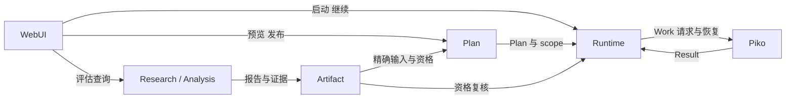
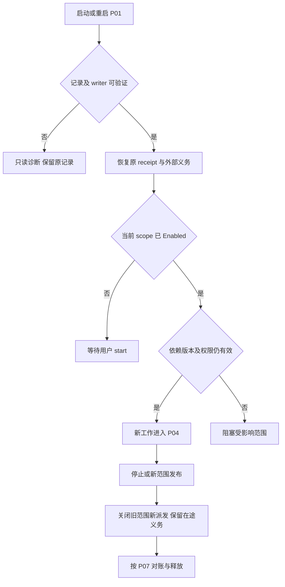

<!-- STD_DOCUMENT_COVER_BEGIN -->
# Slinky 项目入口与执行范围机制

| 文档字段 | 值 |
|---|---|
| Document ID | `slinky-mechanism-execution-scope` |
| Document Version | `0.3.0-draft.1` |
| Status | `Draft` |
| Project | `slinky` |
| Document Owner | Slinky Design Owner |
| Last Modified Date | `2026-09-15` |
| Template ID | `design.system-mechanism` |
| Template Version | `2.3.0` |
<!-- STD_DOCUMENT_COVER_END -->

## 1. 机制摘要：解决什么问题

开发者可以交给 Slinky 一个目标，也可以交给它一份已有设计或代码，只执行本次需要的阶段。例如，一个已有设计、尚无实现的项目，先由 Analysis 核对设计与验收依据，再让用户选择 Coding。Plan 展示这一选择需要的输入和交付物；用户发布计划后仍可查看和调整，点击启动才授权 Runtime 执行。以后补测试时复用同版本有效资产，无须重新跑一遍研究和编码。

这项能力需要四类不同事实：Research/Analysis 提供评估，Artifact 提供接受与资格依据，Plan 固定执行范围，Runtime 保存启动授权并执行。评估报告通过不等于用户选择了全部建议，计划发布也不等于已经启动。把这些确认分开，才能同时支持全流程、局部补齐和旧版本升级，并在断线或重启后恢复用户原来的决定。

本机制为 `SM001`，上级机制 `none`。它承接系统 P02，并使用 P01 就绪、P03 计划、P04 Work、P07/P08 恢复和 P13 失效传播。详细范围协作在本文维护，字段定义使用 View Contract §12；Piko 是外部执行系统，LLMTier 是 Piko 使用的外部模型服务。

图 U1，Target / V0.3：输入可以是目标、设计或代码。输出包含所选阶段的产物与执行证据，未选阶段在项目视图中保留未覆盖状态。[SVG](../../assets/v0.3/mechanisms/scope-usage.svg)

## 2. 使用场景与功能

新项目执行原 Research；已有资产项目执行 Analysis。两者进入同一 Project Assessment 页面。用户选择不连续阶段时，中间输入必须由可复用基线提供，或者由本次选中的前驱产出。选择本身不授权补跑缺失阶段。

| 能力 | 触发与结果 | 提供方 / 消费者 | 实现 | 验证 |
|---|---|---|---|---|
| SM001-C1 入口评估 | Goal 或导入资产；返回可追溯报告、缺口和建议 | Runtime、Research、Analysis、Artifact / WebUI、Plan | Planned | NOT_RUN；V03-SCOPE-001/003/004 |
| SM001-C2 候选与发布 | 用户选阶段；返回固定候选，确认后发布 Plan/scope | Plan / WebUI、Runtime | Planned | NOT_RUN；008/010 |
| SM001-C3 启动与范围守卫 | 显式 start；只派发当前已授权范围 | Runtime / Plan、IR、PR、Piko | Planned | NOT_RUN；002/005/011 |
| SM001-C4 复用与失效 | 基线输入或代码变化；接受绑定或阻塞受影响工作 | Artifact、Testing、Plan / Runtime | Planned | NOT_RUN；006/007/009 |
| SM001-C5 恢复与重跑 | 响应丢失、重启或用户再次执行 | Runtime、Plan / WebUI、Piko | Planned | NOT_RUN；010/012 |

## 3. 参与方、责任和 authority

WebUI 通过当前项目身份调用业务模块，不自行生成接受结论。Runtime 编排入口 Work，Piko 返回结果；Research 或 Analysis 解释结果，Artifact 保存版本及接受记录。Plan 读取这些事实形成候选，Runtime 消费已发布范围。调用方向不构成跨系统事务。

图 A1，Target / V0.3：Slinky 保留计划、权限与接受判定；Piko 负责 Agent 执行。Piko 的模型调用和工具循环由其外部契约约束。

| 参与方 | 权威事实与责任 | 承接位置 |
|---|---|---|
| M001 WebUI | 项目选择、用户操作与查询投影；无业务状态写权 | 系统设计 §4；View Contract |
| M002 Runtime | 入口 Work、启动 receipt、范围控制、WorkExecution、恢复义务 | runtime/design.md；fixed-stage-runtime ISD |
| M003 Plan | 候选、PlanVersion、selected stages、依赖绑定、预测 | plan/design.md |
| M006 Research / M012 Analysis | 新项目研究或已有资产分析；报告事实与推断分开 | Research 设计；系统设计 §5.3 |
| M008 Artifact / Testing | 版本、接受与证据资格；不选择用户范围 | 系统设计 §8、§13.1 |
| IR / PR / Tools | 执行所需资格、预约、访问权限和释放确认 | 各 owner 设计；P04/P11 |
| Piko / 外部软件 owner | 原 Run/Result 和执行停止证据 | 外部 Agent Runtime Contract |

### 3.1 系统约束与参与方承接

SM001-R1..R5 是对系统 §2.3、P02/P04 的约束定位，不新增全局状态或服务。

| 约束 | 来源与实际规则 | 承接 / 组合验证 |
|---|---|---|
| SM001-R1 | 系统 §2.3；只执行所选工程阶段，入口工作分别授权 | Plan 只生成所选工程 Work；Runtime 验证 scope；002/006 |
| SM001-R2 | View §12.3；发布为 AwaitingStart，start 保存 Enabled | Plan/Runtime 共享本地原子发布边界；011 |
| SM001-R3 | View §12.2；输入绑定覆盖每个必需 input_key，资格及版本匹配 | Artifact/Testing 生产资格，Plan 与 Runtime 重验；004/007 |
| SM001-R4 | View §12.3；原候选、原 receipt、原执行身份可恢复 | Plan/Runtime Store、Piko adapter；008/010 |
| SM001-R5 | 系统 §2.3；范围成功和项目交付分别计算 | Runtime/Artifact/WebUI；011 |

### 3.2 运行时统筹与确认责任

P02 由 Runtime 统筹入口和工作执行。预览/发布由 Plan 完成，start 由 Runtime 完成；两个操作之间允许长时间等待用户。Plan 的发布确认只证明本地 Plan/scope/控制记录一致，资源取得与外部运行在后面单独确认。任何 owner 查询失败都不由 WebUI 缓存替代当前事实。

### 3.3 拓扑、目标身份与共享故障域

Slinky 在 macOS/Linux 服务端处理请求，浏览器断线不会撤销已提交命令。多个 Slinky 实例访问同一项目时，共用该项目的 Plan/Runtime 权威记录和 writer 协调；地址相同不能替代 project_id 与 owner version。不同项目可共享 Piko/LLMTier，外部服务失效会阻塞多个项目，但不能扩大查询和恢复权限。

更换 Piko 地址或实例时，原 obligation 保留原服务身份及 Run ref，只有外部契约证明新端可恢复该记录才继续查询；不能把旧请求发到新空实例后当作首次执行。数据库、writer 防护与多实例事务实现仍由 RT-G01 冻结，未实现前不开放多写者。

## 4. 数据结构设计

对象链为输入 Artifact → 评估来源 manifest → BaselineCandidate → ScopeCandidate → Plan/scope → 启动 receipt → Work/Result → 接受产物。前四种对象不会因为页面显示 Ready 而取得执行权限。

### 4.1 类型目录与完整字段

公共对象的字段阅读视图唯一在 [View Contract §12.2](../../60_interfaces/contracts/view-contracts.md#122-字段及资格语义)，common context 在同文 §3.1。本文使用该定义，不复制嵌套字段形成第二接口。

| 对象 / 原成员名 | 生产 → 消费 | 定义与保存位置 | 寿命 / 权威 |
|---|---|---|---|
| InventoryEntry / AnalysisFinding | Analysis、Research → Assessment、Plan | View §12.2/12.5；报告引用 Artifact | 随报告版本；推断标 Unknown |
| BaselineCandidate | Artifact/Testing → Plan、Runtime | View §12.2；代码可空规则 §12.5 | 资格绑定精确版本，不能覆盖旧证据 |
| ScopeCandidate | Plan → WebUI、commit | View §12.2/12.3；Plan Store | 不可变；来源变化动态判 Stale |
| DependencyBinding / ScopeGap | Plan → WebUI、Runtime | View §12.2 | 每个必需 input_key 一个有效来源 |
| execution_authorization / start_receipt_ref | Plan 初始化、Runtime 启动 → ready/claim/dispatch | View §12.3；既有范围控制记录 | AwaitingStart/Enabled 与精确 Plan/scope 关联 |
| ScopeResult | Runtime → WebUI、项目接受 | View §12.2 | 未选阶段与已执行证据分开 |

字段机器化仍未完成：ref 编码、数组上限、错误 envelope 与完整请求/响应 Schema 属于本机制阻塞项 G1。上述成员名是当前逻辑契约定位；正式接口族编号须在唯一接口目录分配后统一回写，不能从本文临时编号推导 HTTP API。

### 4.2 编码、布局与共享类型映射

公开引用是项目内 opaque ID 与不可变版本，不能转成路径直接访问。时间沿用带时区时间格式，deadline 使用毫秒；候选摘要覆盖规范化内容而非 JSON 字段排列。摘要规范化与字符串上限在 G1 中统一冻结，所有生产/消费方使用同一算法。无原生 ABI、DMA 或硬件寄存器交接。

### 4.3 一致性、可见性与数据寿命

预览先保存候选，再返回引用；commit 读取该记录并重验输入。发布事务写 successor Plan、scope、AwaitingStart 和 receipt 后才使新范围可见，不能先更新活动 Plan 指针再补授权记录。物理上由不同模块提供的逻辑记录必须参加同一既有本地事务；若存储实现不能提供该边界，G2 未关闭。

start 的授权与 receipt 同事务持久化。通知丢失不丢授权，重启从记录恢复；页面显示不能先于提交。候选按项目保留期保存，已提交候选与 Plan/receipt 一起保存；清理不删除仍被恢复或接受证据引用的记录。

## 5. 接口设计

入口均复用 View Contract §12.1 的逻辑操作。调用方身份由服务端认证提供，命令进入同一授权、幂等和版本检查路径。get_project_assessment 的读取不会重新运行 Analysis 或 Research。

| Operation | 提供 / 消费 | 输入输出定位 | 确认和合法下一步 |
|---|---|---|---|
| start_project | Runtime / WebUI | View §12.1，CommandContext | 入口 receipt/Work ref；查询入口状态，不等待全项目结束 |
| get_project_assessment | WebUI projection / 浏览器、Plan | View §12.1/12.5，ViewQueryContext | 来源齐备后可预览；运行中或 Stale 不能确认 |
| preview_execution_scope | Plan / WebUI | View §12.1/12.2 | 候选落盘引用；eligible 仍不是资源准入 |
| get_execution_scope_candidate | Plan / WebUI | View §12.1 | 返回原候选及当前 validity；Stale 后重新预览 |
| commit_execution_scope | Plan / WebUI | View §12.1/12.3 | Committed 返回 Plan/scope/receipt；Blocked 保留旧计划 |
| start / continue | Runtime / WebUI | View §12.1/12.3 | start 授权；continue 恢复已授权范围；查询确认工作状态 |
| get_stage_process_view | Runtime / WebUI | View §12.1 | 范围授权、运行、缺口及项目交付分别展示 |

### 5.1 逐操作签名、错误与调用演练

对上述命令先解析、认证及核对项目访问权，再查原幂等记录。同 key 不同规范化请求返回 IdempotencyConflict；同 key 同请求返回原 receipt，避免重放被首次提交产生的新版本拒绝。只有新命令进入 expected-version、当前权限、资格与状态守卫。查询每次重新鉴权，不把有引用视为有权限。

具体输入推演：已有项目 project-A，基线 design-A@3 含已接受 ISD，code_revision=null，当前 PlanVersion=4。用户选择 `coding`，preview 固定候选 scope-A@1，依赖全部指向 design-A@3；commit 携带该候选、expected_plan_version=4 和原 key，发布 PlanVersion=5、scope-A、AwaitingStart。UI 读取当前项目版本后 start，Runtime 写 Enabled 与启动 receipt，随后 P04 才申请资源。start 响应丢失时重放原命令，返回同一 receipt。

将上述输入改为 `system_testing` 时，缺实现和适用测试证据，preview 返回精确 ScopeGap，commit 不发布。若 preview 后 ISD 被替换，原候选仍可查询，validity=Stale；新提交返回 CandidateStale，不能静默消费新 ISD。完整 wire 正反样本须由 G1 的同一 Schema 生成，当前推演是逻辑调用证据。

## 6. 正常端到端流程

图 F1，Target / V0.3：用户分别确认计划和启动。来源无效时回到评估，资源暂缺时停在已授权范围内等待。[SVG](../../assets/v0.3/mechanisms/scope-flow.svg)

| Step | 执行者与动作 | 生效证据 / 等待出口 |
|---|---|---|
| P02-SM1 | Runtime 接受入口，按 New/Existing 创建 Research/Analysis Work | 原创建 receipt；Piko 失败使用原 obligation |
| P02-SM2 | Research/Analysis 输出报告；Artifact 接受，Testing 资格化复用证据 | 原报告、接受及 qualification ref；必需来源未完成则 AssessmentNotReady |
| P02-SM3 | Plan 检查 selected IDs、全部输入和传递来源，保存候选 | candidate_ref/version/digest；缺口返回 ScopeGap |
| P02-SM4 | 用户确认；Plan 重验版本并原子发布 | Plan/scope/AwaitingStart/receipt；冲突保留旧计划 |
| P02-SM5 | 用户 start；Runtime 写精确范围启动授权 | Enabled/start receipt；权限、项目或输入变化则拒绝 |
| P02-SM6 | Runtime 从 due Work 筛选：当前范围、授权、输入、ready、claim | 守卫均成立后进入 P04；无资源继续等待 |
| P02-SM7 | P04 回收结果，Artifact/Review/Testing 接受；Runtime 汇总范围 | 只计 accepted 输出；部分范围不产生全项目成功 |

等待用户没有后台超时自动启动。入口和工程 Work 使用各自已有 budget/deadline；一次命令及资格查询需要有界 timeout，数值由 G3 冻结。超时仅结束调用方等待，结果依原 receipt/obligation 查询。

### 6.1 生命周期过程与交叠操作

图 F2：重启先恢复原操作，再决定新工作能否进入。配置变更按 P06 生效；改变输入或资格条件时沿 P13 阻塞新工作。停止与 start/claim 通过项目既有并发控制排序：停止先提交则拒绝新 claim，claim 先提交则按在途义务收口。浏览器关闭仅停止页面请求。

## 7. 分支和替代流程

| 分支 | 实际动作与继续条件 | 验证 |
|---|---|---|
| New / 全流程 | Bootstrap Research 的 Work/Gate 被后续范围引用；原成本只记一次 | 001 |
| Existing / 仅设计 | null 代码版本合法；设计接受及 ISD 足够才选 Coding | 004 |
| Existing / 仅测试 | 同版本代码、测试设计及前级证据作为 BaselineArtifact | 002 |
| 不连续阶段 | 每个 input_key 使用 SelectedOutput 或 BaselineArtifact，缺口交用户扩大范围 | 005/006 |
| Coding 改代码 | 旧测试证据传递失效；旧报告保留，后续测试阻塞 | 007 |
| 放弃预览 | 不提交则活动范围不变；候选按原保留规则管理 | 008 |
| 显式重跑 | 用户确认新 scope/Work；不清空旧报告，重新执行仍需 start | 010 |

补充 Research 使用原 Research Work 路径，但须有用户确认的目的和预算。PM 可建议选阶段或增加资源，不能把建议当作 commit/start 指令。等待决定仅阻塞依赖该决定的工作。

## 8. 状态机与不变量

候选有效性、范围授权、Work 状态和资源状态分别维护。Stale 是对不可变候选与当前来源的比较，不改写候选内容；Enabled 不保证所有资源已取得。

| 对象 / From | 事件与 Guard | To / Writer | 副作用及非法处理 |
|---|---|---|---|
| 候选不存在 | preview 校验并落盘 | 不可变候选 / Plan | 返回引用；落盘失败不返回可提交引用 |
| 候选 Valid | source/version 变化 | 查询投影 Stale / Plan | 原内容保留，新提交 CandidateStale |
| 当前 Plan=n | commit + version n + 输入仍有效 | Plan=n+1、scope AwaitingStart / Plan | 与 receipt 同事务；失败全部保留旧版 |
| AwaitingStart | start 当前 scope/Plan、权限与资格有效 | Enabled / Runtime | 保存 start receipt；不直接执行 Agent |
| AwaitingStart | continue 或 tick | 不变 / Runtime | ScopeNotStarted 或等待状态，零工程派发 |
| Enabled | claim 当前范围、依赖和资源满足 | 原 Work 生命周期 / Runtime | claim 防重；派发前重验 |
| Enabled 旧范围 | 发布新范围 | 旧授权历史保留，新范围 AwaitingStart | 不把旧授权搬到新 Plan；原执行继续收口 |
| 原 Work 在途 | 迟到 Result | 原 Work 接受或恢复判定 | 不直接填入新范围；新范围重新资格和绑定 |

SM001-R1..R5 的强制点为 Plan commit、Runtime ready/claim/dispatch/accept 和 Artifact 资格判断。UI 禁用按钮只是交互提示，API 直接调用同样受守卫约束。

### 8.1 资源预留、交付、释放与复位

候选仅占 Plan 存储与临时查询资源；不预约 IR/PR。发布后的计划 allocation 是预测承诺，实际租约从已授权 Work 的 P04 准备阶段取得。若部分 acquisition 已成功后失败，原 P04 按原身份释放；本机制不得根据 scope_result 或用户离开页面把资源标为可用。

候选查询结束释放本轮连接/缓冲；保留候选记录。旧范围结果接受与环境释放分别确认：结果可保留，但环境有未知写入者时 PR 继续隔离。

## 9. 失败传播、重试与恢复

图 F3，Target / V0.3：先查原记录；已知命令结果直接恢复，外部未知结果转原 obligation，不能换 key 重派。[SVG](../../assets/v0.3/mechanisms/scope-recovery.svg)

| 失败 / 检测方 | 已知性及合法结果 | 安全、释放与重新准入 |
|---|---|---|
| 候选存储失败 / Plan | 未返回引用；活动计划不变 | 释放临时查询资源；修复 Store 后重新预览 |
| 来源改变 / Plan、Artifact | 候选可读但 Stale；新提交拒绝 | 不取得执行资源；重新评估和确认 |
| commit/start 响应丢失 / WebUI | 是否提交未知；相同 key 查询/重放原命令 | 不创建新范围；恢复原 receipt 后决定下一步 |
| 控制记录损坏 / Runtime | 不能证明当前授权；保持新派发关闭 | 只读诊断和原记录恢复；禁止以空记录重建项目 |
| Piko 失联 / Runtime | 原外部执行结果未知 | 按 P08 查询原 Run；保留可能仍使用的资源，不因 timeout 释放 |
| 原执行安全停止但 Result 无法恢复 | 原结果未知；不接受缺证据产物 | P07/PR 各自确认停止、写权限隔离和清理后可释放；新业务仍需用户决定和新范围授权 |
| 新范围发布与旧 Result 交叠 | 结果属于原 Work；不满足新 Work 身份 | 保存原结果，重验适用性后才允许新范围显式绑定 |

已安全停止的证明由 Piko/Tools/PR 的实际执行者与访问接收方提供，Slinky 的本地暂停标志不能替代。若停止已证实但报告丢失，保留 UnknownOutcome 与缺证据原因；若外部契约尚不能表达该收口，进入 G4，由 Runtime owner 提出 amendment，而不把报告补成 Failed/Pass。停止过程不等待结果成功，释放只等安全和清理证据；避免“结果必须成功才能停止”的循环等待。

## 10. 并发、排序与容量

同项目多个预览可以并存，引用不可变候选；相同 expected_plan_version 的不同发布命令最多一个成功。start 与新范围发布串行核对当前 Plan/scope：发布先发生时旧 start 拒绝，start 先发生时其原 receipt 保留，但新范围仍等待启动。

六套隔离测试不等于六套已准入资源。范围只限制可执行集合，实际并行度仍受 IR Slot/Seat、全部 Tier capacity group、PR 和工具权限共同约束。LLMTier 队列不会使 Slinky 复制第二 Work。候选累计空间按数量、平均绑定数与每项序列化大小估算；G3 冻结上限与查询时间预算前，不声明无界项目规模。

## 11. 安全、权限与信任边界

输入仓库、STD 内容和 Agent 报告均为任务资料，不能修改执行权限。Analysis 默认只读，构建脚本须单独通过 Tools/PR 准入。项目引用、候选查询、commit 和 start 都重新鉴权；principal 来自服务端认证，不接受页面伪造的 owner。

资格与授权撤销后停止新派发，在途按 P07 收口；诊断读取按独立权限继续可用，不能为禁用业务写权限同时删除恢复证据。审计不保存 Secret、原始模型凭据或完整环境变量。

## 12. 可观测性与证据

用户遇到“计划已发布但未运行”时，先看范围授权，再看输入缺口和资源准入。等待用户、缺输入、资源不足和外部恢复分别展示；不归为一个 Running 或 Failed。

### 12.1 统计、日志、时间与关联

日志关联 project、assessment、candidate/version/digest、Plan/scope、command receipt、Work/Attempt 和已有外部 obligation。记录校验失败的输入版本与 owner；统计预览耗时、等待启动时长、准入等待及实际执行时长，使用同一事件时间源并标时区。Research 被全流程复用时不重复计费；请求重放次数与逻辑 Work 数分开。

### 12.2 维护命令、自检与调试路径

入口复用 Project Assessment 的候选查询、Project Plan 的范围详情、Stage Process 的授权/Work/receipt，以及系统设计 §9.3 的 owner 诊断。读取固定项目和精确版本；修复后由原命令重试，不允许维护界面直接修改 Enabled 或数据库枚举。Scope API 尚无正式路由和完整 CLI，当前不能给出可执行 curl；G1 明确要求提供实际签名、错误、示例和最小权限后才交实现。

## 13. 配置、兼容与部署

机制使用项目已有配置快照和固定 Stage ID，不增加 all 模式、专用 selector 或独立服务。STD/工具链变化生成新来源版本并触发资格检查；在途 Attempt 保留原 manifest。新范围必须重新授权；同范围普通排程细化是否可保持授权仍按当前“精确 Plan/scope”规则执行，任何放宽须先修改唯一契约。

升级按 P10 先停止新派发、保全记录、校验新版本读取能力再开放。旧版本无法理解 ScopeCandidate/授权记录时不能接管 V0.3 项目。回滚保持该项目关闭，由版本兼容与恢复证据决定是否重新开放，不回退成全流程自动运行。

## 14. 各参与方实现清单

| 成员 / 约束 | 提供与全部消费者 | 实现承接 | 本地及组合验收 |
|---|---|---|---|
| start_project、assessment / R1 | Runtime、Research、Analysis、Artifact → WebUI、Plan | 原入口 Work 路径；Analysis 模块规格待写 | 001/003/004；无空 Analysis、无重复 Research |
| preview/get/commit / R3/R4 | Plan → WebUI、Runtime | Plan Store/API；NOT_IMPLEMENTED | 008/010；原候选、事务、幂等 |
| start/continue / R2 | Runtime → WebUI、Plan | 范围控制及原 command receipt；NOT_IMPLEMENTED | 011；发布不运行、重启不隐式授权 |
| DependencyBinding / R3 | Artifact、Testing、Plan → Runtime | 同一 ReadyWork DTO/validator；NOT_IMPLEMENTED | 002/005/006/007；逐输入守卫 |
| ScopeResult / R5 | Runtime、Artifact → WebUI、接受流程 | 原结果投影增量；NOT_IMPLEMENTED | 011；范围与项目交付分开 |
| 外部 Work 恢复 / R4 | Piko → Runtime adapter、IR/PR | 消费外部契约，不修改外部内部实现 | 010/012；原身份、安全与结果独立 |

模块可选择内部算法和索引，不能改变来源版本、授权时点或恢复身份。下游接口成员登记和各 backend 的实际符号由 G1/G2 完成；当前 V0.2 全流程实现不计为本表能力已实现。

## 15. 验证、上线与回滚

设计验证复用 [测试生命周期规格 §12](../../70_verification/specifications/test-lifecycle-specification.md#12-项目基线复用与指定阶段系统测试) 的 V03-SCOPE-001..012，不重新编号。每项结果绑定候选、软件版本、环境和 Run；目前组合执行均 NOT_RUN。

### 15.1 输入构造、故障控制与独立判据

| 验证项 | 输入 / 注入位置 | 独立 oracle / 证据 |
|---|---|---|
| SM001-V1 / R1/R3 | 仅设计无代码、仅代码、系统测试就绪基线 | 001..007；比较冻结依赖图、实际派发集合和原基线摘要 |
| SM001-V2 / R4 | 候选落盘后重启；版本检查后制造竞争；commit 前后丢响应 | 008/010；比较 Plan Store、receipt、active pointer，不给数据库直接赋成功状态 |
| SM001-V3 / R2 | Research 完成，commit 后连续 tick，start 前后丢响应 | 011；Piko 接收计数和 PR acquisition 在 start 前为零 |
| SM001-V4 / R4 | 旧范围执行中发布新范围、注入迟到 Result | 007/010；原 Work 接受与新 Work 准入分开 |
| SM001-V5 / R4 | Piko 实际停止、报告源不可读；停止证据也不可读的对照 | 010/012；前者仅凭独立安全/清理证据释放，后者保持隔离；两者均无虚假结果 |
| SM001-V6 / R1/R5 | 六副本、一份失败、部分范围成功 | 009/011；命名空间和报告隔离，全项目未覆盖仍可见 |

测试 harness 在具名边界 arm，保存实际 hit 的 project/command/Work 身份后才断线或终止进程，finally release。没命中注入点记 Invalid，不算恢复通过。模型可证明状态守卫，真实数据库崩溃和 Piko 停止必须另外验证。

### 15.2 环境部署、复位、并发隔离与自动化

按 §12.2 的已资格基线物化隔离副本；登记独立 workspace、运行数据库、Compose namespace、端口及 lease。先验证版本、基线摘要和只读探针，再执行选中阶段。取证先保存命令、receipt、Store 快照、派发与释放证据，最后清理。原基线摘要与共享缓存保持不变；重置当前副本不能删除另一 Case 的项目。

设计静态检查入口为 `python3 -m pytest tests/unit/design_baseline -q`。Scope 生产 harness、实际故障控制和跨实例执行尚未实现；下游须按表中 oracle 实现再运行，不能用本文中的状态表作测试结果。

### 15.3 组合验收、启用与旧机制退出

只有唯一 Scope 机器契约、存储/并发实现和 001..012 对应真实组合证据完成后，才能启用部分范围。上线后若出现未授权派发、重复外部执行、跨项目引用或虚假接受，立即关闭新派发并保留原义务。旧 CLI start/reset 语义留作 V0.2 维护资料，不作为 V0.3 Scope 路由。

## 16. 风险、未决问题与决定

| ID / 类别 | 缺口与影响 | Owner / 下一步及关闭依据 |
|---|---|---|
| G1 / 设计 | View §12 为逻辑契约，公共字段界限、接口族编号、错误 envelope、实际 route 尚缺 | Plan/Runtime/WebUI；在唯一 Schema 完整定义并生成逐操作正反样本，双方按样本复演 |
| G2 / 设计与实现 | RT-G01 尚未选择物理 Store/事务与 writer 防护 | Runtime/Plan；证明 scope/control/receipt 同原子边界和旧执行者隔离，崩溃注入后无半发布 |
| G3 / 设计 | 候选规模、保留期容量、查询与命令 timeout 尚缺定量值 | Plan/PR；按既定主机与项目规模测量，冻结限制、超限错误和恢复预算 |
| G4 / 外部契约 | 安全停止但结果不可恢复的外部证据组合尚需逐字段核对 | Runtime/Piko/PR；提供停止、权限隔离、清理及未知结果的独立证据 fixture |
| G5 / 验证 | Scope 生产路径与组合 harness 未实现 | Testing；实现 001..012，提供 Case/环境/Run/原始证据；静态检查不能替代 |

本机制设计为 Draft。上述缺口分别阻塞对应共同契约、实现或启用，不阻止独立 Artifact/STD/资源机制继续设计。

## A. 输入基线、适用性与图文规则

| 来源 | 固定输入 | 使用范围 |
|---|---|---|
| 系统设计 | v0.3-system-design，0.3.0-draft.15；§2.3、P01..P04、P07/P08/P13 | 入口、范围、授权与恢复政策 |
| View Contract | v0.3-view-contracts；§12；SHA-256 `7d2cecf8cfaf7b4224c95bf2c9dca0159ca5f53f07d450a167079fc84ba8c6a9` | 逻辑操作和对象基线 |
| STD | docs/std.lock.json；b0ee9ee37785c447b55097f9ac604fb4bba225b0 | design.system-mechanism 2.3.0、通用与机制 AI 指南 |
| 现有实现总纲 | fixed-stage-runtime §1 | V0.2 全流程与 V0.3 Scope 接线差距 |
| 测试规格 | test-lifecycle-specification §12 | 001..012、隔离基线与故障 oracle |

本机制适用软件状态、持久副作用、并发和恢复；硬件 ABI、板卡复位不适用，设备使用由 PR/Testing 机制承担。所有图为 V0.3 Target，所有实际组合能力为 Planned / NOT_RUN。旧机制目录资料保留 V0.2 历史作用域。

## B. 文档控制与修订记录

<!-- STD_DOCUMENT_CONTROL_BEGIN -->
| 文档字段 | 值 |
|---|---|
| Authority | `slinky` |
| Authors | Codex |
| Created Date | `2026-09-15` |
| Template Conformance | `native` |
| Tailoring Reference | `none` |
| Migration Map Reference | `none` |
| Repository | `corezilla/slinky` |
| Canonical Path | `docs/20_system_design/mechanisms/execution_scope.md` |
| Supersedes | `none` |
<!-- STD_DOCUMENT_CONTROL_END -->

| 版本 | 日期 | 修改范围与评审 |
|---|---|---|
| 0.3.0-draft.1 | 2026-09-15 | 首批机制设计；正常与异常输入作者推演；独立评审未开展；真实运行 NOT_RUN |
