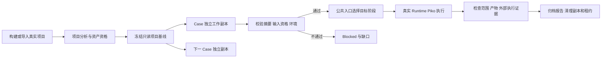

<!-- STD_DOCUMENT_COVER_BEGIN -->
# Slinky v0.3 Test Lifecycle Specification

| 文档字段 | 值 |
|---|---|
| Document ID | `v0.3-test-lifecycle-specification` |
| Document Version | `0.3.0-draft.3` |
| Status | `Draft` |
| Project | `slinky` |
| Authority | `slinky` |
| Document Owner | `Slinky Design Owner` |
| Authors | `原方案作者（原始 attribution 见固定来源 commit）, Codex（主干设计归并）` |
| Created Date | `2026-09-07` |
| Last Modified Date | `2026-09-16` |
| Template ID | `assurance.test-specification` |
| Template Version | `0.1.0` |
| Template Conformance | `legacy-mapped` |
| Tailoring Reference | `none` |
| Migration Map Reference | `docs/98_migration/v03-mainline-rollin/migration-map.md` |
| Repository | `corezilla/slinky` |
| Canonical Path | `docs/70_verification/specifications/test-lifecycle-specification.md` |
| Supersedes | `none` |
<!-- STD_DOCUMENT_COVER_END -->

> 2026-09-09 主干归并：本文件是 V0.3 活跃设计候选。正式启动设计开发不等于文档 Approved 或 Runtime Activation。最新范围与外部接口修订统一见 [启动基线](../../00_management/version-development-plan.md)；原文中的旧测试隔离、STD 未锁定或 ExternalLink-only 描述不得作为新的实现指令。

## 1. 目标、范围与被测对象

本文定义 V0.3 T0-T8 测试生命周期及最低 Case 要求。被测对象包括 Slinky Runtime/Plan/IR/PR/Knowledge/Research/Multi-language/Testing/View，以及 Piko/LLMTier Adapter boundary。T0-T8 详细子方案已归入主干并附 legacy-mapped metadata；Part-level Case/ISD 和真实执行 Gate 仍须逐项交付，不能以结构归并代替验证。

## 2. 引用基线、环境与前置条件

- 已 Review 的 Requirement/Design/ICD/Contract candidate 和 exact commit。
- Unit/Contract/Module promotion records。
- qualified Test Asset、admitted PR environment、assigned IR、active Tool/Adapter binding。
- Piko/LLMTier compatibility manifest 处于对应 capability Verified 状态；candidate 不得用于 production-pass claim。
- execution identity、idempotency key、environment fingerprint 和 Evidence path 在运行前固定。

## 3. Case Matrix

| Case ID | Requirement | 场景 | 输入 | Oracle | Evidence | Priority |
|---|---|---|---|---|---|---|
| `V03-TC-001` | V03-RT-001 | fixed DAG + parallel Test Design | Stage graph | exact transition table | lifecycle records | P0 |
| `V03-TC-002` | V03-PL-001/003 | rolling plan + IR/PR conflict | staged designs/capacity | global validator | PlanVersion/diff/risk | P0 |
| `V03-TC-003` | V03-IR-001/004 | composite IR/team accounting | Piko non-reserving snapshot/Run claim、Tier constraints、Knowledge profile fixtures | N个participant逐项核算；全部原202/Held才为完整Piko backing，部分受理保留且不回滚 | snapshot/claim/原receipt及独立Tier证据 | P0 |
| `V03-TC-004` | V03-PR-002 | six isolated environments | concurrent reservations | no path/port/account collision | fingerprints/leases | P0 |
| `V03-TC-005` | V03-KM-001/002 | template/skill/reviewer selection | Artifact profiles | mandatory Standard + independent review | Context/Coverage manifests | P1 |
| `V03-TC-006` | V03-RS-001/002 | one-line Goal and user constraints | sparse/rich inputs | assumptions visible, constraints preserved | Research Handoff | P1 |
| `V03-TC-007` | V03-ML-001/002 | frontend+backend contract E2E | web/python project | Contract + browser behavior | build/test artifacts | P0 |
| `V03-TC-008` | V03-TS-002/003 | coverage and real mutation | controlled outcomes/mutants | only policy PASS covered | mutation/coverage report | P0 |
| `V03-TC-009` | V03-RT-004 | lost response/restart | injected crash | no duplicate dispatch | invocation/session ledger | P0 |
| `V03-TC-010` | V03-UI-004/005 | multi-room disagreement/user decision | parallel Agent Teams | minority retained, exact Element link | Dossier/Decision refs | P1 |
| `V03-TC-011` | V03-UI-006 | dashboard authority/refresh | missing source + polling | visible error + patch only | browser trace | P0 |
| `V03-TC-012` | single mechanism | atomic cutover | source/config scan | no old/fallback path | deletion manifest | P0 |
| `V03-UI-007` | V03-BASE-06 | top navigation | four View + narrow screen | same shell、stable DOM、keyboard navigation | browser trace | P1 |
| `V03-COMM-100..105` | V03-BASE-07/08 | embedded Element/project isolation/decision | two projects、parallel rooms、stale response、revoke、close replay | ADR exact oracle、same native Matrix event、no implicit approval | browser + server ledger | P0 |

## 4. 正常、边界、负向与并发场景

- 正常：Goal→Research→Requirement→Design/Test Design→Coding→all test levels→Acceptance。
- 边界：empty optional constraint、max page/window/context、capacity exactly exhausted、decision at latest safe time、rename with same display name。
- 负向：missing Standard、stale Artifact/Plan/seat/lease、malformed external Result、unknown quota、unauthorized room/tool、duplicate authority records、invalid mutation survived。
- 并发：parallel Stage branches、multiple IR/Agent Teams、multiple Matrix rooms、six PR environments、shared Tier capacity groups、simultaneous user/runtime event。

## 5. Recovery、重放、幂等与故障注入

- 在 local commit、external dispatch、result receipt、Artifact activation 和 lease release 前后注入 crash。
- 重复 Run/Invocation/Command 必须返回同一 result/reference 或 typed conflict，不能产生第二 side effect。
- UnknownOutcome 保持人工/owner reconciliation；无 evidence 不自动变 Failed 后重跑。
- restart 以 durable lifecycle record 恢复；report/log/directory 不生成执行状态。
- close 同 key/digest 返回首次记录的结果，后续 Session Closed 不改写原 Closing；新合法 key 才能返回 AlreadyClosed；不同 digest 冲突。不得用“重复 close 就 AlreadyClosed”掩盖幂等差异。
- no-ID lost response 细分：有 dispatch evidence=1 则 replay 新增=0；只有 record 尚未 dispatch 可由原 Invocation 从 0 到最多 1；admission 拒绝/dispatch 前取消最终=0。UnknownOutcome 不授权新 key/Attempt。

## 6. 性能、容量、功耗或时序测试

功耗 N/A：V0.3 没有硬件交付。必须测试：Plan 规模与 validator latency、View page/patch latency、Piko Run admission/queue与execution capacity snapshot validity、LLMTier invocation queue/capacity snapshot validity、PR setup/cleanup time、Matrix delivery/recovery、Test batch throughput。结果区分 modeled/estimated/measured，不调用已退役 Slot API。

## 7. 执行步骤与自动化入口

### 7.1 T0-T8

| Stage | 目的 | 必需输出 | Exit Gate |
|---|---|---|---|
| T0 Baseline Activation | 冻结测试对象/来源/版本 | Baseline Manifest | TG0 exact baseline valid |
| T1 Governance/Planning | 策略、模板、资源计划 | Test Plan/Policy/Template refs | TG1 owner/criteria complete |
| T2 Analysis/Design | 风险、层级、方法、Case design | Test Design/Traceability | TG2 required scope designed |
| T3 Asset Construction | case/data/fixture/oracle/runner | Test Asset package | TG3 structurally complete |
| T4 Asset Qualification | 证明测试能发现错误 | Qualification Evidence | TG4 controlled mutations rejected |
| T5 Environment Admission | 资源/环境可执行 | PR Lease/Readiness/Fingerprint | TG5 admitted exact scope |
| T6 Functional Execution | 执行、分类、debug、rerun | canonical results/defects | TG6 functional promotion |
| T7 Regression/System/E2E | regression/mutation/NFR/recovery | release evidence | TG7 required matrix complete |
| T8 Acceptance/Closure | 独立判定与归档 | acceptance/residual risk/closure | TG8 signed decision |

### 7.2 自动化原则

首批设计候选检查入口：`scripts/test.sh tests/unit/design_baseline/test_v03_baseline.py`。覆盖精确 DAG、并行 release frontier、missing-edge mutation 和开发 WBS 完整性，不验证生产 Runtime。生产 Unit/Contract/Module/Test Design、fixture construction、qualification、environment pilot、debug/rerun 和 T7/T8 分别排入 [开发 WBS](../../60_interfaces/contracts/fixtures/version-development-wbs.json)。

每个 Case 目录/record 必须有 machine-readable definition、data/fixture/oracle、runner entry、expected Evidence contract 和 cleanup。执行入口由 Testing Core 调用 TestExecutionPort，不允许 Test Report 自己改变 lifecycle。

## 8. Pass/Fail/Blocked/Invalid 判定

- Pass：当前 exact baseline/environment 下全部 required oracle 成立且 Evidence 完整。
- Fail：SUT/Contract 行为与 oracle 不符，Evidence 足以判定。
- Blocked：前置资源/权限/environment/tool/decision 缺失，尚未执行有效判定。
- Invalid：Case/fixture/oracle/runner/Evidence contract 缺陷使结果不可用。
- Stale：上游版本或 environment basis 改变；旧结果保留但不用于当前 acceptance。

只有 Pass 且满足 Acceptance Policy 才计 coverage；Report status 不能覆盖 Testing Core record。

## 9. Artifact、日志、测量与证据保存

保存 baseline/Case/Execution/Attempt/Environment/IR/PR/Tool/external invocation、raw evidence hash、sanitized view、oracle/mutation/coverage、defect/rerun/acceptance refs。Retention 未冻结时标 Open Gate，不提前删除 source evidence。

## 10. 安全、清理与可重复性

- Secret/credential/auth token/原始 tokenized content/password/device key/checkpoint 不进入普通 fixture、日志、Report 或 RAG；授权的聚合 input_tokens/output_tokens/total_tokens 仍是 Usage evidence，不因 token 字样被删除。故障测试仅使用隔离的合成测试 Secret，不使用生产凭据。
- 每个环境 teardown/cleanup 有 terminal Evidence；失败则 quarantine。
- Case 至少可在 clean admitted environment 重复；flaky 需单独 policy/统计，不自动 Pass。
- Mutation 在授权副本执行；不得破坏 canonical repository/environment。
- Browser/E2E 记录版本、viewport、locale/timezone 和 external dependency state。

迁移来源：`docs/70_verification/plans/v0.3/v0_3_test_subplan_index_20260806.md`、`v0_3_test_t0_*` 至 `v0_3_test_t8_*`、`v0_3_test_template_catalog_draft_20260806.md`。

## 11. V0.2 环境问题回归矩阵

被测设计：[系统设计 §13.4–13.5](../../20_system_design/system-design.md#134-并发测试与环境隔离)、PR §10 和 Testing §8.1。沿用 V03-PR-001–005、V03-RT-004、V03-TS-002–006、V03-UI-006 的需求，不另立环境运行机制。下表 Case 全部为 Planned/P0，尚无 production 执行证据；文档静态检查不能将其标为 Pass。

来源代号：F = [Subsystem 最终总结](../reports/subsystem_test_final_summary_20260806.md)；E = [首轮执行总结](../reports/subsystem_test_execution_summary_20260728.md)；B = [V0.2 System 阻塞台账](../reports/v0_2_system_test_blocker_ledger_20260809.md)，数字为 V02-ST-BLK 后缀；O = [早期 System 阻塞](../reports/system_test_blockers.md)。

| Case ID | 需求 / 被测对象 | V0.2 来源 | 输入/故障构造 | 最低 Oracle 与 Evidence | 执行层级 |
|---|---|---|---|---|---|
| V03-ENV-001 | V03-PR-004 / M005、M304 | B001/023/024/043/046 | ro 源码，错位 stamp/锁/DB 路径，Host venv symlink，不同 UID | 实际 target 下 import/write/unlink smoke；权限错误立即分类非锁等待；修复后只写私有区，保存权限及 mount diff | Unit/Contract + Module + Docker |
| V03-ENV-002 | V03-PR-004 / M005、M304 | B003/006/012/033 | HEAD 前进、源/镜像/assignment/baseline hash 失配；审计生成新文件 | 不匹配拒绝；同闭包不因审计自身输出变成 dirty；保存生成前 source 与生成物清单，跨基线 PASS 不复用 | Unit/Contract + 双版本 E2E |
| V03-ENV-003 | V03-PR-004 / M002、M304 | B004；O-20260720-002 | 编排 host probe 成功但 target 指向旧服务；默认 endpoint 误用；orphan | 真实 consumer 的外部引用匹配预期 instance/binding；错源拒绝且旧源无本次执行；保存 request/probe/identity Evidence | Contract + target E2E |
| V03-ENV-004 | V03-PR-002 / M005、M305 | F2.5；O-20260720-001 | 两个 runner 竞争同 lane；终端退出而 child 存活；旧容器占端口 | 同 scope 单 writer；停止进程树并确认远程义务前不得复用；保存进程、端口、lease 和非目标 hash | Unit/Recovery + 双 lane E2E |
| V03-ENV-005 | V03-PR-003 / M002、M005、M305 | B051/066/103 | 子进程/首 journal 缺 lease；续期失败；旧 fencing token 写入 | 缺失即停止该 lane；新 admission=0，旧 writer 被拒；未知占用不重新分配，保存首事件及租约变迁 | Contract/Recovery + E2E |
| V03-ENV-006 | V03-PR-004 / M005、M304 | F2.6/3.6 | controlled/real profile 相反；只改环境变量；切换中服务启动失败 | 实际 mode 验证失败则不执行 Case；原配置→drain→切换→smoke 全留证，失败隔离，无共享服务重启 | Contract + controlled/real E2E |
| V03-ENV-007 | V03-PR-002/005 / M003、M004、M005 | E2.4；F4.4；B054/073 | 1/2/6 lane，CPU/内存/磁盘/DB 压力、Tier 排队与观察过期 | 所有资源约束均满足；超限停止新增，实际并发与容器数分开；Plan Risk/Forecast/PM 建议可追踪，记录 p95/p99/queue/throughput | 性能 + 六环境 E2E |
| V03-ENV-008 | V03-PR-004 / M005、M305 | B002/052；O-20260721-023 | 串行 request 预算、最慢冷启动、漏 cwd/env、supervisor 太短 | 使用同一预算，deadline 层级满足关键路径；恢复不置满；缺环境启动前拒绝；合法冷启动不误杀，保存耗时及退出来源 | Unit/fake clock + 真实 Recovery |
| V03-ENV-009 | V03-RT-004 / M002、M305、M306 | B044/098；BLK-1253 | 0/非零/signal/timeout/空或损坏退出记录；Case PASS + 聚合 BUG | 原 wait/protocol 证据准确；缺失不算 PASS；按各自退出码契约判断，批次 BUG 不覆盖有效 Case；保留 command/result/journal | Unit/Contract + launcher E2E |
| V03-ENV-010 | V03-TS-005 / M302、M303 | F2.3/2.4；O-20260720-003 | 空 workspace、缺闭包、过期 qualification；不允许即时跑上游准备 | materialize 后只运行目标；缺项在执行前拒绝；完整 manifest/hash/资格证据；专用全链 Case 另测 | Unit + Module/Subsystem |
| V03-ENV-011 | V03-PR-002/003 / M005、M305 | F2.5；O-20260721-022 | cleanup 权限失败、symlink 越界、同名 sibling、旧 Browser/AVD 数据 | 非目标文件/进程/记录 hash 不变；失败 quarantine；按 exact owner 清理；复位 smoke 后才能 Ready | Security/Recovery + 六环境/设备 |
| V03-ENV-012 | V03-TS-002/003/006 / M303、M306 | F2.1/2.2/2.11；E2.5 | mock-only PASS、弱 Oracle、旧成功+新失败/中断、source 改变 | 四层计数分开；受控错误被检出；完整 attempt 选择规则可复算，当前缺失不借历史 PASS；清理失败阻止闭环 | Unit/Contract + 全链汇总 |
| V03-ENV-013 | V03-UI-006 / M001、M304、M306 | F2.9 | loopback/LAN origin、刷新竞态、重 DB、两项目用户缓存、Browser profile 复用 | DOM/Network/Console/owner 一致；scope 不串；超时明确来源，压力与普通功能基线分开 | Browser + 集成/性能 |
| V03-ENV-014 | V03-PR-004、V03-TS-002 / M004、M304、M306 | F2.10/3.9；B108/109 | credential 过期、合法 unknown usage、外部/容器宿主重启、网络失联 | 凭据 blocker 与 Schema mismatch 分开；unknown 不伪零；只读外部核验，恢复原 obligation 无重复调用；不复制外部 Secret | Contract/Security + 外部恢复 E2E |

### 11.1 执行与数据准备

V03-ENV-007/008/014 同时承接系统设计 §6.5。确定性输入覆盖两/四/六套资源算例、Docker VM 低于宿主额度、混合 AVD/编译负载、启动峰值高于稳态、共享服务及既有租约扣减。模型输入覆盖六 Agent 平均占用 4、同步峰值 6、PM/Review 额外 2 的场景；容量仅 4 时必须输出排队/错峰或缺口，不能将 4 个 Seat 描述为满足峰值 8。校验 120 请求、960000 输入及 240000 输出 token 的算术，并分别注入上下文不足、工具能力不匹配、配额未知、多项目共享约束及观察过期。Oracle 是逐约束计算与 Plan/IR/PR 输出一致，不是算例数值即生产容量。真实阶段提交单/双/六环境热复位、冷启动、故障恢复的整段时间线及服务调用证据，冻结的支持上限不得超过实测通过上限。

按每个 Case 所列层级先做确定性故障注入，再在锁定 OS/镜像/工具链的真实 target 执行。1/2/6 环境共享已准入的外部服务；其中两 lane 故意同 Case 名不同 Execution，另设无关项目验证 preserve。所有破坏性注入限定授权副本；不在实际其它项目上制造干扰。

独立构造 clean、mutated、recovered 三组输入及预期资源清单，明确故障发生于部署前、lease 后、首次业务调用前、dispatch 后、证据提交或 cleanup 阶段。记录完整故障参数和预算；对时间边界同时测未过期、刚过期及重启后剩余 deadline。

### 11.2 退出与证据

每项必须交付精确 source/image/dependency/config/Case/baseline hash、运行身份与 lease、实际命令/工具结果、target probe、前后状态 diff、原始协议/进程证据、Oracle、cleanup、报告选择集合及执行层级。敏感字段脱敏且保留授权引用。

Case 通过须满足全部该场景 Oracle，受影响 family 全集重跑完成；环境修复后先 focused regression，再恢复原 scope 的正式测试。资源不足、外部契约未实现或阈值未冻结时记录 Blocked/Planned，不能删除该 Case 或改用 mock 当作真实层级通过。

### 11.3 维护诊断与受控恢复验证

承接系统设计 §9.3 和 View Contract §3.3.1，以下扩展既有 Case，不新增运行机制。全部为待执行的 Contract/Browser/Recovery/Security 义务。

| Case | 输入与故障 | Oracle 与必需证据 |
|---|---|---|
| V03-ENV-003/013 | 用户 URL 接旧实例、API 接另一实例、项目未注册、只修复另一端口 | 首屏 identity/source conflict 可见，命令禁用；在原用户 URL 复验页面/API/project/runtime 一致；保留 Browser Network、实例版本和注册证据 |
| V03-ENV-004/008 | PID 复用、SSH/screen 已退出但 child 存活、重启漏 cwd/PYTHONPATH、冷启动延迟 | 以 PID+启动时间/owner 确认目标；只用登记控制入口；旧进程/远程义务未收口不恢复派发；保存退出与真实 consumer smoke |
| V03-ENV-011/013 | 普通成员调用管理员命令、跨项目 evidence ID、路径穿越、任意 URL、过期 evidence、伪造按钮 eligibility | 服务端拒绝且无 mutation；证据分页/下载重验授权；过期不伪空成功；响应/日志/导出中种入的测试 Secret 不可见 |
| V03-ENV-009/012 | stale 来源、部分查询失败、诊断日志缺关联、同 key 重复修复、expected version 竞争、命令接收后复验失败 | last-known 与当前分开；缺关联不猜 Work；owner 幂等和版本冲突正确；receipt 不解除 blocker，旧失败/证据不被覆盖 |
| V03-ENV-014 | 额度原因不明、外部鉴权失败、无 Invocation ID 的未知调用、外部修复成功但消费者仍失败 | typed 来源和责任人明确；不猜 quota、不代改外部配置；按原 obligation 恢复；消费复验不通过保持 Blocked 并更新 Plan 影响 |

每个场景保存 principal/scope、输入版本、脱敏查询/命令与 receipt、实际控制入口引用、故障与复验时间线、前后版本、非目标资源保持证据及最终 blocker 状态。权限测试仅使用测试身份/测试 Secret。完整 owner Schema 或部署入口缺失时记录 Blocked，不以手工改 DB、补 summary 或临时 shell 按钮代替。

## 12. 项目基线复用与指定阶段系统测试

### 12.1 方法与分工

先构建并资格一个真实项目，再从只读基线建立每个 Case 的隔离副本，只执行目标阶段。项目构建可通过一次全流程开发，也可导入已有工程后补齐并接受必要资产；基线不依赖手工写成功状态。此方法验证 Slinky 的公共阶段选择能力，测试 harness 不建立独立的跳阶段入口。

Testing 负责基线与 Case 资格，Artifact 保存不可变资产和证据，PR 分配隔离工作区/环境，Plan 和 Runtime 执行同一范围契约。分析结果和资格完全匹配时只复核来源摘要、版本及适用性，不重新耗费 LLM 分析；环境 readiness、lease、动态资源和权限每次重新检查。

### 12.2 基线、数据与用例准备

| 基线 | 构造与用途 | 必须固定的证据 |
|---|---|---|
| 仅代码 | 小型可构建工程，删除设计材料的受控副本；用于补设计/补测试 | code commit、依赖锁、构建入口、目标平台、已知行为与预期差异，不能把实现推断当需求批准 |
| 仅设计 | 已接受设计、接口及验收要求，无实现的受控副本；用于选 Coding | STD/input contract、设计版本与接受记录、组件/工具链、预期产物 |
| 系统测试就绪 | 可部署实现 + System Test Design + 当前版本适用的低层/Subsystem 测试证据；只选 system_testing | 所有基线摘要、测试资产、代码/构建 digest、证据适用版本、环境需求、独立 oracle |
| 版本升级 | 已接受版本 A 与用户批准增量目标 B；控制一处接口/代码变化 | A 完整来源图、B 目标、明确应失效/可复用集合及回归范围 |

基础项目至少覆盖既定语言/平台验收矩阵中本轮实际测试的组合，不能用单个 Python fixture 宣称所有语言或 Android 已支持。每个组合先资格，统一记录 baseline ID/version、content digest、STD、工具链/镜像 digest、环境/架构、输入契约、报告与接受引用；证据缺失保持 Blocked。不在基线打包账号、token、旧活动进程、端口占用或数据库活跃锁。

每个 Case 从基线物化独立可写副本，生成 run/workspace/Compose namespace、端口与 lease；只读共享允许镜像/包缓存，不共享可写代码、报告或运行数据库。反例只改 Case 副本，登记变更集及预期失效；用后验证原基线摘要不变，完成清理再释放资源。资源容量按 §11 准入，不能把“能克隆六份”当作“能运行六套”。

### 12.3 Case 与验收义务

以下全部为 Planned，生产入口、外部依赖或机器契约未就绪时记 Blocked，不把静态检查当 E2E Pass。

| ID | 操作 / 故障 | Oracle 与必需证据 |
|---|---|---|
| V03-SCOPE-001 | 新项目，需求输入后预研，再选择全部阶段 | 入口仅执行原 Research，不创建空 Analysis；评估引用原报告/Gate，全流程仅承接一次 Research，随后走其余阶段及并行分支；保存原 Work/成本/调度轨迹和全流程结果 |
| V03-SCOPE-002 | 已资格项目，仅选 system_testing | 工程 dispatch 集仅含 system_testing；复用前置资产，不生成 Research/Coding 等 Work；低层证据版本匹配；保存真实部署/执行和新报告 |
| V03-SCOPE-003 | 从代码补设计 | 分析区分观察与推断，用户确认设计范围；源代码不被自动重写，文档经 STD/Review 接受 |
| V03-SCOPE-004 | 从设计补代码 | 只执行确认的 Coding 范围，精确消费已接受设计；缺 ISD 输入时阻塞而不自动补跑；输出与独立验收要求一致 |
| V03-SCOPE-005 | 已有代码，选测试设计及测试的多个阶段 | 依赖按原 DAG，所选 Test Design 输出被 Testing 消费；全部输入同时满足，未选阶段不写成功 |
| V03-SCOPE-006 | 删除所选阶段的一项前置资产 | preview 列出精确缺口/补齐建议，commit/dispatch 阻塞；无未选 Stage、无额外模型调用或仓库修改 |
| V03-SCOPE-007 | 选择不连续 Coding + System Test，Coding 改变基线代码 | 传递使旧 Subsystem 测试证据失效；System Test 停止准入并提出范围变更，不复用不适用旧报告 |
| V03-SCOPE-008 | preview 后修改资产、STD 或计划版本 | 旧候选提交失败；claim/accept 防止资格竞态，旧结果保留原版本；重新资格后才能继续 |
| V03-SCOPE-009 | 六个隔离副本并行，故意使一份失败 | 身份/路径/端口/租约隔离；其它副本及基线摘要不变；失败副本不污染共享资格 |
| V03-SCOPE-010 | 分析/范围提交响应丢失、运行中重启、用户另行重跑 | transport retry 恢复原 receipt/Work；重启收敛原 obligation；显式重跑新 WorkExecution，旧报告不覆盖，外部无重复副作用 |
| V03-SCOPE-011 | 部分阶段全部通过但全项目有未覆盖部分 | scope_result 成功且 not_selected 可见，全流程交付不伪成功；UI/API/报告三者一致 |
| V03-SCOPE-012 | 跨项目 baseline、路径穿越、导入恶意脚本/提示、无效 Stage ID | 拒绝越权/非法范围，分析只读，脚本无授权不执行；保存拒绝与零副作用证据 |

### 12.4 报告、耗时与回归门

本轮流程修订扩展原 Case：

- V03-SCOPE-004：Existing、inventory 无代码、code_revision=null 的已接受设计基线，经 Analysis 后选 Coding 可提交并等待启动；选要求实现的测试阶段返回 MissingInput。伪造代码版本或缺必需 ISD 均拒绝。保存基线 DTO、资格及实际输入绑定。
- V03-SCOPE-008：候选落盘后才返回；刷新、重启和另一实例读取/提交同一 candidate_digest、阶段、绑定和交付物。来源变化为 CandidateStale，计划竞争为 VersionConflict；记录不存在为 NotFound、Store 不可读为 SourceError，跨项目访问拒绝；零派发且不自动重建。保存 Store、API 和故障证据。
- V03-SCOPE-010：start 授权事务提交前后丢响应并重启，同 key 恢复原 receipt；未提交保持 AwaitingStart，已提交恢复 Enabled。commit 同 key 重放返回原发布 receipt，不被自身造成的版本变化拒绝，不重复发布。
- V03-SCOPE-011：Research 完成且 Runtime 持续 tick，发布范围后保持 AwaitingStart，工程 dispatch/资源取得为零；continue 返回 ScopeNotStarted。start 后按依赖及资源准入派发。新范围不继承旧授权；旧范围新派发拒绝，原 in-flight obligation 按原身份收敛。保存授权、receipt、调度和 UI“等待启动”证据。

预览的只读边界限定为活动计划、范围和运行资源；候选记录由 Plan 保存，允许刷新恢复。

统一评估视图补充既有用例：V03-SCOPE-001 验证新项目的需求理解、方案比较、风险和资源建议来自 Research，代码/测试尚未产生不误报缺陷；V03-SCOPE-003 验证旧项目 Analysis 追加已授权 Research 后两个来源分别保留、冲突不被最后结果覆盖；V03-SCOPE-008 验证预研输入变化、缺 Gate、跨项目 completed_entry_ref 拒绝复用，必需来源仍运行时不能假 Ready；V03-SCOPE-011 验证原 Research 完成事实与未选/未执行阶段分开、成本不重复、全选不产生第二 Research。上述皆需实际 Contract/Browser/Runtime 证据，静态图不构成执行验收。

Project Assessment 浏览器验证并入 V03-SCOPE-008/011/012：评估结果与执行范围页签共享同一项目/分析版本；资产/报告链接打开精确版本，事实与推断、报告接受与资格不混淆；缺口区分范围确认和未来工作准入。选择变化立即禁用旧候选提交，清空不能预览；晚到响应不覆盖新选择。检查范围只保存候选，不修改活动计划或运行资源；发布计划不启动工程 Work，响应丢失只恢复原 receipt。资源/Action 链接重新鉴权，无 action_ref 不伪造问题。以桌面、窄屏、键盘操作记录 Browser screenshot/network/focus evidence；错误、空数据、Stale 和部分来源失败分别检查，不以当前 SVG 图片代替实际浏览器测试。

每份报告包含：Case/requirement、软件与外部服务版本、baseline/ref/hash、选中阶段及逐输入来源、资格证据、管理工作和工程工作分开的实际 dispatch 集、Plan/scope/Work/Attempt、输出接受记录、失败分类、未覆盖部分、清理记录和原基线不变证据。禁止把基线自带报告作为本次新测试输出。

分别记录基线构建/资格一次性成本，以及每 Case 的物化、资格复核、环境复位与启动、目标阶段执行、清理耗时和 LLM 请求/token/排队成本。使用同一项目和环境比较全流程与指定阶段；报告 p50/p95、样本数、冷/暖缓存和失败样本。尚无实测收益，不预设节约百分比；针对性测试要求未选工程阶段 dispatch=0，完整流程回归仍须在发布前执行，验证跨阶段交接和全生命周期。基线发生变更先重资格，再重跑受影响 Case 集，不能只挑通过用例。

## 13. 六份 Prompt 与上下文装配验证

承接系统设计 §8.5；以下用例状态均为 Planned。当前只固定六份指令的设计范围，文件正文、生产映射及真实 Piko 执行待实现。

| Case | 场景与输入 | Oracle / 必需证据 |
|---|---|---|
| V03-PROMPT-001 | 六类工作：通用执行、评审、分析、预研、计划、PM | 分别选择 task/review/analysis/research/plan/pm，每 Work 一个主指令；记录任务目的、映射、指令版本/hash、实际 Piko 请求及产物接受证据 |
| V03-PROMPT-002 | 文档、两种语言代码、测试设计/执行、修复；默认 STD 与局部替换 | 均复用 task；独立评审使用 review；专业材料及产物契约随任务变化，替换影响精确；按 §12 已资格项目复用基线，真实任务全部满足各自验收要求 |
| V03-PROMPT-003 | 缺必需指令/规范、错误版本、上下文超预算、可选经验为空 | 必需项不满足保持 Preparing/Blocked、无派发；明确缺口；可选为空正常装配；保存 Manifest、资格与调用计数 |
| V03-PROMPT-004 | 仓库/检索材料要求越权写文件、评审者尝试批准、PM 直接改有效 Plan | Runtime/Piko 权限及 owner 校验拒绝；写集合与批准记录符合授权；保留脱敏请求、工具拒绝和零越权副作用证据 |
| V03-PROMPT-005 | 指令/STD 升级、响应丢失与进程重启 | 原 Attempt 恢复同一版本/hash/请求身份；新工作采用有效新版；版本冲突不覆盖，外部副作用不重复；旧失败记录可追溯 |
| V03-PROMPT-006 | 坏 JSON/Markdown、语义不合格、修复超预算及旧加载路径扫描 | 程序拒绝不合格 Result/Gate；Agent 在授权范围修复并重新验证，超限明确结束/升级；V0.3 不加载独立格式修复或分 Stage 重复指令；清单覆盖文件、内嵌字符串及所有调用者 |

每份报告记录 Case、代码/外部版本、主指令引用与摘要、任务契约、STD/Knowledge 来源、Context Manifest、产物、检查/Review/Gate、模型用量及预算、恢复和权限证据。六份数量达标只是资产检查，六类实际工作成功及安全/恢复用例通过后才验收迁移；原 V0.2 运行资料保持可追溯。

## 14. 系统机制第二批组合验证

### 14.1 逐约束证据汇聚

E1 为本地隔离 Contract harness，E2 为真实 Piko/Artifact/PR 与独立 workspace，E3 为两条隔离 lane 共享 Piko/LLMTier/Matrix 的组合环境。E1/E2/E3 是本节环境类别，执行时必须绑定具体 environment manifest/hash、代码与依赖版本。当前可执行入口均未交付，Run ref、证据 ref 均为 null，执行状态 NOT_RUN；不得用本地设计测试的 pytest Run 填入本表。G1、可执行 Case 及对应组合证据关闭前，机制内容完成条件未满足，状态保持 Draft。

| 约束 | 原 Case / 组合义务 | 环境 | 必需原始证据 / 通过判定 |
|---|---|---|---|
| SM002-R1 | RT-AG04/08；V-B01 | E1/E2 | 授权、claim、准备记录与实际 dispatch；缺前提零派发 |
| SM002-R2 | RT-AG04；V-B01 | E2/E3 | 固定参与者、完整 IR、远端 admission；不活动扩员、不伪造预留 |
| SM002-R3 | RT-AG06；V-B03 | E1/E2 | 原 Result bytes/hash、读取错误与持久坏协议分型；无 JSON 修补 |
| SM002-R4 | RT-AG07、V03-E2E-095；V-B07 | E2/E3 | Run-specific stop/writer/wakeup fence、execution_released及PR清理；Session/drain/外部义务独立查询。释放后零旧Run消息唤醒，不要求Session先Closed |
| SM002-R5 | RT-AG08；V-B02/03 | E2 | 原激活、Actual、release receipt；恢复不重做业务 |
| SM003-R1 | RT-AG02/03/08；V-B03/05 | E2 | 最终 hash、Review、检查与输入资格；旧摘要证据不能接受新内容 |
| SM003-R2 | V03-SCOPE-007/008；V-B04 | E1/E2 | ReviewStatus 与 EffectiveStatus 分别查询；历史通过不充当当前有效 |
| SM003-R3 | V03-SCOPE-007/008/011；V-B04 | E2/E3 | exact 依赖图、失效事件及实际准入集；无全量自动重跑 |
| SM003-R4 | RT-AG08；V-B03 | E2 | 激活事务、outbox/inbox、故障 hit；唯一版本且原发布恢复 |
| SM003-R5 | V03-PROMPT-002/003；V-B04/08 | E1/E2 | STD resolution 与 Artifact 引用；只有 STD 决定规范选择 |
| SM004-R1 | V03-PROMPT-001/002 | E1/E2 | 六类真实请求、主指令 ref/hash；每 Work 一个主指令 |
| SM004-R2 | V03-PROMPT-002/003；V-B04/08 | E1/E2 | exact Standard/Template/slot/hash、选择依据；缺项不回补 |
| SM004-R3 | V03-PROMPT-003；V-B06 | E2 | Manifest 与实际分批读取；缺必需内容拒绝接受 |
| SM004-R4 | V03-PROMPT-005；V-B04/08 | E2/E3 | Plan/Work/readiness/Context 的同一 resolution；在途不换版 |
| SM004-R5 | V03-PROMPT-004；V-B06 | E2 | 工具/材料拒绝及写集合；内容不能提升权限 |

每行执行记录必须补 runner 命令/Case revision、environment ref/hash、run ref、脱敏 evidence index、fault hit、结果与 reviewer。没有可执行入口是设计/测试交付缺口；已有入口但缺依赖记 Blocked，未运行记 NOT_RUN，故障未命中记 Invalid。

### 14.2 组合输入与 Oracle

V-B02/V-B07共同追加“接受长期等待、Result持久协议错误、Result暂不可读”三个子例：原Run的停止/fencing/资源收口不得等待产物接受；没有Session ID但原请求要求协作时恢复原attachment关联，不得记为无协作。Run结束本身不产生Session close；仅独立授权关闭Session时记录Slinky close intent、Piko binding revoke/drain及归档证据。记录accept pending、Run释放和当前Session状态的独立时间/版本，证明安全收口不虚报业务成功。原Run正常执行且无停止要求时仅继续观察，不因一次读取暂缺而取消。

V-B08 追加“Plan/Context 一致但接受证据引用另一 resolution”反例：SM003 必须拒绝激活。独立 Review 先读取固定候选，其报告接受不要求被评候选先 Effective；以单执行资源运行 V-B02，证明无循环等待。

本节承接 SM002/SM003/SM004。V-B 编号为组合验证义务，复用已有 Case，不替换 Case 身份。当前全部 NOT_RUN；静态设计检查单独报告，不折算为以下测试 Pass。

| 验证义务 / 原 Case | 构造与故障点 | 独立 Oracle 与必须保存的证据 |
|---|---|---|
| V-B01 / RT-AG04/07 | Slinky计划固定两名成员，各自独立单Agent Run；一次CREATE明确容量拒绝，另支受理后丢响应 | 每个请求分别计受理/拒绝/未知；拒绝请求零执行，不能把部分受理标为Team完整backing。只清理已证明安全的本次资源，未知保留原key/obligation。按已签署DF-13验证非预留快照全部约束与逐participant claim；snapshot通过后竞争仍可拒绝，不提供N-slot原子预留，不恢复旧Slot API |
| V-B02 / RT-AG08 | 计划显式独立 Review；作者候选移交后释放唯一可用执行资源，Review 再取得该资源 | Review 读取同一 hash，不等待作者 Succeeded；作者清理不删候选；候选不能供普通下游工程使用；保存 Plan 输入用途、Artifact 可读引用、两次资源归属与 Review 结果 |
| V-B03 / RT-AG02/06/08 | design@2、STD@4；产物 H1 后变 H2，先提交 H1 Review；补 H2 证据后在激活提交成功、返回前丢响应，并中断 Actual | H1 证据拒绝 H2；合法激活只产生一个版本/slot successor，原 receipt 恢复；Actual 对账不再执行 Coding；保存前后 hash、独立 Review、slot/outbox/inbox 及实际派发数 |
| V-B04 / V03-PROMPT-002/003/005、V03-SCOPE-007/008 | 仅替换测试报告模板；另支整包缺项；Context 固定后发布新规范，事件重复/乱序 | 缺项不回补；部分覆盖保留其余来源；在途仍读原版本，新准入复核新基线；旧输入接受失败不篡改历史 Review；记录 STD 解析、Manifest、消费者版本及实际读取 |
| V-B05 / RT-AG02/03/08、V03-SCOPE-011 | 生成 CodeChangeSet 后推进 repository head；整合后的内容与原 H2 不同 | expected head 冲突不覆盖；新内容不能直接使用旧摘要资格；只整合声明写集合；保留仓库 head、逐文件 manifest、检查范围和原基线未被误改证据 |
| V-B06 / V03-PROMPT-003/004/005/006 | 长规范分批读取，在第N批失败；另构造Agent自述完整但无可信读取证据，以及可选经验为空/权限拒绝 | 准备可获得性不等于实际覆盖；缺必需批次或可信来源不接受，权限拒绝不变可选空值。Runtime恢复原Manifest关联，只经AgentResult.outputs的唯一系统artifact取证，不增加第二引用；按已签署DF-14核验path token/generation、JCS bytes hash/size、run/task、实际对象版本/hash/range及空文件真实read。Complete不证明材料齐全；ChangedDuringRead/Partial/Unknown或取回失败不通过。opaque execution_log_ref和summary不能单独通过，不假造日志API；运行依赖未就绪记Blocked而非重开证据定义 |
| V-B07 / RT-AG07、V03-E2E-095 | Run已停止/不可写隔离但Session仍有pending delivery或Unknown外部ref；独立Session close在受理/drain/archive前后崩溃；期间晚到消息 | Run fence及owner清理齐全时资源可以释放，不等Session Closed；缺fence不得释放。Unknown/Isolated ref保留且drain=RecoveryRequired阻止Session Closed，不更改Tier Held。原close receipt非最新状态；恢复原事务/归档，旧Run零wakeup。另证同Session第二Run不因第一Run结束而被关闭或撤权 |
| V-B08 / V03-PROMPT-002/003/005、V03-SCOPE-008 | 同项目基线包含两种模板，两个 Work 绑定不同 resolution；构造缺记录、错输出类型、错 slot/hash 及单项模板升级 | PlanVersion/PlannedWork/readiness/Context 同记录；不合格绑定零派发；只失效依赖变更项的解析记录和工作，在途保持原记录；保存 STD 解析、依赖图、Manifest 和接受校验 |

数据使用已资格旧项目的独立副本，固定 code/design/STD/profile 版本。每次只授权相关阶段，未选工程阶段 dispatch=0；全流程回归另行执行。六环境并发使用独立 namespace、workspace、数据库与租约；共享 LLMTier 的调用按授权 Source/Instance 区分，不能靠改全局配置切换测试环境。

每个故障保存 arm/hit/release、精确事务边界、Work/Attempt/Run/lease/event 身份。未命中故障为 Invalid，接口字段未冻结或依赖缺失为 Blocked，未执行为 NOT_RUN。报告包含原始脱敏证据、独立查询、资源回收和基线守恒，并分别记录等待 Review、模型排队、实际执行及清理耗时。单测模拟成功不关闭真实跨服务与 crash/restart 义务。
