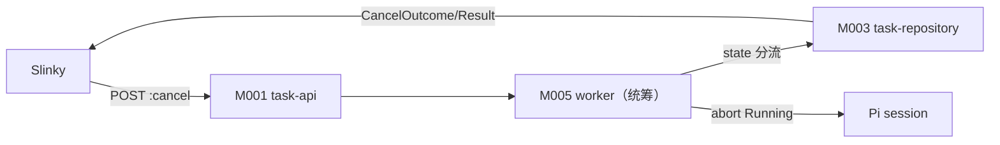
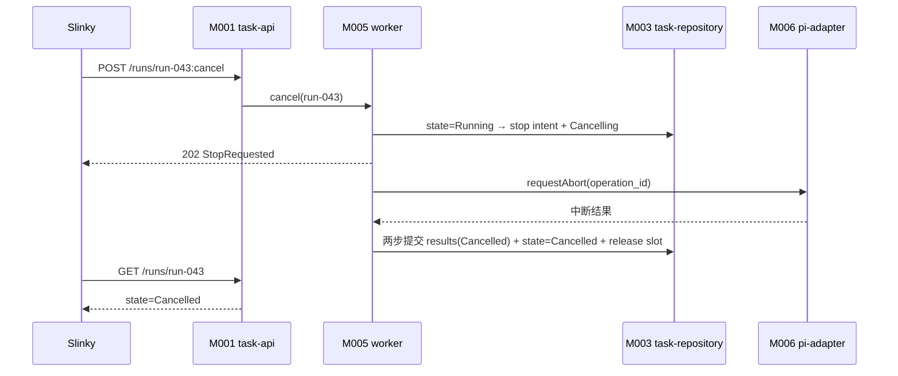
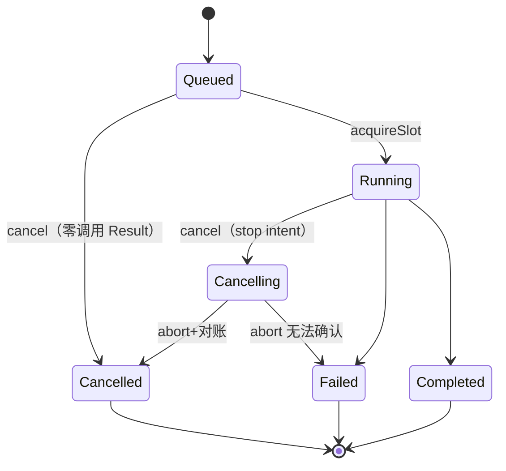

<!-- STD_DOCUMENT_COVER_BEGIN -->
# Piko 机制：Run 取消分流

> STD 使用入口：[项目采用说明与标准导航](../../../README.md#std-entry)

| 文档字段 | 值 |
|---|---|
| Document ID | `piko-cancel` |
| Document Version | `0.1.1` |
| Status | `Approved` |
| Project | `piko` |
| Document Owner | Piko Architecture Owner |
| Last Modified Date | `2026-09-26` |
| Template ID | `design.system-mechanism` |
| Template Version | `3.3.0` |
<!-- STD_DOCUMENT_COVER_END -->

## 1. 机制摘要：解决什么问题

Slinky 可能需要中止一个 Run。取消不是单模块行为：`task-api` M001 接收 `POST /runs/:run_id:cancel`，`task-repository` M003 持久化 cancel flag/状态，`worker` M005 对 Running Run 发起 Pi abort 并完成对账。若各自判断"是否已停"，会把"意图落盘"误报成"执行已停"。MECH-CANCEL 定义按 Run state 分流的取消协议与 `StopRequested`/`CancelledBeforeStart`/`AlreadyTerminal` 语义。

**受益者与任务**：Slinky 需要可判定的取消；Operator 需要明确的停止边界。

**核心输入 → 处理 → 输出**：输入是 `run_id` + cancel 请求；处理是"按 state 分流 → Queued 零调用 Result / Running stop intent + abort + 对账"；输出是 `CancelOutcome` + 终态 Result。

**最重要取舍**：选择"`StopRequested` 只证意图、`CancelledByRequest` 才证停止"而非"ack 即停"，代价是需轮询，换取不误报停止。

- **机制形态与适用性 / 业务副作用**：**有副作用**。写 cancel flag/状态、abort Pi operation、发布零调用或取消 Result，都改变持久状态。
- **交接域**：**纯软件**。M001/M003/M005 同进程。
- **裁剪依据**：附录 A；§4.5/§5.3 纯软件 N/A。



图 M-CX-0 · 用途概览 / Target / NOT_BUILT。

**教学路径**：属"有副作用的收口"路径。

## 2. 使用场景与功能

| Capability / Scenario ID | 业务任务与触发/条件 | 输入与可观察结果 | 提供方/全部消费者 | 实现状态 | 验证结果/判据 |
|---|---|---|---|---|---|
| CAP-CX-QUEUED · Queued 取消 | 未取 slot 时取消 | 200 `CancelledBeforeStart` + 零调用 Result | 提供：M001+M003+M005；消费：Slinky | Planned | PK-T05（NOT_RUN） |
| CAP-CX-RUNNING · Running 取消 | 已取 slot 时取消 | 202 `StopRequested` → 轮询 → `Cancelled` | 提供：M005+M003；消费：Slinky | Planned | PK-T05（NOT_RUN） |
| CAP-CX-TERMINAL · 已终态取消 | 终态 Run 取消 | 200 `AlreadyTerminal` | 提供：M003；消费：Slinky | Planned | PK-T05（NOT_RUN） |
| CAP-CX-ABORT · Pi 中断对账 | Running 取消后 | abort → 对账 in-flight tool → 终态 | 提供：M005+M006；消费：Piko 内部 | Planned | PK-T05（NOT_RUN） |

不支持：撤销已生效的取消、把 `StopRequested` 当停止证明。

## 3. 参与方、责任和 authority

| Participant / 工程 Owner | 负责/不负责 | 决定/写入/事实来源/恢复（适用时） | Provided/Consumed interface | 部署/实现位置 | 依赖机制与基线 |
|---|---|---|---|---|---|
| M001 `task-api` | 负责接收 cancel + typed error 映射；不决策状态 | 决定：无；写入：无；事实来源：M003 | 提供：HTTP cancel；消费：M005/M003 | 进程内 `src/http/`（Planned） | MECH-RUN |
| M003 `task-repository` | 负责 cancel flag/state 事务；不 abort Pi | 决定：无；写入：`runs.cancel_requested`/`state`；事实来源：`runs` | 提供：事务接口 | 进程内 `src/store/`（Planned） | MECH-RUN |
| M005 `worker` | 负责取消分流 + Pi abort + 对账；不管理 Pi 内部 | 决定：取消路径；写入：经 M003；事实来源：`runs.state` + Pi operation | 提供：CancelOutcome | 进程内 `src/worker/`（Planned） | MECH-RUN |

**责任角色区分**：取消**决定**由 M005 发出（按 state 分流），**写入**由 M003 原子执行，**权威事实**以 `runs.state` + Pi operation 状态为准；恢复时（取消中崩溃）由 MECH-RECOVERY 对账。

### 3.1 系统约束与参与方承接

| Constraint ID / 上级基线与决定状态 | 适用条件 | 系统保证/分配 | 参与方承接与自由度 | 流程/协议/下级落实位置 | 组合验证与证据状态 | 差距/变更影响/裁决责任 |
|---|---|---|---|---|---|---|
| CON-CX-001 · PK-03 截止与预算（取消分流） · Approved | 每次取消 | Queued 零调用 Result；Running 经 Cancelling | M001+M003+M005；自由度：内部实现；不可变：`StopRequested`≠停止 | §6 / §8 / M003/M005 ISD | fault PK-T05（NOT_RUN） | — |

### 3.2 运行时统筹与确认责任

| 能力/Process ID | 运行时统筹/权威状态 | 参与方动作及确认 | 总体成功/部分结果 | 中断核对与清理/重新开放 | 关联公共契约 |
|---|---|---|---|---|---|
| CAP-CX-QUEUED | M005；`runs.state` | 单事务写 flag + 零调用 Result + Cancelled | Cancelled + Result = 完成 | slot 未取得，无需释放 | contract §1/§6 |
| CAP-CX-RUNNING | M005；`runs.state`+Pi op | 写 stop intent → Cancelling；abort → 对账 → 终态 | `CancelledByRequest` = 停止事实 | 对账后 release slot | contract §6 |

**统筹者退出语义**：M005 取消中退出 → 状态停在 Cancelling，由 MECH-RECOVERY 对账补终态；`StopRequested` 已持久故客户端可继续轮询。

### 3.3 拓扑、目标身份与共享故障域

| 逻辑目标/身份 | 部署及访问路径 | 映射 authority/更新条件 | 共享故障/复位域 | 旧目标/旧代次处理 |
|---|---|---|---|---|
| `run_id` | HTTP 路径 | M003 `runs` | 与实例同域 | 终态不可回退 |
| Pi operation | 进程内 Harness | M006 | Pi JSONL + SQLite 同域 | abort 后对账，不重发 |

#### 3.3.1 运行环境

| 环境 | 取消注入 | 持久层 | 用途 |
|---|---|---|---|
| 开发（dev） | 手动 cancel | 本地 SQLite | 本地调试 |
| 测试（test/CI） | 故障夹具 | 独立 SQLite | `tests/fault/` |
| 生产（prod） | 真实 cancel | 本地可靠 FS | 实际运行 |

- **进程模型**：M001/M003/M005 同进程。
- **网络**：无机制专有网络；Pi abort 为进程内。
- **生效方式**：即时（cancel 请求触发）。

## 4. 数据结构设计

### 4.1 公共基础类型与枚举（适用时）

#### 4.1.1 `CancelOutcome`

- **完整定义、Data/Type/Error ID 与唯一来源**：`"CancelledBeforeStart" | "StopRequested" | "AlreadyTerminal"`。来源 contract §1 + M005 ISD §4.1。
- **逐值含义**：`CancelledBeforeStart`＝Queued 已取消（终态）；`StopRequested`＝Running 意图落盘（未停）；`AlreadyTerminal`＝已终态。未知值拒绝。

### 4.2 业务与操作数据结构（适用时）

#### 4.2.1 `cancel_requested`

- **定义与来源**：`runs.cancel_requested` 0/1。来源 M003 ISD §4.2.2。
- **约束**：Queued 取消单事务置 1 + 写 Result；Running 取消置 1（stop intent）。
- **所有权/寿命**：M003；Run 寿命。

### 4.3 配置与规则数据结构（适用时）

**N/A · 复用系统 config**。

### 4.4 通信报文结构（适用时）

**N/A · 复用机器契约**：`CancelOutcome` 请求/响应见 contract §1 + OpenAPI。

### 4.5 设备与 FPGA 表项结构（适用时）

**N/A · 纯软件范围**。

### 4.6 运行状态数据结构（适用时）

#### 4.6.1 `Cancelling` 状态

- **定义与来源**：`runs.state='Cancelling'`。来源 M003 ISD §4.2.2。
- **约束**：只有 Running 可进；经 abort+对账后到 Cancelled/Failed。

### 4.7 数据库表结构（适用时）

**N/A · 见 M003 ISD §4.7.1**：`runs` DDL 在 M003 ISD。

### 4.8 错误码与错误结构（适用时）

| Error ID | 触发事实 | HTTP | 合法下一步 |
|---|---|---|---|
| `Unauthorized` | principal 失败 | 401 | 修凭据 |
| `Gone` | tombstone | 410 | 换新 ID |
| `RunNotTerminal`（隐式） | —（cancel 不返回此码） | — | — |

注意：cancel 不返回 `RunNotTerminal`；非终态由 `CancelledBeforeStart`/`StopRequested` 表达。

### 4.9 编码、布局与共享类型映射

`CancelOutcome` 枚举字符串；时间字段 UTC。

### 4.10 一致性、可见性与数据寿命

- cancel flag 持久；终态不可回退。
- `StopRequested` 后客户端需轮询 state。
- 取消中崩溃由 MECH-RECOVERY 对账。

## 5. 接口设计

### 5.1 API（适用时）

#### `POST /runs/{run_id}:cancel`（外部 HTTP）

- **Interface/Member ID、用途与提供责任**：`cancelRun`；M001 提供。
- **唯一契约、版本与状态**：OpenAPI `0.3.0-simplified.6`。
- **输入与前提**：`run_id`；Bearer 鉴权。
- **成功输出与保证**：200 `CancelledBeforeStart` / 200 `AlreadyTerminal` / 202 `StopRequested`。
- **错误与合法下一步**：401/404/410。
- **交互与生命周期**：同步返回；Running 取消需轮询。
- **代表调用与验证**：§6.1.1；PK-T05。

#### `cancelQueued(run_id) -> CancelOutcome`（IF-CX-QUEUED）

- **Interface/Member ID、用途与提供责任**：`IF-CX-QUEUED`；M005 提供。
- **输入与前提**：Run 仍 Queued。
- **成功输出与保证**：单事务写 `cancel_requested=1` + 零调用 Result + `state=Cancelled`。
- **错误与合法下一步**：非 Queued → 转 Running 路径。
- **代表调用与验证**：PK-T05。

#### `cancelRunning(run_id) -> CancelOutcome`（IF-CX-RUNNING）

- **Interface/Member ID、用途与提供责任**：`IF-CX-RUNNING`；M005 提供。
- **输入与前提**：Run Running。
- **成功输出与保证**：写 stop intent + `state=Cancelling`；abort Pi → 对账 → 终态 `CancelledByRequest` 或 `Failed`。
- **错误与合法下一步**：abort 后无法证明停止 → `ExecutionStateUnknown`。
- **代表调用与验证**：PK-T05。

### 5.2 消息与数据流接口（适用时）

#### Pi `requestAbort(operation_id)`（IF-CX-ABORT）

- **来源/责任**：M006 pi-adapter。
- **输入**：`operation_id`。
- **确认**：abort 后等待 Harness 对账 in-flight tool。
- **错误**：无法确认 → `ExecutionStateUnknown`。
- **代表调用与验证**：PK-T05。

### 5.3 硬件与固件接口（适用时）

**N/A · 纯软件范围**。

### 5.4 人机与维护接口（适用时）

**N/A**：无独立维护入口；operator 诊断见 `system-design` §8.1。

## 6. 正常端到端流程

代表输入：cancel `run-043`（Running）。

1. Slinky `POST /runs/run-043:cancel`；M001 鉴权 + 定位。
2. M005 按 state 分流：Running → 写 stop intent + `runs.state='Cancelling'` → 202 `StopRequested`。
3. M005 调 M006 `requestAbort(operation_id)`；Harness 停止 provider effect 并提交中断结果。
4. M005 对账 in-flight tool（`replay:"never"` 无 outcome → `UnsafeRetryBlocked`）。
5. M005 两步提交：写 `results`（`state=Cancelled`，`failure=CancelledByRequest/Cancellation`）+ `runs.state='Cancelled'` + release slot。
6. Slinky 轮询 `GET /runs/run-043` → `state=Cancelled` 才证停止。



图 M-CX-1 · 正常端到端 / Target / NOT_BUILT。

### 6.1 交叠请求、跨轮次与生命周期边界

- Queued 取消不取 slot；Running 取消经 Cancelling。
- `StopRequested` 后重复 cancel → 仍返回当前状态（幂等）。
- 已终态取消 → `AlreadyTerminal`。

#### 6.1.1 完整调用实例（JSON）

**q1 Queued 取消** → 200：

```json
{"run_id":"run-042","outcome":"CancelledBeforeStart"}
```

**q2 Running 取消** → 202：

```json
{"run_id":"run-043","outcome":"StopRequested"}
```

**q3 已终态取消** → 200：

```json
{"run_id":"run-044","outcome":"AlreadyTerminal"}
```

#### 6.1.2 双方调用演练（调用方知道什么 → 下一步）

| 步 | 调用方（Slinky）已知 | 完整输入 | 接收方校验 | 实际动作/确认 | 下一步 |
|---|---|---|---|---|---|
| 1 | 想取消 run-043 | `POST ...:cancel` | M001 鉴权 + M005 分流 | Running → 202 StopRequested | 轮询 state |
| 2 | 收到 StopRequested | 不知是否已停 | `GET /runs/run-043` | M003 读 state | 只有 Cancelled 才证停 |
| 3 | 想取消 run-042 | `POST ...:cancel` | M005 分流 | Queued → 200 + 零调用 Result | 完成 |
| 4 | 想取消 run-044 | `POST ...:cancel` | M005 分流 | 终态 → 200 AlreadyTerminal | — |

**关键事实如何产生**：取消意图事实=`cancel_requested=1`（M003）；停止事实=`runs.state=Cancelled` + Pi operation 已停（M006 确认）。

#### 6.1.3 关键保证与可中断阶段

| 保证 | 可中断阶段 | 权威可见点 | 推进条件 | 重复进入处理 |
|---|---|---|---|---|
| Queued 零调用 Result | 单事务提交前后 | `results` generation | 事务 commit | 重复 cancel 幂等 |
| `StopRequested`≠停止 | abort 前后 | `runs.state` | abort 对账完成 | 轮询直到 Cancelled |

## 7. 分支和替代流程

| 分支 | 触发 | 处理 | 结果 |
|---|---|---|---|
| Queued 取消 | state=Queued | 单事务零调用 Result | `CancelledBeforeStart` |
| Running 取消 | state=Running | stop intent + abort + 对账 | `StopRequested` → `Cancelled` |
| 已终态取消 | state=Terminal | 直接返回 | `AlreadyTerminal` |
| abort 无法确认 | Harness fault | 明确失败 | `ExecutionStateUnknown` |
| `never` 工具无 outcome | tool_calls 无 outcome | 合成 interrupted | `UnsafeRetryBlocked` |
| 取消中崩溃 | 进程崩溃 | MECH-RECOVERY 对账 | 补终态 |

## 8. 状态机与不变量



图 M-CX-2 · Run 取消状态机 / Target / NOT_BUILT。

**不变量**：1) Queued 取消零调用；2) `StopRequested` 只证意图；3) 终止不可回退；4) 取消中崩溃由恢复对账；5) 不重复发布 Result；6) **未确认旧执行停止前，不释放 slot、不允许新 Run 准入**。

**旧执行停止未知时的隔离与出口**（abort 无法确认 = `Running`/`Cancelling` 时 Harness 未返回停止事实）：
- **状态**：Run → `Failed`，`failure=ExecutionStateUnknown`；Pi operation 标记 `Unknown`（**不等于已停止**）。
- **写权限隔离**：旧 operation 对 Task Store 的写入被 `run_id + generation + lease_epoch` fenced write 拒绝（旧 generation 的 `FencedWrite` 失败）；它不能再推进 Run 状态或发布 Result。但它仍可能在 Pi session 内继续运行。
- **slot 释放前提**：只有下列之一成立才释放 slot 并允许新 Run 准入：
  1. 旧 Pi operation 被确认停止（Harness 报告或进程重启终止）；或
  2. 进程退出（进程死亡必然终止旧 operation）。
  否则**保持 slot 占用**；不启动第二个 Run，也不把 `Failed` 读成"已安全停止"。
- **重新准入**：确认隔离后，slot 可释放；新任务用新 `task_id`（旧 Run 终态不可回退）。

### 8.1 资源预留、交付、释放与复位

| 资源 | 预留 | 交付 | 释放 | 复位 |
|---|---|---|---|---|
| slot | Queued 未取 | — | 仅当旧 operation 已停或进程退出才释放；否则保持占用 | 重启（进程死亡）fence |
| Result | — | 两步提交 | retention | tombstone |
| Pi operation | — | abort | 对账后 | 不重发 |

## 9. 失败传播、重试与恢复

| 故障 | 检测 | 影响 | 恢复 |
|---|---|---|---|
| abort 无法确认 | Harness fault | 停止未知；`Failed`+`ExecutionStateUnknown`；slot 保持占用 | 确认旧 operation 停止或进程退出后释放 slot；否则交 operator（见 §8 隔离） |
| 取消中崩溃 | 重启 | 状态停在 Cancelling | MECH-RECOVERY 对账补终态 |
| `never` 工具无 outcome | tool_calls 无 outcome | 副作用未知 | `UnsafeRetryBlocked` |

#### 9.1 跨重启恢复窗口

| 崩溃窗口 | 中断前最后持久事实 | 重启后查询身份与位置 | 查询结果 → 合法动作 |
|---|---|---|---|
| stop intent 后、abort 前 | `cancel_requested=1`, `state=Cancelling` | `runs.state` + Harness op | Cancelling → 继续 abort/对账 |
| abort 后、终态前 | 中断结果 | Harness + `results` | 封装取消 Result |
| 终态后 | `state=Cancelled` | `runs.state` | 无需动作 |

身份固定：`operation_id`。恢复不重发旧请求。

## 10. 并发、排序与容量

- cancel 与 Result 发布竞争：writer lock 串行化；先到者生效。
- 等待出口与期限：abort 无固定时限（等 Harness 对账）；无法确认 → `ExecutionStateUnknown`；无永久等待。
- 代表请求：M001 接收 → M005 分流 → M003 事务；串行。

## 11. 安全、权限与信任边界

| 入口/资产 | 身份来源与传播 | 授权对象/强制点 | 撤销/过期行为 | 拒绝与审计 | 验证 |
|---|---|---|---|---|---|
| cancel 请求 | Slinky bearer principal | M001 principal 校验 | credential 轮换需重启 | 401/404/410；audit event.run.terminated | PK-T05 |
| run_id | 请求路径 | M003 定位 | — | tombstone → Gone | PK-T05 |

## 12. 可观测性与证据

### 12.1 统计、日志、时间与关联

| Signal / schema | 生产/采集路径 | 口径、单位、窗口、时间源 | 关联身份/代次 | 清零/丢失/聚合规则 | 保留与开销 |
|---|---|---|---|---|---|
| `piko.run.cancel.{queued,running,terminal}` | M005 生产 → M009 采集 | count / 区间 | per run_id | 不跨代次相加 | 低开销 |
| `event.run.terminated` | M005 生产 → M009 | 事件 / — | run_id + generation | 不聚合 | 日志按 ops 留存 |

### 12.2 维护命令、自检与调试路径

| Maintenance API / Diagnostic ID | 执行位置、入口、目标、权限 | 请求/结果契约 | 施加/回读点及覆盖 | 依赖/占用/恢复退出 | 验证 |
|---|---|---|---|---|---|
| `operator cancel-status` | operator 端点；只读 | `runs.state` + cancel flag + cancel outcome 摘要 | 定位取消 | 只读 | PK-T05 |

## 13. 配置、兼容与部署

| 配置/组合 baseline | 来源/完整定义 | 校验与生效确认 | 在途/跨版本规则 | 中断检查点/回滚前提 | 验证 |
|---|---|---|---|---|---|
| （无机制专属配置） | 见 MECH-RUN §13 | — | 在途 Run 取消即时生效 | — | PK-T05 |
| 契约版本 | `0.3.0-simplified.6` | cancel 语义绑定 | 不可降级 | 独立评审 | PK-T05 |

## 14. 跨责任单元分解与接口分配

### 14.1 参与方到架构对象映射

| 参与方 | 架构对象 | 下级设计入口 |
|---|---|---|
| M001 | `task-api` | `piko-task-api-design.md` + `piko-task-api-impl.isd.md` |
| M003 | `task-repository` | `piko-task-repository-design.md` + `piko-task-repository-impl.isd.md` |
| M005 | `worker` | `piko-worker-design.md` + `piko-worker-impl.isd.md` |

### 14.2 功能和步骤到责任单元分配

| 步骤 | 责任单元 | 输入 | 输出 |
|---|---|---|---|
| 接收 cancel | M001 | HTTP | 定位结果 |
| state 分流 | M005 | run_id | 路径判定 |
| 状态事务 | M003 | flag/state | 持久事实 |
| abort + 对账 | M005+M006 | operation_id | 终态 |

### 14.3 责任单元间接口契约

| 交接/接口 ID | 提供方/消费方 | 输入/输出或事件 | 确认、期限与失败 | 引用 |
|---|---|---|---|---|
| IF-CX-QUEUED | M005 → M003 | flag+零调用 Result | 单事务 | §5.1 |
| IF-CX-RUNNING | M005 → M003 | stop intent + Cancelling | 单事务 | §5.1 |
| IF-CX-ABORT | M005 → M006 | `operation_id` | abort 对账；无法确认 → Unknown | §5.2 |

### 14.4 下级设计输入清单

| Requirement ID | 下游对象 | 固定输入 | 约束 | 自由度 |
|---|---|---|---|---|
| `M-CX-DI-001` | `task-api` | HTTP cancel + contract | CON-CX-001 | 路由实现 |
| `M-CX-DI-002` | `task-repository` | runs DDL + flag | CON-CX-001 | 事务组织 |
| `M-CX-DI-003` | `worker` | state 分流 + abort | CON-CX-001 | 对账实现 |

## 15. 验证、上线与回滚

### 15.1 输入构造、故障控制与独立判据

每条按"输入 → 注入/命中 → 状态/对象变化 → 外部可观察结果 → 清理"固定。

**V-CX-N1（正常，Running 取消到停止）**：输入=`run-043` 处于 Running；注入=无；命中=cancel 请求；状态=写 stop intent → Cancelling → Harness 报告停止 → 对账 → Cancelled；外部结果=202 `StopRequested` 后轮询到 `state=Cancelled`、零或取消 Result、slot 释放；清理=清 test SQLite。

**V-CX-N2（最危险反例，停止未知）**：输入=`run-043` Running；注入=mock Harness `requestAbort` 不返回停止事实；命中=abort 无法确认；状态=`runs.state=Failed` + `failure=ExecutionStateUnknown`、Pi operation 标 Unknown；外部结果=**slot 保持占用**、新 Run 准入被拒（`QueueFull`/占位）、旧 generation 的 fenced write 被拒；清理=进程重启（进程死亡终止旧 op）后 slot 释放、新任务可用新 `task_id`。

**V-CX-N3（Queued 零调用）**：输入=`run-042` Queued；命中=cancel；状态=单事务 flag+零调用 Result+Cancelled；外部结果=200 `CancelledBeforeStart`、`model_attempts=0`；清理同 N1。

独立判据=`runs.state` + `results` + Pi operation 状态 + slot 占用；Run 状态 NOT_RUN。

### 15.2 环境部署、复位、并发隔离与自动化

- 故障注入 `tests/fault/cancel.test.ts`。
- 隔离：per-run cancel。

### 15.3 组合验收、启用与旧机制退出

- 组合：M001+M003+M005 PASS（PK-T05）。
- 旧机制退出：无。

## 16. 风险、未决问题与决定

| ID | 风险/未决 | 等级 | Owner | 关闭 Gate |
|---|---|---|---|---|
| `RISK-CX-001` | abort 无法确认时的封结语义：已定义"不释放 slot + fenced write 隔离 + 确认停止/进程退出后释放"（§8）；残余风险是 Harness 无法报告停止事实的实现细节 | High | Piko Implementation Owner | M006 实现完成 |

已选决定：按 state 分流（§6）；`StopRequested`≠停止（§8）。被否决：ack 即停、撤销已生效取消。

**跨机制依赖检查**（见 `system-design` §3.5.1 依赖矩阵）：上级 `MECH-RUN`；设计前置 `MECH-RUN`（无环）；运行时消费 `MECH-RUN`（state/Result）；恢复读取 `MECH-RECOVERY`（取消中崩溃对账）。只有设计前置参与无环检查，运行时消费/恢复读取允许双向。

## A. 输入基线、适用性与图文规则

| 来源 Document ID / 路径 | 条款/适用范围 | 决定状态 |
|---|---|---|
| `system-design` | §3.5 MECH-CANCEL；§3.4 PK-03；§6.4 | Approved |
| `piko-agent-runtime-contract-v0.3` | §1/§6；`0.3.0-simplified.6` | Approved |

### A.1 统一适用与复审规则

机制父项 `MECH-RUN`（归属）；设计前置 `MECH-RUN`。运行时消费与恢复读取见 `system-design` §3.5.1 依赖矩阵，不属于设计前置、不参与无环检查。继承 MECH-RUN 的 Run 状态与 Result 协议；自行设计取消分流。复审触发：取消语义变化、abort 能力变化。

### A.2 纯软件 API 机制裁剪示例

纯软件机制：无硬件/FPGA（§4.5 N/A）；无跨边界消息流（§5.2 N/A）。

**正文质量检查**：§1/§3/§6/§8/§9/§14/§15 均先有连续段落解释选定方案、依据、取舍与下游约束，再以图表汇总。

**图分类**：§1 用途概览（M-CX-0）、§3 协作（in §3）、§6 正常时序（M-CX-1）为基线必画；§4 对象、§8 状态、§9 异常、§15 测试路径按实际触发。本机制为有副作用机制，八类图适用。

## B. 文档控制与修订记录

| 版本 | 日期 | 修改与影响 | 作者 |
|---|---|---|---|
| v0.1.1 | 2026-09-26 | review 修复（AMENDMENT P1/P2）：统一依赖图（区分上级机制/设计前置/运行时消费/恢复读取，仅设计前置参与无环检查），§A.1/§16 同步；矩阵截断回补与 E2EE 唯一结果；取消停止未知时的隔离/释放/再准入；接口闭合与可执行验证向量 | corezilla, opencode |
| v0.1.0 | 2026-09-25 | 初稿：MECH-CANCEL 16 节 + 附录 A/B；由 system-design §3.5 恢复（跨 3 模块） | corezilla, opencode |

<!-- STD_DOCUMENT_CONTROL_BEGIN -->
| 文档字段 | 值 |
|---|---|
| Authority | `piko` |
| Authors | corezilla, opencode |
| Created Date | `2026-09-25` |
| Template Conformance | `tailored` |
| Tailoring Reference | piko-std-tailoring-v0.1 |
| Migration Map Reference | none |
| Repository | `corezilla/piko` |
| Canonical Path | `docs/20_system_design/mechanisms/piko-cancel.md` |
| Supersedes | none |

> Reviewer、Approver、Approval Date 和 Release Tag 在进入相应状态时填写。Git commit/tag 是
> 外部不可变证据；不要在文档内容中伪造包含自身的 commit hash。
<!-- STD_DOCUMENT_CONTROL_END -->
