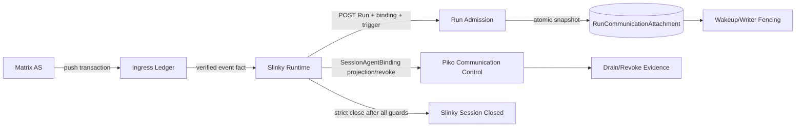
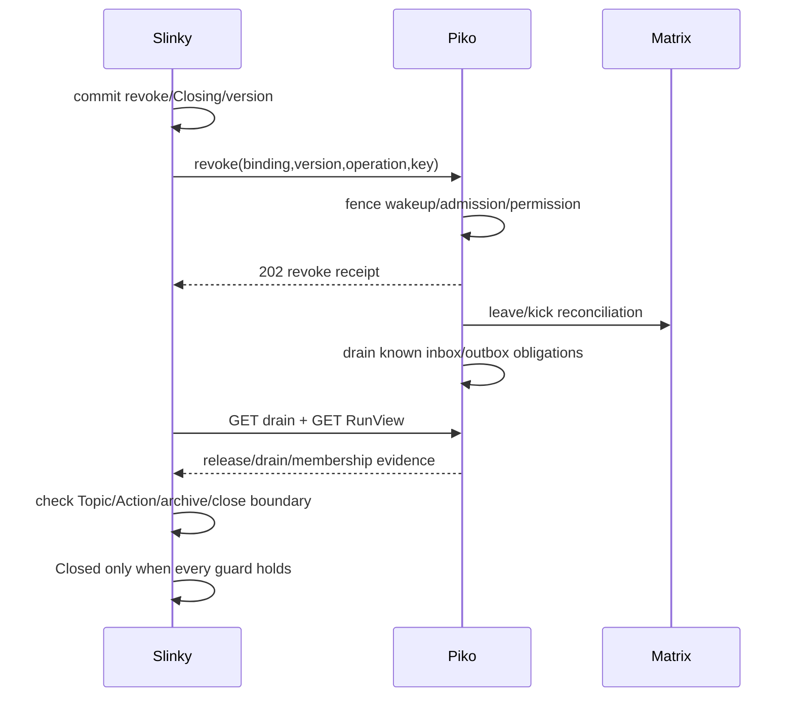

<!-- STD_DOCUMENT_COVER_BEGIN -->
# Piko Communication Provider 端到端机制设计

| 文档字段 | 值 |
|---|---|
| Document ID | `piko-collaboration-bridge-design-v0.3` |
| Document Version | `0.4.0-draft.4` |
| Status | `In Review` |
| Project | `piko` |
| Authority | `piko` |
| Document Owner | Piko Architecture Owner |
| Authors | corezilla |
| Created Date | `2026-09-07` |
| Last Modified Date | `2026-09-16` |
| Template ID | `design.system-mechanism` |
| Template Version | `0.1.0` |
| Template Conformance | `tailored` |
| Tailoring Reference | `piko-std-tailoring-v0.1` |
| Migration Map Reference | none |
| Repository | `corezilla/piko` |
| Canonical Path | `docs/20_system_design/mechanisms/piko-collaboration-bridge-design-v0.3.md` |
| Supersedes | `docs/99_reference/design/agent-runtime-matrix-collaboration-design-v0.3.md` |
<!-- STD_DOCUMENT_COVER_END -->

> Runtime activation=false。机器契约为 `interfaces/openapi/agent-runtime-openapi-v0.3.yaml` 与
> `interfaces/schemas/agent-runtime-v0.3.schema.json`。

## 1. 目标与责任边界

Piko把Matrix/Element作为可选通信provider接入单Agent Run，但不取得Project Session/Topic/Team/IR/STD/业务接受authority。Slinky拥有Project CollaborationSession、Topic、room mapping、成员授权、目录、Element descriptor、close/archive/backup和消息到Run的调度决定。

Piko只拥有：Operator transport profile与AS Secret boundary；稳定ApplicationServiceVirtualUser身份；AS transaction ingress/dedup与outbox；Slinky-authoritative SessionAgentBinding的核验投影；RunCommunicationAttachment、wakeup fencing、revoke/drain/release evidence。

普通无通信Run的三个binding字段全null，不依赖Matrix。

## 2. 构建块



| 构建块 | authority | 状态 |
|---|---|---|
| MatrixTransportProfile | Piko Operator | singleton、versioned、Secret只引用 |
| AgentCommunicationIdentityBinding | Piko | stable MXID、display/version/status |
| SessionAgentBindingProjection | Slinky授权；Piko核验 | exact Session/room/agent/version/status |
| Ingress/Outbox Ledger | Piko | txn/event dedup、delivery obligation、checkpoint私有 |
| RunCommunicationAttachment | Piko | 单Run不可变route snapshot + wakeup epoch |
| Project Session/Topic/View/Close/Backup | Slinky | Piko不复制directory或business state |

## 3. Identity provisioning 与邀请确认

1. Operator配置AS registration/namespace/token的credential binding；内容不出Piko Secret boundary。
2. Piko按`client+project+agent_identity_ref`稳定派生不含display name的MXID，保证identity ref和MXID唯一。
3. Slinky以最小权限管理身份创建private、non-federated、non-encrypted room并邀请exact MXID。
4. Piko收到invite后核对预期projection intent、inviter/admin binding、room ID、membership、encryption和federation policy；通过后加入并提交SessionAgentBindingProjection。
5. 部分邀请、创建响应丢失或远端结果未知进入RecoveryRequired；按operation和真实room/event对账，不按名称猜room、不盲建第二room。

rename只按单调display version更新Matrix display，不改变MXID、room、membership、history或Run attachment。

## 4. Run admission 与可信trigger

`AgentTaskRequest`顶层三个必填键`agent_binding_ref`、`session_binding_ref`、
`expected_session_binding_version`固定agent/session/version；值可为null但必须满足组合约束。旧嵌套
`bindings`是unknown field并返回400。`communication_trigger`为null或：

```json
{"provider":"SlinkyRuntime","dispatch_ref":"dispatch-1","trigger_event_id":"$event"}
```

Bearer认证的Slinky Client是caller authority；body provider只是Schema常量。Piko检查：Session projection Active且版本相等；Agent identity一致；event已经AS ingress原子落盘；event属于exact room和目标identity；未越过revoke/close boundary。

`dispatch_ref`不可变绑定完整tuple `client_task_id+session_binding_ref+trigger_event_id+agent_binding_ref`；
消费键为`client+session_binding+event+agent identity+dispatch`。同dispatch更换tuple任一值返回409
CommunicationTriggerMismatch；同task换dispatch返回409 ClientTaskConflict。同一event只有Slinky显式创建新的
dispatch+client_task_id时才可派给另一Agent/Run；Piko ingress/retry不能生成dispatch。

ingress暂未到返回`CommunicationTriggerNotFound`并保存请求digest/`RetryableRejection`，不生成已受理
receipt；deadline前event出现可对同key/body做CAS重评。admission顺序固定为credential可见性→基础解析
与canonical digest→读取key record并先比较digest→相同digest的AcceptedRun原回执或rejection状态→
client-task/dispatch冲突→request deadline→binding projection lease/version/status→trigger fact。同key
改instruction、deadline或trigger都先409，不得返回原202。deadline已到且无Run时统一
422 DeadlineExpired，即使trigger仍缺失或binding同时失效；迟到event不能使过期请求被受理。拒绝记录
至少保留至`max(request.deadline_at,decision_first_created_at)+7d`；首次decision时间由Piko durable clock写入且
重评/重启不得推进。decision到期只允许状态重评，不删除key→digest binding。

合法重评不是对旧404的原地“升级”捷径：同一serializable transaction必须锁定decision version，再检查
ClientTaskIndex、完整dispatch tuple、当前projection/权限/model/workspace/tool/capacity，并原子写Run、索引、
snapshot、claim和原202。两个不同key曾暂拒同一client_task_id时，并发重评只能一个unique/CAS winner建立Run，
loser返回ClientTaskConflict；无第二dispatch intent或claim。
已受理Run不因event后来redact/不可读重做admission。

## 5. AS ingress、消息Envelope与路由

AS transaction只有在txn、event、dedup和delivery obligation原子落盘后ACK；outbound retry复用稳定txn_id。delivery checkpoint为transport-private，不进入Slinky/Run/backup。

产品wire分三层：发送前`MessageSendRequest`只含version/topic_id/sid/rid/recipients/type/body/attachments；
Piko从认证Client和path binding取得sender/room。`MessageSendReceipt`只证明outbox command持久化，
Matrix受理后才填`matrix_event_id`和origin timestamp。`MessageEventView`/`IngressEventView`包含Piko核验后的
sender MXID、exact room、event/time、classification和dispatch eligibility。SID在Client+Session内唯一，
RID必须指向同Topic既有SID；同SID异body冲突。recipient至少一个，空集合拒绝且不提供广播fallback。
附件只接受受控content_ref、hash/size/type，单项≤64MiB、合计≤256MiB。未知version/type拒绝。普通原生Matrix消息
归类为UnclassifiedNativeMessage，不自动创建Run。当前AgentTeams Topic/SID/RID bridge格式只是协作
基础设施，产品接入不自动继承。

Slinky通过既有Piko communication-control路径POST binding消息、GET exact message receipt和GET exact
ingress event fact；Piko ingress不直接创建Run。Slinky判断Topic/Action/授权后通过唯一Run API提交
trigger。未归类、迟到、撤权后、恢复导入或Archived Topic事件只作Evidence，不唤醒旧Run。

## 6. Revoke、fencing 与多Run同房

Slinky先原子提交自身授权撤销/version，再发送幂等revoke command。Piko admission与revoke以projection
record version/lease做本地CAS：revoke commit先胜则新admission失败，admission先胜则既有Run只保留受理时
snapshot且随后被fence，不能取得新权限。projection lease过期fail closed。Piko本地事务推进binding
version/status与wakeup epoch，阻断新wakeup、新Run admission和原Run的新权限获取；Matrix kick/leave可
异步。跨系统不是ACID，证据未齐保持Revoking。

多Run同房依靠每个Run独立attachment、dispatch_ref、trigger_event_id和wakeup_epoch隔离。新Run不继承旧event obligation；`execution_released=true`或attachment Released后，旧epoch消息永远不能恢复Run写入。

## 7. Drain、execution release 与strict close

Piko DrainView逐binding报告pending inbox/outbox、unresolved/isolated external refs、last accepted event
boundary、authorization/writer/wakeup fence和该Piko虚拟用户membership evidence。membership Left不要求
人类成员或Slinky归档身份退出；零Piko-binding房间无Piko membership blocker。

`execution_released=true`仅在Agent不可调度、Tool child终止或不可写隔离、workspace writer lease/fencing推进、Run wakeup fenced、late result只能写obligation ledger时成立。隔离的外部义务必须继续列入DrainView并令drain=RecoveryRequired，因而不能Session Closed。release不等待Session Closed，也不推断LLMTier terminal、Seat release或UnknownOutcome清除。



Piko drain完成不关闭Session；Slinky strict close不能用timeout、cancel accepted或状态标签代替停止/归档证据。

## 8. Restart 与恢复顺序

1. 取得writer lease/fencing generation；旧writer失效。
2. 恢复identity/session projection、txn/event dedup、outbox/inbox、attachments与revoke/drain operation。
3. 对账Matrix membership和远端send，不生成新txn/event身份。
4. 恢复Run时验证current Client credential；原receipt replay通过可见性后不重做历史admission。
5. 未知义务保留RecoveryRequired；不因retention时钟删除。

备份恢复不重放事件、不重建旧Run、不重置binding version/wakeup epoch、不恢复旧ACL或工具权限。successor room使用新room ID、binding version和epoch；历史event ID只读显示。

## 9. Security 与数据边界

- V0.3只允许private、non-federated、non-encrypted room；不做E2EE fallback。
- 不代理Element login，不返回iframe token URL。
- AS token、device key、checkpoint、inbox/outbox payload和ledger不进入Slinky backup。
- transcript不作为Run Result、Project authority或Piko API投影。
- redaction/delete保留关系和tombstone，不从备份恢复正文。

## 10. 接口迁移

`0.3.0-finalization.4`保留Operator profile/probe、Agent identity、Session binding projection、revoke、drain与产品消息control；删除旧IRCommunicationBinding业务语义、Piko Session list、element-view、Session :close、POST Run collaboration_contract、嵌套bindings、Piko原子建房和Team resolution result。首个可激活V0.3从未包含旧接口，不设双活窗口。

## 11. Verification 与门禁

静态fixture覆盖四种binding、trigger延迟/永久缺失、同event多Agent、revoke、late event、release/drain/membership矩阵和Unknown Tier obligation。联调门禁覆盖真实AS transaction crash、invite部分成功、outbound丢响应、restart/failover、strict close及Secret扫描。生产证据缺失保持activation=false，不改变设计契约。

## 12. A/B/C

- A已形成候选：全部跨系统字段、状态、error、retention、ownership和删除版本。
- B内部下游：store/DDL、worker、lease实现、Matrix SDK模块、metrics；不得改A。
- C联调：真实Matrix/Element/Pi/LLMTier/Workspace及故障证据。
