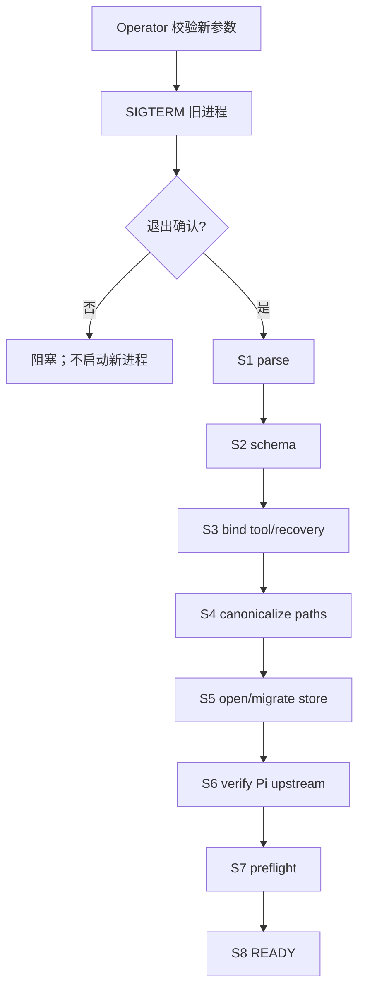
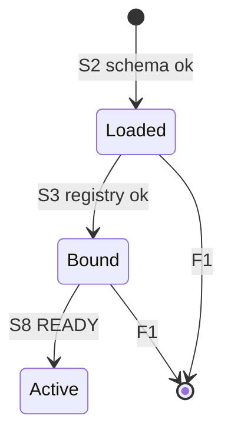

<!-- STD_DOCUMENT_COVER_BEGIN -->
# Piko 机制：配置加载、绑定与生效

> STD 使用入口：[项目采用说明与标准导航](../../../README.md#std-entry)

| 文档字段 | 值 |
|---|---|
| Document ID | `piko-config` |
| Document Version | `0.1.0` |
| Status | `Approved` |
| Project | `piko` |
| Document Owner | Piko Architecture Owner |
| Last Modified Date | `2026-09-25` |
| Template ID | `design.system-mechanism` |
| Template Version | `3.2.0` |
<!-- STD_DOCUMENT_COVER_END -->

## 1. 机制摘要：解决什么问题

Piko 的配置决定哪些模型、哪些工具、哪些路径被允许。配置在启动时由 `bootstrap` 读取并校验，但真正被业务使用时的判定由 `policy`（tool profile 绑定、path 校验）。若两者各自解释配置，会出现"启动认为合法、受理时行为不同"。MECH-CONFIG 定义 `bootstrap` 与 `policy` 如何共享同一份已验证配置，并把"提交/校验/生效"三个阶段分开。

**受益者与任务**：Operator 需要确定的生效语义；Slinky 得到的是与配置一致的行为。

**核心输入 → 处理 → 输出**：输入是 config 文件 + tool profile + Secret reference；处理是"parse → schema 校验 → tool/recovery registry 绑定 → 生效政策（重启生效）"；输出是 launch 时固定的 `BoundToolProfile` 与运行参数。

**最重要取舍**：选择"重启生效"而非在线热改，代价是切换需停机，换取无混合版本。

## 2. 使用场景与功能

| Capability / Scenario ID | 业务任务与触发/条件 | 输入与可观察结果 | 提供方/全部消费者 | 实现状态 | 验证结果/判据 |
|---|---|---|---|---|---|
| CAP-CFG-LOAD · 加载与校验 | 进程启动 | config + profile → 校验结果 | 提供：M000；消费：M002 及所有模块 | Planned | PK-T12（NOT_RUN） |
| CAP-CFG-BIND · 绑定 tool/recovery | 启动 S3 | profile + registry → `BoundToolProfile` 或启动失败 | 提供：M000 + M002 | Planned | PK-T12（NOT_RUN） |
| CAP-CFG-EFFECT · 生效 | 重启后 READY | 新进程使用新配置；旧进程停止前用旧配置 | 提供：M000 | Planned | PK-T12（NOT_RUN） |
| CAP-CFG-SECRET · Secret 解析 | 启动时 | credential_ref → Secret provider 解析 | 提供：M000 | Planned | PK-T12（NOT_RUN） |

不支持：在线热改、多配置并行路径、credential 明文。

## 3. 参与方、责任和 authority

| Participant / 工程 Owner | 负责/不负责 | Owned data/state | Provided/Consumed interface | 部署/实现位置 | 依赖机制与基线 |
|---|---|---|---|---|---|
| M000 `bootstrap` / Piko Implementation Owner | 负责加载/校验/绑定/启动顺序；不运行业务 | 启动时固定的配置快照 | 提供：launch 配置；消费：config + Secret provider | 进程内 `src/bootstrap/`（Planned） | system-design §9.1 |
| M002 `policy` / Piko Implementation Owner | 负责 path/tool 判定；不重新解释配置语义 | `BoundToolProfile` | 提供：校验接口；消费：M000 输出 | 进程内 `src/policy/`（Planned） | MECH-RUN |

**authority 边界**：config 文件权属 Operator；Secret 权属 Secret provider；启动快照权属 M000；tool 判定权属 M002。

### 3.1 系统约束与参与方承接

| Constraint ID / 上级基线与决定状态 | 适用条件 | 系统保证/分配 | 参与方承接与自由度 |
|---|---|---|---|
| PK-12 恢复与 operator 边界 · Approved | 启动/重启 | 启动顺序 S1-S8；restart/fence/migration 需 operator | M000 顺序实现；不可变：不回退语义 |

### 3.2 运行时统筹与确认责任

| 能力/Process ID | 运行时统筹/权威状态 | 参与方动作及确认 | 总体成功/部分结果 | 中断核对与清理 |
|---|---|---|---|---|
| CAP-CFG-LOAD | M000 统筹；配置快照权威 | parse → schema → bind | READY 或 F1 | 任一阶段失败 F1 关闭句柄 |
| CAP-CFG-SECRET | M000；Secret provider 权威 | 解析 credential_ref | 解析成功 | credential 明文拒绝 |

### 3.3 拓扑、目标身份与共享故障域

| 逻辑目标/身份 | 部署及访问路径 | 映射 authority | 共享故障域 | 旧代次处理 |
|---|---|---|---|---|
| config 文件 | 本地 FS 读取 | Operator | 与实例同域 | 重启才生效 |
| Secret provider | 进程内 reference | 外部 provider | 独立域 | 解析失败 → 不 READY |
| tool registry | 进程内绑定 | M000 | 同域 | 启动后不可热注册 |

## 4. 数据结构设计

### 4.1 公共基础类型与枚举

#### 4.1.1 `EffectiveConfigState`

- **定义与来源**：`"Loaded" | "Bound" | "Active"`。来源 M000 ISD §4.1。
- **逐值含义**：`Loaded`＝schema 通过；`Bound`＝tool registry 绑定；`Active`＝READY。不允许跳级。

### 4.2 业务与操作数据结构

#### 4.2.1 `BoundToolProfile`

- **定义与来源**：M002 输出的已绑定 tool allowlist；来源 M002 ISD §4.3.2。
- **字段与约束**：`tools[]` + `recovery_contracts{}`；每个 `recovery_contract_ref` 必须解析到已注册实现并匹配 tool name/effect/replay。
- **所有权/寿命**：启动时绑定；进程寿命。

### 4.3 配置与规则数据结构

#### 4.3.1 `PikoRuntimeConfig`

- **定义与来源**：机器权威 `interfaces/schemas/piko-runtime-config-v0.3.schema.json`；来源 system-design §9.1。
- **字段**：`api_auth` / `workspace_root` / `storage` / `pi` / `llmtier` / `matrix`。
- **跨字段**：`llmtier.cacheRetention=none`、`supportsExplicitPromptCacheMode=false`、`streamOptions.maxRetries=0` 不接受外部覆盖。

#### 4.3.2 `ToolProfile`

- **定义与来源**：机器权威 `interfaces/schemas/piko-tool-profile-v0.3.schema.json`。
- **字段**：`tools[]` + `recovery_contracts{}`。

### 4.4 通信报文结构

**N/A · 复用机器契约**。

### 4.5 设备与 FPGA 表项结构

**N/A · 纯软件范围**。

### 4.6 运行状态数据结构

**N/A · 见 M000 ISD §4.6**：启动状态由 `EffectiveConfigState` 表达。

### 4.7 数据库表结构

**N/A · 见 M003 ISD §4.7.1**：`instance_meta` 记录 schema generation 与 boot id。

### 4.8 错误码与错误结构

**复用机器契约**：`InternalError`（config-invalid / tool-bind-fail）；对外不暴露配置细节。

### 4.9 编码、布局与共享类型映射

config JSON/YAML（由 schema 决定）；Secret 只存 reference。

### 4.10 一致性、可见性与数据寿命

- 启动快照在进程寿命内不变；无在线 reload。
- 在途 Run 绑定原配置；新 Run 用新配置。
- 部分失败（如 Secret 解析失败）→ 不 READY。

## 5. 接口设计

### 5.1 API

**N/A**：无对外 API；配置经启动流程生效。

### 5.2 消息与数据流接口

| Interface ID | 方向 | 输入 | 输出 | 实现位置 |
|---|---|---|---|---|
| IF-CFG-LOAD | Operator → M000 | config 文件 | 校验结果 | M000 ISD §5.1 |
| IF-CFG-BIND | M000 → M002 | profile + registry | `BoundToolProfile` | M002 ISD §5.1 |
| IF-CFG-SECRET | M000 → provider | credential_ref | Secret | M000 ISD §5.1 |

### 5.3 硬件与固件接口

**N/A · 纯软件范围**。

### 5.4 人机与维护接口

operator 修改 config + SIGTERM 触发 P-STOP → P-START（见 system-design §8.4）；MECH-CONFIG 不自建接口。

## 6. 正常端到端流程

代表输入：Operator 修改 `storage.max_queue_depth` 后重启。

1. Operator 校验新参数，SIGTERM 旧进程并确认退出。
2. 新进程 P-START S1 parse → S2 schema 校验（config + tool profile）。
3. S3 绑定 tool/recovery registry；每个 `recovery_contract_ref` 必须解析成功。
4. S4 canonicalize paths（workspace root）。
5. S5 open/migrate SQLite；S6 verify Pi upstream + patch manifest。
6. S7 preflight（LLMTier GET /v1/models + Matrix whoami + store writable）。
7. S8 bind 端口 + READY；新配置生效。

图 M-CFG-1 · MECH-CONFIG 正常端到端 / Target / NOT_BUILT。

### 6.1 交叠请求、跨轮次与生命周期边界

- 旧进程停止前用旧配置；新进程 READY 才证明新配置可服务。
- 在途 Run 不受配置切换影响（进程已重启则 Run 由 recovery 处理）。
- 参数无效时保留旧服务，不进入停止。

## 7. 分支和替代流程

| 分支 | 触发 | 处理 | 结果 |
|---|---|---|---|
| 参数无效 | schema 失败 | F1 | 不 READY；旧服务保留 |
| tool ref 未注册 | 绑定失败 | F1 | 启动失败 |
| Secret 解析失败 | provider 失败 | F1 | 不 READY |
| 旧进程退出未确认 | SIGTERM 后 | 阻塞 | 不启动新进程 |

## 8. 状态机与不变量

图 M-CFG-2 · 配置生效状态机 / Target / NOT_BUILT。

**不变量**：1) 不跳级；2) 未 READY 不接受 Run；3) 进程寿命内配置不变；4) credential 明文拒绝。

### 8.1 资源预留、交付、释放与复位

| 资源 | 预留 | 交付 | 释放 | 复位 |
|---|---|---|---|---|
| config 快照 | S1 读取 | S8 READY | 进程退出 | 重启重读 |
| tool binding | S3 | 进程寿命 | 进程退出 | 重启重绑 |
| Secret | S3/S7 | 内存 | 进程退出 | 重启重解析 |

## 9. 失败传播、重试与恢复

| 故障 | 检测 | 影响 | 恢复 |
|---|---|---|---|
| schema 失败 | S2 | 不 READY | F1；operator 修 config |
| registry 不匹配 | S3 | 不 READY | F1 |
| Secret 不可用 | S3/S7 | 不 READY | F1 |
| Pi upstream 不匹配 | S6 | 不 READY | F1 |

## 10. 并发、排序与容量

- 启动串行 S1-S8；无并发配置写。
- 配置只在启动时读取；运行时无 reload。

## 11. 安全、权限与信任边界

- credential 只存 reference；明文拒绝。
- config 文件权限 0600；Secret 不进 config dump/DB/log。
- tool allowlist 默认拒绝 shell/network/外写。

## 12. 可观测性与证据

### 12.1 统计、日志、时间与关联

| 指标/事件 ID | 单位 | 关联 | 用途 |
|---|---|---|---|
| `piko.dependency.failures.{llmtier,matrix,store}` | count | 全实例 | preflight |
| `event.audit.credential-ref-changed` | 事件 | operator | 审计 |

### 12.2 维护命令、自检与调试路径

启动自检 S1-S8；operator 只读 config 生效摘要（脱敏）。

## 13. 配置、兼容与部署

- 全部 `PikoRuntimeConfig` / `ToolProfile` 字段；重启生效。
- 兼容：schema 版本 0.3；Pi upstream commit 锁定。

## 14. 跨责任单元分解与接口分配

### 14.1 参与方到架构对象映射

| 参与方 | 架构对象 | 下级设计入口 |
|---|---|---|
| M000 | `bootstrap` | `piko-bootstrap-design.md` + `piko-bootstrap-impl.isd.md` |
| M002 | `policy` | `piko-policy-design.md` + `piko-policy-impl.isd.md` |

### 14.2 功能和步骤到责任单元分配

| 步骤 | 责任单元 | 输入 | 输出 |
|---|---|---|---|
| parse/schema | M000 | config | 校验结果 |
| bind tool | M000 + M002 | profile + registry | BoundToolProfile |
| path policy | M002 | workspace | RelPath |
| Secret | M000 | credential_ref | Secret |

### 14.3 责任单元间接口契约

见 §5.2（IF-CFG-*）；完整签名在 M000/M002 ISD §5.1。

### 14.4 下级设计输入清单

| 下游对象 | 固定输入 | 约束 | 自由度 |
|---|---|---|---|
| `bootstrap` | config schema | PK-12 | 启动顺序 |
| `policy` | BoundToolProfile | PK-03 | 校验顺序 |

## 15. 验证、上线与回滚

### 15.1 输入构造、故障控制与独立判据

- 正常：修改 queue depth 重启生效。
- 边界：无效 config、未注册 tool ref、Secret 失败、旧进程退出未确认。
- 独立判据：启动日志 + READY + Run 行为。

### 15.2 环境部署、复位、并发隔离与自动化

- 集成 `tests/integration/operator-auth.test.ts`；配置 fixture。
- 隔离：测试独立 config + SQLite。

### 15.3 组合验收、启用与旧机制退出

- 组合：M000 + M002 PASS + preflight PASS（PK-T12）。
- 旧机制退出：无。

## 16. 风险、未决问题与决定

| ID | 风险/未决 | 等级 | Owner | 关闭 Gate |
|---|---|---|---|---|
| ISSUE-CFG-001 | 重启切换的停机窗口未实测 | Low | Piko Operator | 部署测试后 |

已选决定：重启生效（§1）；启动时绑定（§8）。被否决：在线热改、多配置路径。

## A. 输入基线、适用性与图文规则

| 来源 Document ID / 路径 | 条款/适用范围 | 决定状态 |
|---|---|---|
| `system-design` | §9.1；§3.5 MECH-CONFIG；§6.3 P-CONFIG | Approved |
| `interfaces/schemas/piko-runtime-config-v0.3.schema.json` | config 字段 | Approved |

### A.1 统一适用与复审规则

机制父项 `MECH-RUN`；前置依赖 `MECH-RUN`（launch 前）。复审触发：config schema 变化、Secret provider 变化。

### A.2 纯软件 API 机制裁剪示例

纯软件机制：无硬件/FPGA（§4.5 N/A）；无对外 API（§5.1 N/A）。

## B. 文档控制与修订记录

| 版本 | 日期 | 修改与影响 | 作者 |
|---|---|---|---|
| v0.1.0 | 2026-09-25 | 初稿：MECH-CONFIG 16 节 + 附录 A/B | corezilla, opencode |

<!-- STD_DOCUMENT_CONTROL_BEGIN -->
| 文档字段 | 值 |
|---|---|
| Authority | `piko` |
| Authors | corezilla, opencode |
| Created Date | `2026-09-25` |
| Template Conformance | `tailored` |
| Tailoring Reference | piko-std-tailoring-v0.1 |
| Migration Map Reference | none |
| Repository | `corezilla/piko` |
| Canonical Path | `docs/20_system_design/mechanisms/piko-config.md` |
| Supersedes | none |

> Reviewer、Approver、Approval Date 和 Release Tag 在进入相应状态时填写。Git commit/tag 是
> 外部不可变证据；不要在文档内容中伪造包含自身的 commit hash。
<!-- STD_DOCUMENT_CONTROL_END -->
