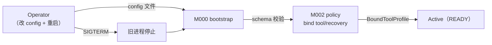
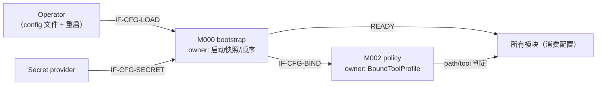
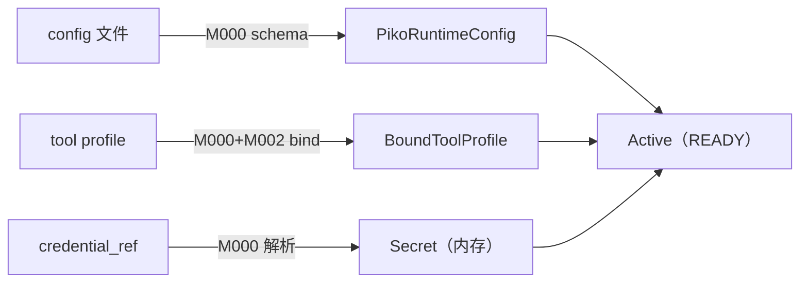
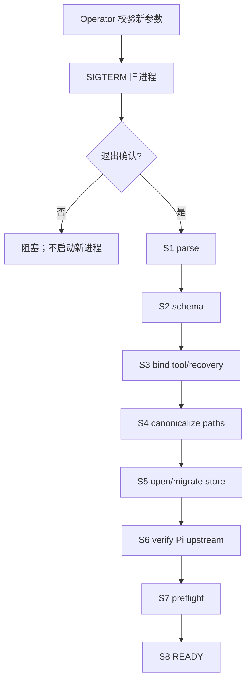
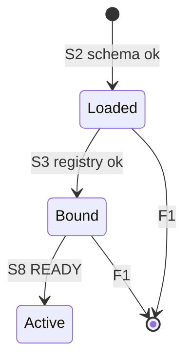
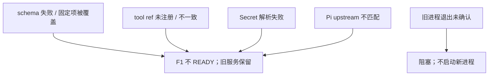
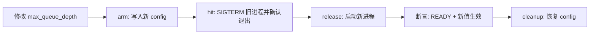

<!-- STD_DOCUMENT_COVER_BEGIN -->
# Piko 机制：配置加载、绑定与生效

> STD 使用入口：[项目采用说明与标准导航](../../../README.md#std-entry)

| 文档字段 | 值 |
|---|---|
| Document ID | `piko-config` |
| Document Version | `0.5.1` |
| Status | `Approved` |
| Project | `piko` |
| Document Owner | Piko Architecture Owner |
| Last Modified Date | `2026-09-25` |
| Template ID | `design.system-mechanism` |
| Template Version | `3.3.0` |
<!-- STD_DOCUMENT_COVER_END -->

## 1. 机制摘要：解决什么问题

Piko 的配置决定哪些模型、哪些工具、哪些路径被允许。配置在启动时由 `bootstrap` 读取并校验，但真正被业务使用时的判定由 `policy`（tool profile 绑定、path 校验）。若两者各自解释配置，会出现"启动认为合法、受理时行为不同"。MECH-CONFIG 定义 `bootstrap` 与 `policy` 如何共享同一份已验证配置，并把"提交/校验/生效"三个阶段分开。

**受益者与任务**：Operator 需要确定的生效语义；Slinky 得到的是与配置一致的行为。

**核心输入 → 处理 → 输出**：输入是 config 文件 + tool profile + Secret reference；处理是"parse → schema 校验 → tool/recovery registry 绑定 → 生效政策（重启生效）"；输出是 launch 时固定的 `BoundToolProfile` 与运行参数。

**最重要取舍**：选择"重启生效"而非在线热改，代价是切换需停机，换取无混合版本。



图 M-CFG-0 · MECH-CONFIG 用途概览 / Target / NOT_BUILT。配置经加载、校验、绑定后在重启后生效。


- **机制形态与适用性 / 业务副作用**：**只读 + 启动绑定**。读取/校验 config 不改外部对象；tool profile 绑定决定后续业务行为。
- **交接域**：**纯软件**。M000/M002 同进程；Secret provider 为受控后端。
- **裁剪依据**：附录 A；§4.5/§5.3 纯软件 N/A。

**教学路径**：本机制接近"只读观测"路径：读取与校验不改外部对象；区别是它决定后续业务行为，需与 MECH-RUN 组合验收。

## 2. 使用场景与功能

| Capability / Scenario ID | 业务任务与触发/条件 | 输入与可观察结果 | 提供方/全部消费者 | 实现状态 | 验证结果/判据 |
|---|---|---|---|---|---|
| CAP-CFG-LOAD · 加载与校验 | 进程启动 | config + profile → 校验结果 | 提供：M000；消费：M002 及所有模块 | Planned | PK-T12（NOT_RUN） |
| CAP-CFG-BIND · 绑定 tool/recovery | 启动 S3 | profile + registry → `BoundToolProfile` 或启动失败 | 提供：M000 + M002 | Planned | PK-T12（NOT_RUN） |
| CAP-CFG-EFFECT · 生效 | 重启后 READY | 新进程使用新配置；旧进程停止前用旧配置 | 提供：M000 | Planned | PK-T12（NOT_RUN） |
| CAP-CFG-SECRET · Secret 解析 | 启动时 | credential_ref → Secret provider 解析 | 提供：M000 | Planned | PK-T12（NOT_RUN） |

不支持：在线热改、多配置并行路径、credential 明文。

## 3. 参与方、责任和 authority

| Participant / 工程 Owner | 负责/不负责 | 决定/写入/事实来源/恢复（适用时） | Provided/Consumed interface | 部署/实现位置 | 依赖机制与基线 |
|---|---|---|---|---|---|
| M000 `bootstrap` / Piko Implementation Owner | 负责加载/校验/绑定/启动顺序；不运行业务 | 启动时固定的配置快照 | 提供：launch 配置；消费：config + Secret provider | 进程内 `src/bootstrap/`（Planned） | system-design §9.1 |
| M002 `policy` / Piko Implementation Owner | 负责 path/tool 判定；不重新解释配置语义 | `BoundToolProfile` | 提供：校验接口；消费：M000 输出 | 进程内 `src/policy/`（Planned） | MECH-RUN |

**责任角色区分**：配置生效的**决定**由 M000 bootstrap 发出（启动顺序），**写入/绑定**由 M002 policy 执行，**权威事实**以启动快照与 `BoundToolProfile` 为准；重启时 M000 重新读取。

**authority 边界**：config 文件权属 Operator；Secret 权属 Secret provider；启动快照权属 M000；tool 判定权属 M002。


图 M-CFG-3 · 协作图 / Target / NOT_BUILT。M000 拥有启动快照与顺序；M002 拥有 tool/path 判定；Secret 权属 provider。

### 3.1 系统约束与参与方承接

| Constraint ID / 上级基线与决定状态 | 适用条件 | 系统保证/分配 | 参与方承接与自由度 |
|---|---|---|---|
| CON-CFG-001 · PK-12 恢复与 operator 边界 · Approved | 启动/重启 | 启动顺序 S1-S8；restart/fence/migration 需 operator | M000 顺序实现；不可变：不回退语义 |

### 3.2 运行时统筹与确认责任

| 能力/Process ID | 运行时统筹/权威状态 | 参与方动作及确认 | 总体成功/部分结果 | 中断核对与清理 |
|---|---|---|---|---|
| CAP-CFG-LOAD | M000 统筹；配置快照权威 | parse → schema → bind | READY 或 F1 | 任一阶段失败 F1 关闭句柄 |
| CAP-CFG-SECRET | M000；Secret provider 权威 | 解析 credential_ref | 解析成功 | credential 明文拒绝 |

### 3.3 拓扑、目标身份与共享故障域

| 逻辑目标/身份 | 部署及访问路径 | 映射 authority | 共享故障域 | 旧代次处理 |
|---|---|---|---|---|
| config 文件 | 本地 FS 读取 | Operator | 与实例同域 | 重启才生效 |
| Secret provider | 进程内 reference | 外部 provider | 独立域 | 解析失败 → 不 READY |
| tool registry | 进程内绑定 | M000 | 同域 | 启动后不可热注册 |

#### 3.3.1 运行环境

| 环境 | config 来源 | Secret 来源 | 用途 |
|---|---|---|---|
| 开发（dev） | 本地 config 文件 | 本地 mock Secret provider | 本地开发 |
| 测试（test/CI） | 测试 fixture config | 固定测试 Secret | 集成测试 |
| 生产（prod） | Operator 维护的 config 文件 | 生产 Secret provider | 实际运行 |

- **进程模型**：M000/M002 同主进程；配置在启动时读取，进程寿命内不变。
- **网络**：Secret provider 访问（进程内 reference 或受控后端）；preflight 出站到 LLMTier/Matrix。
- **持久层**：`instance_meta` 记 schema generation/boot id。
- **生效方式**：重启生效（无在线热改）。

**统筹者退出语义**：M000 启动中退出 → 未 READY，无业务入口；已 READY 后退出的语义等同进程退出（由 `MECH-RECOVERY` 处理）。配置快照随进程消亡，重启重读。

## 4. 数据结构设计

### 4.1 公共基础类型与枚举（适用时）

#### 4.1.1 `EffectiveConfigState`

- **定义与来源**：`"Loaded" | "Bound" | "Active"`。来源 M000 ISD §4.1。
- **逐值含义**：`Loaded`＝schema 通过；`Bound`＝tool registry 绑定；`Active`＝READY。不允许跳级。

### 4.2 业务与操作数据结构（适用时）

#### 4.2.1 `BoundToolProfile`

- **定义与来源**：M002 输出的已绑定 tool allowlist；来源 M002 ISD §4.3.2。
- **字段与约束**：`tools[]` + `recovery_contracts{}`；每个 `recovery_contract_ref` 必须解析到已注册实现并匹配 tool name/effect/replay。
- **所有权/寿命**：启动时绑定；进程寿命。


图 M-CFG-4 · 数据对象图 / Target / NOT_BUILT。config 权属 Operator；Secret 权属 provider；生效快照权属 M000。

### 4.3 配置与规则数据结构（适用时）

#### 4.3.1 `PikoRuntimeConfig`

- **定义与来源**：机器权威 `interfaces/schemas/piko-runtime-config-v0.3.schema.json`；来源 system-design §9.1。
- **字段**：`api_auth` / `workspace_root` / `storage` / `pi` / `llmtier` / `matrix`。
- **跨字段**：`llmtier.cacheRetention=none`、`supportsExplicitPromptCacheMode=false`、`streamOptions.maxRetries=0` 不接受外部覆盖。

#### 4.3.2 `ToolProfile`

- **定义与来源**：机器权威 `interfaces/schemas/piko-tool-profile-v0.3.schema.json`。
- **字段**：`tools[]` + `recovery_contracts{}`。

### 4.4 通信报文结构（适用时）

#### 4.4.1 config 文件格式

由 `interfaces/schemas/piko-runtime-config-v0.3.schema.json` 约束（JSON/YAML）。关键段：

```text
PikoRuntimeConfig {
  api_auth: { slinky_principal: { credential_ref } },
  workspace_root: string,
  storage: { sqlite_path, max_queue_depth, retention_days },
  pi: { upstream_commit, adapter_patches: { before_request_stepid, on_raw_usage } },
  llmtier: { base_url, credential_ref, model, cacheRetention:"none",
             supportsExplicitPromptCacheMode:false, streamOptions:{maxRetries:0} },
  matrix: { homeserver, credential_ref, identity_localpart }
}
```

#### 4.4.2 tool profile 格式

由 `interfaces/schemas/piko-tool-profile-v0.3.schema.json` 约束：

```text
ToolProfile {
  tools: [{ name, effect, replay:"never"|"safe", recovery_contract_ref?, implementation_ref }],
  recovery_contracts: { <ref>: { kind, binds:{tool_name, effect, replay, implementation_ref} } }
}
```

#### 4.4.3 Secret 引用

`SecretRef` 只存名称/路径，不存明文；解析在启动时由 Secret provider 完成。

### 4.5 设备与 FPGA 表项结构（适用时）

**N/A · 纯软件范围**。

### 4.6 运行状态数据结构（适用时）

**N/A · 见 M000 ISD §4.6**：启动状态由 `EffectiveConfigState` 表达。

### 4.7 数据库表结构（适用时）

**N/A · 见 M003 ISD §4.7.1**：`instance_meta` 记录 schema generation 与 boot id。

### 4.8 错误码与错误结构（适用时）

| Error ID | 触发事实 | 结果 | 合法下一步 |
|---|---|---|---|
| `InternalError("config-invalid")` | schema 失败 / 固定项被覆盖 / 未知字段 | 启动 F1，不 READY | operator 修 config 后重启 |
| `InternalError("tool-bind-fail")` | `recovery_contract_ref` 未注册 / 与 implementation 不一致 | 启动 F1 | 注册实现或修 profile |
| `InternalError("secret-unresolved")` | credential_ref 解析失败 | 启动 F1 | 修 Secret provider |
| `InternalError("preflight-fail")` | LLMTier/Matrix/store 不可达 | 启动 F1 | 修依赖后重启 |

对外不暴露配置细节；错误只进启动日志（脱敏）与 audit。
### 4.9 编码、布局与共享类型映射

config JSON/YAML（由 schema 决定）；Secret 只存 reference。

### 4.10 一致性、可见性与数据寿命

- 启动快照在进程寿命内不变；无在线 reload。
- 在途 Run 绑定原配置；新 Run 用新配置。
- 部分失败（如 Secret 解析失败）→ 不 READY。

## 5. 接口设计

### 5.1 API（适用时）

MECH-CONFIG 无对外 API；进程内启动函数与 policy 绑定函数是本机制 API。

#### `loadConfig(path) -> PikoRuntimeConfig`（IF-CFG-LOAD）

- **Interface/Member ID、用途与提供责任**：`IF-CFG-LOAD`；M000 `bootstrap` 提供。
- **唯一契约、版本与状态**：`piko-runtime-config-v0.3.schema.json`；Proposed。
- **输入与前提**：config 文件路径。
- **成功输出与保证**：schema 校验通过的 `PikoRuntimeConfig`。
- **错误与合法下一步**：FAIL → F1，不 READY。
- **代表调用与验证**：§6.1.1 q1/q3；PK-T12。

#### `bindToolProfile(profile, registry) -> BoundToolProfile`（IF-CFG-BIND）

- **Interface/Member ID、用途与提供责任**：`IF-CFG-BIND`；M002 `policy` 提供。
- **唯一契约、版本与状态**：`piko-tool-profile-v0.3.schema.json`；Proposed。
- **输入与前提**：profile + registry；每个 `recovery_contract_ref` 必须解析。
- **成功输出与保证**：`BoundToolProfile`。
- **错误与合法下一步**：不一致 → F1（`tool-bind-fail`）。
- **代表调用与验证**：§6.1.1 q4；PK-T12。

#### `resolveSecret(ref) -> Secret`（IF-CFG-SECRET）

- **Interface/Member ID、用途与提供责任**：`IF-CFG-SECRET`；Secret provider 提供；M000 消费。
- **输入与前提**：`credential_ref`；reference-only。
- **成功输出与保证**：Secret（内存）。
- **错误与合法下一步**：解析失败 → F1。
- **代表调用与验证**：PK-T12。

### 5.2 消息与数据流接口（适用时）

**N/A**：配置为本地文件 + Secret reference，无跨边界消息流；文件格式见 §4.4。
### 5.3 硬件与固件接口（适用时）

**N/A · 纯软件范围**。

### 5.4 人机与维护接口（适用时）

operator 修改 config + SIGTERM 触发 P-STOP → P-START（见 system-design §8.4）；MECH-CONFIG 不自建接口。

## 6. 正常端到端流程

代表输入：Operator 修改 `storage.max_queue_depth` 后重启。

1. Operator 校验新参数，SIGTERM 旧进程并确认退出。
2. 新进程 P-START S1 parse → S2 schema 校验（config + tool profile）。
3. S3 绑定 tool/recovery registry；每个 `recovery_contract_ref` 必须解析成功。
4. S4 canonicalize paths（workspace root）。
5. S5 open/migrate SQLite；S6 verify Pi upstream + patch manifest。
6. S7 preflight（LLMTier GET /v1/models + Matrix whoami + store writable）。
7. S8 bind 端口 + READY；新配置生效。



图 M-CFG-1 · MECH-CONFIG 正常端到端 / Target / NOT_BUILT。

### 6.1 交叠请求、跨轮次与生命周期边界

- 旧进程停止前用旧配置；新进程 READY 才证明新配置可服务。
- 在途 Run 不受配置切换影响（进程已重启则 Run 由 recovery 处理）。
- 参数无效时保留旧服务，不进入停止。

#### 6.1.1 完整调用实例（JSON）

**q1 config 文件（片段）**

```json
{"api_auth":{"slinky_principal":{"credential_ref":"secret://slinky-principal"}},"workspace_root":"/srv/piko/ws","storage":{"sqlite_path":"/srv/piko/state.db","max_queue_depth":32,"retention_days":7},"pi":{"upstream_commit":"9767ba275f3e9a5ee0f5c5342249b629ab1b2282","adapter_patches":{"before_request_stepid":true,"on_raw_usage":true}},"llmtier":{"base_url":"https://llmtier.internal","credential_ref":"secret://llmtier-key","model":"gpt-5","cacheRetention":"none","supportsExplicitPromptCacheMode":false,"streamOptions":{"maxRetries":0}},"matrix":{"homeserver":"https://matrix.internal","credential_ref":"secret://matrix-token","identity_localpart":"piko"}}
```

**q2 tool profile（片段）**

```json
{"tools":[{"name":"read_file","effect":"read","replay":"safe","implementation_ref":"tools/readFile"},{"name":"write_file","effect":"write","replay":"never","recovery_contract_ref":"rc/writeFile","implementation_ref":"tools/writeFile"}],"recovery_contracts":{"rc/writeFile":{"kind":"idempotent-write","binds":{"tool_name":"write_file","effect":"write","replay":"never","implementation_ref":"tools/writeFile"}}}}
```

**q3 无效 config（未知字段 / 覆盖固定项）**

```json
{"llmtier":{"cacheRetention":"short","streamOptions":{"maxRetries":3}}}
```

→ 启动 F1：`InternalError("config-invalid")`，不 READY。

**q4 未注册 tool ref**

```json
{"tools":[{"name":"shell","effect":"shell","replay":"safe","recovery_contract_ref":"rc/missing","implementation_ref":"tools/sh"}]}
```

→ 启动 F1：`InternalError("tool-bind-fail")`。

#### 6.1.2 双方调用演练（调用方知道什么 → 下一步）

| 步 | 调用方（Operator）已知 | 完整输入 | 接收方校验 | 实际动作/确认 | 下一步 |
|---|---|---|---|---|---|
| 1 | 想改并发上限 | 新 config 文件 | 部署者先校验 | — | SIGTERM |
| 2 | 旧进程已停 | — | M000 S1 parse | 读取 config | — |
| 3 | — | — | S2 schema | 校验通过/失败 | 失败→F1 |
| 4 | — | — | S3 bind | tool/recovery 一致 | 失败→F1 |
| 5 | — | — | S4-S7 | canonicalize/store/pi/preflight | 失败→F1 |
| 6 | 想要服务 | — | S8 listen | READY | 新 config 生效 |

**关键事实如何产生**：生效事实=S8 READY（M000）；绑定事实=`BoundToolProfile`（M002）；secret 事实=provider 解析（M000）。

## 7. 分支和替代流程

| 分支 | 触发 | 处理 | 结果 |
|---|---|---|---|
| 参数无效 | schema 失败 | F1 | 不 READY；旧服务保留 |
| tool ref 未注册 | 绑定失败 | F1 | 启动失败 |
| Secret 解析失败 | provider 失败 | F1 | 不 READY |
| 旧进程退出未确认 | SIGTERM 后 | 阻塞 | 不启动新进程 |

## 8. 状态机与不变量



图 M-CFG-2 · 配置生效状态机 / Target / NOT_BUILT。

**不变量**：1) 不跳级；2) 未 READY 不接受 Run；3) 进程寿命内配置不变；4) credential 明文拒绝。

### 8.1 资源预留、交付、释放与复位

| 资源 | 预留 | 交付 | 释放 | 复位 |
|---|---|---|---|---|
| config 快照 | S1 读取 | S8 READY | 进程退出 | 重启重读 |
| tool binding | S3 | 进程寿命 | 进程退出 | 重启重绑 |
| Secret | S3/S7 | 内存 | 进程退出 | 重启重解析 |

## 9. 失败传播、重试与恢复

| 故障 | 检测 | 影响 | 恢复 |
|---|---|---|---|
| schema 失败 | S2 | 不 READY | F1；operator 修 config |
| registry 不匹配 | S3 | 不 READY | F1 |
| Secret 不可用 | S3/S7 | 不 READY | F1 |
| Pi upstream 不匹配 | S6 | 不 READY | F1 |


图 M-CFG-5 · 异常处置图 / Target / NOT_BUILT。任一启动阶段失败 → F1；不部分就绪。

#### 9.1 跨重启恢复窗口

| 崩溃窗口 | 中断前最后持久事实 | 重启后查询身份与位置 | 查询结果 → 合法动作 |
|---|---|---|---|
| 启动任意阶段 | `instance_meta`（schema generation/boot id） | config 文件 + store | 从不 READY 重跑 S1-S8 |
| READY 后 | 配置快照（内存） | 重启重读 config | 旧快照丢弃；重启才生效 |

身份固定：config 文件路径 + `boot_id`。无热改。

## 10. 并发、排序与容量

- 启动串行 S1-S8；无并发配置写。
- 配置只在启动时读取；运行时无 reload。

- 启动串行 S1-S8；无并发配置写；配置只在启动时读取，运行时无 reload。
- 等待出口：preflight 探测超时 → F1；Secret 解析失败 → F1；不部分就绪。

## 11. 安全、权限与信任边界

- credential 只存 reference；明文拒绝。
- config 文件权限 0600；Secret 不进 config dump/DB/log。
- tool allowlist 默认拒绝 shell/network/外写。

| 入口/资产 | 身份来源与传播 | 授权对象/强制点 | 撤销/过期行为 | 拒绝与审计 | 验证 |
|---|---|---|---|---|---|
| config 文件 | Operator → 进程 | schema + 权限 0600 | 重启才生效 | schema FAIL → 不 READY | PK-T12 |
| Secret reference | Secret provider | reference-only | 轮换需重启 | 明文拒绝；audit | PK-T12 |
| tool profile | Operator → registry | 注册实现 + manifest | 启动后不可热注册 | 不匹配 → 启动失败 | PK-T06 |

## 12. 可观测性与证据

### 12.1 统计、日志、时间与关联

| Signal / schema | 生产/采集路径 | 口径、单位、窗口、时间源 | 关联身份/代次 | 清零/丢失/聚合规则 | 保留与开销 |
|---|---|---|---|---|---|
| `piko.dependency.failures.{llmtier,matrix,store}` | M000 生产 → M009 采集 | count / 区间 | 全实例 | 重启重置 | 低开销 |
| `event.audit.credential-ref-changed` | M000 生产 → M003 audit/M009 | 事件 / — | operator | 不聚合 | audit 按 ops 留存 |

### 12.2 维护命令、自检与调试路径

| Maintenance API / Diagnostic ID | 执行位置、入口、目标、权限 | 请求/结果契约 | 施加/回读点及覆盖 | 依赖/占用/恢复退出 | 验证 |
|---|---|---|---|---|---|
| `bootstrap preflight`（S1-S8） | 启动；M000；READY 判定 | 阶段输出（脱敏） | config/schema/bind/paths/store/pi/preflight | 失败 → F1 | PK-T12 |
| `operator config summary` | operator 端点；只读 | 生效 config 摘要（credential 脱敏） | 核对生效值 | 只读 | PK-T12 |

## 13. 配置、兼容与部署

配置 authority：`system-design` §9.1 + 两个 config schema。

| 配置/组合 baseline | 来源/完整定义 | 校验与生效确认 | 在途/跨版本规则 | 中断检查点/回滚前提 | 验证 |
|---|---|---|---|---|---|
| `api_auth.*.credential_ref` | Secret provider | S3 解析；重启 | credential 明文拒绝 | F1；operator 轮换 | PK-T12 |
| `workspace_root` | config；RelPath | S4 canonicalize；重启 | 在途 Run 不变 | F1 | PK-T12 |
| `storage.sqlite_path` | config；AbsPath | S5 + instance lock | 不迁移 | F1 | PK-T12 |
| `pi.upstream_commit` | 锁定+构建 | S6 fingerprint | 不热切 | F1 | PK-T04 |
| config schema | `piko-runtime-config-v0.3` | S2；未知字段拒绝 | 无在线热改 | F1 | PK-T12 |

环境差异见 §3.3.1。兼容：schema v0.3；未知字段拒绝；无在线热改。

## 14. 跨责任单元分解与接口分配

### 14.1 参与方到架构对象映射

| 参与方 | 架构对象 | 下级设计入口 |
|---|---|---|
| M000 | `bootstrap` | `piko-bootstrap-design.md` + `piko-bootstrap-impl.isd.md` |
| M002 | `policy` | `piko-policy-design.md` + `piko-policy-impl.isd.md` |

### 14.2 功能和步骤到责任单元分配

| 步骤 | 责任单元 | 输入 | 输出 |
|---|---|---|---|
| parse/schema | M000 | config | 校验结果 |
| bind tool | M000 + M002 | profile + registry | BoundToolProfile |
| path policy | M002 | workspace | RelPath |
| Secret | M000 | credential_ref | Secret |

### 14.3 责任单元间接口契约

| 交接/接口 ID | 提供方/消费方 | 输入/输出或事件 | 确认、期限与失败 | 引用 |
|---|---|---|---|---|
| IF-CFG-LOAD | M000 → 进程 | config 文件 → `PikoRuntimeConfig` | schema FAIL → F1 | §5.1 |
| IF-CFG-BIND | M000 → M002 | profile+registry → `BoundToolProfile` | 不一致 → F1 | §5.1 |
| IF-CFG-SECRET | provider → M000 | `credential_ref` → Secret | 解析失败 → F1 | §5.1 |

### 14.4 下级设计输入清单

| Requirement ID | 下游对象 | 固定输入 | 约束 | 自由度 |
|---|---|---|---|---|
| `M-CFG-DI-001` | `bootstrap` | config schema | CON-CFG-001 | 启动顺序 |
| `M-CFG-DI-002` | `policy` | BoundToolProfile | CON-CFG-001 | 校验顺序 |


## 15. 验证、上线与回滚

### 15.1 输入构造、故障控制与独立判据

- 正常：修改 queue depth 重启生效。
- 边界：无效 config、未注册 tool ref、Secret 失败、旧进程退出未确认。
- 独立判据：启动日志 + READY + Run 行为。

#### 15.1.1 每项核心保证的正常向量 + 故障向量

| 保证 | 正常向量 | 故障向量 | 注入/命中 | 独立 Oracle |
|---|---|---|---|---|
| 配置合法 | 有效 config READY | 无效/覆盖固定项 | 构造坏 config | 启动退出码 + 日志 |
| tool 绑定 | 全部 ref 注册 | 未注册 ref | 构造缺 ref | 启动失败 |

### 15.2 环境部署、复位、并发隔离与自动化

- 集成 `tests/integration/operator-auth.test.ts`；配置 fixture。
- 隔离：测试独立 config + SQLite。

### 15.3 组合验收、启用与旧机制退出

- 组合：M000 + M002 PASS + preflight PASS（PK-T12）。
- 旧机制退出：无。


图 M-CFG-6 · 测试路径图 / Target / NOT_BUILT。独立 Oracle=启动日志 + Run 行为。

## 16. 风险、未决问题与决定

| ID | 风险/未决 | 等级 | Owner | 关闭 Gate |
|---|---|---|---|---|
| `RISK-CFG-001` | 重启切换的停机窗口未实测 | Low | Piko Operator | 部署测试后 |

已选决定：重启生效（§1）；启动时绑定（§8）。被否决：在线热改、多配置路径。

**跨机制依赖检查**：MECH-CONFIG 被 `MECH-RUN` / `MECH-RECOVERY` 依赖（启动前置）。本机制不依赖其他机制，无循环；父机制 `MECH-RUN` 已登记。

## A. 输入基线、适用性与图文规则

| 来源 Document ID / 路径 | 条款/适用范围 | 决定状态 |
|---|---|---|
| `system-design` | §9.1；§3.5 MECH-CONFIG；§6.3 P-CONFIG | Approved |
| `interfaces/schemas/piko-runtime-config-v0.3.schema.json` | config 字段 | Approved |

### A.1 统一适用与复审规则

机制父项 `MECH-RUN`；前置依赖 `MECH-RUN`（launch 前）。复审触发：config schema 变化、Secret provider 变化。

### A.2 纯软件 API 机制裁剪示例

纯软件机制：无硬件/FPGA（§4.5 N/A）；无对外 API（§5.1 N/A）。

**正文质量检查**：§1/§3/§6/§8/§9/§14/§15 均先有连续段落解释选定方案、依据、取舍与下游约束，再以图表汇总。

**图分类**：§1 用途概览（M-CFG-0）、§3 协作（M-CFG-3）、§6 正常时序（M-CFG-1）为基线必画；§4 对象（M-CFG-4）、§9 异常（M-CFG-5）、§15 测试路径（M-CFG-6）按实际触发。§8 状态资源用 §8.1 短表（无多状态转换）。

## B. 文档控制与修订记录

| 版本 | 日期 | 修改与影响 | 作者 |
|---|---|---|---|
| v0.1.0 | 2026-09-25 | 初稿：MECH-CONFIG 16 节 + 附录 A/B | corezilla, opencode |

<!-- STD_DOCUMENT_CONTROL_BEGIN -->
| 文档字段 | 值 |
|---|---|
| Authority | `piko` |
| Authors | corezilla, opencode |
| Created Date | `2026-09-25` |
| Template Conformance | `tailored` |
| Tailoring Reference | piko-std-tailoring-v0.1 |
| Migration Map Reference | none |
| Repository | `corezilla/piko` |
| Canonical Path | `docs/20_system_design/mechanisms/piko-config.md` |
| Supersedes | none |

> Reviewer、Approver、Approval Date 和 Release Tag 在进入相应状态时填写。Git commit/tag 是
> 外部不可变证据；不要在文档内容中伪造包含自身的 commit hash。
<!-- STD_DOCUMENT_CONTROL_END -->
