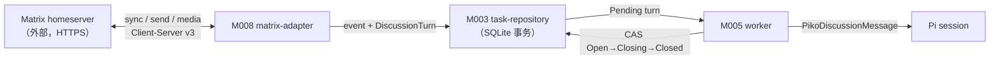
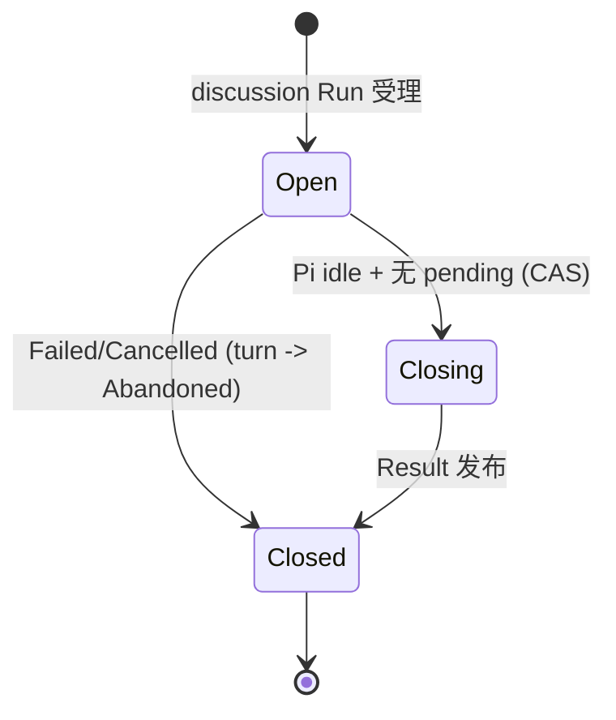

<!-- STD_DOCUMENT_COVER_BEGIN -->
# Piko 机制：Matrix Discussion intake 与同步

> STD 使用入口：[项目采用说明与标准导航](../../../README.md#std-entry)

| 文档字段 | 值 |
|---|---|
| Document ID | `piko-matrix` |
| Document Version | `0.2.0` |
| Status | `Approved` |
| Project | `piko` |
| Document Owner | Piko Architecture Owner |
| Last Modified Date | `2026-09-25` |
| Template ID | `design.system-mechanism` |
| Template Version | `3.2.0` |
<!-- STD_DOCUMENT_COVER_END -->

## 1. 机制摘要：解决什么问题

Piko 的 discussion Run 需要把 Matrix 房间里的消息按顺序喂给 Pi，且要保证"起始事件恰好进入 session 一次"。`matrix-adapter` 只负责 Matrix 协议封装与 sync；`worker` 只负责 Run 生命周期。若各自判断"这条消息是否已进入 Pi"，会产生重复或丢失。MECH-MATRIX 定义两者如何在 SQLite 单事务内对账 `DiscussionTurn` 与 sync cursor，并用确定性 operation id 保证幂等。

**受益者与任务**：Slinky 需要普通房间讨论参与而不引入自定义产品协议；Piko 需要 fail-closed 的 discussion intake。

**核心输入 → 处理 → 输出**：输入是 Matrix Client-Server sync batch 与 run 级 intake 状态；处理是"membership 复核 → 事件去重 → DiscussionTurn 落盘 → cursor 推进 → Pi idle 后 CAS Open→Closing"；输出是已消费 turn 与稳定 Result。

**运行环境一句话**：Piko 以单 configured Matrix 身份，通过 HTTPS 连接外部 homeserver（Synapse 等），使用 `matrix-js-sdk` Client-Server API 做长轮询 sync 与标准消息/媒体收发；不启用 Application Service，v0.3 不支持端到端加密房间。

**最重要取舍**：选择"事件复制进 SQLite + 确定性 operation id"而非依赖 Matrix 侧排队，代价是本地状态更多，换取崩溃可对账。



图 M-MX-0 · MECH-MATRIX 用途概览 / Target / NOT_BUILT。讨论事件经去重、落盘、领取后成为 Pi 输入。

**教学路径**：本机制属"有副作用的收口"路径（对应 STD EX-EXPORT 教学）：事件落盘与 intake 关闭都有持久后果。

## 2. 使用场景与功能

| Capability / Scenario ID | 业务任务与触发/条件 | 输入与可观察结果 | 提供方/全部消费者 | 实现状态 | 验证结果/判据 |
|---|---|---|---|---|---|
| CAP-MX-VERIFY · 校验 discussion 起点 | 受理 discussion 任务 | `{room_id, trigger_event_id}` → VerifiedEvent 或 `InvalidDiscussionContext` | 提供：M008；消费：M001/M005 | Planned | PK-T08（NOT_RUN） |
| CAP-MX-SYNC · 同步与去重 | 每批 Matrix sync | sync cursor + events → dedup + DiscussionTurn + cursor | 提供：M008；消费：M003/M005 | Planned | PK-T08（NOT_RUN） |
| CAP-MX-INTAKE · intake 生命周期 | Pi idle 时 | Pending/QueuedInPi 检查 → CAS Open→Closing→Closed | 提供：M005；消费：M003 | Planned | PK-T08（NOT_RUN） |
| CAP-MX-SEND · 稳定事务发送 | 需要回复房间时 | `MatrixSendRecord` + txn_id → 复用同一 txn | 提供：M008；消费：M003 | Planned | PK-T08（NOT_RUN） |
| CAP-MX-MEDIA · 附件收发 | 任务或回复带附件 | mxc URI + ACL/MIME/size → staging 文件 | 提供：M008；消费：M005 | Planned | PK-T08（NOT_RUN） |

不支持：Application Service 路径、E2EE 房间、自定义产品 envelope、跨系统 drain、历史 backfill 全量拉取。

## 3. 参与方、责任和 authority

| Participant / 工程 Owner | 负责/不负责 | Owned data/state | Provided/Consumed interface | 部署/实现位置 | 依赖机制与基线 |
|---|---|---|---|---|---|
| M008 `matrix-adapter` / Piko Implementation Owner | 负责 `matrix-js-sdk` Client-Server 封装、membership 复核、sync、稳定 txn、media；不启用 AS 路径、不支持 E2EE | `matrix_state`/`matrix_events`/`matrix_sends` | 提供：`MatrixRuntime`；消费：Matrix homeserver | 进程内 `src/adapters/matrix/`（Planned） | MECH-RUN；固定 `matrix-js-sdk`（lockfile） |
| M005 `worker` / Piko Implementation Owner | 负责 discussion intake CAS 与 turn 领取；不管理 homeserver 内部 | `discussion_turns` 状态推进 | 提供：intake 推进；消费：M008 + M003 | 进程内 `src/worker/`（Planned） | MECH-RUN |
| M003 `task-repository` | 负责事务持久化与 fenced write | `matrix_*`/`discussion_turns` | 提供：事务接口 | 进程内 `src/store/`（Planned） | MECH-RUN |

**authority 边界**：Matrix event 权属 homeserver；本地去重与 turn 权属 M003；intake 状态权属 M005；send txn 权属 M008（adapter 内部可靠性，非产品 outbox）。

### 3.1 系统约束与参与方承接

| Constraint ID / 上级基线与决定状态 | 适用条件 | 系统保证/分配 | 参与方承接与自由度 | 流程/协议/下级落实位置 | 组合验证与证据状态 | 差距/变更影响/裁决责任 |
|---|---|---|---|---|---|---|
| PK-08 Matrix Client-Server · Approved | discussion Run | single identity；intake CAS Open→Closing→Closed | M008 协议封装；M005 CAS；自由度：内部数据结构；不可变：不引入 AS、不支持 E2EE 房间 | §5.2 / §6 / §8 / M008 ISD | homeserver 集成 PK-T08（NOT_RUN） | — / matrix-js-sdk 版本变化需复审 |

### 3.2 运行时统筹与确认责任

| 能力/Process ID | 运行时统筹/权威状态 | 参与方动作及确认 | 总体成功/部分结果 | 中断核对与清理/重新开放 | 关联公共契约 |
|---|---|---|---|---|---|
| CAP-MX-VERIFY | M008；homeserver 事件可见性权威 | 取 `GET .../rooms/{roomId}/event/{eventId}` + membership 状态 | VerifiedEvent（事件存在且可见） | 取不到/不可见 → `InvalidDiscussionContext` | contract §6 |
| CAP-MX-SYNC | M008；`matrix_state.sync_cursor` 权威 | 每批单事务写 dedup + turn + cursor | cursor 推进 = 同步完成事实 | 失败 cursor 不推进；崩溃重放由 dedup 吸收 | contract §6 |
| CAP-MX-INTAKE | M005；`runs.discussion_intake_state` | Pi idle → BEGIN IMMEDIATE 查 Pending → CAS Open→Closing | Closing + 无 pending = 可发 Result | 事件先入队阻止 closing，或 closing 后不附着 | contract §6 |
| CAP-MX-SEND | M008；`matrix_sends.txn_id` 权威 | 先持久 send record + 稳定 txn → PUT send | event_id 返回 = 发送完成事实 | txn 未知 → 复用同 txn 重试 | contract §6 |

**统筹者退出语义**：M008 pump 退出 → sync cursor 停在最后提交点，重启从该点继续（dedup 吸收重放）；M005 在 CAS 前退出 → intake 仍 Open，重启重判。退出不丢失已提交事件，也不产生第二写入者。

### 3.3 拓扑、目标身份与共享故障域

| 逻辑目标/身份 | 部署及访问路径 | 映射 authority/更新条件 | 共享故障/复位域 | 旧目标/旧代次处理 |
|---|---|---|---|---|
| homeserver | 外部服务，HTTPS（`matrix.homeserver`） | Operator 配置 + TLS 证书校验 | 独立网络故障域（与 Piko 进程分离） | 换 homeserver 需重启；旧 event_id 只作去重 |
| Piko Matrix 身份 | 单 configured user；`whoami` 验证 | config `matrix.identity_localpart` + Secret `credential_ref` | 与 Piko 进程同域（本地凭据） | access token 轮换需重启；旧 token 失效 → `DiscussionAccessLost` |
| `room_id` | Client-Server API | homeserver（Piko 加入后本地记录 membership） | 随 homeserver 域 | 离开房间后不再收事件 |
| `event_id` / sync cursor | Client-Server API / 本地 SQLite | homeserver（event paging token） | cursor 在本地 SQLite | 旧 cursor 保留；不推进即不丢 |
| media MXC | `mxc://{serverName}/{mediaId}` | homeserver media repo | 随 homeserver 域 | 过期 media 不可下载 |

#### 3.3.1 运行环境

| 环境 | homeserver | 身份来源 | 网络/TLS | 用途 |
|---|---|---|---|---|
| 开发（dev） | 本地 Synapse（`http://localhost:8008`） | 测试 user + token | 无 TLS（loopback） | 本地开发与单元/集成测试 |
| 测试（test/CI） | CI 内 Synapse 容器 | 固定测试 user | loopback | `tests/integration/matrix-discussion.test.ts` |
| 生产（prod） | 客户 homeserver（`https://...`） | config Secret 的 access token | 标准 HTTPS + 系统 CA | 实际运行 |

- **E2EE**：v0.3 不支持端到端加密房间；收到加密事件（`m.room.encrypted`）即拒绝该 Run 或忽略事件，不尝试解密。这是明确裁剪，列入复审触发条件。
- **限流**：homeserver 可能返回 429 `M_LIMIT_EXCEEDED`；M008 按 `retry_after_ms` 退避，不推进 cursor。
- **代理**：v0.3 不支持 HTTP 代理；如需由部署网络层处理。
- **时钟**：`origin_server_ts` 为 homeserver 时间，仅用于排序参考，不作为 Piko 权威时钟。

## 4. 数据结构设计

### 4.1 公共基础类型与枚举（适用时）

#### 4.1.1 `DiscussionIntakeState`

- **完整定义、Data/Type/Error ID 与唯一来源**：`"Disabled" | "Open" | "Closing" | "Closed"`。来源 MECH-RUN §4.1.2 + M005 ISD §4.1。
- **逐字段/逐值类型、范围、含义与跨字段约束**：仅 Open 可接收 turn；单向 Open→Closing→Closed；非 discussion Run 固定 `Disabled`。未知值拒绝。
- **生产/修改、所有权、可见点、寿命及失败出口**：M005 写，M003 持久化；可见点 `runs.discussion_intake_state`；Run 寿命。
- **合法与拒绝实例、V/Case 与证据状态**：Open→Closing CAS 失败（已有新 turn）必须重判。Case PK-T08（NOT_RUN）。

#### 4.1.2 `DiscussionTurnStatus`

- **完整定义、Data/Type/Error ID 与唯一来源**：`"Pending" | "QueuedInPi" | "Consumed" | "Abandoned"`。来源 M005 ISD §4.1。
- **逐字段/逐值类型、范围、含义与跨字段约束**：`Abandoned` 只用于 Failed/Cancelled 时封存未消费 turn，不等同 Consumed。
- **生产/修改、所有权、可见点、寿命及失败出口**：M005 推进，M003 持久化；`discussion_turns.status`。
- **合法与拒绝实例、V/Case 与证据状态**：Consumed 必须有 `pi_entry_id`/`pi_operation_id`。

### 4.2 业务与操作数据结构（适用时）

#### 4.2.1 `DiscussionTurn`

- **完整定义、Data/Type/Error ID 与唯一来源**：`(run_id, event_id)` 主键 + `turn_seq`/`status`/`visible_content`/`pi_entry_id`/`pi_operation_id`。来源 M003 ISD §4.2.7。
- **逐字段/逐值类型、范围、含义与跨字段约束**：`unique(run_id, turn_seq)`；`visible_content` 非空；`turn_seq` 单调递增。
- **生产/修改、所有权、可见点、寿命及失败出口**：M003 写（sync 事务内）；Run 寿命 + retention。
- **合法与拒绝实例、V/Case 与证据状态**：同 `(run_id, event_id)` 重复插入必须去重。Case PK-T08。

#### 4.2.2 `PikoDiscussionMessage`

- **完整定义、Data/Type/Error ID 与唯一来源**：持久字段 `event_id` + `visible_content` + `reply_context?` + `attachments?`；provider 投影删除 `event_id`。来源 M006 ISD §4.4.4。
- **逐字段/逐值类型、范围、含义与跨字段约束**：`event_id` 仅在持久层保留（幂等/replay 用）；`reply_context.in_reply_to_event_id` 必须指向同 room 已见事件；`attachments[].mxc` 必须 `mxc://` 格式。
- **生产/修改、所有权、可见点、寿命及失败出口**：M005 构造，M006 投影；Run 寿命。
- **合法与拒绝实例、V/Case 与证据状态**：`event_id` 进入 provider input 即拒绝（投影必须剥离）。

### 4.3 配置与规则数据结构（适用时）

**N/A · 复用系统 config**：`matrix.homeserver` / `matrix.credential_ref` / `matrix.identity_localpart` 由 system-design §9.1 + M008 ISD §4.3 维护；本机制不新增配置对象。

### 4.4 通信报文结构（适用时）

#### 4.4.1 Matrix Client-Server 事件（Piko 消费子集）

Piko 只消费以下事件类型（其余忽略）：

| `type` | 关键 `content` | Piko 用途 |
|---|---|---|
| `m.room.message` (msgtype `m.text`) | `{msgtype, body}` | 讨论正文 → `visible_content` |
| `m.room.message` (msgtype `m.image`/`m.file`) | `{msgtype, body, url: mxc, info:{mimetype,size}}` | 附件 → attachments |
| `m.room.member` | `{membership, state_key}` | membership 核对 |
| `m.reaction` | `{relates_to: {event_id, key}}` | 忽略（v0.3 不处理 reaction） |
| `m.room.encrypted` | `{algorithm, ciphertext}` | 拒绝（v0.3 不支持 E2EE） |

事件信封（Piko 读取字段）：`{type, event_id, sender, room_id, origin_server_ts, content}`。

#### 4.4.2 `PikoDiscussionMessage`（Piko 内部载荷）

```text
PikoDiscussionMessage {
  event_id: string,          // 仅持久层；provider 投影时删除
  visible_content: string,   // m.room.message body，已去除内部身份
  reply_context?: { in_reply_to_event_id: string },
  attachments?: [{ mxc: string, mime: string, size: uint, sha256: string }]
}
```

- **Data/Type ID、用途与来源**：`DATA-MX-DISCUSSION`；来源 M006 ISD §4.4.4。
- **字段约束**：`visible_content` 非空；`attachments` 每项必须先通过 membership/event/media ACL 与实际 size/MIME 校验。
- **寿命**：随 turn；provider 投影只输出 `visible_content`/`reply_context`/`attachments`。

### 4.5 设备与 FPGA 表项结构（适用时）

**N/A · 纯软件范围**。

### 4.6 运行状态数据结构（适用时）

#### 4.6.1 `MatrixSendRecord`

- **完整定义、Data/Type/Error ID 与唯一来源**：`txn_id` 主键 + `run_id`/`turn_seq`/`payload_sha256`/`event_id`/`state`。来源 M003 ISD §4.2.8。
- **逐字段/逐值类型、范围、含义与跨字段约束**：`txn_id` 由 instance/run/turn/action 确定性派生；`state ∈ {Pending, Sent, Unknown}`。
- **生产/修改、所有权、可见点、寿命及失败出口**：M008 写；Run 寿命。
- **合法与拒绝实例、V/Case 与证据状态**：同 payload retry 复用同 txn；不同 payload 不得复用 txn。

### 4.7 数据库表结构（适用时）

**N/A · 见 M003 ISD §4.7.1**：`matrix_state`/`matrix_events`/`discussion_turns`/`matrix_sends` DDL 唯一权威在 M003 ISD。

### 4.8 错误码与错误结构（适用时）

| Error ID | 触发事实 | 结果状态 | 调用方合法下一步 |
|---|---|---|---|
| `InvalidDiscussionContext` | room/event 不存在或不可见 | 受理 409 | 核对 room/event 与 membership，不换 ID 重试 |
| `DiscussionAccessLost` | membership 撤销 / event 权限丢失 / media ACL 失败 | Run Failed | 停止 intake；交 operator/人工 |
| `M_UNKNOWN_TOKEN`（homeserver 401） | access token 失效 | 映射 `DiscussionAccessLost` | 轮换 token + 重启 |
| `M_LIMIT_EXCEEDED`（homeserver 429） | 超过 homeserver 限流 | cursor 不推进 | 按 `retry_after_ms` 退避重试同批 |
| `M_FORBIDDEN`（homeserver 403） | 无 room 权限 | 映射 `DiscussionAccessLost` | 停止；交 operator |

### 4.9 编码、布局与共享类型映射

- `event_id`/`txn_id`/`room_id`：UTF-8 字符串（Matrix 规范）。
- `visible_content`：UTF-8；`mxc://` URI 按 Matrix media 规范。
- sync cursor：homeserver `next_batch` 字符串。

### 4.10 一致性、可见性与数据寿命

- 每批 sync 单事务；cursor 仅在事务成功后推进。
- `event_id` 去重范围 = 本地 `matrix_events`；重放由 dedup 吸收。
- turn 生命周期 = Run 寿命；Abandoned 保留证据。
- **可见性**：只有已提交事件的 turn 对 worker 可见；未提交不参与 intake。

## 5. 接口设计

### 5.1 API（适用时）

**N/A**：MECH-MATRIX 无对外 API；discussion 经 MECH-RUN 的 `POST /runs`（带 `discussion?`）触发，由 `system-design` §8.1 维护。

### 5.2 消息与数据流接口（适用时）

本节按 draft.39 要求：内部协作使用 HTTP/RPC 时以实际 method+route 为标题，在同一记录说明请求/响应、鉴权、协议状态与业务错误映射、超时和版本。

#### `GET /_matrix/client/v3/sync`（长轮询同步）

- **Interface/Member ID、用途、提供责任与来源**：`IF-MX-SYNC`；M008 经 `matrix-js-sdk` 的 `client.startClient()` + `sync` 事件消费；底层 Client-Server v3。
- **输入与前提**：`since`=上次 `next_batch`（首次 null）；`timeout`=长轮询毫秒（如 30000）；`filter`=只订阅 Piko 关心的 room 与事件类型。鉴权 `Authorization: Bearer <access_token>`。
- **成功输出与保证**：`{next_batch, rooms:{join:{<roomId>:{timeline:{events:[...],limited,prev_batch}}, state:{events:[...]}}}}`。`next_batch` 是推进 cursor 的唯一凭据。
- **错误与合法下一步**：401 `M_UNKNOWN_TOKEN` → `DiscussionAccessLost`；429 `M_LIMIT_EXCEEDED` → 按 `retry_after_ms` 退避；网络超时 → 重试同批（cursor 未推进，无丢失）。
- **交互与生命周期**：长轮询持续运行；`limited=true` 表示事件被截断，需按 `prev_batch` 判断是否影响 intake。
- **实现与验证**：M008 ISD §5.1；Case PK-T08。

#### `PUT /_matrix/client/v3/rooms/{roomId}/send/m.room.message/{txnId}`（稳定事务发送）

- **Interface/Member ID、用途、提供责任与来源**：`IF-MX-SEND`；M008 经 `client.sendMessage()`；客户端生成 `txnId` 保证幂等。
- **输入与前提**：路径 `roomId` + 客户端生成的 `txnId`（M008 确定性派生并持久 `MatrixSendRecord`）；body `{msgtype:"m.text", body, "m.relates_to":{"m.in_reply_to":{...}}}`；Bearer 鉴权。
- **成功输出与保证**：`{event_id}`。同 `txnId` 重试返回原 `event_id`（不重复发）。
- **错误与合法下一步**：403 → `DiscussionAccessLost`；429 → 退避重试同 txn；网络超时 → 复用同 txn 重试。
- **交互与生命周期**：先持久 send record 再发送；`txn_id` 寿命 = Run 寿命。
- **实现与验证**：M008 ISD §5.1；Case PK-T08。

#### `GET /_matrix/client/v3/rooms/{roomId}/event/{eventId}` + `GET .../state/m.room.member/{userId}`（起点与 membership 校验）

- **Interface/Member ID、用途、提供责任与来源**：`IF-MX-VERIFY`；M008 经 `client.fetchRoomEvent()` + `room.getMember()`。
- **输入与前提**：`roomId`、`eventId`、`userId`；Bearer 鉴权。
- **成功输出与保证**：事件对象存在且属于该 room；membership=`join`。
- **错误与合法下一步**：404/403 → 映射 `InvalidDiscussionContext`（受理阶段）或 `DiscussionAccessLost`（运行阶段）。
- **实现与验证**：M008 ISD §5.1；Case PK-T08。

#### `GET /_matrix/media/v3/download/{serverName}/{mediaId}` + `POST /_matrix/media/v3/upload`（附件）

- **Interface/Member ID、用途、提供责任与来源**：`IF-MX-MEDIA`；M008 经 `client.downloadContent()` / `client.uploadContent()`。
- **输入与前提**：mxc URI；Bearer 鉴权；下载前复核 membership/event 可见性。
- **成功输出与保证**：文件字节流（下载）或 `{content_uri}`（上传）；下载有字节上限。
- **错误与合法下一步**：ACL 失败 → `DiscussionAccessLost`；超限 → 拒绝；网络超时 → 不落盘。
- **实现与验证**：M008 ISD §5.1；Case PK-T08。

### 5.3 硬件与固件接口（适用时）

**N/A · 纯软件范围**。

### 5.4 人机与维护接口（适用时）

**N/A**：无独立维护入口；membership/sync 摘要经 operator 诊断读取（`system-design` §8.1 `Operator Diagnostics`）。

## 6. 正常端到端流程

代表输入：discussion Run（room `!r-7:hs`，trigger event `$e-7`）。

1. **启动**：M008 `createClient({baseUrl:homeserver, accessToken, userId})`；`whoami()` 返回 user_id 与 config `identity_localpart` 一致，否则启动失败。
2. **受理**：M001 受理任务 → M008 `IF-MX-VERIFY`（`GET .../event/$e-7` + membership）→ 通过后 M003 单事务写 `runs`(intake=Open) + 初始 `discussion_turns`(Pending, turn_seq=1) → 202。
3. **首轮 accept**：M005 worker 取 lease → M006 `lane.accept({kind:"prompt", operationId:"run_id:initial", messages:[typedInstruction, PikoDiscussionMessage($e-7)]})`；Pi commit 后按 transcript `event_id` 把 turn_seq=1 标 Consumed。
4. **持续 sync**：M008 pump `GET .../sync?since=<cursor>&timeout=30000` → 每批：BEGIN IMMEDIATE → 逐 event 复核 membership → 去重 `matrix_events` → 新 `m.room.message` 写 `discussion_turns`(Pending) → 更新 cursor → COMMIT。
5. **投喂新 turn**：M005 按 `turn_seq` 领取 Pending → 若 Harness operation 运行中调 `followUp`，若 idle 用确定性 `pi_operation_id=run_id:turn:<turn_seq>` accept；Pi commit 后标 Consumed/QueuedInPi。
6. **关闭**：Pi 完成 assistant turn 回 idle → M005 `BEGIN IMMEDIATE` 查 Pending/QueuedInPi → 为空则 CAS intake Open→Closing。
7. **Result**：Closing worker 进入 Result 两步提交；若 Failed/Cancelled 先把剩余 turn 标 Abandoned 再 Closed。
8. **回复**（如需）：M008 先持久 `MatrixSendRecord`（稳定 txn）再 `PUT .../send/m.room.message/{txnId}` → 得 `event_id`。

```mermaid
sequenceDiagram
  participant HS as Matrix homeserver
  participant MX as M008 matrix-adapter
  participant Repo as M003 task-repository
  participant W as M005 worker
  participant PI as Pi session
  Note over MX: 启动 whoami 核对身份
  MX->>HS: GET /_matrix/client/v3/account/whoami
  HS-->>MX: user_id = @piko:hs
  W->>Repo: 受理写 run(intake=Open) + turn(seq=1,Pending)
  W->>PI: accept [instruction, PikoDiscussionMessage($e-7)]
  PI-->>W: commit -> turn Consumed
  loop 长轮询
    MX->>HS: GET /sync?since=cursor&timeout=30000
    HS-->>MX: next_batch + rooms.join.timeline.events[]
    MX->>Repo: BEGIN; dedup + turn + cursor; COMMIT
  end
  W->>Repo: Pi idle -> CAS Open->Closing
  W->>Repo: Result 两步提交
  opt 回复
    MX->>Repo: persist MatrixSendRecord(txn)
    MX->>HS: PUT /rooms/{roomId}/send/m.room.message/{txnId}
    HS-->>MX: event_id
  end
```

图 M-MX-1 · MECH-MATRIX 正常端到端 / Target / NOT_BUILT。

### 6.1 交叠请求、跨轮次与生命周期边界

- 事件与 closing 竞争：writer lock 串行化；事件要么先入队阻止 closing，要么 closing 后只登记。
- 后续消息不唤醒终态 Run；下一轮需新任务。
- membership 撤销/deadline 可提前终止。
- `limited=true` 的 sync 批：M008 记录截断事实，仍按已收事件处理；不因截断阻塞 cursor。

## 7. 分支和替代流程

| 分支 | 触发 | 处理 | 结果 |
|---|---|---|---|
| membership 丢失 | 复核失败（403/成员离开） | 关闭 intake | `DiscussionAccessLost` |
| 自身 sender/echo | sender = 本身份或已知 txn | 只写 dedup | 不生成 turn |
| 事件在 closing 后 | intake=Closing | 只登记 event/cursor | 不附着 Run |
| 恢复时 event 已存在 | 重启 | 补 SQLite 标记 | 不重复 followUp |
| E2EE 事件 | `m.room.encrypted` | 忽略并记录 | 不尝试解密；该 Run 无对应 turn |
| 429 限流 | homeserver 返回 | 退避 `retry_after_ms` | cursor 不推进；不丢事件 |

## 8. 状态机与不变量



图 M-MX-2 · intake 状态机 / Target / NOT_BUILT。

**不变量**：1) 只有 Open 接收 turn；2) 只有 Closing 发 Completed Result；3) 同一 event_id 恰好进入 session 一次；4) cursor 只随事务推进；5) txn_id 确定性；6) `event_id` 不进 provider input。

### 8.1 资源预留、交付、释放与复位

| 资源 | 预留 | 交付 | 释放 | 复位 |
|---|---|---|---|---|
| turn | 受理写 Pending | Pi commit 标 Consumed | Run 终态 | Abandoned 保留 |
| cursor | — | 事务后推进 | — | 不推进即不丢 |
| txn | send record | event_id | Sent | retry 复用 |
| media staging | 下载前建 staging | ACL 校验后移入 allowed path | 失败/取消清理 | retention |

## 9. 失败传播、重试与恢复

| 故障 | 检测 | 影响 | 恢复 |
|---|---|---|---|
| sync 网络超时/断流 | 请求异常 | cursor 不推进 | 重试同批；dedup 吸收重放 |
| 429 `M_LIMIT_EXCEEDED` | HTTP 429 | cursor 不推进 | 按 `retry_after_ms` 退避后重试 |
| 401 `M_UNKNOWN_TOKEN` | HTTP 401 | 无法 sync/send | `DiscussionAccessLost`；operator 轮换 token + 重启 |
| 403 `M_FORBIDDEN` | HTTP 403 | 权限丢失 | `DiscussionAccessLost` |
| Pi commit 后崩溃 | 重启扫 transcript | 标记未落 | 按 `event_id` 补标记 |
| 发送响应丢失 | txn 未知 | event 未知 | 复用同 txn 重试（不重复发） |
| E2EE 事件 | `m.room.encrypted` | 无法解密 | 忽略并记录；不阻塞其他事件 |
| homeserver 不可达 | preflight/运行 | discussion 不可用 | 启动失败 = 不 READY；运行中 `DiscussionAccessLost` |

四类恢复动作按系统设计 §10.1：只读取原操作；同请求重放核对同一身份；执行者接管需确认旧执行者停止；新业务重试重新准入。MECH-MATRIX 的恢复顺序为 cursor → dedup → turn → intake。

## 10. 并发、排序与容量

- 单实例单 pump；不允许并发 sync；`syncOnce` 与 intake CAS 竞争同一 SQLite writer lock，先到者生效。
- turn 按 `turn_seq` 顺序领取；`(run_id, event_id)` 唯一。
- media 下载有字节上限（schema 控制）；超限拒绝。
- 等待出口：sync 失败 cursor 不推进；Pi followUp 等 Harness 空闲；membership 复核失败立即终止。
- rate limit 退避不消耗 Run 预算（属 adapter 内部）。

## 11. 安全、权限与信任边界

| 入口/资产 | 身份来源与传播 | 授权对象/强制点 | 撤销/过期行为 | 拒绝与审计 | 验证 |
|---|---|---|---|---|---|
| incoming event | homeserver → M008（sync） | membership=join + event 可见性 | 撤销后停止 intake | 忽略自身 sender / `DiscussionAccessLost`；audit `event.matrix.sync` | PK-T08 |
| 起点事件 | 请求 `DiscussionContext` | `GET event` + membership | — | `InvalidDiscussionContext` | PK-T08 |
| media 附件 | mxc + Bearer | MIME/size/ACL + workspace path | ACL 失败拒绝 | 拒绝越界/超限；不落盘 | PK-T08 |
| access token | Secret provider → M008 | reference-only | token 轮换需重启 | 不入任务/Result/日志 | PK-T12 |
| 本身份 sender | M008 | whoami 身份比对 | — | 自身消息只去重不投喂 | PK-T08 |

## 12. 可观测性与证据

### 12.1 统计、日志、时间与关联

| Signal / schema | 生产/采集路径 | 口径、单位、窗口、时间源 | 关联身份/代次 | 清零/丢失/聚合规则 | 保留与开销 |
|---|---|---|---|---|---|
| `piko.matrix.sync.lag` | M008 sync 前后单调时钟 | 秒 / 当前 / monotonic | instance + cursor | 重启重置；不跨代次相加 | 指标无保留；低开销 |
| `event.matrix.sync` | 每批 sync | 事件 / batch | room_id + cursor | 不聚合 | 日志按 ops 留存 |
| `event.matrix.send` | 每次 send | 事件 / request | txn_id + event_id | 不聚合 | 日志按 ops 留存 |
| `event.matrix.turn` | 每次 turn 状态变化 | 事件 / 状态 | run_id + event_id + turn_seq | 不聚合 | 日志按 ops 留存 |

时间：`origin_server_ts` 仅排序参考；Piko 权威时间为持久 UTC + monotonic。

### 12.2 维护命令、自检与调试路径

| Maintenance ID | 执行位置、入口、目标、权限 | 请求/结果契约 | 覆盖 | 恢复 |
|---|---|---|---|---|
| `piko matrix-whoami` | 进程内启动自检；operator 只读 | 输出 user_id + membership 摘要 | 验证身份与 homeserver 可达 | 不一致 → 不 READY |
| `piko matrix-sync-status` | operator 诊断端点 | 输出 cursor + lag + 最近 batch 计数 | 验证 sync 推进 | 不推进 → 查 429/401 |
| `piko matrix-audit` | operator 只读 | 输出 send/turn 事件摘要（脱敏） | 定位发送/投喂 | — |

## 13. 配置、兼容与部署

配置 authority：`system-design` §9.1 + `interfaces/schemas/piko-runtime-config-v0.3.schema.json`。

| 配置 | 来源/默认/范围 | 生效点 | 无效处理 |
|---|---|---|---|
| `matrix.homeserver` | config；必填 URL | 重启 | preflight FAIL → 不 READY |
| `matrix.credential_ref` | Secret provider；reference | 重启 | 解析失败 → 不 READY |
| `matrix.identity_localpart` | config；必填 | 重启 | 与 whoami 不一致 → 不 READY |
| sync timeout | 内部常量 30000 ms | 编译期 | — |
| E2EE | 固定禁用 | 编译期 | 收到加密事件忽略 |

兼容矩阵：

| 组合 | 允许版本 | 不支持/降级 |
|---|---|---|
| Piko ↔ homeserver | Client-Server v3（`matrix-js-sdk` lockfile 固定） | 无 AS 路径；无 E2EE |
| Piko ↔ Matrix 事件 | `m.room.message`(text/image/file)、`m.room.member` | reaction 忽略；encrypted 拒绝 |
| discussion 契约 | `PikoDiscussionMessage` | 不引入产品 envelope |

部署：与 Piko 主进程同进程；外部依赖为 homeserver（HTTPS）。升级切换过程引用 §9 + MECH-CONFIG。

## 14. 跨责任单元分解与接口分配

### 14.1 参与方到架构对象映射

| 参与方 | 架构对象 | 下级设计入口 |
|---|---|---|
| M008 | `matrix-adapter` | `piko-matrix-adapter-design.md` + `piko-matrix-adapter-impl.isd.md` |
| M005 | `worker` | `piko-worker-design.md` + `piko-worker-impl.isd.md` |
| M003 | `task-repository` | `piko-task-repository-design.md` + `piko-task-repository-impl.isd.md` |

### 14.2 功能和步骤到责任单元分配

| 步骤 | 责任单元 | 输入 | 输出 |
|---|---|---|---|
| whoami 身份核对 | M008 | config | user_id |
| verify start | M008 | DiscussionContext | VerifiedEvent |
| sync + dedup | M008 | cursor | MatrixBatch |
| turn 落盘 | M003 | sync 事务 | DiscussionTurn |
| intake CAS | M005 | Run state | Closing/Closed |
| media 收发 | M008 | mxc | staging 文件 |

### 14.3 责任单元间接口契约

见 §5.2（IF-MX-*）；完整签名在 M005/M008 ISD §5.1。

### 14.4 下级设计输入清单

| 下游对象 | 固定输入 | 约束 | 自由度 |
|---|---|---|---|
| `matrix-adapter` | matrix-js-sdk + config（homeserver/identity/token） | PK-08；Client-Server v3；无 E2EE | 封装实现、退避策略 |
| `worker` | intake state machine | PK-08 | CAS 实现 |
| `task-repository` | matrix_* DDL | PK-08 | 事务组织 |

## 15. 验证、上线与回滚

### 15.1 输入构造、故障控制与独立判据

- 正常：discussion 任务 end-to-end；oracle = homeserver 侧 event 记录 + Result。
- 边界：membership 撤销、自己 sender、closing 后事件、重启重放、429 限流、E2EE 事件。
- 独立判据：homeserver integration + crash replay；不拿被测 adapter 自身返回成功当 oracle。

### 15.2 环境部署、复位、并发隔离与自动化

- 集成 `tests/integration/matrix-discussion.test.ts`；本地 Synapse（dev/test）。
- 隔离：per-run turn；房间与 cursor 独立。

### 15.3 组合验收、启用与旧机制退出

- 组合：M003 + M005 + M008 PASS + homeserver integration PASS（PK-T08）。
- 旧机制退出：无。

## 16. 风险、未决问题与决定

| ID | 风险/未决 | 等级 | Owner | 关闭 Gate |
|---|---|---|---|---|
| ISSUE-MX-001 | 本地 Synapse 与生产 homeserver 行为差异（限流/权限/E2EE） | Medium | Piko Implementation Owner | homeserver 联调后 |
| ISSUE-MX-002 | v0.3 不支持 E2EE；若生产房间加密则 discussion 不可用 | High | Piko Project Owner | 生产拓扑确定时裁决 |

已选决定：单 Client-Server 路径（§1）；SQLite 事务内同步（§8）；不支持 E2EE（§3.3.1）。被否决：AS 路径、产品 outbox、E2EE 解密。

**跨机制依赖检查**：MECH-MATRIX 依赖 `MECH-RUN`（Run 生命周期与 Result）、`MECH-RECOVERY`（cursor/turn 对账）、`MECH-CONFIG`（homeserver/identity/token）。无反向依赖、无循环、上级 `MECH-RUN` 已登记。

## A. 输入基线、适用性与图文规则

| 来源 Document ID / 路径 | 条款/适用范围 | 决定状态 |
|---|---|---|
| `system-design` | §3.5 MECH-MATRIX；§3.4 PK-08；§8.2 Matrix Client-Server | Approved |
| `piko-agent-runtime-contract-v0.3` | §6 error codes；machine `0.3.0-simplified.6` | Approved |
| Matrix Client-Server API v3 | sync / send / media / whoami | external |
| M003 ISD §4.7 | matrix_* DDL | Planned |

### A.1 统一适用与复审规则

机制父项 `MECH-RUN`；前置依赖 `MECH-RUN` + `MECH-CONFIG`。复审触发：matrix-js-sdk 版本变化、intake 状态机变化、E2EE 需求出现、homeserver 行为差异。

### A.2 纯软件 API 机制裁剪示例

纯软件机制：无硬件/FPGA（§4.5 N/A）；外部依赖走 Client-Server v3 HTTPS；无设备寄存器/RTL 表项。

## B. 文档控制与修订记录

| 版本 | 日期 | 修改与影响 | 作者 |
|---|---|---|---|
| v0.1.0 | 2026-09-25 | 初稿：MECH-MATRIX 16 节 + 附录 A/B | corezilla, opencode |
| v0.2.0 | 2026-09-25 | review 修复：补实际 Matrix Client-Server 协议（sync/send/media/whoami endpoint + 请求/响应/错误/超时）；补运行环境（homeserver/身份/TLS/房间/E2EE/限流/dev-test-prod）；§4.4 从 N/A 改为实际事件与 PikoDiscussionMessage 载荷；§11/§12 按模板列格式重写 | corezilla, opencode |

<!-- STD_DOCUMENT_CONTROL_BEGIN -->
| 文档字段 | 值 |
|---|---|
| Authority | `piko` |
| Authors | corezilla, opencode |
| Created Date | `2026-09-25` |
| Template Conformance | `tailored` |
| Tailoring Reference | piko-std-tailoring-v0.1 |
| Migration Map Reference | none |
| Repository | `corezilla/piko` |
| Canonical Path | `docs/20_system_design/mechanisms/piko-matrix.md` |
| Supersedes | none |

> Reviewer、Approver、Approval Date 和 Release Tag 在进入相应状态时填写。Git commit/tag 是
> 外部不可变证据；不要在文档内容中伪造包含自身的 commit hash。
<!-- STD_DOCUMENT_CONTROL_END -->
