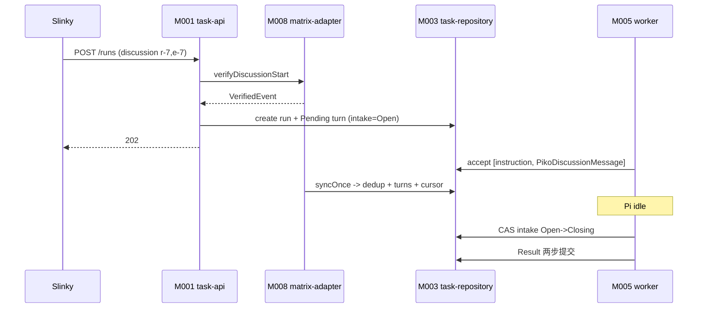
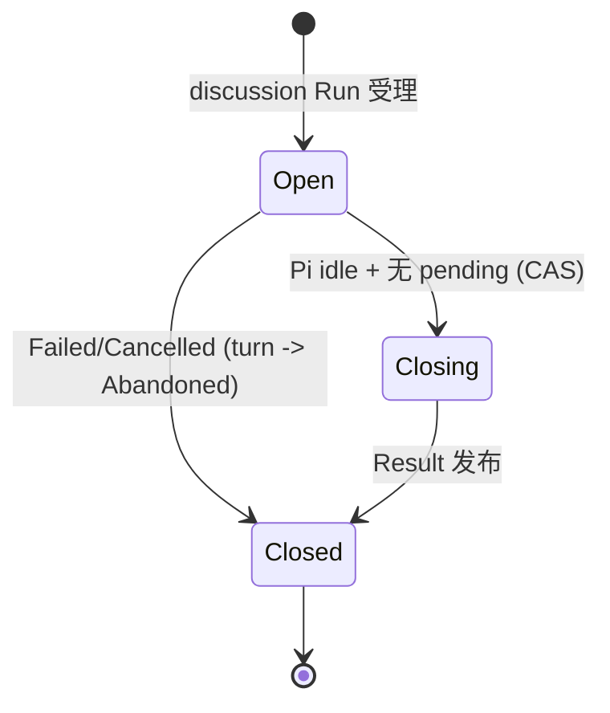

<!-- STD_DOCUMENT_COVER_BEGIN -->
# Piko 机制：Matrix Discussion intake 与同步

> STD 使用入口：[项目采用说明与标准导航](../../../README.md#std-entry)

| 文档字段 | 值 |
|---|---|
| Document ID | `piko-matrix` |
| Document Version | `0.1.0` |
| Status | `Approved` |
| Project | `piko` |
| Document Owner | Piko Architecture Owner |
| Last Modified Date | `2026-09-25` |
| Template ID | `design.system-mechanism` |
| Template Version | `3.2.0` |
<!-- STD_DOCUMENT_COVER_END -->

## 1. 机制摘要：解决什么问题

Piko 的 discussion Run 需要把 Matrix 房间里的消息按顺序喂给 Pi，且要保证"起始事件恰好进入 session 一次"。`matrix-adapter` 只负责 sync 与协议封装；`worker` 只负责 Run 生命周期。若各自判断"这条消息是否已进入 Pi"，会产生重复或丢失。MECH-MATRIX 定义两者如何在 SQLite 单事务内对账 `DiscussionTurn` 与 sync cursor，并用确定性 operation id 保证幂等。

**受益者与任务**：Slinky 需要普通房间讨论参与而不引入自定义产品协议；Piko 需要 fail-closed 的 discussion intake。

**核心输入 → 处理 → 输出**：输入是 Matrix sync batch 与 run 级 intake 状态；处理是"membership 复核 → 事件去重 → DiscussionTurn 落盘 → cursor 推进 → Pi idle 后 CAS Open→Closing"；输出是已消费 turn 与稳定 Result。

**最重要取舍**：选择"事件复制进 SQLite + 确定性 operation id"而非依赖 Matrix 侧排队，代价是本地状态更多，换取崩溃可对账。

图 M-MX-0 · MECH-MATRIX 用途概览 / Target / NOT_BUILT。讨论事件经去重、落盘、领取后成为 Pi 输入。

**教学路径**：本机制属"有副作用的收口"路径（对应 STD EX-EXPORT 教学）：事件落盘与 intake 关闭都有持久后果。

## 2. 使用场景与功能

| Capability / Scenario ID | 业务任务与触发/条件 | 输入与可观察结果 | 提供方/全部消费者 | 实现状态 | 验证结果/判据 |
|---|---|---|---|---|---|
| CAP-MX-VERIFY · 校验 discussion 起点 | 受理 discussion 任务 | `{room_id, trigger_event_id}` → VerifiedEvent 或 `InvalidDiscussionContext` | 提供：M008；消费：M001/M005 | Planned | PK-T08（NOT_RUN） |
| CAP-MX-SYNC · 同步与去重 | 每批 Matrix sync | sync cursor + events → dedup + DiscussionTurn + cursor | 提供：M008；消费：M003/M005 | Planned | PK-T08（NOT_RUN） |
| CAP-MX-INTAKE · intake 生命周期 | Pi idle 时 | Pending/QueuedInPi 检查 → CAS Open→Closing→Closed | 提供：M005；消费：M003 | Planned | PK-T08（NOT_RUN） |
| CAP-MX-SEND · 稳定事务发送 | 需要回复房间时 | `MatrixSendRecord` + txn_id → 复用同一 txn | 提供：M008；消费：M003 | Planned | PK-T08（NOT_RUN） |

不支持：Application Service 路径、自定义产品 envelope、跨系统 drain。

## 3. 参与方、责任和 authority

| Participant / 工程 Owner | 负责/不负责 | Owned data/state | Provided/Consumed interface | 部署/实现位置 | 依赖机制与基线 |
|---|---|---|---|---|---|
| M008 `matrix-adapter` / Piko Implementation Owner | 负责 `matrix-js-sdk` Client-Server 封装、membership 复核、sync、稳定 txn；不启用 AS 路径 | `matrix_state`/`matrix_events`/`matrix_sends` | 提供：`MatrixRuntime`；消费：Matrix homeserver | 进程内 `src/adapters/matrix/`（Planned） | MECH-RUN |
| M005 `worker` / Piko Implementation Owner | 负责 discussion intake CAS 与 turn 领取；不管理 homeserver 内部 | `discussion_turns` 状态推进 | 提供：intake 推进；消费：M008 + M003 | 进程内 `src/worker/`（Planned） | MECH-RUN |
| M003 `task-repository` | 负责事务持久化与 fenced write | `matrix_*`/`discussion_turns` | 提供：事务接口 | 进程内 `src/store/`（Planned） | MECH-RUN |

**authority 边界**：Matrix event 权属 homeserver；本地去重与 turn 权属 M003；intake 状态权属 M005；send txn 权属 M008（adapter 内部可靠性，非产品 outbox）。

### 3.1 系统约束与参与方承接

| Constraint ID / 上级基线与决定状态 | 适用条件 | 系统保证/分配 | 参与方承接与自由度 |
|---|---|---|---|
| PK-08 Matrix Client-Server · Approved | discussion Run | single identity；intake CAS Open→Closing→Closed | M008 协议封装；M005 CAS；自由度：内部数据；不可变：不引入 AS |

### 3.2 运行时统筹与确认责任

| 能力/Process ID | 运行时统筹/权威状态 | 参与方动作及确认 | 总体成功/部分结果 | 中断核对与清理 |
|---|---|---|---|---|
| CAP-MX-SYNC | M008 统筹；`matrix_state.sync_cursor` 权威 | 每批单事务写 dedup + turn + cursor | cursor 推进 = 同步完成事实 | 失败 cursor 不推进；崩溃重放由 dedup 吸收 |
| CAP-MX-INTAKE | M005 统筹；`runs.discussion_intake_state` | Pi idle → BEGIN IMMEDIATE 查 Pending → CAS Open→Closing | Closing + 无 pending = 可发 Result | 事件先入队阻止 closing，或 closing 后不附着 |

### 3.3 拓扑、目标身份与共享故障域

| 逻辑目标/身份 | 部署及访问路径 | 映射 authority | 共享故障域 | 旧代次处理 |
|---|---|---|---|---|
| Matrix identity | 单 configured identity；whoami 验证 | config `matrix.identity_localpart` | 与实例同域（本地凭据） | token 轮换需重启 |
| `room_id` / `event_id` | HTTPS Client-Server | homeserver | 独立网络故障域 | 旧 event 只去重 |
| sync cursor | 本地 SQLite | M003 | 同域 | 不推进即不丢 |

**统筹者退出语义**：M008 pump 退出 → sync cursor 停在最后提交点，重启从该点继续（dedup 吸收重放）；M005 在 CAS 前退出 → intake 仍 Open，重启重判。退出不丢失已提交事件。

## 4. 数据结构设计

### 4.1 公共基础类型与枚举（适用时）

#### 4.1.1 `DiscussionIntakeState`

- **定义与来源**：`"Disabled" | "Open" | "Closing" | "Closed"`。来源 MECH-RUN §4.1 + M005 ISD §4.1。
- **逐值含义**：仅 Open 可接收 turn；单向 Open→Closing→Closed。未知值拒绝。
- **所有权**：M005 写，M003 持久化。

#### 4.1.2 `DiscussionTurnStatus`

- **定义与来源**：`"Pending" | "QueuedInPi" | "Consumed" | "Abandoned"`。来源 M005 ISD §4.1。
- **逐值含义**：`Abandoned` 只用于 Failed/Cancelled 时封存未消费 turn，不等同 Consumed。

### 4.2 业务与操作数据结构（适用时）

#### 4.2.1 `DiscussionTurn`

- **定义与来源**：`(run_id, event_id)` 主键 + `turn_seq`/`status`/`visible_content`/`pi_entry_id`/`pi_operation_id`。来源 M003 ISD §4.2.7。
- **字段与约束**：`unique(run_id, turn_seq)`；`visible_content` 非空。
- **所有权/寿命**：M003 写；Run 寿命。

#### 4.2.2 `PikoDiscussionMessage`

- **定义与来源**：持久 `event_id` + `visible_content` + reply_context + attachments；provider 投影删除 `event_id`。来源 M006 ISD §4.4.4。
- **跨字段**：`attachments` 必须已验证 membership/event/media。

### 4.3 配置与规则数据结构（适用时）

**N/A · 复用系统 config**：`matrix.*` 由 system-design §9.1 + M008 ISD 维护。

### 4.4 通信报文结构（适用时）

**N/A · 复用机器契约**：`PikoDiscussionMessage` 字段在 M006 ISD §4.4.4。

### 4.5 设备与 FPGA 表项结构（适用时）

**N/A · 纯软件范围**。

### 4.6 运行状态数据结构（适用时）

#### 4.6.1 `MatrixSendRecord`

- **定义与来源**：`txn_id` 主键 + `run_id`/`turn_seq`/`payload_sha256`/`event_id`/`state`。来源 M003 ISD §4.2.8。
- **约束**：`txn_id` 由 instance/run/turn/action 确定性派生；`state ∈ {Pending, Sent, Unknown}`。

### 4.7 数据库表结构（适用时）

**N/A · 见 M003 ISD §4.7.1**：`matrix_state`/`matrix_events`/`discussion_turns`/`matrix_sends` DDL 在 M003 ISD。

### 4.8 错误码与错误结构（适用时）

**复用机器契约**：`InvalidDiscussionContext`（受理冲突）、`DiscussionAccessLost`（membership/event/media 丢失）。

### 4.9 编码、布局与共享类型映射

event_id/txn_id 字符串；visible_content UTF-8；mxc URI 字符串。

### 4.10 一致性、可见性与数据寿命

- 每批 sync 单事务；cursor 仅在事务成功后推进。
- `event_id` 去重范围 = 本地 `matrix_events`；重放由 dedup 吸收。
- turn 生命周期 = Run 寿命；Abandoned 保留证据。

## 5. 接口设计

### 5.1 API（适用时）

**N/A**：无对外 API；discussion 经 MECH-RUN 的 `POST /runs`（带 `discussion?`）触发。

### 5.2 消息与数据流接口（适用时）

| Interface ID | 方向 | 输入 | 输出 | 实现位置 |
|---|---|---|---|---|
| IF-MX-VERIFY | M001/M005 → M008 | `DiscussionContext` | `VerifiedEvent` | M008 ISD §5.1 |
| IF-MX-SYNC | M008 ↔ homeserver | cursor | `MatrixBatch` | M008 ISD §5.1 |
| IF-MX-SEND | M008 → homeserver | `MatrixSendRecord` | `MatrixSendOutcome` | M008 ISD §5.1 |
| IF-MX-TURN | M005 → M003 | turn | turn record | M003 ISD §5.1 |

### 5.3 硬件与固件接口（适用时）

**N/A · 纯软件范围**。

### 5.4 人机与维护接口（适用时）

**N/A**：无独立维护入口；membership/sync 摘要经 operator 诊断读取。

## 6. 正常端到端流程

代表输入：discussion Run（room `r-7`，trigger event `e-7`）。

1. M001 受理任务 → M008 `verifyDiscussionStart` 校验 membership/event 可见 → 初始 Pending turn。
2. worker 首次 accept 传 `[typedInstruction, PikoDiscussionMessage(e-7)]`；Pi commit 后标 turn Consumed（按 transcript event_id）。
3. M008 每批 `syncOnce`：BEGIN IMMEDIATE → 去重 → 新事件写 DiscussionTurn(Pending) → 推进 cursor → COMMIT。
4. Pi 完成一个 assistant turn 回到 idle；M005 BEGIN IMMEDIATE 查 Pending/QueuedInPi；为空则 CAS intake Open→Closing。
5. Closing worker 进入 Result 两步提交；Failed/Cancelled 先把剩余 turn 标 Abandoned 再 Closed。

图 M-MX-1 · MECH-MATRIX 正常端到端 / Target / NOT_BUILT。

### 6.1 交叠请求、跨轮次与生命周期边界

- 事件与 closing 竞争：writer lock 串行化；事件要么先入队阻止 closing，要么 closing 后只登记。
- 后续消息不唤醒终态 Run；下一轮需新任务。
- membership 撤销/deadline 可提前终止。

## 7. 分支和替代流程

| 分支 | 触发 | 处理 | 结果 |
|---|---|---|---|
| membership 丢失 | 复核失败 | 关闭 intake | `DiscussionAccessLost` |
| 自身 sender/echo | 已知 txn | 只写 dedup | 不生成 turn |
| 事件在 closing 后 | intake=Closing | 只登记 event/cursor | 不附着 Run |
| 恢复时 event 已存在 | 重启 | 补 SQLite 标记 | 不重复 followUp |

## 8. 状态机与不变量

图 M-MX-2 · intake 状态机 / Target / NOT_BUILT。

**不变量**：1) 只有 Open 接收 turn；2) 只有 Closing 发 Completed Result；3) 同一 event_id 恰好进入 session 一次；4) cursor 只随事务推进；5) txn_id 确定性。

### 8.1 资源预留、交付、释放与复位

| 资源 | 预留 | 交付 | 释放 | 复位 |
|---|---|---|---|---|
| turn | 受理写 Pending | Pi commit 标 Consumed | Run 终态 | Abandoned 保留 |
| cursor | — | 事务后推进 | — | 不推进即不丢 |
| txn | send record | event_id | Sent | retry 复用 |

## 9. 失败传播、重试与恢复

| 故障 | 检测 | 影响 | 恢复 |
|---|---|---|---|
| sync 失败 | HTTP error | cursor 不推进 | 重试同批 |
| Pi commit 后崩溃 | 重启扫 transcript | 标记未落 | 按 event_id 补标记 |
| 发送响应丢失 | txn 未知 | event 未知 | 复用同 txn 重试 |

## 10. 并发、排序与容量

- 单实例单 pump；不允许并发 sync。
- turn 按 `turn_seq` 顺序领取；`(run_id, event_id)` 唯一。
- media 字节上限由 schema 控制。

- 代表请求：`syncOnce` 在单 SQLite writer 事务内写 dedup + turn + cursor；worker intake CAS 与 sync 竞争同一 writer lock，先到者生效。
- 等待出口：sync 失败 cursor 不推进；Pi followUp 等待 Harness 空闲；membership 复核失败立即终止。

## 11. 安全、权限与信任边界

- 单 configured identity；whoami 核对。
- membership/event visibility/media ACL 在接收与实际读取前分别复核。
- access token 不进任务或 Result。

| 资产/入口 | 信任边界 | 权威来源 | 拒绝行为 |
|---|---|---|---|
| incoming event | homeserver → Piko | membership/event visibility | 忽略自身 sender / `DiscussionAccessLost` |
| media 附件 | Matrix media → staging | MIME/size/ACL + workspace path | 拒绝越界/超限 |
| access token | Secret provider → 内存 | reference-only | 不入任务/Result |

## 12. 可观测性与证据

### 12.1 统计、日志、时间与关联

| 指标/事件 ID | 单位 | 关联 | 用途 |
|---|---|---|---|
| `piko.matrix.sync.lag` | s | 全实例 | 集成健康 |
| `event.matrix.{sync,send,turn}` | 事件 | room_id + event_id + run_id | 证据 |

### 12.2 维护命令、自检与调试路径

启动 whoami 自检；operator 只读 membership/sync 摘要。

## 13. 配置、兼容与部署

- 消费 `matrix.homeserver`/`credential_ref`/`identity_localpart`。
- 兼容：`matrix-js-sdk` lockfile 固定；不支持 AS 路径。

| 组合 | 允许版本 | 不支持/降级 |
|---|---|---|
| Piko ↔ Matrix | Client-Server (`matrix-js-sdk` lockfile) | 无 AS 路径 |
| discussion 契约 | PikoDiscussionMessage | 不引入产品 envelope |

## 14. 跨责任单元分解与接口分配

### 14.1 参与方到架构对象映射

| 参与方 | 架构对象 | 下级设计入口 |
|---|---|---|
| M008 | `matrix-adapter` | `piko-matrix-adapter-design.md` + `piko-matrix-adapter-impl.isd.md` |
| M005 | `worker` | `piko-worker-design.md` + `piko-worker-impl.isd.md` |

### 14.2 功能和步骤到责任单元分配

| 步骤 | 责任单元 | 输入 | 输出 |
|---|---|---|---|
| verify start | M008 | DiscussionContext | VerifiedEvent |
| sync + dedup | M008 | cursor | MatrixBatch |
| intake CAS | M005 | Run state | Closing/Closed |
| send | M008 | txn record | event_id |

### 14.3 责任单元间接口契约

见 §5.2（IF-MX-*）；完整签名在 M005/M008 ISD §5.1。

### 14.4 下级设计输入清单

| 下游对象 | 固定输入 | 约束 | 自由度 |
|---|---|---|---|
| `matrix-adapter` | matrix-js-sdk + config | PK-08 | 封装实现 |
| `worker` | intake state machine | PK-08 | CAS 实现 |

## 15. 验证、上线与回滚

### 15.1 输入构造、故障控制与独立判据

- 正常：discussion 任务 end-to-end；oracle = homeserver 侧 event 记录 + Result。
- 边界：membership 撤销、自己 sender、closing 后事件、重启重放。
- 独立判据：homeserver integration + crash replay。

### 15.2 环境部署、复位、并发隔离与自动化

- 集成 `tests/integration/matrix-discussion.test.ts`；本地 Synapse。
- 隔离：per-run turn；房间与 cursor 独立。

### 15.3 组合验收、启用与旧机制退出

- 组合：M005 + M008 PASS + homeserver integration PASS（PK-T08）。
- 旧机制退出：无。

## 16. 风险、未决问题与决定

| ID | 风险/未决 | 等级 | Owner | 关闭 Gate |
|---|---|---|---|---|
| ISSUE-MX-001 | 本地 Synapse 与生产 homeserver 行为差异 | Medium | Piko Implementation Owner | homeserver 联调后 |

已选决定：单 Client-Server 路径（§1）；SQLite 事务内同步（§8）。被否决：AS 路径、产品 outbox。

**跨机制依赖检查**：MECH-MATRIX 依赖 `MECH-RUN`（Run 生命周期与 Result）与 `MECH-RECOVERY`（cursor/turn 对账）。无反向依赖、无循环、上级 `MECH-RUN` 已登记。

## A. 输入基线、适用性与图文规则

| 来源 Document ID / 路径 | 条款/适用范围 | 决定状态 |
|---|---|---|
| `system-design` | §3.5 MECH-MATRIX；§3.4 PK-08 | Approved |
| M003 ISD §4.7 | matrix_* DDL | Planned |

### A.1 统一适用与复审规则

机制父项 `MECH-RUN`；前置依赖 `MECH-RUN`。复审触发：matrix-js-sdk 版本变化、intake 状态机变化。

### A.2 纯软件 API 机制裁剪示例

纯软件机制：无硬件/FPGA（§4.5 N/A）；外部依赖走 Client-Server HTTPS。

## B. 文档控制与修订记录

| 版本 | 日期 | 修改与影响 | 作者 |
|---|---|---|---|
| v0.1.0 | 2026-09-25 | 初稿：MECH-MATRIX 16 节 + 附录 A/B | corezilla, opencode |

<!-- STD_DOCUMENT_CONTROL_BEGIN -->
| 文档字段 | 值 |
|---|---|
| Authority | `piko` |
| Authors | corezilla, opencode |
| Created Date | `2026-09-25` |
| Template Conformance | `tailored` |
| Tailoring Reference | piko-std-tailoring-v0.1 |
| Migration Map Reference | none |
| Repository | `corezilla/piko` |
| Canonical Path | `docs/20_system_design/mechanisms/piko-matrix.md` |
| Supersedes | none |

> Reviewer、Approver、Approval Date 和 Release Tag 在进入相应状态时填写。Git commit/tag 是
> 外部不可变证据；不要在文档内容中伪造包含自身的 commit hash。
<!-- STD_DOCUMENT_CONTROL_END -->
