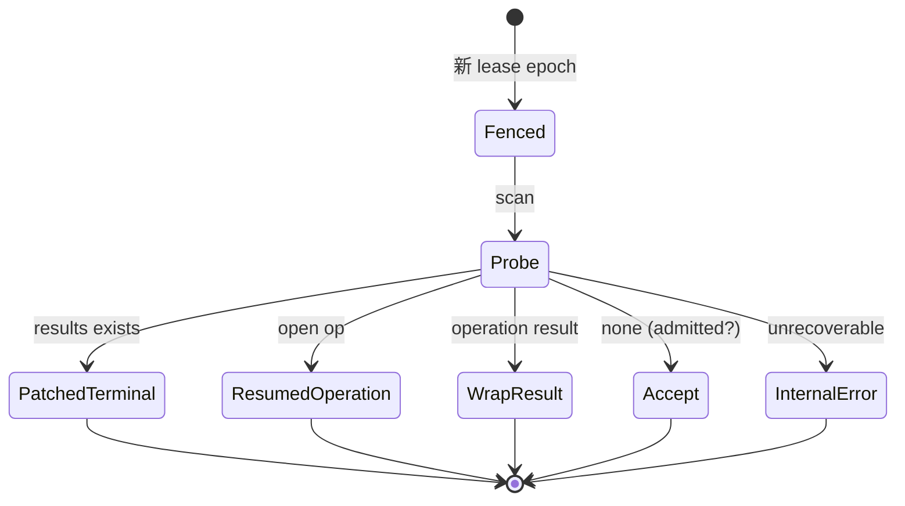

<!-- STD_DOCUMENT_COVER_BEGIN -->
# Piko 机制：进程崩溃恢复

> STD 使用入口：[项目采用说明与标准导航](../../../README.md#std-entry)

| 文档字段 | 值 |
|---|---|
| Document ID | `piko-recovery` |
| Document Version | `0.1.0` |
| Status | `Approved` |
| Project | `piko` |
| Document Owner | Piko Architecture Owner |
| Last Modified Date | `2026-09-25` |
| Template ID | `design.system-mechanism` |
| Template Version | `3.2.0` |
<!-- STD_DOCUMENT_COVER_END -->

## 1. 机制摘要：解决什么问题

Piko 允许进程崩溃后重启继续服务。崩溃可能发生在任意时刻：写 `results` 后、Pi commit 后、lease 持有中。恢复不能靠日志猜测"任务到底跑到哪"，必须从持久事实对账。MECH-RECOVERY 定义 `task-repository`、`worker`、`pi-adapter` 如何按固定顺序恢复，并保证不复活旧权威、不重复执行、不误报成功。

**受益者与任务**：Operator 需要可判定的恢复；Slinky 需要"结果未知"与"已失败"不混同。

**核心输入 → 处理 → 输出**：输入是崩溃后的 SQLite + Pi session JSONL；处理是"Result → Run terminal facts → lease epoch → deterministic Pi session → Harness open operation/result/transcript → ledger → Matrix"顺序对账；输出是补终态或明确失败。

**最重要取舍**：选择"确定性 identity + probe"而非分布式事务，代价是恢复逻辑复杂，换取单实例可判定。

## 2. 使用场景与功能

| Capability / Scenario ID | 业务任务与触发/条件 | 输入与可观察结果 | 提供方/全部消费者 | 实现状态 | 验证结果/判据 |
|---|---|---|---|---|---|
| CAP-REC-SCAN · 扫描非终态 Run | 进程启动 | `tasks`/`runs` → 非终态列表 | 提供：M005 + M003 | Planned | PK-T12（NOT_RUN） |
| CAP-REC-RESULT · 补第二步 | results 已有但 runs 非终态 | 补写终态 | 提供：M005 + M003 | Planned | PK-T12（NOT_RUN） |
| CAP-REC-PI · Pi 对账 | Pi session 存在 | inspect/getResult → 恢复或明确失败 | 提供：M006 | Planned | PK-T04/PK-T12（NOT_RUN） |
| CAP-REC-LEASE · lease fence | 重启 | 旧 epoch 失效，新 lease 领取 | 提供：M004 + M003 | Planned | PK-T01（NOT_RUN） |

不支持：跨系统 exactly-once、自动绕过未知结果重试、日志推断成功。

## 3. 参与方、责任和 authority

| Participant / 工程 Owner | 负责/不负责 | Owned data/state | Provided/Consumed interface | 部署/实现位置 | 依赖机制与基线 |
|---|---|---|---|---|---|
| M005 `worker` / Piko Implementation Owner | 负责恢复编排与补终态；不重跑 Pi | 无独立 state；读写 runs/results | 提供：recovery 决策；消费：M003/M006 | 进程内 `src/worker/`（Planned） | MECH-RUN |
| M003 `task-repository` / Piko Implementation Owner | 负责持久事实查询与 fenced write | tasks/runs/results/run_sessions/ledger | 提供：事务接口 | 进程内 `src/store/`（Planned） | MECH-RUN |
| M006 `pi-adapter` / Piko Implementation Owner | 负责 Harness inspect/getResult；不重发旧请求 | Pi session JSONL | 提供：`inspect`/`drive`/`getResult` | 进程内 `src/adapters/pi/`（Planned） | MECH-RUN |
| M004 `scheduler` | 负责新 lease epoch | execution_slot | 提供：acquireSlot/fence | 进程内 `src/scheduler/`（Planned） | MECH-RUN |

**authority 边界**：持久事实权属 M003；Pi session 权属 M006（Harness）；新 lease 权属 M004。

### 3.1 系统约束与参与方承接

| Constraint ID / 上级基线与决定状态 | 适用条件 | 系统保证/分配 | 参与方承接与自由度 |
|---|---|---|---|
| PK-12 恢复边界 · Approved | 崩溃后重启 | 固定恢复顺序；不复活旧权威 | M005 编排；M003 事实；M006 对账 |

### 3.2 运行时统筹与确认责任

| 能力/Process ID | 运行时统筹/权威状态 | 参与方动作及确认 | 总体成功/部分结果 | 中断核对与清理 |
|---|---|---|---|---|
| CAP-REC-SCAN | M005；`tasks`/`runs` 权威 | 读非终态 Run | 列表确定 | 只补第二步 |
| CAP-REC-PI | M005 调用 M006 | inspect → 有 open op 则 drive；有 result 则封装 | 恢复或 `InternalError` | 不重跑 Pi |

### 3.3 拓扑、目标身份与共享故障域

| 逻辑目标/身份 | 部署及访问路径 | 映射 authority | 共享故障域 | 旧代次处理 |
|---|---|---|---|---|
| 崩溃前 lease | execution_slot.lease_epoch | M004 | 与实例同域 | 新 epoch = 旧+1；旧被 fence |
| Pi session | `pi_session_id=run_id` | M006 | 本地 FS + SQLite | inspect 对账，不重发 |
| results generation | results 表 | M003 | 同域 | 已存在不重写 |

## 4. 数据结构设计

### 4.1 公共基础类型与枚举

#### 4.1.1 `RecoveryOutcome`

- **定义与来源**：`"PatchedTerminal" | "ResumedOperation" | "Fenced" | "InternalError"`。来源 M005 ISD §4.1。
- **逐值含义**：`PatchedTerminal`＝补第二步；`ResumedOperation`＝drive 既有 op；`Fenced`＝旧 lease 失效；`InternalError`＝不可恢复。

### 4.2 业务与操作数据结构

#### 4.2.1 `RecoveryProbe`

- **定义与来源**：恢复探测结果 `{result_exists, run_state, lease_epoch, pi_session, open_operation, operation_result, ledger_version, matrix_cursor}`。来源 M005 ISD §4.6。

### 4.3 配置与规则数据结构

**N/A · 复用系统 config**。

### 4.4 通信报文结构

**N/A · 复用机器契约**。

### 4.5 设备与 FPGA 表项结构

**N/A · 纯软件范围**。

### 4.6 运行状态数据结构

#### 4.6.1 `Lease`（恢复视角）

- **定义与来源**：见 MECH-RUN §4.6.2；恢复时新 epoch = 旧+1。

### 4.7 数据库表结构

**N/A · 见 M003 ISD §4.7.1**：`results`/`runs`/`run_sessions`/`execution_slot` 是恢复事实源。

### 4.8 错误码与错误结构

**复用机器契约**：`UnsafeRetryBlocked`/`ExecutionStateUnknown`/`InternalError`。

### 4.9 编码、布局与共享类型映射

**N/A · 复用 MECH-RUN 编码规则**。

### 4.10 一致性、可见性与数据寿命

- 恢复只从持久事实读取；不依赖内存。
- 恢复后不创建第二个有效写入者。
- 恢复不修改已发布 Result。

## 5. 接口设计

### 5.1 API

**N/A**：无对外 API。

### 5.2 消息与数据流接口

| Interface ID | 方向 | 输入 | 输出 | 实现位置 |
|---|---|---|---|---|
| IF-REC-SCAN | M005 → M003 | 无 | 非终态 Run 列表 | M003 ISD §5.1 |
| IF-REC-INSPECT | M005 → M006 | `PiRunHandle` | `PiRunObservation` | M006 ISD §5.1 |
| IF-REC-PATCH | M005 → M003 | `FencedPublishResult`（补第二步） | 终态 | M003 ISD §5.1 |
| IF-REC-FENCE | M004 → M003 | 新 epoch | fence 结果 | M004 ISD §5.1 |

### 5.3 硬件与固件接口

**N/A · 纯软件范围**。

### 5.4 人机与维护接口

Operator 恢复确认（store 可写、旧 lease 已 fence、session/operation 可读、依赖可达）见 system-design §8.4；MECH-RECOVERY 不自建入口。

## 6. 正常端到端流程

代表输入：worker 在写 `results` 第一步后崩溃。

1. 进程重启；S1-S8 启动成功。
2. M005 扫描非终态 Run：发现 `run_id="r-7"` 的 `runs.state='Running'`，但 `results` 已有 generation N。
3. 判定 `PatchedTerminal`：BEGIN IMMEDIATE → `UPDATE runs SET state='Completed', generation=N+1` + release slot → COMMIT。
4. 不重跑 Pi；不重写 Result。
5. Slinky 查询 → 200 Result（内容不变）。

```mermaid
sequenceDiagram
  participant Boot as M000 bootstrap
  participant W as M005 worker
  participant Repo as M003 task-repository
  participant PI as M006 pi-adapter
  Boot->>W: READY, scan
  W->>Repo: SELECT runs WHERE state NOT IN terminal
  Repo-->>W: r-7 Running, results gen N exists
  W->>Repo: patch terminal (gen N+1) + release slot
  Note over W: 不重跑 Pi
  W->>PI: (no accept; inspect only)
```

图 M-REC-1 · MECH-RECOVERY 正常端到端 / Target / NOT_BUILT。

### 6.1 交叠请求、跨轮次与生命周期边界

- 恢复与新 Run 受理并发：scheduler 只在恢复完成后领取。
- 多个非终态 Run：逐个按恢复顺序处理。
- tombstone Run 只跳过。

## 7. 分支和替代流程

| 分支 | 触发 | 处理 | 结果 |
|---|---|---|---|
| 有 open operation | Pi session 存在 | drive/getResult | `ResumedOperation` |
| 有 operation result | Pi commit 完成 | 封装 Result + 两步提交 | 补终态 |
| 无 operation 且无 result | Task Store 未记录 admission | 允许 accept | 新执行 |
| session 损坏 | inspect 失败 | 明确失败 | `InternalError` |
| `replay:"never"` 无 outcome | tool_calls 无 outcome | 不重放 | `UnsafeRetryBlocked` |

## 8. 状态机与不变量



图 M-REC-2 · 恢复决策 / Target / NOT_BUILT。

**不变量**：1) 只从持久事实恢复；2) 不重跑已发布 Result 的 Pi；3) 不复活旧 lease；4) 恢复顺序固定；5) 未知副作用 fail-closed。

### 8.1 资源预留、交付、释放与复位

| 资源 | 预留 | 交付 | 释放 | 复位 |
|---|---|---|---|---|
| lease | 新 epoch | fence 旧 | 终态 | 重启重领 |
| Pi session | 已有则 inspect | drive | 终态 | 不重发 |
| results | 已存在不重写 | — | retention | — |

## 9. 失败传播、重试与恢复

| 故障 | 检测 | 影响 | 恢复 |
|---|---|---|---|
| results 写后崩溃 | 扫描 | Run 非终态 | 补第二步 |
| Pi commit 后崩溃 | transcript event | 标记未落 | 按 identity 补 |
| session invariant 损坏 | inspect 失败 | operation 不可信 | `InternalError` |
| 不可核实 tool | tool_calls 无 outcome | 未知副作用 | `UnsafeRetryBlocked` |

## 10. 并发、排序与容量

- 恢复串行；不并发 accept 同一 Run。
- 新 lease epoch 唯一 fencing。
- 恢复不引入额外容量。

## 11. 安全、权限与信任边界

- 恢复只读本地持久事实；不读日志推断。
- operator 授权后才能强制 fence / migration。
- 恢复不泄漏 credential。

## 12. 可观测性与证据

### 12.1 统计、日志、时间与关联

| 指标/事件 ID | 单位 | 关联 | 用途 |
|---|---|---|---|
| `piko.recovery.outcomes.{resume,fenced,internal_error}` | count | 全实例 | 恢复效果 |
| `event.recovery.{resume,fenced,internal_error}` | 事件 | run_id + generation | 证据 |

### 12.2 维护命令、自检与调试路径

恢复确认四项（store/lease/session/deps）；operator 只读恢复摘要。

## 13. 配置、兼容与部署

- 消费 `storage.*` / `pi.*`；重启触发恢复。
- 兼容：schema v2；不新增恢复协议。

## 14. 跨责任单元分解与接口分配

### 14.1 参与方到架构对象映射

| 参与方 | 架构对象 | 下级设计入口 |
|---|---|---|
| M003 | `task-repository` | `piko-task-repository-design.md` + `piko-task-repository-impl.isd.md` |
| M005 | `worker` | `piko-worker-design.md` + `piko-worker-impl.isd.md` |
| M006 | `pi-adapter` | `piko-pi-adapter-design.md` + `piko-pi-adapter-impl.isd.md` |

### 14.2 功能和步骤到责任单元分配

| 步骤 | 责任单元 | 输入 | 输出 |
|---|---|---|---|
| scan | M005 + M003 | — | 非终态列表 |
| fence | M004 + M003 | 新 epoch | fence |
| inspect | M005 + M006 | handle | observation |
| patch/wrap | M005 + M003 | — | 终态 |

### 14.3 责任单元间接口契约

见 §5.2（IF-REC-*）；完整签名在 M003/M005/M006 ISD §5.1。

### 14.4 下级设计输入清单

| 下游对象 | 固定输入 | 约束 | 自由度 |
|---|---|---|---|
| `task-repository` | 持久事实 | PK-12 | 查询实现 |
| `worker` | 恢复顺序 | PK-12 | 编排实现 |
| `pi-adapter` | Harness inspect | PK-04 | 对账实现 |

## 15. 验证、上线与回滚

### 15.1 输入构造、故障控制与独立判据

- 正常：SIGKILL 于 steps 之间，验证只补第二步。
- 边界：Harness fault、session 损坏、不可核实 tool。
- 独立判据：restore 测试 + cross-check。

### 15.2 环境部署、复位、并发隔离与自动化

- 故障注入 `tests/fault/restore.test.ts`；独立 SQLite。
- 隔离：per-run restore。

### 15.3 组合验收、启用与旧机制退出

- 组合：M003 + M005 + M006 + M004 PASS（PK-T12）。
- 旧机制退出：无。

## 16. 风险、未决问题与决定

| ID | 风险/未决 | 等级 | Owner | 关闭 Gate |
|---|---|---|---|---|
| ISSUE-REC-001 | Pi session 损坏时的封结语义 | High | Piko Implementation Owner | M006 实现完成 |

已选决定：固定恢复顺序（§1）；不重跑 Pi（§8）。被否决：日志推断、自动绕过未知重试。

## A. 输入基线、适用性与图文规则

| 来源 Document ID / 路径 | 条款/适用范围 | 决定状态 |
|---|---|---|
| `system-design` | §3.5 MECH-RECOVERY；§3.4 PK-12；§6.4 P-STOP | Approved |
| M003 ISD §4.7 | DDL | Planned |

### A.1 统一适用与复审规则

机制父项 `MECH-RUN`；前置依赖 `MECH-RUN` + `MECH-CONFIG`（启动）。复审触发：恢复顺序变化、Pi identity 变化。

### A.2 纯软件 API 机制裁剪示例

纯软件机制：无硬件/FPGA（§4.5 N/A）；无对外 API（§5.1 N/A）。

## B. 文档控制与修订记录

| 版本 | 日期 | 修改与影响 | 作者 |
|---|---|---|---|
| v0.1.0 | 2026-09-25 | 初稿：MECH-RECOVERY 16 节 + 附录 A/B | corezilla, opencode |

<!-- STD_DOCUMENT_CONTROL_BEGIN -->
| 文档字段 | 值 |
|---|---|
| Authority | `piko` |
| Authors | corezilla, opencode |
| Created Date | `2026-09-25` |
| Template Conformance | `tailored` |
| Tailoring Reference | piko-std-tailoring-v0.1 |
| Migration Map Reference | none |
| Repository | `corezilla/piko` |
| Canonical Path | `docs/20_system_design/mechanisms/piko-recovery.md` |
| Supersedes | none |

> Reviewer、Approver、Approval Date 和 Release Tag 在进入相应状态时填写。Git commit/tag 是
> 外部不可变证据；不要在文档内容中伪造包含自身的 commit hash。
<!-- STD_DOCUMENT_CONTROL_END -->
