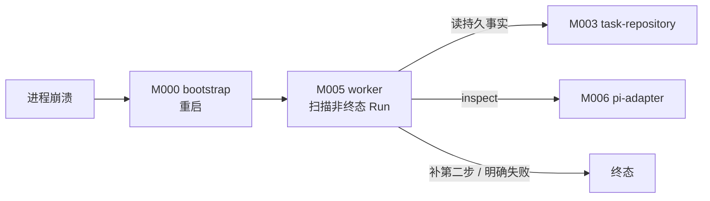
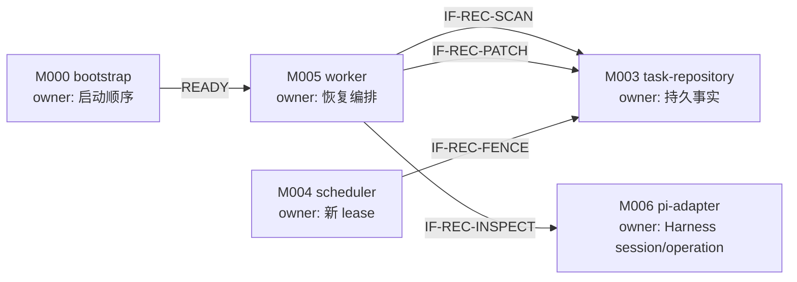
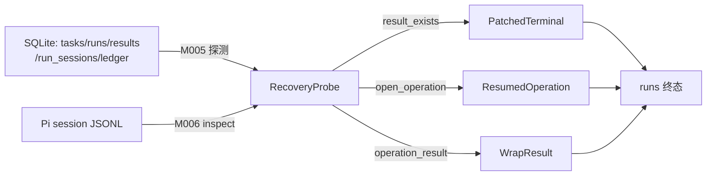
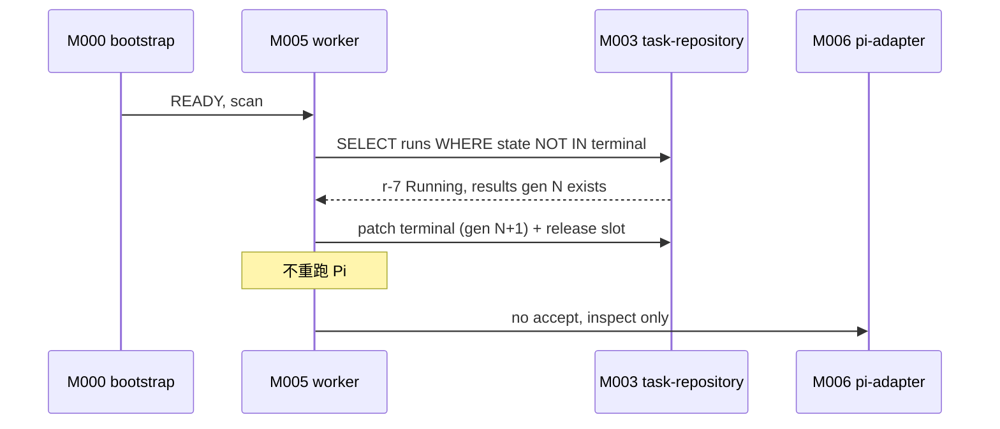
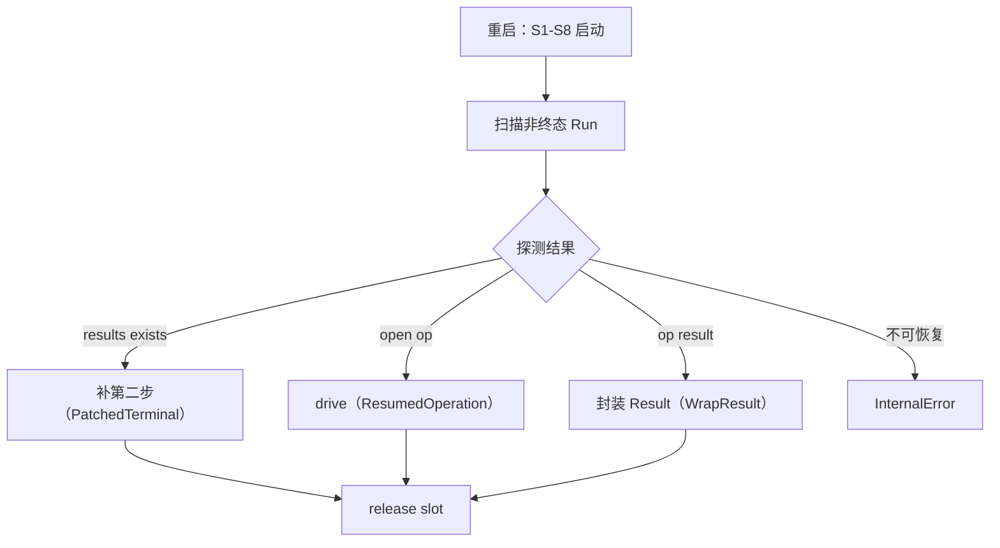
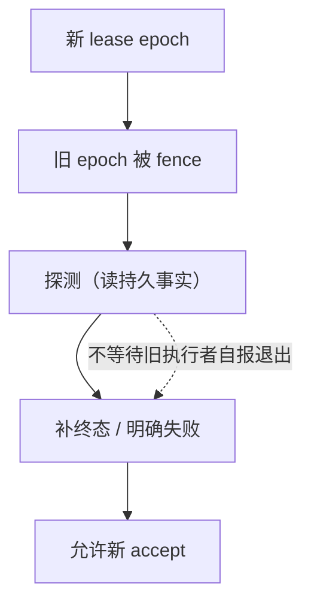
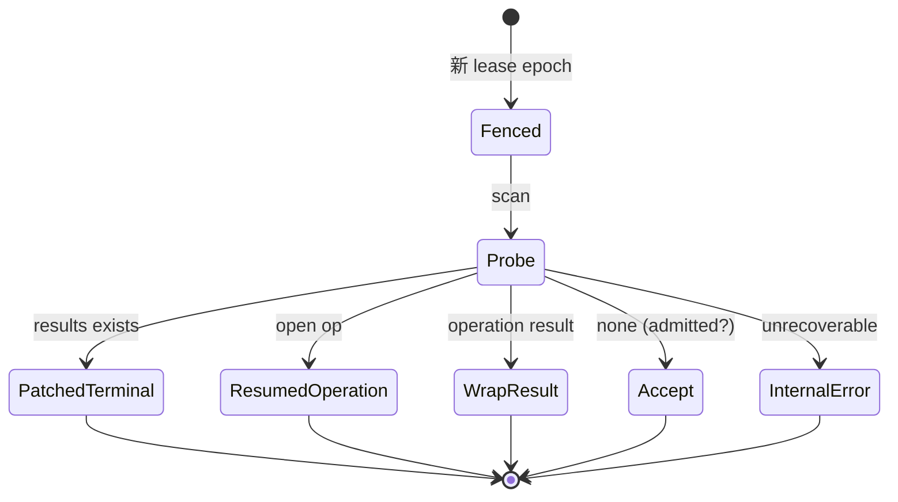
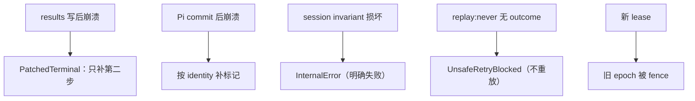

<!-- STD_DOCUMENT_COVER_BEGIN -->
# Piko 机制：进程崩溃恢复

> STD 使用入口：[项目采用说明与标准导航](../../../README.md#std-entry)

| 文档字段 | 值 |
|---|---|
| Document ID | `piko-recovery` |
| Document Version | `0.5.3` |
| Status | `Approved` |
| Project | `piko` |
| Document Owner | Piko Architecture Owner |
| Last Modified Date | `2026-09-26` |
| Template ID | `design.system-mechanism` |
| Template Version | `3.3.0` |
<!-- STD_DOCUMENT_COVER_END -->

## 1. 机制摘要：解决什么问题

Piko 允许进程崩溃后重启继续服务。崩溃可能发生在任意时刻：写 `results` 后、Pi commit 后、lease 持有中。恢复不能靠日志猜测"任务到底跑到哪"，必须从持久事实对账。MECH-RECOVERY 定义 `task-repository`、`worker`、`pi-adapter` 如何按固定顺序恢复，并保证不复活旧权威、不重复执行、不误报成功。

**受益者与任务**：Operator 需要可判定的恢复；Slinky 需要"结果未知"与"已失败"不混同。

**核心输入 → 处理 → 输出**：输入是崩溃后的 SQLite + Pi session JSONL；处理是"Result → Run terminal facts → lease epoch → deterministic Pi session → Harness open operation/result/transcript → ledger → Matrix"顺序对账；输出是补终态或明确失败。

**最重要取舍**：选择"确定性 identity + probe"而非分布式事务，代价是恢复逻辑复杂，换取单实例可判定。



图 M-REC-0 · MECH-RECOVERY 用途概览 / Target / NOT_BUILT。崩溃后按固定顺序从持久事实对账，不复活旧权威。


- **机制形态与适用性 / 业务副作用**：**有副作用（恢复编排）**。补终态、drive 既有 operation、封装 Result 都改变持久状态；不重跑已完成 Pi。
- **交接域**：**纯软件**。M003/M005/M006/M004 同进程；事实源为本地 SQLite + Pi JSONL。
- **裁剪依据**：附录 A；§4.5/§5.3 纯软件 N/A。

**教学路径**：本机制属"有副作用的收口"路径：恢复必须处理在途副作用与结果未知。

## 2. 使用场景与功能

| Capability / Scenario ID | 业务任务与触发/条件 | 输入与可观察结果 | 提供方/全部消费者 | 实现状态 | 验证结果/判据 |
|---|---|---|---|---|---|
| CAP-REC-SCAN · 扫描非终态 Run | 进程启动 | `tasks`/`runs` → 非终态列表 | 提供：M005 + M003 | Planned | PK-T12（NOT_RUN） |
| CAP-REC-RESULT · 补第二步 | results 已有但 runs 非终态 | 补写终态 | 提供：M005 + M003 | Planned | PK-T12（NOT_RUN） |
| CAP-REC-PI · Pi 对账 | Pi session 存在 | inspect/getResult → 恢复或明确失败 | 提供：M006 | Planned | PK-T04/PK-T12（NOT_RUN） |
| CAP-REC-LEASE · lease fence | 重启 | 旧 epoch 失效，新 lease 领取 | 提供：M004 + M003 | Planned | PK-T01（NOT_RUN） |

不支持：跨系统 exactly-once、自动绕过未知结果重试、日志推断成功。

## 3. 参与方、责任和 authority

| Participant / 工程 Owner | 负责/不负责 | 决定/写入/事实来源/恢复（适用时） | Provided/Consumed interface | 部署/实现位置 | 依赖机制与基线 |
|---|---|---|---|---|---|
| M005 `worker` / Piko Implementation Owner | 负责恢复编排与补终态；不重跑 Pi | 无独立 state；读写 runs/results | 提供：recovery 决策；消费：M003/M006 | 进程内 `src/worker/`（Planned） | MECH-RUN |
| M003 `task-repository` / Piko Implementation Owner | 负责持久事实查询与 fenced write | tasks/runs/results/run_sessions/ledger | 提供：事务接口 | 进程内 `src/store/`（Planned） | MECH-RUN |
| M006 `pi-adapter` / Piko Implementation Owner | 负责 Harness inspect/getResult；不重发旧请求 | Pi session JSONL | 提供：`inspect`/`drive`/`getResult` | 进程内 `src/adapters/pi/`（Planned） | MECH-RUN |
| M004 `scheduler` | 负责新 lease epoch | execution_slot | 提供：acquireSlot/fence | 进程内 `src/scheduler/`（Planned） | MECH-RUN |

**责任角色区分**：恢复**决定**由 M005 worker 发出，**写入**由 M003 task-repository 执行，**权威事实**以 `tasks`/`runs`/`results`/`run_sessions` + Pi transcript 为准；M005 是恢复读取者，M004 提供新 lease。恢复不改已发布 Result。

**authority 边界**：持久事实权属 M003；Pi session 权属 M006（Harness）；新 lease 权属 M004。


图 M-REC-3 · 协作图 / Target / NOT_BUILT。M005 编排恢复；M003 持持久事实；M006 持 Pi session；M004 提供新 lease。

### 3.1 系统约束与参与方承接

| Constraint ID / 上级基线与决定状态 | 适用条件 | 系统保证/分配 | 参与方承接与自由度 |
|---|---|---|---|
| CON-REC-001 · PK-12 恢复边界 · Approved | 崩溃后重启 | 固定恢复顺序；不复活旧权威 | M005 编排；M003 事实；M006 对账 |

### 3.2 运行时统筹与确认责任

| 能力/Process ID | 运行时统筹/权威状态 | 参与方动作及确认 | 总体成功/部分结果 | 中断核对与清理 |
|---|---|---|---|---|
| CAP-REC-SCAN | M005；`tasks`/`runs` 权威 | 读非终态 Run | 列表确定 | 只补第二步 |
| CAP-REC-PI | M005 调用 M006 | inspect → 有 open op 则 drive；有 result 则封装 | 恢复或 `InternalError` | 不重跑 Pi |

### 3.3 拓扑、目标身份与共享故障域

| 逻辑目标/身份 | 部署及访问路径 | 映射 authority | 共享故障域 | 旧代次处理 |
|---|---|---|---|---|
| 崩溃前 lease | execution_slot.lease_epoch | M004 | 与实例同域 | 新 epoch = 旧+1；旧被 fence |
| Pi session | `pi_session_id=run_id` | M006 | 本地 FS + SQLite | inspect 对账，不重发 |
| results generation | results 表 | M003 | 同域 | 已存在不重写 |

#### 3.3.1 运行环境

| 环境 | 崩溃注入 | 持久层 | 用途 |
|---|---|---|---|
| 开发（dev） | 手动 SIGKILL | 本地 SQLite + JSONL | 本地调试 |
| 测试（test/CI） | 故障注入夹具 | 独立临时 SQLite | `tests/fault/restore.test.ts` |
| 生产（prod） | 真实进程/SQLite/FS 故障 | 本地可靠 FS | 实际运行 |

- **进程模型**：恢复在重启后的同一进程内编排（M000 启动 → M005 扫描）。
- **网络**：恢复需依赖可达（LLMTier/Matrix preflight）；不可达 → 不 READY。
- **持久层**：SQLite（tasks/runs/results/run_sessions/ledger）+ Pi JSONL，均本地。
- **时钟**：恢复判定用持久 UTC + monotonic；不依赖 wall clock 比较。

**统筹者退出语义**：M005 恢复中退出 → 停机，不部分恢复；重启重新扫描（幂等，已补终态的不再处理）。恢复不产生第二写入者。

## 4. 数据结构设计

### 4.1 公共基础类型与枚举（适用时）

#### 4.1.1 `RecoveryOutcome`

- **定义与来源**：`"PatchedTerminal" | "ResumedOperation" | "Fenced" | "InternalError"`。来源 M005 ISD §4.1。
- **逐值含义**：`PatchedTerminal`＝补第二步；`ResumedOperation`＝drive 既有 op；`Fenced`＝旧 lease 失效；`InternalError`＝不可恢复。

### 4.2 业务与操作数据结构（适用时）

#### 4.2.1 `RecoveryProbe`

- **定义与来源**：恢复探测结果 `{result_exists, run_state, lease_epoch, pi_session, open_operation, operation_result, ledger_version, matrix_cursor}`。来源 M005 ISD §4.6。


图 M-REC-4 · 数据对象图 / Target / NOT_BUILT。持久事实唯一来源=SQLite + Pi JSONL；恢复不改已发布 Result。

### 4.3 配置与规则数据结构（适用时）

**N/A · 复用系统 config**。

### 4.4 通信报文结构（适用时）

#### 4.4.1 `RecoveryProbe`（恢复探测结果）

```text
RecoveryProbe {
  result_exists: bool, result_generation?: uint,
  run_state: RunState,
  lease_epoch: uint,
  pi_session: { session_id, exists, open_operations[], operation_result? },
  transcript_version?: uint,
  ledger_version: uint,
  matrix_cursor?: string
}
```

- **Data/Type ID**：`DATA-REC-PROBE`；来源 M005 ISD §4.6。
- **约束**：`result_exists=true` 时 `run_state` 非终态 → `PatchedTerminal` 路径。
- **寿命**：单次恢复调用内。

#### 4.4.2 Pi 对账报文

`inspect(handle) -> PiRunObservation`（见 MECH-RUN §4.4.2）；恢复读取其 `open_operations`/`operation_result`/`transcript_version`。

### 4.5 设备与 FPGA 表项结构（适用时）

**N/A · 纯软件范围**。

### 4.6 运行状态数据结构（适用时）

#### 4.6.1 `Lease`（恢复视角）

- **定义与来源**：见 MECH-RUN §4.6.2；恢复时新 epoch = 旧+1。

### 4.7 数据库表结构（适用时）

**N/A · 见 M003 ISD §4.7.1**：`results`/`runs`/`run_sessions`/`execution_slot` 是恢复事实源。

### 4.8 错误码与错误结构（适用时）

| Error ID | 触发事实 | 结果 | 合法下一步 |
|---|---|---|---|
| `UnsafeRetryBlocked` | `replay:"never"` 工具无 outcome | Run Failed | 交 operator；不重放 |
| `ExecutionStateUnknown` | Harness storage/invariant 无法证明状态 | Run Failed | 交 operator |
| `InternalError` | session 不可恢复 / 恢复对账失败 | Run Failed | 交 operator；不重发旧请求 |
| （恢复成功） | — | 补终态或 resume | 无需人工 |

恢复不制造新错误码：只复用 contract §6 的既有码。
### 4.9 编码、布局与共享类型映射

**N/A · 复用 MECH-RUN 编码规则**。

### 4.10 一致性、可见性与数据寿命

- 恢复只从持久事实读取；不依赖内存。
- 恢复后不创建第二个有效写入者。
- 恢复不修改已发布 Result。

## 5. 接口设计

### 5.1 API（适用时）

MECH-RECOVERY 无对外 API；进程内恢复编排函数是本机制 API。

#### `scanNonTerminalRuns() -> RunId[]`（IF-REC-SCAN）

- **Interface/Member ID、用途与提供责任**：`IF-REC-SCAN`；M003 `task-repository` 提供；M005 消费。
- **唯一契约、版本与状态**：M003 ISD §5.1；Proposed。
- **输入与前提**：无；读 `runs WHERE state NOT IN terminal`。
- **成功输出与保证**：非终态 Run 列表。
- **错误与合法下一步**：无。
- **代表调用与验证**：PK-T12。

#### `inspect(handle) -> PiRunObservation`（IF-REC-INSPECT）

- **Interface/Member ID、用途与提供责任**：`IF-REC-INSPECT`；M006 `pi-adapter` 提供；M005 消费。
- **唯一契约、版本与状态**：M006 ISD §5.1；固定 Pi `0.85.1`。
- **输入与前提**：`handle{session_id=run_id}`。
- **成功输出与保证**：`PiRunObservation{open_operations, operation_result, lane_tip, transcript_version, durable_queues}`。
- **错误与合法下一步**：session 损坏 → `InternalError`。
- **代表调用与验证**：§6.1.1 q1-q5；PK-T12。

#### `patchTerminal(command: FencedPublishResult) -> RunRecord`（IF-REC-PATCH）

- **Interface/Member ID、用途与提供责任**：`IF-REC-PATCH`；M003 提供；M005 消费。
- **输入与前提**：同 generation Result 已存在；补第二步。
- **成功输出与保证**：`runs.state=Terminal`。
- **错误与合法下一步**：fencing 失败 → `FencedWrite`。
- **代表调用与验证**：PK-T12。

#### `acquireSlot(ownerId) -> Lease`（IF-REC-FENCE）

- **Interface/Member ID、用途与提供责任**：`IF-REC-FENCE`；M004 `scheduler` 提供。
- **输入与前提**：重启后。
- **成功输出与保证**：新 lease epoch；旧被 fence。
- **代表调用与验证**：PK-T01/PK-T12。

### 5.2 消息与数据流接口（适用时）

#### Pi `inspect`/`getResult` 读取流（IF-REC-STREAM）

- **来源**：Harness session JSONL（`pi_session_id=run_id`）。
- **关联**：`run_id` + operation identity（`run_id:initial` / `run_id:turn:<n>`）。
- **确认**：有 open operation → drive；有 result → 封装；均无 → 允许 accept。
- **代表调用与验证**：PK-T12。

### 5.3 硬件与固件接口（适用时）

**N/A · 纯软件范围**。

### 5.4 人机与维护接口（适用时）

Operator 恢复确认（store 可写、旧 lease 已 fence、session/operation 可读、依赖可达）见 system-design §8.4；MECH-RECOVERY 不自建入口。

## 6. 正常端到端流程

代表输入：worker 在写 `results` 第一步后崩溃。

1. 进程重启；S1-S8 启动成功。
2. M005 扫描非终态 Run：发现 `run_id="r-7"` 的 `runs.state='Running'`，但 `results` 已有 generation N。
3. 判定 `PatchedTerminal`：BEGIN IMMEDIATE → `UPDATE runs SET state='Completed', generation=N+1` + release slot → COMMIT。
4. 不重跑 Pi；不重写 Result。
5. Slinky 查询 → 200 Result（内容不变）。



图 M-REC-1 · MECH-RECOVERY 正常端到端 / Target / NOT_BUILT。


图 M-REC-7 · 完整过程图（有副作用收口）/ Target / NOT_BUILT。恢复编排从持久事实到终态或明确失败。

### 6.1 交叠请求、跨轮次与生命周期边界

- 恢复与新 Run 受理并发：scheduler 只在恢复完成后领取。
- 多个非终态 Run：逐个按恢复顺序处理。
- tombstone Run 只跳过。

#### 6.1.1 完整调用实例（JSON）

**q1 扫描后探测（run-042：results 已有 gen 3，runs 仍 Running）**

```json
{"result_exists":true,"result_generation":3,"run_state":"Running","lease_epoch":7,"pi_session":{"session_id":"run-042","exists":true,"open_operations":["run-042:initial"],"operation_result":null},"transcript_version":14,"ledger_version":9,"matrix_cursor":"s101"}
```

→ 判定 `PatchedTerminal`：补第二步。

**q2 有 operation result（run-043：Pi 已 commit，Result 未封装）**

```json
{"result_exists":false,"run_state":"Running","lease_epoch":8,"pi_session":{"session_id":"run-043","exists":true,"open_operations":[],"operation_result":{"operation_id":"run-043:initial","status":"Completed"}},"transcript_version":22,"ledger_version":11,"matrix_cursor":null}
```

→ 判定 `WrapResult`：封装 Result + 两步提交。

**q3 有 open operation（run-044：崩溃于 drive 中）**

```json
{"result_exists":false,"run_state":"Running","lease_epoch":9,"pi_session":{"session_id":"run-044","exists":true,"open_operations":["run-044:initial"],"operation_result":null},"transcript_version":5,"ledger_version":3,"matrix_cursor":null}
```

→ 判定 `ResumedOperation`：drive/getResult，不重复 accept。

**q4 不可恢复（session 损坏）**

```json
{"result_exists":false,"run_state":"Running","lease_epoch":10,"pi_session":{"session_id":"run-045","exists":false,"open_operations":[],"operation_result":null},"transcript_version":null,"ledger_version":2,"matrix_cursor":null}
```

→ 判定 `InternalError`：明确失败，不重发、不假成功。

**q5 `replay:"never"` 无 outcome**

```json
{"result_exists":false,"run_state":"Running","lease_epoch":11,"pi_session":{"session_id":"run-046","exists":true,"open_operations":[],"operation_result":null},"transcript_version":8,"ledger_version":4,"matrix_cursor":null,"unresolved_never_tools":["tc-9"]}
```

→ 判定 `UnsafeRetryBlocked`：不重放未知副作用。


图 M-REC-8 · 条件依赖图 / Target / NOT_BUILT。恢复不依赖旧执行者自报；fence 后即可探测。无循环等待。

#### 6.1.2 双方调用演练（调用方知道什么 → 下一步）

| 步 | 调用方（Operator）已知 | 完整输入 | 接收方校验 | 实际动作/确认 | 下一步 |
|---|---|---|---|---|---|
| 1 | 进程崩溃 | 重启 | M000 S1-S8 | READY/失败 | 失败→F1 |
| 2 | READY | — | M005 扫描 | 读非终态 Run | 逐个探测 |
| 3 | 发现 r-7 | RecoveryProbe | M003+M006 | result_exists=true | PatchedTerminal |
| 4 | 已补终态 | — | M003 写终态 | runs gen N+1 | 允许新任务 |
| 5 | 不可恢复 | — | M005 判定 | InternalError | 交人工 |

**关键事实如何产生**：非终态事实=`runs.state`（M003）；Pi 状态事实=Harness inspect（M006）；补终态事实=`results`+`runs` 同 generation（M003）。

## 7. 分支和替代流程

| 分支 | 触发 | 处理 | 结果 |
|---|---|---|---|
| 有 open operation | Pi session 存在 | drive/getResult | `ResumedOperation` |
| 有 operation result | Pi commit 完成 | 封装 Result + 两步提交 | 补终态 |
| 无 operation 且无 result | Task Store 未记录 admission | 允许 accept | 新执行 |
| session 损坏 | inspect 失败 | 明确失败 | `InternalError` |
| `replay:"never"` 无 outcome | tool_calls 无 outcome | 不重放 | `UnsafeRetryBlocked` |

## 8. 状态机与不变量



图 M-REC-2 · 恢复决策 / Target / NOT_BUILT。

**不变量**：1) 只从持久事实恢复；2) 不重跑已发布 Result 的 Pi；3) 不复活旧 lease；4) 恢复顺序固定；5) 未知副作用 fail-closed。

### 8.1 资源预留、交付、释放与复位

| 资源 | 预留 | 交付 | 释放 | 复位 |
|---|---|---|---|---|
| lease | 新 epoch | fence 旧 | 终态 | 重启重领 |
| Pi session | 已有则 inspect | drive | 终态 | 不重发 |
| results | 已存在不重写 | — | retention | — |

## 9. 失败传播、重试与恢复

| 故障 | 检测 | 影响 | 恢复 |
|---|---|---|---|
| results 写后崩溃 | 扫描 | Run 非终态 | 补第二步 |
| Pi commit 后崩溃 | transcript event | 标记未落 | 按 identity 补 |
| session invariant 损坏 | inspect 失败 | operation 不可信 | `InternalError` |
| 不可核实 tool | tool_calls 无 outcome | 未知副作用 | `UnsafeRetryBlocked` |


图 M-REC-5 · 异常处置图 / Target / NOT_BUILT。已知/未知：results 存在=已知；`never` 无 outcome=未知 fail-closed；session 损坏=不可恢复。

#### 9.1 跨重启恢复窗口

| 崩溃窗口 | 中断前最后持久事实 | 重启后查询身份与位置 | 查询结果 → 合法动作 |
|---|---|---|---|
| 有 open operation | `run_sessions.active_operation_id` | Harness open op | 存在 → drive/getResult |
| 有 operation result | transcript 有 result | Harness `getResult` | 存在 → 封装 Result |
| results 已写、终态未写 | `results(run_id, gen N)` | `results` + `runs.state` | 补第二步 |
| 无 admission | Task Store 无 Pi admission | Task Store + session | 允许 accept |

身份固定：`pi_session_id=run_id`、lane `main`、operation `run_id:initial`。不重发旧请求。

## 10. 并发、排序与容量

- 恢复串行；不并发 accept 同一 Run。
- 新 lease epoch 唯一 fencing。
- 恢复不引入额外容量。

- 代表请求：重启后单线程扫描非终态 Run，逐个对账；不与新 accept 并发（scheduler 在恢复完成后领取）。
- 等待出口与期限：inspect 无固定时限（读本地 session，有界）；inspect 失败 → `InternalError`；`replay:"never"` 无 outcome → `UnsafeRetryBlocked`；无永久等待。

## 11. 安全、权限与信任边界

- 恢复只读本地持久事实；不读日志推断。
- operator 授权后才能强制 fence / migration。
- 恢复不泄漏 credential。

| 入口/资产 | 身份来源与传播 | 授权对象/强制点 | 撤销/过期行为 | 拒绝与审计 | 验证 |
|---|---|---|---|---|---|
| 持久事实 | 本地 SQLite/JSONL | M003 | — | 不从日志推断 | PK-T12 |
| lease | execution_slot | M004 新 epoch | 旧 epoch 拒写 | fencing | PK-T01 |
| operator 操作 | operator → 进程 | operator authorization | — | 未授权拒绝；audit | PK-T12 |

## 12. 可观测性与证据

### 12.1 统计、日志、时间与关联

| Signal / schema | 生产/采集路径 | 口径、单位、窗口、时间源 | 关联身份/代次 | 清零/丢失/聚合规则 | 保留与开销 |
|---|---|---|---|---|---|
| `piko.recovery.outcomes.{resume,fenced,internal_error}` | M005 生产 → M009 采集 | count / 区间 | 全实例 | 重启重置 | 低开销 |
| `event.recovery.{resume,fenced,internal_error}` | M005 生产 → M009 | 事件 / — | run_id + generation | 不聚合 | 日志按 ops 留存 |

### 12.2 维护命令、自检与调试路径

| Maintenance API / Diagnostic ID | 执行位置、入口、目标、权限 | 请求/结果契约 | 施加/回读点及覆盖 | 依赖/占用/恢复退出 | 验证 |
|---|---|---|---|---|---|
| `recovery preflight` | 启动；M000/M005；恢复判定 | store 可写 / 旧 lease 已 fence / session 可读 / deps 可达 | 恢复前置四确认 | 任一失败 → 不恢复 | PK-T12 |
| `operator recovery summary` | operator 端点；只读 | 非终态 Run / 恢复 outcome 摘要 | 定位恢复结果 | 只读 | PK-T12 |

## 13. 配置、兼容与部署

配置 authority：`system-design` §9.1；MECH-RECOVERY 消费：

| 配置/组合 baseline | 来源/完整定义 | 校验与生效确认 | 在途/跨版本规则 | 中断检查点/回滚前提 | 验证 |
|---|---|---|---|---|---|
| `storage.sqlite_path` | config | 恢复事实源 | — | 重启重读 | PK-T12 |
| `pi.upstream_commit` | 锁定 | inspect/getResult 前提 | 不热切 | 启动 F1 | PK-T04 |
| `llmtier.base_url` / `matrix.homeserver` | config | 依赖可达判定 | — | 启动 F1 | PK-T12 |
| schema | SQLite `user_version=2` | 启动迁移 | v2 不可降级 v1 | 备份恢复 | PK-T12 |

环境差异见 §3.3.1。兼容：SQLite `user_version=2`；v2 不可降级到 v1；Pi identity 确定性派生，不重发旧请求。

## 14. 跨责任单元分解与接口分配

### 14.1 参与方到架构对象映射

| 参与方 | 架构对象 | 下级设计入口 |
|---|---|---|
| M003 | `task-repository` | `piko-task-repository-design.md` + `piko-task-repository-impl.isd.md` |
| M005 | `worker` | `piko-worker-design.md` + `piko-worker-impl.isd.md` |
| M006 | `pi-adapter` | `piko-pi-adapter-design.md` + `piko-pi-adapter-impl.isd.md` |

### 14.2 功能和步骤到责任单元分配

| 步骤 | 责任单元 | 输入 | 输出 |
|---|---|---|---|
| scan | M005 + M003 | — | 非终态列表 |
| fence | M004 + M003 | 新 epoch | fence |
| inspect | M005 + M006 | handle | observation |
| patch/wrap | M005 + M003 | — | 终态 |

### 14.3 责任单元间接口契约

| 交接/接口 ID | 提供方/消费方 | 输入/输出或事件 | 确认、期限与失败 | 引用 |
|---|---|---|---|---|
| IF-REC-SCAN | M003 → M005 | — → 非终态 Run 列表 | 同步 | §5.1 |
| IF-REC-INSPECT | M006 → M005 | `handle` → `PiRunObservation` | session 损坏 → `InternalError` | §5.1 |
| IF-REC-PATCH | M005 → M003 | `FencedPublishResult` → `RunRecord` | 补第二步；fencing | §5.1 |
| IF-REC-FENCE | M004 → M003 | 新 epoch → fence | 旧 epoch 拒写 | §5.1 |

### 14.4 下级设计输入清单

| Requirement ID | 下游对象 | 固定输入 | 约束 | 自由度 |
|---|---|---|---|---|
| `M-REC-DI-001` | `task-repository` | 持久事实 | CON-REC-001 | 查询实现 |
| `M-REC-DI-002` | `worker` | 恢复顺序 | CON-REC-001 | 编排实现 |
| `M-REC-DI-003` | `pi-adapter` | Harness inspect | CON-REC-001 | 对账实现 |


## 15. 验证、上线与回滚

### 15.1 输入构造、故障控制与独立判据

- 正常：SIGKILL 于 steps 之间，验证只补第二步。
- 边界：Harness fault、session 损坏、不可核实 tool。
- 独立判据：restore 测试 + cross-check。

#### 15.1.1 每项核心保证的正常向量 + 故障向量

| 保证 | 正常向量 | 故障向量 | 注入/命中 | 独立 Oracle |
|---|---|---|---|---|
| 不重跑 Pi | 正常恢复 | SIGKILL 于两步间 | 注入 KB | results generation 不变 |
| 不复活旧权威 | 新 lease fence | 旧 epoch 写入 | 构造旧 epoch | fencing 拒绝 |
| 未知副作用 fail-closed | `never` 无 outcome | 工具 outcome 丢失 | 构造缺 outcome | `UnsafeRetryBlocked` |

### 15.2 环境部署、复位、并发隔离与自动化

- 故障注入 `tests/fault/restore.test.ts`；独立 SQLite。
- 隔离：per-run restore。

### 15.3 组合验收、启用与旧机制退出

- 组合：M003 + M005 + M006 + M004 PASS（PK-T12）。
- 旧机制退出：无。


图 M-REC-6 · 测试路径图 / Target / NOT_BUILT。独立 Oracle=cross-check Result→Run→lease→session。

## 16. 风险、未决问题与决定

| ID | 风险/未决 | 等级 | Owner | 关闭 Gate |
|---|---|---|---|---|
| `RISK-REC-001` | Pi session 损坏时的封结语义 | High | Piko Implementation Owner | M006 实现完成 |

已选决定：固定恢复顺序（§1）；不重跑 Pi（§8）。被否决：日志推断、自动绕过未知重试。

**跨机制依赖检查**（见 `system-design` §3.5.1 依赖矩阵）：上级 `MECH-RUN`；设计前置 `MECH-RUN`、`MECH-CONFIG`（无环）；运行时消费 `MECH-RUN`（Run 事实）、`MECH-USAGE`（ledger）、`MECH-MATRIX`（cursor）；恢复读取 —。只有设计前置参与无环检查，运行时消费/恢复读取允许双向。

## A. 输入基线、适用性与图文规则

| 来源 Document ID / 路径 | 条款/适用范围 | 决定状态 |
|---|---|---|
| `system-design` | §3.5 MECH-RECOVERY；§3.4 PK-12；§6.4 P-STOP | Approved |
| M003 ISD §4.7 | DDL | Planned |

### A.1 统一适用与复审规则

机制父项 `MECH-RUN`（归属）；设计前置 `MECH-RUN`、`MECH-CONFIG`。运行时消费与恢复读取见 `system-design` §3.5.1 依赖矩阵，不属于设计前置、不参与无环检查。继承：MECH-RUN 的持久事实模型与确定性 identity；自行设计恢复顺序与对账。复审触发：恢复顺序变化、Pi identity 变化。

### A.2 纯软件 API 机制裁剪示例

纯软件机制：无硬件/FPGA（§4.5 N/A）；无对外 API（§5.1 N/A）。

**正文质量检查**：§1/§3/§6/§8/§9/§14/§15 均先有连续段落解释选定方案、依据、取舍与下游约束，再以图表汇总。

**图分类**：§1 用途概览（M-REC-0）、§3 协作（M-REC-3）、§6 正常时序（M-REC-1）为基线必画；§4 对象（M-REC-4）、§8 状态资源（M-REC-2）、§9 异常（M-REC-5）、§15 测试路径（M-REC-6）、§6/§9 完整过程（M-REC-7）、§6/§8/§9 条件依赖（M-REC-8）按实际触发。本机制为有副作用恢复编排，八类图适用。

## B. 文档控制与修订记录

| 版本 | 日期 | 修改与影响 | 作者 |
|---|---|---|---|
| v0.5.3 | 2026-09-26 | review 修复（AMENDMENT P1/P2）：统一依赖图（区分上级机制/设计前置/运行时消费/恢复读取，仅设计前置参与无环检查），§A.1/§16 同步；矩阵截断回补与 E2EE 唯一结果；取消停止未知时的隔离/释放/再准入；接口闭合与可执行验证向量 | corezilla, opencode |
| v0.1.0 | 2026-09-25 | 初稿：MECH-RECOVERY 16 节 + 附录 A/B | corezilla, opencode |

<!-- STD_DOCUMENT_CONTROL_BEGIN -->
| 文档字段 | 值 |
|---|---|
| Authority | `piko` |
| Authors | corezilla, opencode |
| Created Date | `2026-09-25` |
| Template Conformance | `tailored` |
| Tailoring Reference | piko-std-tailoring-v0.1 |
| Migration Map Reference | none |
| Repository | `corezilla/piko` |
| Canonical Path | `docs/20_system_design/mechanisms/piko-recovery.md` |
| Supersedes | none |

> Reviewer、Approver、Approval Date 和 Release Tag 在进入相应状态时填写。Git commit/tag 是
> 外部不可变证据；不要在文档内容中伪造包含自身的 commit hash。
<!-- STD_DOCUMENT_CONTROL_END -->
