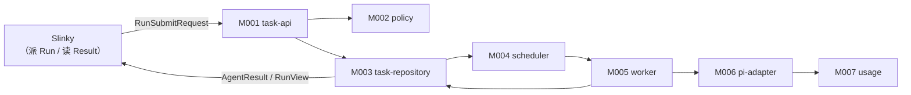
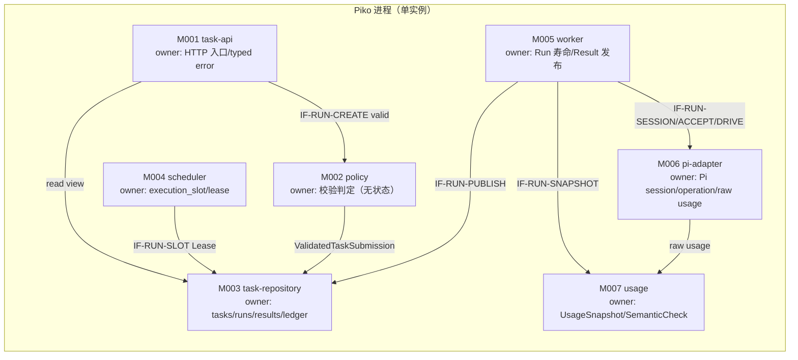
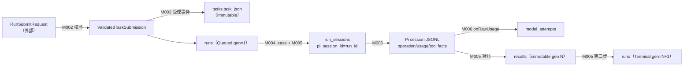
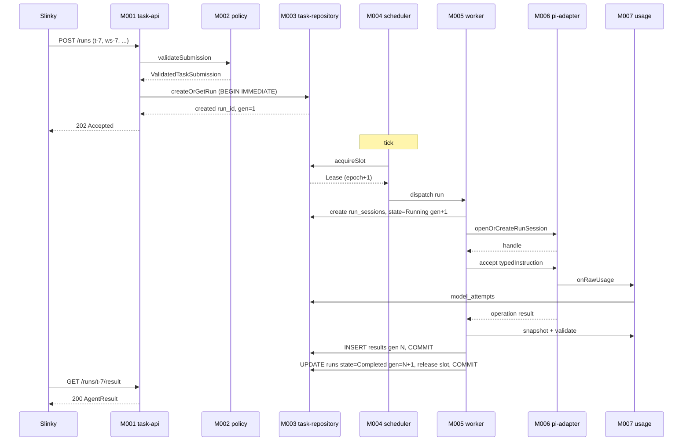
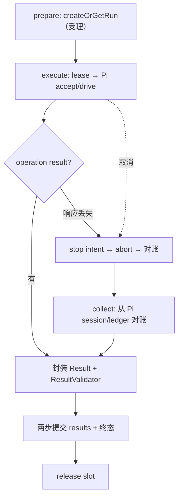
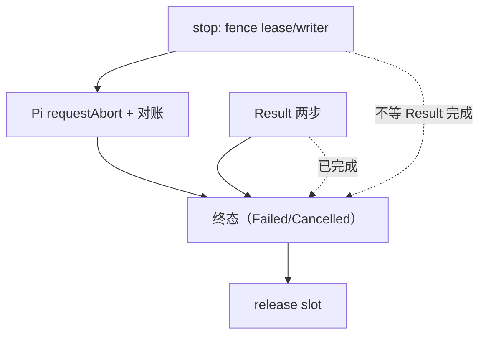
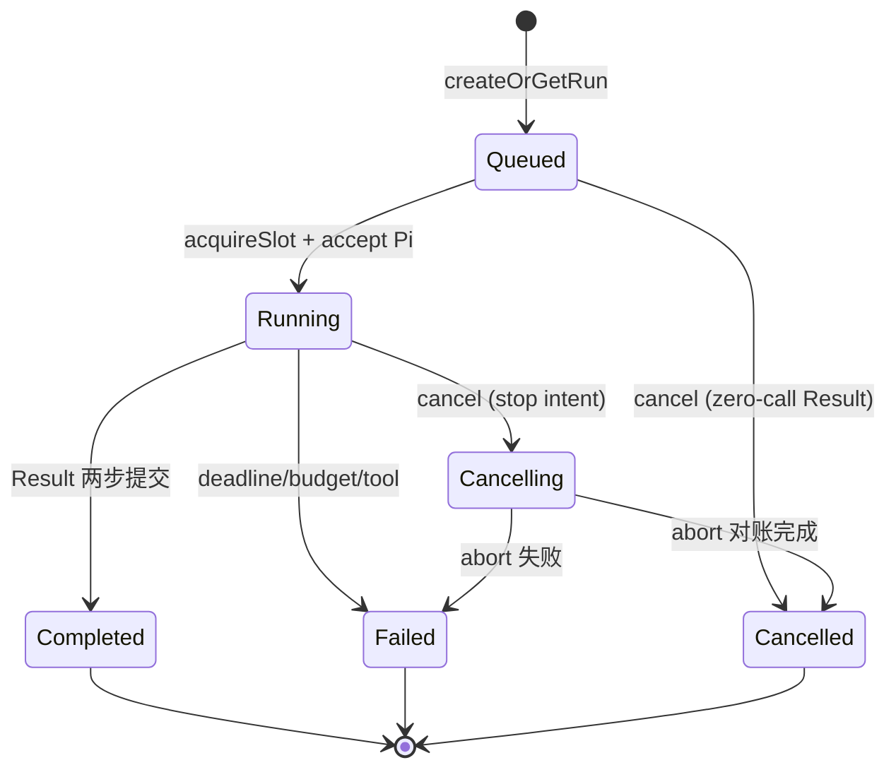
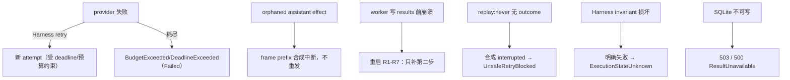

<!-- STD_DOCUMENT_COVER_BEGIN -->
# Piko 机制：单 Run 提交→完成闭环

> STD 使用入口：[项目采用说明与标准导航](../../../README.md#std-entry)

| 文档字段 | 值 |
|---|---|
| Document ID | `piko-run` |
| Document Version | `0.5.2` |
| Status | `Approved` |
| Project | `piko` |
| Document Owner | Piko Architecture Owner |
| Last Modified Date | `2026-09-25` |
| Template ID | `design.system-mechanism` |
| Template Version | `3.3.0` |
<!-- STD_DOCUMENT_COVER_END -->

## 1. 机制摘要：解决什么问题

Piko 的唯一外部职责是把 Slinky 派来的一个 AI 任务变成可查询的稳定结果。这不是单个模块能完成的：`task-api` 只负责 HTTP 入口与规范化；`policy` 只负责校验与路径/工具约束；`task-repository` 只负责持久化事务；`scheduler` 只负责单 slot 领取；`worker` 只负责驱动 Pi 与发布 Result；`pi-adapter` 只负责 Harness 会话与模型调用；`usage` 只负责用量聚合与语义校验。任何一个模块都无法单独保证"同一 `task_id` 只执行一次、崩溃后不重复副作用、Result 发布后不可变"。

MECH-RUN 定义这七个模块如何协作完成一次 Run 的完整闭环：从 Slinky 提交 `task_id` 开始，经校验、持久化、调度、Pi 执行、Usage 聚合，到 immutable Result 发布与终态可见。它横向承接系统设计 §3.4 的 Constraint PK-01/02/03/07，是 Piko 最核心的机制。

**受益者与任务**：Slinky 项目经理需要一个稳定身份来派任务、查询状态、读取结果；失败时需要一个可判定的事实（DeadlineExceeded / BudgetExceeded / UnsafeRetryBlocked 等），而不是猜"任务到底跑没跑"。

**核心输入 → 处理 → 输出**：输入是已验证的 `ValidatedTaskSubmission`（含 `task_id`、任务定义、workspace、permissions、deadline、预算、output_paths）；处理是"受理事务 → lease 领取 → Pi accept/drive → 对账 → Result 两步提交"；输出是 `AgentResult`（state + summary + outputs + known_actions + usage + failure）与稳定的 `RunView`。

**最重要取舍**：选择"单实例单 slot + lease epoch fencing + 两步 Result 提交"，代价是单实例吞吐受限、多实例需 Slinky 端组织，换取的是简单的一致性边界与可判定的恢复语义。

**本版本范围**：设计阶段（Approved），实现状态 NOT_BUILT。详细状态转换、参与方协议与恢复规则由本文唯一维护；系统设计 §6.2 保留端到端原理与代表失败。



图 M-RUN-0 · MECH-RUN 用途概览 / Target / NOT_BUILT。Slinky 只需"派一个 Run、读一个 Result"；七个模块协作把任务变成稳定结果。

- **机制形态与适用性 / 业务副作用**：**有副作用**。每次 Run 创建 tasks/runs、执行 Pi operation、发布 immutable Result、释放 slot；响应丢失/崩溃需按持久事实对账，不能套用只读案例的清理假设。
- **交接域**：**纯软件**。七个责任单元同进程（M001–M007），交接为进程内函数调用 + SQLite/Pi session 持久事实；无硬件/FPGA/板卡。
- **裁剪依据**：附录 A；无章节裁剪（§4.5/§5.3 因纯软件为 N/A，理由见各节）。

**教学路径**：本机制属"有副作用的收口"路径（对应 STD EX-EXPORT 教学）；每个操作都有持久副作用与恢复义务，不能套用只读案例的清理假设。

## 2. 使用场景与功能

| Capability / Scenario ID | 业务任务与触发/条件 | 输入与可观察结果 | 提供方/全部消费者 | 实现状态 | 验证结果/判据 |
|---|---|---|---|---|---|
| CAP-RUN-SUBMIT · 派一个新 Run | Slinky 项目经理把 AI 任务交给独立 Agent；触发为 Slinky 生成 `task_id` 后 `POST /runs` | `RunSubmitRequest` → 202 + `RunSubmission`；失败 422/401/409/410/429/503 | 提供：`task-api` M001 + `policy` M002 + `task-repository` M003；消费：Slinky | Planned | PK-T03 / PK-T15（NOT_RUN） |
| CAP-RUN-STATUS · 查 Run 状态 | 想知道受理/运行/终态；触发为 `GET /runs/:run_id` | `run_id` → `RunView`（state / generation / timestamps） | 提供：`task-api` M001 + `task-repository` M003；消费：Slinky | Planned | PK-T03（NOT_RUN） |
| CAP-RUN-CANCEL · 取消 Run | 业务决定中止；触发为 `POST /runs/:run_id:cancel` | 200 `CancelledBeforeStart`（Queued）/ 202 `StopRequested`（Running）/ 200 `AlreadyTerminal` | 提供：`task-api` M001 + `worker` M005 + `task-repository` M003；消费：Slinky | Planned | PK-T05（NOT_RUN） |
| CAP-RUN-RESULT · 读稳定 Result | Slinky 验收/重派/升级；触发为 `GET /runs/:run_id/result` | 200 `AgentResult` / 409 `RunNotTerminal` / 500 `ResultUnavailable` | 提供：`task-api` M001 + `task-repository` M003；消费：Slinky | Planned | PK-T16（NOT_RUN） |
| CAP-RUN-EXEC · 后台执行与对账 | 系统内部；触发为 scheduler tick | lease 领取 → Running → Pi accept/drive → 对账 → Result 发布 | 提供：`scheduler` M004 + `worker` M005 + `pi-adapter` M006；消费：Piko 内部 | Planned | PK-T04 / PK-T09 / PK-T10（NOT_RUN） |
| CAP-RUN-USAGE · 用量聚合与冻结 | Result 发布前；触发为 worker 进入两步提交第一步 | 各 attempt raw usage → `UsageSnapshot`（6 字段 sum/null + missing_fields + quality） | 提供：`usage` M007；消费：`worker` M005 + Slinky（经 Result） | Planned | PK-T10 / PK-T16（NOT_RUN） |

不支持：跨实例 exactly-once、并行多 slot、模型 non-stream fallback、产品 Topic/SID/RID。这些属系统设计 §2.2 的非目标。

## 3. 参与方、责任和 authority

| Participant / 工程 Owner | 负责/不负责 | 决定/写入/事实来源/恢复（适用时） | Provided/Consumed interface | 部署/实现位置 | 依赖机制与基线 |
|---|---|---|---|---|---|
| M001 `task-api` / Piko Implementation Owner | 负责四项 HTTP operation 的路由与 typed error 映射；不负责持久化业务、不直接调用 Pi/Matrix | 请求寿命的 `ValidatedTaskSubmission` | 提供：4 个 HTTP endpoint；消费：`policy` / `task-repository` | 进程内 `src/http/`（Planned） | 依赖 `system-design` §8.1 |
| M002 `policy` / Piko Implementation Owner | 负责 request/path/tool/deadline/budget 判定；不持状态 | 启动时绑定的 `BoundToolProfile` | 提供：`ValidatedTaskSubmission`；消费：原始请求 + config + registry | 进程内 `src/policy/`（Planned） | 依赖 `system-design` §9.1 |
| M003 `task-repository` / Piko Implementation Owner | 负责 Run/lease/session/result/ledger 事务与 fenced write；不负责业务编排 | `tasks`/`runs`/`run_sessions`/`execution_slot`/`results`/`model_attempts`/`tool_calls` | 提供：`createOrGetRun`/`mutateRun`/`publishResult`；消费：scheduler / worker | 进程内 `src/store/`（Planned） | 依赖 `system-design` §7.7 |
| M004 `scheduler` / Piko Implementation Owner | 负责单 slot 领取/续租/fence；不决策业务 | `execution_slot` + lease epoch | 提供：`acquireSlot`/`renewLease`/`fence`；消费：tick | 进程内 `src/scheduler/`（Planned） | 依赖 M003 |
| M005 `worker` / Piko Implementation Owner | 负责 Run 事务协调、取消、deadline、Result 两步发布；不镜像 Pi Agent loop | Run 寿命的 lease 持有 | 提供：`Result generation`；消费：M006/M007/M003；**跨机制**：discussion Run 经 `MECH-MATRIX` 消费 M008 | 进程内 `src/worker/`（Planned） | 依赖 M003 + M006 + M007；跨机制依赖 `MECH-MATRIX`（M008） |
| M006 `pi-adapter` / Piko Implementation Owner | 负责 Harness session/lane/operation/abort/raw usage hook；不替换 provider adapter | Pi session 句柄 + `run_sessions.active_operation_id` | 提供：`PiRuntime`；消费：Pi SDK | 进程内 `src/adapters/pi/`（Planned） | 依赖固定 Pi 0.85.1 @ commit `9767ba...` |
| M007 `usage` / Piko Implementation Owner | 负责 Usage 聚合 + Result 语义校验；不改已发布 generation | `UsageSnapshot` 缓存 + `ResultValidator` | 提供：`UsageAggregator`/`ResultValidator`；消费：M006 raw usage | 进程内 `src/usage/`（Planned） | 依赖机器契约 `0.3.0-simplified.6` |

**责任角色区分**（对共享状态）：Run 状态转换的**决定**由 M005 worker 发出（携带 expected generation/epoch），**写入/事务**由 M003 task-repository 原子执行，**权威事实**以 `tasks`/`runs`/`results` 表为准；崩溃恢复时 M005 读取这些记录（§9）。三者可由同一 Owner 维护，但运行角色不混写。

**authority 边界**：`task_id` 由 Slinky 生成、权属 Slinky；Run 状态权属 M003；Pi session/operation 权属 M006（Harness）；usage 权属 M007；Result generation 权属 M003。工程 Owner 是 Piko Implementation Owner（同一人），但运行责任分属 7 个独立模块。



图 M-RUN-3 · M-FLOW 协作图 / Target / NOT_BUILT。七模块各有 owned state；M002 无状态，只做判定。跨机制依赖 `MECH-MATRIX`（讨论）与 `MECH-USAGE`（用量）从 M005 出。

### 3.1 系统约束与参与方承接

| Constraint ID / 上级基线与决定状态 | 适用条件 | 系统保证/分配 | 参与方承接与自由度 | 流程/协议/下级落实位置 | 组合验证与证据状态 | 差距/变更影响/裁决责任 |
|---|---|---|---|---|---|---|
| CON-RUN-001 · PK-01 单 slot + 独立 session · Approved | 单实例单 Agent | 同实例同时至多 1 个 Running Run；`pi_session_id=run_id` | M003+M004 保证 lease epoch 唯一；M006 保证确定性 session identity；自由度：内部函数组织 | §6.1 / §8.1 / M003/M004/M006 ISD | 集成 PK-T01/PK-T13（NOT_RUN） | — / 多实例另立设计 |
| CON-RUN-002 · PK-02 任务事务稳定身份 · Approved | 同 `task_id` 重复提交 | tombstone 永久拒绝；同 ID 同内容不重检动态条件 | M001+M002+M003；自由度：字段比较实现 | §6.1 / §7.2 / M003 ISD | 契约 PK-T03/PK-T15（NOT_RUN） | — / 契约版本变化需复审 |
| CON-RUN-003 · PK-03 截止与预算 · Approved | 每次 Run | deadline + max_model_calls + max_tool_calls | M002+M006；自由度：内部计数实现 | §6.4 / §9 / M002/M006 ISD | fault PK-T05（NOT_RUN） | — |
| CON-RUN-004 · PK-07 Result 两步提交 · Approved | Run 终态 | 写 `results` 与写终态不可合并 | M003+M005+M007；自由度：事务内语句组织 | §6.2 / §8.1 / M003/M005 ISD | fault PK-T05/PK-T15（NOT_RUN） | — |

### 3.2 运行时统筹与确认责任

| 能力/Process ID | 运行时统筹/权威状态 | 参与方动作及确认 | 总体成功/部分结果 | 中断核对与清理/重新开放 | 关联公共契约 |
|---|---|---|---|---|---|
| CAP-RUN-SUBMIT | M001（入口）统筹；M003 持有 `tasks`/`runs` 权威 | M001 校验→M002 判定→M003 单事务创建/比较→M001 返回 202 | 202 + `run_id` 即受理事实 | 事务回滚无残留；HTTP 响应丢失时用原 `task_id` 核对 | contract §1-§2 + §6 |
| CAP-RUN-EXEC | M004 统筹 slot；M005 统筹 Run 生命周期 | M004 lease→M005 切 Running→M006 accept/drive→M005 对账→两步 Result | `results` generation 写成功 = 完成事实 | R1-R7 恢复顺序（§9）；不重跑 Pi | contract §3 |
| CAP-RUN-CANCEL | M005 统筹；M003 持 `runs.state` | Queued：单事务零调用 Result；Running：写 stop intent→abort→对账→终态 | Cancelled + Result generation = 取消完成事实 | `StopRequested` 只证意图；`CancelledByRequest` 才证停止 | contract §1 + §6 |
| CAP-RUN-USAGE | M007 统筹；M003 持 `model_attempts` | M006 `onRawUsage`→M007 逐 attempt 汇总→冻结 snapshot | `UsageSnapshot.quality` + missing_fields = 完整/部分/未知事实 | 迟到 usage 只推内部 `record_version`，不改 Result | contract §3 |

### 3.3 拓扑、目标身份与共享故障域

| 逻辑目标/身份 | 部署及访问路径 | 映射 authority/更新条件 | 共享故障/复位域 | 旧目标/旧代次处理 |
|---|---|---|---|---|
| Piko 实例（单 Node.js 进程） | 本地单进程；operator 经诊断端点 | config `storage.sqlite_path` + instance lock | 进程 + 本地 FS 同时挂 = 全部数据丢 | 重启走 P-START；旧 lease epoch 被 fence |
| `run_id` | HTTP 路径参数 | M003 `tasks`/`runs` | 与实例同故障域 | 终态不可回退；tombstone 永久 |
| `task_id`（Slinky 生成） | HTTP body | M003 `tasks.task_id` | 同实例 | 一 ID 一任务；不可复用 |
| `pi_session_id = run_id` | 进程内 Harness | M006 确定性派生 | Pi session JSONL + SQLite 同本地 FS | 崩溃后 inspect/getResult 对账，不重发 |
| LLMTier endpoint | HTTPS | config `llmtier.base_url` + preflight | 独立故障域（网络） | 不可达 → `ModelUnavailable`；不静默切 |
| Matrix homeserver | HTTPS | config `matrix.homeserver` + whoami | 独立故障域 | 不可达 → `DiscussionAccessLost` |


#### 3.3.1 运行环境

| 环境 | 进程拓扑 | 外部依赖 | 持久层 | 用途 |
|---|---|---|---|---|
| 开发（dev） | 单 Node.js 进程，localhost bind | 本地 LLMTier mock / 本地 Synapse | 本地 SQLite + JSONL | 本地开发与单元测试 |
| 测试（test/CI） | 单进程 + 测试夹具 | mock LLMTier / Synapse 容器 | 独立临时 SQLite | `tests/{unit,contract,integration,fault}` |
| 生产（prod） | 单进程（API/scheduler/worker 同进程） | 真实 LLMTier + Matrix homeserver | 本地可靠 FS（SQLite WAL + JSONL） | 实际运行 |

- **进程模型**：一个逻辑 Piko 实例 = 一个 Node.js 进程；API/scheduler/worker/adapters 同进程；单 execution slot。
- **网络**：独占本地端口；出站 HTTPS 到 LLMTier；不出站到 Matrix/（见 MECH-MATRIX）。不支持多主机/共享存储/代理。
- **持久层**：SQLite WAL + Pi JSONL + workspace staging 必须位于本地可靠 FS；不支持 NFS 多 writer。
- **时钟**：持久字段用 UTC ISO-8601；进程内 elapsed 用 monotonic。

**统筹者退出语义**：M004 scheduler 退出 → 新 tick 以新 lease epoch 重领，旧 epoch 被 fence；M005 worker 退出 → R1-R7 恢复（见 §9），期间无新 accept；M001 退出 → HTTP 不可用，Slinky 重试同 `task_id`。统筹者退出不改变已提交持久事实，不产生第二写入者。

## 4. 数据结构设计

MECH-RUN 拥有或交换的数据对象。字段全集的唯一权威在机器契约 `0.3.0-simplified.6` + 各模块 ISD §4；本节给出机制层的共享视图与关系。

### 4.1 公共基础类型与枚举（适用时）

#### 4.1.1 `RunState`

- **完整定义、Data/Type/Error ID 与唯一来源**：`RunState = "Queued" | "Running" | "Cancelling" | "Completed" | "Failed" | "Cancelled"`。来源：`system-design` §3 + contract §6 + M003 ISD §4.1.1。
- **逐字段/逐值类型、范围、含义与跨字段约束**：`Queued`＝已受理未取 slot；`Running`＝已取 slot 并 accept Pi；`Cancelling`＝取消意图落盘；`Completed`/`Failed`/`Cancelled`＝终态。未知值拒绝。
- **生产/修改、所有权、可见点、寿命及失败出口**：唯一写者 M003；可见点 `runs.state`；寿命 = Run 寿命；终态不可回退。
- **合法与拒绝实例、V/Case 与证据状态**：合法转移见 §8；非法转移返回内部 `FencedWrite`。Case M003/M005 ISD §9.1（NOT_RUN）。

#### 4.1.2 `RunGeneration`

- **完整定义、Data/Type/Error ID 与唯一来源**：单调正整数，随每次 fenced write 递增。来源 M003 ISD §4.1。
- **逐字段/逐值类型、范围、含义与跨字段约束**：`generation >= 1`；`WHERE run_id=? AND generation=?` 影响行数必须为 1。
- **生产/修改、所有权、可见点、寿命及失败出口**：M003 写；可见点 `runs.generation`；fencing 失败不写。
- **合法与拒绝实例、V/Case 与证据状态**：过期 generation 的写入必须拒绝。Case M003 ISD §9.1（NOT_RUN）。

### 4.2 业务与操作数据结构（适用时）

#### 4.2.1 `ValidatedTaskSubmission`

- **完整定义、Data/Type/Error ID 与唯一来源**：M002 输出的已验证任务；字段来自 `RunSubmitRequest`。来源 M002 ISD §5.1。
- **逐字段/逐值类型、范围、含义与跨字段约束**：`task_id`（非空、全局唯一）、`task`（不可变定义）、`workspace`（RelPath 在 root 内）、`permissions`（read/write/tool 集合）、`deadline_at`（UTC）、`max_model_calls`/`max_tool_calls`（正整数）、`output_paths`（RelPath 集合）、`discussion?`。path 字段按集合比较，时间按 UTC instant。
- **生产/修改、所有权、可见点、寿命及失败出口**：M002 生产，M003 消费；请求寿命；校验失败返回 typed error。
- **合法与拒绝实例、V/Case 与证据状态**：绝对路径/`..`/symlink 越界拒绝。Case PK-T03（NOT_RUN）。

#### 4.2.2 `AgentResult`

- **完整定义、Data/Type/Error ID 与唯一来源**：M005 发布的稳定结果；机器权威 `interfaces/schemas/agent-runtime-v0.3.schema.json`。来源 contract §3。
- **逐字段/逐值类型、范围、含义与跨字段约束**：`run_id`、`state`（终态）、`partial`（bool）、`summary`（string）、`outputs[]`、`known_actions[]`、`usage: UsageSnapshot`、`failure: Failure | null`。`Completed` 强制 `partial=false/failure=null`；`Cancelled` 必须映射 `CancelledByRequest/Cancellation`。
- **生产/修改、所有权、可见点、寿命及失败出口**：M005 生产，M003 持久化 generation；可见点 `results.result_json`；发布后不可变。
- **合法与拒绝实例、V/Case 与证据状态**：ResultValidator FAIL 拒绝发布。Case PK-T16（NOT_RUN）。



图 M-RUN-4 · 数据对象图 / Target / NOT_BUILT。生产/复制/变换与唯一来源：`task_json` 由 M003 唯一持有（immutable）；`results` generation 发布后不可变；`model_attempts` 由 M006 写、M007 读。

### 4.3 配置与规则数据结构（适用时）

**N/A · 复用系统 config**：`PikoRuntimeConfig` / `ToolProfile` 由 `system-design` §9.1 + M000/M002 ISD 维护；MECH-RUN 只消费 `deadline`/`budget`/`tool profile`/`queue capacity`，不新增配置对象。

### 4.4 通信报文结构（适用时）

#### 4.4.1 外部 HTTP 报文

| 报文 | 方向 | 关键字段 | 机器权威 |
|---|---|---|---|
| `RunSubmitRequest` | Slinky → Piko | `task_id, task, workspace, permissions, deadline_at, max_model_calls, max_tool_calls, output_paths, discussion?` | `interfaces/openapi/agent-runtime-openapi-v0.3.yaml` |
| `RunSubmission` | Piko → Slinky | `{task_id, run_id, state}` | 同上 |
| `RunView` | Piko → Slinky | `{run_id, state, generation, cancel_requested, discussion_intake_state, accepted_at, started_at?, finished_at?, deadline_at, max_model_calls, max_tool_calls, outputs_meta?}` | contract §1 |
| `CancelOutcome` | Piko → Slinky | `{run_id, outcome: CancelledBeforeStart \| StopRequested \| AlreadyTerminal}` | contract §1 |
| `AgentResult` | Piko → Slinky | `{run_id, state, partial, summary, outputs[], known_actions[], usage, failure}` | `interfaces/schemas/agent-runtime-v0.3.schema.json` |
| `Error` | Piko → Slinky | `{code, message?, detail?}` | `interfaces/error-codes/agent-runtime-v0.3.yaml` |

#### 4.4.2 内部协作报文

| 报文 | 方向 | 关键字段 | 权威 |
|---|---|---|---|
| `ValidatedTaskSubmission` | M002 → M003 | 同 `RunSubmitRequest` 规范化后 | M002 ISD §4.2 |
| `FencedRunCommand` | M005 → M003 | `{run_id, expected_generation, expected_state_in, expected_lease_epoch, mutation}` | M003 ISD §4.6 |
| `FencedPublishResult` | M005 → M003 | `{run_id, generation, result_json, result_sha256}` | M003 ISD §4.6 |
| `PiRunObservation` | M006 → M005 | `{open_operations, operation_result, lane_tip, transcript_version, durable_queues}` | M006 ISD §4.6 |
| `UsageSnapshot` | M007 → M005 | 6 token 字段 + attempts + missing_fields + quality | contract §3 |

字段全集不在此重复；本节给机制层共享视图。

### 4.5 设备与 FPGA 表项结构（适用时）

**N/A · 纯软件范围**：MECH-RUN 无设备/FPGA/RTL 表项。

### 4.6 运行状态数据结构（适用时）

#### 4.6.1 `RunSessionRecord`

- **完整定义、Data/Type/Error ID 与唯一来源**：`{run_id, pi_session_id=run_id, lane_name="main", active_operation_id, last_operation_id, observed_tip_id, lease_epoch}`。来源 M003 ISD §4.6。
- **逐字段/逐值类型、范围、含义与跨字段约束**：`lease_epoch >= 1`；`pi_session_id` 唯一且确定性派生。
- **生产/修改、所有权、可见点、寿命及失败出口**：M003 写；可见点 `run_sessions`；Run 寿命。
- **合法与拒绝实例、V/Case 与证据状态**：session 不可跨 Run 复用。Case PK-T01（NOT_RUN）。

#### 4.6.2 `Lease`

- **完整定义、Data/Type/Error ID 与唯一来源**：`{owner_id, boot_id, epoch, acquired_at, heartbeat_at}`。来源 M004 ISD §4.6。
- **逐字段/逐值类型、范围、含义与跨字段约束**：`epoch` 唯一 fencing；heartbeat 仅检测。
- **生产/修改、所有权、可见点、寿命及失败出口**：M004 持有，M003 持久化。
- **合法与拒绝实例、V/Case 与证据状态**：fencing 时 `epoch+1`。Case PK-T01（NOT_RUN）。

### 4.7 数据库表结构（适用时）

**N/A · 见 M003 ISD §4.7**：`tasks` / `runs` / `run_sessions` / `execution_slot` / `results` / `model_attempts` / `tool_calls` 的 DDL 唯一权威在 M003 ISD §4.7.1（`PRAGMA user_version=2`）；本机制不重复 DDL。

### 4.8 错误码与错误结构（适用时）

#### 4.8.1 外部 typed error 逐码

| Error ID | 触发事实 | HTTP | 结果状态 | 调用方合法下一步 |
|---|---|---|---|---|
| `Unauthorized` | bearer principal 校验失败 | 401 | 无 Run 创建 | 修正凭据；不换 principal 重试 |
| `TaskConflict` | 同 `task_id` 不同任务定义 | 409 | 保留原任务与 Run | 核对原任务；新任务换新 `task_id` |
| `Gone` | tombstone（已清理 ID） | 410 | 不重建 | 换新 `task_id` |
| `InvalidDiscussionContext` | discussion room/event 冲突 | 409 | 不创建 Run | 核对 room/event 与 membership |
| `QueueFull` | 队列达 `max_queue_depth` | 429 | 不创建 Run | 等待后重试同 ID；不强行清队列 |
| `RunNotTerminal` | 非终态查 result | 409 | 无副作用 | 继续查询或等待 |
| `ResultUnavailable` | 终态丢 durable Result | 500 | 不伪装成功 | 交 operator；不重建 |
| `CancelledBeforeStart` | Queued 取消完成 | 200 | 零调用 Result | — |
| `StopRequested` | Running 取消意图落盘 | 202 | 未停 | 轮询状态；不重复取消 |
| `AlreadyTerminal` | 已终态取消 | 200 | — | — |
| `DeadlineExceeded` | 截止耗尽 | Result failure | Failed | 交 Slinky 决策 |
| `BudgetExceeded` | 模型/工具预算耗尽 | Result failure | Failed | 交 Slinky 决策 |
| `ModelUnavailable` | 模型/LLMTier 不可达 | Result failure | Failed | 交 Slinky 决策 |
| `ModelResponseInvalid` | SSE/protocol 非法 | Result failure | Failed | 交 Slinky 决策 |
| `ToolFailure` | 工具明确 error | Result failure | Failed | 交 Slinky 决策 |
| `UnsafeRetryBlocked` | `never` 工具无 outcome | Result failure | Failed | 交 Slinky 决策 |
| `ExecutionStateUnknown` | Harness 无法证明状态 | Result failure | Failed | 交 operator |
| `CancelledByRequest` | 取消且已停 | Result failure | Cancelled | — |
| `InternalError` | Piko 内部错误 | Result failure | Failed | 交 operator |

#### 4.8.2 `Failure` 结构（Result 内嵌）

`{code, cause_class, detail?, observed_at, run_generation}`；`Failed` 必须 non-null，`Completed` 强制 null，`Cancelled` 映射 `CancelledByRequest`/`Cancellation`。逐码定义在 `interfaces/error-codes/agent-runtime-v0.3.yaml`。

### 4.9 编码、布局与共享类型映射

- `RunSubmitRequest` / `RunView` / `AgentResult` / `UsageSnapshot`：JSON（UTF-8），字段名与 contract + OpenAPI 一致。
- `tasks.task_json`：UTF-8 JSON 原文；tombstone 时为 NULL。
- 时间字段：UTC ISO-8601 字符串。
- RelPath：POSIX 正斜杠，无绝对路径/`.`/`..`/空 segment。

### 4.10 一致性、可见性与数据寿命

- 权威事实：`tasks`/`runs`/`results`/`run_sessions`；观察：HTTP 状态码与 body。
- 提交边界：`createOrGetRun` 单事务；Result 两步事务；不同事务用 fenced write 串行化。
- 可见性：M005 发布 `results` generation 后，M001 读路径才能看到；迟到 usage 不改 generation。
- 寿命：`max(deadline_at, accepted_at)+7d`；之后 tombstone 永久；活动 Run 不因窗口删除。

## 5. 接口设计

### 5.1 API（适用时）

MECH-RUN 的对外 API 是四项 HTTP operation（由 `system-design` §8.1 唯一维护）；进程内模块交接也是 API，本节固定其共同契约。

#### `POST /runs` · `GET /runs/{run_id}` · `POST /runs/{run_id}:cancel` · `GET /runs/{run_id}/result`（外部 HTTP）

- **Interface/Member ID、用途与提供责任**：`createRun`/`getRun`/`cancelRun`/`getRunResult`；M001 `task-api` 提供。
- **唯一契约、版本与状态**：`interfaces/openapi/agent-runtime-openapi-v0.3.yaml`；机器契约 `0.3.0-simplified.6`。
- **输入/输出/错误**：见 `system-design` §8.1 + contract §1/§3/§6；本节不复制。
- **代表调用与验证**：见 §6.1.1 JSON 实例；PK-T03/PK-T15/PK-T16。

#### `createOrGetRun(input: ValidatedTaskSubmission) -> CreateRunOutcome`（IF-RUN-CREATE）

- **Interface/Member ID、用途与提供责任**：`IF-RUN-CREATE`；M003 `task-repository` 提供；M001 消费。
- **唯一契约、版本与状态**：M003 ISD §5.1；Proposed（模块 ISD 待建）。
- **输入与前提**：M002 已验证提交；`task_id` 唯一性未知；`BEGIN IMMEDIATE` 内执行。
- **成功输出与保证**：`CreateRunOutcome{kind: "created"|"existing"|"conflict"|"tombstone", run_id, generation, state}`；`created` 表示已持久化 `tasks`+`runs`。
- **错误与合法下一步**：内部 `FencedWrite` 不映射 HTTP；调用方决定。
- **交互与生命周期**：同步；单 `BEGIN IMMEDIATE`；busy → busy_timeout 后失败。
- **代表调用与验证**：§6.1.1 q1/q4；PK-T03/PK-T15。

#### `acquireSlot(ownerId: string) -> Lease | null`（IF-RUN-SLOT）

- **Interface/Member ID、用途与提供责任**：`IF-RUN-SLOT`；M004 `scheduler` 提供；M003 持久化。
- **唯一契约、版本与状态**：M004 ISD §5.1；Proposed。
- **输入与前提**：`ownerId`；singleton `execution_slot` 空闲。
- **成功输出与保证**：`Lease{owner_id, boot_id, epoch, acquired_at, heartbeat_at}` 或 `null`（排队）；epoch 单调 +1。
- **错误与合法下一步**：返回 null 表示排队，非错误。
- **交互与生命周期**：同步；单 `BEGIN IMMEDIATE`。
- **代表调用与验证**：PK-T01/PK-T13。

#### `accept(handle: PiRunHandle, operationId: string, messages: AgentMessage[]) -> void`（IF-RUN-ACCEPT）

- **Interface/Member ID、用途与提供责任**：`IF-RUN-ACCEPT`；M006 `pi-adapter` 提供；M005 消费。
- **唯一契约、版本与状态**：M006 ISD §5.1；固定 Pi `0.85.1` @ commit `9767ba...`。
- **输入与前提**：`handle{session_id=run_id, lane="main"}`；`operationId=run_id:initial` 或 `run_id:turn:<n>`；`messages=[typedInstruction(PikoDiscussionMessage?)]`。
- **成功输出与保证**：Harness 形成 durable operation（确认即 Pi commit）。
- **错误与合法下一步**：Harness fault → M005 映射 `UnsafeRetryBlocked`/`ExecutionStateUnknown`。
- **交互与生命周期**：异步；结果经 `drive` 拉取。
- **代表调用与验证**：PK-T04/PK-T09。

#### `snapshot(runId: string) -> UsageSnapshot` + `validateBeforePublish(result, contractVersion) -> SemanticCheck`（IF-RUN-SNAPSHOT）

- **Interface/Member ID、用途与提供责任**：`IF-RUN-SNAPSHOT`；M007 `usage` 提供；M005 消费。
- **唯一契约、版本与状态**：M007 ISD §5.1；契约 `0.3.0-simplified.6`。
- **输入与前提**：`run_id`；全部 durable attempt 已落 `model_attempts`。
- **成功输出与保证**：`UsageSnapshot`；`SemanticCheck{ok, reason?}`。
- **错误与合法下一步**：validate FAIL → throw `InternalError("semantic-validator-fail")`；不写 Result。
- **交互与生命周期**：与 publish 同事务前置；无独立超时。
- **代表调用与验证**：PK-T10/PK-T16。

#### `publishResult(command: FencedPublishResult) -> ResultRecord`（IF-RUN-PUBLISH）

- **Interface/Member ID、用途与提供责任**：`IF-RUN-PUBLISH`；M003 `task-repository` 提供；M005 消费。
- **唯一契约、版本与状态**：M003 ISD §5.1；Proposed。
- **输入与前提**：`{run_id, generation, result_json, result_sha256}`；两步协议第一步。
- **成功输出与保证**：`ResultRecord`（immutable generation）。
- **错误与合法下一步**：fencing 失败 → 内部 `FencedWrite`。
- **交互与生命周期**：同步；单 `BEGIN IMMEDIATE`。
- **代表调用与验证**：§6.1.1 q3；PK-T05/PK-T15。

### 5.2 消息与数据流接口（适用时）

| Interface ID | 方向 | 消息/流 | 确认/关联 | 实现位置 |
|---|---|---|---|---|
| IF-RUN-DRIVE | M006 → M005 | `PiOperationOutcome` stream | operation id | M006 ISD §5.1 |
| IF-RUN-RAWUSAGE | M006 → M007 | raw usage 事件 | attempt identity | M006 ISD §5.1 |

#### `PiOperationOutcome` stream（IF-RUN-DRIVE）

- **输入/关联**：`operation_id`、`run_id`；stream events ordered。
- **确认/结果**：stream 结束后 Pi commit operation result；非 SSE 由 Harness 形成 recoverable operation。
- **超时/取消**：deadline/预算/`requestAbort`；abort 后等待 in-flight tool 对账。
- **错误**：Harness fault → typed error（见 §9）。
- **代表调用与验证**：PK-T09/PK-T10 + LLMTier 联调。

#### raw usage 事件（IF-RUN-RAWUSAGE）

- **输入/关联**：`(pi_operation_id, step_id, attempt)` + 字段存在性。
- **确认/结果**：写 `model_attempts`；迟到以 record_version 替换。
- **代表调用与验证**：PK-T10/PK-T16。

### 5.3 硬件与固件接口（适用时）

**N/A · 纯软件范围**。

### 5.4 人机与维护接口（适用时）

Operator 只读诊断入口（队列深度 / Run 计数 / lease epoch / ledger 摘要）见 `system-design` §8.1 `Operator Diagnostics`；MECH-RUN 不自建维护入口。

## 6. 正常端到端流程

代表输入：Slinky 提交 `task_id="t-7"`，workspace `ws-7`，output_paths `["out/report.json"]`，deadline 未来 1 小时，`max_model_calls=10`，`max_tool_calls=20`。

1. `task-api` M001 解析 JSON + 校验 bearer principal，调用 `policy` M002 → `ValidatedTaskSubmission`。
2. `task-repository` M003 在 `BEGIN IMMEDIATE` 内查 `tasks`：不存在 → 检查 deadline/policy/discussion/queue → 插入 `tasks` + Queued `runs`(gen=1) → commit → 202。
3. `scheduler` M004 tick 检查 `execution_slot` 空闲 → lease epoch+1、绑定 owner/boot/run。
4. `worker` M005 在单事务创建 `run_sessions`（`pi_session_id=run_id`）、切 `runs.state='Running'`(gen+1)；调用 M006 `openOrCreateRunSession`。
5. M006 `lane.accept({kind:"prompt", operationId:"run_id:initial", prompt:typedInstruction})`；Harness 执行模型调用与工具循环。
6. 每个 `before_request` → M006 写 `model_attempts` Reserved→Started；`onRawUsage` → UsageObserved；`before_tool` → `tool_calls` CAS。
7. Harness 提交 operation result；M005 对账在途 tool，调用 M007 `snapshot(run_id)` + `validateBeforePublish(result, "0.3.0-simplified.6")`。
8. M005 两步提交：第一步 `INSERT results`（generation N）；第二步 `UPDATE runs SET state='Completed', generation=N+1` + release slot。
9. Slinky `GET /runs/:run_id/result` → 200 `AgentResult`。



图 M-RUN-1 · MECH-RUN 正常端到端，`design.system-mechanism` 3.2.0 / Target / NOT_BUILT。输入推演 `t-7`：受理 → lease → Running → Pi → Result 两步提交 → 读取。



图 M-RUN-7 · 完整过程图（有副作用收口）/ Target / NOT_BUILT。准备→执行→响应丢失→停止→取证(=对账)→分支收口(Completed/Failed/Cancelled)→释放 slot。不重跑 Pi。

### 6.1 交叠请求、跨轮次与生命周期边界

- 同一 `task_id` 在第一步 commit 后再次提交：M003 比较 `task_json`，相同直接返回原 Run（不重新检查 deadline/queue），不同返回 409。
- 同一实例已有 Running Run 时新 Run 保持 Queued；scheduler 只在该 Run 终态释放 slot 后再领下一个。
- discussion Run 可在 Open intake 期间接收多个 `DiscussionTurn`（由 MECH-MATRIX 承接）；MECH-RUN 只负责触发 accept 与终态。
- Run 终态后 tombstone 永久保留；保留期到后正文清理但 `{task_id, run_id, Gone}` 保留。

#### 6.1.1 完整调用实例（JSON）

代表 Run `task-042` / `run-042`，逐步调用并校验响应后再执行下一步。

**q1 提交（POST /runs）**

```json
{"task_id":"task-042","task":{"instruction":"analyze repo and write report","output_paths":["out/report.json"]},"workspace":"ws-7","permissions":{"read":["docs/**"],"write":["out/**"],"tool":["read_file","write_file"]},"deadline_at":"2026-09-25T12:00:00Z","max_model_calls":10,"max_tool_calls":20,"output_paths":["out/report.json"]}
```

```json
{"task_id":"task-042","run_id":"run-042","state":"Queued"}
```

**q2 状态（GET /runs/run-042）**

```json
{"run_id":"run-042","state":"Running","generation":3,"cancel_requested":false,"discussion_intake_state":"Disabled","accepted_at":"2026-09-25T11:00:00Z","started_at":"2026-09-25T11:00:02Z","finished_at":null,"deadline_at":"2026-09-25T12:00:00Z","max_model_calls":10,"max_tool_calls":20}
```

**q3 结果（GET /runs/run-042/result）**

```json
{"run_id":"run-042","state":"Completed","partial":false,"summary":"Report written to out/report.json","outputs":[{"path":"out/report.json","sha256":"a1b2...","size":1234}],"known_actions":[{"tool_call_id":"tc-1","tool_name":"write_file","status":"Completed"}],"usage":{"input_tokens":1200,"output_tokens":340,"total_tokens":1540,"cached_tokens":0,"cache_write_tokens":0,"reasoning_tokens":null,"model_attempts":2,"usage_observed_attempts":2,"missing_fields":["reasoning_tokens"],"quality":"Partial"},"failure":null}
```

**q4 重复提交（同 task_id 同内容）** → 返回 q1 原 Run，不新增执行。

**q5 取消（POST /runs/run-043:cancel，Running）** → 202：

```json
{"run_id":"run-043","outcome":"StopRequested"}
```

**错误实例（同 ID 不同内容）**

```json
{"task_id":"task-042","task":{"instruction":"CHANGED"},"workspace":"ws-7","permissions":{"read":[],"write":[],"tool":[]},"deadline_at":"2026-09-25T12:00:00Z","max_model_calls":1,"max_tool_calls":1,"output_paths":[]}
```

→ 409：

```json
{"code":"TaskConflict","message":"task_id already bound to a different task","detail":"run_id=run-042"}
```



图 M-RUN-8 · 条件依赖图（取消与回退）/ Target / NOT_BUILT。箭头=前置依赖；stop 不等待正常路径完成；release 依赖已选终态。不存在 stop 等 Release、Release 等 stop 的循环。

#### 6.1.2 双方调用演练（调用方知道什么 → 下一步）

| 步 | 调用方（Slinky）已知 | 完整输入 | 接收方定位/校验 | 实际动作/确认 | 调用方下一步 |
|---|---|---|---|---|---|
| 1 | 需要派 `task-042` | q1 完整 `RunSubmitRequest` | M001 JSON/Schema + bearer；M002 校验；M003 按 task_id 查 | 单事务插入 tasks+runs；返回 202 | 保存 `run_id=run-042` |
| 2 | 已受理，不知进度 | `GET /runs/run-042` | M001 鉴权；M003 读 runs | 返回 `RunView{state:"Running",gen:3}` | 决定继续等或取消 |
| 3 | 想取结果 | `GET /runs/run-042/result` | M001 鉴权；M003 读 results | 返回 `AgentResult` | 验收/重派/升级 |
| 4a | 响应丢失（q1 无回复） | 保留原 `task_id` | 重发**同** `task-042` 同内容 | M003 比较 → 返回原 Run | 不新建、不换 ID |
| 4b | 想取消 | `POST /runs/run-043:cancel` | M005 分流 | 202 `StopRequested`（意图落盘） | 轮询状态；不重复取消 |
| 5 | 收到 `StopRequested` | 不知是否已停 | `GET /runs/run-043` | M003 读 state | 只有 `Cancelled` 才证停止 |

**关键事实如何产生**：受理事实=`tasks`+`runs` 行 commit（M003）；完成事实=`results` generation 写成功（M005+M003）；停止事实=`runs.state=Cancelled` + Harness operation 已停（M006 确认）。各条件不靠"已确认"字样，而靠可定位的持久记录。

#### 6.1.3 关键保证与可中断阶段

| 保证 | 可中断阶段 | 权威可见点 | 推进条件 | 重复进入处理 |
|---|---|---|---|---|
| `task_id` 恰好一次 | 受理事务提交前后 | `tasks.task_id` 行 commit | 字段比较通过 | 同 ID 同内容返回原 Run |
| Result 恰好一次 | `INSERT results` 前后 | `results(run_id,generation)` UNIQUE | `results` 行 commit | INSERT 冲突 → 返回原 generation |
| 终态与 Result 一致 | 第二步事务提交前后 | `runs.state`+`generation` | 同 generation Result 已存在 | 恢复只补第二步 |
| 不丢失 usage | `onRawUsage` 前后 | `model_attempts` 行 | attempt identity 唯一 | 迟到推 record_version |

## 7. 分支和替代流程

| 分支 | 触发 | 处理 | 结果 |
|---|---|---|---|
| 同 ID 同内容重复 | Slinky 重发 | M003 比较字段，返回原 Run | 200/202 + 原视图；不新增执行 |
| 同 ID 不同内容 | 误用 ID | M003 返回冲突 | 409 `TaskConflict`；保留原任务 |
| tombstone | 清理后重发 | M003 拒绝重建 | 410 `Gone` |
| 队列满 | 超过 `max_queue_depth` | 写事务内检查，不创建 Run | 429 `QueueFull` |
| Queued 取消 | 用户取消未启动任务 | 单事务零调用 Result | `CancelledBeforeStart` |
| Running 取消 | 用户取消运行中任务 | stop intent → abort → 对账 → 终态 | `StopRequested` → `CancelledByRequest` |
| deadline/预算耗尽 | accept/drive/tool 前耗尽 | block + terminate | `DeadlineExceeded`/`BudgetExceeded` |
| 工具无 outcome | `replay:"never"` 无结果 | 合成 interrupted result | `UnsafeRetryBlocked`/`ExecutionStateUnknown` |

#### 7.1 每个异常的五轴判定

按 STD 机制指南 §7：每个异常核对五轴，不合并成单个 failed。

| 异常 | 结果已知性 | 访问安全 | 操作终态 | 资源释放 | 重新准入 |
|---|---|---|---|---|---|
| provider 失败（重试后成功） | 成功（attempt 事实） | 无关 | Completed | slot 归还 | 新任务可用 |
| deadline/预算耗尽 | 失败（明确） | 无关 | Failed | slot 归还 | 新任务可用 |
| orphaned assistant effect | 部分未知（合成中断） | Pi 已停 | Failed/Unknown | slot 归还 | 需新 `task_id` |
| `replay:never` 无 outcome | 未知（fail-closed） | 工具可能已执行 | Failed `UnsafeRetryBlocked` | slot 归还；不重放 | 人工判定的新任务 |
| worker 两步间崩溃 | 已知（results 已写） | 无旧写入者 | 补 Completed | 恢复时 release | 新任务可用 |
| 取消（已停） | 已知（Cancelled） | abort 已确认 | Cancelled | slot 归还 | 新任务可用 |

## 8. 状态机与不变量



图 M-RUN-2 · RunState 状态机 / Target / NOT_BUILT。终态不可回退。

**不变量**：
1. 同一 `task_id` 只绑定一个 Run；`runs.state` 单调向终态。
2. 同一实例同一时刻至多 1 个 Running/Cancelling Run。
3. `runs.generation` 单调递增；fenced write 影响行数恒为 1。
4. 任何终态写入的同一时刻必须已存在同 generation 的 `results`。
5. Result generation 发布后其内容不可变。
6. `usage.model_attempts` 计数保守（provider effect intent 即计）。

### 8.1 资源预留、交付、释放与复位

| 资源 | 预留 | 交付 | 释放 | 复位 |
|---|---|---|---|---|
| `execution_slot` | M004 acquireSlot（lease epoch+1） | Run 进入 Running | 终态释放 | 重启时旧 lease 被 fence |
| Pi session/lane | M006 openOrCreateRunSession | Harness session 就绪 | Run 终态 | session store 持久保留（按 retention） |
| `results` generation | M005 第一步 INSERT | Result 对外可查 | 按 retention 清理正文 | tombstone 永久 |
| `model_attempts`/`tool_calls` | M006 hook CAS | 每 attempt/tool 一行 | 按 retention | 迟到更新只推 record_version |

## 9. 失败传播、重试与恢复

四类恢复动作（按系统设计 §10.1）：状态查询只读取原操作；同请求重放核对同一身份与完整参数；执行者接管必须确认旧执行者停止；新业务重试按政策重新准入。MECH-RUN 的恢复顺序固定为 **Result → Run terminal facts → lease epoch → deterministic Pi session → Harness open operation/result/transcript → ledger → Matrix**。

| 故障 | 检测来源 | 影响 | 恢复动作 |
|---|---|---|---|
| provider 层失败 | Harness retry policy | 产生新 attempt | 重试至 deadline/预算；若耗尽 `BudgetExceeded` |
| orphaned assistant effect | Harness durable frame | 中断结果 | 只从 frame prefix 合成，不重发旧请求 |
| worker 在写 results 前崩溃 | 重启扫描 | 无 Result | R1 检测 → 仅补第二步（若已写第一步）或从 Pi 恢复 |
| Harness fault/invariant 损坏 | Harness fault event | operation 不可信 | 映射 `UnsafeRetryBlocked`/`ExecutionStateUnknown` |
| `replay:"never"` 无 outcome | tool_calls 无 outcome | 工具结果未知 | 合成 interrupted，`UnsafeRetryBlocked` |
| SQLite 不可写 | SQLITE_BUSY/FULL | 事务失败 | 返回 503/500 `ResultUnavailable`；启动时 F1 |

任何恢复都不复活旧权威、不重复执行 Pi operation、不把超时当失败终态。



图 M-RUN-5 · 异常处置图 / Target / NOT_BUILT。已知/未知结果：provider 失败有 Harness 事实（已知）；orphaned effect 只能合成中断（部分未知）；`never` 无 outcome 是未知副作用（fail-closed）。权威核对：SQLite + Pi session。

#### 9.1 跨重启恢复窗口

| 崩溃窗口 | 中断前最后持久事实 | 重启后查询身份与位置 | 查询结果 → 合法动作 |
|---|---|---|---|
| 写 `results` 前 | `runs.state=Running`, `run_sessions.active_operation_id` | `results(run_id)` + Harness `getResult(operation_id)` | 有 Result → 补第二步；无 Result 有 open op → drive；均无 → accept |
| 写 `results` 后、写终态前 | `results(run_id, gen N)` | `results` + `runs.state` | results 存在且 runs 非终态 → 补第二步（绝不重跑 Pi） |
| 写终态后 | `runs.state=Terminal, gen N+1` | `runs.state` | 终态 → 无需动作 |
| 释放 slot 前 | 终态 + slot 仍绑定 | `execution_slot.run_id` | 释放 slot |

身份固定：`pi_session_id=run_id`、lane `main`、operation `run_id:initial`/`run_id:turn:<n>`。恢复只读这些权威记录，不从日志推断。

## 10. 并发、排序与容量

- 单 execution slot 由 lease epoch 唯一 fencing；tick 串行。
- SQLite writer 通过 `BEGIN IMMEDIATE` 串行化；reader 多连接。
- queue 顺序 `(accepted_at, run_id)`；不实现优先级或抢占。
- backpressure 在 Run 创建写事务内检查 `storage.max_queue_depth`；满则不创建 Run。
- deadline 用持久 UTC 判定；进程内 elapsed 用 monotonic clock。

- 代表请求 `t-7` 的执行上下文：HTTP handler 在 event loop 上同步校验并提交事务；`createOrGetRun` 在 `BEGIN IMMEDIATE` 内阻塞其他 writer；scheduler tick 与 Pi drive 在后台任务上下文中执行；Pi SSE 流读取是非阻塞事件。
- 每个等待都有合法出口：SQLite busy → `busy_timeout` 后返回 503；Pi operation → deadline/预算/`requestAbort`；discussion intake → CAS 竞争由 writer lock 串行。
- 取消优先级：`requestAbort` 不抢占已在途的 provider effect；Piko 等待 Harness 对账完成后才写终态。

## 11. 安全、权限与信任边界

- 入口：唯一配置的 Slinky bearer principal；credential 只存 reference。
- 授权点：M002 `bindToolProfile`（启动时）+ `validateSubmission`（每次受理）；权限 = 请求 permissions ∩ 实例 policy。
- path 边界：M002 `canonicalizePath`，symlink 越界拒绝。
- tool profile allowlist：shell/network/外写默认拒绝；`replay:"safe"` 必须绑定已注册 recovery contract。
- task_id / run_id / credential / 绝对路径不进入模型上下文。

| 入口/资产 | 身份来源与传播 | 授权对象/强制点 | 撤销/过期行为 | 拒绝与审计 | 验证 |
|---|---|---|---|---|---|
| 任务请求 | Slinky bearer principal | M001 JSON/Schema + M002 principal 校验 | credential 轮换需重启 | 401/422；audit `event.run.created` | PK-T03 |
| workspace 路径 | 请求 RelPath | M002 canonicalizePath | — | 422 / `UnsafeRetryBlocked` | PK-T12 |
| 工具调用 | Pi tool | tool profile allowlist（启动时绑定） | runtime 不新增 `safe` | 启动失败 / `BudgetExceeded`；audit | PK-T06 |
| credential | Secret provider | reference-only | 轮换需重启 | 启动失败；不入 DB/日志 | PK-T12 |
| task_id / run_id / 绝对路径 | Piko 内部 | instruction 构造时过滤 | — | 不入模型 input | PK-T11 |

## 12. 可观测性与证据

### 12.1 统计、日志、时间与关联

| Signal / schema | 生产/采集路径 | 口径、单位、窗口、时间源 | 关联身份/代次 | 清零/丢失/聚合规则 | 保留与开销 |
|---|---|---|---|---|---|
| `piko.queue.depth` | M004 生产 → M009 采集 | count / 当前 / monotonic | 全实例 | 重启重置 | 指标低开销 |
| `piko.run.state.duration.{state}` | M003 生产 → M009 | ms / 区间 / monotonic | per run_id + generation | 不跨代次相加 | 指标低开销 |
| `piko.slot.lease_epoch` | M004 生产 → M009 | count / 当前 | 单实例 | 重启重置 | 低开销 |
| `piko.model.attempts.{state}` | M006 生产 → M009 | count / 累计 | per run_id | 不跨代次相加 | 低开销 |
| `piko.tool.attempts.{state}` | M006 生产 → M009 | count / 累计 | per run_id | 不跨代次相加 | 低开销 |
| `piko.usage.quality.{Complete,Partial,Unknown}` | M007 生产 → M009 | ratio / 区间 | per run_id | 不聚合 | 低开销 |
| `event.run.{created,started,terminated}` | M001/M003/M005 生产 → M009 | 事件 / — | run_id + generation | 不聚合 | 日志按 ops 留存 |
| `event.model.{attempt,usage,retry}` | M006 生产 → M009 | 事件 / — | run_id + stepId + attempt | 不聚合 | 日志按 ops 留存 |
| `event.tool.{reserved,started,terminal,unknown}` | M006 生产 → M009 | 事件 / — | run_id + operationId + toolCallId | 不聚合 | 日志按 ops 留存 |

时间基准：持久 UTC ISO-8601；进程内 monotonic。关联键：`run_id` + `generation` + `lease_epoch`。脱敏：禁 instruction 正文、credential、access token、完整模型 input/output。

### 12.2 维护命令、自检与调试路径

| Maintenance API / Diagnostic ID | 执行位置、入口、目标、权限 | 请求/结果契约 | 施加/回读点及覆盖 | 依赖/占用/恢复退出 | 验证 |
|---|---|---|---|---|---|
| `bootstrap preflight`（S5/S6） | 启动；M000；READY 判定 | S1-S8 阶段输出 | store-writable + pi-upstream | 失败 → F1 退出 | PK-T12 |
| `operator diagnostics` | operator 端点；只读 | queue depth / Run 计数 / lease epoch / ledger 摘要 | 定位失败阶段 | 只读，无占用 | PK-T12 |
| 故障定位顺序 | operator；只读 | `run.state.duration` → `results` → `model_attempts` → `tool_calls` → Harness op | 端到端证据链 | 只读 | PK-T12 |

## 13. 配置、兼容与部署

配置 authority：`system-design` §9.1 + `interfaces/schemas/piko-runtime-config-v0.3.schema.json`；MECH-RUN 只消费以下项。

| 配置/组合 baseline | 来源/完整定义 | 校验与生效确认 | 在途/跨版本规则 | 中断检查点/回滚前提 | 验证 |
|---|---|---|---|---|---|
| `storage.max_queue_depth` | config；正整数 | S2 schema；重启生效 | 在途 Run 不回退 | 重启才生效；无热改 | PK-T12 |
| `storage.retention_days` | config；默认 7 | S2；重启 | 活动 Run 不因窗口删 | — | PK-T12 |
| `pi.upstream_commit` | 锁定+构建 | S6 fingerprint | 不热切 | 启动 F1 | PK-T04 |
| `llmtier.*` | config+Secret | S7 preflight | 固定项不接受覆盖 | 启动 F1 | PK-T04 |
| 契约版本 | `0.3.0-simplified.6` | ResultValidator 绑定 | v2 不可降级 v1 | 独立评审 | PK-T16 |

环境差异见 §3.3.1（dev/test/prod）；installed/loaded/active/verified 四态由 MECH-CONFIG 维护。

兼容矩阵：

| 组合 | 允许版本 | 不支持/降级 |
|---|---|---|
| Slinky ↔ Piko | contract `0.3.0-simplified.6` | 其他版本需独立评审 |
| Piko ↔ Pi | `0.85.1` @ commit `9767ba...` | 不热切；升级另立设计 |
| 数据类型 | schema v0.3 / SQLite `user_version=2` | v2 不可降级到 v1 |

部署与升级切换引用 §9 + MECH-CONFIG；不在本节另定义切换机制。

## 14. 跨责任单元分解与接口分配（下级设计输入）

### 14.1 参与方到架构对象映射

| 参与方 | 架构对象 | 下级设计入口 |
|---|---|---|
| M001 | `task-api` module | `piko-task-api-design.md` + `piko-task-api-impl.isd.md` |
| M002 | `policy` module | `piko-policy-design.md` + `piko-policy-impl.isd.md` |
| M003 | `task-repository` module | `piko-task-repository-design.md` + `piko-task-repository-impl.isd.md` |
| M004 | `scheduler` module | `piko-scheduler-design.md` + `piko-scheduler-impl.isd.md` |
| M005 | `worker` module | `piko-worker-design.md` + `piko-worker-impl.isd.md` |
| M006 | `pi-adapter` module | `piko-pi-adapter-design.md` + `piko-pi-adapter-impl.isd.md` |
| M007 | `usage` module | `piko-usage-design.md` + `piko-usage-impl.isd.md` |

### 14.2 功能和步骤到责任单元分配

| 步骤 | 责任单元 | 输入 | 输出 |
|---|---|---|---|
| 入口校验 | M001 | HTTP request | 校验结果 |
| 请求/路径/工具判定 | M002 | 原始请求 | `ValidatedTaskSubmission` |
| 受理事务 | M003 | `ValidatedTaskSubmission` | `tasks`/`runs` 行 |
| slot 领取 | M004 | owner_id | `Lease` |
| Run 协调 + Pi 驱动 | M005 | lease | Running + operation result |
| Pi session/operation | M006 | typedInstruction | `PiRunObservation` |
| Usage 聚合 + 校验 | M007 | `model_attempts` | `UsageSnapshot` + SemanticCheck |
| Result 持久化 | M003 | `FencedPublishResult` | `ResultRecord` |

### 14.3 责任单元间接口契约

接口清单见下表；除这些外 MECH-RUN 不引入新接口，完整签名在对应模块 ISD §5.1 唯一维护。

| 交接/接口 ID | 提供方/消费方 | 输入/输出或事件 | 确认、期限与失败 | 引用 |
|---|---|---|---|---|
| IF-RUN-CREATE | M001 → M003 | `ValidatedTaskSubmission` → `CreateRunOutcome` | 同步；单事务；fencing 失败 | §5.1 |
| IF-RUN-SLOT | M004 → M003 | `owner_id` → `Lease`/null | 同步；epoch 单调 | §5.1 |
| IF-RUN-SESSION | M005 ↔ M006 | `run_id` → `PiRunHandle` | 同步 | §5.1 |
| IF-RUN-ACCEPT | M005 → M006 | `typedInstruction` → durable op | 异步；fault → typed error | §5.1 |
| IF-RUN-DRIVE | M006 → M005 | stream events | ordered；abort 对账 | §5.2 |
| IF-RUN-SNAPSHOT | M005 → M007 | `run_id` → `UsageSnapshot` | 与 publish 同事务前置 | §5.1 |
| IF-RUN-PUBLISH | M005 → M003 | `FencedPublishResult` → `ResultRecord` | 同步；单事务 | §5.1 |

### 14.4 下级设计输入清单

每行分配稳定 Requirement ID（`M-RUN-DI-<nnn>`）；下级模块设计附录 A 用 `piko-run` + 该 ID 逐行承接。

| Requirement ID | 下游对象 | 固定输入 | 约束 | 自由度 |
|---|---|---|---|---|
| `M-RUN-DI-001` | `task-api` | HTTP 4 operation + contract | PK-02 | 中间件顺序 |
| `M-RUN-DI-002` | `policy` | config + registry | PK-03 | 校验顺序 |
| `M-RUN-DI-003` | `task-repository` | DDL + fenced write | PK-01/02/07 | SQL 组织 |
| `M-RUN-DI-004` | `scheduler` | singleton slot | PK-01 | 调度策略（不加优先级） |
| `M-RUN-DI-005` | `worker` | lease + Pi/Usage/Repo | PK-01/03/07 | 协调实现（不镜像 loop） |
| `M-RUN-DI-006` | `pi-adapter` | Pi 0.85.1 commit | PK-04/05/06 | hook 实现 |
| `M-RUN-DI-007` | `usage` | contract `0.3.0-simplified.6` | PK-09/10 | 聚合实现（不改 generation） |


## 15. 验证、上线与回滚

### 15.1 输入构造、故障控制与独立判据

- 正常：构造 `t-7` 合法提交，验证受理→执行→Result 全链路；oracle = 契约 validator + Result schema。
- 拒绝：非法 path / tombstone / 同 ID 不同内容 / 队列满，验证不发执行请求。
- 故障：SIGKILL worker（两步间）、Harness fault、`replay:"never"` 无 outcome、响应丢失、late usage。
- 独立判据：`validate_v03_contract.py` + JSON Schema + semantic invariants，不拿被测实现自身返回成功当 oracle。

#### 15.1.1 每项核心保证的正常向量 + 故障向量

| 保证 | 正常向量 | 最可能破坏的故障向量 | 注入/命中 | 独立 Oracle |
|---|---|---|---|---|
| task_id 恰好一次 | 首次提交 202 + 重复同内容返回原 Run | 同 ID 不同内容 | 构造冲突请求 | `tasks` 行数 = 1 |
| Result 恰好一次 | 正常完成 → 1 个 generation | 两步间 SIGKILL | 注入 KB | `results` 行数 = 1 |
| 不丢失 usage | 全部 attempt 报告 | attempt 缺字段 | 构造 present_fields | contract invariants |
| 单 slot | 顺序执行 | 并发提交 | 2 个 Run 同时受理 | `execution_slot` 单值 |

### 15.2 环境部署、复位、并发隔离与自动化

- 复用 `tests/integration/` 部署入口；独立 SQLite + workspace staging。
- 隔离键：`task_id` + SQLite writer 串行 + `pi_session_id` 唯一；不支持多实例并发。
- 自动化：`pnpm test:unit|contract|integration|fault|static`。

### 15.3 组合验收、启用与旧机制退出

- 组合验收：7 模块各自局部 PASS + MECH-RUN 端到端 PASS（PK-T01..T20）。
- 启用 Gate：全部 PK 通过 + operator auth + restore + matrix joint。
- 旧机制退出：无（MECH-RUN 为新机制）。


图 M-RUN-6 · 测试路径图 / Target / NOT_BUILT。注入点=两步提交之间；命中确认=退出码 + results 存在；独立 Oracle = SQLite 事实 + 契约 validator；真实/模拟边界=进程内 SQLite + mock LLMTier。Case 见 §15.1。

## 16. 风险、未决问题与决定

| ID | 风险/未决 | 等级 | Owner | 关闭 Gate |
|---|---|---|---|---|
| `RISK-RUN-001` | Pi upstream commit 锁定与构建 fingerprint 验证 | High | Piko Implementation Owner | M006 实现完成 |
| `RISK-RUN-002` | Result semantic validator 与契约版本绑定 | Medium | Piko Contract Owner + Implementation Owner | M007 实现完成 |
| `RISK-RUN-003` | 单实例吞吐上限未实测 | Low | Piko Implementation Owner | 性能测试后 |

已选决定：单实例单 slot（§1）；两步 Result 提交（§8）；recovery 顺序（§9）。被否决：多 slot、合并单事务、日志推断恢复。

**跨机制依赖检查**：MECH-RUN 依赖 `MECH-CONFIG`（启动配置）、`MECH-RECOVERY`（崩溃恢复守护）、`MECH-MATRIX`（discussion）、`MECH-USAGE`（Result 用量）。依赖方向均为 MECH-RUN → 子机制，无反向依赖，无循环、无悬挂上级。若新增依赖须在本表登记并复核循环。

## A. 输入基线、适用性与图文规则

| 来源 Document ID / 路径 | 条款/适用范围 | 决定状态 |
|---|---|---|
| `system-design` | §3.4 PK-01/02/03/07；§3.5 MECH-RUN；§6.2 P-BIZ；§6.2.1 Result 两步 | Approved |
| `piko-agent-runtime-contract-v0.3` | §1-§6；machine `0.3.0-simplified.6` | Approved |
| M003 ISD §4.7 | DDL + state constraints | Planned |
| Pi SDK `0.85.1` @ commit `9767ba...` | Harness API | locked |

### A.1 统一适用与复审规则

机制父项 none；前置依赖 `MECH-CONFIG`（config 加载）/ `MECH-RECOVERY`（崩溃恢复）。复审触发：契约版本变化、Pi upstream 变化、状态机变化、新 slot 提案。

### A.2 纯软件 API 机制裁剪示例

MECH-RUN 为纯软件机制：无硬件/FPGA 表项（§4.5 N/A）；无设备拓扑（§3.3 只列进程/FS/网络）；API §5.1 引用系统 §8.1。

**正文质量检查**：
§1/§3/§6/§8/§9/§14/§15 均先有连续段落解释选定方案、事实依据、取舍、代表输入结果及下游约束，再以图表汇总；不以纯表/图注代替正文。
**图分类**（基线必画 / 条件触发）：

| 图 | 位置 | 类别 | 本机制 |
|---|---|---|---|
| 用途概览图 | §1 | 基线必画 | M-RUN-0 |
| 参与方协作图 | §3 | 基线必画 | M-RUN-3 |
| 数据对象图 | §4 | 条件（跨单元变换/持久化） | M-RUN-4 |
| 正常时序图 | §6 | 基线必画 | M-RUN-1 |
| 状态与资源图 | §8 | 条件（多状态/资源交付） | M-RUN-2 |
| 异常处置图 | §9 | 条件（未知/部分副作用） | M-RUN-5 |
| 测试路径图 | §15 | 条件（注入/多环境） | M-RUN-6 |
| 完整过程图 | §6/§9 | 条件（有副作用收口） | M-RUN-7 |
| 条件依赖图 | §6/§8/§9 | 条件（取消/回退依赖） | M-RUN-8 |

本机制为有副作用机制，八类图全部适用，无省图。

## B. 文档控制与修订记录

| 版本 | 日期 | 修改与影响 | 作者 |
|---|---|---|---|
| v0.1.0 | 2026-09-25 | 初稿：MECH-RUN 16 节 + 附录 A/B；承接 system-design v0.9.0 §3.5 与 contract `0.3.0-simplified.6` | corezilla, opencode |

<!-- STD_DOCUMENT_CONTROL_BEGIN -->
| 文档字段 | 值 |
|---|---|
| Authority | `piko` |
| Authors | corezilla, opencode |
| Created Date | `2026-09-25` |
| Template Conformance | `tailored` |
| Tailoring Reference | piko-std-tailoring-v0.1 |
| Migration Map Reference | none |
| Repository | `corezilla/piko` |
| Canonical Path | `docs/20_system_design/mechanisms/piko-run.md` |
| Supersedes | none |

> Reviewer、Approver、Approval Date 和 Release Tag 在进入相应状态时填写。Git commit/tag 是
> 外部不可变证据；不要在文档内容中伪造包含自身的 commit hash。
<!-- STD_DOCUMENT_CONTROL_END -->
