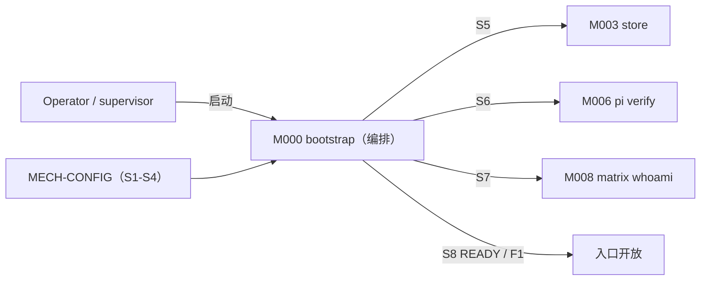
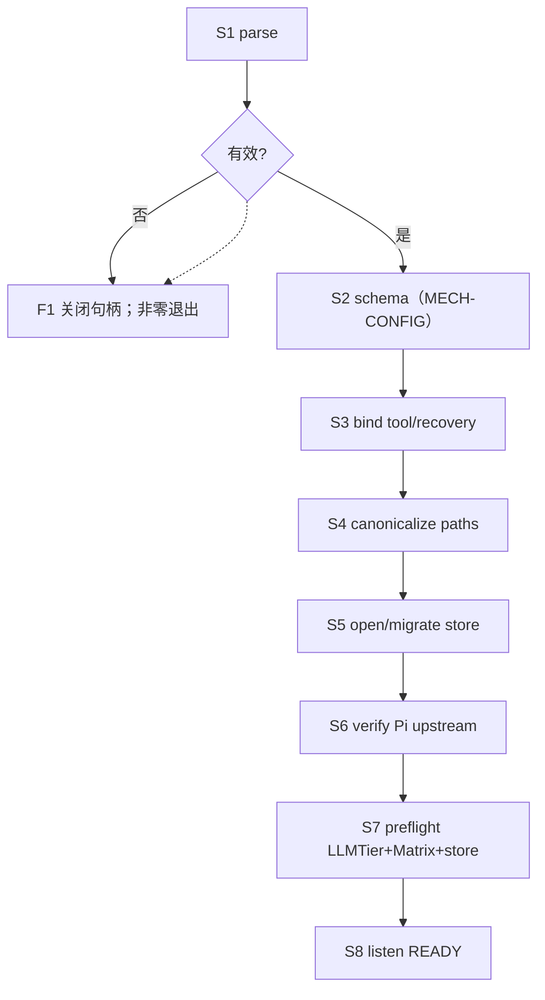
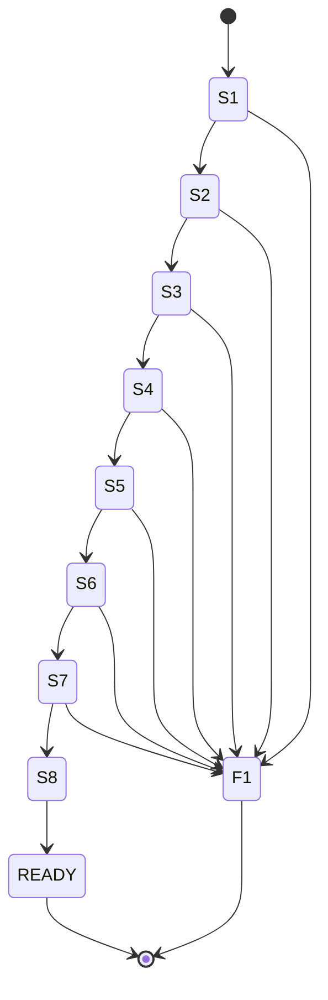

<!-- STD_DOCUMENT_COVER_BEGIN -->
# Piko 机制：进程启动与就绪

> STD 使用入口：[项目采用说明与标准导航](../../../README.md#std-entry)

| 文档字段 | 值 |
|---|---|
| Document ID | `piko-startup` |
| Document Version | `0.1.1` |
| Status | `Approved` |
| Project | `piko` |
| Document Owner | Piko Architecture Owner |
| Last Modified Date | `2026-09-26` |
| Template ID | `design.system-mechanism` |
| Template Version | `3.3.0` |
<!-- STD_DOCUMENT_COVER_END -->

## 1. 机制摘要：解决什么问题

Piko 进程必须"真正可服务"才能接收 Run。启动不是单模块行为：`bootstrap` M000 编排顺序，`policy` M002 绑定 tool profile，`task-repository` M003 打开/迁移 SQLite，`pi-adapter` M006 校验 Pi upstream，`matrix-adapter` M008 做 whoami。任一环节未就绪就开放入口，会造成"进程活着但不能履约"。MECH-STARTUP 定义 S1–S8 顺序、F1 失败清理、READY 判据。

**受益者与任务**：Operator 需要可判定的就绪；Slinky 需要"未 READY 不接受 Run"的保证。

**核心输入 → 处理 → 输出**：输入是 config + 固定上游 commit + 本地 FS；处理是 S1–S8 顺序执行 + 依赖 preflight；输出是 READY 或 F1（进程非零退出）。

**最重要取舍**：选择"完整 preflight 通过才 READY"而非"部分就绪"，代价是启动慢，换取无"已开放但不可履约"的入口。

- **机制形态与适用性 / 业务副作用**：**有副作用（进程生命周期）**。打开 SQLite、写 `instance_meta`、绑定端口、可能触发 schema migration 都改变持久状态。
- **交接域**：**纯软件**。M000/M002/M003/M006/M008 同进程；外部依赖 LLMTier/Matrix 经 preflight 探测。
- **裁剪依据**：附录 A；§4.5/§5.3 纯软件 N/A。



图 M-ST-0 · 用途概览 / Target / NOT_BUILT。

**教学路径**：属"有副作用的收口"路径。

## 2. 使用场景与功能

| Capability / Scenario ID | 业务任务与触发/条件 | 输入与可观察结果 | 提供方/全部消费者 | 实现状态 | 验证结果/判据 |
|---|---|---|---|---|---|
| CAP-ST-BOOT · 冷启动 | supervisor 拉起进程 | config + 锁定 commit → READY 或 F1 | 提供：M000；消费：所有模块 | Planned | PK-T12（NOT_RUN） |
| CAP-ST-RELOAD · 重启生效 | Operator 改 config + SIGTERM | 旧退出确认 + 新进程 S1-S8 | 提供：M000；消费：Operator | Planned | PK-T12（NOT_RUN） |
| CAP-ST-PREFLIGHT · 依赖 preflight | 启动 S5-S7 | store 可写 / Pi 匹配 / LLMTier+Matrix 可达 | 提供：M000+M003+M006+M008 | Planned | PK-T12（NOT_RUN） |
| CAP-ST-FAIL · 失败清理 | 任一阶段失败 | F1：关闭句柄 + 非零退出 | 提供：M000 | Planned | PK-T12（NOT_RUN） |

不支持：部分就绪、在线热改（配置切换见 MECH-CONFIG §6.3）、自动回退旧目录。

## 3. 参与方、责任和 authority

| Participant / 工程 Owner | 负责/不负责 | 决定/写入/事实来源/恢复（适用时） | Provided/Consumed interface | 部署/实现位置 | 依赖机制与基线 |
|---|---|---|---|---|---|
| M000 `bootstrap` / Piko Implementation Owner | 负责 S1-S8 顺序、F1、READY 判定；不运行业务 | 决定：启动顺序；写入：`instance_meta`；事实来源：各模块 ready/fail；恢复：重启重跑 | 提供：READY/F1；消费：config + 各模块 | 进程内 `src/bootstrap/`（Planned） | MECH-CONFIG |
| M002 `policy` | 负责 S3 tool/recovery 绑定；不持久化 | 决定：绑定通过/失败；写入：无；事实来源：注册表 | 提供：`BoundToolProfile`；消费：config | 进程内 `src/policy/`（Planned） | MECH-CONFIG |
| M003 `task-repository` | 负责 S5 store 打开/迁移；不判定配置 | 决定：store 可写；写入：SQLite schema/migration；事实来源：SQLite | 提供：可写事实；消费：config | 进程内 `src/store/`（Planned） | MECH-CONFIG |
| M006 `pi-adapter` | 负责 S6 Pi upstream commit 校验；不启动 Pi session | 决定：fingerprint 匹配；写入：无；事实来源：Pi commit + patch manifest | 提供：匹配事实 | 进程内 `src/adapters/pi/`（Planned） | MECH-CONFIG |
| M008 `matrix-adapter` | 负责 S7 whoami；不管理 homeserver | 决定：身份一致；写入：无；事实来源：homeserver whoami | 提供：身份事实 | 进程内 `src/adapters/matrix/`（Planned） | MECH-CONFIG |

**责任角色区分**：启动**决定**由 M000 发出（S1-S8 顺序），**写入**由 M003 执行（schema/migration），**权威事实**以各模块 ready/fail + READY 态为准；重启时 M000 重跑。config 细节由 MECH-CONFIG 拥有。

### 3.1 系统约束与参与方承接

| Constraint ID / 上级基线与决定状态 | 适用条件 | 系统保证/分配 | 参与方承接与自由度 | 流程/协议/下级落实位置 | 组合验证与证据状态 | 差距/变更影响/裁决责任 |
|---|---|---|---|---|---|---|
| CON-ST-001 · PK-12 恢复与 operator 边界 · Approved | 启动/重启 | 启动顺序 S1-S8；未 READY 不接受 Run | M000 顺序 + 各模块 ready；自由度：内部检查实现；不可变：不部分就绪 | §6 / §9 / M000 ISD | 启动 PK-T12（NOT_RUN） | — / 依赖变化需复审 |

### 3.2 运行时统筹与确认责任

| 能力/Process ID | 运行时统筹/权威状态 | 参与方动作及确认 | 总体成功/部分结果 | 中断核对与清理/重新开放 | 关联公共契约 |
|---|---|---|---|---|---|
| CAP-ST-BOOT | M000；READY 态权威 | S1-S8 顺序；各模块返回 ready/fail | READY = 全部通过；任一 fail = F1 | F1 关闭句柄；重启重跑 | system-design §6.1 |
| CAP-ST-PREFLIGHT | M000；preflight 事实 | M003 store / M006 pi / M008 whoami | 全 PASS = 可 listen | 部分失败 → F1 | system-design §9.1 |

**统筹者退出语义**：M000 启动中退出 → 未 READY，无业务入口；已 READY 后退出的语义等同进程退出（由 MECH-RECOVERY 处理）。启动快照随进程消亡，重启重读。

### 3.3 拓扑、目标身份与共享故障域

| 逻辑目标/身份 | 部署及访问路径 | 映射 authority/更新条件 | 共享故障/复位域 | 旧目标/旧代次处理 |
|---|---|---|---|---|
| Piko 进程 | 单进程；supervisor 拉起 | config + instance lock | 进程 + 本地 FS 同域 | 重启；旧 boot_id 弃用 |
| SQLite store | 本地 FS | M003 | 同域 | schema_generation 单调 |
| Pi upstream | 进程内 SDK | 锁定 commit | 同域 | fingerprint 校验 |
| LLMTier / Matrix | 外部 HTTPS | config + preflight | 独立网络故障域 | 不可达 → F1 |

#### 3.3.1 运行环境

| 环境 | 启动方式 | 依赖 | 用途 |
|---|---|---|---|
| 开发（dev） | 本地起进程 | 本地 store / mock LLMTier / 本地 Synapse | 本地开发 |
| 测试（test/CI） | 测试夹具 | 独立临时 store | 集成测试 |
| 生产（prod） | supervisor | 真实 LLMTier/Matrix | 实际运行 |

- **进程模型**：单进程；启动串行 S1-S8。
- **网络**：preflight 出站 LLMTier/Matrix。
- **持久层**：SQLite + instance lock 本地。
- **生效方式**：重启生效。

## 4. 数据结构设计

### 4.1 公共基础类型与枚举（适用时）

#### 4.1.1 `StartupStage`

- **完整定义、Data/Type/Error ID 与唯一来源**：`S1..S8` + `READY` + `F1`。来源 M000 ISD §4.1。
- **逐值含义**：S1 parse / S2 schema / S3 bind / S4 paths / S5 store / S6 pi / S7 preflight / S8 listen；READY 为终态；F1 为失败出口。不允许跳级。
- **生产/修改、所有权、可见点、寿命及失败出口**：M000 推进；进程寿命；F1 记录失败阶段。
- **合法与拒绝实例**：S2 失败必须 F1，不得进入 S3。

### 4.2 业务与操作数据结构（适用时）

#### 4.2.1 `PreflightReport`

- **定义与来源**：`{store_writable, pi_fingerprint_match, llmtier_models_ok, matrix_whoami_ok}`。来源 M000 ISD §4.2。
- **字段与约束**：各字段 bool；全 true 才允许 S8。
- **所有权/寿命**：M000；单次启动。

### 4.3 配置与规则数据结构（适用时）

**N/A · 见 MECH-CONFIG §4.3**：`PikoRuntimeConfig`/`ToolProfile` 由 MECH-CONFIG 拥有。

### 4.4 通信报文结构（适用时）

**N/A · 复用机器契约**：无新增报文；config 格式见 MECH-CONFIG §4.4。

### 4.5 设备与 FPGA 表项结构（适用时）

**N/A · 纯软件范围**。

### 4.6 运行状态数据结构（适用时）

#### 4.6.1 `instance_meta`

- **定义与来源**：`{key, value_json}` 记 schema_generation / instance_id / boot_id。来源 M003 ISD §4.7.1。
- **约束**：S5 写；重启读。
- **所有权/寿命**：M003；持久。

### 4.7 数据库表结构（适用时）

**N/A · 见 M003 ISD §4.7.1**：`instance_meta` DDL 在 M003 ISD。

### 4.8 错误码与错误结构（适用时）

| Error ID | 触发事实 | 结果 | 合法下一步 |
|---|---|---|---|
| `InternalError("config-invalid")` | S2 schema 失败 | F1 | Operator 修 config |
| `InternalError("tool-bind-fail")` | S3 绑定失败 | F1 | 注册实现 |
| `InternalError("store-unwritable")` | S5 失败 | F1 | 修 FS |
| `InternalError("pi-upstream-mismatch")` | S6 fingerprint 不匹配 | F1 | 装正确版本 |
| `InternalError("preflight-fail")` | S7 依赖不可达 | F1 | 修依赖 |

### 4.9 编码、布局与共享类型映射

`instance_meta.value_json` UTF-8 JSON；时间字段 UTC。

### 4.10 一致性、可见性与数据寿命

- 启动快照在进程寿命内不变；无 reload。
- READY 前不接受 Run。
- F1 后进程退出，不部分就绪。

## 5. 接口设计

### 5.1 API（适用时）

进程内启动函数是本机制 API。

#### `preflight() -> PreflightReport`（IF-ST-PREFLIGHT）

- **Interface/Member ID、用途与提供责任**：`IF-ST-PREFLIGHT`；M000 提供。
- **唯一契约、版本与状态**：M000 ISD §5.1；Proposed。
- **输入与前提**：config 已加载（MECH-CONFIG）。
- **成功输出与保证**：`PreflightReport`；全 true 才 READY。
- **错误与合法下一步**：任一 false → F1。
- **交互与生命周期**：启动时同步。
- **代表调用与验证**：PK-T12。

#### `openStore() -> Store`（IF-ST-STORE）

- **Interface/Member ID、用途与提供责任**：`IF-ST-STORE`；M003 提供。
- **输入与前提**：`storage.sqlite_path`；instance lock。
- **成功输出与保证**：可写 SQLite + migration。
- **错误**：不可写 / migration 失败 → F1。
- **代表调用与验证**：PK-T12。

#### `verifyPiUpstream() -> bool`（IF-ST-PI）

- **Interface/Member ID、用途与提供责任**：`IF-ST-PI`；M006 提供。
- **输入与前提**：`pi.upstream_commit` + patch manifest。
- **成功输出**：commit 哈希匹配。
- **错误**：不匹配 → F1。
- **代表调用与验证**：PK-T04。

#### `matrixWhoami() -> Identity`（IF-ST-MATRIX）

- **Interface/Member ID、用途与提供责任**：`IF-ST-MATRIX`；M008 提供。
- **成功输出**：user_id 与 config 一致。
- **错误**：不一致 → F1。
- **代表调用与验证**：PK-T08。

### 5.2 消息与数据流接口（适用时）

**N/A**：启动为进程内顺序调用，无跨边界消息流。

### 5.3 硬件与固件接口（适用时）

**N/A · 纯软件范围**。

### 5.4 人机与维护接口（适用时）

Operator 经 supervisor 启停；只读诊断（S1-S8 阶段）见 `system-design` §8.1。MECH-STARTUP 不自建入口。

## 6. 正常端到端流程

代表输入：supervisor 拉起进程。

1. S1 M000 parse 启动参数；失败 → F1。
2. S2 schema 校验 config + tool profile（委派 MECH-CONFIG）；失败 → F1。
3. S3 M002 bind tool/recovery registry；不一致 → F1。
4. S4 canonicalize paths（MECH-CONFIG）。
5. S5 M003 open/migrate SQLite（WAL+FK+busy_timeout）+ instance lock；失败 → F1。
6. S6 M006 verify Pi upstream commit + adapter patch manifest；不匹配 → F1。
7. S7 preflight：LLMTier `GET /v1/models` + Matrix whoami + store writable；部分失败 → F1。
8. S8 bind HTTP 端口 + READY；开始接受 Run。



图 M-ST-1 · 正常端到端 / Target / NOT_BUILT。

### 6.1 交叠请求、跨轮次与生命周期边界

- 启动未 READY 时调用 → 入口未开放（S8 前不 listen）。
- 重启：旧进程退出确认后才启动新进程（P-CONFIG）。
- 无热更新：配置变更需重启。

#### 6.1.1 完整调用实例（JSON）

**q1 成功启动** → S1-S8 全过 → READY：

```text
S1 parse ok; S2 schema ok; S3 bind ok; S4 paths ok; S5 store ok; S6 pi ok; S7 preflight ok; S8 READY
```

**q2 config 无效** → F1（`config-invalid`）。

**q3 Pi upstream 不匹配** → F1（`pi-upstream-mismatch`）。

**q4 LLMTier 不可达** → F1（`preflight-fail`）。

#### 6.1.2 双方调用演练（调用方知道什么 → 下一步）

| 步 | 调用方（Operator）已知 | 完整输入 | 接收方校验 | 实际动作/确认 | 下一步 |
|---|---|---|---|---|---|
| 1 | 想启动 | 启动命令 | M000 S1-S8 | 顺序执行 | 等 READY 或 F1 |
| 2 | 收到 READY | — | — | 入口开放 | 可派 Run |
| 3 | 收到 F1 | 退出码非零 + 失败阶段 | — | 无入口 | 修对应依赖后重启 |

**关键事实如何产生**：READY 事实=S8 完成（M000）；失败阶段=F1 记录；fingerprint 事实=S6 比对（M006）。

#### 6.1.3 关键保证与可中断阶段

| 保证 | 可中断阶段 | 权威可见点 | 推进条件 | 重复进入处理 |
|---|---|---|---|---|
| 未 READY 不接受 Run | S8 前 | 监听未绑定 | 全 preflight 通过 | 重启重跑 |
| 不部分就绪 | 任一 S1-S7 | 阶段 fail | 全 PASS | F1 退出 |

## 7. 分支和替代流程

| 分支 | 触发 | 处理 | 结果 |
|---|---|---|---|
| config 无效 | S2 | F1 | 不 READY |
| tool 未注册 | S3 | F1 | 不 READY |
| store 不可写 | S5 | F1 | 不 READY |
| Pi 不匹配 | S6 | F1 | 不 READY |
| 依赖不可达 | S7 | F1 | 不 READY |
| 旧进程退出未确认 | 重启 | 阻塞 | 不启动新进程 |

## 8. 状态机与不变量



图 M-ST-2 · 启动状态机 / Target / NOT_BUILT。

**不变量**：1) 不跳级；2) 未 READY 不接受 Run；3) 进程寿命内配置不变；4) F1 后无残留入口；5) credential 明文拒绝。

### 8.1 资源预留、交付、释放与复位

| 资源 | 预留 | 交付 | 释放 | 复位 |
|---|---|---|---|---|
| 监听端口 | — | S8 bind | 进程退出 | 重启 |
| SQLite 句柄 | S5 open | READY | 进程退出 | 重启重开 |
| instance lock | S5 | 进程寿命 | 进程退出 | 重启重取 |

## 9. 失败传播、重试与恢复

| 故障 | 检测 | 影响 | 恢复 |
|---|---|---|---|
| config 无效 | S2 | 不 READY | F1；修 config |
| registry 不匹配 | S3 | 不 READY | F1 |
| store 不可写 | S5 | 不 READY | F1 |
| Pi 不匹配 | S6 | 不 READY | F1 |
| 依赖不可达 | S7 | 不 READY | F1 |

#### 9.1 跨重启恢复窗口

| 崩溃窗口 | 中断前最后持久事实 | 重启后查询身份与位置 | 查询结果 → 合法动作 |
|---|---|---|---|
| 启动任意阶段 | `instance_meta` | config + store | 从未 READY 重跑 S1-S8 |
| READY 后 | 配置快照（内存） | 重启重读 | 旧快照丢弃 |

身份固定：`boot_id` + config 路径。启动不产生跨重启恢复义务（重启即重跑）。

## 10. 并发、排序与容量

- 启动串行 S1-S8；无并发。
- 配置启动时读取；无 reload。
- 等待出口：preflight 探测超时 → F1。
- 代表请求：M000 串行推进 S1-S8；各模块返回 ready/fail。

## 11. 安全、权限与信任边界

| 入口/资产 | 身份来源与传播 | 授权对象/强制点 | 撤销/过期行为 | 拒绝与审计 | 验证 |
|---|---|---|---|---|---|
| config 文件 | Operator → 进程 | schema + 权限 0600 | 重启才生效 | schema FAIL → F1 | PK-T12 |
| Secret reference | Secret provider | reference-only | 轮换需重启 | 明文拒绝；audit | PK-T12 |
| Pi upstream | 锁定 commit | S6 fingerprint | 不热切 | 不匹配 → F1 | PK-T04 |
| 诊断摘要 | operator | operator authorization | — | 未授权拒绝 | PK-T12 |

## 12. 可观测性与证据

### 12.1 统计、日志、时间与关联

| Signal / schema | 生产/采集路径 | 口径、单位、窗口、时间源 | 关联身份/代次 | 清零/丢失/聚合规则 | 保留与开销 |
|---|---|---|---|---|---|
| `piko.startup.stage` | M000 生产 → M009 采集 | 阶段 / 当前 / monotonic | boot_id | 重启重置 | 低开销 |
| `event.startup.{stage,fail,ready}` | M000 生产 → M009 | 事件 / — | boot_id | 不聚合 | 日志按 ops 留存 |

### 12.2 维护命令、自检与调试路径

| Maintenance API / Diagnostic ID | 执行位置、入口、目标、权限 | 请求/结果契约 | 施加/回读点及覆盖 | 依赖/占用/恢复退出 | 验证 |
|---|---|---|---|---|---|
| `bootstrap preflight` | 启动；M000；READY 判定 | 阶段输出 | S1-S8 | 失败 → F1 | PK-T12 |
| `operator startup summary` | operator 端点；只读 | 最近启动阶段 + 结果 | 核对就绪 | 只读 | PK-T12 |

## 13. 配置、兼容与部署

| 配置/组合 baseline | 来源/完整定义 | 校验与生效确认 | 在途/跨版本规则 | 中断检查点/回滚前提 | 验证 |
|---|---|---|---|---|---|
| 全部 config | 见 MECH-CONFIG §4.3 | S2；重启 | 无热改 | F1 | PK-T12 |
| `pi.upstream_commit` | 锁定+构建 | S6 fingerprint | 不热切 | F1 | PK-T04 |
| `matrix.homeserver` | config | S7 whoami | — | F1 | PK-T08 |
| schema | SQLite `user_version=2` | S5 migration | 不可降级 | 备份恢复 | PK-T12 |

## 14. 跨责任单元分解与接口分配

### 14.1 参与方到架构对象映射

| 参与方 | 架构对象 | 下级设计入口 |
|---|---|---|
| M000 | `bootstrap` | `piko-bootstrap-design.md` + `piko-bootstrap-impl.isd.md` |
| M002 | `policy` | `piko-policy-design.md` + `piko-policy-impl.isd.md` |
| M003 | `task-repository` | `piko-task-repository-design.md` + `piko-task-repository-impl.isd.md` |
| M006 | `pi-adapter` | `piko-pi-adapter-design.md` + `piko-pi-adapter-impl.isd.md` |
| M008 | `matrix-adapter` | `piko-matrix-adapter-design.md` + `piko-matrix-adapter-impl.isd.md` |

### 14.2 功能和步骤到责任单元分配

| 步骤 | 责任单元 | 输入 | 输出 |
|---|---|---|---|
| S1-S2 parse/schema | M000 (+MECH-CONFIG) | config | 校验结果 |
| S3 bind | M002 | profile+registry | BoundToolProfile |
| S4 paths | M000 | workspace | RelPath |
| S5 store | M003 | path | store 可写 |
| S6 pi | M006 | commit | 匹配事实 |
| S7 preflight | M000+M003+M006+M008 | 依赖 | PreflightReport |
| S8 listen | M000 | — | READY |

### 14.3 责任单元间接口契约

| 交接/接口 ID | 提供方/消费方 | 输入/输出或事件 | 确认、期限与失败 | 引用 |
|---|---|---|---|---|
| IF-ST-PREFLIGHT | M000 → 各模块 | — → `PreflightReport` | 全 true 才 S8 | §5.1 |
| IF-ST-STORE | M003 → M000 | — → Store | 不可写 → F1 | §5.1 |
| IF-ST-PI | M006 → M000 | — → bool | 不匹配 → F1 | §5.1 |
| IF-ST-MATRIX | M008 → M000 | — → Identity | 不一致 → F1 | §5.1 |

### 14.4 下级设计输入清单

| Requirement ID | 下游对象 | 固定输入 | 约束 | 自由度 |
|---|---|---|---|---|
| `M-ST-DI-001` | `bootstrap` | config + 启动顺序 | CON-ST-001 | 阶段实现 |
| `M-ST-DI-002` | `task-repository` | SQLite path | CON-ST-001 | migration 实现 |
| `M-ST-DI-003` | `pi-adapter` | upstream commit | CON-ST-001 | verify 实现 |
| `M-ST-DI-004` | `matrix-adapter` | homeserver | CON-ST-001 | whoami 实现 |

## 15. 验证、上线与回滚

### 15.1 输入构造、故障控制与独立判据

每条按"输入 → 注入/命中 → 状态/对象变化 → 外部可观察结果 → 清理"固定。

**V-ST-N1（正常）**：输入=有效 config + 锁定 commit + 可达依赖；注入=无；命中=S1-S8；状态=`instance_meta` 写入、schema_generation 记；外部结果=端口已绑定 + READY、可接受 Run；清理=进程退出、store 可保留。

**V-ST-N2（最危险反例，依赖不可达）**：输入=有效 config 但 LLMTier 不可达；注入=mock LLMTier 503；命中=S7 preflight fail；状态=`instance_meta` 可能已写（S5），但**不 listen**；外部结果=**端口未绑定**、进程非零退出、无 Run 可受理；清理=进程退出释放句柄与 lock。

**V-ST-N3（配置无效）**：输入=未知字段/覆盖固定项；注入=schema 拒绝；命中=S2；状态=不进入 S3；外部结果=F1 + `config-invalid` + 非零退出；清理同 N2。

独立判据=**外部可观察的端口绑定 + 退出码**（不只自身日志/READY 自述）+ Run 受理能力；Run 状态 NOT_RUN。

#### 15.1.1 每项核心保证的正常向量 + 故障向量

| 保证 | 正常向量 | 故障向量 | 注入/命中 | 独立 Oracle |
|---|---|---|---|---|
| 未 READY 不接受 Run | 正常 READY | 依赖不可达 | 构造 S7 失败 | 监听未绑定 |
| 不部分就绪 | 全 PASS | S5 失败 | 构造坏 path | F1 + 非零退出 |

### 15.2 环境部署、复位、并发隔离与自动化

- 集成 `tests/integration/operator-auth.test.ts`。
- 隔离：测试独立 config + store。

### 15.3 组合验收、启用与旧机制退出

- 组合：M000+M002+M003+M006+M008 PASS（PK-T12）。
- 旧机制退出：无。

## 16. 风险、未决问题与决定

| ID | 风险/未决 | 等级 | Owner | 关闭 Gate |
|---|---|---|---|---|
| `RISK-ST-001` | 启动停机窗口未实测 | Low | Piko Operator | 部署测试后 |

已选决定：重启生效（§3.3.1）；全 preflight 才 READY（§6）。被否决：部分就绪、在线热改。

**跨机制依赖检查**（见 `system-design` §3.5.1 依赖矩阵）：上级 `MECH-RUN`；设计前置 `MECH-RUN`、`MECH-CONFIG`（无环）；运行时消费 `MECH-CONFIG`（config）；恢复读取 —。只有设计前置参与无环检查，运行时消费/恢复读取允许双向。

## A. 输入基线、适用性与图文规则

| 来源 Document ID / 路径 | 条款/适用范围 | 决定状态 |
|---|---|---|
| `system-design` | §3.5 MECH-STARTUP；§6.1 P-START；§3.4 PK-12 | Approved |
| MECH-CONFIG | config 字段 | Approved |

### A.1 统一适用与复审规则

机制父项 `MECH-RUN`（归属）；设计前置 `MECH-RUN`、`MECH-CONFIG`。运行时消费与恢复读取见 `system-design` §3.5.1 依赖矩阵，不属于设计前置、不参与无环检查。继承 MECH-RUN 的 Run/Result 核心语义与 authority 规则；自行设计进程生命周期。复审触发：启动顺序变化、依赖变化。

### A.2 纯软件 API 机制裁剪示例

纯软件机制：无硬件/FPGA（§4.5 N/A）；无跨边界消息流（§5.2 N/A）。

**正文质量检查**：§1/§3/§6/§8/§9/§14/§15 均先有连续段落解释选定方案、依据、取舍与下游约束，再以图表汇总。

**图分类**：§1 用途概览（M-ST-0）、§3 协作（in §3）、§6 正常时序（M-ST-1）为基线必画；§4 对象、§8 状态、§9 异常、§15 测试路径按实际触发。本机制为有副作用进程生命周期，八类图适用。

## B. 文档控制与修订记录

| 版本 | 日期 | 修改与影响 | 作者 |
|---|---|---|---|
| v0.1.1 | 2026-09-26 | review 修复（AMENDMENT P1/P2）：统一依赖图（区分上级机制/设计前置/运行时消费/恢复读取，仅设计前置参与无环检查），§A.1/§16 同步；矩阵截断回补与 E2EE 唯一结果；取消停止未知时的隔离/释放/再准入；接口闭合与可执行验证向量 | corezilla, opencode |
| v0.1.0 | 2026-09-25 | 初稿：MECH-STARTUP 16 节 + 附录 A/B；由 system-design §3.5 恢复（跨 5 模块） | corezilla, opencode |

<!-- STD_DOCUMENT_CONTROL_BEGIN -->
| 文档字段 | 值 |
|---|---|
| Authority | `piko` |
| Authors | corezilla, opencode |
| Created Date | `2026-09-25` |
| Template Conformance | `tailored` |
| Tailoring Reference | piko-std-tailoring-v0.1 |
| Migration Map Reference | none |
| Repository | `corezilla/piko` |
| Canonical Path | `docs/20_system_design/mechanisms/piko-startup.md` |
| Supersedes | none |

> Reviewer、Approver、Approval Date 和 Release Tag 在进入相应状态时填写。Git commit/tag 是
> 外部不可变证据；不要在文档内容中伪造包含自身的 commit hash。
<!-- STD_DOCUMENT_CONTROL_END -->
