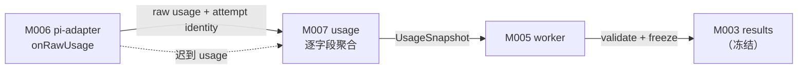
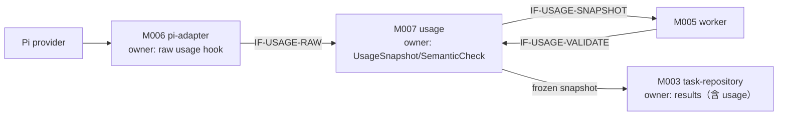
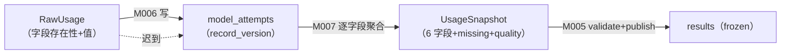
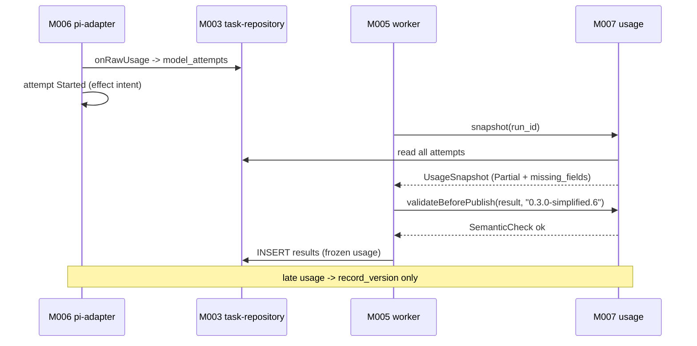
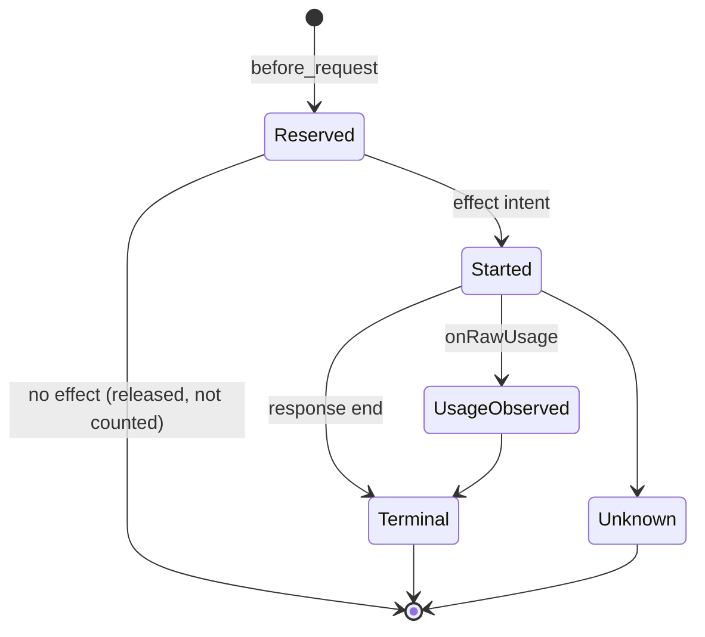
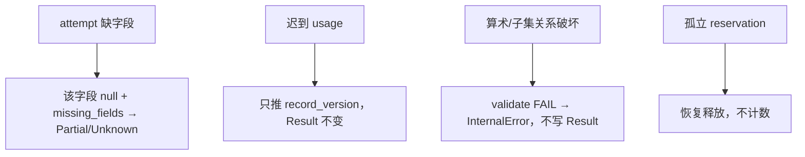
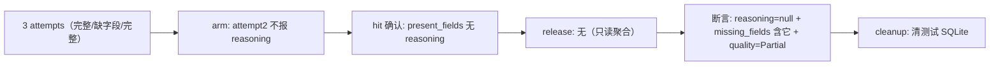

<!-- STD_DOCUMENT_COVER_BEGIN -->
# Piko 机制：Usage 字段汇总与冻结

> STD 使用入口：[项目采用说明与标准导航](../../../README.md#std-entry)

| 文档字段 | 值 |
|---|---|
| Document ID | `piko-usage` |
| Document Version | `0.5.2` |
| Status | `Approved` |
| Project | `piko` |
| Document Owner | Piko Architecture Owner |
| Last Modified Date | `2026-09-25` |
| Template ID | `design.system-mechanism` |
| Template Version | `3.3.0` |
<!-- STD_DOCUMENT_COVER_END -->

## 1. 机制摘要：解决什么问题

Piko 必须如实告诉 Slinky"这次 Run 用了多少 token"。但 token 事实分散在多个模型 attempt 中，且每个 attempt 可能只报告部分字段。若 `pi-adapter` 和 `worker` 各自聚合，会出现两套口径，Result 无法保证完整性。MECH-USAGE 定义 `pi-adapter` 与 `usage` 如何协作，把 Harness `onRawUsage` 观察到的原始字段汇总为唯一 `UsageSnapshot`，并在 Result 发布前做语义校验。

**受益者与任务**：Slinky 与下游计费需要可信的用量事实；`Complete`/`Partial`/`Unknown` 三态必须可判定，缺失字段必须显式为 null 而非零。

**核心输入 → 处理 → 输出**：输入是每个 durable attempt 的 raw usage（字段存在性 + 值）；处理是"逐字段 sum/null + missing_fields + quality 三态 + ResultValidator 前置"；输出是冻结的 `UsageSnapshot`（6 字段 + `model_attempts` + `usage_observed_attempts` + `missing_fields` + `quality`）。

**最重要取舍**：选择"逐字段完整才计入"而非"部分求和"，代价是 Usage 常为 Partial，换取不把下界冒充满值。



图 M-USAGE-0 · MECH-USAGE 用途概览 / Target / NOT_BUILT。原始 usage 经聚合、校验、冻结成为 Result 的一部分。


- **机制形态与适用性 / 业务副作用**：**只读观测 + 冻结**。raw usage 只观察不修改外部对象；生成的 `UsageSnapshot` 随 Result 冻结。无外部副作用，但有持久 `model_attempts`。
- **交接域**：**纯软件**。M006/M007 同进程；数据源为 Pi provider（进程内）。
- **裁剪依据**：附录 A；§4.5/§5.3 纯软件 N/A。

**教学路径**：本机制接近"只读观测"路径（对应 STD 只读观测案例）：聚合只观察事实、不改外部对象；区别是 MECH-USAGE 的结果会被冻结进不可变 Result。

## 2. 使用场景与功能

| Capability / Scenario ID | 业务任务与触发/条件 | 输入与可观察结果 | 提供方/全部消费者 | 实现状态 | 验证结果/判据 |
|---|---|---|---|---|---|
| CAP-USAGE-RECORD · 记录 attempt usage | 每次模型调用；触发为 Harness `onRawUsage` | raw response usage → `model_attempts` 行（record_version 推进） | 提供：M006；消费：M007 | Planned | PK-T10（NOT_RUN） |
| CAP-USAGE-SNAPSHOT · 汇总快照 | Result 发布前；触发为 worker 进入两步提交 | 全部 attempt → `UsageSnapshot`（含 quality/missing_fields） | 提供：M007；消费：M005 | Planned | PK-T10 / PK-T16（NOT_RUN） |
| CAP-USAGE-VALIDATE · 语义校验 | 持久化 Result 前 | `AgentResult` + contract version → SemanticCheck | 提供：M007；消费：M005 | Planned | PK-T16（NOT_RUN） |
| CAP-USAGE-FREEZE · 冻结 | 发布后迟到 usage | 内部 `record_version` 推进；不改 Result generation | 提供：M007；消费：无 | Planned | PK-T10（NOT_RUN） |

不支持：费用计算、跨 Run 累计、LLMTier 二次相加。

## 3. 参与方、责任和 authority

| Participant / 工程 Owner | 负责/不负责 | 决定/写入/事实来源/恢复（适用时） | Provided/Consumed interface | 部署/实现位置 | 依赖机制与基线 |
|---|---|---|---|---|---|
| M006 `pi-adapter` / Piko Implementation Owner | 负责 `onRawUsage` 观察与保存字段存在性；不负责聚合 | Harness raw usage hook | 提供：raw usage 事件；消费：Pi provider | 进程内 `src/adapters/pi/`（Planned） | MECH-RUN |
| M007 `usage` / Piko Implementation Owner | 负责逐字段聚合 + 三态 + ResultValidator；不改已发布 generation | `UsageSnapshot` + `SemanticCheck` | 提供：`UsageAggregator`/`ResultValidator`；消费：M005 | 进程内 `src/usage/`（Planned） | MECH-RUN + contract `0.3.0-simplified.6` |
| M005 `worker` | 负责在 Result 发布前调用 snapshot + validate | 无独立 usage state | 消费 M007 | 进程内 `src/worker/`（Planned） | MECH-RUN |

**责任角色区分**：usage 聚合的**决定**由 M007 usage 发出，**写入**由 M006 pi-adapter 执行（`model_attempts`），**权威事实**以 `model_attempts` 行为准；无跨故障恢复（重算一致）。

**authority 边界**：raw usage 权属 M006（来自 provider）；聚合结果权属 M007；Result 内嵌 usage 权属 M003（随 Result 持久化）。


图 M-USAGE-3 · 协作图 / Target / NOT_BUILT。M006 拥有原始观察，M007 拥有聚合权威，M003 拥有持久 Result。

### 3.1 系统约束与参与方承接

| Constraint ID / 上级基线与决定状态 | 适用条件 | 系统保证/分配 | 参与方承接与自由度 | 组合验证与证据状态 |
|---|---|---|---|---|
| CON-USAGE-001 · PK-09 Usage 字段完整性 · Approved | 每次 Run | 6 字段逐项 sum/null + missing_fields | M006 保存存在性；M007 聚合；自由度：内部数据结构 | PK-T10（NOT_RUN） |
| CON-USAGE-002 · PK-10 Result 冻结 UsageSnapshot · Approved | Result 发布后 | 迟到 usage 不改 generation | M007 只推 record_version；M003 generation 不可变 | PK-T10（NOT_RUN） |

### 3.2 运行时统筹与确认责任

| 能力/Process ID | 运行时统筹/权威状态 | 参与方动作及确认 | 总体成功/部分结果 | 中断核对与清理 |
|---|---|---|---|---|
| CAP-USAGE-SNAPSHOT | M007 统筹；claim 权威 `model_attempts` | M006 逐 attempt 写 → M007 读全部 → 逐字段 sum/null | 6 字段完整=Complete；部分=Partial；全缺=Unknown | 迟到只推版本；不改 Result |
| CAP-USAGE-VALIDATE | M005 调用；M007 判定 | M007 校验 attempts 数量/算术/token 子集 | SemanticCheck ok/not-ok | FAIL → throw `InternalError`，不写 Result |

### 3.3 拓扑、目标身份与共享故障域

| 逻辑目标/身份 | 部署及访问路径 | 映射 authority | 共享故障域 | 旧代次处理 |
|---|---|---|---|---|
| `model_attempts`(`run_id`,`operation_id`,`step_id`,`attempt`) | 进程内 SQLite | M003 DDL | 与实例同域 | record_version 单调 |
| attempt identity | M006 从 Harness 派生 | `stepId` + attempt ordinal | 同域 | 崩溃后保守计数 |

#### 3.3.1 运行环境

| 环境 | 模型路径 | 持久层 | 用途 |
|---|---|---|---|
| 开发（dev） | 本地 LLMTier mock | 本地 SQLite | 单元测试 |
| 测试（test/CI） | mock provider | 独立临时 SQLite | `tests/unit/usage-aggregator.test.ts` |
| 生产（prod） | 真实 LLMTier Responses SSE | 本地 SQLite | 实际运行 |

- **进程模型**：M006/M007 与 Piko 主进程同进程；无独立服务。
- **网络**：raw usage 来自 Pi provider 的模型响应，无本机制专有网络；模型路径见 MECH-RUN。
- **持久层**：`model_attempts` 在本地 SQLite；无独立存储。
- **时钟**：usage 为计数，无时间语义；attempt identity 用 `(pi_operation_id, step_id, attempt)`。

**统筹者退出语义**：M007 退出 → 未发布的 usage 只在内存丢失；`model_attempts` 已持久故重算一致；M005 在两事务间退出由 `MECH-RECOVERY` 补第二步。聚合不产生外部副作用。

## 4. 数据结构设计

### 4.1 公共基础类型与枚举（适用时）

#### 4.1.1 `UsageQuality`

- **定义与来源**：`UsageQuality = "Complete" | "Partial" | "Unknown"`。来源 contract §3 + M007 ISD §4.1。
- **逐值含义**：`Complete`＝6 字段全部完整；`Partial`＝至少 1 完整且至少 1 缺失；`Unknown`＝6 字段全 null（允许 `usage_observed_attempts>0`）。未知值拒绝。
- **所有权/寿命**：M007 写；可见点 `UsageSnapshot.quality`；随 Result 冻结。
- **合法/拒绝实例**：`model_attempts=0` 时零调用 Complete 合法；`usage_observed_attempts>0` 但 6 字段全缺必须为 Unknown。

### 4.2 业务与操作数据结构（适用时）

#### 4.2.1 `UsageSnapshot`

- **定义与来源**：机器权威 `interfaces/schemas/agent-runtime-v0.3.schema.json`；来源 contract §3。
- **字段与约束**：`input_tokens`/`output_tokens`/`total_tokens`/`cached_tokens`/`cache_write_tokens`/`reasoning_tokens`（int|null）、`model_attempts`（int）、`usage_observed_attempts`（int）、`missing_fields[]`、`quality`。`total = input + output`；cache ⊆ input；reasoning ⊆ output。
- **所有权/寿命**：M007 聚合，M003 持久化；随 Result 冻结。
- **合法/拒绝实例**：任一试字段缺失则该字段 null 并入 missing_fields，禁填下界。


图 M-USAGE-4 · 数据对象图 / Target / NOT_BUILT。逐字段 sum/null；迟到只推 record_version，不改 Result。

### 4.3 配置与规则数据结构（适用时）

**N/A · 复用系统 config**：无机制专属配置。

### 4.4 通信报文结构（适用时）

#### 4.4.1 raw usage 观察（M006 → M007）

M006 `onRawUsage` 在 OpenAI Responses normalization **之前**保存原始 usage，字段存在性与值一并保留：

```text
RawUsage {
  request_identity: { response_id, request_id },   // 去重用
  present_fields: string[],                         // 本次实际出现的字段
  input_tokens?, output_tokens?, total_tokens?,
  cached_tokens?, cache_write_tokens?, reasoning_tokens?
}
```

- **约束**：`present_fields` 必须与字段值一致；缺失字段不得填 0。
- **寿命**：attempt 寿命；同 attempt 迟到更新以 record_version 替换。

#### 4.4.2 `UsageSnapshot`（M007 → M005）

字段全集在 `interfaces/schemas/agent-runtime-v0.3.schema.json`；机制层视图见 §4.2.1。

### 4.5 设备与 FPGA 表项结构（适用时）

**N/A · 纯软件范围**。

### 4.6 运行状态数据结构（适用时）

#### 4.6.1 `ModelAttempt`

- **定义与来源**：`(run_id, operation_id, step_id, attempt)` 主键 + `state`/`raw_usage_json`/`record_version`/`updated_at`。来源 M003 ISD §4.2.5。
- **字段与约束**：`state ∈ {Reserved, Started, UsageObserved, Terminal, Unknown}`。
- **所有权/寿命**：M006 写，M007 读；Run 寿命 + retention。
- **合法/拒绝实例**：Restart at attempt identity is idempotent。

### 4.7 数据库表结构（适用时）

**N/A · 见 M003 ISD §4.7.1**：`model_attempts` DDL 唯一权威在 M003 ISD。

### 4.8 错误码与错误结构（适用时）

| Error ID | 触发事实 | 结果 | 调用方合法下一步 |
|---|---|---|---|
| `InternalError`（semantic-validator-fail） | attempts 数量/精确算术/token 子集关系破坏 | Result 未发布；Run Failed | 交 operator 排查；不重跑 Pi |
| （无独立 usage 错误码） | usage 缺失不是错误，是 `Partial`/`Unknown` 事实 | Result 照常发布（带 missing_fields） | 下游按 quality 处理 |

不变量违反（`total != input+output`、cache ⊄ input、reasoning ⊄ output）由 semantic validator fail closed，不发布 Result。
### 4.9 编码、布局与共享类型映射

`raw_usage_json` UTF-8 JSON；`UsageSnapshot` JSON 字段名与 contract 一致。

### 4.10 一致性、可见性与数据寿命

- 单 attempt 迟到更新以 record_version 替换，不追加。
- Result 发布读取一个 ledger version 并冻结；后续更新只改内部记录。
- LLMTier 查询只核对同一 request/response identity，不与 response usage 二次相加。

## 5. 接口设计

### 5.1 API（适用时）

MECH-USAGE 无面向用户的 API；进程内 `UsageAggregator`/`ResultValidator` 方法是本机制 API。

#### `recordAttempt(attempt: ModelAttempt) -> void`（IF-USAGE-RAW）

- **Interface/Member ID、用途与提供责任**：`IF-USAGE-RAW`；M006 `pi-adapter` 提供（hook）；M007 消费。
- **唯一契约、版本与状态**：M006 ISD §5.1；Proposed。
- **输入与前提**：`(run_id, operation_id, step_id, attempt)` + `present_fields` + raw 值。
- **成功输出与保证**：写 `model_attempts`；同 attempt 幂等。
- **错误与合法下一步**：无独立错误；字段缺失是事实。
- **代表调用与验证**：§6.1.1 q1/q2；PK-T10。

#### `snapshot(runId: string) -> UsageSnapshot`（IF-USAGE-SNAPSHOT）

- **Interface/Member ID、用途与提供责任**：`IF-USAGE-SNAPSHOT`；M007 提供；M005 消费。
- **输入与前提**：全部 durable attempt 已落 `model_attempts`。
- **成功输出与保证**：6 字段逐项 sum/null + missing_fields + quality。
- **交互与生命周期**：与 publish 同事务前置。
- **代表调用与验证**：§6.1.1 q3；PK-T10/PK-T16。

#### `validateBeforePublish(result, contractVersion) -> SemanticCheck`（IF-USAGE-VALIDATE）

- **Interface/Member ID、用途与提供责任**：`IF-USAGE-VALIDATE`；M007 提供；M005 消费。
- **输入与前提**：`AgentResult` + `0.3.0-simplified.6`。
- **成功输出与保证**：`SemanticCheck{ok, reason?}`。
- **错误与合法下一步**：FAIL → throw `InternalError("semantic-validator-fail")`。
- **代表调用与验证**：§6.1.1 q4；PK-T16。

#### `freeze(snapshot)`（内部）

- **用途**：随 Result 发布冻结；迟到只推 record_version。

### 5.2 消息与数据流接口（适用时）

#### raw usage 事件流（IF-USAGE-STREAM）

- **来源**：Pi provider 的 OpenAI Responses 响应中 usage 字段；经 M006 `onRawUsage` 在归一化前捕获。
- **格式**：见 §4.4.1 `RawUsage`。
- **关联/确认**：`(pi_operation_id, step_id, attempt)`；同 attempt 以 record_version 替换。
- **代表调用与验证**：PK-T10。
### 5.3 硬件与固件接口（适用时）

**N/A · 纯软件范围**。

### 5.4 人机与维护接口（适用时）

**N/A**：无独立维护入口；ledger 摘要经 operator 诊断读取。

## 6. 正常端到端流程

代表输入：一个 Run 共 3 次模型 attempt；attempt1 报告 6 字段，attempt2 缺 `reasoning_tokens`，attempt3 完整。

1. M006 `onRawUsage` 逐 attempt 写 `raw_usage_json` + 字段存在性 → UsageObserved。
2. Harness 形成 provider-effect intent → Started（保守计数）。
3. Result 发布前 M005 调 M007 `snapshot(run_id)`。
4. M007 对每字段 F：全部 attempt 都有 F → `sum(F)`；否则 null + 入 missing_fields。
5. `reasoning_tokens` 因 attempt2 缺失 → null + missing_fields；其余 5 字段完整 → `Partial`。
6. M007 `validateBeforePublish` 校验算术与子集 → PASS。
7. M005 持久化 Result（含 Partial UsageSnapshot）；发布后迟到 attempt2 usage 只推 record_version。



图 M-USAGE-1 · MECH-USAGE 正常端到端 / Target / NOT_BUILT。

### 6.1 交叠请求、跨轮次与生命周期边界

- 迟到 raw usage 与 Result 发布并发：以 ledger version 读，发布后不修改。
- 同一 attempt 多次回调：以 record_version 替换，不重复相加。
- 零 attempt Run：全零 Complete。

#### 6.1.1 完整调用实例（JSON）

Run `run-042`，3 次模型 attempt：attempt1 六字段完整、attempt2 缺 `reasoning_tokens`、attempt3 完整。

**q1 attempt1 raw usage（onRawUsage）**

```json
{"request_identity":{"response_id":"resp-1","request_id":"req-1"},"present_fields":["input_tokens","output_tokens","total_tokens","cached_tokens","cache_write_tokens","reasoning_tokens"],"input_tokens":1200,"output_tokens":340,"total_tokens":1540,"cached_tokens":100,"cache_write_tokens":0,"reasoning_tokens":50}
```

**q2 attempt2 raw usage（缺 reasoning）**

```json
{"request_identity":{"response_id":"resp-2","request_id":"req-2"},"present_fields":["input_tokens","output_tokens","total_tokens","cached_tokens","cache_write_tokens"],"input_tokens":800,"output_tokens":200,"total_tokens":1000,"cached_tokens":0,"cache_write_tokens":0}
```

**q3 snapshot（Result 发布前）**

```json
{"input_tokens":2600,"output_tokens":740,"total_tokens":3340,"cached_tokens":100,"cache_write_tokens":0,"reasoning_tokens":null,"model_attempts":3,"usage_observed_attempts":3,"missing_fields":["reasoning_tokens"],"quality":"Partial"}
```

**q4 边界：attempt 全缺 reasoning** → `reasoning_tokens=null` + missing；六字段全缺 → `quality=Unknown`：

```json
{"input_tokens":null,"output_tokens":null,"total_tokens":null,"cached_tokens":null,"cache_write_tokens":null,"reasoning_tokens":null,"model_attempts":2,"usage_observed_attempts":0,"missing_fields":["input_tokens","output_tokens","total_tokens","cached_tokens","cache_write_tokens","reasoning_tokens"],"quality":"Unknown"}
```

**q5 零调用（取消）** → 全零 Complete：

```json
{"input_tokens":0,"output_tokens":0,"total_tokens":0,"cached_tokens":0,"cache_write_tokens":0,"reasoning_tokens":0,"model_attempts":0,"usage_observed_attempts":0,"missing_fields":[],"quality":"Complete"}
```

#### 6.1.2 双方调用演练（调用方知道什么 → 下一步）

| 步 | 调用方已知 | 完整输入 | 接收方校验 | 实际动作/确认 | 下一步 |
|---|---|---|---|---|---|
| 1 | 模型已响应 attempt1 | q1 RawUsage | M006 保存存在性 | 写 model_attempts | — |
| 2 | attempt2 缺 reasoning | q2 RawUsage | M006 | 写 attempt（present_fields 少 1） | — |
| 3 | 想要快照 | `snapshot(run-042)` | M007 读全量 | 逐字段 sum/null → q3 | 校验 |
| 4 | 校验 | `validateBeforePublish(result,"0.3.0-simplified.6")` | M007 | SemanticCheck ok | M005 发布 |

**关键事实如何产生**：字段存在性事实=`present_fields`（M006 在归一化前写）；完整性事实=逐字段 all-attempts 判定（M007）。

## 7. 分支和替代流程

| 分支 | 触发 | 处理 | 结果 |
|---|---|---|---|
| attempt 缺字段 | provider 未报某项 | 该字段 null + missing_fields | Partial/Unknown |
| 迟到 usage | Result 已发布 | 只推 record_version | Result 不变 |
| 语义校验失败 | 算术/子集关系破坏 | throw | `InternalError`；不写 Result |
| 零 attempt | 取消/立即失败 | 全零 Complete | `model_attempts=0` |

## 8. 状态机与不变量



图 M-USAGE-2 · ModelAttempt 状态机 / Target / NOT_BUILT。

**不变量**：1) 每字段完整才 sum；2) `total = input + output`；3) cache ⊆ input、reasoning ⊆ output；4) Result usage 发布后不可变；5) provider 内层 `maxRetries=0`，一次 attempt 至多一次 dispatch。

### 8.1 资源预留、交付、释放与复位

| 资源 | 预留 | 交付 | 释放 | 复位 |
|---|---|---|---|---|
| attempt 预算 | before_request CAS | effect intent | Terminal/Unknown | 重启保守计数 |
| ledger record | onRawUsage 写 | record_version | retention | 迟到替换 |

## 9. 失败传播、重试与恢复

| 故障 | 检测 | 影响 | 恢复 |
|---|---|---|---|
| provider 内层失败 | Harness retry policy | 新 attempt | 下次 attempt 计数 |
| 孤立 reservation | 重启扫描 | 未形成 effect | 释放，不计数 |
| orchestrator 崩溃 | 重启 | ledger 不完整 | 从已提交 attempt 汇总；不重跑 Pi |
| semantic validation FAIL | M007 | Result 未发布 | throw `InternalError`；Run Failed |


图 M-USAGE-5 · 异常处置图 / Target / NOT_BUILT。缺失是事实不是错误；只有 validator FAIL 才阻断。

#### 9.1 跨重启恢复窗口

| 崩溃窗口 | 中断前最后持久事实 | 重启后查询身份与位置 | 查询结果 → 合法动作 |
|---|---|---|---|
| `onRawUsage` 写前 | 可能缺该 attempt | `model_attempts(run_id, operation_id, step_id, attempt)` | 缺 → 该字段可能 missing |
| 写后 | attempt 行 | `model_attempts` | 存在 → 直接聚合 |
| Result 发布后 | frozen snapshot | `results.result_json.usage` | 冻结 → 迟到不改 |

身份固定：`(pi_operation_id, step_id, attempt)`。只读机制，重算一致。

## 10. 并发、排序与容量

- `model_attempts` 写经 SQLite 单 writer 串行。
- attempt identity `(run_id, operation_id, step_id, attempt)` 唯一；同 attempt 幂等。
- 无独立容量；ledger 行数 ≤ `max_model_calls`。

- 代表请求：`onRawUsage` 回调在 Harness 事件上下文写 `model_attempts`；Result 发布前 `snapshot` 在同一 SQLite writer 事务读全量 attempts。写入串行，读取与 writer 不并发修改同一行。
- 无独立等待出口；迟到回调以 record_version 幂等替换。

## 11. 安全、权限与信任边界

- raw usage 来自固定 Pi provider，不经外部输入。
- 不含 credential 或模型正文；只存 token 计数与字段存在性。
- LLMTier 查询不泄漏其他 Run 的 usage。

| 入口/资产 | 身份来源与传播 | 授权对象/强制点 | 撤销/过期行为 | 拒绝与审计 | 验证 |
|---|---|---|---|---|---|
| raw usage | Pi provider → M006 | 固定 provider | — | 非 SSE 形成 recoverable op | PK-T09 |
| UsageSnapshot | M007 → Result | contract `0.3.0-simplified.6` | 发布后冻结 | semantic FAIL → `InternalError` | PK-T16 |

## 12. 可观测性与证据

### 12.1 统计、日志、时间与关联

| Signal / schema | 生产/采集路径 | 口径、单位、窗口、时间源 | 关联身份/代次 | 清零/丢失/聚合规则 | 保留与开销 |
|---|---|---|---|---|---|
| `piko.usage.quality.{Complete,Partial,Unknown}` | M007 生产 → M009 采集 | ratio / 区间 | per run_id | 不聚合 | 低开销 |
| `event.model.usage` | M006 生产 → M009 | 事件 / — | run_id + stepId + attempt | 不聚合 | 日志按 ops 留存 |
| `piko.model.attempts.{state}` | M006 生产 → M009 | count / 累计 | per run_id | 不跨代次相加 | 低开销 |

关联键：`run_id` + `operation_id` + `step_id` + `attempt`。

### 12.2 维护命令、自检与调试路径

| Maintenance API / Diagnostic ID | 执行位置、入口、目标、权限 | 请求/结果契约 | 施加/回读点及覆盖 | 依赖/占用/恢复退出 | 验证 |
|---|---|---|---|---|---|
| `operator ledger summary` | operator 端点；只读 | `model_attempts` 行摘要（脱敏） | 定位 usage 完整性 | 只读 | PK-T10 |
| 故障定位顺序 | operator；只读 | `model_attempts` 行 → raw_usage_json → quality | 端到端 evidence | 只读 | PK-T10 |

## 13. 配置、兼容与部署

配置 authority：`system-design` §9.1；MECH-USAGE 不新增配置，只消费：

| 配置/组合 baseline | 来源/完整定义 | 校验与生效确认 | 在途/跨版本规则 | 中断检查点/回滚前提 | 验证 |
|---|---|---|---|---|---|
| `llmtier.cacheRetention` | 固定 `none` | 编译期 | 不接受覆盖 | 启动 F1 | PK-T12 |
| `llmtier.supportsExplicitPromptCacheMode` | 固定 `false` | 编译期 | 三字段缺席 | 启动 F1 | PK-T12 |
| `llmtier.streamOptions.maxRetries` | 固定 `0` | 编译期 | 一 attempt 一 dispatch | 启动 F1 | PK-T04 |
| usage 字段集 | schema v0.3（6 字段） | 启动/发布 | 新增字段需契约升级 | 独立评审 | PK-T10 |

环境差异见 §3.3.1。兼容：字段集合变化需契约升级；Pi provider 不替换。

## 14. 跨责任单元分解与接口分配

### 14.1 参与方到架构对象映射

| 参与方 | 架构对象 | 下级设计入口 |
|---|---|---|
| M006 | `pi-adapter` | `piko-pi-adapter-design.md` + `piko-pi-adapter-impl.isd.md` |
| M007 | `usage` | `piko-usage-design.md` + `piko-usage-impl.isd.md` |

### 14.2 功能和步骤到责任单元分配

| 步骤 | 责任单元 | 输入 | 输出 |
|---|---|---|---|
| onRawUsage 观察 | M006 | provider raw | model_attempts 行 |
| 逐字段聚合 | M007 | attempts | UsageSnapshot |
| 语义校验 | M007 | AgentResult + version | SemanticCheck |
| 冻结 | M007 | snapshot | frozen snapshot |

### 14.3 责任单元间接口契约

| 交接/接口 ID | 提供方/消费方 | 输入/输出或事件 | 确认、期限与失败 | 引用 |
|---|---|---|---|---|
| IF-USAGE-RAW | M006 → M007 | `ModelAttempt` → void | 同步写；同 attempt 幂等 | §5.1 |
| IF-USAGE-SNAPSHOT | M005 → M007 | `run_id` → `UsageSnapshot` | 与 publish 同事务前置 | §5.1 |
| IF-USAGE-VALIDATE | M005 → M007 | `AgentResult`+version → `SemanticCheck` | FAIL → `InternalError` | §5.1 |
| IF-USAGE-STREAM | Pi provider → M006 | raw usage 事件 | record_version 替换 | §5.2 |

### 14.4 下级设计输入清单

| Requirement ID | 下游对象 | 固定输入 | 约束 | 自由度 |
|---|---|---|---|---|
| `M-USAGE-DI-001` | `pi-adapter` | Harness hook + provider | CON-USAGE-001 | hook 实现 |
| `M-USAGE-DI-002` | `usage` | contract `0.3.0-simplified.6` | CON-USAGE-001/002 | 聚合数据结构 |


## 15. 验证、上线与回滚

### 15.1 输入构造、故障控制与独立判据

- 正常：3 attempt（完整/缺字段/完整）→ Partial；oracle = JSON Schema + semantic invariants。
- 边界：零 attempt → Complete 全零；全缺 → Unknown。
- 故障：迟到 usage；semantic 破坏；孤立 reservation。
- 独立判据：contract validator，不拿被测实现自身输出当 oracle。

#### 15.1.1 每项核心保证的正常向量 + 故障向量

| 保证 | 正常向量 | 故障向量 | 注入/命中 | 独立 Oracle |
|---|---|---|---|---|
| 字段完整性 | 3 attempt 全字段 | attempt 缺字段 | 构造 present_fields | contract invariants |
| 冻结 | Result 发布 | 迟到 usage | 构造迟到回调 | Result generation 不变 |

### 15.2 环境部署、复位、并发隔离与自动化

- 单元测试 `tests/unit/usage-aggregator.test.ts`；集成 `tests/integration/llmtier-usage.test.ts`。
- 隔离：per-run ledger；测试独立 SQLite。

### 15.3 组合验收、启用与旧机制退出

- 组合：M006 + M007 各自 PASS + LLMTier 联调 PASS（PK-T09/T10/T16）。
- 旧机制退出：无。


图 M-USAGE-6 · 测试路径图 / Target / NOT_BUILT。独立 Oracle=contract semantic invariants。

## 16. 风险、未决问题与决定

| ID | 风险/未决 | 等级 | Owner | 关闭 Gate |
|---|---|---|---|---|
| `RISK-USAGE-001` | semantic validator 版本绑定机制 | Medium | Piko Contract + Implementation Owner | M007 实现完成 |

已选决定：逐字段完整才计入（§1）；冻结快照（§8）。被否决：部分求和、LLMTier 二次相加。

**跨机制依赖检查**：MECH-USAGE 依赖 `MECH-RUN`（Result 发布触发 snapshot）与 `MECH-RECOVERY`（崩溃后 ledger 对账）。依赖方向 MECH-USAGE ← MECH-RUN；无反向依赖、无循环、上级 `MECH-RUN` 已登记。

## A. 输入基线、适用性与图文规则

| 来源 Document ID / 路径 | 条款/适用范围 | 决定状态 |
|---|---|---|
| `system-design` | §3.5 MECH-USAGE；§3.4 PK-09/10 | Approved |
| `piko-agent-runtime-contract-v0.3` | §3；machine `0.3.0-simplified.6` | Approved |

### A.1 统一适用与复审规则

机制父项 `MECH-RUN`；前置依赖 `MECH-RUN`。复审触发：契约版本变化、Usage 字段集合变化。

### A.2 纯软件 API 机制裁剪示例

纯软件机制：无硬件/FPGA（§4.5 N/A）；无设备拓扑；无对外 API（§5.1 N/A）。

**正文质量检查**：§1/§3/§6/§8/§9/§14/§15 均先有连续段落解释选定方案、依据、取舍与下游约束，再以图表汇总。

**图分类**：§1 用途概览（M-USAGE-0）、§3 协作（M-USAGE-3）、§6 正常时序（M-USAGE-1）为基线必画；§4 对象（M-USAGE-4）、§8 状态资源（M-USAGE-2）、§9 异常（M-USAGE-5）、§15 测试路径（M-USAGE-6）按实际触发。本机制为只读观测 + 冻结，§6/§9 完整过程图与条件依赖图不适用（无外部副作用收口）。

## B. 文档控制与修订记录

| 版本 | 日期 | 修改与影响 | 作者 |
|---|---|---|---|
| v0.1.0 | 2026-09-25 | 初稿：MECH-USAGE 16 节 + 附录 A/B | corezilla, opencode |

<!-- STD_DOCUMENT_CONTROL_BEGIN -->
| 文档字段 | 值 |
|---|---|
| Authority | `piko` |
| Authors | corezilla, opencode |
| Created Date | `2026-09-25` |
| Template Conformance | `tailored` |
| Tailoring Reference | piko-std-tailoring-v0.1 |
| Migration Map Reference | none |
| Repository | `corezilla/piko` |
| Canonical Path | `docs/20_system_design/mechanisms/piko-usage.md` |
| Supersedes | none |

> Reviewer、Approver、Approval Date 和 Release Tag 在进入相应状态时填写。Git commit/tag 是
> 外部不可变证据；不要在文档内容中伪造包含自身的 commit hash。
<!-- STD_DOCUMENT_CONTROL_END -->
