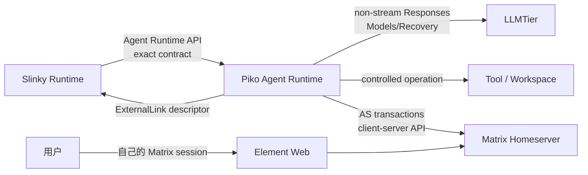
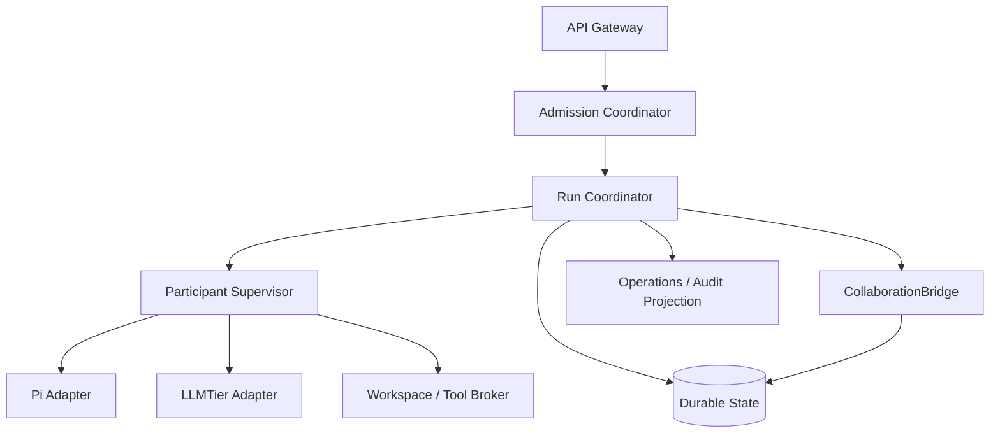
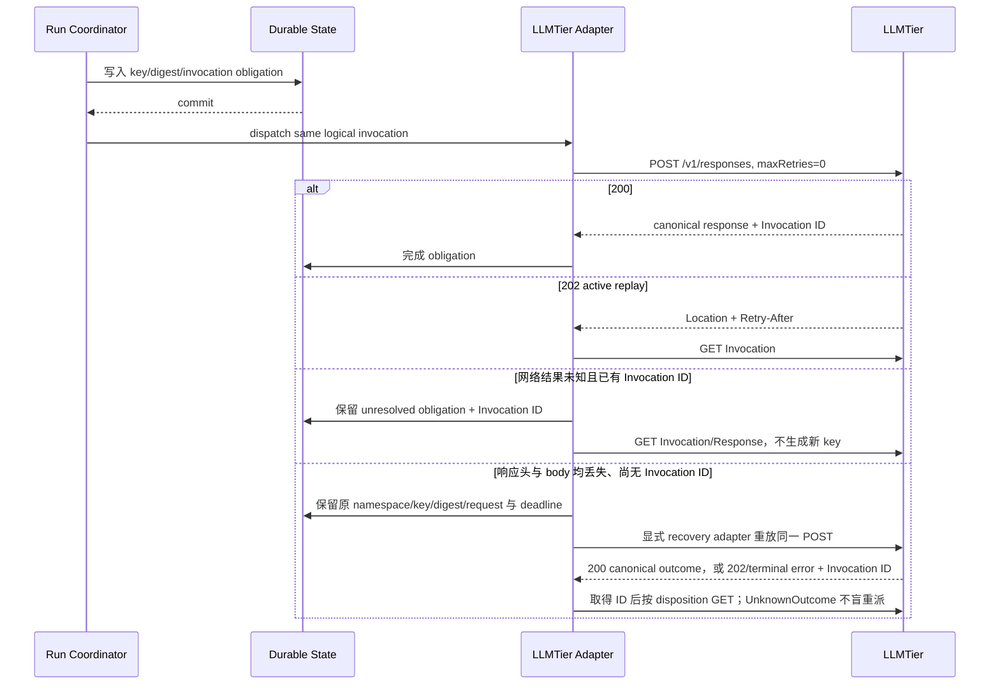

<!-- STD_DOCUMENT_COVER_BEGIN -->
# Piko Agent Runtime 服务设计

| 文档字段 | 值 |
|---|---|
| Document ID | `piko-agent-runtime-design-v0.3` |
| Document Version | `0.3.0` |
| Status | `Approved` |
| Project | `piko` |
| Authority | `piko` |
| Document Owner | Piko Architecture Owner |
| Authors | corezilla |
| Reviewer | User / Piko Project Owner |
| Approver | User / Piko Project Owner |
| Approval Date | `2026-09-07` |
| Created Date | `2026-09-07` |
| Last Modified Date | `2026-09-08` |
| STD Version | `0.1.0-draft.19` |
| Template ID | `design.system` |
| Template Conformance | `tailored` |
| Tailoring Reference | `piko-std-tailoring-v0.1` |
| Migration Map Reference | none |
| Repository | `corezilla/piko` |
| Canonical Path | `docs/20_system_design/piko-agent-runtime-design-v0.3.md` |
| Supersedes | `docs/99_reference/design/agent-runtime-service-design-v0.2.md` |

> 本文件是已批准的 canonical system-design prose。字段级机器 authority 仍在既有 OpenAPI、
> JSON Schema、error catalog 与 fixtures；Document Status 不触发 Runtime Activation。
<!-- STD_DOCUMENT_COVER_END -->

## 1. 目的、范围与上位输入

### 1.1 目的

本文定义 Piko 作为 Slinky v0.3 智能体执行面的整体服务架构，回答：外部调用如何进入、
Run 如何被可靠创建和推进、Pi 如何承载 participant、LLMTier/Workspace/Tool 如何被约束、
状态和 Evidence 如何持久化，以及故障后如何恢复。

本文是结构化迁移候选，不取代字段级机器契约。迁移来源为：

- `agent-runtime-service-design-v0.2.md`；
- `agent-runtime-matrix-collaboration-design-v0.3.md`；
- v0.2/v0.3 OpenAPI、JSON Schema、error catalog 和 fixture；
- Matrix 已冻结的 Slinky/Piko/LLMTier 决定；
- Piko 对 LLMTier V0.3 machine contract 的 Review 记录。

### 1.2 系统范围

范围包含唯一 Agent Runtime API、admission、Run/Participant supervision、持久化、
UnknownOutcome recovery、Pi SDK adapter、LLMTier adapter、Workspace/Tool broker、
CollaborationBridge 接口以及只读 Operations/Audit projection。

不包含 Slinky 的 Project/Plan/IR/Artifact authority、LLMTier 的 provider/capacity authority、
Matrix homeserver 实现、Element Web 实现，以及具体 Tool/Workspace backend。

### 1.3 关键质量目标

| 优先级 | 质量目标 | 可判定场景 |
|---:|---|---|
| 1 | 不重复产生外部副作用 | 请求、进程或网络响应丢失后，恢复复用原 identity/key/txn，不盲目重派 |
| 2 | authority 不越界 | Piko 只执行 exact materialized contract，不创建 Slinky-owned 决策或扩大 scope |
| 3 | 状态可恢复 | 任意持久化边界 crash 后能恢复 Run、Slot、Tier、Tool、Workspace 和 collaboration obligation |
| 4 | 多 Client/Project 隔离 | 未授权身份无法枚举或读取其他 scope 的 Run、Result、room、Evidence 或 credential |
| 5 | 证据可审计 | terminal Result、状态迁移和关键 policy decision 均绑定 immutable Evidence |
| 6 | 单一路径可验证 | 不存在 Pi CLI、provider-direct、fallback endpoint 或并行 runtime implementation |

## 2. Ownership 与边界

### 2.1 Authority 分配

| 主体 | 拥有 | 明确不拥有 |
|---|---|---|
| Slinky | Project、Plan、IR composition、Role assignment、WorkExecution/Attempt、Workspace Lease lifecycle、Artifact effective version、Review/Gate/Acceptance | Piko 内部 Run 状态、Slot claim、Pi session、delivery ledger |
| Piko | AgentRun、ParticipantRun、Slot claim、Piko Event/Result、recovery obligation、adapter 执行、CollaborationSession transport state | Slinky 业务决策、LLMTier provider/capacity、Element 用户 session |
| LLMTier | service-level registry、admission、provider routing、Invocation/idempotency/canonical response | Agent/Plan/IR composition、Workspace/Tool policy |
| Matrix/Element | Matrix room/event transport与用户查看体验 | Project authority、Piko Run truth、自动执行决策 |
| Pi SDK | 单个 participant 的 AgentSession execution library | sandbox、policy authority、持久化 truth、Matrix credential |

### 2.2 不可破坏边界

1. IR-backed inference 唯一路径为 `Slinky Runtime -> Piko -> LLMTier -> Provider`。
2. 所有 active participant 都必须绑定一个完整 IR 和一个已原子 claim 的 Agent Slot。
3. Piko 不自行增加 participant、替换 IR/Slot、提高 service level、扩大 Tool scope或跟随
   `latest`。
4. Slinky-owned 对象只通过 exact immutable reference 和最小 materialized descriptor
   进入 Piko。
5. Pi transcript/checkpoint 和 Matrix transcript 只能作为 Evidence，不能成为 Project truth。
6. 新机制、配置路径、selector、兼容分支或 fallback 必须另行批准；当前设计不包含这些路径。

## 3. Current Baseline 与 Approved Delta

### 3.1 Current Implementation Baseline

- 仓库当前以设计、契约和 validator 为主，不存在 production Agent Runtime service。
- Pi 上游源码固定在独立目录 `upstream/pi`，commit
  `9767ba275f3e9a5ee0f5c5342249b629ab1b2282`。
- 固定依赖为 `@earendil-works/pi-coding-agent@0.85.1`、
  `@earendil-works/pi-ai@0.85.1`、`openai@6.40.0`。
- 已有 mock capture 和文档/Schema validator；没有 homeserver、database、process crash、
  real LLMTier 或 end-to-end production evidence。

### 3.2 Approved Delta / 冻结设计方向

- 唯一 programmatic Pi adapter；不使用 Pi CLI。
- strict immutable `AgentTaskResult` 与 append-only Result history。
- durable Run/Slot/Event/Result/recovery state。
- LLMTier Scope B：non-stream Responses、Models、Responses recovery；Chat/SSE 延后。
- 内建 CollaborationBridge，采用 Matrix Application Service virtual user、exclusive room 和
  Element ExternalLink。
- 多 room cursor、structured collaboration resolution 与用户决策 authority boundary。

### 3.3 未批准或未实现设想

- persistence engine、HA topology、deployment platform 和 SLO 数值尚未冻结。
- Piko AgentRun Event SSE 属候选接口；它与 LLMTier generation SSE 无关。
- E2EE、ManagedUser、shared room/thread、provider-direct、Chat/SSE generation 均不属于
  V0.3 runtime。

## 4. 设计概览与主流程

### 4.1 系统上下文



### 4.2 一级构建块



### 4.3 主执行路径

1. API Gateway 完成身份、版本、Schema、header/body consistency 和 request digest 校验。
2. Admission Coordinator 按固定顺序检查 idempotency、Attempt uniqueness、Runtime/Slot、
   IR、Tier、Workspace、Tool、budget 和 deadline。
3. Run Coordinator 在同一事务建立 Run identity、Attempt index、初始 Event、Slot claim 和
   必要的 collaboration intent；提交前不启动外部执行。
4. Participant Supervisor 为每个 participant 创建一个受约束 Pi AgentSession。
5. 所有 LLMTier、Tool、Workspace 和 Matrix 操作先持久化 identity/obligation，再调用外部系统。
6. Finalizing 聚合 structured output、Evidence 和 unresolved side effects；可信 runtime
   验证 Result，而不是让 LLM 自报终态。
7. Run 状态与 Result reference 原子发布；失败或不确定状态进入 recovery，而非伪造成功/失败。

## 5. 内部分解与依赖

| 构建块 | 核心职责 | Provided interface | 允许依赖 | 禁止行为 |
|---|---|---|---|---|
| API Gateway | auth、scope、schema、digest、ETag、SSE/read API | HTTP API | Coordinator query/command | workflow fallback、直接外部调用 |
| Admission Coordinator | 全部前置条件与原子 admission 编排 | `admit(request)` | State、Profile、Slot、descriptor validator | 部分 claim、绕过 exact version |
| Run Coordinator | Run 单写者、Event/Result、terminal/reconcile | Run command/query | transactional store、supervisor ports | participant 直接写 terminal state |
| Slot Registry | Slot snapshot、claim、release/recovery | Slot query/claim | transactional store | 超分配、按 display name 选择 |
| Participant Supervisor | child process/session lifecycle | participant execution port | Pi、Tier、Tool/Workspace adapters | 擅自扩大 scope |
| Pi Adapter | exact IR/Role/context 映射为 AgentSession | normalized session port | pinned Pi SDK | CLI path、持久化 authority |
| LLMTier Adapter | non-stream Responses 与 durable recovery | model invocation port | LLMTier Data Plane | provider direct、Chat/SSE fallback |
| Workspace/Tool Broker | lease/root/policy/approval enforcement | controlled action port | authorized backend | symlink/path/egress escape |
| CollaborationBridge | Matrix identity、room、delivery、Element descriptor | collaboration port | Matrix/Element config、store | 外部 bridge、sync/poll、E2EE fallback |
| Durable State | atomic records、append-only ledgers、lease/fencing | transactional repository | selected DB | best-effort memory-only truth |
| Operations/Audit | scoped readiness、metrics、audit projection | read-only queries | durable state | 反向修改 domain state |

依赖方向从 orchestration 指向 ports，再指向 adapter；外部 adapter 不反向持有 Run
Coordinator authority。所有 participant terminal observation 必须交给 Coordinator 归并。

## 6. 接口与契约

### 6.1 Provided interfaces

| Surface | 用途 | 字段权威 |
|---|---|---|
| Agent Runtime readiness/profile/slots | deployment readiness 和 capacity observation | v0.2 OpenAPI/Schema |
| `POST/GET /runs`、cancel、reconcile、Result/Event | Run lifecycle | v0.2 OpenAPI/Schema/error catalog |
| Matrix profile/binding/session/element/close | collaboration management/read | v0.3 Matrix OpenAPI/Schema/error catalog |

### 6.2 Consumed interfaces

| 依赖 | Piko 使用范围 | 明确不使用 |
|---|---|---|
| LLMTier `/v1` | Responses non-stream、Models list/detail、Invocation/Response recovery | Observation、Management、provider endpoint、Chat/SSE fallback |
| Matrix | Application Service transaction ingress、virtual-user/room membership、send txn | 普通 virtual-user `/sync`、federation、E2EE |
| Element | 只构造 approved base URL + exact room locator | iframe、login proxy、token URL |
| Workspace/Tool | exact lease/binding/capability/approval 下的 operation | 隐式 shell/network/root expansion |

OpenAPI/JSON Schema/error catalog 是字段级 authority；本文只解释组件职责、流程和不变式。

## 7. 数据、状态与生命周期

### 7.1 核心持久记录

| Record | Key / 唯一约束 | Writer | 持久化规则 |
|---|---|---|---|
| ClientRegistration | canonical credential -> Client/Source | Operator/Auth | credential 不进入普通 DTO |
| IdempotencyRecord | `(client_id, idempotency_key)` | Run Coordinator | 一 key 只映射一 digest/Run |
| AttemptIndex | `(client_id, work_execution_id, attempt_id)` | Run Coordinator | 至多一个 Run |
| AgentRun | `agent_run_id` + monotonic version | Run Coordinator | terminal 除 UnknownOutcome 外不可迁移 |
| AgentSlotClaim | stable slot identity | Admission/Recovery single writer | 至多一个 active participant claim |
| ParticipantRun | participant identity | Run Coordinator | IR/Slot/Tier/Knowledge 创建后不可变 |
| AgentEvent | `(run_id, sequence)` | Run Coordinator | 严格递增、append-only |
| AgentTaskResult | `(run_id, result_version)` | Result Gateway/Coordinator | immutable、append-only |
| RecoveryObligation | stable obligation id | owning coordinator | 直到外部 outcome 可证明才关闭 |
| Collaboration records | 见 CollaborationBridge 设计 | Collaboration coordinator | identity/session/event/txn 分层去重 |
| AuditRecord | audit sequence/id | policy/mutation boundary | append-only、脱敏 |

### 7.2 Run 状态机

```text
Accepted -> Queued -> Preparing -> Running -> Finalizing -> terminal
Preparing | Running | Finalizing -> UnknownOutcome
Queued | Preparing | Running -> Cancelled | TimedOut
UnknownOutcome -> Succeeded | Failed | Cancelled | TimedOut  （仅 Evidence 支持的 reconcile）
```

每个公开 terminal Run 都必须引用 strict Result。Result 缺失时 Run 保持
`Finalizing/RecoveryRequired`；`TerminalResultMissing` 表示数据不变式损坏并降低 readiness。

### 7.3 Result 语义

- `Succeeded`：全部 required output/Evidence，无 error 和 unresolved side effect。
- `Failed`：typed error，outcome 已确认失败，无 unknown side effect。
- `Cancelled/TimedOut`：typed reason、cleanup Evidence，无 unknown side effect。
- `UnknownOutcome`：typed error/blocker、已有 Evidence、全部 unresolved obligation reference。
- UnknownOutcome 先发布 immutable v1；reconcile 后追加 v2 并原子切换 current reference，v1 保留。

## 8. 控制流、并发与时序

### 8.1 Admission 顺序

1. credential、Client/Source scope、API/Schema version；
2. Idempotency-Key、body key 与 canonical digest；
3. runtime profile 和 requested capabilities；
4. participant、完整 IR、exact Slot/version、independence；
5. Tier binding、exact-case model、compatibility gate；
6. Workspace Lease、Host Binding、manifest、root、Tool scope；
7. budget、deadline；
8. durable Run creation 和 atomic multi-Slot claim。

步骤 8 前失败不能留下 Run、Session、claim 或外部 side effect。步骤 8 事务失败整体回滚。

### 8.2 并发模型

- Run Coordinator 对单个 Run 是逻辑单写者；version/ETag 防止 stale mutation。
- multi-participant admission 原子 claim 全部 Slot，不能部分启动。
- 每个 participant 一个 Pi AgentSession；实际 session 数不超过已 claim Slot 数。
- 外部 action 使用 stable idempotency/transaction identity；adapter 自身不得产生新 identity retry。
- cancellation 先持久化 intent，再阻止新 mutation，并在 deadline 内收敛 child/Tier/Tool/Workspace。

### 8.3 LLMTier lost-response 时序



`maxRetries=0` 只关闭 stock SDK 的隐式 transport retry，不关闭 Piko 的显式 recovery adapter。
首次响应头也丢失时，Piko 尚不能构造 Invocation GET；它必须在既定 `D=24h` 内重放完全相同的
POST，复用同一 canonical client/source namespace、endpoint/version、Idempotency-Key、request
digest 和语义 headers。LLMTier 的 durable idempotency ledger 将该 POST 解析为同一逻辑
Invocation：active 返回 202 与 Invocation ID，Succeeded 返回 canonical 200，terminal 返回带
Invocation ID 的 typed error。取得 ID 后才使用 GET；整个过程不得生成新 key、增加业务 Attempt
或把 transport retry 变成第二次 logical invocation。

dispatch 数量的 oracle 必须绑定故障点证据，而不能仅从“首次 POST 已持久化”推出已经 dispatch：

- 若 ledger 或受控测试 Backend 已证明首次 Backend dispatch 完成，随后才丢失响应头，则恢复后
  该 logical Invocation 的总 dispatch 数必须保持为 1；replay 新增 dispatch 数为 0。
- 若连接在 durable record 已提交、首次 Backend dispatch 之前丢失，则 replay 仍只解析为原
  Invocation，不创建额外 dispatch intent；原 Invocation 可从 0 次合法推进到最多 1 次。
- 若原 Invocation 在 dispatch 前被 admission 拒绝或取消，则最终 dispatch 数保持为 0。

三种分支均复用原 namespace/key/digest/obligation，禁止新 key、新业务 Attempt、第二 Invocation
或 `UnknownOutcome` 盲重派。“replay 不新增 dispatch”不等于禁止原异步 Invocation 继续其首次执行。

## 9. 失败、恢复与可观测性

### 9.1 Failure classes

- API error：命令/query 未成功，不代表已接收 Run 的 execution outcome。
- Execution error：已接收 Run 的终态错误，写入 Result，Result query 仍可为 HTTP 200。
- Planning blocker：需要 Slinky 修改 Plan/IR/Attempt；Piko 不自行修复 authority 输入。
- Unknown external outcome：保留 obligation，禁止把 transport error等同于业务失败。

### 9.2 Restart recovery

1. 获取单写者 lease/fencing；
2. 校验 schema/profile/credential binding；
3. 恢复未完成 Run/Slot/Participant；
4. 恢复 Tier、Tool、Workspace、process 和 collaboration obligation；
5. 通过 query/evidence reconcile，不重放不可证明的 mutation；
6. 只在 exact scope Ready 后恢复发送、wakeup 和新 admission。

### 9.3 Observability

最低日志/指标包括 request/run/participant/obligation correlation、state transition、
idempotent replay、version conflict、admission rejection、recovery backlog、oldest obligation age、
Slot utilization、external dependency readiness 和 secret-redaction violations。日志不能含 prompt、
credential、AS token、device key 或未授权 transcript；metrics label 不使用高基数原始 ID。

## 10. 资源、容量、性能与限制

- 一个 active participant 消耗一个完整 Agent Slot；Slot aggregate 可以跨 Client 共享，claim
  owner 不对未授权 Client 暴露。
- Piko 不把 LLMTier capacity group 复制为本地 capacity authority；每次调用仍受 LLMTier
  最终 admission。
- durable store、worker、outbox 和 wakeup capacity 未实测；发生压力时使用 typed
  backpressure 并保留 obligation，不丢弃。
- Run budget/deadline 是所有 retry/recovery 的上限，但不能用 deadline 掩盖 unknown side effect。
- LLMTier recovery 固定 `W=168h`、`M=24h`、Piko product deadline `D=24h`；运行实现须证明
  `D <= W-M`。
- 当前没有 latency、throughput、HA 或 deployment capacity claim。

## 11. 安全与隔离

1. credential 是 Client identity authority；header 只能缩小授权 Source scope。
2. query 先执行 Client/Project scope，再判断资源是否存在，防止枚举。
3. Secret 从 request、workspace、process environment、transcript、Result、Event、log、fixture
   和 descriptor 脱敏。
4. mutation permission 是 WorkExecution authorization、participant permission、Tool binding
   和 workspace root 的交集。
5. Path traversal、symlink escape、未声明 command、network egress 和 Secret inheritance
   fail closed。
6. Pi SDK 是 library，不是 sandbox；隔离必须由 Piko execution boundary 提供。
7. cancel、timeout、crash 不删除 orphan 或 unresolved-side-effect record。
8. Matrix 安全边界详见 CollaborationBridge 设计；Piko/LLMTier/Matrix credential 不跨边界泄漏。

## 12. 实现映射与变更范围

### 12.1 当前与目标位置

| 内容 | 当前位置 | 目标实现位置 |
|---|---|---|
| Pi upstream baseline | `upstream/pi/`（外层 repo ignore） | 仅作 pinned dependency/capture |
| Runtime API contract | `interfaces/openapi/agent-runtime-openapi-v0.2.yaml` | 未来 generated route/types |
| Base Schema/errors | `interfaces/schemas/agent-runtime-v0.2.schema.json`、error catalog | 未来 contract package |
| Matrix 增量 contract | v0.3 OpenAPI/Schema/error/fixture | 未来 CollaborationBridge package |
| Validator | `tests/contract/validate_v03_contract.py` | CI contract validation |

### 12.2 允许的实现范围

后续实现可以建立单一服务的 modules、database migrations、workers、adapters 和 tests；不得：

- 复制另一套 Agent Runtime API 或状态机；
- 回退 Pi CLI、内建 streaming provider 或 provider-direct；
- 建立第二 configuration source、selector 或 recovery ledger；
- 读取 Slinky/LLMTier 私有项目文件作为运行时依赖；
- 把设计草案或 mock capture 声称为 production capability。

## 13. Verification、测试义务与证据

| Requirement | Design element | Verification method | Evidence | Status |
|---|---|---|---|---|
| AR-001 单一 runtime/inference path | §2、§5、§12 | dependency scan + negative contract | 待实现 | Open Gate |
| AR-002 atomic Run/Slot admission | §4、§7、§8 | transaction/property/crash test | V03-E2E-085..087 规划 | Open Gate |
| AR-003 strict Result/UnknownOutcome | §7、§9 | Schema fixture + recovery test | v0.2 Schema/QA | Candidate |
| AR-004 exact LLMTier identity/recovery | §6、§8.3、§10 | pinned SDK capture + lost-response test | LLMTier Review 文档 | 部分证据 |
| AR-005 Workspace/Tool confinement | §5、§11 | traversal/egress/approval tests | 待实现 | Open Gate |
| AR-006 Client/Secret isolation | §9、§11 | security negative + secret scan | contract validator 部分覆盖 | Open Gate |
| AR-007 CollaborationBridge | 独立子系统设计 | Contract/Recovery/Security/E2E | V03-E2E-093..099 规划 | Candidate |

验证策略和具体 case 见 `docs/70_verification/plans/piko-agent-runtime-vv-plan-v0.3.md` 与
`piko-agent-runtime-test-specification-v0.3.md`。机器契约 fixture 不转写进本文。

## 14. Review Checklist、未决项与 Gate

### 14.1 Review checklist

- [x] scope、authority、当前 baseline 和 approved delta 分离；
- [x] 构建块、依赖方向、数据 owner、状态机和主时序已描述；
- [x] API/Schema/error 的字段 authority 指向机器文件；
- [x] failure/recovery/security/capacity 和实现边界已覆盖；
- [x] 未引入新 runtime、fallback、config path 或 compatibility branch；
- [ ] Slinky/Piko/LLMTier 对迁移结构完成 Review；
- [ ] production implementation、deployment、Recovery/Security/E2E evidence 完成。

### 14.2 Open Gates

- OG-AR-001：persistence engine、migration、single-writer/HA topology。
- OG-AR-002：Pi AgentSession collaboration hook 的真实 capture。
- OG-AR-003：Workspace/Tool materialized descriptor 与 controlled execution profile。
- OG-AR-004：AgentRun Event retention、cursor expiry 和 historical Result lifetime。
- OG-AR-005：SLO workload、capacity、backpressure threshold 和 deployment topology。
- OG-AR-006：STD draft.19 immutable source 已锁定；reviewed candidate commit 为
  `f2bb0937f31a27c36ecc1adefc31b1b78b6dc722`，文档批准不等于 Runtime Activation。

### 14.3 Activation gate

本文完成 Review 仍只代表设计结构可用。只有 production code、generated contract types、
positive/negative Contract tests、crash/restart Recovery、Security isolation、controlled
deployment 和跨项目 E2E 全部绑定 immutable commit 后，Piko runtime capability 才能激活。
