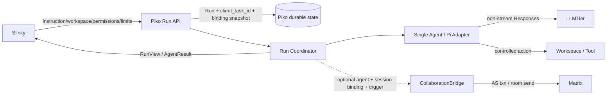
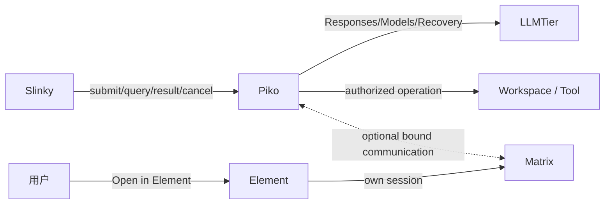
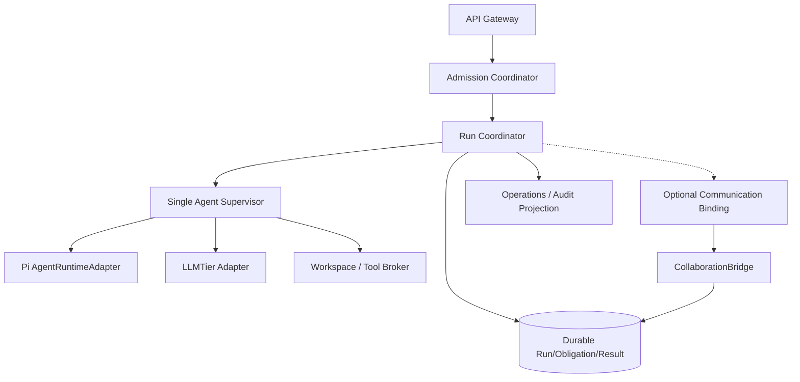
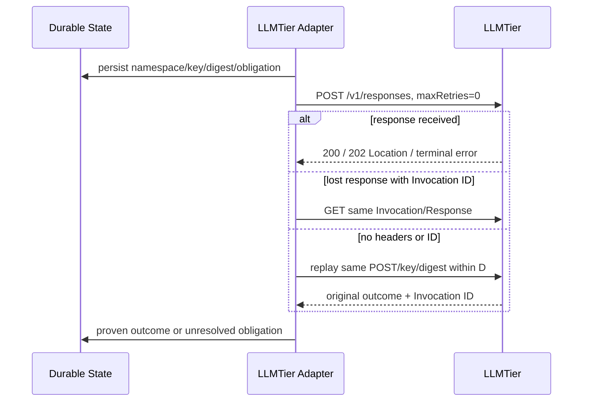
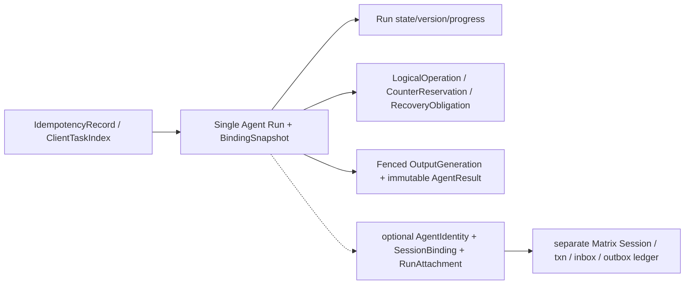

<!-- STD_DOCUMENT_COVER_BEGIN -->
# Piko Agent Runtime 总体系统设计

| 文档字段 | 值 |
|---|---|
| Document ID | `piko-agent-runtime-design-v0.3` |
| Document Version | `0.4.0-draft.6` |
| Status | `In Review` |
| Project | `piko` |
| Authority | `piko` |
| Document Owner | Piko Architecture Owner |
| Authors | corezilla |
| Created Date | `2026-09-07` |
| Last Modified Date | `2026-09-16` |
| Template ID | `design.system` |
| Template Version | `4.0.0` |
| Template Conformance | `tailored` |
| Tailoring Reference | `piko-std-tailoring-v0.1` |
| Migration Map Reference | none |
| Repository | `corezilla/piko` |
| Canonical Path | `docs/20_system_design/piko-agent-runtime-design-v0.3.md` |
| Supersedes | `docs/99_reference/design/agent-runtime-service-design-v0.2.md` |
<!-- STD_DOCUMENT_COVER_END -->

| 设计属性 | 值 |
|---|---|
| Design Level | system |
| Domain | systems、software |
| Visibility | project |

本文是按 STD `design.system` 4.0.0 形成的系统设计候选，并纳入 Slinky
`slinky-piko-task-interface-proposal / 0.1.0-draft.1` 的轻量任务要求。该提案拟一次任务只运行一个
Agent，并替换现有重型 `/runs` 请求/结果；当前 Piko 已批准的 v0.2/v0.3 机器契约在一次性修订完成前
仍为现行字段 authority。二者冲突是公开 Gate，不是两条可同时激活的运行路径。
Document Status、评审结论和 Runtime Activation 是三个独立 Gate，当前运行激活为 `false`。

## 修订记录

| Document Version | Date | Change Summary | Reviewer/Approver |
|---|---|---|---|
| `0.3.0` | `2026-09-07` | 首次 STD 迁移 | 历史批准见 CP-01 |
| `0.3.1` | `2026-09-09` | draft.21 结构候选 | 待评审 |
| `0.4.0-draft.1` | `2026-09-15` | 按系统模板 4.0.0 重组用途、功能、流程、数据/接口与验收 | 待评审 |
| `0.4.0-draft.2` | `2026-09-15` | 纳入 Slinky 轻量单 Agent 任务提案，显式标出旧契约替换 Gate | 待评审 |
| `0.4.0-draft.3` | `2026-09-15` | 修正幂等重放顺序、输出冻结、调用计数及状态转换评审问题 | 待评审 |
| `0.4.0-draft.4` | `2026-09-16` | 冻结轻量Run、通信绑定、LLMTier deadline与finalization.1候选 | 待评审 |
| `0.4.0-draft.5` | `2026-09-16` | 修正deadline停止策略、顶层binding、dispatch tuple、产品消息wire及release/drain边界 | 待评审 |
| `0.4.0-draft.6` | `2026-09-16` | 固定digest-before-receipt与RetryableRejection保留顺序，记录LLMTier目标hash状态 | 待评审 |

## 目录、表目录与图目录

使用 Markdown 标题导航；正式图为 `FIG-2-1` 主路径、`FIG-3-1` 上下文、`FIG-5-1` 组成、
`FIG-6-1` Run 时序、`FIG-6-2` LLMTier 恢复和 `FIG-10-1` 耐久状态。评审时按实际渲染核对。

## 1. 文档说明

### 1.1 目的与读者

本文确定 Piko Agent Runtime 的系统组成、对外边界、一次单 Agent 任务的主路径、失败恢复和验收责任。
Slinky 负责装配 instruction、工作目录、模型等级、权限和限制，并以多次任务调用组织团队；Piko
负责单任务的可靠执行、资源收口、实际产物摘要和执行结果。实现者、测试与 Operator 据此核对
契约替换、部署前提及真实证据。

### 1.2 范围、非目标与设计层级

Piko 是独立软件服务；轻量任务范围包含四项 Run API、admission、单 AgentSession、Pi/LLMTier/
Tool/Workspace adapters、durable state、可选通信绑定和只读状态/审计。Piko 不接受 participant IR
列表、不组建 Team、不解析 STD/Context Manifest，也不判断 Stage/Gate/Artifact 接受。
已有内建 CollaborationBridge 收敛为 Piko communication provider；旧
`collaboration_contract` 原子建 Session 已由 `agent_binding_ref`、`session_binding_ref`、version 与
可选 `communication_trigger` 一次性替换。CollaborationBridge 详细协议由
`docs/20_system_design/mechanisms/piko-collaboration-bridge-design-v0.3.md` 负责，内部实现由
`docs/30_subsystem_design/piko-collaboration-bridge-internal-design-v0.3.md` 负责。
Slinky 保有 Project/Plan/IR/Team/STD/Prompt/Artifact/Acceptance authority；LLMTier 保有 Registry、
provider 与最终 admission；Matrix/Element 保有通信与用户会话事实，Piko 不复制它们的 authority。

### 1.3 参考资料与术语

| 来源 | 用途与 authority |
|---|---|
| `interfaces/openapi/agent-runtime-openapi-v0.3.yaml`、v0.3 Schema/error/fixture | V0.3 finalization唯一机器候选；旧v0.2/heavy及旧Matrix Session-owner surface已删除 |
| Slinky `slinky-piko-task-interface-proposal` 0.1.0-draft.1（2026-09-15） | 轻量单 Agent需求输入；已由Piko finalization机器候选承接 |
| `docs/60_interfaces/contracts/piko-agent-runtime-contract-v0.3.md` | 契约边界与机器文件索引 |
| `docs/10_requirements/piko-requirements-traceability-v0.3.md` | Requirement/Contract/Test 追踪 |
| `docs/70_verification/` | V&V 和 case/oracle，不是运行结果 |

`Run` 是一次受约束的单 Agent 耐久执行；`client_task_id` 由 Slinky 在 Client 内赋予唯一业务关联。
`Obligation` 是确认后必须跨重启完成或澄清的外部副作用责任；内部未知结果在轻量外部 RunView
中表现为非终态 `RecoveryRequired`，不能推断为失败并自动重做。

### 1.4 适用 profile 与章节裁剪

选用 `software-system`：Piko 不拥有板卡、电气、FPGA、热或制造设计。§1–6、§8、§10–14、
§17–18 和安全 §15 适用；§7、§9、§16 仅保留不适用依据及外部资源边界。没有 Piko 自有 UI，
§8.4 说明 API 与 Element ExternalLink，不新增页面。旧 `TAIL-P-001` 针对旧 14 章结构；
本次新版章节裁剪还需 Piko Owner 评审，批准前不视为已生效 tailoring。

### 1.5 适用基线、视图状态与证据规则

| Baseline | 范围 | 实现 | 验证 |
|---|---|---|---|
| `P-CURRENT-01` | 当前仓库文档、机器契约、validator、mock capture | 静态 artifact 存在；生产服务未实现 | 静态校验可复现；真实依赖 `NOT_RUN` |
| `P-LITE-CANDIDATE` | 单 Agent `/runs`、communication provider与LLMTier Scope B | Design-defined candidate | 机器契约/静态fixture已定义；运行证据 `NOT_RUN` |

所有下述图默认是 `P-LITE-CANDIDATE / Target / Proposed / NOT_RUN`。文档批准不证明吞吐、延迟、HA、
Matrix 或 LLMTier 真实运行；mock capture、估算和 Verified 必须分开。

### 1.6 设计约束与关键假设

保留：唯一模型调用路径是 `Slinky → Piko → LLMTier → Provider`，不得 Provider-direct。
轻量提案要求一次 Run 只运行一个 Agent；Piko 校验并固定 workspace/tool/agent/model 绑定，
不替换 Slinky 的团队/IR 分配、不提高 service level、不扩张 Tool scope 或跟随 `latest`。
模型 ID 原样取自 LLMTier `/v1/models`，
不 lowercase、alias 或跨等级 fallback。CollaborationBridge 首版只用 AS virtual user、
private/exclusive/non-federated/non-encrypted room 与 Element ExternalLink。DB/HA、Pi hook 实测、
Matrix/Element 版本、Workspace/Tool 受控 profile、容量/SLO 是明确未决项，不是默认前提已满足。

## 2. 系统概览（必需，1–2 页）

Slinky 把已经装配好的 instruction、授权 workspace、exact 模型等级、工具权限、执行限制和预期
输出路径交给 Piko。一次 Run 只运行一个 Agent；作者、Reviewer、专家或项目经理各自是 Slinky
组织的不同任务。Piko 不解析 IR、Team、Stage、STD 文档结构或业务接受条件；它只保证同一任务
被可靠受理、执行、停止和取回结果。缺少该边界时，网络重试可能重复执行工具操作，而 Agent 的
总结也可能被误读为文档或软件已被 Slinky 接受。

代表性路径是 `POST /runs`：Piko 验证 Client、原请求摘要、`client_task_id` 唯一性、workspace/
tool/agent 绑定、路径和三项限制，在受理事务中固定版本、Run 和资源占用，然后返回稳定受理回执。
唯一 Pi adapter 在授权目录内运行一个 AgentSession，generation 只用 LLMTier non-stream Responses。
Piko 通过 `GET /runs/{id}` 给出状态；进入 Completed/Failed/Cancelled 且结果已持久化后，
`GET /runs/{id}/result` 返回不可变 AgentResult，包括总结、实际输出文件的 path/hash/size、
usage 与执行记录引用。这里的 Completed 只表示 Agent 执行正常结束，不代表 Slinky 接受成果。
取消请求只持久化停止意图；当停止/清理结果不明时 Run 保持非终态 RecoveryRequired，不能伪造
Cancelled 或释放仍可能写入的 workspace。



*FIG-2-1｜轻量定型主路径；`P-LITE-FINALIZATION / Target / Proposed / NOT_RUN`。实线是单任务必需
逻辑交接，虚线是已由 V0.3 机器契约冻结、但尚未实现验证的可选通信绑定；外部系统各保留自己的 authority。*

系统由 Run API/Admission、Run Coordinator、单 Agent Supervisor、受限 adapters、Durable State、
可选通信绑定和只读 Operations/Audit 组成。关键取舍是单一 Pi path、先落盘后外呼，以及固定绑定
快照而不是从 instruction 提升权限。提案保留 `/agent-runtime/v1/runs` 路径，但要一次性替换旧
Request/Result/Run 状态机器定义；旧团队字段、Result version/reconcile 和任务级 SSE 不作为
兼容分支。`agent_binding_ref` 保持稳定身份含义；可选 `session_binding_ref + expected version` 表达
Slinky 授权的 exact Session/room，`communication_trigger` 表达可信调度事实，Piko 原子生成单 Run
attachment。仓库当前只有文档、契约、validator 和局部 mock；无生产 API/DB/
homeserver/真实 Pi/LLMTier E2E，Runtime Activation 为 false。

## 3. 产品应用与设计目标

### 3.1 问题与业务背景

Slinky 负责把需求转为 IR/Work、装配 Prompt/STD 材料并组织多次单 Agent 任务；LLMTier 负责
模型服务最终 admission 和 provider routing。Piko 只负责一次任务的执行安全与结果事实。
轻量接口已经形成唯一V0.3 finalization机器候选并一次性取代旧重型wire；它仍不是已运行能力。

### 3.2 用户与使用场景

| 场景 | 触发/前提 | 结果或失败出口 | 验证承接 |
|---|---|---|---|
| 正常执行 | Slinky 提交 instruction/workspace/model/permissions/limits | 一个 Run/Agent、状态与不可变 AgentResult；检查不合格不受理 | PIKO-V03-FIN-001 + Schema fixture |
| 并发重复 | 同 Client/key/body 重复或换 key 复用 client_task_id | 前者同一受理回执，后者冲突；不建第二 Run | PIKO-V03-FIN-002 |
| 丢响应/重启 | Piko 或 LLMTier 已可能受理原操作 | 原 POST/key 与 durable obligation 恢复；未知不盲重派 | LT-R-001、PIKO-V03-FIN-002/003 |
| 取消/到限 | 单向 cancel 或三类硬限制触发 | 停止新业务，收口后才确定终态/释放；不明则 RecoveryRequired | PIKO-V03-FIN-006/008 |
| 多 Agent 工作 | Slinky 分别派发作者、Reviewer、专家任务 | Piko 不聚合 Team 结论或判业务接受 | 旧 V03-E2E-097..099 需按通信机制重分配 |
| 资源不足 | 绑定、容量或依赖条件不满足 | typed reject/backpressure，不部分启动或降级模型 | error catalog + negative fixtures |

### 3.3 应用环境与系统边界

目标部署包括受控 Piko API、worker/lease、durable store、Secret provider、LLMTier Data Plane
和受控 Workspace/Tool backend。若提供已绑定 Agent 通信，Piko 的独立 Bridge 还需要 Matrix
homeserver/AS 与 Element Web；没有 `agent_binding_ref` 时不得为普通任务强建协作 Session。
实际主机、容器、DB、网络策略与 HA 故障域待选型。Slinky 按授权 Client 调 Piko；用户在
Element 使用自己的 Matrix session，Piko 不代理登录。



*FIG-3-1｜逻辑应用上下文；`P-LITE-CANDIDATE / Target / Proposed / NOT_RUN`。Piko 方框是本系统边界，
外部用户会话、Provider 和 Project truth 不属于 Piko；箭头标出调用或数据方向，不表示物理布线。*

### 3.4 设计目标与成功条件

| 质量场景 | 可测判定 | 当前证据 |
|---|---|---|
| 幂等受理 | 同 Client/endpoint/key/body 重放只建立一个 Run；`client_task_id` 不得换 key 重派 | transaction/crash `NOT_RUN` |
| 丢响应恢复 | lost response 复用 key/digest/Invocation，UnknownOutcome 不盲重派 | mock partial，真实依赖 `NOT_RUN` |
| 停止与释放 | cancel/到限先停新业务；不能证明安全停止时保持 RecoveryRequired，不能误报 execution_released | 真实依赖 `NOT_RUN` |
| 结果真实 | 仅正常终态返回 AgentResult；output path/hash/size 由 Piko 测得，Completed 不等于业务接受 | 新结果 fixture `NOT_RUN` |
| 隔离 | 跨 Client 不能枚举 Run/Result/credential；路径不能越过授权 workspace | Security E2E `NOT_RUN` |
| 单写者 | failover 旧 fencing token 禁写，新 writer 继续原 obligation | DB/failover `NOT_RUN` |
| 禁止降级 | unsupported version/surface/policy typed fail closed，无第二路径 | 静态契约 partial |

延迟、吞吐、RPO/RTO 和容量没有可发布阈值；`OG-AR-005` 需先冻结 workload、拓扑和测量口径。

## 4. 功能与需求实现概览

### 4.1 功能总表

| 轻量候选功能 | 输入→主要规则→输出 | 实现/验证 | 验收要点 |
|---|---|---|---|
| 提交/受理 | instruction、workspace、exact tier、权限、限制→校验并固定绑定→202 RunView | Proposed / NOT_RUN | 一个 Client/key/body 和 client_task_id 只建一个 Run；无部分副作用 |
| 状态查询 | Client+run_id→scope 与当前版本→RunView | Proposed / NOT_RUN | Queued/Running/Stopping/RecoveryRequired/正常终态准确可见 |
| 结果查询 | 正常终态→可信计算文件 hash/size 和 usage→不可变 AgentResult | Proposed / NOT_RUN | 非终态 409；Completed 不等于 Slinky 接受 |
| 取消 | Client+run_id+key→持久停止意图→202 原回执 | Proposed / NOT_RUN | 同 key 不变；不以计时器伪造 Cancelled/释放 |
| 单 Agent 执行 | 固定 Pi/workspace/tool/model binding→受限执行 | Proposed / NOT_RUN | 无团队组建、Provider-direct、Chat/SSE 或权限提升 |
| 外部恢复 | 原 task/key、LLMTier Invocation、Tool obligation→查询/对账 | Planned / mock partial | 未知进入 RecoveryRequired，不建立第二操作 |
| 可选通信 | agent identity + exact Session binding + trigger→Run attachment/wakeup fence | Finalization candidate / NOT_RUN | 不把旧 `collaboration_contract` 保留为并行 Run 入口 |

### 4.2 功能详细说明

提交校验分两段，顺序是契约的一部分：先认证 Client、限制请求字节数、解析 JSON、取得
`Idempotency-Key` 并计算 RFC8785 JCS body digest，再查询 durable idempotency ledger。
若同 namespace/key 已存在，先比较digest；不同 digest 返回 IdempotencyConflict。相同digest且记录为
AcceptedRun才返回首次记录的 202 回执，不重新检查当前 deadline、binding readiness、容量或队列；
RetryableRejection按其CAS重评条件处理，不能当成receipt。这样，原任务过期、配置变化
或当前过载都不能把已受理重放误当首次请求。只有 ledger 未命中时，才执行未知字段/Schema、
`client_task_id` 唯一性、未来 `deadline_at`、模型等级、workspace/tool/agent binding、相对路径、
limits、容量和依赖检查。已存在同 client_task_id 但 key 不同，返回 ClientTaskConflict。

`instruction` 是任务内容，不是权限来源；read/write paths 必须在实际工具操作时再次验证，符号
链接解析后也不能超出 workspace 与授权目录。绑定在首次受理时解析并固定实际版本。成功在单个
durable 事务中写 idempotency record、原始 202 回执、request digest、ClientTaskIndex、Run、资源
占用和 binding snapshot；提交前无 Pi/模型/工具外呼。认证和请求可解析性仍先于 ledger 读取，
避免跨 Client 枚举或用畸形载荷探测历史记录。

每次新的逻辑模型或工具调用在外呼前，须在同一 durable transaction 中分配稳定
`logical_operation_id`、检查并占用对应剩余额度、递增已用计数并写 request digest、dispatch intent
和 recovery obligation。额度不足时不创建 intent、不外呼。崩溃恢复、transport retry、LLMTier
Invocation/Response GET 或工具结果查询复用原 logical_operation_id/key/digest，不再次占用额度；
同一 intent 最多产生一次可证明的新 dispatch。若外部工具不能提供幂等 key、状态查询或其它可证明
的对账机制，响应丢失后该 obligation 进入 RecoveryRequired，禁止再次执行该工具调用。

`deadline_at` 从提交时起含
排队、执行与工具等待；达到时间或 model/tool limit 时停止新业务。`stop_grace_seconds` 只用于
停止与对账，不授权额外业务步骤。无法证明旧任务不会再写入/唤醒时，Run 保持 RecoveryRequired
且 `execution_released=false`。Result 发布前必须关闭 Agent 的新工具/模型入口，撤销或 fencing
其 workspace 写能力，并等待所有已准许写操作得到完成或未知结论；未知写入不得发布终态 Result。
随后 Piko 从同一稳定 workspace generation 读取实际输出，计算 path/SHA-256/size，并把 generation、
清单和 AgentResult 原子持久化。Result 发布后旧 Agent/Tool writer 不得再改变该 generation。
非写入清理仍可使 Completed 与 `execution_released=false` 并存，但不能包含任何可能改变 Result
所引用输出的任务写入。缺失的预期输出不伪造，由 Slinky 检验内容和接受。

旧 AR-001..007 与 V03-E2E-085..099 保留为 provenance，不作为新字段定义。团队的全员立场、分歧
决议与用户 Decision 由 Slinky 多次任务及其业务记录承接；Piko 轻量 AgentResult 只含单任务总结
和产物事实。通信采用两层绑定：Piko拥有稳定 Agent identity；Slinky拥有Session/room授权，Piko
保存核验投影并为每个Run生成attachment。Slinky提供目录、Element descriptor与业务close；Piko
只提供identity、AS ingress/delivery、revoke/drain/release evidence。

### 4.3 需求追溯

现行 `AR-001..007` 的 requirement→design→contract→case 仍由
`docs/10_requirements/piko-requirements-traceability-v0.3.md` 记录，机器 authority 仍由
`docs/60_interfaces/contracts/piko-agent-runtime-contract-v0.3.md` 索引。轻量提案与旧 ID 的保留、
拆分或废止须在一次性 Contract Amendment 中逐项映射；§14 的新候选场景不得冒充旧测试已通过。

## 5. 总体结构

### 5.1 系统功能框图



*FIG-5-1｜候选一级组成；`P-LITE-CANDIDATE / Target / Proposed / NOT_RUN`。虚线绑定尚待契约
对齐；Durable State 持有 Run truth，外部 adapter 不反向拥有 Run。*

### 5.2 组成与职责

API 做认证、Client scope、严格 Schema、key/body digest；Admission 原子建立 Run、client_task_id
唯一索引和固定 binding snapshot；Run Coordinator 是状态、停止意图、obligation 与不可变 Result
的单写者；Single Agent Supervisor 每 Run 最多持有一个 Pi AgentSession；LLMTier Adapter 只消费
exact service level 与显式 recovery；Workspace/Tool Broker 检查真实路径、工具 profile 和限制。
可选通信绑定只引用既有配置；Bridge 持有 Matrix identity/room/delivery，不能把聊天消息直接
转成新的任务唤醒。Operations/Audit 为只读投影，不反向修改执行事实。

### 5.3 物理与逻辑对应关系

目标逻辑角色为 API、Run worker、durable store、Secret provider、metrics/audit；通信启用时另有
delivery worker。是否
同进程、同节点或多实例未冻结；本图不是部署图。Matrix、Element、LLMTier 和 Tool/Workspace
backend 是外部故障域。多 writer 必须共享同一 store/namespace，用 lease/fencing 和唯一约束阻止
双写。数据库、备份、RPO/RTO 与 migration 是 `OG-AR-001`。

## 6. 工作模式与端到端流程

### 6.1 工作模式矩阵

| 系统模式 | 新 admission | 已确认 obligation | 对外结果 |
|---|---|---|---|
| Ready | 逐项权限、绑定、限制检查后允许 | 正常推进 | RunView/AgentResult |
| Degraded | 受影响 capability 阻断 | 安全可继续的原义务继续 | typed blocker/readiness，无备用路径 |
| 服务 Draining/Shutdown | 停止 | 先 drain，不删除 | readiness 与未结 obligation；Session 自身 close 另见 §11.3 |
| Recovery | exact scope Ready 前停止 | 原 identity/key/txn 查询与继续 | 已证实终态或非终态 RecoveryRequired |

系统模式不代替 Run/Session wire enum。轻量 RunView 的 `RecoveryRequired` 与现行 AgentRun
的 `UnknownOutcome` 不同；SessionSummary/CloseResult 的 `PIKO-CON-B01` 也仍开放，不能在
冲突 enum 上生成两套解释。

### 6.2 正常数据流

```mermaid
sequenceDiagram
    participant S as Slinky Runtime
    participant A as Piko API/Admission
    participant D as Durable State
    participant R as Run Coordinator
    participant P as Single Agent/Pi
    participant L as LLMTier
    S->>A: POST /runs + task/instruction + top-level binding refs + limits + key
    A->>A: auth/schema/JCS digest/unique task/path/limits
    A->>D: atomic Run + task index + binding snapshot + occupancy
    D-->>A: committed Run + original 202 receipt
    A-->>S: 202 RunView
    R->>P: one bounded AgentSession
    P->>D: persist external obligation
    P->>L: non-stream Responses, exact model/key
    L-->>P: canonical outcome or recovery ref
    R->>D: stop/reconcile; calculate output hash/usage; persist AgentResult
    S->>A: GET RunView / result
    A-->>S: current state / immutable AgentResult
```

*FIG-6-1｜一次 Run 主时序；`P-LITE-CANDIDATE / Target / Proposed / NOT_RUN`。外呼前必须有 durable
identity/obligation；API accepted 不等于执行成功。*

### 6.3 异常、过载与恢复流程

本地校验失败不提交 Run 或占用。Run 受理回执丢失且无 run_id 时，Slinky 在保留窗口内用原
`Idempotency-Key` 与原 JSON body 重放 POST；取得 run_id 后只读 GET，不用新 key 建第二任务。
LLMTier 响应丢失且已有 Invocation ID 时，adapter 先
GET Invocation/Response；连响应头也没有时，在产品恢复截止 `D=24h` 内以原 canonical
client/source、endpoint/version、Idempotency-Key、digest 和语义 headers 重放同一 POST，取得原
Invocation 的 200/202/terminal outcome 后再查询。`maxRetries=0` 只关闭 stock SDK 隐式重试，
不关闭 Piko 显式 recovery。未知远端结果不生成新 key 或新 Run，也不盲重派；Run 对外进入
RecoveryRequired 并保留未解 obligation。



*FIG-6-2｜LLMTier lost-response；`P-LITE-CANDIDATE / Target / Proposed / NOT_RUN`。M2-C 窗口
`W=168h`、margin `M=24h`、Piko deadline `D=24h` 均为协议设计约束，不是实测。*

dispatch oracle 必须绑定故障点：首次 Backend dispatch 已证实时总数保持 1、replay 新增 0；仅证明
Invocation durable record 已落盘而尚未 dispatch 时，原 Invocation 可从 0 合法推进到最多 1，
replay 不建额外 intent；dispatch 前拒绝/取消则最终为 0。不能把“已持久化”当“已调用一次”。
Tool/Workspace/Matrix 的未知结果保留各自原 obligation，按正式机制对账。过载阻断新
admission 并保留 backlog，阈值尚待选型。轻量任务去重/结果保留提案是
`max(deadline_at, accepted_at)+7 天`，不得与 LLMTier 的 `W=168h` 混为同一计时起点；
窗口、隐私、超期 410/404 和活动义务不可删除需要 Piko 单独确认。

### 6.4 模式切换与状态迁移

轻量外部 RunView 的完整候选转换为：`Queued → Running`；Queued 可在确认尚未执行时转
Cancelled，也可因启动条件已确定失败而转 Failed；Running 可转 Completed、Failed、Stopping 或
RecoveryRequired；Stopping 可转 Cancelled、Failed 或 RecoveryRequired；RecoveryRequired 可在
原执行可安全恢复且授权仍有效时回 Running，在已有取消/到限意图时转 Stopping，也可凭新 Evidence
直接收敛为 Completed、Failed 或 Cancelled。它不是终态。

仅用户取消且停止事实已证实时使用 Cancelled。`deadline_at`、ModelCallLimit 或 ToolCallLimit 到达后，
即使安全停止，最终也必须是 Failed，并分别使用 DeadlineExceeded、ModelCallLimit 或 ToolCallLimit；
不得写成 Cancelled。已持久化取消或到限意图后不得恢复新的业务调用。迟到取消不能覆盖已持久化
Completed/Failed。终态只包含 Completed、Failed、Cancelled，且 `result_available=true`；
`execution_released` 独立表示旧任务不能再唤醒或执行任何任务动作，且 Piko 占用已释放。
Result 发布前必须先完成 §4.2 的输出写 fencing；因此 Completed 且 execution_released=false 只允许
等待不会改变输出的通信归档、审计或其它非任务写入清理。Shutdown 停止新受理并安全收口；restart
取新 lease/fencing、校验 binding/credential 后恢复原 Run 与 obligation。
RunView 还须给出 `state_version`、accepted/started/finished 时间、`result_available`、
`progress`、`recovery`、`recoverable_until` 和无 Secret 的 `resolved_bindings_ref`。progress 只作诊断；
RecoveryRequired 必须提供 reason_code、unresolved_refs 与 Wait/OperatorAction 建议。状态或释放事实
改变时版本单调；任何对外可见 progress 或 recovery 内容变化也必须递增 `state_version`。
`recoverable_until` 在运行中不能缩短。这些字段已由 `agent-runtime-v0.3.schema.json` 的
`0.3.0-finalization.3` 候选冻结；实现证据仍为 NOT_RUN。

## 7. 硬件实现方案

不适用：Piko 不拥有板卡、器件、电气、时钟或机箱设计；此为待本次 tailoring review 确认的
`software-system` 条件分支。外部主机、存储、网络的资源与故障边界仍在 §5.3、§8.6、§12–13。

## 8. 软件实现方案

### 8.1 软件架构

orchestration 依赖 port，再由 adapter 实现；Pi/LLMTier/Matrix SDK 不能直接写 Run terminal 或
绕过 admission。Run Coordinator 持有单任务状态、停止意图和 Result；独立 CollaborationBridge
持有 identity/session/message ledger。可选 `agent_binding_ref` 必须解析已存在且获授权的绑定，
不能把消息自动解释为新任务、Team decision 或权限变化。

### 8.2 模块设计与代码映射

当前仅有 `interfaces/`、`tests/contract/` 和独立 `upstream/pi/` 参考源码；尚无生产 API、worker、
DB migration 或 adapter package。轻量候选模块为 Run API/Admission、Run Coordinator、单 Agent
Supervisor、Pi/LLMTier Adapters、Workspace/Tool Broker、Binding Resolver、Durable State 和
Operations/Audit。已有 CollaborationBridge 为独立机制；具体类/文件归属在下级设计决定，
不把目标模块表当作已实现代码。

### 8.3 通信、配置与状态管理

轻量 `POST /runs` 与 `POST /runs/{id}:cancel` 均使用 Idempotency-Key；`X-Request-ID` 只做
HTTP 关联。取消是针对 exact run_id 的单向停止命令，提案不要求 If-Match，同 key 重放原取消回执；
配置 mutation 仍依各自强 ETag/If-Match。读请求先校验 Client scope 再判断资源存在。
Secret 只按 binding ref 在 Piko Secret boundary 解析；`resolved_bindings_ref` 是无 Secret 的固定
版本快照引用。RunView `state_version` 单调；终态 AgentResult 与其 `output_generation_id` 不可变。
Run、ClientTaskIndex、幂等回执、CounterReservation、LogicalOperation、dispatch intent、recovery
obligation、OutputGeneration manifest 和 AgentResult 都必须进入 durable truth；已确认 obligation 跨
crash 恢复。Run worker 和 workspace writer 分别使用 lease/fencing，旧 generation 的写权限在 Result
发布前撤销。DB 与 migration 未选型，进程内 Map 不能充当 durable truth。

### 8.4 页面与交互（如适用）

Piko 轻量任务无自有图形页面，也无任务级聊天历史 API。Slinky 用 RunView 显示状态和只作诊断的
progress，用 AgentResult 显示总结与输出，再自行检查/接受。已有独立 Session 的 Slinky View 可
通过 exact `element-view` 打开 Element；descriptor 仍为 `ExternalLink + UserMatrixSession`，无
iframe、token URL、代理登录、thread locator 或 transcript copy。任务如何关联 Session 待 Gate。

### 8.5 软件可靠性与开发平台

Pi 上游 commit `9767ba275f3e9a5ee0f5c5342249b629ab1b2282`；候选依赖
`@earendil-works/pi-coding-agent@0.85.1`、`@earendil-works/pi-ai@0.85.1`、`openai@6.40.0`。
这是 adapter 实测前置，不是已验证兼容。外部 timeout/retry 由 owning adapter 与 durable obligation
管理，不能由 SDK 默认重试暗中建立第二 logical identity。

### 8.6 部署与运行环境

基础任务部署需要 Piko API/worker、durable DB、Secret provider、日志/metrics/audit、LLMTier Data
Plane 和受控 Tool/Workspace backend。若启用独立通信绑定，还需 Matrix homeserver/AS 与 Element；
AS registration、exclusive namespace 和 token 由 Operator 预配置，仅 credential_binding_ref
进入 Profile API。不可把通信依赖变成无绑定普通任务的隐式强制前提。
生产 OS/container/DB/HA/backup/RPO/RTO 未冻结；启用前须证明 writer failover 后旧 fencing token
禁写、新 writer 从同一 ledger 续办且 retention 不因升级提前消失。部署存储必须支持：首次受理的
ledger 写入原子性、调用额度占用与 dispatch intent 原子性、稳定 OutputGeneration manifest 与
AgentResult 原子发布；否则相应能力保持未激活。

## 9. 可编程逻辑与专用处理单元

不适用：Piko 不设计 FPGA/ASIC/DPU/GPU 数据面。模型由 LLMTier 选择 Provider/Local Deployment；
Piko 不消费 physical provider/account/pool/capacity group。外购加速器是外部环境事实，不变成 Piko 责任。

## 10. 数据、描述符与存储结构

### 10.1 业务数据流

轻量请求的 `instruction` 与 workspace 材料进入一个 Run/AgentSession；可信 runtime 固定 binding、
计数限制和停止事实，并形成 AgentResult。Piko 只从已 fencing 的稳定 workspace generation 记录
实际输出文件的相对路径、SHA-256、字节大小；
`output_paths` 是预期位置，不是内容验收或额外写权限。summary 只是 Agent 最终答复。
Team 分歧、Expert/PM Work、用户 Decision、Plan change 与 Artifact acceptance 由 Slinky 组织。
旧 `CollaborationResolutionSummary` 不写入轻量 AgentResult，后续如何保留团队 Evidence 由 Slinky
接口修订决定；不得同时发布旧重型 Result 与新 AgentResult。

### 10.2 描述符与元数据流

任务查询按 authenticated `client_id + run_id` scope；`client_task_id` 是该 Client 下的唯一业务关联，
Piko 不解析其 IR/Work/Stage 含义。`resolved_bindings_ref` 指向固定配置版本；`execution_log_ref`
只指向授权执行记录，不强制暴露逐步推理。通信route使用`session_binding_ref + room_id +
agent_identity_ref + binding_version`，不凭display name。Slinky拥有Project Session/Topic目录和
Element descriptor；Piko不返回多room目录或transcript。Run使用通信时由
`RunCommunicationAttachment`固定exact关联、trigger与wakeup epoch。

### 10.3 状态表、缓存与持久化



*FIG-10-1｜候选状态所有权；`P-LITE-CANDIDATE / Target / Proposed / NOT_RUN`。箭头为关联，
不是允许跨事务拆分的写入操作。字段/唯一键以机器契约与待定 DB migration 为准。*

提交去重 namespace 为 authenticated Client + endpoint + Idempotency-Key；digest 为 RFC8785 JCS
原 body 的 SHA-256。认证、载荷上限、JSON parse 和 digest 后先查 ledger：先比较digest；不同digest
冲突，只有同digest AcceptedRun才重放首次保存的202，不执行新的deadline/binding/capacity admission；
RetryableRejection不是receipt且只能按原record CAS重评。
ClientTaskIndex 保证
`(client_id,client_task_id)` 至多一个 Run，换 key 不得重复创建。取消命令拥有自己的 key/原回执。
模型/工具调用计数以 durable CounterReservation 和稳定 logical_operation_id 为准；恢复不重复占用。
状态版本单调；AgentResult 与其 OutputGeneration 一经发布不可改写，后续写入只能进入新一代且
不得由旧 Run 发起。RecoveryObligation
在结果可证明前不删除，活动/未知 Run 不因保留期到达而删。独立 Matrix ledger 仍有 AS txn/event
dedup、outbound txn、identity/session projection、rename audit 与私有 delivery checkpoint；Slinky的
Session-room authority不复制成Piko目录。
缓存和只读 projection 可滞后，不能覆写 canonical ledger。

### 10.4 容量与带宽计算

每个 Running Run 最多一个 Pi AgentSession；Piko 内部执行占用及释放必须可证明，但提案不要求向
Slinky 暴露旧 AgentSlot/SlotSnapshot。Piko 不复制 LLMTier Capacity Group 或最终 admission。
DB、worker、outbox 预算目前 Unknown，须按 workload、并行 Run、模型/工具调用率、retention 和
backlog 计算；
资源不足 typed backpressure 并保留已确认 obligation。没有 measured latency/throughput 声明。

## 11. 接口与通信协议

### 11.1 接口总表

| 边界 | Piko 用途 | 字段 authority | 失败行为 |
|---|---|---|---|
| Slinky→Piko 轻量 Run | POST runs、GET RunView、GET result、POST cancel | Piko V0.3 OpenAPI/Schema `0.3.0-finalization.3` | auth、idempotency、scope、path/limit、RecoveryRequired |
| Slinky→Piko 通信控制 | Profile、Agent identity、Session binding projection、revoke、drain | Piko V0.3 OpenAPI/Schema；Slinky拥有Session/Topic/View/close | version/mismatch/revoking/recovery |
| Piko→LLMTier | Responses non-stream、Models、Invocation/Response GET | LLMTier Piko-facing contract | 202 active、terminal typed error、UnknownOutcome |
| Piko↔Matrix | AS push txn、membership/room/send txn | Matrix AS/Client API + Piko binding | replay、membership/recovery blocker |
| Piko→Workspace/Tool | exact lease/binding/capability/approval | materialized descriptor 待对齐 | path/egress/approval fail closed |

### 11.2 数据面接口

Generation 只用 LLMTier `/v1/responses` non-stream；exact-case 模型 ID 来自 `GET /v1/models`。
Responses 200 是 canonical Response；202 进入显式 recovery；terminal non-2xx 不能当可盲重试错误。
Embeddings 属 Knowledge/Memory consumer，不形成 Piko Agent generation 旁路；Chat/SSE 属 V0.4。
Tool/Workspace 只能按物化 scope 操作，不能 Provider-direct 或扩大 root/shell/network 权限。

轻量提交字段为 `client_task_id`、`instruction`、`workspace_ref`、exact `service_level_id`、
三个顶层必填且可空键`agent_binding_ref/session_binding_ref/expected_session_binding_version`、可空
`communication_trigger`、`permissions`
（read_paths/write_paths/tool_profile_ref）、`limits`
（deadline_at/max_model_calls/max_tool_calls/stop_grace_seconds）与 `output_paths`。契约要求未知字段
拒绝、instruction 最多 256 KiB UTF-8、路径单项 4096 bytes、每数组最多 256 项、ID 1–128
ASCII 字符；这些数值已落入机器Schema但仍不写成已实现检查。Model/tool calls
只计新 logical operation，幂等恢复不重复计数。旧嵌套`bindings`字段按unknown field拒绝，不保留
兼容解析。
`deadline_at` 必须是未来的 UTC RFC3339 `Z` 时间；max_model_calls 为 1–100000，max_tool_calls
为 0–100000，stop_grace_seconds 为 1–3600。Piko 若无法强制任何一个硬限制必须拒绝受理，
不能静默忽略。费用/token 作为结果统计，提案不授予模糊费用预算的执行权。

### 11.3 控制与管理接口

四项轻量 Run API 保持现有 `/agent-runtime/v1/runs` prefix，但替换旧 payload、Result、状态与取消
语义，不新增 `/runs-lite` 或兼容 alias。`GET /runs/{id}/result` 在未终态返回 409
RunNotTerminal；终态 Result 丢失返回 500 ResultUnavailable，不制造假结果；Result 使用强 ETag，
If-None-Match 可得 304。POST cancel 返回 202 原回执，停止事实由 GET RunView 观察。
AgentResult 的 reason_code 候选为 AgentFinished、ExecutionError、DeadlineExceeded、
ModelCallLimit、ToolCallLimit、UserCancelled；summary 可为空但不得代替文件 hash 或停止证明。
usage 的 model/tool calls 为实际非负计数，未知 token/cost 保持 null 而不是 0；输出文件缺失不
伪造记录。可见错误沿提案区分 InvalidRequest、IdempotencyConflict、ClientTaskConflict、
RunNotTerminal、UnsupportedServiceLevel、UnsupportedLimit、DeadlineExpired、CapacityUnavailable、
DependencyUnavailable、ResultUnavailable 与 Gone；精确 HTTP/Schema 已由V0.3 OpenAPI、Schema和error catalog定义。

模型调用的request/catalog effective deadline任一先于task deadline到达时，本Run固定为
Failed/ExecutionError并记录ModelRequestDeadlineExceeded或ServiceEffectiveDeadlineExceeded，停止新的
Agent/模型/工具步骤；task deadline本身对应Failed/DeadlineExceeded/TaskDeadlineExceeded。晚到模型成功
只作Evidence，不恢复Run。Operator singleton MatrixTransportProfile 管理homeserver、Element base URL和AS credential binding；
registration/token留在Secret boundary。Piko `AgentCommunicationIdentityBinding`拥有稳定MXID；
Slinky `SessionAgentBinding`由Piko保存带version/lease的核验投影。Piko提供幂等revoke、只读drain以及
exact binding的消息send/status/ingress fact操作，不提供Session list、
Element view或业务`:close`。rename只更新display profile，不换MXID/room/history。四项Run API仍是
唯一任务路径；通信控制不创建Run、Session、Topic或Slinky业务状态。发送前payload不含Matrix event/time；
Matrix受理后由Piko事件投影补齐。普通Matrix消息不自动变Run，只有Slinky显式dispatch可提交trigger。

### 11.4 观测、调试与维护接口

Operations/Audit 只读投影 scoped readiness、RunView、pending obligation 与关联标识，不形成第二
mutation path。提案不要求任务级 Event/SSE 或手工 reconcile API；旧相应 endpoint 必须在一次性
契约修订中决定去留，不能静默保留为 fallback。内部恢复只依据远端权威结果和原 key/txn。
V0.3不提供补偿、手工reconcile或任务事件导出入口；如未来需要须走新版本评审，不得作为隐藏管理员后门。现行字段以 `interfaces/` 为准。

## 12. 可靠性、维护与升级

### 12.1 故障模型与可靠性机制

API reject 不等于已受理 Run 的 execution outcome；外部 timeout 也不证明远端未执行。提交条件、
client_task_id 唯一索引、Run 与绑定快照在同一 admission 事务中固定；外呼前写 durable intent；
lease/fencing 排除旧 writer。取消或 deadline/limit 到达只停止新业务调用，旧模型/工具/任务消息
须完成停止或对账；宽限耗尽仍不能证明安全停止则 RecoveryRequired，`execution_released=false`。
Restart 先读 ledger 再查远端，不根据日志/summary 猜测。独立 Matrix AS 只在 event/dedup/delivery
obligation 原子落盘后 ACK；outbound retry 复用同一 txn_id。

### 12.2 状态指示、监控与故障定位

最小关联维度为 Client、client_task_id、request/key、Run、binding snapshot、Invocation、Tool
operation、可选 Session、obligation 和 fencing generation。监测 backlog、最老义务年龄、执行
占用、admission reject、replay、停止宽限耗尽、dependency readiness 和 redaction violation。
progress 只是诊断，不作完成判据。日志不写 instruction 全文、credential、
AS token、device key、checkpoint 或未授权 transcript；指标 label 不用原始高基数 ID。阈值待 `OG-AR-005`。

### 12.3 维护、升级与回滚

关闭停止新 admission、继续安全 drain；升级前确认 schema/contract/ledger 兼容，再切单一 writer。
无法满足时保持 capability 关闭，不恢复旧重型 Run path、Pi CLI/Provider-direct/外部 bridge。
回滚不能丢 obligation 或把 RecoveryRequired 归零。DB migration、旧新请求的原子切换、
存量 Run 收口、备份 RPO/RTO 与不可逆步骤需另行 ADR；没有批准双 wire 兼容期。

## 13. 性能、扩展与兼容性

### 13.1 性能模型与预算

预算取决于并发 Run × 单 AgentSession/模型/工具调用上限，加上 Run/Result/obligation 与可选
Matrix inbox/outbox retention。LLMTier M2-C `W=168h`、`M=24h`、Piko `D=24h` 是模型调用恢复约束；
轻量任务的 `max(deadline_at, accepted_at)+7 天` 是已定义的Piko恢复下限，与LLMTier窗口分离。
这些时间都不是吞吐实测。缺少 workload、DB/worker 拓扑和消息率，不能给可发布 p95、最大并发
或磁盘容量。

### 13.2 瓶颈与资源余量

Agent 执行占用、LLMTier 最终 admission、单写者事务、可选 outbox backlog 和 Tool/Workspace
资源均可能成为约束。无配额或结果未知时阻断新 admission/对应 action，不把 burst、空结果或
transport retry 当成余量。headroom 只在批准容量模型或同条件实测后给出。

### 13.3 扩容方案与兼容矩阵

多 worker 仍共享同一 store、idempotency namespace、client_task_id 唯一索引与 fencing，不建立
实例各自 truth。新轻量 OpenAPI/Schema、Pi、LLMTier 以及可选 Matrix AS/Element 版本需通过
正负 contract 和 restart matrix；不提供 alias、旧重型 Run 接口、ManagedUser、sync/poll、
Provider-direct、Chat/SSE 或 E2EE fallback。

## 14. 可测试性与验收设计

### 14.1 测试支持与观测点

Harness 应能固定 JCS digest、client_task_id、binding snapshot、execution_released、
output_generation_id、模型/工具 CounterReservation/logical_operation_id、external txn、lease
generation 和 fault point。Backend dispatch 计数由
LLMTier ledger 或受控 Backend 证明，不能只数客户端 POST。RunView/Result/可选 Session
查询、audit 与 ledger 一起构成 oracle；Secret 不入报告。当前静态 validator 只证明契约候选自洽。

### 14.2 测试数据源、自检与环回

V0.3 finalization OpenAPI/Schema/error/fixture 是新的L2设计基线；旧v0.2与Matrix增量文件仅作
superseded provenance，不装载为current contract。受控 LLMTier、DB crash/restart、Tool/Workspace sandbox 和
pinned Pi 是任务 L3 前提；可选通信绑定再加 Matrix AS/homeserver、Element browser。要在同一
logical request 的持久化/外呼边界注入超时、重复、取消与重启，检查 ledger/remote/输出三方一致。
当前没有生产自检/环回接口，不新增虚构入口。

### 14.3 验证与验收矩阵

| 轻量提案主题 | 设计位置 | 新候选 Case/Oracle | 当前证据 |
|---|---|---|---|
| 提交/去重 | §4/§6/§10–11 | 认证/解析后先查 ledger：同 key/body 在 deadline 已过、binding 变化或过载时仍返回原 202；不同 digest 冲突；ledger miss 才做当前 admission；换 key 同 client_task_id 冲突；无部分受理 | 新 Schema/fixture NOT_RUN |
| 状态/取消/释放 | §4/§6/§11–12 | 覆盖 Queued 启动/取消/启动失败、Running 完成/失败/停止/恢复、Stopping 三出口、RecoveryRequired 恢复/停止/凭 Evidence 收敛；deadline/两类 call limit 只得 Failed；迟到取消不覆盖终态；progress/recovery 变化递增版本 | 新状态机/故障测试 NOT_RUN |
| 不可变 Result | §4/§10–11 | 输出写入口先关闭并 fencing；已准许写完成后从稳定 generation 计算 hash/size；manifest+Result 原子提交；未知 writer 只得 RecoveryRequired；终态后旧 writer 不能改 generation；Completed+未释放只容许非输出清理 | 新 Schema/fixture NOT_RUN |
| 权限/限制 | §4/§8/§15 | 路径/符号链接逃逸、未知字段；调用前原子占额度+intent；占用前/后及 dispatch 前/后 crash；同 logical_operation_id 恢复不重复计数；无额度无 intent/dispatch；不可对账 Tool 丢响应进入 RecoveryRequired | 新安全/运行测试 NOT_RUN |
| 恢复/保留 | §6.3/§10/§13 | 原 POST 无 ID；LT-R-001 0/1 dispatch；7 天建议值与未知义务不可删除 | 旧 mock partial；新任务测试 NOT_RUN |
| 通信绑定 | §1/§8/§11 | 四种binding组合、trigger ingress延迟/缺失、同event多Agent、wakeup epoch、revoke/drain/release矩阵 | static fixtures；运行 NOT_RUN |

现行 `docs/70_verification/` 只对旧机器契约承担详细 case/oracle authority；轻量新 case 在
OpenAPI/Schema 与 V&V 一次性修订后才能编号。旧 V03-E2E ID 不删除或假称已覆盖新接口；
`NOT_RUN/BLOCKED` 不能记为 pass。

## 15. 信息安全架构

### 15.1 资产、入口与信任边界

资产包括 instruction/workspace 材料、Run/Result/输出文件、Tool/Workspace 权限、LLMTier/Matrix
credential、可选 room membership 与 audit。信任边界为 Slinky→Piko、Piko→Pi child/LLMTier/
Tool/Matrix，以及用户→Element。模型、Tool、Matrix 内容都是不可信输入，不赋予新 authority。

### 15.2 身份认证与授权

Bearer credential 是 Client identity authority；`X-Request-ID` 不能替代身份或幂等 key。
run_id 查询先检查 Client 再判断存在，跨 Client 与不存在统一 404。任务的有效权限是 Client
workspace binding、read/write paths、tool profile 与运行期实际路径检查的交集；instruction 不授予
权限。binding若存在须验证Client可用性；Session route由exact Session binding、MXID、room、version
决定，同名不合并。body中的`provider=SlinkyRuntime`不授予caller身份。

### 15.3 密钥、凭据与敏感数据

AS token/registration、device key、delivery checkpoint 和 LLMTier credential 仅在 Piko Secret
boundary/transport-owned store；任务请求不上传 Secret，RunView、AgentResult、binding ref、
日志与 Element descriptor 不返回 Secret。执行日志引用不得强制提供逐步推理内容。
轮换必须维持稳定 Matrix identity 和未结 obligation 可恢复，具体 key management/backup 待 Operator 选型。

### 15.4 控制面、管理面与调试面防护

任务 submit/cancel 分别鉴权、审计并用 Idempotency-Key；cancel 不要求 If-Match，但只记录单向
停止意图。Profile/Probe、Binding、close 等配置 mutation 继续采用各自 ETag/Idempotency-Key。
无 iframe/token URL/代理登录；调试不绕过 root/egress/approval guard，不接受未认证 AS transaction。

### 15.5 启动、升级、回滚与供应链信任

启动校验 schema、credential binding、dependency readiness 与 writer lease；若启用通信，还须校验
AS namespace 与 Matrix readiness。缺少必需条件阻断受影响 scope 的新 admission。Pi/SDK/OpenAI
依赖虽已 pin，真实平台兼容未实测；升级绑定 immutable build/
contract/dependency，rollback 不复活 provider-direct 或外部 bridge。

### 15.6 威胁、审计与安全验证

负例覆盖跨 Client 枚举、token 泄漏、path traversal/symlink escape、未声明 egress、
恶意 Tool/LLM/Matrix 内容、encrypted/federated room、AS replay、stale ETag、旧 fencing writer 和
descriptor unavailable；每项保留脱敏 request/expected error/audit。安全 E2E 当前 NOT_RUN。

## 16. 结构、热、工艺与安全设计

不适用：Piko 不交付机箱、PCB、供电、散热、制造或电磁兼容设计；此条件裁剪待 Owner 评审。
主机内存/存储、网络隔离、备份及故障域仍由 §8.6、§12–15 约束，不能以本节 N/A 免除。

## 17. 实现计划

| 阶段 | 交付 | 先决 Gate/完成判据 |
|---|---|---|
| 1 一次性任务契约替换 | 四项 API、轻量 Request/RunView/AgentResult/cancel、错误/保留/fixture、旧字段与 ID disposition | `PIKO-LITE-B01..04`；无双 wire、alias 或旧 Run fallback |
| 2 耐久内核 | Run/client_task_id/key/binding snapshot/Result/obligation store、lease/fencing | `OG-AR-001`；提交、取消、结果与 crash/failover test |
| 3 执行适配 | 单 Pi AgentSession、LLMTier recovery、Workspace/Tool broker、limits 与释放判定 | `OG-AR-002/003`；pinned capture、路径/计数/停止测试 |
| 4 可选通信对齐 | `agent_binding_ref` 与既有 Bridge 的 exact 绑定、停止唤醒边界、Session 独立生命周期 | `PIKO-LITE-B05`、`PIKO-CON-B01`、`OG-CB-001..007` |
| 5 发布 | scoped Run/Result/readiness、容量/保留与真实 E2E | `OG-AR-004/005`；独立 activation review |

这是设计依赖而非已批准排期；不建立临时 CLI、Provider-direct、外部 bridge 过渡路径。

## 18. 设计决策、风险与未决项

### 18.1 设计决策

| 决定 | Authority/来源 | 本文落实 | 状态 |
|---|---|---|---|
| Slinky 保有 Project/IR/Team/STD/Prompt/Acceptance；Piko 仅执行单任务 | Slinky 轻量提案 | §1–6/§10–11 | V0.3 finalization candidate已对齐 |
| LLMTier Registry exact-case、Scope B | Slinky/LLMTier | §4/§6/§11 | 冻结方向；adapter 实测开放 |
| Matrix AS virtual user；Slinky拥有room/Topic/View/close | 生命周期评审 | §1/§8/§11 与机制设计 | binding/trigger/revoke/drain已定型候选 |
| 先持久化再外呼、原 key/txn recovery | Piko 设计 | §6/§10/§12 | 目标方案；DB/HA ADR 开放 |

新重大选型必须单列 ADR；本文不追溯伪造旧 ADR，也不将作者建议变成外部决定。

### 18.2 风险、技术债与未决项

| ID | 影响 | Owner/关闭条件 |
|---|---|---|
| `PIKO-FIN-R01` | V0.3 finalization machine package尚待Slinky/llmtier定向review | 三方确认字段/消费；差异只修改唯一candidate，不保留旧wire |
| `PIKO-IMPL-G01` | 调用计数、停止、输出fencing、trigger/revoke/drain尚无运行证据 | Piko实现并通过fault/security/E2E；不能忽略限制 |
| `PIKO-IMPL-G02` | DB/HA/retention物理实现和migration未定 | Piko内部ADR/DDL；不得改变已冻结外部语义 |
| `OG-AR-001` | DB/migration/single-writer/HA/RPO/RTO 未选型 | Piko，ADR + fault injection |
| `OG-AR-002` | Pi hook/pinned SDK 真实 capture 缺失 | Piko，adapter matrix |
| `OG-AR-003` | Workspace/Tool descriptor 与受控 profile 未冻结 | Piko/Owner，接口与安全测试 |
| `OG-AR-004` | 7天语义已冻结但存储/隐私执行证据未完成 | Piko/Operator，retention enforcement + recovery test |
| `OG-AR-005` | workload、容量、backpressure、deployment/SLO 未测定 | Piko/Operator，预算与测量 |
| `OG-CB-001..007` | Matrix/Element/AS真实能力与故障恢复未验证 | V03 communication E2E；只影响activation，不改wire |

旧 `OG-AR-006` 仍引用过时模板来源，现从系统运行 Gate 中移除；模板 hash、候选 Review 与
promotion 由项目 lock/source manifest/review packet 管理。本文与V0.3 OpenAPI/Schema/字段使用表形成
唯一finalization candidate；旧v0.2/heavy与旧Matrix Session owner文件只作provenance，不生成runtime types。
