<!-- STD_DOCUMENT_COVER_BEGIN -->
# Piko Agent Runtime 总体系统设计

> STD 使用入口：[项目采用说明与标准导航](../../README.md#std-entry)

| 文档字段 | 值 |
|---|---|
| Document ID | `system-design` |
| Document Version | `0.11.1` |
| Status | `Approved` |
| Project | `piko` |
| Document Owner | Piko Architecture Owner |
| Last Modified Date | `2026-09-26` |
| Template ID | `design.software-system` |
| Template Version | `2.1.0` |
<!-- STD_DOCUMENT_COVER_END -->

## 1. 文档说明

Piko 仓库只有一份顶层软件设计：`system-design`（本文）。模板采用 `design.software-system` 1.0.0，纯软件项目顶层模式（无总体系统父稿）；项目 `parent_document_id` 为空。Template ID 记录在 cover 与 metadata，不允许把设计层级、依赖或目录层数填入 parent_document_id。

本文承担 Piko Agent Runtime V0.3 完整软件系统的设计，不充当子系统或模块说明。

### 1.1 设计位置与上级承接

| 设计位置 / 本对象 ID | 父对象 / 父 Document ID 或无父理由 | 固定输入 / Constraint ID | 承担范围 / 不承担范围 |
|---|---|---|---|
| `SW-P` · 软件系统 Piko Agent Runtime V0.3 · `system-design` · `design_level=system` · `domain=[software]` | 无父对象（纯软件项目顶层，无总体系统父稿） | PK-01..PK-12（见 `piko-requirements-traceability-v0.3`）；机器契约 `0.3.0-simplified.6` | 承担：四项 HTTP API、单 Agent execution slot、Task Store、Pi session 绑定、Matrix discussion adapter、Usage 聚合、稳定 Result、内部诊断与恢复。**不承担**：Slinky 业务流程、Memory authority、LLMTier Agent 状态、Matrix homeserver、工具自身业务语义、supervisor/Secret backend、跨系统 exactly-once、产品 Topic/SID/RID、非 SSE Responses fallback。下游：10 个直属模块（M000-M009），无 subsystem（详见 §3.1 + §3.6）。 |

## 2. 产品应用与设计目标

Piko 是 Pi 的薄任务外壳。一个 Piko 实例拥有一个独立 Agent；Slinky 将每个实例视为一个独立 Intelligent Role（IR），负责组织多个 IR、提供材料与角色、验收结果并决定下一步。Piko 在 Slinky 与 Pi 之间承担"任务事务层"职责：接收并校验已签名任务，持久化 `task_id`、Run 状态和恢复边界，把任务内容作为该 Run 的初始输入交给独立 Pi session，并把 Pi 的最终输出、已知动作、usage 与失败事实封装为稳定 Result 返回 Slinky。事务层不另造 Agent 目标管理、推理循环或"换一种方法"机制；这些执行内行为由 Pi 的 session、Agent loop、tool loop 和模型重试承担，Piko 只施加授权、deadline、预算和持久化边界。

### 2.1 场景、用户入口与外部环境

唯一调用方是已配置的 Slinky principal（一个 bearer credential 引用）。Slinky 通过四项 HTTP operation 提交任务并查询结果；Piko 通过 SSE responses 把每次模型调用交给 LLMTier，并通过 `matrix-js-sdk` Client-Server API 接收/发送 Matrix 房间讨论与附件。客户端、LLMTier、Matrix homeserver、Pi SDK 均为外部依赖；Piko 不重写它们。

### 2.1.1 代表用户场景与价值流

**用户**：Slinky 项目经理（也是 Piko 实例的唯一外部调用方）。**核心任务**：把 Slinky 任务组织中产生的、需要长期运行的 AI 任务交给一个独立 Agent 执行并取得结果。**痛点**：模型调用、工具循环、context 管理、断点恢复若由 Slinky 端重复实现会与 Pi upstream 升级路径持续脱节，且与 Slinky 的项目流程语义纠缠。**价值**：Slinky 只负责"派一个 Run、读一个 Result"，Piko 把模型执行 + 状态持久化 + 故障恢复封装为稳定的 Run 事务。

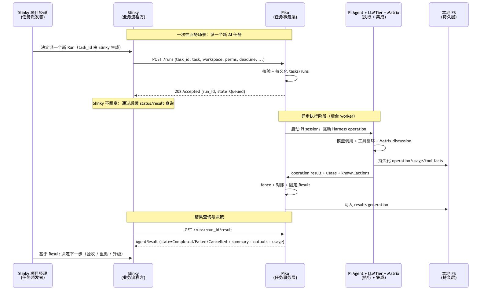

mermaid 源码（编辑用）

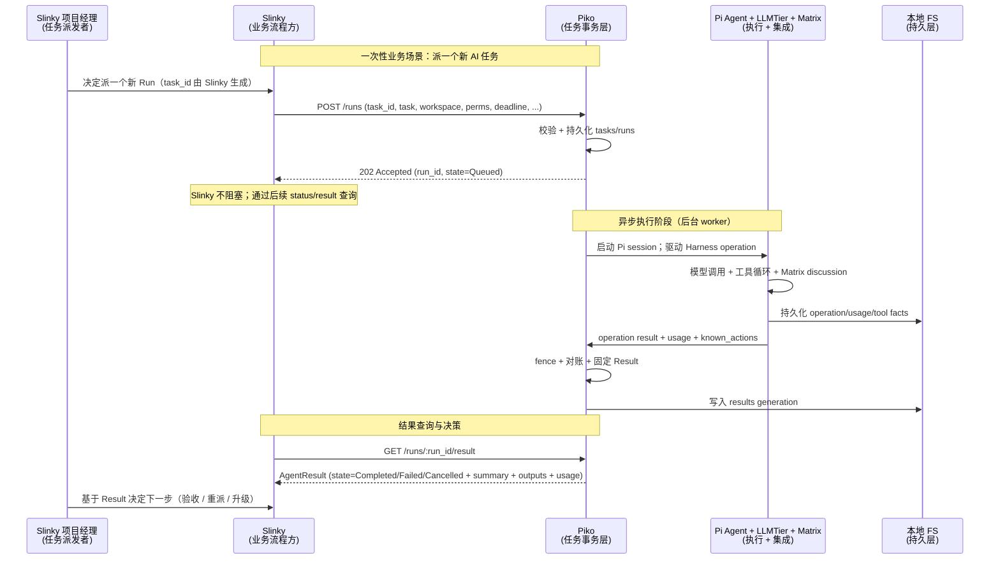

图 SW-1 · `system-design` v0.7.0 / Target / NOT_BUILT。代表场景：Slinky 派一个新 Run → Piko 持久化并执行 → 返回 Result。Slinky 与 Piko 之间的所有交互是同步 HTTP；Piko 与执行栈（Pi/LLMTier/Matrix）是异步执行；Piko 与 FS 是同步持久化。

### 2.1.2 应用环境与外部对象

按 STD §2.1 示例图样式：左侧 Slinky 用户环境 → 中间本软件 → 右侧外部依赖；箭头标注业务数据传递。

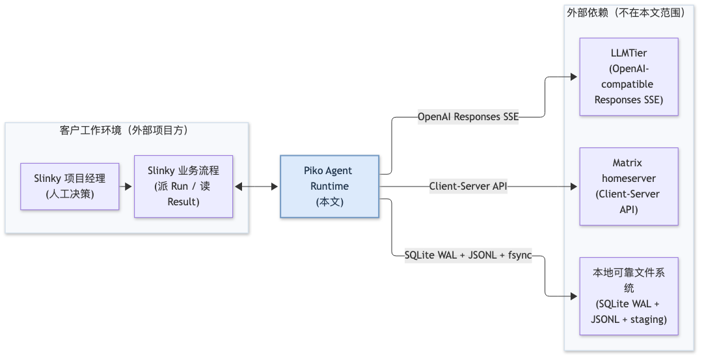

mermaid 源码（编辑用）

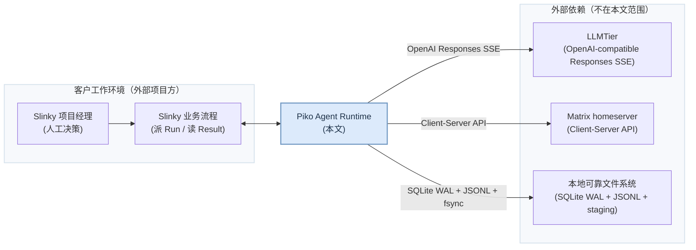

图 SW-2 · `system-design` v0.7.0 / Target / NOT_BUILT。三栏环境视图：左侧 Slinky PM + Slinky 业务流程（外部项目） → 中间 Piko Agent Runtime（蓝框 = 本文责任边界） → 右侧 3 个外部依赖（LLMTier / Matrix / FS）。虚线双向箭头 = 与 Slinky 的 HTTP API（用户业务输入/输出：RunSubmitRequest / AgentResult），实线箭头 = Piko 对外部依赖的本地 API 调用。Pi SDK 已作为进程内集成被 Piko 框吸收，不在外部依赖栏单列。详细职责映射：Slinky ↔ Piko 见 §5.1 HTTP 四项 operation；Piko ↔ LLMTier 见 §5.2 Pi `openai-responses` provider；Piko ↔ Matrix 见 §5.2 `matrix-js-sdk` Client-Server；Piko ↔ FS 见 §3.6.1 本地 FS + §4.1 启动 SQLite migration。

### 2.2 目标、范围与可观察成功条件

| Target / Requirement ID | 场景及适用条件 | 目标 / 单位与边界 | 判定与证据状态 | 非目标 / 未决项 |
|---|---|---|---|---|
| PK-01 单 Agent 路径 | 单实例一 Agent，跨实例需另接 Slinky | 同一实例同时至多 1 个 Running Run | 集成测试 + 设计文档保持 | 多 Agent、多 slot；执行优先级或抢占 |
| PK-02 任务事务稳定身份 | Slinky 在提交前生成全局唯一 `task_id` | 重复同 ID 同内容返回原 Run；不同内容 409 `TaskConflict`；tombstone 410 `Gone` | 契约测试 `tests/contract/agent-runtime.test.ts` | 同 ID 同内容被环境变化改变语义 |
| PK-03 截止与预算 | 请求携带 `deadline_at`、`max_model_calls`、`max_tool_calls` | 在约束内尽力；耗尽 → `DeadlineExceeded` / `BudgetExceeded` | fault 注入测试 | 隐藏 capacity claim |
| PK-04 模型路径单一 | Pi `0.85.1` @ commit `9767ba275f3e9a5ee0f5c5342249b629ab1b2282` + Pi `openai-responses` provider + LLMTier SSE | 非 SSE / 第二路径不实现 | LLMTier 联调 | non-stream Responses fallback |
| PK-05 工具预算 CAS | `before_tool` 以 `(run_id, operation_id, toolCallId)` 原子预留 | 超限 → `BudgetExceeded` | fault 注入 + Pi 集成 | 运行时新增 `safe` 声明 |
| PK-06 工具 `replay:safe` 验证 | 启动时绑定 `recovery_contract_ref` 与已注册实现 | 未绑定/不一致 → 启动失败 | bootstrap preflight | 自行放宽为 `safe` |
| PK-07 Result 两步提交 | fence → 写 results → 写终态 | 两步间崩溃恢复器只补第二步 | fault 注入 | 合并单事务 |
| PK-08 Matrix 唯一路径 | `matrix-js-sdk` Client-Server | AS 路径不启用 | homeserver 集成 | Application Service fallback |
| PK-09 Usage 字段完整性 | 6 字段每字段 sum/null + missing_fields；Complete/Partial/Unknown | 任一 attempt 缺字段 → null 并入 missing_fields | LLMTier 联调 + 故障注入 | 用归一化 input 冒充完整 |
| PK-10 Result 冻结 UsageSnapshot | Result 发布后迟到 usage 不修改 generation | 内部 attempt ledger version 可推进 | fault 注入 | 重复相加生成第二 Result |
| PK-11 无 Memory API | Piko 不修改 Slinky 正式 Memory | 静态依赖/API 扫描 PASS | `tests/static/no-memory-api.test.ts` | 专用 Memory API |
| PK-12 恢复与 operator 边界 | 恢复顺序：Result → Run → lease → Pi session → Harness → ledger → Matrix | 恢复后必须证明非两写入者 | fault 注入 + operator 授权测试 | 自动重启掩盖数据丢失 |

## 3. 系统概览

Piko 启动时按顺序：parse → schema validate → bind tool/recovery registry → canonicalize paths → open/migrate store → verify Pi upstream commit + adapter patch manifest → dependency preflight → listen，任一失败拒绝接收 Run。受理时按 §3.6.2 顺序固定为 JSON/Schema → bearer principal → 按 `task_id` 查记录 → 比较并返回原 Run 或 `TaskConflict` / `Gone`，仅新 ID 才检查 deadline/policy/discussion/queue capacity。运行时一个 execution slot 由 lease epoch 唯一 fencing，Worker 取得 lease 后在 SQLite 单事务中创建/读取 `run_sessions` 并把 Run 切到 Running，随后打开或恢复一个独立 Pi session（`pi_session_id=run_id`，lane `main`），通过确定性 operation ID（`run_id:initial` / `run_id:turn:<turn_seq>`）驱动 Harness 的 lane accept/drive/getResult。Harness 内部 stage（assistant effect intent → stream frame → tool effect intent → outcome）由 Harness 自管；Piko 只持久化已观察到的 operation/tip 与 Run generation。完成时 fence 新步骤、对账在途工具、固定 Result、冻结 UsageSnapshot，两事务分别写 `results` 与 `runs.state`/`runs.generation`。

### 3.1 软件系统架构

Piko 采用纯软件无 subsystem 结构：system 下直接挂 10 个直属模块（M000-M009）。无 subsystem 是因为：单一 subsystem 是架构代码坏味道（要么 ≥ 2 要么 0）；bootstrap 与其他模块同进程同生命周期，不具备独立 subsystem 资格。模块的功能分组（启动 / 受理 / 事务 / 适配 / 横切）仅在正文 §3.2 / §3.4 中描述，不在架构图上分区分层（按 STD `software-design-composition.svg` 示例：仅表达包含关系，不按对象类型或目录深度判定层级）。

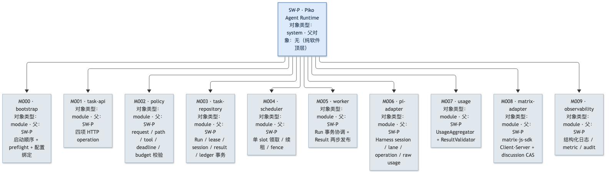

mermaid 源码（编辑用）

```mermaid
flowchart TD
  SWP["SW-P · Piko Agent Runtime<br/>对象类型：system · 父对象：无（纯软件顶层）"]

  M000["M000 · bootstrap<br/>对象类型：module · 父：SW-P<br/>启动顺序 + preflight + 配置绑定"]
  M001["M001 · task-api<br/>对象类型：module · 父：SW-P<br/>四项 HTTP operation"]
  M002["M002 · policy<br/>对象类型：module · 父：SW-P<br/>request / path / tool / deadline / budget 校验"]
  M003["M003 · task-repository<br/>对象类型：module · 父：SW-P<br/>Run / lease / session / result / ledger 事务"]
  M004["M004 · scheduler<br/>对象类型：module · 父：SW-P<br/>单 slot 领取 / 续租 / fence"]
  M005["M005 · worker<br/>对象类型：module · 父：SW-P<br/>Run 事务协调 + Result 两步发布"]
  M006["M006 · pi-adapter<br/>对象类型：module · 父：SW-P<br/>Harness session / lane / operation / raw usage"]
  M007["M007 · usage<br/>对象类型：module · 父：SW-P<br/>UsageAggregator + ResultValidator"]
  M008["M008 · matrix-adapter<br/>对象类型：module · 父：SW-P<br/>matrix-js-sdk Client-Server + discussion CAS"]
  M009["M009 · observability<br/>对象类型：module · 父：SW-P<br/>结构化日志 / metric / audit"]

  SWP --> M000
  SWP --> M001
  SWP --> M002
  SWP --> M003
  SWP --> M004
  SWP --> M005
  SWP --> M006
  SWP --> M007
  SWP --> M008
  SWP --> M009

  style SWP fill:#dceafb,stroke:#7299c3,stroke-width:2px,color:#20344b
  style M000 fill:#e0e7ed,stroke:#9aafbf,stroke-width:1px
  style M001 fill:#e0e7ed,stroke:#9aafbf,stroke-width:1px
  style M002 fill:#e0e7ed,stroke:#9aafbf,stroke-width:1px
  style M003 fill:#e0e7ed,stroke:#9aafbf,stroke-width:1px
  style M004 fill:#e0e7ed,stroke:#9aafbf,stroke-width:1px
  style M005 fill:#e0e7ed,stroke:#9aafbf,stroke-width:1px
  style M006 fill:#e0e7ed,stroke:#9aafbf,stroke-width:1px
  style M007 fill:#e0e7ed,stroke:#9aafbf,stroke-width:1px
  style M008 fill:#e0e7ed,stroke:#9aafbf,stroke-width:1px
  style M009 fill:#e0e7ed,stroke:#9aafbf,stroke-width:1px
```

图 SW-3 · `system-design` v0.7.0 / Target / NOT_BUILT。SW-P（软件系统，蓝框）下挂 10 个直属模块（灰底 module），无 subsystem、无 UI 层（无 Web/桌面入口）、无递归。本图仅表达包含关系；模块间协作通过 §3.5 列出的 5 份 `design.system-mechanism` 文档独立描述（不靠图连线）。

### 3.2 组成与职责

Piko 采用"无 subsystem"结构：10 个直属模块按职责分 4 个功能分区（启动 / 受理 / 事务 / 适配）+ 1 个横切分区（观测）。每个模块对应 1 份 `design.definition`（模块定义）+ 1 份 `design.implementation`（ISD）。模块之间跨 ≥ 2 模块的共同机制另建 5 份 `design.system-mechanism` 文档（见 §3.5）。

| 对象 ID / 类型 / 父对象 | 职责 / 非职责 | 状态与资源 | 提供/消费接口 | Document ID / 文件名 / 状态 |
|---|---|---|---|---|
| `SW-P` 软件系统 / `system-design` | 承担 Piko Agent Runtime V0.3 完整软件设计 / 不承担 Slinky 业务流程、Memory authority、LLMTier Agent 状态 | — | — | `docs/20_system_design/piko-system-design.md` / Approved |
| M000 `bootstrap` 模块 / `SW-P` | 启动顺序 + preflight + 配置绑定 + 进程生命周期 / 不运行业务、不持有 Run 状态 | 进程寿命；SQLite 句柄；Pi 上游 commit 锚定 | 消费：`config/`；提供：READY / fatal | definition `piko-bootstrap-design.md` + impl `piko-bootstrap-impl.isd.md` / Approved |
| M001 `task-api` 模块 / `SW-P` | 四项 HTTP operation：submit/status/cancel/result / 不持久化业务、不直接操作 adapter | 请求寿命；TypeScript handlers | 消费：`HTTPClient`、`policy`；提供：`POST /runs`、`GET /runs/:run_id`、`POST /runs/:run_id:cancel`、`GET /runs/:run_id/result` | definition `piko-task-api-design.md` + impl `piko-task-api-impl.isd.md` / Approved |
| M002 `policy` 模块 / `SW-P` | request/path/tool/deadline/budget 判定 / 不持状态 | 启动绑定 | 提供：`ValidatedTaskSubmission`、`BoundToolProfile`；消费：原始请求 + config + registry | definition `piko-policy-design.md` + impl `piko-policy-impl.isd.md` / Approved |
| M003 `task-repository` 模块 / `SW-P` | Run/lease/session/result/ledger 事务 + fenced write / 不持有 Run 业务编排 | 进程寿命；SQLite connection | 提供：`createOrGetRun`、`mutateRun`、`publishResult`；消费：`scheduler` / `worker` | definition `piko-task-repository-design.md` + impl `piko-task-repository-impl.isd.md` / Approved |
| M004 `scheduler` 模块 / `SW-P` | 单 slot 领取/续租/fence / 不决策业务 | 进程寿命 | 提供：`acquireSlot`、`renewLease`、`fence`；消费：tick + `task-repository` | definition `piko-scheduler-design.md` + impl `piko-scheduler-impl.isd.md` / Approved |
| M005 `worker` 模块 / `SW-P` | Run 事务协调、取消、deadline、Result 两步发布 / 不镜像 Pi Agent loop | Run 寿命；持有 lease | 提供：`Result generation`；消费：Pi/Matrix/Usage/Repo | definition `piko-worker-design.md` + impl `piko-worker-impl.isd.md` / Approved |
| M006 `pi-adapter` 模块 / `SW-P` | AgentHarness session/lane/operation/abort/raw usage hook / 不替换 Pi provider adapter | Run 寿命；Pi session 句柄 | 提供：`PiRuntime`；消费：Pi SDK + 固定 adapter patch manifest | definition `piko-pi-adapter-design.md` + impl `piko-pi-adapter-impl.isd.md` / Approved |
| M007 `usage` 模块 / `SW-P` | Usage 聚合 + Result 语义校验 / 不在 publish 后修改 generation | 进程寿命；UsageSnapshot 缓存 | 提供：`UsageAggregator`、`ResultValidator`；消费：`pi-adapter.onRawUsage`、`worker` | definition `piko-usage-design.md` + impl `piko-usage-impl.isd.md` / Approved |
| M008 `matrix-adapter` 模块 / `SW-P` | `matrix-js-sdk` Client-Server 封装 + discussion intake CAS / 不启用 AS 路径、不管理 homeserver 内部 | 进程寿命；single identity | 提供：`MatrixRuntime`；消费：Matrix homeserver + `task-repository` | definition `piko-matrix-adapter-design.md` + impl `piko-matrix-adapter-impl.isd.md` / Approved |
| M009 `observability` 模块 / `SW-P` | 结构化日志 + metric + audit / 不反向控制业务 | 进程寿命 | 消费：所有模块事件；提供：redacted log / metric 端点 | definition `piko-observability-design.md` + impl `piko-observability-impl.isd.md` / Approved |

### 3.3 总体方案、选择依据与替代方案

**关键决定 1：采用 Pi Harness 公共面，不复制第二套 Agent loop。**
- 理由：减少并行状态机导致的双向恢复语义；Pi 已 durable session + lane/operation + tool loop + retry。
- 替代：自建 Provider adapter（被否决，理由：复用 Pi upstream 升级路径丢失；advisor patch manifest 哈希校验更复杂）。
- 代价：`pi-adapter` 必须接受 Pi 上游 commit 锁定，启动 fingerprint 验证绑定；Harness 中断结果只能合成中断、不重发。

**关键决定 2：单实例单 execution slot + SQLite WAL + lease epoch。**
- 理由：单实例事务层避免多 writer 协调；lease epoch 唯一 fencing；fenced write 取代分布式锁。
- 替代：多 slot 多 worker（被否决，理由：超出 Piko "任务事务层"职责范围，跨系统 readiness/compatibility 已退出）；远程/共享 SQLite（被否决，理由：跨系统 capacity claim 已退出）。
- 代价：单实例容量受本地 SQLite + JSONL 性能限制；多实例由 Slinky 端组织，本软件不重复实现。

**关键决定 3：Responses SSE 单一模型路径，provider 内层 `maxRetries=0`。**
- 理由：固定 Pi 上游 + 简化 usage 汇总；Harness retry policy 形成可观察的 attempt。
- 替代：non-stream Responses fallback（被否决，理由：与 system design §3.6 "非流式 Responses 不是 Piko 的共同基线" 冲突）。
- 代价：必须由 Harness 形成 recoverable operation facts；SSE 缺失/提前断流由 Harness 报中断而非自动重发。

**关键决定 4：Matrix 仅 Client-Server，无 Application Service。**
- 理由：discussion 使用标准 Matrix sync + room membership + 标准消息/附件；避免双协议路径。
- 替代：Application Service 路径（被否决，理由：与 system design §3.6 "不并行使用 Application Service 路径" 冲突）。
- 代价：discussion 仍受 Matrix Client-Server 限流；homeserver 配置由 homeserver 文档负责。

**关键决定 5：Usage 字段逐项 sum/null + missing_fields + ResultValidator 前置。**
- 理由：避免下游误用归一化 input 冒充完整；保持 Complete/Partial/Unknown 三态语义。
- 替代：LLMTier 二次相加（被否决，理由：与 system design §4 "不得使用 Pi 为显示而扣除 cache 后的归一化 input" 冲突）。
- 代价：必须实现 semantic validator；Result 发布前 fail closed。

### 3.4 约束分配与下游保证

| Constraint ID / 条件 | 承接对象 ID | 预算或行为保证 / 推导引用 | 自由度 / 不可改变 | 下级设计入口 | 局部与组合验证 / 影响 |
|---|---|---|---|---|---|
| PK-01 单 slot + 独立 Pi session | `task-repository` M003 + `scheduler` M004 + `pi-adapter` M006 | lease epoch 唯一 fencing；`pi_session_id=run_id` 确定性绑定 | worker 内部不引入并行阶段 | mechanism `MECH-RUN`（`piko-run.md` 已建）+ M003/M004/M006 ISD | 集成测试 + cross-check Result→Run→lease→Pi session→Harness |
| PK-02 任务事务稳定身份 | `task-api` M001 + `policy` M002 + `task-repository` M003 | tombstone 永久拒绝；同 ID 同内容不重新检查动态条件 | path 集合字段按集合比较、时间按 UTC instant、对象成员顺序忽略 | contract `piko-agent-runtime-contract-v0.3` §1 | 契约测试 PK-T03 / PK-T15 |
| PK-03 截止与预算 | `policy` M002 + `pi-adapter` M006 | request `deadline_at` + `max_model_calls` + `max_tool_calls` | worker 不修改 deadline 语义；budget CAS 在 `before_tool` | M002/M006 ISD（含 §3.6 worker 取消分流）；非机制 | fault 注入 PK-T05 |
| PK-04 Responses SSE 唯一路径 | `pi-adapter` M006 | `stream:true`、`store:false`、`maxRetries=0` | 不替换 provider adapter；不静默切 non-stream | contract `0.3.0-simplified.6` | LLMTier 联调 PK-T09/PK-T10 |
| PK-05/06 工具 CAS + `replay:safe` 绑定 | `pi-adapter` M006 + `policy` M002 | `tool_calls` 表 CAS；启动时 `recovery_contract_ref` 必须解析 | runtime 不新增 `safe` 声明 | M006 ISD | PK-T06 / PK-T17 |
| PK-07 Result 两步提交 | `task-repository` M003 + `worker` M005 | 写 `results` 与写终态不可合并 | 恢复器只补第二步 | mechanism `MECH-RUN` + M003/M005 ISD | PK-T05 / PK-T15 |
| PK-08 Matrix Client-Server | `matrix-adapter` M008 | single identity；discussion intake CAS | 不引入 AS 路径；txn 由 adapter 内部确定性派生 | mechanism `MECH-MATRIX` + M008 ISD | PK-T08 |
| PK-09/10 Usage 完整性 + 冻结 | `usage` M007 + `worker` M005 | 每字段 sum/null + missing_fields；ResultValidator 前置 | semantic validator 失败 throw `InternalError`；Result 发布后不修改 | mechanism `MECH-USAGE` + M007 ISD | PK-T10 / PK-T16 |
| PK-11 无 Memory API | 所有模块 | 静态扫描：禁止 Memory 类 export/import 引用 | 不引入 Slinky Memory 字段 | `tests/static/no-memory-api.test.ts` | PK-T11 |
| PK-12 恢复边界 | `bootstrap` M000 + 所有 worker | recovery 顺序：Result → Run → lease → Pi session → Harness → ledger → Matrix | 不复活旧权威；不模拟成功 | mechanism `MECH-RECOVERY` + ops | PK-T12 |

> **CON 反向登记**：各机制的 §3.1 在本表 PK 约束下派生 `CON-<MECH>-<nnn>` 子约束。当前映射：`CON-RUN-001..004`←PK-01/02/03/07；`CON-USAGE-001/002`←PK-09/10；`CON-MX-001`←PK-08；`CON-CFG-001`←PK-12；`CON-ST-001`←PK-12；`CON-REC-001`←PK-12；`CON-CX-001`←PK-03。子约束不得放宽本表分配。

### 3.5 机制清单与文档映射

每个跨多个直属模块的共同机制独立建 1 份 `design.system-mechanism` 文档，路径在 `docs/20_system_design/mechanisms/`。机制文档唯一维护详细协议、状态、参与方协议与失败/恢复细则；本文不复制同一套字段。

| Mechanism ID / 用途 | 上级 Mechanism ID | 参与对象 / Process 或 Constraint | 前置依赖 | Document ID / 计划文件名 | Planned 或实际基线 / 未决项 |
|---|---|---|---|---|---|
| MECH-RUN · 单 Run 提交 → 完成闭环 | — | `task-api` M001 + `policy` M002 + `task-repository` M003 + `scheduler` M004 + `worker` M005 + `pi-adapter` M006 + `usage` M007；Constraint PK-01/02/03/07 | 无（族设计锚点） | `piko-run.md`（v0.5.2，已建） | Approved（设计阶段）/ PK-T05/PK-T13/PK-T15 |
| MECH-CONFIG · 配置加载/绑定/生效 | MECH-RUN | `bootstrap` M000 + `policy` M002；Constraint §9 | MECH-RUN | `piko-config.md`（v0.5.2，已建） | Approved / PK-T12 |
| MECH-STARTUP · 进程启动 → READY | MECH-RUN | `bootstrap` M000 + `policy` M002 + `task-repository` M003 + `pi-adapter` M006 + `matrix-adapter` M008（S1-S8）；Constraint PK-12 | MECH-CONFIG | `piko-startup.md`（v0.1.0，已建） | Approved / PK-T12 |
| MECH-USAGE · Usage 字段汇总与冻结 | MECH-RUN | `pi-adapter` M006 + `usage` M007 + `worker` M005（消费 snapshot）；Constraint PK-09/10 | MECH-RUN | `piko-usage.md`（v0.5.2，已建） | Approved / PK-T10/PK-T16 |
| MECH-MATRIX · Discussion intake + sync | MECH-RUN | `matrix-adapter` M008 + `worker` M005 + `task-repository` M003（持 turn 状态）；Constraint PK-08 | MECH-RUN | `piko-matrix.md`（v0.5.2，已建） | Approved / PK-T08 |
| MECH-RECOVERY · 进程崩溃后恢复 | MECH-RUN | `worker` M005 + `task-repository` M003 + `pi-adapter` M006 + `scheduler` M004（新 lease）；Constraint PK-12 | MECH-RUN | `piko-recovery.md`（v0.5.2，已建） | Approved / PK-T12 |
| MECH-CANCEL · Run 取消分流 | MECH-RUN | `task-api` M001 + `task-repository` M003 + `worker` M005；Constraint PK-03 | MECH-RUN | `piko-cancel.md`（v0.1.0，已建） | Approved / PK-T05 |

> 机制归属规则：仅当共同协议或运行职责跨 ≥ 2 个直属模块时建独立 `design.system-mechanism` 文档；否则归模块设计自身描述。MECH-RUN 是机制族设计锚点（`parent none`、`prereq none`）；其余 6 个以 MECH-RUN 为归属父项，且不构成前置依赖循环（CONFIG/STARTUP/USAGE/MATRIX/RECOVERY/CANCEL 的 prereq 单向指向 MECH-RUN 或 MECH-CONFIG）。

#### 3.5.1 机制依赖矩阵（唯一权威）

四类关系必须分开，只有**设计前置**参与无环检查；运行时消费与恢复读取是事实/API 关系，允许双向：

| 机制 | 上级机制（归属） | 设计前置（须无环） | 运行时消费 | 恢复时读取事实 |
|---|---|---|---|---|
| MECH-RUN | none | none | CONFIG（config）、STARTUP（READY）、USAGE（usage）、MATRIX（discussion）、CANCEL（取消入口） | RECOVERY（恢复服务） |
| MECH-CONFIG | MECH-RUN | MECH-RUN | — | — |
| MECH-STARTUP | MECH-RUN | MECH-RUN、MECH-CONFIG | MECH-CONFIG（config） | — |
| MECH-USAGE | MECH-RUN | MECH-RUN | — | — |
| MECH-MATRIX | MECH-RUN | MECH-RUN、MECH-CONFIG | MECH-RUN（Run/Result） | MECH-RECOVERY（对账） |
| MECH-RECOVERY | MECH-RUN | MECH-RUN、MECH-CONFIG | MECH-RUN（Run 事实）、MECH-USAGE（ledger）、MECH-MATRIX（cursor） | — |
| MECH-CANCEL | MECH-RUN | MECH-RUN | MECH-RUN（state/Result） | MECH-RECOVERY（取消中崩溃对账） |

**设计前置 DAG（无环）**：`MECH-RUN → MECH-CONFIG → MECH-STARTUP`；`MECH-RUN → {MECH-USAGE, MECH-MATRIX, MECH-RECOVERY, MECH-CANCEL}`。运行时消费与恢复读取**不改变**设计前置；因此 MECH-RUN 在运行时消费 RECOVERY/USAGE/MATRIX 不构成设计循环。

### 3.6 功能设计

本节按用户任务分功能，再映射实现。功能表是索引；关键功能原理见 §3.6.1，用户任务与可观察功能结果见 §3.6.2。具体操作入口、参数、反馈与退出码在 §8.4 唯一维护，本节不复制接口合同。

| Capability ID / 名称 | 用户场景 / 入口 | 输入及前提 | 输出 / 失败行为 | 对象及过程引用 | 实现状态 / 验证项 |
|---|---|---|---|---|---|
| CAP-SUBMIT · 任务提交 | Slinky 项目经理派一个新 Run；入口 `POST /runs`（§8.1） | `RunSubmitRequest`：`task_id`、`task`、`workspace`、`permissions`、`deadline_at`、`max_model_calls`、`max_tool_calls`、`output_paths`、`discussion?`；bearer principal 已配置 | 202 + `RunSubmission`；失败 422 / 401 / 409 `TaskConflict` / 410 `Gone` / 429 `QueueFull` / 503 | M001 `task-api` + M002 `policy` + M003 `task-repository` + `MECH-RUN`；过程 §6.2 | Approved / PK-T03 / PK-T15 |
| CAP-STATUS · 任务状态查询 | Slinky 查询 Run 当前状态；入口 `GET /runs/:run_id`（§8.1） | `run_id` 路径参数；同一 principal | 200 + `RunView`（state / generation / timestamps / limits）；失败 401 / 404 / 410 | M001 `task-api` + M003 `task-repository`；过程 §6.2 | Approved / PK-T03 |
| CAP-CANCEL · 任务取消 | Slinky 取消一个 Run；入口 `POST /runs/:run_id:cancel`（§8.1） | `run_id` 路径参数；同一 principal | 200 `CancelledBeforeStart`（Queued）或 202 `StopRequested`（Running）或 200 `AlreadyTerminal`；失败 401 / 404 / 410 | M001 `task-api` + M005 `worker` + M003 `task-repository`；过程 §6.4 | Approved / PK-T05 |
| CAP-RESULT · 任务结果查询 | Slinky 读取 Run 稳定 Result；入口 `GET /runs/:run_id/result`（§8.1） | `run_id` 路径参数；同一 principal | 200 + `AgentResult`；失败 409 `RunNotTerminal` / 401 / 404 / 410 / 500 `ResultUnavailable` | M001 `task-api` + M003 `task-repository`；过程 §6.2 | Approved / PK-T16 |
| CAP-DIAG · 内部诊断（只读） | Operator 读取实例诊断快照；入口由 ops 文档定义（§8.4） | operator authorization；目标为唯一 Piko 实例 | 200 + 诊断 snapshot（redacted）；失败 401 / 403 | M000 `bootstrap` + M009 `observability`；ops 文档 | Approved（设计阶段，激活由 ops Gate） / PK-T12 |

Framework: 功能与用户交互按"用户任务"组织：每个 CAP 对应一个用户任务（派 Run / 查状态 / 取消 / 读 Result / 诊断），不是按控件或命令名。§3.6.2 说明每个任务的完成事实与失败边界，§8.4 说明入口合同。

#### 3.6.1 关键功能概要（按能力展开）

**CAP-SUBMIT**：Piko 接收请求后两步验证：（1）JSON/Schema 静态校验 + bearer principal 校验；（2）按 `task_id` 在 SQLite 查记录。tombstone 返回 410 `Gone`；active `task_json` 已存且字段值与提交一致时直接返回原 Run，不重新检查 deadline/queue/dependency；active 但不同返回 409 `TaskConflict`；不存在时检查 deadline、policy、discussion verified fact、依赖 ready fact 与 queue capacity，在一个事务中插入 `tasks` 行与初始 Queued `runs` 行（discussion 任务同时插入初始 Pending turn）。已受理返回 202，未创建任务的 422/429/503 可用同一 `task_id` 重试；新逻辑任务必须换新 `task_id`。关键规则：`task_id` 由 Slinky 生成且全局唯一，一个 `task_id` 只绑定一个不可变任务与一个 Run。

**CAP-CANCEL**：按 Run state 分流。Queued 取消不取得 lease，单事务写 `cancel_requested=1`、插入 `model_attempts=0` 的零调用 immutable Result、写 `runs.state='Cancelled'`，返回 `CancelledBeforeStart`。Running 取消只写 stop intent 与 `runs.state='Cancelling'`，返回 `StopRequested`；已终态返回 `AlreadyTerminal`。worker abort Pi operation 后再补 Result generation / 终态两步提交。关键规则：`StopRequested` 只证明停止意图已持久化，不证明执行已经停止。

**CAP-RESULT**：非终态 Run 返回 `RunNotTerminal`；Result generation 由 `results` 表维护，已发布 generation 内容冻结。迟到 usage 替换内部 `model_attempts.record_version` 但不修改 Result、不创建新 generation。关键规则：`Completed` 只表示执行结束，不表示 Slinky 接受产物。

#### 3.6.2 用户任务与功能结果

| 用户任务 | 触发场景 / 角色 | 前提 | 期望结果 / 结果已知性 | 失败或不支持条件 | 入口引用 | 过程与验证 |
|---|---|---|---|---|---|---|
| 派一个新 Run | Slinky 项目经理决定把 AI 任务交给独立 Agent / Slinky 流程 | Slinky 已生成全局唯一 `task_id`；bearer principal 已配置 | 202 受理回执 + `run_id`；受理后通过 `GET /runs/:run_id` 查询状态；完成由 `GET .../result` 取得稳定 Result | 422 Schema 拒绝 / 409 同 ID 不同内容 / 410 tombstone / 429 队列满 / 503 依赖未就绪；响应丢失时结果未知，用原 `task_id` 核对，不新建 | §8.1 `POST /runs` | §6.2 P-BIZ / §6.2.1 Result 两步；PK-T03 / PK-T15 |
| 查一个 Run 的当前状态 | 想知道任务是否已受理 / 运行中 / 终态 / Slinky 流程或自动化 | 已知 `run_id`；同一 principal | 200 `RunView`；`state` 是业务阶段的权威事实，不是调用成功 | 401 未授权 / 404 不存在 / 410 tombstone | §8.1 `GET /runs/:run_id` | §6.2；PK-T03 |
| 取消一个 Run | 业务决定中止（Slinky 流程或人工） | 已知 `run_id`；同一 principal | Queued：200 `CancelledBeforeStart` + 零调用 Result；Running：202 `StopRequested`（意图落盘）；已终态：200 `AlreadyTerminal` | 401 / 404 / 410；不支持"撤销已经生效的取消" | §8.1 `POST /runs/:run_id:cancel` | §6.4 P-STOP / 取消分流；PK-T05 |
| 读取 Run 的稳定结果 | Slinky 验收 / 重派 / 升级决策 | Run 已终态；同一 principal | 200 `AgentResult`：state + partial + summary + outputs + known_actions + usage + failure；Result generation 内容冻结 | 409 `RunNotTerminal`（未终态）/ 500 `ResultUnavailable`（终态丢 durable Result）；不支持修改已发布 Result | §8.1 `GET /runs/:run_id/result` | §6.2.1；PK-T16 |
| 读取实例诊断快照 | Operator 排查恢复 / 依赖健康 / 队列深度 | operator authorization | 只读 snapshot（redacted）；不改业务状态 | 401 / 403；未知实例拒绝，不改选 | ops 文档 + §8.4 | §10.2 / §10.3；PK-T12 |

**受理、处理中、完成、结果未知**分别意味着：受理 = `tasks` + `runs` 已提交（202）；处理中 = worker 已取得 lease 且 `runs.state='Running'`；完成 = `results` generation 已写且 `runs.state` 为终态；结果未知 = 客户端未收到响应但服务端状态可能已变（用原 `task_id` 核对）。功能结果以服务端事实（`tasks` / `runs` / `results` 表）为准，不以命令退出码或按钮状态代替。

## 4. 子系统与直属模块概要设计

Piko 采用"无 subsystem"结构（1 个 subsystem 是架构代码坏味道，要么 0 要么 ≥ 2；Piko 当前选择 0），system 下直接挂 10 个直属模块（M000-M009）。每个模块对应 1 份 `design.definition` + 1 份 `design.implementation` ISD（详见 §3.2 表的 Document ID 列）；本节不复制这些模块 ISD 的概要。

### 4.1 直属对象概要设计（按模块展开）

**N/A · 由各模块 ISD 承担**：本节不重复 10 个模块的概要原理；详见：

| 模块 | Definition 文档 | ISD 文档 |
|---|---|---|
| M000 `bootstrap` | `piko-bootstrap-design.md` | `piko-bootstrap-impl.isd.md` |
| M001 `task-api` | `piko-task-api-design.md` | `piko-task-api-impl.isd.md` |
| M002 `policy` | `piko-policy-design.md` | `piko-policy-impl.isd.md` |
| M003 `task-repository` | `piko-task-repository-design.md` | `piko-task-repository-impl.isd.md` |
| M004 `scheduler` | `piko-scheduler-design.md` | `piko-scheduler-impl.isd.md` |
| M005 `worker` | `piko-worker-design.md` | `piko-worker-impl.isd.md` |
| M006 `pi-adapter` | `piko-pi-adapter-design.md` | `piko-pi-adapter-impl.isd.md` |
| M007 `usage` | `piko-usage-design.md` | `piko-usage-impl.isd.md` |
| M008 `matrix-adapter` | `piko-matrix-adapter-design.md` | `piko-matrix-adapter-impl.isd.md` |
| M009 `observability` | `piko-observability-design.md` | `piko-observability-impl.isd.md` |

模块之间的关系与各自概要在各模块 ISD §1.7 + §5 维护；本文不重复维护。

## 5. 运行组织与部署设计

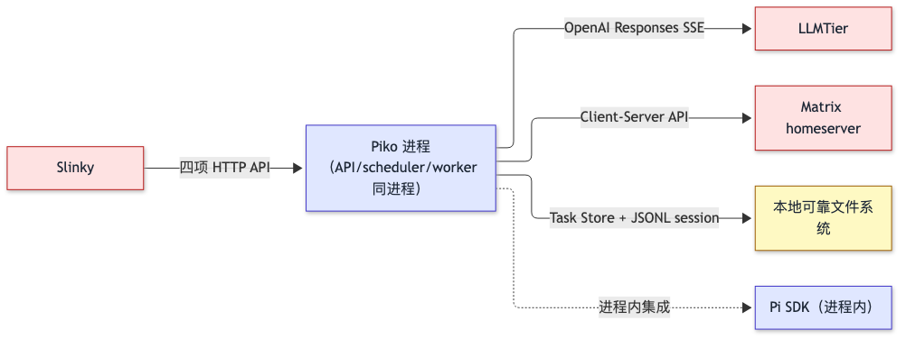

mermaid 源码（编辑用）

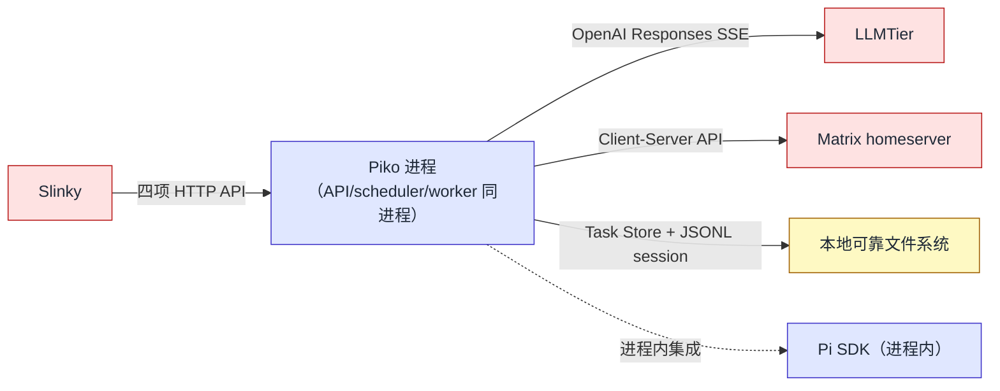

图 SW-4 · `system-design` v0.7.0 / Target / NOT_BUILT。单进程集成所有模块；外部依赖为 LLMTier、Matrix、本地 FS。

### 5.1 执行上下文、调度与并发

- 单进程 / Node.js event loop；worker 通过 SQLite 单 writer 串行化写事务。
- 单 execution slot 由 lease epoch 唯一 fencing；同一进程内不存在并行 Running Run。
- HTTP handler 不持有长事务；每个 SQLite 写是一个 `BEGIN IMMEDIATE` 短事务。
- Deadline 使用持久 UTC timestamp 判定；进程内 elapsed timeout 使用 monotonic clock。
- 队列采用 `(accepted_at, run_id)` 稳定顺序；不实现优先级或抢占。
- backpressure 在 Run 创建写事务内检查配置的 queue capacity，满时不创建 Run 并返回 `QueueFull`。
- shutdown 顺序：停止新受理 → 写 stop intent → 有界 drain → 超时 abort。不能把进程退出当成 Run 已停止。

### 5.2 通信与跨实例协作

- Slinky ↔ Piko：四项 HTTP operation，同一 principal + bearer credential；同 `task_id` 同内容不创建第二 Run。
- Piko ↔ Pi：进程内 `AgentHarness`；确定性 identity（`pi_session_id=run_id`、lane `main`、operation ID 规则）保证跨进程崩溃后的对账。
- Piko ↔ LLMTier：OpenAI Responses SSE；`stream:true`、`store:false`、`maxRetries=0`；三次 prompt-cache 字段不发送。
- Piko ↔ Matrix homeserver：`matrix-js-sdk` Client-Server；每条 `MatrixSendRecord` 持久 `txn_id`，retry 复用；不是产品 outbox 协议。
- 跨实例：本软件不复制实例；多实例由 Slinky 端分别调用。

### 5.3 部署拓扑、资源与故障域

| Topology ID / 配置 | 对象→进程/实例/节点 | 资源 / 负载依据 | 网络 / 账号 / 外部依赖 | 持久化 / 共享故障域 | 部署状态与验证 |
|---|---|---|---|---|---|
| TOP-1 单实例开发 | SW-P → 单进程 / 单节点 | SQLite WAL + JSONL session + workspace staging 位于本地可靠 FS；进程独占 instance lock | localhost bind；operator 账号只读诊断；LLMTier/Matrix Client-Server | 进程退出 = Run 终态不可继续；崩溃后由 §3.6.1 shutdown 协议保证 | Planned（NOT_BUILT，依赖 PK-T01..PK-T12） |

部署假设在 `piko-runtime-release-and-operations-v0.3` 定义；本系统设计不重复发布/激活细节。SQLite、Pi session、workspace 必须位于本地可靠 FS；不支持 NFS 多 writer（被否决：见 §3.3 关键决定 2 代价）。

## 6. 重要过程

| Process ID / 模式 | 触发 / 目标 | 统筹者 / 参与方 | 前提事实来源 | 阶段 / 结果可见点 | 失败及清理 / 机制引用 | 图号 / 图内路径 / 正文位置 |
|---|---|---|---|---|---|---|
| P-START · 冷启动 | 部署工具拉起进程 / READY 受理 | `bootstrap` M000（统筹）；`task-repository` M003（store）；`pi-adapter` M006（verify upstream）；`matrix-adapter` M008（whoami） | config + 固定上游 commit + 本地 FS 可写 | S1 parse → S2 schema → S3 bind tool/recovery → S4 canonicalize paths → S5 open/migrate store → S6 verify Pi upstream + patch manifest → S7 preflight → S8 listen | 任一阶段失败：F1 关闭已得句柄并 `InternalError`；进程非零退出；不进入 listen | 图 SW-5 / §4.1 |
| P-BIZ · 一次业务受理 | Slinky `POST /runs` | `task-api` M001（统筹）；`policy` M002；`task-repository` M003；`scheduler` M004；`worker` M005；`pi-adapter` M006；`usage` M007；`matrix-adapter` M008（discussion only） | 已 READY；bearer principal 一致；task_id 唯一性已知 | J1 JSON/Schema → J2 bearer → J3 task_id 查 → J4 比较/创建 → J5 ack 202 | 422/410/409/429/503：J4 直接返回，事务回滚 | 图 SW-6 / §6.2 |
| P-CONFIG · 配置生效（重启生效） | 部署工具拉起新进程 | `bootstrap` M000；`policy` M002（tool 绑定） | 旧进程已停止确认 | C1 校验新参数 → C2 关闭旧服务并等待退出确认 → C3 C1 重新执行 → C8 listen | 旧进程退出未确认：阻塞；新参数无效：保留旧服务 | 图 SW-7 / §6.3 |
| P-STOP · 停止 / 重启 / 异常恢复 | 部署工具发 SIGTERM 或失败恢复 | `bootstrap` M000（统筹）；`worker` M005（drain） | P-START 已成功 | T1 停止新受理 → T2 fence lease/writer → T3 等待有界 drain → T4 abort → T5 退出确认 | T3 超时 → T4 强制 abort；未确认退出 → 阻塞不启动新进程 | 图 SW-8 / §6.4 |

### 6.1 启动与就绪过程

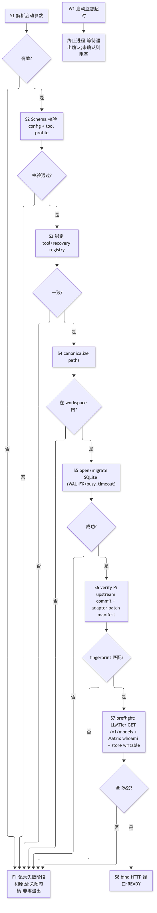

mermaid 源码（编辑用）

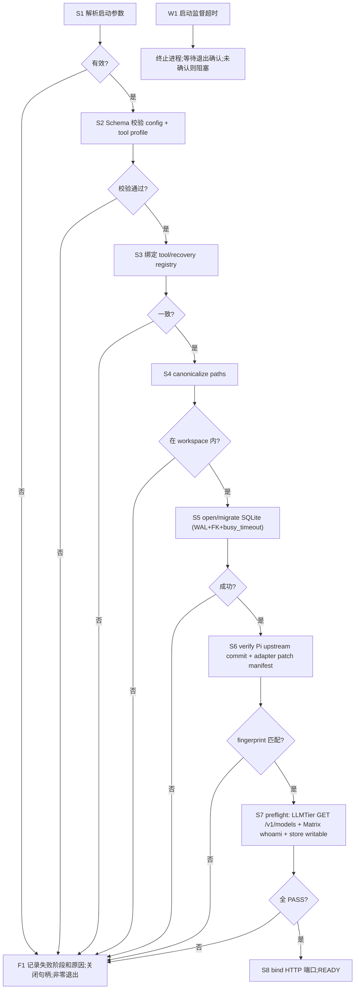

图 SW-5 · P-START 路径。`bootstrap` 是统筹者，部署工具是外部监督 W1。S8 READY 才接受 Run；S5 之前失败不会 listen。

**正常路径及就绪判据**：S1-S5 全部成功且在应用预算内（本设计不声明预算数值，由 bootstrap 实现决定）；S6 必须证明 Pi 上游 commit 与 adapter patch manifest 哈希匹配；S7 至少返回 LLMTier 可达 + Matrix whoami OK + store writable；S8 输出 READY 消息并 listen 端口。

**失败与清理**：任一阶段失败走 F1，记录失败阶段、原因，关闭已得句柄，释放内存，进程非零退出。S6 不匹配时不进入 S7；S7 部分失败立即 F1 不接受部分就绪。W1 启动监督超时未收到 READY 触发强制终止并等待退出确认；未确认保持阻塞，不启动第二份进程。

### 6.2 一次业务处理的完整过程

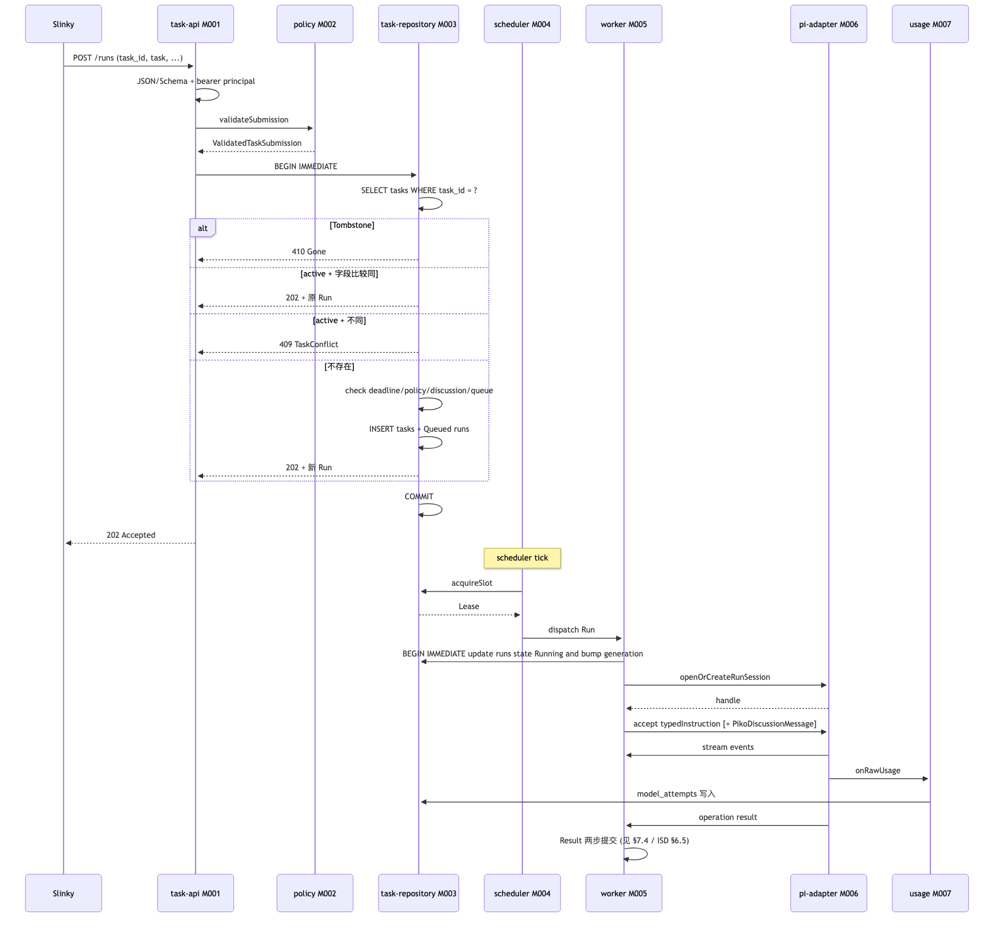

mermaid 源码（编辑用）

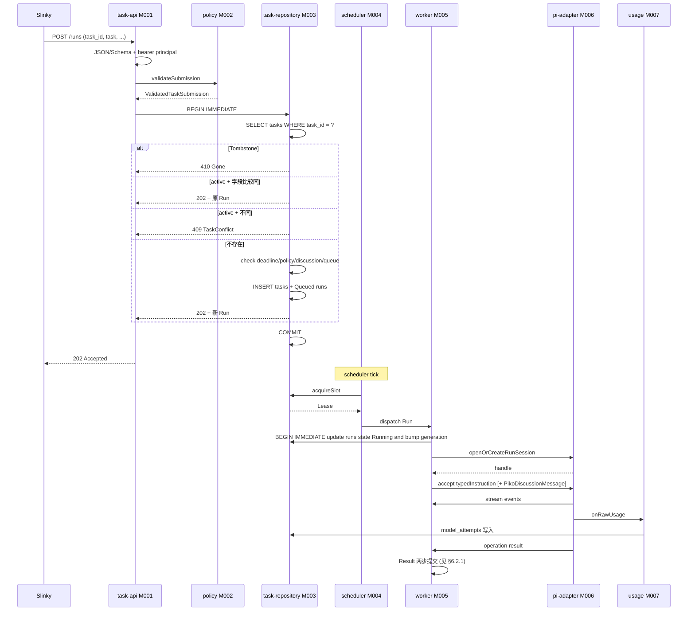

图 SW-6 · P-BIZ 正常路径。`task-api` 受理 + 202 ack；scheduler 后台领 slot 并交 worker 驱动 Pi；Result 两步提交细节见 §6.2.1。

**正常路径及就绪判据**：J1-J5 完整走完后返回 202；Run 状态由 `tasks`+`runs` 表承担事实；worker 取得 lease 后切 Running 并 accept Pi operation；Result 由 `results` 表 generation 唯一持有事实。

**失败与清理**：J3 tombstone 立即 410 退出事务；J4 字段不同 409 退出事务；J4 字段同直接返回原 Run，不重新检查动态条件（PK-02）；J5 deadline/queue/discussion 任一失败 422/429/503 退出事务，不创建 Run；J5 后到 scheduler 的失败由 worker 修复或 abort，不会回到 J4 冒充成功。

#### 6.2.1 Result 两步提交协议（`MECH-RUN` 关键过程）

Pi operation 完成后 worker 进入 Result 两步提交：第一步把 immutable Result generation 写入 `results` 表（原子事务），第二步把 `runs.state` 与 `runs.generation` 写入终态（原子事务）。两步间崩溃时恢复器只补第二步（绝不重跑 Pi）。

mermaid 源码（编辑用）

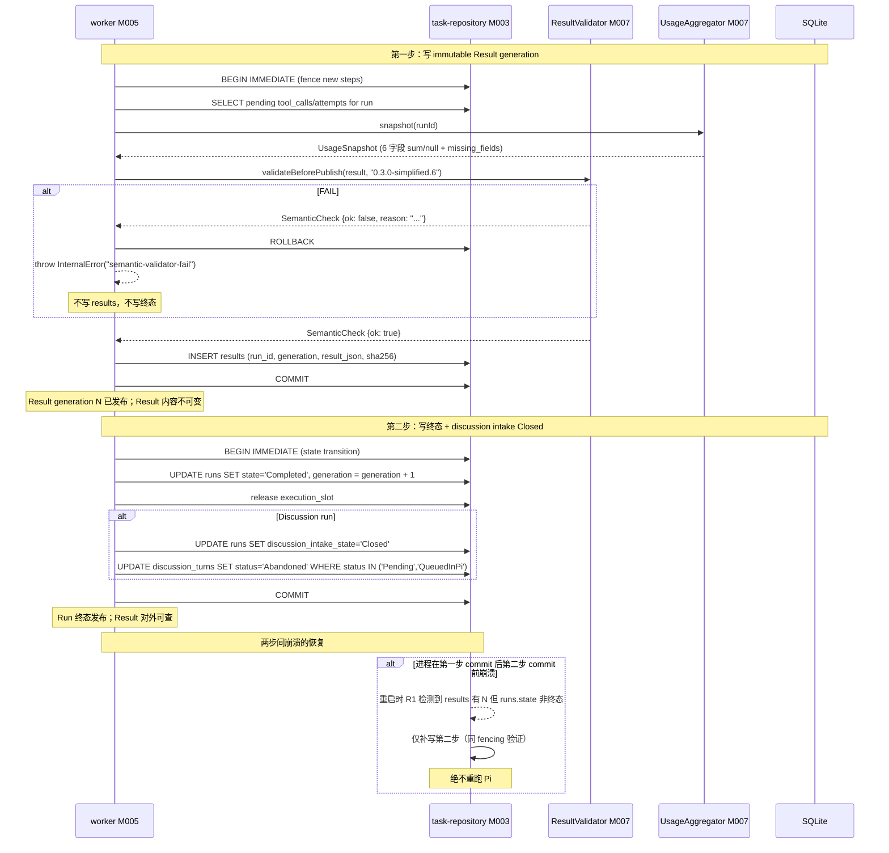

图 SW-6a · `system-design` v0.7.0 / Target / NOT_BUILT。两事务分开（不是合并单事务）；第一步 INSERT results 后 Result generation 即冻结；第二步 UPDATE runs.state 与 generation。Discussion run 同事务改 intake `Closed` + 未消费 turn `Abandoned`。

### 6.3 配置生效与模式切换过程

采用**重启生效**策略。理由：本软件为单实例单进程事务层，无水平扩展；接受停止切换换取简单的一致性边界。配置字段由 §5.1 描述，过程由本节串联。

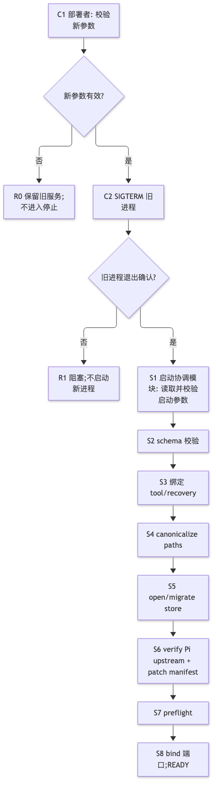

mermaid 源码（编辑用）

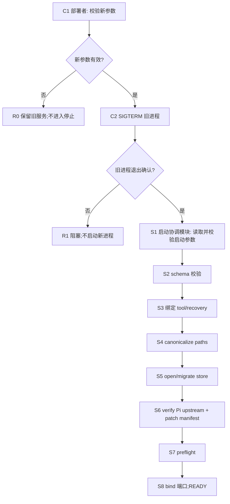

图 SW-7 · P-CONFIG 路径。本软件明确选择"部署者先校验新参数 → 关闭旧服务并确认退出 → 以新参数完整执行 P-START"；C0 不允许"参数已提交即生效"。

**正常路径及就绪判据**：C1 校验通过后 C2 停止旧进程；C3 收到旧进程退出确认后启动新进程 S1-S8。新进程 READY 才证明新配置可服务；旧进程在停止前仍使用旧配置；不存在混合版本。

**失败与清理**：C1 无效保留旧服务；C3 旧进程退出未确认阻塞不启动新进程；C0 之后新进程启动失败时整个服务不可用，修复后再启动，不自动回退到旧目录。本图不写"参数已提交即生效"或"自动回滚"等快捷路径。

### 6.4 停止、取消、重启与异常恢复

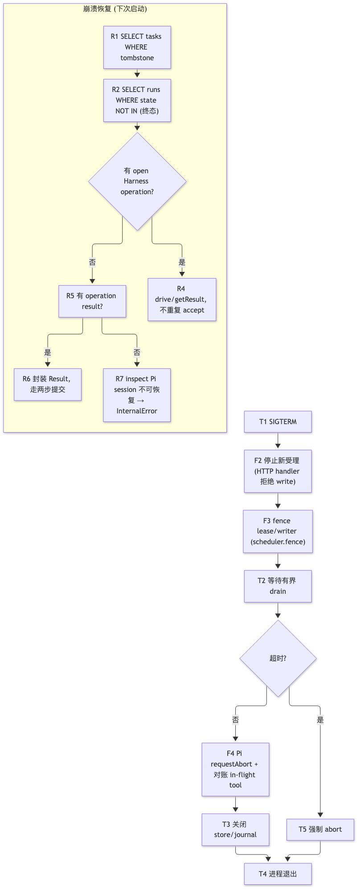

mermaid 源码（编辑用）

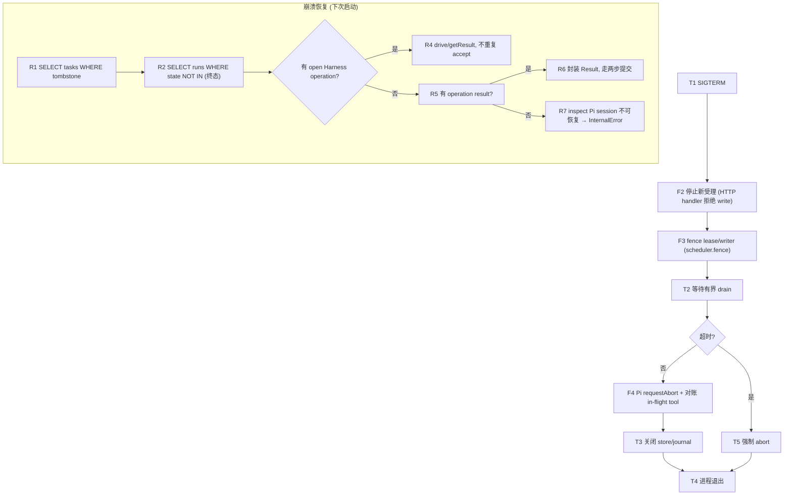

图 SW-8 · P-STOP 与恢复路径。`bootstrap` 是统筹者；T4 进程退出确认后部署工具才允许 P-START。

**正常路径及就绪判据**：T1-F4-T3-T4 顺序执行；F4 完成后所有 in-flight tool 已确认状态；T4 进程退出码 0。部署工具拿到退出码后才允许新进程启动。

**失败与清理**：T2 超时触发 T5 强制 abort，T5 完成后 T4 退出（退出码非 0）；部署工具拿到退出码后阻塞，等待人工排查；不自动回退。崩溃恢复 R1-R7 严格按"Result → Run → lease → Pi session → Harness → ledger → Matrix"顺序；已有 Result 绝不重新运行 Pi；不可恢复的 `replay:"never"` 工具产生明确失败 `UnsafeRetryBlocked` / `ExecutionStateUnknown`；不复活旧权威，不模拟成功。

## 7. 数据结构设计

系统级不重复维护数据结构；本节把职责交给各机制文档与各模块 ISD §4，但保留关键边界与字段引用。

### 7.1 公共基础类型与枚举

#### 7.1.1 `RunState`

- **完整定义、Data/Type/Error ID 与唯一来源**：`RunState = "Queued" | "Running" | "Cancelling" | "Completed" | "Failed" | "Cancelled"`。固定来源 `system-design` §3 + `piko-agent-runtime-contract-v0.3` §4 + `piko-task-repository-impl.isd.md` §4.1.1（M003 module ISD）。
- **逐字段/逐值类型、范围、含义与跨字段约束**：每值代表 Run 的当前事务层阶段；与 `cancel_requested`、`discussion_intake_state` 跨字段约束见 M003 ISD §4.2 `RunRecord`。
- **生产/修改、所有权、可见点、寿命及失败出口**：唯一写入者 M003 `task-repository`；可见点为 `runs.state` 字段；寿命 = Run 寿命；不允许从 `Completed`/`Failed`/`Cancelled` 回退。
- **合法与拒绝实例、V/Case 与证据状态**：合法转移：`Queued→Running|Cancelled`、`Running→Cancelling|Completed|Failed`、`Cancelling→Cancelled|Failed`。非法转移返回内部 `FencedWrite`，不影响 HTTP。Case：M003/M005 ISD §9.1。

#### 7.1.2 `DiscussionIntakeState`

- **完整定义、Data/Type/Error ID 与唯一来源**：`DiscussionIntakeState = "Disabled" | "Open" | "Closing" | "Closed"`。来源 `MECH-MATRIX` + M003/M008 ISD §4.1.2。
- **逐字段/逐值类型、范围、含义与跨字段约束**：仅 discussion Run 使用；非 discussion Run 固定 `Disabled`；discussion Run 单向 `Open → Closing → Closed`。
- **生产/修改、所有权、可见点、寿命及失败出口**：M003 写入；可见点 `runs.discussion_intake_state`。
- **合法与拒绝实例、V/Case 与证据状态**：仅 Open 可接收 `DiscussionTurn`，仅 Closing 可发 Completed Result。Case：M005/M008 ISD §9.1。

### 7.2 业务与操作数据结构

**N/A · 由各模块 ISD 承担**：本系统设计不重复定义 `TaskRecord` / `RunRecord` / `AgentResult` / `UsageSnapshot` / `ModelAttempt` / `ToolCall` / `DiscussionTurn` / `MatrixSendRecord` / `PikoDiscussionMessage` 等结构；详见 M003（`TaskRecord` / `RunRecord` / `RunSessionRecord` / `ExecutionSlot` / `ModelAttempt` / `ToolCall` / `DiscussionTurn` / `MatrixSendRecord`）、M006（`PikoDiscussionMessage`）、M007（`UsageSnapshot`）等模块 ISD §4。Tailoring 依据：模板 §7.2 适用条件为"业务操作实际交换和保存的对象"；系统层仅承担 §3.4 约束分配，不重定义数据。

### 7.3 配置与规则数据结构

**N/A · 见 §9 与各模块 ISD §4.3**：`PikoRuntimeConfig` / `ToolProfile` 的字段定义见 M002 ISD §4.3 + M000 ISD §8.1；本系统设计不重复维护配置字段。§9.1 负责生效政策。

### 7.4 通信报文结构

**N/A · 见 §7 与契约 `0.3.0-simplified.6`**：`RunSubmitRequest` / `AgentResult` / `UsageSnapshot` / `PikoDiscussionMessage` 的字段定义见 `piko-agent-runtime-contract-v0.3` + `interfaces/openapi/agent-runtime-openapi-v0.3.yaml` + `interfaces/schemas/agent-runtime-v0.3.schema.json`；本系统层不维护第二套字段定义。

### 7.5 设备与 FPGA 表项结构

**N/A · 纯软件范围**：本系统无设备/FPGA/RTL 表项。Tailoring 依据：模板 §7.5 适用条件为"实际拥有设备或 RTL 表项"。

### 7.6 运行状态数据结构

**N/A · 见各模块 ISD §4.6**：`Lease` / `FencedWrite` 定义见 M003 ISD §4.6；`PiRunObservation` 见 M006 ISD §4.6。本系统层不重定义运行态。

### 7.7 数据库表结构

**N/A · 见 M003 ISD §4.7**：`tasks` / `runs` / `run_sessions` / `execution_slot` / `results` / `model_attempts` / `tool_calls` / `matrix_state` / `matrix_events` / `discussion_turns` / `matrix_sends` / `audit_events` / `instance_meta` DDL 见 M003 ISD §4.7.1（`PRAGMA user_version=2` 为当前基线）；本系统层不重复 DDL。

### 7.8 错误码与错误结构

公共错误码逐码定义在 `interfaces/error-codes/agent-runtime-v0.3.yaml` + `piko-agent-runtime-contract-v0.3` §4；机器契约 `0.3.0-simplified.6` 绑定。系统层仅消费与映射：

| Error ID | 接口成员 ID | 模块/机制及使用方式 | 设计 V / Case |
|---|---|---|---|
| `Unauthorized` | CAP-SUBMIT/STATUS/CANCEL/RESULT | M001/M002 bearer principal 校验失败，HTTP 401；不暴露详细原因 | contract §6 |
| `TaskConflict` | CAP-SUBMIT | M003 同 ID 不同内容，HTTP 409；保留原任务 | contract §6 |
| `Gone` | CAP-SUBMIT/STATUS/CANCEL/RESULT | M003 tombstone，HTTP 410 | contract §6 |
| `InvalidDiscussionContext` | CAP-SUBMIT | M008 discussion 房间/事件冲突，HTTP 409 | contract §6 |
| `QueueFull` | CAP-SUBMIT | M003/M004 队列满且未创建 Run，HTTP 429 | contract §6 |
| `RunNotTerminal` | CAP-RESULT | M003 非终态查询结果，HTTP 409 | contract §6 |
| `ResultUnavailable` | CAP-RESULT | M003/M005 终态丢失 durable Result，HTTP 500 | contract §6 |
| `CancelledBeforeStart` | CAP-CANCEL | M003/M005 Queued 取消，HTTP 200 | contract §6 |
| `StopRequested` | CAP-CANCEL | M005 Running 取消意图落盘，HTTP 202 | contract §6 |
| `AlreadyTerminal` | CAP-CANCEL | M003/M005 已终态，HTTP 200 | contract §6 |
| `DeadlineExceeded` | Result `failure.code` | M002/M005/M006 截止耗尽，Run 终态 Failed | contract §6 |
| `BudgetExceeded` | Result `failure.code` | M006 模型/工具预算耗尽，Run 终态 Failed | contract §6 |
| `ModelUnavailable` | Result `failure.code` | M006 配置模型不存在/LLMTier/TLS/auth/网络不可达 | contract §6 |
| `ModelResponseInvalid` | Result `failure.code` | M006 SSE/protocol/terminal event 非法 | contract §6 |
| `ToolFailure` | Result `failure.code` | M006 工具返回明确 error 且无更具体终止 | contract §6 |
| `UnsafeRetryBlocked` | Result `failure.code` | M006 `replay:"never"` 工具无 outcome | contract §6 |
| `ExecutionStateUnknown` | Result `failure.code` | M005/M006 Harness storage/invariant 无法证明最后执行状态 | contract §6 |
| `DiscussionAccessLost` | Result `failure.code` | M008 Matrix membership/event/media authority 丢失 | contract §6 |
| `CancelledByRequest` | Result `failure.code` | M005 已确认取消且 Harness operation 已停止 | contract §6 |
| `InternalError` | Result `failure.code` | M005/M003/M007 Piko 内部错误且执行状态仍可证明 | contract §6 |

### 7.9 业务数据流与形态变换

业务对象在 §6.2 P-BIZ 图中标识：`RunSubmitRequest` → `ValidatedTaskSubmission` → `tasks.task_json` + `runs` → `run_sessions.pi_session_id` → Pi session JSONL → `operation result` → `AgentResult`。所有跨边界交接保留稳定身份；转换不丢信息（`usage.raw_usage_json` 保留字段存在性）；副本/峰值见 §11。

### 7.10 一致性与持久化策略

- Authoritative：`tasks`/`runs`/`results`/`run_sessions`/`model_attempts`/`tool_calls`/`discussion_turns`/`matrix_sends`。
- Observation：HTTP 客户端收到的状态码与 body 是结果观察，不是状态判定。
- Volatile：内存 lease / Pi session 句柄 / worker queue。
- Durable：所有上述 authoritative 字段在 commit 后 fsync WAL 才返回 HTTP。
- 跨对象事务：提交事务 + Run 事务 + Result 两步事务分别独立；不同事务间用 fenced write 串行化（详见 §3.4 PK-01/07/12）。
- 丢失窗口：进程崩溃可能在 worker 写 `results` 之前发生；恢复器只补第二步（见 §6.4）。

### 7.11 缓存、保留、清理与数据迁移

- 缓存：内存 lease；usage snapshot 缓存；Matrix sync cursor 缓存。失效：lease fence / Result 发布 / sync 推进。
- 持久数据保留：`max(request.deadline_at, accepted_at)+7d`；之后可清理大对象，永久保留最小 `{task_id, run_id, Gone}` tombstone。详见 contract §3.6。
- 删除权限：worker / Result publisher；不允许 HTTP handler 删除任务。
- 临时产物寿命：Media 下载存 staging 目录，校验后移动到允许路径，失败/取消按 retention policy 清理。
- 数据迁移：`PRAGMA user_version` 单调整数；v1→v2 增加 `Abandoned` discussion turn 状态；失败保持旧库可读，worker 不启动。

## 8. 接口设计

Piko 不重写 OpenAPI / Schema / error catalog；接口契约由 `interfaces/openapi/agent-runtime-openapi-v0.3.yaml` + `interfaces/schemas/agent-runtime-v0.3.schema.json` + `interfaces/error-codes/agent-runtime-v0.3.yaml` 机器权威定义。本节给出阅读视图。

### 8.1 API

#### `POST /runs` · `RunSubmitRequest` → `RunSubmission` | `<Error>`

- **Interface/Member ID、用途、提供责任与唯一来源**：`createRun`（OpenAPI operationId）；`piko-agent-runtime-contract-v0.3` §1-§2；唯一来源 `interfaces/openapi/agent-runtime-openapi-v0.3.yaml` `paths./runs.post`。
- **输入与前提**：`RunSubmitRequest` 字段：`task_id`（Slinky 全局唯一，必填）、`task`（不可变任务定义，必填）、`workspace`（RelPath，必填）、`permissions`（`read`/`write`/`tool` 集合，必填）、`deadline_at`（UTC ISO-8601）、`max_model_calls`、`max_tool_calls`、`output_paths`（RelPath 集合）、`discussion?`（`{room_id, trigger_event_id}`）。模型字段由实例配置，非 selector。bearer principal 已配置。
- **成功输出与保证**：`RunSubmission { task_id, run_id, state: "Queued" }`（首次受理）/ `{ task_id, run_id, state: <current view> }`（重复同 ID 同内容）/ 410 `Gone` / 409 `TaskConflict`。返回 202 Accepted 即代表已持久化任务定义并创建 Run；不证明执行开始。
- **错误与合法下一步**：422（Schema）/ 401（Unauthorized）/ 409（`TaskConflict`）/ 410（`Gone`）/ 429（`QueueFull`）/ 503（dependency not ready）。
- **交互与生命周期**：同步返回；Run 状态由后续 `GET /runs/:run_id` 查询；同 ID 同内容重发不创建新 Run。
- **实现与验证**：M001 `task-api` + M002 `policy` + M003 `task-repository`；Case PK-T03/PK-T15。

#### `GET /runs/:run_id` · `RunView` | `<Error>`

- **Interface/Member ID、用途、提供责任与唯一来源**：`getRun`（OpenAPI operationId）；`piko-agent-runtime-contract-v0.3` §1；唯一来源同 §5.1。
- **输入与前提**：`run_id` 路径参数；bearer principal 一致。
- **成功输出与保证**：`RunView { run_id, state, generation, cancel_requested, discussion_intake_state, accepted_at, started_at?, finished_at?, deadline_at, max_model_calls, max_tool_calls, outputs_meta? }`。无副作用。
- **错误与合法下一步**：401（Unauthorized）/ 404（NotFound）/ 410（`Gone`）。
- **交互与生命周期**：只读；与 cancel/result 共享同一 `task-repository` 视图。
- **实现与验证**：M001 `task-api` + M003 `task-repository`；Case PK-T03。

#### `POST /runs/:run_id:cancel` · `CancelOutcome` | `<Error>`

- **Interface/Member ID、用途、提供责任与唯一来源**：`cancelRun`（OpenAPI operationId）；`piko-agent-runtime-contract-v0.3` §1；唯一来源同 §5.1。
- **输入与前提**：`run_id` 路径参数；bearer principal 一致。
- **成功输出与保证**：200 `CancelledBeforeStart`（Queued，零调用 Result 已发）/ 200 `AlreadyTerminal`（已终态）/ 202 `StopRequested`（Running，意图落盘不证明执行停止）。
- **错误与合法下一步**：401/404/410。
- **交互与生命周期**：与 `POST /runs` 同源；不持有 lease 的 Queued 取消走单事务路径。
- **实现与验证**：M001 `task-api` + M005 `worker` + M003 `task-repository`；Case PK-T05。

#### `GET /runs/:run_id/result` · `AgentResult` | `<Error>`

- **Interface/Member ID、用途、提供责任与唯一来源**：`getRunResult`（OpenAPI operationId）；`piko-agent-runtime-contract-v0.3` §3；唯一来源同 §5.1。
- **输入与前提**：`run_id` 路径参数；bearer principal 一致。
- **成功输出与保证**：`AgentResult`（见 §7.4 + contract §3）；Result generation 内容冻结。
- **错误与合法下一步**：409 `RunNotTerminal` / 401 / 404 / 410 / 500 `ResultUnavailable`。
- **交互与生命周期**：与 `getRun` 共享 read path；迟到 usage 不修改 generation。
- **实现与验证**：M001 `task-api` + M003 `task-repository`；Case PK-T16。

#### Operator Diagnostics · `DiagnosticSnapshot` | `<Error>`

- **Interface/Member ID、用途、提供责任与唯一来源**：仅 operator authorization；定义见 `piko-runtime-release-and-operations-v0.3`。
- **输入与前提**：operator 已配置；目标为唯一 Piko 实例。
- **成功输出与保证**：诊断 snapshot（redacted log tail / state counts / queue depth / Harness operation generation / ledger summary）。
- **错误与合法下一步**：401/403；未知实例返回拒绝，不改选其他实例。
- **交互与生命周期**：只读；受控不写。
- **实现与验证**：由 ops 文档与本设计 §3.6.1 shutdown 协议约束；Case PK-T12。

### 8.2 消息与数据流接口

本节固定 Piko 与协作方（Pi SDK / Matrix homeserver / LLMTier）交换的命令、状态与连续数据格式。内部协作即使使用 HTTP/SSE，也在本节定义；面向调用方（Slinky / operator）的 API 留在 §8.1。

#### Pi `AgentHarness.lane.accept` / `.drive` / `.requestAbort` / `.getResult` / `.watch`

- **Interface/Member ID、用途、提供责任与来源**：固定 Pi SDK `0.85.1` @ commit `9767ba275f3e9a5ee0f5c5342249b629ab1b2282`；不替换 provider adapter。
- **输入输出与关联身份**：输入 `typedInstruction` + 可选 `PikoDiscussionMessage`；输出 `PiOperationOutcome stream`；关联身份 `run_id` / `pi_operation_id` / `stepId`。
- **交互、错误与生命周期**：`stream:true, store:false, maxRetries:0`；Harness retry policy 形成新 attempt；ordered stream events；abort 后等待 in-flight tool 对账；崩溃后 inspect/getResult 不重发。
- **实现与验证**：M006 `pi-adapter`；Case PK-T09/PK-T10 + LLMTier 联调。

#### Matrix `client-server` send/receive/sync

- **Interface/Member ID、用途、提供责任与来源**：`matrix-js-sdk` Client-Server API；M008 `matrix-adapter` 封装。
- **输入输出与关联身份**：sync cursor；`event_id` 关联；`MatrixSendRecord.txn_id` 确定性派生。
- **交互、错误与生命周期**：每批 `syncOnce` 在 `BEGIN IMMEDIATE` 中写 event dedup + `DiscussionTurn` + 新 cursor；失败时 cursor 不推进；membership/event/media 复核失败 → `DiscussionAccessLost`。
- **实现与验证**：M008 `matrix-adapter`；Case PK-T08。

#### OpenAI-compatible Responses SSE

- **Interface/Member ID、用途、提供责任与来源**：LLMTier OpenAI-compatible `/v1/responses` endpoint；Pi `openai-responses` provider。
- **输入输出与关联身份**：固定 Pi 实际使用的事件子集（`response.created`/`output_item.added`/`output_text.delta`/`function_call_arguments.delta|done`/`output_item.done`/`completed|incomplete`/`failed`/顶层 `error`；reasoning/refusal 标准事件如有也原样支持）。
- **交互、错误与生命周期**：`stream:true, store:false, maxRetries:0`；三次 prompt-cache 字段缺席；非 SSE 整体由 Harness 形成 recoverable operation，不切非流式。
- **实现与验证**：M006 `pi-adapter`；Case PK-T09/PK-T10 + LLMTier 联调。

### 8.3 硬件与固件接口

**N/A · 纯软件范围**：本软件无硬件/FPGA/固件边界。Tailoring 依据：模板 §8.3 适用条件为"实际承担设备/FPGA/固件边界"。

### 8.4 人机与维护接口

操作员诊断入口见 §8.1 `Operator Diagnostics`。CLI 暂无；Slinky 通过 HTTP API 接入。Operator authorization 通过 ops 文档定义。

## 9. 配置与环境管理设计

Piko 配置由 `interfaces/schemas/piko-runtime-config-v0.3.schema.json` + `interfaces/schemas/piko-tool-profile-v0.3.schema.json` 机器权威定义；本节定义生效政策。

### 9.1 配置来源、校验与生效范围

| Config/Member ID | 来源 / 优先级 / 权限 | 校验 / 默认 / 冲突 | 作用域 / 生效点 | 在途任务 / 回退 / 确认 |
|---|---|---|---|---|
| `api_auth.slinky_principal.credential_ref` | Secret provider / 1 / operator | bootstrap 启动时解析；credential 明文拒绝 | 整个进程；READY 后生效 | 不影响在途 Run；旧 secret 仍生效；operator 显式轮换 |
| `workspace_root` | config 文件 / 2 / operator | schema 校验 + `canonicalizePath`；绝对路径/反斜线/`..` 拒绝 | 所有任务共享；READY 后生效 | 不影响在途 Run；新任务用新路径 |
| `storage.sqlite_path` | config 文件 / 2 / operator | 路径可达 + 独占 instance lock | 进程寿命 | 不迁移；仅首次启动使用 |
| `storage.max_queue_depth` | config 文件 / 3 / operator | schema 校验；0 拒绝 | 新 Run 受理 | 在途 Run 不回退 |
| `storage.retention_days` | config 文件 / 3 / operator | schema 校验；默认 7d | 清理逻辑 | 在途 Run 不回退 |
| `pi.upstream_commit` | 锁定 + 构建 / 1 / operator | bootstrap verify fingerprint 哈希 | 全局；启动时校验 | 启动失败 = 不接受 Run |
| `pi.adapter_patches.before_request_stepid` | 锁定 + 构建 / 1 | 启动时校验；与 manifest hash 一致 | 全局 | 同上 |
| `pi.adapter_patches.on_raw_usage` | 锁定 + 构建 / 1 | 启动时校验 | 全局 | 同上 |
| `llmtier.base_url` | config 文件 / 2 / operator | schema 校验 + preflight `GET /v1/models` | 全局；READY 后生效 | 不影响在途 Run |
| `llmtier.credential_ref` | Secret provider / 1 / operator | bootstrap 解析；credential 明文拒绝 | 全局 | 在途 Run 不回退；operator 显式轮换 |
| `llmtier.model` | config 文件 / 2 / operator | schema 校验；preflight 校验模型可达 | 全局 | 在途 Run 不回退 |
| `llmtier.cacheRetention` | 固定 `none` / 1 | 不接受外部覆盖 | 全局 | 启动失败 = 不接受 Run |
| `llmtier.supportsExplicitPromptCacheMode` | 固定 `false` / 1 | 不接受外部覆盖 | 全局 | 同上 |
| `llmtier.streamOptions.maxRetries` | 固定 `0` / 1 | 不接受外部覆盖 | 全局 | 同上 |
| `matrix.homeserver` | config 文件 / 2 / operator | preflight whoami | 全局 | 在途 Run 不回退 |
| `matrix.credential_ref` | Secret provider / 1 / operator | bootstrap 解析 | 全局 | 在途 Run 不回退 |
| `matrix.identity_localpart` | config 文件 / 2 / operator | 与 whoami 一致 | 全局 | 在途 Run 不回退 |

生效方式：**重启生效**（§6.3）。无在线修改配置能力；operator 修改 config + SIGTERM 触发 P-STOP → P-START。多个 config 来源在 bootstrap 阶段合并为唯一生效结果，不默默忽略未知字段。

## 10. 可靠性、维护与升级

### 10.1 故障模型与恢复保证

| 故障 | 影响范围 | 检测依据 | 处置 |
|---|---|---|---|
| Pi upstream commit 不匹配 | 全局不接受 Run | bootstrap S6 fingerprint 不匹配 | F1 关闭进程；operator 重新安装正确版本 |
| LLMTier 不可达 | preflight S7 失败；运行中由 Harness 形成 recoverable operation | preflight 探测 + Harness retry policy | 启动失败 = 不 READY；运行中重试至 deadline/预算 |
| Matrix 不可达 | preflight S7 失败；运行中 `MatrixAdapter` 抛错 | preflight whoami + sync error | 启动失败 = 不 READY；运行中讨论 intake CAS 不前进 |
| Store 不可写 | S5 失败；运行中 SQLITE_BUSY/SQLITE_FULL | SQLite 错误码 | 启动失败 = 不 READY；运行中返回 503/500 `ResultUnavailable` |
| 进程崩溃 | Run 中途未完成 | 部署工具检测退出码非 0 | 启动 P-START；R1-R7 恢复顺序（见 §6.4） |
| Harness fault / invariant 损坏 | Operation result 不可信 | Harness fault event | worker 映射为 `UnsafeRetryBlocked` / `ExecutionStateUnknown` |
| `replay:"never"` 工具无 outcome | 工具结果未知 | tool intent record 无 outcome 记录 | worker 映射为 `UnsafeRetryBlocked`；不复活旧权威 |
| 取消 + Harness 已停 | 终态 Cancelled | `runs.state='Cancelled'` 与 Harness operation result 一致 | 返回 `CancelledByRequest` |
| deadline / 预算耗尽 | 终态 Failed | Pi/工具预算 CAS 触发 block+terminate | 返回 `DeadlineExceeded` / `BudgetExceeded` |

副本/HA：**N/A · 单实例**；本软件不实现多副本，由 Slinky 端组织多实例。Tailoring 依据：模板 §6.1 适用条件为"采用副本/HA 必须解释能覆盖和不能覆盖的故障"。

### 10.2 统计、日志与故障定位

| 指标/事件 ID | 单位 / 窗口 / 分母 | 对象与版本关联 | 生成 / 聚合 / 重置 | 查询 / 留存 / 脱敏 | 故障判断与验证 |
|---|---|---|---|---|---|
| `piko.queue.depth` | count / 当前 | 全实例 | scheduler tick + 内存计数 | 诊断端点 + metric；脱敏 | 调度阈值告警 |
| `piko.run.state.duration.{state}` | ms / 区间 | per run_id | `runs.started_at`/`finished_at` | metric；脱敏 | 性能回归 |
| `piko.slot.lease_epoch` | count | 单实例 | scheduler 写入 `execution_slot.lease_epoch` | 诊断端点；脱敏 | 恢复顺序判定 |
| `piko.harness.operation.generation` | count | per run_id | `run_sessions.active_operation_id` 推进 | 诊断端点；脱敏 | 进度 |
| `piko.model.attempts.{state}` | count | per run_id | `model_attempts` 表 | 诊断端点 + metric；脱敏 | 用量与重试 |
| `piko.tool.attempts.{state}` | count | per run_id | `tool_calls` 表 | 同上 | 工具预算 |
| `piko.usage.quality.{Complete,Partial,Unknown}` | ratio | per run_id | `UsageSnapshot.quality` | metric；脱敏 | 模型端完整性 |
| `piko.matrix.sync.lag` | s / 当前 | 全实例 | `matrix_state.sync_cursor` 与 last observed | metric；脱敏 | 集成健康 |
| `piko.dependency.failures.{llmtier,matrix,store}` | count / 区间 | 全实例 | preflight + 错误事件 | metric；脱敏 | 集成健康 |
| `piko.recovery.outcomes.{resume,fenced,internal_error}` | count / 区间 | 全实例 | worker R 路径 | metric；脱敏 | 恢复策略效果 |

结构化日志事件：`event.run.{created,started,terminated}` / `event.tool.{reserved,started,terminal,unknown}` / `event.model.{attempt,usage,retry}` / `event.matrix.{sync,send,turn}` / `event.recovery.{resume,fenced,internal_error}` / `event.audit.credential-ref-changed` / `event.audit.run-state-changed` / `event.audit.forced-fence` / `event.audit.schema-migration` / `event.audit.responses-probe`。每条必含 `event_name`、`instance_id`、`run_id?`、`generation`、`epoch?`、`redacted_error_class?`；禁止 instruction 正文、credential、access token、完整模型 input/output、附件内容。日志留存由 ops 配置，不在本设计声明。

### 10.3 自检与诊断设计

自检项目由故障模型反推：
1. **config schema 校验**：S2 校验 `piko-runtime-config-v0.3.schema.json` + `piko-tool-profile-v0.3.schema.json`；失败 → F1。
2. **tool/recovery registry 完整性**：S3 验证每个 `recovery_contract_ref` 解析到已注册实现；`implementation_ref` 与 tool name/effect/AgentTool.replay 一致；不一致 → F1。
3. **store writable**：S5 打开 SQLite、写 instance meta、commit、read 验证。
4. **Pi upstream commit + adapter patch manifest**：S6 实际 commit 与锁定哈希逐位匹配。
5. **LLMTier `GET /v1/models`**：S7 返回 200 + 列表含配置 `model`。
6. **Matrix `whoami`**：S7 返回 200 + 与 `identity_localpart` 一致。
7. **dependency failures 计数**：运行中累积 `piko.dependency.failures.*` 指标；阈值越界 → 告警（阈值在 ops 配置）。

可达性自检不等同于业务正确性；S7 通过只证明启动条件具备，不证明 Run 业务正确。

### 10.4 升级与回滚

- 版本矩阵：本文 `0.6.0` 绑定机器契约 `0.3.0-simplified.6` + Pi upstream `0.85.1` @ commit `9767ba275f3e9a5ee0f5c5342249b629ab1b2282`。
- 升级顺序：先升级配置（如 secret 轮换）→ 重启生效；再升级 Piko 进程 → 重启生效；最后升级 Matrix homeserver / LLMTier 端点版本（如其兼容矩阵允许）。
- 数据迁移：`PRAGMA user_version` 单调整数；v1→v2 增加 `Abandoned` discussion turn 状态。
- 回滚：配置可回退；Piko 进程可回退到上次 known-good 镜像；数据 schema 不允许从 v2 回退到 v1（`Abandoned` 状态无法在 v1 表示）。Operator 必须接受"无法回退"条件并保留数据备份。

## 11. 性能、容量、扩展与兼容性

### 11.1 预算、瓶颈与扩展边界

| 资源/指标 / Constraint ID | 负载及作用域 | 公式 / 副本与峰值 / 余量 | 对象分配 / 瓶颈 | 超限 / 扩展边界 | 证据等级 / 验证 |
|---|---|---|---|---|---|
| `queue.depth` | 全实例；新 Run 受理 | `storage.max_queue_depth` 配置上限 | `task-repository` M003 | 超限返回 429 `QueueFull`；不创建 Run | Modeled |
| `deadline_at` | per Run | request 字段；持久 UTC timestamp 判定 | `pi-adapter` M006 | 耗尽 → `DeadlineExceeded` | Modeled |
| `max_model_calls` | per Run | request 字段；Harness `before_request` CAS | `pi-adapter` M006 | 耗尽 → `BudgetExceeded` | Modeled |
| `max_tool_calls` | per Run | request 字段；Harness `before_tool` CAS | `pi-adapter` M006 | 同上 | Modeled |
| SQLite WAL fsync 延迟 | 每 commit | 模型不可推导；本地 NVMe 推荐 | `task-repository` M003 | fsync 阻塞事务；超时 → `ResultUnavailable` | Not measured |
| Pi session JSONL fsync | 每 append | 模型不可推导 | `pi-adapter` M006 (PikoDurableFileSystem) | 同上 | Not measured |
| Media 下载字节上限 | per attachment | schema 字段 | `matrix-adapter` M008 | 超限拒绝 | Modeled |

不支持横向扩展：单实例固定一个 execution slot。Tailoring 依据：本系统层 §3.3 关键决定 2 选定单实例单 slot，多实例由 Slinky 端组织，本软件不重复实现。

| 客户端/服务/库及平台组合 | 接口/配置/数据版本 | 允许条件 / 不支持或降级行为 | 设计/实现/验证状态 | 升级与恢复限制 / Case 及证据 |
|---|---|---|---|---|
| Slinky `RunSubmitRequest` 提交者 | `0.3.0-simplified.6` | 唯一支持的客户端契约 | 设计 + 契约测试 PASS | 升级到下版契约前需独立评审 |
| Pi SDK | `0.85.1` @ commit `9767ba275f3e9a5ee0f5c5342249b629ab1b2282` | 启动 fingerprint 校验 | 设计 + 锁定依赖 | 升级 Pi 需新建独立设计修订；不能热切 |
| LLMTier | OpenAI-compatible Responses | 唯一支持的模型路径；不支持 non-stream fallback | 设计 + LLMTier 联调 | LLMTier 端版本变化需重新评估事件子集 |
| Matrix homeserver | `matrix-js-sdk` Client-Server | 唯一支持的 Matrix 路径 | 设计 + homeserver 集成 | 不支持 AS 路径 |

## 12. 可测试性与验收设计

### 12.1 主要测试方法与结果判定

- 单元测试（`tests/unit/`）：repository / policy / usage aggregator / result validator；不依赖外部网络。
- 契约测试（`tests/contract/`）：与 `validate_v03_contract.py` 绑定机器契约 `0.3.0-simplified.6`；OpenAPI / Schema / error catalog 双向一致性。
- 集成测试（`tests/integration/`）：fixed Pi + LLMTier + Matrix homeserver；budget/deadline injection；Matrix discussion 集成。
- 故障注入测试（`tests/fault/`）：进程崩溃 + Result 两步提交对账；Harness fault / invariant 损坏；`replay:"never"` 工具无 outcome；响应丢失；late usage。
- 静态扫描（`tests/static/`）：无 Memory API 扫描（PK-11）。

Oracle 独立于被测实现：`validate_v03_contract.py` + JSON Schema + semantic invariants + Result schema。LLM 用例按 §11 设计：构造 prompt、控制模型/参数/上下文；检查返回结构、语义、工具调用和不允许的副作用；重复次数与容差有依据。

### 12.2 受控故障与异常收口验证

- **进程崩溃 R1-R7**：模拟 SIGKILL 中途，验证恢复器 R 路径不复活旧权威、不重复执行 Pi。
- **Result 响应丢失**：模拟 worker 在 Result 发布前崩溃，验证 Result 两步提交协议。
- **Harness fault**：注入 `replay:"never"` 工具 outcome 缺失，验证 `UnsafeRetryBlocked`。
- **Matrix 失联**：注入 whoami 失败、sync 失败、membership 撤销，验证 `DiscussionAccessLost`。
- **late usage**：构造 attempt 完成后迟到 raw_usage，验证 `model_attempts.record_version` 推进但 Result generation 不变。

### 12.3 测试环境快速部署与复位

- 复用 `tests/integration/matrix-acceptance.test.ts` 等的部署入口。
- 独立 SQLite + workspace staging 目录；每次测试清空任务目录。
- LLMTier 用本地 mock；Matrix 用本地 Synapse（参考 `tests/integration/reports/piko-matrix-acceptance-20260919.md`）。
- Pi 固定 commit 锁定；不能切换 Pi 上游。

### 12.4 并发测试与环境隔离

- 隔离键：`task_id` + SQLite writer 串行化 + 独立 workspace staging + Pi session `pi_session_id` 唯一。
- 不支持多实例并发；测试环境即单实例。
- 调度串行：`acquireSlot` 在 `BEGIN IMMEDIATE` 内。

### 12.5 自动化、复现与验证覆盖

| Target/Constraint / 被测对象 | 设计验证项及方法 | 全部必需参与方 / Case | 环境 / 初始状态 / 隔离 | Run / 结果 / 原始证据 | 未覆盖与组合验收 |
|---|---|---|---|---|---|
| PK-01 单 slot + 独立 session | concurrency + isolation integration | PK-T01 + PK-T13 | 本地 SQLite + 固定 Pi | `tests/integration/single-slot.test.ts` (Planned) | 组合验收：与 PK-02/PK-03 联合 |
| PK-02 任务事务稳定身份 | contract validator + HTTP E2E | PK-T03 + PK-T15 | 同上 | `tests/contract/agent-runtime.test.ts` (static PASS) + `tests/integration/http-e2e.test.ts` (NOT_RUN) | 与 PK-08 联合 |
| PK-03/04 Pi adapter + budget | pinned Pi + budget/deadline injection | PK-T04 | fixed Pi + LLMTier mock | `tests/integration/pi-integration.test.ts` (NOT_RUN) + `tests/fault/budget.test.ts` (NOT_RUN) | 与 PK-09/10 联合 |
| PK-05/06 Tool intent + Result 协议 | crash/fault injection | PK-T06/PK-T17 | 同上 | `tests/fault/result-protocol.test.ts` (NOT_RUN) + `tests/integration/tool-cas.test.ts` (NOT_RUN) | 与 PK-07 联合 |
| PK-07 Result 两步提交 | fault injection | PK-T05 | 同上 | `tests/fault/result-protocol.test.ts` (NOT_RUN) | 与 PK-03 联合 |
| PK-08 Matrix adapter/turn 协议 | homeserver integration + crash replay | PK-T08 | local Synapse | `tests/integration/matrix-discussion.test.ts` (NOT_RUN) | 与 PK-12 联合 |
| PK-09/10 Responses SSE + Usage | LLMTier integration + missing/late | PK-T09/PK-T10/PK-T16 | LLMTier (mock+real) | `tests/integration/llmtier-usage.test.ts` (NOT_RUN) + `tests/unit/usage-aggregator.test.ts` (NOT_RUN) | 与 PK-04 联合 |
| PK-11 无 Memory API | static dependency/API scan | PK-T11 | — | `tests/static/no-memory-api.test.ts` (NOT_RUN) | — |
| PK-12 recovery/operator 边界 | restore + authorization tests | PK-T12 | operator auth | `tests/fault/restore.test.ts` (NOT_RUN) + `tests/integration/operator-auth.test.ts` (NOT_RUN) | 与 PK-08 联合 |

设计验证项与 `piko-agent-runtime-test-specification-v0.3` PK-T01..PK-T40 一一对应；本系统不复制 oracle 表，引用作为唯一 authority。

## 13. 信息安全架构

### 13.1 身份、权限、数据与供应链边界

- **主体**：Slinky principal（HTTP bearer credential）、operator（诊断端点）、内部模块之间无外部身份。
- **目标**：Task Store（SQLite）、Pi session store（JSONL）、workspace staging、本地 FS、LLMTier endpoint、Matrix homeserver。
- **身份传播**：HTTP `Authorization: Bearer <credential_ref>` → bootstrap 解析 → `task-api` 校验 → `policy.validateSubmission(req, principal)`。不传给 Pi provider / LLMTier（system §4）。
- **授权点**：`policy.bindToolProfile`（启动时）+ `policy.validateSubmission`（每次受理）。
- **执行点**：worker / `pi-adapter` / `matrix-adapter` / `task-repository`；权限由 `permissions` 集合与 instance policy 交集。
- **凭据取得/更新/撤销**：Secret provider 启动时解析；credential 明文不入 config dump / DB / Result / log；operator 显式轮换。
- **加密与脱敏**：transport 由 Slinky ↔ Piko / Piko ↔ LLMTier / Piko ↔ Matrix 各自 TLS；脱敏 policy 见 §6.2。
- **调试限制**：operator 诊断仅只读；restart / lease fence / migration / credential change / responses probe 需 operator authorization；强制 fence 与 schema migration 写 `audit_events`。
- **依赖/构建/插件来源**：Pi upstream commit 锁定 + adapter patch manifest hash 校验；`matrix-js-sdk` 由 lockfile 固定；SQLite driver（`better-sqlite3`）由 lockfile 固定；LLMTier endpoint 由 config 指定 + preflight 探测；Matrix homeserver 由 config 指定 + whoami 验证。
- **升级验证**：Pi 升级必须独立设计评审；不能热切；lockfile 锁定所有传递依赖。

## 14. 开发、构建与交付设计

### 14.1 构建复现、依赖与发布物

- **语言/运行时**：TypeScript / Node.js。
- **关键依赖**：Pi SDK `0.85.1` @ commit `9767ba275f3e9a5ee0f5c5342249b629ab1b2282`；`matrix-js-sdk`；SQLite driver (`better-sqlite3`)；OpenAI-compatible Responses 协议 client（由 Pi provider 提供）。
- **构建工具**：npm/pnpm + lockfile；构建 fingerprint 包含 Pi upstream commit + adapter patch manifest hash。
- **交付物**：单进程包 + 配置 schema + tool profile schema + 数据库 migration + OpenAPI/Schema/error catalog + 集成测试 fixtures。
- **安装/启动入口**：`bootstrap` 顺序见 §4.1。
- **离线/跨平台**：构建可在有 lockfile 时离线完成；运行时必须可访问 LLMTier 与 Matrix homeserver（否则 preflight 失败）。

第三方许可与来源风险按项目合规义务处理；本设计不重写项目合规文档。

## 15. 实现计划与集成顺序

Piko 由 10 个直属模块组成，STD 要求每模块独立 design.definition + design.implementation。下游实现按"先 mechanism 横向稳定 → 后 module 纵向落地"两阶段；module 顺序按职责依赖倒排。

| 阶段 | 输入与前置依赖 | 任务 / 承接对象 / Owner | 交付物 | 局部及集成出口 | 未决项 / 影响 |
|---|---|---|---|---|---|
| PHASE-M 7 mechanism 文档 | §3.5 机制清单 | 7 份 `design.system-mechanism` 3.3.0 docs；Owner: Piko Architecture | `docs/20_system_design/mechanisms/piko-{run,config,startup,usage,matrix,recovery,cancel}.md` | 每份包含完整 §1-§14 + 附录 A/B；机制 ID 与 §3.5 一致 | — |
| PHASE-D 10 module definitions | system 设计 + 7 mechanism docs | 10 份 `design.definition` 3.0.0 docs；Owner: Piko Implementation | `docs/40_module_design/piko-{bootstrap,task-api,policy,task-repository,scheduler,worker,pi-adapter,usage,matrix-adapter,observability}-design.md` | 每份包含完整模块定义 + `implementation_specification.mode=self` 引用对应 ISD | — |
| PHASE-I 10 module ISDs | 10 definitions + 7 mechanisms | 10 份 `design.implementation` 1.0.0 docs (.isd.md)；Owner: Piko Implementation | `docs/50_implementation_design/piko-{...}-impl.isd.md` | 每份含完整 §1-§7；与 mechanism + definition 一致 | — |
| PHASE-O 7 mechanism 联合评审 | PHASE-M/D/I 完成 | 机制 + 模块 + 系统四方组合验证；Owner: Piko Project Owner | review packet `piko-system-design-std35-review-packet` 续 | 系统组合验收 + 下游实现 Gate | — |

阶段顺序：先机制（横向）→ 后模块定义与 ISD（纵向）→ 联合评审。下游实现顺序由 10 份 ISD §7 自定义（每份内部按各自任务拆分）。

## 16. 设计决策、风险与下游承接

### 16.1 下级设计与组合验收任务

每个直属模块对应 1 份 `design.definition`（模块定义）+ 1 份 `design.implementation`（ISD）。`implementation_view_of_document_id` 字段指向对应 definition。`parent_document_id` 指向本系统文档。

| 模块 / 父对象 | Definition 文档 | ISD 文档 | 固定输入 / Constraint / 接口 | 自由度 / 不可改变 | 局部用例 / 组合义务 / 接收方 | 缺口与反馈 |
|---|---|---|---|---|---|---|
| M000 `bootstrap` / `SW-P` | `piko-bootstrap-design.md` | `piko-bootstrap-impl.isd.md` | PK-12 / §4 / §4.1 / §6.3 + `MECH-CONFIG`；启动顺序归模块设计 §3.6（非机制） | 进程内启动顺序可调整；preflight 项集合可增 | 局部 + 组合 PK-T12 / receiver: SW-P 系统层 + ops | ISSUE-RUNTIME-001 Pi upstream commit 锁定 |
| M001 `task-api` / `SW-P` | `piko-task-api-design.md` | `piko-task-api-impl.isd.md` | PK-02 / contract §1-§2 / CAP-SUBMIT/STATUS/CANCEL/RESULT + `MECH-RUN` | HTTP 中间件顺序可调；error map 与 catalog 双向一致性不可破 | 局部 + 组合 PK-T03 / receiver: SW-P 系统层 | — |
| M002 `policy` / `SW-P` | `piko-policy-design.md` | `piko-policy-impl.isd.md` | PK-03 / §3.6.1 path policy + `MECH-CONFIG` | 字段校验顺序可调；`recovery_contract_ref` 不可热注册 | 局部 + 组合 PK-T03 / receiver: SW-P | — |
| M003 `task-repository` / `SW-P` | `piko-task-repository-design.md` | `piko-task-repository-impl.isd.md` | PK-01/02/07/12 / §3.4 PK-01/02/07/12 + `MECH-RUN` / `MECH-RECOVERY` | fenced write 接口稳定；SQLite DDL 单调整数 | 局部 + 组合 PK-T01/PK-T05/PK-T15 / receiver: SW-P | — |
| M004 `scheduler` / `SW-P` | `piko-scheduler-design.md` | `piko-scheduler-impl.isd.md` | PK-01 / §3.4 PK-01 + `MECH-RUN` | 调度策略不可引入优先级/抢占 | 局部 + 组合 PK-T01 / receiver: SW-P | — |
| M005 `worker` / `SW-P` | `piko-worker-design.md` | `piko-worker-impl.isd.md` | PK-01/03/07/12 + `MECH-RUN` / `MECH-MATRIX` / `MECH-RECOVERY`；取消分流归模块设计 §3.6（非机制） | 不镜像 Pi Agent loop；不复活旧权威 | 局部 + 组合 PK-T05 / receiver: SW-P | — |
| M006 `pi-adapter` / `SW-P` | `piko-pi-adapter-design.md` | `piko-pi-adapter-impl.isd.md` | PK-04/05/06 / contract §3 + `MECH-RUN` / `MECH-USAGE` | 不替换 Pi provider adapter；`maxRetries=0` 不变 | 局部 + 组合 PK-T04/PK-T09/PK-T10 / receiver: SW-P | ISSUE-RUNTIME-001 |
| M007 `usage` / `SW-P` | `piko-usage-design.md` | `piko-usage-impl.isd.md` | PK-09/10 / contract §3 + `MECH-USAGE` | semantic validator 版本绑定不可变 | 局部 + 组合 PK-T10/PK-T16 / receiver: SW-P | ISSUE-RUNTIME-002 |
| M008 `matrix-adapter` / `SW-P` | `piko-matrix-adapter-design.md` | `piko-matrix-adapter-impl.isd.md` | PK-08 / §3.4 PK-08 + `MECH-MATRIX` | 不启用 AS 路径；txn_id 确定性派生 | 局部 + 组合 PK-T08 / receiver: SW-P | — |
| M009 `observability` / `SW-P` | `piko-observability-design.md` | `piko-observability-impl.isd.md` | PK-11 / §6.2 / §10.1 + 5 mechanism 全部 | 不反向控制业务；脱敏 policy 不可破 | 局部 + 组合 PK-T11 / receiver: SW-P | — |

下游关闭条件：PHASE-M/D/I/O 全部 PASS + 系统组合验收 (operator auth + restore + matrix joint + cross-mechanism) PASS。

## 附录 A. 设计输入、适用性与派生关系

| 条件信息 | 判断依据 | 不适用时仍需说明 |
|---|---|---|
| 图形页面 | 是否拥有 Web/桌面入口 | 否（无 CLI）；HTTP/operator 端点见 §3.6.2 + ops 文档 |
| 多实例及扩展 | 产品是否承诺多实例 | 否（单实例单 slot；多实例由 Slinky 端组织） |
| 持久化及迁移 | 是否拥有持久状态 | 是（SQLite + JSONL + workspace staging）；迁移策略见 §7.11 + ISD §4.7 |
| 在线配置/升级 | 是否承诺在线切换 | 否（重启生效，§6.3） |
| 取证封结 | 有副作用、取证和资源收口义务 | 是（worker R1-R7；Result 两步提交；详见 §6.4） |
| 安全控制 | 按全部资产及入口逐项筛查 | 已逐项；§10.1 |

| 输入 Document/来源 | 版本/commit/hash | 适用条款 / 决定状态 | 实际内容与缺口 |
|---|---|---|---|
| `piko-requirements-traceability-v0.3` | v0.3 / commit `e721ac0...` / sha256 in metadata | PK-01..PK-12 / Approved | 全部 PK 已映射到 §3.4 / §8 / §11 / §15 |
| `piko-agent-runtime-contract-v0.3` | v0.4.0 / machine `0.3.0-simplified.6` | contract §1-§4 / Approved | 全部字段映射到 §7.4；error catalog 映射到 §7.8 |
| Pi SDK | `0.85.1` @ commit `9767ba275f3e9a5ee0f5c5342249b629ab1b2282` | §3.3 关键决定 1 / §3.6.1 Pi upstream | 锁定；详见 §3.4 PK-04 + §6.3 S6 |
| `interfaces/openapi/agent-runtime-openapi-v0.3.yaml` | v0.3 | §5.1 / Approved | 机器权威；本设计不重写字段 |
| `interfaces/schemas/agent-runtime-v0.3.schema.json` | v0.3 | §7.4 / Approved | 机器权威；本设计不重写字段 |
| `interfaces/error-codes/agent-runtime-v0.3.yaml` | v0.3 | §7.8 / Approved | 机器权威 |
| `piko-runtime-release-and-operations-v0.3` | v0.3 | ops / Approved | 部署/激活/诊断入口由该文档维护 |

| 信息项 | keep/simplify/omit / 理由 | 替代位置 | Tailoring Document/Decision / 批准状态 |
|---|---|---|---|
| UI 设计（draft.37 起模板已移除该节） | omit · 无图形入口 | §3.6.2 + ops | TAIL-P-101 / Owner-pending |
| §4 子系统与直属模块概要设计 | omit · Piko 无 subsystem（1 个 subsystem 是架构代码坏味道，选 0 而非 ≥2） | §3.2 直属模块表 + 各模块 ISD §4 | TAIL-P-NEW-S1 / Owner-pending |
| §7.2/7.3/7.4/7.5/7.6/7.7 系统级数据/配置/通信/设备/运行态/表结构 | omit · 由各模块 ISD 唯一维护 | 各模块 ISD §4 + M003 ISD §4.7 | TAIL-P-102 / Owner-pending |
| §5.3 硬件/固件接口 | omit · 纯软件 | — | TAIL-P-103 / Owner-pending |
| §5.3 多实例/横向扩展 | omit · 单实例单 slot | §3.3 关键决定 2 | TAIL-P-104 / Owner-pending |
| §6.1 副本/HA | omit · 单实例 | §3.3 关键决定 2 | TAIL-P-105 / Owner-pending |

> Tailoring 撤销说明：`piko-std-tailoring-v0.1` §3 表中的 `TAIL-P-001` "design.system 章节映射"（keep/tailor，9 节简化 authority）已于本次升级撤销；新增 TAIL-P-NEW-S1 记录"Piko 无 subsystem"决定。

## 附录 B. 文档控制、修订与交付检查

文档控制信息见文末 STD 文档控制块（Authority/Authors/Created Date/Template Conformance/Tailoring Reference/Migration Map Reference/Repository/Canonical Path/Supersedes）。

| 文档版本 / 日期 | 变更和设计影响 | 作者 / 评审记录 |
|---|---|---|
| v0.11.1 / 2026-09-26 | review 修复（AMENDMENT P1/P2）：§3.5.1 依赖矩阵区分上级机制/设计前置/运行时消费/恢复读取（仅设计前置参与无环检查）；7 份机制 §A.1/§16 同步；MATRIX 截断回补 + E2EE 唯一结果；CANCEL 停止未知隔离；接口闭合 + 可执行验证向量；§15 交付计划 5→7 修正 | corezilla, opencode |
| v0.4.0 / 2026-09-17 | 现有 9 节结构；Approved by User / Piko Project Owner | corezilla |
| v0.5.0 / 2026-09-25 | 按 STD draft.35 模板 `design.software-system` 1.0.0 重写为 17 + 2 节结构；保留 PK-T01..PK-T40 oracle 与机器契约不变 | corezilla, opencode |
| v0.6.0 (本次修订) / 2026-09-25 | 移除"1 个 subsystem"反模式；删除 `piko-runtime-implementation-design-v0.3.isd.md`（拆分到 10 份模块 ISD）；模块按 4 分区重新组织；§3.5 机制清单指向 5 份独立 `design.system-mechanism` 文档；附录 A 增加 TAIL-P-NEW-S1（无 subsystem）；修订号升 v0.6.0 | corezilla, opencode |
| v0.7.0 (本次修订) / 2026-09-25 | 删除 MECH-STARTUP / MECH-CANCEL（仅单模块，不构成跨模块机制，归入 `piko-bootstrap-design.md` §3.6 / `piko-worker-design.md` §3.6）；机制清单从 7 项收敛为 5 项（MECH-RUN / MECH-USAGE / MECH-MATRIX / MECH-CONFIG / MECH-RECOVERY）；按 STD 命名重命名文件（`<name>-design.md` / `<name>.isd.md` / `<name>.md`）；修订号升 v0.7.0 | corezilla, opencode |
| v0.8.0 (本次修订) / 2026-09-25 | **同步 STD draft.35 → draft.37**：`design.software-system` 模板 1.0.0 → **2.0.0**（MAJOR：§4 功能 → §3.6 功能；§5 子系统 → §4；§6 运行 → §5；§7 过程 → §6；§8 数据 → §7；§9 接口 → §8；§10 配置 → §9；§11 可靠性 → §10；§12 性能 → §11；§13 测试 → §12；§14 安全 → §13；§15 构建 → §14；§16 计划 → §15；§17 决策 → §16）；§3.6.3 UI 设计从模板中删除（纯软件无 UI 入口）；body 内所有 § 引用按新编号同步重写；lock 升级到 `0.1.0-draft.37`（source revision `fe28370`）；manifest 重新对齐（207 artifacts）；Document Version 0.7.0 → 0.8.0 | corezilla, opencode |
| v0.11.0 (本次修订) / 2026-09-25 | 恢复 MECH-STARTUP（跨 5 模块）与 MECH-CANCEL（跨 3 模块）为独立机制；机制清单 5 → 7；§3.4 加 CON-<MECH>-<nnn> 反向登记；§3.5 声明 MECH-RUN 为族设计锚点、依赖单向无环 | corezilla, opencode |
| v0.10.0 (本次修订) / 2026-09-25 | 新增 5 份系统机制设计文档（`docs/20_system_design/mechanisms/piko-{run,usage,matrix,config,recovery}.md`）并在 §3.5 登记"已建"；§3.5 参与方补全支撑模块（MECH-USAGE +M005、MECH-MATRIX +M003、MECH-RECOVERY +M004）；§3.4 PK-01 下级入口标注 MECH-RUN 已建；同步 lock 到 `0.1.0-draft.40`（source revision `fbb1e28`，移除 handoff 文档）；Document Version 0.9.0 → 0.10.0 | corezilla, opencode |
| v0.9.0 (本次修订) / 2026-09-25 | **同步 STD draft.38 → draft.39**：`design.software-system` 2.0.0 → 2.1.0（minor：§8.1 软件接口 → §8.1 API；§8.2 明确为协作接口，内部 HTTP/RPC 也在本节定义）；`design.subsystem` 1.1.0 → 1.2.0（minor）；lock 升级到 `0.1.0-draft.39`（source revision `24e1ff9`）；manifest 重新对齐（207 artifacts）；Document Version 0.8.0 → 0.9.0 | corezilla, opencode |

交付检查：
- [x] 开篇可独立解释产品、输入输出、工作原理与边界（§1 + §2 + §3）
- [x] 已逐段检查正文性质；图注、章节开头无编辑指令或生成过程残留
- [x] 每个直属对象有实际职责、概要原理、共同约束和下级自由度（§3.2 + §3.6 引用各模块 ISD）
- [x] 设计问题已有选定方案、依据和正常/失败推演（§3.3 + §5）
- [x] 静态组成、运行载体、过程与数据流没有混成一幅无语义的框图（§3.1 / §4 / §5）
- [x] 正常及代表失败可逐步推演（§6.1..§6.4）
- [x] 公共接口可调用且映射完整（§7 + 契约 `0.3.0-simplified.6`）
- [x] 日志、统计、自检、维护命令定义到作用域、判定和退出（§6.2 / §6.3 / §5.1 Operator）
- [x] 预算、状态、安全、配置及兼容跨章节一致（§3.4 / §6 / §7 / §10 / §12）
- [x] 测试方法、部署复位、并发隔离、自动化和全部参与方覆盖已设计（§11）
- [x] 所有适用节均能回答决定、依据、承接约束、自由度及检查方法（§3.3 / §3.4 / §15）

<!-- STD_DOCUMENT_CONTROL_BEGIN -->
| 文档字段 | 值 |
|---|---|
| Authority | piko |
| Authors | corezilla, opencode |
| Created Date | 2026-09-07 |
| Template Conformance | `tailored` |
| Tailoring Reference | `piko-std-tailoring-v0.1` |
| Migration Map Reference | none |
| Repository | `corezilla/piko` |
| Canonical Path | `docs/20_system_design/piko-system-design.md` |
| Supersedes | `docs/99_reference/design/agent-runtime-service-design-v0.2.md` |

> Reviewer、Approver、Approval Date 和 Release Tag 在进入相应状态时填写。Git commit/tag 是
> 外部不可变证据；不要在文档内容中伪造包含自身的 commit hash。
<!-- STD_DOCUMENT_CONTROL_END -->
