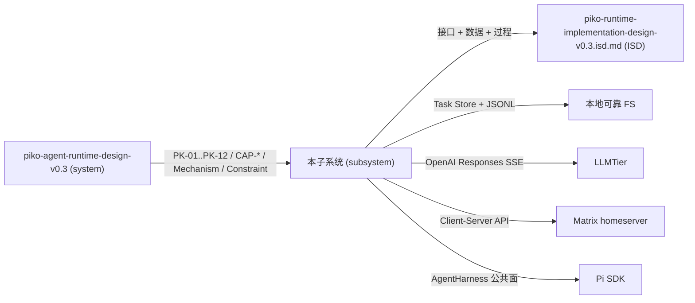
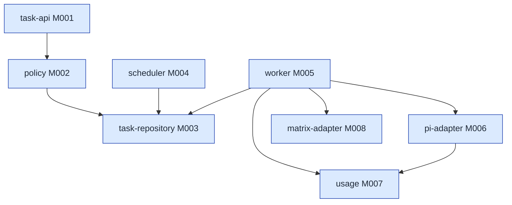
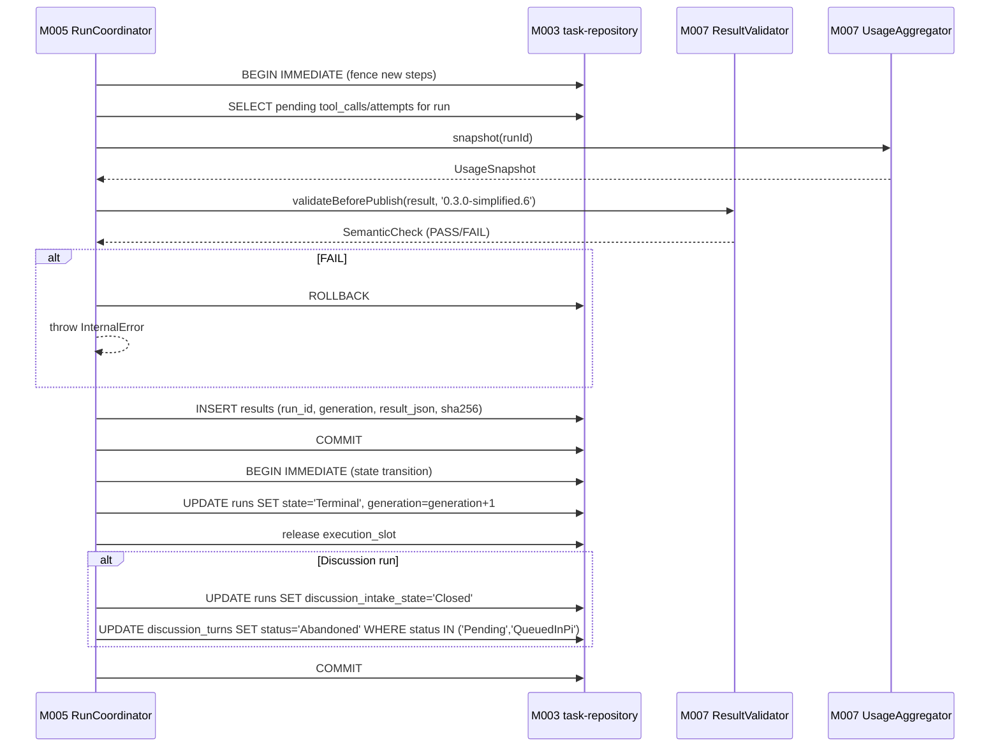
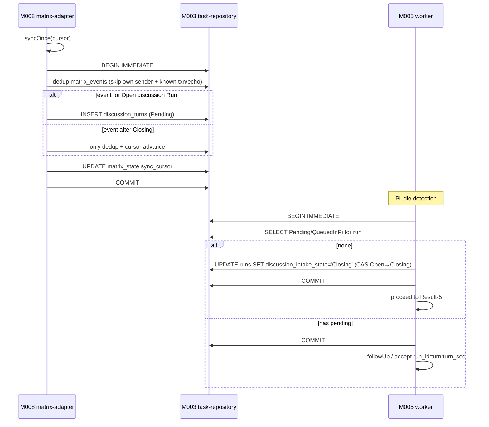

<!-- STD_DOCUMENT_COVER_BEGIN -->
# Piko Agent Runtime Core 内部设计

> STD 使用入口：[项目采用说明与标准导航](../../README.md#std-entry)

| 文档字段 | 值 |
|---|---|
| Document ID | `piko-agent-runtime-core-internal-design-v0.3` |
| Document Version | `0.1.0` |
| Status | `Approved` |
| Project | `piko` |
| Document Owner | Piko Architecture Owner |
| Last Modified Date | `2026-09-25` |
| Template ID | `design.subsystem` |
| Template Version | `1.0.0` |
<!-- STD_DOCUMENT_COVER_END -->

## 1. 概述与设计输入

`piko-agent-runtime-core-internal-design-v0.3` 是 Piko Agent Runtime 软件系统的直属子系统设计（`design_level=subsystem`、`template_id=design.subsystem` 1.0.0、`parent_document_id=piko-agent-runtime-design-v0.3`）。它把系统设计的边界翻译为可执行的模块组织、运行设计、数据结构和接口定义；不重复系统政策。

子系统承担：模块划分、Run/session/operation 持久化顺序、Result 两步提交、Harness 集成、Matrix discussion intake、Usage ledger、本地 FS 上的安全与失败收口。子系统不重新决定系统层承诺（PK-01..PK-12）、不定义跨子系统协议、不重复机器契约字段。

### 1.1 背景、设计目的与范围

Piko 启动后进入任务事务层：接收已签名的 Slinky 任务、持久化 `task_id` + Run + session 绑定、驱动 Pi Harness、封装稳定 Result。本子系统负责组织这一层内部的组件、模块、协作与运行，向上交付与系统设计 §3.4 约束一致的行为，向下交付可被 `piko-runtime-implementation-design-v0.3.isd.md`（`design.implementation` 1.0.0）直接承接的符号、签名、过程、并发与错误。

子系统不重新决定 Slinky 业务流程、Memory authority、LLMTier Agent 状态、Matrix homeserver、supervisor/Secret backend、跨系统 exactly-once、产品 Topic/SID/RID、非 SSE Responses fallback。这些在系统设计 §2.2 与 §3.4 已记录。

### 1.2 应用环境、外部关系与输入输出



图 S-1 · `piko-agent-runtime-core-internal-design-v0.3` v0.1.0 / Target / NOT_BUILT。子系统作为黑盒：上接系统，下交付 ISD，不重写 Slinky/外部。

### 1.3 上位设计基线、分配功能与约束

| 上级基线 / Constraint ID / 决定状态 | 条件及预算/行为保证 | 本地 Capability ID / 功能 | 需求 ID / 要求 | 不可改变 / 自由度 | 落实章节 / 验证责任 | 差距与反馈 |
|---|---|---|---|---|---|---|
| PK-01 · single slot + isolated session · Approved | 全局唯一；`pi_session_id=run_id` 确定性绑定；lease epoch 唯一 fencing | CAP-LIFECYCLE / CAP-SCHED | PK-T01 / PK-T13 | 自由度：worker 内部不引入并行阶段；不可改变：lease epoch 与 slot 单例 | §3 / §4 / §7；PK-T01/PK-T13 | — |
| PK-02 · task_id 稳定身份 · Approved | tombstone 永久拒绝；同 ID 同内容不重新检查动态条件 | CAP-SUBMIT | PK-T03 / PK-T15 | 自由度：JSON 比较规则字段顺序；不可改变：tombstone 不可复活 | §3 / §5 / §7；PK-T03/PK-T15 | — |
| PK-03 · 截止与预算 · Approved | deadline + max_model_calls + max_tool_calls；耗尽 → typed error | CAP-LIFECYCLE / CAP-CANCEL | PK-T04 | 自由度：worker 不修改 deadline 语义；不可改变：budget CAS 在 `before_tool` | §3 / §4 / §7；PK-T04/PK-T05 | — |
| PK-04 · Responses SSE 唯一路径 · Approved | `stream:true`、`store:false`、`maxRetries=0`；三次 prompt-cache 字段缺席 | CAP-LIFECYCLE | PK-T09 / PK-T10 | 不可改变：provider 内层 retry 0；非 SSE 不可静默切换 | §3 / §5 / §7；PK-T09/PK-T10 | — |
| PK-05/06 · 工具 CAS + `replay:safe` · Approved | `(run_id, operation_id, toolCallId)` CAS；启动时 `recovery_contract_ref` 解析 | CAP-LIFECYCLE | PK-T06 / PK-T17 | 不可改变：runtime 不新增 `safe` 声明 | §3 / §5 / §7；PK-T06/PK-T17 | — |
| PK-07 · Result 两步提交 · Approved | 写 `results` 与写终态不可合并；恢复器只补第二步 | CAP-LIFECYCLE / CAP-RESULT | PK-T05 / PK-T15 | 不可改变：两步事务分开；fenced write | §3 / §4 / §5 / §7；PK-T05/PK-T15 | — |
| PK-08 · Matrix Client-Server · Approved | single identity；discussion intake CAS Open→Closing→Closed | CAP-MATRIX | PK-T08 | 不可改变：不启用 AS 路径；txn_id 确定性派生 | §3 / §5 / §7；PK-T08 | — |
| PK-09/10 · Usage 完整性 + 冻结 · Approved | 6 字段每字段 sum/null + missing_fields；ResultValidator 前置 | CAP-LIFECYCLE | PK-T10 / PK-T16 | 不可改变：semantic validator 版本绑定；Result 发布后不修改 | §3 / §5 / §7；PK-T10/PK-T16 | — |
| PK-11 · 无 Memory API · Approved | 禁止 Memory 类 export/import；不引入 Slinky Memory 字段 | CAP-NONE | PK-T11 | 不可改变：不引入 Slinky Memory | §3 / §11；PK-T11 | — |
| PK-12 · 恢复边界 · Approved | 顺序：Result → Run → lease → Pi session → Harness → ledger → Matrix | CAP-LIFECYCLE | PK-T12 | 不可改变：不复活旧权威；不模拟成功 | §3 / §4 / §7 / §9；PK-T12 | — |

| Capability ID | 场景 / 入口 | 输入、主要行为与输出 | 异常/拒绝结果 | Planned/Implemented | 验证判据与实际状态 |
|---|---|---|---|---|---|
| CAP-SUBMIT | Slinky → HTTP | JSON/Schema + bearer + `task_id` 查 → 比较/创建/拒 | 422/410/409/429/503 | Planned | PK-T03 / PK-T15 |
| CAP-LIFECYCLE | 受理后 Run 全程 | lease → accept Pi → drive → fence → 两步 Result | typed error per §9.2 | Planned | PK-T01/04/05/09/10/16 |
| CAP-CANCEL | Slinky → HTTP | 按 state 分流 Queued/Cancelling/Terminal | 200/202 + typed | Planned | PK-T05 |
| CAP-RESULT | Slinky → HTTP | 非终态 409 `RunNotTerminal`；终态返回 generation | 409/401/404/410/500 | Planned | PK-T16 |
| CAP-MATRIX | discussion Run | intake Open → Closing → Closed；sync 批事务 | `DiscussionAccessLost` | Planned | PK-T08 |
| CAP-NONE | — | 不实现 Memory API | — | Implemented（裁剪） | PK-T11 |

### 1.4 本版本适用条件与实现、验证状态

| 设计版本 | 模板 | 部署配置 | 支持范围 | 验证证据 | 实际状态 |
|---|---|---|---|---|---|
| v0.1.0 | `design.subsystem` 1.0.0 | TypeScript/Node.js 单进程；Pi 0.85.1 @ commit `9767ba275f3e9a5ee0f5c5342249b629ab1b2282`；本地可靠 FS | 单实例单 slot；Slinky 单 principal | NOT_BUILT（PK-T01..PK-T12 / PK-T15..PK-T20 全 NOT_RUN） | Approved（设计） |

文档 Approved 不推导实现完成；验证证据必须独立 Run。

### 1.5 主要功能设计（按能力展开）

**CAP-SUBMIT**（见系统设计 §7.2 步骤图）：提交两步校验。Step 1：JSON/Schema + bearer principal；Step 2：按 `task_id` 在 SQLite 查记录，tombstone → 410 `Gone`，active `task_json` 同字段值返回原 Run，不同 → 409 `TaskConflict`，不存在 → 检查 deadline/policy/discussion/queue → 单事务插入 `tasks` + Queued `runs` +（discussion）初始 Pending turn，commit 后返回 202。422/429/503 不创建 Run，可用同 `task_id` 重试。

**CAP-LIFECYCLE**（见 §7 关键过程）：Scheduler 取得 lease epoch（fencing 唯一权威），worker 创建/读取 `run_sessions`（`pi_session_id=run_id`、lane `main`），切 `runs.state='Running'` 并 generation+1。`pi-adapter.openOrCreateRunSession` 后 `lane.accept(typedInstruction)`；Harness 自管 operation stage，Piko 仅观察 `run_sessions.active_operation_id` / `observed_tip_id` 与 `model_attempts` / `tool_calls` / `usage.raw_usage_json`。完成时按 §7 / 系统 §7.4 两步提交协议写 `results` 与终态。

**CAP-CANCEL**（见系统设计 §7.4 + §6.6 流程图）：Queued 取消单事务写 `cancel_requested=1`、插入 `model_attempts=0` 零调用 immutable Result、写 `runs.state='Cancelled'`，返回 `CancelledBeforeStart`；Running 取消写 stop intent 与 `runs.state='Cancelling'`，返回 `StopRequested`；已终态返回 `AlreadyTerminal`。

**CAP-RESULT**：非终态返回 `RunNotTerminal`；Result generation 由 `results` 表维护，已发布 generation 内容冻结；迟到 usage 仅替换 `model_attempts.record_version`。

**CAP-MATRIX**：每批 `syncOnce` 在 `BEGIN IMMEDIATE` 中写 event dedup + `DiscussionTurn` + cursor；自身 sender 与已知 txn/echo 只写 dedup；discussion 用 `PikoDiscussionMessage` 保存 `event_id`，provider projection 删除 `event_id` 只投影可见正文；txn_id 由 instance/run/turn/action 确定性派生，retry 复用；Pi idle 后 CAS intake Open→Closing。

### 1.6 与系统设计的对应关系

| 系统基线 / 组件、功能、Mode、Process/Step、Topology 或 Constraint ID | 系统已定内容 | 本地细化 / 对应 ID 及章节 | 下级自由度 | 组合验证 / 差异反馈 |
|---|---|---|---|---|
| PK-01 单 slot + 独立 session | lease epoch fencing；`pi_session_id=run_id` | §3 task-api/policy/task-repository/scheduler/worker/pi-adapter；§4.1 调度与通信；§7 P-BIZ | 内部模块函数组织 | 系统组合验证 PK-T01；ISD 局部 PK-T01 |
| PK-02 任务事务稳定身份 | tombstone 永久拒绝；同 ID 同内容不重新检查动态条件 | §3 + §5.7 tasks/runs DDL + §7 P-BIZ | path 集合字段按集合比较、时间按 UTC instant、对象成员顺序忽略 | 系统组合验证 PK-T15 |
| PK-03 截止与预算 | request `deadline_at` + `max_model_calls` + `max_tool_calls` | §3 policy + §7 P-LIFECYCLE + §9.2 故障映射 | budget CAS 在 `before_tool`；worker 不修改 deadline 语义 | 系统组合验证 PK-T05 |
| PK-04 Responses SSE 唯一路径 | `stream:true`、`store:false`、`maxRetries=0` | §3 pi-adapter + §7 P-LIFECYCLE | 不替换 provider adapter；不静默切 non-stream | 系统组合验证 PK-T10 |
| PK-05/06 工具 CAS + `replay:safe` | `(run_id, operation_id, toolCallId)` CAS；启动时绑定 `recovery_contract_ref` | §3 pi-adapter + §5 tool_calls + §7 P-LIFECYCLE | runtime 不新增 `safe` 声明 | 系统组合验证 PK-T06 |
| PK-07 Result 两步提交 | 写 `results` 与写终态不可合并 | §3 task-repository + §7 P-RESULT | 两步事务分开；fenced write | 系统组合验证 PK-T05 |
| PK-08 Matrix Client-Server | single identity；discussion intake CAS | §3 matrix-adapter + §7 P-MATRIX | 不启用 AS 路径；txn_id 确定性派生 | 系统组合验证 PK-T08 |
| PK-09/10 Usage 完整性 + 冻结 | 6 字段 sum/null + missing_fields；ResultValidator 前置 | §3 usage + §5 model_attempts + §7 P-RESULT | semantic validator 版本绑定；Result 发布后不修改 | 系统组合验证 PK-T16 |
| PK-11 无 Memory API | 静态扫描：禁止 Memory 类 export/import | §3 所有模块 + §11.3 自检 | 不引入 Slinky Memory 字段 | 系统组合验证 PK-T11 |
| PK-12 恢复边界 | 顺序：Result → Run → lease → Pi session → Harness → ledger → Matrix | §3 worker + §4.2 启动 + §9 异常 | 不复活旧权威；不模拟成功 | 系统组合验证 PK-T12 |

系统图与本文模块/运行图保持不同粒度（系统：第 0 层；子系统：第 1 层模块展开），引用相同外部边界。

### 1.7 对象身份、直属父设计与责任边界

| 本对象 ID / 类型 | 本 Document ID | 父对象 ID / 父设计 Document ID 与基线 | parent_document_id 核对 / 父设计角色 | 本层决定 / 下层自由度 / 跨层约束 |
|---|---|---|---|---|
| `SUB-ARC` · 软件子系统 `piko-agent-runtime-core-internal-design-v0.3` · `design_level=subsystem` | `piko-agent-runtime-core-internal-design-v0.3` v0.1.0 | `SW-P` 软件系统 `piko-agent-runtime-design-v0.3` v0.4.0 @ commit `e721ac0...` | metadata `parent_document_id = piko-agent-runtime-design-v0.3` 与父设计基线一致 | 本层决定：模块划分、SQLite DDL、Harness 集成方式、Matrix intake CAS、Usage 聚合、Result 两步提交；下层（ISD）自由度：内部函数组织、变量命名、文件布局、测试组织；跨层约束：PK-01..PK-12 不可改变 |

软件子系统使用 `design_level=subsystem`；下级为软件模块（`design.definition` 或 `design.implementation`），本项目仅采用 `design.implementation`（`piko-runtime-implementation-design-v0.3.isd.md`）。当前不采用递归软件子系统。

## 2. 总体架构设计（第 0 层）

Piko 子系统的整体处理路径是：HTTP request → `task-api`（受理校验） → `policy`（请求/路径/工具校验） → `task-repository`（Run/session/result/ledger 事务） → `scheduler` 取得 lease → `worker` 驱动 Pi/Matrix/Usage → `task-repository` 写 results → `task-repository` 写终态。功能分区为四层：

| 分区 | 职责 | 主要模块 |
|---|---|---|
| 受理层 | HTTP 入口 + 校验 | `task-api` (M001) + `policy` (M002) |
| 事务层 | Run/session/result/ledger 持久化 + 单 slot 调度 | `task-repository` (M003) + `scheduler` (M004) + `worker` (M005) |
| 适配层 | 外部系统封装 + 错误传播 | `pi-adapter` (M006) + `usage` (M007) + `matrix-adapter` (M008) |
| 横切层 | 配置/启动 + 观测 | `bootstrap` (M000) + `observability` (M009) |

四个分区在同一进程内运行；不引入额外服务。理由：单实例事务层避免跨进程 writer 协调；与系统设计 §3.3 关键决定 2 一致。

### 2.1 整体处理方案与功能分配

模式：**单进程事件循环 + SQLite 单 writer + lease epoch fencing**。提交路径固定为 JSON/Schema → bearer principal → `task_id` 查记录 → 比较/创建 → 202 ack。运行路径固定为 scheduler tick → acquireSlot → worker → `pi-adapter.openOrCreateRunSession` → `lane.accept(typedInstruction)` → Pi 自管 operation → worker 观察 → 两步 Result。讨论 Run 在 Open intake 期间接收 DiscussionTurn；Pi idle 后 CAS intake Open→Closing；只有 Closing worker 可发 Completed Result；Failed/Cancelled 终态事务先标 Abandoned 未消费 turn 再 Closed intake。

每个 Capability 在 §1.3 列出对应分区：CAP-SUBMIT 走受理层 → 事务层；CAP-LIFECYCLE 走事务层 → 适配层；CAP-CANCEL 走受理层 → 事务层；CAP-RESULT 走受理层 → 事务层；CAP-MATRIX 走适配层 + 事务层。

## 3. 分层与模块设计（第 1 层）



图 S-2 · `piko-agent-runtime-core-internal-design-v0.3` v0.1.0 / Target / NOT_BUILT。模块组织与系统设计 §3.1 同构；ISD 单独承载实现。

### 3.1 单层或分区设计（按 §2 顺序展开）

**受理层（M001 + M002）**：M001 接收 HTTP request，做 JSON/Schema 静态校验 + bearer principal 校验；M002 把已校验请求生成 `ValidatedTaskSubmission` 或 typed error；M001 不持久化业务、不直接操作 Pi/Matrix。受理完成后由 M001 委托 M003 创建/查询 Run。

**事务层（M003 + M004 + M005）**：M003 唯一持有 SQLite connection；所有 Run/session/result/ledger 写都通过 `BEGIN IMMEDIATE` 短事务；fenced write 保证 generation/epoch 一致。M004 单 slot 调度：每 tick 检查 singleton `execution_slot`，空闲则加 lease epoch 绑定 owner/boot/run；M005 持有 Run 寿命状态：创建/恢复 session、切 Running、cancel、deadline 检查、Result 两步发布。

**适配层（M006 + M007 + M008）**：M006 持有固定 Pi upstream commit + adapter patch manifest hash；`PikoDurableFileSystem` 保证 JSONL append 后 `fsync(file)`；create/rename 后 `fsync(parent dir)`；`before_request`/`before_tool`/`onRawUsage`/`onResponse` hook 注入稳定身份与原始 usage。M007 `UsageAggregator` 按 attempt identity 汇总原始 usage + 冻结 UsageSnapshot；`ResultValidator` 在 publish 前 fail closed。M008 `matrix-js-sdk` Client-Server 封装 + discussion intake CAS。

**横切层（M000 + M009）**：M000 启动顺序 §7.1 P-START；M009 结构化 JSON 日志 + metric + audit；不反向控制业务。

| 层/分区 | 对象 ID / 类型 / 父对象 ID | 职责 / 非职责 | 部署单元 / 实现位置或 NOT_IMPLEMENTED | 拥有的状态/资源 | 下级设计入口（Document ID / 模板类型 / 计划文件名 / 状态） | 前置依赖 |
|---|---|---|---|---|---|---|
| 受理 | M001 `task-api` / module / `SUB-ARC` | 四项 HTTP operation；不持久化业务 | 进程寿命；TS handlers | 请求寿命 | ISD `piko-runtime-implementation-design-v0.3.isd.md` §3.2 / Planned | M002 + M003 |
| 受理 | M002 `policy` / module / `SUB-ARC` | request/path/tool/deadline/budget 判定；不持状态 | 进程寿命 | 启动绑定 | ISD §3.3 / Planned | M003 |
| 事务 | M003 `task-repository` / module / `SUB-ARC` | Run/session/result/ledger 事务 + fenced write | 进程寿命；SQLite | 进程寿命 | ISD §3.4 / Planned | — |
| 事务 | M004 `scheduler` / module / `SUB-ARC` | 单 slot 领取/续租/fence；不决策业务 | 进程寿命 | 进程寿命 | ISD §3.5 / Planned | M003 |
| 事务 | M005 `worker` / module / `SUB-ARC` | Run 事务协调；不镜像 Pi Agent loop | Run 寿命；持有 lease | Run 寿命 | ISD §3.6 / Planned | M003 + M006 + M007 + M008 |
| 适配 | M006 `pi-adapter` / module / `SUB-ARC` | AgentHarness 公共面；不替换 provider adapter | Run 寿命；Pi session 句柄 | Run 寿命 | ISD §3.7 / Planned | Pi upstream commit 锁定 |
| 适配 | M007 `usage` / module / `SUB-ARC` | Usage 聚合 + ResultValidator；不改 generation | 进程寿命；snapshot 缓存 | 进程寿命 | ISD §3.9 / Planned | M006 + ResultValidator 版本绑定 |
| 适配 | M008 `matrix-adapter` / module / `SUB-ARC` | Client-Server 封装；不启用 AS 路径 | 进程寿命；single identity | 进程寿命 | ISD §3.8 / Planned | M003 |
| 横切 | M000 `bootstrap` / subsystem / `SUB-ARC` | 启动顺序 + preflight + 配置绑定 | 进程寿命 | 进程寿命 | ISD §3.1 / Planned | M003 + M006 |
| 横切 | M009 `observability` / subsystem / `SUB-ARC` | 结构化日志 + metric + audit；不反向控制 | 进程寿命 | 进程寿命 | ISD §3.10 / Planned | — |

### 3.2 模块处理概要（在各层内按模块展开）

**M001 `task-api`**：HTTP server 装配；中间件顺序：request id → auth → JSON/Schema → handler；handler 委托 `policy` + `task-repository`；错误映射与 `interfaces/error-codes/agent-runtime-v0.3.yaml` 一致。

**M002 `policy`**：纯函数 + 启动时绑定；`validateSubmission` 检查字段、deadline、权限交集；`canonicalizePath` 拒绝绝对路径/反斜线/`.`/`..`/空 segment，解析 symlink 后必须在 workspace root 内；`bindToolProfile` 校验 `recovery_contract_ref` 与 `implementation_ref` 一致。

**M003 `task-repository`**：详见 §4.1 + §5 + §7。`createOrGetRun`、`acquireSlot`、`renewLease`、`mutateRun`、`publishResult`、`listPendingDiscussionTurns`、`recordModelAttempt`、`recordToolCall` 是其对外接口。

**M004 `scheduler`**：`SingleSlotScheduler`；`acquireSlot(ownerId): Lease | null`；`renewLease(lease): Lease`；`fence(epoch): void`。

**M005 `worker`**：`RunWorker` + `RunCoordinator` + `cancel`；详见 §7 关键过程。

**M006 `pi-adapter`**：`PiRuntime` interface + 实现；详见 §6.2 + §7。

**M007 `usage`**：`UsageAggregator` + `ResultValidator`；详见 §5 + §7 P-RESULT。

**M008 `matrix-adapter`**：`MatrixRuntime` interface + 实现；详见 §6.2 + §7 P-MATRIX。

**M000 `bootstrap`**：详见 §7.1 P-START。

**M009 `observability`**：详见 §10 + §11.1。

## 4. 运行设计

### 4.1 运行单元、调度与通信

**运行单元映射**：所有模块同进程；进程内按职责切到 SQLite single writer；HTTP handler 不持有长事务。

**调度**：单 execution slot 由 lease epoch 唯一 fencing；scheduler tick 由内部定时器触发；backpressure 在 Run 创建写事务内检查 `storage.max_queue_depth`，满时不创建 Run 返回 429 `QueueFull`。

**通信**：HTTP Slinky ↔ Piko；进程内 `AgentHarness` ↔ `pi-adapter`；HTTPS LLMTier ↔ Pi provider；HTTPS Matrix homeserver ↔ `matrix-adapter`；进程内 SQLite ↔ 所有 writer；进程内 JSONL ↔ `pi-adapter`。详细时序见 §7。

### 4.2 启动、运行与退出

**启动**：详见 §7.1 P-START。S1-S8 顺序：parse → schema → bind tool/recovery → canonicalize paths → open/migrate store → verify Pi upstream + patch manifest → preflight → listen。S6 不匹配不进入 S7；S7 部分失败立即 F1。W1 启动监督超时未收到 READY 触发强制终止并等待退出确认；未确认阻塞。

**运行**：见 §7 关键过程。

**退出**：详见系统设计 §7.4 P-STOP。T1 SIGTERM → T2 停止新受理 → T3 fence lease/writer → T4 等待有界 drain → T5 超时则强制 abort → T6 进程退出码确认。部署工具拿到退出码后才允许新进程启动。崩溃恢复见 §9。

## 5. 数据结构设计

本子系统层不重复维护数据结构的字段全集；DDL 与语义约束的唯一权威在 ISD §4 + `interfaces/schemas/agent-runtime-v0.3.schema.json`。本节提供阅读视图，关联到唯一权威。

### 5.1 公共基础类型与枚举

#### 5.1.N `RunState`

- **完整定义、Data/Type/Error ID 与唯一来源**：`RunState = "Queued" | "Running" | "Cancelling" | "Completed" | "Failed" | "Cancelled"`。来源：`piko-agent-runtime-design-v0.3` §3 + `piko-agent-runtime-contract-v0.3` §6 + `piko-runtime-implementation-design-v0.3.isd.md` §4.1.1。
- **逐字段/逐值类型、范围、含义与跨字段约束**：每值代表 Run 事务阶段；与 `cancel_requested`、`discussion_intake_state` 跨字段约束见 ISD §4.2 `RunRecord`。
- **生产/修改、所有权、可见点、寿命及失败出口**：唯一写入者 `task-repository`（M003）；可见点 `runs.state`；寿命 = Run 寿命；不允许从终态回退。
- **合法与拒绝实例、V/Case 与证据状态**：合法转移见 §5 + §7。Case：ISD §9.1 VRC-RUNTIME-002/004。

#### 5.1.N `DiscussionIntakeState`

- **完整定义、Data/Type/Error ID 与唯一来源**：`DiscussionIntakeState = "Disabled" | "Open" | "Closing" | "Closed"`。来源：`piko-agent-runtime-core-internal-design-v0.3` §4 + ISD §4.1.2。
- **逐字段/逐值类型、范围、含义与跨字段约束**：仅 discussion Run 使用；非 discussion 固定 `Disabled`；discussion 单向 `Open → Closing → Closed`。
- **生产/修改、所有权、可见点、寿命及失败出口**：`task-repository`（M003）写入；可见点 `runs.discussion_intake_state`。
- **合法与拒绝实例、V/Case 与证据状态**：仅 Open 可接收 `DiscussionTurn`；仅 Closing 可发 Completed Result。Case：ISD §9.1 VRC-RUNTIME-005。

#### 5.1.N `AttemptState` / `ToolCallState` / `ReplayPolicy` / `DiscussionTurnStatus`

- **完整定义、Data/Type/Error ID 与唯一来源**：分别见 ISD §4.1.3 / §4.1.5 / §4.1.4 / §4.1.6。
- **逐字段/逐值类型、范围、含义与跨字段约束**：`AttemptState = "Reserved" | "Started" | "UsageObserved" | "Terminal" | "Unknown"`；`ToolCallState = "Reserved" | "Started" | "Terminal" | "Unknown"`；`ReplayPolicy = "never" | "safe"`；`DiscussionTurnStatus = "Pending" | "QueuedInPi" | "Consumed" | "Abandoned"`。
- **生产/修改、所有权、可见点、寿命及失败出口**：`task-repository`（M003）持久化；可见点 `model_attempts.state` / `tool_calls.state` / `discussion_turns.status`。
- **合法与拒绝实例、V/Case 与证据状态**：`replay="safe"` 必须绑定 `recovery_contract_ref` 且启动时已解析；非法绑定 → 启动失败。Case：ISD §9.1 VRC-RUNTIME-004/006。

### 5.2 业务与操作数据结构

**N/A · 由 ISD 唯一维护**：`TaskRecord` / `RunRecord` / `RunSessionRecord` / `ExecutionSlot` / `ModelAttempt` / `ToolCall` / `DiscussionTurn` / `MatrixSendRecord` 定义见 `piko-runtime-implementation-design-v0.3.isd.md` §4.2。本节不重定义字段。Tailoring 依据：模板 §5.2 适用条件为"业务操作实际交换和保存的对象"；子系统层以引用 IDL/Schema 为主。

### 5.3 配置与规则数据结构

**N/A · 见 §8 与 ISD §4.3**：`PikoRuntimeConfig` / `ToolProfile` 定义见 ISD §4.3.1-§4.3.2 + 系统设计 §10。本子系统层仅做"启动时绑定"，不重定义。

### 5.4 通信报文结构

**N/A · 见 §6 与契约**：`RunSubmitRequest` / `AgentResult` / `UsageSnapshot` / `PikoDiscussionMessage` 见 `piko-agent-runtime-contract-v0.3` + `interfaces/openapi/agent-runtime-openapi-v0.3.yaml` + `interfaces/schemas/agent-runtime-v0.3.schema.json`。本子系统层不维护第二套。

### 5.5 设备与 FPGA 表项结构

**N/A · 纯软件范围**：本子系统无设备/FPGA/RTL 表项。Tailoring 依据：模板 §5.5 适用条件为"实际拥有设备或 RTL 表项"。

### 5.6 运行状态数据结构

#### 5.6.N `Lease`

- **完整定义、Data/Type/Error ID 与唯一来源**：`{ owner_id, boot_id, epoch, acquired_at, heartbeat_at }`。来源：ISD §4.6.1。
- **逐字段/逐值类型、范围、含义与跨字段约束**：`epoch >= 1`；`heartbeat_at` 仅用于检测，不跨 epoch 判定。
- **生产/修改、所有权、可见点、寿命及失败出口**：`scheduler`（M004）持有；唯一写入者 `task-repository`（M003）。
- **合法与拒绝实例、V/Case 与证据状态**：fencing 时 `epoch + 1`；恢复器以最新 lease epoch 为准。Case：PK-T01 / PK-T13。

#### 5.6.N `FencedWrite`

- **完整定义、Data/Type/Error ID 与唯一来源**：`{ run_id, expected_generation, expected_state_in: RunState[], expected_lease_epoch, mutation: RunMutation }`。来源：ISD §4.6.2。
- **逐字段/逐值类型、范围、含义与跨字段约束**：`UPDATE … WHERE generation=? AND state IN (?, ?, …)` 影响行数恰为 1 才算成功。
- **生产/修改、所有权、可见点、寿命及失败出口**：唯一写入者 `task-repository`（M003）；非法 fencing 返回内部 `FencedWrite` 错。
- **合法与拒绝实例、V/Case 与证据状态**：合法 fencing：终态不可回退；非终态的 generation 必须单调递增。Case：PK-T05。

### 5.7 数据库表结构

**N/A · 见 ISD §4.7.1**：DDL 唯一权威在 ISD §4.7.1（`PRAGMA user_version=2`）。本节记录表名 + 关键约束的阅读视图：

| 表 | 主键/唯一 | 关键约束 | 权威 |
|---|---|---|---|
| `tasks` | `task_id`; unique `run_id` | `identity_state IN ('Active','Tombstone')`；tombstone 时 `task_json IS NULL` | ISD §4.7.1 |
| `runs` | `run_id`; FK `tasks` | `state IN ('Queued','Running','Cancelling','Completed','Failed','Cancelled')`；`generation >= 1` | ISD §4.7.1 |
| `run_sessions` | `run_id`; unique `pi_session_id` | `lane_name='main'`；`lease_epoch >= 1` | ISD §4.7.1 |
| `execution_slot` | singleton `slot_id=1` | lease 唯一 fencing | ISD §4.7.1 |
| `results` | `run_id`; unique `(run_id, generation)` | generation 内容冻结 | ISD §4.7.1 |
| `model_attempts` | `(run_id, operation_id, step_id, attempt)` | state 状态机；`raw_usage_json` 保留字段存在性 | ISD §4.7.1 |
| `tool_calls` | `(run_id, operation_id, tool_call_id)` | replay + recovery contract 校验 | ISD §4.7.1 |
| `matrix_state` | singleton `singleton=1` | sync cursor + membership version | ISD §4.7.1 |
| `matrix_events` | `(room_id, event_id)` | dedup 唯一性 | ISD §4.7.1 |
| `discussion_turns` | `(run_id, event_id)`; unique `(run_id, turn_seq)` | status 状态机；Open→Closing→Closed | ISD §4.7.1 |
| `matrix_sends` | `txn_id` | 确定性派生 | ISD §4.7.1 |
| `audit_events` | monotonic `audit_id` | 写状态改变、credential ref 变更、强制 fence、schema migration、responses probe | ISD §4.7.1 |
| `instance_meta` | `key` | schema_generation / instance id / boot id | ISD §4.7.1 |

### 5.8 错误码与错误结构

公共错误码逐码定义在 `interfaces/error-codes/agent-runtime-v0.3.yaml` + `piko-agent-runtime-contract-v0.3` §6。本节记录本子系统层的产生/透传责任：

| Error ID | 产生条件（子系统层） | 透传到 HTTP | Case |
|---|---|---|---|
| `Unauthorized` | `policy.validateSubmission` bearer 失败 | 401 | PK-T03 |
| `TaskConflict` | `task-repository.createOrGetRun` 同 ID 不同内容 | 409 | PK-T03 |
| `Gone` | `task-repository.createOrGetRun` tombstone | 410 | PK-T03 |
| `InvalidDiscussionContext` | `matrix-adapter.verifyDiscussionStart` 失败 | 409 | PK-T08 |
| `QueueFull` | `task-repository.createOrGetRun` queue depth 超限 | 429 | PK-T03 |
| `RunNotTerminal` | `task-repository` `results` 不存在且 `runs.state` 非终态 | 409 | PK-T16 |
| `ResultUnavailable` | 终态 Run `results` 缺失 | 500 | PK-T16 |
| `CancelledBeforeStart` | `worker` Queued cancel 完成两步提交 | 200 | PK-T05 |
| `StopRequested` | `worker` Running cancel 写 stop intent | 202 | PK-T05 |
| `AlreadyTerminal` | `worker` 已终态 | 200 | PK-T05 |
| `DeadlineExceeded` / `BudgetExceeded` / `ModelUnavailable` / `ModelResponseInvalid` / `ToolFailure` / `UnsafeRetryBlocked` / `ExecutionStateUnknown` / `DiscussionAccessLost` / `CancelledByRequest` / `InternalError` | 见系统设计 §3.4 + 契约 §6 | Result `failure.code` | 各 PK-T |

### 5.9 核心数据模型与组织

| 数据对象 / 固定类型来源 | 关联与逻辑键 | 组织选择及依据 | 读写/一致性 | 容量与保留约束 |
|---|---|---|---|---|
| `TaskRecord` / ISD §4.2.1 | `task_id` 唯一 → `run_id` 唯一 | tasks + runs 单表分表；避免任务定义与 Run 状态耦合 | writer 单例；fenced write | 保留 `max(deadline_at, accepted_at)+7d`；tombstone 永久 |
| `RunSessionRecord` / ISD §4.2.3 | `run_id` 唯一 → `pi_session_id` 唯一 | 单 Run 单 session；确定性 identity 便于跨进程对账 | writer 单例 | Run 寿命 |
| `ExecutionSlot` / ISD §4.2.4 | singleton `slot_id=1` | 单实例单 slot；singleton 强制 | writer 单例 | 进程寿命 |
| `ModelAttempt` / ISD §4.2.5 | `(run_id, operation_id, step_id, attempt)` 复合主键 | 复合主键匹配 Harness attempt identity；保留字段存在性 | writer 单例；internal `record_version` 推进 | Run 寿命 + 滞后到期 |
| `ToolCall` / ISD §4.2.6 | `(run_id, operation_id, tool_call_id)` 复合主键 | 匹配 Harness toolCallId；recovery contract 启动时校验 | writer 单例 | Run 寿命 |
| `DiscussionTurn` / ISD §4.2.7 | `(run_id, event_id)`; unique `(run_id, turn_seq)` | event_id 幂等 + turn_seq 顺序 | writer 单例 | Run 寿命 |
| `MatrixSendRecord` / ISD §4.2.8 | `txn_id` 唯一 | 确定性 txn_id 派生；retry 复用 | writer 单例 | Run 寿命 + 短期 |

模型选择依据：所有 Run 事务层字段共享 SQLite `BEGIN IMMEDIATE` writer，避免跨表事务歧义；Harness deterministic identity（`pi_session_id=run_id`、lane `main`、operation ID 规则）保证跨进程崩溃后对账；复合主键保留 attempt/tool 完整身份。

### 5.10 数据形态与阶段变换

| Data/Stage ID / Process 对应 | 前后形态及类型来源 | 变换规则 / 原因 | 生产者→消费者 | 共享、复制或拆合 / 生命周期 |
|---|---|---|---|---|
| DS-SUBMIT-1 | HTTP `RunSubmitRequest` (Contract §1) → `ValidatedTaskSubmission` (ISD §5) | `policy.validateSubmission` 校验字段、deadline、权限；canonicalizePath；tool profile 绑定 | Slinky → task-api → policy → task-repository | HTTP 寿命 → 进程寿命 |
| DS-SUBMIT-2 | `ValidatedTaskSubmission` → `tasks` + `runs` + (discussion) `discussion_turns` 初始 Pending | `task-repository.createOrGetRun` 单事务；generation=1 | task-repository → SQLite | 进程 → 持久 |
| DS-LIFECYCLE-1 | `tasks`/`runs` (Queued) → `run_sessions` + `runs.state='Running'` + generation+=1 | `scheduler.acquireSlot` + worker 单事务 | scheduler → worker → task-repository → pi-adapter | 持久 → 内存 + 持久 |
| DS-LIFECYCLE-2 | Pi `lane.accept(typedInstruction [+ PikoDiscussionMessage])` → `run_sessions.active_operation_id` + `discussion_turns.status='Consumed'` | Pi commit → Piko 观察 → 单事务标 Consumed | pi-adapter → task-repository | 进程 → 持久 |
| DS-LIFECYCLE-3 | Pi stream events → `model_attempts` (raw_usage_json + state) + `tool_calls` (CAS) | `onRawUsage` / `before_tool` hook 在归一化前保存；CAS 占用预算 | pi-adapter → usage → task-repository | 进程 → 持久（attempt ledger） |
| DS-LIFECYCLE-4 | Pi operation result + `model_attempts` + `tool_calls` → `results` immutable generation | fence 新步骤 + `ResultValidator` + `UsageAggregator.snapshot` + `task-repository.publishResult` 第一步 | worker → usage → task-repository | 内存 + 持久 → 持久 |
| DS-LIFECYCLE-5 | `results` generation N → `runs.state='Terminal'` + `runs.generation=N+1` | `task-repository.publishResult` 第二步；discussion intake 同事务改 Closed | worker → task-repository | 持久 → 持久 |
| DS-MATRIX-1 | Matrix sync batch → `matrix_events` (dedup) + `discussion_turns` (Pending) + `matrix_state.sync_cursor` | `matrix-adapter.syncOnce` 单事务；失败时 cursor 不推进 | matrix-adapter → task-repository | 外部 → 持久 |
| DS-MATRIX-2 | Pi idle + Pending/QueuedInPi 空 → `runs.discussion_intake_state='Closing'` (CAS) | worker `BEGIN IMMEDIATE` 检查 + CAS | worker → task-repository | 持久 → 持久 |
| DS-RECOVERY | 进程重启 → Result → Run → lease → Pi session → Harness open operation → ledger → Matrix | 详见 §9.1；绝不重跑 Pi；不可恢复 → `InternalError` | 启动 → worker → task-repository → pi-adapter → matrix-adapter | 内存 → 持久 |

## 6. 接口设计

本子系统层仅定义本子系统边界拥有的对外接口和直属对象间接口；上级公共接口（HTTP 四项 operation）引用固定契约，下级私有 helper 留给 ISD。

### 6.1 软件接口

#### `TaskRepository`（M003）

```ts
interface TaskRepository {
  createOrGetRun(input: ValidatedTaskSubmission): Promise<CreateRunOutcome>;
  acquireSlot(ownerId: string): Promise<Lease | null>;
  renewLease(lease: Lease): Promise<Lease>;
  mutateRun(command: FencedRunCommand): Promise<RunRecord>;
  publishResult(command: FencedPublishResult): Promise<ResultRecord>;
  listPendingDiscussionTurns(runId: string): Promise<DiscussionTurn[]>;
  recordModelAttempt(attempt: ModelAttempt): Promise<void>;
  recordToolCall(call: ToolCall): Promise<void>;
}
```

- **Interface/Member ID、用途、提供责任与来源**：本层拥有；ISD §5.1.1 固定；caller 来自 M001/M004/M005/M007。
- **输入与前提**：参数引用 ISD §4 数据结构；写入命令必须携带 `run_id` / `expected_generation` / `expected_lease_epoch`；非法 fencing 返回内部 `FencedWrite` 错。
- **成功输出与保证**：`CreateRunOutcome { kind: 'created' | 'existing' | 'tombstone' | 'conflict', run_id, generation, state }`；`Lease { owner_id, boot_id, epoch, ... }`；`RunRecord` / `ResultRecord` 来自受影响行。
- **错误与合法下一步**：内部 `FencedWrite` 不直接映射 HTTP；调用方决定是否 abort。
- **交互与生命周期**：每个方法对应一个 `BEGIN IMMEDIATE`；不允许嵌套；writer 串行化；无 cancellation。
- **实现与验证**：ISD §3.4 实现；Case PK-T01/PK-T05/PK-T15。

#### `SingleSlotScheduler`（M004）

```ts
interface SingleSlotScheduler {
  acquireSlot(ownerId: string): Promise<Lease | null>;
  renewLease(lease: Lease): Promise<Lease>;
  fence(epoch: number): void;
}
```

- **Interface/Member ID、用途、提供责任与来源**：本层拥有；ISD §5.1.5 实现。
- **输入与前提**：`ownerId`；`renewLease` 携带 lease。
- **成功输出与保证**：`Lease` 或 `null`；fencing 时 `epoch + 1`。
- **错误与合法下一步**：fencing 失败保留旧 lease；恢复器以最新 epoch 为准。
- **交互与生命周期**：进程寿命；tick 由内部定时器触发。
- **实现与验证**：ISD §3.5；Case PK-T01/PK-T13。

#### `PiRuntime`（M006）

```ts
interface PiRuntime {
  openOrCreateRunSession(runId: string): Promise<PiRunHandle>;
  inspect(handle: PiRunHandle): Promise<PiRunObservation>;
  accept(handle: PiRunHandle, operationId: string, messages: AgentMessage[]): Promise<void>;
  drive(handle: PiRunHandle, operationId: string): Promise<PiOperationOutcome>;
  enqueueDiscussion(handle: PiRunHandle, turn: PikoDiscussionMessage): Promise<PiQueueRef>;
  requestAbort(handle: PiRunHandle, operationId: string): Promise<void>;
}
```

- **Interface/Member ID、用途、提供责任与来源**：本层拥有；固定 Pi SDK `0.85.1` @ commit `9767ba275f3e9a5ee0f5c5342249b629ab1b2282`；adapter patch manifest hash 校验。
- **输入与前提**：`runId`；`accept` 必传 `operationId`（`run_id:initial` 或 `run_id:turn:<turn_seq>`）；`typedInstruction` +（discussion）`PikoDiscussionMessage`。
- **成功输出与保证**：`PiRunHandle { session_id: run_id, lane: 'main' }`；`PiRunObservation` 含 Harness open operation / `getResult` / lane tip / transcript / queues；`PiOperationOutcome` 是 stream events 序列。
- **错误与合法下一步**：Harness fault / invariant 损坏 → worker 映射 `UnsafeRetryBlocked` / `ExecutionStateUnknown`；未核实 `replay:"never"` → `UnsafeRetryBlocked`；不复活旧权威。
- **交互与生命周期**：每 Run 唯一 handle；同一 Run 不并发驱动；abort 由 `requestAbort` 发起。
- **实现与验证**：ISD §3.7；Case PK-T04/PK-T09/PK-T10。

#### `MatrixRuntime`（M008）

```ts
interface MatrixRuntime {
  verifyDiscussionStart(context: DiscussionContext): Promise<VerifiedEvent>;
  syncOnce(cursor: string | null): Promise<MatrixBatch>;
  sendWithStableTxn(record: MatrixSendRecord): Promise<MatrixSendOutcome>;
}
```

- **Interface/Member ID、用途、提供责任与来源**：本层拥有；`matrix-js-sdk` Client-Server。
- **输入与前提**：`DiscussionContext { room_id, trigger_event_id }`；`MatrixSendRecord { txn_id, ... }`；`syncOnce` cursor 可为 null。
- **成功输出与保证**：`VerifiedEvent` 含 `event_id` + membership fact；`MatrixBatch` 含 dedup + new events + new cursor；`MatrixSendOutcome` 含 `event_id`。
- **错误与合法下一步**：whoami/sync/send 失败 → `DiscussionAccessLost`；membership/event/media 复核失败同 typed error。
- **交互与生命周期**：单实例单 pump；不允许并发 sync；cursor 失败时不推进。
- **实现与验证**：ISD §3.8；Case PK-T08。

#### `UsageAggregator` + `ResultValidator`（M007）

```ts
interface UsageAggregator {
  recordAttempt(attempt: ModelAttempt): Promise<void>;
  snapshot(runId: string): Promise<UsageSnapshot>;
  freeze(snapshot: UsageSnapshot): Promise<UsageSnapshot>;
}
interface ResultValidator {
  validateBeforePublish(result: AgentResult, contractVersion: string): SemanticCheck;
}
```

- **Interface/Member ID、用途、提供责任与来源**：本层拥有；版本绑定机器契约 `0.3.0-simplified.6`。
- **输入与前提**：`recordAttempt` 携带完整 attempt identity；`snapshot` 在 publish 前；`validateBeforePublish` 在 publish 前；`contractVersion='0.3.0-simplified.6'`。
- **成功输出与保证**：`UsageSnapshot` 6 字段每字段 sum/null + missing_fields + quality；`SemanticCheck { ok: boolean, reason?: string }`。
- **错误与合法下一步**：validate FAIL → throw `InternalError("semantic-validator-fail")`；不修改 Result。
- **交互与生命周期**：与 `publishResult` 同事务前置；无 cancellation。
- **实现与验证**：ISD §3.9；Case PK-T10/PK-T16。

#### `RequestPolicy`（M002）

```ts
interface RequestPolicy {
  validateSubmission(req: RunSubmitRequest, principal: string): Promise<ValidatedTaskSubmission>;
  canonicalizePath(p: string): RelPath;
  bindToolProfile(profile: ToolProfile, registry: ToolRegistry): BoundToolProfile;
}
```

- **Interface/Member ID、用途、提供责任与来源**：本层拥有；启动时绑定。
- **输入与前提**：`principal` 已验证；`profile.recovery_contract_ref` / `implementation_ref` 必须解析到已注册实现。
- **成功输出与保证**：`ValidatedTaskSubmission` 或 typed error；`RelPath` 在 workspace root 内。
- **错误与合法下一步**：bind 不一致 → `InternalError("tool-bind-fail")`；启动失败。
- **交互与生命周期**：纯函数 + 启动绑定；无状态。
- **实现与验证**：ISD §3.3；Case PK-T03/PK-T12。

### 6.2 消息与数据流接口

#### Pi `AgentHarness.lane.accept` / `.drive` / `.requestAbort` / `.getResult` / `.watch`

- **Interface/Member ID、用途、责任与唯一来源**：固定 Pi SDK `0.85.1` @ commit `9767ba275f3e9a5ee0f5c5342249b629ab1b2282`；本层封装为 `PiRuntime`。
- **输入、输出及关联身份**：输入 `typedInstruction` +（discussion）`PikoDiscussionMessage`；输出 `PiOperationOutcome stream`；关联 `run_id` / `pi_operation_id` / `stepId`。
- **交互、错误及生命周期**：`stream:true`、`store:false`、`maxRetries=0`；Harness retry policy 形成新 attempt；ordered stream events；abort 后等 in-flight tool 对账；崩溃后 inspect/getResult 不重发。
- **实现与验证**：ISD §3.7；Case PK-T09/PK-T10 + LLMTier 联调。

#### Matrix `client-server` send/receive/sync

- **Interface/Member ID、用途、责任与唯一来源**：`matrix-js-sdk` Client-Server；本层封装为 `MatrixRuntime`。
- **输入、输出及关联身份**：sync cursor；`event_id` 关联；`MatrixSendRecord.txn_id` 确定性派生。
- **交互、错误及生命周期**：每批 `syncOnce` 在 `BEGIN IMMEDIATE` 中写 event dedup + `DiscussionTurn` + 新 cursor；失败时 cursor 不推进；membership/event/media 复核失败 → `DiscussionAccessLost`。
- **实现与验证**：ISD §3.8；Case PK-T08。

#### OpenAI-compatible Responses SSE

- **Interface/Member ID、用途、责任与唯一来源**：LLMTier OpenAI-compatible `/v1/responses` endpoint；由 Pi `openai-responses` provider 消费。
- **输入、输出及关联身份**：固定 Pi 实际使用的事件子集（详见系统设计 §9.2）。
- **交互、错误及生命周期**：`stream:true`、`store:false`、`maxRetries=0`；三次 prompt-cache 字段缺席；非 SSE 由 Harness 形成 recoverable operation。
- **实现与验证**：ISD §3.7；Case PK-T09/PK-T10 + LLMTier 联调。

### 6.3 硬件与固件接口

**N/A · 纯软件范围**：本子系统无硬件/FPGA/固件边界。Tailoring 依据：模板 §6.3 适用条件为"实际拥有硬件/FPGA/固件边界"。

### 6.4 人机与维护接口

**N/A · 见系统设计 §9.1 Operator Diagnostics**：operator 诊断入口由系统层与 ops 文档维护，本子系统层不重复定义。Tailoring 依据：模板 §6.4 适用条件为"实际提供 CLI/管理页面/诊断入口"；本子系统仅在 worker / repository / adapter 层接受 ops 调用，不直接暴露 CLI。

## 7. 关键业务流程与机制协作

| Process/Step ID | 执行模块 / 接口 | 前提与输入 | 动作 / 状态或数据变化 | 完成事实及来源 | 失败出口 / 下一步 |
|---|---|---|---|---|---|
| P-BIZ · 业务受理 | M001 → M002 → M003 → M004 → M005 | 已 READY；bearer principal 一致 | §1.5 CAP-SUBMIT | `tasks` + `runs` 行已写 + commit | tombstone → 410；同 ID 不同 → 409；超限 → 429 |
| P-LIFECYCLE · Run 全程 | M003 + M004 + M005 + M006 + M007 + M008 | 已 Queued | lease → Running → Pi accept → drive → 对账 → fence | `runs.state='Terminal'` + `results` generation | 各 PK-T05 typed error；恢复器只补第二步 |
| P-RESULT · 两步提交 | M003 + M005 + M007 | operation 已 commit | fence → snapshot → validate → INSERT results → COMMIT；UPDATE runs.state+gen → COMMIT | `results` + `runs` 同步落盘 | fence 失败 abort；validate FAIL `InternalError` |
| P-MATRIX · Discussion 同步 | M008 + M003 + M005 | discussion Run Open | syncOnce → write DiscussionTurn / cursor；worker Pi-idle CAS Open→Closing | `matrix_events` + `discussion_turns` + `runs.discussion_intake_state` | sync 失败 `DiscussionAccessLost`；CAS 失败幂等重试 |
| P-CANCEL · 取消分流 | M005 + M003 | cancel request | 按 §5.1.N `RunState` 分流 | Queued → Cancelled + Result；Running → Cancelling + stop intent | 已终态 → `AlreadyTerminal` |

| Mechanism ID / 上级 Mechanism ID | 固定文档基线 / 计划路径与状态 | 本地角色 / Step/Rule ID | 对端与 backend | 前置依赖 |
|---|---|---|---|---|
| MECH-RUN / — | 系统设计 §3.5 | P-BIZ / P-LIFECYCLE / P-RESULT / P-CANCEL | M001-M008 全链路 | M000 READY |
| MECH-USAGE / MECH-RUN | 系统设计 §3.5 + 契约 §3 | P-LIFECYCLE step DS-LIFECYCLE-3/4/5 | M006 + M007 | MECH-RUN |
| MECH-MATRIX / MECH-RUN | 系统设计 §3.5 + 系统 §5 | P-MATRIX | M008 + M005 | MECH-RUN + discussion Run |
| MECH-STARTUP / — | 系统设计 §7.1 | §4.2 / 启动 | M000 | — |
| MECH-CANCEL / MECH-RUN | 系统设计 §3.4 PK-03 | P-CANCEL | M005 + M003 | MECH-RUN |
| MECH-CONFIG / MECH-STARTUP | 系统设计 §10 | §4.2 / 配置 | M000 + M002 | M000 |
| MECH-RECOVERY / MECH-RUN | 系统设计 §7.4 + 系统 §3.4 PK-12 | §9 恢复 | M005 + M003 + M006 | MECH-RUN |

### 7.1 跨模块业务过程（按场景展开）

#### 7.1.1 SUBMIT-1 · 任务提交

```mermaid
sequenceDiagram
  participant S as Slinky
  participant API as M001 task-api
  participant POL as M002 policy
  participant Repo as M003 task-repository
  S->>API: POST /runs (task_id, task, ...)
  API->>API: JSON/Schema + bearer principal
  API->>POL: validateSubmission(req, principal)
  POL-->>API: ValidatedTaskSubmission | typed error
  API->>Repo: createOrGetRun
  Repo->>Repo: BEGIN IMMEDIATE;SELECT tasks WHERE task_id=?
  alt Tombstone
    Repo-->>API: 410 Gone
  else active + 字段比较同
    Repo-->>API: 202 + 原 Run
  else active + 不同
    Repo-->>API: 409 TaskConflict
  else 不存在
    Repo->>Repo: check deadline/policy/discussion/queue
    Repo->>Repo: INSERT tasks + Queued runs (+ Pending turn if discussion)
    Repo-->>API: 202 + 新 Run
  end
  Repo->>Repo: COMMIT
  API-->>S: 202 Accepted
```

正常路径：J1-J5 完整走完后返回 202；Run 状态由 `tasks`+`runs` 表承担事实。失败：tombstone 立即 410 退出；字段不同 409 退出；同字段返回原 Run 不重检动态条件；deadline/queue/discussion 任一失败 422/429/503 退出，不创建 Run。

#### 7.1.2 LIFECYCLE-2 · Slot 领取与 Pi accept

```mermaid
sequenceDiagram
  participant Sch as M004 scheduler
  participant Repo as M003 task-repository
  participant W as M005 worker
  participant PI as M006 pi-adapter
  Sch->>Repo: acquireSlot(ownerId)
  Repo-->>Sch: Lease | null
  Note over W: dispatch Run
  W->>Repo: BEGIN IMMEDIATE;UPDATE runs SET state='Running', generation+=1
  W->>PI: openOrCreateRunSession(run_id)
  PI-->>W: handle {session_id: run_id, lane: 'main'}
  W->>PI: accept(handle, 'run_id:initial', [typedInstruction (+PikoDiscussionMessage if discussion)])
  PI->>PI: lane.accept → Harness durable operation
  PI-->>W: stream events
```

正常路径：scheduler 加 lease epoch 取得唯一 slot；worker 单事务切 Running 并 generation+1；`pi-adapter.openOrCreateRunSession` 创建确定性 `pi_session_id=run_id`；`lane.accept` 发起 typed instruction。失败：acquireSlot 返回 null → 继续排队；session 创建失败 → abort + `InternalError`；commit 后 Pi commit 永远先于 SQLite 观察。

#### 7.1.3 RESULT-5 · 两步提交



正常路径：先写 results 再写终态；discussion 同事务改 Closed + Abandoned 剩余 turn。失败：validate FAIL 抛 `InternalError` 不写 results；fence 失败 abort 不写终态；两步间崩溃恢复器只补第二步（绝不重跑 Pi）。

#### 7.1.4 MATRIX-7 · Discussion 同步 + Intake CAS



正常路径：每批 sync 单事务；事件要么先入队阻止 closing，要么 closing 后不附着 Run。失败：sync 失败 cursor 不推进；CAS 失败幂等重试；membership/event/media 失败 → `DiscussionAccessLost`。

## 8. 配置管理设计

子系统层仅消费系统层定义的配置；本节记录本地落实路径，不重定义字段（详见 ISD §4.3 + 系统设计 §10）。

| 配置范围 / 来源 | 校验及关联约束 | 接收→应用→生效 / 确认事实 | 在途影响 | 失败与回退 |
|---|---|---|---|---|
| `api_auth.slinky_principal.credential_ref` / Secret provider | bootstrap 启动时解析；credential 明文拒绝 | bootstrap S3 → S8 READY | 在途 Run 不受影响；旧 secret 仍生效 | 解析失败 → F1 |
| `workspace_root` / config 文件 | schema + `canonicalizePath` | bootstrap S4 → S8 READY | 新任务用新路径；在途 Run 不变 | 校验失败 → F1 |
| `storage.sqlite_path` / config 文件 | 路径可达 + 独占 instance lock | bootstrap S5 → S8 READY | 不迁移；仅首次启动使用 | S5 失败 → F1 |
| `storage.max_queue_depth` / config 文件 | schema；0 拒绝 | bootstrap S8 → 后续每 Run 创建检查 | 在途 Run 不回退；新 Run 拒 429 | 校验失败 → F1 |
| `storage.retention_days` / config 文件 | schema；默认 7d | 持续生效 | 在途 Run 不回退 | — |
| `pi.upstream_commit` / 锁定 + 构建 | S6 fingerprint 哈希匹配 | bootstrap S6 → S8 READY | 启动失败 = 不接受 Run | 不匹配 → F1 |
| `pi.adapter_patches.before_request_stepid` / 锁定 + 构建 | 与 manifest hash 一致 | bootstrap S6 → S8 READY | 同上 | 同上 |
| `pi.adapter_patches.on_raw_usage` / 锁定 + 构建 | 同上 | 同上 | 同上 | 同上 |
| `llmtier.base_url` / config 文件 | schema + preflight `GET /v1/models` | bootstrap S7 → S8 READY | 在途 Run 不回退 | preflight FAIL → F1 |
| `llmtier.credential_ref` / Secret provider | bootstrap 解析；credential 明文拒绝 | bootstrap S7 → S8 READY | 在途 Run 不回退 | 解析失败 → F1 |
| `llmtier.model` / config 文件 | schema + preflight 模型可达 | bootstrap S7 → S8 READY | 同上 | preflight FAIL → F1 |
| `llmtier.cacheRetention` / 固定 `none` | 不接受外部覆盖 | bootstrap S3 + S6 | 启动失败 = 不接受 Run | F1 |
| `llmtier.supportsExplicitPromptCacheMode` / 固定 `false` | 不接受外部覆盖 | 同上 | 同上 | F1 |
| `llmtier.streamOptions.maxRetries` / 固定 `0` | 不接受外部覆盖 | 同上 | 同上 | F1 |
| `matrix.homeserver` / config 文件 | preflight whoami | bootstrap S7 → S8 READY | 在途 Run 不回退 | preflight FAIL → F1 |
| `matrix.credential_ref` / Secret provider | bootstrap 解析 | bootstrap S7 → S8 READY | 在途 Run 不回退 | 解析失败 → F1 |
| `matrix.identity_localpart` / config 文件 | 与 whoami 一致 | bootstrap S7 → S8 READY | 同上 | 不一致 → F1 |

生效方式：**重启生效**（系统设计 §7.3）。无在线修改配置能力；operator 修改 config + SIGTERM 触发 P-STOP → P-START。多个配置来源在 bootstrap 阶段合并为唯一生效结果，不默默忽略未知字段。

## 9. 异常处理、可靠性与安全设计

| 故障/威胁 | 检测事实及来源 | 影响 / 隔离范围 | 停止与恢复责任 | 重新准入条件 | 注入验证 / 残余风险 |
|---|---|---|---|---|---|
| Pi upstream commit 不匹配 | bootstrap S6 fingerprint | 全局不接受 Run | F1 关闭进程 | operator 重新安装正确版本 | PK-T12 |
| LLMTier 不可达 | preflight S7 + Harness retry | preflight 拒启动；运行中形成 recoverable operation | 运行中重试至 deadline/预算；启动失败 = 不 READY | LLMTier 恢复 + 重启 | PK-T04 |
| Matrix 不可达 | preflight S7 + sync error | preflight 拒启动；运行中 `DiscussionAccessLost` | 启动失败 = 不 READY | Matrix 恢复 + 重启 | PK-T08 |
| Store 不可写 | SQLite 错误码 | S5 失败拒启动；运行中 503/500 | 启动失败 = 不 READY；运行中 abort | 修复 + 重启 | PK-T05 |
| 进程崩溃 | 部署工具检测退出码 | Run 中途未完成 | 启动 P-START；R1-R7 恢复顺序（系统 §7.4） | 恢复器只补第二步 | PK-T12 |
| Harness fault / invariant 损坏 | Harness fault event | Operation result 不可信 | worker 映射 `UnsafeRetryBlocked` / `ExecutionStateUnknown` | 不复活旧权威 | PK-T04 |
| `replay:"never"` 工具无 outcome | tool intent record 无 outcome | 工具结果未知 | worker 映射 `UnsafeRetryBlocked` | 同上 | PK-T06 |
| 取消 + Harness 已停 | `runs.state='Cancelled'` + Harness operation result | 终态 Cancelled | 返回 `CancelledByRequest` | — | PK-T05 |
| deadline / 预算耗尽 | budget CAS | 终态 Failed | 返回 `DeadlineExceeded` / `BudgetExceeded` | — | PK-T04 |

四类恢复动作严格按系统设计 §11.1 + §7.4 执行：状态查询只读取原操作；同请求重放核对同一身份 + 完整参数返回原状态/结果；执行者接管必须确认旧执行者停止或被可靠隔离；新业务重试按原结果及业务政策重新准入。Result 已发布绝不重新运行 Pi。

### 9.1 信息安全责任与执行点

| 系统安全要求 / 入口 ID | 资产、身份与信任边界 | 上级保证 / 本地检查与执行点 | 失效/拒绝行为 | 验证与残余风险 |
|---|---|---|---|---|
| Slinky principal 认证 | `Authorization: Bearer <credential_ref>` | bootstrap 解析 credential_ref；`task-api` 校验；`policy.validateSubmission` 校验 principal | 401 `Unauthorized`；不暴露原因 | PK-T03 |
| 模型 context 边界 | task prompt 不含 `task_id` / `run_id` / credential / 绝对路径 | worker 构造 typedInstruction 时过滤；实例 system prompt 由 `agent profile` 生成（仅任务约束） | 调用 Pi provider 时不带敏感字段 | PK-T11 |
| Tool profile allowlist | `tool_name` + `effect` + `replay` + `recovery_contract_ref` | `policy.bindToolProfile` 启动时绑定；runtime 不新增 `safe` | 启动失败 = 不接受 Run | PK-T06 / PK-T17 |
| Path 越界 | `RelPath` schema + `canonicalizePath` | `policy.canonicalizePath` 每次受理 | 422；symlink 越界 → `UnsafeRetryBlocked` | PK-T12 |
| Secret 不泄露 | Secret 仅 reference；明文不入 config dump / DB / Result / log | Secret provider 启动时解析；observability redaction policy | 启动失败 = 不接受 Run；运行时泄漏 → audit + 修复 | PK-T12 |
| Matrix 授权复核 | membership / event visibility / media ACL | `matrix-adapter.syncOnce` + media download path 复核 | `DiscussionAccessLost` | PK-T08 |
| Memory 边界 | 不引入 Memory API | 静态依赖/API 扫描 | 启动失败 = 不接受 Run；运行时扫描 fail | PK-T11 |
| Diagnostics 边界 | 仅只读；restart / fence / migration / credential / probe 需 operator | observability + audit + ops Gate | 未授权 → 401/403 | PK-T12 |

## 10. 可调试性设计

本子系统层不直接提供独立调试入口；调试能力由系统层 §9.1 Operator Diagnostics 与 ops 文档统一管理。本节记录本层接受 ops 调用的入口与边界。

### 10.1 调试入口、控制范围与退出恢复

| 调试能力 / IF ID | 客户端、目标与通道 | 权限 / 范围 | 生效事实 / 业务影响 | 退出与恢复责任 |
|---|---|---|---|---|
| Operator diagnostics / 系统 §9.1 Operator | 唯一 Piko 实例；只读端点 | operator authorization | redacted log tail / state counts / queue depth / Harness op generation / ledger summary | 退出不影响业务；不注入副作用 |
| Audit 写入 | 内部模块 | 强制 fence / schema migration / credential ref 变更 / responses probe | 写 `audit_events`；不改业务状态 | 不需要恢复 |
| 故障注入（fault 测试） | 单元 + 集成测试 | 测试环境 | 注入点：cron SIGKILL / Harness fault / late usage / Matrix 失联 | 测试环境复位（系统设计 §13.3） |

## 11. 可维护性与升级设计

### 11.1 统计与日志

| 系统指标/事件 ID | 本地生产点 / 使用目的 | 单位、范围、窗口 | 复位/溢出/关联 | 保留、丢失与权限 |
|---|---|---|---|---|
| `piko.queue.depth` | M004 scheduler tick | count / 当前 | 全实例 | 诊断端点 + metric；脱敏 |
| `piko.run.state.duration.{state}` | M003 | ms / 区间 | per run_id | metric；脱敏 |
| `piko.slot.lease_epoch` | M003 | count | 单实例 | 诊断端点；脱敏 |
| `piko.harness.operation.generation` | M003 | count | per run_id | 诊断端点；脱敏 |
| `piko.model.attempts.{state}` | M003 | count | per run_id | metric；脱敏 |
| `piko.tool.attempts.{state}` | M003 | count | per run_id | metric；脱敏 |
| `piko.usage.quality.{Complete,Partial,Unknown}` | M007 | ratio | per run_id | metric；脱敏 |
| `piko.matrix.sync.lag` | M008 | s / 当前 | 全实例 | metric；脱敏 |
| `piko.dependency.failures.{llmtier,matrix,store}` | M000 + M006 + M008 + M003 | count / 区间 | 全实例 | metric；脱敏 |
| `piko.recovery.outcomes.{resume,fenced,internal_error}` | M005 + M003 | count / 区间 | 全实例 | metric；脱敏 |

结构化日志事件见系统设计 §11.2；本层仅生产不重定义。

### 11.2 自检与诊断

自检项目由系统 §11.3 反推；本子系统层负责本地步骤：

| 检查 ID / 系统编排步骤 | 触发与依赖 | 方法与判据 | 覆盖/定位边界 | 业务影响 / 退出恢复 |
|---|---|---|---|---|
| `config-schema` / bootstrap S2 | 启动 | `piko-runtime-config-v0.3.schema.json` + `piko-tool-profile-v0.3.schema.json` 校验 | 配置层 | 失败 → F1；不开放 |
| `tool-registry` / bootstrap S3 | 启动 | 每个 `recovery_contract_ref` 解析；`implementation_ref` 一致 | tool binding | 失败 → F1 |
| `store-writable` / bootstrap S5 | 启动 | 打开 SQLite + instance_meta 写读 | Task Store | 失败 → F1 |
| `pi-upstream` / bootstrap S6 | 启动 | 实际 commit 哈希匹配 | Pi 集成 | 失败 → F1 |
| `llmtier-models` / bootstrap S7 | 启动 | `GET /v1/models` 返回 200 + 含配置 model | LLMTier 集成 | 失败 → F1 |
| `matrix-whoami` / bootstrap S7 | 启动 | whoami 返回 200 + 与 identity_localpart 一致 | Matrix 集成 | 失败 → F1 |
| `dependency-failure-watch` / M000 + 各模块 | 运行中 | `piko.dependency.failures.*` 阈值告警（阈值由 ops 配置） | 集成健康 | 越界 → 告警 + 修复 |

### 11.3 升级与回滚

子系统层不独立升级；统一跟随系统层升级政策（系统设计 §11.4）。版本矩阵：本文 v0.1.0 绑定机器契约 `0.3.0-simplified.6` + Pi upstream `0.85.1` @ commit `9767ba275f3e9a5ee0f5c5342249b629ab1b2282`。数据迁移：`PRAGMA user_version` 单调整数（详见 ISD §4.7）。回滚：子系统代码可回退到上次 known-good；数据 schema 不允许从 v2 回退到 v1（`Abandoned` 状态无法在 v1 表示）。

## 12. 可部署性、可测试性与验证设计

### 12.1 部署、交付检查与环境复位

- 复用 `tests/integration/matrix-acceptance.test.ts` 等的部署入口。
- 独立 SQLite + workspace staging 目录；每次测试清空任务目录。
- LLMTier 用本地 mock；Matrix 用本地 Synapse（参考 `tests/integration/reports/piko-matrix-acceptance-20260919.md`）。
- Pi 固定 commit 锁定；不能切换 Pi 上游。
- 复位：测试结束删除 staging + SQLite；LLMTier mock 状态清零；Matrix 房间清理。

### 12.2 测试方法与结果判定

- 单元测试（`tests/unit/`）：`policy` / `task-repository` / `usage-aggregator` / `result-validator` / `pi-adapter` deterministic 部分；不依赖外部网络。
- 契约测试（`tests/contract/`）：与 `validate_v03_contract.py` 绑定机器契约 `0.3.0-simplified.6`；OpenAPI / Schema / error catalog 双向一致性。
- 集成测试（`tests/integration/`）：fixed Pi + LLMTier + Matrix homeserver；budget/deadline injection；Matrix discussion 集成。
- 故障注入测试（`tests/fault/`）：进程崩溃 + Result 两步提交对账；Harness fault / invariant 损坏；`replay:"never"` 工具无 outcome；响应丢失；late usage。
- 静态扫描（`tests/static/`）：无 Memory API 扫描（PK-11）。

Oracle 独立于被测实现：`validate_v03_contract.py` + JSON Schema + semantic invariants + Result schema。LLM 用例：构造 prompt、控制模型/参数/上下文；检查返回结构、语义、工具调用和不允许的副作用；重复次数与容差有依据。

### 12.3 并发隔离与测试控制

- 隔离键：`task_id` + SQLite writer 串行化 + 独立 workspace staging + Pi session `pi_session_id` 唯一。
- 不支持多实例并发；测试环境即单实例。
- 调度串行：`acquireSlot` 在 `BEGIN IMMEDIATE` 内。
- 故障注入作用域限定测试 SQLite + workspace；不影响生产。

### 12.4 自动化执行与复现

- 自动化入口：`pnpm test:unit` / `pnpm test:contract` / `pnpm test:integration` / `pnpm test:fault` / `pnpm test:static`。
- 准备→就绪→执行→判定→保存→清理由 CI 编排。
- Run 绑定 Case + 环境 + 设计 V + 系统目标；保留原始日志与 fixture。
- 不覆盖首次失败；重跑建立新记录。

### 12.5 验证层级与父级验收承接

| 被测对象 / 类型 / 父对象 | 验证层级 / 参与对象 | 固定基线与要求 | Case/环境/Run / 结果 | 向父级交接的保证 / 尚需验证 |
|---|---|---|---|---|
| `SUB-ARC` / subsystem / `SW-P` | 子系统局部 + 系统组合 | PK-01..PK-12 + 机器契约 `0.3.0-simplified.6` | PK-T01..PK-T20（局部 PASS + 组合 NOT_RUN） | 局部 PASS 不关闭系统目标；SW-P 系统组合验证决定最终通过 |
| `M003 task-repository` | 子系统局部 | §6.1 + §5.7 + §7 | PK-T01/PK-T05/PK-T15 (Planned) | 局部 PASS 后由 SW-P 组合验证 + Result 两步提交 + 恢复对账 |
| `M006 pi-adapter` | 子系统局部 | §6.2 + §3.3 关键决定 1 | PK-T04/PK-T09/PK-T10 (Planned) | 局部 PASS 后由 SW-P 组合验证 + LLMTier 联调 |
| `M008 matrix-adapter` | 子系统局部 | §6.2 + §7 P-MATRIX | PK-T08 (Planned) | 局部 PASS 后由 SW-P 组合验证 + homeserver 集成 |
| `M007 usage` | 子系统局部 | §6.1 + §7 P-RESULT | PK-T10/PK-T16 (Planned) | 局部 PASS 后由 SW-P 组合验证 + Result 冻结 |

子系统局部 PASS 后由系统层组合验证；系统层 PASS 后由总体系统验证（依赖 LLMTier / Matrix 集成 + operator auth）。

| Target/Constraint / 被测对象 | 设计验证项及方法 | 全部必需参与方 / Case | 环境 / 初始状态 / 隔离 | Run / 结果 / 原始证据 | 未覆盖与组合验收 |
|---|---|---|---|---|---|
| PK-01 单 slot + 独立 session | concurrency + isolation integration | PK-T01 + PK-T13 | 本地 SQLite + 固定 Pi | `tests/integration/single-slot.test.ts` (Planned) | 组合验收：与 PK-02/PK-03 联合 |
| PK-02 任务事务稳定身份 | contract validator + HTTP E2E | PK-T03 + PK-T15 | 同上 | `tests/contract/agent-runtime.test.ts` (static PASS) + `tests/integration/http-e2e.test.ts` (NOT_RUN) | 与 PK-08 联合 |
| PK-03/04 Pi adapter + budget | pinned Pi + budget/deadline injection | PK-T04 | fixed Pi + LLMTier mock | `tests/integration/pi-integration.test.ts` (NOT_RUN) + `tests/fault/budget.test.ts` (NOT_RUN) | 与 PK-09/10 联合 |
| PK-05/06 Tool intent + Result 协议 | crash/fault injection | PK-T06/PK-T17 | 同上 | `tests/fault/result-protocol.test.ts` (NOT_RUN) + `tests/integration/tool-cas.test.ts` (NOT_RUN) | 与 PK-07 联合 |
| PK-07 Result 两步提交 | fault injection | PK-T05 | 同上 | `tests/fault/result-protocol.test.ts` (NOT_RUN) | 与 PK-03 联合 |
| PK-08 Matrix adapter/turn 协议 | homeserver integration + crash replay | PK-T08 | local Synapse | `tests/integration/matrix-discussion.test.ts` (NOT_RUN) | 与 PK-12 联合 |
| PK-09/10 Responses SSE + Usage | LLMTier integration + missing/late | PK-T09/PK-T10/PK-T16 | LLMTier (mock+real) | `tests/integration/llmtier-usage.test.ts` (NOT_RUN) + `tests/unit/usage-aggregator.test.ts` (NOT_RUN) | 与 PK-04 联合 |
| PK-11 无 Memory API | static dependency/API scan | PK-T11 | — | `tests/static/no-memory-api.test.ts` (NOT_RUN) | — |
| PK-12 recovery/operator 边界 | restore + authorization tests | PK-T12 | operator auth | `tests/fault/restore.test.ts` (NOT_RUN) + `tests/integration/operator-auth.test.ts` (NOT_RUN) | 与 PK-08 联合 |

## 13. 性能与资源设计

| 资源 / 上级 Constraint ID | 单位 / 配置与负载 | 模块分配 / 共享关系 / 开销与余量 | 峰值推导与超限行为 | 证据等级 / 验证责任 |
|---|---|---|---|---|
| `queue.depth` | 全实例；新 Run 受理 | `storage.max_queue_depth` 配置上限；M003 M004 共享 | 超限 429 `QueueFull`；不创建 Run | Modeled |
| `deadline_at` | per Run | request 字段；持久 UTC timestamp 判定 | 耗尽 → `DeadlineExceeded` | Modeled |
| `max_model_calls` | per Run | request 字段；M006 `before_request` CAS | 耗尽 → `BudgetExceeded` | Modeled |
| `max_tool_calls` | per Run | request 字段；M006 `before_tool` CAS | 同上 | Modeled |
| SQLite WAL fsync 延迟 | 每 commit | 模型不可推导；本地 NVMe 推荐 | fsync 阻塞事务；超时 → `ResultUnavailable` | Not measured |
| Pi session JSONL fsync | 每 append | 模型不可推导 | 同上 | Not measured |
| Media 下载字节上限 | per attachment | schema 字段 | 超限拒绝 | Modeled |
| Audit 写 | monotonic id | `audit_events` 写 | 增长无界；按 retention policy 清理 | Modeled |

不支持横向扩展：单实例固定一个 execution slot。

### 13.1 扩展与兼容性

| 系统组合/约束 ID | 本地版本与配置组合 | 扩展范围 / 状态及故障域 | 支持状态 / 不兼容行为 | 验证与限制 |
|---|---|---|---|---|
| Slinky `RunSubmitRequest` 提交者 | `0.3.0-simplified.6` | 唯一支持的客户端契约 | 设计 + 契约测试 PASS | 升级到下版契约前需独立评审 |
| Pi SDK | `0.85.1` @ commit `9767ba275f3e9a5ee0f5c5342249b629ab1b2282` | 启动 fingerprint 校验 | 设计 + 锁定依赖 | 升级 Pi 需新建独立设计修订；不能热切 |
| LLMTier | OpenAI-compatible Responses | 唯一支持的模型路径；不支持 non-stream fallback | 设计 + LLMTier 联调 | LLMTier 端版本变化需重新评估事件子集 |
| Matrix homeserver | `matrix-js-sdk` Client-Server | 唯一支持的 Matrix 路径 | 设计 + homeserver 集成 | 不支持 AS 路径 |

## 14. 实现与下游详细设计

| 对象 ID / 类型 / 父对象 ID / 下级设计入口与状态 | 输入基线 / 约束引用 | 自由度 / 不可改变 | 实现与集成依赖 | 被测对象 / 验证层级 / 父级验收责任 | 未决项 / 关闭条件 |
|---|---|---|---|---|---|
| M000 bootstrap / module / `SUB-ARC` / `piko-runtime-implementation-design-v0.3.isd.md` §3.1 Planned | PK-12 / §4.2 / §7.1 / §11.2 | 进程内启动顺序可调；preflight 项集合可增 | 进程寿命 | PK-T12 / 子系统局部 + 系统组合 | ISSUE-RUNTIME-001 Pi upstream commit 锁定 |
| M001 task-api / module / `SUB-ARC` / ISD §3.2 Planned | PK-02 / contract §1-§2 / CAP-SUBMIT | HTTP 中间件顺序可调；error map 与 catalog 双向一致性不可破 | M002 + M003 | PK-T03 / 子系统局部 + 系统组合 | — |
| M002 policy / module / `SUB-ARC` / ISD §3.3 Planned | PK-03 / §6.1 path policy | 字段校验顺序可调；`recovery_contract_ref` 不可热注册 | M003 + registry | PK-T03 / 子系统局部 + 系统组合 | — |
| M003 task-repository / module / `SUB-ARC` / ISD §3.4 Planned | PK-01/02/07/12 / §3.4 PK-01/02/07/12 | fenced write 接口稳定；SQLite DDL 单调整数 | better-sqlite3 | PK-T01/PK-T05/PK-T15 / 子系统局部 + 系统组合 | — |
| M004 scheduler / module / `SUB-ARC` / ISD §3.5 Planned | PK-01 / §3.4 PK-01 | 调度策略不可引入优先级/抢占 | M003 | PK-T01 / 子系统局部 + 系统组合 | — |
| M005 worker / module / `SUB-ARC` / ISD §3.6 Planned | PK-01/03/07/12 / §3.4 PK-01/03/07/12 | 不镜像 Pi Agent loop；不复活旧权威 | M003 + M006 + M007 + M008 | PK-T05 / 子系统局部 + 系统组合 | — |
| M006 pi-adapter / module / `SUB-ARC` / ISD §3.7 Planned | PK-04/05/06 / contract §3 | 不替换 Pi provider adapter；`maxRetries=0` 不变 | Pi 0.85.1 @ commit `9767ba275f3e9a5ee0f5c5342249b629ab1b2282` | PK-T04/PK-T09/PK-T10 / 子系统局部 + 系统组合 | ISSUE-RUNTIME-001 |
| M007 usage / module / `SUB-ARC` / ISD §3.9 Planned | PK-09/10 / contract §3 | semantic validator 版本绑定不可变 | M006 + ResultValidator | PK-T10/PK-T16 / 子系统局部 + 系统组合 | ISSUE-RUNTIME-002 semantic validator 版本绑定 |
| M008 matrix-adapter / module / `SUB-ARC` / ISD §3.8 Planned | PK-08 / §3.4 PK-08 | 不启用 AS 路径 | `matrix-js-sdk` | PK-T08 / 子系统局部 + 系统组合 | — |
| M009 observability / module / `SUB-ARC` / ISD §3.10 Planned | PK-11 / §11.2 / §9.1 | 不反向控制业务；脱敏 policy 不可破 | 所有模块事件 | PK-T11 / 子系统局部 + 系统组合 | — |

下游关闭条件：所有局部用例 + 系统组合验收 PASS（PK-T01..PK-T20 + operator auth + restore + matrix joint）。

## A. 输入与适用性

| 来源 Document ID / 路径 / 固定版本及 hash | 条款 / 适用范围 | 决定状态与差距 |
|---|---|---|
| `piko-agent-runtime-design-v0.3` v0.4.0 @ commit `e721ac0...` | PK-01..PK-12 / CAP-* / Mechanism | Approved / 全部已映射到 §3 / §5 / §7 |
| `piko-agent-runtime-contract-v0.3` v0.4.0 / machine `0.3.0-simplified.6` | contract §1-§6 | Approved / 全部字段映射到 §6 + 契约机器源 |
| Pi SDK `0.85.1` @ commit `9767ba275f3e9a5ee0f5c5342249b629ab1b2282` | §3.3 关键决定 1 + §6.2 Pi | 锁定 / 启动 fingerprint 校验 |
| `piko-runtime-implementation-design-v0.3.isd.md` v0.2.0 | §3 模块实现 + §5 DDL + §7 关键过程 | Approved / 本子系统交付模块组织、数据结构、运行、接口、过程、异常、维护、性能 |

| 信息项 | 适用性 / 理由 | Tailoring Document / Decision ID | 保留的保证 |
|---|---|---|---|
| §5.2 业务数据结构 | N/A · 由 ISD 唯一维护 | TAIL-P-NEW-S2 / Owner-pending | 引用 ISD §4.2 |
| §5.3 配置结构 | N/A · 由系统 + ISD 唯一维护 | TAIL-P-NEW-S3 / Owner-pending | 引用 §8 + ISD §4.3 |
| §5.4 通信报文 | N/A · 由契约唯一维护 | TAIL-P-NEW-S4 / Owner-pending | 引用 §6.2 + 契约机器源 |
| §5.5 设备/FPGA | N/A · 纯软件 | TAIL-P-NEW-S5 / Owner-pending | — |
| §6.3 硬件/固件接口 | N/A · 纯软件 | TAIL-P-NEW-S6 / Owner-pending | — |
| §6.4 人机/维护接口 | N/A · 由系统层 + ops 文档维护 | TAIL-P-NEW-S7 / Owner-pending | 引用系统 §9.1 Operator Diagnostics |

## B. 文档控制与修订记录

文档控制字段见文末 STD 文档控制块。

| 文档版本 | 日期 | 修改与影响范围 | 作者 / 评审记录 |
|---|---|---|---|
| v0.1.0 | 2026-09-16 | 现有 6 节结构；Approved by User / Piko Project Owner | corezilla |
| v0.2.0 (本次升级) | 2026-09-25 | 按 STD draft.35 模板 `design.subsystem` 1.0.0 重写为 14 + 2 节结构；template_id 由 `design.definition` 修正为 `design.subsystem`；保留 PK-T01..PK-T40 oracle 与机器契约不变 | corezilla, opencode |

<!-- STD_DOCUMENT_CONTROL_BEGIN -->
| 文档字段 | 值 |
|---|---|
| Authority | piko |
| Authors | corezilla |
| Created Date | 2026-09-16 |
| Template Conformance | `tailored` |
| Tailoring Reference | `piko-std-tailoring-v0.1` |
| Migration Map Reference | none |
| Repository | `corezilla/piko` |
| Canonical Path | `docs/30_subsystem_design/piko-agent-runtime-core-internal-design-v0.3.md` |
| Supersedes | none |

> Reviewer、Approver、Approval Date 和 Release Tag 在进入相应状态时填写。Git commit/tag 是
> 外部不可变证据；不要在文档内容中伪造包含自身的 commit hash。
<!-- STD_DOCUMENT_CONTROL_END -->
