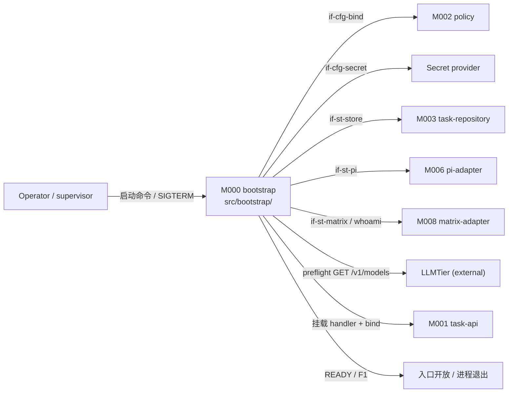
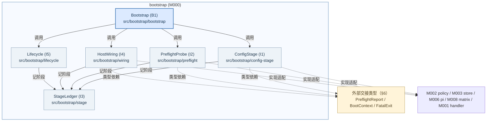
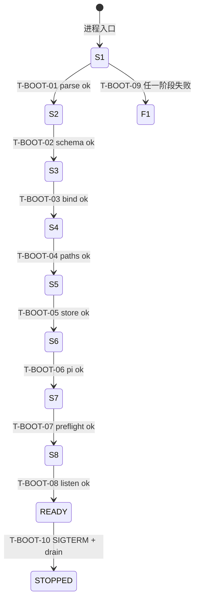
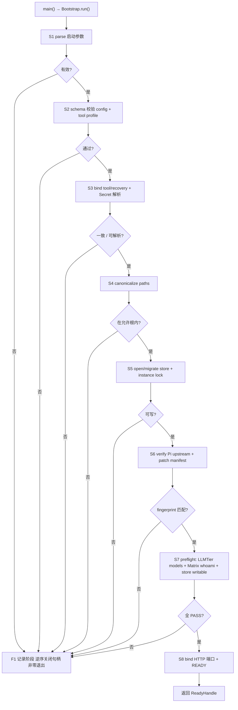
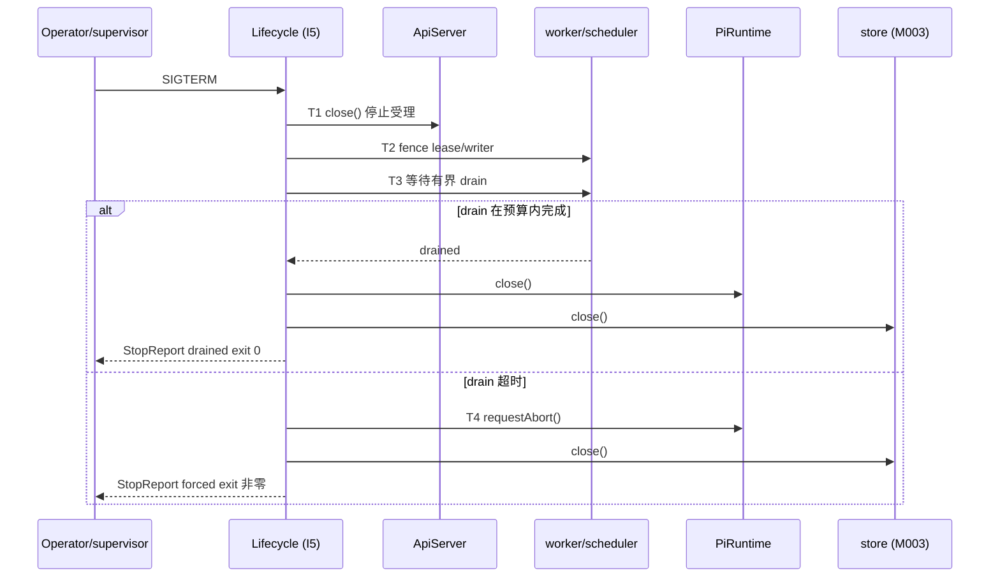
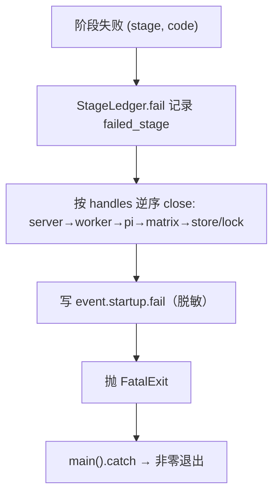

<!-- STD_DOCUMENT_COVER_BEGIN -->
# Piko 模块设计：bootstrap（M000）

> STD 使用入口：[项目采用说明与标准导航](../../README.md#std-entry)

| 文档字段 | 值 |
|---|---|
| Document ID | `piko-bootstrap` |
| Document Version | `0.1.1` |
| Status | `Draft` |
| Project | `piko` |
| Document Owner | Piko Implementation Owner |
| Last Modified Date | `2026-09-28` |
| Template ID | `design.definition` |
| Template Version | `3.4.0` |

<!-- STD_DOCUMENT_COVER_END -->

## 1. 单元摘要：为什么存在

M000 `bootstrap` 解决一个问题：Piko 进程必须"真正可服务"才能接收 Run。启动不是单模块行为——`policy` M002 绑定 tool/recovery，`task-repository` M003 打开并迁移 SQLite，`pi-adapter` M006 校验 Pi 上游 commit 与 adapter patch，`matrix-adapter` M008 做 whoami，LLMTier 与 Matrix 必须可达。任意环节未就绪就绑定端口，会产生"进程活着但不能履约"的假 READY。bootstrap 把这件事实编排成一条固定的 S1–S8 顺序（§7 `P-BOOT-START`），任一阶段失败走 F1——关闭已获得句柄、记录失败阶段与原因、进程非零退出、绝不部分就绪。

bootstrap 只做启动顺序、preflight、配置绑定与进程生命周期：它**不运行业务**、**不持有 Run 状态**、不改 Run/Result 语义。它把配置加载/校验/绑定做成启动时固定的唯一快照（无在线热改，`CON-CFG-001`），把 tool/path 判定交给 M002 `policy`，把 SQLite schema/事务/`instance_meta` 写入 authority 保留在 M003，把 Pi 校验交给 M006，把 Matrix 身份校验交给 M008。bootstrap 对外只提供两件事：READY（一个包含启动快照与句柄的 `ReadyHandle`）或 fatal 出口（`FatalExit`）。

用一次调用说明：supervisor 拉起进程执行 `tsx src/main.ts [config-path]` → `main()` 读入 config 路径 → `Bootstrap.run()` 依次推进 S1 parse、S2 schema、S3 bind tool/recovery + Secret 解析、S4 canonicalize paths、S5 open/migrate store + instance lock、S6 verify Pi upstream、S7 preflight（LLMTier models + Matrix whoami + store writable）、S8 bind HTTP 端口；全部通过则返回 `ReadyHandle{boot_id, config, store, matrix, pi, worker, server}` 并宣告 READY。若 S7 时 LLMTier 不可达，`run()` 抛 `FatalExit{stage:"S7", code:"preflight-fail"}`，bootstrap 关闭 S5 已打开的 SQLite 句柄与 instance lock 后由 `main()` 以非零码退出，端口从未绑定。

| 项目 | 内容 |
|---|---|
| 模块编号 / 正式英文名称 | M000 / `bootstrap` |

| 运行进程 | P0 控制进程（含 P1 监督者）（见 `system-design` §3.3 关键决定 7） || 直属父对象编号 / 名称 | `SW-P` / Piko Agent Runtime V0.3（软件系统，`design_level=system`） |
| 父设计 Document ID / 固定基线 / 登记位置 | `system-design` v0.11.2 / 契约 `0.3.0-simplified.6` / §3.2 直属模块表 + §3.4 约束分配 + §4.1/§6.1/§6.3；本模块登记见 §3.2 |
| 上级系统/父单元 | 无（纯软件顶层，无总体系统父稿） |
| 解决的问题 | "进程活着但不能履约"；未验证就开放入口；启动阶段部分就绪；配置被多方各自解释 |
| 提供的能力 | S1–S8 启动顺序；依赖 preflight；配置加载/校验/绑定；Secret 解析；路径规范化；进程 READY/停止/F1 |
| 主要使用者 | Operator/supervisor（启停）；全部模块（消费 READY 快照）；M003/M006/M008（S5/S6/S7 被调用方）；M004 `scheduler`（消费 `boot_id`） |
| 不负责 | 业务受理（M001/M002/M003）；Run 执行与恢复编排（M005/M006）；SQLite schema/事务/DDL authority（M003）；Pi session 生命周期（M006）；Matrix homeserver 管理（M008）；配置语义判定（M002）；诊断端点实现（M009 + ops） |

### 1.1 继承的上级约束与落实方式

bootstrap 承接两条上级约束：`CON-ST-001`（PK-12，启动顺序 S1–S8 且不部分就绪）与 `CON-CFG-001`（PK-12，配置加载/绑定/生效与 credential 明文拒绝）。两条均为 Approved。约束来源：`system-design` §3.4（PK-12 行）；机制侧权威定义在 `piko-startup.md` §3.1 与 `piko-config.md` §3.1。

#### 1.1.1 `CON-ST-001` · 启动顺序 S1–S8 且不部分就绪

- **上级基线与决定状态**：`system-design` v0.11.2 §3.4（PK-12 行）+ `piko-startup.md` §3.1 `CON-ST-001` · PK-12 · Approved；固定基线 machine contract `0.3.0-simplified.6`。上级原文：启动顺序 S1-S8；未 READY 不接受 Run；自由度：内部检查实现；不可变：不部分就绪。

- **适用条件**：每次冷启动（supervisor 拉起进程）与每次重启（P-CONFIG/P-STOP 后）；单实例单进程（PK-01）。

- **继承预算或行为保证**：不跳级；未 READY 不接受 Run（端口未绑定）；任一阶段失败 = F1（关闭句柄 + 非零退出）；进程寿命内配置不变。

- **可自行选择/不可改变**：不可改变：S1→S8 的顺序语义、不做部分就绪、F1 不保留入口。可自行设计：各阶段的内部检查实现、preflight 项集合可增、失败阶段记录格式、就绪对象的装配组织（`M-ST-DI-001` 自由度：阶段实现）。

- **本地落实/内部再分配**：§6.6 定义 `StartupState` 状态模型与转换 `T-BOOT-01..10`；§8 `R-BOOT-STAGE-ORDER`/`R-BOOT-F1`/`R-BOOT-PREFLIGHT-ALL`/`R-BOOT-GATE` 定义顺序、清理与门规则；§9 固定 `run`/`stop`/`preflight` 合同；§13 落到 `src/bootstrap/` 文件。启动顺序预算不向内部再分配（阶段串行），句柄所有权在 §10 收口。

- **验证方法与结果/证据**：局部：`VRC-BOOT-001`（冷启动 READY）、`VRC-BOOT-002`（无效 config→F1）、`VRC-BOOT-004`（store 不可写→F1）、`VRC-BOOT-006`（preflight 失败→F1，端口未绑定）。组合：PK-T12（restore + operator 边界）；当前全部 `NOT_RUN`。

- **差距/变更影响/反馈责任**：none。启动顺序变化或依赖变化需复审（`piko-startup.md` §A.1）。

#### 1.1.2 `CON-CFG-001` · 配置加载/绑定/生效与 credential 明文拒绝

- **上级基线与决定状态**：`system-design` v0.11.2 §3.4（PK-12 行）+ `piko-config.md` §3.1 `CON-CFG-001` · PK-12 · Approved。上级原文：启动顺序 S1-S8；restart/fence/migration 需 operator；不可变：不回退语义；credential 明文拒绝。

- **适用条件**：每次启动读取 config 文件 + tool profile + Secret reference；重启生效（无在线热改）。

- **继承预算或行为保证**：schema 校验通过才进入绑定；未知字段/覆盖固定项拒绝；启动时固定的配置快照进程内不变；credential 只存 reference，明文不入 config dump/DB/日志；tool `recovery_contract_ref` 必须解析到已注册实现。

- **可自行选择/不可改变**：不可改变：重启生效、不回退语义、credential 明文拒绝、schema `additionalProperties:false`。可自行设计：加载函数内部组织、快照表示、Secret provider selector（`M-CFG-DI-001` 自由度：启动顺序）。

- **本地落实/内部再分配**：§3 `SURF-BOOT-ENTRY`；§4 `DEP-BOOT-CONFIG`/`DEP-BOOT-SECRET`；§6.1 `EffectiveConfigState`、§6.3（引用 MECH-CONFIG authority）；§8 `R-BOOT-SNAPSHOT`；§9.1 `IF-CFG-LOAD`、§9.2 `IF-CFG-BIND`/`IF-CFG-SECRET`；§13 `config-stage.ts`。

- **验证方法与结果/证据**：局部：`VRC-BOOT-002`（schema 失败→F1）、`VRC-BOOT-003`（tool ref 未注册 / Secret 解析失败→F1）、`VRC-BOOT-008`（重启后快照重读）。组合：PK-T12；当前全部 `NOT_RUN`。

- **差距/变更影响/反馈责任**：config schema 变化或 Secret provider 变化需复审（`piko-config.md` §A.1）；归属 MECH-CONFIG，本模块不新增 config key。

## 2. 需求、功能与验收条件

bootstrap 的可观察功能是七项：配置阶段（S1–S4）、打开 store（S5）、校验 Pi 上游（S6）、依赖 preflight（S7）、绑定端口并 READY（S8）、fatal 清理（F1）、停止与 drain（P-STOP）。它们只能由进程入口（supervisor）或信号触发，不对外暴露 HTTP/CLI 业务命令。

### 2.1 `F-BOOT-CONFIG` · 加载/校验/绑定配置与路径（S1–S4）

- **上级需求 / Constraint ID**：`CON-CFG-001`（PK-12）；`CON-ST-001`；`M-CFG-DI-001`。

- **调用方**：`Bootstrap.run()` 在进程入口启动时调用一次。

- **输入与前提**：config 文件路径（参数或 `PIKO_CONFIG`，默认 `config/runtime.json`）；项目根（用于解析 schema 与锁定上游）；进程未开始其他阶段。

- **行为**：S1 parse 启动参数与 config 路径；S2 用 `piko-runtime-config-v0.3.schema.json` 校验 config、用 `piko-tool-profile-v0.3.schema.json` 校验 tool profile（`additionalProperties:false`，未知字段拒绝）；S3 调 M002 `bindToolProfile(profile, registry)` 得到 `BoundToolProfile` 并解析 Secret reference（bearer/llm/matrix）；S4 canonicalize `workspace.roots`/`staging_root`/`session_root`/`sqlite_path`（绝对路径、拒绝 `..`/反斜线，必须在允许根内）。任一步失败 → `FatalExit` 进入 F1。

- **输出**：`{config: PikoRuntimeConfig, tools: ToolRegistry, bound: BoundToolProfile, secrets: {bearer, llmKey, matrixToken?}}`。

- **错误与边界**：`config-invalid`（S2 schema 失败/未知字段/覆盖固定项）、`tool-bind-fail`（S3 未注册 ref）、`secret-unresolved`（S3 provider 失败）、`path-invalid`（S4 越界/相对路径）。均走 F1，不进入 S5。

- **验收条件**：给定有效 config + 已注册 registry，`F-BOOT-CONFIG` 返回绑定的快照与已解析 Secret；给定未知字段 config，在 S2 以 `config-invalid` 失败且 `StartupState` 停在 S2→F1，未构造任何运行期句柄。

### 2.2 `F-BOOT-STORE` · 打开/迁移 store 并取 instance lock（S5）

- **上级需求 / Constraint ID**：`CON-ST-001`；`M-ST-DI-001`（消费 M003 `IF-ST-STORE`）。

- **调用方**：`Bootstrap.run()` 在配置阶段成功后调用。

- **输入与前提**：已校验的 `task_store.sqlite_path`、`task_store.busy_timeout_ms`；进程未打开任何 store。

- **行为**：调 M003 `openStore(path, busyTimeout)` 打开/迁移 SQLite（WAL + FK + busy_timeout，`PRAGMA user_version` 升级）；在同一步获取 instance lock 并要求可写；M003 写 `instance_meta`（`schema_generation`/`instance_id`/`boot_id`）。失败（不可写 / 迁移失败 / lock 被占）→ `FatalExit` 进入 F1。

- **输出**：`Store` 句柄（M003 所有）；`instance_meta` 已写；bootstrap 记录 `boot_id`。

- **错误与边界**：`store-unwritable`、`schema-migration-failed`、`instance-lock-held`。F1 必须释放已获得的 store/lock 句柄；重复启动的第二个进程在 S5 被拒，不进入 S6。

- **验收条件**：空库首次启动，M003 建库到 `user_version=2` 且 `instance_meta` 有 `boot_id`；第二个进程用同一 `sqlite_path` 启动在 S5 失败并以 `instance-lock-held` 退出。

### 2.3 `F-BOOT-VERIFY` · 校验 Pi 上游与 adapter patch（S6）

- **上级需求 / Constraint ID**：`CON-ST-001`；`M-ST-DI-003`（消费 M006 `IF-ST-PI`）。

- **调用方**：`Bootstrap.run()` 在 S5 成功后调用。

- **输入与前提**：`pi.version`/`pi.commit`/`pi.adapter_patch_manifest_path`/`pi.adapter_patch_sha256`；本地 `upstream/pi` checkout。

- **行为**：S6 调 M006 `verifyPiUpstream()`：比对 adapter patch manifest 的 SHA256、manifest 的 `pi_version`/`pi_commit`、`upstream/pi` 的 git HEAD commit，以及 8 个 adapter patch 标记（`stepId`、`onRawUsage` 等）均已应用。任一项不匹配 → `FatalExit`（`pi-upstream-mismatch`），不进入 S7。

- **输出**：`pi_fingerprint_match = true`（进入 `PreflightReport`）。

- **错误与边界**：`pi-upstream-mismatch`。不热切 Pi；不自动 checkout 其他 commit。

- **验收条件**：给定锁定 commit 的 checkout 与匹配 patch manifest，S6 通过；注入 commit 不一致或缺失一个 marker，S6 以 `pi-upstream-mismatch` 失败且不绑定端口。

### 2.4 `F-BOOT-PREFLIGHT` · 依赖 preflight（S7）

- **上级需求 / Constraint ID**：`CON-ST-001`；`M-ST-DI-001`。

- **调用方**：`Bootstrap.run()` 在 S6 成功后调用。

- **输入与前提**：已解析的 LLMTier key、`llmtier.base_url`、`agent.model`、`llmtier.models_timeout_ms`；Matrix 已配置则含其身份与 token；store 已打开。

- **行为**：`preflight()` 并行探测三项事实——LLMTier `GET /v1/models` 可达且包含配置模型（`preflightModelProvider`）、Matrix `whoami` 与配置 `user_id` 一致（`matrix.enabled` 时）、store 可写；组装 `PreflightReport{store_writable, pi_fingerprint_match, llmtier_models_ok, matrix_whoami_ok}`。任一为 false → `FatalExit`（`preflight-fail`），不进入 S8。

- **输出**：`PreflightReport`（全 true 才继续）。

- **错误与边界**：`preflight-fail`（任一 false / 探测超时）；探测超时受 `models_timeout_ms`/`sync_timeout_ms` 约束；不做部分就绪。

- **验收条件**：LLMTier 503 或缺少配置模型 → `llmtier_models_ok=false`，S7 失败，端口从未绑定；三项全通 → 进入 S8。

### 2.5 `F-BOOT-READY` · 绑定端口并宣告 READY（S8）

- **上级需求 / Constraint ID**：`CON-ST-001`。

- **调用方**：`Bootstrap.run()` 在 S7 全通过后调用。

- **输入与前提**：`PreflightReport` 全 true；已装配 `store`/`matrix`/`pi`/`worker` 与 M001 HTTP handler。

- **行为**：按 S1–S8 顺序完成运行期装配（`PiRuntime`、`RunWorker`、`matrix.start()`），在 `listen.host:listen.port` 绑定 HTTP 端口并挂载 M001 的 handler 集；返回 `ReadyHandle` 并对外宣告 READY。自此进程接受 Run。

- **输出**：`ReadyHandle{boot_id, config, bound, store, matrix, pi, worker, server}`；READY 事件。

- **错误与边界**：端口被占/绑定失败 → `FatalExit`（`listen-failed`），关闭已得句柄；`matrix.enabled=false` 时不启动 Matrix 客户端，但 `matrix_whoami_ok` 记为满足（不适用项按 true 计）。

- **验收条件**：全新环境下 READY 后端口可连接且 `GET /tasks/:id` 返回 404/401 而非连接拒绝；端口被占时 F1 且 `StartupState=READY` 不可达。

### 2.6 `F-BOOT-FAIL` · fatal 出口与清理（F1）

- **上级需求 / Constraint ID**：`CON-ST-001`。

- **调用方**：`Bootstrap.run()` 内任一阶段失败时自动触发；进程入口捕获后调用。

- **输入与前提**：失败阶段 ID、错误类别；已获得的句柄集合（部分可能为空）。

- **行为**：记录失败阶段 + 原因（脱敏），逆序关闭已获得句柄（server→worker→pi→matrix→store/lock），释放内存，写 `event.startup.fail`；返回 `FatalExit{stage, code}`，由 `main()` 以非零码退出。不保留任何入口。

- **输出**：`FatalExit{stage: "S1".."S8", code}`；非零退出码。

- **错误与边界**：清理自身失败（如 close 抛错）不改变退出决策；无部分就绪；重复进入 F1 幂等。

- **验收条件**：在 S7 注入 LLMTier 失败，进程退出码非零、端口未绑定、S5 已打开的 store 句柄已关闭（可用 instance lock 立即重取验证）。

### 2.7 `F-BOOT-STOP` · 停止与有界 drain（P-STOP）

- **上级需求 / Constraint ID**：`CON-ST-001`；`system-design` §6.4。

- **调用方**：`main()` 注册的 `SIGTERM`/`SIGINT` 处理器；Operator/supervisor。

- **输入与前提**：进程已 READY（未 READY 时信号等价于直接退出）。

- **行为**：T1 停止新受理（HTTP handler 拒绝写）；T2 fence lease/writer（交 M005/M004）；T3 等待有界 drain（in-flight Run/操作完成或超时）；T4 超时则强制 abort（M005/M006）；关闭 store/journal；返回退出。退出码 0（正常 drain）或非零（强制 abort）。

- **输出**：`StopReport{outcome: "drained" | "forced"}`；进程退出码。

- **错误与边界**：drain 超时 → 强制 abort + 非零退出码，不自动回退；未 READY 时 stop 是幂等的快速退出；重复信号幂等。

- **验收条件**：READY 且无在途 Run 时 SIGTERM 在预算内退出码 0；持有一个长在途 Run 且 drain 超时，强制 abort 且退出码非零。

## 3. UI、CLI、服务端点或设备操作面

bootstrap 不拥有业务 HTTP 端点族（由 M001 `task-api` 承载，§3.6 CAP-SUBMIT/STATUS/CANCEL/RESULT）、不拥有 UI、不提供面向用户的 CLI 子命令、无设备操作面。bootstrap 的直接操作面是**进程入口**：部署工具/supervisor 以启动命令调用、以信号停止。它在 S8 拥有 HTTP **监听套接字**生命周期，但端点集与鉴权归 M001，bootstrap 只负责 bind/close。

Tailoring 依据：STD `design.definition` §3 "模块没有任何直接操作面时写 N/A + 实际调用入口/归属 + tailoring 依据"；此处保留一个进程入口操作面（真实入口），其余类别 N/A。"没有页面"不等于"没有入口"——bootstrap 的入口在 §9.1 唯一维护。

#### 3.1 `SURF-BOOT-ENTRY` · 进程启动与停止入口

- **类型 / 位置**：CLI/进程入口（启动命令 + POSIX 信号）；执行位置 = 宿主进程 `src/main.ts`（Planned 委托给 `src/bootstrap/`）。

- **调用者 / 身份 / 被操作对象**：部署工具/supervisor（无 bearer 身份，属进程级 operator 动作）；被操作对象 = Piko 单进程实例及其启动/停机生命周期。

- **操作与入口**：启动 `tsx src/main.ts [config-path]`（或 `node dist/main.js`，config 亦可经 `PIKO_CONFIG`）；停止 `SIGTERM`/`SIGINT`。

- **输入与校验**：config 文件路径（可选，默认 `config/runtime.json`）；启动参数在 S1 解析；config 内容在 S2 由 schema 校验。无身份令牌。

- **正常结果 / 可见性**：启动成功打印 `Piko listening on http://<host>:<port>` 并记录 `event.startup.ready`；停止时按 T1–T4 退出。

- **Empty / Error / Disabled / 取消**：启动任一阶段失败 → F1 + 非零退出码 + 失败阶段；`matrix.enabled=false` 时跳过 Matrix whoami（不视为失败）；停止期间 drain 超时 → 强制 abort。

- **§9 接口与 §11 维护引用**：§9.1 `IF-BOOT-RUN`/`IF-BOOT-STOP`；§11 指标 `piko.startup.stage`；诊断摘要经 MECH-STARTUP §12.2 与 ops 文档（非本模块入口）。

## 4. 外部边界与依赖

bootstrap 在进程内的位置：被 supervisor/信号驱动，编排 M002/M003/M006/M008 与外部 LLMTier/Matrix 的启动校验，最终把句柄交给运行期模块。下图只画模块外部交接，不表示线程或新部署边界。



图 M-BOOT-C1 · Target / Planned / NOT_BUILT。实线是同步进程内函数调用、信号与一次外部 HTTPS preflight；不表示新部署边界。bootstrap 不创建线程/进程；preflight 的网络等待见 §10.4。

#### 4.1 `DEP-BOOT-CONFIG` · config 文件与两个 schema（Operator 持有）

- **角色 / 运行位置 / Owner**：启动输入，本地 FS；Owner：Operator（文件权属）；schema authority 在 `interfaces/schemas/`。

- **本模块调用或消费**：读取 `piko-runtime-config-v0.3.schema.json` 与 `piko-tool-profile-v0.3.schema.json`，解析 config 文件与 tool profile 文件（`tools.profile_registry_path`）。

- **本模块提供**：无（只读）。

- **契约 authority / 版本 / selector**：`piko-config.md` §4.3/§4.4；schema `$id` 见 §9.1.3；固定基线 machine contract `0.3.0-simplified.6`。

- **同步方式 / timeout / 生命周期**：同步本地读；无网络；进程启动一次性读取，进程内不变。

- **不可用或失败影响 / 责任出口**：文件缺失/非法 → S1/S2 `config-invalid` → F1；由 Operator 修 config 后重启（`piko-config.md` §9）。

#### 4.2 `DEP-BOOT-SECRET` · Secret provider（外部受控后端）

- **角色 / 运行位置 / Owner**：credential 解析来源；Owner：Secret provider（reference-only）。

- **本模块调用或消费**：`resolveSecret(ref)` 解析 `env:`/`file:`（当前构建；`keychain:`/`vault:` schema 允许但 provider 未实现时失败）得到 bearer/llmKey/matrixToken 明文（仅内存）。

- **本模块提供**：无。

- **契约 authority / 版本 / selector**：`piko-config.md` §4.4.3；schema `secretRef` pattern `^(env|file|keychain|vault):`；当前实现 `src/config.ts` `resolveSecret`。

- **同步方式 / timeout / 生命周期**：同步；随进程；解析结果不落盘、不入日志。

- **不可用或失败影响 / 责任出口**：解析失败 → S3 `secret-unresolved` → F1；明文永不写入 config dump/DB/log（`CON-CFG-001`）。

#### 4.3 `DEP-BOOT-POLICY` · M002 `policy`（tool/recovery 绑定）

- **角色 / 运行位置 / Owner**：同级直属模块，同进程；Owner：Piko Implementation Owner。

- **本模块调用或消费**：`bindToolProfile(profile, registry) -> BoundToolProfile`（S3）；校验每个 `recovery_contract_ref` 解析到已注册实现并匹配 tool name/effect/replay。

- **本模块提供**：无（bootstrap 把已校验 profile/registry 交给 M002，不反向调用）。

- **契约 authority / 版本 / selector**：`piko-config.md` §5.1 `IF-CFG-BIND`（Proposed，待 M002 设计采纳）；当前代码事实 `src/config.ts` `validateToolRegistry`。

- **同步方式 / timeout / 生命周期**：同步进程内；无网络；启动时一次性绑定。

- **不可用或失败影响 / 责任出口**：不一致 → S3 `tool-bind-fail` → F1；启动后不可热注册（`piko-config.md` §11）。

#### 4.4 `DEP-BOOT-STORE` · M003 `task-repository`（store 打开/迁移/instance lock）

- **角色 / 运行位置 / Owner**：同级直属模块，同进程；Owner：Piko Implementation Owner。schema/事务/DDL authority 属 M003。

- **本模块调用或消费**：`openStore(path, busyTimeout) -> Store`（S5）：打开/迁移 SQLite、要求可写、取 instance lock、写 `instance_meta`。不消费 Run/Result 业务操作。

- **本模块提供**：无；bootstrap 在 F1/停止时调用 `store.close()` 释放句柄与 lock。

- **契约 authority / 版本 / selector**：`piko-startup.md` §5.1 `IF-ST-STORE`（Proposed）；`instance_meta` DDL 见 M003 ISD §4.7.1（`system-design#m003-ddl-authority`）；当前代码事实 `src/store.ts` `migrate()`。

- **同步方式 / timeout / 生命周期**：同步进程内；单次打开；受 `task_store.busy_timeout_ms`；句柄生命周期 = 进程（S5 打开，退出关闭）。

- **不可用或失败影响 / 责任出口**：不可写/migration 失败/lock 被占 → S5 `store-unwritable`/`instance-lock-held` → F1；bootstrap 不自行打开 SQLite 连接。

#### 4.5 `DEP-BOOT-PI` · M006 `pi-adapter`（Pi 上游校验）

- **角色 / 运行位置 / Owner**：同级直属模块，同进程；Owner：Piko Implementation Owner。

- **本模块调用或消费**：`verifyPiUpstream() -> bool`（S6）：比对 adapter patch manifest SHA256、manifest pin、`upstream/pi` HEAD commit 与 patch markers。

- **本模块提供**：无（bootstrap 只在 READY 后把 `PiRuntime` 装配进运行期）。

- **契约 authority / 版本 / selector**：`piko-startup.md` §5.1 `IF-ST-PI`（Proposed）；当前代码事实 `src/config.ts` `gitHead` + markers 校验。

- **同步方式 / timeout / 生命周期**：同步本地 FS 读；无网络；启动时一次性校验；不热切 Pi。

- **不可用或失败影响 / 责任出口**：不匹配 → S6 `pi-upstream-mismatch` → F1；`ISSUE-RUNTIME-001`（Pi upstream commit 锁定）跟踪。

#### 4.6 `DEP-BOOT-MATRIX` · M008 `matrix-adapter`（whoami 与启动）

- **角色 / 运行位置 / Owner**：同级直属模块，同进程；Owner：Piko Implementation Owner。

- **本模块调用或消费**：`matrixWhoami() -> Identity`（S7，`matrix.enabled=true` 时）验证 user_id 与配置一致；READY 阶段调用 `matrix.start()` 建立 sync。

- **本模块提供**：无（bootstrap 在停止时调用 `matrix.close()`）。

- **契约 authority / 版本 / selector**：`piko-startup.md` §5.1 `IF-ST-MATRIX`（Proposed）；当前代码事实 `src/matrix.ts`。

- **同步方式 / timeout / 生命周期**：whoami 出站 HTTPS；受 `matrix.sync_timeout_ms`；客户端生命周期 = READY 后至进程退出。

- **不可用或失败影响 / 责任出口**：whoami 不一致/不可达 → S7 `preflight-fail` → F1；`matrix.enabled=false` 时不调用、该项记满足。

#### 4.7 `DEP-BOOT-HTTP` · M001 `task-api`（handler 挂载与监听）

- **角色 / 运行位置 / Owner**：同级直属模块，同进程；Owner：Piko Implementation Owner。

- **本模块调用或消费**：在 S8 构造并 `listen()` HTTP server，挂载 M001 提供的 handler（`src/server.ts` 的 `ApiServer`）；持有监听套接字生命周期。

- **本模块提供**：监听套接字与请求接入帧（bind/close），不定义端点语义。

- **契约 authority / 版本 / selector**：`interfaces/openapi/agent-runtime-openapi-v0.3.yaml`（端点的唯一 authority，归 M001）；`system-design` §8.1。

- **同步方式 / timeout / 生命周期**：同步绑定端口；套接字生命周期 = READY 后至进程退出（§5.4）。

- **不可用或失败影响 / 责任出口**：端口被占/绑定失败 → S8 `listen-failed` → F1；端点错误语义归 M001。

#### 4.8 `DEP-BOOT-OBS` · M009 `observability`（阶段与依赖指标）

- **角色 / 运行位置 / Owner**：同级直属模块，同进程；Owner：Piko Implementation Owner。

- **本模块调用或消费**：在每阶段推进/失败/READY 时发出 `piko.startup.stage`、`event.startup.{stage,fail,ready}`、`piko.dependency.failures.{llmtier,matrix,store}`。

- **本模块提供**：无（只发事件）。

- **契约 authority / 版本 / selector**：`piko-startup.md` §12.1、`piko-config.md` §12.1；`system-design` §10.2。

- **同步方式 / timeout / 生命周期**：同步进程内调用；无网络；进程寿命。

- **不可用或失败影响 / 责任出口**：指标链路失败不影响启动决策（best-effort）；M009 负责采集/脱敏。

## 5. 内部结构与实现位置

bootstrap 拆成六个内部单元：入口编排、配置阶段、preflight 探测、阶段台账、宿主装配、进程生命周期。拆分依据是"阶段推进可独立记录/复现、preflight 可独立打桩、装配与信号生命周期集中收口"，不是为了凑文件。



图 M-BOOT-S1 · Target / Planned / NOT_BUILT。外框是模块内部组成；实线同步调用，虚线类型/适配依赖；不表示线程或时序。所有路径均为 Planned（当前逻辑内联在 `src/main.ts`/`src/config.ts`）。

### 5.1 内部组成

#### 5.1.1 `B1` · Bootstrap（入口）

- **职责与非职责**：实现 §9.1 的 `run`/`stop`，按 §6.6 顺序推进 S1–S8、在任一步失败时统一走 F1；持有启动快照与句柄集合。非职责：不做 schema 校验细节（I1）、不发网络探测（I2）、不拼 handler/DB（I4）、不注册信号（I5）。

- **输入、处理与输出**：输入 `startupArgs`（config 路径）+ `projectRoot`；处理 = 组合 I1 配置 → S5 store → S6 verify → I2 preflight → I4 装配/listen；输出 `ReadyHandle` 或抛 `FatalExit`。

- **协作对象**：调用 I1/I2/I3/I4/I5；被 `main()` 调用。不直接调 M003/M006/M008（经 I1/I2/I4）。

- **文件 / symbol / 实现状态**：`src/bootstrap/bootstrap.ts` → `class Bootstrap`（Planned / NOT_IMPLEMENTED）。现逻辑散在 `src/main.ts` `main()`。

- **拆分依据与替代方案代价**：入口只做顺序编排与失败收口，把各阶段抽到内部单元以便独立验证 F1 清理与 preflight 打桩。替代方案"全部写在 main.ts"是 Current 形态，代价是失败清理不可独立验证、无法对 S1–S8 顺序做表驱动测试（这正是本设计要消除的）。

#### 5.1.2 `I1` · ConfigStage（配置阶段 S1–S4）

- **职责与非职责**：parse 启动参数、schema 校验 config + tool profile、委托 M002 绑定 tool/recovery、解析 Secret、canonicalize 路径并产出不可变快照。非职责：不做启动顺序决策（B1）、不打开 store、不 preflight。

- **输入、处理与输出**：输入 config 路径 + 项目根 + `startupArgs`；输出 `{config, tools, bound, secrets, effectiveState: "Bound"}`；失败抛 `FatalExit{stage:"S1".."S4", code}`。

- **协作对象**：调用 M002 `bindToolProfile` 与 Secret provider（经 §9.2 接口）；被 B1 调用。

- **文件 / symbol / 实现状态**：`src/bootstrap/config-stage.ts`（Planned）；现逻辑在 `src/config.ts` `loadConfig`/`resolveSecret`/`validateToolRegistry`（部分实现）。

- **拆分依据与替代方案代价**：把 schema/绑定/secret 集中，使 §8 `R-BOOT-SNAPSHOT` 与 `EffectiveConfigState` 可单测。替代方案"沿用 config.ts 全内联"使 S1–S4 无法单独记录阶段与失败阶段。

#### 5.1.3 `I2` · PreflightProbe（依赖 preflight S7）

- **职责与非职责**：并行探测 LLMTier models、Matrix whoami、store writable，组装 `PreflightReport`；受各探测超时约束。非职责：不做绑定/装配、不决定是否 READY（B1 依据全 true）。

- **输入、处理与输出**：输入 `{llmKey, baseUrl, model, modelsTimeout, matrixEnabled, matrixIdentity, store}`；输出 `PreflightReport`；失败以 false 字段返回而非抛错（由 B1 决定 F1）。

- **协作对象**：调用外部 LLMTier（HTTPS）、M008 `matrixWhoami`、M003 store 可写探测；被 B1 调用。

- **文件 / symbol / 实现状态**：`src/bootstrap/preflight.ts`（Planned）；现逻辑在 `src/provider-preflight.ts` `preflightModelProvider` + `src/main.ts` 内联（部分实现）。

- **拆分依据与替代方案代价**：把三项探测与超时集中、可注入 fake 探测，使 `VRC-BOOT-006` 可对"部分失败不 READY"表驱动。替代方案"preflight 内联在 main"不可独立复现故障向量。

#### 5.1.4 `I3` · StageLedger（阶段台账与清理登记）

- **职责与非职责**：记录当前阶段与失败阶段、维护"已获得句柄"清单供 F1 逆序关闭、发阶段指标/事件。非职责：不做阶段业务、不持有 store/pi 对象语义。

- **输入、处理与输出**：输入阶段推进/失败事件 + 句柄注册/注销；输出 `StartupState` 投影 + `event.startup.*` + F1 清理顺序。

- **协作对象**：被 B1/I1/I2/I4/I5 调用；调用 M009（经 §9.2/§11）。

- **文件 / symbol / 实现状态**：`src/bootstrap/stage.ts`（Planned）。

- **拆分依据与替代方案代价**：把"阶段事实 + 资源登记"集中，使 F1（§8 `R-BOOT-F1`）与停止（I5）共享同一资源清单，避免句柄泄漏。替代方案"各单元各自 close"易漏句柄。

#### 5.1.5 `I4` · HostWiring（运行期装配 S5/S6/S8）

- **职责与非职责**：打开 store（委 M003）、verify Pi（委 M006）、构造 `PiRuntime`/`RunWorker`/`MatrixRuntime`/`ApiServer` 并 bind。非职责：不做校验规则、不注册信号、不决定顺序。

- **输入、处理与输出**：输入已校验快照 + 已解析 Secret + store 句柄；输出 `ReadyHandle` 的句柄集合；失败抛 `FatalExit{stage,code}` 并把已构造句柄交 I3 清理。

- **协作对象**：调用 M003/M006/M008/M001 与 `PiRuntime`/`RunWorker`；被 B1 调用。

- **文件 / symbol / 实现状态**：`src/bootstrap/wiring.ts`（Planned）；现逻辑在 `src/main.ts`（部分实现）。

- **拆分依据与替代方案代价**：把运行期对象装配集中到一处，使 S5/S6/S8 的句柄归属与释放可核查（§10）。替代方案"装配散在 main"使 F1 清理顺序不确定。

#### 5.1.6 `I5` · Lifecycle（进程生命周期与信号）

- **职责与非职责**：注册 `SIGTERM`/`SIGINT`、执行 T1–T4 停止（停止受理→fence→有界 drain→强制 abort）、关闭 store/journal。非职责：不做启动阶段、不决定 Run 取消语义（M005）。

- **输入、处理与输出**：输入信号 + `ReadyHandle` + drain 预算；输出 `StopReport{outcome}` + 退出码；重复信号幂等。

- **协作对象**：调用 M001 handler 关闭、M004/M005 fence/drain、M006 abort、`store.close`；被 B1 在 READY 后启动。

- **文件 / symbol / 实现状态**：`src/bootstrap/lifecycle.ts`（Planned）；现逻辑在 `src/main.ts` `close()`（部分实现，当前为同步 close，无有界 drain）。

- **拆分依据与替代方案代价**：把停止语义从启动路径分离，使 `VRC-BOOT-007` 可对 drain 超时注入。替代方案"内联 close"不支持有界 drain 与强制 abort 的可判定出口。

#### 5.1.7 `I6` · types

- **职责与非职责**：定义 `StartupStage`、`EffectiveConfigState`、`PreflightReport`、`BootContext`、`ReadyHandle`、`FatalExit`、`StopReport`。非职责：逻辑。

- **输入、处理与输出**：无；纯类型。

- **协作对象**：被 I1–I5 类型引用；被 `index.ts` 再导出部分。

- **文件 / symbol / 实现状态**：`src/bootstrap/types.ts`（Planned）。

- **拆分依据与替代方案代价**：类型集中避免跨文件重复定义阶段枚举与错误载荷。

### 5.2 内部调用过程

#### 5.2.1 `P-BOOT-START` · 冷启动（S1–S8 或 F1）

- **入口与调用上下文**：`main()`（进程入口，宿主事件循环）→ `Bootstrap.run(startupArgs, projectRoot)`。

- **调用链（文件 / symbol → 文件 / symbol）**：`main` → `Bootstrap.run` → `ConfigStage.load`（S1–S4，含 M002 `bindToolProfile` + secret 解析）→ `HostWiring.openStore`（M003 `openStore`，S5）→ `HostWiring.verifyPi`（M006 `verifyPiUpstream`，S6）→ `PreflightProbe.probe`（S7）→ `HostWiring.assembleAndListen`（S8）→ 返回 `ReadyHandle`；任一阶段失败 → `StageLedger.fail(stage, code)` → `Bootstrap.fail` → 抛 `FatalExit`。

- **逐步传递的数据**：`configPath:string` → `{config, tools, bound, secrets}` → `Store` → `pi_fingerprint_match:boolean` → `PreflightReport` → `ReadyHandle`。

- **返回、异常与清理**：成功返回 `ReadyHandle`；失败抛 `FatalExit` 并逆序关闭已得句柄。无后台任务遗留（装配完成后才 READY）。

- **对应流程 / 接口 / 验证**：§7 `M-BOOT-P1`；§9.1 `IF-BOOT-RUN`、§9.2 各消费接口；`VRC-BOOT-001..006`。

#### 5.2.2 `P-BOOT-STOP` · 停止与 drain（P-STOP）

- **入口与调用上下文**：`Lifecycle.onSignal`（宿主事件循环）→ `Bootstrap.stop(reason)`。

- **调用链**：signal → `Lifecycle.onSignal` → `ApiServer.close`（停止受理）→ `worker`/`scheduler.fence`（经运行期句柄）→ 有界等待 drain → 超时则 `PiRuntime.requestAbort` → `matrix.close`/`store.close` → `StopReport`。

- **逐步传递的数据**：`reason:"SIGTERM"|"SIGINT"` → `drainDeadline` → `StopReport{outcome}`。

- **返回、异常与清理**：drained 返回退出码 0；超时则 forced 返回非零；重复信号幂等；所有句柄逆序关闭。

- **对应流程 / 接口 / 验证**：§7 `M-BOOT-P2`；§9.1 `IF-BOOT-STOP`；`VRC-BOOT-007`。

#### 5.2.3 `P-BOOT-FAIL` · fatal 清理（F1）

- **入口与调用上下文**：由 `Bootstrap.run` 内部在任一阶段失败时调用（非新线程）。

- **调用链**：失败 → `StageLedger.fail` → `Bootstrap.fail` → 遍历 `StageLedger.handles` 逆序调 close（server→worker→pi→matrix→store/lock）→ 写 `event.startup.fail` → 抛 `FatalExit` → `main().catch` → 非零退出。

- **逐步传递的数据**：`{stage, code}` → `FatalExit`。

- **返回、异常与清理**：无论 close 是否抛错都保证非零退出；清理失败不改变退出决策；不保留入口。

- **对应流程 / 接口 / 验证**：§7 `M-BOOT-P3`；§8 `R-BOOT-F1`；`VRC-BOOT-002/004/005/006`。

### 5.3 文件间接口契约

本节只固定 bootstrap 内部文件之间的交接；跨模块接口在 §9.2，字段类型在 §6。

#### 5.3.1 `IF-BOOT-STAGE` · `bootstrap.ts` → `stage.ts`

- **接口成员 ID / §9 逐接口定义位置**：内部无公共成员 ID；行为规则权威在 §8 `R-BOOT-STAGE-ORDER`/`R-BOOT-F1`。

- **本文件的提供或使用责任**：`stage.ts` 提供 `StageLedger`（`advance`/`fail`/`registerHandle`/`release`）；`bootstrap.ts` 与各阶段单元使用它记录事实。

- **交接时机 / 本地调用步骤**：每阶段进入/完成时 `advance`；失败时 `fail`；句柄构造后 `registerHandle`；清理时 `release`。

- **§9 生命周期约束**：台账寿命 = 单次 `run()`；句柄清单只增不静默删（清理时显式注销）。

- **实现与验证位置**：`src/bootstrap/stage.ts`；`VRC-BOOT-001/002` 覆盖阶段记录与 F1。

#### 5.3.2 `IF-BOOT-WIRING` · `bootstrap.ts` → `wiring.ts`

- **接口成员 ID / §9 逐接口定义位置**：内部接口 `HostWiring`，方法契约见 §9.1/§9.2（`openStore`/`verifyPi`/`assembleAndListen` 分别适配 M003/M006/M001+M008）。

- **本文件的提供或使用责任**：`wiring.ts` 提供装配方法；`bootstrap.ts` 以该抽象调用，不直接 import M003/M006 实现。

- **交接时机 / 本地调用步骤**：见 `P-BOOT-START` 链。

- **§9 生命周期约束**：装配产生的句柄全部登记到 `StageLedger`；进程寿命。

- **实现与验证位置**：`src/bootstrap/wiring.ts`；`VRC-BOOT-001/004/005` 以受控 fake 端口 + 真模块两套覆盖。

### 5.4 服务提供方式（条件适用）

bootstrap 是常驻编排单元，但**不拥有业务服务端点**：§3 已判定端点归 M001。它拥有的是启动/就绪/停止生命周期与 HTTP 监听套接字生命周期。

- **运行载体与入口**：宿主进程 `src/main.ts`；`Bootstrap.run()/stop()` 是唯一入口；无独立线程（全部在 Node 单线程事件循环上）。

- **并发/线程模型**：单事件循环；preflight 用 `Promise.all` 并发等待出站探测（不新线程）；S1–S8 串行推进，无阶段并发。

- **初始化、Ready、生效与停止**：初始化 = `run()` 内 S1–S8；Ready 判据 = `PreflightReport` 全 true **且** S8 监听成功后才宣告 READY；生效 = READY 后配置快照对全体模块可见；停止 = `Lifecycle` T1–T4（§7 `M-BOOT-P2`）。

- **宿主装配、失败和资源回收责任**：装配见 §9.1/§13；失败回收由 `StageLedger` + `Bootstrap.fail` 承担（逆序 close）；未 READY 时不绑定端口、无业务入口；已 READY 后退出的语义等同进程退出（由 MECH-RECOVERY 处理）。

### 5.5 依赖方向

- **允许方向**：`bootstrap.ts` → `{config-stage.ts, preflight.ts, stage.ts, wiring.ts, lifecycle.ts, types.ts}`；`config-stage.ts`/`preflight.ts`/`wiring.ts`/`lifecycle.ts` → `{stage.ts, types.ts}`；`wiring.ts` → M002/M003/M006/M008/M001 适配；`index.ts` → `bootstrap.ts`/`wiring.ts`/`types.ts`。

- **禁止方向与原因**：禁止 `stage.ts`/`types.ts` 引用任何阶段单元（保持无副作用、可单测）；禁止阶段单元互相引用（避免顺序耦合与环）；禁止 `bootstrap.ts` 直接 `import` M003 `store.ts`/M006 `pi-runtime.ts`（只能经 `wiring.ts` 抽象），否则类型依赖扩散并绕过 §5.3/§9.2 契约。

- **循环/越层检查**：静态：对 `src/bootstrap/` 跑 import 依赖图（`tsc`/CI 脚本）确认无环、`stage.ts`/`types.ts` 无外部业务 import。评审按 §5.1 逐文件核对引用。

- **变更影响**：改 `stage.ts` 影响阶段记录与 F1（§8 权威）；改 `wiring.ts` 影响与 M001/M003/M006/M008 的装配合同；改 `config-stage.ts` 影响 S1–S4 与配置快照语义。

## 6. 数据结构设计

bootstrap 拥有的数据是启动阶段状态 `StartupState`（§6.6）与启动期交接对象 `PreflightReport`/`BootContext`/`ReadyHandle`；配置与 tool profile 的字段 authority 属 MECH-CONFIG/M002，本模块只读消费。不适用类别在章首集中说明。

**不适用类别与依据**：§6.4 通信报文（无跨边界消息，preflight 是单次 HTTPS 探测而非消息契约）、§6.5 设备/FPGA（纯软件，`TAIL-P-103`）为 N/A。§6.3 配置结构为"只读消费"（字段 authority 见 `piko-config.md` §4.3 + schema，本模块不复制第二份定义）。§6.7 数据库表 N/A（`instance_meta` DDL authority 属 M003，见 `system-design#m003-ddl-authority`）。§6.8 错误为内部类型（`FatalExit`），不映射对外错误码。

### 6.1 公共基础类型与枚举

#### 6.1.1 `StartupStage` / `EffectiveConfigState`

- **完整定义、Data/Type/Data ID 与唯一来源**：`StartupStage`；本模块作用域枚举，来源 = `piko-startup.md` §4.1.1 + 本设计 §6.6；权威定义在 `src/bootstrap/types.ts`（Planned）。`EffectiveConfigState`；来源 = `piko-config.md` §4.1.1。

  ```text
  StartupStage = S1 | S2 | S3 | S4 | S5 | S6 | S7 | S8 | READY | F1
  EffectiveConfigState = "Loaded" | "Bound" | "Active"
  ```

- **逐字段/逐值类型、范围、含义与跨字段约束**：`S1` parse / `S2` schema / `S3` bind tool/recovery + Secret / `S4` canonicalize paths / `S5` open/migrate store + lock / `S6` verify Pi upstream / `S7` preflight / `S8` listen；`READY` 为终态（可服务）；`F1` 为唯一失败出口（记录失败阶段）。合法取值范围见 §6.6 转换表；不存在其他合法值，未知值拒绝。`EffectiveConfigState`：`Loaded` = schema 通过；`Bound` = tool registry 绑定完成；`Active` = READY；不允许跳级。

- **生产/修改、所有权、可见点、寿命及失败出口**：由 `StageLedger` 推进；bootstrap 拥有；可见点 = 阶段指标/事件；寿命 = 单次 `run()`（`F1` 后进程退出）。失败出口 = `F1` + `FatalExit`。

- **合法与拒绝实例、V/Case 与证据状态**：合法：`S7` 推进到 `READY`（全 preflight true）。拒绝：`S2` 失败后不得出现 `S3`（`INV-BOOT-1`）。`VRC-BOOT-001/002`；`NOT_RUN`。

### 6.2 业务与操作数据结构

#### 6.2.1 `PreflightReport`

- **完整定义、Data/Type/Data ID 与唯一来源**：`PreflightReport`；来源 = `piko-startup.md` §4.2.1；权威定义在 `src/bootstrap/types.ts`（Planned）。

  ```text
  PreflightReport {
    store_writable: boolean,
    pi_fingerprint_match: boolean,
    llmtier_models_ok: boolean,
    matrix_whoami_ok: boolean
  }
  ```

- **逐字段/逐值类型、范围、含义与跨字段约束**：四字段均 `boolean`；全 `true` 才允许进入 S8（`R-BOOT-PREFLIGHT-ALL`）。`store_writable` 在 S5 后探测；`pi_fingerprint_match` 由 S6 产生；`llmtier_models_ok` 由 LLMTier `GET /v1/models` 探测；`matrix_whoami_ok` 在 `matrix.enabled=false` 时按"不适用即满足"记 `true`（依据：Piko config 允许 Matrix 关闭，S7 仍执行其余项）。

- **生产/修改、所有权、可见点、寿命及失败出口**：由 `I2 PreflightProbe` 生产、只读交 B1 决策；寿命 = 单次启动；失败（任一 false）→ `F1`。

- **合法与拒绝实例、V/Case 与证据状态**：合法：`{true,true,true,true}` → READY。拒绝：`{true,true,false,true}`（LLMTier 不可达）→ F1、端口未绑定。`VRC-BOOT-006`；`NOT_RUN`。

#### 6.2.2 `BootContext` / `ReadyHandle`

- **完整定义、Data/Type/Data ID 与唯一来源**：`BootContext` 是阶段间传递的不可变快照；`ReadyHandle` 是 READY 后交运行期的句柄集。权威：本设计 §5.2/§9.1。

  ```text
  BootContext { boot_id: string, config: PikoRuntimeConfig, bound: BoundToolProfile,
                secrets: { bearer: string, llmKey: string, matrixToken?: string } }
  ReadyHandle { boot_id: string, context: BootContext, store: Store,
                matrix?: MatrixRuntime, pi: PiRuntime, worker: RunWorker, server: ApiServer }
  ```

- **逐字段/逐值类型、范围、含义与跨字段约束**：`boot_id` 必填、进程内 UUID，写入 `instance_meta` 并被 M004 `scheduler` 用于 stale 判定；`config`/`bound` 为只读快照；`secrets` 仅内存、生命周期 = 进程；`ReadyHandle` 各句柄在进程退出/F1 时按 §10.2 逆序释放。`matrix?` 仅在 `matrix.enabled=true` 时非空。

- **生产/修改、所有权、可见点、寿命及失败出口**：由 I1/I4 构造；bootstrap 拥有；`ReadyHandle` 寿命 = READY 后至进程退出；失败出口 = F1。

- **合法与拒绝实例、V/Case 与证据状态**：合法：`boot_id` 非空且 `store`/`pi`/`worker`/`server` 齐全。拒绝：`boot_id` 为空（违反必填）、`matrix.enabled=false` 却要求 `matrix` 非空。`VRC-BOOT-001`；`NOT_RUN`。

### 6.3 配置与规则数据结构

**N/A（只读消费）。** 配置字段的 authority 是 `PikoRuntimeConfig`（`interfaces/schemas/piko-runtime-config-v0.3.schema.json`，见 `piko-config.md` §4.3.1）与 `BoundToolProfile`（M002 输出，`piko-config.md` §4.2.1）。bootstrap 在 S2/S3 只读消费并固化为 `BootContext` 快照，不定义第二份字段表，也不新增 config key。依据：STD `design.definition` §6.3 "不适用时在章首说明原因和 tailoring 依据"；`TAIL-P-101`。

### 6.6 运行状态数据结构

#### 6.6.1 `StartupState`（跨步骤运行状态，必填）

- **完整定义、Data/Type/Data ID 与唯一来源**：`StartupState` 是"进程从冷启动到 READY/F1/停止"的运行状态，物理载体为内存中的 `StageLedger`（非持久；`instance_meta` 只记 `schema_generation`/`boot_id`，属 M003）。权威事实来源：各阶段调用的返回值 + `StageLedger` 记录（阶段、失败原因、句柄清单）。

- **逐字段/逐值类型、范围、含义与跨字段约束**：`stage: StartupStage`（当前阶段）；`failed_stage: StartupStage | null`；`handles: Handle[]`（已获得句柄清单）；`boot_id: string`。约束：`stage == F1` ⟺ `failed_stage != null`；`READY` 后 `handles` 覆盖全部运行期句柄。

- **生产/修改、所有权、可见点、寿命及失败出口**：由 `StageLedger.advance/fail` 修改；bootstrap 拥有；可见点 = 阶段指标/事件；寿命 = 单次进程启动（READY 后停止仍复用 `handles`）。失败出口见 §10。

- **状态图、转换表与不变量（跨步骤状态必填）**：



图 M-BOOT-D1 · Target / Planned / NOT_BUILT。`S1..S8` 为串行阶段；`READY` 为可服务终态；`F1` 为唯一失败出口；`STOPPED` 为停止终态。没有"部分就绪"状态：任一阶段失败与进入 F1 同义（`T-BOOT-09`）。

  | Transition ID | 原状态 → 新状态 | 事件 / 执行者 | Guard 的权威事实来源 | 动作 / 提交点 | 迟到 / 失败出口 | 不变量 | VRC |
  |---|---|---|---|---|---|---|---|
  | `T-BOOT-01` | S1 → S2 | `run()` / B1 | `startupArgs` 可解析且 config 路径存在 | 记录 S1 完成；仅内存推进 | 解析失败 → `T-BOOT-09` | `INV-BOOT-1` | `VRC-BOOT-002` |
  | `T-BOOT-02` | S2 → S3 | `ConfigStage.load` / I1 | config + tool profile 通过 AJV（`additionalProperties:false`） | `EffectiveConfigState=Loaded`；记录 | schema 失败 → `config-invalid` → `T-BOOT-09` | `INV-BOOT-1/3` | `VRC-BOOT-002` |
  | `T-BOOT-03` | S3 → S4 | `ConfigStage.load` / I1 | M002 `bindToolProfile` 返回 `BoundToolProfile` 且 Secret `resolveSecret` 成功 | `EffectiveConfigState=Bound`；快照固定 | `tool-bind-fail`/`secret-unresolved` → `T-BOOT-09` | `INV-BOOT-3/5` | `VRC-BOOT-003` |
  | `T-BOOT-04` | S4 → S5 | `ConfigStage.load` / I1 | 所有路径 canonicalize 且落在允许根内 | 记录 RelPath/AbsPath | `path-invalid` → `T-BOOT-09` | `INV-BOOT-1` | `VRC-BOOT-002` |
  | `T-BOOT-05` | S5 → S6 | `HostWiring.openStore` / I4 | M003 `openStore` 返回可写 `Store` 且取得 instance lock、写 `instance_meta` | store 句柄登记入 `handles`；`boot_id` 写 `instance_meta` | `store-unwritable`/`instance-lock-held` → `T-BOOT-09` | `INV-BOOT-1` | `VRC-BOOT-004/008` |
  | `T-BOOT-06` | S6 → S7 | `HostWiring.verifyPi` / I4 | M006 `verifyPiUpstream()` 返回 `true` | `pi_fingerprint_match=true` | `pi-upstream-mismatch` → `T-BOOT-09` | `INV-BOOT-1` | `VRC-BOOT-005` |
  | `T-BOOT-07` | S7 → S8 | `PreflightProbe.probe` / I2 | `PreflightReport` 四字段全 true（`R-BOOT-PREFLIGHT-ALL`） | 记录 report | 任一 false → `preflight-fail` → `T-BOOT-09` | `INV-BOOT-2` | `VRC-BOOT-006` |
  | `T-BOOT-08` | S8 → READY | `HostWiring.assembleAndListen` / I4 | HTTP 端口 bind 成功且 handler 挂载 | 绑定套接字；发 `event.startup.ready`；`EffectiveConfigState=Active` | 端口被占 → `listen-failed` → `T-BOOT-09` | `INV-BOOT-2` | `VRC-BOOT-001` |
  | `T-BOOT-09` | S1..S8 → F1 | `Bootstrap.fail` / B1 | 阶段调用抛错或返回失败事实 | 记录 `failed_stage`；逆序 close `handles`；发 `event.startup.fail`；抛 `FatalExit`，`main()` 非零退出 | 清理自身失败不改变退出决策 | `INV-BOOT-4` | `VRC-BOOT-002/004/005/006` |
  | `T-BOOT-10` | READY → STOPPED | `Lifecycle.onSignal` / I5 | `ReadyHandle` 存在且收到 `SIGTERM`/`SIGINT` | T1 停止受理→T2 fence→T3 有界 drain→T4 abort→close；`StopReport`；退出码 | drain 超时 → T4 强制 abort + 非零退出码 | `INV-BOOT-2` | `VRC-BOOT-007` |

  **不变量**：

  - `INV-BOOT-1`：阶段单调不跳级；`stage` 只沿 S1→…→S8→READY 前进，失败只进入 `F1`。
  - `INV-BOOT-2`：未 READY 不接受 Run——端口在 `T-BOOT-08` 才绑定；`T-BOOT-10` 后停止受理。
  - `INV-BOOT-3`：进程寿命内配置快照不变（无 reload）；`Bound`/`Active` 后不得改快照。
  - `INV-BOOT-4`：`F1` 后无残留入口/句柄，进程非零退出。
  - `INV-BOOT-5`：credential 明文拒绝——只解析为内存值，不入 config dump/DB/日志。

- **合法与拒绝实例、V/Case 与证据状态**：合法：`S7` 全 true → `READY`（`EffectiveConfigState=Active`）。拒绝：`stage=READY` 但端口未绑定（违反 `INV-BOOT-2`）；`F1` 后仍可连接端口（违反 `INV-BOOT-4`）。`VRC-BOOT-001/002/006`；`NOT_RUN`。

### 6.7 数据库表结构

**N/A。** bootstrap 不拥有持久表：`instance_meta` 的 schema/DDL/事务 authority 属 M003（`system-design#m003-ddl-authority`；M003 ISD §4.7.1）。bootstrap 在 S5 经 `IF-ST-STORE` 促使 M003 写 `instance_meta`（`schema_generation`/`instance_id`/`boot_id`），F1/停止时只 `store.close()`，不复制 CREATE TABLE。依据：STD `design.definition` §6.7 "只读外部数据库时引用其唯一来源"；持久化边界见 §10.2。

### 6.8 错误码与错误结构

#### 6.8.1 `FatalExit`（内部错误结构）

- **完整定义、Data/Type/Error ID 与唯一来源**：内部类型，无对外错误码（不进入 HTTP 契约）：`FatalExit{stage: StartupStage, code: FatalCode, cause?: unknown}`。`FatalCode = "config-invalid" | "tool-bind-fail" | "secret-unresolved" | "path-invalid" | "store-unwritable" | "instance-lock-held" | "schema-migration-failed" | "pi-upstream-mismatch" | "preflight-fail" | "listen-failed"`。定义在 `src/bootstrap/types.ts`（Planned）。

- **逐字段/逐值类型、范围、含义与跨字段约束**：`stage` 必填，取值 `S1..S8`（不得为 `READY`）；`code` 必填，与 `stage` 的对应关系见 §7 分支表（如 `S2`→`config-invalid`、`S5`→`store-unwritable`/`instance-lock-held`/`schema-migration-failed`、`S6`→`pi-upstream-mismatch`、`S7`→`preflight-fail`、`S8`→`listen-failed`）；`cause` 可选，仅内存，不对外。

- **生产/修改、所有权、可见点、寿命及失败出口**：由 `Bootstrap.fail` 产生、`main()` 消费；可见点 = 非零退出码 + 启动日志（脱敏）；寿命 = 进程退出前。出口 = 进程终止，无重试（重启即重跑）。

- **合法与拒绝实例、V/Case 与证据状态**：合法：`{stage:"S7", code:"preflight-fail"}`。拒绝：`{stage:"READY", code:*}`（READY 不是失败阶段）、`code` 与 `stage` 不匹配。`VRC-BOOT-002/004/005/006`；`NOT_RUN`。

- **下级承接与载荷**：`main()` 承接：打印 `stage` + `code`（脱敏），以非零码退出；不映射为 HTTP 错误。`piko.dependency.failures.*`/`event.startup.fail` 交 M009。

## 7. 主流程与数据流

本节给出 bootstrap 的三条过程：冷启动（S1–S8 + F1）、停止与 drain、fatal 清理。三者与 §6.6 转换、§8 规则、§9 接口共用同一 `Process/IF/Transition ID`。



图 M-BOOT-P1 · Target / Planned / NOT_BUILT。正常与失败在同一图展开：F1 不创建入口、不部分就绪；S5 之前失败不会打开 store，S8 之前失败不会绑定端口。



图 M-BOOT-P2 · Target / Planned / NOT_BUILT。停止按 T1–T4 分流；强制 abort 不自动回退（`system-design` §6.4）。



图 M-BOOT-P3 · Target / Planned / NOT_BUILT。F1 清理与退出决策解耦：清理失败不改退出码；无残留入口。

| Process ID | 触发/适用条件 | 图与正文位置 | 正常/异常出口 | 接口/规则/验证项 |
|---|---|---|---|---|
| `P-BOOT-START` | supervisor 拉起进程 | §5.2.1 / M-BOOT-P1 | 正常 `ReadyHandle`+READY；异常 F1 非零退出 | `IF-BOOT-RUN`、`R-BOOT-STAGE-ORDER`/`F1`/`PREFLIGHT-ALL`、`VRC-BOOT-001..006` |
| `P-BOOT-STOP` | READY 后 SIGTERM/SIGINT | §5.2.2 / M-BOOT-P2 | 正常 drained/退出 0；异常 forced/非零 | `IF-BOOT-STOP`、`R-BOOT-GATE`、`VRC-BOOT-007` |
| `P-BOOT-FAIL` | 任一阶段失败 | §5.2.3 / M-BOOT-P3 | 正常 非零退出+句柄释放；异常 清理失败仍退出 | `F-BOOT-FAIL`、`R-BOOT-F1`、`VRC-BOOT-002..006` |

| Step | 输入 | 执行位置 | 处理/规则 | 输出/状态变化 |
|---|---|---|---|---|
| 1 | config 路径 | S1 / B1 | parse 启动参数 | `stage=S1` |
| 2 | config + profile | S2 / I1 | AJV schema 校验 | `EffectiveConfigState=Loaded` |
| 3 | profile + registry | S3 / I1+M002 | bind + Secret 解析 | `Bound` |
| 4 | 路径字段 | S4 / I1 | canonicalize + 根内校验 | RelPath/AbsPath |
| 5 | sqlite_path | S5 / I4+M003 | open/migrate + lock + `instance_meta` | store 句柄 |
| 6 | pi pin | S6 / I4+M006 | fingerprint + markers | `pi_fingerprint_match=true` |
| 7 | 依赖 | S7 / I2 | LLMTier models + Matrix whoami + store writable | `PreflightReport` |
| 8 | host/port | S8 / I4+M001 | bind + 挂载 handler | READY / `ReadyHandle` |

## 8. 关键算法与业务规则

#### 8.1 `R-BOOT-STAGE-ORDER` · 阶段顺序与不跳级

- **输入前提 / 适用条件**：每次 `run()`；约束 `CON-ST-001`。

- **算法 / 规则 / 选择依据**：严格串行 S1→S2→…→S8；每个阶段以前一阶段成功为 Guard；不并行、不跳过、不重排。选择依据：`piko-startup.md` §6 "启动串行 S1-S8；无并发"；顺序保证任一步失败时不会有依赖前序事实的后续副作用。

- **结果 / 不变量 / 边界**：结果 = 单调阶段序列或 F1。不变量 `INV-BOOT-1`。边界：`matrix.enabled=false` 时 S7 的 Matrix 项记满足而非跳过整阶段（阶段仍执行）。

- **复杂度 / 资源限制**：O(8) 阶段，串行；无并发。

- **允许替换范围 / 不可改变保证**：可调整各阶段内部检查实现与 preflight 项集合，不可改变顺序语义或引入部分就绪。

- **具体输入推演 / 验证项**：S2 失败 → 不得出现 S3；S5 lock 被占 → 不得出现 S6。`VRC-BOOT-002/004`。

#### 8.2 `R-BOOT-F1` · 失败清理与退出

- **输入前提 / 适用条件**：任一阶段返回失败事实或抛错。

- **算法 / 规则 / 选择依据**：记录 `failed_stage` + `code`；按 `handles` 逆序 close（server→worker→pi→matrix→store/lock）；释放内存；发 `event.startup.fail`；抛 `FatalExit`；`main()` 非零退出。选择依据：`piko-startup.md` §6 "任一阶段失败走 F1，记录失败阶段、原因，关闭已得句柄，释放内存，进程非零退出"。

- **结果 / 不变量 / 边界**：结果 = 非零退出 + 无残留入口。不变量 `INV-BOOT-4`。边界：close 抛错时仍退出（catch 后继续）；重复 F1 幂等。

- **复杂度 / 资源限制**：O(句柄数) ≤ 5。

- **允许替换范围 / 不可改变保证**：可改清理顺序实现与日志格式，不可保留部分入口或吞掉失败。

- **具体输入推演 / 验证项**：S7 注入失败 → store 句柄已关（lock 可立即重取）、端口未绑定、退出码非零。`VRC-BOOT-006`。

#### 8.3 `R-BOOT-PREFLIGHT-ALL` · 全量 preflight 才 READY

- **输入前提 / 适用条件**：S7 收集四项事实。

- **算法 / 规则 / 选择依据**：`ready = store_writable ∧ pi_fingerprint_match ∧ llmtier_models_ok ∧ matrix_whoami_ok`（Matrix 关闭时该项以 `true` 计）；仅 `ready===true` 进入 S8。选择依据：`piko-startup.md` §3.1 "不部分就绪"；`system-design` §6.1 "S7 部分失败立即 F1，不接受部分就绪"。

- **结果 / 不变量 / 边界**：结果 = 允许/拒绝 listen。不变量 `INV-BOOT-2`。边界：探测超时按 false 计（`models_timeout_ms`/`sync_timeout_ms`）。

- **复杂度 / 资源限制**：三项探测并行等待；每项受各自 timeout。

- **允许替换范围 / 不可改变保证**：可增 preflight 项（`M-ST-DI-001` 自由度），不可把"部分就绪"当 READY。

- **具体输入推演 / 验证项**：`{true,true,false,true}` → F1、端口未绑定。`VRC-BOOT-006`。

#### 8.4 `R-BOOT-SNAPSHOT` · 启动快照不可变

- **输入前提 / 适用条件**：S2/S3 产出快照后。

- **算法 / 规则 / 选择依据**：`BootContext` 一旦进入 `Bound` 即冻结（`Object.freeze` 语义）；运行期模块只读；配置变更需重启（`CON-CFG-001`）。选择依据：`piko-config.md` §4.10 "启动快照在进程寿命内不变；无在线 reload"。

- **结果 / 不变量 / 边界**：结果 = 全体模块共享同一快照。不变量 `INV-BOOT-3`。边界：无热改路径；`instance_meta` 的 schema generation 单调（属 M003）。

- **复杂度 / 资源限制**：O(1) 冻结；内存 = 一份快照。

- **允许替换范围 / 不可改变保证**：可改快照表示，不可引入在线 reload。

- **具体输入推演 / 验证项**：重启后旧快照被丢弃、重读 config。`VRC-BOOT-008`。

#### 8.5 `R-BOOT-GATE` · 停止期间的受理门

- **输入前提 / 适用条件**：READY 后收到 `SIGTERM`/`SIGINT`（T1）。

- **算法 / 规则 / 选择依据**：`accepting = READY ∧ ¬stopping`；T1 置 `stopping=true` 后 M001 handler 拒绝新的写请求（具体状态码由 M001 决定），已受理 Run 继续 drain。选择依据：`system-design` §6.4 T1 "停止新受理"。

- **结果 / 不变量 / 边界**：结果 = 新 Run 被拒、在途 Run 收口。不变量 `INV-BOOT-2`。边界：`READY` 前信号 = 直接退出（无门）。

- **复杂度 / 资源限制**：O(1)。

- **允许替换范围 / 不可改变保证**：可改门实现，不可在停止期间接受新 Run。

- **具体输入推演 / 验证项**：T1 后 `POST /tasks` 被拒、`GET` 只读可返回。`VRC-BOOT-007`。

## 9. 接口设计

bootstrap 提供的对外接口是两个进程内函数（`run`/`stop`）与两个机制接口（`IF-CFG-LOAD`、`IF-ST-PREFLIGHT`）；被消费的跨模块接口（M002/M003/M006/M008）在 §9.2 唯一维护。不适用类别在本章内逐节说明。

### 9.1 API（适用时）

#### 9.1.1 `run(startupArgs: StartupArgs, projectRoot: string) -> ReadyHandle | fatal`

- **Interface/Member ID、用途、提供责任与来源**：`IF-BOOT-RUN`；推进 S1–S8 并返回 READY 句柄（或 fatal）。来源：本模块拥有。

- **输入与前提**：`startupArgs.configPath?: string`（缺省 `config/runtime.json`，或 `PIKO_CONFIG`）；`projectRoot: string`（解析 schema 与 `upstream/pi`）。前提：进程入口上下文；无鉴权分支（进程级）。

- **成功输出与保证**：返回 `ReadyHandle`（§6.2.2）；保证 `StartupState=READY`、端口已绑定、`instance_meta` 已写、`EffectiveConfigState=Active`。

- **错误与合法下一步**：任一阶段失败 → 抛 `FatalExit`（§6.8.1），合法下一步 = Operator 修对应依赖后重启；不提供部分 READY。

- **交互与生命周期**：同步推进（preflight 内部并发等待）；单次调用；句柄寿命 = 进程。

- **实现与验证**：`src/bootstrap/bootstrap.ts` `Bootstrap.run`（Planned）。`VRC-BOOT-001..006`；`NOT_RUN`。

#### 9.1.2 `stop(reason: "SIGTERM" | "SIGINT") -> StopReport`

- **Interface/Member ID、用途、提供责任与来源**：`IF-BOOT-STOP`；执行 T1–T4 停止与 drain。来源：本模块拥有。

- **输入与前提**：`reason`；前提：进程已 READY（未 READY 时等价直接退出）。

- **成功输出与保证**：`StopReport{outcome: "drained" | "forced"}`；保证 T1 后不再受理、句柄全部关闭。

- **错误与合法下一步**：drain 超时 → `forced` + 非零退出码；重复信号幂等。

- **交互与生命周期**：由 I5 信号回调触发；同步串行；进程退出即结束。

- **实现与验证**：`src/bootstrap/lifecycle.ts`（Planned）。`VRC-BOOT-007`；`NOT_RUN`。

#### 9.1.3 `loadConfig(path: string, root: string) -> {config, tools}`（IF-CFG-LOAD）

- **Interface/Member ID、用途、提供责任与来源**：`IF-CFG-LOAD`（`piko-config.md` §5.1，M000 提供）；加载 + schema 校验 config 与 tool profile。

- **输入与前提**：config 路径 + 项目根；前提：文件存在可读。

- **成功输出与保证**：`{config: PikoRuntimeConfig, tools: ToolRegistry}`；保证通过 `additionalProperties:false` schema。

- **错误与合法下一步**：schema 失败/未知字段 → `config-invalid` → F1；合法下一步 = 修 config 后重启。

- **交互与生命周期**：同步本地读；启动一次。

- **实现与验证**：`src/config.ts` `loadConfig`（既有，部分实现；Target 由 `config-stage.ts` 承接）。`VRC-BOOT-002`；`NOT_RUN`。

#### 9.1.4 `preflight() -> PreflightReport`（IF-ST-PREFLIGHT）

- **Interface/Member ID、用途、提供责任与来源**：`IF-ST-PREFLIGHT`（`piko-startup.md` §5.1，M000 提供）；探测 store/Pi/LLMTier/Matrix 四项事实。

- **输入与前提**：config 已加载、store 已打开；LLMTier key 已解析。

- **成功输出与保证**：`PreflightReport`（§6.2.1）；全 true 才 S8。

- **错误与合法下一步**：任一 false → `preflight-fail` → F1；探测超时按 false。

- **交互与生命周期**：启动时同步等待（内部并发）；单次。

- **实现与验证**：`src/bootstrap/preflight.ts`（Planned）。`VRC-BOOT-006`；`NOT_RUN`。

### 9.2 消息与数据流接口（适用时）

bootstrap 不跨部署边界发消息；但它与 M002/M003/M006/M008 的进程内协作接口是跨模块合同，按 STD 在此唯一维护（不使用 §6.4 报文节）。

#### 9.2.1 `IF-CFG-BIND` · `bindToolProfile(profile, registry) -> BoundToolProfile`（Proposed）

- **Interface/Member ID、用途、责任与唯一来源**：`IF-CFG-BIND`（`piko-config.md` §5.1，Provider：M002 `policy`；Consumer：M000 bootstrap）。用途：S3 绑定 tool/recovery registry。

- **输入、输出及关联身份**：输入 tool profile + registry（含 `recovery_contracts`）；输出 `BoundToolProfile{tools[], recovery_contracts{}}`；关联身份 = `recovery_contract_ref` 到已注册实现的映射。

- **交互、错误及生命周期**：同步进程内；每个 ref 必须解析，未注册/不一致 → `tool-bind-fail` → F1；启动后不可热注册。

- **实现与验证**：M002 侧（Planned）；bootstrap 消费于 `config-stage.ts`。`VRC-BOOT-003`；`NOT_RUN`。

#### 9.2.2 `IF-CFG-SECRET` · `resolveSecret(ref) -> Secret`（Proposed）

- **Interface/Member ID、用途、责任与唯一来源**：`IF-CFG-SECRET`（`piko-config.md` §5.1，Provider：Secret provider；Consumer：M000 bootstrap）。

- **输入、输出及关联身份**：输入 `credential_ref`（reference-only，`^(env|file|keychain|vault):`）；输出内存 `Secret`；关联身份 = ref 字符串。

- **交互、错误及生命周期**：同步；解析失败 → `secret-unresolved` → F1；明文不落盘、不入日志。

- **实现与验证**：当前 `src/config.ts` `resolveSecret`（部分实现，env/file）；bootstrap 消费于 `config-stage.ts`。`VRC-BOOT-003`；`NOT_RUN`。

#### 9.2.3 `IF-ST-STORE` · `openStore(path, busyTimeout) -> Store`（Proposed）

- **Interface/Member ID、用途、责任与唯一来源**：`IF-ST-STORE`（`piko-startup.md` §5.1，Provider：M003；Consumer：M000 bootstrap）。用途：S5 打开/迁移 store、取 instance lock、写 `instance_meta`。

- **输入、输出及关联身份**：输入 `storage.sqlite_path` + `busy_timeout_ms`；输出可写 `Store` 句柄；关联身份 = `sqlite_path` + `boot_id`。

- **交互、错误及生命周期**：同步进程内；不可写/migration 失败/lock 被占 → `store-unwritable`/`instance-lock-held` → F1；句柄生命周期 = 进程。

- **实现与验证**：M003 侧（Planned / `IN_PROGRESS`，当前 `src/store.ts`）；bootstrap 消费于 `wiring.ts`。`VRC-BOOT-004/008`；`NOT_RUN`。

#### 9.2.4 `IF-ST-PI` · `verifyPiUpstream() -> bool`（Proposed）

- **Interface/Member ID、用途、责任与唯一来源**：`IF-ST-PI`（`piko-startup.md` §5.1，Provider：M006；Consumer：M000 bootstrap）。用途：S6 校验 Pi commit + adapter patch manifest。

- **输入、输出及关联身份**：输入 `pi.commit` + patch manifest + markers；输出 `bool`；关联身份 = commit 哈希 + manifest SHA256。

- **交互、错误及生命周期**：同步本地 FS 读；不匹配 → `pi-upstream-mismatch` → F1；不热切。

- **实现与验证**：M006 侧（Planned；当前 `src/config.ts` 内联校验）；bootstrap 消费于 `wiring.ts`。`VRC-BOOT-005`；`NOT_RUN`。

#### 9.2.5 `IF-ST-MATRIX` · `matrixWhoami() -> Identity`（Proposed）

- **Interface/Member ID、用途、责任与唯一来源**：`IF-ST-MATRIX`（`piko-startup.md` §5.1，Provider：M008；Consumer：M000 bootstrap）。用途：S7 校验 Matrix 身份一致。

- **输入、输出及关联身份**：输入 homeserver + token + `matrix.user_id`；输出 `Identity{user_id}`；关联身份 = Matrix user_id。

- **交互、错误及生命周期**：whoami 出站 HTTPS，受 `sync_timeout_ms`；不一致/不可达 → `preflight-fail` → F1；`enabled=false` 时不调用。

- **实现与验证**：M008 侧（Planned；当前 `src/matrix.ts`）；bootstrap 消费于 `preflight.ts`。`VRC-BOOT-006`；`NOT_RUN`。

### 9.3 硬件与固件接口（适用时）

**N/A。** 纯软件模块，无寄存器/总线/时序边界（`TAIL-P-103`）。不虚构设备接口。

### 9.4 人机与维护接口（适用时）

**N/A。** 不新增 CLI/诊断命令：`operator startup summary` 与 `bootstrap preflight` 阶段输出由 MECH-STARTUP §12.2 与 ops 文档定义，经 M009 诊断暴露；bootstrap 只提供阶段指标/事件（§11），不为本模块新增命令。

## 10. 并发、失败与恢复

按 §1 的事实联动：§3 判无业务操作面但有进程入口（故 §5.4/§10 给启动/就绪/停止与在途请求）；§6.6 登记了跨步骤状态 `StartupState`（故本节给状态变换并发出口）；§6.7 判无自有持久表（故持久提交点属 M003，bootstrap 只给句柄释放与恢复入口）。执行上下文：全部操作在 Node 单线程事件循环上；preflight 出站并发等待。

#### 10.1 `C-BOOT-01` · 两个进程同时启动（instance lock 竞争）

- **初始条件 / 并发交错 / 失败点**：两个 supervisor 进程用同一 `sqlite_path` 同时启动。失败点：两进程都在 S5 尝试取 instance lock。

- **检测事实 / authority / 期限**：instance lock 的持有事实（M003 权威）；`openStore` 返回失败事实。

- **处理行为 / 副作用边界**：至多一个进程取得 lock 并继续 S6；另一个在 S5 得 `instance-lock-held` → F1，不写 `instance_meta`、不绑定端口。

- **状态查询 / 同请求重放 / 接管 / 新业务重试**：查询 = 重试启动；新业务重试 = 待胜者退出后重启；不接管（无多实例，`system-design` §3.3 关键决定 2）。

- **最终状态 / 资源归属 / 后续合法入口**：单一持有者；败者进程退出、无残留。

- **验证项 / 组合责任**：`VRC-BOOT-008`；组合 PK-T12。

#### 10.2 `C-BOOT-02` · F1 于 S5 后（`instance_meta` 已写）

- **初始条件 / 并发交错 / 失败点**：S5 成功写 `instance_meta`，S6/S7 失败。失败点：失败发生在 store 已打开之后。

- **检测事实 / authority / 期限**：`FatalExit{stage:"S6"/"S7"}`；store 句柄在 `handles` 中。

- **处理行为 / 副作用边界**：F1 逆序 `store.close()` 释放句柄与 lock；`instance_meta` 保留（属 M003，重启后由 M003/恢复流程判断）；不绑定端口、无残留入口。

- **状态查询 / 同请求重放 / 接管 / 新业务重试**：查询 = 检查端口未绑定 + lock 可重取；新业务重试 = 修复依赖后重启（S1 重跑）。

- **最终状态 / 资源归属 / 后续合法入口**：进程非零退出；重启重跑 S1–S8。

- **验证项 / 组合责任**：`VRC-BOOT-004/006`；组合 PK-T12。

#### 10.3 `C-BOOT-03` · READY 前收到 SIGTERM

- **初始条件 / 并发交错 / 失败点**：S1–S7 推进途中收到 `SIGTERM`（W1 启动监督超时）。失败点：未进入 S8。

- **检测事实 / authority / 期限**：信号 + `StageLedger.stage != READY`。

- **处理行为 / 副作用边界**：等价 F1 清理（逆序 close 已得句柄）后退出；不进入 S8、不绑定端口；无"部分就绪"。

- **状态查询 / 同请求重放 / 接管 / 新业务重试**：N/A（无在途业务）；重启重跑。

- **最终状态 / 资源归属 / 后续合法入口**：进程退出、无入口。

- **验证项 / 组合责任**：`VRC-BOOT-007`（未 READY 分支）；组合 PK-T12。

#### 10.4 `C-BOOT-04` · preflight 依赖超时

- **初始条件 / 并发交错 / 失败点**：S7 的 LLMTier `GET /v1/models` 或 Matrix whoami 超时。失败点：全量 preflight 被单项拖住。

- **检测事实 / authority / 期限**：`AbortController`+timeout（`models_timeout_ms`/`sync_timeout_ms`）触发 → 对应项 false。

- **处理行为 / 副作用边界**：不无限等待；超时按 false（`R-BOOT-PREFLIGHT-ALL`）→ F1；已打开的 store/lock 关闭；端口未绑定。

- **状态查询 / 同请求重放 / 接管 / 新业务重试**：查询 = 复测依赖；新业务重试 = 修依赖后重启。

- **最终状态 / 资源归属 / 后续合法入口**：进程非零退出。

- **验证项 / 组合责任**：`VRC-BOOT-006`；组合 PK-T12。

#### 10.5 `C-BOOT-05` · 停止期间在途 Run drain 超时

- **初始条件 / 并发交错 / 失败点**：READY 且持有一个长在途 Run；SIGTERM 后 T3 等待超时。失败点：Run 未在预算内收口。

- **检测事实 / authority / 期限**：`drainDeadline` 到达；M005/M006 的 in-flight 事实。

- **处理行为 / 副作用边界**：T4 强制 abort（M005/M006）后关闭句柄；退出码非零；不自动回退旧目录（`system-design` §6.4）。

- **状态查询 / 同请求重放 / 接管 / 新业务重试**：查询 = 检查 Run 终态与 store 状态；重启后由 MECH-RECOVERY 对账（不复活旧权威）。

- **最终状态 / 资源归属 / 后续合法入口**：进程退出；下次启动走恢复。

- **验证项 / 组合责任**：`VRC-BOOT-007`；组合 PK-T12。

#### 10.6 `C-BOOT-06` · 重启后旧 boot_id 弃用

- **初始条件 / 并发交错 / 失败点**：崩溃后重启，产生新 `boot_id`；M004 `scheduler` 需据 `boot_id` 判定 stale。失败点：旧 boot 的写入未被失效。

- **检测事实 / authority / 期限**：新 `instance_meta.boot_id`（M003 权威）；M004 `execution_slot.boot_id != 当前 boot_id`。

- **处理行为 / 副作用边界**：bootstrap 只提供新 `boot_id`（S5 写入），fence 由 M004/M005 在恢复流程执行；bootstrap 不自行 fence。

- **状态查询 / 同请求重放 / 接管 / 新业务重试**：接管 = M004 `fence`；bootstrap 无对等措施。

- **最终状态 / 资源归属 / 后续合法入口**：新 boot READY；旧 epoch 写被 M003 fenced write 拒。

- **验证项 / 组合责任**：`VRC-BOOT-008`；组合 PK-T12/PK-T01。

## 11. 安全、权限与可观测性

- **输入信任 / 身份 / 授权**：bootstrap 的外部输入是 config 文件与 Secret reference，由 Operator 通过启动命令提供；无 bearer/principal 鉴权分支（进程级 operator 动作）。config 文件权限 0600（`piko-config.md` §11），启动命令由 supervisor 控制。

- **敏感数据**：credential 只以 reference 存储；`resolveSecret` 解析后的明文仅驻内存，不写入 config dump/DB/Result/log；日志中 `secretRef` 只记录 ref 字符串。越权边界（HTTP bearer、path、tool profile）由 M001/M002 承载，不在本模块。

- **继承上级指标与口径**：
  - `piko.startup.stage`（阶段 / 当前 / monotonic / `boot_id`；重启重置）——bootstrap 是生产点，M009 采集（`piko-startup.md` §12.1）。
  - `piko.dependency.failures.{llmtier,matrix,store}`（count / 区间 / 全实例 / 重启重置）——bootstrap 是生产点（`piko-config.md` §12.1）。
  - `event.startup.{stage,fail,ready}`、`event.audit.credential-ref-changed`——bootstrap 生产，M009/audit 留存。

- **诊断与维护**：无独立命令；阶段与失败事实经上述指标/事件与 MECH-STARTUP §12.2 `operator startup summary` 暴露（read-only，脱敏）；诊断不改变启动结果。

- **真实故障的识别与处理**：S2/S3/S5/S6/S7 失败分别映射 `config-invalid`/`tool-bind-fail`/`store-unwritable`/`pi-upstream-mismatch`/`preflight-fail`，均走 F1 非零退出并交 Operator；无能力时给责任出口（Operator 修对应依赖），不写"由平台保障"。

## 12. 容量、性能与运行限制

#### 12.1 `CAP-BOOT-STARTUP` · 启动延迟与 preflight 预算

- **目标 / 限制 / 单位**：冷启动总时长 = S1–S6 本地操作 + S7 preflight 出站等待；preflight 每项受 `models_timeout_ms`（LLMTier）/`sync_timeout_ms`（Matrix）约束，超时即 F1。无吞吐指标（启动一次性）。

- **适用版本 / 配置 / 硬件 / 虚拟化 / 依赖**：Node `>= 22.19.0`；TypeScript 5.9.3；本地可靠 FS；LLMTier/Matrix 出站 HTTPS；`matrix.enabled` 可为 false（省去 whoami 等待）。

- **负载、数据规模与并发口径**：单实例；S1–S8 串行；preflight 三项并发等待；不随队列规模变化。

- **推导 / 测量方法与证据等级**：本地阶段 O(文件数)；preflight O(1) 网络往返 + 超时上限。当前无实测，证据等级 `Modeled`；`VRC-BOOT-*` 覆盖正确性而非延迟。

- **共享资源扣减 / 峰值重叠 / 余量**：启动不占用 Run 执行预算；SQLite 句柄/`instance_meta` 行开销计入 M003 存储预算（不重复计账）。

- **超限行为 / 责任出口**：preflight 超时 → F1；`RISK-ST-001`（启动停机窗口未实测）由部署测试后关闭。

- **验证项 / Evidence**：`VRC-BOOT-001/006`；`NOT_RUN`。

#### 12.2 `CAP-BOOT-LISTEN` · 监听套接字与单实例

- **目标 / 限制 / 单位**：监听套接字恒为 1（`listen.host:listen.port`）；instance lock 恒为 1（单实例，PK-01）。

- **适用版本 / 配置 / 硬件 / 虚拟化 / 依赖**：`listen.port` 1–65535；本地实例独占 lock。

- **负载、数据规模与并发口径**：单实例；连接并发由 M001 处理（不在本模块）。

- **推导 / 测量方法与证据等级**：O(1) bind；`Modeled`。

- **共享资源扣减 / 峰值重叠 / 余量**：套接字与 lock 计入实例级资源；不额外持有内存配额。

- **超限行为 / 责任出口**：端口被占 → S8 `listen-failed` → F1；lock 被占 → S5 `instance-lock-held` → F1。

- **验证项 / Evidence**：`VRC-BOOT-001/008`；`NOT_RUN`。

## 13. 实现步骤与文件清单

### 13.1 文件分解（设计 → 代码文件）

#### 13.1.1 `src/bootstrap/bootstrap.ts`

- **职责 / 非职责**：入口：实现 `Bootstrap.run/stop`、保证 §6.6 不变量、编排 I1–I5。非职责：校验细节、网络探测、直接 SQL。

- **关键 symbol / 导出范围**：`class Bootstrap`（`run`, `stop`, `fail`, `constructor(deps)`）；经 `index.ts` 导出。

- **承接 Function / Rule / Constraint / Interface ID**：`F-BOOT-CONFIG/STORE/VERIFY/PREFLIGHT/READY/FAIL/STOP`；`R-BOOT-STAGE-ORDER/F1/PREFLIGHT-ALL/GATE`；`CON-ST-001`/`CON-CFG-001`；`IF-BOOT-RUN`/`IF-BOOT-STOP`。

- **构建目标 / 依赖 / 宿主装配**：`tsc -p tsconfig.json`；依赖 `config-stage.ts`/`preflight.ts`/`stage.ts`/`wiring.ts`/`lifecycle.ts`/`types.ts`；由 `src/main.ts` 装配。

- **实现状态**：Planned（现逻辑在 `src/main.ts`）。

- **验证入口**：`VRC-BOOT-001..008`。

#### 13.1.2 `src/bootstrap/config-stage.ts`

- **职责 / 非职责**：S1–S4：parse、schema、bind、Secret、canonicalize。非职责：打开 store、preflight。

- **关键 symbol / 导出范围**：`class ConfigStage`（`load(startupArgs, root): BootContext`）。

- **承接 Function / Rule / Constraint / Interface ID**：`F-BOOT-CONFIG`；`R-BOOT-SNAPSHOT`；`CON-CFG-001`；`IF-CFG-LOAD`/`IF-CFG-BIND`/`IF-CFG-SECRET`。

- **构建目标 / 依赖 / 宿主装配**：同构建；复用 `src/config.ts`；依赖 M002（经 §9.2）。

- **实现状态**：Partial（当前 `src/config.ts` 内联）。

- **验证入口**：`VRC-BOOT-002/003`。

#### 13.1.3 `src/bootstrap/preflight.ts`

- **职责 / 非职责**：S7：LLMTier models + Matrix whoami + store writable → `PreflightReport`。非职责：决定 READY、装配。

- **关键 symbol / 导出范围**：`class PreflightProbe`（`probe(deps): Promise<PreflightReport>`）。

- **承接 Function / Rule / Constraint / Interface ID**：`F-BOOT-PREFLIGHT`；`R-BOOT-PREFLIGHT-ALL`；`IF-ST-PREFLIGHT`/`IF-ST-MATRIX`。

- **构建目标 / 依赖 / 宿主装配**：同构建；复用 `src/provider-preflight.ts`；依赖 M008。

- **实现状态**：Partial（当前 `preflightModelProvider`）。

- **验证入口**：`VRC-BOOT-006`。

#### 13.1.4 `src/bootstrap/stage.ts`

- **职责 / 非职责**：`StageLedger`：阶段推进/失败、句柄登记/释放、指标事件。非职责：无业务 I/O。

- **关键 symbol / 导出范围**：`class StageLedger`（`advance`, `fail`, `registerHandle`, `release`, `state`）。

- **承接 Function / Rule / Constraint / Interface ID**：`R-BOOT-STAGE-ORDER`/`R-BOOT-F1`；§6.6 转换。

- **构建目标 / 依赖 / 宿主装配**：同构建；零业务依赖。

- **实现状态**：Planned。

- **验证入口**：`VRC-BOOT-001/002/006`。

#### 13.1.5 `src/bootstrap/wiring.ts`

- **职责 / 非职责**：S5/S6/S8：openStore、verifyPi、构造 `PiRuntime`/`RunWorker`/`MatrixRuntime`/`ApiServer` 并 bind。非职责：策略与校验规则。

- **关键 symbol / 导出范围**：`class HostWiring`（`openStore`, `verifyPi`, `assembleAndListen`）。

- **承接 Function / Rule / Constraint / Interface ID**：`F-BOOT-STORE`/`F-BOOT-VERIFY`/`F-BOOT-READY`；`IF-ST-STORE`/`IF-ST-PI`；`IF-BOOT-WIRING`。

- **构建目标 / 依赖 / 宿主装配**：同构建；依赖 M003/M006/M008/M001 与 `pi-runtime.ts`/`worker.ts`/`server.ts`。

- **实现状态**：Partial（当前 `src/main.ts`）。

- **验证入口**：`VRC-BOOT-004/005/001`。

#### 13.1.6 `src/bootstrap/lifecycle.ts`

- **职责 / 非职责**：信号注册与 T1–T4 停止/drain。非职责：启动阶段、Run 取消语义。

- **关键 symbol / 导出范围**：`class Lifecycle`（`arm(handle, budget)`, `onSignal`, `stop`）。

- **承接 Function / Rule / Constraint / Interface ID**：`F-BOOT-STOP`；`R-BOOT-GATE`；`IF-BOOT-STOP`。

- **构建目标 / 依赖 / 宿主装配**：同构建；依赖 `stage.ts`；由 `main.ts` 装配。

- **实现状态**：Partial（当前 `src/main.ts` `close()`，无有界 drain）。

- **验证入口**：`VRC-BOOT-007`。

#### 13.1.7 `src/bootstrap/types.ts`

- **职责 / 非职责**：`StartupStage`/`EffectiveConfigState`/`PreflightReport`/`BootContext`/`ReadyHandle`/`FatalExit`/`StopReport`。非职责：逻辑。

- **关键 symbol / 导出范围**：类型与错误结构。

- **承接 Function / Rule / Constraint / Interface ID**：§6.1/§6.2/§6.6/§6.8。

- **构建目标 / 依赖 / 宿主装配**：同构建；零运行时依赖。

- **实现状态**：Planned。

- **验证入口**：编译期。

#### 13.1.8 `src/bootstrap/index.ts`

- **职责 / 非职责**：唯一装配入口：`createBootstrap(deps)`。非职责：逻辑。

- **关键 symbol / 导出范围**：`export function createBootstrap(deps): Bootstrap`。

- **承接 Function / Rule / Constraint / Interface ID**：装配 §13.1.1–13.1.6。

- **构建目标 / 依赖 / 宿主装配**：同构建；被 `main.ts` 调用。

- **实现状态**：Planned。

- **验证入口**：`VRC-BOOT-001`。

#### 13.1.9 `src/main.ts`（修改既有）

- **职责 / 非职责**：改为薄入口：构造 deps → `createBootstrap(...).run()`；注册信号交 `Lifecycle`；`catch(FatalExit)` 非零退出。非职责：不再是启动逻辑本体。

- **关键 symbol / 导出范围**：`main()`。

- **承接 Function / Rule / Constraint / Interface ID**：`IF-BOOT-RUN`/`IF-BOOT-STOP`。

- **构建目标 / 依赖 / 宿主装配**：`tsx src/main.ts`（运行）；`tsc` 类型检查。

- **实现状态**：Partial（Current 内联全部启动）。

- **验证入口**：`VRC-BOOT-001..008`（经入口）。

#### 13.1.10 `src/config.ts`（修改既有）

- **职责 / 非职责**：提供 `loadConfig`/`resolveSecret`/`validateToolRegistry` 与 schema/Pi fingerprint 工具；被 `config-stage.ts` 复用。非职责：启动顺序。

- **关键 symbol / 导出范围**：`loadConfig`, `resolveSecret`, `validateToolRegistry`；保留导出。

- **承接 Function / Rule / Constraint / Interface ID**：`IF-CFG-LOAD`/`IF-CFG-SECRET`；`CON-CFG-001`。

- **构建目标 / 依赖 / 宿主装配**：同构建。

- **实现状态**：Implemented（部分；S6 marker 校验迁往 M006）。

- **验证入口**：`VRC-BOOT-002/003/005`。

#### 13.1.11 `src/server.ts`（修改既有）

- **职责 / 非职责**：`ApiServer.create`/`listen`/`close` 作为 S8 监听载体；端点语义归 M001。非职责：启动顺序。

- **关键 symbol / 导出范围**：`ApiServer`。

- **承接 Function / Rule / Constraint / Interface ID**：`F-BOOT-READY`；`DEP-BOOT-HTTP`。

- **构建目标 / 依赖 / 宿主装配**：同构建。

- **实现状态**：Implemented。

- **验证入口**：`VRC-BOOT-001`。

### 13.2 实现步骤

#### 13.2.1 冻结 bootstrap 内部类型与阶段台账

- **前置输入 / 依赖**：§6.1/§6.6/§6.8、§8 规则。

- **新增 / 修改文件与 symbol**：`src/bootstrap/types.ts`、`src/bootstrap/stage.ts`。

- **固定语义 / 可自行决定范围**：固定：阶段枚举、`FatalExit` 映射、不变量。可自行：台账内部结构。

- **交付结果**：可单测的阶段状态机与错误载荷。

- **完成检查**：`VRC-BOOT-002`（表驱动阶段失败）计划用例。

#### 13.2.2 实现 `config-stage.ts`（S1–S4）

- **前置输入 / 依赖**：`src/config.ts`；M002 `IF-CFG-BIND`（`OQ-BOOT-001`）。

- **新增 / 修改文件与 symbol**：`config-stage.ts`；复用 `config.ts`。

- **固定语义 / 可自行决定范围**：固定：schema `additionalProperties:false`、快照不可变、credential 明文拒绝。可自行：内部组织。

- **交付结果**：`BootContext` 与 `EffectiveConfigState`。

- **完成检查**：`VRC-BOOT-002/003`。

#### 13.2.3 实现 `preflight.ts`（S7）

- **前置输入 / 依赖**：`src/provider-preflight.ts`；M008 whoami；M003 store 可写探测。

- **新增 / 修改文件与 symbol**：`preflight.ts`；复用 `provider-preflight.ts`。

- **固定语义 / 可自行决定范围**：固定：全 true 才 READY、超时按 false、Matrix 关闭按满足。可自行：探测实现。

- **交付结果**：`PreflightReport`。

- **完成检查**：`VRC-BOOT-006`。

#### 13.2.4 实现 `wiring.ts`（S5/S6/S8）并改 `main.ts`

- **前置输入 / 依赖**：上两步；M003/M006/M001 实现（`OQ-BOOT-001`/`OQ-BOOT-002`）。

- **新增 / 修改文件与 symbol**：`wiring.ts`、`bootstrap.ts`、`index.ts`；`main.ts` 变薄；`config.ts`/`server.ts` 保持。

- **固定语义 / 可自行决定范围**：固定：§6.6 状态与不变量、§10 交错、F1 清理顺序。可自行：内部函数组织。

- **交付结果**：可运行的 bootstrap + 委托后的 main。

- **完成检查**：`VRC-BOOT-001/004/005/008`；PK-T12 组合可用。

#### 13.2.5 实现 `lifecycle.ts` 停止与回归

- **前置输入 / 依赖**：`wiring.ts`；M005/M006 停止接口。

- **新增 / 修改文件与 symbol**：`lifecycle.ts`。

- **固定语义 / 可自行决定范围**：固定：T1–T4、有界 drain、强制 abort 非零退出。可自行：drain 预算与实现。

- **交付结果**：SIGTERM 停止路径。

- **完成检查**：`VRC-BOOT-007`。

## 14. 测试与验收

### 14.1 正向覆盖与交付闭环

分母 = §1.1 约束 + §2 功能 + §7 过程 + §8 规则 + §9 接口 + §6.8 错误。逐 ID 正向核对，空白项不算覆盖。

#### 14.1.1 `CON-ST-001`

- **来源与适用性 / 固定基线**：`system-design` v0.11.2 §3.4 / `piko-startup.md` §3.1；适用。
- **选定方案与正文锚点**：§6.6（状态与不变量）、§8.1–8.3、§9.1.1。
- **§13 实现文件 / 装配责任**：`bootstrap.ts`/`stage.ts`/`wiring.ts`/`lifecycle.ts`（Planned）；`main.ts`（修改）。
- **§14 VRC / Case / 独立判据**：`VRC-BOOT-001/002/006`；独立判据 = 端口绑定 + 退出码 + lock 可重取。
- **父级组合验证或裁剪/阻断决定**：组合 PK-T12。

#### 14.1.2 `CON-CFG-001`

- **来源与适用性 / 固定基线**：`system-design` v0.11.2 §3.4 / `piko-config.md` §3.1；适用。
- **选定方案与正文锚点**：§6.1 `EffectiveConfigState`、§6.3（引用）、§8.4、§9.1.3/§9.2.1/§9.2.2。
- **§13 实现文件 / 装配责任**：`config-stage.ts`（Planned）；`config.ts`（修改）。
- **§14 VRC / Case / 独立判据**：`VRC-BOOT-002/003/008`；独立判据 = schema 退出码 + lock + 日志无明文。
- **父级组合验证或裁剪/阻断决定**：组合 PK-T12；config 字段 authority 归 MECH-CONFIG。

#### 14.1.3 `F-BOOT-CONFIG`

- **来源与适用性 / 固定基线**：§2.1；适用。
- **选定方案与正文锚点**：§7 `M-BOOT-P1`；§9.1.3。
- **§13 实现文件 / 装配责任**：`config-stage.ts`（Planned）。
- **§14 VRC / Case / 独立判据**：`VRC-BOOT-002`（schema）、`VRC-BOOT-003`（绑定/Secret）。
- **父级组合验证或裁剪/阻断决定**：组合 PK-T12。

#### 14.1.4 `F-BOOT-STORE`

- **来源与适用性 / 固定基线**：§2.2；适用。
- **选定方案与正文锚点**：§7 `M-BOOT-P1`；§9.2.3。
- **§13 实现文件 / 装配责任**：`wiring.ts`（Planned）+ M003 `store.ts`（修改）。
- **§14 VRC / Case / 独立判据**：`VRC-BOOT-004/008`；独立判据 = lock + `instance_meta`。
- **父级组合验证或裁剪/阻断决定**：组合 PK-T12/PK-T01。

#### 14.1.5 `F-BOOT-VERIFY`

- **来源与适用性 / 固定基线**：§2.3；适用。
- **选定方案与正文锚点**：§7 `M-BOOT-P1`；§9.2.4。
- **§13 实现文件 / 装配责任**：`wiring.ts` + M006（Planned）。
- **§14 VRC / Case / 独立判据**：`VRC-BOOT-005`。
- **父级组合验证或裁剪/阻断决定**：组合 PK-T12；`ISSUE-RUNTIME-001`。

#### 14.1.6 `F-BOOT-PREFLIGHT`

- **来源与适用性 / 固定基线**：§2.4；适用。
- **选定方案与正文锚点**：§7 `M-BOOT-P1`；§9.1.4/§9.2.5。
- **§13 实现文件 / 装配责任**：`preflight.ts`（Planned）。
- **§14 VRC / Case / 独立判据**：`VRC-BOOT-006`；独立判据 = `PreflightReport` + 端口未绑定。
- **父级组合验证或裁剪/阻断决定**：组合 PK-T12/PK-T08。

#### 14.1.7 `F-BOOT-READY`

- **来源与适用性 / 固定基线**：§2.5；适用。
- **选定方案与正文锚点**：§7 `M-BOOT-P1`；§9.1.1。
- **§13 实现文件 / 装配责任**：`wiring.ts`/`bootstrap.ts`（Planned）；`server.ts`（修改）。
- **§14 VRC / Case / 独立判据**：`VRC-BOOT-001`；独立判据 = 端口可连接。
- **父级组合验证或裁剪/阻断决定**：组合 PK-T12。

#### 14.1.8 `F-BOOT-FAIL`

- **来源与适用性 / 固定基线**：§2.6；适用。
- **选定方案与正文锚点**：§7 `M-BOOT-P3`；§8.2。
- **§13 实现文件 / 装配责任**：`bootstrap.ts`/`stage.ts`（Planned）。
- **§14 VRC / Case / 独立判据**：`VRC-BOOT-002/004/005/006`；独立判据 = 非零退出 + 无残留。
- **父级组合验证或裁剪/阻断决定**：组合 PK-T12。

#### 14.1.9 `F-BOOT-STOP`

- **来源与适用性 / 固定基线**：§2.7；适用。
- **选定方案与正文锚点**：§7 `M-BOOT-P2`；§8.5；§9.1.2。
- **§13 实现文件 / 装配责任**：`lifecycle.ts`（Planned）。
- **§14 VRC / Case / 独立判据**：`VRC-BOOT-007`；独立判据 = 退出码 + 受理门。
- **父级组合验证或裁剪/阻断决定**：组合 PK-T12/PK-T05。

#### 14.1.10 `P-BOOT-START`

- **来源与适用性 / 固定基线**：§5.2.1/§7 `M-BOOT-P1`；适用。
- **选定方案与正文锚点**：§5.2.1（调用链）、§7 M-BOOT-P1。
- **§13 实现文件 / 装配责任**：`bootstrap.ts`（编排）+ `config-stage.ts`/`preflight.ts`/`wiring.ts`（Planned）。
- **§14 VRC / Case / 独立判据**：`VRC-BOOT-001..006`。
- **父级组合验证或裁剪/阻断决定**：组合 PK-T12。

#### 14.1.11 `P-BOOT-STOP`

- **来源与适用性 / 固定基线**：§5.2.2/§7 `M-BOOT-P2`；适用。
- **选定方案与正文锚点**：§5.2.2（调用链）、§7 M-BOOT-P2。
- **§13 实现文件 / 装配责任**：`lifecycle.ts`（Planned）。
- **§14 VRC / Case / 独立判据**：`VRC-BOOT-007`。
- **父级组合验证或裁剪/阻断决定**：组合 PK-T12。

#### 14.1.12 `P-BOOT-FAIL`

- **来源与适用性 / 固定基线**：§5.2.3/§7 `M-BOOT-P3`；适用。
- **选定方案与正文锚点**：§5.2.3（调用链）、§7 M-BOOT-P3、§6.6 `T-BOOT-09`。
- **§13 实现文件 / 装配责任**：`bootstrap.ts`/`stage.ts`（Planned）。
- **§14 VRC / Case / 独立判据**：`VRC-BOOT-002/004/005/006`。
- **父级组合验证或裁剪/阻断决定**：组合 PK-T12。

#### 14.1.13 `R-BOOT-STAGE-ORDER`

- **来源与适用性 / 固定基线**：§8.1；适用。
- **选定方案与正文锚点**：§8.1；§6.6 `INV-BOOT-1`、`T-BOOT-01..08`。
- **§13 实现文件 / 装配责任**：`bootstrap.ts`/`stage.ts`（Planned）。
- **§14 VRC / Case / 独立判据**：`VRC-BOOT-002`（不跳级）。
- **父级组合验证或裁剪/阻断决定**：组合 PK-T12。

#### 14.1.14 `R-BOOT-F1`

- **来源与适用性 / 固定基线**：§8.2；适用。
- **选定方案与正文锚点**：§8.2；§6.6 `T-BOOT-09`、`INV-BOOT-4`。
- **§13 实现文件 / 装配责任**：`bootstrap.ts`/`stage.ts`（Planned）。
- **§14 VRC / Case / 独立判据**：`VRC-BOOT-002/004/005/006`；独立判据 = lock 可重取 + 端口未绑定。
- **父级组合验证或裁剪/阻断决定**：组合 PK-T12。

#### 14.1.15 `R-BOOT-PREFLIGHT-ALL`

- **来源与适用性 / 固定基线**：§8.3；适用。
- **选定方案与正文锚点**：§8.3；§6.2.1；§10.4。
- **§13 实现文件 / 装配责任**：`preflight.ts`（Planned）。
- **§14 VRC / Case / 独立判据**：`VRC-BOOT-006`；独立判据 = 端口未绑定。
- **父级组合验证或裁剪/阻断决定**：组合 PK-T12/PK-T08。

#### 14.1.16 `R-BOOT-SNAPSHOT`

- **来源与适用性 / 固定基线**：§8.4；适用。
- **选定方案与正文锚点**：§8.4；§6.2.2 `BootContext`；§6.3。
- **§13 实现文件 / 装配责任**：`config-stage.ts`/`types.ts`（Planned）。
- **§14 VRC / Case / 独立判据**：`VRC-BOOT-008`；独立判据 = 重启后快照重读。
- **父级组合验证或裁剪/阻断决定**：组合 PK-T12；config 变更需重启（`CON-CFG-001`）。

#### 14.1.17 `R-BOOT-GATE`

- **来源与适用性 / 固定基线**：§8.5；适用。
- **选定方案与正文锚点**：§8.5；§10.5；§9.1.2。
- **§13 实现文件 / 装配责任**：`lifecycle.ts`（Planned）。
- **§14 VRC / Case / 独立判据**：`VRC-BOOT-007`。
- **父级组合验证或裁剪/阻断决定**：组合 PK-T12/PK-T05。

#### 14.1.18 `IF-BOOT-RUN`

- **来源与适用性 / 固定基线**：本设计 §9.1.1（MECH-STARTUP §5.1 启动函数）；适用。
- **选定方案与正文锚点**：§9.1.1；§6.6。
- **§13 实现文件 / 装配责任**：`bootstrap.ts`（Planned）。
- **§14 VRC / Case / 独立判据**：`VRC-BOOT-001..006`。
- **父级组合验证或裁剪/阻断决定**：组合 PK-T12。

#### 14.1.19 `IF-BOOT-STOP`

- **来源与适用性 / 固定基线**：本设计 §9.1.2；适用。
- **选定方案与正文锚点**：§9.1.2；§8.5。
- **§13 实现文件 / 装配责任**：`lifecycle.ts`（Planned）。
- **§14 VRC / Case / 独立判据**：`VRC-BOOT-007`。
- **父级组合验证或裁剪/阻断决定**：组合 PK-T12/PK-T05。

#### 14.1.20 `IF-CFG-LOAD`

- **来源与适用性 / 固定基线**：`piko-config.md` §5.1；适用。
- **选定方案与正文锚点**：§9.1.3；§4.1。
- **§13 实现文件 / 装配责任**：`config.ts`/`config-stage.ts`（修改/Planned）。
- **§14 VRC / Case / 独立判据**：`VRC-BOOT-002`。
- **父级组合验证或裁剪/阻断决定**：PK-T12；schema authority 归 MECH-CONFIG。

#### 14.1.21 `IF-ST-PREFLIGHT`

- **来源与适用性 / 固定基线**：`piko-startup.md` §5.1（Proposed）；适用。
- **选定方案与正文锚点**：§9.1.4；§6.2.1；§8.3。
- **§13 实现文件 / 装配责任**：`preflight.ts`（Planned）。
- **§14 VRC / Case / 独立判据**：`VRC-BOOT-006`。
- **父级组合验证或裁剪/阻断决定**：PK-T12。

#### 14.1.22 `IF-CFG-BIND`

- **来源与适用性 / 固定基线**：`piko-config.md` §5.1（Proposed）；适用且依赖 `OQ-BOOT-001`。
- **选定方案与正文锚点**：§9.2.1；§4.3。
- **§13 实现文件 / 装配责任**：M002 提供；`config-stage.ts` 消费（Planned）。
- **§14 VRC / Case / 独立判据**：`VRC-BOOT-003`。
- **父级组合验证或裁剪/阻断决定**：阻断点：`OQ-BOOT-001` 未关闭前与 M002 的绑定合同未冻结。

#### 14.1.23 `IF-CFG-SECRET`

- **来源与适用性 / 固定基线**：`piko-config.md` §5.1（Proposed）；适用。
- **选定方案与正文锚点**：§9.2.2；§4.2。
- **§13 实现文件 / 装配责任**：Secret provider 提供；`config.ts`/`config-stage.ts` 消费。
- **§14 VRC / Case / 独立判据**：`VRC-BOOT-003`；独立判据 = 退出码 + 日志无明文。
- **父级组合验证或裁剪/阻断决定**：PK-T12。

#### 14.1.24 `IF-ST-STORE`

- **来源与适用性 / 固定基线**：`piko-startup.md` §5.1（Proposed）；适用且依赖 `OQ-BOOT-002`。
- **选定方案与正文锚点**：§9.2.3；§4.4；§6.7（M003 authority）。
- **§13 实现文件 / 装配责任**：M003 提供；`wiring.ts` 消费（Planned）。
- **§14 VRC / Case / 独立判据**：`VRC-BOOT-004/008`。
- **父级组合验证或裁剪/阻断决定**：阻断点：`OQ-BOOT-002` 未关闭前 store 打开/迁移合同未冻结。

#### 14.1.25 `IF-ST-PI`

- **来源与适用性 / 固定基线**：`piko-startup.md` §5.1（Proposed）；适用。
- **选定方案与正文锚点**：§9.2.4；§4.5。
- **§13 实现文件 / 装配责任**：M006 提供；`wiring.ts` 消费（Planned）。
- **§14 VRC / Case / 独立判据**：`VRC-BOOT-005`。
- **父级组合验证或裁剪/阻断决定**：PK-T12；`ISSUE-RUNTIME-001`。

#### 14.1.26 `IF-ST-MATRIX`

- **来源与适用性 / 固定基线**：`piko-startup.md` §5.1（Proposed）；适用（`matrix.enabled=false` 时为边界不适用）。
- **选定方案与正文锚点**：§9.2.5；§4.6；§8.3。
- **§13 实现文件 / 装配责任**：M008 提供；`preflight.ts` 消费（Planned）。
- **§14 VRC / Case / 独立判据**：`VRC-BOOT-006`。
- **父级组合验证或裁剪/阻断决定**：PK-T12/PK-T08。

#### 14.1.27 `ERR-BOOT-CONFIG-INVALID`

- **来源与适用性 / 固定基线**：§6.8.1（`config-invalid`）；适用。
- **选定方案与正文锚点**：§6.8.1；§8.2；§9.1.3。
- **§13 实现文件 / 装配责任**：`config-stage.ts`/`types.ts`（Planned）。
- **§14 VRC / Case / 独立判据**：`VRC-BOOT-002`。
- **父级组合验证或裁剪/阻断决定**：PK-T12。

#### 14.1.28 `ERR-BOOT-BIND-FAIL`

- **来源与适用性 / 固定基线**：§6.8.1（`tool-bind-fail`/`secret-unresolved`）；适用。
- **选定方案与正文锚点**：§6.8.1；§9.2.1/§9.2.2。
- **§13 实现文件 / 装配责任**：`config-stage.ts`（Planned）。
- **§14 VRC / Case / 独立判据**：`VRC-BOOT-003`。
- **父级组合验证或裁剪/阻断决定**：PK-T12。

#### 14.1.29 `ERR-BOOT-STORE`

- **来源与适用性 / 固定基线**：§6.8.1（`store-unwritable`/`instance-lock-held`/`schema-migration-failed`）；适用。
- **选定方案与正文锚点**：§6.8.1；§10.1/§10.2；§9.2.3。
- **§13 实现文件 / 装配责任**：`wiring.ts`（Planned）+ M003。
- **§14 VRC / Case / 独立判据**：`VRC-BOOT-004/008`。
- **父级组合验证或裁剪/阻断决定**：PK-T12。

#### 14.1.30 `ERR-BOOT-PI`

- **来源与适用性 / 固定基线**：§6.8.1（`pi-upstream-mismatch`）；适用。
- **选定方案与正文锚点**：§6.8.1；§9.2.4。
- **§13 实现文件 / 装配责任**：`wiring.ts`（Planned）+ M006。
- **§14 VRC / Case / 独立判据**：`VRC-BOOT-005`。
- **父级组合验证或裁剪/阻断决定**：PK-T12。

#### 14.1.31 `ERR-BOOT-PREFLIGHT`

- **来源与适用性 / 固定基线**：§6.8.1（`preflight-fail`/`listen-failed`）；适用。
- **选定方案与正文锚点**：§6.8.1；§8.3；§10.4；§9.1.4。
- **§13 实现文件 / 装配责任**：`preflight.ts`/`wiring.ts`（Planned）。
- **§14 VRC / Case / 独立判据**：`VRC-BOOT-006`。
- **父级组合验证或裁剪/阻断决定**：PK-T12/PK-T08。

反向核对：§13 各文件与 §14.2 各 VRC 引用的 ID 均在本节有适用行；`IF-*`（Proposed）以依赖登记；无幽灵引用。

### 14.2 验证要求与用例

#### 14.2.1 `VRC-BOOT-001` · 冷启动 READY（S1–S8）

- **覆盖 Function / Rule / Constraint / Interface**：`F-BOOT-CONFIG/STORE/VERIFY/PREFLIGHT/READY`；`R-BOOT-STAGE-ORDER/PREFLIGHT-ALL`；`CON-ST-001`；`IF-BOOT-RUN`/`IF-ST-STORE`/`IF-ST-PI`。

- **Case / 正常、边界与失败输入**：Case A：有效 config + 锁定 commit + 可达依赖 → S1–S8 全过 → READY。Case B：`matrix.enabled=false` → S7 Matrix 项记满足、仍 READY。Case C：空库首次启动 → M003 建库 `user_version=2`。

- **环境 / 配置 / 隔离与复位**：独立 config + 临时 SQLite（`:memory:` 或临时文件）+ mock LLMTier（`GET /v1/models` 返回配置模型）；每 Case 前重置实例目录与 lock。

- **独立 Oracle / Expected**：Oracle = 端口 TCP 可连接 + `GET /tasks/:id` 返回 404/401 + 退出码；Expected：A/B/C 均 READY、端口已绑定、`instance_meta.boot_id` 非空。

- **Actual / Evidence / Run ID**：`NOT_RUN`。

- **Verdict / 状态**：`NOT_RUN`。

- **父级组合验证交接**：PK-T12。

#### 14.2.2 `VRC-BOOT-002` · 无效 config → F1（不 Listen）

- **覆盖 Function / Rule / Constraint / Interface**：`F-BOOT-CONFIG`/`F-BOOT-FAIL`；`R-BOOT-F1`/`R-BOOT-STAGE-ORDER`；`CON-CFG-001`/`CON-ST-001`；`IF-CFG-LOAD`；`config-invalid`。

- **Case / 正常、边界与失败输入**：Case A：未知顶层字段（`additionalProperties:false`）→ S2 失败。Case B：覆盖固定项（如 `pi.version` 非 `0.85.1`）→ S2 失败。Case C：缺少必填字段 → S2 失败。

- **环境 / 配置 / 隔离与复位**：坏 config fixture；独立进程。

- **独立 Oracle / Expected**：Oracle = 退出码（非零）+ 端口未绑定 + 失败阶段 `S2` + `code=config-invalid`；Expected 同 Case（不得进入 S3）。

- **Actual / Evidence / Run ID**：`NOT_RUN`。

- **Verdict / 状态**：`NOT_RUN`。

- **父级组合验证交接**：PK-T12。

#### 14.2.3 `VRC-BOOT-003` · tool/Secret 绑定失败 → F1

- **覆盖 Function / Rule / Constraint / Interface**：`F-BOOT-CONFIG`/`F-BOOT-FAIL`；`CON-CFG-001`；`IF-CFG-BIND`/`IF-CFG-SECRET`；`tool-bind-fail`/`secret-unresolved`。

- **Case / 正常、边界与失败输入**：Case A：profile 含未注册 `recovery_contract_ref` → S3 `tool-bind-fail`。Case B：`resolveSecret` 的 ref 指向缺失 env/file → S3 `secret-unresolved`。Case C：合法 profile + 可解析 Secret → 进入 S4。

- **环境 / 配置 / 隔离与复位**：受控 fake registry/provider + 真实现两套；独立进程。

- **独立 Oracle / Expected**：Oracle = 退出码 + 失败阶段 `S3` + 启动日志无 credential 明文；Expected 同 Case。

- **Actual / Evidence / Run ID**：`NOT_RUN`。

- **Verdict / 状态**：`NOT_RUN`。

- **父级组合验证交接**：PK-T12。

#### 14.2.4 `VRC-BOOT-004` · store 不可写/迁移失败 → F1

- **覆盖 Function / Rule / Constraint / Interface**：`F-BOOT-STORE`/`F-BOOT-FAIL`；`CON-ST-001`；`IF-ST-STORE`；`store-unwritable`/`schema-migration-failed`。

- **Case / 正常、边界与失败输入**：Case A：`sqlite_path` 指向只读目录 → S5 `store-unwritable`。Case B：注入 migration 失败 → `schema-migration-failed`。Case C：正常空库 → 进入 S6。

- **环境 / 配置 / 隔离与复位**：临时目录权限控制 + 可注入失败的 M003 fake + 真 M003 两套。

- **独立 Oracle / Expected**：Oracle = 退出码 + 失败阶段 `S5` + lock 可立即重取；Expected 同 Case。

- **Actual / Evidence / Run ID**：`NOT_RUN`。

- **Verdict / 状态**：`NOT_RUN`。

- **父级组合验证交接**：PK-T12。

#### 14.2.5 `VRC-BOOT-005` · Pi upstream 不匹配 → F1

- **覆盖 Function / Rule / Constraint / Interface**：`F-BOOT-VERIFY`/`F-BOOT-FAIL`；`CON-ST-001`；`IF-ST-PI`；`pi-upstream-mismatch`。

- **Case / 正常、边界与失败输入**：Case A：`upstream/pi` HEAD 与 `pi.commit` 不一致 → S6 失败。Case B：adapter patch manifest SHA256 不符 → S6 失败。Case C：缺失一个 patch marker → S6 失败。Case D：全部匹配 → 进入 S7。

- **环境 / 配置 / 隔离与复位**：固定 checkout + 篡改 commit/manifest/marker 的 fixture。

- **独立 Oracle / Expected**：Oracle = 退出码 + 失败阶段 `S6` + 端口未绑定；Expected 同 Case。

- **Actual / Evidence / Run ID**：`NOT_RUN`。

- **Verdict / 状态**：`NOT_RUN`。

- **父级组合验证交接**：PK-T12；`ISSUE-RUNTIME-001`。

#### 14.2.6 `VRC-BOOT-006` · 依赖 preflight 失败 → F1（端口未绑定）

- **覆盖 Function / Rule / Constraint / Interface**：`F-BOOT-PREFLIGHT`/`F-BOOT-FAIL`；`R-BOOT-PREFLIGHT-ALL`/`R-BOOT-F1`；`CON-ST-001`；`IF-ST-PREFLIGHT`/`IF-ST-MATRIX`；`preflight-fail`。

- **Case / 正常、边界与失败输入**：Case A：mock LLMTier 503 → `llmtier_models_ok=false` → F1。Case B：models 列表缺 `agent.model` → false。Case C：whoami 与 `matrix.user_id` 不一致 → false。Case D：探测超时 → false。Case E：全 true → 进入 S8。Case F：S7 失败后 lock 可立即重取（句柄已释放）。

- **环境 / 配置 / 隔离与复位**：mock LLMTier/Matrix + 假时钟控制超时；独立进程。

- **独立 Oracle / Expected**：Oracle = 端口 TCP 连接被拒 + 退出码非零 + `PreflightReport` 字段；Expected 同 Case（关键：**端口从未绑定**）。

- **Actual / Evidence / Run ID**：`NOT_RUN`。

- **Verdict / 状态**：`NOT_RUN`。

- **父级组合验证交接**：PK-T12/PK-T08。

#### 14.2.7 `VRC-BOOT-007` · SIGTERM 停止与在途 drain

- **覆盖 Function / Rule / Constraint / Interface**：`F-BOOT-STOP`；`R-BOOT-GATE`；`CON-ST-001`；`IF-BOOT-STOP`。

- **Case / 正常、边界与失败输入**：Case A：READY 且无在途 Run → SIGTERM → `drained` + 退出码 0。Case B：T1 后 `POST /tasks` 被拒、`GET` 只读可返回。Case C：长在途 Run + drain 超时 → `forced` + 强制 abort + 非零退出码。Case D：未 READY 时 SIGTERM → 快速退出、无端口。Case E：重复信号幂等。

- **环境 / 配置 / 隔离与复位**：可控在途 Run（注入长操作）+ 假时钟控制 drain 预算；独立进程。

- **独立 Oracle / Expected**：Oracle = 退出码 + 停止后端口不可连接 + `StopReport.outcome`；Expected 同 Case。

- **Actual / Evidence / Run ID**：`NOT_RUN`。

- **Verdict / 状态**：`NOT_RUN`。

- **父级组合验证交接**：PK-T12/PK-T05。

#### 14.2.8 `VRC-BOOT-008` · 单实例 lock 与重启 boot_id

- **覆盖 Function / Rule / Constraint / Interface**：`F-BOOT-STORE`；`CON-ST-001`/`CON-CFG-001`；`IF-ST-STORE`；`instance-lock-held`。

- **Case / 正常、边界与失败输入**：Case A：两个进程同时对同一 `sqlite_path` 启动 → 恰一个 READY，另一个 S5 `instance-lock-held` 退出。Case B：崩溃重启后 `instance_meta.boot_id` 变为新值。Case C：`boot_id` 用于 M004 stale 判定（组合侧核对）。

- **环境 / 配置 / 隔离与复位**：同一临时 DB 启动两个进程；崩溃模拟（SIGKILL）后重启；每 Case 前清理 lock。

- **独立 Oracle / Expected**：Oracle = 直读 `instance_meta` + 两个进程退出码 + 端口绑定归属；Expected：A 恰一个持有者；B `boot_id` 改变。

- **Actual / Evidence / Run ID**：`NOT_RUN`。

- **Verdict / 状态**：`NOT_RUN`。

- **父级组合验证交接**：PK-T12/PK-T01。

## 15. 风险、未决问题与引用

#### 15.1 `OQ-BOOT-001` · 启动/配置接口未冻结

- **类型 / 影响的规则、接口、流程或约束**：Open Question；影响 `IF-CFG-BIND`/`IF-ST-PREFLIGHT`（Proposed）、`F-BOOT-CONFIG`、`CON-CFG-001`。

- **事实缺口 / 触发条件**：M002 `piko-policy-design.md` / M006 `piko-pi-adapter-design.md` / M008 `piko-matrix-adapter-design.md` 尚未冻结各自启动接口；`bindToolProfile`/`verifyPiUpstream`/`matrixWhoami` 的签名与 M000 的调用边界未对齐。

- **影响 / 阻塞边界**：阻塞 `config-stage.ts`/`wiring.ts`/`preflight.ts` 与对应端口的最终签名（§13.2.2–13.2.4）；不阻塞 `stage.ts`/`types.ts`（§13.2.1）。

- **Owner / 最晚关闭 Gate**：Piko Implementation Owner；最晚在 M002/M006/M008 模块设计评审时关闭。

- **选项 / 推荐 / 下一步取证**：选项 A：各模块采纳本文 `IF-*` 声明（推荐）；选项 B：各模块提供更粗的启动原语（bootstrap 变薄，需重评边界）。下一步：M002/M006/M008 设计先冻结接口。

- **关闭条件 / 决定或当前状态**：各模块设计与本文 §9.2 一致（或给出超集并回写本文）。当前 Open。

#### 15.2 `OQ-BOOT-002` · M003 `openStore` 原子边界未定

- **类型 / 影响的规则、接口、流程或约束**：Open Question；影响 `IF-ST-STORE`、`F-BOOT-STORE`、§10.1/§10.2。

- **事实缺口 / 触发条件**：`openStore` 是否在同一原语内同时完成开库、migration、instance lock 与 `instance_meta` 写入未定；重复启动第二进程的拒绝点（lock vs. schema）未定。

- **影响 / 阻塞边界**：阻塞 §13.2.4 的 `wiring.ts` 与 M003 端口实现；不阻塞 S1–S4 与 S7 探测。

- **Owner / 最晚关闭 Gate**：Piko Implementation Owner；最晚在 M003 模块设计评审时关闭。

- **选项 / 推荐 / 下一步取证**：选项 A：M003 提供单原语 `openStore` 覆盖全部四步（推荐）；选项 B：bootstrap 分步调用（lock 语义需单独定义）。下一步：M003 设计冻结。

- **关闭条件 / 决定或当前状态**：M003 设计与 §9.2.3 一致。当前 Open。

#### 15.3 `RISK-BOOT-001` · 启动停机窗口未实测

- **类型 / 影响的规则、接口、流程或约束**：Risk；影响 `CAP-BOOT-STARTUP`、P-CONFIG/P-STOP。

- **事实缺口 / 触发条件**：重启切换的停机窗口（旧进程退出确认 + 新进程 S1–S8 + preflight）未实测。

- **影响 / 阻塞边界**：不阻塞设计；影响运维 SLA 评估。

- **Owner / 最晚关闭 Gate**：Piko Operator；部署测试后。

- **选项 / 推荐 / 下一步取证**：推荐：采集真实 LLMTier/Matrix 的 preflight 往返并记录各阶段耗时；证据等级从 `Modeled` 升为 `Measured`。

- **关闭条件 / 决定或当前状态**：有实测停机窗口数据。当前 Open。

#### 15.4 `RISK-BOOT-002` · 预设计接口被误当已冻结

- **类型 / 影响的规则、接口、流程或约束**：Risk；影响 §9.2 全部 Proposed 接口。

- **事实缺口 / 触发条件**：`IF-CFG-*`/`IF-ST-*` 在机制文档中为 Proposed，实现者可能误当已冻结合同编码。

- **影响 / 阻塞边界**：影响 §13.2.2–13.2.4 的实现顺序；不阻塞 §13.2.1。

- **Owner / 最晚关闭 Gate**：Piko Implementation Owner；随 `OQ-BOOT-001`/`OQ-BOOT-002` 关闭。

- **选项 / 推荐 / 下一步取证**：推荐：在实现门内先做可替换适配（fake 端口），待对方设计冻结再定签名。

- **关闭条件 / 决定或当前状态**：对应接口被采纳。当前 Open。

#### 15.5 `15.ISD` · 实现规格采用方式

- **采用模式**：`separate`（独立 ISD `piko-bootstrap-impl` 已建立）。

- **模块对象 ID**：`M000`。

- **实现规格 Document ID**：`piko-bootstrap-impl.isd.md`（`design.implementation`）。

- **metadata 覆盖映射入口**：`implementation_specification.mode = "separate"`，`document_id = "piko-bootstrap-impl"`，十项 `coverage_mapping` 指向 ISD 锚点（`persistence` 为 `not_applicable`，`decision_ref = system-design#m003-ddl-authority`）。

- **理由 / 决定引用**：本模块设计已覆盖行为、公共接口、状态模型、并发/失败语义与验证规格；但精确文件/symbol、语言级表示、锁/清理步骤与测试入口尚未细化，按 ISD 规范 §1/§3 应建独立 ISD。`decision_ref`：`system-design` §15 交付计划（PHASE-I 10 module ISDs）。交付检查 `--check-isd-delivery` 在 ISD 建立前不通过，属预期缺口。

## 附录 A. 机制承接表

本模块参与的机制（核对 `system-design` §3.5 机制清单）：`MECH-CONFIG`（`piko-config.md`）、`MECH-STARTUP`（`piko-startup.md`）。其余机制（RUN/USAGE/MATRIX/RECOVERY/CANCEL）不由 bootstrap 承接（RUN/RECOVERY 的运行期事实由 M004/M005 承担，bootstrap 只在启动时提供 `boot_id`）。

#### A.1 `piko-config` / `M-CFG-DI-001`

- **来源 Capability / Step / Constraint / 接口成员**：`MECH-CONFIG` §14.4 行 `M-CFG-DI-001`（下游 `bootstrap`，固定输入 config schema，约束 CON-CFG-001，自由度启动顺序）；接口 `IF-CFG-LOAD`（M000 提供）、`IF-CFG-BIND`（M002 提供，M000 消费）、`IF-CFG-SECRET`（provider 提供，M000 消费）。

- **本模块必须负责的行为与保证**：启动时加载/校验/绑定配置为唯一快照；未知字段/覆盖固定项拒绝；credential 明文拒绝；重启生效、不回退。

- **本模块提供 / 消费的接口**：提供 `IF-CFG-LOAD`；消费 `IF-CFG-BIND`/`IF-CFG-SECRET`。

- **本文落实位置**：§1.1.2、§2.1、§6.1 `EffectiveConfigState`、§8.4、§9.1.3/§9.2.1/§9.2.2、§13 `config-stage.ts`。

- **代码文件 / symbol 或 NOT_IMPLEMENTED**：`src/bootstrap/config-stage.ts`（Planned / NOT_IMPLEMENTED）；现逻辑在 `src/config.ts`（部分实现）。

- **允许自行决定的范围**：加载函数内部组织、快照表示、Secret provider selector；不得新增 config key 或引入在线热改。

- **本地验证 / 组合验证交接**：本地 `VRC-BOOT-002/003`；组合 PK-T12。

#### A.2 `piko-startup` / `M-ST-DI-001`

- **来源 Capability / Step / Constraint / 接口成员**：`MECH-STARTUP` §14.4 行 `M-ST-DI-001`（下游 `bootstrap`，固定输入 config + 启动顺序，约束 CON-ST-001，自由度阶段实现）；接口 `IF-ST-PREFLIGHT`（M000 提供）、`IF-ST-STORE`/`IF-ST-PI`/`IF-ST-MATRIX`（M003/M006/M008 提供，M000 消费）。

- **本模块必须负责的行为与保证**：S1–S8 顺序且不跳级；全量 preflight 通过才 READY；任一阶段失败 F1（关闭句柄 + 非零退出）；未 READY 不绑定端口/不接受 Run。

- **本模块提供 / 消费的接口**：提供 `IF-ST-PREFLIGHT`；消费 `IF-ST-STORE`/`IF-ST-PI`/`IF-ST-MATRIX`。

- **本文落实位置**：§1.1.1、§2.2–2.7、§6.6 `T-BOOT-01..10`、§8.1–8.3、§9.1.1/§9.1.4/§9.2.3–9.2.5、§10。

- **代码文件 / symbol 或 NOT_IMPLEMENTED**：`src/bootstrap/bootstrap.ts`/`wiring.ts`/`preflight.ts`/`lifecycle.ts`（Planned / NOT_IMPLEMENTED）；现逻辑在 `src/main.ts`（部分实现）。

- **允许自行决定的范围**：各阶段内部检查实现、preflight 项集合可增、就绪对象装配组织；不得改变顺序语义或不部分就绪。

- **本地验证 / 组合验证交接**：本地 `VRC-BOOT-001/004/005/006/007/008`；组合 PK-T12。

文档控制信息（与封面和 metadata 保持一致）：

<!-- STD_DOCUMENT_CONTROL_BEGIN -->
| 文档字段 | 值 |
|---|---|
| Authority | `piko` |
| Authors | corezilla, opencode |
| Created Date | `2026-09-27` |
| Template Conformance | `tailored` |
| Tailoring Reference | piko-std-tailoring-v0.1 |
| Migration Map Reference | none |
| Repository | `corezilla/piko` |
| Canonical Path | `docs/40_module_design/piko-bootstrap-design.md` |
| Supersedes | none |
<!-- STD_DOCUMENT_CONTROL_END -->

<!-- Reviewer、Approver、Approval Date、Release Tag 按真实状态记录；不要伪造包含自身的 commit hash。 -->
