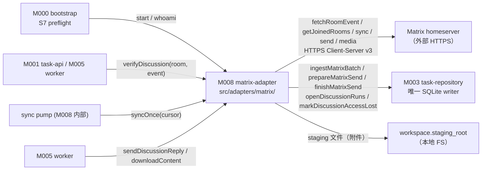
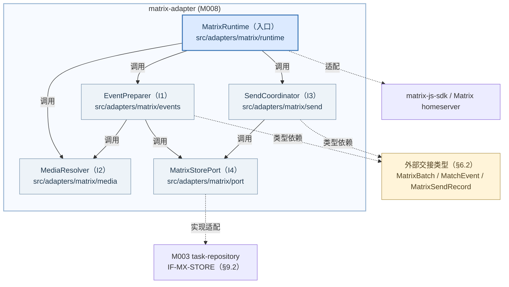
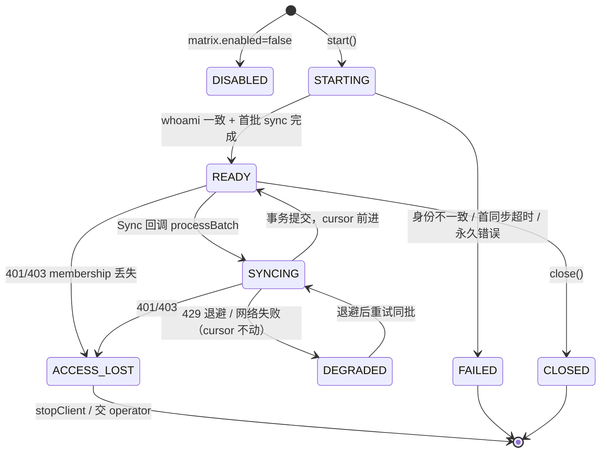
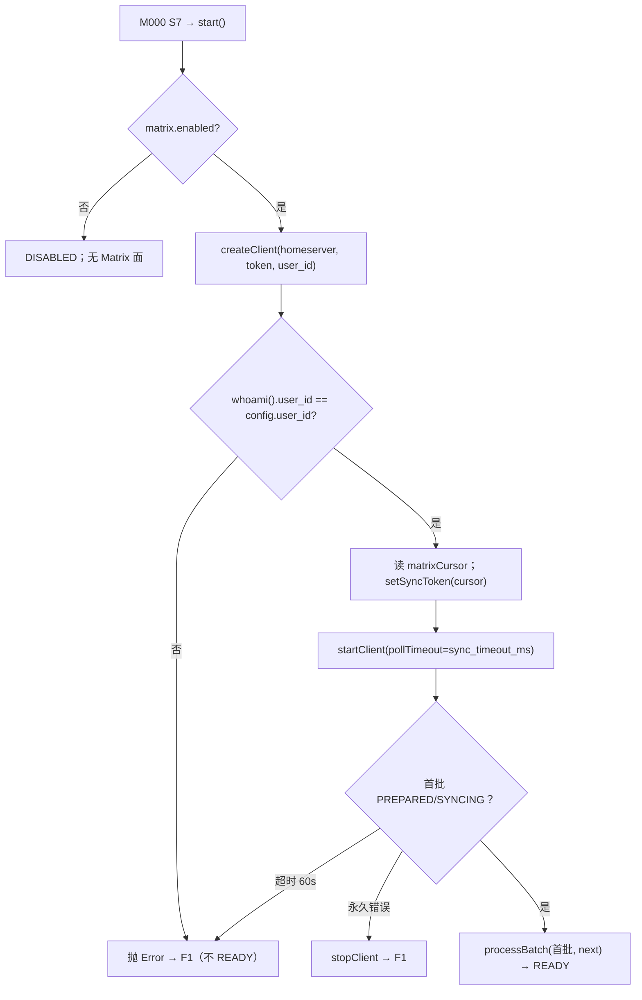
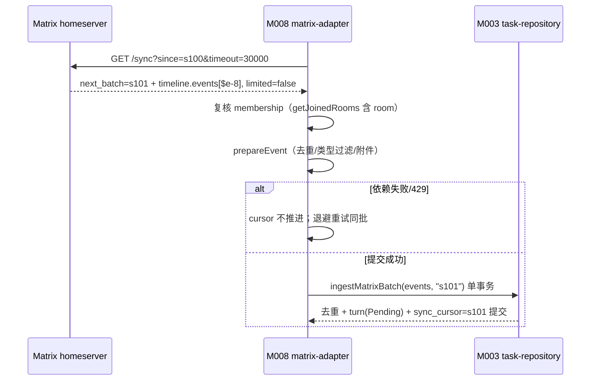
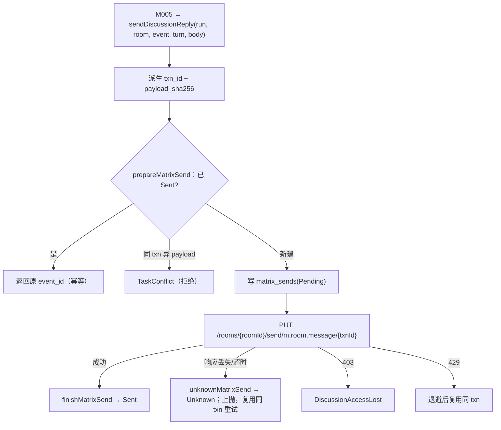
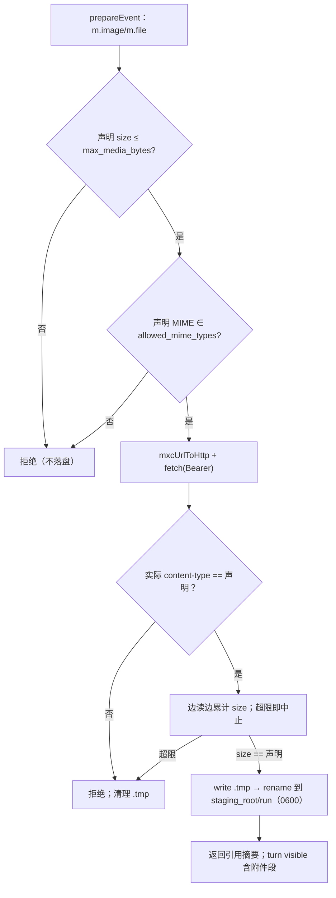

<!-- STD_DOCUMENT_COVER_BEGIN -->
# Piko 模块设计：matrix-adapter（M008）

> STD 使用入口：[项目采用说明与标准导航](../../README.md#std-entry)

| 文档字段 | 值 |
|---|---|
| Document ID | `piko-matrix-adapter` |
| Document Version | `0.1.0-draft.1` |
| Status | `Draft` |
| Project | `piko` |
| Document Owner | Piko Implementation Owner |
| Last Modified Date | `2026-09-27` |
| Template ID | `design.definition` |
| Template Version | `3.4.0` |

<!-- STD_DOCUMENT_COVER_END -->

## 1. 单元摘要：为什么存在

M008 `matrix-adapter` 解决一个问题：Piko 的 discussion Run 必须把外部 Matrix 房间里的事件按顺序、恰好一次地变成 Pi 可消费的输入，而 Matrix homeserver 是外部故障域、其事件不可回放保证、其发送不确定。matrix-adapter 把 `matrix-js-sdk` 的 Client-Server 调用收口为一个进程内运行时 `MatrixRuntime`：启动时用 `whoami` 核对配置身份；受理时用 `verifyDiscussion` 校验起点事件可见；运行期用 `syncOnce`/批处理把事件复制进 SQLite（`matrix_events` 去重 + `discussion_turns` 落盘 + `matrix_state.sync_cursor` 推进，同事务提交）；需要回复时用 `sendDiscussionReply` 以确定性 `txn_id` 做稳定事务发送。

matrix-adapter 只做协议封装与 sync 事实，**不管理 homeserver 内部**、不启用 Application Service 路径、v0.3 不支持 E2EE 房间；intake 状态（`Open`→`Closing`→`Closed`）的推进决定权属 M005 `worker`，持久化事务权属 M003 `task-repository`。用一次调用说明：`syncOnce` 拉到一批 `rooms.join.timeline.events` 后，adapter 逐事件复核 membership、忽略 `m.room.encrypted`、对 `m.room.message` 写 turn，并把整批在单个 SQLite 事务里落盘；cursor 推进是本批同步完成事实，失败则不推进、由去重吸收重放。

| 项目 | 内容 |
|---|---|
| 模块编号 / 正式英文名称 | M008 / `matrix-adapter` |
| 直属父对象编号 / 名称 | `SW-P` / Piko Agent Runtime V0.3（软件系统，`design_level=system`） |
| 父设计 Document ID / 固定基线 / 登记位置 | `system-design` v0.11.2 / 契约 `0.3.0-simplified.6` / §3.2 直属模块表（M008 行）+ §3.4 约束分配；本模块登记见 §3.2 |
| 上级系统/父单元 | 无（纯软件顶层，无总体系统父稿） |
| 解决的问题 | discussion 事件恰好一次进入 Pi；Matrix 发送在响应丢失时可判定；homeserver 故障/限流/权限丢失可按事实收口 |
| 提供的能力 | `MatrixRuntime`：`start`/`whoami`、`verifyDiscussion`、`syncOnce`/批处理、`sendDiscussionReply`、media download/upload；确定性 txn 与去重 |
| 主要使用者 | M001/M005（起点校验）、M003（sync 事务持久化）、M005（附件 staging）、M000（S7 启动 whoami） |
| 不负责 | intake 状态推进（M005）；`matrix_*`/`discussion_turns` 持久化事务（M003）；Run/Result 语义（MECH-RUN）；homeserver 内部与 AS/E2EE 路径（明确不做） |

### 1.1 继承的上级约束与落实方式

matrix-adapter 承接一条直属约束 `CON-MX-001`（PK-08，Matrix Client-Server 单身份 + intake CAS），并参与 MECH-RUN / MECH-STARTUP 的上位机制。约束来源是 `system-design` §3.4（PK-08 行）与 `piko-matrix.md` §3.1 `CON-MX-001`，启动侧承接 `piko-startup.md` §3.1 `CON-ST-001`（PK-12）的 S7 环节。两条均为 Approved。

#### 1.1.1 `CON-MX-001` · Matrix Client-Server 单身份 + intake CAS

- **上级基线与决定状态**：`system-design` v0.11.2 §3.4（PK-08 行）+ `piko-matrix.md` §3.1 `CON-MX-001` · PK-08 · Approved；固定基线 machine contract `0.3.0-simplified.6`。上级原文："discussion Run 使用 single identity；intake CAS Open→Closing→Closed；不引入 AS、不支持 E2EE 房间。"

- **适用条件**：所有 discussion Run 的整个生命周期；进程以单 configured Matrix 身份连接单一 homeserver。

- **继承预算或行为保证**：同一已接收 `event_id` 恰好一次进入 session；cursor 在本批（含回补）写 turn 后推进；`txn_id` 确定性、同 payload 重试复用同 txn；`m.room.encrypted` 起点拒绝、运行期忽略。

- **可自行选择/不可改变**：不可改变：单身份、无 AS、无 E2EE、intake 单向、cursor 不丢失。可自行设计：`matrix-js-sdk` 封装组织、退避策略、media staging 实现、内部数据结构（`M-MX-DI-001` 自由度）。

- **本地落实/内部再分配**：§6 定义 `MatrixBatch`/`MatrixSendRecord`/`DiscussionContext` 等结构；§7 定义 start/verify/sync/send/media 主流程；§8 定义去重、cursor 推进、409/429/401 分类与 E2EE 唯一结果规则；§9 固定 `MatrixRuntime` 方法与 Matrix HTTP 端点合同；§13 落到 `src/adapters/matrix/` 文件。单身份预算不向内部再分配（身份恒为 1）。

- **验证方法与结果/证据**：局部 `VRC-MATRIX-001..005`；组合 `PK-T08`（homeserver 集成，测 sync/dedup/turn/cursor/send/media 的 cross-check）；当前全部 `NOT_RUN`。

- **差距/变更影响/反馈责任**：`matrix-js-sdk` 版本变化需复审（§15 `RISK-MATRIX-003`）。`RISK-MATRIX-002`（E2EE 缺席）由 Piko Project Owner 在生产拓扑确定时裁决；本模块不放宽。

#### 1.1.2 `CON-ST-001` · 启动 preflight 中的 Matrix whoami 环节（S7）

- **上级基线与决定状态**：`system-design` v0.11.2 §3.4（PK-12 行）+ `piko-startup.md` §3.1 `CON-ST-001` · PK-12 · Approved。上级要求"完整 preflight 通过才 READY"，其中 S7 含 Matrix whoami。

- **适用条件**：进程启动 S7；`matrix.enabled=true`。

- **继承预算或行为保证**：`whoami()` 返回 `user_id` 必须与 config `matrix.user_id` 一致，否则启动失败（F1），不得进入 READY；不一致时进程非零退出、无业务入口。

- **可自行选择/不可改变**：不可改变：whoami 一致才 READY、不支持部分就绪。可自行设计：whoami 的实现与超时、失败分类细节（`M-ST-DI-004` 自由度）。

- **本地落实/内部再分配**：§7.1 `P-MATRIX-START` 定义启动顺序；§9.1.1 `MatrixRuntime.start` 合同；§10 `C-MATRIX-03` 推演身份不一致/不可达；§4.1 `DEP-MATRIX-HOMESERVER` 记录失败出口。

- **验证方法与结果/证据**：局部 `VRC-MATRIX-001`；组合 `PK-T12`（启动 preflight E2E）；当前 `NOT_RUN`。

- **差距/变更影响/反馈责任**：none。`matrix.enabled=false` 时本环节 N/A（dev 无 Matrix），由 §6.3 说明。

## 2. 需求、功能与验收条件

matrix-adapter 的可观察功能是五个进程内操作：身份核对、起点校验、同步批处理、稳定发送、附件收发。前四个由自身实现，典型调用方是 M000/M001/M005；media 由 M005 经 staging 消费。所有操作都是进程内函数（对外 Matrix 面是 HTTP 客户端请求，契约在 §9.2）。

### 2.1 `F-MATRIX-VERIFY` · 校验 discussion 起点并核对身份

- **上级需求 / Constraint ID**：`CON-MX-001`（PK-08）；`M-MX-DI-001`；`CAP-MX-VERIFY`。

- **调用方**：M001 `task-api` 受理时（经 M002/M003 路径），M005 worker 亦可复核；`start` 阶段由 M000 S7 调用 whoami。

- **输入与前提**：`DiscussionContext{room_id, trigger_event_id}`；`MatrixRuntime` 已 `start` 且 `started=true`；homeserver 可达；bearer access token 已由 Secret provider 解析。

- **行为**：先核对 `whoami()` 与 config `user_id` 一致（首次在 `start`，后续可复核）；调 `getJoinedRooms()` 确认本身份仍在 `room_id`；调 `fetchRoomEvent(room_id, event_id)` 取起点事件并校验 `event.room_id===room_id`；若起点事件为 `m.room.encrypted` 则拒绝。返回可消费的正文（`m.room.message` 的 `body`）。

- **输出**：`string`（起点正文）或抛 typed error；`VerifiedEvent{event_id, membership:"join"}` 语义由返回值与 membership 复核共同成立。

- **错误与边界**：room/event 不存在或不可见 → `InvalidDiscussionContext`（409，受理侧）；起点为 `m.room.encrypted` → `InvalidDiscussionContext`（E2EE 无法取得可见起点）；membership 丢失 → `DiscussionAccessLost`；未 `start` → 编程错误 `Error("Matrix is not ready")`。

- **验收条件**：给定已 join 的 room 与存在的 `m.room.message` 起点 → 返回该 body；起点在别的 room → `InvalidDiscussionContext`；起点为 `m.room.encrypted` → `InvalidDiscussionContext`；本身份已不在 room → `DiscussionAccessLost`。

### 2.2 `F-MATRIX-SYNC` · 同步、去重与 cursor 推进

- **上级需求 / Constraint ID**：`CON-MX-001`；`M-MX-DI-001`；`CAP-MX-SYNC`。

- **调用方**：内部 sync pump（M008 自身的 `start` 注册的 ClientEvent.Sync 回调链）；持久化由 M003 承接。

- **输入与前提**：`cursor`=上次 `next_batch`（首次 null）；长轮询 `sync_timeout_ms`（config，默认 30000）；M003 可用。

- **行为**：`syncOnce(cursor)` 拉一批 `rooms.join.timeline.events`；对每 room 复核 membership；逐事件去重（`matrix_events`，按 `(room_id, event_id)`）；对命中 Run 的 `m.room.message` 生成 `DiscussionTurn(Pending)`；`limited=true` 时按 §8.4 有界回补；整批在单个 M003 事务内写去重 + turn + cursor。cursor 仅在本批（含回补）写 turn 后推进。

- **输出**：`MatrixBatch{next_batch, events, limited, prev_batch}`；持久结果 = `matrix_events`/`discussion_turns` 行 + `matrix_state.sync_cursor` 前进。

- **错误与边界**：网络超时/断流 → cursor 不推进，重试同批（dedup 吸收）；429 `M_LIMIT_EXCEEDED` → 按 `retry_after_ms` 退避、cursor 不推进；401 `M_UNKNOWN_TOKEN`/403 `M_FORBIDDEN` → `DiscussionAccessLost`；401/403 时同步 pump 停止。`limited=true` 且回补仍截断 → 记 `truncation_unresolved=true`，**仍推进 cursor**（不永久卡死），但该 Run 的 turn 集合标记"可能不完整"。

- **验收条件**：同批含 `$e-7`（起点）/`$e-8` → turn_seq 1,2 顺序写、cursor 由 `s100`→`s101`；重复批重放 → 不产生第二个 turn、cursor 不变；`limited=true` 且注入 `$e-9` → 回补后 turn_seq=3 且 cursor 推进；回补仍截断 → `truncation_unresolved=true` 且 cursor 推进。

### 2.3 `F-MATRIX-SEND` · 稳定事务发送

- **上级需求 / Constraint ID**：`CON-MX-001`；`CAP-MX-SEND`。

- **调用方**：M005 worker（需要回复房间时）。

- **输入与前提**：`run`、`room`、`event`（被回复事件）、`turn`（turn_seq）、`body`；`MatrixRuntime` 已 `start`。

- **行为**：确定性派生 `txn_id = <instance_id>:<run>:turn:<turn>:assistant`，对 payload 计算 `payload_sha256`；先调 M003 `prepareMatrixSend(txn, run, turn, sha)`（若已 `Sent` 直接返回原 `event_id`；同 `txn` 不同 payload 抛 `TaskConflict`）；再 `PUT /rooms/{roomId}/send/m.room.message/{txnId}`；成功调 `finishMatrixSend` 记 `Sent`，失败调 `unknownMatrixSend` 记 `Unknown`。

- **输出**：`MatrixSendOutcome{event_id}`；持久结果 = `matrix_sends` 行状态 `Sent`。

- **错误与边界**：403 → `DiscussionAccessLost`；429 → 退避后复用同 txn；网络超时/响应丢失 → 复用同 txn 重试（不重复发）；同 txn 不同 payload → `TaskConflict`（拒）。

- **验收条件**：首次发送成功 → `event_id=$sent-1` 且 `matrix_sends.state='Sent'`；响应丢失后同 payload 重试 → 复用同 txn 返回原 `event_id`，homeserver 只有一个事件；同 txn 不同 payload → `TaskConflict`。

### 2.4 `F-MATRIX-MEDIA` · 附件下载与上传

- **上级需求 / Constraint ID**：`CON-MX-001`；`CAP-MX-MEDIA`。

- **调用方**：M005 worker（消费下载的 staging 文件）；发送侧由 §2.3 复用。

- **输入与前提**：下载：`mxc://{serverName}/{mediaId}` + 声明 MIME/size；运行期 `m.room.message` 为 `m.image`/`m.file` 等；上传：字节 + MIME。`matrix.max_media_bytes` 与 `matrix.allowed_mime_types` 已配置。

- **行为**：下载前复核 `membership` 与事件可见性；校验声明 `info.size <= max_media_bytes` 且 `info.mimetype ∈ allowed_mime_types`；`mxcUrlToHttp` 解析后带 Bearer 下载；边下边校验实际 size 与 content-type 一致；写 Run staging 目录（`workspace.staging_root/<run>`，`0700`），文件先写 `.tmp` 再 rename，`0600`。上传：`POST /_matrix/media/v3/upload` 返回 `content_uri`。

- **输出**：下载 → staging 文件 + 引用摘要字符串（`[Matrix attachment: <path> (<mime>, <size> bytes)]`）；上传 → `{content_uri: mxc}`。

- **错误与边界**：ACL 失败 → `DiscussionAccessLost`；超 `max_media_bytes` → 拒绝（不落盘）；MIME 声明与实际不符 → 拒绝；size 声明与实际不符 → 拒绝；非 `mxc://` → 拒绝。

- **验收条件**：合法附件 → staging 文件 `mime/size` 与声明一致且路径在 `staging_root/<run>` 内；声明 size 超限 → 拒绝且无文件；实际 content-type 与声明不符 → 拒绝且 `.tmp` 已清理。

### 2.5 `F-MATRIX-INTAKE-OBSERVE` · 观察 intake 并只登记不附着

- **上级需求 / Constraint ID**：`CON-MX-001`；`CAP-MX-INTAKE`（推进权属 M005，本模块只观察与登记）。

- **调用方**：无直接调用方；由 §2.2 的 sync 批处理与 §2.1 的 membership 复核路径隐式触发。

- **输入与前提**：`room_id`；M003 的 `openDiscussionRuns(room)` 与 `discussion_intake_state` 可读。

- **行为**：sync 批处理时以 `openDiscussionRuns(room)` 判断该 room 是否有 `Open` 的 Run；只有 `Open` 才附着新 turn（`Closing`/`Closed` 只登记 `matrix_events`/cursor，不落 turn）；membership 丢失时调 `markDiscussionAccessLost(room)` 记录 access-loss 事实（不自行改 Run 终态）。

- **输出**：turn 的附着或仅去重登记；access-loss 行。

- **错误与边界**：closing 后事件 → 只登记，**不附着** Run；自身身份发送的 echo → 只去重，不生成 turn；`Disabled`（非 discussion Run）→ 不附着。

- **验收条件**：`intake=Closing` 时新事件只写 `matrix_events` 与 cursor、无新 turn；自身 sender 的 `m.room.message` 只写 `matrix_events`、无 turn；membership 丢失 → `discussion_access_loss` 有行且不写终态。

## 3. UI、CLI、服务端点或设备操作面

**N/A。** matrix-adapter 是纯进程内模块，不拥有 UI、CLI 或设备操作面：它不监听端口、不注册 HTTP 路由、不提供面向 operator 的诊断命令。它的调用入口是进程内函数（§9.1 `MatrixRuntime`）与出站 Matrix Client-Server 请求（§9.2）。唯一面向外部的协议面是**作为客户端的 Matrix HTTP 端点族**（`/_matrix/client/v3/sync` 等），这些端点由 homeserver 提供，本模块只消费、不承载，故不计入本模块的操作面。

实际调用入口与归属：`M000 S7 → MatrixRuntime.start/whoami`、`M001/M005 → verifyDiscussion`、`sync pump → syncOnce/批处理`、`M005 → sendDiscussionReply/downloadContent`。维护/诊断面见 §11（`piko matrix-whoami`/`matrix-sync-status`/`matrix-audit` 由 operator 诊断端点暴露，属 M009/M000 的读取侧，本模块是事实写入点）。

Tailoring 依据：`TAIL-P-101`（Piko 无图形入口）同源；本模块无独立操作面，属 STD `design.definition` §3 "模块没有任何直接操作面时写 N/A + 实际调用入口/归属 + tailoring 依据"的情形。"没有页面"不等于"没有 API"——Matrix 客户端协议面在 §9.2 唯一维护。

## 4. 外部边界与依赖

matrix-adapter 在进程内的位置：被 M000/M001/M005 调用，事务写交 M003。下图只画模块外部交接，不表示线程或新部署边界。



图 M-MX-C1 · Target / Planned / NOT_BUILT。实线是同步进程内函数调用与出站 HTTPS；不是新部署边界。homeserver 为外部独立故障域；SQLite 事务权威属 M003，见 §9.2 `IF-MX-TURN`；staging 是本地文件，见 §10 `C-MATRIX-05`。

#### 4.1 `DEP-MATRIX-HOMESERVER` · Matrix homeserver（外部 Client-Server 服务）

- **角色 / 运行位置 / Owner**：外部 HTTPS 服务（Synapse 等），独立网络故障域；Owner：客户 Operator（homeserver 运维），非 Piko。

- **本模块调用或消费**：Client-Server v3 端点族：`GET /account/whoami`、`GET /rooms/{roomId}/event/{eventId}`、`GET /joined_rooms`、`GET /sync`、`GET /rooms/{roomId}/messages`、`PUT /rooms/{roomId}/send/m.room.message/{txnId}`、`GET /_matrix/media/v3/download/...`、`POST /_matrix/media/v3/upload`（§9.2）。`matrix-js-sdk` 封装长轮询、Bearer 注入与错误对象。

- **本模块提供**：无（纯消费；只在需要时 send。homeserver 不消费 Piko 接口）。

- **契约 authority / 版本 / selector**：Matrix Client-Server API v3（外部规范，非 Piko 文档）；`matrix-js-sdk` 版本由 lockfile 固定（`piko-matrix.md` §3 参与方表）。Piko 侧消费子集固定于 §9.2。错误码映射见 §6.8。

- **同步方式 / timeout / 生命周期**：出站 HTTPS；`sync` 长轮询 `timeout=sync_timeout_ms`（config，1000–120000）；其他请求无显式 Piko 超时（由 `matrix-js-sdk`/Node fetch 决定）；连接随进程；access token 轮换需重启。

- **不可用或失败影响 / 责任出口**：启动期不可达 → `whoami` 失败 → F1（不 READY）；运行期 401/403 → `DiscussionAccessLost`（交 operator 轮换 token 或停止 intake）；429 → 内部退避（不映射）；500/网络超时 → 重试同批，cursor 不推进；homeserver 不可达期间 discussion 不可用但不阻塞非 discussion Run。

#### 4.2 `DEP-MATRIX-REPO` · M003 `task-repository`（持久化与事务权威）

- **角色 / 运行位置 / Owner**：同级直属模块，同进程（PK-01 单进程）；Owner：Piko Implementation Owner。

- **本模块调用或消费**：matrix 持久化原语：`matrixCursor`/`setMatrixCursor`、`openDiscussionRuns(room)`、`hasMatrixEvent(room,event)`、`ingestMatrixBatch(events, cursor)`、`recordMatrixEvent`、`markDiscussionAccessLost(room)`、`prepareMatrixSend`/`finishMatrixSend`/`unknownMatrixSend`（§9.2 `IF-MX-TURN`/`IF-MX-STORE`）。

- **本模块提供**：无。matrix-adapter 不向 M003 提供接口；turn 状态推进（`Pending`→`Consumed`/`Abandoned`）由 M005 经 M003 完成，本模块只写初始 `Pending`。

- **契约 authority / 版本 / selector**：`IF-MX-STORE` 由本设计提出（§9.2），**Proposed**：待 M003 `piko-task-repository-design.md` 采纳或给出超集，未冻结前不得按"已确认合同"实现（`OQ-MATRIX-001`）。`matrix_*`/`discussion_turns` 的**当前代码事实**是 `src/store.ts` 的建表 DDL（`matrix_state` 见 `src/store.ts:25`，`matrix_events` 见 `:26`，`matrix_sends` 见 `:28`）与 `ingestMatrixBatch` 等实现（`src/store.ts:59`–`:73`）。

- **同步方式 / timeout / 生命周期**：同步进程内调用；`ingestMatrixBatch` 在单 `BEGIN IMMEDIATE` 内完成去重 + turn + cursor；受 `task_store.busy_timeout_ms` 约束；连接生命周期由 M003 持有。

- **不可用或失败影响 / 责任出口**：`SQLITE_BUSY` 超时 → 依赖错误上抛，cursor 不推进（batch 未提交）；matrix-adapter 不吞错、不改写 M003 语义。M003 是唯一 SQLite writer，adapter 绝不自行打开连接。

#### 4.3 `DEP-MATRIX-SECRET` · access token Secret provider（宿主提供）

- **角色 / 运行位置 / Owner**：宿主/启动期能力（M000 + MECH-CONFIG）；Owner：Piko Implementation Owner。

- **本模块调用或消费**：`matrix.access_token_secret_ref` 解析出的明文 access token（reference-only，`env|file|keychain|vault:`）；`matrix.user_id` 与 `matrix.homeserver`。

- **本模块提供**：无。

- **契约 authority / 版本 / selector**：`interfaces/schemas/piko-runtime-config-v0.3.schema.json` `matrix.*`（`access_token_secret_ref` 为 `secretRef` 格式；`enabled=true` 时 `homeserver`/`user_id`/`access_token_secret_ref`/`sync_timeout_ms`/`max_media_bytes`/`allowed_mime_types` 必填）。

- **同步方式 / timeout / 生命周期**：启动期一次性解析注入 `MatrixRuntime` 构造；token 轮换需重启（`piko-matrix.md` §3.3）。

- **不可用或失败影响 / 责任出口**：Secret 缺失/格式非法 → MECH-CONFIG S2 失败或 `start` 失败 → F1；access token **只**用于 Bearer 头与 SDK 构造，不得进入 turn/task/Result/日志（§11 `SEC-MATRIX-TOKEN`）。

#### 4.4 `DEP-MATRIX-WORKSPACE` · workspace staging 根（宿主提供）

- **角色 / 运行位置 / Owner**：本地可靠 FS；Owner：Piko Implementation Owner（M000 S4 canonicalize）。

- **本模块调用或消费**：`workspace.staging_root`（绝对路径），在其下按 Run 建 staging 目录写下载的附件。

- **本模块提供**：供 M005 消费的 staging 文件路径（经 turn 的 visible 文本嵌入）。

- **契约 authority / 版本 / selector**：`piko-runtime-config-v0.3.schema.json` `workspace.staging_root`（`absolutePath`）；路径边界由 M002/M000 canonicalize。

- **同步方式 / timeout / 生命周期**：同步文件 I/O（`write .tmp → rename`）；文件寿命到 retention 清理。

- **不可用或失败影响 / 责任出口**：staging 不可写/磁盘耗尽 → 下载失败上抛依赖错误，不落半成品（`.tmp` 不 rename）；adapter 不擅自改 `staging_root`。本地持久化安全（权限/symlink/只读 FS）见 §11 与 ISD §7.3.2。

## 5. 内部结构与实现位置

matrix-adapter 拆成五个内部单元：入口编排、事件准备/去重、媒体处理、稳定发送、M003 端口适配。拆分依据是"事件准备（纯去重/内容提取）可与网络和持久化解耦、media 有独立 ACL/字节预算、发送有独立 txn 可靠性、端口隔离 M003"，不是为了凑文件。



图 M-MX-S1 · Target / Planned / NOT_BUILT。外框是模块内部组成；实线同步调用，虚线类型/适配依赖；不表示线程或时序。当前实现事实为单文件 `src/matrix.ts`（标 `IMPLEMENTED`），Target 为 `src/adapters/matrix/` 分解（标 `PLANNED`），见 §2。

### 5.1 内部组成

#### 5.1.1 `S1` · MatrixRuntime（入口）

- **职责与非职责**：对外提供 §9.1 的操作并保证 §6 不变量；编排"start/whoami、verify、sync pump、send、media"。非职责：不拼 SQL（经 I4）、不直接算去重/内容（I1）、不解析 media（I2）、不决策 intake 状态（M005）。

- **输入、处理与输出**：输入 `RuntimeConfig`、`TaskStore`、token；处理：组合 SDK client、I1/I2/I3 与 I4；输出 sync batch / 正文 / event_id / staging 路径。

- **协作对象**：调用 I1/I2/I3/I4，持有 `matrix-js-sdk` `MatrixClient`；被 M000/M001/M005 调用。

- **文件 / symbol / 实现状态**：`src/adapters/matrix/runtime.ts` → `class MatrixRuntime`（Planned / NOT_IMPLEMENTED）。现基线为 `src/matrix.ts` `class MatrixRuntime`（Implemented，单文件），见 §2.1。

- **拆分依据与替代方案代价**：入口只做编排与 SDK 生命周期，把事件准备/媒体/发送抽到独立单元以便独立测试。替代方案"保持在 `src/matrix.ts` 单文件"是 Current 形态，代价是去重/内容/媒体/发送耦合、难以对 409/429/E2EE 分支做无网络单测。

#### 5.1.2 `I1` · EventPreparer（事件准备与去重）

- **职责与非职责**：把原始 Matrix 事件转换为 `MatchEvent{room, event, sender, txn, turns[]}`：类型过滤（只 `m.room.message` 的 text/image/file/audio/video）、自身 sender 剔除、`hasMatrixEvent` 去重、按 `openDiscussionRuns(room)` 生成 turns（非 text 调 I2 下载）。非职责：不发 HTTP（经 S1 的 client）、不写 DB（经 I4）、不判 cursor。

- **输入、处理与输出**：输入 `MatrixEvent`（SDK）、open room 列表；输出 `MatchEvent | undefined`（不匹配返回 undefined）。

- **协作对象**：调用 I2（附件）与 I4（`hasMatrixEvent`/`openDiscussionRuns`）；被 S1 调用。

- **文件 / symbol / 实现状态**：`src/adapters/matrix/events.ts`（Planned / NOT_IMPLEMENTED），导出 `prepareEvent`。现基线为 `src/matrix.ts` `prepareEvent`（Implemented）。

- **拆分依据与替代方案代价**：纯准备逻辑可表驱动测试（去重命中、自身 echo、E2EE 忽略、msgtype 过滤），不需网络与 SQLite。替代方案"内联在 runtime"难以覆盖非 text 附件与去重的组合边界。

#### 5.1.3 `I2` · MediaResolver（附件下载与 staging）

- **职责与非职责**：下载 `mxc://` 附件到 staging 并返回引用摘要；校验 size/MIME/ACL；`mxcUrlToHttp` 解析与字节上限。非职责：不决定是否投喂（I1/S1）、不改 Run 状态、不负责上传（上传在 I3 的发送路径）。

- **输入、处理与输出**：输入 `mxc`、声明 `info{mimetype,size}`、`max_media_bytes`、`allowed_mime_types`、staging 根；输出引用摘要字符串或抛依赖/ACL 错误。

- **协作对象**：调用 SDK `mxcUrlToHttp` + Node `fetch`；被 I1 调用。

- **文件 / symbol / 实现状态**：`src/adapters/matrix/media.ts`（Planned / NOT_IMPLEMENTED），导出 `downloadMedia`/`uploadContent`。现基线为 `src/matrix.ts` `downloadMedia`（Implemented）。

- **拆分依据与替代方案代价**：媒体有独立 ACL/字节/原子落盘语义（`.tmp`→rename），抽出后可对超限/MIME 不符/ACL 失败单测。替代方案"内联"会把文件 I/O 安全散落。

#### 5.1.4 `I3` · SendCoordinator（稳定事务发送）

- **职责与非职责**：按确定性 `txn_id` + `payload_sha256` 经 `prepareMatrixSend` 复用/新建 `matrix_sends`；`PUT send`；按结果 `finishMatrixSend`/`unknownMatrixSend`。非职责：不生成回复正文（M005 传入）、不判 `Consumed`、不上传附件（经 I2）。

- **输入、处理与输出**：输入 `{instance_id, run, turn, room, event, body}`；输出 `event_id` 或抛错误。

- **协作对象**：调用 I4（`prepareMatrixSend` 等）与 S1 的 client `send`；被 S1 调用。

- **文件 / symbol / 实现状态**：`src/adapters/matrix/send.ts`（Planned / NOT_IMPLEMENTED），导出 `sendDiscussionReply`。现基线为 `src/matrix.ts` `sendDiscussionReply`（Implemented）。

- **拆分依据与替代方案代价**：发送可靠性（txn 幂等、Unknown 复权）可单测而不触网。替代方案内联难以覆盖"同 txn 不同 payload → TaskConflict"边界。

#### 5.1.5 `I4` · MatrixStorePort（持久化端口）

- **职责与非职责**：把 §9.2 `IF-MX-STORE`/`IF-MX-TURN` 的 matrix 原语适配到 M003；是 adapter 内唯一接触持久化的单元。非职责：不做去重判断（I1）、不重试业务失败（只透传依赖错误）、不生成 cursor。

- **输入、处理与输出**：输入结构化的 `(room, event, sender, txn, turns, cursor)`；输出行/布尔/判别结果。

- **协作对象**：调用 M003 `TaskStore`；被 I1/I3/S1 调用。

- **文件 / symbol / 实现状态**：`src/adapters/matrix/port.ts`（Planned / NOT_IMPLEMENTED），接口 `MatrixStorePort` + `M003MatrixStore`。现基线为直接持有 `TaskStore`（`src/matrix.ts` 构造注入）。

- **拆分依据与替代方案代价**：端口使 adapter 可在内存假实现上测试并把 M003 合同集中一处。替代方案"直接 import store"传播 M003 类型到全模块，违反 §5.5 依赖方向。

### 5.2 内部调用过程

#### 5.2.1 `P-MATRIX-START` · 启动与身份核对

- **入口与调用上下文**：M000 S7 preflight → `MatrixRuntime.start()`（宿主事件循环，非新线程）。

- **调用链（文件 / symbol → 文件 / symbol）**：`bootstrap S7` → `MatrixRuntime.start` → `createClient({baseUrl, accessToken, userId})` → `client.whoami()`（核对 `user_id`）→ `MatrixStorePort.matrixCursor()`（读 cursor，若有则 `setSyncToken`）→ 注册 `RoomEvent.Timeline` + `ClientEvent.Sync` → `client.startClient({initialSyncLimit, pollTimeout})` → 等待首批 `PREPARED/SYNCING` → `started=true`。

- **逐步传递的数据**：`RuntimeConfig.matrix{...}` + token → `MatrixClient` → `whoami.user_id` → `cursor:string|null` → 首批 `{events, next_batch}`。

- **返回、异常与清理**：身份不一致 → `Error("Matrix credential identity mismatch")`（F1）；首轮同步超时（60s 守护）→ `Error("Matrix initial sync timeout")` → F1；永久错误（401/403/4xx）→ `stopClient` → F1；成功无清理。

- **对应流程 / 接口 / 验证**：§7.1 `M-MATRIX-P1`；§9.1.1 `IF-MX-START`、§9.2 `IF-MX-HTTP-WHOAMI`；`VRC-MATRIX-001`。

#### 5.2.2 `P-MATRIX-SYNC` · 同步批处理

- **入口与调用上下文**：`ClientEvent.Sync` 回调（`PREPARED/SYNCING`）→ `MatrixRuntime.processBatch(events, next)`（串行 promise 链，非并发）。

- **调用链（文件 / symbol → 文件 / symbol）**：`client.on(Sync)` → `pendingEvents.splice(0)` → `processBatch` → `getJoinedRooms()`（membership 复核，缺失则 `markDiscussionAccessLost`）→ 逐事件 `EventPreparer.prepareEvent`（→ `MediaResolver.downloadMedia` 非 text）→ `MatrixStorePort.ingestMatrixBatch(prepared, cursor)`（单事务）。

- **逐步传递的数据**：`MatrixEvent[]` → `MatchEvent[]` → `ingestMatrixBatch(events, cursor)` → turn/cursor 提交。

- **返回、异常与清理**：成功 = 事务提交、cursor 前进；网络/依赖失败 = cursor 不推进、重试同批（dedup 吸收）；永久错误 = `stopClient` + 拒绝 ready/抛错；无临时资源残留（media `.tmp` 失败时清理）。

- **对应流程 / 接口 / 验证**：§7.2 `M-MATRIX-P2`；§9.2 `IF-MX-HTTP-SYNC`、`IF-MX-TURN`；`VRC-MATRIX-002`。

#### 5.2.3 `P-MATRIX-SEND` · 稳定事务发送

- **入口与调用上下文**：M005 worker → `MatrixRuntime.sendDiscussionReply(run, room, event, turn, body)`。

- **调用链（文件 / symbol → 文件 / symbol）**：`worker` → `SendCoordinator.sendDiscussionReply` → 派生 `txn_id`/`payload_sha256` → `MatrixStorePort.prepareMatrixSend`（已 `Sent` 直接返回）→ `client.sendEvent(room, "m.room.message", content, txn)` → `finishMatrixSend(txn, event_id)`（失败 → `unknownMatrixSend`）。

- **逐步传递的数据**：`{run, turn, room, event, body}` → `txn_id`/`sha256` → `{state, event_id?}` → `event_id`。

- **返回、异常与清理**：成功返回 `event_id`；发送抛错 → 记 `Unknown` 并上抛（由 M005 决定复用同 txn 重试）；无资源清理。

- **对应流程 / 接口 / 验证**：§7.3 `M-MATRIX-P3`；§9.1.3 `IF-MX-SEND`、§9.2 `IF-MX-HTTP-SEND`；`VRC-MATRIX-003`。

### 5.3 文件间接口契约

本节只固定 adapter 内部文件之间的交接；跨模块的 M003 接口在 §9.2，字段类型在 §6。

#### 5.3.1 `IF-MATRIX-PREPARE` · `runtime.ts` → `events.ts`

- **接口成员 ID / §9 逐接口定义位置**：内部无公共成员 ID；行为规则权威在 §8.1/§8.4（去重、回补、类型过滤）。

- **本文件的提供或使用责任**：`events.ts` 提供 `prepareEvent`；`runtime.ts` 在 `processBatch` 内使用其结果。

- **交接时机 / 本地调用步骤**：`processBatch` 内逐事件调用；非 text 时经 §5.3.3 调 media。

- **§9.3 生命周期约束**：无状态、无所有权；调用即返回 `MatchEvent | undefined`。

- **实现与验证位置**：`src/adapters/matrix/events.ts`；`VRC-MATRIX-002`（去重）、`VRC-MATRIX-004`（E2EE/类型）。

#### 5.3.2 `IF-MATRIX-STORE` · `runtime.ts`/`events.ts`/`send.ts` → `port.ts`

- **接口成员 ID / §9 逐接口定义位置**：内部接口 `MatrixStorePort`，方法契约见 §9.2 `IF-MX-STORE`/`IF-MX-TURN`。

- **本文件的提供或使用责任**：`port.ts` 提供抽象与 `M003MatrixStore` 实现；其余单元以抽象调用。

- **交接时机 / 本地调用步骤**：见 `P-MATRIX-SYNC`/`SEND` 链。

- **§9.3 生命周期约束**：端口实例与进程同域；每次操作读权威（不缓存 turn/cursor）。

- **实现与验证位置**：`src/adapters/matrix/port.ts`；`VRC-MATRIX-002/003/005` 以受控 fake 端口 + 真 M003 两套覆盖。

#### 5.3.3 `IF-MATRIX-MEDIA` · `events.ts` → `media.ts`

- **接口成员 ID / §9 逐接口定义位置**：内部 `downloadMedia(run, event, content) -> string`；合同见 §9.1.4 `IF-MX-MEDIA-DOWN`。

- **本文件的提供或使用责任**：`media.ts` 提供下载与上传；`events.ts` 在非 text 事件时调用下载。

- **交接时机 / 本地调用步骤**：`prepareEvent` 对 `m.image`/`m.file` 等调用 `downloadMedia` 并拼接 visible 文本。

- **§9.3 生命周期约束**：staging 文件寿命到 retention；下载失败不 rename、无半成品。

- **实现与验证位置**：`src/adapters/matrix/media.ts`；`VRC-MATRIX-005`。

### 5.4 服务提供方式（条件适用）

**N/A（无独立宿主）。** matrix-adapter 不监听端口、不启动进程/线程、不注册端点：§3 已判定其自身无操作面（Matrix HTTP 面是它作为客户端的出站请求，由 homeserver 承载）。故本节的 server/runtime、监听、就绪、停止均不适用。

运行载体：`MatrixRuntime` 实例由 M000 `bootstrap` 装配、随进程生命周期存在；`start` 由 S7 调用、`close` 在进程退出时调用（`stopClient` + `removeAllListeners`）。并发模型：所有操作在宿主 Node 单线程事件循环上执行；sync pump 是事件循环上的**串行 promise 链**（`syncWork`），**不是新线程**（§10 `C-MATRIX-02`）。就绪/停止语义属于 M000/MECH-STARTUP，adapter 只暴露 `start`/`close` 与 `started` 事实。

Tailoring 依据：STD `design.definition` §5.4 "纯库函数说明不适用及由谁调用"。

### 5.5 依赖方向

- **允许方向**：`runtime.ts` → `{events.ts, media.ts, send.ts, port.ts, types.ts}`；`events.ts` → `{media.ts, port.ts, types.ts}`；`send.ts` → `{port.ts, types.ts}`；`media.ts` → `types.ts`；`port.ts` → `types.ts`（仅 §6 类型）。所有单元 → 无外部模块，除 `runtime.ts` 适配 `matrix-js-sdk`、`port.ts` 适配 M003。

- **禁止方向与原因**：禁止 `port.ts`/`media.ts`/`send.ts` 引用 `runtime.ts`（避免环）；禁止 `events.ts`/`send.ts` 直接 `import` M003 的 `store.ts`（只能经 `port.ts` 抽象），否则类型依赖扩散并绕过 §5.3 契约；禁止 `media.ts` 引用 `matrix-js-sdk` 之外的持久化。

- **循环/越层检查**：静态：对 `src/adapters/matrix/` 跑依赖图（`tsc`/import 检查或 CI 脚本）确认无环、`media.ts` 无持久化 import。评审按 §5.1 逐文件核对引用。

- **变更影响**：改 `events.ts` 影响去重/类型过滤（§8.1/§8.4 权威）；改 `port.ts` 影响与 M003 的合同（`OQ-MATRIX-001`）；改 `media.ts` 影响 ACL/字节预算（§11）；改 `runtime.ts` 影响对外操作（§9.1）。

## 6. 数据结构设计

matrix-adapter 引用的持久行（`matrix_state`/`matrix_events`/`matrix_sends`/`discussion_turns`）属 M003（§6.7，DDL 属 M003）；模块自有类型是 `MatrixBatch`/`MatchEvent`/`MatrixSendRecord`/`DiscussionContext`。不适用类别在章首集中说明。

**不适用类别与依据**：§6.1 公共基础类型（本模块无独立枚举，`MatrixSendState` 复用 M003 约定的 `Pending|Sent|Unknown` 字面量）、§6.5 设备/FPGA（纯软件，`TAIL-P-103`）均为 N/A。§6.3 配置结构 N/A（用 config `matrix.*`，见 ISD §8.1）。§6.4 通信报文确有跨边界报文，见 §6.4。§6.8 错误为内部 typed 与 homeserver errcode 映射，不新增对外错误码。

### 6.2 业务与操作数据结构

#### 6.2.1 `DiscussionContext`

- **完整定义、Data/Type/Data ID 与唯一来源**：`DiscussionContext`；来源 `piko-matrix.md` §5.1 `IF-MX-VERIFY` 输入；权威定义在 `src/adapters/matrix/types.ts`（Planned）。

  ```text
  DiscussionContext { room_id: string, trigger_event_id: string }
  ```

- **逐字段/逐值类型、范围、含义与跨字段约束**：`room_id` 必填、`!...:...` 形式；`trigger_event_id` 必填、`$...` 形式；二者必须同属一个 homeserver 且 `room_id` 必须是本身份已 join 的房间（运行期校验）。跨字段：`trigger_event_id` 事件对象的 `room_id` 必须等于 `room_id`。

- **生产/修改、所有权、可见点、寿命及失败出口**：由 M001 从 `RunSubmitRequest.discussion` 构造并传入；请求寿命；不可变值对象。校验失败出口 = `InvalidDiscussionContext`。

- **合法与拒绝实例、V/Case 与证据状态**：合法 `{room_id:"!r-7:hs", trigger_event_id:"$e-7"}`。拒绝：`trigger_event_id` 指向其它 room、起点为 `m.room.encrypted`。`VRC-MATRIX-001`；`NOT_RUN`。

#### 6.2.2 `MatrixBatch`

- **完整定义、Data/Type/Data ID 与唯一来源**：`MatrixBatch`；来源 `piko-matrix.md` §5.1 `IF-MX-SYNC` 输出；权威在 `src/adapters/matrix/types.ts`（Planned）。

  ```text
  MatrixBatch {
    next_batch: string,          // 下一批 cursor；唯一推进凭据
    events: MatrixEventEnvelope[],
    limited: bool,               // true 表示本批 timeline 被截断
    prev_batch: string | null    // 截断时的回补起点（供 /messages）
  }
  ```

- **逐字段/逐值类型、范围、含义与跨字段约束**：`next_batch` 必填非空（homeserver paging token）；`events` 为 §6.4 信封数组；`limited=true` 时 `prev_batch` 必须非空（否则无法回补）；`limited=false` 时 `prev_batch` 可为 null。

- **生产/修改、所有权、可见点、寿命及失败出口**：由 `syncOnce` 从 SDK/sync 响应构造、传给 `processBatch`；一次性值对象；无长期寿命。失败出口 = 网络/依赖错误上抛。

- **合法与拒绝实例、V/Case 与证据状态**：合法 `{next_batch:"s101", events:[...], limited:false, prev_batch:"s100"}`。拒绝：`limited=true` 且 `prev_batch` 空（不合法，回补无起点）。`VRC-MATRIX-002`；`NOT_RUN`。

#### 6.2.3 `MatchEvent` / `MatrixSendRecord`

- **完整定义、Data/Type/Data ID 与唯一来源**：`MatchEvent` 是去重后待落盘项；`MatrixSendRecord` 对应 `piko-matrix.md` §4.6.1；权威在 `src/adapters/matrix/types.ts`（Planned）。

  ```text
  MatchEvent { room: string, event: string, sender: string, txn?: string, turns: {run:string; visible:string}[] }
  MatrixSendRecord { txn_id: string, run_id: string, turn_seq: number, payload_sha256: string,
                     event_id: string | null, state: "Pending"|"Sent"|"Unknown" }
  ```

- **逐字段/逐值类型、范围、含义与跨字段约束**：`MatchEvent.turns` 可为空（自身 echo / 无 open Run 时只登记去重）；`MatrixSendRecord.txn_id` 由 instance/run/turn/action 确定性派生；`state="Sent"` ⟹ `event_id` 非空；同 `payload_sha256` 才可复用同 txn。

- **生产/修改、所有权、可见点、寿命及失败出口**：`MatchEvent` 由 I1 生产、`ingestMatrixBatch` 消费；`MatrixSendRecord` 由 `prepareMatrixSend` 写、`finishMatrixSend`/`unknownMatrixSend` 推进。均随 Run 寿命。

- **合法与拒绝实例、V/Case 与证据状态**：合法 `MatchEvent{room:"!r-7:hs", event:"$e-8", sender:"@pm:hs", turns:[{run:"run-042", visible:"also check tests"}]}`。拒绝：`txn_id` 相同但 `payload_sha256` 不同（`TaskConflict`）。`VRC-MATRIX-002/003`；`NOT_RUN`。

### 6.3 配置与规则数据结构

**N/A。** matrix-adapter 无自己的配置文件结构：它消费 config schema `matrix.*`（`enabled`/`homeserver`/`user_id`/`access_token_secret_ref`/`sync_timeout_ms`/`max_media_bytes`/`allowed_mime_types`），authority 是 `interfaces/schemas/piko-runtime-config-v0.3.schema.json`（见 ISD §8.1）。`sync_timeout_ms` 默认 30000（`piko-matrix.md` §13），非本模块自造 key。依据：STD `design.definition` §6.3 "不适用时在章首说明原因和 tailoring 依据"。

### 6.4 通信报文结构

#### 6.4.1 Matrix 事件信封（Piko 消费子集）

- **完整定义、Data/Type/Data ID 与唯一来源**：`MatrixEventEnvelope`；来源 `piko-matrix.md` §4.4.1；外部权威 = Matrix Client-Server v3 规范。

  ```text
  MatrixEventEnvelope { type: string, event_id: string, sender: string, room_id: string,
                        origin_server_ts: number, content: object }
  ```

- **逐字段/逐值类型、范围、含义与跨字段约束**：Piko 只消费 `m.room.message`（msgtype `m.text`/`m.image`/`m.file`/`m.audio`/`m.video`）、`m.room.member`；`m.reaction` 忽略；`m.room.encrypted` 起点拒绝、运行期忽略。`origin_server_ts` 仅排序参考，非 Piko 权威时钟。

- **生产/修改、所有权、可见点、寿命及失败出口**：homeserver 生产、SDK 投影、adapter 只读消费；事件寿命 = sync 批寿命 + `matrix_events` 去重记录寿命。

- **合法与拒绝实例、V/Case 与证据状态**：合法 `{type:"m.room.message", event_id:"$e-8", sender:"@pm:hs", room_id:"!r-7:hs", origin_server_ts:1758800010000, content:{msgtype:"m.text", body:"also check tests"}}`。拒绝/忽略：`type:"m.room.encrypted"`（起点 → `InvalidDiscussionContext`；运行期 → 忽略）。`VRC-MATRIX-004`；`NOT_RUN`。

#### 6.4.2 `PikoDiscussionMessage`（Piko 内部载荷）

- **完整定义、Data/Type/Data ID 与唯一来源**：`DATA-MX-DISCUSSION`；来源 `piko-matrix.md` §4.4.2（= M006 ISD §4.4.4）。

  ```text
  PikoDiscussionMessage {
    event_id: string,          // 仅持久层；provider 投影时删除
    visible_content: string,   // m.room.message body，已去除内部身份
    reply_context?: { in_reply_to_event_id: string },
    attachments?: [{ mxc: string, mime: string, size: uint, sha256: string }]
  }
  ```

- **逐字段/逐值类型、范围、含义与跨字段约束**：`visible_content` 非空；`attachments[].mxc` 必须 `mxc://`；`event_id` **不进 provider input**（投影必须剥离，`INV-MX-4` 的会话侧对应）。本模块只负责生成 `visible_content`（含附件引用摘要）并保证 `event_id` 留在持久层。

- **生产/修改、所有权、可见点、寿命及失败出口**：本模块经 `discussion_turns.visible_content` 提供 `visible_content`；M005 构造、M006 投影。寿命随 turn。

- **合法与拒绝实例、V/Case 与证据状态**：合法 `{event_id:"$e-8", visible_content:"also check tests\n[Matrix attachment: .../run-042/$e-8-x (image/png, 2048 bytes)]"}`。拒绝：`visible_content` 空；`event_id` 进入 provider input。`VRC-MATRIX-005`；`NOT_RUN`。

### 6.6 运行状态数据结构

#### 6.6.1 `MatrixRuntimeState`（跨步骤运行状态，必填）

- **完整定义、Data/Type/Data ID 与唯一来源**：`MatrixRuntimeState` 是 adapter 的进程内运行态，持久事实载体为 `matrix_state` 单行（`sync_cursor`/`membership_version`，DDL 属 M003，§6.7）与 `matrix_sends` 行状态。权威事实来源：`matrix_state.sync_cursor`（同步位置）+ `matrix_sends.state`（发送状态）+ `runs.discussion_intake_state`（是否附着，M005 所有）。adapter 是 cursor 的**唯一推进者**（经 M003 `ingestMatrixBatch` 事务）；是 send record 的**唯一写者**。

  ```text
  MatrixRuntimeState { started: boolean, cursor: string | null, roomsTracked: string[], inflightSync: boolean }
  ```

- **逐字段/逐值类型、范围、含义与跨字段约束**：`started` 由 `start` 置 true；`cursor` 与 `matrix_state.sync_cursor` 同步（读时取权威）；`inflightSync` 保证单 pump（§10 `C-MATRIX-02`）。跨字段：`cursor` 空 ⟺ 首次未同步。

- **生产/修改、所有权、可见点、寿命及失败出口**：内存态仅用于判定分支（本投影不写回）；持久事实由 M003 保存；寿命 = 进程世代。失败出口见 §10。

- **状态图、转换表与不变量（跨步骤状态必填）**：



  图 M-MX-D1 · Target / Planned / NOT_BUILT。`DISABLED`=未启用；`STARTING`=whoami/首同步中；`READY`=可受理；`SYNCING`=批事务中；`DEGRADED`=限流/网络退避（cursor 不动）；`ACCESS_LOST`=权限丢失（终态，交 operator）；`FAILED`/`CLOSED` 为终止。

  | Transition ID | 原状态 → 新状态 | 事件 / 执行者 | Guard 的权威事实来源 | 动作 / 提交点 | 迟到 / 失败出口 | 不变量 | VRC |
  |---|---|---|---|---|---|---|---|
  | `T-MX-01` | → STARTING | `start` / M000 S7 | `matrix.enabled=true` + config 解析出的 token | `createClient` + `whoami` | config 缺失 → F1 | `INV-MX-2` | `VRC-MATRIX-001` |
  | `T-MX-02` | STARTING → READY | 首批 sync / Sync 回调 | `whoami.user_id == config.user_id` 且首批 `PREPARED/SYNCING` | 读 `matrixCursor` 回填 `setSyncToken`；注册监听 | 超时(60s)/永久错误 → `stopClient` | `INV-MX-1/2` | `VRC-MATRIX-001` |
  | `T-MX-03` | READY → SYNCING | Sync 回调 / pump | 存在 pending events + `next_batch` | `processBatch` → `ingestMatrixBatch` 单事务 | 事务失败 → cursor 不动、重试同批 | `INV-MX-3/4` | `VRC-MATRIX-002` |
  | `T-MX-04` | SYNCING → READY | 事务提交 | `ingestMatrixBatch` 返回成功 | `matrix_state.sync_cursor := next_batch` | — | `INV-MX-3` | `VRC-MATRIX-002` |
  | `T-MX-05` | SYNCING → DEGRADED | 429 / 网络失败 | HTTP 429 `M_LIMIT_EXCEEDED` / fetch 异常 | 按 `retry_after_ms` 退避；**cursor 不推进** | 重试同批，dedup 吸收 | `INV-MX-3/5` | `VRC-MATRIX-002` |
  | `T-MX-06` | → ACCESS_LOST | 401/403 / membership 丢失 | `M_UNKNOWN_TOKEN`/`M_FORBIDDEN` 或 `getJoinedRooms` 不再含 room | `markDiscussionAccessLost`；`stopClient` | 交 operator 轮换 token | `INV-MX-1` | `VRC-MATRIX-003` |
  | `T-MX-07` | READY → CLOSED | `close` / 进程退出 | 进程生命周期 | `stopClient` + `removeAllListeners` | — | `INV-MX-2` | 组合 PK-T12 |

  **不变量**：

  - `INV-MX-1`：同一时刻至多一个 configured 身份，`whoami` 一致；token 只在内存/Bearer，不入 DB/日志/Result。
  - `INV-MX-2`：`started=false` 时任何业务操作（verify/sync/send）不可执行。
  - `INV-MX-3`：`matrix_state.sync_cursor` 只在本批（含回补）已写 turn 后事务内推进；失败批不推进。
  - `INV-MX-4`：同一已接收 `event_id` 恰好落一个 turn（`(run_id, event_id)` 去重）；`m.room.encrypted` 不生成 turn。
  - `INV-MX-5`：`matrix_sends` 同 `txn_id` 只对应一个 `payload_sha256`；异 payload 复用被 `TaskConflict` 拒。

- **合法与拒绝实例、V/Case 与证据状态**：合法：`READY{cursor:"s100", started:true}`。拒绝：`started=false` 却调用 `syncOnce`（违反 `INV-MX-2`）；同 `txn_id` 两个 `payload_sha256`（违反 `INV-MX-5`）。`VRC-MATRIX-001/002/003`；`NOT_RUN`。

### 6.7 数据库表结构

#### 6.7.1 `matrix_state` / `matrix_events` / `matrix_sends` / `discussion_turns`（当前代码事实在 `src/store.ts`，DDL authority 属 M003）

- **完整定义、Data/Type/Data ID 与唯一来源**：**当前代码事实**：`src/store.ts` `migrate()` 内建表——`matrix_state`（`src/store.ts:25`，单行 `singleton=1`，`sync_cursor`/`membership_version`）、`matrix_events`（`src/store.ts:26`，主键 `(room_id,event_id)`，去重）、`matrix_sends`（`src/store.ts:28`，主键 `txn_id`，`state ∈ {Pending,Sent,Unknown}`）；`discussion_turns` 的 DDL 亦在 `src/store.ts`。**Proposed**：`piko-task-repository-design.md` / `piko-task-repository-impl.isd.md` §4.7 尚未编写；采纳后其 DDL 成为设计权威并取代此代码事实引用。本模块不复制 CREATE TABLE，只固定本模块使用的行语义与写入点。

  ```text
  matrix_state  { singleton INTEGER PRIMARY KEY CHECK(singleton=1), sync_cursor TEXT, membership_version INTEGER NOT NULL }
  matrix_events { room_id TEXT, event_id TEXT, sender TEXT, txn_id TEXT, observed_at TEXT, PRIMARY KEY(room_id,event_id) }
  matrix_sends  { txn_id TEXT PRIMARY KEY, run_id TEXT REFERENCES runs(run_id), turn_seq INTEGER,
                  payload_sha256 TEXT NOT NULL, event_id TEXT, state TEXT CHECK(state IN('Pending','Sent','Unknown')) }
  -- 本模块写：matrix_state.sync_cursor（经 ingestMatrixBatch）、matrix_events、discussion_turns、matrix_sends
  ```

- **逐字段/逐值类型、范围、含义与跨字段约束**：见 §6.2/§6.4/§6.6；`matrix_events` 主键即去重范围；`matrix_sends` Pending→Sent/Unknown 单向。

- **生产/修改、所有权、可见点、寿命及失败出口**：行由 M003 建库初始化；本模块经 §9.2 原语写入；可见点 = 事务提交；持久跨重启（cursor/发送状态），turn 随 retention。

- **合法与拒绝实例、V/Case 与证据状态**：见 §6.6.1。`VRC-MATRIX-002/003`；`NOT_RUN`。

### 6.8 错误码与错误结构

#### 6.8.1 `InvalidDiscussionContext` / `DiscussionAccessLost` / `InternalError`（Piko typed）

- **完整定义、Data/Type/Error ID 与唯一来源**：对外 typed error，来源 `piko-matrix.md` §4.8.1/§4.8.3。`InvalidDiscussionContext`（room/event 不存在或不可见，受理侧 409）、`DiscussionAccessLost`（membership/event/media 权限丢失，映射 Result `Failed`）、`InternalError`（sync 事务失败/dedup 冲突不可恢复，不暴露 Matrix 细节）。定义在 `src/adapters/matrix/types.ts`（Planned）；当前 `src/matrix.ts` 抛 `Error` + `isPermanentMatrixError` 分类，Target 映射为 typed。

- **逐字段/逐值类型、范围、含义与跨字段约束**：`InvalidDiscussionContext` 携带 `room_id`/`event_id`；`DiscussionAccessLost` 携带 `room_id` 与原因类别（errcode）；`InternalError` 携带 cause class。三者不可互换：`InvalidDiscussionContext` 是"起点无效（受理拒绝）"，`DiscussionAccessLost` 是"权限已失去（运行收口）"，`InternalError` 是"内部事务不可恢复"。

- **生产/修改、所有权、可见点、寿命及失败出口**：由 `verifyDiscussion`（前两个）与 `processBatch`/`ingestMatrixBatch`（后两个）产生，交 M001/M005/M000；不映射为新的对外 HTTP 码（映射表见 §6.8.2）。

- **合法与拒绝实例、V/Case 与证据状态**：起点在别的 room → `InvalidDiscussionContext`；401 → `DiscussionAccessLost`；`ingestMatrixBatch` dedup 冲突不可恢复 → `InternalError`。`VRC-MATRIX-001/003`；`NOT_RUN`。

#### 6.8.2 homeserver errcode 映射

- **完整定义、Data/Type/Error ID 与唯一来源**：来源 `piko-matrix.md` §4.8.2；外部权威 = Matrix Client-Server 错误规范。

  | homeserver `errcode` | HTTP | Piko 映射 | 合法下一步 |
  |---|---|---|---|
  | `M_UNKNOWN_TOKEN` | 401 | `DiscussionAccessLost` | 轮换 token + 重启 |
  | `M_FORBIDDEN` | 403 | `DiscussionAccessLost` | 停止；交 operator |
  | `M_LIMIT_EXCEEDED` | 429 | 内部退避（不映射） | 按 `retry_after_ms` 重试同批 |
  | `M_NOT_FOUND` | 404 | `InvalidDiscussionContext`（受理）/ 忽略（运行） | 核对 event |
  | `M_UNKNOWN` | 500 | 内部重试 | 重试同批 |

- **逐字段/逐值类型、范围、含义与跨字段约束**：映射实现是 `isPermanentMatrixError`（`src/matrix.ts:76`，判定 401/403/`M_UNKNOWN_TOKEN`/`M_FORBIDDEN`/`M_UNKNOWN_ROOM`/`M_BAD_JSON` 及 4xx 非 408/429）——永久错误停止 sync，其余重试。**注意**：当前实现对 `M_NOT_FOUND` 未区分受理/运行两态，登记为 `OQ-MATRIX-002`。

- **生产/修改、所有权、可见点、寿命及失败出口**：由 SDK 抛出的错误对象分类；无长期寿命。

- **合法与拒绝实例、V/Case 与证据状态**：`{"errcode":"M_UNKNOWN_TOKEN"}` → `DiscussionAccessLost`；`{"errcode":"M_LIMIT_EXCEEDED","retry_after_ms":2000}` → 退避不映射。`VRC-MATRIX-003`；`NOT_RUN`。

## 7. 主流程与数据流

本节给出 matrix-adapter 的四条过程：启动核对、同步批处理（含截断回补）、稳定发送、附件下载。四者与 §6.6 转换、§8 规则、§9 接口共用同一 `Process/Call/IF/Transition ID`。



图 M-MATRIX-P1 · Target / Planned / NOT_BUILT。启动正常路径与两类拒绝（身份不一致、首同步失败）在同一图展开：拒绝不进入 READY、不开放业务面。



图 M-MATRIX-P2 · Target / Planned / NOT_BUILT。cursor 只在事务提交后前进；失败批由 dedup 吸收重放。



图 M-MATRIX-P3 · Target / Planned / NOT_BUILT。发送以确定性 txn 保证"响应丢失重试不重复发"；Unknown 是待对账事实，不是"重发新事件"。



图 M-MATRIX-P4 · Target / Planned / NOT_BUILT。下载先校验声明再校验实际，二者一致才 rename；任一失败不产生半成品。

| Process ID | 触发/适用条件 | 图与正文位置 | 正常/异常出口 | 接口/规则/验证项 |
|---|---|---|---|---|
| `P-MATRIX-START` | M000 S7、进程启动 | §5.2.1 / M-MATRIX-P1 | 正常 READY；异常 F1（身份不一致/首同步失败） | `IF-MX-START`、`R-MATRIX-IDENTITY`、`VRC-MATRIX-001` |
| `P-MATRIX-SYNC` | Sync 回调（每批） | §5.2.2 / M-MATRIX-P2 | 正常 cursor 前进；异常 cursor 不动 / 回补 / `DiscussionAccessLost` | `IF-MX-SYNC`、`R-MATRIX-DEDUP/CURSOR/BACKFILL`、`VRC-MATRIX-002` |
| `P-MATRIX-SEND` | M005 回复时 | §5.2.3 / M-MATRIX-P3 | 正常 `event_id`；异常 `TaskConflict`/`DiscussionAccessLost`/Unknown | `IF-MX-SEND`、`R-MATRIX-SEND-TXN`、`VRC-MATRIX-003` |
| `P-MATRIX-MEDIA` | 非 text 事件 / 回复带附件 | §2.4 / M-MATRIX-P4 | 正常 staging 文件；异常拒绝（不落盘） | `IF-MX-MEDIA-DOWN/UP`、`R-MATRIX-MEDIA`、`VRC-MATRIX-005` |

## 8. 关键算法与业务规则

#### 8.1 `R-MATRIX-IDENTITY` · 单身份核对与 E2EE 唯一结果

- **输入前提 / 适用条件**：`start`/`verifyDiscussion`；config `matrix.user_id` 与 runtime token 已就绪。

- **算法 / 规则 / 选择依据**：`whoami().user_id === config.user_id` 才 READY；不等即失败（不尝试改用别的身份）。对 `m.room.encrypted`：起点 → 拒绝 `InvalidDiscussionContext`；运行期其他 encrypted 事件 → 忽略并记录，不生成 turn、不阻塞其他事件。选择依据：`piko-matrix.md` §3.3.1 明确了"两个条件各有唯一结果，不再二选一"，避免把 E2EE 当可选项。

- **结果 / 不变量 / 边界**：`INV-MX-1`。边界：`matrix.enabled=false` → DISABLED，无 whoami/无 E2EE 处理（dev 场景）。

- **复杂度 / 资源限制**：O(1)（一次 whoami）；忽略 encrypted 不额外请求。

- **允许替换范围 / 不可改变保证**：可换 whoami 实现/超时；不可改变"一致才 READY""E2EE 唯一结果"。

- **具体输入推演 / 验证项**：token 属 `@other:hs` → 抛身份不一致 → F1；起点 `$e-enc`（`m.room.encrypted`）→ `InvalidDiscussionContext`；运行期 `$e-enc` → 无 turn。`VRC-MATRIX-001/004`。

#### 8.2 `R-MATRIX-DEDUP` · 事件去重与附着判定

- **输入前提 / 适用条件**：`processBatch` 逐事件。

- **算法 / 规则 / 选择依据**：去重键 `(room_id, event_id)`（`matrix_events` 主键，`INSERT OR IGNORE`）；仅当 `hasMatrixEvent=false` 且事件为 `m.room.message` 且 `sender != self` 且该 room 有 `Open` Run 时才附着 turn（`turn_seq = max+1`）；`intake ∈ {Closing,Closed}` 或 `Disabled` 只登记去重。选择依据：`piko-matrix.md` §7/§8 明确"自身 sender 只写 dedup""closing 后只登记不附着"。

- **结果 / 不变量 / 边界**：`INV-MX-4`。边界：自身 sender/unmatched msgtype → 返回 undefined（不登记、不附着）；同事件重复 → 不新增。

- **复杂度 / 资源限制**：每事件一次主键查 + 一次 max(turn_seq)（按 Run 索引）。

- **允许替换范围 / 不可改变保证**：可换去重实现（表/内存），不可改变键与"恰好一次"。

- **具体输入推演 / 验证项**：`$e-8` 首次 → 写 1 turn（seq=1）；再送同 `$e-8` → 不新增；自身 sender → 只写 dedup。`VRC-MATRIX-002`。

#### 8.3 `R-MATRIX-CURSOR` · cursor 推进条件

- **输入前提 / 适用条件**：每批 `syncOnce` 已取得 `next_batch`。

- **算法 / 规则 / 选择依据**：cursor 只在本批全部事件（含回补）经去重与 turn 写完后，于 `ingestMatrixBatch` 同一事务内 `UPDATE matrix_state SET sync_cursor=next_batch`。任何失败（网络/429/依赖）→ 不推进，同批重试。选择依据：`piko-matrix.md` §6.1 "只有本批事件已写 turn 后 cursor 才推进"。

- **结果 / 不变量 / 边界**：`INV-MX-3`。边界：`truncation_unresolved=true` 时**仍推进**（不永久卡死），但阻止完整性声称。

- **复杂度 / 资源限制**：单行更新，随批事务。

- **允许替换范围 / 不可改变保证**：可换存储，不可改为"先推进后写 turn"。

- **具体输入推演 / 验证项**：批成功 → s100→s101；批失败 → 仍 s100。`VRC-MATRIX-002`。

#### 8.4 `R-MATRIX-BACKFILL` · 截断有界回补

- **输入前提 / 适用条件**：`limited=true`。

- **算法 / 规则 / 选择依据**：以 `prev_batch` 调 `GET /rooms/{roomId}/messages?from=<prev_batch>&dir=b&limit=100`，倒序取缺失事件；回补到已知边界（返回条数 < limit 或到 `prev_batch` 起点）→ 缺口闭合，按正序写 turn 后再推进 cursor；若回补仍截断（达 limit 仍未到边界）→ 记 `truncation_unresolved=true`，仍推进 cursor，该 Run 标"可能不完整"。选择依据：`piko-matrix.md` §6.1 的三步回补与"回补仍截断仍推进"。

- **结果 / 不变量 / 边界**：缺口闭合或标记未闭合（二选一，不永久卡死）；`INV-MX-3` 保持（推进仍以写 turn 后为前提）。

- **复杂度 / 资源限制**：最多回补页数有界（每 room limit=100/页，按 §12 回补页上限）。

- **允许替换范围 / 不可改变保证**：可换分页大小/方向实现，不可改变"到边界才声称完整""未闭合仍推进"。

- **具体输入推演 / 验证项**：`limited=true`、`prev_batch=p-9`，mock `/messages` 返回 `$e-9` → 回补后 seq=3、cursor 推进；mock 持续缺批 → `truncation_unresolved=true`、cursor 推进、Result 不声称完整。`VRC-MATRIX-002`。

#### 8.5 `R-MATRIX-SEND-TXN` · 确定性 txn 与复用

- **输入前提 / 适用条件**：`sendDiscussionReply`。

- **算法 / 规则 / 选择依据**：`txn_id = <instance_id>:<run_id>:turn:<turn_seq>:<action>`（action 如 `assistant`），`payload_sha256 = sha256(JSON({room,event,body}))`；先 `prepareMatrixSend`，若现存 txn：同 sha 且 `Sent` 返回原 `event_id`，同 sha 未 Sent 继续发送，异 sha 抛 `TaskConflict`。发送成功 `finishMatrixSend`、失败 `unknownMatrixSend`。选择依据：`piko-matrix.md` §4.6.1 "同 payload retry 复用同 txn；不同 payload 不得复用 txn"。

- **结果 / 不变量 / 边界**：`INV-MX-5`。边界：`Unknown` 状态下同 payload 重试复用同 txn（Matrix 侧去重）；不得新 txn。

- **复杂度 / 资源限制**：O(1) 哈希 + 一次 HTTP。

- **允许替换范围 / 不可改变保证**：可换 txn 编码细节，不可改变确定性与"异 payload 拒绝"。

- **具体输入推演 / 验证项**：首次成功 → `$sent-1` 且 Sent；响应丢失后同 payload → 复用 txn 得原 event_id；异 payload → `TaskConflict`。`VRC-MATRIX-003`。

#### 8.6 `R-MATRIX-MEDIA` · 附件 ACL 与字节预算

- **输入前提 / 适用条件**：`downloadMedia`。

- **算法 / 规则 / 选择依据**：先校验声明（`info.size`/`info.mimetype`）再校验实际（content-type/size 一致），二者一致才 rename；staging 路径 `staging_root/<run>`（`0700`），文件名对 `event_id`/body 做白名单替换防路径穿越。选择依据：`piko-matrix.md` §11 "media 附件 MIME/size/ACL + workspace path；拒绝越界/超限；不落盘"。

- **结果 / 不变量 / 边界**：超限/不符 → 拒绝且无半成品；路径始终在 `staging_root/<run>` 内。

- **复杂度 / 资源限制**：流式累计 size，内存占用受 chunk 缓冲限制（§12）。

- **允许替换范围 / 不可改变保证**：可换下载库，不可放宽预算或去掉 ACL/两次校验。

- **具体输入推演 / 验证项**：合法 → 落盘且 mime/size 一致；声明超限 → 拒绝无文件；实际不符 → 拒绝且 `.tmp` 清理。`VRC-MATRIX-005`。

## 9. 接口设计

### 9.1 API（适用时）

#### 9.1.1 `MatrixRuntime.start(): Promise<void>`

- **Interface/Member ID、用途、提供责任与来源**：`IF-MX-START`；M008 提供，M000 S7 消费；来源 `piko-startup.md` §5.1 `IF-ST-MATRIX`（`matrixWhoami`）。

- **输入与前提**：构造注入的 `RuntimeConfig.matrix{...}` + token；`matrix.enabled` 的语义分支；backend = 进程内 + `matrix-js-sdk`。

- **成功输出与保证**：`whoami.user_id` 与 config 一致、首轮 sync 就绪、`started=true`；cursor 回填自 `matrixCursor()`；身份事实供 `IF-ST-MATRIX`。

- **错误与合法下一步**：身份不一致 → `Error("Matrix credential identity mismatch")` → F1；首同步超时（60s）→ F1；永久错误（401/403/4xx）→ `stopClient` → F1。合法下一步 = Operator 修 token/config 后重启。

- **交互与生命周期**：异步（`startClient` + 等待 ready）；`matrix.enabled=false` 立即返回（DISABLED，`started` 保持 false）；无 reload。

- **实现与验证**：当前 `src/matrix.ts` `MatrixRuntime.start`（Implemented）；Target `src/adapters/matrix/runtime.ts`（Planned）。合法：身份一致 → READY。拒绝：token 属他人 → F1。`VRC-MATRIX-001`。

#### 9.1.2 `MatrixRuntime.verifyDiscussion(room, event): Promise<string>`

- **Interface/Member ID、用途、提供责任与来源**：`IF-MX-VERIFY`；M008 提供，M001/M005 消费；来源 `piko-matrix.md` §5.1。

- **输入与前提**：`room`/`event` 非空；`started=true`；bearer 已就绪。

- **成功输出与保证**：返回起点 `m.room.message` 的 `body`（非空 `string`）；membership=join 已被复核；`VerifiedEvent{event_id, membership:"join"}` 语义成立。

- **错误与合法下一步**：未 `start` → `Error("Matrix is not ready")`（编程错误）；未 join → `DiscussionAccessLost`；room/event 不一致或不可见 → `InvalidDiscussionContext`；起点 `m.room.encrypted` → `InvalidDiscussionContext`。合法下一步 = 核对 room/event 与 membership，**不换 ID**。

- **交互与生命周期**：同步（两次 GET）；调用内不改变本地持久状态。

- **实现与验证**：当前 `src/matrix.ts` `verifyDiscussion`（Implemented）；Target `runtime.ts`（Planned）。合法：`{"body":"Please analyze the repo"}`。拒绝：其它 room / encrypted。`VRC-MATRIX-001/004`。

#### 9.1.3 `MatrixRuntime.sendDiscussionReply(run, room, event, turn, body): Promise<string>`

- **Interface/Member ID、用途、提供责任与来源**：`IF-MX-SEND`（消费 M003 的 `IF-MX-SEND` 持久侧）；M008 提供，M005 消费；来源 `piko-matrix.md` §5.1。

- **输入与前提**：`run`/`room`/`event`/`body` 非空；`turn` 整数；`started=true`。

- **成功输出与保证**：返回 `event_id`；`matrix_sends.state='Sent'`；`txn_id` 确定性可复算。

- **错误与合法下一步**：同 txn 异 payload → `TaskConflict`；403 → `DiscussionAccessLost`；429 → 退避后复用同 txn；超时/响应丢失 → 记 `Unknown` 并上抛，复用同 txn 重试。

- **交互与生命周期**：先持久 send record 再 PUT（见 §6.6 `INV-MX-5`）；无取消。

- **实现与验证**：当前 `src/matrix.ts` `sendDiscussionReply`（Implemented）；Target `send.ts`（Planned）。合法：`$sent-1`。拒绝：异 payload `TaskConflict`。`VRC-MATRIX-003`。

#### 9.1.4 `MatrixRuntime.downloadMedia(run, event, content): Promise<string>` / `uploadContent(bytes, contentType): Promise<{content_uri}>`

- **Interface/Member ID、用途、提供责任与来源**：`IF-MX-MEDIA-DOWN`/`IF-MX-MEDIA-UP`；M008 提供；来源 `piko-matrix.md` §5.1。

- **输入与前提**：下载 `mxc://{serverName}/{mediaId}` + 声明 MIME/size；上传字节 + MIME；bearer 就绪；`max_media_bytes`/`allowed_mime_types` 已配置。

- **成功输出与保证**：下载 → staging 文件 + 引用摘要；上传 → `{content_uri: mxc}`。

- **错误与合法下一步**：ACL 失败 → `DiscussionAccessLost`；超限/MIME 不符/非 mxc → 拒绝（不落盘）；上传超限 → 拒绝，网络超时不落盘。

- **交互与生命周期**：写 staging（`.tmp`→rename，`0600`，目录 `0700`）。

- **实现与验证**：当前 `src/matrix.ts` `downloadMedia`（Implemented，内部方法）；Target `media.ts`（Planned）。合法：落盘且一致。拒绝：超限无文件。`VRC-MATRIX-005`。

#### 9.1.5 `MatrixRuntime.close(): Promise<void>`

- **Interface/Member ID、用途、提供责任与来源**：`IF-MX-CLOSE`；M008 提供，M000/进程退出时消费。

- **输入与前提**：无入参；可在任意状态调用（幂等）。

- **成功输出与保证**：`stopClient` + `removeAllListeners`；`started=false`；不再有 sync 回调。

- **错误与合法下一步**：无业务错误；重复调用安全。

- **交互与生命周期**：同步清理；时机 = 进程退出/测试清理。

- **实现与验证**：当前 `src/matrix.ts` `close`（Implemented）；Target `runtime.ts`（Planned）。`VRC-MATRIX-001`（清理）。

### 9.2 消息与数据流接口（适用时）

matrix-adapter 与外部 homeserver 的交接是 Matrix Client-Server HTTP；与 M003 的交接是进程内持久化原语。后者（`IF-MX-TURN`/`IF-MX-STORE`）是内部协作接口的具体合同，在此唯一维护。

#### 9.2.1 `GET /_matrix/client/v3/sync`（长轮询同步，`IF-MX-HTTP-SYNC`）

- **Interface/Member ID、用途、责任与唯一来源**：`IF-MX-HTTP-SYNC`；homeserver 提供，M008 消费；来源 `piko-matrix.md` §5.2；外部权威 = Client-Server v3。

- **输入、输出及关联身份**：输入 `since`（cursor）、`timeout=sync_timeout_ms`、`filter`、Bearer；输出 `{next_batch, rooms.join.timeline.events[], limited, prev_batch}`；关联身份 = cursor（`next_batch`）。

- **交互、错误及生命周期**：长轮询；错误映射见 §6.8.2；`limited=true` 触发 §8.4 回补；连接随进程。

- **实现与验证**：`src/adapters/matrix/runtime.ts`（Planned）；正常批推进 cursor、注入 429/401 走退避/收口。`VRC-MATRIX-002/003`。

#### 9.2.2 `PUT /_matrix/client/v3/rooms/{roomId}/send/m.room.message/{txnId}`（`IF-MX-HTTP-SEND`）

- **Interface/Member ID、用途、责任与唯一来源**：`IF-MX-HTTP-SEND`；homeserver 提供，M008 消费；来源 `piko-matrix.md` §5.2。

- **输入、输出及关联身份**：输入 `roomId` + 客户端 `txnId` + `m.room.message` body（可含 `m.relates_to`）；输出 `{event_id}`；关联身份 = `txnId`。

- **交互、错误及生命周期**：先持久 send record 再 PUT；403/429/超时见 §6.8.2 与 §8.5。

- **实现与验证**：`src/adapters/matrix/send.ts`（Planned）；正常 `$sent-1`、响应丢失复用 txn。`VRC-MATRIX-003`。

#### 9.2.3 `GET /_matrix/client/v3/account/whoami` + `GET /rooms/{roomId}/event/{eventId}` + `GET /joined_rooms`（`IF-MX-HTTP-VERIFY`）

- **Interface/Member ID、用途、责任与唯一来源**：`IF-MX-HTTP-VERIFY`；homeserver 提供，M008 消费；来源 `piko-matrix.md` §5.2。

- **输入、输出及关联身份**：whoami → `{user_id, device_id}`；event → 事件对象；joined_rooms → `{joined_rooms[]}`；关联身份 = `user_id`/`room_id`/`event_id`。

- **交互、错误及生命周期**：同步 GET；404/403 → `InvalidDiscussionContext`/`DiscussionAccessLost`。

- **实现与验证**：`src/adapters/matrix/runtime.ts`（Planned）；`VRC-MATRIX-001/004`。

#### 9.2.4 `GET /_matrix/media/v3/download/...` + `POST /_matrix/media/v3/upload`（`IF-MX-HTTP-MEDIA`）

- **Interface/Member ID、用途、责任与唯一来源**：`IF-MX-HTTP-MEDIA`；homeserver media repo 提供，M008 消费；来源 `piko-matrix.md` §5.2。

- **输入、输出及关联身份**：download → 字节流 + content-type；upload → `{content_uri}`；关联身份 = `mxc://{serverName}/{mediaId}`。

- **交互、错误及生命周期**：同步（流式读）；ACL/超限/MIME 见 §8.6。

- **实现与验证**：`src/adapters/matrix/media.ts`（Planned）；`VRC-MATRIX-005`。

#### 9.2.5 `ingestMatrixBatch(events, cursor)` / `prepareMatrixSend` / `finishMatrixSend` / `unknownMatrixSend`（`IF-MX-TURN` / `IF-MX-STORE`，消费 M003）

- **Interface/Member ID、用途、责任与唯一来源**：`IF-MX-TURN`（turn/事件落盘事务）、`IF-MX-STORE`（matrix 持久化原语）；M003 提供，M008 消费；来源 `piko-matrix.md` §14.3 + 本设计 §4.2。**Proposed（`OQ-MATRIX-001`）**。

- **输入、输出及关联身份**：`ingestMatrixBatch(events:{room,event,sender,txn?,turns:{run,visible}[]}[], cursor:string) -> number`（单事务：去重 + turn + cursor）；`prepareMatrixSend(txn,run,turn,sha) -> {state,event_id?}`；`finishMatrixSend(txn,event)`；`unknownMatrixSend(txn)`；关联身份 = `(room_id,event_id)`/`txn_id`。

- **交互、错误及生命周期**：同步进程内调用；单 `BEGIN IMMEDIATE`；busy 超时 → 依赖错误上抛；异 payload → `TaskConflict`（M003 抛，M008 透传）。

- **实现与验证**：当前 `src/store.ts:59`–`:73`（Implemented）；Target `src/adapters/matrix/port.ts`（Planned）。`VRC-MATRIX-002/003`。

### 9.3 硬件与固件接口（适用时）

**N/A** · 纯软件（`TAIL-P-103`）。

### 9.4 人机与维护接口（适用时）

**N/A。** 本模块无 CLI/页面/诊断命令；operator 只读诊断（`piko matrix-whoami`/`matrix-sync-status`/`matrix-audit`）由 M009/M000 的 operator 诊断端点提供，本模块只作为事实写入点（§11）。

## 10. 并发、失败与恢复

matrix-adapter 的全部操作在宿主 Node 单线程事件循环上执行；与 M003 的事务由 SQLite 单 writer 串行化。同步 pump 以串行 promise 链（`syncWork`）保证同一时刻至多一批在处理，无自建线程/进程。下述交错与故障引用 §6.6 转换 ID。

#### 10.1 `C-MATRIX-01` · 两批 sync 竞争 cursor

- **初始条件 / 并发交错 / 失败点**：两个 `Sync` 回调几乎同时触发；两批都携带不同 `next_batch`。
- **检测事实 / authority / 期限**：`syncWork` 串行链；`matrix_state.sync_cursor` 是权威；无期限。
- **处理行为 / 副作用边界**：串行化后逐批处理，后批以先批推进的 cursor 语义继续；不并发写。
- **状态查询 / 同请求重放 / 接管 / 新业务重试**：同批重放（网络重试）= 由 `matrix_events` 去重吸收，不新增 turn（同请求重放，不新增执行）；无接管。
- **最终状态 / 资源归属 / 后续合法入口**：cursor 单调前进；无部分副作用。
- **验证项 / 组合责任**：`VRC-MATRIX-002`（Case 并发）。

#### 10.2 `C-MATRIX-02` · sync 失败与重放

- **初始条件 / 并发交错 / 失败点**：`ingestMatrixBatch` 前网络中断或 SQLite busy 超时。
- **检测事实 / authority / 期限**：fetch 抛错 / `SQLITE_BUSY`；`matrix_state.sync_cursor` 未变；受 `busy_timeout_ms`。
- **处理行为 / 副作用边界**：事务未提交 → cursor 不推进、无 turn；重试同批；`.tmp` 媒体清理。
- **状态查询 / 同请求重放 / 接管 / 新业务重试**：同请求重放（同 cursor 重拉）安全；无需停止；无接管。
- **最终状态 / 资源归属 / 后续合法入口**：cursor 停在最后提交点；重试同批。
- **验证项 / 组合责任**：`VRC-MATRIX-002`（Case 失败）。

#### 10.3 `C-MATRIX-03` · 身份不一致或 homeserver 不可达（启动期）

- **初始条件 / 并发交错 / 失败点**：S7 `start`；token 属他人 / homeserver 不可达。
- **检测事实 / authority / 期限**：`whoami.user_id != config.user_id` / fetch 失败；60s 首同步守护。
- **处理行为 / 副作用边界**：抛错 → F1；`stopClient`；不写业务数据。
- **状态查询 / 同请求重放 / 接管 / 新业务重试**：新业务重试 = Operator 修 config/token 后重启；非本模块自动重试。
- **最终状态 / 资源归属 / 后续合法入口**：进程非零退出，无入口。
- **验证项 / 组合责任**：`VRC-MATRIX-001`；组合 `PK-T12`。

#### 10.4 `C-MATRIX-04` · membership 丢失（运行期）

- **初始条件 / 并发交错 / 失败点**：sync 批处理中 `getJoinedRooms()` 不再含某 tracked room。
- **检测事实 / authority / 期限**：joined_rooms 权威；立即。
- **处理行为 / 副作用边界**：`markDiscussionAccessLost(room)`（记录 access-loss 行）+ 抛错/`stopClient`；不自行改 Run 终态（交 M005/operator）。
- **状态查询 / 同请求重放 / 接管 / 新业务重试**：停止 sync，交 operator；不自动重试 intake。
- **最终状态 / 资源归属 / 后续合法入口**：`ACCESS_LOST`；等 operator 修 membership/token + 重启。
- **验证项 / 组合责任**：`VRC-MATRIX-003`；组合 `PK-T08`。

#### 10.5 `C-MATRIX-05` · media staging 半成品

- **初始条件 / 并发交错 / 失败点**：下载中途超限/断流/进程退出。
- **检测事实 / authority / 期限**：累计 size 超限 / fetch 异常；staging 路径权威 = `staging_root/<run>`。
- **处理行为 / 副作用边界**：只写 `.tmp` 不 rename；失败/退出清理 `.tmp`，不产生可见半成品。
- **状态查询 / 同请求重放 / 接管 / 新业务重试**：同 turn 重放不受影响（`event_id` 去重）；可重下。
- **最终状态 / 资源归属 / 后续合法入口**：staging 无残留（或仅 `.tmp` 由清理移除）；turn 仍按原状态。
- **验证项 / 组合责任**：`VRC-MATRIX-005`。

#### 10.6 `C-MATRIX-06` · 发送响应丢失（Unknown）

- **初始条件 / 并发交错 / 失败点**：`PUT send` 已发出但响应丢失/超时。
- **检测事实 / authority / 期限**：`client.sendEvent` 抛错；`matrix_sends.state='Unknown'`。
- **处理行为 / 副作用边界**：`unknownMatrixSend` 记 Unknown；不生成新 txn；上抛由 M005 决定。
- **状态查询 / 同请求重放 / 接管 / 新业务重试**：同请求重放 = 同 payload 同 txn 重试，命中 Matrix 侧去重返回原 `event_id`（不重复发）；不换 txn。
- **最终状态 / 资源归属 / 后续合法入口**：`matrix_sends` 最终 `Sent` 或持续 `Unknown`（待对账，交 operator）。
- **验证项 / 组合责任**：`VRC-MATRIX-003`。

## 11. 安全、权限与可观测性

matrix-adapter 的信任边界有三处：入站 Matrix 事件（来自外部、不可信内容）、出站 Bearer token（敏感）、本地 staging 文件（路径/权限）。

| 入口/资产 | 身份来源与传播 | 授权对象/强制点 | 撤销/过期行为 | 拒绝与审计 | 验证 |
|---|---|---|---|---|---|
| incoming event | homeserver → M008（sync） | membership=join + event 可见性 | 撤销后停止 intake | 忽略自身 sender / `DiscussionAccessLost`；audit `event.matrix.sync` | `VRC-MATRIX-002` |
| 起点事件 | 请求 `DiscussionContext` | `GET event` + membership | — | `InvalidDiscussionContext` | `VRC-MATRIX-001` |
| media 附件 | mxc + Bearer | MIME/size/ACL + workspace path | ACL 失败拒绝 | 拒绝越界/超限；不落盘 | `VRC-MATRIX-005` |
| access token | Secret provider → M008 | reference-only | token 轮换需重启 | 不入任务/Result/日志 | `SEC-MATRIX-TOKEN` |
| 本身份 sender | M008 | whoami 身份比对 | — | 自身消息只去重不投喂 | `VRC-MATRIX-004` |

`SEC-MATRIX-TOKEN`：access token 只在内存中构造 `MatrixClient` 与 `Authorization: Bearer` 头；禁止写入 `discussion_turns`/`tasks`/Result/日志/错误消息；错误日志只记 errcode 与 error class，不记 token 原文。`SEC-MATRIX-MEDIA-PATH`：staging 文件名对 `event_id`/body 做 `[^A-Za-z0-9._-] → _` 白名单替换，目录强制在 `staging_root/<run>` 内，拒绝路径穿越与 symlink 跟随（写入前 canonicalize）。

### 11.1 可观测性

| Signal / schema | 生产/采集路径 | 口径、单位、窗口、时间源 | 关联身份/代次 | 清零/丢失/聚合规则 | 保留与开销 |
|---|---|---|---|---|---|
| `piko.matrix.sync.lag` | M008 sync 前后单调时钟 → M009 采集 | 秒 / 当前 / monotonic | instance + cursor | 重启重置；不跨代次相加 | 指标无保留；低开销 |
| `event.matrix.sync` | 每批 sync | 事件 / batch | room_id + cursor | 不聚合 | 日志按 ops 留存 |
| `event.matrix.send` | 每次 send | 事件 / request | txn_id + event_id | 不聚合 | 日志按 ops 留存 |
| `event.matrix.turn` | 每次 turn 状态变化 | 事件 / 状态 | run_id + event_id + turn_seq | 不聚合 | 日志按 ops 留存 |

时间口径：`origin_server_ts` 仅排序参考；Piko 权威时间为持久 UTC + monotonic（§8.3）。日志关联字段：`room_id`/`event_id`/`txn_id`/`cursor`/errcode；**不含** access token、附件字节、绝对路径之外的身份。

维护入口（operator 只读，属 M009/M000，本模块是事实写入点）：`piko matrix-whoami`（启动自检，输出 user_id + membership 摘要）、`piko matrix-sync-status`（输出 cursor + lag + 最近 batch 计数）、`piko matrix-audit`（输出 send/turn 事件摘要，脱敏）。任一维护入口不改变业务结果、不暴露 token。

## 12. 容量、性能与运行限制

#### 12.1 `CAP-MATRIX-SYNC-BATCH` · sync 批与回补规模

- **目标 / 限制 / 单位**：单批处理事件数无 Piko 硬上限（由 homeserver `timeline.limit` 决定，典型 ≤ 20–100）；回补每页 `<limit>`（100），页数上限由 §8.4 有界（默认 1 页，最多按缺口逐页到边界）。
- **适用版本 / 配置 / 硬件 / 虚拟化 / 依赖**：`matrix.sync_timeout_ms`（1000–120000，默认 30000）；单进程单 pump；homeserver 侧限制。
- **负载、数据规模与并发口径**：单讨论房间典型消息率低（人工讨论）；峰值 = 一批内多事件；无并发 pump。
- **推导 / 测量方法与证据等级**：Modeled（按 homeserver timeline limit 与 SQLite 单事务行数推导）；未实测。
- **共享资源扣减 / 峰值重叠 / 余量**：批事务占用 M003 单 writer（与 worker/scheduler 共用）；批越大人越久占用写锁；余量依赖 SQLite busy_timeout。
- **超限行为 / 责任出口**：回补达 limit 仍缺 → `truncation_unresolved=true` 并推进（不卡死）；批事务 busy 超时 → 依赖错误、重试同批。
- **验证项 / Evidence**：`VRC-MATRIX-002`；`NOT_RUN`。

#### 12.2 `CAP-MATRIX-MEDIA` · 附件字节预算

- **目标 / 限制 / 单位**：单附件 ≤ `matrix.max_media_bytes`（1–1073741824 字节，config 必填）；MIME ∈ `matrix.allowed_mime_types`。
- **适用版本 / 配置 / 硬件 / 虚拟化 / 依赖**：本地可靠 FS；staging_root 容量。
- **负载、数据规模与并发口径**：下载按 chunk 流式；并发下载数 = 并发非 text 事件数（通常 1）。
- **推导 / 测量方法与证据等级**：Modeled（流式累计 size，内存 ≤ 单个 chunk 缓冲 × 并发）；未实测。
- **共享资源扣减 / 峰值重叠 / 余量**：staging 磁盘与 workspace 共用；峰值 = 单文件最大 size × 并发。
- **超限行为 / 责任出口**：超限/MIME 不符 → 拒绝、不落盘；磁盘耗尽 → 下载失败、`.tmp` 清理。
- **验证项 / Evidence**：`VRC-MATRIX-005`；`NOT_RUN`。

#### 12.3 `CAP-MATRIX-MEMORY` · 内存与连接

- **目标 / 限制 / 单位**：常驻 = `MatrixClient`（SDK 内部状态，含 sync 窗口）+ 单批 `pendingEvents` + 单次 `.tmp` 缓冲。
- **适用版本 / 配置 / 硬件 / 虚拟化 / 依赖**：Node `>= 22.19.0`；`matrix-js-sdk` lockfile 版本。
- **负载、数据规模与并发口径**：SDK sync 窗口（`initialSyncLimit`，当前基线 20）；无自建队列。
- **推导 / 测量方法与证据等级**：Modeled（SDK 对象 + 批数组）；未实测。
- **共享资源扣减 / 峰值重叠 / 余量**：与主进程共享堆；`pendingEvents` 以批消费后清空。
- **超限行为 / 责任出口**：SDK 内存增长由 `initialSyncLimit`/批消费节流；无 Piko 侧硬上限。
- **验证项 / Evidence**：`VRC-MATRIX-002`；`NOT_RUN`。

## 13. 实现步骤与文件清单

### 13.1 文件分解（设计 → 代码文件）

#### 13.1.1 `src/matrix.ts`（当前实现事实）

- **职责 / 非职责**：当前单文件实现 `MatrixRuntime`（start/verify/sync/send/media/close）+ `isPermanentMatrixError`。非职责：不新建 schema（M003）。
- **关键 symbol / 导出范围**：`class MatrixRuntime`、`function isPermanentMatrixError`；模块外 public。
- **承接 Function / Rule / Constraint / Interface ID**：`F-MATRIX-*`、`R-MATRIX-*`、`IF-MX-*`、`CON-MX-001`。
- **构建目标 / 依赖 / 宿主装配**：`tsc` → `dist/matrix.js`；依赖 `matrix-js-sdk`、`node:crypto`、`node:fs/promises`、`./store.js`/`./types.js`；由 `src/main.ts` 装配。
- **实现状态**：Implemented（单文件基线）。
- **验证入口**：`VRC-MATRIX-001..005`（Planned 用例）。

#### 13.1.2 `src/adapters/matrix/runtime.ts`

- **职责 / 非职责**：Target 入口编排（start/verify/sync pump/send 委托/close）。非职责：不拼 SQL、不解析 media。
- **关键 symbol / 导出范围**：`class MatrixRuntime`；public（经 `src/adapters/matrix/index.ts`）。
- **承接 Function / Rule / Constraint / Interface ID**：`F-MATRIX-VERIFY/SYNC/INTAKE-OBSERVE`、`R-MATRIX-IDENTITY/CURSOR`、`IF-MX-START/VERIFY`、`CON-MX-001`/`CON-ST-001`。
- **构建目标 / 依赖 / 宿主装配**：`tsc` → `dist/adapters/matrix/runtime.js`；依赖 `events.ts`/`media.ts`/`send.ts`/`port.ts` + `matrix-js-sdk`；`main.ts` 经 `index.ts` 装配。
- **实现状态**：Planned。
- **验证入口**：`VRC-MATRIX-001/002/004`。

#### 13.1.3 `src/adapters/matrix/events.ts`

- **职责 / 非职责**：Target 事件准备/去重（`prepareEvent`）。非职责：发 HTTP、写 DB。
- **关键 symbol / 导出范围**：`prepareEvent`；模块内 public。
- **承接 Function / Rule / Constraint / Interface ID**：`F-MATRIX-INTAKE-OBSERVE`、`R-MATRIX-DEDUP`、`IF-MATRIX-PREPARE`。
- **构建目标 / 依赖 / 宿主装配**：`tsc` → `dist/adapters/matrix/events.js`；依赖 `media.ts`/`port.ts`。
- **实现状态**：Planned。
- **验证入口**：`VRC-MATRIX-002/004`。

#### 13.1.4 `src/adapters/matrix/media.ts`

- **职责 / 非职责**：Target 附件下载/staging 与上传。非职责：去重/投喂决策。
- **关键 symbol / 导出范围**：`downloadMedia`/`uploadContent`；模块内 public。
- **承接 Function / Rule / Constraint / Interface ID**：`F-MATRIX-MEDIA`、`R-MATRIX-MEDIA`、`IF-MX-MEDIA-DOWN/UP`。
- **构建目标 / 依赖 / 宿主装配**：`tsc` → `dist/adapters/matrix/media.js`；依赖 `node:fs/promises`/`node:path`。
- **实现状态**：Planned。
- **验证入口**：`VRC-MATRIX-005`。

#### 13.1.5 `src/adapters/matrix/send.ts`

- **职责 / 非职责**：Target 稳定事务发送（txn 派生/复用）。非职责：生成正文、上传附件。
- **关键 symbol / 导出范围**：`sendDiscussionReply`；模块内 public。
- **承接 Function / Rule / Constraint / Interface ID**：`F-MATRIX-SEND`、`R-MATRIX-SEND-TXN`、`IF-MX-SEND`。
- **构建目标 / 依赖 / 宿主装配**：`tsc` → `dist/adapters/matrix/send.js`；依赖 `node:crypto`/`port.ts`。
- **实现状态**：Planned。
- **验证入口**：`VRC-MATRIX-003`。

#### 13.1.6 `src/adapters/matrix/port.ts`

- **职责 / 非职责**：Target M003 端口抽象与 `M003MatrixStore`。非职责：去重判断、业务重试。
- **关键 symbol / 导出范围**：`interface MatrixStorePort`、`class M003MatrixStore`；`MatrixStorePort` 模块内 public。
- **承接 Function / Rule / Constraint / Interface ID**：`IF-MX-TURN`/`IF-MX-STORE`、`CON-MX-001`。
- **构建目标 / 依赖 / 宿主装配**：`tsc` → `dist/adapters/matrix/port.js`；依赖 M003 `TaskStore`（仅此文件）。
- **实现状态**：Planned（受 `OQ-MATRIX-001`）。
- **验证入口**：`VRC-MATRIX-002/003/005`。

#### 13.1.7 `src/adapters/matrix/index.ts`

- **职责 / 非职责**：Target 唯一装配入口；导出 `MatrixRuntime` 与 `createMatrixRuntime`。非职责：业务逻辑。
- **关键 symbol / 导出范围**：`createMatrixRuntime(config, store, token)`；public。
- **承接 Function / Rule / Constraint / Interface ID**：装配 `IF-MX-*`。
- **构建目标 / 依赖 / 宿主装配**：`tsc` → `dist/adapters/matrix/index.js`；被 `main.ts` 调用。
- **实现状态**：Planned。
- **验证入口**：`VRC-MATRIX-001`。

#### 13.1.8 `src/store.ts`（修改既有，M003 侧）

- **职责 / 非职责**：保留并稳定 matrix 原语（`ingestMatrixBatch`/`prepareMatrixSend`/`finishMatrixSend`/`unknownMatrixSend`/`matrixCursor`/`openDiscussionRuns`/`markDiscussionAccessLost`）；不改语义。非职责：不新增 schema。
- **关键 symbol / 导出范围**：见 `src/store.ts:59`–`:73`；public（同级模块）。
- **承接 Function / Rule / Constraint / Interface ID**：`IF-MX-STORE`/`IF-MX-TURN`。
- **构建目标 / 依赖 / 宿主装配**：`tsc` → `dist/store.js`；`node:sqlite`。
- **实现状态**：Implemented。
- **验证入口**：`VRC-MATRIX-002/003`。

#### 13.1.9 `src/main.ts`（修改既有）

- **职责 / 非职责**：装配 `createMatrixRuntime` 注入 `RunWorker`；S7 调 `start`。非职责：业务。
- **关键 symbol / 导出范围**：`main()` 内新增装配行。
- **承接 Function / Rule / Constraint / Interface ID**：`CON-ST-001`、`IF-MX-START`。
- **构建目标 / 依赖 / 宿主装配**：`tsx src/main.ts`（运行）；`tsc` 类型检查。
- **实现状态**：IN_PROGRESS。
- **验证入口**：`VRC-MATRIX-001`；组合 `PK-T12`。

### 13.2 实现步骤

#### 13.2.1 `T-MATRIX-01` · 冻结 `IF-MX-STORE` 合同

- **前置输入 / 依赖**：M003 设计评审（`OQ-MATRIX-001`）。
- **新增 / 修改文件与 symbol**：`src/adapters/matrix/port.ts` 抽象 + `src/store.ts` 原语签名。
- **固定语义 / 可自行决定范围**：单事务去重+turn+cursor；同 txn 异 payload 拒；适配层类型转换自定。
- **交付结果**：冻结端口签名。
- **完成检查**：fake 端口可实现（`VRC-MATRIX-002/003`）。

#### 13.2.2 `T-MATRIX-02` · 抽出 events.ts/media.ts 并单测

- **前置输入 / 依赖**：无（纯准备逻辑）。
- **新增 / 修改文件与 symbol**：`events.ts`/`media.ts` + 单测。
- **固定语义 / 可自行决定范围**：去重键、类型过滤、ACL/字节预算、`.tmp`→rename；实现细节自定。
- **交付结果**：可无网络/无 DB 测试的准备与媒体单元。
- **完成检查**：`VRC-MATRIX-002/004/005` 计划用例。

#### 13.2.3 `T-MATRIX-03` · 抽出 send.ts 并接 port

- **前置输入 / 依赖**：T-MATRIX-01。
- **新增 / 修改文件与 symbol**：`send.ts`；`port.ts` 的 send 原语。
- **固定语义 / 可自行决定范围**：txn 派生与复用；实现细节自定。
- **交付结果**：可单测的发送协调器。
- **完成检查**：`VRC-MATRIX-003` 计划用例。

#### 13.2.4 `T-MATRIX-04` · 组装 runtime.ts + index.ts 并改 main.ts

- **前置输入 / 依赖**：T-MATRIX-02/03。
- **新增 / 修改文件与 symbol**：`runtime.ts`/`index.ts`；`main.ts` 装配。
- **固定语义 / 可自行决定范围**：start/verify/sync pump 顺序、串行链、S7 接入；私有组织自定。
- **交付结果**：`MatrixRuntime` Target 由宿主装配，S7 可 whoami。
- **完成检查**：`VRC-MATRIX-001`；组合 `PK-T08`/`PK-T12` 可用。

## 14. 测试与验收

### 14.1 正向覆盖与交付闭环

#### 14.1.1 `CON-MX-001`

- **来源与适用性 / 固定基线**：`piko-matrix.md` §3.1 · PK-08 · Approved；适用（本模块核心约束）。
- **选定方案与正文锚点**：§1.1.1、§6.6.1（`INV-MX-1..5`）、§8.1–§8.6。
- **§13 实现文件 / 装配责任**：`src/adapters/matrix/{runtime,events,send,port}.ts`（Planned）+ `src/store.ts`（Implemented）。
- **§14 VRC / Case / 独立判据**：`VRC-MATRIX-001..005`（`NOT_RUN`）。
- **父级组合验证或裁剪/阻断决定**：组合 `PK-T08`。

#### 14.1.2 `CON-ST-001`

- **来源与适用性 / 固定基线**：`piko-startup.md` §3.1 · PK-12 · Approved；适用（S7 whoami）。
- **选定方案与正文锚点**：§1.1.2、§7 `M-MATRIX-P1`、§10.3。
- **§13 实现文件 / 装配责任**：`runtime.ts`（Planned）+ `main.ts`（IN_PROGRESS）。
- **§14 VRC / Case / 独立判据**：`VRC-MATRIX-001`（`NOT_RUN`）。
- **父级组合验证或裁剪/阻断决定**：组合 `PK-T12`。

#### 14.1.3 `F-MATRIX-VERIFY`

- **来源与适用性 / 固定基线**：`piko-matrix.md` §2 `CAP-MX-VERIFY`；适用。
- **选定方案与正文锚点**：§2.1、§8.1、§9.1.2。
- **§13 实现文件 / 装配责任**：`src/adapters/matrix/runtime.ts`（Planned）。
- **§14 VRC / Case / 独立判据**：`VRC-MATRIX-001/004`（`NOT_RUN`，Oracle = homeserver 侧 event + membership）。
- **父级组合验证或裁剪/阻断决定**：组合 `PK-T08`。

#### 14.1.4 `F-MATRIX-SYNC`

- **来源与适用性 / 固定基线**：`piko-matrix.md` §2 `CAP-MX-SYNC`；适用。
- **选定方案与正文锚点**：§2.2、§8.2–§8.4、§9.2.1、§9.2.5。
- **§13 实现文件 / 装配责任**：`runtime.ts`/`events.ts`（Planned）+ `store.ts`（Implemented）。
- **§14 VRC / Case / 独立判据**：`VRC-MATRIX-002`（`NOT_RUN`，Oracle = `matrix_state.sync_cursor` + turn 行）。
- **父级组合验证或裁剪/阻断决定**：组合 `PK-T08`。

#### 14.1.5 `F-MATRIX-SEND`

- **来源与适用性 / 固定基线**：`piko-matrix.md` §2 `CAP-MX-SEND`；适用。
- **选定方案与正文锚点**：§2.3、§8.5、§9.1.3、§9.2.2、§9.2.5。
- **§13 实现文件 / 装配责任**：`send.ts`（Planned）+ `store.ts`（Implemented）。
- **§14 VRC / Case / 独立判据**：`VRC-MATRIX-003`（`NOT_RUN`，Oracle = `matrix_sends` 行 + homeserver event）。
- **父级组合验证或裁剪/阻断决定**：组合 `PK-T08`。

#### 14.1.6 `F-MATRIX-MEDIA`

- **来源与适用性 / 固定基线**：`piko-matrix.md` §2 `CAP-MX-MEDIA`；适用。
- **选定方案与正文锚点**：§2.4、§8.6、§9.1.4、§9.2.4、§11。
- **§13 实现文件 / 装配责任**：`media.ts`（Planned）。
- **§14 VRC / Case / 独立判据**：`VRC-MATRIX-005`（`NOT_RUN`，Oracle = staging 文件 mime/size）。
- **父级组合验证或裁剪/阻断决定**：组合 `PK-T08`。

#### 14.1.7 `F-MATRIX-INTAKE-OBSERVE`

- **来源与适用性 / 固定基线**：`piko-matrix.md` §2 `CAP-MX-INTAKE`（推进权属 M005）；适用（本模块只观察/登记）。
- **选定方案与正文锚点**：§2.5、§8.2、§9.2.5。
- **§13 实现文件 / 装配责任**：`events.ts`/`port.ts`（Planned）。
- **§14 VRC / Case / 独立判据**：`VRC-MATRIX-002`（`NOT_RUN`）。
- **父级组合验证或裁剪/阻断决定**：组合 `PK-T08`；推进责任方 = M005。

#### 14.1.8 `R-MATRIX-BACKFILL`

- **来源与适用性 / 固定基线**：`piko-matrix.md` §6.1；适用（`limited=true`）。
- **选定方案与正文锚点**：§8.4、§7 `M-MATRIX-P2`。
- **§13 实现文件 / 装配责任**：`runtime.ts`（Planned）。
- **§14 VRC / Case / 独立判据**：`VRC-MATRIX-002`（`NOT_RUN`，Oracle = `truncation_unresolved` + turn 集）。
- **父级组合验证或裁剪/阻断决定**：组合 `PK-T08`。

#### 14.1.9 `R-MATRIX-IDENTITY`

- **来源与适用性 / 固定基线**：`piko-matrix.md` §3.3.1；适用。
- **选定方案与正文锚点**：§8.1、§10.3、§9.1.1。
- **§13 实现文件 / 装配责任**：`runtime.ts`（Planned）。
- **§14 VRC / Case / 独立判据**：`VRC-MATRIX-001/004`（`NOT_RUN`）。
- **父级组合验证或裁剪/阻断决定**：组合 `PK-T12`。

#### 14.1.10 `IF-MX-HTTP-SYNC`

- **来源与适用性 / 固定基线**：`piko-matrix.md` §5.2；适用（外部 HTTP）。
- **选定方案与正文锚点**：§9.2.1、§4.1、§6.8.2。
- **§13 实现文件 / 装配责任**：`runtime.ts`（Planned）。
- **§14 VRC / Case / 独立判据**：`VRC-MATRIX-002/003`（`NOT_RUN`）。
- **父级组合验证或裁剪/阻断决定**：组合 `PK-T08`。

#### 14.1.11 `IF-MX-STORE`

- **来源与适用性 / 固定基线**：本设计 §9.2.5（Proposed，`OQ-MATRIX-001`）；适用但未冻结。
- **选定方案与正文锚点**：§4.2、§9.2.5。
- **§13 实现文件 / 装配责任**：`port.ts`（Planned）+ `store.ts`（Implemented）。
- **§14 VRC / Case / 独立判据**：`VRC-MATRIX-002/003/005`（`NOT_RUN`）。
- **父级组合验证或裁剪/阻断决定**：阻断编码，待 M003 采纳（`OQ-MATRIX-001`）。

#### 14.1.12 `InvalidDiscussionContext` / `DiscussionAccessLost` / `InternalError`

- **来源与适用性 / 固定基线**：`piko-matrix.md` §4.8.1/§4.8.3；适用。
- **选定方案与正文锚点**：§6.8.1/§6.8.2。
- **§13 实现文件 / 装配责任**：`src/adapters/matrix/types.ts` + `runtime.ts`（Planned）；当前 `isPermanentMatrixError`（Implemented）。
- **§14 VRC / Case / 独立判据**：`VRC-MATRIX-001/003/004`（`NOT_RUN`）。
- **父级组合验证或裁剪/阻断决定**：组合 `PK-T08`（error 映射）。

### 14.2 验证要求与用例

#### 14.2.1 `VRC-MATRIX-001` · 启动身份核对与 READY/F1

- **覆盖 Function / Rule / Constraint / Interface**：`F-MATRIX-VERIFY`、`R-MATRIX-IDENTITY`、`CON-ST-001`、`IF-MX-START`。
- **Case / 正常、边界与失败输入**：A（token 属 `@piko:hs` → READY）；B（token 属 `@other:hs` → F1）；C（homeserver 不可达 → F1）；D（`enabled=false` → DISABLED）。
- **环境 / 配置 / 隔离与复位**：本地 Synapse（dev/test）；独立 config；测试后清 room/cursor。
- **独立 Oracle / Expected**：Oracle = homeserver whoami 返回 + 进程 READY/F1 可观察态；Expected：A READY、B/C F1、D 无 Matrix 面。
- **Actual / Evidence / Run ID**：`NOT_RUN`。
- **Verdict / 状态**：`NOT_RUN`。
- **父级组合验证交接**：`PK-T12`。

#### 14.2.2 `VRC-MATRIX-002` · sync 去重/cursor/回补

- **覆盖 Function / Rule / Constraint / Interface**：`F-MATRIX-SYNC`、`R-MATRIX-DEDUP/CURSOR/BACKFILL`、`IF-MX-HTTP-SYNC`、`IF-MX-STORE`。
- **Case / 正常、边界与失败输入**：A（正常批 → turn+cursor）；B（重复批 → 去重、cursor 不变）；C（网络失败 → cursor 不动）；D（429 → 退避、cursor 不动）；E（`limited=true` 回补闭合 → seq 正确、cursor 推进）；F（回补仍截断 → `truncation_unresolved=true`、cursor 推进）。
- **环境 / 配置 / 隔离与复位**：本地 Synapse + mock `/messages`；临时 SQLite；每 Case 重置 room。
- **独立 Oracle / Expected**：Oracle = 直读 `matrix_state.sync_cursor` + `discussion_turns` 行 + Pi transcript；Expected 同 Case；**不**以 adapter 自身返回值当 oracle。
- **Actual / Evidence / Run ID**：`NOT_RUN`。
- **Verdict / 状态**：`NOT_RUN`。
- **父级组合验证交接**：`PK-T08`。

#### 14.2.3 `VRC-MATRIX-003` · 稳定发送 txn 与权限/限流

- **覆盖 Function / Rule / Constraint / Interface**：`F-MATRIX-SEND`、`R-MATRIX-SEND-TXN`、`IF-MX-HTTP-SEND`、`IF-MX-STORE`、`DiscussionAccessLost`。
- **Case / 正常、边界与失败输入**：A（首次 → `$sent-1`、Sent）；B（响应丢失 → Unknown，同 txn 重试返回原 event_id、homeserver 单事件）；C（同 txn 异 payload → `TaskConflict`）；D（403 → `DiscussionAccessLost`）；E（429 → 退避复用同 txn）。
- **环境 / 配置 / 隔离与复位**：本地 Synapse；注入响应丢失（中断连接）与错误码。
- **独立 Oracle / Expected**：Oracle = `matrix_sends` 行 + homeserver 侧消息计数；Expected 同 Case。
- **Actual / Evidence / Run ID**：`NOT_RUN`。
- **Verdict / 状态**：`NOT_RUN`。
- **父级组合验证交接**：`PK-T08`。

#### 14.2.4 `VRC-MATRIX-004` · E2EE 与事件类型唯一结果

- **覆盖 Function / Rule / Constraint / Interface**：`F-MATRIX-VERIFY`、`R-MATRIX-IDENTITY/DEDUP`、`INV-MX-4`。
- **Case / 正常、边界与失败输入**：A（起点 `m.room.encrypted` → `InvalidDiscussionContext`）；B（运行期 encrypted → 忽略、无 turn、不阻塞）；C（`m.reaction` → 忽略）；D（自身 sender → 只 dedup）；E（msgtype 不支持 → 不生成 turn）。
- **环境 / 配置 / 隔离与复位**：本地 Synapse；注入各类型事件。
- **独立 Oracle / Expected**：Oracle = `discussion_turns` 行 + `matrix_events` 行；Expected 同 Case。
- **Actual / Evidence / Run ID**：`NOT_RUN`。
- **Verdict / 状态**：`NOT_RUN`。
- **父级组合验证交接**：`PK-T08`。

#### 14.2.5 `VRC-MATRIX-005` · media ACL 与字节预算

- **覆盖 Function / Rule / Constraint / Interface**：`F-MATRIX-MEDIA`、`R-MATRIX-MEDIA`、`IF-MX-MEDIA-DOWN/UP`。
- **Case / 正常、边界与失败输入**：A（合法 → staging 一致）；B（声明超限 → 拒绝无文件）；C（实际 content-type 不符 → 拒绝、`.tmp` 清理）；D（ACL 失败 → `DiscussionAccessLost`）；E（路径穿越输入 → 归一在 `staging_root/<run>` 内）。
- **环境 / 配置 / 隔离与复位**：本地 Synapse media repo；临时 staging；测试后清理。
- **独立 Oracle / Expected**：Oracle = staging 文件系统事实（路径/mime/size）+ `matrix_events`；Expected 同 Case。
- **Actual / Evidence / Run ID**：`NOT_RUN`。
- **Verdict / 状态**：`NOT_RUN`。
- **父级组合验证交接**：`PK-T08`。

## 15. 风险、未决问题与引用

#### 15.ISD · 实现规格采用方式

- **采用模式**：separate。
- **模块对象 ID**：`M008`。
- **实现规格 Document ID**：`piko-matrix-adapter-impl`（`docs/50_implementation_design/piko-matrix-adapter-impl.isd.md`）。
- **metadata 覆盖映射入口**：`implementation_specification.mode="separate"`，`document_id="piko-matrix-adapter-impl"`，十项 `coverage_mapping` 指向 ISD 锚点（`scope`→`isd-scope`、`structure`→`isd-structure`、`data`→`isd-data`、`functions`→`isd-functions`、`algorithms`→`isd-algorithms`、`lifecycle`→`isd-lifecycle`、`resources`→`isd-resources`、`security`→`isd-security`、`verification`→`isd-verification`；`persistence` 为 `not_applicable`，`decision_ref = system-design#m003-ddl-authority`）。
- **理由 / 决定引用**：本文已固定行为、接口、状态、失败语义与验证规格；私有类型表示、函数步骤、调用/清理步骤、装配与测试入口改由独立 ISD 细化，避免模块设计兼作后过于庞大与重复维护。

#### 15.1 `RISK-MATRIX-001` · 本地 Synapse 与生产 homeserver 行为差异

- **类型 / 影响的规则、接口、流程或约束**：Risk；影响 `R-MATRIX-IDENTITY/CURSOR/BACKFILL`、限流/权限/E2EE 行为。
- **事实缺口 / 触发条件**：dev/test 用本地 Synapse，生产为客户 homeserver（限流/权限/E2EE 可能不同）。
- **影响 / 阻塞边界**：可能使 `PK-T08` 在本地 PASS 但生产行为不同；不阻断当前编码。
- **Owner / 最晚关闭 Gate**：Piko Implementation Owner / homeserver 联调后。
- **选项 / 推荐 / 下一步取证**：与真实 homeserver 联调并记录 429/403/E2EE 差异；推荐保留退避与 unique-result 规则不变。
- **关闭条件 / 决定或当前状态**：Open（沿用 `piko-matrix.md` §16 `RISK-MX-001`）。

#### 15.2 `RISK-MATRIX-002` · v0.3 不支持 E2EE 房间

- **类型 / 影响的规则、接口、流程或约束**：Risk；影响 `R-MATRIX-IDENTITY`、`F-MATRIX-VERIFY`。
- **事实缺口 / 触发条件**：若生产 discussion 房间加密，起点为 `m.room.encrypted` → 拒绝受理，discussion 不可用。
- **影响 / 阻塞边界**：功能不可用（明确不支持），不产生错误结果；不阻断非加密房间。
- **Owner / 最晚关闭 Gate**：Piko Project Owner / 生产拓扑确定时裁决。
- **选项 / 推荐 / 下一步取证**：明确生产房间非加密或引入 E2EE（后者超 v0.3 范围）；推荐记录并交项目决策。
- **关闭条件 / 决定或当前状态**：Open（沿用 `piko-matrix.md` §16 `RISK-MX-002`）。

#### 15.3 `RISK-MATRIX-003` · `matrix-js-sdk` 版本变化

- **类型 / 影响的规则、接口、流程或约束**：Risk；影响 `IF-MX-HTTP-*` 消费面与 `isPermanentMatrixError` 分类。
- **事实缺口 / 触发条件**：`matrix-js-sdk` 升级改变 API/错误对象/长轮询行为。
- **影响 / 阻塞边界**：可能导致 sync/send 行为漂移；不阻断当前编码（lockfile 固定）。
- **Owner / 最晚关闭 Gate**：Piko Implementation Owner / SDK 升级评审。
- **选项 / 推荐 / 下一步取证**：锁版本；升级前复审 §9.2 消费面与 §6.8.2 映射；推荐保留 lockfile。
- **关闭条件 / 决定或当前状态**：Open。

#### 15.4 `OQ-MATRIX-001` · `IF-MX-STORE` 未冻结

- **类型 / 影响的规则、接口、流程或约束**：Open Question；影响 §9.2.5、§4.2、ISD `port.ts`。
- **事实缺口 / 触发条件**：`piko-task-repository-design.md` 未编写，matrix 原语签名未由 M003 采纳。
- **影响 / 阻塞边界**：阻断 `T-MATRIX-01`/`T-MATRIX-03` 与 `port.ts` 实现；`store.ts` 当前实现已存在（代码事实）。
- **Owner / 最晚关闭 Gate**：Piko Implementation Owner / M003 模块设计评审。
- **选项 / 推荐 / 下一步取证**：请 M003 采纳 `IF-MX-STORE` 或给出超集；推荐保持 `src/store.ts:59`–`:73` 语义不变。
- **关闭条件 / 决定或当前状态**：Open。

#### 15.5 `OQ-MATRIX-002` · `M_NOT_FOUND` 受理/运行两态区分

- **类型 / 影响的规则、接口、流程或约束**：Open Question；影响 §6.8.2 映射、`isPermanentMatrixError`。
- **事实缺口 / 触发条件**：当前实现对 `M_NOT_FOUND`（404）不加区分；而 `piko-matrix.md` §4.8.2 要求受理侧映射 `InvalidDiscussionContext`、运行侧忽略。
- **影响 / 阻塞边界**：可能把运行期 404 误判为永久错误停止 sync；不阻断当前编码（受理侧 `verifyDiscussion` 直接处理）。
- **Owner / 最晚关闭 Gate**：Piko Implementation Owner / 模块实现评审。
- **选项 / 推荐 / 下一步取证**：在 Target 按调用上下文区分 404 语义；推荐 `verifyDiscussion` 与 `processBatch` 各自分类。
- **关闭条件 / 决定或当前状态**：Open。

## 附录 A. 机制承接表

#### A.1 `piko-matrix` / `M-MX-DI-001` · matrix-adapter 固定输入

- **来源 Capability / Step / Constraint / 接口成员**：`M-MX-DI-001`（`matrix-js-sdk` + config homeserver/identity/token）；`CON-MX-001`。
- **本模块必须负责的行为与保证**：Client-Server v3 封装、whoami 身份核对、sync 去重与 cursor、稳定 txn、media ACL；无 E2EE、无 AS。
- **本模块提供 / 消费的接口**：提供 `MatrixRuntime`（`IF-MX-START/VERIFY/SYNC/SEND/MEDIA-*`）；消费 homeserver Client-Server v3 + M003 `IF-MX-STORE`。
- **本文落实位置**：§1.1.1、§2、§7、§8、§9。
- **代码文件 / symbol 或 NOT_IMPLEMENTED**：`src/adapters/matrix/runtime.ts` `MatrixRuntime`（Planned）；当前 `src/matrix.ts`（Implemented）。
- **允许自行决定的范围**：封装实现、退避策略、私有数据结构、media staging 实现。
- **本地验证 / 组合验证交接**：`VRC-MATRIX-001..005`；组合 `PK-T08`。

#### A.2 `piko-run` / `M-RUN-004`（`IF-RUN-DI-004` 邻接）· discussion Run 的 Matrix 侧事实

- **来源 Capability / Step / Constraint / 接口成员**：`piko-run.md` §3.1 `CON-RUN-001`（PK-01）与 §14.4 下级输入（M008 作为 discussion 消费者）；MECH-MATRIX 由 M005 跨机制消费。
- **本模块必须负责的行为与保证**：为 discussion Run 提供起点校验与 turn 落盘事实；不改变 Run/Result 语义。
- **本模块提供 / 消费的接口**：提供 `verifyDiscussion`/sync 事实；消费 M003 turn 表。
- **本文落实位置**：§2.1/§2.2/§2.5、§1.1.1。
- **代码文件 / symbol 或 NOT_IMPLEMENTED**：`events.ts`/`runtime.ts`（Planned）。
- **允许自行决定的范围**：turn 附着判定实现、去重实现。
- **本地验证 / 组合验证交接**：`VRC-MATRIX-002/004`；组合 `PK-T01`/`PK-T08`（经 M005 驱动）。

#### A.3 `piko-startup` / `M-ST-DI-004` · S7 whoami 身份事实

- **来源 Capability / Step / Constraint / 接口成员**：`M-ST-DI-004`（homeserver）；`CON-ST-001`（PK-12）；`IF-ST-MATRIX`。
- **本模块必须负责的行为与保证**：S7 提供 `whoami` 身份一致事实；不一致 → F1。
- **本模块提供 / 消费的接口**：提供 `MatrixRuntime.start`（身份事实）；消费 config `matrix.*` + Secret。
- **本文落实位置**：§1.1.2、§7 `M-MATRIX-P1`、§9.1.1、§10.3。
- **代码文件 / symbol 或 NOT_IMPLEMENTED**：`runtime.ts`（Planned）；`main.ts`（IN_PROGRESS）。
- **允许自行决定的范围**：whoami 实现与超时。
- **本地验证 / 组合验证交接**：`VRC-MATRIX-001`；组合 `PK-T12`。

文档控制信息（与封面和 metadata 保持一致）：

<!-- STD_DOCUMENT_CONTROL_BEGIN -->
| 文档字段 | 值 |
|---|---|
| Authority | `piko` |
| Authors | corezilla, opencode |
| Created Date | `2026-09-27` |
| Template Conformance | `tailored` |
| Tailoring Reference | piko-std-tailoring-v0.1 |
| Migration Map Reference | none |
| Repository | `corezilla/piko` |
| Canonical Path | `docs/40_module_design/piko-matrix-adapter-design.md` |
| Supersedes | none |
<!-- STD_DOCUMENT_CONTROL_END -->

<!-- Reviewer、Approver、Approval Date、Release Tag 按真实状态记录；不要伪造包含自身的 commit hash。 -->