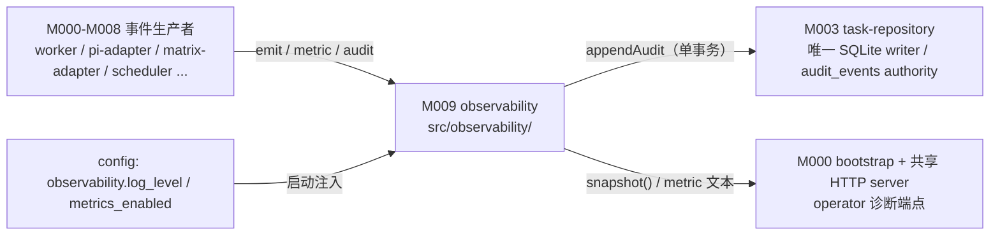
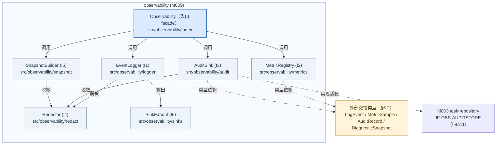
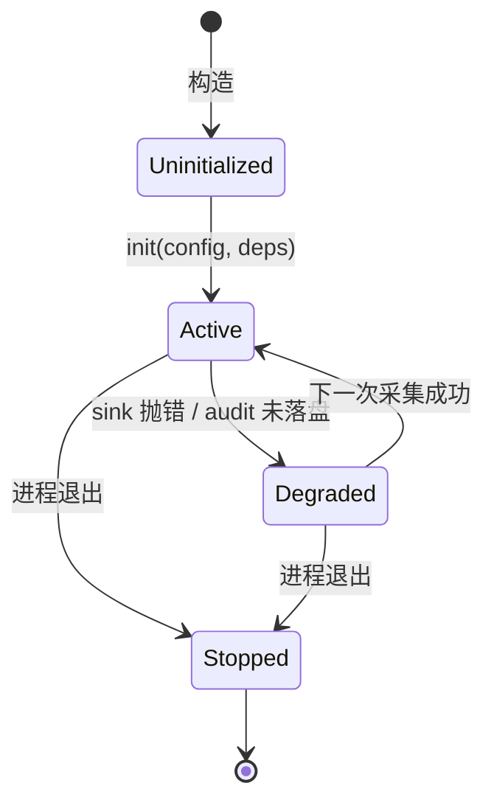
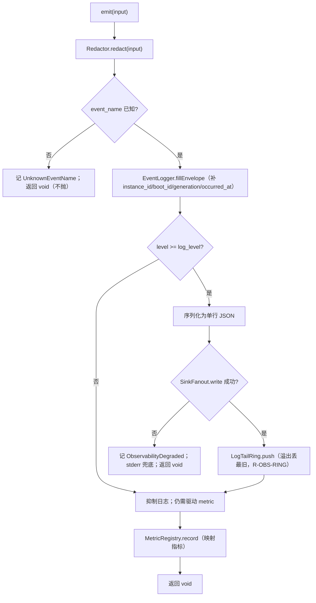
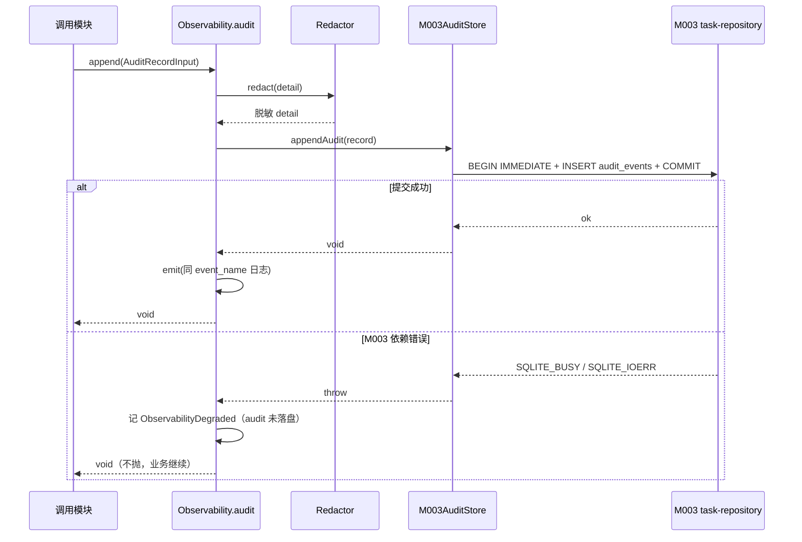
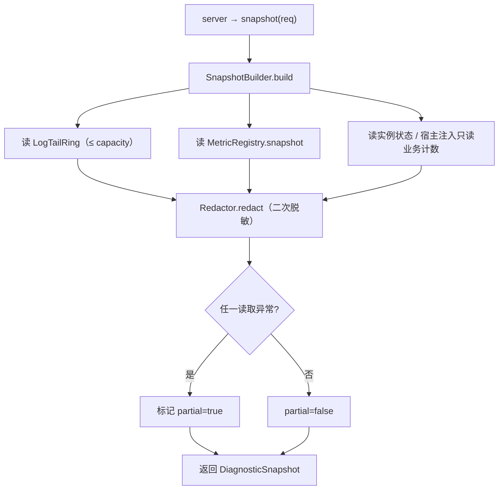

<!-- STD_DOCUMENT_COVER_BEGIN -->
# Piko 模块设计：observability（M009）

> STD 使用入口：[项目采用说明与标准导航](../../README.md#std-entry)

| 文档字段 | 值 |
|---|---|
| Document ID | `piko-observability` |
| Document Version | `0.1.0-draft.1` |
| Status | `Draft` |
| Project | `piko` |
| Document Owner | Piko Implementation Owner |
| Last Modified Date | `2026-09-27` |
| Template ID | `design.definition` |
| Template Version | `3.4.0` |

<!-- STD_DOCUMENT_COVER_END -->

## 1. 单元摘要：为什么存在

M009 `observability` 解决一个问题：Piko 的每个模块都在产生"这一刻发生了什么"的事实（Run 状态迁移、模型 attempt、工具调用、Matrix 同步、恢复结果、审计性操作），但这些事实必须在**同一处**被结构化、按固定口径计数并脱敏输出，否则各模块各写各的日志与计数器，脱敏边界和指标语义会随实现漂移。observability 把三类产物集中承载：结构化日志事件（固定 envelope）、metric（固定指标 ID 与单位/窗口口径）、audit（须留存的可审计操作），并在任何 sink 或调用方失败时**只降级自己、绝不反向控制业务**。

observability 只做"采集、整形、脱敏、导出"，**不决策业务**：不改写 Run 状态（M003/MECH-RUN）、不参与调度（M004）、不编排恢复（M005）、不解析 provider 响应（M006/M007）。它从所有模块接收事件，向共享宿主 HTTP server 提供 redacted 诊断/指标端点，向 operator 提供只读诊断快照。audit 的持久化不由本模块拥有：`audit_events` 表的 schema 与事务 authority 属 M003 `task-repository`，observability 只通过 M003 端口追加记录（见 §9.2.1）。

用一次调用说明：M006 `pi-adapter` 在一次模型 attempt 结束时调用 `Observability.emit({event_name:"event.model.attempt", run_id, generation, epoch, level:"info", fields:{attempt_state:"Completed"}})`；observability 先按 `R-OBS-ENVELOPE` 补齐 envelope 必填字段，再按 `R-OBS-REDACT` 删除 deny-list 字段，随后写入日志 sink 并把 `piko.model.attempts.{state}` 计数加一。若 sink 抛错，observability 捕获后走 stderr 兜底并保持调用方流程继续（`R-OBS-FAILOPEN`），返回 `void`，不向业务抛错。

| 项目 | 内容 |
|---|---|
| 模块编号 / 正式英文名称 | M009 / `observability` |
| 直属父对象编号 / 名称 | `SW-P` / Piko Agent Runtime V0.3（软件系统，`design_level=system`） |
| 父设计 Document ID / 固定基线 / 登记位置 | `system-design` v0.11.2 / 契约 `0.3.0-simplified.6` / §3.2 直属模块表 + §16.1 下游承接表；本模块登记见 §3.2 M009 行、§16.1 M009 行 |
| 上级系统/父单元 | 无（纯软件顶层，无总体系统父稿） |
| 解决的问题 | 结构化日志/metric/audit 的集中口径、集中脱敏与失败隔离，避免各模块自建观测面并漂移 |
| 提供的能力 | `emit`（结构化日志事件）、`metric`（inc/observe/set）、`audit`（audit 记录）、`snapshot`（脱敏诊断快照）；redacted 诊断/指标端点生产端 |
| 主要使用者 | 全部模块（M000-M008）的事件生产者；M000 `bootstrap`（诊断端点挂载与装配）；operator（只读诊断） |
| 不负责 | Run/Result 语义（M003/MECH-RUN）；调度（M004）；恢复编排（M005）；provider/usage 解析（M006/M007）；`audit_events` schema 与事务（M003）；日志留存策略（ops） |

### 1.1 继承的上级约束与落实方式

observability 承接三条上级约束：`PK-11`（无 Memory API）、`PK-12`（恢复边界：不复活旧权威、审计性操作留痕）与 `CON-CFG-001`（配置变更重启生效，作用于 observability 配置边界）。`PK-11` / `PK-12` 登记在 `system-design` §3.4；`CON-CFG-001` 的机制权威在 `piko-config.md` §3.1。三条均为 Approved。

#### 1.1.1 `PK-11` · 无 Memory API

- **上级基线与决定状态**：`system-design` v0.11.2 §3.4（PK-11 行，承接对象"所有模块"）· Approved；固定基线 machine contract `0.3.0-simplified.6`。上级原文："静态扫描：禁止 Memory 类 export/import 引用"。

- **适用条件**：observability 全部源码文件；任何新增的日志/metric/audit 结构与导出。

- **继承预算或行为保证**：`src/observability/` 及本模块触及的共享文件不得 export 或 import 任何 Memory 类 API；`tests/static/no-memory-api.test.ts` 对本模块文件为 0 命中。

- **可自行选择/不可改变**：不可改变：不引入 Slinky Memory 字段或依赖。可自行设计：日志 envelope 的字段集合（不得因此引入 Memory 概念）。

- **本地落实/内部再分配**：§5.5 依赖方向禁止本模块 import 任何外部业务模块的类型（仅允许 §6.2 私有类型与 M003 端口类型）；§13 文件分解全部落在 `src/observability/`；§14.1.1 登记静态扫描入口。

- **验证方法与结果/证据**：局部：`VRC-OBS-006` 的静态扫描 Case（Memory API import/export 命中数 = 0）。组合：PK-T11（`tests/static/no-memory-api.test.ts`）；当前全部 `NOT_RUN`。

- **差距/变更影响/反馈责任**：none。若未来需要携带外部领域字段，须先经 M002/policy 与 PK-11 评审，不在本模块放宽。

#### 1.1.2 `PK-12` · 恢复边界中的审计与不反向控制

- **上级基线与决定状态**：`system-design` v0.11.2 §3.4（PK-12 行，承接对象 `bootstrap` M000 + 所有 worker）+ §13.1（"强制 fence 与 schema migration 写 `audit_events`"）· Approved。

- **适用条件**：进程生命周期内全部事件采集；强制 fence / schema migration / credential 轮换等审计性操作发生时；进程崩溃恢复期间。

- **继承预算或行为保证**：审计性操作必须留痕（`event.audit.forced-fence`、`event.audit.schema-migration`、`event.audit.credential-ref-changed`）；观测产物不得被当作业务权威（不改 Run 状态、不复活旧权威、不模拟成功）；observability 的失败不得阻断 MECH-RECOVERY 的顺序执行。

- **可自行选择/不可改变**：不可改变：audit 事件名集合、观测不改业务事实、采集失败 fail-open。可自行设计：envelope 补齐规则、sink 组织、脱敏实现、诊断快照字段。

- **本地落实/内部再分配**：§2.3 `F-OBS-AUDIT` 定义审计记录行为；§8.6 `R-OBS-AUDIT-TX` 固定"经 M003 单事务追加"；§8.4 `R-OBS-FAILOPEN` 固定不反向控制；§6.6 状态模型与 §10 推演 sink 失败与审计失败出口。

- **验证方法与结果/证据**：局部：`VRC-OBS-003`（fail-open：sink 抛错不改变被测业务调用结果）、`VRC-OBS-005`（audit 经 M003 原子落盘且失败可判定）。组合：PK-T12；当前全部 `NOT_RUN`。

- **差距/变更影响/反馈责任**：none。恢复编排仍属 M005，observability 不进入恢复决策路径。

#### 1.1.3 `CON-CFG-001` · observability 配置重启生效

- **上级基线与决定状态**：`system-design` v0.11.2 §3.4（PK-12 反向登记的 `CON-CFG-001`）+ §9.1（"重启生效"）· Approved；机制侧 `piko-config.md` §3.1 `CON-CFG-001`。

- **适用条件**：`observability.log_level`、`observability.metrics_enabled` 两个配置项；进程启动与 P-CONFIG 重启流程。

- **继承预算或行为保证**：两项配置仅在进程启动时读取并生效；运行期不热改；改配置必须走 P-CONFIG（停止旧进程并确认退出后以新参数重启）；无在线修改能力。

- **可自行选择/不可改变**：不可改变：重启生效语义、无热更。可自行设计：启动期读取与校验实现、禁用 metrics 时的降级行为。

- **本地落实/内部再分配**：§4.3 `DEP-OBS-CONFIG` 固定两项配置的来源与生命周期；§6.3.1 定义 `ObservabilityConfig`；§8 中 `R-OBS-FAILOPEN` 覆盖 `metrics_enabled=false` 的降级；§10.5 推演禁用路径。

- **验证方法与结果/证据**：局部：`VRC-OBS-004`（`metrics_enabled=false` 时 metric 端点降级但日志仍工作）。组合：PK-T12；当前全部 `NOT_RUN`。

- **差距/变更影响/反馈责任**：两项配置的 key 名已固定；若未来需新增观测配置项，须走配置契约变更（`CON-CFG-001`），不在本模块自增 key。

## 2. 需求、功能与验收条件

observability 的可观察功能是四个进程内操作：发送结构化日志事件、记录 metric、追加 audit、生成脱敏诊断快照。四者均不被外部请求直接触发（除快照经 operator 端点间接触发），调用方是进程内各模块与共享宿主。

### 2.1 `F-OBS-EMIT` · 发送结构化日志事件

- **上级需求 / Constraint ID**：`PK-12`；`system-design` §10.2 结构化日志事件清单。

- **调用方**：全部模块（M000-M008），在状态迁移、attempt、工具、Matrix、恢复、审计性操作等时点各调用若干次。

- **输入与前提**：`LogEventInput{event_name, run_id?, generation?, epoch?, level, fields?, redacted_error_class?}`；进程已 READY 后；调用方不传 credential/instruction 正文。

- **行为**：按 `R-OBS-ENVELOPE` 补齐 `instance_id`/`boot_id`/`generation`/`occurred_at` 等必填字段；按 `R-OBS-REDACT` 删除 deny-list 字段；序列化为单行 JSON；经 `SinkFanout` 写日志 sink（stdout + 有界内存 tail ring，`R-OBS-RING`）；若 `event_name` 属已知集，同步驱动对应 metric（§8.3）。

- **输出**：`void`（无返回值；观测失败不返回业务错误）。

- **错误与边界**：未知 `event_name`：拒绝采集并记 `ERR-OBS-UNKNOWN-EVENT`（编程错误），但不抛出到业务；sink 抛错：走 `R-OBS-FAILOPEN` 兜底（stderr 一次），调用方继续。

- **验收条件**：给定 `event.model.attempt` + `run_id` + `fields:{attempt_state:"Completed"}`，日志 sink 收到一行 JSON，必含 `event_name`/`instance_id`/`generation`/`occurred_at` 且不含 credential/instruction 字段；`piko.model.attempts.{state}` 计数加一。

### 2.2 `F-OBS-METRIC` · 记录 metric

- **上级需求 / Constraint ID**：`system-design` §10.2 指标口径；`piko-run.md` §12.1 指标表（`M004 生产 → M009 采集`）。

- **调用方**：M000-M008（如 M004 生产 `piko.queue.depth`/`piko.slot.lease_epoch`，M006 生产 `piko.model.attempts.{state}`）。

- **输入与前提**：`{metric_id, op:"inc"|"observe"|"set", value?, labels?}`；`metric_id` 取自固定指标 ID 集；进程已 READY。

- **行为**：按 `R-OBS-METRIC-REGISTRY` 校验 `metric_id` 与 `op` 合法；counter 累加、gauge 覆盖、histogram 观测；所有记录写入进程内 `MetricRegistry`（内存，重启重置）；`metrics_enabled=false` 时为 no-op（`R-OBS-FAILOPEN` 的配置分支）。

- **输出**：`void`。

- **错误与边界**：未知 `metric_id` 或 op 与类型不匹配：拒绝并记 `ERR-OBS-UNKNOWN-METRIC`（编程错误），不抛出；标签基数越界按 §12.2 丢弃并计数。

- **验收条件**：连续 3 次 `inc piko.recovery.outcomes.fenced` 后 registry 计数值 = 3；`set piko.slot.lease_epoch=5` 后读值 = 5；未知 ID 不改变 registry 且产生一条 `ERR-OBS-UNKNOWN-METRIC` 诊断。

### 2.3 `F-OBS-AUDIT` · 追加 audit 记录

- **上级需求 / Constraint ID**：`PK-12`；`system-design` §10.2 审计事件名与 §13.1 "强制 fence 与 schema migration 写 `audit_events`"。

- **调用方**：M000 `bootstrap`（credential 轮换、schema migration）、M004/M005（forced fence）、M006（responses probe）。

- **输入与前提**：`AuditRecordInput{event_name（`event.audit.*` 之一）, actor_class, run_id?, detail}`；M003 `task-repository` 可用。

- **行为**：按 `R-OBS-REDACT` 对 `detail` 脱敏；经 `IF-OBS-AUDITSTORE`（M003）在单事务内 INSERT `audit_events`（`occurred_at` 由 M003 以其 UTC now 写入）；同时发一条同 `event_name` 的结构化日志事件。

- **输出**：`void`。

- **错误与边界**：非 `event.audit.*` 名称：拒绝（`ERR-OBS-UNKNOWN-EVENT`）。M003 不可用：按 `R-OBS-FAILOPEN` 记录降级痕迹并返回；**audit 失败不阻断调用方业务**，但调用方（如 forced fence）应把"审计未落盘"作为可观测事实自行决定后续（见 §10.3）。

- **验收条件**：调 `audit({event_name:"event.audit.forced-fence", run_id, detail})` 后 `audit_events` 表新增 1 行且 `detail_json` 不含 credential；返回 `void` 且不抛错。

### 2.4 `F-OBS-SNAPSHOT` · 生成脱敏诊断快照

- **上级需求 / Constraint ID**：`CAP-DIAG`（`system-design` §3.6/§8.1 Operator Diagnostics）；`PK-12`。

- **调用方**：operator 经 operator 诊断端点（`SURF-OBS-DIAG`）触发；宿主 HTTP server 调 `Observability.snapshot()`。

- **输入与前提**：`SnapshotRequest{log_tail_limit?}`；operator 已通过 operator authorization。

- **行为**：读取有界日志 tail ring（§6.6.2）、metric registry 快照、`instance_id`/READY 状态；按 `R-OBS-REDACT` 二次脱敏；组装 `DiagnosticSnapshot`（redacted log tail / state counts / queue depth / Harness operation generation / ledger summary 的可得子集）；不读取也不修改业务状态。

- **输出**：`DiagnosticSnapshot`（只读、脱敏）。

- **错误与边界**：`log_tail_limit` 超过 ring 容量：按容量截断（不报错）。ring 为空：返回空 tail（合法）。快照生成永不抛业务错误；内部读取异常降级为 partial 快照并标注。

- **验收条件**：给定已产生 5 条日志、3 个 metric，调用 `snapshot({log_tail_limit:2})` 返回 ≤2 条脱敏日志与 3 个 metric 值，且响应中不出现 credential/instruction/完整模型 input-output。

## 3. UI、CLI、服务端点或设备操作面

observability 拥有一个服务端点型操作面：operator 只读诊断与指标端点集。它不拥有 UI 页面、CLI 命令或设备操作面；端点路由挂载在共享宿主 HTTP server 上（M000 `bootstrap` 装配、M001 `ApiServer` 承载），observability 是该端点的**内容生产端**。

#### 3.1 `SURF-OBS-DIAG` · Operator 诊断与指标端点集

- **类型 / 位置**：HTTP-RPC 端点集（服务端点型）；逻辑入口属 `system-design` §8.1 Operator Diagnostics，物理 host = 共享 HTTP server（`src/server.ts`），实现生产端在 `src/observability/`。不新增独立 listener。

- **调用者 / 身份 / 被操作对象**：Operator（operator authorization）；被操作对象 = 当前唯一 Piko 实例的只读观测快照与指标值；不面向 Slinky principal。

- **操作与入口**：`GET /diagnostics/snapshot`（redacted 诊断快照，返回 `DiagnosticSnapshot`）与 `GET /metrics`（redacted metric 文本，返回 metric registry 快照）。二者均为只读 `GET`；精确路径与鉴权由 ops 文档 + `system-design` §8.4 定义，本模块只固定内容契约与脱敏规则。

- **输入与校验**：可选查询参数 `log_tail_limit`（正整数，超过 ring 容量按容量截断）。无请求体。鉴权在共享 server 的中间件完成（operator authorization），observability 不重复鉴权、不解释 principal。

- **正常结果 / 可见性**：`200` + 脱敏 `DiagnosticSnapshot`（§6.2.4）或 metric 文本；快照内容不含 credential/access token/instruction 正文/完整模型 input-output/附件内容；只读，不改变任何业务状态。

- **Empty / Error / Disabled / 取消**：ring 为空 → 合法空 tail；`metrics_enabled=false` → `/metrics` 返回空集/204（依据 ops 约定），不返回被禁用的历史值；鉴权失败 → `401`/`403`（由宿主中间件返回）；无请求处理中途取消语义（只读且短时同步）。

- **§9 接口与 §11 维护引用**：§9.4.1 固定端点内容契约；§9.1.4 固定 `snapshot()` 生产端；§11 说明诊断只读与脱敏不变量；快照与指标的字段口径继承 `system-design` §10.2。

## 4. 外部边界与依赖

observability 在进程内的位置：被所有模块调用（采集），调用 M003（audit 落盘），被 M000 装配并挂载端点。下图只画模块外部交接，不表示线程或新部署边界。



图 M-OBS-C1 · Target / Planned / NOT_BUILT。实线是同步进程内函数调用与返回，不是网络或新部署边界。observability 不创建线程/进程；所有采集在宿主事件循环上同步执行。audit 持久化权威属 M003，见 §9.2.1 与 §6.7。

#### 4.1 `DEP-OBS-PRODUCERS` · 全部事件生产者（M000-M008）

- **角色 / 运行位置 / Owner**：同级直属模块，同进程（PK-01 单进程）；Owner：各模块 Implementation Owner；本模块不拥有其生命周期。

- **本模块调用或消费**：消费生产者传入的 `LogEventInput`/metric 操作/`AuditRecordInput`。生产者必须传结构化字段，不得传 credential、instruction 正文、完整模型 input/output、附件内容。

- **本模块提供**：四个进程内操作（§9.1）；不向生产者提供回调，不反向调用任何业务函数。

- **契约 authority / 版本 / selector**：§9.1 由本设计提出并拥有；metric 口径与日志事件名继承 `system-design` §10.2 与各机制文档 §12（如 `piko-run.md` §12.1）。事件名集合已固定（`event.run.*`/`event.tool.*`/`event.model.*`/`event.matrix.*`/`event.recovery.*`/`event.startup.*`/`event.audit.*`）。

- **同步方式 / timeout / 生命周期**：同步进程内调用；无网络；观测调用无 timeout（本地内存动作，写盘统一交 M003）；随进程。

- **不可用或失败影响 / 责任出口**：本模块不可用不成立（进程内构造）；观测内部失败按 `R-OBS-FAILOPEN` 不影响调用方业务；调用方不得依赖观测返回值做业务决策。

#### 4.2 `DEP-OBS-AUDITSTORE` · M003 `task-repository`（audit 持久化 authority）

- **角色 / 运行位置 / Owner**：同级直属模块，同进程；Owner：Piko Implementation Owner。`audit_events` 表的 schema、DDL、连接与事务均属 M003。

- **本模块调用或消费**：调用 `appendAudit(record)`：在单事务内 INSERT 一行 `audit_events`。当前代码事实：`src/store.ts:29` 已建 `audit_events` 表（`audit_id, event_name, actor_class, run_id, detail_json, occurred_at`），但**尚无写入者**（见 ISD §2）。本模块是首个写入者。

- **本模块提供**：无。observability 不向 M003 提供接口。

- **契约 authority / 版本 / selector**：`IF-OBS-AUDITSTORE` 由本设计提出（§9.2.1），**Proposed**：待 M003 `piko-task-repository-design.md` 采纳或给出超集（`OQ-OBS-001`）。表结构 authority 在 M003 ISD §4.7（与 `system-design` §7.7 锚点 `m003-ddl-authority` 一致）。

- **同步方式 / timeout / 生命周期**：同步进程内调用；单语句/单事务；受 `task_store.busy_timeout_ms` 约束；连接生命周期由 M003 持有。

- **不可用或失败影响 / 责任出口**：M003 抛 `SQLITE_BUSY`/`SQLITE_IOERR` 时，observability 按 `R-OBS-FAILOPEN` 记降级并返回；audit 记录丢失的后果由操作责任方（operator / M005）承担，本模块不假造"已落盘"。M003 是唯一 SQLite writer，observability 绝不自行打开连接。

#### 4.3 `DEP-OBS-CONFIG` · observability 配置（宿主提供）

- **角色 / 运行位置 / Owner**：宿主注入的配置；Owner：Piko Implementation Owner（M000/bootstrap 装配）。

- **本模块调用或消费**：`observability.log_level ∈ {debug,info,warn,error}`（低于阈值的日志事件被抑制）与 `observability.metrics_enabled: boolean`（false 时 metric 记录为 no-op）。

- **本模块提供**：无。

- **契约 authority / 版本 / selector**：`interfaces/schemas/piko-runtime-config-v0.3.schema.json` `observability` 节（机器权威）；`system-design` §9.1 生效政策。当前代码事实：`src/types.ts:23` 已有 `observability:{log_level;metrics_enabled}`，但 `src/main.ts` 尚未消费。

- **同步方式 / timeout / 生命周期**：构造时注入，进程内不变；config 变更需重启（`CON-CFG-001`）。

- **不可用或失败影响 / 责任出口**：配置缺失在 schema 校验阶段被 M000 拒绝（启动失败，不进入 READY）；运行期无配置热更，故无运行期配置失败。

#### 4.4 `DEP-OBS-HOST` · 共享宿主（M000 `bootstrap` + HTTP server）

- **角色 / 运行位置 / Owner**：装配与端点宿主，同进程；Owner：M000 Implementation Owner。

- **本模块调用或消费**：消费宿主注入的 `instance_id`、`boot_id`、时钟与 HTTP 路由注册点；宿主调 `snapshot()` 生成诊断响应。

- **本模块提供**：路由处理器（`SURF-OBS-DIAG` 的内容生产）与装配入口 `createObservability(config, deps)`。

- **契约 authority / 版本 / selector**：`piko-startup.md` S1-S8（装配点）；`system-design` §8.1 Operator Diagnostics（端点语义）。

- **同步方式 / timeout / 生命周期**：同步；端点请求在宿主事件循环内处理；随进程。

- **不可用或失败影响 / 责任出口**：宿主未挂载路由：仅损失诊断入口，不阻断业务（ops 文档负责入口存在性）；装配失败（缺 config）由 M000 启动失败出口承担。

## 5. 内部结构与实现位置

observability 拆成六个内部单元：入口 facade、事件日志单元、metric registry、audit 端口单元、脱敏器、快照构建器。拆分依据是"脱敏是横切不变量，须单独可测；audit 端口隔离 M003；metric 与日志生命周期不同（内存 vs 流式）"，不是为了凑文件。



图 M-OBS-S1 · Target / Planned / NOT_BUILT。外框是模块内部组成；实线同步调用，虚线类型/适配依赖；不表示线程或时序。所有路径均为 Planned。

### 5.1 内部组成

#### 5.1.1 `S1` · Observability（入口 facade）

- **职责与非职责**：对外提供 §9.1 四个操作并保证 §6.6 不变量与 `R-OBS-FAILOPEN`；编排"补齐 envelope → 脱敏 → 输出"、"验证 metric → 记录"、"脱敏 → M003 追加"、"读 ring/metric → 脱敏 → 组装快照"。非职责：不发 SQL（经 I3）、不做脱敏规则本身（I4 做）、不解析业务语义、不持有 metric 值的存储实现（I2 持有）。

- **输入、处理与输出**：输入 `LogEventInput`/metric 操作/`AuditRecordInput`/`SnapshotRequest`；处理：组合 I1-I6；输出 `void` 或 `DiagnosticSnapshot`。

- **协作对象**：调用 I1/I2/I3/I5；被全部模块与宿主调用。不直接接触 M003（经 I3）。

- **文件 / symbol / 实现状态**：`src/observability/index.ts` → `class Observability`（Planned / NOT_IMPLEMENTED）。现基线逻辑散在 `src/main.ts`（`console.log`）、`src/worker.ts`/`src/matrix.ts`（`console.error`）、`src/pi-runtime.ts`（内联 `try/catch` 注释 "observability must not break execution"），见 ISD §2。

- **拆分依据与替代方案代价**：入口只做编排与失败隔离，把脱敏抽到 I4 以便对 deny-list 做无 I/O 单测。替代方案"各模块自行 console + 自建计数"是 Current 形态，代价是脱敏边界与指标口径漂移（这正是本设计要消除的）。

#### 5.1.2 `I1` · EventLogger（事件日志单元）

- **职责与非职责**：校验 `event_name` 是否属固定集；按 `R-OBS-ENVELOPE` 补齐 envelope；按 `log_level` 过滤；写 `SinkFanout` 与有界 tail ring。非职责：不做脱敏（I4 先做）、不写 DB。

- **输入、处理与输出**：输入已脱敏的 `LogEventInput`；输出单行 JSON 到 sink 与 ring。

- **协作对象**：调用 I4（脱敏）、I6（扇出）、I2（对已知事件驱动 metric）；被 S1 调用。

- **文件 / symbol / 实现状态**：`src/observability/logger.ts`（Planned / NOT_IMPLEMENTED），导出 `class EventLogger`。

- **拆分依据与替代方案代价**：把 envelope 与级别过滤从调用点集中，使 `VRC-OBS-002` 的表驱动测试不需 sink。替代方案"调用点各自拼 JSON"会让必填字段随实现漂移。

#### 5.1.3 `I2` · MetricRegistry（内存指标注册表）

- **职责与非职责**：持有固定指标 ID 集与 counter/gauge/histogram 实例；实现 `R-OBS-METRIC-REGISTRY`（类型与 op 校验、基数上限）；提供只读快照。非职责：不做持久化（重启重置）、不输出文本格式（快照时格式化）、不热改指标集。

- **输入、处理与输出**：输入 `{metric_id, op, value?, labels?}`；输出 `void` 或只读快照 `Map<MetricId, MetricValue>`。

- **协作对象**：被 I1（事件驱动）与 S1（直接记录）调用；被 I5 只读消费。

- **文件 / symbol / 实现状态**：`src/observability/metrics.ts`（Planned / NOT_IMPLEMENTED），导出 `class MetricRegistry`。

- **拆分依据与替代方案代价**：单例 registry 使"重启重置"与基数上限集中在 §6.6 状态模型内。替代方案"每模块自建 counter"无法验证口径一致（`VRC-OBS-004`）。

#### 5.1.4 `I3` · AuditSink（audit 端口单元）

- **职责与非职责**：把 §9.2.1 `IF-OBS-AUDITSTORE` 适配到 M003；是 observability 内唯一接触持久化的单元。非职责：不做脱敏（I4 先做）、不重试业务失败（只透传依赖错误给 S1 的 fail-open）、不自己建表。

- **输入、处理与输出**：输入已脱敏的 `AuditRecord`；输出 `void` 或 M003 依赖错误。

- **协作对象**：调用 M003 `task-repository`；被 S1 调用。

- **文件 / symbol / 实现状态**：`src/observability/audit.ts`（Planned / NOT_IMPLEMENTED），接口 `AuditStorePort` + `M003AuditStore` 实现。

- **拆分依据与替代方案代价**：端口使 audit 可在内存假实现上测试（`VRC-OBS-005`），并把 M003 合同集中一处。替代方案"直接 import store"会传播 M003 类型到全模块，违反 §5.5 依赖方向。

#### 5.1.5 `I4` · Redactor（脱敏器）

- **职责与非职责**：纯函数：按 `R-OBS-REDACT` 的 deny-list 删除/替换字段；对嵌套对象递归；对序列化输出二次扫描。非职责：无 I/O、无状态、不读时钟、不决定日志级别。

- **输入、处理与输出**：输入任意 `Record<string, unknown>` 或字符串；输出脱敏后的副本/字符串。

- **协作对象**：仅被 I1/I3/I5 调用；不依赖任何文件。

- **文件 / symbol / 实现状态**：`src/observability/redact.ts`（Planned / NOT_IMPLEMENTED），导出 `redact(value)`、`redactString(s)`。

- **拆分依据与替代方案代价**：纯函数使 §8.1 的 deny-list 可表驱动测试，不需 sink 或 DB。替代方案"在 sink 侧顺手删字段"会把脱敏分散到多处，无法保证"任何 sink 前都脱敏"。

#### 5.1.6 `I5` · SnapshotBuilder（诊断快照构建器）

- **职责与非职责**：只读组合 ring tail + metric 快照 + 实例状态，组装 `DiagnosticSnapshot` 并二次脱敏。非职责：不读业务表（state counts / queue depth 等若需业务事实，由宿主/ops 注入或经 M003 只读端口，见 §9.4.1）、不修改任何状态。

- **输入、处理与输出**：输入 `SnapshotRequest` 与只读依赖；输出 `DiagnosticSnapshot`。

- **协作对象**：读 I1 的 ring、I2 的快照；调 I4 脱敏；被 S1 调用。

- **文件 / symbol / 实现状态**：`src/observability/snapshot.ts`（Planned / NOT_IMPLEMENTED），导出 `class SnapshotBuilder`。

- **拆分依据与替代方案代价**：快照是"读侧"，与"写侧"的采集分离，使 `VRC-OBS-006` 可独立验证有界性与脱敏。替代方案"端点处理器里临时拼装"会把脱敏遗漏在端点层。

#### 5.1.7 `I6` · SinkFanout（日志扇出）

- **职责与非职责**：把脱敏后的单行 JSON 写到 stdout（或 ops 指定的日志 sink）与有界 tail ring；实现 `R-OBS-RING` 的溢出丢弃。非职责：不做脱敏、不做级别过滤、不持久化。

- **输入、处理与输出**：输入单行 JSON 字符串；输出 `void`。

- **协作对象**：被 I1 调用；被 I5 读 ring。

- **文件 / symbol / 实现状态**：`src/observability/sinks.ts`（Planned / NOT_IMPLEMENTED），导出 `class SinkFanout`。

- **拆分依据与替代方案代价**：把"写到哪里"与"写什么"分开，使 sink 失败可独立注入（`VRC-OBS-003`）。替代方案"logger 里直接写 stdout"使 fail-open 无法单测。

### 5.2 内部调用过程

#### 5.2.1 `P-OBS-EMIT` · 日志事件发送

- **入口与调用上下文**：业务模块调用 `Observability.emit(input)`（宿主事件循环，同步）。

- **调用链（文件 / symbol → 文件 / symbol）**：`module → Observability.emit` → `EventLogger.log` → `Redactor.redact` → `EventLogger.fillEnvelope` → `SinkFanout.write` + `LogTailRing.push` → 若已知事件 → `MetricRegistry.record`。

- **逐步传递的数据**：`LogEventInput` → 脱敏副本 → 补齐 envelope 的 `LogEvent` → 单行 JSON → `void`。

- **返回、异常与清理**：成功与失败均返回 `void`；内部任何异常在 `Observability.emit` 内 `try/catch` 捕获并 stderr 兜底，不冒泡（`R-OBS-FAILOPEN`）。无临时资源需清理。

- **对应流程 / 接口 / 验证**：§7 `M-OBS-P1`；§9.1.1 `IF-OBS-EVENT`；`VRC-OBS-001/002/003`。

#### 5.2.2 `P-OBS-METRIC` · metric 记录

- **入口与调用上下文**：业务模块或 I1 调用 `Observability.metric(sample)`（宿主事件循环）。

- **调用链（文件 / symbol → 文件 / symbol）**：`caller → Observability.metric` → `MetricRegistry.record`（校验 ID/op → 累加/覆盖/观测或 no-op）。

- **逐步传递的数据**：`{metric_id, op, value?, labels?}` → `void`。

- **返回、异常与清理**：返回 `void`；未知 ID 记为 `ERR-OBS-UNKNOWN-METRIC` 诊断且不抛出；`metrics_enabled=false` 时 no-op。

- **对应流程 / 接口 / 验证**：§7 `M-OBS-P2`；§9.1.2 `IF-OBS-METRIC-REG`；`VRC-OBS-004`。

#### 5.2.3 `P-OBS-AUDIT` · audit 追加

- **入口与调用上下文**：审计责任方调用 `Observability.audit(input)`（宿主事件循环）。

- **调用链（文件 / symbol → 文件 / symbol）**：`caller → Observability.audit` → `Redactor.redact(detail)` → `AuditSink.append` → `M003AuditStore.appendAudit`（M003 单事务 INSERT）→ 并 `emit` 同 `event_name` 日志。

- **逐步传递的数据**：`AuditRecordInput` → 脱敏 `AuditRecord` → M003 事务提交 → `void`。

- **返回、异常与清理**：成功 `void`；M003 依赖错误被 `Observability.audit` 捕获，记降级（`ERR-OBS-DEGRADED`）并返回；不向调用方抛业务错误，但"审计未落盘"作为可观测事实可被调用方查询（§10.3）。

- **对应流程 / 接口 / 验证**：§7 `M-OBS-P2b`；§9.1.3 `IF-OBS-AUDIT`、§9.2.1 `IF-OBS-AUDITSTORE`；`VRC-OBS-005`。

#### 5.2.4 `P-OBS-SNAPSHOT` · 诊断快照

- **入口与调用上下文**：宿主 HTTP server 在 operator 端点请求处理中调用 `Observability.snapshot(req)`。

- **调用链（文件 / symbol → 文件 / symbol）**：`server route → Observability.snapshot` → `SnapshotBuilder.build` → 读 `LogTailRing`（有界）+ `MetricRegistry.snapshot` → `Redactor.redact` → `DiagnosticSnapshot`。

- **逐步传递的数据**：`SnapshotRequest` → `DiagnosticSnapshot`。

- **返回、异常与清理**：返回快照；内部读取异常降级为 partial 快照并标注，不抛出。无临时资源。

- **对应流程 / 接口 / 验证**：§7 `M-OBS-P3`；§9.4.1 `IF-OBS-DIAG`；`VRC-OBS-006`。

### 5.3 文件间接口契约

本节只固定 observability 内部文件之间的交接；跨模块的 M003 接口在 §9.2.1，字段类型在 §6.2。

#### 5.3.1 `IF-OBS-EVENT` · `index.ts` → `logger.ts`

- **接口成员 ID / §9 逐接口定义位置**：内部无公共成员 ID；行为规则权威在 §8.2（`R-OBS-ENVELOPE`）与 §9.1.1。

- **本文件的提供或使用责任**：`logger.ts` 提供事件整形与写入；`index.ts` 提供对外入口并做失败隔离。

- **交接时机 / 本地调用步骤**：`emit` 内：`Redactor.redact` 后调 `EventLogger.log` 补齐并输出。

- **§9 生命周期约束**：无状态（除注入的 sink/registry 引用）；调用即返回。

- **实现与验证位置**：`src/observability/logger.ts`；`VRC-OBS-002` 以表驱动覆盖 envelope 必填字段。

#### 5.3.2 `IF-OBS-METRIC-REG` · `index.ts`/`logger.ts` → `metrics.ts`

- **接口成员 ID / §9 逐接口定义位置**：内部接口 `MetricRegistry`，方法契约见 §9.1.2 与 §8.3。

- **本文件的提供或使用责任**：`metrics.ts` 提供登记与只读快照；`index.ts`/`logger.ts` 按固定 ID 记录。

- **交接时机 / 本地调用步骤**：`metric()` 直接调用；`emit()` 对已知事件映射后调用。

- **§9 生命周期约束**：单例、进程内、重启重置；不缓存到磁盘。

- **实现与验证位置**：`src/observability/metrics.ts`；`VRC-OBS-004`。

#### 5.3.3 `IF-OBS-REDACT` · `logger.ts`/`audit.ts`/`snapshot.ts` → `redact.ts`

- **接口成员 ID / §9 逐接口定义位置**：内部纯函数接口；规则权威在 §8.1（`R-OBS-REDACT`）。

- **本文件的提供或使用责任**：`redact.ts` 提供纯脱敏；三个消费者在写 sink/DB/快照前调用。

- **交接时机 / 本地调用步骤**：见 `P-OBS-EMIT`/`AUDIT`/`SNAPSHOT` 链。

- **§9 生命周期约束**：无状态、无所有权；调用即返回。

- **实现与验证位置**：`src/observability/redact.ts`；`VRC-OBS-001`（deny-list 表驱动）。

#### 5.3.4 `IF-OBS-AUDIT` · `index.ts` → `audit.ts`

- **接口成员 ID / §9 逐接口定义位置**：内部接口 `AuditStorePort`，方法契约见 §9.2.1 `IF-OBS-AUDITSTORE`。

- **本文件的提供或使用责任**：`audit.ts` 提供 `AuditStorePort` 抽象与 `M003AuditStore` 实现；`index.ts` 以该抽象调用。

- **交接时机 / 本地调用步骤**：见 `P-OBS-AUDIT` 链。

- **§9 生命周期约束**：端口实例与进程同域；不缓存 audit 记录（每次直接写）。

- **实现与验证位置**：`src/observability/audit.ts`；`VRC-OBS-005` 以受控 fake 端口 + 真 M003 两套覆盖。

### 5.4 服务提供方式（条件适用）

- **运行载体与入口**：observability 不拥有独立 listener/进程/线程：§3 已判定其操作面挂载在共享宿主 HTTP server（M000 装配、M001 `ApiServer` 承载）。运行载体 = `src/observability/` 的 `Observability` 单例，由 `src/main.ts` 构造并经 `src/server.ts` 注册 `SURF-OBS-DIAG` 路由处理器。

- **并发/线程模型**：Node 单线程事件循环；所有采集、脱敏、记录同步执行；无锁（无跨线程共享）。端点读取（快照）与采集（写入 registry/ring）在同一线程内先后发生，不并发。

- **初始化、Ready、生效与停止**：初始化在 M000 启动序列内（config 校验后构造）；无独立 READY 语义，随进程 READY 生效；停止随进程退出（无待清理的持久资源，ring/registry 为内存）。`metrics_enabled` / `log_level` 在构造时生效，运行期不变（`CON-CFG-001`）。

- **宿主装配、失败和资源回收责任**：装配：`main.ts` 构造 `createObservability(config, {instanceId, bootId, clock, auditStore})` → 传给 server 注册路由。失败：配置缺失由 M000 schema 校验拒绝（不进入 READY）；运行期 sink/audit 失败由 `R-OBS-FAILOPEN` 处理，资源回收 = 无（内存随进程释放）。

Tailoring 依据：STD `design.definition` §5.4 "服务端点型或常驻模块才展开监听、启动、就绪、停止"；本模块端点由共享宿主承载，故说明是"复用宿主监听 + 无独立生命周期"，不虚构第二个 server。

### 5.5 依赖方向

- **允许方向**：`index.ts` → `{logger.ts, metrics.ts, audit.ts, snapshot.ts, sinks.ts, redact.ts}`；`logger.ts` → `{redact.ts, metrics.ts, sinks.ts}`；`audit.ts` → `{redact.ts, types.ts}`；`snapshot.ts` → `{redact.ts, metrics.ts, sinks.ts, types.ts}`；`sinks.ts` → `types.ts`；`redact.ts` → 无（纯函数）；所有单元 → `types.ts`（仅 §6.2 类型），除 `audit.ts` 适配 M003。

- **禁止方向与原因**：禁止 `redact.ts` 引用任何文件（保持纯函数）；禁止任何单元 import 任何业务模块（M001-M008）的类型或实现，以免观测耦合业务语义并绕过 PK-11/PK-12；禁止 `audit.ts` 以外的单元直接 `import` M003 `store.ts`；禁止 `snapshot.ts` 反向调用采集路径（快照只读）。

- **循环/越层检查**：静态：对 `src/observability/` 跑依赖图（`tsc`/import 检查或 CI 脚本）确认无环、`redact.ts` 无 import、除 `audit.ts` 外无 M003 import。

- **变更影响**：改 `redact.ts` 只影响脱敏边界（§8.1 权威，`RISK-OBS-001`）；改 `metrics.ts` 影响指标口径（§8.3）；改 `audit.ts` 影响与 M003 的合同（`OQ-OBS-001`）；改 `index.ts` 影响对外四操作（§9.1）。

## 6. 数据结构设计

observability 拥有的运行态数据是进程内 `MetricRegistry` 与 `LogTailRing`（§6.6）与配置结构（§6.3）；模块自有类型是 `LogEvent`/`MetricSample`/`AuditRecord`/`DiagnosticSnapshot`。audit 的持久表 `audit_events` 属 M003。不适用类别在章首集中说明。

**不适用类别与依据**：§6.5 设备/FPGA（纯软件，`TAIL-P-103`）为 N/A。§6.4 通信报文 N/A（无跨部署边界消息；日志单行 JSON 是 sink 输出格式，随 §6.2.1 描述，不构成接收方契约）。§6.7 数据库表结构 N/A——`audit_events` 的 schema/DDL/事务 authority 属 M003（§4.2、§9.2.1）。§6.8 错误为内部诊断类型，不映射对外错误码。

### 6.1 公共基础类型与枚举

#### 6.1.1 `LogLevel`

- **完整定义、Data/Type/Data ID 与唯一来源**：`type LogLevel = "debug" | "info" | "warn" | "error"`；权威定义 `src/observability/types.ts`（Planned）。值集与 config schema `observability.log_level` 一致（`piko-runtime-config-v0.3.schema.json`）。

- **逐字段/逐值类型、范围、含义与跨字段约束**：四值按严重度递增；`log_level` 配置值作为阈值，低于阈值的事件被抑制。未知值在构造期拒绝（编译期联合 + 启动校验）。

- **生产/修改、所有权、可见点、寿命及失败出口**：由配置注入；不可变；寿命 = 进程。

- **合法与拒绝实例、V/Case 与证据状态**：合法：`"info"`。拒绝：`"verbose"`（schema 枚举外）。`VRC-OBS-002`；`NOT_RUN`。

#### 6.1.2 `EventName`

- **完整定义、Data/Type/Data ID 与唯一来源**：`EventName` = `system-design` §10.2 与各机制 §12 固定的结构化日志事件名并集：`event.run.{created,started,terminated}`、`event.tool.{reserved,started,terminal,unknown}`、`event.model.{attempt,usage,retry}`、`event.matrix.{sync,send,turn}`、`event.recovery.{resume,fenced,internal_error}`、`event.startup.{stage,fail,ready}`、`event.audit.{credential-ref-changed,run-state-changed,forced-fence,schema-migration,responses-probe}`。权威定义 `src/observability/types.ts`（Planned）。

- **逐字段/逐值类型、范围、含义与跨字段约束**：每个事件名对应固定的 envelope 约束与（若有）metric 映射（§8.3）；`event.audit.*` 只允许经 `F-OBS-AUDIT` 使用。

- **生产/修改、所有权、可见点、寿命及失败出口**：编译期常量；不运行时变更。新增事件名须同步 `system-design` §10.2 与机制文档（不在本模块自增）。

- **合法与拒绝实例、V/Case 与证据状态**：合法：`event.run.terminated`。拒绝：`event.unknown`（不在并集，`ERR-OBS-UNKNOWN-EVENT`）。`VRC-OBS-002`；`NOT_RUN`。

#### 6.1.3 `MetricId`

- **完整定义、Data/Type/Data ID 与唯一来源**：`MetricId` = `system-design` §10.2 指标 ID 并集：`piko.queue.depth`、`piko.run.state.duration.{state}`、`piko.slot.lease_epoch`、`piko.harness.operation.generation`、`piko.model.attempts.{state}`、`piko.tool.attempts.{state}`、`piko.usage.quality.{Complete,Partial,Unknown}`、`piko.matrix.sync.lag`、`piko.dependency.failures.{llmtier,matrix,store}`、`piko.recovery.outcomes.{resume,fenced,internal_error}`、`piko.run.cancel.{queued,running,terminal}`、`piko.startup.stage`。权威定义 `src/observability/types.ts`（Planned）。

- **逐字段/逐值类型、范围、含义与跨字段约束**：每个 ID 固定类型（counter/gauge/histogram）、单位、窗口与重置口径（继承 §10.2 "生成/聚合/重置"列，如进程重启重置）；带 `{...}` 的 ID 在记录时展开为具体 label 值并受 §12.2 基数上限约束。

- **生产/修改、所有权、可见点、寿命及失败出口**：编译期常量；`MetricRegistry` 持有实例；重启重置。

- **合法与拒绝实例、V/Case 与证据状态**：合法：`piko.slot.lease_epoch`（gauge）。拒绝：`piko.foo`（不在并集，`ERR-OBS-UNKNOWN-METRIC`）。`VRC-OBS-004`；`NOT_RUN`。

#### 6.1.4 `AuditEventName`

- **完整定义、Data/Type/Data ID 与唯一来源**：`type AuditEventName` = `event.audit.credential-ref-changed` | `event.audit.run-state-changed` | `event.audit.forced-fence` | `event.audit.schema-migration` | `event.audit.responses-probe`；权威定义 `src/observability/types.ts`（Planned），来源 `system-design` §10.2 + §13.1。

- **逐字段/逐值类型、范围、含义与跨字段约束**：仅这些名称可写入 `audit_events`；`actor_class` 与事件名绑定（如 `forced-fence` ← operator）。audit 事件同时可发结构化日志。

- **生产/修改、所有权、可见点、寿命及失败出口**：M000/M004/M005/M006 触发；可见点 = `audit_events` 提交（M003）。

- **合法与拒绝实例、V/Case 与证据状态**：合法：`event.audit.schema-migration`。拒绝：`event.run.terminated`（非 audit 名）。`VRC-OBS-005`；`NOT_RUN`。

### 6.2 业务与操作数据结构

#### 6.2.1 `LogEvent`

- **完整定义、Data/Type/Data ID 与唯一来源**：`LogEvent`；本模块作用域内类型（无公共 Data ID）；权威定义在 `src/observability/types.ts`（Planned）。单行 JSON 形态即其序列化（sink 输出格式，不构成接收方契约）。

  ```text
  LogEvent {
    event_name: EventName,          // §6.1.2
    instance_id: string,            // 来自配置，进程恒定
    boot_id: string,                // 来自 M000，进程恒定
    run_id: string | null,          // 业务关联，可空
    generation: number,             // Run generation；无 Run 时 0
    epoch: number | null,           // 租约代号；无 lease 时 null
    level: LogLevel,                // §6.1.1
    redacted_error_class: string | null,
    occurred_at: string,            // UTC instant, ISO-8601，宿主时钟
    fields: Record<string, unknown> // 已脱敏的补充字段
  }
  ```

- **逐字段/逐值类型、范围、含义与跨字段约束**：`event_name` 必填且属固定集；`instance_id`/`boot_id` 必填非空；`run_id` 可空；`generation` 必填整数 `>= 0`；`epoch` 可空，非空时整数 `>= 1`；`level` 必填；`occurred_at` 必填 UTC ISO-8601；`fields` 必填对象但可为空。跨字段：`redacted_error_class` 非空仅当 `level ∈ {warn,error}`。禁止 `fields` 出现 deny-list 键（`R-OBS-REDACT`）。

- **生产/修改、所有权、可见点、寿命及失败出口**：由 `Observability.emit` 从调用方输入构造；不可变值对象（`Object.freeze`）；可见点 = `SinkFanout.write` 与 tail ring；寿命到写入完成（ring 保留副本至被覆盖）。

- **合法与拒绝实例、V/Case 与证据状态**：合法：`{event_name:"event.model.attempt", generation:0, level:"info", occurred_at:"2026-09-27T00:00:00Z", fields:{attempt_state:"Completed"}}`。拒绝：含 `fields.authorization`（deny-list）被脱敏删除；`generation:-1`（违反 `>=0`）。`VRC-OBS-001/002`；`NOT_RUN`。

#### 6.2.2 `MetricSample` / `MetricValue`

- **完整定义、Data/Type/Data ID 与唯一来源**：`MetricSample` 是记录输入；`MetricValue` 是 registry 投影。权威：本设计 §8.3/§9.1.2。

  ```text
  MetricSample { metric_id: MetricId, op: "inc" | "observe" | "set", value: number, labels?: Record<string,string> }
  type MetricValue =
    | { kind: "counter", value: number }
    | { kind: "gauge", value: number }
    | { kind: "histogram", count: number, sum: number, min: number, max: number }
  ```

- **逐字段/逐值类型、范围、含义与跨字段约束**：`op` 必须与 `metric_id` 固定 kind 一致（counter→inc、gauge→set、histogram→observe）；`value` 有限数；`labels` 键受指标定义约束（如 `{state}`/`{llmtier,matrix,store}`）。跨字段：`op:"inc"` 只允许 counter，`op:"set"` 只允许 gauge，`op:"observe"` 只允许 histogram。

- **生产/修改、所有权、可见点、寿命及失败出口**：输入由调用方提供；`MetricValue` 由 registry 持有；可见点 = `snapshot()` 读取；寿命到进程退出。

- **合法与拒绝实例、V/Case 与证据状态**：合法：`{metric_id:"piko.recovery.outcomes.fenced", op:"inc", value:1, labels:{}}`。拒绝：对 `piko.slot.lease_epoch`（gauge）用 `op:"inc"`（类型不匹配，`ERR-OBS-UNKNOWN-METRIC` 分支）。`VRC-OBS-004`；`NOT_RUN`。

#### 6.2.3 `AuditRecord`

- **完整定义、Data/Type/Data ID 与唯一来源**：`AuditRecord` 是写入 M003 的脱敏载荷；映射 `audit_events` 行。权威：本设计 §9.2.1。

  ```text
  AuditRecord {
    event_name: AuditEventName,     // §6.1.4
    actor_class: string,            // 如 operator / system / worker
    run_id: string | null,
    detail: Record<string, unknown> // 已脱敏，序列化为 detail_json
  }
  -- occurred_at / audit_id 由 M003 生成（不在本类型）
  ```

- **逐字段/逐值类型、范围、含义与跨字段约束**：`event_name` 属审计名集；`actor_class` 非空且与事件名绑定；`detail` 必填对象且不含 deny-list 键。跨字段：`event_name=event.audit.forced-fence` 蕴含 `actor_class="operator"`。

- **生产/修改、所有权、可见点、寿命及失败出口**：由 `Observability.audit` 脱敏后构造；所有权移交 M003；可见点 = `audit_events` 提交（M003）；寿命 = 表留存（ops）。

- **合法与拒绝实例、V/Case 与证据状态**：合法：`{event_name:"event.audit.forced-fence", actor_class:"operator", run_id:"run-1", detail:{reason:"manual"}}`。拒绝：`detail:{access_token:"..."}`（脱敏删除）。`VRC-OBS-005`；`NOT_RUN`。

#### 6.2.4 `DiagnosticSnapshot`

- **完整定义、Data/Type/Data ID 与唯一来源**：`DiagnosticSnapshot`（§9.4.1 端点的成功载荷）。权威：本设计 §9.4.1，字段口径继承 `system-design` §8.1 Operator Diagnostics。

  ```text
  DiagnosticSnapshot {
    instance_id: string,
    boot_id: string,
    generated_at: string,                    // UTC instant
    ready: boolean,
    log_tail: ReadonlyArray<LogEvent>,       // 有界，已脱敏
    metrics: ReadonlyArray<{ metric_id: MetricId, value: MetricValue }>,
    state_counts?: Record<string, number>,   // 若宿主注入只读业务计数
    queue_depth?: number,                    // 来自 piko.queue.depth
    harness_operation_generation?: number,   // 来自 piko.harness.operation.generation
    ledger_summary?: Record<string, number>, // 若宿主注入
    partial: boolean                         // 内部分读取异常时为 true
  }
  ```

- **逐字段/逐值类型、范围、含义与跨字段约束**：`instance_id`/`boot_id`/`generated_at` 必填；`log_tail` 长度 ≤ ring 容量；`metrics` 只含已登记指标；可选业务字段来自宿主只读注入，本模块不直接读业务表。跨字段：`partial=true` 时至少一个可选字段缺失或为空。

- **生产/修改、所有权、可见点、寿命及失败出口**：由 `SnapshotBuilder.build` 产生并脱敏；只读值对象；可见点 = 端点响应；寿命 = 单次响应。

- **合法与拒绝实例、V/Case 与证据状态**：合法：`{instance_id:"piko-1", boot_id:"boot-1", ready:true, log_tail:[...], metrics:[...], partial:false}`。拒绝：`log_tail` 含 credential 字段（脱敏遗漏，视为实现缺陷）。`VRC-OBS-006`；`NOT_RUN`。

### 6.3 配置与规则数据结构

#### 6.3.1 `ObservabilityConfig`

- **完整定义、Data/Type/Data ID 与唯一来源**：

  ```text
  ObservabilityConfig {
    log_level: LogLevel,          // config: observability.log_level
    metrics_enabled: boolean,     // config: observability.metrics_enabled
    log_tail_capacity: number,    // 内部固定常量（ring 容量，默认 200）
    max_label_cardinality: number // 内部固定常量（§12.2，默认 64）
  }
  ```

  前两项 authority = `interfaces/schemas/piko-runtime-config-v0.3.schema.json` `observability` 节；后两项为本模块内部固定常量（无 config key，见 `OQ-OBS-002`）。当前代码事实：`src/types.ts:23` 已有前两项。

- **逐字段/逐值类型、范围、含义与跨字段约束**：`log_level` 枚举 4 值；`metrics_enabled` 布尔；`log_tail_capacity` 正整数；`max_label_cardinality` 正整数。跨字段：无。

- **生产/修改、所有权、可见点、寿命及失败出口**：由 `main.ts` 构造注入；进程内不变；config 变更需重启（`CON-CFG-001`）。

- **合法与拒绝实例、V/Case 与证据状态**：合法：`{log_level:"info", metrics_enabled:true, log_tail_capacity:200, max_label_cardinality:64}`。拒绝：`log_level:"verbose"`（schema 拒绝，M000 启动失败）。`VRC-OBS-004`；`NOT_RUN`。

### 6.4 通信报文结构

**N/A。** observability 无跨部署边界的消息/队列/流契约：所有交接为进程内同步函数调用；日志单行 JSON 是 sink 输出格式（随 §6.2.1 描述），没有第二方接收契约需在本节固定。依据：STD `design.definition` §6.4 "不为满足模板虚构报文"。

### 6.5 设备与 FPGA 表项结构

**N/A。** 纯软件模块，无寄存器/总线/时序边界（`TAIL-P-103`）。不虚构设备表项。

### 6.6 运行状态数据结构

#### 6.6.1 `ObservabilityRuntimeState`（跨步骤运行状态，必填）

- **完整定义、Data/Type/Data ID 与唯一来源**：observability 单例的运行态，内存派生，不持久化：

  ```text
  type ObservabilityState = "Uninitialized" | "Active" | "Degraded" | "Stopped";
  ```

  权威事实来源：本模块自身构造与 sink/audit 结果。无外部持久 authority。

- **逐字段/逐值类型、范围、含义与跨字段约束**：`Uninitialized`：构造前；`Active`：已注入 config 且采集路径可用；`Degraded`：上一采集周期出现 sink 失败（`ERR-OBS-DEGRADED`）或 audit 未落盘；`Stopped`：进程退出。约束：`Active` 与 `Degraded` 均允许采集；`Stopped` 后不再采集。

- **生产/修改、所有权、可见点、寿命及失败出口**：由 `Observability` 单例持有；可见点 = 快照 `ready` 与内部诊断；寿命 = 进程。失败出口见 §10。

- **状态图、转换表与不变量（跨步骤状态必填）**：



  图 M-OBS-D1 · Target / Planned / NOT_BUILT。`Degraded` 只表示"上一周期观测降级"，**不表示业务失败**；任何状态下业务调用都可继续（`R-OBS-FAILOPEN`）。

  | Transition ID | 原状态 → 新状态 | 事件 / 执行者 | Guard 的权威事实来源 | 动作 / 提交点 | 迟到 / 失败出口 | 不变量 | VRC |
  |---|---|---|---|---|---|---|---|
  | `T-OBS-01` | Uninitialized → Active | `init` / M000 装配 | config 已 schema 校验通过 | 构造 registry/ring/sinks；无持久提交 | 缺 config → 构造失败，进程不 READY | `INV-OBS-1` | `VRC-OBS-004` |
  | `T-OBS-02` | Active → Degraded | sink/audit 失败 / 采集路径 | sink 抛错或 M003 依赖错误 | 记降级诊断；业务照常返回 | sink 恢复前持续 Degraded，但不阻断业务 | `INV-OBS-2` | `VRC-OBS-003` |
  | `T-OBS-03` | Degraded → Active | 下一次采集成功 | sink 写入成功 / audit 落盘成功 | 清降级标记 | — | `INV-OBS-2` | `VRC-OBS-003` |
  | `T-OBS-04` | Active/Degraded → Stopped | 进程退出 | 宿主退出信号 | 无持久资源需回收 | — | `INV-OBS-3` | — |

  **不变量**：

  - `INV-OBS-1`：任何采集路径都不修改业务状态（Run/Result/lease 均只读或不受影响）。
  - `INV-OBS-2`：`Degraded` 下业务调用结果与 `Active` 下相同（观测失败不外溢）。
  - `INV-OBS-3`：`Stopped` 后 `metric` 记录不得再发生（进程退出即随内存消亡）。
  - `INV-OBS-4`：任何输出到 sink/DB/快照的内容都先经 `R-OBS-REDACT`（无未脱敏旁路）。

- **合法与拒绝实例、V/Case 与证据状态**：合法：`Active{log_level:"info", metrics_enabled:true}`。拒绝：`Stopped` 后仍记录 metric（违反 `INV-OBS-3`）。`VRC-OBS-003/004`；`NOT_RUN`。

#### 6.6.2 `LogTailRing`（有界日志尾缓冲）

- **完整定义、Data/Type/Data ID 与唯一来源**：

  ```text
  LogTailRing { capacity: number, items: LogEvent[], dropped: number }
  ```

  权威：本设计 §8.5（`R-OBS-RING`）。内存结构，不持久化。

- **逐字段/逐值类型、范围、含义与跨字段约束**：`capacity` 固定正整数（`observability.log_tail_capacity`，默认 200）；`items` 长度 `≤ capacity`；`dropped >= 0` 累计被丢弃事件数。跨字段：`dropped > 0` 时始终保留最新 `capacity` 条（丢弃最旧）。

- **生产/修改、所有权、可见点、寿命及失败出口**：由 `SinkFanout` 写、`SnapshotBuilder` 读；可见点 = `snapshot().log_tail`；寿命 = 进程。失败出口：无（溢出按 §8.5 丢弃并计数）。

- **合法与拒绝实例、V/Case 与证据状态**：合法：`capacity:2, items:[e2,e3], dropped:1`。拒绝：`items.length > capacity`（违反不变量）。`VRC-OBS-006`；`NOT_RUN`。

### 6.7 数据库表结构

**N/A。** 本模块不拥有持久表：`audit_events` 的 schema authority、DDL 与事务属 M003 `task-repository`（`system-design` §7.7 锚点 `m003-ddl-authority`；当前代码事实 `src/store.ts:29`）。本模块只经 §9.2.1 的 `IF-OBS-AUDITSTORE` 消费该表，不复制 CREATE TABLE。依据：STD `design.definition` §6.7 "不为满足模板虚构表；由宿主承担时给实际交接责任"。

### 6.8 错误码与错误结构

#### 6.8.1 `UnknownEventName` / `UnknownMetricId` / `ObservabilityDegraded`（内部诊断错误）

- **完整定义、Data/Type/Error ID 与唯一来源**：内部类型，无对外错误码（不进入 HTTP/Result 契约）：`UnknownEventName`（事件名不在固定集）、`UnknownMetricId`（指标 ID 不在固定集或 op 与类型不匹配）、`ObservabilityDegraded`（sink/audit 失败导致上一周期降级）。定义在 `src/observability/types.ts`（Planned）。三者不可互相替代：前两者是编程错误（调用方传了非法 ID），`ObservabilityDegraded` 是运行时降级事实。

- **逐字段/逐值类型、范围、含义与跨字段约束**：无载荷字段；`UnknownEventName`/`UnknownMetricId` 携带非法值字符串；`ObservabilityDegraded` 携带 `last_error_class: string` 与 `sink: "log"|"audit"|"metric"`。

- **生产/修改、所有权、可见点、寿命及失败出口**：由各内部单元产生；**不抛出到业务调用方**：前两者记为内部诊断（计数器 + stderr 一次），后者置状态为 `Degraded`（§6.6.1）。Owner = observability；operator 经 `SURF-OBS-DIAG` 可见。

- **合法与拒绝实例、V/Case 与证据状态**：传 `event.unknown` → `UnknownEventName`（内部）；注入 sink 抛错 → `ObservabilityDegraded{sink:"log"}` 且业务调用仍成功。`VRC-OBS-003`；`NOT_RUN`。

- **下级承接与载荷**：无下级模块承接：这些是内部诊断，不映射为 HTTP 错误、不写 `results`、不作为 Run 失败码。业务调用方无需处理（观测永不外溢）。

## 7. 主流程与数据流

本节给出 observability 的四条过程：事件采集（含脱敏与失败隔离）、metric 记录、audit 落盘、诊断快照。四者与 §6.6 状态、§8 规则、§9 接口共用同一 `Process/Rule/IF/Transition ID`。



图 M-OBS-P1 · Target / Planned / NOT_BUILT。正常与失败在同一图展开：任何分支都不改变业务状态、不向调用方抛错。日志被级别抑制时 metric 仍驱动（观测口径不随日志级别变化）。



图 M-OBS-P2 · Target / Planned / NOT_BUILT。audit 落盘失败是"可判定但未落盘"的降级事实，不是业务失败；`occurred_at` 由 M003 以自身 UTC now 写入。



图 M-OBS-P3 · Target / Planned / NOT_BUILT。快照只读且二次脱敏；`partial=true` 如实标注内部降级，不用虚假完整快照掩盖。

| Process ID | 触发/适用条件 | 图与正文位置 | 正常/异常出口 | 接口/规则/验证项 |
|---|---|---|---|---|
| `P-OBS-EMIT` | 任一模块发出结构化事件 | §5.2.1 / M-OBS-P1 | 正常 `void`；异常降级 `Degraded` 仍 `void` | `IF-OBS-EVENT`、`R-OBS-ENVELOPE`/`R-OBS-REDACT`/`R-OBS-FAILOPEN`/`R-OBS-RING`、`VRC-OBS-001/002/003` |
| `P-OBS-METRIC` | 模块或事件驱动记录指标 | §5.2.2 | 正常 `void`；未知 ID 诊断 | `IF-OBS-METRIC-REG`、`R-OBS-METRIC-REGISTRY`/`R-OBS-FAILOPEN`、`VRC-OBS-004` |
| `P-OBS-AUDIT` | 审计性操作发生 | §5.2.3 / M-OBS-P2 | 正常落盘 `void`；异常降级 `void` | `IF-OBS-AUDIT`/`IF-OBS-AUDITSTORE`、`R-OBS-AUDIT-TX`/`R-OBS-REDACT`/`R-OBS-FAILOPEN`、`VRC-OBS-005` |
| `P-OBS-SNAPSHOT` | operator 请求诊断 | §5.2.4 / M-OBS-P3 | 正常快照；异常 partial 快照 | `IF-OBS-DIAG`、`R-OBS-REDACT`/`R-OBS-RING`、`VRC-OBS-006` |

## 8. 关键算法与业务规则

#### 8.1 `R-OBS-REDACT` · 脱敏规则

- **输入前提 / 适用条件**：任何写 sink、写 `audit_events`、组装快照之前；输入为任意 `Record<string, unknown>` 或字符串。

- **算法 / 规则 / 选择依据**：deny-list（继承 `system-design` §10.2 + §13.1）：键名或字符串中出现 `instruction`、`credential`、`access_token`、`bearer`、`authorization`、`api_key`、`secret`、`model_input`、`model_output`、`attachment` 时，递归删除该键或将匹配子串替换为 `"[redacted]"`。选择"deny-list 删除 + 二次字符串扫描"而非 allow-list：日志字段随模块演化，allow-list 会漏采而有信息损失；deny-list 对已知敏感项直接删除，且快照时二次扫描兜底。

- **结果 / 不变量 / 边界**：结果 = 脱敏副本（不改原对象）。不变量 `INV-OBS-4`。边界：嵌套深度过大时按迭代实现防栈溢出；非字符串/非对象原样保留。

- **复杂度 / 资源限制**：O(字段数)；单事件常量级。

- **允许替换范围 / 不可改变保证**：可换实现（正则/遍历），但不可去掉"任何 sink/DB/快照前必须脱敏"与 deny-list 覆盖上述类别。

- **具体输入推演 / 验证项**：`{run_id:"r1", authorization:"Bearer x"}` → `{run_id:"r1"}`；字符串 `"token=abc"` → `"[redacted]"`。`VRC-OBS-001`。

#### 8.2 `R-OBS-ENVELOPE` · 事件 envelope 补齐

- **输入前提 / 适用条件**：每次 `emit`；`event_name` 已属固定集。

- **算法 / 规则 / 选择依据**：必填字段集合 = `{event_name, instance_id, boot_id, generation, level, occurred_at, fields}`；`instance_id`/`boot_id` 由注入补齐；`occurred_at` 取宿主 UTC now；`generation` 缺省 0；`run_id`/`epoch` 可空；`redacted_error_class` 仅 `warn/error` 时填。依据：`system-design` §10.2 "每条必含 `event_name`、`instance_id`、`run_id?`、`generation`、`epoch?`、`redacted_error_class?`"。

- **结果 / 不变量 / 边界**：结果 = 字段完整的 `LogEvent`。边界：调用方越权覆盖 `instance_id`/`occurred_at` 时被忽略（以宿主为准）。

- **复杂度 / 资源限制**：O(1)。

- **允许替换范围 / 不可改变保证**：可换补齐实现；不可缺必填字段、不可让调用方伪造 `instance_id`。

- **具体输入推演 / 验证项**：`{event_name:"event.run.created", level:"info"}` → 补齐 `instance_id`/`boot_id`/`generation:0`/`occurred_at`。`VRC-OBS-002`。

#### 8.3 `R-OBS-METRIC-REGISTRY` · 指标登记与事件映射

- **输入前提 / 适用条件**：`metric` 记录或已知事件驱动。

- **算法 / 规则 / 选择依据**：固定指标表：每个 `MetricId` 绑定 kind 与单位；`inc`→counter、`set`→gauge、`observe`→histogram。已知事件到指标的映射（如 `event.model.attempt`→`piko.model.attempts.{state}`、`event.tool.*`→`piko.tool.attempts.{state}`、`event.recovery.*`→`piko.recovery.outcomes.{...}`、`event.matrix.sync`→`piko.matrix.sync.lag`）。选择集中 registry 而非各自 counter：保证口径唯一（`VRC-OBS-004`）。

- **结果 / 不变量 / 边界**：结果 = registry 值更新或 no-op。边界：label 基数超过 `max_label_cardinality` 时丢弃新 label 组合并计 `ERR-OBS-UNKNOWN-METRIC` 诊断（§12.2）；`metrics_enabled=false` 时全 no-op。

- **复杂度 / 资源限制**：O(1) 每记录；内存为指标数 × label 组合数，受 §12.2 上限约束。

- **允许替换范围 / 不可改变保证**：可换存储实现；不可改变指标 ID、kind、单位与事件映射口径。

- **具体输入推演 / 验证项**：`inc piko.recovery.outcomes.fenced` ×3 → 3；`event.model.retry` → `piko.model.attempts.{state}` 对应 label 加一。`VRC-OBS-004`。

#### 8.4 `R-OBS-FAILOPEN` · 失败隔离

- **输入前提 / 适用条件**：任一采集路径（emit/metric/audit/snapshot）内部抛错；`metrics_enabled=false`。

- **算法 / 规则 / 选择依据**：`try { 采集 } catch (e) { 置 Degraded（§6.6.1）；stderr 兜底一次；返回 void }`。选择 fail-open 而非 fail-fast：观测是横切旁路，业务事实权威在 M003，观测失败不应使 Run 失败（`PK-12` 不反向控制）。当前代码事实佐证：`src/pi-runtime.ts:84` 注释 "observability must not break execution"。

- **结果 / 不变量 / 边界**：结果 = 业务调用结果与无观测时一致（`INV-OBS-2`）。边界：`snapshot` 读取异常 → `partial=true`；绝不抛出到业务。

- **复杂度 / 资源限制**：O(1) 兜底。

- **允许替换范围 / 不可改变保证**：可换兜底 sink（stderr/文件/无操作）；不可改为向业务抛错、不可让观测失败阻断恢复顺序。

- **具体输入推演 / 验证项**：注入 sink 抛错 → 被测业务调用仍返回值，状态 `Degraded`，无异常外溢。`VRC-OBS-003`。

#### 8.5 `R-OBS-RING` · 有界尾缓冲

- **输入前提 / 适用条件**：每次日志写入；`capacity` 固定。

- **算法 / 规则 / 选择依据**：环形缓冲：`items.length < capacity` 时追加；否则覆盖最旧并 `dropped++`。选择有界而非无界：诊断 tail 只为排查，不能让内存随运行时长无限增长（§12.1）。

- **结果 / 不变量 / 边界**：结果 = `items.length ≤ capacity` 恒成立。边界：`capacity <= 0` 被构造拒绝。

- **复杂度 / 资源限制**：O(1) 写入；内存 O(capacity)。

- **允许替换范围 / 不可改变保证**：可换 ring 实现；不可让 tail 无界、不可丢弃最新事件（诊断需最新）。

- **具体输入推演 / 验证项**：`capacity:2` 写 e1,e2,e3 → tail=[e2,e3]，dropped=1。`VRC-OBS-006`。

#### 8.6 `R-OBS-AUDIT-TX` · audit 单事务落盘

- **输入前提 / 适用条件**：`audit` 调用且 M003 可用。

- **算法 / 规则 / 选择依据**：经 `appendAudit(record)` 在 M003 单事务内 `INSERT audit_events(event_name, actor_class, run_id, detail_json, occurred_at)`；`occurred_at` 由 M003 以其 UTC now 写入（不由调用方传入）。选择 M003 事务而非本模块自建有连接：schema/事务 authority 属 M003（§6.7）。

- **结果 / 不变量 / 边界**：结果 = 一行提交或依赖错误。边界：`detail` 必须先脱敏（`INV-OBS-4`）；失败不阻断业务但须记降级（§10.3）。

- **复杂度 / 资源限制**：单行 INSERT；受 `task_store.busy_timeout_ms`。

- **允许替换范围 / 不可改变保证**：可换 M003 SQL 组织；不可自建库、不可跳过脱敏、不可假造"已落盘"。

- **具体输入推演 / 验证项**：`audit(event.audit.forced-fence)` → `audit_events` +1 行且 `occurred_at` 为 M003 时间。`VRC-OBS-005`。

## 9. 接口设计

observability 的对外接口是 §9.1 的四个进程内函数；被消费的跨模块接口是 §9.2 的 M003 audit 端口与宿主配置；人机/维护入口是 §9.4 的 operator 诊断端点。不适用类别在本章内逐节说明。

### 9.1 API（适用时）

#### 9.1.1 `emit(input: LogEventInput) -> void`

- **Interface/Member ID、用途、提供责任与来源**：`IF-OBS-EVENT`；发送结构化日志事件。来源：本模块拥有。

- **输入与前提**：`input{event_name, run_id?, generation?, epoch?, level, fields?, redacted_error_class?}`；`event_name` 必填且属固定集；进程已构造。无鉴权（进程内调用）。

- **成功输出与保证**：返回 `void`；日志 sink 收到一行脱敏 JSON；已知事件驱动对应 metric；event 不修改任何业务状态（`INV-OBS-1`）。

- **错误与合法下一步**：未知事件名 → 内部 `UnknownEventName` 诊断（不抛）；sink 失败 → `Degraded`（不抛）。合法下一步：调用方无需处理，继续业务。

- **交互与生命周期**：同步；无 timeout（本地内存/sink）；无取消语义（调用返回即完成）。

- **实现与验证**：`src/observability/logger.ts` + `index.ts`（Planned）。`VRC-OBS-001/002/003`；`NOT_RUN`。

#### 9.1.2 `metric(sample: MetricSample) -> void`

- **Interface/Member ID、用途、提供责任与来源**：`IF-OBS-METRIC-REG`；记录 counter/gauge/histogram。来源：本模块拥有。

- **输入与前提**：`{metric_id, op, value, labels?}`；`metric_id` 属固定集且 op 与 kind 匹配。

- **成功输出与保证**：返回 `void`；registry 值按 op 更新；重启重置（继承 `system-design` §10.2 口径）。

- **错误与合法下一步**：未知 ID / op 不匹配 → 内部 `UnknownMetricId` 诊断（不抛）；`metrics_enabled=false` → no-op（合法降级）。

- **交互与生命周期**：同步；单次 O(1)。

- **实现与验证**：`src/observability/metrics.ts`（Planned）。`VRC-OBS-004`；`NOT_RUN`。

#### 9.1.3 `audit(input: AuditRecordInput) -> void`

- **Interface/Member ID、用途、提供责任与来源**：`IF-OBS-AUDIT`；追加审计事件。来源：本模块拥有（持久化经 M003）。

- **输入与前提**：`{event_name ∈ AuditEventName, actor_class, run_id?, detail}`；M003 可用（否则降级）。

- **成功输出与保证**：返回 `void`；`audit_events` 新增一行脱敏记录；同 `event_name` 日志发出。

- **错误与合法下一步**：非审计名 → 内部 `UnknownEventName`；M003 依赖错误 → `Degraded`（不抛），"审计未落盘"可经诊断快照查询。合法下一步：责任方决定是否重试（见 §10.3）。

- **交互与生命周期**：同步；单事务（M003）；受 `busy_timeout_ms`。

- **实现与验证**：`src/observability/audit.ts` + `index.ts`（Planned）。`VRC-OBS-005`；`NOT_RUN`。

#### 9.1.4 `snapshot(req: SnapshotRequest) -> DiagnosticSnapshot`

- **Interface/Member ID、用途、提供责任与来源**：`IF-OBS-DIAG`；生成脱敏诊断快照（operator 端点生产端）。来源：本模块拥有。

- **输入与前提**：`req{log_tail_limit?}`；进程已构造。

- **成功输出与保证**：返回 `DiagnosticSnapshot`（§6.2.4）；只读、二次脱敏；不读业务表（可选业务计数由宿主注入）。

- **错误与合法下一步**：无业务错误；内部读取异常 → `partial=true`（合法）。ring 空 → 空 tail（合法）。

- **交互与生命周期**：同步；读侧无副作用；寿命 = 单次响应。

- **实现与验证**：`src/observability/snapshot.ts` + `index.ts`（Planned）。`VRC-OBS-006`；`NOT_RUN`。

### 9.2 消息与数据流接口（适用时）

observability 不跨部署边界发消息；但本模块与 M003 的进程内协作接口与宿主配置是跨模块合同，按 STD 在此唯一维护（不使用 §6.4 报文节）。

#### 9.2.1 `IF-OBS-AUDITSTORE` · M009 → M003 audit 端口（Proposed）

- **Interface/Member ID、用途、责任与唯一来源**：`IF-OBS-AUDITSTORE`；Provider：M003 `task-repository`（Proposed，待其设计采纳）；Consumer：M009 observability。用途：在单事务内追加一行 `audit_events`。权威：本设计提出，`OQ-OBS-001` 跟踪；表结构 authority 在 M003 ISD §4.7。

  ```text
  appendAudit(record: AuditRecord) -> void
  // occurred_at / audit_id 由 M003 以自身 UTC now 与自增主键生成，不由调用方传入
  ```

- **输入、输出及关联身份**：输入已脱敏 `AuditRecord`（§6.2.3）；输出 `void` 或依赖错误。关联身份 `run_id?`。单语句/单事务原子执行；无中间可见态。

- **交互、错误及生命周期**：同步进程内；依赖错误上抛给 `Observability.audit` 后按 `R-OBS-FAILOPEN` 处理；无背压/消息语义。

- **实现与验证**：M003 侧（Planned）；`VRC-OBS-005` 以受控 fake 与真 M003 两套覆盖；`NOT_RUN`。

#### 9.2.2 `IF-OBS-CONFIG` · 宿主 → M009 配置

- **Interface/Member ID、用途、责任与唯一来源**：`IF-OBS-CONFIG`；Provider：M000 `bootstrap`（config 校验后注入）；Consumer：M009 observability。用途：把 `observability.log_level`/`metrics_enabled` 与内部常量交给本模块。权威：`piko-runtime-config-v0.3.schema.json` + `system-design` §9.1。

  ```text
  config: { log_level: LogLevel, metrics_enabled: boolean, log_tail_capacity: number, max_label_cardinality: number }
  instance_id: string
  boot_id: string
  ```

- **输入、输出及关联身份**：构造注入；无输出。进程内不变。

- **交互、错误及生命周期**：同步、只读；config 变更需重启（`CON-CFG-001`）。

- **实现与验证**：M000 侧（Planned/partial，见 ISD §2）；`VRC-OBS-004`；`NOT_RUN`。

### 9.3 硬件与固件接口（适用时）

**N/A。** 纯软件模块，无寄存器/总线/时序边界（`TAIL-P-103`）。不虚构设备接口。

### 9.4 人机与维护接口（适用时）

#### 9.4.1 `SURF-OBS-DIAG` · operator 诊断/指标端点内容契约

- **Interface/Member ID、用途、提供责任与来源**：`IF-OBS-DIAG`；operator 只读诊断。位置 = 共享 HTTP server；内容生产 = M009；入口鉴权 = 宿主。来源：本设计 + `system-design` §8.1 Operator Diagnostics（端点的机器权威在 ops 文档）。

  ```text
  GET /diagnostics/snapshot?log_tail_limit=N -> DiagnosticSnapshot（200）
  GET /metrics -> metric 文本（200 / 204 当 metrics_enabled=false）
  ```

- **输入、输出及关联身份**：输入查询参数；输出脱敏快照/metric 文本；关联实例 `instance_id`。无请求体。

- **交互、错误及生命周期**：同步只读；`401`/`403` 由宿主中间件返回；不改变业务状态。日志/metric 留存由 ops 配置，不在本设计声明。

- **实现与验证**：`src/observability/snapshot.ts` + `src/server.ts`（Planned/修改）；`VRC-OBS-006`；`NOT_RUN`。

## 10. 并发、失败与恢复

按 §1 的事实联动：§3 登记了端点操作面（故 §5.4 交代由共享宿主承载、无独立生命周期）；§6.6 登记了跨步骤运行状态 `ObservabilityRuntimeState`（故本节给状态变换的并发出口，引用同一 `T-OBS-*`）；§6.2.3 登记了 audit 持久写入（故本节给事务边界、提交点与失败出口，事务 authority 在 M003）。执行上下文：全部操作在宿主事件循环上同步执行；无自建线程；无进程内互斥锁（单线程）。

#### 10.1 `C-OBS-01` · sink 抛出异常

- **初始条件 / 并发交错 / 失败点**：`emit` 路径中 stdout/tail ring 写入抛错。失败点：`SinkFanout.write` 返回前。

- **检测事实 / authority / 期限**：异常类型即事实；无期限（同步捕获）。

- **处理行为 / 副作用边界**：`Observability.emit` `try/catch` 捕获 → 置 `Degraded`（`T-OBS-02`）→ stderr 兜底一次 → 返回 `void`。不改任何业务状态。

- **状态查询 / 同请求重放 / 接管 / 新业务重试**：查询 = `snapshot()`（可见 `Degraded`）；重放 = 调用方可再 `emit`（无去重需求，观测幂等语义弱）；无接管。

- **最终状态 / 资源归属 / 后续合法入口**：`Degraded`；下一次成功写入转回 `Active`（`T-OBS-03`）。合法入口 = 继续业务。

- **验证项 / 组合责任**：`VRC-OBS-003`。

#### 10.2 `C-OBS-02` · tail ring 溢出

- **初始条件 / 并发交错 / 失败点**：高频日志使 `items.length` 达 `capacity`。失败点：`push` 时缓冲已满。

- **检测事实 / authority / 期限**：`items.length == capacity`（内存事实）。

- **处理行为 / 副作用边界**：覆盖最旧并 `dropped++`（`R-OBS-RING`）；无错误态（`dropped` 计数即证据）。

- **状态查询 / 同请求重放 / 接管 / 新业务重试**：查询 = `snapshot().log_tail` + 内部 `dropped`；无重放/接管。

- **最终状态 / 资源归属 / 后续合法入口**：`items.length ≤ capacity` 恒成立；内存有界。

- **验证项 / 组合责任**：`VRC-OBS-006`。

#### 10.3 `C-OBS-03` · audit store 失败

- **初始条件 / 并发交错 / 失败点**：`audit` 调用时 M003 抛 `SQLITE_BUSY`/`SQLITE_IOERR`。失败点：`appendAudit` 返回前。

- **检测事实 / authority / 期限**：异常类型 + `ObservabilityDegraded{sink:"audit"}`（`T-OBS-02`）。

- **处理行为 / 副作用边界**：捕获并记降级 → 返回 `void`；**不重试**（避免在业务路径引入重试放大）、**不写终态**、**不阻断调用方**。audit 记录丢失的后果由操作责任方承担。

- **状态查询 / 同请求重放 / 接管 / 新业务重试**：查询 = `snapshot()` 可见降级；重放 = 责任方（如 operator/M005）可显式再 `audit` 同记录（M003 无唯一约束，重复 append 会产生重复行，须由责任方自行去重）；无接管。

- **最终状态 / 资源归属 / 后续合法入口**：M003 恢复后下一次 append 成功（`T-OBS-03`）；合法入口 = 责任方重试或走人工。

- **验证项 / 组合责任**：`VRC-OBS-005`；组合 PK-T12。

#### 10.4 `C-OBS-04` · 快照读与采集并发

- **初始条件 / 并发交错 / 失败点**：端点读取快照与业务采集在同一事件循环交替。失败点：读取 `items` 时正被覆盖。

- **检测事实 / authority / 期限**：Node 单线程保证两次操作不真正并发；读取为同步快照。

- **处理行为 / 副作用边界**：`SnapshotBuilder` 对 `items` 取浅拷贝/只读视图；不持锁、不阻塞采集。

- **状态查询 / 同请求重放 / 接管 / 新业务重试**：查询即自身；重放 = 再次请求快照（幂等读）；无接管。

- **最终状态 / 资源归属 / 后续合法入口**：快照为某一瞬时读；无残留资源。

- **验证项 / 组合责任**：`VRC-OBS-006`。

#### 10.5 `C-OBS-05` · metrics 禁用降级

- **初始条件 / 并发交错 / 失败点**：`metrics_enabled=false`。失败点：`metric` 被调用。

- **检测事实 / authority / 期限**：构造注入的配置值（`CON-CFG-001`，重启生效）。

- **处理行为 / 副作用边界**：`metric` no-op；`/metrics` 端点返回空集/204；日志采集不受影响。

- **状态查询 / 同请求重放 / 接管 / 新业务重试**：查询 = `snapshot()` 中 metrics 为空；无重放/接管；恢复需重启。

- **最终状态 / 资源归属 / 后续合法入口**：registry 保持空；磁盘无残留。

- **验证项 / 组合责任**：`VRC-OBS-004`；组合 PK-T12。

## 11. 安全、权限与可观测性

- **输入信任 / 身份 / 授权**：observability 对进程内调用者无身份、无授权分支（不携带 principal）；唯一面向外部的是 `SURF-OBS-DIAG`，其鉴权由共享宿主中间件（operator authorization）完成，observability 不重复鉴权、不解释 principal、不因鉴权失败默认放行。权限边界（bearer、path、tool profile）由 M001/M002 承载，不在本模块。

- **敏感数据**：禁止记录：instruction 正文、credential / access token / bearer、完整模型 input/output、附件内容、绝对 workspace 路径（可选）。`R-OBS-REDACT`（§8.1）在写 sink/DB/快照前统一删除；`INV-OBS-4` 保证无未脱敏旁路。`instance_id`/`boot_id`/`run_id` 为进程内标识，可入日志。

- **继承上级指标与口径**：继承 `system-design` §10.2 全部指标与日志事件（如 `piko.queue.depth`、`piko.slot.lease_epoch`、`piko.recovery.outcomes.*`）与各机制 §12 的"生成/聚合/重置"口径（生产方 → M009 采集）；本模块是**采集点**，不新增指标/事件名，不改变单位与重置口径。

- **诊断与维护**：`SURF-OBS-DIAG` 只读；诊断不改变业务结果、不引入越权后门；`snapshot()` 二次脱敏；复位副作用仅在 §10 登记的降级恢复（`T-OBS-03`）。维护入口的精确路径与授权由 ops 文档 + `system-design` §8.4 定义（`OQ-OBS-001`）。

- **真实故障的识别与处理**：sink 失败：`C-OBS-01` → `Degraded` + stderr 兜底，业务继续。audit 未落盘：`C-OBS-03` → `Degraded`，operator 经快照可见，责任方决定重试/人工。M003 不可用：不影响业务，仅 audit 降级。无观测能力时给责任出口（operator / 调用方），不写"由平台保障"。

## 12. 容量、性能与运行限制

#### 12.1 `CAP-OBS-RING` · 日志尾缓冲与采集开销

- **目标 / 限制 / 单位**：tail ring 内存上界 = `log_tail_capacity × 单事件序列化大小`（默认 200 条）；每次采集额外开销 = 一次脱敏 + 一次 JSON 序列化 + 一次内存 push/写 sink。

- **适用版本 / 配置 / 硬件 / 虚拟化 / 依赖**：Node.js `>= 22.19.0`；单实例；`observability.log_level`、`observability.metrics_enabled`、`log_tail_capacity=200`（内部常量）。

- **负载、数据规模与并发口径**：单实例；事件速率 = 各模块业务事件速率之和（由 Run 吞吐界定，本模块不额外排队）；单线程串行处理，无并发采集。

- **推导 / 测量方法与证据等级**：复杂度：emit O(事件字段数)；metric O(1)；snapshot O(capacity)。当前无实测，证据等级 `Modeled`；`VRC-OBS-006` 覆盖有界性而非吞吐。

- **共享资源扣减 / 峰值重叠 / 余量**：ring/registry 为进程内独立内存，不占用 M003 存储预算；audit 行开销计入 M003 存储预算（不重复计账）。

- **超限行为 / 责任出口**：ring 满 → 丢最旧（`C-OBS-02`）；sink 背压不适用（同步写，失败即降级）。日志留存与轮转由 ops 配置，不在本模块。

- **验证项 / Evidence**：`VRC-OBS-006`；`NOT_RUN`。

#### 12.2 `CAP-OBS-CARDINALITY` · metric 基数

- **目标 / 限制 / 单位**：受控指标集合；每个带 label 的指标 label 组合数 ≤ `max_label_cardinality`（默认 64），全 registry 内存上界 = Σ 指标实例数。

- **适用版本 / 配置 / 硬件 / 虚拟化 / 依赖**：同 §12.1；`max_label_cardinality=64`（内部常量）。

- **负载、数据规模与并发口径**：单实例；label 值域来自固定枚举（如 `{state}` ∈ RunState、`{llmtier,matrix,store}`），不来自用户输入。

- **推导 / 测量方法与证据等级**：推导：label 值域由 `system-design` §10.2 固定，理论上界可枚举；实现加运行时护栏。证据等级 `Modeled`。

- **共享资源扣减 / 峰值重叠 / 余量**：独立进程内内存；与 ring 不重叠计账。

- **超限行为 / 责任出口**：超出上限的新 label 组合 → 丢弃并计 `ERR-OBS-UNKNOWN-METRIC` 诊断；不动态扩容、不引入用户输入作为 label。

- **验证项 / Evidence**：`VRC-OBS-004`；`NOT_RUN`。

## 13. 实现步骤与文件清单

### 13.1 文件分解（设计 → 代码文件）

#### 13.1.1 `src/observability/types.ts`

- **职责 / 非职责**：定义本层私有类型与诊断错误类。非职责：逻辑。

- **关键 symbol / 导出范围**：`LogLevel`、`EventName`、`MetricId`、`AuditEventName`、`LogEvent`、`LogEventInput`、`MetricSample`、`MetricValue`、`AuditRecord`、`AuditRecordInput`、`DiagnosticSnapshot`、`ObservabilityConfig`、`UnknownEventName`、`UnknownMetricId`、`ObservabilityDegraded`。

- **承接 Function / Rule / Constraint / Interface ID**：§6.1/§6.2/§6.3/§6.8；`R-OBS-ENVELOPE`/`R-OBS-REDACT`。

- **构建目标 / 依赖 / 宿主装配**：`tsc -p tsconfig.json` → `dist/observability/types.js`；零运行时依赖。

- **实现状态**：Planned。

- **验证入口**：编译期。

#### 13.1.2 `src/observability/redact.ts`

- **职责 / 非职责**：纯函数脱敏。非职责：无 import、无 I/O、无状态。

- **关键 symbol / 导出范围**：`redact(value)`、`redactString(s)`、`REDACT_DENYLIST`。

- **承接 Function / Rule / Constraint / Interface ID**：`R-OBS-REDACT`；`PK-12`；`IF-OBS-REDACT`。

- **构建目标 / 依赖 / 宿主装配**：同构建；零依赖。

- **实现状态**：Planned。

- **验证入口**：`VRC-OBS-001`（表驱动）。

#### 13.1.3 `src/observability/logger.ts`

- **职责 / 非职责**：事件校验、envelope 补齐、级别过滤。非职责：脱敏（I4 做）、写 DB。

- **关键 symbol / 导出范围**：`class EventLogger`（`log(input)`、`fillEnvelope(input)`）。

- **承接 Function / Rule / Constraint / Interface ID**：`F-OBS-EMIT`；`R-OBS-ENVELOPE`；`IF-OBS-EVENT`。

- **构建目标 / 依赖 / 宿主装配**：同构建；依赖 `redact.ts`/`metrics.ts`/`sinks.ts`。

- **实现状态**：Planned（现逻辑散在 `console.*`）。

- **验证入口**：`VRC-OBS-002`。

#### 13.1.4 `src/observability/metrics.ts`

- **职责 / 非职责**：指标登记、记录与只读快照；基数护栏。非职责：持久化、文本格式化。

- **关键 symbol / 导出范围**：`class MetricRegistry`（`record(sample)`、`snapshot()`）；`METRIC_DEFS`（ID→kind/单位）。

- **承接 Function / Rule / Constraint / Interface ID**：`F-OBS-METRIC`；`R-OBS-METRIC-REGISTRY`；`IF-OBS-METRIC-REG`；`PK-12`。

- **构建目标 / 依赖 / 宿主装配**：同构建；依赖 `types.ts`。

- **实现状态**：Planned（现为各模块内联计数，无独立 registry）。

- **验证入口**：`VRC-OBS-004`。

#### 13.1.5 `src/observability/audit.ts`

- **职责 / 非职责**：`AuditStorePort` 抽象 + `M003AuditStore` 适配；唯一接触 M003 的单元。非职责：脱敏、重试。

- **关键 symbol / 导出范围**：`interface AuditStorePort`；`class M003AuditStore`（构造注入 M003 `TaskStore`）。

- **承接 Function / Rule / Constraint / Interface ID**：`F-OBS-AUDIT`；`R-OBS-AUDIT-TX`；`IF-OBS-AUDITSTORE`；`PK-12`。

- **构建目标 / 依赖 / 宿主装配**：同构建；依赖 M003 `TaskStore`（仅此文件）。

- **实现状态**：Planned（`audit_events` 表已存在但无写入者）。

- **验证入口**：`VRC-OBS-005`。

#### 13.1.6 `src/observability/sinks.ts`

- **职责 / 非职责**：stdout + 有界 tail ring 扇出。非职责：脱敏、级别过滤、持久化。

- **关键 symbol / 导出范围**：`class SinkFanout`（`write(line)`、`tail()`）。

- **承接 Function / Rule / Constraint / Interface ID**：`R-OBS-RING`；`IF-OBS-EVENT` 下游。

- **构建目标 / 依赖 / 宿主装配**：同构建；依赖 `types.ts`。

- **实现状态**：Planned。

- **验证入口**：`VRC-OBS-006`。

#### 13.1.7 `src/observability/snapshot.ts`

- **职责 / 非职责**：只读组装脱敏诊断快照。非职责：不读业务表、不修改状态。

- **关键 symbol / 导出范围**：`class SnapshotBuilder`（`build(req)`）。

- **承接 Function / Rule / Constraint / Interface ID**：`F-OBS-SNAPSHOT`；`R-OBS-REDACT`/`R-OBS-RING`；`IF-OBS-DIAG`；`CAP-DIAG`。

- **构建目标 / 依赖 / 宿主装配**：同构建；依赖 `redact.ts`/`metrics.ts`/`sinks.ts`/`types.ts`。

- **实现状态**：Planned。

- **验证入口**：`VRC-OBS-006`。

#### 13.1.8 `src/observability/index.ts`

- **职责 / 非职责**：唯一装配入口：导出 `Observability` 与 `createObservability(config, deps)`；实现 `R-OBS-FAILOPEN`。非职责：不实现脱敏/registry 逻辑。

- **关键 symbol / 导出范围**：`class Observability`（`emit`/`metric`/`audit`/`snapshot`）；`createObservability`。

- **承接 Function / Rule / Constraint / Interface ID**：`F-OBS-*`；`R-OBS-FAILOPEN`；`IF-OBS-CONFIG`。

- **构建目标 / 依赖 / 宿主装配**：同构建；依赖 `logger.ts`/`metrics.ts`/`audit.ts`/`snapshot.ts`/`sinks.ts`/`redact.ts`；由 `src/main.ts` 装配。

- **实现状态**：Planned。

- **验证入口**：`VRC-OBS-003`（fail-open）。

#### 13.1.9 `src/main.ts` / `src/server.ts`（修改既有）

- **职责 / 非职责**：`main.ts`：构造 `createObservability(config, deps)` 并注入 server/worker；`server.ts`：注册 `SURF-OBS-DIAG` 路由处理器（operator 鉴权由宿主中间件）。非职责：不在 server 内实现脱敏/快照逻辑。

- **关键 symbol / 导出范围**：`main()` 新增装配行；`ApiServer.route` 新增两条只读路由。

- **承接 Function / Rule / Constraint / Interface ID**：`F-OBS-SNAPSHOT`；`IF-OBS-DIAG`；`IF-OBS-CONFIG`。

- **构建目标 / 依赖 / 宿主装配**：同构建；依赖 `observability/index.ts`。

- **实现状态**：Partial（现有 `console.log`/`console.error` 未集中；无诊断路由）。

- **验证入口**：`VRC-OBS-003/006`。

### 13.2 实现步骤

#### 13.2.1 定义类型与脱敏纯函数

- **前置输入 / 依赖**：§6.1/§6.2/§6.3/§6.8；`system-design` §10.2（事件名/指标 ID/deny-list）。

- **新增 / 修改文件与 symbol**：`types.ts`、`redact.ts`；`tests/unit/observability-redact.test.ts`。

- **固定语义 / 可自行决定范围**：固定：枚举值集、deny-list 覆盖类别、envelope 必填字段。可自行：遍历实现、正则。

- **交付结果**：可编译的类型 + 纯脱敏函数。

- **完成检查**：`VRC-OBS-001/002` 计划用例通过（先设计后实现）。

#### 13.2.2 实现 registry 与 logger/sinks

- **前置输入 / 依赖**：§8.2/§8.3/§8.5。

- **新增 / 修改文件与 symbol**：`metrics.ts`、`logger.ts`、`sinks.ts`。

- **固定语义 / 可自行决定范围**：固定：指标 ID/kind/单位、事件映射、ring 有界。可自行：存储结构。

- **交付结果**：可独立单测的 collector。

- **完成检查**：`VRC-OBS-002/004` 计划用例。

#### 13.2.3 实现 audit 端口并接 M003

- **前置输入 / 依赖**：`OQ-OBS-001` 关闭或 M003 端口可适配。

- **新增 / 修改文件与 symbol**：`audit.ts`；M003 侧 `appendAudit`（Proposed）。

- **固定语义 / 可自行决定范围**：固定：单事务、`occurred_at` 由 M003 写。可自行：M003 SQL 组织。

- **交付结果**：audit 写入路径（fake + 真 M003 两套）。

- **完成检查**：`VRC-OBS-005`；M003 既有测试不回归。

#### 13.2.4 实现 facade、快照与宿主接线

- **前置输入 / 依赖**：上三步。

- **新增 / 修改文件与 symbol**：`index.ts`、`snapshot.ts`；`main.ts`/`server.ts`。

- **固定语义 / 可自行决定范围**：固定：fail-open、四操作签名、端点内容契约。可自行：路由路径细节（以 ops 文档为准）、内部函数组织。

- **交付结果**：可运行的 observability + 挂载的诊断/指标端点。

- **完成检查**：`VRC-OBS-003/006`；PK-T12 可用。

## 14. 测试与验收

### 14.1 正向覆盖与交付闭环

分母 = §1.1 约束 + §2 功能 + §7 过程 + §8 规则 + §9 接口 + §6.8 错误 + §3 操作面。逐 ID 正向核对，空白项不算覆盖。

#### 14.1.1 `PK-11`

- **来源与适用性 / 固定基线**：`system-design` v0.11.2 §3.4；适用。
- **选定方案与正文锚点**：§1.1.1、§5.5（依赖方向）、§6.5。
- **§13 实现文件 / 装配责任**：`src/observability/` 全部文件（Planned）；无 Memory import/export。
- **§14 VRC / Case / 独立判据**：`VRC-OBS-006` 静态扫描 Case；独立判据 = Memory API 命中数 = 0。
- **父级组合验证或裁剪/阻断决定**：PK-T11。

#### 14.1.2 `PK-12`

- **来源与适用性 / 固定基线**：`system-design` v0.11.2 §3.4/§13.1；适用。
- **选定方案与正文锚点**：§1.1.2、§2.3、§8.4、§8.6、§6.6。
- **§13 实现文件 / 装配责任**：`audit.ts`/`index.ts`/`types.ts`（Planned）。
- **§14 VRC / Case / 独立判据**：`VRC-OBS-003`（fail-open 不改业务结果）、`VRC-OBS-005`（audit 原子落盘）。
- **父级组合验证或裁剪/阻断决定**：PK-T12。

#### 14.1.3 `CON-CFG-001`

- **来源与适用性 / 固定基线**：`piko-config.md` §3.1 / `system-design` §9.1；**边界适用**——本模块只消费 `observability.log_level`/`metrics_enabled`，不新增 config key。
- **选定方案与正文锚点**：§1.1.3、§4.3、§6.3.1、§10.5。
- **§13 实现文件 / 装配责任**：`index.ts`（配置注入，Planned）；`main.ts`（装配）。
- **§14 VRC / Case / 独立判据**：`VRC-OBS-004`（`metrics_enabled=false` 降级且不可热改）。
- **父级组合验证或裁剪/阻断决定**：**非本模块决定**——配置项集合归 MECH-CONFIG/M000；不自行新增 key。

#### 14.1.4 `F-OBS-EMIT`

- **来源与适用性 / 固定基线**：§2.1；适用。
- **选定方案与正文锚点**：§7 `M-OBS-P1`；§9.1.1。
- **§13 实现文件 / 装配责任**：`logger.ts`/`sinks.ts`/`index.ts`（Planned）。
- **§14 VRC / Case / 独立判据**：`VRC-OBS-001/002/003`。
- **父级组合验证或裁剪/阻断决定**：组合 PK-T12。

#### 14.1.5 `F-OBS-METRIC`

- **来源与适用性 / 固定基线**：§2.2；适用。
- **选定方案与正文锚点**：§7 `M-OBS-P2`；§8.3；§9.1.2。
- **§13 实现文件 / 装配责任**：`metrics.ts`（Planned）。
- **§14 VRC / Case / 独立判据**：`VRC-OBS-004`；独立判据 = registry 读值。
- **父级组合验证或裁剪/阻断决定**：组合 PK-T12。

#### 14.1.6 `F-OBS-AUDIT`

- **来源与适用性 / 固定基线**：§2.3；适用。
- **选定方案与正文锚点**：§7 `M-OBS-P2b`；§8.6；§9.1.3。
- **§13 实现文件 / 装配责任**：`audit.ts`/`index.ts`（Planned）。
- **§14 VRC / Case / 独立判据**：`VRC-OBS-005`。
- **父级组合验证或裁剪/阻断决定**：组合 PK-T12。

#### 14.1.7 `F-OBS-SNAPSHOT`

- **来源与适用性 / 固定基线**：§2.4；适用。
- **选定方案与正文锚点**：§7 `M-OBS-P3`；§9.1.4/§9.4.1。
- **§13 实现文件 / 装配责任**：`snapshot.ts`/`index.ts`/`server.ts`（Planned/修改）。
- **§14 VRC / Case / 独立判据**：`VRC-OBS-006`。
- **父级组合验证或裁剪/阻断决定**：组合 PK-T12。

#### 14.1.8 `P-OBS-EMIT`

- **来源与适用性 / 固定基线**：§5.2.1/§7 `M-OBS-P1`；适用。
- **选定方案与正文锚点**：§5.2.1（调用链）、§7 M-OBS-P1。
- **§13 实现文件 / 装配责任**：`index.ts`（编排）+ `logger.ts`/`sinks.ts`（Planned）。
- **§14 VRC / Case / 独立判据**：`VRC-OBS-001/002/003`。
- **父级组合验证或裁剪/阻断决定**：组合 PK-T12。

#### 14.1.9 `P-OBS-METRIC`

- **来源与适用性 / 固定基线**：§5.2.2；适用。
- **选定方案与正文锚点**：§5.2.2（调用链）、§8.3。
- **§13 实现文件 / 装配责任**：`metrics.ts`（Planned）。
- **§14 VRC / Case / 独立判据**：`VRC-OBS-004`。
- **父级组合验证或裁剪/阻断决定**：组合 PK-T12。

#### 14.1.10 `P-OBS-AUDIT`

- **来源与适用性 / 固定基线**：§5.2.3/§7 M-OBS-P2；适用。
- **选定方案与正文锚点**：§5.2.3（调用链）、§8.6。
- **§13 实现文件 / 装配责任**：`audit.ts`（Planned）。
- **§14 VRC / Case / 独立判据**：`VRC-OBS-005`。
- **父级组合验证或裁剪/阻断决定**：组合 PK-T12。

#### 14.1.11 `P-OBS-SNAPSHOT`

- **来源与适用性 / 固定基线**：§5.2.4/§7 M-OBS-P3；适用。
- **选定方案与正文锚点**：§5.2.4（调用链）、§8.5。
- **§13 实现文件 / 装配责任**：`snapshot.ts`（Planned）。
- **§14 VRC / Case / 独立判据**：`VRC-OBS-006`。
- **父级组合验证或裁剪/阻断决定**：组合 PK-T12。

#### 14.1.12 `R-OBS-REDACT`

- **来源与适用性 / 固定基线**：§8.1；适用。
- **选定方案与正文锚点**：§8.1；§6.2.1/§6.2.3/§6.2.4；§11。
- **§13 实现文件 / 装配责任**：`redact.ts`（Planned）。
- **§14 VRC / Case / 独立判据**：`VRC-OBS-001`；独立判据 = deny-list 键不存在。
- **父级组合验证或裁剪/阻断决定**：组合 PK-T12。

#### 14.1.13 `R-OBS-ENVELOPE`

- **来源与适用性 / 固定基线**：§8.2；适用。
- **选定方案与正文锚点**：§8.2；§6.2.1。
- **§13 实现文件 / 装配责任**：`logger.ts`（Planned）。
- **§14 VRC / Case / 独立判据**：`VRC-OBS-002`。
- **父级组合验证或裁剪/阻断决定**：组合 PK-T12。

#### 14.1.14 `R-OBS-METRIC-REGISTRY`

- **来源与适用性 / 固定基线**：§8.3；适用。
- **选定方案与正文锚点**：§8.3；§6.2.2；§12.2。
- **§13 实现文件 / 装配责任**：`metrics.ts`（Planned）。
- **§14 VRC / Case / 独立判据**：`VRC-OBS-004`。
- **父级组合验证或裁剪/阻断决定**：组合 PK-T12。

#### 14.1.15 `R-OBS-FAILOPEN`

- **来源与适用性 / 固定基线**：§8.4；适用。
- **选定方案与正文锚点**：§8.4；§6.6；§10.1/§10.3。
- **§13 实现文件 / 装配责任**：`index.ts`（Planned）。
- **§14 VRC / Case / 独立判据**：`VRC-OBS-003`；独立判据 = 业务返回值不变。
- **父级组合验证或裁剪/阻断决定**：组合 PK-T12。

#### 14.1.16 `R-OBS-RING`

- **来源与适用性 / 固定基线**：§8.5；适用。
- **选定方案与正文锚点**：§8.5；§6.6.2；§12.1。
- **§13 实现文件 / 装配责任**：`sinks.ts`（Planned）。
- **§14 VRC / Case / 独立判据**：`VRC-OBS-006`。
- **父级组合验证或裁剪/阻断决定**：组合 PK-T12。

#### 14.1.17 `R-OBS-AUDIT-TX`

- **来源与适用性 / 固定基线**：§8.6；适用。
- **选定方案与正文锚点**：§8.6；§9.2.1；§6.7。
- **§13 实现文件 / 装配责任**：`audit.ts` + M003 `appendAudit`（Planned）。
- **§14 VRC / Case / 独立判据**：`VRC-OBS-005`。
- **父级组合验证或裁剪/阻断决定**：组合 PK-T12。

#### 14.1.18 `IF-OBS-EVENT`

- **来源与适用性 / 固定基线**：本设计 §9.1.1；适用。
- **选定方案与正文锚点**：§9.1.1；§5.3.1。
- **§13 实现文件 / 装配责任**：`logger.ts`/`index.ts`（Planned）。
- **§14 VRC / Case / 独立判据**：`VRC-OBS-002/003`。
- **父级组合验证或裁剪/阻断决定**：组合 PK-T12。

#### 14.1.19 `IF-OBS-METRIC-REG`

- **来源与适用性 / 固定基线**：本设计 §9.1.2；适用。
- **选定方案与正文锚点**：§9.1.2；§5.3.2。
- **§13 实现文件 / 装配责任**：`metrics.ts`（Planned）。
- **§14 VRC / Case / 独立判据**：`VRC-OBS-004`。
- **父级组合验证或裁剪/阻断决定**：组合 PK-T12。

#### 14.1.20 `IF-OBS-AUDIT`

- **来源与适用性 / 固定基线**：本设计 §9.1.3；适用。
- **选定方案与正文锚点**：§9.1.3；§5.3.4。
- **§13 实现文件 / 装配责任**：`audit.ts`/`index.ts`（Planned）。
- **§14 VRC / Case / 独立判据**：`VRC-OBS-005`。
- **父级组合验证或裁剪/阻断决定**：组合 PK-T12。

#### 14.1.21 `IF-OBS-DIAG`

- **来源与适用性 / 固定基线**：本设计 §9.4.1 + `system-design` §8.1 Operator Diagnostics；适用。
- **选定方案与正文锚点**：§9.4.1；§3.1。
- **§13 实现文件 / 装配责任**：`snapshot.ts` + `server.ts`（Planned/修改）。
- **§14 VRC / Case / 独立判据**：`VRC-OBS-006`。
- **父级组合验证或裁剪/阻断决定**：组合 PK-T12；入口授权归 ops。

#### 14.1.22 `IF-OBS-AUDITSTORE`

- **来源与适用性 / 固定基线**：本设计 §9.2.1（Proposed）；适用但依赖 `OQ-OBS-001`。
- **选定方案与正文锚点**：§9.2.1；§6.7。
- **§13 实现文件 / 装配责任**：`audit.ts` + M003 `store.ts`（Planned）。
- **§14 VRC / Case / 独立判据**：`VRC-OBS-005`（fake + 真 M003 两套）。
- **父级组合验证或裁剪/阻断决定**：**阻断点**：`OQ-OBS-001` 未关闭前，M003 端口未定则 `audit.ts` 实现不得宣称完成。

#### 14.1.23 `IF-OBS-CONFIG`

- **来源与适用性 / 固定基线**：本设计 §9.2.2；适用。
- **选定方案与正文锚点**：§9.2.2；§4.3；§6.3.1。
- **§13 实现文件 / 装配责任**：`index.ts`（消费）；`main.ts`（提供）。
- **§14 VRC / Case / 独立判据**：`VRC-OBS-004`。
- **父级组合验证或裁剪/阻断决定**：组合 PK-T12。

#### 14.1.24 `IF-OBS-REDACT`

- **来源与适用性 / 固定基线**：本设计 §5.3.3；适用。
- **选定方案与正文锚点**：§5.3.3；§8.1。
- **§13 实现文件 / 装配责任**：`redact.ts`（Planned）。
- **§14 VRC / Case / 独立判据**：`VRC-OBS-001`。
- **父级组合验证或裁剪/阻断决定**：组合 PK-T12。

#### 14.1.25 `ERR-OBS-UNKNOWN-EVENT`（`UnknownEventName`）

- **来源与适用性 / 固定基线**：§6.8.1；适用（内部诊断）。
- **选定方案与正文锚点**：§6.8.1；§8.2。
- **§13 实现文件 / 装配责任**：`types.ts`/`logger.ts`/`index.ts`（Planned）。
- **§14 VRC / Case / 独立判据**：`VRC-OBS-002`。
- **父级组合验证或裁剪/阻断决定**：组合 PK-T12。

#### 14.1.26 `ERR-OBS-UNKNOWN-METRIC`（`UnknownMetricId`）

- **来源与适用性 / 固定基线**：§6.8.1；适用（内部诊断）。
- **选定方案与正文锚点**：§6.8.1；§8.3；§12.2。
- **§13 实现文件 / 装配责任**：`types.ts`/`metrics.ts`（Planned）。
- **§14 VRC / Case / 独立判据**：`VRC-OBS-004`。
- **父级组合验证或裁剪/阻断决定**：组合 PK-T12。

#### 14.1.27 `ERR-OBS-DEGRADED`（`ObservabilityDegraded`）

- **来源与适用性 / 固定基线**：§6.8.1；适用（内部诊断）。
- **选定方案与正文锚点**：§6.8.1；§8.4；§6.6.1。
- **§13 实现文件 / 装配责任**：`types.ts`/`index.ts`（Planned）。
- **§14 VRC / Case / 独立判据**：`VRC-OBS-003`。
- **父级组合验证或裁剪/阻断决定**：组合 PK-T12。

#### 14.1.28 `SURF-OBS-DIAG`

- **来源与适用性 / 固定基线**：§3.1 + `system-design` §8.1 Operator Diagnostics；适用。
- **选定方案与正文锚点**：§3.1；§9.4.1。
- **§13 实现文件 / 装配责任**：`server.ts`（路由）+ `snapshot.ts`（内容，Planned/修改）。
- **§14 VRC / Case / 独立判据**：`VRC-OBS-006`。
- **父级组合验证或裁剪/阻断决定**：组合 PK-T12；端点的 operator 授权归 ops 文档。

反向核对：§13 各文件与 §14.2 各 VRC 引用的 ID 均在本节有适用行；`CON-CFG-001` 以边界/非本模块责任登记；无幽灵引用。

### 14.2 验证要求与用例

#### 14.2.1 `VRC-OBS-001` · 脱敏边界

- **覆盖 Function / Rule / Constraint / Interface**：`R-OBS-REDACT`；`F-OBS-EMIT`；`PK-12`；`IF-OBS-REDACT`。

- **Case / 正常、边界与失败输入**：A：含 `authorization`/`access_token`/`credential` 字段被删除。B：字符串 `"Bearer x"`/`"token=abc"` 被替换。C：嵌套对象内敏感键被递归删除。D：无敏感字段时输出与原字段等价（非破坏）。E：`instruction`/`model_input`/`model_output`/`attachment` 键被删除。

- **环境 / 配置 / 隔离与复位**：纯函数表驱动（无 DB、无 sink）；固定输入向量与期望输出。

- **独立 Oracle / Expected**：Oracle = 期望脱敏输出常量（独立于实现）；Expected 同 Case：deny-list 键 0 出现、非敏感字段保留。

- **Actual / Evidence / Run ID**：`NOT_RUN`。

- **Verdict / 状态**：`NOT_RUN`。

- **父级组合验证交接**：PK-T12；`tests/static/no-memory-api.test.ts` 同批静态扫描（PK-11）。

#### 14.2.2 `VRC-OBS-002` · envelope 完整性与事件名校验

- **覆盖 Function / Rule / Constraint / Interface**：`R-OBS-ENVELOPE`；`F-OBS-EMIT`；`IF-OBS-EVENT`；`UnknownEventName`。

- **Case / 正常、边界与失败输入**：A：最小输入补齐 `instance_id`/`boot_id`/`generation:0`/`occurred_at`。B：`level` 低于阈值时日志被抑制但仍驱动 metric。C：未知 `event_name` → 内部诊断且不抛出。D：调用方尝试覆盖 `instance_id` 被忽略。

- **环境 / 配置 / 隔离与复位**：受控 fake sink + 固定时钟；`log_level=info`。

- **独立 Oracle / Expected**：Oracle = 期望 envelope 字段集常量 + 期望 sink 收行数；Expected 同 Case。

- **Actual / Evidence / Run ID**：`NOT_RUN`。

- **Verdict / 状态**：`NOT_RUN`。

- **父级组合验证交接**：PK-T12。

#### 14.2.3 `VRC-OBS-003` · 失败隔离（fail-open）

- **覆盖 Function / Rule / Constraint / Interface**：`R-OBS-FAILOPEN`；`F-OBS-EMIT`；`PK-12`；`ObservabilityDegraded`。

- **Case / 正常、边界与失败输入**：A：注入 sink 抛错 → 被测业务调用仍返回值、状态 `Degraded`、无异常外溢。B：sink 恢复后状态回 `Active`（`T-OBS-03`）。C：连续多次 sink 失败不改变业务结果。D：`metric` 抛错（注入）仍不影响业务。

- **环境 / 配置 / 隔离与复位**：受控 fake sink 注入异常序列；调用方用返回哨兵值判定是否被异常中断。

- **独立 Oracle / Expected**：Oracle = 调用方哨兵返回值 + `Observability` 状态；Expected：业务结果与无观测基线一致。

- **Actual / Evidence / Run ID**：`NOT_RUN`。

- **Verdict / 状态**：`NOT_RUN`。

- **父级组合验证交接**：PK-T12。

#### 14.2.4 `VRC-OBS-004` · metric 口径与配置降级

- **覆盖 Function / Rule / Constraint / Interface**：`R-OBS-METRIC-REGISTRY`；`F-OBS-METRIC`；`CON-CFG-001`；`IF-OBS-CONFIG`/`IF-OBS-METRIC-REG`；`UnknownMetricId`。

- **Case / 正常、边界与失败输入**：A：`inc piko.recovery.outcomes.fenced` ×3 → 3。B：`set piko.slot.lease_epoch=5` → 5。C：对 gauge 用 `inc` → 内部诊断、值不变。D：label 基数超 `max_label_cardinality` → 新组合丢弃、计诊断。E：`metrics_enabled=false` → 全部 no-op 且日志仍工作。F：配置项不可热改（重启才变）。

- **环境 / 配置 / 隔离与复位**：受控 registry（无 DB）；两套配置（enabled/disabled）。

- **独立 Oracle / Expected**：Oracle = 直读 registry 值 + 诊断计数；Expected 同 Case。

- **Actual / Evidence / Run ID**：`NOT_RUN`。

- **Verdict / 状态**：`NOT_RUN`。

- **父级组合验证交接**：PK-T12。

#### 14.2.5 `VRC-OBS-005` · audit 落盘与失败出口

- **覆盖 Function / Rule / Constraint / Interface**：`R-OBS-AUDIT-TX`；`F-OBS-AUDIT`；`PK-12`；`IF-OBS-AUDIT`/`IF-OBS-AUDITSTORE`。

- **Case / 正常、边界与失败输入**：A：`audit(event.audit.forced-fence)` → `audit_events` +1 行、`detail_json` 无敏感项、`occurred_at` 为 M003 时间。B：`detail` 含 `access_token` → 落库前被删除。C：M003 抛 `SQLITE_BUSY` → `Degraded`、业务不中断、无假"已落盘"。D：非审计事件名 → 内部诊断且不写表。E：连续 append 同事件产生多行（无唯一约束，责任方去重）。

- **环境 / 配置 / 隔离与复位**：两套：受控 fake `AuditStorePort` + 临时 SQLite（真 M003）；每 Case 前重置 `audit_events`。

- **独立 Oracle / Expected**：Oracle = `SELECT count(*) FROM audit_events` + `detail_json` 直读；Expected 同 Case。

- **Actual / Evidence / Run ID**：`NOT_RUN`。

- **Verdict / 状态**：`NOT_RUN`。

- **父级组合验证交接**：PK-T12。

#### 14.2.6 `VRC-OBS-006` · 有界 ring、快照脱敏与静态扫描

- **覆盖 Function / Rule / Constraint / Interface**：`R-OBS-RING`；`F-OBS-SNAPSHOT`；`PK-11`；`IF-OBS-DIAG`。

- **Case / 正常、边界与失败输入**：A：`capacity:2` 写 e1,e2,e3 → tail=[e2,e3]，dropped=1。B：`snapshot({log_tail_limit:1})` 返回 1 条且不含敏感字段。C：ring 空 → 空 tail（合法）。D：内部读取异常 → `partial=true`。E：`/metrics` 在 `metrics_enabled=false` 时返回空集。F：静态扫描 `src/observability/` → Memory API 命中 0。

- **环境 / 配置 / 隔离与复位**：受控 ring + fake 只读依赖；`tests/static/no-memory-api.test.ts`（静态扫描）。

- **独立 Oracle / Expected**：Oracle = 期望 tail 常量 + 快照字段扫描（敏感键 0）+ 静态扫描结果；Expected 同 Case。

- **Actual / Evidence / Run ID**：`NOT_RUN`。

- **Verdict / 状态**：`NOT_RUN`。

- **父级组合验证交接**：PK-T11/PK-T12。

## 15. 风险、未决问题与引用

#### 15.1 `OQ-OBS-001` · M003 audit 端口合同未定

- **类型 / 影响的规则、接口、流程或约束**：Open Question；影响 `IF-OBS-AUDITSTORE`、`F-OBS-AUDIT`、`PK-12`。

- **事实缺口 / 触发条件**：M003 `piko-task-repository-design.md` 尚未编写；本设计提出的 `appendAudit` 未与 M003 对齐（尤其 `occurred_at`/`audit_id` 由 M003 生成、是否要求唯一约束与去重语义）。

- **影响 / 阻塞边界**：阻塞 `audit.ts` 与 §13.2.3；不阻塞 `redact.ts`/`metrics.ts`/`logger.ts`（§13.2.1/13.2.2）。

- **Owner / 最晚关闭 Gate**：Piko Implementation Owner；最晚在 M003 模块设计评审时关闭。

- **选项 / 推荐 / 下一步取证**：选项 A：M003 采纳 `appendAudit(record)`（推荐，保持 observability 端口薄）。选项 B：M003 提供更粗的 `appendAuditBatch`/带幂等键版本（需重评 audit 去重语义）。下一步：M003 设计先冻结端口。

- **关闭条件 / 决定或当前状态**：M003 设计与本 §9.2.1 声明一致（或给出超集并回写本文）。当前 Open。

#### 15.2 `OQ-OBS-002` · 内部观测常量是否暴露为配置

- **类型 / 影响的规则、接口、流程或约束**：Open Question；影响 `R-OBS-RING`、§4.3、§12.1/§12.2。

- **事实缺口 / 触发条件**：`log_tail_capacity=200`、`max_label_cardinality=64` 为固定内部常量，config schema 无对应 key；是否需要按部署可调未决。

- **影响 / 阻塞边界**：不影响本轮实现（固定常量可先落地）；若需可调则涉及 config 契约变更（`CON-CFG-001`）。

- **Owner / 最晚关闭 Gate**：Piko Implementation Owner；最晚在 ops/运维设计时关闭。

- **选项 / 推荐 / 下一步取证**：选项 A：保持固定常量（推荐，除非有运维证据）。选项 B：加 config key 并走配置变更（需重启）。下一步：采集运行期内存/诊断需求量级后再定。

- **关闭条件 / 决定或当前状态**：明确"固定"或"接入 config 并重启生效"之一。当前 Open。

#### 15.3 `RISK-OBS-001` · 脱敏 deny-list 漂移

- **类型 / 影响的规则、接口、流程或约束**：Risk；影响 `R-OBS-REDACT`、§11、`INV-OBS-4`。

- **事实缺口 / 触发条件**：deny-list 为已知敏感项集合；若新增敏感字段（如新的 provider 字段）未同步进 deny-list，可能经日志/metric/快照泄漏。

- **影响 / 阻塞边界**：不阻塞实现；影响脱敏完整性。兜底为快照二次字符串扫描，但不覆盖结构化非字符串值。

- **Owner / 最晚关闭 Gate**：Piko Implementation Owner + Security reviewer；每次新增可观测字段时复核。

- **选项 / 推荐 / 下一步取证**：推荐：把 deny-list 与 `system-design` §10.2/§13.1 挂钩并加审查项；敏感字段新增走评审。下一步：在评审 checklist 增加"新增字段是否入 deny-list"。

- **关闭条件 / 决定或当前状态**：deny-list 与上级禁止清单逐项对应并经评审。当前 Open（持续风险）。

#### 15.4 `RISK-OBS-002` · metric 基数与内存增长

- **类型 / 影响的规则、接口、流程或约束**：Risk；影响 `R-OBS-METRIC-REGISTRY`、§12.2。

- **事实缺口 / 触发条件**：若未来把用户输入当 label 值（当前不允许），label 组合会爆炸并撑大内存。

- **影响 / 阻塞边界**：不阻塞；由 §12.2 运行时护栏（丢弃 + 诊断）与"label 仅取自固定枚举"约束控制。

- **Owner / 最晚关闭 Gate**：Piko Implementation Owner；实现评审时确认护栏存在。

- **选项 / 推荐 / 下一步取证**：推荐：保持 label 值域为固定枚举并加运行时上限；不引入动态 label。下一步：`VRC-OBS-004` Case D 覆盖。

- **关闭条件 / 决定或当前状态**：护栏实现并有测试覆盖。当前 Open。

#### 15.5 `15.ISD` · 实现规格采用方式

- **采用模式**：`separate`（独立 ISD `piko-observability-impl` 已建立）。

- **模块对象 ID**：`M009`。

- **实现规格 Document ID**：`piko-observability-impl.isd.md`（`design.implementation`）。

- **metadata 覆盖映射入口**：`implementation_specification.mode = "separate"`，`document_id = "piko-observability-impl"`，十项 `coverage_mapping` 指向 ISD 锚点（`persistence` 为 `not_applicable`，`decision_ref = system-design#m003-ddl-authority`）。

- **理由 / 决定引用**：本模块设计已覆盖行为、公共接口、状态模型、并发/失败语义与验证规格；精确文件/symbol、语言级表示、锁/清理步骤与测试入口在独立 ISD 细化。`decision_ref`：`system-design` §15 交付计划（PHASE-I module ISDs）。交付检查 `--check-isd-delivery` 由 ISD 与本 metadata 的覆盖映射共同满足。

## 附录 A. 机制承接表

**N/A — 父系统机制清单核对结果。** 核对 `system-design` v0.11.2 §3.5 机制清单与 §3.5.1 机制依赖矩阵：全部 7 个机制（`MECH-RUN`、`MECH-CONFIG`、`MECH-STARTUP`、`MECH-USAGE`、`MECH-MATRIX`、`MECH-RECOVERY`、`MECH-CANCEL`）的"参与对象 / Process 或 Constraint"列均未列出 M009 `observability`——本模块**不参与任何机制**。M009 与机制的关系仅是"消费所有模块事件"的采集侧事实（各机制 §12 指标表标注 `生产方 → M009 采集`），该采集关系由本模块 §2/§8.3/§9/§11 与 `system-design` §10.2 唯一维护，不构成机制参与方身份，故不落入机制第 14.4 节的 `M-<MECH>-DI-nnn` 承接行。

- **Tailoring / Decision ID**：本附录不适用依据 = `system-design` §3.5 + §3.5.1（机制参与方清单）与 §16.1 M009 行（固定输入 `PK-11 / §6.2 / §10.1 + 5 mechanism 全部` 中的"消费"语义）；裁剪登记同 `piko-std-tailoring-v0.1` / `TAIL-P-NEW-S1` 口径（本模块 STATUS 沿用模块级 N/A + 依据，不为满足模板虚构机制承接行）。
- **批准记录**：模块设计采用 `design.definition` §附录 A "模块确实不参与任何机制时，明确写 N/A、父系统机制清单核对结果、tailoring/决定依据及批准记录"；本节 N/A 结论随本模块设计评审批准（当前 Draft，批准状态见 metadata `status`）。

文档控制信息（与封面和 metadata 保持一致）：

<!-- STD_DOCUMENT_CONTROL_BEGIN -->
| 文档字段 | 值 |
|---|---|
| Authority | `piko` |
| Authors | corezilla, opencode |
| Created Date | `2026-09-27` |
| Template Conformance | `tailored` |
| Tailoring Reference | piko-std-tailoring-v0.1 |
| Migration Map Reference | none |
| Repository | `corezilla/piko` |
| Canonical Path | `docs/40_module_design/piko-observability-design.md` |
| Supersedes | none |
<!-- STD_DOCUMENT_CONTROL_END -->

<!-- Reviewer、Approver、Approval Date、Release Tag 按真实状态记录；不要伪造包含自身的 commit hash。 -->

