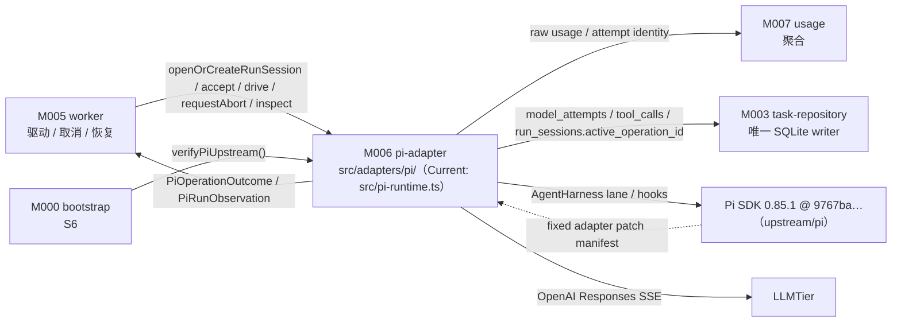
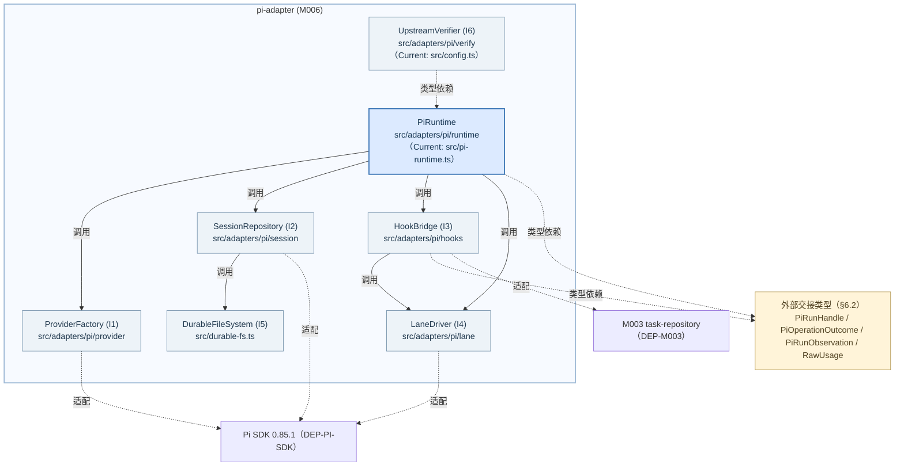
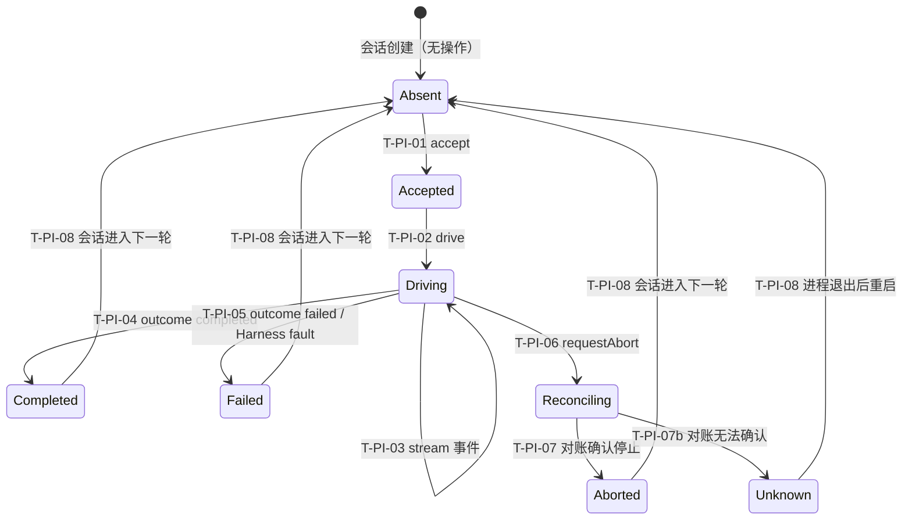
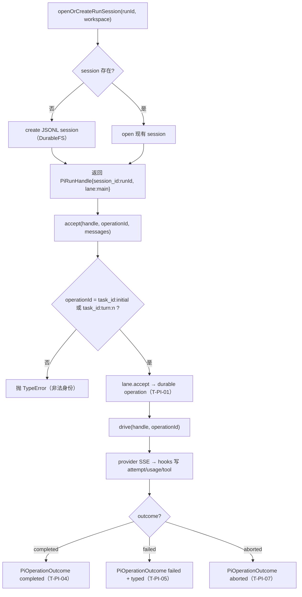
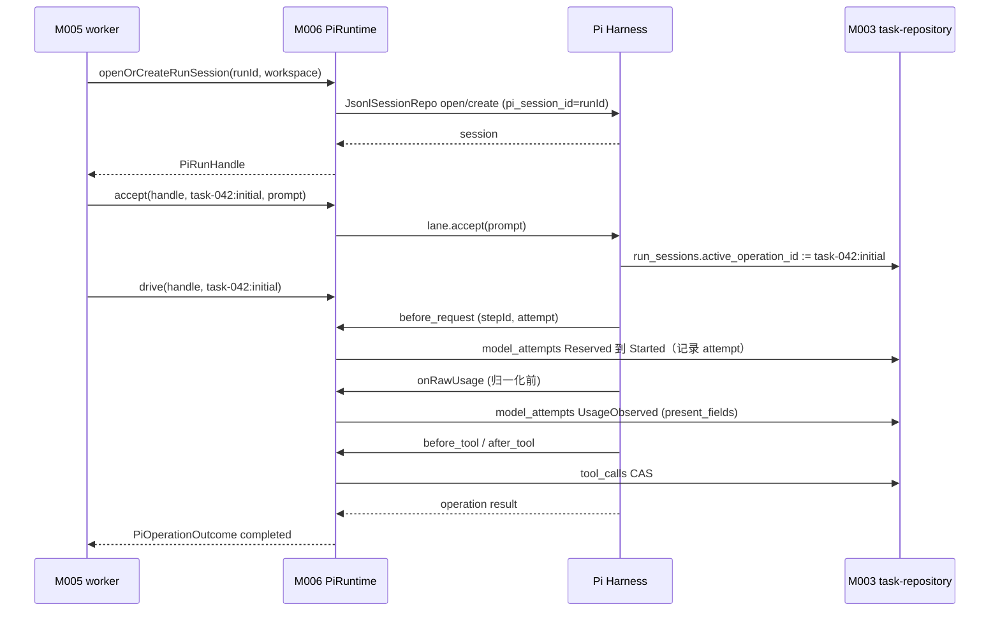
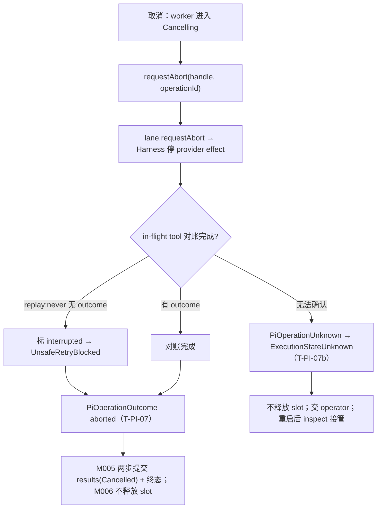

<!-- STD_DOCUMENT_COVER_BEGIN -->
# Piko 模块设计：pi-adapter（M006）

> STD 使用入口：[项目采用说明与标准导航](../../README.md#std-entry)

| 文档字段 | 值 |
|---|---|
| Document ID | `piko-pi-adapter` |
| Document Version | `0.1.1` |
| Status | `Draft` |
| Project | `piko` |
| Document Owner | Piko Implementation Owner |
| Last Modified Date | `2026-09-28` |
| Template ID | `design.definition` |
| Template Version | `3.4.0` |

<!-- STD_DOCUMENT_COVER_END -->

## 1. 单元摘要：为什么存在

M006 `pi-adapter` 解决一个问题：Piko 需要一个稳定、可跨重启对账、且不会把 Pi 的 Agent loop 复制第二遍的“执行会话层”。它把 Pi Harness 的 session/lane/operation 封装为 Piko 可判定的身份——`pi_session_id = task_id`、lane 名固定 `main`、operation ID 由 `task_id:initial` 与 `task_id:turn:<n>` 确定性派生——并把 provider 调用与工具调用的**可观测钩子**接到 M003/M007：`before_request` 用 Pi 已持久化的 `stepId` 形成 attempt 身份并记录 attempt，`onRawUsage` 在归一化**之前**保存原始 usage 字段存在性，`before_tool`/`after_tool` 做工具 CAS 与路径授权。它只消费固定的 Pi SDK `0.85.1` @ commit `9767ba275f3e9a5ee0f5c5342249b629ab1b2282` 与固定 adapter patch manifest（`PK-PI-STEP-ID`、`PK-PI-RAW-USAGE`、`PK-PI-DURABLE-FS`、`PK-PI-NODE22-BODY-TYPE`），**不替换 Pi provider adapter**。

用一次调用说明：M005 `worker` 取得 lease 后调用 `PiRuntime.openOrCreateRunSession(runId, workspace)` 得到 `PiRunHandle{session_id:runId, lane:"main"}`；接着 `accept(handle, "task-042:initial", initialPrompt)`（可选附 `PikoDiscussionMessage`）使 Harness 形成 durable operation；随后 `drive(handle, "task-042:initial")` 拉取到 `PiOperationOutcome`。取消时 M005 调 `requestAbort(operationId)` 并等待 in-flight tool 对账；崩溃重启后 M005 调 `inspect(handle)` 得到 `PiRunObservation`，据 open operation / operation result / 均无三态决定 drive / 封装 Result / 允许 accept，**从不重发旧请求**。每个 provider attempt 的 `before_request` 把 `(task_id, operation_id, stepId, attempt)` 写入 `model_attempts`；`onRawUsage` 把原始 usage 交 M007 聚合。

| 项目 | 内容 |
|---|---|
| 模块编号 / 正式英文名称 | M006 / `pi-adapter` |

| 运行进程 | P1 执行进程（见 `system-design` §3.3 关键决定 7） || 直属父对象编号 / 名称 | `SW-P` / Piko Agent Runtime V0.3（软件系统，`design_level=system`） |
| 父设计 Document ID / 固定基线 / 登记位置 | `system-design` v0.11.2 / 契约 `0.3.0-simplified.6` / §3.2 直属模块表 + §3.4 约束分配；本模块登记见 §3.2 第 205 行 |
| 上级系统/父单元 | 无（纯软件顶层，无总体系统父稿） |
| 解决的问题 | 把 Pi Harness session/lane/operation 封装为确定性、可对账、可中止的 Piko 执行身份；在归一化前保存原始 usage；不复制 provider adapter |
| 提供的能力 | `PiRuntime`：`openOrCreateRunSession`、`accept`、`drive`、`getResult`、`requestAbort`、`inspect`；`before_request`/`onRawUsage`/`before_tool`/`after_tool` hook；`verifyPiUpstream`（S6） |
| 主要使用者 | M005 `worker`（驱动与对账；取消 abort）、M007 `usage`（消费 raw usage）、M000 `bootstrap`（S6 verify） |
| 不负责 | Pi SSE/provider 协议实现（属固定 Pi SDK）；Run 状态机与 Result 两步发布（M005/M003）；usage 聚合与语义校验（M007）；工具恢复契约注册（M002）；自建 DB schema（M003）；Matrix discussion 传输（M008） |

### 1.1 继承的上级约束与落实方式

pi-adapter 承接八条上级约束：`CON-RUN-001`（PK-01，确定性 Pi session）、`CON-RUN-003`（PK-03，截止与预算；**本版撤销**）、`PK-04`（Responses SSE 唯一路径）、`PK-05/06`（工具 CAS + `replay:safe` 绑定）、`CON-USAGE-001`（PK-09，usage 字段完整性观察）、`CON-USAGE-002`（PK-10，usage 冻结）、`CON-REC-001`（PK-12，崩溃后 inspect 不重发）、`CON-ST-001`（PK-12，S6 校验 Pi upstream）。约束来源为 `system-design` §3.4（`piko-system-design.md`）与各机制 §3.1；机制侧权威定义在 `piko-run.md`、`piko-usage.md`、`piko-recovery.md`、`piko-startup.md`。

#### 1.1.1 `CON-RUN-001` · 单 slot + 独立 Pi session（确定性 session identity）

- **上级基线与决定状态**：`system-design` v0.11.2 §3.4（PK-01 行）+ `piko-run.md` §3.1 `CON-RUN-001` · PK-01 · Approved；固定基线 machine contract `0.3.0-simplified.6`。上级原文要求“`pi_session_id=task_id` 确定性绑定”，M006 保证“确定性 session identity”。
- **适用条件**：单实例、单 configured Matrix 身份、单 Agent 路径；每个 Run 的整个生命周期。
- **继承预算或行为保证**：同一 Run 的 Pi session 身份恒为 `pi_session_id=task_id`，lane 恒为 `main`，operation ID 恒为 `task_id:initial` / `task_id:turn:<n>`；同一时刻至多一个 in-flight operation（由单 slot 保证）。
- **可自行选择/不可改变**：不可改变：session/lane/operation 身份的确定性派生、单 Run 单 session；可自行设计：Harness 调用组织、内存投影、错误分类实现。
- **本地落实/内部再分配**：§8.1 `R-PI-IDENTITY` 固定派生规则；§6.6 `PiRunSessionState` 与 `T-PI-01..08`；§9.1 `openOrCreateRunSession` 合同；`RunId` 由 M005 经 `IF-RUN-SESSION` 传入。
- **验证方法与结果/证据**：局部 `VRC-PI-001`（session 身份确定性）；组合 PK-T01/PK-T13（cross-check Result→Run→lease→Pi session→Harness）；当前全部 `NOT_RUN`。
- **差距/变更影响/反馈责任**：none。多实例需另立设计（`system-design` §3.3 关键决定 2），不在本模块放宽。

#### 1.1.2 `CON-RUN-003` · PK-03 截止与预算

- **上级基线与决定状态**：`system-design` v0.12.0-draft.1 §3.4（PK-04 行 · **本版撤销**）。上级原文：“本版不实现任务级截止/预算（见附录 B 修订记录）”——pi-adapter 不判定任何 deadline/预算字段。
- **适用条件**：每次 provider attempt / 工具调用；attempt 与工具调用事实仍记录，供 M007 usage 聚合与 M005 进度消费。
- **继承预算或行为保证**：**本版无任务级截止/预算**；`before_request`/`before_tool` 不做预算 CAS、不因耗尽 block（`PK-04` 已撤销）。
- **可自行选择/不可改变**：不可改变：本模块不引入任务级截止/预算、不因预算阻断；可自行设计：attempt/tool 事实记录实现、错误构造。
- **本地落实/内部再分配**：§8.3 `R-PI-ATTEMPT`、§8.5 `R-PI-TOOLCAS`；§9.2 hook 合同。
- **验证方法与结果/证据**：局部 `VRC-PI-004`（attempt 身份）、`VRC-PI-005`（工具 CAS）；组合 fault PK-T05；当前全部 `NOT_RUN`。
- **差距/变更影响/反馈责任**：none。

#### 1.1.3 `PK-04` · Responses SSE 唯一路径

- **上级基线与决定状态**：`system-design` v0.11.2 §3.4（PK-04 行）· Approved；`system-design` §3.3 关键决定 3。上级原文：“`stream:true`、`store:false`、`maxRetries=0`；不替换 provider adapter；不静默切 non-stream”。
- **适用条件**：每次 provider 调用。
- **继承预算或行为保证**：`before_request` 返回的 `streamOptions` 固定 `maxRetries=0`；Harness `streamOptions` 固定 `stream:true, store:false, cacheRetention:"none"`；`llmtier.cacheRetention="none"`、`streamOptions.maxRetries=0`、`supportsExplicitPromptCacheMode=false` 为固定项，不接受外部覆盖。SSE 缺失/提前断流由 Harness 报中断，不自动切 non-stream。
- **可自行选择/不可改变**：不可改变：provider adapter 为固定 Pi `openai-responses`、不静默切换、三项固定配置；可自行设计：hook 实现与错误分类。
- **本地落实/内部再分配**：§8.2 `R-PI-STREAM`；§4.1 `DEP-PI-SDK`；§9.2 hook 合同；§6.3 `PiAdapterConfig` 固定项。
- **验证方法与结果/证据**：局部 `VRC-PI-003`（streamOptions 固定）；组合 LLMTier 联调 PK-T09/PK-T10；当前全部 `NOT_RUN`。
- **差距/变更影响/反馈责任**：none（固定 Pi 上游 + 固定配置）；Pi 升级或 provider 变更需另立设计并复审本模块。

#### 1.1.4 `PK-05/06` · 工具 CAS + `replay:safe` 绑定

- **上级基线与决定状态**：`system-design` v0.11.2 §3.4（PK-05/06 行）· Approved。上级原文：“`tool_calls` 表 CAS；启动时 `recovery_contract_ref` 必须解析；runtime 不新增 `safe` 声明”。
- **适用条件**：每次工具调用；工具 profile 已由 M002 在启动时绑定（`recovery_contract_ref` 必须解析）。
- **继承预算或行为保证**：`before_tool` 做 `tool_calls` CAS（`reserveTool`）并在 `UnsafeRetryBlocked`（`replay:"never"` 无 outcome）时 block+terminate；工具的可重放声明只能来自已绑定 registry，M006 在运行期不新增 `safe`。
- **可自行选择/不可改变**：不可改变：CAS 位置（`before_tool`）、`replay` 声明只来自注册表；可自行设计：hook 内错误构造与路径授权顺序。
- **本地落实/内部再分配**：§8.5 `R-PI-TOOLCAS`；§4.7 `DEP-POLICY`（tool profile）；§9.2 hook 合同；§6.8 `UnsafeRetryBlocked`/`ToolFailure` 分类。
- **验证方法与结果/证据**：局部 `VRC-PI-005`（工具 CAS 与 `never` 阻断）；组合 PK-T06/PK-T17；当前全部 `NOT_RUN`。
- **差距/变更影响/反馈责任**：工具实现与 recovery contract 注册属 M002；本模块只消费绑定结果。

#### 1.1.5 `CON-USAGE-001` · Usage 字段完整性

- **上级基线与决定状态**：`system-design` v0.11.2 §3.4（PK-09 行）+ `piko-usage.md` §3.1 `CON-USAGE-001` · PK-09 · Approved。上级原文：“M006 保存存在性；M007 聚合；自由度：内部数据结构”。
- **适用条件**：每个模型 attempt；provider 返回 usage 时。
- **继承预算或行为保证**：`onRawUsage` 必须在 Pi 归一化**之前**捕获原始 provider usage，保留字段存在性（`present_fields`）；缺失字段不得填 0；同 attempt 迟到更新以 `record_version` 替换。M006 只观察与保存，不做聚合。
- **可自行选择/不可改变**：不可改变：捕获时机（归一化前）、存在性语义、不聚合；可自行设计：字段提取实现与写入端口调用。
- **本地落实/内部再分配**：§8.6 `R-PI-RAWUSAGE`；§6.2 `RawUsage`；§9.2.1 `IF-RUN-RAWUSAGE` 合同；§7 `M-PI-P2` 流程。
- **验证方法与结果/证据**：局部 `VRC-PI-006`（存在性保留）；组合 PK-T10；当前全部 `NOT_RUN`。
- **差距/变更影响/反馈责任**：聚合 authority 属 M007（`piko-usage.md` §3）。若 `model_attempts` 列集变化，由 M003/M007 决定并复审本模块写入字段。

#### 1.1.6 `CON-USAGE-002` · Result 冻结 UsageSnapshot

- **上级基线与决定状态**：`system-design` v0.11.2 §3.4（PK-10 行）+ `piko-usage.md` §3.1 `CON-USAGE-002` · PK-10 · Approved。上级原文：“迟到 usage 不改 generation；M007 只推 record_version；M003 generation 不可变”。
- **适用条件**：Result 发布后仍有迟到 raw usage 到达。
- **继承预算或行为保证**：M006 的 `onRawUsage` 在 Result 发布后仍可写 `model_attempts` 的 `record_version`，但不得触发 Result 修改、不得要求新 generation；M006 不持有 Result。
- **可自行选择/不可改变**：不可改变：迟到 usage 只推内部版本、不改 Result；可自行设计：替换实现（经 M003 端口）。
- **本地落实/内部再分配**：§8.6 `R-PI-RAWUSAGE`；§10.3 交错 `C-PI-03`；§9.2.1 合同。
- **验证方法与结果/证据**：局部 `VRC-PI-006`（迟到不改 Result）；组合 PK-T10/PK-T16；当前全部 `NOT_RUN`。
- **差距/变更影响/反馈责任**：none；Result authority 属 M005/M003。

#### 1.1.7 `CON-REC-001` · 崩溃恢复 Pi 对账（不重发）

- **上级基线与决定状态**：`system-design` v0.11.2 §3.4（PK-12 行）+ `piko-recovery.md` §3.1 `CON-REC-001` · PK-12 · Approved。上级原文：“恢复顺序 Result → Run → lease → Pi session → Harness → ledger → Matrix；不复活旧权威、不模拟成功”。`piko-recovery.md` §3.5 明确 M006 负责 Harness inspect/getResult。
- **适用条件**：进程崩溃后重启；存在非终态 Run 的 Pi session。
- **继承预算或行为保证**：M006 提供 `inspect(handle)`，从 durable Pi session JSONL 读取 open operation / operation result / transcript tip，不重发旧请求、不模拟成功；有 open op → drive；有 result → 封装；均无 → 允许新 accept。
- **可自行选择/不可改变**：不可改变：对账读数来自 durable Pi session（非内存）、不重发；可自行设计：读取顺序与 `PiRunObservation` 投影。
- **本地落实/内部再分配**：§8.8 `R-PI-INSPECT`；§6.6 `T-PI-08`；§9.1.6 `inspect` 合同；§10.4 恢复交错。
- **验证方法与结果/证据**：局部 `VRC-PI-007`（inspect 三态与不重发）；组合 PK-T04/PK-T12；当前全部 `NOT_RUN`。
- **差距/变更影响/反馈责任**：恢复编排属 M005；schema 完整性由 `piko-recovery.md` §7.2.2 承接。机制侧 `M-REC-DI-003` 明确本模块输入（`piko-recovery.md` §14.4）。

#### 1.1.8 `CON-ST-001` · 启动 S6 校验 Pi upstream

- **上级基线与决定状态**：`system-design` v0.11.2 §3.4（PK-12 行）+ `piko-startup.md` §3.1 `CON-ST-001` · PK-12 · Approved。上级原文（S6）：“verify Pi upstream commit + adapter patch manifest；fingerprint 匹配”；不匹配 → F1、`InternalError("pi-upstream-mismatch")`。
- **适用条件**：进程启动、S6 阶段（在 S5 store 之后、S7 preflight 之前）。
- **继承预算或行为保证**：必须证明 Pi checkout commit 等于配置 `pi.commit`，且 adapter patch manifest 的 SHA-256 等于 `pi.adapter_patch_sha256`，且四项 additive 补丁 marker 实际存在；任一不匹配即 F1，不进入 S7。
- **可自行选择/不可改变**：不可改变：不匹配即 F1、不热切、不部分就绪；可自行设计：fingerprint 校验实现（读 `.git/HEAD` 或 marker 扫描）。
- **本地落实/内部再分配**：§8.9 `R-PI-UPSTREAM-VERIFY`；§4.2 `DEP-PI-PATCH`；§9.1.7 `verifyPiUpstream` 合同；§10.6 失败交错。
- **验证方法与结果/证据**：局部 `VRC-PI-008`（fingerprint 匹配/不匹配）；组合 PK-T04/PK-T12；当前全部 `NOT_RUN`。
- **差距/变更影响/反馈责任**：S6 编排与 F1 出口属 M000 `bootstrap`；本模块提供匹配事实。机制侧 `M-ST-DI-003` 明确本模块输入（`piko-startup.md` §14.4）。

## 2. 需求、功能与验收条件

pi-adapter 的可观察功能全部是进程内操作或 hook 回调，调用方只有 M005 `worker`（会话/操作/中止/对账）、M007 `usage`（raw usage 消费）、M000 `bootstrap`（S6 校验）。没有面向外部用户的功能。

### 2.1 `F-PI-SESSION` · 打开或创建 Run 会话

- **上级需求 / Constraint ID**：`CON-RUN-001`（PK-01）；`IF-RUN-SESSION`。
- **调用方**：M005 `worker`，在 Run 切 `Running` 后、首次 accept 前。
- **输入与前提**：`runId: string`（= `pi_session_id`）、`workspace: string`（已规范化的 workspace 绝对路径）；进程已 READY；Pi upstream 已通过 S6 校验。
- **行为**：按 `pi_session_id=runId` 在 `pi.session_root` 下查 durable JSONL session：存在则以 `BACKGROUND_CONTEXT` 打开，不存在则创建；绑定 lane `main`；返回 `PiRunHandle{session_id:runId, lane:"main", workspace}`。session 文件系统为 fsync-fortified 的 `DurableNodeExecutionEnv`。
- **输出**：`PiRunHandle`。
- **错误与边界**：session 目录不可写 → 依赖错误上抛（M005 决定 `InternalError`/`ExecutionStateUnknown`）；同名 session 已存在但损坏 → `PiSessionCorrupted`（交 M005）。不新建第二 session。
- **验收条件**：同一 `runId` 连续两次调用返回同一 `session_id`，磁盘只有一个 session 目录；不同 `runId` 得到不同 session。

### 2.2 `F-PI-ACCEPT` · 接受一次操作

- **上级需求 / Constraint ID**：`CON-RUN-001`；`PK-04`；`IF-RUN-ACCEPT`。
- **调用方**：M005 `worker`。
- **输入与前提**：`handle`、`operationId`（`task_id:initial` 或 `task_id:turn:<n>`）、`messages`（`initialPrompt`，可选附 `PikoDiscussionMessage`）；同一 session 无 in-flight operation。
- **行为**：调用固定 Pi `lane.accept({kind:"prompt", operationId, prompt: messages})`，形成 durable operation（确认即 Pi commit）；`before_request` hook 在 provider 调用前记录 attempt 身份。
- **输出**：成功即操作已 durable 受理（无返回载荷）；随后经 `drive` 拉取结果。
- **错误与边界**：Harness 拒绝（如 operationId 冲突）→ 上抛。重复 accept 同一已存在 operation 由 Harness 幂等/拒绝，不由 M006 自行去重。
- **验收条件**：给定同一 session，`accept(initial)` 后 `inspect` 可见 open operation `task_id:initial`；accept 后 session JSONL 出现对应 durable 记录。

### 2.3 `F-PI-DRIVE` · 驱动操作至结局

- **上级需求 / Constraint ID**：`PK-04`；`IF-RUN-DRIVE`。
- **调用方**：M005 `worker` 的驱动循环。
- **输入与前提**：`handle`、`operationId`；operation 已 durable 受理。
- **行为**：循环调用 `lane.drive({operationId, waitForRetry:true, pollDeferred:true})`；`waiting` 时继续；直到得到 `PiOperationOutcome{status: "completed"|"failed"|"aborted", summary, error?}`；期间 hook 持续写 `model_attempts`/`tool_calls` 并把 raw usage 交 M007。
- **输出**：`PiOperationOutcome`。
- **错误与边界**：Harness fault → 映射 `ExecutionStateUnknown` 或 `UnsafeRetryBlocked`（视 fault 类型）；`aborted` 只在 abort 对账完成后返回。
- **验收条件**：一次正常 Run 的 `drive` 返回 `completed` 且 summary 非空；取消后返回 `aborted`。

### 2.4 `F-PI-USAGE` · 捕获原始 usage

- **上级需求 / Constraint ID**：`CON-USAGE-001`（PK-09）；`CON-USAGE-002`（PK-10）；`IF-RUN-RAWUSAGE`。
- **调用方**：无显式调用方；由 Pi Harness 在 provider terminal usage 到达时回调 `onRawUsage`（Pi patch `PK-PI-RAW-USAGE`）。
- **输入与前提**：`usage: unknown`（provider 原生 usage 对象）、当前 `attempt` 身份（由 `before_request` 记录）。
- **行为**：在 Pi 归一化**之前**提取存在字段与值，构造 `RawUsage{present_fields, values...}`，经 M003 端口写 `model_attempts`（`UsageObserved`，`record_version` 推进）；迟到同 attempt 以新 `record_version` 替换，不改 Result。
- **输出**：无返回；副作用为 `model_attempts` 写入。
- **错误与边界**：字段缺失是事实而非错误（该字段记 null 入 `missing_fields`，由 M007 聚合）；写入失败不得中断执行（observability 不得 break execution），但须记录。
- **验收条件**：给 attempt 注入六字段完整→六字段 present；注入缺 `reasoning_tokens`→该字段不在 `present_fields` 且值为 null；Result 已发布后到达的 usage 只推 `record_version`。

### 2.5 `F-PI-ABORT` · 请求中止并等待对账

- **上级需求 / Constraint ID**：`IF-CX-ABORT`（`piko-cancel.md` §5.2）；取消分流语义见 `piko-cancel.md` §3.1。
- **调用方**：M005 `worker`（取消分流进入 `Cancelling` 后）。
- **输入与前提**：`handle`、`operationId`；operation in-flight 或已 durable。
- **行为**：调用 Pi `lane.requestAbort(operationId)`；Harness 停止 provider effect 并提交中断结果；M006 等待 in-flight tool 对账（`replay:"never"` 无 outcome → 标 interrupted）后才向 M005 暴露 `aborted`。
- **输出**：`PiOperationOutcome{status:"aborted"}` 或对账无法确认时 `ExecutionStateUnknown`。
- **错误与边界**：abort 后 Harness 无法报告停止事实 → 不释放 slot（由 M005 保持）、标 Unknown；`requestAbort` 不抢占已在途 provider effect，必须等对账。
- **验收条件**：取消一个 in-flight operation 后 `drive` 返回 `aborted`；注入“abort 不返回停止事实”→ `ExecutionStateUnknown` 且 slot 保持占用。

### 2.6 `F-PI-INSPECT` · 崩溃后对账 Pi 事实

- **上级需求 / Constraint ID**：`CON-REC-001`（PK-12）；`IF-REC-INSPECT`（`piko-recovery.md` §5.1）。
- **调用方**：M005 `worker` 恢复流程。
- **输入与前提**：`handle{session_id=task_id}`；重启后 session 文件存在。
- **行为**：只读 durable Pi session JSONL，投影 `PiRunObservation{open_operations, operation_result, lane_tip, transcript_version, durable_queues}`；**不重发**任何旧请求。
- **输出**：`PiRunObservation`。
- **错误与边界**：session 损坏/不可读 → `PiSessionCorrupted`（交 M005 → `InternalError`），不尝试修复、不模拟成功。
- **验收条件**：构造“有 open op”现场→`open_operations` 非空且 `operation_result=null`；“有 result”现场→`operation_result` 非空；“均无”→两者皆空且允许 accept。

### 2.7 `F-PI-UPSTREAM` · 校验 Pi upstream 与 patch manifest

- **上级需求 / Constraint ID**：`CON-ST-001`（PK-12）；`PK-04`；`IF-ST-PI`（`piko-startup.md` §5.1）。
- **调用方**：M000 `bootstrap` S6 阶段。
- **输入与前提**：config `pi.version`/`pi.commit`/`pi.adapter_patch_manifest_path`/`pi.adapter_patch_sha256`；`upstream/pi` checkout 存在。
- **行为**：校验 manifest SHA-256 == `pi.adapter_patch_sha256`；manifest `pi_version`/`pi_commit` == config；`upstream/pi` git HEAD commit == config `pi.commit`；四项 additive patch marker（`stepId`、`onRawUsage`、`DurableNodeExecutionEnv`、Node22 body type）实际存在。
- **输出**：匹配事实（成功无返回）。
- **错误与边界**：任一项不匹配 → 抛 `PiUpstreamMismatch`（M000 映射 F1 `InternalError("pi-upstream-mismatch")`），进程不进入 S7。
- **验收条件**：正确 checkout + manifest → 校验通过；篡改 manifest hash 或删改 marker → 校验失败。

## 3. UI、CLI、服务端点或设备操作面

**N/A。** pi-adapter 是纯进程内适配库，不拥有 UI、CLI、HTTP/RPC 端点或设备操作面：它不监听端口、不注册路由、不提供诊断命令。对外可观察的 HTTP 面（`POST /tasks` 等）由 M001 `task-api` 承载；本模块只被进程内函数调用与 Harness hook 触发。

实际调用入口与归属：`M005 worker → PiRuntime.{openOrCreateRunSession, accept, drive, getResult, requestAbort, inspect}`（进程内 `src/adapters/pi/`，Current 在 `src/pi-runtime.ts`）；`M007 usage ← onRawUsage`（hook 回调，经 M003 端口）；`M000 bootstrap ← verifyPiUpstream`（S6）。维护/诊断入口不新增：attempt/tool 事实经 M003 查询与系统指标 `piko.model.attempts.*`/`piko.tool.attempts.*`（§11）与 `event.model.*`/`event.tool.*` 暴露。

Tailoring 依据：`TAIL-P-101`（Piko 无图形入口）同源；属 STD `design.definition` §3 “模块没有任何直接操作面时写 N/A + 实际调用入口/归属 + tailoring 依据” 的情形。“没有页面”不等于“没有 API”——本模块的进程内 API 在 §9.1 唯一维护。

## 4. 外部边界与依赖

pi-adapter 在进程内的位置：被 M005 调用与驱动，向 M007 发 raw usage，被 M000 调用做 S6 校验，向下依赖固定 Pi SDK 与 patch manifest，经 M003 端口持久化 attempt/tool 事实，向 LLMTier 出站 HTTPS。下图只画模块外部交接，不表示线程或新部署边界。



图 M-PI-C1 · Target / Planned / NOT_BUILT（Current 部分实现于 `src/pi-runtime.ts`/`src/durable-fs.ts`/`src/config.ts`）。实线是同步进程内函数调用、hook 回调与出站 HTTPS；不是新部署边界。pi-adapter 不创建线程/进程；驱动在宿主事件循环上执行，SSE 读取为非阻塞事件。

#### 4.1 `DEP-PI-SDK` · Pi SDK（固定上游）

- **角色 / 运行位置 / Owner**：进程内库依赖，`upstream/pi`（vendored）；Owner：Piko Implementation Owner；上游 owner 为 Pi。
- **本模块调用或消费**：`AgentHarness.create/close`、`AgentLane.accept/drive/getResult/requestAbort/findEntries/getTipId`、`hooks.on("before_request"|"before_payload"|"after_response"|"before_tool"|"after_tool")`、`events.on("tool_end")`、`JsonlSessionRepo.open/create/list/close`、`createModels/createProvider`、`openAIResponsesApi`、`envApiKeyAuth`、`BACKGROUND_CONTEXT`、工具工厂 `create{Read,Write,Edit,Bash}Tool`、`createCustomMessage`。
- **本模块提供**：无。本模块只适配 Pi 公共面，不向 Pi 提供接口。
- **契约 authority / 版本 / selector**：固定 Pi `0.85.1` @ commit `9767ba275f3e9a5ee0f5c5342249b629ab1b2282`（`system-design` §8.2 + `pi.upstream_commit`）；不替换 provider adapter。
- **同步方式 / timeout / 生命周期**：进程内异步调用（`await`）；provider 请求受 `llmtier.models_timeout_ms`；session/harness 生命周期与 Run 同域（`close` 在 Run 终态）。
- **不可用或失败影响 / 责任出口**：Harness fault → M006 映射 typed failure（`ExecutionStateUnknown`/`UnsafeRetryBlocked`）交 M005；上游不匹配 → S6 F1（§9.1.7）。

#### 4.2 `DEP-PI-PATCH` · 固定 adapter patch manifest

- **角色 / 运行位置 / Owner**：构建期固定补丁 + 运行时校验清单；Owner：Piko Implementation Owner。
- **本模块调用或消费**：读 `pi.adapter_patch_manifest_path`（`config/pi-adapter-patch-manifest.json`）与 `pi.adapter_patch_sha256`，校验四项 additive 变更：`PK-PI-STEP-ID`（暴露 durable `stepId`）、`PK-PI-RAW-USAGE`（归一化前 `onRawUsage`）、`PK-PI-DURABLE-FS`（fsync 的 `DurableNodeExecutionEnv`）、`PK-PI-NODE22-BODY-TYPE`（Node22 `BodyInit`）。
- **本模块提供**：无。
- **契约 authority / 版本 / selector**：`config/pi-adapter-patch-manifest.json`（`schema_version:"1"`）+ `patches/pi-v0.85.1-piko.patch`；`system-design` §9.1 `pi.adapter_patches.before_request_stepid`/`on_raw_usage`。
- **同步方式 / timeout / 生命周期**：启动时同步读取与哈希；进程内不变。
- **不可用或失败影响 / 责任出口**：manifest 缺失/哈希不符/marker 缺失 → S6 F1，进程不接受 Run。

#### 4.3 `DEP-M003` · M003 `task-repository`（attempt/tool/session 事实的持久化权威）

- **角色 / 运行位置 / Owner**：同级直属模块，同进程；Owner：Piko Implementation Owner。
- **本模块调用或消费**：写 `model_attempts`（`Reserved→Started→UsageObserved→Terminal/Unknown`）、写 `tool_calls` CAS（`reserveTool`/`terminalTool`）、写 `run_sessions.active_operation_id`/`last_operation_id`、读 `pendingTurns`/`markTurn`（discussion）。端口签名属 M003，本设计按 Proposed 消费。
- **本模块提供**：无。
- **契约 authority / 版本 / selector**：`piko-task-repository-design.md` / ISD §4.7（**Proposed，尚未编写**）；当前代码事实 `src/store.ts` 中 `model_attempts`/`tool_calls`/`run_sessions` 建表与 `observeUsage`/`reserveModel`/`terminalModel`/`reserveTool`/`terminalTool`/`recordProviderCall`（`src/pi-runtime.ts:67`–`src/pi-runtime.ts:102` 调用）。
- **同步方式 / timeout / 生命周期**：同步进程内；单 `BEGIN IMMEDIATE`；受 `task_store.busy_timeout_ms`；连接由 M003 持有。
- **不可用或失败影响 / 责任出口**：`SQLITE_BUSY` → 上抛；hook 内写入失败不得中断执行（observability/ledger 不得 break execution），但 M005 决定终态；M006 绝不自行打开 SQLite 连接。

#### 4.4 `DEP-M005` · M005 `worker`（主要调用方）

- **角色 / 运行位置 / Owner**：同级直属模块，同进程；Owner：Piko Implementation Owner。
- **本模块调用或消费**：无（M006 不调用 M005）。
- **本模块提供**：§9.1.1–§9.1.6 六个进程内操作与驱动循环所消费的 `PiOperationOutcome`。
- **契约 authority / 版本 / selector**：`piko-worker-design.md` / ISD（**未编写**）；接口在 `piko-run.md` §5（`IF-RUN-SESSION/ACCEPT/DRIVE`）与 `piko-recovery.md` §5.1（`IF-REC-INSPECT`）声明。
- **同步方式 / timeout / 生命周期**：同步调用 + 异步 drive；driving 期间持有 `PiRunHandle`。
- **不可用或失败影响 / 责任出口**：M006 返回 typed outcome/异常，由 M005 决定终态与 Result；M006 不写 Run 终态。

#### 4.5 `DEP-M007` · M007 `usage`（raw usage 消费者）

- **角色 / 运行位置 / Owner**：同级直属模块，同进程；Owner：Piko Implementation Owner。
- **本模块调用或消费**：无（M006 不调用 M007）。
- **本模块提供**：`onRawUsage` 观察事件（`IF-RUN-RAWUSAGE`/`IF-USAGE-RAW`）与 `model_attempts` 行（经 M003）。
- **契约 authority / 版本 / selector**：`piko-usage.md` §4.4.1 `RawUsage` + §5.1 `recordAttempt`；`piko-usage.md` §3.1 `CON-USAGE-001/002`。
- **同步方式 / timeout / 生命周期**：同步 hook 回调；attempt 寿命；迟到以 `record_version` 替换。
- **不可用或失败影响 / 责任出口**：raw usage 缺失不是错误（M007 聚合为 Partial/Unknown）；M006 不聚合、不裁决完整性。

#### 4.6 `DEP-LLMTIER` · LLMTier Responses SSE 端点（外部）

- **角色 / 运行位置 / Owner**：外部 HTTPS 依赖，独立网络故障域；Owner：operator（config）。
- **本模块调用或消费**：经固定 Pi `openai-responses` provider 以 `stream:true, store:false, maxRetries:0` 调用 `llmtier.base_url`；API key 经 `llmtier.api_key_secret_ref` 解析注入。
- **本模块提供**：无。
- **契约 authority / 版本 / selector**：`system-design` §8.2「OpenAI-compatible Responses SSE」；config `llmtier.*`；固定 Pi provider。
- **同步方式 / timeout / 生命周期**：出站 HTTPS SSE；请求受 `llmtier.models_timeout_ms`；provider 级重试 = 0，attempt 由 Harness retry policy 形成。
- **不可用或失败影响 / 责任出口**：不可达/502/503/协议非法 → M006 映射 `ModelUnavailable`（`Dependency`）或 `ModelResponseInvalid`（`ModelProtocol`）；不静默切 non-stream；S7 preflight 失败 → F1。

#### 4.7 `DEP-POLICY` · M002 `policy`（工具 profile 与恢复契约绑定）

- **角色 / 运行位置 / Owner**：同级直属模块，同进程；Owner：Piko Implementation Owner。
- **本模块调用或消费**：启动时已由 M002 绑定的 `ToolRegistry`（`profiles[*].tools[*].{effect,replay,recovery_contract_ref}`）与 `config.agent.profile_ref`；M006 消费绑定结果，不重新注册。
- **本模块提供**：无。
- **契约 authority / 版本 / selector**：`interfaces/schemas/piko-tool-profile-v0.3.schema.json` + `src/config.ts` `validateToolRegistry`。
- **同步方式 / timeout / 生命周期**：启动绑定，进程内不变。
- **不可用或失败影响 / 责任出口**：`recovery_contract_ref` 未解析 → 启动 S3 F1（M002/M000）；运行期 `before_tool` 用已绑定结果做 CAS。

#### 4.8 `DEP-WORKSPACE-FS` · workspace/staging 文件系统与 durable FS

- **角色 / 运行位置 / Owner**：本地可靠 FS；Owner：operator（config `workspace.roots`/`workspace.staging_root`）。
- **本模块调用或消费**：`DurableNodeExecutionEnv`（fsync-fortified NodeExecutionEnv，`src/durable-fs.ts`）作为 Pi session 与工具读写底座；`authorizePath`（`src/workspace.ts`）做路径授权。
- **本模块提供**：无。
- **契约 authority / 版本 / selector**：`system-design` §3.3.1「本地可靠 FS（SQLite WAL + JSONL）」；`PK-PI-DURABLE-FS` patch。
- **同步方式 / timeout / 生命周期**：同步文件 I/O + fsync；与进程同域。
- **不可用或失败影响 / 责任出口**：FS 不可写 → session 创建失败上抛；不沉默降级为非 durable 写。

## 5. 内部结构与实现位置

pi-adapter 拆成七个内部单元：入口编排、provider 构造、session 仓库、hook 桥、lane 驱动、durable FS、upstream 校验。拆分依据是“身份/驱动/hook/持久化底座各自可独立测试”，不是为了凑文件。**Current** 形态是单文件 `src/pi-runtime.ts` 内联全部逻辑（`PiRuntime` + `model()` + hook 注册 + drive 循环）+ `src/durable-fs.ts` + `src/config.ts` 校验；**Target** 抽为 `src/adapters/pi/`。



图 M-PI-S1 · Target / Planned / NOT_BUILT（Current 内联于 `src/pi-runtime.ts`）。外框是模块内部组成；实线同步调用，虚线类型/适配依赖；不表示线程或时序。Current 已实现的单元标 IMPLEMENTED，其余为 Planned。

### 5.1 内部组成

#### 5.1.1 `C1` · PiRuntime（入口）

- **职责与非职责**：对外提供 §9.1.1–§9.1.7 六个操作与校验入口；编排“开 session → accept → drive → 对账/abort”；保证 §6.6 不变量。非职责：不发 SQL（经 M003 端口）、不实现 provider 协议（用 Pi SDK）、不裁决 Run 终态（M005）。
- **输入、处理与输出**：输入 `runId`/`operationId`/`messages`/`workspace`；处理：组合 ProviderFactory/SessionRepository/HookBridge/LaneDriver；输出 `PiRunHandle`/`PiOperationOutcome`/`PiRunObservation`。
- **协作对象**：调用 I1–I4、I5（经 SessionRepository）、I6；被 M005/M000 调用。
- **文件 / symbol / 实现状态**：`src/pi-runtime.ts` → `class PiRuntime`（IMPLEMENTED；Target 抽为 `src/adapters/pi/runtime.ts`）。Current 已含 `execute()`、`model()`、hook 注册与 drive 循环。
- **拆分依据与替代方案代价**：入口只做编排，把 hook/驱动/provider 抽开以便单测（尤其 `before_request` 身份与 `onRawUsage` 存在性）。替代方案“继续单文件”（Current）代价是 hook 与驱动耦合、无法对 attempt 身份/放弃语义做独立用例。

#### 5.1.2 `I1` · ProviderFactory

- **职责与非职责**：构造固定 `openai-responses` provider/model（`llmtier.base_url`、`envApiKeyAuth(["PIKO_LLM_API_KEY"])`、`reasoning:true`）；固定 `streamOptions`（`maxRetries:0`、`timeoutMs=models_timeout_ms`、`cacheRetention:"none"`）。非职责：不重试、不切非流式、不解析 SSE。
- **输入、处理与输出**：输入 `RuntimeConfig`/apiKey；输出 `{models, model}`。
- **协作对象**：仅被 C1 调用；适配 Pi `createModels/createProvider/openAIResponsesApi`。
- **文件 / symbol / 实现状态**：`src/adapters/pi/provider.ts`（Planned）；Current 在 `PiRuntime.model()`（IMPLEMENTED）。
- **拆分依据与替代方案代价**：把固定 provider 参数集中一处以便核对 `PK-04` 三项固定项。替代方案（内联）使固定项散落、难以静态核对。

#### 5.1.3 `I2` · SessionRepository

- **职责与非职责**：按 `pi_session_id=task_id` 打开/创建/关闭 JSONL session，绑定 lane `main`；注入 `DurableNodeExecutionEnv`。非职责：不做驱动、不写 attempt 事实。
- **输入、处理与输出**：输入 `runId`/`workspace`；输出 `Session` 与 `PiRunHandle`。
- **协作对象**：调用 I5；被 C1 调用；适配 Pi `JsonlSessionRepo`。
- **文件 / symbol / 实现状态**：`src/adapters/pi/session.ts`（Planned）；Current 在 `PiRuntime` 构造器（`JsonlSessionRepo`）与 `execute` 内（IMPLEMENTED，见 `src/pi-runtime.ts:47`–`src/pi-runtime.ts:60`）。
- **拆分依据与替代方案代价**：session 身份是 `CON-RUN-001` 的核心，抽开以独立验证确定性。替代方案内联使身份规则与驱动纠缠。

#### 5.1.4 `I3` · HookBridge

- **职责与非职责**：注册并实现四类 hook 与 tool_end 事件：`before_request`（记 attempt、返回固定 `streamOptions`）、`onRawUsage`（构造 `RawUsage` 并经 M003 写 `model_attempts`）、`before_tool`（路径授权 + `reserveTool` CAS）、`after_tool`/`tool_end`（终态与 interrupted 对账）。非职责：不聚合 usage（M007）、不注册 recovery contract（M002）。
- **输入、处理与输出**：输入 Harness hook 事件；输出 `model_attempts`/`tool_calls` 写入与 block 决策。
- **协作对象**：调用 I4（`active` 身份）、M003 端口（DEP-M003）；被 C1 装配。
- **文件 / symbol / 实现状态**：`src/adapters/pi/hooks.ts`（Planned）；Current 内联于 `PiRuntime.execute`（`created.harness.hooks.on(...)`，IMPLEMENTED，见 `src/pi-runtime.ts:67`–`src/pi-runtime.ts:102`）。
- **拆分依据与替代方案代价**：hook 是 `PK-05/06`、`CON-USAGE-001` 的落点，抽开可对 attempt/tool CAS 与 usage 存在性做表驱动单测。替代方案内联使 hook 与 drive 循环共享闭包状态、难以独立复现。

#### 5.1.5 `I4` · LaneDriver

- **职责与非职责**：实现 `accept`/`drive`/`getResult`/`requestAbort`/`inspect` 的 Harness 调用与 outcome 归一化；维护 `active` attempt 身份与 cancel 定时回调。非职责：不写 DB、不构造 provider。
- **输入、处理与输出**：输入 `handle`/`operationId`/`messages`；输出 `PiOperationOutcome`/`PiRunObservation`。
- **协作对象**：适配 Pi `AgentLane`；被 C1/C4 调用。
- **文件 / symbol / 实现状态**：`src/adapters/pi/lane.ts`（Planned）；Current 内联于 `PiRuntime.execute`（accept/drive/requestAbort/findEntries，IMPLEMENTED，见 `src/pi-runtime.ts:103`–`src/pi-runtime.ts:149`）。
- **拆分依据与替代方案代价**：驱动与对账是 `PK-04`/`CON-REC-001` 的核心，抽开可与 mock Harness 做 outcome 分支单测。替代方案内联使 cancel/对账逻辑散在执行代码。

#### 5.1.6 `I5` · DurableFileSystem

- **职责与非职责**：`DurableNodeExecutionEnv`：在 Pi JSONL 写入/追加/重命名成功后 fsync 文件与目录，使 session 提交 durable。非职责：不改变 Pi 写入语义、不做加密。
- **输入、处理与输出**：输入 `NodeExecutionEnv` 调用；输出 fsync 后的结果。
- **协作对象**：被 I2 注入 Pi `JsonlSessionRepo`。
- **文件 / symbol / 实现状态**：`src/durable-fs.ts` → `class DurableNodeExecutionEnv`（IMPLEMENTED）。
- **拆分依据与替代方案代价**：fsync 是崩溃恢复的前提（`CON-REC-001`），独立文件便于对 write/append/rename 分别验证。替代方案直接用 Pi `NodeExecutionEnv` 会在断电/崩溃时丢 session 尾部。

#### 5.1.7 `I6` · UpstreamVerifier

- **职责与非职责**：S6 校验：manifest SHA-256、manifest pin、`upstream/pi` git HEAD、四项补丁 marker。非职责：不安装补丁、不启动 session。
- **输入、处理与输出**：输入 `RuntimeConfig` + repo root；输出匹配事实或 `PiUpstreamMismatch`。
- **协作对象**：被 M000/C1 调用；读 `upstream/pi` 与 manifest 文件。
- **文件 / symbol / 实现状态**：`src/adapters/pi/verify.ts`（Planned）；Current 在 `src/config.ts` `loadConfig`/`gitHead`（IMPLEMENTED，见 `src/config.ts:38`–`src/config.ts:51`）。
- **拆分依据与替代方案代价**：把“固定上游事实”从 config 加载中显式化，便于对不匹配分支单测。替代方案（Current 内联于 `loadConfig`）可行但难单独测 marker 级失败。

### 5.2 内部调用过程

#### 5.2.1 `P-PI-SESSION` · 开/取会话（成交后首调）

- **入口与调用上下文**：M005 worker（Run 切 Running 后，宿主事件循环）→ `PiRuntime.openOrCreateRunSession(runId, workspace)`。
- **调用链（文件 / symbol → 文件 / symbol）**：`worker.run` → `PiRuntime.openOrCreateRunSession` → `SessionRepository.openOrCreate`（`JsonlSessionRepo.list/open/create`，`DurableFileSystem` 注入）→ 返回 `PiRunHandle`。
- **逐步传递的数据**：`{runId, workspace} → {session_id, lane:"main", workspace}`。
- **返回、异常与清理**：成功返回 handle；FS 不可写上抛；session 损坏抛 `PiSessionCorrupted`。无临时资源需清理。
- **对应流程 / 接口 / 验证**：§7 `M-PI-P1`；§9.1.1 `IF-RUN-SESSION`；`VRC-PI-001`。

#### 5.2.2 `P-PI-ACCEPT` · accept prompt

- **入口与调用上下文**：M005 worker → `PiRuntime.accept(handle, operationId, messages)`。
- **调用链**：`worker.run` → `PiRuntime.accept` → `LaneDriver.accept` → Pi `lane.accept({kind:"prompt", operationId, prompt})`；Pi commit 后 durable；首次 provider 调用触发 HookBridge `before_request`。
- **逐步传递的数据**：`{handle, operationId, messages} → durable operation`。
- **返回、异常与清理**：成功无返回；Harness 拒绝上抛。无清理。
- **对应流程 / 接口 / 验证**：§7 `M-PI-P2`；§9.1.2 `IF-RUN-ACCEPT`；`VRC-PI-002`。

#### 5.2.3 `P-PI-DRIVE` · 驱动至结局

- **入口与调用上下文**：M005 驱动循环 → `PiRuntime.drive(handle, operationId)`。
- **调用链**：`LaneDriver.drive`（`lane.drive({waitForRetry:true, pollDeferred:true})` 循环）→ 期间 HookBridge hook 触发 → outcome 归一化为 `PiOperationOutcome`。
- **逐步传递的数据**：`{operationId} → drive events → PiOperationOutcome{status, summary, error?}`。
- **返回、异常与清理**：完成/失败/中止返回 outcome；Harness fault 映射 typed failure；`finally` 清 cancel 定时器与 `harness.close`。
- **对应流程 / 接口 / 验证**：§7 `M-PI-P3`；§9.1.3 `IF-RUN-DRIVE`；`VRC-PI-002/004`。

#### 5.2.4 `P-PI-USAGE` · raw usage 观察

- **入口与调用上下文**：Pi provider terminal usage 到达 → Harness `onRawUsage` → HookBridge。
- **调用链**：Pi `processResponsesStream` → `options.onRawUsage(usage)` → `AgentHarness.onRawUsage` → `PiRuntime` 回调 → 构造 `RawUsage` → M003 `observeUsage`。
- **逐步传递的数据**：`{usage, active:{op, step, attempt}} → RawUsage{present_fields, values}`。
- **返回、异常与清理**：无返回；写入失败被吞噬但记录，不 break execution。
- **对应流程 / 接口 / 验证**：§7 `M-PI-P2`；§9.2.1 `IF-RUN-RAWUSAGE`；`VRC-PI-006`。

#### 5.2.5 `P-PI-ABORT` · 中止与对账

- **入口与调用上下文**：M005 取消分流 → `PiRuntime.requestAbort(handle, operationId)`。
- **调用链**：`worker.cancel` → `PiRuntime.requestAbort` → `LaneDriver.requestAbort` → Pi `lane.requestAbort`；Harness 停 provider effect 并提交中断结果；`drive` 观察到 `aborted`；HookBridge 处理 in-flight tool（`replay:"never"` 无 outcome → interrupted）。
- **逐步传递的数据**：`{operationId} → AbortRequestResult → PiOperationOutcome{status:"aborted"}` 或 `ExecutionStateUnknown`。
- **返回、异常与清理**：aborted 或无确认的 Unknown；不清 slot（M005 负责），清 cancel 定时器。
- **对应流程 / 接口 / 验证**：§7 `M-PI-P3`；§9.1.5 `IF-CX-ABORT`；`VRC-PI-005`。

#### 5.2.6 `P-PI-INSPECT` · 崩溃后对账

- **入口与调用上下文**：M005 恢复流程 → `PiRuntime.inspect(handle)`。
- **调用链**：`worker.recovery` → `PiRuntime.inspect` → `LaneDriver.inspect`（`lane.findEntries`/`getResult`/`getTipId`）→ 投影 `PiRunObservation`。
- **逐步传递的数据**：`{session_id} → PiRunObservation{open_operations, operation_result, lane_tip, transcript_version, durable_queues}`。
- **返回、异常与清理**：只读；损坏抛 `PiSessionCorrupted`；不重发、不修复。
- **对应流程 / 接口 / 验证**：§7 `M-PI-P6`；§9.1.6 `IF-REC-INSPECT`；`VRC-PI-007`。

### 5.3 文件间接口契约

本节只固定 pi-adapter 内部文件之间的交接；跨模块的 M003/M005 接口在 §9 维护，字段类型在 §6.2。

#### 5.3.1 `IF-PI-PROVIDER` · `runtime.ts` → `provider.ts`

- **接口成员 ID / §9 逐接口定义位置**：内部无公共成员 ID；固定项权威在 §8.2 `R-PI-STREAM`。
- **本文件的提供或使用责任**：`provider.ts` 提供 `createModel(config, apiKey)`；`runtime.ts` 使用其 `{models, model}`。
- **交接时机 / 本地调用步骤**：`openOrCreateRunSession`/`accept` 前构造一次，Run 内复用。
- **§9 生命周期约束**：无状态；进程内构造；不缓存 credential 明文到日志。
- **实现与验证位置**：`src/adapters/pi/provider.ts`；`VRC-PI-003`。

#### 5.3.2 `IF-PI-SESSION` · `runtime.ts` → `session.ts`

- **接口成员 ID / §9 逐接口定义位置**：内部 `SessionRepository`，语义见 §9.1.1 `IF-RUN-SESSION`。
- **本文件的提供或使用责任**：`session.ts` 提供 `openOrCreate(runId, workspace)` 与 `close()`；`runtime.ts` 使用。
- **交接时机 / 本地调用步骤**：见 `P-PI-SESSION`。
- **§9 生命周期约束**：session 与 Run 同域；不跨 Run 复用。
- **实现与验证位置**：`src/adapters/pi/session.ts`；`VRC-PI-001`。

#### 5.3.3 `IF-PI-HOOKS` · `runtime.ts` → `hooks.ts`

- **接口成员 ID / §9 逐接口定义位置**：内部 `HookBridge`，语义见 §9.2 与 §8.4/§8.5/§8.6。
- **本文件的提供或使用责任**：`hooks.ts` 提供 `install(harness, ctx)`；`runtime.ts` 在 `AgentHarness.create` 后装配。
- **交接时机 / 本地调用步骤**：hook 由 Pi 在 provider/tool 边界回调；`active` attempt 身份由 HookBridge 持有。
- **§9 生命周期约束**：与 harness 同域；`close` 后不再回调。
- **实现与验证位置**：`src/adapters/pi/hooks.ts`；`VRC-PI-004/005/006`。

#### 5.3.4 `IF-PI-LANE` · `runtime.ts` → `lane.ts`

- **接口成员 ID / §9 逐接口定义位置**：内部 `LaneDriver`，语义见 §9.1.2/§9.1.3/§9.1.5/§9.1.6。
- **本文件的提供或使用责任**：`lane.ts` 提供 `accept/drive/getResult/requestAbort/inspect`；`runtime.ts` 使用。
- **交接时机 / 本地调用步骤**：见 `P-PI-ACCEPT`/`P-PI-DRIVE`/`P-PI-ABORT`/`P-PI-INSPECT`。
- **§9 生命周期约束**：operation 与 Run 同域；inspect 只读。
- **实现与验证位置**：`src/adapters/pi/lane.ts`；`VRC-PI-002/003/005/007`。

### 5.4 服务提供方式（条件适用）

**N/A（无独立宿主）。** pi-adapter 不监听端口、不启动进程/线程、不注册端点：§3 已判定无操作面，故本节的 server/runtime、监听、就绪、停止均不适用。

运行载体：`PiRuntime` 实例由 M000 `bootstrap`/`main.ts` 装配，随进程生命周期存在；无自身进入/退出过程（Run 级 `openOrCreateRunSession`/`close` 由 M005 驱动）。并发模型：全部操作在宿主 Node 单线程事件循环上同步/异步执行；`drive` 是异步等待，SSE 读取为非阻塞事件；cancel 轮询为宿主事件循环定时器（§10）。就绪/停止语义属于 M000/MECH-STARTUP，本模块只提供 S6 校验事实、不定义 READY/停止出口。

Tailoring 依据：STD `design.definition` §5.4 “纯库函数说明不适用及由谁调用”。

### 5.5 依赖方向

- **允许方向**：`runtime.ts` → `{provider.ts, session.ts, hooks.ts, lane.ts, verify.ts, types.ts}`；`session.ts` → `durable-fs.ts`；`hooks.ts` → `lane.ts`；`lane.ts`/`hooks.ts` → `types.ts`。适配 Pi SDK 只允许出现在 `provider.ts`/`session.ts`/`lane.ts`；适配 M003 端口只允许出现在 `hooks.ts`/`lane.ts`。
- **禁止方向与原因**：禁止 `provider.ts` 引用任何 Piko 文件（除 `types.ts`）；禁止 `lane.ts` 引用 `runtime.ts`（避免环）；禁止在 hook 内直接打开 SQLite（必须经 M003 端口）；禁止把 Pi provider 参数散落在 `provider.ts` 之外。
- **循环/越层检查**：静态：对 `src/adapters/pi/` 跑依赖图（`tsc`/import 检查或 CI 脚本）确认无环、`provider.ts` 无 Piko 内部 import；评审按 §5.1 逐文件核对引用。
- **变更影响**：改 `provider.ts` 影响 `PK-04` 固定项（须复审）；改 `hooks.ts` 影响 attempt/tool/usage 事实（`PK-05/06`、`CON-USAGE-001`）；改 `lane.ts` 影响 `CON-RUN-001`/`CON-REC-001`；改 `verify.ts` 影响 S6。

## 6. 数据结构设计

pi-adapter 拥有的数据类型是 `PiRunHandle`/`PiOperationOutcome`/`PiRunObservation`/`RawUsage`/`PikoDiscussionMessage`/`AdapterPatchManifest` 与运行态投影；不拥有持久表（DDL 属 M003）与配置 schema（属系统 config）。不适用类别在章首集中说明。

**不适用类别与依据**：§6.1 公共基础类型（本模块用字面量联合，无需独立枚举）、§6.5 设备/FPGA 表项（纯软件，`TAIL-P-103`）、§6.7 数据库表结构（DDL authority 属 M003，见 §6.7）均为 N/A。§6.3 配置复用系统 config schema（见 §6.3）；raw usage 事件虽跨模块，但其结构在 §6.2.4 `RawUsage` 记录并引用 `piko-usage.md` §4.4.1，不另设 §6.4 报文节点。

### 6.2 业务与操作数据结构

#### 6.2.1 `PiRunHandle`

- **完整定义、Data/Type/Data ID 与唯一来源**：`PiRunHandle`；本模块作用域类型（无公共 Data ID）；权威定义在本设计 §9.1.1，生产于 `src/adapters/pi/session.ts`（Current `src/pi-runtime.ts`）。

  ```text
  PiRunHandle {
    session_id: string,   // = task_id（确定性）
    lane: "main",
    workspace: string     // 已规范化绝对路径
  }
  ```

- **逐字段/逐值类型、范围、含义与跨字段约束**：`session_id` 必填非空，恒等于 `runId`；`lane` 恒为字面量 `"main"`；`workspace` 必填，等于 M005 传入的规范化 workspace。跨字段：`session_id` 与磁盘 session 目录名唯一对应。
- **生产/修改、所有权、可见点、寿命及失败出口**：由 `openOrCreateRunSession` 从 `SessionRepository` 结果构造并返回 M005；不可变值对象；寿命 = Run 寿命。失败出口：`PiSessionCorrupted`。
- **合法与拒绝实例、V/Case 与证据状态**：合法：`{session_id:"task-042", lane:"main", workspace:"/srv/piko/ws-7"}`。拒绝：`lane:"other"`、`session_id` 为空。`VRC-PI-001`；`NOT_RUN`。

#### 6.2.2 `PiOperationOutcome`

- **完整定义、Data/Type/Data ID 与唯一来源**：`PiOperationOutcome`；本模块作用域类型；语义对应 Pi `OperationResultRecord` 与 `piko-run.md` §5.2 `PiOperationOutcome stream`。

  ```text
  PiOperationOutcome {
    status: "completed" | "failed" | "aborted",
    summary: string,
    error?: { code: string, cause_class: string, message: string }
  }
  ```

- **逐字段/逐值类型、范围、含义与跨字段约束**：`status` 三分且互斥；`summary` 必填（完成时为最终文本，失败/中止时为说明）；`error` 仅 `failed`/`aborted` 时可能非空。`aborted` 必须在 abort 对账完成后才产生，不代表“请求已发出中止”。
- **生产/修改、所有权、可见点、寿命及失败出口**：由 `LaneDriver.drive` 从 Pi outcome 归一化并返回 M005；不可变；寿命 = 单次 drive。失败出口：Harness fault 映射为 `failed` + typed error。
- **合法与拒绝实例、V/Case 与证据状态**：合法：`{status:"completed", summary:"Report written"}`。拒绝：`status:"completed"` 却带 `error`；`status:"aborted"` 但对账未完成。`VRC-PI-002/004/005`；`NOT_RUN`。

#### 6.2.3 `PiRunObservation`

- **完整定义、Data/Type/Data ID 与唯一来源**：`PiRunObservation`；`piko-recovery.md` §4.4.2/§5.1 唯一声明；定义在本设计 §9.1.6 与 `src/adapters/pi/lane.ts`。

  ```text
  PiRunObservation {
    open_operations: string[],                 // 未终结的 operation_id
    operation_result: PiOperationOutcome | null,
    lane_tip: string | null,                    // transcript tip entry id
    transcript_version: number,
    durable_queues: { pending_turns: number }   // durable 待处理轮次
  }
  ```

- **逐字段/逐值类型、范围、含义与跨字段约束**：`open_operations` 与 `operation_result` 由 durable session JSONL 投影；`lane_tip` 可为 null；`transcript_version >= 0`。三态：有 open op / 有 result / 均无，互斥优先（open op 优先 drive）。
- **生产/修改、所有权、可见点、寿命及失败出口**：由 `inspect` 只读投影并返回 M005；不可变；寿命 = 单次 inspect。失败出口：`PiSessionCorrupted`。
- **合法与拒绝实例、V/Case 与证据状态**：合法：`{open_operations:["task-042:initial"], operation_result:null, lane_tip:"e-12", transcript_version:14, durable_queues:{pending_turns:0}}`。拒绝：`open_operations` 与 `operation_result` 同时非空（投影冲突）。`VRC-PI-007`；`NOT_RUN`。

#### 6.2.4 `RawUsage`

- **完整定义、Data/Type/Data ID 与唯一来源**：`RawUsage`；唯一来源 `piko-usage.md` §4.4.1；本模块是**生产方**（在归一化前构造）。

  ```text
  RawUsage {
    request_identity: { response_id?: string, request_id?: string },
    present_fields: string[],     // 本次实际出现的字段
    input_tokens?, output_tokens?, total_tokens?,
    cached_tokens?, cache_write_tokens?, reasoning_tokens?
  }
  ```

- **逐字段/逐值类型、范围、含义与跨字段约束**：`present_fields` 必须与字段值一致（出现即非 null）；缺失字段不得填 0、不得出现在 `present_fields`；数值为非负整数。关联身份 = `(pi_operation_id, stepId, attempt)`。
- **生产/修改、所有权、可见点、寿命及失败出口**：由 `onRawUsage` hook 构造 → 经 M003 写 `model_attempts`；M007 读；寿命 = attempt 寿命；同 attempt 迟到以 `record_version` 替换。失败出口：不入库时记录但不 break。
- **合法与拒绝实例、V/Case 与证据状态**：合法：`present_fields` 含 `input_tokens`，则 `input_tokens` 非 null。拒绝：`present_fields` 含 `reasoning_tokens` 但值为 0 冒充“未报告”。`VRC-PI-006`；`NOT_RUN`。

#### 6.2.5 `PikoDiscussionMessage`

- **完整定义、Data/Type/Data ID 与唯一来源**：`PikoDiscussionMessage`；唯一来源 `piko-matrix.md` §4.2 + `system-design` §7.2（M006 投影）。M006 把它投影进 Pi input，删除 `event_id`。

  ```text
  PikoDiscussionMessage {
    event_id: string,          // 持久字段；投影进 Pi 前删除
    visible_content: string,
    reply_context?: object,
    attachments?: object[]
  }
  ```

- **逐字段/逐值类型、范围、含义与跨字段约束**：`event_id` 为 Piko 内部关联键，**不得进入模型 input**；`visible_content` 为对模型可见正文（已脱敏）；投影后 Pi 只见 `visible_content`（及非敏感附件）。生产实现 `createCustomMessage("piko.discussion", visible_content, false, {event_id})`（`src/pi-runtime.ts:31`），`event_id` 只作为附加 metadata，不进 `visible_content`。
- **生产/修改、所有权、可见点、寿命及失败出口**：由 M005 构造、M006 投影；寿命 = 单轮。
- **合法与拒绝实例、V/Case 与证据状态**：合法：投影后 `event_id` 不出现在 Pi prompt。拒绝：把 `event_id` 写入 `visible_content`。`VRC-PI-002`；`NOT_RUN`。

#### 6.2.6 `AdapterPatchManifest`

- **完整定义、Data/Type/Data ID 与唯一来源**：`AdapterPatchManifest`；唯一来源 `config/pi-adapter-patch-manifest.json`（`schema_version:"1"`）。

  ```text
  AdapterPatchManifest {
    schema_version: "1",
    pi_version: "0.85.1",
    pi_commit: "9767ba275f3e9a5ee0f5c5342249b629ab1b2282",
    patch_file: string,
    additive_changes: { id: string, purpose: string, files: string[] }[]
  }
  ```

- **逐字段/逐值类型、范围、含义与跨字段约束**：`pi_version`/`pi_commit` 必须等于 config `pi.version`/`pi.commit`；`additive_changes[].id` 必须含 `PK-PI-STEP-ID`/`PK-PI-RAW-USAGE`/`PK-PI-DURABLE-FS`/`PK-PI-NODE22-BODY-TYPE`；文件字节的 SHA-256 必须等于 `pi.adapter_patch_sha256`。
- **生产/修改、所有权、可见点、寿命及失败出口**：构建期固定，S6 读取校验；进程内不变。失败出口：S6 `PiUpstreamMismatch`。
- **合法与拒绝实例、V/Case 与证据状态**：合法：四 id 齐全且哈希匹配。拒绝：`pi_commit` 不符或哈希不符。`VRC-PI-008`；`NOT_RUN`。

### 6.3 配置与规则数据结构

**N/A（复用系统 config）。** pi-adapter 无自有配置对象：固定项与来源由系统 config schema 承担——`interfaces/schemas/piko-runtime-config-v0.3.schema.json` 的 `pi`（`version`/`commit`/`session_root`/`adapter_patch_manifest_path`/`adapter_patch_sha256`）、`llmtier`（`base_url`/`api_key_secret_ref`/`models_timeout_ms`）、`agent`（`model`/`profile_ref`）、`workspace`（`roots`/`staging_root`）；固定项 `llmtier.cacheRetention="none"`、`streamOptions.maxRetries=0`、`supportsExplicitPromptCacheMode=false` 不接受覆盖（`system-design` §9.1）。本模块只消费，不定义可热改结构。依据：STD `design.definition` §6.3 “不适用时在章首说明原因和 tailoring 依据”。

### 6.6 运行状态数据结构

#### 6.6.1 `PiRunSessionState`（跨步骤运行状态，必填）

- **完整定义、Data/Type/Data ID 与唯一来源**：`PiRunSessionState` 是单 Run 的 Pi 会话/操作运行态，**投影**自 durable Pi session JSONL（当前代码事实：`JsonlSessionRepo`，`upstream/pi/packages/agent/src/harness/session/jsonl/repo.ts`）与 M003 `run_sessions.active_operation_id`/`last_operation_id`/`observed_tip_id`。M006 是 Pi session 的**唯一写入者**（经 Harness）；M003 持久化 `run_sessions` 列。

  ```text
  PiRunSessionState {
    session_id: string,          // = task_id
    lane: "main",
    active_operation_id: string | null,
    last_operation_id: string | null,
    observed_tip_id: string | null,
    operation_state: "Absent" | "Accepted" | "Driving" | "Reconciling" | "Completed" | "Failed" | "Aborted" | "Unknown"
  }
  ```

- **逐字段/逐值类型、范围、含义与跨字段约束**：`active_operation_id` 非空 ⟺ `operation_state ∈ {Accepted, Driving, Reconciling}`；同一 Run 至多一个 `active_operation_id`（`INV-PI-2`）；`operation_id` 恒为 `task_id:initial` 或 `task_id:turn:<n>`。
- **生产/修改、所有权、可见点、寿命及失败出口**：由 Harness durable 记录产生、M006 投影并同步 `run_sessions`（经 M003）；可见点 = session JSONL commit / `run_sessions` commit；寿命 = Run 寿命。失败出口见 §10。
- **状态图、转换表与不变量（跨步骤状态必填）**：



  图 M-PI-D1 · Target / Planned / NOT_BUILT。`Absent`=无 in-flight operation；`Accepted`=durable 已受理未 drive；`Driving`=in-flight；`Reconciling`=已请求中止、等待 in-flight tool 对账。没有“Completed 连接收下一轮”以外的路径：终态操作由 worker 消费后再进入下一轮（discussion Run）或 Run 终态。

  | Transition ID | 原状态 → 新状态 | 事件 / 执行者 | Guard 的权威事实来源 | 动作 / 提交点 | 迟到 / 失败出口 | 不变量 | VRC |
  |---|---|---|---|---|---|---|---|
  | `T-PI-01` | Absent → Accepted | `accept` / M005 | session 无 in-flight operation（Harness durable 事实） | Pi `lane.accept` commit durable operation；`run_sessions.active_operation_id` := operation_id（M003） | Harness 拒绝 → 上抛，状态不变 | `INV-PI-1/2` | `VRC-PI-002` |
  | `T-PI-02` | Accepted → Driving | `drive` / M005 | operation 已 durable 受理 | Pi `lane.drive` 启动；provider 调用前触发 `before_request` | Harness fault → 走 T-PI-05 | `INV-PI-2/5` | `VRC-PI-003` |
  | `T-PI-03` | Driving → Driving | stream 事件 / Pi | 逐个 ordered event | 无状态提交（事件消费）；hook 写 attempt/tool 事实（M003） | 事件非法 → Harness fault → T-PI-05 | `INV-PI-4/5` | `VRC-PI-004/006` |
  | `T-PI-04` | Driving → Completed | `drive` outcome / M005 | Pi operation result 已 commit（durable） | 归一化 `PiOperationOutcome{status:"completed"}`；`run_sessions.last_operation_id` 更新 | 无（终态） | `INV-PI-1` | `VRC-PI-002` |
  | `T-PI-05` | Driving → Failed | outcome failed / Harness fault | Pi evidence 或 fault event 类型 | 归一化 `failed` + typed failure（`ModelUnavailable`/`ModelResponseInvalid`/`ToolFailure`/`UnsafeRetryBlocked`/`ExecutionStateUnknown`） | fault 无法证明 → `ExecutionStateUnknown` | `INV-PI-1` | `VRC-PI-004/005` |
  | `T-PI-06` | Driving → Reconciling | `requestAbort` / M005 | operation `active_operation_id` 非空 | Pi `lane.requestAbort`；等待 in-flight tool 对账 | 无法确认 → T-PI-07b | `INV-PI-2` | `VRC-PI-005` |
  | `T-PI-07` | Reconciling → Aborted | 对账完成 / M006 | Harness 报告 operation 已停 + in-flight tool 有 outcome/中断记录 | 归一化 `aborted`；不释放 slot（M005） | — | `INV-PI-1` | `VRC-PI-005` |
  | `T-PI-07b` | Reconciling → Unknown | 对账超时/失败 / M006 | Harness 无法报告停止事实 | 标 `Unknown`；slot 保持占用；M005 交 operator | 进程退出后由重启对账接管 | `INV-PI-3` | `VRC-PI-005/007` |
  | `T-PI-08` | 终态 → Absent | worker 消费 / M005 | worker 读取 outcome 后请求下一轮或终态 | 无 M006 写入；discussion 下一轮可 `accept` 新 operation_id | 重启时持久 session 保留，经 `inspect` 对账 | `INV-PI-3` | `VRC-PI-007` |

  **不变量**：

  - `INV-PI-1`：同一 Run 的 `session_id`/lane/operation_id 派生确定性；`pi_session_id = task_id`，lane = `main`，operation = `task_id:initial`/`task_id:turn:<n>`。
  - `INV-PI-2`：同一 Run 任意时刻至多一个 in-flight（`active`）operation（由单 slot 保证）。
  - `INV-PI-3`：恢复（`inspect`）对已有 open op 或已 committed result **不重发**、不模拟成功；仅“均无”允许新 accept。
  - `INV-PI-4`：raw usage 在归一化前捕获；`present_fields` 与值一致；同一 attempt 迟到以 `record_version` 替换而非追加。
  - `INV-PI-5`：provider 请求恒为 `stream:true, store:false, maxRetries:0`；不静默切 non-stream。

- **合法与拒绝实例、V/Case 与证据状态**：合法：`Driving{active_operation_id:"task-042:initial"}`。拒绝：两个不同 `active_operation_id` 同时 in-flight（违反 `INV-PI-2`）；`Reconciling` 直接跳 `Completed`（违反 abort 语义）。`VRC-PI-001/002/005/007`；`NOT_RUN`。

### 6.7 数据库表结构

**N/A。** 本模块不拥有持久表：`model_attempts`/`tool_calls`/`run_sessions` 的 schema authority 与 DDL 属 M003（`system-design` §7.7 锚点 `m003-ddl-authority`；当前代码事实见 `src/store.ts`）。本模块只经 M003 端口写入 attempt/tool/session 事实，不复制 CREATE TABLE。依据：STD `design.definition` §6.7 “只读外部数据库时引用其唯一来源，不自创表定义”；交接见 §9.2.2 与 §10。

### 6.8 错误码与错误结构

#### 6.8.1 `PiSessionCorrupted` / `PiUpstreamMismatch` / `PiOperationUnknown`（内部错误）+ Result failure 映射

- **完整定义、Data/Type/Error ID 与唯一来源**：内部类型/分类，无独立对外错误码（不进入 HTTP 契约）。`PiSessionCorrupted`（durable Pi session 损坏/不可投影）、`PiUpstreamMismatch`（S6 fingerprint 不匹配）、`PiOperationUnknown`（abort/outcome 无法判定）。Result `failure.code` 沿用系统唯一来源 `interfaces/schemas/agent-runtime-v0.3.schema.json` + `piko-run.md` §4.8.1：`ModelUnavailable`（`Dependency`）、`ModelResponseInvalid`（`ModelProtocol`）、`ToolFailure`（`Tool`）、`UnsafeRetryBlocked`（`ExecutionUnknown`）、`ExecutionStateUnknown`（`ExecutionUnknown`）、`CancelledByRequest`（`Cancellation`）。分类实现在 `src/adapters/pi/lane.ts` 与 `src/pi-runtime.ts`（IMPLEMENTED，见 `isProviderUnavailableMessage`，`src/pi-runtime.ts:26`）。
- **逐字段/逐值类型、范围、含义与跨字段约束**：`PiSessionCorrupted{reason}`；`PiUpstreamMismatch{expected, actual}`；`PiOperationUnknown{operation_id, last_error_class}`。四类不可互相替代：损坏是“事实不可读”，mismatch 是“上游不匹配”，unknown 是“无法判定执行结果”。
- **生产/修改、所有权、可见点、寿命及失败出口**：`PiSessionCorrupted` 由 `inspect`/`openOrCreateRunSession` 抛给 M005（→ `InternalError`/`ExecutionStateUnknown`）；`PiUpstreamMismatch` 由 `verifyPiUpstream` 抛给 M000（→ F1）；`PiOperationUnknown` 由 `requestAbort` 后对账失败产生（→ `ExecutionStateUnknown`）。
- **合法与拒绝实例、V/Case 与证据状态**：合法：abort 无法确认 → `ExecutionStateUnknown`。拒绝：把 provider 502 归为 `ModelProtocol`（须归 `ModelUnavailable`）。`VRC-PI-004/005/007/008`；`NOT_RUN`。
- **下级承接与载荷**：M005 承接：`ExecutionStateUnknown` → 不重发、不模拟成功、slot 保持/交 operator；`ModelUnavailable` → Result Failed；`UnsafeRetryBlocked` → Result Failed 且不重放。均不映射为 HTTP 错误（HTTP 由 M001）。

## 7. 主流程与数据流

本节给出 pi-adapter 的六条过程：开/取会话、accept、drive（正常 + 失败）、raw usage 观察、abort 对账、崩溃 inspect。六者与 §6.6 转换、§8 规则、§9 接口共用同一 `Process/Call/IF/Transition ID`。



图 M-PI-P1 · Target / Planned / NOT_BUILT。正常/拒绝/失败在同一图展开：非法 operationId 立即拒绝；非法事件由 Harness 形成 fault。



图 M-PI-P2 · Target / Planned / NOT_BUILT。accept 是异步 durable 受理（确认即 Pi commit）；结果经 drive 拉取；attempt/usage/tool 事实经 M003。



图 M-PI-P3 · Target / Planned / NOT_BUILT。abort 只证意图，`aborted` 才证停止；无法确认不模拟成功、不释放 slot（`piko-cancel.md` §15.1 V-CX-N2）。

崩溃后 `inspect` 三态（M005 worker 恢复流程 → `inspect(handle)`）：open op → drive，result → 封装，均无 → 允许 accept；不重发旧请求。正文见 §5.2.6 与 §8.8。

| Process ID | 触发/适用条件 | 图与正文位置 | 正常/异常出口 | 接口/规则/验证项 |
|---|---|---|---|---|
| `P-PI-SESSION` | Run 进入 Running 后 | §5.2.1 / M-PI-P1 | 正常 `PiRunHandle`；异常 FS 不可写/`PiSessionCorrupted` | `IF-RUN-SESSION`、`R-PI-IDENTITY`、`VRC-PI-001` |
| `P-PI-ACCEPT` | 首轮或 discussion 下一轮 | §5.2.2 / M-PI-P2 | 正常 durable op；异常 Harness 拒绝 | `IF-RUN-ACCEPT`、`R-PI-IDENTITY`、`VRC-PI-002` |
| `P-PI-DRIVE` | operation 已受理 | §5.2.3 / M-PI-P1 | 正常 completed；异常 failed（typed） | `IF-RUN-DRIVE`、`R-PI-STREAM/ATTEMPT/TOOLCAS`、`VRC-PI-003/004/005` |
| `P-PI-USAGE` | provider terminal usage 到达 | §5.2.4 / M-PI-P2 | 正常写 attempt；异常写入失败记录不 break | `IF-RUN-RAWUSAGE`、`R-PI-RAWUSAGE`、`VRC-PI-006` |
| `P-PI-ABORT` | Running 取消进入 Cancelling | §5.2.5 / M-PI-P3 | 正常 aborted；异常 Unknown | `IF-CX-ABORT`、`R-PI-ABORT-RECONCILE`、`VRC-PI-005` |
| `P-PI-INSPECT` | 崩溃重启后恢复 | §5.2.6 / M-PI-P6 | 正常三态；异常 `PiSessionCorrupted` | `IF-REC-INSPECT`、`R-PI-INSPECT`、`VRC-PI-007` |

## 8. 关键算法与业务规则

#### 8.1 `R-PI-IDENTITY` · session/lane/operation 身份派生

- **输入前提 / 适用条件**：每个 Run；`runId` 由 M005 传入。
- **算法 / 规则 / 选择依据**：`session_id = runId`；`lane = "main"`；operation：首轮 `"${runId}:initial"`，discussion 第 n 轮 `"${runId}:turn:${n}"`。选择依据：`CON-RUN-001` 要求确定性绑定，使崩溃后 `inspect`/`getResult` 能在不知道内存状态时定位 operation（`piko-run.md` §9.1 身份固定）。
- **结果 / 不变量 / 边界**：结果 = 确定性 ID；不变量 `INV-PI-1`。边界：`runId` 已由 M003 保证全局唯一；`turn_seq` 从 1 递增。
- **复杂度 / 资源限制**：O(1) 字符串派生。
- **允许替换范围 / 不可改变保证**：不得改为随机 UUID 或含时间戳；可替换内部拼接实现。
- **具体输入推演 / 验证项**：`runId="task-042"` → `session_id="task-042"`、首轮 operation `"task-042:initial"`、第二轮 `"task-042:turn:2"`。`VRC-PI-001`。

#### 8.2 `R-PI-STREAM` · 固定 Responses SSE 路径

- **输入前提 / 适用条件**：每次 provider 调用。
- **算法 / 规则 / 选择依据**：`before_request` 返回 `{streamOptions:{maxRetries:0, headers:{"X-Correlation-ID":runId}}}`；Harness `streamOptions` 固定 `stream:true, store:false, cacheRetention:"none"`、`timeoutMs=llmtier.models_timeout_ms`。选择依据：`PK-04`/`system-design` §3.3 关键决定 3——单一路径避免静默降级与 usage 口径分裂。
- **结果 / 不变量 / 边界**：结果 = 每条 provider 请求均为流式且内层零重试；不变量 `INV-PI-5`。边界：SSE 缺失/断流由 Harness 报中断，不 fallback。
- **复杂度 / 资源限制**：每请求一次配置合并。
- **允许替换范围 / 不可改变保证**：不得改为非流式、不得提高 `maxRetries`；可替换 header 附加项。
- **具体输入推演 / 验证项**：抓取 `before_request` 返回 → `maxRetries=0`；provider 收到的请求体 `stream:true, store:false`。`VRC-PI-003`。

#### 8.3 `R-PI-ATTEMPT` · attempt 身份与 `model_attempts` 写入

- **输入前提 / 适用条件**：`before_request` hook；Pi patch `PK-PI-STEP-ID` 已应用。
- **算法 / 规则 / 选择依据**：attempt 身份 = `(runId, event.runId(operation), event.stepId, event.attempt)`；写 `model_attempts` `Reserved→Started`（effect intent 即计，保守）；`after_response` 写 Terminal 并记录 `status`/`request_id`/`latency_ms`。选择依据：`CON-USAGE-001` 要求逐 attempt 可聚合；`stepId` 由 Pi durable generation 提供，非 M006 猜测。
- **结果 / 不变量 / 边界**：结果 = 每 provider effect 一行 attempt；不变量 `INV-PI-4`。边界：重启后 attempt 身份仍可复现（保守计数）。
- **复杂度 / 资源限制**：每请求常数次写入。
- **允许替换范围 / 不可改变保证**：不得改用非 durable step 编号；可替换写入批量。
- **具体输入推演 / 验证项**：`stepId="gen-3"`, `attempt=2` → `model_attempts` 行键 `(task-042, task-042:initial, gen-3, 2)`。`VRC-PI-004`。

#### 8.4 `R-PI-BUDGET` · 模型预算 CAS

**N/A · 本版撤销**：`PK-04` 撤销。

#### 8.5 `R-PI-TOOLCAS` · 工具 admission、路径授权与 `replay` 绑定

- **输入前提 / 适用条件**：`before_tool`/`after_tool`；工具 profile 已由 M002 绑定。
- **算法 / 规则 / 选择依据**：`before_tool`：若工具不在 profile → `{block:{terminate:true}}`；若带 path 且非 staging 直读 → `authorizePath`（读写分别用 `write_paths`/`read_paths`），越界 → block；`reserveTool(runId, operation, toolCallId, name, effect, replay, contractRef)` → `UnsafeRetryBlocked` 时 block。`after_tool` 写 `terminalTool`；`tool_end` 对 interrupted+recovered 标 `unsafeRetry`。选择依据：`PK-05/06`——CAS 收口副作用、`replay` 只来自绑定。
- **结果 / 不变量 / 边界**：结果 = 允许/阻断；边界：`replay:"never"` 无 outcome 必须 `UnsafeRetryBlocked`，不得重放。
- **复杂度 / 资源限制**：每次工具调用常数次写入。
- **允许替换范围 / 不可改变保证**：不得新增 `safe`、不得跳过路径授权；可替换错误消息。
- **具体输入推演 / 验证项**：`write` 越界路径 → block；`replay:"never"` 工具无 outcome → `UnsafeRetryBlocked`。`VRC-PI-005`。

#### 8.6 `R-PI-RAWUSAGE` · 归一化前 usage 观察

- **输入前提 / 适用条件**：`onRawUsage` hook 回调；Pi patch `PK-PI-RAW-USAGE` 已应用。
- **算法 / 规则 / 选择依据**：在 Pi 归一化前读取 provider 原生 usage，构造 `present_fields`（出现即记，缺则 null，不填 0），经 `observeUsage` 写 `model_attempts` `UsageObserved` 并推进 `record_version`；迟到同 attempt 替换。选择依据：`CON-USAGE-001`——M007 需逐字段完整才 sum；归一化会扣除 cache，不能作为完整性来源。
- **结果 / 不变量 / 边界**：结果 = `model_attempts.raw_usage_json` + 存在性；不变量 `INV-PI-4`。边界：Result 发布后只推 `record_version`（`CON-USAGE-002`）。
- **复杂度 / 资源限制**：每 attempt 常数次写入。
- **允许替换范围 / 不可改变保证**：不得在归一化后取 usage、不得把缺失字段填 0；可替换字段提取实现。
- **具体输入推演 / 验证项**：attempt 缺 `reasoning_tokens` → `present_fields` 不含该字段、值为 null。`VRC-PI-006`。

#### 8.7 `R-PI-ABORT-RECONCILE` · 中止与 in-flight 对账

- **输入前提 / 适用条件**：`requestAbort`；operation in-flight。
- **算法 / 规则 / 选择依据**：`lane.requestAbort(operationId)` → 停 provider effect；等待 in-flight tool 对账（有 outcome 或标 interrupted）；确认后 `drive` 得 `aborted`；无法确认 → `PiOperationUnknown`/`ExecutionStateUnknown`。选择依据：`piko-cancel.md` §5.2/§15.1——abort 不抢占在途 effect，`StopRequested` 只证意图。
- **结果 / 不变量 / 边界**：结果 = `aborted` 或 `Unknown`；不变量 `INV-PI-3`。边界：Unknown 时不得释放 slot、不得模拟成功。
- **复杂度 / 资源限制**：对账有界（受 tool timeout）。
- **允许替换范围 / 不可改变保证**：不得把 Unknown 当成功/失败；可替换轮询实现。
- **具体输入推演 / 验证项**：abort 后 mock 不返回停止 → `ExecutionStateUnknown` 且 slot 保持。`VRC-PI-005`。

#### 8.8 `R-PI-INSPECT` · 恢复对账三态

- **输入前提 / 适用条件**：崩溃重启后；session 存在。
- **算法 / 规则 / 选择依据**：只读 durable JSONL：若存在 open operation → `open_operations` 非空（M005 决定 drive）；否则若存在 committed result → `operation_result` 非空（M005 封装）；否则均空（允许 accept）。选择依据：`CON-REC-001`——从 durable 事实对账，不从日志推断、不重发。
- **结果 / 不变量 / 边界**：结果 = `PiRunObservation` 三态；不变量 `INV-PI-3`。边界：session 损坏 → `PiSessionCorrupted`（不修复）。
- **复杂度 / 资源限制**：O(entries) 读取；只读。
- **允许替换范围 / 不可改变保证**：不得重发 accept、不得模拟 result；可替换投影实现。
- **具体输入推演 / 验证项**：现场 `open op=task-042:initial` → open 非空；现场 `result exists` → `operation_result` 非空。`VRC-PI-007`。

#### 8.9 `R-PI-UPSTREAM-VERIFY` · S6 fingerprint 校验

- **输入前提 / 适用条件**：启动 S6；config 已加载。
- **算法 / 规则 / 选择依据**：`sha256(manifest_bytes) == pi.adapter_patch_sha256` 且 manifest pin == config 且 `git HEAD(upstream/pi) == pi.commit` 且四 marker 存在；任一失败抛 `PiUpstreamMismatch`。选择依据：`CON-ST-001`——上游漂移会让 patch 语义失真，必须 fail-closed。
- **结果 / 不变量 / 边界**：结果 = 匹配事实或 F1；边界：读不到 `.git` 时抛错，不默认通过。
- **复杂度 / 资源限制**：启动时一次哈希 + 一次 marker 扫描。
- **允许替换范围 / 不可改变保证**：不得放宽为“警告后继续”；可替换指纹实现。
- **具体输入推演 / 验证项**：篡改 manifest 一字节 → 哈希不符 → `PiUpstreamMismatch`。`VRC-PI-008`。

## 9. 接口设计

pi-adapter 的对外接口是六个进程内操作与一个校验入口；被消费/提供的跨模块接口是 `IF-RUN-*`/`IF-CX-ABORT`/`IF-REC-INSPECT`/`IF-ST-PI`。不适用类别在本章内逐节说明。

### 9.1 API（适用时）

#### 9.1.1 `PiRuntime.openOrCreateRunSession(runId: string, workspace: string) -> PiRunHandle`

- **Interface/Member ID、用途、提供责任与来源**：`IF-RUN-SESSION`（`piko-run.md` §5.1，M006 提供；M005 ↔ M006）；打开或创建确定性 Pi session 并绑定 lane `main`。来源：本模块拥有。
- **输入与前提**：`runId` 非空、等于 `pi_session_id`；`workspace` 为 M005 已规范化的绝对路径。前提：进程 READY；S6 通过；M003 可用。
- **成功输出与保证**：`PiRunHandle{session_id:runId, lane:"main", workspace}`；保证磁盘 session 唯一且 durable（fsync）。
- **错误与合法下一步**：FS 不可写/`PiSessionCorrupted` → 上抛，由 M005 决定 `InternalError`。不使用“空 handle”表达失败。
- **交互与生命周期**：异步 `await`；session 与 Run 同域；`close` 在 Run 终态。
- **实现与验证**：`src/adapters/pi/session.ts`（Planned；Current `src/pi-runtime.ts`）。合法实例 §6.2.1；拒绝：`lane` 非 main。`VRC-PI-001`；`NOT_RUN`。

#### 9.1.2 `PiRuntime.accept(handle: PiRunHandle, operationId: string, messages: AgentMessage | AgentMessage[]) -> void`

- **Interface/Member ID、用途、提供责任与来源**：`IF-RUN-ACCEPT`（`piko-run.md` §5.1，M006 提供；M005 → M006）；形成 durable operation。来源：本模块拥有。
- **输入与前提**：`handle` 有效；`operationId` ∈ `{runId:initial, runId:turn:<n>}`；`messages` 为 `initialPrompt`（可附 `PikoDiscussionMessage`）；无 in-flight operation。
- **成功输出与保证**：无返回；Harness commit durable operation（`INV-PI-1/2`）。
- **错误与合法下一步**：非法 `operationId` → `TypeError`（编程错误）；Harness 拒绝 → 上抛，M005 不重发而交 operator。
- **交互与生命周期**：异步；结果经 `drive` 拉取。
- **实现与验证**：`src/adapters/pi/lane.ts`（Planned）。`VRC-PI-002`；`NOT_RUN`。

#### 9.1.3 `PiRuntime.drive(handle: PiRunHandle, operationId: string) -> PiOperationOutcome`

- **Interface/Member ID、用途、提供责任与来源**：`IF-RUN-DRIVE`（`piko-run.md` §5.2 stream，M006 → M005）；驱动至结局。来源：本模块拥有。
- **输入与前提**：operation 已 durable 受理。
- **成功输出与保证**：`PiOperationOutcome{status, summary, error?}`；期间 attempt/usage/tool 事实经 hook 写入。
- **错误与合法下一步**：Harness fault → 映射 `ExecutionStateUnknown`/`UnsafeRetryBlocked`。合法下一步由 M005 决定终态。
- **交互与生命周期**：异步循环（`waitForRetry:true, pollDeferred:true`）；provider 失败与 abort 为出口。
- **实现与验证**：`src/adapters/pi/lane.ts`（Planned）。`VRC-PI-002/003/004`；`NOT_RUN`。

#### 9.1.4 `PiRuntime.getResult(handle: PiRunHandle, operationId: string) -> PiOperationOutcome | undefined`

- **Interface/Member ID、用途、提供责任与来源**：`IF-RUN-DRIVE` 的读取面（恢复用）；读取已 committed operation result。来源：本模块拥有。
- **输入与前提**：operation 可能已 commit。
- **成功输出与保证**：`PiOperationOutcome` 或 `undefined`（未 commit）。
- **错误与合法下一步**：无业务错误；读取失败上抛。`undefined` 时 M005 走 `inspect`/`accept` 分支。
- **交互与生命周期**：只读；不重发。
- **实现与验证**：`src/adapters/pi/lane.ts`（Planned）。`VRC-PI-007`；`NOT_RUN`。

#### 9.1.5 `PiRuntime.requestAbort(handle: PiRunHandle, operationId: string) -> void`

- **Interface/Member ID、用途、提供责任与来源**：`IF-CX-ABORT`（`piko-cancel.md` §5.2，M006 提供；M005 → M006）；请求中止并等待对账。来源：本模块拥有。
- **输入与前提**：operation in-flight 或 durable；M005 已写 stop intent。
- **成功输出与保证**：无返回；Harness 停 provider effect 并提交中断结果；对账完成后 `drive` 得 `aborted`。
- **错误与合法下一步**：无法确认停止 → `PiOperationUnknown`（M005 → `ExecutionStateUnknown`，不释放 slot）。
- **交互与生命周期**：异步；不抢占在途 provider effect。
- **实现与验证**：`src/adapters/pi/lane.ts`（Planned）。`VRC-PI-005`；`NOT_RUN`。

#### 9.1.6 `PiRuntime.inspect(handle: PiRunHandle) -> PiRunObservation`

- **Interface/Member ID、用途、提供责任与来源**：`IF-REC-INSPECT`（`piko-recovery.md` §5.1，M006 提供；M006 → M005）；崩溃后对账。来源：本模块拥有。
- **输入与前提**：重启后 session 存在。
- **成功输出与保证**：`PiRunObservation` 三态；不重发、不模拟成功。
- **错误与合法下一步**：session 损坏 → `PiSessionCorrupted`（M005 → `InternalError`）。
- **交互与生命周期**：只读同步；恢复顺序内（Result→Run→lease→Pi session→Harness）。
- **实现与验证**：`src/adapters/pi/lane.ts`（Planned）。`VRC-PI-007`；`NOT_RUN`。

#### 9.1.7 `verifyPiUpstream(config, root) -> void`（S6）

- **Interface/Member ID、用途、提供责任与来源**：`IF-ST-PI`（`piko-startup.md` §5.1，M006 提供；M000 消费）；校验 Pi upstream commit + patch manifest。来源：本模块拥有。
- **输入与前提**：`config.pi.*`；`upstream/pi` 存在。
- **成功输出与保证**：无返回（匹配即通过）。
- **错误与合法下一步**：任一不匹配 → `PiUpstreamMismatch`（M000 → F1 `InternalError("pi-upstream-mismatch")`）。
- **交互与生命周期**：启动时同步；不热切。
- **实现与验证**：`src/adapters/pi/verify.ts`（Planned；Current `src/config.ts` `loadConfig`/`gitHead`）。`VRC-PI-008`；`NOT_RUN`。

### 9.2 消息与数据流接口（适用时）

pi-adapter 不跨部署边界发消息；但 M006↔M003（attempt/tool/session 写入）与 M006↔M007（raw usage）是进程内协作接口，按 STD 在此唯一维护（不使用 §6.4 报文节）。

#### 9.2.1 `IF-RUN-RAWUSAGE` · M006 → M007 raw usage 观察（Proposed）

- **Interface/Member ID、用途、责任与唯一来源**：`IF-RUN-RAWUSAGE`（`piko-run.md` §5.2）/`IF-USAGE-RAW`（`piko-usage.md` §5.1 `recordAttempt`）；Provider：M006；Consumer：M007。用途：逐 attempt 保存 provider 原生 usage 与字段存在性。权威：`piko-usage.md` §4.4.1 + §5.1（Proposed，待 M007 设计采纳）。

  ```text
  onRawUsage(usage: unknown, identity: {task_id, operation_id, step_id, attempt}) -> void
  // M006 构造 RawUsage{present_fields, values} 后经 M003 写 model_attempts；同 attempt 以 record_version 替换
  ```

- **输入、输出及关联身份**：输入 provider 原生 usage + `(task_id, operation_id, step_id, attempt)`；无返回；关联身份同上，与 `IF-USAGE-SNAPSHOT` 的 attempt 计数一致。
- **交互、错误及生命周期**：同步 hook；attempt 寿命；写入失败不 break execution；迟到替换。
- **实现与验证**：`src/adapters/pi/hooks.ts`（Planned）；`VRC-PI-006`；`NOT_RUN`。

#### 9.2.2 `IF-PI-STORE` · M006 → M003 attempt/tool/session 端口（Proposed）

- **Interface/Member ID、用途、责任与唯一来源**：`IF-PI-STORE`；Provider：M003 `task-repository`（Proposed，待其设计采纳）；Consumer：M006。用途：写 attempt/tool/session 事实。权威：本设计提出，`OQ-PI-002` 跟踪。

  ```text
  reserveModel(runId, operationId, stepId, attempt) -> boolean
  observeUsage(runId, operationId, stepId, attempt, rawUsage) -> void
  terminalModel(runId, operationId, stepId, attempt) -> void
  reserveTool(runId, operationId, toolCallId, name, effect, replay, contractRef) -> "Admitted" | "UnsafeRetryBlocked"
  terminalTool(runId, operationId, toolCallId, recovered) -> void
  recordProviderCall(runId, operationId, status, requestId, note, latencyMs) -> void
  setActiveOperation(runId, operationId) -> void
  ```

- **输入、输出及关联身份**：见签名；所有写入在 M003 单事务内原子；`model_attempts` 主键 `(task_id, operation_id, step_id, attempt)`，`tool_calls` 主键含 `tool_call_id`。
- **交互、错误及生命周期**：同步进程内；失败经依赖错误上抛；hook 内写入失败不中断执行。
- **实现与验证**：M003 侧（Planned；当前代码事实 `src/store.ts`）；`VRC-PI-004/005/006`；`NOT_RUN`。

### 9.3 硬件与固件接口（适用时）

**N/A。** 纯软件模块，无寄存器/总线/时序边界（`TAIL-P-103`）。不虚构设备接口。

### 9.4 人机与维护接口（适用时）

**N/A。** 无 CLI/诊断命令（§3）。attempt/tool 事实经 M003 查询与系统指标/事件（§11）暴露，不为本模块新增命令。

## 10. 并发、失败与恢复

按 §1 的事实联动：§3 判无操作面（故无端点生命周期）；§6.6 登记了跨步骤状态 `PiRunSessionState`（故本节必须给状态变换并发出口），并引用同一 `T-PI-*`；§6.7 登记本模块经 M003 写入持久表（故本节必须给事务边界与崩溃恢复）。执行上下文：全部操作在宿主 Node 单线程事件循环上同步/异步执行；SQLite 由 M003 单 writer 串行化；SSE 读取为非阻塞事件。

#### 10.1 `C-PI-01` · 取消与 drive 竞态

- **初始条件 / 并发交错 / 失败点**：`requestAbort` 与 `drive` 循环在同一事件循环交错；失败点：abort 后 in-flight tool 仍无 outcome。
- **检测事实 / authority / 期限**：Harness `AbortRequestResult` + tool outcome 记录；对账受 tool timeout。
- **处理行为 / 副作用边界**：确认停止 → `aborted`；无法确认 → `ExecutionStateUnknown`（`T-PI-07b`）；不释放 slot、不写终态。
- **状态查询 / 同请求重放 / 接管 / 新业务重试**：query=`inspect`；takeover=重启 `inspect`；不重发 abort 请求（重复 abort 幂等）。
- **最终状态 / 资源归属 / 后续合法入口**：`Aborted` 或 `Unknown`；slot 归 M005。
- **验证项 / 组合责任**：`VRC-PI-005`；组合 PK-T05。

#### 10.2 `C-PI-02` · 预算 CAS 并发

**N/A · 本版撤销**：`PK-04` 撤销。

#### 10.3 `C-PI-03` · 迟到 usage 与 Result 发布

- **初始条件 / 并发交错 / 失败点**：`onRawUsage` 在 Result 已发布后到达。失败点：误改 Result generation。
- **检测事实 / authority / 期限**：M003 `results` generation 已存在；`record_version` 可推。
- **处理行为 / 副作用边界**：只推 `model_attempts.record_version`，不动 `results`/`runs`；`CON-USAGE-002`。
- **状态查询 / 同请求重放 / 接管 / 新业务重试**：无 replay；迟到替换同 attempt。
- **最终状态 / 资源归属 / 后续合法入口**：Result 冻结不变。
- **验证项 / 组合责任**：`VRC-PI-006`；组合 PK-T10/PK-T16。

#### 10.4 `C-PI-04` · 崩溃后 open operation 恢复

- **初始条件 / 并发交错 / 失败点**：进程在 operation in-flight 时崩溃（session JSONL 有未终结 operation）。失败点：恢复时重发旧请求。
- **检测事实 / authority / 期限**：`inspect` 读到 open op / committed result / 均无。
- **处理行为 / 副作用边界**：open op → drive；result → 封装；均无 → accept；**不重发**；`CON-REC-001`。
- **状态查询 / 同请求重放 / 接管 / 新业务重试**：takeover=`inspect`+drive；不模拟成功。
- **最终状态 / 资源归属 / 后续合法入口**：按恢复顺序对账；M006 不写终态。
- **验证项 / 组合责任**：`VRC-PI-007`；组合 PK-T04/PK-T12。

#### 10.5 `C-PI-05` · tool_end interrupted 与 replay 对账

- **初始条件 / 并发交错 / 失败点**：abort 后 in-flight tool 返回 interrupted 且标记 recovered。失败点：把中断误判为成功、或重放 `never` 工具。
- **检测事实 / authority / 期限**：`tool_end` 事件 `isError`/`recovery` 标志 + `tool_calls` CAS。
- **处理行为 / 副作用边界**：标 `terminalTool(recovered=true)` 并置 `unsafeRetry` → `UnsafeRetryBlocked`；不重放。
- **状态查询 / 同请求重放 / 接管 / 新业务重试**：不重放；人工判定新 task。
- **最终状态 / 资源归属 / 后续合法入口**：Result Failed（`UnsafeRetryBlocked`）；slot 归 M005。
- **验证项 / 组合责任**：`VRC-PI-005`；组合 PK-T06/PK-T17。

#### 10.6 `C-PI-06` · S6 校验失败与启动中止

- **初始条件 / 并发交错 / 失败点**：启动时 manifest/hash/commit/marker 任一不匹配。失败点：部分就绪继续 listen。
- **检测事实 / authority / 期限**：`verifyPiUpstream` 抛 `PiUpstreamMismatch`。
- **处理行为 / 副作用边界**：M000 F1：记录失败阶段、关闭句柄、进程非零退出，不进入 S7/S8。
- **状态查询 / 同请求重放 / 接管 / 新业务重试**：重启重跑 S1-S8；无热更。
- **最终状态 / 资源归属 / 后续合法入口**：未 READY，无业务入口。
- **验证项 / 组合责任**：`VRC-PI-008`；组合 PK-T12。

## 11. 安全、权限与可观测性

- **输入信任 / 身份 / 授权**：pi-adapter 无外部 HTTP 输入、无 principal、无鉴权分支；调用方是进程内 M005/M000，不携带 principal。越权边界（bearer、path、tool profile）由 M001/M002 承载；本模块在 `before_tool` 只做**路径授权复核**（`authorizePath`）与 profile 白名单检查。
- **敏感数据**：M006 不接触 credential 明文（API key 从 Secret provider 经 env 注入固定 provider，不落日志）；不记录 instruction 正文、完整模型 input/output、access token、绝对路径。`task_id`/`task_id`/`event_id` 为内部关联键，**不得进入模型 input**（`PikoDiscussionMessage.event_id` 投影时删除）。
- **继承上级指标与口径**：继承 `system-design` §12 指标 `piko.model.attempts.{state}`、`piko.tool.attempts.{state}`（count / 累计 / per task_id / 不跨代次相加）与事件 `event.model.{attempt,usage,retry}`、`event.tool.{reserved,started,terminal,unknown}`（task_id + stepId/operationId/toolCallId）。M006 是这些指标的写入点，不新增指标口径。
- **诊断与维护**：无独立命令；attempt/tool 事实经 M003 查询与上述指标/事件暴露。诊断只读，不改变业务结果。复位副作用回链 §10（abort/对账是唯一“复位”语义，且只影响本 Run 的 operation）。
- **真实故障的识别与处理**：LLMTier 不可达/502/503 → `ModelUnavailable`（`isProviderUnavailableMessage` 基于 Pi 折叠进 message 的 HTTP 状态分类，`src/pi-runtime.ts:26`）；SSE 协议非法 → `ModelResponseInvalid`；Harness fault → `UnsafeRetryBlocked`/`ExecutionStateUnknown`；abort 无法确认 → `ExecutionStateUnknown` 且 slot 保持。无能力时给责任出口（M005/operator），不写“由平台保障”。

## 12. 容量、性能与运行限制

#### 12.1 `CAP-PI` · 单 Run 会话与 provider 调用开销

- **目标 / 限制 / 单位**：单实例单 Run 至多一个 in-flight operation；每 provider attempt 一行 `model_attempts`、每次工具调用一行 `tool_calls`；session JSONL 每 append fsync 一次。
- **适用版本 / 配置 / 硬件 / 虚拟化 / 依赖**：Node.js `>= 22.19.0`；固定 Pi `0.85.1`；`llmtier.models_timeout_ms` ∈ [100, 60000]；`pi.session_root` 本地可靠 FS。
- **负载、数据规模与并发口径**：单实例；attempt/tool 数量由 provider/Harness 重试策略与工具循环界定；session JSONL 随 transcript 增长（按 retention）。
- **推导 / 测量方法与证据等级**：复杂度：session 打开 O(1)、attempt/tool 写入 O(1)、inspect O(entries)、verify O(files)。当前无实测，证据等级 `Modeled`；`VRC-PI-*` 覆盖正确性而非吞吐。
- **共享资源扣减 / 峰值重叠 / 余量**：M006 不额外持有大内存；`model_attempts`/`tool_calls`/JSONL 开销计入 M003/FS 预算（不重复计账）；SSE 流式解析内存为常量级（不整包缓冲）。
- **超限行为 / 责任出口**：provider 超时 → Harness 中断/retry 策略，耗尽 → Failed；本版无 attempt/tool 预算上限（`PK-04` 撤销）。
- **验证项 / Evidence**：`VRC-PI-004/005`；`NOT_RUN`。

## 13. 实现步骤与文件清单

### 13.1 文件分解（设计 → 代码文件）

#### 13.1.1 `src/pi-runtime.ts`（Current 入口）

- **职责 / 非职责**：Current：`PiRuntime` 单类实现 session/hook/drive/abort 全流程；非职责：SQL、provider 协议。
- **关键 symbol / 导出范围**：`class PiRuntime`（`execute`, `close`, `model`）、`normalizeRawUsage`、`discussionMessage`、`initialPrompt`、`isProviderUnavailableMessage`、`PiExecution`。
- **承接 Function / Rule / Constraint / Interface ID**：`F-PI-*`；`R-PI-*`；`CON-RUN-001`/`CON-RUN-003`/`PK-04`/`PK-05/06`/`CON-USAGE-001/002`；`IF-RUN-*`。
- **构建目标 / 依赖 / 宿主装配**：`tsc -p tsconfig.json`；依赖 `upstream/pi`、`durable-fs.ts`、`store.ts`、`tool-recovery.ts`、`workspace.ts`；`main.ts` 装配。
- **实现状态**：IMPLEMENTED（Current）。
- **验证入口**：`VRC-PI-001/002/003/004/005/006`。

#### 13.1.2 `src/durable-fs.ts`（既有）

- **职责 / 非职责**：`DurableNodeExecutionEnv` fsync 包装；非职责：改变 Pi 写入语义。
- **关键 symbol / 导出范围**：`class DurableNodeExecutionEnv`（`writeFile`/`appendFile`/`renameFile`）。
- **承接 Function / Rule / Constraint / Interface ID**：`CON-REC-001`；`PK-PI-DURABLE-FS`。
- **构建目标 / 依赖 / 宿主装配**：`tsc`；依赖 Pi `NodeExecutionEnv`；由 `PiRuntime` 构造注入。
- **实现状态**：IMPLEMENTED。
- **验证入口**：`VRC-PI-007`。

#### 13.1.3 `src/config.ts`（既有，S6 部分）

- **职责 / 非职责**：`loadConfig` 内校验 manifest hash/pin/commit/marker；非职责：F1 退出编排（M000）。
- **关键 symbol / 导出范围**：`loadConfig`、`gitHead`、`resolveSecret`、`validateToolRegistry`。
- **承接 Function / Rule / Constraint / Interface ID**：`F-PI-UPSTREAM`；`R-PI-UPSTREAM-VERIFY`；`CON-ST-001`；`IF-ST-PI`。
- **构建目标 / 依赖 / 宿主装配**：`tsc`；读 `config/pi-adapter-patch-manifest.json` 与 `upstream/pi`；`main.ts` 调用。
- **实现状态**：IMPLEMENTED（Current）。
- **验证入口**：`VRC-PI-008`。

#### 13.1.4 `src/adapters/pi/runtime.ts`（Target 入口，Planned）

- **职责 / 非职责**：Target：编排 C1，把 Current `PiRuntime.execute` 拆为显式 `openOrCreateRunSession`/`accept`/`drive`/`getResult`/`requestAbort`/`inspect`。非职责：不改行为。
- **关键 symbol / 导出范围**：`class PiRuntime`。
- **承接 Function / Rule / Constraint / Interface ID**：`F-PI-*`；`IF-RUN-*`。
- **构建目标 / 依赖 / 宿主装配**：`tsc`；依赖 I1–I6；`main.ts` 装配。
- **实现状态**：Planned（行为等价重构）。
- **验证入口**：`VRC-PI-001/002/003/005/007`。

#### 13.1.5 `src/adapters/pi/{provider,session,hooks,lane,verify}.ts`（Target 拆分，Planned）

- **职责 / 非职责**：分别承载 I1/I2/I3/I4/I6；非职责见 §5.1。
- **关键 symbol / 导出范围**：`createModel`、`SessionRepository`、`HookBridge`、`LaneDriver`、`verifyPiUpstream`。
- **承接 Function / Rule / Constraint / Interface ID**：`R-PI-STREAM/ATTEMPT/TOOLCAS/RAWUSAGE/ABORT-RECONCILE/INSPECT/UPSTREAM-VERIFY`；`IF-PI-*`。
- **构建目标 / 依赖 / 宿主装配**：`tsc`；依赖见 §5.5；由 C1 装配。
- **实现状态**：Planned（从 `src/pi-runtime.ts`/`src/config.ts` 抽出）。
- **验证入口**：`VRC-PI-003/004/005/006/007/008`。

### 13.2 实现步骤

#### 13.2.1 冻结 `IF-PI-STORE` 与 `IF-RUN-RAWUSAGE` 合同

- **前置输入 / 依赖**：M003/M007 设计评审（`OQ-PI-002`）。
- **新增 / 修改文件与 symbol**：`src/adapters/pi/types.ts`（Port 类型）；M003/M007 端口签名。
- **固定语义 / 可自行决定范围**：固定：attempt/tool 主键、`record_version` 语义、CAS 判别值。可自行：M003 内部 SQL。
- **交付结果**：两端一致的接口声明。
- **完成检查**：fake 端口可实现（`VRC-PI-004/005/006`）。

#### 13.2.2 抽取 `hooks.ts` 与单测

- **前置输入 / 依赖**：§8.3–§8.6 规则。
- **新增 / 修改文件与 symbol**：`src/adapters/pi/hooks.ts` + `tests/unit/pi-hooks.test.ts`。
- **固定语义 / 可自行决定范围**：固定：`before_request` 身份、`onRawUsage` 存在性、`before_tool` CAS。可自行：内部组织。
- **交付结果**：表驱动 hook 桥。
- **完成检查**：`VRC-PI-004/005/006` 计划用例通过。

#### 13.2.3 抽取 `lane.ts`/`session.ts`/`provider.ts` 并改 `runtime.ts`

- **前置输入 / 依赖**：13.2.2；`IF-PI-STORE` 冻结。
- **新增 / 修改文件与 symbol**：`lane.ts`/`session.ts`/`provider.ts`/`runtime.ts`；`main.ts` 装配。
- **固定语义 / 可自行决定范围**：固定：`INV-PI-1..5`、`T-PI-*`、§10 交错。可自行：内部函数组织。
- **交付结果**：行为等价的 `src/adapters/pi/`。
- **完成检查**：`VRC-PI-001/002/003/007`；既有 `pi-runtime` 集成不回归。

#### 13.2.4 抽出 `verify.ts`

- **前置输入 / 依赖**：无（Current 已在 `config.ts`）。
- **新增 / 修改文件与 symbol**：`src/adapters/pi/verify.ts`；`config.ts` 委托。
- **固定语义 / 可自行决定范围**：固定：fail-closed、四 marker、commit pin。可自行：读取顺序。
- **交付结果**：显式 S6 校验单元。
- **完成检查**：`VRC-PI-008`。

## 14. 测试与验收

### 14.1 正向覆盖与交付闭环

分母 = §1.1 约束 + §2 功能 + §7 过程 + §8 规则 + §9 接口 + §6.8 错误。逐 ID 正向核对，空白项不算覆盖。

#### 14.1.1 `CON-RUN-001`

- **来源与适用性 / 固定基线**：`system-design` v0.11.2 §3.4 / `piko-run.md` §3.1；适用。
- **选定方案与正文锚点**：§6.6（`INV-PI-1/2`、`T-PI-01`）、§8.1、§9.1.1。
- **§13 实现文件 / 装配责任**：`src/adapters/pi/session.ts`/`lane.ts`（Planned）；`src/pi-runtime.ts`（Current）。
- **§14 VRC / Case / 独立判据**：`VRC-PI-001/002`；独立判据 = 磁盘 session 目录名 + operation_id 常量。
- **父级组合验证或裁剪/阻断决定**：组合 PK-T01/PK-T13。

#### 14.1.2 `CON-RUN-003`

**N/A · 本版撤销**：`PK-04` 撤销。

#### 14.1.3 `PK-04`

- **来源与适用性 / 固定基线**：`system-design` v0.11.2 §3.4 / §3.3 关键决定 3；适用。
- **选定方案与正文锚点**：§8.2、§4.1、§6.3 固定项。
- **§13 实现文件 / 装配责任**：`src/adapters/pi/provider.ts`（Planned）；`src/pi-runtime.ts`（Current）。
- **§14 VRC / Case / 独立判据**：`VRC-PI-003`；独立判据 = 抓取的请求体 `stream/store/maxRetries`。
- **父级组合验证或裁剪/阻断决定**：组合 LLMTier 联调 PK-T09/PK-T10。

#### 14.1.4 `PK-05/06`

- **来源与适用性 / 固定基线**：`system-design` v0.11.2 §3.4；适用。
- **选定方案与正文锚点**：§8.5、§4.7、§10.5。
- **§13 实现文件 / 装配责任**：`src/adapters/pi/hooks.ts`（Planned）。
- **§14 VRC / Case / 独立判据**：`VRC-PI-005`；独立判据 = `tool_calls` CAS 结果 + `replay` 声明来自 registry。
- **父级组合验证或裁剪/阻断决定**：组合 PK-T06/PK-T17。

#### 14.1.5 `CON-USAGE-001`

- **来源与适用性 / 固定基线**：`system-design` v0.11.2 §3.4 / `piko-usage.md` §3.1；适用。
- **选定方案与正文锚点**：§8.6、§6.2.4、§9.2.1。
- **§13 实现文件 / 装配责任**：`src/adapters/pi/hooks.ts`（Planned）。
- **§14 VRC / Case / 独立判据**：`VRC-PI-006`；独立判据 = `present_fields` vs provider 原始 usage。
- **父级组合验证或裁剪/阻断决定**：组合 PK-T10。

#### 14.1.6 `CON-USAGE-002`

- **来源与适用性 / 固定基线**：`system-design` v0.11.2 §3.4 / `piko-usage.md` §3.1；适用。
- **选定方案与正文锚点**：§8.6、§10.3。
- **§13 实现文件 / 装配责任**：`src/adapters/pi/hooks.ts`（Planned）。
- **§14 VRC / Case / 独立判据**：`VRC-PI-006`（迟到不改 `results`）；独立判据 = `results` generation 不变。
- **父级组合验证或裁剪/阻断决定**：组合 PK-T10/PK-T16。

#### 14.1.7 `CON-REC-001`

- **来源与适用性 / 固定基线**：`system-design` v0.11.2 §3.4 / `piko-recovery.md` §3.1；适用。
- **选定方案与正文锚点**：§8.8、§6.6 `T-PI-08`、§9.1.6、§10.4。
- **§13 实现文件 / 装配责任**：`src/adapters/pi/lane.ts`（Planned）。
- **§14 VRC / Case / 独立判据**：`VRC-PI-007`；独立判据 = session JSONL 投影三态 + 无重发。
- **父级组合验证或裁剪/阻断决定**：组合 PK-T04/PK-T12。

#### 14.1.8 `CON-ST-001`

- **来源与适用性 / 固定基线**：`system-design` v0.11.2 §3.4 / `piko-startup.md` §3.1；适用。
- **选定方案与正文锚点**：§8.9、§9.1.7、§10.6。
- **§13 实现文件 / 装配责任**：`src/adapters/pi/verify.ts`（Planned）；`src/config.ts`（Current）。
- **§14 VRC / Case / 独立判据**：`VRC-PI-008`；独立判据 = manifest SHA-256 + commit + marker，非被测实现自报。
- **父级组合验证或裁剪/阻断决定**：组合 PK-T04/PK-T12。

#### 14.1.9 `F-PI-SESSION`

- **来源与适用性 / 固定基线**：§2.1；适用。
- **选定方案与正文锚点**：§7 `M-PI-P1`；§9.1.1。
- **§13 实现文件 / 装配责任**：`src/adapters/pi/session.ts`（Planned）。
- **§14 VRC / Case / 独立判据**：`VRC-PI-001`。
- **父级组合验证或裁剪/阻断决定**：组合 PK-T01。

#### 14.1.10 `F-PI-ACCEPT`

- **来源与适用性 / 固定基线**：§2.2；适用。
- **选定方案与正文锚点**：§7 `M-PI-P2`；§9.1.2。
- **§13 实现文件 / 装配责任**：`src/adapters/pi/lane.ts`（Planned）。
- **§14 VRC / Case / 独立判据**：`VRC-PI-002`。
- **父级组合验证或裁剪/阻断决定**：组合 PK-T04。

#### 14.1.11 `F-PI-DRIVE`

- **来源与适用性 / 固定基线**：§2.3；适用。
- **选定方案与正文锚点**：§7 `M-PI-P1`；§9.1.3。
- **§13 实现文件 / 装配责任**：`src/adapters/pi/lane.ts`（Planned）。
- **§14 VRC / Case / 独立判据**：`VRC-PI-002/003/004`。
- **父级组合验证或裁剪/阻断决定**：组合 PK-T09/PK-T10。

#### 14.1.12 `F-PI-USAGE`

- **来源与适用性 / 固定基线**：§2.4；适用。
- **选定方案与正文锚点**：§7 `M-PI-P2`；§9.2.1。
- **§13 实现文件 / 装配责任**：`src/adapters/pi/hooks.ts`（Planned）。
- **§14 VRC / Case / 独立判据**：`VRC-PI-006`。
- **父级组合验证或裁剪/阻断决定**：组合 PK-T10。

#### 14.1.13 `F-PI-ABORT`

- **来源与适用性 / 固定基线**：§2.5；适用。
- **选定方案与正文锚点**：§7 `M-PI-P3`；§9.1.5。
- **§13 实现文件 / 装配责任**：`src/adapters/pi/lane.ts`（Planned）。
- **§14 VRC / Case / 独立判据**：`VRC-PI-005`。
- **父级组合验证或裁剪/阻断决定**：组合 PK-T05。

#### 14.1.14 `F-PI-INSPECT`

- **来源与适用性 / 固定基线**：§2.6；适用。
- **选定方案与正文锚点**：§5.2.6；§9.1.6。
- **§13 实现文件 / 装配责任**：`src/adapters/pi/lane.ts`（Planned）。
- **§14 VRC / Case / 独立判据**：`VRC-PI-007`。
- **父级组合验证或裁剪/阻断决定**：组合 PK-T04/PK-T12。

#### 14.1.15 `F-PI-UPSTREAM`

- **来源与适用性 / 固定基线**：§2.7；适用。
- **选定方案与正文锚点**：§9.1.7；§8.9。
- **§13 实现文件 / 装配责任**：`src/adapters/pi/verify.ts`（Planned）；`src/config.ts`（Current）。
- **§14 VRC / Case / 独立判据**：`VRC-PI-008`。
- **父级组合验证或裁剪/阻断决定**：组合 PK-T12。

#### 14.1.16 `P-PI-SESSION`

- **来源与适用性 / 固定基线**：§5.2.1/§7 `M-PI-P1`；适用。
- **选定方案与正文锚点**：§5.2.1（调用链）、§7 M-PI-P1。
- **§13 实现文件 / 装配责任**：`session.ts` + `runtime.ts`（Planned）。
- **§14 VRC / Case / 独立判据**：`VRC-PI-001`。
- **父级组合验证或裁剪/阻断决定**：组合 PK-T01。

#### 14.1.17 `P-PI-ACCEPT`

- **来源与适用性 / 固定基线**：§5.2.2/§7 `M-PI-P2`；适用。
- **选定方案与正文锚点**：§5.2.2（调用链）、§7 M-PI-P2。
- **§13 实现文件 / 装配责任**：`lane.ts` + `runtime.ts`（Planned）。
- **§14 VRC / Case / 独立判据**：`VRC-PI-002`。
- **父级组合验证或裁剪/阻断决定**：组合 PK-T04。

#### 14.1.18 `P-PI-DRIVE`

- **来源与适用性 / 固定基线**：§5.2.3/§7 `M-PI-P1`；适用。
- **选定方案与正文锚点**：§5.2.3（调用链）、§7 M-PI-P1。
- **§13 实现文件 / 装配责任**：`lane.ts` + `hooks.ts`（Planned）。
- **§14 VRC / Case / 独立判据**：`VRC-PI-003/004`。
- **父级组合验证或裁剪/阻断决定**：组合 PK-T09/PK-T10。

#### 14.1.19 `P-PI-USAGE`

- **来源与适用性 / 固定基线**：§5.2.4/§7 `M-PI-P2`；适用。
- **选定方案与正文锚点**：§5.2.4（调用链）、§7 M-PI-P2。
- **§13 实现文件 / 装配责任**：`hooks.ts`（Planned）。
- **§14 VRC / Case / 独立判据**：`VRC-PI-006`。
- **父级组合验证或裁剪/阻断决定**：组合 PK-T10。

#### 14.1.20 `P-PI-ABORT`

- **来源与适用性 / 固定基线**：§5.2.5/§7 `M-PI-P3`；适用。
- **选定方案与正文锚点**：§5.2.5（调用链）、§7 M-PI-P3。
- **§13 实现文件 / 装配责任**：`lane.ts`（Planned）。
- **§14 VRC / Case / 独立判据**：`VRC-PI-005`。
- **父级组合验证或裁剪/阻断决定**：组合 PK-T05。

#### 14.1.21 `P-PI-INSPECT`

- **来源与适用性 / 固定基线**：§5.2.6/§7；适用。
- **选定方案与正文锚点**：§5.2.6（调用链）、§8.8。
- **§13 实现文件 / 装配责任**：`lane.ts`（Planned）。
- **§14 VRC / Case / 独立判据**：`VRC-PI-007`。
- **父级组合验证或裁剪/阻断决定**：组合 PK-T04/PK-T12。

#### 14.1.22 `R-PI-IDENTITY`

- **来源与适用性 / 固定基线**：§8.1；适用。
- **选定方案与正文锚点**：§8.1；§6.6 `INV-PI-1`、`T-PI-01`。
- **§13 实现文件 / 装配责任**：`session.ts`/`lane.ts`（Planned）。
- **§14 VRC / Case / 独立判据**：`VRC-PI-001`；独立判据 = 常量 operation_id。
- **父级组合验证或裁剪/阻断决定**：组合 PK-T01/PK-T13。

#### 14.1.23 `R-PI-STREAM`

- **来源与适用性 / 固定基线**：§8.2；适用。
- **选定方案与正文锚点**：§8.2；§6.6 `INV-PI-5`。
- **§13 实现文件 / 装配责任**：`provider.ts`（Planned）；`src/pi-runtime.ts`（Current）。
- **§14 VRC / Case / 独立判据**：`VRC-PI-003`；独立判据 = 出站请求体。
- **父级组合验证或裁剪/阻断决定**：组合 PK-T09/PK-T10。

#### 14.1.24 `R-PI-ATTEMPT`

- **来源与适用性 / 固定基线**：§8.3；适用。
- **选定方案与正文锚点**：§8.3；§6.6 `INV-PI-4`。
- **§13 实现文件 / 装配责任**：`hooks.ts`（Planned）。
- **§14 VRC / Case / 独立判据**：`VRC-PI-004`；独立判据 = `model_attempts` 行键。
- **父级组合验证或裁剪/阻断决定**：组合 PK-T10。

#### 14.1.25 `R-PI-BUDGET`

**N/A · 本版撤销**：`PK-04` 撤销。

#### 14.1.26 `R-PI-TOOLCAS`

- **来源与适用性 / 固定基线**：§8.5；适用。
- **选定方案与正文锚点**：§8.5；§10.5。
- **§13 实现文件 / 装配责任**：`hooks.ts`（Planned）。
- **§14 VRC / Case / 独立判据**：`VRC-PI-005`；独立判据 = `tool_calls` CAS + registry `replay`。
- **父级组合验证或裁剪/阻断决定**：组合 PK-T06/PK-T17。

#### 14.1.27 `R-PI-RAWUSAGE`

- **来源与适用性 / 固定基线**：§8.6；适用。
- **选定方案与正文锚点**：§8.6；§10.3。
- **§13 实现文件 / 装配责任**：`hooks.ts`（Planned）。
- **§14 VRC / Case / 独立判据**：`VRC-PI-006`；独立判据 = provider 原始 usage 字段。
- **父级组合验证或裁剪/阻断决定**：组合 PK-T10/PK-T16。

#### 14.1.28 `R-PI-ABORT-RECONCILE`

- **来源与适用性 / 固定基线**：§8.7；适用。
- **选定方案与正文锚点**：§8.7；§10.1；`piko-cancel.md` §5.2。
- **§13 实现文件 / 装配责任**：`lane.ts`/`hooks.ts`（Planned）。
- **§14 VRC / Case / 独立判据**：`VRC-PI-005`；独立判据 = 停止事实 + slot 占用。
- **父级组合验证或裁剪/阻断决定**：组合 PK-T05。

#### 14.1.29 `R-PI-INSPECT`

- **来源与适用性 / 固定基线**：§8.8；适用。
- **选定方案与正文锚点**：§8.8；§10.4；`piko-recovery.md` §5.1。
- **§13 实现文件 / 装配责任**：`lane.ts`（Planned）。
- **§14 VRC / Case / 独立判据**：`VRC-PI-007`；独立判据 = durable JSONL 投影。
- **父级组合验证或裁剪/阻断决定**：组合 PK-T04/PK-T12。

#### 14.1.30 `R-PI-UPSTREAM-VERIFY`

- **来源与适用性 / 固定基线**：§8.9；适用。
- **选定方案与正文锚点**：§8.9；§9.1.7；§10.6。
- **§13 实现文件 / 装配责任**：`verify.ts`（Planned）；`src/config.ts`（Current）。
- **§14 VRC / Case / 独立判据**：`VRC-PI-008`；独立判据 = 文件 SHA-256 + git HEAD。
- **父级组合验证或裁剪/阻断决定**：组合 PK-T12。

#### 14.1.31 `IF-RUN-SESSION`

- **来源与适用性 / 固定基线**：`piko-run.md` §5.1；适用。
- **选定方案与正文锚点**：§9.1.1。
- **§13 实现文件 / 装配责任**：`session.ts`（Planned）。
- **§14 VRC / Case / 独立判据**：`VRC-PI-001`。
- **父级组合验证或裁剪/阻断决定**：组合 PK-T01。

#### 14.1.32 `IF-RUN-ACCEPT`

- **来源与适用性 / 固定基线**：`piko-run.md` §5.1；适用。
- **选定方案与正文锚点**：§9.1.2。
- **§13 实现文件 / 装配责任**：`lane.ts`（Planned）。
- **§14 VRC / Case / 独立判据**：`VRC-PI-002`。
- **父级组合验证或裁剪/阻断决定**：组合 PK-T04。

#### 14.1.33 `IF-RUN-DRIVE`

- **来源与适用性 / 固定基线**：`piko-run.md` §5.2；适用。
- **选定方案与正文锚点**：§9.1.3/§9.1.4。
- **§13 实现文件 / 装配责任**：`lane.ts`（Planned）。
- **§14 VRC / Case / 独立判据**：`VRC-PI-002/003`。
- **父级组合验证或裁剪/阻断决定**：组合 PK-T09/PK-T10。

#### 14.1.34 `IF-RUN-RAWUSAGE`

- **来源与适用性 / 固定基线**：`piko-run.md` §5.2 / `piko-usage.md` §5.1（Proposed）；适用但依赖 `OQ-PI-002`。
- **选定方案与正文锚点**：§9.2.1；§6.2.4。
- **§13 实现文件 / 装配责任**：`hooks.ts`（Planned）。
- **§14 VRC / Case / 独立判据**：`VRC-PI-006`。
- **父级组合验证或裁剪/阻断决定**：**阻断点**：`OQ-PI-002` 未关闭前不得宣称 M007 端口冻结。

#### 14.1.35 `IF-CX-ABORT`

- **来源与适用性 / 固定基线**：`piko-cancel.md` §5.2；适用。
- **选定方案与正文锚点**：§9.1.5；§8.7。
- **§13 实现文件 / 装配责任**：`lane.ts`（Planned）。
- **§14 VRC / Case / 独立判据**：`VRC-PI-005`。
- **父级组合验证或裁剪/阻断决定**：组合 PK-T05。

#### 14.1.36 `IF-REC-INSPECT`

- **来源与适用性 / 固定基线**：`piko-recovery.md` §5.1；适用。
- **选定方案与正文锚点**：§9.1.6；§8.8。
- **§13 实现文件 / 装配责任**：`lane.ts`（Planned）。
- **§14 VRC / Case / 独立判据**：`VRC-PI-007`。
- **父级组合验证或裁剪/阻断决定**：组合 PK-T04/PK-T12。

#### 14.1.37 `IF-ST-PI`

- **来源与适用性 / 固定基线**：`piko-startup.md` §5.1；适用。
- **选定方案与正文锚点**：§9.1.7；§8.9。
- **§13 实现文件 / 装配责任**：`verify.ts`（Planned）；`src/config.ts`（Current）。
- **§14 VRC / Case / 独立判据**：`VRC-PI-008`。
- **父级组合验证或裁剪/阻断决定**：组合 PK-T12。

#### 14.1.38 `IF-PI-STORE`

- **来源与适用性 / 固定基线**：§9.2.2（Proposed）；适用但依赖 `OQ-PI-002`。
- **选定方案与正文锚点**：§9.2.2；§6.7 代码事实 `src/store.ts`。
- **§13 实现文件 / 装配责任**：`hooks.ts`/`lane.ts` + M003 `store.ts`（Planned/修改）。
- **§14 VRC / Case / 独立判据**：`VRC-PI-004/005/006`（fake + 真 M003 两套）。
- **父级组合验证或裁剪/阻断决定**：**阻断点**：`OQ-PI-002` 未关闭前，M003 端口未定则对应实现不得宣称完成。

#### 14.1.39 `ERR-PI-SESSIONCORRUPTED`（`PiSessionCorrupted`）

- **来源与适用性 / 固定基线**：§6.8.1；适用（内部错误）。
- **选定方案与正文锚点**：§6.8.1；§8.8。
- **§13 实现文件 / 装配责任**：`lane.ts`/`session.ts`（Planned）。
- **§14 VRC / Case / 独立判据**：`VRC-PI-007`。
- **父级组合验证或裁剪/阻断决定**：组合 PK-T12。

#### 14.1.40 `ERR-PI-UPSTREAMMISMATCH`（`PiUpstreamMismatch`）

- **来源与适用性 / 固定基线**：§6.8.1；适用（内部错误）。
- **选定方案与正文锚点**：§6.8.1；§8.9；§10.6。
- **§13 实现文件 / 装配责任**：`verify.ts`（Planned）；`src/config.ts`（Current）。
- **§14 VRC / Case / 独立判据**：`VRC-PI-008`。
- **父级组合验证或裁剪/阻断决定**：组合 PK-T12。

#### 14.1.41 `ERR-PI-OPERATIONUNKNOWN`（`PiOperationUnknown`）

- **来源与适用性 / 固定基线**：§6.8.1；适用（内部错误）。
- **选定方案与正文锚点**：§6.8.1；§8.7；§10.1。
- **§13 实现文件 / 装配责任**：`lane.ts`（Planned）。
- **§14 VRC / Case / 独立判据**：`VRC-PI-005`。
- **父级组合验证或裁剪/阻断决定**：组合 PK-T05。

反向核对：§13 各文件与 §14.2 各 VRC 引用的 ID 均在本节有适用行；`PK-04`/`PK-05/06` 直接承接 `system-design` §3.4；`IF-PI-STORE`/`IF-RUN-RAWUSAGE` 以 Proposed/阻断登记；无幽灵引用。

### 14.2 验证要求与用例

#### 14.2.1 `VRC-PI-001` · Pi session 身份确定性

- **覆盖 Function / Rule / Constraint / Interface**：`F-PI-SESSION`；`R-PI-IDENTITY`；`CON-RUN-001`；`IF-RUN-SESSION`。
- **Case / 正常、边界与失败输入**：A：`runId="task-042"` 两次调用 → 同一 `session_id`、磁盘单目录。B：不同 `runId` → 不同 session。C：`runId` 含非法字符 → 拒绝或规范化（不产生第二个 session）。
- **环境 / 配置 / 隔离与复位**：临时 `pi.session_root`；每 Case 前清空目录。
- **独立 Oracle / Expected**：Oracle = 直接列 `session_root` 目录 + 读 session `id` 字段；Expected：A 目录数=1 且 id=task-042；B 目录数=2。
- **Actual / Evidence / Run ID**：`NOT_RUN`。
- **Verdict / 状态**：`NOT_RUN`。
- **父级组合验证交接**：PK-T01/PK-T13。

#### 14.2.2 `VRC-PI-002` · accept/drive 结局与身份

- **覆盖 Function / Rule / Constraint / Interface**：`F-PI-ACCEPT`/`F-PI-DRIVE`；`R-PI-IDENTITY`；`IF-RUN-ACCEPT`/`IF-RUN-DRIVE`。
- **Case / 正常、边界与失败输入**：A：正常 prompt → `inspect` 见 open op、`drive` 得 `completed` 且 summary 非空。B：非法 `operationId` → `TypeError`。C：discussion 第二轮 → operation `task_id:turn:2`。
- **环境 / 配置 / 隔离与复位**：临时 session_root + mock provider；每 Case 独立 session。
- **独立 Oracle / Expected**：Oracle = session JSONL 中 operation 记录 + `PiOperationOutcome.status`；Expected 同 Case。
- **Actual / Evidence / Run ID**：`NOT_RUN`。
- **Verdict / 状态**：`NOT_RUN`。
- **父级组合验证交接**：PK-T04。

#### 14.2.3 `VRC-PI-003` · 固定 Responses SSE 路径

- **覆盖 Function / Rule / Constraint / Interface**：`F-PI-DRIVE`；`R-PI-STREAM`；`PK-04`；`IF-RUN-DRIVE`。
- **Case / 正常、边界与失败输入**：A：每次请求体含 `stream:true`、`store:false`。B：`before_request` 返回 `maxRetries=0`。C：SSE 提前断流 → Harness 报中断、不切 non-stream。
- **环境 / 配置 / 隔离与复位**：mock LLMTier 捕获请求体；`llmtier.*` 固定项。
- **独立 Oracle / Expected**：Oracle = mock 端捕获的原始 HTTP 请求体与 header；Expected 同 Case（不读被测实现自报）。
- **Actual / Evidence / Run ID**：`NOT_RUN`。
- **Verdict / 状态**：`NOT_RUN`。
- **父级组合验证交接**：PK-T09/PK-T10。

#### 14.2.4 `VRC-PI-004` · attempt 身份与记录

- **覆盖 Function / Rule / Constraint / Interface**：`F-PI-DRIVE`；`R-PI-ATTEMPT`；`IF-PI-STORE`。
- **Case / 正常、边界与失败输入**：A：`stepId=gen-3, attempt=2` → `model_attempts` 行键匹配。B：重启后同 attempt 身份幂等。
- **环境 / 配置 / 隔离与复位**：临时 SQLite + mock provider；每 Case 重置 `model_attempts`。
- **独立 Oracle / Expected**：Oracle = 直读 `model_attempts` 行键/计数；Expected 同 Case。
- **Actual / Evidence / Run ID**：`NOT_RUN`。
- **Verdict / 状态**：`NOT_RUN`。
- **父级组合验证交接**：PK-T05。

#### 14.2.5 `VRC-PI-005` · 工具 CAS、replay 绑定与 abort 对账

- **覆盖 Function / Rule / Constraint / Interface**：`F-PI-ABORT`；`R-PI-TOOLCAS`/`R-PI-ABORT-RECONCILE`；`PK-05/06`；`IF-CX-ABORT`。
- **Case / 正常、边界与失败输入**：A：越界写路径 → block。B：`replay:"never"` 工具无 outcome → `UnsafeRetryBlocked`。C：取消 in-flight → `drive` 得 `aborted`。D：注入 abort 不返回停止事实 → `ExecutionStateUnknown` 且 slot 保持。
- **环境 / 配置 / 隔离与复位**：临时 SQLite + mock Harness（可控停止事实）；每 Case 独立 Run。
- **独立 Oracle / Expected**：Oracle = `tool_calls` 行 + `execution_slot` 占用 + outcome status；Expected 同 Case。
- **Actual / Evidence / Run ID**：`NOT_RUN`。
- **Verdict / 状态**：`NOT_RUN`。
- **父级组合验证交接**：PK-T05/PK-T06/PK-T17。

#### 14.2.6 `VRC-PI-006` · usage 存在性与冻结

- **覆盖 Function / Rule / Constraint / Interface**：`F-PI-USAGE`；`R-PI-RAWUSAGE`；`CON-USAGE-001/002`；`IF-RUN-RAWUSAGE`/`IF-PI-STORE`。
- **Case / 正常、边界与失败输入**：A：六字段完整 → 六 present。B：缺 `reasoning_tokens` → 不在 `present_fields`、值 null。C：同 attempt 迟到 → `record_version` 增加、不追加行。D：Result 发布后迟到 → `results` generation 不变。
- **环境 / 配置 / 隔离与复位**：临时 SQLite + mock provider usage 注入；每 Case 重置 `model_attempts`/`results`。
- **独立 Oracle / Expected**：Oracle = 直读 `model_attempts.raw_usage_json`/`record_version` + `results` generation；Expected 同 Case。
- **Actual / Evidence / Run ID**：`NOT_RUN`。
- **Verdict / 状态**：`NOT_RUN`。
- **父级组合验证交接**：PK-T10/PK-T16。

#### 14.2.7 `VRC-PI-007` · 崩溃后 inspect 三态与不重发

- **覆盖 Function / Rule / Constraint / Interface**：`F-PI-INSPECT`；`R-PI-INSPECT`；`CON-REC-001`；`IF-REC-INSPECT`。
- **Case / 正常、边界与失败输入**：A：现场有 open op → `open_operations` 非空。B：现场有 committed result → `operation_result` 非空。C：均无 → 允许 accept。D：session 损坏 → `PiSessionCorrupted`。E：A/B 均不触发重发。
- **环境 / 配置 / 隔离与复位**：两阶段（写入现场 → 重启连接）；临时 session_root + SQLite。
- **独立 Oracle / Expected**：Oracle = 直读 session JSONL + `run_sessions`；Expected 同 Case（关键：无重复 accept 记录）。
- **Actual / Evidence / Run ID**：`NOT_RUN`。
- **Verdict / 状态**：`NOT_RUN`。
- **父级组合验证交接**：PK-T04/PK-T12。

#### 14.2.8 `VRC-PI-008` · S6 upstream fingerprint 校验

- **覆盖 Function / Rule / Constraint / Interface**：`F-PI-UPSTREAM`；`R-PI-UPSTREAM-VERIFY`；`CON-ST-001`；`IF-ST-PI`。
- **Case / 正常、边界与失败输入**：A：正确 checkout + manifest → 通过。B：篡改 manifest 一字节 → 哈希不符 → 拒绝。C：commit 不符 → 拒绝。D：删改某 marker → 拒绝。
- **环境 / 配置 / 隔离与复位**：临时 manifest 副本 + 固定 `upstream/pi`；每 Case 复位。
- **独立 Oracle / Expected**：Oracle = 独立计算 `sha256(manifest)` + `git rev-parse HEAD`；Expected 同 Case（不读被测实现自报）。
- **Actual / Evidence / Run ID**：`NOT_RUN`。
- **Verdict / 状态**：`NOT_RUN`。
- **父级组合验证交接**：PK-T04/PK-T12。

## 15. 风险、未决问题与引用

#### 15.1 `OQ-PI-001` · MECH-CANCEL §14.4 未列 M006

- **类型 / 影响的规则、接口、流程或约束**：Open Question（机制反馈）；影响 MECH-CANCEL 承接完整性、附录 A。
- **事实缺口 / 触发条件**：`piko-cancel.md` §14.4 下级设计输入清单只列 M001/M003/M005（`M-CX-DI-001..003`），未给 M006 分配 `M-CX-DI-*`，但 §3.5 与 §5.2 `IF-CX-ABORT` 明确 M006 提供 abort 对账。
- **影响 / 阻塞边界**：不阻塞本模块（按 §5.2 接口承接）；影响机制承接的完整性核对。
- **Owner / 最晚关闭 Gate**：Piko Architecture Owner（机制侧）；最晚在下一次机制评审时关闭。
- **选项 / 推荐 / 下一步取证**：推荐：在 `piko-cancel.md` §14.4 补一行 M006（如 `M-CX-DI-004`：abort 对账）。下一步：提交机制修订。
- **关闭条件 / 决定或当前状态**：机制补行或明确 M006 经 MECH-RUN `M-RUN-DI-006` 承接。当前 Open。

#### 15.2 `OQ-PI-002` · M003/M005/M007 设计未编写导致端口为 Proposed

- **类型 / 影响的规则、接口、流程或约束**：Open Question；影响 `IF-PI-STORE`、`IF-RUN-RAWUSAGE`、`IF-RUN-SESSION`/`ACCEPT`/`DRIVE`、`IF-CX-ABORT`、`IF-REC-INSPECT`、`F-PI-*`。
- **事实缺口 / 触发条件**：`piko-task-repository-design.md`/`piko-worker-design.md`/`piko-usage-design.md` 尚未编写；本设计提出的 `IF-PI-STORE` 七操作与 `IF-RUN-RAWUSAGE` 未与 M003/M007 对齐。
- **影响 / 阻塞边界**：阻塞 `hooks.ts`/`lane.ts` 的 M003 端口适配与真 M003 侧用例；不阻塞纯逻辑单测（假端口）。
- **Owner / 最晚关闭 Gate**：Piko Implementation Owner；最晚在 M003 模块设计评审时关闭。
- **选项 / 推荐 / 下一步取证**：选项 A：M003 采纳本端口（推荐）；选项 B：M003 提供更粗的 `observeAttempt`/`admitTool` 单事务操作（M006 变薄，需重评边界）。下一步：M003 设计先冻结端口。
- **关闭条件 / 决定或当前状态**：M003/M007 设计与本文声明一致（或给出超集并回写）。当前 Open。

#### 15.3 `OQ-PI-003` · `PiRuntime` 是否迁往 `src/adapters/pi/`

- **类型 / 影响的规则、接口、流程或约束**：Open Question；影响 §5/§13 文件布局。
- **事实缺口 / 触发条件**：机制 §3.5 登记 Planned 位置 `src/adapters/pi/`（Planned），但 Current 实现在 `src/pi-runtime.ts`；是否搬迁/何时搬迁未决。
- **影响 / 阻塞边界**：不阻塞行为实现（Current 已可用）；影响可测试性与依赖方向检查。
- **Owner / 最晚关闭 Gate**：Piko Implementation Owner；实现评审时确认。
- **选项 / 推荐 / 下一步取证**：选项 A：按 §13.1.4/13.1.5 搬迁并抽单元（推荐，利于 §5.5 依赖检查）；选项 B：保留单文件、仅加测试。下一步：以既有集成测试不回归为前提决定。
- **关闭条件 / 决定或当前状态**：明确搬迁或保留。当前 Open。

#### 15.4 `RISK-PI-001` · Pi upstream 漂移

- **类型 / 影响的规则、接口、流程或约束**：Risk；影响 `R-PI-STREAM`/`R-PI-ATTEMPT`/`R-PI-RAWUSAGE`、`PK-04`。
- **事实缺口 / 触发条件**：`upstream/pi` commit 或 patch 语义漂移。
- **影响 / 阻塞边界**：S6 fail-closed 拦截（不会静默错跑）；升级需另立设计。
- **Owner / 最晚关闭 Gate**：Piko Implementation Owner；Pi 升级评审。
- **选项 / 推荐 / 下一步取证**：推荐：保持固定 commit + manifest 哈希 + marker 三重校验。
- **关闭条件 / 决定或当前状态**：无漂移；每次升级显式评审 diff。当前 Open（监控）。

#### 15.5 `RISK-PI-002` · Harness fault 分类映射

- **类型 / 影响的规则、接口、流程或约束**：Risk；影响 `R-PI-ABORT-RECONCILE`、`T-PI-05/07b`、错误映射。
- **事实缺口 / 触发条件**：Harness fault 类型有限，部分只能归为 `ExecutionStateUnknown`；provider 将 HTTP 状态折叠进 message 使分类依赖文本匹配（`isProviderUnavailableMessage`）。
- **影响 / 阻塞边界**：不阻塞；可能产生保守的 `ExecutionStateUnknown`（fail-closed）。
- **Owner / 最晚关闭 Gate**：Piko Implementation Owner；Pi 集成联调后。
- **选项 / 推荐 / 下一步取证**：推荐：以 Pi fault event 结构化字段为主、文本匹配为兜底；补联调用例。
- **关闭条件 / 决定或当前状态**：分类用例 PK-T05/PK-T09 通过。当前 Open。

#### 15.6 `15.ISD` · 实现规格采用方式

- **采用模式**：`separate`（独立 ISD `piko-pi-adapter-impl` 已建立）。
- **模块对象 ID**：`M006`。
- **实现规格 Document ID**：`piko-pi-adapter-impl`（文件 `piko-pi-adapter-impl.isd.md`，`design.implementation` 1.2.0）。
- **metadata 覆盖映射入口**：`implementation_specification.mode = "separate"`，`document_id = "piko-pi-adapter-impl"`，十项 `coverage_mapping` 指向 ISD 锚点（`persistence` 为 `not_applicable`，`decision_ref = system-design#m003-ddl-authority`）。
- **理由 / 决定引用**：本模块设计已覆盖行为、公共接口、状态模型、并发/失败语义与验证规格；精确文件/symbol、语言级表示、锁/清理步骤与测试入口由 ISD 细化。`decision_ref`：`system-design` §15 交付计划（PHASE-I 10 module ISDs）。

## 附录 A. 机制承接表

本模块参与的机制（核对 `system-design` §3.5 机制清单）：`MECH-RUN`（`piko-run.md`）、`MECH-USAGE`（`piko-usage.md`）、`MECH-RECOVERY`（`piko-recovery.md`）、`MECH-STARTUP`（`piko-startup.md`）。另在 `MECH-CANCEL`（`piko-cancel.md`）中提供 `IF-CX-ABORT`（见 `OQ-PI-001`）。其余机制（CONFIG/MATRIX）不涉及 pi-adapter。

#### A.1 `piko-run` / `M-RUN-DI-006`

- **来源 Capability / Step / Constraint / 接口成员**：`MECH-RUN` §14.4 行 `M-RUN-DI-006`（下游 `pi-adapter`，固定输入 Pi `0.85.1` commit，约束 PK-04/05/06，自由度 hook 实现）；接口 `IF-RUN-SESSION`/`IF-RUN-ACCEPT`/`IF-RUN-DRIVE`（§5.1/§5.2）、`IF-RUN-RAWUSAGE`（§5.2）。
- **本模块必须负责的行为与保证**：确定性 session/operation 身份；Responses SSE 单一路径 `maxRetries=0`；工具 CAS 与 `replay` 绑定；raw usage 归一化前观察；attempt/tool 事实记录。
- **本模块提供 / 消费的接口**：提供 `IF-RUN-SESSION`/`IF-RUN-ACCEPT`/`IF-RUN-DRIVE`/`IF-RUN-RAWUSAGE`；消费 `IF-PI-STORE`（M003）。
- **本文落实位置**：§1.1.1–1.1.6、§2.1–2.4、§6.6、§8.1–8.6、§9.1.1–9.1.4、§9.2、§10.1–10.5。
- **代码文件 / symbol 或 NOT_IMPLEMENTED**：`src/pi-runtime.ts` `class PiRuntime`、`normalizeRawUsage`（IMPLEMENTED）；`src/adapters/pi/`（Planned）。
- **允许自行决定的范围**：hook 实现、错误分类实现、内部函数组织；不得新增 `safe`、不得切非流式、不得改身份派生。
- **本地验证 / 组合验证交接**：本地 `VRC-PI-001/002/003/004/005/006`；组合 PK-T04/PK-T05/PK-T09/PK-T10。

#### A.2 `piko-usage` / `M-USAGE-DI-001`

- **来源 Capability / Step / Constraint / 接口成员**：`MECH-USAGE` §14.4 行 `M-USAGE-DI-001`（下游 `pi-adapter`，固定输入 Harness hook + provider，约束 `CON-USAGE-001`，自由度 hook 实现）；§3.5 参与方 M006（保存存在性）；`IF-USAGE-RAW`（§5.1）。
- **本模块必须负责的行为与保证**：`onRawUsage` 在归一化前保存字段存在性与值；同 attempt 幂等/替换；不聚合。
- **本模块提供 / 消费的接口**：提供 raw usage 观察（`IF-RUN-RAWUSAGE`/`IF-USAGE-RAW`）；消费 Pi provider usage。
- **本文落实位置**：§1.1.5/§1.1.6、§2.4、§6.2.4、§8.6、§9.2.1、§10.3。
- **代码文件 / symbol 或 NOT_IMPLEMENTED**：`src/pi-runtime.ts` `onRawUsage` 回调 + `normalizeRawUsage`（IMPLEMENTED）；`src/adapters/pi/hooks.ts`（Planned）。
- **允许自行决定的范围**：字段提取实现；不得在归一化后取 usage、不得填 0。
- **本地验证 / 组合验证交接**：本地 `VRC-PI-006`；组合 PK-T10/PK-T16。

#### A.3 `piko-recovery` / `M-REC-DI-003`

- **来源 Capability / Step / Constraint / 接口成员**：`MECH-RECOVERY` §14.4 行 `M-REC-DI-003`（下游 `pi-adapter`，固定输入 Harness inspect，约束 `CON-REC-001`，自由度对账实现）；§3.5 参与方 M006；`IF-REC-INSPECT`（§5.1）。
- **本模块必须负责的行为与保证**：提供 `inspect`/`getResult` 从 durable Pi session 对账；有 open op → drive，有 result → 封装，均无 → 允许 accept；不重发、不模拟成功。
- **本模块提供 / 消费的接口**：提供 `IF-REC-INSPECT`；消费 Pi session JSONL。
- **本文落实位置**：§1.1.7、§2.6、§6.6 `T-PI-08`、§8.8、§9.1.6、§10.4。
- **代码文件 / symbol 或 NOT_IMPLEMENTED**：`src/pi-runtime.ts` `execute` 内 `lane.getResult`/`repo.list` 对账（IMPLEMENTED）；`src/adapters/pi/lane.ts`（Planned）。
- **允许自行决定的范围**：读取顺序与投影；不得重发旧请求。
- **本地验证 / 组合验证交接**：本地 `VRC-PI-007`；组合 PK-T04/PK-T12。

#### A.4 `piko-startup` / `M-ST-DI-003`

- **来源 Capability / Step / Constraint / 接口成员**：`MECH-STARTUP` §14.4 行 `M-ST-DI-003`（下游 `pi-adapter`，固定输入 upstream commit，约束 `CON-ST-001`，自由度 verify 实现）；§3.5 参与方 M006（S6）；`IF-ST-PI`（§5.1）。
- **本模块必须负责的行为与保证**：S6 校验 Pi commit + patch manifest 哈希 + marker；不匹配 → F1、不部分就绪。
- **本模块提供 / 消费的接口**：提供 `IF-ST-PI`（匹配事实）；消费 config `pi.*` 与 `upstream/pi`。
- **本文落实位置**：§1.1.8、§2.7、§4.2、§8.9、§9.1.7、§10.6。
- **代码文件 / symbol 或 NOT_IMPLEMENTED**：`src/config.ts` `loadConfig`/`gitHead`（IMPLEMENTED）；`src/adapters/pi/verify.ts`（Planned）。
- **允许自行决定的范围**：指纹读取实现；不得放宽为警告后继续。
- **本地验证 / 组合验证交接**：本地 `VRC-PI-008`；组合 PK-T04/PK-T12。

#### A.5 `piko-cancel` / `IF-CX-ABORT`（补充接口承接）

- **来源 Capability / Step / Constraint / 接口成员**：`MECH-CANCEL` §3.5/§5.2 `IF-CX-ABORT`（M006 提供）；§14.4 未为 M006 分配 `M-CX-DI-*`（见 `OQ-PI-001`），本行按 §5.2 接口承接。
- **本模块必须负责的行为与保证**：`requestAbort(operationId)` 后等待 Harness 对账；无法确认 → Unknown，不模拟成功、不释放 slot。
- **本模块提供 / 消费的接口**：提供 `IF-CX-ABORT`；消费 Pi `lane.requestAbort`。
- **本文落实位置**：§2.5、§8.7、§9.1.5、§10.1。
- **代码文件 / symbol 或 NOT_IMPLEMENTED**：`src/pi-runtime.ts` `cancelTimer`/`lane.requestAbort`（IMPLEMENTED）；`src/adapters/pi/lane.ts`（Planned）。
- **允许自行决定的范围**：轮询实现；不得把 Unknown 当成功/失败。
- **本地验证 / 组合验证交接**：本地 `VRC-PI-005`；组合 PK-T05。

文档控制信息（与封面和 metadata 保持一致）：

<!-- STD_DOCUMENT_CONTROL_BEGIN -->
| 文档字段 | 值 |
|---|---|
| Authority | `piko` |
| Authors | corezilla, opencode |
| Created Date | `2026-09-27` |
| Template Conformance | `tailored` |
| Tailoring Reference | piko-std-tailoring-v0.1 |
| Migration Map Reference | none |
| Repository | `corezilla/piko` |
| Canonical Path | `docs/40_module_design/piko-pi-adapter-design.md` |
| Supersedes | none |
<!-- STD_DOCUMENT_CONTROL_END -->

<!-- Reviewer、Approver、Approval Date、Release Tag 按真实状态记录；不要伪造包含自身的 commit hash。 -->


