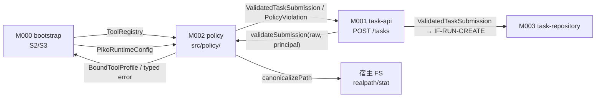
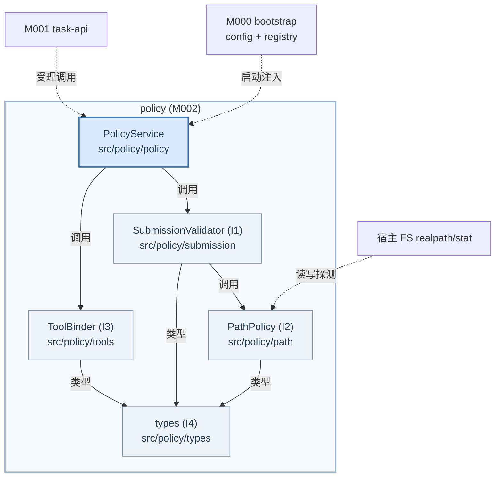
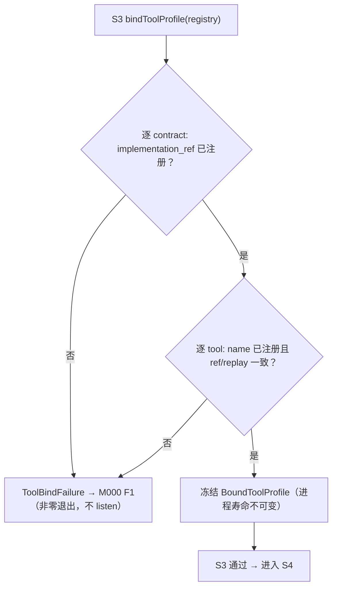
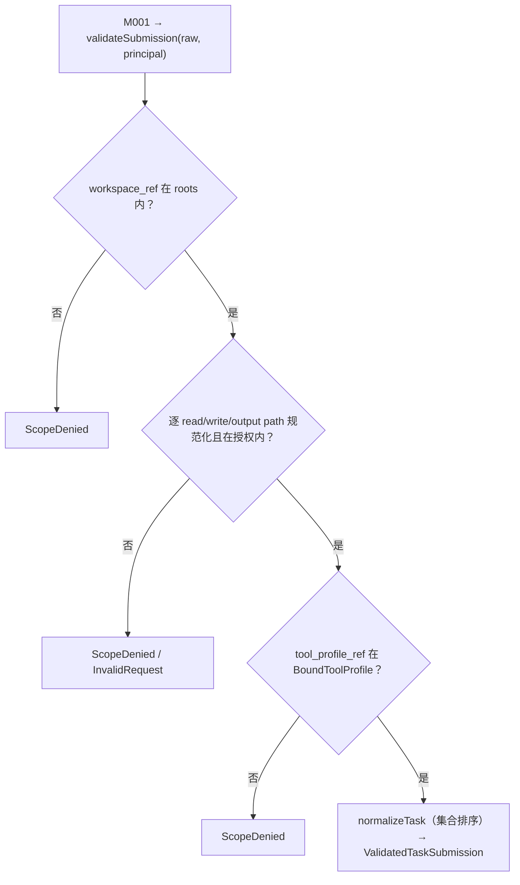
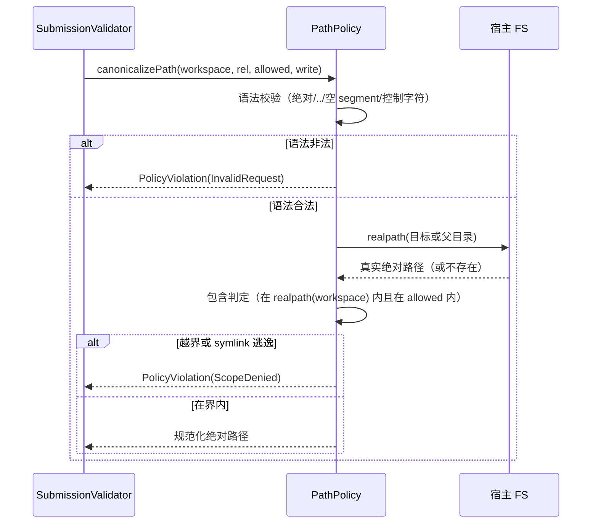

<!-- STD_DOCUMENT_COVER_BEGIN -->
# Piko 模块设计：policy（M002）

> STD 使用入口：[项目采用说明与标准导航](../../README.md#std-entry)

| 文档字段 | 值 |
|---|---|
| Document ID | `piko-policy` |
| Document Version | `0.1.2` |
| Status | `Draft` |
| Project | `piko` |
| Document Owner | Piko Implementation Owner |
| Last Modified Date | `2026-09-28` |
| Template ID | `design.definition` |
| Template Version | `3.4.0` |

<!-- STD_DOCUMENT_COVER_END -->

## 1. 单元摘要：为什么存在

M002 `policy` 解决一个问题：Piko 在**受理一个任务之前**必须把外部请求变成"可被事务层安全接受"的已验证对象，并且在**启动时**已经知道本实例允许哪些工具与哪些路径。这两件事都不能由 HTTP handler（M001）或事务层（M003）自己决定：前者只该管路由与规范化，后者只该管持久化。policy 把这些判定集中成一个**无状态、纯判定**的模块：启动时把 `ToolProfile` 与 recovery registry 绑定成一份冻结的 `BoundToolProfile`（工具名、`effect`、`replay`、可解析的 `recovery_contract_ref` 必须互相一致）；受理时把 `AgentTaskRequest` 校验并规范化成 `ValidatedTaskSubmission`（路径规范化、权限交集、截止时间、预算、discussion 形状），再交给 M003。

policy 只做判定，**不持状态、不落库、不发网络**：它不拥有任何持久表（DDL/事务 authority 属 M003），不监听端口（HTTP 面属 M001），不解析 Secret（属 M000/bootstrap 与 Secret provider），不改写 Run 状态机（属 M003/M005）。它的输出是**不可变值对象**：一份进程寿命的 `BoundToolProfile` 与每次请求一份 `ValidatedTaskSubmission`。任何需要"记住上一次判定"的需求都被显式推给持有状态的模块（M003 存 `tasks.task_json`，M001 存请求寿命的规范化结果）。

用一次调用说明：Slinky `POST /tasks` 到达 M001，M001 先做 JSON/Schema 与 bearer principal 校验，然后调用 `policy.validateSubmission(rawRequest, principal)`。policy 用启动注入的 `BoundToolProfile` 与 `PikoRuntimeConfig`：把 `workspace_ref` 解析到 `workspace.roots` 内的真实路径；对 `permissions.read_paths`/`write_paths` 与 `output_paths` 逐条 `realpath` 并确认仍在 workspace 与授权集合内（symlink 越界即拒绝）；把 path 集合排序、时间转 UTC instant，得到可比较的规范化任务；确认 `permissions.tool_profile_ref` 在 `BoundToolProfile` 中存在。全部通过则返回 `ValidatedTaskSubmission`；任一条失败抛携带契约错误码（`InvalidRequest`/`ScopeDenied`）的 typed 错误，由 M001 映射为对应的 HTTP 4xx，且**不创建任务**。

| 项目 | 内容 |
|---|---|
| 模块编号 / 正式英文名称 | M002 / `policy` |

| 运行进程 | P0 控制进程（见 `system-design` §3.3 关键决定 7） || 直属父对象编号 / 名称 | `SW-P` / Piko Agent Runtime V0.3（软件系统，`design_level=system`） |
| 父设计 Document ID / 固定基线 / 登记位置 | `system-design` v0.11.2 / 契约 `0.3.0-simplified.6` / §3.2 直属模块表 + §3.4 约束分配；本模块登记见 §3.2 第 201 行 |
| 上级系统/父单元 | 无（纯软件顶层，无总体系统父稿） |
| 解决的问题 | 启动期工具/恢复绑定一致；受理期请求/路径/工具/截止/预算判定与规范化，且不引入模块状态 |
| 提供的能力 | `bindToolProfile`、`validateSubmission`、`canonicalizePath`；产出 `BoundToolProfile`、`ValidatedTaskSubmission` |
| 主要使用者 | M000 `bootstrap`（启动 S3 绑定）、M001 `task-api`（每次受理）、M003/M006（消费已规范化路径与预算字段） |
| 不负责 | 持久化与事务（M003）；HTTP 路由/bearer principal 校验（M001）；工具实际执行与预算 CAS（M006）；Run 状态机（M003/M005）；Secret 解析（M000）；discussion membership 验证（M008） |

### 1.1 继承的上级约束与落实方式

policy 承接四条上级约束：`CON-RUN-002`（PK-02 任务事务稳定身份，与 M001/M003 共担）、`CON-RUN-003`（PK-03 截止与预算，与 M006 共担）、`CON-CFG-001`（PK-12 配置加载/绑定，经 MECH-CONFIG）、`CON-ST-001`（PK-12 启动顺序，经 MECH-STARTUP）。四者均为 Approved。约束来源为 `system-design` §3.4，机制侧权威定义在 `piko-run.md` §3.1、`piko-config.md` §3.1 与 `piko-startup.md` §3.1。

#### 1.1.1 `CON-RUN-002` · 任务事务稳定身份（PK-02）

- **上级基线与决定状态**：`system-design` v0.11.2 §3.4（PK-02 行）+ `piko-run.md` §3.1 `CON-RUN-002` · PK-02 · Approved；固定基线 machine contract `0.3.0-simplified.6`。上级原文："同 `task_id` 重复提交时，同 ID 同内容不重新检查动态条件；path 集合字段按集合比较、时间按 UTC instant、对象成员顺序忽略。"

- **适用条件**：每次新 `task_id` 受理前的规范化与比较准备；重复 `task_id` 的比较由 M003 执行，policy 负责先把字段变成可比较形态。

- **继承预算或行为保证**：policy 产出的 `ValidatedTaskSubmission` 必须是**规范化**的：path 集合排序且去重、对象成员顺序不影响判等；M003 据此让"同 ID 同内容"稳定重放、不重检 queue/policy。

- **可自行选择/不可改变**：不可改变：可比较字段集合与归一化语义（集合按集合比、时间按 instant 比）。可自行设计：归一化的内部实现、比较键的构造（`M-RUN-DI-002` 自由度"校验顺序"）。

- **本地落实/内部再分配**：§6.2.2 定义 `ValidatedTaskSubmission`；§8.1 `R-POLICY-NORMALIZE` 定义归一化规则；§9.1.2 `validateSubmission` 固定合同；§13 落到 `src/policy/submission.ts`。不向内部再分配状态（无状态）。

- **验证方法与结果/证据**：局部 `VRC-POLICY-002`（规范化）与 `VRC-POLICY-005`（权限/工具绑定）；组合 PK-T03/PK-T15（契约与 HTTP E2E）。当前全部 `NOT_RUN`。

- **差距/变更影响/反馈责任**：none。字段集合变化属契约变更，需独立评审（contract §1）。

#### 1.1.2 `CON-RUN-003` · 截止与预算（PK-03）

- **上级基线与决定状态**：`system-design` v0.12.0-draft.1 §3.4（PK-04 行 · **本版撤销**）。上级原文："本版不实现任务级截止/预算（见附录 B 修订记录）"——policy **不校验**任何 deadline/预算字段。

- **适用条件**：每次新 `task_id` 受理；`limits` 字段存在且为整数/时间。

- **继承预算或行为保证**：**本版无任务级截止/预算**；policy 不做 deadline/预算判定（`PK-04` 已撤销）。

- **可自行选择/不可改变**：不可改变：policy 不引入任务级截止/预算。可自行设计：校验顺序、错误码选择。

- **本地落实/内部再分配**：§8.5 `R-POLICY-DEADLINE`、§8.6 `R-POLICY-BUDGET`；§9.1.2 合同；§6.8.1 错误映射。

- **验证方法与结果/证据**：局部 `VRC-POLICY-002/005`（path/工具判定）。当前 `NOT_RUN`。

- **差距/变更影响/反馈责任**：none。若契约新增预算字段，本模块校验随之扩展，属契约变更。

#### 1.1.3 `CON-CFG-001` · 配置加载/绑定/生效（PK-12，经 MECH-CONFIG）

- **上级基线与决定状态**：`system-design` v0.11.2 §3.4（PK-12 行）+ `piko-config.md` §3.1 `CON-CFG-001` · PK-12 · Approved。上级原文："config 变更需重启生效；配置先校验、再绑定、后生效，不部分就绪。"

- **适用条件**：启动 S2/S3；配置在进程寿命内不变。

- **继承预算或行为保证**：policy 在启动时对 `ToolRegistry` 做绑定校验，产出进程寿命不可变的 `BoundToolProfile`；不一致（`recovery_contract_ref` 未注册、`implementation_ref` 与 tool name/`effect`/`replay` 不符、`replay:"safe"` 缺 recovery contract）必须导致启动失败 `InternalError("tool-bind-fail")`，**不部分就绪**。policy 不重新解释 config 语义、不持可热改结构、不暴露热更新入口。

- **可自行选择/不可改变**：不可改变：绑定与启动失败语义、配置重启生效。可自行设计：绑定校验的内部顺序（`M-CFG-DI-002` 自由度"校验顺序"）。

- **本地落实/内部再分配**：§8.3 `R-POLICY-TOOLBIND`；§9.1.1 `bindToolProfile`；§6.2.1 `BoundToolProfile`；§6.3 消费的 config/registry 结构。

- **验证方法与结果/证据**：局部 `VRC-POLICY-001`（绑定通过/未注册 ref/不一致）；组合 PK-T12（启动）。当前 `NOT_RUN`。

- **差距/变更影响/反馈责任**：`piko-config.md` §4.3.1/§4.4.1/§4.4.2 的 config 与 tool profile 字段描述与本项目锁定的机器 schema 存在漂移（机制侧未同步新 schema），登记 `OQ-POLICY-001`、`OQ-POLICY-002`（Owner：Piko Architecture）。

#### 1.1.4 `CON-ST-001` · 启动顺序与 READY（PK-12，经 MECH-STARTUP）

- **上级基线与决定状态**：`system-design` v0.11.2 §3.4（PK-12 行）+ `piko-startup.md` §3.1 `CON-ST-001` · PK-12 · Approved。上级原文："启动顺序 S1-S8；未 READY 不接受 Run；不允许跳级。"

- **适用条件**：进程冷启动 S3（bind tool/recovery registry）；S2 通过后、S4 之前。

- **继承预算或行为保证**：policy 提供 S3 的绑定判定；S3 失败走 F1、进程非零退出、不 listen。policy 无自有进入/退出过程，不定义 READY（READY 由 M000 在 S8 输出）。

- **可自行选择/不可改变**：不可改变：S3 位置、失败即 F1、无部分就绪。可自行设计：绑定校验的日志与错误分类（阶段实现）。

- **本地落实/内部再分配**：§9.1.1；§10.2 `C-POLICY-02`（bind 失败出口）；§13 文件；附录 A.3。

- **验证方法与结果/证据**：局部 `VRC-POLICY-001`；组合 PK-T12（M000+M002+M003+M006+M008 PASS）。当前 `NOT_RUN`。

- **差距/变更影响/反馈责任**：`piko-startup.md` §14.4 已补 `M-ST-DI-005`（policy，S3 启动绑定），与 §3.5 参与方一致；本模块按该行承接，`OQ-POLICY-003` 已关闭。

## 2. 需求、功能与验收条件

policy 的可观察功能是三个进程内操作：启动期绑定工具注册表、受理期校验并规范化提交、路径规范化与越界拒绝。三者都不可由外部 HTTP/CLI 直接触发；调用方是 M000（启动）与 M001（受理）。

### 2.1 `F-POLICY-BIND` · 绑定 tool/recovery 注册表

- **上级需求 / Constraint ID**：`CON-CFG-001`（PK-12，经 MECH-CONFIG）；`CON-ST-001`（PK-12，经 MECH-STARTUP）；系统 §3.4 PK-05/06（`replay:safe` 绑定）。

- **调用方**：M000 `bootstrap`，启动 S3，对已通过 schema 校验的 `ToolRegistry` 调用一次。

- **输入与前提**：`tools: ToolRegistry`（含 `recovery_contracts` 与 `profiles`）；前提：S2 schema 校验已通过；进程尚未 READY。

- **行为**：逐 `recovery_contract` 校验 `implementation_ref` 在支持集合内；逐 profile 的 tool 校验名字已注册；若 tool 带 `recovery_contract_ref` 则必须解析到已知 contract；`replay:"safe"` 且 `effect !== "read_only"` 时必须有 contract；workspace 原子恢复 contract 只能用于 `write`/`edit` 且 `effect === "workspace_write"`；其他 contract 不适用于本地工具。全部一致后冻结为 `BoundToolProfile`（进程寿命不可变）。任一不一致抛 `ToolBindFailure`（`code="tool-bind-fail"`）。

- **输出**：`BoundToolProfile`（不可变，含已解析的 tool→policy 与 recovery contract 映射）。

- **错误与边界**：注册实现未知、tool 未注册、tool 引用未绑定 contract、`replay:"safe"` 缺 contract、contract 与 name/`effect`/`replay` 不一致 → 绑定失败；失败不产出半成品，不进入 S4。无网络、无 I/O（输入已读入）。

- **验收条件**：给定合法 registry，`bindToolProfile` 返回的 `BoundToolProfile` 覆盖全部 profile 的 tool 且每个 `recovery_contract_ref` 均可解析；把任一 contract 的 `implementation_ref` 改为未注册值，调用抛 `ToolBindFailure` 且无返回值。

### 2.2 `F-POLICY-VALIDATE` · 校验并规范化提交

- **上级需求 / Constraint ID**：`CON-RUN-002`（PK-02）；`CON-RUN-003`（PK-03）。

- **调用方**：M001 `task-api`，每次新 `task_id` 受理（bearer principal 校验之后、M003 事务之前）。

- **输入与前提**：`raw: AgentTaskRequest`（JSON/Schema 已由 M001 校验）；`principal: string`（M001 已认证）；构造注入 `profile: BoundToolProfile` 与 `config: PikoRuntimeConfig`（读 `workspace.roots`）。

- **行为**：解析 `workspace_ref` 到 `workspace.roots` 内的真实根；对 `permissions.read_paths`/`permissions.write_paths`/`output_paths` 逐条规范化并校验不越界（`..`、绝对路径、symlink 指向 workspace 外一律拒绝）；确认 `permissions.tool_profile_ref` 在 `profile` 中存在且授权；规范化 path 集合（排序去重）；保留 `discussion?` 原样（其 membership 由 M008 验证）。返回 `ValidatedTaskSubmission`。

- **输出**：`ValidatedTaskSubmission`（不可变，字段与 `AgentTaskRequest` 同构但已规范化），交 M003 消费。

- **错误与边界**：未知 `workspace_ref` 或路径越界 → `ScopeDenied`；`tool_profile_ref` 不在 `BoundToolProfile` → `ScopeDenied`；路径语法非法 → `InvalidRequest`。校验失败不产生任何持久化副作用（M003 事务尚未开始）。无身份权限后门：只接受 M001 传入的已认证 principal。

- **验收条件**：给定合法请求，返回的 `ValidatedTaskSubmission` 的 path 集合已排序且与输入语义等价；把 `workspace_ref` 改为不存在值返回 `ScopeDenied`；`tool_profile_ref` 未授权返回 `ScopeDenied`。

### 2.3 `F-POLICY-PATH` · 规范化路径并拒绝越界

- **上级需求 / Constraint ID**：`CON-RUN-002`（路径按集合比较）；PK-02 path 边界（`piko-run.md` §7 path 边界）。

- **调用方**：`F-POLICY-VALIDATE`（内部）；M003/M006 在计算输出与写文件时经同一路径规则复核（消费点）。

- **输入与前提**：`workspace: string`（已 `realpath` 的 workspace 根）；`rel: string`（RelPath）；`allowed: string[]`（任务授权的相对路径集合）；`write: boolean`。

- **行为**：先做语法与包含判定（拒绝绝对路径、`..`、空 segment、反斜杠、控制字符）；对 write 路径 `realpath` 其父目录后拼回文件名，对 read 路径 `realpath` 目标；确认最终绝对路径仍位于 `realpath(workspace)` 内，且位于 `allowed` 的某个授权根内。返回规范化的绝对路径（进程内使用，不落库）。

- **输出**：规范化绝对路径；越界抛 `ScopeDenied`。

- **错误与边界**：symlink 指向 workspace 外、`allowed` 中的根自身越界、目标不存在但父目录越界 → 拒绝。read 目标不存在时以父目录判定（允许"尚未生成的输出"）。

- **验收条件**：合法相对路径返回其真实绝对路径；`../../etc/passwd` 返回 `ScopeDenied`；在 workspace 内创建指向 workspace 外的 symlink 后对其授权路径调用返回 `ScopeDenied`。

## 3. UI、CLI、服务端点或设备操作面

**N/A。** policy 是纯进程内库，不拥有 UI、CLI、HTTP/RPC 端点或设备操作面：它不监听端口、不注册路由、不提供诊断命令。它的唯一调用入口是进程内函数调用（§9.1）：M000 在启动 S3 调用 `bindToolProfile`，M001 在受理时调用 `validateSubmission`。对外可观察的 HTTP 面（`POST /tasks` 等）由 M001 `task-api` 承载；policy 只是 M001 判定链路中的一步。

实际调用入口与归属：`M000 bootstrap S3 → policy.bindToolProfile`、`M001 task-api → policy.validateSubmission`、`policy.canonicalizePath`（被 validate 内部及输出/写路径复核消费），代码落位 `src/policy/`。维护/诊断入口不新增：绑定结果与失败原因经启动日志与 audit（§11）暴露。

Tailoring 依据：`TAIL-P-101`（Piko 无图形入口）同源；本模块无任何操作面，属 STD `design.definition` §3 "模块没有任何直接操作面时写 N/A + 实际调用入口/归属 + tailoring 依据" 的情形。"没有页面"不等于"没有 API"——policy 的 API 在 §9.1 唯一维护。

## 4. 外部边界与依赖

policy 在进程内的位置：被 M000（启动）与 M001（受理）调用，读取 config/registry，向 M003 交出规范化提交。下图只画模块外部交接，不表示线程或新部署边界。



图 M-POL-C1 · Target / Planned / NOT_BUILT。实线是同步进程内函数调用与返回，不是网络或新部署边界。policy 不创建线程/进程、不打开 SQLite、不解析 Secret。持久化权威（SQLite、事务、DDL）属 M003，见 §6.7。

#### 4.1 `DEP-POLICY-CONFIG` · M000 `bootstrap`（已校验 config + registry）

- **角色 / 运行位置 / Owner**：同级直属模块，同进程（PK-01 单进程）；Owner：Piko Implementation Owner。

- **本模块调用或消费**：消费 M000 已 schema 校验的 `PikoRuntimeConfig`（读 `workspace.roots`）与 `ToolRegistry`（含 `recovery_contracts`、`profiles`）。二者是 policy 的唯一配置输入来源。

- **本模块提供**：向 M000 返回 `BoundToolProfile`（S3 结果）或启动失败；不反向修改 config。

- **契约 authority / 版本 / selector**：`interfaces/schemas/piko-runtime-config-v0.3.schema.json` 与 `interfaces/schemas/piko-tool-profile-v0.3.schema.json`（machine authority）；`piko-config.md` §5.1 `IF-CFG-LOAD`/`IF-CFG-BIND`。当前实现事实：`src/config.ts` `loadConfig`/`validateToolRegistry`。

- **同步方式 / timeout / 生命周期**：构造时注入；同步；随进程寿命不变；无运行期 reload（`CON-CFG-001`）。

- **不可用或失败影响 / 责任出口**：config/registry 非法或缺失由 M000 S2 先拒绝；policy 的绑定失败抛 `ToolBindFailure` 交 M000 走 F1。policy 不自行读文件、不重新解释 config 语义。

#### 4.2 `DEP-POLICY-API` · M001 `task-api`（调用方）

- **角色 / 运行位置 / Owner**：同级直属模块，同进程；Owner：Piko Implementation Owner。

- **本模块调用或消费**：无（policy 不回调 M001）。M001 调用 `policy.validateSubmission` 并消费其输出/错误。

- **本模块提供**：`validateSubmission(raw, principal) -> ValidatedTaskSubmission`，以 typed `PolicyViolation` 表达拒绝；M001 负责映射 HTTP。

- **契约 authority / 版本 / selector**：本设计 §9.1.2（`IF-RUN-VALIDATE`，module-owned）；`piko-run.md` §14.2 步骤 "请求/路径/工具判定 M002 → 原始请求 → ValidatedTaskSubmission"。

- **同步方式 / timeout / 生命周期**：同步进程内调用（含对 FS 的异步 `realpath`）；请求寿命；无长期资源。

- **不可用或失败影响 / 责任出口**：校验失败 → M001 映射 4xx 且不创建 Run；policy 不吞掉依赖错误（如 FS `realpath` 失败按 `InvalidRequest`/`ScopeDenied` 归类，不伪装成功）。

#### 4.3 `DEP-POLICY-FS` · 宿主文件系统（realpath/stat）

- **角色 / 运行位置 / Owner**：宿主运行时能力（Node `fs/promises`），同进程；Owner：Piko Implementation Owner。

- **本模块调用或消费**：`realpath`/`stat` 用于路径规范化与包含判定；只读探测，不写文件。

- **本模块提供**：无。

- **契约 authority / 版本 / selector**：本设计 §8.2 `R-POLICY-PATH`；当前实现事实 `src/workspace.ts` `resolveWorkspace`/`authorizePath`。

- **同步方式 / timeout / 生命周期**：异步 `await`；无网络；随进程。

- **不可用或失败影响 / 责任出口**：路径不存在/无权限 → 拒绝（`ScopeDenied`/`InvalidRequest`）；不重试、不降级为字符串比较（否则绕过 symlink 边界）。

#### 4.4 `DEP-POLICY-CLOCK` · 时间源（宿主提供）

- **角色 / 运行位置 / Owner**：宿主运行时能力，同进程；Owner：Piko Implementation Owner（M000 装配）。

- **本模块调用或消费**：UTC wall clock，用于 `accepted_at`/时间戳与保留期计算。

- **本模块提供**：无。

- **契约 authority / 版本 / selector**：`piko-run.md` §10 时间基准；契约 `Timestamp`（`format: date-time`、`Z$`）。

- **同步方式 / timeout / 生命周期**：同步取时；随进程。

- **不可用或失败影响 / 责任出口**：时钟回拨会使严格的"未来 instant"判定变化（`RISK-POLICY-002`）；policy 只在受理瞬间判定一次，运行期耗尽由 M006 用持久 UTC 判定，不依赖 policy 的内存时间。

#### 4.5 `DEP-POLICY-MATRIX` · M008 `matrix-adapter`（discussion 事实，非直接依赖）

- **角色 / 运行位置 / Owner**：同级直属模块，同进程；Owner：Piko Implementation Owner。

- **本模块调用或消费**：无直接调用。policy 只校验 `discussion` 的**形状**（`room_id`/`trigger_event_id`）并在 `ValidatedTaskSubmission` 中透传；room/event 的 membership 与可见性验证由 M001 经 M008 `verifyDiscussion` 完成（`piko-run.md` §7）。

- **本模块提供**：无。

- **契约 authority / 版本 / selector**：`agent-runtime-v0.3.schema.json` `$defs/DiscussionContext`。

- **同步方式 / timeout / 生命周期**：N/A（无调用）。

- **不可用或失败影响 / 责任出口**：discussion 冲突（`InvalidDiscussionContext`）由 M008/M001 决定，不在 policy；policy 不把形状合法误当 membership 已授权。

## 5. 内部结构与实现位置

policy 拆成四个内部单元：入口门面、提交校验器、路径策略、工具绑定器。拆分依据是"路径与绑定规则可独立表驱动测试、绑定与校验可分离生命期（启动 vs 受理）"，不是为了凑文件。



图 M-POL-S1 · Target / Planned / NOT_BUILT。外框是模块内部组成；实线同步调用/类型依赖，虚线跨模块注入/适配；不表示线程或时序。所有路径均为 Planned。

### 5.1 内部组成

#### 5.1.1 `P1` · PolicyService（入口）

- **职责与非职责**：对外提供 §9.1 三个操作并保证"无状态、纯判定"；把启动绑定与受理校验编排到 I1/I2/I3。非职责：不做 HTTP、不写库、不解析 Secret、不读 config 文件（由 M000 注入）。

- **输入、处理与输出**：输入 `ToolRegistry`/`PikoRuntimeConfig`/`AgentTaskRequest`/`principal`；输出 `BoundToolProfile`/`ValidatedTaskSubmission`/typed 错误。

- **协作对象**：调用 I1/I2/I3；被 M000/M001 调用。不调用 M003/M006。

- **文件 / symbol / 实现状态**：`src/policy/policy.ts` → `class PolicyService`（Planned / NOT_IMPLEMENTED）。现基线逻辑散在 `src/config.ts`（`validateToolRegistry`/`loadConfig`）与 `src/server.ts`（内联校验）。

- **拆分依据与替代方案代价**：入口只做编排，把规则抽到 I1/I2/I3 以便对 path 边界、recovery 绑定、工具授权做无 DB、无网络单测。替代方案"检查逻辑留在 config.ts/server.ts"是 Current 形态，代价是绑定与受理耦合、无法独立验证无状态与拒绝语义。

#### 5.1.2 `I1` · SubmissionValidator（提交校验器）

- **职责与非职责**：把 `AgentTaskRequest` 变成 `ValidatedTaskSubmission`：调用 I2 规范化路径、用 I3 的绑定结果校验 `tool_profile_ref`、执行归一化。非职责：无持久化、无网络、不解析 discussion membership。

- **输入、处理与输出**：输入 `(raw, principal, profile, config)`；输出 `ValidatedTaskSubmission` 或 `PolicyViolation`。

- **协作对象**：调用 I2；读 I3 产物；被 P1 调用。

- **文件 / symbol / 实现状态**：`src/policy/submission.ts`（Planned / NOT_IMPLEMENTED），导出 `validateSubmission`、`normalizeTask`。现基线在 `src/task-equality.ts`（`normalizedTask`/`sameTask`）与 `src/server.ts`。

- **拆分依据与替代方案代价**：把请求判定与路径机制分离，使 `R-POLICY-NORMALIZE/PERMISSION/DEADLINE/BUDGET` 可表驱动测试。替代方案把所有逻辑写进 handler，代价是无法覆盖拒绝矩阵。

#### 5.1.3 `I2` · PathPolicy（路径策略）

- **职责与非职责**：语法校验 + `realpath` + 包含判定；是 policy 内唯一接触 FS 的单元。非职责：不做业务授权决策（授权集合由 I1 传入）、不写文件、不缓存。

- **输入、处理与输出**：输入 `(workspace, rel, allowed, write)`；输出规范化绝对路径或 `PolicyViolation`。

- **协作对象**：调用宿主 FS；被 I1 调用。

- **文件 / symbol / 实现状态**：`src/policy/path.ts`（Planned / NOT_IMPLEMENTED），导出 `canonicalizePath`、`resolveWorkspace`。现基线在 `src/workspace.ts`（`resolveWorkspace`/`authorizePath`）。

- **拆分依据与替代方案代价**：端口化 FS 使 symlink 边界可用受控 fake FS 做单测（`VRC-POLICY-003`）。替代方案"直接 scattered realpath"是 Current 形态，代价是边界测试依赖真实 FS。

#### 5.1.4 `I3` · ToolBinder（工具绑定器）

- **职责与非职责**：启动期把 `ToolRegistry` 绑定/校验为不可变 `BoundToolProfile`。非职责：无 FS、无网络、不执行工具、不注册实现（实现注册表由 M000/构建提供）。

- **输入、处理与输出**：输入 `ToolRegistry`；输出 `BoundToolProfile` 或 `ToolBindFailure`。

- **协作对象**：被 P1 调用；不调用其他单元（只用 I4 类型）。

- **文件 / symbol / 实现状态**：`src/policy/tools.ts`（Planned / NOT_IMPLEMENTED），导出 `bindToolProfile`。现基线在 `src/config.ts` `validateToolRegistry`。

- **拆分依据与替代方案代价**：把绑定从 config 加载中剥离，使 `R-POLICY-TOOLBIND` 可对注册矩阵表驱动测试（`VRC-POLICY-001`）。替代方案"绑定混在 loadConfig"是 Current 形态，代价是启动与受理生命周期耦合。

#### 5.1.5 `I4` · types

- **职责与非职责**：本层私有类型与错误类；无逻辑。

- **输入、处理与输出**：无。

- **协作对象**：被 I1/I2/I3/P1 类型引用。

- **文件 / symbol / 实现状态**：`src/policy/types.ts`（Planned / NOT_IMPLEMENTED），定义 `BoundToolProfile`、`ValidatedTaskSubmission`、`PolicyViolation`、`ToolBindFailure`、`PolicyConfig`。现基线类型在 `src/types.ts`。

- **拆分依据与替代方案代价**：集中类型使依赖方向单向。替代方案"复用 src/types.ts"会扩散 M001 契约类型到全模块。

### 5.2 内部调用过程

#### 5.2.1 `P-POLICY-BIND` · 启动绑定

- **入口与调用上下文**：M000 S3 → `PolicyService.bindToolProfile(registry)`（宿主启动序列，单线程）。

- **调用链（文件 / symbol → 文件 / symbol）**：`bootstrap.S3` → `PolicyService.bindToolProfile` → `ToolBinder.bindToolProfile`（校验 contract/ref/replay 一致性）→ 冻结 `BoundToolProfile`。

- **逐步传递的数据**：`ToolRegistry` → 逐 profile/tool 校验 → `BoundToolProfile`。

- **返回、异常与清理**：成功返回 `BoundToolProfile`；失败抛 `ToolBindFailure`，无临时资源清理。

- **对应流程 / 接口 / 验证**：§7 `M-POL-P1`；§9.1.1；`VRC-POLICY-001`。

#### 5.2.2 `P-POLICY-VALIDATE` · 受理校验

- **入口与调用上下文**：M001 `POST /tasks` handler（JSON/Schema + bearer 之后）→ `PolicyService.validateSubmission(raw, principal)`。

- **调用链（文件 / symbol → 文件 / symbol）**：`server.route` → `PolicyService.validateSubmission` → `SubmissionValidator.validateSubmission` → `PathPolicy.resolveWorkspace`/`canonicalizePath`（逐 path）→ 检查 `tool_profile_ref` ∈ `BoundToolProfile` → `normalizeTask` → `ValidatedTaskSubmission`。

- **逐步传递的数据**：`AgentTaskRequest` → 规范化 path 集合/UTC 时间 → `ValidatedTaskSubmission`；任一步失败 → `PolicyViolation`。

- **返回、异常与清理**：成功返回不可变 `ValidatedTaskSubmission`；失败抛 `PolicyViolation`；无副作用需清理（未触达 M003 事务）。

- **对应流程 / 接口 / 验证**：§7 `M-POL-P2`；§9.1.2；`VRC-POLICY-002/004/005`。

#### 5.2.3 `P-POLICY-PATH` · 路径规范化

- **入口与调用上下文**：由 `P-POLICY-VALIDATE` 内部逐 path 调用；输出/写路径复核亦复用。

- **调用链（文件 / symbol → 文件 / symbol）**：`SubmissionValidator` → `PathPolicy.canonicalizePath` → 语法校验 → `fs.realpath` → 包含判定 → 绝对路径或 `ScopeDenied`。

- **逐步传递的数据**：`(workspace, rel, allowed, write)` → 绝对路径 / `PolicyViolation`。

- **返回、异常与清理**：成功返回规范化路径；失败抛 `ScopeDenied`；无资源。

- **对应流程 / 接口 / 验证**：§7 `M-POL-P3`；§9.1.3；`VRC-POLICY-003`。

### 5.3 文件间接口契约

本节只固定 policy 内部文件之间的交接；跨模块接口在 §9.2，字段类型在 §6。

#### 5.3.1 `IF-POLICY-SUBMIT` · `policy.ts` → `submission.ts`

- **接口成员 ID / §9 逐接口定义位置**：内部无公共成员 ID；行为权威在 §8（`R-POLICY-NORMALIZE/PERMISSION/DEADLINE/BUDGET`）。

- **本文件的提供或使用责任**：`submission.ts` 提供校验/归一化；`policy.ts` 调用并包装 typed 错误。

- **交接时机 / 本地调用步骤**：`validateSubmission` 内一次调用。

- **§9 生命周期约束**：无状态、无所有权；调用即返回。

- **实现与验证位置**：`src/policy/submission.ts`；`VRC-POLICY-002/004/005` 表驱动。

#### 5.3.2 `IF-POLICY-PATH` · `submission.ts` → `path.ts`

- **接口成员 ID / §9 逐接口定义位置**：内部接口 `PathPolicy`，方法契约见 §9.1.3。

- **本文件的提供或使用责任**：`path.ts` 提供路径规范化；`submission.ts` 逐 path 调用。

- **交接时机 / 本地调用步骤**：见 `P-POLICY-VALIDATE`/`P-POLICY-PATH` 链。

- **§9 生命周期约束**：端口实例与进程同域；不缓存路径结论（每次依真实 FS 判定）。

- **实现与验证位置**：`src/policy/path.ts`；`VRC-POLICY-003` 以受控 fake FS + 真 FS 两套覆盖。

#### 5.3.3 `IF-POLICY-BIND` · `policy.ts` → `tools.ts`

- **接口成员 ID / §9 逐接口定义位置**：内部接口 `ToolBinder`，方法契约见 §9.1.1。

- **本文件的提供或使用责任**：`tools.ts` 提供绑定校验；`policy.ts` 在启动调用、在受理时查询其产物。

- **交接时机 / 本地调用步骤**：启动一次绑定；受理时读不可变产物。

- **§9 生命周期约束**：产物进程寿命不可变；不在受理期重绑。

- **实现与验证位置**：`src/policy/tools.ts`；`VRC-POLICY-001/005`。

### 5.4 服务提供方式（条件适用）

**N/A（无独立宿主）。** policy 不监听端口、不启动进程/线程、不注册端点：§3 已判定无操作面，故本节的 server/runtime、监听、就绪、停止均不适用。

运行载体：policy 实例由 M000 `bootstrap` 在启动时构造并注入已校验 config/registry，随进程寿命存在；无自身进入/退出过程。并发模型：全部操作在宿主事件循环上执行，无共享可变状态（`BoundToolProfile` 是不可变值）。就绪/停止语义属于 M000/MECH-STARTUP，policy 只暴露操作、不定义 READY/停止出口。

Tailoring 依据：STD `design.definition` §5.4 "纯库函数说明不适用及由谁调用"。

### 5.5 依赖方向

- **允许方向**：`policy.ts` → `{submission.ts, tools.ts, types.ts}`；`submission.ts` → `{path.ts, types.ts}`；`path.ts` → `types.ts`；`tools.ts` → `types.ts`。所有单元无外部模块依赖（M003/M006 不由 policy 调用）。

- **禁止方向与原因**：禁止 `path.ts`/`tools.ts`/`submission.ts` 引用 `policy.ts`（避免环）；禁止任何单元直接 `import` M003 的 `store.ts`（policy 无持久化职责，import 会引入越界依赖与状态）；禁止 `path.ts` 缓存路径结论（会引入跨请求状态，违反无状态）。

- **循环/越层检查**：静态：对 `src/policy/` 跑依赖图（`tsc`/import 检查或 CI 脚本）确认无环；评审按 §5.1 逐文件核对引用。

- **变更影响**：改 `path.ts` 影响 symlink 边界与越界判定（§8.2 权威）；改 `tools.ts` 影响启动绑定矩阵（§8.3）；改 `submission.ts` 影响受理拒绝矩阵（§8.1/8.4/8.5/8.6）。

## 6. 数据结构设计

policy 不拥有持久数据；模块自有类型是 `BoundToolProfile`、`ValidatedTaskSubmission`、`PolicyViolation`，并消费 `PikoRuntimeConfig`/`ToolRegistry`。不适用类别在章首集中说明。

**不适用类别与依据**：§6.4 通信报文（无跨边界消息，均为进程内调用）、§6.5 设备/FPGA（纯软件，`TAIL-P-103`）为 N/A。§6.6 运行状态 N/A（policy 不持可变跨步骤状态；唯一进程寿命不可变绑定 `BoundToolProfile` 在 §6.2.1 定义）。§6.7 数据库表 N/A（schema authority 属 M003）。§6.3 配置为消费型结构（来自 M000）。

### 6.1 公共基础类型与枚举

#### 6.1.1 `RelPath` / `ToolEffect` / `ReplayMode`

- **完整定义、Data/Type/Data ID 与唯一来源**：`RelPath`（规范化相对路径）、`ToolEffect`、`ReplayMode` 由机器 schema 定义（`agent-runtime-v0.3.schema.json` `$defs/RelativePath`；`piko-tool-profile-v0.3.schema.json` `effect`/`replay` 枚举），本模块只引用不重定义。

  ```text
  type ToolEffect = "read_only" | "workspace_write" | "process" | "network" | "external"
  type ReplayMode = "never" | "safe"
  // RelPath：POSIX 正斜杠，非绝对、无 "."/".."、无空 segment、无反斜杠、无控制字符
  ```

- **逐字段/逐值类型、范围、含义与跨字段约束**：`ToolEffect` 决定工具副作用类别；`ReplayMode` 决定崩溃后是否可重放；`replay:"safe"` 且 `effect!="read_only"` 时必须有可解析的 recovery contract（§8.3）。

- **生产/修改、所有权、可见点、寿命及失败出口**：只读引用；不持有生命周期。

- **合法与拒绝实例、V/Case 与证据状态**：合法 `{effect:"read_only", replay:"never"}`；拒绝 `{effect:"workspace_write", replay:"safe"}` 且无 `recovery_contract_ref`。`VRC-POLICY-001`；`NOT_RUN`。

### 6.2 业务与操作数据结构

#### 6.2.1 `BoundToolProfile`

- **完整定义、Data/Type/Data ID 与唯一来源**：`BoundToolProfile` 是启动 S3 的冻结产物；本模块作用域内类型（无公共 Data ID）；权威定义在 `src/policy/types.ts`（Planned）。语义对应 `piko-config.md` §4.2.1 `BoundToolProfile`（"M002 输出的已绑定 tool allowlist"）。

  ```text
  BoundToolProfile {
    profile_version: "0.3",
    tools: Record<string, BoundToolPolicy>,   // key = tool name（read/write/edit/bash）
    recovery_contracts: Record<string, RecoveryContract>
  }
  BoundToolPolicy { effect: ToolEffect, replay: ReplayMode,
                    recovery_contract_ref: string | null,
                    permissions: ToolPermissions }
  ```

- **逐字段/逐值类型、范围、含义与跨字段约束**：`profile_version` 固定 `"0.3"`（与 schema const 一致）；`tools` 的每个 key 必须在支持集合内；`recovery_contract_ref` 非空时必须存在于 `recovery_contracts`；`replay:"safe"` 且非 `read_only` 时 `recovery_contract_ref` 必非空。跨字段：`recovery_contracts` 中每个 contract 的 `implementation_ref` 必须与所绑 tool 的 name/`effect`/`replay` 一致（§8.3）。

- **生产/修改、所有权、可见点、寿命及失败出口**：由 `PolicyService.bindToolProfile` 从 `ToolRegistry` 构造并冻结（`Object.freeze`）；不可变值对象，进程寿命；失败出口为启动 F1。

- **合法与拒绝实例、V/Case 与证据状态**：合法：`tools.read = {effect:"read_only", replay:"never", recovery_contract_ref:null}`。拒绝：`tools.write = {effect:"workspace_write", replay:"safe", recovery_contract_ref:"missing"}`（未绑定 contract）。`VRC-POLICY-001`；`NOT_RUN`。

#### 6.2.2 `ValidatedTaskSubmission`

- **完整定义、Data/Type/Data ID 与唯一来源**：`ValidatedTaskSubmission` 是 policy 的受理输出；字段与 `AgentTaskRequest` 同构但已规范化；权威：本设计 §9.1.2（对应 `piko-run.md` §4.2.1，其细节"来源 M002 ISD"）。

  ```text
  ValidatedTaskSubmission {
    task_id: string,                 // Identifier，非空
    instruction: string,             // 非空，<= 1048576
    workspace_ref: string,           // 已解析到 workspace.roots 内的真实根
    permissions: { read_paths: string[]; write_paths: string[];
                   tool_profile_ref: string },  // path 已排序去重
    output_paths: string[],          // 已排序去重
    discussion: { room_id: string; trigger_event_id: string } | null
  }
  ```

- **逐字段/逐值类型、范围、含义与跨字段约束**：`read_paths`/`write_paths`/`output_paths` 为规范化 RelPath 集合（排序、去重、非绝对、无 `..`），且每条均在 workspace 内且落在授权集合内；`tool_profile_ref` 必须在 `BoundToolProfile.tools` 中存在。`discussion` 缺省为 `null`。跨字段：`output_paths` 中每条必须落在 `read_paths`/`write_paths` 的授权并集内。

- **生产/修改、所有权、可见点、寿命及失败出口**：由 `PolicyService.validateSubmission` 构造并冻结；所有权随返回移交 M001（M001 交给 M003 持久化 `task_json`）；寿命 = 请求寿命；失败出口为 `PolicyViolation`（不落库、不创建 Run）。

- **合法与拒绝实例、V/Case 与证据状态**：合法示例见 §9.1.2。拒绝：`output_paths=["../secret"]`（`ScopeDenied`）、`tool_profile_ref` 未授权（`ScopeDenied`）。`VRC-POLICY-002/004/005`；`NOT_RUN`。

### 6.3 配置与规则数据结构

#### 6.3.1 `PikoRuntimeConfig`（消费型）

- **完整定义、Data/Type/Data ID 与唯一来源**：机器权威 `interfaces/schemas/piko-runtime-config-v0.3.schema.json`（`additionalProperties:false`，13 个 required 段）。policy 只读 `workspace.roots`（`Record<string,absolutePath>`）与 `tools.profile_registry_path`。当前实现事实：`src/types.ts` `RuntimeConfig`、`src/config.ts` `loadConfig`。

- **逐字段/逐值类型、范围、含义与跨字段约束**：`workspace.roots` 至少 1 项，值为绝对路径；policy 不修改、不缓存其派生结构。

- **生产/修改、所有权、可见点、寿命及失败出口**：由 M000 读取并 schema 校验后注入；Owner = M000（启动快照），文件权属 Operator；进程寿命不变；非法由 M000 S2 拒绝。

- **合法与拒绝实例、V/Case 与证据状态**：合法：`workspace.roots = {"default":"/srv/ws"}`。拒绝：相对路径 root（schema `absolutePath` 拒绝）。`VRC-POLICY-002`；`NOT_RUN`。

#### 6.3.2 `ToolRegistry` / `ToolPolicy` / `RecoveryContract`（消费型）

- **完整定义、Data/Type/Data ID 与唯一来源**：机器权威 `interfaces/schemas/piko-tool-profile-v0.3.schema.json`（`profile_version` const `"0.3"`；`recovery_contracts`、`profiles`）。当前实现事实：`src/config.ts` `ToolRegistry`/`ToolPolicy`/`RecoveryContract`。

- **逐字段/逐值类型、范围、含义与跨字段约束**：`RecoveryContract{kind, implementation_ref, verification_timeout_ms?}`；`ToolPolicy{effect, replay, recovery_contract_ref?, permissions{read_paths?,write_paths?,executables?,network_hosts?}}`。schema 约束 `replay:"safe"` 且非 `read_only` ⇒ 必须 `recovery_contract_ref`。

- **生产/修改、所有权、可见点、寿命及失败出口**：由 M000 读取注入；Owner = M000；进程寿命不变。

- **合法与拒绝实例、V/Case 与证据状态**：合法：`profiles.p.tools.read = {...}`。拒绝：`replay:"safe"` 缺 `recovery_contract_ref`（schema + §8.3 双重拒绝）。`VRC-POLICY-001`；`NOT_RUN`。

### 6.6 运行状态数据结构

**N/A。** policy 不持可变跨步骤状态：所有判定只依赖输入（config/registry/请求）与真实 FS，相同输入必得相同输出。唯一进程寿命的不可变绑定是 `BoundToolProfile`，已在 §6.2.1 作为业务/操作数据结构登记；它一经 S3 冻结即不再改变，不构成需要状态转换表的运行状态。依据：STD `design.definition` §6.6 仅在模块持有跨步骤状态、队列或取消时适用；本模块无此类对象。

### 6.7 数据库表结构

**N/A。** policy 不拥有任何持久表、不生成 DDL、不打开连接、不参与事务。`tasks` 的 `task_json` 持久化、schema authority（`PRAGMA user_version=2`）与事务边界全属 M003 `task-repository`（设计权威见 `system-design` §7.7 `m003-ddl-authority` 与 M003 ISD §4.7）。policy 只把 `ValidatedTaskSubmission` 作为值对象交给 M003。依据：STD `design.definition` §6.7 "无持久化不虚构数据库"。

### 6.8 错误码与错误结构

#### 6.8.1 `PolicyViolation` / `ToolBindFailure`（内部错误映射）

- **完整定义、Data/Type/Error ID 与唯一来源**：policy 用内部错误类型表达拒绝，携带**契约错误码**供 M001 映射 HTTP；不在 policy 内定义 HTTP 状态。定义在 `src/policy/types.ts`（Planned）。契约错误码权威：`interfaces/error-codes/error-blocker-catalog-v0.3.json`。

  ```text
  class PolicyViolation extends Error {
    code: "InvalidRequest" | "ScopeDenied",
    detail: string
  }
  class ToolBindFailure extends Error { code: "tool-bind-fail", detail: string }
  ```

- **逐字段/逐值类型、范围、含义与跨字段约束**：`code` 取值受限于上表三值（提交期）与启动期的 `tool-bind-fail`；`detail` 为脱敏的人类可读原因（不得含绝对路径明文）。三值不可互换：`InvalidRequest`=语法/未知字段/形状；`ScopeDenied`=路径/工具/workspace 越权。

- **生产/修改、所有权、可见点、寿命及失败出口**：由 `SubmissionValidator`/`PathPolicy` 产生，经 M001 `catch` 映射为对应 HTTP 4xx（`InvalidRequest`→400、`ScopeDenied`→403）；`ToolBindFailure` 由 `ToolBinder` 在 S3 抛出，交 M000 走 F1 并写启动日志/audit。

- **合法与拒绝实例、V/Case 与证据状态**：路径越界 → `ScopeDenied`（合法拒绝）；工具未授权 → `ScopeDenied`（合法拒绝）；用合法输入却被拒 → 不合法，需查（`VRC-POLICY-002`）。`NOT_RUN`。

- **下级承接与载荷**：M001 承接四值并映射 HTTP（不映射为 5xx）；M000 承接 `ToolBindFailure`。均不进入持久化，不创建 Run。

## 7. 主流程与数据流

本节给出 policy 的三条过程：启动绑定（正常 + 失败）、受理校验（正常 + 拒绝）、路径规范化。三者与 §8 规则、§9 接口共用同一 `Process/Rule/IF` 标识。



图 M-POL-P1 · Target / Planned / NOT_BUILT。绑定失败不产出半成品，不允许部分就绪（`CON-ST-001`）。



图 M-POL-P2 · Target / Planned / NOT_BUILT。正常与拒绝在同一图展开：拒绝不创建状态、不消耗任何持久资源（M003 事务尚未开始）。校验顺序为 workspace → path → tool（`M-RUN-DI-002` 自由度允许在固定语义内调整顺序）。



图 M-POL-P3 · Target / Planned / NOT_BUILT。真实 FS 判定不可被字符串比较替代，否则 symlink 边界失效（`RISK-POLICY-001`）。

| Process ID | 触发/适用条件 | 图与正文位置 | 正常/异常出口 | 接口/规则/验证项 |
|---|---|---|---|---|
| `P-POLICY-BIND` | 启动 S3、S2 通过后 | §5.2.1 / M-POL-P1 | 正常 `BoundToolProfile`；异常 `ToolBindFailure`→F1 | `IF-CFG-BIND`、`R-POLICY-TOOLBIND`、`VRC-POLICY-001` |
| `P-POLICY-VALIDATE` | 每次新 `task_id` 受理 | §5.2.2 / M-POL-P2 | 正常 `ValidatedTaskSubmission`；异常 `PolicyViolation` | `IF-RUN-VALIDATE`、`R-POLICY-NORMALIZE/PERMISSION/DEADLINE/BUDGET`、`VRC-POLICY-002/004/005` |
| `P-POLICY-PATH` | 逐 path 规范化（受理内） | §5.2.3 / M-POL-P3 | 正常绝对路径；异常 `ScopeDenied`/`InvalidRequest` | `IF-POLICY-PATH`、`R-POLICY-PATH`、`VRC-POLICY-003` |

## 8. 关键算法与业务规则

#### 8.1 `R-POLICY-NORMALIZE` · 字段归一化与可比较性

- **输入前提 / 适用条件**：`validateSubmission` 末端；全部路径与预算已通过校验。

- **算法 / 规则 / 选择依据**：path 集合按字典序排序并去重；对象成员顺序不作为判等依据；`discussion` 缺省归一为 `null`。选择依据：`CON-RUN-002` 要求同 ID 同内容稳定重放，M003 的比较必须与 policy 的归一化一致。当前实现事实：`src/task-equality.ts` `normalizedTask`（排序 + `toISOString`）。

- **结果 / 不变量 / 边界**：结果 = 确定性规范形态（同一逻辑输入恒等）。边界：集合比较对重复项去重；时间比较按 instant 而非字符串字面。

- **复杂度 / 资源限制**：O(k log k)，k = 路径数（`<= 256`）。

- **允许替换范围 / 不可改变保证**：可换排序实现；不可改变"集合按集合比、时间按 instant 比"的语义。

- **具体输入推演 / 验证项**：`["b","a","a"]` → `["a","b"]`；`"2026-09-27T10:00:00+08:00"` 与 `"2026-09-27T02:00:00Z"` 归一为同一 instant。`VRC-POLICY-002`。

#### 8.2 `R-POLICY-PATH` · 路径规范化与越界拒绝

- **输入前提 / 适用条件**：每个 read/write/output path；`workspace` 已解析为真实根。

- **算法 / 规则 / 选择依据**：先语法：拒绝绝对路径、`.`/`..` segment、空 segment、反斜杠、控制字符、尾斜杠；再从 `resolve(workspace, rel)` 出发做包含判定；`realpath` 目标（write 时对父目录再拼回文件名）并确认落在 `realpath(workspace)` 内且落在 `allowed` 的某个授权根内。选择依据：`piko-run.md` §7 "symlink 越界拒绝"；包含判定必须基于真实路径而非拼接字符串。

- **结果 / 不变量 / 边界**：结果 = 真实绝对路径或拒绝。边界：目标 read 不存在时以父目录判定（允许尚未生成的输出）；`allowed` 中任一授权根本身越界则整体拒绝。

- **复杂度 / 资源限制**：每条 O(1) 次 `realpath`；不缓存。

- **允许替换范围 / 不可改变保证**：可换实现；不可改为"仅字符串 `startsWith` 判定"（会放过 symlink 逃逸，`RISK-POLICY-001`）。

- **具体输入推演 / 验证项**：`"a/b.txt"` → `/srv/ws/a/b.txt`；`"../../etc/passwd"` → `ScopeDenied`；workspace 内 symlink→`/etc` 的授权路径 → `ScopeDenied`。`VRC-POLICY-003`。

#### 8.3 `R-POLICY-TOOLBIND` · 工具/恢复绑定

- **输入前提 / 适用条件**：启动 S3；`ToolRegistry` 已 schema 校验。

- **算法 / 规则 / 选择依据**：维护支持集合（recovery `implementation_ref`、已知 tool 名）；逐 contract 与逐 tool 校验；规则：tool 名已注册；有 `recovery_contract_ref` 则必须解析；`replay:"safe"` 且非 `read_only` 必须有 contract；workspace 原子恢复 contract 仅适用于 `write`/`edit` 且 `effect==="workspace_write"`；其他 contract 不适用于本地工具。选择依据：`piko-config.md` §5.1 `IF-CFG-BIND` 与 system §3.4 PK-05/06（`replay:safe` 绑定）。当前实现事实：`src/config.ts` `validateToolRegistry`。

- **结果 / 不变量 / 边界**：结果 = 冻结 `BoundToolProfile` 或失败。边界：`read_only` + `safe` 允许无 contract；空 profile 由 schema `minProperties:1` 先拒绝。

- **复杂度 / 资源限制**：O(tools + contracts)。

- **允许替换范围 / 不可改变保证**：可换支持集合的内容（须与构建期注册表一致）；不可放宽"safe 且非 read_only 必须有 contract"。

- **具体输入推演 / 验证项**：合法 registry → 成功；`write` + `safe` + 无 ref → 失败；contract `implementation_ref` 未注册 → 失败。`VRC-POLICY-001`。

#### 8.4 `R-POLICY-PERMISSION` · 权限交集与工具授权

- **输入前提 / 适用条件**：`permissions` 与 `BoundToolProfile` 均存在。

- **算法 / 规则 / 选择依据**：`tool_profile_ref` 必须解析到 `BoundToolProfile.tools` 中存在的 tool 集合（否则 `ScopeDenied`）；请求的 `read_paths`/`write_paths` 是任务授权集合，实际可访问范围 = 请求授权 ∩ 实例策略（`piko-run.md` §7 "权限 = 请求 permissions ∩ 实例 policy"）。policy 只做交集判定与规范化，不执行工具。

- **结果 / 不变量 / 边界**：结果 = 授权通过或 `ScopeDenied`。边界：空 `read_paths`/`write_paths` 合法（任务不需要文件）；`tool_profile_ref` 缺失由 schema `required` 先拒绝。

- **复杂度 / 资源限制**：O(paths)。

- **允许替换范围 / 不可改变保证**：可换交集实现；不可引入"实例策略外放行"后门。

- **具体输入推演 / 验证项**：`tool_profile_ref` 不存在 → `ScopeDenied`；`write_paths` 含 workspace 外 → `ScopeDenied`。`VRC-POLICY-005`。

#### 8.5 截止/预算判定 · N/A

**N/A · 本版撤销**：`PK-04` 撤销，policy 不判定任何任务级 deadline/预算字段；原 `R-POLICY-DEADLINE` / `R-POLICY-BUDGET` 已移除。

## 9. 接口设计

policy 的对外接口是三个进程内函数；被消费的跨模块接口是 §9.2 的 M000 config/registry 注入。不适用类别在本章内逐节说明。

### 9.1 API

#### 9.1.1 `bindToolProfile(tools: ToolRegistry) -> BoundToolProfile`

- **Interface/Member ID、用途、提供责任与来源**：`IF-CFG-BIND`（`piko-config.md` §5.1 声明为 M002 提供）；把注册表绑定/校验为不可变 allowlist。来源：本模块拥有（机制侧权威 `piko-config` §5.1）。

- **输入与前提**：`tools: ToolRegistry`（已 schema 校验）；前提：进程 S2 已通过、尚未 READY。无鉴权分支（进程内启动调用）。

- **成功输出与保证**：返回冻结 `BoundToolProfile`；保证每个 `recovery_contract_ref` 可解析且与 tool name/`effect`/`replay` 一致。失败抛 `ToolBindFailure`（`code="tool-bind-fail"`）。

- **错误与合法下一步**：未注册实现/未注册 tool/未绑定 contract/replay 不一致 → `ToolBindFailure`；合法下一步 = 注册实现或修 profile 后重启（`CON-CFG-001`）。不使用"部分绑定"。

- **交互与生命周期**：同步；一次调用；产物进程寿命不变。

- **实现与验证**：`src/policy/tools.ts` `bindToolProfile`（Planned）。`VRC-POLICY-001`；`NOT_RUN`。

#### 9.1.2 `validateSubmission(raw: AgentTaskRequest, principal: string) -> ValidatedTaskSubmission`

- **Interface/Member ID、用途、提供责任与来源**：`IF-RUN-VALIDATE`（本模块拥有；机制侧对应 `piko-run.md` §14.2 步骤 "请求/路径/工具判定 M002 → 原始请求 → ValidatedTaskSubmission"）；把请求校验并规范化为可受理对象。

- **输入与前提**：`raw: AgentTaskRequest`（M001 已完成 JSON/Schema）；`principal: string`（M001 已认证）；构造注入 `profile: BoundToolProfile` 与 `config: PikoRuntimeConfig`。前提：进程 READY。

- **成功输出与保证**：返回冻结 `ValidatedTaskSubmission`；保证 workspace 可解析、全部 path 在界内且规范化、`tool_profile_ref` 授权；不产生任何持久副作用。

- **错误与合法下一步**：未知 workspace/路径越界/工具未授权 → `ScopeDenied`（403）；路径语法非法 → `InvalidRequest`（400）；**本版无 deadline/预算**。合法下一步 = 修正请求后用同 `task_id` 重试（未创建任务时）。不使用"返回错误对象"表达拒绝。

- **交互与生命周期**：同步（含对 FS 的异步 `realpath`）；无共享状态；输出寿命 = 请求寿命。

- **实现与验证**：`src/policy/submission.ts`（Planned）。`VRC-POLICY-002/004/005`；`NOT_RUN`。

#### 9.1.3 `canonicalizePath(workspace: string, rel: string, allowed: string[], write: boolean) -> string`

- **Interface/Member ID、用途、提供责任与来源**：`IF-POLICY-PATH`（本模块拥有）；路径策略服务。来源：本模块拥有；`piko-run.md` §7 path 边界。

- **输入与前提**：`workspace` 已 `realpath`；`rel` 为 RelPath；`allowed` 为授权相对路径集合；`write` 区分读写语义。前提：workspace 可访问。

- **成功输出与保证**：返回真实绝对路径，保证在 `realpath(workspace)` 内且在某个 `allowed` 根内。

- **错误与合法下一步**：语法非法 → `InvalidRequest`；越界/symlink 逃逸 → `ScopeDenied`。合法下一步 = 修正路径；不重试、不降级。

- **交互与生命周期**：异步（`realpath`/`stat`）；无状态、不缓存。

- **实现与验证**：`src/policy/path.ts`（Planned）。`VRC-POLICY-003`；`NOT_RUN`。

### 9.2 消息与数据流接口

policy 不跨部署边界发消息；但 M000 → M002 的进程内注入是跨模块合同，按 STD 在此唯一维护。

#### 9.2.1 `IF-POLICY-CONFIG` · M000 → M002 已校验 config/registry 注入（Proposed）

- **Interface/Member ID、用途、责任与唯一来源**：`IF-POLICY-CONFIG`；Provider：M000 `bootstrap`（`piko-config.md` §5.1 `IF-CFG-LOAD` 已提供 config；registry 由 M000 读入）；Consumer：M002 policy。用途：把进程寿命的 config 与 registry 交给 policy 做启动绑定与受理判定。权威：`piko-config.md` §5.1 + 本设计。

  ```text
  PikoRuntimeConfig   // interfaces/schemas/piko-runtime-config-v0.3.schema.json
  ToolRegistry        // interfaces/schemas/piko-tool-profile-v0.3.schema.json
  ```

- **输入、输出及关联身份**：无运行期消息；构造注入。policy 只读，不修改。

- **交互、错误及生命周期**：同步注入；进程寿命不变；config/registry 非法由 M000 S2 拒绝，policy 的绑定失败由 §9.1.1 表达。

- **实现与验证**：`src/policy/policy.ts` 构造注入（Planned）；`VRC-POLICY-001/002`；`NOT_RUN`。

### 9.3 硬件与固件接口

**N/A。** 纯软件模块，无寄存器/总线/时序边界（`TAIL-P-103`）。不虚构设备接口。

### 9.4 人机与维护接口

**N/A。** 无 CLI/诊断命令（§3）。绑定结果与失败原因经启动日志与 audit（§11）暴露，不为本模块新增命令。

## 10. 并发、失败与恢复

按 §1 的事实联动：§3 判无操作面（故无端点生命周期）；§6.6 判无跨步骤状态（故无状态变换出口）；§6.7 判无持久表（故无事务/崩溃重放）。执行上下文：全部操作在宿主事件循环上执行；policy 无共享可变状态，`BoundToolProfile` 不可变。

#### 10.1 `C-POLICY-01` · 并发受理校验独立

- **初始条件 / 并发交错 / 失败点**：多个 `POST /tasks` 在事件循环上交错进入 `validateSubmission`。失败点：无（纯函数式判定，无共享可变状态）。

- **检测事实 / authority / 期限**：每个调用只依赖其输入与真实 FS；无跨调用状态可竞争。

- **处理行为 / 副作用边界**：各调用独立产生 `ValidatedTaskSubmission` 或 `PolicyViolation`；无相互影响、无持久副作用。

- **状态查询 / 同请求重放 / 接管 / 新业务重试**：重放 = 再次 `validateSubmission`（同输入同输出，幂等）；无接管（无租约）。

- **最终状态 / 资源归属 / 后续合法入口**：无状态变化；合法入口 = M001 决定是否继续到 M003。

- **验证项 / 组合责任**：`VRC-POLICY-006`；组合 PK-T03。

#### 10.2 `C-POLICY-02` · 启动绑定失败

- **初始条件 / 并发交错 / 失败点**：S3 绑定遇到未注册 `recovery_contract_ref` 或 name/effect/replay 不一致。

- **检测事实 / authority / 期限**：绑定校验结果（输入 registry 的纯判定）。

- **处理行为 / 副作用边界**：抛 `ToolBindFailure`；不产出半成品 `BoundToolProfile`；M000 走 F1、关闭已得句柄、非零退出、**不 listen**。

- **状态查询 / 同请求重放 / 接管 / 新业务重试**：重试 = 修 registry 后重启（`CON-CFG-001`）；不热修。

- **最终状态 / 资源归属 / 后续合法入口**：进程退出；无 READY。

- **验证项 / 组合责任**：`VRC-POLICY-001`；组合 PK-T12。

#### 10.3 `C-POLICY-03` · 路径判定与 FS 变化的竞态（TOCTOU）

- **初始条件 / 并发交错 / 失败点**：`realpath` 判定通过后、目标被替换为指向 workspace 外的 symlink（或反之）。失败点：判定与后续使用之间存在时间窗。

- **检测事实 / authority / 期限**：判定时刻的真实路径；policy 不缓存结论，每次判定重读 FS。

- **处理行为 / 副作用边界**：policy 在判定瞬间返回正确结论；窗口内的后续变化由写路径的实际执行方（M006）在其打开文件时再次经受 OS 层约束。policy 不承诺"判定后路径不再变化"，只承诺"判定时未越界则接受、判定时越界则拒绝"。

- **状态查询 / 同请求重放 / 接管 / 新业务重试**：重放 = 重新受理（同 `task_id` 未创建则重试）；无接管。

- **最终状态 / 资源归属 / 后续合法入口**：接受或拒绝；已登记 `RISK-POLICY-001`。

- **验证项 / 组合责任**：`VRC-POLICY-003`（Case C）；组合 PK-T12。

#### 10.4 `C-POLICY-04` · 配置变更与在途请求

- **初始条件 / 并发交错 / 失败点**：Operator 修改 config，与在途 `validateSubmission` 并发。失败点：误用"部分新配置"。

- **检测事实 / authority / 期限**：policy 的 config 是启动注入的不可变快照；进程内不存在"部分新配置"。

- **处理行为 / 副作用边界**：在途请求用原快照判定直至进程重启；config 变更需重启（`CON-CFG-001`）。

- **状态查询 / 同请求重放 / 接管 / 新业务重试**：新配置在重启后生效。

- **最终状态 / 资源归属 / 后续合法入口**：无状态变化；重启后重绑。

- **验证项 / 组合责任**：`VRC-POLICY-006`；组合 PK-T12。

## 11. 安全、权限与可观测性

- **输入信任 / 身份 / 授权**：policy 无外部输入、不直接认证身份：`principal` 由 M001 认证后传入；policy 只做**授权判定**（`permissions` ∩ 实例 policy、路径界内、工具在绑定 allowlist 内）。不引入任何绕过 M001 的后门（`piko-run.md` §13 授权点：`bindToolProfile`（启动）+ `validateSubmission`（受理））。

- **敏感数据**：policy 不接触 credential、Matrix token 或 provider secret（Secret 解析属 M000/Secret provider）。路径在其内部用于判定，但**日志不得输出绝对路径明文**；错误 `detail` 只描述类别（如"path escapes workspace"），不拼接具体绝对路径。`instruction` 与 `task_id` 不写入 policy 日志。

- **继承上级指标与口径**：policy 自身不新增强制指标；其判定结果的可观测口径由 M009 `observability` 统一（启动绑定成功/失败事件、受理拒绝计数可经 M009 采集，redacted）。本模块是该类事件的产生点之一，不定义指标端点。

- **诊断与维护**：无独立命令；绑定失败原因经启动日志与 audit（`CON-CFG-001`）。诊断只读，不改变判定结果。

- **真实故障的识别与处理**：启动期 registry 不一致 → `ToolBindFailure` → M000 F1（不 READY）。受理期路径/预算/截止拒绝 → typed `PolicyViolation` → M001 映射 4xx，不创建 Run。FS `realpath` 失败按"路径不可判定"拒绝（`ScopeDenied`/`InvalidRequest`），不降级为放行，不写"由平台保障"。

## 12. 容量、性能与运行限制

#### 12.1 `CAP-POLICY-VALIDATE` · 受理校验开销

- **目标 / 限制 / 单位**：单次 `validateSubmission` 的开销 = O(路径数) 次 FS 探测 + O(路径数 log) 归一化；路径数上限由契约 `maxItems:256` 界定。

- **适用版本 / 配置 / 硬件 / 虚拟化 / 依赖**：Node.js `>= 22.19.0`；本地可靠 FS（`realpath` 依赖）；无网络、无 SQLite、无额外内存配额。

- **负载、数据规模与并发口径**：单实例；每个受理请求一次调用；policy 无队列、无缓存、不累计任何进程内状态。

- **推导 / 测量方法与证据等级**：复杂度分析：`path` 每条一次 `realpath`；`bindToolProfile` O(tools+contracts) 仅启动一次。当前无实测，证据等级 `Modeled`；`VRC-POLICY-*` 覆盖正确性而非吞吐。

- **共享资源扣减 / 峰值重叠 / 余量**：policy 不额外持有内存配额；无共享可变资源。

- **超限行为 / 责任出口**：路径数超限由 M001 schema 先拒（`InvalidRequest`）；工作量大由宿主事件循环自然串行，不引入背压。

- **验证项 / Evidence**：`VRC-POLICY-006`；`NOT_RUN`。

## 13. 实现步骤与文件清单

### 13.1 文件分解（设计 → 代码文件）

#### 13.1.1 `src/policy/policy.ts`

- **职责 / 非职责**：入口：实现 `bindToolProfile`/`validateSubmission`/`canonicalizePath`、保证无状态；编排 I1/I2/I3。非职责：FS 细节、绑定规则、HTTP。

- **关键 symbol / 导出范围**：`class PolicyService`（构造注入 `config` 与 `profile`）；仅对 M000/M001 导出。

- **承接 Function / Rule / Constraint / Interface ID**：`F-POLICY-BIND/VALIDATE/PATH`；`IF-CFG-BIND`/`IF-RUN-VALIDATE`/`IF-POLICY-PATH`；`CON-RUN-002/003`/`CON-CFG-001`/`CON-ST-001`。

- **构建目标 / 依赖 / 宿主装配**：`tsc -p tsconfig.json`；依赖 `submission.ts`/`path.ts`/`tools.ts`/`types.ts`；由 `src/main.ts` 装配注入 config/registry。

- **实现状态**：Planned（现逻辑在 `src/config.ts`/`src/server.ts`/`src/workspace.ts`）。

- **验证入口**：`VRC-POLICY-001/002/005`。

#### 13.1.2 `src/policy/submission.ts`

- **职责 / 非职责**：受理校验与归一化。非职责：FS 细节、绑定校验。

- **关键 symbol / 导出范围**：`validateSubmission`、`normalizeTask`。

- **承接 Function / Rule / Constraint / Interface ID**：`F-POLICY-VALIDATE`；`R-POLICY-NORMALIZE/PERMISSION/DEADLINE/BUDGET`；`CON-RUN-002/003`。

- **构建目标 / 依赖 / 宿主装配**：同构建；依赖 `path.ts`/`types.ts`；零外部模块。

- **实现状态**：Planned（现逻辑在 `src/task-equality.ts` + `src/server.ts`）。

- **验证入口**：`VRC-POLICY-002/004/005`。

#### 13.1.3 `src/policy/path.ts`

- **职责 / 非职责**：路径语法 + `realpath` + 包含判定。非职责：授权决策、缓存。

- **关键 symbol / 导出范围**：`canonicalizePath`、`resolveWorkspace`。

- **承接 Function / Rule / Constraint / Interface ID**：`F-POLICY-PATH`；`R-POLICY-PATH`；`IF-POLICY-PATH`。

- **构建目标 / 依赖 / 宿主装配**：同构建；依赖 `types.ts` + 宿主 FS。

- **实现状态**：Planned（现逻辑在 `src/workspace.ts`）。

- **验证入口**：`VRC-POLICY-003`。

#### 13.1.4 `src/policy/tools.ts`

- **职责 / 非职责**：绑定/校验 registry 为 `BoundToolProfile`。非职责：注册实现、执行工具。

- **关键 symbol / 导出范围**：`bindToolProfile`。

- **承接 Function / Rule / Constraint / Interface ID**：`F-POLICY-BIND`；`R-POLICY-TOOLBIND`；`IF-CFG-BIND`；`CON-CFG-001`/`CON-ST-001`。

- **构建目标 / 依赖 / 宿主装配**：同构建；依赖 `types.ts`；零外部模块。

- **实现状态**：Planned（现逻辑在 `src/config.ts` `validateToolRegistry`）。

- **验证入口**：`VRC-POLICY-001`。

#### 13.1.5 `src/policy/types.ts`

- **职责 / 非职责**：类型与错误类。非职责：逻辑。

- **关键 symbol / 导出范围**：`BoundToolProfile`、`ValidatedTaskSubmission`、`PolicyViolation`、`ToolBindFailure`、`PolicyConfig`。

- **承接 Function / Rule / Constraint / Interface ID**：§6.2/§6.8。

- **构建目标 / 依赖 / 宿主装配**：同构建；零依赖。

- **实现状态**：Planned。

- **验证入口**：编译期。

#### 13.1.6 `src/config.ts` / `src/workspace.ts` / `src/task-equality.ts`（修改既有）

- **职责 / 非职责**：把 `validateToolRegistry`/`authorizePath`/`normalizedTask` 的实现迁到 `src/policy/` 并保留兼容转发；`loadConfig` 仍属 M000。非职责：不改变 config 文件解析职责。

- **关键 symbol / 导出范围**：`validateToolRegistry` → 委托 `tools.bindToolProfile`；`authorizePath`/`resolveWorkspace` → 委托 `path.canonicalizePath`；`normalizedTask` → 委托 `submission.normalizeTask`。

- **承接 Function / Rule / Constraint / Interface ID**：消费 `IF-CFG-BIND`/`IF-POLICY-PATH`/`IF-RUN-VALIDATE`。

- **构建目标 / 依赖 / 宿主装配**：同构建；宿主装配在 `src/main.ts`。

- **实现状态**：部分实现（Current 内联，Target 委托）。

- **验证入口**：`VRC-POLICY-001/002/003`（经 M000/M001）。

### 13.2 实现步骤

#### 13.2.1 实现 `tools.ts` 与单测

- **前置输入 / 依赖**：§8.3 规则与 `piko-tool-profile-v0.3.schema.json`。

- **新增 / 修改文件与 symbol**：`src/policy/tools.ts`；`tests/unit/policy-bind.test.ts`。

- **固定语义 / 可自行决定范围**：固定：绑定一致性与失败语义。可自行：支持集合组织、校验顺序。

- **交付结果**：可表驱动的绑定器。

- **完成检查**：`VRC-POLICY-001` 计划用例通过（先设计后实现）。

#### 13.2.2 实现 `path.ts` 与单测

- **前置输入 / 依赖**：§8.2 规则。

- **新增 / 修改文件与 symbol**：`src/policy/path.ts`；`tests/unit/policy-path.test.ts`。

- **固定语义 / 可自行决定范围**：固定：语法 + realpath + 包含判定、symlink 拒绝。可自行：fake FS 注入方式。

- **交付结果**：受控 fake FS + 真 FS 两套覆盖的路径策略。

- **完成检查**：`VRC-POLICY-003` 计划用例通过。

#### 13.2.3 实现 `submission.ts` 与单测

- **前置输入 / 依赖**：上两步与 §8.1/8.4/8.5/8.6。

- **新增 / 修改文件与 symbol**：`src/policy/submission.ts`；`tests/unit/policy-submission.test.ts`。

- **固定语义 / 可自行决定范围**：固定：拒绝码语义、归一化语义。可自行：校验顺序。

- **交付结果**：受理校验器 + 归一化。

- **完成检查**：`VRC-POLICY-002/004/005` 计划用例通过。

#### 13.2.4 实现 `policy.ts` 并接入 M000/M001

- **前置输入 / 依赖**：上三步。

- **新增 / 修改文件与 symbol**：`src/policy/policy.ts`、`src/policy/types.ts`；`src/config.ts`/`src/workspace.ts`/`src/task-equality.ts` 委托；`src/main.ts` 装配。

- **固定语义 / 可自行决定范围**：固定：§9.1 合同与无状态。可自行：内部函数组织。

- **交付结果**：可运行的 policy + 委托后的既有文件。

- **完成检查**：`VRC-POLICY-006`；PK-T12/PK-T03 集成可用。

## 14. 测试与验收

### 14.1 正向覆盖与交付闭环

分母 = §1.1 约束 + §2 功能 + §7 过程 + §8 规则 + §9 接口 + §6.8 错误。逐 ID 正向核对，空白项不算覆盖。

#### 14.1.1 `CON-RUN-002`

- **来源与适用性 / 固定基线**：`system-design` v0.11.2 §3.4 / `piko-run.md` §3.1；适用。
- **选定方案与正文锚点**：§6.2.2（`ValidatedTaskSubmission`）、§8.1、§9.1.2。
- **§13 实现文件 / 装配责任**：`policy.ts`/`submission.ts`（Planned）；`task-equality.ts`（修改）。
- **§14 VRC / Case / 独立判据**：`VRC-POLICY-002`、`VRC-POLICY-005`；独立判据 = 规范化输出与 M003 存储的 `task_json` 逐字段核对。
- **父级组合验证或裁剪/阻断决定**：组合 PK-T03/PK-T15。

#### 14.1.2 `CON-RUN-003`

- **来源与适用性 / 固定基线**：`system-design` v0.11.2 §3.4 / `piko-run.md` §3.1；适用。
- **选定方案与正文锚点**：§8.5/§8.6、§9.1.2。
- **§13 实现文件 / 装配责任**：`submission.ts`（Planned）。
- **§14 VRC / Case / 独立判据**：`VRC-POLICY-004`；独立判据 = typed 错误码与"未创建 Run"事实。
- **父级组合验证或裁剪/阻断决定**：组合 PK-T05（运行期预算由 M006）。

#### 14.1.3 `CON-CFG-001`

- **来源与适用性 / 固定基线**：`piko-config.md` §3.1（PK-12）· Approved；适用。
- **选定方案与正文锚点**：§8.3、§10.4、§9.1.1、§6.3.2。
- **§13 实现文件 / 装配责任**：`tools.ts`（Planned）；`config.ts`（修改）。
- **§14 VRC / Case / 独立判据**：`VRC-POLICY-001`；独立判据 = 启动退出码 + 绑定产物。
- **父级组合验证或裁剪/阻断决定**：组合 PK-T12。

#### 14.1.4 `CON-ST-001`

- **来源与适用性 / 固定基线**：`piko-startup.md` §3.1（PK-12）· Approved；适用（S3 环节）。
- **选定方案与正文锚点**：§10.2、§9.1.1；附录 A.3。
- **§13 实现文件 / 装配责任**：`tools.ts`/`policy.ts`（Planned）。
- **§14 VRC / Case / 独立判据**：`VRC-POLICY-001`；独立判据 = 端口未绑定 + 非零退出。
- **父级组合验证或裁剪/阻断决定**：组合 PK-T12；机制侧 `OQ-POLICY-003`。

#### 14.1.5 `F-POLICY-BIND`

- **来源与适用性 / 固定基线**：§2.1；适用。
- **选定方案与正文锚点**：§7 `M-POL-P1`；§9.1.1。
- **§13 实现文件 / 装配责任**：`tools.ts`/`policy.ts`（Planned）。
- **§14 VRC / Case / 独立判据**：`VRC-POLICY-001`。
- **父级组合验证或裁剪/阻断决定**：组合 PK-T12。

#### 14.1.6 `F-POLICY-VALIDATE`

- **来源与适用性 / 固定基线**：§2.2；适用。
- **选定方案与正文锚点**：§7 `M-POL-P2`；§9.1.2。
- **§13 实现文件 / 装配责任**：`submission.ts`/`policy.ts`（Planned）。
- **§14 VRC / Case / 独立判据**：`VRC-POLICY-002/004/005`。
- **父级组合验证或裁剪/阻断决定**：组合 PK-T03/PK-T05。

#### 14.1.7 `F-POLICY-PATH`

- **来源与适用性 / 固定基线**：§2.3；适用。
- **选定方案与正文锚点**：§7 `M-POL-P3`；§8.2；§9.1.3。
- **§13 实现文件 / 装配责任**：`path.ts`（Planned）；`workspace.ts`（修改）。
- **§14 VRC / Case / 独立判据**：`VRC-POLICY-003`。
- **父级组合验证或裁剪/阻断决定**：组合 PK-T12。

#### 14.1.8 `P-POLICY-BIND`

- **来源与适用性 / 固定基线**：§5.2.1/§7 `M-POL-P1`；适用。
- **选定方案与正文锚点**：§5.2.1、§7 M-POL-P1。
- **§13 实现文件 / 装配责任**：`tools.ts` + `policy.ts`（Planned）。
- **§14 VRC / Case / 独立判据**：`VRC-POLICY-001`。
- **父级组合验证或裁剪/阻断决定**：组合 PK-T12。

#### 14.1.9 `P-POLICY-VALIDATE`

- **来源与适用性 / 固定基线**：§5.2.2/§7 `M-POL-P2`；适用。
- **选定方案与正文锚点**：§5.2.2、§7 M-POL-P2。
- **§13 实现文件 / 装配责任**：`submission.ts` + `path.ts`（Planned）。
- **§14 VRC / Case / 独立判据**：`VRC-POLICY-002/004/005`。
- **父级组合验证或裁剪/阻断决定**：组合 PK-T03。

#### 14.1.10 `P-POLICY-PATH`

- **来源与适用性 / 固定基线**：§5.2.3/§7 `M-POL-P3`；适用。
- **选定方案与正文锚点**：§5.2.3、§7 M-POL-P3、§8.2。
- **§13 实现文件 / 装配责任**：`path.ts`（Planned）。
- **§14 VRC / Case / 独立判据**：`VRC-POLICY-003`。
- **父级组合验证或裁剪/阻断决定**：组合 PK-T12。

#### 14.1.11 `R-POLICY-NORMALIZE`

- **来源与适用性 / 固定基线**：§8.1；适用。
- **选定方案与正文锚点**：§8.1；§6.2.2。
- **§13 实现文件 / 装配责任**：`submission.ts`（`normalizeTask`）（Planned）。
- **§14 VRC / Case / 独立判据**：`VRC-POLICY-002`；独立判据 = 期望规范化常量。
- **父级组合验证或裁剪/阻断决定**：组合 PK-T03/PK-T15。

#### 14.1.12 `R-POLICY-PATH`

- **来源与适用性 / 固定基线**：§8.2；适用。
- **选定方案与正文锚点**：§8.2；§10.3。
- **§13 实现文件 / 装配责任**：`path.ts`（Planned）。
- **§14 VRC / Case / 独立判据**：`VRC-POLICY-003`；独立判据 = 受控 FS 布局与 `ScopeDenied` 事实。
- **父级组合验证或裁剪/阻断决定**：组合 PK-T12。

#### 14.1.13 `R-POLICY-TOOLBIND`

- **来源与适用性 / 固定基线**：§8.3；适用。
- **选定方案与正文锚点**：§8.3；§9.1.1。
- **§13 实现文件 / 装配责任**：`tools.ts`（Planned）。
- **§14 VRC / Case / 独立判据**：`VRC-POLICY-001`。
- **父级组合验证或裁剪/阻断决定**：组合 PK-T12。

#### 14.1.14 `R-POLICY-PERMISSION`

- **来源与适用性 / 固定基线**：§8.4；适用。
- **选定方案与正文锚点**：§8.4；§9.1.2。
- **§13 实现文件 / 装配责任**：`submission.ts`（Planned）。
- **§14 VRC / Case / 独立判据**：`VRC-POLICY-005`。
- **父级组合验证或裁剪/阻断决定**：组合 PK-T03。

#### 14.1.15 `R-POLICY-DEADLINE`

- **来源与适用性 / 固定基线**：§8.5；适用。
- **选定方案与正文锚点**：§8.5；§4.4。
- **§13 实现文件 / 装配责任**：`submission.ts`（Planned）。
- **§14 VRC / Case / 独立判据**：`VRC-POLICY-004`。
- **父级组合验证或裁剪/阻断决定**：组合 PK-T05。

#### 14.1.16 `R-POLICY-BUDGET`

- **来源与适用性 / 固定基线**：§8.6；适用。
- **选定方案与正文锚点**：§8.6。
- **§13 实现文件 / 装配责任**：`submission.ts`（Planned）。
- **§14 VRC / Case / 独立判据**：`VRC-POLICY-004`。
- **父级组合验证或裁剪/阻断决定**：组合 PK-T05。

#### 14.1.17 `IF-CFG-BIND`

- **来源与适用性 / 固定基线**：`piko-config.md` §5.1；适用。
- **选定方案与正文锚点**：§9.1.1。
- **§13 实现文件 / 装配责任**：`tools.ts`/`policy.ts`（Planned）。
- **§14 VRC / Case / 独立判据**：`VRC-POLICY-001`。
- **父级组合验证或裁剪/阻断决定**：PK-T12。

#### 14.1.18 `IF-RUN-VALIDATE`

- **来源与适用性 / 固定基线**：本设计 §9.1.2（module-owned；`piko-run.md` §14.2 步骤承接）；适用。
- **选定方案与正文锚点**：§9.1.2；§8.1/8.4/8.5/8.6。
- **§13 实现文件 / 装配责任**：`submission.ts`/`policy.ts`（Planned）。
- **§14 VRC / Case / 独立判据**：`VRC-POLICY-002/004/005`。
- **父级组合验证或裁剪/阻断决定**：PK-T03；机制侧 `OQ-POLICY-004`。

#### 14.1.19 `IF-POLICY-PATH`

- **来源与适用性 / 固定基线**：本设计 §9.1.3；适用。
- **选定方案与正文锚点**：§9.1.3；§8.2。
- **§13 实现文件 / 装配责任**：`path.ts`（Planned）。
- **§14 VRC / Case / 独立判据**：`VRC-POLICY-003`。
- **父级组合验证或裁剪/阻断决定**：PK-T12。

#### 14.1.20 `IF-POLICY-CONFIG`

- **来源与适用性 / 固定基线**：§9.2.1（Proposed）；适用。
- **选定方案与正文锚点**：§9.2.1；§6.3。
- **§13 实现文件 / 装配责任**：`policy.ts` 构造注入（Planned）。
- **§14 VRC / Case / 独立判据**：`VRC-POLICY-001/002`。
- **父级组合验证或裁剪/阻断决定**：PK-T12；依赖 `OQ-POLICY-001/002`。

#### 14.1.21 `ERR-POLICY-VIOLATION`（`PolicyViolation`）

- **来源与适用性 / 固定基线**：§6.8.1；适用。
- **选定方案与正文锚点**：§6.8.1；§7 M-POL-P2。
- **§13 实现文件 / 装配责任**：`types.ts`/`submission.ts`/`path.ts`（Planned）。
- **§14 VRC / Case / 独立判据**：`VRC-POLICY-002/003/004/005`。
- **父级组合验证或裁剪/阻断决定**：组合 PK-T03/PK-T05。

#### 14.1.22 `ERR-POLICY-TOOLBINDFAIL`（`ToolBindFailure`）

- **来源与适用性 / 固定基线**：§6.8.1；适用。
- **选定方案与正文锚点**：§6.8.1；§10.2。
- **§13 实现文件 / 装配责任**：`types.ts`/`tools.ts`（Planned）。
- **§14 VRC / Case / 独立判据**：`VRC-POLICY-001`。
- **父级组合验证或裁剪/阻断决定**：组合 PK-T12。

反向核对：§13 各文件与 §14.2 各 VRC 引用的 ID 均在本节有适用行；无幽灵引用。

### 14.2 验证要求与用例

#### 14.2.1 `VRC-POLICY-001` · 工具/恢复绑定

- **覆盖 Function / Rule / Constraint / Interface**：`F-POLICY-BIND`；`R-POLICY-TOOLBIND`；`CON-CFG-001`/`CON-ST-001`；`IF-CFG-BIND`；`ToolBindFailure`。
- **Case / 正常、边界与失败输入**：A：合法 registry → 返回覆盖全部 tool 的 `BoundToolProfile`。B：`recovery_contract_ref` 指向未注册 contract → `ToolBindFailure`。C：`write` + `replay:"safe"` 无 ref → 失败。D：contract `implementation_ref` 未注册 → 失败。E：空 profiles 由 schema 拒绝（前置）。
- **环境 / 配置 / 隔离与复位**：纯 `tools.ts` 表驱动（无 DB、无 FS）；每 Case 用独立 registry 字面量。
- **独立 Oracle / Expected**：Oracle = 期望 `BoundToolProfile` 常量（或期望失败）；Expected 同 Case。
- **Actual / Evidence / Run ID**：`NOT_RUN`。
- **Verdict / 状态**：`NOT_RUN`。
- **父级组合验证交接**：PK-T12。

#### 14.2.2 `VRC-POLICY-002` · 受理校验与规范化

- **覆盖 Function / Rule / Constraint / Interface**：`F-POLICY-VALIDATE`；`R-POLICY-NORMALIZE`；`CON-RUN-002`；`IF-RUN-VALIDATE`。
- **Case / 正常、边界与失败输入**：A：合法请求 → `ValidatedTaskSubmission` 且 path 排序、时间 UTC。B：`output_paths` 无序/重复 → 归一为排序去重。C：path 集合顺序变化 → 归一为同集合。D：`discussion` 缺省 → `null`。
- **环境 / 配置 / 隔离与复位**：临时 workspace 目录 + 注入 `BoundToolProfile`/`PikoRuntimeConfig`；每 Case 独立输入。
- **独立 Oracle / Expected**：Oracle = 期望 `ValidatedTaskSubmission` 常量（独立按 `normalizedTask` 复算）；Expected 同 Case。
- **Actual / Evidence / Run ID**：`NOT_RUN`。
- **Verdict / 状态**：`NOT_RUN`。
- **父级组合验证交接**：PK-T03/PK-T15。

#### 14.2.3 `VRC-POLICY-003` · 路径越界与 symlink 拒绝

- **覆盖 Function / Rule / Constraint / Interface**：`F-POLICY-PATH`；`R-POLICY-PATH`；`IF-POLICY-PATH`。
- **Case / 正常、边界与失败输入**：A：合法相对路径 → 规范绝对路径。B：`../` 或绝对路径 → `InvalidRequest`。C：workspace 内 symlink 指向 workspace 外 → `ScopeDenied`。D：`allowed` 授权根本身越界 → `ScopeDenied`。E：read 目标不存在 → 以父目录判定（允许未生成输出）。
- **环境 / 配置 / 隔离与复位**：受控 fake FS（可注入 symlink 布局） + 真临时 FS 两套；每 Case 重建布局。
- **独立 Oracle / Expected**：Oracle = 独立构造的期望绝对路径 / 期望错误码；Expected 同 Case。
- **Actual / Evidence / Run ID**：`NOT_RUN`。
- **Verdict / 状态**：`NOT_RUN`。
- **父级组合验证交接**：PK-T12。

#### 14.2.5 `VRC-POLICY-005` · 权限交集与工具授权

- **覆盖 Function / Rule / Constraint / Interface**：`F-POLICY-VALIDATE`；`R-POLICY-PERMISSION`；`CON-RUN-002`；`IF-RUN-VALIDATE`。
- **Case / 正常、边界与失败输入**：A：`tool_profile_ref` 在 `BoundToolProfile` 内 → 通过。B：`tool_profile_ref` 不存在 → `ScopeDenied`。C：`write_paths` 含 workspace 外路径 → `ScopeDenied`。D：空 `read_paths`/`write_paths` → 通过（无文件任务）。
- **环境 / 配置 / 隔离与复位**：注入 `BoundToolProfile` + 临时 workspace；每 Case 独立输入。
- **独立 Oracle / Expected**：Oracle = 期望通过/`ScopeDenied` + 授权集合常量；Expected 同 Case。
- **Actual / Evidence / Run ID**：`NOT_RUN`。
- **Verdict / 状态**：`NOT_RUN`。
- **父级组合验证交接**：PK-T03。

#### 14.2.6 `VRC-POLICY-006` · 无状态与并发独立

- **覆盖 Function / Rule / Constraint / Interface**：`F-POLICY-VALIDATE`/`F-POLICY-PATH`；`CON-RUN-002`；模块无状态不变量。
- **Case / 正常、边界与失败输入**：A：同一输入并发 N 次 → 输出完全一致。B：交错不同输入 → 各自结论不受他者影响。C：任意调用后 `BoundToolProfile` 引用未被修改（`Object.isFrozen`）。D：失败调用不改变后续成功调用的结果。
- **环境 / 配置 / 隔离与复位**：`Promise.all` 并发 + 受控 FS；每 Case 独立。
- **独立 Oracle / Expected**：Oracle = 独立按输入复算的期望输出序列；Expected 同 Case。
- **Actual / Evidence / Run ID**：`NOT_RUN`。
- **Verdict / 状态**：`NOT_RUN`。
- **父级组合验证交接**：PK-T03。

## 15. 风险、未决问题与引用

#### 15.1 `OQ-POLICY-001` · MECH-CONFIG config 字段与锁定 schema 漂移

- **类型 / 影响的规则、接口、流程或约束**：Open Question（已关闭）；影响 `IF-POLICY-CONFIG`、`R-POLICY-PATH`、§6.3.1。
- **事实缺口 / 触发条件**：`piko-config.md` §4.3.1/§4.4.1 描述 `api_auth.slinky_principal`/`workspace_root`/`storage{max_queue_depth,retention_days}` 等字段，而项目锁定的 `piko-runtime-config-v0.3.schema.json` 与 `src/types.ts` 使用 `api_auth.principal_id`/`workspace.roots`/`task_store`/`queue.capacity` 等新字段。
- **影响 / 阻塞边界**：不阻塞本模块（以锁定 schema 为 authority）；阻塞机制与模块合同一致性核对。
- **Owner / 最晚关闭 Gate**：Piko Architecture Owner；下一次机制评审。
- **选项 / 推荐 / 下一步取证**：推荐把 `piko-config.md` §4.3.1/§4.4.1 更新为锁定 schema 的字段。下一步：提交机制修订。
- **关闭条件 / 决定或当前状态**：已满足——`piko-config` §4.3/§4.4 已对齐锁定 schema。**已关闭**。

#### 15.2 `OQ-POLICY-002` · tool profile 形状漂移

- **类型 / 影响的规则、接口、流程或约束**：Open Question（已关闭）；影响 `R-POLICY-TOOLBIND`、§6.3.2。
- **事实缺口 / 触发条件**：`piko-config.md` §4.4.2 描述 `tools[{name,effect,replay,implementation_ref}]` 的**数组**形状，而锁定的 `piko-tool-profile-v0.3.schema.json` 与 `src/config.ts` 用 `profiles{tools{...}}` 的**映射**形状并额外含 `permissions`。
- **影响 / 阻塞边界**：不阻塞本模块（以锁定 schema 为 authority）。
- **Owner / 最晚关闭 Gate**：Piko Architecture Owner；下一次机制评审。
- **选项 / 推荐 / 下一步取证**：推荐 `piko-config.md` §4.4.2 对齐 schema。
- **关闭条件 / 决定或当前状态**：已满足——`piko-config` §4.4.2 已对齐 `profiles`/`recovery_contracts`。**已关闭**。

#### 15.3 `OQ-POLICY-003` · MECH-STARTUP §14.4 未列 M002

- **类型 / 影响的规则、接口、流程或约束**：Open Question（已关闭）；影响 MECH-STARTUP 承接完整性、附录 A.3、`CON-ST-001`。
- **事实缺口 / 触发条件**：`piko-startup.md` §14.4 下级设计输入清单只列 M000/M003/M006/M008，未给 M002 分配 `M-ST-DI-*`，但 §3.5 参与方与 §14.2 S3 明确 M002 承接 bind。
- **影响 / 阻塞边界**：不阻塞本模块（按 §14.2 承接）。
- **Owner / 最晚关闭 Gate**：Piko Architecture Owner；下一次机制评审。
- **选项 / 推荐 / 下一步取证**：推荐在 `piko-startup.md` §14.4 补 M002 行（如 `M-ST-DI-005`：S3 tool/recovery bind）。
- **关闭条件 / 决定或当前状态**：已满足——§14.4 已补 `M-ST-DI-005`。**已关闭**。

#### 15.4 `OQ-POLICY-004` · MECH-RUN 未列 policy 提交校验接口成员

- **类型 / 影响的规则、接口、流程或约束**：Open Question（机制反馈）；影响 `IF-RUN-VALIDATE`、附录 A.1。
- **事实缺口 / 触发条件**：`piko-run.md` §14.3 接口契约表未列 M002 的提交校验成员（只有 `IF-RUN-CREATE` 等），§14.2 仅以步骤描述 "请求/路径/工具判定 M002 → ValidatedTaskSubmission"。
- **影响 / 阻塞边界**：不阻塞本模块（本设计以 module-owned `IF-RUN-VALIDATE` 承接 §14.2 步骤）；影响机制与模块接口一致性。
- **Owner / 最晚关闭 Gate**：Piko Architecture Owner；下一次机制评审。
- **选项 / 推荐 / 下一步取证**：推荐 `piko-run.md` §14.3/§14.4 为 policy 提交校验分配成员（如 `IF-RUN-VALIDATE` / 细化 `M-RUN-DI-002`）。
- **关闭条件 / 决定或当前状态**：机制补列或明确该成员属模块私有。当前 Open。

#### 15.5 `RISK-POLICY-001` · 路径判定的 TOCTOU

- **类型 / 影响的规则、接口、流程或约束**：Risk；影响 `R-POLICY-PATH`、§10.3。
- **事实缺口 / 触发条件**：`realpath` 判定与后续写文件之间存在时间窗，攻击者可在窗口内替换为指向 workspace 外的 symlink。
- **影响 / 阻塞边界**：单实例、本地受控 FS、operator 授权的 workspace；风险有限，不阻塞。
- **Owner / 最晚关闭 Gate**：Piko Implementation Owner；实现评审时确认。
- **选项 / 推荐 / 下一步取证**：推荐写路径由 M006 打开文件时再次经受 OS 层约束，policy 只保证判定时刻结论；不引入额外锁。
- **关闭条件 / 决定或当前状态**：实现按"判定即结论、写方自查"落地。当前 Open。

#### 15.7 `15.ISD` · 实现规格采用方式

- **采用模式**：`separate`（独立 ISD `piko-policy-impl` 已建立）。

- **模块对象 ID**：`M002`。

- **实现规格 Document ID**：`piko-policy-impl.isd.md`（`design.implementation`）。

- **metadata 覆盖映射入口**：`implementation_specification.mode = "separate"`，`document_id = "piko-policy-impl"`，十项 `coverage_mapping` 指向 ISD 锚点（`persistence` 为 `not_applicable`，`decision_ref = system-design#m003-ddl-authority`）。

- **理由 / 决定引用**：本模块设计覆盖行为、公共接口、拒绝语义与验证规格；但精确文件/symbol、语言级表示、校验步骤与测试入口由独立 ISD 承接。`decision_ref`：`system-design` §15 交付计划（PHASE-I 10 module ISDs）。

## 附录 A. 机制承接表

本模块参与的机制（核对 `system-design` §3.5 机制清单）：`MECH-RUN`（`piko-run.md`）、`MECH-CONFIG`（`piko-config.md`）、`MECH-STARTUP`（`piko-startup.md`）。其余机制（USAGE/MATRIX/RECOVERY/CANCEL）不涉及 policy。

#### A.1 `piko-run` / `M-RUN-DI-002`

- **来源 Capability / Step / Constraint / 接口成员**：`MECH-RUN` §14.4 行 `M-RUN-DI-002`（下游 `policy`，固定输入 config + registry，约束 PK-03，自由度校验顺序）；§14.2 步骤 "请求/路径/工具判定 M002 → 原始请求 → ValidatedTaskSubmission"。

- **本模块必须负责的行为与保证**：把 `AgentTaskRequest` 校验并规范化为 `ValidatedTaskSubmission`；path 集合按集合比；不产生持久副作用。

- **本模块提供 / 消费的接口**：提供 `IF-RUN-VALIDATE`；消费 `IF-POLICY-CONFIG`（M000）。

- **本文落实位置**：§1.1.1/§1.1.2、§2.2、§6.2.2、§8.1/8.4/8.5/8.6、§9.1.2、§10.1。

- **代码文件 / symbol 或 NOT_IMPLEMENTED**：`src/policy/submission.ts`（Planned / NOT_IMPLEMENTED）；现逻辑在 `src/task-equality.ts`/`src/server.ts`（部分实现）。

- **允许自行决定的范围**：校验顺序、归一化实现；不可改变可比较字段集合与拒绝码语义。

- **本地验证 / 组合验证交接**：本地 `VRC-POLICY-002/004/005`；组合 PK-T03/PK-T05；机制侧 `OQ-POLICY-004`。

#### A.2 `piko-config` / `M-CFG-DI-002`

- **来源 Capability / Step / Constraint / 接口成员**：`MECH-CONFIG` §14.4 行 `M-CFG-DI-002`（下游 `policy`，固定输入 `BoundToolProfile`，约束 `CON-CFG-001`，自由度校验顺序）；接口 `IF-CFG-BIND`（§5.1）。

- **本模块必须负责的行为与保证**：启动 S3 把 profile + registry 绑定为 `BoundToolProfile`；`recovery_contract_ref` 必须解析；不一致 → F1；进程寿命不变。

- **本模块提供 / 消费的接口**：提供 `IF-CFG-BIND`；消费 `IF-CFG-LOAD` 的产物（config）与 registry。

- **本文落实位置**：§1.1.3、§2.1、§6.2.1/§6.3.2、§8.3、§9.1.1、§10.2/§10.4。

- **代码文件 / symbol 或 NOT_IMPLEMENTED**：`src/policy/tools.ts`（Planned / NOT_IMPLEMENTED）；现逻辑在 `src/config.ts` `validateToolRegistry`（部分实现）。

- **允许自行决定的范围**：支持集合组织、校验顺序；不可放宽绑定一致性与失败语义。

- **本地验证 / 组合验证交接**：本地 `VRC-POLICY-001`；组合 PK-T12。

#### A.3 `piko-startup` / `M-ST-DI-005`

- **来源 Capability / Step / Constraint / 接口成员**：`MECH-STARTUP` §3.5 参与方（M002 负责 S3 tool/recovery 绑定）、§14.2 步骤 S3（M002 → profile+registry → `BoundToolProfile`）、约束 `CON-ST-001`。承接 MECH-STARTUP §14.4 行 `M-ST-DI-005`（policy，S3 启动绑定）与 §14.2 S3。

- **本模块必须负责的行为与保证**：在 S3 完成绑定校验；失败即 F1、不 READY、不 listen；无部分就绪。

- **本模块提供 / 消费的接口**：提供 S3 的绑定判定（`IF-CFG-BIND`）；消费 M000 的 `ToolRegistry`。

- **本文落实位置**：§1.1.4、§2.1、§8.3、§9.1.1、§10.2。

- **代码文件 / symbol 或 NOT_IMPLEMENTED**：`src/policy/tools.ts`（Planned / NOT_IMPLEMENTED）。

- **允许自行决定的范围**：绑定校验的日志与错误分类；不可改变 S3 位置与失败语义。

- **本地验证 / 组合验证交接**：本地 `VRC-POLICY-001`；组合 PK-T12；机制侧 `OQ-POLICY-003`。

文档控制信息（与封面和 metadata 保持一致）：

<!-- STD_DOCUMENT_CONTROL_BEGIN -->
| 文档字段 | 值 |
|---|---|
| Authority | `piko` |
| Authors | corezilla, opencode |
| Created Date | `2026-09-27` |
| Template Conformance | `tailored` |
| Tailoring Reference | piko-std-tailoring-v0.1 |
| Migration Map Reference | none |
| Repository | `corezilla/piko` |
| Canonical Path | `docs/40_module_design/piko-policy-design.md` |
| Supersedes | none |
<!-- STD_DOCUMENT_CONTROL_END -->
