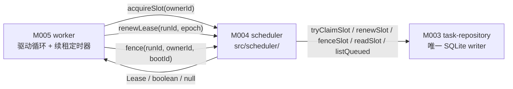
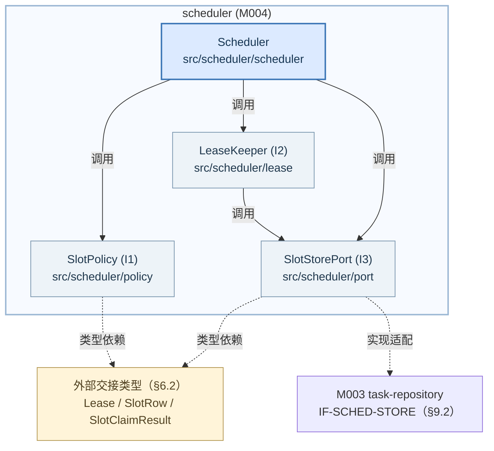
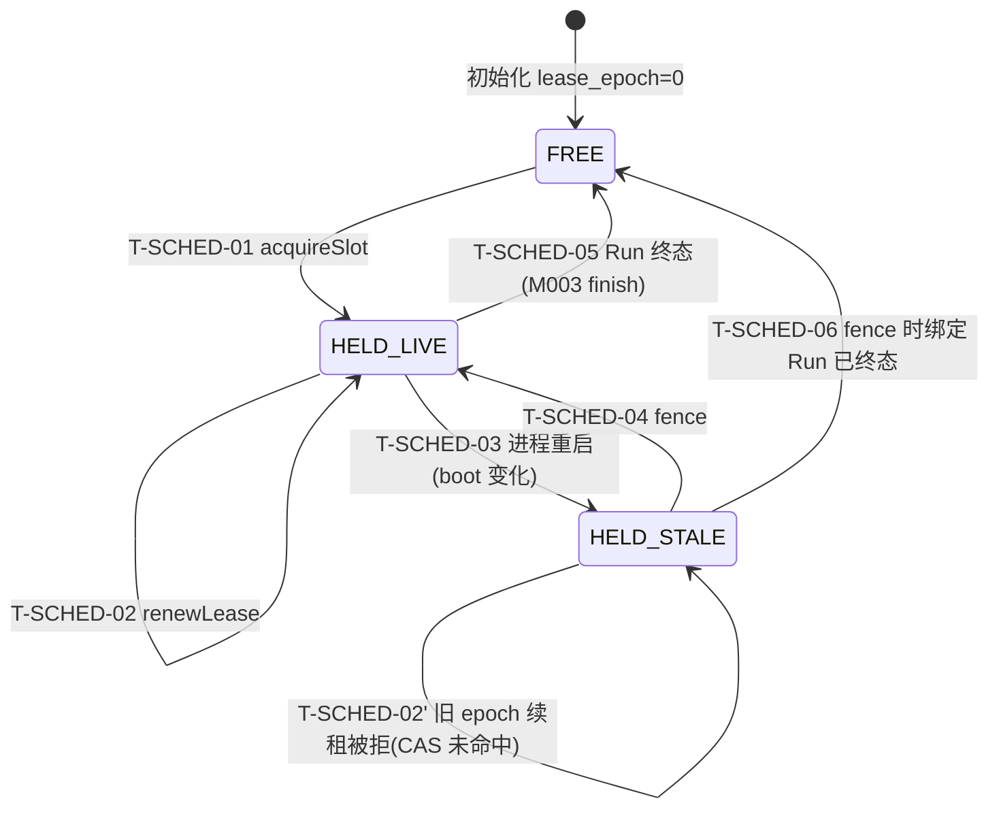
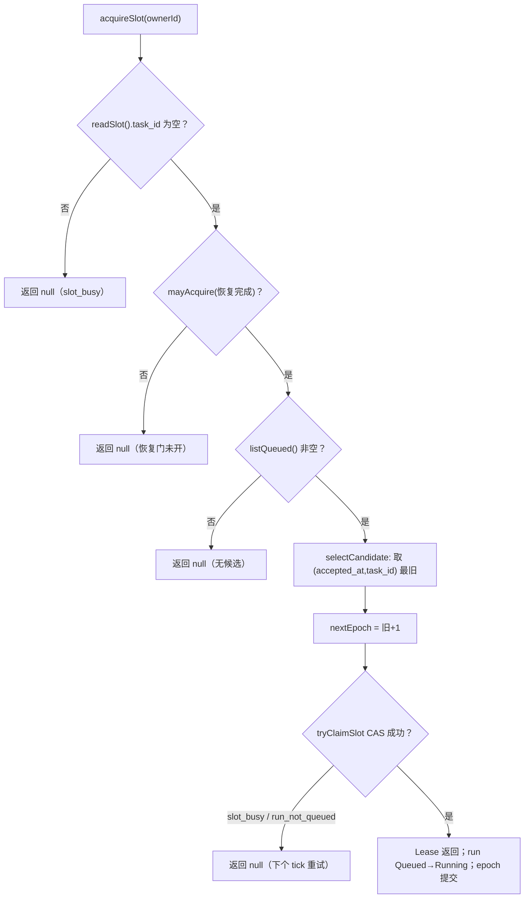
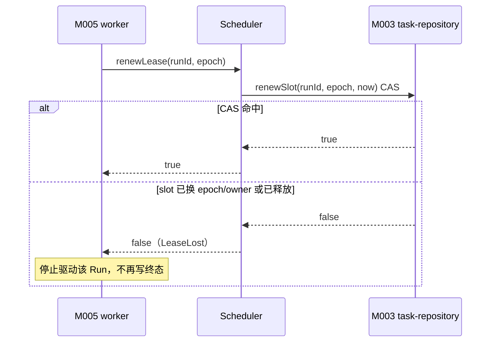
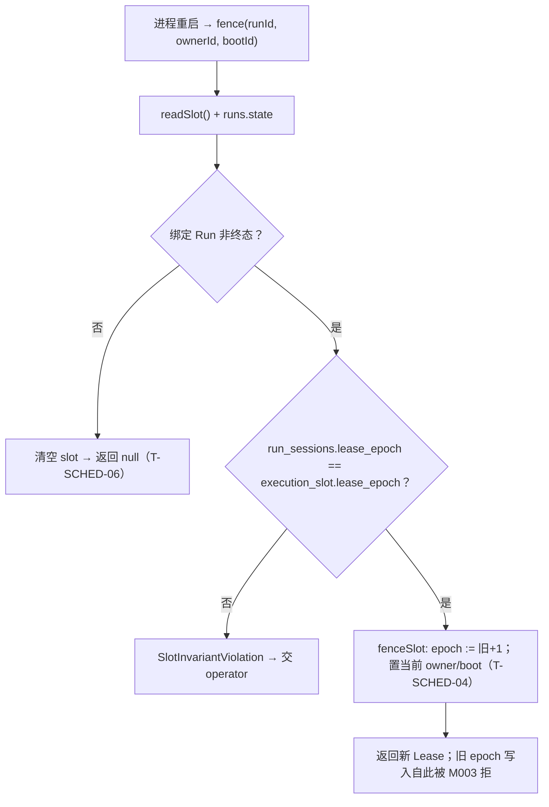

<!-- STD_DOCUMENT_COVER_BEGIN -->
# Piko 模块设计：scheduler（M004）

> STD 使用入口：[项目采用说明与标准导航](../../README.md#std-entry)

| 文档字段 | 值 |
|---|---|
| Document ID | `piko-scheduler` |
| Document Version | `0.1.3` |
| Status | `Draft` |
| Project | `piko` |
| Document Owner | Piko Implementation Owner |
| Last Modified Date | `2026-09-28` |
| Template ID | `design.definition` |
| Template Version | `3.4.0` |

<!-- STD_DOCUMENT_COVER_END -->

## 1. 单元摘要：为什么存在

M004 `scheduler` 解决一个问题：Piko 单实例内**同时至多只有一个 Run 在真正执行**（PK-01），而"哪个 Run 占用了这个唯一执行位"必须是可持久、可跨进程重启判定、且能让旧占用者写入失效的事实。scheduler 把这件事实建模为一条唯一的 `execution_slot` 记录加一个单调递增的租约代号 `epoch`（DB 列 `execution_slot.lease_epoch`）：领取 slot 就是把某个 `Queued` Run 绑定到 slot 并推进 epoch；续租就是按 `(task_id, epoch, owner)` 原子刷新心跳；重启后旧 epoch 的全部写入被 M003 的 fenced write 拒绝，scheduler 为该仍占位的非终态 Run 推进 epoch 并把执行权交给当前进程。

scheduler 只做 slot 的领取、续租、fence 和队列选择，**不决策业务**：不改变 Run 状态机语义（MECH-RUN / M003）、不选 Run 的失败与恢复语义（MECH-RECOVERY / M005）、不驱动 Pi（M006）、不裁决优先级（`M-RUN-DI-004` 自由度明确"不加优先级"）。它把持久化交给 M003 `task-repository`（唯一 SQLite writer 与 schema authority），自身只持调度策略。

用一次调用说明：M005 worker 的驱动循环 tick 时调用 `Scheduler.acquireSlot(ownerId)`；scheduler 读 `execution_slot`，若空闲则按 `(accepted_at, task_id)` 取最旧 `Queued` Run，经 M003 的原子 `tryClaimSlot` 把 `execution_slot.task_id` 置为该 Run、`lease_epoch = 旧值 + 1`，并把 `runs.state` 由 `Queued` 推进到 `Running`；返回 `Lease{task_id, owner_id, boot_id, epoch, acquired_at, heartbeat_at}`。若 slot 已被占用或队列为空，返回 `null`（排队，不是错误）。M005 随后按固定间隔调用 `renewLease(runId, epoch)` 续租；任一次 CAS 失败即 `LeaseLost`，M005 停止驱动该 Run。

| 项目 | 内容 |
|---|---|
| 模块编号 / 正式英文名称 | M004 / `scheduler` |

| 运行进程 | P0 控制进程（见 `system-design` §3.3 关键决定 7） || 直属父对象编号 / 名称 | `SW-P` / Piko Agent Runtime V0.3（软件系统，`design_level=system`） |
| 父设计 Document ID / 固定基线 / 登记位置 | `system-design` v0.11.1 / 契约 `0.3.0-simplified.6` / §3.2 直属模块表 + §3.4 约束分配；本模块登记见 §3.2 第 203 行 |
| 上级系统/父单元 | 无（纯软件顶层，无总体系统父稿） |
| 解决的问题 | 单实例执行位唯一且可跨重启判定；旧占用者写入可被确定性失效 |
| 提供的能力 | `acquireSlot`、`renewLease`、`fence`；队列 FIFO 选择；恢复门的 slot 侧判定 |
| 主要使用者 | M005 `worker`（领取后驱动 Pi）、M005/M003 恢复流程（重启后重领并 fence 旧写入） |
| 不负责 | Run 状态机与 Result 语义（M003/MECH-RUN）；崩溃恢复编排（M005）；Pi 执行（M006）；队列深度与受理（M001/M003）；优先级/抢占（明确不做） |

### 1.1 继承的上级约束与落实方式

scheduler 承接两条上级约束：`CON-RUN-001`（PK-01，单 slot + lease epoch 唯一 fencing）与 `CON-REC-001`（PK-12，崩溃恢复边界中的 lease 环节）。两条均为 Approved。约束的来源文档是 `system-design` §3.4（`CON-RUN-001..004` / `CON-REC-001` 由机制 §3.1 反向登记），机制侧权威定义在 `piko-run.md` §3.1 与 `piko-recovery.md` §3.1。

#### 1.1.1 `CON-RUN-001` · 单 slot + lease epoch 唯一 fencing

- **上级基线与决定状态**：`system-design` v0.11.1 §3.4（PK-01 行）+ `piko-run.md` §3.1 `CON-RUN-001` · PK-01 · Approved；固定基线 machine contract `0.3.0-simplified.6`。上级原文："单实例单 Agent，同一实例同时至多 1 个 Running Run；M003+M004 保证 lease epoch 唯一。"

- **适用条件**：单实例、单 configured Matrix 身份、单 Agent 路径（PK-01 前提）。所有进程生命周期内的 Run 领取与续租。

- **继承预算或行为保证**：同一实例任意时刻至多 1 个 `Running`/`Cancelling` Run；`execution_slot.lease_epoch` 单调递增，成功领取/重领后严格 `+1`；持有旧 epoch 的写入必须 0 行生效（fenced write）。

- **可自行选择/不可改变**：不可改变：单 slot 语义、epoch 单调且 fencing、"至多 1 个 Running"。可自行设计：scheduler 的内部函数组织、队列选择数据结构、心跳与 stale 判定的实现（M-RUN-DI-004 允许"调度策略"，但不新增优先级/抢占）。

- **本地落实/内部再分配**：§6.6 定义 `ExecutionSlot` 状态模型与转换 `T-SCHED-01..06`；§8 `R-SCHED-EPOCH` 定义 epoch 规则、`R-SCHED-FIFO` 定义选择规则、`R-SCHED-HEARTBEAT` 定义续租与 stale 判定；§9 固定 `acquireSlot`/`renewLease`/`fence` 合同；§13 落到 `src/scheduler/` 文件。单 slot 预算不向内部再分配（slot 恒为 1），epoch 由持久记录持有，不占进程内配额。

- **验证方法与结果/证据**：局部：`VRC-SCHED-001`（并发领取唯一性）、`VRC-SCHED-002`（续租 CAS 与 `LeaseLost`）。组合：PK-T01/PK-T13（集成，测 Result→Run→lease→Pi session→Harness 的 cross-check）；当前全部 `NOT_RUN`。

- **差距/变更影响/反馈责任**：none。多实例需另立设计（`system-design` §3.3 关键决定 2），不在本模块放宽。

#### 1.1.2 `CON-REC-001` · 崩溃恢复边界中的 lease 环节

- **上级基线与决定状态**：`system-design` v0.11.1 §3.4（PK-12 行）+ `piko-recovery.md` §3.1 `CON-REC-001` · PK-12 · Approved。上级原文规定恢复顺序为 "Result → Run → lease → Pi session → Harness → ledger → Matrix"，且"不复活旧权威、不模拟成功"。

- **适用条件**：进程崩溃后重启；`execution_slot` 仍绑定一个非终态 Run（`runs.state ∈ {Running, Cancelling}`）。

- **继承预算或行为保证**：重启后必须为仍占位的非终态 Run 推进 `lease_epoch`（新 epoch = 旧 + 1），使重启前进程持有的旧 epoch 写入全部失效；不复活旧的 Run 终态，不把"未收到心跳"当作成功或失败结论。

- **可自行选择/不可改变**：不可改变：epoch 推进（fence）语义、恢复不模拟成功。可自行设计：stale 判定的读取来源与顺序、fence 在恢复序列中的调用位置（scheduler 只暴露操作，编排属 M005）。

- **本地落实/内部再分配**：§6.6 转换 `T-SCHED-03`（HELD_LIVE→HELD_STALE，由 boot 变化触发）与 `T-SCHED-04`（HELD_STALE→HELD_LIVE，fence 重领）；§8 `R-SCHED-GATE` 定义"恢复完成后才允许正常领取"的门；§9 `fence` 合同；§10 `C-SCHED-03`/`C-SCHED-04` 推演崩溃与恢复门。

- **验证方法与结果/证据**：局部：`VRC-SCHED-003`（崩溃后 fence：epoch 推进且旧 epoch 写入被拒）、`VRC-SCHED-005`（恢复门：恢复完成前不领取）。组合：PK-T12（崩溃恢复 E2E）；当前全部 `NOT_RUN`。

- **差距/变更影响/反馈责任**：`piko-recovery.md` §14.4 已补 `M-REC-DI-004`（scheduler，新 lease epoch），与 §3.5 参与方一致；本模块按该行与 §5.1 `IF-REC-FENCE` 承接，`OQ-SCHED-003` 已关闭。

## 2. 需求、功能与验收条件

scheduler 的可观察功能是三个进程内操作：领取 slot、续租、重领（fence）。三者都不可由外部 HTTP/CLI 触发，调用方只有 M005 `worker`。

### 2.1 `F-SCHED-ACQUIRE` · 领取执行 slot

- **上级需求 / Constraint ID**：`CON-RUN-001`（PK-01）；`M-RUN-DI-004`。

- **调用方**：M005 `worker` 的驱动循环（tick），每个 tick 至多调用一次。

- **输入与前提**：`ownerId: string`（当前 worker 实例身份）；进程已 READY；M005 恢复流程已完成（见 `R-SCHED-GATE`）；M003 可用。

- **行为**：读取 `execution_slot`：若 `task_id` 非空则返回 `null`（该 slot 已被占用）。若空闲，则按 `(accepted_at, task_id)` 升序选出最旧 `Queued` Run；无候选则返回 `null`。对候选 Run 调用 M003 原子 `tryClaimSlot(runId, ownerId, bootId)`：成功则 `epoch = 旧值 + 1`、写 `owner_id`/`boot_id`/`heartbeat_at`、`runs.state` 由 `Queued` 推进 `Running`、`run_sessions.lease_epoch` 同步为新 epoch；返回 `Lease`。

- **输出**：`Lease{task_id, owner_id, boot_id, epoch, acquired_at, heartbeat_at}` 或 `null`（slot 忙 / 无 Queued Run；二者都不是错误）。

- **错误与边界**：无业务错误返回。`slot_busy` 与 `run_not_queued` 两种 CAS 失败由实现重试选下一个候选或返回 `null`（合法下一步：下一个 tick 再试）。M003 不可用（`SQLITE_BUSY` 超时）时向上抛依赖错误，由 M005 决定，不在此吞掉。

- **验收条件**：给定一个空闲 slot 与 3 个 `Queued` Run（`accepted_at` 递增），`acquireSlot` 返回最旧 Run 的 `Lease` 且 `epoch = 旧值 + 1`；再次调用返回 `null`；数据库无第二个 `Running` Run。

### 2.2 `F-SCHED-RENEW` · 续租

- **上级需求 / Constraint ID**：`CON-RUN-001`。

- **调用方**：M005 `worker` 的续租定时器（持有 `Lease` 期间）。

- **输入与前提**：`runId: string`、`epoch: number`；该 Run 仍由本进程持有 slot。

- **行为**：对 `(task_id, epoch)` 做原子 CAS，刷新 `execution_slot.heartbeat_at = now`。CAS 命中返回 `true`；未命中（slot 已换 owner/epoch 或已释放）返回 `false`。

- **输出**：`true` | `false`。

- **错误与边界**：`false` 表示租约已丢失（`LeaseLost` 事实），M005 必须停止驱动该 Run 且不得再写其终态；不抛业务错误。`runId`/`epoch` 不匹配当前 slot 时一律返回 `false`，不抛异常（避免把"竞争"误报成故障）。

- **验收条件**：持有当前 epoch 时续租连续返回 `true` 且 `heartbeat_at` 单调前进；用旧 epoch 续租返回 `false` 且不改变 `heartbeat_at`/`owner_id`。

### 2.3 `F-SCHED-FENCE` · 重启后重领并 fence 旧写入

- **上级需求 / Constraint ID**：`CON-REC-001`（PK-12）；`CON-RUN-001`。

- **调用方**：M005 恢复流程，在崩溃重启且 `execution_slot` 仍绑定非终态 Run 时调用。

- **输入与前提**：`runId: string`（slot 当前绑定的 Run）、`ownerId`、`bootId`（当前进程 boot）。

- **行为**：读权威事实：`execution_slot.task_id`、`runs.state`、`run_sessions`。若绑定 Run 非终态，原子推进 `epoch = 旧值 + 1` 并把 `owner_id`/`boot_id` 换成当前进程，`run_sessions.lease_epoch` 同步；返回新 `Lease`。若绑定 Run 已是终态（不应发生，因释放与终态同事务，见 §6.6 `T-SCHED-05`），则清空 slot 并返回 `null`。

- **输出**：新 `Lease{task_id, owner_id, boot_id, epoch（= 旧 + 1）, acquired_at, heartbeat_at}` 或 `null`（已清空）。

- **错误与边界**：不把"心跳过期"当作 Run 失败或成功；只推进执行权。若 `run_sessions` 与 `execution_slot` 的 epoch 不一致（不应发生），视为权威记录损坏，抛出内部错误并交 M005/operator（不自行修复）。终态判定只依据 `runs.state`。

- **验收条件**：构造崩溃现场（`execution_slot` 绑定 Running Run、`boot_id` 为旧 boot）后调用 `fence`：返回新 `Lease` 且 `epoch = 旧 + 1`；用旧 epoch 调 `renewLease` 返回 `false`；用旧 epoch 调 M003 的 fenced 写（如 `finish`）被拒（0 行生效）。

## 3. UI、CLI、服务端点或设备操作面

**N/A。** scheduler 是纯进程内模块，不拥有 UI、CLI、HTTP/RPC 端点或设备操作面：它不监听端口、不注册路由、不提供诊断命令。它的唯一调用入口是 M005 `worker` 的进程内函数调用（§9.1）；对外可观察的 HTTP 面（`POST /tasks` 等）由 M001 `task-api` 承载，其后台推进只是间接经过 scheduler。

实际调用入口与归属：`M005 worker 驱动循环 → Scheduler.acquireSlot/renewLease`（进程内 `src/scheduler/`）。维护/诊断入口不新增：slot 状态经 M003 的诊断查询与系统指标 `piko.slot.lease_epoch`（§11）暴露。

Tailoring 依据：`TAIL-P-101`（Piko 无图形入口）同源；本模块无任何操作面，属 STD `design.definition` §3 "模块没有任何直接操作面时写 N/A + 实际调用入口/归属 + tailoring 依据" 的情形。"没有页面"不等于"没有 API"——scheduler 的 API 在 §9.1 唯一维护。

## 4. 外部边界与依赖

scheduler 在进程内的位置：被 M005 调用，调用 M003 持久化。下图只画模块外部交接，不表示线程或新部署边界。



图 M-SCH-C1 · Target / Planned / NOT_BUILT。实线是同步进程内函数调用与返回，不是网络或新部署边界。scheduler 不创建线程/进程；续租定时器是宿主（M005）事件循环上的定时器，见 §5.4 与 §10。持久化权威（SQLite 连接、事务、DDL）属 M003，见 §9.2 `IF-SCHED-STORE`。

#### 4.1 `DEP-SCHED-REPO` · M003 `task-repository`（持久化与事务权威）

- **角色 / 运行位置 / Owner**：同级直属模块，同实例（PK-01）；**运行进程 P0**（见 `system-design` §3.3 关键决定 7）；Owner：Piko Implementation Owner。

- **本模块调用或消费**：slot 持久化原语：`readSlot`、`listQueued`、`tryClaimSlot`、`renewSlot`、`fenceSlot`（§9.2 `IF-SCHED-STORE`；`fenceSlot` 覆盖 `T-SCHED-04`/`T-SCHED-06`）。M003 另在终态事务内调用 `releaseSlot`（scheduler 不调用）。不消费 `createOrGetRun`/`mutateRun`/`publishResult` 等 Run/Result 操作。

- **本模块提供**：无。scheduler 不向 M003 提供接口；释放 slot 由 M003 在终态事务内完成（`T-SCHED-05`），不经 scheduler。

- **契约 authority / 版本 / selector**：`IF-SCHED-STORE` 由本设计提出（§9.2），**Adopted**：M003 `piko-task-repository-design.md` §2.5/§9.1.5–9.1.10 已逐字采纳为 Provider（语义不变），`OQ-SCHED-001` 已关闭。`execution_slot`/`run_sessions` 的 DDL/schema authority 见 M003 设计 §6.7 与 ISD §4.7；当前实现锚点保留为 `src/store.ts` `migrate()`（`PRAGMA user_version=2`；`run_sessions` `src/store.ts:19`，`execution_slot` `src/store.ts:20`–`:21`）。

- **同步方式 / timeout / 生命周期**：同步进程内调用；单 `BEGIN IMMEDIATE` 内完成；受 `task_store.busy_timeout_ms` 约束；连接生命周期由 M003 持有、与进程同域。

- **不可用或失败影响 / 责任出口**：`SQLITE_BUSY` 超时 → 向上抛依赖错误，由 M005 决定重试/终止；scheduler 不吞错、不改写 M003 语义。M003 是唯一 SQLite writer，scheduler 绝不自行打开连接。

#### 4.2 `DEP-SCHED-CLOCK` · 时间源（宿主提供）

- **角色 / 运行位置 / Owner**：宿主运行时能力，同进程；Owner：Piko Implementation Owner（M000/bootstrap 装配）。

- **本模块调用或消费**：两个时钟：持久判定用 UTC wall clock（写入 `acquired_at`/`heartbeat_at`）；间隔/超时用 monotonic clock（续租定时、stale 判定窗口）。

- **本模块提供**：无。

- **契约 authority / 版本 / selector**：`piko-run.md` §10 时间基准（持久 UTC + 进程内 monotonic）。

- **同步方式 / timeout / 生命周期**：同步取时；无网络；随进程。

- **不可用或失败影响 / 责任出口**：时钟回拨会使 UTC 心跳倒退但不影响 CAS 正确性（CAS 只比 `(task_id, epoch)`）；stale 判定用 monotonic，不受回拨影响。

#### 4.3 `DEP-SCHED-CONFIG` · 固定常量（宿主提供）

- **角色 / 运行位置 / Owner**：宿主注入的调度常量；Owner：Piko Implementation Owner。

- **本模块调用或消费**：`tick_interval_ms`（驱动循环间隔，现基线 200ms）与 `heartbeat_interval_ms`（续租间隔，现基线 1000ms）。二者是**固定内部常量**，暂不作为配置文件 key（config schema `piko-runtime-config-v0.3.schema.json` 无对应项）。

- **本模块提供**：无。

- **契约 authority / 版本 / selector**：当前实现基线：`src/worker.ts` 中 `setTimeout(...,200)` 与 `setInterval(heartbeat,1000)`。本设计保持同值，语义固定（见 `OQ-SCHED-002` 记录"是否暴露为配置"的未决）。

- **同步方式 / timeout / 生命周期**：构造时注入，进程内不变。

- **不可用或失败影响 / 责任出口**：常量缺失无法构造（编译期）；不做运行期热改（config 变更需重启，`CON-CFG-001`）。

## 5. 内部结构与实现位置

scheduler 拆成四个内部单元：入口编排、纯策略、租约看护、持久化端口。拆分依据是"纯策略可独立测试、端口隔离 M003、看护与编排共享少量状态"，不是为了凑文件。



图 M-SCH-S1 · Target / Planned / NOT_BUILT。外框是模块内部组成；实线同步调用，虚线类型/适配依赖；不表示线程或时序。所有路径均为 Planned。

### 5.1 内部组成

#### 5.1.1 `S1` · Scheduler（入口）

- **职责与非职责**：对外提供 §9.1 三个操作并保证 §6.6 不变量；编排"读 slot → 选候选 → CAS 领取""续租""重领 fence"。非职责：不发 SQL（经 I3）、不持有租约状态机（I2 持有续租状态）、不决策 Run/Result 语义。

- **输入、处理与输出**：输入 `ownerId`/`runId`/`epoch`/`bootId`；处理：组合 I1 的纯规则与 I3 的持久化 CAS；输出 `Lease | null | boolean`。

- **协作对象**：调用 I1/I2/I3；被 M005 调用。不调用 M003 直接（经 I3）。

- **文件 / symbol / 实现状态**：`src/scheduler/scheduler.ts` → `class Scheduler`（Planned / NOT_IMPLEMENTED）。现基线逻辑散在 `src/worker.ts`（`RunWorker.loop`/`run` 内的领取与心跳）与 `src/store.ts`（`nextQueued`/`recoverOrphaned`/`heartbeat`），见 §2。

- **拆分依据与替代方案代价**：入口只做编排，把策略抽到 I1 以便对 `(accepted_at, task_id)` 顺序、epoch 规则做无 DB 单测。替代方案"全部写在 worker 里"是 Current 形态，代价是与执行逻辑耦合、无法独立验证单 slot 不变量（这正是本设计要消除的）。

#### 5.1.2 `I1` · SlotPolicy（纯策略）

- **职责与非职责**：纯函数：候选选择 `selectCandidate(slotFree, queued)`、epoch 推进 `nextEpoch(current)`、租约是否 stale `isStale(bootId, currentBoot)`、恢复门 `mayAcquire(recoveryComplete)`。非职责：无 I/O、无状态、不读时钟。

- **输入、处理与输出**：输入原始值（`SlotRow`、`task_id[]`、`boot_id`）；输出决定（候选 `task_id | null`、`nextEpoch`、`boolean`）。

- **协作对象**：仅被 S1/I2 调用；不依赖任何文件。

- **文件 / symbol / 实现状态**：`src/scheduler/policy.ts`（Planned / NOT_IMPLEMENTED），导出 `selectCandidate`、`nextEpoch`、`isStale`、`mayAcquire`。

- **拆分依据与替代方案代价**：纯函数使 §8 的 `R-SCHED-EPOCH/FIFO/HEARTBEAT/GATE` 可表驱动测试，不需 SQLite。替代方案"策略内嵌在 SQL 里"无法对边界（空队列、epoch 溢出、恢复门）单测。

#### 5.1.3 `I2` · LeaseKeeper（租约看护）

- **职责与非职责**：持有一次执行期间的续租状态：启动/停止续租定时器（宿主事件循环上的 `setInterval`）、按 `R-SCHED-HEARTBEAT` 判定 `LeaseLost`、向 S1 暴露"当前租约是否仍有效"。非职责：不领取（S1 做）、不硬编码间隔（配置常量注入）、不 kill 执行（由 M005 决定）。

- **输入、处理与输出**：输入 `Lease`、`heartbeat_interval_ms`、`renewSlot` 端口；输出 `LeaseLost` 事件（回调）。

- **协作对象**：调用 I3 的 `renewSlot`；被 S1 启动/停止。

- **文件 / symbol / 实现状态**：`src/scheduler/lease.ts`（Planned / NOT_IMPLEMENTED）。现基线是对应的 `setInterval(()=>store.heartbeat(runId,epoch),1000)`（在 `RunWorker.run` 内）。

- **拆分依据与替代方案代价**：把"心跳定时与丢失判定"从执行逻辑中分离，使 M005 只需响应 `LeaseLost` 而不自带定时器。替代方案"worker 自己 setInterval"是 Current 形态，代价是租约判定散落在执行代码、难以对"CAS 失败即停"做单测。

#### 5.1.4 `I3` · SlotStorePort（持久化端口）

- **职责与非职责**：把 §9.2 `IF-SCHED-STORE` 的六个操作适配到 M003；是 scheduler 内唯一接触持久化的单元。非职责：不做策略判断、不拼 Run 语义、不重试业务失败（只透传依赖错误）。

- **输入、处理与输出**：输入结构化的 `(runId, ownerId, bootId, epoch, at)`；输出 `SlotRow`/`Lease`/布尔/编译期联合结果。

- **协作对象**：调用 M003 `task-repository`；被 S1/I2 调用。

- **文件 / symbol / 实现状态**：`src/scheduler/port.ts`（Planned / NOT_IMPLEMENTED），接口 `SlotStorePort` + `M003SlotStore` 实现。

- **拆分依据与替代方案代价**：端口使 scheduler 可在内存假实现上测试（§14.2 Case 用受控 fake），并把 M003 合同集中在一处。替代方案"直接 import store"会传播 M003 类型到全模块，违反 §5.5 依赖方向。

### 5.2 内部调用过程

#### 5.2.1 `P-SCHED-CLAIM` · 领取（tick 驱动）

- **入口与调用上下文**：M005 worker 驱动循环 tick（宿主事件循环，非新线程）→ `Scheduler.acquireSlot(ownerId)`。

- **调用链（文件 / symbol → 文件 / symbol）**：`worker.loop` → `Scheduler.acquireSlot` → `SlotStorePort.readSlot`（M003）→ `SlotPolicy.mayAcquire`/`selectCandidate` → `SlotStorePort.listQueued`（M003）→ `SlotPolicy.nextEpoch` → `SlotStorePort.tryClaimSlot`（M003 原子 CAS）→ 返回 `Lease`。

- **逐步传递的数据**：`ownerId:string` → `SlotRow | null`（读）→ `recoveryComplete:boolean` + `task_id[]` → 候选 `task_id | null` → `nextEpoch:number` → `SlotClaimResult{epoch} | "slot_busy" | "run_not_queued"` → `Lease`。

- **返回、异常与清理**：成功返回 `Lease`；slot 忙/无候选返回 `null`（无清理）；M003 依赖错误向上抛。无临时资源需清理（全部在 M003 事务内）。

- **对应流程 / 接口 / 验证**：§7 `M-SCH-P1`；§9.1 `IF-RUN-SLOT`、§9.2 `IF-SCHED-STORE`；`VRC-SCHED-001/004/005`。

#### 5.2.2 `P-SCHED-RENEW` · 续租（定时驱动）

- **入口与调用上下文**：`LeaseKeeper` 的定时器回调（宿主事件循环）。

- **调用链（文件 / symbol → 文件 / symbol）**：timer → `LeaseKeeper.onTick` → `SlotStorePort.renewSlot(runId, epoch, now)`（M003 CAS）→ 命中则重置定时器；未命中 → 触发 `LeaseLost`。

- **逐步传递的数据**：`{task_id, epoch}` → `boolean`。

- **返回、异常与清理**：命中：无清理；未命中：停止定时器并回调 M005。M003 依赖错误上抛。

- **对应流程 / 接口 / 验证**：§7 `M-SCH-P2`；§9.1 `IF-RUN-RENEW`；`VRC-SCHED-002`。

#### 5.2.3 `P-SCHED-FENCE` · 崩溃后重领

- **入口与调用上下文**：M005 恢复流程（进程启动、恢复门内）→ `Scheduler.fence(runId, ownerId, bootId)`。

- **调用链（文件 / symbol → 文件 / symbol）**：`recovery` → `Scheduler.fence` → `SlotStorePort.readSlot`（读绑定事实）→ `SlotPolicy.isStale`/`nextEpoch` → `SlotStorePort.fenceSlot(runId, ownerId, bootId)`（M003 单事务：非终态则 `epoch+1` 返回 `{epoch}`，终态则清空返回 `"slot_released"`）→ 非终态构造新 `Lease`；`"slot_released"` 返回 `null`。

- **逐步传递的数据**：`{runId, ownerId, bootId}` → `SlotRow` → 新 `epoch` → `Lease | null`。

- **返回、异常与清理**：非终态 → 返回新 `Lease`；终态（不应发生）→ 清空 slot 返回 `null`；权威记录不一致 → 内部错误上抛不自行修复。

- **对应流程 / 接口 / 验证**：§7 `M-SCH-P3`；§9.1 `IF-REC-FENCE`；`VRC-SCHED-003`。

### 5.3 文件间接口契约

本节只固定 scheduler 内部文件之间的交接；跨模块的 M003 接口在 §9.2，字段类型在 §6.2。

#### 5.3.1 `IF-SCHED-POLICY` · `scheduler.ts` → `policy.ts`

- **接口成员 ID / §9 逐接口定义位置**：内部无公共成员 ID；行为规则权威在 §8（`R-SCHED-EPOCH`/`FIFO`/`HEARTBEAT`/`GATE`）。

- **本文件的提供或使用责任**：`policy.ts` 提供纯函数；`scheduler.ts` 使用其决定。

- **交接时机 / 本地调用步骤**：`acquireSlot` 内两处：读 slot 后判 `mayAcquire`/`isStale`；选候选后算 `nextEpoch`。

- **§9 生命周期约束**：无状态、无所有权；调用即返回。

- **实现与验证位置**：`src/scheduler/policy.ts`；`VRC-SCHED-004`（选择）、`VRC-SCHED-005`（门）以表驱动覆盖。

#### 5.3.2 `IF-SCHED-PORT` · `scheduler.ts`/`lease.ts` → `port.ts`

- **接口成员 ID / §9 逐接口定义位置**：内部接口 `SlotStorePort`，方法契约见 §9.2 `IF-SCHED-STORE`。

- **本文件的提供或使用责任**：`port.ts` 提供 `SlotStorePort` 抽象与 `M003SlotStore` 实现；`scheduler.ts`/`lease.ts` 以该抽象调用。

- **交接时机 / 本地调用步骤**：见 `P-SCHED-CLAIM`/`RENEW`/`FENCE` 链。

- **§9 生命周期约束**：端口实例与进程同域；内部不缓存 `SlotRow`（每次读权威）。

- **实现与验证位置**：`src/scheduler/port.ts`；`VRC-SCHED-001/002/003` 以受控 fake 端口 + 真 M003 两套覆盖。

### 5.4 服务提供方式（条件适用）

**N/A（无独立宿主）。** scheduler 不监听端口、不启动进程/线程、不注册端点：§3 已判定无操作面，故本节的 server/runtime、监听、就绪、停止均不适用。

运行载体：scheduler 实例由 M000 `bootstrap` 装配、随 M005 `worker` 生命周期存在；无自身进入/退出过程。并发模型：全部操作在宿主事件循环上同步执行；续租定时器（`I2`）是宿主事件循环上的 `setInterval`，**不是新线程**（§10 `C-SCHED-05`）。就绪/停止语义属于 M005/MECH-STARTUP，scheduler 只暴露操作、不定义 READY/停止出口。

Tailoring 依据：STD `design.definition` §5.4 "纯库函数说明不适用及由谁调用"。

### 5.5 依赖方向

- **允许方向**：`scheduler.ts` → `{policy.ts, lease.ts, port.ts}`；`lease.ts` → `port.ts`；`port.ts` → `types.ts`（仅 §6.2 类型）。所有单元 → 无外部模块，除 `port.ts` 适配 M003。

- **禁止方向与原因**：禁止 `policy.ts` 引用任何文件（保持纯函数）；禁止 `port.ts`/`lease.ts` 引用 `scheduler.ts`（避免环）；禁止任何单元直接 `import` M003 的 `store.ts`（只能经 `port.ts` 抽象），否则类型依赖扩散并绕过 §5.3 契约。

- **循环/越层检查**：静态：对 `src/scheduler/` 跑依赖图（`tsc`/import 检查或 CI 脚本）确认无环、`policy.ts` 无 import。评审按 §5.1 逐文件核对引用。

- **变更影响**：改 `policy.ts` 只影响选择/epoch 规则（§8 权威）；改 `port.ts` 影响与 M003 的合同（`OQ-SCHED-001`）；改 `scheduler.ts` 影响对外三操作（§9.1）。

## 6. 数据结构设计

scheduler 拥有的运行态数据是 `execution_slot`（§6.7，DDL 属 M003），与 `run_sessions.lease_epoch` 的同步规则；模块自有类型是 `Lease`/`SlotRow`/`SlotClaimResult`。不适用类别在章首集中说明。

**不适用类别与依据**：§6.1 公共基础类型（本模块无需独立枚举，用字面量联合）、§6.4 通信报文（无跨边界消息）、§6.5 设备/FPGA（纯软件，`TAIL-P-103`）均为 N/A。§6.3 配置结构 N/A（用固定常量，见 §4.3）。§6.8 错误为内部类型（`LeaseLost`/`SlotInvariantViolation`），不映射对外错误码。

### 6.2 业务与操作数据结构

#### 6.2.1 `Lease`

- **完整定义、Data/Type/Data ID 与唯一来源**：`Lease`；本模块作用域内类型（无公共 Data ID）；权威定义在 `src/scheduler/types.ts`（Planned）。

  **命名与归属**：字段 `epoch` 与 MECH-RUN §5.1 `Lease{owner_id, boot_id, epoch, acquired_at, heartbeat_at}` 同名同义，对应 DB 列 `execution_slot.lease_epoch`。本文中 `epoch` 一律指租约代号值，`lease_epoch` 只作 DB 列名。`task_id` 是**共享合同的扩展**（非纯私有适配）：MECH-RUN §5.1 的 `Lease` 未含 `task_id`，但 `IF-RUN-SLOT` 必须让调用方知道被领取的 Run、`IF-REC-FENCE` 必须限定被重领的 Run，故本设计把 `task_id` 并入 `Lease`，并作为机制反馈登记 `OQ-SCHED-004`（请 MECH-RUN §5.1 补该字段）。

  ```text
  Lease {
    task_id: string,
    owner_id: string,
    boot_id: string,
    epoch: number,         // 租约代号；= execution_slot.lease_epoch（DB 列）；整数，>= 1，单调
    acquired_at: string,   // UTC instant, ISO-8601
    heartbeat_at: string   // UTC instant, ISO-8601
  }
  ```

- **逐字段/逐值类型、范围、含义与跨字段约束**：`task_id` 必填、非空，来自 `tryClaimSlot` 选中的候选 Run（`acquireSlot`）或 `fenceSlot` 校验通过的绑定 Run（`fence`）；`owner_id` 必填，来自调用方传入的 `ownerId`；`boot_id` 必填，来自 M000/bootstrap 在进程启动时生成、经构造注入 scheduler 的 boot 身份（同进程恒定；写入 `execution_slot.boot_id` 供跨重启 stale 判定）；`epoch` 必填、整数 `>= 1`，由 M003 原子操作按 `旧值 + 1` 产生，等于 `execution_slot.lease_epoch`；`acquired_at`/`heartbeat_at` 必填 UTC instant，**由 M003 原子操作以自身 UTC `now` 写入并随结果返回**（不由 scheduler 造时间），签发瞬间 `heartbeat_at = acquired_at`。跨字段：`(task_id, epoch)` 必须等于签发时刻 `execution_slot` 行的 `(task_id, lease_epoch)`。

- **生产/修改、所有权、可见点、寿命及失败出口**：由 `Scheduler.acquireSlot`/`fence` 从 M003 原子结果构造并返回给 M005；`Lease` 是不可变值对象，续租不修改它（续租只更新 DB 心跳并经布尔返回）。寿命：从签发到 `LeaseLost`/`LeaseRenewalUnavailable` 或 Run 终态。

- **合法与拒绝实例、V/Case 与证据状态**：合法：`{task_id:"task-042", owner_id:"worker-<uuid>", boot_id:"boot-<uuid>", epoch:3, ...}`。拒绝：`epoch:0`（违反 `>=1`）、`heartbeat_at < acquired_at`、`task_id` 为空串。`VRC-SCHED-001/002`；`NOT_RUN`。

#### 6.2.2 `SlotRow` / `SlotClaimResult`

- **完整定义、Data/Type/Data ID 与唯一来源**：`SlotRow` 是 `execution_slot` 的只读投影；`SlotClaimResult` 是 CAS 结果联合。权威：本设计 §9.2；映射 M003 行（§6.7）。

  ```text
  SlotRow { task_id: string | null, owner_id: string | null, boot_id: string | null,
            lease_epoch: number, heartbeat_at: string | null }
  type SlotClaimResult = { epoch: number } | "slot_busy" | "run_not_queued"
  ```

- **逐字段/逐值类型、范围、含义与跨字段约束**：`SlotRow`：`task_id` 空 ⟺ `owner_id`/`boot_id`/`heartbeat_at` 皆空（§6.6 `INV-SCHED-3` 的投影）。`SlotClaimResult`：`"slot_busy"` 表示 slot 已有 `task_id`；`"run_not_queued"` 表示候选 Run 已不在 `Queued`。

- **生产/修改、所有权、可见点、寿命及失败出口**：`SlotRow` 由 M003 读产生、scheduler 只读消费；`SlotClaimResult` 由 M003 CAS 产生。均无长期寿命。

- **合法与拒绝实例、V/Case 与证据状态**：合法：`{task_id:null, owner_id:null, boot_id:null, lease_epoch:2, heartbeat_at:null}`。`VRC-SCHED-001`；`NOT_RUN`。

### 6.3 配置与规则数据结构

**N/A。** scheduler 无配置文件结构：调度常量（`tick_interval_ms`/`heartbeat_interval_ms`）是固定内部常量（§4.3），config 变更需重启（`CON-CFG-001`），不由本模块定义可热改结构。依据：STD `design.definition` §6.3 "不适用时在章首说明原因和 tailoring 依据"。

### 6.6 运行状态数据结构

#### 6.6.1 `ExecutionSlot`（跨步骤运行状态，必填）

- **完整定义、Data/Type/Data ID 与唯一来源**：`ExecutionSlot` 是"唯一执行位"的持久运行状态，物理载体为 `execution_slot` 单行（`slot_id=1`，DDL 属 M003，§6.7）和 `run_sessions.lease_epoch`。权威事实来源：`execution_slot` 行（slot 绑定、owner、boot、epoch、heartbeat）+ `runs.state`（绑定 Run 是否终态）。scheduler 是 slot 的**唯一写者**（经 M003 原子操作）；M003 在终态事务内是 slot 的唯一释放者（`T-SCHED-05`）。

- **逐字段/逐值类型、范围、含义与跨字段约束**：`task_id: string | null`——绑定 Run；`owner_id: string | null`——当前租约持有者；`boot_id: string | null`——持有者 boot；`lease_epoch: int >= 0`——单调计数器（初始 0）；`heartbeat_at: string | null`——最后续租 UTC。约束：`task_id` 空 ⟺ `owner_id`/`boot_id`/`heartbeat_at` 皆空。

- **生产/修改、所有权、可见点、寿命及失败出口**：修改仅经 `tryClaimSlot`/`renewSlot`/`fenceSlot`（`fenceSlot` 同时承担 `T-SCHED-04` 与 `T-SCHED-06`），以及 M003 内部的 `releaseSlot`（`T-SCHED-05`）（§9.2）；可见点=事务提交；寿命=进程世代间持久。失败出口见 §10。

- **状态图、转换表与不变量（跨步骤状态必填）**：



  图 M-SCH-D1 · Target / Planned / NOT_BUILT。`FREE`=slot 空闲；`HELD_LIVE`=当前 boot 持有有效租约；`HELD_STALE`=slot 仍绑定非终态 Run 但持有者 boot 已消失（只在重启后可达）。没有"终态绑定"状态：终态与释放同事务（`T-SCHED-05`）。

  | Transition ID | 原状态 → 新状态 | 事件 / 执行者 | Guard 的权威事实来源 | 动作 / 提交点 | 迟到 / 失败出口 | 不变量 | VRC |
  |---|---|---|---|---|---|---|---|
  | `T-SCHED-01` | FREE → HELD_LIVE | `acquireSlot` / 当前 boot | `readSlot().task_id IS NULL`（`execution_slot` 行）且 `listQueued()` 非空 且 `mayAcquire`（M005 恢复完成标志） | `tryClaimSlot` 原子置 task_id/owner/boot、`epoch := 旧+1`、`runs Queued→Running`、`run_sessions.lease_epoch := epoch`；同事务提交 | CAS `slot_busy`/`run_not_queued` → 返回 `null` 重选或下个 tick | `INV-SCHED-1/2/3/4` | `VRC-SCHED-001/004/005` |
  | `T-SCHED-02` | HELD_LIVE → HELD_LIVE | `renewLease` / 当前 boot | 持有 `Lease` 且 `renewSlot` 的 CAS `(task_id, epoch)` 命中 | 刷 `heartbeat_at := now`；单语句提交 | CAS 未命中 → `false` → `LeaseLost` | `INV-SCHED-4` | `VRC-SCHED-002` |
  | `T-SCHED-02'` | HELD_STALE → HELD_STALE | `renewLease` / 旧 boot（迟到） | 持有重启前旧 `Lease` 且 `renewSlot` 的 CAS `(task_id, 旧 epoch)` 未命中 | 无（0 行生效，不刷心跳、不改 owner/epoch） | CAS 未命中 → `false` → `LeaseLost`（旧进程必须停止驱动） | `INV-SCHED-1/4` | `VRC-SCHED-002`(Case B/C) |
  | `T-SCHED-03` | HELD_LIVE → HELD_STALE | 进程重启（boot 变化，非模块动作） | 持久 `execution_slot.boot_id != 当前 boot_id` 且 `runs.state` 非终态 | 无（状态由事实读出，非写入）；驱动后续 `fence` | — | `INV-SCHED-3` | `VRC-SCHED-003` |
  | `T-SCHED-04` | HELD_STALE → HELD_LIVE | `fence` / 当前 boot（M005 恢复） | `readSlot().task_id` 非空 且 `runs.state` 非终态 且 `boot_id` 与当前不同 | `fenceSlot` 原子 `epoch := 旧+1`、置当前 owner/boot、`run_sessions.lease_epoch := epoch`；同事务提交 | 绑定 Run 已终态 → 走 `T-SCHED-06`；权威记录不一致 → 内部错误 | `INV-SCHED-1/2/3/4` | `VRC-SCHED-003` |
  | `T-SCHED-05` | HELD_LIVE → FREE | Run 终态 / **M003**（非 scheduler） | `runs.state` 已提交为终态 且 CAS `(task_id, epoch)` 命中 | 在 M003 `finish` 终态事务内清空 `task_id/owner_id/boot_id/heartbeat_at`；与写终态同提交 | 若崩溃于该事务前，重启后走 `T-SCHED-03/04`（终态未提交，视为非终态） | `INV-SCHED-3` | 组合 `VRC-SCHED-003` + PK-T15 |
  | `T-SCHED-06` | HELD_STALE → FREE | `fence` / 当前 boot | `readSlot().task_id` 非空 且 `runs.state` 已终态（`fenceSlot` 在同一事务内读 `runs.state`） | `fenceSlot` 在同事务内置空 `task_id/owner_id/boot_id/heartbeat_at`，返回 `"slot_released"`；与 guard 判定同事务提交 | slot 已空时重复调用亦返回 `"slot_released"`（幂等） | `INV-SCHED-3` | `VRC-SCHED-003`(Case D/F) |

  **不变量**：

  - `INV-SCHED-1`：`lease_epoch` 单调不减；每次成功的 `T-SCHED-01`/`T-SCHED-04` 严格 `+1`；携带旧 epoch 的 `renewSlot`/`finish` 生效行数恒为 0。
  - `INV-SCHED-2`：任意时刻至多一个 `HELD_LIVE`（同一 slot 行只有一份 owner/boot）。
  - `INV-SCHED-3`：`execution_slot.task_id IS NULL` ⟺ 无 Run 处于 `Running`/`Cancelling`（释放与终态同事务）。
  - `INV-SCHED-4`：`HELD_LIVE`/`HELD_STALE` 时 `run_sessions.lease_epoch == execution_slot.lease_epoch`。

- **合法与拒绝实例、V/Case 与证据状态**：合法：`HELD_LIVE{task_id:"task-042", owner_id:"worker-1", boot_id:"boot-1", lease_epoch:3}`。拒绝：`task_id` 非空但 `owner_id` 空（违反跨字段约束）；两个不同 `boot_id` 同时 `HELD_LIVE`（违反 `INV-SCHED-2`）。`VRC-SCHED-001/002/003`；`NOT_RUN`。

### 6.7 数据库表结构

#### 6.7.1 `execution_slot` / `run_sessions`（当前代码事实在 `src/store.ts`）

- **完整定义、Data/Type/Data ID 与唯一来源**：**当前代码事实**：`src/store.ts` `migrate()` 内建表——`run_sessions`（`src/store.ts:19`，含 `lease_epoch INTEGER NOT NULL CHECK(lease_epoch>=1)`）、`execution_slot`（`src/store.ts:20`，单行 `slot_id=1`；初始化 `INSERT OR IGNORE ... VALUES(1,0)` 见 `src/store.ts:21`）；`PRAGMA user_version=2`。**Adopted**：`piko-task-repository-design.md` §6.7 与 ISD §4.7 已编写并采纳，其 DDL 为设计权威；此代码事实引用保留为可定位的当前实现锚点。本模块不复制 CREATE TABLE，只固定本模块使用的行语义与写入点。

  ```text
  execution_slot {                     -- 单行，slot_id=1
    slot_id INTEGER PRIMARY KEY CHECK(slot_id=1),
    task_id TEXT REFERENCES runs(task_id),
    owner_id TEXT, boot_id TEXT,
    lease_epoch INTEGER NOT NULL,
    heartbeat_at TEXT
  }
  -- 当前代码事实：src/store.ts:19 定义 run_sessions.lease_epoch INTEGER NOT NULL CHECK(lease_epoch>=1)
  ```

- **逐字段/逐值类型、范围、含义与跨字段约束**：见 §6.6.1；`lease_epoch` 由本模块经 CAS 唯一推进。

- **生产/修改、所有权、可见点、寿命及失败出口**：行由 M003 建库初始化（`INSERT OR IGNORE ... VALUES(1,0)`）；本模块经 §9.2 原子操作读写。持久跨重启。

- **合法与拒绝实例、V/Case 与证据状态**：见 §6.6.1。`VRC-SCHED-001/003`；`NOT_RUN`。

### 6.8 错误码与错误结构

#### 6.8.1 `LeaseLost` / `LeaseRenewalUnavailable` / `SlotInvariantViolation`（内部错误）

- **完整定义、Data/Type/Error ID 与唯一来源**：内部类型，无对外错误码（不进入 HTTP 契约）：`LeaseLost`（续租 CAS 未命中，租约已丢失，可判定）、`LeaseRenewalUnavailable`（续租因 M003 依赖故障连续不可判定，状态未知）、`SlotInvariantViolation`（权威记录不一致，如 `execution_slot` 与 `run_sessions.lease_epoch` 不符）。定义在 `src/scheduler/types.ts`（Planned）。三者不可互相替代：`LeaseLost` 是"确定失去执行权"，`LeaseRenewalUnavailable` 是"暂时无法判定"，`SlotInvariantViolation` 是"权威记录自身损坏"。

- **逐字段/逐值类型、范围、含义与跨字段约束**：无载荷字段；`LeaseRenewalUnavailable` 携带 `consecutive_failures: number` 与最后错误类别；`SlotInvariantViolation` 携带不变量 ID（如 `INV-SCHED-4`）。

- **生产/修改、所有权、可见点、寿命及失败出口**：`LeaseLost`/`LeaseRenewalUnavailable` 由 `I2`（`LeaseKeeper`）按 `R-SCHED-RENEW-FAILURE` 产生、经回调交 M005；`SlotInvariantViolation` 由 `Scheduler` 抛给 M005/operator，不自行修复。

- **合法与拒绝实例、V/Case 与证据状态**：`renewLease` 用旧 epoch → `false`（合法，`LeaseLost`）；注入 M003 连续 `SQLITE_BUSY` → `LeaseRenewalUnavailable`（依赖故障路径）；用当前 epoch 却被拒 → 不合法，需查（`VRC-SCHED-002`）。

- **下级承接与载荷**：M005 承接：`LeaseLost` → 停止驱动、不得再写终态；`LeaseRenewalUnavailable` → 停止驱动但**保留 slot**、等待 M003 恢复或走重启 fence；`SlotInvariantViolation` → 交 operator。均不映射为 HTTP 错误。

## 7. 主流程与数据流

本节给出 scheduler 的三条过程：领取（正常 + 拒绝）、续租（含 `LeaseLost`）、崩溃后 fence。三者与 §6.6 转换、§8 规则、§9 接口共用同一 `Process/Call/IF/Transition ID`。



图 M-SCH-P1 · Target / Planned / NOT_BUILT。正常与拒绝在同一图展开：拒绝不创建状态、不消耗 epoch（`tryClaimSlot` 失败不推进计数器）。`mayAcquire` 的事实来自 M005 恢复完成标志，不来自无来源的"确认安全"。



图 M-SCH-P2 · Target / Planned / NOT_BUILT。续租是 CAS，不新增租约身份；`false` 是租约丢失事实，不是"重试即可"。



图 M-SCH-P3 · Target / Planned / NOT_BUILT。fence 只推进执行权，不判定 Run 成功/失败；旧 epoch 的 `finish` 被 M003 拒绝（`INV-SCHED-1`）。

| Process ID | 触发/适用条件 | 图与正文位置 | 正常/异常出口 | 接口/规则/验证项 |
|---|---|---|---|---|
| `P-SCHED-CLAIM` | worker tick、恢复完成后 | §5.2.1 / M-SCH-P1 | 正常 `Lease`；拒绝 `null`（忙/空/门未开/CAS 失败） | `IF-RUN-SLOT`、`R-SCHED-FIFO/EPOCH/GATE`、`VRC-SCHED-001/004/005` |
| `P-SCHED-RENEW` | 持有租约期间定时器 | §5.2.2 / M-SCH-P2 | 正常 `true`；异常 `false`→`LeaseLost` | `IF-RUN-RENEW`、`R-SCHED-HEARTBEAT`、`VRC-SCHED-002` |
| `P-SCHED-FENCE` | 崩溃重启、slot 绑定非终态 Run | §5.2.3 / M-SCH-P3 | 正常新 `Lease`；异常终态清空 / 不变量冲突 | `IF-REC-FENCE`、`R-SCHED-EPOCH`、`VRC-SCHED-003` |

## 8. 关键算法与业务规则

#### 8.1 `R-SCHED-EPOCH` · epoch 推进与 fencing

- **输入前提 / 适用条件**：每次成功领取（`T-SCHED-01`）或重领（`T-SCHED-04`）；`execution_slot.lease_epoch` 为 `int >= 0`。

- **算法 / 规则 / 选择依据**：`nextEpoch(current) = current + 1`（不做回绕、不重用）。领取/重领在同一事务内把新 epoch 写入 `execution_slot` 与 `run_sessions`；此后一切携带旧 epoch 的写（`renewSlot`、M003 `finish`）CAS 未命中、0 行生效。选择单调递增而非随机 token：epoch 需可比较以判定"更新/更旧"，且要能持久跨重启。

- **结果 / 不变量 / 边界**：结果=严格递增序列。不变量 `INV-SCHED-1`。边界：`current` 为极大整数时理论溢出——固定用 JS `number` 安全整数范围（`< 2^53`），单实例不可能达到，登记 `RISK-SCHED-001`。

- **复杂度 / 资源限制**：O(1)；持久一列。

- **允许替换范围 / 不可改变保证**：可换编码（如带 boot 前缀的复合键），但必须保留"新 epoch 单调可比较、旧必被拒"。不可改变：单调与 fencing。

- **具体输入推演 / 验证项**：初始 `lease_epoch=0`；首次 `acquireSlot` 得 `1`；重启 `fence` 得 `2`；用 epoch `1` 调 `renewSlot`/`finish` 均 0 行。`VRC-SCHED-001/003`。

#### 8.2 `R-SCHED-FIFO` · 候选选择

- **输入前提 / 适用条件**：`acquireSlot` 且 slot 空闲。

- **算法 / 规则 / 选择依据**：从 `listQueued()` 中取 `(accepted_at, task_id)` 字典序最小者。不实现优先级、不抢占、不按长度/截止排序（`M-RUN-DI-004` 自由度上限）。选择依据：可复现、稳定、与 MECH-RUN §10 "queue 顺序 `(accepted_at, task_id)`，不实现优先级或抢占"一致。

- **结果 / 不变量 / 边界**：结果=唯一候选或空。边界：空队列返回 `null`；`accepted_at` 相同用 `task_id` 二级排序（确定性）。

- **复杂度 / 资源限制**：O(n) 取最小；`listQueued` 由 M003 索引支持，limit 由调用方给定。

- **允许替换范围 / 不可改变保证**：可在授权范围内换数据结构，但不可引入优先级/抢占、不可改变二级排序键。

- **具体输入推演 / 验证项**：3 个 Run `accepted_at` 递增 → 取最旧；两个相同 `accepted_at`、`task_id` 分别为 `run-b`/`run-a` → 取 `run-a`。`VRC-SCHED-004`。

#### 8.3 `R-SCHED-HEARTBEAT` · 续租与 stale 判定

- **输入前提 / 适用条件**：持有 `Lease`；`heartbeat_interval_ms`（固定常量）。

- **算法 / 规则 / 选择依据**：按 `heartbeat_interval_ms` 周期调 `renewSlot(task_id, epoch)`；命中延续，未命中即 `LeaseLost`。stale 判定**不用于自动释放**（释放只在 M003 终态事务或 fence 时发生）：重启后由 `boot_id != 当前 boot` 判定 `HELD_STALE`，而非心跳时间差。选择依据：以 `boot_id`（进程身份）而非时间差判定 stale，避免时钟误差与"误判已死"。

- **结果 / 不变量 / 边界**：结果=`HELD_LIVE` 延续或 `LeaseLost`。不变量 `INV-SCHED-4`。边界：定时器延迟不产生错误状态（CAS 与 boot 判定与定时精度无关）。

- **复杂度 / 资源限制**：每周期一次单行 CAS。

- **允许替换范围 / 不可改变保证**：可改间隔常量（须重启），不可改为"按心跳超时自动释放 slot"（会破坏 `INV-SCHED-3` 与恢复顺序）。

- **具体输入推演 / 验证项**：正常：连续 `true` 且 `heartbeat_at` 前进。丢失：fence 后旧 epoch 续租 `false`。`VRC-SCHED-002`。

#### 8.4 `R-SCHED-GATE` · 恢复门

- **输入前提 / 适用条件**：`acquireSlot` 之前；`recoveryComplete` 事实存在。

- **算法 / 规则 / 选择依据**：`mayAcquire(recoveryComplete) = recoveryComplete === true`。恢复未完成时 `acquireSlot` 返回 `null`，不选候选、不推进 epoch。依据：`piko-recovery.md` "scheduler 只在恢复完成后领取"，避免新 Run 与恢复并发争 slot。

- **结果 / 不变量 / 边界**：结果=允许/拒绝领取。边界：`recoveryComplete` 由 M005 经 `IF-SCHED-GATE`（§9.2.2）提供，scheduler 不自判；门是只读事实，不改变 `acquireSlot(ownerId)` 签名。

- **复杂度 / 资源限制**：O(1)。

- **允许替换范围 / 不可改变保证**：门的事实来源可换（显式标志或顺序调用），不可去掉门。

- **具体输入推演 / 验证项**：恢复未完成 → `acquireSlot` 返回 `null` 且 epoch 不变；完成后 → 正常领取。`VRC-SCHED-005`。

#### 8.5 `R-SCHED-RENEW-FAILURE` · 续租故障分类与出口

- **输入前提 / 适用条件**：持有 `Lease` 期间，`LeaseKeeper` 定时回调调用 `renewSlot(runId, epoch)`。

- **算法 / 规则 / 选择依据**：按"结果可判定性"三分，不合并成单一失败：

  | 结果 | 事实来源 | 判定 | 出口 |
  |---|---|---|---|
  | `true` | CAS 命中（`execution_slot` 影响行数=1） | 租约仍有效 | 重置定时器、继续驱动 |
  | `false` | CAS 未命中（影响行数=0） | 租约已丢失（换 owner/epoch 或已释放） | 停止定时器 → 发 `LeaseLost` 给 M005；M005 停止驱动、不得再写终态。**不重试续租** |
  | 抛依赖错误（`SQLITE_BUSY`/`SQLITE_IOERR` 等） | M003 依赖故障 | 结果未知，**不等于**租约丢失 | 不停止驱动、不释放 slot；按 `renew_backoff_ms` 有界退避重试；连续失败达 `renew_max_consecutive_failures` → 发 `LeaseRenewalUnavailable` 给 M005 |

  选择依据：`false` 是可判定的"失去执行权"，必须立即停；依赖错误暂时不可判定，贸然停驱动会误伤仍在运行的 Run，故先重试，只有持续不可判定才升级为出口。二者语义不同，不能合并成一个 `failed`。

- **结果 / 不变量 / 边界**：结果=继续 / `LeaseLost` / `LeaseRenewalUnavailable`。边界：`false` 后再续租仍是 `false`（幂等）；依赖错误重试期间 slot 保持绑定（`INV-SCHED-3`），不制造假释放。

- **复杂度 / 资源限制**：每周期一次单行 CAS；退避重试上限为固定常量（`renew_backoff_ms`/`renew_max_consecutive_failures`，随 §4.3 常量基线固定；见 `OQ-SCHED-002`）。

- **允许替换范围 / 不可改变保证**：可换退避参数与错误分类实现；不可把 `false` 降级为"重试"，也不可把依赖错误当作 `LeaseLost` 去释放 slot。

- **具体输入推演 / 验证项**：A：CAS 命中 → `true`。B：`finish` 清空 slot 后 → `false` → `LeaseLost`。C：注入 M003 抛 `SQLITE_BUSY` 连续 N 次 → `LeaseRenewalUnavailable` 且 slot 仍绑定、无终态写入。`VRC-SCHED-002/006`。

## 9. 接口设计

scheduler 的对外接口是三个进程内函数；被消费的跨模块接口是 §9.2 的 M003 slot 端口与 M005 恢复门。不适用类别在本章内逐节说明。

### 9.1 API（适用时）

#### 9.1.1 `acquireSlot(ownerId: string) -> Lease | null`

- **Interface/Member ID、用途、提供责任与来源**：`IF-RUN-SLOT`（`piko-run.md` §5.1 声明为 M004 提供）；领取唯一执行位并绑定最旧 `Queued` Run。来源：本模块拥有。

- **输入与前提**：`ownerId: string` 必填、非空。前提：进程 READY；M005 恢复完成；M003 可用。`ownerId` 不构成身份权限（进程内调用），无鉴权分支。

- **成功输出与保证**：返回 `Lease{task_id, owner_id, boot_id, epoch=旧+1, acquired_at, heartbeat_at}`；保证 slot 绑定该 Run、`runs.state=Running`、`run_sessions.lease_epoch` 同步，且同事务提交；`INV-SCHED-1/2/3/4` 成立。

- **错误与合法下一步**：slot 忙 / 无候选 / 恢复门未开 / CAS 竞争失败 → `null`（合法下一步：下个 tick 重试）。M003 依赖错误（如 `SQLITE_BUSY` 超时）向上抛，由 M005 处理。不使用"返回错误对象"表达竞争。

- **交互与生命周期**：同步；单 `BEGIN IMMEDIATE`；并发调用由 CAS 串行化为至多一个成功。`Lease` 寿命到 `LeaseLost` 或 Run 终态。

- **实现与验证**：`src/scheduler/scheduler.ts` `Scheduler.acquireSlot`（Planned）。合法实例见 §6.1；拒绝实例：slot 已占 → `null`。`VRC-SCHED-001/004/005`；`NOT_RUN`。

#### 9.1.2 `renewLease(runId: string, epoch: number) -> boolean`

- **Interface/Member ID、用途、提供责任与来源**：`IF-RUN-RENEW`；续租。来源：本模块拥有。

- **输入与前提**：`runId` 非空、`epoch` 整数 `>= 1`；持有当前租约。

- **成功输出与保证**：`true`：CAS `(task_id, epoch)` 命中，`heartbeat_at` 刷新。`false`：未命中，表示 `LeaseLost`，不改变任何行。

- **错误与合法下一步**：`false` = 租约丢失（可判定）：合法下一步停止驱动、不再写终态，**不重试**。M003 依赖错误（`SQLITE_BUSY`/`SQLITE_IOERR`）**上抛**给 `LeaseKeeper`，由 `R-SCHED-RENEW-FAILURE` 分类：有界退避重试，连续失败升级为 `LeaseRenewalUnavailable`；依赖错误 ≠ `false`，不得据此释放 slot。

- **交互与生命周期**：同步；单语句 CAS；由宿主事件循环定时器调用。异常由定时回调 `try/catch` 捕获后按 `R-SCHED-RENEW-FAILURE` 处理，不冒泡出事件循环。

- **实现与验证**：`src/scheduler/lease.ts`（Planned）。`VRC-SCHED-002`；`NOT_RUN`。

#### 9.1.3 `fence(runId: string, ownerId: string, bootId: string) -> Lease | null`

- **Interface/Member ID、用途、提供责任与来源**：`IF-REC-FENCE`（`piko-recovery.md` §5.1，M004 提供新 epoch → M003 fence）。来源：本模块拥有。

- **输入与前提**：`runId`/`ownerId`/`bootId` 必填；由 M005 恢复流程在重启后调用。

- **成功输出与保证**：绑定 Run 非终态 → 返回新 `Lease`（`epoch=旧+1`，owner/boot 为当前进程），旧 epoch 写自此被 M003 拒。绑定 Run 已终态 → 清空 slot 返回 `null`（两分支由 `fenceSlot` 单事务完成，见 §9.2.1）。

- **错误与合法下一步**：`execution_slot` 与 `run_sessions` epoch 不一致 → `SlotInvariantViolation`，合法下一步：交 operator，不自行修复。

- **交互与生命周期**：同步；单 `BEGIN IMMEDIATE`；恢复门内、不与其他领取并发（`R-SCHED-GATE`）。

- **实现与验证**：`src/scheduler/scheduler.ts`（Planned）。`VRC-SCHED-003`；`NOT_RUN`。

### 9.2 消息与数据流接口（适用时）

scheduler 不跨部署边界发消息；但 M004 与 M003 之间的进程内协作接口是跨模块合同，按 STD 在此唯一维护（不使用 §6.4 报文节）。

#### 9.2.1 `IF-SCHED-STORE` · M004 → M003 slot 端口（Adopted）

- **Interface/Member ID、用途、责任与唯一来源**：`IF-SCHED-STORE`；Provider：M003 `task-repository`（已采纳，见其设计 §2.5/§9.1.5–9.1.10）；Consumer：M004 scheduler。用途：在单事务内提供 slot 的原子 CAS 原语。权威：本设计提出，M003 设计已采纳（`OQ-SCHED-001` 已关闭）。

  ```text
  readSlot() -> SlotRow | null
  listQueued(limit: number) -> string[]             // (accepted_at, task_id) 升序
  tryClaimSlot(runId, ownerId, bootId) -> {epoch} | "slot_busy" | "run_not_queued"
  renewSlot(runId, epoch) -> boolean
  fenceSlot(runId, ownerId, bootId) -> {epoch} | "slot_released"
  releaseSlot(runId, epoch) -> boolean              // 仅 M003 finish 终态事务内部调用，非 scheduler 调用
  // 时间戳由 M003 以自身 UTC now 写入并随结果返回，不由调用方传入
  ```

- **输入、输出及关联身份**：见签名；关联身份 `(task_id, epoch)`。所有操作在单 `BEGIN IMMEDIATE` 内原子执行，**Guard 判定与写入在同一事务内**：

  * `tryClaimSlot`：同事务内校验 `execution_slot.task_id IS NULL` 且目标 Run 仍 `Queued`，通过才写 slot + `runs.state=Running` + `run_sessions.lease_epoch`，返回 `{epoch}`；否则返回 `"slot_busy"`/`"run_not_queued"`，不写任何行（`T-SCHED-01`）。
  * `fenceSlot`：同事务内读 `execution_slot.task_id` + `runs.state`。绑定 Run 非终态 → `epoch := 旧+1`、置 owner/boot/heartbeat、同步 `run_sessions.lease_epoch`，返回 `{epoch}`（`T-SCHED-04`）；绑定 Run 已终态 → 清空 `task_id/owner_id/boot_id/heartbeat_at`，返回 `"slot_released"`（`T-SCHED-06`）；slot 已空 → 亦返回 `"slot_released"`（幂等）。三个分支同事务提交，无中间可见态。
  * `releaseSlot`：只由 M003 `finish` 在其终态事务内调用（`T-SCHED-05`），scheduler 不调用。

  时间戳（`acquired_at`/`heartbeat_at`）由 M003 在事务内以自身 UTC `now` 写入。

- **交互、错误及生命周期**：同步进程内；Guard 与写入同事务；失败经依赖错误上抛；无背压/消息语义。

- **实现与验证**：M003 侧（Planned）；`VRC-SCHED-001/002/003` 以受控 fake 与真 M003 两套覆盖；`NOT_RUN`。

#### 9.2.2 `IF-SCHED-GATE` · M005 → M004 恢复门（Proposed）

- **Interface/Member ID、用途、责任与唯一来源**：`IF-SCHED-GATE`；Provider：M005 `worker` 恢复流程；Consumer：M004 scheduler。用途：把"MECH-RECOVERY 恢复已完成"事实交给 scheduler，供 `R-SCHED-GATE` 判定是否允许领取。权威：本设计提出（`R-SCHED-GATE` 的实现前提）。

  ```text
  isRecoveryComplete() -> boolean
  ```

- **输入、输出及关联身份**：无入参；返回布尔。M005 在恢复编排完成（Result→Run→lease→Pi session→Harness→ledger→Matrix 顺序走完）后置真。

- **交互、错误及生命周期**：同步进程内、只读；scheduler 在每次 `acquireSlot` 前读取。M005 经构造注入或显式 setter 提供（不改 `acquireSlot(ownerId)` 签名）。

- **实现与验证**：M005 侧（Planned）；`VRC-SCHED-005`；`NOT_RUN`。

### 9.3 硬件与固件接口（适用时）

**N/A。** 纯软件模块，无寄存器/总线/时序边界（`TAIL-P-103`）。不虚构设备接口。

### 9.4 人机与维护接口（适用时）

**N/A。** 无 CLI/诊断命令（§3）。slot 诊断经 M003 查询与系统指标 `piko.slot.lease_epoch`（§11）暴露，不为本模块新增命令。

## 10. 并发、失败与恢复

按 §1 的事实联动：§3 判无操作面（故无端点生命周期）；§6.6 登记了跨步骤状态 `ExecutionSlot`（故本节必须给状态变换并发出口），并引用同一 `T-SCHED-*`；§6.7 登记了本模块写入的持久表 `execution_slot`（故本节必须给事务边界与崩溃恢复）。执行上下文：全部操作在宿主事件循环上同步执行；SQLite 由 M003 单 writer 串行化。

#### 10.1 `C-SCHED-01` · 两个 tick 并发领取

- **初始条件 / 并发交错 / 失败点**：worker 循环与一次恢复流程或异常重入同时调用 `acquireSlot`。失败点：`readSlot` 判断空闲后、`tryClaimSlot` 前。

- **检测事实 / authority / 期限**：唯一权威是 `tryClaimSlot` 的 CAS 结果（`execution_slot` 行提交）；不依赖进程内锁。

- **处理行为 / 副作用边界**：至多一个 CAS 命中并推进 epoch；另一个得 `slot_busy` 返回 `null`。无部分副作用。

- **状态查询 / 同请求重放 / 接管 / 新业务重试**：查询=`readSlot`（只读）；重放=再次 `acquireSlot`（同 owner 不新增 slot）；接管=`fence`；新业务重试=下一个 tick（无重复执行，因单 slot）。

- **最终状态 / 资源归属 / 后续合法入口**：`HELD_LIVE` 单一持有者；另一调用得 `null`。合法入口：下个 tick。

- **验证项 / 组合责任**：`VRC-SCHED-001`；组合 PK-T01。

#### 10.2 `C-SCHED-02` · 续租与终态释放竞态

- **初始条件 / 并发交错 / 失败点**：`renewLease` 定时器与 M003 `finish` 终态事务并发。失败点：`finish` 已清空 slot 后 `renewSlot` 到达。

- **检测事实 / authority / 期限**：`renewSlot` CAS 未命中（0 行）→ `false`；`finish` 以 `(task_id, epoch)` CAS 命中。

- **处理行为 / 副作用边界**：`renewLease` 返回 `false`，不刷心跳、不复活 slot；`LeaseLost` 交 M005。无残留资源。

- **状态查询 / 同请求重放 / 接管 / 新业务重试**：`HELD_LIVE → FREE` 由 M003 完成（`T-SCHED-05`）；scheduler 侧表现为 `LeaseLost`。

- **最终状态 / 资源归属 / 后续合法入口**：slot `FREE`；M005 停止驱动。

- **验证项 / 组合责任**：`VRC-SCHED-002`；组合 PK-T15。

#### 10.3 `C-SCHED-03` · 崩溃后 stale slot

- **初始条件 / 并发交错 / 失败点**：进程在 `HELD_LIVE` 期间崩溃（`execution_slot` 仍绑定 Running Run）。重启后首次读取。

- **检测事实 / authority / 期限**：`execution_slot.boot_id != 当前 boot_id` 且 `runs.state` 非终态（`T-SCHED-03`）。

- **处理行为 / 副作用边界**：不改写绑定；由 M005 恢复流程调用 `fence` 推进 epoch（`T-SCHED-04`）。旧 epoch 写（旧进程的 `finish`）被 M003 拒。

- **状态查询 / 同请求重放 / 接管 / 新业务重试**：接管=`fence`；不把"心跳过期"判为失败或成功。

- **最终状态 / 资源归属 / 后续合法入口**：`HELD_LIVE`（新 owner/boot，epoch+1）；随后按 MECH-RECOVERY 顺序对账。

- **验证项 / 组合责任**：`VRC-SCHED-003`；组合 PK-T12。

#### 10.4 `C-SCHED-04` · 恢复门与领取的顺序

- **初始条件 / 并发交错 / 失败点**：恢复未完成时 worker 循环尝试 `acquireSlot`。失败点：门未开却选候选。

- **检测事实 / authority / 期限**：`recoveryComplete` 标志（M005 提供，`R-SCHED-GATE`）。

- **处理行为 / 副作用边界**：返回 `null`；不选候选、不推进 epoch。

- **状态查询 / 同请求重放 / 接管 / 新业务重试**：完成后正常领取。

- **最终状态 / 资源归属 / 后续合法入口**：无状态变化；门开后领取。

- **验证项 / 组合责任**：`VRC-SCHED-005`；组合 PK-T12。

#### 10.5 `C-SCHED-05` · 续租定时器延迟/丢失

- **初始条件 / 并发交错 / 失败点**：宿主事件循环繁忙导致续租定时器延迟。失败点：误判租约丢失或漏续。

- **检测事实 / authority / 期限**：租约有效性只看 `renewSlot` CAS 与 `boot_id`，不看时间差；定时延迟不改变 CAS 结果。

- **处理行为 / 副作用边界**：延迟仅使 `heartbeat_at` 更新晚；不产生错误状态、不释放 slot。回调内异常由 `try/catch` 捕获，不冒泡出事件循环。

- **状态查询 / 同请求重放 / 接管 / 新业务重试**：N/A（无对等措施）。

- **最终状态 / 资源归属 / 后续合法入口**：仍 `HELD_LIVE`。

- **验证项 / 组合责任**：`VRC-SCHED-002`（覆盖定时器抖动）。

- **备注**：定时器是 M005 宿主上的 `setInterval`，属运行态看护；证据不可恢复但可通过受控 fake 端口与假时钟重现（§14.2）。本模块不提供中途取消：调用返回即结束，宿主放弃等待不等于操作终止。

#### 10.6 `C-SCHED-06` · 续租依赖故障与恢复/退出

- **初始条件 / 并发交错 / 失败点**：续租定时回调中 M003 抛依赖错误（`SQLITE_BUSY`/`SQLITE_IOERR`）。

- **检测事实 / authority / 期限**：异常由 `LeaseKeeper.onTick` 的 `try/catch` 捕获（异常类型即事实）；与 `false`（CAS 未命中）分开处理。

- **处理行为 / 副作用边界**：捕获后**不**停止驱动、**不**释放 slot；按 `renew_backoff_ms` 有界退避重试。恢复条件：下一次 `renewSlot` 返回 `true`（M003 恢复）→ 恢复正常续租。退出条件：连续失败达 `renew_max_consecutive_failures` → 停止驱动并发 `LeaseRenewalUnavailable` 给 M005；M005 不写终态，等待 M003 恢复或走重启（重启后 `fence` 接管，`T-SCHED-03/04`）。

- **状态查询 / 同请求重放 / 接管 / 新业务重试**：查询=`readSlot`（只读）；接管=重启后 `fence`；无新业务重试（不换 key 绕过）。

- **最终状态 / 资源归属 / 后续合法入口**：slot 仍绑定（`INV-SCHED-3`）；合法入口=恢复后继续续租，或重启 fence。

- **验证项 / 组合责任**：`VRC-SCHED-006`；组合 PK-T12。

## 11. 安全、权限与可观测性

- **输入信任 / 身份 / 授权**：scheduler 无外部输入、无身份、无授权分支：调用方是进程内 M005，不携带 principal。不引入任何鉴权或越权后门。权限边界（bearer、path、tool profile）由 M001/M002 承载，不在本模块。

- **敏感数据**：scheduler 不接触 credential、绝对路径、`task_id`/`task_id` 之外的业务内容；不记录任何敏感值。`owner_id`/`boot_id` 是进程内 UUID，可入 DB 与日志。

- **继承上级指标与口径**：继承 `system-design` §12 指标 `piko.slot.lease_epoch`（count / 单实例 / scheduler 写入 `execution_slot.lease_epoch` / 诊断端点与 metric；脱敏；用于恢复顺序判定）。scheduler 是该指标的写入点，不新增指标。

- **诊断与维护**：无独立命令；slot 状态经 M003 查询与上述指标暴露。诊断不改变业务结果（只读）。复位副作用回链 §10（`fence` 是唯一"复位"语义，且只推进执行权）。

- **真实故障的识别与处理**：M003 不可用：`acquireSlot` 抛依赖错误 → M005 识别（下个 tick 重试或终止）。续租依赖错误由 `LeaseKeeper` 按 `R-SCHED-RENEW-FAILURE` 分类——区分 `false`（`LeaseLost`）与依赖错误，依赖错误有界重试后以 `LeaseRenewalUnavailable` 交 M005（保留 slot）。无能力时给责任出口（M005/operator），不写"由平台保障"。

## 12. 容量、性能与运行限制

#### 12.1 `CAP-SCHED-SLOT` · 单 slot 与调度开销

- **目标 / 限制 / 单位**：并发执行位恒为 1（slot）；scheduler 自身的运行开销限于每个 tick 一次 `readSlot` + 一次候选 CAS、每 `heartbeat_interval_ms` 一次单行 CAS。

- **适用版本 / 配置 / 硬件 / 虚拟化 / 依赖**：Node.js `>= 22.19.0`；SQLite（`node:sqlite`）；`tick_interval_ms=200`、`heartbeat_interval_ms=1000`（固定常量，§4.3）；`task_store.busy_timeout_ms` 由 M003 生效。

- **负载、数据规模与并发口径**：单实例；队列规模由 `queue.capacity`（M003 受理）界定；scheduler 候选扫描 `limit` 由调用方给定，默认小常数。

- **推导 / 测量方法与证据等级**：复杂度：`acquireSlot` O(候选扫描)；`renewLease` O(1)；`fence` O(1)。当前无实测，证据等级 `Modeled`；`VRC-SCHED-*` 覆盖正确性而非吞吐。

- **共享资源扣减 / 峰值重叠 / 余量**：scheduler 不额外持有内存配额；`execution_slot` 单行与 `run_sessions` 行开销计入 M003 的存储预算（不重复计账）。

- **超限行为 / 责任出口**：slot 忙 → `null`（排队）；队列满 → M003/M001 在受理处拒绝（`QueueFull`），scheduler 不参与。

- **验证项 / Evidence**：`VRC-SCHED-001`；`NOT_RUN`。

## 13. 实现步骤与文件清单

### 13.1 文件分解（设计 → 代码文件）

#### 13.1.1 `src/scheduler/scheduler.ts`

- **职责 / 非职责**：入口：实现 `acquireSlot`/`renewLease`/`fence`、保证 §6.6 不变量、编排 I1/I2/I3。非职责：SQL、策略、Run/Result 语义。

- **关键 symbol / 导出范围**：`class Scheduler`（`acquireSlot`, `renewLease`, `fence`, `constructor(port, policy, coarseConfig)`）；仅对 M005 导出。

- **承接 Function / Rule / Constraint / Interface ID**：`F-SCHED-ACQUIRE/RENEW/FENCE`；`R-SCHED-EPOCH/FIFO/GATE`；`CON-RUN-001`/`CON-REC-001`；`IF-RUN-SLOT`/`IF-RUN-RENEW`/`IF-REC-FENCE`。

- **构建目标 / 依赖 / 宿主装配**：`tsc -p tsconfig.json`；依赖 `policy.ts`/`lease.ts`/`port.ts`/`types.ts`；由 `src/main.ts` 装配注入 M003 端口。

- **实现状态**：Planned（现逻辑在 `src/worker.ts`）。

- **验证入口**：`VRC-SCHED-001/003/004/005`。

#### 13.1.2 `src/scheduler/policy.ts`

- **职责 / 非职责**：纯函数策略。非职责：无 import、无 I/O、无状态。

- **关键 symbol / 导出范围**：`selectCandidate`, `nextEpoch`, `isStale`, `mayAcquire`。

- **承接 Function / Rule / Constraint / Interface ID**：`R-SCHED-EPOCH/FIFO/HEARTBEAT/GATE`；`IF-SCHED-POLICY`。

- **构建目标 / 依赖 / 宿主装配**：同构建；零依赖。

- **实现状态**：Planned。

- **验证入口**：`VRC-SCHED-004/005`（表驱动）。

#### 13.1.3 `src/scheduler/lease.ts`

- **职责 / 非职责**：续租定时与 `LeaseLost` 判定。非职责：领取、硬编码间隔。

- **关键 symbol / 导出范围**：`class LeaseKeeper`（`start(lease, onLost)`, `stop()`）。

- **承接 Function / Rule / Constraint / Interface ID**：`F-SCHED-RENEW`；`R-SCHED-HEARTBEAT`；`IF-SCHED-PORT`。

- **构建目标 / 依赖 / 宿主装配**：同构建；依赖 `port.ts`；定时器在宿主事件循环。

- **实现状态**：Planned（现逻辑在 `RunWorker.run` 的 `setInterval`）。

- **验证入口**：`VRC-SCHED-002`（假时钟）。

#### 13.1.4 `src/scheduler/port.ts`

- **职责 / 非职责**：`SlotStorePort` 抽象 + `M003SlotStore` 适配。非职责：策略、重试业务失败。

- **关键 symbol / 导出范围**：`interface SlotStorePort`；`class M003SlotStore implements SlotStorePort`。

- **承接 Function / Rule / Constraint / Interface ID**：`IF-SCHED-STORE`；`CON-RUN-001`。

- **构建目标 / 依赖 / 宿主装配**：同构建；依赖 M003 `TaskStore`（仅经此文件）。

- **实现状态**：Planned（现逻辑在 `src/store.ts` 的 `nextQueued`/`recoverOrphaned`/`heartbeat`）。

- **验证入口**：`VRC-SCHED-001/002/003`。

#### 13.1.5 `src/scheduler/types.ts`

- **职责 / 非职责**：`Lease`/`SlotRow`/`SlotClaimResult`/`LeaseLost`/`SlotInvariantViolation`。非职责：逻辑。

- **关键 symbol / 导出范围**：类型与错误类。

- **承接 Function / Rule / Constraint / Interface ID**：§6.2、§6.6、§6.8。

- **构建目标 / 依赖 / 宿主装配**：同构建；零依赖。

- **实现状态**：Planned。

- **验证入口**：编译期。

#### 13.1.6 `src/worker.ts`（修改既有）

- **职责 / 非职责**：改为消费 scheduler：删除本地领取/心跳/epoch 逻辑，tick 调 `Scheduler.acquireSlot`，持有 `LeaseKeeper`。非职责：slot 规则。

- **关键 symbol / 导出范围**：`RunWorker.loop`/`run` 改为注入 `Scheduler`；移除 `setInterval(store.heartbeat)` 与 `store.nextQueued`/`recoverOrphaned` 调用。

- **承接 Function / Rule / Constraint / Interface ID**：消费 `IF-RUN-SLOT`/`IF-RUN-RENEW`。

- **构建目标 / 依赖 / 宿主装配**：同构建；宿主装配在 `src/main.ts`。

- **实现状态**：部分实现（Current 内联 slot 逻辑，Target 改为委托）。

- **验证入口**：`VRC-SCHED-001/002`（经 worker）。

#### 13.1.7 `src/store.ts`（修改既有）

- **职责 / 非职责**：抽出 slot 原语为 `IF-SCHED-STORE` 的 M003 实现（`tryClaimSlot`/`renewSlot`/`fenceSlot`/`releaseSlot`/`readSlot`/`listQueued`）；保留 Run/Result 事务。非职责：策略。

- **关键 symbol / 导出范围**：由现有 `nextQueued`/`recoverOrphaned`/`heartbeat` 重构为原语 + 保留 `finish` 内 `releaseSlot`。

- **承接 Function / Rule / Constraint / Interface ID**：`IF-SCHED-STORE`；`CON-RUN-001`/`CON-REC-001`。

- **构建目标 / 依赖 / 宿主装配**：同构建。

- **实现状态**：部分实现（Current 是耦合方法）。

- **验证入口**：`VRC-SCHED-001/003`。

### 13.2 实现步骤

#### 13.2.1 冻结 `IF-SCHED-STORE` 合同

- **前置输入 / 依赖**：M003 `piko-task-repository-design.md`（已采纳 `IF-SCHED-STORE`，`OQ-SCHED-001` 已关闭）。

- **新增 / 修改文件与 symbol**：`src/scheduler/types.ts` 类型；M003 端口签名。

- **固定语义 / 可自行决定范围**：固定：六个操作的原子性与 `(task_id, epoch)` CAS 语义。可自行：M003 内部 SQL 组织。

- **交付结果**：两端一致的接口声明。

- **完成检查**：`VRC-SCHED-001/002/003` 的 fake 端口可实现。

#### 13.2.2 实现 `policy.ts` 与单测

- **前置输入 / 依赖**：§8 规则。

- **新增 / 修改文件与 symbol**：`policy.ts`；`tests/unit/policy.test.ts`。

- **固定语义 / 可自行决定范围**：固定：FIFO 二级键、epoch `+1`、stale 用 boot、门语义。可自行：函数内部。

- **交付结果**：表驱动的纯函数。

- **完成检查**：`VRC-SCHED-004/005` 计划用例通过（先设计后实现）。

#### 13.2.3 实现 `port.ts` + 重构 `store.ts`

- **前置输入 / 依赖**：`IF-SCHED-STORE` 冻结。

- **新增 / 修改文件与 symbol**：`port.ts`；`store.ts` 原语化。

- **固定语义 / 可自行决定范围**：固定：CAS 与单事务。可自行：SQL/索引。

- **交付结果**：M003 原语 + scheduler 端口。

- **完成检查**：`VRC-SCHED-001/003`；M003 既有测试不回归。

#### 13.2.4 实现 `scheduler.ts`/`lease.ts` 并改 `worker.ts`

- **前置输入 / 依赖**：上两步。

- **新增 / 修改文件与 symbol**：`scheduler.ts`/`lease.ts`；`worker.ts` 委托；`main.ts` 装配。

- **固定语义 / 可自行决定范围**：固定：§6.6 状态与不变量、§10 交错。可自行：内部函数组织。

- **交付结果**：可运行的 scheduler + 委托后的 worker。

- **完成检查**：`VRC-SCHED-002`；PK-T01 集成可用。

## 14. 测试与验收

### 14.1 正向覆盖与交付闭环

分母 = §1.1 约束 + §2 功能 + §7 过程 + §8 规则 + §9 接口 + §6.8 错误。逐 ID 正向核对，空白项不算覆盖。

#### 14.1.1 `CON-RUN-001`

- **来源与适用性 / 固定基线**：`system-design` v0.11.1 §3.4 / `piko-run.md` §3.1；适用。
- **选定方案与正文锚点**：§6.6（状态与不变量）、§8.1–8.3、§9.1。
- **§13 实现文件 / 装配责任**：`scheduler.ts`/`policy.ts`/`lease.ts`/`port.ts`（Planned）；`store.ts`/`worker.ts`（修改）。
- **§14 VRC / Case / 独立判据**：`VRC-SCHED-001`、`VRC-SCHED-002`；独立判据 = `execution_slot` 行 + `runs.state` 计数。
- **父级组合验证或裁剪/阻断决定**：组合 PK-T01/PK-T13。

#### 14.1.2 `CON-REC-001`

- **来源与适用性 / 固定基线**：`system-design` v0.11.1 §3.4 / `piko-recovery.md` §3.1；适用。
- **选定方案与正文锚点**：§6.6 `T-SCHED-03/04/06`、§8.4/§8.5、§9.1.3。
- **§13 实现文件 / 装配责任**：`scheduler.ts`/`port.ts`（Planned）。
- **§14 VRC / Case / 独立判据**：`VRC-SCHED-003`、`VRC-SCHED-005`；独立判据 = fence 后 epoch 推进 + 旧 epoch 写 0 行。
- **父级组合验证或裁剪/阻断决定**：组合 PK-T12。

#### 14.1.3 `CON-CFG-001`

- **来源与适用性 / 固定基线**：`piko-config.md` §3.1 `CON-CFG-001`（PK-12）· Approved；**边界适用**——本模块无 config key，只受"config 变更需重启生效"约束。
- **选定方案与正文锚点**：§4.3（固定常量）、§6.3（N/A + 依据）、§8.5（退避常量随 §4.3 固定）。
- **§13 实现文件 / 装配责任**：`src/scheduler/policy.ts`/`scheduler.ts`（常量注入，Planned）。
- **§14 VRC / Case / 独立判据**：`VRC-SCHED-006`（退避常量不可热改，进程内固定）。
- **父级组合验证或裁剪/阻断决定**：**非本模块决定**——常量是否暴露为 config 归 MECH-CONFIG / M001；Owner=Piko Architecture，见 `OQ-SCHED-002`。不自行新增 config key。

#### 14.1.4 `F-SCHED-ACQUIRE`

- **来源与适用性 / 固定基线**：§2.1；适用。
- **选定方案与正文锚点**：§7 `M-SCH-P1`；§9.1.1。
- **§13 实现文件 / 装配责任**：`scheduler.ts`/`policy.ts`（Planned）。
- **§14 VRC / Case / 独立判据**：`VRC-SCHED-001`（唯一性）、`VRC-SCHED-004`（FIFO）、`VRC-SCHED-005`（门）。
- **父级组合验证或裁剪/阻断决定**：组合 PK-T01。

#### 14.1.5 `F-SCHED-RENEW`

- **来源与适用性 / 固定基线**：§2.2；适用。
- **选定方案与正文锚点**：§7 `M-SCH-P2`；§8.5；§9.1.2。
- **§13 实现文件 / 装配责任**：`lease.ts`/`port.ts`（Planned）。
- **§14 VRC / Case / 独立判据**：`VRC-SCHED-002`、`VRC-SCHED-006`；独立判据 = `heartbeat_at` 与 CAS 行数。
- **父级组合验证或裁剪/阻断决定**：组合 PK-T15/PK-T12。

#### 14.1.6 `F-SCHED-FENCE`

- **来源与适用性 / 固定基线**：§2.3；适用。
- **选定方案与正文锚点**：§7 `M-SCH-P3`；§9.1.3。
- **§13 实现文件 / 装配责任**：`scheduler.ts`/`port.ts`（Planned）。
- **§14 VRC / Case / 独立判据**：`VRC-SCHED-003`。
- **父级组合验证或裁剪/阻断决定**：组合 PK-T12。

#### 14.1.7 `P-SCHED-CLAIM`

- **来源与适用性 / 固定基线**：§5.2.1/§7 `M-SCH-P1`；适用。
- **选定方案与正文锚点**：§5.2.1（调用链）、§7 M-SCH-P1。
- **§13 实现文件 / 装配责任**：`scheduler.ts`（编排）+ `policy.ts` + `port.ts`（Planned）。
- **§14 VRC / Case / 独立判据**：`VRC-SCHED-001/004/005`。
- **父级组合验证或裁剪/阻断决定**：组合 PK-T01。

#### 14.1.8 `P-SCHED-RENEW`

- **来源与适用性 / 固定基线**：§5.2.2/§7 `M-SCH-P2`；适用。
- **选定方案与正文锚点**：§5.2.2（调用链）、§7 M-SCH-P2、§8.5。
- **§13 实现文件 / 装配责任**：`lease.ts` + `port.ts`（Planned）。
- **§14 VRC / Case / 独立判据**：`VRC-SCHED-002/006`。
- **父级组合验证或裁剪/阻断决定**：组合 PK-T12。

#### 14.1.9 `P-SCHED-FENCE`

- **来源与适用性 / 固定基线**：§5.2.3/§7 `M-SCH-P3`；适用。
- **选定方案与正文锚点**：§5.2.3（调用链）、§7 M-SCH-P3、§6.6 `T-SCHED-04/06`。
- **§13 实现文件 / 装配责任**：`scheduler.ts` + `port.ts`（Planned）。
- **§14 VRC / Case / 独立判据**：`VRC-SCHED-003`。
- **父级组合验证或裁剪/阻断决定**：组合 PK-T12。

#### 14.1.10 `R-SCHED-EPOCH`

- **来源与适用性 / 固定基线**：§8.1；适用。
- **选定方案与正文锚点**：§8.1；§6.6 `INV-SCHED-1`、`T-SCHED-01/04`。
- **§13 实现文件 / 装配责任**：`policy.ts`（`nextEpoch`）（Planned）。
- **§14 VRC / Case / 独立判据**：`VRC-SCHED-004`（epoch +1）、`VRC-SCHED-003`（旧 epoch 拒写）。
- **父级组合验证或裁剪/阻断决定**：组合 PK-T01/PK-T12。

#### 14.1.11 `R-SCHED-FIFO`

- **来源与适用性 / 固定基线**：§8.2；适用。
- **选定方案与正文锚点**：§8.2；§10.1。
- **§13 实现文件 / 装配责任**：`policy.ts`（`selectCandidate`）（Planned）。
- **§14 VRC / Case / 独立判据**：`VRC-SCHED-004`；独立判据 = 期望 `task_id` 常量。
- **父级组合验证或裁剪/阻断决定**：组合 PK-T01；自由度上限见 `M-RUN-DI-004`（无优先级）。

#### 14.1.12 `R-SCHED-HEARTBEAT`

- **来源与适用性 / 固定基线**：§8.3；适用。
- **选定方案与正文锚点**：§8.3；§10.2/§10.5；§4.3（常量）。
- **§13 实现文件 / 装配责任**：`lease.ts` + `policy.ts`（`isStale`）（Planned）。
- **§14 VRC / Case / 独立判据**：`VRC-SCHED-002`；独立判据 = `heartbeat_at`。
- **父级组合验证或裁剪/阻断决定**：组合 PK-T15。

#### 14.1.13 `R-SCHED-GATE`

- **来源与适用性 / 固定基线**：§8.4；适用。
- **选定方案与正文锚点**：§8.4；§10.4；§9.2.2 `IF-SCHED-GATE`。
- **§13 实现文件 / 装配责任**：`policy.ts`（`mayAcquire`）+ `scheduler.ts`（接收门）（Planned）。
- **§14 VRC / Case / 独立判据**：`VRC-SCHED-005`。
- **父级组合验证或裁剪/阻断决定**：组合 PK-T12。

#### 14.1.14 `R-SCHED-RENEW-FAILURE`

- **来源与适用性 / 固定基线**：§8.5；适用。
- **选定方案与正文锚点**：§8.5；§9.1.2；§10.6；§6.8.1。
- **§13 实现文件 / 装配责任**：`lease.ts`（分类）+ `types.ts`（`LeaseRenewalUnavailable`）（Planned）。
- **§14 VRC / Case / 独立判据**：`VRC-SCHED-006`；独立判据 = `execution_slot` 在依赖错误期间不变。
- **父级组合验证或裁剪/阻断决定**：组合 PK-T12。

#### 14.1.15 `IF-RUN-SLOT`

- **来源与适用性 / 固定基线**：`piko-run.md` §5.1；适用。
- **选定方案与正文锚点**：§9.1.1。
- **§13 实现文件 / 装配责任**：`scheduler.ts`（Planned）。
- **§14 VRC / Case / 独立判据**：`VRC-SCHED-001/004/005`。
- **父级组合验证或裁剪/阻断决定**：PK-T01/PK-T13。

#### 14.1.16 `IF-RUN-RENEW`

- **来源与适用性 / 固定基线**：本设计 §9.1.2（MECH-RUN 未单列该成员，属本模块自持）；适用。
- **选定方案与正文锚点**：§9.1.2；§8.5。
- **§13 实现文件 / 装配责任**：`scheduler.ts`/`lease.ts`（Planned）。
- **§14 VRC / Case / 独立判据**：`VRC-SCHED-002/006`。
- **父级组合验证或裁剪/阻断决定**：PK-T15。

#### 14.1.17 `IF-REC-FENCE`

- **来源与适用性 / 固定基线**：`piko-recovery.md` §5.1（签名已与本文 §9.1.3 对齐）；适用。
- **选定方案与正文锚点**：§9.1.3；§6.6 `T-SCHED-04/06`。
- **§13 实现文件 / 装配责任**：`scheduler.ts`/`port.ts`（Planned）。
- **§14 VRC / Case / 独立判据**：`VRC-SCHED-003`。
- **父级组合验证或裁剪/阻断决定**：PK-T01/PK-T12。

#### 14.1.18 `IF-SCHED-STORE`

- **来源与适用性 / 固定基线**：§9.2.1（Adopted）；适用（M003 已采纳）。
- **选定方案与正文锚点**：§9.2.1；§6.7（当前代码事实 `src/store.ts`）。
- **§13 实现文件 / 装配责任**：`port.ts` + M003 `store.ts`（Planned/修改）。
- **§14 VRC / Case / 独立判据**：`VRC-SCHED-001/002/003/006`（fake + 真 M003 两套）。
- **父级组合验证或裁剪/阻断决定**：`OQ-SCHED-001` 已关闭（M003 已采纳）；组合验证仍待 `VRC-SCHED-*` 执行。

#### 14.1.19 `IF-SCHED-GATE`

- **来源与适用性 / 固定基线**：§9.2.2（Proposed）；适用。
- **选定方案与正文锚点**：§9.2.2；§8.4。
- **§13 实现文件 / 装配责任**：M005 提供；`scheduler.ts` 消费（Planned）。
- **§14 VRC / Case / 独立判据**：`VRC-SCHED-005`。
- **父级组合验证或裁剪/阻断决定**：组合 PK-T12。

#### 14.1.20 `ERR-SCHED-LEASELOST`（`LeaseLost`）

- **来源与适用性 / 固定基线**：§6.8.1；适用（内部错误）。
- **选定方案与正文锚点**：§6.8.1；§10.2。
- **§13 实现文件 / 装配责任**：`types.ts`/`lease.ts`/`scheduler.ts`（Planned）。
- **§14 VRC / Case / 独立判据**：`VRC-SCHED-002`。
- **父级组合验证或裁剪/阻断决定**：组合 PK-T15。

#### 14.1.21 `ERR-SCHED-RENEWUNAVAIL`（`LeaseRenewalUnavailable`）

- **来源与适用性 / 固定基线**：§6.8.1；适用（内部错误）。
- **选定方案与正文锚点**：§6.8.1；§8.5；§10.6。
- **§13 实现文件 / 装配责任**：`types.ts`/`lease.ts`（Planned）。
- **§14 VRC / Case / 独立判据**：`VRC-SCHED-006`。
- **父级组合验证或裁剪/阻断决定**：组合 PK-T12。

#### 14.1.22 `ERR-SCHED-INVARIANT`（`SlotInvariantViolation`）

- **来源与适用性 / 固定基线**：§6.8.1；适用（内部错误）。
- **选定方案与正文锚点**：§6.8.1；§6.6 `INV-SCHED-*`；§10.3。
- **§13 实现文件 / 装配责任**：`types.ts`/`scheduler.ts`（Planned）。
- **§14 VRC / Case / 独立判据**：`VRC-SCHED-003`（Case E）。
- **父级组合验证或裁剪/阻断决定**：组合 PK-T12。

反向核对：§13 各文件与 §14.2 各 VRC 引用的 ID 均在本节有适用行；`CON-CFG-001` 以边界/非本模块责任登记；无幽灵引用。

### 14.2 验证要求与用例

#### 14.2.1 `VRC-SCHED-001` · 并发领取唯一性

- **覆盖 Function / Rule / Constraint / Interface**：`F-SCHED-ACQUIRE`；`R-SCHED-FIFO`；`CON-RUN-001`；`IF-RUN-SLOT`/`IF-SCHED-STORE`。

- **Case / 正常、边界与失败输入**：Case A：空闲 slot + 3 个 `Queued`（`accepted_at` 递增）→ 取最旧。Case B：两个并发 `acquireSlot` → 恰好一个得 `Lease`，另一个 `null`。Case C：slot 已占 → `null`。

- **环境 / 配置 / 隔离与复位**：临时 SQLite（`:memory:` 或临时文件）；每 Case 前重置 `execution_slot`/`runs` 到已知态；独立进程。

- **独立 Oracle / Expected**：Oracle = 直接查 `execution_slot` 行 + `SELECT count(*) FROM runs WHERE state='Running'`；Expected：A 返回最旧 Run 且 `epoch=旧+1`；B 计数 = 1；C 计数不变且无新 `Lease`。

- **Actual / Evidence / Run ID**：`NOT_RUN`。

- **Verdict / 状态**：`NOT_RUN`。

- **父级组合验证交接**：PK-T01/PK-T13。

#### 14.2.2 `VRC-SCHED-002` · 续租 CAS 与 LeaseLost

- **覆盖 Function / Rule / Constraint / Interface**：`F-SCHED-RENEW`；`R-SCHED-HEARTBEAT`；`CON-RUN-001`；`IF-RUN-RENEW`；`LeaseLost`。

- **Case / 正常、边界与失败输入**：A：持有当前 epoch 连调 `renewLease` → 均 `true` 且 `heartbeat_at` 前进。B：用旧 epoch → `false` 且 `heartbeat_at` 不变。C：fence 后用旧 epoch 续租 → `false`。D：定时器抖动（假时钟推进）不产生错误状态。

- **环境 / 配置 / 隔离与复位**：同 14.2.1；假时钟控制定时器。

- **独立 Oracle / Expected**：Oracle = `execution_slot.heartbeat_at`/`owner_id` 直接读；Expected 同 Case。

- **Actual / Evidence / Run ID**：`NOT_RUN`。

- **Verdict / 状态**：`NOT_RUN`。

- **父级组合验证交接**：PK-T15。

#### 14.2.3 `VRC-SCHED-003` · 崩溃后 fence 与旧写拒绝

- **覆盖 Function / Rule / Constraint / Interface**：`F-SCHED-FENCE`；`R-SCHED-EPOCH`；`CON-REC-001`；`IF-REC-FENCE`。

- **Case / 正常、边界与失败输入**：A：造 `HELD_LIVE`（boot-1）→ 重启（伪 boot-2）→ `fence` 返回 `epoch=旧+1`。B：用旧 epoch 调 M003 `finish` → 被拒（0 行，抛 `LeaseLost`）。C：用旧 epoch `renewLease` → `false`。D：绑定 Run 已终态 → 清空 slot 返回 `null`。E：`run_sessions` 与 `execution_slot` epoch 不一致 → `SlotInvariantViolation`。

- **环境 / 配置 / 隔离与复位**：两阶段：写入 boot-1 现场 → 以新 boot 重开连接执行 `fence`；临时 DB。

- **独立 Oracle / Expected**：Oracle = `execution_slot`/`run_sessions`/`runs` 三表直接读 + M003 fenced 写返回；Expected 同 Case。

- **Actual / Evidence / Run ID**：`NOT_RUN`。

- **Verdict / 状态**：`NOT_RUN`。

- **父级组合验证交接**：PK-T12。

#### 14.2.4 `VRC-SCHED-004` · FIFO 选择与无优先级

- **覆盖 Function / Rule / Constraint / Interface**：`F-SCHED-ACQUIRE`；`R-SCHED-FIFO`；`M-RUN-DI-004` 自由度边界。

- **Case / 正常、边界与失败输入**：A：`accepted_at` 递增 → 最旧。B：相同 `accepted_at`，`task_id` `run-b`/`run-a` → 取 `run-a`。C：空队列 → `null`。D：构造"短任务优先"诱因 → 仍取最旧（无优先级）。

- **环境 / 配置 / 隔离与复位**：纯 `policy.ts` 表驱动（无 DB）。

- **独立 Oracle / Expected**：Oracle = 期望候选 `task_id` 常量；Expected 同 Case。

- **Actual / Evidence / Run ID**：`NOT_RUN`。

- **Verdict / 状态**：`NOT_RUN`。

- **父级组合验证交接**：PK-T01。

#### 14.2.5 `VRC-SCHED-005` · 恢复门

- **覆盖 Function / Rule / Constraint / Interface**：`F-SCHED-ACQUIRE`；`R-SCHED-GATE`；`CON-REC-001`。

- **Case / 正常、边界与失败输入**：A：`recoveryComplete=false` → `acquireSlot` 返回 `null` 且 `epoch` 不变。B：`recoveryComplete=true` → 正常领取。

- **环境 / 配置 / 隔离与复位**：受控 fake 端口 + 临时 DB。

- **独立 Oracle / Expected**：Oracle = `execution_slot.lease_epoch` + 返回类型；Expected 同 Case。

- **Actual / Evidence / Run ID**：`NOT_RUN`。

- **Verdict / 状态**：`NOT_RUN`。

- **父级组合验证交接**：PK-T12。

#### 14.2.6 `VRC-SCHED-006` · 续租依赖故障分类

- **覆盖 Function / Rule / Constraint / Interface**：`F-SCHED-RENEW`；`R-SCHED-RENEW-FAILURE`；`CON-RUN-001`/`CON-CFG-001`；`IF-RUN-RENEW`；`LeaseRenewalUnavailable`。

- **Case / 正常、边界与失败输入**：A：CAS 命中 → `true`，定时器重置。B：CAS 未命中 → `false` → `LeaseLost`，**不重试**。C：注入 M003 抛 `SQLITE_BUSY` 连续 `< renew_max_consecutive_failures` 次后恢复 → 不产生 `LeaseLost`、不释放 slot、续租恢复。D：连续失败达上限 → `LeaseRenewalUnavailable` 且 slot 仍绑定、无终态写入。E：`false` 与依赖错误在同一序列交替 → 分别归类，不互相吞并。F：退避常量进程内固定、不可热改（`CON-CFG-001` 边界）。

- **环境 / 配置 / 隔离与复位**：受控 fake 端口注入指定异常序列 + 假时钟控制退避；临时 DB。

- **独立 Oracle / Expected**：Oracle = `execution_slot` 行（绑定/epoch 是否变化）+ `LeaseKeeper` 事件序列；Expected 同 Case（关键：依赖错误期间 `execution_slot` 不变）。

- **Actual / Evidence / Run ID**：`NOT_RUN`。

- **Verdict / 状态**：`NOT_RUN`。

- **父级组合验证交接**：PK-T12。

## 15. 风险、未决问题与引用

#### 15.1 `OQ-SCHED-001` · M003 slot 端口合同未定

- **类型 / 影响的规则、接口、流程或约束**：Open Question（已关闭）；影响 `IF-SCHED-STORE`、`F-SCHED-*`、`CON-RUN-001`。

- **事实缺口 / 触发条件**：已解决——M003 `piko-task-repository-design.md` §2.5/§9.1.5–9.1.10 逐字采纳 `IF-SCHED-STORE` 六操作（Provider，语义不变）。

- **影响 / 阻塞边界**：阻塞 `port.ts` 与 `store.ts` 原语化（§13.2.1/13.2.3）；不阻塞 `policy.ts`（§13.2.2）。

- **Owner / 最晚关闭 Gate**：Piko Implementation Owner；最晚在 M003 模块设计评审时关闭。

- **选项 / 推荐 / 下一步取证**：选项 A：M003 采纳本端口（推荐，保持 scheduler 纯策略）；选项 B：M003 提供更粗的 `claimNextSlot` 单事务操作（scheduler 变薄，需重评模块边界）。下一步：M003 设计先冻结该端口。

- **关闭条件 / 决定或当前状态**：M003 设计与本声明一致（已满足）。**已关闭**（`decision_ref = piko-task-repository` v0.1.0-draft.1）。

#### 15.2 `OQ-SCHED-002` · 调度常量是否暴露为配置

- **类型 / 影响的规则、接口、流程或约束**：Open Question；影响 `R-SCHED-HEARTBEAT`、§4.3、§12.1。

- **事实缺口 / 触发条件**：`tick_interval_ms=200`、`heartbeat_interval_ms=1000` 为固定常量，config schema 无对应 key；是否需要按部署可调未决。

- **影响 / 阻塞边界**：不影响本轮实现（固定常量可先落地）；若需可调则涉及 config 契约变更（`CON-CFG-001`）。

- **Owner / 最晚关闭 Gate**：Piko Implementation Owner；最晚在 ops/运维设计时关闭。

- **选项 / 推荐 / 下一步取证**：选项 A：保持固定常量（推荐，除非有运维证据），`renew_backoff_ms`/`renew_max_consecutive_failures`（§8.5）同属此组；选项 B：加 config key 并走配置变更（需重启）。下一步：采集运行期时序证据后再定。

- **关闭条件 / 决定或当前状态**：明确"固定"或"接入 config 并重启生效"之一。当前 Open。

#### 15.3 `OQ-SCHED-003` · MECH-RECOVERY §14.4 未列 M004

- **类型 / 影响的规则、接口、流程或约束**：Open Question（已关闭）；影响 MECH-RECOVERY 承接完整性、附录 A。

- **事实缺口 / 触发条件**：已解决——`piko-recovery.md` §14.4 已补 `M-REC-DI-004`（scheduler，新 lease epoch），与 §3.5 参与方一致。

- **影响 / 阻塞边界**：不阻塞本模块（按 §5.1 接口承接）；影响机制承接的完整性核对。

- **Owner / 最晚关闭 Gate**：Piko Architecture Owner（机制侧）；最晚在下一次机制评审时关闭。

- **选项 / 推荐 / 下一步取证**：推荐：在 `piko-recovery.md` §14.4 补一行 M004（如 `M-REC-DI-004`：新 lease epoch / fence）。下一步：提交机制修订。

- **关闭条件 / 决定或当前状态**：机制已补行 `M-REC-DI-004`。**已关闭**。

#### 15.3b `OQ-SCHED-004` · MECH-RUN §5.1 `Lease` 缺 `task_id`

- **类型 / 影响的规则、接口、流程或约束**：Open Question（机制反馈）；影响 `IF-RUN-SLOT`/`IF-REC-FENCE`、§6.2.1。
- **事实缺口 / 触发条件**：`piko-run.md` §5.1 的 `Lease{owner_id, boot_id, epoch, acquired_at, heartbeat_at}` 未含 `task_id`，但领取/重领必须向调用方标识具体 Run；本设计已将 `task_id` 并入 `Lease`（§6.2.1），需机制确认。
- **影响 / 阻塞边界**：不阻塞本模块（已按扩展实现）；影响机制与模块合同一致性。
- **Owner / 最晚关闭 Gate**：Piko Architecture Owner（机制侧）；下一次机制评审。
- **选项 / 推荐 / 下一步取证**：推荐：`piko-run.md` §5.1 的 `Lease` 补 `task_id`。下一步：提交机制修订。
- **关闭条件 / 决定或当前状态**：机制补字段或明确 `task_id` 属模块私有扩展。当前 Open。

#### 15.4 `RISK-SCHED-001` · epoch 溢出

- **类型 / 影响的规则、接口、流程或约束**：Risk；影响 `R-SCHED-EPOCH`、`INV-SCHED-1`。

- **事实缺口 / 触发条件**：`epoch` 用 JS `number`；理论溢出边界 `< 2^53`。

- **影响 / 阻塞边界**：单实例领取频率远不足以触及；不阻塞。

- **Owner / 最晚关闭 Gate**：Piko Implementation Owner；实现评审时确认。

- **选项 / 推荐 / 下一步取证**：推荐：用 `number` 安全整数并在 §12.1 记录上限；不引入 bigint。

- **关闭条件 / 决定或当前状态**：实现采用安全整数并加断言。当前 Open。

#### 15.5 `15.ISD` · 实现规格采用方式

- **采用模式**：`separate`（独立 ISD `piko-scheduler-impl` 已建立）。

- **模块对象 ID**：`M004`。

- **实现规格 Document ID**：Planned：`piko-scheduler-impl.isd.md`（`design.implementation`）。

- **metadata 覆盖映射入口**：`implementation_specification.mode = "separate"`，`document_id = "piko-scheduler-impl"`，十项 `coverage_mapping` 指向 ISD 锚点（`persistence` 为 `not_applicable`，`decision_ref = system-design#m003-ddl-authority`）。

- **理由 / 决定引用**：本模块设计已覆盖行为、公共接口、状态模型、并发/失败语义与验证规格；但精确文件/symbol、语言级表示、锁/清理步骤与测试入口尚未细化，按 ISD 规范 §1/§3 应建独立 ISD。`decision_ref`：`system-design#` §15 交付计划（PHASE-I 10 module ISDs）。交付检查 `--check-isd-delivery` 在 ISD 建立前不通过，属预期缺口。

## 附录 A. 机制承接表

本模块参与的机制（核对 `system-design` §3.5 机制清单）：`MECH-RUN`（`piko-run.md`）、`MECH-RECOVERY`（`piko-recovery.md`）。其余机制（CONFIG/STARTUP/USAGE/MATRIX/CANCEL）不涉及 scheduler。

#### A.1 `piko-run` / `M-RUN-DI-004`

- **来源 Capability / Step / Constraint / 接口成员**：`MECH-RUN` §14.4 行 `M-RUN-DI-004`（下游 `scheduler`，固定输入 singleton slot，约束 PK-01，自由度调度策略但不加优先级）；接口 `IF-RUN-SLOT`（§5.1 `acquireSlot`）。

- **本模块必须负责的行为与保证**：单实例至多 1 个 `Running` Run；lease epoch 单调且唯一 fencing；FIFO 选择、不实现优先级/抢占。

- **本模块提供 / 消费的接口**：提供 `IF-RUN-SLOT`（`acquireSlot`）、`IF-RUN-RENEW`（`renewLease`）；消费 `IF-SCHED-STORE`（M003）。

- **本文落实位置**：§1.1.1、§2.1/2.2、§6.6、§8.1/8.2、§9.1.1/9.1.2、§10.1/10.2。

- **代码文件 / symbol 或 NOT_IMPLEMENTED**：`src/scheduler/scheduler.ts`（Planned / NOT_IMPLEMENTED）；现逻辑在 `src/worker.ts`/`src/store.ts`（部分实现）。

- **允许自行决定的范围**：调度策略数据结构、内部函数组织、epoch 编码（须保持单调可比较）；不得新增优先级/抢占。

- **本地验证 / 组合验证交接**：本地 `VRC-SCHED-001/002/004`；组合 PK-T01/PK-T13。

#### A.2 `piko-recovery` / `IF-REC-FENCE`

- **来源 Capability / Step / Constraint / 接口成员**：`MECH-RECOVERY` §3.5 参与方（M004 负责新 lease epoch）、§5.1 `IF-REC-FENCE`、约束 `CON-REC-001`（PK-12）。承接 MECH-RECOVERY §14.4 行 `M-REC-DI-004`（scheduler，新 lease epoch）与 §5.1 `IF-REC-FENCE`。

- **本模块必须负责的行为与保证**：重启后为仍占位的非终态 Run 推进 epoch（旧 epoch 写全部失效）；恢复完成后才允许正常领取。

- **本模块提供 / 消费的接口**：提供 `IF-REC-FENCE`（`fence`）；消费 `IF-SCHED-STORE` 的 `fenceSlot`/`readSlot`。

- **本文落实位置**：§1.1.2、§2.3、§6.6 `T-SCHED-03/04/06`、§8.4、§9.1.3、§10.3/10.4。

- **代码文件 / symbol 或 NOT_IMPLEMENTED**：`src/scheduler/scheduler.ts`（Planned / NOT_IMPLEMENTED）；现逻辑在 `src/store.ts` `recoverOrphaned`（部分实现）。

- **允许自行决定的范围**：stale 判定的读取来源与顺序、fence 在恢复序列中的调用位置（编排属 M005）；不得改变 epoch 推进与"不模拟成功"。

- **本地验证 / 组合验证交接**：本地 `VRC-SCHED-003/005`；组合 PK-T12。

文档控制信息（与封面和 metadata 保持一致）：

<!-- STD_DOCUMENT_CONTROL_BEGIN -->
| 文档字段 | 值 |
|---|---|
| Authority | `piko` |
| Authors | corezilla, opencode |
| Created Date | `2026-09-26` |
| Template Conformance | `tailored` |
| Tailoring Reference | piko-std-tailoring-v0.1 |
| Migration Map Reference | none |
| Repository | `corezilla/piko` |
| Canonical Path | `docs/40_module_design/piko-scheduler-design.md` |
| Supersedes | none |
<!-- STD_DOCUMENT_CONTROL_END -->

<!-- Reviewer、Approver、Approval Date、Release Tag 按真实状态记录；不要伪造包含自身的 commit hash。 -->
