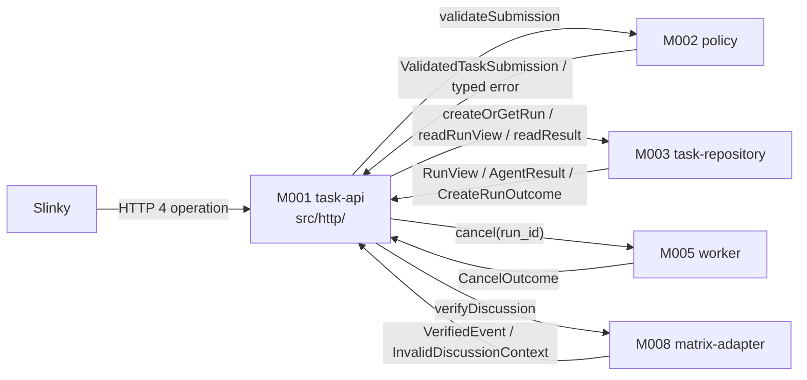
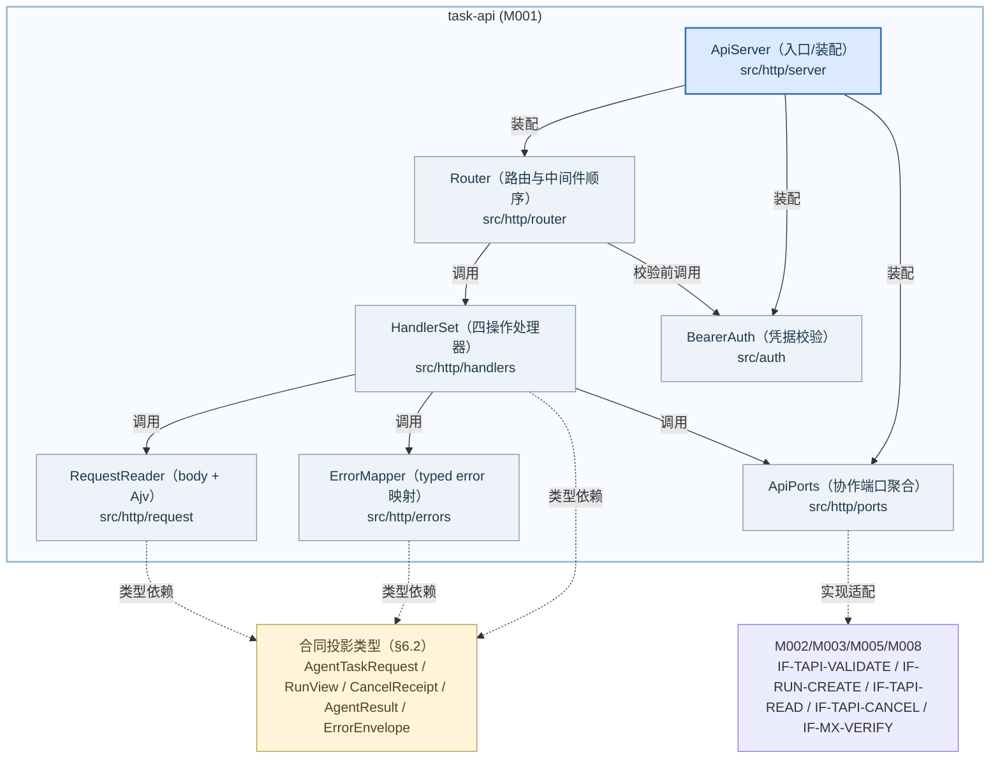
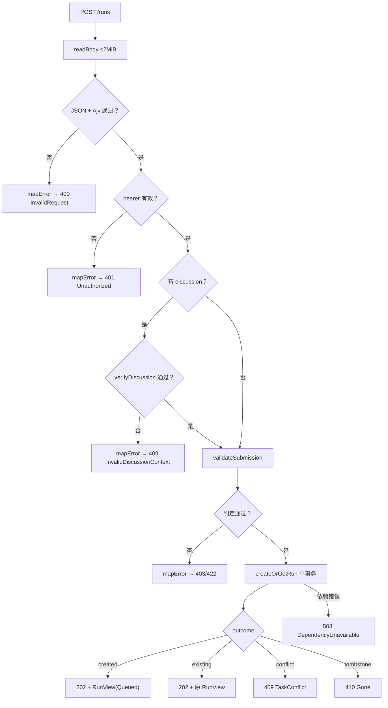
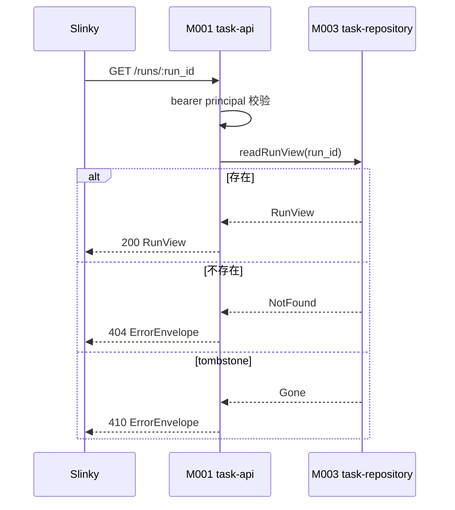
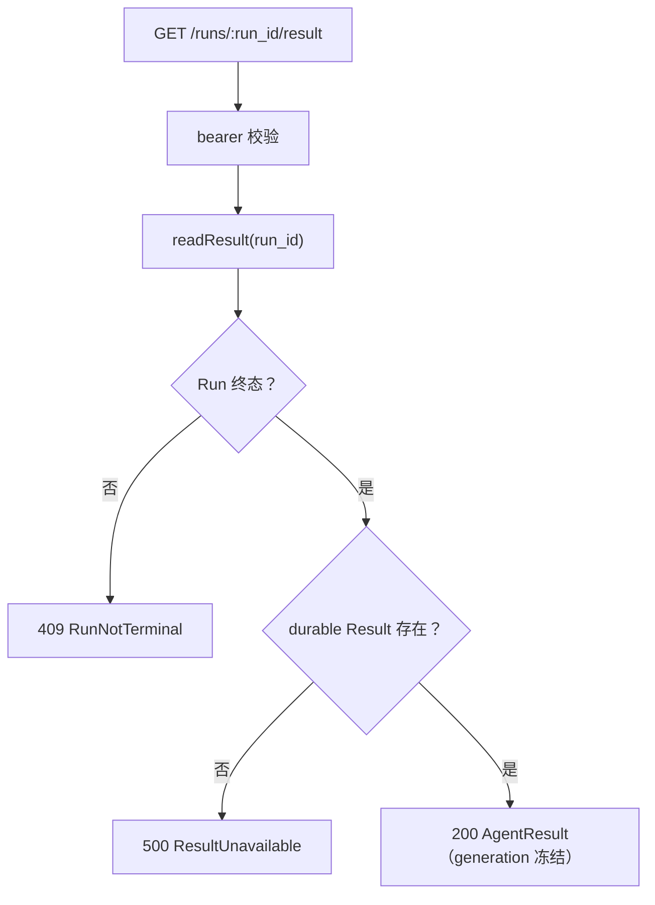
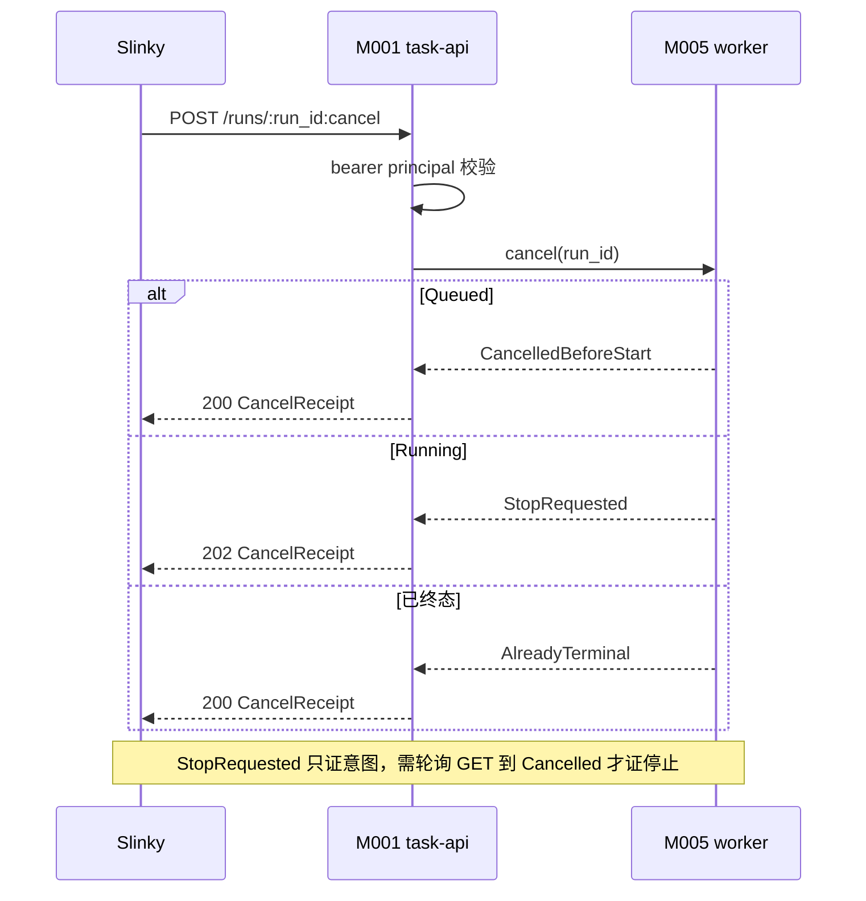

<!-- STD_DOCUMENT_COVER_BEGIN -->
# Piko 模块设计：task-api（M001）

> STD 使用入口：[项目采用说明与标准导航](../../README.md#std-entry)

| 文档字段 | 值 |
|---|---|
| Document ID | `piko-task-api` |
| Document Version | `0.1.0-draft.1` |
| Status | `Draft` |
| Project | `piko` |
| Document Owner | Piko Implementation Owner |
| Last Modified Date | `2026-09-27` |
| Template ID | `design.definition` |
| Template Version | `3.4.0` |

<!-- STD_DOCUMENT_COVER_END -->

## 1. 单元摘要：为什么存在

M001 `task-api` 解决一个问题：Slinky 需要用一个**可判定**的外部任务面把 AI 任务交给 Piko，并且必须能区分「请求被受理」「执行还在进行」「结果已稳定」「取消意图已落盘但执行未必停止」。`task-api` 把这件事实建模为四个 HTTP operation：`POST /runs`（submit，返回 `RunView`）、`GET /runs/:run_id`（status）、`POST /runs/:run_id:cancel`（cancel，返回 `CancelReceipt`）、`GET /runs/:run_id/result`（result，返回 `AgentResult`）。每个 operation 只做三件事：解析并校验 HTTP 报文、按固定顺序调用进程内协作方、把结果映射成稳定的 typed 响应或 typed error。

`task-api` 只做 HTTP 入口与规范化，**不持久化业务、不直接操作 adapter**：受理事务与读视图由 M003 `task-repository` 承担，请求/路径/预算判定由 M002 `policy` 承担，取消分流与 Pi abort 由 M005 `worker` 承担，discussion 起点校验由 M008 `matrix-adapter` 承担。它不改变 Run 状态机语义（MECH-RUN / M003），不解释 Result 内容，不自证「执行已停止」。

用一次调用说明：Slinky 发 `POST /runs`，body 带 `task_id`/`instruction`/`workspace_ref`/`permissions`/`limits`/`output_paths`（`discussion?` 可选）。`task-api` 读 body（上限 2 MiB）→ Ajv 按 `AgentTaskRequest` 校验 → bearer principal 校验 → 调 M002 `validateSubmission` → 调 M003 `createOrGetRun`（单事务）→ 202 返回 `RunView{state="Queued"}` 或按 typed error 返回 409 `TaskConflict` / 410 `Gone` / 422 `DeadlineExpired` / 429 `QueueFull` / 503 `DependencyUnavailable`。运行中取消只返回 202 `StopRequested`，`task-api` 不把它当停止证明。

| 项目 | 内容 |
|---|---|
| 模块编号 / 正式英文名称 | M001 / `task-api` |
| 直属父对象编号 / 名称 | `SW-P` / Piko Agent Runtime V0.3（软件系统，`design_level=system`） |
| 父设计 Document ID / 固定基线 / 登记位置 | `system-design` v0.11.2 / 契约 `0.3.0-simplified.6` / §3.2 直属模块表 + §3.4 约束分配；本模块登记见 §3.2 第 200 行 |
| 上级系统/父单元 | 无（纯软件顶层，无总体系统父单元） |
| 解决的问题 | 四项 HTTP operation 的报文校验、固定处理顺序与 typed 结果/错误映射；不把意图落盘误报成执行完成 |
| 提供的能力 | `createRun`、`getRun`、`cancelRun`、`getRunResult` 四个 HTTP 端点；JSON/Schema 校验；bearer principal 校验；X-Request-ID 关联；typed error 映射 |
| 主要使用者 | Slinky 项目经理（四项操作）；Operator 只读诊断由 ops 文档另定义，不经本模块新命令 |
| 不负责 | 业务持久化与 Run/Result 事务（M003）；request/path/tool/deadline/budget 判定（M002）；取消分流与 Pi abort（M005）；Pi/Matrix adapter 内部（M006/M008）；Run 状态机与 Result 语义（MECH-RUN/M003） |

### 1.1 继承的上级约束与落实方式

task-api 承接三条上级约束：`CON-RUN-002`（PK-02，任务事务稳定身份，主承接）、`CON-CX-001`（PK-03，取消分流，主承接）与 `CON-RUN-003`（PK-03，截止与预算，边界承接——本模块只负责把 M002 判定出的 typed error 映射为 HTTP 状态）。三条均为 Approved。约束来源为 `system-design` §3.4 与机制 §3.1；`CON-RUN-002` 权威定义在 `piko-run.md` §3.1，`CON-CX-001` 权威定义在 `piko-cancel.md` §3.1。

#### 1.1.1 `CON-RUN-002` · 任务事务稳定身份

- **上级基线与决定状态**：`system-design` v0.11.2 §3.4（PK-02 行）+ `piko-run.md` §3.1 `CON-RUN-002` · PK-02 · Approved；固定基线 machine contract `0.3.0-simplified.6`。上级原文：同一 `task_id` 只绑定一个不可变任务与一个 Run；tombstone 永久拒绝；同 ID 同内容不重新检查动态条件。
- **适用条件**：任何 `POST /runs` 请求；`task_id` 由 Slinky 在提交前生成且全局唯一。
- **继承预算或行为保证**：`task_id` 恰好一次；重复同内容返回原 Run 且不新增执行；不同内容返回 409 `TaskConflict`；清理后返回 410 `Gone`；只有不存在的 ID 才检查 deadline/queue/依赖。
- **可自行选择/不可改变**：不可改变：处理顺序固定为 JSON/Schema → bearer → 按 `task_id` 查；字段比较由 M003 按集合/UTC 口径执行；不得把重复提交改成新建执行。可自行设计：路由与中间件组织、错误映射实现、body 读取实现。
- **本地落实/内部再分配**：§2.1 `F-TAPI-SUBMIT` 定义行为；§8.2 `R-TAPI-VALIDATE`、§8.3 `R-TAPI-ERRMAP` 定义规则；§9.1.1 `createRun` 固定合同；§9.2.1 `IF-RUN-CREATE` 把比较/返回原 Run 的责任交给 M003；§10 `C-TAPI-01`/`C-TAPI-02` 推演并发与重复提交；§13 落到 `src/http/`。
- **验证方法与结果/证据**：局部 `VRC-TAPI-001`（受理与幂等）、`VRC-TAPI-002`（错误映射）；组合 PK-T03/PK-T15（契约 + HTTP E2E）。当前全部 `NOT_RUN`。
- **差距/变更影响/反馈责任**：none。契约 `0.3.0-simplified.6` 变化需独立评审。

#### 1.1.2 `CON-CX-001` · 取消分流（PK-03）

- **上级基线与决定状态**：`system-design` v0.11.2 §3.4（PK-03 行）+ `piko-cancel.md` §3.1 `CON-CX-001` · PK-03 · Approved。上级原文：Queued 取消单事务发布零调用 Result；Running 取消只写 stop intent 并返回 `StopRequested`；`StopRequested` ≠ 停止。
- **适用条件**：任何 `POST /runs/:run_id:cancel` 请求，Run 处于 Queued/Running/终态之一。
- **继承预算或行为保证**：Queued → 200 `CancelledBeforeStart`（同事务零调用 Result）；Running → 202 `StopRequested`（不证明停止）；已终态 → 200 `AlreadyTerminal`；401/404/410 与前两者互斥。
- **可自行选择/不可改变**：不可改变：按 state 分流语义、`StopRequested` ≠ 停止、不提供撤销已生效取消。可自行设计：路由匹配、状态码选择、与 M005 的进程内调用形态。
- **本地落实/内部再分配**：§2.3 `F-TAPI-CANCEL`；§8.3 `R-TAPI-ERRMAP`；§9.1.3 `cancelRun`；§9.2.4 `IF-TAPI-CANCEL`（分流交 M005）；§10 `C-TAPI-04`（取消与结果发布竞争）；附录 A.2。
- **验证方法与结果/证据**：局部 `VRC-TAPI-004`（三种 outcome 与状态码）；组合 PK-T05（fault 注入）。当前全部 `NOT_RUN`。
- **差距/变更影响/反馈责任**：`piko-cancel.md` §14.3 只列 `IF-CX-QUEUED`/`IF-CX-RUNNING`（M005→M003），未给 M001→M005 的入口接口命名；本模块提出 `IF-TAPI-CANCEL` 并登记 `OQ-TAPI-003`（Owner：Piko Architecture）。

#### 1.1.3 `CON-RUN-003` · 截止与预算（边界承接）

- **上级基线与决定状态**：`system-design` v0.11.2 §3.4（PK-03 行）+ `piko-run.md` §3.1 `CON-RUN-003` · PK-03 · Approved。上级把 deadline/budget 判定分配给 M002/M006；`task-api` 只在受理阶段映射 M002 判定出的 `DeadlineExpired`/`UnsupportedLimit`。
- **适用条件**：仅新建 ID 的受理路径；同 ID 同内容重放不重新检查（`CON-RUN-002` 优先）。
- **继承预算或行为保证**：`deadline_at` 已过（尚未受理）→ 422 `DeadlineExpired`；Piko 无法执行某 limit → 422 `UnsupportedLimit`；两者都不创建 Run。
- **可自行选择/不可改变**：不可改变：422 语义与「不创建 Run」；不得把 deadline 判定移到重复提交路径。可自行设计：错误映射位置、判定调用顺序（在 M002 内）。
- **本地落实/内部再分配**：§2.1 错误边界；§6.8.1 `ERR-TAPI-SUBMIT`；§9.2.2 `IF-TAPI-VALIDATE` 消费 M002 判定结果；§14.1.3。
- **验证方法与结果/证据**：局部 `VRC-TAPI-002`（422 分支）；组合 PK-T05（fault 注入）。当前 `NOT_RUN`。
- **差距/变更影响/反馈责任**：none；预算语义权威属 M002/M006，本模块不改。

## 2. 需求、功能与验收条件

task-api 的可观察功能是四个 HTTP operation。每个 operation 的调用者只有 Slinky（同一 bearer principal），输入输出全部由机器契约固定；本模块不新增第五个 operation，不提供 resume/retry 动作。

### 2.1 `F-TAPI-SUBMIT` · 提交任务

- **上级需求 / Constraint ID**：`CON-RUN-002`（PK-02）；`CON-RUN-003`（PK-03 边界）；`M-RUN-DI-001`。
- **调用方**：Slinky 项目经理，`POST /runs`，同一 bearer principal。
- **输入与前提**：`AgentTaskRequest`（`task_id`、`instruction`、`workspace_ref`、`permissions{read_paths,write_paths,tool_profile_ref}`、`limits{deadline_at,max_model_calls,max_tool_calls}`、`output_paths`、`discussion?`）；请求体 ≤ 2 MiB 且为合法 JSON；`Authorization: Bearer` 已配置；进程 READY。
- **行为**：固定顺序 JSON 解析 → Ajv Schema 校验 → bearer 校验 → （discussion 时）M008 校验起点 → M002 `validateSubmission` 判定 → M003 `createOrGetRun` 单事务（按 `task_id` 比较/创建）。重复同 ID 同内容直接返回原 Run；不同内容返回冲突；tombstone 返回 Gone；仅新 ID 检查 deadline/queue/依赖。
- **输出**：202 + `RunView`（首次受理 `state="Queued"`，重复返回当前视图）；错误为 `ErrorEnvelope`（400/401/403/409/410/422/429/503）。
- **错误与边界**：`InvalidRequest`(400) 非法 JSON/超限/字段非法；`Unauthorized`(401) 凭据缺失或无效；`ScopeDenied`(403) 无权限；`TaskConflict`(409)、`InvalidDiscussionContext`(409)；`Gone`(410)；`UnsupportedLimit`(422)、`DeadlineExpired`(422)；`QueueFull`(429)；`DependencyUnavailable`(503)。202 不证明执行开始。
- **验收条件**：给定合法新 `task_id`，返回 202 且 `state="Queued"`、`run_id` 非空；同 body 重发返回同一 `run_id` 且 `tasks` 行数不增；同 ID 换 instruction 返回 409；非法 JSON 返回 400 且无 Run 创建。

### 2.2 `F-TAPI-STATUS` · 查询 Run 状态

- **上级需求 / Constraint ID**：`CON-RUN-002`；`M-RUN-DI-001`。
- **调用方**：Slinky，`GET /runs/:run_id`，同一 principal。
- **输入与前提**：`run_id` 路径参数（`Identifier`，1–128，`^[A-Za-z0-9._:-]+$`）；bearer 有效。
- **行为**：校验路径参数与 principal → M003 读 `RunView`（含 `progress`、`result_available`、`cancel_requested`）。无副作用、不触发执行、不重新检查动态条件。
- **输出**：200 + `RunView`；错误 401/403/404/410。
- **错误与边界**：`NotFound`(404) 不存在或不可见；`Gone`(410) tombstone；`Unauthorized`(401)/`ScopeDenied`(403)。空 `run_id` 由路由不匹配转为 404（实现自由度，见 §8.1）。
- **验收条件**：已知 Queued Run 返回 200 且 `started_at=null`；未知 `run_id` 返回 404；已 tombstone 的 `run_id` 返回 410。

### 2.3 `F-TAPI-CANCEL` · 取消 Run

- **上级需求 / Constraint ID**：`CON-CX-001`（PK-03）；`M-CX-DI-001`。
- **调用方**：Slinky，`POST /runs/:run_id:cancel`，同一 principal。
- **输入与前提**：`run_id` 路径参数；bearer 有效；Run 存在。
- **行为**：校验 principal 与路径 → 调 M005 取消入口按 `runs.state` 分流：Queued → 单事务写 `cancel_requested=1` + 零调用 Cancelled Result + `state=Cancelled`，返回 `CancelledBeforeStart`；Running → 写 stop intent + `state=Cancelling`，返回 `StopRequested`；终态 → 返回 `AlreadyTerminal`。
- **输出**：Queued/终态 → 200 + `CancelReceipt`；Running → 202 + `CancelReceipt`；错误 401/403/404/410。
- **错误与边界**：`NotFound`(404)/`Gone`(410)/`Unauthorized`(401)/`ScopeDenied`(403)。cancel **不返回** `RunNotTerminal`；非终态由 outcome 表达。`StopRequested` 只证意图。
- **验收条件**：Queued 取消返回 200 `CancelledBeforeStart` 且 `results` 出现零调用 generation；Running 取消返回 202 `StopRequested` 且随后 `GET` 可轮询到 `Cancelled`；已终态返回 200 `AlreadyTerminal`。

### 2.4 `F-TAPI-RESULT` · 读取稳定结果

- **上级需求 / Constraint ID**：`CON-RUN-002`；`M-RUN-DI-001`。
- **调用方**：Slinky，`GET /runs/:run_id/result`，同一 principal。
- **输入与前提**：`run_id` 路径参数；bearer 有效；Run 已终态且 durable Result 存在。
- **行为**：校验 → M003 读 `results` generation：非终态 → `RunNotTerminal`；终态无 Result → `ResultUnavailable`；有 Result → 返回 `AgentResult`（内容已冻结）。
- **输出**：200 + `AgentResult`；错误 401/403/404/409/410/500。
- **错误与边界**：`RunNotTerminal`(409) 未终态；`ResultUnavailable`(500) 终态丢 durable Result（内部一致性错误，不伪装 404/空结果）；`NotFound`(404)/`Gone`(410)。迟到 usage 不改 generation。
- **验收条件**：Completed Run 返回 200 且 `generation` 与 `results` 行一致；非终态返回 409；已发布 generation 在两次读取间内容不变。

## 3. UI、CLI、服务端点或设备操作面

task-api 是**服务端点型**模块：它监听本地端口，把一个 HTTP 端点族作为唯一操作面。它没有 UI 页面、CLI 命令或设备操作面；这四个端点由 system-design §8.1 与机器契约唯一定义，本节只登记操作面边界，不重写字段。

#### 3.1 `S-TAPI-HTTP` · Piko Agent Runtime HTTP 端点集

- **类型 / 位置**：HTTP-RPC 端点集；执行位置为 Piko 单进程 `node:http` 服务，监听 `config.listen.host:config.listen.port`，路径前缀为部署路由（契约示例 `https://piko.example/agent-runtime/v1`）。
- **调用者 / 身份 / 被操作对象**：Slinky 项目经理（唯一配置的 bearer principal）；被操作对象是 Run 提交/状态/取消/结果四项。Operator 只读诊断是另一个 Surface，由 ops 文档承载，不属本模块。
- **操作与入口**：`POST /runs`（createRun）、`GET /runs/:run_id`（getRun）、`POST /runs/:run_id:cancel`（cancelRun）、`GET /runs/:run_id/result`（getRunResult）；对应 §9.1.1–§9.1.4。
- **输入与校验**：`Authorization: Bearer <credential>`、可选 `X-Request-ID`、JSON body（仅 `POST /runs` 需要）。校验顺序：bearer → 路由匹配 → body 读取/JSON/Schema → 路径参数。未知路由 404 `NotFound`。
- **正常结果 / 可见性**：createRun 202 `RunView`；getRun 200 `RunView`；cancelRun 200/202 `CancelReceipt`；getRunResult 200 `AgentResult`。可见性由 `runs`/`results` 表提交点决定，不由 HTTP 状态码单独判定。
- **Empty / Error / Disabled / 取消**：空 body/非法 JSON → 400 `InvalidRequest`；缺失/无效凭据 → 401 `Unauthorized`；无路由 → 404 `NotFound`；不支持任何「运行中撤销取消」入口；请求若客户端超时，服务端事务仍可能已提交（用原 `task_id` 核对，见 §10）。
- **§9 接口与 §11 维护引用**：§9.1 固定每个端点合同；§11 记录日志/指标与凭据处理；维护入口（operator 诊断）归 ops/`system-design` §8.1，不在本模块新增命令。

## 4. 外部边界与依赖

task-api 在进程内的位置：被 Slinky 经 HTTP 调用，调用 M002 `policy` 判定、M003 `task-repository` 读写视图/事务、M005 `worker` 取消分流、M008 `matrix-adapter` 校验 discussion 起点。下图只画模块外部交接，不表示线程或新部署边界。



图 M-TAPI-C1 · Target / Planned / NOT_BUILT。实线是同步请求/调用，不是网络拓扑。task-api 不打开 SQLite 连接、不调用 Pi adapter；所有事务写入发生在 M003。

#### 4.1 `DEP-TAPI-HTTP` · HTTPClient（宿主 HTTP 运行时）

- **角色 / 运行位置 / Owner**：宿主运行时能力，同进程；Owner：Piko Implementation Owner（M000/bootstrap 装配）。契约侧登记名为 `HTTPClient`（`system-design` §3.2）。
- **本模块调用或消费**：`node:http` `createServer`/`IncomingMessage`/`ServerResponse`、`URL`、`Buffer`，以及 Ajv 2020 + `ajv-formats` 的 JSON Schema 校验能力。
- **本模块提供**：无；本模块经它对外提供 `S-TAPI-HTTP`。
- **契约 authority / 版本 / selector**：Node.js `>= 22.19.0`（内建 `node:http`）；`ajv`/`ajv-formats`（lockfile 固定，见 §13）。
- **同步方式 / timeout / 生命周期**：异步事件循环；`server.listen(host,port)` 成功后 READY；`server.close()` 停止接收新连接。请求无模块级超时（客户端可自行超时）。
- **不可用或失败影响 / 责任出口**：端口被占用 → 启动失败，由 M000/bootstrap 收口（P-START S8 失败）；请求处理中的异常由 §8.3 映射为 5xx 或透传，不使进程崩溃。

#### 4.2 `DEP-TAPI-POLICY` · M002 `policy`（校验判定）

- **角色 / 运行位置 / Owner**：同级直属模块，同进程；Owner：Piko Implementation Owner。
- **本模块调用或消费**：`validateSubmission(request, principal) -> ValidatedTaskSubmission | TypedError`（`IF-TAPI-VALIDATE`，Proposed）；由它完成 path canonicalize、deadline/limit/queue 前置判定。
- **本模块提供**：无（`task-api` 不向 M002 提供接口）。
- **契约 authority / 版本 / selector**：`piko-run.md` §14.3（M002 → ValidatedTaskSubmission）+ M002 `piko-policy-design.md`（Planned）；`M-RUN-DI-002`。
- **同步方式 / timeout / 生命周期**：同步进程内调用；无状态；随进程。
- **不可用或失败影响 / 责任出口**：判定返回 typed error → 本模块映射 HTTP 状态；M002 抛内部异常 → 映射 503 `DependencyUnavailable`（不吞错）。判定语义权威属 M002，本模块不改。

#### 4.3 `DEP-TAPI-REPO` · M003 `task-repository`（事务与视图权威）

- **角色 / 运行位置 / Owner**：同级直属模块，同进程；Owner：Piko Implementation Owner。
- **本模块调用或消费**：`createOrGetRun(input) -> CreateRunOutcome`（`IF-RUN-CREATE`）、`readRunView(run_id) -> RunView | NotFound | Gone`、`readResult(run_id) -> AgentResult | RunNotTerminal | ResultUnavailable | NotFound | Gone`（`IF-TAPI-READ`）。
- **本模块提供**：无。task-api 不写 SQL、不持有连接。
- **契约 authority / 版本 / selector**：`piko-run.md` §5.1 `IF-RUN-CREATE`（Proposed）；`IF-TAPI-READ` 由本设计提出（`OQ-TAPI-002`）；DDL authority = `piko-task-repository-impl.isd.md` §4.7（Proposed，`system-design#m003-ddl-authority`）。
- **同步方式 / timeout / 生命周期**：同步进程内；单 `BEGIN IMMEDIATE`；受 `task_store.busy_timeout_ms`；连接由 M003 持有。
- **不可用或失败影响 / 责任出口**：`SQLITE_BUSY` 超时等依赖错误 → 受理路径映射 503 `DependencyUnavailable`；读取路径映射 500/503。本模块不吞错、不自行修复。

#### 4.4 `DEP-TAPI-WORKER` · M005 `worker`（取消分流权威）

- **角色 / 运行位置 / Owner**：同级直属模块，同进程；Owner：Piko Implementation Owner。
- **本模块调用或消费**：`cancel(run_id) -> CancelOutcome`（`IF-TAPI-CANCEL`，Proposed）；由 M005 按 `runs.state` 分流并驱动 abort/对账。
- **本模块提供**：无。
- **契约 authority / 版本 / selector**：`piko-cancel.md` §3/§5（M005 统筹；入口接口未命名，见 `OQ-TAPI-003`）；`M-CX-DI-001`。
- **同步方式 / timeout / 生命周期**：同步进程内调用返回 outcome；Running 路径的 abort/对账在 M005 内异步推进，不阻塞 HTTP 返回。
- **不可用或失败影响 / 责任出口**：M005 抛内部错误 → 映射 503/500；`StopRequested` 只证意图，不证停止（§11）。

#### 4.5 `DEP-TAPI-MATRIX` · M008 `matrix-adapter`（discussion 起点校验）

- **角色 / 运行位置 / Owner**：同级直属模块，同进程；Owner：Piko Implementation Owner。仅在 `discussion` 请求时被消费。
- **本模块调用或消费**：`verifyDiscussion(room_id, trigger_event_id) -> VerifiedEvent | InvalidDiscussionContext`（`IF-MX-VERIFY`）。
- **本模块提供**：无。
- **契约 authority / 版本 / selector**：`piko-matrix.md` §5.1 `IF-MX-VERIFY`（M008 提供，M001/M005 消费）；`CON-MX-001`。
- **同步方式 / timeout / 生命周期**：同步进程内调用，内部可能访问 homeserver（受 M008 `sync_timeout_ms`）。
- **不可用或失败影响 / 责任出口**：校验失败 → 409 `InvalidDiscussionContext`；M008 不可达 → 503 `DependencyUnavailable`（未创建 Run）。本模块不管理 homeserver。

## 5. 内部结构与实现位置

task-api 拆成七个内部单元：入口/宿主装配、路由、四操作处理器、请求读取与 Schema 校验、typed error 映射、凭据校验，以及一个对外协作端口聚合。拆分依据是「HTTP 报文处理可独立测试、错误映射可双向核对、对外端口隔离 M002/M003/M005/M008」，不是为了凑文件。



图 M-TAPI-S1 · Target / Planned / NOT_BUILT。外框是模块内部组成；实线同步调用，虚线类型/适配依赖；不表示线程。`src/http/` 全为 Planned；`src/auth.ts`/`src/server.ts` 为既有（见 §13）。

### 5.1 内部组成

#### 5.1.1 `S1` · ApiServer（入口与装配）

- **职责与非职责**：持 `node:http` server、监听端口、装配 Router/ports/auth；把 `IncomingMessage` 交给 Router 并写回响应。非职责：不做路由判断、不解析 body、不映射业务错误。
- **输入、处理与输出**：输入 `RuntimeConfig` + 端口实例；处理 `create()` 读入 `agent-runtime-v0.3.schema.json` 注册 Ajv、构造处理器；输出监听句柄与 `close()`。
- **协作对象**：调用 Router、ApiPorts、BearerAuth；被 M000 `main.ts` 装配。
- **文件 / symbol / 实现状态**：`src/http/server.ts` → `class ApiServer`（Planned / NOT_IMPLEMENTED）。现基线在 `src/server.ts` `ApiServer`（部分实现，见 §13）。
- **拆分依据与替代方案代价**：入口只做装配与监听，把路由/处理器分离以便单测。替代方案「全部写在一个 route 函数」是 Current 形态，代价是四操作与错误映射不可独立验证。

#### 5.1.2 `S2` · Router（路由与中间件顺序）

- **职责与非职责**：按 method+path 匹配四 operation 与 `:cancel` 后缀路由；固定中间件顺序（request-id → auth → route → body/schema → handler）。非职责：不发 SQL、不解析业务 JSON。
- **输入、处理与输出**：输入 `req/res` + `principal`；输出分发到处理器或 404 `NotFound`。
- **协作对象**：调用 S3 处理器；调用 S6 校验凭据；被 S1 调用。
- **文件 / symbol / 实现状态**：`src/http/router.ts`（Planned），`function route(req, res, ctx)`。现基线是 `src/server.ts:19` `ApiServer.route` 的 if/match 链。
- **拆分依据与替代方案代价**：把路径正则（`:cancel`、`/result`）集中，便于对路由歧义做表驱动测试。替代方案「散在各 handler」会使 `/runs/:id` 与 `/runs/:id/result` 匹配顺序不可控。

#### 5.1.3 `S3` · HandlerSet（四操作处理器）

- **职责与非职责**：实现 `createRun`/`getRun`/`cancelRun`/`getRunResult` 的编排：读 body、校验、调用端口、构造成功响应。非职责：不实现校验规则（M002）、不实现事务（M003）、不实现取消（M005）。
- **输入、处理与输出**：输入 `HttpContext{req,res,principal,requestId}`；输出已写出的 HTTP 响应或抛出的 typed/原生错误。
- **协作对象**：调用 S5 读取/校验、S7 端口、S4 映射错误；被 S2 调用。
- **文件 / symbol / 实现状态**：`src/http/handlers.ts`（Planned），`createRun/getRun/cancelRun/getRunResult`。现基线在 `src/server.ts:24`–`src/server.ts:32`。
- **拆分依据与替代方案代价**：四操作各自可独立测试成功/拒绝分支（§14.2）。替代方案「路由内联」使错误优先级难以核对。

#### 5.1.4 `S4` · ErrorMapper（typed error 映射）

- **职责与非职责**：把 `PikoError`/未知错误映射为 `ErrorEnvelope` + HTTP 状态 + `Retry-After`（429/503）。非职责：不决定业务错误是否该产生（那是 M002/M003/M005）。
- **输入、处理与输出**：输入错误 + `requestId`；输出 `{status, body, headers}`。
- **协作对象**：被 S3/S1 调用；消费 §6.8 错误集。
- **文件 / symbol / 实现状态**：`src/http/errors.ts`（Planned），`function mapError(error, requestId)`。现基线 `src/server.ts:34`。
- **拆分依据与替代方案代价**：把 catalog 双向一致性集中到一处（§8.3），便于契约测试。替代方案「每 handler 自 try/catch」会漏配 `request_id`/`Retry-After`。

#### 5.1.5 `S5` · RequestReader（body 读取与 Schema 校验）

- **职责与非职责**：读取请求体（≤ 2 MiB）、`JSON.parse`、Ajv 按 `#/$defs/AgentTaskRequest` 校验。非职责：不做路径 canonicalize（M002）、不比较任务定义（M003）。
- **输入、处理与输出**：输入 `IncomingMessage`；输出解析后的 `AgentTaskRequest` 或 `InvalidRequest`(400)。
- **协作对象**：被 S3 调用；持有 Ajv 编译函数（由 S1 注入）。
- **文件 / symbol / 实现状态**：`src/http/request.ts`（Planned），`readBody(req,max)` + `validateTask(json)`。现基线 `src/server.ts:12` 与 `src/server.ts:18`。
- **拆分依据与替代方案代价**：体积上限与 Schema 校验可独立单测（`VRC-TAPI-002` Case C）。替代方案「handler 内 parse」使 400 分支分散。

#### 5.1.6 `S6` · BearerAuth（凭据校验）

- **职责与非职责**：常量时间比较 `Authorization: Bearer <token>`；返回 principal 或 `Unauthorized`(401)。非职责：不管理轮换（重启生效，MECH-CONFIG）。
- **输入、处理与输出**：输入 header；输出 principal 字符串或 401。
- **协作对象**：被 S2 调用；由 S1 装配。
- **文件 / symbol / 实现状态**：`src/auth.ts` → `class BearerAuth.authenticate`（Implemented / 既有）。既有实现不再重写，仅由 `src/http/` 引用。
- **拆分依据与替代方案代价**：既有 `timingSafeEqual` 实现已满足常量时间要求；保留即为最小改动。

#### 5.1.7 `S7` · ApiPorts（协作端口聚合）

- **职责与非职责**：把 M002/M003/M005/M008 的进程内调用适配成模块内接口（`PolicyPort`/`RepoPort`/`CancelPort`/`MatrixVerifyPort`），是 task-api 唯一接触外部模块的单元。非职责：不做业务判断、不重试业务失败、不吞依赖错误。
- **输入、处理与输出**：输入结构化参数；输出 `ValidatedTaskSubmission`/`CreateRunOutcome`/`RunView`/`AgentResult`/`CancelOutcome` 或透传依赖错误。
- **协作对象**：调用 M002/M003/M005/M008；被 S3 调用。
- **文件 / symbol / 实现状态**：`src/http/ports.ts`（Planned），`interface ApiPorts` + 生产实现 `RuntimeApiPorts`。
- **拆分依据与替代方案代价**：端口使 handler 可在受控 fake 上测试（§14.2），并把跨模块合同集中。替代方案「handler 直接 import M003」会传播外部类型并绕过 §9.2。

### 5.2 内部调用过程

#### 5.2.1 `C-TAPI-CREATE` · 提交任务

- **入口与调用上下文**：HTTP `POST /runs` → `ApiServer` → `Router.route` → `createRun`（宿主事件循环，同步事务）。
- **调用链（文件 / symbol → 文件 / symbol）**：`router.route` → `handlers.createRun` → `BearerAuth.authenticate`（前置）→ `request.readBody` → `request.validateTask` → （discussion）`ports.verifyDiscussion` → `ports.validateSubmission` → `ports.createOrGetRun` → `errors.mapError`（失败时）→ 写 202/错误。
- **逐步传递的数据**：`req.headers.authorization` → `principal:string`；body → `AgentTaskRequest`；→ `ValidatedTaskSubmission`；→ `CreateRunOutcome`；→ `RunView` 或 typed error。
- **返回、异常与清理**：成功写 202；业务失败经 ErrorMapper；依赖错误由 ErrorMapper 透传为 503/500。无临时资源（事务在 M003 内）。
- **对应流程 / 接口 / 验证**：§7 `P-TAPI-SUBMIT`；§9.1.1、§9.2.1–§9.2.2；`VRC-TAPI-001/002/006`。

#### 5.2.2 `C-TAPI-READ` · 状态/结果读取

- **入口与调用上下文**：`GET /runs/:run_id` 或 `GET /runs/:run_id/result` → `getRun`/`getRunResult`。
- **调用链**：`router.route` → `handlers.getRun|getRunResult` → `BearerAuth.authenticate` → `ports.readRunView|readResult` → 写 200/错误。
- **逐步传递的数据**：`run_id:string` → `RunView | AgentResult` 或 `NotFound|Gone|RunNotTerminal|ResultUnavailable`。
- **返回、异常与清理**：只读，无副作用；404/410/409/500 经 ErrorMapper。
- **对应流程 / 接口 / 验证**：§7 `P-TAPI-STATUS`/`P-TAPI-RESULT`；§9.1.2/§9.1.4、§9.2.3；`VRC-TAPI-003/005`。

#### 5.2.3 `C-TAPI-CANCEL` · 取消

- **入口与调用上下文**：`POST /runs/:run_id:cancel` → `cancelRun`。
- **调用链**：`router.route`（`:cancel` 正则）→ `handlers.cancelRun` → `BearerAuth.authenticate` → `ports.cancel(run_id)`（M005 分流）→ 依 outcome 写 200/202 → 失败经 ErrorMapper。
- **逐步传递的数据**：`run_id:string` → `CancelOutcome{CancelledBeforeStart|StopRequested|AlreadyTerminal}` → `CancelReceipt`。
- **返回、异常与清理**：Queued/终态 200，Running 202；依赖错误 503；无模块级清理（abort 归 M005）。
- **对应流程 / 接口 / 验证**：§7 `P-TAPI-CANCEL`；§9.1.3、§9.2.4；`VRC-TAPI-004`。

### 5.3 文件间接口契约

本节只固定 task-api 内部文件之间的交接；跨模块接口在 §9.2，字段类型在 §6.2。

#### 5.3.1 `IF-TAPI-ROUTE` · `router.ts` → `handlers.ts`

- **接口成员 ID / §9 逐接口定义位置**：内部无公共成员 ID；行为规则权威在 §8.1 `R-TAPI-ROUTE`，端点合同在 §9.1。
- **本文件的提供或使用责任**：`router.ts` 完成匹配并把 `HttpContext` 交给 `handlers.ts` 的对应函数。
- **交接时机 / 本地调用步骤**：`route()` 内、凭据校验通过后；每条路由只调一个处理器函数。
- **§9 生命周期约束**：无状态、无所有权；调用即返回。
- **实现与验证位置**：`src/http/router.ts`；`VRC-TAPI-006` 覆盖路由/错误映射顺序。

#### 5.3.2 `IF-TAPI-READREQ` · `handlers.ts` → `request.ts`

- **接口成员 ID / §9 逐接口定义位置**：内部接口 `readBody`/`validateTask`；规则权威在 §8.2 `R-TAPI-VALIDATE`、§8.4 `R-TAPI-BODY`。
- **本文件的提供或使用责任**：`request.ts` 提供受上限保护的 body 读取与 Ajv 校验；`handlers.ts` 消费其结果或 400。
- **交接时机 / 本地调用步骤**：`createRun` 开头；先读 body 再校验，失败即抛 `InvalidRequest`。
- **§9 生命周期约束**：无状态；校验函数进程内复用（Ajv 编译一次，S1 注入）。
- **实现与验证位置**：`src/http/request.ts`；`VRC-TAPI-002`（Case C/D）。

#### 5.3.3 `IF-TAPI-MAP` · `handlers.ts`/`server.ts` → `errors.ts`

- **接口成员 ID / §9 逐接口定义位置**：内部接口 `mapError`；规则权威在 §8.3 `R-TAPI-ERRMAP`，错误集在 §6.8。
- **本文件的提供或使用责任**：`errors.ts` 提供唯一定型的映射；处理器与入口只在未捕获处调用。
- **交接时机 / 本地调用步骤**：任一处理器或路由抛错时由入口 `try/catch` 调 `mapError`。
- **§9 生命周期约束**：无状态；`requestId` 由入口生成并作为参数传入。
- **实现与验证位置**：`src/http/errors.ts`；`VRC-TAPI-002/004/005/006`。

#### 5.3.4 `IF-TAPI-PORTS` · `handlers.ts` → `ports.ts`

- **接口成员 ID / §9 逐接口定义位置**：内部接口 `ApiPorts`，方法契约见 §9.2；上游成员 ID 见 §9.2.1–§9.2.5。
- **本文件的提供或使用责任**：`ports.ts` 提供抽象 + 生产实现；`handlers.ts` 只依赖抽象。
- **交接时机 / 本地调用步骤**：见 `C-TAPI-CREATE`/`C-TAPI-READ`/`C-TAPI-CANCEL` 链。
- **§9 生命周期约束**：端口实例与进程同域；不缓存 `RunView`/`AgentResult`（每次读权威）。
- **实现与验证位置**：`src/http/ports.ts`；`VRC-TAPI-001/003/004/005` 以受控 fake + 真 M003/M005 两套覆盖。

### 5.4 服务提供方式（条件适用）

- **运行载体与入口**：`node:http` server，由 `ApiServer.create(config, ports, auth)` 构造、`listen(host,port)` 启动；§3 `S-TAPI-HTTP` 是唯一操作面。
- **并发/线程模型**：Node 单线程事件循环；每个请求 handler 同步处理（含同步 SQLite 调用），无模块自建线程/worker；写事务由 M003 单 writer 串行化。
- **初始化、Ready、生效与停止**：`main.ts` 按 M000 P-START S1→S8 顺序装配；`server.listen` 成功即 READY；SIGTERM → 停止新受理 → 等待在途请求有界完成 → `server.close()`。配置变更需重启（`CON-CFG-001`）。
- **宿主装配、失败和资源回收责任**：宿主 = M000 `bootstrap`/`src/main.ts`；端口占用等监听失败由 M000 收口为非零退出（不进入 READY）；回收由 `server.close()` 完成，本模块不持有 DB/文件句柄。

### 5.5 依赖方向

- **允许方向**：`http/server.ts` → `{http/router.ts, http/ports.ts, auth.ts}`；`http/router.ts` → `{http/handlers.ts, auth.ts}`；`http/handlers.ts` → `{http/request.ts, http/errors.ts, http/ports.ts}`；`http/*.ts` → `types.ts`（仅 §6.2 类型）。所有单元 → 无直接外部模块，除 `http/ports.ts` 适配 M002/M003/M005/M008。
- **禁止方向与原因**：禁止 `http/handlers.ts` 直接 import 任何外部模块（只能经 `ports.ts` 抽象）；禁止 `http/request.ts`/`http/errors.ts` import `http/handlers.ts`（避免环）；禁止任何单元直接 `import` M003 `store.ts` 或 M008 `matrix.ts`（会绕过 §9.2 合同并传播外部类型）。
- **循环/越层检查**：静态：对 `src/http/` 跑 import 依赖图（`tsc`/CI 脚本）确认无环、`errors.ts`/`request.ts` 不 import 业务模块。评审按 §5.1 逐文件核对引用。
- **变更影响**：改 `errors.ts` 影响全部 typed error 与契约一致性（§8.3）；改 `ports.ts` 影响跨模块合同（`OQ-TAPI-002/003`）；改 `handlers.ts` 影响四操作行为（§9.1）。

## 6. 数据结构设计

task-api 拥有的运行态数据是**每次请求的局部上下文**（`HttpContext`/`RouteMatch`），不跨请求保留；业务对象（`AgentTaskRequest`/`RunView`/`CancelReceipt`/`AgentResult`/`ErrorEnvelope`）的机器权威在契约/OpenAPI/Schema，本模块只做投影与校验，不建立第二份字段 authority。

**不适用类别与依据**：§6.3 配置结构 N/A（配置键由系统 schema 与 M000/M002 定义，本模块只读，见 §4.1/§8.1）；§6.4 通信报文（无跨执行边界消息，HTTP 报文本身由机器契约定义）；§6.5 设备/FPGA（纯软件，`TAIL-P-103`）；§6.6 运行状态 N/A（handler 无跨步骤状态，状态权威在 M003，见 §10）；§6.7 数据库表 N/A（DDL authority 属 M003，`system-design#m003-ddl-authority`）。

### 6.1 公共基础类型与枚举

#### 6.1.1 `RunState` / `CancelOutcome` / `RequestErrorCode`

- **完整定义、Data/Type/Error ID 与唯一来源**：`RunState = "Queued"|"Running"|"Cancelling"|"Completed"|"Failed"|"Cancelled"`；`CancelOutcome = "CancelledBeforeStart"|"StopRequested"|"AlreadyTerminal"`；`RequestErrorCode = "InvalidRequest"|"Unauthorized"|"ScopeDenied"|"NotFound"|"TaskConflict"|"RunNotTerminal"|"InvalidDiscussionContext"|"UnsupportedLimit"|"DeadlineExpired"|"QueueFull"|"DependencyUnavailable"|"ResultUnavailable"|"Gone"`。唯一来源：`interfaces/schemas/agent-runtime-v0.3.schema.json` `$defs.RunState`/`CancelReceipt`/`RequestErrorCode` 与 `interfaces/error-codes/error-blocker-catalog-v0.3.json`。
- **逐字段/逐值类型、范围、含义与跨字段约束**：三枚举均为字符串；未知值拒绝。`RunState` 与 `result_available`/`cancel_requested` 的跨字段约束由 `RunView` schema `allOf` 强制（见 §6.2.2）。
- **生产/修改、所有权、可见点、寿命及失败出口**：写入者 M003；本模块只读投影并序列化；可见点为 HTTP body；寿命 = Run 寿命。
- **合法与拒绝实例、V/Case 与证据状态**：合法 `"Queued"`；拒绝 `"queued"`（大小写不符）。`VRC-TAPI-003`；`NOT_RUN`。

### 6.2 业务与操作数据结构

#### 6.2.1 `AgentTaskRequest`（submit 请求体）

- **完整定义、Data/Type/Data ID 与唯一来源**：`AgentTaskRequest`；机器权威 `interfaces/schemas/agent-runtime-v0.3.schema.json#/$defs/AgentTaskRequest`（契约 `0.3.0-simplified.6`）。本模块持有其 TypeScript 投影 `TaskRequest`（`src/types.ts:3`）。
- **逐字段/逐值类型、范围、含义与跨字段约束**：`task_id`（`Identifier`，1–128，`^[A-Za-z0-9._:-]+$`，必填）、`instruction`（1–1048576）、`workspace_ref`（`OpaqueRef`）、`permissions.read_paths/write_paths`（≤256 唯一 `RelativePath`）、`permissions.tool_profile_ref`（`OpaqueRef`）、`limits.deadline_at`（UTC `Timestamp`，`Z$`）、`limits.max_model_calls`（1–100000）、`limits.max_tool_calls`（0–100000）、`output_paths`（≤256 唯一 `RelativePath`）、`discussion?{room_id,trigger_event_id}`。`additionalProperties:false`；缺任一 required 字段即拒绝。
- **生产/修改、所有权、可见点、寿命及失败出口**：由 HTTP body 解析产生，寿命 = 请求；经 M002 转为 `ValidatedTaskSubmission` 后交 M003 持久化。校验失败 → 400 `InvalidRequest`。
- **合法与拒绝实例、V/Case 与证据状态**：合法见 `piko-run.md` §6.1.1 q1；拒绝：绝对路径/`..`/超 256 项/未知字段。`VRC-TAPI-002`；`NOT_RUN`。

#### 6.2.2 `RunView` / `CancelReceipt` / `AgentResult` / `ErrorEnvelope`

- **完整定义、Data/Type/Data ID 与唯一来源**：机器权威 `interfaces/schemas/agent-runtime-v0.3.schema.json` `$defs.RunView`/`CancelReceipt`/`AgentResult`/`ErrorEnvelope`；本模块持有投影 `RunView`/`AgentResult`（`src/types.ts:11`/`:17`）。
- **逐字段/逐值类型、范围、含义与跨字段约束**：`RunView{run_id,task_id,state,accepted_at,started_at,finished_at,result_available,cancel_requested,progress{model_calls,tool_calls,last_activity_at}}`，`allOf` 约束 state↔时间戳/flag 组合；`CancelReceipt{run_id,outcome,requested_at}`；`AgentResult{run_id,task_id,generation,state,partial,summary,outputs[],known_actions[],usage,failure,published_at}`，`Completed` 强制 `failure=null/partial=false`、`Cancelled` 强制 `CancelledByRequest/Cancellation`；`ErrorEnvelope{error{code,message,request_id}}`。
- **生产/修改、所有权、可见点、寿命及失败出口**：`RunView`/`AgentResult` 由 M003 生产、本模块只序列化；`CancelReceipt` 由本模块与 M005 共同确定、`requested_at` 取自 `CancelOutcome` 事实；`ErrorEnvelope` 由 S4 生产。HTTP body 寿命 = 响应。
- **合法与拒绝实例、V/Case 与证据状态**：合法 `RunView{state:"Queued",started_at:null,result_available:false,cancel_requested:false}`；拒绝 `state:"Queued"` 且 `started_at` 非空。`VRC-TAPI-003/005`；`NOT_RUN`。

### 6.3 配置与规则数据结构

**N/A。** task-api 不定义配置结构：`listen.host/port`、`queue.capacity`、`api_auth.mode/principal_id/bearer_token_secret_ref` 等由 `interfaces/schemas/piko-runtime-config-v0.3.schema.json` + M000 `bootstrap` 定义与解析，本模块只以构造注入方式读取（§8.1）。依据：STD `design.definition` §6.3「不适用时在章首说明原因和 tailoring 依据」。

### 6.4 通信报文结构

**N/A。** task-api 不跨执行边界发布/订阅消息；面向 Slinky 的 HTTP 报文由机器契约（OpenAPI/Schema）唯一拥有，本模块只按 §6.2 投影。依据：`design.definition` §6.4。

### 6.5 设备与 FPGA 表项结构

**N/A** · 纯软件（`TAIL-P-103`），无设备/RTL 边界。

### 6.6 运行状态数据结构

**N/A。** task-api 无跨步骤运行状态：每个 HTTP 请求是独立的同步 handler，`HttpContext` 是请求局部变量，随响应释放；Run 的跨步骤状态（`Queued`→…→终态）唯一权威在 M003 `runs.state`，本模块只读投影。因此本章不设状态机、转换表或不变量；§10 仍按 §3/§5.4 联动给出常驻服务的启动/就绪/停止与在途请求交错。依据：`design.definition` §6.6「纯调用内局部变量无需虚构持久状态机，但仍说明对象寿命」——寿命见 §6.2 各结构的「生产/修改、所有权、可见点、寿命」字段。

### 6.7 数据库表结构

**N/A。** task-api 不拥有任何持久表：`tasks`/`runs`/`run_sessions`/`execution_slot`/`results` 等 DDL 与事务 authority 属 M003（`system-design` §7.7 锚点 `m003-ddl-authority`，设计权威 `piko-task-repository-impl.isd.md` §4.7 Proposed）。本模块只读/写经 §9.2 端口，不复制 CREATE TABLE。依据：`design.definition` §6.7「只读外部数据库时引用其唯一来源，不自创表定义」。

### 6.8 错误码与错误结构

四个错误记录按 operation 分组，逐码含义与 HTTP 状态继承 `interfaces/error-codes/error-blocker-catalog-v0.3.json`（`catalog_version=agent-runtime-errors/0.3.0-simplified.6`）与 OpenAPI `x-error-responses`，本模块只负责**产生/透传/映射**，不新增 code。

#### 6.8.1 `ERR-TAPI-SUBMIT` · createRun 错误集

- **完整定义、Data/Type/Error ID 与唯一来源**：applies to `POST /runs`；来源 `error-blocker-catalog-v0.3.json` `operation_status_codes.createRun` + OpenAPI `paths./runs.post` responses。
- **逐字段/逐值类型、范围、含义与跨字段约束**：`InvalidRequest`(400)、`Unauthorized`(401)、`ScopeDenied`(403)、`TaskConflict`(409)、`InvalidDiscussionContext`(409)、`Gone`(410)、`UnsupportedLimit`(422)、`DeadlineExpired`(422)、`QueueFull`(429, `Retry-After`)、`DependencyUnavailable`(503, `Retry-After`)；可重试者仅 `QueueFull`/`DependencyUnavailable`（catalog `retryable:true`）。
- **生产/修改、所有权、可见点、寿命及失败出口**：由 S4 从 M002/M003/M008 的 typed 失败映射；载荷 = `ErrorEnvelope`；寿命 = 响应；失败时未创建 Run。
- **合法与拒绝实例、V/Case 与证据状态**：合法 400（未知字段）；拒绝 400 但 message 泄露 credential（不得发生）。`VRC-TAPI-002`；`NOT_RUN`。

#### 6.8.2 `ERR-TAPI-STATUS` · getRun 错误集

- **完整定义、Data/Type/Error ID 与唯一来源**：applies to `GET /runs/:run_id`；来源 catalog `operation_status_codes.getRun`。
- **逐字段/逐值类型、范围、含义与跨字段约束**：`Unauthorized`(401)、`ScopeDenied`(403)、`NotFound`(404)、`Gone`(410)；无可重试码。
- **生产/修改、所有权、可见点、寿命及失败出口**：由 S4 映射；`NotFound` 表示不存在或对当前 principal 不可见（不区分，避免枚举）。
- **合法与拒绝实例、V/Case 与证据状态**：合法 404（未知 ID）；拒绝 200 携带 tombstone 内容。`VRC-TAPI-003`；`NOT_RUN`。

#### 6.8.3 `ERR-TAPI-CANCEL` · cancelRun 错误集

- **完整定义、Data/Type/Error ID 与唯一来源**：applies to `POST /runs/:run_id:cancel`；来源 catalog `operation_status_codes.cancelRun`。
- **逐字段/逐值类型、范围、含义与跨字段约束**：`Unauthorized`(401)、`ScopeDenied`(403)、`NotFound`(404)、`Gone`(410)。**不返回 `RunNotTerminal`**；非终态由 `CancelReceipt.outcome` 表达。
- **生产/修改、所有权、可见点、寿命及失败出口**：由 S4 映射；`Gone` 表示 tombstone。
- **合法与拒绝实例、V/Case 与证据状态**：合法 200 `CancelledBeforeStart`；拒绝 409（cancel 不应返回）。`VRC-TAPI-004`；`NOT_RUN`。

#### 6.8.4 `ERR-TAPI-RESULT` · getRunResult 错误集

- **完整定义、Data/Type/Error ID 与唯一来源**：applies to `GET /runs/:run_id/result`；来源 catalog `operation_status_codes.getRunResult`。
- **逐字段/逐值类型、范围、含义与跨字段约束**：`Unauthorized`(401)、`ScopeDenied`(403)、`NotFound`(404)、`RunNotTerminal`(409, `retryable:true`)、`Gone`(410)、`ResultUnavailable`(500)。
- **生产/修改、所有权、可见点、寿命及失败出口**：由 S4 映射；`ResultUnavailable` 是终态丢 durable Result 的内部一致性错误，不得伪装 404 或空成功。
- **合法与拒绝实例、V/Case 与证据状态**：合法 409（Running 查结果）；拒绝 200 空 body 冒充结果。`VRC-TAPI-005`；`NOT_RUN`。

## 7. 主流程与数据流

本节给出 task-api 四条过程：提交（含拒绝）、状态查询、取消分流、结果读取；外加统一的错误映射出口。四者与 §8 规则、§9 接口共用同一 `Process/IF` ID。



图 M-TAPI-P1 · Target / Planned / NOT_BUILT。正常与拒绝在同一图展开：拒绝不创建 Run、不改状态；`existing` 直接返回原 Run，不重新检查动态条件（`CON-RUN-002`）。



图 M-TAPI-P2 · Target / Planned / NOT_BUILT。只读无副作用；404 不区分「不存在」与「不可见」，避免枚举。



图 M-TAPI-P3 · Target / Planned / NOT_BUILT。非终态与终态丢 Result 是两类互斥失败，不得合并。



图 M-TAPI-P4 · Target / Planned / NOT_BUILT。`task-api` 不判定「是否已停」；只把 M005 分流结果映射为状态码与 receipt。

| Process ID | 触发/适用条件 | 图与正文位置 | 正常/异常出口 | 接口/规则/验证项 |
|---|---|---|---|---|
| `P-TAPI-SUBMIT` | 任意 `POST /runs` | §5.2.1 / M-TAPI-P1 | 正常 202 `RunView`；异常 400/401/403/409/410/422/429/503 | `createRun`、`IF-RUN-CREATE`、`R-TAPI-VALIDATE`、`VRC-TAPI-001/002` |
| `P-TAPI-STATUS` | 任意 `GET /runs/:run_id` | §5.2.2 / M-TAPI-P2 | 正常 200 `RunView`；异常 401/403/404/410 | `getRun`、`IF-TAPI-READ`、`VRC-TAPI-003` |
| `P-TAPI-CANCEL` | 任意 `POST /runs/:run_id:cancel` | §5.2.3 / M-TAPI-P4 | 正常 200/202 `CancelReceipt`；异常 401/403/404/410 | `cancelRun`、`IF-TAPI-CANCEL`、`VRC-TAPI-004` |
| `P-TAPI-RESULT` | 任意 `GET /runs/:run_id/result` | §5.2.2 / M-TAPI-P3 | 正常 200 `AgentResult`；异常 401/403/404/409/410/500 | `getRunResult`、`IF-TAPI-READ`、`VRC-TAPI-005` |
| `P-TAPI-ERRMAP` | 任一处理器/路由抛错 | §8.3 / M-TAPI-P1 拒绝边 | 正常 typed envelope；异常未分类错误 → 503 | `mapError`、`R-TAPI-ERRMAP`、`VRC-TAPI-006` |

| Step | 输入 | 执行位置 | 处理/规则 | 输出/状态变化 |
|---|---|---|---|---|
| 1 | `req` + headers | `src/http/router.ts` | 生成/透传 `X-Request-ID`，`R-TAPI-REQID` | `HttpContext{requestId}` |
| 2 | `Authorization` | `src/auth.ts` | 常量时间比较，`R-TAPI-ROUTE` | `principal` 或 401 |
| 3 | body 流 | `src/http/request.ts` | ≤2 MiB 读取 + Ajv，`R-TAPI-BODY`/`R-TAPI-VALIDATE` | `AgentTaskRequest` 或 400 |
| 4 | 校验后输入 | `src/http/handlers.ts` → `ports.ts` | 调 M002/M003/M005/M008 | `RunView`/`AgentResult`/`CancelReceipt` |
| 5 | 结果或错误 | `src/http/errors.ts` | catalog 映射，`R-TAPI-ERRMAP` | `ErrorEnvelope` + status + headers |

## 8. 关键算法与业务规则

#### 8.1 `R-TAPI-ROUTE` · 路由匹配与中间件顺序

- **输入前提 / 适用条件**：每个 HTTP 请求；`req.method` + `url.pathname`。
- **算法 / 规则 / 选择依据**：先处理 `POST /runs`（精确匹配），再用 `/^\/runs\/([^/]+):cancel$/`、`/^\/runs\/([^/]+)\/result$/`、`/^\/runs\/([^/]+)$/` 顺序匹配并 `decodeURIComponent` 参数；匹配顺序保证 `/result`/`:cancel` 不被 `/runs/:id` 吞掉。凭据校验在路由分发后、handler 前进行（顺序 401 优先于 400）。选择依据：契约固定四 operation 且无第五个；路径顺序必须确定（`piko-cancel` 与 `piko-run` 共用 `/runs` 命名空间）。
- **结果 / 不变量 / 边界**：结果 = 唯一 handler 或 404 `NotFound`。边界：空 segment、编码斜杠 `%2F` 作为参数不被当路由分隔符；未知 method/path → 404。
- **复杂度 / 资源限制**：O(1) 正则匹配；无额外分配（除路径解码）。
- **允许替换范围 / 不可改变保证**：可换路由库/表驱动；不可改变四 operation 集合、401 优先于 400 的顺序与 `:cancel`/`/result` 优先于 `/:id`。
- **具体输入推演 / 验证项**：`GET /runs/run-042/result` → `getRunResult`（不是 `getRun`）；`POST /runs/run-042:cancel` → `cancelRun`；`GET /nope` → 404。`VRC-TAPI-006`。

#### 8.2 `R-TAPI-VALIDATE` · 报文与身份校验顺序

- **输入前提 / 适用条件**：`POST /runs` 且路由已匹配；Ajv 已注册 `agent-runtime-v0.3.schema.json`。
- **算法 / 规则 / 选择依据**：固定顺序：读 body（≤2 MiB）→ `JSON.parse` → Ajv `getSchema(schema.$id + "#/$defs/AgentTaskRequest")` → 失败 400 `InvalidRequest`；bearer 校验 → 401 `Unauthorized`。选择依据：契约 §2 明确「处理顺序固定为 JSON/Schema → bearer principal → 按 task_id 查记录」；把静态校验放最前，避免用未校验数据访问持久层。
- **结果 / 不变量 / 边界**：失败返回首条可读 detail（`instancePath + message` 拼接），不返回原始 body；成功产出 `AgentTaskRequest`。边界：body 超限立即 400（不继续读）；Ajv `allErrors:true` 收集全部错误。
- **复杂度 / 资源限制**：O(body 大小)；Ajv 编译一次进程内复用；单请求内存 ≤ 2 MiB + 解析副本。
- **允许替换范围 / 不可改变保证**：可换 JSON Schema 实现（须支持 draft 2020-12 + format）；不可改变校验对象（`AgentTaskRequest`）、上限（2 MiB）与「先 schema 后 bearer」顺序。
- **具体输入推演 / 验证项**：未知字段 `{"foo":1}` → 400；`permissions` 缺 `tool_profile_ref` → 400；合法 q1 body → 通过；无 `Authorization` → 401。`VRC-TAPI-002`。

#### 8.3 `R-TAPI-ERRMAP` · typed error 映射

- **输入前提 / 适用条件**：任一处理器或路由抛出错误，或端口返回 typed 失败。
- **算法 / 规则 / 选择依据**：`PikoError{code,status,message}` → 直接取 `code`/`status` 构造 `ErrorEnvelope{error{code,message,request_id}}`；非 `PikoError` 的未知错误 → `DependencyUnavailable`(503)；`status ∈ {429,503}` 加 `Retry-After: 5`。选择依据：契约 §6 要求每个 operation/status 的 code 与 catalog 双向一致；未知错误必须 fail-closed 成 503 而不是 500 泄露栈。
- **结果 / 不变量 / 边界**：不变量 = 返回 code 必在 `RequestErrorCode` 内且属于该 operation 的 catalog 集合；`request_id` 必填非空。边界：错误 message 不含 credential/绝对路径/body；429/503 必带 `Retry-After`。
- **复杂度 / 资源限制**：O(1)。
- **允许替换范围 / 不可改变保证**：可换映射表数据结构；不可改变 code↔status 映射、`Retry-After` 规则与错误集合归属。
- **具体输入推演 / 验证项**：`TaskConflict` → 409 且保留原任务；未知 `TypeError` → 503；`QueueFull` → 429 + `Retry-After: 5`。`VRC-TAPI-002/006`。

#### 8.4 `R-TAPI-BODY` · 请求体读取与上限

- **输入前提 / 适用条件**：任何需读 body 的 operation（当前仅 `POST /runs`）。
- **算法 / 规则 / 选择依据**：流式累加，超过 `max=2*1024*1024` 立即抛 `InvalidRequest`(400)「request body too large」，不缓存剩余字节；`Buffer.concat` 后 `JSON.parse`，失败抛 400「invalid JSON body」。选择依据：避免超大 body 占用内存；契约要求 400 而非 413（当前错误集无 413）。
- **结果 / 不变量 / 边界**：结果 = 解析对象或 400。边界：空 body → `JSON.parse("")` 失败 → 400；非 UTF-8 由 `Buffer.toString` 处理。
- **复杂度 / 资源限制**：O(body)；峰值内存 ≤ 2 MiB + 分块。
- **允许替换范围 / 不可改变保证**：可换分块策略；不可改变上限值与 400 语义。
- **具体输入推演 / 验证项**：2 MiB+1 字节 → 400 且未调用 M003；截断 JSON → 400。`VRC-TAPI-002` Case C/D。

#### 8.5 `R-TAPI-REQID` · 关联 ID 与日志口径

- **输入前提 / 适用条件**：每个请求。
- **算法 / 规则 / 选择依据**：若 `x-request-id` 为非空 string 则沿用，否则 `randomUUID()`；同一值写入响应错误 `error.request_id` 与所有日志字段；成功响应不含 request_id（契约响应体无该字段）。选择依据：契约 §6 要求 `ErrorEnvelope.request_id`；system §10.2 要求事件含 `run_id?`/`generation`。
- **结果 / 不变量 / 边界**：不变量 = 同请求的日志与错误载荷 request_id 一致；边界：超长 header 不截断（Node 默认 header 限制内），空字符串视为缺省。
- **复杂度 / 资源限制**：O(1)。
- **允许替换范围 / 不可改变保证**：可换生成器；不可改变「沿用客户端 ID」与「错误体带 request_id」。
- **具体输入推演 / 验证项**：带 `X-Request-ID: abc` 的 404 响应 `error.request_id="abc"`；不带则生成 UUID。`VRC-TAPI-006`。

## 9. 接口设计

task-api 的对外接口是 §9.1 四个 HTTP operation（机器权威 = OpenAPI/Schema/catalog）；被消费的跨模块接口是 §9.2 的 M002/M003/M005/M008 端口。不适用类别在本章内说明。

### 9.1 API（适用时）

#### 9.1.1 `POST /runs`（createRun）

- **Interface/Member ID、用途、提供责任与来源**：`createRun`（OpenAPI operationId）；`task-api` 提供；来源 `interfaces/openapi/agent-runtime-openapi-v0.3.yaml` `paths./runs.post` + contract §1–§2。
- **输入与前提**：`AgentTaskRequest`（§6.2.1）+ 可选 `X-Request-ID` header；bearer principal 已配置；进程 READY。
- **成功输出与保证**：202 + `RunView`（§6.2.2）；首次受理 `state="Queued"`；同 ID 同内容返回原 Run。202 仅表示已持久化任务定义并创建 Run，不表示执行开始。
- **错误与合法下一步**：§6.8.1 全码；`QueueFull`/`DependencyUnavailable` 可同 ID 重试，`TaskConflict` 保留原任务、新任务换新 `task_id`，`Gone` 换新 ID。
- **交互与生命周期**：同步；单 `BEGIN IMMEDIATE`；无 at-most-once 承诺——重复提交由 M003 幂等返回原 Run。请求超时不等于服务端未提交（用原 `task_id` 核对）。
- **实现与验证**：Planned `src/http/handlers.ts` `createRun`；合法/拒绝实例见 §6.2.1、§14.2。`VRC-TAPI-001/002`；`NOT_RUN`。

#### 9.1.2 `GET /runs/:run_id`（getRun）

- **Interface/Member ID、用途、提供责任与来源**：`getRun`；`task-api` 提供；来源 OpenAPI `paths./runs/{run_id}.get` + contract §1。
- **输入与前提**：`run_id`（`Identifier`）+ 可选 `X-Request-ID`；bearer 有效。
- **成功输出与保证**：200 + `RunView`（含 `progress`/`result_available`/`cancel_requested`）；无副作用。
- **错误与合法下一步**：401/403/404/410（§6.8.2）；404 不区分不存在/不可见；410 表示 tombstone。
- **交互与生命周期**：同步只读；与 result/cancel 共享同一 M003 读路径；无取消/超时语义（只读）。
- **实现与验证**：Planned `getRun`；`VRC-TAPI-003`；`NOT_RUN`。

#### 9.1.3 `POST /runs/:run_id:cancel`（cancelRun）

- **Interface/Member ID、用途、提供责任与来源**：`cancelRun`；`task-api` 提供；来源 OpenAPI `paths./runs/{run_id}:cancel.post` + `piko-cancel.md` §5.1。
- **输入与前提**：`run_id` + 可选 `X-Request-ID`；bearer 有效；Run 存在。
- **成功输出与保证**：200 `CancelledBeforeStart`（Queued，零调用 Result 已发）/ 200 `AlreadyTerminal` / 202 `StopRequested`（意图落盘，不证明停止）；`CancelReceipt` 含 `requested_at`。
- **错误与合法下一步**：401/403/404/410（§6.8.3）；**不返回** `RunNotTerminal`；`StopRequested` 后轮询 `getRun` 到 `Cancelled` 才证停止。
- **交互与生命周期**：同步返回 outcome；Running 的 abort/对账在 M005 异步推进；不持有 lease。
- **实现与验证**：Planned `cancelRun`；`VRC-TAPI-004`；`NOT_RUN`。

#### 9.1.4 `GET /runs/:run_id/result`（getRunResult）

- **Interface/Member ID、用途、提供责任与来源**：`getRunResult`；`task-api` 提供；来源 OpenAPI `paths./runs/{run_id}/result.get` + contract §3。
- **输入与前提**：`run_id` + 可选 `X-Request-ID`；bearer 有效。
- **成功输出与保证**：200 + `AgentResult`（generation 内容冻结）；`Completed` 强制 `failure=null/partial=false`。
- **错误与合法下一步**：401/403/404/409 `RunNotTerminal`（可重试等待）/410/500 `ResultUnavailable`（交 operator，不重建）。
- **交互与生命周期**：同步只读；迟到 usage 不改 generation；与 getRun 共享读路径。
- **实现与验证**：Planned `getRunResult`；`VRC-TAPI-005`；`NOT_RUN`。

### 9.2 消息与数据流接口（适用时）

task-api 不跨部署边界发消息；但与 M002/M003/M005/M008 的进程内协作接口是跨模块合同，按 STD 在此唯一维护。

#### 9.2.1 `IF-RUN-CREATE` · M001 → M003 受理事务（Proposed）

- **Interface/Member ID、用途、责任与唯一来源**：`IF-RUN-CREATE`；Provider：M003；Consumer：M001。权威：`piko-run.md` §5.1（Proposed，`OQ-TAPI-002`）。

  ```text
  createOrGetRun(input: ValidatedTaskSubmission)
    -> { kind: "created" | "existing", run_id, state, view: RunView }
     | "conflict"   // 同 task_id 不同定义 → 409 TaskConflict
     | "tombstone"  // → 410 Gone
  ```
- **输入、输出及关联身份**：`input` 来自 §9.2.2；关联身份 `task_id`（全局唯一）。单 `BEGIN IMMEDIATE` 内完成比较/创建；`created` 表示 `tasks`+`runs` 已提交。
- **交互、错误及生命周期**：同步；Guard 与写入同事务；依赖错误上抛；无背压/消息语义。
- **实现与验证**：M003 侧（Planned）；`VRC-TAPI-001` 以受控 fake + 真 M003 两套覆盖；`NOT_RUN`。

#### 9.2.2 `IF-TAPI-VALIDATE` · M001 → M002 校验判定（Proposed）

- **Interface/Member ID、用途、责任与唯一来源**：`IF-TAPI-VALIDATE`；Provider：M002 `policy`；Consumer：M001。权威：M002 `piko-policy-design.md`（Planned）+ `M-RUN-DI-002`。

  ```text
  validateSubmission(request: AgentTaskRequest, principal: string)
    -> ValidatedTaskSubmission
     | DeadlineExpired | UnsupportedLimit | ScopeDenied
  ```
- **输入、输出及关联身份**：`request` = 已 Schema 校验的 §6.2.1；关联身份 `task_id`；`ValidatedTaskSubmission` 字段同 §6.2.1 规范化后。
- **交互、错误及生命周期**：同步无状态；typed 失败由 S4 映射；M002 异常 → 503。
- **实现与验证**：M002 侧（Planned）；`VRC-TAPI-002`；`NOT_RUN`。

#### 9.2.3 `IF-TAPI-READ` · M001 → M003 读视图（Proposed）

- **Interface/Member ID、用途、责任与唯一来源**：`IF-TAPI-READ`；Provider：M003；Consumer：M001。权威：本设计提出（MECH-RUN §14.3 未单列读接口 → `OQ-TAPI-002`）。

  ```text
  readRunView(run_id) -> RunView | NotFound | Gone
  readResult(run_id)  -> AgentResult | RunNotTerminal | ResultUnavailable | NotFound | Gone
  ```
- **输入、输出及关联身份**：`run_id`；只读；`RunNotTerminal` 仅在 Run 非终态、`ResultUnavailable` 仅在终态无 durable Result。
- **交互、错误及生命周期**：同步只读；无事务写；无缓存（每次读权威）。
- **实现与验证**：M003 侧（Planned）；`VRC-TAPI-003/005`；`NOT_RUN`。

#### 9.2.4 `IF-TAPI-CANCEL` · M001 → M005 取消分流（Proposed）

- **Interface/Member ID、用途、责任与唯一来源**：`IF-TAPI-CANCEL`；Provider：M005 `worker`；Consumer：M001。权威：`piko-cancel.md` §3/§5（入口接口未命名 → `OQ-TAPI-003`）。

  ```text
  cancel(run_id) -> CancelOutcome{outcome: CancelledBeforeStart | StopRequested | AlreadyTerminal, requested_at}
                   | NotFound | Gone
  ```
- **输入、输出及关联身份**：`run_id`；`outcome` 由 M005 按 `runs.state` 分流；`requested_at` = 事务 UTC now。
- **交互、错误及生命周期**：同步返回 outcome；Running 的 abort/对账异步推进；不阻塞 HTTP。
- **实现与验证**：M005 侧（Planned）；`VRC-TAPI-004`；`NOT_RUN`。

#### 9.2.5 `IF-MX-VERIFY` · M001 → M008 discussion 校验

- **Interface/Member ID、用途、责任与唯一来源**：`IF-MX-VERIFY`；Provider：M008 `matrix-adapter`；Consumer：M001/M005。权威：`piko-matrix.md` §5.1（已声明，Proposed）。

  ```text
  verifyDiscussion(room_id: string, trigger_event_id: string)
    -> VerifiedEvent | InvalidDiscussionContext
  ```
- **输入、输出及关联身份**：`room_id`/`trigger_event_id` 来自 §6.2.1 `discussion`；关联身份 `event_id`。
- **交互、错误及生命周期**：同步进程内（内部访问 homeserver，受 M008 超时）；失败 409，M008 不可达 503。
- **实现与验证**：M008 侧（Planned）；`VRC-TAPI-002`；`NOT_RUN`。

### 9.3 硬件与固件接口（适用时）

**N/A。** 纯软件模块，无寄存器/总线/时序边界（`TAIL-P-103`）。不虚构设备接口。

### 9.4 人机与维护接口（适用时）

**N/A。** 无 CLI/诊断命令。Operator 只读诊断由 `system-design` §8.1 + ops 文档定义，不经本模块；错误定位经结构化日志与 `ErrorEnvelope.request_id`（§11）。

## 10. 并发、失败与恢复

按 §1 的事实联动：§3 判定 task-api 为常驻服务端点（故 §5.4 已交代启动/就绪/停止），§6.6 判定无跨步骤状态（故无状态转换），§6.7 判定不写持久表（故事务边界归 M003）。执行上下文：全部 handler 在 Node 单线程事件循环上同步执行；SQLite 由 M003 单 writer 串行化。

#### 10.1 `C-TAPI-01` · 两个并发提交同 task_id

- **初始条件 / 并发交错 / 失败点**：两个 `POST /runs` 同时到达、body 相同、`task_id` 相同。失败点：两者都进入 M003 前都判定「不存在」。
- **检测事实 / authority / 期限**：`tasks.task_id` 唯一主键 + `createOrGetRun` 单 `BEGIN IMMEDIATE` 串行化；`created` vs `existing` 由事务内 SELECT 决定。
- **处理行为 / 副作用边界**：一个事务 `created`，另一个 `existing` 返回同一 `RunView`；无第二 Run、无第二次执行。
- **状态查询 / 同请求重放 / 接管 / 新业务重试**：查询 = `getRun`；同请求重放 = 再次 `POST` 同 body（返回原 Run，不新增执行）；接管 = N/A；新业务重试 = 换新 `task_id`。
- **最终状态 / 资源归属 / 后续合法入口**：单一 Run（`Queued`）；后续合法入口 = `getRun`/`cancel`。
- **验证项 / 组合责任**：`VRC-TAPI-001`；组合 PK-T03/PK-T15。

#### 10.2 `C-TAPI-02` · 响应丢失后的重复提交

- **初始条件 / 并发交错 / 失败点**：Slinky 未收到 202（网络/客户端超时），但 M003 已提交；Slinky 重发同 body。失败点：把载体超时当「未受理」而改新 ID。
- **检测事实 / authority / 期限**：`tasks.task_id` 行提交事实（持久）；重发时 M003 比较 `task_json`。
- **处理行为 / 副作用边界**：字段相同 → 返回原 Run；不同 → 409 `TaskConflict`；不重新检查 deadline/queue（`CON-RUN-002`）。
- **状态查询 / 同请求重放 / 接管 / 新业务重试**：查询 = `getRun`；重放 = 同 ID 同内容；新业务 = 换新 ID。
- **最终状态 / 资源归属 / 后续合法入口**：Run 不变；入口 = `getRun`。
- **验证项 / 组合责任**：`VRC-TAPI-001`；组合 PK-T15。

#### 10.3 `C-TAPI-03` · 依赖在途失败（M003/M002/M008）

- **初始条件 / 并发交错 / 失败点**：受理路径中 M003 抛 `SQLITE_BUSY`（busy_timeout 耗尽）、M002 抛内部异常或 M008 不可达。
- **检测事实 / authority / 期限**：抛出的原生/typed 异常；`busy_timeout_ms` 为期限。
- **处理行为 / 副作用边界**：S4 映射 `DependencyUnavailable`(503, `Retry-After`)；若发生在 M003 事务内则事务回滚、无部分 Run；M008 失败在创建前 → 未创建 Run。
- **状态查询 / 同请求重放 / 接管 / 新业务重试**：查询 = `getRun`（确认是否已受理）；重放 = 同 ID 同内容（安全，因 M003 幂等）；新业务 = 换 ID。
- **最终状态 / 资源归属 / 后续合法入口**：无资源遗留；入口 = 重试同 ID。
- **验证项 / 组合责任**：`VRC-TAPI-002`；组合 PK-T05。

#### 10.4 `C-TAPI-04` · 取消与 Result 发布竞争

- **初始条件 / 并发交错 / 失败点**：`cancelRun`（Running）与 worker 正常完成并发。失败点：cancel 返回 `StopRequested` 后 Run 已 `Completed`。
- **检测事实 / authority / 期限**：`runs.state` + `cancel_requested`（M003 writer lock 串行化，先到者生效）。
- **处理行为 / 副作用边界**：cancel 只写 stop intent；若 worker 先提交终态，M005 分流返回 `AlreadyTerminal`；`task-api` 不改判定，只映射 outcome。
- **状态查询 / 同请求重放 / 接管 / 新业务重试**：查询 = `getRun`；重复 cancel = 幂等返回当前 outcome；接管 = N/A。
- **最终状态 / 资源归属 / 后续合法入口**：终态唯一（`Completed` 或 `Cancelled`）；slot 释放归 M005/M003。
- **验证项 / 组合责任**：`VRC-TAPI-004`；组合 PK-T05。

#### 10.5 `C-TAPI-05` · 启动失败与停止时在途请求

- **初始条件 / 并发交错 / 失败点**：`server.listen` 端口占用（启动失败）；或 SIGTERM 到达时有请求正在 M003 事务中。
- **检测事实 / authority / 期限**：`listen` 的 `error` 事件；`server.close()` 回调；进程退出码。
- **处理行为 / 副作用边界**：监听失败 → 进程非零退出、不进入 READY（M000 收口）；停止时不再接受新连接，等待在途请求完成（有界）；已在 M003 事务内的请求照常提交。
- **状态查询 / 同请求重放 / 接管 / 新业务重试**：查询 = 重启后 `getRun`；重放 = 同 ID 同内容；接管 = N/A。
- **最终状态 / 资源归属 / 后续合法入口**：句柄由 `server.close()` 释放；合法入口 = 重启后 HTTP。
- **验证项 / 组合责任**：`VRC-TAPI-006`；组合 PK-T12。

## 11. 安全、权限与可观测性

- **输入信任 / 身份 / 授权**：唯一外部身份是配置的 Slinky bearer principal（`api_auth.principal_id` + secret provider 解析的 token，见 §4.1/§8.1）。`BearerAuth.authenticate` 用 `timingSafeEqual` 恒定时间比较；缺失/不匹配返回 401 且不暴露差异。不支持请求内 principal 切换；越权 scope（`ScopeDenied`）来自 M002/M003。权限服务失败不默认放行。
- **敏感数据**：`task-api` 不接触 credential 明文（只比对 Buffer）、不记录 `instruction` 正文、绝对路径或 body；错误 message 只含 code/原因类别。`task_id`/`run_id` 为可入日志的业务标识。
- **继承上级指标与口径**：继承 `system-design` §10.2 的 `event.run.{created,terminated}` 与 `piko.run.state.duration.{state}`（由 M001/M003/M005 生产 → M009 采集）；本模块是其 HTTP 侧触发点之一，不新增指标。日志关联键 `run_id?`+`generation`+`request_id`，脱敏规则同 system §10.2（禁 instruction/credential/token/完整模型输入输出）。
- **诊断与维护**：无独立命令；错误定位经 `ErrorEnvelope.request_id` + 结构化日志 + operator 只读诊断（`system-design` §8.1）。诊断不改变业务结果。
- **真实故障的识别与处理**：M003 不可用 → 受理 503 `DependencyUnavailable`（可重试），Slinky 用原 `task_id` 核对；M008 不可达 → 503（discussion 任务未创建）；M005 异常 → 503/500。无能力时给责任出口（M000/M005/operator），不写「由平台保障」。

## 12. 容量、性能与运行限制

#### 12.1 `CAP-TAPI-REQ` · 受理请求开销与并发

- **目标 / 限制 / 单位**：单请求 HTTP 侧处理（读 body + Ajv + 端口调用）为常量级；并发受单线程事件循环与 M003 单 writer 约束，不设模块级并发上限。
- **适用版本 / 配置 / 硬件 / 虚拟化 / 依赖**：Node.js `>= 22.19.0`；`ajv`/`ajv-formats`（lockfile）；`config.listen.port`、`queue.capacity`（M003 受理）；本地可靠 FS（SQLite WAL）。
- **负载、数据规模与并发口径**：单实例；body ≤ 2 MiB；队列深度由 `queue.capacity` 界定；`task-api` 不排队，`QueueFull` 由 M003 在事务内判定。
- **推导 / 测量方法与证据等级**：复杂度：读 body O(n)、Ajv O(body)、路由 O(1)；HTTP 侧开销 = 解析 + 一次同步 M003 事务（受 `busy_timeout_ms`）。当前无实测，证据等级 `Modeled`；`VRC-TAPI-*` 覆盖正确性而非吞吐。
- **共享资源扣减 / 峰值重叠 / 余量**：不额外持有内存配额（每请求 ≤ 2 MiB 峰值）；`tasks`/`runs` 行与 WAL 开销计入 M003 存储预算，不重复计账。
- **超限行为 / 责任出口**：body 超限 400；队列满 429 `QueueFull`（未创建 Run）；SQLite busy 超时 503。
- **验证项 / Evidence**：`VRC-TAPI-002`；`NOT_RUN`。

#### 12.2 `CAP-TAPI-BODY` · 请求体上限

- **目标 / 限制 / 单位**：`max = 2*1024*1024` bytes（固定内部常量，`R-TAPI-BODY`）。
- **适用版本 / 配置 / 硬件 / 虚拟化 / 依赖**：同 §12.1；当前为硬编码常量，非 config key（config schema 无对应项）。
- **负载、数据规模与并发口径**：单请求；超限即拒绝，不继续读取。
- **推导 / 测量方法与证据等级**：依据契约字段上界（`instruction` ≤ 1 MiB + 其余字段 + JSON 包装）留有 2× 余量；`Modeled`。
- **共享资源扣减 / 峰值重叠 / 余量**：峰值 = 2 MiB + 分块；并发 N 请求峰值 ≈ N × 2 MiB（由宿主内存决定）。
- **超限行为 / 责任出口**：400 `InvalidRequest`，未进入 M002/M003。
- **验证项 / Evidence**：`VRC-TAPI-002` Case C；`NOT_RUN`。

## 13. 实现步骤与文件清单

### 13.1 文件分解（设计 → 代码文件）

#### 13.1.1 `src/http/server.ts`

- **职责 / 非职责**：入口与宿主装配：构造/启动/关闭 HTTP server、注入 ports/auth、持有 Ajv 实例。非职责：路由判断、错误映射、业务调用。
- **关键 symbol / 导出范围**：`class ApiServer`（`create`/`listen`/`close`）；仅对 `src/main.ts` 导出。
- **承接 Function / Rule / Constraint / Interface ID**：§5.1.1；`S-TAPI-HTTP`；`CAP-TAPI-REQ`。
- **构建目标 / 依赖 / 宿主装配**：`tsc` → `dist/http/server.js`；依赖 `router.ts`/`ports.ts`/`auth.ts`；由 `src/main.ts` 装配。
- **实现状态**：Planned（现逻辑在 `src/server.ts`）。
- **验证入口**：`VRC-TAPI-001/003/004/005`。

#### 13.1.2 `src/http/router.ts`

- **职责 / 非职责**：路由匹配与中间件顺序。非职责：body 解析、业务调用。
- **关键 symbol / 导出范围**：`route(req, res, ctx)`、`RouteMatch`。
- **承接 Function / Rule / Constraint / Interface ID**：`R-TAPI-ROUTE`；`IF-TAPI-ROUTE`；四 `IF-TAPI` endpoint。
- **构建目标 / 依赖 / 宿主装配**：`tsc` → `dist/http/router.js`；依赖 `handlers.ts`/`auth.ts`。
- **实现状态**：Planned（现逻辑在 `src/server.ts:19`）。
- **验证入口**：`VRC-TAPI-006`。

#### 13.1.3 `src/http/handlers.ts`

- **职责 / 非职责**：四操作编排。非职责：校验规则、事务、取消。
- **关键 symbol / 导出范围**：`createRun`/`getRun`/`cancelRun`/`getRunResult`。
- **承接 Function / Rule / Constraint / Interface ID**：`F-TAPI-SUBMIT/STATUS/CANCEL/RESULT`；§9.1。
- **构建目标 / 依赖 / 宿主装配**：`tsc` → `dist/http/handlers.js`；依赖 `request.ts`/`errors.ts`/`ports.ts`。
- **实现状态**：Planned（现逻辑在 `src/server.ts:24`–`:32`）。
- **验证入口**：`VRC-TAPI-001/003/004/005`。

#### 13.1.4 `src/http/request.ts`

- **职责 / 非职责**：body 读取与 Ajv 校验。非职责：路径 canonicalize（M002）。
- **关键 symbol / 导出范围**：`readBody(req, max)`、`validateTask(json)`、`createValidator(schemaPath)`。
- **承接 Function / Rule / Constraint / Interface ID**：`R-TAPI-BODY`/`R-TAPI-VALIDATE`；`IF-TAPI-READREQ`。
- **构建目标 / 依赖 / 宿主装配**：`tsc` → `dist/http/request.js`；依赖 `ajv`/`ajv-formats` + `types.ts`。
- **实现状态**：Planned（现逻辑在 `src/server.ts:12`/`:18`）。
- **验证入口**：`VRC-TAPI-002`。

#### 13.1.5 `src/http/errors.ts`

- **职责 / 非职责**：typed error 映射与 catalog 对齐。非职责：不决定是否产生业务错误。
- **关键 symbol / 导出范围**：`mapError(error, requestId)`、`HttpError`。
- **承接 Function / Rule / Constraint / Interface ID**：`R-TAPI-ERRMAP`；§6.8；`IF-TAPI-MAP`。
- **构建目标 / 依赖 / 宿主装配**：`tsc` → `dist/http/errors.js`；依赖 `types.ts`。
- **实现状态**：Planned（现逻辑在 `src/server.ts:34`）。
- **验证入口**：`VRC-TAPI-002/004/005/006`。

#### 13.1.6 `src/http/ports.ts`

- **职责 / 非职责**：M002/M003/M005/M008 端口抽象与生产实现。非职责：业务判断、重试业务失败。
- **关键 symbol / 导出范围**：`interface ApiPorts`；`class RuntimeApiPorts`。
- **承接 Function / Rule / Constraint / Interface ID**：`IF-RUN-CREATE`/`IF-TAPI-VALIDATE`/`IF-TAPI-READ`/`IF-TAPI-CANCEL`/`IF-MX-VERIFY`。
- **构建目标 / 依赖 / 宿主装配**：`tsc` → `dist/http/ports.js`；依赖外部模块类型（仅此文件）+ `types.ts`。
- **实现状态**：Planned（现为 `src/server.ts` 直接调用 `store`/`matrix`）。
- **验证入口**：`VRC-TAPI-001/003/004/005`。

#### 13.1.7 `src/auth.ts`（保留既有）

- **职责 / 非职责**：bearer principal 校验。非职责：不管理轮换。
- **关键 symbol / 导出范围**：`class BearerAuth.authenticate`。
- **承接 Function / Rule / Constraint / Interface ID**：`R-TAPI-ROUTE`；§11 身份。
- **构建目标 / 依赖 / 宿主装配**：`tsc` → `dist/auth.js`；由 `main.ts` 装配。
- **实现状态**：Implemented（既有 `src/auth.ts`，不重写）。
- **验证入口**：`VRC-TAPI-002`（401 分支）。

#### 13.1.8 `src/types.ts`（保留既有）

- **职责 / 非职责**：`TaskRequest`/`RunView`/`AgentResult`/`PikoError` 等契约投影类型。非职责：不新增字段 authority。
- **关键 symbol / 导出范围**：`TaskRequest`/`RunView`/`CancelOutcome`（Planned 增补）/`AgentResult`/`PikoError`。
- **承接 Function / Rule / Constraint / Interface ID**：§6.1/§6.2。
- **构建目标 / 依赖 / 宿主装配**：`tsc`；被全模块类型引用。
- **实现状态**：Implemented（既有；`CancelOutcome` 类型 Planned 增补）。
- **验证入口**：编译期 + `VRC-TAPI-001`。

### 13.2 实现步骤

#### 13.2.1 冻结跨模块端口合同

- **前置输入 / 依赖**：M002/M003/M005 设计与 MECH-RUN/MECH-CANCEL §14.3 对齐（`OQ-TAPI-002/003`）。
- **新增 / 修改文件与 symbol**：`src/http/ports.ts` 接口；M003/M005 侧签名。
- **固定语义 / 可自行决定范围**：固定 typed error 码与事务/只读边界；可自行决定适配层类型转换。
- **交付结果**：两端一致的接口声明。
- **完成检查**：`VRC-TAPI-001/003/004/005` 的受控 fake 可实现。

#### 13.2.2 抽 `request.ts` + `errors.ts` 并单测

- **前置输入 / 依赖**：§8.2/§8.3/§8.4 规则与 §6.8 错误集。
- **新增 / 修改文件与 symbol**：`request.ts`、`errors.ts`；`tests/unit/http-request.test.ts`、`tests/unit/http-errors.test.ts`。
- **固定语义 / 可自行决定范围**：固定 2 MiB 上限、校验顺序、code↔status 映射；可自行决定分块与映射数据结构。
- **交付结果**：可独立测试的纯 `request`/`errors` 单元。
- **完成检查**：`VRC-TAPI-002/006` 计划用例通过（先设计后实现）。

#### 13.2.3 抽 `router.ts` + `handlers.ts` 并改 `server.ts`/`main.ts`

- **前置输入 / 依赖**：13.2.1/13.2.2。
- **新增 / 修改文件与 symbol**：`router.ts`、`handlers.ts`、`server.ts`；`src/main.ts` 装配端口。
- **固定语义 / 可自行决定范围**：固定四路由、401 优先、`StopRequested`≠停止；可自行决定 handler 内部组织。
- **交付结果**：可运行的 `src/http/` + 委托后的入口。
- **完成检查**：`VRC-TAPI-001/003/004/005`；PK-T03 契约测试可用。

## 14. 测试与验收

### 14.1 正向覆盖与交付闭环

分母 = §1.1 约束 + §2 功能 + §7 过程 + §8 规则 + §9 接口 + §6.8 错误。逐 ID 正向核对。

#### 14.1.1 `CON-RUN-002`

- **来源与适用性 / 固定基线**：`system-design` v0.11.2 §3.4 / `piko-run.md` §3.1；适用。
- **选定方案与正文锚点**：§2.1、§8.1/§8.2、§9.1.1、§9.2.1、§10.1/§10.2。
- **§13 实现文件 / 装配责任**：`http/handlers.ts`/`http/router.ts`/`http/ports.ts`（Planned）。
- **§14 VRC / Case / 独立判据**：`VRC-TAPI-001`；独立判据 = `tasks`/`runs` 行数与 `task_json` 比较。
- **父级组合验证或裁剪/阻断决定**：组合 PK-T03/PK-T15。

#### 14.1.2 `CON-CX-001`

- **来源与适用性 / 固定基线**：`system-design` v0.11.2 §3.4 / `piko-cancel.md` §3.1；适用。
- **选定方案与正文锚点**：§2.3、§9.1.3、§9.2.4、§10.4。
- **§13 实现文件 / 装配责任**：`http/handlers.ts` + `http/ports.ts`（Planned）。
- **§14 VRC / Case / 独立判据**：`VRC-TAPI-004`；独立判据 = `runs.state`/`cancel_requested`/`results.generation`。
- **父级组合验证或裁剪/阻断决定**：组合 PK-T05。

#### 14.1.3 `CON-RUN-003`

- **来源与适用性 / 固定基线**：`piko-run.md` §3.1 `CON-RUN-003`（PK-03）· Approved；**边界适用**——判定属 M002，本模块只映射 422。
- **选定方案与正文锚点**：§2.1 错误边界、§6.8.1、§9.2.2。
- **§13 实现文件 / 装配责任**：`http/errors.ts`（映射）+ M002（判定，Planned）。
- **§14 VRC / Case / 独立判据**：`VRC-TAPI-002`（422 分支）。
- **父级组合验证或裁剪/阻断决定**：**非本模块决定**——deadline/budget 语义归 M002/M006，组合 PK-T05。

#### 14.1.4 `F-TAPI-SUBMIT`

- **来源与适用性 / 固定基线**：§2.1；适用。
- **选定方案与正文锚点**：§7 `P-TAPI-SUBMIT`；§9.1.1。
- **§13 实现文件 / 装配责任**：`http/handlers.ts`/`http/ports.ts`（Planned）。
- **§14 VRC / Case / 独立判据**：`VRC-TAPI-001/002`。
- **父级组合验证或裁剪/阻断决定**：组合 PK-T03/PK-T15。

#### 14.1.5 `F-TAPI-STATUS`

- **来源与适用性 / 固定基线**：§2.2；适用。
- **选定方案与正文锚点**：§7 `P-TAPI-STATUS`；§9.1.2。
- **§13 实现文件 / 装配责任**：`http/handlers.ts`（Planned）。
- **§14 VRC / Case / 独立判据**：`VRC-TAPI-003`；独立判据 = `runs` 行直读。
- **父级组合验证或裁剪/阻断决定**：组合 PK-T03。

#### 14.1.6 `F-TAPI-CANCEL`

- **来源与适用性 / 固定基线**：§2.3；适用。
- **选定方案与正文锚点**：§7 `P-TAPI-CANCEL`；§9.1.3。
- **§13 实现文件 / 装配责任**：`http/handlers.ts` + `http/ports.ts`（Planned）。
- **§14 VRC / Case / 独立判据**：`VRC-TAPI-004`。
- **父级组合验证或裁剪/阻断决定**：组合 PK-T05。

#### 14.1.7 `F-TAPI-RESULT`

- **来源与适用性 / 固定基线**：§2.4；适用。
- **选定方案与正文锚点**：§7 `P-TAPI-RESULT`；§9.1.4。
- **§13 实现文件 / 装配责任**：`http/handlers.ts`（Planned）。
- **§14 VRC / Case / 独立判据**：`VRC-TAPI-005`；独立判据 = `results` 行直读。
- **父级组合验证或裁剪/阻断决定**：组合 PK-T16。

#### 14.1.8 `P-TAPI-SUBMIT`

- **来源与适用性 / 固定基线**：§5.2.1/§7；适用。
- **选定方案与正文锚点**：§5.2.1（调用链）、§7 M-TAPI-P1。
- **§13 实现文件 / 装配责任**：`http/router.ts` + `http/handlers.ts` + `http/ports.ts`（Planned）。
- **§14 VRC / Case / 独立判据**：`VRC-TAPI-001/002`。
- **父级组合验证或裁剪/阻断决定**：组合 PK-T03/PK-T15。

#### 14.1.9 `P-TAPI-STATUS`

- **来源与适用性 / 固定基线**：§5.2.2/§7；适用。
- **选定方案与正文锚点**：§5.2.2、§7 M-TAPI-P2。
- **§13 实现文件 / 装配责任**：`http/handlers.ts`（Planned）。
- **§14 VRC / Case / 独立判据**：`VRC-TAPI-003`。
- **父级组合验证或裁剪/阻断决定**：组合 PK-T03。

#### 14.1.10 `P-TAPI-CANCEL`

- **来源与适用性 / 固定基线**：§5.2.3/§7；适用。
- **选定方案与正文锚点**：§5.2.3、§7 M-TAPI-P4。
- **§13 实现文件 / 装配责任**：`http/handlers.ts` + `http/ports.ts`（Planned）。
- **§14 VRC / Case / 独立判据**：`VRC-TAPI-004`。
- **父级组合验证或裁剪/阻断决定**：组合 PK-T05。

#### 14.1.11 `P-TAPI-RESULT`

- **来源与适用性 / 固定基线**：§5.2.2/§7；适用。
- **选定方案与正文锚点**：§5.2.2、§7 M-TAPI-P3。
- **§13 实现文件 / 装配责任**：`http/handlers.ts`（Planned）。
- **§14 VRC / Case / 独立判据**：`VRC-TAPI-005`。
- **父级组合验证或裁剪/阻断决定**：组合 PK-T16。

#### 14.1.12 `P-TAPI-ERRMAP`

- **来源与适用性 / 固定基线**：§8.3/§7；适用。
- **选定方案与正文锚点**：§8.3、§7 拒绝边。
- **§13 实现文件 / 装配责任**：`http/errors.ts`（Planned）。
- **§14 VRC / Case / 独立判据**：`VRC-TAPI-002/006`。
- **父级组合验证或裁剪/阻断决定**：组合 PK-T03。

#### 14.1.13 `R-TAPI-ROUTE`

- **来源与适用性 / 固定基线**：§8.1；适用。
- **选定方案与正文锚点**：§8.1；§9.1。
- **§13 实现文件 / 装配责任**：`http/router.ts`（Planned）。
- **§14 VRC / Case / 独立判据**：`VRC-TAPI-006`（路由歧义）。
- **父级组合验证或裁剪/阻断决定**：组合 PK-T03。

#### 14.1.14 `R-TAPI-VALIDATE`

- **来源与适用性 / 固定基线**：§8.2；适用。
- **选定方案与正文锚点**：§8.2；§6.2.1；§9.2.2。
- **§13 实现文件 / 装配责任**：`http/request.ts`（Planned）。
- **§14 VRC / Case / 独立判据**：`VRC-TAPI-002`。
- **父级组合验证或裁剪/阻断决定**：组合 PK-T03。

#### 14.1.15 `R-TAPI-ERRMAP`

- **来源与适用性 / 固定基线**：§8.3；适用。
- **选定方案与正文锚点**：§8.3；§6.8。
- **§13 实现文件 / 装配责任**：`http/errors.ts`（Planned）。
- **§14 VRC / Case / 独立判据**：`VRC-TAPI-002/004/005/006`；独立判据 = OpenAPI `x-error-codes` + catalog 双向核对。
- **父级组合验证或裁剪/阻断决定**：组合 PK-T03。

#### 14.1.16 `R-TAPI-BODY`

- **来源与适用性 / 固定基线**：§8.4；适用。
- **选定方案与正文锚点**：§8.4；§12.2。
- **§13 实现文件 / 装配责任**：`http/request.ts`（Planned）。
- **§14 VRC / Case / 独立判据**：`VRC-TAPI-002` Case C。
- **父级组合验证或裁剪/阻断决定**：组合 PK-T03。

#### 14.1.17 `R-TAPI-REQID`

- **来源与适用性 / 固定基线**：§8.5；适用。
- **选定方案与正文锚点**：§8.5；§6.8；§11。
- **§13 实现文件 / 装配责任**：`http/router.ts` + `http/errors.ts`（Planned）。
- **§14 VRC / Case / 独立判据**：`VRC-TAPI-006`。
- **父级组合验证或裁剪/阻断决定**：组合 PK-T03。

#### 14.1.18 `createRun`

- **来源与适用性 / 固定基线**：OpenAPI `operationId: createRun`；适用。
- **选定方案与正文锚点**：§9.1.1；§2.1。
- **§13 实现文件 / 装配责任**：`http/handlers.ts`（Planned）。
- **§14 VRC / Case / 独立判据**：`VRC-TAPI-001/002`。
- **父级组合验证或裁剪/阻断决定**：PK-T03/PK-T15。

#### 14.1.19 `getRun`

- **来源与适用性 / 固定基线**：OpenAPI `operationId: getRun`；适用。
- **选定方案与正文锚点**：§9.1.2；§2.2。
- **§13 实现文件 / 装配责任**：`http/handlers.ts`（Planned）。
- **§14 VRC / Case / 独立判据**：`VRC-TAPI-003`。
- **父级组合验证或裁剪/阻断决定**：PK-T03。

#### 14.1.20 `cancelRun`

- **来源与适用性 / 固定基线**：OpenAPI `operationId: cancelRun`；适用。
- **选定方案与正文锚点**：§9.1.3；§2.3。
- **§13 实现文件 / 装配责任**：`http/handlers.ts` + `http/ports.ts`（Planned）。
- **§14 VRC / Case / 独立判据**：`VRC-TAPI-004`。
- **父级组合验证或裁剪/阻断决定**：PK-T05。

#### 14.1.21 `getRunResult`

- **来源与适用性 / 固定基线**：OpenAPI `operationId: getRunResult`；适用。
- **选定方案与正文锚点**：§9.1.4；§2.4。
- **§13 实现文件 / 装配责任**：`http/handlers.ts`（Planned）。
- **§14 VRC / Case / 独立判据**：`VRC-TAPI-005`。
- **父级组合验证或裁剪/阻断决定**：PK-T16。

#### 14.1.22 `IF-RUN-CREATE`

- **来源与适用性 / 固定基线**：`piko-run.md` §5.1（Proposed）；适用但依赖 `OQ-TAPI-002`。
- **选定方案与正文锚点**：§9.2.1；§8.2。
- **§13 实现文件 / 装配责任**：`http/ports.ts` + M003（Planned）。
- **§14 VRC / Case / 独立判据**：`VRC-TAPI-001`（fake + 真 M003 两套）。
- **父级组合验证或裁剪/阻断决定**：**阻断点**：`OQ-TAPI-002` 未关闭前 M003 侧实现不得宣称完成。

#### 14.1.23 `IF-TAPI-VALIDATE`

- **来源与适用性 / 固定基线**：M002 `piko-policy-design.md`（Planned）；适用但依赖 M002 设计。
- **选定方案与正文锚点**：§9.2.2；§8.2。
- **§13 实现文件 / 装配责任**：`http/ports.ts` + M002（Planned）。
- **§14 VRC / Case / 独立判据**：`VRC-TAPI-002`。
- **父级组合验证或裁剪/阻断决定**：组合 PK-T03；M002 设计未定前 fake 先行为准。

#### 14.1.24 `IF-TAPI-READ`

- **来源与适用性 / 固定基线**：§9.2.3（Proposed，`OQ-TAPI-002`）；适用。
- **选定方案与正文锚点**：§9.2.3；§10.2.2。
- **§13 实现文件 / 装配责任**：`http/ports.ts` + M003（Planned）。
- **§14 VRC / Case / 独立判据**：`VRC-TAPI-003/005`。
- **父级组合验证或裁剪/阻断决定**：**阻断点**：`OQ-TAPI-002` 未关闭前不得标已实现。

#### 14.1.25 `IF-TAPI-CANCEL`

- **来源与适用性 / 固定基线**：§9.2.4（Proposed，`OQ-TAPI-003`）；适用。
- **选定方案与正文锚点**：§9.2.4；§10.4。
- **§13 实现文件 / 装配责任**：`http/ports.ts` + M005（Planned）。
- **§14 VRC / Case / 独立判据**：`VRC-TAPI-004`。
- **父级组合验证或裁剪/阻断决定**：组合 PK-T05。

#### 14.1.26 `IF-MX-VERIFY`

- **来源与适用性 / 固定基线**：`piko-matrix.md` §5.1（Proposed）；仅 discussion 请求适用。
- **选定方案与正文锚点**：§9.2.5；§2.1。
- **§13 实现文件 / 装配责任**：`http/ports.ts` + M008（Planned）。
- **§14 VRC / Case / 独立判据**：`VRC-TAPI-002`（409 分支）。
- **父级组合验证或裁剪/阻断决定**：组合 PK-T08；MECH-MATRIX §14.4 未给 M001 分配 ID（`OQ-TAPI-004`）。

#### 14.1.27 `ERR-TAPI-SUBMIT`

- **来源与适用性 / 固定基线**：§6.8.1 + catalog `operation_status_codes.createRun`；适用。
- **选定方案与正文锚点**：§6.8.1；§8.3；§9.1.1。
- **§13 实现文件 / 装配责任**：`http/errors.ts`（Planned）。
- **§14 VRC / Case / 独立判据**：`VRC-TAPI-002`；独立判据 = OpenAPI/catalog 双向。
- **父级组合验证或裁剪/阻断决定**：组合 PK-T03。

#### 14.1.28 `ERR-TAPI-STATUS`

- **来源与适用性 / 固定基线**：§6.8.2 + catalog `operation_status_codes.getRun`；适用。
- **选定方案与正文锚点**：§6.8.2；§9.1.2。
- **§13 实现文件 / 装配责任**：`http/errors.ts`（Planned）。
- **§14 VRC / Case / 独立判据**：`VRC-TAPI-003`。
- **父级组合验证或裁剪/阻断决定**：组合 PK-T03。

#### 14.1.29 `ERR-TAPI-CANCEL`

- **来源与适用性 / 固定基线**：§6.8.3 + catalog `operation_status_codes.cancelRun`；适用。
- **选定方案与正文锚点**：§6.8.3；§9.1.3。
- **§13 实现文件 / 装配责任**：`http/errors.ts`（Planned）。
- **§14 VRC / Case / 独立判据**：`VRC-TAPI-004`。
- **父级组合验证或裁剪/阻断决定**：组合 PK-T05。

#### 14.1.30 `ERR-TAPI-RESULT`

- **来源与适用性 / 固定基线**：§6.8.4 + catalog `operation_status_codes.getRunResult`；适用。
- **选定方案与正文锚点**：§6.8.4；§9.1.4。
- **§13 实现文件 / 装配责任**：`http/errors.ts`（Planned）。
- **§14 VRC / Case / 独立判据**：`VRC-TAPI-005`。
- **父级组合验证或裁剪/阻断决定**：组合 PK-T16。

反向核对：§13 各文件与 §14.2 各 VRC 引用的 ID 均在本节有适用行；`CON-RUN-003` 以边界/非本模块责任登记；无幽灵引用。

### 14.2 验证要求与用例

#### 14.2.1 `VRC-TAPI-001` · 受理与幂等

- **覆盖 Function / Rule / Constraint / Interface**：`F-TAPI-SUBMIT`；`R-TAPI-VALIDATE`/`R-TAPI-ERRMAP`；`CON-RUN-002`；`createRun`、`IF-RUN-CREATE`。
- **Case / 正常、边界与失败输入**：A 合法新 `task_id` → 202 `Queued`；B 同 body 重发 → 同一 `run_id` 且 `tasks` 行数不变；C 同 ID 换 `instruction` → 409 `TaskConflict` 且原任务保留；D tombstone ID → 410 `Gone`。
- **环境 / 配置 / 隔离与复位**：临时 SQLite（`:memory:` 或临时文件）+ 真 M003；每 Case 前重置 `tasks`/`runs`。
- **独立 Oracle / Expected**：Oracle = 直查 `tasks`/`runs` 行数与 `task_json`；Expected：A 1 行且 `state=Queued`；B 行数不变、`run_id` 相同；C 原 `task_json` 不变；D 不重建。
- **Actual / Evidence / Run ID**：`NOT_RUN`。
- **Verdict / 状态**：`NOT_RUN`。
- **父级组合验证交接**：PK-T03/PK-T15。

#### 14.2.2 `VRC-TAPI-002` · 报文校验与错误映射

- **覆盖 Function / Rule / Constraint / Interface**：`F-TAPI-SUBMIT`；`R-TAPI-VALIDATE`/`R-TAPI-BODY`/`R-TAPI-ERRMAP`；`CON-RUN-003`；`ERR-TAPI-SUBMIT`、`IF-TAPI-VALIDATE`、`IF-MX-VERIFY`。
- **Case / 正常、边界与失败输入**：A 无 `Authorization` → 401；B 未知字段 → 400；C body 2 MiB+1 → 400 且未调 M003；D 截断 JSON → 400；E `DeadlineExpired` → 422 且无 Run；F `QueueFull` → 429 + `Retry-After`；G M008 校验失败 → 409 `InvalidDiscussionContext`；H M003 抛 `SQLITE_BUSY` → 503。
- **环境 / 配置 / 隔离与复位**：受控 fake 端口注入 typed/原生错误 + 临时 DB；Ajv 真实现。
- **独立 Oracle / Expected**：Oracle = 响应状态/code + 直查 `tasks`/`runs` 是否创建；Expected 同 Case，C/E 无新 Run。
- **Actual / Evidence / Run ID**：`NOT_RUN`。
- **Verdict / 状态**：`NOT_RUN`。
- **父级组合验证交接**：PK-T03/PK-T05。

#### 14.2.3 `VRC-TAPI-003` · 状态查询

- **覆盖 Function / Rule / Constraint / Interface**：`F-TAPI-STATUS`；`R-TAPI-ERRMAP`；`getRun`、`IF-TAPI-READ`、`ERR-TAPI-STATUS`。
- **Case / 正常、边界与失败输入**：A Queued Run → 200 且 `started_at=null`；B Running → 200 且 `started_at` 非空；C 未知 ID → 404；D tombstone → 410；E 无凭据 → 401。
- **环境 / 配置 / 隔离与复位**：临时 DB + 真 M003 读路径。
- **独立 Oracle / Expected**：Oracle = `runs` 行直读；Expected 同 Case。
- **Actual / Evidence / Run ID**：`NOT_RUN`。
- **Verdict / 状态**：`NOT_RUN`。
- **父级组合验证交接**：PK-T03。

#### 14.2.4 `VRC-TAPI-004` · 取消分流

- **覆盖 Function / Rule / Constraint / Interface**：`F-TAPI-CANCEL`；`R-TAPI-ERRMAP`；`CON-CX-001`；`cancelRun`、`IF-TAPI-CANCEL`、`ERR-TAPI-CANCEL`。
- **Case / 正常、边界与失败输入**：A Queued → 200 `CancelledBeforeStart` 且零调用 Result；B Running → 202 `StopRequested`，随后轮询到 `Cancelled`；C 已终态 → 200 `AlreadyTerminal`；D 重复 cancel → 幂等；E 未知 ID → 404。
- **环境 / 配置 / 隔离与复位**：临时 DB + `worker`/`store.cancel` 真实现；fault 用例注入 abort 未确认。
- **独立 Oracle / Expected**：Oracle = `runs.state`/`cancel_requested`/`results`（`model_attempts=0`）；Expected 同 Case。
- **Actual / Evidence / Run ID**：`NOT_RUN`。
- **Verdict / 状态**：`NOT_RUN`。
- **父级组合验证交接**：PK-T05。

#### 14.2.5 `VRC-TAPI-005` · 结果读取

- **覆盖 Function / Rule / Constraint / Interface**：`F-TAPI-RESULT`；`R-TAPI-ERRMAP`；`getRunResult`、`IF-TAPI-READ`、`ERR-TAPI-RESULT`。
- **Case / 正常、边界与失败输入**：A Completed 且有 Result → 200，`generation` 与 `results` 一致；B Running → 409 `RunNotTerminal`；C 终态丢 Result → 500 `ResultUnavailable`；D tombstone → 410；E 两次读取内容不变。
- **环境 / 配置 / 隔离与复位**：临时 DB；C 用受控删除/构造缺失 `results` 行。
- **独立 Oracle / Expected**：Oracle = `results` 行（`result_json` + sha256）直读；Expected 同 Case。
- **Actual / Evidence / Run ID**：`NOT_RUN`。
- **Verdict / 状态**：`NOT_RUN`。
- **父级组合验证交接**：PK-T16。

#### 14.2.6 `VRC-TAPI-006` · 路由、请求 ID 与契约一致性

- **覆盖 Function / Rule / Constraint / Interface**：`R-TAPI-ROUTE`/`R-TAPI-REQID`；全部四 endpoint。
- **Case / 正常、边界与失败输入**：A `GET /runs/r/result` → `getRunResult`；B `POST /runs/r:cancel` → `cancelRun`；C 未知路由 → 404；D 带 `X-Request-ID: abc` 的 404 → `error.request_id="abc"`；E OpenAPI `x-error-codes` 与 catalog `operation_status_codes` 双向一致（契约 validator）。
- **环境 / 配置 / 隔离与复位**：静态契约测试 + 临时 DB 路由测试。
- **独立 Oracle / Expected**：Oracle = OpenAPI/catalog/契约 validator + 响应 JSON；Expected 同 Case。
- **Actual / Evidence / Run ID**：`NOT_RUN`。
- **Verdict / 状态**：`NOT_RUN`。
- **父级组合验证交接**：PK-T03。

## 15. 风险、未决问题与引用

#### 15.1 `OQ-TAPI-001` · 错误映射是否由统一中间件承担

- **类型 / 影响的规则、接口、流程或约束**：Open Question；影响 `R-TAPI-ERRMAP`、`P-TAPI-ERRMAP`、全部 endpoint 错误出口。
- **事实缺口 / 触发条件**：Current 基线在 `src/server.ts` 单函数内 `try/catch` 映射；是否抽成独立 `ErrorMapper` 并纳入契约测试尚未定。
- **影响 / 阻塞边界**：不阻塞业务语义（code↔status 已由 catalog 固定）；影响实现结构与测试位置。
- **Owner / 最晚关闭 Gate**：Piko Implementation Owner；本模块实现评审时关闭。
- **选项 / 推荐 / 下一步取证**：选项 A 抽 `errors.ts`（推荐，可双向核对）；选项 B 保持内联（代价：契约测试需端到端）。下一步：实现前冻结。
- **关闭条件 / 决定或当前状态**：`errors.ts` 成为唯一定型处。当前 Open。

#### 15.2 `OQ-TAPI-002` · M003 读接口与 `IF-RUN-CREATE` 未冻结

- **类型 / 影响的规则、接口、流程或约束**：Open Question；影响 `IF-RUN-CREATE`、`IF-TAPI-READ`、`F-TAPI-STATUS/RESULT`。
- **事实缺口 / 触发条件**：MECH-RUN §14.3 只列 `IF-RUN-CREATE`，未给 `readRunView`/`readResult` 命名；M003 设计未编写。
- **影响 / 阻塞边界**：阻塞 `src/http/ports.ts` 的 RepoPort 实现与 `VRC-TAPI-001/003/005` 真 M003 用例；不阻塞 `request.ts`/`errors.ts`。
- **Owner / 最晚关闭 Gate**：Piko Implementation Owner；最晚在 M003 模块设计评审时关闭。
- **选项 / 推荐 / 下一步取证**：选项 A M003 采纳本端口（推荐）；选项 B M003 提供组合读接口。下一步：M003 设计先冻结。
- **关闭条件 / 决定或当前状态**：M003 设计与 §9.2.1/§9.2.3 一致。当前 Open。

#### 15.3 `OQ-TAPI-003` · M001→M005 取消入口接口未命名

- **类型 / 影响的规则、接口、流程或约束**：Open Question（机制反馈）；影响 `IF-TAPI-CANCEL`、`F-TAPI-CANCEL`、附录 A.2。
- **事实缺口 / 触发条件**：`piko-cancel.md` §14.3 只列 `IF-CX-QUEUED`/`IF-CX-RUNNING`（M005→M003），未给 M001→M005 的入口命名；Current 基线经 `store.cancel` 直接落 M003。
- **影响 / 阻塞边界**：不阻塞 `task-api`（本模块只映射 outcome）；影响机制接口闭合与两端实现对齐。
- **Owner / 最晚关闭 Gate**：Piko Architecture Owner（机制侧）；下一次机制评审。
- **选项 / 推荐 / 下一步取证**：推荐：`piko-cancel.md` §5.1 增加 M001→M005 `cancel(run_id)` 入口。下一步：提交机制修订。
- **关闭条件 / 决定或当前状态**：机制补入口或明确取消入口由 M003 直承担。当前 Open。

#### 15.4 `OQ-TAPI-004` · MECH-MATRIX §14.4 未列 M001

- **类型 / 影响的规则、接口、流程或约束**：Open Question（机制反馈）；影响 `IF-MX-VERIFY` 承接完整性、附录 A.3。
- **事实缺口 / 触发条件**：`piko-matrix.md` §3.5/§5.1 明确 M001 消费 `IF-MX-VERIFY`，但 §14.4 只给 M008/M005/M003 分配 `M-MX-DI-*`。
- **影响 / 阻塞边界**：不阻塞本模块（按 §5.1 接口承接）；影响机制承接核对。
- **Owner / 最晚关闭 Gate**：Piko Architecture Owner；下一次机制评审。
- **选项 / 推荐 / 下一步取证**：推荐：§14.4 补一行 `M-MX-DI-004`（task-api discussion 校验）。下一步：提交机制修订。
- **关闭条件 / 决定或当前状态**：机制补行或明确 M001 经 MECH-RUN `M-RUN-DI-001` 承接。当前 Open。

#### 15.5 `RISK-TAPI-001` · `System-design` §3.2 消费清单不完整

- **类型 / 影响的规则、接口、流程或约束**：Risk；影响 §4 依赖清单与 `system-design` §3.2 一致性。
- **事实缺口 / 触发条件**：`system-design` §3.2 记 M001 消费 `HTTPClient`/`policy`，但 MECH-RUN §14.3 与 MECH-CANCEL 要求 M001 直接消费 M003/M005（discussion 时 M008）。
- **影响 / 阻塞边界**：不阻塞实现（机制为准）；影响文档一致性核对。
- **Owner / 最晚关闭 Gate**：Piko Architecture Owner；system-design 下次修订。
- **选项 / 推荐 / 下一步取证**：推荐：§3.2 行补 M003/M005/M008 消费或注明由机制细化。下一步：提交 system-design 修订。
- **关闭条件 / 决定或当前状态**：两文档一致。当前 Open。

#### 15.6 `15.ISD` · 实现规格采用方式

- **采用模式**：`separate`（独立 ISD `piko-task-api-impl` 已建立）。
- **模块对象 ID**：`M001`。
- **实现规格 Document ID**：`piko-task-api-impl.isd.md`（`design.implementation`）。
- **metadata 覆盖映射入口**：`implementation_specification.mode = "separate"`，`document_id = "piko-task-api-impl"`，十项 `coverage_mapping` 指向 ISD 锚点（`persistence` 为 `not_applicable`，`decision_ref = system-design#m003-ddl-authority`）。
- **理由 / 决定引用**：本模块设计已覆盖行为、公共接口、错误映射与验证规格；但精确文件/symbol、请求上下文私有类型、锁/清理步骤与测试入口尚未细化，按 ISD 规范 §1/§3 应建独立 ISD。`decision_ref`：`system-design` §15 交付计划（PHASE-I 10 module ISDs）。

## 附录 A. 机制承接表

本模块参与的机制（核对 `system-design` §3.5 机制清单）：`MECH-RUN`（`piko-run.md`）、`MECH-CANCEL`（`piko-cancel.md`）、`MECH-MATRIX`（`piko-matrix.md`，仅 discussion 起点校验）。其余机制（CONFIG/STARTUP/USAGE/RECOVERY）不由 task-api 直接承接。

#### A.1 `piko-run` / `M-RUN-DI-001`

- **来源 Capability / Step / Constraint / 接口成员**：`MECH-RUN` §14.4 行 `M-RUN-DI-001`（下游 `task-api`，固定输入 HTTP 4 operation + contract，约束 PK-02，自由度中间件顺序）；接口 `IF-RUN-CREATE`（§5.1）。
- **本模块必须负责的行为与保证**：四 operation 的报文校验与固定顺序；task_id 恰好一次；202/409/410/422/429/503 typed 输出。
- **本模块提供 / 消费的接口**：提供 `createRun`/`getRun`/`cancelRun`/`getRunResult`；消费 `IF-RUN-CREATE`、`IF-TAPI-READ`、`IF-TAPI-VALIDATE`。
- **本文落实位置**：§1.1.1、§2.1–§2.4、§8.1–§8.3、§9.1、§9.2.1–§9.2.3、§10.1/§10.2。
- **代码文件 / symbol 或 NOT_IMPLEMENTED**：`src/http/{server,router,handlers,request,errors,ports}.ts`（Planned / NOT_IMPLEMENTED）；现逻辑在 `src/server.ts`（部分实现）。
- **允许自行决定的范围**：路由/中间件组织、body 读取实现、错误映射数据结构；不得改变处理顺序与 typed error 语义。
- **本地验证 / 组合验证交接**：本地 `VRC-TAPI-001/002/003/005/006`；组合 PK-T03/PK-T15/PK-T16。

#### A.2 `piko-cancel` / `M-CX-DI-001`

- **来源 Capability / Step / Constraint / 接口成员**：`MECH-CANCEL` §14.4 行 `M-CX-DI-001`（下游 `task-api`，固定输入 HTTP cancel + contract，约束 `CON-CX-001`，自由度路由实现）；`§3.5` 参与方。
- **本模块必须负责的行为与保证**：接收 cancel 并映射 `CancelledBeforeStart`(200)/`StopRequested`(202)/`AlreadyTerminal`(200)；不把 `StopRequested` 当停止；不返回 `RunNotTerminal`。
- **本模块提供 / 消费的接口**：提供 `cancelRun`；消费 `IF-TAPI-CANCEL`（M005）。
- **本文落实位置**：§1.1.2、§2.3、§8.3、§9.1.3、§9.2.4、§10.4。
- **代码文件 / symbol 或 NOT_IMPLEMENTED**：`src/http/handlers.ts` `cancelRun`（Planned）；现逻辑在 `src/server.ts:30`（部分实现）。
- **允许自行决定的范围**：路由匹配与状态码选择实现；不得改变分流语义与 outcome 集合。
- **本地验证 / 组合验证交接**：本地 `VRC-TAPI-004`；组合 PK-T05。

#### A.3 `piko-matrix` / `IF-MX-VERIFY`

- **来源 Capability / Step / Constraint / 接口成员**：`MECH-MATRIX` §5.1 `IF-MX-VERIFY`（M008 提供，M001/M005 消费）；§3.5 参与方行（CAP-MX-VERIFY 消费方含 M001）。**注**：§14.4 未为 M001 分配 `M-MX-DI-*`（见 `OQ-TAPI-004`），本行按 §5.1 接口承接。
- **本模块必须负责的行为与保证**：受理 discussion 任务前经 M008 校验 `{room_id, trigger_event_id}`；失败 409 `InvalidDiscussionContext`；不得自行判定 membership/event 事实。
- **本模块提供 / 消费的接口**：消费 `IF-MX-VERIFY`。
- **本文落实位置**：§4.5、§9.2.5、§2.1（错误边界）。
- **代码文件 / symbol 或 NOT_IMPLEMENTED**：`src/http/ports.ts` `verifyDiscussion`（Planned）；现逻辑在 `src/server.ts:27`（部分实现）。
- **允许自行决定的范围**：调用时机在 M002 之前或之后（须固定）；不得改变校验语义。
- **本地验证 / 组合验证交接**：本地 `VRC-TAPI-002`（409 分支）；组合 PK-T08。

文档控制信息（与封面和 metadata 保持一致）：

<!-- STD_DOCUMENT_CONTROL_BEGIN -->
| 文档字段 | 值 |
|---|---|
| Authority | `piko` |
| Authors | corezilla, opencode |
| Created Date | `2026-09-27` |
| Template Conformance | `tailored` |
| Tailoring Reference | piko-std-tailoring-v0.1 |
| Migration Map Reference | none |
| Repository | `corezilla/piko` |
| Canonical Path | `docs/40_module_design/piko-task-api-design.md` |
| Supersedes | none |
<!-- STD_DOCUMENT_CONTROL_END -->

