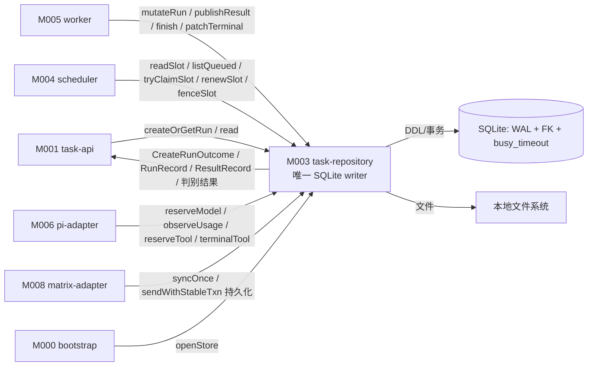
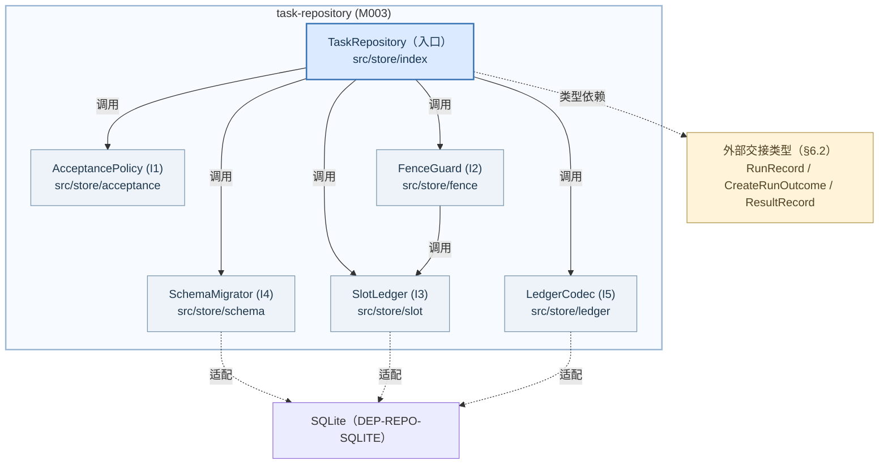
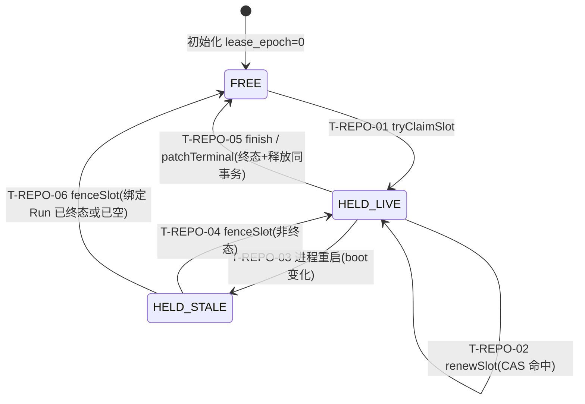
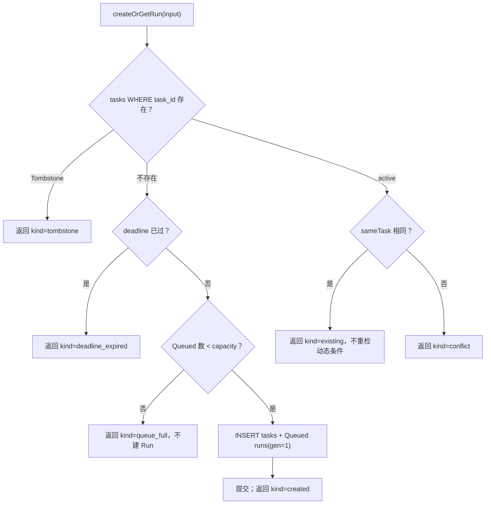
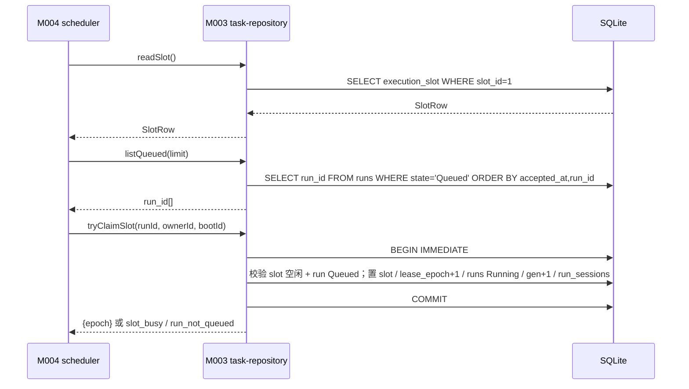
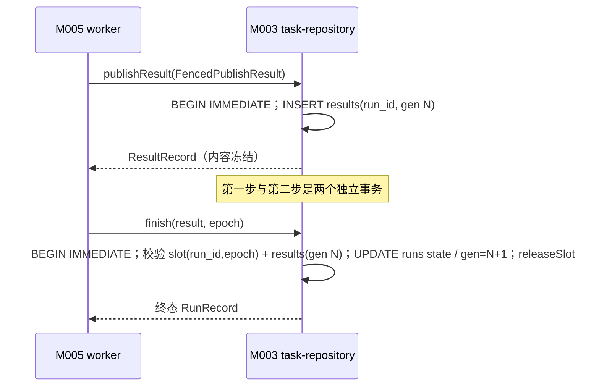
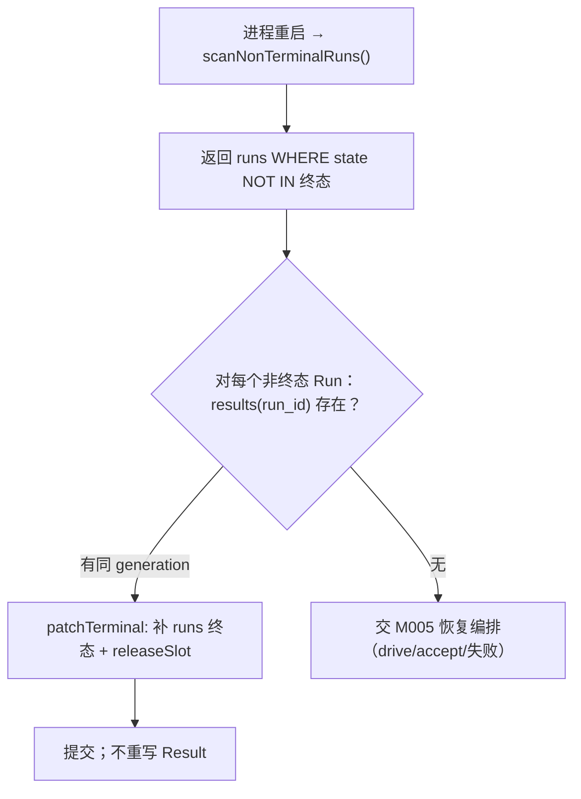
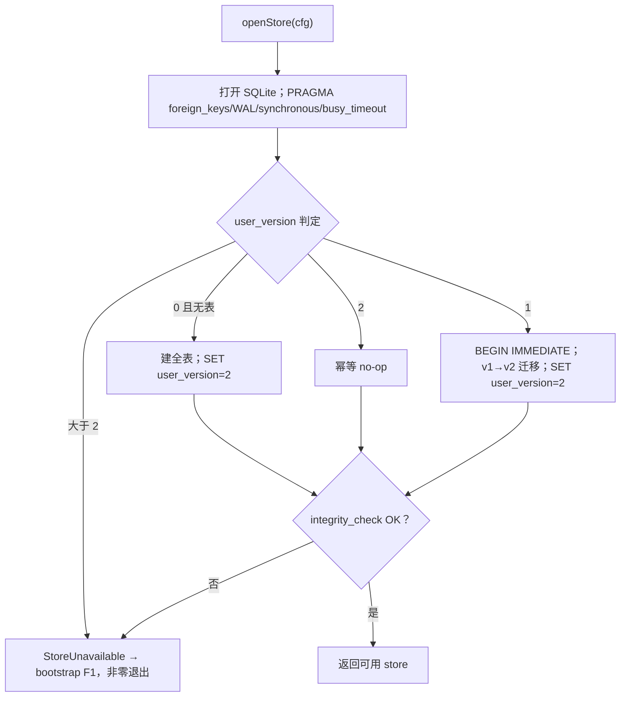

<!-- STD_DOCUMENT_COVER_BEGIN -->
# Piko 模块设计：task-repository（M003）

> STD 使用入口：[项目采用说明与标准导航](../../README.md#std-entry)

| 文档字段 | 值 |
|---|---|
| Document ID | `piko-task-repository` |
| Document Version | `0.1.0-draft.1` |
| Status | `Draft` |
| Project | `piko` |
| Document Owner | Piko Implementation Owner |
| Last Modified Date | `2026-09-27` |
| Template ID | `design.definition` |
| Template Version | `3.4.0` |

<!-- STD_DOCUMENT_COVER_END -->

## 1. 单元摘要：为什么存在

M003 `task-repository` 解决一个问题：Piko 的全部业务事实——任务身份、Run 状态与代次、执行位与租约、Pi session 绑定、Result generation、用量/工具/session 台账、discussion turn 与 Matrix 发送记录——必须由**唯一一处**在同一 SQLite 上原子地读写，且任何一次写入都要能按 `(run_id, generation)` 或 `(run_id, lease_epoch)` 判定"这次写入是否仍然当前有效"。task-repository 就是这个唯一写者：它拥有全部 DDL 与事务边界，对外提供三类 Run/Result 事务操作（`createOrGetRun`、`mutateRun`、`publishResult`），并把 scheduler 需要的单执行位原语（`readSlot`/`listQueued`/`tryClaimSlot`/`renewSlot`/`fenceSlot`/`releaseSlot`）暴露为 `IF-SCHED-STORE`；其余模块只能经它写库，不能自己打开 SQLite 连接。

task-repository 只做**持久化与事务**，不决策业务：不决定 Run 该不该完成（M005 worker）、不选失败与恢复语义（MECH-RECOVERY/M005）、不驱动 Pi（M006）、不聚合 usage 语义（M007）、不做 HTTP 校验（M001/M002）。它把"状态转换的决定"与"状态转换的写入"分开：决定由 M005 携带 `expected_generation`/`expected_lease_epoch` 发出，写入由本模块以 fenced write 原子执行，权威事实以 `tasks`/`runs`/`results` 表为准。

用一次调用说明：M001 受理 `POST /runs`，M002 校验后调用 `createOrGetRun(input)`；本模块在单 `BEGIN IMMEDIATE` 内按 `task_id` 查 `tasks`，tombstone 返回 `tombstone`，同 ID 同内容返回 `existing`，同 ID 不同内容返回 `conflict`，不存在则检查 deadline/queue capacity 后插入 `tasks` + 初始 `Queued` `runs`（`generation=1`），返回 `created`。随后 M004 `tryClaimSlot` 在另一事务内把最旧 `Queued` Run 绑定到 `execution_slot` 并推进 `lease_epoch`；M005 以 `expected_generation` 调 `mutateRun` 把状态切到 `Running`；Pi 结束后 M005 先 `publishResult`（第一步写不可变 `results` generation），再 `finish`（第二步写 `runs.state` 终态 + `generation+1` 并在同事务释放 slot）。每一步的可见点都是其事务提交。

| 项目 | 内容 |
|---|---|
| 模块编号 / 正式英文名称 | M003 / `task-repository` |
| 直属父对象编号 / 名称 | `SW-P` / Piko Agent Runtime V0.3（软件系统，`design_level=system`） |
| 父设计 Document ID / 固定基线 / 登记位置 | `system-design` v0.11.2 / 契约 `0.3.0-simplified.6` / §3.2 直属模块表 + §3.4 约束分配；本模块登记见 §3.2 第 202 行 |
| 上级系统/父单元 | 无（纯软件顶层，无总体系统父稿） |
| 解决的问题 | 业务事实唯一写者与 schema authority；跨模块事务原子；过期写入可被确定性拒绝（fenced write） |
| 提供的能力 | `createOrGetRun`、`mutateRun`、`publishResult`；`IF-SCHED-STORE` slot 原语；`IF-REC-SCAN`/`IF-REC-PATCH`；`IF-ST-STORE`；ledger/turn/send 事务 |
| 主要使用者 | M001 `task-api`（受理/查询）、M005 `worker`（fenced write / Result 两步）、M004 `scheduler`（slot 原语）、M006/M007/M008（attempt/tool/turn/send）、M000 `bootstrap`（openStore） |
| 不负责 | Run 业务编排与终态选择（M005/MECH-RUN）；slot 调度策略（M004）；Pi session 内部（M006）；usage 语义聚合（M007）；HTTP 校验与鉴权（M001/M002）；崩溃恢复顺序编排（M005/MECH-RECOVERY） |

### 1.1 继承的上级约束与落实方式

task-repository 承接八条上级约束：`CON-RUN-001`（PK-01，slot + lease fencing）、`CON-RUN-002`（PK-02，任务事务稳定身份）、`CON-RUN-004`（PK-07，Result 两步提交）、`CON-REC-001`（PK-12，恢复边界）、`CON-ST-001`（PK-12，启动 store 开库/迁移）、`CON-CFG-001`（PK-12，配置重启生效边界）、`CON-CX-001`（PK-03，取消分流的事务侧）、`CON-MX-001`（PK-08，discussion turn 持久化）。全部为 Approved。来源文档为 `system-design` §3.4 与五份机制文档 §3.1。

#### 1.1.1 `CON-RUN-001` · 单 slot + lease epoch 唯一 fencing（持久化侧）

- **上级基线与决定状态**：`system-design` v0.11.2 §3.4（PK-01 行）+ `piko-run.md` §3.1 `CON-RUN-001` · PK-01 · Approved；固定基线 machine contract `0.3.0-simplified.6`。上级原文："lease epoch 唯一 fencing；`pi_session_id=run_id` 确定性绑定。"

- **适用条件**：单实例、单 configured Matrix 身份、单 Agent 路径（PK-01 前提）。所有 Run 的领取与终态写入。

- **继承预算或行为保证**：同一实例任意时刻至多 1 个 `Running`/`Cancelling` Run；`execution_slot.lease_epoch` 单调递增；携带旧 epoch 的写入（`renewSlot`/`finish`）影响行数恒为 0；终态与释放同事务。

- **可自行选择/不可改变**：不可改变：单 slot 语义、epoch 单调 + fencing、终态释放同事务。可自行设计：SQL 组织、索引、事务内语句顺序、`run_sessions` 同步写法。

- **本地落实/内部再分配**：§6.6 定义 `ExecutionSlot` 状态模型与 `T-REPO-01..06`；§8 `R-REPO-SLOT` 固定 epoch CAS 与 FIFO；§9.1.5–9.1.10 固定六个 slot 原语合同（采纳 scheduler §9.2.1 `IF-SCHED-STORE`，不改语义）；§13 落到 `src/store/` 的 slot 组件。slot 恒为 1，不向内部再分配配额。

- **验证方法与结果/证据**：局部：`VRC-REPO-003`（slot CAS/epoch/fence）、`VRC-REPO-004`（fenced write）。组合：PK-T01/PK-T13；当前全部 `NOT_RUN`。

- **差距/变更影响/反馈责任**：none。多实例需另立设计（`system-design` §3.3 关键决定 2），不在本模块放宽。

#### 1.1.2 `CON-RUN-002` · 任务事务稳定身份

- **上级基线与决定状态**：`system-design` v0.11.2 §3.4（PK-02 行）+ `piko-run.md` §3.1 `CON-RUN-002` · PK-02 · Approved。上级原文："tombstone 永久拒绝；同 ID 同内容不重新检查动态条件。"

- **适用条件**：同一 `task_id` 的每一次 `POST /runs` 受理；purge 后的 tombstone 查询。

- **继承预算或行为保证**：`task_id` 全局唯一、永久不可复用；同 ID 同内容返回原 Run 且不新增执行；同 ID 不同内容返回 `TaskConflict`；tombstone 返回 `Gone`；重复受理不重复检查 deadline/queue。

- **可自行选择/不可改变**：不可改变：身份比较语义（集合字段按集合、时间按 UTC instant、对象成员顺序忽略）、tombstone 永久性。可自行设计：`task_json` 序列化比较实现（复用 `sameTask`）。

- **本地落实/内部再分配**：§8 `R-REPO-IDENTITY` 固定比较规则与四分支；§9.1.1 `createOrGetRun` 合同；§6.2 `TaskRecord`/`CreateRunOutcome`；§13 `src/store/acceptance.ts`。

- **验证方法与结果/证据**：局部：`VRC-REPO-001`。组合：PK-T03/PK-T15；当前 `NOT_RUN`。

- **差距/变更影响/反馈责任**：none。契约版本变化需独立评审（`piko-run.md` §13）。

#### 1.1.3 `CON-RUN-004` · Result 两步提交

- **上级基线与决定状态**：`system-design` v0.11.2 §3.4（PK-07 行）+ `piko-run.md` §3.1 `CON-RUN-004` · PK-07 · Approved。上级原文："写 `results` 与写终态不可合并。"

- **适用条件**：Run 终态的每一次发布（正常完成、失败、取消、恢复补写）。

- **继承预算或行为保证**：第一步 `INSERT results`（不可变 generation）与第二步 `UPDATE runs state/generation` + release slot 分属两个事务；任何终态写入的同一时刻必须已存在同 generation 的 `results`；两步间崩溃时恢复只补第二步，绝不重跑 Pi。

- **可自行选择/不可改变**：不可改变：两步不可合并、Result 发布后内容冻结、恢复只补第二步。可自行设计：事务内语句组织、`result_sha256` 计算位置。

- **本地落实/内部再分配**：§8 `R-REPO-TWOSTEP`；§9.1.3 `publishResult`（第一步）与 §9.1.4 `finish`（第二步 + releaseSlot）；§6.6 `T-REPO-05`；§10.4 崩溃推演。

- **验证方法与结果/证据**：局部：`VRC-REPO-002`。组合：PK-T05/PK-T15；当前 `NOT_RUN`。

- **差距/变更影响/反馈责任**：none。

#### 1.1.4 `CON-REC-001` · 崩溃恢复边界

- **上级基线与决定状态**：`system-design` v0.11.2 §3.4（PK-12 行）+ `piko-recovery.md` §3.1 `CON-REC-001` · PK-12 · Approved。上级原文："恢复顺序：Result → Run → lease → Pi session → Harness → ledger → Matrix"；"不复活旧权威、不模拟成功。"

- **适用条件**：进程崩溃后重启；`runs.state` 存在非终态行，或 `results` 已有 generation 但 `runs.state` 非终态。

- **继承预算或行为保证**：本模块提供可判定的持久事实（`scanNonTerminalRuns`）与补终态写入（`patchTerminal`）；不把"未收到心跳"当作成功或失败；不修改已发布 Result。

- **可自行选择/不可改变**：不可改变：事实来源只用表、不修改已发布 Result。可自行设计：扫描查询与索引、补写事务组织。

- **本地落实/内部再分配**：§7 `P-REPO-RECOVER`；§9.1.11 `scanNonTerminalRuns`、§9.1.12 `patchTerminal`；§6.6 `T-REPO-06`；§10.4。

- **验证方法与结果/证据**：局部：`VRC-REPO-008`。组合：PK-T12；当前 `NOT_RUN`。

- **差距/变更影响/反馈责任**：none。

#### 1.1.5 `CON-ST-001` · 启动 store 开库与迁移

- **上级基线与决定状态**：`system-design` v0.11.2 §3.4（PK-12 行）+ `piko-startup.md` §3.1 `CON-ST-001` · PK-12 · Approved；下级输入 `M-ST-DI-002`。上级规定启动 S5 由 M003 open/migrate SQLite（WAL+FK+busy_timeout）+ instance lock，失败 → F1 不进入 listen。

- **适用条件**：进程启动 S5 阶段；`task_store.sqlite_path` 指向的本地库。

- **继承预算或行为保证**：库不可写或迁移失败必须使进程非零退出且不进入 READY；不得以部分就绪继续。

- **可自行选择/不可改变**：不可改变：失败即 F1、schema 单调整数版本。可自行设计：迁移实现（幂等 DDL/加列/重建表）。

- **本地落实/内部再分配**：§7 `P-REPO-OPEN`；§9.1.13 `openStore`；§8 `R-REPO-MIGRATE`；§10.7；ISD §7.2 完整 schema 策略与六类库状态。

- **验证方法与结果/证据**：局部：`VRC-REPO-005`。组合：PK-T12；当前 `NOT_RUN`。

- **差距/变更影响/反馈责任**：none；迁移策略的降级边界登记 `OQ-REPO-002`。

#### 1.1.6 `CON-CFG-001` · 配置重启生效（本模块边界）

- **上级基线与决定状态**：`system-design` v0.11.2 §3.4（PK-12 行）+ `piko-config.md` §3.1 `CON-CFG-001` · PK-12 · Approved；本模块只受"config 变更需重启生效"约束。

- **适用条件**：`task_store`、`queue`、`retention` 配置项的读取与生效。

- **继承预算或行为保证**：配置在启动时读取并生效，进程内不变；在途 Run 不因配置变化回退。

- **可自行选择/不可改变**：不可改变：无热改。可自行设计：配置结构在内存中的持有方式。

- **本地落实/内部再分配**：§4.3 `DEP-REPO-CONFIG`；§6.3 `TaskStoreConfig`；§9.1.13 `openStore` 的配置入参；§8 `R-REPO-CAPACITY`/`R-REPO-RETENTION`。

- **验证方法与结果/证据**：局部：`VRC-REPO-005`（迁移失败与配置边界）、`VRC-REPO-007`（容量）；当前 `NOT_RUN`。

- **差距/变更影响/反馈责任**：**非本模块决定**：配置 schema 的字段定义归 MECH-CONFIG / interfaces；本模块只消费。不自行新增 config key。

#### 1.1.7 `CON-CX-001` · 取消分流（事务侧）

- **上级基线与决定状态**：`system-design` v0.11.2 §3.4（PK-03 行）+ `piko-cancel.md` §3.1 `CON-CX-001` · PK-03 · Approved；下级输入 `M-CX-DI-002`。上级规定"Queued 零调用 Result；Running 经 Cancelling"，"`StopRequested` ≠ 停止"。

- **适用条件**：每次 `POST /runs/:run_id:cancel` 的状态事务。

- **继承预算或行为保证**：Queued 取消在单事务内写 `cancel_requested=1` + 零调用 Result + `state='Cancelled'`；Running 取消单事务内写 stop intent + `state='Cancelling'`；已终态返回 `AlreadyTerminal`；终态不可回退。

- **可自行选择/不可改变**：不可改变：分流语义、零调用 Result、终态不可回退。可自行设计：事务内语句组织与 CAS 条件。

- **本地落实/内部再分配**：§9.1.2 `mutateRun` 的 cancel 变体；`IF-CX-QUEUED`/`IF-CX-RUNNING`；§6.6 `T-REPO-05`；§13 `src/store/acceptance.ts`/`fence.ts`。

- **验证方法与结果/证据**：局部：`VRC-REPO-004`（fenced 状态转移）。组合：PK-T05；当前 `NOT_RUN`。

- **差距/变更影响/反馈责任**：none；决定（分流）归 M005，写入归本模块。

#### 1.1.8 `CON-MX-001` · discussion turn 持久化

- **上级基线与决定状态**：`system-design` v0.11.2 §3.4（PK-08 行）+ `piko-matrix.md` §3.1 `CON-MX-001` · PK-08 · Approved；下级输入 `M-MX-DI-003`。上级规定每批 `syncOnce` 在 `BEGIN IMMEDIATE` 中写 dedup + `DiscussionTurn` + 新 cursor；失败时 cursor 不推进。

- **适用条件**：每次 Matrix `syncOnce` 批次与 `sendWithStableTxn` 发送记录写入。

- **继承预算或行为保证**：event 去重（`matrix_events` 主键）与 turn 追加、cursor 推进在同一事务；txn 幂等（同 `txn_id` 同 payload 返回原记录）。

- **可自行选择/不可改变**：不可改变：三写同事务、cursor 只随事务推进、txn 幂等。可自行设计：批次 SQL 组织。

- **本地落实/内部再分配**：§8 `R-REPO-FENCE`（单事务边界）；§9.1.14 ledger/turn/send 事务；§6.7 `matrix_events`/`discussion_turns`/`matrix_sends`/`matrix_state`；`IF-MX-TURN`。

- **验证方法与结果/证据**：局部：`VRC-REPO-006`（ledger/turn CAS）。组合：PK-T08；当前 `NOT_RUN`。

- **差距/变更影响/反馈责任**：none。

## 2. 需求、功能与验收条件

task-repository 的可观察功能是面向 M001/M005/M004/M000 的进程内事务操作。功能以"决定由调用方发出、写入由本模块原子执行"为边界；本模块不返回业务决策，只返回持久事实。

### 2.1 `F-REPO-CREATE` · 任务受理与身份比较

- **上级需求 / Constraint ID**：`CON-RUN-002`（PK-02）；`M-RUN-DI-003`。

- **调用方**：M001 `task-api` 的 `POST /runs` handler（经 M002 校验后）。

- **输入与前提**：`ValidatedTaskSubmission`（含 `task_id`、不可变 `task_json`、`deadline_at`、limits、discussion?）；`queue.capacity` 已知；M002 已校验 principal/path。

- **行为**：单 `BEGIN IMMEDIATE`：按 `task_id` 查 `tasks`。tombstone → 返回 `tombstone`；active 且 `sameTask` → 返回 `existing`（原 Run，不重检动态条件）；active 且不同 → 返回 `conflict`；不存在 → 检查 `deadline_at` 是否已过（已过返回 `deadline_expired`）与 `Queued` 数量是否 `< capacity`（满则返回 `queue_full`，不建 Run），通过则插入 `tasks` + 初始 `Queued` `runs`（`generation=1`，discussion 任务同时插入初始 `Pending` turn），返回 `created`。整个判定与写入同事务。

- **输出**：`CreateRunOutcome{kind, run_id?, generation?, state?}`，`kind ∈ {created, existing, conflict, tombstone, deadline_expired, queue_full}`。

- **错误与边界**：无业务异常抛出（六类结果由 `kind` 表达，供 M001 映射 HTTP 202/409/410/422/429）；SQLite 依赖错误上抛。`created` 与 `existing` 的差别只在 `kind`，不改变持久事实。

- **验收条件**：同一 `task_id` 同内容并发两次 → 恰好一次 `created`、一次 `existing`，`tasks` 行数与 `runs` 行数各为 1；`Queued` 达 `capacity` 时不创建 Run；tombstone 键返回 `tombstone`。

### 2.2 `F-REPO-MUTATE` · fenced write

- **上级需求 / Constraint ID**：`CON-RUN-001`（PK-01）、`CON-CX-001`（PK-03）；`M-RUN-DI-003`。

- **调用方**：M005 `worker`（状态切换、预算计数、discussion intake 推进）。

- **输入与前提**：`FencedRunCommand{run_id, expected_generation, expected_state_in, expected_lease_epoch?, mutation}`；调用方持有当前 lease（当 `expected_lease_epoch` 存在时）。

- **行为**：单事务：按 `(run_id, expected_generation)`（有 epoch 时并校验 `execution_slot.lease_epoch`）做 CAS，命中才应用 `mutation`（`bump_generation`/`request_cancel`/`set_intake`/`terminal`）。任一 guard 未命中 → 返回 `fenced_write`（0 行生效），不部分写入。`terminal` mutation 在写 `runs.state` 的同一事务内调用 `releaseSlot`。

- **输出**：`RunRecord`（新 generation/state）或 `FencedWrite` 事实。

- **错误与边界**：generation/epoch 过期或 state 不在 `expected_state_in` → `FencedWrite`（可判定，不重试）；终态 Run 尝试回退 → 拒绝；依赖错误上抛。`releaseSlot` 只在 `terminal` mutation 内由本模块调用。

- **验收条件**：携带旧 `expected_generation` 的写入 0 行生效；携带当前 generation 的 `Running→Completed` 在写终态的同事务释放 slot；并发两个不同 generation 写入只有一个成功。

### 2.3 `F-REPO-PUBLISH` · Result 第一步发布

- **上级需求 / Constraint ID**：`CON-RUN-004`（PK-07）；`M-RUN-DI-003`；`IF-RUN-PUBLISH`。

- **调用方**：M005 `worker`（Result 两步协议第一步）。

- **输入与前提**：`FencedPublishResult{run_id, generation, result_json, result_sha256}`；Result 已通过 M007 `validateBeforePublish`。

- **行为**：单事务 `INSERT INTO results(run_id, generation, result_json, result_sha256, published_at)`。若 `(run_id, generation)` 已存在且内容相同 → 幂等返回原 `ResultRecord`；内容不同 → 返回 `conflict`。提交后该 generation 内容冻结。

- **输出**：`ResultRecord{run_id, generation, result_sha256, published_at}` 或 `conflict`。

- **错误与边界**：同 generation 不同 `result_sha256` → `conflict`；依赖错误上抛。此步**不**修改 `runs.state`（第二步由 `finish` 完成）。

- **验收条件**：发布 generation N 后 `results` 有且仅有一行；重复发布同 N 同内容返回原记录且不新增行；第一步提交后 `runs.state` 仍为非终态。

### 2.4 `F-REPO-FINISH` · 终态提交与 slot 释放

- **上级需求 / Constraint ID**：`CON-RUN-004`（PK-07）、`CON-RUN-001`（PK-01）、`CON-REC-001`（PK-12）。

- **调用方**：M005 `worker`（Result 两步协议第二步）；M005 恢复流程经 `patchTerminal`（等价变体）。

- **输入与前提**：`finish(result: AgentResult, epoch: number)`；第一步 `results` 已提交；slot 仍绑定该 Run 且 `lease_epoch == epoch`。

- **行为**：单事务：校验 `execution_slot` 的 `(run_id, lease_epoch)` 命中且 `results(run_id, generation)` 已存在；写 `runs.state` 终态、`finished_at`、`generation = generation + 1`；discussion Run 同时把 intake 置 `Closed` 并把未消费 turn 置 `Abandoned`；同事务清空 `execution_slot` 四字段（`releaseSlot`）。全部同事务提交。

- **输出**：`RunRecord`（终态）。

- **错误与边界**：slot 已被换 epoch/释放 → `LeaseLost`（拒绝，不写终态）；`results` 缺同 generation → 拒绝（不可在无 Result 时写终态）；依赖错误上抛。此步不重写 Result。

- **验收条件**：正常完成 → `runs.state='Completed'` 且 `generation=N+1` 且 slot 清空，同一事务；用旧 epoch 调用被拒且不写终态。

### 2.5 `F-REPO-SLOT` · 单执行位原语（IF-SCHED-STORE）

- **上级需求 / Constraint ID**：`CON-RUN-001`（PK-01）；`IF-SCHED-STORE`（`piko-scheduler` §9.2.1，本模块采纳为其 Provider）。

- **调用方**：M004 `scheduler`（`readSlot`/`listQueued`/`tryClaimSlot`/`renewSlot`/`fenceSlot`）；`releaseSlot` 仅本模块 `finish`/`patchTerminal` 内部调用。

- **输入与前提**：见 §9.1.5–9.1.10 签名；M004 在恢复门内调用 `fenceSlot`。

- **行为**：`readSlot` 返回 `execution_slot` 行投影；`listQueued(limit)` 返回按 `(accepted_at, run_id)` 升序的 `Queued` `run_id[]`；`tryClaimSlot` 单事务校验 slot 空闲且目标 Run 仍 `Queued`，通过则置 slot + `runs Running` + `generation+1` + `run_sessions` 建行/同步 epoch，返回 `{epoch}`，否则 `slot_busy`/`run_not_queued`；`renewSlot` 单语句 CAS 刷新 `heartbeat_at`，返回布尔；`fenceSlot` 单事务读 slot + `runs.state`，非终态 → `epoch+1` + 置 owner/boot/heartbeat + 同步 `run_sessions`，返回 `{epoch}`，终态或已空 → 清空并返回 `slot_released`（幂等）；`releaseSlot` 单语句条件清空。

- **输出**：见签名（§9.1.5–9.1.10）；时间戳由本模块以自身 UTC `now` 写入并随结果返回。

- **错误与边界**：CAS 未命中以判别结果（非异常）表达；依赖错误上抛；`fenceSlot` 检测 `execution_slot.lease_epoch != run_sessions.lease_epoch` 时抛 `SlotInvariantViolation`（不自行修复）。

- **验收条件**：空闲 slot + 3 个 `Queued` → `tryClaimSlot` 只对最旧 Run 成功且 `epoch=旧+1`；旧 epoch `renewSlot` 返回 `false` 且心跳不变；终态绑定 Run 的 `fenceSlot` 清空并返回 `slot_released`。

### 2.6 `F-REPO-LEDGER` · 台账与消息持久化事务

- **上级需求 / Constraint ID**：`CON-MX-001`（PK-08）、`CON-RUN-001`（预算计数的一致性）；`M-MX-DI-003`。

- **调用方**：M006 `pi-adapter`（`reserveModel`/`observeUsage`/`terminalModel`/`reserveTool`/`terminalTool`）、M005 `worker`（`markTurn`/`ingestTurn`）、M008 `matrix-adapter`（`syncOnce`/`sendWithStableTxn` 持久化）。

- **输入与前提**：attempt/tool 身份 `(run_id, operation_id, step_id, attempt)`/`(run_id, operation_id, tool_call_id)`；turn `(run_id, event_id)`；send `txn_id`。

- **行为**：`reserveModel`/`reserveTool` 在单事务内做身份去重与预算 CAS（`model_calls`/`tool_calls` 计数），超限返回 `BudgetExceeded`，`replay!="safe"` 的重放返回 `UnsafeRetryBlocked`；`observeUsage`/`terminalModel`/`terminalTool` 推 `record_version`/`state`；`markTurn` 推进 turn 状态；`ingestMatrixEvent`/`ingestMatrixBatch` 单事务写 `matrix_events` 去重 + Pending turn + `matrix_state.sync_cursor`；`prepareMatrixSend` 幂等写 send 记录。

- **输出**：判别结果（`Admitted`/`BudgetExceeded`/`UnsafeRetryBlocked`/布尔/`{state,event_id?}`）。

- **错误与边界**：迟到 usage 只推 `record_version`，不新增行、不改 Result；同 `txn_id` 不同 payload → `conflict`；依赖错误上抛。

- **验收条件**：同一 attempt 重复 reserve 幂等；`model_calls` 达上限后 reserve 返回 `BudgetExceeded` 且不插入行；同一批 sync 重复事件不产生重复 turn，cursor 只在事务内推进。

### 2.7 `F-REPO-RECOVER` · 恢复扫描与补终态

- **上级需求 / Constraint ID**：`CON-REC-001`（PK-12）；`M-REC-DI-001`；`IF-REC-SCAN`/`IF-REC-PATCH`。

- **调用方**：M005 `worker` 恢复流程（进程重启后、恢复门内）。

- **输入与前提**：进程重启；`tasks`/`runs`/`results` 持久事实可读。

- **行为**：`scanNonTerminalRuns` 返回 `runs WHERE state NOT IN ('Completed','Failed','Cancelled')` 的 `run_id[]`；`patchTerminal(command)` 在 `results(run_id, generation)` 已存在时单事务补写 `runs.state` 终态 + `generation+1` + release slot，否则拒绝（不模拟成功）。

- **输出**：`run_id[]` / `RunRecord` / 拒绝事实。

- **错误与边界**：缺同 generation Result → 拒绝（不可凭空补终态）；终态 Run 不重复处理；依赖错误上抛。

- **验收条件**：构造 `results` 有 generation N 而 `runs.state='Running'` → `scanNonTerminalRuns` 含该 Run，`patchTerminal` 后终态 `generation=N+1` 且不重写 Result。

### 2.8 `F-REPO-OPEN` · 打开并迁移 store

- **上级需求 / Constraint ID**：`CON-ST-001`（PK-12）、`CON-CFG-001`（PK-12）；`M-ST-DI-002`；`IF-ST-STORE`。

- **调用方**：M000 `bootstrap` 启动 S5。

- **输入与前提**：`task_store.sqlite_path`、`task_store.busy_timeout_ms`、`queue.capacity`、`retention.minimum_query_days`；instance lock。

- **行为**：打开 SQLite 并设置 `PRAGMA foreign_keys=ON; journal_mode=WAL; synchronous=FULL; busy_timeout`；执行幂等迁移（见 ISD §7.2）直至 `user_version=2`；校验 `integrity_check`/核心表齐全；成功返回可用 store 句柄，失败抛 `StoreUnavailable` 使 M000 走 F1。

- **输出**：可用 store（含 §6.7 全部表）/ `StoreUnavailable`。

- **错误与边界**：库不可写、版本不兼容（`user_version>2`）、迁移失败、完整性失败 → 抛错，进程非零退出，不进入 READY。

- **验收条件**：空库 → 建全表且 `user_version=2`；`user_version=2` 库 → 幂等 no-op；`user_version=3` → 拒绝启动。

## 3. UI、CLI、服务端点或设备操作面

**N/A。** task-repository 是纯进程内模块，不拥有 UI、CLI、HTTP/RPC 端点或设备操作面：它不监听端口、不注册路由、不提供诊断命令。它的唯一对外入口是进程内函数调用（§9.1）；对外可观察的 HTTP 面（`POST /runs`、`GET /runs/:run_id`、`POST .../cancel`、`GET .../result`）由 M001 `task-api` 承载。

实际调用入口与归属：`M001 task-api → TaskRepository.createOrGetRun`（受理/查询/取消/Result 读取）；`M005 worker → mutateRun/publishResult/finish`；`M004 scheduler → readSlot/listQueued/tryClaimSlot/renewSlot/fenceSlot`；`M000 bootstrap → openStore`；`M006/M007/M008 → ledger/send 事务`。维护/诊断入口不新增：Run 状态与队列深度经 M001 只读查询与系统指标（§11）暴露。

Tailoring 依据：`TAIL-P-101`（Piko 无图形入口）同源；本模块无任何操作面，属 STD `design.definition` §3 "模块没有任何直接操作面时写 N/A + 实际调用入口/归属 + tailoring 依据" 的情形。"没有页面"不等于"没有 API"——task-repository 的 API 在 §9.1 唯一维护。

## 4. 外部边界与依赖

task-repository 在进程内的位置：被全部业务模块调用，向下依赖本地 SQLite 与文件系统。下图只画模块外部交接，不表示线程或新部署边界。



图 M-REPO-C1 · Target / Planned / NOT_BUILT。实线是同步进程内函数调用与返回，不是网络或新部署边界。task-repository 不创建线程/进程；所有事务在调用方事件循环上同步执行。持久化权威（SQLite 连接、事务、DDL）集中于本模块，其他模块绝不自行打开连接。

#### 4.1 `DEP-REPO-SQLITE` · SQLite 存储引擎

- **角色 / 运行位置 / Owner**：本模块独占的本地嵌入式数据库；同进程；Owner：Piko Implementation Owner。

- **本模块调用或消费**：`node:sqlite` `DatabaseSync`：`exec`/`prepare`/`run`/`get`/`all`；`PRAGMA foreign_keys`/`journal_mode=WAL`/`synchronous=FULL`/`busy_timeout`/`user_version`。

- **本模块提供**：对全部其他模块的持久化与事务原语（§9.1）。

- **契约 authority / 版本 / selector**：`system-design` §7.10/§7.11（一致性与迁移策略）；当前代码事实 `src/store.ts` `migrate()`（`PRAGMA user_version=2`）。DDL 权威在本模块 ISD §4.7。

- **同步方式 / timeout / 生命周期**：同步阻塞；`BEGIN IMMEDIATE` 串行化 writer；受 `task_store.busy_timeout_ms`（100–60000）。连接生命周期与进程同域。

- **不可用或失败影响 / 责任出口**：`SQLITE_BUSY` 超时/`SQLITE_IOERR`/`SQLITE_FULL` → 事务 ROLLBACK 并向上抛依赖错误，由调用方去映射 HTTP 503/500 或终止；启动阶段失败 → F1（§2.8）。

#### 4.2 `DEP-REPO-FS` · 本地文件系统

- **角色 / 运行位置 / Owner**：SQLite 数据文件与 WAL/journal 所在磁盘；Owner：Piko Implementation Owner（operator 配置路径）。

- **本模块调用或消费**：目录创建（`mkdirSync`）、文件占用、fsync（经 SQLite）。

- **本模块提供**：无。

- **契约 authority / 版本 / selector**：`system-design` §9.1 `storage.sqlite_path`；`piko-runtime-config-v0.3.schema.json` `task_store.sqlite_path`（绝对路径）。

- **同步方式 / timeout / 生命周期**：同步；随进程。

- **不可用或失败影响 / 责任出口**：路径不可创建/不可写/磁盘耗尽 → 启动 F1；运行中 `SQLITE_FULL` → 事务失败上抛，交 operator。

#### 4.3 `DEP-REPO-CONFIG` · 任务存储与容量配置

- **角色 / 运行位置 / Owner**：M000 `bootstrap` 从 config 解析并注入本模块；Owner：Piko Implementation Owner。

- **本模块调用或消费**：`task_store.sqlite_path`、`task_store.busy_timeout_ms`、`queue.capacity`、`retention.minimum_query_days`。

- **本模块提供**：无。

- **契约 authority / 版本 / selector**：`interfaces/schemas/piko-runtime-config-v0.3.schema.json`；`system-design` §9.1。

- **同步方式 / timeout / 生命周期**：构造时注入，进程内不变；config 变更需重启（`CON-CFG-001`）。

- **不可用或失败影响 / 责任出口**：配置缺失/非法 → 启动 F1（schema 校验在前，S2）。

#### 4.4 `DEP-REPO-CLOCK` · 时间源（宿主提供）

- **角色 / 运行位置 / Owner**：宿主运行时能力，同进程；Owner：Piko Implementation Owner（M000 装配）。

- **本模块调用或消费**：持久判定用 UTC wall clock（`accepted_at`/`started_at`/`finished_at`/`heartbeat_at`/`published_at`/`deadline_at` 同口径）。

- **本模块提供**：无。

- **契约 authority / 版本 / selector**：`piko-run.md` §10 "deadline 用持久 UTC 判定；进程内 elapsed 用 monotonic clock"。

- **同步方式 / timeout / 生命周期**：同步取时；随进程。

- **不可用或失败影响 / 责任出口**：时钟回拨不改变 CAS 正确性（CAS 只比 generation/epoch）；deadline 比较用持久 UTC instant。

## 5. 内部结构与实现位置

task-repository 拆成五个内部单元：入口编排、受理/身份纯规则、fenced write 守卫、slot 原语、schema 迁移与台账编解码。拆分依据是"身份比较与 fenced 规则可独立测试、schema 迁移与台账写入可隔离、入口只做事务编排"，不是为了凑文件。当前实现事实是单文件 `src/store.ts`；Target 按下列组件模块化到 `src/store/`。



图 M-REPO-S1 · Target / Planned / NOT_BUILT。外框是模块内部组成；实线同步调用，虚线类型/适配依赖；不表示线程或时序。当前所有内部单元映射在同一 `src/store.ts`（IN_PROGRESS），Target 拆到 `src/store/`（Planned）。

### 5.1 内部组成

#### 5.1.1 `S1` · TaskRepository（入口）

- **职责与非职责**：对外提供 §9.1 全部操作并保证 §6.6 不变量；编排"受理事务""fenced write 事务""slot 事务""Result 两步""恢复补写""openStore"。非职责：不实现身份比较算法（I1）、不做 guard 判定细节（I2）、不拼 DDL（I4）、不决定 Run 业务语义（M005）。

- **输入、处理与输出**：输入 `ValidatedTaskSubmission`/`FencedRunCommand`/`FencedPublishResult`/slot 参数；处理：组合 I1–I5 的纯规则与 SQL；输出 `CreateRunOutcome`/`RunRecord`/`ResultRecord`/判别结果。

- **协作对象**：调用 I1–I5；被 M001/M004/M005/M000/M006/M008 调用（进程内）。

- **文件 / symbol / 实现状态**：`src/store/index.ts` → `class TaskRepository`（Planned / NOT_IMPLEMENTED）。现基线逻辑在 `src/store.ts` `TaskStore`（IN_PROGRESS）。

- **拆分依据与替代方案代价**：入口只做事务编排，把身份比较与 guard 抽成纯/薄单元以便无外部依赖单测。替代方案"继续单文件"是 Current 形态，代价是事务、迁移、业务规则耦合、难以单独验证（这正是本设计要消除的）。

#### 5.1.2 `I1` · AcceptancePolicy（受理与身份纯规则）

- **职责与非职责**：纯函数：`sameTask(a,b)`（集合字段按集合、时间按 UTC instant、成员顺序忽略）、`classifyExisting(identity_state, sameTask)`、`queueAdmitted(queuedCount, capacity)`、`deadlineAdmitted(deadline_at, now)`、`initialRun()`（`Queued`/`generation=1`）。非职责：无 I/O、无状态、不读时钟。

- **输入、处理与输出**：输入原始值；输出决定（`created|existing|conflict|tombstone|deadline_expired|queue_full` 判定与初始状态）。

- **协作对象**：被 S1 调用；不依赖 SQLite。

- **文件 / symbol / 实现状态**：`src/store/acceptance.ts`（Planned / NOT_IMPLEMENTED），复用现有 `src/task-equality.ts` `sameTask`。

- **拆分依据与替代方案代价**：纯函数使 §8 `R-REPO-IDENTITY`/`R-REPO-CAPACITY` 可表驱动测试。替代方案"比较内联在 SQL 事务"无法对边界（同 ID 不同内容、tombstone、满队列）做无 DB 单测。

#### 5.1.3 `I2` · FenceGuard（fenced write 守卫）

- **职责与非职责**：纯/薄：`matchesGeneration(row, expected)`、`matchesEpoch(slot, expected)`、`stateIn(current, expected_in)`、`nextGeneration(current)`；把 CAS 命中/未命中表达为可判定结果。非职责：不发 SQL、不做 slot 写入（I3）。

- **输入、处理与输出**：输入 `RunRecord` 行与 expected 值；输出 `FencedWrite | ok` 决定与 `nextGeneration = current + 1`。

- **协作对象**：被 S1/I3 调用；不依赖 SQLite。

- **文件 / symbol / 实现状态**：`src/store/fence.ts`（Planned / NOT_IMPLEMENTED）。

- **拆分依据与替代方案代价**：guard 可独立验证"旧 generation 必被拒"。替代方案"WHERE 子句隐含"难以单测且易漏 guard。

#### 5.1.4 `I3` · SlotLedger（单执行位原语）

- **职责与非职责**：实现 §9.1.5–9.1.10 六个 slot 原语与 §6.6 `T-REPO-01..06` 的原子动作；是 scheduler 消费的 `IF-SCHED-STORE` Provider。非职责：不做调度策略（M004）、不决定 Run 终态（M005）、不自判恢复完成。

- **输入、处理与输出**：输入 `(runId, ownerId, bootId, epoch, now)`；输出 `SlotRow`/`SlotClaimResult`/`FenceResult`/布尔；时间戳以自身 UTC `now` 写入。

- **协作对象**：被 S1/I2 调用；调用 SQLite。

- **文件 / symbol / 实现状态**：`src/store/slot.ts`（Planned / NOT_IMPLEMENTED）。现基线是 `src/store.ts` 的 `nextQueued`/`recoverOrphaned`/`heartbeat`/`finish` 内联逻辑。

- **拆分依据与替代方案代价**：把 slot CAS 与终态释放集中一处，保证 `(run_id, epoch)` 语义只有一份。替代方案"散在 finish 与 worker"正是 Current，代价是 fencing 语义分散、难以端到端保证。

#### 5.1.5 `I4` · SchemaMigrator（DDL 与迁移）

- **职责与非职责**：持有全部 DDL 与 `PRAGMA user_version` 迁移序列；保证幂等与失败回滚。非职责：不决定业务（只保证库形状）。

- **输入、处理与输出**：输入已打开的 `DatabaseSync` 与目标版本 `2`；输出可用 schema / `StoreUnavailable`。

- **协作对象**：被 S1（`openStore`）调用；调用 SQLite。

- **文件 / symbol / 实现状态**：`src/store/schema.ts`（Planned / NOT_IMPLEMENTED）。现基线在 `src/store.ts` `migrate()`（`src/store.ts:15`–`:33`）。

- **拆分依据与替代方案代价**：迁移独立使 §14.2 六类库状态可分别构造测试。替代方案"迁移内联构造器"难以在部分初始化/版本不匹配分支上做隔离测试。

#### 5.1.6 `I5` · LedgerCodec（台账编解码）

- **职责与非职责**：实现 attempt/tool/turn/send 的行编码、`record_version` 推进与幂等去重。非职责：不聚合 usage 语义（M007）、不决定 turn 状态（M005）。

- **输入、处理与输出**：输入结构化事件；输出判别结果与行状态。

- **协作对象**：被 S1 调用；调用 SQLite。

- **文件 / symbol / 实现状态**：`src/store/ledger.ts`（Planned / NOT_IMPLEMENTED）。现基线在 `src/store.ts` 的 `reserveModel`/`reserveTool`/`observeUsage`/`terminalModel`/`terminalTool`/`markTurn`/`ingestMatrixEvent`/`ingestMatrixBatch`/`prepareMatrixSend`。

- **拆分依据与替代方案代价**：把幂等/去重规则集中，使 `VRC-REPO-006` 可单测。替代方案"散落在 adapter"会把事务边界外泄，违反 §5.5。

### 5.2 内部调用过程

#### 5.2.1 `P-REPO-ACCEPT` · 受理

- **入口与调用上下文**：M001 `POST /runs` handler（宿主事件循环）→ `TaskRepository.createOrGetRun(input)`。

- **调用链（文件 / symbol → 文件 / symbol）**：`task-api handler` → `TaskRepository.createOrGetRun` → `AcceptancePolicy.classifyExisting`/`queueAdmitted`/`deadlineAdmitted` → SQLite 单 `BEGIN IMMEDIATE`（查 `tasks`、插入 `tasks`/`runs`/可选 turn）→ 返回 `CreateRunOutcome`。

- **逐步传递的数据**：`ValidatedTaskSubmission` → 查得 `TaskRecord | null` → 判定 `kind` → 新 `run_id`/`generation=1`/`state=Queued` → `CreateRunOutcome`。

- **返回、异常与清理**：六类 `kind` 正常返回；本层不抛业务异常；SQLite 依赖错误上抛。事务失败 ROLLBACK 无残留。

- **对应流程 / 接口 / 验证**：§7 `M-REPO-P1`；§9.1.1 `IF-RUN-CREATE`；`VRC-REPO-001`。

#### 5.2.2 `P-REPO-CLAIM` · 领取 slot（M004 调用）

- **入口与调用上下文**：M004 scheduler tick → `readSlot`/`listQueued`/`tryClaimSlot`。

- **调用链（文件 / symbol → 文件 / symbol）**：`Scheduler.acquireSlot` → `TaskRepository.readSlot`/`listQueued` → `TaskRepository.tryClaimSlot`（单事务：置 slot、`runs Running`、`generation+1`、`run_sessions`）→ `SlotClaimResult`。

- **逐步传递的数据**：`runId/ownerId/bootId` → `SlotRow` + `run_id[]` → `{epoch} | "slot_busy" | "run_not_queued"`。

- **返回、异常与清理**：判别结果正常返回；依赖错误上抛；无部分副作用（同事务）。

- **对应流程 / 接口 / 验证**：§7 `M-REPO-P2`；§9.1.7 `IF-SCHED-STORE`；`VRC-REPO-003`。

#### 5.2.3 `P-REPO-PUBLISH` · Result 两步

- **入口与调用上下文**：M005 worker 两步提交 → `publishResult`（第一步）、`finish`（第二步）。

- **调用链（文件 / symbol → 文件 / symbol）**：`worker` → `TaskRepository.publishResult`（事务 INSERT `results`）→ COMMIT；`worker` → `TaskRepository.finish`（事务 UPDATE `runs` 终态 + `generation+1` + `releaseSlot`）→ COMMIT。

- **逐步传递的数据**：`FencedPublishResult{run_id,generation,result_json,result_sha256}` → `ResultRecord`；`AgentResult`+`epoch` → 终态 `RunRecord`。

- **返回、异常与清理**：`finish` 中 slot 过期 → `LeaseLost`；缺 Result → 拒绝；依赖错误上抛。第一步与第二步各自独立提交。

- **对应流程 / 接口 / 验证**：§7 `M-REPO-P3`；§9.1.3 `IF-RUN-PUBLISH`、§9.1.4 `finish`；`VRC-REPO-002`。

#### 5.2.4 `P-REPO-RECOVER` · 恢复扫描与补终态

- **入口与调用上下文**：M005 恢复流程（重启后、恢复门内）→ `scanNonTerminalRuns`/`patchTerminal`。

- **调用链（文件 / symbol → 文件 / symbol）**：`recovery` → `TaskRepository.scanNonTerminalRuns`（读 `runs`）→ `TaskRepository.patchTerminal`（事务补终态 + releaseSlot）。

- **逐步传递的数据**：无入参 → `run_id[]`；`FencedPublishResult` → `RunRecord`。

- **返回、异常与清理**：缺同 generation Result → 拒绝；终态不重复处理；依赖错误上抛。

- **对应流程 / 接口 / 验证**：§7 `M-REPO-P4`；§9.1.11 `IF-REC-SCAN`、§9.1.12 `IF-REC-PATCH`；`VRC-REPO-008`。

#### 5.2.5 `P-REPO-OPEN` · 打开/迁移

- **入口与调用上下文**：M000 bootstrap S5 → `TaskRepository.openStore(cfg)`。

- **调用链（文件 / symbol → 文件 / symbol）**：`bootstrap` → `TaskRepository.openStore` → `SchemaMigrator.migrate`（幂等 DDL + `user_version`）→ 完整性校验 → 可用 store / `StoreUnavailable`。

- **逐步传递的数据**：`TaskStoreConfig` → `user_version` 迁移判定 → store 句柄 / 异常。

- **返回、异常与清理**：失败抛 `StoreUnavailable`，M000 走 F1；已得句柄在失败时关闭。

- **对应流程 / 接口 / 验证**：§7 `M-REPO-P5`；§9.1.13 `IF-ST-STORE`；`VRC-REPO-005`。

### 5.3 文件间接口契约

本节只固定 task-repository 内部文件之间的交接；跨模块接口在 §9.1，字段类型在 §6。

#### 5.3.1 `IF-REPO-ACCEPTANCE` · `index.ts` → `acceptance.ts`

- **接口成员 ID / §9 逐接口定义位置**：内部无公共成员 ID；行为规则权威在 §8（`R-REPO-IDENTITY`/`R-REPO-CAPACITY`）。

- **本文件的提供或使用责任**：`acceptance.ts` 提供纯函数；`index.ts` 使用其决定。

- **交接时机 / 本地调用步骤**：`createOrGetRun` 内：查 `tasks` 后判 `classifyExisting`；不存在时判 `deadlineAdmitted`/`queueAdmitted`。

- **§9.3 生命周期约束**：无状态、无所有权；调用即返回。

- **实现与验证位置**：`src/store/acceptance.ts`；`VRC-REPO-001`/`VRC-REPO-007`。

#### 5.3.2 `IF-REPO-FENCE` · `index.ts`/`slot.ts` → `fence.ts`

- **接口成员 ID / §9 逐接口定义位置**：内部 `FenceGuard`，规则权威在 §8 `R-REPO-FENCE`；slot 对外合同见 §9.1.5–9.1.10。

- **本文件的提供或使用责任**：`fence.ts` 提供 guard 纯函数；`index.ts`/`slot.ts` 以 guard 决定何时应用 mutation。

- **交接时机 / 本地调用步骤**：`mutateRun` 与 `finish` 内：按 `expected_generation`/`expected_lease_epoch` 判 CAS。

- **§9.3 生命周期约束**：无状态；不缓存行。

- **实现与验证位置**：`src/store/fence.ts`；`VRC-REPO-004`。

#### 5.3.3 `IF-REPO-SCHEMA` · `index.ts` → `schema.ts`

- **接口成员 ID / §9 逐接口定义位置**：内部 `SchemaMigrator`，策略权威在 ISD §7.2（本模块拥有持久化）。

- **本文件的提供或使用责任**：`schema.ts` 提供 `migrate(db)`；`index.ts` 在 `openStore` 调用。

- **交接时机 / 本地调用步骤**：`openStore`：打开连接 → `schema.migrate` → 完整性校验。

- **§9.3 生命周期约束**：迁移事务 `BEGIN IMMEDIATE`，失败 ROLLBACK；迁移后连接长期持有。

- **实现与验证位置**：`src/store/schema.ts`；`VRC-REPO-005`。

### 5.4 服务提供方式（条件适用）

**N/A（无独立宿主）。** task-repository 不监听端口、不启动进程/线程、不注册端点：§3 已判定无操作面，故 server/runtime、监听、就绪、停止均不适用。

运行载体：store 实例由 M000 `bootstrap` 在 S5 装配（打开连接 + 迁移），随进程生命周期存在；无自身进入/退出过程。并发模型：全部事务在宿主事件循环上同步执行；SQLite 以单 writer（`BEGIN IMMEDIATE`）串行化。就绪/停止语义属于 M000/MECH-STARTUP：本模块只暴露 `openStore` 与 §9.1 事务操作，不定义 READY/停止出口。

Tailoring 依据：STD `design.definition` §5.4 "纯库函数说明不适用及由谁调用"。

### 5.5 依赖方向

- **允许方向**：`index.ts` → `{acceptance.ts, fence.ts, slot.ts, schema.ts, ledger.ts}`；`fence.ts` → `slot.ts`（仅类型/判定）；所有单元 → `types.ts`（仅 §6 类型）；`schema.ts`/`slot.ts`/`ledger.ts` → SQLite（`DEP-REPO-SQLITE`）。

- **禁止方向与原因**：禁止 `acceptance.ts`/`fence.ts` 引用 SQLite（保持纯/薄，可无 DB 单测）；禁止 `schema.ts`/`slot.ts`/`ledger.ts` 反向引用 `index.ts`（避免环）；禁止任何其他模块直接 `import` `src/store/` 内部文件（只能经 `src/store/index.ts` 的公共 API），否则事务边界外泄。

- **循环/越层检查**：静态：对 `src/store/` 跑依赖图（`tsc`/import 检查或 CI 脚本）确认无环、纯单元无 SQLite import。评审按 §5.1 逐文件核对引用。

- **变更影响**：改 `acceptance.ts` 只影响身份比较（§8 权威）；改 `fence.ts` 影响 CAS 语义（`VRC-REPO-004`）；改 `schema.ts` 影响 schema 演进（ISD §7.2）；改 `index.ts` 影响对外事务 API（§9.1）。

## 6. 数据结构设计

task-repository 拥有 Piko 全部持久表的 schema authority；本章定义行级结构、约束与生命周期，DDL 见 §6.7。不适用类别在章首集中说明。

**不适用类别与依据**：§6.4 通信报文（本模块不作跨边界消息交换，协作均为进程内函数调用，`TAIL-P-102` 同源）、§6.5 设备/FPGA（纯软件，`TAIL-P-103`）均为 N/A。

### 6.1 公共基础类型与枚举

#### 6.1.1 `RunState` / `DiscussionIntakeState` / `TurnStatus` / `CancelOutcome`

- **完整定义、Data/Type/Error ID 与唯一来源**：`RunState = "Queued" | "Running" | "Cancelling" | "Completed" | "Failed" | "Cancelled"`；`DiscussionIntakeState = "Disabled" | "Open" | "Closing" | "Closed"`；`TurnStatus = "Pending" | "QueuedInPi" | "Consumed" | "Abandoned"`；`CancelOutcome = "CancelledBeforeStart" | "StopRequested" | "AlreadyTerminal"`。来源：`system-design` §7.1 + `interfaces/schemas/agent-runtime-v0.3.schema.json` `$defs.RunState`；本模块是唯一写者。

- **逐字段/逐值类型、范围、含义与跨字段约束**：`RunState` 单调向终态；`Completed`/`Failed`/`Cancelled` 不可回退。`DiscussionIntakeState` 非 discussion Run 恒 `Disabled`，否则 `Open→Closing→Closed`。`TurnStatus` `Pending`/`QueuedInPi` → `Consumed` 或 `→ Abandoned`。跨字段约束见 §6.2.1 `RunRecord`。

- **生产/修改、所有权、可见点、寿命及失败出口**：唯一写入者本模块（经 M005 决定）；可见点 `runs.state`/`runs.discussion_intake_state`/`discussion_turns.status`；寿命 = Run 寿命；非法回退返回 `FencedWrite`。

- **合法与拒绝实例、V/Case 与证据状态**：合法：`Queued→Running→Completed`。拒绝：`Completed→Running`（0 行）。`VRC-REPO-004`；`NOT_RUN`。

### 6.2 业务与操作数据结构

#### 6.2.1 `TaskRecord` / `RunRecord`

- **完整定义、Data/Type/Data ID 与唯一来源**：`TaskRecord` 映射 `tasks` 行；`RunRecord` 映射 `runs` 行。权威：本设计 §6.7 与 ISD §4.2。

  ```text
  TaskRecord { task_id: string, run_id: string, owner_principal: string,
               identity_state: "Active" | "Tombstone", task_json: string | null,
               accepted_at: string, purge_after: string }
  RunRecord  { run_id: string, state: RunState, generation: int >= 1,
               cancel_requested: 0 | 1, discussion_intake_state: DiscussionIntakeState,
               accepted_at: string, started_at: string | null, finished_at: string | null,
               deadline_at: string, max_model_calls: int, max_tool_calls: int,
               model_calls: int, tool_calls: int, last_activity_at: string | null }
  ```

- **逐字段/逐值类型、范围、含义与跨字段约束**：`task_id` 全局唯一，一 ID 一 Run；`identity_state=Tombstone` ⟺ `task_json IS NULL`（DB CHECK）；`run_id` UNIQUE。`RunRecord.state` 与 `started_at`/`finished_at` 的约束由 contract 条件（schema `$defs.RunView` 的 if/then）表达：`Queued` ⟹ `started_at=finished_at=null`；终态 ⟹ `finished_at` 非空；`Completed` ⟹ `cancel_requested=0`；`Cancelled` ⟹ `cancel_requested=1`。`generation>=1` 单调。

- **生产/修改、所有权、可见点、寿命及失败出口**：由 `createOrGetRun` 产生，由 `mutateRun`/`finish`/`patchTerminal` 修改；可见点 = 事务提交；寿命 = Run 寿命 + retention；非法写入 `FencedWrite`。

- **合法与拒绝实例、V/Case 与证据状态**：合法：`{state:"Queued", generation:1, cancel_requested:0}`。拒绝：`{state:"Completed", generation:2, cancel_requested:1}`。`VRC-REPO-001/004`；`NOT_RUN`。

#### 6.2.2 `CreateRunOutcome` / `FencedRunCommand` / `FencedPublishResult`

- **完整定义、Data/Type/Data ID 与唯一来源**：

  ```text
  CreateRunOutcome = { kind: "created"|"existing"|"conflict"|"tombstone"|"deadline_expired"|"queue_full",
                       run_id?: string, generation?: int, state?: RunState }
  FencedRunCommand { run_id: string, expected_generation: int, expected_state_in: RunState[],
                     expected_lease_epoch?: int, mutation: MutationSpec }
  MutationSpec = "bump_generation" | "request_cancel" | "set_intake" | "terminal"
  FencedPublishResult { run_id: string, generation: int, result_json: string, result_sha256: string }
  ```

  权威：本设计 §9.1；映射 `piko-run.md` §4.4.2 的 `FencedRunCommand`/`FencedPublishResult`。

- **逐字段/逐值类型、范围、含义与跨字段约束**：`CreateRunOutcome.created`/`existing` 携带 `run_id`/`generation`/`state`，其余不携带。`FencedRunCommand.expected_lease_epoch` 在 Running/Cancelling 写入时必填，Queued 受理路径为空。`mutation` 与 `expected_state_in` 必须兼容（如 `terminal` 的 `expected_state_in ⊆ {Running,Cancelling}`）。`FencedPublishResult.generation = runs.generation + 1`，`result_sha256 = SHA256(result_json)`。

- **生产/修改、所有权、可见点、寿命及失败出口**：由调用方构造、本模块消费；值对象；寿命 = 单次调用。字段不一致 → `FencedWrite`/`conflict`。

- **合法与拒绝实例、V/Case 与证据状态**：合法：`{run_id:"run-1", expected_generation:1, expected_state_in:["Running"], expected_lease_epoch:3, mutation:"terminal"}`。拒绝：`expected_generation` 落后于 `runs.generation`。`VRC-REPO-004`；`NOT_RUN`。

#### 6.2.3 `ResultRecord` / `RunSessionRecord`

- **完整定义、Data/Type/Data ID 与唯一来源**：

  ```text
  ResultRecord { run_id: string, generation: int, result_json: string,
                 result_sha256: string, published_at: string }
  RunSessionRecord { run_id: string, pi_session_id: string, lane_name: "main",
                     active_operation_id: string | null, last_operation_id: string | null,
                     observed_tip_id: string | null, lease_epoch: int >= 1 }
  ```

  来源：本设计 §6.7；`piko-run.md` §4.6.1；`system-design` §3.2 PK-01。

- **逐字段/逐值类型、范围、含义与跨字段约束**：`results` 主键 `run_id`，`UNIQUE(run_id, generation)`；发布后内容冻结（按 generation 不可变）。`pi_session_id = run_id`（PK-01 确定性绑定），`lane_name='main'`，`lease_epoch>=1`；`RunSessionRecord.lease_epoch` 必须等于 `execution_slot.lease_epoch`（`INV-REPO-4`）。

- **生产/修改、所有权、可见点、寿命及失败出口**：`ResultRecord` 由 `publishResult` 产生、由 `finish` 只读；可见点 `results` commit；寿命 = Run + retention。`RunSessionRecord` 由 `tryClaimSlot`/`fenceSlot` 建行与同步 epoch，由 M006 推进 operation/tip。

- **合法与拒绝实例、V/Case 与证据状态**：合法：`{run_id:"run-1", generation:2, result_sha256:"..."}`。拒绝：同 generation 不同 `result_sha256`。`VRC-REPO-002`；`NOT_RUN`。

#### 6.2.4 `ModelAttemptRecord` / `ToolCallRecord` / `DiscussionTurn` / `MatrixSendRecord`

- **完整定义、Data/Type/Data ID 与唯一来源**：

  ```text
  ModelAttemptRecord { run_id, operation_id, step_id, attempt: int,
                       state: "Reserved"|"Started"|"UsageObserved"|"Terminal"|"Unknown",
                       raw_usage_json: string | null, record_version: int, updated_at: string }
  ToolCallRecord { run_id, operation_id, tool_call_id, tool_name, effect,
                   replay: "never"|"safe", recovery_contract_ref: string | null,
                   state: "Reserved"|"Started"|"Terminal"|"Unknown",
                   recovery_count: int, updated_at: string }
  DiscussionTurn { run_id, event_id, turn_seq: int, status: TurnStatus, visible_content: string,
                   pi_entry_id: string | null, pi_operation_id: string | null }
  MatrixSendRecord { txn_id, run_id, turn_seq: int | null, payload_sha256: string,
                     event_id: string | null, state: "Pending"|"Sent"|"Unknown" }
  ```

  来源：本设计 §6.7；`piko-usage.md`/`piko-matrix.md` §4。

- **逐字段/逐值类型、范围、含义与跨字段约束**：三个 ledger 主键分别 `(run_id,operation_id,step_id,attempt)`、`(run_id,operation_id,tool_call_id)`、`(run_id,event_id)` + `UNIQUE(run_id,turn_seq)`；`matrix_sends` 主键 `txn_id`。迟到 usage 只推 `record_version`；`replay='never'` 重放返回 `UnsafeRetryBlocked`。同 `txn_id` 不同 `payload_sha256` → `conflict`。

- **生产/修改、所有权、可见点、寿命及失败出口**：由 M006/M005/M008 决定、本模块写入；可见点 = 事务提交；寿命 = Run + retention。去重/幂等失败以判别结果返回。

- **合法与拒绝实例、V/Case 与证据状态**：合法：同一 attempt 重复 `reserveModel` 幂等。拒绝：`model_calls` 达上限后 reserve。`VRC-REPO-006`；`NOT_RUN`。

### 6.3 配置与规则数据结构

#### 6.3.1 `TaskStoreConfig`

- **完整定义、Data/Type/Data ID 与唯一来源**：

  ```text
  TaskStoreConfig { sqlite_path: string, busy_timeout_ms: int, queue_capacity: int, retention_days: int }
  ```

  来源：`interfaces/schemas/piko-runtime-config-v0.3.schema.json`（`task_store`/`queue`/`retention`）；authority 为 config schema，本模块只消费。

- **逐字段/逐值类型、范围、含义与跨字段约束**：`sqlite_path` 绝对路径；`busy_timeout_ms` 100–60000；`queue_capacity>=1`；`retention_days>=7`。进程内不变。

- **生产/修改、所有权、可见点、寿命及失败出口**：由 M000 构造并注入；寿命 = 进程；缺失/非法 → S2 校验失败 → F1。

- **合法与拒绝实例、V/Case 与证据状态**：合法：`{busy_timeout_ms:5000, queue_capacity:100, retention_days:7}`。拒绝：`busy_timeout_ms:0`。`VRC-REPO-005/007`；`NOT_RUN`。

### 6.4 通信报文结构（适用时）

**N/A。** task-repository 不跨执行边界交换消息：与所有协作方的交接均为进程内函数调用（§9.1）。依据：STD `design.definition` §6.4 适用条件为"实际跨边界交换消息载荷"，本模块不满足。

### 6.5 设备与 FPGA 表项结构（适用时）

**N/A。** 纯软件模块，无寄存器/总线/时序边界（`TAIL-P-103`）。不虚构设备接口。

### 6.6 运行状态数据结构

#### 6.6.1 `ExecutionSlot`（跨步骤运行状态，必填）

- **完整定义、Data/Type/Data ID 与唯一来源**：`ExecutionSlot` 是"唯一执行位"的持久运行状态，物理载体为 `execution_slot` 单行（`slot_id=1`）与 `run_sessions.lease_epoch`。唯一写者本模块（经 slot 原语与 `finish`/`patchTerminal` 的 releaseSlot）；权威事实 = `execution_slot` 行 + `runs.state`。

- **逐字段/逐值类型、范围、含义与跨字段约束**：`run_id: string | null`、`owner_id: string | null`、`boot_id: string | null`、`lease_epoch: int >= 0`、`heartbeat_at: string | null`。约束：`run_id` 空 ⟺ 其余三字段空（`INV-REPO-3`）。

- **生产/修改、所有权、可见点、寿命及失败出口**：修改仅经 `tryClaimSlot`/`renewSlot`/`fenceSlot`/`releaseSlot`；可见点 = 事务提交；寿命 = 进程世代间持久。

- **状态图、转换表与不变量（跨步骤状态必填）**：



  图 M-REPO-D1 · Target / Planned / NOT_BUILT。`FREE`=slot 空闲；`HELD_LIVE`=当前 boot 持有有效租约；`HELD_STALE`=slot 仍绑定非终态 Run 但持有者 boot 已消失（只在重启后可达）。没有"终态绑定"状态：终态与释放同事务。

  | Transition ID | 原状态 → 新状态 | 事件 / 执行者 | Guard 的权威事实来源 | 动作 / 提交点 | 迟到 / 失败出口 | 不变量 | VRC |
  |---|---|---|---|---|---|---|---|
  | `T-REPO-01` | FREE → HELD_LIVE | `tryClaimSlot` / M004（决定）→ 本模块 | `execution_slot.run_id IS NULL` 且目标 `runs.state='Queued'` | 同事务置 run_id/owner/boot/heartbeat、`lease_epoch:=旧+1`、`runs Queued→Running`、`generation+1`、`run_sessions` 建行/同步 epoch | CAS 未命中 → `slot_busy`/`run_not_queued`（0 行） | `INV-REPO-1/2/3/4` | `VRC-REPO-003` |
  | `T-REPO-02` | HELD_LIVE → HELD_LIVE | `renewSlot` / M004 | CAS `(run_id, lease_epoch)` 命中 | 单语句刷 `heartbeat_at:=now` | CAS 未命中 → `false`（不刷心跳） | `INV-REPO-4` | `VRC-REPO-003` |
  | `T-REPO-03` | HELD_LIVE → HELD_STALE | 进程重启（非模块动作） | 持久 `execution_slot.boot_id != 当前 boot` 且 `runs.state` 非终态 | 无写入，事实读出 | — | `INV-REPO-3` | `VRC-REPO-003` |
  | `T-REPO-04` | HELD_STALE → HELD_LIVE | `fenceSlot` / M004 | slot 绑定非终态 Run 且 `run_sessions.lease_epoch == execution_slot.lease_epoch` | 同事务 `lease_epoch:=旧+1`、置 current owner/boot/heartbeat、同步 `run_sessions` | 不变量不一致 → `SlotInvariantViolation` | `INV-REPO-1/2/4` | `VRC-REPO-003` |
  | `T-REPO-05` | HELD_LIVE → FREE | `finish`/`patchTerminal` / M005（决定）→ 本模块 | CAS `(run_id, epoch)` 命中且 `results(run_id,generation)` 已存在 | 与写 `runs.state` 终态同一事务清空 slot 四字段 | 旧 epoch → `LeaseLost`（不写终态） | `INV-REPO-3/5` | `VRC-REPO-002/003` |
  | `T-REPO-06` | HELD_STALE → FREE | `fenceSlot` / M004 | slot 绑定 Run 已终态或 slot 已空 | 同事务清空 slot 四字段，返回 `slot_released` | 已空重复调用幂等 | `INV-REPO-3` | `VRC-REPO-003` |

  **不变量**：

  - `INV-REPO-1`：`execution_slot.lease_epoch` 单调不减；成功 `tryClaimSlot`/`fenceSlot` 严格 `+1`；旧 epoch 的 `renewSlot`/`finish` 影响行数恒为 0。
  - `INV-REPO-2`：任意时刻至多一个 `HELD_LIVE`（同 slot 行只有一份 owner/boot）。
  - `INV-REPO-3`：`execution_slot.run_id IS NULL` ⟺ 无 Run 处于 `Running`/`Cancelling`（释放与终态同事务）。
  - `INV-REPO-4`：`HELD_LIVE`/`HELD_STALE` 时 `run_sessions.lease_epoch == execution_slot.lease_epoch`。
  - `INV-REPO-5`：任何终态写入的同一时刻 `results(run_id, generation)` 已存在同 generation。

- **合法与拒绝实例、V/Case 与证据状态**：合法：`HELD_LIVE{run_id:"run-1", owner_id:"worker-1", boot_id:"boot-1", lease_epoch:3}`。拒绝：`run_id` 非空但 `owner_id` 空；两个不同 `boot_id` 同时 `HELD_LIVE`。`VRC-REPO-002/003`；`NOT_RUN`。

#### 6.6.2 `RunGeneration`（fenced write 代次）

- **完整定义、Data/Type/Data ID 与唯一来源**：`runs.generation` 单调正整数，随每次 fenced write 递增。来源：`piko-run.md` §4.1.2；本模块写入。

- **逐字段/逐值类型、范围、含义与跨字段约束**：`generation >= 1`；fenced write 影响行数恒为 1 或 0；fencing 失败不写。

- **生产/修改、所有权、可见点、寿命及失败出口**：由 `mutateRun`/`finish`/`patchTerminal` 修改；可见点 `runs.generation`；寿命 = Run 寿命。

- **状态图、转换表与不变量（跨步骤状态必填）**：代次本身无独立状态机；其规则并入 §8 `R-REPO-FENCE` 与 §6.6.1 转换表的 Guard。沿用 `INV-REPO-1`；`VRC-REPO-004`。

- **合法与拒绝实例、V/Case 与证据状态**：合法：`1→2→3`。拒绝：携带 `expected_generation=1` 而现值为 3。`VRC-REPO-004`；`NOT_RUN`。

#### 6.6.3 `Lease`（scheduler 消费值，非本模块持久列）

- **完整定义、Data/Type/Data ID 与唯一来源**：`Lease{run_id, owner_id, boot_id, epoch, acquired_at, heartbeat_at}` 由 M004 从本模块 slot CAS 结果构造；权威：`piko-scheduler` §6.2.1；本模块提供产生它的 `epoch`/时间戳。

- **逐字段/逐值类型、范围、含义与跨字段约束**：`epoch` 等于产生它的 `execution_slot.lease_epoch`；`acquired_at`/`heartbeat_at` 由本模块以 UTC `now` 写入并随结果返回。

- **生产/修改、所有权、可见点、寿命及失败出口**：本模块不持有 `Lease` 对象；只持有其持久来源（slot 行）。失败出口见 §6.6.1。

- **状态图、转换表与不变量（跨步骤状态必填）**：N/A（`Lease` 是派生值，无独立状态机）；依据 §6.6.1 与 `piko-scheduler` §6.6。

- **合法与拒绝实例、V/Case 与证据状态**：合法：`epoch=3` 对应 slot 行。拒绝：`epoch=0`。`VRC-REPO-003`；`NOT_RUN`。

### 6.7 数据库表结构

#### 6.7.1 `tasks` / `runs` / `run_sessions` / `execution_slot`（当前代码事实在 `src/store.ts`）

- **完整定义、Data/Type/Data ID 与唯一来源**：**当前代码事实**：`src/store.ts` `migrate()`（`src/store.ts:15`–`:33`）建表；`PRAGMA user_version=2`。本模块是 schema authority；ISD §7.2 固定迁移策略。原文 DDL 摘录（现有）：

  ```text
  tasks(task_id TEXT PRIMARY KEY, run_id TEXT NOT NULL UNIQUE, owner_principal TEXT NOT NULL,
        identity_state TEXT NOT NULL CHECK(identity_state IN ('Active','Tombstone')), task_json TEXT,
        accepted_at TEXT NOT NULL, purge_after TEXT NOT NULL,
        CHECK((identity_state='Active' AND task_json IS NOT NULL) OR (identity_state='Tombstone' AND task_json IS NULL)))
  runs(run_id TEXT PRIMARY KEY REFERENCES tasks(run_id), state TEXT NOT NULL CHECK(state IN
       ('Queued','Running','Cancelling','Completed','Failed','Cancelled')), generation INTEGER NOT NULL CHECK(generation>=1),
       cancel_requested INTEGER NOT NULL DEFAULT 0 CHECK(cancel_requested IN(0,1)),
       discussion_intake_state TEXT NOT NULL CHECK(discussion_intake_state IN('Disabled','Open','Closing','Closed')),
       accepted_at TEXT NOT NULL, started_at TEXT, finished_at TEXT, deadline_at TEXT NOT NULL,
       max_model_calls INTEGER NOT NULL, max_tool_calls INTEGER NOT NULL,
       model_calls INTEGER NOT NULL DEFAULT 0, tool_calls INTEGER NOT NULL DEFAULT 0, last_activity_at TEXT)
  run_sessions(run_id TEXT PRIMARY KEY REFERENCES runs(run_id), pi_session_id TEXT NOT NULL UNIQUE,
       lane_name TEXT NOT NULL CHECK(lane_name='main'), active_operation_id TEXT, last_operation_id TEXT,
       observed_tip_id TEXT, lease_epoch INTEGER NOT NULL CHECK(lease_epoch>=1))
  execution_slot(slot_id INTEGER PRIMARY KEY CHECK(slot_id=1), run_id TEXT REFERENCES runs(run_id),
       owner_id TEXT, boot_id TEXT, lease_epoch INTEGER NOT NULL, heartbeat_at TEXT)
  ```

- **逐字段/逐值类型、范围、含义与跨字段约束**：见 §6.2.1/§6.2.3/§6.6.1；所有 `STRICT` 表；外键 `PRAGMA foreign_keys=ON`。

- **生产/修改、所有权、可见点、寿命及失败出口**：建表由 `openStore`（`SchemaMigrator`）；行写入由 §9.1 事务操作；可见点 = 事务提交；持久跨重启。

- **合法与拒绝实例、V/Case 与证据状态**：合法：`execution_slot(1, NULL, NULL, NULL, 0, NULL)`。拒绝：`state='Bogus'`（CHECK）。`VRC-REPO-001/005`；`NOT_RUN`。

#### 6.7.2 `results` / `model_attempts` / `tool_calls` / `audit_events` / `instance_meta`

- **完整定义、Data/Type/Data ID 与唯一来源**：**当前代码事实** `src/store.ts:22`–`:29`；`audit_events` 由 M009 经本模块事务写入、本模块建表；`instance_meta` 记 schema_generation/instance_id/boot_id。

- **逐字段/逐值类型、范围、含义与跨字段约束**：`results` 主键 `run_id` + `UNIQUE(run_id,generation)`；`model_attempts`/`tool_calls` 主键见 §6.2.4；`audit_events(audit_id INTEGER PRIMARY KEY AUTOINCREMENT, event_name, actor_class, run_id, detail_json, occurred_at)`；`instance_meta(key TEXT PRIMARY KEY, value_json TEXT NOT NULL)`。

- **生产/修改、所有权、可见点、寿命及失败出口**：`results` 由 `publishResult` 产生；ledger 由 I5 写；`audit_events` 由 M009 写；`instance_meta` 由 `openStore` 写。寿命 = Run + retention / 进程。

- **合法与拒绝实例、V/Case 与证据状态**：合法：`results(run-1, 2, "...", sha256, ts)`。拒绝：同 generation 不同 sha。`VRC-REPO-002/006`；`NOT_RUN`。

#### 6.7.3 `matrix_state` / `matrix_events` / `discussion_turns` / `matrix_sends` / `discussion_access_loss` / `provider_calls`

- **完整定义、Data/Type/Data ID 与唯一来源**：**当前代码事实** `src/store.ts:25`–`:32`；`discussion_turns.status` 含 `Abandoned`（v2）。`provider_calls` 由 M006 写、用于诊断。

- **逐字段/逐值类型、范围、含义与跨字段约束**：`matrix_state(singleton INTEGER PRIMARY KEY CHECK(singleton=1), sync_cursor TEXT, membership_version INTEGER)`；`matrix_events` 主键 `(room_id,event_id)`；`discussion_turns` 主键 `(run_id,event_id)` + `UNIQUE(run_id,turn_seq)`；`matrix_sends` 主键 `txn_id`；`discussion_access_loss` 主键 `run_id`；`provider_calls` 含 `latency_ms`。

- **生产/修改、所有权、可见点、寿命及失败出口**：由 M008/M005 决定、本模块单事务写入；可见点 = 事务提交；cursor 只随事务推进。

- **合法与拒绝实例、V/Case 与证据状态**：合法：同批重复 event 不产生重复 turn。拒绝：`turn_seq` 冲突。`VRC-REPO-006`；`NOT_RUN`。

### 6.8 错误码与错误结构

#### 6.8.1 `PikoError` 公共码 + 内部 `FencedWrite` / `LeaseLost` / `SlotInvariantViolation` / `StoreUnavailable`

- **完整定义、Data/Type/Error ID 与唯一来源**：公共 HTTP 码沿用 `interfaces/error-codes/error-blocker-catalog-v0.3.json`：`TaskConflict`(409)、`Gone`(410)、`QueueFull`(429)、`DeadlineExpired`(422)、`RunNotTerminal`(409)、`ResultUnavailable`(500)。本模块产生/透传它们；内部类型 `FencedWrite`（CAS 未命中）、`LeaseLost`（fenced 写 slot 不匹配）、`SlotInvariantViolation`（slot/lease 记录不一致）、`StoreUnavailable`（open/migrate 失败）为进程内异常，不映射为对外码。

- **逐字段/逐值类型、范围、含义与跨字段约束**：`PikoError(code, http_status, message)`；`FencedWrite{run_id, expected_generation, actual_generation}`；`LeaseLost{run_id, epoch}`；`SlotInvariantViolation{invariant_id}`；`StoreUnavailable{stage, cause_class}`。四者不可互相替代：`FencedWrite`/`LeaseLost` 是"这次写入不再当前有效"，`SlotInvariantViolation` 是"权威记录自身损坏"，`StoreUnavailable` 是"库不可用"。

- **生产/修改、所有权、可见点、寿命及失败出口**：`PikoError` 由 §9.1 命中对应分支时抛出，交 M001 映射 HTTP；内部四类由本模块抛给 M005/M000/operator。均无长期寿命。

- **合法与拒绝实例、V/Case 与证据状态**：合法：同 ID 不同内容 → `PikoError(TaskConflict,409)`。拒绝：把 `FencedWrite` 映射成 500。`VRC-REPO-001/002/003/004`；`NOT_RUN`。

## 7. 主流程与数据流

本节给出 task-repository 的五条过程：受理、领取 slot、Result 两步、恢复扫描、打开/迁移。五者与 §6.6 转换、§8 规则、§9 接口共用同一 `Process/Transition/IF` ID。



图 M-REPO-P1 · Target / Planned / NOT_BUILT。受理的全部判定与写入在同一 `BEGIN IMMEDIATE` 内；拒绝分支不创建任何行。`tombstone`/`conflict`/`deadline_expired`/`queue_full` 由 M001 分别映射 410/409/422/429。



图 M-REPO-P2 · Target / Planned / NOT_BUILT。`tryClaimSlot` 的 Guard 与写入在同一事务；epoch 不由调用方传入，由本模块以旧值 +1 产生。



图 M-REPO-P3 · Target / Planned / NOT_BUILT。两步不可合并；`finish` 释放 slot 与写终态同事务。



图 M-REPO-P4 · Target / Planned / NOT_BUILT。本模块只提供事实与补写；恢复顺序编排属 M005。



图 M-REPO-P5 · Target / Planned / NOT_BUILT。迁移失败或版本不兼容即 F1，不进入 READY。

| Process ID | 触发/适用条件 | 图与正文位置 | 正常/异常出口 | 接口/规则/验证项 |
|---|---|---|---|---|
| `P-REPO-ACCEPT` | `POST /runs` | §5.2.1 / M-REPO-P1 | 正常 `created`/`existing`；拒绝 `conflict`/`tombstone`/`deadline_expired`/`queue_full` | `IF-RUN-CREATE`、`R-REPO-IDENTITY/CAPACITY`、`VRC-REPO-001/007` |
| `P-REPO-CLAIM` | M004 tick | §5.2.2 / M-REPO-P2 | 正常 `{epoch}`；拒绝 `slot_busy`/`run_not_queued` | `IF-SCHED-STORE`、`R-REPO-SLOT`、`VRC-REPO-003` |
| `P-REPO-PUBLISH` | Run 终态发布 | §5.2.3 / M-REPO-P3 | 正常两步提交；异常 `LeaseLost`/缺 Result | `IF-RUN-PUBLISH`、`R-REPO-TWOSTEP`、`VRC-REPO-002` |
| `P-REPO-RECOVER` | 进程重启、恢复门内 | §5.2.4 / M-REPO-P4 | 正常补终态；异常缺 Result/不变量冲突 | `IF-REC-SCAN`/`IF-REC-PATCH`、`VRC-REPO-008` |
| `P-REPO-OPEN` | 启动 S5 | §5.2.5 / M-REPO-P5 | 正常可用 store；异常 `StoreUnavailable` → F1 | `IF-ST-STORE`、`R-REPO-MIGRATE`、`VRC-REPO-005` |

## 8. 关键算法与业务规则

#### 8.1 `R-REPO-IDENTITY` · 任务身份比较与分支

- **输入前提 / 适用条件**：`createOrGetRun`；`task_id` 可能已存在或被 tombstone。

- **算法 / 规则 / 选择依据**：查 `tasks WHERE task_id=?`：不存在 → 新 Run；`identity_state='Tombstone'` → `tombstone`；否则 `sameTask(JSON.parse(task_json), input)` 为真 → `existing`，为假 → `conflict`。`sameTask` 规则（复用 `src/task-equality.ts`）：集合字段（`output_paths`/`permissions.read_paths`/`permissions.write_paths`）按集合比较，时间按 UTC instant 比较，对象成员顺序忽略，`tool_profile_ref` 精确匹配。选择依据：`CON-RUN-002` 要求同 ID 同内容不重检动态条件，故比较只针对不可变 `task_json`。

- **结果 / 不变量 / 边界**：结果 = 分支之一。边界：`created`/`existing` 携带 `run_id`/`generation`/`state`；`conflict`/`tombstone` 不携带。

- **复杂度 / 资源限制**：单次索引查找 O(1) + `task_json` 比较 O(字段数)；`task_json` 大小受请求 schema 限制。

- **允许替换范围 / 不可改变保证**：可换比较实现，但不可改变集合/时间/顺序口径，不可放宽 tombstone 永久性。

- **具体输入推演 / 验证项**：同 `task_id` 同 `task_json` → `existing`；改动 `instruction` → `conflict`；tombstone 键 → `tombstone`。`VRC-REPO-001`。

#### 8.2 `R-REPO-CAPACITY` · 队列容量受理

- **输入前提 / 适用条件**：`createOrGetRun` 且 `task_id` 不存在。

- **算法 / 规则 / 选择依据**：`SELECT count(*) FROM runs WHERE state='Queued'`；`queuedCount >= capacity` → `queue_full`（不创建 Run）；否则继续。选择依据：`system-design` §11 `queue.depth` 上限，超限返回 429 且不创建 Run。

- **结果 / 不变量 / 边界**：结果 = 受理或 `queue_full`。边界：容量检查与插入同事务，避免竞争下超发。

- **复杂度 / 资源限制**：单次 count 查询；`state='Queued'` 需索引支持。

- **允许替换范围 / 不可改变保证**：可换计数实现，不可把容量检查移出创建事务。

- **具体输入推演 / 验证项**：capacity=1、已有 1 个 `Queued` → 新任务 `queue_full` 且 `tasks` 不新增。`VRC-REPO-007`。

#### 8.3 `R-REPO-FENCE` · fenced write 与 generation

- **输入前提 / 适用条件**：`mutateRun`/`finish`/`patchTerminal`；调用方携带 `expected_generation`（必要时 `expected_lease_epoch`）。

- **算法 / 规则 / 选择依据**：CAS：`UPDATE ... WHERE run_id=? AND generation=?`（有 epoch 时并 `AND EXISTS(SELECT 1 FROM run_sessions WHERE run_id=? AND lease_epoch=?)`）；命中则应用 mutation 并 `generation := generation + 1`；未命中返回 `FencedWrite`（0 行）。终态 mutation 在同一事务内 `UPDATE execution_slot SET run_id=NULL,owner_id=NULL,boot_id=NULL,heartbeat_at=NULL WHERE slot_id=1 AND run_id=? AND lease_epoch=?`。选择依据：以单调整数代次 + lease epoch 取代分布式锁，过期写入必被拒（`CON-RUN-001`）。

- **结果 / 不变量 / 边界**：结果 = 命中（1 行）或未命中（0 行）。不变量 `INV-REPO-1`/`INV-REPO-5`。边界：`generation` 用 JS 安全整数 `< 2^53`，单实例不可能溢出（`RISK-REPO-001`）。

- **复杂度 / 资源限制**：O(1) 单行更新 + 索引。

- **允许替换范围 / 不可改变保证**：可换 CAS 编码，不可改变"旧 generation/epoch 必被拒"。

- **具体输入推演 / 验证项**：`expected_generation=1` 命中；`=0` 0 行；终态写与 releaseSlot 同事务。`VRC-REPO-004`。

#### 8.4 `R-REPO-TWOSTEP` · Result 两步提交

- **输入前提 / 适用条件**：Run 终态发布；`results` 与 `runs.state` 分属两步。

- **算法 / 规则 / 选择依据**：第一步 `INSERT INTO results(run_id, generation, result_json, result_sha256, published_at)`（`(run_id,generation)` 唯一）；第二步在同 generation Result 已存在的前提下 `UPDATE runs SET state=?, finished_at=?, generation=generation+1` + releaseSlot。选择依据：`CON-RUN-004` 要求不可合并，使恢复只补第二步。

- **结果 / 不变量 / 边界**：结果 = generation N 发布 + 终态 generation N+1。不变量 `INV-REPO-5`。边界：重复第一步同内容幂等，不同内容 `conflict`。

- **复杂度 / 资源限制**：两步各 O(1) 写 + 索引。

- **允许替换范围 / 不可改变保证**：可换语句组织，不可合并两步、不可在无 Result 时写终态。

- **具体输入推演 / 验证项**：正常 Completed：`results(gen N)` + `runs(state=Completed, gen N+1)`；两步间崩溃 → 重启 `patchTerminal` 补第二步且 Result 不变。`VRC-REPO-002`。

#### 8.5 `R-REPO-SLOT` · 单执行位 CAS 与 FIFO 选择

- **输入前提 / 适用条件**：`tryClaimSlot`/`renewSlot`/`fenceSlot`/`listQueued`；`execution_slot.lease_epoch int >= 0`。

- **算法 / 规则 / 选择依据**：`nextEpoch(current)=current+1`（不回绕、不重用）；`listQueued` 按 `(accepted_at, run_id)` 升序（无优先级/抢占）；`tryClaimSlot` 单事务 guard `slot.run_id IS NULL` 且目标 Run `Queued`，命中则置 slot + epoch+1 + `runs Running` + `generation+1` + `run_sessions` 同步；`renewSlot` 单语句 CAS `(run_id, lease_epoch)`；`fenceSlot` 单事务按 `runs.state` 二分（非终态 epoch+1 / 终态或已空清空）。选择依据：采纳 `piko-scheduler` §8.1–8.3 的 epoch/FIFO/心跳语义为超集，不改语义（`OQ-REPO-001`）。

- **结果 / 不变量 / 边界**：结果 = 判别结果/布尔/`{epoch}`。不变量 `INV-REPO-1..4`。边界：slot 忙/竞争/无候选均以 0 行判别表达。

- **复杂度 / 资源限制**：O(候选数)（排序由索引支持）；每次单行 CAS。

- **允许替换范围 / 不可改变保证**：可换编码，不可改变 epoch 单调、FIFO 二级键、无优先级。

- **具体输入推演 / 验证项**：空 slot + `["run-a","run-b"]` → 选 `run-a`；epoch `0→1`；旧 epoch `renewSlot` `false`。`VRC-REPO-003`。

#### 8.6 `R-REPO-MIGRATE` · schema 版本迁移

- **输入前提 / 适用条件**：`openStore`；目标 `PRAGMA user_version=2`。

- **算法 / 规则 / 选择依据**：读取 `user_version`：`0` 且核心表缺失 → 建全表并置 `2`；`0` 但核心表存在 → 探测表形状（无 `Abandoned`/`latency_ms`）→ 走 v1→v2 迁移；`1` → 走 v1→v2；`2` → 幂等 no-op；`>2` → 拒绝（`StoreUnavailable`）。v1→v2 迁移内容：`discussion_turns` 重建以放宽 `status` CHECK 含 `Abandoned`；`provider_calls` 加 `latency_ms` 列。全部迁移在 `BEGIN IMMEDIATE` 内、`PRAGMA foreign_keys=OFF` 包裹重建、成功后 `SET user_version=2` 并提交。选择依据：`system-design` §7.11 "`PRAGMA user_version` 单调整数；v1→v2 增加 `Abandoned`；失败保持旧库可读，worker 不启动"。

- **结果 / 不变量 / 边界**：结果 = 可用 schema（`user_version=2`）或 `StoreUnavailable`。边界：迁移失败 ROLLBACK，`user_version` 不前进；不自动降级。

- **复杂度 / 资源限制**：建/改表 O(表数)；重建表 O(`discussion_turns` 行数)。

- **允许替换范围 / 不可改变保证**：可换 DDL 组织，不可新增破坏性迁移、不可跳过 `user_version` 检查、不可降级。

- **具体输入推演 / 验证项**：空库 → `2`；v1 库 → 迁移后 `discussion_turns` 可写 `Abandoned`；`user_version=3` → 拒绝。`VRC-REPO-005`。

#### 8.7 `R-REPO-RETENTION` · 保留与 tombstone

- **输入前提 / 适用条件**：purge 触发；`retention.minimum_query_days`。

- **算法 / 规则 / 选择依据**：`purge_after = max(deadline_at, accepted_at) + retention_days`；仅清理 `identity_state='Active'` 且已终态且 `purge_after < now` 的任务：删除大对象行（`matrix_sends`/`discussion_turns`/`discussion_access_loss`/`provider_calls`/`tool_calls`/`model_attempts`/`results`/`run_sessions`）→ 删 `runs` → 置 `tasks.identity_state='Tombstone'`、`task_json=NULL`。选择依据：`system-design` §7.11 与 contract retention 规则；tombstone 永久，`task_id` 不可复用。

- **结果 / 不变量 / 边界**：结果 = 清理计数。不变量：tombstone 行永久保留；活动/未决执行事实不因窗口过期而删。

- **复杂度 / 资源限制**：O(待清理 Run 的关联行数)。

- **允许替换范围 / 不可改变保证**：可换清理实现，不可删除 tombstone、不可复用 `task_id`。

- **具体输入推演 / 验证项**：`purge_after` 已过且终态 → 大对象删除、tombstone 保留；重复提交 tombstone 键 → `Gone`。`VRC-REPO-001`。

## 9. 接口设计

task-repository 的对外接口是提供方（M003）暴露给其他模块的进程内事务函数；被消费的接口是 SQLite（§4.1）。不适用类别（消息、硬件、人机）在本章内逐节说明。

### 9.1 API（适用时）

#### 9.1.1 `createOrGetRun(input: ValidatedTaskSubmission) -> CreateRunOutcome`

- **Interface/Member ID、用途、提供责任与来源**：`IF-RUN-CREATE`（`piko-run.md` §5.1 声明为 M003 提供）；受理与任务身份比较。来源：本模块拥有。

- **输入与前提**：`ValidatedTaskSubmission`（`task_id` 全局唯一、不可变 `task_json`、`deadline_at`、limits、discussion?）；M002 已校验；`BEGIN IMMEDIATE` 内执行。

- **成功输出与保证**：`CreateRunOutcome{kind, run_id?, generation?, state?}`；`created` 表示已持久化 `tasks` + 初始 `Queued` `runs`（`generation=1`）；`existing` 返回原 Run 且不新增执行。保证同事务原子与 tombstone 永久。

- **错误与合法下一步**：无业务异常；六类 `kind` 由 M001 映射 HTTP。SQLite `busy` → busy_timeout 后上抛（M001 → 503/500）。合法下一步由调用方按 `kind` 决定（202/409/410/422/429）。

- **交互与生命周期**：同步；单 `BEGIN IMMEDIATE`；并发同 `task_id` 由 writer 串行化为一次 `created`。无长期资源。

- **实现与验证**：`src/store/index.ts` `TaskRepository.createOrGetRun`（Planned）。合法：新 `task_id` → `created`。拒绝：tombstone → `tombstone`。`VRC-REPO-001/007`；`NOT_RUN`。

#### 9.1.2 `mutateRun(command: FencedRunCommand) -> RunRecord | FencedWrite`

- **Interface/Member ID、用途、提供责任与来源**：`IF-REPO-MUTATE`（`system-design` §3.2 的 `mutateRun`）；fenced 状态/代次/取消/预算写入。来源：本模块拥有。

- **输入与前提**：`FencedRunCommand`；调用方持有当前 generation（Running/Cancelling 时并持 lease）。

- **成功输出与保证**：命中 → 应用 mutation 并 `generation+1`，返回新 `RunRecord`。`terminal` mutation 在同一事务释放 slot；`request_cancel` 支持 Queued（零调用 Result + `Cancelled`）与 Running（stop intent + `Cancelling`）。

- **错误与合法下一步**：guard 未命中 → `FencedWrite`（可判定，不重试；调用方查最新事实后重新决定）；依赖错误上抛。

- **交互与生命周期**：同步；单 `BEGIN IMMEDIATE`；不做部分写入。

- **实现与验证**：`src/store/index.ts` `TaskRepository.mutateRun` + `src/store/fence.ts`（Planned）。`VRC-REPO-004`；`NOT_RUN`。

#### 9.1.3 `publishResult(command: FencedPublishResult) -> ResultRecord | ResultConflict`

- **Interface/Member ID、用途、提供责任与来源**：`IF-RUN-PUBLISH`（`piko-run.md` §5.1 声明为 M003 提供）；Result 两步第一步。来源：本模块拥有。

- **输入与前提**：`FencedPublishResult`；`result_json` 已通过 M007 `validateBeforePublish`。

- **成功输出与保证**：`ResultRecord`；该 generation 内容冻结；后置不修改 `runs.state`。

- **错误与合法下一步**：同 generation 不同 `result_sha256` → `ResultConflict`（调用方须停下排查）；依赖错误上抛。

- **交互与生命周期**：同步；单 `BEGIN IMMEDIATE`；`(run_id, generation)` UNIQUE。

- **实现与验证**：`src/store/index.ts` `TaskRepository.publishResult`（Planned）。`VRC-REPO-002`；`NOT_RUN`。

#### 9.1.4 `finish(result: AgentResult, epoch: number) -> RunRecord`

- **Interface/Member ID、用途、提供责任与来源**：`IF-REPO-FINISH`（等价于 `piko-scheduler` §6.6 `T-SCHED-05` 引用的 M003 `finish`）；Result 两步第二步。来源：本模块拥有。

- **输入与前提**：`AgentResult`（终态）+ 当前 `epoch`；`results(run_id, generation)` 已存在；slot 仍绑定该 Run。

- **成功输出与保证**：写 `runs.state` 终态 + `finished_at` + `generation+1`，discussion Run 置 intake `Closed` + 未消费 turn `Abandoned`，同事务 `releaseSlot`。

- **错误与合法下一步**：slot 不匹配 → `LeaseLost`（调用方停止驱动、不再写终态）；缺同 generation Result → 拒绝；依赖错误上抛。

- **交互与生命周期**：同步；单 `BEGIN IMMEDIATE`；终态与释放原子。

- **实现与验证**：`src/store/index.ts` `TaskRepository.finish` + `slot.ts`（Planned）。`VRC-REPO-002/004`；`NOT_RUN`。

#### 9.1.5 `readSlot() -> SlotRow | null`

- **Interface/Member ID、用途、提供责任与来源**：`IF-SCHED-STORE` 成员（`piko-scheduler` §9.2.1）；读 slot 投影。来源：本模块采纳并为 Provider。

- **输入与前提**：无入参。

- **成功输出与保证**：`SlotRow{run_id, owner_id, boot_id, lease_epoch, heartbeat_at} | null`。

- **错误与合法下一步**：无业务错误；依赖错误上抛。

- **交互与生命周期**：同步只读单查询。

- **实现与验证**：`src/store/slot.ts` `readSlot`（Planned）。`VRC-REPO-003`；`NOT_RUN`。

#### 9.1.6 `listQueued(limit: number) -> string[]`

- **Interface/Member ID、用途、提供责任与来源**：`IF-SCHED-STORE` 成员；列出候选 `Queued` Run。来源：本模块采纳。

- **输入与前提**：`limit: number`（正数）。

- **成功输出与保证**：`run_id[]`，按 `(accepted_at, run_id)` 升序，最多 `limit` 条。

- **错误与合法下一步**：无业务错误；依赖错误上抛。

- **交互与生命周期**：同步只读。

- **实现与验证**：`src/store/slot.ts` `listQueued`（Planned）。`VRC-REPO-003`；`NOT_RUN`。

#### 9.1.7 `tryClaimSlot(runId: string, ownerId: string, bootId: string) -> { epoch: number } | "slot_busy" | "run_not_queued"`

- **Interface/Member ID、用途、提供责任与来源**：`IF-SCHED-STORE` 成员；原子领取 slot。来源：本模块采纳。

- **输入与前提**：三个非空 `string`；`runId` = `listQueued` 选中候选。

- **成功输出与保证**：`{epoch}`；后置 slot 绑定该 Run、`runs.state=Running`、`generation+1`、`run_sessions.lease_epoch=epoch`；时间戳以本模块 UTC `now` 写入。

- **错误与合法下一步**：`slot_busy`/`run_not_queued`（0 行；调用方换候选或下个 tick）；依赖错误上抛。

- **交互与生命周期**：同步；单 `BEGIN IMMEDIATE`；Guard 与写入同事务。

- **实现与验证**：`src/store/slot.ts` `tryClaimSlot`（Planned）。`VRC-REPO-003`；`NOT_RUN`。

#### 9.1.8 `renewSlot(runId: string, epoch: number) -> boolean`

- **Interface/Member ID、用途、提供责任与来源**：`IF-SCHED-STORE` 成员；CAS 刷新租约心跳。来源：本模块采纳。

- **输入与前提**：`runId` 非空、`epoch` 整数 `>=1`。

- **成功输出与保证**：`true` → `execution_slot.heartbeat_at` 刷新（以本模块 UTC `now`）。

- **错误与合法下一步**：CAS 未命中 → `false`（租约已丢，调用方停止驱动）；依赖错误上抛。

- **交互与生命周期**：同步；单语句 CAS。

- **实现与验证**：`src/store/slot.ts` `renewSlot`（Planned）。`VRC-REPO-003`；`NOT_RUN`。

#### 9.1.9 `fenceSlot(runId: string, ownerId: string, bootId: string) -> { epoch: number } | "slot_released"`

- **Interface/Member ID、用途、提供责任与来源**：`IF-SCHED-STORE` 成员；崩溃重启后重领或清空。来源：本模块采纳；对应 `piko-scheduler` `T-SCHED-04`/`T-SCHED-06`。

- **输入与前提**：三个非空 `string`；`runId` = slot 当前绑定 Run。

- **成功输出与保证**：非终态 → `{epoch}`（`epoch := 旧+1`、置 current owner/boot、同步 `run_sessions`）；终态或已空 → 清空 slot 返回 `slot_released`（幂等）。

- **错误与合法下一步**：`execution_slot.lease_epoch != run_sessions.lease_epoch` → `SlotInvariantViolation`（交 operator，不自行修复）；依赖错误上抛。

- **交互与生命周期**：同步；单 `BEGIN IMMEDIATE`；Guard 与动作同事务。

- **实现与验证**：`src/store/slot.ts` `fenceSlot`（Planned）。`VRC-REPO-003`；`NOT_RUN`。

#### 9.1.10 `releaseSlot(runId: string, epoch: number) -> boolean`

- **Interface/Member ID、用途、提供责任与来源**：`IF-SCHED-STORE` 成员（`piko-scheduler` §9.2.1）；清空 slot。来源：本模块采纳。**仅**由本模块 `finish`/`patchTerminal` 在终态事务内调用，scheduler 不调用。

- **输入与前提**：`runId` 非空、`epoch >= 1`。

- **成功输出与保证**：`true` 表示命中并清空四字段；`false` 表示 slot 已不匹配（幂等无操作）。

- **错误与合法下一步**：无业务错误；依赖错误上抛。

- **交互与生命周期**：同步；单语句 CAS。

- **实现与验证**：`src/store/slot.ts` `releaseSlot`（Planned）。`VRC-REPO-003`；`NOT_RUN`。

#### 9.1.11 `scanNonTerminalRuns() -> string[]`

- **Interface/Member ID、用途、提供责任与来源**：`IF-REC-SCAN`（`piko-recovery.md` §5.1 声明为 M003 提供）；恢复扫描。来源：本模块拥有。

- **输入与前提**：无。

- **成功输出与保证**：`run_id[]`（`state NOT IN ('Completed','Failed','Cancelled')`）。

- **错误与合法下一步**：无；依赖错误上抛。

- **交互与生命周期**：同步只读。

- **实现与验证**：`src/store/index.ts` `scanNonTerminalRuns`（Planned）。`VRC-REPO-008`；`NOT_RUN`。

#### 9.1.12 `patchTerminal(command: FencedPublishResult) -> RunRecord | Rejected`

- **Interface/Member ID、用途、提供责任与来源**：`IF-REC-PATCH`（`piko-recovery.md` §5.1 声明为 M003 提供）；恢复补第二步。来源：本模块拥有。

- **输入与前提**：`FencedPublishResult`；同 generation `results` 已存在。

- **成功输出与保证**：`RunRecord`（终态 + `generation+1` + releaseSlot 同事务）。

- **错误与合法下一步**：缺同 generation Result → 拒绝（不模拟成功）；依赖错误上抛。

- **交互与生命周期**：同步；单 `BEGIN IMMEDIATE`。

- **实现与验证**：`src/store/index.ts` `patchTerminal`（Planned）。`VRC-REPO-008`；`NOT_RUN`。

#### 9.1.13 `openStore(cfg: TaskStoreConfig) -> TaskStore`

- **Interface/Member ID、用途、提供责任与来源**：`IF-ST-STORE`（`piko-startup.md` §5.1 声明为 M003 提供）；启动打开/迁移。来源：本模块拥有。

- **输入与前提**：`TaskStoreConfig`；instance lock；S5 阶段。

- **成功输出与保证**：可用 store（连接 + `user_version=2` + 全表 + 完整性通过）。

- **错误与合法下一步**：`StoreUnavailable{stage, cause_class}` → M000 F1（非零退出，不进入 READY）。

- **交互与生命周期**：同步；迁移在 `BEGIN IMMEDIATE` 内；连接随进程。

- **实现与验证**：`src/store/index.ts` `openStore` + `src/store/schema.ts`（Planned）。`VRC-REPO-005`；`NOT_RUN`。

#### 9.1.14 ledger / turn / send 事务（`reserveModel`/`observeUsage`/`terminalModel`/`reserveTool`/`terminalTool`/`markTurn`/`ingestTurn`/`ingestMatrixEvent`/`ingestMatrixBatch`/`prepareMatrixSend`）

- **Interface/Member ID、用途、提供责任与来源**：进程内持久化接口（`system-design` §3.2 的存储能力展开）；被 M006/M005/M008 消费。来源：本模块拥有。

- **输入与前提**：attempt/tool/turn/send 身份（见 §6.2.4）；调用方经对应模块决定语义。

- **成功输出与保证**：`reserveModel`/`reserveTool` → `Admitted`/`BudgetExceeded`/`UnsafeRetryBlocked`；`observeUsage`/`terminalModel`/`terminalTool` → 行更新；`markTurn` → 状态推进；`ingestMatrixEvent`/`ingestMatrixBatch` → 单事务 dedup + turn + cursor；`prepareMatrixSend` → `{state, event_id?}`。

- **错误与合法下一步**：超预算/`replay!="safe"` 重放/同 txn 不同 payload 均为判别结果；依赖错误上抛。

- **交互与生命周期**：同步；各为单事务；去重幂等。

- **实现与验证**：`src/store/ledger.ts`（Planned）。`VRC-REPO-006`；`NOT_RUN`。

### 9.2 消息与数据流接口（适用时）

**N/A。** task-repository 不跨部署边界发消息：与所有协作方的交接均为进程内函数调用，已在 §9.1 唯一维护（`IF-SCHED-STORE` 等）。依据：STD `design.definition` §9.2 适用条件为"实际跨边界发消息"，本模块不满足，不为满足模板虚构队列。

### 9.3 硬件与固件接口（适用时）

**N/A。** 纯软件模块，无寄存器/总线/时序边界（`TAIL-P-103`）。

### 9.4 人机与维护接口（适用时）

**N/A。** 无 CLI/诊断命令（§3）。Run 状态与队列深度经 M001 只读查询与系统指标 `piko.queue.depth`/`piko.slot.lease_epoch`（§11）暴露，不为本模块新增命令。

## 10. 并发、失败与恢复

按 §1 的事实联动：§3 判无操作面（故无端点生命周期）；§6.6 登记了跨步骤状态 `ExecutionSlot`（故本节必须给状态变换并发出口），并引用同一 `T-REPO-*`；§6.7 登记了本模块写入的持久表（故本节必须给事务边界与崩溃恢复）。执行上下文：全部事务在宿主事件循环上同步执行；SQLite 以单 writer 串行化。

#### 10.1 `C-REPO-01` · 并发受理同 `task_id`

- **初始条件 / 并发交错 / 失败点**：两个 `POST /runs` 携带同 `task_id` 同内容同时到达。失败点：两者都在查 `tasks` 前后竞争。

- **检测事实 / authority / 期限**：唯一权威是 `BEGIN IMMEDIATE` + `tasks.task_id PRIMARY KEY`；先提交者插入，后者在事务内看到 active 同内容。

- **处理行为 / 副作用边界**：先到者 `created`；后到者 `existing`（返回原 Run，不新增执行）。无部分副作用；无重复 `runs` 行。

- **状态查询 / 同请求重放 / 接管 / 新业务重试**：查询=`createOrGetRun`（同 ID 同内容即重放，返回原 Run 不新增执行）；新业务重试须用新 `task_id`。

- **最终状态 / 资源归属 / 后续合法入口**：`tasks` 1 行 + `runs` 1 行（`Queued`）。合法入口：`GET /runs/:run_id`。

- **验证项 / 组合责任**：`VRC-REPO-001/007`；组合 PK-T03/PK-T15。

#### 10.2 `C-REPO-02` · 并发 `tryClaimSlot`

- **初始条件 / 并发交错 / 失败点**：两个 tick（或恢复与正常领取）同时 `tryClaimSlot`。失败点：读 slot 判空闲后、写 slot 前。

- **检测事实 / authority / 期限**：唯一权威是 `execution_slot` 行提交（单 writer 串行化 + `slot_id=1`）。

- **处理行为 / 副作用边界**：至多一个命中并推进 epoch；另一个得 `slot_busy`。无部分副作用。

- **状态查询 / 同请求重放 / 接管 / 新业务重试**：查询=`readSlot`；接管=`fenceSlot`；新业务重试=下个 tick。

- **最终状态 / 资源归属 / 后续合法入口**：`HELD_LIVE` 单一持有者；另一调用 `slot_busy`。合法入口：下个 tick。

- **验证项 / 组合责任**：`VRC-REPO-003`；组合 PK-T01/PK-T13。

#### 10.3 `C-REPO-03` · `finish` 与 `renewSlot` 竞态

- **初始条件 / 并发交错 / 失败点**：M005 的 `finish` 与 M004 的 `renewSlot` 定时器并发。失败点：`finish` 已清空 slot 后 `renewSlot` 到达。

- **检测事实 / authority / 期限**：`finish` 以 `(run_id, epoch)` CAS 命中并清空；`renewSlot` 0 行 → `false`。

- **处理行为 / 副作用边界**：`renewSlot` 返回 `false`，不刷心跳、不复活 slot；M004 表现为 `LeaseLost`。无残留资源。

- **状态查询 / 同请求重放 / 接管 / 新业务重试**：`HELD_LIVE → FREE` 由 `finish` 完成（`T-REPO-05`）；M004 停止驱动。

- **最终状态 / 资源归属 / 后续合法入口**：slot `FREE`；Run 终态。

- **验证项 / 组合责任**：`VRC-REPO-002/003`；组合 PK-T15。

#### 10.4 `C-REPO-04` · Result 两步之间崩溃

- **初始条件 / 并发交错 / 失败点**：进程在第一步 `publishResult` 提交后、第二步 `finish` 提交前崩溃。失败点：`results` 有 generation N 而 `runs.state` 非终态。

- **检测事实 / authority / 期限**：重启后 `scanNonTerminalRuns` 返回该 Run；`results(run_id)` 有 generation N。

- **处理行为 / 副作用边界**：M005 决定 `PatchedTerminal`（或取消/失败补写），经 `patchTerminal` 只补第二步；绝不重跑 Pi、绝不重写 Result。

- **状态查询 / 同请求重放 / 接管 / 新业务重试**：查询=`results`/`runs` 读；接管=新时代 fence 后 `patchTerminal`；无重复执行。

- **最终状态 / 资源归属 / 后续合法入口**：`runs.state` 终态 + `generation=N+1`；slot 释放（若恢复路径释放）。

- **验证项 / 组合责任**：`VRC-REPO-002/008`；组合 PK-T05/PK-T12/PK-T15。

#### 10.5 `C-REPO-05` · 受理事务中崩溃

- **初始条件 / 并发交错 / 失败点**：进程在 `createOrGetRun` 的 `BEGIN IMMEDIATE` 内、COMMIT 前崩溃。失败点：`tasks` 已插入但未提交。

- **检测事实 / authority / 期限**：WAL + `synchronous=FULL`：未提交事务在重启时回滚；重启后按 `task_id` 查为空。

- **处理行为 / 副作用边界**：无残留行；同 `task_id` 重发可正常受理（客户端用原 `task_id` 核对，符合"响应丢失用原 ID 核对"规则）。

- **状态查询 / 同请求重放 / 接管 / 新业务重试**：重放=重发同 `task_id`；不新增执行。

- **最终状态 / 资源归属 / 后续合法入口**：要么无行（回到受理前），要么完整一行（已提交）。

- **验证项 / 组合责任**：`VRC-REPO-007`；组合 PK-T15。

#### 10.6 `C-REPO-06` · SQLite busy/IO 故障

- **初始条件 / 并发交错 / 失败点**：外部 reader 或 WAL fsync 延迟导致 `SQLITE_BUSY`/`SQLITE_IOERR`/`SQLITE_FULL`。

- **检测事实 / authority / 期限**：异常类型 + `busy_timeout_ms` 到期；事务已 ROLLBACK。

- **处理行为 / 副作用边界**：事务失败上抛，调用方决定（503/500 或终止）；不产生部分提交。

- **状态查询 / 同请求重放 / 接管 / 新业务重试**：查询=只读可能成功；重放须核对幂等身份（`task_id`/`(run_id,generation)`）；接管不适用（无第二 writer）。

- **最终状态 / 资源归属 / 后续合法入口**：原状态不变；合法入口=调用方重试或 operator 介入。

- **验证项 / 组合责任**：`VRC-REPO-002/007`；组合 PK-T12。

#### 10.7 `C-REPO-07` · 迁移中断

- **初始条件 / 并发交错 / 失败点**：进程在 `R-REPO-MIGRATE` 的 `BEGIN IMMEDIATE` 内崩溃（部分重建表）。

- **检测事实 / authority / 期限**：重启后 `user_version` 未前进 + 表形状部分为 v2（`discussion_turns` 无 `Abandoned` 或 `provider_calls` 无 `latency_ms`）。

- **处理行为 / 副作用边界**：幂等迁移在下次启动重跑，补全缺失 DDL；若形状不一致导致迁移失败 → `StoreUnavailable` → F1，保持旧库可读（不破坏数据）。

- **状态查询 / 同请求重放 / 接管 / 新业务重试**：重放=重启重跑迁移；禁止多进程并发迁移（单实例 + instance lock）。

- **最终状态 / 资源归属 / 后续合法入口**：成功=`user_version=2` 可用；失败=旧库可读、进程退出。

- **验证项 / 组合责任**：`VRC-REPO-005`；组合 PK-T12。

## 11. 安全、权限与可观测性

- **输入信任 / 身份 / 授权**：task-repository 无外部输入、无身份、无授权分支：调用方是进程内 M001/M005/M004/M000，不携带 principal。不引入任何鉴权或越权后门。权限边界（bearer、path、tool profile）由 M001/M002 承载，不在本模块。

- **敏感数据**：`task_json` 含 `instruction` 与路径（可能敏感），本模块**持久化但绝不记录其正文到日志**；不接触 credential/access token（config 只存 secret ref，且不入本模块）。`owner_id`/`boot_id` 是进程内 UUID，可入 DB 与日志。`result_json` 持久化但不记入日志正文。

- **继承上级指标与口径**：继承 `system-design` §12 指标：`piko.queue.depth`（本模块的 `Queued` 计数写入点/读取来源）、`piko.slot.lease_epoch`（本模块写 `execution_slot.lease_epoch`）、`piko.run.state.duration.{state}`（本模块写 `runs.started_at`/`finished_at`）。本模块是这些指标的持久事实来源，不新增指标。

- **诊断与维护**：无独立命令；Run 状态、队列深度、slot epoch 经 M001 只读查询与 operator 诊断快照（`system-design` §8.1）暴露。诊断不改变业务结果（只读）；强制 fence/迁移写 `audit_events`（`system-design` §13.1）。复位副作用回链 §10。

- **真实故障的识别与处理**：SQLite 不可写：启动 S5 → F1；运行中 → 503/500 或让调用方终止。schema 不兼容 → F1。不变量损坏（slot/lease 不一致）→ `SlotInvariantViolation` 交 operator，不自行修复。无能力时给责任出口（M000/M005/operator），不写"由平台保障"。

## 12. 容量、性能与运行限制

#### 12.1 `CAP-REPO-QUEUE` · 队列深度与单 writer 吞吐

- **目标 / 限制 / 单位**：队列深度上限 = `queue.capacity`（`Queued` Run 数）；单 writer 串行化使写吞吐受 WAL fsync 约束。

- **适用版本 / 配置 / 硬件 / 虚拟化 / 依赖**：Node.js `>= 22.19.0`；`node:sqlite`；`task_store.busy_timeout_ms`、`queue.capacity`、`retention.minimum_query_days`；本地 NVMe 推荐。

- **负载、数据规模与并发口径**：单实例；队列 ≤ `capacity`；表规模随 Run 数与 retention 增长；并发 = 单 writer + 多 reader。

- **推导 / 测量方法与证据等级**：`createOrGetRun` O(1) 索引查 + count；写事务 O(行数)。当前无实测，证据等级 `Modeled`；`WAL fsync 延迟` 为 `Not measured`（`system-design` §11）。

- **共享资源扣减 / 峰值重叠 / 余量**：本模块不额外持有内存配额；行开销计入 `storage` 预算。峰值 = 受理写 + 终态写 + ledger 写不重叠（单 writer）。

- **超限行为 / 责任出口**：队列满 → `queue_full`（422/429，不创建 Run）；busy 超时 → 依赖错误上抛。

- **验证项 / Evidence**：`VRC-REPO-007`；`NOT_RUN`。

#### 12.2 `CAP-REPO-WAL` · WAL/fsync 延迟与事务时长

- **目标 / 限制 / 单位**：每 commit 受 WAL fsync 阻塞；目标为本地 NVMe 下单事务亚毫秒级（示意，非承诺）。

- **适用版本 / 配置 / 硬件 / 虚拟化 / 依赖**：`PRAGMA synchronous=FULL`；`journal_mode=WAL`；存储介质为本地磁盘。

- **负载、数据规模与并发口径**：每 Run 生命周期内的写事务数 = 受理 1 + claim 1 + 状态若干 + ledger 若干 + 两步 2。

- **推导 / 测量方法与证据等级**：证据等级 `Not measured`；`system-design` §11 列 WAL fsync 为不可推导项。

- **共享资源扣减 / 峰值重叠 / 余量**：与外部 reader 共享文件；`busy_timeout_ms` 提供余量。

- **超限行为 / 责任出口**：fsync 阻塞 → 调用方超时属观察，不等于操作终止（无中途取消）；`SQLITE_BUSY` 超时 → 上抛。

- **验证项 / Evidence**：`VRC-REPO-002`；`NOT_RUN`。

#### 12.3 `CAP-REPO-STORE` · 保留与存储规模

- **目标 / 限制 / 单位**：每 Run 大对象（results/ledger/turns）在 retention（`>= 7d`）后被清理为 tombstone。

- **适用版本 / 配置 / 硬件 / 虚拟化 / 依赖**：`retention.minimum_query_days >= 7`。

- **负载、数据规模与并发口径**：单实例；tombstone 永久但极小。

- **推导 / 测量方法与证据等级**：规模 = Σ(每 Run 行数 × 行宽) × 保留窗口内 Run 数；证据等级 `Modeled`。

- **共享资源扣减 / 峰值重叠 / 余量**：purge 与其他写事务共享单 writer，不并发。

- **超限行为 / 责任出口**：磁盘耗尽 → `SQLITE_FULL` → 事务失败上抛/启动 F1。

- **验证项 / Evidence**：`VRC-REPO-001`；`NOT_RUN`。

## 13. 实现步骤与文件清单

### 13.1 文件分解（设计 → 代码文件）

#### 13.1.1 `src/store/index.ts`

- **职责 / 非职责**：入口：实现 §9.1 全部事务操作、保证 §6.6 不变量、编排 I1–I5。非职责：纯规则、DDL、SQL 细节。

- **关键 symbol / 导出范围**：`class TaskRepository`（`createOrGetRun`/`mutateRun`/`publishResult`/`finish`/`readSlot`/`listQueued`/`tryClaimSlot`/`renewSlot`/`fenceSlot`/`releaseSlot`/`scanNonTerminalRuns`/`patchTerminal`/`openStore` + ledger 方法）；对同级模块 public。

- **承接 Function / Rule / Constraint / Interface ID**：`F-REPO-CREATE/MUTATE/PUBLISH/FINISH/SLOT/LEDGER/RECOVER/OPEN`；`R-REPO-IDENTITY/CAPACITY/FENCE/TWOSTEP/SLOT/MIGRATE/RETENTION`；`CON-RUN-001/002/004`/`CON-REC-001`/`CON-ST-001`/`CON-CFG-001`/`CON-CX-001`/`CON-MX-001`；`IF-RUN-CREATE`/`IF-RUN-PUBLISH`/`IF-SCHED-STORE`/`IF-REC-SCAN`/`IF-REC-PATCH`/`IF-ST-STORE`。

- **构建目标 / 依赖 / 宿主装配**：`tsc -p tsconfig.json`；依赖 `acceptance.ts`/`fence.ts`/`slot.ts`/`schema.ts`/`ledger.ts`/`types.ts`；由 `src/main.ts` 经 `openStore` 装配。

- **实现状态**：Planned（现逻辑在 `src/store.ts` `TaskStore`）。

- **验证入口**：`VRC-REPO-001/002/003/004/006/007/008`。

#### 13.1.2 `src/store/acceptance.ts`

- **职责 / 非职责**：纯函数身份比较与容量判定。非职责：无 import SQLite、无状态。

- **关键 symbol / 导出范围**：`sameTask`、`classifyExisting`、`queueAdmitted`、`deadlineAdmitted`、`initialRun`。

- **承接 Function / Rule / Constraint / Interface ID**：`R-REPO-IDENTITY/CAPACITY`；`IF-REPO-ACCEPTANCE`；`CON-RUN-002`。

- **构建目标 / 依赖 / 宿主装配**：同构建；仅依赖 `src/task-equality.ts` 与类型。

- **实现状态**：Planned（`sameTask` 已存在于 `src/task-equality.ts`）。

- **验证入口**：`VRC-REPO-001/007`（表驱动）。

#### 13.1.3 `src/store/fence.ts`

- **职责 / 非职责**：fenced write guard 纯/薄函数。非职责：I/O、slot 写入。

- **关键 symbol / 导出范围**：`matchesGeneration`、`matchesEpoch`、`stateIn`、`nextGeneration`。

- **承接 Function / Rule / Constraint / Interface ID**：`R-REPO-FENCE`；`IF-REPO-FENCE`；`CON-RUN-001`/`CON-CX-001`。

- **构建目标 / 依赖 / 宿主装配**：同构建；零 SQLite 依赖。

- **实现状态**：Planned。

- **验证入口**：`VRC-REPO-004`（表驱动）。

#### 13.1.4 `src/store/slot.ts`

- **职责 / 非职责**：六个 slot 原语的 SQL 与事务。非职责：调度策略、终态语义。

- **关键 symbol / 导出范围**：`readSlot`、`listQueued`、`tryClaimSlot`、`renewSlot`、`fenceSlot`、`releaseSlot`。

- **承接 Function / Rule / Constraint / Interface ID**：`R-REPO-SLOT`；`IF-SCHED-STORE`；`CON-RUN-001`/`CON-REC-001`。

- **构建目标 / 依赖 / 宿主装配**：同构建；依赖 SQLite。

- **实现状态**：Planned（现逻辑在 `src/store.ts` `nextQueued`/`recoverOrphaned`/`heartbeat`）。

- **验证入口**：`VRC-REPO-003`。

#### 13.1.5 `src/store/schema.ts`

- **职责 / 非职责**：全部 DDL 与 `user_version` 迁移。非职责：业务语义。

- **关键 symbol / 导出范围**：`migrate(db)`、`DDL`、`detectShape`。

- **承接 Function / Rule / Constraint / Interface ID**：`R-REPO-MIGRATE`；`IF-REPO-SCHEMA`；`CON-ST-001`。

- **构建目标 / 依赖 / 宿主装配**：同构建；依赖 SQLite。

- **实现状态**：Planned（现逻辑在 `src/store.ts` `migrate()`）。

- **验证入口**：`VRC-REPO-005`（六类库状态）。

#### 13.1.6 `src/store/ledger.ts`

- **职责 / 非职责**：attempt/tool/turn/send 事务与幂等去重。非职责：usage 语义、turn 决策。

- **关键 symbol / 导出范围**：`reserveModel`、`observeUsage`、`terminalModel`、`reserveTool`、`terminalTool`、`markTurn`、`ingestTurn`、`ingestMatrixEvent`、`ingestMatrixBatch`、`prepareMatrixSend`。

- **承接 Function / Rule / Constraint / Interface ID**：`F-REPO-LEDGER`；`CON-MX-001`；`IF-MX-TURN`。

- **构建目标 / 依赖 / 宿主装配**：同构建；依赖 SQLite。

- **实现状态**：Planned（现逻辑在 `src/store.ts`）。

- **验证入口**：`VRC-REPO-006`。

#### 13.1.7 `src/store.ts`（修改既有）

- **职责 / 非职责**：既有 `TaskStore` 单文件实现；Target 拆到 `src/store/` 并把 `TaskStore` 收敛为 `TaskRepository` 的兼容层或删除。非职责：新增 schema。

- **关键 symbol / 导出范围**：现导出 `TaskStore`（`createOrGet`/`nextQueued`/`recoverOrphaned`/`heartbeat`/`finish`/...）；Target 由 `TaskRepository` 取代。

- **承接 Function / Rule / Constraint / Interface ID**：§6.7 DDL、§9.1 全部。

- **构建目标 / 依赖 / 宿主装配**：`tsc` → `dist/store.js`；装配在 `src/main.ts`。

- **实现状态**：`IN_PROGRESS`。

- **验证入口**：既有测试不回归 + `VRC-REPO-*`。

#### 13.1.8 `src/main.ts`（修改既有）

- **职责 / 非职责**：装配：`openStore(cfg)` → `TaskRepository` → 注入 M004/M005/M001/M008。

- **关键 symbol / 导出范围**：`main()` 内装配行。

- **承接 Function / Rule / Constraint / Interface ID**：消费 `IF-ST-STORE`。

- **构建目标 / 依赖 / 宿主装配**：`tsx src/main.ts`；`tsc` 类型检查。

- **实现状态**：`IN_PROGRESS`。

- **验证入口**：`VRC-REPO-005`。

### 13.2 实现步骤

#### 13.2.1 冻结 slot 原语合同（采纳 IF-SCHED-STORE）

- **前置输入 / 依赖**：`piko-scheduler` §9.2.1；`OQ-SCHED-001`（本设计采纳，见 `OQ-REPO-001`）。

- **新增 / 修改文件与 symbol**：`src/store/slot.ts`；M004 `port.ts` 的 `M003SlotStore` 适配。

- **固定语义 / 可自行决定范围**：固定：六个原语的签名、`(run_id, epoch)` CAS、Guard + 写入同事务、时间戳由本模块写入。可自行：SQL/索引。

- **交付结果**：两端一致的接口声明。

- **完成检查**：`VRC-REPO-003` 的 fake 端口与真 M003 两套可实现。

#### 13.2.2 实现 `acceptance.ts` / `fence.ts` 与单测

- **前置输入 / 依赖**：§8 `R-REPO-IDENTITY/CAPACITY/FENCE`。

- **新增 / 修改文件与 symbol**：`src/store/acceptance.ts`/`fence.ts`；`tests/unit/task-repository-*.test.ts`。

- **固定语义 / 可自行决定范围**：固定：集合/时间/顺序口径、四分支、CAS 命中/未命中。可自行：函数内部。

- **交付结果**：表驱动纯函数。

- **完成检查**：`VRC-REPO-001/004/007` 计划用例。

#### 13.2.3 实现 `schema.ts` + 重构 `store.ts` 迁移

- **前置输入 / 依赖**：13.2.1；§8 `R-REPO-MIGRATE`。

- **新增 / 修改文件与 symbol**：`src/store/schema.ts`；`src/store.ts` 迁移抽出。

- **固定语义 / 可自行决定范围**：固定：`user_version` 单调整数、v1→v2 内容、幂等、失败回滚。可自行：DDL 组织。

- **交付结果**：六类库状态可构造的迁移器。

- **完成检查**：`VRC-REPO-005`；既有测试不回归。

#### 13.2.4 实现 `index.ts` / `slot.ts` / `ledger.ts` 并装配

- **前置输入 / 依赖**：13.2.1–13.2.3。

- **新增 / 修改文件与 symbol**：`src/store/index.ts`/`slot.ts`/`ledger.ts`；`src/main.ts` 装配；M004/M005 改经 `TaskRepository`。

- **固定语义 / 可自行决定范围**：固定：§6.6 状态与不变量、§10 交错、两步提交。可自行：内部函数组织。

- **交付结果**：可运行的 task-repository + 委托后的调用方。

- **完成检查**：`VRC-REPO-002/003/006/008`；PK-T01/PK-T05/PK-T15 集成可用。

## 14. 测试与验收

### 14.1 正向覆盖与交付闭环

分母 = §1.1 约束 + §2 功能 + §7 过程 + §8 规则 + §9 接口 + §6.8 错误。逐 ID 正向核对，空白项不算覆盖。

#### 14.1.1 `CON-RUN-001`

- **来源与适用性 / 固定基线**：`system-design` v0.11.2 §3.4 / `piko-run.md` §3.1；适用。
- **选定方案与正文锚点**：§6.6（状态与不变量）、§8.3/§8.5、§9.1.4–9.1.10。
- **§13 实现文件 / 装配责任**：`src/store/slot.ts`/`fence.ts`/`index.ts`（Planned）；`src/store.ts`（修改）。
- **§14 VRC / Case / 独立判据**：`VRC-REPO-003`、`VRC-REPO-004`；判据 = `execution_slot` 行 + `runs.generation`。
- **父级组合验证或裁剪/阻断决定**：组合 PK-T01/PK-T13。

#### 14.1.2 `CON-RUN-002`

- **来源与适用性 / 固定基线**：`system-design` v0.11.2 §3.4 / `piko-run.md` §3.1；适用。
- **选定方案与正文锚点**：§8.1、§9.1.1、§6.2.1。
- **§13 实现文件 / 装配责任**：`src/store/acceptance.ts`/`index.ts`（Planned）。
- **§14 VRC / Case / 独立判据**：`VRC-REPO-001`；判据 = `tasks` 行数 = 1 / `kind`。
- **父级组合验证或裁剪/阻断决定**：组合 PK-T03/PK-T15。

#### 14.1.3 `CON-RUN-004`

- **来源与适用性 / 固定基线**：`system-design` v0.11.2 §3.4 / `piko-run.md` §3.1；适用。
- **选定方案与正文锚点**：§8.4、§9.1.3/§9.1.4、§6.6 `T-REPO-05`、§10.4。
- **§13 实现文件 / 装配责任**：`src/store/index.ts`/`slot.ts`（Planned）。
- **§14 VRC / Case / 独立判据**：`VRC-REPO-002`；判据 = `results` 行数 = 1 + `runs.state` 终态。
- **父级组合验证或裁剪/阻断决定**：组合 PK-T05/PK-T15。

#### 14.1.4 `CON-REC-001`

- **来源与适用性 / 固定基线**：`system-design` v0.11.2 §3.4 / `piko-recovery.md` §3.1；适用。
- **选定方案与正文锚点**：§2.7、§9.1.11/§9.1.12、§6.6 `T-REPO-06`、§10.4。
- **§13 实现文件 / 装配责任**：`src/store/index.ts`（Planned）。
- **§14 VRC / Case / 独立判据**：`VRC-REPO-008`；判据 = 补写后 `generation=N+1` 且 Result 不变。
- **父级组合验证或裁剪/阻断决定**：组合 PK-T12。

#### 14.1.5 `CON-ST-001`

- **来源与适用性 / 固定基线**：`system-design` v0.11.2 §3.4 / `piko-startup.md` §3.1；`M-ST-DI-002`；适用。
- **选定方案与正文锚点**：§2.8、§8.6、§9.1.13、ISD §7.2。
- **§13 实现文件 / 装配责任**：`src/store/schema.ts`/`index.ts`（Planned）。
- **§14 VRC / Case / 独立判据**：`VRC-REPO-005`；判据 = `user_version` 与六类库状态启动结果。
- **父级组合验证或裁剪/阻断决定**：组合 PK-T12。

#### 14.1.6 `CON-CFG-001`

- **来源与适用性 / 固定基线**：`piko-config.md` §3.1 `CON-CFG-001` · PK-12 · Approved；**边界适用**（本模块无 config key，只受"变更需重启"约束）。
- **选定方案与正文锚点**：§4.3、§6.3、§8.2/§8.7。
- **§13 实现文件 / 装配责任**：`src/store/index.ts`（构造注入常量）。
- **§14 VRC / Case / 独立判据**：`VRC-REPO-005/007`。
- **父级组合验证或裁剪/阻断决定**：**非本模块决定**——config key 归 MECH-CONFIG/interfaces；本模块只消费，不新增 key。

#### 14.1.7 `CON-CX-001`

- **来源与适用性 / 固定基线**：`system-design` v0.11.2 §3.4 / `piko-cancel.md` §3.1；`M-CX-DI-002`；适用。
- **选定方案与正文锚点**：§9.1.2、§6.6 `T-REPO-05`。
- **§13 实现文件 / 装配责任**：`src/store/index.ts`/`fence.ts`（Planned）。
- **§14 VRC / Case / 独立判据**：`VRC-REPO-004`；判据 = Queued 取消零调用 Result + 单事务 `Cancelled`。
- **父级组合验证或裁剪/阻断决定**：组合 PK-T05。

#### 14.1.8 `CON-MX-001`

- **来源与适用性 / 固定基线**：`system-design` v0.11.2 §3.4 / `piko-matrix.md` §3.1；`M-MX-DI-003`；适用。
- **选定方案与正文锚点**：§9.1.14、§6.7.3、§8.3（单事务边界）。
- **§13 实现文件 / 装配责任**：`src/store/ledger.ts`（Planned）。
- **§14 VRC / Case / 独立判据**：`VRC-REPO-006`；判据 = 重复事件不产生重复 turn + cursor 随事务。
- **父级组合验证或裁剪/阻断决定**：组合 PK-T08。

#### 14.1.9 `F-REPO-CREATE`

- **来源与适用性 / 固定基线**：§2.1；适用。
- **选定方案与正文锚点**：§5.2.1、§7 M-REPO-P1、§8.1/§8.2、§9.1.1。
- **§13 实现文件 / 装配责任**：`src/store/index.ts`/`acceptance.ts`（Planned）。
- **§14 VRC / Case / 独立判据**：`VRC-REPO-001`、`VRC-REPO-007`。
- **父级组合验证或裁剪/阻断决定**：组合 PK-T03/PK-T15。

#### 14.1.10 `F-REPO-MUTATE`

- **来源与适用性 / 固定基线**：§2.2；适用。
- **选定方案与正文锚点**：§5.2.3、§8.3、§9.1.2。
- **§13 实现文件 / 装配责任**：`src/store/index.ts`/`fence.ts`（Planned）。
- **§14 VRC / Case / 独立判据**：`VRC-REPO-004`。
- **父级组合验证或裁剪/阻断决定**：组合 PK-T01/PK-T05。

#### 14.1.11 `F-REPO-PUBLISH`

- **来源与适用性 / 固定基线**：§2.3；适用。
- **选定方案与正文锚点**：§5.2.3、§7 M-REPO-P3、§8.4、§9.1.3。
- **§13 实现文件 / 装配责任**：`src/store/index.ts`（Planned）。
- **§14 VRC / Case / 独立判据**：`VRC-REPO-002`。
- **父级组合验证或裁剪/阻断决定**：组合 PK-T05/PK-T15。

#### 14.1.12 `F-REPO-FINISH`

- **来源与适用性 / 固定基线**：§2.4；适用。
- **选定方案与正文锚点**：§5.2.3、§7 M-REPO-P3、§8.4、§9.1.4、§6.6 `T-REPO-05`。
- **§13 实现文件 / 装配责任**：`src/store/index.ts`/`slot.ts`（Planned）。
- **§14 VRC / Case / 独立判据**：`VRC-REPO-002`、`VRC-REPO-003`。
- **父级组合验证或裁剪/阻断决定**：组合 PK-T05/PK-T15。

#### 14.1.13 `F-REPO-SLOT`

- **来源与适用性 / 固定基线**：§2.5；适用（采纳 `IF-SCHED-STORE`）。
- **选定方案与正文锚点**：§5.2.2、§7 M-REPO-P2、§8.5、§9.1.5–9.1.10。
- **§13 实现文件 / 装配责任**：`src/store/slot.ts`（Planned）。
- **§14 VRC / Case / 独立判据**：`VRC-REPO-003`。
- **父级组合验证或裁剪/阻断决定**：组合 PK-T01/PK-T13。

#### 14.1.14 `F-REPO-LEDGER`

- **来源与适用性 / 固定基线**：§2.6；适用。
- **选定方案与正文锚点**：§8.3、§9.1.14、§6.7.2/§6.7.3。
- **§13 实现文件 / 装配责任**：`src/store/ledger.ts`（Planned）。
- **§14 VRC / Case / 独立判据**：`VRC-REPO-006`。
- **父级组合验证或裁剪/阻断决定**：组合 PK-T06/PK-T08/PK-T10。

#### 14.1.15 `F-REPO-RECOVER`

- **来源与适用性 / 固定基线**：§2.7；适用。
- **选定方案与正文锚点**：§5.2.4、§7 M-REPO-P4、§9.1.11/§9.1.12、§10.4。
- **§13 实现文件 / 装配责任**：`src/store/index.ts`（Planned）。
- **§14 VRC / Case / 独立判据**：`VRC-REPO-008`。
- **父级组合验证或裁剪/阻断决定**：组合 PK-T12。

#### 14.1.16 `F-REPO-OPEN`

- **来源与适用性 / 固定基线**：§2.8；适用。
- **选定方案与正文锚点**：§5.2.5、§7 M-REPO-P5、§8.6、§9.1.13、ISD §7.2。
- **§13 实现文件 / 装配责任**：`src/store/schema.ts`/`index.ts`（Planned）。
- **§14 VRC / Case / 独立判据**：`VRC-REPO-005`。
- **父级组合验证或裁剪/阻断决定**：组合 PK-T12。

#### 14.1.17 `P-REPO-ACCEPT`

- **来源与适用性 / 固定基线**：§7 `M-REPO-P1`；适用。
- **选定方案与正文锚点**：§5.2.1、§7 M-REPO-P1。
- **§13 实现文件 / 装配责任**：`src/store/index.ts`（Planned）。
- **§14 VRC / Case / 独立判据**：`VRC-REPO-001/007`。
- **父级组合验证或裁剪/阻断决定**：组合 PK-T03/PK-T15。

#### 14.1.18 `P-REPO-CLAIM`

- **来源与适用性 / 固定基线**：§7 `M-REPO-P2`；适用。
- **选定方案与正文锚点**：§5.2.2、§7 M-REPO-P2。
- **§13 实现文件 / 装配责任**：`src/store/slot.ts`（Planned）。
- **§14 VRC / Case / 独立判据**：`VRC-REPO-003`。
- **父级组合验证或裁剪/阻断决定**：组合 PK-T01/PK-T13。

#### 14.1.19 `P-REPO-PUBLISH`

- **来源与适用性 / 固定基线**：§7 `M-REPO-P3`；适用。
- **选定方案与正文锚点**：§5.2.3、§7 M-REPO-P3。
- **§13 实现文件 / 装配责任**：`src/store/index.ts`（Planned）。
- **§14 VRC / Case / 独立判据**：`VRC-REPO-002`。
- **父级组合验证或裁剪/阻断决定**：组合 PK-T05/PK-T15。

#### 14.1.20 `P-REPO-RECOVER`

- **来源与适用性 / 固定基线**：§7 `M-REPO-P4`；适用。
- **选定方案与正文锚点**：§5.2.4、§7 M-REPO-P4。
- **§13 实现文件 / 装配责任**：`src/store/index.ts`（Planned）。
- **§14 VRC / Case / 独立判据**：`VRC-REPO-008`。
- **父级组合验证或裁剪/阻断决定**：组合 PK-T12。

#### 14.1.21 `P-REPO-OPEN`

- **来源与适用性 / 固定基线**：§7 `M-REPO-P5`；适用。
- **选定方案与正文锚点**：§5.2.5、§7 M-REPO-P5。
- **§13 实现文件 / 装配责任**：`src/store/schema.ts`（Planned）。
- **§14 VRC / Case / 独立判据**：`VRC-REPO-005`。
- **父级组合验证或裁剪/阻断决定**：组合 PK-T12。

#### 14.1.22 `R-REPO-IDENTITY`

- **来源与适用性 / 固定基线**：§8.1；适用。
- **选定方案与正文锚点**：§8.1；§6.2.1。
- **§13 实现文件 / 装配责任**：`src/store/acceptance.ts`（Planned）。
- **§14 VRC / Case / 独立判据**：`VRC-REPO-001`。
- **父级组合验证或裁剪/阻断决定**：组合 PK-T03/PK-T15。

#### 14.1.23 `R-REPO-CAPACITY`

- **来源与适用性 / 固定基线**：§8.2；适用。
- **选定方案与正文锚点**：§8.2；§12.1。
- **§13 实现文件 / 装配责任**：`src/store/acceptance.ts`（Planned）。
- **§14 VRC / Case / 独立判据**：`VRC-REPO-007`。
- **父级组合验证或裁剪/阻断决定**：组合 PK-T03。

#### 14.1.24 `R-REPO-FENCE`

- **来源与适用性 / 固定基线**：§8.3；适用。
- **选定方案与正文锚点**：§8.3；§6.6 `INV-REPO-1/5`。
- **§13 实现文件 / 装配责任**：`src/store/fence.ts`（Planned）。
- **§14 VRC / Case / 独立判据**：`VRC-REPO-004`。
- **父级组合验证或裁剪/阻断决定**：组合 PK-T01/PK-T05。

#### 14.1.25 `R-REPO-TWOSTEP`

- **来源与适用性 / 固定基线**：§8.4；适用。
- **选定方案与正文锚点**：§8.4；§10.4。
- **§13 实现文件 / 装配责任**：`src/store/index.ts`（Planned）。
- **§14 VRC / Case / 独立判据**：`VRC-REPO-002`。
- **父级组合验证或裁剪/阻断决定**：组合 PK-T05/PK-T15。

#### 14.1.26 `R-REPO-SLOT`

- **来源与适用性 / 固定基线**：§8.5；适用（采纳 scheduler `R-SCHED-EPOCH/FIFO`）。
- **选定方案与正文锚点**：§8.5；§6.6。
- **§13 实现文件 / 装配责任**：`src/store/slot.ts`（Planned）。
- **§14 VRC / Case / 独立判据**：`VRC-REPO-003`。
- **父级组合验证或裁剪/阻断决定**：组合 PK-T01/PK-T13。

#### 14.1.27 `R-REPO-MIGRATE`

- **来源与适用性 / 固定基线**：§8.6；适用。
- **选定方案与正文锚点**：§8.6；ISD §7.2。
- **§13 实现文件 / 装配责任**：`src/store/schema.ts`（Planned）。
- **§14 VRC / Case / 独立判据**：`VRC-REPO-005`。
- **父级组合验证或裁剪/阻断决定**：组合 PK-T12。

#### 14.1.28 `R-REPO-RETENTION`

- **来源与适用性 / 固定基线**：§8.7；适用。
- **选定方案与正文锚点**：§8.7；§12.3。
- **§13 实现文件 / 装配责任**：`src/store/index.ts`/`ledger.ts`（Planned）。
- **§14 VRC / Case / 独立判据**：`VRC-REPO-001`。
- **父级组合验证或裁剪/阻断决定**：组合 PK-T15。

#### 14.1.29 `IF-RUN-CREATE`

- **来源与适用性 / 固定基线**：`piko-run.md` §5.1；适用。
- **选定方案与正文锚点**：§9.1.1。
- **§13 实现文件 / 装配责任**：`src/store/index.ts`（Planned）。
- **§14 VRC / Case / 独立判据**：`VRC-REPO-001/007`。
- **父级组合验证或裁剪/阻断决定**：PK-T03/PK-T15。

#### 14.1.30 `IF-RUN-PUBLISH`

- **来源与适用性 / 固定基线**：`piko-run.md` §5.1；适用。
- **选定方案与正文锚点**：§9.1.3/§9.1.4。
- **§13 实现文件 / 装配责任**：`src/store/index.ts`（Planned）。
- **§14 VRC / Case / 独立判据**：`VRC-REPO-002`。
- **父级组合验证或裁剪/阻断决定**：PK-T05/PK-T15。

#### 14.1.31 `IF-SCHED-STORE`

- **来源与适用性 / 固定基线**：`piko-scheduler` §9.2.1（Proposed，本设计采纳为 Provider）；适用。
- **选定方案与正文锚点**：§9.1.5–9.1.10、§8.5。
- **§13 实现文件 / 装配责任**：`src/store/slot.ts`（Planned）。
- **§14 VRC / Case / 独立判据**：`VRC-REPO-003`。
- **父级组合验证或裁剪/阻断决定**：**协调点**：`OQ-REPO-001` 记录采纳；`OQ-SCHED-001` 的关闭与回写由 scheduler/架构侧在允许修改 scheduler 文档时执行。

#### 14.1.32 `IF-REC-SCAN`

- **来源与适用性 / 固定基线**：`piko-recovery.md` §5.1；适用。
- **选定方案与正文锚点**：§9.1.11。
- **§13 实现文件 / 装配责任**：`src/store/index.ts`（Planned）。
- **§14 VRC / Case / 独立判据**：`VRC-REPO-008`。
- **父级组合验证或裁剪/阻断决定**：PK-T12。

#### 14.1.33 `IF-REC-PATCH`

- **来源与适用性 / 固定基线**：`piko-recovery.md` §5.1；适用。
- **选定方案与正文锚点**：§9.1.12、§8.4。
- **§13 实现文件 / 装配责任**：`src/store/index.ts`（Planned）。
- **§14 VRC / Case / 独立判据**：`VRC-REPO-008`。
- **父级组合验证或裁剪/阻断决定**：PK-T12。

#### 14.1.34 `IF-ST-STORE`

- **来源与适用性 / 固定基线**：`piko-startup.md` §5.1；`M-ST-DI-002`；适用。
- **选定方案与正文锚点**：§9.1.13、§8.6。
- **§13 实现文件 / 装配责任**：`src/store/schema.ts`/`index.ts`（Planned）。
- **§14 VRC / Case / 独立判据**：`VRC-REPO-005`。
- **父级组合验证或裁剪/阻断决定**：PK-T12。

#### 14.1.35 `IF-CX-QUEUED`

- **来源与适用性 / 固定基线**：`piko-cancel.md` §5.1；适用（本模块为持久化方）。
- **选定方案与正文锚点**：§9.1.2；§6.6 `T-REPO-05`。
- **§13 实现文件 / 装配责任**：`src/store/index.ts`（Planned）。
- **§14 VRC / Case / 独立判据**：`VRC-REPO-004`。
- **父级组合验证或裁剪/阻断决定**：PK-T05。

#### 14.1.36 `IF-CX-RUNNING`

- **来源与适用性 / 固定基线**：`piko-cancel.md` §5.1；适用（本模块为持久化方）。
- **选定方案与正文锚点**：§9.1.2。
- **§13 实现文件 / 装配责任**：`src/store/index.ts`（Planned）。
- **§14 VRC / Case / 独立判据**：`VRC-REPO-004`。
- **父级组合验证或裁剪/阻断决定**：PK-T05。

#### 14.1.37 `IF-MX-TURN`

- **来源与适用性 / 固定基线**：`piko-matrix.md` §5.1（M003 持久化）；适用。
- **选定方案与正文锚点**：§9.1.14、§6.7.3。
- **§13 实现文件 / 装配责任**：`src/store/ledger.ts`（Planned）。
- **§14 VRC / Case / 独立判据**：`VRC-REPO-006`。
- **父级组合验证或裁剪/阻断决定**：PK-T08。

#### 14.1.38 `ERR-REPO-TASKCONFLICT`

- **来源与适用性 / 固定基线**：`error-blocker-catalog-v0.3.json` `TaskConflict`(409)；适用。
- **选定方案与正文锚点**：§6.8.1、§8.1、§9.1.1。
- **§13 实现文件 / 装配责任**：`src/store/index.ts`（Planned）。
- **§14 VRC / Case / 独立判据**：`VRC-REPO-001`。
- **父级组合验证或裁剪/阻断决定**：PK-T03/PK-T15。

#### 14.1.39 `ERR-REPO-GONE`

- **来源与适用性 / 固定基线**：catalog `Gone`(410)；适用。
- **选定方案与正文锚点**：§6.8.1、§8.1、§8.7。
- **§13 实现文件 / 装配责任**：`src/store/index.ts`/`acceptance.ts`（Planned）。
- **§14 VRC / Case / 独立判据**：`VRC-REPO-001`。
- **父级组合验证或裁剪/阻断决定**：PK-T15。

#### 14.1.40 `ERR-REPO-QUEUEFULL`

- **来源与适用性 / 固定基线**：catalog `QueueFull`(429)；适用。
- **选定方案与正文锚点**：§6.8.1、§8.2、§12.1。
- **§13 实现文件 / 装配责任**：`src/store/acceptance.ts`/`index.ts`（Planned）。
- **§14 VRC / Case / 独立判据**：`VRC-REPO-007`。
- **父级组合验证或裁剪/阻断决定**：PK-T03。

#### 14.1.41 `ERR-REPO-RUNNOTTERMINAL`

- **来源与适用性 / 固定基线**：catalog `RunNotTerminal`(409)；适用。
- **选定方案与正文锚点**：§6.8.1、§6.2.1（终态判定）。
- **§13 实现文件 / 装配责任**：`src/store/index.ts`（Planned）。
- **§14 VRC / Case / 独立判据**：`VRC-REPO-002`。
- **父级组合验证或裁剪/阻断决定**：PK-T16。

#### 14.1.42 `ERR-REPO-RESULTUNAVAILABLE`

- **来源与适用性 / 固定基线**：catalog `ResultUnavailable`(500)；适用。
- **选定方案与正文锚点**：§6.8.1、§10.6。
- **§13 实现文件 / 装配责任**：`src/store/index.ts`（Planned）。
- **§14 VRC / Case / 独立判据**：`VRC-REPO-002`。
- **父级组合验证或裁剪/阻断决定**：PK-T16。

#### 14.1.43 `ERR-REPO-FENCEDWRITE`

- **来源与适用性 / 固定基线**：§6.8.1（内部错误）；适用。
- **选定方案与正文锚点**：§6.8.1、§8.3、§10.3。
- **§13 实现文件 / 装配责任**：`src/store/fence.ts`/`index.ts`（Planned）。
- **§14 VRC / Case / 独立判据**：`VRC-REPO-004`。
- **父级组合验证或裁剪/阻断决定**：组合 PK-T01/PK-T05。

反向核对：§13 各文件与 §14.2 各 VRC 引用的 ID 均在本节有适用行；`CON-CFG-001` 以边界/非本模块责任登记；无幽灵引用。

### 14.2 验证要求与用例

#### 14.2.1 `VRC-REPO-001` · 任务身份与 tombstone 比较

- **覆盖 Function / Rule / Constraint / Interface**：`F-REPO-CREATE`；`R-REPO-IDENTITY`；`CON-RUN-002`；`IF-RUN-CREATE`；`ERR-REPO-TASKCONFLICT`/`ERR-REPO-GONE`。

- **Case / 正常、边界与失败输入**：A：新 `task_id` → `created` 且 `tasks`/`runs` 各 1 行。B：同 ID 同 `task_json` → `existing` 且不新增行。C：同 ID 改 `instruction` → `conflict`。D：purge 后 tombstone 键 → `tombstone`。E：集合字段顺序不同 → 仍 `existing`。

- **环境 / 配置 / 隔离与复位**：临时 SQLite（`:memory:` 或临时文件）；每 Case 前重置 `tasks`/`runs`；独立进程。

- **独立 Oracle / Expected**：Oracle = 直读 `tasks`/`runs` 行数与 `identity_state`；Expected 同 Case（B/E 行数不变，C 行数不变且返回 `conflict`）。

- **Actual / Evidence / Run ID**：`NOT_RUN`。

- **Verdict / 状态**：`NOT_RUN`。

- **父级组合验证交接**：PK-T03/PK-T15。

#### 14.2.2 `VRC-REPO-002` · Result 两步提交与恢复

- **覆盖 Function / Rule / Constraint / Interface**：`F-REPO-PUBLISH`/`F-REPO-FINISH`/`F-REPO-RECOVER`；`R-REPO-TWOSTEP`；`CON-RUN-004`/`CON-REC-001`；`IF-RUN-PUBLISH`；`ERR-REPO-RUNNOTTERMINAL`/`ERR-REPO-RESULTUNAVAILABLE`。

- **Case / 正常、边界与失败输入**：A：正常 Completed → `results(gen N)` + `runs(state=Completed,gen N+1)` + slot 释放同事务。B：第一步后 SIGKILL → 重启 `patchTerminal` 只补第二步、Result 不变。C：重复第一步同内容 → 幂等。D：重复第一步不同 sha → `conflict`。E：无 Result 直接 `finish` → 拒绝。

- **环境 / 配置 / 隔离与复位**：临时 SQLite；故障注入在第一步 COMMIT 后 kill 进程；恢复用新进程。

- **独立 Oracle / Expected**：Oracle = `results` 行数 + `runs.state`/`generation` + `execution_slot` 行；Expected 见 Case（B：`results` generation 不变）。

- **Actual / Evidence / Run ID**：`NOT_RUN`。

- **Verdict / 状态**：`NOT_RUN`。

- **父级组合验证交接**：PK-T05/PK-T15。

#### 14.2.3 `VRC-REPO-003` · slot 原语 CAS / epoch / fence

- **覆盖 Function / Rule / Constraint / Interface**：`F-REPO-SLOT`/`F-REPO-FINISH`；`R-REPO-SLOT`；`CON-RUN-001`；`IF-SCHED-STORE`。

- **Case / 正常、边界与失败输入**：A：空 slot + 3 `Queued`（`accepted_at` 递增）→ `tryClaimSlot` 最旧且 `epoch=旧+1`。B：并发两次 → 一 `{epoch}` 一 `slot_busy`。C：旧 epoch `renewSlot` → `false` 且心跳不变。D：`fenceSlot` 非终态 → `epoch=旧+1`。E：绑定终态 Run → `slot_released`。F：`run_sessions` 与 slot epoch 不一致 → `SlotInvariantViolation`。

- **环境 / 配置 / 隔离与复位**：临时 SQLite；两阶段（boot-1 现场 → boot-2 重开连接）；fake 端口与真 M003 两套。

- **独立 Oracle / Expected**：Oracle = 直读 `execution_slot`/`run_sessions`/`runs`；Expected 同 Case。

- **Actual / Evidence / Run ID**：`NOT_RUN`。

- **Verdict / 状态**：`NOT_RUN`。

- **父级组合验证交接**：PK-T01/PK-T12/PK-T13。

#### 14.2.4 `VRC-REPO-004` · fenced write 与取消分流

- **覆盖 Function / Rule / Constraint / Interface**：`F-REPO-MUTATE`/`F-REPO-FINISH`；`R-REPO-FENCE`；`CON-RUN-001`/`CON-CX-001`；`IF-CX-QUEUED`/`IF-CX-RUNNING`；`ERR-REPO-FENCEDWRITE`。

- **Case / 正常、边界与失败输入**：A：当前 generation CAS 命中 → 应用 mutation 且 `generation+1`。B：旧 generation → `FencedWrite` 0 行。C：Queued 取消 → 单事务零调用 Result + `Cancelled`。D：Running 取消 → stop intent + `Cancelling`。E：终态回退 → 拒绝。

- **环境 / 配置 / 隔离与复位**：临时 SQLite；纯 `fence.ts` 表驱动 + 真 M003 两套。

- **独立 Oracle / Expected**：Oracle = `runs.generation`/`state`/`cancel_requested` 直读；Expected 同 Case。

- **Actual / Evidence / Run ID**：`NOT_RUN`。

- **Verdict / 状态**：`NOT_RUN`。

- **父级组合验证交接**：PK-T01/PK-T05。

#### 14.2.5 `VRC-REPO-005` · schema 迁移与六类库状态

- **覆盖 Function / Rule / Constraint / Interface**：`F-REPO-OPEN`；`R-REPO-MIGRATE`；`CON-ST-001`/`CON-CFG-001`；`IF-ST-STORE`。

- **Case / 正常、边界与失败输入**：A：空库 → 全表 + `user_version=2`。B：`user_version=2` → 幂等 no-op。C：v1 库 → 迁移后可写 `Abandoned` + `latency_ms` 且 `user_version=2`。D：无版本表旧库 → 探测形状后迁移。E：部分初始化（迁移中断）→ 重跑补全。F：`user_version=3` / `integrity_check` 失败 → `StoreUnavailable` → F1。

- **环境 / 配置 / 隔离与复位**：预置不同形状的临时 DB 文件；每 Case 独立文件。对 A 项状态表逐行核对启动结果。

- **独立 Oracle / Expected**：Oracle = `PRAGMA user_version` + `PRAGMA table_info` + `PRAGMA integrity_check` + 进程退出码；Expected 同 Case。

- **Actual / Evidence / Run ID**：`NOT_RUN`。

- **Verdict / 状态**：`NOT_RUN`。

- **父级组合验证交接**：PK-T12。

#### 14.2.6 `VRC-REPO-006` · ledger / turn / send 幂等与预算

- **覆盖 Function / Rule / Constraint / Interface**：`F-REPO-LEDGER`；`CON-MX-001`/`CON-RUN-001`；`IF-MX-TURN`。

- **Case / 正常、边界与失败输入**：A：同一 attempt 重复 `reserveModel` → 幂等。B：`model_calls` 达上限 → `BudgetExceeded` 不插行。C：`replay='never'` 重放 → `UnsafeRetryBlocked`。D：同批重复 Matrix event → 无重复 turn 且 cursor 只随事务推进。E：同 `txn_id` 不同 payload → `conflict`。F：迟到 usage → 只推 `record_version`。

- **环境 / 配置 / 隔离与复位**：临时 SQLite；构造预算边界与重复批次。

- **独立 Oracle / Expected**：Oracle = `model_attempts`/`tool_calls`/`discussion_turns`/`matrix_events`/`matrix_state` 直读；Expected 同 Case。

- **Actual / Evidence / Run ID**：`NOT_RUN`。

- **Verdict / 状态**：`NOT_RUN`。

- **父级组合验证交接**：PK-T06/PK-T08/PK-T10。

#### 14.2.7 `VRC-REPO-007` · 并发受理与队列容量

- **覆盖 Function / Rule / Constraint / Interface**：`F-REPO-CREATE`；`R-REPO-IDENTITY`/`R-REPO-CAPACITY`；`CON-RUN-002`；`IF-RUN-CREATE`；`ERR-REPO-QUEUEFULL`。

- **Case / 正常、边界与失败输入**：A：并发同 ID 同内容两次 → 一 `created` 一 `existing`，`tasks`=1。B：`Queued` 达 `capacity` → `queue_full` 且不建 Run。C：`deadline_at` 已过 → `deadline_expired` 且不建 Run。D：事务中 SIGKILL → 重启后无残留行。

- **环境 / 配置 / 隔离与复位**：临时 SQLite；容量设为 1/2 的边界；并发用两个连接/进程。

- **独立 Oracle / Expected**：Oracle = `tasks`/`runs` 行数 + `kind`；Expected 同 Case。

- **Actual / Evidence / Run ID**：`NOT_RUN`。

- **Verdict / 状态**：`NOT_RUN`。

- **父级组合验证交接**：PK-T03/PK-T15。

#### 14.2.8 `VRC-REPO-008` · 恢复扫描与补终态

- **覆盖 Function / Rule / Constraint / Interface**：`F-REPO-RECOVER`；`CON-REC-001`；`IF-REC-SCAN`/`IF-REC-PATCH`。

- **Case / 正常、边界与失败输入**：A：`results` 有 gen N 而 `runs.state='Running'` → `scanNonTerminalRuns` 含该 Run，`patchTerminal` 后终态 gen N+1。B：无 Result 的非终态 Run → `patchTerminal` 拒绝。C：终态 Run → 不在扫描集且不重复处理。D：恢复不修改已发布 Result。

- **环境 / 配置 / 隔离与复位**：两阶段：写入现场 → 重启新进程扫描补写；临时 SQLite。

- **独立 Oracle / Expected**：Oracle = `results`/`runs` 直读 + 返回结果；Expected 同 Case。

- **Actual / Evidence / Run ID**：`NOT_RUN`。

- **Verdict / 状态**：`NOT_RUN`。

- **父级组合验证交接**：PK-T12。

## 15. 风险、未决问题与引用

#### 15.1 `OQ-REPO-001` · IF-SCHED-STORE 采纳与 OQ-SCHED-001 关闭

- **类型 / 影响的规则、接口、流程或约束**：Open Question（协调）；影响 `IF-SCHED-STORE`、`F-REPO-SLOT`、`CON-RUN-001`。

- **事实缺口 / 触发条件**：`piko-scheduler` §9.2.1 把 `IF-SCHED-STORE` 标为 Proposed，待 M003 采纳或给出超集；本设计**逐字采纳**其六个原语与语义（`readSlot`/`listQueued`/`tryClaimSlot`/`renewSlot`/`fenceSlot`/`releaseSlot`），不作语义变更。scheduler 文档的 `OQ-SCHED-001` 关闭条件为"M003 设计与本声明一致（或给出超集并回写本文）"。

- **影响 / 阻塞边界**：不阻塞本模块实现（合同已在本设计 §9.1.5–9.1.10 冻结）；阻塞 scheduler 侧把 `OQ-SCHED-001` 标为已关闭并回写其 §9.2.1 状态。

- **Owner / 最晚关闭 Gate**：Piko Implementation Owner（M003）/ Piko Architecture Owner（scheduler 回写）；M003 模块设计评审。

- **选项 / 推荐 / 下一步取证**：推荐：scheduler/架构侧在允许修改 `piko-scheduler-design.md` 时，把 §9.2.1 状态由 Proposed 更新为"M003 采纳（见 `piko-task-repository` §9.1.5–9.1.10）"并把 `OQ-SCHED-001` 关闭；**不改任何接口语义**。本次模块设计受共享文件保护规则约束，未直接改写 scheduler 文档。

- **关闭条件 / 决定或当前状态**：M003 采纳已成立；关闭动作待 scheduler 侧回写。当前 Open（协调项）。

#### 15.2 `OQ-REPO-002` · 迁移的降级与未来版本边界

- **类型 / 影响的规则、接口、流程或约束**：Open Question；影响 `R-REPO-MIGRATE`、`F-REPO-OPEN`、ISD §7.2。

- **事实缺口 / 触发条件**：当前 schema 事实为 `user_version=2`，v1→v2 已在 `src/store.ts` 内实现；未来 v3 的迁移内容与 v2→v1 是否允许未定。

- **影响 / 阻塞边界**：不影响本轮实现；影响未来升级/回滚评审。

- **Owner / 最晚关闭 Gate**：Piko Implementation Owner；下一次 schema 变更前。

- **选项 / 推荐 / 下一步取证**：推荐：保持"单调整数、只升不降、失败保持旧库可读"（`system-design` §10.4 明确 v2 不可回退 v1）；v3 出现时另立迁移记录。

- **关闭条件 / 决定或当前状态**：明确 v3 迁移设计或沿用"只升不降"。当前 Open。

#### 15.3 `RISK-REPO-001` · generation/epoch 溢出

- **类型 / 影响的规则、接口、流程或约束**：Risk；影响 `R-REPO-FENCE`、`INV-REPO-1`。

- **事实缺口 / 触发条件**：`generation` 与 `lease_epoch` 用 JS `number` / SQLite INTEGER；理论溢出边界 `< 2^53`。

- **影响 / 阻塞边界**：单实例写入频率远不足以触及；不阻塞。

- **Owner / 最晚关闭 Gate**：Piko Implementation Owner；实现评审时确认。

- **选项 / 推荐 / 下一步取证**：推荐：用安全整数并在 `schema.ts` 加断言；不引入 bigint。

- **关闭条件 / 决定或当前状态**：实现采用安全整数并加断言。当前 Open。

#### 15.4 `RISK-REPO-002` · WAL fsync 延迟与单 writer 背压

- **类型 / 影响的规则、接口、流程或约束**：Risk；影响 §12.1/§12.2、`CAP-REPO-WAL`。

- **事实缺口 / 触发条件**：WAL fsync 延迟不可由模型推导；`system-design` §11 列为 `Not measured`。

- **影响 / 阻塞边界**：影响吞吐而非正确性；`busy_timeout_ms` 提供有界等待。

- **Owner / 最晚关闭 Gate**：Piko Implementation Owner；性能测试后。

- **选项 / 推荐 / 下一步取证**：推荐：先采用本地 NVMe + WAL + `synchronous=FULL`，在 ops 侧采集延迟证据。

- **关闭条件 / 决定或当前状态**：采集实测数据后确认。当前 Open。

#### 15.5 `15.ISD` · 实现规格采用方式

- **采用模式**：`separate`（独立 ISD `piko-task-repository-impl` 已建立）。

- **模块对象 ID**：`M003`。

- **实现规格 Document ID**：`piko-task-repository-impl`（`design.implementation` 1.2.0）。

- **metadata 覆盖映射入口**：`implementation_specification.mode = "separate"`，`document_id = "piko-task-repository-impl"`，十项 `coverage_mapping` 指向 ISD 锚点（`persistence` 为 `applicable`——本模块**拥有持久化**，ISD §7.2 完整给出 schema 策略决定、schema 规则与六类库状态表）。

- **理由 / 决定引用**：本模块设计已覆盖行为、公共接口、状态模型、并发/失败语义与验证规格；但精确文件/symbol、语言级表示、SQL/锁/清理步骤、schema 演进细节与测试入口在 ISD 细化。本模块是唯一拥有持久化的模块，`persistence` 必须 `applicable`。`decision_ref`：`system-design` §15 交付计划（PHASE-I 10 module ISDs）。

## 附录 A. 机制承接表

本模块参与的机制（核对 `system-design` §3.5 机制清单）：`MECH-RUN`（`piko-run.md`）、`MECH-STARTUP`（`piko-startup.md`）、`MECH-MATRIX`（`piko-matrix.md`）、`MECH-RECOVERY`（`piko-recovery.md`）、`MECH-CANCEL`（`piko-cancel.md`）。`MECH-CONFIG`/`MECH-USAGE` 不直接涉及本模块（config 由 M000 注入；usage 语义由 M007 持有）。

#### A.1 `piko-run` / `M-RUN-DI-003` · DDL + fenced write

- **来源 Capability / Step / Constraint / 接口成员**：`MECH-RUN` §14.4 行 `M-RUN-DI-003`（下游 `task-repository`，固定输入 DDL + fenced write，约束 PK-01/02/07，自由度 SQL 组织）；接口 `IF-RUN-CREATE`/`IF-RUN-PUBLISH`（§5.1）。

- **本模块必须负责的行为与保证**：`tasks`/`runs`/`run_sessions`/`execution_slot`/`results`/`model_attempts`/`tool_calls` 的 DDL 与事务；fenced write（generation + lease epoch）；Result 两步写入（第一步本模块、第二步本模块）；不合并两步。

- **本模块提供 / 消费的接口**：提供 `IF-RUN-CREATE`（`createOrGetRun`）、`IF-RUN-PUBLISH`（`publishResult`）、`finish`、ledger 事务；消费 SQLite。

- **本文落实位置**：§1.1.1–1.1.3、§2.1–2.6、§6.2/§6.6/§6.7、§8.1–8.4、§9.1.1–9.1.4/§9.1.14。

- **代码文件 / symbol 或 NOT_IMPLEMENTED**：`src/store/index.ts`/`acceptance.ts`/`fence.ts`/`ledger.ts`（Planned / NOT_IMPLEMENTED）；现逻辑在 `src/store.ts`（IN_PROGRESS）。

- **允许自行决定的范围**：SQL 组织、索引、事务内语句顺序；不得改变 DDL 语义、fenced 规则与两步协议。

- **本地验证 / 组合验证交接**：本地 `VRC-REPO-001/002/004/006`；组合 PK-T01/PK-T05/PK-T15。

#### A.2 `piko-startup` / `M-ST-DI-002` · SQLite path 与 migration

- **来源 Capability / Step / Constraint / 接口成员**：`MECH-STARTUP` §14.4 行 `M-ST-DI-002`（下游 `task-repository`，固定输入 SQLite path，约束 CON-ST-001，自由度 migration 实现）；接口 `IF-ST-STORE`（§5.1）。

- **本模块必须负责的行为与保证**：启动 S5 open/migrate SQLite（WAL+FK+busy_timeout）+ instance lock；失败 → F1，不进入 listen。

- **本模块提供 / 消费的接口**：提供 `IF-ST-STORE`（`openStore`）；消费 config `task_store`。

- **本文落实位置**：§1.1.5、§2.8、§8.6、§9.1.13、ISD §7.2。

- **代码文件 / symbol 或 NOT_IMPLEMENTED**：`src/store/schema.ts`/`index.ts`（Planned）；现逻辑 `src/store.ts` `migrate()`（IN_PROGRESS）。

- **允许自行决定的范围**：迁移实现（幂等 DDL/加列/重建表）；不得跳过 `user_version` 检查或降级。

- **本地验证 / 组合验证交接**：本地 `VRC-REPO-005`；组合 PK-T12。

#### A.3 `piko-matrix` / `M-MX-DI-003` · matrix_* DDL

- **来源 Capability / Step / Constraint / 接口成员**：`MECH-MATRIX` §14.4 行 `M-MX-DI-003`（下游 `task-repository`，固定输入 `matrix_*` DDL，约束 CON-MX-001，自由度事务组织）；接口 `IF-MX-TURN`（§5.1）。

- **本模块必须负责的行为与保证**：`matrix_events` 去重、`discussion_turns` 追加、`matrix_state.sync_cursor` 推进在同一事务；`matrix_sends` txn 幂等。

- **本模块提供 / 消费的接口**：提供 turn/send 持久化事务；消费 M008 决定。

- **本文落实位置**：§1.1.8、§2.6、§6.7.3、§9.1.14。

- **代码文件 / symbol 或 NOT_IMPLEMENTED**：`src/store/ledger.ts`（Planned）；现逻辑 `src/store.ts`（IN_PROGRESS）。

- **允许自行决定的范围**：批次 SQL 组织；不得把三写拆成多事务。

- **本地验证 / 组合验证交接**：本地 `VRC-REPO-006`；组合 PK-T08。

#### A.4 `piko-recovery` / `M-REC-DI-001` · 持久事实

- **来源 Capability / Step / Constraint / 接口成员**：`MECH-RECOVERY` §14.4 行 `M-REC-DI-001`（下游 `task-repository`，固定输入持久事实，约束 CON-REC-001，自由度查询实现）；接口 `IF-REC-SCAN`/`IF-REC-PATCH`（§5.1）。

- **本模块必须负责的行为与保证**：提供非终态扫描与按已存在 Result 补终态；不修改已发布 Result；不模拟成功。

- **本模块提供 / 消费的接口**：提供 `IF-REC-SCAN`/`IF-REC-PATCH`；消费 `results`/`runs`。

- **本文落实位置**：§1.1.4、§2.7、§6.6 `T-REPO-06`、§8.4、§9.1.11/§9.1.12、§10.4/§10.7。

- **代码文件 / symbol 或 NOT_IMPLEMENTED**：`src/store/index.ts`（Planned）。

- **允许自行决定的范围**：扫描查询与索引；不得在无 Result 时补终态。

- **本地验证 / 组合验证交接**：本地 `VRC-REPO-008`；组合 PK-T12。

#### A.5 `piko-cancel` / `M-CX-DI-002` · runs DDL + flag

- **来源 Capability / Step / Constraint / 接口成员**：`MECH-CANCEL` §14.4 行 `M-CX-DI-002`（下游 `task-repository`，固定输入 runs DDL + flag，约束 CON-CX-001，自由度事务组织）；接口 `IF-CX-QUEUED`/`IF-CX-RUNNING`（§5.1）。

- **本模块必须负责的行为与保证**：Queued 取消单事务写 `cancel_requested=1` + 零调用 Result + `Cancelled`；Running 取消单事务写 stop intent + `Cancelling`；终态不可回退。

- **本模块提供 / 消费的接口**：提供取消状态事务；消费 M005 决定。

- **本文落实位置**：§1.1.7、§2.2、§8.3、§9.1.2。

- **代码文件 / symbol 或 NOT_IMPLEMENTED**：`src/store/index.ts`/`fence.ts`（Planned）；现逻辑 `src/store.ts` `cancel`（IN_PROGRESS）。

- **允许自行决定的范围**：事务内语句组织与 CAS 条件；不得改变分流语义。

- **本地验证 / 组合验证交接**：本地 `VRC-REPO-004`；组合 PK-T05。

文档控制信息（与封面和 metadata 保持一致）：

<!-- STD_DOCUMENT_CONTROL_BEGIN -->
| 文档字段 | 值 |
|---|---|
| Authority | `piko` |
| Authors | corezilla, opencode |
| Created Date | `2026-09-27` |
| Template Conformance | `tailored` |
| Tailoring Reference | piko-std-tailoring-v0.1 |
| Migration Map Reference | none |
| Repository | `corezilla/piko` |
| Canonical Path | `docs/40_module_design/piko-task-repository-design.md` |
| Supersedes | none |
<!-- STD_DOCUMENT_CONTROL_END -->

<!-- Reviewer、Approver、Approval Date、Release Tag 按真实状态记录；不要伪造包含自身的 commit hash。 -->
