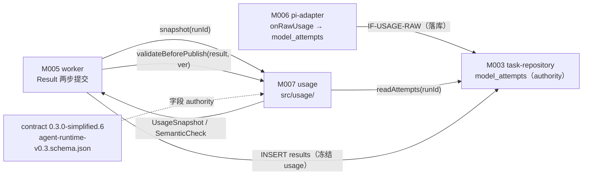
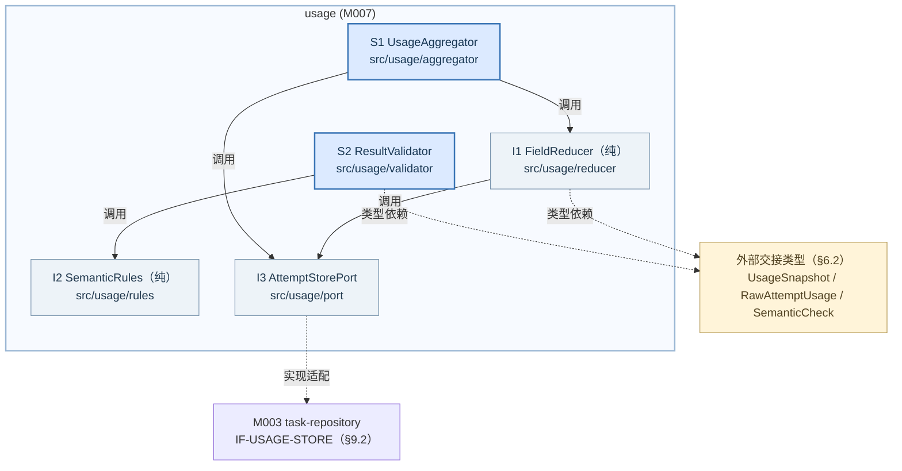
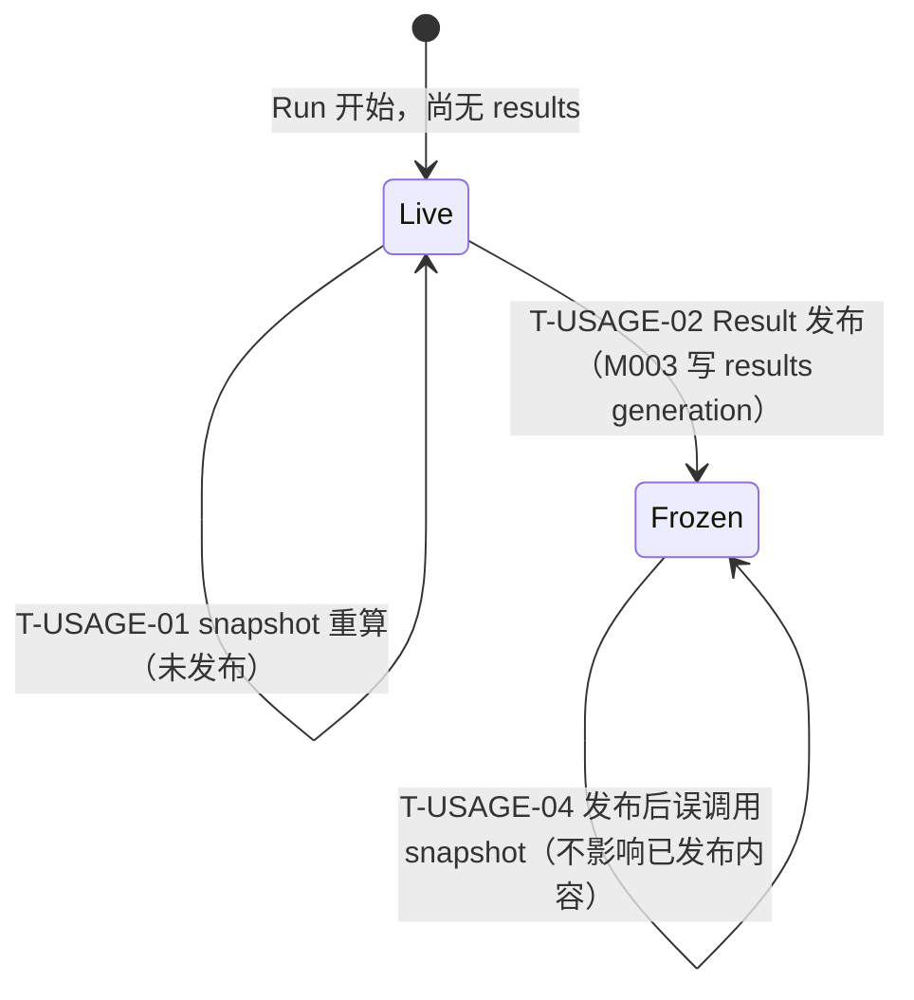
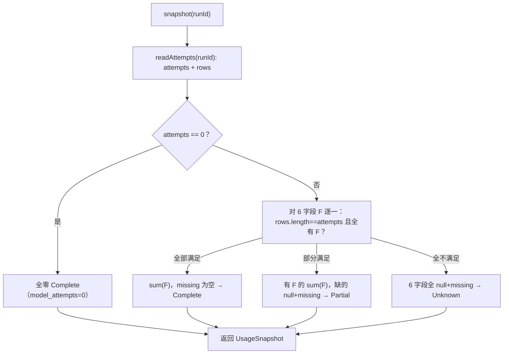
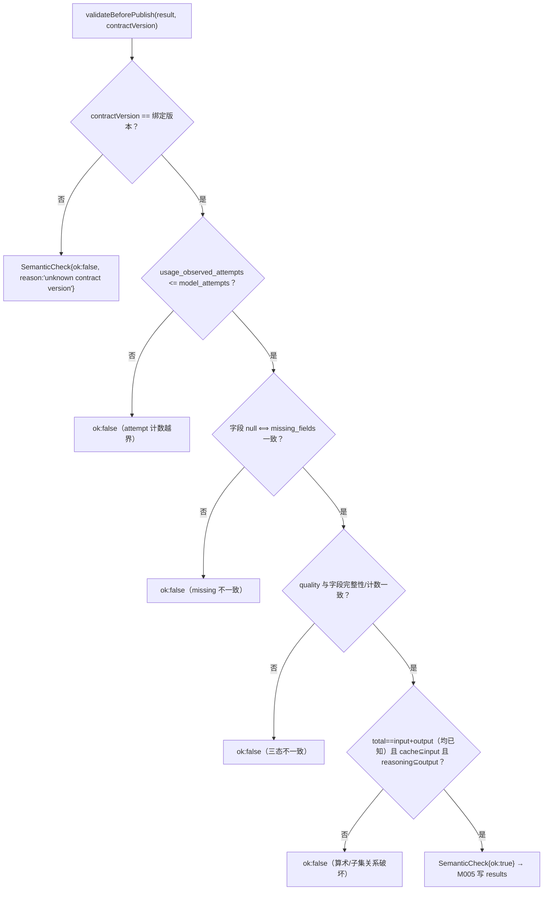
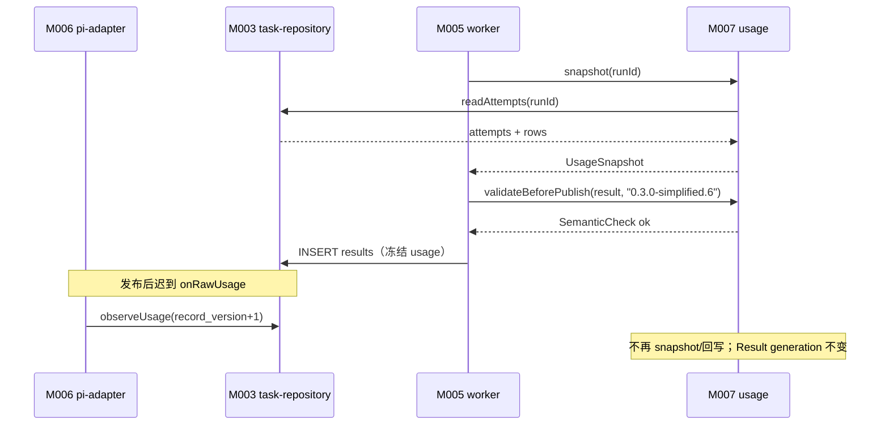

<!-- STD_DOCUMENT_COVER_BEGIN -->
# Piko 模块设计：usage（M007）

> STD 使用入口：[项目采用说明与标准导航](../../README.md#std-entry)

| 文档字段 | 值 |
|---|---|
| Document ID | `piko-usage-design` |
| Document Version | `0.1.2` |
| Status | `Draft` |
| Project | `piko` |
| Document Owner | Piko Implementation Owner |
| Last Modified Date | `2026-09-28` |
| Template ID | `design.definition` |
| Template Version | `3.4.0` |

<!-- STD_DOCUMENT_COVER_END -->

## 1. 单元摘要：为什么存在

M007 `usage` 解决一个问题：Piko 必须如实告诉 Slinky"这次 Run 用了多少 token"（PK-09），而 token 事实分散在多个模型 attempt 中，且每个 attempt 可能只报告部分字段——若 `pi-adapter`（M006）与 `worker`（M005）各自聚合，就会出现两套口径，Result 无法保证完整性。usage 把 Harness `onRawUsage` 观察到的原始字段（经 M006 落成 `model_attempts` 行）汇总为唯一 `UsageSnapshot`，并在 Result 发布前做语义校验（PK-10）。核心取舍是**逐字段完整才计入**：某字段只要有一个 durable attempt 未报告，该字段即为 `null` 并进入 `missing_fields`，而不是把部分下界当满值求和。

用一次调用说明：Run `task-042` 有 3 次模型 attempt，attempt1 六字段完整、attempt2 缺 `reasoning_tokens`、attempt3 完整。Result 发布前 M005 调 `UsageAggregator.snapshot("task-042")`：usage 读全部 durable attempt，对每字段 F 判断"全部 attempt 都报告了 F"；`reasoning_tokens` 因 attempt2 缺失而置 `null` 并入 `missing_fields`，其余 5 字段求和，`quality=Partial`。随后 M005 调 `ResultValidator.validateBeforePublish(result, "0.3.0-simplified.6")` 校验算术与子集关系，`SemanticCheck{ok:true}` 后写 `results`。发布后迟到的 attempt2 usage 只推进 `model_attempts.record_version`，**不修改**已发布 Result 的 usage generation。

usage 只做"聚合 + 语义校验 + 冻结边界"，**不改写上游语义**：不观察原始 provider 响应（M006 拥有）、不持久化 Result（M003 拥有 `results` 与 generation）、不决定 Run 状态机与发布协议（M005/M003）。它把持久化交给 M003 `task-repository`（`model_attempts` schema authority），自身只做纯计算与端口消费。

| 项目 | 内容 |
|---|---|
| 模块编号 / 正式英文名称 | M007 / `usage` |

| 运行进程 | P0 控制进程（见 `system-design` §3.3 关键决定 7） || 直属父对象编号 / 名称 | `SW-P` / Piko Agent Runtime V0.3（软件系统，`design_level=system`） |
| 父设计 Document ID / 固定基线 / 登记位置 | `system-design` v0.11.2 / 契约 `0.3.0-simplified.6` / §3.2 直属模块表 + §3.4 约束分配；本模块登记见 §3.2 第 206 行 |
| 上级系统/父单元 | 无（纯软件顶层，无总体系统父稿） |
| 解决的问题 | 多 attempt 分散 token 事实统一为一个可信快照；Result 发布前语义校验；发布后不篡改 |
| 提供的能力 | `UsageAggregator.snapshot`、`ResultValidator.validateBeforePublish`；Complete/Partial/Unknown 三态与 `missing_fields` |
| 主要使用者 | M005 `worker`（Result 发布前调用 snapshot + validate）；Slinky 经 Result 间接消费 |
| 不负责 | 原始 usage 观察与落库（M006/M003）；Result 持久化与 generation（M003）；Run 状态机与发布协议（M005/M003）；费用计算、跨 Run 累计、LLMTier 二次相加（明确不做） |

### 1.1 继承的上级约束与落实方式

usage 承接两条上级约束：`CON-USAGE-001`（PK-09，Usage 字段完整性）与 `CON-USAGE-002`（PK-10，Result 冻结 UsageSnapshot）。两条均为 Approved。约束来源是 `system-design` §3.4（PK-09/10 行）与 `piko-usage.md` §3.1；机制侧权威定义在 `piko-usage.md` §3.1、`piko-run.md` §14.4 `M-RUN-DI-007`。

#### 1.1.1 `CON-USAGE-001` · Usage 字段完整性

- **上级基线与决定状态**：`system-design` v0.11.2 §3.4（PK-09/10 行）+ `piko-usage.md` §3.1 `CON-USAGE-001` · PK-09 · Approved；固定基线 machine contract `0.3.0-simplified.6`。上级原文："6 字段逐项 sum/null + missing_fields；Complete/Partial/Unknown"。

- **适用条件**：每次 Run 在 Result 发布前聚合；输入是全部 durable `model_attempts`（含零 attempt 的取消 Run）。

- **继承预算或行为保证**：6 个 token 字段每字段独立判定：全部 durable attempt 都报告才求和，否则 `null` 并入 `missing_fields`；`quality ∈ {Complete, Partial, Unknown}` 且与字段完整性、`usage_observed_attempts`、`model_attempts` 一致；缺失字段**不得**填 0 冒充完整。

- **可自行选择/不可改变**：不可改变：逐字段完整才 sum、缺失即 null、三态语义、6 字段集合（schema `$defs.TokenField`）。可自行设计：内部数据结构、聚合实现、端口适配、日志（`M-USAGE-DI-002` 自由度"聚合数据结构"）。

- **本地落实/内部再分配**：§6.1 定义 `UsageQuality`；§6.2 定义 `RawAttemptUsage`/`ModelAttemptView`/`UsageSnapshot`；§8.1 `R-USAGE-SUMFIELD`、§8.2 `R-USAGE-QUALITY`、§8.3 `R-USAGE-MISSING` 定义逐字段规则；§9.1.1 固定 `snapshot` 合同；§13 落到 `src/usage/`。字段预算不向内部再分配（6 字段恒定量）。

- **验证方法与结果/证据**：局部：`VRC-USAGE-001`（逐字段 sum/null 与三态）、`VRC-USAGE-002`（missing_fields 一致性）。组合：PK-T10（LLMTier usage 集成）；当前全部 `NOT_RUN`。

- **差距/变更影响/反馈责任**：none。字段集合变化需契约升级（`piko-usage.md` §13），不在本模块放宽。

#### 1.1.2 `CON-USAGE-002` · Result 冻结 UsageSnapshot

- **上级基线与决定状态**：`system-design` v0.11.2 §3.4（PK-09/10 行）+ `piko-usage.md` §3.1 `CON-USAGE-002` · PK-10 · Approved。上级原文："Result 发布后迟到 usage 不修改 generation"。

- **适用条件**：Result 已发布（`results` 有对应 generation）；`model_attempts` 收到同一 attempt 的迟到 raw usage。

- **继承预算或行为保证**：已发布 generation 内的 `usage` 内容不可变；迟到 usage 只推进 `model_attempts.record_version`（M006/M003 写），**不改** Result、不创建新 generation。M007 在发布后不得重算并回写 Result。

- **可自行选择/不可改变**：不可改变：发布后不可变、迟到只推版本、语义校验失败不发布（fail closed）。可自行设计：快照缓存策略（是否缓存、缓存寿命）、`SemanticCheck` 私有表示。

- **本地落实/内部再分配**：§6.6 定义 `UsageDerivedState` 转换 `T-USAGE-01..04`（`Live → Frozen` 由发布触发）；§8.4 `R-USAGE-FREEZE` 定义冻结规则；§9.1.2 `validateBeforePublish` 在发布前校验；§10 `C-USAGE-01` 推演迟到与发布竞态。

- **验证方法与结果/证据**：局部：`VRC-USAGE-003`（发布后迟到不改 Result）、`VRC-USAGE-004`（validator fail closed 不写 Result）。组合：PK-T10/PK-T16；当前全部 `NOT_RUN`。

- **差距/变更影响/反馈责任**：none。`results` generation 的不可变执行权威属 M003；M007 只在自身边界声明"不重算不回写"。

## 2. 需求、功能与验收条件

usage 的可观察功能有三个：生成快照、发布前语义校验、冻结边界守护。三者都不可由外部 HTTP/CLI 触发，调用方只有 M005 `worker`（冻结由 M003 的 generation 不可变性共同保证）。

### 2.1 `F-USAGE-SNAPSHOT` · 逐字段聚合生成 UsageSnapshot

- **上级需求 / Constraint ID**：`CON-USAGE-001`（PK-09）；`M-RUN-DI-007`、`M-USAGE-DI-002`。

- **调用方**：M005 `worker`，在 Result 两步提交第一步内、写 `results` 之前，对每个 Run 至多调用一次。

- **输入与前提**：`runId: string`（非空）；该 Run 的全部 durable attempt 已落 `model_attempts`（处于 `Reserved/Started/UsageObserved/Terminal/Unknown` 之一）；M003 可用。

- **行为**：读取该 Run 的全部 durable attempt（`model_attempts` 行投影），得到 `attempts`（=`model_attempts`）与带 `raw_usage_json` 的行集合 `rows`（=`usage_observed_attempts`）。对 6 个字段 F：若 `rows.length !== attempts` 或任一 row 缺少 F 的数值，则该字段 `null` 且入 `missing_fields`；否则 `sum(rows.F)`。按 `R-USAGE-QUALITY` 定 `quality`。零 attempt 时输出全零 `Complete`。

- **输出**：`UsageSnapshot`（§6.2.3）：6 字段（`number|null`）+ `model_attempts` + `usage_observed_attempts` + `missing_fields[]` + `quality` + `source="PiModelResponses"`。

- **错误与边界**：无业务错误返回：字段缺失**不是错误**，是 `Partial`/`Unknown` 事实。唯一失败是依赖错误（M003 读失败，如 `SQLITE_BUSY`），向上抛由 M005 决定。`runId` 无任何 attempt 合法返回全零 `Complete`（取消/立即失败）。

- **验收条件**：给定 3 attempt（完整/缺 `reasoning_tokens`/完整），`snapshot` 返回 `reasoning_tokens=null`、其余 5 字段求和、`model_attempts=3`、`usage_observed_attempts=3`、`missing_fields=["reasoning_tokens"]`、`quality=Partial`；6 字段全缺返回 `Unknown` 且 6 字段皆 null；0 attempt 返回全零 `Complete`。

### 2.2 `F-USAGE-VALIDATE` · Result 发布前语义校验

- **上级需求 / Constraint ID**：`CON-USAGE-001`（PK-09）、`CON-USAGE-002`（PK-10）；`M-RUN-DI-007`。

- **调用方**：M005 `worker`，在 `snapshot` 之后、`INSERT results` 之前调用一次。

- **输入与前提**：`result: AgentResult`（含 `usage: UsageSnapshot`）；`contractVersion: string`（当前 `0.3.0-simplified.6`）。前提：`result.usage` 由 `snapshot` 产出。

- **行为**：按 `R-USAGE-VALIDATE` 校验：`usage_observed_attempts <= model_attempts`；每个字段"为 null"与"在 `missing_fields` 中"当且仅当一致；`Complete` ⟺ 6 字段皆非 null 且 `usage_observed_attempts == model_attempts`；`Partial` ⟹ 至少 1 且至多 5 字段非 null 且 `usage_observed_attempts > 0`；`Unknown` ⟺ 6 字段皆 null；当 `input/output/total` 均已知时 `total == input + output`；`cache_read_tokens`/`cache_write_tokens` 已知时不超过 `input_tokens`；`reasoning_tokens` 已知时不超过 `output_tokens`。同时核对 `contractVersion` 是否为绑定版本。

- **输出**：`SemanticCheck{ok: boolean, reason?: string}`（§6.6.2 私有结构）。

- **错误与边界**：任一不变量破坏 → `SemanticCheck{ok:false, reason}`，M005 必须抛 `InternalError("semantic-validator-fail")`、不写 `results`、不写终态（fail closed）。未知 `contractVersion` 视为校验失败（不放行）。usage 缺失**不是**校验失败——`Partial`/`Unknown` 是合法事实。

- **验收条件**：构造 `total != input + output` → `ok:false`；构造 `cache_read_tokens > input_tokens` → `ok:false`；合法 `Partial` 快照 → `ok:true`；`Verdict` 为 `NOT_RUN` 直到实测。

### 2.3 `F-USAGE-FREEZE` · 发布后冻结边界

- **上级需求 / Constraint ID**：`CON-USAGE-002`（PK-10）。

- **调用方**：M003 `task-repository` 的 Result 发布事务（写入 `results` generation）；M007 侧由 `UsageDerivedState` 从"已发布"事实派生观察。

- **输入与前提**：Run 已有已提交的 `results` generation；随后到达同一 `(task_id, operation_id, step_id, attempt)` 的迟到 raw usage。

- **行为**：冻结后 M007 **不**重算、**不**回写 Result；迟到 usage 由 M006 写 `model_attempts` 并推进 `record_version`（§8.4）。M007 的 `snapshot`/`validateBeforePublish` 只在发布前被调用；发布后对同一 Run 不再调用。

- **输出**：无新输出；Result generation 保持不可变。迟到只体现为内部 `model_attempts.record_version` 前进。

- **错误与边界**：若 M005 在发布后误调用 `snapshot`，M007 仍返回当前聚合值，但该值**不**影响已发布 Result；契约要求 M005 不这样做（`T-USAGE-04` guard）。本模块不提供"改写 Result"的操作。

- **验收条件**：发布 Result 后构造迟到 attempt usage：`results.result_json.usage` 逐字节不变，`model_attempts.record_version` 增加，无第二 generation。

## 3. UI、CLI、服务端点或设备操作面

**N/A。** usage 是纯进程内库模块，不拥有 UI、CLI、HTTP/RPC 端点或设备操作面：它不监听端口、不注册路由、不提供诊断命令。它的唯一调用入口是 M005 `worker` 的进程内函数调用（§9.1）；对外的可观察结果经 Result（M005→M003）暴露。

实际调用入口与归属：`M005 worker Result 两步提交第一步 → UsageAggregator.snapshot / ResultValidator.validateBeforePublish`（进程内 `src/usage/`）。维护/诊断入口不新增：usage 质量经系统指标 `piko.usage.quality.{Complete,Partial,Unknown}`（§11）与 operator 只读 `model_attempts` 摘要暴露。

Tailoring 依据：`TAIL-P-101`（Piko 无图形入口）同源；本模块无任何操作面，属 STD `design.definition` §3 "模块没有任何直接操作面时写 N/A + 实际调用入口/归属 + tailoring 依据"的情形。"没有页面"不等于"没有 API"——usage 的 API 在 §9.1 唯一维护。

## 4. 外部边界与依赖

usage 在进程内的位置：被 M005 调用，消费 M006 落库的 `model_attempts`，把结果交回 M005 写入 M003。下图只画模块外部交接，不表示线程或新部署边界。



图 M-USAGE-C1 · Target / Planned / NOT_BUILT。实线是同步进程内函数调用、SQLite 读写或装配；虚线是字段 authority 引用。usage 不创建线程/进程，不直接打开 SQLite（经 §9.2 端口）。持久化权威（`model_attempts`/`results` DDL、事务）属 M003，见 §9.2 `IF-USAGE-STORE`。

#### 4.1 `DEP-USAGE-PIADAPTER` · M006 `pi-adapter`（原始 usage 观察者）

- **角色 / 运行位置 / Owner**：同级直属模块，同实例（PK-01）；**运行进程 P0**（见 `system-design` §3.3 关键决定 7）；Owner：Piko Implementation Owner。

- **本模块调用或消费**：消费 M006 观察并落库的原始 usage 事实：每 attempt 的 `present_fields` 与 6 字段值（`RawUsage`，`piko-usage.md` §4.4.1）。M007 **不**直接持有 `onRawUsage` 回调；事实经 `model_attempts.raw_usage_json` 落库后由 §9.2 端口读取。

- **本模块提供**：无。usage 不向 M006 提供接口。

- **契约 authority / 版本 / selector**：`IF-USAGE-RAW`（`piko-usage.md` §5.1/§14.3）为 M006 提供的 raw usage 事件；其持久落点为 `model_attempts`（M003 DDL）。本设计按"事件落库后读取"实现，差异登记 `OQ-USAGE-003`。

- **同步方式 / timeout / 生命周期**：间接：M006 同步写 `model_attempts`；M007 在 Result 发布前同步读取。无网络；随进程。

- **不可用或失败影响 / 责任出口**：M006 未落库的 attempt 在本模块表现为"字段可能缺失"，进入 `missing_fields`（保守，不下界冒充）；不由 M007 补齐或伪造。

#### 4.2 `DEP-USAGE-WORKER` · M005 `worker`（调用方）

- **角色 / 运行位置 / Owner**：同级直属模块，同进程；Owner：Piko Implementation Owner。

- **本模块调用或消费**：M005 调用 `snapshot` 与 `validateBeforePublish`；M005 负责 `InternalError` 抛出与"不写 Result"的收口。

- **本模块提供**：`IF-USAGE-SNAPSHOT`、`IF-USAGE-VALIDATE`（§9.1）。

- **契约 authority / 版本 / selector**：`piko-run.md` §5.1 `IF-RUN-SNAPSHOT`（`snapshot` + `validateBeforePublish`）；`system-design` §6.2.1 Result 两步提交。

- **同步方式 / timeout / 生命周期**：同步进程内调用；在 M005 的单 `BEGIN IMMEDIATE`（第一步）上下文中调用；随 M005 Run 寿命。

- **不可用或失败影响 / 责任出口**：usage 抛依赖错误 → M005 决定重试/失败；`ok:false` → M005 必须 fail closed（抛 `InternalError`、回滚、不写结果）。

#### 4.3 `DEP-USAGE-REPO` · M003 `task-repository`（持久化与 schema 权威）

- **角色 / 运行位置 / Owner**：同级直属模块，同进程；Owner：Piko Implementation Owner。

- **本模块调用或消费**：只读端口 `readAttempts(runId)`（`model_attempts` 行投影，§9.2 `IF-USAGE-STORE`）。M007 **不**调用 `insertResult`/`finish`/任何写操作，不打开 SQLite 连接。

- **本模块提供**：无。usage 不向 M003 提供接口。

- **契约 authority / 版本 / selector**：`IF-USAGE-STORE` 由本设计提出（§9.2），**Proposed**：待 M003 `piko-task-repository-design.md` 采纳或给出超集（`OQ-USAGE-002`）。`model_attempts` 的**当前代码事实**是 `src/store.ts` `migrate()` 的建表 DDL（`src/store.ts:23`）与 `usage(run)` 读方法（`src/store.ts:79`）。`piko-task-repository-design.md`/`-impl.isd.md` §4.7 为 **Proposed（尚未编写）**。

- **同步方式 / timeout / 生命周期**：同步进程内调用；读为单查询；受 `task_store.busy_timeout_ms` 约束；连接生命周期由 M003 持有。

- **不可用或失败影响 / 责任出口**：`SQLITE_BUSY` 超时 → 向上抛依赖错误，由 M005 决定；usage 不吞错、不改写 M003 语义。`results` 的写与 generation 权威属 M003。

#### 4.4 `DEP-USAGE-CONTRACT` · 机器契约 `0.3.0-simplified.6`（字段 authority）

- **角色 / 运行位置 / Owner**：设计期契约 artifact，非运行时进程；Owner：Piko Contract Owner。

- **本模块调用或消费**：消费 `interfaces/schemas/agent-runtime-v0.3.schema.json` 的 `TokenUsage` 字段集与语义不变量（`x-semantic-invariants`）：6 字段名、`source="PiModelResponses"`、`quality` 枚举、`model_attempts`/`usage_observed_attempts`/`missing_fields` 约束。

- **本模块提供**：无（只读引用）。

- **契约 authority / 版本 / selector**：contract `0.3.0-simplified.6`；schema `$id=https://piko.local/schemas/agent-runtime-v0.3.schema.json`；`$defs.TokenField`/`TokenUsage`。

- **同步方式 / timeout / 生命周期**：编译期/评审期引用；随契约版本。

- **不可用或失败影响 / 责任出口**：契约升级（字段增减）需独立评审（`piko-usage.md` §13）；`ResultValidator` 绑定版本不可降级（`RISK-USAGE-001`）。

## 5. 内部结构与实现位置

usage 拆成五个内部单元：聚合入口、校验入口、纯字段归约、纯语义规则、attempt 读端口。拆分依据是"纯规则可独立测试、端口隔离 M003、入口只做编排"，不是为了凑文件。



图 M-USAGE-S1 · Target / Planned / NOT_BUILT。外框是模块内部组成；实线同步调用，虚线类型/适配依赖；不表示线程或时序。所有路径均为 Planned（现逻辑在 `src/worker.ts`/`src/semantic.ts`）。

### 5.1 内部组成

#### 5.1.1 `S1` · UsageAggregator（聚合入口）

- **职责与非职责**：对外提供 §9.1.1 `snapshot(runId)`：读 attempt → 逐字段归约 → 组 `UsageSnapshot`。非职责：不发 SQL（经 I3）、不做三态/算术判定（I1/I2 做）、不写 Result。

- **输入、处理与输出**：输入 `runId:string`；处理：`AttemptStorePort.readAttempts` → `FieldReducer.reduce`；输出 `UsageSnapshot`。

- **协作对象**：调用 I1/I3；被 M005 调用。不直接 import M003。

- **文件 / symbol / 实现状态**：`src/usage/aggregator.ts` → `class UsageAggregator` / `aggregateUsage`（Planned / NOT_IMPLEMENTED）。现基线逻辑在 `src/worker.ts:29` `aggregateUsage`。

- **拆分依据与替代方案代价**：把"读 attempt + 归约"独立，使 §8 的 `R-USAGE-SUMFIELD/QUALITY` 可对纯数据表驱动单测，不需真 SQLite。替代方案"留在 worker 内联"是 Current 形态，代价是与执行逻辑耦合、无法独立验证三态。

#### 5.1.2 `S2` · ResultValidator（校验入口）

- **职责与非职责**：对外提供 §9.1.2 `validateBeforePublish(result, contractVersion)`：调用 `SemanticRules.check` 得 `SemanticCheck`。非职责：不修复数据、不改 Result、不抛 `InternalError`（由 M005 抛）。

- **输入、处理与输出**：输入 `AgentResult` + `contractVersion:string`；输出 `SemanticCheck{ok, reason?}`。

- **协作对象**：调用 I2；被 M005 调用。

- **文件 / symbol / 实现状态**：`src/usage/validator.ts` → `class ResultValidator` / `validateUsage`（Planned / NOT_IMPLEMENTED）。现基线在 `src/semantic.ts:3` `validateUsage`。

- **拆分依据与替代方案代价**：纯规则抽到 I2 以便对每条不变量构造反例单测。替代方案"校验内嵌在 store.insertResult"（Current 形态之一）使失败点不可独立触发，也无法对未知契约版本做 fail closed 单测。

#### 5.1.3 `I1` · FieldReducer（纯字段归约）

- **职责与非职责**：纯函数：`reduce(attempts:number, rows:RawAttemptUsage[]) -> UsageSnapshot`，实现 `R-USAGE-SUMFIELD`/`R-USAGE-QUALITY`/`R-USAGE-MISSING`。非职责：无 I/O、无状态、不读时钟。

- **输入、处理与输出**：输入 `attempts`（int>=0）与 `rows`（`raw_usage_json` 解析后投影）；输出 `UsageSnapshot`。

- **协作对象**：仅被 S1 调用；不依赖任何端口。

- **文件 / symbol / 实现状态**：`src/usage/reducer.ts`（Planned），导出 `reduce`、`TOKEN_FIELDS`。

- **拆分依据与替代方案代价**：纯函数使三态与缺失判定可表驱动测试，覆盖零 attempt、全缺、部分缺。替代方案"直接在 aggregator 里读 DB 归约"无法脱离 SQLite 单测。

#### 5.1.4 `I2` · SemanticRules（纯语义规则）

- **职责与非职责**：纯函数：`check(usage, contractVersion) -> SemanticCheck`，实现 `R-USAGE-VALIDATE`。非职责：无 I/O、不抛异常、不修复。

- **输入、处理与输出**：输入 `UsageSnapshot` + `contractVersion`；输出 `SemanticCheck`。

- **协作对象**：仅被 S2 调用。

- **文件 / symbol / 实现状态**：`src/usage/rules.ts`（Planned），导出 `check`、`BOUND_CONTRACT_VERSION`。

- **拆分依据与替代方案代价**：把每条不变量写成可列举的反例检查，未知版本 fail closed。替代方案"复用 schema validator"引入运行期大依赖且无法对私有 `SemanticCheck` 语义做单测。

#### 5.1.5 `I3` · AttemptStorePort（持久化读端口）

- **职责与非职责**：把 §9.2 `IF-USAGE-STORE` 的读操作适配到 M003；是 usage 内唯一接触持久化的单元。非职责：不聚合、不校验、不写。

- **输入、处理与输出**：输入 `runId:string`；输出 `{attempts:number, rows:RawAttemptUsage[]}`。

- **协作对象**：调用 M003 `task-repository`；被 S1/I1 调用。

- **文件 / symbol / 实现状态**：`src/usage/port.ts`（Planned），接口 `AttemptStorePort` + `M003AttemptStore`（构造注入 `TaskStore`）。

- **拆分依据与替代方案代价**：端口使 aggregator 可在内存假实现上测试（§14.2 用受控 fake），并把 M003 合同集中一处。替代方案"直接 import store"会传播 M003 类型到全模块，违反 §5.5 依赖方向。

### 5.2 内部调用过程

#### 5.2.1 `P-USAGE-SNAPSHOT` · 聚合（发布前）

- **入口与调用上下文**：M005 worker Result 两步提交第一步 → `UsageAggregator.snapshot(runId)`。

- **调用链（文件 / symbol → 文件 / symbol）**：`worker.finish` → `UsageAggregator.snapshot` → `AttemptStorePort.readAttempts`（M003）→ `FieldReducer.reduce` → 返回 `UsageSnapshot`。

- **逐步传递的数据**：`runId:string` → `{attempts:number, rows:RawAttemptUsage[]}` → `UsageSnapshot`。

- **返回、异常与清理**：成功返回 `UsageSnapshot`；M003 依赖错误向上抛。无临时资源需清理（只读）。

- **对应流程 / 接口 / 验证**：§7 `M-USAGE-P1`；§9.1.1 `IF-USAGE-SNAPSHOT`、§9.2.1 `IF-USAGE-STORE`；`VRC-USAGE-001/002`。

#### 5.2.2 `P-USAGE-VALIDATE` · 校验（发布前）

- **入口与调用上下文**：M005 在 `snapshot` 之后、`INSERT results` 之前 → `ResultValidator.validateBeforePublish(result, contractVersion)`。

- **调用链（文件 / symbol → 文件 / symbol）**：`worker.finish` → `ResultValidator.validateBeforePublish` → `SemanticRules.check` → 返回 `SemanticCheck`。

- **逐步传递的数据**：`AgentResult` + `contractVersion:string` → `SemanticCheck{ok, reason?}`。

- **返回、异常与清理**：返回 `SemanticCheck`（不抛业务异常）；`ok:false` 时由 M005 抛 `InternalError` 并回滚。无清理。

- **对应流程 / 接口 / 验证**：§7 `M-USAGE-P2`；§9.1.2 `IF-USAGE-VALIDATE`；`VRC-USAGE-004/005`。

#### 5.2.3 `P-USAGE-FREEZE` · 冻结边界（发布后）

- **入口与调用上下文**：M003 发布 `results` generation；M006 处理迟到 raw usage 时 → `store.observeUsage`（M006/M003 路径）。

- **调用链（文件 / symbol → 文件 / symbol）**：`pi-adapter.onRawUsage`（迟到）→ `store.observeUsage`（`record_version+1`）；usage 侧不再调用 `snapshot`/`validateBeforePublish`。

- **逐步传递的数据**：迟到的 `RawUsage` → `model_attempts.record_version`（不影响 `results`）。

- **返回、异常与清理**：无 usage 侧返回；迟到落库失败按 M006/M003 语义处理。无释放。

- **对应流程 / 接口 / 验证**：§7 `M-USAGE-P3`；§8.4 `R-USAGE-FREEZE`；`VRC-USAGE-003`。

### 5.3 文件间接口契约

本节只固定 usage 内部文件之间的交接；跨模块接口在 §9.1/§9.2，字段类型在 §6.2。

#### 5.3.1 `IF-USAGE-REDUCE` · `aggregator.ts` → `reducer.ts`

- **接口成员 ID / §9 逐接口定义位置**：内部无公共成员 ID；行为规则权威在 §8（`R-USAGE-SUMFIELD/QUALITY/MISSING`）。

- **本文件的提供或使用责任**：`reducer.ts` 提供纯函数 `reduce`；`aggregator.ts` 使用其结果。

- **交接时机 / 本地调用步骤**：`snapshot` 内读 attempt 后一次调用。

- **§9.3 生命周期约束**：无状态、无所有权；调用即返回。

- **实现与验证位置**：`src/usage/reducer.ts`；`VRC-USAGE-001/002` 以表驱动覆盖。

#### 5.3.2 `IF-USAGE-CHECK` · `validator.ts` → `rules.ts`

- **接口成员 ID / §9 逐接口定义位置**：内部无公共成员 ID；规则权威在 §8.4（`R-USAGE-VALIDATE`）。

- **本文件的提供或使用责任**：`rules.ts` 提供纯函数 `check`；`validator.ts` 包装为 `SemanticCheck`。

- **交接时机 / 本地调用步骤**：`validateBeforePublish` 内一次调用。

- **§9.3 生命周期约束**：无状态；调用即返回。

- **实现与验证位置**：`src/usage/rules.ts`；`VRC-USAGE-004/005`。

#### 5.3.3 `IF-USAGE-PORT` · `aggregator.ts` → `port.ts`

- **接口成员 ID / §9 逐接口定义位置**：内部接口 `AttemptStorePort`，方法契约见 §9.2.1 `IF-USAGE-STORE`。

- **本文件的提供或使用责任**：`port.ts` 提供抽象与 `M003AttemptStore`；`aggregator.ts` 以抽象调用。

- **交接时机 / 本地调用步骤**：见 `P-USAGE-SNAPSHOT` 链。

- **§9.3 生命周期约束**：端口实例与进程同域；不缓存 `model_attempts` 行（每次读权威）。

- **实现与验证位置**：`src/usage/port.ts`；`VRC-USAGE-001` 以受控 fake 端口 + 真 M003 两套覆盖。

### 5.4 服务提供方式（条件适用）

**N/A（无独立宿主）。** usage 不监听端口、不启动进程/线程、不注册端点：§3 已判定无操作面，故本节的 server/runtime、监听、就绪、停止均不适用。

运行载体：usage 实例由 M000 `bootstrap` 装配、随进程生命周期存在；无自身进入/退出过程。并发模型：全部操作在宿主事件循环上同步执行；无定时器、无后台线程。就绪/停止语义属于 M000/M005，usage 只暴露操作、不定义 READY/停止出口。

Tailoring 依据：STD `design.definition` §5.4 "纯库函数说明不适用及由谁调用"。

### 5.5 依赖方向

- **允许方向**：`aggregator.ts` → `{reducer.ts, port.ts}`；`validator.ts` → `rules.ts`；`reducer.ts` → `types.ts`（仅 §6.2 类型）；`port.ts` → `types.ts`。所有单元 → 无外部模块，除 `port.ts` 适配 M003。

- **禁止方向与原因**：禁止 `reducer.ts`/`rules.ts` 引用任何 I/O 或端口（保持纯函数）；禁止 `port.ts` 引用 `aggregator.ts`/`validator.ts`（避免环）；禁止任何单元直接 `import` M003 的 `store.ts`（只能经 `port.ts` 抽象），否则类型依赖扩散并绕过 §5.3 契约。

- **循环/越层检查**：静态：对 `src/usage/` 跑依赖图（`tsc`/import 检查或 CI 脚本）确认无环、纯规则文件无 import（除 `types`）。评审按 §5.1 逐文件核对引用。

- **变更影响**：改 `reducer.ts` 只影响逐字段规则（§8.1–8.3 权威）；改 `rules.ts` 只影响校验（§8.4）；改 `port.ts` 影响与 M003 的合同（`OQ-USAGE-002`）；改 `aggregator.ts`/`validator.ts` 影响对外两操作（§9.1）。

## 6. 数据结构设计

usage 拥有的运行态数据是派生的 `UsageDerivedState`（§6.6，权威属 M003 `results`）；模块自有类型是 `RawAttemptUsage`/`ModelAttemptView`/`SemanticCheck`；公共 `UsageSnapshot` 的字段 authority 在机器契约。不适用类别在章首集中说明。

**不适用类别与依据**：§6.3 配置结构 N/A（无机制专属配置，复用系统 config，见 §4.4/§6.3）；§6.4 通信报文 N/A（无跨进程消息，raw usage 经 DB 落点，见 §9.2）；§6.5 设备/FPGA N/A（纯软件，`TAIL-P-103`）；§6.7 数据库表结构 N/A（`model_attempts`/`results` schema authority 属 M003，见 §6.7）。

### 6.1 公共基础类型与枚举

#### 6.1.1 `UsageQuality`

- **完整定义、Data/Type/Error ID 与唯一来源**：`UsageQuality = "Complete" | "Partial" | "Unknown"`；公共类型，唯一来源 = contract `0.3.0-simplified.6` `$defs.TokenUsage.quality`；机器权威 `interfaces/schemas/agent-runtime-v0.3.schema.json`。

- **逐字段/逐值类型、范围、含义与跨字段约束**：`Complete`＝6 字段全部完整且 `usage_observed_attempts == model_attempts`；`Partial`＝至少 1 完整且至少 1 缺失，且 `usage_observed_attempts > 0`；`Unknown`＝6 字段全 null（允许 `usage_observed_attempts > 0`）。未知值拒绝。

- **生产/修改、所有权、可见点、寿命及失败出口**：M007 经 `FieldReducer.reduce` 写；可见点 `UsageSnapshot.quality`；随 Result 冻结；不因迟到改变。

- **合法与拒绝实例、V/Case 与证据状态**：合法：`model_attempts=0` 时零调用 `Complete`；`usage_observed_attempts>0` 但 6 字段全缺必须为 `Unknown`。未知字符串拒绝。`VRC-USAGE-001`；`NOT_RUN`。

### 6.2 业务与操作数据结构

#### 6.2.1 `RawAttemptUsage`

- **完整定义、Data/Type/Data ID 与唯一来源**：本模块私有视图；来源 = M006 `RawUsage`（`piko-usage.md` §4.4.1）落库后的 `model_attempts.raw_usage_json` 解析投影。

  ```text
  RawAttemptUsage {
    input?: number, output?: number, totalTokens?: number,
    cacheRead?: number, cacheWrite?: number, reasoning?: number,
    present_fields?: string[]          // 本次实际出现的字段
  }
  ```

- **逐字段/逐值类型、范围、含义与跨字段约束**：6 个可选非负整数；缺字段即"该 attempt 未报告该字段"。`present_fields`（若存在）必须与出现的字段值一致；缺失字段**不得**填 0。跨字段：不要求单 attempt 内 `total == input + output`（由聚合后判定）。

- **生产/修改、所有权、可见点、寿命及失败出口**：由 M006 写 `raw_usage_json`，usage 只读解析；寿命 = attempt 寿命（迟到以 `record_version` 替换，不追加）。

- **合法与拒绝实例、V/Case 与证据状态**：合法：`{input:1200, output:340, totalTokens:1540, cacheRead:100, cacheWrite:0, reasoning:50}`。拒绝：把缺失 `reasoning` 记为 0 冒充完整。`VRC-USAGE-001`；`NOT_RUN`。

#### 6.2.2 `ModelAttemptView`

- **完整定义、Data/Type/Data ID 与唯一来源**：`model_attempts` 行的只读投影；来源 = M003 `model_attempts` DDL（当前代码事实 `src/store.ts:23`）+ §9.2.1。

  ```text
  ModelAttemptView {
    task_id: string, operation_id: string, step_id: string, attempt: number,
    state: "Reserved" | "Started" | "UsageObserved" | "Terminal" | "Unknown",
    raw_usage: RawAttemptUsage | null, record_version: number, updated_at: string
  }
  type AttemptSet = { attempts: number, rows: RawAttemptUsage[] }
  ```

- **逐字段/逐值类型、范围、含义与跨字段约束**：`attempts` = 该 Run `model_attempts` 行数；`rows` = `raw_usage_json IS NOT NULL` 的行解析；`usage_observed_attempts = rows.length`。`rows.length <= attempts`（不变量 `INV-USAGE-2`）。

- **生产/修改、所有权、可见点、寿命及失败出口**：由 M003 读产生、usage 只读消费；无长期寿命。

- **合法与拒绝实例、V/Case 与证据状态**：合法：`{attempts:3, rows:[..., ...]}`（2 行有 usage）。拒绝：`rows.length > attempts`。`VRC-USAGE-001`；`NOT_RUN`。

#### 6.2.3 `UsageSnapshot`（公共）

- **完整定义、Data/Type/Data ID 与唯一来源**：公共类型 `TokenUsage`（契约名）；唯一来源 = contract `0.3.0-simplified.6` `$defs.TokenUsage` / `interfaces/schemas/agent-runtime-v0.3.schema.json`。本模块是它的生产者。

  ```text
  UsageSnapshot {
    source: "PiModelResponses",
    quality: UsageQuality,
    input_tokens: number | null, output_tokens: number | null, total_tokens: number | null,
    cache_read_tokens: number | null, cache_write_tokens: number | null, reasoning_tokens: number | null,
    model_attempts: number, usage_observed_attempts: number,
    missing_fields: TokenField[]
  }
  ```

- **逐字段/逐值类型、范围、含义与跨字段约束**：6 字段非负整数或 `null`；`model_attempts>=0`；`usage_observed_attempts<=model_attempts`；`missing_fields` 唯一项、与 null 字段一一对应。语义不变量：`total == input + output`（三者均已知时）；`cache_read_tokens`/`cache_write_tokens <= input_tokens`（input 已知时）；`reasoning_tokens <= output_tokens`（output 已知时）。字段名以 schema 为准（**注**：机制散文 `piko-usage.md` §4.2.1 用别名 `cached_tokens`，本设计以 schema `cache_read_tokens` 为 authority，差异登记 `OQ-USAGE-001`）。

- **生产/修改、所有权、可见点、寿命及失败出口**：由 `UsageAggregator.snapshot` 生产，交 M005，随 `results` 冻结（authority M003）；发布后不可变。

- **合法与拒绝实例、V/Case 与证据状态**：合法：`{input_tokens:2600, output_tokens:740, total_tokens:3340, cache_read_tokens:100, cache_write_tokens:0, reasoning_tokens:null, model_attempts:3, usage_observed_attempts:3, missing_fields:["reasoning_tokens"], quality:"Partial"}`。拒绝：`quality:"Complete"` 却有 null 字段；`missing_fields` 与 null 不一致。`VRC-USAGE-002/004`；`NOT_RUN`。

### 6.3 配置与规则数据结构

**N/A · 复用系统 config。** usage 无机制专属配置（`piko-usage.md` §4.3 "N/A · 复用系统 config"）；`piko-runtime-config-v0.3.schema.json` 无 usage 专属 key。唯一"规则数据"是绑定的契约版本号 `0.3.0-simplified.6`，作为常量写死在 `SemanticRules.BOUND_CONTRACT_VERSION`（§8.4），由契约升级评审变更，不属于可热改配置。依据：STD `design.definition` §6.3 "不适用时在章首说明原因和 tailoring 依据"。

### 6.6 运行状态数据结构

#### 6.6.1 `UsageDerivedState`（派生运行状态）

- **完整定义、Data/Type/Data ID 与唯一来源**：`UsageDerivedState = "Live" | "Frozen"`；usage 的**派生**观察状态，**非**持久 authority。权威事实来源：`results` 是否已有该 Run 的已提交 generation（M003）+ `model_attempts.record_version`。M007 不写任何状态表，只在内存按事实派生。

- **逐字段/逐值类型、范围、含义与跨字段约束**：`Live`＝该 Run 尚无已发布 Result，usage 可被 `snapshot` 重算；`Frozen`＝`results` 已有 generation，usage 内容不可变。跨字段：`Frozen` 时 `snapshot` 即使被调用也不影响已发布内容。

- **生产/修改、所有权、可见点、寿命及失败出口**：派生自 M003 事实；可见点 = 读取时；寿命 = Run 寿命；无独立失败出口（只读投影）。

- **状态图、转换表与不变量（跨步骤状态必填）**：



  图 M-USAGE-D1 · Target / Planned / NOT_BUILT。`Live`=可重算；`Frozen`=已发布不可变。没有"回退到 Live"：generation 不可撤销。

  | Transition ID | 原状态 → 新状态 | 事件 / 执行者 | Guard 的权威事实来源 | 动作 / 提交点 | 迟到 / 失败出口 | 不变量 | VRC |
  |---|---|---|---|---|---|---|---|
  | `T-USAGE-01` | Live → Live | `snapshot` / M005 | `results` 无该 Run generation（M003 查询） | 读 `model_attempts` 重算快照；无写 | M003 依赖错误上抛 | `INV-USAGE-2` | `VRC-USAGE-001` |
  | `T-USAGE-02` | Live → Frozen | Result 发布 / **M003** | `results` 提交该 Run generation（machine） | M003 单事务 `INSERT results`（含 usage）；提交点为可见点 | 崩溃于提交前 → 仍 `Live`，重试发布 | `INV-USAGE-1` | `VRC-USAGE-003` |
  | `T-USAGE-03` | Frozen → Frozen | 迟到 `onRawUsage` / M006 | 同 attempt identity 已有 `model_attempts` 行 | `observeUsage` 推 `record_version`；不碰 `results` | 写失败按 M006/M003 语义 | `INV-USAGE-1/3` | `VRC-USAGE-003` |
  | `T-USAGE-04` | Frozen → Frozen | 发布后误调 `snapshot` / M005 | 已存在 generation | 重算结果不写回；已发布内容不变 | 无 | `INV-USAGE-1` | `VRC-USAGE-003` |

  **不变量**：

  - `INV-USAGE-1`：已发布 `results.generation` 的 `usage` 内容不可变；迟到 usage 不创建新 generation。
  - `INV-USAGE-2`：任何时刻 `usage_observed_attempts <= model_attempts`。
  - `INV-USAGE-3`：`missing_fields` 与 6 字段的 null 状态一一对应；`quality` 与字段完整性、attempt 计数一致。

- **合法与拒绝实例、V/Case 与证据状态**：合法：`Live{task-042}` 重算得 `Partial`；发布后 `Frozen`。拒绝：发布后试图以迟到 usage 改写 generation（违反 `INV-USAGE-1`）。`VRC-USAGE-003`；`NOT_RUN`。

### 6.7 数据库表结构

**N/A。** 本模块不拥有持久表：`model_attempts`（读）与 `results`（写，归属 M005 发布路径）的 schema authority、DDL、事务与 generation 属 M003 `task-repository`（当前代码事实 `src/store.ts:23` 建 `model_attempts`，`PRAGMA user_version=2`；Proposed 设计权威 `piko-task-repository-impl.isd.md` §4.7）。usage 只经 §9.2 `IF-USAGE-STORE` 读 `model_attempts`，不复制 CREATE TABLE、不打开连接。依据：STD `design.definition` §6.7 "只读外部数据库时引用其唯一来源"。

### 6.8 错误码与错误结构

#### 6.8.1 `SemanticValidationError` → `InternalError("semantic-validator-fail")`

- **完整定义、Data/Type/Error ID 与唯一来源**：公共错误码 `InternalError`（`cause_class="Internal"`）来自 contract `$defs.Failure`；失败事实 `semantic-validator-fail` 由 MECH-USAGE/MECH-RUN 定义（`piko-usage.md` §4.8、`piko-run.md` §5.1）。usage 的私有 `SemanticCheck{ok:false, reason}` 是它的**触发信号**，不是独立对外错误码。

  ```text
  SemanticCheck { ok: boolean, reason?: string }
  ```

- **逐字段/逐值类型、范围、含义与跨字段约束**：`ok=false` 时 `reason` 必填，描述被破坏的不变量（如 `total != input + output`、`cache_read_tokens > input_tokens`、`unknown contract version`）。`ok=true` 时 `reason` 省略。

- **生产/修改、所有权、可见点、寿命及失败出口**：由 `ResultValidator.validateBeforePublish` 生产；交 M005；M005 据此抛 `InternalError` 并回滚、不写 `results`。usage 自身不抛对外错误。

- **合法与拒绝实例、V/Case 与证据状态**：合法：`{ok:true}` 对合法 Partial 快照。拒绝：`total=100, input=60, output=50` → `{ok:false, reason:"total mismatch"}`。**注**：usage 字段缺失（`Partial`/`Unknown`）不是错误，照常发布。`VRC-USAGE-004/005`；`NOT_RUN`。

- **下级承接与载荷**：M005 承接：`ok:false` → 抛 `InternalError("semantic-validator-fail")`、Run 置 `Failed`、不重跑 Pi；`Partial`/`Unknown` → 照常发布，下游按 `quality` 处理。均不映射为新的 usage 专属 HTTP 错误码。

## 7. 主流程与数据流

本节给出 usage 的三条过程：发布前聚合（含零 attempt 与全缺边界）、发布前校验（含 fail closed）、发布后迟到冻结。三者与 §6.6 转换、§8 规则、§9 接口共用同一 `Process/Call/IF/Transition ID`。



图 M-USAGE-P1 · Target / Planned / NOT_BUILT。逐字段判定是核心：`rows.length !== attempts` 时该字段一律 null（不得以下界求和）。零 attempt 是合法 `Complete` 全零。



图 M-USAGE-P2 · Target / Planned / NOT_BUILT。任一不变量破坏即 fail closed：M005 抛 `InternalError("semantic-validator-fail")`、回滚、不写 `results`、不写终态。usage 缺失不在此列。



图 M-USAGE-P3 · Target / Planned / NOT_BUILT。迟到 usage 只推 `record_version`（M006/M003 路径），usage 发布后不重算不回写。

| Process ID | 触发/适用条件 | 图与正文位置 | 正常/异常出口 | 接口/规则/验证项 |
|---|---|---|---|---|
| `P-USAGE-SNAPSHOT` | M005 Result 第一步、发布前 | §5.2.1 / M-USAGE-P1 | 正常 `UsageSnapshot`；边界零 attempt/全缺 | `F-USAGE-SNAPSHOT`、`R-USAGE-SUMFIELD/QUALITY`、`VRC-USAGE-001/002` |
| `P-USAGE-VALIDATE` | `snapshot` 后、写 results 前 | §5.2.2 / M-USAGE-P2 | 正常 `ok:true`；异常 `ok:false`→`InternalError` | `F-USAGE-VALIDATE`、`R-USAGE-VALIDATE`、`VRC-USAGE-004/005` |
| `P-USAGE-FREEZE` | Result 发布后迟到 usage | §5.2.3 / M-USAGE-P3 | 正常仅推 record_version；无回写 | `F-USAGE-FREEZE`、`R-USAGE-FREEZE`、`VRC-USAGE-003` |

## 8. 关键算法与业务规则

#### 8.1 `R-USAGE-SUMFIELD` · 逐字段完整才求和

- **输入前提 / 适用条件**：`snapshot` 且 `attempts > 0`；`rows` 为带 usage 的 durable attempt 投影。

- **算法 / 规则 / 选择依据**：对每个字段 F：`full(F) = (rows.length === attempts) && rows.every(r => typeof r[F] === 'number')`；`sums[F] = full(F) ? sum(rows, F) : null`；`null` 字段并入 `missing_fields`。选择依据：部分求和会把下界当满值，违反 PK-09"不得用归一化 input 冒充完整"。

- **结果 / 不变量 / 边界**：结果 = 每字段一个 `number|null`。不变量 `INV-USAGE-3`。边界：`rows.length < attempts` 时所有字段皆 null（即使某些行有值）。

- **复杂度 / 资源限制**：O(6 × rows.length)；无额外存储（除结果对象）。

- **允许替换范围 / 不可改变保证**：可换实现（reduce/fold），不可改为"部分求和"或"缺失填 0"。

- **具体输入推演 / 验证项**：attempt1 完整、attempt2 缺 `reasoning`、attempt3 完整 → `reasoning=null` 入 missing、其余 5 字段求和。`VRC-USAGE-001`。

#### 8.2 `R-USAGE-QUALITY` · 三态判定

- **输入前提 / 适用条件**：`snapshot`；`attempts >= 0`，`missing_fields` 由 §8.1 得出。

- **算法 / 规则 / 选择依据**：`attempts===0` → `Complete`（全零）；否则：`missing.length===6` → `Unknown`；`missing.length===0 && rows.length===attempts` → `Complete`；否则 `Partial`。选择依据：三态必须可判定且与 schema `allOf` 分支一致。

- **结果 / 不变量 / 边界**：结果 ∈ {Complete, Partial, Unknown}。不变量 `INV-USAGE-3`。边界：`Unknown` 时强制 6 字段全 null（即使个别行曾有值，因未覆盖全部 attempt）。

- **复杂度 / 资源限制**：O(1)（基于 missing 计数）。

- **允许替换范围 / 不可改变保证**：可换判定顺序，不可改变三态定义与 `Complete ⟹ observed==attempts`。

- **具体输入推演 / 验证项**：`attempts=3, rows.length=3, missing=1` → `Partial`；`attempts=2, rows.length=0` → `Unknown`；`attempts=0` → `Complete` 全零。`VRC-USAGE-001`。

#### 8.3 `R-USAGE-MISSING` · missing_fields 与 null 一致

- **输入前提 / 适用条件**：`snapshot` 产出后。

- **算法 / 规则 / 选择依据**：`missing_fields = { F | sums[F] === null }`，去重（字段唯一）。禁止出现"null 但不在 missing"或"非 null 却在 missing"。

- **结果 / 不变量 / 边界**：结果 = `missing_fields` 与 null 集合一一对应。不变量 `INV-USAGE-3`。边界：`Unknown` 时 `missing_fields` 恰为 6 项。

- **复杂度 / 资源限制**：O(6)。

- **允许替换范围 / 不可改变保证**：可换集合实现，不可破坏一一对应。

- **具体输入推演 / 验证项**：`Partial` 快照 `missing_fields=["reasoning_tokens"]` 且恰该字段为 null。`VRC-USAGE-002`。

#### 8.4 `R-USAGE-VALIDATE` · 语义不变量校验（fail closed）

- **输入前提 / 适用条件**：`validateBeforePublish` 且 `result.usage` 由 `snapshot` 产出；`contractVersion` 已知。

- **算法 / 规则 / 选择依据**：按 contract `TokenUsage.x-semantic-invariants` 逐条校验：`usage_observed_attempts <= model_attempts`；字段 null ⟺ missing；`Complete` 要求 6 非 null 且 `observed==attempts`；`Partial` 要求 1..5 非 null 且 `observed>0`；`Unknown` 要求 6 null；`total==input+output`（均已知）；`cache_read_tokens/cache_write_tokens<=input_tokens`（input 已知）；`reasoning_tokens<=output_tokens`（output 已知）；`contractVersion===BOUND_CONTRACT_VERSION`。任一失败即 `ok:false`（fail closed）。

- **结果 / 不变量 / 边界**：结果 = `SemanticCheck`。不变量 `INV-USAGE-1/2/3`。边界：未知契约版本视为失败；usage 缺失不失败。

- **复杂度 / 资源限制**：O(1)（固定 6 字段常数条检查）。

- **允许替换范围 / 不可改变保证**：可换检查实现与消息文案；不可放行被破坏的不变量，不可把缺失当失败。

- **具体输入推演 / 验证项**：A：合法 Partial → `ok:true`。B：`total != input+output` → `ok:false`。C：`cache_read_tokens > input_tokens` → `ok:false`。D：`contractVersion` 不符 → `ok:false`。`VRC-USAGE-004/005`。

#### 8.5 `R-USAGE-FREEZE` · 发布后不重算不回写

- **输入前提 / 适用条件**：Result 已发布（`results` 有 generation）；迟到 raw usage 到达。

- **算法 / 规则 / 选择依据**：usage 侧不提供回写操作；M006 侧迟到 `observeUsage` 只执行 `record_version+1`（`src/store.ts:52`）。`snapshot` 只读、无副作用；因此即使被调用也不改变已发布内容。

- **结果 / 不变量 / 边界**：结果 = `results.result_json.usage` 逐字节不变。不变量 `INV-USAGE-1`。边界：无"改写 Result"分支可被调用。

- **复杂度 / 资源限制**：O(1)（迟到落库在 M006/M003）。

- **允许替换范围 / 不可改变保证**：不可新增任何发布后改写 Result 的操作；`snapshot` 必须保持无副作用。

- **具体输入推演 / 验证项**：发布后迟到 attempt2 usage → `results` sha 不变、`record_version` +1、无第二 generation。`VRC-USAGE-003`。

## 9. 接口设计

usage 的对外接口是两个进程内函数（§9.1）；被消费的跨模块接口是 §9.2 的 M003 attempt 读端口与 M006 raw usage 事件。不适用类别在本章内逐节说明。

### 9.1 API（适用时）

#### 9.1.1 `snapshot(runId: string) -> UsageSnapshot`

- **Interface/Member ID、用途、提供责任与来源**：`IF-USAGE-SNAPSHOT`（`piko-run.md` §5.1 `IF-RUN-SNAPSHOT` 的 M007 成员）；逐字段聚合生成唯一 `UsageSnapshot`。来源：本模块拥有。

- **输入与前提**：`runId: string` 必填、非空。前提：该 Run 全部 durable attempt 已落 `model_attempts`；M003 可用。无鉴权分支（进程内调用）。

- **成功输出与保证**：返回 `UsageSnapshot`（§6.2.3），满足 `INV-USAGE-2/3` 与 §8.1–8.3。保证对同一 `model_attempts` 内容确定性可复现。

- **错误与合法下一步**：无业务错误。依赖错误（M003 读失败，`SQLITE_BUSY`/`SQLITE_IOERR`）向上抛，由 M005 处理。字段缺失**不是**错误。

- **交互与生命周期**：同步；单次只读查询；无副作用；可在 M005 第一步事务内调用。返回快照的所有权交 M005。

- **实现与验证**：`src/usage/aggregator.ts` `UsageAggregator.snapshot`（Planned）。合法实例见 §6.2.3；拒绝实例：无。`VRC-USAGE-001/002`；`NOT_RUN`。

#### 9.1.2 `validateBeforePublish(result, contractVersion) -> SemanticCheck`

- **Interface/Member ID、用途、提供责任与来源**：`IF-USAGE-VALIDATE`（`piko-run.md` §5.1 `IF-RUN-SNAPSHOT` 的 M007 成员）；Result 发布前语义校验。来源：本模块拥有。

- **输入与前提**：`result: AgentResult`（含 `usage`）；`contractVersion: string`（当前 `0.3.0-simplified.6`）。前提：`result.usage` 由 `snapshot` 产出。

- **成功输出与保证**：返回 `SemanticCheck{ok:true}`；保证结果 usage 满足全部语义不变量，可安全持久化。

- **错误与合法下一步**：`ok:false`（附 `reason`）：合法下一步 = M005 抛 `InternalError("semantic-validator-fail")`、回滚、不写 `results`/终态、不重跑 Pi。本函数不抛业务异常。

- **交互与生命周期**：同步；无 I/O；无副作用；幂等（同输入同结果）。

- **实现与验证**：`src/usage/validator.ts` `ResultValidator.validateBeforePublish`（Planned）。合法实例：合法 Partial → `ok:true`；拒绝实例：算术破坏 → `ok:false`。`VRC-USAGE-004/005`；`NOT_RUN`。

### 9.2 消息与数据流接口（适用时）

usage 不跨部署边界发消息；但 M007 与 M003 之间的进程内读接口、M006 与 M007 之间的 raw usage 事件是跨模块合同，按 STD 在此唯一维护。

#### 9.2.1 `IF-USAGE-STORE` · M007 → M003 attempt 读端口（Proposed）

- **Interface/Member ID、用途、责任与唯一来源**：`IF-USAGE-STORE`；Provider：M003 `task-repository`（Proposed，待其设计采纳）；Consumer：M007 usage。用途：在单次查询内返回该 Run 的 attempt 计数与带 usage 的行投影。权威：本设计提出，`OQ-USAGE-002` 跟踪。

  ```text
  readAttempts(runId: string) -> AttemptSet
  AttemptSet = { attempts: number, rows: RawAttemptUsage[] }   // rows 来自 raw_usage_json IS NOT NULL
  // 当前代码事实等价物：src/store.ts usage(run) + model_attempts 行数
  ```

- **输入、输出及关联身份**：见签名；关联身份 `runId`。read-only：不写、不推进 `record_version`。

- **交互、错误及生命周期**：同步进程内只读；M003 读失败经依赖错误上抛；无背压/消息语义。

- **实现与验证**：M003 侧（Planned）；`VRC-USAGE-001` 以受控 fake 与真 M003 两套覆盖；`NOT_RUN`。

#### 9.2.2 `IF-USAGE-RAW` · M006 → M007 raw usage 事件（Proposed）

- **Interface/Member ID、用途、责任与唯一来源**：`IF-USAGE-RAW`；Provider：M006 `pi-adapter`（`piko-usage.md` §5.1/§14.3）；Consumer：M007 usage。用途：把每次模型调用的原始 usage（字段存在性 + 值）经 `model_attempts` 交给聚合。权威：`piko-usage.md` §4.4.1/§5.2。

  ```text
  RawUsage {
    request_identity: { response_id, request_id },
    present_fields: string[],
    input_tokens?, output_tokens?, total_tokens?, cached_tokens?, cache_write_tokens?, reasoning_tokens?
  }
  ```

- **输入、输出及关联身份**：关联身份 `(task_id, operation_id, step_id, attempt)`；M006 落 `model_attempts.raw_usage_json`，M007 经 §9.2.1 读取。**设计观察**：M007 不直接持有 `onRawUsage` 回调，事件经 DB 落点解耦；`present_fields` 必须与字段值一致，缺失不得填 0。字段名以 schema 为准（`cache_read_tokens`），登记 `OQ-USAGE-001`。

- **交互、错误及生命周期**：异步事件、按 attempt 幂等（同 attempt 迟到以 `record_version` 替换，不追加）；无丢失语义由 M006/M003 承担。

- **实现与验证**：M006 侧（Planned）；`VRC-USAGE-001/003`；`NOT_RUN`。

### 9.3 硬件与固件接口（适用时）

**N/A。** 纯软件模块，无寄存器/总线/时序边界（`TAIL-P-103`）。不虚构设备接口。

### 9.4 人机与维护接口（适用时）

**N/A。** 无 CLI/诊断命令（§3）。usage 质量经系统指标 `piko.usage.quality.{Complete,Partial,Unknown}`（§11）与 operator 只读 `model_attempts` 摘要暴露，不为本模块新增命令。

## 10. 并发、失败与恢复

按 §1 的事实联动：§3 判无操作面（故无端点生命周期）；§6.6 登记了跨步骤派生状态 `UsageDerivedState`（故本节给状态变换并发出口，引用同一 `T-USAGE-*`）；§6.7 登记 `model_attempts` 读（写 authority 属 M003），故本节给只读一致性、迟到与崩溃恢复口径。执行上下文：全部操作在宿主事件循环上同步执行；SQLite 由 M003 单 writer 串行化。

#### 10.1 `C-USAGE-01` · 迟到 usage 与 Result 发布竞态

- **初始条件 / 并发交错 / 失败点**：M005 发布 Result 的同时，M006 处理同一 attempt 的迟到 raw usage。失败点：发布后 usage 到达。

- **检测事实 / authority / 期限**：权威 = `results` 是否已有该 Run generation（M003）+ `model_attempts.record_version`。

- **处理行为 / 副作用边界**：迟到只推 `record_version`，不改 `results`；`INV-USAGE-1` 保持。无部分副作用。

- **状态查询 / 同请求重放 / 接管 / 新业务重试**：查询=`snapshot`（只读）；重放=无（发布后不再 snapshot）；接管=不适用；新业务重试=下一次 Run（非本 Run）。

- **最终状态 / 资源归属 / 后续合法入口**：Result generation 固定；usage 侧无残留资源。

- **验证项 / 组合责任**：`VRC-USAGE-003`；组合 PK-T10/PK-T16。

#### 10.2 `C-USAGE-02` · 同 attempt 多次回调

- **初始条件 / 并发交错 / 失败点**：M006 对同一 `(task_id, operation_id, step_id, attempt)` 多次 `onRawUsage`。失败点：重复相加。

- **检测事实 / authority / 期限**：`model_attempts` 主键唯一；`observeUsage` 以 `record_version` 替换（`src/store.ts:52`）。

- **处理行为 / 副作用边界**：同 attempt 幂等替换，不追加；`snapshot` 按行（非按事件）聚合，故不会重复相加。

- **状态查询 / 同请求重放 / 接管 / 新业务重试**：查询=`readAttempts`；重放=再次 `snapshot`（同结果）。

- **最终状态 / 资源归属 / 后续合法入口**：每 attempt 一行；聚合确定。

- **验证项 / 组合责任**：`VRC-USAGE-001`（Case 覆盖重复 attempt）。

#### 10.3 `C-USAGE-03` · validator FAIL 与回滚

- **初始条件 / 并发交错 / 失败点**：`validateBeforePublish` 返回 `ok:false`；M005 已进入第一步事务。失败点：把非法 usage 写入 results。

- **检测事实 / authority / 期限**：`SemanticCheck{ok:false, reason}`（本模块产出）；不变量事实来自 §8.4。

- **处理行为 / 副作用边界**：fail closed：M005 抛 `InternalError("semantic-validator-fail")`、`ROLLBACK`、不写 `results`/终态、不重跑 Pi。

- **状态查询 / 同请求重放 / 接管 / 新业务重试**：查询=只读重算；不自动重试；交 operator 排查（`piko-usage.md` §4.8）。

- **最终状态 / 资源归属 / 后续合法入口**：Run `Failed`；无半成品 Result。

- **验证项 / 组合责任**：`VRC-USAGE-004/005`；组合 PK-T16。

#### 10.4 `C-USAGE-04` · 零 attempt / 立即失败 / 取消

- **初始条件 / 并发交错 / 失败点**：Run 未发生任何模型调用即取消/失败。失败点：把"无 usage"误判为错误或 Partial。

- **检测事实 / authority / 期限**：`model_attempts` 行数 = 0（M003 查询）。

- **处理行为 / 副作用边界**：`snapshot` 返回全零 `Complete`（`model_attempts=0`, 6 字段 0, `missing_fields=[]`）；继续发布。

- **状态查询 / 同请求重放 / 接管 / 新业务重试**：查询=只读；无重放需求。

- **最终状态 / 资源归属 / 后续合法入口**：合法 Result（usage 全零 Complete）。

- **验证项 / 组合责任**：`VRC-USAGE-002`（零 attempt 向量）；组合 PK-T10。

#### 10.5 `C-USAGE-05` · 崩溃后重算一致性

- **初始条件 / 并发交错 / 失败点**：usage 聚合前后进程崩溃；重启后 M005 重新进入发布路径。失败点：不可复现的聚合结果。

- **检测事实 / authority / 期限**：权威 = `model_attempts` 已提交行（M003）；usage 无自有持久状态。

- **处理行为 / 副作用边界**：只读机制，重算与崩溃前一致（同输入同输出）；未提交的迟到 attempt 可能缺失 → 保守进入 `missing_fields`，不冒充完整。

- **状态查询 / 同请求重放 / 接管 / 新业务重试**：查询=`readAttempts`；重放=再次 `snapshot`（一致）。

- **最终状态 / 资源归属 / 后续合法入口**：与已提交 attempt 一致的快照；后续发布按正常路径。

- **验证项 / 组合责任**：`VRC-USAGE-006`；组合 PK-T12。

#### 10.6 `C-USAGE-06` · M003 读依赖故障

- **初始条件 / 并发交错 / 失败点**：`readAttempts` 遇 `SQLITE_BUSY` 超时。失败点：把依赖故障当作"零 attempt"。

- **检测事实 / authority / 期限**：抛出的原生异常类型（SQLite）；与"零 attempt"（查询成功返回 0 行）严格区分。

- **处理行为 / 副作用边界**：usage 不吞错、不降级为全零；异常上抛由 M005 决定重试/失败；无 slot/Result 副作用。

- **状态查询 / 同请求重放 / 接管 / 新业务重试**：查询=`readAttempts`；新业务重试由 M005 按 Run 政策。

- **最终状态 / 资源归属 / 后续合法入口**：无状态变化；M003 恢复后重新聚合。

- **验证项 / 组合责任**：`VRC-USAGE-006`；组合 PK-T12。

## 11. 安全、权限与可观测性

- **输入信任 / 身份 / 授权**：usage 无外部输入、无身份、无授权分支：调用方是进程内 M005，不携带 principal；输入是 `model_attempts`（M006 从固定 Pi provider 观察）。不引入任何鉴权或越权后门。权限边界（bearer、path、tool profile）由 M001/M002 承载，不在本模块。

- **敏感数据**：usage 只接触 token 计数与字段存在性，不含 credential、模型正文、instruction 或绝对路径；不记录任何敏感值。`task_id`/`step_id` 为进程内标识，可入 DB 与日志。

- **继承上级指标与口径**：继承 `system-design` §12 指标 `piko.usage.quality.{Complete,Partial,Unknown}`（ratio / per task_id / M007 生产 / M009 采集 / 脱敏 / 模型端完整性）；usage 是该指标的写入点，不新增指标。

- **诊断与维护**：无独立命令；usage 完整性经 operator 只读 `model_attempts` 行摘要（脱敏）与上述指标暴露。诊断不改变业务结果（只读）。复位副作用回链 §10（无"复位"操作）。

- **真实故障的识别与处理**：M003 不可用：`snapshot` 抛依赖错误 → M005 识别（重试或失败），usage 不降级为全零。语义破坏：`validateBeforePublish` 返回 `ok:false` → M005 fail closed（`InternalError`），交 operator 不重跑 Pi。无能力时给责任出口（M005/operator），不写"由平台保障"。

## 12. 容量、性能与运行限制

#### 12.1 `CAP-USAGE-AGG` · 聚合开销与 attempt 规模

- **目标 / 限制 / 单位**：`snapshot` 读该 Run 全量 durable attempt 并在常数 6 字段上归约；`validateBeforePublish` 为固定条数不变量检查。目标：单 Run 聚合为 O(6 × attempts) 次内存操作 + 一次 DB 读。

- **适用版本 / 配置 / 硬件 / 虚拟化 / 依赖**：Node.js `>= 22.19.0`；SQLite（`node:sqlite`，经 M003）；无专属配置；attempt 行数随实际调用增长（**本版无模型调用上限**）。

- **负载、数据规模与并发口径**：单实例、单 Run；attempt 行随实际调用增长（本版无上限）；同 Run 内 usage 无并发写者（M006 串行落库）。全局并发由 M003 单 writer 串行化。

- **推导 / 测量方法与证据等级**：复杂度：`snapshot` O(6n)、`validate` O(1)；内存峰值 = 6 字段 + n 行投影。当前无实测，证据等级 `Modeled`；`VRC-USAGE-*` 覆盖正确性而非吞吐。

- **共享资源扣减 / 峰值重叠 / 余量**：usage 不额外持有持久配额；`model_attempts` 行开销与 `raw_usage_json` 存储计入 M003 预算（不重复计账）。usage 自身只持有一次调用的行投影。

- **超限行为 / 责任出口**：本版无模型调用上限；M003 读超时 → 依赖错误上抛。

- **验证项 / Evidence**：`VRC-USAGE-001`；`NOT_RUN`。

## 13. 实现步骤与文件清单

### 13.1 文件分解（设计 → 代码文件）

#### 13.1.1 `src/usage/aggregator.ts`

- **职责 / 非职责**：聚合入口：`snapshot(runId)`，读 attempt → 归约 → 组快照。非职责：SQL、语义校验、写 Result。

- **关键 symbol / 导出范围**：`class UsageAggregator`（构造注入 `AttemptStorePort`）；`aggregateUsage(rows, attempts)`（与现基线同签名，便于回归）。

- **承接 Function / Rule / Constraint / Interface ID**：`F-USAGE-SNAPSHOT`；`R-USAGE-SUMFIELD/QUALITY/MISSING`；`CON-USAGE-001`；`IF-USAGE-SNAPSHOT`/`IF-USAGE-STORE`。

- **构建目标 / 依赖 / 宿主装配**：`tsc -p tsconfig.json`；依赖 `reducer.ts`/`port.ts`/`types.ts`；由 `src/main.ts` 装配注入 M003 端口。

- **实现状态**：Planned（现逻辑在 `src/worker.ts:29`）。

- **验证入口**：`VRC-USAGE-001/002`。

#### 13.1.2 `src/usage/validator.ts`

- **职责 / 非职责**：校验入口：`validateBeforePublish(result, contractVersion)`。非职责：修复数据、抛 `InternalError`、写 Result。

- **关键 symbol / 导出范围**：`class ResultValidator`；`validateUsage(usage)` / `validateBeforePublish`。

- **承接 Function / Rule / Constraint / Interface ID**：`F-USAGE-VALIDATE`；`R-USAGE-VALIDATE`；`CON-USAGE-001/002`；`IF-USAGE-VALIDATE`。

- **构建目标 / 依赖 / 宿主装配**：同构建；依赖 `rules.ts`/`types.ts`。

- **实现状态**：Planned（现逻辑在 `src/semantic.ts:3`）。

- **验证入口**：`VRC-USAGE-004/005`。

#### 13.1.3 `src/usage/reducer.ts`

- **职责 / 非职责**：纯字段归约：`reduce(attempts, rows)`。非职责：无 import（除 `types`）、无 I/O、无状态。

- **关键 symbol / 导出范围**：`reduce`、`TOKEN_FIELDS`。

- **承接 Function / Rule / Constraint / Interface ID**：`R-USAGE-SUMFIELD/QUALITY/MISSING`；`IF-USAGE-REDUCE`。

- **构建目标 / 依赖 / 宿主装配**：同构建；零运行时依赖。

- **实现状态**：Planned。

- **验证入口**：`VRC-USAGE-001/002`（表驱动）。

#### 13.1.4 `src/usage/rules.ts`

- **职责 / 非职责**：纯语义规则：`check(usage, contractVersion) -> SemanticCheck`。非职责：无 import（除 `types`）、无 I/O、不抛异常。

- **关键 symbol / 导出范围**：`check`、`BOUND_CONTRACT_VERSION`。

- **承接 Function / Rule / Constraint / Interface ID**：`R-USAGE-VALIDATE`；`IF-USAGE-CHECK`。

- **构建目标 / 依赖 / 宿主装配**：同构建；零运行时依赖。

- **实现状态**：Planned。

- **验证入口**：`VRC-USAGE-004/005`。

#### 13.1.5 `src/usage/port.ts`

- **职责 / 非职责**：`AttemptStorePort` 抽象 + `M003AttemptStore` 适配。非职责：聚合、校验、重试业务失败。

- **关键 symbol / 导出范围**：`interface AttemptStorePort`；`class M003AttemptStore implements AttemptStorePort`。

- **承接 Function / Rule / Constraint / Interface ID**：`IF-USAGE-STORE`；`CON-USAGE-001`。

- **构建目标 / 依赖 / 宿主装配**：同构建；依赖 M003 `TaskStore`（仅经此文件）。

- **实现状态**：Planned（现逻辑在 `src/store.ts:79` `usage(run)`）。

- **验证入口**：`VRC-USAGE-001/006`。

#### 13.1.6 `src/usage/types.ts`

- **职责 / 非职责**：私有类型与错误信号：`RawAttemptUsage`/`ModelAttemptView`/`AttemptSet`/`UsageSnapshot`/`SemanticCheck`/`TokenField`。非职责：逻辑。

- **关键 symbol / 导出范围**：类型与常量。

- **承接 Function / Rule / Constraint / Interface ID**：§6.2、§6.6、§6.8。

- **构建目标 / 依赖 / 宿主装配**：同构建；零依赖。

- **实现状态**：Planned。

- **验证入口**：编译期。

#### 13.1.7 `src/usage/index.ts`

- **职责 / 非职责**：唯一装配入口：导出 `UsageAggregator`/`ResultValidator` 与 `createUsageService(store)`。非职责：不重复维护类型。

- **关键 symbol / 导出范围**：`export function createUsageService(store: TaskStore): {aggregator, validator}`。

- **承接 Function / Rule / Constraint / Interface ID**：`IF-USAGE-SNAPSHOT`/`IF-USAGE-VALIDATE`。

- **构建目标 / 依赖 / 宿主装配**：同构建；依赖 `aggregator.ts`/`validator.ts`/`port.ts` + M003 `TaskStore` 类型；由 `src/main.ts` 装配。

- **实现状态**：Planned。

- **验证入口**：装配冒烟。

#### 13.1.8 `src/worker.ts`（修改既有）

- **职责 / 非职责**：改为消费 `UsageAggregator`/`ResultValidator`：删除内联 `aggregateUsage`，`finish` 内改调 `snapshot` + `validateBeforePublish`；`ok:false` 抛 `InternalError`。非职责：usage 规则。

- **关键 symbol / 导出范围**：`RunWorker` 构造注入 usage 服务；移除本地 `aggregateUsage`（迁至 `src/usage/reducer.ts`）。

- **承接 Function / Rule / Constraint / Interface ID**：消费 `IF-USAGE-SNAPSHOT`/`IF-USAGE-VALIDATE`；`CON-USAGE-002`。

- **构建目标 / 依赖 / 宿主装配**：同构建；宿主装配在 `src/main.ts`。

- **实现状态**：`IN_PROGRESS`（Current 内联 usage 聚合与调用 `store.finish` 时校验）。

- **验证入口**：`VRC-USAGE-004`（经 worker）。

#### 13.1.9 `src/semantic.ts`（修改既有）

- **职责 / 非职责**：迁移 `validateUsage`/`emptyUsage` 到 `src/usage/`；本文件保留为向后兼容 re-export（或将引用改到 `src/usage/`）。非职责：新增语义。

- **关键 symbol / 导出范围**：re-export `validateUsage`、`emptyUsage`（或删除并更新 `src/store.ts` 引用）。

- **承接 Function / Rule / Constraint / Interface ID**：`R-USAGE-VALIDATE`；`F-USAGE-VALIDATE`。

- **构建目标 / 依赖 / 宿主装配**：同构建。

- **实现状态**：`IN_PROGRESS`（Current 实现所在文件）。

- **验证入口**：`VRC-USAGE-004/005`。

#### 13.1.10 `src/store.ts`（修改既有）

- **职责 / 非职责**：M003 侧：把 `usage(run)` 读重构为端口原语 `readAttempts(runId)`（返回 attempts + rows）；`insertResult` 内保留 `validateUsage` 调用（M003 fail closed 防线）。非职责：聚合。

- **关键 symbol / 导出范围**：`readAttempts(runId): AttemptSet`；`insertResult` 保留校验。

- **承接 Function / Rule / Constraint / Interface ID**：`IF-USAGE-STORE`；`CON-USAGE-001/002`。

- **构建目标 / 依赖 / 宿主装配**：同构建；依赖 `node:sqlite`；无新 schema。

- **实现状态**：`IN_PROGRESS`（Current 为 `usage(run)`）。

- **验证入口**：`VRC-USAGE-001`。

#### 13.1.11 `src/main.ts`（修改既有）

- **职责 / 非职责**：装配：构造 `TaskStore` → `createUsageService(store)` → 注入 `RunWorker`。

- **关键 symbol / 导出范围**：`main()` 内新增装配行。

- **承接 Function / Rule / Constraint / Interface ID**：`IF-USAGE-SNAPSHOT`/`IF-USAGE-VALIDATE`。

- **构建目标 / 依赖 / 宿主装配**：`tsx src/main.ts`（运行）；`tsc` 类型检查。

- **实现状态**：`IN_PROGRESS`。

- **验证入口**：装配冒烟。

### 13.2 实现步骤

#### 13.2.1 冻结 `IF-USAGE-STORE` 合同

- **前置输入 / 依赖**：M003 `piko-task-repository-design.md` 评审（`OQ-USAGE-002`）。

- **新增 / 修改文件与 symbol**：`src/usage/types.ts` 类型；M003 `readAttempts` 签名。

- **固定语义 / 可自行决定范围**：固定：`readAttempts` 只读、返回 attempts + rows 的语义。可自行：M003 内部 SQL/索引。

- **交付结果**：两端一致的接口声明。

- **完成检查**：`VRC-USAGE-001` 的 fake 端口可实现。

#### 13.2.2 实现 `reducer.ts` + `rules.ts` 与单测

- **前置输入 / 依赖**：§8 规则；契约 `TokenUsage.x-semantic-invariants`。

- **新增 / 修改文件与 symbol**：`src/usage/reducer.ts`、`src/usage/rules.ts`；`tests/unit/usage-aggregator.test.ts`、`tests/unit/result-validator.test.ts`。

- **固定语义 / 可自行决定范围**：固定：逐字段 sum/null、三态、missing 一致、算术与子集不变量、绑定版本。可自行：函数内部。

- **交付结果**：表驱动的纯函数。

- **完成检查**：`VRC-USAGE-001/002/004/005` 计划用例通过（先设计后实现）。

#### 13.2.3 实现 `port.ts` + 重构 `store.ts`

- **前置输入 / 依赖**：`IF-USAGE-STORE` 冻结。

- **新增 / 修改文件与 symbol**：`src/usage/port.ts`；`src/store.ts` `readAttempts`。

- **固定语义 / 可自行决定范围**：固定：只读与行投影语义。可自行：SQL/索引。

- **交付结果**：M003 读原语 + usage 端口。

- **完成检查**：`VRC-USAGE-001/006`；M003 既有测试不回归。

#### 13.2.4 实现 `aggregator.ts`/`validator.ts`/`index.ts` 并改 `worker.ts`/`semantic.ts`/`main.ts`

- **前置输入 / 依赖**：上两步。

- **新增 / 修改文件与 symbol**：`src/usage/aggregator.ts`、`validator.ts`、`index.ts`；`src/worker.ts`/`semantic.ts`/`main.ts`。

- **固定语义 / 可自行决定范围**：固定：§6.6 状态与不变量、§10 交错、§8.4 fail closed。可自行：内部函数组织。

- **交付结果**：可运行的 usage 服务 + 委托后的 worker。

- **完成检查**：`VRC-USAGE-004`；PK-T10 集成可用。

## 14. 测试与验收

### 14.1 正向覆盖与交付闭环

分母 = §1.1 约束 + §2 功能 + §7 过程 + §8 规则 + §9 接口 + §6.8 错误。逐 ID 正向核对，空白项不算覆盖。

#### 14.1.1 `CON-USAGE-001`

- **来源与适用性 / 固定基线**：`system-design` v0.11.2 §3.4 / `piko-usage.md` §3.1；适用。
- **选定方案与正文锚点**：§6.1/§6.2、§8.1–8.3、§9.1.1、§9.2。
- **§13 实现文件 / 装配责任**：`reducer.ts`/`aggregator.ts`/`port.ts`（Planned）；`store.ts`/`worker.ts`（修改）。
- **§14 VRC / Case / 独立判据**：`VRC-USAGE-001`、`VRC-USAGE-002`；独立判据 = 契约 `TokenUsage` 语义不变量 + 手工期望值。
- **父级组合验证或裁剪/阻断决定**：组合 PK-T10。

#### 14.1.2 `CON-USAGE-002`

- **来源与适用性 / 固定基线**：`system-design` v0.11.2 §3.4 / `piko-usage.md` §3.1；适用。
- **选定方案与正文锚点**：§6.6 `T-USAGE-02/03/04`、§8.4/§8.5、§9.1.2。
- **§13 实现文件 / 装配责任**：`validator.ts`/`rules.ts`（Planned）；`worker.ts`（修改）。
- **§14 VRC / Case / 独立判据**：`VRC-USAGE-003`、`VRC-USAGE-004`；独立判据 = `results` sha/generation 不变 + `record_version` 递增。
- **父级组合验证或裁剪/阻断决定**：组合 PK-T10/PK-T16。

#### 14.1.3 `F-USAGE-SNAPSHOT`

- **来源与适用性 / 固定基线**：§2.1；适用。
- **选定方案与正文锚点**：§7 `M-USAGE-P1`；§9.1.1。
- **§13 实现文件 / 装配责任**：`aggregator.ts`/`reducer.ts`（Planned）。
- **§14 VRC / Case / 独立判据**：`VRC-USAGE-001/002`。
- **父级组合验证或裁剪/阻断决定**：组合 PK-T10。

#### 14.1.4 `F-USAGE-VALIDATE`

- **来源与适用性 / 固定基线**：§2.2；适用。
- **选定方案与正文锚点**：§7 `M-USAGE-P2`；§8.4；§9.1.2。
- **§13 实现文件 / 装配责任**：`validator.ts`/`rules.ts`（Planned）。
- **§14 VRC / Case / 独立判据**：`VRC-USAGE-004/005`。
- **父级组合验证或裁剪/阻断决定**：组合 PK-T16。

#### 14.1.5 `F-USAGE-FREEZE`

- **来源与适用性 / 固定基线**：§2.3；适用。
- **选定方案与正文锚点**：§6.6；§8.5；§7 `M-USAGE-P3`。
- **§13 实现文件 / 装配责任**：`aggregator.ts`（只读无副作用）+ M003/M006 迟到路径（Planned/修改）。
- **§14 VRC / Case / 独立判据**：`VRC-USAGE-003`。
- **父级组合验证或裁剪/阻断决定**：组合 PK-T10。

#### 14.1.6 `P-USAGE-SNAPSHOT`

- **来源与适用性 / 固定基线**：§5.2.1/§7 `M-USAGE-P1`；适用。
- **选定方案与正文锚点**：§5.2.1（调用链）、§7 M-USAGE-P1。
- **§13 实现文件 / 装配责任**：`aggregator.ts` + `reducer.ts` + `port.ts`（Planned）。
- **§14 VRC / Case / 独立判据**：`VRC-USAGE-001/002`。
- **父级组合验证或裁剪/阻断决定**：组合 PK-T10。

#### 14.1.7 `P-USAGE-VALIDATE`

- **来源与适用性 / 固定基线**：§5.2.2/§7 `M-USAGE-P2`；适用。
- **选定方案与正文锚点**：§5.2.2（调用链）、§7 M-USAGE-P2、§8.4。
- **§13 实现文件 / 装配责任**：`validator.ts` + `rules.ts`（Planned）。
- **§14 VRC / Case / 独立判据**：`VRC-USAGE-004/005`。
- **父级组合验证或裁剪/阻断决定**：组合 PK-T16。

#### 14.1.8 `P-USAGE-FREEZE`

- **来源与适用性 / 固定基线**：§5.2.3/§7 `M-USAGE-P3`；适用。
- **选定方案与正文锚点**：§5.2.3（调用链）、§7 M-USAGE-P3、§8.5。
- **§13 实现文件 / 装配责任**：`aggregator.ts`（无副作用）+ M006/M003 迟到路径（Planned/修改）。
- **§14 VRC / Case / 独立判据**：`VRC-USAGE-003`。
- **父级组合验证或裁剪/阻断决定**：组合 PK-T10。

#### 14.1.9 `R-USAGE-SUMFIELD`

- **来源与适用性 / 固定基线**：§8.1；适用。
- **选定方案与正文锚点**：§8.1；§6.6 `INV-USAGE-3`。
- **§13 实现文件 / 装配责任**：`reducer.ts`（Planned）。
- **§14 VRC / Case / 独立判据**：`VRC-USAGE-001`；独立判据 = 手工期望 sum/null。
- **父级组合验证或裁剪/阻断决定**：组合 PK-T10。

#### 14.1.10 `R-USAGE-QUALITY`

- **来源与适用性 / 固定基线**：§8.2；适用。
- **选定方案与正文锚点**：§8.2；§6.1；§6.6 `INV-USAGE-3`。
- **§13 实现文件 / 装配责任**：`reducer.ts`（Planned）。
- **§14 VRC / Case / 独立判据**：`VRC-USAGE-001/002`。
- **父级组合验证或裁剪/阻断决定**：组合 PK-T10。

#### 14.1.11 `R-USAGE-MISSING`

- **来源与适用性 / 固定基线**：§8.3；适用。
- **选定方案与正文锚点**：§8.3；§6.2.3；§6.6 `INV-USAGE-3`。
- **§13 实现文件 / 装配责任**：`reducer.ts`（Planned）。
- **§14 VRC / Case / 独立判据**：`VRC-USAGE-002`。
- **父级组合验证或裁剪/阻断决定**：组合 PK-T10。

#### 14.1.12 `R-USAGE-VALIDATE`

- **来源与适用性 / 固定基线**：§8.4；适用。
- **选定方案与正文锚点**：§8.4；§9.1.2；§10.3；§6.8.1。
- **§13 实现文件 / 装配责任**：`rules.ts`/`validator.ts`（Planned）。
- **§14 VRC / Case / 独立判据**：`VRC-USAGE-004/005`；独立判据 = 契约语义不变量反例。
- **父级组合验证或裁剪/阻断决定**：组合 PK-T16。

#### 14.1.13 `R-USAGE-FREEZE`

- **来源与适用性 / 固定基线**：§8.5；适用。
- **选定方案与正文锚点**：§8.5；§6.6 `T-USAGE-03/04`；§10.1。
- **§13 实现文件 / 装配责任**：`aggregator.ts`（无副作用）（Planned）。
- **§14 VRC / Case / 独立判据**：`VRC-USAGE-003`；独立判据 = `results` sha 不变。
- **父级组合验证或裁剪/阻断决定**：组合 PK-T10。

#### 14.1.14 `IF-USAGE-SNAPSHOT`

- **来源与适用性 / 固定基线**：`piko-run.md` §5.1 `IF-RUN-SNAPSHOT`；适用。
- **选定方案与正文锚点**：§9.1.1。
- **§13 实现文件 / 装配责任**：`aggregator.ts`（Planned）。
- **§14 VRC / Case / 独立判据**：`VRC-USAGE-001/002`。
- **父级组合验证或裁剪/阻断决定**：PK-T10/PK-T16。

#### 14.1.15 `IF-USAGE-VALIDATE`

- **来源与适用性 / 固定基线**：`piko-run.md` §5.1 `IF-RUN-SNAPSHOT`；适用。
- **选定方案与正文锚点**：§9.1.2；§8.4。
- **§13 实现文件 / 装配责任**：`validator.ts`（Planned）。
- **§14 VRC / Case / 独立判据**：`VRC-USAGE-004/005`。
- **父级组合验证或裁剪/阻断决定**：PK-T16。

#### 14.1.16 `IF-USAGE-STORE`

- **来源与适用性 / 固定基线**：§9.2.1（Proposed）；适用但依赖 `OQ-USAGE-002`。
- **选定方案与正文锚点**：§9.2.1；§6.7（当前代码事实 `src/store.ts:23`/`:79`）。
- **§13 实现文件 / 装配责任**：`port.ts` + M003 `store.ts`（Planned/修改）。
- **§14 VRC / Case / 独立判据**：`VRC-USAGE-001/006`（fake + 真 M003 两套）。
- **父级组合验证或裁剪/阻断决定**：**阻断点**：`OQ-USAGE-002` 未关闭前，M003 端口未定则对应实现不得宣称完成。

#### 14.1.17 `IF-USAGE-RAW`

- **来源与适用性 / 固定基线**：`piko-usage.md` §5.1/§14.3；适用（消费端经 DB 落点）。
- **选定方案与正文锚点**：§9.2.2；§4.1；§6.2.1。
- **§13 实现文件 / 装配责任**：M006 侧（Planned）；usage 经 `port.ts` 消费。
- **§14 VRC / Case / 独立判据**：`VRC-USAGE-001/003`。
- **父级组合验证或裁剪/阻断决定**：组合 PK-T10；字段名差异见 `OQ-USAGE-001`。

#### 14.1.18 `ERR-USAGE-SEMANTIC`（`InternalError("semantic-validator-fail")`）

- **来源与适用性 / 固定基线**：§6.8.1；适用（公共 `InternalError`）。
- **选定方案与正文锚点**：§6.8.1；§8.4；§10.3。
- **§13 实现文件 / 装配责任**：`rules.ts`/`validator.ts`（Planned）+ `worker.ts` 抛错（修改）。
- **§14 VRC / Case / 独立判据**：`VRC-USAGE-004`。
- **父级组合验证或裁剪/阻断决定**：组合 PK-T16。

反向核对：§13 各文件与 §14.2 各 VRC 引用的 ID 均在本节有适用行；无幽灵引用。

### 14.2 验证要求与用例

#### 14.2.1 `VRC-USAGE-001` · 逐字段 sum/null 与三态

- **覆盖 Function / Rule / Constraint / Interface**：`F-USAGE-SNAPSHOT`；`R-USAGE-SUMFIELD`/`R-USAGE-QUALITY`；`CON-USAGE-001`；`IF-USAGE-SNAPSHOT`/`IF-USAGE-STORE`。

- **Case / 正常、边界与失败输入**：A：3 attempt（完整/缺 `reasoning_tokens`/完整）→ 5 字段求和、`reasoning_tokens=null`、`quality=Partial`。B：3 attempt 全缺某字段 → 该字段 null。C：`rows.length < attempts` → 所有字段 null（`Unknown`）。D：0 attempt → 全零 `Complete`。

- **环境 / 配置 / 隔离与复位**：纯 `reducer.ts` 表驱动（无 DB）+ 受控 fake 端口；每 Case 独立输入，无共享状态。

- **独立 Oracle / Expected**：Oracle = 手工计算的字段期望值 + contract `TokenUsage` 语义不变量（不由被测实现反算）；Expected 同 Case。

- **Actual / Evidence / Run ID**：`NOT_RUN`。

- **Verdict / 状态**：`NOT_RUN`。

- **父级组合验证交接**：PK-T10。

#### 14.2.2 `VRC-USAGE-002` · missing_fields 一致性与边界

- **覆盖 Function / Rule / Constraint / Interface**：`F-USAGE-SNAPSHOT`；`R-USAGE-MISSING`/`R-USAGE-QUALITY`；`CON-USAGE-001`。

- **Case / 正常、边界与失败输入**：A：`Partial` 快照 `missing_fields` 恰等于 null 字段集合。B：6 字段全缺 → `Unknown` 且 `missing_fields` 6 项。C：0 attempt → `missing_fields=[]`。D：构造"null 但不在 missing"应被下游 validator 拒绝。

- **环境 / 配置 / 隔离与复位**：纯 `reducer.ts` 表驱动。

- **独立 Oracle / Expected**：Oracle = 手工 null 集合与 contract `allOf` 分支；Expected 同 Case。

- **Actual / Evidence / Run ID**：`NOT_RUN`。

- **Verdict / 状态**：`NOT_RUN`。

- **父级组合验证交接**：PK-T10。

#### 14.2.3 `VRC-USAGE-003` · 发布后迟到不改 Result

- **覆盖 Function / Rule / Constraint / Interface**：`F-USAGE-FREEZE`；`R-USAGE-FREEZE`；`CON-USAGE-002`；`IF-USAGE-RAW`。

- **Case / 正常、边界与失败输入**：A：发布 Result 后构造迟到 attempt usage → `results.result_json.usage` 逐字节（sha）不变、`model_attempts.record_version` +1、无第二 generation。B：发布前迟到 → 计入聚合。C：同一 attempt 多次回调 → 不重复相加。

- **环境 / 配置 / 隔离与复位**：临时 SQLite；两阶段（发布 → 迟到）；每 Case 前重置表。

- **独立 Oracle / Expected**：Oracle = 直接读 `results` sha + `model_attempts.record_version`；Expected 同 Case。

- **Actual / Evidence / Run ID**：`NOT_RUN`。

- **Verdict / 状态**：`NOT_RUN`。

- **父级组合验证交接**：PK-T10/PK-T16。

#### 14.2.4 `VRC-USAGE-004` · validator 语义不变量 fail closed

- **覆盖 Function / Rule / Constraint / Interface**：`F-USAGE-VALIDATE`；`R-USAGE-VALIDATE`；`CON-USAGE-001/002`；`ERR-USAGE-SEMANTIC`。

- **Case / 正常、边界与失败输入**：A：合法 `Complete`/`Partial`/`Unknown` → `ok:true`。B：`total != input + output` → `ok:false`。C：`cache_read_tokens > input_tokens` → `ok:false`。D：`reasoning_tokens > output_tokens` → `ok:false`。E：`usage_observed_attempts > model_attempts` → `ok:false`。F：未知 `contractVersion` → `ok:false`。G：`ok:false` 时 M005 不写 `results`/不写终态。

- **环境 / 配置 / 隔离与复位**：纯 `rules.ts` 表驱动 + 集成（临时 DB 验证不写 results）。

- **独立 Oracle / Expected**：Oracle = contract `TokenUsage.x-semantic-invariants` + 手工反例；Expected 同 Case（关键：`ok:false` 无 results 副作用）。

- **Actual / Evidence / Run ID**：`NOT_RUN`。

- **Verdict / 状态**：`NOT_RUN`。

- **父级组合验证交接**：PK-T16。

#### 14.2.5 `VRC-USAGE-005` · 校验通过后正常发布

- **覆盖 Function / Rule / Constraint / Interface**：`F-USAGE-VALIDATE`；`R-USAGE-VALIDATE`；`CON-USAGE-001`；`IF-USAGE-VALIDATE`。

- **Case / 正常、边界与失败输入**：A：合法 `Partial` 快照 → `SemanticCheck ok` → `results` 写入含该 usage 的 generation。B：零 attempt `Complete` → 正常发布。C：`Unknown` → 正常发布（缺失是事实）。

- **环境 / 配置 / 隔离与复位**：临时 SQLite；独立进程；每 Case 重置。

- **独立 Oracle / Expected**：Oracle = 读回 `results` 的 usage 字段与期望快照一致；Expected 同 Case。

- **Actual / Evidence / Run ID**：`NOT_RUN`。

- **Verdict / 状态**：`NOT_RUN`。

- **父级组合验证交接**：PK-T10/PK-T16。

#### 14.2.6 `VRC-USAGE-006` · 依赖故障与重算一致性

- **覆盖 Function / Rule / Constraint / Interface**：`F-USAGE-SNAPSHOT`；`R-USAGE-SUMFIELD`；`CON-USAGE-001`；`IF-USAGE-STORE`。

- **Case / 正常、边界与失败输入**：A：`readAttempts` 抛 `SQLITE_BUSY` → usage 上抛、不降级为全零。B：同一 `model_attempts` 内容两阶段重算 → 结果一致。C：崩溃后重算与提交前一致。D：部分 attempt 未提交 → 相应字段进入 `missing_fields`，不冒充完整。

- **环境 / 配置 / 隔离与复位**：受控 fake 端口注入异常 + 临时 SQLite 两阶段。

- **独立 Oracle / Expected**：Oracle = 直读 `model_attempts` 行 + 两次聚合结果比较；Expected 同 Case（关键：异常不产生全零快照）。

- **Actual / Evidence / Run ID**：`NOT_RUN`。

- **Verdict / 状态**：`NOT_RUN`。

- **父级组合验证交接**：PK-T10/PK-T12。

## 15. 风险、未决问题与引用

#### 15.1 `OQ-USAGE-001` · 契约字段名 `cache_read_tokens` 与机制散文别名不一致

- **类型 / 影响的规则、接口、流程或约束**：Open Question（机制/契约反馈）；影响 §6.2.3、§9.1.1、§9.2.2、`R-USAGE-VALIDATE`。

- **事实缺口 / 触发条件**：机器契约 `interfaces/schemas/agent-runtime-v0.3.schema.json` `$defs.TokenField` 为 `cache_read_tokens`，而机制散文 `piko-usage.md` §4.2.1/§6.1.1 与 `piko-run.md` §6 示例 JSON 用别名 `cached_tokens`。二者字段名不一致。

- **影响 / 阻塞边界**：不阻塞本模块（以 schema 为 authority，代码事实 `src/types.ts:12`/`src/worker.ts:28` 亦用 `cache_read_tokens`）；影响机制散文与契约的一致性。

- **Owner / 最晚关闭 Gate**：Piko Contract Owner + Piko Architecture Owner；下一次契约/机制评审。

- **选项 / 推荐 / 下一步取证**：推荐：以 schema `cache_read_tokens` 为唯一字段名，修正 `piko-usage.md`/`piko-run.md` 示例中的 `cached_tokens` 别名。下一步：提交契约/机制修订。

- **关闭条件 / 决定或当前状态**：机制散文与 schema 字段名一致。当前 Open。

#### 15.2 `OQ-USAGE-002` · `IF-USAGE-STORE` 合同未冻结

- **类型 / 影响的规则、接口、流程或约束**：Open Question；影响 `IF-USAGE-STORE`、`F-USAGE-SNAPSHOT`、`CON-USAGE-001`。

- **事实缺口 / 触发条件**：M003 `piko-task-repository-design.md` 尚未编写；本设计提出的 `readAttempts` 读原语未与 M003 对齐（尤其返回 attempts 计数与 rows 投影的责任）。

- **影响 / 阻塞边界**：阻塞 `port.ts` 与 `store.ts` 原语化（§13.2.1/13.2.3）；不阻塞 `reducer.ts`/`rules.ts`（§13.2.2）。

- **Owner / 最晚关闭 Gate**：Piko Implementation Owner；最晚在 M003 模块设计评审时关闭。

- **选项 / 推荐 / 下一步取证**：选项 A：M003 采纳 `readAttempts`（推荐，保持 usage 纯聚合）；选项 B：M003 提供更粗的 `aggregateForRun`（usage 变薄，需重评模块边界）。下一步：M003 设计先冻结该读端口。

- **关闭条件 / 决定或当前状态**：M003 设计与本 `IF-USAGE-STORE` 声明一致（或给出超集并回写本文）。当前 Open。

#### 15.3 `OQ-USAGE-003` · `IF-USAGE-RAW` 无直接回调

- **类型 / 影响的规则、接口、流程或约束**：Open Question（机制反馈）；影响 `IF-USAGE-RAW`、§4.1、附录 A。

- **事实缺口 / 触发条件**：`piko-usage.md` §5.1/§14.3 把 `IF-USAGE-RAW` 列为 M006→M007 直接事件，但本设计实现为"M006 写 `model_attempts`（M003）+ M007 经 `IF-USAGE-STORE` 读取"，M007 不持回调。

- **影响 / 阻塞边界**：不阻塞本模块（事件经 DB 落点解耦，语义等价且可重算）；影响机制接口形态描述的一致性。

- **Owner / 最晚关闭 Gate**：Piko Architecture Owner；下一次机制评审。

- **选项 / 推荐 / 下一步取证**：推荐：明确 `IF-USAGE-RAW` 的落点为 `model_attempts`，M007 消费读端口。下一步：提交机制修订。

- **关闭条件 / 决定或当前状态**：机制明确落点或确认读端口等价的消费方式。当前 Open。

#### 15.4 `RISK-USAGE-001` · semantic validator 与契约版本绑定

- **类型 / 影响的规则、接口、流程或约束**：Risk；影响 `R-USAGE-VALIDATE`、`F-USAGE-VALIDATE`、`CON-USAGE-001`。

- **事实缺口 / 触发条件**：`ResultValidator` 绑定 `0.3.0-simplified.6`；契约升级（新增/改名 usage 字段）可能使旧校验拒真或放行假。

- **影响 / 阻塞边界**：不阻塞本轮（单版本 `0.3.0-simplified.6`）；影响未来契约演进。

- **Owner / 最晚关闭 Gate**：Piko Contract Owner + Piko Implementation Owner；M007 实现完成时确认。

- **选项 / 推荐 / 下一步取证**：推荐：`BOUND_CONTRACT_VERSION` 为常量并按契约升级评审变更；未知版本 fail closed。同时管理员组反馈 `piko-usage.md` §16 `RISK-USAGE-001`。

- **关闭条件 / 决定或当前状态**：实现采用版本常量并加断言，契约升级流程明确。当前 Open。

#### 15.5 `15.ISD` · 实现规格采用方式

- **采用模式**：`separate`（独立 ISD `piko-usage-impl` 已建立）。

- **模块对象 ID**：`M007`。

- **实现规格 Document ID**：`piko-usage-impl`（`design.implementation`，`docs/50_implementation_design/piko-usage-impl.isd.md`）。

- **metadata 覆盖映射入口**：`implementation_specification.mode = "separate"`，`document_id = "piko-usage-impl"`，十项 `coverage_mapping` 指向 ISD 锚点（`persistence` 为 `not_applicable`，`reason`= 持久化 authority 属 M003，`decision_ref = system-design#m003-ddl-authority`）。

- **理由 / 决定引用**：本模块设计已覆盖行为、公共接口、状态模型、并发/失败语义与验证规格；精确文件/symbol、语言级私有表示、调用/清理步骤与测试入口在独立 ISD 细化。`decision_ref`：`system-design` §15 交付计划（PHASE-I 10 module ISDs）。

## 附录 A. 机制承接表

本模块参与的机制（核对 `system-design` §3.5 机制清单）：`MECH-RUN`（`piko-run.md`）、`MECH-USAGE`（`piko-usage.md`）。其余机制（CONFIG/STARTUP/RECOVERY/MATRIX/CANCEL）不作为本模块的上级设计输入。

#### A.1 `piko-run` / `M-RUN-DI-007`

- **来源 Capability / Step / Constraint / 接口成员**：`MECH-RUN` §14.4 行 `M-RUN-DI-007`（下游 `usage`，固定输入 contract `0.3.0-simplified.6`，约束 PK-09/10，自由度聚合实现但不改 generation）；接口 `IF-RUN-SNAPSHOT`（§5.1 `snapshot` + `validateBeforePublish`）；流程 §6 步骤 7（`snapshot` + `validateBeforePublish`）。

- **本模块必须负责的行为与保证**：在 Result 发布前提供唯一 `UsageSnapshot`；发布前语义校验 fail closed；不在发布后修改 generation。

- **本模块提供 / 消费的接口**：提供 `IF-USAGE-SNAPSHOT`/`IF-USAGE-VALIDATE`（`snapshot`/`validateBeforePublish`）；消费 `IF-USAGE-STORE`（M003）。

- **本文落实位置**：§1.1、§2.1/2.2/2.3、§6.6、§8.1–8.5、§9.1.1/9.1.2、§10.1/10.3。

- **代码文件 / symbol 或 NOT_IMPLEMENTED**：`src/usage/aggregator.ts`/`validator.ts`（Planned / NOT_IMPLEMENTED）；现逻辑在 `src/worker.ts:29`/`src/semantic.ts:3`（部分实现）。

- **允许自行决定的范围**：聚合数据结构、内部函数组织、快照缓存策略；不得改为部分求和、不得发布后改写 Result。

- **本地验证 / 组合验证交接**：本地 `VRC-USAGE-001/002/003/004/005`；组合 PK-T10/PK-T16。

#### A.2 `piko-usage` / `M-USAGE-DI-002`

- **来源 Capability / Step / Constraint / 接口成员**：`MECH-USAGE` §14.4 行 `M-USAGE-DI-002`（下游 `usage`，固定输入 contract `0.3.0-simplified.6`，约束 `CON-USAGE-001/002`，自由度聚合数据结构）；接口 `IF-USAGE-SNAPSHOT`/`IF-USAGE-VALIDATE`（§5.1）；参与方 §3.5（M007 负责逐字段聚合 + 三态 + ResultValidator）。

- **本模块必须负责的行为与保证**：逐字段 sum/null + `missing_fields` + 三态；`validateBeforePublish` 前置；迟到只推 `record_version`，不改 Result。

- **本模块提供 / 消费的接口**：提供 `IF-USAGE-SNAPSHOT`/`IF-USAGE-VALIDATE`；消费 `IF-USAGE-RAW`（经 M003 落点）与 `IF-USAGE-STORE`。

- **本文落实位置**：§1.1、§2.1/2.2/2.3、§6.1/6.2/6.6、§8.1–8.5、§9.1/9.2、§10.1/10.2。

- **代码文件 / symbol 或 NOT_IMPLEMENTED**：`src/usage/reducer.ts`/`aggregator.ts`/`rules.ts`/`validator.ts`（Planned / NOT_IMPLEMENTED）。

- **允许自行决定的范围**：聚合数据结构与内部实现；不得改变三态定义、不得部分求和、不得发布后改写。

- **本地验证 / 组合验证交接**：本地 `VRC-USAGE-001/002/003/004/005/006`；组合 PK-T10/PK-T16。

文档控制信息（与封面和 metadata 保持一致）：

<!-- STD_DOCUMENT_CONTROL_BEGIN -->
| 文档字段 | 值 |
|---|---|
| Authority | `piko` |
| Authors | corezilla, opencode |
| Created Date | `2026-09-27` |
| Template Conformance | `tailored` |
| Tailoring Reference | piko-std-tailoring-v0.1 |
| Migration Map Reference | none |
| Repository | `corezilla/piko` |
| Canonical Path | `docs/40_module_design/piko-usage-design.md` |
| Supersedes | none |
<!-- STD_DOCUMENT_CONTROL_END -->

<!-- Reviewer、Approver、Approval Date、Release Tag 按真实状态记录；不要伪造包含自身的 commit hash。 -->
