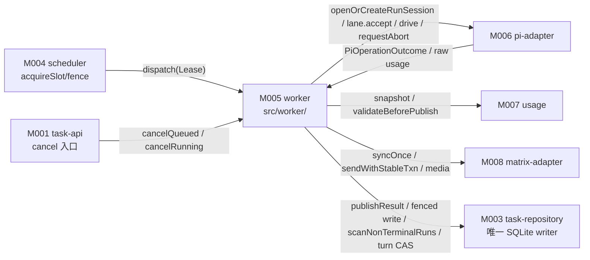
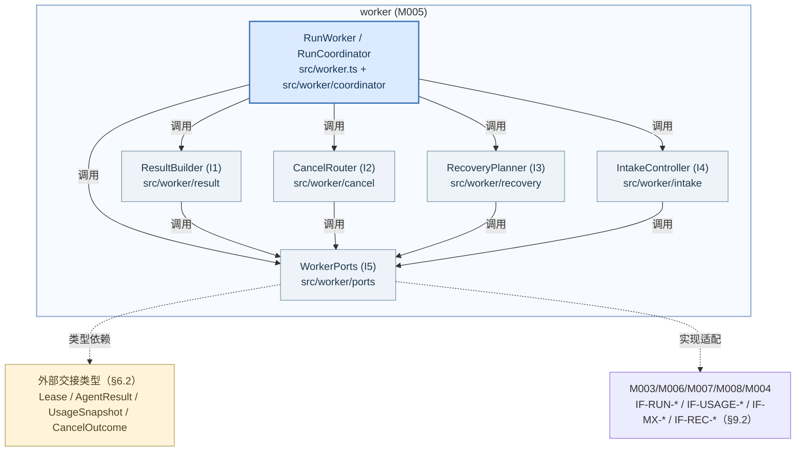
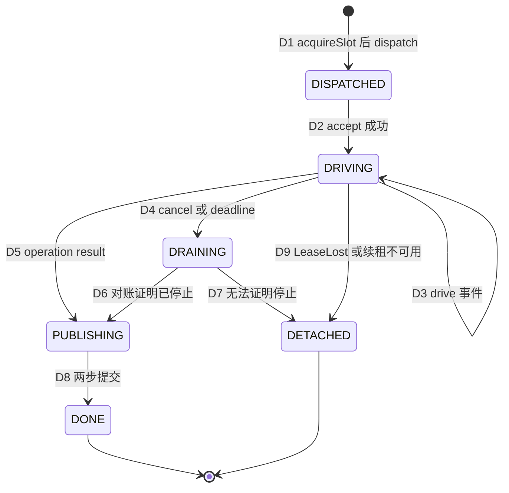
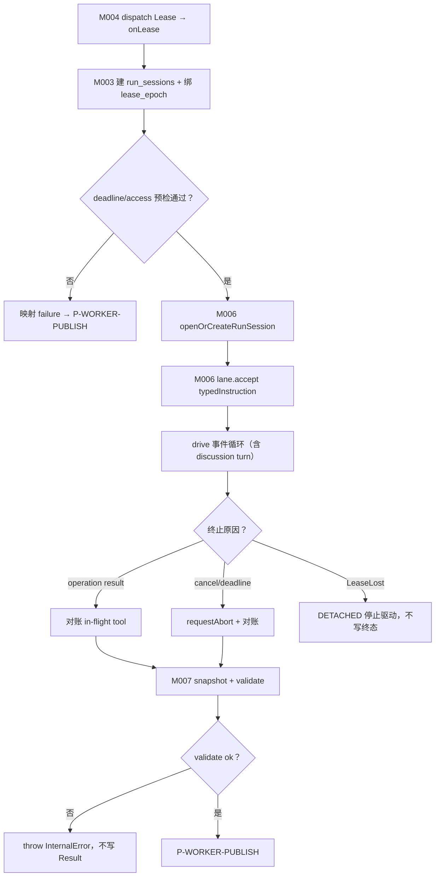
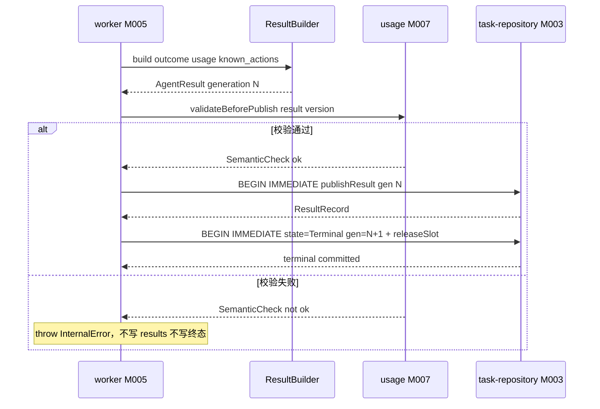
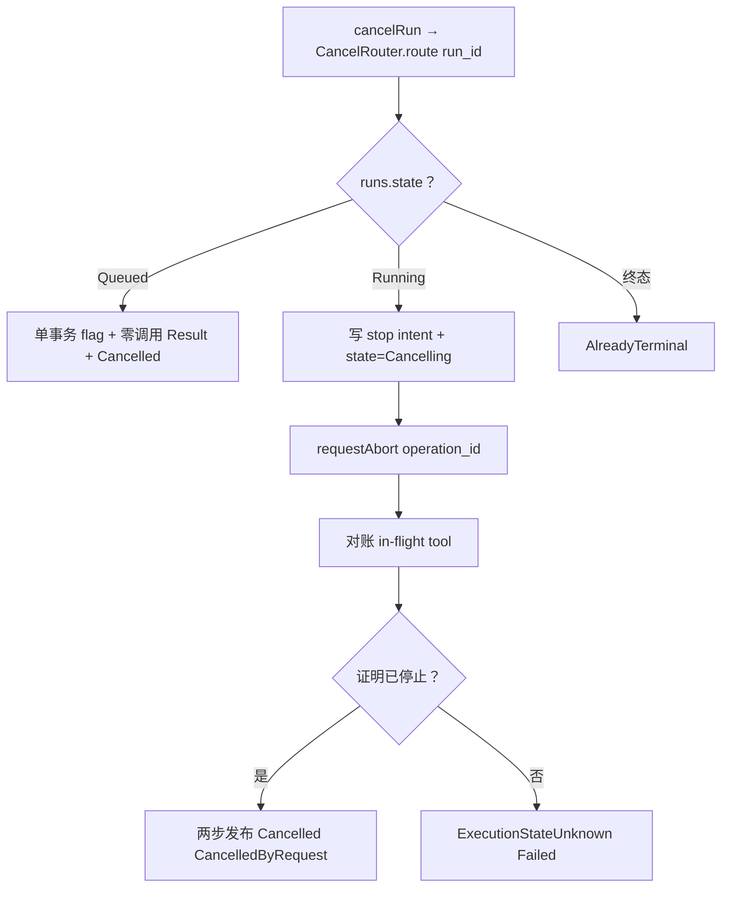
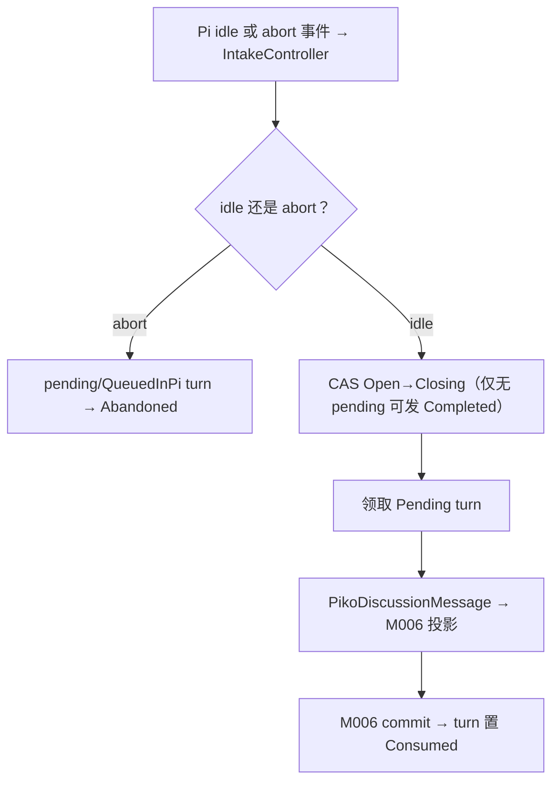
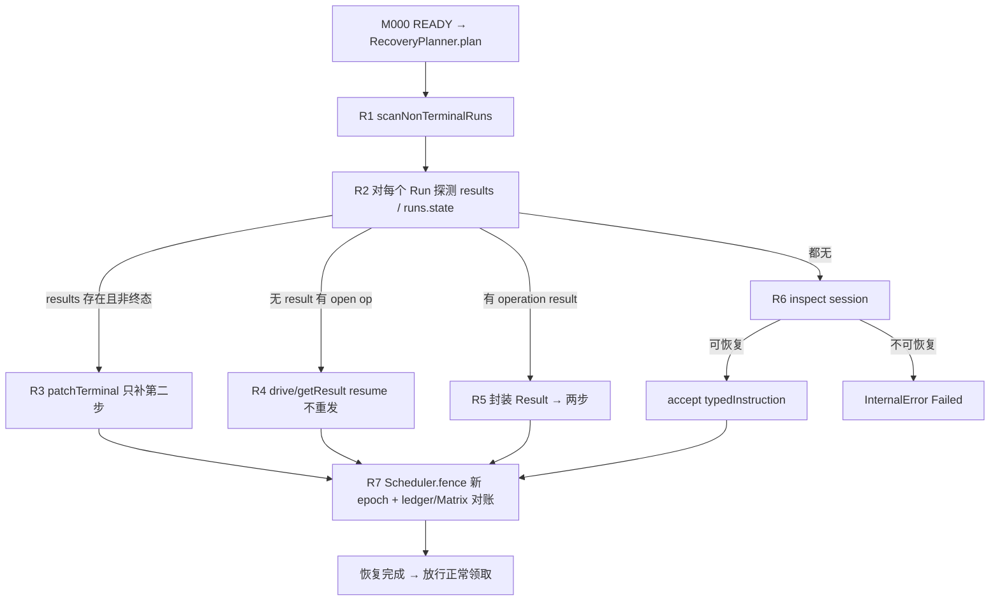

<!-- STD_DOCUMENT_COVER_BEGIN -->
# Piko 模块设计：worker（M005）

> STD 使用入口：[项目采用说明与标准导航](../../README.md#std-entry)

| 文档字段 | 值 |
|---|---|
| Document ID | `piko-worker` |
| Document Version | `0.1.0-draft.1` |
| Status | `Draft` |
| Project | `piko` |
| Document Owner | Piko Implementation Owner |
| Last Modified Date | `2026-09-27` |
| Template ID | `design.definition` |
| Template Version | `3.4.0` |

<!-- STD_DOCUMENT_COVER_END -->

## 1. 单元摘要：为什么存在

M005 `worker` 解决一个问题：一次已受理的 Run 在取得唯一执行位（lease）之后，如何把 Pi 执行、取消、截止、Usage 聚合与 Result 发布协调成**一条可跨重启对账的 Run 生命周期**，而**不复制 Pi Agent loop**。worker 是 Run 事务的协调者：它持有 lease、决定 Run 状态转换与 Result 内容、编排 M006 `pi-adapter` 的 Harness operation、调用 M007 `usage` 完成发布前校验、经 M003 `task-repository` 做 fenced 持久化；它不自己驱动模型调用、不实现工具循环与重试（那是 Pi Harness / M006 的职责），也不拥有 Run/Result 的持久 authority（那是 M003 的职责）。

worker 的核心不变量来自 `MECH-RUN` 的 **Result 两步提交协议**：第一步把不可变的 Result generation 写入 `results`，第二步把 `runs.state` 与 `runs.generation` 写入终态并释放 `execution_slot`；两步不可合并，两步之间崩溃时恢复器只补第二步、绝不重跑 Pi。worker 另承担 `MECH-CANCEL` 的取消分流（Queued 单事务零调用 Result、Running 写停止意图后 abort 并补终态）、`MECH-RECOVERY` 的恢复编排（Result → Run → lease → Pi session → Harness → ledger → Matrix）、`MECH-USAGE` 的发布前快照与语义校验、`MECH-MATRIX` 的 discussion intake CAS。

用一次调用说明：M004 `scheduler` 领取 slot 后把 `Lease` 交给 worker；worker 在 M003 单事务内把 `runs.state` 由 `Queued` 推进到 `Running`、创建 `run_sessions`（`pi_session_id=run_id`），经 M006 `openOrCreateRunSession` + `lane.accept(typedInstruction)` 提交一次 durable Pi operation，并在宿主事件循环上持续 `drive` 其结果、接受取消/截止/讨论事件；operation 结束后 worker 对账在途工具、调用 M007 `snapshot(run_id)` + `validateBeforePublish(result, contractVersion)`，通过则执行 Result 两步提交，失败则抛 `InternalError` 且不写任何 Result。

| 项目 | 内容 |
|---|---|
| 模块编号 / 正式英文名称 | M005 / `worker` |
| 直属父对象编号 / 名称 | `SW-P` / Piko Agent Runtime V0.3（软件系统，`design_level=system`） |
| 父设计 Document ID / 固定基线 / 登记位置 | `system-design` v0.11.1 / 契约 `0.3.0-simplified.6` / §3.2 直属模块表 + §3.4 约束分配；本模块登记见 §3.2 第 204 行 |
| 上级系统/父单元 | 无（纯软件顶层，无总体系统父稿） |
| 解决的问题 | Run 生命周期协调、取消/截止分流、Result 两步发布、崩溃后可对账恢复 |
| 提供的能力 | `generateResult`（Result generation）、`cancelQueued`、`cancelRunning`；经 M003 持久化、经 M006/M007 校验/驱动 |
| 主要使用者 | M004 `scheduler`（dispatch 到 worker）、M001 `task-api`（取消入口到 worker）、M003/M006/M007/M008（协作） |
| 不负责 | Run/Result 持久 authority 与 DDL（M003）；Pi Agent loop、工具循环与 provider 重试（M006）；Usage 聚合算法（M007）；HTTP 路由（M001）；Matrix 协议（M008）；优先级/抢占（明确不做） |

### 1.1 继承的上级约束与落实方式

worker 承接的上级约束来自 `system-design` §3.4 的 PK 分配与对应机制 §3.1 的 `CON-*` 反向登记。机制侧权威定义在 `piko-run.md`、`piko-usage.md`、`piko-matrix.md`、`piko-recovery.md`、`piko-cancel.md` §3.1。以下逐条写落实位置、预算份额、不可改变行为、可自行设计范围与验证入口。

#### 1.1.1 `CON-RUN-001` · 单实例至多 1 个 Running Run（worker 边界）

- **上级基线与决定状态**：`system-design` v0.11.1 §3.4（PK-01 行）+ `piko-run.md` §3.1 `CON-RUN-001` · PK-01 · Approved。上级原文：单实例单 Agent，同一实例同时至多 1 个 Running Run；M003+M004 保证 lease epoch 唯一。worker 在本行被分配的保证是自由度边界 worker 内部不引入并行阶段。

- **适用条件**：单实例、单 configured Matrix 身份、单 Agent 路径；每个 Run 从取得 lease 到终态发布的整个生命周期。

- **继承预算或行为保证**：worker 在同一时刻只协调 1 个 Run；不并发 accept 第二个 Pi operation；不因内部优化引入并行工具/阶段；旧 lease epoch 的 worker 写入必须 0 行生效（fenced write），由 M003 拒绝。

- **可自行选择/不可改变**：不可改变：单 Run 协调、不引入并行阶段、lease epoch fencing。可自行设计：Run 生命周期内部函数组织、事件循环上的 drive/poll 实现；续租由 M004 `Scheduler.renewLease` 承载，worker 只消费 `LeaseLost`。

- **本地落实/内部再分配**：§6.6 `WorkerRunPhase` 状态模型；§7 `P-WORKER-EXEC`；§8 `R-WORKER-TWOSTEP`；§9 的 `generateResult` 与 dispatch 入口；§13 落到 `src/worker/`。单 slot 预算不向内部再分配。

- **验证方法与结果/证据**：局部 `VRC-WORKER-001`（执行与两步发布）、`VRC-WORKER-007`（`LeaseLost` 停止驱动不写终态）；组合 PK-T01/PK-T13；当前全部 `NOT_RUN`。

- **差距/变更影响/反馈责任**：none。worker 不改单 slot 语义；多实例另立设计（`system-design` §3.3 关键决定 2）。

#### 1.1.2 `CON-RUN-003` · 截止与预算

- **上级基线与决定状态**：`system-design` v0.11.1 §3.4（PK-03 行）+ `piko-run.md` §3.1 `CON-RUN-003` · PK-03 · Approved。上级原文：deadline + max_model_calls + max_tool_calls；worker 不修改 deadline 语义；budget CAS 在 `before_tool`。

- **适用条件**：每次 Run 的整个执行期；deadline 与预算由 M002 `policy` 受理时固定。

- **继承预算或行为保证**：worker 只读取 `task.limits.deadline_at`/`max_model_calls`/`max_tool_calls`，不修改其语义、不在运行期放宽；到达 deadline 或预算耗尽时以固定 failure code（`DeadlineExceeded`/`BudgetExceeded`）终止并发布 Failed Result。

- **可自行选择/不可改变**：不可改变：deadline 语义、failure 映射、预算不在 worker 重算。可自行设计：检查时点与 poll 频率、与取消的优先级实现（预算事实由 M006 在 `before_tool` CAS 产生）。

- **本地落实/内部再分配**：§2.6 `F-WORKER-DEADLINE`；§8.3 `R-WORKER-DEADLINE`；§10 `C-WORKER-04`；§11（不做身份/授权）。

- **验证方法与结果/证据**：局部 `VRC-WORKER-003`；组合 fault PK-T05；当前 `NOT_RUN`。

- **差距/变更影响/反馈责任**：none。

#### 1.1.3 `CON-RUN-004` · Result 两步提交

- **上级基线与决定状态**：`system-design` v0.11.1 §3.4（PK-07 行）+ `piko-run.md` §3.1 `CON-RUN-004` · PK-07 · Approved。上级原文：写 `results` 与写终态不可合并；恢复器只补第二步。

- **适用条件**：每个 Run 到达终态；discussion Run 额外在同第二步事务内改 intake `Closed` 并把未消费 turn 置 `Abandoned`。

- **继承预算或行为保证**：第一步 `INSERT results(run_id, generation N, result_json, sha256)` 与第二步 `UPDATE runs SET state, generation=N+1` + `releaseSlot` 是两个独立事务；任何操作不得合并；两步间崩溃后只补第二步，绝不重跑 Pi。

- **可自行选择/不可改变**：不可改变：两步不可合并、generation 单调、发布后 Result 内容冻结、恢复只补第二步。可自行设计：事务内语句组织、Result 构造顺序、对账实现。

- **本地落实/内部再分配**：§2.3 `F-WORKER-PUBLISH`；§7 `P-WORKER-PUBLISH`；§8.1 `R-WORKER-TWOSTEP`；§9.1 `generateResult`；§9.2 `IF-RUN-PUBLISH`。

- **验证方法与结果/证据**：局部 `VRC-WORKER-001`；组合 PK-T05/PK-T15；当前 `NOT_RUN`。

- **差距/变更影响/反馈责任**：none。

#### 1.1.4 `CON-USAGE-001` · Usage 字段完整性

- **上级基线与决定状态**：`system-design` v0.11.1 §3.4（PK-09/10 行）+ `piko-usage.md` §3.1 `CON-USAGE-001` · PK-09 · Approved。上级原文：6 字段逐项 sum/null + missing_fields；ResultValidator 前置。

- **适用条件**：每次 Run 进入 Result 发布前。

- **继承预算或行为保证**：worker 在发布前调用 M007 `snapshot(run_id)` 取 6 字段 sum/null + `missing_fields` + `quality`，不自行聚合、不把归一化 input 冒充完整、不以缺失字段填下界。

- **可自行选择/不可改变**：不可改变：usage 字段口径与 `quality` 三态、由 M007 拥有聚合 authority。可自行设计：调用时点（发布第一步之前）与错误出口实现。

- **本地落实/内部再分配**：§2.2 `F-WORKER-USAGE`；§8.6 `R-WORKER-USAGE-VALIDATE`；§9.2 `IF-RUN-SNAPSHOT`；§10 `C-WORKER-05`。

- **验证方法与结果/证据**：局部 `VRC-WORKER-004`；组合 PK-T10/PK-T16；当前 `NOT_RUN`。

- **差距/变更影响/反馈责任**：none。

#### 1.1.5 `CON-USAGE-002` · Result 冻结

- **上级基线与决定状态**：`system-design` v0.11.1 §3.4（PK-10 行）+ `piko-usage.md` §3.1 `CON-USAGE-002` · PK-10 · Approved。上级原文：Result 发布后迟到 usage 不改 generation；semantic validator 失败 throw `InternalError`；Result 发布后不修改。

- **适用条件**：Result generation 已发布之后；迟到 usage 事件到达时。

- **继承预算或行为保证**：worker 不修改已发布的 Result、不创建新 generation；迟到 usage 只推 M003 内部 `record_version`。语义校验失败时 worker 抛 `InternalError("semantic-validator-fail")` 并不写 Result。

- **可自行选择/不可改变**：不可改变：发布后冻结、fail closed。可自行设计：校验失败时的错误封装与日志。

- **本地落实/内部再分配**：§8.6；§9.1 `generateResult` 的错误出口；§10 `C-WORKER-05`。

- **验证方法与结果/证据**：局部 `VRC-WORKER-004`；组合 PK-T16；当前 `NOT_RUN`。

- **差距/变更影响/反馈责任**：none。

#### 1.1.6 `CON-MX-001` · Discussion intake CAS

- **上级基线与决定状态**：`system-design` v0.11.1 §3.4（PK-08 行）+ `piko-matrix.md` §3.1 `CON-MX-001` · PK-08 · Approved。上级原文：single identity；intake CAS Open→Closing→Closed；不引入 AS 路径。

- **适用条件**：仅 discussion Run（`discussion_intake_state ∈ {Open, Closing, Closed}`）；非 discussion Run 固定 `Disabled`。

- **继承预算或行为保证**：worker 拥有 intake 状态推进决定：Pi idle 时以 CAS 从 `Open` 推进到 `Closing`，仅当无 `Pending` turn 才允许发 Completed Result；失败/Cancelled 时把未消费 turn 置 `Abandoned`。CAS 决定在 worker，写入在 M003 单事务。

- **可自行选择/不可改变**：不可改变：intake 状态机单向、完成 Result 前必须 `Closing` 且无 pending、`Abandoned` 不等同 `Consumed`。可自行设计：CAS 实现与重判顺序。

- **本地落实/内部再分配**：§2.5 `F-WORKER-INTAKE`；§7 `P-WORKER-INTAKE`；§8.4 `R-WORKER-INTAKE-CAS`；§9.2 `IF-MX-TURN`；§10 `C-WORKER-06`。

- **验证方法与结果/证据**：局部 `VRC-WORKER-005`；组合 PK-T08；当前 `NOT_RUN`。

- **差距/变更影响/反馈责任**：worker 不管理 homeserver 内部；Matrix 协议边界见 `piko-matrix.md`。

#### 1.1.7 `CON-REC-001` · 崩溃恢复边界

- **上级基线与决定状态**：`system-design` v0.11.1 §3.4（PK-12 行）+ `piko-recovery.md` §3.1 `CON-REC-001` · PK-12 · Approved。上级原文：recovery 顺序 Result → Run → lease → Pi session → Harness → ledger → Matrix；不复活旧权威；不模拟成功。

- **适用条件**：进程崩溃后重启，存在非终态 Run（`runs.state ∈ {Running, Cancelling}`）。

- **继承预算或行为保证**：worker 是恢复编排者：按 R1-R7 固定顺序扫描非终态 Run、查 Result/Harness operation、只补第二步或 resume、对不可恢复显式 `InternalError`；不重跑 Pi、不把超时当失败、不复活旧 epoch 权威。

- **可自行选择/不可改变**：不可改变：恢复顺序、只补第二步、不模拟成功。可自行设计：编排实现、探测读取顺序、与 M004 `fence` / M006 `inspect` 的调用组织。

- **本地落实/内部再分配**：§2.7 `F-WORKER-RECOVER`；§7 `P-WORKER-RECOVER`；§8.5 `R-WORKER-RECOVERY-ORDER`；§9.2 `IF-REC-*`；§10 `C-WORKER-03`。

- **验证方法与结果/证据**：局部 `VRC-WORKER-006`；组合 PK-T12；当前 `NOT_RUN`。

- **差距/变更影响/反馈责任**：none。

#### 1.1.8 `CON-CX-001` · 取消分流

- **上级基线与决定状态**：`system-design` v0.11.1 §3.4（PK-03 行）+ `piko-cancel.md` §3.1 `CON-CX-001` · PK-03 · Approved。上级原文：Queued 零调用 Result；Running 经 Cancelling；`StopRequested` 不等于停止。

- **适用条件**：每次取消请求，按 `runs.state` 分流。

- **继承预算或行为保证**：Queued：worker（经 M003）单事务写 `cancel_requested=1` + 零调用 immutable Result + `state=Cancelled`。Running：写停止意图并置 `Cancelling`，abort Pi operation 后对账，只有证明 operation 已停止才写 `CancelledByRequest` 终态；无法证明停止写 `ExecutionStateUnknown`。

- **可自行选择/不可改变**：不可改变：分流语义、`StopRequested` 只证意图、零调用 Result 结构。可自行设计：abort+对账实现、与 deadline 的优先级。

- **本地落实/内部再分配**：§2.4 `F-WORKER-CANCEL`；§7 `P-WORKER-CANCEL`；§8.2 `R-WORKER-CANCEL-DISPATCH`；§9.1 `cancelQueued`/`cancelRunning`；§9.2 `IF-CX-ABORT`；§10 `C-WORKER-02`。

- **验证方法与结果/证据**：局部 `VRC-WORKER-002`；组合 PK-T05；当前 `NOT_RUN`。

- **差距/变更影响/反馈责任**：none。

## 2. 需求、功能与验收条件

worker 的可观察功能是：驱动一次 Run 执行到底、发布稳定 Result、按 Run state 分流取消、以 deadline/预算终止、维护 discussion intake、崩溃后恢复。这些功能不可由外部 HTTP 直接触发（HTTP 由 M001 承载），调用方是 M004 `scheduler`（dispatch）、M001（取消）与 M000 `bootstrap`（恢复编排入口）。

### 2.1 `F-WORKER-EXEC` · 驱动 Run 执行

- **上级需求 / Constraint ID**：`CON-RUN-001`（PK-01）；`M-RUN-DI-005`。

- **调用方**：M004 `scheduler` 领取 slot 后 dispatch；worker 在宿主事件循环上驱动。

- **输入与前提**：`Lease{run_id, owner_id, boot_id, epoch, acquired_at, heartbeat_at}`；Run 已 `Running`；M003/M006 可用；M005 恢复门已完成。

- **行为**：在 M003 单事务创建 `run_sessions`（`pi_session_id=run_id`、lane `main`）、绑定 `lease_epoch`；经 M006 `openOrCreateRunSession` 与 `lane.accept(typedInstruction, operationId)` 提交 durable Pi operation；在宿主事件循环上 `drive` 结果、接受取消/截止/讨论事件；operation 结束后对账在途工具。

- **输出**：终态前的 `PiOperationOutcome`（含 summary / failure / 已提交操作事实）与对账后的 `AgentResult` 素材；进入 `F-WORKER-PUBLISH`。

- **错误与边界**：`LeaseLost`（续租 CAS 未命中）→ 停止驱动且不写终态；Harness fault → 映射 `UnsafeRetryBlocked`/`ExecutionStateUnknown`；依赖错误不吞、按类型映射 failure。

- **验收条件**：给定一个 `Running` Run 与可用 Pi，worker 提交恰好一次 operation，结束后产出可发布 Result 素材；`runs` 无第二个 `Running` Run。

### 2.2 `F-WORKER-USAGE` · 发布前 Usage 快照与校验

- **上级需求 / Constraint ID**：`CON-USAGE-001`；`CON-USAGE-002`。

- **调用方**：worker 在 Result 第一步发布之前内部调用。

- **输入与前提**：`run_id`；全部 durable attempt 已落 `model_attempts`；契约版本 `0.3.0-simplified.6`。

- **行为**：调用 M007 `snapshot(run_id)` 取得 `UsageSnapshot`；调用 M007 `validateBeforePublish(result, contractVersion)` 做语义校验（attempts 数量、精确算术、token 子集）。

- **输出**：`UsageSnapshot`（6 字段 sum/null + `missing_fields` + `quality`）与 `SemanticCheck{ok, reason?}`。

- **错误与边界**：`ok=false` → worker 抛 `InternalError("semantic-validator-fail")`，不写 `results`、不写终态；usage 字段缺失不视为错误，按 `Partial`/`Unknown` 照常发布。

- **验收条件**：3 个 attempt（完整/缺字段/完整）→ snapshot `Partial` 且发布成功；破坏不变量的 attempt → 校验 FAIL 且无 Result 写入。

### 2.3 `F-WORKER-PUBLISH` · Result 两步发布

- **上级需求 / Constraint ID**：`CON-RUN-004`（PK-07）；`CON-USAGE-002`。

- **调用方**：worker 在 operation 结束（或恢复补写）时执行。

- **输入与前提**：对账后的 `AgentResult` 素材；`UsageSnapshot` 已通过校验；`run_id` 仍由本 worker 持有 lease。

- **行为**：第一步经 M003 `publishResult(FencedPublishResult)` 在单事务 `INSERT results(run_id, generation N, result_json, sha256)`（generation N = 当前 `runs.generation + 1`，即不可变 Result 的 generation）。第二步在独立单事务 `UPDATE runs SET state, generation = N+1, finished_at, discussion_intake_state` 并 `releaseSlot(run_id, epoch)`；discussion Run 同事务把未消费 `discussion_turns` 置 `Abandoned`。

- **输出**：已发布的 immutable `ResultRecord`（generation N）与终态 `runs` 行（generation N+1）；slot 释放回 `FREE`。

- **错误与边界**：fencing 失败（lease 丢失/被 fence）→ 内部 `FencedWrite`，worker 停止且不制造成功；语义校验失败 → 不进入第一步；两步间崩溃由恢复只补第二步。

- **验收条件**：正常 Run：`results` 有 generation N、`runs.state` 终态且 generation=N+1、slot 释放；两步之间 SIGKILL 后重启：只补第二步、Result 内容不变、Pi 不重跑。

### 2.4 `F-WORKER-CANCEL` · 取消分流

- **上级需求 / Constraint ID**：`CON-CX-001`（PK-03）。

- **调用方**：M001 `task-api` 取消入口 → worker `cancelQueued`/`cancelRunning`（进程内）。

- **输入与前提**：`run_id`；Run 处于 `Queued`/`Running`/终态之一。

- **行为**：`Queued`：单事务写 `cancel_requested=1`、写 `model_attempts=0` 的零调用 immutable Result、置 `state=Cancelled`（经 M003）。`Running`：写停止意图并置 `Cancelling`，对 Pi operation 调 `requestAbort`，等待对账；对账证明 operation 已停止 → 走两步发布 `Cancelled` Result（`CancelledByRequest`/`Cancellation`）；无法证明停止 → `ExecutionStateUnknown`。终态 → `AlreadyTerminal`。

- **输出**：`CancelOutcome ∈ {CancelledBeforeStart, StopRequested, AlreadyTerminal}`。

- **错误与边界**：`StopRequested` 只证明停止意图已持久，不证明执行已停止；取消中崩溃由 `F-WORKER-RECOVER` 对账。

- **验收条件**：Queued 取消 → 200 `CancelledBeforeStart` 且存在零调用 Result；Running 取消 → 202 `StopRequested`，abort 后终态 `Cancelled` 且 failure code `CancelledByRequest`；已终态 → `AlreadyTerminal`。

### 2.5 `F-WORKER-INTAKE` · Discussion intake 与 turn

- **上级需求 / Constraint ID**：`CON-MX-001`（PK-08）。

- **调用方**：worker 在 Pi idle/abort 时内部推进；M008 同步产生的 turn 由 worker 领取。

- **输入与前提**：discussion Run（`discussion_intake_state=Open/Closing`）；M008 `syncOnce` 已把 `DiscussionTurn`（`Pending`）持久化到 M003。

- **行为**：Pi idle 时以 CAS 把 intake 由 `Open` 推进 `Closing`（仅当无 `Pending` turn 才允许发布 Completed Result）；领取 `Pending` turn 构造 `PikoDiscussionMessage` 交 M006 投影进 Pi input，M006 commit 后置 `Consumed`（带 `pi_entry_id`/`pi_operation_id`）；失败/Cancelled 时把未消费 turn 置 `Abandoned`。

- **输出**：推进后的 `runs.discussion_intake_state` 与 `discussion_turns.status`。

- **错误与边界**：CAS 失败（已有新 turn 附着）→ 重判；`event_id` 不得进入 provider input（M006 投影剥离）。

- **验收条件**：discussion Run 在 Pi 空闲且无 pending 时进入 `Closing` 并可发 Result；有 pending 时不得发 Completed Result；失败时未消费 turn 变 `Abandoned`。

### 2.6 `F-WORKER-DEADLINE` · 截止与预算终止

- **上级需求 / Constraint ID**：`CON-RUN-003`（PK-03）。

- **调用方**：worker 在执行前检查 + 执行中 poll。

- **输入与前提**：`task.limits.deadline_at`（持久 UTC）与预算上限；执行中事实来自 M006（`before_tool` CAS、预算终止）。

- **行为**：持久判定用 UTC wall clock：`Date.parse(deadline_at) <= now` 即到期；进程内 elapsed 用 monotonic。到期且非取消请求 → `DeadlineExceeded`/`TaskDeadline` Failed；预算耗尽（M006 终止）→ `BudgetExceeded`/`Budget` Failed；已 `cancel_requested` 则优先级归取消。

- **输出**：对应的 failure code 与 Failed/Cancelled 终态 Result。

- **错误与边界**：worker 不修改 deadline 语义；时钟回拨不改变 CAS 正确性（判定口径固定为持久 UTC）。

- **验收条件**：deadline 已过 → 终态 `Failed` 且 `failure.code=DeadlineExceeded`；预算耗尽 → `BudgetExceeded`；同时取消与到期 → 取消优先。

### 2.7 `F-WORKER-RECOVER` · 崩溃恢复编排

- **上级需求 / Constraint ID**：`CON-REC-001`（PK-12）。

- **调用方**：M000 `bootstrap` 启动完成后，worker 在恢复门内编排；随后才允许 M004 正常领取。

- **输入与前提**：进程重启；存在非终态 Run；M003/M006 可用。

- **行为**：按 R1-R7 固定顺序：R1 扫描非终态 Run；R2 对每个 Run 探测 `results` 是否已存在；R3 已存在 → 仅补第二步；R4 不存在但 Harness 有 open operation → `drive`/`getResult` resume（不重新 accept）；R5 有 operation result → 封装 Result 走两步；R6 都没有 → inspect Pi session，合法则 accept，不可恢复 → `InternalError` Failed；R7 经 M004 `fence` 取得新 lease epoch、并对账 ledger/Matrix cursor。

- **输出**：每个 Run 的恢复判定 `RecoveryOutcome ∈ {PatchedTerminal, ResumedOperation, Fenced, InternalError}` 与补写/接续后的状态。

- **错误与边界**：不重跑 Pi、不复活旧 epoch 权威、不模拟成功；`replay:"never"` 工具无 outcome → `UnsafeRetryBlocked`；Harness 不变量损坏 → `ExecutionStateUnknown`。

- **验收条件**：两步间崩溃 → 重启后只补第二步且 Result generation 不变；Harness 有 open op → resume 不重发；无任何事实 → `InternalError` Failed。

## 3. UI、CLI、服务端点或设备操作面

**N/A。** worker 是纯进程内模块，不拥有 UI、CLI、HTTP/RPC 端点或设备操作面：它不监听端口、不注册路由、不提供诊断命令。它的唯一调用入口是进程内函数调用：M004 `scheduler` 领取 slot 后 dispatch（§9.1）、M001 `task-api` 取消入口转调 `cancelQueued`/`cancelRunning`（§9.1）、M000 `bootstrap` 触发恢复编排（§2.7）。对外可观察的 HTTP 面（`POST /runs`、`POST /runs/:run_id:cancel` 等）由 M001 承载，worker 只是其后台推进的终点。

维护/诊断入口不新增：Run 生命周期状态经 M003 查询与系统指标 `event.run.{started,terminated}`、`piko.recovery.outcomes.*`（§11）暴露。

Tailoring 依据：STD `design.definition` §3 “模块没有任何直接操作面时写 N/A + 实际调用入口/归属 + tailoring 依据”；`TAIL-P-101`（Piko 无图形入口）。“没有页面”不等于“没有 API”——worker 的进程内 API 在 §9 唯一维护。

## 4. 外部边界与依赖

worker 的位置：被 M004 `scheduler` dispatch，编排 M006 `pi-adapter`、M007 `usage`、M008 `matrix-adapter`，经 M003 `task-repository` 持久化，消费 M002 `policy` 固定的 limits。下图只画模块外部交接，不表示线程或新部署边界。



图 M-WRK-C1 · Target / Planned / NOT_BUILT。实线是同步/异步进程内调用与返回，不是网络或新部署边界。worker 不自建线程/进程；Pi drive 与续租看护在宿主事件循环上运行（续租由 M004 `Scheduler.renewLease` 承载）。持久化/事务权威属 M003。

#### 4.1 `DEP-WORKER-REPO` · M003 `task-repository`（持久化与事务权威）

- **角色 / 运行位置 / Owner**：同级直属模块，同进程（PK-01 单进程）；Owner：Piko Implementation Owner。

- **本模块调用或消费**：Run/Result 事务原语：`publishResult(FencedPublishResult)`、终态发布（`runs.state`+`generation`+`releaseSlot`）、`scanNonTerminalRuns`、`patchTerminal`（恢复补第二步）、run/turn/intake 的 fenced write、`result(run_id)`（恢复探测）。worker 不自开 SQLite 连接。

- **本模块提供**：无反向接口；worker 提交 mutation 命令由 M003 原子执行。

- **契约 authority / 版本 / selector**：`IF-RUN-PUBLISH`（`piko-run.md` §5.1，M005 消费）与 `piko-recovery.md` §5.1 `IF-REC-PATCH`/`IF-REC-SCAN`；当前代码事实 `src/store.ts` 的 `finish`/`insertResult`/`cancel`/`generation`/`knownActions`（`PRAGMA user_version=2`）。`piko-task-repository-design.md` / ISD §4.7 为 Proposed，采纳后其端口签名成为设计权威；worker 只消费端口。

- **同步方式 / timeout / 生命周期**：同步进程内调用；每个写为单 `BEGIN IMMEDIATE` 短事务；受 `task_store.busy_timeout_ms` 约束；连接生命周期由 M003 持有、与进程同域。

- **不可用或失败影响 / 责任出口**：`SQLITE_BUSY` 超时/`SQLITE_IOERR` → 上抛依赖错误，由 worker 按位置决定（执行中→Failed `InternalError`；恢复中→保留状态交 operator）；worker 不吞错、不改写 M003 语义。

#### 4.2 `DEP-WORKER-PI` · M006 `pi-adapter`（Harness 执行权威）

- **角色 / 运行位置 / Owner**：同级直属模块，同进程；Owner：Piko Implementation Owner。

- **本模块调用或消费**：`openOrCreateRunSession(run_id)`、`lane.accept(typedInstruction, operationId)`、`drive`/`getResult`、`requestAbort(operation_id)`、`inspect(handle)`；`PikoDiscussionMessage` 投影。

- **本模块提供**：worker 提供 drive 循环与对账调用上下文（不替 Pi 实现 loop）。

- **契约 authority / 版本 / selector**：`IF-RUN-SESSION`/`IF-RUN-ACCEPT`/`IF-RUN-DRIVE`（`piko-run.md` §5.1/§5.2）；`IF-CX-ABORT`（`piko-cancel.md` §5.2）；固定 Pi `0.85.1` @ commit `9767ba275f3e9a5ee0f5c5342249b629ab1b2282`。

- **同步方式 / timeout / 生命周期**：`accept` 异步返回 durable op（确认即 Pi commit）；`drive`/`getResult` 拉取；abort 后等待 in-flight tool 对账；关联身份 `run_id`/`pi_operation_id`/`stepId`。

- **不可用或失败影响 / 责任出口**：Harness fault/invariant → worker 映射 `UnsafeRetryBlocked`/`ExecutionStateUnknown`；不可恢复 session → `InternalError`；不重发旧请求。

#### 4.3 `DEP-WORKER-USAGE` · M007 `usage`（聚合与语义校验权威）

- **角色 / 运行位置 / Owner**：同级直属模块，同进程；Owner：Piko Implementation Owner。

- **本模块调用或消费**：`snapshot(run_id) -> UsageSnapshot`（`IF-RUN-SNAPSHOT`/`IF-USAGE-SNAPSHOT`）；`validateBeforePublish(result, contractVersion) -> SemanticCheck`（`IF-USAGE-VALIDATE`）。

- **本模块提供**：无；worker 只调用。

- **契约 authority / 版本 / selector**：机器契约 `0.3.0-simplified.6`（`interfaces/schemas/agent-runtime-v0.3.schema.json`）+ `piko-usage.md` §5.1。

- **同步方式 / timeout / 生命周期**：与 Result 第一步发布同事务前置；无独立超时；聚合权威在 M007，worker 不缓存第二份。

- **不可用或失败影响 / 责任出口**：校验 FAIL → throw `InternalError("semantic-validator-fail")`，不写 Result；聚合不可用 → 依赖错误上抛，Run 以 `InternalError` Failed 收口。

#### 4.4 `DEP-WORKER-MATRIX` · M008 `matrix-adapter`（discussion 协议）

- **角色 / 运行位置 / Owner**：同级直属模块，同进程；Owner：Piko Implementation Owner。

- **本模块调用或消费**：仅 discussion Run：`syncOnce` 产生的 `DiscussionTurn`、`sendWithStableTxn`（发 discussion reply）、`downloadContent`（附件）。worker 消费 turn 并把回复经 `PikoDiscussionMessage` 交 Pi；worker 不直接调 homeserver。

- **本模块提供**：intake 状态推进决定（`IF-MX-TURN`）。

- **契约 authority / 版本 / selector**：`piko-matrix.md` §5.1（`IF-MX-VERIFY`/`IF-MX-SYNC`/`IF-MX-SEND`/`IF-MX-MEDIA`）+ Client-Server v3；`matrix-js-sdk`（lockfile）。

- **同步方式 / timeout / 生命周期**：同步进程内调用 M008 方法；sync 为长轮询；发送复用稳定 `txn_id`。

- **不可用或失败影响 / 责任出口**：membership/event/media 复核失败 → `DiscussionAccessLost` Failed；讨论发送失败按 M008 重试/永久错误分流，worker 不绕过。

#### 4.5 `DEP-WORKER-SCHED` · M004 `scheduler`（dispatch 与 lease）

- **角色 / 运行位置 / Owner**：同级直属模块，同进程；Owner：Piko Implementation Owner。

- **本模块调用或消费**：消费 `acquireSlot(ownerId)` 的 `Lease | null` 与 `fence(runId, ownerId, bootId)`；续租由 M004 `LeaseKeeper` 经 `renewLease` 承载，worker 通过回调接收 `LeaseLost`/`LeaseRenewalUnavailable`。

- **本模块提供**：无反向接口；worker 是 lease 的消费者与驱动者。

- **契约 authority / 版本 / selector**：`piko-scheduler` §9.1（`IF-RUN-SLOT`/`IF-RUN-RENEW`/`IF-REC-FENCE`），v0.1.0-draft.1。

- **同步方式 / timeout / 生命周期**：同步进程内；`Lease` 为不可变值对象；续租定时在宿主事件循环。

- **不可用或失败影响 / 责任出口**：`LeaseLost` → 停止驱动、不写终态；`LeaseRenewalUnavailable` → 停止驱动但保留 slot，等待 M003 恢复或重启 fence。

## 5. 内部结构与实现位置

worker 拆成入口编排、Result 构造、取消分流、恢复编排、intake 控制、端口适配六个内部单元。拆分依据是“Pi 驱动/对账可独立测试、Result 与 generation 规则集中、取消/恢复/讨论各自有清晰状态边界、跨模块适配隔离 M003/M006/M007/M008”。



图 M-WRK-S1 · Target / Planned / NOT_BUILT。外框是模块内部组成；实线同步调用；虚线类型/适配依赖；不表示线程或时序。所有内部路径均为 Planned；`src/worker.ts` 为既有文件改薄。

### 5.1 内部组成

#### 5.1.1 `S1` · RunCoordinator（入口）

- **职责与非职责**：实现 §2 的七个功能并保证 §6.6 与两步提交不变量；编排“创建 session → accept → drive → 对账 → 发布”。非职责：不实现 Pi loop、不聚合 usage、不拼 SQL（经 I5）、不做 Matrix 协议。

- **输入、处理与输出**：输入 `Lease`、取消请求、恢复编排入口；处理：组合 I1（Result 规则）、I2（取消）、I3（恢复）、I4（intake）、I5（端口）；输出 `AgentResult`/`CancelOutcome`。

- **协作对象**：调用 I1-I5；被 M004 dispatch / M001 取消 / M000 恢复调用。

- **文件 / symbol / 实现状态**：`src/worker.ts`（既有 `class RunWorker`，改薄）+ `src/worker/coordinator.ts`（Planned `class RunCoordinator`）。现基线 `RunWorker.loop`/`run` 内联领取（已移交 M004）、心跳、结果封装与 `store.finish`。

- **拆分依据与替代方案代价**：入口只做编排，把 Result 规则抽到 I1、取消抽到 I2、恢复抽到 I3，以便对 generation、零调用 Result、恢复分支做无 Pi 单测。替代方案“全部写在 `worker.ts`”是 Current 形态，代价是与 Pi/SQL 强耦合、无法独立验证两步提交与恢复。

#### 5.1.2 `I1` · ResultBuilder

- **职责与非职责**：纯逻辑：由 `PiOperationOutcome` + `UsageSnapshot` + 对账事实构造 `AgentResult`（state/partial/summary/outputs/known_actions/usage/failure）；决定 generation 取值。非职责：不做 I/O、不聚合 usage、不发 SQL（经 I5）。

- **输入、处理与输出**：输入 outcome/usage/known_actions/published_at；输出 `AgentResult`；纯函数，无时钟依赖（时间由协调者注入）。

- **协作对象**：被 S1 调用；仅依赖 §6.2 类型。

- **文件 / symbol / 实现状态**：`src/worker/result.ts`（Planned）；现基线逻辑散在 `RunWorker.run` 内联与 `aggregateUsage`（需迁移到 M007）。

- **拆分依据与替代方案代价**：使 Completed 强制 `partial=false`/`failure=null`、Cancelled 强制 `CancelledByRequest` 等跨字段约束可表驱动测试。替代方案“在 run 内联拼装”难以覆盖 failure 映射矩阵。

#### 5.1.3 `I2` · CancelRouter

- **职责与非职责**：按 `runs.state` 分流取消：Queued 零调用 Result 路径、Running stop intent + abort + 对账、终态 `AlreadyTerminal`。非职责：不做 HTTP 映射、不直接 abort Pi（经 I5→M006）。

- **输入、处理与输出**：输入 `run_id`；输出 `CancelOutcome`；Running 路径产生 side effect 命令交 S1/I5。

- **协作对象**：被 S1 调用；依赖 I5 的 M003/M006 端口。

- **文件 / symbol / 实现状态**：`src/worker/cancel.ts`（Planned）；现基线在 `store.cancel`（M003 侧单事务）与 `RunWorker` 的 `cancelRequested` 检查。

- **拆分依据与替代方案代价**：使“`StopRequested` 只证意图”“零调用 Result 结构”可单测。替代方案“复用 `store.cancel` 全包”把 worker 的 abort+对账义务隐没在 M003。

#### 5.1.4 `I3` · RecoveryPlanner

- **职责与非职责**：实现 R1-R7 编排：探测、判定 `RecoveryOutcome`、生成只补第二步/resume/accept/内部失败的下一步命令。非职责：不做 Pi inspect 实现（经 I5→M006）、不改已发布 Result。

- **输入、处理与输出**：输入 `run_id` + `RecoveryProbe`；输出 `RecoveryOutcome` 与命令序列。

- **协作对象**：被 S1（恢复入口）调用；依赖 I5 的 M003/M006 端口。

- **文件 / symbol / 实现状态**：`src/worker/recovery.ts`（Planned）；现基线 `store.recoverOrphaned`（fence 部分已移交 M004）与 `RunWorker.loop` 启动分支。

- **拆分依据与替代方案代价**：使“只补第二步”“不重跑 Pi”可注入故障单测。替代方案“散在 loop”无法对每个崩溃窗口断言。

#### 5.1.5 `I4` · IntakeController

- **职责与非职责**：intake CAS（Open→Closing）与 turn 领取/消费/封存；保证 Completed Result 前 `Closing` 且无 pending。非职责：不做 Matrix sync/发送协议（经 I5→M008）、不管理 homeserver 内部。

- **输入、处理与输出**：输入 `run_id`、Pi idle/abort 事件；输出 intake 状态推进与 `PikoDiscussionMessage`。

- **协作对象**：被 S1 调用；依赖 I5 的 M003/M008 端口。

- **文件 / symbol / 实现状态**：`src/worker/intake.ts`（Planned）；现基线逻辑在 `store.finish` 的 intake 检查与 `RunWorker.run` 的 discussion 回调。

- **拆分依据与替代方案代价**：使 intake 状态机与 turn 生命周期可独立测试。替代方案“塞进 finish 分支”使 CAS 重判语义不可见。

#### 5.1.6 `I5` · WorkerPorts

- **职责与非职责**：worker 内唯一跨模块适配层：M003（publishResult/fenced write/scan/patch/turn）、M006（session/accept/drive/abort/inspect）、M007（snapshot/validate）、M008（sync/send/media）、M004（acquireSlot/fence/Lease）。非职责：不做业务规则、不重试业务失败（只透传依赖错误）。

- **输入、处理与输出**：输入结构化参数；输出领域对象/判别结果；把各模块签名收敛为一组接口。

- **协作对象**：被 S1-I4 调用；调用 M003/M004/M006/M007/M008。

- **文件 / symbol / 实现状态**：`src/worker/ports.ts`（Planned），接口 `WorkerPorts` + `PikoWorkerPorts` 实现；构造注入各模块句柄。

- **拆分依据与替代方案代价**：端口使 worker 可在受控 fake 上测试（§14.2 用例）并集中跨模块合同。替代方案“直接 import 各模块”会传播实现类型、违反 §5.5 依赖方向。

#### 5.1.7 `T` · 外部交接类型（§6.2）

- **职责与非职责**：worker 与相邻模块交换的稳定类型：`Lease`（M004）、`PiOperationOutcome`/`PiRunObservation`（M006）、`UsageSnapshot`（M007）、`DiscussionTurn`/`PikoDiscussionMessage`（M008/M003）、`AgentResult`/`CancelOutcome`/`FencedPublishResult`（契约/M003）。非职责：不重新定义机器契约字段。

- **输入、处理与输出**：类型定义与引用；字段 authority 分别在机器契约与各模块 ISD §4。

- **协作对象**：被 S1-I5 引用；`src/worker/types.ts` 只做本模块私有投影。

- **文件 / symbol / 实现状态**：`src/worker/types.ts`（Planned）+ 契约 `interfaces/schemas/agent-runtime-v0.3.schema.json`。

- **拆分依据与替代方案代价**：共享类型集中一处避免各文件定义漂移；字段全集仍以机器契约为 authority。

### 5.2 内部调用过程

#### 5.2.1 `P-WORKER-EXEC` · 驱动一次 Run

- **入口与调用上下文**：M004 `scheduler` dispatch `Lease`（宿主事件循环）→ `RunCoordinator.onLease(lease)`。

- **调用链（文件 / symbol → 文件 / symbol）**：`RunCoordinator.onLease` → `WorkerPorts.createSession`（M003）→ `WorkerPorts.openOrCreateRunSession`（M006）→ `WorkerPorts.accept`（M006）→ `drive` 循环（M006 `IF-RUN-DRIVE`）→ `IntakeController` 处理 idle/discussion（I4）→ `ResultBuilder.build`（I1）→ `WorkerPorts.snapshot`/`validate`（M007）→ `P-WORKER-PUBLISH`。

- **逐步传递的数据**：`Lease` → `run_id`/`epoch` → `PiRunHandle` → `typedInstruction` + `PikoDiscussionMessage?` → `PiOperationOutcome` → `AgentResult` 素材 + `UsageSnapshot`。

- **返回、异常与清理**：正常返回进入发布；`LeaseLost` → 停止驱动、清 drive 定时器、不写终态；Harness fault → 映射 failure 后走发布；依赖错误按位置收口。清理：关闭 drive 轮询与续租看护。

- **对应流程 / 接口 / 验证**：§7 `M-WRK-P1`；§9.1 `IF-WORKER-DISPATCH`、§9.2 `IF-RUN-SESSION/ACCEPT/DRIVE`；`VRC-WORKER-001/007`。

#### 5.2.2 `P-WORKER-PUBLISH` · Result 两步发布

- **入口与调用上下文**：operation 结束或恢复补写 → `RunCoordinator.publish`。

- **调用链（文件 / symbol → 文件 / symbol）**：`RunCoordinator.publish` → `ResultBuilder.build`（I1）→ `WorkerPorts.validate`（M007）→ `WorkerPorts.publishResult`（M003 第一步）→ `WorkerPorts.finishTerminal`（M003 第二步：state+generation+releaseSlot）→ `IntakeController.close`（I4，discussion）。

- **逐步传递的数据**：`{run_id, generation=N, result_json, sha256}` → `ResultRecord`；`{run_id, state, generation=N+1, finished_at}` → 终态行。

- **返回、异常与清理**：正常：Result 发布、终态提交、slot 释放；校验 FAIL：抛 `InternalError` 不写；fencing 失败：内部 `FencedWrite`、停止且不伪装成功；第一步后崩溃：第二步由 `I3` 补。

- **对应流程 / 接口 / 验证**：§7 `M-WRK-P2`；§9.1 `generateResult`、§9.2 `IF-RUN-PUBLISH`；`VRC-WORKER-001/004`。

#### 5.2.3 `P-WORKER-CANCEL` · 取消分流

- **入口与调用上下文**：M001 取消入口 → `CancelRouter.route(run_id)`。

- **调用链（文件 / symbol → 文件 / symbol）**：`CancelRouter.route` → `WorkerPorts.getRun`（M003 读 state）→ 分支：Queued → `WorkerPorts.cancelQueued`（M003 单事务零调用 Result）；Running → `WorkerPorts.writeStopIntent`（M003 `Cancelling`）+ `WorkerPorts.requestAbort`（M006）+ 对账 → `P-WORKER-PUBLISH`。

- **逐步传递的数据**：`run_id` → `RunState` → `CancelOutcome`；Running 分支 → `operation_id` → abort 对账事实。

- **返回、异常与清理**：Queued 返回 `CancelledBeforeStart`；Running 返回 `StopRequested` 并随后终态；终态返回 `AlreadyTerminal`；abort 后无法证明停止 → `ExecutionStateUnknown`。

- **对应流程 / 接口 / 验证**：§7 `M-WRK-P3`；§9.1 `cancelQueued`/`cancelRunning`、§9.2 `IF-CX-ABORT`；`VRC-WORKER-002`。

#### 5.2.4 `P-WORKER-RECOVER` · 崩溃恢复编排

- **入口与调用上下文**：M000 启动后 → `RecoveryPlanner.plan()`（在恢复门内，先于正常领取）。

- **调用链（文件 / symbol → 文件 / symbol）**：`RecoveryPlanner.plan` → `WorkerPorts.scanNonTerminalRuns`（M003）→ `WorkerPorts.resultExists`（M003）→ `WorkerPorts.inspect`（M006）→ 判定 → `WorkerPorts.patchTerminal`（M003 补第二步）或 `drive`/`accept`（M006）或 `Scheduler.fence`（M004）→ `WorkerPorts.matrixReconcile`（M008 cursor）。

- **逐步传递的数据**：非终态 `run_id[]` → `RecoveryProbe` → `RecoveryOutcome` → 命令序列。

- **返回、异常与清理**：每个 Run 得到一个 outcome；不可恢复 → `InternalError` Failed 并交 operator；恢复完成后置恢复门完成标志，放行 M004 正常领取。

- **对应流程 / 接口 / 验证**：§7 `M-WRK-P5`；§9.2 `IF-REC-SCAN/INSPECT/PATCH/FENCE`；`VRC-WORKER-006`。

#### 5.2.5 `P-WORKER-INTAKE` · intake 推进

- **入口与调用上下文**：Pi idle/abort 事件 → `IntakeController.onIdle(run_id)` / `onAbort(run_id)`。

- **调用链（文件 / symbol → 文件 / symbol）**：`IntakeController.onIdle` → `WorkerPorts.casIntake`（M003 Open→Closing）→ `WorkerPorts.listPendingTurns`（M003）→ 构造 `PikoDiscussionMessage` → `WorkerPorts.accept`（M006）→ `WorkerPorts.markTurnConsumed`（M003）。`onAbort` → `WorkerPorts.abandonTurns`（M003）。

- **逐步传递的数据**：`run_id` → `DiscussionIntakeState`；`DiscussionTurn` → `PikoDiscussionMessage`（`event_id` 仅持久层）→ `pi_entry_id`/`pi_operation_id`。

- **返回、异常与清理**：CAS 失败 → 重判；无 pending 且 `Closing` → 允许发布；abort/failure → 未消费 turn 置 `Abandoned`。清理：无长期资源。

- **对应流程 / 接口 / 验证**：§7 `M-WRK-P4`；§9.2 `IF-MX-TURN`、`IF-MX-VERIFY`；`VRC-WORKER-005`。

### 5.3 文件间接口契约

本节只固定 worker 内部文件之间的交接；跨模块接口在 §9.2，字段类型在 §6.2。

#### 5.3.1 `IF-WORKER-COORD` · `coordinator.ts` → `result.ts`/`cancel.ts`/`recovery.ts`/`intake.ts`

- **接口成员 ID / §9 逐接口定义位置**：内部无公共成员 ID；行为规则权威在 §8（`R-WORKER-*`）。

- **本文件的提供或使用责任**：`coordinator.ts` 编排并调用 I1-I4；I1-I4 提供纯规则与命令生成。

- **交接时机 / 本地调用步骤**：见 `P-WORKER-EXEC`/`PUBLISH`/`CANCEL`/`RECOVER`/`INTAKE` 链。

- **§9 生命周期约束**：无状态或短寿命；调用即返回；命令由 I5 执行。

- **实现与验证位置**：`src/worker/*.ts`；`VRC-WORKER-001/002/006` 以表驱动与故障注入覆盖。

#### 5.3.2 `IF-WORKER-PORT` · `coordinator.ts`/`result.ts`/`cancel.ts`/`recovery.ts`/`intake.ts` → `ports.ts`

- **接口成员 ID / §9 逐接口定义位置**：内部接口 `WorkerPorts`，方法契约见 §9.2（各 `IF-*`）。

- **本文件的提供或使用责任**：`ports.ts` 提供 `WorkerPorts` 抽象与 `PikoWorkerPorts`；其余单元只经该抽象调用跨模块。

- **交接时机 / 本地调用步骤**：见 `P-WORKER-*` 链。

- **§9 生命周期约束**：端口实例与进程同域；不缓存权威行（每次读/写权威）。

- **实现与验证位置**：`src/worker/ports.ts`；`VRC-WORKER-001..006` 以受控 fake 端口 + 真模块两套覆盖。

### 5.4 服务提供方式（条件适用）

**N/A（无独立宿主）。** worker 不监听端口、不启动进程/线程、不注册端点：§3 已判定无操作面。

运行载体：`RunWorker`/`RunCoordinator` 由 M000 `bootstrap` 装配、随进程生命周期存在；无自身进入/退出过程。并发模型：全部操作在宿主事件循环上；Pi drive 与续租看护（M004）是事件循环上的异步任务，不是新线程（§10 `C-WORKER-07`）。就绪/停止语义属于 M000/MECH-STARTUP；worker 在 P-STOP 中执行有界 drain 与 abort（§10 `C-WORKER-02`）。

Tailoring 依据：STD `design.definition` §5.4 “纯库函数说明不适用及由谁调用”。

### 5.5 依赖方向

- **允许方向**：`coordinator.ts` → `{result.ts, cancel.ts, recovery.ts, intake.ts, ports.ts, types.ts}`；`result.ts`/`cancel.ts`/`recovery.ts`/`intake.ts` → `{ports.ts, types.ts}`；`ports.ts` → `types.ts` + 相邻模块句柄（仅此文件）。

- **禁止方向与原因**：禁止 `ports.ts` 引用 `coordinator.ts`（避免环）；禁止 `result.ts` 引用 `ports.ts` 的写方法（Result 构造必须无 I/O）；禁止任何单元直接 `import` 相邻模块实现（只能经 `ports.ts`），否则类型依赖扩散并绕过 §5.3 契约。

- **循环/越层检查**：静态：对 `src/worker/` 跑依赖图（`tsc`/import 检查或 CI 脚本）确认无环、`result.ts` 无 I/O import。评审按 §5.1 逐文件核对引用。

- **变更影响**：改 `result.ts` 影响 Result 跨字段规则（§6.2/§8.1）；改 `cancel.ts` 影响分流语义（§8.2）；改 `ports.ts` 影响与 M003/M006/M007/M008 的合同（`OQ-WORKER-001/002`）；改 `coordinator.ts` 影响对外功能（§2）。

## 6. 数据结构设计

worker 的权威数据是 Run/Result（由 M003 持久化），本模块自有类型是 Result 构造输入、取消/恢复判别与私有端口类型；跨模块共享类型引用机器契约与各模块 ISD。不适用类别在章首集中说明。

**不适用类别与依据**：§6.4 通信报文（worker 不拥有跨边界报文，报文 authority 在契约与 M006/M008）、§6.5 设备/FPGA（纯软件，`TAIL-P-103`）为 N/A。§6.3 配置 N/A（无配置文件结构，见 §6.3 正文与 §4.5）。§6.7 数据库表结构：worker 不拥有持久表（authority 属 M003，见 §6.7 正文与 §10）。

### 6.1 公共基础类型与枚举（适用时）

#### 6.1.1 `CancelOutcome`

- **完整定义、Data/Type/Data ID 与唯一来源**：`CancelOutcome = "CancelledBeforeStart" | "StopRequested" | "AlreadyTerminal"`。权威来源 = contract §1 + OpenAPI `cancelRun`；worker 为产生方。`CancelledBeforeStart`＝Queued 已取消（终态）；`StopRequested`＝Running 意图落盘（未停）；`AlreadyTerminal`＝已终态。未知值拒绝。

- **生产/修改、所有权、可见点、寿命及失败出口**：worker `CancelRouter` 产生，M001 经 HTTP 映射；寿命 = 单次取消请求；失败出口 = 非上述三值即内部编程错误。

- **合法与拒绝实例、V/Case 与证据状态**：合法：Queued → `CancelledBeforeStart`。`VRC-WORKER-002`；`NOT_RUN`。

#### 6.1.2 `RecoveryOutcome`

- **完整定义、Data/Type/Data ID 与唯一来源**：`RecoveryOutcome = "PatchedTerminal" | "ResumedOperation" | "Fenced" | "InternalError"`。来源 = `piko-recovery.md` §4.1.1 + M005 ISD。`PatchedTerminal`＝补第二步；`ResumedOperation`＝drive 既有 op；`Fenced`＝旧 lease 失效后重领；`InternalError`＝不可恢复。

- **生产/修改、所有权、可见点、寿命及失败出口**：worker `RecoveryPlanner` 产生，仅在恢复期使用；可见点 = 日志/指标 `piko.recovery.outcomes.*`。

- **合法与拒绝实例、V/Case 与证据状态**：合法：两步间崩溃 → `PatchedTerminal`。`VRC-WORKER-006`；`NOT_RUN`。

### 6.2 业务与操作数据结构

#### 6.2.1 `AgentResult`（worker 构造、M003 持久化）

- **完整定义、Data/Type/Data ID 与唯一来源**：`AgentResult`；机器权威 `interfaces/schemas/agent-runtime-v0.3.schema.json` `$defs.AgentResult`。worker 是生产/构造者，M003 是持久化者，M001 是读路径提供者。字段：`run_id`、`task_id`、`generation`、`state ∈ {Completed,Failed,Cancelled}`、`partial`、`summary`、`outputs[]`、`known_actions[]`、`usage`、`failure`、`published_at`。

- **逐字段/逐值类型、范围、含义与跨字段约束**：`generation` 为正整数；跨字段：`Completed` 强制 `failure=null` 且 `partial=false`；`Failed` 强制 `failure` 非空；`Cancelled` 强制 `failure.code=CancelledByRequest` 且 `cause_class=Cancellation`。`usage` 为 `TokenUsage`（§6.2.2）。

- **生产/修改、所有权、可见点、寿命及失败出口**：由 worker `ResultBuilder` 构造、经 `publishResult` 发布；发布后不可变；可见点 `results.result_json`；失败出口 = 语义校验 FAIL 时不构造。

- **合法与拒绝实例、V/Case 与证据状态**：合法：`Completed{partial:false, failure:null}`。拒绝：`Completed` 带 non-null failure；`Cancelled` 带 `InternalError`。`VRC-WORKER-001/004`；`NOT_RUN`。

#### 6.2.2 `UsageSnapshot`

- **完整定义、Data/Type/Data ID 与唯一来源**：机器权威 `interfaces/schemas/agent-runtime-v0.3.schema.json` `$defs.TokenUsage`（`source/quality/6 字段/model_attempts/usage_observed_attempts/missing_fields`）。authority = M007；worker 只消费并内嵌进 `AgentResult.usage`，不聚合、不改口径。

- **逐字段/逐值类型、范围、含义与跨字段约束**：`quality ∈ {Complete,Partial,Unknown}`；`Complete` 要求 `missing_fields` 为空且 6 字段全整数；`Unknown` 要求 6 字段全 null 且 `missing_fields` 恰 6 项；字段缺失必须 null 并进 `missing_fields`，禁填下界。

- **生产/修改、所有权、可见点、寿命及失败出口**：M007 生产，worker 消费，随 Result 冻结；失败出口 = `validateBeforePublish` FAIL → `InternalError`。

- **合法与拒绝实例、V/Case 与证据状态**：合法：3 attempt（完整/缺字段/完整）→ `Partial`。拒绝：`Complete` 但 `missing_fields` 非空。`VRC-WORKER-004`；`NOT_RUN`。

#### 6.2.3 `FencedPublishResult`

- **完整定义、Data/Type/Data ID 与唯一来源**：`FencedPublishResult { run_id, generation, result_json, result_sha256 }`；来源 `piko-run.md` §4.4.2 + M003 ISD §4.6。worker 生产命令、M003 执行。

- **逐字段/逐值类型、范围、含义与跨字段约束**：`generation >= 1`；`result_sha256` 为 `result_json` 的 SHA-256（64 hex）；`WHERE run_id=? AND generation=?` 必须影响 1 行（fencing）。

- **生产/修改、所有权、可见点、寿命及失败出口**：worker 构造；M003 以 fenced write 提交；失败出口 = `FencedWrite`（lease/generation 不符）。

- **合法与拒绝实例、V/Case 与证据状态**：合法：`generation=N` 且 lease epoch 匹配。拒绝：旧 generation/旧 epoch。`VRC-WORKER-001`；`NOT_RUN`。

#### 6.2.4 `WorkerRunPlan`（私有）

- **完整定义、Data/Type/Data ID 与唯一来源**：私有类型 `WorkerRunPlan { run_id: string, lease_epoch: number, workspace: ResolvedWorkspace, instruction: string, discussion?: DiscussionContext, limits: RunLimits }`；来源 = 本设计 §5.1.1，字段引自机器契约 `AgentTaskRequest`。

- **逐字段/逐值类型、范围、含义与跨字段约束**：`lease_epoch >= 1`；`workspace` 已 canonicalize 且在 root 内；`limits` 来自 M002 固定；`discussion` 仅 discussion Run。

- **生产/修改、所有权、可见点、寿命及失败出口**：由 S1 从 M003 task + M004 `Lease` 组装；单次执行寿命；失败出口 = workspace 解析失败 → `InvalidWorkspace` Failed。

- **合法与拒绝实例、V/Case 与证据状态**：拒绝：绝对路径/越界 workspace。`VRC-WORKER-001`；`NOT_RUN`。

### 6.3 配置与规则数据结构

**N/A。** worker 无配置文件结构：执行参数来自 Run 的 `task.limits`（M002 固定）、lease 来自 M004、config 由 M000/M002 经既有 `RuntimeConfig` 注入（`src/config.ts`）；worker 不自创 fallback、不新增 config key。依据：STD `design.definition` §6.3；`CON-CFG-001`（config 变更需重启）。

### 6.6 运行状态数据结构

#### 6.6.1 `WorkerRunPhase`（进程内单 Run 视图，必填）

- **完整定义、Data/Type/Data ID 与唯一来源**：私有派生枚举，非持久 authority（持久事实在 `runs.state`，属 M003）：

  ```text
  WorkerRunPhase = "DISPATCHED" | "DRIVING" | "DRAINING" | "PUBLISHING" | "DONE" | "DETACHED"
  ```

  语义来源 = 模块设计 §2 与 `system-design` §6.2.1。

- **逐字段/逐值类型、范围、含义与跨字段约束**：由 `runs.state`（M003）+ Pi operation 事实派生：`Queued→Running` 后 `DISPATCHED`；`accept` 成功 `DRIVING`；收到 cancel/deadline → `DRAINING`（abort 对账中）；对账完成 → `PUBLISHING`；终态提交 → `DONE`；`LeaseLost`/`LeaseRenewalUnavailable` → `DETACHED`（停止驱动不写终态）。

- **生产/修改、所有权、可见点、寿命及失败出口**：owner = worker（只读投影，不写回）；寿命 = 一次 Run 协调期；不持久化、不单独提交；转换与 M003 事务一一对应。

- **状态图、转换表与不变量（跨步骤状态必填）**：



  图 M-WRK-D1 · Target / Planned / NOT_BUILT。`DETACHED` 表示 worker 不再驱动但不写终态（slot 保留或由 M003 终态事务释放）。终态发布必须经过 `PUBLISHING`。

  | Transition ID | 原状态 → 新状态 | 事件 / 执行者 | Guard 的权威事实来源 | 动作 / 提交点 | 迟到 / 失败出口 | 不变量 | VRC |
  |---|---|---|---|---|---|---|---|
  | D1 | DISPATCHED → DISPATCHED | `acquireSlot` dispatch / M004 | `execution_slot.run_id` 绑定且 `runs.state=Running`（`piko-scheduler` §9.1.1） | 创建 `run_sessions`、置 `DRIVING` 前置 | lease 忙/无候选 → 未 dispatch | INV-WORKER-1 | `VRC-WORKER-001` |
  | D2 | DISPATCHED → DRIVING | `lane.accept` / worker | M006 返回 durable op（Harness commit） | 提交 `typedInstruction` + turn；启动 drive | accept fault → 映射 failure 走发布 | INV-WORKER-2 | `VRC-WORKER-001` |
  | D3 | DRIVING → DRIVING | drive 事件 / M006 | ordered stream events；raw usage 归 M007 | 收集 outcome 素材 | stream 断流由 Harness 形成 recoverable op | INV-WORKER-2 | `VRC-WORKER-001` |
  | D4 | DRIVING → DRAINING | cancel/deadline / M001/M002 | `runs.cancel_requested` 或 `deadline_at<=now` | `requestAbort(operation_id)` + 对账 | abort 不抢占在途 provider effect | INV-WORKER-3 | `VRC-WORKER-002/003` |
  | D5 | DRIVING → PUBLISHING | operation result / M006 | Harness 提交 operation result | 对账 in-flight tool → 进入两步 | 对账未知 → `UnsafeRetryBlocked`/`ExecutionStateUnknown` | INV-WORKER-4 | `VRC-WORKER-001` |
  | D6 | DRAINING → PUBLISHING | 对账完成 / worker | operation 已停止事实（M006 对账） | 构造 `Cancelled` Result | 无法证明停止 → `ExecutionStateUnknown` | INV-WORKER-3 | `VRC-WORKER-002` |
  | D7 | DRAINING → DETACHED | `LeaseLost` / M004 回调 | `renewLease=false` 或 `LeaseRenewalUnavailable` | 停止驱动、清定时器；不写终态 | slot 保留（依赖错误）或由 M003 释放 | INV-WORKER-5 | `VRC-WORKER-007` |
  | D8 | PUBLISHING → DONE | 两步提交 / worker | 第一步 `results` 提交 + 第二步终态提交 | `INSERT results(gen N)` 后 `UPDATE runs(gen N+1)+releaseSlot` | 两步间崩溃 → 恢复 R3 只补第二步 | INV-WORKER-6 | `VRC-WORKER-001/006` |
  | D9 | DRIVING → DETACHED | `LeaseLost` / M004 回调 | `renewLease=false`（CAS 未命中） | 停止驱动、不写终态 | 不模拟成功 | INV-WORKER-5 | `VRC-WORKER-007` |

  **不变量**：

  - `INV-WORKER-1`：同一时刻 worker 只协调一个 Run；不并发第二个 `accept`。
  - `INV-WORKER-2`：`drive` 期间不重新 `accept` 同一 operation；`pi_session_id=run_id` 确定性。
  - `INV-WORKER-3`：`Cancelled` 终态只在 operation 停止对账完成后写；`StopRequested` 不等于停止。
  - `INV-WORKER-4`：语义校验未通过时不写 `results`、不写终态。
  - `INV-WORKER-5`：`DETACHED`（lease 丢失）后不再产生任何 Run/Result 写入。
  - `INV-WORKER-6`：`results.generation = N` 与 `runs.generation = N+1` 一一对应；两步不合并。

- **合法与拒绝实例、V/Case 与证据状态**：合法：`DRIVING{run_id:"run-042", lease_epoch:3}` → `PUBLISHING` → `DONE`。拒绝：`DETACHED` 后再写终态（违反 `INV-WORKER-5`）；两步合并（违反 `INV-WORKER-6`）。`VRC-WORKER-001/002/006/007`；`NOT_RUN`。

### 6.7 数据库表结构

**N/A。** worker 不拥有持久表：`tasks`/`runs`/`results`/`run_sessions`/`model_attempts`/`tool_calls`/`discussion_turns`/`matrix_*` 的 schema authority、连接、事务与 DDL 全部属 M003 `task-repository`（当前代码事实 `src/store.ts:18`–`:23`，`PRAGMA user_version=2`）。worker 只经 §9.2 端口发起原子操作，不复制 CREATE TABLE。依据：STD `design.definition` §6.7 “无持久化不虚构数据库，交由宿主的范围仍给实际交接责任”；持久化交接见 §9.2 与 §10。

### 6.8 错误码与错误结构

#### 6.8.1 `FencedWrite` / `LeaseLost` / `DiscussionNotClosed`（内部错误）

- **完整定义、Data/Type/Error ID 与唯一来源**：内部类型，不进入 HTTP 契约：`FencedWrite`（fenced write 未命中：lease/generation 不符，来自 M003）、`LeaseLost`（`piko-scheduler` 续租 CAS 未命中）、`DiscussionNotClosed`（Completed 前 intake 未 `Closing` 或仍有 pending）。定义在 `src/worker/types.ts`（Planned）+ M003/M004。三者不可互相替代：`FencedWrite` 是写入被拒，`LeaseLost` 是失去执行权，`DiscussionNotClosed` 是讨论结果前提未满足。

- **逐字段/逐值类型、范围、含义与跨字段约束**：`FencedWrite` 携带 `{run_id, expected_generation?, expected_epoch?}`；`LeaseLost` 携带 `{run_id, epoch}`；`DiscussionNotClosed` 携带 `{run_id, pending_turns}`。

- **生产/修改、所有权、可见点、寿命及失败出口**：`FencedWrite` 由 M003 抛、worker 停止且不制造成功；`LeaseLost` 由 M004 产生经回调交 worker → 停止驱动；`DiscussionNotClosed` 由 M003 `finish` guard 抛、worker 回退重判 intake。

- **合法与拒绝实例、V/Case 与证据状态**：`FencedWrite`：旧 epoch `finish` 0 行。`LeaseLost`：fence 后旧 epoch 续租。`DiscussionNotClosed`：有 pending turn 却发 Completed Result。`VRC-WORKER-001/005/007`；`NOT_RUN`。

#### 6.8.2 对外 Result `failure.code` 映射（worker 生产）

- **完整定义、Data/Type/Error ID 与唯一来源**：worker 把执行/取消/截止事实映射为 contract §6 的 `Failure.code`：`DeadlineExceeded`/`TaskDeadline`、`BudgetExceeded`/`Budget`、`ModelUnavailable`/`Dependency`、`ModelResponseInvalid`/`ModelProtocol`、`ToolFailure`/`Tool`、`UnsafeRetryBlocked`/`ExecutionUnknown`、`ExecutionStateUnknown`/`ExecutionUnknown`、`DiscussionAccessLost`/`Authorization`、`CancelledByRequest`/`Cancellation`、`InternalError`/`Internal`。

- **逐字段/逐值类型、范围、含义与跨字段约束**：`Failure {code, cause_class, message}`；`message` 非空不超过 8192；`Failed` 必须 non-null，`Completed` 强制 null，`Cancelled` 强制 `CancelledByRequest`。

- **生产/修改、所有权、可见点、寿命及失败出口**：worker 唯一构造者，随 Result 冻结；可见点 `results.result_json`。

- **合法与拒绝实例、V/Case 与证据状态**：合法：截止耗尽 → `DeadlineExceeded`。拒绝：`Completed` 带 failure。`VRC-WORKER-002/003/004`；`NOT_RUN`。

## 7. 主流程与数据流

本节给出 worker 的五条过程：驱动执行、Result 两步发布、取消分流、intake 推进、崩溃恢复。与 §6.6 转换、§8 规则、§9 接口共用同一 `Process/Call/IF/Transition ID`。



图 M-WRK-P1 · Target / Planned / NOT_BUILT。正常与异常在同一图展开；`DETACHED` 分支不产生终态写入。



图 M-WRK-P2 · Target / Planned / NOT_BUILT。两步独立事务；第一步后 Result 冻结；两步之间崩溃由恢复只补第二步。



图 M-WRK-P3 · Target / Planned / NOT_BUILT。`StopRequested` 只证意图；只有对账完成才写 `Cancelled`。



图 M-WRK-P4 · Target / Planned / NOT_BUILT。intake 状态机单向；`Abandoned` 不等同 `Consumed`。



图 M-WRK-P5 · Target / Planned / NOT_BUILT。恢复顺序固定 Result → Run → lease → Pi session → Harness → ledger → Matrix；不重跑 Pi。

| Process ID | 触发/适用条件 | 图与正文位置 | 正常/异常出口 | 接口/规则/验证项 |
|---|---|---|---|---|
| `P-WORKER-EXEC` | M004 dispatch lease | §5.2.1 / M-WRK-P1 | 正常进入发布；异常 `LeaseLost`→DETACHED | `IF-WORKER-DISPATCH`、`IF-RUN-SESSION/ACCEPT/DRIVE`、`R-WORKER-TWOSTEP`、`VRC-WORKER-001/007` |
| `P-WORKER-PUBLISH` | operation 结束/恢复补写 | §5.2.2 / M-WRK-P2 | 正常两步提交；异常校验 FAIL/`FencedWrite` | `generateResult`、`IF-RUN-PUBLISH`、`R-WORKER-TWOSTEP/USAGE-VALIDATE`、`VRC-WORKER-001/004` |
| `P-WORKER-CANCEL` | M001 取消入口 | §5.2.3 / M-WRK-P3 | 正常 Queued/Running 分流；异常无法证明停止 | `IF-CX-QUEUED/RUNNING/ABORT`、`R-WORKER-CANCEL-DISPATCH`、`VRC-WORKER-002` |
| `P-WORKER-INTAKE` | Pi idle/abort | §5.2.5 / M-WRK-P4 | 正常 Closing/Consumed；异常 CAS 失败重判 | `IF-MX-TURN/VERIFY`、`R-WORKER-INTAKE-CAS`、`VRC-WORKER-005` |
| `P-WORKER-RECOVER` | 启动后恢复门内 | §5.2.4 / M-WRK-P5 | 正常补写/resume；异常 `InternalError` | `IF-REC-SCAN/INSPECT/PATCH/FENCE`、`R-WORKER-RECOVERY-ORDER`、`VRC-WORKER-006` |

## 8. 关键算法与业务规则

#### 8.1 `R-WORKER-TWOSTEP` · Result 两步提交与 generation

- **输入前提 / 适用条件**：每次 Run 到达终态；当前 `runs.generation = G`。

- **算法 / 规则 / 选择依据**：第一步在单事务 `INSERT results(run_id, generation=G+1, result_json, sha256)`（不可变 Result generation）；第二步在独立单事务 `UPDATE runs SET state=终态, generation=G+2, finished_at`，discussion Run 同事务置 `discussion_intake_state=Closed` 并把 `Pending`/`QueuedInPi` turn 置 `Abandoned`，最后 `releaseSlot(run_id, epoch)`。选择两步而非合并：使“Pi 已执行、Result 已定但终态未提交”成为可恢复的中间事实，恢复器只补第二步。

- **结果 / 不变量 / 边界**：结果 = `results.generation = G+1` 且 `runs.generation = G+2`。不变量 `INV-WORKER-6`。边界：`Completed` 要求 intake `Closing` 且 pending=0（否则 `DiscussionNotClosed`）。

- **复杂度 / 资源限制**：两次 O(1) 事务；每事务单 `BEGIN IMMEDIATE`。

- **允许替换范围 / 不可改变保证**：可换事务内语句组织与 sha256 计算；不可合并两步、不可改 generation 单调、不可发布后修改 Result。

- **具体输入推演 / 验证项**：初始 `G=1`；完成 → `results.gen=2`、`runs.gen=3`。两步间 SIGKILL → 重启 `results.gen=2` 存在、`runs` 非终态 → 只补第二步。`VRC-WORKER-001/006`。

#### 8.2 `R-WORKER-CANCEL-DISPATCH` · 按 state 分流

- **输入前提 / 适用条件**：`cancelRun(run_id)`；读取 `runs.state`。

- **算法 / 规则 / 选择依据**：`Queued`：单事务 `cancel_requested=1` + 写 `model_attempts=0` 的零调用 Result（`CancelledByRequest`）+ `state=Cancelled`，返回 `CancelledBeforeStart`。`Running`：单事务 `cancel_requested=1` + `state=Cancelling`，返回 `StopRequested`；随后 `requestAbort` + 对账，证明停止 → 两步发布 `Cancelled`；否则 `ExecutionStateUnknown` Failed。终态 → `AlreadyTerminal`。选择依据：`piko-cancel.md` 明确 `StopRequested` 只证意图。

- **结果 / 不变量 / 边界**：结果 = 三种 `CancelOutcome`。不变量 `INV-WORKER-3`。边界：abort 不抢占在途 provider effect；不撤销已生效取消。

- **复杂度 / 资源限制**：Queued O(1)；Running 取决于 Harness 对账时延（受 deadline 有界）。

- **允许替换范围 / 不可改变保证**：可换 abort/对账实现；不可把 `StopRequested` 当停止、不可在 Queued 路径取得 lease。

- **具体输入推演 / 验证项**：Queued → `CancelledBeforeStart` + 零调用 Result；Running → `StopRequested` 后终态 `Cancelled`。`VRC-WORKER-002`。

#### 8.3 `R-WORKER-DEADLINE` · 截止判定

- **输入前提 / 适用条件**：执行前与执行中；`task.limits.deadline_at`（持久 UTC）。

- **算法 / 规则 / 选择依据**：`expired = Date.parse(deadline_at) <= now`（UTC wall clock）；进程内 elapsed 用 monotonic。到期且未 `cancel_requested` → `DeadlineExceeded`/`TaskDeadline`；已取消则取消优先。预算由 M006 `before_tool` CAS 产生事实，耗尽 → `BudgetExceeded`。

- **结果 / 不变量 / 边界**：结果 = 失败终态或继续。边界：时钟回拨不改 CAS；worker 不放宽 deadline。

- **复杂度 / 资源限制**：O(1) 判定；poll 频率宿主固定。

- **允许替换范围 / 不可改变保证**：可换检查时点；不可改 deadline 语义与 failure 映射。

- **具体输入推演 / 验证项**：deadline 已过 → `Failed{DeadlineExceeded}`；同时取消 → `Cancelled`。`VRC-WORKER-003`。

#### 8.4 `R-WORKER-INTAKE-CAS` · intake 推进

- **输入前提 / 适用条件**：discussion Run；Pi idle 或 abort。

- **算法 / 规则 / 选择依据**：idle：CAS `Open→Closing`；仅当 `state=Closing` 且无 `Pending`/`QueuedInPi` turn 才允许 Completed Result。领取 `Pending` turn → 构造 `PikoDiscussionMessage`（`event_id` 仅持久层，投影剥离）→ M006 commit 后置 `Consumed`。abort/failure：未消费 turn → `Abandoned`。选择依据：`piko-matrix.md` §8 单向状态机。

- **结果 / 不变量 / 边界**：结果 = intake 推进/拒发。边界：CAS 失败重判；`Abandoned` 不等于 `Consumed`。

- **复杂度 / 资源限制**：每轮 O(pending turns)。

- **允许替换范围 / 不可改变保证**：可换 CAS 重判顺序；不可改单向性与 `Closing` 前提。

- **具体输入推演 / 验证项**：idle 无 pending → `Closing` 且可发 Result；有 pending → `DiscussionNotClosed`。`VRC-WORKER-005`。

#### 8.5 `R-WORKER-RECOVERY-ORDER` · 恢复顺序

- **输入前提 / 适用条件**：进程重启后恢复门内；存在非终态 Run。

- **算法 / 规则 / 选择依据**：固定顺序 Result → Run → lease → Pi session → Harness → ledger → Matrix（R1-R7，§2.7）：先查 `results`（已存在→只补第二步），再查 Harness open op（→resume），再查 operation result（→封装发布），均无则 inspect session（不可恢复→`InternalError`），最后 `Scheduler.fence` 新 epoch 并核对 ledger/Matrix cursor。选择依据：`piko-recovery.md` 固定顺序、不重跑 Pi、不复活旧权威。

- **结果 / 不变量 / 边界**：结果 = `RecoveryOutcome`。边界：已补终态的不再处理（幂等）；`replay:"never"` 无 outcome → `UnsafeRetryBlocked`。

- **复杂度 / 资源限制**：与非终态 Run 数线性；每个 Run O(1) 探测 + Pi inspect。

- **允许替换范围 / 不可改变保证**：可换探测缓存/并发度；不可改顺序、不可重跑 Pi、不可把超时当失败。

- **具体输入推演 / 验证项**：两步间崩溃 → `PatchedTerminal`；有 open op → `ResumedOperation`；无事实 → `InternalError`。`VRC-WORKER-006`。

#### 8.6 `R-WORKER-USAGE-VALIDATE` · 发布前校验 fail closed

- **输入前提 / 适用条件**：Result 第一步之前。

- **算法 / 规则 / 选择依据**：`snapshot(run_id)` → `validateBeforePublish(result, "0.3.0-simplified.6")`；`ok=false` → 抛 `InternalError("semantic-validator-fail")` 且不写 Result/终态。字段缺失是 `Partial`/`Unknown` 事实，不是错误。

- **结果 / 不变量 / 边界**：结果 = ok/fail。不变量 `INV-WORKER-4`。边界：`model_attempts=0` 时零调用 Complete 合法。

- **复杂度 / 资源限制**：由 M007 聚合复杂度决定；worker 侧 O(1)。

- **允许替换范围 / 不可改变保证**：可换调用时点（必须第一步前）；不可跳过校验、不可把 fail 当发布。

- **具体输入推演 / 验证项**：破坏 `total=input+output` → FAIL 且无 Result。`VRC-WORKER-004`。

## 9. 接口设计

worker 的对外接口是本模块提供的进程内函数（Result generation 与取消）；被消费的跨模块接口在 §9.2 唯一登记。不适用类别在本章内逐节说明。

### 9.1 API（适用时）

#### 9.1.1 `generateResult(outcome, runId, epoch) -> AgentResult`（`IF-RUN-RESULTGEN`）

- **Interface/Member ID、用途、提供责任与来源**：`IF-RUN-RESULTGEN`（本模块提供的 Result generation 能力，`system-design` §3.2 M005 行）；把一次执行/取消/对账事实封装为可发布的 `AgentResult`（含 usage 与 failure 映射）。来源：本模块拥有。

- **输入与前提**：`outcome`（`PiOperationOutcome` 或取消/截止/恢复判定）、`runId` 非空、`epoch >= 1`；lease 仍由本 worker 持有；M003/M007 可用。

- **成功输出与保证**：返回 `AgentResult`（`state ∈ {Completed,Failed,Cancelled}`，跨字段约束见 §6.2.1）；`generation = runs.generation + 1`；`usage` 来自 M007 snapshot 且已通过校验。

- **错误与合法下一步**：语义校验 FAIL → `InternalError`（合法下一步：交 operator、不发布）；`FencedWrite`（发布阶段）→ 停止、不制造成功；`LeaseLost` → 返回 DETACHED、不写终态。

- **交互与生命周期**：同步；构造后由发布流程写入；`AgentResult` 不可变、寿命到发布完成。

- **实现与验证**：`src/worker/result.ts` `ResultBuilder.build` + `src/worker/coordinator.ts` 发布编排（Planned）。`VRC-WORKER-001/004`；`NOT_RUN`。

#### 9.1.2 `cancelQueued(runId) -> CancelOutcome`（`IF-CX-QUEUED`）

- **Interface/Member ID、用途、提供责任与来源**：`IF-CX-QUEUED`（`piko-cancel.md` §5.1，M005 提供）；Queued Run 单事务取消。

- **输入与前提**：`runId` 非空；Run 仍 `Queued`。

- **成功输出与保证**：单事务写 `cancel_requested=1` + 零调用 immutable Result + `state=Cancelled`；返回 `CancelledBeforeStart`。

- **错误与合法下一步**：非 Queued → 转 `cancelRunning` 路径；`Gone`/`NotFound` 由 M001 前置处理。

- **交互与生命周期**：同步单事务；不取得 lease。

- **实现与验证**：`src/worker/cancel.ts`（Planned）。`VRC-WORKER-002`；`NOT_RUN`。

#### 9.1.3 `cancelRunning(runId) -> CancelOutcome`（`IF-CX-RUNNING`）

- **Interface/Member ID、用途、提供责任与来源**：`IF-CX-RUNNING`（`piko-cancel.md` §5.1，M005 提供）；Running Run 停止意图 + abort + 对账。

- **输入与前提**：`runId` 非空；Run `Running`。

- **成功输出与保证**：单事务写 stop intent + `state=Cancelling`；abort Pi operation 后对账，证明停止 → 两步发布 `Cancelled`（`CancelledByRequest`）；返回 `StopRequested`。

- **错误与合法下一步**：无法证明停止 → `ExecutionStateUnknown` Failed；abort 前崩溃由恢复对账。

- **交互与生命周期**：异步（需等待对账）；受 deadline 有界。

- **实现与验证**：`src/worker/cancel.ts`（Planned）。`VRC-WORKER-002`；`NOT_RUN`。

#### 9.1.4 `onLease(lease) -> void`（`IF-WORKER-DISPATCH`，内部入口）

- **Interface/Member ID、用途、提供责任与来源**：`IF-WORKER-DISPATCH`（M004 → M005 进程内 dispatch）；开始协调一个 Run。

- **输入与前提**：`Lease{run_id, owner_id, boot_id, epoch, ...}`；`runs.state=Running`；恢复门已完成。

- **成功输出与保证**：创建 `run_sessions`、accept operation、启动 drive；副作用全部经 M003/M006。

- **错误与合法下一步**：`LeaseLost`/依赖错误 → 停止驱动；不写终态。

- **交互与生命周期**：异步长任务（Run 寿命）；由 §5.4 的单事件循环驱动。

- **实现与验证**：`src/worker/coordinator.ts`（Planned）。`VRC-WORKER-001/007`；`NOT_RUN`。

### 9.2 消息与数据流接口（适用时）

worker 不跨部署边界发消息；其与相邻模块的进程内协作接口是跨模块合同，按 STD 在此唯一维护（不使用 §6.4 报文节）。完整签名在对应模块 ISD §5.1 唯一维护。

| 交接/接口 ID | 提供方/消费方 | 输入/输出或事件 | 确认 / 期限 / 失败 | 引用 |
|---|---|---|---|---|
| `IF-RUN-SESSION` | M006 → M005 | `run_id` → `PiRunHandle` | 同步；确定性 `pi_session_id=run_id` | `piko-run.md` §5.1 |
| `IF-RUN-ACCEPT` | M005 → M006 | `typedInstruction`（+`PikoDiscussionMessage`）→ durable op | 异步；fault → typed error | `piko-run.md` §5.1 |
| `IF-RUN-DRIVE` | M006 → M005 | `PiOperationOutcome` stream | ordered；abort 对账 | `piko-run.md` §5.2 |
| `IF-RUN-SNAPSHOT` | M005 → M007 | `run_id` → `UsageSnapshot` | 与 publish 同事务前置 | `piko-run.md` §5.1 |
| `IF-USAGE-VALIDATE` | M005 → M007 | `AgentResult`+version → `SemanticCheck` | FAIL → `InternalError` | `piko-usage.md` §5.1 |
| `IF-RUN-PUBLISH` | M005 → M003 | `FencedPublishResult` → `ResultRecord` | 同步；单事务；fencing | `piko-run.md` §5.1 |
| `IF-REC-SCAN` | M003 → M005 | — → 非终态 Run 列表 | 同步 | `piko-recovery.md` §5.1 |
| `IF-REC-INSPECT` | M006 → M005 | `handle` → `PiRunObservation` | session 损坏 → `InternalError` | `piko-recovery.md` §5.1 |
| `IF-REC-PATCH` | M005 → M003 | `FencedPublishResult` → `RunRecord` | 补第二步；fencing | `piko-recovery.md` §5.1 |
| `IF-REC-FENCE` | M004 → M003 | 新 epoch → fence | 旧 epoch 拒写 | `piko-recovery.md` §5.1 |
| `IF-CX-ABORT` | M005 → M006 | `operation_id` | abort 对账；无法确认 → Unknown | `piko-cancel.md` §5.2 |
| `IF-MX-VERIFY` | M008 → M005 | `DiscussionContext` → `VerifiedEvent` | 404/403 → `InvalidDiscussionContext` | `piko-matrix.md` §5.1 |
| `IF-MX-SYNC` | M008 → M005 | cursor → `MatrixBatch` | 单事务；429 退避 | `piko-matrix.md` §5.1 |
| `IF-MX-SEND` | M005 → M008 | `MatrixSendRecord` → `{event_id}` | 同 txn 幂等 | `piko-matrix.md` §5.1 |
| `IF-MX-TURN` | M005 → M003 | turn → turn record | 单事务 | `piko-matrix.md` §5.2 |

关键接口的数据流约束：`IF-RUN-PUBLISH` 的 `generation` 必须等于当前 `runs.generation + 1`，且 fence 必须命中；`IF-USAGE-VALIDATE` 必须在 `IF-RUN-PUBLISH` 之前调用且 fail closed；`IF-REC-PATCH` 只写第二步、不重跑 Pi；`IF-MX-TURN` 中 `event_id` 只停留在持久层、投影给 provider 时剥离。

### 9.3 硬件与固件接口（适用时）

**N/A。** 纯软件模块，无寄存器/总线/时序边界（`TAIL-P-103`）。不虚构设备接口。

### 9.4 人机与维护接口（适用时）

**N/A。** 无 CLI/诊断命令（§3）。Run 生命周期与恢复结果经 M003 查询、系统指标 `event.run.*` 与 `piko.recovery.outcomes.*`（§11）暴露，不为本模块新增命令。

## 10. 并发、失败与恢复

按 §1 的事实联动：§3 判无操作面（故无端点生命周期）；§6.6 登记了跨步骤状态 `WorkerRunPhase`（故本节给状态变换并发出口），并引用同一 `D-*`；§6.7 判本模块不拥有持久表（故本节给事务边界与崩溃恢复的交接）。执行上下文：全部操作在宿主事件循环上；SQLite 由 M003 单 writer 串行化。

#### 10.1 `C-WORKER-01` · 两步提交窗口崩溃

- **初始条件 / 并发交错 / 失败点**：第一步 `INSERT results` 已提交、第二步终态未提交时进程崩溃。失败点 = 两步之间。

- **检测事实 / authority / 期限**：重启后探测到 `results(run_id, gen N)` 存在且 `runs.state` 非终态。

- **处理行为 / 副作用边界**：恢复只补第二步（`IF-REC-PATCH`），绝不重跑 Pi；Result 内容不变。

- **状态查询 / 同请求重放 / 接管 / 新业务重试**：查询 = `results` + `runs.state` 直读；接管 = 恢复编排；无新业务重试。

- **最终状态 / 资源归属 / 后续合法入口**：终态 `runs.state`、generation=N+1、slot 释放；合法入口 = 正常推进。

- **验证项 / 组合责任**：`VRC-WORKER-006`；组合 PK-T05/PK-T12/T15。

#### 10.2 `C-WORKER-02` · 取消与终态发布竞态

- **初始条件 / 并发交错 / 失败点**：`cancelRunning` 与 operation 自然结束同时发生；或 M003 `finish` 已清空 slot 后 `renewSlot` 到达。

- **检测事实 / authority / 期限**：`runs.cancel_requested`/`state` + M006 对账；slot 事实由 M003 CAS。

- **处理行为 / 副作用边界**：若判定取消生效 → `Cancelled` 结果；若终态已提交 → `AlreadyTerminal`；`LeaseLost` → 停止驱动不写终态。

- **状态查询 / 同请求重放 / 接管 / 新业务重试**：重复取消幂等（已终态 `AlreadyTerminal`）。

- **最终状态 / 资源归属 / 后续合法入口**：单一终态；slot 由 M003 终态事务释放。

- **验证项 / 组合责任**：`VRC-WORKER-002/007`；组合 PK-T05。

#### 10.3 `C-WORKER-03` · 崩溃恢复与正常领取的顺序

- **初始条件 / 并发交错 / 失败点**：进程重启；恢复未完成时 M004 若尝试正常领取。失败点 = 门未开却 dispatch。

- **检测事实 / authority / 期限**：恢复完成标志（M005 提供，M004 `IF-SCHED-GATE` 消费）。

- **处理行为 / 副作用边界**：恢复完成前 `acquireSlot` 返回 `null`；恢复编排先于正常领取。

- **状态查询 / 同请求重放 / 接管 / 新业务重试**：查询 = `scanNonTerminalRuns`；接管 = fence + 恢复命令。

- **最终状态 / 资源归属 / 后续合法入口**：恢复完成后正常领取。

- **验证项 / 组合责任**：`VRC-WORKER-006`；组合 PK-T12。

#### 10.4 `C-WORKER-04` · deadline 与取消同时到达

- **初始条件 / 并发交错 / 失败点**：deadline 到期与 `cancel_requested` 同时为真。失败点 = 归因错误。

- **检测事实 / authority / 期限**：`deadline_at`（UTC）+ `cancel_requested`。

- **处理行为 / 副作用边界**：取消优先 → `Cancelled`（`CancelledByRequest`）；否则 `DeadlineExceeded` Failed。

- **状态查询 / 同请求重放 / 接管 / 新业务重试**：查询 = `getRun`；无重试。

- **最终状态 / 资源归属 / 后续合法入口**：单一终态；slot 释放。

- **验证项 / 组合责任**：`VRC-WORKER-003`；组合 PK-T05。

#### 10.5 `C-WORKER-05` · 语义校验失败与发布

- **初始条件 / 并发交错 / 失败点**：`validateBeforePublish` 返回 `ok=false`。失败点 = 校验与第一步之间。

- **检测事实 / authority / 期限**：M007 `SemanticCheck`。

- **处理行为 / 副作用边界**：抛 `InternalError`，不写 `results`、不写终态；Run 以 Failed 收口（若可证明执行状态）或交 operator。

- **状态查询 / 同请求重放 / 接管 / 新业务重试**：查询 = M003 持久状态；无新业务重试。

- **最终状态 / 资源归属 / 后续合法入口**：Run Failed/`InternalError`；slot 释放。

- **验证项 / 组合责任**：`VRC-WORKER-004`；组合 PK-T16。

#### 10.6 `C-WORKER-06` · intake CAS 与新 turn 竞态

- **初始条件 / 并发交错 / 失败点**：worker CAS `Open→Closing` 与 M008 sync 写入新 `Pending` turn 并发。失败点 = Closing 后仍附着 turn。

- **检测事实 / authority / 期限**：`runs.discussion_intake_state` + `discussion_turns.status`。

- **处理行为 / 副作用边界**：CAS 失败或仍有 pending → 重判/拒发 Completed Result；事件先入队阻止 closing。

- **状态查询 / 同请求重放 / 接管 / 新业务重试**：查询 = turn 列表；重放 = 重新 CAS。

- **最终状态 / 资源归属 / 后续合法入口**：intake `Closing/Closed`；未消费 turn `Abandoned`。

- **验证项 / 组合责任**：`VRC-WORKER-005`；组合 PK-T08。

#### 10.7 `C-WORKER-07` · drive 定时器延迟/丢失

- **初始条件 / 并发交错 / 失败点**：宿主事件循环繁忙导致 drive 轮询延迟。失败点 = 误判 operation 状态。

- **检测事实 / authority / 期限**：operation 状态只以 M006 durable 事实为准，不看 poll 间隔。

- **处理行为 / 副作用边界**：延迟只使 poll 晚；不产生错误状态、不释放 slot；回调内异常由 `try/catch` 捕获不冒泡出事件循环。

- **状态查询 / 同请求重放 / 接管 / 新业务重试**：N/A。

- **最终状态 / 资源归属 / 后续合法入口**：仍 `DRIVING`。

- **验证项 / 组合责任**：`VRC-WORKER-001`。

## 11. 安全、权限与可观测性

- **输入信任 / 身份 / 授权**：worker 无外部输入、无身份、无授权分支：调用方是进程内 M004/M001/M000，不携带 principal。bearer/principal/path/tool 授权由 M001/M002 承载，worker 只消费已校验的 `ValidatedTaskSubmission` 与 Run。

- **敏感数据**：worker 不接触 credential、绝对路径、`task_id`/`run_id` 之外的业务内容；不记录模型 instruction 正文与完整模型 input/output。`run_id`/`pi_operation_id`/`lease_epoch` 为可选入日志的关联身份。

- **继承上级指标与口径**：继承 `system-design` §12 与 `piko-run.md` §12.1 指标：`event.run.{created,started,terminated}`（worker 是 `started`/`terminated` 写入点）、`piko.recovery.outcomes.{resume,fenced,internal_error}`（worker R 路径写入点）。worker 不新增指标。

- **诊断与维护**：无独立命令；Run/Result 状态经 M003 查询与上述指标暴露。诊断只读、不改变业务结果。

- **真实故障的识别与处理**：M003/M006/M007 不可用时 worker 识别依赖错误并按位置映射 failure（执行中→Failed、恢复中→保留交 operator），不吞错、不写由平台保障的空洞结论；无能力时给责任出口（M001/operator），并保持 `NOT_RUN` 的验证状态。

## 12. 容量、性能与运行限制

#### 12.1 `CAP-WORKER-RUN` · 单 Run 协调开销

- **目标 / 限制 / 单位**：worker 同时协调 1 个 Run（`INV-WORKER-1`）；自身开销限于每 tick 一次 operation 状态 poll、每 Run 一次 session 创建与两次 Result 事务。

- **适用版本 / 配置 / 硬件 / 虚拟化 / 依赖**：Node.js `>= 22.19.0`；SQLite（`node:sqlite`）；`tick_interval_ms=200`（M004），worker 的 drive poll 频率同宿主节奏；`task_store.busy_timeout_ms` 由 M003 生效。

- **负载、数据规模与并发口径**：单实例单 Run；`outputs` 至多 256、`known_actions` 至多 10000（schema 上限）；turn 数受 discussion 流量约束。

- **推导 / 测量方法与证据等级**：复杂度：session 创建 O(1)、Result 构造 O(actions)、两步各 O(1) 事务；当前无实测，证据等级 `Modeled`；`VRC-WORKER-*` 覆盖正确性而非吞吐。

- **共享资源扣减 / 峰值重叠 / 余量**：worker 不额外持有内存配额；`runs`/`results`/`discussion_turns` 行开销计入 M003 存储预算（不重复计账）；drive 期间驻留一个 `PiOperationOutcome` 素材。

- **超限行为 / 责任出口**：预算/deadline 超限 → 固定 failure 终止（§8.3）；队列满在 M003/M001 受理处拒绝（`QueueFull`），worker 不参与。

- **验证项 / Evidence**：`VRC-WORKER-001/003`；`NOT_RUN`。

## 13. 实现步骤与文件清单

### 13.1 文件分解（设计 → 代码文件）

#### 13.1.1 `src/worker/coordinator.ts`

- **职责 / 非职责**：入口：实现 §2 功能、编排 I1-I5、保证 §6.6 与两步提交不变量。非职责：SQL、Pi loop、usage 聚合。

- **关键 symbol / 导出范围**：`class RunCoordinator`（`onLease`, `publish`, `routeCancel`, `recover`）；仅对 M000/M001/M004 导出。

- **承接 Function / Rule / Constraint / Interface ID**：`F-WORKER-EXEC/PUBLISH/CANCEL/RECOVER/DEADLINE/INTAKE`；`R-WORKER-TWOSTEP/CANCEL-DISPATCH/DEADLINE/INTAKE-CAS/RECOVERY-ORDER`；`CON-RUN-001/003/004`、`CON-REC-001`、`CON-CX-001`；`IF-RUN-RESULTGEN`/`IF-WORKER-DISPATCH`。

- **构建目标 / 依赖 / 宿主装配**：`tsc -p tsconfig.json`；依赖 `result.ts`/`cancel.ts`/`recovery.ts`/`intake.ts`/`ports.ts`/`types.ts`；由 `src/main.ts` 装配注入各模块端口。

- **实现状态**：Planned（现逻辑在 `src/worker.ts`）。

- **验证入口**：`VRC-WORKER-001/002/003/006/007`。

#### 13.1.2 `src/worker/result.ts`

- **职责 / 非职责**：纯逻辑构造 `AgentResult`；无 I/O、无时钟。

- **关键 symbol / 导出范围**：`function buildResult(outcome, usage, knownActions, publishedAt, runId, taskId, generation): AgentResult`；`function mapFailure(error): Failure`。

- **承接 Function / Rule / Constraint / Interface ID**：`F-WORKER-USAGE/PUBLISH`；`R-WORKER-TWOSTEP/USAGE-VALIDATE`；`CON-RUN-004`/`CON-USAGE-001/002`；`IF-RUN-RESULTGEN`。

- **构建目标 / 依赖 / 宿主装配**：同构建；仅依赖 `types.ts` 与契约类型。

- **实现状态**：Planned。

- **验证入口**：`VRC-WORKER-001/004`。

#### 13.1.3 `src/worker/cancel.ts`

- **职责 / 非职责**：取消分流与 Running 对账命令生成。非职责：HTTP 映射、直接 abort Pi。

- **关键 symbol / 导出范围**：`class CancelRouter`（`route`, `queued`, `running`）。

- **承接 Function / Rule / Constraint / Interface ID**：`F-WORKER-CANCEL`；`R-WORKER-CANCEL-DISPATCH`；`CON-CX-001`；`IF-CX-QUEUED/RUNNING/ABORT`。

- **构建目标 / 依赖 / 宿主装配**：同构建；依赖 `ports.ts`/`types.ts`。

- **实现状态**：Planned。

- **验证入口**：`VRC-WORKER-002`。

#### 13.1.4 `src/worker/recovery.ts`

- **职责 / 非职责**：R1-R7 编排与 `RecoveryOutcome` 判定。非职责：Pi inspect 实现、改已发布 Result。

- **关键 symbol / 导出范围**：`class RecoveryPlanner`（`plan`, `classify`）。

- **承接 Function / Rule / Constraint / Interface ID**：`F-WORKER-RECOVER`；`R-WORKER-RECOVERY-ORDER`；`CON-REC-001`；`IF-REC-SCAN/INSPECT/PATCH/FENCE`。

- **构建目标 / 依赖 / 宿主装配**：同构建；依赖 `ports.ts`/`types.ts`。

- **实现状态**：Planned。

- **验证入口**：`VRC-WORKER-006`。

#### 13.1.5 `src/worker/intake.ts`

- **职责 / 非职责**：intake CAS 与 turn 生命周期。非职责：Matrix sync/发送协议。

- **关键 symbol / 导出范围**：`class IntakeController`（`onIdle`, `onAbort`, `claimTurn`）。

- **承接 Function / Rule / Constraint / Interface ID**：`F-WORKER-INTAKE`；`R-WORKER-INTAKE-CAS`；`CON-MX-001`；`IF-MX-TURN/VERIFY`。

- **构建目标 / 依赖 / 宿主装配**：同构建；依赖 `ports.ts`/`types.ts`。

- **实现状态**：Planned。

- **验证入口**：`VRC-WORKER-005`。

#### 13.1.6 `src/worker/ports.ts`

- **职责 / 非职责**：跨模块适配（M003/M004/M006/M007/M008）；只透传依赖错误，不做业务规则。

- **关键 symbol / 导出范围**：`interface WorkerPorts`；`class PikoWorkerPorts implements WorkerPorts`；`function createWorkerPorts(...)`。

- **承接 Function / Rule / Constraint / Interface ID**：§9.2 全部 `IF-*`；`CON-RUN-001/004`。

- **构建目标 / 依赖 / 宿主装配**：同构建；依赖相邻模块句柄（仅此文件）。

- **实现状态**：Planned。

- **验证入口**：`VRC-WORKER-001..006`（fake + 真模块两套）。

#### 13.1.7 `src/worker/types.ts`

- **职责 / 非职责**：本层私有类型与错误类。非职责：逻辑。

- **关键 symbol / 导出范围**：`WorkerRunPlan`、`WorkerRunPhase`、`RecoveryProbe`、`FencedWrite`、`LeaseLost`、`DiscussionNotClosed`。

- **承接 Function / Rule / Constraint / Interface ID**：§6.1/§6.2/§6.6/§6.8。

- **构建目标 / 依赖 / 宿主装配**：同构建；零运行时依赖。

- **实现状态**：Planned。

- **验证入口**：编译期。

#### 13.1.8 `src/worker.ts`（修改既有）

- **职责 / 非职责**：改为薄入口：装配 `RunCoordinator` 并暴露 M000/M001/M004 所需方法；删除内联 Result 拼装、取消判定与恢复分支。非职责：业务规则。

- **关键 symbol / 导出范围**：`class RunWorker` 改为委托 `RunCoordinator`；移除 `aggregateUsage`（迁 M007）、`store.finish` 内联调用。

- **承接 Function / Rule / Constraint / Interface ID**：`F-WORKER-EXEC`；消费 `IF-RUN-SESSION/ACCEPT/DRIVE`。

- **构建目标 / 依赖 / 宿主装配**：同构建；宿主装配在 `src/main.ts`。

- **实现状态**：部分实现（Current 内联全部逻辑，Target 委托）。

- **验证入口**：`VRC-WORKER-001/002`。

#### 13.1.9 `src/store.ts`（修改既有，M003 侧）

- **职责 / 非职责**：为 worker 提供端口原语：`publishResult(FencedPublishResult)`、`finishTerminal(runId, state, generation, epoch)`、`scanNonTerminalRuns()`、`patchTerminal(...)`、`casIntake`/`markTurnConsumed`/`abandonTurns`；保留既有 `finish` 的 guard 语义拆分。非职责：业务规则。

- **关键 symbol / 导出范围**：由现有 `finish`/`insertResult`/`cancel`/`generation`/`knownActions` 重构为原语。

- **承接 Function / Rule / Constraint / Interface ID**：`IF-RUN-PUBLISH`/`IF-REC-PATCH`/`IF-REC-SCAN`/`IF-MX-TURN`；`CON-RUN-004`/`CON-REC-001`。

- **构建目标 / 依赖 / 宿主装配**：同构建。

- **实现状态**：部分实现（Current 是耦合方法）。

- **验证入口**：`VRC-WORKER-001/005/006`。

#### 13.1.10 `src/main.ts`（修改既有）

- **职责 / 非职责**：装配：构造 M003/M006/M007/M008/M004 句柄 → `createWorkerPorts` → `RunCoordinator` → `RunWorker`；启动恢复编排后放行。

- **关键 symbol / 导出范围**：`main()` 新增装配行。

- **承接 Function / Rule / Constraint / Interface ID**：`F-WORKER-RECOVER`；装配 `IF-WORKER-DISPATCH`。

- **构建目标 / 依赖 / 宿主装配**：`tsx src/main.ts`（运行）；`tsc` 类型检查。

- **实现状态**：部分实现。

- **验证入口**：`VRC-WORKER-006`（集成）。

### 13.2 实现步骤

#### 13.2.1 冻结 worker 外部端口与 M003 原语

- **前置输入 / 依赖**：M003 设计采纳 `IF-RUN-PUBLISH`/`IF-REC-*`（`OQ-WORKER-002`）；M004 冻结 `acquireSlot`/`fence`。

- **新增 / 修改文件与 symbol**：`src/worker/types.ts` 类型；`src/store.ts` 原语。

- **固定语义 / 可自行决定范围**：固定：两步不可合并、fenced write、generation 单调。可自行：SQL 组织。

- **交付结果**：两端一致的接口声明。

- **完成检查**：fake 端口可实现（`VRC-WORKER-001/004/006`）。

#### 13.2.2 实现 `result.ts` + 单测

- **前置输入 / 依赖**：§6.2/§8.1/§8.6。

- **新增 / 修改文件与 symbol**：`result.ts`；`tests/unit/result-builder.test.ts`。

- **固定语义 / 可自行决定范围**：固定：跨字段约束、failure 映射矩阵、generation 取值。可自行：内部函数。

- **交付结果**：表驱动 Result 构造。

- **完成检查**：`VRC-WORKER-001/004` 计划用例。

#### 13.2.3 实现 `coordinator.ts` + `ports.ts` 正常路径

- **前置输入 / 依赖**：13.2.1/13.2.2。

- **新增 / 修改文件与 symbol**：`coordinator.ts`、`ports.ts`、`src/worker.ts` 改薄。

- **固定语义 / 可自行决定范围**：固定：§6.6 状态、两步提交、§10 竞态。可自行：内部编排。

- **交付结果**：可执行正常 Run 到发布。

- **完成检查**：`VRC-WORKER-001`；PK-T01/PK-T05 集成可用。

#### 13.2.4 实现 `cancel.ts` 与 `intake.ts`

- **前置输入 / 依赖**：13.2.3；M008 `IF-MX-TURN` 可用。

- **新增 / 修改文件与 symbol**：`cancel.ts`、`intake.ts`。

- **固定语义 / 可自行决定范围**：固定：分流语义、intake 单向。可自行：CAS 重判。

- **交付结果**：取消分流与 discussion 推进。

- **完成检查**：`VRC-WORKER-002/005`；PK-T05/PK-T08 集成可用。

#### 13.2.5 实现 `recovery.ts` 与装配

- **前置输入 / 依赖**：13.2.3；M004 `fence` 可用。

- **新增 / 修改文件与 symbol**：`recovery.ts`；`src/main.ts` 装配。

- **固定语义 / 可自行决定范围**：固定：R1-R7 顺序、只补第二步。可自行：探测顺序。

- **交付结果**：崩溃后可对账恢复。

- **完成检查**：`VRC-WORKER-006`；PK-T12 集成可用。

## 14. 测试与验收

### 14.1 正向覆盖与交付闭环

分母 = §1.1 约束 + §2 功能 + §7 过程 + §8 规则 + §9 接口 + §6.8 错误。逐 ID 正向核对，空白项不算覆盖。

#### 14.1.1 `CON-RUN-001`

- **来源与适用性 / 固定基线**：`system-design` v0.11.1 §3.4 / `piko-run.md` §3.1；适用（边界）。
- **选定方案与正文锚点**：§6.6（`INV-WORKER-1/2`）、§7 `M-WRK-P1`、§9.1.4。
- **§13 实现文件 / 装配责任**：`coordinator.ts`/`ports.ts`（Planned）；`worker.ts`（修改）。
- **§14 VRC / Case / 独立判据**：`VRC-WORKER-001/007`；独立判据 = `SELECT count(*) FROM runs WHERE state='Running'` + `execution_slot`。
- **父级组合验证或裁剪/阻断决定**：组合 PK-T01/PK-T13。

#### 14.1.2 `CON-RUN-003`

- **来源与适用性 / 固定基线**：`system-design` v0.11.1 §3.4 / `piko-run.md` §3.1；适用。
- **选定方案与正文锚点**：§8.3；§10 `C-WORKER-04`；§6.8.2。
- **§13 实现文件 / 装配责任**：`coordinator.ts`（Planned）。
- **§14 VRC / Case / 独立判据**：`VRC-WORKER-003`；独立判据 = 终态 `failure.code`。
- **父级组合验证或裁剪/阻断决定**：组合 fault PK-T05。

#### 14.1.3 `CON-RUN-004`

- **来源与适用性 / 固定基线**：`system-design` v0.11.1 §3.4 / `piko-run.md` §3.1；适用。
- **选定方案与正文锚点**：§8.1；§7 `M-WRK-P2`；§6.6 `INV-WORKER-6`。
- **§13 实现文件 / 装配责任**：`coordinator.ts`/`result.ts`/`store.ts`（Planned/修改）。
- **§14 VRC / Case / 独立判据**：`VRC-WORKER-001/006`；独立判据 = `results.generation` 与 `runs.generation` 关系。
- **父级组合验证或裁剪/阻断决定**：组合 PK-T05/PK-T15。

#### 14.1.4 `CON-USAGE-001`

- **来源与适用性 / 固定基线**：`system-design` v0.11.1 §3.4 / `piko-usage.md` §3.1；适用。
- **选定方案与正文锚点**：§2.2；§8.6；§9.2 `IF-RUN-SNAPSHOT`。
- **§13 实现文件 / 装配责任**：`coordinator.ts`/`result.ts`（Planned）。
- **§14 VRC / Case / 独立判据**：`VRC-WORKER-004`；独立判据 = JSON Schema + semantic invariants。
- **父级组合验证或裁剪/阻断决定**：组合 PK-T10/PK-T16。

#### 14.1.5 `CON-USAGE-002`

- **来源与适用性 / 固定基线**：`system-design` v0.11.1 §3.4 / `piko-usage.md` §3.1；适用。
- **选定方案与正文锚点**：§2.2/§2.3；§8.6；§10 `C-WORKER-05`。
- **§13 实现文件 / 装配责任**：`coordinator.ts`/`result.ts`（Planned）。
- **§14 VRC / Case / 独立判据**：`VRC-WORKER-004`；独立判据 = 无 Result 写入。
- **父级组合验证或裁剪/阻断决定**：组合 PK-T16。

#### 14.1.6 `CON-MX-001`

- **来源与适用性 / 固定基线**：`system-design` v0.11.1 §3.4 / `piko-matrix.md` §3.1；适用。
- **选定方案与正文锚点**：§8.4；§7 `M-WRK-P4`；§10 `C-WORKER-06`。
- **§13 实现文件 / 装配责任**：`intake.ts`/`ports.ts`（Planned）。
- **§14 VRC / Case / 独立判据**：`VRC-WORKER-005`；独立判据 = `discussion_intake_state`/`discussion_turns.status`。
- **父级组合验证或裁剪/阻断决定**：组合 PK-T08。

#### 14.1.7 `CON-REC-001`

- **来源与适用性 / 固定基线**：`system-design` v0.11.1 §3.4 / `piko-recovery.md` §3.1；适用。
- **选定方案与正文锚点**：§8.5；§7 `M-WRK-P5`；§10 `C-WORKER-01/03`。
- **§13 实现文件 / 装配责任**：`recovery.ts`/`coordinator.ts`/`ports.ts`（Planned）。
- **§14 VRC / Case / 独立判据**：`VRC-WORKER-006`；独立判据 = `results` 不变 + 终态补齐。
- **父级组合验证或裁剪/阻断决定**：组合 PK-T12。

#### 14.1.8 `CON-CX-001`

- **来源与适用性 / 固定基线**：`system-design` v0.11.1 §3.4 / `piko-cancel.md` §3.1；适用。
- **选定方案与正文锚点**：§8.2；§7 `M-WRK-P3`；§9.1.2/9.1.3。
- **§13 实现文件 / 装配责任**：`cancel.ts`/`coordinator.ts`（Planned）。
- **§14 VRC / Case / 独立判据**：`VRC-WORKER-002`；独立判据 = `CancelOutcome` + 零调用 Result。
- **父级组合验证或裁剪/阻断决定**：组合 PK-T05。

#### 14.1.9 `F-WORKER-EXEC`

- **来源与适用性 / 固定基线**：§2.1；适用。
- **选定方案与正文锚点**：§5.2.1；§7 `M-WRK-P1`；§9.1.4。
- **§13 实现文件 / 装配责任**：`coordinator.ts`（Planned）。
- **§14 VRC / Case / 独立判据**：`VRC-WORKER-001/007`。
- **父级组合验证或裁剪/阻断决定**：组合 PK-T01。

#### 14.1.10 `F-WORKER-USAGE`

- **来源与适用性 / 固定基线**：§2.2；适用。
- **选定方案与正文锚点**：§8.6；§9.2 `IF-RUN-SNAPSHOT`。
- **§13 实现文件 / 装配责任**：`coordinator.ts`/`result.ts`（Planned）。
- **§14 VRC / Case / 独立判据**：`VRC-WORKER-004`。
- **父级组合验证或裁剪/阻断决定**：组合 PK-T10。

#### 14.1.11 `F-WORKER-PUBLISH`

- **来源与适用性 / 固定基线**：§2.3；适用。
- **选定方案与正文锚点**：§8.1；§7 `M-WRK-P2`；§9.1.1。
- **§13 实现文件 / 装配责任**：`coordinator.ts`/`store.ts`（Planned/修改）。
- **§14 VRC / Case / 独立判据**：`VRC-WORKER-001/006`。
- **父级组合验证或裁剪/阻断决定**：组合 PK-T07/PK-T15。

#### 14.1.12 `F-WORKER-CANCEL`

- **来源与适用性 / 固定基线**：§2.4；适用。
- **选定方案与正文锚点**：§8.2；§7 `M-WRK-P3`；§9.1.2/9.1.3。
- **§13 实现文件 / 装配责任**：`cancel.ts`（Planned）。
- **§14 VRC / Case / 独立判据**：`VRC-WORKER-002`。
- **父级组合验证或裁剪/阻断决定**：组合 PK-T05。

#### 14.1.13 `F-WORKER-INTAKE`

- **来源与适用性 / 固定基线**：§2.5；适用。
- **选定方案与正文锚点**：§8.4；§7 `M-WRK-P4`；§9.2 `IF-MX-TURN`。
- **§13 实现文件 / 装配责任**：`intake.ts`（Planned）。
- **§14 VRC / Case / 独立判据**：`VRC-WORKER-005`。
- **父级组合验证或裁剪/阻断决定**：组合 PK-T08。

#### 14.1.14 `F-WORKER-DEADLINE`

- **来源与适用性 / 固定基线**：§2.6；适用。
- **选定方案与正文锚点**：§8.3；§10 `C-WORKER-04`。
- **§13 实现文件 / 装配责任**：`coordinator.ts`（Planned）。
- **§14 VRC / Case / 独立判据**：`VRC-WORKER-003`。
- **父级组合验证或裁剪/阻断决定**：组合 PK-T05。

#### 14.1.15 `F-WORKER-RECOVER`

- **来源与适用性 / 固定基线**：§2.7；适用。
- **选定方案与正文锚点**：§8.5；§7 `M-WRK-P5`。
- **§13 实现文件 / 装配责任**：`recovery.ts`（Planned）。
- **§14 VRC / Case / 独立判据**：`VRC-WORKER-006`。
- **父级组合验证或裁剪/阻断决定**：组合 PK-T12。

#### 14.1.16 `P-WORKER-EXEC`

- **来源与适用性 / 固定基线**：§5.2.1/§7 `M-WRK-P1`；适用。
- **选定方案与正文锚点**：§5.2.1、§7 M-WRK-P1。
- **§13 实现文件 / 装配责任**：`coordinator.ts` + `ports.ts`（Planned）。
- **§14 VRC / Case / 独立判据**：`VRC-WORKER-001/007`。
- **父级组合验证或裁剪/阻断决定**：组合 PK-T01。

#### 14.1.17 `P-WORKER-PUBLISH`

- **来源与适用性 / 固定基线**：§5.2.2/§7 `M-WRK-P2`；适用。
- **选定方案与正文锚点**：§5.2.2、§7 M-WRK-P2、§8.1。
- **§13 实现文件 / 装配责任**：`coordinator.ts` + `store.ts`（Planned/修改）。
- **§14 VRC / Case / 独立判据**：`VRC-WORKER-001/004/006`。
- **父级组合验证或裁剪/阻断决定**：组合 PK-T05/PK-T15。

#### 14.1.18 `P-WORKER-CANCEL`

- **来源与适用性 / 固定基线**：§5.2.3/§7 `M-WRK-P3`；适用。
- **选定方案与正文锚点**：§5.2.3、§7 M-WRK-P3、§8.2。
- **§13 实现文件 / 装配责任**：`cancel.ts` + `ports.ts`（Planned）。
- **§14 VRC / Case / 独立判据**：`VRC-WORKER-002`。
- **父级组合验证或裁剪/阻断决定**：组合 PK-T05。

#### 14.1.19 `P-WORKER-INTAKE`

- **来源与适用性 / 固定基线**：§5.2.5/§7 `M-WRK-P4`；适用。
- **选定方案与正文锚点**：§5.2.5、§7 M-WRK-P4、§8.4。
- **§13 实现文件 / 装配责任**：`intake.ts`（Planned）。
- **§14 VRC / Case / 独立判据**：`VRC-WORKER-005`。
- **父级组合验证或裁剪/阻断决定**：组合 PK-T08。

#### 14.1.20 `P-WORKER-RECOVER`

- **来源与适用性 / 固定基线**：§5.2.4/§7 `M-WRK-P5`；适用。
- **选定方案与正文锚点**：§5.2.4、§7 M-WRK-P5、§8.5。
- **§13 实现文件 / 装配责任**：`recovery.ts`（Planned）。
- **§14 VRC / Case / 独立判据**：`VRC-WORKER-006`。
- **父级组合验证或裁剪/阻断决定**：组合 PK-T12。

#### 14.1.21 `R-WORKER-TWOSTEP`

- **来源与适用性 / 固定基线**：§8.1；适用。
- **选定方案与正文锚点**：§8.1；§6.6 `INV-WORKER-6`。
- **§13 实现文件 / 装配责任**：`coordinator.ts`（Planned）。
- **§14 VRC / Case / 独立判据**：`VRC-WORKER-001/006`。
- **父级组合验证或裁剪/阻断决定**：组合 PK-T15。

#### 14.1.22 `R-WORKER-CANCEL-DISPATCH`

- **来源与适用性 / 固定基线**：§8.2；适用。
- **选定方案与正文锚点**：§8.2；§6.6 `INV-WORKER-3`。
- **§13 实现文件 / 装配责任**：`cancel.ts`（Planned）。
- **§14 VRC / Case / 独立判据**：`VRC-WORKER-002`。
- **父级组合验证或裁剪/阻断决定**：组合 PK-T05。

#### 14.1.23 `R-WORKER-DEADLINE`

- **来源与适用性 / 固定基线**：§8.3；适用。
- **选定方案与正文锚点**：§8.3；§10 `C-WORKER-04`。
- **§13 实现文件 / 装配责任**：`coordinator.ts`（Planned）。
- **§14 VRC / Case / 独立判据**：`VRC-WORKER-003`。
- **父级组合验证或裁剪/阻断决定**：组合 PK-T05。

#### 14.1.24 `R-WORKER-INTAKE-CAS`

- **来源与适用性 / 固定基线**：§8.4；适用。
- **选定方案与正文锚点**：§8.4；§10 `C-WORKER-06`。
- **§13 实现文件 / 装配责任**：`intake.ts`（Planned）。
- **§14 VRC / Case / 独立判据**：`VRC-WORKER-005`。
- **父级组合验证或裁剪/阻断决定**：组合 PK-T08。

#### 14.1.25 `R-WORKER-RECOVERY-ORDER`

- **来源与适用性 / 固定基线**：§8.5；适用。
- **选定方案与正文锚点**：§8.5；§10 `C-WORKER-01`。
- **§13 实现文件 / 装配责任**：`recovery.ts`（Planned）。
- **§14 VRC / Case / 独立判据**：`VRC-WORKER-006`。
- **父级组合验证或裁剪/阻断决定**：组合 PK-T12。

#### 14.1.26 `R-WORKER-USAGE-VALIDATE`

- **来源与适用性 / 固定基线**：§8.6；适用。
- **选定方案与正文锚点**：§8.6；§6.6 `INV-WORKER-4`。
- **§13 实现文件 / 装配责任**：`coordinator.ts`（Planned）。
- **§14 VRC / Case / 独立判据**：`VRC-WORKER-004`。
- **父级组合验证或裁剪/阻断决定**：组合 PK-T16。

#### 14.1.27 `IF-RUN-RESULTGEN`

- **来源与适用性 / 固定基线**：本设计 §9.1.1（`system-design` §3.2 Result generation）；适用。
- **选定方案与正文锚点**：§9.1.1；§6.2.1；§6.8.2。
- **§13 实现文件 / 装配责任**：`result.ts`/`coordinator.ts`（Planned）。
- **§14 VRC / Case / 独立判据**：`VRC-WORKER-001/004`。
- **父级组合验证或裁剪/阻断决定**：组合 PK-T15/PK-T16。

#### 14.1.28 `IF-CX-QUEUED` / `IF-CX-RUNNING`

- **来源与适用性 / 固定基线**：`piko-cancel.md` §5.1；适用。
- **选定方案与正文锚点**：§9.1.2/§9.1.3；§8.2。
- **§13 实现文件 / 装配责任**：`cancel.ts`（Planned）。
- **§14 VRC / Case / 独立判据**：`VRC-WORKER-002`。
- **父级组合验证或裁剪/阻断决定**：组合 PK-T05。

#### 14.1.29 `IF-RUN-PUBLISH`

- **来源与适用性 / 固定基线**：`piko-run.md` §5.1（Proposed）；适用但依赖 `OQ-WORKER-002`。
- **选定方案与正文锚点**：§9.2；§8.1；当前代码事实 `src/store.ts` `finish`/`insertResult`。
- **§13 实现文件 / 装配责任**：`ports.ts` + M003 `store.ts`（Planned/修改）。
- **§14 VRC / Case / 独立判据**：`VRC-WORKER-001/006`。
- **父级组合验证或裁剪/阻断决定**：阻断点：`OQ-WORKER-002` 未关闭前不得宣称 M003 端口已完成。

#### 14.1.30 `IF-REC-SCAN/INSPECT/PATCH/FENCE`

- **来源与适用性 / 固定基线**：`piko-recovery.md` §5.1；适用。
- **选定方案与正文锚点**：§9.2；§8.5；§7 `M-WRK-P5`。
- **§13 实现文件 / 装配责任**：`recovery.ts`/`ports.ts`（Planned）。
- **§14 VRC / Case / 独立判据**：`VRC-WORKER-006`。
- **父级组合验证或裁剪/阻断决定**：组合 PK-T12。

#### 14.1.31 `IF-RUN-SESSION/ACCEPT/DRIVE` / `IF-CX-ABORT`

- **来源与适用性 / 固定基线**：`piko-run.md` §5.1/§5.2 + `piko-cancel.md` §5.2；适用。
- **选定方案与正文锚点**：§9.2；§5.2.1/§5.2.3。
- **§13 实现文件 / 装配责任**：`ports.ts`/`coordinator.ts`/`cancel.ts`（Planned）。
- **§14 VRC / Case / 独立判据**：`VRC-WORKER-001/002/007`。
- **父级组合验证或裁剪/阻断决定**：组合 PK-T01/PK-T05/PK-T09。

#### 14.1.32 `IF-MX-TURN` / `IF-MX-VERIFY`

- **来源与适用性 / 固定基线**：`piko-matrix.md` §5.1/§5.2；适用。
- **选定方案与正文锚点**：§9.2；§8.4。
- **§13 实现文件 / 装配责任**：`intake.ts`/`ports.ts`（Planned）。
- **§14 VRC / Case / 独立判据**：`VRC-WORKER-005`。
- **父级组合验证或裁剪/阻断决定**：组合 PK-T08。

#### 14.1.33 `ERR-WORKER-FENCED`（`FencedWrite`）

- **来源与适用性 / 固定基线**：§6.8.1；适用（内部错误）。
- **选定方案与正文锚点**：§6.8.1；§8.1；§10 `C-WORKER-01`。
- **§13 实现文件 / 装配责任**：`types.ts`/`coordinator.ts`（Planned）。
- **§14 VRC / Case / 独立判据**：`VRC-WORKER-001/007`。
- **父级组合验证或裁剪/阻断决定**：组合 PK-T15。

#### 14.1.34 `ERR-WORKER-DISCUSSION`（`DiscussionNotClosed`）

- **来源与适用性 / 固定基线**：§6.8.1；适用（内部错误）。
- **选定方案与正文锚点**：§6.8.1；§8.4；§10 `C-WORKER-06`。
- **§13 实现文件 / 装配责任**：`types.ts`/`intake.ts`（Planned）。
- **§14 VRC / Case / 独立判据**：`VRC-WORKER-005`。
- **父级组合验证或裁剪/阻断决定**：组合 PK-T08。

#### 14.1.35 `ERR-WORKER-INTERNAL`（`InternalError` 语义校验/恢复不可用）

- **来源与适用性 / 固定基线**：§6.8.2；适用。
- **选定方案与正文锚点**：§6.8.2；§8.6；§10 `C-WORKER-05`。
- **§13 实现文件 / 装配责任**：`coordinator.ts`/`recovery.ts`（Planned）。
- **§14 VRC / Case / 独立判据**：`VRC-WORKER-004/006`。
- **父级组合验证或裁剪/阻断决定**：组合 PK-T16/PK-T12。

反向核对：§13 各文件与 §14.2 各 VRC 引用的 ID 均在本节有适用行；`CON-RUN-001` 以边界登记；无幽灵引用。

### 14.2 验证要求与用例

#### 14.2.1 `VRC-WORKER-001` · 正常执行与 Result 两步发布

- **Rule / 成员**：`F-WORKER-EXEC`/`F-WORKER-PUBLISH`；`R-WORKER-TWOSTEP`；`CON-RUN-004`；`IF-RUN-SESSION/ACCEPT/DRIVE`/`IF-RUN-PUBLISH`。

- **V / Case / Vector**：Case A（正常完成 → `results.gen=G+1`、`runs.gen=G+2`、slot 释放）；B（accept 后 `drive` 到 operation result）；C（对账 in-flight tool 后发布）；D（`Completed` 跨字段：`partial=false`、`failure=null`）。

- **输入 / 故障 / 环境**：临时 SQLite + fake M006/M007/M003 端口；一个 `Running` Run 与固定 outcome。

- **独立 Oracle / Expected**：Oracle = 直读 `results`/`runs`/`execution_slot` 三表；Expected：A `results.gen=G+1` 且 `runs.state` 终态且 `runs.gen=G+2` 且 slot 空；D 字段满足 schema allOf。

- **Actual / Evidence**：`NOT_RUN`。

- **Verdict**：`NOT_RUN`

- **测试入口 / 清理**：Planned `tests/integration/worker-publish.test.ts`；每 Case 前重置表。

- **Run ID / Status**：`NOT_RUN`。

#### 14.2.2 `VRC-WORKER-002` · 取消分流

- **Rule / 成员**：`F-WORKER-CANCEL`；`R-WORKER-CANCEL-DISPATCH`；`CON-CX-001`；`IF-CX-QUEUED/RUNNING/ABORT`。

- **V / Case / Vector**：A（Queued → `CancelledBeforeStart` + 零调用 Result）；B（Running → `StopRequested` + `Cancelling`，对账后 `Cancelled`/`CancelledByRequest`）；C（终态 → `AlreadyTerminal`）；D（abort 后无法证明停止 → `ExecutionStateUnknown`）。

- **输入 / 故障 / 环境**：临时 DB + fake M006（可控 abort/对账）。

- **独立 Oracle / Expected**：Oracle = 直读 `runs.state`/`cancel_requested`/`results`（零调用 `model_attempts=0`）；Expected 同 Case。

- **Actual / Evidence**：`NOT_RUN`。

- **Verdict**：`NOT_RUN`

- **测试入口 / 清理**：Planned `tests/fault/worker-cancel.test.ts`。

- **Run ID / Status**：`NOT_RUN`。

#### 14.2.3 `VRC-WORKER-003` · deadline/预算终止

- **Rule / 成员**：`F-WORKER-DEADLINE`；`R-WORKER-DEADLINE`；`CON-RUN-003`。

- **V / Case / Vector**：A（deadline 已过 → `Failed`/`DeadlineExceeded`）；B（预算耗尽 → `BudgetExceeded`）；C（deadline 与取消同时 → 取消优先 `Cancelled`）。

- **输入 / 故障 / 环境**：临时 DB + 受控时钟 + fake M006 预算终止事实。

- **独立 Oracle / Expected**：Oracle = 终态 `runs.state` + `results.result_json.failure.code`；Expected 同 Case。

- **Actual / Evidence**：`NOT_RUN`。

- **Verdict**：`NOT_RUN`

- **测试入口 / 清理**：Planned `tests/fault/worker-deadline.test.ts`。

- **Run ID / Status**：`NOT_RUN`。

#### 14.2.4 `VRC-WORKER-004` · Usage 快照与语义校验 fail closed

- **Rule / 成员**：`F-WORKER-USAGE`；`R-WORKER-USAGE-VALIDATE`；`CON-USAGE-001/002`；`IF-RUN-SNAPSHOT`/`IF-USAGE-VALIDATE`。

- **V / Case / Vector**：A（3 attempt 完整/缺/完整 → `Partial` 且发布成功）；B（`total != input+output` → FAIL，无 Result）；C（`model_attempts=0` 零调用 Complete 合法）；D（迟到 usage 不改已发布 generation）。

- **输入 / 故障 / 环境**：临时 DB + fake M007（可注入 SemanticCheck fail）。

- **独立 Oracle / Expected**：Oracle = `results` 是否存在 + `usage.quality`/`missing_fields`；Expected 同 Case（B 无 `results` 行）。

- **Actual / Evidence**：`NOT_RUN`。

- **Verdict**：`NOT_RUN`

- **测试入口 / 清理**：Planned `tests/unit/worker-usage.test.ts`。

- **Run ID / Status**：`NOT_RUN`。

#### 14.2.5 `VRC-WORKER-005` · Discussion intake CAS 与 turn

- **Rule / 成员**：`F-WORKER-INTAKE`；`R-WORKER-INTAKE-CAS`；`CON-MX-001`；`IF-MX-TURN`/`IF-MX-VERIFY`。

- **V / Case / Vector**：A（idle 无 pending → `Closing` 且可发 Completed）；B（有 pending → `DiscussionNotClosed`）；C（CAS 与新 turn 竞态 → 重判）；D（abort → 未消费 turn `Abandoned`）。

- **输入 / 故障 / 环境**：临时 DB + fake M008（注入 sync 新 turn）。

- **独立 Oracle / Expected**：Oracle = 直读 `runs.discussion_intake_state` + `discussion_turns.status`；Expected 同 Case。

- **Actual / Evidence**：`NOT_RUN`。

- **Verdict**：`NOT_RUN`

- **测试入口 / 清理**：Planned `tests/integration/worker-intake.test.ts`。

- **Run ID / Status**：`NOT_RUN`。

#### 14.2.6 `VRC-WORKER-006` · 崩溃恢复编排 R1-R7

- **Rule / 成员**：`F-WORKER-RECOVER`；`R-WORKER-RECOVERY-ORDER`；`CON-REC-001`；`IF-REC-SCAN/INSPECT/PATCH/FENCE`。

- **V / Case / Vector**：A（两步间崩溃 → `PatchedTerminal`，`results` 不变）；B（有 open op → `ResumedOperation` 不重发）；C（无任何事实 → `InternalError` Failed）；D（恢复完成后才放行正常领取）；E（已补终态幂等不再处理）。

- **输入 / 故障 / 环境**：两阶段（崩溃现场 → 新 boot 重开连接）；临时 DB + fake M006 inspect。

- **独立 Oracle / Expected**：Oracle = 直读 `results`/`runs`/`execution_slot` + `RecoveryOutcome` 序列；Expected 同 Case（A 中 `results.result_json` 不变）。

- **Actual / Evidence**：`NOT_RUN`。

- **Verdict**：`NOT_RUN`

- **测试入口 / 清理**：Planned `tests/fault/worker-recovery.test.ts`。

- **Run ID / Status**：`NOT_RUN`。

#### 14.2.7 `VRC-WORKER-007` · LeaseLost 停止驱动不写终态

- **Rule / 成员**：`F-WORKER-EXEC`；`CON-RUN-001`；`LeaseLost`；`INV-WORKER-5`。

- **V / Case / Vector**：A（续租 CAS 未命中 → `LeaseLost` → 停止驱动、无终态写入）；B（`LeaseRenewalUnavailable` → 停止驱动但 slot 保留）；C（fence 后旧 epoch 的 finish 0 行）。

- **输入 / 故障 / 环境**：临时 DB + M004 `Scheduler`（fake renew 结果）。

- **独立 Oracle / Expected**：Oracle = 直读 `execution_slot`/`runs`（无新写入）；Expected 同 Case。

- **Actual / Evidence**：`NOT_RUN`。

- **Verdict**：`NOT_RUN`

- **测试入口 / 清理**：Planned `tests/unit/worker-lease.test.ts`。

- **Run ID / Status**：`NOT_RUN`。

## 15. 风险、未决问题与引用

#### 15.1 `OQ-WORKER-001` · M004 抽取后 worker 的 lease 接口边界

- **类型 / 影响的规则、接口、流程或约束**：Open Question；影响 `F-WORKER-EXEC`/`F-WORKER-RECOVER`、`IF-WORKER-DISPATCH`、§4.5。

- **事实缺口 / 触发条件**：M004 `scheduler` 已把 slot 领取/续租/fence 抽出并提供 `acquireSlot`/`renewLease`/`fence`（`piko-scheduler` §9.1，v0.1.0-draft.1，Proposed），但 M004 设计与 ISD 尚未评审冻结；worker 侧 dispatch/回调边界（谁驱动 tick、`LeaseKeeper` 由谁启动）需与之对齐。

- **影响 / 阻塞边界**：阻塞 `coordinator.ts` 的 lease 消费方式与 `ports.ts` 的 M004 适配；不阻塞 `result.ts`/`cancel.ts` 与 M003 相关路径。

- **Owner / 最晚关闭 Gate**：Piko Implementation Owner；最晚在 M004 模块设计评审时关闭。

- **选项 / 推荐 / 下一步取证**：选项 A（推荐）：worker 消费 M004 的 `Lease`/`LeaseLost` 回调，drive tick 由 worker 自己持有；选项 B：M004 提供 dispatch 回调。下一步：与 M004 设计对齐。

- **关闭条件 / 决定或当前状态**：M004 端口与回调语义冻结且与本设计 §9.1.4/§9.2 一致。当前 Open。

#### 15.2 `OQ-WORKER-002` · M003 publishResult / fenced write 端口未冻结

- **类型 / 影响的规则、接口、流程或约束**：Open Question；影响 `F-WORKER-PUBLISH`/`F-WORKER-RECOVER`、`IF-RUN-PUBLISH`/`IF-REC-PATCH`、§9.2。

- **事实缺口 / 触发条件**：`IF-RUN-PUBLISH`（`piko-run.md` §5.1）声明为 Proposed；`piko-task-repository-design.md` / ISD §4.7 尚未编写；worker 依赖的 `publishResult`/`patchTerminal`/`releaseSlot`/`casIntake` 精确签名未对齐。当前代码事实为 `src/store.ts` 的 `finish`/`insertResult`/`cancel`。

- **影响 / 阻塞边界**：阻塞 `ports.ts` 与 `store.ts` 原语化；不阻塞 `result.ts` 纯逻辑。

- **Owner / 最晚关闭 Gate**：Piko Implementation Owner；最晚在 M003 模块设计评审时关闭。

- **选项 / 推荐 / 下一步取证**：推荐：M003 采纳 `IF-RUN-PUBLISH`/`IF-REC-PATCH` 或给出超集；下一步：M003 设计冻结端口。

- **关闭条件 / 决定或当前状态**：M003 设计与 §9.2 一致（或回写超集）。当前 Open。

#### 15.3 `OQ-WORKER-003` · worker 落位（`src/worker.ts` 拆 `src/worker/`）

- **类型 / 影响的规则、接口、流程或约束**：Open Question；影响 §13 文件分解与 §5 内部结构。

- **事实缺口 / 触发条件**：当前实现集中在单文件 `src/worker.ts`；`system-design` / MECH-RUN 记为进程内 `src/worker/`（Planned）。是否在本轮完全拆分为 `src/worker/*` 未决（受实现预算约束）。

- **影响 / 阻塞边界**：不阻塞行为设计；影响 `coordinator.ts`/`ports.ts` 是否新建目录。

- **Owner / 最晚关闭 Gate**：Piko Implementation Owner；实现评审时确认。

- **选项 / 推荐 / 下一步取证**：推荐：拆为 `src/worker/`（利于 §14.2 单测与 §5.5 依赖约束）；备选：保留单文件内部类。下一步：实现首步先冻结端口。

- **关闭条件 / 决定或当前状态**：明确拆分或保留并同步 §13。当前 Open。

#### 15.4 `RISK-WORKER-001` · 两步提交中间态被误当成功

- **类型 / 影响的规则、接口、流程或约束**：Risk；影响 `R-WORKER-TWOSTEP`、`INV-WORKER-6`、§10 `C-WORKER-01`。

- **事实缺口 / 触发条件**：第一步 `results` 提交后、第二步终态前，外部读路径若只看到 `results` 就宣称 Run 完成；或恢复失败导致终态长期缺失。

- **影响 / 阻塞边界**：不阻塞；由恢复只补第二步与 `RunView.result_available` 口径收口。

- **Owner / 最晚关闭 Gate**：Piko Implementation Owner；实现评审时确认。

- **选项 / 推荐 / 下一步取证**：推荐：读路径以 `runs.state` 终态为准、`results` 仅为内容事实；恢复补第二步并幂等。

- **关闭条件 / 决定或当前状态**：`VRC-WORKER-006` 用例证明中间态不冒充成功。当前 Open。

#### 15.5 `15.ISD` · 实现规格采用方式

- **采用模式**：`separate`（独立 ISD `piko-worker-impl` 已建立）。

- **模块对象 ID**：`M005`。

- **实现规格 Document ID**：`piko-worker-impl.isd.md`（`design.implementation`）。

- **metadata 覆盖映射入口**：`implementation_specification.mode = "separate"`，`document_id = "piko-worker-impl"`，十项 `coverage_mapping` 指向 ISD 锚点（`persistence` 为 `not_applicable`，`decision_ref = system-design#m003-ddl-authority`）。

- **理由 / 决定引用**：本模块设计已覆盖行为、公共接口、状态模型、并发/失败语义与验证规格；但精确文件/symbol、语言级表示、锁/清理步骤与测试入口尚未细化，按 ISD 规范 §1/§3 应建独立 ISD。`decision_ref`：`system-design` §15 交付计划（PHASE-D 10 module ISD）。交付检查 `--check-isd-delivery` 依赖 ISD 建立。

## 附录 A. 机制承接表

本模块参与的机制（核对 `system-design` §3.5 机制清单）：`MECH-RUN`（`piko-run.md`）、`MECH-USAGE`（`piko-usage.md`）、`MECH-MATRIX`（`piko-matrix.md`）、`MECH-RECOVERY`（`piko-recovery.md`）、`MECH-CANCEL`（`piko-cancel.md`）。其余机制（CONFIG/STARTUP）不涉及 worker。

#### A.1 `piko-run` / `M-RUN-DI-005`

- **来源 Capability / Step / Constraint / 接口成员**：`MECH-RUN` §14.4 行 `M-RUN-DI-005`（下游 `worker`，固定输入 lease + Pi/Usage/Repo，约束 PK-01/03/07，自由度协调实现且不镜像 loop）；接口 `IF-RUN-SESSION`/`IF-RUN-ACCEPT`/`IF-RUN-DRIVE`/`IF-RUN-SNAPSHOT`/`IF-RUN-PUBLISH`。

- **本模块必须负责的行为与保证**：Run 状态协调、Pi operation 驱动与对账、Usage 发布前校验、Result 两步发布；不重跑 Pi、不绕过 M003 fenced write、不引入并行阶段。

- **本模块提供 / 消费的接口**：提供 `IF-RUN-RESULTGEN`；消费 `IF-RUN-SESSION/ACCEPT/DRIVE/SNAPSHOT/PUBLISH`。

- **本文落实位置**：§1.1.1/1.1.3/1.1.4、§2.1/2.2/2.3、§6.6、§8.1/8.6、§9.1.1、§10.1。

- **代码文件 / symbol 或 NOT_IMPLEMENTED**：`src/worker/coordinator.ts`（Planned / NOT_IMPLEMENTED）；现逻辑在 `src/worker.ts`（部分实现）。

- **允许自行决定的范围**：内部函数组织、drive poll 实现、Result 构造顺序；不得镜像 Pi loop、不得合并两步、不得引入并行阶段。

- **本地验证 / 组合验证交接**：本地 `VRC-WORKER-001/004/007`；组合 PK-T01/PK-T05/PK-T15。

#### A.2 `piko-usage` / `IF-USAGE-SNAPSHOT`

- **来源 Capability / Step / Constraint / 接口成员**：`MECH-USAGE` §3 参与方（M005 负责在 Result 发布前调用 snapshot + validate，无独立 usage state）、§5.1 `IF-USAGE-SNAPSHOT`/`IF-USAGE-VALIDATE`、约束 `CON-USAGE-001/002`（PK-09/10）。注：`piko-usage.md` §14.4 只为 M006/M007 分配 `M-USAGE-DI-*`，未列 M005；本行按 §3 参与方与 §5.1 接口承接，差异登记为 `OQ-WORKER-004`。

- **本模块必须负责的行为与保证**：发布前调用 `snapshot` + `validateBeforePublish`；fail closed（`InternalError`）且不写 Result；不聚合、不改 generation。

- **本模块提供 / 消费的接口**：消费 `IF-USAGE-SNAPSHOT`/`IF-USAGE-VALIDATE`；不提供 usage 接口。

- **本文落实位置**：§1.1.4/1.1.5、§2.2、§8.6、§9.2、§10.5。

- **代码文件 / symbol 或 NOT_IMPLEMENTED**：`src/worker/coordinator.ts`（Planned）；现逻辑用 `aggregateUsage`（需迁 M007）。

- **允许自行决定的范围**：调用时点（必须第一步前）与错误封装；不得跳过校验、不得把 fail 当发布。

- **本地验证 / 组合验证交接**：本地 `VRC-WORKER-004`；组合 PK-T10/PK-T16。

#### A.3 `piko-matrix` / `M-MX-DI-002`

- **来源 Capability / Step / Constraint / 接口成员**：`MECH-MATRIX` §3 参与方（M005 负责 intake CAS 与 turn 领取）、§14.4 行 `M-MX-DI-002`（下游 `worker`，固定输入 intake state machine，约束 CON-MX-001，自由度 CAS 实现）；接口 `IF-MX-VERIFY`/`IF-MX-SYNC`/`IF-MX-SEND`/`IF-MX-TURN`。

- **本模块必须负责的行为与保证**：intake 单向 `Open→Closing→Closed`；Completed Result 前必须 `Closing` 且无 pending；`Abandoned` 不等于 `Consumed`；`event_id` 不入 provider input。

- **本模块提供 / 消费的接口**：提供 intake 推进（`IF-MX-TURN`）；消费 `IF-MX-VERIFY`/`IF-MX-SYNC`/`IF-MX-SEND`。

- **本文落实位置**：§1.1.6、§2.5、§8.4、§9.2、§10.6。

- **代码文件 / symbol 或 NOT_IMPLEMENTED**：`src/worker/intake.ts`（Planned / NOT_IMPLEMENTED）。

- **允许自行决定的范围**：CAS 实现与重判顺序；不得改单向性与完成前提、不管理 homeserver 内部。

- **本地验证 / 组合验证交接**：本地 `VRC-WORKER-005`；组合 PK-T08。

#### A.4 `piko-recovery` / `M-REC-DI-002`

- **来源 Capability / Step / Constraint / 接口成员**：`MECH-RECOVERY` §3 参与方（M005 负责恢复编排与补终态）、§14.4 行 `M-REC-DI-002`（下游 `worker`，固定输入恢复顺序，约束 CON-REC-001，自由度编排实现）；接口 `IF-REC-SCAN`/`IF-REC-INSPECT`/`IF-REC-PATCH`/`IF-REC-FENCE`。

- **本模块必须负责的行为与保证**：固定 R1-R7 顺序；只补第二步、不重跑 Pi、不复活旧权威、不模拟成功；不可恢复显式 `InternalError`。

- **本模块提供 / 消费的接口**：消费 `IF-REC-SCAN/INSPECT/PATCH/FENCE`（`fence` 由 M004 提供）。

- **本文落实位置**：§1.1.7、§2.7、§8.5、§10.1/§10.3。

- **代码文件 / symbol 或 NOT_IMPLEMENTED**：`src/worker/recovery.ts`（Planned / NOT_IMPLEMENTED）；现逻辑在 `src/worker.ts` 启动分支与 `store.recoverOrphaned`。

- **允许自行决定的范围**：探测顺序/并发度；不得改顺序、不得重跑 Pi、不得把超时当失败。

- **本地验证 / 组合验证交接**：本地 `VRC-WORKER-006`；组合 PK-T12。

#### A.5 `piko-cancel` / `M-CX-DI-003`

- **来源 Capability / Step / Constraint / 接口成员**：`MECH-CANCEL` §3 参与方（M005 负责取消分流 + Pi abort + 对账）、§14.4 行 `M-CX-DI-003`（下游 `worker`，固定输入 state 分流 + abort，约束 CON-CX-001，自由度对账实现）；接口 `IF-CX-QUEUED`/`IF-CX-RUNNING`/`IF-CX-ABORT`。

- **本模块必须负责的行为与保证**：按 state 分流；Queued 零调用 Result；Running `StopRequested` 只证意图、对账后才写 `Cancelled`；无法证明停止 → `ExecutionStateUnknown`。

- **本模块提供 / 消费的接口**：提供 `IF-CX-QUEUED`/`IF-CX-RUNNING`；消费 `IF-CX-ABORT`（M006）。

- **本文落实位置**：§1.1.8、§2.4、§8.2、§9.1.2/9.1.3、§10.2/§10.4。

- **代码文件 / symbol 或 NOT_IMPLEMENTED**：`src/worker/cancel.ts`（Planned / NOT_IMPLEMENTED）；现逻辑在 `store.cancel` 与 `RunWorker`。

- **允许自行决定的范围**：abort+对账实现、与 deadline 优先级；不得把 `StopRequested` 当停止、不可撤销已生效取消。

- **本地验证 / 组合验证交接**：本地 `VRC-WORKER-002`；组合 PK-T05。

#### A.6 `OQ-WORKER-004` · MECH-USAGE §14.4 未列 M005

- **类型 / 影响的规则、接口、流程或约束**：Open Question（机制反馈）；影响 `piko-usage` §14.4 承接完整性、A.2。

- **事实缺口 / 触发条件**：`piko-usage.md` §14.4 只为 M006/M007 分配 `M-USAGE-DI-*`，未给 M005 分配 Requirement ID，但 §3 参与方与 §5.1 明确 M005 消费 snapshot/validate。

- **影响 / 阻塞边界**：不阻塞本模块（按 §5.1 接口承接）；影响机制承接的完整性核对。

- **Owner / 最晚关闭 Gate**：Piko Architecture Owner（机制侧）；下一次机制评审。

- **选项 / 推荐 / 下一步取证**：推荐：在 `piko-usage.md` §14.4 补一行 M005（如 `M-USAGE-DI-003`：发布前 snapshot + validate）。下一步：提交机制修订。

- **关闭条件 / 决定或当前状态**：机制补行或明确 M005 经 MECH-RUN `IF-RUN-SNAPSHOT` 承接。当前 Open。

文档控制信息（与封面和 metadata 保持一致）：

<!-- STD_DOCUMENT_CONTROL_BEGIN -->
| 文档字段 | 值 |
|---|---|
| Authority | `piko` |
| Authors | corezilla, opencode |
| Created Date | `2026-09-27` |
| Template Conformance | `tailored` |
| Tailoring Reference | piko-std-tailoring-v0.1 |
| Migration Map Reference | none |
| Repository | `corezilla/piko` |
| Canonical Path | `docs/40_module_design/piko-worker-design.md` |
| Supersedes | none |
<!-- STD_DOCUMENT_CONTROL_END -->

<!-- Reviewer、Approver、Approval Date、Release Tag 按真实状态记录；不要伪造包含自身的 commit hash。 -->
