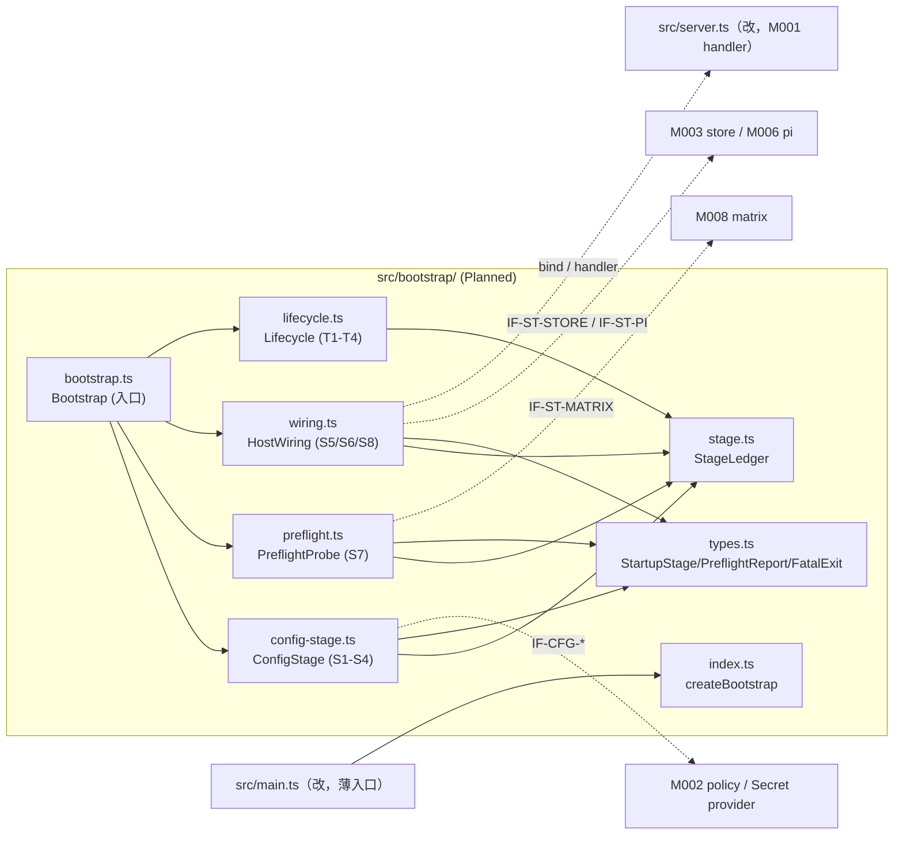
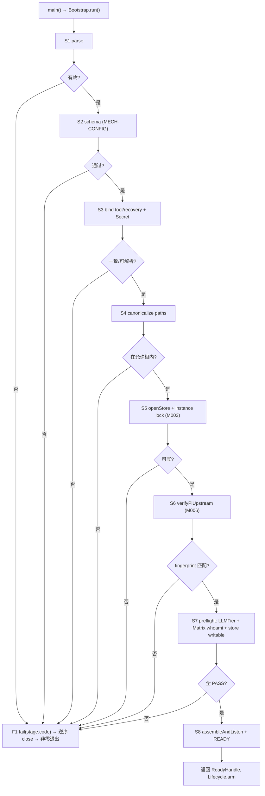

<!-- STD_DOCUMENT_COVER_BEGIN -->
# Piko 实现规格：bootstrap（M000）

> STD 使用入口：[项目采用说明与标准导航](../../README.md#std-entry)

| 文档字段 | 值 |
|---|---|
| Document ID | `piko-bootstrap-impl` |
| Document Version | `0.1.0-draft.1` |
| Status | `Draft` |
| Project | `piko` |
| Document Owner | Piko Implementation Owner |
| Last Modified Date | `2026-09-27` |
| Template ID | `design.implementation` |
| Template Version | `1.2.0` |
<!-- STD_DOCUMENT_COVER_END -->

## 1. 实现目标与输入基线

<a id="isd-scope"></a>

本 ISD 实现 M000 `bootstrap` 的**启动顺序（S1–S8）、依赖 preflight、配置绑定与进程生命周期**：向进程入口提供 `Bootstrap.run/stop`，向 M002/M003/M006/M008 消费 tool 绑定、store 打开、Pi 校验与 Matrix whoami 端口。本次实现范围是 §5 的两个对外函数与内部组成（配置阶段、preflight 探测、阶段台账、宿主装配、生命周期）及 Brownfield 抽出（§2）；**非目标**是 Run 状态机与 Result 语义（M003/M005）、业务受理（M001/M002）、SQLite schema/事务/DDL（M003）、Pi session（M006）、Matrix homeserver 管理（M008）。模块行为、接口语义、状态模型与失败语义由模块设计唯一维护，本层只细化文件/symbol、私有表示、调用/锁/清理步骤与测试入口。

### 1.1 实现对象

- **模块 ID / 名称**：`M000` / `bootstrap`。

- **直属父对象 / 父设计**：`SW-P`（Piko Agent Runtime V0.3，`design_level=system`）/ `system-design` v0.11.2；`parent_document_id=system-design`（ISD 与模块设计同为 `system-design` 的子视图，不互为父子）。

- **模块设计 Document ID / 版本 / 路径 / 摘要**：`piko-bootstrap` / `0.1.0-draft.1` / `docs/40_module_design/piko-bootstrap-design.md`。摘要：进程冷启动按 S1–S8 串行推进并在任一阶段失败走 F1；全量 preflight 通过且 S8 绑定端口后才 READY；配置为启动时唯一快照，无在线热改。

- **需求与 Constraint ID**：`CON-ST-001`（PK-12）、`CON-CFG-001`（PK-12）；机制输入 `M-ST-DI-001`（`piko-startup` §14.4）、`M-CFG-DI-001`（`piko-config` §14.4）。

- **实现范围 / 非目标**：范围：`src/bootstrap/` 八个文件 + 对 `src/main.ts`/`src/config.ts`/`src/server.ts` 的最小改动。非目标：不新建 DB 表/迁移（M003）、不改 Run/Result 语义、不新增 config key、不引入热改或部分就绪。

- **ISD 默认落位或项目批准路径**：`docs/50_implementation_design/piko-bootstrap-impl.isd.md`（STD 默认路径）；代码落位 `src/bootstrap/`（Planned）。

<a id="isd-handoff"></a>

### 1.2.1 `H-BOOT-START` · 冷启动 S1–S8

- **上游信息项 / 规则 ID**：`F-BOOT-CONFIG`、`F-BOOT-STORE`、`F-BOOT-VERIFY`、`F-BOOT-PREFLIGHT`、`F-BOOT-READY`、`P-BOOT-START`、`R-BOOT-STAGE-ORDER`、`IF-BOOT-RUN`、`CON-ST-001`。

- **固定来源 / 版本 / 锚点 / 摘要**：`piko-bootstrap` §2.1–2.5/§5.2.1/§8.1/§9.1.1（v0.1.0-draft.1）。

- **ISD 细化内容 / 章节**：§5.1.1 `Bootstrap.run`；§5.1.2 `ConfigStage.load`；§5.1.4 `PreflightProbe.probe`；§6.1 `P-BOOT-START`。

- **唯一权威位置**：行为/接口权威 = 模块设计 §2/§9.1.1；文件/symbol/私有表示权威 = 本 ISD。

- **实现自由度**：各阶段内部检查实现、preflight 项集合可增、就绪对象装配组织；不可改变顺序语义或不部分就绪。

- **原 V/Case 及本地验证位置**：`VRC-BOOT-001..006`（§9.1.1–9.1.6）。

### 1.2.2 `H-BOOT-CONFIG` · 配置加载/校验/绑定

- **上游信息项 / 规则 ID**：`F-BOOT-CONFIG`、`R-BOOT-SNAPSHOT`、`IF-CFG-LOAD`、`IF-CFG-BIND`、`IF-CFG-SECRET`、`CON-CFG-001`。

- **固定来源 / 版本 / 锚点 / 摘要**：`piko-bootstrap` §2.1/§8.4/§9.1.3/§9.2.1/§9.2.2。

- **ISD 细化内容 / 章节**：§5.1.2 `ConfigStage.load`；§4.2 `BootContext`；§6.2 `P-BOOT-CONFIG`。

- **唯一权威位置**：schema/config 字段 = MECH-CONFIG §4.3 + `interfaces/schemas/*`；绑定与快照 = 模块设计 §2.1。

- **实现自由度**：加载函数内部组织、快照表示、Secret selector；不可新增 config key 或热改。

- **原 V/Case 及本地验证位置**：`VRC-BOOT-002/003/008`。

### 1.2.3 `H-BOOT-STORE` · store 打开与 instance lock

- **上游信息项 / 规则 ID**：`F-BOOT-STORE`、`IF-ST-STORE`、`CON-ST-001`；`T-BOOT-05`。

- **固定来源 / 版本 / 锚点 / 摘要**：`piko-bootstrap` §2.2/§9.2.3；`piko-startup` §5.1 `openStore`。

- **ISD 细化内容 / 章节**：§5.1.5 `HostWiring.openStore`；§7.2（持久化边界→M003）。

- **唯一权威位置**：事务/DDL = M003（`system-design#m003-ddl-authority`）；调用与句柄登记 = 本 ISD。

- **实现自由度**：端口适配类型转换；不可自行打开 SQLite 连接、不可在 M003 事务外写。

- **原 V/Case 及本地验证位置**：`VRC-BOOT-004/008`。

### 1.2.4 `H-BOOT-VERIFY` · Pi 上游校验

- **上游信息项 / 规则 ID**：`F-BOOT-VERIFY`、`IF-ST-PI`、`CON-ST-001`。

- **固定来源 / 版本 / 锚点 / 摘要**：`piko-bootstrap` §2.3/§9.2.4；`piko-startup` §5.1 `verifyPiUpstream`。

- **ISD 细化内容 / 章节**：§5.1.6 `HostWiring.verifyPi`；§6.1 阶段 S6。

- **唯一权威位置**：Pi 版本/commit/拼丁 authority = M006；调用与失败映射 = 本 ISD。

- **实现自由度**：读取顺序；不可热切 Pi、不可自动 checkout 其他 commit。

- **原 V/Case 及本地验证位置**：`VRC-BOOT-005`。

### 1.2.5 `H-BOOT-PREFLIGHT` · 依赖 preflight

- **上游信息项 / 规则 ID**：`F-BOOT-PREFLIGHT`、`R-BOOT-PREFLIGHT-ALL`、`IF-ST-PREFLIGHT`、`IF-ST-MATRIX`、`CON-ST-001`。

- **固定来源 / 版本 / 锚点 / 摘要**：`piko-bootstrap` §2.4/§6.2.1/§8.3/§9.1.4/§9.2.5。

- **ISD 细化内容 / 章节**：§5.1.4 `PreflightProbe.probe`；§5.1.7 `matrixWhoami` 消费；§6.3 `P-BOOT-PREFLIGHT`。

- **唯一权威位置**：preflight 项与全 true 语义 = 模块设计 §8.3；探测实现 = 本 ISD。

- **实现自由度**：探测实现与超时；不可把部分就绪当 READY、不可跳过 store 可写。

- **原 V/Case 及本地验证位置**：`VRC-BOOT-006`（Case A–F）。

### 1.2.6 `H-BOOT-FAIL` · F1 清理与退出

- **上游信息项 / 规则 ID**：`F-BOOT-FAIL`、`R-BOOT-F1`、`P-BOOT-FAIL`、`CON-ST-001`；`T-BOOT-09`。

- **固定来源 / 版本 / 锚点 / 摘要**：`piko-bootstrap` §2.6/§6.6/§8.2/§6.8.1。

- **ISD 细化内容 / 章节**：§5.1.3 `StageLedger`；§4.8 `FatalExit`；§6.4 `P-BOOT-FAIL`。

- **唯一权威位置**：失败清理顺序与退出语义 = 模块设计 §8.2；错误载荷与登记 = 本 ISD。

- **实现自由度**：清理实现与日志格式；不可保留入口或吞掉失败。

- **原 V/Case 及本地验证位置**：`VRC-BOOT-002/004/005/006`。

### 1.2.7 `H-BOOT-STOP` · 停止与有界 drain

- **上游信息项 / 规则 ID**：`F-BOOT-STOP`、`R-BOOT-GATE`、`P-BOOT-STOP`、`IF-BOOT-STOP`；`T-BOOT-10`。

- **固定来源 / 版本 / 锚点 / 摘要**：`piko-bootstrap` §2.7/§7 `M-BOOT-P2`/§8.5/§9.1.2；`system-design` §6.4。

- **ISD 细化内容 / 章节**：§5.1.8 `Lifecycle`；§7.1.5 `C-BOOT-05`。

- **唯一权威位置**：停止顺序 T1–T4 = 模块设计 §2.7；drain 预算与实现 = 本 ISD。

- **实现自由度**：drain 预算与实现；不可在停止期间接受新 Run、不可自动回退。

- **原 V/Case 及本地验证位置**：`VRC-BOOT-007`（Case A–E）。

### 1.2.8 `H-BOOT-STATE` · StartupState 状态模型与不变量

- **上游信息项 / 规则 ID**：`StartupState`（`T-BOOT-01..10`、`INV-BOOT-1..5`）、`EffectiveConfigState`。

- **固定来源 / 版本 / 锚点 / 摘要**：`piko-bootstrap` §6.1/§6.6；`CON-ST-001`/`CON-CFG-001`。

- **ISD 细化内容 / 章节**：§4.6 运行状态私有表示（`StageLedgerState`）；§7.1 交错；§7.2 持久化边界。

- **唯一权威位置**：状态与不变量 = 模块设计 §6.6；内存投影 = 本 ISD。

- **实现自由度**：内存态表示；不可改转换 Guard 与不变量。

- **原 V/Case 及本地验证位置**：`VRC-BOOT-001/002/003`。

## 2. 既有实现差异（条件章节）

### 2.1 适用性

- **适用性**：brownfield（存在需修改的既有实现）。

- **依据**：基线：当前工作树（§10.2 状态复核）。既有 `src/main.ts` 的 `main()` 内联了全部启动逻辑（loadConfig → resolveSecret → preflight → store → matrix → pi → worker → server.listen）；`src/config.ts` 内联 schema 校验、tool registry 校验与 Pi fingerprint/marker 校验；`src/provider-preflight.ts` 内联 LLMTier preflight。本 ISD 把这些抽为 M000 的 `src/bootstrap/`，不新建 schema。

- **Tailoring / 范围决定引用**：`TAIL-P-NEW-S1`（Piko 无 subsystem，`design.definition`/`design.implementation` 直接承接 `system-design`）；范围决定 `system-design` §15 PHASE-I。

### 2.2 `CH-BOOT-01` · 抽取启动编排

- **基线 commit / 版本**：当前工作树（§10.2 `SC-BOOT-01` 记录解析出的 commit）。

- **文件 / symbol**：`src/main.ts` `main`（既有）→ Planned `src/bootstrap/bootstrap.ts` `Bootstrap.run` + `src/bootstrap/index.ts` `createBootstrap`。

- **Current 行为**：`main()` 顺序执行 config→secret→preflight→store→matrix→pi→worker→server.listen，失败由 `main().catch` 打印并置 `process.exitCode=1`；无阶段记录、无统一清理顺序。

- **Target 改动与理由**：把顺序与失败收口抽到 `Bootstrap.run`/`Bootstrap.fail`，阶段推进与句柄登记入 `StageLedger`。理由：S1–S8 顺序与 F1 清理需可独立验证（`VRC-BOOT-001..006`）。

- **原规则 / 成员 ID**：`F-BOOT-CONFIG/STORE/VERIFY/PREFLIGHT/READY/FAIL`、`P-BOOT-START`、`R-BOOT-STAGE-ORDER/F1`。

- **实现状态**：`IN_PROGRESS`（Current 内联，Target 抽出）。

### 2.3 `CH-BOOT-02` · 抽取配置阶段

- **基线 commit / 版本**：当前工作树。

- **文件 / symbol**：`src/config.ts` `loadConfig`/`resolveSecret`/`validateToolRegistry`（既有）→ Planned `src/bootstrap/config-stage.ts` `ConfigStage.load`。

- **Current 行为**：`loadConfig` 内联 AJV schema 校验 + tool registry 校验 + Pi manifest/commit/marker 校验；S3 tool 绑定与 S6 Pi 校验混在一处。

- **Target 改动与理由**：S1–S4（parse/schema/bind/secret/paths）迁入 `config-stage.ts`，S6 Pi 校验经 M006 端口；S3 tool 绑定经 M002 `IF-CFG-BIND`。理由：阶段边界清晰、`EffectiveConfigState` 可单测（`VRC-BOOT-002/003`）。

- **原规则 / 成员 ID**：`F-BOOT-CONFIG`、`IF-CFG-LOAD/BIND/SECRET`、`R-BOOT-SNAPSHOT`。

- **实现状态**：`IN_PROGRESS`。

### 2.4 `CH-BOOT-03` · 抽取 preflight 探测

- **基线 commit / 版本**：当前工作树。

- **文件 / symbol**：`src/provider-preflight.ts` `preflightModelProvider` + `src/main.ts` 内联（既有）→ Planned `src/bootstrap/preflight.ts` `PreflightProbe.probe`。

- **Current 行为**：只探测 LLMTier models；store 可写与 Matrix whoami 未按统一 `PreflightReport` 组装；无超时明细。

- **Target 改动与理由**：三项探测统一组装 `PreflightReport`，超时按 false；全 true 才进 S8。理由：`VRC-BOOT-006` 要求"部分失败不 READY"可表驱动。

- **原规则 / 成员 ID**：`F-BOOT-PREFLIGHT`、`IF-ST-PREFLIGHT`/`IF-ST-MATRIX`、`R-BOOT-PREFLIGHT-ALL`。

- **实现状态**：`IN_PROGRESS`。

### 2.5 `CH-BOOT-04` · 抽取停止与生命周期

- **基线 commit / 版本**：当前工作树。

- **文件 / symbol**：`src/main.ts` `close()`（既有，同步 close）→ Planned `src/bootstrap/lifecycle.ts` `Lifecycle`。

- **Current 行为**：`close()` 顺序 server→worker→matrix→pi→store.close，无有界 drain、无强制 abort、重复信号仅 `closing` 标志防重入。

- **Target 改动与理由**：实现 T1–T4（停止受理→fence→有界 drain→强制 abort）并可注入 drain 预算。理由：`VRC-BOOT-007` 要求 drain 超时的可判定出口。

- **原规则 / 成员 ID**：`F-BOOT-STOP`、`IF-BOOT-STOP`、`R-BOOT-GATE`。

- **实现状态**：`IN_PROGRESS`。

### 2.6 `CH-BOOT-05` · 抽取宿主装配

- **基线 commit / 版本**：当前工作树。

- **文件 / symbol**：`src/main.ts`（既有）→ Planned `src/bootstrap/wiring.ts` `HostWiring`。

- **Current 行为**：`main()` 内直接 `new TaskStore`/`new MatrixRuntime`/`new PiRuntime`/`new RunWorker`/`ApiServer.create`，句柄归属散落。

- **Target 改动与理由**：装配集中到 `wiring.ts` 并登记句柄；`main.ts` 变薄。理由：F1/停止的句柄释放顺序可核查（§7.1）。

- **原规则 / 成员 ID**：`F-BOOT-READY`、`IF-BOOT-WIRING`、`DEP-BOOT-HTTP`。

- **实现状态**：`IN_PROGRESS`。

## 3. 文件、内部组件与调用关系

<a id="isd-structure"></a>



图 M000-ISD-S1 · Planned / NOT_IMPLEMENTED。实线调用；虚线跨模块适配。`stage.ts`/`types.ts` 零业务依赖。

### 3.1 `src/bootstrap/types.ts`

- **职责及调用者**：定义本层私有类型与错误结构；被全模块引用。

- **类型 / 函数**：`StartupStage`、`EffectiveConfigState`、`PreflightReport`、`BootContext`、`ReadyHandle`、`FatalExit`、`StopReport`、`BootstrapConfig`（drain 预算等常量）。

- **可见性**：模块内 public（仅 `index.ts` 再导出 `Bootstrap`/`ReadyHandle`）。

- **调用与类型依赖**：零运行时依赖。

- **构建目标 / 生成源 / 输出**：`tsc` 编译进 `dist/bootstrap/types.js`；无生成源。

- **实现状态**：Planned。

### 3.2 `src/bootstrap/stage.ts`

- **职责及调用者**：`StageLedger`：阶段推进/失败、句柄登记/释放、指标事件；被 `bootstrap.ts` 与各阶段单元调用。

- **类型 / 函数**：`class StageLedger`：`advance(stage)`、`fail(stage, code)`、`registerHandle(h)`、`release(h)`、`state(): StageLedgerState`。

- **可见性**：模块内 public。

- **调用与类型依赖**：依赖 `types.ts`；调用 M009（经运行时注入的 event sink，非直接 import）。

- **构建目标 / 生成源 / 输出**：`tsc` → `dist/bootstrap/stage.js`。

- **实现状态**：Planned。

### 3.3 `src/bootstrap/config-stage.ts`

- **职责及调用者**：S1–S4 配置阶段；被 `bootstrap.ts` 调用。

- **类型 / 函数**：`class ConfigStage`：`load(startupArgs: StartupArgs, root: string): BootContext`。

- **可见性**：模块内 public。

- **调用与类型依赖**：复用 `src/config.ts`；调用 M002 `bindToolProfile` 与 Secret provider。

- **构建目标 / 生成源 / 输出**：`tsc` → `dist/bootstrap/config-stage.js`。

- **实现状态**：Planned（Current 在 `src/config.ts`）。

### 3.4 `src/bootstrap/preflight.ts`

- **职责及调用者**：S7 依赖探测；被 `bootstrap.ts` 调用。

- **类型 / 函数**：`class PreflightProbe`：`probe(deps: PreflightDeps): Promise<PreflightReport>`。

- **可见性**：模块内 public。

- **调用与类型依赖**：复用 `src/provider-preflight.ts`；调用 M008 whoami；调用 M003 store 可写探测。

- **构建目标 / 生成源 / 输出**：`tsc` → `dist/bootstrap/preflight.js`。

- **实现状态**：Planned。

### 3.5 `src/bootstrap/wiring.ts`

- **职责及调用者**：S5/S6/S8 装配；被 `bootstrap.ts` 调用。

- **类型 / 函数**：`class HostWiring`：`openStore(ctx)`、`verifyPi(ctx)`、`assembleAndListen(ctx, report): Promise<ReadyHandle>`。

- **可见性**：模块内 public；实现由 `index.ts` 装配。

- **调用与类型依赖**：依赖 `types.ts`/`stage.ts`；运行时依赖 M003/M006/M008/M001 与 `src/pi-runtime.ts`/`worker.ts`/`server.ts`。

- **构建目标 / 生成源 / 输出**：`tsc` → `dist/bootstrap/wiring.js`。

- **实现状态**：Planned（Current 在 `src/main.ts`）。

### 3.6 `src/bootstrap/lifecycle.ts`

- **职责及调用者**：信号注册与 T1–T4 停止；由 `bootstrap.ts` 在 READY 后启动。

- **类型 / 函数**：`class Lifecycle`：`arm(handle: ReadyHandle, budget: number): void`、`onSignal(reason): Promise<StopReport>`、私有 `drain()`。

- **可见性**：模块内 public。

- **调用与类型依赖**：依赖 `types.ts`/`stage.ts`；调用 M001 handler close、M004/M005 fence/drain、M006 abort、`store.close`。

- **构建目标 / 生成源 / 输出**：`tsc` → `dist/bootstrap/lifecycle.js`。

- **实现状态**：Planned（Current 在 `src/main.ts` `close()`）。

### 3.7 `src/bootstrap/bootstrap.ts`

- **职责及调用者**：入口：实现 `run`/`stop`、保证 §6.6 不变量；被 `main.ts` 调用。

- **类型 / 函数**：`class Bootstrap`：`constructor(deps: BootstrapDeps)`、`run(startupArgs: StartupArgs, projectRoot: string): Promise<ReadyHandle>`、`stop(reason): Promise<StopReport>`、私有 `fail(stage, code): never`。

- **可见性**：public（经 `index.ts` 导出）。

- **调用与类型依赖**：依赖 `config-stage.ts`/`preflight.ts`/`stage.ts`/`wiring.ts`/`lifecycle.ts`/`types.ts`。

- **构建目标 / 生成源 / 输出**：`tsc` → `dist/bootstrap/bootstrap.js`。

- **实现状态**：Planned。

### 3.8 `src/bootstrap/index.ts`

- **职责及调用者**：唯一装配入口：导出 `Bootstrap`/`createBootstrap`；被 `main.ts` 调用。

- **类型 / 函数**：`export function createBootstrap(deps: BootstrapDeps): Bootstrap`。

- **可见性**：public。

- **调用与类型依赖**：依赖 `bootstrap.ts`/`wiring.ts`/`types.ts` + M001/M003/M006/M008 类型。

- **构建目标 / 生成源 / 输出**：`tsc` → `dist/bootstrap/index.js`。

- **实现状态**：Planned。

### 3.9 `src/main.ts`（修改既有）

- **职责及调用者**：薄入口：构造 deps → `createBootstrap(...).run()`；`catch(FatalExit)` 非零退出。被部署工具/Supervisor 调用。

- **类型 / 函数**：`main()` 精简为装配与错误出口。

- **可见性**：public（进程入口）。

- **调用与类型依赖**：依赖 `config.ts`/`store.ts`/`matrix.ts`/`pi-runtime.ts`/`worker.ts`/`server.ts`/`bootstrap/index.ts`。

- **构建目标 / 生成源 / 输出**：`tsx src/main.ts`（运行）；`tsc` 类型检查。

- **实现状态**：`IN_PROGRESS`。

### 3.10 `src/config.ts`（修改既有）

- **职责及调用者**：提供 `loadConfig`/`resolveSecret`/`validateToolRegistry` 与 Pi fingerprint 工具；被 `config-stage.ts` 复用。

- **类型 / 函数**：保留 `loadConfig(path, root)`、`resolveSecret(ref)`、`validateToolRegistry(tools)`；S6 marker 校验迁往 M006。

- **可见性**：public（同级/内部复用）。

- **调用与类型依赖**：依赖 `ajv`/`node:fs`；无新依赖。

- **构建目标 / 生成源 / 输出**：`tsc` → `dist/config.js`。

- **实现状态**：Implemented（部分）。

### 3.11 `src/server.ts`（修改既有）

- **职责及调用者**：`ApiServer.create/listen/close` 作为 S8 监听载体；被 `wiring.ts` 调用。

- **类型 / 函数**：`ApiServer`（保留）。

- **可见性**：public（M001 端点语义）。

- **调用与类型依赖**：依赖 `node:http`。

- **构建目标 / 生成源 / 输出**：`tsc` → `dist/server.js`。

- **实现状态**：Implemented。

## 4. 数据结构设计

<a id="isd-data"></a>

**不适用类别**：§4.4 通信报文、§4.5 设备/FPGA 表项（纯软件，`TAIL-P-103`）为 N/A。§4.7 数据库表结构 N/A——schema 与事务 authority 属 M003（见 §7.2）。§4.3 为内部常量（见 §8.1）。

### 4.1 公共基础类型与枚举

#### 4.1.1 `StartupStage` / `EffectiveConfigState`

- **完整定义、Data/Type ID 与唯一来源**：私有枚举，本 ISD `types.ts`；公共语义来源 = 模块设计 §6.1.1（`piko-startup` §4.1.1 / `piko-config` §4.1.1）。

  ```ts
  type StartupStage = "S1"|"S2"|"S3"|"S4"|"S5"|"S6"|"S7"|"S8"|"READY"|"F1";
  type EffectiveConfigState = "Loaded" | "Bound" | "Active";
  ```

- **逐字段/逐值类型、范围、初值/不变量/owner**：取值与含义同模块设计 §6.1.1；不跳级；`F1` 为唯一失败出口。owner = `StageLedger`。

- **内存布局 / ABI**：N/A（纯 TS 字面量联合）。

- **创建/借用/释放/失败路径**：由 `StageLedger.advance/fail` 产生；寿命 = 单次 `run()`。

- **验证**：`VRC-BOOT-001/002`；`NOT_RUN`。

### 4.2 业务与操作数据结构

#### 4.2.1 `PreflightReport`

- **完整定义、Data/Type ID 与唯一来源**：私有类型；语义来源 = 模块设计 §6.2.1。

  ```ts
  interface PreflightReport {
    store_writable: boolean;
    pi_fingerprint_match: boolean;
    llmtier_models_ok: boolean;
    matrix_whoami_ok: boolean;
  }
  ```

- **逐字段类型/范围/初值/不变量/owner**：四字段 `boolean`，无默认；全 `true` 才进 S8（`R-BOOT-PREFLIGHT-ALL`）；owner = `PreflightProbe` 产生、`Bootstrap` 只读。

- **内存布局 / ABI**：N/A（纯 TS 对象）。

- **创建/借用/释放/失败路径**：由 `probe()` 返回；无长期寿命；任一 false → F1。

- **验证**：`VRC-BOOT-006`；`NOT_RUN`。

#### 4.2.2 `BootContext` / `ReadyHandle`

- **完整定义、Data/Type ID 与唯一来源**：私有类型；语义来源 = 模块设计 §6.2.2。

  ```ts
  interface BootContext {
    boot_id: string;
    config: PikoRuntimeConfig;
    bound: BoundToolProfile;
    secrets: { bearer: string; llmKey: string; matrixToken?: string };
  }
  interface ReadyHandle {
    boot_id: string; context: BootContext; store: Store;
    matrix?: MatrixRuntime; pi: PiRuntime; worker: RunWorker; server: ApiServer;
  }
  ```

- **逐字段类型/范围/初值/不变量/owner**：`boot_id` 非空 UUID；`config`/`bound` 冻结（`Object.freeze`）；`secrets` 仅内存；`matrix?` 仅 `matrix.enabled=true` 时非空。owner = `Bootstrap`。

- **内存布局 / ABI**：N/A（纯 TS 对象，句柄为宿主对象引用）。

- **创建/借用/释放/失败路径**：由 `ConfigStage.load`/`HostWiring.assembleAndListen` 构造；句柄在 F1/停止时按 §7.1 逆序释放；寿命 = 进程。

- **验证**：`VRC-BOOT-001/003`；`NOT_RUN`。

### 4.3 配置与规则数据结构

- **完整定义 / 来源**：内部常量 `BootstrapConfig`（无 config key，见 §8.1）：

  ```ts
  interface BootstrapConfig {
    drain_budget_ms: number;     // 停止时 T3 有界 drain 预算
    preflight_timeout_ms: number; // 单项探测超时上限（LLMTier/Matrix 各自配置优先）
  }
  ```

- **逐字段/范围/不变量**：全为 `number`，正数，进程内不变。authority = 模块设计 §12.1；配置字段本身见 MECH-CONFIG §4.3。

- **创建/寿命/失败**：由 `main.ts` 以字面量构造注入；无运行期变更。

- **验证**：`VRC-BOOT-007`；`NOT_RUN`。

### 4.6 运行状态数据结构

#### 4.6.1 `StageLedgerState`（内存投影）

- **完整定义 / 来源**：私有**派生**状态，非持久 authority（持久事实 `instance_meta` 属 M003）：

  ```ts
  interface StageLedgerState {
    stage: StartupStage;
    failed_stage: StartupStage | null;
    handles: Handle[];
    boot_id: string;
  }
  ```

  语义来源 = 模块设计 §6.6 `T-BOOT-01..10`。

- **逐字段/状态/不变量/owner**：`stage==F1 ⟺ failed_stage!=null`；`READY` 后 `handles` 覆盖全部运行期句柄；owner = `StageLedger`。

- **转换/失败**：不持久化、不单独提交；转换与阶段调用一一对应（`T-BOOT-*`）。

- **验证**：`VRC-BOOT-001/002/003`；`NOT_RUN`。

### 4.7 数据库表结构

**N/A。** 本模块不拥有持久表：`instance_meta` 的 schema/DDL/事务 authority 属 M003（`system-design#m003-ddl-authority`；M003 ISD §4.7.1）。本 ISD 只消费 `IF-ST-STORE`，不复制 CREATE TABLE。依据：ISD 规范 §3；交接见 §7.2。

### 4.8 错误码与错误结构

#### 4.8.1 `FatalExit`

- **完整定义 / 来源**：私有错误结构；语义来源 = 模块设计 §6.8.1。

  ```ts
  type FatalCode = "config-invalid"|"tool-bind-fail"|"secret-unresolved"|"path-invalid"
    |"store-unwritable"|"instance-lock-held"|"schema-migration-failed"
    |"pi-upstream-mismatch"|"preflight-fail"|"listen-failed";
  class FatalExit extends Error { readonly stage: StartupStage; readonly code: FatalCode; }
  ```

- **逐字段/触发/副作用**：`stage ∈ S1..S8`（不含 READY）；`code` 与 stage 对应（§6 分支）；触发 = 阶段失败；无 DB 副作用（清理见 §7.1）。

- **所有权/出口**：由 `Bootstrap.fail` 产生 → `main()` 消费 → 非零退出；不映射 HTTP。

- **验证**：`VRC-BOOT-002/004/005/006`；`NOT_RUN`。

#### 4.8.2 `StopReport`

- **完整定义 / 来源**：```ts
  interface StopReport { outcome: "drained" | "forced"; reason: "SIGTERM" | "SIGINT"; }
  ```

  语义来源 = 模块设计 §2.7/§9.1.2。

- **逐字段/触发/副作用**：`outcome` 由 T3 是否超时决定；`reason` = 触发信号；副作用 = 句柄关闭（不可恢复）。

- **所有权/出口**：由 `Lifecycle.onSignal` 产生 → `main()` 决定退出码（drained=0 / forced≠0）。

- **验证**：`VRC-BOOT-007`；`NOT_RUN`。

## 5. 接口设计

<a id="isd-functions"></a>

bootstrap 的对外接口是 §5.1 的 `run`/`stop` 与 `loadConfig`/`preflight`；被消费的 M002/M003/M006/M008 端口与 Secret provider 在同节记录（进程内协作接口）。消息/硬件接口（§5.2–5.3 N/A）。

### 5.1 API（适用时）

#### 5.1.1 `Bootstrap.run(startupArgs: StartupArgs, projectRoot: string): Promise<ReadyHandle>`

- **Interface/Member ID、用途**：`IF-BOOT-RUN`；推进 S1–S8 并返回 READY 句柄。

- **文件 / symbol / 可见性**：Planned `src/bootstrap/bootstrap.ts` `Bootstrap.run`；public（模块外经 `index.ts`）。

- **原成员 ID 或私有来源**：机制 `piko-startup` §5.1 启动函数（`M-ST-DI-001`）。

- **完整签名与 caller**：`run(startupArgs: StartupArgs, projectRoot: string): Promise<ReadyHandle>`；caller = `main()`（进程入口，单事件循环上下文）。

- **输入参数 / 数据结构 authority**：`startupArgs.configPath?: string`；`projectRoot: string`；无 §6 Data ID（进程内身份），来源 = 启动命令/`PIKO_CONFIG`。

- **输入约束 / 校验顺序 / 失败映射**：校验顺序 S1→S2→S3→S4→S5→S6→S7→S8；失败映射见 §6.1 分支表。

- **成功输出 / 数据结构 / 后置条件**：`ReadyHandle`（§4.2.2）；后置 `StartupState=READY`、端口绑定、`instance_meta.boot_id` 已写、`EffectiveConfigState=Active`。

- **错误输出 / 触发条件 / 优先级**：抛 `FatalExit{stage, code}`；无部分 READY；优先级 = 按阶段顺序第一个失败阶段。

- **底层异常 / 失败事实**：M002/M003/M006/M008 透传的原生 `Error`（如 SQLite busy、fs ENOENT）。

- **模块是否处理及处理函数**：业务失败转为对应 `FatalCode`；`Bootstrap.fail` 统一清理后抛 `FatalExit`。

- **Typed 异常与原生异常所有权**：本模块拥有 `FatalExit`；原生异常被映射为 `FatalCode` 后不再外泄。

- **不可改变的规则 / Constraint ID**：`R-BOOT-STAGE-ORDER`/`R-BOOT-F1`/`R-BOOT-PREFLIGHT-ALL`；`CON-ST-001`/`CON-CFG-001`。

- **实现自由度**：各阶段内部检查实现、preflight 项集合、装配组织；不可改变顺序或不部分就绪。

- **宿主 / public payload 或状态码**：无 HTTP；返回 `ReadyHandle` 或抛 `FatalExit`。

- **日志级别 / 脱敏 / 关联字段**：`info`（阶段推进/READY）；`error`（F1，含 `stage`/`code`/`boot_id`）；无 credential。

- **是否可重试及前提**：内存阶段不可重试；失败后重启即重跑 S1–S8（无幂等重放）。

- **状态与副作用影响 / 验证项**：副作用 = 写 `instance_meta`（经 M003）、绑定端口、启动客户端；`VRC-BOOT-001..006`。

- **副作用 / 执行上下文 / 幂等性**：有副作用；上下文 = 宿主事件循环（preflight 内部并发等待）；非幂等（S5 后重复调用被 lock 拒绝）。

- **输入输出 ownership 与寿命**：输入借用；输出 `ReadyHandle` 归调用方、寿命 = 进程。

- **Thread-safe / reentrant**：conditional：Node 单线程；由 `main()` 保证单次调用（可加"已运行"断言）。

- **Nested-call policy**：allowed：调用 §5.1.2–5.1.4 与 §5.1.5–5.1.9 的端口；禁止回调 M005 业务。

- **Transaction participation**：none（不发起事务；S5 事务由 M003 拥有）。

- **Blocking / timeout / cancellation**：S7 出站探测受 `preflight_timeout_ms`/各自配置；其余同步本地；无中途取消（调用返回即结束）。

- **实现状态 / 验证项**：Planned / `VRC-BOOT-001..006`。

- **装配、合法及拒绝实例**：装配：§3.8。合法：有效 config + 锁定 commit + 可达依赖 → READY。拒绝：S7 LLMTier 503 → `FatalExit{S7, preflight-fail}`。Oracle = 端口绑定 + 退出码（§9.1.1）。`NOT_RUN`。

#### 5.1.2 `Bootstrap.stop(reason: "SIGTERM" | "SIGINT"): Promise<StopReport>`

- **Interface/Member ID、用途**：`IF-BOOT-STOP`；执行 T1–T4 停止与 drain。

- **文件 / symbol / 可见性**：Planned `src/bootstrap/lifecycle.ts` `Lifecycle.onSignal` → `Bootstrap.stop`；public。

- **原成员 ID 或私有来源**：`system-design` §6.4 P-STOP。

- **完整签名与 caller**：`stop(reason): Promise<StopReport>`；caller = `Lifecycle` 信号回调。

- **输入参数 / 数据结构 authority**：`reason`（信号名）；无外部 Data ID。

- **输入约束 / 校验顺序 / 失败映射**：顺序 T1→T2→T3→T4；drain 超时映射 `forced`。

- **成功输出 / 数据结构 / 后置条件**：`StopReport`（§4.8.2）；后置 = 受理停止、句柄全部关闭。

- **错误输出 / 触发条件 / 优先级**：无 typed 错误；drain 超时 → `forced` + 非零退出码。

- **底层异常 / 失败事实**：fence/abort/close 抛出的原生错误（尽力关闭，继续）。

- **模块是否处理及处理函数**：`Lifecycle` 捕获 close/fence 异常后继续关闭其余句柄，退出决策不变。

- **Typed 异常与原生异常所有权**：本模块不新增 typed 错误；原生异常仅记日志。

- **不可改变的规则 / Constraint ID**：`R-BOOT-GATE`；`CON-ST-001`。

- **实现自由度**：drain 预算与实现；不可在停止期接受新 Run。

- **宿主 / public payload 或状态码**：`StopReport`；退出码由 `main()` 决定。

- **日志级别 / 脱敏 / 关联字段**：`info`（T1–T4 与 outcome）；`warn`（close/fence 异常）。

- **是否可重试及前提**：重复信号幂等；不重试停止。

- **状态与副作用影响 / 验证项**：副作用 = 停止受理、fence、abort、close；`VRC-BOOT-007`。

- **副作用 / 执行上下文 / 幂等性**：有副作用且不可逆；上下文 = 信号回调；`stop` 幂等。

- **输入输出 ownership 与寿命**：输入借用；输出值对象。

- **Thread-safe / reentrant**：yes（单线程；`stopping` 标志防重入）。

- **Nested-call policy**：allowed：M001 handler close、M004/M005 fence、M006 abort、store close。

- **Transaction participation**：none（fence 由 M004/M005 在其事务内执行）。

- **Blocking / timeout / cancellation**：T3 有界等待（`drain_budget_ms`）；T4 强制 abort；无外部取消。

- **实现状态 / 验证项**：Planned / `VRC-BOOT-007`。

- **装配、合法及拒绝实例**：合法：READY 无在途 → `drained`。拒绝：未 READY 调用 → 快速退出（无端口）。`NOT_RUN`。

#### 5.1.3 `ConfigStage.load(startupArgs: StartupArgs, root: string): BootContext`

- **Interface/Member ID、用途**：S1–S4 配置阶段；产出冻结快照。

- **文件 / symbol / 可见性**：Planned `src/bootstrap/config-stage.ts` `ConfigStage.load`；模块内 public。

- **原成员 ID 或私有来源**：`IF-CFG-LOAD`（M000 提供）、`IF-CFG-BIND`/`IF-CFG-SECRET`（消费）。

- **完整签名与 caller**：`load(startupArgs, root): BootContext`；caller = `Bootstrap.run`。

- **输入参数 / 数据结构 authority**：config 路径 + 项目根；config 字段 authority = `interfaces/schemas/piko-runtime-config-v0.3.schema.json`。

- **输入约束 / 校验顺序 / 失败映射**：parse → schema → bind → secret → paths；失败映射 `config-invalid`/`tool-bind-fail`/`secret-unresolved`/`path-invalid`。

- **成功输出 / 数据结构 / 后置条件**：`BootContext`（§4.2.2）；后置 `EffectiveConfigState=Bound`、快照冻结。

- **错误输出 / 触发条件 / 优先级**：抛 `FatalExit{S1..S4, code}`；按上述顺序首个失败。

- **底层异常 / 失败事实**：AJV 校验错误、fs ENOENT、Secret provider 错误。

- **模块是否处理及处理函数**：`ConfigStage.load` 将异常映射为对应 `FatalCode` 并记录阶段。

- **Typed 异常与原生异常所有权**：`FatalExit` 属本模块；原生异常被映射。

- **不可改变的规则 / Constraint ID**：`R-BOOT-SNAPSHOT`；`CON-CFG-001`。

- **实现自由度**：内部组织、快照表示；不可新增 config key 或热改。

- **宿主 / public payload 或状态码**：无。

- **日志级别 / 脱敏 / 关联字段**：`info`（阶段）；`error`（失败，`secretRef` 只记 ref）。

- **是否可重试及前提**：不重试；重启重跑。

- **状态与副作用影响 / 验证项**：无外部副作用（只读 + 冻结）；`VRC-BOOT-002/003`。

- **副作用 / 执行上下文 / 幂等性**：只读；上下文 = 宿主事件循环；同输入幂等。

- **输入输出 ownership 与寿命**：输入借用；输出 `BootContext` owner = `Bootstrap`。

- **Thread-safe / reentrant**：yes。

- **Nested-call policy**：allowed：`loadConfig`、M002 bind、Secret provider。

- **Transaction participation**：none。

- **Blocking / timeout / cancellation**：同步本地；无网络超时。

- **实现状态 / 验证项**：Planned / `VRC-BOOT-002/003`。

- **装配、合法及拒绝实例**：合法：有效 config → `BootContext`。拒绝：未知字段 → `FatalExit{S2, config-invalid}`。`NOT_RUN`。

#### 5.1.4 `PreflightProbe.probe(deps: PreflightDeps): Promise<PreflightReport>`

- **Interface/Member ID、用途**：`IF-ST-PREFLIGHT`（M000 提供）；S7 探测四项事实。

- **文件 / symbol / 可见性**：Planned `src/bootstrap/preflight.ts` `PreflightProbe.probe`；模块内 public。

- **原成员 ID 或私有来源**：`piko-startup` §5.1 `IF-ST-PREFLIGHT`。

- **完整签名与 caller**：`probe(deps): Promise<PreflightReport>`；caller = `Bootstrap.run`。

- **输入参数 / 数据结构 authority**：`{llmKey, baseUrl, model, modelsTimeout, matrixEnabled, matrixIdentity, store}`。

- **输入约束 / 校验顺序 / 失败映射**：三项探测并行；超时/失败映射对应字段 false，不抛错。

- **成功输出 / 数据结构 / 后置条件**：`PreflightReport`；全 true 才继续。

- **错误输出 / 触发条件 / 优先级**：无抛错；字段 false 优先于 true；超时按 false。

- **底层异常 / 失败事实**：fetch abort、非 2xx、whoami 不一致、store 写探测失败。

- **模块是否处理及处理函数**：`probe` 捕获每项错误并置对应字段 false。

- **Typed 异常与原生异常所有权**：不外泄；由 `Bootstrap` 决定 F1。

- **不可改变的规则 / Constraint ID**：`R-BOOT-PREFLIGHT-ALL`；`CON-ST-001`。

- **实现自由度**：探测实现与并发；不可跳过 store 可写、不可部分就绪。

- **宿主 / public payload 或状态码**：无。

- **日志级别 / 脱敏 / 关联字段**：`info`/`warn`（依赖项与耗时）；无 credential 值。

- **是否可重试及前提**：失败即 F1；重启重跑。

- **状态与副作用影响 / 验证项**：只读探测（store 可写探测不落业务数据）；`VRC-BOOT-006`。

- **副作用 / 执行上下文 / 幂等性**：只读；上下文 = 宿主事件循环（并发 await）；幂等。

- **输入输出 ownership 与寿命**：输入借用；输出值对象。

- **Thread-safe / reentrant**：yes。

- **Nested-call policy**：allowed：LLMTier fetch、M008 whoami、store 可写探测。

- **Transaction participation**：none。

- **Blocking / timeout / cancellation**：每项受 timeout（abort）；无外部取消。

- **实现状态 / 验证项**：Planned / `VRC-BOOT-006`。

- **装配、合法及拒绝实例**：合法：全 true → 继续。拒绝：LLMTier 503 → `llmtier_models_ok=false`。`NOT_RUN`。

#### 5.1.5 `HostWiring.openStore(ctx: BootContext): Promise<Store>`（消费端口）

- **Interface/Member ID、用途**：`IF-ST-STORE`（Proposed）；S5 打开/迁移 store、取 lock。

- **文件 / symbol / 可见性**：Planned `src/bootstrap/wiring.ts` `HostWiring.openStore` → M003 `openStore`。

- **原成员 ID 或私有来源**：`piko-startup` §5.1 `IF-ST-STORE`。

- **完整签名与 caller**：`openStore(ctx): Promise<Store>`；caller = `Bootstrap.run`。

- **输入参数 / 数据结构 authority**：`storage.sqlite_path` + `busy_timeout_ms`（config authority = schema）。

- **输入约束 / 校验顺序 / 失败映射**：单原语完成开库/migration/lock/`instance_meta`；失败映射 `store-unwritable`/`instance-lock-held`/`schema-migration-failed`。

- **成功输出 / 数据结构 / 后置条件**：可写 `Store`；`instance_meta.boot_id` 已写；句柄登记入 `StageLedger`。

- **错误输出 / 触发条件 / 优先级**：抛原生错误 → 映射为 `FatalExit{S5, code}`。

- **底层异常 / 失败事实**：SQLite busy/IO/schema 错误。

- **模块是否处理及处理函数**：`HostWiring` 透传，`Bootstrap.fail` 映射并清理。

- **Typed 异常与原生异常所有权**：原生属 M003；`FatalExit` 属本模块。

- **不可改变的规则 / Constraint ID**：`CON-ST-001`；guard 与写入同事务（M003）。

- **实现自由度**：适配类型转换；不可自行打开 SQLite。

- **宿主 / public payload 或状态码**：无。

- **日志级别 / 脱敏 / 关联字段**：`info`（open 成功）；`error`（失败）。

- **是否可重试及前提**：不重试；重启重跑。

- **状态与副作用影响 / 验证项**：副作用 = 建库/迁移/写 `instance_meta`；`VRC-BOOT-004/008`。

- **副作用 / 执行上下文 / 幂等性**：有副作用；非幂等（重复启动被 lock 拒）。

- **输入输出 ownership 与寿命**：输入借用；输出 `Store` owner = `Bootstrap`。

- **Thread-safe / reentrant**：conditional（SQLite 单 writer）。

- **Nested-call policy**：allowed：M003 `openStore`。

- **Transaction participation**：owner 归 M003；本层不嵌套事务。

- **Blocking / timeout / cancellation**：阻塞；受 `busy_timeout_ms`。

- **实现状态 / 验证项**：Planned（M003 侧 `IN_PROGRESS`）/ `VRC-BOOT-004/008`。

- **装配、合法及拒绝实例**：合法：空库 → `Store`。拒绝：lock 被占 → `instance-lock-held`。`NOT_RUN`。

#### 5.1.6 `HostWiring.verifyPi(ctx: BootContext): Promise<boolean>`（消费端口）

- **Interface/Member ID、用途**：`IF-ST-PI`（Proposed）；S6 校验 Pi commit + manifest。

- **文件 / symbol / 可见性**：Planned `src/bootstrap/wiring.ts` → M006 `verifyPiUpstream`。

- **原成员 ID 或私有来源**：`piko-startup` §5.1 `IF-ST-PI`。

- **完整签名与 caller**：`verifyPi(ctx): Promise<boolean>`；caller = `Bootstrap.run`。

- **输入参数 / 数据结构 authority**：`pi.version`/`commit`/manifest path/sha256（schema authority）。

- **输入约束 / 校验顺序 / 失败映射**：SHA256 → manifest pin → checkout commit → markers；任一不符 → `pi-upstream-mismatch`。

- **成功输出 / 数据结构 / 后置条件**：`true` → `pi_fingerprint_match=true`。

- **错误输出 / 触发条件 / 优先级**：不符 → `FatalExit{S6, pi-upstream-mismatch}`。

- **底层异常 / 失败事实**：fs ENOENT、哈希不符。

- **模块是否处理及处理函数**：`HostWiring` 透传；`Bootstrap.fail` 映射。

- **Typed 异常与原生异常所有权**：原生属 M006；`FatalExit` 属本模块。

- **不可改变的规则 / Constraint ID**：`CON-ST-001`；不热切 Pi。

- **实现自由度**：读取顺序；不可自动 checkout 其他 commit。

- **宿主 / public payload 或状态码**：无。

- **日志级别 / 脱敏 / 关联字段**：`info`（fingerprint 匹配）；`error`（不匹配）。

- **是否可重试及前提**：不重试；重启重跑。

- **状态与副作用影响 / 验证项**：只读；`VRC-BOOT-005`。

- **副作用 / 执行上下文 / 幂等性**：只读；幂等。

- **输入输出 ownership 与寿命**：借用/布尔。

- **Thread-safe / reentrant**：yes。

- **Nested-call policy**：allowed：M006 `verifyPiUpstream`。

- **Transaction participation**：none。

- **Blocking / timeout / cancellation**：同步本地。

- **实现状态 / 验证项**：Planned（M006 侧 Planned）/ `VRC-BOOT-005`。

- **装配、合法及拒绝实例**：合法：commit 匹配 → `true`。拒绝：marker 缺失 → `pi-upstream-mismatch`。`NOT_RUN`。

#### 5.1.7 `matrixWhoami() -> Identity`（消费端口）

- **Interface/Member ID、用途**：`IF-ST-MATRIX`（Proposed）；S7 校验 Matrix 身份。

- **文件 / symbol / 可见性**：M008 提供（Planned）；`PreflightProbe` 消费。

- **原成员 ID 或私有来源**：`piko-startup` §5.1 `IF-ST-MATRIX`。

- **完整签名与 caller**：`matrixWhoami(): Promise<Identity>`；caller = `PreflightProbe.probe`。

- **输入参数 / 数据结构 authority**：homeserver + token + `matrix.user_id`（schema authority）。

- **输入约束 / 校验顺序 / 失败映射**：比较 whoami user_id 与配置；不一致/不可达 → `matrix_whoami_ok=false`。

- **成功输出 / 数据结构 / 后置条件**：`Identity{user_id}` 与配置一致。

- **错误输出 / 触发条件 / 优先级**：无抛错（由 probe 捕获）；`enabled=false` 时不调用。

- **底层异常 / 失败事实**：出站 HTTPS 错误/超时。

- **模块是否处理及处理函数**：`PreflightProbe` 捕获并置 false。

- **Typed 异常与原生异常所有权**：原始错误不入 F1 payload。

- **不可改变的规则 / Constraint ID**：`R-BOOT-PREFLIGHT-ALL`。

- **实现自由度**：无（薄消费）。

- **宿主 / public payload 或状态码**：无。

- **日志级别 / 脱敏 / 关联字段**：`info`/`warn`；不记录 token。

- **是否可重试及前提**：失败即 F1。

- **状态与副作用影响 / 验证项**：只读；`VRC-BOOT-006`。

- **副作用 / 执行上下文 / 幂等性**：只读；幂等。

- **输入输出 ownership 与寿命**：借用/值对象。

- **Thread-safe / reentrant**：yes。

- **Nested-call policy**：allowed。

- **Transaction participation**：none。

- **Blocking / timeout / cancellation**：受 `sync_timeout_ms`。

- **实现状态 / 验证项**：Planned（M008 侧 Planned）/ `VRC-BOOT-006`。

- **装配、合法及拒绝实例**：合法：身份一致 → `true`。拒绝：不一致 → false。`NOT_RUN`。

#### 5.1.8 `bindToolProfile(profile, registry) -> BoundToolProfile`（消费端口）

- **Interface/Member ID、用途**：`IF-CFG-BIND`（Proposed）；S3 绑定 tool/recovery。

- **文件 / symbol / 可见性**：M002 提供（Planned）；`ConfigStage` 消费。

- **原成员 ID 或私有来源**：`piko-config` §5.1 `IF-CFG-BIND`。

- **完整签名与 caller**：`bindToolProfile(profile, registry): BoundToolProfile`；caller = `ConfigStage.load`。

- **输入参数 / 数据结构 authority**：profile + registry（`piko-tool-profile-v0.3.schema.json`）。

- **输入约束 / 校验顺序 / 失败映射**：每个 `recovery_contract_ref` 必须解析；未注册/不一致 → `tool-bind-fail`。

- **成功输出 / 数据结构 / 后置条件**：`BoundToolProfile`。

- **错误输出 / 触发条件 / 优先级**：不一致 → `FatalExit{S3, tool-bind-fail}`。

- **底层异常 / 失败事实**：注册表查询失败。

- **模块是否处理及处理函数**：`ConfigStage` 映射。

- **Typed 异常与原生异常所有权**：`FatalExit` 属本模块。

- **不可改变的规则 / Constraint ID**：`CON-CFG-001`；启动后不可热注册。

- **实现自由度**：内部校验顺序（归 M002）。

- **宿主 / public payload 或状态码**：无。

- **日志级别 / 脱敏 / 关联字段**：`info`/`error`。

- **是否可重试及前提**：不重试。

- **状态与副作用影响 / 验证项**：无持久副作用；`VRC-BOOT-003`。

- **副作用 / 执行上下文 / 幂等性**：只读绑定；幂等。

- **输入输出 ownership 与寿命**：借用/值对象；启动寿命。

- **Thread-safe / reentrant**：yes。

- **Nested-call policy**：allowed。

- **Transaction participation**：none。

- **Blocking / timeout / cancellation**：同步本地。

- **实现状态 / 验证项**：Planned（M002 侧 Planned）/ `VRC-BOOT-003`。

- **装配、合法及拒绝实例**：合法：全部 ref 注册 → 绑定。拒绝：缺 ref → `tool-bind-fail`。`NOT_RUN`。

#### 5.1.9 `resolveSecret(ref) -> Secret`（消费端口）

- **Interface/Member ID、用途**：`IF-CFG-SECRET`（Proposed）；S3 解析 credential。

- **文件 / symbol / 可见性**：Secret provider 提供；`ConfigStage` 消费（当前 `src/config.ts` `resolveSecret`）。

- **原成员 ID 或私有来源**：`piko-config` §5.1 `IF-CFG-SECRET`。

- **完整签名与 caller**：`resolveSecret(ref: string): Promise<string>`；caller = `ConfigStage.load`。

- **输入参数 / 数据结构 authority**：`credential_ref`（`^(env|file|keychain|vault):`）。

- **输入约束 / 校验顺序 / 失败映射**：reference-only；解析失败 → `secret-unresolved`。

- **成功输出 / 数据结构 / 后置条件**：内存 `Secret`；不入盘/日志。

- **错误输出 / 触发条件 / 优先级**：失败 → `FatalExit{S3, secret-unresolved}`。

- **底层异常 / 失败事实**：缺 env/file、provider 不支持该 scheme。

- **模块是否处理及处理函数**：`ConfigStage` 映射。

- **Typed 异常与原生异常所有权**：`FatalExit` 属本模块。

- **不可改变的规则 / Constraint ID**：`CON-CFG-001`；credential 明文拒绝。

- **实现自由度**：provider selector。

- **宿主 / public payload 或状态码**：无。

- **日志级别 / 脱敏 / 关联字段**：只记 ref 字符串，绝不记值。

- **是否可重试及前提**：不重试。

- **状态与副作用影响 / 验证项**：无副作用（只读 provider）；`VRC-BOOT-003`。

- **副作用 / 执行上下文 / 幂等性**：只读；幂等。

- **输入输出 ownership 与寿命**：输出明文仅内存、随进程消亡。

- **Thread-safe / reentrant**：yes。

- **Nested-call policy**：allowed。

- **Transaction participation**：none。

- **Blocking / timeout / cancellation**：同步/受 provider 约束。

- **实现状态 / 验证项**：Implemented（部分，env/file）/ `VRC-BOOT-003`。

- **装配、合法及拒绝实例**：合法：`env:LLM_KEY` 存在 → Secret。拒绝：缺失 → `secret-unresolved`。`NOT_RUN`。

## 6. 关键流程与算法

<a id="isd-algorithms"></a>



图 M000-ISD-A1 · Planned / NOT_IMPLEMENTED。S1–S8 顺序与 F1 分支；READY 后进入 §7.1.5 停止路径。

### 6.1 `P-BOOT-START` · 冷启动（含 F1 分支）

- **触发与执行者**：`main()` → `Bootstrap.run`（宿主事件循环）。

- **入口函数及数据**：`run(startupArgs, projectRoot)`；`configPath` → `BootContext` → `Store` → `boolean` → `PreflightReport` → `ReadyHandle`。

- **步骤 / 算法 / 复杂度**：1. `ConfigStage.load`（S1–S4）；2. `HostWiring.openStore`（S5）；3. `HostWiring.verifyPi`（S6）；4. `PreflightProbe.probe`（S7）；5. `HostWiring.assembleAndListen`（S8）；6. `Lifecycle.arm`。任一步失败 → `StageLedger.fail` → `Bootstrap.fail`。复杂度 = 各阶段之和（本地 O(文件数) + preflight O(1) 往返）。

- **判断事实来源**：Guard = 各阶段返回事实（schema 通过 / lock / fingerprint / `PreflightReport`）；无可来源不明的 Guard。

- **成功可见点**：端口 bind + `event.startup.ready`；`instance_meta.boot_id`。

- **失败、取消与清理**：`FatalExit` → F1 逆序 close（§6.4）；无部分就绪。

- **代表输入与中间值**：见 §9.1.1 Case A：有效 config + 锁定 commit → READY。

- **规则 / 接口 / 验证引用**：§5.1.1/§5.1.3/§5.1.4；`R-BOOT-STAGE-ORDER/F1/PREFLIGHT-ALL`；`VRC-BOOT-001..006`。

### 6.2 `P-BOOT-CONFIG` · 配置阶段（S1–S4 伪代码）

- **触发与执行者**：`ConfigStage.load`。

- **入口函数及数据**：见 §5.1.3。

- **步骤 / 算法 / 复杂度**：```text
  load(args, root):
    cfgPath = args.configPath ?? env.PIKO_CONFIG ?? "config/runtime.json"   # S1
    {config, tools} = loadConfig(cfgPath, root)                            # S2 (AJV, additionalProperties:false)
    bound = bindToolProfile(tools, registry)                               # S3 (M002)
    secrets = { bearer: resolveSecret(config.api_auth.bearer_token_secret_ref),
                llmKey: resolveSecret(config.llmtier.api_key_secret_ref),
                matrixToken: config.matrix.enabled ? resolveSecret(config.matrix.access_token_secret_ref) : undefined }
    canonicalize(config.workspace.roots, config.workspace.staging_root,
                config.pi.session_root, config.task_store.sqlite_path)      # S4 (须在允许根内)
    return freeze({boot_id, config, bound, secrets})                       # 快照不可变
  ```

- **判断事实来源**：schema 结果、registry 解析、provider 解析、路径根比较；均外部/输入事实。

- **成功可见点**：`BootContext` 冻结；`EffectiveConfigState=Bound`。

- **失败、取消与清理**：映射 `config-invalid`/`tool-bind-fail`/`secret-unresolved`/`path-invalid`。

- **代表输入与中间值**：未知字段 config → S2 抛 `config-invalid`；缺 `PIKO_CONFIG` → 默认路径。

- **规则 / 接口 / 验证引用**：§5.1.3；`R-BOOT-SNAPSHOT`；`VRC-BOOT-002/003`。

### 6.3 `P-BOOT-PREFLIGHT` · 依赖 preflight（S7 伪代码）

- **触发与执行者**：`PreflightProbe.probe`。

- **入口函数及数据**：见 §5.1.4。

- **步骤 / 算法 / 复杂度**：```text
  probe(deps):
    [llm, mx, store] = await Promise.all([
      modelsOk(deps.baseUrl, deps.llmKey, deps.model, deps.modelsTimeout),   # GET /v1/models + 含 model
      deps.matrixEnabled ? whoamiOk(deps.matrixIdentity) : true,             # 关闭时按满足
      storeWritable(deps.store) ])                                          # 不落业务数据
    return { store_writable: store, pi_fingerprint_match: deps.piMatched,
             llmtier_models_ok: llm, matrix_whoami_ok: mx }                 # 超时/异常按 false
  ```

- **判断事实来源**：出站响应、whoami 身份、store 写探测；均外部事实。

- **成功可见点**：`PreflightReport`；全 true 才 S8。

- **失败、取消与清理**：任一 false → `Bootstrap.fail(preflight-fail)`；**端口未绑定**。

- **代表输入与中间值**：LLMTier 503 → `llmtier_models_ok=false`；`matrix.enabled=false` → `matrix_whoami_ok=true`。

- **规则 / 接口 / 验证引用**：§5.1.4/§5.1.7；`R-BOOT-PREFLIGHT-ALL`；`VRC-BOOT-006`。

### 6.4 `P-BOOT-FAIL` · F1 清理（伪代码）

- **触发与执行者**：`Bootstrap.fail`（阶段失败时）。

- **入口函数及数据**：`fail(stage, code): never`。

- **步骤 / 算法 / 复杂度**：```text
  fail(stage, code):
    ledger.fail(stage, code)
    for h in reverse(ledger.handles):      # server→worker→pi→matrix→store/lock
      try: await h.close() catch (e): log.warn(e)   # 清理失败不改退出决策
    emit event.startup.fail{stage, code, boot_id}     # 脱敏
    throw new FatalExit(stage, code)                  # main() 非零退出
  ```

- **判断事实来源**：失败阶段与 code 来自具体阶段调用。

- **成功可见点**：非零退出 + 无残留入口。

- **失败、取消与清理**：本身即清理入口；幂等（`handles` 清空后重复调用无害）。

- **代表输入与中间值**：S6 失败 → 关闭 store 句柄、端口从未绑定。

- **规则 / 接口 / 验证引用**：§5.1.1；`R-BOOT-F1`；`VRC-BOOT-002/004/005/006`。

## 7. 并发、失败、持久化与安全生命周期

<a id="isd-lifecycle"></a>

执行上下文：全部操作在 Node 单线程事件循环上；无自建线程/进程；preflight 出站并发等待。SQLite 事务由 M003 拥有。

### 7.1 并发、交错与失败收口

#### 7.1.1 `C-BOOT-01` · 两进程同时启动（instance lock 竞争）

- **参与线程 / 回调 / 事务**：两个 OS 进程各自的 `run()` → M003 instance lock。
- **已产生或可能产生的副作用**：至多一个进程建库/写 `instance_meta`。
- **检测事实 / 期限**：`openStore` 的 lock 结果（M003 权威）。
- **状态 / 错误 / 结果已知性**：胜者继续 S6；败者 `instance-lock-held`（已知）。
- **保留 / 释放责任**：败者不持任何句柄。
- **允许的 query / replay / takeover / retry**：query=重试启动；retry=胜者退出后；无 takeover。
- **验证项**：`VRC-BOOT-008`（Case A）。

#### 7.1.2 `C-BOOT-02` · F1 于 S5 后（`instance_meta` 已写）

- **参与线程 / 回调 / 事务**：S5 成功 vs S6/S7 失败。
- **已产生或可能产生的副作用**：`instance_meta` 已写（M003）。
- **检测事实 / 期限**：`FatalExit{stage,code}`；store 句柄在 `handles`。
- **状态 / 错误 / 结果已知性**：失败阶段已知。
- **保留 / 释放责任**：F1 逆序 close store/lock；`instance_meta` 保留（M003/恢复判定）。
- **允许的 query / replay / takeover / retry**：query=检查端口未绑定 + lock 可重取；retry=修依赖后重启。
- **验证项**：`VRC-BOOT-004/006`。

#### 7.1.3 `C-BOOT-03` · READY 前收到 SIGTERM

- **参与线程 / 回调 / 事务**：信号 vs S1–S7 推进。
- **已产生或可能产生的副作用**：可能已打开 store。
- **检测事实 / 期限**：信号 + `stage != READY`。
- **状态 / 错误 / 结果已知性**：等价 F1（已知）。
- **保留 / 释放责任**：逆序 close 已得句柄；不绑定端口。
- **允许的 query / replay / takeover / retry**：N/A；重启重跑。
- **验证项**：`VRC-BOOT-007`（Case D）。

#### 7.1.4 `C-BOOT-04` · preflight 依赖超时

- **参与线程 / 回调 / 事务**：`probe` 内 `Promise.all` + abort。
- **已产生或可能产生的副作用**：无（只读探测）。
- **检测事实 / 期限**：abort/timeout → 字段 false。
- **状态 / 错误 / 结果已知性**：结果已知（false）。
- **保留 / 释放责任**：F1 关闭 store/lock；端口未绑定。
- **允许的 query / replay / takeover / retry**：query=复测依赖；retry=修依赖后重启。
- **验证项**：`VRC-BOOT-006`（Case D）。

#### 7.1.5 `C-BOOT-05` · 停止期间在途 Run drain 超时

- **参与线程 / 回调 / 事务**：`Lifecycle` 信号回调 vs M005/M006 in-flight。
- **已产生或可能产生的副作用**：可能已发 stop intent / fence。
- **检测事实 / 期限**：`drain_budget_ms` 到达。
- **状态 / 错误 / 结果已知性**：结果未知→确定强制 abort（forced）。
- **保留 / 释放责任**：T4 abort 后关闭句柄；重启后 MECH-RECOVERY 对账。
- **允许的 query / replay / takeover / retry**：query=Run 终态；takeover=重启恢复；无新业务重试。
- **验证项**：`VRC-BOOT-007`（Case C/E）。

<a id="isd-persistence"></a>

### 7.2 持久化、恢复与 schema 演进

**not_applicable。** bootstrap **不拥有持久状态**：`instance_meta` 的 schema authority、连接、事务与 DDL 全部属 M003 `task-repository`（`system-design#m003-ddl-authority`；M003 ISD §4.7.1）。本模块只经 `IF-ST-STORE` 促使 M003 打开/迁移 store 并写 `instance_meta`；提交点、崩溃恢复入口与 schema 演进由 M003 ISD 承接，本 ISD 不生成数据库策略。

- **状态由谁保存 / 本模块交付何种信息**：`schema_generation`/`instance_id`/`boot_id` 由 M003 保存；本模块交付启动参数（`sqlite_path`/`busy_timeout_ms`）与 `boot_id`。
- **宿主 / 依赖边界**：崩溃恢复的编排属 M005（`MECH-RECOVERY`）；新 `boot_id` 由 bootstrap 在 S5 提供，旧写入失效由 M004 `fence` 完成。
- **Decision ref**：`piko-bootstrap` §6.7/§9.2.3 + ISD 规范 §1（ISD 不重新制定跨模块事务政策）；schema 政策决定见 `system-design#m003-ddl-authority`。

<a id="isd-security"></a>

### 7.3 安全、权限与可观测性

#### 7.3.1 `SEC-BOOT-NOSECRET` · credential 明文不入日志/持久层

- **原规则**：模块设计 §11；`CON-CFG-001`（credential 明文拒绝）。
- **可信输入 / 敏感字段 / 检查对象**：config 文件 + `credential_ref`；敏感值 = 解析后的 Secret 明文。
- **检查函数 / 时点**：`ConfigStage.load` 解析后立即只存内存；日志/事件在写入前过滤。
- **拒绝 / 宿主交付出口**：解析失败 → `secret-unresolved` → F1；无越权放行。
- **脱敏 / 禁止输出**：日志只记 `secretRef`；禁止输出明文到 log/DB/`instance_meta`。
- **日志 / 指标 / trace 口径及触发**：`error`（F1 含 ref 不含值）；无明文指标。
- **验证项**：`VRC-BOOT-003`（日志审阅核对）。

#### 7.3.2 `SEC-BOOT-STAGE` · 启动阶段与依赖指标

- **原规则**：`piko-startup.md` §12.1；`piko-config.md` §12.1；模块设计 §11。
- **可信输入 / 敏感字段 / 检查对象**：阶段事实（`S1..S8`/`READY`/`F1`）与依赖失败计数。
- **检查函数 / 时点**：`StageLedger.advance/fail` 发 `piko.startup.stage`/`event.startup.*`；`C-BOOT-04` 发 `piko.dependency.failures.*`。
- **拒绝 / 宿主交付出口**：无拒绝；事件经 M009 采集（best-effort，不影响启动决策）。
- **脱敏 / 禁止输出**：事件不含 credential/绝对路径内容（路径只记字段名）。
- **日志 / 指标 / trace 口径及触发**：`boot_id` 关联；重启重置；单位 = 事件/阶段。
- **验证项**：`VRC-BOOT-001/006`（阶段序列核对）。

#### 7.3.3 `SEC-BOOT-LOCALSTORE` · 本地持久化的交接

**not_applicable（交接给 M003）。** bootstrap 不直接打开文件/DB；本地持久化安全（文件权限/umask/symlink/磁盘耗尽等）由 M003 ISD §7.3 承接。本层交接事实 = 经 `IF-ST-STORE` 传递 `sqlite_path`/`busy_timeout_ms` 与 `boot_id`，不含 credential；`workspace` 路径规范化在 S4 拒绝越界/相对路径。

## 8. 资源、构建与宿主接入

<a id="isd-resources"></a>

### 8.1 配置实现（条件项）

- **适用性 / 固定 authority**：bootstrap 不拥有 config key；消费 `PikoRuntimeConfig`/`ToolProfile`（authority = `piko-config.md` §4.3 + 两个 schema，见 §5.1.3）。内部常量 `BootstrapConfig`（§4.3）authority = 模块设计 §12.1。

- **配置 key / 来源 / 优先级**：无新增 key；读取 `instance_id`/`listen`/`api_auth`/`task_store`/`pi`/`agent`/`workspace`/`tools`/`matrix`/`llmtier`/`queue`/`retention`/`observability`。

- **类型 / 单位 / 默认值 / 范围 / 字段约束**：由 `piko-runtime-config-v0.3.schema.json`（`additionalProperties:false`）约束；`BootstrapConfig.drain_budget_ms`/`preflight_timeout_ms` 为正 `number`。

- **读取 / 解析 / 校验 symbol**：`loadConfig`（S2）+ `bindToolProfile`（S3）+ `resolveSecret`（S3）；`ConfigStage.load`。

- **生效点 / reload / 原子性 / 在途操作**：启动时生效、进程内不变、不热更（`CON-CFG-001`）；无在途切换。

- **缺失 / 非法 / 部分更新的错误出口**：schema 失败/未知字段 → `config-invalid` → F1；ref 未注册 → `tool-bind-fail`；Secret 失败 → `secret-unresolved`；均已 F1，不部分就绪。

- **敏感值存储 / 日志脱敏**：credential 只存 ref；解析值仅内存；日志只记 ref（§7.3.1）。

- **验证项**：`VRC-BOOT-002/003`。

### 8.2.1 `RES-BOOT-BUILD` · 构建目标与宿主接入

- **目标文件 / 产物 / 构建目标**：`src/bootstrap/*.ts` → `dist/bootstrap/*.js`；构建目标 = 现有 `tsc -p tsconfig.json`（`npm run build`）。不新建库。

- **工具链 / 语言 / 依赖版本**：TypeScript 5.9.3；Node `>= 22.19.0`；`ajv@8.17.1`/`ajv-formats@3.0.1`（经 `config.ts`）；无新依赖。

- **宿主接入 / 初始化 / 退出次序**：`main()`：构造 deps → `createBootstrap(deps)` → `run()` → `Lifecycle.arm`；退出由 `stop`/`FatalExit` 分流；SIGINT/SIGTERM 注册在 `Lifecycle`。

- **环境 / 数据规模 / 冷热条件**：单实例；队列规模由 `queue.capacity`（M003）；冷启动首读 config。

- **峰值构成 / 上限 / 共享额度**：bootstrap 自身无额外内存配额（常量 + 单次快照 + 少量句柄引用）；SQLite/`instance_meta` 开销计入 M003（不重复计账）。

- **分段预算 / 总期限 / 计时点**：S1–S6 本地同步；S7 出站 ≤ 各 timeout；T3 drain ≤ `drain_budget_ms`；无总期限（进程寿命）。

- **超限、部分启动与清理出口**：preflight 超时 → F1；drain 超时 → forced；F1 逆序 close。

- **构建或运行命令及前置条件**：`npm run build`（类型检查）；`npm run test`（单测，Planned）；`tsx src/main.ts`（运行）；前置 = config + 锁定 Pi commit（`OQ-BOOT-001`/`OQ-BOOT-002`）。

## 9. 验证规格与实现任务

<a id="isd-verification"></a>

### 9.1.1 `VRC-BOOT-001` · 冷启动 READY（S1–S8）

- **Rule / 成员**：`F-BOOT-CONFIG/STORE/VERIFY/PREFLIGHT/READY`、`P-BOOT-START`、`IF-BOOT-RUN`、`CON-ST-001`。
- **V / Case / Vector**：A（有效 config + 锁定 commit + 可达依赖 → READY）、B（`matrix.enabled=false` → 仍 READY）、C（空库首次启动 → `user_version=2`）。
- **输入 / 故障 / 环境**：独立 config + 临时 SQLite + mock LLMTier（`GET /v1/models` 返回 `agent.model`）；每 Case 前清空实例目录与 lock。
- **独立 Oracle / Expected**：Oracle = 端口 TCP 可连接 + `GET /runs/:id` 返回 404/401 + 进程退出码；Expected：A/B/C 均 READY、端口已绑定、`instance_meta.boot_id` 非空。
- **Actual / Evidence**：`NOT_RUN`。
- **Verdict**：`NOT_RUN`
- **测试入口 / 清理**：Planned `tests/integration/bootstrap-startup.test.ts`；每 Case 后清理临时实例目录与 lock。
- **Run ID / Status**：`NOT_RUN`。

### 9.1.2 `VRC-BOOT-002` · 无效 config → F1（不 Listen）

- **Rule / 成员**：`F-BOOT-CONFIG`/`F-BOOT-FAIL`、`R-BOOT-F1`/`R-BOOT-STAGE-ORDER`、`IF-CFG-LOAD`、`CON-CFG-001`；`config-invalid`。
- **V / Case / Vector**：A（未知顶层字段）、B（覆盖固定项 `pi.version`）、C（缺必填字段）。
- **输入 / 故障 / 环境**：坏 config fixture；独立进程。
- **独立 Oracle / Expected**：Oracle = 退出码非零 + 端口未绑定 + 失败阶段 `S2` + `code=config-invalid`；Expected 同 Case（不得进入 S3）。
- **Actual / Evidence**：`NOT_RUN`。
- **Verdict**：`NOT_RUN`
- **测试入口 / 清理**：Planned `tests/integration/bootstrap-config.test.ts`；坏 fixture 隔离。
- **Run ID / Status**：`NOT_RUN`。

### 9.1.3 `VRC-BOOT-003` · tool/Secret 绑定失败 → F1

- **Rule / 成员**：`F-BOOT-CONFIG`/`F-BOOT-FAIL`、`IF-CFG-BIND`/`IF-CFG-SECRET`、`CON-CFG-001`；`tool-bind-fail`/`secret-unresolved`。
- **V / Case / Vector**：A（未注册 `recovery_contract_ref`）、B（缺失 env/file secret）、C（合法 → 进入 S4）。
- **输入 / 故障 / 环境**：受控 fake registry/provider + 真实现两套；独立进程。
- **独立 Oracle / Expected**：Oracle = 退出码 + 失败阶段 `S3` + 启动日志无 credential 明文；Expected 同 Case。
- **Actual / Evidence**：`NOT_RUN`。
- **Verdict**：`NOT_RUN`
- **测试入口 / 清理**：Planned `tests/integration/bootstrap-bind.test.ts`。
- **Run ID / Status**：`NOT_RUN`。

### 9.1.4 `VRC-BOOT-004` · store 不可写/迁移失败 → F1

- **Rule / 成员**：`F-BOOT-STORE`/`F-BOOT-FAIL`、`IF-ST-STORE`、`CON-ST-001`；`store-unwritable`/`schema-migration-failed`。
- **V / Case / Vector**：A（只读目录 → `store-unwritable`）、B（注入 migration 失败）、C（正常空库 → 进入 S6）。
- **输入 / 故障 / 环境**：临时目录权限控制 + 可注入失败的 M003 fake + 真 M003 两套。
- **独立 Oracle / Expected**：Oracle = 退出码 + 失败阶段 `S5` + lock 可立即重取；Expected 同 Case。
- **Actual / Evidence**：`NOT_RUN`。
- **Verdict**：`NOT_RUN`
- **测试入口 / 清理**：Planned `tests/integration/bootstrap-store.test.ts`；恢复目录权限。
- **Run ID / Status**：`NOT_RUN`。

### 9.1.5 `VRC-BOOT-005` · Pi upstream 不匹配 → F1

- **Rule / 成员**：`F-BOOT-VERIFY`/`F-BOOT-FAIL`、`IF-ST-PI`、`CON-ST-001`；`pi-upstream-mismatch`。
- **V / Case / Vector**：A（HEAD≠`pi.commit`）、B（manifest SHA256 不符）、C（缺 marker）、D（全匹配 → 进入 S7）。
- **输入 / 故障 / 环境**：固定 checkout + 篡改 commit/manifest/marker 的 fixture。
- **独立 Oracle / Expected**：Oracle = 退出码 + 失败阶段 `S6` + 端口未绑定；Expected 同 Case。
- **Actual / Evidence**：`NOT_RUN`。
- **Verdict**：`NOT_RUN`
- **测试入口 / 清理**：Planned `tests/integration/bootstrap-pi.test.ts`；`ISSUE-RUNTIME-001`。
- **Run ID / Status**：`NOT_RUN`。

### 9.1.6 `VRC-BOOT-006` · 依赖 preflight 失败 → F1（端口未绑定）

- **Rule / 成员**：`F-BOOT-PREFLIGHT`/`F-BOOT-FAIL`、`R-BOOT-PREFLIGHT-ALL`、`IF-ST-PREFLIGHT`/`IF-ST-MATRIX`、`CON-ST-001`；`preflight-fail`。
- **V / Case / Vector**：A（LLMTier 503）、B（缺 `agent.model`）、C（whoami 不一致）、D（超时）、E（全 true → S8）、F（S7 失败后 lock 可重取）。
- **输入 / 故障 / 环境**：mock LLMTier/Matrix + 假时钟控制超时；独立进程。
- **独立 Oracle / Expected**：Oracle = 端口 TCP 连接被拒 + 退出码非零 + `PreflightReport` 字段；Expected 同 Case（关键：**端口从未绑定**）。
- **Actual / Evidence**：`NOT_RUN`。
- **Verdict**：`NOT_RUN`
- **测试入口 / 清理**：Planned `tests/integration/bootstrap-preflight.test.ts`。
- **Run ID / Status**：`NOT_RUN`。

### 9.1.7 `VRC-BOOT-007` · SIGTERM 停止与在途 drain

- **Rule / 成员**：`F-BOOT-STOP`、`R-BOOT-GATE`、`IF-BOOT-STOP`、`CON-ST-001`。
- **V / Case / Vector**：A（无在途 → drained 退出 0）、B（T1 后 `POST /runs` 被拒）、C（长在途 + 超时 → forced 非零）、D（未 READY 信号 → 快速退出）、E（重复信号幂等）。
- **输入 / 故障 / 环境**：可控在途 Run（注入长操作）+ 假时钟控制 drain 预算；独立进程。
- **独立 Oracle / Expected**：Oracle = 退出码 + 停止后端口不可连接 + `StopReport.outcome`；Expected 同 Case。
- **Actual / Evidence**：`NOT_RUN`。
- **Verdict**：`NOT_RUN`
- **测试入口 / 清理**：Planned `tests/integration/bootstrap-stop.test.ts`。
- **Run ID / Status**：`NOT_RUN`。

### 9.1.8 `VRC-BOOT-008` · 单实例 lock 与重启 boot_id

- **Rule / 成员**：`F-BOOT-STORE`、`F-BOOT-CONFIG`、`IF-ST-STORE`、`CON-ST-001`/`CON-CFG-001`；`instance-lock-held`。
- **V / Case / Vector**：A（两进程同库 → 恰一个 READY）、B（崩溃重启 → `boot_id` 变新）、C（`boot_id` 供 M004 stale 判定，组合核对）。
- **输入 / 故障 / 环境**：同一临时 DB 启动两进程；SIGKILL 后重启；每 Case 前清理 lock。
- **独立 Oracle / Expected**：Oracle = 直读 `instance_meta` + 两进程退出码 + 端口绑定归属；Expected：A 恰一个持有者；B `boot_id` 改变。
- **Actual / Evidence**：`NOT_RUN`。
- **Verdict**：`NOT_RUN`
- **测试入口 / 清理**：Planned `tests/integration/bootstrap-single-instance.test.ts`。
- **Run ID / Status**：`NOT_RUN`。

<a id="isd-tasks"></a>

### 9.2.1 `T-BOOT-01` · 实现类型与阶段台账

- **顺序 / 前置项**：先于其余步骤。
- **文件 / symbol / 构建目标**：`src/bootstrap/types.ts`、`src/bootstrap/stage.ts`。
- **不可改变的规则**：阶段枚举、`FatalExit` 映射、`INV-BOOT-1..5`。
- **实施动作**：实现 `StartupStage`/`FatalExit`/`StageLedger`。
- **完成检查**：`VRC-BOOT-002` 计划用例（表驱动阶段失败）。
- **实现状态**：`PLANNED`。
- **验证状态 / Run**：`NOT_RUN`。

### 9.2.2 `T-BOOT-02` · 实现配置阶段

- **顺序 / 前置项**：依赖 T-BOOT-01；M002 `IF-CFG-BIND`（`OQ-BOOT-001`）。
- **文件 / symbol / 构建目标**：`config-stage.ts`；复用 `src/config.ts`。
- **不可改变的规则**：schema `additionalProperties:false`、快照冻结、credential 明文拒绝。
- **实施动作**：实现 `ConfigStage.load`（S1–S4）。
- **完成检查**：`VRC-BOOT-002/003`。
- **实现状态**：`PLANNED`。
- **验证状态 / Run**：`NOT_RUN`。

### 9.2.3 `T-BOOT-03` · 实现 preflight 探测

- **顺序 / 前置项**：可并行；依赖 M008 whoami。
- **文件 / symbol / 构建目标**：`preflight.ts`；复用 `provider-preflight.ts`。
- **不可改变的规则**：全 true 才 READY、超时按 false、Matrix 关闭按满足。
- **实施动作**：实现 `PreflightProbe.probe`。
- **完成检查**：`VRC-BOOT-006`。
- **实现状态**：`PLANNED`。
- **验证状态 / Run**：`NOT_RUN`。

### 9.2.4 `T-BOOT-04` · 实现装配与入口

- **顺序 / 前置项**：依赖 T-BOOT-02/03；M003/M006/M001 实现（`OQ-BOOT-002`）。
- **文件 / symbol / 构建目标**：`wiring.ts`、`bootstrap.ts`、`index.ts`；`main.ts` 变薄。
- **不可改变的规则**：§6.6 状态与不变量、§7.1 交错、F1 清理顺序。
- **实施动作**：实现 `HostWiring`/`Bootstrap.run`/`createBootstrap`。
- **完成检查**：`VRC-BOOT-001/004/005/008`；PK-T12 组合可用。
- **实现状态**：`PLANNED`。
- **验证状态 / Run**：`NOT_RUN`。

### 9.2.5 `T-BOOT-05` · 实现生命周期与停止

- **顺序 / 前置项**：依赖 T-BOOT-04；M005/M006 停止接口。
- **文件 / symbol / 构建目标**：`lifecycle.ts`。
- **不可改变的规则**：T1–T4、有界 drain、强制 abort 非零退出、停止期不受理。
- **实施动作**：实现 `Lifecycle.arm/onSignal`。
- **完成检查**：`VRC-BOOT-007`。
- **实现状态**：`PLANNED`。
- **验证状态 / Run**：`NOT_RUN`。

## 10. 映射、复核与未决项

### 10.1.1 `MAP-BOOT-IF-RUN` · `IF-BOOT-RUN` 映射

- **模块 / 原成员 ID**：`IF-BOOT-RUN`（本模块 §9.1.1）。
- **唯一来源 / 版本 / selector / hash**：`piko-bootstrap` §9.1.1（v0.1.0-draft.1）。
- **提供或消费 / backend**：提供 / 进程内（M000→进程入口）。
- **实际位置或 Planned 计划位置**：Planned `src/bootstrap/bootstrap.ts` `Bootstrap.run`；机器目录 location/symbol = `null`。
- **验证项**：`VRC-BOOT-001..006`。
- **实现状态**：`PLANNED`。
- **验证状态 / Run**：`NOT_RUN`。

### 10.1.2 `MAP-BOOT-IF-STOP` · `IF-BOOT-STOP` 映射

- **模块 / 原成员 ID**：`IF-BOOT-STOP`（本模块 §9.1.2）。
- **唯一来源 / 版本 / selector / hash**：`piko-bootstrap` §9.1.2。
- **提供或消费 / backend**：提供 / 进程内（M000→信号）。
- **实际位置或 Planned 计划位置**：Planned `src/bootstrap/lifecycle.ts` `Bootstrap.stop`。
- **验证项**：`VRC-BOOT-007`。
- **实现状态**：`PLANNED`。
- **验证状态 / Run**：`NOT_RUN`。

### 10.1.3 `MAP-BOOT-IF-CFG` · `IF-CFG-LOAD`/`IF-CFG-BIND`/`IF-CFG-SECRET` 映射

- **模块 / 原成员 ID**：`IF-CFG-*`（`piko-config` §5.1，Proposed）。
- **唯一来源 / 版本 / selector / hash**：`piko-config` §5.1；config schema `$id`。
- **提供或消费 / backend**：`IF-CFG-LOAD` 提供；`IF-CFG-BIND`/`IF-CFG-SECRET` 消费。
- **实际位置或 Planned 计划位置**：`src/config.ts`（部分）/ Planned `config-stage.ts`。
- **验证项**：`VRC-BOOT-002/003`。
- **实现状态**：`IN_PROGRESS`（LOAD/SECRET 部分）/ `PLANNED`（BIND）。
- **验证状态 / Run**：`NOT_RUN`。

### 10.1.4 `MAP-BOOT-IF-ST` · `IF-ST-STORE`/`IF-ST-PI`/`IF-ST-MATRIX`/`IF-ST-PREFLIGHT` 映射

- **模块 / 原成员 ID**：`IF-ST-STORE`/`IF-ST-PI`/`IF-ST-MATRIX`（`piko-startup` §5.1，Proposed）、`IF-ST-PREFLIGHT`（M000 提供）。
- **唯一来源 / 版本 / selector / hash**：`piko-startup` §5.1。
- **提供或消费 / backend**：`IF-ST-PREFLIGHT` 提供；`IF-ST-STORE`/`IF-ST-PI`/`IF-ST-MATRIX` 消费。
- **实际位置或 Planned 计划位置**：Planned `src/bootstrap/{preflight,wiring}.ts` + M003/M006/M008。
- **验证项**：`VRC-BOOT-004/005/006/008`。
- **实现状态**：`PLANNED`。
- **验证状态 / Run**：`NOT_RUN`。

### 10.2 状态一致性复核

<a id="isd-status"></a>

#### 10.2.1 `SC-BOOT-01` · 模块设计 ↔ ISD 承接一致

- **上游承接状态 / 固定来源**：`piko-bootstrap` §2/§6.6/§8/§9（v0.1.0-draft.1）声明七功能、`StartupState` 状态模型、失败语义与验证规格。
- **本层派生状态 / 事实依据**：本 ISD 依据文件/symbol/构建事实派生——当前全部 `PLANNED`，无运行证据。
- **§2 Current / Target**：brownfield；Current = `main.ts`/`config.ts`/`provider-preflight.ts` 内联启动逻辑，Target = `src/bootstrap/` + M002/M003/M006/M008 端口。
- **§3 / §5 文件与函数状态**：`src/bootstrap/*` = `PLANNED`；`config.ts`/`server.ts` = Implemented（部分）；`main.ts` = `IN_PROGRESS`。
- **§9 任务 / Actual / Verdict / Run**：T-BOOT-01..05 `PLANNED`；所有 VRC `Verdict=NOT_RUN`、`Run=NOT_RUN`。
- **§10 汇总状态**：设计完成、实现 `PLANNED`、验证 `NOT_RUN`。
- **差异解释 / Owner / 收敛动作**：无未预期差异；实现待 `OQ-BOOT-001`/`OQ-BOOT-002` 关闭后启动。

### 10.3.1 `ISD-OQ-BOOT-001` · 启动/配置接口未冻结

- **既有台账引用 / 具体缺口 / 反例**：模块设计 `OQ-BOOT-001`；M002/M006/M008 启动接口未冻结。
- **风险等级 / 判定依据**：High（阻断 T-BOOT-02/03/04 的端口签名）。
- **Owner**：Piko Implementation Owner。
- **最晚关闭阶段 / 截止 Gate**：M002/M006/M008 模块设计评审。
- **阻断范围**：`config-stage.ts`/`preflight.ts`/`wiring.ts` 与对应端口。
- **分析 / 决策引用**：模块设计 §15.1。
- **所需输入 / 下一步选择判据**：各模块采纳 `IF-*` 或给出超集。
- **解决动作 / 完成条件**：各模块设计与模块设计 §9.2 一致。
- **状态**：Open。

### 10.3.2 `ISD-OQ-BOOT-002` · `openStore` 原子边界未定

- **既有台账引用 / 具体缺口 / 反例**：模块设计 `OQ-BOOT-002`；开库/migration/lock/`instance_meta` 是否单原语未定。
- **风险等级 / 判定依据**：Medium（阻断 T-BOOT-04 的 store 端口）。
- **Owner**：Piko Implementation Owner。
- **最晚关闭阶段 / 截止 Gate**：M003 模块设计评审。
- **阻断范围**：`wiring.ts` 与 M003 端口实现。
- **分析 / 决策引用**：模块设计 §15.2。
- **所需输入 / 下一步选择判据**：M003 提供单原语或分步契约。
- **解决动作 / 完成条件**：M003 设计与模块设计 §9.2.3 一致。
- **状态**：Open。

### 10.4 Metadata 与 coverage 交付检查

- `design_object_id`：`M000`。
- `implementation_view_of_document_id`：`piko-bootstrap`。
- `volume_of_document_id`：`null`（非分卷）。
- 对应模块设计 `implementation_specification`：`mode=separate`、`document_id=piko-bootstrap-impl`、`coverage_mapping` 十项：
  - `scope` → `isd-scope`（applicable）
  - `structure` → `isd-structure`（applicable）
  - `data` → `isd-data`（applicable）
  - `functions` → `isd-functions`（applicable）
  - `algorithms` → `isd-algorithms`（applicable）
  - `lifecycle` → `isd-lifecycle`（applicable）
  - `resources` → `isd-resources`（applicable）
  - `security` → `isd-security`（applicable）
  - `persistence` → `isd-persistence`（**not_applicable**；reason = 持久化 authority 与 schema 属 M003，本模块只消费端口；decision_ref = `system-design#m003-ddl-authority`）
  - `verification` → `isd-verification`（applicable）
- 交付检查命令：`python3 scripts/validate-design <完整设计目录> --check-isd-delivery --json`；结构 PASS 不代替语义与证据评审。
- 状态：设计完成；实现 `PLANNED`；验证 `NOT_RUN`。

<!-- STD_DOCUMENT_CONTROL_BEGIN -->
| 文档字段 | 值 |
|---|---|
| Authority | `piko` |
| Authors | corezilla, opencode |
| Created Date | `2026-09-27` |
| Template Conformance | `tailored` |
| Tailoring Reference | piko-std-tailoring-v0.1 |
| Migration Map Reference | none |
| Repository | `corezilla/piko` |
| Canonical Path | `docs/50_implementation_design/piko-bootstrap-impl.isd.md` |
| Supersedes | none |
<!-- STD_DOCUMENT_CONTROL_END -->

<!-- Reviewer、Approver、Approval Date、Release Tag 按真实状态记录；不要伪造包含自身的 commit hash。 -->
