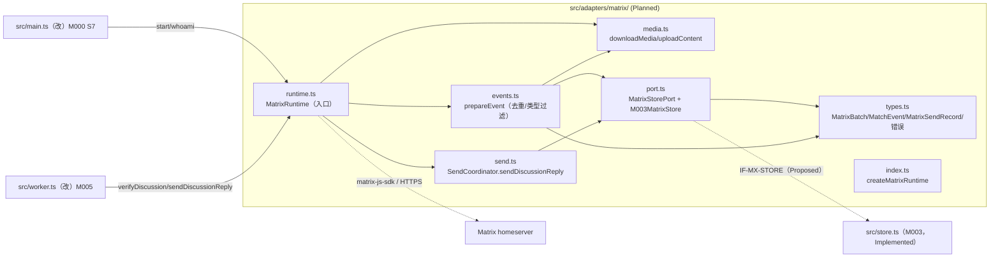
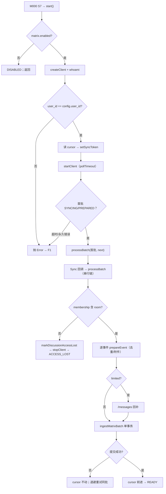

<!-- STD_DOCUMENT_COVER_BEGIN -->
# Piko 实现规格：matrix-adapter（M008）

> STD 使用入口：[项目采用说明与标准导航](../../README.md#std-entry)

| 文档字段 | 值 |
|---|---|
| Document ID | `piko-matrix-adapter-impl` |
| Document Version | `0.1.0-draft.1` |
| Status | `Draft` |
| Project | `piko` |
| Document Owner | Piko Implementation Owner |
| Last Modified Date | `2026-09-27` |
| Template ID | `design.implementation` |
| Template Version | `1.2.0` |
<!-- STD_DOCUMENT_COVER_END -->

## 1. 实现目标与输入基线

<a id="isd-scope"></a>

本 ISD 实现 M008 `matrix-adapter` 的**进程内 Matrix Client-Server 封装与 discussion intake 事实落盘**：向 M000/M001/M005 提供 `MatrixRuntime` 的 `start`/`verifyDiscussion`/`syncOnce`/`sendDiscussionReply`/media 方法，向 M003 `task-repository` 消费 matrix 持久化端口。本次实现范围是 §5 的五类对外操作与其内部组成（事件准备、媒体、发送、端口适配）及 Brownfield 抽出（§2）；**非目标**是 intake 状态推进（M005）、`matrix_*`/`discussion_turns` 的 schema 与事务 authority（M003）、Run/Result 语义（MECH-RUN）、homeserver 内部与 AS/E2EE 路径。模块行为、接口语义、状态模型与失败语义由模块设计唯一维护，本层只细化文件/symbol、私有表示、调用/清理步骤与测试入口。

### 1.1 实现对象

- **模块 ID / 名称**：`M008` / `matrix-adapter`。

- **直属父对象 / 父设计**：`SW-P`（Piko Agent Runtime V0.3，`design_level=system`）/ `system-design` v0.11.2；`parent_document_id=system-design`（ISD 与模块设计同为 `system-design` 的子视图，不互为父子）。

- **模块设计 Document ID / 版本 / 路径 / 摘要**：`piko-matrix-adapter` / `0.1.0-draft.1` / `docs/40_module_design/piko-matrix-adapter-design.md`。摘要：`MatrixRuntime` 封装 `matrix-js-sdk` Client-Server（whoami/verify/sync/send/media），把事件复制进 SQLite（去重 + turn + cursor 单事务），确定性 txn 保证发送；持久化交 M003，intake 推进交 M005，无 E2EE/无 AS。

- **需求与 Constraint ID**：`CON-MX-001`（PK-08）、`CON-ST-001`（PK-12，S7 环节）；机制输入 `M-MX-DI-001`（`piko-matrix` §14.4）、`M-ST-DI-004`（`piko-startup` §14.4）、`IF-ST-MATRIX`（`piko-startup` §5.1）。

- **实现范围 / 非目标**：范围：`src/adapters/matrix/` 七个文件 + 对 `src/store.ts`/`src/main.ts` 的最小改动 + 从 `src/matrix.ts` 的 Brownfield 抽出。非目标：不新建 DB 表/迁移（M003）、不改 `runs`/`results`/`discussion_turns` 状态推进（M005）、不引入 E2EE/AS/代理、不新增线程。

- **ISD 默认落位或项目批准路径**：`docs/50_implementation_design/piko-matrix-adapter-impl.isd.md`（STD 默认路径）；代码落位 `src/adapters/matrix/`（Planned；当前基线 `src/matrix.ts` Implemented）。

<a id="isd-handoff"></a>

### 1.2.1 `H-MATRIX-START` · 启动与身份核对

- **上游信息项 / 规则 ID**：`F-MATRIX-VERIFY`、`R-MATRIX-IDENTITY`、`IF-MX-START`、`IF-ST-MATRIX`、`CON-ST-001`。

- **固定来源 / 版本 / 锚点 / 摘要**：`matrix-adapter` §2.1/§8.1/§9.1.1 与 §7 `M-MATRIX-P1`（v0.1.0-draft.1）；`piko-startup.md` §5.1 `IF-ST-MATRIX`。

- **ISD 细化内容 / 章节**：§5.1.1 `MatrixRuntime.start`；§3.1 `runtime.ts`/§3.6 `port.ts`；§6.1 `P-MATRIX-START`；§7.1.3。

- **唯一权威位置**：行为/接口权威 = 模块设计 §2.1/§9.1.1；文件/symbol/私有表示权威 = 本 ISD。

- **实现自由度**：whoami 实现与超时、SDK 配置细节；不可去掉"一致才 READY"、不可支持部分就绪。

- **原 V/Case 及本地验证位置**：`VRC-MATRIX-001`（§9.1.1）。

### 1.2.2 `H-MATRIX-VERIFY` · 起点校验与 E2EE 唯一结果

- **上游信息项 / 规则 ID**：`F-MATRIX-VERIFY`、`R-MATRIX-IDENTITY`、`IF-MX-VERIFY`、`CON-MX-001`；`InvalidDiscussionContext`/`DiscussionAccessLost`（§6.8.1）。

- **固定来源 / 版本 / 锚点 / 摘要**：`matrix-adapter` §2.1/§8.1/§9.1.2；`piko-matrix.md` §3.3.1 E2EE 唯一结果。

- **ISD 细化内容 / 章节**：§5.1.2 `MatrixRuntime.verifyDiscussion`；§3.1 `runtime.ts`；§6.1；§7.1。

- **唯一权威位置**：行为 = 模块设计 §2.1/§8.1；错误映射实现 = 本 ISD。

- **实现自由度**：GET 顺序、错误对象解析；不可改变两态唯一结果、不可换 ID。

- **原 V/Case 及本地验证位置**：`VRC-MATRIX-001/004`。

### 1.2.3 `H-MATRIX-SYNC` · 同步、去重、cursor 与截断回补

- **上游信息项 / 规则 ID**：`F-MATRIX-SYNC`/`F-MATRIX-INTAKE-OBSERVE`、`R-MATRIX-DEDUP`/`R-MATRIX-CURSOR`/`R-MATRIX-BACKFILL`、`IF-MX-SYNC`、`IF-MX-TURN`、`CON-MX-001`；`INV-MX-3/4`。

- **固定来源 / 版本 / 锚点 / 摘要**：`matrix-adapter` §2.2/§2.5/§8.2–§8.4/§9.2.1；`piko-matrix.md` §6.1 回补三步。

- **ISD 细化内容 / 章节**：§5.1.3 `MatrixRuntime.syncOnce`/`processBatch`、`EventPreparer`；§5.1.7 `M003MatrixStore.ingestMatrixBatch`；§6.2 `P-MATRIX-SYNC`。

- **唯一权威位置**：行为/规则 = 模块设计 §8.2–§8.4；串行 pump 与步骤实现 = 本 ISD。

- **实现自由度**：去重数据结构、回补分页实现、promise 链；不可改"cursor 后于写 turn""回补仍截断仍推进"。

- **原 V/Case 及本地验证位置**：`VRC-MATRIX-002`（Case A–F）。

### 1.2.4 `H-MATRIX-SEND` · 稳定事务发送

- **上游信息项 / 规则 ID**：`F-MATRIX-SEND`、`R-MATRIX-SEND-TXN`、`IF-MX-SEND`、`IF-MX-STORE`、`CON-MX-001`；`INV-MX-5`。

- **固定来源 / 版本 / 锚点 / 摘要**：`matrix-adapter` §2.3/§8.5/§9.1.3/§9.2.2；`piko-matrix.md` §4.6.1 `MatrixSendRecord`。

- **ISD 细化内容 / 章节**：§5.1.5 `SendCoordinator.sendDiscussionReply`；§5.1.7 端口；§6.3 `P-MATRIX-SEND`。

- **唯一权威位置**：行为/txn 语义 = 模块设计 §8.5；哈希/txn 编码 = 本 ISD。

- **实现自由度**：txn 编码与哈希细节；不可改变确定性与"异 payload 拒"。

- **原 V/Case 及本地验证位置**：`VRC-MATRIX-003`（Case A–E）。

### 1.2.5 `H-MATRIX-MEDIA` · 附件下载/上传与 staging

- **上游信息项 / 规则 ID**：`F-MATRIX-MEDIA`、`R-MATRIX-MEDIA`、`IF-MX-MEDIA-DOWN`/`IF-MX-MEDIA-UP`；`SEC-MATRIX-MEDIA-PATH`。

- **固定来源 / 版本 / 锚点 / 摘要**：`matrix-adapter` §2.4/§8.6/§9.1.4/§11；`piko-matrix.md` §11 media 信任边界。

- **ISD 细化内容 / 章节**：§5.1.4 `MediaResolver.downloadMedia`/`uploadContent`；§3.3 `media.ts`；§7.3.2 本地存储安全。

- **唯一权威位置**：规则 = 模块设计 §8.6；文件 I/O 步骤 = 本 ISD。

- **实现自由度**：下载库/缓冲实现；不可放宽预算、不可去 ACL/两次校验。

- **原 V/Case 及本地验证位置**：`VRC-MATRIX-005`。

### 1.2.6 `H-MATRIX-STORE` · M003 matrix 端口（Proposed）

- **上游信息项 / 规则 ID**：`IF-MX-STORE`/`IF-MX-TURN`（Proposed）、`OQ-MATRIX-001`。

- **固定来源 / 版本 / 锚点 / 摘要**：`matrix-adapter` §9.2.5；当前代码事实 `src/store.ts:59`–`:73`。

- **ISD 细化内容 / 章节**：§5.1.7 `M003MatrixStore` 适配方法；§3.6 `port.ts`；§7.2（持久化边界→M003）。

- **唯一权威位置**：端口签名 = 模块设计 §9.2.5（**未冻结**）；实现 = 本 ISD 与 M003 设计。

- **实现自由度**：适配层类型转换；不可把 Proposed 当已确认合同实现（`OQ-MATRIX-001` 未关闭前仅可做可替换适配）。

- **原 V/Case 及本地验证位置**：`VRC-MATRIX-002/003/005`（fake 端口 + 真 M003 两套）。

## 2. 既有实现差异（条件章节）

### 2.1 适用性

- **适用性**：brownfield（存在需修改的既有实现）。

- **依据**：基线：当前工作树 commit（见封面 metadata `reviewed_commit`/§10 状态复核）。既有 `src/matrix.ts`（85 行，commit 工作树）已实现 `MatrixRuntime`（`start`/`prepareEvent`/`processBatch`/`downloadMedia`/`verifyDiscussion`/`send`/`sendDiscussionReply`/`close`）与 `isPermanentMatrixError`；`src/store.ts` 已实现 matrix 原语（`src/store.ts:25`–`:73`）。本 ISD 把这部分抽为 `src/adapters/matrix/` 分文件结构，不新建 schema。

- **Tailoring / 范围决定引用**：`TAIL-P-NEW-S1`（Piko 无 subsystem，`design.definition`/`design.implementation` 直接承接 `system-design`）；范围决定 `system-design` §15 PHASE-I。

### 2.2 `CH-MATRIX-01` · 抽取"事件准备与去重"逻辑

- **基线 commit / 版本**：当前工作树（§10.2 `SC-MATRIX-01` 记录解析出的 commit）。

- **文件 / symbol**：`src/matrix.ts` `prepareEvent`（既有，`src/matrix.ts:27`–`:40`）→ Planned `src/adapters/matrix/events.ts` `prepareEvent`。

- **Current 行为**：`prepareEvent` 过滤 `m.room.message` 与 msgtype、剔除自身 sender、`hasMatrixEvent` 去重、按 `openDiscussionRuns(room)` 生成 turns（非 text 调 `downloadMedia`）。

- **Target 改动与理由**：逻辑移入 `events.ts`，去重与附着判定可无网络/无 DB 单测。理由：`VRC-MATRIX-002/004` 要求去重与类型过滤可表驱动验证。

- **原规则 / 成员 ID**：`F-MATRIX-INTAKE-OBSERVE`、`R-MATRIX-DEDUP`、`IF-MATRIX-PREPARE`、`CON-MX-001`。

- **实现状态**：`IN_PROGRESS`（Current 内联，Target 抽出）。

### 2.3 `CH-MATRIX-02` · 抽取"媒体"逻辑

- **基线 commit / 版本**：当前工作树。

- **文件 / symbol**：`src/matrix.ts` `downloadMedia`（`src/matrix.ts:47`–`:56`）→ Planned `src/adapters/matrix/media.ts`。

- **Current 行为**：校验声明 size/MIME、`mxcUrlToHttp`+fetch、边读边校验实际、写 `.tmp` 后 rename 到 `staging_root/<run>`。

- **Target 改动与理由**：抽为 `media.ts`，ACL/字节预算/原子落盘可单测；上传 `uploadContent` 一并集中。理由：`VRC-MATRIX-005` 要求超限/MIME 不符/ACL 分支可独立触发。

- **原规则 / 成员 ID**：`F-MATRIX-MEDIA`、`R-MATRIX-MEDIA`、`IF-MX-MEDIA-DOWN/UP`。

- **实现状态**：`IN_PROGRESS`。

### 2.4 `CH-MATRIX-03` · 抽取"稳定发送"逻辑

- **基线 commit / 版本**：当前工作树。

- **文件 / symbol**：`src/matrix.ts` `sendDiscussionReply`（`src/matrix.ts:69`–`:72`）→ Planned `src/adapters/matrix/send.ts`。

- **Current 行为**：派生 `txn`/`sha256`、`prepareMatrixSend`、`send`、`finishMatrixSend`/`unknownMatrixSend`。

- **Target 改动与理由**：抽为 `send.ts`，txn 幂等/Unknown 复权可单测；`TaskConflict` 分支集中。理由：`VRC-MATRIX-003` 要求异 payload 拒绝可独立验证。

- **原规则 / 成员 ID**：`F-MATRIX-SEND`、`R-MATRIX-SEND-TXN`、`IF-MX-SEND`。

- **实现状态**：`IN_PROGRESS`。

### 2.5 `CH-MATRIX-04` · 抽出持久化端口

- **基线 commit / 版本**：当前工作树。

- **文件 / symbol**：`src/matrix.ts` 直接持有 `TaskStore`（构造注入）→ Planned `src/adapters/matrix/port.ts` `MatrixStorePort` + `M003MatrixStore`。

- **Current 行为**：`MatrixRuntime` 直接调用 `store.ingestMatrixBatch`/`prepareMatrixSend` 等。

- **Target 改动与理由**：引入端口抽象，隔离 M003 类型、允许内存 fake 测试；`store.ts` 保持原语不变。理由：`OQ-MATRIX-001` 未关闭前保持可替换，且 §5.5 依赖方向要求。

- **原规则 / 成员 ID**：`IF-MX-STORE`/`IF-MX-TURN`。

- **实现状态**：`IN_PROGRESS`。

## 3. 文件、内部组件与调用关系

<a id="isd-structure"></a>



图 M008-ISD-S1 · 当前单文件 `src/matrix.ts` 为 `IMPLEMENTED`；Target `src/adapters/matrix/*` 为 `Planned / NOT_IMPLEMENTED`。实线调用；虚线跨模块适配。`events.ts`/`media.ts` 不得直接 import `store.ts`。

### 3.1 `src/adapters/matrix/types.ts`

- **职责及调用者**：定义本层私有类型与错误类；被 `events.ts`/`media.ts`/`send.ts`/`port.ts`/`runtime.ts` 引用。

- **类型 / 函数**：`MatrixBatch`、`MatrixEventEnvelope`、`MatchEvent`、`DiscussionContext`、`MatrixSendRecord`、`MatrixRuntimeState`、`InvalidDiscussionContext`、`DiscussionAccessLost`、`MatrixInternalError`。

- **可见性**：模块内 public（仅 `index.ts` 再导出 `MatrixRuntime`/`DiscussionContext`）。

- **调用与类型依赖**：零运行时依赖。

- **构建目标 / 生成源 / 输出**：`tsc` 编译进 `dist/adapters/matrix/types.js`；无生成源。

- **实现状态**：Planned。

### 3.2 `src/adapters/matrix/events.ts`

- **职责及调用者**：事件准备/去重（`prepareEvent`）；被 `runtime.ts` 调用。

- **类型 / 函数**：`prepareEvent(event: MatrixEvent, rooms: readonly string[], port: MatrixStorePort, media: MediaResolver): Promise<MatchEvent | undefined>`。

- **可见性**：模块内 public。

- **调用与类型依赖**：依赖 `types.ts`/`media.ts`/`port.ts`；运行时依赖 `matrix-js-sdk` 的 `MatrixEvent` 类型。

- **构建目标 / 生成源 / 输出**：`tsc` → `dist/adapters/matrix/events.js`。

- **实现状态**：Planned。

### 3.3 `src/adapters/matrix/media.ts`

- **职责及调用者**：附件下载/staging 与上传；被 `events.ts`/`send.ts` 调用。

- **类型 / 函数**：`class MediaResolver`：`downloadMedia(run, event, content): Promise<string>`、`uploadContent(bytes, contentType): Promise<{content_uri:string}>`。

- **可见性**：模块内 public。

- **调用与类型依赖**：依赖 `types.ts` + `node:fs/promises`/`node:path`；运行时依赖 SDK `mxcUrlToHttp` + Node `fetch`。

- **构建目标 / 生成源 / 输出**：`tsc` → `dist/adapters/matrix/media.js`。

- **实现状态**：Planned。

### 3.4 `src/adapters/matrix/send.ts`

- **职责及调用者**：稳定事务发送；被 `runtime.ts` 调用。

- **类型 / 函数**：`class SendCoordinator`：`sendDiscussionReply(run, room, event, turn, body): Promise<string>`。

- **可见性**：模块内 public。

- **调用与类型依赖**：依赖 `types.ts`/`port.ts` + `node:crypto`；运行时经 runtime 的 client `sendEvent`。

- **构建目标 / 生成源 / 输出**：`tsc` → `dist/adapters/matrix/send.js`。

- **实现状态**：Planned。

### 3.5 `src/adapters/matrix/runtime.ts`

- **职责及调用者**：入口：实现五类对外操作、保证 §6 不变量；被 `main.ts`/`worker.ts` 调用。

- **类型 / 函数**：`class MatrixRuntime`：`constructor(config, store: MatrixStorePort, token?)`；`start(): Promise<void>`；`verifyDiscussion(room, event): Promise<string>`；`syncOnce(cursor): Promise<MatrixBatch>`；`sendDiscussionReply(run, room, event, turn, body): Promise<string>`；`close(): Promise<void>`。

- **可见性**：public（经 `index.ts` 导出）。

- **调用与类型依赖**：依赖 `events.ts`/`media.ts`/`send.ts`/`port.ts`/`types.ts`；运行时依赖 `matrix-js-sdk`。

- **构建目标 / 生成源 / 输出**：`tsc` → `dist/adapters/matrix/runtime.js`。

- **实现状态**：Planned（当前基线 `src/matrix.ts`）。

### 3.6 `src/adapters/matrix/port.ts`

- **职责及调用者**：唯一边界接触 M003 的适配层；被 `runtime.ts`/`events.ts`/`send.ts` 调用。

- **类型 / 函数**：`interface MatrixStorePort { matrixCursor(); openDiscussionRuns(room); hasMatrixEvent(room,event); ingestMatrixBatch(events,cursor); markDiscussionAccessLost(room); prepareMatrixSend(txn,run,turn,sha); finishMatrixSend(txn,event); unknownMatrixSend(txn) }`；`class M003MatrixStore implements MatrixStorePort`（构造注入 M003 `TaskStore`）。

- **可见性**：`MatrixStorePort` 模块内 public；`M003MatrixStore` 由 `index.ts` 装配。

- **调用与类型依赖**：依赖 `types.ts`；运行时依赖 M003 `TaskStore`（仅此文件）。

- **构建目标 / 生成源 / 输出**：`tsc` → `dist/adapters/matrix/port.js`。

- **实现状态**：Planned（受 `OQ-MATRIX-001`）。

### 3.7 `src/adapters/matrix/index.ts`

- **职责及调用者**：唯一装配入口：导出 `MatrixRuntime` 与 `createMatrixRuntime`；被 `main.ts` 调用。

- **类型 / 函数**：`export function createMatrixRuntime(config, store: TaskStore, token): MatrixRuntime`。

- **可见性**：public。

- **调用与类型依赖**：依赖 `runtime.ts`/`port.ts`/`types.ts` + M003 `TaskStore` 类型。

- **构建目标 / 生成源 / 输出**：`tsc` → `dist/adapters/matrix/index.js`。

- **实现状态**：Planned。

### 3.8 `src/store.ts`（修改既有）

- **职责及调用者**：M003 侧：保留 matrix 原语（`matrixCursor`/`openDiscussionRuns`/`hasMatrixEvent`/`ingestMatrixBatch`/`markDiscussionAccessLost`/`prepareMatrixSend`/`finishMatrixSend`/`unknownMatrixSend`）；不改语义。被 `M003MatrixStore` 调用。

- **类型 / 函数**：见 `src/store.ts:59`–`:73`；签名保持。

- **可见性**：public（同级模块）。

- **调用与类型依赖**：依赖 `node:sqlite`；无新 schema。

- **构建目标 / 生成源 / 输出**：`tsc` → `dist/store.js`。

- **实现状态**：`IMPLEMENTED`（冻结语义，等待 `OQ-MATRIX-001` 确认端口签名）。

### 3.9 `src/main.ts`（修改既有）

- **职责及调用者**：装配：`createMatrixRuntime` → `RunWorker`；S7 调 `start`。

- **类型 / 函数**：`main()` 内新增装配行。

- **可见性**：public（入口）。

- **调用与类型依赖**：依赖 `store.ts`/`adapters/matrix/index.ts`/`worker.ts`/`config.ts`。

- **构建目标 / 生成源 / 输出**：`tsx src/main.ts`（运行）；`tsc` 类型检查。

- **实现状态**：`IN_PROGRESS`。

## 4. 数据结构设计

<a id="isd-data"></a>

**不适用类别**：§4.1 公共基础类型（本层无上级 Data ID 需承接，用字面量联合）、§4.4 通信报文（帧格式由 Matrix 外部规范拥有，本 ISD 只保留消费视图，见 §4.4）、§4.5 设备/FPGA 表项（纯软件，`TAIL-P-103`）为 N/A。§4.7 数据库表结构 N/A——schema 与事务 authority 属 M003（见 §7.2）。§4.3 配置见 §4.3（消费 config `matrix.*`）。

### 4.2 业务与操作数据结构

#### 4.2.1 `MatrixBatch` / `MatchEvent`

- **完整定义、Data/Type ID 与唯一来源**：私有类型（本 ISD `types.ts`）；公共语义来源 = 模块设计 §6.2.2/§6.2.3。

  ```ts
  interface MatrixBatch { next_batch: string; events: MatrixEventEnvelope[]; limited: boolean; prev_batch: string | null }
  interface MatchEvent { room: string; event: string; sender: string; txn?: string; turns: { run: string; visible: string }[] }
  ```

- **逐字段类型/范围/初值/不变量/owner**：`MatrixBatch.next_batch` 非空 `string`；`limited=true` ⟹ `prev_batch` 非空；`events` 为只读数组。`MatchEvent.turns` 可为空数组；`room`/`event`/`sender` 非空。owner = `runtime.ts`/`events.ts`；短寿命（一次批/事件）。

- **内存布局 / ABI**：N/A（纯 TypeScript 对象，非持久二进制/跨语言）；依据：ISD 规范 §3 "纯软件逻辑结构写 N/A"。

- **创建/借用/释放/失败路径**：`MatrixBatch` 由 `syncOnce` 构造传给 `processBatch`；`MatchEvent` 由 `prepareEvent` 返回给 `processBatch`；无借用；调用结束即释放。

- **验证**：`VRC-MATRIX-002/004`；`NOT_RUN`。

#### 4.2.2 `DiscussionContext` / `MatrixSendRecord`

- **完整定义、Data/Type ID 与唯一来源**：私有类型；语义来源 = 模块设计 §6.2.1/§6.2.3（并对应 `piko-matrix.md` §4.6.1）。

  ```ts
  interface DiscussionContext { room_id: string; trigger_event_id: string }
  interface MatrixSendRecord { txn_id: string; run_id: string; turn_seq: number; payload_sha256: string; event_id: string | null; state: "Pending" | "Sent" | "Unknown" }
  ```

- **逐字段类型/范围/初值/不变量/owner**：`room_id` 匹配 `!...:...`；`trigger_event_id` 匹配 `$...`；`MatrixSendRecord.state="Sent"` ⟹ `event_id` 非空；`payload_sha256` 为 64 hex。owner = 调用方/M003 产生、`send.ts` 只读消费。

- **内存布局 / ABI**：N/A（纯 TS）。

- **创建/借用/释放/失败路径**：`DiscussionContext` 由调用方（M001）持有、只读传入；`MatrixSendRecord` 由 `prepareMatrixSend` 返回；无长期寿命。

- **验证**：`VRC-MATRIX-001/003`；`NOT_RUN`。

### 4.3 配置与规则数据结构

- **完整定义 / 来源**：本层不新增私有配置结构；消费宿主注入的 `RuntimeConfig.matrix`（`src/types.ts:22`）与 `RuntimeConfig.workspace.staging_root`。字段 `enabled`/`homeserver`/`user_id`/`access_token_secret_ref`/`sync_timeout_ms`/`max_media_bytes`/`allowed_mime_types`，authority = `interfaces/schemas/piko-runtime-config-v0.3.schema.json`（见 §8.1）。

- **逐字段/范围/不变量**：`sync_timeout_ms` 1000–120000（默认 30000）；`max_media_bytes` 1–1073741824；`allowed_mime_types` 非空、`uniqueItems`；`enabled=true` 时六个字段必填。authority = 模块设计 §6.3。

- **创建/寿命/失败**：由 MECH-CONFIG/M000 在启动期解析注入；进程内不变、不热更。

- **验证**：`VRC-MATRIX-001/005`；`NOT_RUN`。

### 4.4 通信报文结构

#### 4.4.1 `MatrixEventEnvelope`（消费视图）

- **完整定义 / 来源**：私有消费视图；外部权威 = Matrix Client-Server v3；语义来源 = 模块设计 §6.4.1。

  ```ts
  interface MatrixEventEnvelope { type: string; event_id: string; sender: string; room_id: string; origin_server_ts: number; content: Record<string, unknown> }
  ```

- **逐字段类型/范围/不变量**：`event_id` 匹配 `$...`；`type` 只在 `m.room.message`/`m.room.member` 等白名单内被消费；`origin_server_ts` 仅排序参考（非权威时钟）。

- **创建/寿命/失败**：由 SDK 投影、`prepareEvent` 只读消费；批寿命。

- **验证**：`VRC-MATRIX-002/004`；`NOT_RUN`。

### 4.6 运行状态数据结构

#### 4.6.1 `MatrixRuntimeState`（内存投影）

- **完整定义 / 来源**：私有**派生**态，非持久 authority（持久事实在 `matrix_state`/`matrix_sends`，属 M003）：

  ```ts
  interface MatrixRuntimeState { started: boolean; cursor: string | null; roomsTracked: string[]; inflightSync: boolean }
  ```

  语义来源 = 模块设计 §6.6.1 `T-MX-01..07`。

- **逐字段/状态/不变量/owner**：`started` 由 `start` 置 true；`cursor` 读时取 `matrixStorePort.matrixCursor()` 权威；`inflightSync` 守卫单 pump（`INV-MX-2`）。owner = `MatrixRuntime` 实例（只读投影，不写回）。

- **转换/失败**：不持久化、不单独提交；转换与 §6.6 转换一一对应，本投影只用于判定分支（DISABLED/STARTING/READY/SYNCING/DEGRADED/ACCESS_LOST/CLOSED）。

- **验证**：`VRC-MATRIX-001/002/003`；`NOT_RUN`。

#### 4.6.2 `SyncPumpState`（pump 内存态）

- **完整定义 / 来源**：```ts
  interface SyncPumpState { pendingEvents: MatrixEvent[]; syncWork: Promise<void>; stopped: boolean }
  ```

  owner = `MatrixRuntime` 实例；寿命 = 进程世代。

- **逐字段/范围/不变量**：`syncWork` 为串行 promise 链，保证同一时刻至多一批在处理（`INV-MX-3`）；`stopped=true` 后不再 `ingestMatrixBatch`（`ACCESS_LOST`/`close`）。

- **转换/失败**：`start → Sync 回调* → close/ACCESS_LOST`；永久错误或 membership 丢失 → `stopped=true`。

- **验证**：`VRC-MATRIX-002/003`；`NOT_RUN`。

### 4.7 数据库表结构

**N/A。** 本模块不拥有持久表：`matrix_state`/`matrix_events`/`matrix_sends`/`discussion_turns` 的 schema authority 与 DDL 属 M003（当前代码事实 `src/store.ts:25`–`:28` 与 `:59`–`:73`，设计权威 Proposed `piko-task-repository-impl.isd.md` §4.7，见 `OQ-MATRIX-001`）。本 ISD 只消费其端口，不复制 CREATE TABLE。依据：ISD 规范 §3 "无持久化不虚构数据库，交由宿主的范围仍给实际交接责任"；交接见 §7.2。

### 4.8 错误码与错误结构

#### 4.8.1 `InvalidDiscussionContext`

- **完整定义 / 来源**：私有错误类；语义来源 = 模块设计 §6.8.1。

  ```ts
  class InvalidDiscussionContext extends Error { readonly room_id: string; readonly event_id: string; }
  ```

- **逐字段/触发/副作用**：`room_id`/`event_id` 标识无效起点；触发 = room/event 不存在/不可见、起点非本 room、起点为 `m.room.encrypted`；无 DB 副作用。

- **所有权/出口**：由 `verifyDiscussion` 产生 → 交 M001（映射 409）/M005；合法下一步 = 核对 room/event，不换 ID。

- **验证**：`VRC-MATRIX-001/004`；`NOT_RUN`。

#### 4.8.2 `DiscussionAccessLost`

- **完整定义 / 来源**：```ts
  class DiscussionAccessLost extends Error { readonly room_id: string; readonly reason: string; }
  ```

  语义来源 = 模块设计 §6.8.1/§6.8.2；触发 = membership 丢失 / 401 `M_UNKNOWN_TOKEN` / 403 `M_FORBIDDEN` / media ACL 失败。

- **逐字段/触发/副作用**：`reason` 为 errcode 或 `membership`；触发时可选经 `markDiscussionAccessLost` 记 access-loss 行（不写 Run 终态）。

- **所有权/出口**：由 `verifyDiscussion`/`processBatch` 产生 → M001/M005/operator；operator 轮换 token 后重启。

- **验证**：`VRC-MATRIX-003`；`NOT_RUN`。

#### 4.8.3 `MatrixInternalError`

- **完整定义 / 来源**：```ts
  class MatrixInternalError extends Error { readonly cause_class: string; }
  ```

  语义来源 = 模块设计 §6.8.1；触发 = `ingestMatrixBatch` 事务失败/dedup 冲突不可恢复。

- **逐字段/触发/副作用**：`cause_class` 为底层错误类别；不暴露 Matrix 细节。

- **所有权/出口**：由 `processBatch` 产生 → M005/operator；不自行修复。

- **验证**：`VRC-MATRIX-002`；`NOT_RUN`。

## 5. 接口设计

<a id="isd-functions"></a>

matrix-adapter 的对外接口是 §5.1 的五类函数；被消费的 M003 端口与 Matrix HTTP 面在同节记录（进程内协作接口与出站协议）。硬件/人机接口（§5.3/§5.4 N/A）。

### 5.1 API（适用时）

#### 5.1.1 `MatrixRuntime.start(): Promise<void>`

- **Interface/Member ID、用途**：`IF-MX-START`；启动 SDK、whoami 身份核对、首轮 sync 就绪；对应 `IF-ST-MATRIX`。

- **文件 / symbol / 可见性**：Planned `src/adapters/matrix/runtime.ts` `MatrixRuntime.start`；public（模块外经 `index.ts`）。

- **原成员 ID 或私有来源**：继承 `piko-startup.md` §5.1 `IF-ST-MATRIX`。

- **完整签名与 caller**：`start(): Promise<void>`；caller = M000 `bootstrap` S7（`main.ts`）。

- **固定契约与版本**：模块设计 §9.1.1（`piko-matrix-adapter` v0.1.0-draft.1）；构建目标 `dist/adapters/matrix/`。

- **输入参数 / 数据结构 authority**：无入参（构造注入 config/store/token）；`RuntimeConfig.matrix.*` authority = config schema。

- **输入约束 / 校验顺序 / 失败映射**：`matrix.enabled=false` → 立即返回（DISABLED）；`true` → `createClient` → `whoami`（核对 `user_id`）→ 读 cursor → `setSyncToken` → 注册监听 → `startClient` → 等首批。校验顺序：身份先于同步。

- **成功输出 / 数据结构 / 后置条件**：无返回；后置 `started=true`、`cursor` 回填、身份事实可用（`INV-MX-1/2`）。owner = M000；寿命 = 进程。

- **错误输出 / 触发条件 / 优先级**：`Error("Matrix credential identity mismatch")`（身份不一致，优先）；`Error("Matrix initial sync timeout")`（60s 守护）；永久错误（401/403/4xx）→ `stopClient`。均导致 F1。

- **底层异常 / 失败事实**：`whoami`/`startClient` 抛 SDK/网络错误；`isPermanentMatrixError` 判定永久性。

- **模块是否处理及处理函数**：`MatrixRuntime.start` 捕获首同步错误并分类（`isPermanentMatrixError`）；永久 → `stopClient`；不吞身份不一致。

- **Typed 异常与原生异常所有权**：身份/超时为自有 `Error`；网络/SDK 原生错误由 `start` 分类后交 M000。

- **宿主 / public payload 或状态码**：无 HTTP；抛错即 F1（进程非零退出）。

- **日志级别 / 脱敏 / 关联字段**：`info`（README 就绪，含 user_id）；`warn`（永久错误，含 errcode/class）；**不含 token**。

- **是否可重试及前提**：新业务重试 = Operator 修 config/token 后重启；本模块不自动重试。

- **状态与副作用影响 / 验证项**：副作用 = 建立连接（无 DB 写）；`VRC-MATRIX-001`。

- **不可改变的规则 / Constraint ID**：`R-MATRIX-IDENTITY`/`CON-ST-001`；"一致才 READY"。

- **实现自由度**：whoami 实现、超时、SDK 配置细节。

- **副作用 / 执行上下文 / 幂等性**：有副作用（连接/监听）；执行上下文 = 宿主事件循环；非幂等（重复 start 不合法）。

- **输入输出 ownership 与寿命**：无入参；`MatrixClient` 由 runtime 持有。

- **Thread-safe / reentrant**：conditional：Node 单线程；`start` 只调用一次（由 M000 保证）。

- **Nested-call policy**：allowed：`port.matrixCursor`；禁止回调 M000。

- **Transaction participation**：none。

- **Blocking / timeout / cancellation**：异步；首同步 60s 守护超时；无取消。

- **实现状态 / 验证项**：Planned / `VRC-MATRIX-001`。

- **装配、合法及拒绝实例**：装配：§3.7。合法：身份一致 → READY。拒绝：token 属他人 → F1。Oracle = homeserver whoami。`NOT_RUN`。

#### 5.1.2 `MatrixRuntime.verifyDiscussion(room, event): Promise<string>`

- **Interface/Member ID、用途**：`IF-MX-VERIFY`；校验起点事件可见并返回正文。

- **文件 / symbol / 可见性**：Planned `src/adapters/matrix/runtime.ts` `MatrixRuntime.verifyDiscussion`；public。

- **原成员 ID 或私有来源**：`piko-matrix.md` §5.1 `IF-MX-VERIFY`。

- **完整签名与 caller**：`verifyDiscussion(room: string, event: string): Promise<string>`；caller = M001/M005。

- **固定契约与版本**：模块设计 §9.1.2。

- **输入参数 / 数据结构 authority**：`DiscussionContext.room_id`/`trigger_event_id`（模块设计 §6.2.1）。

- **输入约束 / 校验顺序 / 失败映射**：`started` 必 true（否则 `Error("Matrix is not ready")`）；顺序 = getJoinedRooms → fetchRoomEvent → 校验 room_id → E2EE 检查。

- **成功输出 / 数据结构 / 后置条件**：返回起点 `body`（非空 `string`）；后置：membership=join 已复核；无本地副作用。

- **错误输出 / 触发条件 / 优先级**：`DiscussionAccessLost`（未 join）；`InvalidDiscussionContext`（room/event 不一致或不可见、encrypted）。优先级：not-ready > membership > 事件一致性 > E2EE。

- **底层异常 / 失败事实**：`fetchRoomEvent` 404/403 抛 SDK 错误。

- **模块是否处理及处理函数**：`verifyDiscussion` 将 404/403 映射为 typed；`Error("not ready")` 保留为编程错误。

- **Typed 异常与原生异常所有权**：`InvalidDiscussionContext`/`DiscussionAccessLost` 属本模块 → M001/M005。

- **宿主 / public payload 或状态码**：返回 `string`；M001 侧映射 409。

- **日志级别 / 脱敏 / 关联字段**：`info`（校验通过，含 room_id/event_id）；`warn`（拒绝，含 errcode）。

- **是否可重试及前提**：`DiscussionAccessLost` 不重试（交 operator）；`InvalidDiscussionContext` 不换 ID。

- **状态与副作用影响 / 验证项**：无副作用（只读 GET）；`VRC-MATRIX-001/004`。

- **不可改变的规则 / Constraint ID**：`R-MATRIX-IDENTITY`/`CON-MX-001`；E2EE 唯一结果。

- **实现自由度**：GET 顺序、错误解析。

- **副作用 / 执行上下文 / 幂等性**：只读、幂等；宿主事件循环。

- **输入输出 ownership 与寿命**：输入借用；输出 `string`。

- **Thread-safe / reentrant**：yes（无共享可变状态，除 client）。

- **Nested-call policy**：allowed：SDK client GET。

- **Transaction participation**：none。

- **Blocking / timeout / cancellation**：异步；无显式超时；无取消。

- **实现状态 / 验证项**：Planned / `VRC-MATRIX-001/004`。

- **装配、合法及拒绝实例**：合法：`{"body":"Please analyze the repo"}`。拒绝：其它 room / encrypted。`NOT_RUN`。

#### 5.1.3 `MatrixRuntime.syncOnce(cursor): Promise<MatrixBatch>`

- **Interface/Member ID、用途**：`IF-MX-SYNC`；拉一批事件视图（内部 pump 使用；`processBatch` 完成落盘）。

- **文件 / symbol / 可见性**：Planned `src/adapters/matrix/runtime.ts` `MatrixRuntime.syncOnce`/私有 `processBatch`；public（syncOnce）/private（processBatch）。

- **原成员 ID 或私有来源**：`piko-matrix.md` §5.1 `IF-MX-SYNC`。

- **完整签名与 caller**：`syncOnce(cursor: string | null): Promise<MatrixBatch>`；caller = `ClientEvent.Sync` 回调链（首轮由 `start` 驱动）。

- **固定契约与版本**：模块设计 §9.2.1；`MatrixBatch` = §4.2.1。

- **输入参数 / 数据结构 authority**：`cursor` = 上次 `next_batch`（首次 null）；来源 = `port.matrixCursor()`。

- **输入约束 / 校验顺序 / 失败映射**：无跨字段约束；顺序 = 取批 → membership 复核 → 逐事件 prepare → 事务提交。

- **成功输出 / 数据结构 / 后置条件**：`MatrixBatch{next_batch, events, limited, prev_batch}`；后置：事务提交后 `matrix_state.sync_cursor=next_batch`（`INV-MX-3`）。

- **错误输出 / 触发条件 / 优先级**：网络/依赖失败 → 上抛（cursor 不动）；429 → 退避（内部）；401/403 → `DiscussionAccessLost`；`limited=true` → 回补。

- **底层异常 / 失败事实**：fetch 异常、`SQLITE_BUSY`、HTTP 错误码。

- **模块是否处理及处理函数**：`processBatch` 捕获永久错误 → `stopClient`；429 退避；依赖错误上抛由重试链处理。

- **Typed 异常与原生异常所有权**：`DiscussionAccessLost`/`MatrixInternalError` 属本模块；SQLite 原生交 M003/M005。

- **宿主 / public payload 或状态码**：返回 `MatrixBatch`；无对外码。

- **日志级别 / 脱敏 / 关联字段**：`debug`（批计数）；`info`（cursor 前进）；`warn`（429/401）；指标 `piko.matrix.sync.lag`。

- **是否可重试及前提**：失败批重试同 cursor（dedup 吸收）；非"重复执行"。

- **状态与副作用影响 / 验证项**：副作用 = 经 M003 写 `matrix_events`/`discussion_turns`/`sync_cursor`（单事务）；`VRC-MATRIX-002`。

- **不可改变的规则 / Constraint ID**：`R-MATRIX-DEDUP/CURSOR/BACKFILL`；`INV-MX-3/4`。

- **实现自由度**：去重数据结构、回补分页实现。

- **副作用 / 执行上下文 / 幂等性**：有副作用；宿主事件循环串行链；半幂等（重复批由 dedup 吸收，cursor 不变）。

- **输入输出 ownership 与寿命**：输入 `cursor` 借用；输出 `MatrixBatch` 由内部消费。

- **Thread-safe / reentrant**：conditional（单线程 + 串行链防重入）。

- **Nested-call policy**：allowed：`prepareEvent`/`port.ingestMatrixBatch`/`media.downloadMedia`；禁止重入 `syncOnce`。

- **Transaction participation**：owner：发起 M003 单 `BEGIN IMMEDIATE`（经 `ingestMatrixBatch`）。

- **Blocking / timeout / cancellation**：`sync` 长轮询受 `sync_timeout_ms`；无取消。

- **实现状态 / 验证项**：Planned / `VRC-MATRIX-002`。

- **装配、合法及拒绝实例**：合法：批含 `$e-8` → 写 turn + cursor。拒绝：429 → cursor 不动。`NOT_RUN`。

#### 5.1.4 `MatrixRuntime.sendDiscussionReply(run, room, event, turn, body): Promise<string>`

- **Interface/Member ID、用途**：`IF-MX-SEND`；稳定事务发送回复。

- **文件 / symbol / 可见性**：Planned `src/adapters/matrix/runtime.ts` → `send.ts` `SendCoordinator.sendDiscussionReply`；public。

- **原成员 ID 或私有来源**：`piko-matrix.md` §5.1 `IF-MX-SEND`。

- **完整签名与 caller**：`sendDiscussionReply(run: string, room: string, event: string, turn: number, body: string): Promise<string>`；caller = M005 worker。

- **固定契约与版本**：模块设计 §9.1.3/§9.2.2。

- **输入参数 / 数据结构 authority**：`{run, turn, room, event, body}`；`txn_id` = §8.5 派生规则。

- **输入约束 / 校验顺序 / 失败映射**：四个非空 string + 整数 turn；顺序 = 派生 txn/sha → prepareMatrixSend → send → finish/unknown。

- **成功输出 / 数据结构 / 后置条件**：返回 `event_id`；后置 `matrix_sends.state='Sent'`（`INV-MX-5`）。

- **错误输出 / 触发条件 / 优先级**：`TaskConflict`（异 payload，priority 高，来自 M003）；`DiscussionAccessLost`（403）；429 → 退避复用同 txn；超时 → `Unknown` 上抛。

- **底层异常 / 失败事实**：`prepareMatrixSend` 抛 `TaskConflict`；`sendEvent` 抛 HTTP 错误。

- **模块是否处理及处理函数**：`send.ts` 捕获发送异常 → `unknownMatrixSend` 后重抛；`TaskConflict` 透传。

- **Typed 异常与原生异常所有权**：`TaskConflict` 属 M003；`DiscussionAccessLost` 属本模块；原生由 M005 决定。

- **宿主 / public payload 或状态码**：返回 `event_id`；无对外码。

- **日志级别 / 脱敏 / 关联字段**：`info`（发送成功，含 txn_id/event_id）；`warn`（Unknown）；指标 `event.matrix.send`。

- **是否可重试及前提**：同 payload 复用同 txn 重试（同请求重放，不重复发）；异 payload 不重试。

- **状态与副作用影响 / 验证项**：副作用 = `matrix_sends` 行 + homeserver 事件；`VRC-MATRIX-003`。

- **不可改变的规则 / Constraint ID**：`R-MATRIX-SEND-TXN`；`INV-MX-5`。

- **实现自由度**：txn 编码与哈希细节。

- **副作用 / 执行上下文 / 幂等性**：有副作用；上下文 = worker 调用栈；幂等（同 txn 同 payload 返回原 event_id）。

- **输入输出 ownership 与寿命**：输入借用；输出 `event_id`。

- **Thread-safe / reentrant**：yes（M003 事务串行）。

- **Nested-call policy**：allowed：`port.prepareMatrixSend`/`finishMatrixSend`/`unknownMatrixSend`/client.sendEvent。

- **Transaction participation**：owner：`prepareMatrixSend` 单事务；send 非事务。

- **Blocking / timeout / cancellation**：异步 HTTP；无取消。

- **实现状态 / 验证项**：Planned / `VRC-MATRIX-003`。

- **装配、合法及拒绝实例**：合法：`$sent-1`。拒绝：异 payload `TaskConflict`。`NOT_RUN`。

#### 5.1.5 `MediaResolver.downloadMedia(run, event, content): Promise<string>` / `uploadContent(bytes, contentType)`

- **Interface/Member ID、用途**：`IF-MX-MEDIA-DOWN`/`IF-MX-MEDIA-UP`；附件下载到 staging 与上传。

- **文件 / symbol / 可见性**：Planned `src/adapters/matrix/media.ts` `MediaResolver`；模块内 public。

- **原成员 ID 或私有来源**：`piko-matrix.md` §5.1 `IF-MX-MEDIA-DOWN/UP`。

- **完整签名与 caller**：`downloadMedia(run: string, event: string, content: MatrixEventContent): Promise<string>`；`uploadContent(bytes: Uint8Array, contentType: string): Promise<{content_uri: string}>`；caller = `prepareEvent`（下载）/发送路径（上传）。

- **固定契约与版本**：模块设计 §9.1.4。

- **输入参数 / 数据结构 authority**：`mxc`/声明 `info{mimetype,size}`；`max_media_bytes`/`allowed_mime_types`（config）。

- **输入约束 / 校验顺序 / 失败映射**：顺序 = 声明 size ≤ 上限 → 声明 MIME 白名单 → mxcUrlToHttp → fetch → 实际 MIME/size 一致 → 落盘。

- **成功输出 / 数据结构 / 后置条件**：返回引用摘要；后置：staging 文件存在、路径在 `staging_root/<run>`、`0600`。

- **错误输出 / 触发条件 / 优先级**：超限/MIME 声明不符/非 mxc → 拒绝（不落盘）；实际不符/size 不符 → 拒绝并清 `.tmp`；ACL 失败 → `DiscussionAccessLost`。

- **底层异常 / 失败事实**：fetch 失败、写文件失败、`.tmp` rename 失败。

- **模块是否处理及处理函数**：`media.ts` 捕获并清理 `.tmp` 后重抛；ACL 失败转 typed。

- **Typed 异常与原生异常所有权**：`DiscussionAccessLost` 属本模块；文件/网络原生交调用方。

- **宿主 / public payload 或状态码**：返回摘要/`content_uri`；无对外码。

- **日志级别 / 脱敏 / 关联字段**：`info`（下载完成，含 run_id/event_id/size/mime）；`warn`（拒绝）；不记字节内容。

- **是否可重试及前提**：可重下（同 turn 幂等）；不可放宽预算。

- **状态与副作用影响 / 验证项**：副作用 = staging 文件；`VRC-MATRIX-005`。

- **不可改变的规则 / Constraint ID**：`R-MATRIX-MEDIA`；`SEC-MATRIX-MEDIA-PATH`。

- **实现自由度**：下载库/缓冲实现。

- **副作用 / 执行上下文 / 幂等性**：有副作用（文件）；宿主事件循环；幂等（同内容重下覆盖同名）。

- **输入输出 ownership 与寿命**：输入 `content` 借用；输出摘要字符串；staging 文件寿命到 retention。

- **Thread-safe / reentrant**：conditional（同 run 并发下载需文件名唯一）。

- **Nested-call policy**：allowed：SDK `mxcUrlToHttp` + Node fetch/fs。

- **Transaction participation**：none（文件 I/O 非 DB 事务）。

- **Blocking / timeout / cancellation**：流式读；无取消。

- **实现状态 / 验证项**：Planned / `VRC-MATRIX-005`。

- **装配、合法及拒绝实例**：合法：落盘一致。拒绝：超限无文件。`NOT_RUN`。

#### 5.1.6 `MatrixRuntime.close(): Promise<void>`

- **Interface/Member ID、用途**：`IF-MX-CLOSE`；停止 client 与监听。

- **文件 / symbol / 可见性**：Planned `src/adapters/matrix/runtime.ts` `MatrixRuntime.close`；public。

- **原成员 ID 或私有来源**：私有（模块设计 §9.1.5）。

- **完整签名与 caller**：`close(): Promise<void>`；caller = `main.ts`（进程退出）/测试清理。

- **固定契约与版本**：模块设计 §9.1.5。

- **输入参数 / 数据结构 authority**：无入参。

- **输入约束 / 校验顺序 / 失败映射**：幂等；任意状态可调。

- **成功输出 / 数据结构 / 后置条件**：`stopClient` + `removeAllListeners`；`started=false`；不再有回调。

- **错误输出 / 触发条件 / 优先级**：无业务错误。

- **底层异常 / 失败事实**：无（幂等）。

- **模块是否处理及处理函数**：`close` 自身处理。

- **Typed 异常与原生异常所有权**：N/A。

- **宿主 / public payload 或状态码**：无。

- **日志级别 / 脱敏 / 关联字段**：`info`（关闭）。

- **是否可重试及前提**：可重复调用。

- **状态与副作用影响 / 验证项**：副作用 = 关闭连接；`VRC-MATRIX-001`（清理）。

- **不可改变的规则 / Constraint ID**：`T-MX-07`。

- **实现自由度**：无（薄封装）。

- **副作用 / 执行上下文 / 幂等性**：宿主事件循环；幂等。

- **输入输出 ownership 与寿命**：N/A。

- **Thread-safe / reentrant**：yes。

- **Nested-call policy**：allowed。

- **Transaction participation**：none。

- **Blocking / timeout / cancellation**：非阻塞。

- **实现状态 / 验证项**：Planned / `VRC-MATRIX-001`。

- **装配、合法及拒绝实例**：合法：关闭后无回调。`NOT_RUN`。

### 5.2 消息与数据流接口（适用时）

#### 5.2.1 `M003MatrixStore.ingestMatrixBatch(events, cursor)`（消费端口）

- **Interface/Member ID、用途**：`IF-MX-TURN`（Proposed）；单事务去重 + turn + cursor。

- **文件 / symbol / 可见性**：Planned `src/adapters/matrix/port.ts` `M003MatrixStore.ingestMatrixBatch` → M003 `src/store.ts` `ingestMatrixBatch`（`src/store.ts:68`）。

- **原成员 ID 或私有来源**：模块设计 §9.2.5（Proposed，`OQ-MATRIX-001`）。

- **完整签名与 caller**：`ingestMatrixBatch(events: MatchEvent[], cursor: string): number`；caller = `MatrixRuntime.processBatch`。

- **固定契约与版本**：模块设计 §9.2.5；**未冻结**。

- **输入、输出及关联身份**：`events`（去重后项）+ `cursor`；输出写入条数；关联身份 = `(room_id,event_id)`。

- **交互、错误及生命周期**：单 `BEGIN IMMEDIATE`；`busy` 超时 → 依赖错误上抛；dedup 冲突不可恢复 → `MatrixInternalError`。

- **实现与验证**：`port.ts`（Planned）+ `store.ts`（Implemented）；`VRC-MATRIX-002`。

#### 5.2.2 `M003MatrixStore.prepareMatrixSend / finishMatrixSend / unknownMatrixSend`（消费端口）

- **Interface/Member ID、用途**：`IF-MX-STORE`（Proposed）；send record 生命周期。

- **文件 / symbol / 可见性**：Planned `src/adapters/matrix/port.ts` → M003 `src/store.ts:71`–`:73`。

- **原成员 ID 或私有来源**：模块设计 §9.2.5（Proposed）。

- **完整签名与 caller**：`prepareMatrixSend(txn,run,turn,sha): {state,event_id?}`；`finishMatrixSend(txn,event)`；`unknownMatrixSend(txn)`；caller = `SendCoordinator`。

- **固定契约与版本**：模块设计 §9.2.5；未冻结。

- **输入、输出及关联身份**：见 §4.2.2；关联身份 = `txn_id`。

- **交互、错误及生命周期**：`prepareMatrixSend` 单事务；异 payload → `TaskConflict`；其余单语句。

- **实现与验证**：`port.ts`（Planned）+ `store.ts`（Implemented）；`VRC-MATRIX-003`。

### 5.3 硬件与固件接口（适用时）

**N/A** · 纯软件（`TAIL-P-103`）。

### 5.4 人机与维护接口（适用时）

**N/A。** 无 CLI/诊断命令；whoami/sync 摘要经 operator 诊断（`piko matrix-whoami`/`matrix-sync-status`/`matrix-audit`）暴露，属 M009/M000（§7.3.3）。

## 6. 关键流程与算法

<a id="isd-algorithms"></a>



图 M008-ISD-A1 · Planned / NOT_IMPLEMENTED。启动与同步主路径：拒绝/失败分支（身份不一致、membership 丢失、限流、回补）与正常路径同图；cursor 仅在事务提交后前进。

### 6.1 `P-MATRIX-START` · 启动与身份核对

- **触发与执行者**：M000 S7 → `MatrixRuntime.start`（宿主事件循环）。

- **入口函数及数据**：`start()`；数据 config.matrix + token → `whoami` → `cursor` → 首批。

- **步骤 / 算法 / 复杂度**：1. 判 enabled；2. `createClient`；3. `whoami` 核对；4. 读 `matrixCursor` 回填 `setSyncToken`；5. 注册 `RoomEvent.Timeline`/`ClientEvent.Sync`；6. `startClient`；7. 等首批或 60s 超时。O(1)。

- **判断事实来源**：`whoami.user_id`（homeserver）+ `config.user_id`；首批 `client.getSyncStateData().nextSyncToken`（SDK）。

- **成功可见点**：`started=true` 且首批已 `processBatch`。

- **失败、取消与清理**：身份不一致/超时/永久错误 → `stopClient` + 抛错 → F1；无残留监听。

- **代表输入与中间值**：token 属 `@piko:hs` → `whoami.user_id=@piko:hs` → 一致 → READY。

- **规则 / 接口 / 验证引用**：§5.1.1；`R-MATRIX-IDENTITY`；`VRC-MATRIX-001`。

### 6.2 `P-MATRIX-SYNC` · 同步、去重、回补与 cursor

- **触发与执行者**：`ClientEvent.Sync` 回调 → `processBatch`（串行 promise 链）。

- **入口函数及数据**：`processBatch(events, next)`；`MatrixEvent[]` → `MatchEvent[]` → `ingestMatrixBatch(events, cursor)`。

- **步骤 / 算法 / 复杂度**：1. 校验 membership（缺失 → access-loss）；2. 逐事件 `prepareEvent`（去重/类型/附件）；3. `limited` → 回补；4. `ingestMatrixBatch` 单事务（去重 + turn + cursor）；5. 提交后 cursor 前进。O(事件数 + 回补页)。

- **判断事实来源**：`hasMatrixEvent`/`openDiscussionRuns`（DB）；`getJoinedRooms`（homeserver）；`limited`/`prev_batch`（batch）。

- **成功可见点**：`matrix_state.sync_cursor` 前进 + `discussion_turns` 行。

- **失败、取消与清理**：事务失败 → cursor 不动、无 turn、重试同批；永久错误 → `stopClient`；`.tmp` 媒体清理。

- **代表输入与中间值**：批含 `$e-8`（`m.room.message` text）→ 去重命中否 → turn(seq=1) → cursor s100→s101。

- **规则 / 接口 / 验证引用**：§5.1.3/§5.2.1；`R-MATRIX-DEDUP/CURSOR/BACKFILL`；`VRC-MATRIX-002`。

### 6.3 `P-MATRIX-SEND` · 稳定事务发送

- **触发与执行者**：M005 worker → `sendDiscussionReply` → `SendCoordinator`。

- **入口函数及数据**：`{run,turn,room,event,body}` → `txn_id`/`payload_sha256` → `event_id`。

- **步骤 / 算法 / 复杂度**：1. 派生 txn/sha；2. `prepareMatrixSend`（已 Sent 返回；异 payload 抛）；3. `sendEvent`；4. `finishMatrixSend`/`unknownMatrixSend`。O(1)。

- **判断事实来源**：`matrix_sends` 行状态（DB）；HTTP 响应。

- **成功可见点**：`matrix_sends.state='Sent'` + `event_id`。

- **失败、取消与清理**：异 payload → `TaskConflict`；发送异常 → `Unknown` 上抛；403 → `DiscussionAccessLost`。

- **代表输入与中间值**：首次 → `$sent-1`；响应丢失 → Unknown → 同 txn 重试得原 event_id。

- **规则 / 接口 / 验证引用**：§5.1.4/§5.2.2；`R-MATRIX-SEND-TXN`；`VRC-MATRIX-003`。

### 6.4 `R-MATRIX-BACKFILL` · 截断回补（伪代码）

- **触发与执行者**：`processBatch` 内 `limited=true`。

- **入口函数及数据**：`backfill(room, prev_batch) -> MatchEvent[]`。

- **步骤 / 算法 / 复杂度**：```text
  backfill(room, prev):
    gap = []
    from = prev
    loop:
      page = GET /rooms/{room}/messages?from=from&dir=b&limit=100
      gap += page.events
      if page.events.length < 100 or page.end == prev: break   # 到边界
      from = page.end
      if reached_bounded_pages: return {events: gap, resolved: false}
    return {events: reverse(gap), resolved: true}
  ```

  复杂度 O(回补事件数)；页数有界（§12）。

- **判断事实来源**：`/messages` 返回条数与 `end` token（homeserver）。

- **成功可见点**：缺口闭合 → 正序写 turn；未闭合 → `truncation_unresolved=true`。

- **失败、取消与清理**：回补请求失败 → 上抛（cursor 不动）；未闭合仍推进 cursor（不卡死）。

- **代表输入与中间值**：`prev_batch=p-9`、页返 `$e-9`（1 条 < 100）→ resolved；持续满页 → unresolved。

- **规则 / 接口 / 验证引用**：§6.2；`VRC-MATRIX-002`（Case E/F）。

## 7. 并发、失败、持久化与安全生命周期

<a id="isd-lifecycle"></a>

执行上下文：全部操作在 Node 单线程事件循环上；SQLite 由 M003 单 writer 串行化。同步 pump 是事件循环上的**串行 promise 链**（`syncWork`），无自建线程/进程。

### 7.1 并发、交错与失败收口

#### 7.1.1 `C-MATRIX-01` · 两批 sync 竞争 cursor

- **参与线程 / 回调 / 事务**：`ClientEvent.Sync` 回调；串行 `syncWork` 链；M003 单事务。
- **已产生或可能产生的副作用**：`matrix_events`/`discussion_turns`/`sync_cursor` 写（按序）。
- **检测事实 / 期限**：`syncWork` 串行；`matrix_state.sync_cursor` 权威；无期限。
- **状态 / 错误 / 结果已知性**：后批以前批 cursor 语义继续；已知。
- **保留 / 释放责任**：无部分副作用。
- **允许的 query / replay / takeover / retry**：replay=`hasMatrixEvent` 去重；无 takeover。
- **验证项**：`VRC-MATRIX-002`（Case B）。

#### 7.1.2 `C-MATRIX-02` · sync 失败与重放

- **参与线程 / 回调 / 事务**：pump 回调 + M003 事务。
- **已产生或可能产生的副作用**：事务回滚 → 无副作用。
- **检测事实 / 期限**：fetch 异常 / `SQLITE_BUSY`；`busy_timeout_ms`。
- **状态 / 错误 / 结果已知性**：cursor 未变（失败确定）；结果未知（依赖错误）。
- **保留 / 释放责任**：重试同批；`.tmp` 清理。
- **允许的 query / replay / takeover / retry**：同请求重放（同 cursor）安全；无 takeover。
- **验证项**：`VRC-MATRIX-002`（Case C）。

#### 7.1.3 `C-MATRIX-03` · 身份不一致或 homeserver 不可达（启动期）

- **参与线程 / 回调 / 事务**：`start` 内 whoami/startClient。
- **已产生或可能产生的副作用**：无业务写；`stopClient`。
- **检测事实 / 期限**：`whoami.user_id != config.user_id` / fetch 失败；60s 守护。
- **状态 / 错误 / 结果已知性**：F1（确定失败）。
- **保留 / 释放责任**：`stopClient`；无残留。
- **允许的 query / replay / takeover / retry**：新业务重试 = 修 config/token 后重启。
- **验证项**：`VRC-MATRIX-001`；组合 `PK-T12`。

#### 7.1.4 `C-MATRIX-04` · membership 丢失（运行期）

- **参与线程 / 回调 / 事务**：`processBatch` 内 `getJoinedRooms` 复核。
- **已产生或可能产生的副作用**：`markDiscussionAccessLost` 记 access-loss 行。
- **检测事实 / 期限**：joined_rooms 不含 tracked room；立即。
- **状态 / 错误 / 结果已知性**：`ACCESS_LOST`（确定）。
- **保留 / 释放责任**：`stopClient`；不自行改 Run 终态。
- **允许的 query / replay / takeover / retry**：交 operator；不自动重试。
- **验证项**：`VRC-MATRIX-003`；组合 `PK-T08`。

#### 7.1.5 `C-MATRIX-05` · media staging 半成品

- **参与线程 / 回调 / 事务**：`downloadMedia` 流式读 + 文件 I/O。
- **已产生或可能产生的副作用**：`.tmp` 文件（未 rename）。
- **检测事实 / 期限**：累计 size 超限 / fetch 异常。
- **状态 / 错误 / 结果已知性**：拒绝（确定）；无可见半成品。
- **保留 / 释放责任**：清理 `.tmp`；staging 无残留。
- **允许的 query / replay / takeover / retry**：可重下（同 turn 幂等）。
- **验证项**：`VRC-MATRIX-005`（Case C/E）。

#### 7.1.6 `C-MATRIX-06` · 发送响应丢失（Unknown）

- **参与线程 / 回调 / 事务**：`sendDiscussionReply` 的 `sendEvent`。
- **已产生或可能产生的副作用**：homeserver 可能已收事件；`matrix_sends.state='Unknown'`。
- **检测事实 / 期限**：`sendEvent` 抛错；无期限。
- **状态 / 错误 / 结果已知性**：结果未知（Unknown）。
- **保留 / 释放责任**：不生成新 txn；交 M005 决定。
- **允许的 query / replay / takeover / retry**：同请求重放（同 txn 同 payload）命中 Matrix 去重；不换 txn。
- **验证项**：`VRC-MATRIX-003`（Case B）。

<a id="isd-persistence"></a>

### 7.2 持久化、恢复与 schema 演进

**not_applicable。** matrix-adapter **不拥有持久状态**：`matrix_state`/`matrix_events`/`matrix_sends`/`discussion_turns` 的 schema authority、连接、事务与 DDL 全部属 M003 `task-repository`（当前代码事实 `src/store.ts:25`–`:28`/`:59`–`:73`）。本模块只经 `IF-MX-STORE`/`IF-MX-TURN` 发起 M003 的原子操作（`ingestMatrixBatch` 单事务、`prepareMatrixSend` 单事务）；提交点、崩溃恢复入口与 schema 演进由 M003 ISD 承接，本 ISD 不生成数据库策略。

- **状态由谁保存 / 本模块交付何种信息**：`sync_cursor`/`matrix_events`/`discussion_turns`/`matrix_sends` 由 M003 保存；本模块交付"待落盘的去重后事件 + 目标 cursor"与"txn/payload 身份 + 目标 event_id"。
- **宿主 / 依赖边界**：崩溃恢复的 cursor 回放编排属 M005（`MECH-RECOVERY`）与 M003；本模块重启后经 `matrixCursor()` 从最后提交点继续，去重吸收重放（§8.2/§8.3）。
- **Decision ref**：`matrix-adapter` §6.7/§9.2.5 + ISD 规范 §1（ISD 不重新制定跨模块事务政策）；schema 政策决定见 M003 ISD §4.7（Proposed）。

<a id="isd-security"></a>

### 7.3 安全、权限与可观测性

#### 7.3.1 `SEC-MATRIX-TOKEN` · token 不落库不记录

- **原规则**：模块设计 §11 `SEC-MATRIX-TOKEN`。
- **可信输入 / 敏感字段 / 检查对象**：access token（构造 client 与 Bearer 头）；不得进入 turn/task/Result/日志/错误消息。
- **检查函数 / 时点**：无鉴权检查点（客户端身份）；日志脱敏点在所有 `warn`/`error` 记录处，只记 errcode/class。
- **拒绝 / 宿主交付出口**：N/A（无鉴权）；越权边界由 homeserver membership 承载。
- **脱敏 / 禁止输出**：禁止输出 token 原文；附件字节不入日志。
- **日志 / 指标 / trace 口径及触发**：`event.matrix.{sync,send,turn}`（§11.1）；不含 token。
- **验证项**：`VRC-MATRIX-001`（日志不含 token 由审查核对）。

#### 7.3.2 `SEC-MATRIX-MEDIA-PATH` · staging 路径与权限

- **适用对象 / 路径 / Owner**：`workspace.staging_root/<run>/` 下的下载文件；Owner = Piko Implementation Owner。
- **文件与目录权限 / umask**：目录 `mkdir(...,{recursive:true,mode:0o700})`；文件 `writeFile(temp,{mode:0o600})` 后 rename。
- **Symlink / hardlink / 路径替换策略**：文件名对 `event_id`/body 做白名单替换（`[^A-Za-z0-9._-] → _`）；写入前 canonicalize，拒绝路径穿越与 symlink 跟随。
- **备份 / 恢复 / 敏感数据静态保护**：staging 无备份；文件仅本进程 0600 读写。
- **删除 / 擦除 / 保留期限**：随 retention 清理（M003 `purgeExpired`）。
- **磁盘耗尽 / 只读文件系统行为**：写失败/磁盘耗尽 → 下载失败、`.tmp` 清理、不 rename。
- **检查时点 / 判定 / 拒绝或降级出口**：写前校验目标在 `staging_root` 内；失败 → 拒绝。
- **验证项**：`VRC-MATRIX-005`（Case E）。

#### 7.3.3 `SEC-MATRIX-OBS` · 可观测性写入点

- **原规则**：模块设计 §11.1；`piko-matrix.md` §12.1。
- **可信输入 / 敏感字段 / 检查对象**：指标 `piko.matrix.sync.lag`（秒/monotonic）+ 事件 `event.matrix.{sync,send,turn}`。
- **检查函数 / 时点**：sync 前后单调时钟；每批/每次 send/turn 状态变化时。
- **拒绝 / 宿主交付出口**：无拒绝；经 M009 采集（本模块是写入点）。
- **脱敏 / 禁止输出**：脱敏后在 `room_id`/`event_id`/`txn_id`/`cursor`/errcode 关联；不含 token/字节。
- **日志 / 指标 / trace 口径及触发**：见 §11.1；重启重置 `sync.lag`。
- **验证项**：`VRC-MATRIX-002`（cursor 前进）。

## 8. 资源、构建与宿主接入

<a id="isd-resources"></a>

### 8.1 配置实现（条件项）

- **适用性 / 固定 authority**：applicable；authority = `interfaces/schemas/piko-runtime-config-v0.3.schema.json` `matrix.*` + `workspace.staging_root`（模块设计 §6.3）。

- **配置 key / 来源 / 优先级**：`matrix.enabled`（bool，必填）、`matrix.homeserver`（`^https://`，enabled=true 必填）、`matrix.user_id`（`^@[^:]+:.+$`）、`matrix.access_token_secret_ref`（`secretRef`）、`matrix.sync_timeout_ms`（int 1000–120000）、`matrix.max_media_bytes`（int 1–1073741824）、`matrix.allowed_mime_types`（非空 unique string[]）；来源 = config file；优先级 = MECH-CONFIG 单一来源。

- **类型 / 单位 / 默认值 / 范围 / 字段约束**：见上；`sync_timeout_ms` 默认 30000；`enabled=false` 时后六字段可不填（N/A）。

- **读取 / 解析 / 校验 symbol**：MECH-CONFIG S2 校验 schema；`MatrixRuntime` 构造读取 `RuntimeConfig.matrix`（`src/types.ts:22`）。

- **生效点 / reload / 原子性 / 在途操作**：启动时生效、进程内不变、不热更（`CON-CFG-001`）；token 轮换需重启。

- **缺失 / 非法 / 部分更新的错误出口**：schema 非法 → S2 F1；`enabled=true` 缺字段 → S2 F1；运行期不使用未定义 fallback。

- **敏感值存储 / 日志脱敏**：`access_token_secret_ref` reference-only；token 不入日志（§7.3.1）。

- **验证项**：`VRC-MATRIX-001/005`。

### 8.2.1 `RES-MATRIX-BUILD` · 构建目标与宿主接入

- **目标文件 / 产物 / 构建目标**：`src/adapters/matrix/*.ts` → `dist/adapters/matrix/*.js`；构建目标 = 现有 `tsc -p tsconfig.json`（`npm run build`）。不新建库。

- **工具链 / 语言 / 依赖版本**：TypeScript 5.9.3；Node `>= 22.19.0`；`matrix-js-sdk`（lockfile 固定）；无新依赖。

- **宿主接入 / 初始化 / 退出次序**：`main.ts`：`new TaskStore(...)` → `createMatrixRuntime(config, store, token)` → S7 调 `start()` → 注入 `RunWorker`；退出时 `close()`。

- **环境 / 数据规模 / 冷热条件**：单实例；homeserver timeline limit 决定批大小；冷启动首同步。

- **峰值构成 / 上限 / 共享额度**：`MatrixClient`（SDK 状态）+ 单批 `pendingEvents` + 单次 `.tmp` 缓冲；与主进程共享堆；`max_media_bytes` 上限。

- **分段预算 / 总期限 / 计时点**：`start` 首同步 60s 守护；每批 `sync` 长轮询 `sync_timeout_ms`；无总期限（进程寿命）。

- **超限、部分启动与清理出口**：首同步超时 → F1；批 busy 超时 → 依赖错误；`close()` 清监听。

- **构建或运行命令及前置条件**：`npm run build`（类型检查）；`npm run test`（单测，Planned）；前置 = M003 端口可用（`OQ-MATRIX-001`）+ 本地 Synapse（集成）。

## 9. 验证规格与实现任务

<a id="isd-verification"></a>

### 9.1.1 `VRC-MATRIX-001` · 启动身份核对与 READY/F1

- **Rule / 成员**：`F-MATRIX-VERIFY`、`R-MATRIX-IDENTITY`、`IF-MX-START`、`CON-ST-001`。
- **V / Case / Vector**：A（身份一致 → READY）、B（身份不一致 → F1）、C（homeserver 不可达 → F1）、D（enabled=false → DISABLED）。
- **输入 / 故障 / 环境**：本地 Synapse；独立 config；注入错误 token/不可达。
- **独立 Oracle / Expected**：Oracle = homeserver whoami + 进程 READY/F1 可观察态；Expected 同 Case。
- **Actual / Evidence**：`NOT_RUN`。
- **Verdict**：`NOT_RUN`
- **测试入口 / 清理**：Planned `tests/integration/matrix-discussion.test.ts`；清理 test room/cursor。
- **Run ID / Status**：`NOT_RUN`。

### 9.1.2 `VRC-MATRIX-002` · sync 去重/cursor/回补

- **Rule / 成员**：`F-MATRIX-SYNC`、`R-MATRIX-DEDUP/CURSOR/BACKFILL`、`IF-MX-HTTP-SYNC`、`IF-MX-STORE`。
- **V / Case / Vector**：A（正常 → turn+cursor）、B（重复批 → 去重、cursor 不变）、C（网络失败 → cursor 不动）、D（429 → 退避、cursor 不动）、E（回补闭合 → seq 正确、cursor 推进）、F（回补仍截断 → unresolved、cursor 推进）。
- **输入 / 故障 / 环境**：本地 Synapse + mock `/messages`；临时 SQLite；per-Case 重置 room。
- **独立 Oracle / Expected**：Oracle = 直读 `matrix_state.sync_cursor` + `discussion_turns` 行 + Pi transcript；Expected 同 Case；不以 adapter 返回值当 oracle。
- **Actual / Evidence**：`NOT_RUN`。
- **Verdict**：`NOT_RUN`
- **测试入口 / 清理**：Planned `tests/integration/matrix-discussion.test.ts`。
- **Run ID / Status**：`NOT_RUN`。

### 9.1.3 `VRC-MATRIX-003` · 稳定发送 txn 与权限/限流

- **Rule / 成员**：`F-MATRIX-SEND`、`R-MATRIX-SEND-TXN`、`IF-MX-HTTP-SEND`、`IF-MX-STORE`、`DiscussionAccessLost`。
- **V / Case / Vector**：A（首次 → `$sent-1`、Sent）、B（响应丢失 → Unknown → 同 txn 返原 event_id、homeserver 单事件）、C（异 payload → `TaskConflict`）、D（403 → `DiscussionAccessLost`）、E（429 → 退避复用同 txn）。
- **输入 / 故障 / 环境**：本地 Synapse；注入响应丢失（断连）与错误码。
- **独立 Oracle / Expected**：Oracle = `matrix_sends` 行 + homeserver 消息计数；Expected 同 Case。
- **Actual / Evidence**：`NOT_RUN`。
- **Verdict**：`NOT_RUN`
- **测试入口 / 清理**：Planned `tests/integration/matrix-discussion.test.ts`。
- **Run ID / Status**：`NOT_RUN`。

### 9.1.4 `VRC-MATRIX-004` · E2EE 与事件类型唯一结果

- **Rule / 成员**：`F-MATRIX-VERIFY`、`R-MATRIX-IDENTITY/DEDUP`、`INV-MX-4`。
- **V / Case / Vector**：A（起点 encrypted → `InvalidDiscussionContext`）、B（运行期 encrypted → 忽略、无 turn、不阻塞）、C（reaction → 忽略）、D（自身 sender → 只 dedup）、E（不支持 msgtype → 无 turn）。
- **输入 / 故障 / 环境**：本地 Synapse；注入各类型事件。
- **独立 Oracle / Expected**：Oracle = `discussion_turns` 行 + `matrix_events` 行；Expected 同 Case。
- **Actual / Evidence**：`NOT_RUN`。
- **Verdict**：`NOT_RUN`
- **测试入口 / 清理**：Planned `tests/unit/matrix-events.test.ts`。
- **Run ID / Status**：`NOT_RUN`。

### 9.1.5 `VRC-MATRIX-005` · media ACL 与字节预算

- **Rule / 成员**：`F-MATRIX-MEDIA`、`R-MATRIX-MEDIA`、`IF-MX-MEDIA-DOWN/UP`、`SEC-MATRIX-MEDIA-PATH`。
- **V / Case / Vector**：A（合法 → staging 一致）、B（声明超限 → 拒绝无文件）、C（实际 content-type 不符 → 拒绝、`.tmp` 清理）、D（ACL 失败 → `DiscussionAccessLost`）、E（路径穿越 → 归一在 staging_root 内）。
- **输入 / 故障 / 环境**：本地 Synapse media repo；临时 staging；测试后清理。
- **独立 Oracle / Expected**：Oracle = staging 文件系统事实（路径/mime/size）+ `matrix_events`；Expected 同 Case。
- **Actual / Evidence**：`NOT_RUN`。
- **Verdict**：`NOT_RUN`
- **测试入口 / 清理**：Planned `tests/unit/matrix-media.test.ts`。
- **Run ID / Status**：`NOT_RUN`。

<a id="isd-tasks"></a>

### 9.2.1 `T-MATRIX-01` · 冻结 `IF-MX-STORE` 合同

- **顺序 / 前置项**：先于所有实现；依赖 M003 设计评审（`OQ-MATRIX-001`）。
- **文件 / symbol / 构建目标**：`src/store.ts` 原语签名 + `src/adapters/matrix/port.ts` 抽象。
- **不可改变的规则**：单事务去重+turn+cursor；同 txn 异 payload 拒。
- **实施动作**：确认 M003 采纳或给出超集；冻结签名。
- **完成检查**：fake 端口可实现（`VRC-MATRIX-002/003`）。
- **实现状态**：`PLANNED`（受 `OQ-MATRIX-001` 阻断）。
- **验证状态 / Run**：`NOT_RUN`。

### 9.2.2 `T-MATRIX-02` · 抽出 events.ts/media.ts + 单测

- **顺序 / 前置项**：无（纯准备逻辑）。
- **文件 / symbol / 构建目标**：`src/adapters/matrix/events.ts`/`media.ts` + `tests/unit/matrix-{events,media}.test.ts`。
- **不可改变的规则**：去重键、类型过滤、ACL/字节预算、`.tmp`→rename、白名单替换。
- **实施动作**：从 `src/matrix.ts` 抽出并加单测。
- **完成检查**：`VRC-MATRIX-002/004/005` 计划用例。
- **实现状态**：`PLANNED`。
- **验证状态 / Run**：`NOT_RUN`。

### 9.2.3 `T-MATRIX-03` · 抽出 send.ts + 接 port

- **顺序 / 前置项**：依赖 T-MATRIX-01。
- **文件 / symbol / 构建目标**：`src/adapters/matrix/send.ts` + `tests/unit/matrix-send.test.ts`。
- **不可改变的规则**：txn 确定性与复用、异 payload 拒。
- **实施动作**：实现 `SendCoordinator`。
- **完成检查**：`VRC-MATRIX-003` 计划用例。
- **实现状态**：`PLANNED`。
- **验证状态 / Run**：`NOT_RUN`。

### 9.2.4 `T-MATRIX-04` · 组装 runtime.ts/index.ts 并改 main.ts

- **顺序 / 前置项**：依赖 T-MATRIX-02/03。
- **文件 / symbol / 构建目标**：`src/adapters/matrix/runtime.ts`/`index.ts`；`src/main.ts`；`src/worker.ts`。
- **不可改变的规则**：§6.6 状态与不变量、§7.1 交错、§8 规则。
- **实施动作**：实现五类操作 + 装配；S7 接入；worker 委托。
- **完成检查**：`VRC-MATRIX-001`；组合 `PK-T08`/`PK-T12` 可用。
- **实现状态**：`PLANNED`。
- **验证状态 / Run**：`NOT_RUN`。

## 10. 映射、复核与未决项

### 10.1.1 `MAP-MATRIX-IF-START` · `IF-MX-START` / `IF-ST-MATRIX` 映射

- **模块 / 原成员 ID**：`IF-MX-START`；继承 `piko-startup.md` §5.1 `IF-ST-MATRIX`。
- **唯一来源 / 版本 / selector / hash**：`matrix-adapter` §9.1.1（v0.1.0-draft.1）。
- **提供或消费 / backend**：提供 / 进程内（M008→M000）。
- **实际位置或 Planned 计划位置**：Planned `src/adapters/matrix/runtime.ts` `MatrixRuntime.start`；机器目录 location/symbol = `null`。
- **验证项**：`VRC-MATRIX-001`。
- **实现状态**：`PLANNED`。
- **验证状态 / Run**：`NOT_RUN`。

### 10.1.2 `MAP-MATRIX-IF-VERIFY` · `IF-MX-VERIFY` 映射

- **模块 / 原成员 ID**：`IF-MX-VERIFY`（`piko-matrix.md` §5.1）。
- **唯一来源 / 版本 / selector / hash**：`matrix-adapter` §9.1.2。
- **提供或消费 / backend**：提供 / 进程内（M008→M001/M005）。
- **实际位置或 Planned 计划位置**：Planned `src/adapters/matrix/runtime.ts` `MatrixRuntime.verifyDiscussion`。
- **验证项**：`VRC-MATRIX-001/004`。
- **实现状态**：`PLANNED`。
- **验证状态 / Run**：`NOT_RUN`。

### 10.1.3 `MAP-MATRIX-IF-SYNC` · `IF-MX-SYNC` / `IF-MX-TURN` 映射

- **模块 / 原成员 ID**：`IF-MX-SYNC`（`piko-matrix.md` §5.1）；`IF-MX-TURN`（§14.3）。
- **唯一来源 / 版本 / selector / hash**：`matrix-adapter` §9.2.1/§9.2.5。
- **提供或消费 / backend**：提供（sync）/ 消费（turn→M003）。
- **实际位置或 Planned 计划位置**：Planned `src/adapters/matrix/{runtime,port}.ts`。
- **验证项**：`VRC-MATRIX-002`。
- **实现状态**：`PLANNED`。
- **验证状态 / Run**：`NOT_RUN`。

### 10.1.4 `MAP-MATRIX-IF-SEND` · `IF-MX-SEND` / `IF-MX-STORE` 映射

- **模块 / 原成员 ID**：`IF-MX-SEND`（`piko-matrix.md` §5.1）；`IF-MX-STORE`（本设计 Proposed）。
- **唯一来源 / 版本 / selector / hash**：`matrix-adapter` §9.1.3/§9.2.5；当前代码事实 `src/store.ts:71`–`:73`。
- **提供或消费 / backend**：提供（send）/ 消费（store→M003）。
- **实际位置或 Planned 计划位置**：Planned `src/adapters/matrix/{send,port}.ts` + `src/store.ts`。
- **验证项**：`VRC-MATRIX-003`。
- **实现状态**：`PLANNED`（受 `OQ-MATRIX-001`）。
- **验证状态 / Run**：`NOT_RUN`。

### 10.2 状态一致性复核

<a id="isd-status"></a>

#### 10.2.1 `SC-MATRIX-01` · 模块设计 ↔ ISD 承接一致

- **上游承接状态 / 固定来源**：`matrix-adapter` §2/§6.6/§8/§9（v0.1.0-draft.1）声明五功能、状态模型、失败语义与验证规格。
- **本层派生状态 / 事实依据**：本 ISD 依据文件/symbol/构建事实派生——`src/adapters/matrix/*` = `PLANNED`，`src/matrix.ts`/`src/store.ts` = `IMPLEMENTED`，`src/main.ts` = `IN_PROGRESS`。
- **§2 Current / Target**：brownfield；Current = 单文件 `src/matrix.ts`，Target = `src/adapters/matrix/` 七文件 + 端口。
- **§3 / §5 文件与函数状态**：见 §3 各文件。
- **§9 任务 / Actual / Verdict / Run**：T-MATRIX-01..04 `PLANNED`；所有 VRC `Verdict=NOT_RUN`、`Run=NOT_RUN`。
- **§10 汇总状态**：设计完成、实现 `PLANNED`、验证 `NOT_RUN`。
- **差异解释 / Owner / 收敛动作**：无未预期差异；实现待 `OQ-MATRIX-001` 关闭后启动。

### 10.3.1 `ISD-OQ-MATRIX-001` · `IF-MX-STORE` 未冻结

- **既有台账引用 / 具体缺口 / 反例**：模块设计 `OQ-MATRIX-001`；M003 设计未写，端口八操作未对齐。
- **风险等级 / 判定依据**：High（阻断 T-MATRIX-01/03 与 `port.ts` 实现）。
- **Owner**：Piko Implementation Owner。
- **最晚关闭阶段 / 截止 Gate**：M003 模块设计评审。
- **阻断范围**：`src/adapters/matrix/port.ts`、`VRC-MATRIX-002/003/005` 的真 M003 侧用例。
- **分析 / 决策引用**：模块设计 §15.4。
- **所需输入 / 下一步选择判据**：M003 采纳 `IF-MX-STORE` 或给出超集。
- **解决动作 / 完成条件**：M003 设计与 §9.2.5 一致（或本文回写超集）。
- **状态**：Open。

### 10.3.2 `ISD-OQ-MATRIX-002` · `M_NOT_FOUND` 受理/运行两态区分

- **既有台账引用 / 具体缺口 / 反例**：模块设计 `OQ-MATRIX-002`；`isPermanentMatrixError`（`src/matrix.ts:76`）未区分 404 语义。
- **风险等级 / 判定依据**：Medium（可能把运行期 404 误判为永久错误停止 sync）。
- **Owner**：Piko Implementation Owner。
- **最晚关闭阶段 / 截止 Gate**：模块实现评审。
- **阻断范围**：`runtime.ts` 错误分类、`VRC-MATRIX-002` 运行期 404 Case。
- **分析 / 决策引用**：模块设计 §15.5。
- **所需输入 / 下一步选择判据**：按调用上下文（verify vs processBatch）分类 404。
- **解决动作 / 完成条件**：`verifyDiscussion` 与 `processBatch` 各自分类并可测。
- **状态**：Open。

### 10.4 Metadata 与 coverage 交付检查

独立 ISD 的 metadata 已显式包含：

- `design_object_id`：`M008`。
- `implementation_view_of_document_id`：`piko-matrix-adapter`。
- `volume_of_document_id`：`null`。
- 模块设计的 `implementation_specification.mode="separate"` / `document_id="piko-matrix-adapter-impl"` / `coverage_mapping`（十项）/ `reason=null` / `decision_ref=null`。

`coverage_mapping` 恰好覆盖十项，每项指向本 ISD 实际锚点：

- `scope` → `isd-scope`（applicable）
- `structure` → `isd-structure`（applicable）
- `data` → `isd-data`（applicable）
- `functions` → `isd-functions`（applicable）
- `algorithms` → `isd-algorithms`（applicable）
- `lifecycle` → `isd-lifecycle`（applicable）
- `resources` → `isd-resources`（applicable）
- `security` → `isd-security`（applicable）
- `persistence` → `isd-persistence`（**not_applicable**；reason = 持久化 authority 与 schema 属 M003，本模块只消费端口；decision_ref = `system-design#m003-ddl-authority`）
- `verification` → `isd-verification`（applicable）

<!-- STD_DOCUMENT_CONTROL_BEGIN -->
| 文档字段 | 值 |
|---|---|
| Authority | `piko` |
| Authors | corezilla, opencode |
| Created Date | `2026-09-27` |
| Template Conformance | `tailored` |
| Tailoring Reference | piko-std-tailoring-v0.1 |
| Migration Map Reference | none |
| Repository | `corezilla/piko` |
| Canonical Path | `docs/50_implementation_design/piko-matrix-adapter-impl.isd.md` |
| Supersedes | none |
<!-- STD_DOCUMENT_CONTROL_END -->