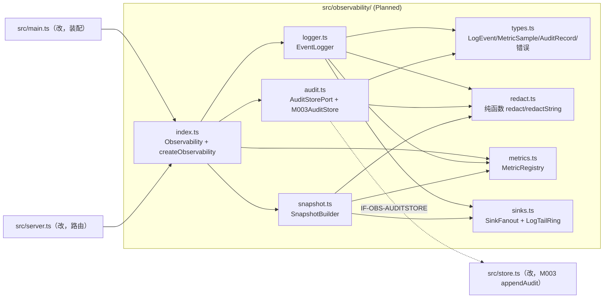
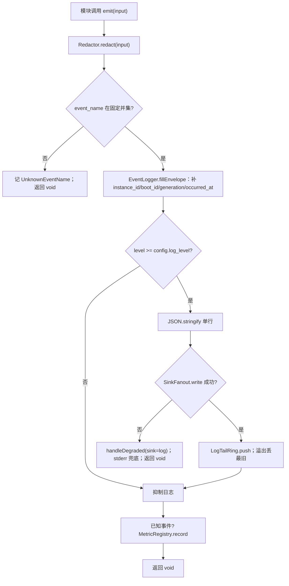

<!-- STD_DOCUMENT_COVER_BEGIN -->
# Piko 实现规格：observability（M009）

> STD 使用入口：[项目采用说明与标准导航](../../README.md#std-entry)

| 文档字段 | 值 |
|---|---|
| Document ID | `piko-observability-impl` |
| Document Version | `0.1.0-draft.1` |
| Status | `Draft` |
| Project | `piko` |
| Document Owner | Piko Implementation Owner |
| Last Modified Date | `2026-09-27` |
| Template ID | `design.implementation` |
| Template Version | `1.2.0` |

<!-- STD_DOCUMENT_COVER_END -->

## 1. 实现目标与输入基线

<a id="isd-scope"></a>

本 ISD 实现 M009 `observability` 的**进程内采集/整形/脱敏/导出**：向所有模块提供 `emit`（结构化日志事件）、`metric`（counter/gauge/histogram）、`audit`（audit 事件追加）三个函数，向共享宿主 HTTP server 提供 `snapshot`（脱敏诊断快照）生产端。本次实现范围是 §5 的四个对外函数与其内部组成（脱敏器、事件日志、metric registry、audit 端口、快照构建器、sink 扇出）及 Brownfield 抽取（§2）；**非目标**是 Run/Result 语义（M003/MECH-RUN）、调度（M004）、恢复编排（M005）、provider/usage 解析（M006/M007）、`audit_events` 表的 schema/事务（M003）、日志留存策略（ops）。模块行为、接口语义、状态模型与失败语义由模块设计唯一维护，本层只细化文件/symbol、私有表示、调用/锁/清理步骤与测试入口。

### 1.1 实现对象

- **模块 ID / 名称**：`M009` / `observability`。

- **直属父对象 / 父设计**：`SW-P`（Piko Agent Runtime V0.3，`design_level=system`）/ `system-design` v0.11.2；`parent_document_id=system-design`（ISD 与模块设计同为 `system-design` 的子视图，不互为父子）。

- **模块设计 Document ID / 版本 / 路径 / 摘要**：`piko-observability` / `0.1.0-draft.1` / `docs/40_module_design/piko-observability-design.md`。摘要：结构化日志/metric/audit 的集中采集、固定口径计数、集中脱敏与失败隔离（fail-open）；audit 持久化经 M003。

- **需求与 Constraint ID**：`PK-11`（无 Memory API）、`PK-12`（恢复边界：审计留痕、不反向控制）；边界 `CON-CFG-001`（配置重启生效）；上级来源 `system-design` §3.4/§10.2/§13.1、`piko-config.md` §3.1。

- **实现范围 / 非目标**：范围：`src/observability/` 七个文件 + 对 `src/main.ts`/`src/server.ts` 的最小改动。非目标：不新建 DB 表/迁移（M003）、不改 Run/Result 语义、不引入优先级/抢占、不接管日志留存/轮转（ops）。

- **ISD 默认落位或项目批准路径**：`docs/50_implementation_design/piko-observability-impl.isd.md`（STD 默认路径）；代码落位 `src/observability/`（Planned）。

<a id="isd-handoff"></a>

### 1.2.1 `H-OBS-EMIT` · 结构化日志事件

- **上游信息项 / 规则 ID**：`F-OBS-EMIT`、`R-OBS-ENVELOPE`、`R-OBS-REDACT`、`R-OBS-FAILOPEN`、`R-OBS-RING`、`IF-OBS-EVENT`、`PK-12`。

- **固定来源 / 版本 / 锚点 / 摘要**：`piko-observability` §2.1/§8.1/§8.2/§8.4/§8.5/§9.1.1（v0.1.0-draft.1）；`system-design` §10.2 事件清单与 envelope 必填字段。

- **ISD 细化内容 / 章节**：§5.1.1 `EventLogger.log`、§5.1.5 `Redactor`、§5.1.7 `SinkFanout`；§3.3/§3.6/§3.7；§6.1 `P-OBS-EMIT`。

- **唯一权威位置**：行为/接口权威 = 模块设计 §2.1/§9.1.1；文件/symbol/私有表示权威 = 本 ISD。

- **实现自由度**：私有遍历/正则实现、sink 组织；不可改 envelope 必填字段集合、不可向业务抛错。

- **原 V/Case 及本地验证位置**：`VRC-OBS-001/002/003`（§9.1.1/9.1.2/9.1.3）。

### 1.2.2 `H-OBS-METRIC` · 指标记录与口径

- **上游信息项 / 规则 ID**：`F-OBS-METRIC`、`R-OBS-METRIC-REGISTRY`、`R-OBS-FAILOPEN`、`IF-OBS-METRIC-REG`、`CON-CFG-001`。

- **固定来源 / 版本 / 锚点 / 摘要**：`piko-observability` §2.2/§8.3/§9.1.2/§12.2；`system-design` §10.2 指标 ID/单位/重置口径；`piko-run.md` §12.1。

- **ISD 细化内容 / 章节**：§5.1.3 `MetricRegistry.record`；§4.3 配置私有表示；§6.2 `P-OBS-METRIC`。

- **唯一权威位置**：行为/口径 = 模块设计 §8.3；内存表示 = 本 ISD。

- **实现自由度**：存储结构与基数护栏实现；不可改指标 ID/kind/单位/事件映射、不可引入动态 label。

- **原 V/Case 及本地验证位置**：`VRC-OBS-004`（§9.1.4）。

### 1.2.3 `H-OBS-AUDIT` · audit 追加

- **上游信息项 / 规则 ID**：`F-OBS-AUDIT`、`R-OBS-AUDIT-TX`、`IF-OBS-AUDIT`、`IF-OBS-AUDITSTORE`、`PK-12`。

- **固定来源 / 版本 / 锚点 / 摘要**：`piko-observability` §2.3/§8.6/§9.1.3/§9.2.1；`system-design` §13.1（强制 fence/migration 写 `audit_events`）；表结构 authority M003 ISD §4.7。

- **ISD 细化内容 / 章节**：§5.1.4 `AuditSink.append`、§5.1.6 `M003AuditStore`；§6.3 `P-OBS-AUDIT`；§7.2（持久化边界→M003）。

- **唯一权威位置**：行为 = 模块设计 §8.6/§9.1.3；端口签名 = 模块设计 §9.2.1（**未冻结** `OQ-OBS-001`）。

- **实现自由度**：适配层类型转换、M003 SQL 组织；不可自建库、不可跳过脱敏、不可把 Proposed 当已确认合同实现。

- **原 V/Case 及本地验证位置**：`VRC-OBS-005`（§9.1.5）。

### 1.2.4 `H-OBS-SNAPSHOT` · 诊断快照

- **上游信息项 / 规则 ID**：`F-OBS-SNAPSHOT`、`R-OBS-REDACT`、`R-OBS-RING`、`IF-OBS-DIAG`、`CAP-DIAG`。

- **固定来源 / 版本 / 锚点 / 摘要**：`piko-observability` §2.4/§3.1/§9.4.1；`system-design` §8.1 Operator Diagnostics。

- **ISD 细化内容 / 章节**：§5.1.6 `SnapshotBuilder.build`；§6.4 `P-OBS-SNAPSHOT`；§7.3 安全。

- **唯一权威位置**：行为/端点内容 = 模块设计 §9.4.1；路由路径与授权 = ops 文档（`OQ-OBS-001`）。

- **实现自由度**：快照字段组织、路由挂载细节；不可读业务表、不可遗漏二次脱敏。

- **原 V/Case 及本地验证位置**：`VRC-OBS-006`（§9.1.6）。

### 1.2.5 `H-OBS-REDACT` · 脱敏不变量

- **上游信息项 / 规则 ID**：`R-OBS-REDACT`、`INV-OBS-4`、`PK-12`、`IF-OBS-REDACT`。

- **固定来源 / 版本 / 锚点 / 摘要**：`piko-observability` §8.1/§11；`system-design` §10.2/§13.1 禁止记录清单。

- **ISD 细化内容 / 章节**：§5.1.5 `Redactor`；§4.1 `REDACT_DENYLIST`；§7.3.1。

- **唯一权威位置**：deny-list 覆盖类别 = 模块设计 §8.1；匹配实现 = 本 ISD。

- **实现自由度**：遍历/正则实现；不可缩小 deny-list 类别、不可新增未脱敏旁路。

- **原 V/Case 及本地验证位置**：`VRC-OBS-001`（§9.1.1）。

### 1.2.6 `H-OBS-PERSIST-BOUND` · 持久化边界

- **上游信息项 / 规则 ID**：`PK-12`。

- **固定来源 / 版本 / 锚点 / 摘要**：`piko-observability` §6.7/§9.2.1；`system-design` §7.7 锚点 `m003-ddl-authority`；当前代码事实 `src/store.ts:29`（`audit_events`）。

- **ISD 细化内容 / 章节**：§7.2（`not_applicable` + 交接）；§4.7（N/A）。

- **唯一权威位置**：`audit_events` schema/事务 authority = M003；本模块只交付待写 `AuditRecord`。

- **实现自由度**：无（边界固定）。

- **原 V/Case 及本地验证位置**：`VRC-OBS-005`（经 M003 提交）。

## 2. 既有实现差异（条件章节）

### 2.1 适用性

- **适用性**：brownfield（存在需修改的既有实现）。

- **依据**：基线：当前工作树（§10.2 `SC-OBS-01` 记录）。既有 `src/main.ts:20`（`console.log`）、`src/worker.ts:71` 与 `src/matrix.ts:22`（`console.error`）内联日志；`src/types.ts:23` 已有 `observability:{log_level;metrics_enabled}` 配置但未被消费；`src/store.ts:29` 已建 `audit_events` 表但**无写入者**；`src/pi-runtime.ts:84` 用注释 "observability must not break execution" 表达 fail-open 意图。本 ISD 把这些抽为 M009，不新建 schema。

- **Tailoring / 范围决定引用**：`TAIL-P-NEW-S1`（Piko 无 subsystem，`design.definition`/`design.implementation` 直接承接 `system-design`）；范围决定 `system-design` §15 PHASE-I。

### 2.2 `CH-OBS-01` · 抽取内联日志

- **基线 commit / 版本**：当前工作树（§10.2 `SC-OBS-01`）。

- **文件 / symbol**：`src/main.ts:20`、`src/worker.ts:71`、`src/matrix.ts:22`（既有）→ Planned `src/observability/index.ts` + `logger.ts`。

- **Current 行为**：各个模块直接 `console.log`/`console.error` 自由格式字符串，无事件名、无 envelope、无脱敏、无级别阈值。

- **Target 改动与理由**：改为 `Observability.emit({event_name, level, fields})`；envelope 与脱敏集中在模块内。理由：`VRC-OBS-001/002` 要求脱敏与 envelope 可独立验证，散落 console 无法保证。

- **原规则 / 成员 ID**：`F-OBS-EMIT`、`R-OBS-ENVELOPE`、`R-OBS-REDACT`。

- **实现状态**：`IN_PROGRESS`（Current 内联，Target 抽出）。

### 2.3 `CH-OBS-02` · 消费 observability 配置

- **基线 commit / 版本**：当前工作树。

- **文件 / symbol**：`src/types.ts:23`（既有类型）→ Planned `src/observability/index.ts` 构造消费；`src/main.ts` 装配。

- **Current 行为**：`observability.log_level`/`metrics_enabled` 在 config 类型中存在，但无代码读取，`log_level`/`metrics_enabled` 无效果。

- **Target 改动与理由**：`createObservability` 构造时读取并生效（级别过滤、metrics no-op）。理由：`CON-CFG-001`/`VRC-OBS-004` 要求配置真实生效且不可热改。

- **原规则 / 成员 ID**：`CON-CFG-001`、`IF-OBS-CONFIG`。

- **实现状态**：`IN_PROGRESS`。

### 2.4 `CH-OBS-03` · 成为 audit_events 首个写入者

- **基线 commit / 版本**：当前工作树。

- **文件 / symbol**：`src/store.ts:29`（既有表）→ Planned `src/observability/audit.ts` `M003AuditStore.appendAudit` + M003 侧端口。

- **Current 行为**：`audit_events` 表已建（`audit_id, event_name, actor_class, run_id, detail_json, occurred_at`），无任何 INSERT 调用点；审计性操作（forced fence / schema migration / credential 轮换）当前不留痕。

- **Target 改动与理由**：新增 `appendAudit(record)`，由本模块脱敏后经 M003 单事务写入；`occurred_at` 由 M003 生成。理由：`PK-12` 要求审计留痕；表 authority 属 M003（`OQ-OBS-001` 跟踪端口采纳）。

- **原规则 / 成员 ID**：`F-OBS-AUDIT`、`R-OBS-AUDIT-TX`、`IF-OBS-AUDITSTORE`。

- **实现状态**：`IN_PROGRESS`（表在、写入者缺）。

### 2.5 `CH-OBS-04` · 挂载诊断/指标端点

- **基线 commit / 版本**：当前工作树。

- **文件 / symbol**：`src/server.ts`（既有 `ApiServer.route` 无诊断路由）→ Planned `snapshot()` 生产端 + 两条只读路由。

- **Current 行为**：`ApiServer.route` 只处理 `POST /runs`、`POST /runs/:id:cancel`、`GET /runs/:id/result`、`GET /runs/:id`；无 `/diagnostics/snapshot` 或 `/metrics`，operator 无诊断入口。

- **Target 改动与理由**：注册两条只读路由，内容由 `snapshot()` 生产并脱敏。理由：`CAP-DIAG`/`VRC-OBS-006` 要求 redacted 诊断/指标端点。

- **原规则 / 成员 ID**：`F-OBS-SNAPSHOT`、`IF-OBS-DIAG`、`SURF-OBS-DIAG`。

- **实现状态**：`IN_PROGRESS`。

## 3. 文件、内部组件与调用关系

<a id="isd-structure"></a>



图 M009-ISD-S1 · Planned / NOT_IMPLEMENTED。实线调用；虚线跨模块适配。`redact.ts` 零 import（纯函数）；`types.ts` 被全模块类型引用；仅 `audit.ts` 接触 M003。

### 3.1 `src/observability/types.ts`

- **职责及调用者**：定义本层私有类型与诊断错误类；被 `redact.ts`/`logger.ts`/`metrics.ts`/`audit.ts`/`sinks.ts`/`snapshot.ts`/`index.ts` 引用。

- **类型 / 函数**：`LogLevel`、`EventName`、`MetricId`、`AuditEventName`、`LogEvent`、`LogEventInput`、`MetricSample`、`MetricValue`、`AuditRecord`、`AuditRecordInput`、`DiagnosticSnapshot`、`SnapshotRequest`、`ObservabilityConfig`、`UnknownEventName`、`UnknownMetricId`、`ObservabilityDegraded`。

- **可见性**：模块内 public（仅 `index.ts` 再导出 `Observability`/`createObservability` 与必要的输入类型）。

- **调用与类型依赖**：零运行时依赖。

- **构建目标 / 生成源 / 输出**：`tsc` 编译进 `dist/observability/types.js`；无生成源。

- **实现状态**：Planned。

### 3.2 `src/observability/redact.ts`

- **职责及调用者**：纯函数脱敏（§4.1 `REDACT_DENYLIST`、§6.1 `P-OBS-EMIT`）；被 `logger.ts`/`audit.ts`/`snapshot.ts` 调用。

- **类型 / 函数**：`REDACT_DENYLIST: readonly string[]`；`redact(value: unknown): unknown`；`redactString(s: string): string`。

- **可见性**：模块内 public。

- **调用与类型依赖**：仅依赖 `types.ts`（若需要）；**禁止任何 import**（§3 依赖方向）。

- **构建目标 / 生成源 / 输出**：`tsc` → `dist/observability/redact.js`。

- **实现状态**：Planned。

### 3.3 `src/observability/logger.ts`

- **职责及调用者**：事件名校验、envelope 补齐、级别过滤；被 `index.ts` 调用。

- **类型 / 函数**：`class EventLogger { constructor(deps: { redactor; registry; sink }); log(input: LogEventInput): void; private fillEnvelope(input): LogEvent }`。

- **可见性**：模块内 public。

- **调用与类型依赖**：依赖 `types.ts` + `redact.ts` + `metrics.ts` + `sinks.ts`。

- **构建目标 / 生成源 / 输出**：`tsc` → `dist/observability/logger.js`。

- **实现状态**：Planned。

### 3.4 `src/observability/metrics.ts`

- **职责及调用者**：指标登记、记录与只读快照、基数护栏；被 `index.ts`/`logger.ts` 调用、被 `snapshot.ts` 读。

- **类型 / 函数**：`METRIC_DEFS`（ID→{kind, unit}）；`class MetricRegistry { record(sample: MetricSample): void; snapshot(): ReadonlyMap<MetricId, MetricValue> }`。

- **可见性**：模块内 public。

- **调用与类型依赖**：依赖 `types.ts`；无外部依赖。

- **构建目标 / 生成源 / 输出**：`tsc` → `dist/observability/metrics.js`。

- **实现状态**：Planned。

### 3.5 `src/observability/audit.ts`

- **职责及调用者**：`AuditStorePort` 抽象 + `M003AuditStore` 适配；被 `index.ts` 调用。

- **类型 / 函数**：`interface AuditStorePort { appendAudit(record: AuditRecord): void }`；`class M003AuditStore implements AuditStorePort`（构造注入 M003 `TaskStore`）。

- **可见性**：`AuditStorePort` 模块内 public；`M003AuditStore` 由 `index.ts` 装配。

- **调用与类型依赖**：依赖 `types.ts`；运行时依赖 M003 `TaskStore`（仅此文件）。

- **构建目标 / 生成源 / 输出**：`tsc` → `dist/observability/audit.js`。

- **实现状态**：Planned。

### 3.6 `src/observability/sinks.ts`

- **职责及调用者**：日志扇出（stdout + 有界 tail ring）；被 `logger.ts` 调用、被 `snapshot.ts` 读。

- **类型 / 函数**：`class SinkFanout { constructor(capacity: number); write(line: string): void; pushEvent(event: LogEvent): void; tail(limit?: number): readonly LogEvent[]; dropped(): number }`。

- **可见性**：模块内 public。

- **调用与类型依赖**：依赖 `types.ts`；stdout 写经宿主裸 IO。

- **构建目标 / 生成源 / 输出**：`tsc` → `dist/observability/sinks.js`。

- **实现状态**：Planned。

### 3.7 `src/observability/snapshot.ts`

- **职责及调用者**：只读组装脱敏诊断快照；被 `index.ts` 调用。

- **类型 / 函数**：`class SnapshotBuilder { constructor(deps); build(req: SnapshotRequest): DiagnosticSnapshot }`。

- **可见性**：模块内 public。

- **调用与类型依赖**：依赖 `types.ts` + `redact.ts` + `metrics.ts` + `sinks.ts`。

- **构建目标 / 生成源 / 输出**：`tsc` → `dist/observability/snapshot.js`。

- **实现状态**：Planned。

### 3.8 `src/observability/index.ts`

- **职责及调用者**：唯一装配入口：导出 `Observability` 与 `createObservability`；实现 fail-open；被 `main.ts`/`server.ts` 调用。

- **类型 / 函数**：`class Observability { emit(input): void; metric(sample): void; audit(input): void; snapshot(req): DiagnosticSnapshot }`；`export function createObservability(config: ObservabilityConfig, deps: ObservabilityDeps): Observability`。

- **可见性**：public。

- **调用与类型依赖**：依赖本目录其余文件 + M003 `TaskStore` 类型（经 `audit.ts`）。

- **构建目标 / 生成源 / 输出**：`tsc` → `dist/observability/index.js`。

- **实现状态**：Planned。

### 3.9 `src/store.ts`（修改既有，M003 侧）

- **职责及调用者**：新增 `appendAudit(record)`：单事务 `INSERT audit_events(event_name, actor_class, run_id, detail_json, occurred_at)`，`occurred_at` 由 M003 以自身 UTC now 写入。被 `M003AuditStore` 调用。

- **类型 / 函数**：`appendAudit(record: {event_name:string; actor_class:string; run_id:string|null; detail_json:string}): void`。

- **可见性**：public（同级模块）。

- **调用与类型依赖**：依赖 `node:sqlite`；无新 schema（复用既有 `audit_events`）。

- **构建目标 / 生成源 / 输出**：`tsc` → `dist/store.js`。

- **实现状态**：`IN_PROGRESS`（表在，写入者待加）。

### 3.10 `src/main.ts` / `src/server.ts`（修改既有）

- **职责及调用者**：`main.ts` 构造 `createObservability` 并注入 server/worker；`server.ts` 注册 `SURF-OBS-DIAG` 只读路由。

- **类型 / 函数**：`main()` 新增装配；`ApiServer.route` 新增 `GET /diagnostics/snapshot`、`GET /metrics`。

- **可见性**：public（入口）。

- **调用与类型依赖**：依赖 `observability/index.ts`。

- **构建目标 / 生成源 / 输出**：`tsx src/main.ts`（运行）；`tsc` 类型检查。

- **实现状态**：`IN_PROGRESS`。

## 4. 数据结构设计

<a id="isd-data"></a>

**不适用类别**：§4.4 通信报文（无跨部署边界消息；日志单行 JSON 是 sink 输出，非接收方契约）、§4.5 设备/FPGA（纯软件，`TAIL-P-103`）、§4.7 数据库表（`audit_events` authority 属 M003，见 §7.2）为 N/A。§4.1 仅登记本层私有 deny-list 常量（事件名/指标 ID 是编译期联合，语义权威在模块设计 §6.1）。

### 4.1 公共基础类型与枚举

#### 4.1.1 `REDACT_DENYLIST` / 事件名与指标 ID 联合

- **代码式声明、Data/Type ID 与唯一来源**：

  ```ts
  const REDACT_DENYLIST = ["instruction","credential","access_token","bearer","authorization","api_key","secret","model_input","model_output","attachment"] as const;
  type LogLevel = "debug" | "info" | "warn" | "error";
  type EventName = /* 模块设计 §6.1.2 固定并集 */ string;
  type MetricId = /* 模块设计 §6.1.3 固定并集 */ string;
  type AuditEventName = "event.audit.credential-ref-changed" | "event.audit.run-state-changed" | "event.audit.forced-fence" | "event.audit.schema-migration" | "event.audit.responses-probe";
  ```

  唯一来源：`piko-observability` §6.1/§8.1；`system-design` §10.2。

- **逐值/逐字段定义、范围和未知值行为**：`REDACT_DENYLIST` 为小写键/子串匹配集；`LogLevel` 四值递增；`EventName`/`MetricId` 取值必须在固定并集内，否则 `UnknownEventName`/`UnknownMetricId` 诊断；`AuditEventName` 五值。

- **代码类型/symbol、转换点与失败映射**：`redact.ts` 使用 deny-list；校验点在 `EventLogger.log`/`MetricRegistry.record`/`Observability.audit`。

- **创建/修改者、所有权、寿命与敏感性**：编译期常量，不可变；deny-list 本身不敏感。

- **合法及拒绝实例、V/Case 与证据状态**：合法 `"info"`/`event.audit.forced-fence`；拒绝 `"verbose"`/`event.unknown`。`VRC-OBS-001/002/004`；`NOT_RUN`。

### 4.2 业务与操作数据结构

#### 4.2.1 `LogEvent` / `LogEventInput`

- **代码式声明、Data/Type ID 与固定来源**：私有类型；语义来源 = 模块设计 §6.2.1。

  ```ts
  interface LogEventInput { event_name: string; run_id?: string | null; generation?: number; epoch?: number | null; level: LogLevel; fields?: Record<string, unknown>; redacted_error_class?: string | null }
  interface LogEvent { event_name: string; instance_id: string; boot_id: string; run_id: string | null; generation: number; epoch: number | null; level: LogLevel; redacted_error_class: string | null; occurred_at: string; fields: Record<string, unknown> }
  ```

- **逐字段定义、条件有效性和跨字段不变量**：`generation >= 0`；`epoch === null || epoch >= 1`；`redacted_error_class` 仅 `warn/error` 非空；`fields` 已脱敏。

- **代码文件/symbol、编码或投影函数**：`logger.ts` `fillEnvelope`；序列化为 `JSON.stringify`（单行）。

- **创建、借用、修改、释放与失败出口**：`index.ts` 构造、`Object.freeze`；寿命到写 sink 完成。

- **合法及拒绝实例、V/Case 与证据状态**：合法见模块设计 §6.2.1；拒绝含 deny-list 键。`VRC-OBS-001/002`；`NOT_RUN`。

#### 4.2.2 `MetricSample` / `MetricValue`

- **代码式声明、Data/Type ID 与固定来源**：私有类型；来源 = 模块设计 §6.2.2。

  ```ts
  interface MetricSample { metric_id: string; op: "inc" | "observe" | "set"; value: number; labels?: Record<string, string> }
  type MetricValue = { kind: "counter"; value: number } | { kind: "gauge"; value: number } | { kind: "histogram"; count: number; sum: number; min: number; max: number };
  ```

- **逐字段定义、条件有效性和跨字段不变量**：op 与 kind 匹配；`value` 有限数；labels 键受 `METRIC_DEFS` 约束。

- **代码文件/symbol、编码或投影函数**：`metrics.ts` `record`/`snapshot`。

- **创建、借用、修改、释放与失败出口**：输入由调用方提供；值由 registry 持有，进程退出释放。

- **合法及拒绝实例、V/Case 与证据状态**：合法 `inc piko.recovery.outcomes.fenced`；拒绝对 gauge 用 `inc`。`VRC-OBS-004`；`NOT_RUN`。

#### 4.2.3 `AuditRecord` / `AuditRecordInput`

- **代码式声明、Data/Type ID 与固定来源**：私有类型；来源 = 模块设计 §6.2.3。

  ```ts
  interface AuditRecordInput { event_name: string; actor_class: string; run_id?: string | null; detail: Record<string, unknown> }
  interface AuditRecord { event_name: AuditEventName; actor_class: string; run_id: string | null; detail: Record<string, unknown> }
  ```

- **逐字段定义、条件有效性和跨字段不变量**：`event_name` 属审计名集；`detail` 已脱敏；`actor_class` 与事件名绑定。

- **代码文件/symbol、编码或投影函数**：`audit.ts` `appendAudit` 前把 `detail` 序列化为 `detail_json`。

- **创建、借用、修改、释放与失败出口**：由 `index.ts` 脱敏后构造；所有权移交 M003；失败出口见 §7.2。

- **合法及拒绝实例、V/Case 与证据状态**：合法见模块设计 §6.2.3；拒绝 `event.run.terminated`。`VRC-OBS-005`；`NOT_RUN`。

#### 4.2.4 `DiagnosticSnapshot` / `SnapshotRequest`

- **代码式声明、Data/Type ID 与固定来源**：私有类型；来源 = 模块设计 §6.2.4。

  ```ts
  interface SnapshotRequest { log_tail_limit?: number }
  interface DiagnosticSnapshot { instance_id: string; boot_id: string; generated_at: string; ready: boolean; log_tail: readonly LogEvent[]; metrics: ReadonlyArray<{ metric_id: string; value: MetricValue }>; state_counts?: Record<string, number>; queue_depth?: number; harness_operation_generation?: number; ledger_summary?: Record<string, number>; partial: boolean }
  ```

- **逐字段定义、条件有效性和跨字段不变量**：`log_tail.length ≤ capacity`；`partial=true` 时至少一个可选字段缺失。

- **代码文件/symbol、编码或投影函数**：`snapshot.ts` `build`。

- **创建、借用、修改、释放与失败出口**：只读值对象；寿命 = 单次响应。

- **合法及拒绝实例、V/Case 与证据状态**：合法见模块设计 §6.2.4。`VRC-OBS-006`；`NOT_RUN`。

### 4.3 配置与规则数据结构

#### 4.3.1 `ObservabilityConfig`

- **代码式声明、Data/Type ID 与配置 authority**：

  ```ts
  interface ObservabilityConfig { log_level: LogLevel; metrics_enabled: boolean; log_tail_capacity: number; max_label_cardinality: number }
  ```

  authority = `piko-runtime-config-v0.3.schema.json` `observability`（前两项）+ 本模块内部常量（后两项，`OQ-OBS-002`）。

- **逐字段定义、默认值、跨字段校验与拒绝**：`log_level` 四值；`metrics_enabled` 布尔；`log_tail_capacity` 默认 200 正整数；`max_label_cardinality` 默认 64 正整数。非法值构造期拒绝。

- **读取/校验/应用 symbol 与生效点**：`createObservability` 读取；`main.ts` 由 `RuntimeConfig.observability` 映射；启动生效、运行期不变（`CON-CFG-001`）。

- **快照、所有权、寿命与敏感性**：构造时冻结；进程寿命；不含敏感值。

- **合法及拒绝实例、V/Case 与证据状态**：合法见模块设计 §6.3.1。`VRC-OBS-004`；`NOT_RUN`。

### 4.6 运行状态数据结构

#### 4.6.1 `ObservabilityState` / `LogTailRing`

- **代码式声明、Data/Type ID 与固定来源**：

  ```ts
  type ObservabilityState = "Uninitialized" | "Active" | "Degraded" | "Stopped";
  interface LogTailRing { capacity: number; items: LogEvent[]; dropped: number }
  ```

  语义来源 = 模块设计 §6.6.1/§6.6.2。

- **逐字段定义、状态不变量与转移条件**：`items.length ≤ capacity` 恒成立；`dropped >= 0`；`Degraded` 由 sink/audit 失败置位、下一次成功清除（`T-OBS-02/03`）。

- **创建/更新/读取 symbol、同步与提交点**：`SinkFanout` 持有 ring；`Observability` 持有 state；无持久提交点。

- **唯一写者、借用、失效及恢复入口**：写者 = `SinkFanout`/`Observability` 自身；恢复 = 下一次成功采集；进程退出即失效。

- **合法及拒绝转移、V/Case 与证据状态**：合法 `Active→Degraded→Active`；拒绝 `Stopped` 后记录 metric。`VRC-OBS-003/006`；`NOT_RUN`。

### 4.7 数据库表结构

**N/A。** 本模块不拥有持久表：`audit_events` 的 schema authority、DDL 与事务属 M003（当前代码事实 `src/store.ts:29`，`PRAGMA user_version=2`）。本 ISD 只消费 §5.2 的 `appendAudit` 端口，不复制 CREATE TABLE。依据：ISD 规范 §3 "无持久化不虚构数据库，交由宿主的范围仍给实际交接责任"；交接见 §7.2。

### 4.8 错误码与错误结构

#### 4.8.1 `UnknownEventName` / `UnknownMetricId` / `ObservabilityDegraded`

- **错误声明、Error/Data ID 与唯一来源**：私有诊断类；语义来源 = 模块设计 §6.8.1。

  ```ts
  class UnknownEventName extends Error { readonly value: string }
  class UnknownMetricId extends Error { readonly value: string }
  class ObservabilityDegraded extends Error { readonly sink: "log" | "audit" | "metric"; readonly last_error_class: string }
  ```

- **逐字段和逐码含义、触发事实及优先级**：`UnknownEventName` ← 事件名不在并集（先于 envelope 补齐）；`UnknownMetricId` ← ID 不在并集或 op 与 kind 不匹配；`ObservabilityDegraded` ← sink/audit 抛错。

- **抛出/捕获/转换 symbol 与 public payload**：由 `EventLogger`/`MetricRegistry`/`index.ts` 产生；**均被 `index.ts` 捕获，不冒泡到业务**；无 public payload。

- **状态、副作用、可重试条件与敏感信息处理**：置 `Degraded` 为副作用；无重试；错误消息不含敏感值。

- **触发向量、V/Case 与证据状态**：`VRC-OBS-002/003/004`；`NOT_RUN`。

## 5. 接口设计

<a id="isd-functions"></a>

observability 的对外接口是 §5.1 的四个函数与一个装配函数；被消费的 M003 端口在同节记录（进程内协作接口）；人机/维护入口是 §5.4 的 operator 诊断端点。无人机/消息/硬件接口（§5.2/§5.3 N/A）。

### 5.1 API（适用时）

#### 5.1.1 `Observability.emit(input: LogEventInput): void`

- **Interface/Member ID、用途**：`IF-OBS-EVENT`；发送结构化日志事件（脱敏 + envelope 补齐 + 级别过滤 + sink 扇出 + 已知事件驱动 metric）。

- **文件 / symbol / 可见性**：Planned `src/observability/index.ts` `Observability.emit` → `logger.ts` `EventLogger.log`；public（模块外经 `index.ts`）。

- **原成员 ID 或私有来源**：本模块自持（模块设计 §9.1.1）。

- **完整签名与 caller**：`emit(input: LogEventInput): void`；caller = 全部模块（M000-M008）在状态迁移/attempt/tool/matrix/recovery/audit 时点调用（宿主事件循环）。

- **固定契约与版本**：模块设计 §9.1.1（`piko-observability` v0.1.0-draft.1）；构建目标 `dist/observability/`。

- **输入参数 / 数据结构 authority**：`input: LogEventInput`（本 ISD §4.2.1）；`event_name` 属模块设计 §6.1.2 固定并集；`level` 属 §6.1.1；无 §6 Data ID（进程内事件）。

- **输入约束 / 校验顺序 / 失败映射**：校验顺序 = `Redactor.redact` → 事件名属并集？ → `fillEnvelope` → `level >= log_level` 过滤 → 序列化 → `SinkFanout.write` → 已知事件 `MetricRegistry.record`。事件名未知 → 内部 `UnknownEventName`（不抛）；sink 抛错 → `Degraded`（不抛）。

- **成功输出 / 数据结构 / 后置条件**：返回 `void`；后置：sink 收到一行脱敏 JSON、tail ring push、已知事件驱动对应 metric；不修改任何业务状态（`INV-OBS-1`）。owner = 调用方；无返回值寿命。

- **错误输出 / 触发条件 / 优先级**：无业务错误码。内部诊断优先级：先事件名校验，再级别过滤，最后 sink 失败。所有内部诊断不冒泡。

- **底层异常 / 失败事实**：`SinkFanout.write` 抛 IO 异常；`JSON.stringify` 抛循环引用异常。

- **模块是否处理及处理函数**：全部由 `Observability.emit` 内 `try/catch` 处理（`handleDegraded()`），不 propagate。

- **Typed 异常与原生异常所有权**：`UnknownEventName`/`ObservabilityDegraded` 由本模块产生并就地吞掉；原生 IO 异常被转 `ObservabilityDegraded`。

- **宿主 / public payload 或状态码**：无 HTTP；返回 `void`，从不抛到业务。

- **日志级别 / 脱敏 / 关联字段**：`debug`（成功）；`error`（sink 失败走 stderr 兜底，含 error class）；关联字段 `event_name`/`run_id`/`generation`；输出前经 `R-OBS-REDACT`。

- **是否可重试及前提**：sink 失败无自动重试（下一次 `emit` 自然重试）；调用方可再 `emit`（观测弱幂等）。

- **状态与副作用影响 / 验证项**：副作用 = 写 stdout/ring/registry；`VRC-OBS-001/002/003`。

- **不可改变的规则 / Constraint ID**：`R-OBS-ENVELOPE`/`R-OBS-REDACT`/`R-OBS-FAILOPEN`/`R-OBS-RING`、`PK-12`、`INV-OBS-1/4`。

- **实现自由度**：私有遍历/正则、sink 组织、序列化实现。

- **副作用 / 执行上下文 / 幂等性**：有副作用（外部写）；上下文 = 宿主事件循环（同步）；非严格幂等（重复 `emit` 产生重复日志，可接受）。

- **输入输出 ownership 与寿命**：输入借用（不修改调用方对象）；无输出所有权。

- **Thread-safe / reentrant**：yes（Node 单线程；无共享可变状态跨线程）；reentrant = conditional（不得在 sink 回调内再次 `emit` 造成递归，实现加深度护栏）。

- **Nested-call policy**：allowed：`Redactor.redact`/`EventLogger.log`/`MetricRegistry.record`/`SinkFanout.write`；禁止回调业务模块。

- **Transaction participation**：none（不触 DB）。

- **Blocking / timeout / cancellation**：阻塞式本地 IO；无 timeout；无取消（调用返回即完成）。

- **实现状态 / 验证项**：Planned / `VRC-OBS-001/002/003`。

- **装配、合法及拒绝实例**：装配：§3.8/§3.10。合法：`{event_name:"event.model.attempt", level:"info", fields:{attempt_state:"Completed"}}` → sink 收行 + metric 加一。拒绝：`event_name:"event.unknown"` → 内部诊断、无行。Oracle = fake sink 收行 + registry 直读。`NOT_RUN`。

#### 5.1.2 `Observability.metric(sample: MetricSample): void`

- **Interface/Member ID、用途**：`IF-OBS-METRIC-REG`；记录 counter/gauge/histogram。

- **文件 / symbol / 可见性**：Planned `src/observability/index.ts` `Observability.metric` → `metrics.ts` `MetricRegistry.record`；public。

- **原成员 ID 或私有来源**：本模块自持（模块设计 §9.1.2）。

- **完整签名与 caller**：`metric(sample: MetricSample): void`；caller = M000-M008 与 `EventLogger`（已知事件驱动）。

- **固定契约与版本**：模块设计 §9.1.2；口径 `system-design` §10.2。

- **输入参数 / 数据结构 authority**：`sample: MetricSample`（本 ISD §4.2.2）；`metric_id` 属模块设计 §6.1.3 固定并集；kind/单位在 `METRIC_DEFS`。

- **输入约束 / 校验顺序 / 失败映射**：校验 = ID 在并集？op 与 kind 匹配？label 基数未超？失败 → 内部 `UnknownMetricId`（不抛）；`metrics_enabled=false` → no-op。

- **成功输出 / 数据结构 / 后置条件**：返回 `void`；registry 值按 op 更新；重启重置。

- **错误输出 / 触发条件 / 优先级**：无业务错误；未知 ID/op 不匹配优先于基数检查。

- **底层异常 / 失败事实**：无 IO；`value` 非有限数视为编程错误（内部诊断）。

- **模块是否处理及处理函数**：`Observability.metric` 捕获并记 `UnknownMetricId`。

- **Typed 异常与原生异常所有权**：`UnknownMetricId` 本模块产生并吞掉。

- **宿主 / public payload 或状态码**：无；返回 `void`。

- **日志级别 / 脱敏 / 关联字段**：`debug`；敏感值不入 metric（label 仅固定枚举）。

- **是否可重试及前提**：无意义重试；调用方可重试（counter 会重复累加，语义由调用方负责）。

- **状态与副作用影响 / 验证项**：副作用 = 改 registry 内存；`VRC-OBS-004`。

- **不可改变的规则 / Constraint ID**：`R-OBS-METRIC-REGISTRY`、`CON-CFG-001`（metrics_enabled 重启生效）。

- **实现自由度**：存储结构、护栏实现。

- **副作用 / 执行上下文 / 幂等性**：有副作用（内存）；同步；`inc` 非幂等、`set` 幂等。

- **输入输出 ownership 与寿命**：输入借用；无输出。

- **Thread-safe / reentrant**：yes（单线程）。

- **Nested-call policy**：allowed：`MetricRegistry.record`；禁止回调业务。

- **Transaction participation**：none。

- **Blocking / timeout / cancellation**：O(1) 内存动作；无 timeout/取消。

- **实现状态 / 验证项**：Planned / `VRC-OBS-004`。

- **装配、合法及拒绝实例**：装配：§3.8。合法：`{metric_id:"piko.recovery.outcomes.fenced", op:"inc", value:1}` → 计数 +1。拒绝：对 `piko.slot.lease_epoch`（gauge）用 `inc`。Oracle = registry `snapshot()` 直读。`NOT_RUN`。

#### 5.1.3 `Observability.audit(input: AuditRecordInput): void`

- **Interface/Member ID、用途**：`IF-OBS-AUDIT`；追加 audit 事件（脱敏 → M003 单事务 → 同发日志）。

- **文件 / symbol / 可见性**：Planned `src/observability/index.ts` `Observability.audit` → `audit.ts` `AuditSink.append`；public。

- **原成员 ID 或私有来源**：本模块自持（模块设计 §9.1.3）。

- **完整签名与 caller**：`audit(input: AuditRecordInput): void`；caller = M000（credential 轮换、schema migration）、M004/M005（forced fence）、M006（responses probe）。

- **固定契约与版本**：模块设计 §9.1.3/§9.2.1（端口未冻结 `OQ-OBS-001`）。

- **输入参数 / 数据结构 authority**：`input: AuditRecordInput`（本 ISD §4.2.3）；`event_name` 属 `AuditEventName`；`detail` 为已/待脱敏对象。

- **输入约束 / 校验顺序 / 失败映射**：校验顺序 = 事件名属审计集？ → `Redactor.redact(detail)` → `appendAudit`。非审计名 → `UnknownEventName`（不抛）；M003 抛依赖错误 → `Degraded`（不抛）。

- **成功输出 / 数据结构 / 后置条件**：返回 `void`；`audit_events` +1 行（脱敏）；同 `event_name` 日志发出。

- **错误输出 / 触发条件 / 优先级**：无业务错误码；内部诊断优先级：事件名校验 → M003 依赖错误。

- **底层异常 / 失败事实**：M003 `appendAudit` 抛 `SQLITE_BUSY`/`SQLITE_IOERR`。

- **模块是否处理及处理函数**：`Observability.audit` 捕获依赖错误并 `handleDegraded({sink:"audit"})`；不重试、不抛。

- **Typed 异常与原生异常所有权**：原生 SQLite 异常由 M003 抛出，本模块捕获并转 `ObservabilityDegraded` 后吞掉。

- **宿主 / public payload 或状态码**：无；返回 `void`。

- **日志级别 / 脱敏 / 关联字段**：`info`（成功）；`warn`（依赖错误）；`detail` 经 `R-OBS-REDACT` 后才入库/入日志；关联 `run_id`/`event_name`。

- **是否可重试及前提**：依赖错误不自动重试；责任方（operator/M005）可显式再 `audit`（会产生重复行，须自行去重）。

- **状态与副作用影响 / 验证项**：副作用 = M003 表写入；`VRC-OBS-005`。

- **不可改变的规则 / Constraint ID**：`R-OBS-AUDIT-TX`/`R-OBS-REDACT`/`R-OBS-FAILOPEN`、`PK-12`、`INV-OBS-4`。

- **实现自由度**：适配层类型转换、M003 SQL 组织。

- **副作用 / 执行上下文 / 幂等性**：有持久副作用；同步；非幂等（重复 append 产生重复行）。

- **输入输出 ownership 与寿命**：输入借用；脱敏副本移交 M003。

- **Thread-safe / reentrant**：conditional（SQLite 单 writer 串行）。

- **Nested-call policy**：forbidden（不得在 `appendAudit` 事务内再开事务）；allowed：`Redactor.redact`/`emit`。

- **Transaction participation**：owner：经 `appendAudit` 发起 M003 单 `BEGIN IMMEDIATE`。

- **Blocking / timeout / cancellation**：阻塞式；受 `task_store.busy_timeout_ms`；无取消。

- **实现状态 / 验证项**：Planned（受 `OQ-OBS-001`）/ `VRC-OBS-005`。

- **装配、合法及拒绝实例**：装配：§3.8/§3.10。合法：`{event_name:"event.audit.forced-fence", actor_class:"operator", run_id:"run-1", detail:{reason:"manual"}}` → 表 +1。拒绝：`event_name:"event.run.terminated"`。Oracle = 直读 `audit_events`。`NOT_RUN`。

#### 5.1.4 `Observability.snapshot(req: SnapshotRequest): DiagnosticSnapshot`

- **Interface/Member ID、用途**：`IF-OBS-DIAG`；生成脱敏诊断快照（operator 端点生产端）。

- **文件 / symbol / 可见性**：Planned `src/observability/index.ts` `Observability.snapshot` → `snapshot.ts` `SnapshotBuilder.build`；public。

- **原成员 ID 或私有来源**：本模块自持（模块设计 §9.1.4/§9.4.1）。

- **完整签名与 caller**：`snapshot(req: SnapshotRequest): DiagnosticSnapshot`；caller = `src/server.ts` 的 `GET /diagnostics/snapshot` 处理函数、`GET /metrics` 复用其 metrics 部分。

- **固定契约与版本**：模块设计 §9.4.1；端点语义 `system-design` §8.1 Operator Diagnostics。

- **输入参数 / 数据结构 authority**：`req.log_tail_limit?: number`（正整数）；可选业务计数由宿主注入（不读业务表）。

- **输入约束 / 校验顺序 / 失败映射**：`log_tail_limit` 超过容量 → 截断（不报错）；缺省 → 全部 tail；无失败映射（读侧）。

- **成功输出 / 数据结构 / 后置条件**：返回 `DiagnosticSnapshot`（§4.2.4）；后置：只读，无状态改变；`log_tail.length ≤ capacity`；二次脱敏。

- **错误输出 / 触发条件 / 优先级**：无业务错误；内部读取异常 → `partial=true`；ring 空 → 空 tail。

- **底层异常 / 失败事实**：可选宿主注入字段缺失（非异常）；内存读取理论无 IO 异常。

- **模块是否处理及处理函数**：`SnapshotBuilder.build` 捕获内部读取异常并标 `partial`，不 propagate。

- **Typed 异常与原生异常所有权**：无 typed 异常外抛；内部异常降级为 `partial`。

- **宿主 / public payload 或状态码**：端点返回 200 + `DiagnosticSnapshot`（鉴权失败 401/403 由宿主中间件）。

- **日志级别 / 脱敏 / 关联字段**：`debug`（快照请求）；输出二次脱敏；关联 `instance_id`。

- **是否可重试及前提**：读操作可重放（幂等读）。

- **状态与副作用影响 / 验证项**：无副作用（只读）；`VRC-OBS-006`。

- **不可改变的规则 / Constraint ID**：`R-OBS-REDACT`/`R-OBS-RING`、`CAP-DIAG`、`INV-OBS-4`。

- **实现自由度**：快照字段组织、浅拷贝实现。

- **副作用 / 执行上下文 / 幂等性**：只读；同步；幂等。

- **输入输出 ownership 与寿命**：输入借用；输出快照由调用方（server）持有，寿命 = 单次响应。

- **Thread-safe / reentrant**：yes（只读快照，单线程）。

- **Nested-call policy**：allowed：读 `MetricRegistry.snapshot`/`SinkFanout.tail`/`Redactor.redact`；禁止调用采集写路径。

- **Transaction participation**：none。

- **Blocking / timeout / cancellation**：同步只读；无 timeout/取消。

- **实现状态 / 验证项**：Planned / `VRC-OBS-006`。

- **装配、合法及拒绝实例**：装配：§3.8/§3.10。合法：`{log_tail_limit:2}` → ≤2 条脱敏日志。拒绝：ring 含 credential（脱敏遗漏，视为缺陷）。Oracle = 期望 tail 常量 + 敏感键扫描。`NOT_RUN`。

#### 5.1.5 `M003AuditStore.appendAudit(record: AuditRecord): void`（消费端口）

- **Interface/Member ID、用途**：`IF-OBS-AUDITSTORE`（Proposed）；在 M003 单事务内追加一行 `audit_events`。

- **文件 / symbol / 可见性**：Planned `src/observability/audit.ts` `M003AuditStore.appendAudit` → M003 `src/store.ts` `appendAudit`；`AuditStorePort` 模块内 public。

- **原成员 ID 或私有来源**：模块设计 §9.2.1（Proposed，`OQ-OBS-001`）。

- **完整签名与 caller**：`appendAudit(record: AuditRecord): void`；caller = `AuditSink.append`。

- **固定契约与版本**：模块设计 §9.2.1；**未冻结**；表 schema authority M003 ISD §4.7。

- **输入参数 / 数据结构 authority**：`record: AuditRecord`（本 ISD §4.2.3）；`occurred_at`/`audit_id` 不在输入中（由 M003 生成）。

- **输入约束 / 校验顺序 / 失败映射**：M003 单事务 `INSERT audit_events(event_name, actor_class, run_id, detail_json, occurred_at)`；`detail_json = JSON.stringify(detail)`；SQL 错误上抛。

- **成功输出 / 数据结构 / 后置条件**：返回 `void`；`audit_events` 提交一行。

- **错误输出 / 触发条件 / 优先级**：无判别结果（非异常）；依赖错误上抛。

- **底层异常 / 失败事实**：`SQLITE_BUSY`/`SQLITE_IOERR`/`SQLITE_FULL`。

- **模块是否处理及处理函数**：`M003AuditStore` propagate；`Observability.audit` 捕获转 `Degraded`。

- **Typed 异常与原生异常所有权**：原生属 M003；本层不改类型。

- **宿主 / public payload 或状态码**：M003 事务内直接写表；无对外码。

- **日志级别 / 脱敏 / 关联字段**：`debug`（M003 侧），输入已脱敏。

- **是否可重试及前提**：依赖错误由责任方决定；重复 append 产生重复行（无唯一约束）。

- **状态与副作用影响 / 验证项**：副作用 = 单行 INSERT（单事务）；`VRC-OBS-005`。

- **不可改变的规则 / Constraint ID**：单事务、`occurred_at` 由 M003 写、`PK-12`。

- **实现自由度**：M003 内部 SQL/索引；本层适配类型转换。

- **副作用 / 执行上下文 / 幂等性**：有持久副作用；非幂等。

- **输入输出 ownership 与寿命**：输入借用；无输出。

- **Thread-safe / reentrant**：conditional（SQLite 单 writer 串行）。

- **Nested-call policy**：forbidden（不得在事务内再开事务）。

- **Transaction participation**：owner：`BEGIN IMMEDIATE`（M003）。

- **Blocking / timeout / cancellation**：阻塞；受 `busy_timeout_ms`。

- **实现状态 / 验证项**：Planned（M003 侧 `IN_PROGRESS`）/ `VRC-OBS-005`。

- **装配、合法及拒绝实例**：合法：脱敏 `AuditRecord` → 表 +1。拒绝：非审计名（在 `Observability.audit` 拦截，不到此）。Oracle = `SELECT count(*) FROM audit_events`。`NOT_RUN`。

#### 5.1.6 `createObservability(config: ObservabilityConfig, deps: ObservabilityDeps): Observability`（装配）

- **Interface/Member ID、用途**：私有装配入口（`IF-OBS-CONFIG` 的消费点）；构造 `Observability` 单例供宿主注入。

- **文件 / symbol / 可见性**：Planned `src/observability/index.ts` `createObservability`；public（供 `main.ts`）。

- **原成员 ID 或私有来源**：模块设计 §9.2.2。

- **完整签名与 caller**：`createObservability(config, deps): Observability`；caller = `src/main.ts`。

- **固定契约与版本**：模块设计 §9.2.2；config authority `piko-runtime-config-v0.3.schema.json`。

- **输入参数 / 数据结构 authority**：`config: ObservabilityConfig`（本 ISD §4.3.1）；`deps = { instanceId: string; bootId: string; clock: () => string; auditStore: AuditStorePort }`。

- **输入约束 / 校验顺序 / 失败映射**：校验 `log_tail_capacity > 0`、`max_label_cardinality > 0`，非法 → 构造抛 `TypeError`（编程错误，启动失败）。

- **成功输出 / 数据结构 / 后置条件**：返回 `Observability`（状态 `Active`）；registry/ring/sink 就绪。

- **错误输出 / 触发条件 / 优先级**：非法常量 → `TypeError`；缺 `auditStore` → `TypeError`。

- **底层异常 / 失败事实**：无 IO。

- **模块是否处理及处理函数**：构造期断言（`assertPositive`），不吞。

- **Typed 异常与原生异常所有权**：`TypeError` 由本模块抛，宿主（`main.ts`）在启动路径捕获并走 M000 启动失败。

- **宿主 / public payload 或状态码**：无。

- **日志级别 / 脱敏 / 关联字段**：`info`（装配完成，含 `instance_id`）。

- **是否可重试及前提**：装配失败 = 配置/装配缺陷，修复后重启。

- **状态与副作用影响 / 验证项**：副作用 = 构造内存对象；`VRC-OBS-004`。

- **不可改变的规则 / Constraint ID**：`CON-CFG-001`（启动生效、不热更）、`INV-OBS-1`。

- **实现自由度**：依赖注入形式、内部初始化顺序。

- **副作用 / 执行上下文 / 幂等性**：构造有副作用（分配内存）；同步；非幂等（每次创建新实例，宿主只调用一次）。

- **输入输出 ownership 与寿命**：输入借用；输出实例归宿主，寿命 = 进程。

- **Thread-safe / reentrant**：yes（构造期单线程）。

- **Nested-call policy**：allowed：构造内部子单元；禁止触 DB。

- **Transaction participation**：none。

- **Blocking / timeout / cancellation**：O(1) 构造；无 IO 阻塞。

- **实现状态 / 验证项**：Planned / `VRC-OBS-004`。

- **装配、合法及拒绝实例**：装配：`main.ts` → `createObservability`。合法：完整 config + deps → `Active` 实例。拒绝：`log_tail_capacity:0` → `TypeError`。`NOT_RUN`。

### 5.2 消息与数据流接口（适用时）

**N/A。** observability 无跨边界消息/队列/流：与 M003/宿主的协作均为进程内函数调用（已记于 §5.1.5/§5.1.6）。日志单行 JSON 是 sink 输出格式（§4.2.1），无接收方确认/背压契约。依据：ISD 规范 §3，不为满足模板虚构队列。

### 5.3 硬件与固件接口（适用时）

**N/A** · 纯软件（`TAIL-P-103`）。

### 5.4 人机与维护接口（适用时）

#### 5.4.1 `GET /diagnostics/snapshot` / `GET /metrics` · operator 诊断入口

- **Interface/Member ID、文件/symbol 与来源**：`IF-OBS-DIAG`；`src/server.ts` `ApiServer.route` 新增两条只读路由，内容由 `Observability.snapshot` 生产；来源 = `system-design` §8.1 Operator Diagnostics + ops 文档。

- **执行位置、目标、输入与权限**：位置 = 共享 HTTP server（宿主事件循环）；目标 = 当前唯一实例；输入 `?log_tail_limit=N`；权限 = operator authorization（宿主中间件），本模块不重复鉴权。

- **输出、错误与交互**：成功 200 + 脱敏快照/metric 文本；`metrics_enabled=false` 时 `/metrics` 返回空集/204；鉴权失败 401/403（宿主）；GLUE 日志 `debug`；不改变业务状态、无审计副作用（只读）。

- **实例与验证**：合法：operator 带凭证请求 → 200 脱敏快照；拒绝：无凭证 → 401（宿主）。`VRC-OBS-006`；`NOT_RUN`。

## 6. 关键流程与算法

<a id="isd-algorithms"></a>



图 M009-ISD-A1 · Planned / NOT_IMPLEMENTED。事件采集的正常/拒绝/降级分支；任何分支都不改变业务状态、不向调用方抛错（`R-OBS-FAILOPEN`）。

### 6.1 `P-OBS-EMIT` · 事件采集与脱敏

- **触发与执行者**：任一模块在业务时点调用 `Observability.emit`（宿主事件循环）。

- **入口函数及数据**：`emit(LogEventInput)`；数据 `LogEventInput` → `LogEvent` → sink 行。

- **步骤 / 算法 / 复杂度**：1. `Redactor.redact`；2. 事件名集合校验；3. `fillEnvelope`；4. 级别过滤；5. 序列化；6. `SinkFanout.write` + `pushEvent`；7. 已知事件映射 `MetricRegistry.record`。复杂度 O(字段数)。

- **判断事实来源**：事件名集合（编译期）；`log_level`（构造注入）；sink 成功/异常。

- **成功可见点**：sink 收到一行 JSON；tail ring 追加。

- **失败、取消与清理**：未知事件名 / sink 异常 → 内部诊断 + `Degraded`；无取消。

- **代表输入与中间值**：`{event_name:"event.model.attempt", run_id:"r1", level:"info", fields:{attempt_state:"Completed", credential:"x"}}` → 脱敏后 `credential` 删除 → envelope 补齐 → `piko.model.attempts.Completed` +1。

- **规则 / 接口 / 验证引用**：§5.1.1；`R-OBS-ENVELOPE`/`R-OBS-REDACT`/`R-OBS-FAILOPEN`/`R-OBS-RING`；`VRC-OBS-001/002/003`。

### 6.2 `P-OBS-METRIC` · 指标记录

- **触发与执行者**：模块调用或 `EventLogger` 映射后调用。

- **入口函数及数据**：`metric(MetricSample)`；`{metric_id, op, value, labels}` → registry 值更新。

- **步骤 / 算法 / 复杂度**：1. `metrics_enabled`？否则 no-op；2. ID 在 `METRIC_DEFS`？3. op 与 kind 匹配？4. label 基数未超？5. 更新。复杂度 O(1)。

- **判断事实来源**：`METRIC_DEFS`（编译期）；`metrics_enabled`（构造）；label 计数（内存）。

- **成功可见点**：`snapshot()` 读取新值。

- **失败、取消与清理**：未知 ID/op 不匹配 → `UnknownMetricId` 诊断；无清理。

- **代表输入与中间值**：`inc piko.recovery.outcomes.fenced` ×3 → 3；`set piko.slot.lease_epoch=5` → 5。

- **规则 / 接口 / 验证引用**：§5.1.2；`R-OBS-METRIC-REGISTRY`；`VRC-OBS-004`。

### 6.3 `P-OBS-AUDIT` · audit 落盘

- **触发与执行者**：审计责任方调用 `Observability.audit`。

- **入口函数及数据**：`audit(AuditRecordInput)` → 脱敏 → `appendAudit` → 表行。

- **步骤 / 算法 / 复杂度**：1. 事件名属审计集？2. `Redactor.redact(detail)`；3. `AuditSink.append` → `M003AuditStore.appendAudit`（单事务 INSERT）；4. `emit` 同事件名日志。复杂度 O(字段数)+单行 INSERT。

- **判断事实来源**：`AuditEventName` 集（编译期）；M003 提交结果。

- **成功可见点**：`audit_events` 提交（M003）。

- **失败、取消与清理**：非审计名 → `UnknownEventName`；M003 错误 → `Degraded`（不落盘、不阻断业务）。

- **代表输入与中间值**：`{event_name:"event.audit.forced-fence", actor_class:"operator", run_id:"r1", detail:{reason:"manual", access_token:"x"}}` → `access_token` 删除 → 表 +1。

- **规则 / 接口 / 验证引用**：§5.1.3/§5.1.5；`R-OBS-AUDIT-TX`；`VRC-OBS-005`。

### 6.4 `P-OBS-SNAPSHOT` · 诊断快照

- **触发与执行者**：宿主路由处理器调用 `Observability.snapshot`。

- **入口函数及数据**：`snapshot(SnapshotRequest)` → `DiagnosticSnapshot`。

- **步骤 / 算法 / 复杂度**：1. 读 tail（按 limit 截断）；2. 读 metric snapshot；3. 读实例状态 + 宿主注入只读计数；4. 二次 `Redactor.redact`；5. 组装。复杂度 O(capacity + 指标数)。

- **判断事实来源**：ring 内容（内存）；registry（内存）；宿主注入字段。

- **成功可见点**：端点 200 响应。

- **失败、取消与清理**：内部读取异常 → `partial=true`；ring 空 → 空 tail。

- **代表输入与中间值**：`{log_tail_limit:1}` → 1 条脱敏日志 + 全部 metric。

- **规则 / 接口 / 验证引用**：§5.1.4/§5.4.1；`R-OBS-REDACT`/`R-OBS-RING`；`VRC-OBS-006`。

### 6.5 `R-OBS-REDACT` 纯规则（伪代码）

- **触发与执行者**：由 `redact.ts` 纯函数承载，被 §6.1/§6.3/§6.4 调用。

- **入口函数及数据**：`redact(value)`、`redactString(s)`。

- **步骤 / 算法 / 复杂度**：```text
  redactKey(k) = REDACT_DENYLIST.some(d => k.toLowerCase().includes(d))
  redact(v):
    if array(v): return v.map(redact)
    if object(v): return { for (k,x) of entries(v) if !redactKey(k): [k, redact(x)] }
    if string(v): return redactString(v)
    return v
  redactString(s): for d in REDACT_DENYLIST: s = s.replaceAll(d, "[redacted]"); return s
  ```

  复杂度 O(字段数 × deny-list 长度)。

- **判断事实来源**：`REDACT_DENYLIST`（编译期常量）；不读时钟、无 I/O。

- **成功可见点**：返回值被 §6.1/§6.3/§6.4 消费。

- **失败、取消与清理**：无副作用、无失败分支（纯函数）。

- **代表输入与中间值**：`{run_id:"r1", authorization:"Bearer x"}` → `{run_id:"r1"}`；`"token=abc"` → `"[redacted]"`。

- **规则 / 接口 / 验证引用**：§5.1.1 上游；`VRC-OBS-001`。

## 7. 并发、失败、持久化与安全生命周期

<a id="isd-lifecycle"></a>

执行上下文：全部操作在 Node 单线程事件循环上；无自建线程/进程；无进程内互斥锁。observability 不拥有持久状态（§7.2 not_applicable）；audit 持久写入经 M003（§5.1.5）。

### 7.1 并发、交错与失败收口

#### 7.1.1 `C-OBS-01` · sink 抛错与降级

- **参与线程 / 回调 / 事务**：宿主事件循环内 `Observability.emit` 的 `try/catch`。
- **已产生或可能产生的副作用**：stdout 写可能部分发生；无 DB。
- **检测事实 / 期限**：sink 抛出的异常类型；无期限。
- **状态 / 错误 / 结果已知性**：`ObservabilityDegraded{sink:"log"}`；业务结果已知且不变。
- **保留 / 释放责任**：无资源保留；`Degraded` 由下一次成功清除。
- **允许的 query / replay / takeover / retry**：query=`snapshot()`（可见 `Degraded`）；下一次 `emit` 自然重试。
- **验证项**：`VRC-OBS-003`。

#### 7.1.2 `C-OBS-02` · tail ring 溢出

- **参与线程 / 回调 / 事务**：`SinkFanout.pushEvent`。
- **已产生或可能产生的副作用**：覆盖最旧事件（内存）。
- **检测事实 / 期限**：`items.length == capacity`。
- **状态 / 错误 / 结果已知性**：`dropped++`；无错误。
- **保留 / 释放责任**：内存有界，无需释放。
- **允许的 query / replay / takeover / retry**：query=`snapshot().log_tail`。
- **验证项**：`VRC-OBS-006`。

#### 7.1.3 `C-OBS-03` · audit 依赖失败

- **参与线程 / 回调 / 事务**：`Observability.audit` vs M003 SQLite 事务。
- **已产生或可能产生的副作用**：M003 事务未提交（0 行）。
- **检测事实 / 期限**：M003 抛 `SQLITE_BUSY`/`SQLITE_IOERR`。
- **状态 / 错误 / 结果已知性**：`ObservabilityDegraded{sink:"audit"}`；结果已知（未落盘）。
- **保留 / 释放责任**：无保留；责任方决定重试。
- **允许的 query / replay / takeover / retry**：query=`snapshot()`；replay=责任方显式再 `audit`（需去重）。
- **验证项**：`VRC-OBS-005`。

#### 7.1.4 `C-OBS-04` · 快照读与采集交错

- **参与线程 / 回调 / 事务**：同一事件循环内端点读与业务采集先后发生，不真正并发。
- **已产生或可能产生的副作用**：无（只读）。
- **检测事实 / 期限**：同步读；无期限。
- **状态 / 错误 / 结果已知性**：快照为瞬时读；已知。
- **保留 / 释放责任**：无。
- **允许的 query / replay / takeover / retry**：重放 = 再次请求（幂等读）。
- **验证项**：`VRC-OBS-006`。

<a id="isd-persistence"></a>

### 7.2 持久化、恢复与 schema 演进

**not_applicable。** observability **不拥有持久状态**：`audit_events` 表的 schema authority、连接、事务与 DDL 全部属 M003 `task-repository`（当前代码事实 `src/store.ts:29`）；ring/registry/state 均为内存、随进程消亡。本模块只经 §5.1.5 `IF-OBS-AUDITSTORE` 发起 M003 的单事务 INSERT；提交点、崩溃恢复入口与 schema 演进由 M003 ISD 承接，本 ISD 不生成数据库策略。

- **状态由谁保存 / 本模块交付何种信息**：`audit_events` 行由 M003 保存；本模块交付"待写入的脱敏 `AuditRecord`"（`event_name`/`actor_class`/`run_id`/`detail`），`occurred_at`/`audit_id` 由 M003 生成。
- **宿主 / 依赖边界**：崩溃恢复编排属 M005（`MECH-RECOVERY`）；本模块无恢复入口、无重放逻辑；audit 未落盘时只置 `Degraded` 并交由责任方。
- **Decision ref**：`piko-observability` §6.7/§9.2.1 + ISD 规范 §1（ISD 不重新制定跨模块事务政策）；schema 政策决定见 M003 ISD §4.7（由 `system-design#m003-ddl-authority` 锚定）。

<a id="isd-security"></a>

### 7.3 安全、权限与可观测性

#### 7.3.1 `SEC-OBS-REDACT` · 脱敏不可破

- **原规则**：模块设计 §8.1/§11；`system-design` §10.2/§13.1 禁止记录清单。
- **可信输入 / 敏感字段 / 检查对象**：instruction 正文、credential/access token/bearer、完整模型 input/output、附件内容、`authorization`/`api_key`/`secret` 键。
- **检查函数 / 时点**：`redact.ts` 在写 sink、写 `audit_events`、组装快照前调用（`EventLogger.log`/`AuditSink.append`/`SnapshotBuilder.build`）。
- **拒绝 / 宿主交付出口**：不拒绝调用；命中即删除/替换，无例外旁路。
- **脱敏 / 禁止输出**：deny-list 键删除、字符串替换 `"[redacted]"`；日志/metric/快照/DB 均不得含敏感值。
- **日志 / 指标 / trace 口径及触发**：每次 `emit`/`audit`/`snapshot` 前触发；关联 `event_name`/`run_id`。
- **验证项**：`VRC-OBS-001`。

#### 7.3.2 `SEC-OBS-DIAG` · 诊断只读与鉴权边界

- **原规则**：模块设计 §3.1/§9.4.1/§11；`system-design` §8.1 Operator Diagnostics + §13.1 调试限制。
- **可信输入 / 敏感字段 / 检查对象**：operator 经 `SURF-OBS-DIAG` 的只读请求；被检查对象 = 快照输出。
- **检查函数 / 时点**：鉴权在宿主 HTTP 中间件（operator authorization）执行；内容由 `SnapshotBuilder.build` 二次脱敏。
- **拒绝 / 宿主交付出口**：鉴权失败 401/403 由宿主返回；本模块不重复鉴权、不默认放行。
- **脱敏 / 禁止输出**：快照只含脱敏 tail + metric + 可选只读计数；不含业务原始载荷。
- **日志 / 指标 / trace 口径及触发**：诊断请求记 `debug`；`piko.*` 指标口径继承 `system-design` §10.2，重启重置。
- **验证项**：`VRC-OBS-006`。

#### 7.3.3 `SEC-OBS-LOCALSTORE` · 本地持久化安全

**not_applicable（交接给 M003）。** observability 不直接打开文件/DB；本地持久化安全（文件权限/umask/symlink/磁盘耗尽）由 M003 ISD §7.3.2 承接。本层交接事实 = 经 §5.1.5 传递的脱敏 `AuditRecord`，不含路径/凭据。日志文件留存/轮转由 ops 配置（`system-design` §10.2），不在本模块。

## 8. 资源、构建与宿主接入

<a id="isd-resources"></a>

### 8.1 配置实现（条件项）

- **适用性 / 固定 authority**：applicable；authority = `interfaces/schemas/piko-runtime-config-v0.3.schema.json` `observability` 节（`log_level`/`metrics_enabled`）+ 本模块内部固定常量（`log_tail_capacity`/`max_label_cardinality`，见 `OQ-OBS-002`）。

- **配置 key / 来源 / 优先级**：`observability.log_level`、`observability.metrics_enabled`（config 文件，schema 校验后由 M000 注入，唯一来源无覆盖链）；内部常量为编译期字面量。

- **类型 / 单位 / 默认值 / 范围 / 字段约束**：`log_level ∈ {debug,info,warn,error}`；`metrics_enabled: boolean`；`log_tail_capacity: number`（默认 200，`>0`）；`max_label_cardinality: number`（默认 64，`>0`）。

- **读取 / 解析 / 校验 symbol**：`main.ts` 从 `RuntimeConfig.observability` 映射为 `ObservabilityConfig`；`createObservability` 断言正值（`assertPositive`）。

- **生效点 / reload / 原子性 / 在途操作**：启动时生效、进程内不变、不热更（config 变更需重启，`CON-CFG-001`）；在途 Run 使用启动时值。

- **缺失 / 非法 / 部分更新的错误出口**：缺 `observability` 或非法 `log_level` 由 M000 schema 校验拒绝（启动失败，不进入 READY）；内部常量非法 → 构造 `TypeError`。

- **敏感值存储 / 日志脱敏**：N/A（不含敏感值）。

- **验证项**：`VRC-OBS-004`。

### 8.2.1 `RES-OBS-BUILD` · 构建目标与宿主接入

- **目标文件 / 产物 / 构建目标**：`src/observability/*.ts` → `dist/observability/*.js`；构建目标 = 现有 `tsc -p tsconfig.json`（`npm run build`）。不新建库。

- **工具链 / 语言 / 依赖版本**：TypeScript 5.9.3；Node `>= 22.19.0`；`node:sqlite`（经 M003）；无新第三方依赖。

- **宿主接入 / 初始化 / 退出次序**：`main.ts`：`new TaskStore(...)` → `createObservability(config, deps)` → `new RunWorker(..., observability)` → `ApiServer.create(config, store, auth, matrix, observability)`；退出随进程（无待清理持久资源）。

- **环境 / 数据规模 / 冷热条件**：单实例；事件速率由 Run 吞吐界定；冷启动首读为空 ring/registry（重启重置）。

- **峰值构成 / 上限 / 共享额度**：内存 = ring O(capacity) + registry O(指标数 × label 组合)；无进程外资源；audit 行开销计入 M003 存储（不重复计账）。

- **分段预算 / 总期限 / 计时点**：无独立预算；采集为 O(1)/O(字段数) 同步动作；`occurred_at` 用宿主 UTC wall clock（与 deadline 同口径）；无单调计时需求。

- **超限、部分启动与清理出口**：ring 满丢最旧；registry 超基数丢新组合；装配失败 → M000 启动失败。

- **构建或运行命令及前置条件**：`npm run build`（类型检查）；`npm run test`（单测，Planned 用例）；前置 = M003 `appendAudit` 可用（`OQ-OBS-001`）。

## 9. 验证规格与实现任务

<a id="isd-verification"></a>

### 9.1.1 `VRC-OBS-001` · 脱敏边界

- **Rule / 成员**：`R-OBS-REDACT`、`F-OBS-EMIT`、`IF-OBS-REDACT`、`PK-12`。

- **V / Case / Vector**：A（`authorization`/`access_token`/`credential` 删除）、B（字符串 `Bearer x`/`token=abc` 替换）、C（嵌套对象递归删除）、D（无敏感字段等价保留）、E（`instruction`/`model_input`/`model_output`/`attachment` 删除）。

- **输入 / 故障 / 环境**：纯函数输入向量表（无 DB、无 sink）。

- **独立 Oracle / Expected**：Oracle = 期望脱敏输出常量；Expected = deny-list 键 0 出现、非敏感字段保留。

- **Actual / Evidence**：`NOT_RUN`。

- **Verdict**：`NOT_RUN`

- **测试入口 / 清理**：Planned `tests/unit/observability-redact.test.ts`；无状态，无需清理。

- **Run ID / Status**：`NOT_RUN`。

### 9.1.2 `VRC-OBS-002` · envelope 完整性与事件名校验

- **Rule / 成员**：`R-OBS-ENVELOPE`、`F-OBS-EMIT`、`IF-OBS-EVENT`、`UnknownEventName`。

- **V / Case / Vector**：A（最小输入补齐 `instance_id`/`boot_id`/`generation:0`/`occurred_at`）、B（低于阈值抑制日志但仍驱动 metric）、C（未知事件名不抛）、D（调用方覆盖 `instance_id` 被忽略）。

- **输入 / 故障 / 环境**：受控 fake sink + 固定时钟；`log_level=info`。

- **独立 Oracle / Expected**：Oracle = 期望 envelope 字段集常量 + fake sink 收行数；Expected 同 Case。

- **Actual / Evidence**：`NOT_RUN`。

- **Verdict**：`NOT_RUN`

- **测试入口 / 清理**：Planned `tests/unit/observability-logger.test.ts`；每 Case 重建 logger。

- **Run ID / Status**：`NOT_RUN`。

### 9.1.3 `VRC-OBS-003` · 失败隔离（fail-open）

- **Rule / 成员**：`R-OBS-FAILOPEN`、`F-OBS-EMIT`、`PK-12`、`ObservabilityDegraded`。

- **V / Case / Vector**：A（sink 抛错 → 业务返回哨兵值、状态 `Degraded`）、B（sink 恢复 → 回 `Active`）、C（连续失败不改业务结果）、D（`metric` 注入异常不影响业务）。

- **输入 / 故障 / 环境**：受控 fake sink 注入异常序列；调用方以哨兵返回值判定未被中断。

- **独立 Oracle / Expected**：Oracle = 调用方哨兵返回值 + `Observability` 状态；Expected = 业务结果与无观测基线一致。

- **Actual / Evidence**：`NOT_RUN`。

- **Verdict**：`NOT_RUN`

- **测试入口 / 清理**：Planned `tests/unit/observability-failopen.test.ts`；重置状态。

- **Run ID / Status**：`NOT_RUN`。

### 9.1.4 `VRC-OBS-004` · metric 口径与配置降级

- **Rule / 成员**：`R-OBS-METRIC-REGISTRY`、`F-OBS-METRIC`、`CON-CFG-001`、`IF-OBS-METRIC-REG`/`IF-OBS-CONFIG`、`UnknownMetricId`。

- **V / Case / Vector**：A（`inc` ×3 → 3）、B（`set` → 5）、C（gauge 用 `inc` → 诊断且值不变）、D（label 超基数 → 丢弃 + 诊断）、E（`metrics_enabled=false` → no-op、日志仍工作）、F（配置不热改）。

- **输入 / 故障 / 环境**：受控 registry；两套配置（enabled/disabled）。

- **独立 Oracle / Expected**：Oracle = registry `snapshot()` 直读 + 诊断计数；Expected 同 Case。

- **Actual / Evidence**：`NOT_RUN`。

- **Verdict**：`NOT_RUN`

- **测试入口 / 清理**：Planned `tests/unit/observability-metrics.test.ts`；每 Case 重建 registry。

- **Run ID / Status**：`NOT_RUN`。

### 9.1.5 `VRC-OBS-005` · audit 落盘与失败出口

- **Rule / 成员**：`R-OBS-AUDIT-TX`、`F-OBS-AUDIT`、`IF-OBS-AUDIT`/`IF-OBS-AUDITSTORE`、`PK-12`。

- **V / Case / Vector**：A（合法 audit → 表 +1、`occurred_at` 为 M003 时间）、B（`detail` 敏感键被删除）、C（M003 `SQLITE_BUSY` → `Degraded`、业务不中断）、D（非审计名 → 诊断且不写表）、E（重复 append 产生多行）。

- **输入 / 故障 / 环境**：两套（受控 fake `AuditStorePort` + 临时 SQLite 真 M003）；每 Case 前重置 `audit_events`。

- **独立 Oracle / Expected**：Oracle = `SELECT count(*) FROM audit_events` + `detail_json` 直读；Expected 同 Case。

- **Actual / Evidence**：`NOT_RUN`。

- **Verdict**：`NOT_RUN`

- **测试入口 / 清理**：Planned `tests/unit/observability-audit.test.ts`；删除临时表数据。

- **Run ID / Status**：`NOT_RUN`。

### 9.1.6 `VRC-OBS-006` · 有界 ring、快照脱敏与静态扫描

- **Rule / 成员**：`R-OBS-RING`、`F-OBS-SNAPSHOT`、`IF-OBS-DIAG`、`PK-11`。

- **V / Case / Vector**：A（`capacity:2` 写 e1,e2,e3 → tail=[e2,e3]、dropped=1）、B（`log_tail_limit:1` → 1 条脱敏）、C（空 ring → 空 tail）、D（内部读取异常 → `partial=true`）、E（`metrics_enabled=false` → `/metrics` 空集）、F（静态扫描 Memory API 命中 0）。

- **输入 / 故障 / 环境**：受控 ring + fake 只读依赖；`tests/static/no-memory-api.test.ts`。

- **独立 Oracle / Expected**：Oracle = 期望 tail 常量 + 敏感键扫描结果 + 静态扫描结果；Expected 同 Case。

- **Actual / Evidence**：`NOT_RUN`。

- **Verdict**：`NOT_RUN`

- **测试入口 / 清理**：Planned `tests/unit/observability-snapshot.test.ts` + `tests/static/no-memory-api.test.ts`。

- **Run ID / Status**：`NOT_RUN`。

<a id="isd-tasks"></a>

### 9.2.1 `T-OBS-01` · 定义类型与脱敏纯函数

- **顺序 / 前置项**：先于所有实现；无外部依赖。
- **文件 / symbol / 构建目标**：`src/observability/types.ts`、`redact.ts` + `tests/unit/observability-redact.test.ts`。
- **不可改变的规则**：deny-list 覆盖类别、枚举值集、envelope 必填字段。
- **实施动作**：实现类型与 `redact`/`redactString`。
- **完成检查**：`VRC-OBS-001/002` 计划用例。
- **实现状态**：`PLANNED`。
- **验证状态 / Run**：`NOT_RUN`。

### 9.2.2 `T-OBS-02` · 实现 registry 与 logger/sinks

- **顺序 / 前置项**：依赖 T-OBS-01。
- **文件 / symbol / 构建目标**：`metrics.ts`、`logger.ts`、`sinks.ts`。
- **不可改变的规则**：指标 ID/kind/单位、事件映射、ring 有界。
- **实施动作**：实现 `MetricRegistry`/`EventLogger`/`SinkFanout`。
- **完成检查**：`VRC-OBS-002/004/006`。
- **实现状态**：`PLANNED`。
- **验证状态 / Run**：`NOT_RUN`。

### 9.2.3 `T-OBS-03` · 实现 audit 端口并接 M003

- **顺序 / 前置项**：依赖 T-OBS-01；受 `OQ-OBS-001` 约束。
- **文件 / symbol / 构建目标**：`audit.ts`；M003 `src/store.ts` `appendAudit`。
- **不可改变的规则**：单事务、`occurred_at` 由 M003 写、不跳过脱敏。
- **实施动作**：实现 `AuditStorePort` + `M003AuditStore`；M003 增写入原语。
- **完成检查**：`VRC-OBS-005`；M003 既有测试不回归。
- **实现状态**：`PLANNED`（受 `OQ-OBS-001` 阻断）。
- **验证状态 / Run**：`NOT_RUN`。

### 9.2.4 `T-OBS-04` · 实现 facade、快照与宿主接线

- **顺序 / 前置项**：依赖 T-OBS-02/03。
- **文件 / symbol / 构建目标**：`index.ts`、`snapshot.ts`；`main.ts`/`server.ts`。
- **不可改变的规则**：fail-open、四操作签名、端点内容契约。
- **实施动作**：实现 `Observability`/`createObservability` 与两条只读路由。
- **完成检查**：`VRC-OBS-003/006`；PK-T12 可用。
- **实现状态**：`PLANNED`。
- **验证状态 / Run**：`NOT_RUN`。

## 10. 映射、复核与未决项

### 10.1.1 `MAP-OBS-IF-EVENT` · `IF-OBS-EVENT` 映射

- **模块 / 原成员 ID**：`IF-OBS-EVENT`（`piko-observability` §9.1.1）。
- **唯一来源 / 版本 / selector / hash**：`piko-observability` §9.1.1（v0.1.0-draft.1）。
- **提供或消费 / backend**：提供 / 进程内（M009→M000-M008）。
- **实际位置或 Planned 计划位置**：Planned `src/observability/logger.ts` `EventLogger.log`；机器目录 location/symbol = `null`。
- **验证项**：`VRC-OBS-001/002/003`。
- **实现状态**：`PLANNED`。
- **验证状态 / Run**：`NOT_RUN`。

### 10.1.2 `MAP-OBS-IF-METRIC` · `IF-OBS-METRIC-REG` 映射

- **模块 / 原成员 ID**：`IF-OBS-METRIC-REG`（`piko-observability` §9.1.2）。
- **唯一来源 / 版本 / selector / hash**：`piko-observability` §9.1.2；口径 `system-design` §10.2。
- **提供或消费 / backend**：提供 / 进程内（M009→M000-M008）。
- **实际位置或 Planned 计划位置**：Planned `src/observability/metrics.ts` `MetricRegistry.record`。
- **验证项**：`VRC-OBS-004`。
- **实现状态**：`PLANNED`。
- **验证状态 / Run**：`NOT_RUN`。

### 10.1.3 `MAP-OBS-IF-AUDIT` · `IF-OBS-AUDIT` 映射

- **模块 / 原成员 ID**：`IF-OBS-AUDIT`（`piko-observability` §9.1.3）。
- **唯一来源 / 版本 / selector / hash**：`piko-observability` §9.1.3。
- **提供或消费 / backend**：提供 / 进程内（M009→M000/M004/M005/M006）。
- **实际位置或 Planned 计划位置**：Planned `src/observability/audit.ts` `AuditSink.append`。
- **验证项**：`VRC-OBS-005`。
- **实现状态**：`PLANNED`。
- **验证状态 / Run**：`NOT_RUN`。

### 10.1.4 `MAP-OBS-IF-DIAG` · `IF-OBS-DIAG` 映射

- **模块 / 原成员 ID**：`IF-OBS-DIAG`（`piko-observability` §9.4.1）。
- **唯一来源 / 版本 / selector / hash**：`piko-observability` §9.4.1；端点语义 `system-design` §8.1。
- **提供或消费 / backend**：提供 / 进程内（M009→宿主 HTTP server）。
- **实际位置或 Planned 计划位置**：Planned `src/observability/snapshot.ts` + `src/server.ts` 路由。
- **验证项**：`VRC-OBS-006`。
- **实现状态**：`PLANNED`。
- **验证状态 / Run**：`NOT_RUN`。

### 10.1.5 `MAP-OBS-IF-AUDITSTORE` · `IF-OBS-AUDITSTORE` 映射

- **模块 / 原成员 ID**：`IF-OBS-AUDITSTORE`（Proposed，`piko-observability` §9.2.1）。
- **唯一来源 / 版本 / selector / hash**：`piko-observability` §9.2.1；表 authority M003 ISD §4.7（`system-design#m003-ddl-authority`）。
- **提供或消费 / backend**：消费（M009→M003）。
- **实际位置或 Planned 计划位置**：Planned `src/observability/audit.ts` + `src/store.ts` `appendAudit`。
- **验证项**：`VRC-OBS-005`。
- **实现状态**：`PLANNED`（受 `OQ-OBS-001`）。
- **验证状态 / Run**：`NOT_RUN`。

### 10.1.6 `MAP-OBS-IF-CONFIG` · `IF-OBS-CONFIG` 映射

- **模块 / 原成员 ID**：`IF-OBS-CONFIG`（`piko-observability` §9.2.2）。
- **唯一来源 / 版本 / selector / hash**：`piko-observability` §9.2.2；`piko-runtime-config-v0.3.schema.json`。
- **提供或消费 / backend**：消费（M000→M009）。
- **实际位置或 Planned 计划位置**：Planned `src/observability/index.ts` `createObservability`。
- **验证项**：`VRC-OBS-004`。
- **实现状态**：`PLANNED`。
- **验证状态 / Run**：`NOT_RUN`。

### 10.2 状态一致性复核

<a id="isd-status"></a>

#### 10.2.1 `SC-OBS-01` · 模块设计 ↔ ISD 承接一致

- **上游承接状态 / 固定来源**：`piko-observability` §2/§6/§8/§9（v0.1.0-draft.1）声明四功能、状态模型、失败语义与验证规格；`system-design` v0.11.2 §10.2 固定事件/指标口径。
- **本层派生状态 / 事实依据**：本 ISD 依据文件/symbol/构建事实派生——当前全部 `PLANNED`，无运行证据；现有代码仅有 `console.*`、未消费的 config、无写入者的 `audit_events`（§2）。
- **§2 Current / Target**：brownfield；Current = `console.*` + 未消费 config + 无 audit 写入者，Target = `src/observability/` + `appendAudit` + 诊断路由。
- **§3 / §5 文件与函数状态**：`src/observability/*` = `PLANNED`；`src/store.ts`/`src/main.ts`/`src/server.ts` = `IN_PROGRESS`。
- **§9 任务 / Actual / Verdict / Run**：T-OBS-01..04 `PLANNED`；所有 VRC `Verdict=NOT_RUN`、`Run=NOT_RUN`。
- **§10 汇总状态**：设计完成、实现 `PLANNED`、验证 `NOT_RUN`。
- **差异解释 / Owner / 收敛动作**：无未预期差异；实现待 `OQ-OBS-001` 关闭后启动。

### 10.3.1 `ISD-OQ-OBS-001` · M003 audit 端口未冻结

- **既有台账引用 / 具体缺口 / 反例**：模块设计 `OQ-OBS-001`；M003 设计未写，`appendAudit` 未对齐（`occurred_at`/`audit_id` 归属、去重语义）。
- **风险等级 / 判定依据**：High（阻断 T-OBS-03 与 `audit.ts` 实现）。
- **Owner**：Piko Implementation Owner。
- **最晚关闭阶段 / 截止 Gate**：M003 模块设计评审。
- **阻断范围**：`src/observability/audit.ts`、`src/store.ts` `appendAudit`、`VRC-OBS-005` 的真 M003 侧用例。
- **分析 / 决策引用**：模块设计 §15.1。
- **所需输入 / 下一步选择判据**：M003 采纳 `appendAudit` 或给出超集。
- **解决动作 / 完成条件**：M003 设计与模块设计 §9.2.1 一致（或本文回写超集）。
- **状态**：Open。

### 10.3.2 `ISD-RISK-OBS-002` · metric 基数与脱敏漂移

- **既有台账引用 / 具体缺口 / 反例**：模块设计 `RISK-OBS-001`（脱敏 deny-list 漂移）与 `RISK-OBS-002`（metric 基数）。
- **风险等级 / 判定依据**：Medium（不阻断本轮实现；由运行时护栏与评审项缓解）。
- **Owner**：Piko Implementation Owner（+ Security reviewer）。
- **最晚关闭阶段 / 截止 Gate**：实现评审。
- **阻断范围**：`redact.ts` deny-list 覆盖、`metrics.ts` 基数护栏。
- **分析 / 决策引用**：模块设计 §15.3/§15.4。
- **所需输入 / 下一步选择判据**：新增可观测字段的评审 checklist。
- **解决动作 / 完成条件**：deny-list 与禁止清单逐项对应并有测试；基数护栏存在且被 `VRC-OBS-004/006` 覆盖。
- **状态**：Open。

### 10.4 Metadata 与 coverage 交付检查

- `design_object_id`：`M009`。
- `implementation_view_of_document_id`：`piko-observability`。
- `volume_of_document_id`：`null`（非分卷）。
- 对应模块设计 `implementation_specification`：`mode=separate`、`document_id=piko-observability-impl`、`coverage_mapping` 十项：
  - `scope` → `isd-scope`（applicable）
  - `structure` → `isd-structure`（applicable）
  - `data` → `isd-data`（applicable）
  - `functions` → `isd-functions`（applicable）
  - `algorithms` → `isd-algorithms`（applicable）
  - `lifecycle` → `isd-lifecycle`（applicable）
  - `resources` → `isd-resources`（applicable）
  - `security` → `isd-security`（applicable）
  - `persistence` → `isd-persistence`（**not_applicable**；reason = audit_events 的 schema/事务 authority 属 M003，本模块只消费端口；decision_ref = `system-design#m003-ddl-authority`）
  - `verification` → `isd-verification`（applicable）
- 交付检查命令：`python3 scripts/validate-design <完整设计目录> --check-isd-delivery --json`；结构 PASS 不代替语义与证据评审。
- 状态：设计完成；实现 `PLANNED`；验证 `NOT_RUN`。

<!-- STD_DOCUMENT_CONTROL_BEGIN -->
| 文档字段 | 值 |
|---|---|
| Authority | `piko` |
| Authors | corezilla, opencode |
| Created Date | `2026-09-27` |
| Template Conformance | `tailored` |
| Tailoring Reference | piko-std-tailoring-v0.1 |
| Migration Map Reference | none |
| Repository | `corezilla/piko` |
| Canonical Path | `docs/50_implementation_design/piko-observability-impl.isd.md` |
| Supersedes | none |
<!-- STD_DOCUMENT_CONTROL_END -->

<!-- Reviewer、Approver、Approval Date、Release Tag 按真实状态记录；不要伪造包含自身的 commit hash。 -->

