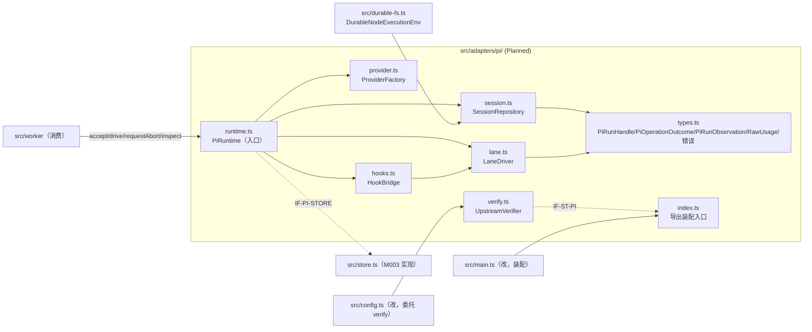
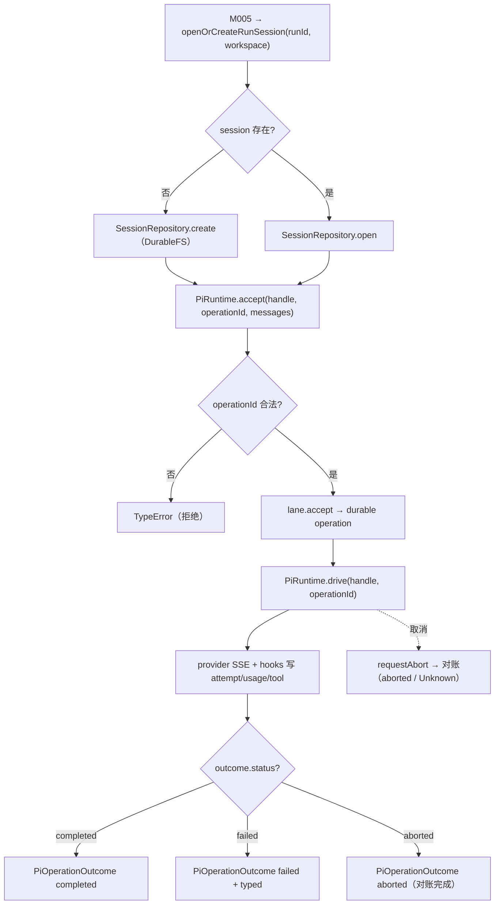

<!-- STD_DOCUMENT_COVER_BEGIN -->
# Piko 实现规格：pi-adapter（M006）

> STD 使用入口：[项目采用说明与标准导航](../../README.md#std-entry)

| 文档字段 | 值 |
|---|---|
| Document ID | `piko-pi-adapter-impl` |
| Document Version | `0.1.1` |
| Status | `Draft` |
| Project | `piko` |
| Document Owner | Piko Implementation Owner |
| Last Modified Date | `2026-09-28` |
| Template ID | `design.implementation` |
| Template Version | `1.2.0` |
<!-- STD_DOCUMENT_COVER_END -->

## 1. 实现目标与输入基线

<a id="isd-scope"></a>

本 ISD 实现 M006 `pi-adapter` 的**进程内 Pi Harness 适配层**：向 M005 `worker` 提供 `openOrCreateRunSession`/`accept`/`drive`/`getResult`/`requestAbort`/`inspect` 六个操作，向 M007 `usage` 提供 `onRawUsage` 观察（经 M003 写 `model_attempts`），向 M000 `bootstrap` 提供 S6 `verifyPiUpstream`。本次实现范围是 §5 的八个函数/组件、其内部组成（provider/session/hooks/lane/durable-fs/verify）与 Brownfield 抽出（§2）；**非目标**是 Pi SSE/provider 协议实现（固定 Pi SDK）、Run 状态机与 Result 两步发布（M005/M003）、usage 聚合与语义校验（M007）、工具 recovery contract 注册（M002）、自建 DB schema（M003）、Matrix discussion 传输（M008）。模块行为、接口语义、状态模型与失败语义由模块设计 `piko-pi-adapter` 唯一维护，本层只细化文件/symbol、私有表示、调用/锁/清理步骤与测试入口。

### 1.1 实现对象

- **模块 ID / 名称**：`M006` / `pi-adapter`。
- **直属父对象 / 父设计**：`SW-P`（Piko Agent Runtime V0.3，`design_level=system`）/ `system-design` v0.11.2；`parent_document_id=system-design`（ISD 与模块设计同为 `system-design` 的子视图，不互为父子）。
- **模块设计 Document ID / 版本 / 路径 / 摘要**：`piko-pi-adapter` / `0.1.0-draft.1` / `docs/40_module_design/piko-pi-adapter-design.md`。摘要：把 Pi Harness session/lane/operation 封装为确定性 Piko 执行身份（`pi_session_id=task_id`、lane `main`、operation `task_id:initial`/`task_id:turn:<n>`），提供 abort 对账与崩溃 inspect，并在归一化前保存 raw usage；不替换 provider adapter。
- **需求与 Constraint ID**：`CON-RUN-001`（PK-01）、`CON-RUN-003`（PK-03，**本版撤销**）、`PK-04`、`PK-05/06`、`CON-USAGE-001`（PK-09）、`CON-USAGE-002`（PK-10）、`CON-REC-001`（PK-12）、`CON-ST-001`（PK-12）；机制输入 `M-RUN-DI-006`（`piko-run` §14.4）、`M-USAGE-DI-001`（`piko-usage` §14.4）、`M-REC-DI-003`（`piko-recovery` §14.4）、`M-ST-DI-003`（`piko-startup` §14.4）、`IF-CX-ABORT`（`piko-cancel` §5.2）。
- **实现范围 / 非目标**：范围：`src/adapters/pi/`（Planned）六个单元 + 对 `src/pi-runtime.ts`/`src/durable-fs.ts`/`src/config.ts`/`src/main.ts` 的最小改动。非目标：不实现 provider 协议、不新建 DB 表/迁移（M003）、不改 Run/Result 语义、不开新线程/进程。
- **ISD 默认落位或项目批准路径**：`docs/50_implementation_design/piko-pi-adapter-impl.isd.md`（STD 默认路径）；代码落位 `src/adapters/pi/`（Planned；Current 在 `src/pi-runtime.ts`）。

<a id="isd-handoff"></a>

### 1.2.1 `H-PI-SESSION` · Run 会话身份

- **上游信息项 / 规则 ID**：`F-PI-SESSION`、`R-PI-IDENTITY`、`IF-RUN-SESSION`、`CON-RUN-001`。
- **固定来源 / 版本 / 锚点 / 摘要**：`piko-pi-adapter` §2.1/§8.1/§9.1.1（v0.1.0-draft.1）。
- **ISD 细化内容 / 章节**：§5.1.1 `openOrCreateRunSession`；§3.2 `session.ts`；§4.2.1 `PiRunHandle`；§6.1 `P-PI-SESSION`。
- **唯一权威位置**：行为/接口权威 = 模块设计 §2.1/§9.1.1；文件/symbol/私有表示权威 = 本 ISD。
- **实现自由度**：session 打开实现、`PiRunHandle` 语言表示；不可改 `session_id=task_id` 与 lane `main`。
- **原 V/Case 及本地验证位置**：`VRC-PI-001`（§9.1.1）。

### 1.2.2 `H-PI-ACCEPT-DRIVE` · 接受与驱动操作

- **上游信息项 / 规则 ID**：`F-PI-ACCEPT`、`F-PI-DRIVE`、`R-PI-STREAM`、`R-PI-ATTEMPT`、`IF-RUN-ACCEPT`、`IF-RUN-DRIVE`、`PK-04`、`CON-RUN-003`。
- **固定来源 / 版本 / 锚点 / 摘要**：`piko-pi-adapter` §2.2/§2.3/§8.2/§8.3/§8.4/§9.1.2/§9.1.3。
- **ISD 细化内容 / 章节**：§5.1.2 `accept`、§5.1.3 `drive`、§5.1.4 `getResult`；§3.5 `lane.ts`；§6.2 `P-PI-DRIVE`。
- **唯一权威位置**：行为 = 模块设计 §8.2–§8.4/§9.1.2/§9.1.3；驱动循环与 outcome 归一化 = 本 ISD。
- **实现自由度**：drive 循环组织、错误分类实现；不可切非流式、不可提高 `maxRetries`。
- **原 V/Case 及本地验证位置**：`VRC-PI-002/003/004`。

### 1.2.3 `H-PI-USAGE` · 归一化前 raw usage 观察

- **上游信息项 / 规则 ID**：`F-PI-USAGE`、`R-PI-RAWUSAGE`、`IF-RUN-RAWUSAGE`、`CON-USAGE-001`、`CON-USAGE-002`。
- **固定来源 / 版本 / 锚点 / 摘要**：`piko-pi-adapter` §2.4/§8.6/§9.2.1；`piko-usage` §4.4.1 `RawUsage` + §5.1 `recordAttempt`。
- **ISD 细化内容 / 章节**：§5.1.8 `HookBridge.install`（`onRawUsage` 回调）；§3.4 `hooks.ts`；§4.2.4 `RawUsage`；§6.3 `P-PI-USAGE`。
- **唯一权威位置**：捕获时机/存在性语义 = 模块设计 §8.6 + `piko-usage` §4.4.1；字段提取实现 = 本 ISD。
- **实现自由度**：字段提取实现；不可在归一化后取 usage、不可填 0。
- **原 V/Case 及本地验证位置**：`VRC-PI-006`。

### 1.2.4 `H-PI-TOOLS` · 工具 CAS、路径授权与 replay

- **上游信息项 / 规则 ID**：`R-PI-TOOLCAS`、`PK-05/06`、`IF-PI-STORE`。
- **固定来源 / 版本 / 锚点 / 摘要**：`piko-pi-adapter` §8.5/§9.2.2；`system-design` §3.4 PK-05/06。
- **ISD 细化内容 / 章节**：§5.1.8 `HookBridge.install`（`before_tool`/`after_tool`）；§7.1.5 `C-PI-05`。
- **唯一权威位置**：CAS 位置/`replay` 来源 = 模块设计 §8.5；hook 实现 = 本 ISD。
- **实现自由度**：错误消息与授权顺序；不可新增 `safe`、不可跳过路径授权。
- **原 V/Case 及本地验证位置**：`VRC-PI-005`。

### 1.2.5 `H-PI-ABORT` · 中止与 in-flight 对账

- **上游信息项 / 规则 ID**：`F-PI-ABORT`、`R-PI-ABORT-RECONCILE`、`IF-CX-ABORT`。
- **固定来源 / 版本 / 锚点 / 摘要**：`piko-pi-adapter` §2.5/§8.7/§9.1.5；`piko-cancel` §5.2。
- **ISD 细化内容 / 章节**：§5.1.5 `requestAbort`；§6.4 `P-PI-ABORT`；§7.1.1 `C-PI-01`。
- **唯一权威位置**：abort 语义 = 模块设计 §8.7；轮询/对账实现 = 本 ISD。
- **实现自由度**：轮询实现；不可把 Unknown 当成功/失败、不可释放 slot。
- **原 V/Case 及本地验证位置**：`VRC-PI-005`（Case C/D）。

### 1.2.6 `H-PI-RECOVERY` · 崩溃后 inspect 对账

- **上游信息项 / 规则 ID**：`F-PI-INSPECT`、`R-PI-INSPECT`、`IF-REC-INSPECT`、`CON-REC-001`。
- **固定来源 / 版本 / 锚点 / 摘要**：`piko-pi-adapter` §2.6/§8.8/§9.1.6；`piko-recovery` §5.1。
- **ISD 细化内容 / 章节**：§5.1.6 `inspect`；§4.2.3 `PiRunObservation`；§6.5 `P-PI-INSPECT`。
- **唯一权威位置**：三态语义 = 模块设计 §8.8；JSONL 投影实现 = 本 ISD。
- **实现自由度**：读取顺序/投影；不可重发、不可模拟成功。
- **原 V/Case 及本地验证位置**：`VRC-PI-007`。

### 1.2.7 `H-PI-UPSTREAM` · S6 校验

- **上游信息项 / 规则 ID**：`F-PI-UPSTREAM`、`R-PI-UPSTREAM-VERIFY`、`IF-ST-PI`、`CON-ST-001`。
- **固定来源 / 版本 / 锚点 / 摘要**：`piko-pi-adapter` §2.7/§8.9/§9.1.7；`piko-startup` §5.1；`config/pi-adapter-patch-manifest.json`。
- **ISD 细化内容 / 章节**：§5.1.7 `verifyPiUpstream`；§3.7 `verify.ts`；§8.1 配置。
- **唯一权威位置**：fail-closed 语义 = 模块设计 §8.9；指纹实现 = 本 ISD。
- **实现自由度**：指纹读取实现；不可放宽为警告后继续。
- **原 V/Case 及本地验证位置**：`VRC-PI-008`。

### 1.2.8 `H-PI-STATE` · Pi 会话/操作运行态与不变量

- **上游信息项 / 规则 ID**：`PiRunSessionState`（`T-PI-01..08`、`INV-PI-1..5`）。
- **固定来源 / 版本 / 锚点 / 摘要**：`piko-pi-adapter` §6.6。
- **ISD 细化内容 / 章节**：§4.6 运行态私有表示（`OperationRuntimeState` + `HookBridgeState`）；§7.1 并发出口；§7.2（持久化边界→M003）。
- **唯一权威位置**：状态与不变量 = 模块设计 §6.6；内存投影 = 本 ISD。
- **实现自由度**：内存态表示；不可改转换 Guard 与不变量。
- **原 V/Case 及本地验证位置**：`VRC-PI-001/002/005/007`。

## 2. 既有实现差异（条件章节）

### 2.1 适用性

- **适用性**：brownfield（存在需修改的既有实现）。
- **依据**：基线：当前工作树 commit（见封面 metadata `reviewed_commit`/§10 状态复核）。既有 `src/pi-runtime.ts` 以单类 `PiRuntime.execute()` 内联 session 打开、hook 注册、accept/drive 循环、abort 定时与 `normalizeRawUsage`；`src/durable-fs.ts` 提供 `DurableNodeExecutionEnv`；`src/config.ts` `loadConfig` 内联 S6 校验。本 ISD 把这部分抽为 M006 的显式单元，不新建 schema。
- **Tailoring / 范围决定引用**：`TAIL-P-NEW-S1`（Piko 无 subsystem，`design.definition`/`design.implementation` 直接承接 `system-design`）；范围决定 `system-design` §15 PHASE-I。

### 2.2 `CH-PI-01` · 抽取 hook 桥

- **基线 commit / 版本**：当前工作树（§10.2 `SC-PI-01` 记录解析出的 commit）。
- **文件 / symbol**：`src/pi-runtime.ts` `PiRuntime.execute` 内 `created.harness.hooks.on(...)`（既有）→ Planned `src/adapters/pi/hooks.ts` `HookBridge.install`。
- **Current 行为**：hook 闭包捕获 `active`/`activeTurn`/`unsafeRetry` 等局部变量，与 drive 循环耦合。
- **Target 改动与理由**：抽为 `HookBridge`，持有 `active` attempt 身份与状态，暴露 `install(harness, ctx)`。理由：`PK-05/06`、`CON-USAGE-001` 需可对 attempt/tool CAS 与 usage 存在性做表驱动单测（`VRC-PI-004/005/006`）。
- **原规则 / 成员 ID**：`R-PI-ATTEMPT`、`R-PI-TOOLCAS`、`R-PI-RAWUSAGE`。
- **实现状态**：`IN_PROGRESS`（Current 内联，Target 抽出）。

### 2.3 `CH-PI-02` · 抽取 lane/session/provider

- **基线 commit / 版本**：当前工作树。
- **文件 / symbol**：`src/pi-runtime.ts` `model()`/session 打开/`lane.accept`/`lane.drive`/`lane.requestAbort`/`getResult` → Planned `src/adapters/pi/{provider,session,lane}.ts`。
- **Current 行为**：provider 构造、`JsonlSessionRepo` 使用、accept/drive 循环与 abort 定时全部内联于 `execute`。
- **Target 改动与理由**：拆为 `ProviderFactory`/`SessionRepository`/`LaneDriver`，暴露 `openOrCreateRunSession`/`accept`/`drive`/`getResult`/`requestAbort`/`inspect`。理由：`CON-RUN-001`/`PK-04`/`CON-REC-001` 需独立可测（`VRC-PI-001/002/003/007`）。
- **原规则 / 成员 ID**：`F-PI-*`、`R-PI-IDENTITY`、`R-PI-STREAM`、`R-PI-INSPECT`、`IF-RUN-SESSION/ACCEPT/DRIVE`、`IF-REC-INSPECT`。
- **实现状态**：`IN_PROGRESS`。

### 2.4 `CH-PI-03` · 抽出 S6 校验

- **基线 commit / 版本**：当前工作树。
- **文件 / symbol**：`src/config.ts` `loadConfig`/`gitHead` 内校验（既有）→ Planned `src/adapters/pi/verify.ts` `verifyPiUpstream`。
- **Current 行为**：`loadConfig` 读取 manifest、校验 hash/pin、`gitHead` 比对、marker 扫描，失败抛通用 `Error`。
- **Target 改动与理由**：抽出 `verifyPiUpstream` 并抛 `PiUpstreamMismatch`（typed，交 M000 F1）。理由：`CON-ST-001` 的 fail-closed 需显式错误与可单测的 marker 级失败（`VRC-PI-008`）。
- **原规则 / 成员 ID**：`F-PI-UPSTREAM`、`R-PI-UPSTREAM-VERIFY`、`IF-ST-PI`。
- **实现状态**：`IN_PROGRESS`。

### 2.5 `CH-PI-04` · 显式化 inspect 与 operation 身份

- **基线 commit / 版本**：当前工作树。
- **文件 / symbol**：`src/pi-runtime.ts` `execute` 内 `repo.list`/`lane.getResult` 对账片段（既有）→ Planned `LaneDriver.inspect` + `R-PI-IDENTITY`。
- **Current 行为**：恢复逻辑内嵌于 `execute`：查 `repo.list`/`lane.getResult`，按是否存在 operation 决定 accept/drive。
- **Target 改动与理由**：抽出只读 `inspect(handle) -> PiRunObservation` 并固定 operation 派生（`task_id:initial`/`task_id:turn:<n>`）。理由：`CON-REC-001` 要求恢复只读 durable 事实、不重发，可独立验证（`VRC-PI-001/007`）。
- **原规则 / 成员 ID**：`F-PI-INSPECT`、`R-PI-IDENTITY`、`R-PI-INSPECT`。
- **实现状态**：`IN_PROGRESS`。

## 3. 文件、内部组件与调用关系

<a id="isd-structure"></a>



图 M006-ISD-S1 · Planned / NOT_IMPLEMENTED（Current 内联于 `src/pi-runtime.ts`/`src/config.ts`）。实线调用；虚线跨模块适配。`provider.ts` 只依赖 `types.ts` 与 Pi SDK；`lane.ts`/`session.ts` 适配 Pi SDK；`hooks.ts` 适配 M003 端口。

### 3.1 `src/adapters/pi/types.ts`

- **职责及调用者**：定义本层私有类型与错误类；被 `provider.ts`/`session.ts`/`hooks.ts`/`lane.ts`/`runtime.ts` 引用。
- **类型 / 函数**：`PiRunHandle`、`PiOperationOutcome`、`PiRunObservation`、`RawUsage`、`AdapterPatchManifest`、`PiAdapterConfig`、`PiSessionCorrupted`、`PiUpstreamMismatch`、`PiOperationUnknown`、`OperationRuntimeState`、`HookBridgeState`。
- **可见性**：模块内 public（仅 `index.ts` 再导出 `PiRuntime` 与 `PiRunHandle`）。
- **调用与类型依赖**：零运行时依赖。
- **构建目标 / 生成源 / 输出**：`tsc` 编译进 `dist/adapters/pi/types.js`；无生成源。
- **实现状态**：Planned。

### 3.2 `src/adapters/pi/session.ts`

- **职责及调用者**：按 `pi_session_id=task_id` 打开/创建/关闭 JSONL session 并绑定 lane `main`；被 `runtime.ts` 调用。
- **类型 / 函数**：`class SessionRepository`：`openOrCreate(runId, workspace): Promise<PiRunHandle>`、`close(handle): Promise<void>`。
- **可见性**：模块内 public。
- **调用与类型依赖**：依赖 `types.ts` + `src/durable-fs.ts`；适配 Pi `JsonlSessionRepo`。
- **构建目标 / 生成源 / 输出**：`tsc` → `dist/adapters/pi/session.js`。
- **实现状态**：Planned（Current 在 `src/pi-runtime.ts` 构造器与 `execute` 内，IMPLEMENTED）。

### 3.3 `src/adapters/pi/provider.ts`

- **职责及调用者**：构造固定 `openai-responses` provider/model 与固定 `streamOptions`；被 `runtime.ts` 调用。
- **类型 / 函数**：`createModel(config: PiAdapterConfig, apiKey: string): { models: Models; model: Model<"openai-responses"> }`。
- **可见性**：模块内 public。
- **调用与类型依赖**：依赖 `types.ts`；适配 Pi `createModels/createProvider/openAIResponsesApi/envApiKeyAuth`。
- **构建目标 / 生成源 / 输出**：`tsc` → `dist/adapters/pi/provider.js`。
- **实现状态**：Planned（Current 在 `PiRuntime.model()`，IMPLEMENTED）。

### 3.4 `src/adapters/pi/hooks.ts`

- **职责及调用者**：注册 `before_request`/`onRawUsage`/`before_tool`/`after_tool`/`tool_end` 并实现 attempt 计数、usage 与 tool CAS；被 `runtime.ts` 装配、由 Pi 回调。
- **类型 / 函数**：`class HookBridge`：`install(harness, ctx: HookContext): void`、私有 handler；`HookContext{config, registry, store, runId, epoch, task, profile, active}`。
- **可见性**：模块内 public。
- **调用与类型依赖**：依赖 `types.ts` + `lane.ts`；适配 M003 端口（`IF-PI-STORE`）。
- **构建目标 / 生成源 / 输出**：`tsc` → `dist/adapters/pi/hooks.js`。
- **实现状态**：Planned（Current 内联于 `PiRuntime.execute`，IMPLEMENTED）。

### 3.5 `src/adapters/pi/lane.ts`

- **职责及调用者**：实现 `accept`/`drive`/`getResult`/`requestAbort`/`inspect` 的 Harness 调用、outcome 归一化与 operation 身份派生；被 `runtime.ts`/`hooks.ts` 调用。
- **类型 / 函数**：`class LaneDriver`：`accept(handle, operationId, messages)`、`drive(handle, operationId): Promise<PiOperationOutcome>`、`getResult(handle, operationId)`、`requestAbort(handle, operationId)`、`inspect(handle): Promise<PiRunObservation>`；`operationIdFor(runId, turnSeq)`。
- **可见性**：模块内 public。
- **调用与类型依赖**：依赖 `types.ts`；适配 Pi `AgentLane`。
- **构建目标 / 生成源 / 输出**：`tsc` → `dist/adapters/pi/lane.js`。
- **实现状态**：Planned（Current 内联于 `PiRuntime.execute`，IMPLEMENTED）。

### 3.6 `src/durable-fs.ts`

- **职责及调用者**：`DurableNodeExecutionEnv` 在 Pi JSONL 写/追加/重命名成功后 fsync；被 `session.ts` 注入 `JsonlSessionRepo`。
- **类型 / 函数**：`class DurableNodeExecutionEnv extends NodeExecutionEnv`（`writeFile`/`appendFile`/`renameFile`）。
- **可见性**：public（同级可 import）。
- **调用与类型依赖**：依赖 Pi `NodeExecutionEnv` + `node:fs/promises`。
- **构建目标 / 生成源 / 输出**：`tsc` → `dist/durable-fs.js`。
- **实现状态**：IMPLEMENTED。

### 3.7 `src/adapters/pi/verify.ts`

- **职责及调用者**：S6 校验 manifest 哈希/pin、`upstream/pi` HEAD、四项 marker；被 `config.ts`/`runtime.ts` 调用。
- **类型 / 函数**：`verifyPiUpstream(config: PiAdapterConfig, root: string): Promise<void>`；私有 `gitHead(repo)`、`readManifest(path)`。
- **可见性**：public（`config.ts` import）。
- **调用与类型依赖**：依赖 `types.ts` + `node:fs/promises`/`node:crypto`。
- **构建目标 / 生成源 / 输出**：`tsc` → `dist/adapters/pi/verify.js`。
- **实现状态**：Planned（Current 在 `src/config.ts` `loadConfig`/`gitHead`，IMPLEMENTED）。

### 3.8 `src/adapters/pi/runtime.ts`

- **职责及调用者**：入口：实现六个对外操作并编排 I1–I4；被 M005 调用。
- **类型 / 函数**：`class PiRuntime`：`constructor(config, registry, store, apiKey)`；`openOrCreateRunSession`/`accept`/`drive`/`getResult`/`requestAbort`/`inspect`/`close`。
- **可见性**：public（经 `index.ts` 导出）。
- **调用与类型依赖**：依赖 `provider.ts`/`session.ts`/`hooks.ts`/`lane.ts`/`types.ts`。
- **构建目标 / 生成源 / 输出**：`tsc` → `dist/adapters/pi/runtime.js`。
- **实现状态**：Planned（Current 在 `src/pi-runtime.ts`，IMPLEMENTED）。

### 3.9 `src/adapters/pi/index.ts`

- **职责及调用者**：唯一装配入口：导出 `PiRuntime` 与 `createPiRuntime(config, registry, store, apiKey)`；被 `main.ts` 调用。
- **类型 / 函数**：`export function createPiRuntime(...): PiRuntime`。
- **可见性**：public。
- **调用与类型依赖**：依赖 `runtime.ts`/`types.ts`。
- **构建目标 / 生成源 / 输出**：`tsc` → `dist/adapters/pi/index.js`。
- **实现状态**：Planned。

### 3.10 `src/config.ts`（修改既有）

- **职责及调用者**：`loadConfig` 委托 `verifyPiUpstream`；保留 schema/tool-registry 校验。
- **类型 / 函数**：`loadConfig` 内删除内联 S6 片段，改调 `verifyPiUpstream`。
- **可见性**：public。
- **调用与类型依赖**：依赖 `adapters/pi/verify.js`。
- **构建目标 / 生成源 / 输出**：`tsc` → `dist/config.js`。
- **实现状态**：`IN_PROGRESS`。

### 3.11 `src/main.ts`（修改既有）

- **职责及调用者**：装配 `TaskStore` → `createPiRuntime` → `RunWorker`。
- **类型 / 函数**：`main()` 内装配行；import 路径从 `./pi-runtime.js` 改为 `./adapters/pi/index.js`。
- **可见性**：public（入口）。
- **调用与类型依赖**：依赖 `config.ts`/`adapters/pi/index.js`/`worker.ts`。
- **构建目标 / 生成源 / 输出**：`tsx src/main.ts`（运行）；`tsc` 类型检查。
- **实现状态**：`IN_PROGRESS`。

## 4. 数据结构设计

<a id="isd-data"></a>

**不适用类别**：§4.1 公共基础类型（本层无上级 Data ID 需承接，用字面量联合）、§4.4 通信报文（raw usage 观察结构在 §4.2.4 定义，不另立报文）、§4.5 设备/FPGA 表项（纯软件，`TAIL-P-103`）为 N/A。§4.7 数据库表结构 N/A——schema 与事务 authority 属 M003（见 §7.2）。§4.3 配置复用系统 config schema（见 §4.3）。

### 4.2 业务与操作数据结构

#### 4.2.1 `PiRunHandle`

- **代码式声明、Data/Type ID 与固定来源**：私有类型 `PiRunHandle`（本 ISD `types.ts`）；语义来源 = 模块设计 §6.2.1。

  ```ts
  interface PiRunHandle { session_id: string; lane: "main"; workspace: string }
  ```

- **逐字段定义、条件有效性和跨字段不变量**：`session_id` 非空且恒等于 `task_id`；`lane` 恒 `"main"`；`workspace` 为规范化绝对路径。不变量 `INV-PI-1`。
- **代码文件/symbol、编码或投影函数**：`src/adapters/pi/types.ts`；由 `SessionRepository.openOrCreate` 构造；无编码。
- **创建、借用、修改、释放与失败出口**：`openOrCreateRunSession` 创建并返回；不可变；寿命 = Run 寿命；失败 = 依赖错误/`PiSessionCorrupted`。
- **合法及拒绝实例、V/Case 与证据状态**：合法 `{session_id:"task-042",lane:"main",workspace:"/srv/piko/ws-7"}`；拒绝 `lane:"other"`。`VRC-PI-001`；`NOT_RUN`。

#### 4.2.2 `PiOperationOutcome`

- **代码式声明、Data/Type ID 与固定来源**：私有类型；语义来源 = 模块设计 §6.2.2；对应 Pi `OperationResultRecord`。

  ```ts
  interface PiOperationOutcome {
    status: "completed" | "failed" | "aborted";
    summary: string;
    error?: { code: string; cause_class: string; message: string };
  }
  ```

- **逐字段定义、条件有效性和跨字段不变量**：`status` 三分互斥；`summary` 非空；`error` 仅 `failed`/`aborted` 可非空；`aborted` 须对账完成。
- **代码文件/symbol、编码或投影函数**：`lane.ts` `normalizeOutcome(record)`。
- **创建、借用、修改、释放与失败出口**：`LaneDriver.drive` 构造并返回；不可变；失败 = Harness fault → `failed`。
- **合法及拒绝实例、V/Case 与证据状态**：合法 `{status:"completed",summary:"…"}`；拒绝 `status:"completed"` 带 `error`。`VRC-PI-002/004/005`；`NOT_RUN`。

#### 4.2.3 `PiRunObservation`

- **代码式声明、Data/Type ID 与固定来源**：私有类型；语义来源 = `piko-recovery` §4.4.2/§5.1 + 模块设计 §6.2.3。

  ```ts
  interface PiRunObservation {
    open_operations: string[];
    operation_result: PiOperationOutcome | null;
    lane_tip: string | null;
    transcript_version: number;
    durable_queues: { pending_turns: number };
  }
  ```

- **逐字段定义、条件有效性和跨字段不变量**：`open_operations` 与 `operation_result` 互斥优先（open 优先 drive）；`transcript_version >= 0`。
- **代码文件/symbol、编码或投影函数**：`lane.ts` `inspect`（`lane.findEntries`/`getResult`/`getTipId`）。
- **创建、借用、修改、释放与失败出口**：只读投影并返回；失败 = `PiSessionCorrupted`。
- **合法及拒绝实例、V/Case 与证据状态**：合法见模块设计 §6.2.3；拒绝 open 与 result 同时非空。`VRC-PI-007`；`NOT_RUN`。

#### 4.2.4 `RawUsage`

- **代码式声明、Data/Type ID 与固定来源**：私有类型；唯一来源 `piko-usage` §4.4.1。

  ```ts
  interface RawUsage {
    request_identity: { response_id?: string; request_id?: string };
    present_fields: string[];
    input_tokens?: number; output_tokens?: number; total_tokens?: number;
    cached_tokens?: number; cache_write_tokens?: number; reasoning_tokens?: number;
  }
  ```

- **逐字段定义、条件有效性和跨字段不变量**：`present_fields` 与值一致；缺失字段不出现在 `present_fields`、值为 null；数值非负整数。
- **代码文件/symbol、编码或投影函数**：`hooks.ts` `toRawUsage(usage: unknown): RawUsage`（Current `normalizeRawUsage` 的字段提取前段）。
- **创建、借用、修改、释放与失败出口**：`onRawUsage` 回调构造 → M003 `observeUsage`；寿命 = attempt；迟到替换。
- **合法及拒绝实例、V/Case 与证据状态**：合法：present 含 `input_tokens` 则其值非 null；拒绝：present 含 `reasoning_tokens` 但值 0 冒充缺失。`VRC-PI-006`；`NOT_RUN`。

#### 4.2.5 `PikoDiscussionMessage`

- **代码式声明、Data/Type ID 与固定来源**：语义来源 `piko-matrix` §4.2 + `system-design` §7.2；M006 投影实现 `discussionMessage`。

  ```ts
  interface PikoDiscussionMessage {
    event_id: string;
    visible_content: string;
    reply_context?: unknown;
    attachments?: unknown[];
  }
  ```

- **逐字段定义、条件有效性和跨字段不变量**：`event_id` 不得进入模型 input；`visible_content` 已脱敏；投影走 `createCustomMessage("piko.discussion", visible_content, false, {event_id})`。
- **代码文件/symbol、编码或投影函数**：`hooks.ts`/`lane.ts` 构造 `AgentMessage`；`types.ts` 声明。
- **创建、借用、修改、释放与失败出口**：由 M005 构造、M006 投影；寿命 = 单轮。
- **合法及拒绝实例、V/Case 与证据状态**：合法：`event_id` 不在 prompt；拒绝：`event_id` 写入 `visible_content`。`VRC-PI-002`；`NOT_RUN`。

#### 4.2.6 `AdapterPatchManifest`

- **代码式声明、Data/Type ID 与固定来源**：唯一来源 `config/pi-adapter-patch-manifest.json`（`schema_version:"1"`）。

  ```ts
  interface AdapterPatchManifest {
    schema_version: "1";
    pi_version: "0.85.1";
    pi_commit: string;
    patch_file: string;
    additive_changes: { id: string; purpose: string; files: string[] }[];
  }
  ```

- **逐字段定义、条件有效性和跨字段不变量**：`pi_version`/`pi_commit` == config `pi.version`/`pi.commit`；`additive_changes[].id` 含四 id；文件 SHA-256 == `pi.adapter_patch_sha256`。
- **代码文件/symbol、编码或投影函数**：`verify.ts` `readManifest`。
- **创建、借用、修改、释放与失败出口**：构建期固定、S6 读取；失败 = `PiUpstreamMismatch`。
- **合法及拒绝实例、V/Case 与证据状态**：合法：四 id 齐全且哈希匹配；拒绝：pin/哈希不符。`VRC-PI-008`；`NOT_RUN`。

### 4.3 配置与规则数据结构

#### 4.3.1 `PiAdapterConfig`

- **代码式声明、Data/Type ID 与配置 authority**：投影自系统 config（`system-design` §9.1 + `piko-runtime-config-v0.3.schema.json`）；本层只取子集。

  ```ts
  type PiAdapterConfig = Pick<RuntimeConfig, "pi" | "llmtier" | "agent" | "workspace">;
  ```

- **逐字段定义、默认值、跨字段校验与拒绝**：`pi.version`/`pi.commit` 固定常量；`pi.session_root`/`pi.adapter_patch_manifest_path` 绝对路径；`pi.adapter_patch_sha256` 64 位 hex；`llmtier.base_url` https、`models_timeout_ms` ∈ [100,60000]；`agent.model`/`profile_ref` 非空；`workspace.roots` 非空。固定项 `cacheRetention="none"`、`maxRetries=0`、`supportsExplicitPromptCacheMode=false` 不接受覆盖。
- **读取/校验/应用 symbol 与生效点**：`src/config.ts` `loadConfig`（Ajv schema 校验）+ `verifyPiUpstream`；启动 S2/S6 生效，进程内不变。
- **快照、所有权、寿命与敏感性**：只读快照；含 secret ref 非明文；`resolveSecret` 后注入 provider，不入日志。
- **合法及拒绝实例、V/Case 与证据状态**：合法见 `config/runtime.json`；拒绝：非绝对路径/哈希格式错/版本不符。`VRC-PI-008`；`NOT_RUN`。

### 4.6 运行状态数据结构

#### 4.6.1 `OperationRuntimeState`（单 Run 操作投影）

- **代码式声明、Data/Type ID 与固定来源**：私有派生类型；语义来源 = 模块设计 §6.6。持久事实在 Pi session JSONL 与 M003 `run_sessions`。

  ```ts
  type OperationState = "Absent" | "Accepted" | "Driving" | "Reconciling" | "Completed" | "Failed" | "Aborted" | "Unknown";
  interface OperationRuntimeState {
    session_id: string; lane: "main";
    active_operation_id: string | null;
    last_operation_id: string | null;
    observed_tip_id: string | null;
    state: OperationState;
  }
  ```

- **逐字段定义、状态不变量与转移条件**：`active_operation_id` 非空 ⟺ `state ∈ {Accepted, Driving, Reconciling}`；单 Run 至多一个 active（`INV-PI-2`）；转移 `T-PI-01..08` 见模块设计 §6.6。
- **创建/更新/读取 symbol、同步与提交点**：`lane.ts` 在 accept/drive/abort/inspect 后更新；提交点 = session JSONL commit / M003 `run_sessions` commit。
- **唯一写者、借用、失效及恢复入口**：唯一写者 = `LaneDriver`（经 Harness）；恢复入口 = `inspect`。
- **合法及拒绝转移、V/Case 与证据状态**：合法 `Driving{active:"task-042:initial"}`；拒绝两 active。`VRC-PI-001/002/005/007`；`NOT_RUN`。

#### 4.6.2 `HookBridgeState`（hook 内存态）

- **代码式声明、Data/Type ID 与固定来源**：

  ```ts
  interface HookBridgeState {
    active?: { operation_id: string; step_id: string; attempt: number };
    activeTurn?: { event_id: string; turn_seq: number };
    unsafeRetry: boolean; toolFailure?: string;
  }
  ```

  owner = `HookBridge` 实例；寿命 = 一次 `drive` 期间。
- **逐字段定义、状态不变量与转移条件**：`active` 由 `before_request` 设置；`unsafeRetry` 置真后 `drive` 归入对应失败出口。
- **创建/更新/读取 symbol、同步与提交点**：`hooks.ts` handler 更新；无持久提交。
- **唯一写者、借用、失效及恢复入口**：唯一写者 = `HookBridge`；随 `drive` 结束失效；无恢复（attempt 身份可从 `before_request` 重建）。
- **合法及拒绝转移、V/Case 与证据状态**：合法 `unsafeRetry=false`；拒绝在 `unsafeRetry=true` 后仍放行。`VRC-PI-004/005`；`NOT_RUN`。

### 4.7 数据库表结构

**N/A。** 本模块不拥有持久表：`model_attempts`/`tool_calls`/`run_sessions` 的 schema authority 与 DDL 属 M003（当前代码事实 `src/store.ts`；设计权威 `piko-pi-adapter` §6.7 锚点 `m003-ddl-authority`）。本 ISD 只经 `IF-PI-STORE` 消费端口，不复制 CREATE TABLE。依据：ISD 规范 §3 “无持久化不虚构数据库，交由宿主的范围仍给实际交接责任”；交接见 §7.2。

### 4.8 错误码与错误结构

#### 4.8.1 `PiSessionCorrupted` / `PiUpstreamMismatch` / `PiOperationUnknown`

- **错误声明、Error/Data ID 与唯一来源**：私有错误类；语义来源 = 模块设计 §6.8.1。

  ```ts
  class PiSessionCorrupted extends Error { readonly reason: string }
  class PiUpstreamMismatch extends Error { readonly expected: string; readonly actual: string }
  class PiOperationUnknown extends Error { readonly operation_id: string; readonly last_error_class: string }
  ```

- **逐字段和逐码含义、触发事实及优先级**：`PiSessionCorrupted`：session 不可读/不可投影；`PiUpstreamMismatch`：S6 不匹配；`PiOperationUnknown`：abort 对账无法确认。三者不可互相替代。
- **抛出/捕获/转换 symbol 与 public payload**：`inspect`/`openOrCreateRunSession` 抛 `PiSessionCorrupted`；`verifyPiUpstream` 抛 `PiUpstreamMismatch`；`requestAbort` 路径抛 `PiOperationUnknown`；无 HTTP payload。
- **状态、副作用、可重试条件与敏感信息处理**：抛出不改持久状态；`PiUpstreamMismatch` 不可重试（需装正确版本）；不落 credential/路径。
- **触发向量、V/Case 与证据状态**：篡改 manifest → `PiUpstreamMismatch`；abort 不返回停止 → `PiOperationUnknown`。`VRC-PI-005/007/008`；`NOT_RUN`。

## 5. 接口设计

<a id="isd-functions"></a>

pi-adapter 的对外接口是 §5.1 的七个函数与 §5.1.8 hook 桥；被消费/适配的 M003 端口与 M007 raw usage 在 §5.2 记录（进程内协作接口）。硬件/固件与人机接口（§5.3/§5.4）N/A。

### 5.1 API（适用时）

#### 5.1.1 `PiRuntime.openOrCreateRunSession(runId: string, workspace: string): Promise<PiRunHandle>`

- **Interface/Member ID、用途**：`IF-RUN-SESSION`；打开或创建确定性 Pi session 并绑定 lane `main`。
- **文件 / symbol / 可见性**：Planned `src/adapters/pi/runtime.ts` `PiRuntime.openOrCreateRunSession`；public（经 `index.ts`）。
- **原成员 ID 或私有来源**：继承 `piko-run` §5.1 `IF-RUN-SESSION`（`M-RUN-DI-006`）。
- **完整签名与 caller**：`openOrCreateRunSession(runId: string, workspace: string): Promise<PiRunHandle>`；caller = M005 `worker.run`（宿主事件循环）。
- **固定契约与版本**：模块设计 §9.1.1（`piko-pi-adapter` v0.1.0-draft.1）；构建目标 `dist/adapters/pi/`。
- **输入参数 / 数据结构 authority**：`runId: string`（非空，= `pi_session_id`）；`workspace: string`（规范化绝对路径）；无 §4 Data ID，来源 = M005。
- **输入约束 / 校验顺序 / 失败映射**：校验 `runId` 非空（否则 `TypeError`）；顺序 = 查 session → 打开或创建 → 绑定 lane。FS 失败 → 依赖错误。
- **成功输出 / 数据结构 / 后置条件**：`PiRunHandle`（§4.2.1）；后置：磁盘唯一 session、`pi_session_id=runId`、lane `main`（`INV-PI-1`）。
- **错误输出 / 触发条件 / 优先级**：`PiSessionCorrupted`（既有 session 损坏）；依赖错误（FS 不可写）。无业务错误码。
- **底层异常 / 失败事实**：`JsonlSessionRepo.open/create` 抛 I/O 错误；session 解析失败。
- **模块是否处理及处理函数**：`SessionRepository.openOrCreate` 把解析失败转 `PiSessionCorrupted`；I/O 错误 propagate。
- **Typed 异常与原生异常所有权**：`PiSessionCorrupted`（本模块）→ M005（→ `InternalError`）；原生 I/O → M005。
- **宿主 / public payload 或状态码**：返回 `PiRunHandle` 或抛 typed/原生错误；无 HTTP。
- **日志级别 / 脱敏 / 关联字段**：`info`（session 就绪，含 `task_id`）；不含路径明文与凭据。
- **是否可重试及前提**：I/O 错误可重试；`PiSessionCorrupted` 不自动重试（交 operator）。
- **状态与副作用影响 / 验证项**：副作用 = 创建 session 目录/文件（fsync）；`VRC-PI-001`。
- **不可改变的规则 / Constraint ID**：`R-PI-IDENTITY`/`CON-RUN-001`；`session_id=task_id`、lane `main`。
- **实现自由度**：session 打开实现、`PiRunHandle` 表示。
- **副作用 / 执行上下文 / 幂等性**：有副作用（创建目录）；宿主事件循环异步；幂等（同 `runId` 返回同一 session）。
- **输入输出 ownership 与寿命**：输入借用；输出 handle 由 M005 持有，寿命 = Run。
- **Thread-safe / reentrant**：conditional（单线程；同 `runId` 不并发创建）。
- **Nested-call policy**：allowed：`JsonlSessionRepo`、`DurableNodeExecutionEnv`。
- **Transaction participation**：none（文件系统写入，非 SQL）。
- **Blocking / timeout / cancellation**：异步 await；无显式超时；调用返回即结束，无取消。
- **实现状态 / 验证项**：Planned（Current `src/pi-runtime.ts` IMPLEMENTED）/ `VRC-PI-001`。
- **装配、合法及拒绝实例**：装配 §3.9；合法：新 `runId` → 创建；拒绝：session 损坏 → `PiSessionCorrupted`。Oracle = 列目录 + session id。`NOT_RUN`。

#### 5.1.2 `PiRuntime.accept(handle: PiRunHandle, operationId: string, messages: AgentMessage | AgentMessage[]): Promise<void>`

- **Interface/Member ID、用途**：`IF-RUN-ACCEPT`；形成 durable operation。
- **文件 / symbol / 可见性**：Planned `src/adapters/pi/runtime.ts` `PiRuntime.accept`；public。
- **原成员 ID 或私有来源**：继承 `piko-run` §5.1 `IF-RUN-ACCEPT`。
- **完整签名与 caller**：`accept(handle, operationId, messages): Promise<void>`；caller = M005 `worker.run`。
- **固定契约与版本**：模块设计 §9.1.2。
- **输入参数 / 数据结构 authority**：`handle`（§4.2.1）；`operationId` ∈ `{runId:initial, runId:turn:<n>}`；`messages` 为 `initialPrompt`（可附 `PikoDiscussionMessage`）。
- **输入约束 / 校验顺序 / 失败映射**：校验 `operationId` 形状（`TypeError`）；校验无 in-flight operation（否则交 Harness）。顺序 = 校验 → `lane.accept`。
- **成功输出 / 数据结构 / 后置条件**：无返回；后置：durable operation 已 commit（`INV-PI-1/2`），`run_sessions.active_operation_id` 更新。
- **错误输出 / 触发条件 / 优先级**：Harness 拒绝（operationId 冲突）→ 上抛；非法 `operationId` → `TypeError`。
- **底层异常 / 失败事实**：`lane.accept` 返回 `not ok` 或抛错。
- **模块是否处理及处理函数**：`LaneDriver.accept` 校验形状（`operationIdFor`）、其余 propagate。
- **Typed 异常与原生异常所有权**：Harness 错误由本层透传 → M005。
- **宿主 / public payload 或状态码**：无返回；无 HTTP。
- **日志级别 / 脱敏 / 关联字段**：`info`（accept，含 `task_id`/`operation_id`）；不含 prompt 正文。
- **是否可重试及前提**：非法身份不重试；Harness 拒绝交 operator（不自行重发）。
- **状态与副作用影响 / 验证项**：副作用 = durable operation 写入；`VRC-PI-002`。
- **不可改变的规则 / Constraint ID**：`R-PI-IDENTITY`/`CON-RUN-001`；确定性 operation id。
- **实现自由度**：messages 构造/投影实现。
- **副作用 / 执行上下文 / 幂等性**：有副作用；宿主事件循环异步；非幂等（重复 accept 由 Harness 约束）。
- **输入输出 ownership 与寿命**：输入借用；无输出。
- **Thread-safe / reentrant**：conditional（单线程；单 Run 单 active）。
- **Nested-call policy**：allowed：`lane.accept`。
- **Transaction participation**：none（M003 `run_sessions` 由 Harness/M003 事务写）。
- **Blocking / timeout / cancellation**：异步 await；受 session I/O；无取消。
- **实现状态 / 验证项**：Planned（Current `src/pi-runtime.ts` IMPLEMENTED）/ `VRC-PI-002`。
- **装配、合法及拒绝实例**：合法：`task-042:initial`；拒绝：非法 operationId → `TypeError`。Oracle = session JSONL operation 记录。`NOT_RUN`。

#### 5.1.3 `PiRuntime.drive(handle: PiRunHandle, operationId: string): Promise<PiOperationOutcome>`

- **Interface/Member ID、用途**：`IF-RUN-DRIVE`；驱动操作至结局。
- **文件 / symbol / 可见性**：Planned `src/adapters/pi/runtime.ts` `PiRuntime.drive`；public。
- **原成员 ID 或私有来源**：继承 `piko-run` §5.2 `IF-RUN-DRIVE`。
- **完整签名与 caller**：`drive(handle, operationId): Promise<PiOperationOutcome>`；caller = M005 驱动循环。
- **固定契约与版本**：模块设计 §9.1.3。
- **输入参数 / 数据结构 authority**：`handle`；`operationId`（已 durable）。
- **输入约束 / 校验顺序 / 失败映射**：无跨字段；顺序 = `lane.drive` 循环 `waiting` 继续。
- **成功输出 / 数据结构 / 后置条件**：`PiOperationOutcome`（§4.2.2）；后置：attempt/tool 事实已写。
- **错误输出 / 触发条件 / 优先级**：`failed` + `ModelUnavailable`/`ModelResponseInvalid`/`ToolFailure`/`UnsafeRetryBlocked`/`ExecutionStateUnknown`；无业务抛出。
- **底层异常 / 失败事实**：Harness `drive` `not ok` / `outcome.error`。
- **模块是否处理及处理函数**：`LaneDriver.drive` 归一化；`isProviderUnavailableMessage` 分类。
- **Typed 异常与原生异常所有权**：本层把失败折进 outcome，不向上抛业务异常。
- **宿主 / public payload 或状态码**：返回 outcome；无 HTTP。
- **日志级别 / 脱敏 / 关联字段**：`info`（outcome status）；`warn`（failure code）；不含模型 output 全文。
- **是否可重试及前提**：provider 内层重试由 Harness attempt 策略；本接口不重试同一 operation。
- **状态与副作用影响 / 验证项**：副作用 = attempt/tool/usage 事实 + session 推进；`VRC-PI-002/003/004`。
- **不可改变的规则 / Constraint ID**：`R-PI-STREAM`/`R-PI-ATTEMPT`/`PK-04`。
- **实现自由度**：drive 循环组织、错误分类实现。
- **副作用 / 执行上下文 / 幂等性**：有副作用；宿主事件循环异步；非幂等。
- **输入输出 ownership 与寿命**：输入借用；输出 outcome 由 M005 持有。
- **Thread-safe / reentrant**：conditional（单线程；单 active）。
- **Nested-call policy**：allowed：`lane.drive`（hook 由 Pi 触发）。
- **Transaction participation**：none（hook 内单语句写 M003）。
- **Blocking / timeout / cancellation**：异步循环；provider 受 `llmtier.models_timeout_ms`；经 `requestAbort` 取消。
- **实现状态 / 验证项**：Planned（Current IMPLEMENTED）/ `VRC-PI-002/003/004`。
- **装配、合法及拒绝实例**：合法：正常 prompt → `completed`；拒绝：非法 SSE → `ModelResponseInvalid`。Oracle = outcome status + mock 请求体。`NOT_RUN`。

#### 5.1.4 `PiRuntime.getResult(handle: PiRunHandle, operationId: string): Promise<PiOperationOutcome | undefined>`

- **Interface/Member ID、用途**：`IF-RUN-DRIVE` 读取面；读取已 committed operation result（恢复用）。
- **文件 / symbol / 可见性**：Planned `src/adapters/pi/runtime.ts` `PiRuntime.getResult`；public。
- **原成员 ID 或私有来源**：私有（恢复读取）。
- **完整签名与 caller**：`getResult(handle, operationId): Promise<PiOperationOutcome | undefined>`；caller = M005 恢复流程。
- **固定契约与版本**：模块设计 §9.1.4。
- **输入参数 / 数据结构 authority**：`handle`；`operationId`。
- **输入约束 / 校验顺序 / 失败映射**：无；直接读。
- **成功输出 / 数据结构 / 后置条件**：`PiOperationOutcome` 或 `undefined`；只读。
- **错误输出 / 触发条件 / 优先级**：读取失败上抛；`undefined` 非错误。
- **底层异常 / 失败事实**：`lane.getResult` 抛错/session 损坏。
- **模块是否处理及处理函数**：`LaneDriver.getResult` propagate；损坏 → `PiSessionCorrupted`。
- **Typed 异常与原生异常所有权**：原生/`PiSessionCorrupted` → M005。
- **宿主 / public payload 或状态码**：返回 outcome/undefined。
- **日志级别 / 脱敏 / 关联字段**：`debug`。
- **是否可重试及前提**：query 可重复。
- **状态与副作用影响 / 验证项**：无副作用；`VRC-PI-007`。
- **不可改变的规则 / Constraint ID**：`R-PI-INSPECT`；不重发。
- **实现自由度**：读取实现。
- **副作用 / 执行上下文 / 幂等性**：只读幂等；宿主事件循环异步。
- **输入输出 ownership 与寿命**：输入借用；输出值对象。
- **Thread-safe / reentrant**：yes。
- **Nested-call policy**：allowed：`lane.getResult`。
- **Transaction participation**：none。
- **Blocking / timeout / cancellation**：异步 await；无取消。
- **实现状态 / 验证项**：Planned（Current IMPLEMENTED）/ `VRC-PI-007`。
- **装配、合法及拒绝实例**：合法：已 commit → outcome；未 commit → undefined。`NOT_RUN`。

#### 5.1.5 `PiRuntime.requestAbort(handle: PiRunHandle, operationId: string): Promise<void>`

- **Interface/Member ID、用途**：`IF-CX-ABORT`；请求中止并等待对账。
- **文件 / symbol / 可见性**：Planned `src/adapters/pi/runtime.ts` `PiRuntime.requestAbort`；public。
- **原成员 ID 或私有来源**：`piko-cancel` §5.2 `IF-CX-ABORT`。
- **完整签名与 caller**：`requestAbort(handle, operationId): Promise<void>`；caller = M005 取消分流。
- **固定契约与版本**：模块设计 §9.1.5；`piko-cancel` §5.2。
- **输入参数 / 数据结构 authority**：`handle`；`operationId`。
- **输入约束 / 校验顺序 / 失败映射**：无；直接 `lane.requestAbort`。
- **成功输出 / 数据结构 / 后置条件**：无返回；Harness 停 provider effect；对账完成后 `drive` 得 `aborted`。
- **错误输出 / 触发条件 / 优先级**：无法确认停止 → `PiOperationUnknown`；无业务码。
- **底层异常 / 失败事实**：`AbortRequestResult` 未确认 / tool 无 outcome。
- **模块是否处理及处理函数**：`LaneDriver.requestAbort` 等待对账，无法确认抛 `PiOperationUnknown`。
- **Typed 异常与原生异常所有权**：`PiOperationUnknown`（本模块）→ M005（→ `ExecutionStateUnknown`）。
- **宿主 / public payload 或状态码**：无返回/抛 typed；无 HTTP。
- **日志级别 / 脱敏 / 关联字段**：`info`（abort 请求）；`error`（Unknown，含 `operation_id`）。
- **是否可重试及前提**：重复 abort 幂等；Unknown 不自动重试（交 operator）。
- **状态与副作用影响 / 验证项**：副作用 = 停 effect + 提交中断；不释放 slot；`VRC-PI-005`。
- **不可改变的规则 / Constraint ID**：`R-PI-ABORT-RECONCILE`；不抢占在途 effect、不释放 slot。
- **实现自由度**：轮询/对账实现。
- **副作用 / 执行上下文 / 幂等性**：有副作用；宿主事件循环异步；幂等。
- **输入输出 ownership 与寿命**：输入借用；无输出。
- **Thread-safe / reentrant**：conditional。
- **Nested-call policy**：allowed：`lane.requestAbort`。
- **Transaction participation**：none。
- **Blocking / timeout / cancellation**：异步；对账受 tool timeout；无取消。
- **实现状态 / 验证项**：Planned（Current `src/pi-runtime.ts` cancelTimer IMPLEMENTED）/ `VRC-PI-005`。
- **装配、合法及拒绝实例**：合法：确认停止 → `aborted`；拒绝：无法确认 → `PiOperationUnknown` 且 slot 保持。`NOT_RUN`。

#### 5.1.6 `PiRuntime.inspect(handle: PiRunHandle): Promise<PiRunObservation>`

- **Interface/Member ID、用途**：`IF-REC-INSPECT`；崩溃后对账。
- **文件 / symbol / 可见性**：Planned `src/adapters/pi/runtime.ts` `PiRuntime.inspect`；public。
- **原成员 ID 或私有来源**：`piko-recovery` §5.1 `IF-REC-INSPECT`（`M-REC-DI-003`）。
- **完整签名与 caller**：`inspect(handle): Promise<PiRunObservation>`；caller = M005 恢复流程。
- **固定契约与版本**：模块设计 §9.1.6；`piko-recovery` §5.1。
- **输入参数 / 数据结构 authority**：`handle{session_id=task_id}`。
- **输入约束 / 校验顺序 / 失败映射**：session 存在；顺序 = `lane.findEntries`/`getResult`/`getTipId` → 投影。
- **成功输出 / 数据结构 / 后置条件**：`PiRunObservation`（§4.2.3）；只读；`INV-PI-3`。
- **错误输出 / 触发条件 / 优先级**：`PiSessionCorrupted`。
- **底层异常 / 失败事实**：JSONL 解析失败/缺失。
- **模块是否处理及处理函数**：`LaneDriver.inspect` 投影；损坏 → `PiSessionCorrupted`（不修复）。
- **Typed 异常与原生异常所有权**：`PiSessionCorrupted`（本模块）→ M005（→ `InternalError`）。
- **宿主 / public payload 或状态码**：返回 observation；无 HTTP。
- **日志级别 / 脱敏 / 关联字段**：`info`（inspect 三态）；不含 transcript 正文。
- **是否可重试及前提**：只读可重复；损坏不重试。
- **状态与副作用影响 / 验证项**：无副作用；`VRC-PI-007`。
- **不可改变的规则 / Constraint ID**：`R-PI-INSPECT`/`CON-REC-001`；不重发、不模拟成功。
- **实现自由度**：读取顺序/投影实现。
- **副作用 / 执行上下文 / 幂等性**：只读幂等；宿主事件循环异步。
- **输入输出 ownership 与寿命**：输入借用；输出值对象。
- **Thread-safe / reentrant**：yes。
- **Nested-call policy**：allowed：`lane.findEntries`/`getResult`/`getTipId`。
- **Transaction participation**：none。
- **Blocking / timeout / cancellation**：异步 await；无取消。
- **实现状态 / 验证项**：Planned（Current `repo.list`/`lane.getResult` IMPLEMENTED）/ `VRC-PI-007`。
- **装配、合法及拒绝实例**：合法三态见 §4.2.3；拒绝：损坏 → `PiSessionCorrupted`。`NOT_RUN`。

#### 5.1.7 `verifyPiUpstream(config: PiAdapterConfig, root: string): Promise<void>`

- **Interface/Member ID、用途**：`IF-ST-PI`；S6 校验 Pi commit + patch manifest。
- **文件 / symbol / 可见性**：Planned `src/adapters/pi/verify.ts` `verifyPiUpstream`；public（`config.ts` import）。
- **原成员 ID 或私有来源**：`piko-startup` §5.1 `IF-ST-PI`（`M-ST-DI-003`）。
- **完整签名与 caller**：`verifyPiUpstream(config, root): Promise<void>`；caller = M000 bootstrap S6（经 `loadConfig`）。
- **固定契约与版本**：模块设计 §9.1.7；`piko-startup` §5.1。
- **输入参数 / 数据结构 authority**：`config.pi.*`（§4.3.1）；`root` = repo root。
- **输入约束 / 校验顺序 / 失败映射**：顺序 = manifest 哈希 → pin → git HEAD → marker；任一不符 → `PiUpstreamMismatch`。
- **成功输出 / 数据结构 / 后置条件**：无返回（匹配即通过）；存活到 S7。
- **错误输出 / 触发条件 / 优先级**：`PiUpstreamMismatch`（expected/actual）。
- **底层异常 / 失败事实**：文件缺失、哈希不符、HEAD 读失败、marker 缺失。
- **模块是否处理及处理函数**：`verifyPiUpstream` 汇聚并抛 typed。
- **Typed 异常与原生异常所有权**：`PiUpstreamMismatch`（本模块）→ M000（→ F1 `InternalError("pi-upstream-mismatch")`）。
- **宿主 / public payload 或状态码**：无返回；F1 由 M000 输出。
- **日志级别 / 脱敏 / 关联字段**：`error`（失败阶段）；不落凭据。
- **是否可重试及前提**：不自动重试；修复安装后重启。
- **状态与副作用影响 / 验证项**：无副作用（只读）；`VRC-PI-008`。
- **不可改变的规则 / Constraint ID**：`R-PI-UPSTREAM-VERIFY`/`CON-ST-001`；fail-closed。
- **实现自由度**：指纹读取实现。
- **副作用 / 执行上下文 / 幂等性**：只读幂等；启动时同步/异步一次。
- **输入输出 ownership 与寿命**：输入只读；无输出。
- **Thread-safe / reentrant**：yes。
- **Nested-call policy**：allowed：`gitHead`/`readManifest`。
- **Transaction participation**：none。
- **Blocking / timeout / cancellation**：启动时读取；无取消。
- **实现状态 / 验证项**：Planned（Current `src/config.ts` `loadConfig`/`gitHead` IMPLEMENTED）/ `VRC-PI-008`。
- **装配、合法及拒绝实例**：合法：正确 checkout+manifest；拒绝：篡改 → `PiUpstreamMismatch`。Oracle = 独立 SHA-256 + git HEAD。`NOT_RUN`。

#### 5.1.8 `HookBridge.install(harness: AgentHarness, ctx: HookContext): void`

- **Interface/Member ID、用途**：私有 hook 桥；实现 `R-PI-ATTEMPT`/`R-PI-TOOLCAS`/`R-PI-RAWUSAGE`。
- **文件 / symbol / 可见性**：Planned `src/adapters/pi/hooks.ts` `HookBridge.install`；模块内 public。
- **原成员 ID 或私有来源**：私有（实现模块设计 §8.3–§8.6）。
- **完整签名与 caller**：`install(harness: AgentHarness, ctx: HookContext): void`；caller = `PiRuntime` 在 `AgentHarness.create` 后装配。
- **固定契约与版本**：模块设计 §8.3/§8.4/§8.5/§8.6。
- **输入参数 / 数据结构 authority**：`harness`；`ctx{config, registry, store, runId, epoch, task, profile, active}`。
- **输入约束 / 校验顺序 / 失败映射**：`before_request`：写 attempt 身份（记录 attempt）；`onRawUsage`：构造 `RawUsage` → `observeUsage`；`before_tool`：profile 检查 → 路径授权 → `reserveTool`；`after_tool`/`tool_end`：terminal。
- **成功输出 / 数据结构 / 后置条件**：无返回；`model_attempts`/`tool_calls` 事实更新。
- **错误输出 / 触发条件 / 优先级**：block 决策：`UnsafeRetryBlocked`（never）、越界路径；写入失败记录不中断。
- **底层异常 / 失败事实**：M003 端口抛错；`reserveTool` 判别值。
- **模块是否处理及处理函数**：handler 内 `try/catch` 观测写入；block 经 hook 返回值。
- **Typed 异常与原生异常所有权**：原生 M003 错误被记录、不外抛；block 决策交 Harness。
- **宿主 / public payload 或状态码**：hook 返回 `{block:{reason, terminate}}` 或 `undefined`。
- **日志级别 / 脱敏 / 关联字段**：`debug`（tick）；`warn`（依赖/写入失败）。
- **是否可重试及前提**：同 attempt 迟到替换；不重放 `never` 工具。
- **状态与副作用影响 / 验证项**：副作用 = `model_attempts`/`tool_calls` 写 + `HookBridgeState`；`VRC-PI-004/005/006`。
- **不可改变的规则 / Constraint ID**：`PK-05/06`/`CON-USAGE-001`/`CON-USAGE-002`。
- **实现自由度**：字段提取/错误消息/内部组织。
- **副作用 / 执行上下文 / 幂等性**：有副作用；Pi 回调上下文；部分幂等（同 attempt 替换）。
- **输入输出 ownership 与寿命**：输入借用；`HookBridgeState` 由 `HookBridge` 持有至 `drive` 结束。
- **Thread-safe / reentrant**：conditional（单线程；不重入）。
- **Nested-call policy**：forbidden：不得在 hook 内再开事务/递归 accept。
- **Transaction participation**：none（M003 端口内部单语句/单事务）。
- **Blocking / timeout / cancellation**：同步 hook；无阻塞网络。
- **实现状态 / 验证项**：Planned（Current `src/pi-runtime.ts` hooks IMPLEMENTED）/ `VRC-PI-004/005/006`。
- **装配、合法及拒绝实例**：装配：`PiRuntime` 在 harness create 后调用；合法：attempt 身份写入；拒绝：越界路径 block。Oracle = `model_attempts`/`tool_calls` 行。`NOT_RUN`。

### 5.2 消息与数据流接口（适用时）

pi-adapter 不跨部署边界发消息；但 raw usage 观察与 M003 端口是进程内协作接口，在此唯一维护。

#### 5.2.1 `IF-RUN-RAWUSAGE` · M006 → M007 raw usage 观察（Proposed）

- **Interface/Member ID、处理文件/symbol 与来源**：`IF-RUN-RAWUSAGE` / `IF-USAGE-RAW`（`piko-usage` §5.1 `recordAttempt`）；`hooks.ts` `onRawUsage` handler；Proposed，`OQ-PI-002`。
- **输入、输出和字段校验**：输入 provider 原生 usage + `(task_id, operation_id, step_id, attempt)`；构造 `RawUsage`（§4.2.4）；`present_fields` 与值一致，缺失不填 0。
- **交互、错误传播与寿命**：同步 hook；attempt 寿命；同 attempt 迟到以 `record_version` 替换；写入失败记录不 break execution；`CON-USAGE-002`（不改 Result）。
- **实例与验证**：合法六字段完整/缺 `reasoning_tokens`；拒绝填 0 冒充缺失。`VRC-PI-006`；`NOT_RUN`。

#### 5.2.2 `IF-PI-STORE` · M006 → M003 attempt/tool/session 端口（Proposed）

- **Interface/Member ID、处理文件/symbol 与来源**：`IF-PI-STORE`；`hooks.ts`/`lane.ts` 经 `ctx.store` 调用；Provider M003（Proposed，`OQ-PI-002`）。
- **输入、输出和字段校验**：`reserveModel`/`observeUsage`/`terminalModel`/`reserveTool`/`terminalTool`/`recordProviderCall`/`setActiveOperation`（见模块设计 §9.2.2）；主键 `(task_id, operation_id, step_id, attempt)` 与 `tool_call_id`。
- **交互、错误传播与寿命**：同步进程内；单事务；失败经依赖错误上抛（hook 内记录不 break）；`busy_timeout` 生效。
- **实例与验证**：合法 attempt 记录写入；拒绝 `UnsafeRetryBlocked`（`replay:"never"` 无 outcome）。`VRC-PI-004/005/006`（fake + 真 M003）；`NOT_RUN`。

### 5.3 硬件与固件接口（适用时）

**N/A** · 纯软件（`TAIL-P-103`）。

### 5.4 人机与维护接口（适用时）

**N/A。** 无 CLI/诊断命令；attempt/tool 事实经 M003 查询与指标/事件（§7.3.2）暴露。

## 6. 关键流程与算法

<a id="isd-algorithms"></a>



图 M006-ISD-A1 · Planned / NOT_IMPLEMENTED。开/取会话 → accept → drive 的正常与拒绝分支；取消走 `requestAbort`；崩溃恢复走 §6.5 `inspect`。

### 6.1 `P-PI-SESSION` · 开/取会话

- **触发与执行者**：M005 worker（Run 切 Running 后，宿主事件循环）→ `PiRuntime.openOrCreateRunSession`。
- **入口函数及数据**：`openOrCreateRunSession(runId, workspace)`；数据 `runId`/`workspace` → `PiRunHandle`。
- **步骤 / 算法 / 复杂度**：1. `SessionRepository.openOrCreate`；2. 在 `pi.session_root` 下按 `runId` 查/建 session（`DurableNodeExecutionEnv` 注入）；3. 绑定 lane `main`；4. 返回 handle。复杂度 O(1)。
- **判断事实来源**：session 是否存在 = `JsonlSessionRepo.list` 结果（durable 文件系统）。
- **成功可见点**：磁盘出现 `pi_session_id=runId` 的 session 目录，返回 handle。
- **失败、取消与清理**：FS 失败上抛；session 损坏 → `PiSessionCorrupted`；无清理（无临时资源）。
- **代表输入与中间值**：`runId="task-042"`, `workspace="/srv/piko/ws-7"` → `PiRunHandle{session_id:"task-042", lane:"main", workspace:"/srv/piko/ws-7"}`。
- **规则 / 接口 / 验证引用**：§5.1.1；`R-PI-IDENTITY`；`VRC-PI-001`。

### 6.2 `P-PI-DRIVE` · accept + 驱动至结局

- **触发与执行者**：M005 worker → `PiRuntime.accept` 后 `PiRuntime.drive`。
- **入口函数及数据**：`accept(handle, operationId, messages)`、`drive(handle, operationId)`；数据 `{handle, operationId, messages} → PiOperationOutcome`。
- **步骤 / 算法 / 复杂度**：1. `LaneDriver.accept` → Pi `lane.accept`（durable）；2. `LaneDriver.drive` 循环 `{waitForRetry:true, pollDeferred:true}`；`waiting` 继续；3. HookBridge 在 provider/tool 边界写事实；4. `normalizeOutcome`。复杂度 O(events)。
- **判断事实来源**：Guard = `lane.drive` 返回的 `waiting`/`outcome`；attempt 记录 = `reserveModel` 写入；失败类型 = `outcome.error`/`isProviderUnavailableMessage`。
- **成功可见点**：operation result commit；`PiOperationOutcome{status:"completed"}`。
- **失败、取消与清理**：`failed`（typed）；`finally` 清 cancel 定时器 + `harness.close`。
- **代表输入与中间值**：正常 prompt → attempt `(task-042, task-042:initial, gen-3, 2)` → `completed`。
- **规则 / 接口 / 验证引用**：§5.1.2/§5.1.3/§5.1.8；`R-PI-STREAM/ATTEMPT`；`VRC-PI-002/003/004`。

### 6.3 `P-PI-USAGE` · raw usage 观察

- **触发与执行者**：Pi provider terminal usage → Harness `onRawUsage` → HookBridge。
- **入口函数及数据**：`onRawUsage(usage, context)`；`{usage, active} → RawUsage → model_attempts`。
- **步骤 / 算法 / 复杂度**：1. 取 `ctx.active`（operation/step/attempt）；2. `toRawUsage` 提取 `present_fields` 与值；3. `store.observeUsage`（`UsageObserved`，`record_version` 推进）。复杂度 O(fields)。
- **判断事实来源**：字段存在性 = provider 原始 usage 对象（归一化前，patch `PK-PI-RAW-USAGE`）。
- **成功可见点**：`model_attempts.raw_usage_json` 写入配 `record_version`。
- **失败、取消与清理**：写入失败记录不 break；迟到只推版本；不改 Result。
- **代表输入与中间值**：六字段完整 → 六 present；缺 `reasoning_tokens` → 该字段 null + 不 present。
- **规则 / 接口 / 验证引用**：§5.2.1；`R-PI-RAWUSAGE`；`VRC-PI-006`。

### 6.4 `P-PI-ABORT` · 中止与对账

- **触发与执行者**：M005 取消分流 → `PiRuntime.requestAbort`。
- **入口函数及数据**：`requestAbort(handle, operationId)`；`{operationId} → void / PiOperationUnknown`。
- **步骤 / 算法 / 复杂度**：1. `lane.requestAbort`；2. Harness 停 provider effect；3. 等 in-flight tool 对账（`never` 无 outcome → interrupted）；4. 确认 → `aborted`；无法确认 → `PiOperationUnknown`。复杂度 O(tools)。
- **判断事实来源**：`AbortRequestResult` + `tool_end` outcome 记录。
- **成功可见点**：`drive` 得 `PiOperationOutcome{status:"aborted"}`。
- **失败、取消与清理**：Unknown → 不释放 slot、交 operator；清 cancel 定时器；不重发 abort。
- **代表输入与中间值**：取消 in-flight → `aborted`；mock 不确认停止 → `ExecutionStateUnknown`。
- **规则 / 接口 / 验证引用**：§5.1.5；`R-PI-ABORT-RECONCILE`；`VRC-PI-005`。

### 6.5 `P-PI-INSPECT` · 崩溃后对账

- **触发与执行者**：M005 恢复流程 → `PiRuntime.inspect`。
- **入口函数及数据**：`inspect(handle)`；`{session_id} → PiRunObservation`。
- **步骤 / 算法 / 复杂度**：1. `lane.findEntries`（BACKGROUND_CONTEXT）取 transcript；2. `lane.getResult` 取 committed result；3. `lane.getTipId`；4. 投影三态。复杂度 O(entries)。
- **判断事实来源**：open operation / committed result / 均无 = durable JSONL 投影。
- **成功可见点**：返回 `PiRunObservation`；不重发。
- **失败、取消与清理**：损坏 → `PiSessionCorrupted`；只读无清理。
- **代表输入与中间值**：现场 open op → `open_operations:["task-042:initial"]`；现场 result → `operation_result` 非空。
- **规则 / 接口 / 验证引用**：§5.1.6；`R-PI-INSPECT`；`VRC-PI-007`。

### 6.6 `R-PI-UPSTREAM-VERIFY` · S6 指纹校验

- **触发与执行者**：M000 S6 → `verifyPiUpstream`（经 `loadConfig`）。
- **入口函数及数据**：`verifyPiUpstream(config, root)`；`{config.pi, root} → void / PiUpstreamMismatch`。
- **步骤 / 算法 / 复杂度**：```text
  m = readManifest(config.pi.adapter_patch_manifest_path)
  assert sha256(m.bytes) == config.pi.adapter_patch_sha256
  assert m.pi_version == config.pi.version and m.pi_commit == config.pi.commit
  assert gitHead(root/upstream/pi) == config.pi.commit
  for marker in [stepId, onRawUsage, DurableNodeExecutionEnv, BodyInit]:
    assert file_contains(marker)
  ```
  复杂度 O(files)。
- **判断事实来源**：文件 SHA-256、git HEAD、marker 文本（独立于被测实现自报）。
- **成功可见点**：无返回；进程继续 S7。
- **失败、取消与清理**：任一 assert 失败 → `PiUpstreamMismatch` → M000 F1；无清理。
- **代表输入与中间值**：正确 checkout → 通过；篡改一字节 → 哈希不符。
- **规则 / 接口 / 验证引用**：§5.1.7；`R-PI-UPSTREAM-VERIFY`；`VRC-PI-008`。

## 7. 并发、失败、持久化与安全生命周期

<a id="isd-lifecycle"></a>

执行上下文：全部操作在 Node 单线程事件循环上；SQLite 由 M003 单 writer 串行化；SSE 读取为非阻塞事件；无自建线程/进程。

### 7.1 并发、交错与失败收口

#### 7.1.1 `C-PI-01` · 取消与 drive 竞态

- **参与线程 / 回调 / 事务**：`requestAbort` 与 `drive` 循环在同一事件循环交错。
- **已产生或可能产生的副作用**：provider effect 可能已发出；tool 可能已执行。
- **检测事实 / 期限**：`AbortRequestResult` + in-flight tool outcome；对账受 tool timeout。
- **状态 / 错误 / 结果已知性**：确认 → `Aborted`；无法确认 → `Unknown`。
- **保留 / 释放责任**：slot 保留（M005）；M006 不释放。
- **允许的 query / replay / takeover / retry**：query=`inspect`；takeover=重启 inspect；不重发 abort。
- **验证项**：`VRC-PI-005`（Case C/D）。

#### 7.1.2 `C-PI-02` · 预算 CAS 并发

**N/A · 本版撤销**：`PK-04` 撤销。

#### 7.1.3 `C-PI-03` · 迟到 usage 与 Result 发布

- **参与线程 / 回调 / 事务**：`onRawUsage` 在 Result 发布后到达。
- **已产生或可能产生的副作用**：`model_attempts.record_version` 推进。
- **检测事实 / 期限**：`results` generation 已存在。
- **状态 / 错误 / 结果已知性**：已知（result 冻结）。
- **保留 / 释放责任**：不改 `results`/`runs`。
- **允许的 query / replay / takeover / retry**：无 replay；迟到替换。
- **验证项**：`VRC-PI-006`（Case D）。

#### 7.1.4 `C-PI-04` · 崩溃后 open operation 恢复

- **参与线程 / 回调 / 事务**：重启后 `inspect` → M005 编排。
- **已产生或可能产生的副作用**：崩溃前旧进程可能留有未提交写。
- **检测事实 / 期限**：durable JSONL 三态。
- **状态 / 错误 / 结果已知性**：open op / result / 均无。
- **保留 / 释放责任**：`inspect` 只读；M005 决定 drive/封装/accept。
- **允许的 query / replay / takeover / retry**：takeover=inspect+drive；不重发。
- **验证项**：`VRC-PI-007`。

#### 7.1.5 `C-PI-05` · tool_end interrupted 与 replay 对账

- **参与线程 / 回调 / 事务**：abort 后 in-flight tool 返回 interrupted+recovered。
- **已产生或可能产生的副作用**：tool 可能已部分执行；`tool_calls` 标记。
- **检测事实 / 期限**：`tool_end` `isError`/`recovery` + `reserveTool`。
- **状态 / 错误 / 结果已知性**：未知副作用（fail-closed）。
- **保留 / 释放责任**：标 `UnsafeRetryBlocked`；不重放；slot 归 M005。
- **允许的 query / replay / takeover / retry**：不重放；人工判定新 task。
- **验证项**：`VRC-PI-005`（Case B）。

#### 7.1.6 `C-PI-06` · S6 校验失败

- **参与线程 / 回调 / 事务**：启动时 `verifyPiUpstream` 单线程执行。
- **已产生或可能产生的副作用**：无（在 S5 之后、S7 之前，不修改持久状态）。
- **检测事实 / 期限**：哈希/pin/HEAD/marker 判定。
- **状态 / 错误 / 结果已知性**：`PiUpstreamMismatch`。
- **保留 / 释放责任**：M000 F1 关闭已得句柄并退出。
- **允许的 query / replay / takeover / retry**：重启重跑 S1-S8；无热更。
- **验证项**：`VRC-PI-008`。

<a id="isd-persistence"></a>

### 7.2 持久化、恢复与 schema 演进

**not_applicable。** pi-adapter **不拥有持久状态**：`model_attempts`/`tool_calls`/`run_sessions` 的 schema authority、连接、事务与 DDL 全部属 M003 `task-repository`（当前代码事实 `src/store.ts`）。本模块只经 `IF-PI-STORE` 发起 M003 的写入；提交点、崩溃恢复入口与 schema 演进由 M003 ISD 承接，本 ISD 不生成数据库策略。

- **状态由谁保存 / 本模块交付何种信息**：attempt/tool/session 事实由 M003 保存；本模块交付“目标身份 `(task_id, operation_id, step_id, attempt)`/`tool_call_id`”与字段存在性（`RawUsage`），以及 Pi session JSONL（`pi.session_root`，由 `DurableNodeExecutionEnv` fsync）。Pi session 的保留/清理按 M003 retention 政策。
- **宿主 / 依赖边界**：崩溃恢复编排属 M005（`MECH-RECOVERY`）；Pi session 对账由本模块 `inspect` 提供；新 lease 属 M004。
- **Decision ref**：`piko-pi-adapter` §6.7 锚点 `m003-ddl-authority` + ISD 规范 §1（ISD 不重新制定跨模块事务政策）。

<a id="isd-security"></a>

### 7.3 安全、权限与可观测性

#### 7.3.1 `SEC-PI-NOSECRET` · 无鉴权与不记录敏感数据

- **原规则**：模块设计 §11；pi-adapter 无外部输入、无身份/授权分支。
- **可信输入 / 敏感字段 / 检查对象**：无外部输入；API key 经 Secret provider → env → provider，不落日志；`PikoDiscussionMessage.event_id` 不得进入模型 input。
- **检查函数 / 时点**：`resolveSecret`（启动注入）；`discussionMessage` 投影（每轮）；`before_tool` `authorizePath`（工具调用前）。
- **拒绝 / 宿主交付出口**：越界路径 → hook block（`{block:{terminate:true}}`）；越权边界由 M001/M002 承载。
- **脱敏 / 禁止输出**：禁止记录 instruction 正文、完整模型 input/output、access token、绝对路径、credential。
- **日志 / 指标 / trace 口径及触发**：`info`（session/accept/fence）、`warn`（依赖错误）、`error`（Unknown/不变量）；含 `task_id`/`operation_id`/error class，不含敏感值。
- **验证项**：`VRC-PI-001`（日志不含敏感字段由审查核对）。

#### 7.3.2 `SEC-PI-METRIC` · 指标与事件写入点

- **原规则**：`system-design` §12 指标/事件；模块设计 §11。
- **可信输入 / 敏感字段 / 检查对象**：`piko.model.attempts.{state}`、`piko.tool.attempts.{state}`、`event.model.{attempt,usage,retry}`、`event.tool.{reserved,started,terminal,unknown}`。
- **检查函数 / 时点**：`before_request`/`after_response`（attempt）、`onRawUsage`（usage）、`before_tool`/`after_tool`（tool）。
- **拒绝 / 宿主交付出口**：无拒绝；事件经 M009 采集（redacted）。
- **脱敏 / 禁止输出**：指标/事件不含 instruction 正文与 credential。
- **日志 / 指标 / trace 口径及触发**：count / 累计 / per task_id，不跨代次相加；关联键 `task_id` + operationId + stepId + attempt。
- **验证项**：`VRC-PI-004/005/006`。

#### 7.3.3 `SEC-PI-LOCALSTORE` · 本地持久化安全

**not_applicable（交接给 M003/宿主）。** pi-adapter 不直接打开 SQLite；`model_attempts`/`tool_calls` 的本地持久化安全（文件权限/umask/symlink/磁盘耗尽）由 M003 ISD §7.3 承接。本模块直接写 Pi session JSONL 到 `pi.session_root`（经 `DurableNodeExecutionEnv`）：目录权限/保留由宿主（M000/operator）按 `system-design` §3.3.1 本地可靠 FS 政策设置，本层只保证写后 fsync、不自行放宽权限；磁盘耗尽 → 写失败上抛（session 创建失败/S6 前不影响）。验证项：`VRC-PI-001`（session 创建）。

## 8. 资源、构建与宿主接入

<a id="isd-resources"></a>

### 8.1 配置实现（条件项）

- **适用性 / 固定 authority**：applicable（消费系统 config，不自创）；固定 authority = `system-design` §9.1 + `interfaces/schemas/piko-runtime-config-v0.3.schema.json`；本模块取子集 `PiAdapterConfig`（§4.3.1）。
- **配置 key / 来源 / 优先级**：`pi.{version,commit,session_root,adapter_patch_manifest_path,adapter_patch_sha256}`、`llmtier.{base_url,api_key_secret_ref,models_timeout_ms}`、`agent.{model,profile_ref}`、`workspace.{roots,staging_root}`；来源 = config 文件（优先级 2）+ 锁定构建（`pi.*` 优先级 1）。
- **类型 / 单位 / 默认值 / 范围 / 字段约束**：`pi.version="0.85.1"`、`pi.commit` 固定 40-hex、`session_root` 绝对路径、`adapter_patch_sha256` 64-hex；`models_timeout_ms` ∈ [100,60000]；`agent.model`/`profile_ref` 非空。固定项 `cacheRetention="none"`、`streamOptions.maxRetries=0`、`supportsExplicitPromptCacheMode=false` 不接受外部覆盖。
- **读取 / 解析 / 校验 symbol**：`src/config.ts` `loadConfig`（Ajv 2020 schema）+ `adapters/pi/verify.ts` `verifyPiUpstream`。
- **生效点 / reload / 原子性 / 在途操作**：启动时 S2/S6 生效、进程内不变、不热更（`CON-CFG-001`）；在途 Run 使用受理时快照。
- **缺失 / 非法 / 部分更新的错误出口**：schema 失败 → `InternalError("config-invalid")`（S2 F1）；上游不匹配 → `PiUpstreamMismatch`（S6 F1）；不部分就绪。
- **敏感值存储 / 日志脱敏**：`api_key_secret_ref` 为引用，`resolveSecret` 解析后经 env 注入 provider，不落日志/DB。
- **验证项**：`VRC-PI-008`。

### 8.2.1 `RES-PI-BUILD` · 构建目标与宿主接入

- **目标文件 / 产物 / 构建目标**：`src/adapters/pi/*.ts` → `dist/adapters/pi/*.js`；构建目标 = 现有 `tsc -p tsconfig.json`（`npm run build`）。不新建库。
- **工具链 / 语言 / 依赖版本**：TypeScript 5.9.3；Node `>= 22.19.0`；固定 Pi `0.85.1`（`upstream/pi`）；`node:fs/promises`/`node:crypto`；无新依赖。
- **宿主接入 / 初始化 / 退出次序**：`main.ts`：`loadConfig`（含 S6）→ `new TaskStore(...)` → `createPiRuntime(config, registry, store, apiKey)` → `new RunWorker(..., piRuntime)` → `worker.start()`；Run 终态 `PiRuntime.close`（清 session/harness）。
- **环境 / 数据规模 / 冷热条件**：单实例；`pi.session_root` 本地可靠 FS；冷启动读 session；热路径为 drive + hook 写入。
- **峰值构成 / 上限 / 共享额度**：内存 = 常量级 SSE 解析 + 单个 session/harness；`model_attempts`/`tool_calls`/JSONL 计入 M003/FS 预算（不重复计账）。
- **分段预算 / 总期限 / 计时点**：每 provider 请求受 `models_timeout_ms`；每 attempt/tool 单次 M003 写入；无 M006 总期限（本版无 Run 级 deadline，`PK-04` 撤销）。
- **超限、部分启动与清理出口**：S6 失败 → F1；provider 超时 → Harness 中断/retry；`close` 清资源。
- **构建或运行命令及前置条件**：`npm run build`（类型检查）；`npm run test`（单测，Planned 用例）；前置 = 固定 Pi checkout + manifest（`OQ-PI-002` 对 M003 端口）。

## 9. 验证规格与实现任务

<a id="isd-verification"></a>

### 9.1.1 `VRC-PI-001` · Pi session 身份确定性

- **Rule / 成员**：`F-PI-SESSION`、`R-PI-IDENTITY`、`IF-RUN-SESSION`、`CON-RUN-001`。
- **V / Case / Vector**：A（同 `runId` 两次 → 同一 session、单目录）、B（不同 `runId` → 不同 session）、C（非法字符 → 拒绝/规范化，不产生第二 session）。
- **输入 / 故障 / 环境**：临时 `pi.session_root`（独立目录）；每 Case 前清空；无网络。
- **独立 Oracle / Expected**：Oracle = 直接列 `pi.session_root` 目录 + 读 session `id` 字段（不调用被测实现）；Expected：A 目录数=1 且 id=`task-042`；B 目录数=2。
- **Actual / Evidence**：`NOT_RUN`。
- **Verdict**：`NOT_RUN`
- **测试入口 / 清理**：Planned `tests/unit/pi-session.test.ts`；每 Case 前清目录。
- **Run ID / Status**：`NOT_RUN`。

### 9.1.2 `VRC-PI-002` · accept/drive 结局与身份

- **Rule / 成员**：`F-PI-ACCEPT`、`F-PI-DRIVE`、`R-PI-IDENTITY`、`IF-RUN-ACCEPT`、`IF-RUN-DRIVE`。
- **V / Case / Vector**：A（正常 prompt → `inspect` 见 open op、`drive` 得 `completed` 且 summary 非空）、B（非法 operationId → `TypeError`）、C（discussion 第二轮 → operation `task-042:turn:2`）。
- **输入 / 故障 / 环境**：临时 session_root + mock provider；每 Case 独立 session；`BACKGROUND_CONTEXT`。
- **独立 Oracle / Expected**：Oracle = session JSONL 中 operation 记录 + `PiOperationOutcome.status`；Expected 同 Case。
- **Actual / Evidence**：`NOT_RUN`。
- **Verdict**：`NOT_RUN`
- **测试入口 / 清理**：Planned `tests/unit/pi-accept-drive.test.ts`；清 session。
- **Run ID / Status**：`NOT_RUN`。

### 9.1.3 `VRC-PI-003` · 固定 Responses SSE 路径

- **Rule / 成员**：`F-PI-DRIVE`、`R-PI-STREAM`、`PK-04`、`IF-RUN-DRIVE`。
- **V / Case / Vector**：A（请求体含 `stream:true`、`store:false`）、B（`before_request` 返回 `maxRetries=0`）、C（SSE 提前断流 → Harness 报中断、不切 non-stream）。
- **输入 / 故障 / 环境**：mock LLMTier 捕获原始 HTTP 请求体与 header；`llmtier.*` 固定项。
- **独立 Oracle / Expected**：Oracle = mock 端捕获的原始请求体/header（不读被测实现自报）；Expected 同 Case。
- **Actual / Evidence**：`NOT_RUN`。
- **Verdict**：`NOT_RUN`
- **测试入口 / 清理**：Planned `tests/unit/pi-stream.test.ts`；复位 mock。
- **Run ID / Status**：`NOT_RUN`。

### 9.1.4 `VRC-PI-004` · attempt 身份与记录

- **Rule / 成员**：`F-PI-DRIVE`、`R-PI-ATTEMPT`、`IF-PI-STORE`。
- **V / Case / Vector**：A（`stepId=gen-3, attempt=2` → `model_attempts` 行键匹配）、B（重启后同 attempt 身份幂等）。
- **输入 / 故障 / 环境**：临时 SQLite + mock provider；每 Case 重置 `model_attempts`。
- **独立 Oracle / Expected**：Oracle = 直读 `model_attempts` 行键与计数；Expected 同 Case。
- **Actual / Evidence**：`NOT_RUN`。
- **Verdict**：`NOT_RUN`
- **测试入口 / 清理**：Planned `tests/unit/pi-attempt.test.ts`；重置表。
- **Run ID / Status**：`NOT_RUN`。

### 9.1.5 `VRC-PI-005` · 工具 CAS、replay 与 abort 对账

- **Rule / 成员**：`F-PI-ABORT`、`R-PI-TOOLCAS`、`R-PI-ABORT-RECONCILE`、`PK-05/06`、`IF-CX-ABORT`。
- **V / Case / Vector**：A（越界写路径 → block）、B（`replay:"never"` 无 outcome → `UnsafeRetryBlocked`）、C（取消 in-flight → `aborted`）、D（abort 不返回停止事实 → `ExecutionStateUnknown` 且 slot 保持）。
- **输入 / 故障 / 环境**：临时 SQLite + mock Harness（可控停止事实）；每 Case 独立 Run。
- **独立 Oracle / Expected**：Oracle = `tool_calls` 行 + `execution_slot` 占用 + outcome status；Expected 同 Case。
- **Actual / Evidence**：`NOT_RUN`。
- **Verdict**：`NOT_RUN`
- **测试入口 / 清理**：Planned `tests/unit/pi-tool-abort.test.ts`；清表。
- **Run ID / Status**：`NOT_RUN`。

### 9.1.6 `VRC-PI-006` · usage 存在性与冻结

- **Rule / 成员**：`F-PI-USAGE`、`R-PI-RAWUSAGE`、`CON-USAGE-001`、`CON-USAGE-002`、`IF-RUN-RAWUSAGE`。
- **V / Case / Vector**：A（六字段完整 → 六 present）、B（缺 `reasoning_tokens` → 不在 present、值 null）、C（同 attempt 迟到 → `record_version` 增加、不追加行）、D（Result 发布后迟到 → `results` generation 不变）。
- **输入 / 故障 / 环境**：临时 SQLite + mock provider usage 注入；每 Case 重置 `model_attempts`/`results`。
- **独立 Oracle / Expected**：Oracle = 直读 `model_attempts.raw_usage_json`/`record_version` + `results` generation；Expected 同 Case。
- **Actual / Evidence**：`NOT_RUN`。
- **Verdict**：`NOT_RUN`
- **测试入口 / 清理**：Planned `tests/unit/pi-usage.test.ts`；重置表。
- **Run ID / Status**：`NOT_RUN`。

### 9.1.7 `VRC-PI-007` · 崩溃后 inspect 三态与不重发

- **Rule / 成员**：`F-PI-INSPECT`、`R-PI-INSPECT`、`IF-REC-INSPECT`、`CON-REC-001`、`PiSessionCorrupted`。
- **V / Case / Vector**：A（open op → `open_operations` 非空）、B（committed result → `operation_result` 非空）、C（均无 → 允许 accept）、D（session 损坏 → `PiSessionCorrupted`）、E（A/B 不触发重发）。
- **输入 / 故障 / 环境**：两阶段（写现场 → 重开连接）；临时 session_root + SQLite。
- **独立 Oracle / Expected**：Oracle = 直读 session JSONL + `run_sessions`；Expected 同 Case（关键：无重复 accept 记录）。
- **Actual / Evidence**：`NOT_RUN`。
- **Verdict**：`NOT_RUN`
- **测试入口 / 清理**：Planned `tests/unit/pi-inspect.test.ts`；清 session/表。
- **Run ID / Status**：`NOT_RUN`。

### 9.1.8 `VRC-PI-008` · S6 upstream fingerprint 校验

- **Rule / 成员**：`F-PI-UPSTREAM`、`R-PI-UPSTREAM-VERIFY`、`IF-ST-PI`、`CON-ST-001`、`PiUpstreamMismatch`。
- **V / Case / Vector**：A（正确 checkout+manifest → 通过）、B（篡改 manifest 一字节 → 哈希不符）、C（commit 不符）、D（删改 marker）。
- **输入 / 故障 / 环境**：临时 manifest 副本 + 固定 `upstream/pi`；每 Case 复位。
- **独立 Oracle / Expected**：Oracle = 独立计算 `sha256(manifest)` + `git rev-parse HEAD`（不读被测实现自报）；Expected 同 Case。
- **Actual / Evidence**：`NOT_RUN`。
- **Verdict**：`NOT_RUN`
- **测试入口 / 清理**：Planned `tests/unit/pi-verify.test.ts`；复位副本。
- **Run ID / Status**：`NOT_RUN`。

<a id="isd-tasks"></a>

### 9.2.1 `T-PI-01` · 冻结 `IF-PI-STORE` 与 `IF-RUN-RAWUSAGE`

- **顺序 / 前置项**：先于 hooks/port 实现；依赖 M003/M007 设计评审（`OQ-PI-002`）。
- **文件 / symbol / 构建目标**：`src/adapters/pi/types.ts` 端口类型；M003/M007 端口签名。
- **不可改变的规则**：attempt/tool 主键、`record_version` 语义、CAS 判别值。
- **实施动作**：确认 M003/M007 采纳或给出超集；冻结签名。
- **完成检查**：fake 端口可实现（`VRC-PI-004/005/006`）。
- **实现状态**：`PLANNED`（受 `OQ-PI-002` 阻断）。
- **验证状态 / Run**：`NOT_RUN`。

### 9.2.2 `T-PI-02` · 实现 `hooks.ts` + 单测

- **顺序 / 前置项**：T-PI-01。
- **文件 / symbol / 构建目标**：`src/adapters/pi/hooks.ts` + `tests/unit/pi-hooks.test.ts`。
- **不可改变的规则**：`before_request` 身份、`onRawUsage` 存在性、`before_tool` CAS。
- **实施动作**：实现 `HookBridge.install` 与 handler。
- **完成检查**：`VRC-PI-004/005/006` 计划用例。
- **实现状态**：`PLANNED`。
- **验证状态 / Run**：`NOT_RUN`。

### 9.2.3 `T-PI-03` · 实现 `session.ts`/`provider.ts`/`lane.ts`/`runtime.ts`/`index.ts`

- **顺序 / 前置项**：T-PI-02。
- **文件 / symbol / 构建目标**：`src/adapters/pi/{session,provider,lane,runtime,index}.ts`；`src/main.ts` 装配。
- **不可改变的规则**：`INV-PI-1..5`、`T-PI-*`、§7.1 交错。
- **实施动作**：实现六对外函数 + 装配；worker 委托。
- **完成检查**：`VRC-PI-001/002/003/007`；既有集成不回归。
- **实现状态**：`PLANNED`。
- **验证状态 / Run**：`NOT_RUN`。

### 9.2.4 `T-PI-04` · 实现 `verify.ts` 并改 `config.ts`

- **顺序 / 前置项**：无（Current 已在 `config.ts`）。
- **文件 / symbol / 构建目标**：`src/adapters/pi/verify.ts`；`src/config.ts` 委托。
- **不可改变的规则**：fail-closed、四 marker、commit pin。
- **实施动作**：抽 `verifyPiUpstream` 并抛 `PiUpstreamMismatch`。
- **完成检查**：`VRC-PI-008`。
- **实现状态**：`PLANNED`。
- **验证状态 / Run**：`NOT_RUN`。

## 10. 映射、复核与未决项

### 10.1.1 `MAP-PI-IF-SESSION` · `IF-RUN-SESSION` 映射

- **模块 / 原成员 ID**：`IF-RUN-SESSION`（`piko-run` §5.1）。
- **唯一来源 / 版本 / selector / hash**：`piko-pi-adapter` §9.1.1（v0.1.0-draft.1）。
- **提供或消费 / backend**：提供 / 进程内（M006→M005）。
- **实际位置或 Planned 计划位置**：Planned `src/adapters/pi/session.ts` `SessionRepository.openOrCreate`；机器目录 location/symbol = `null`。
- **验证项**：`VRC-PI-001`。
- **实现状态**：`PLANNED`。
- **验证状态 / Run**：`NOT_RUN`。

### 10.1.2 `MAP-PI-IF-ACCEPT-DRIVE` · `IF-RUN-ACCEPT`/`IF-RUN-DRIVE` 映射

- **模块 / 原成员 ID**：`IF-RUN-ACCEPT`/`IF-RUN-DRIVE`（`piko-run` §5.1/§5.2）。
- **唯一来源 / 版本 / selector / hash**：`piko-pi-adapter` §9.1.2/§9.1.3；固定 Pi `0.85.1`。
- **提供或消费 / backend**：提供 / 进程内（M006↔M005）。
- **实际位置或 Planned 计划位置**：Planned `src/adapters/pi/lane.ts` `LaneDriver.accept/drive`。
- **验证项**：`VRC-PI-002/003/004`。
- **实现状态**：`PLANNED`。
- **验证状态 / Run**：`NOT_RUN`。

### 10.1.3 `MAP-PI-IF-RAWUSAGE` · `IF-RUN-RAWUSAGE` 映射

- **模块 / 原成员 ID**：`IF-RUN-RAWUSAGE`（Proposed，`piko-run` §5.2 / `piko-usage` §5.1）。
- **唯一来源 / 版本 / selector / hash**：`piko-pi-adapter` §9.2.1；`piko-usage` §4.4.1。
- **提供或消费 / backend**：提供 / 进程内（M006→M007）。
- **实际位置或 Planned 计划位置**：Planned `src/adapters/pi/hooks.ts` `onRawUsage` handler。
- **验证项**：`VRC-PI-006`。
- **实现状态**：`PLANNED`（受 `OQ-PI-002`）。
- **验证状态 / Run**：`NOT_RUN`。

### 10.1.4 `MAP-PI-IF-ABORT` · `IF-CX-ABORT` 映射

- **模块 / 原成员 ID**：`IF-CX-ABORT`（`piko-cancel` §5.2）。
- **唯一来源 / 版本 / selector / hash**：`piko-pi-adapter` §9.1.5。
- **提供或消费 / backend**：提供 / 进程内（M006→M005）。
- **实际位置或 Planned 计划位置**：Planned `src/adapters/pi/lane.ts` `LaneDriver.requestAbort`。
- **验证项**：`VRC-PI-005`。
- **实现状态**：`PLANNED`。
- **验证状态 / Run**：`NOT_RUN`。

### 10.1.5 `MAP-PI-IF-INSPECT` · `IF-REC-INSPECT` 映射

- **模块 / 原成员 ID**：`IF-REC-INSPECT`（`piko-recovery` §5.1）。
- **唯一来源 / 版本 / selector / hash**：`piko-pi-adapter` §9.1.6。
- **提供或消费 / backend**：提供 / 进程内（M006→M005）。
- **实际位置或 Planned 计划位置**：Planned `src/adapters/pi/lane.ts` `LaneDriver.inspect`。
- **验证项**：`VRC-PI-007`。
- **实现状态**：`PLANNED`。
- **验证状态 / Run**：`NOT_RUN`。

### 10.1.6 `MAP-PI-IF-UPSTREAM` · `IF-ST-PI` 映射

- **模块 / 原成员 ID**：`IF-ST-PI`（`piko-startup` §5.1）。
- **唯一来源 / 版本 / selector / hash**：`piko-pi-adapter` §9.1.7；`config/pi-adapter-patch-manifest.json`。
- **提供或消费 / backend**：提供 / 进程内（M006→M000）。
- **实际位置或 Planned 计划位置**：Planned `src/adapters/pi/verify.ts` `verifyPiUpstream`；Current `src/config.ts` `loadConfig`。
- **验证项**：`VRC-PI-008`。
- **实现状态**：`IN_PROGRESS`（Current 已实现，Target 抽取）。
- **验证状态 / Run**：`NOT_RUN`。

### 10.1.7 `MAP-PI-IF-STORE` · `IF-PI-STORE` 映射

- **模块 / 原成员 ID**：`IF-PI-STORE`（Proposed，`piko-pi-adapter` §9.2.2）。
- **唯一来源 / 版本 / selector / hash**：`piko-pi-adapter` §9.2.2；当前代码事实 `src/store.ts`。
- **提供或消费 / backend**：消费（M006→M003）。
- **实际位置或 Planned 计划位置**：Planned `src/adapters/pi/hooks.ts`/`lane.ts` + `src/store.ts`。
- **验证项**：`VRC-PI-004/005/006`。
- **实现状态**：`PLANNED`（受 `OQ-PI-002`）。
- **验证状态 / Run**：`NOT_RUN`。

### 10.2 状态一致性复核

<a id="isd-status"></a>

#### 10.2.1 `SC-PI-01` · 模块设计 ↔ ISD 承接一致

- **上游承接状态 / 固定来源**：`piko-pi-adapter` §2/§6.6/§8/§9（v0.1.0-draft.1）声明八功能、状态模型、失败语义与验证规格。
- **本层派生状态 / 事实依据**：本 ISD 依据文件/symbol/构建事实派生——`src/pi-runtime.ts`/`src/durable-fs.ts`/`src/config.ts` 的 S6 为 IMPLEMENTED；`src/adapters/pi/` 为 PLANNED；无运行证据。
- **§2 Current / Target**：brownfield；Current = `src/pi-runtime.ts` 单类内联 + `src/config.ts` 内联 S6，Target = `src/adapters/pi/` 六单元 + 显式 API。
- **§3 / §5 文件与函数状态**：`src/adapters/pi/*` = `PLANNED`；`src/durable-fs.ts` = `IMPLEMENTED`；`src/config.ts`/`src/main.ts` = `IN_PROGRESS`。
- **§9 任务 / Actual / Verdict / Run**：T-PI-01..04 `PLANNED`；所有 VRC `Verdict=NOT_RUN`、`Run=NOT_RUN`。
- **§10 汇总状态**：设计完成、实现 `PLANNED`（Current 部分 `IMPLEMENTED`）、验证 `NOT_RUN`。
- **差异解释 / Owner / 收敛动作**：无未预期差异；实现待 `OQ-PI-002` 关闭后启动。

### 10.3.1 `ISD-OQ-PI-001` · MECH-CANCEL §14.4 未列 M006

- **既有台账引用 / 具体缺口 / 反例**：模块设计 `OQ-PI-001`；`piko-cancel` §14.4 只有 M-CX-DI-001..003，无 M006。
- **风险等级 / 判定依据**：Low（不阻断实现；按 §5.2 接口承接）。
- **Owner**：Piko Architecture Owner（机制侧）。
- **最晚关闭阶段 / 截止 Gate**：下一次机制评审。
- **阻断范围**：机制承接完整性核对（附录 A 接口承接）。
- **分析 / 决策引用**：模块设计 §15.1。
- **所需输入 / 下一步选择判据**：机制是否补 `M-CX-DI-004`。
- **解决动作 / 完成条件**：机制补行或明确经 MECH-RUN 承接。
- **状态**：Open。

### 10.3.2 `ISD-OQ-PI-002` · `IF-PI-STORE`/`IF-RUN-RAWUSAGE` 未冻结

- **既有台账引用 / 具体缺口 / 反例**：模块设计 `OQ-PI-002`；M003/M005/M007 设计未写，端口未对齐。
- **风险等级 / 判定依据**：High（阻断 T-PI-01 与真 M003/M007 侧用例）。
- **Owner**：Piko Implementation Owner。
- **最晚关闭阶段 / 截止 Gate**：M003 模块设计评审。
- **阻断范围**：`hooks.ts`/`lane.ts` 的 M003 端口适配、`VRC-PI-004/005/006` 真库用例。
- **分析 / 决策引用**：模块设计 §15.2。
- **所需输入 / 下一步选择判据**：M003/M007 采纳本端口或给出超集。
- **解决动作 / 完成条件**：M003/M007 设计与 §9.2 一致（或回写超集）。
- **状态**：Open。

### 10.3.3 `ISD-OQ-PI-003` · `PiRuntime` 是否迁往 `src/adapters/pi/`

- **既有台账引用 / 具体缺口 / 反例**：模块设计 `OQ-PI-003`；机制登记 Planned 位置 `src/adapters/pi/`，Current 在 `src/pi-runtime.ts`。
- **风险等级 / 判定依据**：Low（不阻断行为，Current 已可用）。
- **Owner**：Piko Implementation Owner。
- **最晚关闭阶段 / 截止 Gate**：实现评审。
- **阻断范围**：§3/§5 文件布局与 §5.5 依赖方向检查。
- **分析 / 决策引用**：模块设计 §15.3。
- **所需输入 / 下一步选择判据**：既有集成不回归前提下的搬迁决策。
- **解决动作 / 完成条件**：明确搬迁或保留。
- **状态**：Open。

### 10.4 Metadata 与 coverage 交付检查

- `design_object_id`：`M006`。
- `implementation_view_of_document_id`：`piko-pi-adapter`。
- `volume_of_document_id`：`null`（非分卷）。
- 对应模块设计 `implementation_specification`：`mode=separate`、`document_id=piko-pi-adapter-impl`、`coverage_mapping` 十项：
  - `scope` → `isd-scope`（applicable）
  - `structure` → `isd-structure`（applicable）
  - `data` → `isd-data`（applicable）
  - `functions` → `isd-functions`（applicable）
  - `algorithms` → `isd-algorithms`（applicable）
  - `lifecycle` → `isd-lifecycle`（applicable）
  - `resources` → `isd-resources`（applicable）
  - `security` → `isd-security`（applicable）
  - `persistence` → `isd-persistence`（**not_applicable**；reason = 持久化 authority 与 schema 属 M003，本模块只经端口写入 attempt/tool/session 事实；decision_ref = `system-design#m003-ddl-authority`）
  - `verification` → `isd-verification`（applicable）
- 交付检查命令：`python3 scripts/validate-design <完整设计目录> --check-isd-delivery --json`；结构 PASS 不代替语义与证据评审。
- 状态：设计完成；实现 `PLANNED`（Current 部分 `IMPLEMENTED`）；验证 `NOT_RUN`。

<!-- STD_DOCUMENT_CONTROL_BEGIN -->
| 文档字段 | 值 |
|---|---|
| Authority | `piko` |
| Authors | corezilla, opencode |
| Created Date | `2026-09-27` |
| Template Conformance | `tailored` |
| Tailoring Reference | piko-std-tailoring-v0.1 |
| Migration Map Reference | none |
| Repository | `corezilla/piko` |
| Canonical Path | `docs/50_implementation_design/piko-pi-adapter-impl.isd.md` |
| Supersedes | none |
<!-- STD_DOCUMENT_CONTROL_END -->

<!-- Reviewer、Approver、Approval Date、Release Tag 按真实状态记录；不要伪造包含自身的 commit hash。 -->


