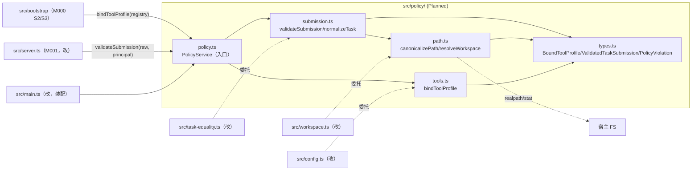
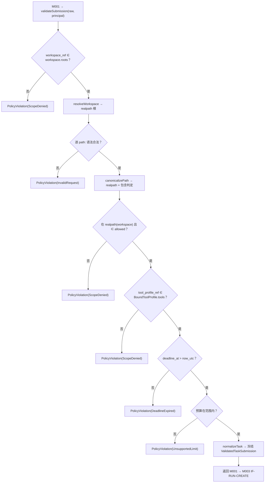

<!-- STD_DOCUMENT_COVER_BEGIN -->
# Piko 实现规格：policy（M002）

> STD 使用入口：[项目采用说明与标准导航](../../README.md#std-entry)

| 文档字段 | 值 |
|---|---|
| Document ID | `piko-policy-impl` |
| Document Version | `0.1.0-draft.1` |
| Status | `Draft` |
| Project | `piko` |
| Document Owner | Piko Implementation Owner |
| Last Modified Date | `2026-09-27` |
| Template ID | `design.implementation` |
| Template Version | `1.2.0` |

<!-- STD_DOCUMENT_COVER_END -->

## 1. 实现目标与输入基线

<a id="isd-scope"></a>

本 ISD 实现 M002 `policy` 的**进程内无状态判定**：向 M000 `bootstrap` 提供 `bindToolProfile`（启动 S3），向 M001 `task-api` 提供 `validateSubmission`（每次受理），并提供路径服务 `canonicalizePath`。本次实现范围是 §5 的三个对外函数与其内部组成（提交校验器、路径策略、工具绑定器）及 Brownfield 抽出（§2）；**非目标**是持久化与事务（M003）、HTTP 路由与 bearer principal 校验（M001）、工具执行与预算 CAS（M006）、Run 状态机（M003/M005）、Secret 解析（M000）、discussion membership 验证（M008）。模块行为、接口语义、拒绝码与验证规格由模块设计唯一维护，本层只细化文件/symbol、私有表示、校验/归一化步骤与测试入口。

### 1.1 实现对象

- **模块 ID / 名称**：`M002` / `policy`。

- **直属父对象 / 父设计**：`SW-P`（Piko Agent Runtime V0.3，`design_level=system`）/ `system-design` v0.11.2；`parent_document_id=system-design`（ISD 与模块设计同为 `system-design` 的子视图，不互为父子）。

- **模块设计 Document ID / 版本 / 路径 / 摘要**：`piko-policy` / `0.1.0-draft.1` / `docs/40_module_design/piko-policy-design.md`。摘要：policy 无状态；启动把 ToolProfile+registry 绑定为 `BoundToolProfile`，受理把 `AgentTaskRequest` 校验并规范化为 `ValidatedTaskSubmission`（路径 realpath 边界、权限交集、deadline/budget、归一化），不落库。

- **需求与 Constraint ID**：`CON-RUN-002`（PK-02）、`CON-RUN-003`（PK-03）、`CON-CFG-001`（PK-12，经 MECH-CONFIG）、`CON-ST-001`（PK-12，经 MECH-STARTUP）；机制输入 `M-RUN-DI-002`（`piko-run` §14.4）、`M-CFG-DI-002`（`piko-config` §14.4）、`IF-CFG-BIND`（`piko-config` §5.1）。

- **实现范围 / 非目标**：范围：`src/policy/` 五个文件 + 对 `src/config.ts`/`src/workspace.ts`/`src/task-equality.ts` 的最小改动。非目标：不新建 DB 表/迁移（M003）、不持状态、不发网络、不解析 Secret、不定义 HTTP 状态。

- **ISD 默认落位或项目批准路径**：`docs/50_implementation_design/piko-policy-impl.isd.md`（STD 默认路径）；代码落位 `src/policy/`（Planned）。

<a id="isd-handoff"></a>

### 1.2.1 `H-POLICY-BIND` · 启动绑定 tool/recovery

- **上游信息项 / 规则 ID**：`F-POLICY-BIND`、`R-POLICY-TOOLBIND`、`IF-CFG-BIND`、`CON-CFG-001`、`CON-ST-001`。

- **固定来源 / 版本 / 锚点 / 摘要**：`piko-policy` §2.1/§8.3/§9.1.1（v0.1.0-draft.1）；`piko-config` §5.1。

- **ISD 细化内容 / 章节**：§5.1.1 `PolicyService.bindToolProfile`；§3.4 `tools.ts`；§6.1 `P-POLICY-BIND`。

- **唯一权威位置**：行为/接口权威 = 模块设计 §2.1/§9.1.1；文件/symbol/私有表示权威 = 本 ISD。

- **实现自由度**：支持集合组织、校验顺序；不可放宽绑定一致性与失败语义。

- **原 V/Case 及本地验证位置**：`VRC-POLICY-001`（§9.1.1）。

### 1.2.2 `H-POLICY-VALIDATE` · 受理校验与规范化

- **上游信息项 / 规则 ID**：`F-POLICY-VALIDATE`、`R-POLICY-NORMALIZE`、`R-POLICY-PERMISSION`、`R-POLICY-DEADLINE`、`R-POLICY-BUDGET`、`IF-RUN-VALIDATE`、`CON-RUN-002`、`CON-RUN-003`。

- **固定来源 / 版本 / 锚点 / 摘要**：`piko-policy` §2.2/§8.1/§8.4/§8.5/§8.6/§9.1.2（v0.1.0-draft.1）；`PolicyViolation`（§6.8.1）。

- **ISD 细化内容 / 章节**：§5.1.2 `PolicyService.validateSubmission`；§3.2 `submission.ts`；§4.2.2 `ValidatedTaskSubmission`；§6.2 `P-POLICY-VALIDATE`。

- **唯一权威位置**：行为/拒绝码 = 模块设计 §8/§9.1.2；校验顺序/归一化实现 = 本 ISD。

- **实现自由度**：校验顺序、归一化实现、错误 detail 文案；不可改变拒绝码语义与"不落库"。

- **原 V/Case 及本地验证位置**：`VRC-POLICY-002/004/005`（§9.1.2/9.1.4/9.1.5）。

### 1.2.3 `H-POLICY-PATH` · 路径规范化与越界拒绝

- **上游信息项 / 规则 ID**：`F-POLICY-PATH`、`R-POLICY-PATH`、`IF-POLICY-PATH`、`CON-RUN-002`。

- **固定来源 / 版本 / 锚点 / 摘要**：`piko-policy` §2.3/§8.2/§9.1.3；`piko-run` §7 path 边界。

- **ISD 细化内容 / 章节**：§5.1.3 `PolicyService.canonicalizePath`；§3.3 `path.ts`；§6.3 `P-POLICY-PATH`。

- **唯一权威位置**：规则权威 = 模块设计 §8.2；FS 端口与 fake 注入 = 本 ISD。

- **实现自由度**：fake FS 注入方式；不可改为字符串 `startsWith`（会放过 symlink 逃逸）。

- **原 V/Case 及本地验证位置**：`VRC-POLICY-003`（§9.1.3）。

### 1.2.4 `H-POLICY-NORMALIZE` · 字段归一化

- **上游信息项 / 规则 ID**：`R-POLICY-NORMALIZE`、`CON-RUN-002`。

- **固定来源 / 版本 / 锚点 / 摘要**：`piko-policy` §8.1/§6.2.2；当前代码事实 `src/task-equality.ts` `normalizedTask`。

- **ISD 细化内容 / 章节**：§5.1.4 `SubmissionValidator.normalizeTask`；§4.2.2。

- **唯一权威位置**：语义权威 = 模块设计 §8.1（集合按集合比、时间按 instant 比）；实现 = 本 ISD。

- **实现自由度**：排序实现；不可改变可比较字段集合与 UTC 归一。

- **原 V/Case 及本地验证位置**：`VRC-POLICY-002`（§9.1.2）。

### 1.2.5 `H-POLICY-CONFIG` · M000 config/registry 注入（Proposed）

- **上游信息项 / 规则 ID**：`IF-POLICY-CONFIG`（Proposed）、`M-CFG-DI-002`、`OQ-POLICY-001`、`OQ-POLICY-002`。

- **固定来源 / 版本 / 锚点 / 摘要**：`piko-policy` §9.2.1/§6.3；`piko-config` §5.1 `IF-CFG-LOAD`；锁定 schema `piko-runtime-config-v0.3.schema.json`/`piko-tool-profile-v0.3.schema.json`。

- **ISD 细化内容 / 章节**：§5.1.5 构造注入消费；§3.1 `types.ts`；§4.3。

- **唯一权威位置**：字段权威 = 锁定 schema；注入方式 = 本 ISD。

- **实现自由度**：注入方式（构造/setter）；不可重新解释 config 语义（`CON-CFG-001`）。

- **原 V/Case 及本地验证位置**：`VRC-POLICY-001/002`。

## 2. 既有实现差异（条件章节）

### 2.1 适用性

- **适用性**：brownfield（存在需修改的既有实现）。

- **依据**：基线：当前工作树 commit（见封面 metadata `reviewed_commit`/§10 状态复核）。既有 `src/config.ts` `validateToolRegistry`、`src/workspace.ts` `resolveWorkspace`/`authorizePath`、`src/task-equality.ts` `normalizedTask`/`sameTask` 与 `src/server.ts` 内联校验承载了 policy 的判定逻辑；本 ISD 把这部分抽为 M002，不新建 schema、不改 DB。

- **Tailoring / 范围决定引用**：`TAIL-P-NEW-S1`（Piko 无 subsystem，`design.definition`/`design.implementation` 直接承接 `system-design`）；范围决定 `system-design` §15 PHASE-I。

### 2.2 `CH-POLICY-01` · 抽取"tool/recovery 绑定"逻辑

- **基线 commit / 版本**：当前工作树（§10.2 `SC-POLICY-01` 记录解析出的 commit）。

- **文件 / symbol**：`src/config.ts` `validateToolRegistry`（既有）→ Planned `src/policy/tools.ts` `bindToolProfile`。

- **Current 行为**：`validateToolRegistry` 用硬编码支持集合与已知 tool 名逐 contract/tool 抛 `Error`；不产出冻结的 `BoundToolProfile`，与 `loadConfig` 耦合。

- **Target 改动与理由**：抽为 `bindToolProfile`，返回不可变 `BoundToolProfile` 并抛 `ToolBindFailure`。理由：绑定需可表驱动单测（`VRC-POLICY-001`），并与 config 文件解析分离（`loadConfig` 仍属 M000）。

- **原规则 / 成员 ID**：`F-POLICY-BIND`、`IF-CFG-BIND`、`R-POLICY-TOOLBIND`。

- **实现状态**：`IN_PROGRESS`（Current 内联，Target 抽出）。

### 2.3 `CH-POLICY-02` · 抽取"路径规范化"逻辑

- **基线 commit / 版本**：当前工作树。

- **文件 / symbol**：`src/workspace.ts` `resolveWorkspace`/`authorizePath` → Planned `src/policy/path.ts` `resolveWorkspace`/`canonicalizePath`。

- **Current 行为**：`authorizePath` 用 `realpath` + `inside` 做包含判定，但分散在 workspace 辅助函数中，错误类型为 `ScopeDenied`（`PikoError`）。

- **Target 改动与理由**：抽为 `canonicalizePath`，支持受控 fake FS 注入，错误收敛为 `PolicyViolation`。理由：symlink 边界需独立可测（`VRC-POLICY-003`）。

- **原规则 / 成员 ID**：`F-POLICY-PATH`、`IF-POLICY-PATH`、`R-POLICY-PATH`。

- **实现状态**：`IN_PROGRESS`。

### 2.4 `CH-POLICY-03` · 抽取"归一化 + 提交校验"逻辑

- **基线 commit / 版本**：当前工作树。

- **文件 / symbol**：`src/task-equality.ts` `normalizedTask`/`sameTask` + `src/server.ts` 内联校验 → Planned `src/policy/submission.ts` `validateSubmission`/`normalizeTask`。

- **Current 行为**：`normalizedTask` 只做 JSON 归一化与排序；deadline/budget/tool_profile_ref 校验散在 handler，且无 typed 拒绝码。

- **Target 改动与理由**：抽为 `validateSubmission`，按 §7 M-POL-P2 顺序产生 `PolicyViolation`。理由：拒绝矩阵与归一化需可表驱动测试（`VRC-POLICY-002/004/005`）。

- **原规则 / 成员 ID**：`F-POLICY-VALIDATE`、`IF-RUN-VALIDATE`、`CON-RUN-002/003`。

- **实现状态**：`IN_PROGRESS`。

### 2.5 `CH-POLICY-04` · M000/M001 改为委托 policy

- **基线 commit / 版本**：当前工作树。

- **文件 / symbol**：`src/main.ts` 装配 + `src/server.ts`/`src/config.ts` 既有调用 → 注入 `PolicyService`。

- **Current 行为**：`server.route` 直接内联 schema 校验与 createOrGet，未经 policy 判定。

- **Target 改动与理由**：`server.route` 在 bearer 之后调用 `policy.validateSubmission`，用其结果调用 M003。理由：判定集中到无状态模块，`CON-RUN-002/003` 的授权与预算判定可验证。

- **原规则 / 成员 ID**：`IF-RUN-VALIDATE`、`CON-RUN-002/003`。

- **实现状态**：`IN_PROGRESS`。

## 3. 文件、内部组件与调用关系

<a id="isd-structure"></a>



图 M002-ISD-S1 · Planned / NOT_IMPLEMENTED。实线调用/类型依赖；虚线跨模块适配或既有文件委托。`types.ts` 被全模块类型引用；`path.ts` 是唯一接触 FS 的单元。

### 3.1 `src/policy/types.ts`

- **职责及调用者**：定义本层私有类型与错误类；被 `submission.ts`/`path.ts`/`tools.ts`/`policy.ts` 引用。

- **类型 / 函数**：`BoundToolProfile`、`BoundToolPolicy`、`ValidatedTaskSubmission`、`PolicyViolation`、`ToolBindFailure`、`PolicyConfig`、`ToolEffect`、`ReplayMode`。

- **可见性**：模块内 public（仅 `policy.ts` 再导出 `BoundToolProfile`/`ValidatedTaskSubmission`）。

- **调用与类型依赖**：零运行时依赖。

- **构建目标 / 生成源 / 输出**：`tsc` 编译进 `dist/policy/types.js`；无生成源。

- **实现状态**：Planned。

### 3.2 `src/policy/submission.ts`

- **职责及调用者**：受理校验与归一化；被 `policy.ts` 调用。

- **类型 / 函数**：`validateSubmission(raw, principal, profile, config, now?): ValidatedTaskSubmission`；`normalizeTask(raw): ValidatedTaskSubmission`。

- **可见性**：模块内 public。

- **调用与类型依赖**：依赖 `path.ts`/`types.ts`；**不 import M003/M006**。

- **构建目标 / 生成源 / 输出**：`tsc` → `dist/policy/submission.js`。

- **实现状态**：Planned。

### 3.3 `src/policy/path.ts`

- **职责及调用者**：路径语法 + `realpath` + 包含判定；被 `submission.ts` 调用。

- **类型 / 函数**：`resolveWorkspace(ref, roots, fs?): Promise<string>`；`canonicalizePath(workspace, rel, allowed, write, fs?): Promise<string>`；`interface PathFs`（`realpath`/`stat`）。

- **可见性**：模块内 public；`PathFs` 供测试注入。

- **调用与类型依赖**：依赖 `types.ts` + 宿主 FS（默认实现）。

- **构建目标 / 生成源 / 输出**：`tsc` → `dist/policy/path.js`。

- **实现状态**：Planned。

### 3.4 `src/policy/tools.ts`

- **职责及调用者**：绑定/校验 registry 为 `BoundToolProfile`；被 `policy.ts` 调用。

- **类型 / 函数**：`bindToolProfile(registry): BoundToolProfile`；内部 `SUPPORTED_RECOVERY_IMPL`、`KNOWN_TOOLS` 常量。

- **可见性**：模块内 public。

- **调用与类型依赖**：依赖 `types.ts`；零外部模块。

- **构建目标 / 生成源 / 输出**：`tsc` → `dist/policy/tools.js`。

- **实现状态**：Planned。

### 3.5 `src/policy/policy.ts`

- **职责及调用者**：入口 `PolicyService`：实现三个对外函数、保证无状态；被 M000/M001 调用。

- **类型 / 函数**：`class PolicyService`：`constructor(config, registry)`；`bindToolProfile(): BoundToolProfile`；`validateSubmission(raw, principal): Promise<ValidatedTaskSubmission>`；`canonicalizePath(workspace, rel, allowed, write): Promise<string>`。

- **可见性**：public（经 `src/policy/index.ts` 导出）。

- **调用与类型依赖**：依赖 `submission.ts`/`tools.ts`/`path.ts`/`types.ts`。

- **构建目标 / 生成源 / 输出**：`tsc` → `dist/policy/policy.js`。

- **实现状态**：Planned。

### 3.6 `src/policy/index.ts`

- **职责及调用者**：唯一装配入口：导出 `PolicyService` 与 `createPolicy(config, registry)`；被 `main.ts` 调用。

- **类型 / 函数**：`export function createPolicy(config: RuntimeConfig, registry: ToolRegistry): PolicyService`。

- **可见性**：public。

- **调用与类型依赖**：依赖 `policy.ts`/`types.ts` + 既有 `types.ts`/`config.ts` 类型。

- **构建目标 / 生成源 / 输出**：`tsc` → `dist/policy/index.js`。

- **实现状态**：Planned。

### 3.7 `src/config.ts` / `src/workspace.ts` / `src/task-equality.ts`（修改既有）

- **职责及调用者**：保留兼容导出并委托到 `src/policy/`；被既有调用方消费。

- **类型 / 函数**：`validateToolRegistry` → `bindToolProfile`；`authorizePath`/`resolveWorkspace` → `canonicalizePath`/`resolveWorkspace`；`normalizedTask` → `normalizeTask`。

- **可见性**：public（既有）。

- **调用与类型依赖**：依赖 `policy/index.ts`；不改 `loadConfig` 的 M000 职责。

- **构建目标 / 生成源 / 输出**：`tsc` → `dist/config.js` 等。

- **实现状态**：`IN_PROGRESS`（Current 内联，Target 委托）。

## 4. 数据结构设计

<a id="isd-data"></a>

**不适用类别**：§4.1 公共基础类型（本层用锁定 schema 的枚举，不新增 Data ID）、§4.4 通信报文（无跨边界消息）、§4.5 设备/FPGA 表项（纯软件，`TAIL-P-103`）为 N/A。§4.6 运行状态 N/A（policy 不持跨步骤状态；`BoundToolProfile` 为进程寿命不可变值）。§4.7 数据库表结构 N/A——schema 与事务 authority 属 M003（见 §7.2）。

### 4.2 业务与操作数据结构

#### 4.2.1 `BoundToolProfile`

- **完整定义、Data/Type ID 与唯一来源**：私有类型 `BoundToolProfile`（本 ISD `types.ts`）；公共语义来源 = 模块设计 §6.2.1（并对应 `piko-config` §4.2.1）。

  ```ts
  interface BoundToolPolicy {
    effect: "read_only" | "workspace_write" | "process" | "network" | "external";
    replay: "never" | "safe";
    recovery_contract_ref: string | null;
    permissions: { read_paths?: string[]; write_paths?: string[];
                   executables?: string[]; network_hosts?: string[] };
  }
  interface BoundToolProfile {
    readonly profile_version: "0.3";
    readonly tools: Readonly<Record<string, Readonly<BoundToolPolicy>>>;
    readonly recovery_contracts: Readonly<Record<string, Readonly<RecoveryContract>>>;
  }
  ```

- **逐字段类型/范围/初值/不变量/owner**：`profile_version` 恒 `"0.3"`；`tools` 的 key 必在 `KNOWN_TOOLS`（`read`/`write`/`edit`/`bash`）；`recovery_contract_ref` 非空 ⟹ 必在 `recovery_contracts`；`replay:"safe" && effect!=="read_only"` ⟹ `recovery_contract_ref` 非空。owner = M000（启动）；不可变值（深 `Object.freeze`）。

- **内存布局 / ABI**：N/A（纯 TypeScript 对象，非持久二进制/跨语言）。

- **创建/借用/释放/失败路径**：由 `bindToolProfile` 构造；无借用；寿命 = 进程寿命；失败抛 `ToolBindFailure`。

- **验证**：`VRC-POLICY-001`；`NOT_RUN`。

#### 4.2.2 `ValidatedTaskSubmission`

- **完整定义、Data/Type ID 与唯一来源**：私有类型（本 ISD `types.ts`）；公共语义来源 = 模块设计 §6.2.2（对应 `piko-run` §4.2.1）。

  ```ts
  interface ValidatedTaskSubmission {
    readonly task_id: string;
    readonly instruction: string;
    readonly workspace_ref: string;
    readonly permissions: { readonly read_paths: readonly string[];
                            readonly write_paths: readonly string[];
                            readonly tool_profile_ref: string };
    readonly limits: { readonly deadline_at: string;        // UTC ISO-8601 Z
                       readonly max_model_calls: number; readonly max_tool_calls: number };
    readonly output_paths: readonly string[];
    readonly discussion: { readonly room_id: string; readonly trigger_event_id: string } | null;
  }
  ```

- **逐字段类型/范围/初值/不变量/owner**：path 集合已排序去重、每条为规范化 RelPath 且在 workspace 内且在授权集合内；`deadline_at` 为 UTC instant（`Z`）且 `> now`；`max_model_calls` 整数 `>=1 <=100000`；`max_tool_calls` 整数 `>=0 <=100000`；`tool_profile_ref` ∈ `BoundToolProfile.tools`；`discussion` 缺省 `null`。owner = M001（请求寿命），随后交 M003 持久化 `task_json`。

- **内存布局 / ABI**：N/A（纯 TS）。

- **创建/借用/释放/失败路径**：由 `validateSubmission` 构造并冻结；失败抛 `PolicyViolation`，不产生值。

- **验证**：`VRC-POLICY-002/004/005`；`NOT_RUN`。

### 4.3 配置与规则数据结构

- **完整定义 / 来源**：消费型结构 `PikoRuntimeConfig`（锁定 schema `piko-runtime-config-v0.3.schema.json`，`workspace.roots: Record<string,string>`）与 `ToolRegistry`（锁定 schema `piko-tool-profile-v0.3.schema.json`，`recovery_contracts`/`profiles`）。本层不新增 config key；私有常量：

  ```ts
  interface PolicyConfig {
    supported_recovery_impl: readonly string[];  // recovery implementation_ref 支持集合
    known_tools: readonly string[];              // read/write/edit/bash
    max_model_calls_limit: number;               // 100000（契约上限）
    max_tool_calls_limit: number;                // 100000
  }
  ```

- **逐字段/范围/不变量**：全为编译期常量；`supported_recovery_impl` 必须与构建期注册表一致；authority = 模块设计 §6.3/§8.3。

- **创建/寿命/失败**：由 `tools.ts` 模块常量承载；无运行期变更、无热更（`CON-CFG-001`）。

- **验证**：`VRC-POLICY-001`；`NOT_RUN`。

### 4.7 数据库表结构

**N/A。** policy 不拥有持久表：`tasks`/`runs` 等 schema authority、连接、事务与 DDL 属 M003（`system-design` §7.7 `m003-ddl-authority`；M003 ISD §4.7）。本 ISD 只向 M003 交出 `ValidatedTaskSubmission` 值对象，不复制 CREATE TABLE。依据：ISD 规范 §3 "无持久化不虚构数据库，交由宿主的范围仍给实际交接责任"；交接见 §7.2。

### 4.8 错误码与错误结构

#### 4.8.1 `PolicyViolation`

- **完整定义 / 来源**：私有错误类；语义来源 = 模块设计 §6.8.1；契约错误码权威 `interfaces/error-codes/error-blocker-catalog-v0.3.json`。

  ```ts
  class PolicyViolation extends Error {
    readonly code: "InvalidRequest" | "ScopeDenied" | "UnsupportedLimit" | "DeadlineExpired";
    readonly detail: string;
  }
  ```

- **逐字段/触发/副作用**：`code` 四值枚举；`detail` 脱敏（不含绝对路径明文、不含 `instruction`/`task_id`）。触发：语法非法 → `InvalidRequest`；路径/工具/workspace 越权 → `ScopeDenied`；预算不可执行 → `UnsupportedLimit`；deadline 已过 → `DeadlineExpired`。无 DB 副作用。

- **所有权/出口**：由 `submission.ts`/`path.ts` 产生 → `policy.ts` 透传 → M001 `catch` 映射 HTTP 4xx，不创建 Run。

- **验证**：`VRC-POLICY-002/003/004/005`；`NOT_RUN`。

#### 4.8.2 `ToolBindFailure`

- **完整定义 / 来源**：```ts
  class ToolBindFailure extends Error { readonly code: "tool-bind-fail"; readonly detail: string; }
  ```

  语义来源 = 模块设计 §6.8.1/§10.2。

- **逐字段/触发/副作用**：触发 = registry 绑定不一致（未注册 implementation/tool、未绑定 contract、replay 不一致）；无 side effect（不产出半成品）。

- **所有权/出口**：由 `tools.ts` 在 S3 产生 → M000 走 F1、非零退出、不 listen。

- **验证**：`VRC-POLICY-001`；`NOT_RUN`。

## 5. 接口设计

<a id="isd-functions"></a>

policy 的对外接口是 §5.1 的三个函数；被消费的注入接口在同节记录（进程内协作接口）。无人机/消息/硬件接口（§5.2–5.4 N/A）。

### 5.1 API（适用时）

#### 5.1.1 `PolicyService.bindToolProfile(): BoundToolProfile`

- **Interface/Member ID、用途**：`IF-CFG-BIND`；启动 S3 把 ToolProfile+registry 绑定为不可变 allowlist。

- **文件 / symbol / 可见性**：Planned `src/policy/tools.ts` `bindToolProfile`（经 `PolicyService` 暴露）；public（仅 M000 消费）。

- **原成员 ID 或私有来源**：继承 `piko-config` §5.1 `IF-CFG-BIND`（`M-CFG-DI-002`）。

- **完整签名与 caller**：`bindToolProfile(registry: ToolRegistry): BoundToolProfile`；caller = M000 bootstrap S3（单线程启动序列）。

- **固定契约与版本**：模块设计 §9.1.1（`piko-policy` v0.1.0-draft.1）；构建目标 `dist/policy/`。

- **输入参数 / 数据结构 authority**：`registry: ToolRegistry`（锁定 schema `piko-tool-profile-v0.3.schema.json`）；无 §6 Data ID。

- **输入约束 / 校验顺序 / 失败映射**：顺序 = 逐 contract 的 `implementation_ref` → 逐 tool 名 → ref 解析 → `replay`/`effect` 一致性；任一失败 → `ToolBindFailure`。

- **成功输出 / 数据结构 / 后置条件**：返回冻结 `BoundToolProfile`（§4.2.1）；后置 = 每个 ref 可解析、一致性成立；owner = M000；寿命 = 进程寿命。

- **错误输出 / 触发条件 / 优先级**：`ToolBindFailure`（未注册实现/未注册 tool/未绑定 contract/replay 不一致）；无业务"部分成功"。

- **底层异常 / 失败事实**：无 I/O；不抛原生异常，全部归类为 `ToolBindFailure`。

- **模块是否处理及处理函数**：`bindToolProfile` 自行检测并抛 typed 错误；不吞。

- **Typed 异常与原生异常所有权**：`ToolBindFailure` 由本模块拥有 → M000。

- **宿主 / public payload 或状态码**：无 HTTP；返回 `BoundToolProfile` 或抛 `ToolBindFailure`。

- **日志级别 / 脱敏 / 关联字段**：`info`（绑定成功，含 profile_version 与 tool 数）；`error`（失败原因类别）。不含 Secret/绝对路径。

- **是否可重试及前提**：不自动重试；修 registry 后重启（`CON-CFG-001`）。

- **状态与副作用影响 / 验证项**：无 DB 副作用；产出进程内不可变值。`VRC-POLICY-001`。

- **不可改变的规则 / Constraint ID**：`R-POLICY-TOOLBIND`、`CON-CFG-001`、`CON-ST-001`；ref 必解析、replay 一致性不可放宽。

- **实现自由度**：支持集合组织、校验顺序、detail 文案。

- **副作用 / 执行上下文 / 幂等性**：无外部副作用；上下文 = 启动单线程；幂等（同 registry 恒等输出）。

- **输入输出 ownership 与寿命**：输入借用；输出不可变值、进程寿命。

- **Thread-safe / reentrant**：yes（无共享可变状态）。

- **Nested-call policy**：allowed：无外部调用；禁止回调 M000。

- **Transaction participation**：none（无 DB）。

- **Blocking / timeout / cancellation**：非阻塞；无取消。

- **实现状态 / 验证项**：Planned / `VRC-POLICY-001`。

- **装配、合法及拒绝实例**：装配见 §3.6。合法：全 ref 注册 → `BoundToolProfile`。拒绝：`write`+`safe` 无 ref → `ToolBindFailure`。Oracle = 期望绑定矩阵常量。`NOT_RUN`。

#### 5.1.2 `PolicyService.validateSubmission(raw, principal): Promise<ValidatedTaskSubmission>`

- **Interface/Member ID、用途**：`IF-RUN-VALIDATE`；受理期校验并规范化任务。

- **文件 / symbol / 可见性**：Planned `src/policy/submission.ts` `validateSubmission`（经 `PolicyService` 暴露）；public（M001 消费）。

- **原成员 ID 或私有来源**：module-owned；对应 `piko-run` §14.2 步骤（`M-RUN-DI-002`）。

- **完整签名与 caller**：`validateSubmission(raw: AgentTaskRequest, principal: string): Promise<ValidatedTaskSubmission>`；caller = M001 `server.route`（bearer 之后）。

- **固定契约与版本**：模块设计 §9.1.2；契约 `0.3.0-simplified.6` + `agent-runtime-v0.3.schema.json`。

- **输入参数 / 数据结构 authority**：`raw` 字段权威 = `agent-runtime-v0.3.schema.json` `$defs/AgentTaskRequest`；`principal` = M001 身份字符串（无 §6 Data ID）；构造注入 `config`/`profile`。

- **输入约束 / 校验顺序 / 失败映射**：顺序 = workspace → 逐 path（read/write/output）→ `tool_profile_ref` → deadline → budget → normalize；越权 → `ScopeDenied`，语法 → `InvalidRequest`，预算 → `UnsupportedLimit`，截止 → `DeadlineExpired`。

- **成功输出 / 数据结构 / 后置条件**：返回冻结 `ValidatedTaskSubmission`（§4.2.2）；后置 = path 规范、时间 UTC、授权通过；无持久副作用。

- **错误输出 / 触发条件 / 优先级**：`PolicyViolation` 按校验顺序首因优先（workspace/path 先于 deadline/budget）；不映射 HTTP 状态（由 M001）。

- **底层异常 / 失败事实**：FS `realpath` 抛 `ENOENT`/`EACCES` 等 → 归类为 `ScopeDenied`/`InvalidRequest`；不冒泡裸 `ENOENT`。

- **模块是否处理及处理函数**：`validateSubmission` 捕获 FS 异常并转 `PolicyViolation`；其余透传。

- **Typed 异常与原生异常所有权**：`PolicyViolation` 由本模块拥有 → M001；原生 FS 异常被转 typed。

- **宿主 / public payload 或状态码**：无 HTTP；返回 `ValidatedTaskSubmission` 或抛 `PolicyViolation`，由 M001 映射 400/403/422。

- **日志级别 / 脱敏 / 关联字段**：`debug`（通过）；`warn`（拒绝，含 code 类别）。不记 `instruction`/`task_id`/绝对路径。

- **是否可重试及前提**：拒绝后不重试；修正请求后用同 `task_id` 重试（未创建 Run 时）。

- **状态与副作用影响 / 验证项**：无 DB 副作用；无状态。`VRC-POLICY-002/004/005`。

- **不可改变的规则 / Constraint ID**：`R-POLICY-NORMALIZE/PERMISSION/DEADLINE/BUDGET`；`CON-RUN-002/003`；拒绝码语义。

- **实现自由度**：校验顺序（在固定语义内）、归一化实现、detail 文案。

- **副作用 / 执行上下文 / 幂等性**：无外部副作用；上下文 = 宿主事件循环（含 await FS）；幂等（同输入同输出）。

- **输入输出 ownership 与寿命**：输入借用；输出不可变、请求寿命。

- **Thread-safe / reentrant**：yes（无共享可变状态）。

- **Nested-call policy**：allowed：`path.canonicalizePath`/`normalizeTask`；禁止回调 M001。

- **Transaction participation**：none（不触达 M003）。

- **Blocking / timeout / cancellation**：非阻塞（异步 FS）；无取消；不设超时（受宿主 FS 行为）。

- **实现状态 / 验证项**：Planned / `VRC-POLICY-002/004/005`。

- **装配、合法及拒绝实例**：装配见 §3.6。合法：合法请求 → `ValidatedTaskSubmission`。拒绝：`../` → `InvalidRequest`；越界 → `ScopeDenied`；过期 → `DeadlineExpired`；`max_model_calls=0` → `UnsupportedLimit`。Oracle = 独立复算的规范化常量 + 期望拒绝码。`NOT_RUN`。

#### 5.1.3 `PolicyService.canonicalizePath(workspace, rel, allowed, write): Promise<string>`

- **Interface/Member ID、用途**：`IF-POLICY-PATH`；路径语法 + realpath + 包含判定。

- **文件 / symbol / 可见性**：Planned `src/policy/path.ts` `canonicalizePath`（经 `PolicyService` 暴露）；public。

- **原成员 ID 或私有来源**：module-owned；`piko-run` §7 path 边界。

- **完整签名与 caller**：`canonicalizePath(workspace: string, rel: string, allowed: string[], write: boolean): Promise<string>`；caller = `SubmissionValidator.validateSubmission`（逐 path）。

- **固定契约与版本**：模块设计 §9.1.3。

- **输入参数 / 数据结构 authority**：`workspace` 已 `realpath`；`rel` 为 RelPath；`allowed` 为 RelPath 集合；`write` 布尔。

- **输入约束 / 校验顺序 / 失败映射**：顺序 = 语法 → realpath → 包含判定；语法非法 → `InvalidRequest`；越界 → `ScopeDenied`。

- **成功输出 / 数据结构 / 后置条件**：返回真实绝对路径；后置 = 在 `realpath(workspace)` 内且在某 `allowed` 根内。

- **错误输出 / 触发条件 / 优先级**：语法错误优先于越界；symlink 逃逸 → `ScopeDenied`。

- **底层异常 / 失败事实**：`realpath`/`stat` 原生异常（不存在/权限）→ 转 `PolicyViolation`。

- **模块是否处理及处理函数**：`canonicalizePath` 捕获并转 typed；不降级。

- **Typed 异常与原生异常所有权**：`PolicyViolation` 本模块；原生 FS 异常被转 typed。

- **宿主 / public payload 或状态码**：返回字符串或抛 `PolicyViolation`。

- **日志级别 / 脱敏 / 关联字段**：`debug`（规范化成功，仅记录相对类别）；`warn`（拒绝）。

- **是否可重试及前提**：不重试；修正路径后重试。

- **状态与副作用影响 / 验证项**：无副作用；不缓存。`VRC-POLICY-003`。

- **不可改变的规则 / Constraint ID**：`R-POLICY-PATH`；不可用字符串比较替代 realpath。

- **实现自由度**：`PathFs` 注入方式。

- **副作用 / 执行上下文 / 幂等性**：只读 FS 探测；异步；幂等。

- **输入输出 ownership 与寿命**：输入借用；输出字符串。

- **Thread-safe / reentrant**：yes。

- **Nested-call policy**：allowed：仅 `PathFs.realpath`/`stat`。

- **Transaction participation**：none。

- **Blocking / timeout / cancellation**：非阻塞；无取消。

- **实现状态 / 验证项**：Planned / `VRC-POLICY-003`。

- **装配、合法及拒绝实例**：装配见 §3.3。合法：`a/b.txt` → 绝对路径。拒绝：`../`→`InvalidRequest`；symlink 越界→`ScopeDenied`。Oracle = 独立构造的期望路径/错误码。`NOT_RUN`。

#### 5.1.4 `SubmissionValidator.normalizeTask(raw): ValidatedTaskSubmission`（内部）

- **Interface/Member ID、用途**：私有；把已校验字段归一为可比较形态（`R-POLICY-NORMALIZE`）。

- **文件 / symbol / 可见性**：Planned `src/policy/submission.ts` `normalizeTask`；模块内 public。

- **原成员 ID 或私有来源**：私有（实现模块设计 §8.1）；当前代码事实 `src/task-equality.ts` `normalizedTask`。

- **完整签名与 caller**：`normalizeTask(raw: AgentTaskRequest & ResolvedPaths): ValidatedTaskSubmission`；caller = `validateSubmission`。

- **固定契约与版本**：模块设计 §8.1。

- **输入参数 / 数据结构 authority**：输入为已通过校验的字段集合。

- **输入约束 / 校验顺序 / 失败映射**：path 集合排序去重；时间转 UTC ISO-8601（`Z`）；`discussion` 缺省 `null`；无失败分支（纯函数）。

- **成功输出 / 数据结构 / 后置条件**：返回冻结 `ValidatedTaskSubmission`。

- **错误输出 / 触发条件 / 优先级**：无（前置校验已完成）。

- **底层异常 / 失败事实**：非法时间字面由 schema 先拒，不在本函数。

- **模块是否处理及处理函数**：纯函数，无捕获需求。

- **Typed 异常与原生异常所有权**：N/A。

- **宿主 / public payload 或状态码**：返回值对象；无码。

- **日志级别 / 脱敏 / 关联字段**：无日志（纯函数）。

- **是否可重试及前提**：幂等，可重复调用。

- **状态与副作用影响 / 验证项**：无副作用；`VRC-POLICY-002`。

- **不可改变的规则 / Constraint ID**：`R-POLICY-NORMALIZE`；集合按集合比、时间按 instant 比。

- **实现自由度**：排序实现。

- **副作用 / 执行上下文 / 幂等性**：纯函数；幂等。

- **输入输出 ownership 与寿命**：输入借用；输出不可变。

- **Thread-safe / reentrant**：yes。

- **Nested-call policy**：forbidden（不调用其他单元）。

- **Transaction participation**：none。

- **Blocking / timeout / cancellation**：非阻塞。

- **实现状态 / 验证项**：Planned / `VRC-POLICY-002`。

- **装配、合法及拒绝实例**：装配见 §3.2。合法：`["b","a","a"]` → `["a","b"]`。Oracle = 期望规范化常量。`NOT_RUN`。

#### 5.1.5 `IF-POLICY-CONFIG` · M000 → M002 config/registry 注入（消费）

- **Interface/Member ID、用途**：`IF-POLICY-CONFIG`（Proposed）；把进程寿命的 config/registry 交给 policy。

- **文件 / symbol / 可见性**：Planned `src/policy/policy.ts` `PolicyService` 构造注入；public。

- **原成员 ID 或私有来源**：模块设计 §9.2.1（Proposed）；`piko-config` §5.1 `IF-CFG-LOAD`。

- **完整签名与 caller**：`constructor(config: RuntimeConfig, registry: ToolRegistry)`；caller = `src/main.ts` 装配。

- **固定契约与版本**：模块设计 §9.2.1；锁定 schema（`OQ-POLICY-001/002` 跟踪机制漂移）。

- **输入参数 / 数据结构 authority**：`RuntimeConfig`（`src/types.ts`）与 `ToolRegistry`（`src/config.ts`），schemas 为权威。

- **输入约束 / 校验顺序 / 失败映射**：config/registry 合法性由 M000 S2 先保证；policy 不重新校验 schema。

- **成功输出 / 数据结构 / 后置条件**：构造出可用 `PolicyService`；无返回值。

- **错误输出 / 触发条件 / 优先级**：无（由 M000 先拒绝非法输入）。

- **底层异常 / 失败事实**：无 I/O。

- **模块是否处理及处理函数**：N/A。

- **Typed 异常与原生异常所有权**：N/A。

- **宿主 / public payload 或状态码**：进程内构造注入。

- **日志级别 / 脱敏 / 关联字段**：`debug`（装配）。

- **是否可重试及前提**：N/A。

- **状态与副作用影响 / 验证项**：无副作用；`VRC-POLICY-001/002`。

- **不可改变的规则 / Constraint ID**：`CON-CFG-001`；不可重新解释 config 语义。

- **实现自由度**：注入方式。

- **副作用 / 执行上下文 / 幂等性**：只读持有；幂等。

- **输入输出 ownership 与寿命**：借用 config/registry 引用（只读）；进程寿命。

- **Thread-safe / reentrant**：yes。

- **Nested-call policy**：allowed。

- **Transaction participation**：none。

- **Blocking / timeout / cancellation**：非阻塞。

- **实现状态 / 验证项**：Planned / `VRC-POLICY-001/002`。

- **装配、合法及拒绝实例**：装配见 §3.6。Oracle = 注入后判定行为一致。`NOT_RUN`。

### 5.2 消息与数据流接口（适用时）

**N/A。** policy 无跨边界消息/队列/流：与 M000/M001 的协作均为进程内同步调用（已记于 §5.1）。依据：ISD 规范 §3，不为满足模板虚构队列。

### 5.3 硬件与固件接口（适用时）

**N/A** · 纯软件（`TAIL-P-103`）。

### 5.4 人机与维护接口（适用时）

**N/A。** 无 CLI/诊断命令；绑定结果与拒绝类别经启动日志/audit 与 M009 指标暴露（§7.3）。

## 6. 关键流程与算法

<a id="isd-algorithms"></a>



图 M002-ISD-A1 · Planned / NOT_IMPLEMENTED。受理校验的正常与拒绝分支；拒绝在 M003 事务之前发生，无持久副作用。

### 6.1 `P-POLICY-BIND` · 启动绑定

- **触发与执行者**：M000 bootstrap S3 → `PolicyService.bindToolProfile`（宿主启动单线程）。

- **入口函数及数据**：`bindToolProfile`；`ToolRegistry` → `BoundToolProfile`。

- **步骤 / 算法 / 复杂度**：1. 逐 `recovery_contracts` 校验 `implementation_ref ∈ SUPPORTED_RECOVERY_IMPL`；2. 逐 profile/tool 校验 `name ∈ KNOWN_TOOLS`；3. 有 ref 则必须解析到 `recovery_contracts`；4. `replay:"safe"` 且 `effect!=="read_only"` ⇒ 必须有 ref；5. 冻结产物。复杂度 O(tools+contracts)。

- **判断事实来源**：输入 registry 的纯判定；无可来源不明的 Guard。

- **成功可见点**：返回冻结 `BoundToolProfile`（进程内）；S3 通过进入 S4。

- **失败、取消与清理**：抛 `ToolBindFailure`；无半成品；M000 F1。

- **代表输入与中间值**：见 §9.1.1 Case A–D。

- **规则 / 接口 / 验证引用**：§5.1.1；`R-POLICY-TOOLBIND`；`VRC-POLICY-001`。

### 6.2 `P-POLICY-VALIDATE` · 受理校验

- **触发与执行者**：M001 `server.route`（bearer 之后）→ `PolicyService.validateSubmission`。

- **入口函数及数据**：`validateSubmission(raw, principal)`；`AgentTaskRequest` → `ValidatedTaskSubmission | PolicyViolation`。

- **步骤 / 算法 / 复杂度**：见 M002-ISD-A1；顺序 workspace → path → tool → deadline → budget → normalize。复杂度 O(k log k)，k = path 数。

- **判断事实来源**：`workspace.roots`（config）+ `BoundToolProfile.tools`（绑定）+ 真实 FS realpath + UTC now。

- **成功可见点**：返回冻结 `ValidatedTaskSubmission`。

- **失败、取消与清理**：抛 `PolicyViolation`；无副作用、无清理。

- **代表输入与中间值**：见 §9.1.2 Case A–E。

- **规则 / 接口 / 验证引用**：§5.1.2；`R-POLICY-NORMALIZE/PERMISSION/DEADLINE/BUDGET`；`VRC-POLICY-002/004/005`。

### 6.3 `P-POLICY-PATH` · 路径规范化（伪代码）

- **触发与执行者**：`validateSubmission` 逐 path 调用 `canonicalizePath`。

- **入口函数及数据**：`canonicalizePath(workspace, rel, allowed, write, fs?)`。

- **步骤 / 算法 / 复杂度**：```text
  canonicalizePath(workspace, rel, allowed, write):
    if !validRelPath(rel): throw PolicyViolation("InvalidRequest")   # 绝对 / ".." / 空段 / 反斜杠 / 控制字符
    ws = await fs.realpath(workspace)
    candidate = resolve(workspace, rel)
    if write:
      checkedParent = await fs.realpath(dirname(candidate))
      target = resolve(checkedParent, basename(candidate))
    else:
      target = await fs.realpath(candidate) catch → fs.realpath(dirname(candidate)) + basename
    if !inside(ws, target): throw PolicyViolation("ScopeDenied")
    roots = allowed.map(p => resolve(ws, p))
    if !roots.every(r => inside(ws, r)): throw PolicyViolation("ScopeDenied")
    if !roots.some(r => inside(r, target)): throw PolicyViolation("ScopeDenied")
    return target
  ```

  复杂度 O(1) 次 realpath/路径。

- **判断事实来源**：真实 FS（`realpath`）；不读缓存。

- **成功可见点**：返回规范化绝对路径。

- **失败、取消与清理**：抛 `PolicyViolation`；无资源。

- **代表输入与中间值**：见 §9.1.3 Case A–E。

- **规则 / 接口 / 验证引用**：§5.1.3；`R-POLICY-PATH`；`VRC-POLICY-003`。

## 7. 并发、失败、持久化与安全生命周期

<a id="isd-lifecycle"></a>

执行上下文：全部操作在 Node 单线程事件循环上；policy 无共享可变状态，`BoundToolProfile` 为不可变值，`validateSubmission` 为无状态纯判定。无自建线程/进程、无队列、无租约。

### 7.1 并发、交错与失败收口

#### 7.1.1 `C-POLICY-01` · 并发受理校验独立

- **参与线程 / 回调 / 事务**：宿主事件循环；多个 `validateSubmission` 交错。
- **已产生或可能产生的副作用**：无（只读 FS 探测）。
- **检测事实 / 期限**：每个调用只依赖输入与 FS；无跨调用状态。
- **状态 / 错误 / 结果已知性**：各自 `${ValidatedTaskSubmission | PolicyViolation}`；已知。
- **保留 / 释放责任**：无部分副作用。
- **允许的 query / replay / takeover / retry**：replay=再次调用（幂等）；无 takeover。
- **验证项**：`VRC-POLICY-006`（Case A/B）。

#### 7.1.2 `C-POLICY-02` · 启动绑定失败

- **参与线程 / 回调 / 事务**：启动 S3。
- **已产生或可能产生的副作用**：无持久副作用。
- **检测事实 / 期限**：registry 绑定判定。
- **状态 / 错误 / 结果已知性**：`ToolBindFailure`；已知。
- **保留 / 释放责任**：M000 F1 关闭已得句柄。
- **允许的 query / replay / takeover / retry**：修 registry 后重启；不热修。
- **验证项**：`VRC-POLICY-001`。

#### 7.1.3 `C-POLICY-03` · 路径 TOCTOU

- **参与线程 / 回调 / 事务**：`canonicalizePath` 判定 vs 外部 symlink 变更。
- **已产生或可能产生的副作用**：无（policy 不写文件）。
- **检测事实 / 期限**：判定时刻的 realpath。
- **状态 / 错误 / 结果已知性**：判定即结论；不缓存。
- **保留 / 释放责任**：写路径由 M006 打开时再受 OS 约束。
- **允许的 query / replay / takeover / retry**：重新受理重试。
- **验证项**：`VRC-POLICY-003`（Case C）。

#### 7.1.4 `C-POLICY-04` · 配置变更与在途请求

- **参与线程 / 回调 / 事务**：Operator 改 config vs 在途判定。
- **已产生或可能产生的副作用**：无。
- **检测事实 / 期限**：启动注入的不可变快照。
- **状态 / 错误 / 结果已知性**：在途用原快照；无部分新配置。
- **保留 / 释放责任**：重启后重绑。
- **允许的 query / replay / takeover / retry**：重启。
- **验证项**：`VRC-POLICY-006`（Case D）。

<a id="isd-persistence"></a>

### 7.2 持久化、恢复与 schema 演进

**not_applicable。** policy **不拥有持久状态**：`tasks`/`runs` 等表的 schema authority、连接、事务与 DDL 全部属 M003 `task-repository`（`system-design` §7.7 `m003-ddl-authority`；M003 ISD §4.7）。本模块只把 `ValidatedTaskSubmission` 作为值对象交给 M003，由 M003 在其 `BEGIN IMMEDIATE` 内持久化 `task_json`；提交点、崩溃恢复入口与 schema 演进由 M003 ISD 承接，本 ISD 不生成数据库策略。

- **状态由谁保存 / 本模块交付何种信息**：Run 与任务定义由 M003 保存；本模块交付规范化后的 `ValidatedTaskSubmission`（无持久副作用）。
- **宿主 / 依赖边界**：持久化权威属 M003；恢复编排属 M005。
- **Decision ref**：`system-design#m003-ddl-authority` + `piko-policy` §6.7/§9.2.1。

<a id="isd-security"></a>

### 7.3 安全、权限与可观测性

#### 7.3.1 `SEC-POLICY-AUTHZ` · 授权判定与输入信任

- **原规则**：模块设计 §11；`piko-run` §13 授权点（`bindToolProfile` 启动 + `validateSubmission` 受理）。
- **可信输入 / 敏感字段 / 检查对象**：`principal` 由 M001 认证后传入（policy 不认证）；检查 `workspace_ref`、path、`tool_profile_ref`、`limits`。
- **检查函数 / 时点**：`validateSubmission` 每次受理；`bindToolProfile` 每次启动。
- **拒绝 / 宿主交付出口**：越权 → `PolicyViolation(ScopeDenied)` → M001 403；绑定不一致 → `ToolBindFailure` → M000 F1。
- **脱敏 / 禁止输出**：不得在日志出现绝对路径明文、`instruction`、`task_id`、secret；`detail` 仅类别。
- **日志 / 指标 / trace 口径及触发**：`info`（绑定成功）、`warn`（拒绝 code 类别）、`error`（绑定失败）；指标经 M009 采集（redacted）。
- **验证项**：`VRC-POLICY-002/003/005`。

#### 7.3.2 `SEC-POLICY-NOSECRET` · 不接触 Secret

- **原规则**：模块设计 §11；`system-design` §13 secret boundary。
- **可信输入 / 敏感字段 / 检查对象**：policy 输入不含 credential/token（Secret 解析属 M000/provider）。
- **检查函数 / 时点**：无 Secret 检查点。
- **拒绝 / 宿主交付出口**：N/A。
- **脱敏 / 禁止输出**：本模块本就不产生 Secret 输出。
- **日志 / 指标 / trace 口径及触发**：日志不含 secret；由审查核对。
- **验证项**：`VRC-POLICY-002`（日志审查）。

#### 7.3.3 `SEC-POLICY-LOCALSTORE` · 本地持久化安全

**not_applicable（交接给 M003）。** policy 不直接打开文件/DB；本地持久化安全（文件权限/umask/磁盘耗尽等）由 M003 ISD §7.3 承接。本层交接事实 = 经 `ValidatedTaskSubmission` 传递规范化路径集合，不含凭据。

## 8. 资源、构建与宿主接入

<a id="isd-resources"></a>

### 8.1 配置实现（条件项）

- **适用性 / 固定 authority**：N/A（本模块无自有 config key）。固定 authority = 锁定 schema `piko-runtime-config-v0.3.schema.json` 与 `piko-tool-profile-v0.3.schema.json`；policy 只消费 `workspace.roots` 与 `ToolRegistry`（模块设计 §6.3）。

- **配置 key / 来源 / 优先级**：无自有 key；来源为 M000 注入的 `RuntimeConfig`/`ToolRegistry`；无优先级覆盖（config 变更需重启，`CON-CFG-001`）。

- **类型 / 单位 / 默认值 / 范围 / 字段约束**：`workspace.roots` 至少 1 项、值为绝对路径；`ToolRegistry.profile_version` 恒 `"0.3"`；`recovery_contracts`/`profiles` 由 schema `additionalProperties:false` 约束。

- **读取 / 解析 / 校验 symbol**：policy 不解析文件；`src/config.ts` `loadConfig`（M000）+ `src/policy/tools.ts` `bindToolProfile` 校验语义。

- **生效点 / reload / 原子性 / 在途操作**：构造注入时生效；进程内不变；不热更；在途请求用原快照（§7.1.4）。

- **缺失 / 非法 / 部分更新的错误出口**：缺失/非法由 M000 S2 拒绝；policy 的绑定失败抛 `ToolBindFailure` → F1（不部分就绪）。

- **敏感值存储 / 日志脱敏**：N/A（policy 不接触 Secret）；日志不含绝对路径明文。

- **验证项**：`VRC-POLICY-001/002`。

### 8.2.1 `RES-POLICY-BUILD` · 构建目标与宿主接入

- **目标文件 / 产物 / 构建目标**：`src/policy/*.ts` → `dist/policy/*.js`；构建目标 = 现有 `tsc -p tsconfig.json`（`npm run build`）。不新建库。

- **工具链 / 语言 / 依赖版本**：TypeScript 5.9.3；Node `>= 22.19.0`；`ajv`/`ajv-formats`（既有，用于 M000 schema 校验，不新增）；无新依赖。

- **宿主接入 / 初始化 / 退出次序**：`main.ts`：`loadConfig`（M000）→ `createPolicy(config, registry)` → 启动 S3 调 `policy.bindToolProfile()` → `ApiServer.create(..., policy)`；退出无特殊清理（无定时器/句柄）。

- **环境 / 数据规模 / 冷热条件**：单实例；每次受理 path 数 `<= 256`；冷启动一次绑定。

- **峰值构成 / 上限 / 共享额度**：policy 自身无额外内存配额（常量 + 单次值对象）；无共享可变资源。

- **分段预算 / 总期限 / 计时点**：每次 `validateSubmission` O(path 数) 次 FS 探测；无总期限（进程寿命）。

- **超限、部分启动与清理出口**：路径数超限由 M001 schema 先拒；绑定失败 → F1；无清理资源。

- **构建或运行命令及前置条件**：`npm run build`（类型检查）；`npm run test`（单测，Planned 用例）；前置 = config/registry 合法。

## 9. 验证规格与实现任务

<a id="isd-verification"></a>

### 9.1.1 `VRC-POLICY-001` · 工具/恢复绑定

- **Rule / 成员**：`F-POLICY-BIND`、`R-POLICY-TOOLBIND`、`IF-CFG-BIND`、`CON-CFG-001`、`CON-ST-001`、`ToolBindFailure`。
- **V / Case / Vector**：A（合法 registry → `BoundToolProfile`）；B（未注册 contract → 失败）；C（`write`+`safe` 无 ref → 失败）；D（`implementation_ref` 未注册 → 失败）。
- **输入 / 故障 / 环境**：纯 `tools.ts` 表驱动（无 DB、无 FS）；每 Case 独立 registry 字面量。
- **独立 Oracle / Expected**：Oracle = 期望绑定矩阵常量 / 期望失败；Expected 同 Case。
- **Actual / Evidence**：`NOT_RUN`。
- **Verdict**：`NOT_RUN`
- **测试入口 / 清理**：Planned `tests/unit/policy-bind.test.ts`；无清理。
- **Run ID / Status**：`NOT_RUN`。

### 9.1.2 `VRC-POLICY-002` · 受理校验与规范化

- **Rule / 成员**：`F-POLICY-VALIDATE`、`R-POLICY-NORMALIZE`、`IF-RUN-VALIDATE`、`CON-RUN-002`、`PolicyViolation`。
- **V / Case / Vector**：A（合法 → 规范化输出）；B（无序/重复 path → 排序去重）；C（带偏移时间 → 同 UTC instant）；D（缺省 discussion → `null`）。
- **输入 / 故障 / 环境**：临时 workspace + 注入 `BoundToolProfile`/`PikoRuntimeConfig`；每 Case 独立。
- **独立 Oracle / Expected**：Oracle = 独立按 `normalizedTask` 复算的期望常量；Expected 同 Case。
- **Actual / Evidence**：`NOT_RUN`。
- **Verdict**：`NOT_RUN`
- **测试入口 / 清理**：Planned `tests/unit/policy-submission.test.ts`；删临时 workspace。
- **Run ID / Status**：`NOT_RUN`。

### 9.1.3 `VRC-POLICY-003` · 路径越界与 symlink 拒绝

- **Rule / 成员**：`F-POLICY-PATH`、`R-POLICY-PATH`、`IF-POLICY-PATH`。
- **V / Case / Vector**：A（合法 → 绝对路径）；B（`../`→`InvalidRequest`）；C（symlink 逃逸→`ScopeDenied`）；D（授权根越界→`ScopeDenied`）；E（read 不存在→父目录判定）。
- **输入 / 故障 / 环境**：受控 fake FS + 真临时 FS 两套；每 Case 重建布局。
- **独立 Oracle / Expected**：Oracle = 独立构造的期望绝对路径 / 错误码；Expected 同 Case。
- **Actual / Evidence**：`NOT_RUN`。
- **Verdict**：`NOT_RUN`
- **测试入口 / 清理**：Planned `tests/unit/policy-path.test.ts`；清理临时目录与 symlink。
- **Run ID / Status**：`NOT_RUN`。

### 9.1.4 `VRC-POLICY-004` · deadline 与预算拒绝

- **Rule / 成员**：`F-POLICY-VALIDATE`、`R-POLICY-DEADLINE`、`R-POLICY-BUDGET`、`CON-RUN-003`。
- **V / Case / Vector**：A（未来 deadline+合法预算→通过）；B（过去 deadline→`DeadlineExpired`）；C（`max_model_calls=0`→`UnsupportedLimit`）；D（`max_tool_calls=0`→通过）；E（超上限→`UnsupportedLimit`）。
- **输入 / 故障 / 环境**：假时钟 + 注入 `BoundToolProfile`；每 Case 独立。
- **独立 Oracle / Expected**：Oracle = 期望错误码 / 通过事实 + 未创建持久化；Expected 同 Case。
- **Actual / Evidence**：`NOT_RUN`。
- **Verdict**：`NOT_RUN`
- **测试入口 / 清理**：Planned `tests/unit/policy-submission.test.ts`。
- **Run ID / Status**：`NOT_RUN`。

### 9.1.5 `VRC-POLICY-005` · 权限交集与工具授权

- **Rule / 成员**：`F-POLICY-VALIDATE`、`R-POLICY-PERMISSION`、`IF-RUN-VALIDATE`、`CON-RUN-002`。
- **V / Case / Vector**：A（`tool_profile_ref` 在绑定内→通过）；B（ref 不存在→`ScopeDenied`）；C（`write_paths` 越界→`ScopeDenied`）；D（空 path 集合→通过）。
- **输入 / 故障 / 环境**：注入 `BoundToolProfile` + 临时 workspace；每 Case 独立。
- **独立 Oracle / Expected**：Oracle = 期望通过/`ScopeDenied` + 授权集合常量；Expected 同 Case。
- **Actual / Evidence**：`NOT_RUN`。
- **Verdict**：`NOT_RUN`
- **测试入口 / 清理**：Planned `tests/unit/policy-submission.test.ts`。
- **Run ID / Status**：`NOT_RUN`。

### 9.1.6 `VRC-POLICY-006` · 无状态与并发独立

- **Rule / 成员**：`F-POLICY-VALIDATE`/`F-POLICY-PATH`、`CON-RUN-002`、模块无状态不变量。
- **V / Case / Vector**：A（同输入并发 → 输出一致）；B（交错不同输入 → 互不影响）；C（`BoundToolProfile` 冻结不可改）；D（失败调用不改变后续结果）。
- **输入 / 故障 / 环境**：`Promise.all` 并发 + 受控 FS；每 Case 独立。
- **独立 Oracle / Expected**：Oracle = 独立按输入复算的期望输出序列；Expected 同 Case。
- **Actual / Evidence**：`NOT_RUN`。
- **Verdict**：`NOT_RUN`
- **测试入口 / 清理**：Planned `tests/unit/policy-concurrency.test.ts`。
- **Run ID / Status**：`NOT_RUN`。

<a id="isd-tasks"></a>

### 9.2.1 `T-POLICY-01` · 实现 `tools.ts` + 单测

- **顺序 / 前置项**：无（纯函数，先于接入）。
- **文件 / symbol / 构建目标**：`src/policy/tools.ts` + `tests/unit/policy-bind.test.ts`。
- **不可改变的规则**：绑定一致性、失败语义、`replay` 规则。
- **实施动作**：实现 `bindToolProfile` 与支持集合常量。
- **完成检查**：`VRC-POLICY-001` 计划用例。
- **实现状态**：`PLANNED`。
- **验证状态 / Run**：`NOT_RUN`。

### 9.2.2 `T-POLICY-02` · 实现 `path.ts` + 单测

- **顺序 / 前置项**：无。
- **文件 / symbol / 构建目标**：`src/policy/path.ts` + `tests/unit/policy-path.test.ts`。
- **不可改变的规则**：语法 + realpath + 包含判定、symlink 拒绝。
- **实施动作**：实现 `resolveWorkspace`/`canonicalizePath` 与可注入 `PathFs`。
- **完成检查**：`VRC-POLICY-003` 计划用例。
- **实现状态**：`PLANNED`。
- **验证状态 / Run**：`NOT_RUN`。

### 9.2.3 `T-POLICY-03` · 实现 `submission.ts` + 单测

- **顺序 / 前置项**：依赖 T-POLICY-01/02。
- **文件 / symbol / 构建目标**：`src/policy/submission.ts` + `tests/unit/policy-submission.test.ts`。
- **不可改变的规则**：拒绝码语义、校验顺序语义、归一化语义。
- **实施动作**：实现 `validateSubmission`/`normalizeTask` 并整合 path/tool。
- **完成检查**：`VRC-POLICY-002/004/005` 计划用例。
- **实现状态**：`PLANNED`。
- **验证状态 / Run**：`NOT_RUN`。

### 9.2.4 `T-POLICY-04` · 实现 `policy.ts` 并接入 M000/M001

- **顺序 / 前置项**：依赖 T-POLICY-01/02/03。
- **文件 / symbol / 构建目标**：`src/policy/policy.ts`/`index.ts`/`types.ts`；`src/config.ts`/`src/workspace.ts`/`src/task-equality.ts`/`src/main.ts`。
- **不可改变的规则**：§9.1 合同、无状态、既有文件委托不改 M000 职责。
- **实施动作**：实现 `PolicyService` + 装配 + 既有文件委托 + `server.route` 接入。
- **完成检查**：`VRC-POLICY-006`；PK-T12/PK-T03 集成可用。
- **实现状态**：`PLANNED`。
- **验证状态 / Run**：`NOT_RUN`。

## 10. 映射、复核与未决项

### 10.1.1 `MAP-POLICY-IF-BIND` · `IF-CFG-BIND` 映射

- **模块 / 原成员 ID**：`IF-CFG-BIND`（`piko-config` §5.1）。
- **唯一来源 / 版本 / selector / hash**：`piko-policy` §9.1.1（v0.1.0-draft.1）。
- **提供或消费 / backend**：提供 / 进程内（M002→M000）。
- **实际位置或 Planned 计划位置**：Planned `src/policy/tools.ts` `bindToolProfile`；机器目录 location/symbol = `null`。
- **验证项**：`VRC-POLICY-001`。
- **实现状态**：`PLANNED`。
- **验证状态 / Run**：`NOT_RUN`。

### 10.1.2 `MAP-POLICY-IF-VALIDATE` · `IF-RUN-VALIDATE` 映射

- **模块 / 原成员 ID**：`IF-RUN-VALIDATE`（module-owned；`piko-run` §14.2 步骤）。
- **唯一来源 / 版本 / selector / hash**：`piko-policy` §9.1.2。
- **提供或消费 / backend**：提供 / 进程内（M002→M001）。
- **实际位置或 Planned 计划位置**：Planned `src/policy/submission.ts` `validateSubmission`。
- **验证项**：`VRC-POLICY-002/004/005`。
- **实现状态**：`PLANNED`。
- **验证状态 / Run**：`NOT_RUN`。

### 10.1.3 `MAP-POLICY-IF-PATH` · `IF-POLICY-PATH` 映射

- **模块 / 原成员 ID**：`IF-POLICY-PATH`（module-owned；`piko-run` §7 path 边界）。
- **唯一来源 / 版本 / selector / hash**：`piko-policy` §9.1.3。
- **提供或消费 / backend**：提供 / 进程内（M002 内部 + 输出/写路径复核）。
- **实际位置或 Planned 计划位置**：Planned `src/policy/path.ts` `canonicalizePath`。
- **验证项**：`VRC-POLICY-003`。
- **实现状态**：`PLANNED`。
- **验证状态 / Run**：`NOT_RUN`。

### 10.1.4 `MAP-POLICY-IF-CONFIG` · `IF-POLICY-CONFIG` 映射

- **模块 / 原成员 ID**：`IF-POLICY-CONFIG`（Proposed，`piko-policy` §9.2.1）。
- **唯一来源 / 版本 / selector / hash**：锁定 schema `piko-runtime-config-v0.3.schema.json` / `piko-tool-profile-v0.3.schema.json`。
- **提供或消费 / backend**：消费（M000→M002）。
- **实际位置或 Planned 计划位置**：Planned `src/policy/policy.ts` 构造注入。
- **验证项**：`VRC-POLICY-001/002`。
- **实现状态**：`PLANNED`。
- **验证状态 / Run**：`NOT_RUN`。

### 10.2 状态一致性复核

<a id="isd-status"></a>

#### 10.2.1 `SC-POLICY-01` · 模块设计 ↔ ISD 承接一致

- **上游承接状态 / 固定来源**：`piko-policy` §2/§6.2/§8/§9（v0.1.0-draft.1）声明三功能、数据结构、拒绝码与验证规格。
- **本层派生状态 / 事实依据**：本 ISD 依据文件/symbol/构建事实派生——当前全部 `PLANNED`，无运行证据。
- **§2 Current / Target**：brownfield；Current = `config.ts`/`workspace.ts`/`task-equality.ts`/`server.ts` 内联判定，Target = `src/policy/` + 既有文件委托。
- **§3 / §5 文件与函数状态**：`src/policy/*` = `PLANNED`；`config.ts`/`workspace.ts`/`task-equality.ts`/`server.ts`/`main.ts` = `IN_PROGRESS`。
- **§9 任务 / Actual / Verdict / Run**：T-POLICY-01..04 `PLANNED`；所有 VRC `Verdict=NOT_RUN`、`Run=NOT_RUN`。
- **§10 汇总状态**：设计完成、实现 `PLANNED`、验证 `NOT_RUN`。
- **差异解释 / Owner / 收敛动作**：无未预期差异；实现待启动，机制漂移由 `OQ-POLICY-001/002/003/004` 跟踪。

### 10.3.1 `ISD-OQ-POLICY-001` · MECH-CONFIG config 字段漂移

- **既有台账引用 / 具体缺口 / 反例**：模块设计 `OQ-POLICY-001`；`piko-config` §4.3.1/§4.4.1 字段与锁定 schema 不一致。
- **风险等级 / 判定依据**：Medium（影响机制一致性，不阻断本模块）。
- **Owner**：Piko Architecture Owner。
- **最晚关闭阶段 / 截止 Gate**：下一次机制评审。
- **阻断范围**：无（以锁定 schema 为 authority）。
- **分析 / 决策引用**：模块设计 §15.1。
- **所需输入 / 下一步选择判据**：机制字段更新或明确"schema 为准"。
- **解决动作 / 完成条件**：`piko-config` 与锁定 schema 一致。
- **状态**：Open。

### 10.3.2 `ISD-OQ-POLICY-002` · tool profile 形状漂移

- **既有台账引用 / 具体缺口 / 反例**：模块设计 `OQ-POLICY-002`；`piko-config` §4.4.2 数组形状 vs schema 映射形状。
- **风险等级 / 判定依据**：Medium（影响 `R-POLICY-TOOLBIND` 的机制表述）。
- **Owner**：Piko Architecture Owner。
- **最晚关闭阶段 / 截止 Gate**：下一次机制评审。
- **阻断范围**：无。
- **分析 / 决策引用**：模块设计 §15.2。
- **所需输入 / 下一步选择判据**：机制对齐 schema。
- **解决动作 / 完成条件**：`piko-config` §4.4.2 与锁定 schema 一致。
- **状态**：Open。

### 10.3.3 `ISD-OQ-POLICY-003` · MECH-STARTUP 未列 M002 DI

- **既有台账引用 / 具体缺口 / 反例**：模块设计 `OQ-POLICY-003`；`piko-startup` §14.4 无 M002 行。
- **风险等级 / 判定依据**：Low（按 §14.2 承接）。
- **Owner**：Piko Architecture Owner。
- **最晚关闭阶段 / 截止 Gate**：下一次机制评审。
- **阻断范围**：无。
- **分析 / 决策引用**：模块设计 §15.3。
- **所需输入 / 下一步选择判据**：机制补行或明确经 `M-CFG-DI-002` 承接。
- **解决动作 / 完成条件**：§14.4 补 M002 行。
- **状态**：Open。

### 10.3.4 `ISD-OQ-POLICY-004` · MECH-RUN 未列 policy 校验成员

- **既有台账引用 / 具体缺口 / 反例**：模块设计 `OQ-POLICY-004`；`piko-run` §14.3 无 M002 提交校验成员。
- **风险等级 / 判定依据**：Low（以 module-owned `IF-RUN-VALIDATE` 承接）。
- **Owner**：Piko Architecture Owner。
- **最晚关闭阶段 / 截止 Gate**：下一次机制评审。
- **阻断范围**：无。
- **分析 / 决策引用**：模块设计 §15.4。
- **所需输入 / 下一步选择判据**：机制补列或明确私有。
- **解决动作 / 完成条件**：`piko-run` §14.3/§14.4 补列。
- **状态**：Open。

### 10.4 Metadata 与 coverage 交付检查

- `design_object_id`：`M002`。
- `implementation_view_of_document_id`：`piko-policy`。
- `volume_of_document_id`：`null`（非分卷）。
- 对应模块设计 `implementation_specification`：`mode=separate`、`document_id=piko-policy-impl`、`coverage_mapping` 十项：
  - `scope` → `isd-scope`（applicable）
  - `structure` → `isd-structure`（applicable）
  - `data` → `isd-data`（applicable）
  - `functions` → `isd-functions`（applicable）
  - `algorithms` → `isd-algorithms`（applicable）
  - `lifecycle` → `isd-lifecycle`（applicable）
  - `resources` → `isd-resources`（applicable）
  - `security` → `isd-security`（applicable）
  - `persistence` → `isd-persistence`（**not_applicable**；reason = policy 不拥有持久状态，schema/事务 authority 属 M003，本模块只交出值对象；decision_ref = `system-design#m003-ddl-authority`）
  - `verification` → `isd-verification`（applicable）
- 交付检查命令：`python3 scripts/validate-design <完整设计目录> --check-isd-delivery --json`；结构 PASS 不代替语义与证据评审。
- 状态：设计完成；实现 `PLANNED`；验证 `NOT_RUN`。

<!-- STD_DOCUMENT_CONTROL_BEGIN -->
| 文档字段 | 值 |
|---|---|
| Authority | `piko` |
| Authors | corezilla, opencode |
| Created Date | `2026-09-27` |
| Template Conformance | `tailored` |
| Tailoring Reference | piko-std-tailoring-v0.1 |
| Migration Map Reference | none |
| Repository | `corezilla/piko` |
| Canonical Path | `docs/50_implementation_design/piko-policy-impl.isd.md` |
| Supersedes | none |
<!-- STD_DOCUMENT_CONTROL_END -->
