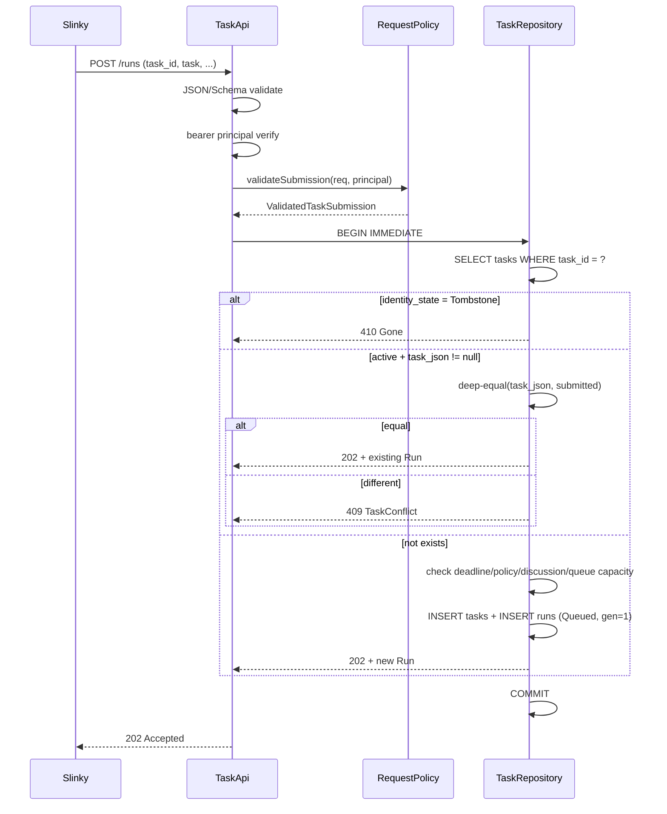
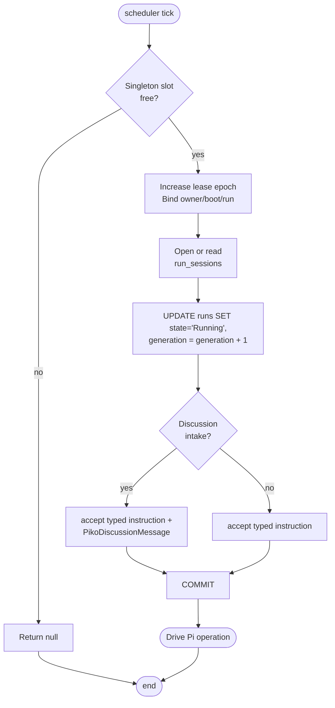
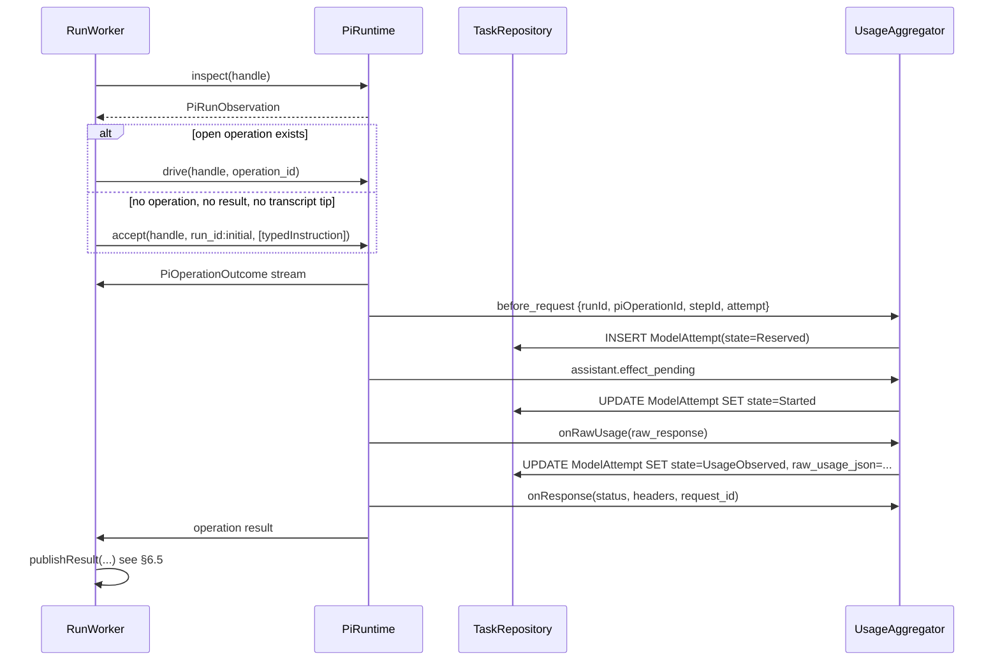
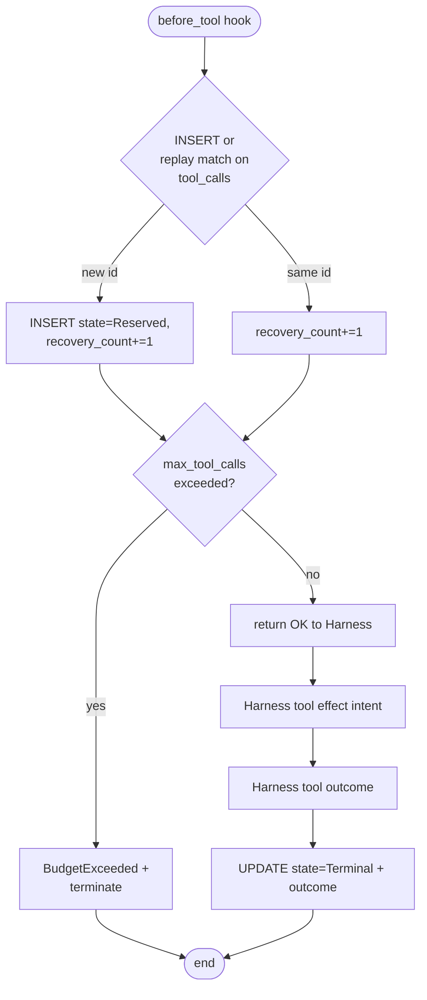
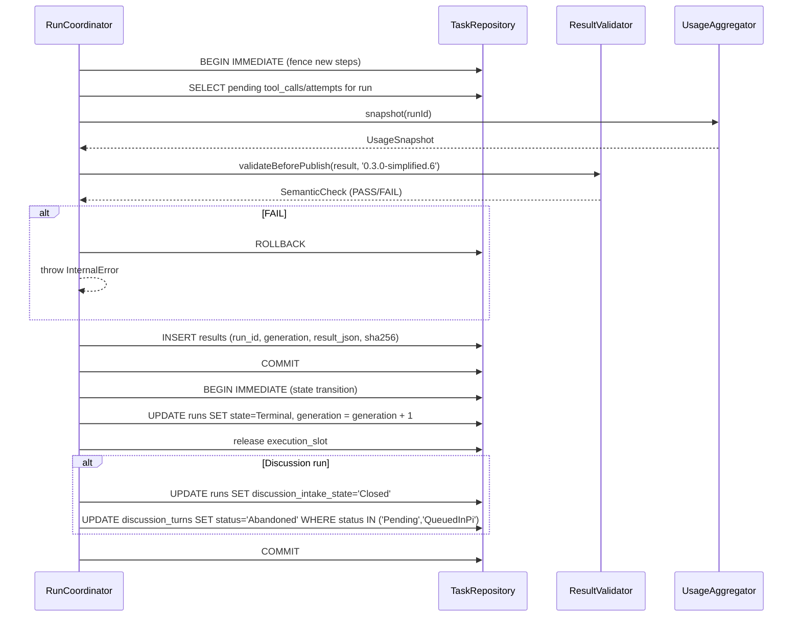
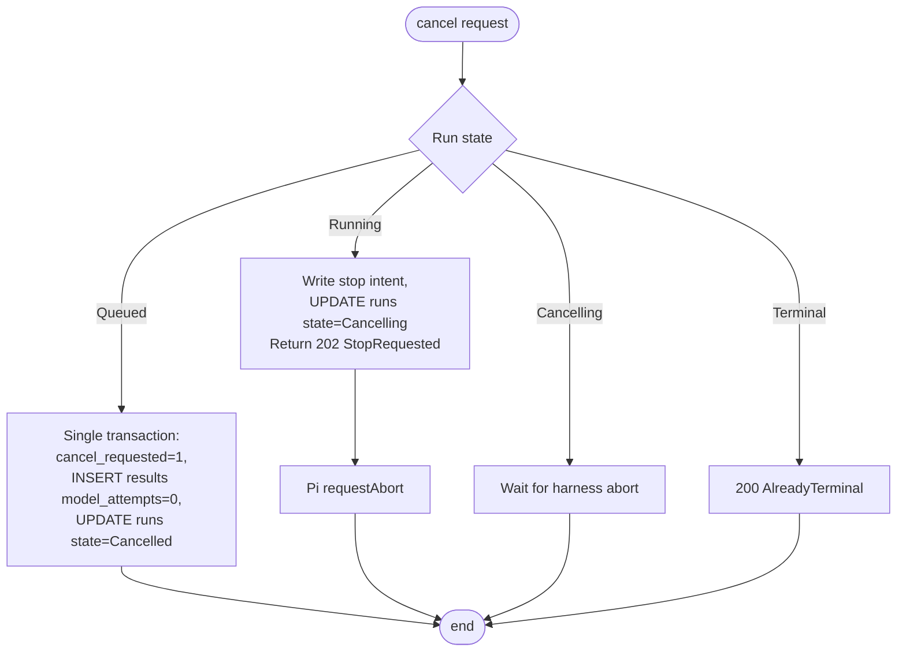
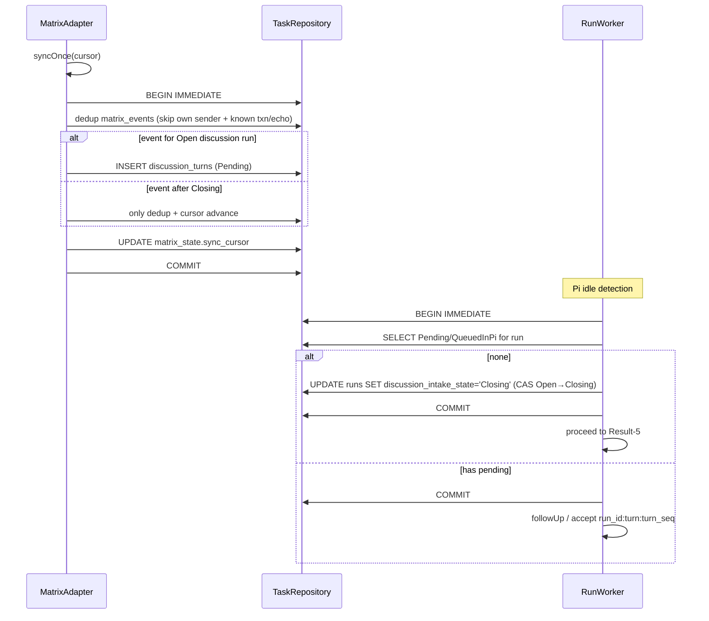

<!-- STD_DOCUMENT_COVER_BEGIN -->
# Piko Runtime V0.3 实现级设计 (ISD 1.0.0)

> STD 使用入口：[项目采用说明与标准导航](../../README.md#std-entry)

| 文档字段 | 值 |
|---|---|
| Document ID | `piko-runtime-implementation-design-v0.3` |
| Document Version | `0.2.0` |
| Status | `Approved` |
| Project | `piko` |
| Document Owner | Piko Implementation Owner |
| Last Modified Date | `2026-09-25` |
| Template ID | `design.implementation` |
| Template Version | `1.0.0` |
<!-- STD_DOCUMENT_COVER_END -->

## 1. 实现目标与输入基线

<a id="isd-scope"></a>

### 1.1 实现对象

- **模块 ID / 名称**：`piko-runtime` — Piko Agent Runtime V0.3 单进程单实例实现（TypeScript/Node.js；API/scheduler/worker 同进程）。
- **直属父对象 / 父设计**：`piko-agent-runtime-core-internal-design-v0.3`（design.subsystem 1.0.0，Approved），同级设计 `piko-agent-runtime-design-v0.3`（design.system 9.0.0，Approved）。
- **模块设计 Document ID / 版本 / 路径 / 摘要**：本文即唯一模块实现设计，独立 ISD；同模块设计不存在单独的 `design.definition`，由本文兼作（mode=`self`）。对应外部 authority：
  - `piko-agent-runtime-design-v0.3` v0.4.0 @ `docs/20_system_design/piko-agent-runtime-design-v0.3.md`
  - `piko-agent-runtime-core-internal-design-v0.3` v0.1.0 @ `docs/30_subsystem_design/piko-agent-runtime-core-internal-design-v0.3.md`
  - `piko-agent-runtime-contract-v0.3` v0.4.0 @ `docs/60_interfaces/contracts/piko-agent-runtime-contract-v0.3.md`
- **需求与 Constraint ID**：PK-01..PK-12（`piko-requirements-traceability-v0.3`）；机器契约 `0.3.0-simplified.6`（`interfaces/openapi/agent-runtime-openapi-v0.3.yaml` + `interfaces/schemas/agent-runtime-v0.3.schema.json` + error catalog）。
- **实现范围 / 非目标**：实现四项 HTTP API（submit/status/cancel/result）、Task Store 事务层、单 execution slot 调度、Pi adapter（`AgentHarness` + `JsonlSessionRepo`）、`Usage Aggregator`、`Matrix Adapter`（仅 `matrix-js-sdk` Client-Server）、稳定 Result publisher、内部诊断。**非目标**：多 Agent、多 execution slot、远程/共享数据库、分布式队列、Matrix Application Service、模型 non-stream fallback、跨系统 exactly-once、产品 Topic/SID/RID、正式 Memory authority、隐藏兼容分支或第二 backend。
- **ISD 默认落位或项目批准路径**：`docs/50_implementation_design/piko-runtime-implementation-design-v0.3.isd.md`（本文件）；同模块设计与 ISD 合并。

<a id="isd-handoff"></a>

### 1.2.1 SYS-H01 · 系统边界（来自 design.system §1-§2）

- **上游信息项 / 规则 ID**：Piko 是 Pi 的薄任务外壳；一个实例一个 Agent；Slinky 视为一个 IR；任务事务层职责。
- **固定来源 / 版本 / 锚点 / 摘要**：`piko-agent-runtime-design-v0.3` v0.4.0 / §1-§2 / "Piko 是 Pi 的薄任务外壳…Piko 只施加授权、deadline、预算和持久化边界"。
- **ISD 细化内容 / 章节**：§3 模块划分、§5.1 `TaskApi` + `PolicyGuard`、§7 单 slot + 独立 Pi session。
- **唯一权威位置**：`piko-agent-runtime-design-v0.3` §1-§2。
- **实现自由度**：仅细化文件名、symbol 名与 transaction 时序；不改外部行为。
- **原 V/Case 及本地验证位置**：PK-T01/PK-T13 集成测试；`piko-agent-runtime-test-specification-v0.3` §3.1。

### 1.2.2 SYS-H02 · Run 状态机（来自 design.system §3）

- **上游信息项 / 规则 ID**：`Queued → Running → Completed|Failed`；Queued 可直接 `Cancelled`；Running 经 `Cancelling → Cancelled|Failed`；`StopRequested` 仅证意图。
- **固定来源 / 版本 / 锚点 / 摘要**：`piko-agent-runtime-design-v0.3` v0.4.0 / §3 / "状态为 Queued -> Running -> Completed|Failed"。
- **ISD 细化内容 / 章节**：§7.1 `runs.state` CHECK 约束 + §8.6 流程图。
- **唯一权威位置**：`piko-agent-runtime-design-v0.3` §3。
- **实现自由度**：状态编码使用字符串（与现有契约一致）；transition 单事务原子。
- **原 V/Case 及本地验证位置**：PK-T02 单元测试 + PK-T14 集成测试。

### 1.2.3 SYS-H03 · task_id 不可变 + 墓碑（来自 design.system §2 + contract §1）

- **上游信息项 / 规则 ID**：唯一 `task_id` 绑定单一不可变任务与 Run；不同定义返回 `TaskConflict`；tombstone 返回 410 `Gone`。
- **固定来源 / 版本 / 锚点 / 摘要**：`piko-agent-runtime-contract-v0.3` v0.4.0 / §1 / "重复提交已有 `task_id` 返回该 Run 的当前或终态视图…详细记录清理后同一 ID 返回 `Gone`"。
- **ISD 细化内容 / 章节**：§4.2 `TaskRecord.identity_state` + §7.2 提交协议步骤 1-5。
- **唯一权威位置**：`piko-agent-runtime-contract-v0.3` §1 + §5。
- **实现自由度**：JSON 比较规则严格按契约 §1 字面执行；不引入请求摘要。
- **原 V/Case 及本地验证位置**：PK-T03 单元测试 + PK-T15 集成测试。

### 1.2.4 SYS-H04 · Responses SSE 模型路径（来自 design.system §4）

- **上游信息项 / 规则 ID**：固定 Pi `0.85.1` @ commit `9767ba275f3e9a5ee0f5c5342249b629ab1b2282`；唯一模型路径 Pi `openai-responses` provider + LLMTier SSE。
- **固定来源 / 版本 / 锚点 / 摘要**：`piko-agent-runtime-design-v0.3` v0.4.0 / §4 / "首个实现必须支持的标准流事件为 response.created…reasoning/refusal"。
- **ISD 细化内容 / 章节**：§5.1 `PiRuntime` + §6.1 流程图。
- **唯一权威位置**：`piko-agent-runtime-design-v0.3` §4 + `interfaces/openapi/agent-runtime-openapi-v0.3.yaml` 错误码。
- **实现自由度**：仅固定 Harness 公共面；不复制 Agent loop。
- **原 V/Case 及本地验证位置**：PK-T09/PK-T10 集成测试 + LLMTier 联调。

### 1.2.5 SYS-H05 · Matrix Client-Server 唯一路径（来自 design.system §5）

- **上游信息项 / 规则 ID**：仅 `matrix-js-sdk` Client-Server API；不启用 Application Service。
- **固定来源 / 版本 / 锚点 / 摘要**：`piko-agent-runtime-design-v0.3` v0.4.0 / §5 / "唯一 Matrix 实现采用 matrix-js-sdk Client-Server API，不并行使用 Application Service 路径"。
- **ISD 细化内容 / 章节**：§5.1 `MatrixRuntime` + §7.2 `matrix_events` + §8.7 流程图。
- **唯一权威位置**：`piko-agent-runtime-design-v0.3` §5 + `piko-agent-runtime-core-internal-design-v0.3` §4。
- **实现自由度**：固定 identity；自定义 `PikoDiscussionMessage` 仅存 `event_id` 与 `visible_content`。
- **原 V/Case 及本地验证位置**：PK-T08 集成测试 + homeserver 联调。

### 1.2.6 SUB-H01 · 组件清单（来自 design.subsystem §1）

- **上游信息项 / 规则 ID**：六个组件（`Task API`、`Policy Guard`、`Task Store`、`Single-Agent Scheduler`、`Run Worker`、Result publisher）+ 三个 adapter（`Pi Adapter`、`Usage Aggregator`、`Matrix Adapter`）。
- **固定来源 / 版本 / 锚点 / 摘要**：`piko-agent-runtime-core-internal-design-v0.3` v0.1.0 / §1 / "任务事务层由 Task API、Policy Guard、Task Store…Result publisher…组成"。
- **ISD 细化内容 / 章节**：§3 文件与目录 + §5.1 内部 interface + §5.1 `MatrixRuntime`。
- **唯一权威位置**：`piko-agent-runtime-core-internal-design-v0.3` §1。
- **实现自由度**：本层定义具体 file/symbol；不引入平行模块。
- **原 V/Case 及本地验证位置**：PK-T01 单元测试。

### 1.2.7 SUB-H02 · 提交两阶段顺序（来自 design.subsystem §2）

- **上游信息项 / 规则 ID**：JSON/Schema → bearer principal → 按 `task_id` 查记录；已存在先比较再返回；不同 `TaskConflict`。
- **固定来源 / 版本 / 锚点 / 摘要**：`piko-agent-runtime-core-internal-design-v0.3` v0.1.0 / §2 / "提交分为静态校验和新任务受理两阶段"。
- **ISD 细化内容 / 章节**：§6.2 提交流程图 + §7.2 提交协议。
- **唯一权威位置**：`piko-agent-runtime-core-internal-design-v0.3` §2。
- **实现自由度**：handler 顺序在 HTTP middleware 中实现。
- **原 V/Case 及本地验证位置**：PK-T03 + PK-T15。

### 1.2.8 SUB-H03 · Result 两步提交（来自 design.subsystem §3）

- **上游信息项 / 规则 ID**：fence 新步骤 → 等待对账 → 固定 Result → 写终态；两步间崩溃恢复器只补第二步。
- **固定来源 / 版本 / 锚点 / 摘要**：`piko-agent-runtime-core-internal-design-v0.3` v0.1.0 / §3 / "Result 发布顺序为：阻止新步骤并 fence lease/writer…再把 Run 设为对应终态"。
- **ISD 细化内容 / 章节**：§6.5 Result 协议流程 + §7.1 fenced write 约束。
- **唯一权威位置**：`piko-agent-runtime-core-internal-design-v0.3` §3 + 本 ISD §7.1。
- **实现自由度**：使用两个 `BEGIN IMMEDIATE` 事务；不允许合并为单事务。
- **原 V/Case 及本地验证位置**：PK-T05 故障注入测试。

### 1.2.9 SUB-H04 · Usage 聚合与语义校验（来自 design.subsystem §5）

- **上游信息项 / 规则 ID**：每字段单独 sum/null + missing_fields；六字段 Complete/Partial/Unknown 三态；Result 发布冻结 UsageSnapshot。
- **固定来源 / 版本 / 锚点 / 摘要**：`piko-agent-runtime-core-internal-design-v0.3` v0.1.0 / §5 / "对每个字段 F 单独计算：仅当每个 durable attempt 都存在 F 时返回 sum(F)；否则返回 null"。
- **ISD 细化内容 / 章节**：§4.2 `ModelAttempt` + §5.1 `UsageAggregator` + §7.1 `result-validator`。
- **唯一权威位置**：`piko-agent-runtime-design-v0.3` §6 + `piko-agent-runtime-core-internal-design-v0.3` §5。
- **实现自由度**：semantic validator 必须运行在 Result 持久化前；版本绑定契约 `0.3.0-simplified.6`。
- **原 V/Case 及本地验证位置**：PK-T10 + PK-T16 单元测试。

### 1.2.10 SUB-H05 · Tool intent/outcome + 预算 CAS（来自 design.subsystem §3 + §5）

- **上游信息项 / 规则 ID**：`before_tool` 以 `(run_id,operation_id,toolCallId)` CAS；`replay:safe` 必须验证 recovery contract；超限 `BudgetExceeded`。
- **固定来源 / 版本 / 锚点 / 摘要**：`piko-agent-runtime-core-internal-design-v0.3` v0.1.0 / §3 / "工具预算在 Harness before_tool hook 中以 (run_id,operation_id,toolCallId) CAS"。
- **ISD 细化内容 / 章节**：§4.2 `ToolCall` + §5.1 `PiRuntime.before_tool` + §7.3 Tool 预算表。
- **唯一权威位置**：`piko-agent-runtime-core-internal-design-v0.3` §3。
- **实现自由度**：tool profile 与 recovery contract 在启动时绑定；不允许运行时新增 `safe` 声明。
- **原 V/Case 及本地验证位置**：PK-T06 + PK-T17。

## 2. 既有实现差异（条件章节）

### 2.1 适用性

**不适用**（N/A）：本仓库尚未生产化；首个实现不存在既有代码基础。决定：当前 `tasks`/`runs`/`results` 等数据表与流程均为新设计而非迁移差异；如未来从设计阶段进入实现阶段出现差异，应作为独立 migration 设计，不与本 ISD 合并。

## 3. 文件、内部组件与调用关系

### 3.1 `src/bootstrap/` · 进程启动与配置绑定

- **职责**：配置加载、SQLite migration、preflight、依赖可达性、进程生命周期。
- **关键文件**：
  - `src/bootstrap/main.ts` — 入口；装配顺序：parse → schema validate → bind tool/recovery registry → canonicalize paths → open/migrate store → verify Pi upstream commit + adapter patch manifest → dependency preflight → listen；任一失败拒绝接收 Run。
  - `src/bootstrap/preflight.ts` — `preflightCheck(): Promise<PreflightReport>`：检查 store writable、Pi upstream commit、LLMTier `GET /v1/models`、Matrix `whoami`、config schema 校验、tool registry 完整性。
- **依赖**：`src/config`、`src/store`、`src/adapters/*`。

### 3.2 `src/http/` · 四项 HTTP operation

- **职责**：四项 HTTP API 路由 + 请求验证 + typed error 映射。
- **关键文件**：
  - `src/http/server.ts` — HTTP server 装配；中间件顺序：request id → auth → JSON/Schema → handler。
  - `src/http/task-api.ts` — `TaskApi` 类；`POST /runs`、`GET /runs/:run_id`、`POST /runs/:run_id:cancel`、`GET /runs/:run_id/result`。
  - `src/http/error-map.ts` — 内部 `InternalError` 到契约 typed error 的映射（与 `interfaces/error-codes/agent-runtime-v0.3.yaml` 一致）。
- **依赖**：`src/policy`、`src/store`、`src/worker`。

### 3.3 `src/policy/` · 授权与约束

- **职责**：request/path/tool/deadline/budget 判定；不引入状态。
- **关键文件**：
  - `src/policy/request-policy.ts` — `validateRequest(req): ValidatedTaskSubmission`。
  - `src/policy/path-policy.ts` — `canonicalizePath(p): RelPath`；拒绝绝对路径/反斜线/`.`/`..`/空 segment；解析 symlink 后必须在 workspace root 内。
  - `src/policy/tool-profile.ts` — `bindToolProfile(profile, registry): BoundToolProfile`；验证 `recovery_contract_ref` 解析到已注册实现。
- **依赖**：`src/config`、纯函数库。

### 3.4 `src/store/` · SQLite repository

- **职责**：Run/lease/session/result/ledger 事务。
- **关键文件**：
  - `src/store/db.ts` — SQLite 连接（`foreign_keys=ON`、WAL、busy timeout、同步 durability）。
  - `src/store/migrations/001_initial.ts` — 首个 migration；`PRAGMA user_version=2`；包含 §4.7 全部表。
  - `src/store/task-repository.ts` — `TaskRepository` 接口 + `SqliteTaskRepository` 实现。
  - `src/store/audit.ts` — `AuditWriter`；记录状态改变、credential ref 变更、强制 fence、schema migration、operator-authorized Responses probe。
- **依赖**：`better-sqlite3`。

### 3.5 `src/scheduler/` · 单 slot 调度

- **职责**：单 execution slot 领取、续租、fence、排队。
- **关键文件**：
  - `src/scheduler/single-slot.ts` — `SingleSlotScheduler`：`acquireSlot(ownerId): Lease | null`、`renewLease(lease): Lease`、`fence(epoch): void`。
- **依赖**：`src/store`、`src/util/clock`。

### 3.6 `src/worker/` · Run 协调

- **职责**：Run 事务协调、取消、deadline、Result 发布。
- **关键文件**：
  - `src/worker/run-worker.ts` — `RunWorker`：驱动 Run 进入 Running、accept Pi operation、drive operation、对账工具事实、Result 发布。
  - `src/worker/run-coordinator.ts` — `RunCoordinator`：状态推进；不镜像 Pi Agent loop。
  - `src/worker/cancel.ts` — `cancelQueued(runId)`、`cancelRunning(runId)`；不同路径产生不同 Result generation。
- **依赖**：`src/store`、`src/adapters/*`、`src/policy`、`src/usage`。

### 3.7 `src/adapters/pi/` · Pi 集成

- **职责**：`AgentHarness` + `JsonlSessionRepo` 会话管理、lane/operation 驱动、abort、raw usage hook。
- **关键文件**：
  - `src/adapters/pi/piko-pi-adapter.ts` — `PiAdapter`；持有固定 Pi upstream commit + adapter patch manifest。
  - `src/adapters/pi/durable-fs.ts` — `PikoDurableFileSystem`：JSONL append 后 `fsync(file)`；create/rename 后 `fsync(parent dir)`。
  - `src/adapters/pi/hooks.ts` — `before_request` / `before_tool` / `onRawUsage` / `onResponse` 注册。
- **依赖**：固定 Pi SDK（`0.85.1` @ commit `9767ba275f3e9a5ee0f5c5342249b629ab1b2282`）。

### 3.8 `src/adapters/matrix/` · Matrix 集成

- **职责**：membership/sync/event/media/reply/txn。
- **关键文件**：
  - `src/adapters/matrix/matrix-adapter.ts` — `MatrixAdapter`：使用 `matrix-js-sdk` Client-Server。
  - `src/adapters/matrix/discussion.ts` — `PikoDiscussionMessage` 持久/投影；`event_id` 仅在持久字段。
- **依赖**：`matrix-js-sdk`、`src/store`、`src/policy`。

### 3.9 `src/usage/` · Usage 聚合

- **职责**：按 attempt identity 汇总 raw usage + 冻结 UsageSnapshot。
- **关键文件**：
  - `src/usage/usage-aggregator.ts` — `UsageAggregator`：六字段单独 sum/null + missing_fields。
  - `src/usage/semantic-validator.ts` — `validateResultSemantics(result, contractVersion): SemanticCheck`；attempts 数量、精确算术、token 子集关系。
- **依赖**：纯函数库、契约版本号。

### 3.10 `src/observability/` · 日志与指标

- **职责**：结构化 JSON 日志、metric、audit event。
- **关键文件**：
  - `src/observability/log.ts` — 结构化 logger；redaction policy：禁止 instruction 正文、credential、access token、完整模型 input/output、附件内容。
  - `src/observability/metric.ts` — 最低指标定义：queue depth、Run state duration、slot/lease epoch、Harness operation/result generation、model/tool attempts、usage quality、Matrix sync lag、dependency failures、recovery outcomes。
- **依赖**：redaction policy；不得反向控制业务。

### 3.11 `migrations/`、`schemas/`、`tests/{unit,contract,integration,fault}/`

- **职责**：schema 版本化 migration 与四类测试目录。
- **关键文件**：
  - `migrations/001_initial.sql` — 首版 schema（与 §4.7 DDL 一致）。
  - `schemas/agent-runtime-v0.3.schema.json` — Result/UsageSnapshot schema（含 `x-semantic-invariants`）。
  - `tests/unit/` — 单元测试。
  - `tests/contract/` — 契约测试。
  - `tests/integration/` — 集成测试。
  - `tests/fault/` — 故障注入测试。

### 3.12 调用关系图

```text
HTTP Client
  └─> TaskApi ──> RequestPolicy ──> TaskRepository(SQLite)
                                       │
                                  SingleSlotScheduler
                                       │
                                  RunWorker/RunCoordinator
                                  /        │         \
                          PiAdapter   MatrixAdapter   UsageLedger
                              │           │              │
                       Pi session    matrix-js-sdk   ModelAttempt rows
                              │
                       LLMTier Responses SSE
```

## 4. 数据结构设计

### 4.1 公共基础类型与枚举

#### 4.1.1 `RunState`

- **TypeScript 定义**：`type RunState = "Queued" | "Running" | "Cancelling" | "Completed" | "Failed" | "Cancelled";`
- **持久化**：TEXT，`CHECK(state IN (...))`。
- **来源 authority**：`piko-agent-runtime-design-v0.3` §3 + `piko-agent-runtime-contract-v0.3` §6。

#### 4.1.2 `DiscussionIntakeState`

- **TypeScript 定义**：`type DiscussionIntakeState = "Disabled" | "Open" | "Closing" | "Closed";`
- **持久化**：TEXT，`CHECK(discussion_intake_state IN (...))`。
- **来源 authority**：`piko-agent-runtime-core-internal-design-v0.3` §4。

#### 4.1.3 `AttemptState`

- **TypeScript 定义**：`type AttemptState = "Reserved" | "Started" | "UsageObserved" | "Terminal" | "Unknown";`
- **持久化**：TEXT。
- **来源 authority**：`piko-agent-runtime-core-internal-design-v0.3` §5。

#### 4.1.4 `ReplayPolicy`

- **TypeScript 定义**：`type ReplayPolicy = "never" | "safe";`
- **持久化**：TEXT，`CHECK(replay IN (...))`。
- **来源 authority**：`piko-agent-runtime-core-internal-design-v0.3` §3。

#### 4.1.5 `ToolCallState`

- **TypeScript 定义**：`type ToolCallState = "Reserved" | "Started" | "Terminal" | "Unknown";`
- **持久化**：TEXT。
- **来源 authority**：`piko-agent-runtime-core-internal-design-v0.3` §3。

#### 4.1.6 `DiscussionTurnStatus`

- **TypeScript 定义**：`type DiscussionTurnStatus = "Pending" | "QueuedInPi" | "Consumed" | "Abandoned";`
- **持久化**：TEXT。
- **来源 authority**：`piko-agent-runtime-core-internal-design-v0.3` §4。

#### 4.1.7 `FailureCode`

- **TypeScript 定义**：见 §4.8 + 与契约 `interfaces/error-codes/agent-runtime-v0.3.yaml` 双向一致性测试强制。
- **来源 authority**：`piko-agent-runtime-contract-v0.3` §6。

### 4.2 业务与操作数据结构

#### 4.2.1 `TaskRecord`

- **字段**：
  - `task_id: string`（PRIMARY KEY；Slinky 生成；唯一）
  - `run_id: string`（UNIQUE NOT NULL；FK → runs）
  - `owner_principal: string`（配置 principal）
  - `identity_state: "Active" | "Tombstone"`
  - `task_json: string | null`（UTF-8 JSON；tombstone 时为 NULL）
  - `accepted_at: string`（UTC ISO-8601）
  - `purge_after: string`（UTC ISO-8601）
- **校验**：`CHECK((identity_state='Active' AND task_json IS NOT NULL) OR (identity_state='Tombstone' AND task_json IS NULL))`。
- **来源 authority**：`piko-agent-runtime-contract-v0.3` §1 + §5。

#### 4.2.2 `RunRecord`

- **字段**：
  - `run_id: string`（PRIMARY KEY；FK → tasks）
  - `state: RunState`
  - `generation: number`（CHECK >= 1）
  - `cancel_requested: 0|1`
  - `discussion_intake_state: DiscussionIntakeState`
  - `accepted_at: string`、`started_at: string | null`、`finished_at: string | null`
  - `deadline_at: string`
  - `max_model_calls: number`
  - `max_tool_calls: number`
- **状态转移**：`Queued→Running|Cancelled`、`Running→Cancelling|Completed|Failed`、`Cancelling→Cancelled|Failed`。
- **来源 authority**：`piko-agent-runtime-design-v0.3` §3 + `piko-agent-runtime-core-internal-design-v0.3` §3。

#### 4.2.3 `RunSessionRecord`

- **字段**：
  - `run_id: string`（PRIMARY KEY；FK → runs）
  - `pi_session_id: string`（UNIQUE NOT NULL；固定 = `run_id`）
  - `lane_name: "main"`
  - `active_operation_id: string | null`、`last_operation_id: string | null`、`observed_tip_id: string | null`
  - `lease_epoch: number`（CHECK >= 1）
- **来源 authority**：`piko-agent-runtime-core-internal-design-v0.3` §2 + §3。

#### 4.2.4 `ExecutionSlot`

- **字段**：`slot_id: 1`（singleton）、`run_id: string | null`、`owner_id: string | null`、`boot_id: string | null`、`lease_epoch: number`、`heartbeat_at: string | null`。
- **来源 authority**：`piko-agent-runtime-core-internal-design-v0.3` §2 + §3。

#### 4.2.5 `ModelAttempt`

- **字段**：`(run_id, operation_id, step_id, attempt)` 复合主键；`state: AttemptState`、`raw_usage_json: string | null`、`record_version: number`、`updated_at: string`。
- **来源 authority**：`piko-agent-runtime-core-internal-design-v0.3` §5。

#### 4.2.6 `ToolCall`

- **字段**：`(run_id, operation_id, tool_call_id)` 复合主键；`tool_name: string`、`effect: string`、`replay: ReplayPolicy`、`recovery_contract_ref: string | null`、`state: ToolCallState`、`recovery_count: number`、`updated_at: string`。
- **来源 authority**：`piko-agent-runtime-core-internal-design-v0.3` §3。

#### 4.2.7 `DiscussionTurn`

- **字段**：`(run_id, event_id)` PRIMARY KEY；`turn_seq: number`（UNIQUE per run）；`status: DiscussionTurnStatus`、`visible_content: string`、`pi_entry_id: string | null`、`pi_operation_id: string | null`。
- **来源 authority**：`piko-agent-runtime-core-internal-design-v0.3` §4。

#### 4.2.8 `MatrixSendRecord`

- **字段**：`txn_id: string` PRIMARY KEY（由 instance/run/turn/action identity 确定性生成）；`run_id: string`、`turn_seq: number | null`、`payload_sha256: string`、`event_id: string | null`、`state: "Pending"|"Sent"|"Unknown"`。
- **来源 authority**：`piko-agent-runtime-core-internal-design-v0.3` §4。

### 4.3 配置与规则数据结构

#### 4.3.1 `PikoRuntimeConfig`

- **Schema authority**：`interfaces/schemas/piko-runtime-config-v0.3.schema.json`。
- **关键字段**：
  - `api_auth: { slinky_principal: { credential_ref: SecretRef } }` — 第一阶段仅一个 Slinky principal。
  - `workspace_root: RelPath`（必须通过 `canonicalizePath`）。
  - `storage: { sqlite_path: AbsPath, max_queue_depth: number, retention_days: number }`。
  - `pi: { upstream_commit: string, adapter_patches: { before_request_stepid: bool, on_raw_usage: bool } }`。
  - `llmtier: { base_url: URL, credential_ref: SecretRef, model: string, cacheRetention: "none", supportsExplicitPromptCacheMode: false, streamOptions: { maxRetries: 0 } }`。
  - `matrix: { homeserver: URL, credential_ref: SecretRef, identity_localpart: string }`。
- **校验**：credential_ref 必须解析为 Secret provider 中的注册项；credential 明文被拒绝。

#### 4.3.2 `ToolProfile`

- **Schema authority**：`interfaces/schemas/piko-tool-profile-v0.3.schema.json`。
- **关键字段**：
  - `tools: Array<{ name: string, effect: "read"|"write"|"shell"|"network"|"external", replay: ReplayPolicy, recovery_contract_ref: string | null, implementation_ref: string }>`。
  - `recovery_contracts: Record<string, { kind: string, binds: { tool_name: string, effect: string, replay: ReplayPolicy, implementation_ref: string } }>`。
- **校验**：每个 `recovery_contract_ref` 必须存在；每个 `implementation_ref` 启动时必须解析到进程内已注册实现，并与 tool name/effect/AgentTool.replay 声明一致；任一不匹配即启动失败。

### 4.4 通信报文结构

#### 4.4.1 `RunSubmitRequest`

- **Schema authority**：`interfaces/openapi/agent-runtime-openapi-v0.3.yaml` → `RunSubmitRequest`。
- **关键字段**：`task_id`、`task`、`workspace`、`permissions`（read/write/tool）、`deadline_at`、`max_model_calls`、`max_tool_calls`、`output_paths`、`discussion?: { room_id, trigger_event_id }`。
- **来源 authority**：`piko-agent-runtime-contract-v0.3` §1 + §2。

#### 4.4.2 `AgentResult`

- **Schema authority**：`interfaces/schemas/agent-runtime-v0.3.schema.json` → `AgentResult`。
- **关键字段**：`run_id`、`state`、`partial`、`summary`、`outputs[]`、`known_actions[]`、`usage: UsageSnapshot`、`failure: Failure | null`。
- **来源 authority**：`piko-agent-runtime-design-v0.3` §6 + `piko-agent-runtime-contract-v0.3` §3。

#### 4.4.3 `UsageSnapshot`

- **Schema authority**：`interfaces/schemas/agent-runtime-v0.3.schema.json` → `UsageSnapshot`。
- **关键字段**：`input_tokens`、`output_tokens`、`total_tokens`、`cached_tokens`、`cache_write_tokens`、`reasoning_tokens`、`model_attempts`、`usage_observed_attempts`、`missing_fields[]`、`quality: "Complete"|"Partial"|"Unknown"`。
- **来源 authority**：`piko-agent-runtime-design-v0.3` §6 + `piko-agent-runtime-core-internal-design-v0.3` §5。

#### 4.4.4 `PikoDiscussionMessage`

- **持久字段**：`event_id`、`visible_content`、`reply_context?: { in_reply_to_event_id }`、`attachments?: Array<{ mxc: string, mime: string, size: number, sha256: string }>`。
- **provider 投影字段**：仅 `visible_content`、`reply_context`、`attachments`（不含 `event_id`）。
- **来源 authority**：`piko-agent-runtime-core-internal-design-v0.3` §4。

### 4.5 设备与 FPGA 表项结构

**N/A**：纯软件项目，不适用 FPGA / 硬件表项。

### 4.6 运行状态数据结构

#### 4.6.1 `Lease`

- **字段**：`owner_id: string`、`boot_id: string`、`epoch: number`、`acquired_at: string`、`heartbeat_at: string`。
- **来源 authority**：`piko-agent-runtime-core-internal-design-v0.3` §3。

#### 4.6.2 `FencedWrite`

- **字段**：`run_id`、`expected_generation`、`expected_state_in: RunState[]`、`expected_lease_epoch`、`mutation: RunMutation`。
- **来源 authority**：`piko-agent-runtime-core-internal-design-v0.3` §3 + 本 ISD §7.1。

#### 4.6.3 `PiRunObservation`

- **字段**：`open_operations: OperationId[]`、`operation_result: OperationResult | null`、`lane_tip: TipId | null`、`transcript_version: number`、`durable_queues: QueueSnapshot`。
- **来源 authority**：`piko-agent-runtime-core-internal-design-v0.3` §2。

### 4.7 数据库表结构

#### 4.7.1 首版 DDL（`PRAGMA user_version=2`）

```sql
CREATE TABLE instance_meta (
  key TEXT PRIMARY KEY, value_json TEXT NOT NULL
) STRICT;

CREATE TABLE tasks (
  task_id TEXT PRIMARY KEY,
  run_id TEXT NOT NULL UNIQUE,
  owner_principal TEXT NOT NULL,
  identity_state TEXT NOT NULL CHECK(identity_state IN ('Active','Tombstone')),
  task_json TEXT,
  accepted_at TEXT NOT NULL,
  purge_after TEXT NOT NULL,
  CHECK((identity_state='Active' AND task_json IS NOT NULL) OR
        (identity_state='Tombstone' AND task_json IS NULL))
) STRICT;

CREATE TABLE runs (
  run_id TEXT PRIMARY KEY REFERENCES tasks(run_id),
  state TEXT NOT NULL CHECK(state IN
    ('Queued','Running','Cancelling','Completed','Failed','Cancelled')),
  generation INTEGER NOT NULL CHECK(generation >= 1),
  cancel_requested INTEGER NOT NULL DEFAULT 0 CHECK(cancel_requested IN (0,1)),
  discussion_intake_state TEXT NOT NULL
    CHECK(discussion_intake_state IN ('Disabled','Open','Closing','Closed')),
  accepted_at TEXT NOT NULL, started_at TEXT, finished_at TEXT,
  deadline_at TEXT NOT NULL, max_model_calls INTEGER NOT NULL,
  max_tool_calls INTEGER NOT NULL
) STRICT;

CREATE TABLE run_sessions (
  run_id TEXT PRIMARY KEY REFERENCES runs(run_id),
  pi_session_id TEXT NOT NULL UNIQUE,
  lane_name TEXT NOT NULL CHECK(lane_name='main'),
  active_operation_id TEXT, last_operation_id TEXT, observed_tip_id TEXT,
  lease_epoch INTEGER NOT NULL CHECK(lease_epoch >= 1)
) STRICT;

CREATE TABLE execution_slot (
  slot_id INTEGER PRIMARY KEY CHECK(slot_id=1),
  run_id TEXT REFERENCES runs(run_id), owner_id TEXT, boot_id TEXT,
  lease_epoch INTEGER NOT NULL, heartbeat_at TEXT
) STRICT;

CREATE TABLE results (
  run_id TEXT PRIMARY KEY REFERENCES runs(run_id),
  generation INTEGER NOT NULL, result_json TEXT NOT NULL,
  result_sha256 TEXT NOT NULL, published_at TEXT NOT NULL,
  UNIQUE(run_id,generation)
) STRICT;

CREATE TABLE model_attempts (
  run_id TEXT NOT NULL REFERENCES runs(run_id),
  operation_id TEXT NOT NULL, step_id TEXT NOT NULL, attempt INTEGER NOT NULL,
  state TEXT NOT NULL CHECK(state IN ('Reserved','Started','UsageObserved','Terminal','Unknown')),
  raw_usage_json TEXT, record_version INTEGER NOT NULL, updated_at TEXT NOT NULL,
  PRIMARY KEY(run_id,operation_id,step_id,attempt)
) STRICT;

CREATE TABLE tool_calls (
  run_id TEXT NOT NULL REFERENCES runs(run_id),
  operation_id TEXT NOT NULL, tool_call_id TEXT NOT NULL,
  tool_name TEXT NOT NULL, effect TEXT NOT NULL,
  replay TEXT NOT NULL CHECK(replay IN ('never','safe')),
  recovery_contract_ref TEXT,
  state TEXT NOT NULL CHECK(state IN ('Reserved','Started','Terminal','Unknown')),
  recovery_count INTEGER NOT NULL DEFAULT 0 CHECK(recovery_count >= 0),
  updated_at TEXT NOT NULL,
  PRIMARY KEY(run_id,operation_id,tool_call_id)
) STRICT;

CREATE TABLE matrix_state (
  singleton INTEGER PRIMARY KEY CHECK(singleton=1),
  sync_cursor TEXT, membership_version INTEGER NOT NULL
) STRICT;
CREATE TABLE matrix_events (
  room_id TEXT NOT NULL, event_id TEXT NOT NULL, sender TEXT NOT NULL,
  txn_id TEXT, observed_at TEXT NOT NULL,
  PRIMARY KEY(room_id,event_id)
) STRICT;
CREATE TABLE discussion_turns (
  run_id TEXT NOT NULL REFERENCES runs(run_id), event_id TEXT NOT NULL,
  turn_seq INTEGER NOT NULL, status TEXT NOT NULL
    CHECK(status IN ('Pending','QueuedInPi','Consumed','Abandoned')),
  visible_content TEXT NOT NULL, pi_entry_id TEXT, pi_operation_id TEXT,
  PRIMARY KEY(run_id,event_id), UNIQUE(run_id,turn_seq)
) STRICT;
CREATE TABLE matrix_sends (
  txn_id TEXT PRIMARY KEY, run_id TEXT NOT NULL REFERENCES runs(run_id),
  turn_seq INTEGER, payload_sha256 TEXT NOT NULL, event_id TEXT,
  state TEXT NOT NULL CHECK(state IN ('Pending','Sent','Unknown'))
) STRICT;
CREATE TABLE audit_events (
  audit_id INTEGER PRIMARY KEY AUTOINCREMENT, event_name TEXT NOT NULL,
  actor_class TEXT NOT NULL, run_id TEXT, detail_json TEXT NOT NULL, occurred_at TEXT NOT NULL
) STRICT;
```

- **来源 authority**：`piko-agent-runtime-core-internal-design-v0.3` §3 + `piko-agent-runtime-contract-v0.3` §1-§3。
- **migration 策略**：v1→v2 新增 `Abandoned` discussion turn 状态；`PRAGMA user_version=2` 为当前基线；升级时先备份、独占 instance lock、单事务执行、成功后更新 generation。

### 4.8 错误码与错误结构

#### 4.8.1 外部 typed error 集（与契约 `0.3.0-simplified.6` 一致）

- `Unauthorized`、`TaskConflict`、`Gone`、`InvalidDiscussionContext`、`QueueFull`、`RunNotTerminal`、`ResultUnavailable`、`CancelledBeforeStart`、`StopRequested`、`AlreadyTerminal`、`DeadlineExceeded`、`BudgetExceeded`、`ModelUnavailable`、`ModelResponseInvalid`、`ToolFailure`、`UnsafeRetryBlocked`、`ExecutionStateUnknown`、`DiscussionAccessLost`、`CancelledByRequest`、`InternalError`。
- **来源 authority**：`piko-agent-runtime-contract-v0.3` §6 + `piko-agent-runtime-design-v0.3` §3 + §10。

#### 4.8.2 `Failure` 结构（Result 内嵌）

- **字段**：`code: FailureCode`、`cause_class: string`、`detail: string | null`、`observed_at: string`、`run_generation: number`。
- **校验**：`Failed` 必须含 non-null `failure`；`Completed` 强制 `failure=null`；`Cancelled` 必须映射 `CancelledByRequest` / `Cancellation`。
- **来源 authority**：`piko-agent-runtime-contract-v0.3` §3。

## 5. 接口设计

### 5.1 软件接口

#### 5.1.1 `TaskRepository`（`src/store/task-repository.ts`）

- **完整签名**：

  ```ts
  interface TaskRepository {
    createOrGetRun(input: ValidatedTaskSubmission): Promise<CreateRunOutcome>;
    acquireSlot(ownerId: string): Promise<Lease | null>;
    renewLease(lease: Lease): Promise<Lease>;
    mutateRun(command: FencedRunCommand): Promise<RunRecord>;
    publishResult(command: FencedPublishResult): Promise<ResultRecord>;
    listPendingDiscussionTurns(runId: string): Promise<DiscussionTurn[]>;
    recordModelAttempt(attempt: ModelAttempt): Promise<void>;
    recordToolCall(call: ToolCall): Promise<void>;
  }
  ```

- **caller**：`TaskApi`、`SingleSlotScheduler`、`RunWorker`、`RunCoordinator`、`Result publisher`、`UsageAggregator`。
- **副作用**：所有写命令必须携带 `run_id`、expected Run generation、有效 lease epoch；不匹配返回内部 `FencedWrite`。
- **Thread-safe / reentrant**：SQLite 单 writer 串行化；reader 多连接；事务内嵌套调用禁止。
- **Transaction participation**：每个方法对应一个 `BEGIN IMMEDIATE` 事务；不允许调用方持有外部事务。
- **Blocking / timeout / cancellation**：writer transaction busy timeout 由 SQLite `busy_timeout` PRAGMA 控制；无 cancellation token。
- **实现状态 / 验证项**：未实现；待 `PK-T01` 单元测试 + `PK-T13` 集成测试。

#### 5.1.2 `PiRuntime`（`src/adapters/pi/piko-pi-adapter.ts`）

- **完整签名**：

  ```ts
  interface PiRuntime {
    openOrCreateRunSession(runId: string): Promise<PiRunHandle>;
    inspect(handle: PiRunHandle): Promise<PiRunObservation>;
    accept(handle: PiRunHandle, operationId: string, messages: AgentMessage[]): Promise<void>;
    drive(handle: PiRunHandle, operationId: string): Promise<PiOperationOutcome>;
    enqueueDiscussion(handle: PiRunHandle, turn: PikoDiscussionMessage): Promise<PiQueueRef>;
    requestAbort(handle: PiRunHandle, operationId: string): Promise<void>;
  }
  ```

- **caller**：`RunWorker`、`RunCoordinator`、`UsageAggregator`。
- **副作用**：固定 Harness 公共面；不替换 Pi provider adapter；`streamOptions.maxRetries=0`；收到非 SSE body 由 Harness 形成可恢复 operation 事实。
- **Thread-safe / reentrant**：每个 `PiRunHandle` 由唯一 Run 持有；同一 Run 不并发驱动；跨 Run 不复用消息历史。
- **Transaction participation**：Harness operation 提交与 SQLite 写不在同一事务；通过确定性 identity + probe 对账。
- **Blocking / timeout / cancellation**：由 deadline / budget / `requestAbort` 控制；cancellation 不可跨进程强制。
- **实现状态 / 验证项**：未实现；待 `PK-T03` 集成测试 + `PK-T14` 故障注入测试。

#### 5.1.3 `MatrixRuntime`（`src/adapters/matrix/matrix-adapter.ts`）

- **完整签名**：

  ```ts
  interface MatrixRuntime {
    verifyDiscussionStart(context: DiscussionContext): Promise<VerifiedEvent>;
    syncOnce(cursor: string | null): Promise<MatrixBatch>;
    sendWithStableTxn(record: MatrixSendRecord): Promise<MatrixSendOutcome>;
  }
  ```

- **caller**：`TaskApi`（受理 discussion）、`MatrixAdapter pump`、`RunWorker`（discussion intake）。
- **副作用**：每个 sync batch 在一个 SQLite 事务中写 event dedup + `DiscussionTurn` + 新 cursor；发送先持久 `MatrixSendRecord` + 稳定 `txn_id`。
- **Thread-safe / reentrant**：单实例单 pump；不允许并发 sync。
- **Transaction participation**：每个 `syncOnce` 调用对应一个 `BEGIN IMMEDIATE` 事务。
- **Blocking / timeout / cancellation**：sync cursor 不在事务中推进。
- **实现状态 / 验证项**：未实现；待 `PK-T08` 集成测试。

#### 5.1.4 `UsageAggregator`（`src/usage/usage-aggregator.ts`）

- **完整签名**：

  ```ts
  interface UsageAggregator {
    recordAttempt(attempt: ModelAttempt): Promise<void>;
    snapshot(runId: string): Promise<UsageSnapshot>;
    freeze(snapshot: UsageSnapshot): Promise<UsageSnapshot>;
  }
  ```

- **caller**：`PiRuntime.onRawUsage`、`RunCoordinator`（Result 发布）。
- **副作用**：每字段单独 sum/null + `missing_fields`；六字段 Complete/Partial/Unknown 三态。
- **Thread-safe / reentrant**：写操作 SQLite 串行化；`freeze` 必须配合 `result-validator`。
- **Transaction participation**：与 `publishResult` 同一事务；`freeze` 前不写 Result。
- **Blocking / timeout / cancellation**：无 cancellation token。
- **实现状态 / 验证项**：未实现；待 `PK-T10` + `PK-T16` 单元测试。

#### 5.1.5 `ResultValidator`（`src/usage/semantic-validator.ts`）

- **完整签名**：

  ```ts
  interface ResultValidator {
    validateBeforePublish(result: AgentResult, contractVersion: string): SemanticCheck;
  }
  ```

- **caller**：`RunCoordinator`（发布前 gate）。
- **副作用**：失败时 throw `InternalError("semantic-validator-fail")`；不修改 Result。
- **Thread-safe / reentrant**：纯函数；可并发调用。
- **Transaction participation**：与 `publishResult` 同一事务前置。
- **Blocking / timeout / cancellation**：无。
- **实现状态 / 验证项**：未实现；待 `PK-T10` + `PK-T16` 单元测试。

#### 5.1.6 `RequestPolicy`（`src/policy/request-policy.ts`）

- **完整签名**：

  ```ts
  interface RequestPolicy {
    validateSubmission(req: RunSubmitRequest, principal: string): Promise<ValidatedTaskSubmission>;
    canonicalizePath(p: string): RelPath;
    bindToolProfile(profile: ToolProfile, registry: ToolRegistry): BoundToolProfile;
  }
  ```

- **caller**：`TaskApi`、`HttpServer` 中间件。
- **副作用**：不持有状态；调用 `ToolRegistry` 验证 `recovery_contract_ref` / `implementation_ref`。
- **Thread-safe / reentrant**：纯函数 + 启动时绑定。
- **Transaction participation**：无。
- **Blocking / timeout / cancellation**：无。
- **实现状态 / 验证项**：未实现；待 `PK-T03` + `PK-T12` 单元测试。

### 5.2 消息与数据流接口

#### 5.2.1 外部 HTTP（`src/http/task-api.ts`）

- `POST /runs`（submit）、`GET /runs/:run_id`（status）、`POST /runs/:run_id:cancel`（cancel）、`GET /runs/:run_id/result`（result）。
- **authority**：`piko-agent-runtime-contract-v0.3` §1-§2。

#### 5.2.2 内部事件（`src/observability/`）

- `event.audit.credential-ref-changed`、`event.audit.run-state-changed`、`event.audit.forced-fence`、`event.audit.schema-migration`、`event.audit.responses-probe`。
- **authority**：`piko-agent-runtime-core-internal-design-v0.3` §6。

### 5.3 硬件与固件接口

**N/A**：纯软件项目，不适用硬件 / 固件接口。

### 5.4 人机与维护接口

#### 5.4.1 内部诊断入口

- 只读诊断与状态改变操作分离；启动、重启、credential 修改和强制 lease 回收需要 operator authorization。
- **authority**：`piko-agent-runtime-design-v0.3` §7 + `piko-runtime-release-and-operations-v0.3`。

## 6. 关键流程与算法

### 6.1 SUBMIT-1 · 任务提交



- **决定**：handler 不持有长事务；writer transaction 仅包围本地状态改变。
- **来源 authority**：`piko-agent-runtime-contract-v0.3` §1 + §2 + `piko-agent-runtime-core-internal-design-v0.3` §2。

### 6.2 ACQUIRE-2 · Slot 领取



- **决定**：单 slot + 单 lease epoch 唯一权威；不实现优先级或抢占。
- **来源 authority**：`piko-agent-runtime-core-internal-design-v0.3` §2-§3。

### 6.3 DRIVE-3 · Operation Drive



- **决定**：provider 内层 `maxRetries=0`；下一次 attempt 必须由 Harness retry policy 形成。
- **来源 authority**：`piko-agent-runtime-design-v0.3` §4 + `piko-agent-runtime-core-internal-design-v0.3` §5。

### 6.4 TOOL-4 · Tool intent/outcome CAS



- **决定**：`replay:safe` 必须绑定 `recovery_contract_ref` 且启动时已解析；`never` 不重放。
- **来源 authority**：`piko-agent-runtime-core-internal-design-v0.3` §3。

### 6.5 RESULT-5 · Result 两步提交



- **决定**：两步事务分开；中间崩溃恢复器只补第二步。
- **来源 authority**：`piko-agent-runtime-core-internal-design-v0.3` §3 + §5。

### 6.6 CANCEL-6 · 取消路径分流



- **决定**：Queued 取消不取得 lease；Running 取消必须经 `Cancelling`。
- **来源 authority**：`piko-agent-runtime-design-v0.3` §3。

### 6.7 MATRIX-7 · Discussion Sync + Intake CAS



- **决定**：事件要么先入队阻止 closing，要么 closing 后不附着；终态 Run 不重开。
- **来源 authority**：`piko-agent-runtime-core-internal-design-v0.3` §4。

## 7. 并发、失败、持久化与安全生命周期

### 7.1 并发、交错与失败收口

#### 7.1.1 CONC-Fence · Fenced Write 协议

- **原规则 / 不可改变规则 ID**：所有 Run 状态转移通过 `FencedWrite` 命令携带 `expected_generation` + `expected_state_in` + `expected_lease_epoch`；`UPDATE … WHERE generation=? AND state IN (?, ?, …)` 影响行数必须恰为 1；终态不可回退。
- **原子范围 / 事务外副作用**：单个 `BEGIN IMMEDIATE` 事务；跨 Run 不共享事务。
- **开始 / 提交 / 回滚函数**：`TaskRepository.mutateRun`。
- **持久提交点 / 对外响应点**：SQLite commit 后才返回 HTTP 响应。
- **响应丢失后的权威核对**：HTTP client 不知道 commit 成功时，恢复器按 Result → Run → lease → Pi session → Harness 顺序对账。
- **恢复入口 / 判定记录 / 重复恢复条件**：recovery 启动时若 Result 已存在则只补 Run 终态；同一 Result generation 不允许重复 insert（UNIQUE 约束保证）。
- **验证项**：PK-T05 故障注入 + PK-T15 集成测试。

#### 7.1.2 CONC-Slot · 单 Slot 与 Lease Epoch

- **原规则 / 不可改变规则 ID**：单实例单 `execution_slot`；lease epoch 唯一 fencing；`heartbeat_at` 只用于检测，不越过 epoch 判定。
- **原子范围 / 事务外副作用**：`acquireSlot` 单事务。
- **开始 / 提交 / 回滚函数**：`SingleSlotScheduler.acquireSlot` / `renewLease`。
- **持久提交点 / 对外响应点**：lease 更新 commit 后才返回。
- **响应丢失后的权威核对**：恢复器以最新 lease epoch 为准。
- **恢复入口 / 判定记录 / 重复恢复条件**：fencing 时 `epoch + 1`。
- **验证项**：PK-T01 + PK-T13。

#### 7.1.3 CONC-Writer · SQLite 单 Writer 串行化

- **原规则 / 不可改变规则 ID**：writer transaction 通过 `BEGIN IMMEDIATE` 强制串行；reader 多连接。
- **原子范围 / 事务外副作用**：writer transaction 包围本地状态改变；不持有长事务。
- **开始 / 提交 / 回滚函数**：`better-sqlite3` 同步 API。
- **持久提交点 / 对外响应点**：commit 后 fsync WAL。
- **响应丢失后的权威核对**：未 commit 即进程崩溃 = 未发生。
- **验证项**：PK-T18 故障注入。

### 7.2 持久化、恢复与 schema 演进

#### 7.2.1 PERSIST-1 · 任务提交事务

- **Schema authority / 当前版本事实来源**：`PRAGMA user_version=2`；首版 DDL 见 §4.7.1。
- **允许的升级模式**：单调整数 `user_version`；migration 前必须先备份、独占 instance lock、单事务执行、失败保持旧库可读、worker 不启动。
- **开始 / 提交 / 回滚函数**：`TaskRepository.createOrGetRun`。
- **持久提交点 / 对外响应点**：commit 后返回 202；客户端 4xx/5xx 重试使用同一 `task_id`。
- **响应丢失后的权威核对**：`tasks` 表 + `runs` 表的存在性是权威。
- **验证项**：PK-T03 + PK-T15。

#### 7.2.2 PERSIST-2 · Result 两步提交

- **Schema authority / 当前版本事实来源**：`results` 表 UNIQUE(run_id, generation)；`runs.generation` 同步推进。
- **允许的升级模式**：Result generation 与 Run generation 一一对应；不引入版本化 Result。
- **持久提交点 / 对外响应点**：先写 `results`（generation N），再写 `runs.state` 与 `runs.generation`。
- **响应丢失后的权威核对**：`results` 已存在则不重跑 Pi。
- **验证项**：PK-T05 + PK-T15。

#### 7.2.3 PERSIST-3 · Tombstone

- **Schema authority**：`tasks.identity_state='Tombstone' AND task_json IS NULL`。
- **允许的升级模式**：tombstone 不可复活；任何同 `task_id` 提交返回 410 `Gone`。
- **验证项**：PK-T03。

##### 7.2.2.1 Schema 演进策略决定

- 严格增量；任意 v1→v2 改变必须由独立 design change 评审；不引入并行版本表。

##### 7.2.2.1 SCE-1 · v2 → vN migration

- **演进规则**：先备份、独占 instance lock、单事务；`PRAGMA user_version=vN` 在最后一步；失败保持旧库可读。
- **拒绝规则**：migration 中途崩溃不得回滚到旧 version。
- **验证项**：PK-T18 故障注入。

##### 7.2.2.2 LIB-STATE · 库状态分支矩阵

| 当前 `user_version` | 期望 `user_version` | 行为 |
|---|---|---|
| `vN` | `vN` | 正常启动 |
| `vN-1` | `vN` | 运行 migration vN→vN+1 → `user_version=vN` |
| `vN+1`（异常升级） | `vN` | 拒绝启动（必须显式降级评审） |
| 损坏 | any | 拒绝启动并要求备份恢复 |

### 7.3 安全、权限与可观测性

#### 7.3.1 SEC-1 · Secret 与 credential 处理

- **原规则**：Secret provider 只按 reference 在进程启动/受控轮换时读取；credential 明文不入 config dump、DB、Result 或日志。
- **可信输入 / 敏感字段 / 检查对象**：`PikoRuntimeConfig.api_auth.slinky_principal.credential_ref`、`PikoRuntimeConfig.llmtier.credential_ref`、`PikoRuntimeConfig.matrix.credential_ref`。
- **检查函数 / 时点**：`bootstrap.preflight` + `RequestPolicy.validateSubmission`。
- **拒绝 / 宿主交付出口**：credential 明文 → 启动失败 / 配置拒绝。
- **脱敏 / 禁止输出**：observability redaction policy；audit 不写入 credential。
- **日志 / 指标 / trace 口径及触发**：仅记录 `credential_ref` 名称。
- **验证项**：PK-T12 + PK-T20。

#### 7.3.2 SEC-2 · Path 越界与 symlink

- **原规则**：所有路径必须先通过 `RelPath` schema + `canonicalizePath`；解析 symlink 后必须位于 workspace root 内；写入采用临时文件 + 同目录原子 rename。
- **可信输入 / 敏感字段 / 检查对象**：所有 `output_paths`、`read_paths`、`write_paths`、`attachments.mxc` 落盘路径。
- **检查函数 / 时点**：`RequestPolicy.canonicalizePath` + `Result publisher` 阶段。
- **拒绝 / 宿主交付出口**：绝对路径 / 反斜线 / `.` / `..` / 空 segment → 422；symlink 越界 → `UnsafeRetryBlocked`。
- **脱敏 / 禁止输出**：错误 detail 不包含绝对宿主路径。
- **验证项**：PK-T12 + PK-T20。

#### 7.3.3 SEC-3 · Tool Profile Allowlist

- **原规则**：tool profile 是 allowlist；shell / network / 外部写权限默认拒绝；非只读工具必须绑定 `recovery_contract_ref` 才能声明 `replay:safe`。
- **可信输入 / 敏感字段 / 检查对象**：`ToolProfile.tools` + `ToolProfile.recovery_contracts`。
- **检查函数 / 时点**：`bootstrap.preflight` + `RequestPolicy.bindToolProfile`。
- **拒绝 / 宿主交付出口**：未绑定或不一致 → 启动失败。
- **验证项**：PK-T12 + PK-T17。

#### 7.3.4 SEC-4 · Matrix 授权复核

- **原规则**：membership / event visibility / media ACL 在接收与实际读取前分别复核；access token 不进入任务或结果。
- **可信输入 / 敏感字段 / 检查对象**：所有 incoming event + media download。
- **检查函数 / 时点**：`MatrixAdapter.syncOnce` + media download path。
- **拒绝 / 宿主交付出口**：membership 丢失 → `DiscussionAccessLost`；access token 不写入任何持久层。
- **验证项**：PK-T08。

#### 7.3.5 OBS-1 · 结构化日志与审计

- **原规则**：日志为结构化 JSON，必含 event name、instance id、run id（若有）、generation/epoch、redacted error class；禁止 instruction 正文、credential、access token、完整模型 input/output、附件内容。
- **可信输入 / 敏感字段 / 检查对象**：所有 logger 调用。
- **检查函数 / 时点**：`observability.log.ts` redaction filter。
- **拒绝 / 宿主交付出口**：命中敏感字段 → 字段替换为 `[REDACTED]`。
- **日志 / 指标 / trace 口径及触发**：trace id = request id；最低指标见 §3.10。
- **验证项**：PK-T11 + PK-T19。

##### 7.3.5.1 LSS-1 · 本地持久化安全

- **本地存储安全项**：SQLite 文件权限 0600；JSONL session 文件权限 0600；workspace staging 目录权限 0700；配置文件权限 0600；日志文件权限 0600；instance lock 文件权限 0600。
- **验证项**：PK-T12 + PK-T20。

## 8. 资源、构建与宿主接入

### 8.1 配置实现（条件项）

- **适用性 / 固定 authority**：`PikoRuntimeConfig` + `ToolProfile`（§4.3.1 + §4.3.2）；权威 schema 位于 `interfaces/schemas/piko-runtime-config-v0.3.schema.json` + `interfaces/schemas/piko-tool-profile-v0.3.schema.json`。
- **配置 key / 来源 / 优先级**：

| 配置项 | 来源 | 优先级 |
|---|---|---|
| `api_auth.slinky_principal.credential_ref` | Secret provider | 1 |
| `workspace_root` | config 文件 | 2 |
| `storage.sqlite_path` | config 文件 | 2 |
| `storage.max_queue_depth` | config 文件 | 3 |
| `storage.retention_days` | config 文件 | 3 |
| `pi.upstream_commit` | 锁定 + 构建 | 1 |
| `pi.adapter_patches.before_request_stepid` | 锁定 + 构建 | 1 |
| `pi.adapter_patches.on_raw_usage` | 锁定 + 构建 | 1 |
| `llmtier.base_url` | config 文件 | 2 |
| `llmtier.credential_ref` | Secret provider | 1 |
| `llmtier.model` | config 文件 | 2 |
| `llmtier.cacheRetention` | 固定 `none` | 1 |
| `llmtier.supportsExplicitPromptCacheMode` | 固定 `false` | 1 |
| `llmtier.streamOptions.maxRetries` | 固定 `0` | 1 |
| `matrix.homeserver` | config 文件 | 2 |
| `matrix.credential_ref` | Secret provider | 1 |
| `matrix.identity_localpart` | config 文件 | 2 |

- **类型 / 单位 / 默认值 / 范围 / 字段约束**：由 schema 强制；`maxRetries` 与 `cacheRetention` 与 `supportsExplicitPromptCacheMode` 三个字段不接受外部覆盖。
- **读取 / 解析 / 校验 symbol**：`bootstrap.main` + `bootstrap.preflight`。
- **生效点 / reload / 原子性 / 在途操作**：仅启动时生效；运行时不允许 reload；在途 Run 不受影响。
- **缺失 / 非法 / 部分更新的错误出口**：`bootstrap` 抛 `InternalError("config-invalid")` 并拒绝启动。
- **敏感值存储 / 日志脱敏**：credential 通过 `credential_ref` 引用；不写入 config dump 或日志。
- **验证项**：PK-T12 + PK-T20。

### 8.2 BUILD-1 · 构建与依赖锁定

- **职责**：TypeScript/Node.js；构建时用 lockfile 固定 Node、Pi 0.85.1 @ commit `9767ba275f3e9a5ee0f5c5342249b629ab1b2282`、`matrix-js-sdk`、SQLite driver 和所有传递依赖。
- **关键文件**：`package.json`（dependency pinning）、`pnpm-lock.yaml` 或 `npm-shrinkwrap.json`、`build-fingerprint.json`（含 Pi upstream commit + adapter patch manifest hash）。
- **验证项**：PK-T11 静态依赖/API 扫描。

### 8.3 DEPLOY-1 · 部署与 supervisor

- **职责**：部署 supervisor 负责进程启动/重启；诊断检查本实例 Task Store/schema、scheduler lease、Pi session/Harness operation、sandbox、Matrix identity/sync cursor 和标准 LLMTier endpoint。
- **关键文件**：由 `piko-runtime-release-and-operations-v0.3` 定义；本 ISD 不重复实现。
- **验证项**：PK-T12 + 部署测试。

## 9. 验证规格与实现任务

### 9.1 验证规格（VRC）

#### 9.1.1 `VRC-RUNTIME-001` · 单 slot 隔离

- **覆盖规则**：PK-01（单 slot）/ PK-13（独立 session）。
- **测试类型**：concurrency + isolation integration。
- **位置**：`tests/integration/single-slot.test.ts`。
- **命令**：`pnpm test:integration --filter single-slot`。
- **验证状态**：NOT_RUN（实现阶段执行）。

#### 9.1.2 `VRC-RUNTIME-002` · 契约一致性

- **覆盖规则**：PK-02 / PK-14（machine contract）。
- **测试类型**：contract validator + HTTP E2E。
- **位置**：`tests/contract/agent-runtime.test.ts` + `tests/integration/http-e2e.test.ts`。
- **命令**：`pnpm test:contract` + `pnpm test:integration --filter http-e2e`。
- **验证状态**：static PASS（contract validator 在简化的简表上运行）；E2E NOT_RUN。

#### 9.1.3 `VRC-RUNTIME-003` · Pi 集成 + 预算

- **覆盖规则**：PK-03 / PK-04（PiAdapter/RunCoordinator）。
- **测试类型**：pinned Pi integration + budget/deadline injection。
- **位置**：`tests/integration/pi-integration.test.ts` + `tests/fault/budget.test.ts`。
- **命令**：`pnpm test:integration --filter pi-integration` + `pnpm test:fault --filter budget`。
- **验证状态**：NOT_RUN。

#### 9.1.4 `VRC-RUNTIME-004` · Tool intent/outcome + Result 协议

- **覆盖规则**：PK-05 / PK-06。
- **测试类型**：crash/fault injection。
- **位置**：`tests/fault/result-protocol.test.ts` + `tests/integration/tool-cas.test.ts`。
- **命令**：`pnpm test:fault --filter result-protocol` + `pnpm test:integration --filter tool-cas`。
- **验证状态**：NOT_RUN。

#### 9.1.5 `VRC-RUNTIME-005` · Matrix 集成

- **覆盖规则**：PK-08。
- **测试类型**：homeserver integration + crash replay。
- **位置**：`tests/integration/matrix-discussion.test.ts`。
- **命令**：`pnpm test:integration --filter matrix-discussion`。
- **验证状态**：NOT_RUN。

#### 9.1.6 `VRC-RUNTIME-006` · Responses SSE + UsageLedger

- **覆盖规则**：PK-09 / PK-10。
- **测试类型**：LLMTier integration + missing/late usage。
- **位置**：`tests/integration/llmtier-usage.test.ts` + `tests/unit/usage-aggregator.test.ts`。
- **命令**：`pnpm test:integration --filter llmtier-usage` + `pnpm test:unit --filter usage-aggregator`。
- **验证状态**：NOT_RUN。

#### 9.1.7 `VRC-RUNTIME-007` · 无 Memory API

- **覆盖规则**：PK-11。
- **测试类型**：static dependency/API scan。
- **位置**：`tests/static/no-memory-api.test.ts`。
- **命令**：`pnpm test:static --filter no-memory-api`。
- **验证状态**：NOT_RUN（实现阶段运行）。

#### 9.1.8 `VRC-RUNTIME-008` · 恢复与 operator 边界

- **覆盖规则**：PK-12。
- **测试类型**：restore + authorization tests。
- **位置**：`tests/fault/restore.test.ts` + `tests/integration/operator-auth.test.ts`。
- **命令**：`pnpm test:fault --filter restore` + `pnpm test:integration --filter operator-auth`。
- **验证状态**：NOT_RUN。

### 9.2 实现任务（Task）

#### 9.2.1 `TASK-RUNTIME-001` · config + SQLite migration + repository transaction tests

- **目标**：完成 §4.3 + §4.7 + §5.1.1；通过 VRC-RUNTIME-001 的 SQLite 子集。
- **依赖**：无。
- **完成判据**：`pnpm test:unit --filter task-repository` PASS；首版 migration 在 `migrations/001_initial.sql` 与代码一致。

#### 9.2.2 `TASK-RUNTIME-002` · scheduler/lease/Result recovery

- **目标**：完成 §5.1.1 `acquireSlot`/`renewLease` + §6.2 + §6.5 + §7.1.1；通过 VRC-RUNTIME-001 + VRC-RUNTIME-004。
- **依赖**：TASK-RUNTIME-001。
- **完成判据**：`pnpm test:fault --filter result-protocol` PASS。

#### 9.2.3 `TASK-RUNTIME-003` · Pi adapter + attempt/usage ledger

- **目标**：完成 §5.1.2 + §5.1.4 + §5.1.5 + §6.3 + §6.4；通过 VRC-RUNTIME-003 + VRC-RUNTIME-006。
- **依赖**：TASK-RUNTIME-001。
- **完成判据**：`pnpm test:integration --filter pi-integration` PASS + `pnpm test:unit --filter usage-aggregator` PASS。

#### 9.2.4 `TASK-RUNTIME-004` · HTTP four-operation surface

- **目标**：完成 §5.1.6 + §6.1 + §6.6；通过 VRC-RUNTIME-002。
- **依赖**：TASK-RUNTIME-001 + TASK-RUNTIME-002。
- **完成判据**：`pnpm test:contract` PASS + `pnpm test:integration --filter http-e2e` PASS。

#### 9.2.5 `TASK-RUNTIME-005` · Matrix discussion/media

- **目标**：完成 §5.1.3 + §6.7；通过 VRC-RUNTIME-005。
- **依赖**：TASK-RUNTIME-002 + TASK-RUNTIME-003。
- **完成判据**：`pnpm test:integration --filter matrix-discussion` PASS。

#### 9.2.6 `TASK-RUNTIME-006` · fault injection, security, operations packaging

- **目标**：完成 §7.3 全部 + §8.2 + §8.3；通过 VRC-RUNTIME-007 + VRC-RUNTIME-008。
- **依赖**：TASK-RUNTIME-001..005。
- **完成判据**：`pnpm test:static --filter no-memory-api` PASS + `pnpm test:fault --filter restore` PASS + supervisor 集成测试 PASS。

## 10. 映射、复核与未决项

### 10.1 映射

#### 10.1.1 MOD-RUNTIME-001 · 模块 → 文件映射

| 模块/接口 | 文件 | Symbol |
|---|---|---|
| `TaskApi` | `src/http/task-api.ts` | `class TaskApi` |
| `RequestPolicy` | `src/policy/request-policy.ts` | `class RequestPolicy` |
| `TaskRepository` | `src/store/task-repository.ts` | `interface TaskRepository` + `class SqliteTaskRepository` |
| `SingleSlotScheduler` | `src/scheduler/single-slot.ts` | `class SingleSlotScheduler` |
| `RunWorker` | `src/worker/run-worker.ts` | `class RunWorker` |
| `RunCoordinator` | `src/worker/run-coordinator.ts` | `class RunCoordinator` |
| `PiAdapter` | `src/adapters/pi/piko-pi-adapter.ts` | `class PiAdapter implements PiRuntime` |
| `PikoDurableFileSystem` | `src/adapters/pi/durable-fs.ts` | `class PikoDurableFileSystem` |
| `MatrixAdapter` | `src/adapters/matrix/matrix-adapter.ts` | `class MatrixAdapter implements MatrixRuntime` |
| `UsageAggregator` | `src/usage/usage-aggregator.ts` | `class UsageAggregator` |
| `ResultValidator` | `src/usage/semantic-validator.ts` | `class ResultValidator` |
| `AuditWriter` | `src/store/audit.ts` | `class AuditWriter` |
| `bootstrap` | `src/bootstrap/main.ts` | `function main` |

### 10.2 状态一致性复核

#### 10.2.1 STATUS-001 · 上游承接状态

- **上游承接状态 / 固定来源**：本 ISD 完全承接 `piko-agent-runtime-design-v0.3` v0.4.0（Approved）+ `piko-agent-runtime-core-internal-design-v0.3` v0.1.0（Approved）+ `piko-agent-runtime-contract-v0.3` v0.4.0（Approved，machine `0.3.0-simplified.6`）。
- **本层派生状态 / 事实依据**：本文 §1.2 handoff 矩阵逐项引用上述 authority；不引入新外部字段或状态机。
- **§2 Current / Target**：N/A（设计阶段，无既有实现）。
- **§3 / §5 文件与函数状态**：NOT_IMPL（仓库无 src/ 生产代码）。
- **§9 任务 / Actual / Verdict / Run**：TASK-RUNTIME-001..006 全部 NOT_RUN。
- **§10 汇总状态**：NOT_BUILT。
- **差异解释 / Owner / 收敛动作**：none；Tailoring 决定 TAIL-P-008 保持。

### 10.3 未决问题

#### 10.3.1 ISSUE-RUNTIME-001 · Pi upstream commit 锁定

- **既有台账引用 / 具体缺口 / 反例**：上游 Pi commit `9767ba275f3e9a5ee0f5c5342249b629ab1b2282` 尚未实现阶段的构建 fingerprint 验证。
- **风险等级 / 判定依据**：High（必须保证启动时上游真实 commit 与锁定一致）。
- **Owner**：Piko Implementation Owner。
- **最晚关闭阶段 / 截止 Gate**：TASK-RUNTIME-003 完成时。
- **阻断范围**：TASK-RUNTIME-003。
- **分析 / 决策引用**：`piko-agent-runtime-design-v0.3` §4。
- **所需输入 / 下一步选择判据**：Pi 0.85.1 上游实际 commit 哈希；adapter patch manifest 哈希生成方法。
- **解决动作 / 完成条件**：`bootstrap.preflight` 验证 upstream commit；启动失败若不匹配。
- **状态**：Open。

#### 10.3.2 ISSUE-RUNTIME-002 · Result semantic validator 版本绑定

- **既有台账引用 / 具体缺口 / 反例**：`ResultValidator.validateBeforePublish` 必须与契约版本 `0.3.0-simplified.6` 严格绑定；当前设计文档未规定版本绑定机制。
- **风险等级 / 判定依据**：Medium（若绑定不当会导致契约升级时无声扩展）。
- **Owner**：Piko Contract Owner + Piko Implementation Owner。
- **最晚关闭阶段 / 截止 Gate**：TASK-RUNTIME-006 完成时。
- **阻断范围**：TASK-RUNTIME-003。
- **分析 / 决策引用**：`piko-agent-runtime-design-v0.3` §6 + `piko-agent-runtime-contract-v0.3` §3。
- **所需输入 / 下一步选择判据**：semantic validator 实现版本号与契约版本号的映射表。
- **解决动作 / 完成条件**：`ResultValidator` 实现版本映射；启动时校验编译期常量与 `interfaces/schemas/agent-runtime-v0.3.schema.json` 的 `x-semantic-invariants` 版本号一致。
- **状态**：Open。

### 10.4 Metadata 与 coverage 交付检查

本 ISD metadata 显式包含：

- `design_object_id = piko-runtime`
- `implementation_view_of_document_id = piko-agent-runtime-core-internal-design-v0.3`
- `volume_of_document_id = null`（不分卷）
- 对应模块设计中的 `implementation_specification.mode = self`（同模块设计兼作 ISD）

`coverage_mapping`：

- `scope` → §1
- `structure` → §3
- `data` → §4
- `functions` → §5.1
- `algorithms` → §6（含 mermaid 流程图/时序图）
- `lifecycle` → §7.1 + §7.2 + §7.3
- `resources` → §8.1
- `security` → §7.3.1..§7.3.5
- `persistence` → §7.2.1..§7.2.3
- `verification` → §9.1

<!-- STD_DOCUMENT_CONTROL_BEGIN -->
| 文档字段 | 值 |
|---|---|
| Authority | `piko` |
| Authors | corezilla, opencode |
| Created Date | `2026-09-17` |
| Template Conformance | `tailored` |
| Tailoring Reference | piko-std-tailoring-v0.1 |
| Migration Map Reference | none |
| Repository | `corezilla/piko` |
| Canonical Path | `docs/50_implementation_design/piko-runtime-implementation-design-v0.3.isd.md` |
| Supersedes | `piko-runtime-implementation-design-v0.3` |
<!-- STD_DOCUMENT_CONTROL_END -->
