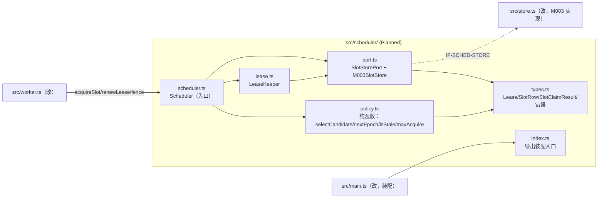
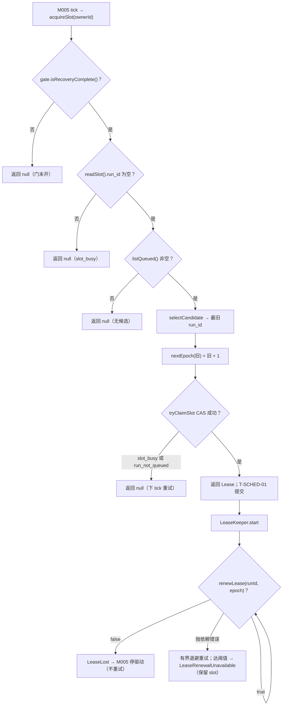

<!-- STD_DOCUMENT_COVER_BEGIN -->
# Piko 实现规格：scheduler（M004）

> STD 使用入口：[项目采用说明与标准导航](../../README.md#std-entry)

| 文档字段 | 值 |
|---|---|
| Document ID | `piko-scheduler-impl` |
| Document Version | `0.1.1` |
| Status | `Draft` |
| Project | `piko` |
| Document Owner | Piko Implementation Owner |
| Last Modified Date | `2026-09-27` |
| Template ID | `design.implementation` |
| Template Version | `1.2.0` |

<!-- STD_DOCUMENT_COVER_END -->

## 1. 实现目标与输入基线

<a id="isd-scope"></a>

本 ISD 实现 M004 `scheduler` 的**进程内 slot/lease 策略与持久化适配**：向 M005 `worker` 提供 `acquireSlot`/`renewLease`/`fence` 三个函数，向 M003 `task-repository` 消费一个原子 slot 端口。本次实现范围是 §5 的三个对外函数与其内部组成（策略、租约看护、端口适配）及 Brownfield 抽出（§2）；**非目标**是 Run 状态机与 Result 语义（M003/MECH-RUN）、崩溃恢复编排（M005）、Pi 执行（M006）、队列深度与受理（M001/M003）、新 DB schema（M003 独有）。模块行为、接口语义、状态模型与失败语义由模块设计唯一维护，本层只细化文件/symbol、私有表示、调用/锁/清理步骤与测试入口。

### 1.1 实现对象

- **模块 ID / 名称**：`M004` / `scheduler`。

- **直属父对象 / 父设计**：`SW-P`（Piko Agent Runtime V0.3，`design_level=system`）/ `system-design` v0.11.1；`parent_document_id=system-design`（ISD 与模块设计同为 `system-design` 的子视图，不互为父子）。

- **模块设计 Document ID / 版本 / 路径 / 摘要**：`piko-scheduler` / `0.1.1` / `docs/40_module_design/piko-scheduler-design.md`。摘要：单实例至多 1 个 `Running` Run 的唯一执行位由 `execution_slot` 单行 + 单调 `epoch` 承载；scheduler 负责领取/续租/fence 与 FIFO 选择，持久化交 M003。

- **需求与 Constraint ID**：`CON-RUN-001`（PK-01）、`CON-REC-001`（PK-12）、`CON-CFG-001`（PK-12，边界）；机制输入 `M-RUN-DI-004`（`piko-run` §14.4）、`IF-REC-FENCE`（`piko-recovery` §5.1）。

- **实现范围 / 非目标**：范围：`src/scheduler/` 五个文件 + 对 `src/store.ts`/`src/worker.ts`/`src/main.ts` 的最小改动。非目标：不新建 DB 表/迁移（M003）、不改 `runs`/`results` 语义、不引入优先级/抢占/多 slot/新线程。

- **ISD 默认落位或项目批准路径**：`docs/50_implementation_design/piko-scheduler-impl.isd.md`（STD 默认路径）；代码落位 `src/scheduler/`（Planned）。

<a id="isd-handoff"></a>

### 1.2.1 `H-SCHED-ACQUIRE` · 领取执行 slot

- **上游信息项 / 规则 ID**：`F-SCHED-ACQUIRE`、`R-SCHED-FIFO`、`R-SCHED-GATE`、`IF-RUN-SLOT`、`CON-RUN-001`。

- **固定来源 / 版本 / 锚点 / 摘要**：`piko-scheduler` §2.1/§8.2/§8.4/§9.1.1（v0.1.1）。

- **ISD 细化内容 / 章节**：§5.1.1 `Scheduler.acquireSlot`；§3.1 `types.ts`/§3.3 `port.ts`；§6.1 `P-SCHED-CLAIM`。

- **唯一权威位置**：行为/接口权威 = 模块设计 §2.1/§9.1.1；文件/symbol/私有表示权威 = 本 ISD。

- **实现自由度**：私有数据结构、候选选择实现、端口适配细节；不可加优先级、不可改 `null` 语义。

- **原 V/Case 及本地验证位置**：`VRC-SCHED-001/004/005`（§9.1.1/9.1.4/9.1.5）。

### 1.2.2 `H-SCHED-RENEW` · 续租与故障分类

- **上游信息项 / 规则 ID**：`F-SCHED-RENEW`、`R-SCHED-HEARTBEAT`、`R-SCHED-RENEW-FAILURE`、`IF-RUN-RENEW`、`CON-RUN-001`。

- **固定来源 / 版本 / 锚点 / 摘要**：`piko-scheduler` §2.2/§8.3/§8.5/§9.1.2；`LeaseLost`/`LeaseRenewalUnavailable`（§6.8.1）。

- **ISD 细化内容 / 章节**：§5.1.2 `Scheduler.renewLease`、§5.1.4 `LeaseKeeper`；§6.2 `P-SCHED-RENEW`；§7.1.2/§7.1.6。

- **唯一权威位置**：行为 = 模块设计 §8.5/§9.1.2；定时/退避实现 = 本 ISD。

- **实现自由度**：退避实现与错误分类代码；不可把 `false` 重试、不可把依赖错误当 `LeaseLost`。

- **原 V/Case 及本地验证位置**：`VRC-SCHED-002/006`。

### 1.2.3 `H-SCHED-FENCE` · 崩溃后重领与终态清空

- **上游信息项 / 规则 ID**：`F-SCHED-FENCE`、`R-SCHED-EPOCH`、`IF-REC-FENCE`、`CON-REC-001`；`T-SCHED-04`/`T-SCHED-06`。

- **固定来源 / 版本 / 锚点 / 摘要**：`piko-scheduler` §2.3/§6.6/§9.1.3；`piko-recovery` §5.1 `fence`（签名已对齐）。

- **ISD 细化内容 / 章节**：§5.1.3 `Scheduler.fence`；§5.1.5 `fenceSlot`；§6.3 `P-SCHED-FENCE`。

- **唯一权威位置**：行为/签名 = 模块设计 §9.1.3；原子分支实现 = 本 ISD + M003。

- **实现自由度**：stale 判定读取顺序；不可改 epoch 推进与"不模拟成功"。

- **原 V/Case 及本地验证位置**：`VRC-SCHED-003`（Case A–F）。

### 1.2.4 `H-SCHED-STATE` · ExecutionSlot 状态模型与不变量

- **上游信息项 / 规则 ID**：`ExecutionSlot`（`T-SCHED-01..06`、`INV-SCHED-1..4`）。

- **固定来源 / 版本 / 锚点 / 摘要**：`piko-scheduler` §6.6；`CON-RUN-001`/`CON-REC-001`。

- **ISD 细化内容 / 章节**：§4.6 运行状态私有表示（`ExecutionSlotState` 投影 + `LeaseKeeperState`）；§7.2（持久化边界→M003）。

- **唯一权威位置**：状态与不变量 = 模块设计 §6.6；内存投影 = 本 ISD。

- **实现自由度**：内存态表示；不可改转换 Guard 与不变量。

- **原 V/Case 及本地验证位置**：`VRC-SCHED-001/002/003`。

### 1.2.5 `H-SCHED-STORE` · M003 slot 端口（Proposed）

- **上游信息项 / 规则 ID**：`IF-SCHED-STORE`（Proposed）、`OQ-SCHED-001`。

- **固定来源 / 版本 / 锚点 / 摘要**：`piko-scheduler` §9.2.1；当前代码事实 `src/store.ts:19`–`:21`。

- **ISD 细化内容 / 章节**：§5.1.5–5.1.7 `M003SlotStore` 三个适配方法；§3.3 `port.ts`。

- **唯一权威位置**：端口签名 = 模块设计 §9.2.1（**未冻结**）；实现 = 本 ISD 与 M003 设计。

- **实现自由度**：适配层类型转换；不可把 Proposed 当已确认合同实现（`OQ-SCHED-001` 未关闭前仅可做可替换适配）。

- **原 V/Case 及本地验证位置**：`VRC-SCHED-001/002/003/006`（fake 端口 + 真 M003 两套）。

### 1.2.6 `H-SCHED-GATE` · 恢复门

- **上游信息项 / 规则 ID**：`R-SCHED-GATE`、`IF-SCHED-GATE`（Proposed）。

- **固定来源 / 版本 / 锚点 / 摘要**：`piko-scheduler` §8.4/§9.2.2。

- **ISD 细化内容 / 章节**：§5.1.8 `RecoveryGate` 消费点；§6.1 门判定。

- **唯一权威位置**：门语义 = 模块设计 §8.4；事实来源（`isRecoveryComplete`）= M005 提供。

- **实现自由度**：注入方式（构造/ setter）；不可去掉门、不可自判恢复完成。

- **原 V/Case 及本地验证位置**：`VRC-SCHED-005`。

## 2. 既有实现差异（条件章节）

### 2.1 适用性

- **适用性**：brownfield（存在需修改的既有实现）。

- **依据**：基线：当前工作树 commit（见封面 metadata `reviewed_commit`/§10 状态复核）。既有 `src/worker.ts` 的 `RunWorker.loop`/`run` 与 `src/store.ts` 的 `nextQueued`/`recoverOrphaned`/`heartbeat`/`finish` 内联了全部 slot/lease 逻辑（`src/store.ts:20` `execution_slot` 单行 + `lease_epoch`）。本 ISD 把这部分抽为 M004，不新建 schema。

- **Tailoring / 范围决定引用**：`TAIL-P-NEW-S1`（Piko 无 subsystem，`design.definition`/`design.implementation` 直接承接 `system-design`）；范围决定 `system-design` §15 PHASE-I。

### 2.2 `CH-SCHED-01` · 抽取"领取"逻辑

- **基线 commit / 版本**：当前工作树（§10.2 `SC-SCHED-01` 记录解析出的 commit）。

- **文件 / symbol**：`src/store.ts` `nextQueued`（既有）→ Planned `src/scheduler/scheduler.ts` `Scheduler.acquireSlot` + `src/store.ts` `tryClaimSlot`。

- **Current 行为**：`RunWorker.loop` 调 `store.nextQueued(owner,boot)`：在单事务内读 `execution_slot`、取最旧 `Queued`、`epoch+1`、置 slot、`runs Queued→Running`、建 `run_sessions`。

- **Target 改动与理由**：选择策略移入 `policy.ts`（`selectCandidate`/`nextEpoch`），事务保留在 M003 的 `tryClaimSlot`（CAS）。理由：单 slot 不变量需可独立验证（`VRC-SCHED-001/004`），并在 `OQ-SCHED-001` 未关闭前保持可替换。

- **原规则 / 成员 ID**：`F-SCHED-ACQUIRE`、`IF-RUN-SLOT`、`CON-RUN-001`。

- **实现状态**：`IN_PROGRESS`（Current 内联，Target 抽出）。

### 2.3 `CH-SCHED-02` · 抽取"续租 + 故障分类"逻辑

- **基线 commit / 版本**：当前工作树。

- **文件 / symbol**：`src/worker.ts` `setInterval(()=>store.heartbeat(runId,epoch),1000)` → Planned `src/scheduler/lease.ts` `LeaseKeeper`。

- **Current 行为**：worker 自带 1s 定时器调 `store.heartbeat`（仅返回布尔，不分类依赖错误；异常未捕获）。

- **Target 改动与理由**：抽 `LeaseKeeper`：区分 `false`（`LeaseLost`）与 M003 依赖错误（`R-SCHED-RENEW-FAILURE`），异常在回调内 `try/catch`，连续失败升级 `LeaseRenewalUnavailable`。理由：`VRC-SCHED-002/006` 要求故障分类可单测。

- **原规则 / 成员 ID**：`F-SCHED-RENEW`、`IF-RUN-RENEW`、`R-SCHED-HEARTBEAT`、`R-SCHED-RENEW-FAILURE`。

- **实现状态**：`IN_PROGRESS`。

### 2.4 `CH-SCHED-03` · 抽取"重领 + 终态清空"逻辑

- **基线 commit / 版本**：当前工作树。

- **文件 / symbol**：`src/store.ts` `recoverOrphaned`（既有）→ Planned `src/scheduler/scheduler.ts` `Scheduler.fence` + `src/store.ts` `fenceSlot`。

- **Current 行为**：`RunWorker.loop` 启动时调 `store.recoverOrphaned(owner,boot)`：slot 绑定终态 Run 则清空；否则 `epoch+1` 重领。

- **Target 改动与理由**：同一 `fenceSlot` 以判别结果 `{epoch} | "slot_released"` 表达两分支（`T-SCHED-04`/`T-SCHED-06`），guard 与动作同事务；保证终态清空路径有可调用操作（模块设计 §6.6 要求）。

- **原规则 / 成员 ID**：`F-SCHED-FENCE`、`IF-REC-FENCE`。

- **实现状态**：`IN_PROGRESS`。

### 2.5 `CH-SCHED-04` · worker 改为委托 scheduler

- **基线 commit / 版本**：当前工作树。

- **文件 / symbol**：`src/worker.ts` `RunWorker`（既有）→ 注入 `Scheduler`，删除内联 slot/心跳逻辑。

- **Current 行为**：`RunWorker` 同时承担执行与 slot 领取/续租/恢复。

- **Target 改动与理由**：`RunWorker` 只执行 Pi 驱动；slot 操作经 `Scheduler`。理由：职责分离，`CON-RUN-001` 的 lease 所有权集中到 M004。

- **原规则 / 成员 ID**：`IF-RUN-SLOT`/`IF-RUN-RENEW`/`IF-REC-FENCE`。

- **实现状态**：`IN_PROGRESS`。

## 3. 文件、内部组件与调用关系

<a id="isd-structure"></a>



图 M004-ISD-S1 · Planned / NOT_IMPLEMENTED。实线调用；虚线跨模块适配。`policy.ts` 零 import（纯函数）；`types.ts` 被全模块类型引用。

### 3.1 `src/scheduler/types.ts`

- **职责及调用者**：定义本层私有类型与错误类；被 `policy.ts`/`port.ts`/`lease.ts`/`scheduler.ts` 引用。

- **类型 / 函数**：`Lease`、`SlotRow`、`SlotClaimResult`、`M03SlotWriteResult`、`RenewOutcome`、`FenceResult`、`LeaseLost`、`LeaseRenewalUnavailable`、`SlotInvariantViolation`、`SchedulerConfig`（固定常量）。

- **可见性**：模块内 public（仅 `index.ts` 再导出 `Lease`/`Scheduler`）。

- **调用与类型依赖**：零运行时依赖。

- **构建目标 / 生成源 / 输出**：`tsc` 编译进 `dist/scheduler/types.js`；无生成源。

- **实现状态**：Planned。

### 3.2 `src/scheduler/policy.ts`

- **职责及调用者**：纯函数策略（选择/epoch/stale/门）；被 `scheduler.ts`/`lease.ts` 调用。

- **类型 / 函数**：`selectCandidate(slot: SlotRow, queued: readonly string[]): string | null`；`nextEpoch(current: number): number`；`isStale(slot: SlotRow, currentBootId: string): boolean`；`mayAcquire(recoveryComplete: boolean): boolean`。

- **可见性**：模块内 public。

- **调用与类型依赖**：仅依赖 `types.ts`；**禁止任何 import**（§3 依赖方向）。

- **构建目标 / 生成源 / 输出**：`tsc` → `dist/scheduler/policy.js`。

- **实现状态**：Planned。

### 3.3 `src/scheduler/port.ts`

- **职责及调用者**：唯一边界接触 M003 的适配层；被 `scheduler.ts`/`lease.ts` 调用。

- **类型 / 函数**：`interface SlotStorePort { readSlot(); listQueued(limit); tryClaimSlot(runId,ownerId,bootId); renewSlot(runId,epoch); fenceSlot(runId,ownerId,bootId) }`；`class M003SlotStore implements SlotStorePort`（构造注入 M003 `TaskStore`）。

- **可见性**：`SlotStorePort` 模块内 public；`M003SlotStore` 由 `index.ts` 装配。

- **调用与类型依赖**：依赖 `types.ts`；运行时依赖 M003 `TaskStore`（仅此文件）。

- **构建目标 / 生成源 / 输出**：`tsc` → `dist/scheduler/port.js`。

- **实现状态**：Planned。

### 3.4 `src/scheduler/lease.ts`

- **职责及调用者**：续租定时与故障分类；被 `scheduler.ts` 启动/停止。

- **类型 / 函数**：`class LeaseKeeper`：`start(lease: Lease, onLost: (e: LeaseLost|LeaseRenewalUnavailable) => void): void`、`stop(): void`、私有 `onTick()`。

- **可见性**：模块内 public。

- **调用与类型依赖**：依赖 `types.ts` + `SlotStorePort`；定时器 = 宿主事件循环 `setInterval`。

- **构建目标 / 生成源 / 输出**：`tsc` → `dist/scheduler/lease.js`。

- **实现状态**：Planned。

### 3.5 `src/scheduler/scheduler.ts`

- **职责及调用者**：入口：实现三个对外函数、保证 §6.6 不变量；被 `worker.ts` 调用。

- **类型 / 函数**：`class Scheduler`：`constructor(port: SlotStorePort, gate: RecoveryGate, cfg: SchedulerConfig, bootId: string)`；`acquireSlot(ownerId: string): Lease | null`；`renewLease(runId: string, epoch: number): boolean`；`fence(runId: string, ownerId: string, bootId: string): Lease | null`。

- **可见性**：public（经 `index.ts` 导出）。

- **调用与类型依赖**：依赖 `policy.ts`/`lease.ts`/`port.ts`/`types.ts`。

- **构建目标 / 生成源 / 输出**：`tsc` → `dist/scheduler/scheduler.js`。

- **实现状态**：Planned。

### 3.6 `src/scheduler/index.ts`

- **职责及调用者**：唯一装配入口：导出 `Scheduler` 与 `createScheduler(store, gate, cfg)`；被 `main.ts` 调用。

- **类型 / 函数**：`export function createScheduler(store: TaskStore, gate: RecoveryGate, cfg: SchedulerConfig): Scheduler`。

- **可见性**：public。

- **调用与类型依赖**：依赖 `scheduler.ts`/`port.ts`/`types.ts` + M003 `TaskStore` 类型。

- **构建目标 / 生成源 / 输出**：`tsc` → `dist/scheduler/index.js`。

- **实现状态**：Planned。

### 3.7 `src/store.ts`（修改既有）

- **职责及调用者**：M003 侧：把 `nextQueued`/`recoverOrphaned`/`heartbeat` 重构为端口原语 `tryClaimSlot`/`renewSlot`/`fenceSlot`/`releaseSlot`/`readSlot`/`listQueued`；保留 `finish` 内 `releaseSlot`。被 `M003SlotStore` 调用。

- **类型 / 函数**：`tryClaimSlot(runId, ownerId, bootId): {epoch} | "slot_busy" | "run_not_queued"`；`renewSlot(runId, epoch): boolean`；`fenceSlot(runId, ownerId, bootId): {epoch} | "slot_released"`；`readSlot(): SlotRow | null`；`listQueued(limit): string[]`。

- **可见性**：public（同级模块）。

- **调用与类型依赖**：依赖 `node:sqlite`；无新 schema。

- **构建目标 / 生成源 / 输出**：`tsc` → `dist/store.js`。

- **实现状态**：`IN_PROGRESS`（Current 为 `nextQueued` 等，Target 为原语）。

### 3.8 `src/worker.ts`（修改既有）

- **职责及调用者**：改为消费 `Scheduler`；删除内联 slot/心跳。被 `main.ts` 装配。

- **类型 / 函数**：`RunWorker` 构造注入 `Scheduler`；`loop()` 调 `acquireSlot`；`run()` 用 `LeaseKeeper`。

- **可见性**：public。

- **调用与类型依赖**：依赖 `scheduler/index.ts`、`pi-runtime.ts`。

- **构建目标 / 生成源 / 输出**：`tsc` → `dist/worker.js`。

- **实现状态**：`IN_PROGRESS`。

### 3.9 `src/main.ts`（修改既有）

- **职责及调用者**：装配：构造 `TaskStore` → `createScheduler` → `RunWorker`。

- **类型 / 函数**：`main()` 内新增装配行。

- **可见性**：public（入口）。

- **调用与类型依赖**：依赖 `store.ts`/`scheduler/index.ts`/`worker.ts`/`config.ts`。

- **构建目标 / 生成源 / 输出**：`tsx src/main.ts`（运行）；`tsc` 类型检查。

- **实现状态**：`IN_PROGRESS`。

## 4. 数据结构设计

<a id="isd-data"></a>

**不适用类别**：§4.1 公共基础类型（本层无上级 Data ID 需承接，用字面量联合）、§4.4 通信报文、§4.5 设备/FPGA 表项（纯软件，`TAIL-P-103`）为 N/A。§4.7 数据库表结构 N/A——schema 与事务 authority 属 M003（见 §7.2）。§4.3 配置为固定常量（见 §8.1）。

### 4.2 业务与操作数据结构

#### 4.2.1 `Lease`

- **完整定义、Data/Type ID 与唯一来源**：私有类型 `Lease`（本 ISD `types.ts`）；公共语义来源 = 模块设计 §6.2.1（并对应 MECH-RUN §5.1，其中 `run_id` 为共享合同扩展 → `OQ-SCHED-004`）。

  ```ts
  interface Lease {
    run_id: string;
    owner_id: string;
    boot_id: string;
    epoch: number;          // = execution_slot.lease_epoch；整数 >= 1
    acquired_at: string;    // UTC ISO-8601
    heartbeat_at: string;   // UTC ISO-8601
  }
  ```

- **逐字段类型/范围/初值/不变量/owner**：`run_id`/`owner_id`/`boot_id`: `string` 非空；`epoch`: `number`，`Number.isSafeInteger` 且 `>=1`；`acquired_at`/`heartbeat_at`: ISO-8601 UTC，`heartbeat_at >= acquired_at`。owner = 调用方 M005；不可变值对象（`Object.freeze`）。不变量 `INV-SCHED-1/4`。

- **内存布局 / ABI**：N/A（纯 TypeScript 对象，非持久二进制/跨语言）；依据：ISD 规范 §3 "纯软件逻辑结构写 N/A"。

- **创建/借用/释放/失败路径**：由 `Scheduler.acquireSlot`/`fence` 从 M003 返回结果构造；无借用；寿命到 `LeaseLost`/`LeaseRenewalUnavailable` 或 Run 终态。

- **验证**：`VRC-SCHED-001/003`；`NOT_RUN`。

#### 4.2.2 `SlotRow` / `SlotClaimResult` / `FenceResult`

- **完整定义、Data/Type ID 与唯一来源**：私有类型；语义来源 = 模块设计 §6.2.2/§9.2.1。

  ```ts
  interface SlotRow { run_id: string | null; owner_id: string | null; boot_id: string | null; lease_epoch: number; heartbeat_at: string | null }
  type SlotClaimResult = { epoch: number } | "slot_busy" | "run_not_queued";
  type FenceResult = { epoch: number } | "slot_released";
  ```

- **逐字段类型/范围/初值/不变量/owner**：`SlotRow` 是 `execution_slot` 行投影：`run_id` 空 ⟺ 其余三字段空（`INV-SCHED-3`）。`SlotClaimResult`/`FenceResult` 是 M003 原子操作判别结果。owner = M003 产生、scheduler 只读。

- **内存布局 / ABI**：N/A（纯 TS）。

- **创建/借用/释放/失败路径**：由 `readSlot`/`tryClaimSlot`/`fenceSlot` 返回；无长期寿命。

- **验证**：`VRC-SCHED-001/003`；`NOT_RUN`。

### 4.3 配置与规则数据结构

- **完整定义 / 来源**：私有常量结构 `SchedulerConfig`（无 config key，见 §8.1）：

  ```ts
  interface SchedulerConfig {
    tick_interval_ms: number;                 // 固定 200
    heartbeat_interval_ms: number;            // 固定 1000
    renew_backoff_ms: number;                 // 固定（有界退避，见 §6.5）
    renew_max_consecutive_failures: number;   // 固定（升级 LeaseRenewalUnavailable 的阈值）
  }
  ```

- **逐字段/范围/不变量**：全为 `number`，正数，进程内不变；`renew_backoff_ms <= heartbeat_interval_ms`。authority = 模块设计 §4.3（固定常量，`OQ-SCHED-002`）。

- **创建/寿命/失败**：由 `main.ts` 以字面量构造注入；无运行期变更。

- **验证**：`VRC-SCHED-006`（Case F）；`NOT_RUN`。

### 4.6 运行状态数据结构

#### 4.6.1 `ExecutionSlotState`（内存投影）

- **完整定义 / 来源**：私有**派生**枚举，非持久 authority（持久事实在 `execution_slot`，属 M003）：

  ```ts
  type ExecutionSlotState = "FREE" | "HELD_LIVE" | "HELD_STALE";
  ```

  语义来源 = 模块设计 §6.6 `T-SCHED-01..06`。

- **逐字段/状态/不变量/owner**：由 `SlotRow` + 当前 `bootId` 派生：`run_id===null → FREE`；`run_id!==null && slot.boot_id===currentBootId → HELD_LIVE`；否则 `HELD_STALE`。owner = scheduler（只读投影，不写回）。

- **转换/失败**：不持久化、不单独提交；转换与 M003 事务一一对应（`T-SCHED-01..06`），本投影只用于判定分支。

- **验证**：`VRC-SCHED-001/003`；`NOT_RUN`。

#### 4.6.2 `LeaseKeeperState`（看护内存态）

- **完整定义 / 来源**：```ts
  interface LeaseKeeperState { lease: Lease; timer: NodeJS.Timeout | null; consecutiveFailures: number; stopped: boolean }
  ```

  owner = `LeaseKeeper` 实例；寿命 = 一次执行期间。

- **逐字段/范围/不变量**：`consecutiveFailures >= 0`；`stopped=true` 后不再调 `renewSlot`（`INV-SCHED-4` 保护）。

- **转换/失败**：`start → onTick* → stop`；`false` 或连续失败达阈值 → 进入 stopped 并发事件。

- **验证**：`VRC-SCHED-002/006`；`NOT_RUN`。

### 4.7 数据库表结构

**N/A。** 本模块不拥有持久表：`execution_slot`/`run_sessions` 的 schema authority 与 DDL 属 M003（当前代码事实 `src/store.ts:19`–`:21`，设计权威 Proposed `piko-task-repository-impl.isd.md` §4.7，见 `OQ-SCHED-001`）。本 ISD 只消费其端口，不复制 CREATE TABLE。依据：ISD 规范 §3 "无持久化不虚构数据库，交由宿主的范围仍给实际交接责任"；交接见 §7.2。

### 4.8 错误码与错误结构

#### 4.8.1 `LeaseLost`

- **完整定义 / 来源**：私有错误类；语义来源 = 模块设计 §6.8.1。

  ```ts
  class LeaseLost extends Error { readonly run_id: string; readonly epoch: number; }
  ```

- **逐字段/触发/副作用**：`run_id`/`epoch` 标识失去的租约；触发 = `renewSlot` CAS 未命中（0 行）；无 DB 副作用。

- **所有权/出口**：由 `LeaseKeeper` 产生 → 经 `onLost` 回调交 M005；M005 停止驱动、不再写终态。

- **验证**：`VRC-SCHED-002`；`NOT_RUN`。

#### 4.8.2 `LeaseRenewalUnavailable`

- **完整定义 / 来源**：```ts
  class LeaseRenewalUnavailable extends Error { readonly run_id: string; readonly consecutive_failures: number; readonly last_error_class: string; }
  ```

  语义来源 = 模块设计 §6.8.1/§8.5。

- **逐字段/触发/副作用**：触发 = `renewSlot` 抛依赖错误连续达 `renew_max_consecutive_failures`；无释放 side effect（slot 保留，`INV-SCHED-3`）。

- **所有权/出口**：由 `LeaseKeeper` → M005；M005 停止驱动但保留 slot，等 M003 恢复或重启 fence。

- **验证**：`VRC-SCHED-006`；`NOT_RUN`。

#### 4.8.3 `SlotInvariantViolation`

- **完整定义 / 来源**：```ts
  class SlotInvariantViolation extends Error { readonly invariant_id: string; }
  ```

- **逐字段/触发/副作用**：触发 = `execution_slot` 与 `run_sessions.lease_epoch` 不一致等权威记录损坏；scheduler **不自行修复**，直接抛给 M005/operator。

- **验证**：`VRC-SCHED-003`（Case E）；`NOT_RUN`。

## 5. 接口设计

<a id="isd-functions"></a>

scheduler 的对外接口是 §5.1 的三个函数；被消费的 M003 端口与 M005 门在同节记录（进程内协作接口）。无人机/消息/硬件接口（§5.2–5.4 N/A）。

### 5.1 API（适用时）

#### 5.1.1 `Scheduler.acquireSlot(ownerId: string): Lease | null`

- **Interface/Member ID、用途**：`IF-RUN-SLOT`；领取唯一执行位并绑定最旧 `Queued` Run。

- **文件 / symbol / 可见性**：Planned `src/scheduler/scheduler.ts` `Scheduler.acquireSlot`；public（模块外经 `index.ts`）。

- **原成员 ID 或私有来源**：继承 `piko-run` §5.1 `IF-RUN-SLOT`（`M-RUN-DI-004`）。

- **完整签名与 caller**：`acquireSlot(ownerId: string): Lease | null`；caller = M005 `RunWorker.loop`（tick，单事件循环上下文）。

- **固定契约与版本**：模块设计 §9.1.1（`piko-scheduler` v0.1.1）；构建目标 `dist/scheduler/`。

- **输入参数 / 数据结构 authority**：`ownerId: string`，非空；无 §6 Data ID（进程内身份），来源 = M005 实例标识。

- **输入约束 / 校验顺序 / 失败映射**：校验：`ownerId` 非空（否则抛 `TypeError`，属编程错误）；顺序 = 读 slot → 判门 → 列候选 → 选候选 → CAS。CAS 失败 → `null`（非错误）。

- **成功输出 / 数据结构 / 后置条件**：返回 `Lease`（§4.2.1），`epoch=旧+1`；后置：slot 绑定该 Run、`runs.state=Running`、`run_sessions.lease_epoch` 同步且同事务提交（`INV-SCHED-1/2/3/4`）。owner = M005；寿命到 `LeaseLost`/终态。

- **错误输出 / 触发条件 / 优先级**：无业务错误码。`null` 覆盖四因：slot 忙 / 无候选 / 门未开 / CAS 竞争失败（优先级：先读 slot，再门，再候选，最后 CAS）。M003 依赖错误原样上抛（见下）。

- **底层异常 / 失败事实**：`tryClaimSlot` 抛 `SQLITE_BUSY`/`SQLITE_IOERR`；`readSlot`/`listQueued` 抛同。

- **模块是否处理及处理函数**：业务竞争：`Scheduler.acquireSlot` 内部把 CAS 的 `"slot_busy"`/`"run_not_queued"` 转 `null`（不抛）。依赖错误：`propagate`（不翻译、不吞）。

- **Typed 异常与原生异常所有权**：原生 `Error`（SQLite）由 M003 抛出，`Scheduler` 不捕获、不改类型，直接交给 M005。

- **宿主 / public payload 或状态码**：无 HTTP；返回 `Lease | null` 或抛出依赖错误。

- **日志级别 / 脱敏 / 关联字段**：`info`（领取成功，含 `run_id`/`epoch`/`owner_id`）；`warn`（依赖错误，含 error class）。无敏感字段（`owner_id`/`boot_id` 为进程内 UUID）。

- **是否可重试及前提**：新业务重试 = 下一个 tick（非"重复执行"，因单 slot 保证）；竞争失败可立即重试；依赖错误由 M005 决定。

- **状态与副作用影响 / 验证项**：副作用 = 写 `execution_slot`/`runs`/`run_sessions`（经 M003 单事务）。`VRC-SCHED-001/004/005`。

- **不可改变的规则 / Constraint ID**：`R-SCHED-FIFO`/`R-SCHED-GATE`/`CON-RUN-001`；`null` 语义；`epoch=旧+1`。

- **实现自由度**：私有数据结构、端口适配、候选选择实现细节。

- **副作用 / 执行上下文 / 幂等性**：有副作用；执行上下文 = 宿主事件循环（同步阻塞单事务）；非幂等（每次成功推进 epoch），但"slot 忙/无候选"分支无副作用。

- **输入输出 ownership 与寿命**：输入 `ownerId` 借用；输出 `Lease` 由调用方持有、不可变。

- **Thread-safe / reentrant**：conditional：Node 单线程，无并发进入；重入由 M005 保证不重入（可在 `acquireSlot` 加"进行中"断言）。

- **Nested-call policy**：allowed：仅调用 §5.1.5–5.1.8 的端口/门；禁止回调 M005（不持有回调）。

- **Transaction participation**：owner：发起 M003 单 `BEGIN IMMEDIATE`（经 `tryClaimSlot`）；不嵌套第二事务。

- **Blocking / timeout / cancellation**：阻塞式（同步 SQLite），受 `task_store.busy_timeout_ms`；无取消（调用返回即结束）。

- **实现状态 / 验证项**：Planned / `VRC-SCHED-001/004/005`。

- **装配、合法及拒绝实例**：装配：§3.6。合法：空闲 slot + 最旧 `Queued` → 返回 `Lease(epoch=旧+1)`。拒绝：slot 已占 → `null`。Oracle = 直读 `execution_slot`/`runs`（§9.1.1）。`NOT_RUN`。

#### 5.1.2 `Scheduler.renewLease(runId: string, epoch: number): boolean`

- **Interface/Member ID、用途**：`IF-RUN-RENEW`；刷新租约心跳。

- **文件 / symbol / 可见性**：Planned `src/scheduler/scheduler.ts` `Scheduler.renewLease`；public。

- **原成员 ID 或私有来源**：本模块自持（MECH-RUN 未单列），对应 `R-SCHED-HEARTBEAT`。

- **完整签名与 caller**：`renewLease(runId: string, epoch: number): boolean`；caller = `LeaseKeeper.onTick`（宿主定时器）。

- **固定契约与版本**：模块设计 §9.1.2。

- **输入参数 / 数据结构 authority**：`runId` 非空 `string`；`epoch` 整数 `>=1`；来源 = 当前 `Lease`。

- **输入约束 / 校验顺序 / 失败映射**：无跨字段约束；直接 CAS。CAS 未命中 → `false`。

- **成功输出 / 数据结构 / 后置条件**：`true` → `heartbeat_at` 刷新（M003 以自身 UTC now）；`INV-SCHED-4` 保持。

- **错误输出 / 触发条件 / 优先级**：`false` 覆盖"换 owner/epoch 或已释放"；无错误码。依赖错误上抛（由 `LeaseKeeper` 分类）。

- **底层异常 / 失败事实**：`renewSlot` 抛 `SQLITE_BUSY`/`SQLITE_IOERR`。

- **模块是否处理及处理函数**：`Scheduler.renewLease` 只透传；分类在 `LeaseKeeper.onTick`（§5.1.4）。

- **Typed 异常与原生异常所有权**：原生异常由 M003 抛；`LeaseKeeper` 捕获并转 `LeaseRenewalUnavailable`（依赖）或 `LeaseLost`（`false`）。

- **宿主 / public payload 或状态码**：返回 `boolean`；无对外码。

- **日志级别 / 脱敏 / 关联字段**：`debug`（成功）；`warn`（依赖错误，含 class + `consecutiveFailures`）。

- **是否可重试及前提**：`false` **不可重试**（租约已失）；依赖错误可退避重试（§6.5）。

- **状态与副作用影响 / 验证项**：副作用 = 更新 `execution_slot.heartbeat_at`；`VRC-SCHED-002/006`。

- **不可改变的规则 / Constraint ID**：`R-SCHED-HEARTBEAT`/`R-SCHED-RENEW-FAILURE`；`false` 即 `LeaseLost`。

- **实现自由度**：无（薄封装）。

- **副作用 / 执行上下文 / 幂等性**：有副作用；上下文 = 定时器回调；幂等（重复刷新同 `heartbeat_at` 语义）。

- **输入输出 ownership 与寿命**：输入借用；输出布尔。

- **Thread-safe / reentrant**：yes（无共享可变状态，除 M003 事务）。

- **Nested-call policy**：allowed：仅调 `renewSlot`。

- **Transaction participation**：owner：单语句 CAS。

- **Blocking / timeout / cancellation**：阻塞式；受 busy_timeout；无取消。

- **实现状态 / 验证项**：Planned / `VRC-SCHED-002`。

- **装配、合法及拒绝实例**：合法：当前 epoch → `true`。拒绝：旧 epoch → `false`。Oracle = `execution_slot.heartbeat_at`。`NOT_RUN`。

#### 5.1.3 `Scheduler.fence(runId: string, ownerId: string, bootId: string): Lease | null`

- **Interface/Member ID、用途**：`IF-REC-FENCE`；崩溃重启后重领并 fence 旧写入。

- **文件 / symbol / 可见性**：Planned `src/scheduler/scheduler.ts` `Scheduler.fence`；public。

- **原成员 ID 或私有来源**：`piko-recovery` §5.1 `IF-REC-FENCE`（签名已与模块设计 §9.1.3 对齐）。

- **完整签名与 caller**：`fence(runId, ownerId, bootId): Lease | null`；caller = M005 恢复流程（恢复门内）。

- **固定契约与版本**：模块设计 §9.1.3；`piko-recovery` §5.1。

- **输入参数 / 数据结构 authority**：`runId`/`ownerId`/`bootId` 均非空 `string`；`runId` = slot 当前绑定 Run。

- **输入约束 / 校验顺序 / 失败映射**：读 `SlotRow` + `runs.state`；分支判定见 §6.3。不变量冲突 → 抛 `SlotInvariantViolation`。

- **成功输出 / 数据结构 / 后置条件**：非终态 → 新 `Lease`（`epoch=旧+1`）；终态 → `null`（清空）。后置：旧 epoch 写 0 行生效（`INV-SCHED-1`）。

- **错误输出 / 触发条件 / 优先级**：`SlotInvariantViolation`（`execution_slot` vs `run_sessions.lease_epoch` 不符）；M003 依赖错误上抛。

- **底层异常 / 失败事实**：`fenceSlot` 内读到的记录不一致；SQLite 错误。

- **模块是否处理及处理函数**：`Scheduler.fence` 检测不一致并抛 `SlotInvariantViolation`（不修复）；其余 propagate。

- **Typed 异常与原生异常所有权**：`SlotInvariantViolation`（本模块）→ M005/operator；SQLite 原生 → M005。

- **宿主 / public payload 或状态码**：返回 `Lease | null` 或抛 `SlotInvariantViolation`。

- **日志级别 / 脱敏 / 关联字段**：`info`（fence 成功，含 `epoch`/`run_id`）；`error`（不变量冲突）。

- **是否可重试及前提**：不变量冲突 = 交 operator，不自动重试；依赖错误可重试。

- **状态与副作用影响 / 验证项**：副作用 = `epoch+1` 或清空 slot（M003 单事务）；`VRC-SCHED-003`。

- **不可改变的规则 / Constraint ID**：`R-SCHED-EPOCH`/`CON-REC-001`；不模拟成功、不自动修复。

- **实现自由度**：stale 判定读取顺序。

- **副作用 / 执行上下文 / 幂等性**：有副作用；上下文 = 恢复流程（单事件循环）；半幂等（重复 fence 对已清空 slot 返回 `null`）。

- **输入输出 ownership 与寿命**：输入借用；输出 `Lease` 不可变。

- **Thread-safe / reentrant**：conditional（单线程；恢复门内不与领取并发）。

- **Nested-call policy**：allowed：`readSlot`/`fenceSlot`。

- **Transaction participation**：owner：`fenceSlot` 单 `BEGIN IMMEDIATE`。

- **Blocking / timeout / cancellation**：阻塞式；无取消。

- **实现状态 / 验证项**：Planned / `VRC-SCHED-003`。

- **装配、合法及拒绝实例**：合法：`HELD_STALE` + 非终态 → 新 `Lease`。拒绝：绑定终态 → `null`；记录冲突 → `SlotInvariantViolation`。`NOT_RUN`。

#### 5.1.4 `LeaseKeeper.start / onTick / stop`（内部看护）

- **Interface/Member ID、用途**：私有；续租定时与故障分类（`R-SCHED-RENEW-FAILURE`）。

- **文件 / symbol / 可见性**：Planned `src/scheduler/lease.ts` `LeaseKeeper`；模块内 public。

- **原成员 ID 或私有来源**：私有（实现模块设计 §8.5）。

- **完整签名与 caller**：`start(lease, onLost)` / `stop()` / 私有 `onTick()`；caller = `Scheduler.acquireSlot` 成功后由 M005 启动。

- **固定契约与版本**：模块设计 §8.5。

- **输入参数 / 数据结构 authority**：`lease: Lease`；`onLost: (e: LeaseLost | LeaseRenewalUnavailable) => void`。

- **输入约束 / 校验顺序 / 失败映射**：`onTick`：调 `renewLease`；`true` → 重置定时器；`false` → `LeaseLost`；抛错 → `consecutiveFailures++` 且按 `renew_backoff_ms` 重试，达阈值 → `LeaseRenewalUnavailable`。

- **成功输出 / 数据结构 / 后置条件**：无返回；成功后 `LeaseKeeperState.consecutiveFailures=0`。

- **错误输出 / 触发条件 / 优先级**：经 `onLost` 发 `LeaseLost`/`LeaseRenewalUnavailable`（§4.8）。

- **底层异常 / 失败事实**：`renewLease` 抛出的原生 SQLite 错误。

- **模块是否处理及处理函数**：`LeaseKeeper.onTick` 捕获（`try/catch`），不冒泡出事件循环。

- **Typed 异常与原生异常所有权**：`LeaseKeeper` 拥有分类；原生异常被转 typed。

- **宿主 / public payload 或状态码**：`onLost` 事件（typed 错误）。

- **日志级别 / 脱敏 / 关联字段**：`debug`（tick）；`warn`（依赖错误）。

- **是否可重试及前提**：依赖错误退避重试；`false` 不重试。

- **状态与副作用影响 / 验证项**：副作用 = 周期调 `renewSlot`；`VRC-SCHED-002/006`。

- **不可改变的规则 / Constraint ID**：`R-SCHED-RENEW-FAILURE`。

- **实现自由度**：退避实现、定时器 API。

- **副作用 / 执行上下文 / 幂等性**：宿主事件循环定时器；`stop` 幂等。

- **输入输出 ownership 与寿命**：持有 `Lease` 引用（只读）；寿命到 stop。

- **Thread-safe / reentrant**：yes（单线程）。

- **Nested-call policy**：allowed：`renewLease`（同步）。

- **Transaction participation**：none（`renewLease` 内部为单语句）。

- **Blocking / timeout / cancellation**：非阻塞定时器；`stop()` 即取消。

- **实现状态 / 验证项**：Planned / `VRC-SCHED-002/006`。

- **装配、合法及拒绝实例**：装配：`Scheduler` 持有。合法：连续 `true`。拒绝：`false`/依赖错误 → 事件。`NOT_RUN`。

#### 5.1.5 `M003SlotStore.tryClaimSlot(runId, ownerId, bootId)`（消费端口）

- **Interface/Member ID、用途**：`IF-SCHED-STORE`（Proposed）；原子领取 slot。

- **文件 / symbol / 可见性**：Planned `src/scheduler/port.ts` `M003SlotStore.tryClaimSlot` → M003 `src/store.ts` `tryClaimSlot`；`SlotStorePort` 模块内 public。

- **原成员 ID 或私有来源**：模块设计 §9.2.1（Proposed，`OQ-SCHED-001`）。

- **完整签名与 caller**：`tryClaimSlot(runId: string, ownerId: string, bootId: string): { epoch: number } | "slot_busy" | "run_not_queued"`；caller = `Scheduler.acquireSlot`。

- **固定契约与版本**：模块设计 §9.2.1；**未冻结**。

- **输入参数 / 数据结构 authority**：三个非空 `string`；`runId` = `listQueued` 选中的候选。

- **输入约束 / 校验顺序 / 失败映射**：单事务：校验 slot 空闲 + Run 仍 `Queued` → 写 slot + `runs Running` + `run_sessions`；否则返回 `slot_busy`/`run_not_queued`（0 行）。

- **成功输出 / 数据结构 / 后置条件**：`{epoch}`；后置 = `T-SCHED-01` 完成、`INV-SCHED-1/2/3/4`。

- **错误输出 / 触发条件 / 优先级**：判别结果（非异常）：`slot_busy`/`run_not_queued`。依赖错误上抛。

- **底层异常 / 失败事实**：SQLite busy/IO。

- **模块是否处理及处理函数**：`M003SlotStore` propagate；`Scheduler` 把判别结果转 `null`。

- **Typed 异常与原生异常所有权**：原生属 M003；本层不改。

- **宿主 / public payload 或状态码**：M003 事务内直接写表；无对外码。

- **日志级别 / 脱敏 / 关联字段**：`debug`。

- **是否可重试及前提**：判别失败可立即换候选重试；依赖错误由调用方决定。

- **状态与副作用影响 / 验证项**：副作用 = 三表写入（单事务）；`VRC-SCHED-001/004`。

- **不可改变的规则 / Constraint ID**：Guard+写入同事务、`epoch=旧+1`、`CON-RUN-001`。

- **实现自由度**：M003 内部 SQL/索引；本层适配类型转换。

- **副作用 / 执行上下文 / 幂等性**：有副作用；非幂等（推进 epoch）。

- **输入输出 ownership 与寿命**：输入借用；输出值对象。

- **Thread-safe / reentrant**：conditional（SQLite 单 writer 串行）。

- **Nested-call policy**：forbidden（不得在事务内再开事务）。

- **Transaction participation**：owner：`BEGIN IMMEDIATE`（M003）。

- **Blocking / timeout / cancellation**：阻塞；受 `busy_timeout`。

- **实现状态 / 验证项**：Planned（M003 侧 `IN_PROGRESS`）/ `VRC-SCHED-001/004`。

- **装配、合法及拒绝实例**：合法：空闲 slot + `Queued` → `{epoch}`。拒绝：忙 → `slot_busy`。`NOT_RUN`。

#### 5.1.6 `M003SlotStore.renewSlot(runId, epoch)`（消费端口）

- **Interface/Member ID、用途**：`IF-SCHED-STORE`（Proposed）；CAS 刷新心跳。

- **文件 / symbol / 可见性**：Planned `src/scheduler/port.ts` → M003 `src/store.ts` `renewSlot`。

- **原成员 ID 或私有来源**：模块设计 §9.2.1。

- **完整签名与 caller**：`renewSlot(runId: string, epoch: number): boolean`；caller = `Scheduler.renewLease`。

- **固定契约与版本**：模块设计 §9.2.1（未冻结）。

- **输入参数 / 数据结构 authority**：`runId` 非空；`epoch` 整数 `>=1`。

- **输入约束 / 校验顺序 / 失败映射**：单语句 `UPDATE execution_slot SET heartbeat_at=? WHERE slot_id=1 AND run_id=? AND lease_epoch=?`；0 行 → `false`。

- **成功输出 / 数据结构 / 后置条件**：`true` → 心跳刷新。

- **错误输出 / 触发条件 / 优先级**：`false`（未命中）；依赖错误上抛。

- **底层异常 / 失败事实**：SQLite busy/IO。

- **模块是否处理及处理函数**：propagate 到 `LeaseKeeper`。

- **Typed 异常与原生异常所有权**：原生属 M003。

- **宿主 / public payload 或状态码**：写表；无对外码。

- **日志级别 / 脱敏 / 关联字段**：`debug`。

- **是否可重试及前提**：`false` 不重试；依赖错误退避重试。

- **状态与副作用影响 / 验证项**：副作用 = 单行更新；`VRC-SCHED-002`。

- **不可改变的规则 / Constraint ID**：CAS 语义、`R-SCHED-HEARTBEAT`。

- **实现自由度**：M003 SQL。

- **副作用 / 执行上下文 / 幂等性**：幂等（重复刷新）。

- **输入输出 ownership 与寿命**：借用/布尔。

- **Thread-safe / reentrant**：conditional。

- **Nested-call policy**：forbidden。

- **Transaction participation**：owner：单语句。

- **Blocking / timeout / cancellation**：阻塞；受 `busy_timeout`。

- **实现状态 / 验证项**：Planned（M003 侧 `IN_PROGRESS`）/ `VRC-SCHED-002`。

- **装配、合法及拒绝实例**：合法：当前 epoch → `true`。拒绝：旧 epoch → `false`。`NOT_RUN`。

#### 5.1.7 `M003SlotStore.fenceSlot(runId, ownerId, bootId)`（消费端口）

- **Interface/Member ID、用途**：`IF-SCHED-STORE`（Proposed）；单事务覆盖 `T-SCHED-04`（epoch+1）与 `T-SCHED-06`（清空）。

- **文件 / symbol / 可见性**：Planned `src/scheduler/port.ts` → M003 `src/store.ts` `fenceSlot`。

- **原成员 ID 或私有来源**：模块设计 §9.2.1。

- **完整签名与 caller**：`fenceSlot(runId: string, ownerId: string, bootId: string): { epoch: number } | "slot_released"`；caller = `Scheduler.fence`。

- **固定契约与版本**：模块设计 §9.2.1（未冻结）。

- **输入参数 / 数据结构 authority**：三个非空 `string`。

- **输入约束 / 校验顺序 / 失败映射**：单事务读 `SlotRow` + `runs.state`：非终态 → `epoch+1` + 置 owner/boot/heartbeat + 同步 `run_sessions`，返回 `{epoch}`；终态 → 清空四字段，返回 `"slot_released"`；已空 → `"slot_released"`（幂等）。

- **成功输出 / 数据结构 / 后置条件**：见上；后置 `INV-SCHED-1/3/4`。

- **错误输出 / 触发条件 / 优先级**：判别结果（非异常）；依赖错误上抛。

- **底层异常 / 失败事实**：SQLite busy/IO。

- **模块是否处理及处理函数**：`Scheduler.fence` 检测不变量冲突并抛 `SlotInvariantViolation`。

- **Typed 异常与原生异常所有权**：原生属 M003。

- **宿主 / public payload 或状态码**：写表；无对外码。

- **日志级别 / 脱敏 / 关联字段**：`debug`。

- **是否可重试及前提**：重复调用幂等安全。

- **状态与副作用影响 / 验证项**：副作用 = `execution_slot`/`run_sessions` 写（单事务）；`VRC-SCHED-003`。

- **不可改变的规则 / Constraint ID**：Guard+动作同事务、`CON-REC-001`。

- **实现自由度**：M003 SQL。

- **副作用 / 执行上下文 / 幂等性**：幂等（已空 slot 返回 `slot_released`）。

- **输入输出 ownership 与寿命**：借用/值对象。

- **Thread-safe / reentrant**：conditional。

- **Nested-call policy**：forbidden。

- **Transaction participation**：owner：`BEGIN IMMEDIATE`。

- **Blocking / timeout / cancellation**：阻塞；受 `busy_timeout`。

- **实现状态 / 验证项**：Planned（M003 侧 `IN_PROGRESS`）/ `VRC-SCHED-003`。

- **装配、合法及拒绝实例**：合法：非终态 → `{epoch}`；终态 → `slot_released`。`NOT_RUN`。

#### 5.1.8 `RecoveryGate.isRecoveryComplete(): boolean`（消费门）

- **Interface/Member ID、用途**：`IF-SCHED-GATE`（Proposed）；把恢复完成事实交给 scheduler。

- **文件 / symbol / 可见性**：由 M005 提供（Planned）；`Scheduler` 构造注入消费。

- **原成员 ID 或私有来源**：模块设计 §9.2.2。

- **完整签名与 caller**：`isRecoveryComplete(): boolean`；caller = `Scheduler.acquireSlot`（每次领取前读）。

- **固定契约与版本**：模块设计 §8.4/§9.2.2。

- **输入参数 / 数据结构 authority**：无入参；返回布尔。

- **输入约束 / 校验顺序 / 失败映射**：无。

- **成功输出 / 数据结构 / 后置条件**：`true` 表示恢复编排完成（Result→Run→lease→Pi session→Harness→ledger→Matrix 顺序走完）。

- **错误输出 / 触发条件 / 优先级**：无（只读）；M005 侧异常不由本层处理。

- **底层异常 / 失败事实**：无。

- **模块是否处理及处理函数**：`Scheduler.acquireSlot` 经 `policy.mayAcquire` 消费。

- **Typed 异常与原生异常所有权**：N/A。

- **宿主 / public payload 或状态码**：布尔。

- **日志级别 / 脱敏 / 关联字段**：`debug`。

- **是否可重试及前提**：N/A。

- **状态与副作用影响 / 验证项**：无副作用；`VRC-SCHED-005`。

- **不可改变的规则 / Constraint ID**：`R-SCHED-GATE`。

- **实现自由度**：注入方式（构造/setter）。

- **副作用 / 执行上下文 / 幂等性**：只读、幂等。

- **输入输出 ownership 与寿命**：N/A。

- **Thread-safe / reentrant**：yes。

- **Nested-call policy**：allowed。

- **Transaction participation**：none。

- **Blocking / timeout / cancellation**：非阻塞。

- **实现状态 / 验证项**：Planned / `VRC-SCHED-005`。

- **装配、合法及拒绝实例**：合法：`false` → 领取返回 `null`。`NOT_RUN`。

### 5.2 消息与数据流接口（适用时）

**N/A。** scheduler 无跨边界消息/队列/流：与 M003/M005 的协作均为进程内函数调用（已记于 §5.1 的 `IF-SCHED-STORE`/`IF-SCHED-GATE`）。依据：ISD 规范 §3，不为满足模板虚构队列。

### 5.3 硬件与固件接口（适用时）

**N/A** · 纯软件（`TAIL-P-103`）。

### 5.4 人机与维护接口（适用时）

**N/A。** 无 CLI/诊断命令；slot 状态经 M003 查询与指标 `piko.slot.lease_epoch` 暴露（§7.3）。

## 6. 关键流程与算法

<a id="isd-algorithms"></a>



图 M004-ISD-A1 · Planned / NOT_IMPLEMENTED。领取的正常与拒绝分支 + 续租三态出口（`R-SCHED-RENEW-FAILURE`）；崩溃恢复路径见 §6.3 `P-SCHED-FENCE`。

### 6.1 `P-SCHED-CLAIM` · 领取（Tick 驱动）

- **触发与执行者**：M005 `RunWorker.loop` tick → `Scheduler.acquireSlot`（宿主事件循环）。

- **入口函数及数据**：`acquireSlot(ownerId)`；数据 `ownerId` → `SlotRow`/候选 `run_id` → `epoch` → `Lease | null`。

- **步骤 / 算法 / 复杂度**：1. `port.readSlot()`；2. `policy.mayAcquire(gate.isRecoveryComplete())`，否则 `null`；3. `port.listQueued(LIMIT)`；4. `policy.selectCandidate`；5. `policy.nextEpoch`；6. `port.tryClaimSlot`；7. CAS 失败重试下一个候选或 `null`。复杂度 O(候选数)。

- **判断事实来源**：Guard = `SlotRow.run_id`（DB）+ `gate.isRecoveryComplete()`（M005 标志）+ `listQueued` 结果（DB）。无可来源不明的 Guard。

- **成功可见点**：M003 事务提交（`tryClaimSlot` 返回 `{epoch}`）；随后 `runs.state=Running`。

- **失败、取消与清理**：`null`：无副作用、无清理；依赖错误上抛。

- **代表输入与中间值**：见 §9.1.1 Case A：空闲 slot + 3 个 `Queued`（`accepted_at` 递增）→ 选最旧 → `epoch=旧+1`。

- **规则 / 接口 / 验证引用**：§5.1.1/§5.1.5；`R-SCHED-FIFO/GATE/EPOCH`；`VRC-SCHED-001/004/005`。

### 6.2 `P-SCHED-RENEW` · 续租与故障分类

- **触发与执行者**：`LeaseKeeper` 定时器 → `Scheduler.renewLease`。

- **入口函数及数据**：`renewLease(runId, epoch)`；`{run_id, epoch}` → `boolean`。

- **步骤 / 算法 / 复杂度**：`onTick`：`try { r = renewLease(...) } catch(e) { fail(e) }`；`r===true` → 重置定时器；`r===false` → 发 `LeaseLost`、stop；`catch` → `consecutiveFailures++`、退避重试、达阈值发 `LeaseRenewalUnavailable`、stop。O(1)。

- **判断事实来源**：`true`/`false` = CAS 行数（DB）；依赖错误 = 抛出的异常类型。

- **成功可见点**：`execution_slot.heartbeat_at` 前进。

- **失败、取消与清理**：`false`/升级 → `stop()` 清定时器；slot **保留**（依赖错误路径）。

- **代表输入与中间值**：见 §9.1.2/§9.1.6：当前 epoch → `true`；旧 epoch → `false`。

- **规则 / 接口 / 验证引用**：§5.1.2/§5.1.4/§5.1.6；`R-SCHED-HEARTBEAT/RENEW-FAILURE`；`VRC-SCHED-002/006`。

### 6.3 `P-SCHED-FENCE` · 崩溃后重领与终态清空

- **触发与执行者**：M005 恢复流程 → `Scheduler.fence`（恢复门内）。

- **入口函数及数据**：`fence(runId, ownerId, bootId)`；→ `Lease | null`。

- **步骤 / 算法 / 复杂度**：1. `port.readSlot()` + `runs.state`；2. 校验 `execution_slot.lease_epoch == run_sessions.lease_epoch`（否则抛 `SlotInvariantViolation`）；3. `port.fenceSlot`；4. `{epoch}` → 构造 `Lease`；`"slot_released"` → `null`。O(1)。

- **判断事实来源**：`runs.state`（终态判定）+ slot 绑定 + boot 差异；均 DB 权威。

- **成功可见点**：新 `Lease`（`epoch=旧+1`）或清空提交。

- **失败、取消与清理**：`SlotInvariantViolation` → 交 operator（不修复）；依赖错误上抛。

- **代表输入与中间值**：见 §9.1.3 Case A–F。

- **规则 / 接口 / 验证引用**：§5.1.3/§5.1.7；`R-SCHED-EPOCH`；`VRC-SCHED-003`。

### 6.4 `R-SCHED-EPOCH` / `R-SCHED-FIFO` / `R-SCHED-GATE`（纯规则与伪代码）

- **触发与执行者**：由 `policy.ts` 纯函数承载，被 §6.1/§6.3 调用。

- **入口函数及数据**：`nextEpoch(current)`、`selectCandidate(slot, queued)`、`isStale(slot, bootId)`、`mayAcquire(flag)`。

- **步骤 / 算法 / 复杂度**：```text
  nextEpoch(c) = c + 1                                  # 不回绕、不重用
  selectCandidate(slot, q) = slot.run_id !== null ? null : (q.length ? q[0] : null)
      # q 由 listQueued 按 (accepted_at, run_id) 升序，二级键在 M003 排序
  isStale(slot, boot) = slot.run_id !== null && slot.boot_id !== boot
  mayAcquire(flag) = flag === true
  ```

  复杂度 O(1)（排序在 M003）。

- **判断事实来源**：入参全部来自 DB 投影或 M005 标志；纯函数不读时钟。

- **成功可见点**：返回值被 §6.1/§6.3 消费。

- **失败、取消与清理**：无副作用、无失败分支（纯函数）。

- **代表输入与中间值**：`nextEpoch(0)=1`；`selectCandidate(空闲, ["run-a","run-b"])=run-a`；`mayAcquire(false)=false`。

- **规则 / 接口 / 验证引用**：§5.1.1；`VRC-SCHED-004/005`。

### 6.5 `R-SCHED-RENEW-FAILURE` · 退避与升级（伪代码）

- **触发与执行者**：`LeaseKeeper.onTick`。

- **入口函数及数据**：见 §6.2。

- **步骤 / 算法 / 复杂度**：```text
  onTick():
    try: ok = renewLease(lease.run_id, lease.epoch)
    catch e:
      consecutiveFailures += 1
      if consecutiveFailures >= cfg.renew_max_consecutive_failures:
        stop(); onLost(new LeaseRenewalUnavailable(run_id, consecutiveFailures, classOf(e)))
      else: scheduleAfter(cfg.renew_backoff_ms)
      return
    if ok: consecutiveFailures = 0; scheduleAfter(cfg.heartbeat_interval_ms); return
    stop(); onLost(new LeaseLost(lease.run_id, lease.epoch))   # false 不重试
  ```

- **判断事实来源**：`ok`（CAS）+ 异常类型 + `consecutiveFailures`（内存）。

- **成功可见点**：事件（`onLost`）或继续。

- **失败、取消与清理**：任一终态分支先 `stop()` 清定时器；依赖错误路径不清 slot。

- **代表输入与中间值**：注入连续 `SQLITE_BUSY` N 次 → 达阈值发 `LeaseRenewalUnavailable`。

- **规则 / 接口 / 验证引用**：§5.1.4；`VRC-SCHED-006`。

## 7. 并发、失败、持久化与安全生命周期

<a id="isd-lifecycle"></a>

执行上下文：全部操作在 Node 单线程事件循环上；SQLite 由 M003 单 writer 串行化。无自建线程/进程；`LeaseKeeper` 定时器是宿主事件循环定时器。

### 7.1 并发、交错与失败收口

#### 7.1.1 `C-SCHED-01` · 两 tick 并发领取

- **参与线程 / 回调 / 事务**：宿主事件循环；`acquireSlot` → M003 单事务。
- **已产生或可能产生的副作用**：`execution_slot`/`runs`/`run_sessions` 写（仅一个成功）。
- **检测事实 / 期限**：`tryClaimSlot` 判别结果；无期限。
- **状态 / 错误 / 结果已知性**：至多一个 `{epoch}`，其余 `null`；已知。
- **保留 / 释放责任**：无部分副作用。
- **允许的 query / replay / takeover / retry**：query=`readSlot`；retry=下个 tick；无 replay/takeover。
- **验证项**：`VRC-SCHED-001`（Case B）。

#### 7.1.2 `C-SCHED-02` · `false`（CAS 未命中）与恢复

- **参与线程 / 回调 / 事务**：`LeaseKeeper` 定时器 vs M003 `finish` 终态事务。
- **已产生或可能产生的副作用**：可能已有终态写入（M003 侧）。
- **检测事实 / 期限**：`renewSlot` 0 行 → `false`。
- **状态 / 错误 / 结果已知性**：`LeaseLost`（已确定失去执行权）。
- **保留 / 释放责任**：M005 停止驱动，不再写终态；slot 由 M003 释放。
- **允许的 query / replay / takeover / retry**：`false` 不重试。
- **验证项**：`VRC-SCHED-002`（Case B）。

#### 7.1.3 `C-SCHED-03` · 崩溃后 stale slot

- **参与线程 / 回调 / 事务**：重启后首次读 + `fence` → M003 单事务。
- **已产生或可能产生的副作用**：重启前旧进程可能留有未提交写。
- **检测事实 / 期限**：`slot.boot_id != currentBootId` 且 `runs.state` 非终态（`T-SCHED-03`）。
- **状态 / 错误 / 结果已知性**：`HELD_STALE`；不判失败/成功。
- **保留 / 释放责任**：`fence` 推进 epoch；旧 epoch 写由 M003 拒。
- **允许的 query / replay / takeover / retry**：takeover=`fence`。
- **验证项**：`VRC-SCHED-003`（Case A–C）。

#### 7.1.4 `C-SCHED-04` · 恢复门与领取顺序

- **参与线程 / 回调 / 事务**：M005 恢复编排 vs worker tick。
- **已产生或可能产生的副作用**：无（门未开时 `acquireSlot` 提前 `null`）。
- **检测事实 / 期限**：`gate.isRecoveryComplete()`。
- **状态 / 错误 / 结果已知性**：`null`。
- **保留 / 释放责任**：无。
- **允许的 query / replay / takeover / retry**：完成后正常领取。
- **验证项**：`VRC-SCHED-005`。

#### 7.1.5 `C-SCHED-05` · 定时器延迟/丢失

- **参与线程 / 回调 / 事务**：宿主事件循环繁忙。
- **已产生或可能产生的副作用**：无（仅心跳更新晚）。
- **检测事实 / 期限**：CAS 与 `boot_id`，不看时间差。
- **状态 / 错误 / 结果已知性**：仍 `HELD_LIVE`。
- **保留 / 释放责任**：不释放 slot。
- **允许的 query / replay / takeover / retry**：N/A。
- **验证项**：`VRC-SCHED-002`（Case D）。

#### 7.1.6 `C-SCHED-06` · 续租依赖故障与恢复/退出

- **参与线程 / 回调 / 事务**：`LeaseKeeper.onTick` 内捕获依赖错误。
- **已产生或可能产生的副作用**：无（不释放 slot、不写终态）。
- **检测事实 / 期限**：异常类型 + `consecutiveFailures`。
- **状态 / 错误 / 结果已知性**：结果未知（非失败）；`LeaseRenewalUnavailable`（达阈值）。
- **保留 / 释放责任**：slot 保留；恢复后继续，或重启 fence。
- **允许的 query / replay / takeover / retry**：依赖错误退避重试；query=`readSlot`；takeover=重启 `fence`。
- **验证项**：`VRC-SCHED-006`（Case C/D）。

<a id="isd-persistence"></a>

### 7.2 持久化、恢复与 schema 演进

**not_applicable。** scheduler **不拥有持久状态**：`execution_slot`/`run_sessions` 的 schema authority、连接、事务与 DDL 全部属 M003 `task-repository`（当前代码事实 `src/store.ts:19`–`:21`）。本模块只经 `IF-SCHED-STORE` 发起 M003 的原子操作；提交点、崩溃恢复入口与 schema 演进由 M003 ISD 承接，本 ISD 不生成数据库策略。

- **状态由谁保存 / 本模块交付何种信息**：slot 绑定、owner、boot、`epoch`、`heartbeat_at` 由 M003 保存；本模块交付"要领取/续租/重领的目标 `(run_id, owner_id, boot_id)`"与 guard 事实（`SlotRow`/`runs.state` 读取）。
- **宿主 / 依赖边界**：崩溃恢复的编排属 M005（`MECH-RECOVERY`），新 lease epoch 的产生属本模块的 `fence`（经 M003 事务）。
- **Decision ref**：`piko-scheduler` §6.6/§9.2.1 + ISD 规范 §1（ISD 不重新制定跨模块事务政策）；schema 政策决定见 M003 ISD §4.7（Proposed）。

<a id="isd-security"></a>

### 7.3 安全、权限与可观测性

#### 7.3.1 `SEC-SCHED-NOSECRET` · 无鉴权与不记录敏感数据

- **原规则**：模块设计 §11；scheduler 无外部输入、无身份/授权分支。
- **可信输入 / 敏感字段 / 检查对象**：无外部输入；不接触 credential/绝对路径/业务内容。
- **检查函数 / 时点**：无鉴权检查点（进程内调用）；`owner_id`/`boot_id` 为进程内 UUID，可入 DB/日志。
- **拒绝 / 宿主交付出口**：N/A（无鉴权）；越权边界由 M001/M002 承载。
- **脱敏 / 禁止输出**：不得在日志记录任何 credential/绝对路径；本模块本就不产生。
- **日志 / 指标 / trace 口径及触发**：`info`（领取/fence）、`warn`（依赖错误）、`error`（不变量冲突）；含 `run_id`/`epoch`/error class。
- **验证项**：`VRC-SCHED-001`（日志不含敏感字段由审查核对）。

#### 7.3.2 `SEC-SCHED-METRIC` · 指标 `piko.slot.lease_epoch` 写入点

- **原规则**：`system-design` §12 指标；模块设计 §11。
- **可信输入 / 敏感字段 / 检查对象**：指标 = `execution_slot.lease_epoch`（count / 单实例）。
- **检查函数 / 时点**：在每次成功 `tryClaimSlot`/`fenceSlot` 提交后由 M003 的诊断读取暴露；本模块是写入点。
- **拒绝 / 宿主交付出口**：无拒绝；指标经 M003 诊断端点/ metric 输出（脱敏）。
- **脱敏 / 禁止输出**：指标不含身份。
- **日志 / 指标 / trace 口径及触发**：单位=次数/单实例；重置=进程世代；用于恢复顺序判定。
- **验证项**：`VRC-SCHED-003`（epoch 单调）。

#### 7.3.3 `SEC-SCHED-LOCALSTORE` · 本地持久化安全

**not_applicable（交接给 M003）。** scheduler 不直接打开文件/DB；本地持久化安全（文件权限/umask/symlink/磁盘耗尽等）由 M003 ISD §7.3.2 承接。本层交接事实 = 经 `IF-SCHED-STORE` 传递目标身份，不含路径/凭据。

## 8. 资源、构建与宿主接入

<a id="isd-resources"></a>

### 8.1 配置实现（条件项）

- **适用性 / 固定 authority**：N/A（本模块无 config key）。固定常量 authority = 模块设计 §4.3（`tick_interval_ms=200`、`heartbeat_interval_ms=1000`、`renew_backoff_ms`、`renew_max_consecutive_failures`），由宿主 `main.ts` 以字面量注入；是否暴露为 config 见 `OQ-SCHED-002`。

- **配置 key / 来源 / 优先级**：无（非 config schema 项）。

- **类型 / 单位 / 默认值 / 范围 / 字段约束**：`SchedulerConfig`（§4.3），全为正 `number`；`renew_backoff_ms <= heartbeat_interval_ms`。

- **读取 / 解析 / 校验 symbol**：无解析；`main.ts` 构造时字面量。

- **生效点 / reload / 原子性 / 在途操作**：启动时生效、进程内不变、不热更（config 变更需重启，`CON-CFG-001`）。

- **缺失 / 非法 / 部分更新的错误出口**：编译期缺字段即失败；非法值（负数）由构造断言拒绝（编程错误，非运行期 config）。

- **敏感值存储 / 日志脱敏**：N/A。

- **验证项**：`VRC-SCHED-006`（Case F）。

### 8.2.1 `RES-SCHED-BUILD` · 构建目标与宿主接入

- **目标文件 / 产物 / 构建目标**：`src/scheduler/*.ts` → `dist/scheduler/*.js`；构建目标 = 现有 `tsc -p tsconfig.json`（`npm run build`）。不新建库。

- **工具链 / 语言 / 依赖版本**：TypeScript 5.9.3；Node `>= 22.19.0`；`node:sqlite`（经 M003）；无新依赖。

- **宿主接入 / 初始化 / 退出次序**：`main.ts`：`new TaskStore(...)` → `createScheduler(store, gate, cfg)` → `new RunWorker(..., scheduler)` → `worker.start()`；退出时 `worker.close()`（清 `LeaseKeeper` 定时器）。

- **环境 / 数据规模 / 冷热条件**：单实例；队列规模由 `queue.capacity`（M003）；冷启动首读 `readSlot`。

- **峰值构成 / 上限 / 共享额度**：scheduler 自身无额外内存配额（常量 + 单个 `Lease`/`SlotRow`）；`execution_slot`/`run_sessions` 行开销计入 M003 预算（不重复计账）。

- **分段预算 / 总期限 / 计时点**：每 tick：`acquireSlot` 单事务（受 `busy_timeout_ms`）；续租每 `heartbeat_interval_ms` 一次单语句。无总期限（进程寿命）。

- **超限、部分启动与清理出口**：`busy_timeout` 超时 → 依赖错误上抛；`worker.close()` 清定时器。

- **构建或运行命令及前置条件**：`npm run build`（类型检查）；`npm run test`（单测，Planned 用例）；前置 = M003 端口可用（`OQ-SCHED-001`）。

## 9. 验证规格与实现任务

<a id="isd-verification"></a>

### 9.1.1 `VRC-SCHED-001` · 并发领取唯一性与 FIFO

- **Rule / 成员**：`F-SCHED-ACQUIRE`、`R-SCHED-FIFO`、`IF-RUN-SLOT`、`CON-RUN-001`。
- **V / Case / Vector**：Case A（正常取最旧）、B（并发唯一）、C（slot 忙）。
- **输入 / 故障 / 环境**：临时 SQLite（`:memory:` 或临时文件）；空闲 slot + 3 `Queued`（`accepted_at` 递增）；并发 = 两次 `acquireSlot`。
- **独立 Oracle / Expected**：Oracle = 直读 `execution_slot` 行 + `SELECT count(*) FROM runs WHERE state='Running'`；Expected：A 取最旧且 `epoch=旧+1`；B 计数=1；C 无新 `Lease` 且计数不变。
- **Actual / Evidence**：`NOT_RUN`。
- **Verdict**：`NOT_RUN`
- **测试入口 / 清理**：Planned `tests/unit/scheduler-acquire.test.ts`；每 Case 前重置表。
- **Run ID / Status**：`NOT_RUN`。

### 9.1.2 `VRC-SCHED-002` · 续租 CAS 与 LeaseLost

- **Rule / 成员**：`F-SCHED-RENEW`、`R-SCHED-HEARTBEAT`、`IF-RUN-RENEW`、`LeaseLost`。
- **V / Case / Vector**：A（当前 epoch → `true`）、B（旧 epoch → `false`）、C（fence 后旧 epoch → `false`）、D（定时器抖动无错误态）。
- **输入 / 故障 / 环境**：临时 DB + 假时钟控制定时器。
- **独立 Oracle / Expected**：Oracle = 直读 `execution_slot.heartbeat_at`/`owner_id`；Expected 同 Case。
- **Actual / Evidence**：`NOT_RUN`。
- **Verdict**：`NOT_RUN`
- **测试入口 / 清理**：Planned `tests/unit/scheduler-renew.test.ts`。
- **Run ID / Status**：`NOT_RUN`。

### 9.1.3 `VRC-SCHED-003` · 崩溃后 fence 与终态清空

- **Rule / 成员**：`F-SCHED-FENCE`、`R-SCHED-EPOCH`、`IF-REC-FENCE`、`SlotInvariantViolation`、`CON-REC-001`。
- **V / Case / Vector**：A（`HELD_STALE`→新 epoch）、B（旧 epoch `finish` 被拒 0 行）、C（旧 epoch 续租 `false`）、D（绑定终态→`slot_released`）、E（epoch 不一致→`SlotInvariantViolation`）、F（重复 fence 幂等）。
- **输入 / 故障 / 环境**：两阶段（boot-1 现场 → boot-2 重开连接执行 `fence`）；临时 DB。
- **独立 Oracle / Expected**：Oracle = 直读 `execution_slot`/`run_sessions`/`runs` + M003 fenced 写返回；Expected 同 Case。
- **Actual / Evidence**：`NOT_RUN`。
- **Verdict**：`NOT_RUN`
- **测试入口 / 清理**：Planned `tests/unit/scheduler-fence.test.ts`。
- **Run ID / Status**：`NOT_RUN`。

### 9.1.4 `VRC-SCHED-004` · FIFO 选择与无优先级

- **Rule / 成员**：`R-SCHED-FIFO`、`R-SCHED-EPOCH`、`M-RUN-DI-004` 自由度边界。
- **V / Case / Vector**：A（递增取最旧）、B（同 `accepted_at` 用 `run_id` 二级键）、C（空队列→`null`）、D（诱因下仍不按优先级）。
- **输入 / 故障 / 环境**：纯 `policy.ts` 表驱动（无 DB）。
- **独立 Oracle / Expected**：Oracle = 期望 `run_id` 常量；Expected 同 Case。
- **Actual / Evidence**：`NOT_RUN`。
- **Verdict**：`NOT_RUN`
- **测试入口 / 清理**：Planned `tests/unit/policy.test.ts`。
- **Run ID / Status**：`NOT_RUN`。

### 9.1.5 `VRC-SCHED-005` · 恢复门

- **Rule / 成员**：`R-SCHED-GATE`、`IF-SCHED-GATE`、`CON-REC-001`。
- **V / Case / Vector**：A（`false`→`null` 且 epoch 不变）、B（`true`→正常领取）。
- **输入 / 故障 / 环境**：受控 fake 端口 + fake `RecoveryGate` + 临时 DB。
- **独立 Oracle / Expected**：Oracle = 直读 `execution_slot.lease_epoch` + 返回类型；Expected 同 Case。
- **Actual / Evidence**：`NOT_RUN`。
- **Verdict**：`NOT_RUN`
- **测试入口 / 清理**：Planned `tests/unit/scheduler-gate.test.ts`。
- **Run ID / Status**：`NOT_RUN`。

### 9.1.6 `VRC-SCHED-006` · 续租依赖故障分类

- **Rule / 成员**：`R-SCHED-RENEW-FAILURE`、`LeaseRenewalUnavailable`、`IF-SCHED-STORE`、`CON-CFG-001`。
- **V / Case / Vector**：A（命中→`true`）、B（未命中→`LeaseLost` 不重试）、C（连续失败 < 阈值后恢复→无 `LeaseLost`、slot 未释放）、D（达阈值→`LeaseRenewalUnavailable` 且 slot 仍绑定、无终态写入）、E（`false` 与依赖错误交替分别归类）、F（退避常量进程内固定）。
- **输入 / 故障 / 环境**：受控 fake 端口注入异常序列 + 假时钟；临时 DB。
- **独立 Oracle / Expected**：Oracle = 直读 `execution_slot`（依赖错误期间不变）+ `LeaseKeeper` 事件序列；Expected 同 Case。
- **Actual / Evidence**：`NOT_RUN`。
- **Verdict**：`NOT_RUN`
- **测试入口 / 清理**：Planned `tests/unit/lease.test.ts`。
- **Run ID / Status**：`NOT_RUN`。

<a id="isd-tasks"></a>

### 9.2.1 `T-SCHED-01` · 冻结 `IF-SCHED-STORE` 合同

- **顺序 / 前置项**：先于所有实现；依赖 M003 设计评审（`OQ-SCHED-001`）。
- **文件 / symbol / 构建目标**：`src/store.ts` 端口签名 + `src/scheduler/port.ts` 抽象。
- **不可改变的规则**：Guard+写入同事务、`epoch=旧+1`、`(run_id, epoch)` CAS。
- **实施动作**：确认 M003 采纳或给出超集；冻结签名。
- **完成检查**：fake 端口可实现（`VRC-SCHED-001/002/003/006`）。
- **实现状态**：`PLANNED`（受 `OQ-SCHED-001` 阻断）。
- **验证状态 / Run**：`NOT_RUN`。

### 9.2.2 `T-SCHED-02` · 实现 `policy.ts` + 单测

- **顺序 / 前置项**：无（纯函数）。
- **文件 / symbol / 构建目标**：`src/scheduler/policy.ts` + `tests/unit/policy.test.ts`。
- **不可改变的规则**：FIFO 二级键、`epoch+1`、stale 用 boot、门语义。
- **实施动作**：实现四个纯函数。
- **完成检查**：`VRC-SCHED-004/005` 计划用例。
- **实现状态**：`PLANNED`。
- **验证状态 / Run**：`NOT_RUN`。

### 9.2.3 `T-SCHED-03` · 实现 `port.ts` + 重构 `store.ts`

- **顺序 / 前置项**：依赖 T-SCHED-01。
- **文件 / symbol / 构建目标**：`src/scheduler/port.ts`、`src/store.ts`。
- **不可改变的规则**：CAS 与单事务；不新增 schema。
- **实施动作**：`nextQueued`/`recoverOrphaned`/`heartbeat` → 端口原语；`finish` 保留 `releaseSlot`。
- **完成检查**：`VRC-SCHED-001/003`；M003 既有测试不回归。
- **实现状态**：`PLANNED`。
- **验证状态 / Run**：`NOT_RUN`。

### 9.2.4 `T-SCHED-04` · 实现 `scheduler.ts`/`lease.ts` 并改 `worker.ts`

- **顺序 / 前置项**：依赖 T-SCHED-02/03。
- **文件 / symbol / 构建目标**：`src/scheduler/scheduler.ts`、`lease.ts`、`index.ts`；`src/worker.ts`、`src/main.ts`。
- **不可改变的规则**：§6.6 状态与不变量、§7.1 交错、§8.5 分类。
- **实施动作**：实现三对外函数 + `LeaseKeeper` + 装配；worker 委托。
- **完成检查**：`VRC-SCHED-002/006`；PK-T01 集成可用。
- **实现状态**：`PLANNED`。
- **验证状态 / Run**：`NOT_RUN`。

## 10. 映射、复核与未决项

### 10.1.1 `MAP-SCHED-IF-SLOT` · `IF-RUN-SLOT` 映射

- **模块 / 原成员 ID**：`IF-RUN-SLOT`（`piko-run` §5.1）。
- **唯一来源 / 版本 / selector / hash**：`piko-scheduler` §9.1.1（v0.1.1）。
- **提供或消费 / backend**：提供 / 进程内（M004→M005）。
- **实际位置或 Planned 计划位置**：Planned `src/scheduler/scheduler.ts` `Scheduler.acquireSlot`；机器目录 location/symbol = `null`。
- **验证项**：`VRC-SCHED-001/004/005`。
- **实现状态**：`PLANNED`。
- **验证状态 / Run**：`NOT_RUN`。

### 10.1.2 `MAP-SCHED-IF-FENCE` · `IF-REC-FENCE` 映射

- **模块 / 原成员 ID**：`IF-REC-FENCE`（`piko-recovery` §5.1）。
- **唯一来源 / 版本 / selector / hash**：`piko-scheduler` §9.1.3。
- **提供或消费 / backend**：提供 / 进程内（M004→M005）。
- **实际位置或 Planned 计划位置**：Planned `src/scheduler/scheduler.ts` `Scheduler.fence`。
- **验证项**：`VRC-SCHED-003`。
- **实现状态**：`PLANNED`。
- **验证状态 / Run**：`NOT_RUN`。

### 10.1.3 `MAP-SCHED-IF-STORE` · `IF-SCHED-STORE` 映射

- **模块 / 原成员 ID**：`IF-SCHED-STORE`（Proposed，`piko-scheduler` §9.2.1）。
- **唯一来源 / 版本 / selector / hash**：`piko-scheduler` §9.2.1；当前代码事实 `src/store.ts:19`–`:21`。
- **提供或消费 / backend**：消费（M004→M003）。
- **实际位置或 Planned 计划位置**：Planned `src/scheduler/port.ts` + `src/store.ts`。
- **验证项**：`VRC-SCHED-001/002/003/006`。
- **实现状态**：`PLANNED`（受 `OQ-SCHED-001`）。
- **验证状态 / Run**：`NOT_RUN`。

### 10.1.4 `MAP-SCHED-IF-GATE` · `IF-SCHED-GATE` 映射

- **模块 / 原成员 ID**：`IF-SCHED-GATE`（Proposed，`piko-scheduler` §9.2.2）。
- **唯一来源 / 版本 / selector / hash**：`piko-scheduler` §9.2.2。
- **提供或消费 / backend**：消费（M005→M004）。
- **实际位置或 Planned 计划位置**：M005 侧 Planned；`Scheduler` 构造注入消费。
- **验证项**：`VRC-SCHED-005`。
- **实现状态**：`PLANNED`。
- **验证状态 / Run**：`NOT_RUN`。

### 10.2 状态一致性复核

<a id="isd-status"></a>

#### 10.2.1 `SC-SCHED-01` · 模块设计 ↔ ISD 承接一致

- **上游承接状态 / 固定来源**：`piko-scheduler` §2/§6.6/§8/§9（v0.1.1）声明三功能、状态模型、失败语义与验证规格。
- **本层派生状态 / 事实依据**：本 ISD 依据文件/symbol/构建事实派生——当前全部 `PLANNED`，无运行证据。
- **§2 Current / Target**：brownfield；Current = `worker.ts`/`store.ts` 内联 slot 逻辑，Target = `src/scheduler/` + 端口原语。
- **§3 / §5 文件与函数状态**：`src/scheduler/*` = `PLANNED`；`store.ts`/`worker.ts`/`main.ts` = `IN_PROGRESS`。
- **§9 任务 / Actual / Verdict / Run**：T-SCHED-01..04 `PLANNED`；所有 VRC `Verdict=NOT_RUN`、`Run=NOT_RUN`。
- **§10 汇总状态**：设计完成、实现 `PLANNED`、验证 `NOT_RUN`。
- **差异解释 / Owner / 收敛动作**：无未预期差异；实现待 `OQ-SCHED-001` 关闭后启动。

### 10.3.1 `ISD-OQ-SCHED-001` · `IF-SCHED-STORE` 未冻结

- **既有台账引用 / 具体缺口 / 反例**：模块设计 `OQ-SCHED-001`；**已关闭**——M003 设计 §2.5/§9.1.5–9.1.10 逐字采纳 `IF-SCHED-STORE` 六操作。
- **风险等级 / 判定依据**：High（阻断 T-SCHED-01/03 与 `port.ts` 实现）。
- **Owner**：Piko Implementation Owner。
- **最晚关闭阶段 / 截止 Gate**：M003 模块设计评审。
- **阻断范围**：`src/scheduler/port.ts`、`src/store.ts` 原语化、`VRC-SCHED-001/002/003/006` 的真 M003 侧用例。
- **分析 / 决策引用**：模块设计 §15.1。
- **所需输入 / 下一步选择判据**：M003 采纳 `IF-SCHED-STORE` 或给出超集。
- **解决动作 / 完成条件**：M003 设计与 §9.2.1 一致（或本文回写超集）。
- **状态**：Closed（M003 已采纳）。

### 10.3.2 `ISD-OQ-SCHED-002` · 调度常量是否可配

- **既有台账引用 / 具体缺口 / 反例**：模块设计 `OQ-SCHED-002`；常量硬编码、无 config key。
- **风险等级 / 判定依据**：Low（不阻断本轮）。
- **Owner**：Piko Implementation Owner。
- **最晚关闭阶段 / 截止 Gate**：ops/运维设计。
- **阻断范围**：无（固定常量可先落地）。
- **分析 / 决策引用**：模块设计 §15.2。
- **所需输入 / 下一步选择判据**：运行期时序证据。
- **解决动作 / 完成条件**：明确"固定"或"接入 config 并重启生效"。
- **状态**：Open。

### 10.4 Metadata 与 coverage 交付检查

- `design_object_id`：`M004`。
- `implementation_view_of_document_id`：`piko-scheduler`。
- `volume_of_document_id`：`null`（非分卷）。
- 对应模块设计 `implementation_specification`：`mode=separate`、`document_id=piko-scheduler-impl`、`coverage_mapping` 十项：
  - `scope` → `isd-scope`（applicable）
  - `structure` → `isd-structure`（applicable）
  - `data` → `isd-data`（applicable）
  - `functions` → `isd-functions`（applicable）
  - `algorithms` → `isd-algorithms`（applicable）
  - `lifecycle` → `isd-lifecycle`（applicable）
  - `resources` → `isd-resources`（applicable）
  - `security` → `isd-security`（applicable）
  - `persistence` → `isd-persistence`（**not_applicable**；reason = 持久化 authority 与 schema 属 M003，本模块只消费端口；decision_ref = `piko-scheduler` §9.2.1）
  - `verification` → `isd-verification`（applicable）
- 交付检查命令：`python3 scripts/validate-design <完整设计目录> --check-isd-delivery --json`；结构 PASS 不代替语义与证据评审。
- 状态：设计完成；实现 `PLANNED`；验证 `NOT_RUN`。

<!-- STD_DOCUMENT_CONTROL_BEGIN -->
| 文档字段 | 值 |
|---|---|
| Authority | `piko` |
| Authors | corezilla, opencode |
| Created Date | `2026-09-27` |
| Template Conformance | `tailored` |
| Tailoring Reference | piko-std-tailoring-v0.1 |
| Migration Map Reference | none |
| Repository | `corezilla/piko` |
| Canonical Path | `docs/50_implementation_design/piko-scheduler-impl.isd.md` |
| Supersedes | none |
<!-- STD_DOCUMENT_CONTROL_END -->

<!-- Reviewer、Approver、Approval Date、Release Tag 按真实状态记录；不要伪造包含自身的 commit hash。 -->
