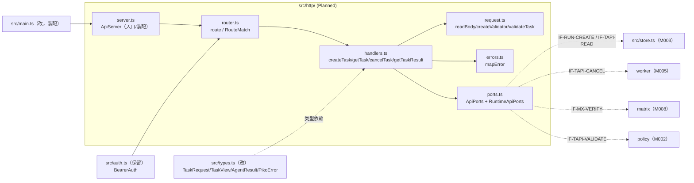
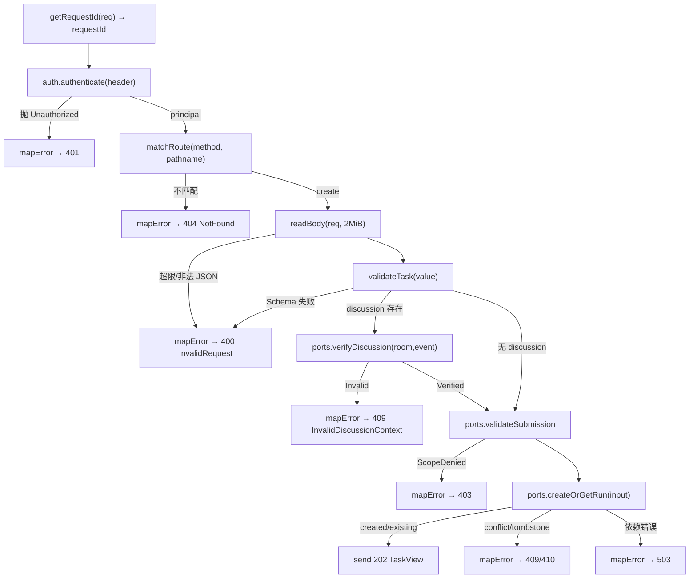
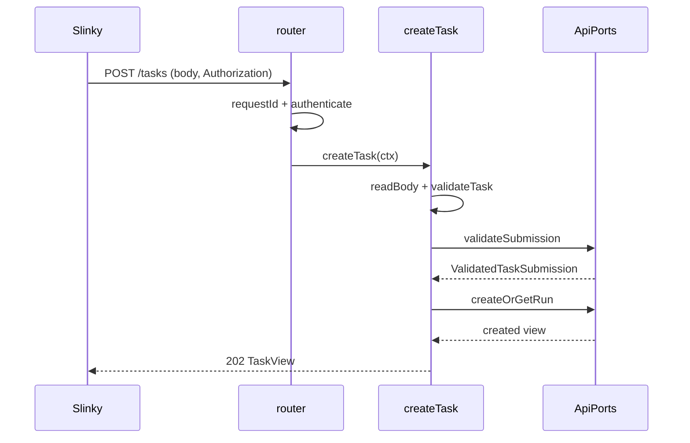

<!-- STD_DOCUMENT_COVER_BEGIN -->
# Piko 实现规格：task-api（M001）

> STD 使用入口：[项目采用说明与标准导航](../../README.md#std-entry)

| 文档字段 | 值 |
|---|---|
| Document ID | `piko-task-api-impl` |
| Document Version | `0.1.2` |
| Status | `Draft` |
| Project | `piko` |
| Document Owner | Piko Implementation Owner |
| Last Modified Date | `2026-09-28` |
| Template ID | `design.implementation` |
| Template Version | `1.2.0` |
<!-- STD_DOCUMENT_COVER_END -->

## 1. 实现目标与输入基线

<a id="isd-scope"></a>

本 ISD 实现 M001 `task-api` 的**四项 HTTP operation 与报文处理管线**：向 Slinky 提供 `createTask`/`getTask`/`cancelTask`/`getTaskResult` 四个端点，向 M002/M003/M005/M008 消费四个进程内端口，并把请求上下文、body 读取、Ajv 校验、路由匹配与 typed error 映射细化到文件/symbol 与函数步骤。本次实现范围是 §5 的四个 handler 及其内部组成（路由、请求读取、错误映射、凭据校验、端口适配）与 Brownfield 抽出（§2）；**非目标**是业务持久化（M003）、校验/路径判定（M002）、取消执行与 Pi abort（M005）、Pi/Matrix adapter 内部（M006/M008）、Run 状态机与 Result 语义（MECH-RUN/M003）。模块行为、接口语义、处理顺序与错误映射由模块设计唯一维护，本层只细化文件/symbol、私有表示、调用/清理步骤与测试入口。

### 1.1 实现对象

- **模块 ID / 名称**：`M001` / `task-api`。
- **直属父对象 / 父设计**：`SW-P`（Piko Agent Runtime V0.3，`design_level=system`）/ `system-design` v0.11.2；`parent_document_id=system-design`（ISD 与模块设计同为 `system-design` 的子视图，不互为父子）。
- **模块设计 Document ID / 版本 / 路径 / 摘要**：`piko-task-api` / `0.1.1` / `docs/40_module_design/piko-task-api-design.md`。摘要：一个 HTTP 端点族承载 submit/status/cancel/result；固定处理顺序 JSON/Schema → bearer → 按 `task_id` 查；typed error 与 catalog 双向一致；不持久化业务、不直接操作 adapter。
- **需求与 Constraint ID**：`CON-RUN-002`（PK-02）、`CON-CX-001`（PK-03 取消）、`CON-RUN-003`（PK-03 边界）、`CON-CFG-001`（配置重启生效）；机制输入 `M-RUN-DI-001`（`piko-run` §14.4）、`M-CX-DI-001`（`piko-cancel` §14.4）、`IF-MX-VERIFY`（`piko-matrix` §5.1）。
- **实现范围 / 非目标**：范围：`src/http/` 六个文件 + 对 `src/server.ts`/`src/types.ts`/`src/main.ts` 的最小改动。非目标：不写 SQL/DDL（M003）、不实现校验规则（M002）、不实现取消执行（M005）、不新增第五端点、不新增 config key。
- **ISD 默认落位或项目批准路径**：`docs/50_implementation_design/piko-task-api-impl.isd.md`（STD 默认路径）；代码落位 `src/http/`（Planned）。

<a id="isd-handoff"></a>

### 1.2.1 `H-TAPI-SUBMIT` · 提交任务

- **上游信息项 / 规则 ID**：`F-TAPI-SUBMIT`、`R-TAPI-VALIDATE`、`R-TAPI-BODY`、`createTask`、`IF-RUN-CREATE`、`CON-RUN-002`、`M-RUN-DI-001`。
- **固定来源 / 版本 / 锚点 / 摘要**：`piko-task-api` §2.1/§8.2/§8.4/§9.1.1/§9.2.1（v0.1.1）；契约 `0.3.0-simplified.6`。
- **ISD 细化内容 / 章节**：§5.1.1 `createTask`；§3.3 `request.ts`/§3.5 `ports.ts`；§6.1 `P-TAPI-SUBMIT`。
- **唯一权威位置**：行为/接口权威 = 模块设计 §2.1/§9.1.1；文件/symbol/私有表示权威 = 本 ISD。
- **实现自由度**：body 分块策略、Ajv 错误 detail 拼接、端口适配细节；不可改变处理顺序、2 MiB 上限与 `null`/typed error 语义。
- **原 V/Case 及本地验证位置**：`VRC-TAPI-001/002`（§9.1.1/§9.1.2）。

### 1.2.2 `H-TAPI-STATUS` · 状态查询

- **上游信息项 / 规则 ID**：`F-TAPI-STATUS`、`R-TAPI-ROUTE`、`getTask`、`IF-TAPI-READ`、`ERR-TAPI-STATUS`。
- **固定来源 / 版本 / 锚点 / 摘要**：`piko-task-api` §2.2/§8.1/§9.1.2/§9.2.3；OpenAPI `paths./tasks/{task_id}.get`。
- **ISD 细化内容 / 章节**：§5.1.2 `getTask`；§3.2 `router.ts`；§6.2 `P-TAPI-STATUS`。
- **唯一权威位置**：行为 = 模块设计 §9.1.2；只读缓存策略 = 本 ISD。
- **实现自由度**：路径参数解码、只读投影字段组织；不可改变 404/410/401 语义与「无副作用」。
- **原 V/Case 及本地验证位置**：`VRC-TAPI-003`（§9.1.3）。

### 1.2.3 `H-TAPI-CANCEL` · 取消分流

- **上游信息项 / 规则 ID**：`F-TAPI-CANCEL`、`R-TAPI-ERRMAP`、`cancelTask`、`IF-TAPI-CANCEL`、`CON-CX-001`、`M-CX-DI-001`。
- **固定来源 / 版本 / 锚点 / 摘要**：`piko-task-api` §2.3/§9.1.3/§9.2.4；`piko-cancel` §3/§5。
- **ISD 细化内容 / 章节**：§5.1.3 `cancelTask`；§3.5 `ports.ts` `cancel`；§6.3 `P-TAPI-CANCEL`。
- **唯一权威位置**：分流语义 = 模块设计 §9.1.3 + `piko-cancel`；状态码映射实现 = 本 ISD。
- **实现自由度**：状态码选择分支实现；不可把 `StopRequested` 当停止、不可返回 `TaskNotTerminal`。
- **原 V/Case 及本地验证位置**：`VRC-TAPI-004`（§9.1.4）。

### 1.2.4 `H-TAPI-RESULT` · 结果读取

- **上游信息项 / 规则 ID**：`F-TAPI-RESULT`、`getTaskResult`、`IF-TAPI-READ`、`ERR-TAPI-RESULT`。
- **固定来源 / 版本 / 锚点 / 摘要**：`piko-task-api` §2.4/§9.1.4/§6.8.4；contract §3。
- **ISD 细化内容 / 章节**：§5.1.4 `getTaskResult`；§4.2 结果投影；§6.2 `P-TAPI-RESULT`。
- **唯一权威位置**：行为 = 模块设计 §9.1.4；字段 authority = 机器 Schema。
- **实现自由度**：结果序列化实现；不可改变 `TaskNotTerminal`/`ResultUnavailable` 区分与 generation 冻结。
- **原 V/Case 及本地验证位置**：`VRC-TAPI-005`（§9.1.5）。

### 1.2.5 `H-TAPI-VALIDATE` · 报文校验与路由顺序

- **上游信息项 / 规则 ID**：`R-TAPI-ROUTE`、`R-TAPI-VALIDATE`、`R-TAPI-BODY`、`R-TAPI-REQID`、`AgentTaskRequest`。
- **固定来源 / 版本 / 锚点 / 摘要**：`piko-task-api` §8.1–§8.5/§3.1；`interfaces/schemas/agent-runtime-v0.3.schema.json`（`0.3.0-simplified.6`）。
- **ISD 细化内容 / 章节**：§3.2 `router.ts`/§3.3 `request.ts`；§4.1 `HttpContext`/`RouteMatch`；§6.4 校验步骤。
- **唯一权威位置**：顺序 = 模块设计 §8.1/§8.2；私有上下文表示 = 本 ISD。
- **实现自由度**：正则或表驱动、分块实现；不可改变 `:cancel`/`/result` 优先、401 优先于 400、2 MiB 上限。
- **原 V/Case 及本地验证位置**：`VRC-TAPI-002/006`（§9.1.2/§9.1.6）。

### 1.2.6 `H-TAPI-ERRMAP` · typed error 映射

- **上游信息项 / 规则 ID**：`R-TAPI-ERRMAP`、`ERR-TAPI-SUBMIT/STATUS/CANCEL/RESULT`、`RequestErrorCode`。
- **固定来源 / 版本 / 锚点 / 摘要**：`piko-task-api` §6.8/§8.3；`interfaces/error-codes/error-blocker-catalog-v0.3.json`。
- **ISD 细化内容 / 章节**：§3.4 `errors.ts`；§4.3 `HttpError`；§6.5 `P-TAPI-ERRMAP`。
- **唯一权威位置**：code↔status 映射 = catalog/OpenAPI；映射函数实现 = 本 ISD。
- **实现自由度**：映射数据结构；不可新增 code、不可改变 `Retry-After` 规则与错误集合归属。
- **原 V/Case 及本地验证位置**：`VRC-TAPI-002/006`（§9.1.2/§9.1.6）。

## 2. 既有实现差异（条件章节）

### 2.1 适用性

- **适用性**：brownfield（存在需修改的既有实现）。
- **依据**：基线：当前工作树 commit（见封面 metadata `reviewed_commit`/§10.2 复核）。既有 `src/server.ts` 的 `ApiServer` 单类内联了路由、body 读取、Ajv 注册、四操作与错误映射（`src/server.ts:12`–`src/server.ts:38`），并直接调用 `TaskStore`/`MatrixRuntime`（`src/server.ts:27`–`src/server.ts:32`）。本 ISD 把这部分抽为 `src/http/` 六文件并引入端口层，不新建 schema。
- **Tailoring / 范围决定引用**：`TAIL-P-NEW-S1`（Piko 无 subsystem，`design.definition`/`design.implementation` 直接承接 `system-design`）；范围决定 `system-design` §15 PHASE-I。

### 2.2 `CH-TAPI-01` · 抽取路由与处理器

- **基线 commit / 版本**：当前工作树（§10.2 `SC-TAPI-01` 记录解析出的 commit）。
- **文件 / symbol**：`src/server.ts` `ApiServer.route`（既有）→ Planned `src/http/router.ts` `route` + `src/http/handlers.ts` `createTask/getTask/cancelTask/getTaskResult`。
- **Current 行为**：`route` 内用 `req.method`/`url.pathname` 的 if + 正则链顺序判定四操作，并在同一函数内执行业务调用与响应。
- **Target 改动与理由**：路由与处理器分离，四 handler 可独立测试成功/拒绝分支（`VRC-TAPI-001/003/004/005`），路由歧义显式化（`R-TAPI-ROUTE`）。
- **原规则 / 成员 ID**：`F-TAPI-SUBMIT/STATUS/CANCEL/RESULT`、`R-TAPI-ROUTE`、四 OpenAPI operationId。
- **实现状态**：`IN_PROGRESS`（Current 内联，Target 抽出）。

### 2.3 `CH-TAPI-02` · 抽取 body 读取与 Schema 校验

- **基线 commit / 版本**：当前工作树。
- **文件 / symbol**：`src/server.ts` `body()`（既有）+ `ApiServer.create` 内 Ajv 注册（既有）→ Planned `src/http/request.ts` `readBody`/`createValidator`/`validateTask`。
- **Current 行为**：`body()` 以 2 MiB 上限流式累加并 `JSON.parse`；Ajv 内联在 `create` 中编译 `AgentTaskRequest`。
- **Target 改动与理由**：把读体与校验抽为纯单元，便于对超限/截断 JSON/未知字段做表驱动测试（`VRC-TAPI-002` Case B/C/D），并避免 `server.ts` 承担校验职责。
- **原规则 / 成员 ID**：`R-TAPI-BODY`、`R-TAPI-VALIDATE`、`AgentTaskRequest`。
- **实现状态**：`IN_PROGRESS`。

### 2.4 `CH-TAPI-03` · 抽取 typed error 映射

- **基线 commit / 版本**：当前工作树。
- **文件 / symbol**：`src/server.ts` `route` 内 `catch`（既有，`src/server.ts:34`）→ Planned `src/http/errors.ts` `mapError`。
- **Current 行为**：`catch` 内把 `PikoError` 或未知错误统一成 `ErrorEnvelope`，429/503 加 `Retry-After`，`request_id` 取 `X-Request-ID` 或 `randomUUID`。
- **Target 改动与理由**：映射集中一处，便于与 catalog `operation_status_codes` 双向核对（`VRC-TAPI-006` Case E），并保证 `request_id` 一致（`R-TAPI-REQID`）。
- **原规则 / 成员 ID**：`R-TAPI-ERRMAP`、`R-TAPI-REQID`、`ERR-TAPI-*`。
- **实现状态**：`IN_PROGRESS`。

### 2.5 `CH-TAPI-04` · 引入 `ApiPorts` 隔离跨模块调用

- **基线 commit / 版本**：当前工作树。
- **文件 / symbol**：`src/server.ts` 直接 `this.store.*`/`this.matrix.*`（既有）→ Planned `src/http/ports.ts` `ApiPorts`/`RuntimeApiPorts`。
- **Current 行为**：入口直接依赖 `TaskStore` 与 `MatrixRuntime` 具体类型并调用其方法（含 `store.cancel`、`store.findExisting`、`store.createOrGet`、`store.result`、`store.getTask`）。
- **Target 改动与理由**：把具体类型收敛到 `ports.ts`，handler 只依赖抽象，使跨模块合同可随 M002/M003/M005 的 Proposed 端口演进（`OQ-TAPI-002/003`），并让 handler 可在受控 fake 上测试。
- **原规则 / 成员 ID**：`IF-RUN-CREATE`/`IF-TAPI-VALIDATE`/`IF-TAPI-READ`/`IF-TAPI-CANCEL`/`IF-MX-VERIFY`。
- **实现状态**：`IN_PROGRESS`。

## 3. 文件、内部组件与调用关系

<a id="isd-structure"></a>



图 M001-ISD-S1 · Planned / NOT_IMPLEMENTED。实线调用；虚线跨模块适配或类型依赖。`errors.ts`/`request.ts` 零业务 import；`ports.ts` 是全模块唯一接触 M002/M003/M005/M008 的文件。

### 3.1 `src/http/server.ts`（新增）

- **职责及调用者**：入口与宿主装配：持有 `node:http` server 与 Ajv 实例，构造 `ApiPorts`/`BearerAuth`/`Router`，处理 `listen`/`close`；被 `src/main.ts` 调用。
- **类型 / 函数**：`class ApiServer`：`static async create(config, ports, auth)`、`listen()`、`close()`、私有 `handle(req,res)`。
- **可见性**：public（仅 `main.ts` 与测试导入）。
- **调用与类型依赖**：依赖 `router.ts`/`ports.ts`/`auth.ts`/`types.ts` + `node:http`。
- **构建目标 / 生成源 / 输出**：`tsc` → `dist/http/server.js`；无生成源。
- **实现状态**：Planned（现逻辑在 `src/server.ts`，`IN_PROGRESS`）。

### 3.2 `src/http/router.ts`（新增）

- **职责及调用者**：按 method + path 顺序匹配四操作；生成/透传 `X-Request-ID`；被 `server.ts` 调用。
- **类型 / 函数**：`interface RouteMatch{kind:"create"|"get"|"cancel"|"result", runId?:string}`；`function route(req, res, ctx): Promise<void>`。
- **可见性**：模块内 public。
- **调用与类型依赖**：依赖 `handlers.ts`/`auth.ts`/`types.ts`。
- **构建目标 / 生成源 / 输出**：`tsc` → `dist/http/router.js`。
- **实现状态**：Planned。

### 3.3 `src/http/request.ts`（新增）

- **职责及调用者**：读取 body（≤ 2 MiB）、`JSON.parse`、Ajv 校验 `AgentTaskRequest`；被 `handlers.ts` 调用。
- **类型 / 函数**：`async function readBody(req, max=2097152): Promise<unknown>`；`function createValidator(schemaPath): ValidateFunction`；`function validateTask(validate, value): AgentTaskRequest`。
- **可见性**：模块内 public。
- **调用与类型依赖**：依赖 `ajv`/`ajv-formats` + `types.ts`；**禁止 import 业务模块**。
- **构建目标 / 生成源 / 输出**：`tsc` → `dist/http/request.js`。
- **实现状态**：Planned（现逻辑在 `src/server.ts:12`/`:18`）。

### 3.4 `src/http/errors.ts`（新增）

- **职责及调用者**：把 `PikoError`/未知错误映射为 `{status, body, headers}`；被 `router.ts`/`handlers.ts` 调用。
- **类型 / 函数**：`interface HttpError{status:number, body:ErrorEnvelope, headers:Record<string,string>}`；`function mapError(error:unknown, requestId:string): HttpError`。
- **可见性**：模块内 public。
- **调用与类型依赖**：依赖 `types.ts`；零业务 import。
- **构建目标 / 生成源 / 输出**：`tsc` → `dist/http/errors.js`。
- **实现状态**：Planned（现逻辑在 `src/server.ts:34`）。

### 3.5 `src/http/ports.ts`（新增）

- **职责及调用者**：`ApiPorts` 抽象与 `RuntimeApiPorts` 生产实现；唯一接触 M002/M003/M005/M008 的文件；被 `handlers.ts` 调用。
- **类型 / 函数**：`interface ApiPorts{ validateSubmission; verifyDiscussion; createOrGetRun; readTaskView; readResult; cancel }`；`class RuntimeApiPorts implements ApiPorts`（构造注入 `TaskStore`/`MatrixRuntime`/`policy`）。
- **可见性**：`ApiPorts` 模块内 public；`RuntimeApiPorts` 由 `server.ts` 装配。
- **调用与类型依赖**：依赖 `types.ts`；运行时依赖 M002/M003/M005/M008（仅此文件）。
- **构建目标 / 生成源 / 输出**：`tsc` → `dist/http/ports.js`。
- **实现状态**：Planned（现为 `src/server.ts` 直接调用）。

### 3.6 `src/server.ts`（修改既有）

- **职责及调用者**：保留为兼容入口：把构造委托给 `ApiServer`，删除内联 route/body/Ajv/错误逻辑；被 `main.ts` 调用。
- **类型 / 函数**：`class ApiServer` 变为 `src/http/server.ts` 的薄再导出或直接迁移后移除内联实现。
- **可见性**：public。
- **调用与类型依赖**：依赖 `src/http/server.ts`。
- **构建目标 / 生成源 / 输出**：`tsc` → `dist/server.js`。
- **实现状态**：`IN_PROGRESS`。

### 3.7 `src/types.ts`（修改既有）

- **职责及调用者**：补 `CancelOutcome` 与 `CancelReceipt` 投影类型；保留既有 `TaskRequest`/`TaskView`/`AgentResult`/`PikoError`。
- **类型 / 函数**：`export type CancelOutcome = "CancelledBeforeStart"|"StopRequested"|"AlreadyTerminal"`。
- **可见性**：public（模块内类型源）。
- **调用与类型依赖**：零运行时依赖。
- **构建目标 / 生成源 / 输出**：`tsc` → `dist/types.js`。
- **实现状态**：`IN_PROGRESS`（既有文件；增补类型）。

### 3.8 `src/main.ts`（修改既有）

- **职责及调用者**：装配顺序调整：`new TaskStore` → `ApiPorts` → `BearerAuth` → `ApiServer.create` → `listen`。
- **类型 / 函数**：`main()` 内新增 `RuntimeApiPorts` 构造行；替换 `ApiServer.create(config,store,auth,matrix)` 调用。
- **可见性**：public（入口）。
- **调用与类型依赖**：依赖 `store.ts`/`http/ports.ts`/`http/server.ts`/`auth.ts`/`config.ts`。
- **构建目标 / 生成源 / 输出**：`tsx src/main.ts`（运行）；`tsc` 类型检查。
- **实现状态**：`IN_PROGRESS`。

## 4. 数据结构设计

<a id="isd-data"></a>

本层不新增公共 Data/Type ID：请求/响应业务对象（`AgentTaskRequest`/`TaskView`/`CancelReceipt`/`AgentResult`/`ErrorEnvelope`/`TaskState`/`CancelOutcome`/`RequestErrorCode`）的机器 authority 在 `interfaces/schemas/agent-runtime-v0.3.schema.json` 与 `interfaces/error-codes/error-blocker-catalog-v0.3.json`，本 ISD 只以 TypeScript 投影消费（`src/types.ts`）。本层新增的私有类型是请求上下文与路由结果。

**不适用类别**：§4.3 配置（由系统 schema + M000 定义，见 §8.1 的 N/A 边界）；§4.4 通信报文（无跨边界消息）；§4.5 设备/FPGA 表项（纯软件，`TAIL-P-103`）；§4.6 运行状态（handler 无跨调用状态）；§4.7 数据库表（schema authority 属 M003，见 §7.2）。

### 4.1 公共基础类型与枚举（适用时）

#### 4.1.1 `TaskState` / `CancelOutcome` / `RequestErrorCode`（投影）

- **代码式声明、Data/Type ID 与唯一来源**：```ts
  type TaskState = "Queued"|"Running"|"Cancelling"|"Completed"|"Failed"|"Cancelled";   // schema $defs.TaskState
  type CancelOutcome = "CancelledBeforeStart"|"StopRequested"|"AlreadyTerminal";       // schema $defs.CancelReceipt.outcome
  type RequestErrorCode = "InvalidRequest"|"Unauthorized"|"ScopeDenied"|"NotFound"|"TaskConflict"|"TaskNotTerminal"|"InvalidDiscussionContext"|"QueueFull"|"DependencyUnavailable"|"ResultUnavailable"|"Gone";
  ```
  唯一来源 = `interfaces/schemas/agent-runtime-v0.3.schema.json`（`0.3.0-simplified.6`）+ error catalog。
- **逐值/逐字段定义、范围和未知值行为**：全部为字符串字面量联合；未知值视为编程错误（TypeScript 编译期拒绝），运行期不新增值。
- **代码类型/symbol、转换点与失败映射**：`src/types.ts`；由 `ports.ts`/`errors.ts` 消费；JSON 反序列化失败由 §6.4 校验步骤转 400/503。
- **创建/修改者、所有权、寿命与敏感性**：M003 产生状态/outcome；本层只读；无敏感性（非凭据）。
- **合法及拒绝实例、V/Case 与证据状态**：合法 `"Queued"`；拒绝 `"queued"`。`VRC-TAPI-003`；`NOT_RUN`。

### 4.2 业务与操作数据结构（适用时）

#### 4.2.1 `HttpContext`（请求局部上下文）

- **代码式声明、Data/Type ID 与固定来源**：```ts
  interface HttpContext { req: IncomingMessage; res: ServerResponse; principal: string; requestId: string; }
  ```
  私有类型；来源 = 本 ISD；字段映射模块设计 §8.5。
- **逐字段定义、条件有效性和跨字段不变量**：`req`/`res` 为宿主对象，寿命 = 请求；`principal` 非空，由 `BearerAuth.authenticate` 产出；`requestId` 非空，沿用 `X-Request-ID` 或 `randomUUID()`；`requestId` 在错误与本请求全部日志中一致。
- **代码文件/symbol、编码或投影函数**：`src/http/router.ts` 构造并传给 handler。
- **创建、借用、修改、释放与失败出口**：入口构造一次、借用给单 handler；请求结束释放；无失败构造（校验在 handler 内）。
- **合法及拒绝实例、V/Case 与证据状态**：合法 `{principal:"slinky",requestId:"abc"}`；拒绝 `requestId=""`（视为缺省并重新生成）。`VRC-TAPI-006`；`NOT_RUN`。

#### 4.2.2 `RouteMatch`（路由结果）

- **代码式声明、Data/Type ID 与固定来源**：```ts
  type RouteMatch = { kind: "create" } | { kind: "get"; runId: string } | { kind: "cancel"; runId: string } | { kind: "result"; runId: string };
  ```
  私有类型；来源 = 本 ISD；行为规则见模块设计 §8.1。
- **逐字段定义、条件有效性和跨字段不变量**：`kind` 唯一决定 handler；`runId` 仅在 get/cancel/result 存在且为 `decodeURIComponent` 后非空 string；不变量 = `kind` 与路由正则唯一对应。
- **代码文件/symbol、编码或投影函数**：`src/http/router.ts` `route` 内的匹配分支。
- **创建、借用、修改、释放与失败出口**：匹配成功即构造并立即分发；无匹配 → 404，无对象保留。
- **合法及拒绝实例、V/Case 与证据状态**：合法 `{kind:"result",runId:"task-042"}`；拒绝 `{kind:"get"}`（缺 `runId`）。`VRC-TAPI-006`；`NOT_RUN`。

### 4.3 配置与规则数据结构（适用时）

**N/A。** 本层不拥有配置结构：`listen.host/port`、`queue.capacity`、`api_auth.*` 由 `interfaces/schemas/piko-runtime-config-v0.3.schema.json` + M000 `bootstrap` 定义、校验与解析；本模块只以构造注入读取（§8.1）。依据：模块设计 §6.3；ISD 规范「没有本地配置时写明由哪个 authority 提供固定值」。

### 4.4 通信报文结构（适用时）

**N/A。** 无跨执行边界的消息/队列/流；HTTP 报文由机器契约拥有。

### 4.5 设备与 FPGA 表项结构（适用时）

**N/A** · 纯软件（`TAIL-P-103`）。

### 4.6 运行状态数据结构（适用时）

**N/A。** 无跨调用状态：`HttpContext`/`RouteMatch` 均为请求局部，见 §4.2 的寿命字段；Run 的跨步骤状态 authority 在 M003 `runs.state`，本层只读。依据：模块设计 §6.6。

### 4.7 数据库表结构（适用时）

**N/A。** 本层不拥有持久表；`tasks`/`runs`/`results` 的 DDL 与事务 authority 属 M003（`system-design#m003-ddl-authority`，`piko-task-repository-impl.isd.md` §4.7 Proposed）。交接见 §7.2。

### 4.8 错误码与错误结构（适用时）

#### 4.8.1 `HttpError`（映射产物）

- **错误声明、Error/Data ID 与唯一来源**：```ts
  interface HttpError { status: number; body: { error: { code: RequestErrorCode; message: string; request_id: string } }; headers: Record<string,string>; }
  ```
  私有类型；公共 `RequestErrorCode` 与 status 由 catalog 唯一拥有（`ERR-TAPI-SUBMIT/STATUS/CANCEL/RESULT`，模块设计 §6.8）。
- **逐字段和逐码含义、触发事实及优先级**：`status` 取 `PikoError.status`；未知错误 → 503；`headers["retry-after"]="5"` 当且仅当 status ∈ {429,503}；`code` 必在对应 operation 的 catalog 集合内（构造时由 `PikoError.code` 给定）。
- **抛出/捕获/转换 symbol 与 public payload**：`src/http/errors.ts` `mapError`；输入 `PikoError`/`unknown`；输出 `HttpError`；`PikoError` 定义在 `src/types.ts:25`。
- **状态、副作用、可重试条件与敏感信息处理**：无 DB 副作用；`QueueFull`/`DependencyUnavailable` 可重试；message 不含 credential/body/绝对路径。
- **触发向量、V/Case 与证据状态**：`TaskConflict`→409；未知 `TypeError`→503；`QueueFull`→429+Retry-After。`VRC-TAPI-002/006`；`NOT_RUN`。

## 5. 接口设计

<a id="isd-functions"></a>

本层实现的对外接口是 §5.1 四个 handler（HTTP 端点），被消费的跨模块端口在 §5.2。所有业务字段 authority 在机器 Schema，不在此重定义。

### 5.1 API（适用时）

#### 5.1.1 `createTask(ctx: HttpContext): Promise<void>`

- **Interface/Member ID、用途**：`createTask`（OpenAPI operationId）；受理任务并返回 202 `TaskView` 或 typed error。
- **文件 / symbol / 可见性**：Planned `src/http/handlers.ts` `createTask`；模块内 public（经 Router 间接对外）。
- **原成员 ID 或私有来源**：模块设计 §9.1.1；`F-TAPI-SUBMIT`；`M-RUN-DI-001`。
- **完整签名与 caller**：`async function createTask(ctx: HttpContext): Promise<void>`；caller = `router.route`（宿主事件循环）。
- **固定契约与版本**：模块设计 §9.1.1（`piko-task-api` v0.1.1）；OpenAPI `0.3.0-simplified.6`；构建目标 `dist/http/`。
- **输入参数 / 数据结构 authority**：`ctx.req`（含 body 流与 `Authorization`）；body 类型 `AgentTaskRequest`（`$defs.AgentTaskRequest`）。无 §6 Data ID，进程内上下文。
- **输入约束 / 校验顺序 / 失败映射**：顺序 = bearer → 读 body（≤2 MiB）→ JSON → Ajv → （discussion）`verifyDiscussion` → `validateSubmission` → `createOrGetRun`；失败映射：读体/JSON/Schema → 400 `InvalidRequest`；无凭据 → 401 `Unauthorized`；discussion → 409 `InvalidDiscussionContext`；判定 → 403/422；M003 → 409/410/503。
- **成功输出 / 数据结构 / 后置条件**：202 + `TaskView`（`created`→`Queued`；`existing`→原视图）。后置：`runs` 已有该 Run；不保证执行开始。
- **错误输出 / 触发条件 / 优先级**：401 先于 400（bearer 在 body 校验前）；400 先于 403/409/422；`TaskConflict`/`Gone` 由 M003 判别；`QueueFull`/`DependencyUnavailable` 可重试。见模块设计 §6.8.1。
- **底层异常 / 失败事实**：M003 抛 `SQLITE_BUSY`/`SQLITE_IOERR`；M002 抛内部异常；`verifyDiscussion` 返回 `InvalidDiscussionContext`。
- **模块是否处理及处理函数**：业务竞争由 M003 判别；本层 `router.route` 的 `try/catch` 调 `mapError` 转换；不吞依赖错误。
- **Typed 异常与原生异常所有权**：`PikoError`（本层/协作方）→ `mapError`；原生 SQLite 由 M003 抛、`mapError` 归 503。
- **宿主 / public payload 或状态码**：`TaskView` JSON 或 `ErrorEnvelope`；状态码见上。
- **日志级别 / 脱敏 / 关联字段**：`info`（受理成功，含 `task_id`/`request_id`）；`warn`（依赖错误）；不记录 `instruction`/body/credential。
- **是否可重试及前提**：`QueueFull`/`DependencyUnavailable` 可同 `task_id` 重发；`TaskConflict` 换新 ID；重放由 M003 幂等。
- **状态与副作用影响 / 验证项**：副作用 = 经 M003 写 `tasks`/`runs`（单事务）；`VRC-TAPI-001/002`。
- **不可改变的规则 / Constraint ID**：处理顺序、2 MiB 上限、typed error 集合、`CON-RUN-002`/`CON-RUN-003`。
- **实现自由度**：分块策略、Ajv detail 拼接、端口适配；不可改顺序与错误语义。
- **副作用 / 执行上下文 / 幂等性**：有副作用；上下文 = 宿主事件循环同步 handler；业务上幂等（同 ID 同内容不新增执行），HTTP 层非幂等。
- **输入输出 ownership 与寿命**：`ctx` 借用；body 解析对象请求内持有；响应写出后释放。
- **Thread-safe / reentrant**：conditional（Node 单线程；请求间无共享可变状态）。
- **Nested-call policy**：allowed：`readBody`/`validateTask`/`verifyDiscussion`/`validateSubmission`/`createOrGetRun`；禁止回调 Router。
- **Transaction participation**：none（事务由 M003 `createOrGetRun` 拥有）。
- **Blocking / timeout / cancellation**：阻塞式（同步 M003 事务），受 `task_store.busy_timeout_ms`；HTTP 无取消传播。
- **实现状态 / 验证项**：Planned / `VRC-TAPI-001/002`。
- **装配、合法及拒绝实例**：装配 = `ApiServer.create` 注入 `ApiPorts`。合法：q1 body → 202 `Queued`。拒绝：未知字段 → 400。Oracle = `tasks`/`runs` 直读 + `validate_v03_contract.py`。`NOT_RUN`。

#### 5.1.2 `getTask(ctx: HttpContext): Promise<void>`

- **Interface/Member ID、用途**：`getTask`；按 `task_id` 返回 `TaskView`。
- **文件 / symbol / 可见性**：Planned `src/http/handlers.ts` `getTask`；模块内 public。
- **原成员 ID 或私有来源**：模块设计 §9.1.2；`F-TAPI-STATUS`。
- **完整签名与 caller**：`async function getTask(ctx: HttpContext): Promise<void>`；caller = `router.route`。
- **固定契约与版本**：模块设计 §9.1.2；OpenAPI `0.3.0-simplified.6`。
- **输入参数 / 数据结构 authority**：`ctx` + `RouteMatch.runId`；`TaskView` authority = `$defs.TaskView`。
- **输入约束 / 校验顺序 / 失败映射**：bearer → `runId` 非空 → `readTaskView`；失败 401/403/404/410（§6.8.2）。`runId` 为空由路由不匹配转 404。
- **成功输出 / 数据结构 / 后置条件**：200 + `TaskView`；无副作用、无状态变化。
- **错误输出 / 触发条件 / 优先级**：401 → 403 → 404 → 410；404 不区分不存在/不可见。
- **底层异常 / 失败事实**：M003 抛 SQLite 错误或返回 `NotFound`/`Gone`。
- **模块是否处理及处理函数**：只读透传；`mapError` 处理未知错误。
- **Typed 异常与原生异常所有权**：`PikoError`/原生均交 `mapError`。
- **宿主 / public payload 或状态码**：`TaskView` 或 `ErrorEnvelope`。
- **日志级别 / 脱敏 / 关联字段**：`debug`（成功，含 `task_id`/`request_id`）；`warn`（404/410 不需 warn）。
- **是否可重试及前提**：只读查询可随时重发；404/410 重试无意义。
- **状态与副作用影响 / 验证项**：无副作用；`VRC-TAPI-003`。
- **不可改变的规则 / Constraint ID**：只读、404/410 语义、无缓存读权威。
- **实现自由度**：投影字段组织、解码实现。
- **副作用 / 执行上下文 / 幂等性**：无副作用、幂等；上下文 = 事件循环。
- **输入输出 ownership 与寿命**：`ctx` 借用；`TaskView` 响应内持有。
- **Thread-safe / reentrant**：yes。
- **Nested-call policy**：allowed：`readTaskView`。
- **Transaction participation**：none（只读）。
- **Blocking / timeout / cancellation**：阻塞式读；受 `busy_timeout_ms`；无取消。
- **实现状态 / 验证项**：Planned / `VRC-TAPI-003`。
- **装配、合法及拒绝实例**：合法 Queued → 200 `started_at=null`；拒绝未知 ID → 404。Oracle = `runs` 直读。`NOT_RUN`。

#### 5.1.3 `cancelTask(ctx: HttpContext): Promise<void>`

- **Interface/Member ID、用途**：`cancelTask`；按 Run state 返回 `CancelReceipt`。
- **文件 / symbol / 可见性**：Planned `src/http/handlers.ts` `cancelTask`；模块内 public。
- **原成员 ID 或私有来源**：模块设计 §9.1.3；`F-TAPI-CANCEL`；`M-CX-DI-001`。
- **完整签名与 caller**：`async function cancelTask(ctx: HttpContext): Promise<void>`；caller = `router.route`。
- **固定契约与版本**：模块设计 §9.1.3；`piko-cancel` §5.1；OpenAPI `0.3.0-simplified.6`。
- **输入参数 / 数据结构 authority**：`ctx` + `RouteMatch.runId`；`CancelReceipt` authority = `$defs.CancelReceipt`。
- **输入约束 / 校验顺序 / 失败映射**：bearer → `runId` → `cancel(runId)`；失败 401/403/404/410（§6.8.3）；**不返回** 409 `TaskNotTerminal`。
- **成功输出 / 数据结构 / 后置条件**：Queued/终态 200，Running 202；`CancelReceipt{task_id,outcome,requested_at}`；后置由 M005 决定（stop intent 或零调用 Result）。
- **错误输出 / 触发条件 / 优先级**：401 → 403 → 404 → 410；outcome 与状态码互斥映射。
- **底层异常 / 失败事实**：M005 抛内部错误或返回 `NotFound`/`Gone`。
- **模块是否处理及处理函数**：按 outcome 选择状态码（本 handler）；错误交 `mapError`。
- **Typed 异常与原生异常所有权**：`PikoError`/原生交 `mapError`。
- **宿主 / public payload 或状态码**：`CancelReceipt` 或 `ErrorEnvelope`。
- **日志级别 / 脱敏 / 关联字段**：`info`（含 `task_id`/`outcome`/`request_id`）。
- **是否可重试及前提**：重复 cancel 幂等返回当前 outcome；`StopRequested` 后应轮询而非重发。
- **状态与副作用影响 / 验证项**：副作用由 M005/M003 写 `cancel_requested`/`state`；本层不改状态；`VRC-TAPI-004`。
- **不可改变的规则 / Constraint ID**：按 state 分流、`StopRequested`≠停止、`CON-CX-001`。
- **实现自由度**：状态码选择实现、与 M005 调用形态。
- **副作用 / 执行上下文 / 幂等性**：有业务副作用（在 M005）；HTTP 层幂等（重复返回当前 outcome）。
- **输入输出 ownership 与寿命**：`ctx` 借用；receipt 响应内持有。
- **Thread-safe / reentrant**：conditional（单线程）。
- **Nested-call policy**：allowed：`cancel`。
- **Transaction participation**：none（事务由 M005/M003 拥有）。
- **Blocking / timeout / cancellation**：阻塞式；受 `busy_timeout_ms`；Running 的对账异步。
- **实现状态 / 验证项**：Planned / `VRC-TAPI-004`。
- **装配、合法及拒绝实例**：合法 Queued → 200 `CancelledBeforeStart`；Running → 202；拒绝未知 ID → 404。Oracle = `runs.state`/`results`。`NOT_RUN`。

#### 5.1.4 `getTaskResult(ctx: HttpContext): Promise<void>`

- **Interface/Member ID、用途**：`getTaskResult`；返回冻结的 `AgentResult`。
- **文件 / symbol / 可见性**：Planned `src/http/handlers.ts` `getTaskResult`；模块内 public。
- **原成员 ID 或私有来源**：模块设计 §9.1.4；`F-TAPI-RESULT`。
- **完整签名与 caller**：`async function getTaskResult(ctx: HttpContext): Promise<void>`；caller = `router.route`。
- **固定契约与版本**：模块设计 §9.1.4；contract §3；OpenAPI `0.3.0-simplified.6`。
- **输入参数 / 数据结构 authority**：`ctx` + `RouteMatch.runId`；`AgentResult` authority = `$defs.AgentResult`。
- **输入约束 / 校验顺序 / 失败映射**：bearer → `runId` → `readResult`；失败 401/403/404/409 `TaskNotTerminal`/410/500 `ResultUnavailable`（§6.8.4）。
- **成功输出 / 数据结构 / 后置条件**：200 + `AgentResult`（generation 冻结）；只读。
- **错误输出 / 触发条件 / 优先级**：401 → 403 → 404 → 409 → 410 → 500；`TaskNotTerminal` 可重试等待。
- **底层异常 / 失败事实**：M003 返回判别结果或 SQLite 错误。
- **模块是否处理及处理函数**：只读透传；`mapError` 处理未知错误。
- **Typed 异常与原生异常所有权**：交 `mapError`。
- **宿主 / public payload 或状态码**：`AgentResult` 或 `ErrorEnvelope`。
- **日志级别 / 脱敏 / 关联字段**：`debug`（成功，含 `task_id`/`generation`/`request_id`）。
- **是否可重试及前提**：非终态可重试；500 交 operator 不重试重建。
- **状态与副作用影响 / 验证项**：无副作用；`VRC-TAPI-005`。
- **不可改变的规则 / Constraint ID**：generation 冻结、两失败区分、不得伪装 404/空成功。
- **实现自由度**：序列化与投影实现。
- **副作用 / 执行上下文 / 幂等性**：无副作用、幂等；事件循环。
- **输入输出 ownership 与寿命**：`ctx` 借用；result 响应内持有。
- **Thread-safe / reentrant**：yes。
- **Nested-call policy**：allowed：`readResult`。
- **Transaction participation**：none。
- **Blocking / timeout / cancellation**：阻塞式只读；无取消。
- **实现状态 / 验证项**：Planned / `VRC-TAPI-005`。
- **装配、合法及拒绝实例**：合法 Completed → 200；拒绝 Running → 409。Oracle = `results` 行 + sha256。`NOT_RUN`。

### 5.2 消息与数据流接口（适用时）

本层不实现跨边界消息；被消费的四个进程内端口记录如下（字段 authority 见模块设计 §9.2，本层只落实调用点）。

#### 5.2.1 `ApiPorts.createOrGetRun / readTaskView / readResult`（消费）

- **Interface/Member ID、处理文件/symbol 与来源**：`IF-RUN-CREATE`/`IF-TAPI-READ`；`src/http/ports.ts` `RuntimeApiPorts`；来源 `piko-run` §5.1（Proposed，`OQ-TAPI-002`）。
- **输入、输出和字段校验**：`ValidatedTaskSubmission`/`task_id` → `CreateRunOutcome`/`TaskView`/`AgentResult`；字段校验由 M002/M003 负责，本层不重复。
- **交互、错误传播与寿命**：同步；判别结果与依赖错误透传；无缓存。
- **实例与验证**：合法 `created`/`existing`；拒绝 `NotFound`/`Gone`。`VRC-TAPI-001/003/005`；`NOT_RUN`。

#### 5.2.2 `ApiPorts.cancel`（消费）

- **Interface/Member ID、处理文件/symbol 与来源**：`IF-TAPI-CANCEL`；`src/http/ports.ts`；来源 `piko-cancel` §3/§5（入口未命名，`OQ-TAPI-003`）。
- **输入、输出和字段校验**：`task_id` → `CancelOutcome{outcome,requested_at}`；`requested_at` 为 UTC。
- **交互、错误传播与寿命**：同步返回；错误透传。
- **实例与验证**：合法三分支；拒绝 `NotFound`。`VRC-TAPI-004`；`NOT_RUN`。

#### 5.2.3 `ApiPorts.verifyDiscussion`（消费）

- **Interface/Member ID、处理文件/symbol 与来源**：`IF-MX-VERIFY`；`src/http/ports.ts`；来源 `piko-matrix` §5.1（`OQ-TAPI-004`）。
- **输入、输出和字段校验**：`{room_id,trigger_event_id}` → `VerifiedEvent | InvalidDiscussionContext`。
- **交互、错误传播与寿命**：同步（内部访问 homeserver，受 M008 超时）；失败 409。
- **实例与验证**：合法 verified；拒绝 conflicts。`VRC-TAPI-002`；`NOT_RUN`。

### 5.3 硬件与固件接口（适用时）

**N/A** · 纯软件（`TAIL-P-103`）。

### 5.4 人机与维护接口（适用时）

**N/A。** 无 CLI/诊断命令；operator 诊断归 ops 文档与 `system-design` §8.1。

## 6. 关键流程与算法

<a id="isd-algorithms"></a>

四条 handler 流程共用同一「读报文 → 校验 → 调端口 → 映射结果」骨架；下图给提交路径的完整分支，其余三条在同骨架下以不同端口与状态码收口。



图 M001-ISD-A1 · Planned / NOT_IMPLEMENTED。提交路径正常与全部拒绝分支；拒绝不创建 Run、不改状态。



图 M001-ISD-A2 · Planned / NOT_IMPLEMENTED。提交正常时序；异常经 `mapError` 在同一响应写出。

### 6.1 `P-TAPI-SUBMIT` · 提交

- **触发与执行者**：`POST /tasks` → `createTask`（宿主事件循环）。
- **入口函数及数据**：`createTask(ctx)`；`AgentTaskRequest` → `ValidatedTaskSubmission` → `CreateRunOutcome` → `TaskView`。
- **步骤 / 算法 / 复杂度**：见上图 M001-ISD-A1；顺序 = requestId → auth → route → body → Ajv → verify → validate → createOrGetRun → send。复杂度 O(body)。
- **判断事实来源**：Ajv 校验结果、M008 verified 事实、M002 判定、M003 outcome；无来源不明的 Guard。
- **成功可见点**：M003 事务提交（`created`/`existing`）；随后 202 写出。
- **失败、取消与清理**：任一失败经 `mapError` 写错误，无部分副作用（事务在 M003 内回滚）；无临时资源。
- **代表输入与中间值**：q1 body + `Authorization: Bearer <token>` → `AgentTaskRequest` → `created` → `TaskView{state:"Queued"}`。
- **规则 / 接口 / 验证引用**：模块设计 §8.2/§8.4；§5.1.1/§5.2.1；`VRC-TAPI-001/002`。

### 6.2 `P-TAPI-READ` · 状态与结果读取

- **触发与执行者**：`GET /tasks/:task_id` / `GET /tasks/:task_id/result` → `getTask`/`getTaskResult`。
- **入口函数及数据**：`task_id` → `TaskView` / `AgentResult` 或判别失败。
- **步骤 / 算法 / 复杂度**：requestId → auth → route → bearer → `readTaskView|readResult` → send。O(1)。
- **判断事实来源**：M003 返回的判别结果；`TaskNotTerminal`/`ResultUnavailable` 由 M003 依据 `runs.state`/`results` 判定。
- **成功可见点**：M003 读结果；响应写出。
- **失败、取消与清理**：只读，无清理；失败经 `mapError`。
- **代表输入与中间值**：`task_id="task-042"` → `TaskView{state:"Running"}`；`/result` 非终态 → `TaskNotTerminal`。
- **规则 / 接口 / 验证引用**：模块设计 §9.1.2/§9.1.4；§5.1.2/§5.1.4；`VRC-TAPI-003/005`。

### 6.3 `P-TAPI-CANCEL` · 取消

- **触发与执行者**：`POST /tasks/:task_id:cancel` → `cancelTask`。
- **入口函数及数据**：`task_id` → `CancelOutcome` → `CancelReceipt`。
- **步骤 / 算法 / 复杂度**：requestId → auth → route(`:cancel`) → bearer → `cancel` → 依 outcome 选 200/202 → send。O(1)。
- **判断事实来源**：M005 分流结果（基于 `runs.state`）；本层不重判。
- **成功可见点**：M005/M003 提交；receipt 写出。
- **失败、取消与清理**：无模块级清理；Running 的 abort/对账归 M005。
- **代表输入与中间值**：Running `task-043` → `StopRequested` → 202。
- **规则 / 接口 / 验证引用**：模块设计 §8.3/§9.1.3/§9.2.4；`VRC-TAPI-004`。

### 6.4 `R-TAPI-ROUTE` · 路由匹配（伪代码）

- **触发与执行者**：`router.route`。
- **入口函数及数据**：`req.method`/`url.pathname` → `RouteMatch | null`。
- **步骤 / 算法 / 复杂度**：```text
  matchRoute(method, path):
    if method == "POST" and path == "/runs": return {kind:"create"}
    if m = /^\/runs\/([^/]+):cancel$/.exec(path) and method == "POST": return {kind:"cancel", runId: decode(m[1])}
    if m = /^\/runs\/([^/]+)\/result$/.exec(path) and method == "GET":  return {kind:"result", runId: decode(m[1])}
    if m = /^\/runs\/([^/]+)$/.exec(path) and method == "GET":            return {kind:"get", runId: decode(m[1])}
    return null
  ```
  O(1)（正则顺序固定，`:cancel`/`/result` 先于 `/:id`）。
- **判断事实来源**：`req.method` 与 `url.pathname`；无外部状态。
- **成功可见点**：返回 `RouteMatch`；null 转 404。
- **失败、取消与清理**：无副作用。
- **代表输入与中间值**：`GET /tasks/task-042/result` → `{kind:"result",runId:"task-042"}`；`GET /nope` → null。
- **规则 / 接口 / 验证引用**：模块设计 §8.1；`VRC-TAPI-006`。

### 6.5 `R-TAPI-ERRMAP` · 错误映射（伪代码）

- **触发与执行者**：`router.route` 的 `try/catch` → `mapError`。
- **入口函数及数据**：`error: unknown`, `requestId` → `HttpError`。
- **步骤 / 算法 / 复杂度**：```text
  mapError(error, requestId):
    if error is PikoError: code=error.code; status=error.status; message=error.message
    else: code="DependencyUnavailable"; status=503; message="dependency or internal error"
    headers = (status == 429 or status == 503) ? {"retry-after": "5"} : {}
    return {status, headers, body:{error:{code, message, request_id: requestId}}}
  ```
  O(1)。
- **判断事实来源**：`instanceof PikoError`；code→status 由 catalog 固定。
- **成功可见点**：`HttpError` 写出。
- **失败、取消与清理**：无副作用；未知错误 fail-closed 为 503。
- **代表输入与中间值**：`new PikoError("QueueFull",429,...)` → 429 + `retry-after:5`。
- **规则 / 接口 / 验证引用**：模块设计 §8.3/§8.5；`VRC-TAPI-002/006`。

## 7. 并发、失败、持久化与安全生命周期

<a id="isd-lifecycle"></a>

执行上下文：全部 handler 在 Node 单线程事件循环上同步执行；无自建线程/进程；SQLite 由 M003 单 writer 串行化。本模块无跨请求状态、无锁、无持久句柄。

### 7.1 并发、交错与失败收口

#### 7.1.1 `C-TAPI-01` · 两并发提交同 task_id

- **参与线程 / 回调 / 事务**：宿主事件循环；两请求各自调用 `createOrGetRun` → M003 单事务。
- **已产生或可能产生的副作用**：仅一个事务写 `tasks`/`runs`。
- **检测事实 / 期限**：M003 `created` vs `existing` 判别；无期限。
- **状态 / 错误 / 结果已知性**：至多一个 `created`，其余 `existing`；已知。
- **保留 / 释放责任**：无部分副作用。
- **允许的 query / replay / takeover / retry**：query=`getTask`；replay=同 ID 同内容；无 takeover。
- **验证项**：`VRC-TAPI-001`（Case B）。

#### 7.1.2 `C-TAPI-02` · 响应丢失后的重复提交

- **参与线程 / 回调 / 事务**：客户端重发 vs 已提交事务。
- **已产生或可能产生的副作用**：首个事务已提交。
- **检测事实 / 期限**：`tasks.task_json` 比较；无期限。
- **状态 / 错误 / 结果已知性**：`existing` 或 `TaskConflict`；已知。
- **保留 / 释放责任**：原 Run 保留。
- **允许的 query / replay / takeover / retry**：query=`getTask`；replay=同 ID 同内容；新业务=换新 ID。
- **验证项**：`VRC-TAPI-001`（Case B/C）。

#### 7.1.3 `C-TAPI-03` · 依赖在途失败

- **参与线程 / 回调 / 事务**：handler 内同步调用 M002/M003/M008。
- **已产生或可能产生的副作用**：M003 事务回滚；M008 失败在创建前。
- **检测事实 / 期限**：抛出的异常；`busy_timeout_ms`。
- **状态 / 错误 / 结果已知性**：`DependencyUnavailable`(503)；结果未知（可能已受理，需用原 ID 核对）。
- **保留 / 释放责任**：无资源遗留。
- **允许的 query / replay / takeover / retry**：query=`getTask`；retry=同 ID；无 takeover。
- **验证项**：`VRC-TAPI-002`（Case H）。

#### 7.1.4 `C-TAPI-04` · 取消与完成竞争

- **参与线程 / 回调 / 事务**：`cancel` vs worker 正常终态；M003 writer lock。
- **已产生或可能产生的副作用**：可能已有终态写入。
- **检测事实 / 期限**：`runs.state`；无期限。
- **状态 / 错误 / 结果已知性**：`AlreadyTerminal` 或 `StopRequested`；已知。
- **保留 / 释放责任**：终态唯一；slot 归 M005/M003。
- **允许的 query / replay / takeover / retry**：query=`getTask`；重复 cancel 幂等。
- **验证项**：`VRC-TAPI-004`（Case C/D）。

#### 7.1.5 `C-TAPI-05` · 停止时在途请求

- **参与线程 / 回调 / 事务**：SIGTERM vs 在途 handler。
- **已产生或可能产生的副作用**：已完成或提交中的事务照常生效。
- **检测事实 / 期限**：`server.close()` 回调 + 有界 drain。
- **状态 / 错误 / 结果已知性**：未确认在途请求结束时不得宣称已停止。
- **保留 / 释放责任**：监听句柄由 `close()` 释放。
- **允许的 query / replay / takeover / retry**：重启后 query=`getTask`；replay=同 ID。
- **验证项**：`VRC-TAPI-006`；组合 PK-T12。

<a id="isd-persistence"></a>

### 7.2 持久化、恢复与 schema 演进

**not_applicable。** task-api **不拥有持久状态**：`tasks`/`runs`/`run_sessions`/`execution_slot`/`results` 的 schema authority、连接、事务边界与 DDL 全部属 M003 `task-repository`（`system-design` §7.7 锚点 `m003-ddl-authority`；设计权威 `piko-task-repository-impl.isd.md` §4.7 Proposed）。

- **状态由谁保存 / 本模块交付何种信息**：Run/Result 事实由 M003 保存；本模块交付「已校验的 `ValidatedTaskSubmission`」「目标 `task_id`」「cancel 请求」与请求关联 `request_id`。
- **宿主 / 依赖边界**：受理事务、Result 两步提交、崩溃恢复与 schema 演进由 M003/M005 承接；本模块不生成数据库或迁移策略，不在此虚构库状态分支。
- **Decision ref**：模块设计 §6.7/§9.2 + `system-design#m003-ddl-authority`（已接受）。

<a id="isd-security"></a>

### 7.3 安全、权限与可观测性

#### 7.3.1 `SEC-TAPI-AUTH` · bearer 校验与越权边界

- **原规则**：模块设计 §11；system `design` §13.1 身份传播（HTTP bearer → M001 校验 → M002 判定）。
- **可信输入 / 敏感字段 / 检查对象**：`Authorization: Bearer <token>` header；credential 只与配置 secret 的 Buffer 比较；不信任 `X-Request-ID`（仅关联用）。
- **检查函数 / 时点**：`src/auth.ts` `BearerAuth.authenticate`，在路由分发后、handler 执行前；`timingSafeEqual` 恒定时间。
- **拒绝 / 宿主交付出口**：缺失/不匹配 → `PikoError("Unauthorized",401)` → `mapError`；越权 scope 由 M002/M003 返回 `ScopeDenied`(403)；权限失败不默认放行。
- **脱敏 / 禁止输出**：不得记录 credential 明文、`instruction` 正文、绝对路径或请求 body；`ErrorEnvelope.message` 不含上述内容。
- **日志 / 指标 / trace 口径及触发**：`warn`（401，含 error class，不含 token）；`event.run.created`/`terminated` 继承 system §10.2，含 `task_id?`+`generation`+`request_id`。
- **验证项**：`VRC-TAPI-002`（Case A）；组合 PK-T12。

#### 7.3.2 `SEC-TAPI-OBS` · 请求关联与脱敏日志

- **原规则**：模块设计 §8.5/§11；system §10.2 结构化日志事件。
- **可信输入 / 敏感字段 / 检查对象**：`x-request-id` header（沿用或生成 UUID）；敏感字段同 7.3.1。
- **检查函数 / 时点**：`router.route` 生成 `requestId`；`errors.mapError` 写入 `error.request_id`；handler 日志携带同一值。
- **拒绝 / 宿主交付出口**：无拒绝；日志交 M009 采集，脱敏 policy 同 system §10.2。
- **脱敏 / 禁止输出**：禁止 instruction 正文、credential、access token、完整模型 input/output、绝对路径。
- **日志 / 指标 / trace 口径及触发**：`info`（受理/fence 成功）、`warn`（依赖错误）、`error`（不变量冲突）；本模块不新增指标。
- **验证项**：`VRC-TAPI-006`（Case D）。

#### 7.3.3 `SEC-TAPI-LOCALSTORE` · 本地持久化安全

**not_applicable（交接给 M003）。** task-api 不直接打开文件/DB，不写本地日志文件；本地持久化安全（文件权限/umask/symlink/磁盘耗尽等）由 M003 ISD §7.3.2 承接。本层交接事实 = 经 `ApiPorts` 传递的 `ValidatedTaskSubmission`/`task_id`，不含路径或凭据。

## 8. 资源、构建与宿主接入

<a id="isd-resources"></a>

### 8.1 配置实现（条件项）

- **适用性 / 固定 authority**：applicable（本模块读取监听、凭据与队列容量配置，但不拥有 schema）。固定 authority = `interfaces/schemas/piko-runtime-config-v0.3.schema.json` + M000 `bootstrap`；本模块不新增 config key。
- **配置 key / 来源 / 优先级**：`listen.host`/`listen.port`、`api_auth.mode`/`principal_id`/`bearer_token_secret_ref`、`queue.capacity`、`task_store.busy_timeout_ms`；来源 = config 文件 / Secret provider（secret 解析在 M000）；优先级由 M000 合并，本模块不自行覆盖。
- **类型 / 单位 / 默认值 / 范围 / 字段约束**：`host` string；`port` 1–65535；`mode` 固定 `"bearer"`；`principal_id` 非空 string；`bearer_token_secret_ref` 非空 string；`queue.capacity` 正整数（>0）；`busy_timeout_ms` 正整数。默认值来自 config schema，本模块不提供 fallback。
- **读取 / 解析 / 校验 symbol**：`src/main.ts` `loadConfig` → `resolveSecret`（M000）后构造 `ApiServer.create(config, ports, auth)`；`ApiServer` 只读 `config.listen`/`config.queue.capacity`，不重复解析。
- **生效点 / reload / 原子性 / 在途操作**：启动时生效（`main.ts` 装配后 `listen`）；配置变更需重启（`CON-CFG-001`）；在途请求使用启动时的快照。
- **缺失 / 非法 / 部分更新的错误出口**：schema 校验失败 → M000 P-START F1 非零退出（本模块不启动）；`port` 非法/占用 → `listen` `error` 事件 → M000 收口；本模块不自行回退旧配置。
- **敏感值存储 / 日志脱敏**：`bearer_token_secret_ref` 只是引用；token 明文经 `resolveSecret` 转 Buffer 后由 `BearerAuth` 持有，不入 config dump/DB/日志。
- **验证项**：`VRC-TAPI-002`（401 分支依赖 secret）；组合 PK-T12。

### 8.2.1 `RES-TAPI-BUILD` · 构建目标与宿主接入

- **目标文件 / 产物 / 构建目标**：`src/http/*.ts` → `dist/http/*.js`；构建目标 = 现有 `tsc -p tsconfig.json`（`npm run build`）。不新建库。
- **工具链 / 语言 / 依赖版本**：TypeScript 5.9.3；Node `>= 22.19.0`；`ajv`/`ajv-formats`（lockfile 固定）；`node:http` 内建；无新依赖。
- **宿主接入 / 初始化 / 退出次序**：`main.ts`：`loadConfig`/`resolveSecret` → `new TaskStore` → `new RuntimeApiPorts(...)` → `new BearerAuth(...)` → `ApiServer.create(...)` → `listen()`；退出 `server.close()` → `worker.close()` → `matrix.close()` → `pi.close()` → `store.close()`。
- **环境 / 数据规模 / 冷热条件**：单实例；body ≤ 2 MiB；冷启动注册 Ajv（编译一次）。
- **峰值构成 / 上限 / 共享额度**：峰值 = 单请求 ≤ 2 MiB body + 解析对象 + Ajv 错误数组；无独立内存配额；`tasks`/`runs` 存储计入 M003 预算。
- **分段预算 / 总期限 / 计时点**：每请求：读 body + Ajv + 一次同步 M003 事务（受 `busy_timeout_ms`）；无总期限（进程寿命）。
- **超限、部分启动与清理出口**：body 超限 400；`listen` 失败非零退出；`server.close()` 停止接收新连接并等待在途完成。
- **构建或运行命令及前置条件**：`npm run build`（类型检查）；`npm run test`（单测，Planned）；前置 = M000 完成 config/secret 解析与 store 打开。

## 9. 验证规格与实现任务

<a id="isd-verification"></a>

### 9.1.1 `VRC-TAPI-001` · 受理与幂等

- **Rule / 成员**：`F-TAPI-SUBMIT`、`R-TAPI-VALIDATE`、`createTask`、`IF-RUN-CREATE`、`CON-RUN-002`。
- **V / Case / Vector**：A 合法新 ID → 202 `Queued`；B 同 body 重发 → 同 `task_id` 且行数不变；C 同 ID 异内容 → 409；D tombstone → 410。
- **输入 / 故障 / 环境**：临时 SQLite（`:memory:` 或临时文件）+ 真 M003；`piko-run` §6.1.1 q1/q4 body。
- **独立 Oracle / Expected**：Oracle = 直查 `tasks`/`runs` 行数与 `task_json`；Expected：A 1 行 `Queued`；B 行数不变、ID 相同；C 原 json 不变；D 不重建。
- **Actual / Evidence**：`NOT_RUN`。
- **Verdict**：`NOT_RUN`
- **测试入口 / 清理**：Planned `tests/integration/http-e2e.test.ts`；每 Case 前重置表。
- **Run ID / Status**：`NOT_RUN`。

### 9.1.2 `VRC-TAPI-002` · 报文校验与错误映射

- **Rule / 成员**：`R-TAPI-VALIDATE`/`R-TAPI-BODY`/`R-TAPI-ERRMAP`、`ERR-TAPI-SUBMIT`、`IF-TAPI-VALIDATE`、`IF-MX-VERIFY`、`CON-RUN-003`。
- **V / Case / Vector**：A 无凭据 → 401；B 未知字段 → 400；C body 2 MiB+1 → 400 未调 M003；D 截断 JSON → 400；F `QueueFull` → 429 + `Retry-After`；G discussion 非法 → 409；H `SQLITE_BUSY` → 503。
- **输入 / 故障 / 环境**：受控 fake `ApiPorts` 注入 typed/原生错误 + 临时 DB；真 Ajv。
- **独立 Oracle / Expected**：Oracle = 响应状态/code + 直查 `tasks`/`runs` 是否创建；Expected 同 Case；C/E/G/H 无新 Run。
- **Actual / Evidence**：`NOT_RUN`。
- **Verdict**：`NOT_RUN`
- **测试入口 / 清理**：Planned `tests/unit/http-request.test.ts` + `tests/unit/http-errors.test.ts` + `tests/integration/http-e2e.test.ts`。
- **Run ID / Status**：`NOT_RUN`。

### 9.1.3 `VRC-TAPI-003` · 状态查询

- **Rule / 成员**：`getTask`、`IF-TAPI-READ`、`ERR-TAPI-STATUS`、`F-TAPI-STATUS`。
- **V / Case / Vector**：A Queued → 200 `started_at=null`；B Running → 200 `started_at` 非空；C 未知 ID → 404；D tombstone → 410；E 无凭据 → 401。
- **输入 / 故障 / 环境**：临时 DB + 真 M003 读路径。
- **独立 Oracle / Expected**：Oracle = `runs` 行直读；Expected 同 Case。
- **Actual / Evidence**：`NOT_RUN`。
- **Verdict**：`NOT_RUN`
- **测试入口 / 清理**：Planned `tests/integration/http-e2e.test.ts`。
- **Run ID / Status**：`NOT_RUN`。

### 9.1.4 `VRC-TAPI-004` · 取消分流

- **Rule / 成员**：`cancelTask`、`IF-TAPI-CANCEL`、`ERR-TAPI-CANCEL`、`F-TAPI-CANCEL`、`CON-CX-001`。
- **V / Case / Vector**：A Queued → 200 `CancelledBeforeStart` 且零调用 Result；B Running → 202 `StopRequested` 后轮询到 `Cancelled`；C 已终态 → 200 `AlreadyTerminal`；D 重复 cancel 幂等；E 未知 ID → 404。
- **输入 / 故障 / 环境**：临时 DB + 真 `store.cancel`/worker；fault 用例注入 abort 未确认。
- **独立 Oracle / Expected**：Oracle = `runs.state`/`cancel_requested`/`results`（`model_attempts=0`）；Expected 同 Case。
- **Actual / Evidence**：`NOT_RUN`。
- **Verdict**：`NOT_RUN`
- **测试入口 / 清理**：Planned `tests/fault/cancel.test.ts` + `tests/integration/http-e2e.test.ts`。
- **Run ID / Status**：`NOT_RUN`。

### 9.1.5 `VRC-TAPI-005` · 结果读取

- **Rule / 成员**：`getTaskResult`、`IF-TAPI-READ`、`ERR-TAPI-RESULT`、`F-TAPI-RESULT`。
- **V / Case / Vector**：A Completed → 200 且 `generation` 与 `results` 一致；B Running → 409；C 终态丢 Result → 500；D tombstone → 410；E 两次读取内容不变。
- **输入 / 故障 / 环境**：临时 DB；C 用受控构造缺失 `results` 行（不篡改业务终态以外字段）。
- **独立 Oracle / Expected**：Oracle = `results` 行（`result_json`+sha256）；Expected 同 Case。
- **Actual / Evidence**：`NOT_RUN`。
- **Verdict**：`NOT_RUN`
- **测试入口 / 清理**：Planned `tests/integration/http-e2e.test.ts`。
- **Run ID / Status**：`NOT_RUN`。

### 9.1.6 `VRC-TAPI-006` · 路由、请求 ID 与契约一致性

- **Rule / 成员**：`R-TAPI-ROUTE`/`R-TAPI-REQID`、四 endpoint。
- **V / Case / Vector**：A `/tasks/r/result` → `getTaskResult`；B `/tasks/r:cancel` → `cancelTask`；C 未知路由 → 404；D `X-Request-ID: abc` 的 404 → `error.request_id="abc"`；E OpenAPI `x-error-codes` 与 catalog `operation_status_codes` 双向一致。
- **输入 / 故障 / 环境**：静态契约测试 + 临时 DB 路由测试。
- **独立 Oracle / Expected**：Oracle = OpenAPI/catalog/契约 validator + 响应 JSON；Expected 同 Case。
- **Actual / Evidence**：`NOT_RUN`。
- **Verdict**：`NOT_RUN`
- **测试入口 / 清理**：Planned `tests/contract/agent-runtime.test.ts` + `tests/unit/http-router.test.ts`。
- **Run ID / Status**：`NOT_RUN`。

<a id="isd-tasks"></a>

### 9.2.1 `T-TAPI-01` · 冻结跨模块端口

- **顺序 / 前置项**：先于 RepoPort/CancelPort 实现；依赖 M002/M003/M005 设计对齐（`OQ-TAPI-002/003`）。
- **文件 / symbol / 构建目标**：`src/http/ports.ts` `ApiPorts` + M003/M005 签名。
- **不可改变的规则**：typed error 码、事务/只读边界、`(task_id)` 关联身份。
- **实施动作**：确认各模块采纳或给出超集；冻结签名。
- **完成检查**：`VRC-TAPI-001/003/004/005` 的受控 fake 可实现。
- **实现状态**：`IN_PROGRESS`（Current 直接调用 `store`/`matrix`）。
- **验证状态 / Run**：`NOT_RUN`。

### 9.2.2 `T-TAPI-02` · 抽 `request.ts`/`errors.ts` + 单测

- **顺序 / 前置项**：无（纯函数/纯映射）。
- **文件 / symbol / 构建目标**：`src/http/request.ts`、`src/http/errors.ts`；`tests/unit/http-request.test.ts`、`tests/unit/http-errors.test.ts`。
- **不可改变的规则**：2 MiB 上限、校验顺序、code↔status 与 `Retry-After`。
- **实施动作**：实现 `readBody`/`createValidator`/`validateTask`/`mapError`。
- **完成检查**：`VRC-TAPI-002/006` 计划用例。
- **实现状态**：`IN_PROGRESS`。
- **验证状态 / Run**：`NOT_RUN`。

### 9.2.3 `T-TAPI-03` · 抽 `router.ts`/`handlers.ts` 并改入口装配

- **顺序 / 前置项**：依赖 T-TAPI-01/02。
- **文件 / symbol / 构建目标**：`src/http/router.ts`、`src/http/handlers.ts`、`src/http/server.ts`；`src/server.ts`、`src/main.ts`、`src/types.ts`。
- **不可改变的规则**：四路由、401 优先、`StopRequested`≠停止、`TaskNotTerminal`/`ResultUnavailable` 区分。
- **实施动作**：实现四 handler + 路由；入口委托；`main.ts` 装配 `RuntimeApiPorts`。
- **完成检查**：`VRC-TAPI-001/003/004/005`；PK-T03 集成可用。
- **实现状态**：`IN_PROGRESS`。
- **验证状态 / Run**：`NOT_RUN`。

## 10. 映射、复核与未决项

### 10.1.1 `MAP-TAPI-ENDPOINTS` · 四 HTTP endpoint 映射

- **模块 / 原成员 ID**：`createTask`/`getTask`/`cancelTask`/`getTaskResult`（OpenAPI operationId）。
- **唯一来源 / 版本 / selector / hash**：`piko-task-api` §9.1（v0.1.1）；OpenAPI `0.3.0-simplified.6`。
- **提供或消费 / backend**：提供 / HTTP（Slinky ↔ M001）。
- **实际位置或 Planned 计划位置**：Planned `src/http/handlers.ts` `createTask`/`getTask`/`cancelTask`/`getTaskResult`；机器目录 location/symbol = `null`。
- **验证项**：`VRC-TAPI-001/002/003/004/005`。
- **实现状态**：`IN_PROGRESS`（現逻辑在 `src/server.ts`）。
- **验证状态 / Run**：`NOT_RUN`。

### 10.1.2 `MAP-TAPI-PORTS` · 消费端口映射

- **模块 / 原成员 ID**：`IF-RUN-CREATE`/`IF-TAPI-READ`/`IF-TAPI-CANCEL`/`IF-TAPI-VALIDATE`/`IF-MX-VERIFY`。
- **唯一来源 / 版本 / selector / hash**：`piko-run`/`piko-cancel`/`piko-matrix`（Proposed）；`piko-task-api` §9.2。
- **提供或消费 / backend**：消费 / 进程内（M001 → M002/M003/M005/M008）。
- **实际位置或 Planned 计划位置**：Planned `src/http/ports.ts`；机器目录 location/symbol = `null`。
- **验证项**：`VRC-TAPI-001/002/003/004/005`。
- **实现状态**：`IN_PROGRESS`（受 `OQ-TAPI-002/003/004`）。
- **验证状态 / Run**：`NOT_RUN`。

### 10.1.3 `MAP-TAPI-ERRORS` · 错误映射映射

- **模块 / 原成员 ID**：`RequestErrorCode`（13 码）+ catalog `operation_status_codes`。
- **唯一来源 / 版本 / selector / hash**：`interfaces/error-codes/error-blocker-catalog-v0.3.json`（`agent-runtime-errors/0.3.0-simplified.6`）。
- **提供或消费 / backend**：提供 / HTTP `ErrorEnvelope`。
- **实际位置或 Planned 计划位置**：Planned `src/http/errors.ts` `mapError`；机器目录 location/symbol = `null`。
- **验证项**：`VRC-TAPI-002/006`。
- **实现状态**：`IN_PROGRESS`。
- **验证状态 / Run**：`NOT_RUN`。

### 10.2 状态一致性复核

<a id="isd-status"></a>

#### 10.2.1 `SC-TAPI-01` · 模块设计 ↔ ISD 承接一致

- **上游承接状态 / 固定来源**：`piko-task-api` §2/§6.8/§8/§9（v0.1.1）声明四操作、错误集、处理顺序与验证规格。
- **本层派生状态 / 事实依据**：本 ISD 依据文件/symbol/构建事实派生——`src/http/` 全为 `PLANNED`，既有 `src/server.ts`/`src/auth.ts`/`src/types.ts` 为 `IN_PROGRESS`/已实现，无运行证据。
- **§2 Current / Target**：brownfield；Current = `src/server.ts` 内联 route/body/Ajv/error，Target = `src/http/` + `ApiPorts`。
- **§3 / §5 文件与函数状态**：`src/http/*` = `PLANNED`；`src/server.ts`/`src/types.ts`/`src/main.ts` = `IN_PROGRESS`；`src/auth.ts` = `IMPLEMENTED`。
- **§9 任务 / Actual / Verdict / Run**：T-TAPI-01..03 `IN_PROGRESS`；所有 VRC `Verdict=NOT_RUN`、`Run=NOT_RUN`。
- **§10 汇总状态**：设计完成、实现 `IN_PROGRESS`、验证 `NOT_RUN`。
- **差异解释 / Owner / 收敛动作**：无未预期差异；实现待 `OQ-TAPI-002/003` 关闭后完成端口层。

### 10.3.1 `ISD-OQ-TAPI-002` · M003 读接口与 `IF-RUN-CREATE` 未冻结

- **既有台账引用 / 具体缺口 / 反例**：模块设计 `OQ-TAPI-002`；MECH-RUN §14.3 只列 `IF-RUN-CREATE`，未给 read 接口命名；M003 设计未写。
- **风险等级 / 判定依据**：High（阻断 `ports.ts` RepoPort 与真 M003 用例）。
- **Owner**：Piko Implementation Owner。
- **最晚关闭阶段 / 截止 Gate**：M003 模块设计评审。
- **阻断范围**：`src/http/ports.ts`、`VRC-TAPI-001/003/005` 真 M003 侧。
- **分析 / 决策引用**：模块设计 §15.2。
- **所需输入 / 下一步选择判据**：M003 采纳本端口或给出超集。
- **解决动作 / 完成条件**：M003 设计与 §9.2.1/§9.2.3 一致。
- **状态**：Open。

### 10.3.2 `ISD-OQ-TAPI-003` · M001→M005 取消入口未命名

- **既有台账引用 / 具体缺口 / 反例**：模块设计 `OQ-TAPI-003`；`piko-cancel` §14.3 未给 M001→M005 入口命名。
- **风险等级 / 判定依据**：Medium（不阻断 outcome 映射，影响接口闭合）。
- **Owner**：Piko Architecture Owner。
- **最晚关闭阶段 / 截止 Gate**：下一次机制评审。
- **阻断范围**：`src/http/ports.ts` `cancel` 与 `VRC-TAPI-004` 的 M005 侧。
- **分析 / 决策引用**：模块设计 §15.3。
- **所需输入 / 下一步选择判据**：机制补入口或明确由 M003 直承担。
- **解决动作 / 完成条件**：机制文档补充入口。
- **状态**：Closed（上游已修复/已回写）。

### 10.3.3 `ISD-OQ-TAPI-004` · MECH-MATRIX §14.4 未列 M001

- **既有台账引用 / 具体缺口 / 反例**：模块设计 `OQ-TAPI-004`；`piko-matrix` §3.5/§5.1 认定 M001 消费 `IF-MX-VERIFY`，§14.4 无 M001 行。
- **风险等级 / 判定依据**：Low（不阻断实现，影响承接核对）。
- **Owner**：Piko Architecture Owner。
- **最晚关闭阶段 / 截止 Gate**：下一次机制评审。
- **阻断范围**：无（按 §5.1 接口承接）。
- **分析 / 决策引用**：模块设计 §15.4。
- **所需输入 / 下一步选择判据**：机制补 `M-MX-DI-004` 或明确经 `M-RUN-DI-001` 承接。
- **解决动作 / 完成条件**：机制文档补充。
- **状态**：Closed（上游已修复/已回写）。

### 10.4 Metadata 与 coverage 交付检查

- `design_object_id`：`M001`。
- `implementation_view_of_document_id`：`piko-task-api`。
- `volume_of_document_id`：`null`（非分卷）。
- 对应模块设计 `implementation_specification`：`mode=separate`、`document_id=piko-task-api-impl`、`coverage_mapping` 十项：
  - `scope` → `isd-scope`（applicable）
  - `structure` → `isd-structure`（applicable）
  - `data` → `isd-data`（applicable）
  - `functions` → `isd-functions`（applicable）
  - `algorithms` → `isd-algorithms`（applicable）
  - `lifecycle` → `isd-lifecycle`（applicable）
  - `resources` → `isd-resources`（applicable）
  - `security` → `isd-security`（applicable）
  - `persistence` → `isd-persistence`（**not_applicable**；reason = 持久化与 schema authority 属 M003，本模块只消费端口；decision_ref = `system-design#m003-ddl-authority`）
  - `verification` → `isd-verification`（applicable）
- 交付检查命令：`python3 scripts/validate-design --project-root . --check-isd-delivery`；结构 PASS 不代替语义与证据评审。
- 状态：设计完成；实现 `IN_PROGRESS`；验证 `NOT_RUN`。

<!-- STD_DOCUMENT_CONTROL_BEGIN -->
| 文档字段 | 值 |
|---|---|
| Authority | `piko` |
| Authors | corezilla, opencode |
| Created Date | `2026-09-27` |
| Template Conformance | `tailored` |
| Tailoring Reference | piko-std-tailoring-v0.1 |
| Migration Map Reference | none |
| Repository | `corezilla/piko` |
| Canonical Path | `docs/50_implementation_design/piko-task-api-impl.isd.md` |
| Supersedes | none |
<!-- STD_DOCUMENT_CONTROL_END -->
