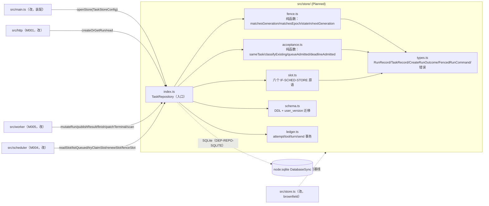
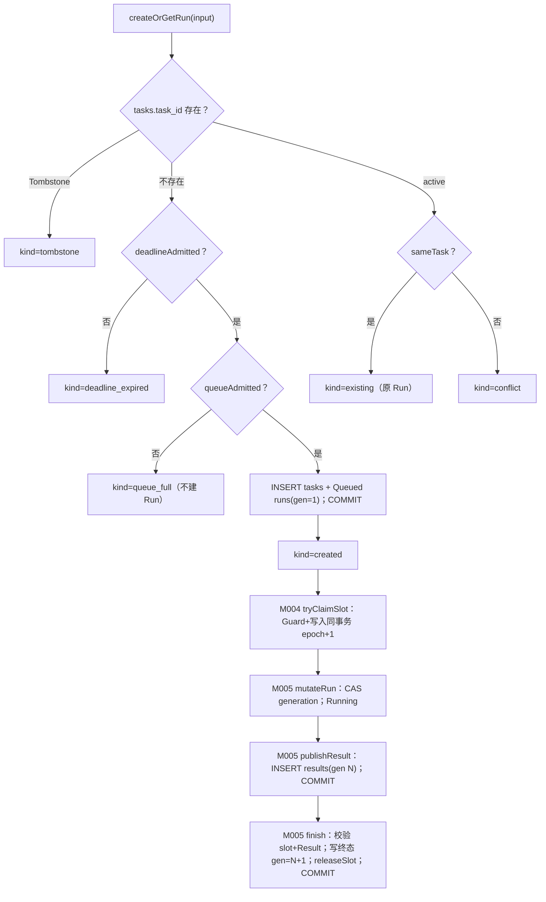

<!-- STD_DOCUMENT_COVER_BEGIN -->
# Piko 实现规格：task-repository（M003）

> STD 使用入口：[项目采用说明与标准导航](../../README.md#std-entry)

| 文档字段 | 值 |
|---|---|
| Document ID | `piko-task-repository-impl` |
| Document Version | `0.1.0-draft.1` |
| Status | `Draft` |
| Project | `piko` |
| Document Owner | Piko Implementation Owner |
| Last Modified Date | `2026-09-27` |
| Template ID | `design.implementation` |
| Template Version | `1.2.0` |

<!-- STD_DOCUMENT_COVER_END -->

## 1. 实现目标与输入基线

<a id="isd-scope"></a>

本 ISD 实现 M003 `task-repository` 的**唯一 SQLite 写者、事务边界与 schema authority**：向 M001/M005 提供 `createOrGetRun`/`mutateRun`/`publishResult`/`finish`，向 M004 提供 `IF-SCHED-STORE` 的六个 slot 原语，向 M005 提供恢复扫描/补写，向 M000 提供 `openStore`，并向 M006/M005/M008 提供 ledger/turn/send 事务。本次实现范围是 §5 的全部对外函数、§3 的文件组成、§4 的私有类型与 DDL、§7.2 的持久化与 schema 演进、以及 Brownfield 从单文件 `src/store.ts` 抽出（§2）；**非目标**是 Run 业务编排（M005/MECH-RUN）、调度策略（M004）、Pi session 内部（M006）、usage 语义（M007）、HTTP 校验（M001/M002）、崩溃恢复顺序编排（M005/MECH-RECOVERY）。模块行为、状态模型、fenced 语义与失败语义由模块设计唯一维护，本层只细化文件/symbol、SQL/事务/锁步骤、私有类型与测试入口。

### 1.1 实现对象

- **模块 ID / 名称**：`M003` / `task-repository`。

- **直属父对象 / 父设计**：`SW-P`（Piko Agent Runtime V0.3，`design_level=system`）/ `system-design` v0.11.2；`parent_document_id=system-design`（ISD 与模块设计同为 `system-design` 的子视图，不互为父子）。

- **模块设计 Document ID / 版本 / 路径 / 摘要**：`piko-task-repository` / `0.1.0-draft.1` / `docs/40_module_design/piko-task-repository-design.md`。摘要：业务事实的唯一 SQLite 写者与 schema authority；fenced write（generation + lease epoch）与 Result 两步提交；向 scheduler 暴露单执行位 slot 原语。

- **需求与 Constraint ID**：`CON-RUN-001`（PK-01）、`CON-RUN-002`（PK-02）、`CON-RUN-004`（PK-07）、`CON-REC-001`（PK-12）、`CON-ST-001`（PK-12）、`CON-CFG-001`（PK-12，边界）、`CON-CX-001`（PK-03）、`CON-MX-001`（PK-08）；机制输入 `M-RUN-DI-003`、`M-ST-DI-002`、`M-MX-DI-003`、`M-REC-DI-001`、`M-CX-DI-002`。

- **实现范围 / 非目标**：范围：`src/store/` 六个文件 + 对既有 `src/store.ts`/`src/main.ts` 的最小改动。非目标：不改 Run 业务语义、不新建第二套 schema、不实现调度/恢复编排、不新增 config key。

- **ISD 默认落位或项目批准路径**：`docs/50_implementation_design/piko-task-repository-impl.isd.md`（STD 默认路径）；代码落位 `src/store/`（Planned），当前事实 `src/store.ts`（IN_PROGRESS）。

<a id="isd-handoff"></a>

### 1.2.1 `H-REPO-CREATE` · 受理与任务身份

- **上游信息项 / 规则 ID**：`F-REPO-CREATE`、`R-REPO-IDENTITY`、`R-REPO-CAPACITY`、`IF-RUN-CREATE`、`CON-RUN-002`。

- **固定来源 / 版本 / 锚点 / 摘要**：`piko-task-repository` §2.1/§8.1/§8.2/§9.1.1（v0.1.0-draft.1）。

- **ISD 细化内容 / 章节**：§5.1.1 `TaskRepository.createOrGetRun`；§3.1 `acceptance.ts`；§6.1 `P-REPO-ACCEPT`。

- **唯一权威位置**：行为/接口权威 = 模块设计 §2.1/§9.1.1；文件/symbol/SQL 权威 = 本 ISD。

- **实现自由度**：`task_json` 比较实现、插入语句组织；不可改集合/时间/顺序口径与 tombstone 永久性。

- **原 V/Case 及本地验证位置**：`VRC-REPO-001/007`（§9.1.1/§9.1.7）。

### 1.2.2 `H-REPO-MUTATE` · fenced write

- **上游信息项 / 规则 ID**：`F-REPO-MUTATE`、`R-REPO-FENCE`、`CON-RUN-001`/`CON-CX-001`。

- **固定来源 / 版本 / 锚点 / 摘要**：`piko-task-repository` §2.2/§8.3/§9.1.2；`FencedWrite`（§6.8.1）。

- **ISD 细化内容 / 章节**：§5.1.2 `TaskRepository.mutateRun`；§3.2 `fence.ts`；§6.4 `R-REPO-FENCE`。

- **唯一权威位置**：行为 = 模块设计 §8.3/§9.1.2；CAS SQL 与 guard 实现 = 本 ISD。

- **实现自由度**：CAS 编码与索引；不可改变"旧 generation/epoch 必被拒"与终态释放同事务。

- **原 V/Case 及本地验证位置**：`VRC-REPO-004`。

### 1.2.3 `H-REPO-PUBLISH` · Result 两步提交

- **上游信息项 / 规则 ID**：`F-REPO-PUBLISH`/`F-REPO-FINISH`、`R-REPO-TWOSTEP`、`IF-RUN-PUBLISH`、`CON-RUN-004`。

- **固定来源 / 版本 / 锚点 / 摘要**：`piko-task-repository` §2.3/§2.4/§8.4/§9.1.3/§9.1.4；`piko-run.md` §6.2.1。

- **ISD 细化内容 / 章节**：§5.1.3 `publishResult`、§5.1.4 `finish`；§6.3 `P-REPO-PUBLISH`；§7.2.1。

- **唯一权威位置**：两步协议 = 模块设计 §8.4；语句与提交点 = 本 ISD。

- **实现自由度**：事务内语句组织与 sha 计算位置；不可合并两步、不可在无 Result 时写终态。

- **原 V/Case 及本地验证位置**：`VRC-REPO-002`。

### 1.2.4 `H-REPO-SLOT` · IF-SCHED-STORE

- **上游信息项 / 规则 ID**：`F-REPO-SLOT`、`R-REPO-SLOT`、`IF-SCHED-STORE`、`CON-RUN-001`；`OQ-REPO-001`。

- **固定来源 / 版本 / 锚点 / 摘要**：`piko-task-repository` §2.5/§8.5/§9.1.5–9.1.10；`piko-scheduler` §9.2.1（Proposed，逐字采纳）。

- **ISD 细化内容 / 章节**：§5.1.5–§5.1.10 六个原语；§3.3 `slot.ts`；§6.5 `P-REPO-CLAIM`。

- **唯一权威位置**：签名与语义 = 模块设计 §9.1.5–9.1.10；SQL/事务 = 本 ISD。

- **实现自由度**：SQL/索引；不可改 epoch 单调、FIFO 二级键、`(run_id,epoch)` CAS。

- **原 V/Case 及本地验证位置**：`VRC-REPO-003`（Case A–F）。

### 1.2.5 `H-REPO-LEDGER` · 台账/消息事务

- **上游信息项 / 规则 ID**：`F-REPO-LEDGER`、`CON-MX-001`、`M-MX-DI-003`、`IF-MX-TURN`。

- **固定来源 / 版本 / 锚点 / 摘要**：`piko-task-repository` §2.6/§9.1.14；`piko-matrix.md` §5.1。

- **ISD 细化内容 / 章节**：§5.1.14 ledger 事务；§3.5 `ledger.ts`；§4.2.4 记录类型。

- **唯一权威位置**：事务边界 = 模块设计 §8.3；幂等/去重实现 = 本 ISD。

- **实现自由度**：批次 SQL；不可把 dedup+turn+cursor 拆成多事务或重复计费。

- **原 V/Case 及本地验证位置**：`VRC-REPO-006`。

### 1.2.6 `H-REPO-RECOVER` · 恢复扫描与补写

- **上游信息项 / 规则 ID**：`F-REPO-RECOVER`、`CON-REC-001`、`M-REC-DI-001`、`IF-REC-SCAN`/`IF-REC-PATCH`。

- **固定来源 / 版本 / 锚点 / 摘要**：`piko-task-repository` §2.7/§9.1.11/§9.1.12；`piko-recovery.md` §5.1。

- **ISD 细化内容 / 章节**：§5.1.11 `scanNonTerminalRuns`、§5.1.12 `patchTerminal`；§6.6 `P-REPO-RECOVER`。

- **唯一权威位置**：事实来源 = 模块设计 §2.7；查询/补写实现 = 本 ISD。

- **实现自由度**：扫描索引与补写语句；不可在无 Result 时补终态或改写已发布 Result。

- **原 V/Case 及本地验证位置**：`VRC-REPO-008`。

### 1.2.7 `H-REPO-OPEN` · openStore 与 schema 迁移

- **上游信息项 / 规则 ID**：`F-REPO-OPEN`、`R-REPO-MIGRATE`、`IF-ST-STORE`、`CON-ST-001`/`CON-CFG-001`、`M-ST-DI-002`。

- **固定来源 / 版本 / 锚点 / 摘要**：`piko-task-repository` §2.8/§8.6/§9.1.13；`piko-startup.md` §5.1；当前代码事实 `src/store.ts` `migrate()`（`user_version=2`）。

- **ISD 细化内容 / 章节**：§5.1.13 `openStore`；§3.4 `schema.ts`；§7.2 全套 schema 策略与六类库状态。

- **唯一权威位置**：迁移策略 = 本 ISD §7.2；行为边界 = 模块设计 §8.6。

- **实现自由度**：DDL 组织与幂等写法；不可跳过 `user_version` 检查或降级。

- **原 V/Case 及本地验证位置**：`VRC-REPO-005`（六类库状态）。

### 1.2.8 `H-REPO-SECURITY` · 安全与可观测

- **上游信息项 / 规则 ID**：`SEC-REPO-NOSECRET`/`SEC-REPO-METRIC`；`system-design` §12/§13。

- **固定来源 / 版本 / 锚点 / 摘要**：`piko-task-repository` §11。

- **ISD 细化内容 / 章节**：§7.3.1 `SEC-REPO-NOSECRET`、§7.3.2 `SEC-REPO-METRIC`；§7.3.3 本地持久化安全。

- **唯一权威位置**：安全规则 = 模块设计 §11；日志/指标采集点 = 本 ISD。

- **实现自由度**：日志字段实现；不可记录 `task_json`/`result_json` 正文或 credential。

- **原 V/Case 及本地验证位置**：`VRC-REPO-004`（日志不含敏感字段由审查核对）。

## 2. 既有实现差异（条件章节）

### 2.1 适用性

- **适用性**：brownfield（存在需修改的既有实现）。

- **依据**：基线：当前工作树 commit（见封面 metadata `reviewed_commit` 与 §10.2 状态复核）。既有单文件 `src/store.ts`（IN_PROGRESS）已实现全部表与事务，但 schema 与业务规则耦合、slot 逻辑内联（`nextQueued`/`recoverOrphaned`/`heartbeat`），且 `createOrGet`/`finish` 直接承担受理与两步。本 ISD 把它抽出为 M003 的模块化实现，不新建 schema。

- **Tailoring / 范围决定引用**：`TAIL-P-NEW-S1`（Piko 无 subsystem，`design.definition`/`design.implementation` 直接承接 `system-design`）；范围决定 `system-design` §15 PHASE-I。

### 2.2 `CH-REPO-01` · 抽出 slot 原语

- **基线 commit / 版本**：当前工作树（§10.2 `SC-REPO-01` 记录解析出的 commit）。

- **文件 / symbol**：`src/store.ts` `nextQueued`/`recoverOrphaned`/`heartbeat`（既有）→ Planned `src/store/slot.ts` `readSlot`/`listQueued`/`tryClaimSlot`/`renewSlot`/`fenceSlot`/`releaseSlot`。

- **Current 行为**：`nextQueued` 在单事务内读 slot、取最旧 `Queued`、`epoch+1`、置 slot、`runs Queued→Running`、建/更新 `run_sessions`；`recoverOrphaned` 合并 fence 与清空；`heartbeat` 单语句 CAS；`finish` 内联 releaseSlot。

- **Target 改动与理由**：把六个原语显式化（采纳 `piko-scheduler` §9.2.1 `IF-SCHED-STORE`），`tryClaimSlot` 增加 `runs.generation+1`，`fenceSlot` 用判别结果 `{epoch} | "slot_released"` 表达两分支。理由：单 slot 不变量可独立验证（`VRC-REPO-003`），scheduler 端口合同一致（`OQ-REPO-001`）。

- **原规则 / 成员 ID**：`F-REPO-SLOT`、`IF-SCHED-STORE`、`CON-RUN-001`/`CON-REC-001`。

- **实现状态**：`IN_PROGRESS`（Current 内联，Target 抽出）。

### 2.3 `CH-REPO-02` · 抽出 fenced write 与 generation 递增

- **基线 commit / 版本**：当前工作树。

- **文件 / symbol**：`src/store.ts` `finish`/`cancel` 内联 CAS（既有）→ Planned `src/store/fence.ts` `matchesGeneration`/`matchesEpoch`/`stateIn`/`nextGeneration` + `src/store/index.ts` `mutateRun`。

- **Current 行为**：`finish` 仅按 `(run_id, lease_epoch)` 校验 slot，未显式按 `runs.generation` CAS；`cancel` 直接 `UPDATE runs`（无 generation guard）。

- **Target 改动与理由**：所有状态写入改为 `FencedRunCommand` 形式的 `generation` + `lease_epoch` CAS，命中才 `generation+1`。理由：`CON-RUN-001` 要求过期写入被确定性拒绝；把 guard 抽为纯函数以便 `VRC-REPO-004` 表驱动。

- **原规则 / 成员 ID**：`F-REPO-MUTATE`、`R-REPO-FENCE`、`CON-RUN-001`/`CON-CX-001`。

- **实现状态**：`IN_PROGRESS`。

### 2.4 `CH-REPO-03` · 抽出 Result 两步与恢复补写

- **基线 commit / 版本**：当前工作树。

- **文件 / symbol**：`src/store.ts` `insertResult`/`finish`（既有）→ Planned `src/store/index.ts` `publishResult`/`finish`/`patchTerminal`。

- **Current 行为**：`finish` 在同一声明内先 `insertResult` 再写 `runs.state` 与 release；逻辑上两步但由调用方一次触发。

- **Target 改动与理由**：显式拆为 `publishResult`（第一步事务）与 `finish`/`patchTerminal`（第二步事务），第二步要求同 generation Result 已存在。理由：`CON-RUN-004` 要求不可合并、恢复只补第二步；`VRC-REPO-002` 需可注入两步间崩溃。

- **原规则 / 成员 ID**：`F-REPO-PUBLISH`/`F-REPO-FINISH`、`R-REPO-TWOSTEP`、`IF-RUN-PUBLISH`。

- **实现状态**：`IN_PROGRESS`。

### 2.5 `CH-REPO-04` · 抽出 schema 迁移

- **基线 commit / 版本**：当前工作树。

- **文件 / symbol**：`src/store.ts` `migrate()`（既有，`src/store.ts:15`–`:33`）→ Planned `src/store/schema.ts` `migrate`/`DDL`/`detectShape`。

- **Current 行为**：构造函数内 `migrate()` 执行 `CREATE TABLE IF NOT EXISTS` + v1→v2 重建 `discussion_turns` + 加 `provider_calls.latency_ms` + `SET user_version=2`；未显式检查 `user_version` 上界。

- **Target 改动与理由**：抽出 `SchemaMigrator` 并显式分支 `user_version`（0/1/2/>2），`>2` 抛 `StoreUnavailable`；六类库状态逐一可测。理由：`CON-ST-001` 要求失败即 F1；`VRC-REPO-005` 需覆盖六类库状态。

- **原规则 / 成员 ID**：`F-REPO-OPEN`、`R-REPO-MIGRATE`、`IF-ST-STORE`。

- **实现状态**：`IN_PROGRESS`。

### 2.6 `CH-REPO-05` · 抽出 ledger/turn/send 事务

- **基线 commit / 版本**：当前工作树。

- **文件 / symbol**：`src/store.ts` `reserveModel`/`reserveTool`/`observeUsage`/`terminalModel`/`terminalTool`/`markTurn`/`ingestMatrixEvent`/`ingestMatrixBatch`/`prepareMatrixSend`（既有）→ Planned `src/store/ledger.ts`。

- **Current 行为**：方法已存在，但分散在同一 `TaskStore`，事务边界与业务混排。

- **Target 改动与理由**：抽到 `ledger.ts` 并保持各方法单事务、幂等去重。理由：`CON-MX-001` 要求 dedup+turn+cursor 同事务；`VRC-REPO-006` 可隔离测试。

- **原规则 / 成员 ID**：`F-REPO-LEDGER`、`IF-MX-TURN`、`CON-MX-001`。

- **实现状态**：`IN_PROGRESS`。

## 3. 文件、内部组件与调用关系

<a id="isd-structure"></a>



图 M003-ISD-S1 · Planned / NOT_IMPLEMENTED。实线调用；虚线跨模块适配与基线关系。`acceptance.ts`/`fence.ts` 零 SQLite import（纯函数）；`types.ts` 被全模块类型引用；当前全部逻辑存在 `src/store.ts`（IN_PROGRESS）。

### 3.1 `src/store/types.ts`

- **职责及调用者**：定义本层私有类型与错误类；被 `index.ts`/`acceptance.ts`/`fence.ts`/`slot.ts`/`ledger.ts` 引用。

- **类型 / 函数**：`RunRecord`、`TaskRecord`、`CreateRunOutcome`、`FencedRunCommand`、`MutationSpec`、`FencedPublishResult`、`ResultRecord`、`RunSessionRecord`、`SlotRow`、`SlotClaimResult`、`FenceResult`、`TaskStoreConfig`、`PikoError`、`FencedWrite`、`LeaseLost`、`SlotInvariantViolation`、`StoreUnavailable`。

- **可见性**：模块内 public（仅 `index.ts` 再导出 `TaskRepository`/`TaskStoreConfig`）。

- **调用与类型依赖**：零运行时依赖。

- **构建目标 / 生成源 / 输出**：`tsc` 编译进 `dist/store/types.js`；无生成源。

- **实现状态**：Planned（现类型散在 `src/store.ts`/`src/types.ts`）。

### 3.2 `src/store/acceptance.ts`

- **职责及调用者**：纯函数受理与身份比较；被 `index.ts` 调用。

- **类型 / 函数**：`sameTask(a, b): boolean`、`classifyExisting(identity_state, same): CreateRunOutcome["kind"]`、`queueAdmitted(queuedCount, capacity): boolean`、`deadlineAdmitted(deadline_at, now): boolean`、`initialRun(): {state: "Queued", generation: 1}`。

- **可见性**：模块内 public。

- **调用与类型依赖**：仅依赖 `types.ts` 与 `src/task-equality.ts`；**禁止 SQLite import**（§5.5 依赖方向）。

- **构建目标 / 生成源 / 输出**：`tsc` → `dist/store/acceptance.js`。

- **实现状态**：Planned（`sameTask` 已在 `src/task-equality.ts`）。

### 3.3 `src/store/fence.ts`

- **职责及调用者**：fenced write guard 纯/薄函数；被 `index.ts`/`slot.ts` 调用。

- **类型 / 函数**：`matchesGeneration(row: RunRecord, expected: number): boolean`、`matchesEpoch(slot: SlotRow | null, expected: number): boolean`、`stateIn(current, expected_in): boolean`、`nextGeneration(current: number): number`。

- **可见性**：模块内 public。

- **调用与类型依赖**：仅依赖 `types.ts`；**禁止 SQLite import**。

- **构建目标 / 生成源 / 输出**：`tsc` → `dist/store/fence.js`。

- **实现状态**：Planned。

### 3.4 `src/store/schema.ts`

- **职责及调用者**：全部 DDL 与 `user_version` 迁移；被 `index.ts`（`openStore`）调用。

- **类型 / 函数**：`migrate(db: DatabaseSync): void`、`DDL: readonly string[]`、`detectShape(db): "empty" | "v1" | "v2" | "partial" | "unknown"`、`assertIntegrity(db): void`。

- **可见性**：模块内 public。

- **依赖 / 协作**：依赖 `node:sqlite`；被 `index.ts` 独占调用。

- **构建目标 / 生成源 / 输出**：`tsc` → `dist/store/schema.js`。

- **实现状态**：Planned（现逻辑在 `src/store.ts` `migrate()`）。

### 3.5 `src/store/ledger.ts`

- **职责及调用者**：attempt/tool/turn/send 事务与幂等去重；被 `index.ts` 调用。

- **类型 / 函数**：`reserveModel`、`observeUsage`、`terminalModel`、`reserveTool`、`terminalTool`、`markTurn`、`ingestTurn`、`ingestMatrixEvent`、`ingestMatrixBatch`、`prepareMatrixSend`、`markDiscussionAccessLost`、`recordProviderCall`。

- **可见性**：模块内 public（经 `index.ts` 暴露给 M006/M005/M008）。

- **依赖 / 协作**：依赖 `node:sqlite` 与 `types.ts`。

- **构建目标 / 生成源 / 输出**：`tsc` → `dist/store/ledger.js`。

- **实现状态**：Planned（现逻辑在 `src/store.ts`）。

### 3.6 `src/store/index.ts`

- **职责及调用者**：入口 `TaskRepository`：实现 §5 全部函数、保证 §4.6 不变量、编排内部单元；被 `src/main.ts` 装配、被 M001/M004/M005/M006/M008 调用。

- **类型 / 函数**：`class TaskRepository`：`createOrGetRun`/`mutateRun`/`publishResult`/`finish`/`patchTerminal`/`scanNonTerminalRuns`/`readSlot`/`listQueued`/`tryClaimSlot`/`renewSlot`/`fenceSlot`/`releaseSlot`/`openStore` + ledger 方法 + 私有 `tx<T>(fn)`。

- **可见性**：public。

- **调用与类型依赖**：依赖 `acceptance.ts`/`fence.ts`/`slot.ts`/`schema.ts`/`ledger.ts`/`types.ts`；运行时依赖 `node:sqlite`。

- **构建目标 / 生成源 / 输出**：`tsc` → `dist/store/index.js`。

- **实现状态**：Planned（现为单文件 `src/store.ts` `TaskStore`，IN_PROGRESS）。

### 3.7 `src/store.ts`（修改既有）

- **职责及调用者**：既有单文件实现；Target 收敛为 `TaskRepository` 的兼容层或删除，保留 `PRAGMA`/DDL 常量迁移到 `schema.ts`。被 `src/main.ts` 与既有测试引用。

- **类型 / 函数**：`TaskStore`（现导出）；过渡期保留 `createOrGet`/`getRun`/`finish` 等入口并转发。

- **可见性**：public（同级模块）。

- **调用与类型依赖**：依赖 `node:sqlite`；无新 schema。

- **构建目标 / 生成源 / 输出**：`tsc` → `dist/store.js`。

- **实现状态**：`IN_PROGRESS`。

### 3.8 `src/main.ts`（修改既有）

- **职责及调用者**：装配：`openStore(cfg)` → `new TaskRepository(store, cfg)` → 注入 M004/M005/M001/M008。

- **类型 / 函数**：`main()` 内新增装配行。

- **可见性**：public（入口）。

- **调用与类型依赖**：依赖 `store/index.ts`/`scheduler`/`worker`/`config.ts`。

- **构建目标 / 生成源 / 输出**：`tsx src/main.ts`；`tsc` 类型检查。

- **实现状态**：`IN_PROGRESS`。

## 4. 数据结构设计

<a id="isd-data"></a>

**不适用类别**：§4.4 通信报文、§4.5 设备/FPGA 表项为 N/A（本层无跨边界消息与硬件；`TAIL-P-102`/`TAIL-P-103`）。§4.1 只用字面量联合与共享枚举，不新增 Data ID。

### 4.1 公共基础类型与枚举

#### 4.1.1 `RunState` / `DiscussionIntakeState` / `TurnStatus`

- **代码式声明、Data/Type ID 与唯一来源**：

  ```ts
  type RunState = "Queued" | "Running" | "Cancelling" | "Completed" | "Failed" | "Cancelled";
  type DiscussionIntakeState = "Disabled" | "Open" | "Closing" | "Closed";
  type TurnStatus = "Pending" | "QueuedInPi" | "Consumed" | "Abandoned";
  ```

  来源：`system-design` §7.1 与 `interfaces/schemas/agent-runtime-v0.3.schema.json` `$defs.RunState`；本模块为持久化唯一写者。

- **逐值定义、范围和未知值行为**：`RunState` 单调向终态；未知值由 DB CHECK 拒绝。`DiscussionIntakeState` 非 discussion 恒 `Disabled`。`TurnStatus` 仅按 §4.2.4 转换推进。

- **代码类型/symbol、转换点与失败映射**：定义于 `src/store/types.ts`；非法转换由 SQL CHECK 或 guard 拒绝，映射为 `FencedWrite`。

- **创建/修改者、所有权、寿命与敏感性**：本模块写、调用方决定；寿命 = Run 寿命；非敏感。

- **合法及拒绝实例、V/Case 与证据状态**：合法 `Queued→Running→Completed`；拒绝 `Completed→Running`。`VRC-REPO-004`；`NOT_RUN`。

### 4.2 业务与操作数据结构

#### 4.2.1 `TaskRecord` / `RunRecord`

- **代码式声明、Data/Type ID 与固定来源**：

  ```ts
  interface TaskRecord {
    task_id: string; run_id: string; owner_principal: string;
    identity_state: "Active" | "Tombstone";
    task_json: string | null; accepted_at: string; purge_after: string;
  }
  interface RunRecord {
    run_id: string; state: RunState; generation: number;
    cancel_requested: 0 | 1; discussion_intake_state: DiscussionIntakeState;
    accepted_at: string; started_at: string | null; finished_at: string | null;
    deadline_at: string; max_model_calls: number; max_tool_calls: number;
    model_calls: number; tool_calls: number; last_activity_at: string | null;
  }
  ```

  来源：模块设计 §6.2.1；DDL 见 §4.7.1。

- **逐字段定义、条件有效性和跨字段不变量**：`identity_state='Tombstone' ⟺ task_json IS NULL`；`run_id` UNIQUE；`generation>=1`；终态 ⟹ `finished_at` 非空；`Completed ⟹ cancel_requested=0`；`Cancelled ⟹ cancel_requested=1`。

- **代码文件/symbol、编码或投影函数**：`src/store/types.ts`；行到对象的投影由 SQLite 返回列直接构造（下划线命名，无需转换）。

- **创建、借用、修改、释放与失败出口**：由 `createOrGetRun`/`mutateRun` 产生与修改；调用借用；寿命 = Run + retention；非法写 `FencedWrite`。

- **合法及拒绝实例、V/Case 与证据状态**：合法 `{state:"Queued",generation:1,cancel_requested:0}`；拒绝 `{state:"Completed",cancel_requested:1}`。`VRC-REPO-001/004`；`NOT_RUN`。

#### 4.2.2 `CreateRunOutcome` / `FencedRunCommand` / `FencedPublishResult`

- **代码式声明、Data/Type ID 与固定来源**：

  ```ts
  type CreateRunKind = "created" | "existing" | "conflict" | "tombstone" | "deadline_expired" | "queue_full";
  interface CreateRunOutcome { kind: CreateRunKind; run_id?: string; generation?: number; state?: RunState }
  type MutationSpec = "bump_generation" | "request_cancel" | "set_intake" | "terminal";
  interface FencedRunCommand {
    run_id: string; expected_generation: number; expected_state_in: RunState[];
    expected_lease_epoch?: number; mutation: MutationSpec;
  }
  interface FencedPublishResult { run_id: string; generation: number; result_json: string; result_sha256: string }
  ```

  来源：模块设计 §6.2.2；`piko-run.md` §4.4.2。

- **逐字段定义、条件有效性和跨字段不变量**：`expected_lease_epoch` 在 Running/Cancelling 必填；`generation` = 发布时 `runs.generation+1`；`result_sha256` = SHA256(`result_json`)。

- **代码文件/symbol、编码或投影函数**：`src/store/types.ts`；无编码转换。

- **创建、借用、修改、释放与失败出口**：调用方构造、本模块消费；值对象；寿命 = 单次调用；不一致 → `FencedWrite`/`conflict`。

- **合法及拒绝实例、V/Case 与证据状态**：合法 `expected_generation:1` 命中；拒绝落后 generation。`VRC-REPO-004`；`NOT_RUN`。

#### 4.2.3 `ResultRecord` / `RunSessionRecord` / `SlotRow`

- **代码式声明、Data/Type ID 与固定来源**：

  ```ts
  interface ResultRecord { run_id: string; generation: number; result_json: string; result_sha256: string; published_at: string }
  interface RunSessionRecord { run_id: string; pi_session_id: string; lane_name: "main";
    active_operation_id: string | null; last_operation_id: string | null;
    observed_tip_id: string | null; lease_epoch: number }
  interface SlotRow { run_id: string | null; owner_id: string | null; boot_id: string | null;
    lease_epoch: number; heartbeat_at: string | null }
  ```

  来源：模块设计 §6.2.3/§6.6.1；DDL §4.7.1。

- **逐字段定义、条件有效性和跨字段不变量**：`pi_session_id = run_id`；`lease_epoch>=1`；`SlotRow.run_id` 空 ⟺ 其余三字段空；`run_sessions.lease_epoch == execution_slot.lease_epoch`（`INV-REPO-4`）。

- **代码文件/symbol、编码或投影函数**：`src/store/types.ts`；`readSlot` 投影。

- **创建、借用、修改、释放与失败出口**：`ResultRecord` 由 `publishResult` 产生、`finish` 只读；`RunSessionRecord`/`SlotRow` 由 slot 原语写/读。

- **合法及拒绝实例、V/Case 与证据状态**：合法 `SlotRow{run_id:null,...}`；拒绝 `run_id` 非空而 `owner_id` 空。`VRC-REPO-002/003`；`NOT_RUN`。

#### 4.2.4 ledger 记录类型

- **代码式声明、Data/Type ID 与固定来源**：

  ```ts
  interface ModelAttemptRecord { run_id: string; operation_id: string; step_id: string; attempt: number;
    state: "Reserved"|"Started"|"UsageObserved"|"Terminal"|"Unknown"; raw_usage_json: string | null;
    record_version: number; updated_at: string }
  interface ToolCallRecord { run_id: string; operation_id: string; tool_call_id: string; tool_name: string;
    effect: string; replay: "never"|"safe"; recovery_contract_ref: string | null;
    state: "Reserved"|"Started"|"Terminal"|"Unknown"; recovery_count: number; updated_at: string }
  interface DiscussionTurn { run_id: string; event_id: string; turn_seq: number; status: TurnStatus;
    visible_content: string; pi_entry_id: string | null; pi_operation_id: string | null }
  interface MatrixSendRecord { txn_id: string; run_id: string; turn_seq: number | null;
    payload_sha256: string; event_id: string | null; state: "Pending"|"Sent"|"Unknown" }
  ```

  来源：模块设计 §6.2.4；`piko-usage.md`/`piko-matrix.md` §4。

- **逐字段定义、条件有效性和跨字段不变量**：主键见 §4.7.2/§4.7.3；`record_version` 单调；`replay='never'` 的重放被拒；同 `txn_id` payload 不可变。

- **代码文件/symbol、编码或投影函数**：`src/store/types.ts` + `src/store/ledger.ts`。

- **创建、借用、修改、释放与失败出口**：由 M006/M005/M008 决定、本模块写；寿命 = Run + retention。

- **合法及拒绝实例、V/Case 与证据状态**：合法重复 reserve 幂等；拒绝超预算。`VRC-REPO-006`；`NOT_RUN`。

### 4.3 配置与规则数据结构

#### 4.3.1 `TaskStoreConfig`

- **代码式声明、Data/Type ID 与配置 authority**：

  ```ts
  interface TaskStoreConfig {
    sqlite_path: string;      // 绝对路径
    busy_timeout_ms: number;  // 100..60000
    queue_capacity: number;   // >=1
    retention_days: number;   // >=7
  }
  ```

  authority = `interfaces/schemas/piko-runtime-config-v0.3.schema.json`（`task_store`/`queue`/`retention`）；本模块只消费。

- **逐字段定义、默认值、跨字段校验与拒绝**：见注释范围；无默认值（必填由 schema 保证）；非法由 S2 schema 校验拒绝。

- **读取/校验/应用 symbol 与生效点**：由 M000 构造注入 `openStore(cfg)`；启动时生效，进程内不变（`CON-CFG-001`）。

- **快照、所有权、寿命与敏感性**：调用方持有、传入借用；寿命 = 进程；不含敏感值（credential 不入本结构）。

- **合法及拒绝实例、V/Case 与证据状态**：合法 `busy_timeout_ms:5000`；拒绝 `0`。`VRC-REPO-005/007`；`NOT_RUN`。

### 4.4 通信报文结构（适用时）

**N/A。** 本层无跨执行边界报文（全部为进程内函数调用）。依据：ISD 规范 §3，不为满足模板虚构报文。

### 4.5 设备与 FPGA 表项结构（适用时）

**N/A** · 纯软件（`TAIL-P-103`）。

### 4.6 运行状态数据结构

#### 4.6.1 `ExecutionSlot`（私有投影 + 持久 authority）

- **代码式声明、Data/Type ID 与固定来源**：`SlotRow`（§4.2.3）是 `execution_slot` 行投影；持久 authority = `execution_slot` 表；状态模型来源 = 模块设计 §6.6 `T-REPO-01..06`。

- **逐字段定义、状态不变量与转移条件**：`run_id=null → FREE`；`run_id!==null && boot_id===currentBoot → HELD_LIVE`；否则 `HELD_STALE`。不变量 `INV-REPO-1..5`。

- **创建/更新/读取 symbol、同步与提交点**：`readSlot`/`tryClaimSlot`/`renewSlot`/`fenceSlot`/`releaseSlot`（`src/store/slot.ts`）；提交点为 `BEGIN IMMEDIATE` COMMIT。

- **唯一写者、借用、失效及恢复入口**：唯一写者 = `slot.ts`（经 `index.ts`）；失效 = boot 变化/终态释放；恢复入口 = `fenceSlot`。

- **合法及拒绝转移、V/Case 与证据状态**：合法 `FREE→HELD_LIVE→FREE`；拒绝两个 boot 同时 `HELD_LIVE`。`VRC-REPO-003`；`NOT_RUN`。

#### 4.6.2 `RunGeneration`

- **代码式声明、Data/Type ID 与固定来源**：`runs.generation`（§4.2.1）；来源 `piko-run.md` §4.1.2。

- **逐字段定义、状态不变量与转移条件**：`>=1`；每次 fenced write `+1`；失败不写。

- **创建/更新/读取 symbol、同步与提交点**：`fence.ts` `nextGeneration` + `index.ts` 事务；与 mutation 同提交。

- **唯一写者、借用、失效及恢复入口**：本模块写；失效 = CAS 不匹配；恢复入口 = 读最新值重新决定。

- **合法及拒绝转移、V/Case 与证据状态**：未见 §8.3；`VRC-REPO-004`；`NOT_RUN`。

### 4.7 数据库表结构

#### 4.7.1 `tasks` / `runs` / `run_sessions` / `execution_slot`

- **DDL/表声明、Data/Type ID 与 schema authority**：authority = 本模块（`src/store/schema.ts`）；当前版本事实 = `src/store.ts` `migrate()`，`PRAGMA user_version=2`。

  ```sql
  CREATE TABLE IF NOT EXISTS tasks(task_id TEXT PRIMARY KEY, run_id TEXT NOT NULL UNIQUE,
    owner_principal TEXT NOT NULL, identity_state TEXT NOT NULL CHECK(identity_state IN ('Active','Tombstone')),
    task_json TEXT, accepted_at TEXT NOT NULL, purge_after TEXT NOT NULL,
    CHECK((identity_state='Active' AND task_json IS NOT NULL) OR (identity_state='Tombstone' AND task_json IS NULL))) STRICT;
  CREATE TABLE IF NOT EXISTS runs(run_id TEXT PRIMARY KEY REFERENCES tasks(run_id),
    state TEXT NOT NULL CHECK(state IN ('Queued','Running','Cancelling','Completed','Failed','Cancelled')),
    generation INTEGER NOT NULL CHECK(generation>=1), cancel_requested INTEGER NOT NULL DEFAULT 0 CHECK(cancel_requested IN(0,1)),
    discussion_intake_state TEXT NOT NULL CHECK(discussion_intake_state IN('Disabled','Open','Closing','Closed')),
    accepted_at TEXT NOT NULL, started_at TEXT, finished_at TEXT, deadline_at TEXT NOT NULL,
    max_model_calls INTEGER NOT NULL, max_tool_calls INTEGER NOT NULL,
    model_calls INTEGER NOT NULL DEFAULT 0, tool_calls INTEGER NOT NULL DEFAULT 0, last_activity_at TEXT) STRICT;
  CREATE TABLE IF NOT EXISTS run_sessions(run_id TEXT PRIMARY KEY REFERENCES runs(run_id),
    pi_session_id TEXT NOT NULL UNIQUE, lane_name TEXT NOT NULL CHECK(lane_name='main'),
    active_operation_id TEXT, last_operation_id TEXT, observed_tip_id TEXT,
    lease_epoch INTEGER NOT NULL CHECK(lease_epoch>=1)) STRICT;
  CREATE TABLE IF NOT EXISTS execution_slot(slot_id INTEGER PRIMARY KEY CHECK(slot_id=1),
    run_id TEXT REFERENCES runs(run_id), owner_id TEXT, boot_id TEXT, lease_epoch INTEGER NOT NULL, heartbeat_at TEXT) STRICT;
  INSERT OR IGNORE INTO execution_slot(slot_id,lease_epoch) VALUES(1,0);
  ```

- **逐列、主外键、索引及跨列约束**：见 DDL；`tasks(task_id)`/`tasks(run_id)`/`runs(run_id)` 主键；`run_sessions.pi_session_id` UNIQUE；`execution_slot` 单行 `slot_id=1`。

- **读写/迁移 symbol、事务边界与提交点**：`tx()` 包裹 `BEGIN IMMEDIATE`；`tryClaimSlot` 同事务写 slot + `runs Running` + `generation+1` + `run_sessions`。

- **保留、删除、版本转换及失败恢复**：retention 见 §7.2；版本转换见 §7.2.2。

- **合法及拒绝行、V/Case 与证据状态**：合法 `execution_slot(1,NULL,NULL,NULL,0,NULL)`；拒绝 `state='Bogus'`。`VRC-REPO-001/003/005`；`NOT_RUN`。

#### 4.7.2 `results` / `model_attempts` / `tool_calls` / `audit_events` / `instance_meta`

- **DDL/表声明、Data/Type ID 与 schema authority**：authority = 本模块。

  ```sql
  CREATE TABLE IF NOT EXISTS results(run_id TEXT PRIMARY KEY REFERENCES runs(run_id), generation INTEGER NOT NULL,
    result_json TEXT NOT NULL, result_sha256 TEXT NOT NULL, published_at TEXT NOT NULL, UNIQUE(run_id,generation)) STRICT;
  CREATE TABLE IF NOT EXISTS model_attempts(run_id TEXT NOT NULL REFERENCES runs(run_id), operation_id TEXT NOT NULL,
    step_id TEXT NOT NULL, attempt INTEGER NOT NULL, state TEXT NOT NULL CHECK(state IN('Reserved','Started','UsageObserved','Terminal','Unknown')),
    raw_usage_json TEXT, record_version INTEGER NOT NULL, updated_at TEXT NOT NULL,
    PRIMARY KEY(run_id,operation_id,step_id,attempt)) STRICT;
  CREATE TABLE IF NOT EXISTS tool_calls(run_id TEXT NOT NULL REFERENCES runs(run_id), operation_id TEXT NOT NULL,
    tool_call_id TEXT NOT NULL, tool_name TEXT NOT NULL, effect TEXT NOT NULL, replay TEXT NOT NULL CHECK(replay IN('never','safe')),
    recovery_contract_ref TEXT, state TEXT NOT NULL CHECK(state IN('Reserved','Started','Terminal','Unknown')),
    recovery_count INTEGER NOT NULL DEFAULT 0, updated_at TEXT NOT NULL, PRIMARY KEY(run_id,operation_id,tool_call_id)) STRICT;
  CREATE TABLE IF NOT EXISTS audit_events(audit_id INTEGER PRIMARY KEY AUTOINCREMENT, event_name TEXT NOT NULL,
    actor_class TEXT NOT NULL, run_id TEXT, detail_json TEXT NOT NULL, occurred_at TEXT NOT NULL) STRICT;
  CREATE TABLE IF NOT EXISTS instance_meta(key TEXT PRIMARY KEY, value_json TEXT NOT NULL) STRICT;
  ```

- **逐列、主外键、索引及跨列约束**：见 DDL；`results UNIQUE(run_id,generation)`；`model_attempts`/`tool_calls` 复合主键。

- **读写/迁移 symbol、事务边界与提交点**：`publishResult` 单事务写 `results`；`ledger.ts` 写 attempt/tool；`openStore` 写 `instance_meta`。

- **保留、删除、版本转换及失败恢复**：见 §7.2。

- **合法及拒绝行、V/Case 与证据状态**：合法 `results(run-1,2,...)`；拒绝同 generation 不同 sha。`VRC-REPO-002/006`；`NOT_RUN`。

#### 4.7.3 `matrix_state` / `matrix_events` / `discussion_turns` / `matrix_sends` / `discussion_access_loss` / `provider_calls`

- **DDL/表声明、Data/Type ID 与 schema authority**：authority = 本模块。

  ```sql
  CREATE TABLE IF NOT EXISTS matrix_state(singleton INTEGER PRIMARY KEY CHECK(singleton=1), sync_cursor TEXT, membership_version INTEGER NOT NULL) STRICT;
  INSERT OR IGNORE INTO matrix_state VALUES(1,NULL,0);
  CREATE TABLE IF NOT EXISTS matrix_events(room_id TEXT NOT NULL, event_id TEXT NOT NULL, sender TEXT NOT NULL,
    txn_id TEXT, observed_at TEXT NOT NULL, PRIMARY KEY(room_id,event_id)) STRICT;
  CREATE TABLE IF NOT EXISTS discussion_turns(run_id TEXT NOT NULL REFERENCES runs(run_id), event_id TEXT NOT NULL,
    turn_seq INTEGER NOT NULL, status TEXT NOT NULL CHECK(status IN('Pending','QueuedInPi','Consumed','Abandoned')),
    visible_content TEXT NOT NULL, pi_entry_id TEXT, pi_operation_id TEXT, PRIMARY KEY(run_id,event_id), UNIQUE(run_id,turn_seq)) STRICT;
  CREATE TABLE IF NOT EXISTS matrix_sends(txn_id TEXT PRIMARY KEY, run_id TEXT NOT NULL REFERENCES runs(run_id),
    turn_seq INTEGER, payload_sha256 TEXT NOT NULL, event_id TEXT, state TEXT NOT NULL CHECK(state IN('Pending','Sent','Unknown'))) STRICT;
  CREATE TABLE IF NOT EXISTS discussion_access_loss(run_id TEXT PRIMARY KEY REFERENCES runs(run_id),
    room_id TEXT NOT NULL, detected_at TEXT NOT NULL) STRICT;
  CREATE TABLE IF NOT EXISTS provider_calls(run_id TEXT NOT NULL REFERENCES runs(run_id), operation_id TEXT NOT NULL,
    ts TEXT NOT NULL, status INTEGER, request_id TEXT, note TEXT) STRICT;
  ```

  当前代码事实在 `src/store.ts:25`–`:32`；v2 使 `discussion_turns.status` 含 `Abandoned`、`provider_calls` 含 `latency_ms`。

- **逐列、主外键、索引及跨列约束**：见 DDL；`matrix_events(room_id,event_id)` 去重键；`discussion_turns UNIQUE(run_id,turn_seq)`。

- **读写/迁移 symbol、事务边界与提交点**：`ledger.ts` `ingestMatrixEvent`/`ingestMatrixBatch`/`prepareMatrixSend` 单事务。

- **保留、删除、版本转换及失败恢复**：见 §7.2。

- **合法及拒绝行、V/Case 与证据状态**：合法重复 event 不产生重复 turn；拒绝 `turn_seq` 冲突。`VRC-REPO-006`；`NOT_RUN`。

### 4.8 错误码与错误结构

#### 4.8.1 `PikoError` 与内部错误类

- **错误声明、Error/Data ID 与唯一来源**：

  ```ts
  class PikoError extends Error { constructor(readonly code: string, readonly http_status: number, message: string) }
  class FencedWrite extends Error { readonly run_id: string; readonly expected_generation: number; readonly actual_generation: number }
  class LeaseLost extends Error { readonly run_id: string; readonly epoch: number }
  class SlotInvariantViolation extends Error { readonly invariant_id: string }
  class StoreUnavailable extends Error { readonly stage: string; readonly cause_class: string }
  ```

  公共码来源：`interfaces/error-codes/error-blocker-catalog-v0.3.json`。

- **逐字段和逐码含义、触发事实及优先级**：`PikoError` 携带 catalog code/status；`FencedWrite` 触发 = CAS 0 行；`LeaseLost` 触发 = `finish` slot 不匹配；`SlotInvariantViolation` 触发 = slot/lease 不一致；`StoreUnavailable` 触发 = open/migrate 失败。

- **抛出/捕获/转换 symbol 与 public payload**：`index.ts` 抛 `PikoError`（交 M001）、抛内部类（交 M005/M000）；`slot.ts` 抛 `SlotInvariantViolation`。

- **状态、副作用、可重试条件与敏感信息处理**：均无 DB 副作用；`FencedWrite`/`LeaseLost` 不可原样重试；异常 message 不含 `task_json`/credential。

- **触发向量、V/Case 与证据状态**：`VRC-REPO-001/002/003/004`；`NOT_RUN`。

## 5. 接口设计

<a id="isd-functions"></a>

task-repository 的对外接口是 §5.1 的进程内函数；被消费的接口是 SQLite（§4.7）。消息/硬件/人机接口（§5.2–5.4）为 N/A。

### 5.1 API（适用时）

#### 5.1.1 `TaskRepository.createOrGetRun(input: ValidatedTaskSubmission): CreateRunOutcome`

- **Interface/Member ID、用途**：`IF-RUN-CREATE`；受理与任务身份比较。

- **文件 / symbol / 可见性**：Planned `src/store/index.ts` `TaskRepository.createOrGetRun`；public（经 `index.ts`）。

- **原成员 ID 或私有来源**：继承 `piko-run` §5.1 `IF-RUN-CREATE`。

- **完整签名与 caller**：`createOrGetRun(input: ValidatedTaskSubmission): CreateRunOutcome`；caller = M001 `POST /runs` handler（事件循环）。

- **固定契约与版本**：模块设计 §9.1.1（`piko-task-repository` v0.1.0-draft.1）。

- **输入参数 / 数据结构 authority**：`ValidatedTaskSubmission`（`system-design` §7.2 / M002 ISD）；`TaskStoreConfig.queue_capacity`。

- **输入约束 / 校验顺序 / 失败映射**：M002 已校验；本层顺序 = 查 `tasks` → `classifyExisting` → `deadlineAdmitted` → `queueAdmitted` → 插入。失败以 `kind` 表达（非异常）。

- **成功输出 / 数据结构 / 后置条件**：`CreateRunOutcome`（§4.2.2）；`created` 后 `tasks`/`runs` 各 1 行、`state=Queued`、`generation=1` 已提交。

- **错误输出 / 触发条件 / 优先级**：`conflict`/`tombstone`/`deadline_expired`/`queue_full`（顺序：tombstone > conflict > deadline > capacity）；依赖错误上抛。

- **底层异常 / 失败事实**：`SQLITE_BUSY`/`SQLITE_IOERR`/`SQLITE_FULL`。

- **模块是否处理及处理函数**：`index.ts` 把六类判定转 `kind`；依赖错误 propagate。

- **Typed 异常与原生异常所有权**：原生属 SQLite/M003；本层不改类型。

- **宿主 / public payload 或状态码**：返回 `CreateRunOutcome`；无 HTTP。

- **日志级别 / 脱敏 / 关联字段**：`info`（`kind`/`run_id`）；不记 `task_json` 正文。

- **是否可重试及前提**：`existing` 即同请求重放（返回原 Run，不新增执行）；`conflict`/`tombstone` 不可重试；`queue_full`/`deadline_expired` 须换新 `task_id`。

- **状态与副作用影响 / 验证项**：副作用 = 写 `tasks`/`runs`/可选 turn（单事务）；`VRC-REPO-001/007`。

- **不可改变的规则 / Constraint ID**：`R-REPO-IDENTITY`/`R-REPO-CAPACITY`；`CON-RUN-002`；tombstone 永久。

- **实现自由度**：比较实现与插入语句；不可改口径。

- **副作用 / 执行上下文 / 幂等性**：有副作用；单 `BEGIN IMMEDIATE`；`existing` 分支幂等，`created` 非幂等（每次新 ID 新行）。

- **输入输出 ownership 与寿命**：输入借用；输出值对象。

- **Thread-safe / reentrant**：conditional（单线程；SQLite 单 writer 串行）。

- **Nested-call policy**：allowed：仅 `acceptance.ts` 纯函数。

- **Transaction participation**：owner：单 `BEGIN IMMEDIATE`。

- **Blocking / timeout / cancellation**：阻塞；受 `busy_timeout_ms`；无取消。

- **实现状态 / 验证项**：Planned / `VRC-REPO-001/007`。

- **装配、合法及拒绝实例**：装配 §3.8。合法：新 `task_id` → `created`。拒绝：tombstone 键 → `tombstone`。Oracle = 直读 `tasks`/`runs`（§9.1.1）。`NOT_RUN`。

#### 5.1.2 `TaskRepository.mutateRun(command: FencedRunCommand): RunRecord | FencedWrite`

- **Interface/Member ID、用途**：`IF-REPO-MUTATE`；fenced 状态/代次/取消写入。

- **文件 / symbol / 可见性**：Planned `src/store/index.ts` `TaskRepository.mutateRun`；public。

- **原成员 ID 或私有来源**：`system-design` §3.2 `mutateRun`；机制 `FencedRunCommand`（`piko-run.md` §4.4.2）。

- **完整签名与 caller**：`mutateRun(command): RunRecord | FencedWrite`；caller = M005 `worker`。

- **固定契约与版本**：模块设计 §9.1.2。

- **输入参数 / 数据结构 authority**：`FencedRunCommand`（§4.2.2）。

- **输入约束 / 校验顺序 / 失败映射**：顺序 = 读 `runs` → `matchesGeneration`/`matchesEpoch`/`stateIn` → 应用 mutation；未命中 → `FencedWrite`。

- **成功输出 / 数据结构 / 后置条件**：新 `RunRecord`，`generation+1`；`terminal` 同事务 `releaseSlot`。

- **错误输出 / 触发条件 / 优先级**：`FencedWrite`（guard 未命中，0 行）；终态回退拒绝；依赖错误上抛。

- **底层异常 / 失败事实**：`SQLITE_BUSY`/`SQLITE_IOERR`。

- **模块是否处理及处理函数**：`index.ts` 把 CAS 结果转 `FencedWrite`；依赖 propagate。

- **Typed 异常与原生异常所有权**：`FencedWrite` 本模块抛；原生属 SQLite。

- **宿主 / public payload 或状态码**：`RunRecord | FencedWrite`。

- **日志级别 / 脱敏 / 关联字段**：`info`（`run_id`/`generation`/mutation）；`warn`（`FencedWrite`）。

- **是否可重试及前提**：`FencedWrite` 不原样重试（须读最新事实重新决定）；依赖错误由调用方决定。

- **状态与副作用影响 / 验证项**：副作用 = `runs`（+ `execution_slot` 终态）写；`VRC-REPO-004`。

- **不可改变的规则 / Constraint ID**：`R-REPO-FENCE`；`CON-RUN-001`/`CON-CX-001`。

- **实现自由度**：CAS/索引实现。

- **副作用 / 执行上下文 / 幂等性**：有副作用；非幂等（每次 +1 generation）。

- **输入输出 ownership 与寿命**：输入借用；输出值对象。

- **Thread-safe / reentrant**：conditional（单 writer）。

- **Nested-call policy**：allowed：`fence.ts` 纯函数 + `slot.ts` releaseSlot。

- **Transaction participation**：owner：单 `BEGIN IMMEDIATE`。

- **Blocking / timeout / cancellation**：阻塞；受 `busy_timeout_ms`。

- **实现状态 / 验证项**：Planned / `VRC-REPO-004`。

- **装配、合法及拒绝实例**：合法当前 generation 命中；拒绝旧 generation。`NOT_RUN`。

#### 5.1.3 `TaskRepository.publishResult(command: FencedPublishResult): ResultRecord`

- **Interface/Member ID、用途**：`IF-RUN-PUBLISH`；Result 第一步。

- **文件 / symbol / 可见性**：Planned `src/store/index.ts` `TaskRepository.publishResult`；public。

- **原成员 ID 或私有来源**：`piko-run` §5.1 `IF-RUN-PUBLISH`。

- **完整签名与 caller**：`publishResult(command): ResultRecord`；caller = M005 `worker`。

- **固定契约与版本**：模块设计 §9.1.3。

- **输入参数 / 数据结构 authority**：`FencedPublishResult`（§4.2.2）。

- **输入约束 / 校验顺序 / 失败映射**：`INSERT` `(run_id,generation)`；冲突检查（同内容幂等 / 不同 sha 拒绝）。

- **成功输出 / 数据结构 / 后置条件**：`ResultRecord`；内容冻结；`runs.state` 不变。

- **错误输出 / 触发条件 / 优先级**：`ResultConflict`（同 generation 不同 sha）；依赖错误上抛。

- **底层异常 / 失败事实**：`SQLITE_CONSTRAINT`/`SQLITE_BUSY`。

- **模块是否处理及处理函数**：`index.ts` 检测 UNIQUE 冲突并区分幂等/拒绝。

- **Typed 异常与原生异常所有权**：本模块抛 `ResultConflict`；原生属 SQLite。

- **宿主 / public payload 或状态码**：`ResultRecord`。

- **日志级别 / 脱敏 / 关联字段**：`info`（`run_id`/`generation`）；不记 `result_json` 正文。

- **是否可重试及前提**：同内容幂等可重发；不同 sha 不可重试。

- **状态与副作用影响 / 验证项**：副作用 = `results` 单行；`VRC-REPO-002`。

- **不可改变的规则 / Constraint ID**：`R-REPO-TWOSTEP`；`CON-RUN-004`。

- **实现自由度**：语句组织与 sha 校验位置。

- **副作用 / 执行上下文 / 幂等性**：有副作用；同 generation 同内容幂等。

- **输入输出 ownership 与寿命**：输入借用；输出值对象。

- **Thread-safe / reentrant**：conditional。

- **Nested-call policy**：forbidden（不回调 M005）。

- **Transaction participation**：owner：单 `BEGIN IMMEDIATE`。

- **Blocking / timeout / cancellation**：阻塞。

- **实现状态 / 验证项**：Planned / `VRC-REPO-002`。

- **装配、合法及拒绝实例**：合法发表 gen N；拒绝同 N 不同 sha。`NOT_RUN`。

#### 5.1.4 `TaskRepository.finish(result: AgentResult, epoch: number): RunRecord`

- **Interface/Member ID、用途**：`IF-REPO-FINISH`；Result 第二步 + 终态释放。

- **文件 / symbol / 可见性**：Planned `src/store/index.ts` `TaskRepository.finish`；public。

- **原成员 ID 或私有来源**：`piko-scheduler` §6.6 引用的 M003 `finish`。

- **完整签名与 caller**：`finish(result: AgentResult, epoch: number): RunRecord`；caller = M005 `worker`（第二步）。

- **固定契约与版本**：模块设计 §9.1.4。

- **输入参数 / 数据结构 authority**：`AgentResult`（contract §3）；`epoch` 来自当前 `Lease`。

- **输入约束 / 校验顺序 / 失败映射**：顺序 = 校验 slot `(run_id,epoch)` → 校验同 generation Result 存在 → 写终态 + `generation+1` + `releaseSlot`；slot 不匹配 → `LeaseLost`。

- **成功输出 / 数据结构 / 后置条件**：终态 `RunRecord`；slot 清空；discussion Run 置 intake `Closed` + turn `Abandoned`。

- **错误输出 / 触发条件 / 优先级**：`LeaseLost`（slot 不匹配）> 缺 Result 拒绝；依赖错误上抛。

- **底层异常 / 失败事实**：`SQLITE_BUSY`/`SQLITE_IOERR`。

- **模块是否处理及处理函数**：`index.ts` 抛 `LeaseLost`；不重写 Result。

- **Typed 异常与原生异常所有权**：`LeaseLost` 本模块抛；原生属 SQLite。

- **宿主 / public payload 或状态码**：`RunRecord` 或抛 `LeaseLost`。

- **日志级别 / 脱敏 / 关联字段**：`info`（`run_id`/`epoch`/终态）；不记 `result_json`。

- **是否可重试及前提**：`LeaseLost` 不重试（停止驱动）；依赖错误由 M005 决定。

- **状态与副作用影响 / 验证项**：副作用 = `runs`/`execution_slot`（+ `discussion_turns`）单事务；`VRC-REPO-002/004`。

- **不可改变的规则 / Constraint ID**：`R-REPO-TWOSTEP`；`CON-RUN-004`/`CON-RUN-001`。

- **实现自由度**：语句顺序。

- **副作用 / 执行上下文 / 幂等性**：有副作用；slot 已释放时重复调用抛 `LeaseLost`（不幂等）。

- **输入输出 ownership 与寿命**：输入借用；输出值对象。

- **Thread-safe / reentrant**：conditional。

- **Nested-call policy**：allowed：`releaseSlot`。

- **Transaction participation**：owner：单 `BEGIN IMMEDIATE`。

- **Blocking / timeout / cancellation**：阻塞；受 `busy_timeout_ms`。

- **实现状态 / 验证项**：Planned / `VRC-REPO-002/004`。

- **装配、合法及拒绝实例**：合法终态写 + 释放；拒绝旧 epoch。`NOT_RUN`。

#### 5.1.5 `TaskRepository.readSlot(): SlotRow | null`

- **Interface/Member ID、用途**：`IF-SCHED-STORE` 成员；读 slot 投影。
- **文件 / symbol / 可见性**：Planned `src/store/slot.ts` `readSlot`（经 `index.ts` 暴露）；模块内 public。
- **原成员 ID 或私有来源**：`piko-scheduler` §9.2.1（逐字采纳）。
- **完整签名与 caller**：`readSlot(): SlotRow | null`；caller = M004 `scheduler`。
- **固定契约与版本**：模块设计 §9.1.5。
- **输入参数 / 数据结构 authority**：无入参；输出 `SlotRow`（§4.2.3）。
- **输入约束 / 校验顺序 / 失败映射**：无；直接 `SELECT ... WHERE slot_id=1`。
- **成功输出 / 数据结构 / 后置条件**：`SlotRow`；只读无后置。
- **错误输出 / 触发条件 / 优先级**：无业务错误；依赖错误上抛。
- **底层异常 / 失败事实**：`SQLITE_BUSY`/`SQLITE_IOERR`。
- **模块是否处理及处理函数**：propagate。
- **Typed 异常与原生异常所有权**：原生属 SQLite。
- **宿主 / public payload 或状态码**：`SlotRow | null`。
- **日志级别 / 脱敏 / 关联字段**：`debug`。
- **是否可重试及前提**：只读可重试。
- **状态与副作用影响 / 验证项**：无副作用；`VRC-REPO-003`。
- **不可改变的规则 / Constraint ID**：`R-REPO-SLOT`；`CON-RUN-001`。
- **实现自由度**：SQL/索引。
- **副作用 / 执行上下文 / 幂等性**：只读、幂等。
- **输入输出 ownership 与寿命**：无/值对象。
- **Thread-safe / reentrant**：yes。
- **Nested-call policy**：allowed（无）。
- **Transaction participation**：none（单查询）。
- **Blocking / timeout / cancellation**：阻塞；受 `busy_timeout_ms`。
- **实现状态 / 验证项**：Planned / `VRC-REPO-003`。
- **装配、合法及拒绝实例**：合法 `run_id=null` 空闲行。`NOT_RUN`。

#### 5.1.6 `TaskRepository.listQueued(limit: number): string[]`

- **Interface/Member ID、用途**：`IF-SCHED-STORE` 成员；列候选 `Queued` Run。
- **文件 / symbol / 可见性**：Planned `src/store/slot.ts` `listQueued`；模块内 public。
- **原成员 ID 或私有来源**：`piko-scheduler` §9.2.1。
- **完整签名与 caller**：`listQueued(limit: number): string[]`；caller = M004。
- **固定契约与版本**：模块设计 §9.1.6。
- **输入参数 / 数据结构 authority**：`limit: number`（正数）。
- **输入约束 / 校验顺序 / 失败映射**：`limit<=0` 抛 `TypeError`（编程错误）；查询按 `(accepted_at, run_id)` 升序。
- **成功输出 / 数据结构 / 后置条件**：`run_id[]`（≤ `limit`）。
- **错误输出 / 触发条件 / 优先级**：无业务错误；依赖错误上抛。
- **底层异常 / 失败事实**：`SQLITE_BUSY`。
- **模块是否处理及处理函数**：propagate。
- **Typed 异常与原生异常所有权**：原生属 SQLite。
- **宿主 / public payload 或状态码**：`string[]`。
- **日志级别 / 脱敏 / 关联字段**：`debug`。
- **是否可重试及前提**：只读可重试。
- **状态与副作用影响 / 验证项**：无副作用；`VRC-REPO-003`。
- **不可改变的规则 / Constraint ID**：`R-REPO-SLOT`；FIFO 二级键。
- **实现自由度**：排序索引。
- **副作用 / 执行上下文 / 幂等性**：只读、幂等。
- **输入输出 ownership 与寿命**：借用/值对象。
- **Thread-safe / reentrant**：yes。
- **Nested-call policy**：allowed。
- **Transaction participation**：none。
- **Blocking / timeout / cancellation**：阻塞。
- **实现状态 / 验证项**：Planned / `VRC-REPO-003`。
- **装配、合法及拒绝实例**：合法 `["run-a","run-b"]` 升序。`NOT_RUN`。

#### 5.1.7 `TaskRepository.tryClaimSlot(runId: string, ownerId: string, bootId: string): { epoch: number } | "slot_busy" | "run_not_queued"`

- **Interface/Member ID、用途**：`IF-SCHED-STORE` 成员；原子领取 slot。
- **文件 / symbol / 可见性**：Planned `src/store/slot.ts` `tryClaimSlot`；模块内 public。
- **原成员 ID 或私有来源**：`piko-scheduler` §9.2.1。
- **完整签名与 caller**：`tryClaimSlot(runId,ownerId,bootId)`；caller = M004。
- **固定契约与版本**：模块设计 §9.1.7。
- **输入参数 / 数据结构 authority**：三个非空 `string`。
- **输入约束 / 校验顺序 / 失败映射**：单事务 guard slot 空闲且 Run `Queued`；否则 `slot_busy`/`run_not_queued`。
- **成功输出 / 数据结构 / 后置条件**：`{epoch}`；后置 slot 绑定、`runs Running`、`generation+1`、`run_sessions` 同步（`T-REPO-01`）。
- **错误输出 / 触发条件 / 优先级**：判别结果（非异常）；依赖错误上抛。
- **底层异常 / 失败事实**：`SQLITE_BUSY`。
- **模块是否处理及处理函数**：`index.ts` 透传判别结果。
- **Typed 异常与原生异常所有权**：原生属 SQLite。
- **宿主 / public payload 或状态码**：判别结果。
- **日志级别 / 脱敏 / 关联字段**：`info`（`run_id`/`epoch`）。
- **是否可重试及前提**：`slot_busy`/`run_not_queued` 可换候选/下 tick；依赖错误由 M004 决定。
- **状态与副作用影响 / 验证项**：副作用 = slot/`runs`/`run_sessions` 单事务；`VRC-REPO-003`。
- **不可改变的规则 / Constraint ID**：`R-REPO-SLOT`；Guard+写入同事务。
- **实现自由度**：SQL 组织。
- **副作用 / 执行上下文 / 幂等性**：非幂等（推进 epoch）。
- **输入输出 ownership 与寿命**：借用/值对象。
- **Thread-safe / reentrant**：conditional（单 writer）。
- **Nested-call policy**：forbidden（不嵌套事务）。
- **Transaction participation**：owner：单 `BEGIN IMMEDIATE`。
- **Blocking / timeout / cancellation**：阻塞。
- **实现状态 / 验证项**：Planned / `VRC-REPO-003`。
- **装配、合法及拒绝实例**：合法空闲 + `Queued` → `{epoch}`；拒绝忙 → `slot_busy`。`NOT_RUN`。

#### 5.1.8 `TaskRepository.renewSlot(runId: string, epoch: number): boolean`

- **Interface/Member ID、用途**：`IF-SCHED-STORE` 成员；CAS 刷新心跳。
- **文件 / symbol / 可见性**：Planned `src/store/slot.ts` `renewSlot`；模块内 public。
- **原成员 ID 或私有来源**：`piko-scheduler` §9.2.1。
- **完整签名与 caller**：`renewSlot(runId, epoch): boolean`；caller = M004。
- **固定契约与版本**：模块设计 §9.1.8。
- **输入参数 / 数据结构 authority**：`runId` 非空；`epoch>=1`。
- **输入约束 / 校验顺序 / 失败映射**：单语句 `UPDATE ... WHERE slot_id=1 AND run_id=? AND lease_epoch=?`；0 行 → `false`。
- **成功输出 / 数据结构 / 后置条件**：`true` → 心跳刷新。
- **错误输出 / 触发条件 / 优先级**：`false`（未命中）；依赖错误上抛。
- **底层异常 / 失败事实**：`SQLITE_BUSY`。
- **模块是否处理及处理函数**：propagate。
- **Typed 异常与原生异常所有权**：原生属 SQLite。
- **宿主 / public payload 或状态码**：`boolean`。
- **日志级别 / 脱敏 / 关联字段**：`debug`。
- **是否可重试及前提**：`false` 不重试；依赖错误退避（M004 侧）。
- **状态与副作用影响 / 验证项**：副作用 = 单行更新；`VRC-REPO-003`。
- **不可改变的规则 / Constraint ID**：`R-REPO-SLOT`；CAS 语义。
- **实现自由度**：SQL。
- **副作用 / 执行上下文 / 幂等性**：幂等（重复刷新）。
- **输入输出 ownership 与寿命**：借用/布尔。
- **Thread-safe / reentrant**：conditional。
- **Nested-call policy**：forbidden。
- **Transaction participation**：owner：单语句。
- **Blocking / timeout / cancellation**：阻塞。
- **实现状态 / 验证项**：Planned / `VRC-REPO-003`。
- **装配、合法及拒绝实例**：当前 epoch → `true`；旧 epoch → `false`。`NOT_RUN`。

#### 5.1.9 `TaskRepository.fenceSlot(runId: string, ownerId: string, bootId: string): { epoch: number } | "slot_released"`

- **Interface/Member ID、用途**：`IF-SCHED-STORE` 成员；重启后重领或清空。
- **文件 / symbol / 可见性**：Planned `src/store/slot.ts` `fenceSlot`；模块内 public。
- **原成员 ID 或私有来源**：`piko-scheduler` §9.2.1（`T-SCHED-04`/`T-SCHED-06`）。
- **完整签名与 caller**：`fenceSlot(runId,ownerId,bootId)`；caller = M004 恢复流程。
- **固定契约与版本**：模块设计 §9.1.9。
- **输入参数 / 数据结构 authority**：三个非空 `string`。
- **输入约束 / 校验顺序 / 失败映射**：单事务读 slot + `runs.state`；非终态 → `{epoch}`；终态/已空 → `slot_released`；epoch 不一致 → `SlotInvariantViolation`。
- **成功输出 / 数据结构 / 后置条件**：见上；后置 `INV-REPO-1/3/4`。
- **错误输出 / 触发条件 / 优先级**：`SlotInvariantViolation` > 判别结果；依赖错误上抛。
- **底层异常 / 失败事实**：`SQLITE_BUSY`；记录不一致。
- **模块是否处理及处理函数**：`slot.ts` 抛 `SlotInvariantViolation`（不修复）。
- **Typed 异常与原生异常所有权**：本模块抛 typed；原生属 SQLite。
- **宿主 / public payload 或状态码**：判别结果或 typed 异常。
- **日志级别 / 脱敏 / 关联字段**：`info`（`epoch`）；`error`（不变量冲突）。
- **是否可重试及前提**：已空重复调用幂等；不变量冲突交 operator。
- **状态与副作用影响 / 验证项**：副作用 = slot/`run_sessions` 单事务；`VRC-REPO-003`。
- **不可改变的规则 / Constraint ID**：`R-REPO-SLOT`；Guard+动作同事务。
- **实现自由度**：SQL。
- **副作用 / 执行上下文 / 幂等性**：已空分支幂等。
- **输入输出 ownership 与寿命**：借用/值对象。
- **Thread-safe / reentrant**：conditional。
- **Nested-call policy**：forbidden。
- **Transaction participation**：owner：单 `BEGIN IMMEDIATE`。
- **Blocking / timeout / cancellation**：阻塞。
- **实现状态 / 验证项**：Planned / `VRC-REPO-003`。
- **装配、合法及拒绝实例**：非终态 → `{epoch}`；终态 → `slot_released`。`NOT_RUN`。

#### 5.1.10 `TaskRepository.releaseSlot(runId: string, epoch: number): boolean`

- **Interface/Member ID、用途**：`IF-SCHED-STORE` 成员；清空 slot。**仅**本模块 `finish`/`patchTerminal` 内部调用。
- **文件 / symbol / 可见性**：Planned `src/store/slot.ts` `releaseSlot`；模块内 public。
- **原成员 ID 或私有来源**：`piko-scheduler` §9.2.1。
- **完整签名与 caller**：`releaseSlot(runId, epoch): boolean`；caller = `finish`/`patchTerminal`。
- **固定契约与版本**：模块设计 §9.1.10。
- **输入参数 / 数据结构 authority**：`runId` 非空；`epoch>=1`。
- **输入约束 / 校验顺序 / 失败映射**：单语句 `UPDATE execution_slot SET run_id=NULL,... WHERE slot_id=1 AND run_id=? AND lease_epoch=?`；0 行 → `false`。
- **成功输出 / 数据结构 / 后置条件**：`true` → 清空四字段。
- **错误输出 / 触发条件 / 优先级**：`false`（不匹配，幂等）；依赖错误上抛。
- **底层异常 / 失败事实**：`SQLITE_BUSY`。
- **模块是否处理及处理函数**：propagate。
- **Typed 异常与原生异常所有权**：原生属 SQLite。
- **宿主 / public payload 或状态码**：`boolean`。
- **日志级别 / 脱敏 / 关联字段**：`debug`。
- **是否可重试及前提**：幂等可重发。
- **状态与副作用影响 / 验证项**：副作用 = 单行更新；`VRC-REPO-003`。
- **不可改变的规则 / Constraint ID**：`R-REPO-SLOT`；终态与释放同事务。
- **实现自由度**：SQL。
- **副作用 / 执行上下文 / 幂等性**：幂等。
- **输入输出 ownership 与寿命**：借用/布尔。
- **Thread-safe / reentrant**：conditional。
- **Nested-call policy**：forbidden。
- **Transaction participation**：owner：单语句（在终态事务内）。
- **Blocking / timeout / cancellation**：阻塞。
- **实现状态 / 验证项**：Planned / `VRC-REPO-003`。
- **装配、合法及拒绝实例**：命中 → `true`；已释放 → `false`。`NOT_RUN`。

#### 5.1.11 `TaskRepository.scanNonTerminalRuns(): string[]`

- **Interface/Member ID、用途**：`IF-REC-SCAN`；恢复扫描非终态 Run。
- **文件 / symbol / 可见性**：Planned `src/store/index.ts` `scanNonTerminalRuns`；public。
- **原成员 ID 或私有来源**：`piko-recovery.md` §5.1 `IF-REC-SCAN`。
- **完整签名与 caller**：`scanNonTerminalRuns(): string[]`；caller = M005 恢复流程。
- **固定契约与版本**：模块设计 §9.1.11。
- **输入参数 / 数据结构 authority**：无。
- **输入约束 / 校验顺序 / 失败映射**：`SELECT run_id FROM runs WHERE state NOT IN ('Completed','Failed','Cancelled')`。
- **成功输出 / 数据结构 / 后置条件**：`run_id[]`；只读。
- **错误输出 / 触发条件 / 优先级**：无；依赖错误上抛。
- **底层异常 / 失败事实**：`SQLITE_BUSY`。
- **模块是否处理及处理函数**：propagate。
- **Typed 异常与原生异常所有权**：原生属 SQLite。
- **宿主 / public payload 或状态码**：`string[]`。
- **日志级别 / 脱敏 / 关联字段**：`info`（计数）。
- **是否可重试及前提**：只读可重试。
- **状态与副作用影响 / 验证项**：无副作用；`VRC-REPO-008`。
- **不可改变的规则 / Constraint ID**：`CON-REC-001`；事实来源只用表。
- **实现自由度**：查询索引。
- **副作用 / 执行上下文 / 幂等性**：只读、幂等。
- **输入输出 ownership 与寿命**：无/值对象。
- **Thread-safe / reentrant**：yes。
- **Nested-call policy**：allowed。
- **Transaction participation**：none。
- **Blocking / timeout / cancellation**：阻塞。
- **实现状态 / 验证项**：Planned / `VRC-REPO-008`。
- **装配、合法及拒绝实例**：含 `Running` Run 的列表。`NOT_RUN`。

#### 5.1.12 `TaskRepository.patchTerminal(command: FencedPublishResult): RunRecord`

- **Interface/Member ID、用途**：`IF-REC-PATCH`；恢复补第二步。
- **文件 / symbol / 可见性**：Planned `src/store/index.ts` `patchTerminal`；public。
- **原成员 ID 或私有来源**：`piko-recovery.md` §5.1 `IF-REC-PATCH`。
- **完整签名与 caller**：`patchTerminal(command): RunRecord`；caller = M005 恢复流程。
- **固定契约与版本**：模块设计 §9.1.12。
- **输入参数 / 数据结构 authority**：`FencedPublishResult`。
- **输入约束 / 校验顺序 / 失败映射**：校验 `results(run_id,generation)` 存在 → 补 `runs.state`/`generation+1` + `releaseSlot`；缺失 → 拒绝。
- **成功输出 / 数据结构 / 后置条件**：终态 `RunRecord`。
- **错误输出 / 触发条件 / 优先级**：缺 Result → 拒绝（不模拟成功）；依赖错误上抛。
- **底层异常 / 失败事实**：`SQLITE_BUSY`。
- **模块是否处理及处理函数**：`index.ts` 拒绝无 Result 补写。
- **Typed 异常与原生异常所有权**：本模块 typed；原生属 SQLite。
- **宿主 / public payload 或状态码**：`RunRecord` 或拒绝。
- **日志级别 / 脱敏 / 关联字段**：`info`（`run_id`/generation）。
- **是否可重试及前提**：已在终态则跳过；无 Result 不可补。
- **状态与副作用影响 / 验证项**：副作用 = `runs`/`execution_slot` 单事务；`VRC-REPO-008`。
- **不可改变的规则 / Constraint ID**：`CON-REC-001`；不改已发布 Result。
- **实现自由度**：语句组织。
- **副作用 / 执行上下文 / 幂等性**：半幂等（终态跳过）。
- **输入输出 ownership 与寿命**：借用/值对象。
- **Thread-safe / reentrant**：conditional。
- **Nested-call policy**：allowed：`releaseSlot`。
- **Transaction participation**：owner：单 `BEGIN IMMEDIATE`。
- **Blocking / timeout / cancellation**：阻塞。
- **实现状态 / 验证项**：Planned / `VRC-REPO-008`。
- **装配、合法及拒绝实例**：合法已存在 Result → 补终态。`NOT_RUN`。

#### 5.1.13 `TaskRepository.openStore(cfg: TaskStoreConfig): TaskRepository`

- **Interface/Member ID、用途**：`IF-ST-STORE`；启动打开/迁移。
- **文件 / symbol / 可见性**：Planned `src/store/index.ts` `openStore` + `src/store/schema.ts`；public。
- **原成员 ID 或私有来源**：`piko-startup.md` §5.1 `IF-ST-STORE`。
- **完整签名与 caller**：`openStore(cfg: TaskStoreConfig): TaskRepository`；caller = M000 bootstrap S5。
- **固定契约与版本**：模块设计 §9.1.13；本 ISD §7.2。
- **输入参数 / 数据结构 authority**：`TaskStoreConfig`（§4.3.1）。
- **输入约束 / 校验顺序 / 失败映射**：打开连接 → `PRAGMA` → `user_version` 分支迁移 → `integrity_check`；失败 → `StoreUnavailable`。
- **成功输出 / 数据结构 / 后置条件**：`user_version=2` + 全表 + 完整性通过。
- **错误输出 / 触发条件 / 优先级**：`StoreUnavailable{stage,cause_class}` → F1。
- **底层异常 / 失败事实**：`SQLITE_CANTOPEN`/`SQLITE_READONLY`/`SQLITE_FULL`/migration 失败/`integrity_check` 失败。
- **模块是否处理及处理函数**：`schema.ts` 迁移动画；`index.ts` 包装为 `StoreUnavailable`。
- **Typed 异常与原生异常所有权**：`StoreUnavailable` 本模块抛；原生 cause_class 记录。
- **宿主 / public payload 或状态码**：store 句柄或抛 `StoreUnavailable`。
- **日志级别 / 脱敏 / 关联字段**：`info`（`user_version`/shape）；`error`（失败 stage）。
- **是否可重试及前提**：可重启重跑（幂等）；`>2` 不可自动重试。
- **状态与副作用影响 / 验证项**：副作用 = 建表/迁移（`BEGIN IMMEDIATE`）；`VRC-REPO-005`。
- **不可改变的规则 / Constraint ID**：`R-REPO-MIGRATE`；`CON-ST-001`。
- **实现自由度**：DDL 组织。
- **副作用 / 执行上下文 / 幂等性**：幂等；失败回滚保旧库。
- **输入输出 ownership 与寿命**：借用 config；输出连接随进程。
- **Thread-safe / reentrant**：no（启动单次；instance lock）。
- **Nested-call policy**：allowed：`schema.ts`。
- **Transaction participation**：owner：迁移 `BEGIN IMMEDIATE`。
- **Blocking / timeout / cancellation**：阻塞；受 `busy_timeout_ms`。
- **实现状态 / 验证项**：Planned / `VRC-REPO-005`。
- **装配、合法及拒绝实例**：空库 → 建表；`user_version=3` → 拒绝。`NOT_RUN`。

#### 5.1.14 ledger / turn / send 事务

- **Interface/Member ID、用途**：`F-REPO-LEDGER`；attempt/tool/turn/send 持久化。caller = M006/M005/M008。
- **文件 / symbol / 可见性**：Planned `src/store/ledger.ts`；public。
- **原成员 ID 或私有来源**：模块设计 §9.1.14；`piko-matrix.md` §5.1 `IF-MX-TURN`。
- **完整签名与 caller**：`reserveModel(run,op,step,attempt): boolean`；`observeUsage(...)`；`terminalModel(...)`；`reserveTool(...): "Admitted"|"BudgetExceeded"|"UnsafeRetryBlocked"`；`terminalTool(...)`；`markTurn(...)`；`ingestTurn(...)`；`ingestMatrixEvent(...)`；`ingestMatrixBatch(events,cursor)`；`prepareMatrixSend(txn,run,turn,sha): {state,event_id?}`。
- **固定契约与版本**：模块设计 §9.1.14。
- **输入参数 / 数据结构 authority**：身份见 §4.2.4。
- **输入约束 / 校验顺序 / 失败映射**：单事务去重 + 预算 CAS；超限/重放/冲突以判别结果表达。
- **成功输出 / 数据结构 / 后置条件**：见签名；`record_version` 推进。
- **错误输出 / 触发条件 / 优先级**：`BudgetExceeded`/`UnsafeRetryBlocked`/`conflict`；依赖错误上抛。
- **底层异常 / 失败事实**：`SQLITE_BUSY`/`SQLITE_CONSTRAINT`。
- **模块是否处理及处理函数**：`ledger.ts` 分类判别。
- **Typed 异常与原生异常所有权**：原生属 SQLite。
- **宿主 / public payload 或状态码**：判别结果。
- **日志级别 / 脱敏 / 关联字段**：`debug`/`info`（`run_id`/attempt/tool）。
- **是否可重试及前提**：重复 reserve 幂等；冲突不可重试。
- **状态与副作用影响 / 验证项**：副作用 = 相应表写（单事务）；`VRC-REPO-006`。
- **不可改变的规则 / Constraint ID**：`CON-MX-001`；dedup+turn+cursor 同事务。
- **实现自由度**：批次 SQL。
- **副作用 / 执行上下文 / 幂等性**：去重幂等。
- **输入输出 ownership 与寿命**：借用/值对象。
- **Thread-safe / reentrant**：conditional。
- **Nested-call policy**：forbidden。
- **Transaction participation**：owner：各自单事务。
- **Blocking / timeout / cancellation**：阻塞。
- **实现状态 / 验证项**：Planned / `VRC-REPO-006`。
- **装配、合法及拒绝实例**：合法重复 reserve；拒绝超预算。`NOT_RUN`。

### 5.2 消息与数据流接口（适用时）

**N/A。** 本层无跨边界消息/队列/流：与 M001/M004/M005/M006/M008 的协作均为进程内函数调用（已记于 §5.1）。依据：ISD 规范 §3，不为满足模板虚构队列。

### 5.3 硬件与固件接口（适用时）

**N/A** · 纯软件（`TAIL-P-103`）。

### 5.4 人机与维护接口（适用时）

**N/A。** 无 CLI/诊断命令；Run 状态与队列深度经 M001 查询与指标（§7.3）暴露。

## 6. 关键流程与算法

<a id="isd-algorithms"></a>



图 M003-ISD-A1 · Planned / NOT_IMPLEMENTED。受理 → 领取 → fenced 写 → Result 两步的正常路径；拒绝分支不创建状态。崩溃恢复路径见 §6.6。

### 6.1 `P-REPO-ACCEPT` · 受理（createOrGetRun）

- **触发与执行者**：M001 `POST /runs` → `TaskRepository.createOrGetRun`（事件循环）。
- **入口函数及数据**：`createOrGetRun(input)`；数据 `ValidatedTaskSubmission` → `TaskRecord | null` → `CreateRunOutcome`。
- **步骤 / 算法 / 复杂度**：1. `BEGIN IMMEDIATE`；2. 查 `tasks`；3. `classifyExisting`；4. `deadlineAdmitted`/`queueAdmitted`；5. 插入 `tasks`/`runs`/可选 turn；6. COMMIT。O(1)（索引）。
- **判断事实来源**：`tasks.identity_state`/`task_json`、`runs WHERE Queued` 计数、`deadline_at` 与 UTC now；均 DB 权威。
- **成功可见点**：COMMIT 后 `tasks`/`runs` 可见；返回 `CreateRunOutcome`。
- **失败、取消与清理**：拒绝分支无副作用；事务失败 ROLLBACK。
- **代表输入与中间值**：见 §9.1.1 Case A–E（新 ID → `created`）。
- **规则 / 接口 / 验证引用**：§5.1.1；`R-REPO-IDENTITY/CAPACITY`；`VRC-REPO-001/007`。

### 6.2 `P-REPO-CLAIM` · 领取 slot

- **触发与执行者**：M004 tick → `readSlot`/`listQueued`/`tryClaimSlot`。
- **入口函数及数据**：`tryClaimSlot(runId,ownerId,bootId)`；数据 `SlotRow` + `run_id[]` → `{epoch}|"slot_busy"|"run_not_queued"`。
- **步骤 / 算法 / 复杂度**：1. `BEGIN IMMEDIATE`；2. 读 slot 判空；3. 读目标 Run 判 `Queued`；4. `epoch := 旧+1`；5. 写 slot + `runs Running` + `generation+1` + `run_sessions`；6. COMMIT。O(1)。
- **判断事实来源**：`execution_slot.run_id IS NULL`、`runs.state`；DB 权威。
- **成功可见点**：COMMIT 后 slot 绑定与新 epoch 可见。
- **失败、取消与清理**：判别失败 0 行；无部分副作用。
- **代表输入与中间值**：见 §9.1.7 Case A/B。`epoch 0→1`。
- **规则 / 接口 / 验证引用**：§5.1.7；`R-REPO-SLOT`；`VRC-REPO-003`。

### 6.3 `P-REPO-PUBLISH` · Result 两步

- **触发与执行者**：M005 worker → `publishResult`（步 1）、`finish`（步 2）。
- **入口函数及数据**：`publishResult(FencedPublishResult)` → `ResultRecord`；`finish(AgentResult,epoch)` → `RunRecord`。
- **步骤 / 算法 / 复杂度**：步 1：`BEGIN IMMEDIATE` → `INSERT results` → COMMIT。步 2：`BEGIN IMMEDIATE` → 校验 slot + 同 generation Result → `UPDATE runs state,generation+1` → `releaseSlot` → COMMIT。O(1)。
- **判断事实来源**：`results(run_id,generation)` 存在性、`execution_slot(run_id,lease_epoch)`；DB 权威。
- **成功可见点**：步 1 COMMIT → Result 冻结；步 2 COMMIT → 终态 + slot 释放。
- **失败、取消与清理**：步 2 `LeaseLost` 不写终态；缺 Result 拒绝。
- **代表输入与中间值**：见 §9.1.3/§9.1.4。正常 Completed gen N → N+1。
- **规则 / 接口 / 验证引用**：§5.1.3/§5.1.4；`R-REPO-TWOSTEP`；`VRC-REPO-002`。

### 6.4 `R-REPO-FENCE` · fenced write（伪代码）

- **触发与执行者**：`mutateRun`/`finish`/`patchTerminal`。
- **入口函数及数据**：`mutateRun(command)`。
- **步骤 / 算法 / 复杂度**：

  ```text
  mutateRun(cmd):
    BEGIN IMMEDIATE
    row = SELECT * FROM runs WHERE run_id=cmd.run_id
    if row is null: ROLLBACK; return FencedWrite
    if row.generation != cmd.expected_generation: ROLLBACK; return FencedWrite
    if cmd.expected_state_in not contains row.state: ROLLBACK; return FencedWrite
    if cmd.expected_lease_epoch present:
      if not exists(SELECT 1 FROM run_sessions WHERE run_id=? AND lease_epoch=?): ROLLBACK; return FencedWrite
    apply mutation (runs state/cancel/intake); SET generation = generation + 1
    if mutation == "terminal": releaseSlot(run_id, cmd.expected_lease_epoch)
    COMMIT; return refreshed RunRecord
  ```

  O(1)。
- **判断事实来源**：`runs.generation`/`state`、`run_sessions.lease_epoch`；DB 权威。
- **成功可见点**：COMMIT；`generation+1`。
- **失败、取消与清理**：任何 guard 失败 0 行、ROLLBACK，无部分写入。
- **代表输入与中间值**：`expected_generation=1` 命中；`=0` 0 行。
- **规则 / 接口 / 验证引用**：§5.1.2；`R-REPO-FENCE`；`VRC-REPO-004`。

### 6.5 `R-REPO-SLOT` · epoch 与 FIFO（伪代码）

- **触发与执行者**：`slot.ts`。
- **入口函数及数据**：`tryClaimSlot`/`listQueued`/`renewSlot`/`fenceSlot`。
- **步骤 / 算法 / 复杂度**：

  ```text
  nextEpoch(c) = c + 1
  listQueued(limit):
    SELECT run_id FROM runs WHERE state='Queued' ORDER BY accepted_at, run_id LIMIT ?
  renewSlot(run_id, epoch):
    UPDATE execution_slot SET heartbeat_at=? WHERE slot_id=1 AND run_id=? AND lease_epoch=?; return changes==1
  fenceSlot(run_id, owner, boot):
    BEGIN IMMEDIATE
    slot = SELECT * FROM execution_slot WHERE slot_id=1
    if slot.run_id is null: COMMIT; return "slot_released"
    state = SELECT state FROM runs WHERE run_id=slot.run_id
    if state in terminal: UPDATE slot SET run_id=NULL,... ; COMMIT; return "slot_released"
    if slot.lease_epoch != (SELECT lease_epoch FROM run_sessions WHERE run_id=slot.run_id):
       ROLLBACK; raise SlotInvariantViolation
    UPDATE slot SET owner_id=?, boot_id=?, lease_epoch=lease_epoch+1, heartbeat_at=?; sync run_sessions; COMMIT
    return {epoch: slot.lease_epoch + 1}
  ```

  O(候选数) / O(1)。
- **判断事实来源**：`execution_slot` 行 + `runs.state` + `run_sessions.lease_epoch`。
- **成功可见点**：COMMIT。
- **失败、取消与清理**：CAS 未命中 0 行；不变量不一致抛错不修复。
- **代表输入与中间值**：`["run-a","run-b"]` → `run-a`；`epoch 0→1`。
- **规则 / 接口 / 验证引用**：§5.1.5–5.1.10；`R-REPO-SLOT`；`VRC-REPO-003`。

### 6.6 `P-REPO-RECOVER` · 恢复扫描与补写

- **触发与执行者**：M005 恢复流程 → `scanNonTerminalRuns`/`patchTerminal`。
- **入口函数及数据**：无入参 → `run_id[]`；`FencedPublishResult` → `RunRecord`。
- **步骤 / 算法 / 复杂度**：1. 扫描非终态；2. 对每个 Run 探测 `results(run_id,generation)`；3. 有同 generation Result → `patchTerminal`；4. 无 → 交 M005。O(n)。
- **判断事实来源**：`runs.state`、`results`；DB 权威。
- **成功可见点**：补写 COMMIT。
- **失败、取消与清理**：缺 Result 拒绝；终态跳过；不重写 Result。
- **代表输入与中间值**：`results` gen N + `runs Running` → 终态 gen N+1。
- **规则 / 接口 / 验证引用**：§5.1.11/§5.1.12；`VRC-REPO-008`。

### 6.7 `R-REPO-MIGRATE` · schema 迁移（伪代码）

- **触发与执行者**：`openStore` → `schema.migrate`。
- **入口函数及数据**：`migrate(db)`；数据 `user_version` → shape。
- **步骤 / 算法 / 复杂度**：

  ```text
  migrate(db):
    PRAGMA foreign_keys=ON; journal_mode=WAL; synchronous=FULL
    v = PRAGMA user_version
    if v > 2: raise StoreUnavailable("newer-schema")
    shape = detectShape(db)               # empty | v1 | v2 | partial | unknown
    BEGIN IMMEDIATE
    if shape in {empty, v1, partial}: execute idempotent DDL; apply v1->v2 rebuild/add-column
    if shape == v2: no-op
    if shape == unknown: ROLLBACK; raise StoreUnavailable("unknown-schema")
    PRAGMA user_version=2; COMMIT
    assertIntegrity(db)
  ```

  O(表数 + 重建表行数)。
- **判断事实来源**：`PRAGMA user_version`、`sqlite_master`、`PRAGMA table_info`。
- **成功可见点**：COMMIT + `user_version=2`。
- **失败、取消与清理**：ROLLBACK 保旧库；启动 F1。
- **代表输入与中间值**：见 §7.2.3 六类库状态。
- **规则 / 接口 / 验证引用**：§5.1.13；`R-REPO-MIGRATE`；`VRC-REPO-005`。

## 7. 并发、失败、持久化与安全生命周期

<a id="isd-lifecycle"></a>

执行上下文：全部事务在 Node 单线程事件循环上同步执行；SQLite 以单 writer（`BEGIN IMMEDIATE`）串行化；无自建线程/进程。

### 7.1 并发、交错与失败收口

#### 7.1.1 `C-REPO-01` · 并发受理同 `task_id`

- **参与线程 / 回调 / 事务**：两个 `createOrGetRun` → SQLite 单 writer。
- **已产生或可能产生的副作用**：`tasks`/`runs` 写（仅一个 `created`）。
- **检测事实 / 期限**：`tasks.task_id PRIMARY KEY` + `BEGIN IMMEDIATE`；无期限。
- **状态 / 错误 / 结果已知性**：一 `created` 一 `existing`；已知。
- **保留 / 释放责任**：无部分副作用。
- **允许的 query / replay / takeover / retry**：query=`getRun`；replay=同 ID 同内容返回原 Run；新业务须换 `task_id`。
- **验证项**：`VRC-REPO-007`（Case A）。

#### 7.1.2 `C-REPO-02` · 并发领取 slot

- **参与线程 / 回调 / 事务**：两个 tick / 恢复 vs 领取 → `tryClaimSlot` 单事务。
- **已产生或可能产生的副作用**：`execution_slot`/`runs`/`run_sessions`（仅一个成功）。
- **检测事实 / 期限**：slot 行提交 + `slot_id=1`。
- **状态 / 错误 / 结果已知性**：一 `{epoch}` 一 `slot_busy`；已知。
- **保留 / 释放责任**：无部分副作用。
- **允许的 query / replay / takeover / retry**：query=`readSlot`；takeover=`fenceSlot`；retry=下 tick。
- **验证项**：`VRC-REPO-003`（Case B）。

#### 7.1.3 `C-REPO-03` · `finish` vs `renewSlot`

- **参与线程 / 回调 / 事务**：`finish` 事务 vs `renewSlot` 单语句。
- **已产生或可能产生的副作用**：`finish` 清空 slot。
- **检测事实 / 期限**：`renewSlot` 0 行 → `false`。
- **状态 / 错误 / 结果已知性**：`LeaseLost`（已确定失去执行权）。
- **保留 / 释放责任**：slot 由 `finish` 释放；M004 停止驱动。
- **允许的 query / replay / takeover / retry**：`false` 不重试。
- **验证项**：`VRC-REPO-002/003`。

#### 7.1.4 `C-REPO-04` · Result 两步间崩溃

- **参与线程 / 回调 / 事务**：步 1 COMMIT 后进程崩溃；重启新连接。
- **已产生或可能产生的副作用**：`results` 有 gen N，`runs` 非终态。
- **检测事实 / 期限**：`results` 存在且 `runs.state` 非终态。
- **状态 / 错误 / 结果已知性**：可判定补第二步；Result 已知不可变。
- **保留 / 释放责任**：`patchTerminal` 补终态 + 释放。
- **允许的 query / replay / takeover / retry**：query=`results`/`runs`；takeover=新时代 fence 后补写；不重跑 Pi。
- **验证项**：`VRC-REPO-002/008`。

#### 7.1.5 `C-REPO-05` · 事务中崩溃 / `SQLITE_BUSY`

- **参与线程 / 回调 / 事务**：受理或 fenced write 中崩溃，或 busy 超时。
- **已产生或可能产生的副作用**：未提交事务回滚。
- **检测事实 / 期限**：`synchronous=FULL` + WAL；`busy_timeout_ms` 到期。
- **状态 / 错误 / 结果已知性**：无部分提交；依赖错误已知。
- **保留 / 释放责任**：无残留。
- **允许的 query / replay / takeover / retry**：query=只读；replay 须核对 `task_id`/`(run_id,generation)`。
- **验证项**：`VRC-REPO-007`（Case D）。

#### 7.1.6 `C-REPO-06` · 迁移中断

- **参与线程 / 回调 / 事务**：`migrate` 事务中崩溃。
- **已产生或可能产生的副作用**：部分重建表。
- **检测事实 / 期限**：`user_version` 未前进 + shape 部分 v2。
- **状态 / 错误 / 结果已知性**：幂等重跑可补全；未知形状 → F1。
- **保留 / 释放责任**：旧库保持可读。
- **允许的 query / replay / takeover / retry**：重启重跑迁移；禁止并发迁移。
- **验证项**：`VRC-REPO-005`（Case E）。

<a id="isd-persistence"></a>

### 7.2 持久化、恢复与 schema 演进

本模块**拥有持久化**：schema authority、DDL、事务与连接均归 M003。当前版本事实来源 = `src/store.ts` `migrate()`（`PRAGMA user_version=2`）。

#### 7.2.1.1 `PERS-REPO-TX` · 通用事务边界

- **原规则 / 事务**：所有写操作在单 `BEGIN IMMEDIATE` 内；`tx<T>(fn)` 包裹。
- **原子范围 / 事务外副作用**：事务内包含全部 SQL；事务外无副作用（日志在提交后写）。
- **开始 / 提交 / 回滚函数**：`TaskRepository.tx`（`BEGIN IMMEDIATE` / `COMMIT` / `ROLLBACK`）。
- **持久提交点 / 对外响应点**：COMMIT 返回后调用方才能对外响应（受理 202 / 终态可查）。
- **响应丢失后的权威核对**：客户端用原 `task_id` 重发 → `existing`；Result 用 `(run_id,generation)` 核对。
- **恢复入口 / 判定记录 / 重复恢复条件**：重启后 `scanNonTerminalRuns` + `results`/`runs` 判定；`patchTerminal` 幂等。
- **验证项**：`VRC-REPO-002/007`。

#### 7.2.1.2 `PERS-REPO-SLOT` · slot 原语事务

- **原规则 / 事务**：`tryClaimSlot`/`fenceSlot` 单事务；`renewSlot`/`releaseSlot` 单语句。
- **原子范围 / 事务外副作用**：事务内 slot + `runs` + `run_sessions`；无事务外副作用。
- **开始 / 提交 / 回滚函数**：`slot.ts` 内 `tx`。
- **持久提交点 / 对外响应点**：COMMIT 后返回 `{epoch}`/`slot_released`。
- **响应丢失后的权威核对**：`readSlot` + `runs.state` 判定；epoch 单调可比较。
- **恢复入口 / 判定记录 / 重复恢复条件**：`fenceSlot` 幂等（已空返回 `slot_released`）。
- **验证项**：`VRC-REPO-003`。

#### 7.2.1.3 `PERS-REPO-TWOSTEP` · 两步事务

- **原规则 / 事务**：`publishResult` 与 `finish`/`patchTerminal` 各为独立事务。
- **原子范围 / 事务外副作用**：第一步仅 `results`；第二步 `runs` + `execution_slot`（+ `discussion_turns`）；无事务外副作用。
- **开始 / 提交 / 回滚函数**：`index.ts` `tx`。
- **持久提交点 / 对外响应点**：步 1 COMMIT → Result 冻结；步 2 COMMIT → 终态可查。
- **响应丢失后的权威核对**：`results(run_id,generation)` + `runs.state`。
- **恢复入口 / 判定记录 / 重复恢复条件**：`patchTerminal`；已终态跳过。
- **验证项**：`VRC-REPO-002`。

#### 7.2.2 Schema 演进策略决定

- **Schema authority / 当前版本事实来源**：authority = M003 `task-repository`（`src/store/schema.ts`）；当前版本事实 = `src/store.ts` `migrate()` 的 DDL + `PRAGMA user_version=2`。

- **允许的升级模式**：单调整数 `user_version`（0 → 1 → 2）；升级用幂等 `CREATE TABLE IF NOT EXISTS` + 加列 `ALTER TABLE ADD COLUMN` + 为放宽 CHECK 的表做"重命名-重建-回填-删除"（`BEGIN IMMEDIATE` + `PRAGMA foreign_keys=OFF` 包裹）；每次升级事务成功后 `SET user_version=<新值>`。v1→v2 内容：`discussion_turns.status` 增加 `Abandoned`、`provider_calls` 增加 `latency_ms`。

- **明确不接受的迁移模式**：不接受降级（v2→v1）；不接受在线/多 writer 并发迁移；不接受破坏性 `DROP`/无回填重建；不接受跳过 `user_version` 检查的"盲建表"；不接受自动修复未知形状库。

- **兼容边界**：新程序可读并升级 v1 库；v2 库可被 v2 程序直接打开；**旧程序不能读 v2 库**（`Abandoned`/`latency_ms` 无法在 v1 表示，`system-design` §10.4 明确 v2 不可回退 v1）；不支持跨版本跳跃（如 v0 → 未来 v3 直接跳）以外的路径——所有升级逐版本执行。

- **失败后的系统状态与责任方**：迁移失败 → ROLLBACK，**旧库保持可读且内容不变**；进程非零退出、不进入 READY（F1）；责任方 = M003（schema authority）+ operator（人工排查/备份恢复）；不做静默修复。

#### 7.2.2.1 `SCHEMA-REPO-V1V2` · v1 → v2 演进规则

- **原规则**：`system-design` §7.11/§10.4 "`PRAGMA user_version` 单调整数；v1→v2 增加 `Abandoned` discussion turn 状态；失败保持旧库可读，worker 不启动"。
- **升级 / 降级策略**：支持 v1→v2 升级；不支持 v2→v1 降级。
- **接受 / 拒绝条件**：接受 `user_version∈{0(无表/旧表),1}`；拒绝 `user_version>2`；`user_version=0` 且形状未知 → 拒绝。
- **源 / 目标版本与转换函数**：源 {empty, v1}；目标 v2；转换函数 = `schema.ts` `migrate`（重建 `discussion_turns`、`ALTER provider_calls ADD latency_ms`、`SET user_version=2`）。
- **拒绝后如何处理**：拒绝启动（`StoreUnavailable`）→ F1；旧库只读保留，交 operator；不得静默修复或删除。
- **验证项**：`VRC-REPO-005`（Case C/D/F）。

#### 7.2.3 库状态分支矩阵

| 库状态 | 判定事实 | 启动结果 | 是否允许重跑及条件 |
|---|---|---|---|
| 空库 | `sqlite_master` 无 `tasks` 表且 `user_version=0` | 建全表并 `SET user_version=2`，READY | 允许：DDL 幂等（`IF NOT EXISTS`），任意重启重跑 |
| 版本匹配 | `user_version=2` 且核心表齐全 | 幂等 no-op，READY | 允许：任意重启重跑 |
| 版本不匹配 | `user_version` 为 1 或大于 2 | `=1` 走 v1→v2 迁移后 READY；`>2` 抛 `StoreUnavailable` → F1 | `=1` 允许：迁移事务成功且完整性通过；`>2` 不允许，交 operator |
| 无版本表旧库 | 核心表存在但 `user_version` 为 0/缺失 | 探测形状：v1 形状 → 迁移；未知形状 → F1 | 仅已知 v1 形状允许一次迁移；未知形状不允许 |
| 部分初始化 | 部分表存在或缺列（迁移中断） | `BEGIN IMMEDIATE` 内补全幂等 DDL，完整性通过后 READY | 允许：重跑补全成功且 `integrity_check` 通过 |
| 完整性失败 | `PRAGMA integrity_check` 非 `ok` 或外键不一致 | 抛 `StoreUnavailable` → F1，非零退出 | 不允许：交 operator，禁止自动重建/删除 |

<a id="isd-security"></a>

### 7.3 安全、权限与可观测性

#### 7.3.1.1 `SEC-REPO-NOSECRET` · 无鉴权与不记录敏感数据

- **原规则**：模块设计 §11；本模块无外部输入、无身份/授权分支。
- **可信输入 / 敏感字段 / 检查对象**：调用方为进程内模块；敏感字段 = `task_json`（含 `instruction`/路径）、`result_json`；不含 credential。
- **检查函数 / 时点**：无鉴权检查点；日志写入前过滤敏感字段。
- **拒绝 / 宿主交付出口**：N/A（无鉴权）；越权边界由 M001/M002 承载。
- **脱敏 / 禁止输出**：不得在日志记录 `task_json`/`result_json` 正文、credential、access token；只记 `run_id`/`generation`/`epoch`/`kind`/error class。
- **日志 / 指标 / trace 口径及触发**：`info`（受理/领取/终态）、`warn`（`FencedWrite`/依赖错误）、`error`（不变量冲突/迁移失败）；关联键 `run_id` + `generation` + `lease_epoch`。
- **验证项**：`VRC-REPO-004`（日志不含敏感字段由审查核对）。

#### 7.3.1.2 `SEC-REPO-METRIC` · 指标写入点

- **原规则**：`system-design` §12；模块设计 §11。
- **可信输入 / 敏感字段 / 检查对象**：`piko.queue.depth`（`Queued` 计数）、`piko.slot.lease_epoch`（`execution_slot.lease_epoch`）、`piko.run.state.duration.{state}`（`started_at`/`finished_at`）。
- **检查函数 / 时点**：写事务提交后由 M009 采集；本模块是持久事实来源。
- **拒绝 / 宿主交付出口**：无拒绝；经 M001 查询与诊断快照（脱敏）。
- **脱敏 / 禁止输出**：指标不含身份与正文。
- **日志 / 指标 / trace 口径及触发**：单位=count/ms；重置=进程世代；关联 `run_id` + `generation`。
- **验证项**：`VRC-REPO-003/007`。

#### 7.3.2.1 `SEC-REPO-LOCALSTORE` · 本地持久化安全

- **适用对象 / 路径 / Owner**：`task_store.sqlite_path` 及其 WAL/journal；Owner = Piko Implementation Owner（operator 指定路径）。
- **文件与目录权限 / umask**：目录由 `mkdirSync` 创建；权限由宿主/部署 umask 决定，进程不额外放宽。
- **Symlink / hardlink / 路径替换策略**：路径由 config 提供绝对路径；canonicalize 由 M002/M000 在 S4 处理；本模块不跟随符号链接语义，按 SQLite 直接打开。
- **备份 / 恢复 / 敏感数据静态保护**：不在本模块加密；DB 内含 `task_json`（可能敏感），依赖宿主磁盘保护与 operator 备份策略。
- **删除 / 擦除 / 保留期限**：purge 按 `retention.minimum_query_days` 删除大对象，保留 tombstone。
- **磁盘耗尽 / 只读文件系统行为**：`SQLITE_FULL`/`SQLITE_READONLY` → 事务失败；启动时 → `StoreUnavailable` → F1。
- **检查时点 / 判定 / 拒绝或降级出口**：`openStore` 打开与 `assertIntegrity`；运行期每个事务；无降级。
- **验证项**：`VRC-REPO-005`。

## 8. 资源、构建与宿主接入

<a id="isd-resources"></a>

### 8.1 配置实现（条件项）

- **适用性 / 固定 authority**：适用（本模块消费 config）。authority = `interfaces/schemas/piko-runtime-config-v0.3.schema.json`（`task_store`/`queue`/`retention`）；`system-design` §9.1。

- **配置 key / 来源 / 优先级**：`task_store.sqlite_path`、`task_store.busy_timeout_ms`、`queue.capacity`、`retention.minimum_query_days`；来源 = config 文件（优先级 2）/ 默认（`retention=7`）；由 M000 合并注入。

- **类型 / 单位 / 默认值 / 范围 / 字段约束**：`sqlite_path: string`（绝对路径）；`busy_timeout_ms: int`（100–60000）；`queue.capacity: int`（1–100000）；`retention.minimum_query_days: int`（≥7）。

- **读取 / 解析 / 校验 symbol**：`src/main.ts` 读取 → `config.ts` 解析 → `TaskStoreConfig`；schema 校验在 S2 完成。

- **生效点 / reload / 原子性 / 在途操作**：启动时生效、进程内不变、不热更（config 变更需重启，`CON-CFG-001`）；在途 Run 不因配置变化回退。

- **缺失 / 非法 / 部分更新的错误出口**：缺失/非法 → S2 schema 校验失败 → F1（非零退出）；运行期无部分更新。

- **敏感值存储 / 日志脱敏**：本结构不含 credential（credential 只在 API/Matrix/LLMTier 的 secret ref，本模块不接触）；`sqlite_path` 可入日志但不含凭据。

- **验证项**：`VRC-REPO-005/007`。

### 8.2.1 `RES-REPO-BUILD` · 构建目标与宿主接入

- **目标文件 / 产物 / 构建目标**：`src/store/*.ts` + `src/store.ts` → `dist/store/*.js`；构建目标 = 现有 `tsc -p tsconfig.json`（`npm run build`）。不新建库。

- **工具链 / 语言 / 依赖版本**：TypeScript 5.9.3；Node `>= 22.19.0`；`node:sqlite` `DatabaseSync`；无新依赖。

- **宿主接入 / 初始化 / 退出次序**：`main.ts`：`openStore(cfg)`（S5）→ `new TaskRepository(store,cfg)` → 注入 M004/M005/M001/M008；退出时 `store.close()`（关闭连接）。

- **环境 / 数据规模 / 冷热条件**：单实例；冷启动首次 `openStore` 建/迁移；热路径为短事务。

- **峰值构成 / 上限 / 共享额度**：本模块无独立内存配额（连接 + 单事务缓冲）；行开销计入 `storage` 预算。

- **分段预算 / 总期限 / 计时点**：每事务 = `BEGIN IMMEDIATE` 至 COMMIT（受 `busy_timeout_ms`）；迁移 = 一次性 S5；无总期限（进程寿命）。

- **超限、部分启动与清理出口**：`busy_timeout` 超时 → 依赖错误上抛；迁移失败 → `StoreUnavailable` → F1（关闭已得句柄）。

- **构建或运行命令及前置条件**：`npm run build`（类型检查）；`npm run test`（单测，Planned 用例）；前置 = DB 路径可写（`VRC-REPO-005`）。

## 9. 验证规格与实现任务

<a id="isd-verification"></a>

### 9.1.1 `VRC-REPO-001` · 任务身份与 tombstone

- **Rule / 成员**：`F-REPO-CREATE`、`R-REPO-IDENTITY`、`IF-RUN-CREATE`、`CON-RUN-002`。
- **V / Case / Vector**：A（新 ID → `created`）、B（同内容 → `existing`）、C（不同 instruction → `conflict`）、D（tombstone → `tombstone`）、E（集合顺序不同 → `existing`）、F（retention 后 tombstone 永久）。
- **输入 / 故障 / 环境**：临时 SQLite（`:memory:` 或临时文件）；每 Case 前重置 `tasks`/`runs`；独立进程。
- **独立 Oracle / Expected**：Oracle = 直读 `tasks`/`runs` 行数 + `identity_state`；Expected：A/B/E 行数不变或=1，C `conflict` 且行数不变，D `tombstone`。
- **Actual / Evidence**：`NOT_RUN`。
- **Verdict**：`NOT_RUN`
- **测试入口 / 清理**：Planned `tests/unit/task-repository-acceptance.test.ts`；每 Case 前重置表。
- **Run ID / Status**：`NOT_RUN`。

### 9.1.2 `VRC-REPO-002` · Result 两步提交与恢复

- **Rule / 成员**：`F-REPO-PUBLISH`/`F-REPO-FINISH`、`R-REPO-TWOSTEP`、`IF-RUN-PUBLISH`、`CON-RUN-004`。
- **V / Case / Vector**：A（正常 Completed）、B（步 1 后 SIGKILL → 重启补步 2 且 Result 不变）、C（重复步 1 同内容幂等）、D（重复步 1 不同 sha → `conflict`）、E（无 Result 直接 `finish` → 拒绝）。
- **输入 / 故障 / 环境**：临时 DB + 故障注入（步 1 COMMIT 后 kill）；恢复用新进程。
- **独立 Oracle / Expected**：Oracle = `results` 行数 + `runs.state`/`generation` + `execution_slot` 行；Expected 同 Case。
- **Actual / Evidence**：`NOT_RUN`。
- **Verdict**：`NOT_RUN`
- **测试入口 / 清理**：Planned `tests/fault/task-repository-result.test.ts`。
- **Run ID / Status**：`NOT_RUN`。

### 9.1.3 `VRC-REPO-003` · slot 原语 CAS / epoch / fence

- **Rule / 成员**：`F-REPO-SLOT`/`F-REPO-FINISH`、`R-REPO-SLOT`、`IF-SCHED-STORE`、`CON-RUN-001`。
- **V / Case / Vector**：A（空 slot + 3 `Queued` → 最旧且 `epoch=旧+1`）、B（并发 → 一 `{epoch}` 一 `slot_busy`）、C（旧 epoch `renewSlot` → `false` 心跳不变）、D（`fenceSlot` 非终态 → `epoch=旧+1`）、E（终态 → `slot_released`）、F（epoch 不一致 → `SlotInvariantViolation`）。
- **输入 / 故障 / 环境**：临时 DB + 假端口与真 M003 两套；两阶段 boot-1→boot-2。
- **独立 Oracle / Expected**：Oracle = 直读 `execution_slot`/`run_sessions`/`runs`；Expected 同 Case。
- **Actual / Evidence**：`NOT_RUN`。
- **Verdict**：`NOT_RUN`
- **测试入口 / 清理**：Planned `tests/unit/task-repository-slot.test.ts`。
- **Run ID / Status**：`NOT_RUN`。

### 9.1.4 `VRC-REPO-004` · fenced write 与取消分流

- **Rule / 成员**：`F-REPO-MUTATE`、`R-REPO-FENCE`、`IF-CX-QUEUED`/`IF-CX-RUNNING`、`CON-CX-001`、`FencedWrite`。
- **V / Case / Vector**：A（当前 generation → 命中 + `generation+1`）、B（旧 generation → `FencedWrite` 0 行）、C（Queued 取消 → 单事务零调用 Result + `Cancelled`）、D（Running 取消 → stop intent + `Cancelling`）、E（终态回退 → 拒绝）。
- **输入 / 故障 / 环境**：临时 DB + 纯 `fence.ts` 表驱动 + 真 M003 两套。
- **独立 Oracle / Expected**：Oracle = `runs.generation`/`state`/`cancel_requested` 直读；Expected 同 Case。
- **Actual / Evidence**：`NOT_RUN`。
- **Verdict**：`NOT_RUN`
- **测试入口 / 清理**：Planned `tests/unit/task-repository-fence.test.ts`。
- **Run ID / Status**：`NOT_RUN`。

### 9.1.5 `VRC-REPO-005` · schema 迁移与六类库状态

- **Rule / 成员**：`F-REPO-OPEN`、`R-REPO-MIGRATE`、`IF-ST-STORE`、`CON-ST-001`。
- **V / Case / Vector**：A（空库 → `user_version=2`）、B（`=2` no-op）、C（v1 → 迁移可写 `Abandoned`/`latency_ms`）、D（无版本表旧库 → 探测迁移）、E（部分初始化 → 重跑补全）、F（`>2`/`integrity_check` 失败 → `StoreUnavailable` → F1）。
- **输入 / 故障 / 环境**：预置不同形状的临时 DB 文件；逐行核对 §7.2.3 六类库状态启动结果。
- **独立 Oracle / Expected**：Oracle = `PRAGMA user_version` + `PRAGMA table_info` + `PRAGMA integrity_check` + 进程退出码；Expected 同 Case。
- **Actual / Evidence**：`NOT_RUN`。
- **Verdict**：`NOT_RUN`
- **测试入口 / 清理**：Planned `tests/unit/task-repository-schema.test.ts`。
- **Run ID / Status**：`NOT_RUN`。

### 9.1.6 `VRC-REPO-006` · ledger / turn / send 幂等与预算

- **Rule / 成员**：`F-REPO-LEDGER`、`IF-MX-TURN`、`CON-MX-001`。
- **V / Case / Vector**：A（重复 reserve 幂等）、B（超预算 → `BudgetExceeded` 不插行）、C（`replay='never'` 重放 → `UnsafeRetryBlocked`）、D（重复 event → 无重复 turn 且 cursor 随事务）、E（同 txn 不同 payload → `conflict`）、F（迟到 usage → 只推 `record_version`）。
- **输入 / 故障 / 环境**：临时 DB + 预算边界与重复批次构造。
- **独立 Oracle / Expected**：Oracle = `model_attempts`/`tool_calls`/`discussion_turns`/`matrix_events`/`matrix_state` 直读；Expected 同 Case。
- **Actual / Evidence**：`NOT_RUN`。
- **Verdict**：`NOT_RUN`
- **测试入口 / 清理**：Planned `tests/unit/task-repository-ledger.test.ts`。
- **Run ID / Status**：`NOT_RUN`。

### 9.1.7 `VRC-REPO-007` · 并发受理与队列容量

- **Rule / 成员**：`F-REPO-CREATE`、`R-REPO-CAPACITY`/`R-REPO-IDENTITY`、`IF-RUN-CREATE`、`QueueFull`。
- **V / Case / Vector**：A（并发同 ID 同内容 → 一 `created` 一 `existing`）、B（满队列 → `queue_full` 不建 Run）、C（deadline 已过 → `deadline_expired`）、D（事务中 SIGKILL → 无残留行）。
- **输入 / 故障 / 环境**：临时 DB；capacity=1/2；并发用两连接/进程。
- **独立 Oracle / Expected**：Oracle = `tasks`/`runs` 行数 + `kind`；Expected 同 Case。
- **Actual / Evidence**：`NOT_RUN`。
- **Verdict**：`NOT_RUN`
- **测试入口 / 清理**：Planned `tests/integration/task-repository-accept.test.ts`。
- **Run ID / Status**：`NOT_RUN`。

### 9.1.8 `VRC-REPO-008` · 恢复扫描与补终态

- **Rule / 成员**：`F-REPO-RECOVER`、`IF-REC-SCAN`/`IF-REC-PATCH`、`CON-REC-001`。
- **V / Case / Vector**：A（有 Result 非终态 → 补终态 gen N+1）、B（无 Result → 拒绝）、C（终态 → 不在扫描集且不重复处理）、D（不修改已发布 Result）。
- **输入 / 故障 / 环境**：两阶段现场 + 重启新进程；临时 DB。
- **独立 Oracle / Expected**：Oracle = `results`/`runs` 直读 + 返回结果；Expected 同 Case。
- **Actual / Evidence**：`NOT_RUN`。
- **Verdict**：`NOT_RUN`
- **测试入口 / 清理**：Planned `tests/fault/task-repository-recover.test.ts`。
- **Run ID / Status**：`NOT_RUN`。

<a id="isd-tasks"></a>

### 9.2.1 `T-REPO-01` · 冻结 slot 原语与 DDL 基线

- **顺序 / 前置项**：先于所有实现；依赖 M004 端口（`OQ-REPO-001`）。
- **文件 / symbol / 构建目标**：`src/store/types.ts`/`slot.ts`/`schema.ts`。
- **不可改变的规则**：`IF-SCHED-STORE` 签名、`(run_id,epoch)` CAS、`user_version` 单调整数。
- **实施动作**：确认采纳 scheduler §9.2.1；冻结签名与 DDL。
- **完成检查**：fake 端口与真 M003 两套可实现（`VRC-REPO-003`）。
- **实现状态**：`PLANNED`。
- **验证状态 / Run**：`NOT_RUN`。

### 9.2.2 `T-REPO-02` · 实现 `acceptance.ts` / `fence.ts` + 单测

- **顺序 / 前置项**：无（纯函数）。
- **文件 / symbol / 构建目标**：`src/store/acceptance.ts`/`fence.ts` + `tests/unit/*`。
- **不可改变的规则**：身份口径、四分支、CAS 命中/未命中。
- **实施动作**：实现纯函数。
- **完成检查**：`VRC-REPO-001/004/007` 计划用例。
- **实现状态**：`PLANNED`。
- **验证状态 / Run**：`NOT_RUN`。

### 9.2.3 `T-REPO-03` · 实现 `schema.ts` + 迁移测试

- **顺序 / 前置项**：依赖 T-REPO-01。
- **文件 / symbol / 构建目标**：`src/store/schema.ts` + `tests/unit/task-repository-schema.test.ts`。
- **不可改变的规则**：六类库状态、只升不降、失败保旧库。
- **实施动作**：抽出 `migrate` 并显式 `user_version` 分支。
- **完成检查**：`VRC-REPO-005`；既有测试不回归。
- **实现状态**：`PLANNED`。
- **验证状态 / Run**：`NOT_RUN`。

### 9.2.4 `T-REPO-04` · 实现 `index.ts` / `slot.ts` / `ledger.ts` 并装配

- **顺序 / 前置项**：依赖 T-REPO-02/03。
- **文件 / symbol / 构建目标**：`src/store/index.ts`/`slot.ts`/`ledger.ts`；`src/store.ts`/`src/main.ts` 改。
- **不可改变的规则**：§4.6 状态与不变量、§7.1 交错、两步提交。
- **实施动作**：实现 §5 全部函数 + 装配；调用方改经 `TaskRepository`。
- **完成检查**：`VRC-REPO-002/003/006/008`；PK-T01/PK-T05/PK-T15 集成可用。
- **实现状态**：`PLANNED`。
- **验证状态 / Run**：`NOT_RUN`。

## 10. 映射、复核与未决项

### 10.1.1 `MAP-REPO-IF-CREATE` · `IF-RUN-CREATE` 映射

- **模块 / 原成员 ID**：`IF-RUN-CREATE`（`piko-run` §5.1）。
- **唯一来源 / 版本 / selector / hash**：`piko-task-repository` §9.1.1（v0.1.0-draft.1）。
- **提供或消费 / backend**：提供 / 进程内（M003→M001）。
- **实际位置或 Planned 计划位置**：Planned `src/store/index.ts` `TaskRepository.createOrGetRun`；机器目录 location/symbol = `null`。
- **验证项**：`VRC-REPO-001/007`。
- **实现状态**：`PLANNED`。
- **验证状态 / Run**：`NOT_RUN`。

### 10.1.2 `MAP-REPO-IF-PUBLISH` · `IF-RUN-PUBLISH` 映射

- **模块 / 原成员 ID**：`IF-RUN-PUBLISH`（`piko-run` §5.1）。
- **唯一来源 / 版本 / selector / hash**：`piko-task-repository` §9.1.3/§9.1.4。
- **提供或消费 / backend**：提供 / 进程内（M003→M005）。
- **实际位置或 Planned 计划位置**：Planned `src/store/index.ts` `publishResult`/`finish`。
- **验证项**：`VRC-REPO-002`。
- **实现状态**：`PLANNED`。
- **验证状态 / Run**：`NOT_RUN`。

### 10.1.3 `MAP-REPO-IF-STORE` · `IF-SCHED-STORE` 映射

- **模块 / 原成员 ID**：`IF-SCHED-STORE`（`piko-scheduler` §9.2.1，逐字采纳）。
- **唯一来源 / 版本 / selector / hash**：`piko-scheduler` §9.2.1（Proposed）/ `piko-task-repository` §9.1.5–9.1.10。
- **提供或消费 / backend**：提供 / 进程内（M003→M004）。
- **实际位置或 Planned 计划位置**：Planned `src/store/slot.ts`。
- **验证项**：`VRC-REPO-003`。
- **实现状态**：`PLANNED`。
- **验证状态 / Run**：`NOT_RUN`。

### 10.1.4 `MAP-REPO-IF-STORE-STARTUP` · `IF-ST-STORE` 映射

- **模块 / 原成员 ID**：`IF-ST-STORE`（`piko-startup` §5.1）。
- **唯一来源 / 版本 / selector / hash**：`piko-task-repository` §9.1.13；当前代码事实 `src/store.ts` `migrate()`。
- **提供或消费 / backend**：提供 / 进程内（M003→M000）。
- **实际位置或 Planned 计划位置**：Planned `src/store/schema.ts`/`index.ts`。
- **验证项**：`VRC-REPO-005`。
- **实现状态**：`PLANNED`。
- **验证状态 / Run**：`NOT_RUN`。

### 10.1.5 `MAP-REPO-IF-REC` · `IF-REC-SCAN` / `IF-REC-PATCH` 映射

- **模块 / 原成员 ID**：`IF-REC-SCAN` / `IF-REC-PATCH`（`piko-recovery` §5.1）。
- **唯一来源 / 版本 / selector / hash**：`piko-task-repository` §9.1.11/§9.1.12。
- **提供或消费 / backend**：提供 / 进程内（M003→M005）。
- **实际位置或 Planned 计划位置**：Planned `src/store/index.ts`。
- **验证项**：`VRC-REPO-008`。
- **实现状态**：`PLANNED`。
- **验证状态 / Run**：`NOT_RUN`。

### 10.1.6 `MAP-REPO-IF-MX` · `IF-MX-TURN` 映射

- **模块 / 原成员 ID**：`IF-MX-TURN`（`piko-matrix` §5.1，M003 持久化侧）。
- **唯一来源 / 版本 / selector / hash**：`piko-task-repository` §9.1.14。
- **提供或消费 / backend**：提供 / 进程内（M003→M005/M008）。
- **实际位置或 Planned 计划位置**：Planned `src/store/ledger.ts`。
- **验证项**：`VRC-REPO-006`。
- **实现状态**：`PLANNED`。
- **验证状态 / Run**：`NOT_RUN`。

### 10.2 状态一致性复核

<a id="isd-status"></a>

#### 10.2.1 `SC-REPO-01` · 模块设计 ↔ ISD 承接一致

- **上游承接状态 / 固定来源**：`piko-task-repository` §2/§6.6/§8/§9（v0.1.0-draft.1）声明功能、状态模型、fenced 语义与验证规格。
- **本层派生状态 / 事实依据**：本 ISD 依据文件/symbol/SQL 事实派生——当前全部 `PLANNED`，无运行证据。
- **§2 Current / Target**：brownfield；Current = 单文件 `src/store.ts`，Target = `src/store/`（六个文件）。
- **§3 / §5 文件与函数状态**：`src/store/*` = `PLANNED`；`src/store.ts`/`src/main.ts` = `IN_PROGRESS`；§5 全部函数 `PLANNED`。
- **§9 任务 / Actual / Verdict / Run**：T-REPO-01..04 `PLANNED`；所有 VRC `Verdict=NOT_RUN`、`Run=NOT_RUN`。
- **§10 汇总状态**：设计完成、实现 `PLANNED`、验证 `NOT_RUN`。
- **差异解释 / Owner / 收敛动作**：无未预期差异；`OQ-REPO-001` 为跨文档协调项（scheduler 回写），不阻断本模块实现。

### 10.3.1 `ISD-OQ-REPO-001` · IF-SCHED-STORE 采纳与回写

- **既有台账引用 / 具体缺口 / 反例**：模块设计 `OQ-REPO-001`；`piko-scheduler` §9.2.1 仍标 Proposed，其 `OQ-SCHED-001` 待关闭。
- **风险等级 / 判定依据**：Low（本设计已逐字采纳，接口语义冻结）。
- **Owner**：Piko Implementation Owner（M003）/ Piko Architecture Owner（scheduler 回写）。
- **最晚关闭阶段 / 截止 Gate**：scheduler 文档可修改时。
- **阻断范围**：不阻断本模块；阻断 scheduler 侧 `OQ-SCHED-001` 关闭。
- **分析 / 决策引用**：模块设计 §15.1。
- **所需输入 / 下一步选择判据**：scheduler/架构侧回写 §9.2.1 状态为"M003 采纳（见 `piko-task-repository` §9.1.5–9.1.10）"。
- **解决动作 / 完成条件**：scheduler 文档状态更新且语义不变。
- **状态**：Open（协调项）。

### 10.4 Metadata 与 coverage 交付检查

- `design_object_id`：`M003`。
- `implementation_view_of_document_id`：`piko-task-repository`。
- `volume_of_document_id`：`null`（非分卷）。
- 对应模块设计 `implementation_specification`：`mode=separate`、`document_id=piko-task-repository-impl`、`coverage_mapping` 十项：
  - `scope` → `isd-scope`（applicable）
  - `structure` → `isd-structure`（applicable）
  - `data` → `isd-data`（applicable）
  - `functions` → `isd-functions`（applicable）
  - `algorithms` → `isd-algorithms`（applicable）
  - `lifecycle` → `isd-lifecycle`（applicable）
  - `resources` → `isd-resources`（applicable）
  - `security` → `isd-security`（applicable）
  - `persistence` → `isd-persistence`（**applicable**；本模块拥有持久化，§7.2 给出 schema 策略决定 + schema 规则 + 六类库状态表）
  - `verification` → `isd-verification`（applicable）
- 交付检查命令：`python3 scripts/validate-design --project-root /Users/ben/work/piko --check-isd-delivery --baseline docs/std-validation-baseline.json`；结构 PASS 不代替语义与证据评审。
- 状态：设计完成；实现 `PLANNED`；验证 `NOT_RUN`。

文档控制信息（与封面和 metadata 保持一致）：

<!-- STD_DOCUMENT_CONTROL_BEGIN -->
| 文档字段 | 值 |
|---|---|
| Authority | `piko` |
| Authors | corezilla, opencode |
| Created Date | `2026-09-27` |
| Template Conformance | `tailored` |
| Tailoring Reference | piko-std-tailoring-v0.1 |
| Migration Map Reference | none |
| Repository | `corezilla/piko` |
| Canonical Path | `docs/50_implementation_design/piko-task-repository-impl.isd.md` |
| Supersedes | none |
<!-- STD_DOCUMENT_CONTROL_END -->

<!-- Reviewer、Approver、Approval Date、Release Tag 按真实状态记录；不要伪造包含自身的 commit hash。 -->
