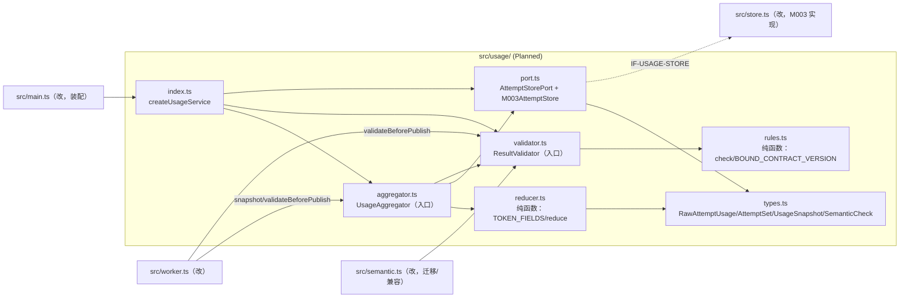
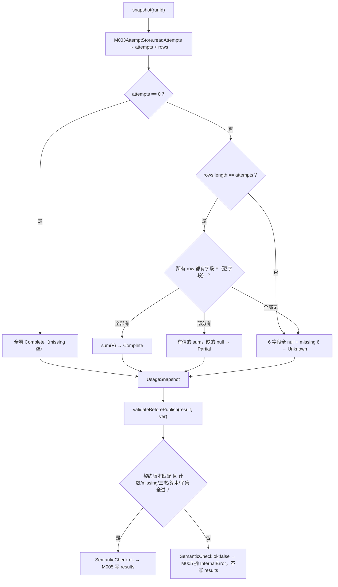

<!-- STD_DOCUMENT_COVER_BEGIN -->
# Piko 实现规格：usage（M007）

> STD 使用入口：[项目采用说明与标准导航](../../README.md#std-entry)

| 文档字段 | 值 |
|---|---|
| Document ID | `piko-usage-impl` |
| Document Version | `0.1.1` |
| Status | `Draft` |
| Project | `piko` |
| Document Owner | Piko Implementation Owner |
| Last Modified Date | `2026-09-28` |
| Template ID | `design.implementation` |
| Template Version | `1.2.0` |
<!-- STD_DOCUMENT_COVER_END -->

## 1. 实现目标与输入基线

<a id="isd-scope"></a>

本 ISD 实现 M007 `usage` 的**进程内用量聚合与 Result 语义校验**：向 M005 `worker` 提供 `UsageAggregator.snapshot` 与 `ResultValidator.validateBeforePublish` 两个函数，向 M003 `task-repository` 消费一个只读 attempt 端口。本次实现范围是 §5 的对外两函数与其内部组成（纯归约、纯规则、读端口）及 Brownfield 抽出（§2）；**非目标**是原始 usage 观察与落库（M006/M003）、Result 持久化与 generation（M003）、Run 状态机与发布协议（M005/M003）、费用/跨 Run 累计。模块行为、接口语义、状态模型与失败语义由模块设计唯一维护，本层只细化文件/symbol、私有表示、调用/清理步骤与测试入口。

### 1.1 实现对象

- **模块 ID / 名称**：`M007` / `usage`。

- **直属父对象 / 父设计**：`SW-P`（Piko Agent Runtime V0.3，`design_level=system`）/ `system-design` v0.11.2；`parent_document_id=system-design`（ISD 与模块设计同为 `system-design` 的子视图，不互为父子）。

- **模块设计 Document ID / 版本 / 路径 / 摘要**：`piko-usage-design` / `0.1.0-draft.1` / `docs/40_module_design/piko-usage-design.md`。摘要：多 attempt 分散 token 事实按"逐字段完整才 sum"汇总为唯一 `UsageSnapshot`（6 字段 + missing_fields + 三态），并在 Result 发布前做语义校验；发布后迟到只推 `record_version`，不改 generation。

- **需求与 Constraint ID**：`CON-USAGE-001`（PK-09）、`CON-USAGE-002`（PK-10）；机制输入 `M-RUN-DI-007`（`piko-run` §14.4）、`M-USAGE-DI-002`（`piko-usage` §14.4）、`IF-RUN-SNAPSHOT`（`piko-run` §5.1）。

- **实现范围 / 非目标**：范围：`src/usage/` 六个文件 + 对 `src/worker.ts`/`src/semantic.ts`/`src/store.ts`/`src/main.ts` 的最小改动。非目标：不新建 DB 表/迁移（M003）、不改 `runs`/`results` 语义、不新增 usage 字段、不引入费用计算/跨 Run 累计/LLMTier 二次相加/新线程。

- **ISD 默认落位或项目批准路径**：`docs/50_implementation_design/piko-usage-impl.isd.md`（STD 默认路径）；代码落位 `src/usage/`（Planned）。

<a id="isd-handoff"></a>

### 1.2.1 `H-USAGE-SNAPSHOT` · 逐字段聚合生成快照

- **上游信息项 / 规则 ID**：`F-USAGE-SNAPSHOT`、`R-USAGE-SUMFIELD`、`R-USAGE-QUALITY`、`R-USAGE-MISSING`、`IF-USAGE-SNAPSHOT`、`CON-USAGE-001`。

- **固定来源 / 版本 / 锚点 / 摘要**：`piko-usage-design` §2.1/§8.1/§8.2/§8.3/§9.1.1（v0.1.0-draft.1）；契约 `TokenUsage`。

- **ISD 细化内容 / 章节**：§5.1.1 `UsageAggregator.snapshot`、§5.1.3 `FieldReducer.reduce`；§4.2 私有表示；§6.1 `P-USAGE-SNAPSHOT`。

- **唯一权威位置**：行为/接口权威 = 模块设计 §2.1/§9.1.1；文件/symbol/私有表示权威 = 本 ISD。

- **实现自由度**：内部数据结构、归约实现、端口适配细节；不可改为部分求和、不可缺失填 0、不可改三态定义。

- **原 V/Case 及本地验证位置**：`VRC-USAGE-001/002`（§9.1.1/§9.1.2）。

### 1.2.2 `H-USAGE-VALIDATE` · Result 发布前语义校验

- **上游信息项 / 规则 ID**：`F-USAGE-VALIDATE`、`R-USAGE-VALIDATE`、`IF-USAGE-VALIDATE`、`CON-USAGE-001/002`。

- **固定来源 / 版本 / 锚点 / 摘要**：`piko-usage-design` §2.2/§8.4/§9.1.2；契约 `TokenUsage.x-semantic-invariants`、绑定 `0.3.0-simplified.6`。

- **ISD 细化内容 / 章节**：§5.1.2 `ResultValidator.validateBeforePublish`、§5.1.4 `SemanticRules.check`；§6.2 `P-USAGE-VALIDATE`。

- **唯一权威位置**：行为 = 模块设计 §8.4/§9.1.2；私有 `SemanticCheck` 表示与 fail closed 落点 = 本 ISD。

- **实现自由度**：检查实现与提示文案、`SemanticCheck` 私有字段；不可放行被破坏的不变量、不可把缺失当失败、不可在未知契约版本放行。

- **原 V/Case 及本地验证位置**：`VRC-USAGE-004/005`。

### 1.2.3 `H-USAGE-FREEZE` · 发布后冻结边界

- **上游信息项 / 规则 ID**：`F-USAGE-FREEZE`、`R-USAGE-FREEZE`、`CON-USAGE-002`、`T-USAGE-02/03/04`。

- **固定来源 / 版本 / 锚点 / 摘要**：`piko-usage-design` §2.3/§6.6/§8.5；`piko-usage.md` §8 不变量 4（Result usage 发布后不可变）。

- **ISD 细化内容 / 章节**：§4.6 `UsageDerivedState`；§6.5 `R-USAGE-FREEZE`；§7.2 持久化边界（→M003）。

- **唯一权威位置**：冻结语义 = 模块设计 §6.6/§8.5；`results` generation 不可变执行权威 = M003。

- **实现自由度**：快照缓存策略（是否缓存、寿命）；不可新增发布后写 Result 的操作、`snapshot` 必须保持无副作用。

- **原 V/Case 及本地验证位置**：`VRC-USAGE-003`。

### 1.2.4 `H-USAGE-CONTRACT` · 契约字段集与版本绑定

- **上游信息项 / 规则 ID**：`CON-USAGE-001`；contract `0.3.0-simplified.6`。

- **固定来源 / 版本 / 锚点 / 摘要**：`interfaces/schemas/agent-runtime-v0.3.schema.json` `$defs.TokenField`/`TokenUsage`（6 字段名、`source`、`quality`、`x-semantic-invariants`）。

- **ISD 细化内容 / 章节**：§4.1 `TOKEN_FIELDS`/`UsageQuality`；§4.2 `UsageSnapshot` 投影；§5.1.4 `BOUND_CONTRACT_VERSION`。

- **唯一权威位置**：字段名与语义不变量 = 机器 schema；本地投影 = 本 ISD，不复制第二份 authority。

- **实现自由度**：语言级类型别名；不可增删/改名 6 字段（除契约升级评审），不可改不变量。

- **原 V/Case 及本地验证位置**：`VRC-USAGE-002/004`。

### 1.2.5 `H-USAGE-STORE` · M003 attempt 读端口（Proposed）

- **上游信息项 / 规则 ID**：`IF-USAGE-STORE`（Proposed）、`OQ-USAGE-002`。

- **固定来源 / 版本 / 锚点 / 摘要**：`piko-usage-design` §9.2.1；当前代码事实 `src/store.ts:23`（`model_attempts` DDL）、`src/store.ts:79`（`usage(run)` 读）。

- **ISD 细化内容 / 章节**：§5.1.5 `M003AttemptStore.readAttempts`；§3 `port.ts`。

- **唯一权威位置**：端口签名 = 模块设计 §9.2.1（**未冻结**）；实现 = 本 ISD 与 M003 设计。

- **实现自由度**：适配层类型转换；不可把 Proposed 当已确认合同实现（`OQ-USAGE-002` 未关闭前仅可做可替换适配）。

- **原 V/Case 及本地验证位置**：`VRC-USAGE-001/006`（fake + 真 M003 两套）。

### 1.2.6 `H-USAGE-RAW` · raw usage 事件落点

- **上游信息项 / 规则 ID**：`IF-USAGE-RAW`（Proposed）、`OQ-USAGE-003`。

- **固定来源 / 版本 / 锚点 / 摘要**：`piko-usage.md` §4.4.1/§5.2；`piko-run` §5.2 `IF-RUN-RAWUSAGE`。

- **ISD 细化内容 / 章节**：§4.2 `RawAttemptUsage`；§3 `port.ts` 消费。

- **唯一权威位置**：事件载荷 = `piko-usage.md` §4.4.1；M007 经 DB 落点消费 = 本 ISD。

- **实现自由度**：消费方式；不可依赖 M007 持有回调、不可把缺失填 0。

- **原 V/Case 及本地验证位置**：`VRC-USAGE-001/003`。

## 2. 既有实现差异（条件章节）

### 2.1 适用性

- **适用性**：brownfield（存在需修改的既有实现）。

- **依据**：基线：当前工作树 commit（见封面 metadata `reviewed_commit`/§10 状态复核）。既有 `src/worker.ts` 的 `aggregateUsage`（`src/worker.ts:29`）内联了逐字段聚合与三态，`src/semantic.ts` 的 `validateUsage`/`emptyUsage`（`src/semantic.ts:3`/`:13`）内联了语义校验。本 ISD 把这部分抽为 M007，不新建 schema。

- **Tailoring / 范围决定引用**：`TAIL-P-NEW-S1`（Piko 无 subsystem，`design.definition`/`design.implementation` 直接承接 `system-design`）；范围决定 `system-design` §15 PHASE-I。

### 2.2 `CH-USAGE-01` · 抽取"逐字段聚合"逻辑

- **基线 commit / 版本**：当前工作树（§10.2 `SC-USAGE-01` 记录解析出的 commit）。

- **文件 / symbol**：`src/worker.ts` `aggregateUsage`（既有）→ Planned `src/usage/aggregator.ts` `UsageAggregator.snapshot` + `src/usage/reducer.ts` `reduce`。

- **Current 行为**：`aggregateUsage(rows, attempts)` 在 worker 内直接对传入 rows 逐字段判定 sum/null 并定三态。

- **Target 改动与理由**：归约移入 `reducer.ts` 纯函数，读 attempt 移入 `port.ts`，`aggregator.ts` 只编排。理由：三态与缺失判定需可脱离 SQLite 单测（`VRC-USAGE-001/002`），并在 `OQ-USAGE-002` 未关闭前保持可替换。

- **原规则 / 成员 ID**：`F-USAGE-SNAPSHOT`、`R-USAGE-SUMFIELD/QUALITY/MISSING`、`CON-USAGE-001`。

- **实现状态**：`IN_PROGRESS`（Current 内联，Target 抽出）。

### 2.3 `CH-USAGE-02` · 抽取"语义校验"逻辑

- **基线 commit / 版本**：当前工作树。

- **文件 / symbol**：`src/semantic.ts` `validateUsage`（既有）→ Planned `src/usage/validator.ts` `ResultValidator.validateBeforePublish` + `src/usage/rules.ts` `check`。

- **Current 行为**：`validateUsage(u)` 抛 `Error`（无结构化 `SemanticCheck`，无契约版本绑定，由 `store.insertResult` 内调用）。

- **Target 改动与理由**：改为返回 `SemanticCheck{ok,reason?}` 并把 fail closed 的抛错上移到 M005（worker），规则抽到 `rules.ts` 并绑定契约版本。理由：`VRC-USAGE-004` 要求校验失败可独立触发且不写 Result；未知版本需 fail closed。

- **原规则 / 成员 ID**：`F-USAGE-VALIDATE`、`R-USAGE-VALIDATE`、`ERR-USAGE-SEMANTIC`。

- **实现状态**：`IN_PROGRESS`。

### 2.4 `CH-USAGE-03` · worker 改为委托 usage 服务

- **基线 commit / 版本**：当前工作树。

- **文件 / symbol**：`src/worker.ts` `RunWorker.finish`（既有）→ 注入 usage 服务，`snapshot` + `validateBeforePublish` 后写结果。

- **Current 行为**：worker 内联调用 `aggregateUsage(this.store.usage(runId), attempts)`，并把校验留在 `store.insertResult`。

- **Target 改动与理由**：`RunWorker` 构造注入 `UsageAggregator`/`ResultValidator`；`ok:false` 时抛 `InternalError("semantic-validator-fail")`、不写结果。理由：usage 权威集中到 M007（`CON-USAGE-001/002`）。

- **原规则 / 成员 ID**：`IF-USAGE-SNAPSHOT`/`IF-USAGE-VALIDATE`。

- **实现状态**：`IN_PROGRESS`。

### 2.5 `CH-USAGE-04` · store 读原语化与校验防线保留

- **基线 commit / 版本**：当前工作树。

- **文件 / symbol**：`src/store.ts` `usage(run)`（既有）→ Planned `readAttempts(runId): AttemptSet`；`insertResult` 保留 `validateUsage` 防线。

- **Current 行为**：`usage(run)` 返回 `raw_usage_json` 解析后的行数组（不返回 attempts 计数）；`insertResult` 调 `validateUsage`。

- **Target 改动与理由**：`readAttempts` 返回 `{attempts, rows}` 使聚合拿到分母；`insertResult` 的校验保留为 M003 侧最后防线（双保险，不改变语义）。

- **原规则 / 成员 ID**：`IF-USAGE-STORE`、`CON-USAGE-001`。

- **实现状态**：`IN_PROGRESS`。

## 3. 文件、内部组件与调用关系

<a id="isd-structure"></a>



图 M007-ISD-S1 · Planned / NOT_IMPLEMENTED。实线调用；虚线跨模块适配。`reducer.ts`/`rules.ts` 只依赖 `types.ts`（纯函数）；跨模块只经 `port.ts`。

### 3.1 `src/usage/types.ts`

- **职责及调用者**：定义本层私有类型；被 `reducer.ts`/`rules.ts`/`port.ts`/`aggregator.ts`/`validator.ts` 引用。

- **类型 / 函数**：`TokenField`、`TOKEN_FIELDS`、`UsageQuality`、`RawAttemptUsage`、`ModelAttemptView`、`AttemptSet`、`UsageSnapshot`、`SemanticCheck`。

- **可见性**：模块内 public（仅 `index.ts` 再导出 `UsageSnapshot`/`SemanticCheck`）。

- **调用与类型依赖**：零运行时依赖。

- **构建目标 / 生成源 / 输出**：`tsc` 编译进 `dist/usage/types.js`；无生成源。

- **实现状态**：Planned。

### 3.2 `src/usage/reducer.ts`

- **职责及调用者**：纯字段归约（`R-USAGE-SUMFIELD/QUALITY/MISSING`）；被 `aggregator.ts` 调用。

- **类型 / 函数**：`reduce(attempts: number, rows: RawAttemptUsage[]): UsageSnapshot`；常量 `TOKEN_FIELDS`。

- **可见性**：模块内 public。

- **调用与类型依赖**：仅依赖 `types.ts`；**禁止任何 I/O import**（§3 依赖方向）。

- **构建目标 / 生成源 / 输出**：`tsc` → `dist/usage/reducer.js`。

- **实现状态**：Planned。

### 3.3 `src/usage/rules.ts`

- **职责及调用者**：纯语义规则（`R-USAGE-VALIDATE`）；被 `validator.ts` 调用。

- **类型 / 函数**：`check(usage: UsageSnapshot, contractVersion: string): SemanticCheck`；常量 `BOUND_CONTRACT_VERSION = "0.3.0-simplified.6"`。

- **可见性**：模块内 public。

- **调用与类型依赖**：仅依赖 `types.ts`；零 I/O。

- **构建目标 / 生成源 / 输出**：`tsc` → `dist/usage/rules.js`。

- **实现状态**：Planned。

### 3.4 `src/usage/port.ts`

- **职责及调用者**：唯一边界接触 M003 的只读适配层；被 `aggregator.ts` 调用。

- **类型 / 函数**：`interface AttemptStorePort { readAttempts(runId: string): AttemptSet }`；`class M003AttemptStore implements AttemptStorePort`（构造注入 M003 `TaskStore`）。

- **可见性**：`AttemptStorePort` 模块内 public；`M003AttemptStore` 由 `index.ts` 装配。

- **调用与类型依赖**：依赖 `types.ts`；运行时依赖 M003 `TaskStore`（仅此文件）。

- **构建目标 / 生成源 / 输出**：`tsc` → `dist/usage/port.js`。

- **实现状态**：Planned。

### 3.5 `src/usage/aggregator.ts`

- **职责及调用者**：聚合入口：实现 `snapshot(runId)`；被 `worker.ts` 调用。

- **类型 / 函数**：`class UsageAggregator { constructor(port: AttemptStorePort); snapshot(runId: string): UsageSnapshot }`；`export function aggregateUsage(rows: readonly RawAttemptUsage[], attempts: number): UsageSnapshot`（回归兼容）。

- **可见性**：public（经 `index.ts` 导出）。

- **调用与类型依赖**：依赖 `reducer.ts`/`port.ts`/`types.ts`。

- **构建目标 / 生成源 / 输出**：`tsc` → `dist/usage/aggregator.js`。

- **实现状态**：Planned。

### 3.6 `src/usage/validator.ts`

- **职责及调用者**：校验入口：实现 `validateBeforePublish`；被 `worker.ts` 调用。

- **类型 / 函数**：`class ResultValidator { validateBeforePublish(result: AgentResult, contractVersion: string): SemanticCheck }`；`export function validateUsage(usage: UsageSnapshot): SemanticCheck`（回归兼容）。

- **可见性**：public（经 `index.ts` 导出）。

- **调用与类型依赖**：依赖 `rules.ts`/`types.ts`。

- **构建目标 / 生成源 / 输出**：`tsc` → `dist/usage/validator.js`。

- **实现状态**：Planned。

### 3.7 `src/usage/index.ts`

- **职责及调用者**：唯一装配入口：导出 `UsageAggregator`/`ResultValidator` 与 `createUsageService(store)`；被 `main.ts` 调用。

- **类型 / 函数**：`export function createUsageService(store: TaskStore): { aggregator: UsageAggregator; validator: ResultValidator }`。

- **可见性**：public。

- **调用与类型依赖**：依赖 `aggregator.ts`/`validator.ts`/`port.ts`/`types.ts` + M003 `TaskStore` 类型。

- **构建目标 / 生成源 / 输出**：`tsc` → `dist/usage/index.js`。

- **实现状态**：Planned。

### 3.8 `src/worker.ts`（修改既有）

- **职责及调用者**：改为消费 usage 服务：`finish` 内 `snapshot` + `validateBeforePublish`；`ok:false` 抛 `InternalError`。被 `main.ts` 装配。

- **类型 / 函数**：`RunWorker` 构造注入 `UsageAggregator`/`ResultValidator`；移除本地 `aggregateUsage`。

- **可见性**：public。

- **调用与类型依赖**：依赖 `usage/index.ts`、`pi-runtime.ts`、`store.ts`。

- **构建目标 / 生成源 / 输出**：`tsc` → `dist/worker.js`。

- **实现状态**：`IN_PROGRESS`（Current 内联 usage 逻辑）。

### 3.9 `src/semantic.ts`（修改既有）

- **职责及调用者**：迁移实现到 `src/usage/`；保留 re-export 兼容（或将引用改到 `src/usage/`）。被 `src/store.ts` 引用。

- **类型 / 函数**：re-export `validateUsage`/`emptyUsage`（或删除并更新调用点）。

- **可见性**：public。

- **调用与类型依赖**：依赖 `usage/validator.ts`。

- **构建目标 / 生成源 / 输出**：`tsc` → `dist/semantic.js`。

- **实现状态**：`IN_PROGRESS`。

### 3.10 `src/store.ts`（修改既有）

- **职责及调用者**：M003 侧：`usage(run)` 重构为 `readAttempts(runId): AttemptSet`；`insertResult` 保留 `validateUsage` 防线。被 `M003AttemptStore` 调用。

- **类型 / 函数**：`readAttempts(runId: string): AttemptSet`；`insertResult` 不变。

- **可见性**：public（同级模块）。

- **调用与类型依赖**：依赖 `node:sqlite`；无新 schema。

- **构建目标 / 生成源 / 输出**：`tsc` → `dist/store.js`。

- **实现状态**：`IN_PROGRESS`（Current 为 `usage(run)`）。

### 3.11 `src/main.ts`（修改既有）

- **职责及调用者**：装配：构造 `TaskStore` → `createUsageService` → 注入 `RunWorker`。

- **类型 / 函数**：`main()` 内新增装配行。

- **可见性**：public（入口）。

- **调用与类型依赖**：依赖 `store.ts`/`usage/index.ts`/`worker.ts`/`config.ts`。

- **构建目标 / 生成源 / 输出**：`tsx src/main.ts`（运行）；`tsc` 类型检查。

- **实现状态**：`IN_PROGRESS`。

## 4. 数据结构设计

<a id="isd-data"></a>

**不适用类别**：§4.3 配置（无机制专属配置，见 §8.1）、§4.4 通信报文（无跨进程消息，raw usage 经 DB 落点）、§4.5 设备/FPGA（纯软件，`TAIL-P-103`）为 N/A。§4.7 数据库表结构 N/A——schema 与事务 authority 属 M003（见 §7.2）。

### 4.1 公共基础类型与枚举

#### 4.1.1 `TokenField` / `TOKEN_FIELDS`

- **代码式声明、Data/Type ID 与唯一来源**：```ts
  type TokenField = "input_tokens" | "output_tokens" | "total_tokens"
    | "cache_read_tokens" | "cache_write_tokens" | "reasoning_tokens";
  const TOKEN_FIELDS = ["input_tokens","output_tokens","total_tokens",
    "cache_read_tokens","cache_write_tokens","reasoning_tokens"] as const;
  ```
  唯一来源 = contract `0.3.0-simplified.6` `$defs.TokenField`。

- **逐值/逐字段定义、范围和未知值行为**：6 个固定字段名，顺序固定；未知字段名拒绝（不参与聚合）。注意机制散文 `piko-usage.md` §4.2.1 用别名 `cached_tokens`，本实现以 schema `cache_read_tokens` 为准（`OQ-USAGE-001`）。

- **代码类型/symbol、转换点与失败映射**：`src/usage/types.ts` `TokenField`/`TOKEN_FIELDS`；`RawAttemptUsage` 的键映射（`cacheRead`→`cache_read_tokens` 等）在 `reducer.ts` 内。

- **创建/修改者、所有权、寿命与敏感性**：编译期常量；无寿命概念；不含敏感数据。

- **合法及拒绝实例、V/Case 与证据状态**：合法 `"input_tokens"`；拒绝 `"cached_tokens"`（别名，不识别）。`VRC-USAGE-002`；`NOT_RUN`。

### 4.2 业务与操作数据结构

#### 4.2.1 `RawAttemptUsage`

- **代码式声明、Data/Type ID 与固定来源**：```ts
  interface RawAttemptUsage {
    input?: number; output?: number; totalTokens?: number;
    cacheRead?: number; cacheWrite?: number; reasoning?: number;
    present_fields?: string[];
  }
  ```
  来源 = M006 `RawUsage` 落库后的 `model_attempts.raw_usage_json`（`piko-usage.md` §4.4.1）；代码事实见 `src/worker.ts:31` 的键映射。

- **逐字段定义、条件有效性和跨字段不变量**：6 个可选非负整数；缺字段即"该 attempt 未报告"。`present_fields` 必须与出现的值一致；缺失不得填 0。不要求单 attempt 内 `total == input + output`（聚合后判定）。

- **代码文件/symbol、编码或投影函数**：`src/usage/types.ts`；`port.ts` 解析 `raw_usage_json` 为 `RawAttemptUsage`。

- **创建、借用、修改、释放与失败出口**：由 M006 写，usage 只读；寿命 = attempt 寿命（迟到以 `record_version` 替换，不追加）；解析失败视为该行无 usage（保守）。

- **合法及拒绝实例、V/Case 与证据状态**：合法 `{input:1200, output:340, totalTokens:1540, cacheRead:100, cacheWrite:0, reasoning:50}`；拒绝把缺失 `reasoning` 填 0。`VRC-USAGE-001`；`NOT_RUN`。

#### 4.2.2 `ModelAttemptView` / `AttemptSet`

- **代码式声明、Data/Type ID 与固定来源**：```ts
  interface ModelAttemptView {
    task_id: string; operation_id: string; step_id: string; attempt: number;
    state: "Reserved" | "Started" | "UsageObserved" | "Terminal" | "Unknown";
    raw_usage: RawAttemptUsage | null; record_version: number; updated_at: string;
  }
  interface AttemptSet { attempts: number; rows: RawAttemptUsage[] }
  ```
  来源 = M003 `model_attempts` DDL（当前代码事实 `src/store.ts:23`）。

- **逐字段定义、条件有效性和跨字段不变量**：`attempts` = 该 Run `model_attempts` 行数（`>=0`）；`rows` = `raw_usage_json IS NOT NULL` 的行解析；`rows.length <= attempts`（`INV-USAGE-2`）。

- **代码文件/symbol、编码或投影函数**：`src/usage/types.ts`；`M003AttemptStore.readAttempts` 投影。

- **创建、借用、修改、释放与失败出口**：M003 产生、usage 只读；无长期寿命；读失败抛依赖错误。

- **合法及拒绝实例、V/Case 与证据状态**：合法 `{attempts:3, rows:[...]}`；拒绝 `rows.length > attempts`。`VRC-USAGE-001`；`NOT_RUN`。

#### 4.2.3 `UsageSnapshot`

- **代码式声明、Data/Type ID 与固定来源**：```ts
  interface UsageSnapshot {
    source: "PiModelResponses";
    quality: "Complete" | "Partial" | "Unknown";
    input_tokens: number | null; output_tokens: number | null; total_tokens: number | null;
    cache_read_tokens: number | null; cache_write_tokens: number | null; reasoning_tokens: number | null;
    model_attempts: number; usage_observed_attempts: number; missing_fields: TokenField[];
  }
  ```
  唯一来源 = contract `$defs.TokenUsage`；本地投影。

- **逐字段定义、条件有效性和跨字段不变量**：6 字段非负整数或 `null`；`model_attempts>=0`；`usage_observed_attempts<=model_attempts`；`missing_fields` 去重且与 null 字段一一对应；`total==input+output`（三者已知）；`cache_read_tokens`/`cache_write_tokens<=input_tokens`（input 已知）；`reasoning_tokens<=output_tokens`（output 已知）。

- **代码文件/symbol、编码或投影函数**：`src/usage/types.ts`；`reducer.ts` 生产；JSON 字段名与契约一致。

- **创建、借用、修改、释放与失败出口**：由 `snapshot` 生产、交 M005、随 `results` 冻结（authority M003）；发布后不可变（`INV-USAGE-1`）。

- **合法及拒绝实例、V/Case 与证据状态**：合法 `{input_tokens:2600, output_tokens:740, total_tokens:3340, cache_read_tokens:100, cache_write_tokens:0, reasoning_tokens:null, model_attempts:3, usage_observed_attempts:3, missing_fields:["reasoning_tokens"], quality:"Partial"}`；拒绝 `quality:"Complete"` 却有 null 字段。`VRC-USAGE-002/004`；`NOT_RUN`。

### 4.3 配置与规则数据结构

**N/A。** 本层无受控配置：唯一"规则常量"是 `BOUND_CONTRACT_VERSION`（`rules.ts`，§5.1.4），作为编译期常量写死，随契约升级评审变更；config authority 见 §8.1。依据：ISD 规范 §4.3 "仅有实现实际读取受控配置时才保留"。

### 4.4 通信报文结构

**N/A。** 无跨执行边界报文：raw usage 经 `model_attempts.raw_usage_json`（M003）落点传递，usage 经端口读取（§9.2 `IF-USAGE-STORE`）。依据：ISD 规范 §4.4。

### 4.5 设备与 FPGA 表项结构

**N/A** · 纯软件（`TAIL-P-103`）。

### 4.6 运行状态数据结构

#### 4.6.1 `UsageDerivedState`（内存派生）

- **代码式声明、Data/Type ID 与固定来源**：```ts
  type UsageDerivedState = "Live" | "Frozen";
  ```
  语义来源 = 模块设计 §6.6 `T-USAGE-01..04`；**非持久 authority**（权威在 `results` generation，属 M003）。

- **逐字段定义、状态不变量与转移条件**：`Live` = 该 Run 尚无已发布 `results` generation（可重算）；`Frozen` = 已有已提交 generation（不可变）。由"是否存在 generation"派生，不持久化。

- **创建/更新/读取 symbol、同步与提交点**：由 `aggregator.snapshot` 读取事实派生（只读）；无独立提交点。

- **唯一写者、借用、失效及恢复入口**：无写者；投影随每次读取重算；Run 寿命。

- **合法及拒绝转移、V/Case 与证据状态**：合法 `Live→Frozen`（发布）；拒绝 `Frozen→Live`（无回退）。`VRC-USAGE-003`；`NOT_RUN`。

### 4.7 数据库表结构

**N/A。** 本模块不拥有持久表：`model_attempts`（读）与 `results`（写，属 M005 发布路径）的 schema authority、DDL、事务与 generation 属 M003（当前代码事实 `src/store.ts:23` 建 `model_attempts`，`PRAGMA user_version=2`；设计权威 Proposed `piko-task-repository-impl.isd.md` §4.7）。本 ISD 只消费 `IF-USAGE-STORE` 读端口，不复制 CREATE TABLE。依据：ISD 规范 §4.7 "无持久化不虚构数据库"；交接见 §7.2。

### 4.8 错误码与错误结构

#### 4.8.1 `SemanticCheck` / `semantic-validator-fail`

- **错误声明、Error/Data ID 与唯一来源**：```ts
  interface SemanticCheck { ok: boolean; reason?: string }
  ```
  公共错误 `InternalError`（`cause_class="Internal"`）来自 contract `$defs.Failure`；失败事实 `semantic-validator-fail` 来自 `piko-usage.md` §4.8 / `piko-run.md` §5.1。

- **逐字段和逐码含义、触发事实及优先级**：`ok=false` 时 `reason` 必填，标识被破坏的不变量（算术/子集/计数/missing/未知版本）。优先级：契约版本 → attempt 计数 → missing 一致 → 三态 → 算术/子集（首破即返回）。

- **抛出/捕获/转换 symbol 与 public payload**：由 `rules.check`/`validator.validateBeforePublish` 产出 `SemanticCheck`；M005（`worker.ts`）据此抛 `InternalError`；usage **不**直接抛对外错误。

- **状态、副作用、可重试条件与敏感信息处理**：`ok:false` 无副作用（不写 `results`/终态），结果已知；不自动重试，交 operator；`reason` 不含敏感数据。

- **触发向量、V/Case 与证据状态**：`total=100,input=60,output=50` → `ok:false`；合法 `Partial` → `ok:true`。`VRC-USAGE-004/005`；`NOT_RUN`。

## 5. 接口设计

<a id="isd-functions"></a>

usage 的对外接口是 §5.1 的两个函数；被消费的 M003 读端口在同节记录。内部纯函数与端口实现一并记录（进程内协作接口）。无人机/消息/硬件接口（§5.2–5.4 N/A）。

### 5.1 API（适用时）

#### 5.1.1 `UsageAggregator.snapshot(runId: string): UsageSnapshot`

- **Interface/Member ID、用途**：`IF-USAGE-SNAPSHOT`；逐字段聚合生成唯一 `UsageSnapshot`。

- **文件 / symbol / 可见性**：Planned `src/usage/aggregator.ts` `UsageAggregator.snapshot`；public（模块外经 `index.ts`）。

- **原成员 ID 或私有来源**：继承 `piko-run` §5.1 `IF-RUN-SNAPSHOT`（M007 成员）；`M-RUN-DI-007`。

- **完整签名与 caller**：`snapshot(runId: string): UsageSnapshot`；caller = M005 `RunWorker.finish`（Result 两步提交第一步，单事件循环上下文）。

- **固定契约与版本**：模块设计 §9.1.1（`piko-usage-design` v0.1.0-draft.1）；构建目标 `dist/usage/`。

- **输入参数 / 数据结构 authority**：`runId: string` 非空；无 §6 Data ID（进程内标识），来源 = M005 当前 Run。

- **输入约束 / 校验顺序 / 失败映射**：校验：`runId` 非空（否则抛 `TypeError`，编程错误）；顺序 = `readAttempts` → `reduce`。无业务错误。

- **成功输出 / 数据结构 / 后置条件**：返回 `UsageSnapshot`（§4.2.3），满足 `INV-USAGE-2/3`；后置：无副作用，确定性可复现。owner = M005；寿命到写 `results` 冻结。

- **错误输出 / 触发条件 / 优先级**：无业务错误。唯一失败 = M003 读依赖错误（上抛）。字段缺失**不是**错误。

- **底层异常 / 失败事实**：`readAttempts` 抛 `SQLITE_BUSY`/`SQLITE_IOERR`。

- **模块是否处理及处理函数**：不处理依赖错误，`propagate`（不翻译、不吞）。

- **Typed 异常与原生异常所有权**：原生 `Error`（SQLite）由 M003 抛出，`UsageAggregator` 不捕获、不改类型，直接交 M005。

- **宿主 / public payload 或状态码**：无 HTTP；返回 `UsageSnapshot` 或抛出依赖错误。

- **日志级别 / 脱敏 / 关联字段**：`debug`（聚合完成，含 `task_id`/`model_attempts`/`quality`）；`warn`（依赖错误，含 error class）。无敏感字段。

- **是否可重试及前提**：依赖错误由 M005 决定重试；`snapshot` 本身幂等（只读）。

- **状态与副作用影响 / 验证项**：无副作用（只读）。`VRC-USAGE-001/002`。

- **不可改变的规则 / Constraint ID**：`R-USAGE-SUMFIELD/QUALITY/MISSING`、`CON-USAGE-001`；逐字段完整才 sum、缺失即 null、不可填 0。

- **实现自由度**：私有数据结构、端口适配、归约实现细节。

- **副作用 / 执行上下文 / 幂等性**：无副作用；执行上下文 = 宿主事件循环（同步读）；幂等（同输入同输出）。

- **输入输出 ownership 与寿命**：输入 `runId` 借用；输出 `UsageSnapshot` 由调用方持有、随 Result 冻结。

- **Thread-safe / reentrant**：yes（无共享可变状态；仅只读 DB 查询）。

- **Nested-call policy**：allowed：仅调用 `reducer.reduce` 与 `port.readAttempts`；禁止回调 M005。

- **Transaction participation**：none（只读，M005 事务内的一次查询）。

- **Blocking / timeout / cancellation**：阻塞式（同步 SQLite），受 `task_store.busy_timeout_ms`；无取消。

- **实现状态 / 验证项**：Planned / `VRC-USAGE-001/002`。

- **装配、合法及拒绝实例**：装配：§3.7。合法：3 attempt（完整/缺 reasoning/完整）→ `Partial` 快照。拒绝：无（输入 `runId` 空为编程错误）。Oracle = 手工期望值 + contract 不变量。`NOT_RUN`。

#### 5.1.2 `ResultValidator.validateBeforePublish(result: AgentResult, contractVersion: string): SemanticCheck`

- **Interface/Member ID、用途**：`IF-USAGE-VALIDATE`；Result 发布前语义校验（fail closed）。

- **文件 / symbol / 可见性**：Planned `src/usage/validator.ts` `ResultValidator.validateBeforePublish`；public。

- **原成员 ID 或私有来源**：继承 `piko-run` §5.1 `IF-RUN-SNAPSHOT`（M007 成员）。

- **完整签名与 caller**：`validateBeforePublish(result: AgentResult, contractVersion: string): SemanticCheck`；caller = M005 `RunWorker.finish`（`snapshot` 后、`INSERT results` 前）。

- **固定契约与版本**：模块设计 §9.1.2；契约 `0.3.0-simplified.6`。

- **输入参数 / 数据结构 authority**：`result: AgentResult`（含 `usage: UsageSnapshot`，来源契约 `$defs.AgentResult`）；`contractVersion: string`（绑定常量）。

- **输入约束 / 校验顺序 / 失败映射**：按 `rules.check` 顺序：契约版本 → attempt 计数 → missing 一致 → 三态 → 算术/子集；任一失败 → `ok:false`。

- **成功输出 / 数据结构 / 后置条件**：`SemanticCheck{ok:true}`；后置：`result.usage` 满足全部语义不变量，可安全持久化。

- **错误输出 / 触发条件 / 优先级**：`ok:false`（附 `reason`）：算术破坏/子集破坏/计数越界/missing 不一致/三态不一致/未知版本。触发后 M005 抛 `InternalError`、回滚、不写结果。

- **底层异常 / 失败事实**：无底层异常；失败事实 = 逐条不变量检查结果。

- **模块是否处理及处理函数**：`validateBeforePublish` 把检查结果封装为 `SemanticCheck`（`reject` 语义，不抛）；抛错由 M005 做。

- **Typed 异常与原生异常所有权**：本函数不抛 typed 异常；M005 拥有 `InternalError` 抛出。

- **宿主 / public payload 或状态码**：返回 `SemanticCheck`；无 HTTP 码。

- **日志级别 / 脱敏 / 关联字段**：`info`（`ok:true`，含 `task_id`/`quality`）；`error`（`ok:false`，含不变量名，不含业务内容）。

- **是否可重试及前提**：`ok:false` 不自动重试（交 operator）；幂等（同输入同结果）。

- **状态与副作用影响 / 验证项**：无副作用（纯校验）。`VRC-USAGE-004/005`。

- **不可改变的规则 / Constraint ID**：`R-USAGE-VALIDATE`、`CON-USAGE-001/002`；fail closed、未知版本拒绝、缺失不失败。

- **实现自由度**：检查实现与文案、`SemanticCheck` 私有字段。

- **副作用 / 执行上下文 / 幂等性**：无副作用；上下文 = 宿主事件循环；幂等。

- **输入输出 ownership 与寿命**：输入 `result` 借用（只读 `usage`）；输出值对象。

- **Thread-safe / reentrant**：yes（无副作用、无共享可变状态）。

- **Nested-call policy**：allowed：仅调用 `rules.check`。

- **Transaction participation**：none（纯计算）。

- **Blocking / timeout / cancellation**：非阻塞（O(1) 计算）；无取消。

- **实现状态 / 验证项**：Planned / `VRC-USAGE-004/005`。

- **装配、合法及拒绝实例**：合法：合法 `Partial` → `ok:true`。拒绝：`total != input+output` → `ok:false`。Oracle = 契约语义不变量反例。`NOT_RUN`。

#### 5.1.3 `FieldReducer.reduce(attempts: number, rows: RawAttemptUsage[]): UsageSnapshot`（内部纯函数）

- **Interface/Member ID、用途**：私有；`R-USAGE-SUMFIELD/QUALITY/MISSING` 的实现。

- **文件 / symbol / 可见性**：Planned `src/usage/reducer.ts` `reduce`；模块内 public。

- **原成员 ID 或私有来源**：私有（实现模块设计 §8.1–8.3）。

- **完整签名与 caller**：`reduce(attempts: number, rows: RawAttemptUsage[]): UsageSnapshot`；caller = `UsageAggregator.snapshot`。

- **固定契约与版本**：模块设计 §8.1/§8.2/§8.3。

- **输入参数 / 数据结构 authority**：`attempts: number`（`>=0`）；`rows: RawAttemptUsage[]`（`length <= attempts`）。

- **输入约束 / 校验顺序 / 失败映射**：无业务失败；`attempts===0` 短路全零 `Complete`；否则逐字段判定。

- **成功输出 / 数据结构 / 后置条件**：`UsageSnapshot`（`INV-USAGE-2/3`）。

- **错误输出 / 触发条件 / 优先级**：无（纯函数不抛业务错误）。

- **底层异常 / 失败事实**：无。

- **模块是否处理及处理函数**：N/A（纯函数）。

- **Typed 异常与原生异常所有权**：N/A。

- **宿主 / public payload 或状态码**：返回 `UsageSnapshot`。

- **日志级别 / 脱敏 / 关联字段**：无日志（纯函数）。

- **是否可重试及前提**：N/A（幂等纯函数）。

- **状态与副作用影响 / 验证项**：无副作用；`VRC-USAGE-001/002`。

- **不可改变的规则 / Constraint ID**：`R-USAGE-SUMFIELD/QUALITY/MISSING`。

- **实现自由度**：reduce/fold 实现、键映射。

- **副作用 / 执行上下文 / 幂等性**：无副作用；幂等。

- **输入输出 ownership 与寿命**：输入借用；输出新对象。

- **Thread-safe / reentrant**：yes。

- **Nested-call policy**：forbidden（纯函数不调用外部）。

- **Transaction participation**：none。

- **Blocking / timeout / cancellation**：非阻塞。

- **实现状态 / 验证项**：Planned / `VRC-USAGE-001/002`。

- **装配、合法及拒绝实例**：合法：`reduce(3, [3 行完整]) ` → `Complete`。拒绝：无。`NOT_RUN`。

#### 5.1.4 `SemanticRules.check(usage: UsageSnapshot, contractVersion: string): SemanticCheck`（内部纯函数）

- **Interface/Member ID、用途**：私有；`R-USAGE-VALIDATE` 的实现。

- **文件 / symbol / 可见性**：Planned `src/usage/rules.ts` `check`；模块内 public。

- **原成员 ID 或私有来源**：私有（实现模块设计 §8.4）。

- **完整签名与 caller**：`check(usage: UsageSnapshot, contractVersion: string): SemanticCheck`；caller = `ResultValidator.validateBeforePublish`。

- **固定契约与版本**：模块设计 §8.4；`BOUND_CONTRACT_VERSION="0.3.0-simplified.6"`。

- **输入参数 / 数据结构 authority**：`usage: UsageSnapshot`；`contractVersion: string`。

- **输入约束 / 校验顺序 / 失败映射**：见 §5.1.2 顺序；首个失败即返回。

- **成功输出 / 数据结构 / 后置条件**：`SemanticCheck{ok:true}`。

- **错误输出 / 触发条件 / 优先级**：`ok:false` + `reason`。

- **底层异常 / 失败事实**：无。

- **模块是否处理及处理函数**：N/A（纯函数）。

- **Typed 异常与原生异常所有权**：N/A。

- **宿主 / public payload 或状态码**：返回 `SemanticCheck`。

- **日志级别 / 脱敏 / 关联字段**：无日志。

- **是否可重试及前提**：幂等纯函数。

- **状态与副作用影响 / 验证项**：无副作用；`VRC-USAGE-004/005`。

- **不可改变的规则 / Constraint ID**：`R-USAGE-VALIDATE`。

- **实现自由度**：检查实现与 `reason` 文案。

- **副作用 / 执行上下文 / 幂等性**：无副作用；幂等。

- **输入输出 ownership 与寿命**：输入借用；输出值对象。

- **Thread-safe / reentrant**：yes。

- **Nested-call policy**：forbidden。

- **Transaction participation**：none。

- **Blocking / timeout / cancellation**：非阻塞。

- **实现状态 / 验证项**：Planned / `VRC-USAGE-004/005`。

- **装配、合法及拒绝实例**：合法：`check(partial,"0.3.0-simplified.6")` → `ok:true`。拒绝：`check(badTotal,...)` → `ok:false`。`NOT_RUN`。

#### 5.1.5 `M003AttemptStore.readAttempts(runId: string): AttemptSet`（消费端口）

- **Interface/Member ID、用途**：`IF-USAGE-STORE`（Proposed）；只读返回该 Run 的 attempt 计数与带 usage 的行投影。

- **文件 / symbol / 可见性**：Planned `src/usage/port.ts` `M003AttemptStore.readAttempts` → M003 `src/store.ts` `readAttempts`；`AttemptStorePort` 模块内 public。

- **原成员 ID 或私有来源**：模块设计 §9.2.1（Proposed，`OQ-USAGE-002`）；当前代码事实 `src/store.ts:79` `usage(run)`。

- **完整签名与 caller**：`readAttempts(runId: string): AttemptSet`；caller = `UsageAggregator.snapshot`。

- **固定契约与版本**：模块设计 §9.2.1；**未冻结**。

- **输入参数 / 数据结构 authority**：`runId: string` 非空。

- **输入约束 / 校验顺序 / 失败映射**：单查询：读 `model_attempts` 行数与 `raw_usage_json IS NOT NULL` 的行；无业务失败。

- **成功输出 / 数据结构 / 后置条件**：`AttemptSet{attempts, rows}`；后置 `rows.length <= attempts`（`INV-USAGE-2`）。

- **错误输出 / 触发条件 / 优先级**：无判别结果；依赖错误上抛。

- **底层异常 / 失败事实**：SQLite busy/IO。

- **模块是否处理及处理函数**：`M003AttemptStore` propagate。

- **Typed 异常与原生异常所有权**：原生属 M003；本层不改。

- **宿主 / public payload 或状态码**：M003 查询；无对外码。

- **日志级别 / 脱敏 / 关联字段**：`debug`。

- **是否可重试及前提**：依赖错误由调用方决定；只读可重试。

- **状态与副作用影响 / 验证项**：无副作用（只读）；`VRC-USAGE-001/006`。

- **不可改变的规则 / Constraint ID**：只读、不推进 `record_version`；`CON-USAGE-001`。

- **实现自由度**：M003 内部 SQL/索引；本层适配类型转换。

- **副作用 / 执行上下文 / 幂等性**：无副作用；幂等。

- **输入输出 ownership 与寿命**：输入借用；输出值对象。

- **Thread-safe / reentrant**：conditional（SQLite 单 writer 串行）。

- **Nested-call policy**：forbidden（不在事务内再开事务）。

- **Transaction participation**：joins existing（在 M005 第一步事务内的只读查询）或 none（独立只读）。

- **Blocking / timeout / cancellation**：阻塞；受 `busy_timeout`。

- **实现状态 / 验证项**：Planned（M003 侧 `IN_PROGRESS`）/ `VRC-USAGE-001/006`。

- **装配、合法及拒绝实例**：合法：`{attempts:3, rows:[2 行]}`。拒绝：无。`NOT_RUN`。

### 5.2 消息与数据流接口（适用时）

**N/A。** usage 无跨边界消息/队列/流：`IF-USAGE-RAW` 经 `model_attempts` 落点解耦（§4.2.1），`IF-USAGE-SNAPSHOT`/`IF-USAGE-VALIDATE` 为进程内函数调用（已记于 §5.1）。依据：ISD 规范 §5.2，不为满足模板虚构队列。

### 5.3 硬件与固件接口（适用时）

**N/A** · 纯软件（`TAIL-P-103`）。

### 5.4 人机与维护接口（适用时）

**N/A。** 无 CLI/诊断命令；usage 质量经系统指标 `piko.usage.quality.{Complete,Partial,Unknown}` 暴露（§7.3）。

## 6. 关键流程与算法

<a id="isd-algorithms"></a>



图 M007-ISD-A1 · Planned / NOT_IMPLEMENTED。聚合的正常与缺失分支 + 校验的 fail closed 出口；纯字段规则见 §6.3–§6.4，冻结路径见 §6.5。

### 6.1 `P-USAGE-SNAPSHOT` · 逐字段聚合

- **触发与执行者**：M005 `RunWorker.finish`（第一步）→ `UsageAggregator.snapshot`（宿主事件循环）。

- **入口函数及数据**：`snapshot(runId)`；数据 `runId` → `AttemptSet` → `UsageSnapshot`。

- **步骤 / 算法 / 复杂度**：1. `port.readAttempts(runId)`；2. `attempts===0` → 全零 `Complete`；3. 逐字段 `full(F)` 判定并 sum/null；4. 定 `quality`；5. 组装 `missing_fields`。复杂度 O(6 × rows.length)。

- **判断事实来源**：`attempts`/`rows`（DB 投影）；`full(F)` 来自字段类型判定。无来源不明的 Guard。

- **成功可见点**：返回 `UsageSnapshot`（无副作用）。

- **失败、取消与清理**：依赖错误上抛；无清理（只读）。

- **代表输入与中间值**：见 §9.1.1 Case A：3 attempt（完整/缺 reasoning/完整）→ `Partial`。见 `piko-usage.md` §6.1.1 q3 快照。

- **规则 / 接口 / 验证引用**：§5.1.1/§5.1.3/§5.1.5；`R-USAGE-SUMFIELD/QUALITY/MISSING`；`VRC-USAGE-001/002`。

### 6.2 `P-USAGE-VALIDATE` · 语义校验与 fail closed

- **触发与执行者**：M005 → `ResultValidator.validateBeforePublish`。

- **入口函数及数据**：`validateBeforePublish(result, contractVersion)`；→ `SemanticCheck`。

- **步骤 / 算法 / 复杂度**：`SemanticRules.check`：契约版本 → `usage_observed_attempts<=model_attempts` → null/missing 一致 → 三态 → 算术/子集；首个失败返回 `ok:false`。O(1)。

- **判断事实来源**：`result.usage` 字段 + `BOUND_CONTRACT_VERSION`；不变量来自契约 `x-semantic-invariants`。

- **成功可见点**：`SemanticCheck{ok:true}`；M005 写 `results`。

- **失败、取消与清理**：`ok:false` → M005 抛 `InternalError`、回滚、不写结果/终态、不重跑 Pi。

- **代表输入与中间值**：见 §9.1.4 Case B–F；合法 `Partial` → `ok:true`。

- **规则 / 接口 / 验证引用**：§5.1.2/§5.1.4；`R-USAGE-VALIDATE`；`VRC-USAGE-004/005`。

### 6.3 `R-USAGE-SUMFIELD` / `R-USAGE-QUALITY`（纯规则与伪代码）

- **触发与执行者**：由 `reducer.ts` 纯函数承载，被 §6.1 调用。

- **入口函数及数据**：`reduce(attempts, rows)`。

- **步骤 / 算法 / 复杂度**：```text
  if attempts == 0: return zeroComplete()
  for F in TOKEN_FIELDS:
    full(F) = (rows.length == attempts) and rows.every(r => typeof r[key(F)] == "number")
    sums[F] = full(F) ? sum(rows, key(F)) : null
  missing = { F | sums[F] == null }
  quality = missing.size == 6 ? "Unknown"
          : (missing.size == 0 && rows.length == attempts) ? "Complete" : "Partial"
  if quality == "Unknown": for F: sums[F] = null; missing = TOKEN_FIELDS
  return { source:"PiModelResponses", quality, ...sums, model_attempts: attempts,
           usage_observed_attempts: rows.length, missing_fields: sorted(missing) }
  ```
  复杂度 O(6n)。

- **判断事实来源**：入参来自 DB 投影；纯函数不读时钟。

- **成功可见点**：返回值被 §6.1 消费。

- **失败、取消与清理**：无副作用、无失败分支（纯函数）。

- **代表输入与中间值**：`reduce(3, [完整,缺 reasoning,完整])` → `reasoning=null`、其余求和、`Partial`；`reduce(2, [])` → `Unknown`；`reduce(0, [])` → 全零 `Complete`。

- **规则 / 接口 / 验证引用**：§5.1.3；`VRC-USAGE-001/002`。

### 6.4 `R-USAGE-VALIDATE` · 不变量校验（伪代码）

- **触发与执行者**：`rules.check`，被 §6.2 调用。

- **入口函数及数据**：`check(usage, contractVersion)`。

- **步骤 / 算法 / 复杂度**：```text
  if contractVersion != BOUND_CONTRACT_VERSION: return {ok:false, reason:"unknown contract version"}
  if usage.usage_observed_attempts > usage.model_attempts: return {ok:false, reason:"observed>attempts"}
  for F in TOKEN_FIELDS: if (usage[F]==null) != missing.has(F): return {ok:false, reason:"missing mismatch:"+F}
  known = TOKEN_FIELDS.filter(F => usage[F] != null)
  if usage.quality=="Complete" and (known.length!=6 or observed!=attempts): fail
  if usage.quality=="Partial" and not (1<=known.length<=5 and observed>0): fail
  if usage.quality=="Unknown" and known.length!=0: fail
  if input,output,total all known and total != input+output: fail
  if input known and (cacheRead>input or cacheWrite>input): fail
  if output known and reasoning>output: fail
  return {ok:true}
  ```
  O(1)。

- **判断事实来源**：`usage` 字段 + 绑定常量。

- **成功可见点**：`ok:true` 被 §6.2 交 M005。

- **失败、取消与清理**：返回 `ok:false`；无副作用。

- **代表输入与中间值**：见 §9.1.4；`total=100,input=60,output=50` → `ok:false`。

- **规则 / 接口 / 验证引用**：§5.1.4；`VRC-USAGE-004/005`。

### 6.5 `R-USAGE-FREEZE` · 发布后冻结（伪代码）

- **触发与执行者**：Result 发布后迟到 `onRawUsage`（M006/M003 路径）。

- **入口函数及数据**：`pi-adapter.onRawUsage`（迟到）→ `store.observeUsage`。

- **步骤 / 算法 / 复杂度**：```text
  # usage 侧无回写操作；snapshot 只读、无副作用
  onLateRawUsage(attempt):
    store.observeUsage(attempt)   # M006/M003：record_version += 1，同一行替换
    # 不调用 snapshot；不写 results；不改 generation
  ```
  O(1)（迟到落库在 M006/M003）。

- **判断事实来源**：`results` 是否已有 generation（Frozen 事实）。

- **成功可见点**：`model_attempts.record_version` 前进；`results` 不变。

- **失败、取消与清理**：无 usage 侧清理；迟到落库失败按 M006/M003 语义。

- **代表输入与中间值**：见 §9.1.3；发布后迟到 attempt2 → `results` sha 不变、`record_version` +1。

- **规则 / 接口 / 验证引用**：§5.1.1（无副作用）+ M003/M006；`VRC-USAGE-003`。

## 7. 并发、失败、持久化与安全生命周期

<a id="isd-lifecycle"></a>

执行上下文：全部操作在 Node 单线程事件循环上；SQLite 由 M003 单 writer 串行化。usage 无自建线程/进程、无定时器。

### 7.1 并发、交错与失败收口

#### 7.1.1 `C-USAGE-01` · 迟到 usage 与发布并发

- **参与线程 / 回调 / 事务**：宿主事件循环；M005 发布事务 vs M006 迟到 `observeUsage`。
- **已产生或可能产生的副作用**：可能已有 `results` generation（M003 侧）。
- **检测事实 / 期限**：`results` generation 是否已提交（Frozen）；无期限。
- **状态 / 错误 / 结果已知性**：Frozen 已知；迟到只推 `record_version`。
- **保留 / 释放责任**：usage 无保留；`results` 由 M003 持有。
- **允许的 query / replay / takeover / retry**：query=`snapshot`（只读）；无 takeover/retry。
- **验证项**：`VRC-USAGE-003`。

#### 7.1.2 `C-USAGE-02` · 同 attempt 多次回调

- **参与线程 / 回调 / 事务**：M006 多次 `onRawUsage`。
- **已产生或可能产生的副作用**：`model_attempts` 行更新。
- **检测事实 / 期限**：主键 `(task_id, operation_id, step_id, attempt)` 唯一。
- **状态 / 错误 / 结果已知性**：同 attempt 幂等替换。
- **保留 / 释放责任**：M003 持有单行；usage 无。
- **允许的 query / replay / takeover / retry**：query=`readAttempts`；replay=`snapshot`（同结果）。
- **验证项**：`VRC-USAGE-001`。

#### 7.1.3 `C-USAGE-03` · validator FAIL 与回滚

- **参与线程 / 回调 / 事务**：M005 第一步事务内 `validateBeforePublish`。
- **已产生或可能产生的副作用**：无（校验在 `INSERT` 前）。
- **检测事实 / 期限**：`SemanticCheck{ok:false}`。
- **状态 / 错误 / 结果已知性**：已知（结果确定：不发布）。
- **保留 / 释放责任**：M005 回滚；不写 `results`/终态。
- **允许的 query / replay / takeover / retry**：不自动重试；交 operator。
- **验证项**：`VRC-USAGE-004`。

#### 7.1.4 `C-USAGE-04` · 服务退出与结果已知性

- **参与线程 / 回调 / 事务**：进程退出时 usage 无在途写（只读/纯计算）。
- **已产生或可能产生的副作用**：无。
- **检测事实 / 期限**：无持久状态需核对。
- **状态 / 错误 / 结果已知性**：未发布 usage 只在内存丢失；`model_attempts` 已持久故重算一致。
- **保留 / 释放责任**：无资源需释放。
- **允许的 query / replay / takeover / retry**：重算。
- **验证项**：`VRC-USAGE-006`。

#### 7.1.5 `C-USAGE-05` · M003 读依赖故障

- **参与线程 / 回调 / 事务**：`readAttempts` 遇 `SQLITE_BUSY`。
- **已产生或可能产生的副作用**：无。
- **检测事实 / 期限**：抛出异常类型；与"零 attempt"区分。
- **状态 / 错误 / 结果已知性**：结果未知；不降级为全零。
- **保留 / 释放责任**：无；M005 决定重试/失败。
- **允许的 query / replay / takeover / retry**：M005 按 Run 政策重试。
- **验证项**：`VRC-USAGE-006`。

<a id="isd-persistence"></a>

### 7.2 持久化、恢复与 schema 演进

**not_applicable。** usage **不拥有持久状态**：`model_attempts`（读）与 `results`（写，属 M005 发布路径）的 schema authority、连接、事务与 generation 全部属 M003 `task-repository`（当前代码事实 `src/store.ts:23` `model_attempts` DDL、`PRAGMA user_version=2`）。本模块只经 `IF-USAGE-STORE` 发起 M003 的只读查询；提交点、崩溃恢复入口与 schema 演进由 M003 ISD 承接，本 ISD 不生成数据库策略。迟到 usage 的 `record_version` 推进由 M006/M003 负责（`src/store.ts:52` `observeUsage`）。

- 状态由谁保存 / 本模块交付何种信息：attempt 行、`raw_usage_json`、`record_version` 由 M003 保存；本模块交付"要读取的目标 `runId`"与聚合结果（`UsageSnapshot`），不持久化自身。
- 宿主 / 依赖边界：崩溃恢复编排属 M005（`MECH-RECOVERY`），Result 冻结属 M003；usage 重算一致（只读机制）。
- Decision ref：`piko-usage-design` §6.6/§9.2.1 + ISD 规范 §1；schema 政策决定见 M003 ISD §4.7（Proposed）与 `system-design#m003-ddl-authority`。

<a id="isd-security"></a>

### 7.3 安全、权限与可观测性

#### 7.3.1 `SEC-USAGE-NOSECRET` · 无鉴权与不记录敏感数据

- **原规则**：模块设计 §11；usage 无外部输入、无身份/授权分支。
- **可信输入 / 敏感字段 / 检查对象**：输入为进程内 M005 调用 + `model_attempts`（M006 从固定 Pi provider 观察）；不接触 credential/模型正文/instruction/绝对路径。
- **检查函数 / 时点**：无鉴权检查点（进程内调用）；越权边界由 M001/M002 承载。
- **拒绝 / 宿主交付出口**：N/A（无鉴权）。
- **脱敏 / 禁止输出**：日志不得含 credential/模型正文/绝对路径；本模块本就不产生。
- **日志 / 指标 / trace 口径及触发**：`debug`（聚合成功）、`info`（校验 ok）、`error`（ok:false，不含业务内容）、`warn`（依赖错误）。
- **验证项**：`VRC-USAGE-004`（日志不含敏感字段由审查核对）。

#### 7.3.2 `SEC-USAGE-METRIC` · 指标 `piko.usage.quality.*` 写入点

- **原规则**：`system-design` §12 指标；模块设计 §11。
- **可信输入 / 敏感字段 / 检查对象**：指标 = `UsageSnapshot.quality`（ratio / per task_id）。
- **检查函数 / 时点**：在 `reducer.reduce` 产 `quality`、M005 发布后由 M009 采集；usage 是生产点。
- **拒绝 / 宿主交付出口**：无拒绝；指标经 M009 采集（脱敏）。
- **脱敏 / 禁止输出**：指标不含身份/正文。
- **日志 / 指标 / trace 口径及触发**：单位=ratio；窗口=per task_id；不聚合；低开销。
- **验证项**：`VRC-USAGE-001`（quality 判定）。

#### 7.3.3 `SEC-USAGE-LOCALSTORE` · 本地持久化安全

**not_applicable（交接给 M003）。** usage 不直接打开文件/DB；本地持久化安全（文件权限/umask/symlink/磁盘耗尽等）由 M003 ISD 承接。本层交接事实 = 经 `IF-USAGE-STORE` 传递 `runId`，不含路径/凭据。

## 8. 资源、构建与宿主接入

<a id="isd-resources"></a>

### 8.1 配置实现（条件项）

- **适用性 / 固定 authority**：N/A（本模块无 config key）。固定 rule 常量 authority = 模块设计 §6.3（绑定契约版本 `0.3.0-simplified.6`），由 `rules.ts` 编译期字面量持有；无宿主可配项。

- **配置 key / 来源 / 优先级**：无（非 config schema 项；`piko-runtime-config-v0.3.schema.json` 无 usage key）。

- **类型 / 单位 / 默认值 / 范围 / 字段约束**：`BOUND_CONTRACT_VERSION: string`，固定 `"0.3.0-simplified.6"`；无范围参数。

- **读取 / 解析 / 校验 symbol**：无解析；`rules.ts` 以字面量持有。

- **生效点 / reload / 原子性 / 在途操作**：启动时生效、进程内不变、不热更（契约升级需评审并按 `CON-USAGE-001` 走契约变更）。

- **缺失 / 非法 / 部分更新的错误出口**：缺失即编译期失败；契约版本不匹配在运行期由 `check` 返回 `ok:false`（fail closed，不静默放行）。

- **敏感值存储 / 日志脱敏**：N/A。

- **验证项**：`VRC-USAGE-004`（未知版本 → `ok:false`）。

### 8.2.1 `RES-USAGE-BUILD` · 构建目标与宿主接入

- **目标文件 / 产物 / 构建目标**：`src/usage/*.ts` → `dist/usage/*.js`；构建目标 = 现有 `tsc -p tsconfig.json`（`npm run build`）。不新建库。

- **工具链 / 语言 / 依赖版本**：TypeScript 5.9.3；Node `>= 22.19.0`；`node:sqlite`（经 M003）；无新依赖。

- **宿主接入 / 初始化 / 退出次序**：`main.ts`：`new TaskStore(...)` → `createUsageService(store)` → `new RunWorker(..., usage)` → `worker.start()`；退出时 `worker.close()`（usage 无定时器/资源需单独清理）。

- **环境 / 数据规模 / 冷热条件**：单实例；attempt 行 ≤ 100000；冷启动首读为一次 `readAttempts`。

- **峰值构成 / 上限 / 共享额度**：usage 自身无额外持久配额；峰值 = 6 字段 + 一次调用的 `RawAttemptUsage[]` 投影（≤ n 行）；`model_attempts` 存储计入 M003 预算（不重复计账）。

- **分段预算 / 总期限 / 计时点**：每次 Result 发布前：`readAttempts` 单查询（受 `busy_timeout_ms`）+ `reduce` O(6n) + `check` O(1)；无总期限（进程寿命）。

- **超限、部分启动与清理出口**：`busy_timeout` 超时 → 依赖错误上抛；无部分启动（纯库）。

- **构建或运行命令及前置条件**：`npm run build`（类型检查）；`npm run test`（单测，Planned 用例）；前置 = M003 读端口可用（`OQ-USAGE-002`）。

## 9. 验证规格与实现任务

<a id="isd-verification"></a>

### 9.1.1 `VRC-USAGE-001` · 逐字段 sum/null 与三态

- **Rule / 成员**：`F-USAGE-SNAPSHOT`、`R-USAGE-SUMFIELD`、`R-USAGE-QUALITY`、`IF-USAGE-SNAPSHOT`、`CON-USAGE-001`。
- **V / Case / Vector**：A（3 attempt：完整/缺 reasoning/完整 → Partial 且 reasoning null）、B（某字段全缺 → null）、C（rows<attempts → 全字段 null/Unknown）、D（0 attempt → 全零 Complete）。
- **输入 / 故障 / 环境**：纯 `reducer.ts` 表驱动（无 DB）+ 受控 fake 端口。
- **独立 Oracle / Expected**：Oracle = 手工期望值 + contract `TokenUsage` 语义不变量；Expected 同 Case。
- **Actual / Evidence**：`NOT_RUN`。
- **Verdict**：`NOT_RUN`
- **测试入口 / 清理**：Planned `tests/unit/usage-aggregator.test.ts`；每 Case 独立输入。
- **Run ID / Status**：`NOT_RUN`。

### 9.1.2 `VRC-USAGE-002` · missing_fields 一致性与字段名

- **Rule / 成员**：`F-USAGE-SNAPSHOT`、`R-USAGE-MISSING`、`R-USAGE-QUALITY`、`CON-USAGE-001`。
- **V / Case / Vector**：A（Partial 的 missing 恰等于 null 集合）、B（全缺 → missing 6 项）、C（0 attempt → missing 空）、D（别名 `cached_tokens` 不被识别，`cache_read_tokens` 才计入）。
- **输入 / 故障 / 环境**：纯 `reducer.ts` 表驱动。
- **独立 Oracle / Expected**：Oracle = 手工 null 集合 + schema `$defs.TokenField`；Expected 同 Case。
- **Actual / Evidence**：`NOT_RUN`。
- **Verdict**：`NOT_RUN`
- **测试入口 / 清理**：Planned `tests/unit/usage-aggregator.test.ts`。
- **Run ID / Status**：`NOT_RUN`。

### 9.1.3 `VRC-USAGE-003` · 发布后迟到不改 Result

- **Rule / 成员**：`F-USAGE-FREEZE`、`R-USAGE-FREEZE`、`CON-USAGE-002`、`IF-USAGE-RAW`。
- **V / Case / Vector**：A（发布后迟到 → `results` sha 不变、`record_version` +1、无第二 generation）、B（发布前迟到 → 计入聚合）、C（同 attempt 多次回调 → 不重复相加）。
- **输入 / 故障 / 环境**：临时 SQLite；两阶段（发布 → 迟到）；每 Case 前重置表。
- **独立 Oracle / Expected**：Oracle = 直读 `results` sha + `model_attempts.record_version`；Expected 同 Case。
- **Actual / Evidence**：`NOT_RUN`。
- **Verdict**：`NOT_RUN`
- **测试入口 / 清理**：Planned `tests/unit/usage-freeze.test.ts`。
- **Run ID / Status**：`NOT_RUN`。

### 9.1.4 `VRC-USAGE-004` · validator fail closed

- **Rule / 成员**：`F-USAGE-VALIDATE`、`R-USAGE-VALIDATE`、`ERR-USAGE-SEMANTIC`、`CON-USAGE-001/002`。
- **V / Case / Vector**：A（合法 Complete/Partial/Unknown → ok:true）、B（`total != input+output` → ok:false）、C（`cache_read_tokens > input_tokens` → ok:false）、D（`reasoning_tokens > output_tokens` → ok:false）、E（`usage_observed_attempts > model_attempts` → ok:false）、F（未知 contractVersion → ok:false）、G（ok:false 时 M005 不写 results/终态）。
- **输入 / 故障 / 环境**：纯 `rules.ts` 表驱动 + 集成（临时 DB 验证不写 results）。
- **独立 Oracle / Expected**：Oracle = contract `x-semantic-invariants` + 手工反例；Expected 同 Case（关键：ok:false 无 results 副作用）。
- **Actual / Evidence**：`NOT_RUN`。
- **Verdict**：`NOT_RUN`
- **测试入口 / 清理**：Planned `tests/unit/result-validator.test.ts`。
- **Run ID / Status**：`NOT_RUN`。

### 9.1.5 `VRC-USAGE-005` · 校验通过后正常发布

- **Rule / 成员**：`F-USAGE-VALIDATE`、`R-USAGE-VALIDATE`、`IF-USAGE-VALIDATE`、`CON-USAGE-001`。
- **V / Case / Vector**：A（合法 Partial → ok:true → results 含该 usage）、B（零 attempt Complete → 正常发布）、C（Unknown → 正常发布）。
- **输入 / 故障 / 环境**：临时 SQLite；独立进程；每 Case 重置。
- **独立 Oracle / Expected**：Oracle = 读回 `results` 的 usage 字段与期望快照一致；Expected 同 Case。
- **Actual / Evidence**：`NOT_RUN`。
- **Verdict**：`NOT_RUN`
- **测试入口 / 清理**：Planned `tests/integration/llmtier-usage.test.ts`。
- **Run ID / Status**：`NOT_RUN`。

### 9.1.6 `VRC-USAGE-006` · 依赖故障与重算一致性

- **Rule / 成员**：`F-USAGE-SNAPSHOT`、`R-USAGE-SUMFIELD`、`IF-USAGE-STORE`、`CON-USAGE-001`。
- **V / Case / Vector**：A（`readAttempts` 抛 `SQLITE_BUSY` → 上抛，不降级全零）、B（同内容两阶段重算一致）、C（崩溃后重算与提交前一致）、D（部分 attempt 未提交 → 相应字段 missing）。
- **输入 / 故障 / 环境**：受控 fake 端口注入异常 + 临时 SQLite 两阶段。
- **独立 Oracle / Expected**：Oracle = 直读 `model_attempts` 行 + 两次聚合比较；Expected 同 Case。
- **Actual / Evidence**：`NOT_RUN`。
- **Verdict**：`NOT_RUN`
- **测试入口 / 清理**：Planned `tests/unit/usage-store-port.test.ts`。
- **Run ID / Status**：`NOT_RUN`。

<a id="isd-tasks"></a>

### 9.2.1 `T-USAGE-01` · 冻结 `IF-USAGE-STORE` 读端口

- **顺序 / 前置项**：先于 `port.ts`；依赖 M003 设计评审（`OQ-USAGE-002`）。
- **文件 / symbol / 构建目标**：`src/usage/port.ts` 抽象 + `src/store.ts` `readAttempts`。
- **不可改变的规则**：只读、不推进 `record_version`、返回 `{attempts, rows}`。
- **实施动作**：确认 M003 采纳 `readAttempts` 或给出超集；冻结签名。
- **完成检查**：fake 端口可实现（`VRC-USAGE-001/006`）。
- **实现状态**：`PLANNED`（受 `OQ-USAGE-002` 阻断）。
- **验证状态 / Run**：`NOT_RUN`。

### 9.2.2 `T-USAGE-02` · 实现 `reducer.ts` + `rules.ts` 与单测

- **顺序 / 前置项**：无（纯函数）。
- **文件 / symbol / 构建目标**：`src/usage/reducer.ts`、`src/usage/rules.ts` + `tests/unit/usage-aggregator.test.ts`、`tests/unit/result-validator.test.ts`。
- **不可改变的规则**：逐字段 sum/null、三态、missing 一致、算术/子集不变量、绑定版本。
- **实施动作**：实现 `reduce`/`check`。
- **完成检查**：`VRC-USAGE-001/002/004` 计划用例。
- **实现状态**：`PLANNED`。
- **验证状态 / Run**：`NOT_RUN`。

### 9.2.3 `T-USAGE-03` · 实现 `port.ts` + 重构 `store.ts`

- **顺序 / 前置项**：依赖 T-USAGE-01。
- **文件 / symbol / 构建目标**：`src/usage/port.ts`、`src/store.ts`。
- **不可改变的规则**：只读与行投影语义；不新增 schema。
- **实施动作**：`usage(run)` → `readAttempts`；`insertResult` 保留校验防线。
- **完成检查**：`VRC-USAGE-001/006`；M003 既有测试不回归。
- **实现状态**：`PLANNED`。
- **验证状态 / Run**：`NOT_RUN`。

### 9.2.4 `T-USAGE-04` · 实现 `aggregator.ts`/`validator.ts`/`index.ts` 并改 `worker.ts`/`semantic.ts`/`main.ts`

- **顺序 / 前置项**：依赖 T-USAGE-02/03。
- **文件 / symbol / 构建目标**：`src/usage/aggregator.ts`、`validator.ts`、`index.ts`；`src/worker.ts`、`src/semantic.ts`、`src/main.ts`。
- **不可改变的规则**：§6.6 状态与不变量、§7.1 交错、§8.4 fail closed、发布后不回写。
- **实施动作**：实现两对外函数 + 装配；worker 委托，`ok:false` 抛 `InternalError`。
- **完成检查**：`VRC-USAGE-003/004/005`；PK-T10 集成可用。
- **实现状态**：`PLANNED`。
- **验证状态 / Run**：`NOT_RUN`。

## 10. 映射、复核与未决项

### 10.1.1 `MAP-USAGE-IF-SNAPSHOT` · `IF-RUN-SNAPSHOT`（snapshot）映射

- **模块 / 原成员 ID**：`IF-RUN-SNAPSHOT`（`piko-run` §5.1）。
- **唯一来源 / 版本 / selector / hash**：`piko-usage-design` §9.1.1（v0.1.0-draft.1）。
- **提供或消费 / backend**：提供 / 进程内（M007→M005）。
- **实际位置或 Planned 计划位置**：Planned `src/usage/aggregator.ts` `UsageAggregator.snapshot`；机器目录 location/symbol = `null`。
- **验证项**：`VRC-USAGE-001/002`。
- **实现状态**：`PLANNED`。
- **验证状态 / Run**：`NOT_RUN`。

### 10.1.2 `MAP-USAGE-IF-VALIDATE` · `IF-RUN-SNAPSHOT`（validateBeforePublish）映射

- **模块 / 原成员 ID**：`IF-RUN-SNAPSHOT`（`piko-run` §5.1）。
- **唯一来源 / 版本 / selector / hash**：`piko-usage-design` §9.1.2。
- **提供或消费 / backend**：提供 / 进程内（M007→M005）。
- **实际位置或 Planned 计划位置**：Planned `src/usage/validator.ts` `ResultValidator.validateBeforePublish`。
- **验证项**：`VRC-USAGE-004/005`。
- **实现状态**：`PLANNED`。
- **验证状态 / Run**：`NOT_RUN`。

### 10.1.3 `MAP-USAGE-IF-STORE` · `IF-USAGE-STORE` 映射

- **模块 / 原成员 ID**：`IF-USAGE-STORE`（Proposed，`piko-usage-design` §9.2.1）。
- **唯一来源 / 版本 / selector / hash**：`piko-usage-design` §9.2.1；当前代码事实 `src/store.ts:79`。
- **提供或消费 / backend**：消费（M007→M003）。
- **实际位置或 Planned 计划位置**：Planned `src/usage/port.ts` + `src/store.ts`。
- **验证项**：`VRC-USAGE-001/006`。
- **实现状态**：`PLANNED`（受 `OQ-USAGE-002`）。
- **验证状态 / Run**：`NOT_RUN`。

### 10.1.4 `MAP-USAGE-IF-RAW` · `IF-USAGE-RAW` 映射

- **模块 / 原成员 ID**：`IF-USAGE-RAW`（Proposed，`piko-usage.md` §5.1）。
- **唯一来源 / 版本 / selector / hash**：`piko-usage.md` §4.4.1/§5.2。
- **提供或消费 / backend**：消费（M006→M007，经 `model_attempts` 落点）。
- **实际位置或 Planned 计划位置**：M006 侧 Planned；usage 经 `src/usage/port.ts` 读取。
- **验证项**：`VRC-USAGE-001/003`。
- **实现状态**：`PLANNED`（字段名差异见 `OQ-USAGE-001`）。
- **验证状态 / Run**：`NOT_RUN`。

### 10.1.5 `MAP-USAGE-CONTRACT` · contract `TokenUsage` 映射

- **模块 / 原成员 ID**：contract `0.3.0-simplified.6` `$defs.TokenUsage`。
- **唯一来源 / 版本 / selector / hash**：`interfaces/schemas/agent-runtime-v0.3.schema.json`（`$id`）。
- **提供或消费 / backend**：消费 / 设计期字段 authority。
- **实际位置或 Planned 计划位置**：Planned `src/usage/types.ts` `UsageSnapshot` 投影。
- **验证项**：`VRC-USAGE-002/004`。
- **实现状态**：`PLANNED`。
- **验证状态 / Run**：`NOT_RUN`。

### 10.2 状态一致性复核

<a id="isd-status"></a>

#### 10.2.1 `SC-USAGE-01` · 模块设计 ↔ ISD 承接一致

- **上游承接状态 / 固定来源**：`piko-usage-design` §2/§6.6/§8/§9（v0.1.0-draft.1）声明三功能、状态模型、失败语义与验证规格。
- **本层派生状态 / 事实依据**：本 ISD 依据文件/symbol/构建事实派生——当前全部 `PLANNED`，无运行证据。
- **§2 Current / Target**：brownfield；Current = `worker.ts`/`semantic.ts` 内联 usage 逻辑，Target = `src/usage/` + 读端口。
- **§3 / §5 文件与函数状态**：`src/usage/*` = `PLANNED`；`worker.ts`/`semantic.ts`/`store.ts`/`main.ts` = `IN_PROGRESS`。
- **§9 任务 / Actual / Verdict / Run**：T-USAGE-01..04 `PLANNED`；所有 VRC `Verdict=NOT_RUN`、`Run=NOT_RUN`。
- **§10 汇总状态**：设计完成、实现 `PLANNED`、验证 `NOT_RUN`。
- **差异解释 / Owner / 收敛动作**：无未预期差异；实现待 `OQ-USAGE-002` 关闭后启动。

### 10.3.1 `ISD-OQ-USAGE-001` · 字段名 `cache_read_tokens` 与机制别名不一致

- **既有台账引用 / 具体缺口 / 反例**：模块设计 `OQ-USAGE-001`；schema 用 `cache_read_tokens`，机制散文用 `cached_tokens`。
- **风险等级 / 判定依据**：Low（以 schema 为准，不影响本轮）。
- **Owner**：Piko Contract Owner + Piko Architecture Owner。
- **最晚关闭阶段 / 截止 Gate**：下一次契约/机制评审。
- **阻断范围**：无（字段名已按 schema 实现）。
- **分析 / 决策引用**：模块设计 §15.1。
- **所需输入 / 下一步选择判据**：机制散文与 schema 对齐。
- **解决动作 / 完成条件**：修正 `piko-usage.md`/`piko-run.md` 别名。
- **状态**：Open。

### 10.3.2 `ISD-OQ-USAGE-002` · `IF-USAGE-STORE` 未冻结

- **既有台账引用 / 具体缺口 / 反例**：模块设计 `OQ-USAGE-002`；M003 设计未写，读端口未对齐。
- **风险等级 / 判定依据**：High（阻断 T-USAGE-01/03 与 `port.ts` 实现）。
- **Owner**：Piko Implementation Owner。
- **最晚关闭阶段 / 截止 Gate**：M003 模块设计评审。
- **阻断范围**：`src/usage/port.ts`、`src/store.ts` `readAttempts`、`VRC-USAGE-001/006` 真 M003 侧用例。
- **分析 / 决策引用**：模块设计 §15.2。
- **所需输入 / 下一步选择判据**：M003 采纳 `readAttempts` 或给出超集。
- **解决动作 / 完成条件**：M003 设计与 §9.2.1 一致（或本文回写超集）。
- **状态**：Open。

### 10.3.3 `ISD-OQ-USAGE-003` · `IF-USAGE-RAW` 无直接回调

- **既有台账引用 / 具体缺口 / 反例**：模块设计 `OQ-USAGE-003`；机制列为 M006→M007 直接事件，实现为经 `model_attempts` 落点。
- **风险等级 / 判定依据**：Low（语义等价、可重算）。
- **Owner**：Piko Architecture Owner。
- **最晚关闭阶段 / 截止 Gate**：下一次机制评审。
- **阻断范围**：无。
- **分析 / 决策引用**：模块设计 §15.3。
- **所需输入 / 下一步选择判据**：机制明确落点。
- **解决动作 / 完成条件**：机制修订明确 `IF-USAGE-RAW` 落点。
- **状态**：Open。

### 10.4 Metadata 与 coverage 交付检查

- `design_object_id`：`M007`。
- `implementation_view_of_document_id`：`piko-usage-design`。
- `volume_of_document_id`：`null`（非分卷）。
- 对应模块设计 `implementation_specification`：`mode=separate`、`document_id=piko-usage-impl`、`coverage_mapping` 十项：
  - `scope` → `isd-scope`（applicable）
  - `structure` → `isd-structure`（applicable）
  - `data` → `isd-data`（applicable）
  - `functions` → `isd-functions`（applicable）
  - `algorithms` → `isd-algorithms`（applicable）
  - `lifecycle` → `isd-lifecycle`（applicable）
  - `resources` → `isd-resources`（applicable）
  - `security` → `isd-security`（applicable）
  - `persistence` → `isd-persistence`（**not_applicable**；reason = 持久化 authority 与 schema 属 M003，本模块只消费只读端口；decision_ref = `system-design#m003-ddl-authority`）
  - `verification` → `isd-verification`（applicable）
- 交付检查命令：`python3 scripts/validate-design <完整设计目录> --check-isd-delivery --json`；结构 PASS 不代替语义与证据评审。
- 状态：设计完成；实现 `PLANNED`；验证 `NOT_RUN`。

<!-- STD_DOCUMENT_CONTROL_BEGIN -->
| 文档字段 | 值 |
|---|---|
| Authority | `piko` |
| Authors | corezilla, opencode |
| Created Date | `2026-09-27` |
| Template Conformance | `tailored` |
| Tailoring Reference | piko-std-tailoring-v0.1 |
| Migration Map Reference | none |
| Repository | `corezilla/piko` |
| Canonical Path | `docs/50_implementation_design/piko-usage-impl.isd.md` |
| Supersedes | none |
<!-- STD_DOCUMENT_CONTROL_END -->

<!-- Reviewer、Approver、Approval Date、Release Tag 按真实状态记录；不要伪造包含自身的 commit hash。 -->
