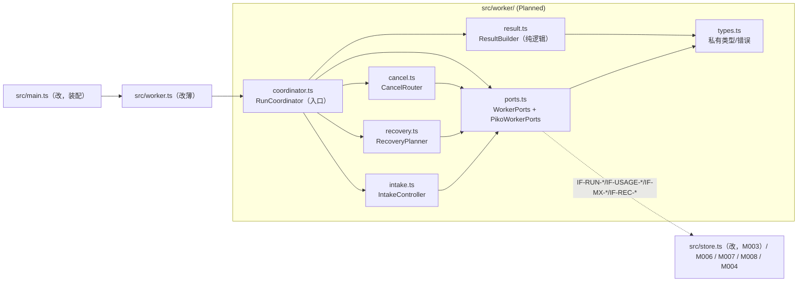
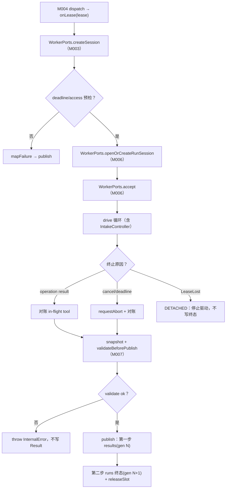
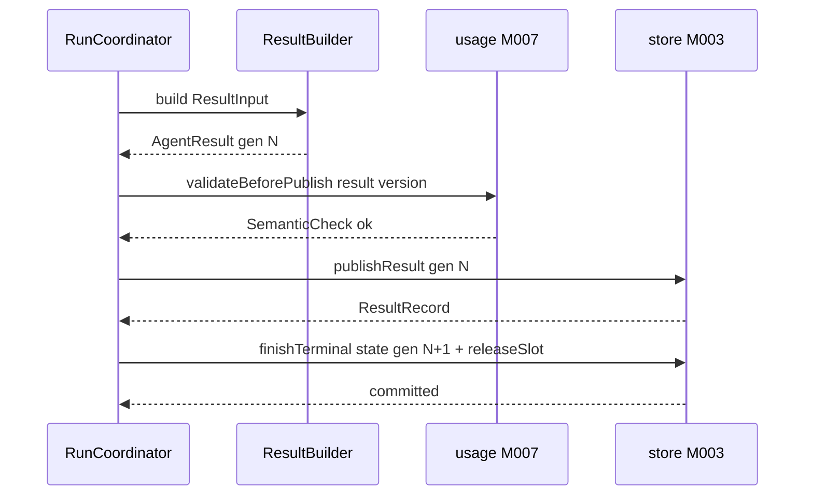

<!-- STD_DOCUMENT_COVER_BEGIN -->
# Piko 实现规格：worker（M005）

> STD 使用入口：[项目采用说明与标准导航](../../README.md#std-entry)

| 文档字段 | 值 |
|---|---|
| Document ID | `piko-worker-impl` |
| Document Version | `0.1.1` |
| Status | `Draft` |
| Project | `piko` |
| Document Owner | Piko Implementation Owner |
| Last Modified Date | `2026-09-27` |
| Template ID | `design.implementation` |
| Template Version | `1.2.0` |

<!-- STD_DOCUMENT_COVER_END -->

## 1. 实现目标与输入基线

<a id="isd-scope"></a>

本 ISD 实现 M005 `worker` 的**Run 生命周期协调、取消分流、deadline、Usage 发布前校验与 Result 两步发布**：向 M004 `scheduler`/M001 `task-api`/M000 `bootstrap` 提供 `onLease`/`cancelQueued`/`cancelRunning`/恢复编排入口，消费 M003 `task-repository`（fenced publish/terminal）、M006 `pi-adapter`（session/accept/drive/abort/inspect）、M007 `usage`（snapshot/validate）、M008 `matrix-adapter`（sync/send/media）。本次实现范围是 §5 的对外函数与其内部组成（Result 构造、取消、恢复、intake、端口适配）及 Brownfield 抽出（§2）；**非目标**是 Pi Agent loop、工具循环与 provider 重试（M006）、Run/Result 持久 authority 与 DDL（M003）、Usage 聚合算法（M007）、HTTP 路由与授权（M001/M002）、Matrix 协议（M008）。模块行为、接口语义、状态模型与失败语义由模块设计唯一维护，本层只细化文件/symbol、私有表示、调用/锁/清理步骤与测试入口。

### 1.1 实现对象

- **模块 ID / 名称**：`M005` / `worker`。

- **直属父对象 / 父设计**：`SW-P`（Piko Agent Runtime V0.3，`design_level=system`）/ `system-design` v0.11.1；`parent_document_id=system-design`（ISD 与模块设计同为 `system-design` 的子视图，不互为父子）。

- **模块设计 Document ID / 版本 / 路径 / 摘要**：`piko-worker` / `0.1.1` / `docs/40_module_design/piko-worker-design.md`。摘要：worker 持有 lease 并协调一个 Run；Result 走两步提交（`results` generation N 与 `runs` 终态 generation N+1 不可合并）；取消按 state 分流；崩溃后按 R1-R7 只补第二步；不镜像 Pi loop。

- **需求与 Constraint ID**：`CON-RUN-001`（PK-01，边界）、`CON-RUN-003`（PK-03）、`CON-RUN-004`（PK-07）、`CON-USAGE-001/002`（PK-09/10）、`CON-MX-001`（PK-08）、`CON-REC-001`（PK-12）、`CON-CX-001`（PK-03）；机制输入 `M-RUN-DI-005`、`M-MX-DI-002`、`M-REC-DI-002`、`M-CX-DI-003`。

- **实现范围 / 非目标**：范围：`src/worker/` 七个文件 + 对 `src/worker.ts`/`src/store.ts`/`src/main.ts` 的最小改动。非目标：不新建 DB 表/迁移（M003）、不改 Pi Harness 行为（M006）、不实现 usage 算法（M007）、不引入并行/优先级。

- **ISD 默认落位或项目批准路径**：`docs/50_implementation_design/piko-worker-impl.isd.md`（STD 默认路径）；代码落位 `src/worker/`（Planned），入口 `src/worker.ts`（既有改薄）。

<a id="isd-handoff"></a>

### 1.2.1 `H-WORKER-EXEC` · 驱动 Run 执行到结果

- **上游信息项 / 规则 ID**：`F-WORKER-EXEC`、`IF-RUN-SESSION`/`IF-RUN-ACCEPT`/`IF-RUN-DRIVE`、`M-RUN-DI-005`、`CON-RUN-001`。

- **固定来源 / 版本 / 锚点 / 摘要**：`piko-worker` §2.1/§5.2.1/§9.1.4/§9.2（v0.1.1）；`piko-run` §5.1/§5.2。

- **ISD 细化内容 / 章节**：§5.1.1 `RunCoordinator.onLease`；§3.1 `coordinator.ts`/§3.6 `ports.ts`；§6.1 `P-WORKER-EXEC`。

- **唯一权威位置**：行为/接口权威 = 模块设计 §2.1/§9.2；文件/symbol/私有表示权威 = 本 ISD。

- **实现自由度**：私有数据结构、drive poll 实现、对账顺序；不可引入并行阶段、不可镜像 Pi loop。

- **原 V/Case 及本地验证位置**：`VRC-WORKER-001/007`（§9.1.1/9.1.7）。

### 1.2.2 `H-WORKER-PUBLISH` · Result 两步发布

- **上游信息项 / 规则 ID**：`F-WORKER-PUBLISH`、`R-WORKER-TWOSTEP`、`IF-RUN-PUBLISH`、`CON-RUN-004`。

- **固定来源 / 版本 / 锚点 / 摘要**：`piko-worker` §2.3/§8.1/§9.1.1；`piko-run` §5.1 `publishResult`；`system-design` §6.2.1。

- **ISD 细化内容 / 章节**：§5.1.2 `ResultBuilder.build`；§5.2.1 `publishResult`/`finishTerminal`；§3.2 `result.ts`/§3.9 `store.ts`；§6.2 `P-WORKER-PUBLISH`。

- **唯一权威位置**：行为/两步骤 = 模块设计 §8.1；文件/symbol = 本 ISD；持久化事务 = M003。

- **实现自由度**：Result 构造顺序、sha256 计算、事务内语句组织；不可合并两步、不可改 generation 单调。

- **原 V/Case 及本地验证位置**：`VRC-WORKER-001/006`。

### 1.2.3 `H-WORKER-USAGE` · 发布前 Usage 快照与语义校验

- **上游信息项 / 规则 ID**：`F-WORKER-USAGE`、`R-WORKER-USAGE-VALIDATE`、`IF-USAGE-SNAPSHOT`/`IF-USAGE-VALIDATE`、`CON-USAGE-001/002`。

- **固定来源 / 版本 / 锚点 / 摘要**：`piko-worker` §2.2/§8.6/§9.2（v0.1.1）；`piko-usage` §5.1；契约 `0.3.0-simplified.6`。

- **ISD 细化内容 / 章节**：§5.1.2 校验调用；§5.2.2 `snapshot`/`validateBeforePublish`；§3.6 `ports.ts`；§7.1.5 `C-WORKER-05`。

- **唯一权威位置**：usage 口径 = M007；调用时点/fail closed = 模块设计 §8.6。

- **实现自由度**：错误封装与日志；不可跳过校验、不可改 usage 字段口径。

- **原 V/Case 及本地验证位置**：`VRC-WORKER-004`。

### 1.2.4 `H-WORKER-CANCEL` · 取消分流

- **上游信息项 / 规则 ID**：`F-WORKER-CANCEL`、`R-WORKER-CANCEL-DISPATCH`、`IF-CX-QUEUED`/`IF-CX-RUNNING`/`IF-CX-ABORT`、`M-CX-DI-003`、`CON-CX-001`。

- **固定来源 / 版本 / 锚点 / 摘要**：`piko-worker` §2.4/§8.2/§9.1.2/9.1.3；`piko-cancel` §5.1/§5.2。

- **ISD 细化内容 / 章节**：§5.1.3 `CancelRouter.route`；§3.3 `cancel.ts`；§6.3 `P-WORKER-CANCEL`；§7.1.2/§7.1.4。

- **唯一权威位置**：分流语义 = 模块设计 §8.2；abort/对账 = 本 ISD + M006。

- **实现自由度**：abort+对账实现、与 deadline 优先级；不可把 `StopRequested` 当停止、不可在 Queued 取得 lease。

- **原 V/Case 及本地验证位置**：`VRC-WORKER-002`。

### 1.2.5 `H-WORKER-INTAKE` · discussion intake CAS

- **上游信息项 / 规则 ID**：`F-WORKER-INTAKE`、`R-WORKER-INTAKE-CAS`、`IF-MX-TURN`/`IF-MX-VERIFY`、`M-MX-DI-002`、`CON-MX-001`。

- **固定来源 / 版本 / 锚点 / 摘要**：`piko-worker` §2.5/§8.4/§9.2；`piko-matrix` §4.1/§5.1/§8。

- **ISD 细化内容 / 章节**：§5.1.5 `IntakeController.onIdle/onAbort`；§3.5 `intake.ts`；§6.4 `P-WORKER-INTAKE`；§7.1.6。

- **唯一权威位置**：intake 状态机 = MECH-MATRIX/模块设计 §8.4；CAS 实现 = 本 ISD。

- **实现自由度**：CAS 重判顺序；不可改单向性与完成前提。

- **原 V/Case 及本地验证位置**：`VRC-WORKER-005`。

### 1.2.6 `H-WORKER-RECOVER` · 崩溃恢复编排

- **上游信息项 / 规则 ID**：`F-WORKER-RECOVER`、`R-WORKER-RECOVERY-ORDER`、`IF-REC-SCAN`/`IF-REC-INSPECT`/`IF-REC-PATCH`/`IF-REC-FENCE`、`M-REC-DI-002`、`CON-REC-001`。

- **固定来源 / 版本 / 锚点 / 摘要**：`piko-worker` §2.7/§8.5/§9.2；`piko-recovery` §5.1；`system-design` §6.4。

- **ISD 细化内容 / 章节**：§5.1.4 `RecoveryPlanner.plan`；§3.4 `recovery.ts`；§6.5 `P-WORKER-RECOVER`；§7.1.1/§7.1.3。

- **唯一权威位置**：恢复顺序 = 模块设计 §8.5；编排实现 = 本 ISD。

- **实现自由度**：探测顺序/并发度；不可改顺序、不可重跑 Pi、不可把超时当失败。

- **原 V/Case 及本地验证位置**：`VRC-WORKER-006`。

### 1.2.7 `H-WORKER-LEASE` · lease 消费与 `LeaseLost`

- **上游信息项 / 规则 ID**：`IF-RUN-SLOT`/`IF-RUN-RENEW`/`IF-REC-FENCE`、`CON-RUN-001`；`T` 转换 `D7/D9`。

- **固定来源 / 版本 / 锚点 / 摘要**：`piko-scheduler` §9.1（v0.1.1）；`piko-worker` §4.5/§6.6/§10.2。

- **ISD 细化内容 / 章节**：§5.2.4 `acquireSlot`/`renewLease`/`fence` 消费；§3.6 `ports.ts`；§6.1 `P-WORKER-EXEC` 的 `DETACHED` 出口。

- **唯一权威位置**：lease 语义 = `piko-scheduler` §9.1；worker 消费方式 = 本 ISD。

- **实现自由度**：dispatch 驱动方式；不可把 `LeaseLost` 当可重试、不可在 `DETACHED` 后写终态。

- **原 V/Case 及本地验证位置**：`VRC-WORKER-007`。

## 2. 既有实现差异（条件章节）

### 2.1 适用性

- **适用性**：brownfield（存在需修改的既有实现）。

- **依据**：基线：当前工作树（见封面 metadata `reviewed_commit`/§10 状态复核）。既有 `src/worker.ts` 的 `RunWorker.loop`/`run` 内联了 Result 拼装、取消判定、恢复分支与 intake 检查，`store.finish` 内联了两步提交与 generation 逻辑（`src/store.ts:82`）。本 ISD 把这些抽为 M005 的文件级组成，不新建 schema。

- **Tailoring / 范围决定引用**：`TAIL-P-NEW-S1`（Piko 无 subsystem，`design.definition`/`design.implementation` 直接承接 `system-design`）；范围决定 `system-design` §15 PHASE-D。

### 2.2 `CH-WORKER-01` · 抽 Result 构造与两步发布

- **基线 commit / 版本**：当前工作树（§10.2 `SC-WORKER-01` 记录解析出的 commit）。

- **文件 / symbol**：`src/worker.ts` `RunWorker.run` 内联结果拼装 + `src/store.ts` `finish`/`insertResult`（既有）→ Planned `src/worker/result.ts` `ResultBuilder.build` + `src/worker/coordinator.ts` 发布编排 + `src/store.ts` `publishResult`/`finishTerminal`。

- **Current 行为**：`RunWorker.run` 内联拼 `AgentResult`，调 `store.finish(result, epoch)`；`finish` 在同一事务内 `insertResult` + `UPDATE runs` + 清空 slot（两步实际被合并为一次 await）。

- **Target 改动与理由**：拆出 `ResultBuilder`（纯逻辑）与两步独立事务（第一步 `INSERT results`、第二步 `UPDATE runs`+`releaseSlot`）。理由：`CON-RUN-004` 要求两步不可合并、恢复只补第二步（`VRC-WORKER-001/006`）。

- **原规则 / 成员 ID**：`F-WORKER-PUBLISH`、`R-WORKER-TWOSTEP`、`IF-RUN-PUBLISH`、`CON-RUN-004`。

- **实现状态**：`IN_PROGRESS`（Current 合并，Target 拆两步）。

### 2.3 `CH-WORKER-02` · 抽取消分流

- **基线 commit / 版本**：当前工作树。

- **文件 / symbol**：`src/store.ts` `cancel` + `src/worker.ts` `cancelRequested` 检查 → Planned `src/worker/cancel.ts` `CancelRouter`。

- **Current 行为**：取消逻辑由 M003 `store.cancel`（单事务）完成，worker 只在 `run` 内轮询 `cancelRequested`；Running 路径无显式 abort 对账编排。

- **Target 改动与理由**：把分流决定与 abort+对账编排移入 `CancelRouter`，M003 只做单事务写入。理由：`CON-CX-001` 要求 `StopRequested` 只证意图、对账后才写 `Cancelled`（`VRC-WORKER-002`）。

- **原规则 / 成员 ID**：`F-WORKER-CANCEL`、`R-WORKER-CANCEL-DISPATCH`、`IF-CX-QUEUED/RUNNING/ABORT`。

- **实现状态**：`IN_PROGRESS`。

### 2.4 `CH-WORKER-03` · 抽恢复编排

- **基线 commit / 版本**：当前工作树。

- **文件 / symbol**：`src/worker.ts` `RunWorker.loop` 启动分支（`store.recoverOrphaned` 已随 M004 部分移交）→ Planned `src/worker/recovery.ts` `RecoveryPlanner`。

- **Current 行为**：启动时 `recoverOrphaned` 处理 slot；Result 补第二步与 Harness resume 未显式编排。

- **Target 改动与理由**：实现 R1-R7（Result→Run→lease→Pi→Harness→ledger→Matrix），只补第二步、不重跑 Pi。理由：`CON-REC-001`（`VRC-WORKER-006`）。

- **原规则 / 成员 ID**：`F-WORKER-RECOVER`、`R-WORKER-RECOVERY-ORDER`、`IF-REC-SCAN/INSPECT/PATCH/FENCE`。

- **实现状态**：`IN_PROGRESS`。

### 2.5 `CH-WORKER-04` · 抽 intake 控制

- **基线 commit / 版本**：当前工作树。

- **文件 / symbol**：`src/store.ts` `finish` 的 intake guard + `src/worker.ts` discussion 回调 → Planned `src/worker/intake.ts` `IntakeController`。

- **Current 行为**：`finish` 在事务内检查 `discussion_intake_state` 与 pending turn；worker 侧无独立 CAS 重组。

- **Target 改动与理由**：把 CAS 决定与 turn 生命周期移入 `IntakeController`（M003 保留事务 guard）。理由：`CON-MX-001`（`VRC-WORKER-005`）。

- **原规则 / 成员 ID**：`F-WORKER-INTAKE`、`R-WORKER-INTAKE-CAS`、`IF-MX-TURN`。

- **实现状态**：`IN_PROGRESS`。

### 2.6 `CH-WORKER-05` · worker 消费 M004 scheduler 与 M007 usage

- **基线 commit / 版本**：当前工作树。

- **文件 / symbol**：`src/worker.ts` 的 `store.nextQueued`/`setInterval(heartbeat)`（已由 M004 ISD `CH-SCHED-04` 声明移交）→ 消费 `Scheduler.acquireSlot/renewLease/fence`；`aggregateUsage`（`src/worker.ts:29`）→ 迁 M007 `snapshot`/`validateBeforePublish`。

- **Current 行为**：worker 内联 slot 领取/心跳/恢复（M004 已抽）；worker 内联 `aggregateUsage` 聚合 usage。

- **Target 改动与理由**：worker 只消费 `Lease`/`LeaseLost` 回调与 M007 snapshot/validate，删除本地聚合。理由：职责分离（M004 持 lease、M007 持聚合 authority）。

- **原规则 / 成员 ID**：`IF-RUN-SLOT/RENEW/FENCE`、`IF-USAGE-SNAPSHOT/VALIDATE`。

- **实现状态**：`IN_PROGRESS`。

## 3. 文件、内部组件与调用关系

<a id="isd-structure"></a>



图 M005-ISD-S1 · Planned / NOT_IMPLEMENTED。实线调用；虚线跨模块适配（仅 `ports.ts` 接触相邻模块）。`result.ts` 无 I/O；`types.ts` 被全模块类型引用。

### 3.1 `src/worker/coordinator.ts`

- **职责及调用者**：入口：实现 `onLease`/`publish`/`routeCancel`/`recover`，编排 I1-I5 并保证 §6.6 不变量；被 `src/worker.ts` 与 `main.ts` 调用。

- **类型 / 函数**：`class RunCoordinator`（`constructor(ports, result, cancel, recovery, intake, cfg)`；`onLease(lease: Lease): Promise<void>`；`publish(runId, epoch, outcome): Promise<void>`；`routeCancel(runId): Promise<CancelOutcome>`；`recover(): Promise<RecoveryReport>`）。

- **可见性**：模块内 public（仅 `src/worker.ts` 再导出 `RunWorker`）。

- **调用与类型依赖**：依赖 `result.ts`/`cancel.ts`/`recovery.ts`/`intake.ts`/`ports.ts`/`types.ts`。

- **构建目标 / 生成源 / 输出**：`tsc` 编译进 `dist/worker/coordinator.js`；无生成源。

- **实现状态**：Planned。

### 3.2 `src/worker/result.ts`

- **职责及调用者**：纯逻辑构造 `AgentResult`；被 `coordinator.ts` 调用。

- **类型 / 函数**：`function buildResult(input: ResultInput): AgentResult`；`function mapFailure(error: unknown): Failure`。

- **可见性**：模块内 public。

- **调用与类型依赖**：仅依赖 `types.ts` 与契约类型；禁止任何 I/O import。

- **构建目标 / 生成源 / 输出**：`tsc` → `dist/worker/result.js`。

- **实现状态**：Planned。

### 3.3 `src/worker/cancel.ts`

- **职责及调用者**：取消分流与 Running 对账命令生成；被 `coordinator.ts` 调用。

- **类型 / 函数**：`class CancelRouter`（`route(runId): Promise<CancelOutcome>`；`queued(runId)`；`running(runId)`）。

- **可见性**：模块内 public。

- **调用与类型依赖**：依赖 `ports.ts`/`types.ts`。

- **构建目标 / 生成源 / 输出**：`tsc` → `dist/worker/cancel.js`。

- **实现状态**：Planned。

### 3.4 `src/worker/recovery.ts`

- **职责及调用者**：R1-R7 编排与 `RecoveryOutcome` 判定；被 `coordinator.ts`/`worker.ts` 调用。

- **类型 / 函数**：`class RecoveryPlanner`（`plan(): Promise<RecoveryReport>`；`classify(probe: RecoveryProbe): RecoveryOutcome`）。

- **可见性**：模块内 public。

- **调用与类型依赖**：依赖 `ports.ts`/`types.ts`。

- **构建目标 / 生成源 / 输出**：`tsc` → `dist/worker/recovery.js`。

- **实现状态**：Planned。

### 3.5 `src/worker/intake.ts`

- **职责及调用者**：intake CAS 与 turn 生命周期；被 `coordinator.ts`/`worker.ts` 调用。

- **类型 / 函数**：`class IntakeController`（`onIdle(runId)`；`onAbort(runId)`；`claimTurn(runId)`）。

- **可见性**：模块内 public。

- **调用与类型依赖**：依赖 `ports.ts`/`types.ts`。

- **构建目标 / 生成源 / 输出**：`tsc` → `dist/worker/intake.js`。

- **实现状态**：Planned。

### 3.6 `src/worker/ports.ts`

- **职责及调用者**：唯一跨模块适配层；被 `coordinator.ts`/`cancel.ts`/`recovery.ts`/`intake.ts` 调用。

- **类型 / 函数**：`interface WorkerPorts`（`createSession`/`openOrCreateRunSession`/`accept`/`drive`/`requestAbort`/`inspect`/`snapshot`/`validate`/`publishResult`/`finishTerminal`/`releaseSlot`/`scanNonTerminalRuns`/`resultExists`/`patchTerminal`/`casIntake`/`listPendingTurns`/`markTurnConsumed`/`abandonTurns`/`getRun`/`acquireSlot`/`renewLease`/`fence`）；`class PikoWorkerPorts implements WorkerPorts`。

- **可见性**：接口模块内 public；`PikoWorkerPorts` 由 `main.ts` 装配。

- **调用与类型依赖**：依赖 `types.ts`；运行时依赖 M003/M004/M006/M007/M008（仅此文件）。

- **构建目标 / 生成源 / 输出**：`tsc` → `dist/worker/ports.js`。

- **实现状态**：Planned。

### 3.7 `src/worker/types.ts`

- **职责及调用者**：定义本层私有类型与错误类；被全模块引用。

- **类型 / 函数**：`WorkerRunPlan`、`WorkerRunPhase`、`ResultInput`、`RecoveryProbe`、`RecoveryReport`、`FencedWrite`、`LeaseLost`、`DiscussionNotClosed`、`WorkerConfig`（固定常量）。

- **可见性**：模块内 public（仅 `src/worker.ts` 再导出少量类型）。

- **调用与类型依赖**：零运行时依赖。

- **构建目标 / 生成源 / 输出**：`tsc` → `dist/worker/types.js`。

- **实现状态**：Planned。

### 3.8 `src/worker.ts`（修改既有）

- **职责及调用者**：薄入口：构造并委托 `RunCoordinator`；暴露 M000/M001/M004 所需方法。被 `main.ts` 装配。

- **类型 / 函数**：`class RunWorker`（`start`/`close`/`onLease`/`cancel`/`recover`）；删除内联 Result/取消/恢复/intake/usage 聚合。

- **可见性**：public。

- **调用与类型依赖**：依赖 `worker/coordinator.ts`、`config.ts`。

- **构建目标 / 生成源 / 输出**：`tsc` → `dist/worker.js`。

- **实现状态**：`IN_PROGRESS`。

### 3.9 `src/store.ts`（修改既有，M003 侧）

- **职责及调用者**：提供 worker 端口原语并保留事务 guard；被 `PikoWorkerPorts` 调用。

- **类型 / 函数**：`publishResult(cmd: FencedPublishResult): ResultRecord`；`finishTerminal(runId, state, generation, epoch)`；`releaseSlot(runId, epoch)`；`scanNonTerminalRuns(): RunId[]`；`resultExists(runId): boolean`；`patchTerminal(cmd): RunRecord`；`casIntake(runId, from, to)`；`markTurnConsumed(...)`/`abandonTurns(runId)`；保留 `cancel`。

- **可见性**：public（同级模块）。

- **调用与类型依赖**：依赖 `node:sqlite`；无新 schema。

- **构建目标 / 生成源 / 输出**：`tsc` → `dist/store.js`。

- **实现状态**：`IN_PROGRESS`（Current 为 `finish` 合并事务，Target 拆原语）。

### 3.10 `src/main.ts`（修改既有）

- **职责及调用者**：装配：M003/M006/M007/M008/M004 → `createWorkerPorts` → `RunCoordinator` → `RunWorker`；启动恢复编排后放行。

- **类型 / 函数**：`main()` 内新增装配行。

- **可见性**：public（入口）。

- **调用与类型依赖**：依赖 `store.ts`/`pi-runtime.ts`/`usage`/`matrix.ts`/`scheduler/index.ts`/`worker.ts`/`config.ts`。

- **构建目标 / 生成源 / 输出**：`tsx src/main.ts`（运行）；`tsc` 类型检查。

- **实现状态**：`IN_PROGRESS`。

## 4. 数据结构设计

<a id="isd-data"></a>

**不适用类别**：§4.4 通信报文（worker 不拥有跨边界报文，报文 authority 在机器契约与 M006/M008）、§4.5 设备/FPGA 表项（纯软件，`TAIL-P-103`）为 N/A。§4.7 数据库表结构 N/A——schema 与事务 authority 属 M003（见 §7.2）。§4.3 配置为固定常量（见 §8.1）。

### 4.1 公共基础类型与枚举（适用时）

#### 4.1.1 `CancelOutcome`

- **完整定义、Data/Type ID 与唯一来源**：`type CancelOutcome = "CancelledBeforeStart" | "StopRequested" | "AlreadyTerminal"`。公共语义来源 = 模块设计 §6.1.1（并对应 contract §1 `CancelReceipt.outcome`）。

- **逐字段类型/范围/初值/不变量/owner**：三值字面量联合，未知值拒绝；owner = worker `CancelRouter` 产生、M001 消费。

- **创建/借用/释放/失败路径**：由 `CancelRouter.route` 返回；单次请求寿命。

- **验证**：`VRC-WORKER-002`；`NOT_RUN`。

#### 4.1.2 `RecoveryOutcome`

- **完整定义、Data/Type ID 与唯一来源**：`type RecoveryOutcome = "PatchedTerminal" | "ResumedOperation" | "Fenced" | "InternalError"`。公共语义来源 = 模块设计 §6.1.2（并对应 `piko-recovery` §4.1.1）。

- **逐字段类型/范围/初值/不变量/owner**：四值字面量联合；owner = `RecoveryPlanner`。

- **创建/借用/释放/失败路径**：由恢复期产生；`InternalError` → Failed 交 operator。

- **验证**：`VRC-WORKER-006`；`NOT_RUN`。

### 4.2 业务与操作数据结构

#### 4.2.1 `AgentResult`

- **完整定义、Data/Type ID 与唯一来源**：机器权威 `interfaces/schemas/agent-runtime-v0.3.schema.json` `$defs.AgentResult`；本层由 `result.ts` 构造。

  ```ts
  interface AgentResult {
    run_id: string; task_id: string; generation: number;
    state: "Completed" | "Failed" | "Cancelled";
    partial: boolean; summary: string;
    outputs: OutputArtifact[]; known_actions: KnownAction[];
    usage: TokenUsage; failure: Failure | null; published_at: string;
  }
  ```

- **逐字段类型/范围/初值/不变量/owner**：`generation >= 1`；`Completed ⟹ failure=null ∧ partial=false`；`Failed ⟹ failure≠null`；`Cancelled ⟹ failure.code=CancelledByRequest ∧ cause_class=Cancellation`。owner = worker 构造、M003 持久化；发布后不可变。

- **创建/借用/释放/失败路径**：`buildResult` 构造；发布失败（校验/`FencedWrite`）不产生持久记录。

- **验证**：`VRC-WORKER-001/004`；`NOT_RUN`。

#### 4.2.2 `FencedPublishResult`

- **完整定义、Data/Type ID 与唯一来源**：`interface FencedPublishResult { run_id: string; generation: number; result_json: string; result_sha256: string }`；语义来源 = 模块设计 §6.2.3 + `piko-run` §4.4.2。

- **逐字段类型/范围/初值/不变量/owner**：`generation >= 1`；`result_sha256` 为 `result_json` 的 SHA-256（64 hex）；CLI/事务前提 `WHERE run_id=? AND generation=?` 影响 1 行。owner = worker 构造、M003 执行。

- **创建/借用/释放/失败路径**：`publish` 内构造；失败 → `FencedWrite`。

- **验证**：`VRC-WORKER-001`；`NOT_RUN`。

#### 4.2.3 `WorkerRunPlan`

- **完整定义、Data/Type ID 与唯一来源**：私有类型 `interface WorkerRunPlan { run_id: string; lease_epoch: number; workspace: ResolvedWorkspace; instruction: string; discussion?: DiscussionContext; limits: RunLimits }`；来源 = 模块设计 §6.2.4，字段引自契约 `AgentTaskRequest`。

- **逐字段类型/范围/初值/不变量/owner**：`lease_epoch >= 1`；`workspace` canonicalize 且在 root 内；`limits` 来自 M002 固定。owner = worker 组装。

- **创建/借用/释放/失败路径**：`onLease` 组装；workspace 越界 → `InvalidWorkspace` Failed。

- **验证**：`VRC-WORKER-001`；`NOT_RUN`。

### 4.3 配置与规则数据结构

**N/A。** worker 无自有配置结构：执行参数来自 Run 的 `task.limits`、lease 来自 M004、启动 config 由 M000/M002 经既有 `RuntimeConfig`（`src/config.ts`）注入；worker 不定义第二份配置类型。依据：STD ISD 规范 §4.3；`CON-CFG-001`（config 变更需重启）。固定常量见 §8.1。

### 4.6 运行状态数据结构

#### 4.6.1 `WorkerRunPhase`

- **完整定义 / 来源**：私有派生枚举：

  ```ts
  type WorkerRunPhase = "DISPATCHED" | "DRIVING" | "DRAINING" | "PUBLISHING" | "DONE" | "DETACHED";
  ```

  语义来源 = 模块设计 §6.6 `D1..D9`。

- **逐字段/状态/不变量/owner**：由 `runs.state`（M003）+ Pi operation 事实派生；`DETACHED` 后不再写终态（`INV-WORKER-5`）。owner = `RunCoordinator`（只读投影）。

- **转换/失败**：不持久化、不单独提交；转换与 M003 事务一一对应。

- **验证**：`VRC-WORKER-001/002/006/007`；`NOT_RUN`。

#### 4.6.2 `RecoveryProbe`

- **完整定义 / 来源**：```ts
  interface RecoveryProbe { run_id: string; result_generation: number | null; run_state: RunState; lease_epoch: number; pi_session: { session_id: string; exists: boolean; open_operations: string[]; operation_result?: unknown }; }
  ```

  来源 = 模块设计 §2.7 + `piko-recovery` §4.2.1。

- **逐字段/范围/不变量**：`result_generation` 为 null 表示 `results` 不存在；`operation_result` 存在表示可封装发布。owner = M003/M006 读取、`RecoveryPlanner` 消费。

- **转换/失败**：单次恢复调用寿命；`pi_session.exists=false` 且无 op/result → `InternalError`。

- **验证**：`VRC-WORKER-006`；`NOT_RUN`。

### 4.7 数据库表结构

**N/A。** 本模块不拥有持久表：`tasks`/`runs`/`results`/`run_sessions`/`model_attempts`/`tool_calls`/`discussion_turns`/`matrix_*` 的 schema authority 与 DDL 属 M003（当前代码事实 `src/store.ts:18`–`:23`，`PRAGMA user_version=2`；设计权威 Proposed `piko-task-repository-impl.isd.md` §4.7）。本 ISD 只消费其端口，不复制 CREATE TABLE。依据：ISD 规范 §3；交接见 §7.2。

### 4.8 错误码与错误结构

#### 4.8.1 `FencedWrite`

- **完整定义 / 来源**：`class FencedWrite extends Error { readonly run_id: string; readonly expected_generation?: number; readonly expected_epoch?: number; }`；语义来源 = 模块设计 §6.8.1 + M003。

- **逐字段/触发/副作用**：触发 = fenced write 的 `WHERE run_id=? AND generation=?` 影响 0 行；无副作用（0 行生效）。

- **所有权/出口**：M003 抛出 → worker 停止且不制造成功；不映射 HTTP。

- **验证**：`VRC-WORKER-001/007`；`NOT_RUN`。

#### 4.8.2 `LeaseLost`

- **完整定义 / 来源**：`class LeaseLost extends Error { readonly run_id: string; readonly epoch: number; }`；语义来源 = `piko-scheduler` §4.8.1 + 模块设计 §6.8.1。

- **逐字段/触发/副作用**：触发 = `renewLease` CAS 未命中（`D7/D9`）；无 DB 副作用。

- **所有权/出口**：M004 `LeaseKeeper` 产生 → worker 停止驱动、不写终态。

- **验证**：`VRC-WORKER-007`；`NOT_RUN`。

#### 4.8.3 `DiscussionNotClosed`

- **完整定义 / 来源**：`class DiscussionNotClosed extends Error { readonly run_id: string; readonly pending_turns: number; }`；语义来源 = 模块设计 §6.8.1（M003 `finish` guard）。

- **逐字段/触发/副作用**：触发 = `state=Completed` 但 intake 非 `Closing` 或仍有 pending；无副作用（事务未提交）。

- **所有权/出口**：M003 抛 → worker 回退重判 intake；不映射 HTTP。

- **验证**：`VRC-WORKER-005`；`NOT_RUN`。

#### 4.8.4 Result `failure.code` 映射（worker 生产）

- **完整定义 / 来源**：worker 将执行/取消/截止/对账事实映射为 contract §6 `Failure.code`（`DeadlineExceeded`/`BudgetExceeded`/`ModelUnavailable`/`ModelResponseInvalid`/`ToolFailure`/`UnsafeRetryBlocked`/`ExecutionStateUnknown`/`DiscussionAccessLost`/`CancelledByRequest`/`InternalError`）。来源 = 模块设计 §6.8.2。

- **逐字段/触发/副作用**：`Failure{code,cause_class,message}`；`message` 非空 ≤8192；映射由 `result.ts` `mapFailure` 唯一实现。

- **所有权/出口**：worker 唯一构造；随 Result 冻结。

- **验证**：`VRC-WORKER-002/003/004`；`NOT_RUN`。

## 5. 接口设计

<a id="isd-functions"></a>

worker 的对外接口是 §5.1 的进程内函数；被消费的跨模块端口在同节记录（§5.2，进程内协作接口）。无人机/消息/硬件接口（§5.3–5.4 N/A）。每个对外函数给出完整并发契约与错误传播记录。

### 5.1 API（适用时）

#### 5.1.1 `RunCoordinator.onLease(lease: Lease): Promise<void>`

- **Interface/Member ID、用途**：`IF-WORKER-DISPATCH`；开始协调一个已取得 lease 的 Run。

- **文件 / symbol / 可见性**：Planned `src/worker/coordinator.ts` `RunCoordinator.onLease`；public（经 `src/worker.ts`）。

- **原成员 ID 或私有来源**：继承 `M-RUN-DI-005`（`piko-run` §14.4）与模块设计 §9.1.4。

- **完整签名与 caller**：`onLease(lease: Lease): Promise<void>`；caller = M004 `scheduler` 领取后的 dispatch（事件循环）。

- **固定契约与版本**：模块设计 §9.1.4/§5.2.1（`piko-worker` v0.1.1）；构建目标 `dist/worker/`。

- **输入参数 / 数据结构 authority**：`lease: Lease`（`piko-scheduler` §6.2.1）；`run_id`/`epoch` 非空/`epoch>=1`。

- **输入约束 / 校验顺序 / 失败映射**：校验 `lease.run_id` 非空且 `runs.state=Running`（否则编程错误）；顺序 = 建 session → 预检 deadline/access → accept → drive。失败映射见下。

- **成功输出 / 数据结构 / 后置条件**：无返回；后置 = `run_sessions` 创建、durable Pi operation 提交、进入 `DRIVING`；最终进入 `P-WORKER-PUBLISH`。

- **错误输出 / 触发条件 / 优先级**：`LeaseLost` → DETACHED（不写终态）；workspace 越界 → `InvalidWorkspace` Failed；依赖错误 → Failed `InternalError`。优先级：先 lease/预检，再 accept/drive。

- **底层异常 / 失败事实**：M003/M006 抛 SQLite/Harness 异常。

- **模块是否处理及处理函数**：`coordinator.ts` 捕获并按位置映射（`mapFailure`）；不吞依赖错误。

- **Typed 异常与原生异常所有权**：原生 SQLite 属 M003；Harness fault 属 M006；worker 转 typed failure。

- **宿主 / public payload 或状态码**：无 HTTP；异步长任务。

- **日志级别 / 脱敏 / 关联字段**：`info`（started，含 `run_id`/`epoch`）；`warn`/`error`（失败，含 error class）。不含 instruction 正文。

- **是否可重试及前提**：`LeaseLost` 不重试；依赖错误由恢复/下个 Run 处理；同 Run 不重复 accept（`INV-WORKER-2`）。

- **状态与副作用影响 / 验证项**：副作用 = 创建 `run_sessions`、提交 operation；`VRC-WORKER-001/007`。

- **不可改变的规则 / Constraint ID**：`R-WORKER-TWOSTEP`/`R-WORKER-DEADLINE`；`CON-RUN-001/003/004`。

- **实现自由度**：drive poll 实现、对账顺序、私有表示。

- **副作用 / 执行上下文 / 幂等性**：有副作用；执行上下文 = 宿主事件循环；非幂等（每次租约一个新 Run 协调），同 Run 重入由 `INV-WORKER-2` 禁止。

- **输入输出 ownership 与寿命**：输入 `Lease` 借用、不可变；无输出对象。

- **Thread-safe / reentrant**：conditional：Node 单线程；重入由 M004 单 slot 保证不并发。

- **Nested-call policy**：allowed：调 `WorkerPorts` 的 M003/M006 方法；禁止回调 M004 领取（避免递归）。

- **Transaction participation**：owner：M003 单 `BEGIN IMMEDIATE`（建 session）；不嵌套第二事务。

- **Blocking / timeout / cancellation**：非阻塞（async）；drive 受 deadline/取消有界；`requestAbort` 走 M006。

- **实现状态 / 验证项**：Planned / `VRC-WORKER-001/007`。

- **装配、合法及拒绝实例**：装配：§3.10。合法：`Lease{run_id:"run-042", epoch:3}` + `Running` → 进入 `DRIVING`。拒绝：`runs.state` 非 `Running` → 断言失败。Oracle = `run_sessions`/Pi operation 事实。`NOT_RUN`。

#### 5.1.2 `ResultBuilder.build(input: ResultInput): AgentResult`

- **Interface/Member ID、用途**：`IF-RUN-RESULTGEN`；由执行/取消/对账事实构造可发布 `AgentResult`。

- **文件 / symbol / 可见性**：Planned `src/worker/result.ts` `ResultBuilder.build`；模块内 public。

- **原成员 ID 或私有来源**：本模块自持（`system-design` §3.2 M005 行 Result generation）。

- **完整签名与 caller**：`build(input: ResultInput): AgentResult`；caller = `RunCoordinator.publish`。

- **固定契约与版本**：模块设计 §9.1.1/§6.2.1；契约 `0.3.0-simplified.6`。

- **输入参数 / 数据结构 authority**：`ResultInput { runId, taskId, generation, state, partial, summary, outputs, knownActions, usage, failure, publishedAt }`；`usage` authority = M007，`failure` 由 `mapFailure` 产生。

- **输入约束 / 校验顺序 / 失败映射**：跨字段校验：`Completed` 必须 `failure=null`/`partial=false`；`Cancelled` 必须 `CancelledByRequest`。校验在构造内 assert。

- **成功输出 / 数据结构 / 后置条件**：返回 `AgentResult`（§4.2.1），字段满足 schema allOf。

- **错误输出 / 触发条件 / 优先级**：非法组合 → `TypeError`（编程错误）；无业务错误码。

- **底层异常 / 失败事实**：无（纯函数）。

- **模块是否处理及处理函数**：`build` 内 assert；`mapFailure` 处理错误分类。

- **Typed 异常与原生异常所有权**：无 I/O；不接触原生异常。

- **宿主 / public payload 或状态码**：无；纯值对象。

- **日志级别 / 脱敏 / 关联字段**：none（纯函数不记日志）。

- **是否可重试及前提**：幂等（同输入同输出）。

- **状态与副作用影响 / 验证项**：无副作用；`VRC-WORKER-001/004`。

- **不可改变的规则 / Constraint ID**：`CON-RUN-004`/`CON-USAGE-002`；跨字段约束。

- **实现自由度**：failure 映射实现、构造顺序。

- **副作用 / 执行上下文 / 幂等性**：无副作用；上下文 = 调用方同步线程；幂等。

- **输入输出 ownership 与寿命**：输入借用；输出新对象由调用方持有。

- **Thread-safe / reentrant**：yes（无共享可变状态）。

- **Nested-call policy**：forbidden：禁止 I/O 或回调端口。

- **Transaction participation**：none。

- **Blocking / timeout / cancellation**：非阻塞；无取消。

- **实现状态 / 验证项**：Planned / `VRC-WORKER-001/004`。

- **装配、合法及拒绝实例**：合法：`state=Completed, failure=null, partial=false`。拒绝：`Completed` 带 failure。Oracle = JSON Schema + semantic invariants。`NOT_RUN`。

#### 5.1.3 `CancelRouter.route(runId: string): Promise<CancelOutcome>`

- **Interface/Member ID、用途**：`IF-CX-QUEUED`/`IF-CX-RUNNING`；按 `runs.state` 分流取消。

- **文件 / symbol / 可见性**：Planned `src/worker/cancel.ts` `CancelRouter.route`；public（经 `src/worker.ts`）。

- **原成员 ID 或私有来源**：`piko-cancel` §5.1 `IF-CX-QUEUED`/`IF-CX-RUNNING`（`M-CX-DI-003`）。

- **完整签名与 caller**：`route(runId: string): Promise<CancelOutcome>`；caller = M001 `task-api` 取消入口（经 `RunWorker.cancel`）。

- **固定契约与版本**：模块设计 §9.1.2/9.1.3（`piko-worker` v0.1.1）；`piko-cancel` §5.1。

- **输入参数 / 数据结构 authority**：`runId: string` 非空；`runs.state` 读取权威 = M003。

- **输入约束 / 校验顺序 / 失败映射**：读 state → 分流。Queued 单事务；Running stop intent+abort+对账；终态 `AlreadyTerminal`。

- **成功输出 / 数据结构 / 后置条件**：返回 `CancelOutcome`；Queued 后置 `state=Cancelled` + 零调用 Result；Running 后置 `state=Cancelling` 并最终 `Cancelled`/`Failed`。

- **错误输出 / 触发条件 / 优先级**：`NotFound`/`Gone` 由 M001 前置；abort 后无法证明停止 → `ExecutionStateUnknown`；无独立错误码。

- **底层异常 / 失败事实**：M003 SQLite 错误；M006 abort 异常。

- **模块是否处理及处理函数**：`CancelRouter` 分流并把 abort 分类交 `coordinator.ts`。

- **Typed 异常与原生异常所有权**：原生属 M003/M006；worker 转 failure。

- **宿主 / public payload 或状态码**：返回 `CancelOutcome`；HTTP 映射在 M001。

- **日志级别 / 脱敏 / 关联字段**：`info`（分流结果，含 `run_id`/`outcome`）；`warn`（无法证明停止）。

- **是否可重试及前提**：重复取消幂等（终态 `AlreadyTerminal`）；`StopRequested` 后轮询状态。

- **状态与副作用影响 / 验证项**：副作用 = `cancel_requested`/`state`/零调用 Result；`VRC-WORKER-002`。

- **不可改变的规则 / Constraint ID**：`R-WORKER-CANCEL-DISPATCH`；`CON-CX-001`；`StopRequested`≠停止。

- **实现自由度**：abort+对账实现、与 deadline 优先级。

- **副作用 / 执行上下文 / 幂等性**：有副作用；上下文 = 事件循环；Queued 路径幂等、Running 路径最终幂等。

- **输入输出 ownership 与寿命**：输入借用；输出枚举值。

- **Thread-safe / reentrant**：conditional（单线程；M003 事务串行）。

- **Nested-call policy**：allowed：调 `WorkerPorts.getRun`/`cancelQueued`/`writeStopIntent`/`requestAbort`。

- **Transaction participation**：owner：M003 单 `BEGIN IMMEDIATE`（Queued/stop intent）。

- **Blocking / timeout / cancellation**：Queued 阻塞单事务；Running 等待 abort 对账（受 deadline 有界）。

- **实现状态 / 验证项**：Planned / `VRC-WORKER-002`。

- **装配、合法及拒绝实例**：合法：Queued → `CancelledBeforeStart`。拒绝：已终态 → `AlreadyTerminal`。Oracle = `runs.state`+`results`。`NOT_RUN`。

#### 5.1.4 `RecoveryPlanner.plan(): Promise<RecoveryReport>`

- **Interface/Member ID、用途**：恢复编排 R1-R7（`IF-REC-SCAN`/`IF-REC-INSPECT`/`IF-REC-PATCH`/`IF-REC-FENCE` 的消费编排）。

- **文件 / symbol / 可见性**：Planned `src/worker/recovery.ts` `RecoveryPlanner.plan`；public（经 `src/worker.ts`）。

- **原成员 ID 或私有来源**：`M-REC-DI-002`（`piko-recovery` §14.4）。

- **完整签名与 caller**：`plan(): Promise<RecoveryReport>`；caller = M000 `bootstrap` 启动完成后的恢复入口。

- **固定契约与版本**：模块设计 §2.7/§8.5（`piko-worker` v0.1.1）；`piko-recovery` §5.1。

- **输入参数 / 数据结构 authority**：无入参；读 `scanNonTerminalRuns`/`result`/M006 `inspect` 事实。

- **输入约束 / 校验顺序 / 失败映射**：顺序固定 R1-R7；`result_exists=true` 且非终态 → `PatchedTerminal`；有 open op → `ResumedOperation`；有 operation result → 封装；都无 → `InternalError`。

- **成功输出 / 数据结构 / 后置条件**：返回 `RecoveryReport`（各 Run 的 `RecoveryOutcome`）；后置 = 已补终态/resume 完成，恢复门放行。

- **错误输出 / 触发条件 / 优先级**：`InternalError`（不可恢复）；依赖错误上抛并保留状态。优先级：Result → Run → lease → Pi session → Harness → ledger → Matrix。

- **底层异常 / 失败事实**：M003/M006 SQLite/Harness 异常。

- **模块是否处理及处理函数**：`RecoveryPlanner` 分类；不可恢复命令交 `coordinator.ts` 写 Failed。

- **Typed 异常与原生异常所有权**：原生属 M003/M006；worker 转 `InternalError`/failure。

- **宿主 / public payload 或状态码**：无 HTTP；返回恢复报告。

- **日志级别 / 脱敏 / 关联字段**：`info`（outcome，含 `run_id`）；`error`（`InternalError`）。不含 instruction 正文。

- **是否可重试及前提**：恢复幂等（已补终态不再处理）；重启后可重跑。

- **状态与副作用影响 / 验证项**：副作用 = 补第二步/resume/fence；`VRC-WORKER-006`。

- **不可改变的规则 / Constraint ID**：`R-WORKER-RECOVERY-ORDER`；`CON-REC-001`；不重跑 Pi、不模拟成功。

- **实现自由度**：探测顺序/并发度、私有报告结构。

- **副作用 / 执行上下文 / 幂等性**：有副作用；上下文 = 启动后单事件循环；幂等。

- **输入输出 ownership 与寿命**：无输入；输出报告短期持有。

- **Thread-safe / reentrant**：conditional（恢复期间不与正常领取并发）。

- **Nested-call policy**：allowed：调 `WorkerPorts.scanNonTerminalRuns`/`resultExists`/`inspect`/`patchTerminal`/`fence`/`drive`/`accept`。

- **Transaction participation**：owner：M003 单事务（补第二步）；不嵌套。

- **Blocking / timeout / cancellation**：阻塞式探测（受 busy_timeout）；受启动监督超时约束。

- **实现状态 / 验证项**：Planned / `VRC-WORKER-006`。

- **装配、合法及拒绝实例**：合法：两步间崩溃 → `PatchedTerminal`。拒绝：无事实 → `InternalError`。Oracle = `results` 不变 + 终态补齐。`NOT_RUN`。

#### 5.1.5 `IntakeController.onIdle(runId: string): Promise<void>`

- **Interface/Member ID、用途**：`IF-MX-TURN`；discussion Pi idle 时推进 intake 并领取 turn。

- **文件 / symbol / 可见性**：Planned `src/worker/intake.ts` `IntakeController.onIdle`；public（经 `src/worker.ts`）。

- **原成员 ID 或私有来源**：`M-MX-DI-002`（`piko-matrix` §14.4）。

- **完整签名与 caller**：`onIdle(runId: string): Promise<void>`；caller = `RunCoordinator` drive 循环（Pi idle 事件）。

- **固定契约与版本**：模块设计 §2.5/§8.4（`piko-worker` v0.1.1）；`piko-matrix` §8。

- **输入参数 / 数据结构 authority**：`runId: string` 非空；`discussion_intake_state` 权威 = M003。

- **输入约束 / 校验顺序 / 失败映射**：CAS `Open→Closing`；仅无 pending 可发 Completed；领取 `Pending` turn 构造 `PikoDiscussionMessage`。

- **成功输出 / 数据结构 / 后置条件**：无返回；后置 = intake `Closing`、turn `Consumed`（或保持 `Pending` 待下轮）。

- **错误输出 / 触发条件 / 优先级**：CAS 失败 → 重判；`DiscussionNotClosed` → 拒发 Completed；无独立错误码。

- **底层异常 / 失败事实**：M003/M006 SQLite/Harness 异常。

- **模块是否处理及处理函数**：`IntakeController` 捕获 CAS 竞争并重判；依赖错误上抛。

- **Typed 异常与原生异常所有权**：原生属 M003；`DiscussionNotClosed` 由 M003 guard 抛、worker 消费。

- **宿主 / public payload 或状态码**：无 HTTP。

- **日志级别 / 脱敏 / 关联字段**：`info`（CAS 结果，含 `run_id`/`state`）；不含 `event_id` 之外内容。

- **是否可重试及前提**：CAS 失败可重判；同 turn 不重复消费。

- **状态与副作用影响 / 验证项**：副作用 = intake/turn 状态；`VRC-WORKER-005`。

- **不可改变的规则 / Constraint ID**：`R-WORKER-INTAKE-CAS`；`CON-MX-001`；单向状态机。

- **实现自由度**：CAS 实现与重判顺序。

- **副作用 / 执行上下文 / 幂等性**：有副作用；上下文 = 事件循环；重复调用幂等（turn 已 `Consumed` 不再领）。

- **输入输出 ownership 与寿命**：输入借用；无输出对象。

- **Thread-safe / reentrant**：conditional（单线程；M003 事务串行）。

- **Nested-call policy**：allowed：调 `WorkerPorts.casIntake`/`listPendingTurns`/`accept`/`markTurnConsumed`。

- **Transaction participation**：owner：M003 单事务（CAS/turn 写）。

- **Blocking / timeout / cancellation**：非阻塞（async）；无独立超时。

- **实现状态 / 验证项**：Planned / `VRC-WORKER-005`。

- **装配、合法及拒绝实例**：合法：idle 无 pending → `Closing` 且可发 Completed。拒绝：有 pending → `DiscussionNotClosed`。Oracle = `discussion_intake_state`+`discussion_turns.status`。`NOT_RUN`。

### 5.2 消息与数据流接口（适用时）

worker 的协作接口是进程内函数（消费相邻模块端口）。以下记录被消费端口的关键契约（完整签名 authority 在各模块 ISD §5.1）。

#### 5.2.1 `publishResult` / `finishTerminal` / `releaseSlot`（消费 M003）

- **Interface/Member ID、用途**：`IF-RUN-PUBLISH`（+终态发布/release）；两步提交持久化。
- **文件 / symbol / 可见性**：Planned `src/worker/ports.ts` → M003 `src/store.ts` `publishResult`/`finishTerminal`/`releaseSlot`。
- **完整签名与 caller**：`publishResult(cmd: FencedPublishResult): ResultRecord`；`finishTerminal(runId, state, generation, epoch): RunRecord`；`releaseSlot(runId, epoch): void`；caller = `RunCoordinator.publish`。
- **输入参数 / 数据结构 authority**：§4.2.2；`runs.generation` 由 M003 持有。
- **成功输出 / 数据结构 / 后置条件**：`ResultRecord`（generation N）；终态行（generation N+1）；slot `FREE`。
- **错误输出 / 触发条件 / 优先级**：`FencedWrite`（0 行）；依赖错误上抛。
- **不可改变的规则 / Constraint ID**：两步不可合并、generation 单调、`CON-RUN-004`。
- **实现状态 / 验证项**：Planned（M003 侧 `IN_PROGRESS`）/ `VRC-WORKER-001/006`。
- **装配、合法及拒绝实例**：合法：generation 匹配 → 提交。拒绝：旧 generation → `FencedWrite`。`NOT_RUN`。

#### 5.2.2 `snapshot` / `validateBeforePublish`（消费 M007）

- **Interface/Member ID、用途**：`IF-USAGE-SNAPSHOT`/`IF-USAGE-VALIDATE`；发布前 usage 与语义校验。
- **文件 / symbol / 可见性**：Planned `src/worker/ports.ts` → M007 `usage`。
- **完整签名与 caller**：`snapshot(runId): UsageSnapshot`；`validateBeforePublish(result, version): SemanticCheck`；caller = `RunCoordinator.publish`（第一步前）。
- **输入参数 / 数据结构 authority**：`run_id` + 契约 `0.3.0-simplified.6`。
- **成功输出 / 数据结构 / 后置条件**：`UsageSnapshot`；`SemanticCheck{ok, reason?}`。
- **错误输出 / 触发条件 / 优先级**：`ok=false` → worker 抛 `InternalError`，不写 Result。
- **不可改变的规则 / Constraint ID**：`R-WORKER-USAGE-VALIDATE`；`CON-USAGE-001/002`。
- **实现状态 / 验证项**：Planned / `VRC-WORKER-004`。
- **装配、合法及拒绝实例**：合法：3 attempt → `Partial`。拒绝：算术破坏 → FAIL。`NOT_RUN`。

#### 5.2.3 `openOrCreateRunSession` / `accept` / `drive` / `requestAbort` / `inspect`（消费 M006）

- **Interface/Member ID、用途**：`IF-RUN-SESSION`/`IF-RUN-ACCEPT`/`IF-RUN-DRIVE`/`IF-CX-ABORT`/`IF-REC-INSPECT`。
- **文件 / symbol / 可见性**：Planned `src/worker/ports.ts` → M006 `pi-adapter`。
- **完整签名与 caller**：`openOrCreateRunSession(runId): PiRunHandle`；`accept(handle, operationId, messages): void`；`drive(handle): AsyncIterable<event>`；`requestAbort(operationId): void`；`inspect(handle): PiRunObservation`；caller = `RunCoordinator`/`RecoveryPlanner`/`CancelRouter`。
- **输入参数 / 数据结构 authority**：固定 Pi `0.85.1` @ commit `9767ba...`；`operationId=run_id:initial`/`run_id:turn:<n>`。
- **成功输出 / 数据结构 / 后置条件**：durable op；ordered events；`PiRunObservation`。
- **错误输出 / 触发条件 / 优先级**：Harness fault → `UnsafeRetryBlocked`/`ExecutionStateUnknown`；session 损坏 → `InternalError`。
- **不可改变的规则 / Constraint ID**：不重发旧请求、确定性身份、`CON-RUN-001`。
- **实现状态 / 验证项**：Planned / `VRC-WORKER-001/002/006`。
- **装配、合法及拒绝实例**：合法：accept 返回 durable op。拒绝：重复 accept 同一 op（`INV-WORKER-2`）。`NOT_RUN`。

#### 5.2.4 `acquireSlot` / `renewLease` / `fence`（消费 M004）

- **Interface/Member ID、用途**：`IF-RUN-SLOT`/`IF-RUN-RENEW`/`IF-REC-FENCE`；lease 获取与丢失事实。
- **文件 / symbol / 可见性**：Planned `src/worker/ports.ts` → M004 `scheduler`。
- **完整签名与 caller**：`acquireSlot(ownerId): Lease | null`；`renewLease(runId, epoch): boolean`；`fence(runId, ownerId, bootId): Lease | null`；worker 通过回调接收 `LeaseLost`/`LeaseRenewalUnavailable`。
- **输入参数 / 数据结构 authority**：`piko-scheduler` §6.2.1 `Lease`。
- **成功输出 / 数据结构 / 后置条件**：`Lease`；`true/false`。
- **错误输出 / 触发条件 / 优先级**：`LeaseLost` → DETACHED；`LeaseRenewalUnavailable` → 停止驱动保留 slot。
- **不可改变的规则 / Constraint ID**：`CON-RUN-001`；`LeaseLost` 不可重试。
- **实现状态 / 验证项**：Planned / `VRC-WORKER-007`。
- **装配、合法及拒绝实例**：合法：当前 epoch → `true`。拒绝：旧 epoch → `false` → `LeaseLost`。`NOT_RUN`。

#### 5.2.5 `syncOnce` / `sendWithStableTxn` / `downloadContent` / `verifyDiscussionStart`（消费 M008）

- **Interface/Member ID、用途**：`IF-MX-SYNC`/`IF-MX-SEND`/`IF-MX-MEDIA`/`IF-MX-VERIFY`。
- **文件 / symbol / 可见性**：Planned `src/worker/ports.ts` → M008 `matrix-adapter`。
- **完整签名与 caller**：`syncOnce(cursor): MatrixBatch`；`sendWithStableTxn(record): MatrixSendOutcome`；`downloadContent(mxc): MediaContent | MediaError`；`verifyDiscussionStart(ctx): VerifiedEvent`；caller = `IntakeController`/`RunCoordinator`。
- **输入参数 / 数据结构 authority**：`piko-matrix` §5.1；Client-Server v3。
- **成功输出 / 数据结构 / 后置条件**：`MatrixBatch`/`{event_id}`/`MediaContent`/`VerifiedEvent`。
- **错误输出 / 触发条件 / 优先级**：membership/event/media 失败 → `DiscussionAccessLost`；429 退避。
- **不可改变的规则 / Constraint ID**：`CON-MX-001`；single identity。
- **实现状态 / 验证项**：Planned / `VRC-WORKER-005`。
- **装配、合法及拒绝实例**：合法：membership join → `VerifiedEvent`。拒绝：不可见事件 → `InvalidDiscussionContext`。`NOT_RUN`。

### 5.3 硬件与固件接口（适用时）

**N/A** · 纯软件（`TAIL-P-103`）。

### 5.4 人机与维护接口（适用时）

**N/A。** 无 CLI/诊断命令；Run/Result 状态经 M003 查询与指标 `event.run.*`/`piko.recovery.outcomes.*` 暴露（§7.3）。

## 6. 关键流程与算法

<a id="isd-algorithms"></a>



图 M005-ISD-A1 · Planned / NOT_IMPLEMENTED。正常与异常分支 + `DETACHED` 无终态写入；两步提交由 §6.2 展开。



图 M005-ISD-A2 · Planned / NOT_IMPLEMENTED。两步独立事务；校验在第一步前 fail closed。

### 6.1 `P-WORKER-EXEC` · 驱动一次 Run

- **触发与执行者**：M004 dispatch `Lease` → `RunCoordinator.onLease`（宿主事件循环）。

- **入口函数及数据**：`onLease(lease)`；数据 `Lease` → `WorkerRunPlan` → `PiRunHandle` → `PiOperationOutcome`。

- **步骤 / 算法 / 复杂度**：1. `ports.createSession`（M003 单事务）；2. 预检 deadline/access；3. `ports.openOrCreateRunSession`；4. `ports.accept`；5. `drive` 循环（穿插 `IntakeController`）；6. 对账 in-flight tool；7. 进入发布。复杂度 O(drive events)。

- **判断事实来源**：Guard = `runs.state`/`deadline_at`（DB）+ Pi durable op（M006）。无可来源不明 Guard。

- **成功可见点**：M003 session 提交 + M006 accept durable op。

- **失败、取消与清理**：`LeaseLost` → 清 drive 定时器、DETACHED；依赖错误 → 映射 failure 走发布；无临时文件残留。

- **代表输入与中间值**：见 §9.1.1 Case A：`Lease{run_id:"run-042", epoch:3}` → `DRIVING` → operation result。

- **规则 / 接口 / 验证引用**：§5.1.1/§5.2.3/§5.2.4；`R-WORKER-TWOSTEP/DEADLINE`；`VRC-WORKER-001/007`。

### 6.2 `P-WORKER-PUBLISH` · Result 两步发布

- **触发与执行者**：operation 结束或恢复补写 → `RunCoordinator.publish`。

- **入口函数及数据**：`publish(runId, epoch, outcome)`；`AgentResult` 素材 + `UsageSnapshot` → `ResultRecord` + 终态行。

- **步骤 / 算法 / 复杂度**：1. `ResultBuilder.build`；2. `ports.validate`（M007）；3. `ports.publishResult`（第一步，单事务）；4. `ports.finishTerminal` + `ports.releaseSlot`（第二步，单事务）；5. discussion → `IntakeController` 置 `Closed`/`Abandoned`。O(1) 事务。

- **判断事实来源**：generation = `runs.generation + 1`（DB）；校验 = M007 `SemanticCheck`；fence = `(run_id, generation, epoch)` CAS。

- **成功可见点**：`results` 提交（第一步）；`runs` 终态提交（第二步）。

- **失败、取消与清理**：校验 FAIL → `InternalError` 不写；`FencedWrite` → 停止；两步间崩溃 → 恢复只补第二步。

- **代表输入与中间值**：见 §9.1.2/§9.1.6：`G=1` → `results.gen=2`、`runs.gen=3`。

- **规则 / 接口 / 验证引用**：§5.1.2/§5.2.1/§5.2.2；`R-WORKER-TWOSTEP/USAGE-VALIDATE`；`VRC-WORKER-001/004/006`。

### 6.3 `P-WORKER-CANCEL` · 取消分流

- **触发与执行者**：M001 取消入口 → `CancelRouter.route`。

- **入口函数及数据**：`route(runId)`；`run_id` → `RunState` → `CancelOutcome`。

- **步骤 / 算法 / 复杂度**：读 state → 分支：Queued 单事务 `cancelQueued`；Running `writeStopIntent` + `requestAbort` + 对账 → 发布 `Cancelled`；终态 `AlreadyTerminal`。Queued O(1)；Running 受对账时延。

- **判断事实来源**：`runs.state`/`cancel_requested`（DB）+ M006 对账事实。

- **成功可见点**：Queued = 零调用 Result 提交；Running = 终态 `Cancelled` 提交。

- **失败、取消与清理**：无法证明停止 → `ExecutionStateUnknown`；abort 前崩溃 → 恢复对账。清理 = 关闭 abort 等待。

- **代表输入与中间值**：见 §9.1.3：Queued → `CancelledBeforeStart`；Running → `StopRequested` 后 `Cancelled`。

- **规则 / 接口 / 验证引用**：§5.1.3/§5.2.3；`R-WORKER-CANCEL-DISPATCH`；`VRC-WORKER-002`。

### 6.4 `P-WORKER-INTAKE` · intake 推进

- **触发与执行者**：Pi idle/abort → `IntakeController.onIdle`/`onAbort`。

- **入口函数及数据**：`onIdle(runId)`/`onAbort(runId)`；`run_id` → `DiscussionIntakeState` → `PikoDiscussionMessage`。

- **步骤 / 算法 / 复杂度**：idle：CAS `Open→Closing`；无 pending 才允许 Completed；领取 `Pending` turn → accept → `Consumed`。abort：未消费 turn → `Abandoned`。O(pending turns)。

- **判断事实来源**：`runs.discussion_intake_state` + `discussion_turns.status`（DB）。

- **成功可见点**：intake/turn 状态提交。

- **失败、取消与清理**：CAS 失败 → 重判；`DiscussionNotClosed` → 拒发 Completed。

- **代表输入与中间值**：见 §9.1.5：idle 无 pending → `Closing`；有 pending → `DiscussionNotClosed`。

- **规则 / 接口 / 验证引用**：§5.1.5/§5.2.5；`R-WORKER-INTAKE-CAS`；`VRC-WORKER-005`。

### 6.5 `P-WORKER-RECOVER` · 恢复编排

- **触发与执行者**：M000 READY → `RecoveryPlanner.plan`（恢复门内）。

- **入口函数及数据**：`plan()`；非终态 `run_id[]` → `RecoveryProbe` → `RecoveryReport`。

- **步骤 / 算法 / 复杂度**：R1 `scanNonTerminalRuns`；R2 探测 `results`/`runs.state`；R3 存在 → `patchTerminal`；R4 open op → `drive`/`getResult`；R5 operation result → 封装两步；R6 都无 → `inspect`（不可恢复 → `InternalError`）；R7 `fence` + ledger/Matrix 对账。O(非终态 Run 数)。

- **判断事实来源**：`results`/`runs`/`run_sessions`（M003）+ Pi session（M006）；不从日志推断。

- **成功可见点**：补第二步提交或 resume 完成；恢复门放行。

- **失败、取消与清理**：不可恢复 → Failed `InternalError`；已补终态幂等跳过。

- **代表输入与中间值**：见 §9.1.6 Case A-E。

- **规则 / 接口 / 验证引用**：§5.1.4/§5.2.1/§5.2.3/§5.2.4；`R-WORKER-RECOVERY-ORDER`；`VRC-WORKER-006`。

### 6.6 `R-WORKER-TWOSTEP` · 两步与 generation（伪代码）

- **触发与执行者**：`RunCoordinator.publish`。

- **入口函数及数据**：见 §6.2。

- **步骤 / 算法 / 复杂度**：```text
  publish(runId, epoch, outcome):
    result = buildResult(input with generation = generation(runId) + 1)
    check = validateBeforePublish(result, "0.3.0-simplified.6")
    if not check.ok: throw InternalError("semantic-validator-fail")   # 不写 results
    publishResult({run_id, generation: result.generation, result_json, sha256})  # 第一步 BEGIN IMMEDIATE
    finishTerminal(runId, result.state, result.generation + 1, epoch)            # 第二步 BEGIN IMMEDIATE
    releaseSlot(runId, epoch)
  ```

  复杂度 O(1)。

- **判断事实来源**：`runs.generation`（DB）+ `SemanticCheck`（M007）。

- **成功可见点**：两步各自提交；`results.gen = N`、`runs.gen = N+1`。

- **失败、取消与清理**：任一 fencing 失败 → 0 行、不制造成功；两步间崩溃 → 恢复补第二步。

- **代表输入与中间值**：`generation(runId)=1` → 第一步 `gen=2`、第二步 `gen=3`。

- **规则 / 接口 / 验证引用**：§5.2.1/§5.2.2；`VRC-WORKER-001/006`。

## 7. 并发、失败、持久化与安全生命周期

<a id="isd-lifecycle"></a>

执行上下文：全部操作在 Node 单线程事件循环上；SQLite 由 M003 单 writer 串行化。无自建线程/进程；drive 为事件循环上的异步任务。

### 7.1 并发、交错与失败收口

#### 7.1.1 `C-WORKER-01` · 两步提交窗口崩溃

- **参与线程 / 回调 / 事务**：`publishResult` 事务已提交 vs `finishTerminal` 未提交；进程崩溃。
- **已产生或可能产生的副作用**：`results` 已写入（不可变）。
- **检测事实 / 期限**：重启探测 `results(run_id, gen N)` 存在且 `runs.state` 非终态。
- **状态 / 错误 / 结果已知性**：已知（Result 已定、终态未定）。
- **保留 / 释放责任**：恢复只补第二步；slot 由第二步或 fence 释放。
- **允许的 query / replay / takeover / retry**：query=`result`/`getRun`；takeover=恢复；无重跑 Pi。
- **验证项**：`VRC-WORKER-006`（Case A）。

#### 7.1.2 `C-WORKER-02` · 取消与终态发布竞态

- **参与线程 / 回调 / 事务**：`cancelRunning` 与 operation 自然结束并发；`LeaseLost` 与 slot 释放。
- **已产生或可能产生的副作用**：`cancel_requested`/`state=Cancelling` 或终态。
- **检测事实 / 期限**：`runs.state`/`cancel_requested` + M006 对账。
- **状态 / 错误 / 结果已知性**：已知（单终态）。
- **保留 / 释放责任**：slot 由 M003 终态事务释放；`LeaseLost` 不写终态。
- **允许的 query / replay / takeover / retry**：重复取消幂等；`StopRequested` 后轮询。
- **验证项**：`VRC-WORKER-002/007`。

#### 7.1.3 `C-WORKER-03` · 恢复与正常领取顺序

- **参与线程 / 回调 / 事务**：恢复编排 vs M004 正常领取（恢复门）。
- **已产生或可能产生的副作用**：恢复补写/resume。
- **检测事实 / 期限**：恢复完成标志。
- **状态 / 错误 / 结果已知性**：门未开 → 领取 `null`。
- **保留 / 释放责任**：恢复完成后正常领取。
- **允许的 query / replay / takeover / retry**：takeover=恢复。
- **验证项**：`VRC-WORKER-006`（Case D）。

#### 7.1.4 `C-WORKER-04` · deadline 与取消同时

- **参与线程 / 回调 / 事务**：deadline poll 与 `cancel_requested`。
- **已产生或可能产生的副作用**：无（判定前）。
- **检测事实 / 期限**：`deadline_at`（UTC）+ `cancel_requested`。
- **状态 / 错误 / 结果已知性**：取消优先。
- **保留 / 释放责任**：单一终态。
- **允许的 query / replay / takeover / retry**：N/A。
- **验证项**：`VRC-WORKER-003`（Case C）。

#### 7.1.5 `C-WORKER-05` · 语义校验失败

- **参与线程 / 回调 / 事务**：`validateBeforePublish` 返回 not ok。
- **已产生或可能产生的副作用**：无（未进入第一步）。
- **检测事实 / 期限**：`SemanticCheck`。
- **状态 / 错误 / 结果已知性**：已知（不发布）。
- **保留 / 释放责任**：Run 以 `InternalError` 收口；slot 释放。
- **允许的 query / replay / takeover / retry**：交 operator；不重跑 Pi。
- **验证项**：`VRC-WORKER-004`（Case B）。

#### 7.1.6 `C-WORKER-06` · intake CAS 与新 turn 竞态

- **参与线程 / 回调 / 事务**：`casIntake` vs M008 sync 写新 turn。
- **已产生或可能产生的副作用**：新 `Pending` turn 已提交。
- **检测事实 / 期限**：`discussion_intake_state`/`discussion_turns.status`。
- **状态 / 错误 / 结果已知性**：CAS 失败或仍有 pending → 重判。
- **保留 / 释放责任**：未消费 turn `Abandoned`。
- **允许的 query / replay / takeover / retry**：重放=重新 CAS。
- **验证项**：`VRC-WORKER-005`（Case C）。

#### 7.1.7 `C-WORKER-07` · drive 定时器延迟/丢失

- **参与线程 / 回调 / 事务**：宿主事件循环繁忙。
- **已产生或可能产生的副作用**：无（仅 poll 晚）。
- **检测事实 / 期限**：operation 状态以 M006 durable 事实为准，不看间隔。
- **状态 / 错误 / 结果已知性**：仍 `DRIVING`。
- **保留 / 释放责任**：不释放 slot。
- **允许的 query / replay / takeover / retry**：N/A。
- **验证项**：`VRC-WORKER-001`。

<a id="isd-persistence"></a>

### 7.2 持久化、恢复与 schema 演进

**not_applicable。** worker **不拥有持久状态**：`tasks`/`runs`/`results`/`run_sessions`/`model_attempts`/`tool_calls`/`discussion_turns`/`matrix_*` 的 schema authority、连接、事务与 DDL 全部属 M003 `task-repository`（当前代码事实 `src/store.ts:18`–`:23`）。本模块只经 `IF-RUN-PUBLISH`/`IF-REC-PATCH`/`IF-MX-TURN` 发起 M003 的原子操作；提交点、崩溃恢复入口与 schema 演进由 M003 ISD 承接，本 ISD 不生成数据库策略。worker 交付的持久化信息 = 待写 mutation 命令（`FencedPublishResult`、终态 state/generation、intake/turn 变更）与恢复探测事实（`RecoveryProbe`）；`Decision ref`：模块设计 §9.2 + `system-design#m003-ddl-authority`（system-design §7.7）。

<a id="isd-security"></a>

### 7.3 安全、权限与可观测性

#### 7.3.1 `SEC-WORKER-NOSECRET` · 无鉴权与不记录敏感数据

- **原规则**：模块设计 §11；worker 无外部输入、无身份/授权分支。
- **可信输入 / 敏感字段 / 检查对象**：无外部输入；不接触 credential/绝对路径/模型 instruction 正文。
- **检查函数 / 时点**：无鉴权检查点（进程内调用）；授权点由 M001/M002 前置。
- **拒绝 / 宿主交付出口**：N/A（无鉴权）；越权边界由 M001/M002 承载。
- **脱敏 / 禁止输出**：日志不记录 instruction 正文、完整模型 input/output、credential/绝对路径；仅记录 `run_id`/`pi_operation_id`/`lease_epoch`/error class。
- **日志 / 指标 / trace 口径及触发**：`info`（started/publish/cancel）、`warn`（`LeaseLost`/依赖错误）、`error`（`InternalError`）；脱敏后输出。
- **验证项**：`VRC-WORKER-001`（日志不含敏感字段由审查核对）。

#### 7.3.2 `SEC-WORKER-METRIC` · 指标写入点

- **原规则**：`system-design` §12 / `piko-run` §12.1；模块设计 §11。
- **可信输入 / 敏感字段 / 检查对象**：指标 `event.run.{started,terminated}` 与 `piko.recovery.outcomes.*`。
- **检查函数 / 时点**：在 `onLease` 切 `Running` 后与 `publish` 终态提交后由 worker 发出。
- **拒绝 / 宿主交付出口**：无拒绝；经 M009 采集（脱敏）。
- **脱敏 / 禁止输出**：指标不含身份/instruction。
- **日志 / 指标 / trace 口径及触发**：单位=事件/计数；关联 `run_id`+`generation`；重置=进程世代。
- **验证项**：`VRC-WORKER-001/006`。

#### 7.3.3 `SEC-WORKER-LOCALSTORE` · 本地持久化安全

**not_applicable（交接给 M003）。** worker 不直接打开文件/DB；本地持久化安全（文件权限/umask/symlink/磁盘耗尽等）由 M003 ISD 承接。本层交接事实 = 经端口传递 mutation 命令与 `(run_id, generation, epoch)` 身份，不含路径/凭据。

## 8. 资源、构建与宿主接入

<a id="isd-resources"></a>

### 8.1 配置实现（条件项）

- **适用性 / 固定 authority**：N/A（本模块无 config key）。固定常量 authority = 模块设计 §12.1（`tick_interval_ms=200` 由 M004 生效、drive poll 频率随宿主），由 `main.ts` 以既有 `RuntimeConfig` 注入；不新增 config key。

- **配置 key / 来源 / 优先级**：无（非 config schema 项）；Run 级参数来自 `task.limits`（M002 固定）。

- **类型 / 单位 / 默认值 / 范围 / 字段约束**：`ResultInput`/`RecoveryProbe` 为进程内结构；无外部配置类型。

- **读取 / 解析 / 校验 symbol**：无解析；`main.ts` 构造时字面量注入。

- **生效点 / reload / 原子性 / 在途操作**：启动时生效、进程内不变、不热更（config 变更需重启，`CON-CFG-001`）。

- **缺失 / 非法 / 部分更新的错误出口**：编译期缺字段即失败；非法常量由构造断言拒绝（编程错误，非运行期 config）。

- **敏感值存储 / 日志脱敏**：N/A。

- **验证项**：`VRC-WORKER-003`（deadline 通用口径）；`NOT_RUN`。

### 8.2.1 `RES-WORKER-BUILD` · 构建目标与宿主接入

- **目标文件 / 产物 / 构建目标**：`src/worker/*.ts` + `src/worker.ts` → `dist/worker/*.js`；构建目标 = 现有 `tsc -p tsconfig.json`（`npm run build`）。不新建库。

- **工具链 / 语言 / 依赖版本**：TypeScript 5.9.3；Node `>= 22.19.0`；`node:sqlite`（经 M003）；固定 Pi `0.85.1`（经 M006）；无新依赖。

- **宿主接入 / 初始化 / 退出次序**：`main.ts`：构造 M003/M006/M007/M008/M004 → `createWorkerPorts` → `new RunCoordinator(...)` → `new RunWorker(...)` → `worker.recover()`（恢复门内）→ `worker.start()`；退出时 `worker.close()`（停止 drive、等待有界 drain）。

- **环境 / 数据规模 / 冷热条件**：单实例单 Run；输出/动作数量受 schema 上限；冷启动首步为恢复编排。

- **峰值构成 / 上限 / 共享额度**：worker 自身无额外内存配额（常量 + 单个 `AgentResult`/`RecoveryProbe`）；`runs`/`results`/`discussion_turns` 行开销计入 M003 预算（不重复计账）。

- **分段预算 / 总期限 / 计时点**：drive 每 poll 一次事件循环；发布两步各一事务（受 `busy_timeout_ms`）；总期限受 Run `deadline_at`。

- **超限、部分启动与清理出口**：`busy_timeout` 超时 → 依赖错误映射；恢复未完成不放行正常领取；`worker.close()` 停止 drive 并 abort。

- **构建或运行命令及前置条件**：`npm run build`（类型检查）；`npm run test`（单测，Planned 用例）；前置 = M003/M004/M006/M007 端口可用（`OQ-WORKER-001/002`）。

## 9. 验证规格与实现任务

<a id="isd-verification"></a>

### 9.1.1 `VRC-WORKER-001` · 正常执行与 Result 两步发布

- **Rule / 成员**：`F-WORKER-EXEC`、`F-WORKER-PUBLISH`；`R-WORKER-TWOSTEP`；`IF-RUN-SESSION`/`IF-RUN-ACCEPT`/`IF-RUN-DRIVE`/`IF-RUN-PUBLISH`；`CON-RUN-004`。
- **V / Case / Vector**：Case A（正常完成 → `results.gen=G+1`、`runs.gen=G+2`、slot 释放）、B（accept→drive→operation result）、C（对账 in-flight tool）、D（`Completed` 跨字段）。
- **输入 / 故障 / 环境**：临时 SQLite（`:memory:`/临时文件）+ fake M006/M007/M003 端口；一个 `Running` Run 与固定 outcome。
- **独立 Oracle / Expected**：Oracle = 直读 `results`/`runs`/`execution_slot` 三表；Expected：A `results.gen=G+1` 且 `runs.state` 终态且 `runs.gen=G+2` 且 slot 空；D 满足 schema allOf。
- **Actual / Evidence**：`NOT_RUN`。
- **Verdict**：`NOT_RUN`
- **测试入口 / 清理**：Planned `tests/integration/worker-publish.test.ts`；每 Case 前重置表。
- **Run ID / Status**：`NOT_RUN`。

### 9.1.2 `VRC-WORKER-002` · 取消分流

- **Rule / 成员**：`F-WORKER-CANCEL`；`R-WORKER-CANCEL-DISPATCH`；`IF-CX-QUEUED`/`IF-CX-RUNNING`/`IF-CX-ABORT`；`CON-CX-001`。
- **V / Case / Vector**：A（Queued → `CancelledBeforeStart` + 零调用 Result）、B（Running → `StopRequested` 后 `Cancelled`/`CancelledByRequest`）、C（终态 → `AlreadyTerminal`）、D（无法证明停止 → `ExecutionStateUnknown`）。
- **输入 / 故障 / 环境**：临时 DB + fake M006（可控 abort/对账）。
- **独立 Oracle / Expected**：Oracle = 直读 `runs.state`/`cancel_requested`/`results`（零调用 `model_attempts=0`）；Expected 同 Case。
- **Actual / Evidence**：`NOT_RUN`。
- **Verdict**：`NOT_RUN`
- **测试入口 / 清理**：Planned `tests/fault/worker-cancel.test.ts`。
- **Run ID / Status**：`NOT_RUN`。

### 9.1.3 `VRC-WORKER-003` · deadline/预算终止

- **Rule / 成员**：`F-WORKER-DEADLINE`；`R-WORKER-DEADLINE`；`CON-RUN-003`。
- **V / Case / Vector**：A（deadline 已过 → `Failed`/`DeadlineExceeded`）、B（预算耗尽 → `BudgetExceeded`）、C（deadline 与取消同时 → 取消优先）。
- **输入 / 故障 / 环境**：临时 DB + 受控时钟 + fake M006 预算终止。
- **独立 Oracle / Expected**：Oracle = 终态 `runs.state` + `results.result_json.failure.code`；Expected 同 Case。
- **Actual / Evidence**：`NOT_RUN`。
- **Verdict**：`NOT_RUN`
- **测试入口 / 清理**：Planned `tests/fault/worker-deadline.test.ts`。
- **Run ID / Status**：`NOT_RUN`。

### 9.1.4 `VRC-WORKER-004` · Usage 快照与语义校验 fail closed

- **Rule / 成员**：`F-WORKER-USAGE`；`R-WORKER-USAGE-VALIDATE`；`IF-USAGE-SNAPSHOT`/`IF-USAGE-VALIDATE`；`CON-USAGE-001/002`。
- **V / Case / Vector**：A（3 attempt 完整/缺/完整 → `Partial` 且发布成功）、B（`total != input+output` → FAIL 无 Result）、C（`model_attempts=0` 零调用 Complete 合法）、D（迟到 usage 不改 generation）。
- **输入 / 故障 / 环境**：临时 DB + fake M007（可注入 SemanticCheck fail）。
- **独立 Oracle / Expected**：Oracle = `results` 是否存在 + `usage.quality`/`missing_fields`；Expected 同 Case（B 无 `results` 行）。
- **Actual / Evidence**：`NOT_RUN`。
- **Verdict**：`NOT_RUN`
- **测试入口 / 清理**：Planned `tests/unit/worker-usage.test.ts`。
- **Run ID / Status**：`NOT_RUN`。

### 9.1.5 `VRC-WORKER-005` · Discussion intake CAS 与 turn

- **Rule / 成员**：`F-WORKER-INTAKE`；`R-WORKER-INTAKE-CAS`；`IF-MX-TURN`/`IF-MX-VERIFY`；`CON-MX-001`。
- **V / Case / Vector**：A（idle 无 pending → `Closing` 且可发 Completed）、B（有 pending → `DiscussionNotClosed`）、C（CAS 与新 turn 竞态 → 重判）、D（abort → 未消费 turn `Abandoned`）。
- **输入 / 故障 / 环境**：临时 DB + fake M008（注入 sync 新 turn）。
- **独立 Oracle / Expected**：Oracle = 直读 `runs.discussion_intake_state` + `discussion_turns.status`；Expected 同 Case。
- **Actual / Evidence**：`NOT_RUN`。
- **Verdict**：`NOT_RUN`
- **测试入口 / 清理**：Planned `tests/integration/worker-intake.test.ts`。
- **Run ID / Status**：`NOT_RUN`。

### 9.1.6 `VRC-WORKER-006` · 崩溃恢复编排 R1-R7

- **Rule / 成员**：`F-WORKER-RECOVER`；`R-WORKER-RECOVERY-ORDER`；`IF-REC-SCAN`/`IF-REC-INSPECT`/`IF-REC-PATCH`/`IF-REC-FENCE`；`CON-REC-001`。
- **V / Case / Vector**：A（两步间崩溃 → `PatchedTerminal` 且 `results` 不变）、B（有 open op → `ResumedOperation` 不重发）、C（无事实 → `InternalError` Failed）、D（恢复完成后才放行领取）、E（已补终态幂等）。
- **输入 / 故障 / 环境**：两阶段（崩溃现场 → 新 boot 重开连接）；临时 DB + fake M006 inspect。
- **独立 Oracle / Expected**：Oracle = 直读 `results`/`runs`/`execution_slot` + outcome 序列；Expected 同 Case（A 中 `results.result_json` 不变）。
- **Actual / Evidence**：`NOT_RUN`。
- **Verdict**：`NOT_RUN`
- **测试入口 / 清理**：Planned `tests/fault/worker-recovery.test.ts`。
- **Run ID / Status**：`NOT_RUN`。

### 9.1.7 `VRC-WORKER-007` · LeaseLost 停止驱动不写终态

- **Rule / 成员**：`F-WORKER-EXEC`；`CON-RUN-001`；`LeaseLost`；`INV-WORKER-5`；`IF-RUN-RENEW`/`IF-REC-FENCE`。
- **V / Case / Vector**：A（续租 CAS 未命中 → `LeaseLost` → 停止驱动无终态写入）、B（`LeaseRenewalUnavailable` → 停止驱动但 slot 保留）、C（fence 后旧 epoch `finish` 0 行）。
- **输入 / 故障 / 环境**：临时 DB + M004 `Scheduler`（fake renew 结果）。
- **独立 Oracle / Expected**：Oracle = 直读 `execution_slot`/`runs`（无新写入）；Expected 同 Case。
- **Actual / Evidence**：`NOT_RUN`。
- **Verdict**：`NOT_RUN`
- **测试入口 / 清理**：Planned `tests/unit/worker-lease.test.ts`。
- **Run ID / Status**：`NOT_RUN`。

<a id="isd-tasks"></a>

### 9.2.1 `T-WORKER-01` · 冻结 worker 端口与 M003 原语

- **顺序 / 前置项**：先于实现；依赖 M003 设计采纳 `IF-RUN-PUBLISH`/`IF-REC-PATCH`（`OQ-WORKER-002`）与 M004 冻结 lease 端口（`OQ-WORKER-001`）。
- **文件 / symbol / 构建目标**：`src/worker/ports.ts` 抽象 + `src/store.ts` 原语。
- **不可改变的规则**：两步不可合并、generation 单调、`(run_id, generation, epoch)` fencing。
- **实施动作**：确认 M003/M004 采纳或给出超集；冻结签名。
- **完成检查**：fake 端口可实现（`VRC-WORKER-001/004/006`）。
- **实现状态**：`PLANNED`（受 `OQ-WORKER-001/002` 阻断）。
- **验证状态 / Run**：`NOT_RUN`。

### 9.2.2 `T-WORKER-02` · 实现 `result.ts` + 单测

- **顺序 / 前置项**：无（纯函数）。
- **文件 / symbol / 构建目标**：`src/worker/result.ts` + `tests/unit/result-builder.test.ts`。
- **不可改变的规则**：跨字段约束、failure 映射矩阵、generation 取值。
- **实施动作**：实现 `buildResult`/`mapFailure`。
- **完成检查**：`VRC-WORKER-001/004` 计划用例。
- **实现状态**：`PLANNED`。
- **验证状态 / Run**：`NOT_RUN`。

### 9.2.3 `T-WORKER-03` · 实现 `coordinator.ts` + `ports.ts` 正常路径

- **顺序 / 前置项**：依赖 T-WORKER-01/02。
- **文件 / symbol / 构建目标**：`src/worker/coordinator.ts`、`ports.ts`、`src/worker.ts` 改薄。
- **不可改变的规则**：§6.6 状态与不变量、两步提交、§7.1 竞态。
- **实施动作**：实现 `onLease`/`publish` + 端口适配；worker 委托。
- **完成检查**：`VRC-WORKER-001/007`；PK-T01/PK-T05 集成可用。
- **实现状态**：`PLANNED`。
- **验证状态 / Run**：`NOT_RUN`。

### 9.2.4 `T-WORKER-04` · 实现 `cancel.ts` 与 `intake.ts`

- **顺序 / 前置项**：依赖 T-WORKER-03；M008 `IF-MX-TURN` 可用。
- **文件 / symbol / 构建目标**：`src/worker/cancel.ts`、`intake.ts`。
- **不可改变的规则**：分流语义、intake 单向状态机。
- **实施动作**：实现 `CancelRouter`/`IntakeController`。
- **完成检查**：`VRC-WORKER-002/005`；PK-T05/PK-T08 集成可用。
- **实现状态**：`PLANNED`。
- **验证状态 / Run**：`NOT_RUN`。

### 9.2.5 `T-WORKER-05` · 实现 `recovery.ts` 并装配

- **顺序 / 前置项**：依赖 T-WORKER-03；M004 `fence` 可用。
- **文件 / symbol / 构建目标**：`src/worker/recovery.ts`；`src/main.ts` 装配。
- **不可改变的规则**：R1-R7 顺序、只补第二步、不重跑 Pi。
- **实施动作**：实现 `RecoveryPlanner` + 装配恢复门放行。
- **完成检查**：`VRC-WORKER-006`；PK-T12 集成可用。
- **实现状态**：`PLANNED`。
- **验证状态 / Run**：`NOT_RUN`。

## 10. 映射、复核与未决项

### 10.1.1 `MAP-WORKER-RESULTGEN` · `IF-RUN-RESULTGEN` 映射

- **模块 / 原成员 ID**：`IF-RUN-RESULTGEN`（`system-design` §3.2 M005 Result generation；模块设计 §9.1.1）。
- **唯一来源 / 版本 / selector / hash**：`piko-worker` §9.1.1（v0.1.1）。
- **提供或消费 / backend**：提供 / 进程内（M005→M003/M001）。
- **实际位置或 Planned 计划位置**：Planned `src/worker/result.ts` `ResultBuilder.build`；机器目录 location/symbol = `null`。
- **验证项**：`VRC-WORKER-001/004`。
- **实现状态**：`PLANNED`。
- **验证状态 / Run**：`NOT_RUN`。

### 10.1.2 `MAP-WORKER-CANCEL` · `IF-CX-QUEUED`/`IF-CX-RUNNING` 映射

- **模块 / 原成员 ID**：`IF-CX-QUEUED`/`IF-CX-RUNNING`（`piko-cancel` §5.1）。
- **唯一来源 / 版本 / selector / hash**：`piko-worker` §9.1.2/9.1.3。
- **提供或消费 / backend**：提供 / 进程内（M005→M001）。
- **实际位置或 Planned 计划位置**：Planned `src/worker/cancel.ts` `CancelRouter.route`。
- **验证项**：`VRC-WORKER-002`。
- **实现状态**：`PLANNED`。
- **验证状态 / Run**：`NOT_RUN`。

### 10.1.3 `MAP-WORKER-DISPATCH` · `IF-WORKER-DISPATCH` 映射

- **模块 / 原成员 ID**：`IF-WORKER-DISPATCH`（模块设计 §9.1.4；消费 M004 `IF-RUN-SLOT`）。
- **唯一来源 / 版本 / selector / hash**：`piko-worker` §9.1.4 + `piko-scheduler` §9.1。
- **提供或消费 / backend**：消费（M004→M005）+ 提供入口。
- **实际位置或 Planned 计划位置**：Planned `src/worker/coordinator.ts` `RunCoordinator.onLease`。
- **验证项**：`VRC-WORKER-001/007`。
- **实现状态**：`PLANNED`。
- **验证状态 / Run**：`NOT_RUN`。

### 10.1.4 `MAP-WORKER-PUBLISH` · `IF-RUN-PUBLISH`/`IF-REC-PATCH` 映射

- **模块 / 原成员 ID**：`IF-RUN-PUBLISH`（`piko-run` §5.1）、`IF-REC-PATCH`（`piko-recovery` §5.1）。
- **唯一来源 / 版本 / selector / hash**：`piko-worker` §9.2；Proposed（`OQ-WORKER-002`）；当前代码事实 `src/store.ts` `finish`/`insertResult`。
- **提供或消费 / backend**：消费（M005→M003）。
- **实际位置或 Planned 计划位置**：Planned `src/worker/ports.ts` + `src/store.ts`。
- **验证项**：`VRC-WORKER-001/006`。
- **实现状态**：`PLANNED`（受 `OQ-WORKER-002`）。
- **验证状态 / Run**：`NOT_RUN`。

### 10.1.5 `MAP-WORKER-USAGE` · `IF-USAGE-SNAPSHOT`/`IF-USAGE-VALIDATE` 映射

- **模块 / 原成员 ID**：`IF-USAGE-SNAPSHOT`/`IF-USAGE-VALIDATE`（`piko-usage` §5.1）。
- **唯一来源 / 版本 / selector / hash**：`piko-worker` §9.2；契约 `0.3.0-simplified.6`。
- **提供或消费 / backend**：消费（M005→M007）。
- **实际位置或 Planned 计划位置**：Planned `src/worker/ports.ts`。
- **验证项**：`VRC-WORKER-004`。
- **实现状态**：`PLANNED`。
- **验证状态 / Run**：`NOT_RUN`。

### 10.1.6 `MAP-WORKER-INTAKE` · `IF-MX-TURN` 映射

- **模块 / 原成员 ID**：`IF-MX-TURN`（`piko-matrix` §5.2）。
- **唯一来源 / 版本 / selector / hash**：`piko-worker` §9.2 + `piko-matrix` §4.1。
- **提供或消费 / backend**：提供/消费（M005↔M003/M008）。
- **实际位置或 Planned 计划位置**：Planned `src/worker/intake.ts`。
- **验证项**：`VRC-WORKER-005`。
- **实现状态**：`PLANNED`。
- **验证状态 / Run**：`NOT_RUN`。

### 10.2 状态一致性复核

<a id="isd-status"></a>

#### 10.2.1 `SC-WORKER-01` · 模块设计 ↔ ISD 承接一致

- **上游承接状态 / 固定来源**：`piko-worker` §2/§6.6/§8/§9（v0.1.1）声明七功能、`WorkerRunPhase` 状态模型、失败语义与验证规格。
- **本层派生状态 / 事实依据**：本 ISD 依据文件/symbol/构建事实派生——当前全部 `PLANNED`，无运行证据。
- **§2 Current / Target**：brownfield；Current = `src/worker.ts` 内联 Result/取消/恢复/intake 与 `store.finish` 合并事务，Target = `src/worker/` + 两步独立事务。
- **§3 / §5 文件与函数状态**：`src/worker/*` = `PLANNED`；`src/worker.ts`/`src/store.ts`/`src/main.ts` = `IN_PROGRESS`。
- **§9 任务 / Actual / Verdict / Run**：T-WORKER-01..05 `PLANNED`；所有 VRC `Verdict=NOT_RUN`、`Run=NOT_RUN`。
- **§10 汇总状态**：设计完成、实现 `PLANNED`、验证 `NOT_RUN`。
- **差异解释 / Owner / 收敛动作**：无未预期差异；实现待 `OQ-WORKER-001/002` 关闭后启动。

### 10.3.1 `ISD-OQ-WORKER-001` · M004 lease 接口边界未冻结

- **既有台账引用 / 具体缺口 / 反例**：模块设计 `OQ-WORKER-001`；M004 `piko-scheduler` §9.1 为 Proposed，dispatch/回调边界未评审冻结。
- **风险等级 / 判定依据**：Medium（阻塞 T-WORKER-01/03 的 M004 适配；不阻塞 M003 路径）。
- **Owner**：Piko Implementation Owner。
- **最晚关闭阶段 / 截止 Gate**：M004 模块设计评审。
- **阻断范围**：`src/worker/ports.ts` 的 M004 部分、`coordinator.ts` 的 lease 消费方式、`VRC-WORKER-007` 真 M004 用例。
- **分析 / 决策引用**：模块设计 §15.1。
- **所需输入 / 下一步选择判据**：M004 端口与回调语义冻结。
- **解决动作 / 完成条件**：M004 设计与本 ISD §5.2.4 一致（或回写超集）。
- **状态**：Open。

### 10.3.2 `ISD-OQ-WORKER-002` · M003 publishResult/原语未冻结

- **既有台账引用 / 具体缺口 / 反例**：模块设计 `OQ-WORKER-002`；`IF-RUN-PUBLISH`/`IF-REC-PATCH` 为 Proposed，M003 设计未写，端口签名未对齐。
- **风险等级 / 判定依据**：High（阻断 T-WORKER-01/03/05 与两步提交真 M003 用例）。
- **Owner**：Piko Implementation Owner。
- **最晚关闭阶段 / 截止 Gate**：M003 模块设计评审。
- **阻断范围**：`src/worker/ports.ts`、`src/store.ts` 原语化、`VRC-WORKER-001/006` 真 M003 用例。
- **分析 / 决策引用**：模块设计 §15.2。
- **所需输入 / 下一步选择判据**：M003 采纳 `IF-RUN-PUBLISH`/`IF-REC-PATCH` 或给出超集。
- **解决动作 / 完成条件**：M003 设计与 §5.2.1 一致（或回写超集）。
- **状态**：Open。

### 10.3.3 `ISD-OQ-WORKER-003` · worker 落位（单文件 vs `src/worker/`）

- **既有台账引用 / 具体缺口 / 反例**：模块设计 `OQ-WORKER-003`；当前实现集中 `src/worker.ts`，是否拆 `src/worker/` 未决。
- **风险等级 / 判定依据**：Low（不阻断行为设计）。
- **Owner**：Piko Implementation Owner。
- **最晚关闭阶段 / 截止 Gate**：实现评审。
- **阻断范围**：无（两种落位行为一致）。
- **分析 / 决策引用**：模块设计 §15.3。
- **所需输入 / 下一步选择判据**：实现预算与单测隔离需求。
- **解决动作 / 完成条件**：明确拆分或保留并同步 §13/§10。
- **状态**：Open。

### 10.4 Metadata 与 coverage 交付检查

- `design_object_id`：`M005`。
- `implementation_view_of_document_id`：`piko-worker`。
- `volume_of_document_id`：`null`（非分卷）。
- 对应模块设计 `implementation_specification`：`mode=separate`、`document_id=piko-worker-impl`、`coverage_mapping` 十项：
  - `scope` → `isd-scope`（applicable）
  - `structure` → `isd-structure`（applicable）
  - `data` → `isd-data`（applicable）
  - `functions` → `isd-functions`（applicable）
  - `algorithms` → `isd-algorithms`（applicable）
  - `lifecycle` → `isd-lifecycle`（applicable）
  - `resources` → `isd-resources`（applicable）
  - `security` → `isd-security`（applicable）
  - `persistence` → `isd-persistence`（**not_applicable**；reason = 持久化 authority 与 schema 属 M003，本模块只消费端口；decision_ref = `system-design#m003-ddl-authority`）
  - `verification` → `isd-verification`（applicable）
- 交付检查命令：`python3 scripts/validate-design <完整设计目录> --check-isd-delivery --json`；结构 PASS 不代替语义与证据评审。
- 状态：设计完成；实现 `PLANNED`；验证 `NOT_RUN`。

<!-- STD_DOCUMENT_CONTROL_BEGIN -->
| 文档字段 | 值 |
|---|---|
| Authority | `piko` |
| Authors | corezilla, opencode |
| Created Date | `2026-09-27` |
| Template Conformance | `tailored` |
| Tailoring Reference | piko-std-tailoring-v0.1 |
| Migration Map Reference | none |
| Repository | `corezilla/piko` |
| Canonical Path | `docs/50_implementation_design/piko-worker-impl.isd.md` |
| Supersedes | none |
<!-- STD_DOCUMENT_CONTROL_END -->

<!-- Reviewer、Approver、Approval Date、Release Tag 按真实状态记录；不要伪造包含自身的 commit hash。 -->
