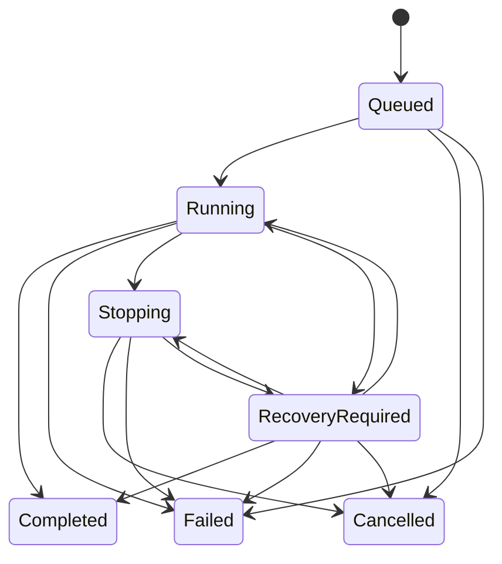

<!-- STD_DOCUMENT_COVER_BEGIN -->
# Piko Agent Runtime V0.3 契约说明

| 文档字段 | 值 |
|---|---|
| Document ID | `piko-agent-runtime-contract-v0.3` |
| Document Version | `0.4.0-draft.5` |
| Status | `In Review` |
| Project | `piko` |
| Authority | `piko` |
| Document Owner | Piko Contract Owner |
| Authors | corezilla |
| Created Date | `2026-09-07` |
| Last Modified Date | `2026-09-16` |
| Template ID | `contracts.specification` |
| Template Version | `0.1.0` |
| Template Conformance | `tailored` |
| Tailoring Reference | `piko-std-tailoring-v0.1` |
| Migration Map Reference | none |
| Repository | `corezilla/piko` |
| Canonical Path | `docs/60_interfaces/contracts/piko-agent-runtime-contract-v0.3.md` |
| Supersedes | `agent-runtime-v0.2-heavy-contract` |
<!-- STD_DOCUMENT_COVER_END -->

> Machine contract为 `interfaces/openapi/agent-runtime-openapi-v0.3.yaml`
> (`0.3.0-finalization.5`)；runtime activation=false。

## 1. Authority 与范围

本契约冻结 Piko V0.3 的单 Agent 轻量任务接口及 Piko-owned communication provider control。Slinky 拥有 Project、IR、Team、STD、Prompt 装配、CollaborationSession/Topic/room mapping、业务 close/archive/backup 与产物接受；Piko只负责一次 Run 的可靠执行、稳定Agent通信身份、AS ingress/delivery、Run attachment、fencing、drain和停止/释放事实。

字段级 authority：

1. OpenAPI：`interfaces/openapi/agent-runtime-openapi-v0.3.yaml`；
2. JSON Schema：`interfaces/schemas/agent-runtime-v0.3.schema.json`；
3. error catalog：`interfaces/error-codes/error-blocker-catalog-v0.3.json`；
4. fixture：`interfaces/vectors/v0.3/lightweight-runtime-finalization-fixtures.json`；
5. 字段产生/消费规则：`piko-v0.3-field-usage.md`。

V0.2 重型 request/result、Team/Participant、`runs:by-attempt`、reconcile、Run SSE，以及旧 Piko-owned Session list/element-view/:close/collaboration_contract 在 `0.3.0-finalization.5` 一次性删除，不提供 alias、转换入口、deprecation双活或runtime fallback。

## 2. API Catalog

| Operation | Method/path | 成功 | Idempotency/版本 |
|---|---|---|---|
| Submit | POST `/agent-runtime/v1/runs` | 202 RunView | Client+endpoint+key；JCS body digest |
| Status/recovery | GET `/runs/{run_id}` | 200/304 RunView | Client scope+ETag |
| Result | GET `/runs/{run_id}/result` | 200/304 AgentResult | immutable ETag；非终态409 |
| Cancel | POST `/runs/{run_id}:cancel` | 202 CancelReceipt | 独立key；原回执固定 |
| Transport profile | GET/PUT/probe Operator singleton | 200/201 | ETag+key；Secret仅binding ref |
| Agent identity | GET/PUT agent communication binding | 200/201 | stable MXID；ETag+key |
| Session projection | GET/PUT SessionAgentBinding projection | 200/201 | Slinky authority；Piko核验 |
| Revoke | POST binding `:revoke` | 202 receipt | operation/key/version |
| Drain | GET binding `/drain` | 200/304 DrainView | Piko evidence projection |
| Send message | POST binding `/messages` | 202 MessageSendReceipt | Client+endpoint+key；SID index |
| Message status | GET binding `/messages/{sid}` | 200/304 receipt | Client+binding+SID |
| Ingress fact | GET binding `/ingress-events/{matrix_event_id}` | 200/304 IngressEventView | exact event；无副作用 |

没有团队API、手工reconcile API、任务级聊天历史 API 或第五个 Run mutation。

## 3. Run 状态与结果



`Completed` 只表示Agent正常结束，不表示Slinky接受产物。Piko task deadline到达时为
`Failed/DeadlineExceeded/TaskDeadlineExceeded`。某一次LLMTier caller request deadline先到时为
`Failed/ExecutionError/ModelRequestDeadlineExceeded`；catalog effective deadline先到时为
`Failed/ExecutionError/ServiceEffectiveDeadlineExceeded`。两种单调用到期都立即禁止新的Agent业务步骤和
新的logical model/tool call；原Invocation只继续对账，晚到成功仅进入Evidence，不恢复Agent或改写Result。
model/tool limit分别使用`ModelCallLimit`、`ToolCallLimit`。只有用户取消且停止事实已证明才
`Cancelled/UserCancelled`。`RecoveryRequired`非终态。正常终态发布不可变Result；结果发布前必须冻结输出generation和写权限。

取消202只表示意图持久化；不证明停止、释放或Session关闭。迟到取消不得覆盖已持久Completed/Failed。

## 4. Admission、幂等与保留

处理顺序固定：认证→Client可见性与请求大小/JSON基础解析→计算JCS digest→读取
idempotency/admission-decision ledger。读取到任何key记录都必须先比较digest：不同digest立即409；只有
digest相同且记录类型为`AcceptedRun`才返回原202。该原回执不因当前deadline、Session撤权、projection
过期或容量变化而改写。`RetryableRejection`不是受理回执；仅在相同digest、deadline未到且其明确
re-evaluation condition成立时用record-version CAS重评。ledger miss或合法重评才继续：
ClientTaskIndex/dispatch冲突→deadline→exact model→workspace/tool/agent/session projection→trigger→
权限/limits→容量。deadline已到统一422 DeadlineExpired，即使binding同时失效或trigger尚未到；迟到
ingress不能使过期请求被受理。

规范伪代码：

```text
authenticate_and_authorize_current_client()
body = parse_and_basic_validate_json()
digest = sha256(rfc8785_jcs(body))
record = lookup(client_id, endpoint, idempotency_key)
if record:
    if digest != record.digest: return 409 IdempotencyConflict
    if record.kind == AcceptedRun: return record.original_202
    if record.kind == TerminalRejection: return record.original_error
    if deadline_reached(body): return cas_terminal_422(record)
    if not record.reevaluation_condition_met: return record.original_error
    return cas_reevaluate_same_record_and_admit(record, body)
check_client_task_and_dispatch_conflicts()
if deadline_reached(body): return persist_terminal_422_with_digest()
check_mutable_admission_inputs_and_commit_once()
```

`cas_reevaluate_same_record_and_admit`不是只更新decision状态。它在一个serializable durable transaction中
锁定并比较原`decision_version`，再次比较digest/deadline，并重新检查`ClientTaskIndex`、完整不可变
`TriggerDispatchIndex` tuple、当前projection version/status/lease、权限交集、exact model、workspace/tool可见性
与当前capacity。随后同一事务用unique constraints/CAS至多一次写入Run、两个索引、binding snapshot、可选
RunCommunicationAttachment、resource claim和原202 receipt；任一索引已经由另一个key/事务占用即返回对应
`ClientTaskConflict`或`CommunicationTriggerMismatch`，不得建立第二Run、dispatch intent或claim。服务重启后仍从
原decision record/version执行同一事务。

trigger暂未到时返回404 CommunicationTriggerNotFound，但持久化
`key,digest,decision_kind=RetryableRejection,decision_version,decision_first_created_at,valid_until,ingress_observed_version`，不创建
Run/claim，也不产生`original_202`。相同key异digest始终409；deadline前且ingress版本前进时允许用
同key/body重评，CAS仅一个winner建立Run；deadline到达后decision转为terminal 422 DeadlineExpired。
即使可重评decision本身到期，key→digest binding/tombstone仍保留至
`max(request.deadline_at,decision_first_created_at)+7d`。`decision_first_created_at`由Piko durable clock在首次
写入该pre-admission decision时生成且不可变，重评、decision状态转换和服务重启均不得推进；不能遗忘digest后
允许同key变body。服务重启不遗忘record、首次时间或版本。

成功在一个durable transaction中写原回执、Run、ClientTaskIndex、binding snapshot、可选RunCommunicationAttachment和资源claim；commit前无Pi、LLMTier、Tool或Matrix side effect。`(client_id,client_task_id)`唯一；换key冲突。

无run_id丢响应重放原POST。已受理Run记录、去重记录、ClientTaskIndex和Result至少保留至
`max(request.deadline_at,Run.accepted_at)+7d`；pre-admission rejection record/key→digest binding至少保留至
`max(request.deadline_at,decision_first_created_at)+7d`。有到期tombstone返回410，否则不可见返回404。
活动、Stopping、RecoveryRequired或未知外部义务不得因窗口到达删除。

## 5. Workspace、Tool、Agent 与模型 binding

`workspace_ref`、`tool_profile_ref`、顶层`agent_binding_ref`都引用Piko既有受控配置并在admission解析为`resolved_bindings_ref`。它们不是新配置系统。顶层`agent_binding_ref/session_binding_ref/expected_session_binding_version`三个键始终必填并显式发送null；旧嵌套`bindings`是unknown field并返回400。有效权限是Client授权、workspace binding、request paths、tool profile和实际操作时path/symlink/egress检查的交集；instruction不授予权限。

`service_level_id`来自LLMTier Models exact-case catalog。Piko generation只使用non-stream Responses、Models和Responses recovery；不使用Chat/SSE、Provider-direct或跨等级fallback。每次新logical模型/工具调用在外呼前原子占用counter并写intent；恢复/查询不重复计数。

## 6. Communication binding 与 trigger

`agent_binding_ref`是稳定身份；`session_binding_ref+expected_session_binding_version`是Slinky授权的精确Session/room投影。投影还含`authorization_valid_until`；只有status=Active、expected version相等、当前时间早于valid_until且本地revoke fence未提交才可admit。Slinky更新投影与Piko admission不是跨系统ACID：Piko本地事务对projection row加锁/CAS；revoke先提交则新admission 409，admission先提交则已有Run保留原义务、随后revoke阻断全部新业务。过期projection fail closed为409 CommunicationBindingUnavailable。

`communication_trigger`只接受`provider=SlinkyRuntime`、Client内唯一`dispatch_ref`和exact`trigger_event_id`。Bearer认证而非body常量证明可信caller。Piko验证event已在AS ingress ledger、room/identity/version/boundary匹配；不从最新消息推断。

TriggerDispatchIndex键为`(client_id,dispatch_ref)`，值不可变绑定
`client_task_id+session_binding_ref+trigger_event_id+agent_binding_ref`；任一组成变化均409
`CommunicationTriggerMismatch`。ClientTaskIndex另保证同task换dispatch/key为409 `ClientTaskConflict`。
同一event只有Slinky显式提交新的dispatch_ref+client_task_id才可建立另一Run；Piko ingress/retry从不生成
dispatch_ref。同event可显式派给不同Agent或不同任务；同一完整消费键只产生一个Run。

消息发送使用同一communication provider的既有outbox机制：
`POST /projects/{project_ref}/session-agent-bindings/{session_binding_ref}/messages`提交
`MessageSendRequest`；`GET .../messages/{sid}`查询固定receipt；Slinky用
`GET .../ingress-events/{matrix_event_id}`读取Piko AS ingress ledger的可调度事实。三者使用同一Client
Bearer/Project/Session binding scope，不创建第二transport。

发送前request不含sender、room、matrix_event_id或Matrix时间：sender/MXID与room从exact Active
projection派生；Matrix成功受理后才在receipt/view出现`matrix_event_id`与`matrix_origin_server_ts`。
Piko自己的`accepted_at/piko_ingested_at`只表示本地持久化时钟。SID唯一域为
`client+session_binding_ref+sender_identity_ref+sid`；同SID异digest 409 MessageIdConflict。
RID必须解析为同room、同topic、当前sender可见的event，否则409 ReplyTopicMismatch。recipient至少1个，
不允许空集合、广播fallback或未授权身份。附件单项≤64MiB、总计≤256MiB；content_ref必须是已授权
Piko内容引用，读取时复核size/hash，不能用任意URL取得权限。未知version/type fail closed。

IngressEventView从Matrix `event.sender/room_id/event_id/origin_server_ts`和Piko binding核验sender；body自报
无authority。合法产品event为ProductEnvelopeValid且`dispatch_eligible=true`；普通原生Matrix消息记录为
UnclassifiedNativeMessage、`dispatch_eligible=false`，不自动创建dispatch或Run；Rejected同样不可调度。
当前AgentTeams bridge格式只是协作基础设施，不自动成为产品协议。

唯一产品Matrix codec使用 `type=m.room.message`，便于Element原生显示，但必须带namespaced
`content.io.piko.agent.message`；普通没有该扩展的 `m.room.message` 仍是UnclassifiedNativeMessage。
`content.msgtype=m.text`，`content.body`与HTTP `body`逐UTF-8字节一致；namespaced对象只承载
`envelope_version/topic_id/sid/rid/sender_identity_ref/recipient_identity_refs/message_type/attachments`。
Piko从Active projection派生sender identity，外层`event.sender/room_id`是Matrix事实；任一不匹配均Rejected。
`matrix_event_id/origin_server_ts`只由homeserver在受理后产生，发送前payload禁止携带。

`rid=null`时禁止`m.relates_to`；`rid`非空时必须存在唯一
`m.relates_to.m.in_reply_to.event_id`，且Piko SID索引证明该event与rid属于同room/topic。V0.3不使用
`m.thread`或`m.replace`；未知version、扩展畸形、body/identity/room/reply不一致均Rejected、不可dispatch。
附件只把`attachment_id/media_type/size_bytes/sha256/content_ref`放入扩展；发送前Piko用当前Client、Session、
sender与recipient授权在既有content store解析content_ref并复核size/hash。Matrix不含下载URL、token或字节；
Slinky/Element只显示经Piko核验的元数据，正文读取仍走该content store既有授权边界。

配置PUT使用唯一条件矩阵：create仅`If-None-Match:*`→201+ETag；update仅exact strong
`If-Match:"etag"`→200+ETag；两者缺失428 PreconditionRequired；两者同时、weak/wildcard If-Match或
非`*` If-None-Match为400 InvalidPreconditionCombination；stale/update-existing冲突为412，update缺失资源404。
所有GET先做401/403鉴权再处理404/410/304；所有200 GET及配置PUT 200/201返回强ETag。createRun在已知
去重tombstone过期时返回410 Gone。

## 7. Revoke、drain、release 与 Session close

Slinky先在本地提交撤权/version；Piko幂等提交本地fence，立即阻断新wakeup、新admission、新权限获取。Matrix membership独立收敛，证据未齐保持Revoking。既有义务仅对账，不取得新模型/Tool/workspace权限。

`execution_released=true`需要机器字段`release_evidence`：agent_fence_ref、tool终止/隔离refs、workspace_writer_fence_ref、wakeup_fence_ref、external_obligation_status/refs、isolation_boundary_ref和released_at。隔离可令Run执行资源释放，但任何Isolated/Unknown外部义务ref必须同时保留在DrainView，使drain=RecoveryRequired且Session不可Closed。release不等待Session Closed；也不推断LLMTier terminal、Seat release或UnknownOutcome清除。

`drain_status`逐`session_binding_ref`报告Piko inbox/outbox、unresolved/isolated external refs、authorization/writer/wakeup fence与该Agent虚拟用户membership。`membership_status=Left`只描述该binding的Piko虚拟用户，不要求人类成员或Slinky归档身份退出；零Agent房间对Piko无membership blocker。Slinky拥有最终Session关闭守卫和历史访问策略。完整组合矩阵见字段表。

## 8. Error、鉴权与Secret

所有分支只依赖error code/status/retryable/details，message不参与客户端逻辑。当前Client credential撤销先于任何回执重放；通过认证/Client可见性后，原Run replay不因Session后来撤权重做admission。

AS token/registration、device key、delivery checkpoint、LLMTier credential、自动登录材料、逐步推理和完整transcript不进入Run/Result/binding/message DTO或日志。用户用自身Matrix session；V0.3禁止E2EE、federation和iframe token URL。

## 9. 正负 fixture 与验证

fixture覆盖：四种binding组合、trigger缺失/冲突、多Agent同event、path escape、key/task冲突、cancel≠release、release/drain/membership/strict close、Unknown Tier obligation。静态validator校验Schema/OpenAPI refs、error完整性、retired path/field不存在和fixtures预期。

静态通过仅证明设计候选自洽，不证明真实Pi、Matrix、LLMTier、Tool、DB crash或RPO/RTO。runtime activation保持false。

## 10. A/B/C与重新打开条件

- A：本契约全部跨系统字段和行为，必须在联调前冻结；不得转移到实现测试。
- B：Piko内部DB/HA/DDL/worker/Pi/workspace sandbox设计，可独立开展且不得改A。
- C：真实依赖capture、故障注入、性能与安全证据；失败保持activation=false。

重新打开A仅限：三方明确修改authority/Scope B、机器Schema发现不可满足矛盾、安全审查要求破坏性变更或用户批准新版本。不得以实现困难新增compatibility branch。
