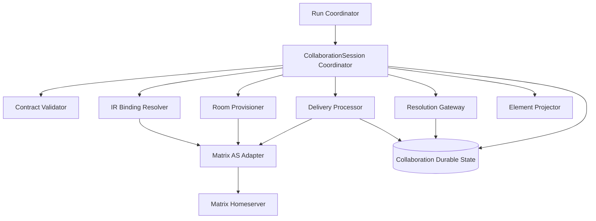
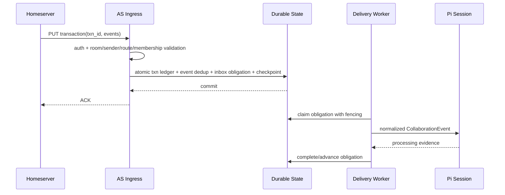
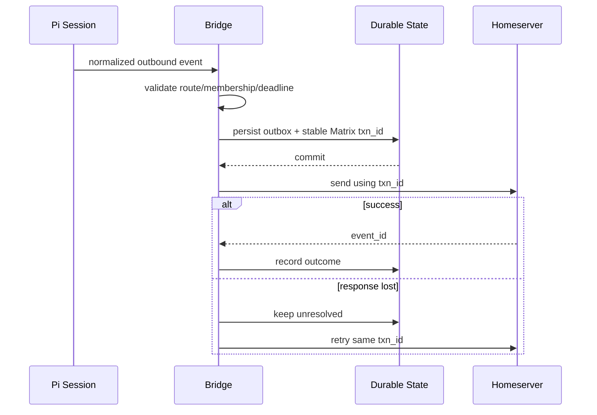

<!-- STD_DOCUMENT_COVER_BEGIN -->
# Piko CollaborationBridge 端到端机制设计

| 文档字段 | 值 |
|---|---|
| Document ID | `piko-collaboration-bridge-design-v0.3` |
| Document Version | `0.3.0` |
| Status | `Approved` |
| Project | `piko` |
| Authority | `piko` |
| Document Owner | Piko Architecture Owner |
| Authors | corezilla |
| Reviewer | User / Piko Project Owner |
| Approver | User / Piko Project Owner |
| Approval Date | `2026-09-07` |
| Created Date | `2026-09-07` |
| Last Modified Date | `2026-09-08` |
| STD Version | `0.1.0-draft.18` |
| Template ID | `design.system-mechanism` |
| Template Conformance | `tailored` |
| Tailoring Reference | `piko-std-tailoring-v0.1` |
| Migration Map Reference | none |
| Repository | `corezilla/piko` |
| Canonical Path | `docs/design/piko-collaboration-bridge-design-v0.3.md` |
| Supersedes | `docs/design/agent-runtime-matrix-collaboration-design-v0.3.md` |

> 本文件是已批准的 canonical CollaborationBridge mechanism prose。Piko v0.3 机器契约继续承担
> 字段级 authority；Document Status 不触发 Runtime Activation。
<!-- STD_DOCUMENT_COVER_END -->

## 1. 目的、范围与上位输入

### 1.1 目的

本文深入定义 Piko Agent Runtime 内建的 CollaborationBridge：它如何把 Slinky 提供的
CollaborationContract 解析为稳定 Matrix 身份、独占 room、耐久消息义务和无 Secret 的
Element locator，并在重启、重复事务、rename、close 和用户决策场景中保持一致性。

### 1.2 上位输入

- 上位服务设计：`piko-agent-runtime-design-v0.3.md`；
- 迁移来源：`agent-runtime-matrix-collaboration-design-v0.3.md`；
- 字段级 authority：v0.3 Matrix OpenAPI、JSON Schema、error catalog；
- Evidence：`collaboration-decision-fixtures.json` 与 `validate_v03_contract.py`；
- Slinky 冻结消息：`S-20260906-df6086da1916`、`S-20260906-1df5563ef488`。

### 1.3 范围

包含 Operator transport profile、AS virtual user、IR binding、Session/room、membership、
入站 AS transaction、出站 txn、durable inbox/outbox、reply obligation、structured
resolution、Element descriptor、close/archive/retention、lease/fencing 和 restart recovery。

不包含 Matrix homeserver/Element 的实现、用户登录、E2EE、Slinky Decision Dossier、
Project/Plan authority，以及独立于 Agent Runtime 的第二通信服务。

## 2. Ownership 与边界

### 2.1 Authority 表

| 对象/决定 | Authority | Piko 行为 |
|---|---|---|
| IR id/version、display profile | Slinky | materialize、校验单调版本、同步 Matrix display name |
| CollaborationContract | Slinky Runtime | exact validation 与执行，不增删 participant/route/obligation |
| Matrix transport profile/Secret binding | Piko Operator | versioned singleton、Probe、Secret resolution |
| stable Matrix identity | Piko | 根据 project+IR 确定性派生并保持唯一 |
| CollaborationSession/room mapping | Piko | 幂等创建、持久映射、状态与归档 |
| Matrix transcript | Matrix communication Evidence | 不提升为 Project/Run/Acceptance truth |
| CollaborationResolutionSummary | Piko Team execution outcome | 结构化陈述，不执行 Slinky-owned decision/action |
| Expert/PM Work、ParticipantActionRequest、用户 Decision | Slinky | Piko 只返回 exact refs 和建议 |
| Element 用户 session | 用户/Matrix | Piko 仅返回 ExternalLink descriptor |

### 2.2 单一路径约束

```text
Slinky Runtime -> AgentRuntimeAdapter -> Run Coordinator
  -> CollaborationSession Coordinator -> Internal CollaborationBridge -> Matrix
```

Pi 只能使用 normalized `CollaborationEvent` port；不能持有 Matrix token 或直接调用
homeserver。禁止外部 bridge、Codex task、文件 outbox、普通 sync/poll、heartbeat、
shared room/thread、ManagedUser 或其他 fallback。

## 3. Current Baseline 与 Approved Delta

### 3.1 Current Baseline

- 已有 v0.3 中文设计、OpenAPI、Schema、error catalog、fixture 和本地 validator。
- 文档 validator 已覆盖部分 Schema、participant set、filter、typed error 和 authority boundary。
- 当前没有生产数据库、Application Service registration、homeserver integration、Element
  browser evidence、Pi collaboration hook 或 crash/failover execution evidence。

### 3.2 已冻结设计

1. 唯一 identity mode：`ApplicationServiceVirtualUser`。
2. `(client_id, project_id, ir_id)` 和 `matrix_user_id` 双重唯一。
3. 一个 CollaborationSession 独占一个 private、non-federated、non-encrypted room。
4. Application Service transaction push ingress；不为虚拟用户运行普通 `/sync`。
5. Element 固定 `ExternalLink + UserMatrixSession`。
6. Session list 支持多 room cursor 与 status/IR/WorkExecution/AgentRun exact filter。
7. strict Result 可选 structured resolution，必须保留少数立场和 Evidence。
8. close 先停止发送/wakeup，再收敛 delivery，最后 archive/retention。

### 3.3 Open Gates

具体 homeserver/AS 版本、Probe checklist、retention catalog、room reconciliation timeout、
Element route 编码、transport capacity/SLO 尚未冻结；这些内容不能由实现自行猜测。

## 4. 设计概览与主流程

### 4.1 内部构建块



### 4.2 Run 与 room 建立主流程

1. Run admission 验证 CollaborationContract、transport profile/version、retention policy、
   participant Binding、observer binding、route/reply/deadline references。
2. Run identity、Attempt index、Session、room provisioning intent 和初始 delivery obligation
   在同一 Piko durable transaction 中建立。
3. commit 后 Room Provisioner 用稳定 provisioning key 请求 homeserver。
4. room 创建/响应丢失时恢复同一 intent，不能创建第二 room。
5. 创建后读取 room state，验证 private、`m.federate=false`、无 encryption、exact membership。
6. 全部验证完成后 Session 才进入 Active，Pi participant 才允许发送/接收协作事件。

## 5. 内部分解与依赖

| 构建块 | 职责 | 输入/输出 | 持久状态 | 禁止事项 |
|---|---|---|---|---|
| Profile Manager | singleton PUT/GET/Probe、version/readiness | Operator commands | profile/version/etag/audit | 接收 token 内容、Probe 产生副作用 |
| IR Binding Manager | virtual user intent、stable MXID、display reconciliation | exact IR/display profile | binding/version/mapping/obligation | display name routing、随机 suffix |
| Contract Validator | participant/route/observer/reply/deadline/policy 完整性 | CollaborationContract | validation evidence | 从 transcript 推断 contract |
| Session Coordinator | Session 状态、room mapping、close/archive | Run/close intent | Session/version/obligations | 独立 create endpoint、participant mutation |
| Room Provisioner | private room、exact membership/state verification | stable provisioning intent | room outcome/mapping | shared room/thread、federation、encryption |
| AS Transaction Ingress | transaction auth、event normalize/dedup | homeserver push txn | txn/event ledger/checkpoint | commit 前 ACK、普通 sync |
| Outbox Sender | stable Matrix txn send/retry | durable message obligation | outbox/txn outcome | response loss 后换 txn id |
| Delivery Processor | route/reply/deadline、Pi wakeup | normalized event | inbox/delivery/reply ledger | 显示名称 routing、丢弃 backpressure item |
| Resolution Gateway | strict resolution validation/persistence | Team outcome | resolution/result reference | 多数票/last-message authority |
| Element Projector | exact room locator 和 participant display | Session query | 无第二 transcript | token URL、iframe、login proxy |
| Recovery Worker | rename/membership/delivery/close/retention reconcile | open obligations | lease/fencing/checkpoint | 无 owner 时推进状态 |

## 6. 接口与契约

### 6.1 Operator API

- `PUT/GET /operator/matrix-transport-profile`
- `POST /operator/matrix-transport-profile:probe`

首次创建要求 `If-None-Match:*`，更新要求 `If-Match`；mutation 要求
`Idempotency-Key`。Request 只携带 `credential_binding_ref`，registration、AS token 和
exclusive namespace 留在 Piko Secret boundary。

### 6.2 IR binding API

```text
PUT/GET /projects/{project_id}/ir-communication-bindings/{ir_id}
```

公开 status 只有 `Active|Suspended`。内部 Provisioning/ReconciliationRequired 通过
operation outcome、blocking reason 和 readiness 表达，不扩展外部枚举。v0.3 不提供 delete。

### 6.3 Session/Element API

- Session 不单独创建；`POST /runs` 的 CollaborationContract 原子建立 intent。
- `GET /projects/{project_id}/collaboration-sessions`
- `GET .../{collaboration_session_id}/element-view`
- `POST .../{collaboration_session_id}:close`

字段、required、enum、conditional rule 和错误码以机器契约为准。本文不复制 Schema。

## 7. 数据、状态与生命周期

### 7.1 持久记录与唯一约束

| Record | 关键 identity | 不变式 |
|---|---|---|
| MatrixTransportProfile | Operator singleton | version/ETag 单调；Secret 仅 reference |
| IRCommunicationBinding | `(client, project, ir)` | stable MXID 不因 rename/status 改变 |
| MatrixIdentityMapping | `matrix_user_id` | 全局唯一且绑定 canonical derivation input |
| CollaborationSession | session id | 一个 Session 一个 room；一个 room 一个 Session |
| SessionParticipant | session + IR/MXID | 精确来自 contract；v0.3 不 mutation |
| AS transaction ledger | homeserver txn id | transaction replay 不重复建立 event obligation |
| Matrix event dedup | room + event id | 一个 event 只规范化一次 |
| Inbox/Outbox obligation | logical message id | 完成前不可丢弃；retry 不换 identity |
| Outbound txn ledger | room + Matrix txn id | response loss 重用同一 txn id |
| Delivery checkpoint | transport scope | Piko 私有，永不对外投影 |
| Resolution record | resolution ref/version | immutable Team outcome，关联 exact Session/Result |
| Rename/membership/archive obligation | stable obligation id | 完成或人工 reconcile 前保留 |
| Writer lease | scope + fencing token | stale writer 不得 ACK/send/advance version |

### 7.2 Stable MXID 派生

```text
input = RFC8785_JCS({
  derivation_version: "piko-ir-mxid/v1",
  project_id: exact project_id,
  ir_id: exact ir_id
})
digest = BASE32_NOPAD(SHA256(UTF8(input))).lower()
localpart = "_piko_ir_v1_" + digest
mxid = "@" + localpart + ":" + verified_matrix_server_name
```

完整 256-bit digest 不截断。homeserver name 来自 Probe 结果；display name、room title、alias
均不参与派生或 routing。碰撞返回 `MatrixIdentityCollision`，不能随机重试或切换算法。

### 7.3 内部生命周期与外部状态映射

```text
Provisioning -> Active <-> WaitingForReply -> Closing -> Closed
       |             |              |             |
       +-------> RecoveryRequired <--+-------------+
```

- `Provisioning` 是内部瞬态；identity/room/membership 尚未全部验证。它不作为 Slinky v0.6
  `CollaborationSessionSummary.status` 的成功投影。完成后投影 `Active`；失败或结果不明时
  投影 `RecoveryRequired` 并保留 blocking reason/obligation。
- `Active`：允许 contract 内新业务消息与 wakeup；Summary 投影 `Active`。
- `WaitingForReply`：存在未到期的 reply obligation；Summary 投影 `WaitingForReply`。
- `Closing`：拒绝新业务 admission、发送和 Agent wakeup，但允许 Delivery Processor/Outbox
  Sender 继续完成关闭前已经确认并持久化的 inbox/outbox/reply obligation；Summary 投影
  `Closing`。
- `RecoveryRequired`：部分 drain、archive、membership 或依赖操作尚不能证明完成；Summary
  投影 `RecoveryRequired`，重启后继续同一 obligation，不创建第二 Session/room。
- `Closed`：全部已确认 obligation 已完成或形成经批准的终止证据，archive execution 成功且
  retention enforcement 已开始；Summary 投影 `Closed`。

外部 DTO 不共用一个状态 enum：

| 内部事实 | SessionSummary v0.6 | CloseResult v0.6 | ElementConversationDescriptor |
|---|---|---|---|
| Provisioning 正常进行 | 不产生成功 Summary 投影；由关联 Run/operation observation 表达 | N/A | 不返回可打开 descriptor |
| Active | Active | N/A | source 可解析时 Active |
| WaitingForReply | WaitingForReply | N/A | source 可解析时 WaitingForReply |
| Closing，仍有已确认 obligation | Closing | Closing | view availability 独立计算，不用 Closing 充当 descriptor status |
| drain/archive 部分失败或结果不明 | RecoveryRequired | RecoveryRequired | source 不可用时 typed 503；不得用 Session 状态替代 descriptor 状态 |
| Closed，首次 close 请求完成 | Closed | 该请求已记录的 `Closed` | Closed |
| 同一 close namespace/key/digest 重放，首次结果为 Closing/Closed/RecoveryRequired | 当前事实对应的 Summary 状态 | 返回首次请求已记录的同一 CloseResult 语义 | 当前 source/view 状态；最新 Session 状态由查询读取 |
| 已 Closed 后发起另一项合法的新 close 请求 | Closed | AlreadyClosed | Closed |

当前 Piko 机器候选仍把 SessionSummary 定义为
`Provisioning|Active|WaitingForReply|Closing|Closed|Unavailable`，CloseResult 定义为
`Closing|Closed|Unchanged`；这是与 Slinky v0.6 的已知对齐缺口，不是本文认可的第二 wire
语义。该机器契约必须在独立 Contract Amendment 中改为上表后，generated types、Contract Test
和 runtime activation 才可继续。本次 STD 迁移不直接增删冻结 Schema enum。Element descriptor
的 `Unavailable` 属于 view/source 可见性语义；标准 source-unavailable 路径仍返回 typed 503，
不能代替 SessionSummary 的 `RecoveryRequired`。

## 8. 控制流、并发与时序

### 8.1 AS transaction ingress



commit 前不确认 homeserver。重复 transaction/event 命中 ledger 后返回已有结果，不建立第二
delivery obligation。

### 8.2 出站发送



### 8.3 多 room cursor

过滤顺序为 authorization 后再应用 `status + ir_id + work_execution_id + agent_run_id`
逻辑 AND。排序固定：

```text
last_message_at DESC NULLS LAST, collaboration_session_id ASC
```

opaque signed cursor 绑定 Client、Project、filter digest、snapshot upper bound、last sort key 和
expiry。跨 scope/filter、篡改或过期 cursor 返回 typed error，不回退第一页。同一 snapshot
内的并行更新不造成重复/跳项；snapshot 后新增 Session 由新查询看到。

### 8.4 Close

close 要求 current ETag + Idempotency-Key。进入 Closing 后停止新的业务 admission、业务消息
创建和 Agent wakeup；这不停止关闭 intent 前已经确认并持久化的 inbox/outbox/reply obligation。
同一 Delivery Processor/Outbox Sender 在 fencing owner 下 drain 这些 obligation，发送重试复用
原 Matrix txn id。只有 `pending_delivery_count=0`、reply obligation 已收敛、archive execution
成功且 retention activation 已记录后才返回/投影 `Closed`。

drain、archive 或 retention 只完成一部分时返回 `RecoveryRequired`、准确 pending count 与
blocking reason；不得提前 archive、丢弃 obligation 或虚报 Closed。close 请求的
namespace/key/digest 与首次响应语义必须原子记录：同一 namespace/key/digest 的 transport retry
始终返回该请求已记录的同一 `Closing|Closed|RecoveryRequired` 结果，不重新执行 close/archive；
即使 Session 后来已变为 Closed，也不能把原先记录的 `Closing` 改写成 `AlreadyClosed`。调用方
通过既有 Session 查询读取最新状态。同一 key 不同 digest 返回 `IdempotencyConflict`，不得以
`AlreadyClosed` 掩盖冲突。只有针对已 Closed Session 发起另一项使用新 Idempotency-Key 的合法
close 请求，并通过既有 authorization/version 检查后，才记录并返回 `AlreadyClosed`。所有恢复
复用原 Session、room、archive execution reference 和 obligation identity，不建立第二恢复机制。

## 9. 失败、恢复与可观测性

### 9.1 Restart 顺序

1. 获取新的 writer lease/fencing token；
2. 校验 profile、credential binding、schema version；
3. 恢复未确认 AS transaction/event dedup；
4. 恢复 outbox 并保持原 Matrix txn id；
5. 恢复 Session delivery/reply/close obligation；Closing 状态继续 drain 关闭前已确认的
   inbox/outbox，不重新开放新业务 admission；
6. 恢复 rename、membership、archive、retention reconciliation；
7. exact scope Ready 后才恢复发送/wakeup。

checkpoint 损坏、ledger 不一致或 writer ownership 不可证明时停止受影响 scope，公开
`CollaborationStateInconsistent` 或相应 blocker，不做 best-effort 推进。

### 9.2 Rename recovery

`display_profile_version` 只单调增加。Piko 先写 rename obligation，再更新 Matrix profile；
失败时 Binding 保留相同 MXID、room、membership 和 history，并暴露阻塞。credential rotation
同样不得改变 identity/session/room。

### 9.3 Observability

最低指标：AS transaction accepted/replayed/rejected、event dedup、inbox/outbox backlog、
oldest obligation age、send retry、membership drift、rename lag、Session state count、close/archive
lag、cursor rejection、lease fencing rejection 和 descriptor unavailable。日志只记录脱敏 identity
reference，不含 AS token、credential、message body 或用户登录材料。

## 10. 资源、容量、性能与限制

- worker 数量可以水平扩展，但每个 transport/session write scope 必须有一个有效 fencing owner。
- inbox/outbox 超出容量时使用 durable backpressure；不能 ACK 后丢消息或切换临时文件路径。
- cursor snapshot storage/expiry、reply deadline、membership reconciliation timeout、archive SLO
  和 retention duration 尚待冻结。
- Element link generation 是纯 projection，不缓存 transcript。
- 当前没有 homeserver throughput、room count、events/s、wake latency 或 failover RTO 实测。

## 11. 安全与隔离

1. homeserver/Element URL 仅 HTTPS；禁止 loopback、link-local、未批准 redirect 和 DNS
   rebinding 到受限地址。
2. room 固定 private、non-federated、non-encrypted；出现 `m.room.encryption` 立即停止发送/
   wakeup 并返回 `EncryptedRoomNotSupported`。
3. membership 只来自 exact contract 和 Operator observer catalog；display name 不授权。
4. registration、AS token、credential、device/encryption material、checkpoint/ledger 不进入
   Slinky、Pi、Element descriptor、Evidence 或日志。
5. Project/Client/IR/Session query 先 authorization，再返回不可枚举的 NotFound。
6. Element descriptor 不含 transcript、iframe、token URL 或 login proxy；source unavailable
   显式返回 `ElementConversationSourceUnavailable`。
7. structured resolution 不可携带或执行 Expert/PM Work、ParticipantActionRequest、用户
   Decision、Plan change 或 Artifact acceptance。

## 12. 实现映射与变更范围

### 12.1 当前设计资产

| 资产 | 路径 | 角色 |
|---|---|---|
| OpenAPI | `docs/contracts/agent-runtime-matrix-openapi-v0.3.yaml` | operation/header/response authority |
| JSON Schema | `docs/contracts/schemas/agent-runtime-matrix-v0.3.schema.json` | DTO/conditional constraint authority |
| Error catalog | `docs/contracts/error-blocker-catalog-v0.3.json` | typed error/blocker authority |
| Fixture | `docs/contracts/fixtures/v0.3/collaboration-decision-fixtures.json` | 正负 machine evidence |
| Validator | `scripts/validate_v03_contract.py` | 文档期校验入口 |

### 12.2 目标 module 边界

未来代码应在唯一 Agent Runtime 内形成 `profile`、`identity-binding`、`session`、
`matrix-as-ingress`、`delivery`、`resolution`、`element-projection`、`recovery` 和
`persistence` modules。具体语言/目录尚未冻结，当前不创建占位实现。

### 12.3 禁止变更范围

- 不增加 Session create endpoint、participant mutation、普通 sync 或第二 bridge。
- 不以兼容为名保留 ManagedUser、shared room/thread、E2EE、iframe 或文件 outbox。
- 不读取其他项目仓库作为运行时 config/contract source。
- 不把本地 Matrix-Codex 项目通信桥接器当作 Piko product implementation。

## 13. Verification、测试义务与证据

| Requirement | Design element | Verification method | Evidence | Status |
|---|---|---|---|---|
| MX-001..004 identity/room | §3、§7 | derivation vectors、unique constraint、room state negative | fixture 待扩充 | Candidate |
| MX-005/016 ExternalLink | §6、§11 | descriptor Schema、secret scan、source unavailable | 当前 validator 部分通过 | 部分证据 |
| MX-006..008 profile/transaction | §6、§8 | API contract + transaction crash replay | 机器契约通过；执行待实现 | Open Gate |
| MX-009/010 Run/close atomicity | §4、§8.4 | DB failure injection、idempotent close | V03-E2E-095 规划 | Open Gate |
| MX-013 multi-room cursor | §8.3 | filter/cursor/schema/restart test | fixture + validator；运行待实现 | Candidate |
| MX-014/015 resolution authority | §5、§11 | strict positive/negative + minority preservation | fixture + validator | 文档期通过 |
| delivery/recovery | §8、§9 | txn/event/message dedup、lease/failover | V03-E2E-096 规划 | Open Gate |
| V03-E2E-093..099 | 全文 | controlled homeserver + Piko runtime E2E | 尚未执行 | Open Gate |

## 14. Review Checklist、未决项与 Gate

### 14.1 Review checklist

- [x] authority、Current Baseline、已冻结 delta 和未决实现项已分开；
- [x] 构建块、数据记录、状态机、主流程、失败恢复和安全边界已展开；
- [x] 多 room、resolution、Element route 和 fail-closed 精确契约已保留；
- [x] 机器文件继续是字段级 authority，fixture 未转写为 Markdown；
- [x] 未保留 ManagedUser/sync/shared room/E2EE/iframe/external bridge fallback；
- [ ] Slinky 对结构化迁移及原 ID traceability 完成 Review；
- [ ] homeserver/AS/Pi integration 和 V03-E2E-093..099 有真实 Evidence。

### 14.2 Open Gates

- OG-CB-001：Operator retention policy catalog Schema、duration 和 enforcement evidence。
- OG-CB-002：Matrix homeserver/Application Service version 与 Probe checklist。
- OG-CB-003：normalized CollaborationEvent、route/reply/deadline final fixture。
- OG-CB-004：membership/invite/archive/reconciliation timeout 与 manual recovery entry；以及
  Piko 机器候选 SessionSummary/CloseResult enum 对齐 Slinky v0.6 的 Contract Amendment。
- OG-CB-005：Element route encoding 和 target Element browser compatibility。
- OG-CB-006：cursor signing key rotation、snapshot storage/expiry、transport capacity/SLO。
- OG-CB-007：Pi AgentSession collaboration hook capture。

### 14.3 Activation Gate

只有 Profile/Binding/Session API、AS transaction、durable inbox/outbox、三层 dedup、writer
lease/fencing、rename/close/archive/retention、Element ExternalLink、structured resolution 和
V03-E2E-093..099 均在 immutable implementation commit 上通过后，CollaborationBridge 才能
标记为可运行。STD 迁移本身不满足 activation。
